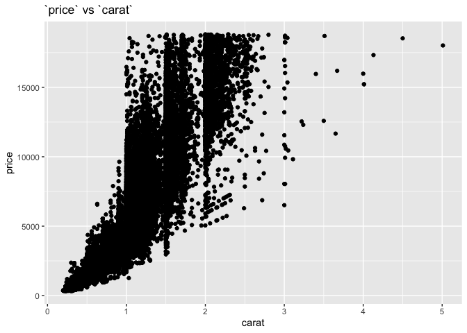
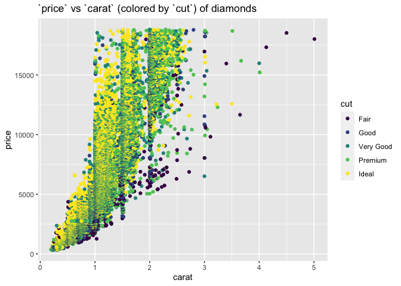
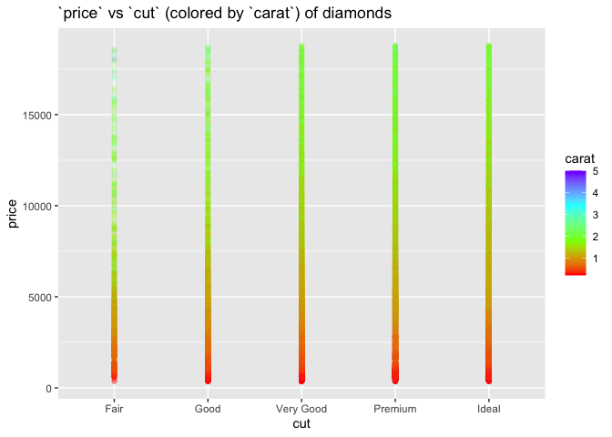
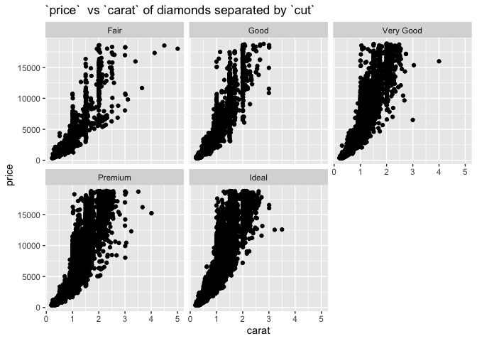
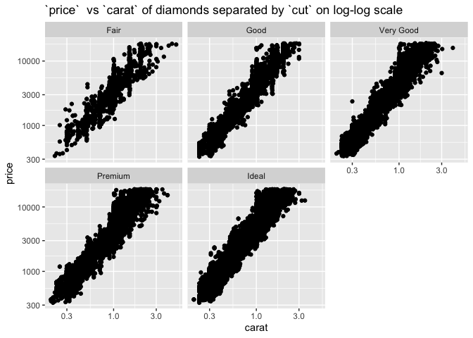
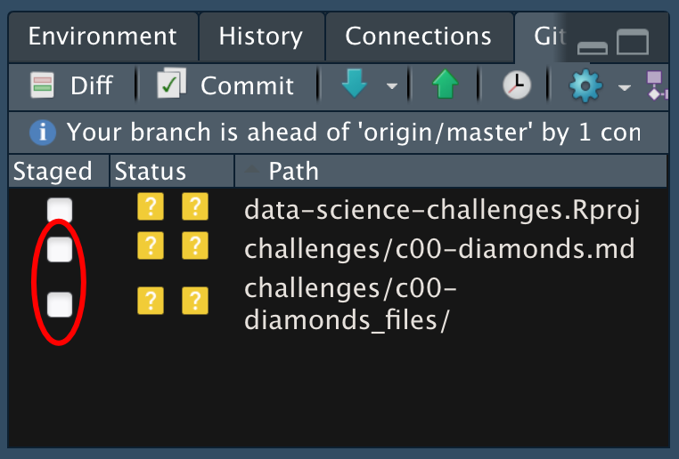

Getting Started: Diamonds
================
Jen Wei
2020-07-09

  - [Grading Rubric](#grading-rubric)
      - [Individual](#individual)
      - [Team](#team)
      - [Due Date](#due-date)
  - [Data Exploration](#data-exploration)
      - [Extra Plots](#extra-plots)
  - [Communication](#communication)

*Purpose*: Throughout this course, you’ll complete a large number of
*exercises* and *challenges*. Exercises are meant to introduce content
with easy-to-solve problems, while challenges are meant to make you
think more deeply about and apply the content. The challenges will start
out highly-scaffolded, and become progressively open-ended.

In this challenge, you will go through the process of exploring,
documenting, and sharing an analysis of a dataset. We will use these
skills again and again in each challenge.

<!-- include-rubric -->

# Grading Rubric

<!-- -------------------------------------------------- -->

Unlike exercises, **challenges will be graded**. The following rubrics
define how you will be graded, both on an individual and team basis.

## Individual

<!-- ------------------------- -->

| Category    | Unsatisfactory                                                                   | Satisfactory                                                               |
| ----------- | -------------------------------------------------------------------------------- | -------------------------------------------------------------------------- |
| Effort      | Some task **q**’s left unattempted                                               | All task **q**’s attempted                                                 |
| Observed    | Did not document observations                                                    | Documented observations based on analysis                                  |
| Supported   | Some observations not supported by analysis                                      | All observations supported by analysis (table, graph, etc.)                |
| Code Styled | Violations of the [style guide](https://style.tidyverse.org/) hinder readability | Code sufficiently close to the [style guide](https://style.tidyverse.org/) |

## Team

<!-- ------------------------- -->

| Category   | Unsatisfactory                                                                                   | Satisfactory                                       |
| ---------- | ------------------------------------------------------------------------------------------------ | -------------------------------------------------- |
| Documented | No team contributions to Wiki                                                                    | Team contributed to Wiki                           |
| Referenced | No team references in Wiki                                                                       | At least one reference in Wiki to member report(s) |
| Relevant   | References unrelated to assertion, or difficult to find related analysis based on reference text | Reference text clearly points to relevant analysis |

## Due Date

<!-- ------------------------- -->

All the deliverables stated in the rubrics above are due on the day of
the class discussion of that exercise. See the
[Syllabus](https://docs.google.com/document/d/1jJTh2DH8nVJd2eyMMoyNGroReo0BKcJrz1eONi3rPSc/edit?usp=sharing)
for more information.

``` r
library(tidyverse)
```

    ## ── Attaching packages ───────────────────────────────────────────────────────────────────────────────────────── tidyverse 1.3.0 ──

    ## ✓ ggplot2 3.3.2     ✓ purrr   0.3.4
    ## ✓ tibble  3.0.1     ✓ dplyr   1.0.0
    ## ✓ tidyr   1.1.0     ✓ stringr 1.4.0
    ## ✓ readr   1.3.1     ✓ forcats 0.5.0

    ## ── Conflicts ──────────────────────────────────────────────────────────────────────────────────────────── tidyverse_conflicts() ──
    ## x dplyr::filter() masks stats::filter()
    ## x dplyr::lag()    masks stats::lag()

# Data Exploration

<!-- -------------------------------------------------- -->

In this first stage, you will explore the `diamonds` dataset and
document your observations.

**q1** Create a plot of `price` vs `carat` of the `diamonds` dataset
below. Document your observations from the visual.

*Hint*: We learned how to do this in `e-vis00-basics`\!

``` r
## TASK: Plot `price` vs `carat` below
diamonds %>%
  ggplot(aes(y = price, x = carat)) +
  geom_point() +
  ggtitle('`price` vs `carat`')
```

<!-- -->

**Observations**:

  - `price` and `carat` have a positive relationship where `price`
    generally increases as `carat` increases
  - The relationship isn’t strong as there are multiple
    curves/concentrated areas
  - Whole-valued carats have a greater concentration of data points
  - There is quite a bit of variance in pricing for diamonds around the
    same `carat` (weight) - likely due to other factors that impact
    pricing

**q2** Create a visualization showing variables `carat`, `price`, and
`cut` simultaneously. Experiment with which variable you assign to which
aesthetic (`x`, `y`, etc.) to find an effective visual.

``` r
## TASK: Plot `price`, `carat`, and `cut` below
diamonds %>%
  ggplot(aes(y = price, x = carat, color = cut)) +
  geom_point() +
  ggtitle('`price` vs `carat` (colored by `cut`) of diamonds')
```

<!-- -->

``` r
diamonds %>%
  ggplot(aes(y = price, x = cut, color = carat)) +
  scale_colour_gradientn(colours = rainbow(4)) +
  geom_point(alpha = 1/10) +
  ggtitle('`price` vs `cut` (colored by `carat`) of diamonds')
```

<!-- -->

``` r
diamonds %>%
  ggplot(aes(y = price, x = carat)) +
  geom_point() +
  facet_wrap(~cut) +
  ggtitle('`price`  vs `carat` of diamonds separated by `cut`')
```

<!-- -->

``` r
diamonds %>%
  ggplot(aes(y = price, x = carat)) +
  geom_point() +
  scale_x_log10() +
  scale_y_log10() +
  facet_wrap(~cut) +
  ggtitle('`price`  vs `carat` of diamonds separated by `cut` on log-log scale')
```

<!-- -->

**Observations**:

From plot 1 - There is an overall positive relationship between `price`
and the other two variables (`carat` and `cut`) - There is an overall
negative relationship between `carat` and `cut` where the density of
`Premium` and `Ideal` cuts are in the lower carats - The density of data
seems to show an almost exponential relationship between `price` and
`carat` (between 0 and 2.5) - `Fair` cuts appears to be (but is not
necessarily) the cheaper option for a given `carat` as shown in other
plots in this question - There are no `Ideal` cuts for diamonds greater
than \~3.5 carats in this dataset

From plot 2 - There is an overall positive relationship between `price`
and `carat` that is consistent across all cuts

From plot 3 - The relationship between `price` and `carat` seems
consistent across cuts though there’s more variance with `Fair` cuts -
makes me wonder what/how the data was collected for this set and why
that’s the case

From plot 4 - On a log-log scale, the relationship between `price` and
`carat` across cuts seems consistent and relatively linear. My
math/stats memory is hazy though, so I’m not sure what to extract from
that observation at the moment

## Extra Plots

The below plots were not requirements for either of the questions in
this assignment but were helpful to better understand the data and make
sense of other plots.

``` r
diamonds %>%
  ggplot() +
  geom_boxplot(aes(y = price, x = cut)) +
  ggtitle('`price` vs `cut` of diamonds')
```

<!-- -->

``` r
diamonds %>%
  ggplot(aes(carat)) +
  geom_histogram() +
  ggtitle('Distribution of diamonds by `carat`')
```

    ## `stat_bin()` using `bins = 30`. Pick better value with `binwidth`.

<!-- -->

``` r
diamonds %>%
  mutate(roundedCarat = round(x = carat, digits = 1)) %>%
  ggplot(aes(roundedCarat)) +
  geom_histogram(fill = 'blue') +
  ggtitle('Distribution of diamonds by `carat` rounded by one decimal place')
```

    ## `stat_bin()` using `bins = 30`. Pick better value with `binwidth`.

<!-- -->

# Communication

<!-- -------------------------------------------------- -->

In this next stage, you will render your data exploration, push it to
GitHub to share with others, and link your observations within our [Data
Science
Wiki](https://olin-data-science.fandom.com/wiki/Olin_Data_Science_Wiki).

**q3** *Knit* your document in order to create a report.

You can do this by clicking the “Knit” button at the top of your
document in RStudio.


This will create a local `.md` file, and RStudio will automatically open
a preview window so you can view your knitted document.

**q4** *Push* your knitted document to GitHub.



You will need to stage both the `.md` file, as well as the `_files`
folder. Note that the `_files` folder, when staged, will expand to
include all the files under that directory.


**q5** *Document* your findings in our
[Wiki](https://olin-data-science.fandom.com/wiki/Olin_Data_Science_Wiki).
Work with your learning team to come to consensus on your findings.

The [Datasets](https://olin-data-science.fandom.com/wiki/Datasets) page
contains lists all the datasets we’ve analyzed together.

**q6** *Prepare* to present your team’s findings\!

**q7** Add a link to your personal data-science repository on the
[Repositories](https://olin-data-science.fandom.com/wiki/Repositories)
page. Make sure to file it under your team name\!
