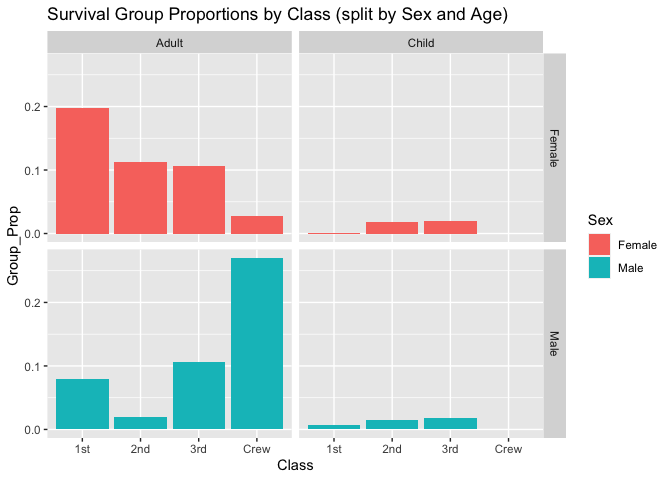

RMS Titanic
================
Jen Wei
2020-07-13

  - [Grading Rubric](#grading-rubric)
      - [Individual](#individual)
      - [Team](#team)
      - [Due Date](#due-date)
  - [First Look](#first-look)
  - [Deeper Look](#deeper-look)
  - [Notes](#notes)

*Purpose*: Most datasets have at least a few variables. Part of our task
in analyzing a dataset is to understand trends as they vary across these
different variables. Unless we’re careful and thorough, we can easily
miss these patterns. In this challenge you’ll analyze a dataset with a
small number of categorical variables and try to find differences among
the groups.

*Reading*: (Optional) [Wikipedia
article](https://en.wikipedia.org/wiki/RMS_Titanic) on the RMS Titanic.

<!-- include-rubric -->

# Grading Rubric

<!-- -------------------------------------------------- -->

Unlike exercises, **challenges will be graded**. The following rubrics
define how you will be graded, both on an individual and team basis.

## Individual

<!-- ------------------------- -->

| Category    | Unsatisfactory                                                                   | Satisfactory                                                               |
| ----------- | -------------------------------------------------------------------------------- | -------------------------------------------------------------------------- |
| Effort      | Some task **q**’s left unattempted                                               | All task **q**’s attempted                                                 |
| Observed    | Did not document observations                                                    | Documented observations based on analysis                                  |
| Supported   | Some observations not supported by analysis                                      | All observations supported by analysis (table, graph, etc.)                |
| Code Styled | Violations of the [style guide](https://style.tidyverse.org/) hinder readability | Code sufficiently close to the [style guide](https://style.tidyverse.org/) |

## Team

<!-- ------------------------- -->

| Category   | Unsatisfactory                                                                                   | Satisfactory                                       |
| ---------- | ------------------------------------------------------------------------------------------------ | -------------------------------------------------- |
| Documented | No team contributions to Wiki                                                                    | Team contributed to Wiki                           |
| Referenced | No team references in Wiki                                                                       | At least one reference in Wiki to member report(s) |
| Relevant   | References unrelated to assertion, or difficult to find related analysis based on reference text | Reference text clearly points to relevant analysis |

## Due Date

<!-- ------------------------- -->

All the deliverables stated in the rubrics above are due on the day of
the class discussion of that exercise. See the
[Syllabus](https://docs.google.com/document/d/1jJTh2DH8nVJd2eyMMoyNGroReo0BKcJrz1eONi3rPSc/edit?usp=sharing)
for more information.

``` r
library(tidyverse)
```

    ## ── Attaching packages ───────────────────────────────────────────────────────────────────────────────── tidyverse 1.3.0 ──

    ## ✓ ggplot2 3.3.2     ✓ purrr   0.3.4
    ## ✓ tibble  3.0.1     ✓ dplyr   1.0.0
    ## ✓ tidyr   1.1.0     ✓ stringr 1.4.0
    ## ✓ readr   1.3.1     ✓ forcats 0.5.0

    ## ── Conflicts ──────────────────────────────────────────────────────────────────────────────────── tidyverse_conflicts() ──
    ## x dplyr::filter() masks stats::filter()
    ## x dplyr::lag()    masks stats::lag()

``` r
df_titanic <- as_tibble(Titanic)
```

*Background*: The RMS Titanic sank on its maiden voyage in 1912; about
67% of its passengers died.

# First Look

<!-- -------------------------------------------------- -->

**q1** Perform a glimpse of `df_titanic`. What variables are in this
dataset?

``` r
## TASK: Perform a `glimpse` of df_titanic
glimpse(df_titanic)
```

    ## Rows: 32
    ## Columns: 5
    ## $ Class    <chr> "1st", "2nd", "3rd", "Crew", "1st", "2nd", "3rd", "Crew", "1…
    ## $ Sex      <chr> "Male", "Male", "Male", "Male", "Female", "Female", "Female"…
    ## $ Age      <chr> "Child", "Child", "Child", "Child", "Child", "Child", "Child…
    ## $ Survived <chr> "No", "No", "No", "No", "No", "No", "No", "No", "No", "No", …
    ## $ n        <dbl> 0, 0, 35, 0, 0, 0, 17, 0, 118, 154, 387, 670, 4, 13, 89, 3, …

**Observations**:

  - `df_titanic` contains five variables: `Class`, `Sex`, `Age`,
    `Survived`, `n`

**q2** Skim the [Wikipedia
article](https://en.wikipedia.org/wiki/RMS_Titanic) on the RMS Titanic,
and look for a total count of passengers. Compare against the total
computed below. Are there any differences? Are those differences large
or small? What might account for those differences?

``` r
## NOTE: No need to edit! We'll cover how to
## do this calculation in a later exercise.
df_titanic %>% summarize(total = sum(n))
```

    ## # A tibble: 1 x 1
    ##   total
    ##   <dbl>
    ## 1  2201

**Observations**:

  - According to the [Wikipedia article on the Sinking of the RMS
    Titanic](https://en.wikipedia.org/wiki/Sinking_of_the_RMS_Titanic#Casualties_and_survivors)
    (under the “Casualties and Survivors”), the total count of
    passengers was approximately 1,316, the total count of the crew was
    908, and the total count of passengers and crew was 2,224
  - Based on the dataset, the total count of passengers was 2,201
  - There is trivial difference between the total count of passengers
    and crew from Wikipedia and that of the dataset (23) (\~1%)

Why? - One guess is that the difference is due to some data scrubbing -
from [some
Googling](https://www.codementor.io/@innat_2k14/titanic-kaggle-machine-learning-from-disaster-part-1-10gbvqzguc),
it seems like this dataset is from Kaggle, and data is often
pre-processed to make it usable - Another guess is that the journey was
not direct, so there might’ve been some miscounts at each stop along the
way

Also\! - Interestingly enough, the “Passengers” section of the [original
Wikipedia article on the RMS
Titanic](https://en.wikipedia.org/wiki/RMS_Titanic#Passengers) mentions
“Titanic’s passengers numbered approximately 1,317 people” despite
supposedly referencing the other one (Sinking of the RMS Titanic) -
Seems like someone might’ve misquoted and now makes me a bit weary of
trusting the data from these Wikipedia articles

**q3** Create a plot showing the count of passengers who *did* survive,
along with aesthetics for `Class` and `Sex`. Document your observations
below.

*Note*: There are many ways to do this.

``` r
df_titanic_survived <- filter(df_titanic, Survived == "Yes")

df_titanic_survived
```

    ## # A tibble: 16 x 5
    ##    Class Sex    Age   Survived     n
    ##    <chr> <chr>  <chr> <chr>    <dbl>
    ##  1 1st   Male   Child Yes          5
    ##  2 2nd   Male   Child Yes         11
    ##  3 3rd   Male   Child Yes         13
    ##  4 Crew  Male   Child Yes          0
    ##  5 1st   Female Child Yes          1
    ##  6 2nd   Female Child Yes         13
    ##  7 3rd   Female Child Yes         14
    ##  8 Crew  Female Child Yes          0
    ##  9 1st   Male   Adult Yes         57
    ## 10 2nd   Male   Adult Yes         14
    ## 11 3rd   Male   Adult Yes         75
    ## 12 Crew  Male   Adult Yes        192
    ## 13 1st   Female Adult Yes        140
    ## 14 2nd   Female Adult Yes         80
    ## 15 3rd   Female Adult Yes         76
    ## 16 Crew  Female Adult Yes         20

``` r
df_titanic_survived %>%
  ggplot() +
  geom_col(mapping = aes(x = Class, y = n, fill = Sex), position = "dodge") +
  labs(title = "Survival Count by Class split by Sex")
```

<!-- -->

``` r
df_titanic_survived %>%
  ggplot() +
  geom_col(mapping = aes(x = Class, y = n, fill = Sex), position = "dodge") + facet_wrap(~ Age) +
  labs(title = "Survival Count by Class (split by Sex and Age)")
```

<!-- -->

**Observations**:

  - There were no children in the crew (which makes sense because that’d
    be illegal I think otherwise?)
  - In `1st`, the majority of the survivors were `Female`
  - In `Crew`, the majority of survivors were `Male` though it’s likely
    that they also made up the majority of the crew (can generate more
    plots to verify this)
      - For some reason, this surprises me (though this is only part of
        the picture and more plots can be generated to verify this)
  - For non-crew passengers, the majority of survivors were women
      - Wonder if there were a lot of “Jack and Rose”-like couples,
        where the men died to save the women (not really something we
        can verify from the dataset)
  - The split between male and female `child` survivors is close
    per-class
      - Wondered if the data might show some sort of favoritism, but
        as-is, it’s unclear from the dataset as it doesn’t show any data
        relating to families

<!-- end list -->

``` r
df_titanic_deceased <- filter(df_titanic, Survived == "No")

df_titanic_deceased %>%
  ggplot() +
  geom_col(mapping = aes(x = Class, y = n, fill = Sex), position = "dodge") +
  labs(title = "Deceased Count by Class split by Sex")
```

<!-- -->

``` r
df_titanic_deceased %>%
  ggplot() +
  geom_col(mapping = aes(x = Class, y = n, fill = Sex), position = "dodge") + facet_wrap(~ Age) +
  labs(title = "Deceased Count by Class (split by Sex and Age)")
```

<!-- -->

**Observations**:

  - The children who did not survive were all in `3rd` class
  - People in `1st` had the lowest deceased count among the four classes
  - `Crew` had the largest decreased count (specifically for `Male` -
    there were few deceased `Female` for that class)
  - Across all classes, `Male` made up the majority of the deceased
  - The deceased counts increase from class to class
      - Looking at [a cross-section of the
        Titanic](https://en.wikipedia.org/wiki/First-class_facilities_of_the_RMS_Titanic#/media/File:Titanic_cutaway_diagram.png),
        this makes sense as `1st` was closest to the top deck and
        lifeboats
      - Reading the Wikipedia article (see `Crew` section), it seems
        like many of the crew were working on the engine or victualling,
        which were on lower decks

<!-- end list -->

``` r
df_titanic %>%
  ggplot() +
  geom_col(mapping = aes(x = Class, y = n, fill = Sex), position = "dodge") +
  facet_wrap(~ Age) +
  labs(title = "Passenger Count by Class split by Sex")
```

<!-- -->
**Observations**:

  - `Crew` was the largest `Class` on the Titanic

# Deeper Look

<!-- -------------------------------------------------- -->

Raw counts give us a sense of totals, but they are not as useful for
understanding differences between groups. This is because the
differences we see in counts could be due to either the relative size of
the group OR differences in outcomes for those groups. To make
comparisons between groups, we should also consider *proportions*.\[1\]

The following code computes proportions within each `Class, Sex, Age`
group.

``` r
## NOTE: No need to edit! We'll cover how to
## do this calculation in a later exercise.
df_prop <-
  df_titanic %>%
  group_by(Class, Sex, Age) %>%
  mutate(Total = sum(n), Prop = n / Total) %>%
  ungroup()
df_prop
```

    ## # A tibble: 32 x 7
    ##    Class Sex    Age   Survived     n Total    Prop
    ##    <chr> <chr>  <chr> <chr>    <dbl> <dbl>   <dbl>
    ##  1 1st   Male   Child No           0     5   0    
    ##  2 2nd   Male   Child No           0    11   0    
    ##  3 3rd   Male   Child No          35    48   0.729
    ##  4 Crew  Male   Child No           0     0 NaN    
    ##  5 1st   Female Child No           0     1   0    
    ##  6 2nd   Female Child No           0    13   0    
    ##  7 3rd   Female Child No          17    31   0.548
    ##  8 Crew  Female Child No           0     0 NaN    
    ##  9 1st   Male   Adult No         118   175   0.674
    ## 10 2nd   Male   Adult No         154   168   0.917
    ## # … with 22 more rows

**q4** Replicate your visual from q3, but display `Prop` in place of
`n`. Document your observations, and note any new/different observations
you make in comparison with q3.

``` r
df_prop_survived <- filter(df_prop, Survived == "Yes")

df_prop_survived
```

    ## # A tibble: 16 x 7
    ##    Class Sex    Age   Survived     n Total     Prop
    ##    <chr> <chr>  <chr> <chr>    <dbl> <dbl>    <dbl>
    ##  1 1st   Male   Child Yes          5     5   1     
    ##  2 2nd   Male   Child Yes         11    11   1     
    ##  3 3rd   Male   Child Yes         13    48   0.271 
    ##  4 Crew  Male   Child Yes          0     0 NaN     
    ##  5 1st   Female Child Yes          1     1   1     
    ##  6 2nd   Female Child Yes         13    13   1     
    ##  7 3rd   Female Child Yes         14    31   0.452 
    ##  8 Crew  Female Child Yes          0     0 NaN     
    ##  9 1st   Male   Adult Yes         57   175   0.326 
    ## 10 2nd   Male   Adult Yes         14   168   0.0833
    ## 11 3rd   Male   Adult Yes         75   462   0.162 
    ## 12 Crew  Male   Adult Yes        192   862   0.223 
    ## 13 1st   Female Adult Yes        140   144   0.972 
    ## 14 2nd   Female Adult Yes         80    93   0.860 
    ## 15 3rd   Female Adult Yes         76   165   0.461 
    ## 16 Crew  Female Adult Yes         20    23   0.870

``` r
df_prop_survived %>%
  ggplot() +
  geom_col(mapping = aes(x = Class, y = Prop, fill = Sex), position = "dodge") +
  facet_grid(~ Age) +
  labs(title = "Survival Proportions by Class (split by Sex and Age)")
```

    ## Warning: Removed 2 rows containing missing values (geom_col).

<!-- -->

**Observations**:

  - All children from `1st` and `2nd` survived, but more than half the
    children in `3rd` did not
  - Of the surviving adults, aside from `3rd`, more than 50% of the
    women survived
  - Within `Crew`, over 75% of `Female` survived
      - Wonder which part of the crew they were in - seems plausible
        that they were part of the Deck department
      - `Male` in `2nd` had the lowest survival rate

**q5** Create a plot showing the group-proportion of passengers who
*did* survive, along with aesthetics for `Class`, `Sex`, *and* `Age`.
Document your observations below.

*Hint*: Don’t forget that you can use `facet_grid` to help consider
additional variables\!

``` r
df_prop_survived <- filter(df_prop, Survived == "Yes")

df_prop_survived
```

    ## # A tibble: 16 x 7
    ##    Class Sex    Age   Survived     n Total     Prop
    ##    <chr> <chr>  <chr> <chr>    <dbl> <dbl>    <dbl>
    ##  1 1st   Male   Child Yes          5     5   1     
    ##  2 2nd   Male   Child Yes         11    11   1     
    ##  3 3rd   Male   Child Yes         13    48   0.271 
    ##  4 Crew  Male   Child Yes          0     0 NaN     
    ##  5 1st   Female Child Yes          1     1   1     
    ##  6 2nd   Female Child Yes         13    13   1     
    ##  7 3rd   Female Child Yes         14    31   0.452 
    ##  8 Crew  Female Child Yes          0     0 NaN     
    ##  9 1st   Male   Adult Yes         57   175   0.326 
    ## 10 2nd   Male   Adult Yes         14   168   0.0833
    ## 11 3rd   Male   Adult Yes         75   462   0.162 
    ## 12 Crew  Male   Adult Yes        192   862   0.223 
    ## 13 1st   Female Adult Yes        140   144   0.972 
    ## 14 2nd   Female Adult Yes         80    93   0.860 
    ## 15 3rd   Female Adult Yes         76   165   0.461 
    ## 16 Crew  Female Adult Yes         20    23   0.870

``` r
df_prop_survived %>%
  ggplot() +
  geom_col(mapping = aes(x = Class, y = Prop, fill = Sex), position = "dodge") +
  facet_grid(Sex ~ Age) +
  labs(title = "Survival Proportions by Class (split by Age and Sex)")
```

    ## Warning: Removed 2 rows containing missing values (geom_col).

<!-- -->

**Observations**:

  - As noticed in earlier questions of this challenge, the survival of
    women was disporportionally greater than the survival of men for
    most adults (aside from thos in `3rd` class)
  - Children in `1st` and `2nd` class had high survival rates
  - When looking at proportions, the survival of `Crew` members is
    comparable to `2nd` class but is not the highest survival proportion
      - This helps provide some clarity as from the count plots it
        seemed as though a lot more crew members survived than
        passengers (which seemed odd at first), but it makes sense that
        the proportion isn’t as high since `Crew` represented the
        largest `Class` on the Titanic

# Notes

<!-- -------------------------------------------------- -->

\[1\] This is basically the same idea as [Dimensional
Analysis](https://en.wikipedia.org/wiki/Dimensional_analysis); computing
proportions is akin to non-dimensionalizing a quantity.
