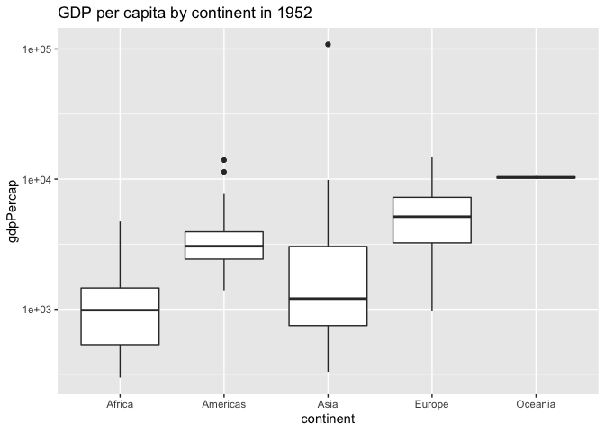
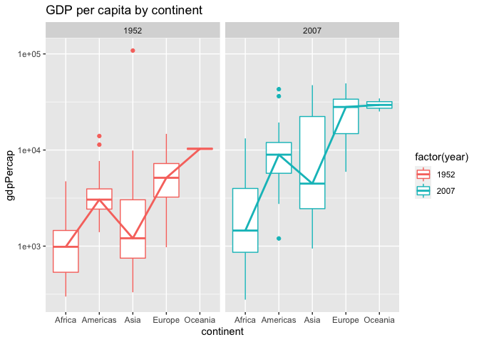
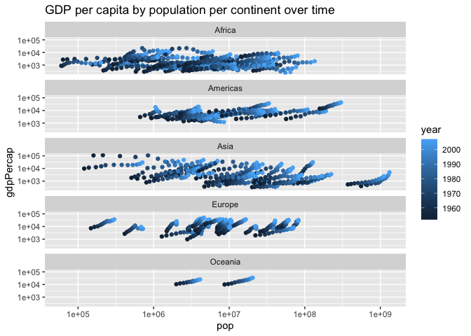

Gapminder
================
Jen Wei
2020-07-24

  - [Grading Rubric](#grading-rubric)
      - [Individual](#individual)
      - [Team](#team)
      - [Due Date](#due-date)
  - [Guided EDA](#guided-eda)
  - [Your Own EDA](#your-own-eda)

*Purpose*: Learning to do EDA well takes practice\! In this challenge
you’ll further practice EDA by first completing a guided exploration,
then by conducting your own investigation. This challenge will also give
you a chance to use the wide variety of visual tools we’ve been
learning.

<!-- include-rubric -->

# Grading Rubric

<!-- -------------------------------------------------- -->

Unlike exercises, **challenges will be graded**. The following rubrics
define how you will be graded, both on an individual and team basis.

## Individual

<!-- ------------------------- -->

| Category    | Unsatisfactory                                                                   | Satisfactory                                                               |
| ----------- | -------------------------------------------------------------------------------- | -------------------------------------------------------------------------- |
| Effort      | Some task **q**’s left unattempted                                               | All task **q**’s attempted                                                 |
| Observed    | Did not document observations                                                    | Documented observations based on analysis                                  |
| Supported   | Some observations not supported by analysis                                      | All observations supported by analysis (table, graph, etc.)                |
| Code Styled | Violations of the [style guide](https://style.tidyverse.org/) hinder readability | Code sufficiently close to the [style guide](https://style.tidyverse.org/) |

## Team

<!-- ------------------------- -->

| Category   | Unsatisfactory                                                                                   | Satisfactory                                       |
| ---------- | ------------------------------------------------------------------------------------------------ | -------------------------------------------------- |
| Documented | No team contributions to Wiki                                                                    | Team contributed to Wiki                           |
| Referenced | No team references in Wiki                                                                       | At least one reference in Wiki to member report(s) |
| Relevant   | References unrelated to assertion, or difficult to find related analysis based on reference text | Reference text clearly points to relevant analysis |

## Due Date

<!-- ------------------------- -->

All the deliverables stated in the rubrics above are due on the day of
the class discussion of that exercise. See the
[Syllabus](https://docs.google.com/document/d/1jJTh2DH8nVJd2eyMMoyNGroReo0BKcJrz1eONi3rPSc/edit?usp=sharing)
for more information.

``` r
library(tidyverse)
```

    ## ── Attaching packages ──────────────────────────────────────────────────────────────────────────── tidyverse 1.3.0 ──

    ## ✓ ggplot2 3.3.2     ✓ purrr   0.3.4
    ## ✓ tibble  3.0.1     ✓ dplyr   1.0.0
    ## ✓ tidyr   1.1.0     ✓ stringr 1.4.0
    ## ✓ readr   1.3.1     ✓ forcats 0.5.0

    ## ── Conflicts ─────────────────────────────────────────────────────────────────────────────── tidyverse_conflicts() ──
    ## x dplyr::filter() masks stats::filter()
    ## x dplyr::lag()    masks stats::lag()

``` r
library(gapminder)
```

*Background*: [Gapminder](https://www.gapminder.org/about-gapminder/) is
an independent organization that seeks to education people about the
state of the world. They promote a “fact-based worldview” by focusing on
data. The dataset we’ll study in this challenge is from Gapminder.

# Guided EDA

<!-- -------------------------------------------------- -->

First, we’ll go through a round of *guided EDA*. Try to pay attention to
the high-level process we’re going through—after this guided round
you’ll be responsible for doing another cycle of EDA on your own\!

**q0** Perform your “first checks” on the dataset. What variables are in
this dataset?

``` r
glimpse(gapminder)
```

    ## Rows: 1,704
    ## Columns: 6
    ## $ country   <fct> Afghanistan, Afghanistan, Afghanistan, Afghanistan, Afghani…
    ## $ continent <fct> Asia, Asia, Asia, Asia, Asia, Asia, Asia, Asia, Asia, Asia,…
    ## $ year      <int> 1952, 1957, 1962, 1967, 1972, 1977, 1982, 1987, 1992, 1997,…
    ## $ lifeExp   <dbl> 28.801, 30.332, 31.997, 34.020, 36.088, 38.438, 39.854, 40.…
    ## $ pop       <int> 8425333, 9240934, 10267083, 11537966, 13079460, 14880372, 1…
    ## $ gdpPercap <dbl> 779.4453, 820.8530, 853.1007, 836.1971, 739.9811, 786.1134,…

``` r
summary(gapminder)
```

    ##         country        continent        year         lifeExp     
    ##  Afghanistan:  12   Africa  :624   Min.   :1952   Min.   :23.60  
    ##  Albania    :  12   Americas:300   1st Qu.:1966   1st Qu.:48.20  
    ##  Algeria    :  12   Asia    :396   Median :1980   Median :60.71  
    ##  Angola     :  12   Europe  :360   Mean   :1980   Mean   :59.47  
    ##  Argentina  :  12   Oceania : 24   3rd Qu.:1993   3rd Qu.:70.85  
    ##  Australia  :  12                  Max.   :2007   Max.   :82.60  
    ##  (Other)    :1632                                                
    ##       pop              gdpPercap       
    ##  Min.   :6.001e+04   Min.   :   241.2  
    ##  1st Qu.:2.794e+06   1st Qu.:  1202.1  
    ##  Median :7.024e+06   Median :  3531.8  
    ##  Mean   :2.960e+07   Mean   :  7215.3  
    ##  3rd Qu.:1.959e+07   3rd Qu.:  9325.5  
    ##  Max.   :1.319e+09   Max.   :113523.1  
    ## 

**Observations**:

  - The variables in the dataset include `country`, `continent`, `year`,
    `lifeExp`, `pop`, and `gdpPercap`

**q1** Determine the most and least recent years in the `gapminder`
dataset.

``` r
## TASK: Find the largest and smallest values of `year` in `gapminder`
year_max <- max(select(gapminder, year))
year_min <- min(select(gapminder, year))

year_max
```

    ## [1] 2007

``` r
year_min
```

    ## [1] 1952

Use the following test to check your work.

``` r
## NOTE: No need to change this
assertthat::assert_that(year_max %% 7 == 5)
```

    ## [1] TRUE

``` r
assertthat::assert_that(year_max %% 3 == 0)
```

    ## [1] TRUE

``` r
assertthat::assert_that(year_min %% 7 == 6)
```

    ## [1] TRUE

``` r
assertthat::assert_that(year_min %% 3 == 2)
```

    ## [1] TRUE

``` r
print("Nice!")
```

    ## [1] "Nice!"

**q2** Filter on years matching `year_min`, and make a plot of the GDE
per capita against continent. Choose an appropriate `geom_` to visualize
the data. What observations can you make?

You may encounter difficulties in visualizing these data; if so document
your challenges and attempt to produce the most informative visual you
can.

``` r
year_min_df <- filter(gapminder, year == year_min)
glimpse(year_min_df)
```

    ## Rows: 142
    ## Columns: 6
    ## $ country   <fct> Afghanistan, Albania, Algeria, Angola, Argentina, Australia…
    ## $ continent <fct> Asia, Europe, Africa, Africa, Americas, Oceania, Europe, As…
    ## $ year      <int> 1952, 1952, 1952, 1952, 1952, 1952, 1952, 1952, 1952, 1952,…
    ## $ lifeExp   <dbl> 28.801, 55.230, 43.077, 30.015, 62.485, 69.120, 66.800, 50.…
    ## $ pop       <int> 8425333, 1282697, 9279525, 4232095, 17876956, 8691212, 6927…
    ## $ gdpPercap <dbl> 779.4453, 1601.0561, 2449.0082, 3520.6103, 5911.3151, 10039…

``` r
year_min_df %>%
  ggplot(mapping = aes(y = gdpPercap, x = continent)) +
  geom_boxplot() +
  labs(title = "GDP per capita by continent in 1952") +
  scale_y_log10()
```

<!-- -->

**Observations**:

  - Asia has the largest range of GDP per capita
  - Oceania has the smallest range of GDP per capita
  - Asia has the country with the largest GDP per capita (though it’s an
    outlier)
      - Excluding the outliers, Europe has the country with the largest
        GDP per capita
  - Africa has the country with the lowest GDP per capita
  - Oceania has the largest median GDP per capita
  - Africa has the smallest median GDP per capita
  - There are three outliers identified in the dataset - two in Americas
    and one in Asia

**Difficulties & Approaches**:

  - For visualizing `gdpPercap` vs `continent`, I first tried a column
    plot, but it was a bit noisy (as there seemed to be a line per row
    in the filtered dataset), and the main takeaway from it was the
    total count per continent. Then, I decided to use a boxplot to see
    trends within each `continent`. This worked better, but the spread
    of data across countries and continents made certain boxplots
    squished. To stretch them out a bit, I log-scaled `gdpPercap`.

**q3** You should have found at least three outliers in q2. Identify
those outliers (figure out which countries they are).

``` r
americas_outliers_df <- filter(year_min_df, gdpPercap > 1.000e+04, continent == 'Americas')
glimpse(americas_outliers_df)
```

    ## Rows: 2
    ## Columns: 6
    ## $ country   <fct> Canada, United States
    ## $ continent <fct> Americas, Americas
    ## $ year      <int> 1952, 1952
    ## $ lifeExp   <dbl> 68.75, 68.44
    ## $ pop       <int> 14785584, 157553000
    ## $ gdpPercap <dbl> 11367.16, 13990.48

``` r
asia_outliers_df <- filter(year_min_df, gdpPercap > 1.000e+05, continent == 'Asia')
glimpse(asia_outliers_df)
```

    ## Rows: 1
    ## Columns: 6
    ## $ country   <fct> Kuwait
    ## $ continent <fct> Asia
    ## $ year      <int> 1952
    ## $ lifeExp   <dbl> 55.565
    ## $ pop       <int> 160000
    ## $ gdpPercap <dbl> 108382.4

**Observations**:

I initially thought of using the plot to identify the outliers via [this
StackOverflow
post](https://stackoverflow.com/questions/33524669/labeling-outliers-of-boxplots-in-r),
but then I realized I could just filter the data based on data gleaned
from the q2 plot of GDP per capita by continent in 1952.

  - The outliers are Canada, United States, and Kuwait

NOTE: I probably could’ve just swapped x and y instead of using
`coord_flip()`, but alas

**q4** Create a plot similar to yours from q2 studying both `year_min`
and `year_max`. Find a way to highlight the outliers from q3 on your
plot. Compare the patterns between `year_min` and `year_max`.

*Hint*: We’ve learned a lot of different ways to show multiple
variables; think about using different aesthetics or facets.

``` r
year_extremes_df <- filter(gapminder, year == year_min | year == year_max)
glimpse(year_extremes_df)
```

    ## Rows: 284
    ## Columns: 6
    ## $ country   <fct> Afghanistan, Afghanistan, Albania, Albania, Algeria, Algeri…
    ## $ continent <fct> Asia, Asia, Europe, Europe, Africa, Africa, Africa, Africa,…
    ## $ year      <int> 1952, 2007, 1952, 2007, 1952, 2007, 1952, 2007, 1952, 2007,…
    ## $ lifeExp   <dbl> 28.801, 43.828, 55.230, 76.423, 43.077, 72.301, 30.015, 42.…
    ## $ pop       <int> 8425333, 31889923, 1282697, 3600523, 9279525, 33333216, 423…
    ## $ gdpPercap <dbl> 779.4453, 974.5803, 1601.0561, 5937.0295, 2449.0082, 6223.3…

``` r
year_extremes_df %>%
  ggplot(mapping = aes(y = gdpPercap, x = continent, color = factor(year))) +
  geom_boxplot() +
  facet_grid(~ year) +
  stat_summary(
    fun = median,
    geom = "line",
    aes(group = year, color = factor(year)),
    lwd = 1,
    position = position_dodge(width = .75)
  ) +
  scale_y_log10() +
  labs(title = "GDP per capita by continent")
```

<!-- -->

**Observations**: - GDP per capita by continent (from highest to lowest)
is the same for the earliest and latest years - Oceania, Europe,
Americas, Asia, Africa - The spread of GDP per capita across countries
for each continent has increased between 1952 and 2007 - Both years have
three outliers - 2007 outliers are all in Americas: Haiti, Canada, and
United States

``` r
americas_latest_outliers_df <- filter(year_extremes_df, gdpPercap > 2.000e+04 | gdpPercap < 2.500e+03 , continent == 'Americas', year == 2007)
glimpse(americas_latest_outliers_df)
```

    ## Rows: 3
    ## Columns: 6
    ## $ country   <fct> Canada, Haiti, United States
    ## $ continent <fct> Americas, Americas, Americas
    ## $ year      <int> 2007, 2007, 2007
    ## $ lifeExp   <dbl> 80.653, 60.916, 78.242
    ## $ pop       <int> 33390141, 8502814, 301139947
    ## $ gdpPercap <dbl> 36319.235, 1201.637, 42951.653

# Your Own EDA

<!-- -------------------------------------------------- -->

Now it’s your turn\! We just went through guided EDA considering the GDP
per capita at two time points. You can continue looking at outliers,
consider different years, repeat the exercise with `lifeExp`, consider
the relationship between variables, or something else entirely.

**q5** Create *at least* three new figures below. With each figure, try
to pose new questions about the data.

``` r
year_extremes_df %>%
  ggplot(mapping = aes(y = pop, x = continent, color = factor(year))) +
  geom_boxplot() +
  facet_grid(~ year) +
  stat_summary(
    fun = median,
    geom = "line",
    aes(group = year, color = factor(year)),
    lwd = 1,
    position = position_dodge(width = .75)
  ) +
  scale_y_log10() +
  labs(title = "Population by continent")
```

<!-- -->

While going through EDA for GDP per capita, I was curious about how
population might impact GDP, so first, I thought I’d take a look at
population by continent for the earliest and latest years, 1952 and
2007.

**Observations:**

  - 
<!-- end list -->

``` r
## TASK: Your second graph
```

``` r
## TASK: Your third graph
```
