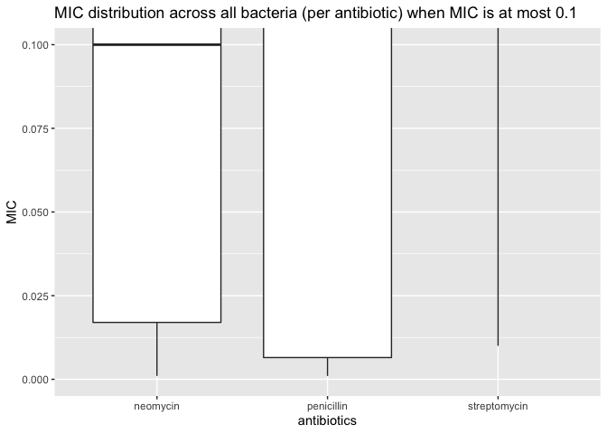

Antibiotics
================
Jen Wei
2020-07-26

  - [Grading Rubric](#grading-rubric)
      - [Individual](#individual)
      - [Team](#team)
      - [Due Date](#due-date)
  - [Visualization](#visualization)
      - [Purpose: Compare Effectiveness](#purpose-compare-effectiveness)
      - [Purpose: Categorize Bacteria](#purpose-categorize-bacteria)
      - [Code Parking Lot](#code-parking-lot)
  - [References](#references)

*Purpose*: To create an effective visualization, we need to keep our
*purpose* firmly in mind. There are many different ways to visualize
data, and the only way we can judge efficacy is with respect to our
purpose.

In this challenge you’ll visualize the same data in two different ways,
aimed at two different purposes.

*Note*: Please complete your initial visual design **alone**. Work on
both of your graphs alone, and save a version to your repo *before*
coming together with your team. This way you can all bring a diversity
of ideas to the table\!

<!-- include-rubric -->

# Grading Rubric

<!-- -------------------------------------------------- -->

Unlike exercises, **challenges will be graded**. The following rubrics
define how you will be graded, both on an individual and team basis.

## Individual

<!-- ------------------------- -->

| Category    | Unsatisfactory                                                                   | Satisfactory                                                               |
| ----------- | -------------------------------------------------------------------------------- | -------------------------------------------------------------------------- |
| Effort      | Some task **q**’s left unattempted                                               | All task **q**’s attempted                                                 |
| Observed    | Did not document observations                                                    | Documented observations based on analysis                                  |
| Supported   | Some observations not supported by analysis                                      | All observations supported by analysis (table, graph, etc.)                |
| Code Styled | Violations of the [style guide](https://style.tidyverse.org/) hinder readability | Code sufficiently close to the [style guide](https://style.tidyverse.org/) |

## Team

<!-- ------------------------- -->

| Category   | Unsatisfactory                                                                                   | Satisfactory                                       |
| ---------- | ------------------------------------------------------------------------------------------------ | -------------------------------------------------- |
| Documented | No team contributions to Wiki                                                                    | Team contributed to Wiki                           |
| Referenced | No team references in Wiki                                                                       | At least one reference in Wiki to member report(s) |
| Relevant   | References unrelated to assertion, or difficult to find related analysis based on reference text | Reference text clearly points to relevant analysis |

## Due Date

<!-- ------------------------- -->

All the deliverables stated in the rubrics above are due on the day of
the class discussion of that exercise. See the
[Syllabus](https://docs.google.com/document/d/1jJTh2DH8nVJd2eyMMoyNGroReo0BKcJrz1eONi3rPSc/edit?usp=sharing)
for more information.

``` r
library(tidyverse)
```

    ## ── Attaching packages ───────────────────────────────────────────────────────────────────────────────────────────────────── tidyverse 1.3.0 ──

    ## ✓ ggplot2 3.3.2     ✓ purrr   0.3.4
    ## ✓ tibble  3.0.1     ✓ dplyr   1.0.0
    ## ✓ tidyr   1.1.0     ✓ stringr 1.4.0
    ## ✓ readr   1.3.1     ✓ forcats 0.5.0

    ## ── Conflicts ──────────────────────────────────────────────────────────────────────────────────────────────────────── tidyverse_conflicts() ──
    ## x dplyr::filter() masks stats::filter()
    ## x dplyr::lag()    masks stats::lag()

``` r
library(ggrepel)
```

*Background*: The data\[1\] we study in this challenge report the
[*minimum inhibitory
concentration*](https://en.wikipedia.org/wiki/Minimum_inhibitory_concentration)
(MIC) of three drugs for different bacteria. The smaller the MIC for a
given drug and bacteria pair, the more practical the drug is for
treating that particular bacteria. An MIC value of *at most* 0.1 is
considered necessary for treating human patients.

These data report MIC values for three antibiotics—penicillin,
streptomycin, and neomycin—on 16 bacteria. Bacteria are categorized into
a genus based on a number of features, including their resistance to
antibiotics.

``` r
## NOTE: If you extracted all challenges to the same location,
## you shouldn't have to change this filename
filename <- "./data/antibiotics.csv"

## Load the data
df_antibiotics <- read_csv(filename)
```

    ## Parsed with column specification:
    ## cols(
    ##   bacteria = col_character(),
    ##   penicillin = col_double(),
    ##   streptomycin = col_double(),
    ##   neomycin = col_double(),
    ##   gram = col_character()
    ## )

``` r
df_antibiotics %>% knitr::kable()
```

| bacteria                        | penicillin | streptomycin | neomycin | gram     |
| :------------------------------ | ---------: | -----------: | -------: | :------- |
| Aerobacter aerogenes            |    870.000 |         1.00 |    1.600 | negative |
| Brucella abortus                |      1.000 |         2.00 |    0.020 | negative |
| Bacillus anthracis              |      0.001 |         0.01 |    0.007 | positive |
| Diplococcus pneumonia           |      0.005 |        11.00 |   10.000 | positive |
| Escherichia coli                |    100.000 |         0.40 |    0.100 | negative |
| Klebsiella pneumoniae           |    850.000 |         1.20 |    1.000 | negative |
| Mycobacterium tuberculosis      |    800.000 |         5.00 |    2.000 | negative |
| Proteus vulgaris                |      3.000 |         0.10 |    0.100 | negative |
| Pseudomonas aeruginosa          |    850.000 |         2.00 |    0.400 | negative |
| Salmonella (Eberthella) typhosa |      1.000 |         0.40 |    0.008 | negative |
| Salmonella schottmuelleri       |     10.000 |         0.80 |    0.090 | negative |
| Staphylococcus albus            |      0.007 |         0.10 |    0.001 | positive |
| Staphylococcus aureus           |      0.030 |         0.03 |    0.001 | positive |
| Streptococcus fecalis           |      1.000 |         1.00 |    0.100 | positive |
| Streptococcus hemolyticus       |      0.001 |        14.00 |   10.000 | positive |
| Streptococcus viridans          |      0.005 |        10.00 |   40.000 | positive |

# Visualization

<!-- -------------------------------------------------- -->

## Purpose: Compare Effectiveness

<!-- ------------------------- -->

**q1** Create a visualization of `df_antibiotics` that helps you to
compare the effectiveness of the three antibiotics across all the
bacteria reported. Can you make any broad statements about antibiotic
effectiveness?

``` r
df_antibiotics %>%
  ggplot() +
  geom_boxplot(mapping = aes(x = "penicillin", y = penicillin)) +
  geom_boxplot(mapping = aes(x = "streptomycin", y = streptomycin)) +
  geom_boxplot(mapping = aes(x = "neomycin", y = neomycin)) +
  labs(title = "MIC distribution across all bacteria (per antibiotic)", y = "MIC", x = "antibiotics")
```

<!-- -->

**Observations**:

  - When looking at MIC across all bacteria . . .
      - all three antibiotics have outliers, but penicillin has the
        “worst” ones that are almost 100x the highest MIC for the
        other two antibiotics
      - penicillin has the widest spread of MIC values

<!-- end list -->

``` r
df_antibiotics %>%
  ggplot() +
  geom_boxplot(mapping = aes(x = "penicillin", y = penicillin)) +
  geom_boxplot(mapping = aes(x = "streptomycin", y = streptomycin)) +
  geom_boxplot(mapping = aes(x = "neomycin", y = neomycin)) +
  labs(title = "MIC distribution across all bacteria when MIC is at most 0.1", y = "MIC", x = "antibiotics") +
  coord_cartesian(ylim = c(0, 0.1))
```

<!-- -->

**Observations**:

Because the spread of is so wide, I tried to zoom into MIC values with
an upper bound of 0.1, the maximum MIC value “considered necessary for
treating human patients”.

Disclaimer: Not quite sure what this means, but it was in the
background, and my interpretation of it was that MIC values up to 0.1
were effective against bacteria, and anything above wasn’t (or not
within what’s been deemed “safe” for humans)

  - When looking at MIC across all bacteria . . .
      - neomycin is the only antibiotic with its median (0.100) within
        the set bound

<!-- end list -->

``` r
df_antibiotics %>%
  ggplot() +
  geom_boxplot(mapping = aes(x = "penicillin", y = penicillin)) +
  geom_boxplot(mapping = aes(x = "streptomycin", y = streptomycin)) +
  geom_boxplot(mapping = aes(x = "neomycin", y = neomycin)) +
  labs(title = "MIC distribution across all bacteria (per antibiotic) on a log scale", y = "MIC", x = "antibiotics") +
  scale_y_log10()
```

<!-- -->

**Observations**:

  - When looking at MIC across all bacteria on a log10 scale . . .
      - only streptomycin has an outlier
      - neomycin has the lowest median MIC
      - penicillin has the widest spread of MIC values

<!-- end list -->

``` r
df_antibiotics_long <- df_antibiotics %>%
  pivot_longer(
    cols = starts_with("pen") | starts_with("strep") | starts_with ("neo"),
    names_to = "antibiotic",
    values_to = "MIC"
  )

df_antibiotics_long
```

    ## # A tibble: 48 x 4
    ##    bacteria              gram     antibiotic       MIC
    ##    <chr>                 <chr>    <chr>          <dbl>
    ##  1 Aerobacter aerogenes  negative penicillin   870    
    ##  2 Aerobacter aerogenes  negative streptomycin   1    
    ##  3 Aerobacter aerogenes  negative neomycin       1.6  
    ##  4 Brucella abortus      negative penicillin     1    
    ##  5 Brucella abortus      negative streptomycin   2    
    ##  6 Brucella abortus      negative neomycin       0.02 
    ##  7 Bacillus anthracis    positive penicillin     0.001
    ##  8 Bacillus anthracis    positive streptomycin   0.01 
    ##  9 Bacillus anthracis    positive neomycin       0.007
    ## 10 Diplococcus pneumonia positive penicillin     0.005
    ## # … with 38 more rows

``` r
max_MIC <- 0.1

df_antibiotics_long %>%
  ggplot() +
  geom_point(mapping = aes(y = MIC, x = antibiotic, color = bacteria)) +
  labs(title = "MIC distribution across all bacteria (per antibiotic) on a log scale", y = "MIC", x = "antibiotics") +
  geom_hline(yintercept = max_MIC) +
  geom_text(aes(0, max_MIC, label = max_MIC, vjust = -1, hjust = -1)) +
  scale_y_log10()
```

<!-- -->

``` r
# penicillin-affected bacteria
df_antibiotics_long %>%
  filter(MIC <= max_MIC, antibiotic == 'penicillin') %>%
  group_by(antibiotic) %>%
  summary()
```

    ##    bacteria             gram            antibiotic             MIC          
    ##  Length:6           Length:6           Length:6           Min.   :0.001000  
    ##  Class :character   Class :character   Class :character   1st Qu.:0.002000  
    ##  Mode  :character   Mode  :character   Mode  :character   Median :0.005000  
    ##                                                           Mean   :0.008167  
    ##                                                           3rd Qu.:0.006500  
    ##                                                           Max.   :0.030000

``` r
# neomycin-affected bacteria
df_antibiotics_long %>%
  filter(MIC <= max_MIC, antibiotic == 'neomycin') %>%
  group_by(antibiotic) %>%
  summary()
```

    ##    bacteria             gram            antibiotic             MIC         
    ##  Length:9           Length:9           Length:9           Min.   :0.00100  
    ##  Class :character   Class :character   Class :character   1st Qu.:0.00700  
    ##  Mode  :character   Mode  :character   Mode  :character   Median :0.02000  
    ##                                                           Mean   :0.04744  
    ##                                                           3rd Qu.:0.10000  
    ##                                                           Max.   :0.10000

``` r
# streptomycin-affected bacteria
df_antibiotics_long %>%
  filter(MIC <= max_MIC, antibiotic == 'streptomycin') %>%
  group_by(antibiotic) %>%
  summary()
```

    ##    bacteria             gram            antibiotic             MIC       
    ##  Length:4           Length:4           Length:4           Min.   :0.010  
    ##  Class :character   Class :character   Class :character   1st Qu.:0.025  
    ##  Mode  :character   Mode  :character   Mode  :character   Median :0.065  
    ##                                                           Mean   :0.060  
    ##                                                           3rd Qu.:0.100  
    ##                                                           Max.   :0.100

**Observations:**

  - Less than half (19) of MIC values (48) are less than or equal to 0.1
  - penicillin is effective against 6 bacteria
  - neomycin is effective against 9 bacteria
  - streptomycin is effective against 4 bacteria

**Broad statement(s) about antibiotic effectiveness:**

  - No antibiotic is 100% effective against all bacteria

## Purpose: Categorize Bacteria

<!-- ------------------------- -->

The *genus* of a living organism is a human categorization, based on
various characteristics of the organism. Since these categories are
based on numerous factors, we will tend to see clusters if we visualize
data according to relevant variables. We can use these visuals to
categorize observations, and to question whether given categories are
reasonable\!

**q2** Create a visualization of `df_antibiotics` that helps you to
categorize bacteria according to the variables in the data. Document
your observations on how how clusters of bacteria in the variables do—or
don’t—align with their *genus* classification.

``` r
df_antibiotics %>%
  ggplot(mapping = aes(x = penicillin, y = neomycin, color = bacteria)) +
  geom_point() +
  geom_label_repel(
    aes(label = bacteria),
    size = 2,
    segment.color = NA
  ) +
  labs(title = "neomycin vs penicillin MICs on a log scale") +
  geom_hline(yintercept = max_MIC) +
  scale_x_log10() +
  scale_y_log10()
```

<!-- -->

**Observations**:

  - When comparing neomycin MIC and penicillin MIC . . .
      - the `Staphylococcus` genus seems to cluster
      - other genuses (i.e. `Streptococcus` and `Salmonella`) don’t seem
        to cluster though two of the three `Streptococcus` ones do
        (`Streptococcus fecalis` being the outlier)

<!-- end list -->

``` r
df_antibiotics %>%
  ggplot(mapping = aes(x = streptomycin, y = neomycin, color = bacteria)) +
  geom_point() +
  geom_label_repel(
    aes(label = bacteria),
    size = 2,
    segment.color = NA
  ) +
  labs(title = "neomycin vs streptomycin MICs on a log scale") +
  geom_hline(yintercept = max_MIC) +
  scale_x_log10() +
  scale_y_log10()
```

<!-- -->

**Observations:**

  - When comparing neomycin MIC and streptomycin MIC . . .
      - the `Staphylococcus` genus seems to cluster
      - other genuses (i.e. `Streptococcus` and `Salmonella`) don’t seem
        to cluster though two of the three `Streptococcus` ones do
        (`Streptococcus fecalis` being the outlier)

<!-- end list -->

``` r
df_antibiotics %>%
  ggplot(mapping = aes(x = streptomycin, y = penicillin, color = bacteria)) +
  geom_point() +
  geom_label_repel(
    aes(label = bacteria),
    size = 2,
    segment.color = NA
  ) +
  labs(title = "penicillin vs streptomycin MICs on a log scale") +
  geom_hline(yintercept = max_MIC) +
  scale_x_log10() +
  scale_y_log10()
```

<!-- -->

**Observations:**

  - When comparing penicillin MIC and streptomycin MIC . . .
      - the `Staphylococcus` genus seems to cluster
      - other genuses (i.e. `Streptococcus` and `Salmonella`) don’t seem
        to cluster

## Code Parking Lot

This section is where I save code that might be useful for reference but
was not necessary for the challenge

``` r
# df_antibiotics_long <- df_antibiotics_long %>%
#  mutate(isEffective = MIC <= 0.1)

# df_antiobiotics_effective_annotated <- df_antibiotics_long %>%
#   filter(isEffective == TRUE)

# df_antiobiotics_effective_annotated

# df_antiobiotics_not_effective <- df_antibiotics_long %>%
#  filter(isEffective == FALSE)

# df_antiobiotics_not_effective

# df_antibiotics_long %>%
#  ggplot(mapping = aes(y = MIC, x = antibiotic, color = bacteria)) +
#  geom_point() +
#  geom_label_repel(
#    data = df_antiobiotics_effective_annotated,
#    aes(label = bacteria)
#  ) +
#  labs(title = "MIC distribution across all bacteria (per antibiotic) on a log scale", y = "MIC", x = "antibiotics") +
#  facet_grid(~ gram ~ isEffective, switch = "y", labeller = label_both) +
#  geom_hline(yintercept = max_MIC) +
#  geom_text(aes(0, max_MIC, label = max_MIC, vjust = -1, hjust = -1, size = 10)) +
#  scale_y_log10()
```

# References

<!-- -------------------------------------------------- -->

\[1\] Neomycin in skin infections: A new topical antibiotic with wide
antibacterial range and rarely sensitizing. Scope. 1951;3(5):4-7.

\[2\] Wainer and Lysen, “That’s Funny…” /American Scientist/ (2009)
[link](https://www.americanscientist.org/article/thats-funny)
