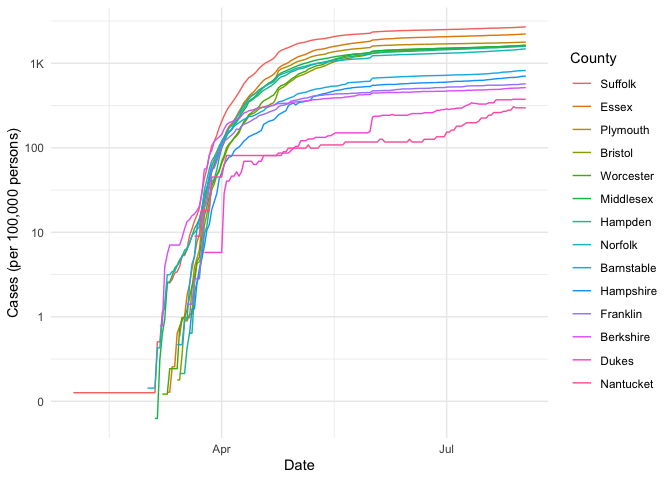

COVID-19
================
Jen Wei
2020-07-26

  - [Grading Rubric](#grading-rubric)
      - [Individual](#individual)
      - [Team](#team)
      - [Due Date](#due-date)
  - [The Big Picture](#the-big-picture)
  - [Get the Data](#get-the-data)
      - [Navigating the Census Bureau](#navigating-the-census-bureau)
      - [Automated Download of NYT
        Data](#automated-download-of-nyt-data)
  - [Join the Data](#join-the-data)
  - [Analyze](#analyze)
      - [Normalize](#normalize)
  - [TODO: \[2020-07-26\] Figure out why the assertions are
    failing\!](#todo-2020-07-26-figure-out-why-the-assertions-are-failing)
      - [Guided EDA](#guided-eda)
      - [Self-directed EDA](#self-directed-eda)
          - [Ideas](#ideas)
          - [Aside: Some visualization
            tricks](#aside-some-visualization-tricks)
          - [Geographic exceptions](#geographic-exceptions)
  - [Notes](#notes)

*Purpose*: We can’t *possibly* do a class on data science and *not* look
at covid-19. Come on.

In this challenge, you’ll learn how to navigate the U.S. Census Bureau
website, programmatically download data from the internet, and perform a
county-level population-weighted analysis of current covid-19 trends.
Get excited\!

<!-- include-rubric -->

# Grading Rubric

<!-- -------------------------------------------------- -->

Unlike exercises, **challenges will be graded**. The following rubrics
define how you will be graded, both on an individual and team basis.

## Individual

<!-- ------------------------- -->

| Category    | Unsatisfactory                                                                   | Satisfactory                                                               |
| ----------- | -------------------------------------------------------------------------------- | -------------------------------------------------------------------------- |
| Effort      | Some task **q**’s left unattempted                                               | All task **q**’s attempted                                                 |
| Observed    | Did not document observations                                                    | Documented observations based on analysis                                  |
| Supported   | Some observations not supported by analysis                                      | All observations supported by analysis (table, graph, etc.)                |
| Code Styled | Violations of the [style guide](https://style.tidyverse.org/) hinder readability | Code sufficiently close to the [style guide](https://style.tidyverse.org/) |

## Team

<!-- ------------------------- -->

| Category   | Unsatisfactory                                                                                   | Satisfactory                                       |
| ---------- | ------------------------------------------------------------------------------------------------ | -------------------------------------------------- |
| Documented | No team contributions to Wiki                                                                    | Team contributed to Wiki                           |
| Referenced | No team references in Wiki                                                                       | At least one reference in Wiki to member report(s) |
| Relevant   | References unrelated to assertion, or difficult to find related analysis based on reference text | Reference text clearly points to relevant analysis |

## Due Date

<!-- ------------------------- -->

All the deliverables stated in the rubrics above are due on the day of
the class discussion of that exercise. See the
[Syllabus](https://docs.google.com/document/d/1jJTh2DH8nVJd2eyMMoyNGroReo0BKcJrz1eONi3rPSc/edit?usp=sharing)
for more information.

``` r
library(tidyverse)
```

    ## ── Attaching packages ───────────────────────────────────────────────────────────────────────────────────────────────────── tidyverse 1.3.0 ──

    ## ✓ ggplot2 3.3.2     ✓ purrr   0.3.4
    ## ✓ tibble  3.0.1     ✓ dplyr   1.0.0
    ## ✓ tidyr   1.1.0     ✓ stringr 1.4.0
    ## ✓ readr   1.3.1     ✓ forcats 0.5.0

    ## ── Conflicts ──────────────────────────────────────────────────────────────────────────────────────────────────────── tidyverse_conflicts() ──
    ## x dplyr::filter() masks stats::filter()
    ## x dplyr::lag()    masks stats::lag()

*Background*:
[COVID-19](https://en.wikipedia.org/wiki/Coronavirus_disease_2019) is
the disease caused by the virus SARS-CoV-2. In 2020 it became a global
pandemic, leading to huge loss of life and tremendous disruption to
society. The New York Times published up-to-date data on the progression
of the pandemic across the United States—we will study these data in
this challenge.

# The Big Picture

<!-- -------------------------------------------------- -->

We’re about to go through *a lot* of weird steps, so let’s first fix the
big picture firmly in mind:

We want to study COVID-19 in terms of data: both case counts (number of
infections) and deaths. We’re going to do a county-level analysis in
order to get a high-resolution view of the pandemic. Since US counties
can vary widely in terms of their population, we’ll need population
estimates in order to compute infection rates (think back to the
`Titanic` challenge).

That’s the high-level view; now let’s dig into the details.

# Get the Data

<!-- -------------------------------------------------- -->

1.  County-level population estimates (Census Bureau)
2.  County-level COVID-19 counts (New York Times)

## Navigating the Census Bureau

<!-- ------------------------- -->

**Steps**: Our objective is to find the 2018 American Community
Survey\[1\] (ACS) Total Population estimates, disaggregated by counties.
To check your results, this is Table `B01003`.

1.  Go to [data.census.gov](data.census.gov).
2.  Scroll down and click `View Tables`.
3.  Apply filters to find the ACS Total Population estimates,
    disaggregated by counties. I used the filters:

<!-- end list -->

  - `Topics > Populations and People > Counts, Estimates, and
    Projections > Population Total`
  - `Geography > County > All counties in United States`

<!-- end list -->

5.  Click the `Download` button to download the data; make sure to
    select the 2018 y-year estimates.
6.  Unzip and move the data to your `challenges/data` folder.

<!-- end list -->

  - Note that the data will have the crazy-long filename
    `ACSDT5Y2018.B01003_data_with_overlays_2020-06-30T102151.csv`.
    That’s because metadata is stored in the filename, such as the
    year of the estimate (`Y2018`) and my access date (`2020-06-30`).

**q1** Load Table `B01003` into the following tibble. Make sure the
column names are `id, Geographic Area Name, Estimate!!Total, Margin of
Error!!Total`.

*Hint*: You will need to use the `skip` keyword when loading these
data\!

``` r
filename <- "./data/covid-five-year.csv"

# Load the data
df_pop <- read_csv(filename, skip = 1)
```

    ## Parsed with column specification:
    ## cols(
    ##   id = col_character(),
    ##   `Geographic Area Name` = col_character(),
    ##   `Estimate!!Total` = col_double(),
    ##   `Margin of Error!!Total` = col_character()
    ## )

``` r
df_pop
```

    ## # A tibble: 3,221 x 4
    ##    id            `Geographic Area Name`  `Estimate!!Tota… `Margin of Error!!Tot…
    ##    <chr>         <chr>                              <dbl> <chr>                 
    ##  1 0500000US010… Autauga County, Alabama            55200 *****                 
    ##  2 0500000US010… Baldwin County, Alabama           208107 *****                 
    ##  3 0500000US010… Barbour County, Alabama            25782 *****                 
    ##  4 0500000US010… Bibb County, Alabama               22527 *****                 
    ##  5 0500000US010… Blount County, Alabama             57645 *****                 
    ##  6 0500000US010… Bullock County, Alabama            10352 *****                 
    ##  7 0500000US010… Butler County, Alabama             20025 *****                 
    ##  8 0500000US010… Calhoun County, Alabama           115098 *****                 
    ##  9 0500000US010… Chambers County, Alaba…            33826 *****                 
    ## 10 0500000US010… Cherokee County, Alaba…            25853 *****                 
    ## # … with 3,211 more rows

*Note*: You can find information on 1-year, 3-year, and 5-year estimates
[here](https://www.census.gov/programs-surveys/acs/guidance/estimates.html).
The punchline is that 5-year estimates are more reliable but less
current.

## Automated Download of NYT Data

<!-- ------------------------- -->

ACS 5-year estimates don’t change all that often, but the COVID-19 data
are changing rapidly. To that end, it would be nice to be able to
*programmatically* download the most recent data for analysis; that way
we can update our analysis whenever we want simply by re-running our
notebook. This next problem will have you set up such a pipeline.

The New York Times is publishing up-to-date data on COVID-19 on
[GitHub](https://github.com/nytimes/covid-19-data).

**q2** Visit the NYT [GitHub](https://github.com/nytimes/covid-19-data)
repo and find the URL for the **raw** US County-level data. Assign that
URL as a string to the variable below.

``` r
## TASK: Find the URL for the NYT covid-19 county-level data
url_counties <- "https://raw.githubusercontent.com/nytimes/covid-19-data/master/us-counties.csv"
```

Once you have the url, the following code will download a local copy of
the data, then load the data into R.

``` r
## NOTE: No need to change this; just execute
## Set the filename of the data to download
filename_nyt <- "./data/nyt_counties.csv"

## Download the data locally
curl::curl_download(
        url_counties,
        destfile = filename_nyt
      )

## Loads the downloaded csv
df_covid <- read_csv(filename_nyt)
```

    ## Parsed with column specification:
    ## cols(
    ##   date = col_date(format = ""),
    ##   county = col_character(),
    ##   state = col_character(),
    ##   fips = col_character(),
    ##   cases = col_double(),
    ##   deaths = col_double()
    ## )

You can now re-run the chunk above (or the entire notebook) to pull the
most recent version of the data. Thus you can periodically re-run this
notebook to check in on the pandemic as it evolves.

*Note*: You should feel free to copy-paste the code above for your own
future projects\!

# Join the Data

<!-- -------------------------------------------------- -->

To get a sense of our task, let’s take a glimpse at our two data
sources.

``` r
## NOTE: No need to change this; just execute
df_pop %>% glimpse
```

    ## Rows: 3,221
    ## Columns: 4
    ## $ id                       <chr> "0500000US01001", "0500000US01003", "0500000…
    ## $ `Geographic Area Name`   <chr> "Autauga County, Alabama", "Baldwin County, …
    ## $ `Estimate!!Total`        <dbl> 55200, 208107, 25782, 22527, 57645, 10352, 2…
    ## $ `Margin of Error!!Total` <chr> "*****", "*****", "*****", "*****", "*****",…

``` r
df_covid %>% glimpse
```

    ## Rows: 373,121
    ## Columns: 6
    ## $ date   <date> 2020-01-21, 2020-01-22, 2020-01-23, 2020-01-24, 2020-01-24, 2…
    ## $ county <chr> "Snohomish", "Snohomish", "Snohomish", "Cook", "Snohomish", "O…
    ## $ state  <chr> "Washington", "Washington", "Washington", "Illinois", "Washing…
    ## $ fips   <chr> "53061", "53061", "53061", "17031", "53061", "06059", "17031",…
    ## $ cases  <dbl> 1, 1, 1, 1, 1, 1, 1, 1, 1, 1, 1, 1, 1, 1, 1, 1, 1, 1, 1, 1, 1,…
    ## $ deaths <dbl> 0, 0, 0, 0, 0, 0, 0, 0, 0, 0, 0, 0, 0, 0, 0, 0, 0, 0, 0, 0, 0,…

To join these datasets, we’ll need to use [FIPS county
codes](https://en.wikipedia.org/wiki/FIPS_county_code).\[2\] The last
`5` digits of the `id` column in `df_pop` is the FIPS county code, while
the NYT data `df_covid` already contains the `fips`.

**q3** Process the `id` column of `df_pop` to create a `fips` column.

``` r
## TASK: Create a `fips` column by extracting the county code
df_q3 <- df_pop %>% mutate(fips = str_sub(id, -5))

df_q3
```

    ## # A tibble: 3,221 x 5
    ##    id          `Geographic Area Nam… `Estimate!!Tota… `Margin of Error!!T… fips 
    ##    <chr>       <chr>                            <dbl> <chr>                <chr>
    ##  1 0500000US0… Autauga County, Alab…            55200 *****                01001
    ##  2 0500000US0… Baldwin County, Alab…           208107 *****                01003
    ##  3 0500000US0… Barbour County, Alab…            25782 *****                01005
    ##  4 0500000US0… Bibb County, Alabama             22527 *****                01007
    ##  5 0500000US0… Blount County, Alaba…            57645 *****                01009
    ##  6 0500000US0… Bullock County, Alab…            10352 *****                01011
    ##  7 0500000US0… Butler County, Alaba…            20025 *****                01013
    ##  8 0500000US0… Calhoun County, Alab…           115098 *****                01015
    ##  9 0500000US0… Chambers County, Ala…            33826 *****                01017
    ## 10 0500000US0… Cherokee County, Ala…            25853 *****                01019
    ## # … with 3,211 more rows

Use the following test to check your answer.

``` r
## NOTE: No need to change this
## Check known county
assertthat::assert_that(
              (df_q3 %>%
              filter(str_detect(`Geographic Area Name`, "Autauga County")) %>%
              pull(fips)) == "01001"
            )
```

    ## [1] TRUE

``` r
print("Very good!")
```

    ## [1] "Very good!"

Once

**q4** Join `df_covid` with `df_q3` by the `fips` column. Use the proper
type of join to preserve all rows in `df_covid`.

``` r
## TASK: Join df_covid and df_q3 by fips.
df_q4 <- merge(df_covid, df_q3, by = "fips")

df_q4
```

    ##       fips       date                       county   state cases deaths
    ## 1    01001 2020-06-11                      Autauga Alabama   316      6
    ## 2    01001 2020-04-03                      Autauga Alabama    12      0
    ## 3    01001 2020-05-31                      Autauga Alabama   221      4
    ## 4    01001 2020-06-26                      Autauga Alabama   488     11
    ## 5    01001 2020-05-01                      Autauga Alabama    42      3
    ## 6    01001 2020-05-15                      Autauga Alabama   103      4
    ## 7    01001 2020-06-30                      Autauga Alabama   537     12
    ## 8    01001 2020-06-17                      Autauga Alabama   375      7
    ## 9    01001 2020-04-23                      Autauga Alabama    33      2
    ## 10   01001 2020-06-28                      Autauga Alabama   503     12
    ## 11   01001 2020-07-23                      Autauga Alabama   905     21
    ## 12   01001 2020-06-24                      Autauga Alabama   469     11
    ## 13   01001 2020-07-02                      Autauga Alabama   561     13
    ## 14   01001 2020-06-02                      Autauga Alabama   240      5
    ## 15   01001 2020-07-09                      Autauga Alabama   661     14
    ## 16   01001 2020-04-21                      Autauga Alabama    30      1
    ## 17   01001 2020-04-08                      Autauga Alabama    12      1
    ## 18   01001 2020-07-11                      Autauga Alabama   684     15
    ## 19   01001 2020-04-05                      Autauga Alabama    12      0
    ## 20   01001 2020-03-29                      Autauga Alabama     6      0
    ## 21   01001 2020-05-27                      Autauga Alabama   192      3
    ## 22   01001 2020-06-25                      Autauga Alabama   479     11
    ## 23   01001 2020-04-07                      Autauga Alabama    12      1
    ## 24   01001 2020-05-04                      Autauga Alabama    53      3
    ## 25   01001 2020-06-18                      Autauga Alabama   400      8
    ## 26   01001 2020-03-28                      Autauga Alabama     6      0
    ## 27   01001 2020-04-17                      Autauga Alabama    26      2
    ## 28   01001 2020-05-09                      Autauga Alabama    68      4
    ## 29   01001 2020-06-14                      Autauga Alabama   361      6
    ## 30   01001 2020-07-20                      Autauga Alabama   857     21
    ## 31   01001 2020-06-07                      Autauga Alabama   266      5
    ## 32   01001 2020-07-01                      Autauga Alabama   553     12
    ## 33   01001 2020-07-06                      Autauga Alabama   618     13
    ## 34   01001 2020-05-23                      Autauga Alabama   155      3
    ## 35   01001 2020-06-29                      Autauga Alabama   527     12
    ## 36   01001 2020-06-13                      Autauga Alabama   335      6
    ## 37   01001 2020-06-05                      Autauga Alabama   249      5
    ## 38   01001 2020-05-30                      Autauga Alabama   216      4
    ## 39   01001 2020-06-01                      Autauga Alabama   234      5
    ## 40   01001 2020-04-16                      Autauga Alabama    25      2
    ## 41   01001 2020-07-13                      Autauga Alabama   728     16
    ## 42   01001 2020-05-19                      Autauga Alabama   127      4
    ## 43   01001 2020-05-29                      Autauga Alabama   212      3
    ## 44   01001 2020-03-27                      Autauga Alabama     6      0
    ## 45   01001 2020-07-08                      Autauga Alabama   651     13
    ## 46   01001 2020-04-12                      Autauga Alabama    19      1
    ## 47   01001 2020-07-18                      Autauga Alabama   827     21
    ## 48   01001 2020-06-08                      Autauga Alabama   273      5
    ## 49   01001 2020-07-05                      Autauga Alabama   615     13
    ## 50   01001 2020-04-15                      Autauga Alabama    25      1
    ## 51   01001 2020-04-25                      Autauga Alabama    37      2
    ## 52   01001 2020-05-06                      Autauga Alabama    58      3
    ## 53   01001 2020-05-18                      Autauga Alabama   120      4
    ## 54   01001 2020-05-05                      Autauga Alabama    53      3
    ## 55   01001 2020-04-28                      Autauga Alabama    40      4
    ## 56   01001 2020-06-15                      Autauga Alabama   368      6
    ## 57   01001 2020-07-07                      Autauga Alabama   644     13
    ## 58   01001 2020-04-22                      Autauga Alabama    32      2
    ## 59   01001 2020-04-18                      Autauga Alabama    25      2
    ## 60   01001 2020-07-25                      Autauga Alabama   932     21
    ## 61   01001 2020-04-26                      Autauga Alabama    37      2
    ## 62   01001 2020-05-26                      Autauga Alabama   189      3
    ## 63   01001 2020-05-16                      Autauga Alabama   110      4
    ## 64   01001 2020-07-10                      Autauga Alabama   670     15
    ## 65   01001 2020-04-27                      Autauga Alabama    39      3
    ## 66   01001 2020-07-14                      Autauga Alabama   746     18
    ## 67   01001 2020-05-17                      Autauga Alabama   110      4
    ## 68   01001 2020-04-06                      Autauga Alabama    12      1
    ## 69   01001 2020-05-13                      Autauga Alabama    93      4
    ## 70   01001 2020-04-01                      Autauga Alabama    10      0
    ## 71   01001 2020-04-29                      Autauga Alabama    43      4
    ## 72   01001 2020-04-10                      Autauga Alabama    17      1
    ## 73   01001 2020-05-28                      Autauga Alabama   205      3
    ## 74   01001 2020-04-09                      Autauga Alabama    17      1
    ## 75   01001 2020-07-03                      Autauga Alabama   568     13
    ## 76   01001 2020-04-11                      Autauga Alabama    19      1
    ## 77   01001 2020-05-24                      Autauga Alabama   159      3
    ## 78   01001 2020-05-10                      Autauga Alabama    74      4
    ## 79   01001 2020-07-15                      Autauga Alabama   756     19
    ## 80   01001 2020-06-27                      Autauga Alabama   498     12
    ## 81   01001 2020-07-19                      Autauga Alabama   842     21
    ## 82   01001 2020-07-24                      Autauga Alabama   921     21
    ## 83   01001 2020-06-19                      Autauga Alabama   411      8
    ## 84   01001 2020-04-13                      Autauga Alabama    19      1
    ## 85   01001 2020-04-20                      Autauga Alabama    28      1
    ## 86   01001 2020-07-04                      Autauga Alabama   591     13
    ## 87   01001 2020-07-26                      Autauga Alabama   942     21
    ## 88   01001 2020-07-21                      Autauga Alabama   865     21
    ## 89   01001 2020-05-11                      Autauga Alabama    84      4
    ## 90   01001 2020-06-23                      Autauga Alabama   453      9
    ## 91   01001 2020-05-03                      Autauga Alabama    48      3
    ## 92   01001 2020-05-21                      Autauga Alabama   147      3
    ## 93   01001 2020-05-25                      Autauga Alabama   168      3
    ## 94   01001 2020-05-08                      Autauga Alabama    67      4
    ## 95   01001 2020-03-26                      Autauga Alabama     6      0
    ## 96   01001 2020-04-14                      Autauga Alabama    23      1
    ## 97   01001 2020-07-12                      Autauga Alabama   706     16
    ## 98   01001 2020-04-04                      Autauga Alabama    12      0
    ## 99   01001 2020-06-21                      Autauga Alabama   434      9
    ## 100  01001 2020-06-04                      Autauga Alabama   242      5
    ## 101  01001 2020-06-06                      Autauga Alabama   260      5
    ## 102  01001 2020-06-03                      Autauga Alabama   240      5
    ## 103  01001 2020-06-10                      Autauga Alabama   296      6
    ## 104  01001 2020-05-02                      Autauga Alabama    45      3
    ## 105  01001 2020-03-30                      Autauga Alabama     7      0
    ## 106  01001 2020-07-22                      Autauga Alabama   886     21
    ## 107  01001 2020-05-14                      Autauga Alabama   104      4
    ## 108  01001 2020-03-24                      Autauga Alabama     1      0
    ## 109  01001 2020-06-12                      Autauga Alabama   327      6
    ## 110  01001 2020-07-16                      Autauga Alabama   780     20
    ## 111  01001 2020-06-20                      Autauga Alabama   431      9
    ## 112  01001 2020-04-24                      Autauga Alabama    36      2
    ## 113  01001 2020-05-12                      Autauga Alabama    91      4
    ## 114  01001 2020-05-20                      Autauga Alabama   136      3
    ## 115  01001 2020-06-16                      Autauga Alabama   373      7
    ## 116  01001 2020-03-31                      Autauga Alabama     7      0
    ## 117  01001 2020-05-22                      Autauga Alabama   149      3
    ## 118  01001 2020-07-17                      Autauga Alabama   789     21
    ## 119  01001 2020-04-19                      Autauga Alabama    27      2
    ## 120  01001 2020-06-22                      Autauga Alabama   442      9
    ## 121  01001 2020-05-07                      Autauga Alabama    61      3
    ## 122  01001 2020-06-09                      Autauga Alabama   283      5
    ## 123  01001 2020-03-25                      Autauga Alabama     4      0
    ## 124  01001 2020-04-30                      Autauga Alabama    42      4
    ## 125  01001 2020-04-02                      Autauga Alabama    10      0
    ## 126  01003 2020-05-28                      Baldwin Alabama   281      9
    ## 127  01003 2020-06-30                      Baldwin Alabama   680     10
    ## 128  01003 2020-05-01                      Baldwin Alabama   175      4
    ## 129  01003 2020-07-16                      Baldwin Alabama  1599     14
    ## 130  01003 2020-03-29                      Baldwin Alabama    15      0
    ## 131  01003 2020-05-04                      Baldwin Alabama   188      4
    ## 132  01003 2020-07-03                      Baldwin Alabama   845     10
    ## 133  01003 2020-03-22                      Baldwin Alabama     2      0
    ## 134  01003 2020-05-12                      Baldwin Alabama   227      7
    ## 135  01003 2020-04-04                      Baldwin Alabama    29      1
    ## 136  01003 2020-03-25                      Baldwin Alabama     4      0
    ## 137  01003 2020-07-06                      Baldwin Alabama   911     10
    ## 138  01003 2020-04-05                      Baldwin Alabama    34      1
    ## 139  01003 2020-05-21                      Baldwin Alabama   270      8
    ## 140  01003 2020-06-12                      Baldwin Alabama   368      9
    ## 141  01003 2020-03-26                      Baldwin Alabama     5      0
    ## 142  01003 2020-06-22                      Baldwin Alabama   437      9
    ## 143  01003 2020-07-01                      Baldwin Alabama   703     10
    ## 144  01003 2020-07-09                      Baldwin Alabama  1131     11
    ## 145  01003 2020-05-10                      Baldwin Alabama   222      5
    ## 146  01003 2020-07-15                      Baldwin Alabama  1518     13
    ## 147  01003 2020-04-29                      Baldwin Alabama   173      2
    ## 148  01003 2020-06-11                      Baldwin Alabama   358      9
    ## 149  01003 2020-05-29                      Baldwin Alabama   282      9
    ## 150  01003 2020-04-14                      Baldwin Alabama    87      2
    ## 151  01003 2020-06-06                      Baldwin Alabama   320      9
    ## 152  01003 2020-07-13                      Baldwin Alabama  1359     12
    ## 153  01003 2020-04-23                      Baldwin Alabama   143      3
    ## 154  01003 2020-04-06                      Baldwin Alabama    38      1
    ## 155  01003 2020-05-30                      Baldwin Alabama   283      9
    ## 156  01003 2020-04-19                      Baldwin Alabama   114      3
    ## 157  01003 2020-06-09                      Baldwin Alabama   340      9
    ## 158  01003 2020-07-23                      Baldwin Alabama  2461     17
    ## 159  01003 2020-06-18                      Baldwin Alabama   401      9
    ## 160  01003 2020-06-23                      Baldwin Alabama   450      9
    ## 161  01003 2020-04-11                      Baldwin Alabama    66      1
    ## 162  01003 2020-05-07                      Baldwin Alabama   205      5
    ## 163  01003 2020-03-23                      Baldwin Alabama     3      0
    ## 164  01003 2020-04-21                      Baldwin Alabama   123      3
    ## 165  01003 2020-05-22                      Baldwin Alabama   271      9
    ## 166  01003 2020-04-17                      Baldwin Alabama   103      2
    ## 167  01003 2020-06-19                      Baldwin Alabama   413      9
    ## 168  01003 2020-06-28                      Baldwin Alabama   575     10
    ## 169  01003 2020-06-07                      Baldwin Alabama   329      9
    ## 170  01003 2020-06-10                      Baldwin Alabama   346      9
    ## 171  01003 2020-07-25                      Baldwin Alabama  2662     18
    ## 172  01003 2020-04-08                      Baldwin Alabama    49      1
    ## 173  01003 2020-05-14                      Baldwin Alabama   243      8
    ## 174  01003 2020-07-14                      Baldwin Alabama  1414     12
    ## 175  01003 2020-06-08                      Baldwin Alabama   335      9
    ## 176  01003 2020-03-19                      Baldwin Alabama     1      0
    ## 177  01003 2020-03-31                      Baldwin Alabama    19      0
    ## 178  01003 2020-04-03                      Baldwin Alabama    28      1
    ## 179  01003 2020-04-18                      Baldwin Alabama   109      2
    ## 180  01003 2020-07-11                      Baldwin Alabama  1224     12
    ## 181  01003 2020-03-24                      Baldwin Alabama     4      0
    ## 182  01003 2020-05-26                      Baldwin Alabama   277      9
    ## 183  01003 2020-05-03                      Baldwin Alabama   187      4
    ## 184  01003 2020-03-18                      Baldwin Alabama     1      0
    ## 185  01003 2020-04-16                      Baldwin Alabama   102      2
    ## 186  01003 2020-06-14                      Baldwin Alabama   379      9
    ## 187  01003 2020-07-19                      Baldwin Alabama  1937     15
    ## 188  01003 2020-05-18                      Baldwin Alabama   260      8
    ## 189  01003 2020-04-13                      Baldwin Alabama    78      1
    ## 190  01003 2020-04-20                      Baldwin Alabama   117      3
    ## 191  01003 2020-05-31                      Baldwin Alabama   290      9
    ## 192  01003 2020-05-23                      Baldwin Alabama   273      9
    ## 193  01003 2020-05-02                      Baldwin Alabama   181      4
    ## 194  01003 2020-04-09                      Baldwin Alabama    59      1
    ## 195  01003 2020-06-20                      Baldwin Alabama   420      9
    ## 196  01003 2020-05-19                      Baldwin Alabama   262      8
    ## 197  01003 2020-04-30                      Baldwin Alabama   174      3
    ## 198  01003 2020-06-05                      Baldwin Alabama   312      9
    ## 199  01003 2020-04-25                      Baldwin Alabama   154      3
    ## 200  01003 2020-07-04                      Baldwin Alabama   863     10
    ## 201  01003 2020-07-20                      Baldwin Alabama  2013     15
    ## 202  01003 2020-04-01                      Baldwin Alabama    23      1
    ## 203  01003 2020-07-18                      Baldwin Alabama  1819     15
    ## 204  01003 2020-04-02                      Baldwin Alabama    25      1
    ## 205  01003 2020-04-27                      Baldwin Alabama   168      3
    ## 206  01003 2020-06-15                      Baldwin Alabama   383      9
    ## 207  01003 2020-04-26                      Baldwin Alabama   161      3
    ## 208  01003 2020-05-20                      Baldwin Alabama   270      8
    ## 209  01003 2020-07-05                      Baldwin Alabama   881     10
    ## 210  01003 2020-07-08                      Baldwin Alabama  1056     10
    ## 211  01003 2020-06-21                      Baldwin Alabama   430      9
    ## 212  01003 2020-07-21                      Baldwin Alabama  2102     16
    ## 213  01003 2020-03-16                      Baldwin Alabama     1      0
    ## 214  01003 2020-04-22                      Baldwin Alabama   132      3
    ## 215  01003 2020-04-10                      Baldwin Alabama    59      1
    ## 216  01003 2020-03-20                      Baldwin Alabama     2      0
    ## 217  01003 2020-06-13                      Baldwin Alabama   376      9
    ## 218  01003 2020-05-15                      Baldwin Alabama   244      8
    ## 219  01003 2020-06-25                      Baldwin Alabama   477      9
    ## 220  01003 2020-06-01                      Baldwin Alabama   306      9
    ## 221  01003 2020-07-02                      Baldwin Alabama   751     10
    ## 222  01003 2020-07-17                      Baldwin Alabama  1689     14
    ## 223  01003 2020-03-17                      Baldwin Alabama     1      0
    ## 224  01003 2020-03-14                      Baldwin Alabama     1      0
    ## 225  01003 2020-07-24                      Baldwin Alabama  2513     18
    ## 226  01003 2020-04-12                      Baldwin Alabama    71      1
    ## 227  01003 2020-05-24                      Baldwin Alabama   274      9
    ## 228  01003 2020-06-03                      Baldwin Alabama   308      9
    ## 229  01003 2020-05-11                      Baldwin Alabama   224      6
    ## 230  01003 2020-06-26                      Baldwin Alabama   515      9
    ## 231  01003 2020-06-27                      Baldwin Alabama   555     10
    ## 232  01003 2020-04-24                      Baldwin Alabama   147      3
    ## 233  01003 2020-04-15                      Baldwin Alabama    98      2
    ## 234  01003 2020-06-17                      Baldwin Alabama   392      9
    ## 235  01003 2020-06-24                      Baldwin Alabama   464      9
    ## 236  01003 2020-05-25                      Baldwin Alabama   274      9
    ## 237  01003 2020-06-04                      Baldwin Alabama   309      9
    ## 238  01003 2020-06-16                      Baldwin Alabama   389      9
    ## 239  01003 2020-05-13                      Baldwin Alabama   231      7
    ## 240  01003 2020-07-12                      Baldwin Alabama  1294     12
    ## 241  01003 2020-03-30                      Baldwin Alabama    18      0
    ## 242  01003 2020-06-29                      Baldwin Alabama   643     10
    ## 243  01003 2020-07-26                      Baldwin Alabama  2708     18
    ## 244  01003 2020-03-28                      Baldwin Alabama    10      0
    ## 245  01003 2020-04-28                      Baldwin Alabama   171      3
    ## 246  01003 2020-06-02                      Baldwin Alabama   308      9
    ## 247  01003 2020-07-22                      Baldwin Alabama  2196     16
    ## 248  01003 2020-05-27                      Baldwin Alabama   282      9
    ## 249  01003 2020-03-21                      Baldwin Alabama     2      0
    ## 250  01003 2020-05-06                      Baldwin Alabama   196      5
    ## 251  01003 2020-03-15                      Baldwin Alabama     1      0
    ## 252  01003 2020-05-17                      Baldwin Alabama   254      8
    ## 253  01003 2020-04-07                      Baldwin Alabama    42      1
    ## 254  01003 2020-05-08                      Baldwin Alabama   208      5
    ## 255  01003 2020-07-07                      Baldwin Alabama   997     10
    ## 256  01003 2020-05-16                      Baldwin Alabama   254      8
    ## 257  01003 2020-03-27                      Baldwin Alabama     5      0
    ## 258  01003 2020-05-09                      Baldwin Alabama   216      5
    ## 259  01003 2020-07-10                      Baldwin Alabama  1187     12
    ## 260  01003 2020-05-05                      Baldwin Alabama   189      5
    ## 261  01005 2020-04-04                      Barbour Alabama     2      0
    ## 262  01005 2020-04-26                      Barbour Alabama    33      0
    ## 263  01005 2020-04-11                      Barbour Alabama    10      0
    ## 264  01005 2020-04-22                      Barbour Alabama    29      0
    ## 265  01005 2020-06-23                      Barbour Alabama   280      1
    ## 266  01005 2020-07-05                      Barbour Alabama   352      2
    ## 267  01005 2020-04-18                      Barbour Alabama    18      0
    ## 268  01005 2020-07-08                      Barbour Alabama   366      2
    ## 269  01005 2020-06-15                      Barbour Alabama   238      1
    ## 270  01005 2020-05-27                      Barbour Alabama   130      1
    ## 271  01005 2020-07-23                      Barbour Alabama   534      4
    ## 272  01005 2020-06-29                      Barbour Alabama   322      1
    ## 273  01005 2020-05-06                      Barbour Alabama    47      1
    ## 274  01005 2020-07-16                      Barbour Alabama   459      3
    ## 275  01005 2020-06-08                      Barbour Alabama   198      1
    ## 276  01005 2020-06-06                      Barbour Alabama   191      1
    ## 277  01005 2020-07-25                      Barbour Alabama   552      4
    ## 278  01005 2020-07-26                      Barbour Alabama   562      4
    ## 279  01005 2020-05-26                      Barbour Alabama   122      1
    ## 280  01005 2020-07-06                      Barbour Alabama   356      2
    ## 281  01005 2020-04-17                      Barbour Alabama    15      0
    ## 282  01005 2020-05-10                      Barbour Alabama    59      1
    ## 283  01005 2020-07-19                      Barbour Alabama   495      3
    ## 284  01005 2020-05-28                      Barbour Alabama   132      1
    ## 285  01005 2020-06-30                      Barbour Alabama   325      1
    ## 286  01005 2020-05-21                      Barbour Alabama   100      1
    ## 287  01005 2020-04-03                      Barbour Alabama     1      0
    ## 288  01005 2020-06-18                      Barbour Alabama   263      1
    ## 289  01005 2020-04-29                      Barbour Alabama    37      1
    ## 290  01005 2020-06-14                      Barbour Alabama   235      1
    ## 291  01005 2020-07-03                      Barbour Alabama   348      2
    ## 292  01005 2020-04-06                      Barbour Alabama     3      0
    ## 293  01005 2020-04-21                      Barbour Alabama    28      0
    ## 294  01005 2020-07-13                      Barbour Alabama   413      2
    ## 295  01005 2020-07-01                      Barbour Alabama   326      1
    ## 296  01005 2020-05-23                      Barbour Alabama   105      1
    ## 297  01005 2020-06-22                      Barbour Alabama   277      1
    ## 298  01005 2020-05-13                      Barbour Alabama    69      1
    ## 299  01005 2020-06-10                      Barbour Alabama   209      1
    ## 300  01005 2020-06-01                      Barbour Alabama   173      1
    ## 301  01005 2020-04-08                      Barbour Alabama     3      0
    ## 302  01005 2020-05-02                      Barbour Alabama    43      1
    ## 303  01005 2020-05-11                      Barbour Alabama    61      1
    ## 304  01005 2020-07-07                      Barbour Alabama   360      2
    ## 305  01005 2020-05-24                      Barbour Alabama   110      1
    ## 306  01005 2020-07-22                      Barbour Alabama   518      4
    ## 307  01005 2020-05-03                      Barbour Alabama    45      1
    ## 308  01005 2020-04-20                      Barbour Alabama    22      0
    ## 309  01005 2020-06-19                      Barbour Alabama   266      1
    ## 310  01005 2020-04-15                      Barbour Alabama    13      0
    ## 311  01005 2020-05-19                      Barbour Alabama    90      1
    ## 312  01005 2020-05-22                      Barbour Alabama   104      1
    ## 313  01005 2020-06-02                      Barbour Alabama   176      1
    ## 314  01005 2020-07-15                      Barbour Alabama   441      3
    ## 315  01005 2020-04-23                      Barbour Alabama    30      0
    ## 316  01005 2020-06-24                      Barbour Alabama   288      1
    ## 317  01005 2020-05-16                      Barbour Alabama    79      1
    ## 318  01005 2020-04-05                      Barbour Alabama     2      0
    ## 319  01005 2020-05-31                      Barbour Alabama   167      1
    ## 320  01005 2020-06-07                      Barbour Alabama   194      1
    ## 321  01005 2020-05-25                      Barbour Alabama   113      1
    ## 322  01005 2020-06-28                      Barbour Alabama   317      1
    ## 323  01005 2020-04-10                      Barbour Alabama     9      0
    ## 324  01005 2020-05-15                      Barbour Alabama    79      1
    ## 325  01005 2020-06-04                      Barbour Alabama   178      1
    ## 326  01005 2020-07-21                      Barbour Alabama   514      4
    ## 327  01005 2020-07-04                      Barbour Alabama   350      2
    ## 328  01005 2020-05-30                      Barbour Alabama   150      1
    ## 329  01005 2020-04-07                      Barbour Alabama     3      0
    ## 330  01005 2020-05-08                      Barbour Alabama    53      1
    ## 331  01005 2020-06-21                      Barbour Alabama   272      1
    ## 332  01005 2020-05-20                      Barbour Alabama    96      1
    ## 333  01005 2020-04-28                      Barbour Alabama    37      0
    ## 334  01005 2020-06-12                      Barbour Alabama   222      1
    ## 335  01005 2020-07-17                      Barbour Alabama   463      3
    ## 336  01005 2020-05-01                      Barbour Alabama    42      1
    ## 337  01005 2020-04-25                      Barbour Alabama    33      0
    ## 338  01005 2020-06-11                      Barbour Alabama   215      1
    ## 339  01005 2020-06-17                      Barbour Alabama   251      1
    ## 340  01005 2020-07-11                      Barbour Alabama   398      2
    ## 341  01005 2020-07-24                      Barbour Alabama   539      4
    ## 342  01005 2020-07-14                      Barbour Alabama   428      3
    ## 343  01005 2020-04-09                      Barbour Alabama     7      0
    ## 344  01005 2020-07-12                      Barbour Alabama   403      2
    ## 345  01005 2020-04-16                      Barbour Alabama    14      0
    ## 346  01005 2020-04-24                      Barbour Alabama    32      0
    ## 347  01005 2020-05-05                      Barbour Alabama    47      1
    ## 348  01005 2020-06-16                      Barbour Alabama   245      1
    ## 349  01005 2020-05-12                      Barbour Alabama    67      1
    ## 350  01005 2020-05-04                      Barbour Alabama    45      1
    ## 351  01005 2020-04-13                      Barbour Alabama    10      0
    ## 352  01005 2020-06-03                      Barbour Alabama   178      1
    ## 353  01005 2020-06-13                      Barbour Alabama   227      1
    ## 354  01005 2020-04-19                      Barbour Alabama    20      0
    ## 355  01005 2020-04-30                      Barbour Alabama    39      1
    ## 356  01005 2020-05-07                      Barbour Alabama    51      1
    ## 357  01005 2020-06-27                      Barbour Alabama   317      1
    ## 358  01005 2020-07-10                      Barbour Alabama   381      2
    ## 359  01005 2020-05-18                      Barbour Alabama    85      1
    ## 360  01005 2020-04-27                      Barbour Alabama    35      0
    ## 361  01005 2020-05-14                      Barbour Alabama    74      1
    ## 362  01005 2020-05-29                      Barbour Alabama   147      1
    ## 363  01005 2020-07-18                      Barbour Alabama   483      3
    ## 364  01005 2020-05-17                      Barbour Alabama    81      1
    ## 365  01005 2020-06-09                      Barbour Alabama   200      1
    ## 366  01005 2020-07-09                      Barbour Alabama   371      2
    ## 367  01005 2020-07-20                      Barbour Alabama   503      4
    ## 368  01005 2020-07-02                      Barbour Alabama   335      1
    ## 369  01005 2020-04-14                      Barbour Alabama    11      0
    ## 370  01005 2020-06-05                      Barbour Alabama   184      1
    ## 371  01005 2020-06-26                      Barbour Alabama   312      1
    ## 372  01005 2020-04-12                      Barbour Alabama    10      0
    ## 373  01005 2020-05-09                      Barbour Alabama    58      1
    ## 374  01005 2020-06-25                      Barbour Alabama   305      1
    ## 375  01005 2020-06-20                      Barbour Alabama   272      1
    ## 376  01007 2020-07-09                         Bibb Alabama   211      1
    ## 377  01007 2020-07-26                         Bibb Alabama   324      2
    ## 378  01007 2020-04-29                         Bibb Alabama    42      0
    ## 379  01007 2020-06-26                         Bibb Alabama   153      1
    ## 380  01007 2020-07-10                         Bibb Alabama   218      1
    ## 381  01007 2020-05-18                         Bibb Alabama    50      1
    ## 382  01007 2020-04-07                         Bibb Alabama     8      0
    ## 383  01007 2020-06-27                         Bibb Alabama   161      1
    ## 384  01007 2020-06-13                         Bibb Alabama   103      1
    ## 385  01007 2020-07-18                         Bibb Alabama   264      2
    ## 386  01007 2020-07-20                         Bibb Alabama   279      2
    ## 387  01007 2020-05-24                         Bibb Alabama    59      1
    ## 388  01007 2020-06-25                         Bibb Alabama   149      1
    ## 389  01007 2020-05-11                         Bibb Alabama    46      1
    ## 390  01007 2020-06-30                         Bibb Alabama   170      1
    ## 391  01007 2020-06-12                         Bibb Alabama   100      1
    ## 392  01007 2020-04-27                         Bibb Alabama    42      0
    ## 393  01007 2020-07-24                         Bibb Alabama   303      2
    ## 394  01007 2020-04-28                         Bibb Alabama    42      0
    ## 395  01007 2020-05-09                         Bibb Alabama    45      1
    ## 396  01007 2020-04-08                         Bibb Alabama     9      0
    ## 397  01007 2020-04-17                         Bibb Alabama    23      0
    ## 398  01007 2020-05-10                         Bibb Alabama    46      1
    ## 399  01007 2020-05-13                         Bibb Alabama    46      1
    ## 400  01007 2020-04-24                         Bibb Alabama    34      0
    ## 401  01007 2020-05-26                         Bibb Alabama    66      1
    ## 402  01007 2020-06-14                         Bibb Alabama   107      1
    ## 403  01007 2020-05-31                         Bibb Alabama    75      1
    ## 404  01007 2020-07-02                         Bibb Alabama   179      1
    ## 405  01007 2020-05-05                         Bibb Alabama    43      0
    ## 406  01007 2020-06-08                         Bibb Alabama    82      1
    ## 407  01007 2020-04-02                         Bibb Alabama     4      0
    ## 408  01007 2020-03-31                         Bibb Alabama     3      0
    ## 409  01007 2020-06-15                         Bibb Alabama   111      1
    ## 410  01007 2020-07-04                         Bibb Alabama   190      1
    ## 411  01007 2020-05-07                         Bibb Alabama    44      0
    ## 412  01007 2020-04-14                         Bibb Alabama    17      0
    ## 413  01007 2020-06-10                         Bibb Alabama    92      1
    ## 414  01007 2020-07-15                         Bibb Alabama   242      2
    ## 415  01007 2020-06-02                         Bibb Alabama    79      1
    ## 416  01007 2020-06-24                         Bibb Alabama   141      1
    ## 417  01007 2020-07-11                         Bibb Alabama   224      1
    ## 418  01007 2020-07-05                         Bibb Alabama   193      1
    ## 419  01007 2020-05-06                         Bibb Alabama    43      0
    ## 420  01007 2020-05-04                         Bibb Alabama    42      0
    ## 421  01007 2020-05-16                         Bibb Alabama    50      1
    ## 422  01007 2020-07-21                         Bibb Alabama   283      2
    ## 423  01007 2020-05-27                         Bibb Alabama    71      1
    ## 424  01007 2020-06-22                         Bibb Alabama   129      1
    ## 425  01007 2020-04-25                         Bibb Alabama    35      0
    ## 426  01007 2020-07-19                         Bibb Alabama   269      2
    ## 427  01007 2020-04-04                         Bibb Alabama     4      0
    ## 428  01007 2020-07-13                         Bibb Alabama   231      1
    ## 429  01007 2020-06-04                         Bibb Alabama    79      1
    ## 430  01007 2020-05-21                         Bibb Alabama    52      1
    ## 431  01007 2020-04-22                         Bibb Alabama    34      0
    ## 432  01007 2020-06-23                         Bibb Alabama   135      1
    ## 433  01007 2020-06-19                         Bibb Alabama   126      1
    ## 434  01007 2020-05-01                         Bibb Alabama    42      0
    ## 435  01007 2020-04-20                         Bibb Alabama    32      0
    ## 436  01007 2020-05-12                         Bibb Alabama    46      1
    ## 437  01007 2020-04-15                         Bibb Alabama    19      0
    ## 438  01007 2020-07-08                         Bibb Alabama   201      1
    ## 439  01007 2020-07-12                         Bibb Alabama   228      1
    ## 440  01007 2020-06-16                         Bibb Alabama   116      1
    ## 441  01007 2020-07-06                         Bibb Alabama   197      1
    ## 442  01007 2020-04-03                         Bibb Alabama     4      0
    ## 443  01007 2020-04-23                         Bibb Alabama    33      0
    ## 444  01007 2020-04-05                         Bibb Alabama     7      0
    ## 445  01007 2020-05-25                         Bibb Alabama    59      1
    ## 446  01007 2020-04-09                         Bibb Alabama    11      0
    ## 447  01007 2020-07-16                         Bibb Alabama   247      2
    ## 448  01007 2020-05-08                         Bibb Alabama    44      1
    ## 449  01007 2020-07-03                         Bibb Alabama   189      1
    ## 450  01007 2020-04-10                         Bibb Alabama    11      0
    ## 451  01007 2020-06-21                         Bibb Alabama   127      1
    ## 452  01007 2020-06-05                         Bibb Alabama    79      1
    ## 453  01007 2020-04-06                         Bibb Alabama     7      0
    ## 454  01007 2020-06-07                         Bibb Alabama    80      1
    ## 455  01007 2020-04-18                         Bibb Alabama    26      0
    ## 456  01007 2020-06-03                         Bibb Alabama    79      1
    ## 457  01007 2020-05-30                         Bibb Alabama    72      1
    ## 458  01007 2020-07-22                         Bibb Alabama   287      2
    ## 459  01007 2020-05-17                         Bibb Alabama    50      1
    ## 460  01007 2020-06-29                         Bibb Alabama   165      1
    ## 461  01007 2020-05-02                         Bibb Alabama    42      0
    ## 462  01007 2020-03-30                         Bibb Alabama     2      0
    ## 463  01007 2020-04-26                         Bibb Alabama    38      0
    ## 464  01007 2020-06-11                         Bibb Alabama    96      1
    ## 465  01007 2020-07-14                         Bibb Alabama   236      2
    ## 466  01007 2020-07-07                         Bibb Alabama   199      1
    ## 467  01007 2020-04-16                         Bibb Alabama    24      0
    ## 468  01007 2020-04-21                         Bibb Alabama    32      0
    ## 469  01007 2020-06-01                         Bibb Alabama    79      1
    ## 470  01007 2020-05-22                         Bibb Alabama    55      1
    ## 471  01007 2020-05-03                         Bibb Alabama    43      0
    ## 472  01007 2020-05-15                         Bibb Alabama    49      1
    ## 473  01007 2020-07-01                         Bibb Alabama   174      1
    ## 474  01007 2020-05-19                         Bibb Alabama    51      1
    ## 475  01007 2020-04-13                         Bibb Alabama    17      0
    ## 476  01007 2020-06-17                         Bibb Alabama   118      1
    ## 477  01007 2020-06-06                         Bibb Alabama    80      1
    ## 478  01007 2020-07-23                         Bibb Alabama   289      2
    ## 479  01007 2020-04-19                         Bibb Alabama    28      0
    ## 480  01007 2020-07-17                         Bibb Alabama   255      2
    ## 481  01007 2020-05-20                         Bibb Alabama    52      1
    ## 482  01007 2020-04-30                         Bibb Alabama    42      0
    ## 483  01007 2020-05-23                         Bibb Alabama    58      1
    ## 484  01007 2020-05-28                         Bibb Alabama    71      1
    ## 485  01007 2020-07-25                         Bibb Alabama   318      2
    ## 486  01007 2020-06-28                         Bibb Alabama   162      1
    ## 487  01007 2020-06-20                         Bibb Alabama   126      1
    ## 488  01007 2020-06-09                         Bibb Alabama    88      1
    ## 489  01007 2020-05-29                         Bibb Alabama    71      1
    ## 490  01007 2020-05-14                         Bibb Alabama    46      1
    ## 491  01007 2020-04-01                         Bibb Alabama     3      0
    ## 492  01007 2020-04-12                         Bibb Alabama    16      0
    ## 493  01007 2020-06-18                         Bibb Alabama   121      1
    ## 494  01007 2020-04-11                         Bibb Alabama    13      0
    ## 495  01009 2020-07-26                       Blount Alabama   646      1
    ## 496  01009 2020-05-28                       Blount Alabama    58      1
    ## 497  01009 2020-04-11                       Blount Alabama    12      0
    ## 498  01009 2020-04-06                       Blount Alabama    10      0
    ## 499  01009 2020-06-16                       Blount Alabama   121      1
    ## 500  01009 2020-04-12                       Blount Alabama    13      0
    ## 501  01009 2020-04-01                       Blount Alabama     5      0
    ## 502  01009 2020-06-24                       Blount Alabama   168      1
    ## 503  01009 2020-04-10                       Blount Alabama    12      0
    ## 504  01009 2020-06-30                       Blount Alabama   208      1
    ## 505  01009 2020-04-03                       Blount Alabama     9      0
    ## 506  01009 2020-06-17                       Blount Alabama   123      1
    ## 507  01009 2020-04-27                       Blount Alabama    34      0
    ## 508  01009 2020-07-11                       Blount Alabama   307      1
    ## 509  01009 2020-07-05                       Blount Alabama   239      1
    ## 510  01009 2020-05-07                       Blount Alabama    44      0
    ## 511  01009 2020-05-22                       Blount Alabama    49      1
    ## 512  01009 2020-05-09                       Blount Alabama    44      0
    ## 513  01009 2020-06-18                       Blount Alabama   130      1
    ## 514  01009 2020-07-08                       Blount Alabama   262      1
    ## 515  01009 2020-04-23                       Blount Alabama    31      0
    ## 516  01009 2020-07-14                       Blount Alabama   366      1
    ## 517  01009 2020-07-10                       Blount Alabama   292      1
    ## 518  01009 2020-05-23                       Blount Alabama    49      1
    ## 519  01009 2020-05-24                       Blount Alabama    49      1
    ## 520  01009 2020-07-12                       Blount Alabama   331      1
    ## 521  01009 2020-03-27                       Blount Alabama     5      0
    ## 522  01009 2020-05-17                       Blount Alabama    46      1
    ## 523  01009 2020-07-21                       Blount Alabama   524      1
    ## 524  01009 2020-04-09                       Blount Alabama    11      0
    ## 525  01009 2020-07-09                       Blount Alabama   282      1
    ## 526  01009 2020-06-03                       Blount Alabama    65      1
    ## 527  01009 2020-03-30                       Blount Alabama     5      0
    ## 528  01009 2020-05-03                       Blount Alabama    40      0
    ## 529  01009 2020-04-22                       Blount Alabama    29      0
    ## 530  01009 2020-05-01                       Blount Alabama    39      0
    ## 531  01009 2020-06-21                       Blount Alabama   149      1
    ## 532  01009 2020-07-20                       Blount Alabama   507      1
    ## 533  01009 2020-06-01                       Blount Alabama    65      1
    ## 534  01009 2020-07-03                       Blount Alabama   230      1
    ## 535  01009 2020-06-27                       Blount Alabama   188      1
    ## 536  01009 2020-03-29                       Blount Alabama     5      0
    ## 537  01009 2020-06-29                       Blount Alabama   199      1
    ## 538  01009 2020-04-08                       Blount Alabama    10      0
    ## 539  01009 2020-04-15                       Blount Alabama    17      0
    ## 540  01009 2020-05-30                       Blount Alabama    61      1
    ## 541  01009 2020-05-29                       Blount Alabama    60      1
    ## 542  01009 2020-03-28                       Blount Alabama     5      0
    ## 543  01009 2020-07-18                       Blount Alabama   458      1
    ## 544  01009 2020-05-19                       Blount Alabama    47      1
    ## 545  01009 2020-03-26                       Blount Alabama     3      0
    ## 546  01009 2020-06-15                       Blount Alabama   116      1
    ## 547  01009 2020-06-10                       Blount Alabama    81      1
    ## 548  01009 2020-06-19                       Blount Alabama   139      1
    ## 549  01009 2020-07-24                       Blount Alabama   615      1
    ## 550  01009 2020-06-13                       Blount Alabama   104      1
    ## 551  01009 2020-04-02                       Blount Alabama     6      0
    ## 552  01009 2020-05-04                       Blount Alabama    40      0
    ## 553  01009 2020-04-18                       Blount Alabama    20      0
    ## 554  01009 2020-07-02                       Blount Alabama   222      1
    ## 555  01009 2020-05-13                       Blount Alabama    45      0
    ## 556  01009 2020-05-14                       Blount Alabama    45      0
    ## 557  01009 2020-04-19                       Blount Alabama    21      0
    ## 558  01009 2020-06-07                       Blount Alabama    74      1
    ## 559  01009 2020-05-18                       Blount Alabama    47      1
    ## 560  01009 2020-04-26                       Blount Alabama    34      0
    ## 561  01009 2020-06-25                       Blount Alabama   176      1
    ## 562  01009 2020-06-04                       Blount Alabama    65      1
    ## 563  01009 2020-06-02                       Blount Alabama    65      1
    ## 564  01009 2020-04-04                       Blount Alabama    10      0
    ## 565  01009 2020-05-06                       Blount Alabama    42      0
    ## 566  01009 2020-07-19                       Blount Alabama   482      1
    ## 567  01009 2020-04-28                       Blount Alabama    34      0
    ## 568  01009 2020-05-31                       Blount Alabama    62      1
    ## 569  01009 2020-05-08                       Blount Alabama    44      0
    ## 570  01009 2020-05-25                       Blount Alabama    49      1
    ## 571  01009 2020-04-07                       Blount Alabama    10      0
    ## 572  01009 2020-05-11                       Blount Alabama    45      0
    ## 573  01009 2020-07-13                       Blount Alabama   350      1
    ## 574  01009 2020-04-25                       Blount Alabama    31      0
    ## 575  01009 2020-05-26                       Blount Alabama    51      1
    ## 576  01009 2020-04-14                       Blount Alabama    16      0
    ## 577  01009 2020-04-13                       Blount Alabama    15      0
    ## 578  01009 2020-05-16                       Blount Alabama    45      0
    ## 579  01009 2020-04-24                       Blount Alabama    31      0
    ## 580  01009 2020-06-08                       Blount Alabama    75      1
    ## 581  01009 2020-04-16                       Blount Alabama    18      0
    ## 582  01009 2020-06-05                       Blount Alabama    66      1
    ## 583  01009 2020-07-01                       Blount Alabama   218      1
    ## 584  01009 2020-07-17                       Blount Alabama   440      1
    ## 585  01009 2020-05-02                       Blount Alabama    40      0
    ## 586  01009 2020-07-23                       Blount Alabama   585      1
    ## 587  01009 2020-05-05                       Blount Alabama    40      0
    ## 588  01009 2020-07-16                       Blount Alabama   424      1
    ## 589  01009 2020-06-11                       Blount Alabama    89      1
    ## 590  01009 2020-06-23                       Blount Alabama   159      1
    ## 591  01009 2020-04-05                       Blount Alabama    10      0
    ## 592  01009 2020-07-06                       Blount Alabama   247      1
    ## 593  01009 2020-05-12                       Blount Alabama    45      0
    ## 594  01009 2020-06-26                       Blount Alabama   184      1
    ## 595  01009 2020-03-31                       Blount Alabama     5      0
    ## 596  01009 2020-04-20                       Blount Alabama    22      0
    ## 597  01009 2020-05-15                       Blount Alabama    45      0
    ## 598  01009 2020-06-12                       Blount Alabama    97      1
    ## 599  01009 2020-06-20                       Blount Alabama   143      1
    ## 600  01009 2020-06-09                       Blount Alabama    77      1
    ## 601  01009 2020-06-14                       Blount Alabama   112      1
    ## 602  01009 2020-06-22                       Blount Alabama   153      1
    ## 603  01009 2020-07-04                       Blount Alabama   234      1
    ## 604  01009 2020-05-27                       Blount Alabama    53      1
    ## 605  01009 2020-04-29                       Blount Alabama    36      0
    ## 606  01009 2020-05-10                       Blount Alabama    44      0
    ## 607  01009 2020-07-25                       Blount Alabama   637      1
    ## 608  01009 2020-04-17                       Blount Alabama    20      0
    ## 609  01009 2020-07-07                       Blount Alabama   255      1
    ## 610  01009 2020-07-22                       Blount Alabama   547      1
    ## 611  01009 2020-06-06                       Blount Alabama    72      1
    ## 612  01009 2020-05-21                       Blount Alabama    48      1
    ## 613  01009 2020-06-28                       Blount Alabama   189      1
    ## 614  01009 2020-04-30                       Blount Alabama    37      0
    ## 615  01009 2020-03-25                       Blount Alabama     1      0
    ## 616  01009 2020-07-15                       Blount Alabama   389      1
    ## 617  01009 2020-05-20                       Blount Alabama    47      1
    ## 618  01009 2020-04-21                       Blount Alabama    26      0
    ## 619  01011 2020-07-07                      Bullock Alabama   373     11
    ## 620  01011 2020-07-04                      Bullock Alabama   373     11
    ## 621  01011 2020-05-15                      Bullock Alabama    32      1
    ## 622  01011 2020-03-28                      Bullock Alabama     3      0
    ## 623  01011 2020-04-06                      Bullock Alabama     2      0
    ## 624  01011 2020-06-15                      Bullock Alabama   307      9
    ## 625  01011 2020-05-25                      Bullock Alabama   133      3
    ## 626  01011 2020-06-26                      Bullock Alabama   351     11
    ## 627  01011 2020-05-05                      Bullock Alabama    18      0
    ## 628  01011 2020-07-13                      Bullock Alabama   383     11
    ## 629  01011 2020-03-27                      Bullock Alabama     2      0
    ## 630  01011 2020-04-29                      Bullock Alabama    12      0
    ## 631  01011 2020-06-10                      Bullock Alabama   250      9
    ## 632  01011 2020-05-17                      Bullock Alabama    35      1
    ## 633  01011 2020-04-16                      Bullock Alabama     8      0
    ## 634  01011 2020-04-15                      Bullock Alabama     8      0
    ## 635  01011 2020-07-01                      Bullock Alabama   367     10
    ## 636  01011 2020-07-18                      Bullock Alabama   397     11
    ## 637  01011 2020-05-22                      Bullock Alabama    89      1
    ## 638  01011 2020-06-24                      Bullock Alabama   336     11
    ## 639  01011 2020-05-10                      Bullock Alabama    23      1
    ## 640  01011 2020-06-27                      Bullock Alabama   359     11
    ## 641  01011 2020-06-06                      Bullock Alabama   226      7
    ## 642  01011 2020-06-30                      Bullock Alabama   365     10
    ## 643  01011 2020-07-22                      Bullock Alabama   407     12
    ## 644  01011 2020-06-21                      Bullock Alabama   327     10
    ## 645  01011 2020-07-11                      Bullock Alabama   382     11
    ## 646  01011 2020-06-13                      Bullock Alabama   278      9
    ## 647  01011 2020-06-18                      Bullock Alabama   320      9
    ## 648  01011 2020-07-08                      Bullock Alabama   374     11
    ## 649  01011 2020-07-21                      Bullock Alabama   401     11
    ## 650  01011 2020-04-11                      Bullock Alabama     4      0
    ## 651  01011 2020-06-05                      Bullock Alabama   220      7
    ## 652  01011 2020-04-17                      Bullock Alabama     8      0
    ## 653  01011 2020-06-25                      Bullock Alabama   351     11
    ## 654  01011 2020-04-01                      Bullock Alabama     3      0
    ## 655  01011 2020-06-20                      Bullock Alabama   327     10
    ## 656  01011 2020-05-14                      Bullock Alabama    28      1
    ## 657  01011 2020-06-07                      Bullock Alabama   233      7
    ## 658  01011 2020-07-10                      Bullock Alabama   381     11
    ## 659  01011 2020-05-07                      Bullock Alabama    18      1
    ## 660  01011 2020-07-20                      Bullock Alabama   400     11
    ## 661  01011 2020-05-09                      Bullock Alabama    22      1
    ## 662  01011 2020-04-07                      Bullock Alabama     2      0
    ## 663  01011 2020-04-12                      Bullock Alabama     4      0
    ## 664  01011 2020-05-26                      Bullock Alabama   167      3
    ## 665  01011 2020-05-03                      Bullock Alabama    14      0
    ## 666  01011 2020-05-12                      Bullock Alabama    26      1
    ## 667  01011 2020-05-23                      Bullock Alabama   105      1
    ## 668  01011 2020-06-08                      Bullock Alabama   240      9
    ## 669  01011 2020-04-22                      Bullock Alabama    11      0
    ## 670  01011 2020-03-26                      Bullock Alabama     2      0
    ## 671  01011 2020-04-08                      Bullock Alabama     3      0
    ## 672  01011 2020-06-28                      Bullock Alabama   358     11
    ## 673  01011 2020-07-09                      Bullock Alabama   375     11
    ## 674  01011 2020-04-18                      Bullock Alabama     9      0
    ## 675  01011 2020-04-25                      Bullock Alabama    12      0
    ## 676  01011 2020-04-27                      Bullock Alabama    12      0
    ## 677  01011 2020-06-04                      Bullock Alabama   218      6
    ## 678  01011 2020-05-18                      Bullock Alabama    40      1
    ## 679  01011 2020-05-06                      Bullock Alabama    18      1
    ## 680  01011 2020-06-19                      Bullock Alabama   320     10
    ## 681  01011 2020-04-05                      Bullock Alabama     2      0
    ## 682  01011 2020-06-22                      Bullock Alabama   328     10
    ## 683  01011 2020-07-15                      Bullock Alabama   386     11
    ## 684  01011 2020-05-28                      Bullock Alabama   183      3
    ## 685  01011 2020-05-20                      Bullock Alabama    64      1
    ## 686  01011 2020-05-24                      Bullock Alabama   111      1
    ## 687  01011 2020-07-26                      Bullock Alabama   415     12
    ## 688  01011 2020-07-14                      Bullock Alabama   385     11
    ## 689  01011 2020-04-28                      Bullock Alabama    12      0
    ## 690  01011 2020-05-11                      Bullock Alabama    26      1
    ## 691  01011 2020-07-17                      Bullock Alabama   393     11
    ## 692  01011 2020-05-02                      Bullock Alabama    14      0
    ## 693  01011 2020-05-01                      Bullock Alabama    14      0
    ## 694  01011 2020-04-20                      Bullock Alabama    11      0
    ## 695  01011 2020-07-16                      Bullock Alabama   389     11
    ## 696  01011 2020-06-03                      Bullock Alabama   216      6
    ## 697  01011 2020-07-06                      Bullock Alabama   374     11
    ## 698  01011 2020-05-29                      Bullock Alabama   201      4
    ## 699  01011 2020-06-01                      Bullock Alabama   210      6
    ## 700  01011 2020-04-19                      Bullock Alabama     9      0
    ## 701  01011 2020-04-26                      Bullock Alabama    12      0
    ## 702  01011 2020-06-16                      Bullock Alabama   310      9
    ## 703  01011 2020-05-30                      Bullock Alabama   203      4
    ## 704  01011 2020-07-19                      Bullock Alabama   398     11
    ## 705  01011 2020-05-16                      Bullock Alabama    35      1
    ## 706  01011 2020-06-23                      Bullock Alabama   329     10
    ## 707  01011 2020-07-02                      Bullock Alabama   369     10
    ## 708  01011 2020-04-10                      Bullock Alabama     4      0
    ## 709  01011 2020-04-02                      Bullock Alabama     2      0
    ## 710  01011 2020-03-29                      Bullock Alabama     3      0
    ## 711  01011 2020-05-27                      Bullock Alabama   176      3
    ## 712  01011 2020-04-13                      Bullock Alabama     6      0
    ## 713  01011 2020-04-24                      Bullock Alabama    12      0
    ## 714  01011 2020-07-23                      Bullock Alabama   408     12
    ## 715  01011 2020-05-04                      Bullock Alabama    16      0
    ## 716  01011 2020-06-02                      Bullock Alabama   214      6
    ## 717  01011 2020-06-11                      Bullock Alabama   255      9
    ## 718  01011 2020-07-03                      Bullock Alabama   372     10
    ## 719  01011 2020-07-24                      Bullock Alabama   411     12
    ## 720  01011 2020-06-29                      Bullock Alabama   365     10
    ## 721  01011 2020-05-08                      Bullock Alabama    21      1
    ## 722  01011 2020-04-09                      Bullock Alabama     4      0
    ## 723  01011 2020-04-04                      Bullock Alabama     2      0
    ## 724  01011 2020-06-09                      Bullock Alabama   245      9
    ## 725  01011 2020-04-30                      Bullock Alabama    13      0
    ## 726  01011 2020-06-12                      Bullock Alabama   260      9
    ## 727  01011 2020-07-05                      Bullock Alabama   374     11
    ## 728  01011 2020-05-31                      Bullock Alabama   209      5
    ## 729  01011 2020-03-31                      Bullock Alabama     3      0
    ## 730  01011 2020-05-21                      Bullock Alabama    71      1
    ## 731  01011 2020-04-14                      Bullock Alabama     8      0
    ## 732  01011 2020-04-03                      Bullock Alabama     2      0
    ## 733  01011 2020-06-17                      Bullock Alabama   313      9
    ## 734  01011 2020-05-19                      Bullock Alabama    52      1
    ## 735  01011 2020-03-30                      Bullock Alabama     3      0
    ## 736  01011 2020-05-13                      Bullock Alabama    28      1
    ## 737  01011 2020-06-14                      Bullock Alabama   304      9
    ## 738  01011 2020-04-23                      Bullock Alabama    12      0
    ## 739  01011 2020-04-21                      Bullock Alabama    11      0
    ## 740  01011 2020-07-12                      Bullock Alabama   383     11
    ## 741  01011 2020-07-25                      Bullock Alabama   414     12
    ## 742  01013 2020-03-28                       Butler Alabama     1      0
    ## 743  01013 2020-03-30                       Butler Alabama     1      0
    ## 744  01013 2020-05-15                       Butler Alabama   258      9
    ## 745  01013 2020-04-04                       Butler Alabama     1      0
    ## 746  01013 2020-04-03                       Butler Alabama     1      0
    ## 747  01013 2020-06-24                       Butler Alabama   584     27
    ## 748  01013 2020-05-08                       Butler Alabama   162      3
    ## 749  01013 2020-05-23                       Butler Alabama   335     11
    ## 750  01013 2020-07-16                       Butler Alabama   669     32
    ## 751  01013 2020-05-30                       Butler Alabama   402     17
    ## 752  01013 2020-06-21                       Butler Alabama   576     26
    ## 753  01013 2020-04-01                       Butler Alabama     1      0
    ## 754  01013 2020-07-09                       Butler Alabama   646     28
    ## 755  01013 2020-04-30                       Butler Alabama    53      1
    ## 756  01013 2020-05-13                       Butler Alabama   230      6
    ## 757  01013 2020-04-12                       Butler Alabama     7      0
    ## 758  01013 2020-03-29                       Butler Alabama     1      0
    ## 759  01013 2020-07-12                       Butler Alabama   655     29
    ## 760  01013 2020-07-13                       Butler Alabama   660     29
    ## 761  01013 2020-05-17                       Butler Alabama   272      9
    ## 762  01013 2020-06-03                       Butler Alabama   421     18
    ## 763  01013 2020-06-15                       Butler Alabama   544     25
    ## 764  01013 2020-07-18                       Butler Alabama   678     33
    ## 765  01013 2020-03-27                       Butler Alabama     1      0
    ## 766  01013 2020-04-18                       Butler Alabama    13      0
    ## 767  01013 2020-06-07                       Butler Alabama   451     22
    ## 768  01013 2020-05-20                       Butler Alabama   312     11
    ## 769  01013 2020-05-28                       Butler Alabama   392     13
    ## 770  01013 2020-03-26                       Butler Alabama     1      0
    ## 771  01013 2020-05-01                       Butler Alabama    65      1
    ## 772  01013 2020-06-19                       Butler Alabama   569     26
    ## 773  01013 2020-06-17                       Butler Alabama   554     25
    ## 774  01013 2020-04-08                       Butler Alabama     3      0
    ## 775  01013 2020-04-15                       Butler Alabama    11      0
    ## 776  01013 2020-04-27                       Butler Alabama    34      1
    ## 777  01013 2020-05-07                       Butler Alabama   155      2
    ## 778  01013 2020-07-11                       Butler Alabama   654     29
    ## 779  01013 2020-07-02                       Butler Alabama   610     27
    ## 780  01013 2020-06-04                       Butler Alabama   423     18
    ## 781  01013 2020-04-19                       Butler Alabama    14      0
    ## 782  01013 2020-07-04                       Butler Alabama   626     28
    ## 783  01013 2020-05-10                       Butler Alabama   189      6
    ## 784  01013 2020-07-14                       Butler Alabama   661     31
    ## 785  01013 2020-05-21                       Butler Alabama   321     11
    ## 786  01013 2020-07-08                       Butler Alabama   639     28
    ## 787  01013 2020-06-30                       Butler Alabama   607     27
    ## 788  01013 2020-05-11                       Butler Alabama   196      6
    ## 789  01013 2020-05-25                       Butler Alabama   359     12
    ## 790  01013 2020-04-06                       Butler Alabama     1      0
    ## 791  01013 2020-06-27                       Butler Alabama   600     27
    ## 792  01013 2020-05-02                       Butler Alabama    92      1
    ## 793  01013 2020-06-20                       Butler Alabama   572     26
    ## 794  01013 2020-04-05                       Butler Alabama     1      0
    ## 795  01013 2020-04-23                       Butler Alabama    19      0
    ## 796  01013 2020-06-28                       Butler Alabama   602     27
    ## 797  01013 2020-05-22                       Butler Alabama   329     11
    ## 798  01013 2020-04-13                       Butler Alabama     8      0
    ## 799  01013 2020-04-14                       Butler Alabama     8      0
    ## 800  01013 2020-04-10                       Butler Alabama     3      0
    ## 801  01013 2020-07-10                       Butler Alabama   648     29
    ## 802  01013 2020-07-07                       Butler Alabama   634     28
    ## 803  01013 2020-06-13                       Butler Alabama   520     25
    ## 804  01013 2020-06-01                       Butler Alabama   416     18
    ## 805  01013 2020-04-26                       Butler Alabama    32      1
    ## 806  01013 2020-05-09                       Butler Alabama   178      6
    ## 807  01013 2020-04-29                       Butler Alabama    51      1
    ## 808  01013 2020-05-05                       Butler Alabama   120      2
    ## 809  01013 2020-07-22                       Butler Alabama   701     34
    ## 810  01013 2020-03-31                       Butler Alabama     1      0
    ## 811  01013 2020-07-24                       Butler Alabama   711     35
    ## 812  01013 2020-05-31                       Butler Alabama   411     18
    ## 813  01013 2020-07-21                       Butler Alabama   695     34
    ## 814  01013 2020-06-10                       Butler Alabama   473     24
    ## 815  01013 2020-07-20                       Butler Alabama   689     33
    ## 816  01013 2020-07-23                       Butler Alabama   706     35
    ## 817  01013 2020-04-16                       Butler Alabama    11      0
    ## 818  01013 2020-04-17                       Butler Alabama    16      0
    ## 819  01013 2020-05-29                       Butler Alabama   396     16
    ## 820  01013 2020-07-05                       Butler Alabama   635     28
    ## 821  01013 2020-05-06                       Butler Alabama   130      2
    ## 822  01013 2020-04-24                       Butler Alabama    21      0
    ## 823  01013 2020-05-24                       Butler Alabama   344     11
    ## 824  01013 2020-04-25                       Butler Alabama    28      0
    ## 825  01013 2020-05-04                       Butler Alabama   114      1
    ## 826  01013 2020-07-26                       Butler Alabama   724     35
    ## 827  01013 2020-04-11                       Butler Alabama     6      0
    ## 828  01013 2020-06-02                       Butler Alabama   418     18
    ## 829  01013 2020-04-07                       Butler Alabama     2      0
    ## 830  01013 2020-06-11                       Butler Alabama   487     25
    ## 831  01013 2020-06-09                       Butler Alabama   466     24
    ## 832  01013 2020-04-22                       Butler Alabama    17      0
    ## 833  01013 2020-06-08                       Butler Alabama   457     24
    ## 834  01013 2020-04-02                       Butler Alabama     1      0
    ## 835  01013 2020-04-21                       Butler Alabama    15      0
    ## 836  01013 2020-06-14                       Butler Alabama   539     25
    ## 837  01013 2020-07-19                       Butler Alabama   686     33
    ## 838  01013 2020-05-12                       Butler Alabama   224      6
    ## 839  01013 2020-05-26                       Butler Alabama   380     13
    ## 840  01013 2020-06-29                       Butler Alabama   605     27
    ## 841  01013 2020-05-03                       Butler Alabama   105      1
    ## 842  01013 2020-05-27                       Butler Alabama   391     13
    ## 843  01013 2020-06-18                       Butler Alabama   566     25
    ## 844  01013 2020-07-25                       Butler Alabama   720     35
    ## 845  01013 2020-06-26                       Butler Alabama   594     27
    ## 846  01013 2020-07-01                       Butler Alabama   607     27
    ## 847  01013 2020-06-06                       Butler Alabama   444     22
    ## 848  01013 2020-07-03                       Butler Alabama   625     28
    ## 849  01013 2020-06-23                       Butler Alabama   581     27
    ## 850  01013 2020-05-16                       Butler Alabama   271      9
    ## 851  01013 2020-07-17                       Butler Alabama   672     33
    ## 852  01013 2020-04-20                       Butler Alabama    14      0
    ## 853  01013 2020-03-25                       Butler Alabama     1      0
    ## 854  01013 2020-05-14                       Butler Alabama   249      8
    ## 855  01013 2020-07-15                       Butler Alabama   664     31
    ## 856  01013 2020-05-19                       Butler Alabama   295     10
    ## 857  01013 2020-06-25                       Butler Alabama   588     27
    ## 858  01013 2020-07-06                       Butler Alabama   636     28
    ## 859  01013 2020-04-09                       Butler Alabama     3      0
    ## 860  01013 2020-06-05                       Butler Alabama   433     21
    ## 861  01013 2020-06-16                       Butler Alabama   551     25
    ## 862  01013 2020-05-18                       Butler Alabama   285     10
    ## 863  01013 2020-06-22                       Butler Alabama   578     26
    ## 864  01013 2020-06-12                       Butler Alabama   502     25
    ## 865  01013 2020-04-28                       Butler Alabama    45      1
    ## 866  01015 2020-04-25                      Calhoun Alabama    90      3
    ## 867  01015 2020-06-06                      Calhoun Alabama   182      3
    ## 868  01015 2020-07-07                      Calhoun Alabama   395      5
    ## 869  01015 2020-04-06                      Calhoun Alabama    38      0
    ## 870  01015 2020-04-17                      Calhoun Alabama    63      2
    ## 871  01015 2020-06-27                      Calhoun Alabama   245      5
    ## 872  01015 2020-07-01                      Calhoun Alabama   278      5
    ## 873  01015 2020-04-04                      Calhoun Alabama    21      0
    ## 874  01015 2020-04-15                      Calhoun Alabama    62      0
    ## 875  01015 2020-04-20                      Calhoun Alabama    80      3
    ## 876  01015 2020-06-14                      Calhoun Alabama   203      3
    ## 877  01015 2020-06-23                      Calhoun Alabama   216      5
    ## 878  01015 2020-03-28                      Calhoun Alabama     3      0
    ## 879  01015 2020-05-15                      Calhoun Alabama   129      3
    ## 880  01015 2020-05-21                      Calhoun Alabama   136      3
    ## 881  01015 2020-05-28                      Calhoun Alabama   152      3
    ## 882  01015 2020-03-18                      Calhoun Alabama     1      0
    ## 883  01015 2020-04-29                      Calhoun Alabama    93      3
    ## 884  01015 2020-05-23                      Calhoun Alabama   138      3
    ## 885  01015 2020-05-25                      Calhoun Alabama   146      3
    ## 886  01015 2020-03-19                      Calhoun Alabama     1      0
    ## 887  01015 2020-04-12                      Calhoun Alabama    60      0
    ## 888  01015 2020-07-16                      Calhoun Alabama   675      6
    ## 889  01015 2020-07-14                      Calhoun Alabama   589      6
    ## 890  01015 2020-07-04                      Calhoun Alabama   340      5
    ## 891  01015 2020-04-27                      Calhoun Alabama    90      3
    ## 892  01015 2020-05-10                      Calhoun Alabama   124      3
    ## 893  01015 2020-04-10                      Calhoun Alabama    54      0
    ## 894  01015 2020-07-05                      Calhoun Alabama   362      5
    ## 895  01015 2020-04-22                      Calhoun Alabama    85      3
    ## 896  01015 2020-07-19                      Calhoun Alabama   785      6
    ## 897  01015 2020-05-29                      Calhoun Alabama   153      3
    ## 898  01015 2020-06-30                      Calhoun Alabama   276      5
    ## 899  01015 2020-06-13                      Calhoun Alabama   198      3
    ## 900  01015 2020-07-17                      Calhoun Alabama   720      6
    ## 901  01015 2020-05-19                      Calhoun Alabama   133      3
    ## 902  01015 2020-07-18                      Calhoun Alabama   741      6
    ## 903  01015 2020-07-20                      Calhoun Alabama   832      6
    ## 904  01015 2020-06-05                      Calhoun Alabama   177      3
    ## 905  01015 2020-06-11                      Calhoun Alabama   192      3
    ## 906  01015 2020-05-24                      Calhoun Alabama   141      3
    ## 907  01015 2020-06-19                      Calhoun Alabama   210      4
    ## 908  01015 2020-06-12                      Calhoun Alabama   196      3
    ## 909  01015 2020-06-28                      Calhoun Alabama   245      5
    ## 910  01015 2020-07-02                      Calhoun Alabama   288      5
    ## 911  01015 2020-07-22                      Calhoun Alabama   891      6
    ## 912  01015 2020-06-07                      Calhoun Alabama   184      3
    ## 913  01015 2020-05-22                      Calhoun Alabama   137      3
    ## 914  01015 2020-05-12                      Calhoun Alabama   126      3
    ## 915  01015 2020-07-06                      Calhoun Alabama   384      5
    ## 916  01015 2020-07-25                      Calhoun Alabama  1062      6
    ## 917  01015 2020-05-20                      Calhoun Alabama   136      3
    ## 918  01015 2020-07-08                      Calhoun Alabama   411      5
    ## 919  01015 2020-03-24                      Calhoun Alabama     2      0
    ## 920  01015 2020-03-27                      Calhoun Alabama     3      0
    ## 921  01015 2020-07-03                      Calhoun Alabama   330      5
    ## 922  01015 2020-07-24                      Calhoun Alabama   999      6
    ## 923  01015 2020-03-20                      Calhoun Alabama     1      0
    ## 924  01015 2020-03-23                      Calhoun Alabama     2      0
    ## 925  01015 2020-07-13                      Calhoun Alabama   566      5
    ## 926  01015 2020-07-09                      Calhoun Alabama   445      5
    ## 927  01015 2020-05-26                      Calhoun Alabama   150      3
    ## 928  01015 2020-03-25                      Calhoun Alabama     2      0
    ## 929  01015 2020-07-21                      Calhoun Alabama   869      6
    ## 930  01015 2020-04-11                      Calhoun Alabama    57      0
    ## 931  01015 2020-05-09                      Calhoun Alabama   124      3
    ## 932  01015 2020-04-18                      Calhoun Alabama    66      2
    ## 933  01015 2020-06-15                      Calhoun Alabama   204      3
    ## 934  01015 2020-04-05                      Calhoun Alabama    24      0
    ## 935  01015 2020-05-01                      Calhoun Alabama    93      3
    ## 936  01015 2020-03-26                      Calhoun Alabama     2      0
    ## 937  01015 2020-05-05                      Calhoun Alabama   114      3
    ## 938  01015 2020-05-18                      Calhoun Alabama   133      3
    ## 939  01015 2020-06-09                      Calhoun Alabama   188      3
    ## 940  01015 2020-05-11                      Calhoun Alabama   125      3
    ## 941  01015 2020-05-07                      Calhoun Alabama   120      3
    ## 942  01015 2020-06-22                      Calhoun Alabama   215      4
    ## 943  01015 2020-06-01                      Calhoun Alabama   172      3
    ## 944  01015 2020-04-01                      Calhoun Alabama    11      0
    ## 945  01015 2020-03-21                      Calhoun Alabama     1      0
    ## 946  01015 2020-04-08                      Calhoun Alabama    52      0
    ## 947  01015 2020-04-07                      Calhoun Alabama    48      0
    ## 948  01015 2020-05-27                      Calhoun Alabama   152      3
    ## 949  01015 2020-06-04                      Calhoun Alabama   175      3
    ## 950  01015 2020-06-20                      Calhoun Alabama   211      4
    ## 951  01015 2020-05-31                      Calhoun Alabama   160      3
    ## 952  01015 2020-06-18                      Calhoun Alabama   210      4
    ## 953  01015 2020-04-21                      Calhoun Alabama    83      3
    ## 954  01015 2020-06-08                      Calhoun Alabama   186      3
    ## 955  01015 2020-05-03                      Calhoun Alabama   105      3
    ## 956  01015 2020-06-24                      Calhoun Alabama   220      5
    ## 957  01015 2020-07-10                      Calhoun Alabama   465      5
    ## 958  01015 2020-05-17                      Calhoun Alabama   130      3
    ## 959  01015 2020-04-26                      Calhoun Alabama    91      3
    ## 960  01015 2020-05-04                      Calhoun Alabama   105      3
    ## 961  01015 2020-06-17                      Calhoun Alabama   208      4
    ## 962  01015 2020-06-21                      Calhoun Alabama   213      4
    ## 963  01015 2020-06-29                      Calhoun Alabama   269      5
    ## 964  01015 2020-07-23                      Calhoun Alabama   934      6
    ## 965  01015 2020-04-23                      Calhoun Alabama    88      3
    ## 966  01015 2020-04-13                      Calhoun Alabama    61      0
    ## 967  01015 2020-03-30                      Calhoun Alabama     9      0
    ## 968  01015 2020-06-16                      Calhoun Alabama   206      4
    ## 969  01015 2020-05-16                      Calhoun Alabama   130      3
    ## 970  01015 2020-04-02                      Calhoun Alabama    12      0
    ## 971  01015 2020-04-19                      Calhoun Alabama    72      2
    ## 972  01015 2020-06-02                      Calhoun Alabama   173      3
    ## 973  01015 2020-06-03                      Calhoun Alabama   173      3
    ## 974  01015 2020-05-13                      Calhoun Alabama   127      3
    ## 975  01015 2020-07-15                      Calhoun Alabama   655      6
    ## 976  01015 2020-06-26                      Calhoun Alabama   236      5
    ## 977  01015 2020-06-25                      Calhoun Alabama   233      5
    ## 978  01015 2020-05-02                      Calhoun Alabama    98      3
    ## 979  01015 2020-03-29                      Calhoun Alabama     3      0
    ## 980  01015 2020-05-30                      Calhoun Alabama   154      3
    ## 981  01015 2020-04-24                      Calhoun Alabama    89      3
    ## 982  01015 2020-04-09                      Calhoun Alabama    54      0
    ## 983  01015 2020-03-22                      Calhoun Alabama     1      0
    ## 984  01015 2020-06-10                      Calhoun Alabama   190      3
    ## 985  01015 2020-04-14                      Calhoun Alabama    62      0
    ## 986  01015 2020-04-28                      Calhoun Alabama    92      3
    ## 987  01015 2020-07-11                      Calhoun Alabama   500      5
    ## 988  01015 2020-07-12                      Calhoun Alabama   526      5
    ## 989  01015 2020-07-26                      Calhoun Alabama  1113      6
    ## 990  01015 2020-05-14                      Calhoun Alabama   128      3
    ## 991  01015 2020-04-16                      Calhoun Alabama    63      1
    ## 992  01015 2020-05-08                      Calhoun Alabama   123      3
    ## 993  01015 2020-04-30                      Calhoun Alabama    93      3
    ## 994  01015 2020-04-03                      Calhoun Alabama    20      0
    ## 995  01015 2020-03-31                      Calhoun Alabama     9      0
    ## 996  01015 2020-05-06                      Calhoun Alabama   114      3
    ## 997  01017 2020-03-23                     Chambers Alabama     2      0
    ## 998  01017 2020-06-06                     Chambers Alabama   385     26
    ## 999  01017 2020-04-29                     Chambers Alabama   293     21
    ## 1000 01017 2020-06-19                     Chambers Alabama   507     28
    ## 1001 01017 2020-03-28                     Chambers Alabama    17      0
    ## 1002 01017 2020-04-17                     Chambers Alabama   236     11
    ## 1003 01017 2020-03-24                     Chambers Alabama     5      0
    ## 1004 01017 2020-05-10                     Chambers Alabama   316     21
    ## 1005 01017 2020-07-05                     Chambers Alabama   642     27
    ## 1006 01017 2020-06-20                     Chambers Alabama   516     27
    ## 1007 01017 2020-07-19                     Chambers Alabama   762     33
    ## 1008 01017 2020-04-13                     Chambers Alabama   212      8
    ## 1009 01017 2020-05-23                     Chambers Alabama   330     23
    ## 1010 01017 2020-06-14                     Chambers Alabama   467     26
    ## 1011 01017 2020-03-20                     Chambers Alabama     1      0
    ## 1012 01017 2020-06-23                     Chambers Alabama   534     27
    ## 1013 01017 2020-04-01                     Chambers Alabama    45      4
    ## 1014 01017 2020-04-06                     Chambers Alabama    96      7
    ## 1015 01017 2020-05-24                     Chambers Alabama   336     23
    ## 1016 01017 2020-04-04                     Chambers Alabama    87      6
    ## 1017 01017 2020-04-14                     Chambers Alabama   216     10
    ## 1018 01017 2020-04-03                     Chambers Alabama    81      5
    ## 1019 01017 2020-06-07                     Chambers Alabama   390     26
    ## 1020 01017 2020-07-04                     Chambers Alabama   637     27
    ## 1021 01017 2020-04-28                     Chambers Alabama   291     19
    ## 1022 01017 2020-07-07                     Chambers Alabama   656     27
    ## 1023 01017 2020-04-25                     Chambers Alabama   284     18
    ## 1024 01017 2020-04-21                     Chambers Alabama   259     16
    ## 1025 01017 2020-07-20                     Chambers Alabama   767     33
    ## 1026 01017 2020-05-28                     Chambers Alabama   349     24
    ## 1027 01017 2020-06-05                     Chambers Alabama   375     26
    ## 1028 01017 2020-07-08                     Chambers Alabama   660     27
    ## 1029 01017 2020-05-21                     Chambers Alabama   330     23
    ## 1030 01017 2020-06-16                     Chambers Alabama   485     26
    ## 1031 01017 2020-04-18                     Chambers Alabama   240     11
    ## 1032 01017 2020-05-08                     Chambers Alabama   311     21
    ## 1033 01017 2020-06-30                     Chambers Alabama   590     27
    ## 1034 01017 2020-06-27                     Chambers Alabama   561     27
    ## 1035 01017 2020-07-01                     Chambers Alabama   595     27
    ## 1036 01017 2020-06-11                     Chambers Alabama   431     26
    ## 1037 01017 2020-07-09                     Chambers Alabama   672     27
    ## 1038 01017 2020-07-22                     Chambers Alabama   782     34
    ## 1039 01017 2020-03-26                     Chambers Alabama    13      0
    ## 1040 01017 2020-05-04                     Chambers Alabama   302     21
    ## 1041 01017 2020-03-19                     Chambers Alabama     1      0
    ## 1042 01017 2020-04-20                     Chambers Alabama   257     13
    ## 1043 01017 2020-05-06                     Chambers Alabama   306     22
    ## 1044 01017 2020-05-22                     Chambers Alabama   330     23
    ## 1045 01017 2020-06-03                     Chambers Alabama   371     26
    ## 1046 01017 2020-03-31                     Chambers Alabama    36      4
    ## 1047 01017 2020-06-15                     Chambers Alabama   475     26
    ## 1048 01017 2020-03-21                     Chambers Alabama     1      0
    ## 1049 01017 2020-06-12                     Chambers Alabama   441     26
    ## 1050 01017 2020-05-17                     Chambers Alabama   328     22
    ## 1051 01017 2020-04-19                     Chambers Alabama   246     14
    ## 1052 01017 2020-04-27                     Chambers Alabama   289     18
    ## 1053 01017 2020-07-16                     Chambers Alabama   731     32
    ## 1054 01017 2020-07-12                     Chambers Alabama   693     30
    ## 1055 01017 2020-06-17                     Chambers Alabama   486     26
    ## 1056 01017 2020-05-30                     Chambers Alabama   353     25
    ## 1057 01017 2020-05-01                     Chambers Alabama   290     21
    ## 1058 01017 2020-06-04                     Chambers Alabama   372     26
    ## 1059 01017 2020-05-19                     Chambers Alabama   329     22
    ## 1060 01017 2020-05-03                     Chambers Alabama   300     21
    ## 1061 01017 2020-05-26                     Chambers Alabama   338     24
    ## 1062 01017 2020-06-28                     Chambers Alabama   561     27
    ## 1063 01017 2020-06-13                     Chambers Alabama   452     26
    ## 1064 01017 2020-05-02                     Chambers Alabama   294     21
    ## 1065 01017 2020-04-22                     Chambers Alabama   270     16
    ## 1066 01017 2020-04-23                     Chambers Alabama   275     16
    ## 1067 01017 2020-04-11                     Chambers Alabama   184      8
    ## 1068 01017 2020-04-24                     Chambers Alabama   282     17
    ## 1069 01017 2020-05-16                     Chambers Alabama   328     22
    ## 1070 01017 2020-06-24                     Chambers Alabama   543     27
    ## 1071 01017 2020-06-08                     Chambers Alabama   395     26
    ## 1072 01017 2020-05-11                     Chambers Alabama   319     21
    ## 1073 01017 2020-06-10                     Chambers Alabama   415     26
    ## 1074 01017 2020-04-10                     Chambers Alabama   171      8
    ## 1075 01017 2020-06-22                     Chambers Alabama   528     27
    ## 1076 01017 2020-04-15                     Chambers Alabama   227     10
    ## 1077 01017 2020-07-03                     Chambers Alabama   625     27
    ## 1078 01017 2020-07-14                     Chambers Alabama   712     32
    ## 1079 01017 2020-04-05                     Chambers Alabama    90      6
    ## 1080 01017 2020-06-29                     Chambers Alabama   585     27
    ## 1081 01017 2020-07-18                     Chambers Alabama   756     33
    ## 1082 01017 2020-05-13                     Chambers Alabama   324     22
    ## 1083 01017 2020-04-02                     Chambers Alabama    67      4
    ## 1084 01017 2020-05-25                     Chambers Alabama   337     24
    ## 1085 01017 2020-07-11                     Chambers Alabama   690     27
    ## 1086 01017 2020-07-26                     Chambers Alabama   821     37
    ## 1087 01017 2020-07-06                     Chambers Alabama   655     27
    ## 1088 01017 2020-05-29                     Chambers Alabama   352     24
    ## 1089 01017 2020-07-17                     Chambers Alabama   742     32
    ## 1090 01017 2020-06-02                     Chambers Alabama   370     26
    ## 1091 01017 2020-07-24                     Chambers Alabama   797     37
    ## 1092 01017 2020-07-13                     Chambers Alabama   702     30
    ## 1093 01017 2020-07-02                     Chambers Alabama   611     27
    ## 1094 01017 2020-04-08                     Chambers Alabama   140      8
    ## 1095 01017 2020-07-10                     Chambers Alabama   679     27
    ## 1096 01017 2020-05-31                     Chambers Alabama   355     25
    ## 1097 01017 2020-04-12                     Chambers Alabama   200      8
    ## 1098 01017 2020-05-05                     Chambers Alabama   304     21
    ## 1099 01017 2020-05-09                     Chambers Alabama   314     21
    ## 1100 01017 2020-05-27                     Chambers Alabama   340     24
    ## 1101 01017 2020-06-09                     Chambers Alabama   404     26
    ## 1102 01017 2020-03-22                     Chambers Alabama     2      0
    ## 1103 01017 2020-03-27                     Chambers Alabama    15      0
    ## 1104 01017 2020-03-29                     Chambers Alabama    27      1
    ## 1105 01017 2020-06-01                     Chambers Alabama   370     25
    ## 1106 01017 2020-07-21                     Chambers Alabama   774     33
    ## 1107 01017 2020-04-30                     Chambers Alabama   291     21
    ## 1108 01017 2020-04-26                     Chambers Alabama   285     18
    ## 1109 01017 2020-07-25                     Chambers Alabama   810     37
    ## 1110 01017 2020-05-14                     Chambers Alabama   326     22
    ## 1111 01017 2020-05-20                     Chambers Alabama   331     23
    ## 1112 01017 2020-06-26                     Chambers Alabama   559     27
    ## 1113 01017 2020-06-18                     Chambers Alabama   501     26
    ## 1114 01017 2020-04-07                     Chambers Alabama   102      8
    ## 1115 01017 2020-04-16                     Chambers Alabama   234     11
    ## 1116 01017 2020-04-09                     Chambers Alabama   161      8
    ## 1117 01017 2020-07-15                     Chambers Alabama   718     32
    ## 1118 01017 2020-07-23                     Chambers Alabama   789     34
    ## 1119 01017 2020-03-30                     Chambers Alabama    36      4
    ## 1120 01017 2020-05-12                     Chambers Alabama   324     21
    ## 1121 01017 2020-06-25                     Chambers Alabama   549     27
    ## 1122 01017 2020-03-25                     Chambers Alabama    10      0
    ## 1123 01017 2020-05-07                     Chambers Alabama   308     21
    ## 1124 01017 2020-05-18                     Chambers Alabama   329     22
    ## 1125 01017 2020-05-15                     Chambers Alabama   326     22
    ## 1126 01017 2020-06-21                     Chambers Alabama   521     27
    ## 1127 01019 2020-06-28                     Cherokee Alabama    70      7
    ## 1128 01019 2020-06-13                     Cherokee Alabama    49      5
    ## 1129 01019 2020-05-07                     Cherokee Alabama    18      0
    ## 1130 01019 2020-07-22                     Cherokee Alabama   184      7
    ## 1131 01019 2020-06-10                     Cherokee Alabama    44      4
    ## 1132 01019 2020-06-11                     Cherokee Alabama    44      4
    ## 1133 01019 2020-03-26                     Cherokee Alabama     1      0
    ## 1134 01019 2020-07-11                     Cherokee Alabama   128      7
    ## 1135 01019 2020-05-18                     Cherokee Alabama    28      0
    ## 1136 01019 2020-06-25                     Cherokee Alabama    64      7
    ## 1137 01019 2020-04-07                     Cherokee Alabama     6      0
    ## 1138 01019 2020-05-15                     Cherokee Alabama    26      0
    ## 1139 01019 2020-04-19                     Cherokee Alabama    12      0
    ## 1140 01019 2020-05-17                     Cherokee Alabama    27      0
    ## 1141 01019 2020-04-18                     Cherokee Alabama    12      0
    ## 1142 01019 2020-05-02                     Cherokee Alabama    15      0
    ## 1143 01019 2020-03-29                     Cherokee Alabama     2      0
    ## 1144 01019 2020-05-05                     Cherokee Alabama    17      0
    ## 1145 01019 2020-04-17                     Cherokee Alabama    12      0
    ## 1146 01019 2020-07-20                     Cherokee Alabama   179      7
    ## 1147 01019 2020-06-27                     Cherokee Alabama    69      7
    ## 1148 01019 2020-04-08                     Cherokee Alabama     7      0
    ## 1149 01019 2020-05-30                     Cherokee Alabama    37      3
    ## 1150 01019 2020-05-13                     Cherokee Alabama    24      0
    ## 1151 01019 2020-07-12                     Cherokee Alabama   129      7
    ## 1152 01019 2020-04-03                     Cherokee Alabama     5      0
    ## 1153 01019 2020-05-28                     Cherokee Alabama    34      2
    ## 1154 01019 2020-05-23                     Cherokee Alabama    33      2
    ## 1155 01019 2020-06-04                     Cherokee Alabama    39      3
    ## 1156 01019 2020-04-04                     Cherokee Alabama     6      0
    ## 1157 01019 2020-04-02                     Cherokee Alabama     4      0
    ## 1158 01019 2020-03-27                     Cherokee Alabama     1      0
    ## 1159 01019 2020-06-02                     Cherokee Alabama    39      3
    ## 1160 01019 2020-05-25                     Cherokee Alabama    33      2
    ## 1161 01019 2020-04-01                     Cherokee Alabama     2      0
    ## 1162 01019 2020-07-14                     Cherokee Alabama   140      7
    ## 1163 01019 2020-03-30                     Cherokee Alabama     2      0
    ## 1164 01019 2020-06-01                     Cherokee Alabama    39      3
    ## 1165 01019 2020-04-16                     Cherokee Alabama    11      0
    ## 1166 01019 2020-07-08                     Cherokee Alabama   114      7
    ## 1167 01019 2020-06-15                     Cherokee Alabama    53      5
    ## 1168 01019 2020-07-18                     Cherokee Alabama   165      7
    ## 1169 01019 2020-04-26                     Cherokee Alabama    14      0
    ## 1170 01019 2020-04-25                     Cherokee Alabama    12      0
    ## 1171 01019 2020-04-20                     Cherokee Alabama    12      0
    ## 1172 01019 2020-04-06                     Cherokee Alabama     6      0
    ## 1173 01019 2020-05-26                     Cherokee Alabama    33      2
    ## 1174 01019 2020-04-13                     Cherokee Alabama     9      0
    ## 1175 01019 2020-06-03                     Cherokee Alabama    39      3
    ## 1176 01019 2020-06-07                     Cherokee Alabama    43      4
    ## 1177 01019 2020-05-11                     Cherokee Alabama    24      0
    ## 1178 01019 2020-04-14                     Cherokee Alabama     9      0
    ## 1179 01019 2020-07-25                     Cherokee Alabama   207      8
    ## 1180 01019 2020-07-26                     Cherokee Alabama   209      8
    ## 1181 01019 2020-04-28                     Cherokee Alabama    15      0
    ## 1182 01019 2020-04-23                     Cherokee Alabama    12      0
    ## 1183 01019 2020-07-13                     Cherokee Alabama   136      7
    ## 1184 01019 2020-05-19                     Cherokee Alabama    29      0
    ## 1185 01019 2020-07-05                     Cherokee Alabama   100      7
    ## 1186 01019 2020-06-05                     Cherokee Alabama    39      3
    ## 1187 01019 2020-05-01                     Cherokee Alabama    15      0
    ## 1188 01019 2020-07-16                     Cherokee Alabama   152      7
    ## 1189 01019 2020-04-05                     Cherokee Alabama     6      0
    ## 1190 01019 2020-05-29                     Cherokee Alabama    36      3
    ## 1191 01019 2020-04-12                     Cherokee Alabama     9      0
    ## 1192 01019 2020-04-21                     Cherokee Alabama    13      0
    ## 1193 01019 2020-04-30                     Cherokee Alabama    15      0
    ## 1194 01019 2020-05-22                     Cherokee Alabama    33      2
    ## 1195 01019 2020-07-01                     Cherokee Alabama    77      7
    ## 1196 01019 2020-05-27                     Cherokee Alabama    33      2
    ## 1197 01019 2020-05-09                     Cherokee Alabama    22      0
    ## 1198 01019 2020-06-09                     Cherokee Alabama    43      4
    ## 1199 01019 2020-06-20                     Cherokee Alabama    58      6
    ## 1200 01019 2020-07-21                     Cherokee Alabama   182      7
    ## 1201 01019 2020-07-17                     Cherokee Alabama   157      7
    ## 1202 01019 2020-06-29                     Cherokee Alabama    73      7
    ## 1203 01019 2020-04-09                     Cherokee Alabama     7      0
    ## 1204 01019 2020-05-08                     Cherokee Alabama    21      0
    ## 1205 01019 2020-05-10                     Cherokee Alabama    22      0
    ## 1206 01019 2020-05-06                     Cherokee Alabama    18      0
    ## 1207 01019 2020-05-31                     Cherokee Alabama    37      3
    ## 1208 01019 2020-05-12                     Cherokee Alabama    24      0
    ## 1209 01019 2020-06-24                     Cherokee Alabama    58      7
    ## 1210 01019 2020-06-16                     Cherokee Alabama    53      5
    ## 1211 01019 2020-06-18                     Cherokee Alabama    55      5
    ## 1212 01019 2020-04-29                     Cherokee Alabama    15      0
    ## 1213 01019 2020-03-28                     Cherokee Alabama     1      0
    ## 1214 01019 2020-05-03                     Cherokee Alabama    16      0
    ## 1215 01019 2020-06-17                     Cherokee Alabama    53      5
    ## 1216 01019 2020-06-21                     Cherokee Alabama    58      6
    ## 1217 01019 2020-04-11                     Cherokee Alabama     7      0
    ## 1218 01019 2020-06-08                     Cherokee Alabama    43      4
    ## 1219 01019 2020-06-23                     Cherokee Alabama    58      7
    ## 1220 01019 2020-05-14                     Cherokee Alabama    25      0
    ## 1221 01019 2020-05-24                     Cherokee Alabama    33      2
    ## 1222 01019 2020-05-21                     Cherokee Alabama    31      0
    ## 1223 01019 2020-06-26                     Cherokee Alabama    68      7
    ## 1224 01019 2020-07-07                     Cherokee Alabama   106      7
    ## 1225 01019 2020-07-10                     Cherokee Alabama   118      7
    ## 1226 01019 2020-03-25                     Cherokee Alabama     1      0
    ## 1227 01019 2020-06-06                     Cherokee Alabama    41      4
    ## 1228 01019 2020-07-04                     Cherokee Alabama    88      7
    ## 1229 01019 2020-07-24                     Cherokee Alabama   205      8
    ## 1230 01019 2020-06-22                     Cherokee Alabama    58      6
    ## 1231 01019 2020-07-06                     Cherokee Alabama   105      7
    ## 1232 01019 2020-06-14                     Cherokee Alabama    53      5
    ## 1233 01019 2020-05-16                     Cherokee Alabama    27      0
    ## 1234 01019 2020-03-31                     Cherokee Alabama     2      0
    ## 1235 01019 2020-07-19                     Cherokee Alabama   173      7
    ## 1236 01019 2020-07-09                     Cherokee Alabama   115      7
    ## 1237 01019 2020-07-15                     Cherokee Alabama   145      7
    ## 1238 01019 2020-05-20                     Cherokee Alabama    30      0
    ## 1239 01019 2020-07-23                     Cherokee Alabama   193      7
    ## 1240 01019 2020-07-02                     Cherokee Alabama    82      7
    ## 1241 01019 2020-05-04                     Cherokee Alabama    16      0
    ## 1242 01019 2020-04-22                     Cherokee Alabama    13      0
    ## 1243 01019 2020-04-24                     Cherokee Alabama    12      0
    ## 1244 01019 2020-04-27                     Cherokee Alabama    14      0
    ## 1245 01019 2020-06-19                     Cherokee Alabama    58      6
    ## 1246 01019 2020-06-12                     Cherokee Alabama    48      5
    ## 1247 01019 2020-04-15                     Cherokee Alabama    10      0
    ## 1248 01019 2020-07-03                     Cherokee Alabama    88      7
    ## 1249 01019 2020-04-10                     Cherokee Alabama     7      0
    ## 1250 01019 2020-06-30                     Cherokee Alabama    74      7
    ## 1251 01021 2020-06-12                      Chilton Alabama   128      2
    ## 1252 01021 2020-05-03                      Chilton Alabama    57      1
    ## 1253 01021 2020-07-11                      Chilton Alabama   331      3
    ## 1254 01021 2020-05-23                      Chilton Alabama    86      1
    ## 1255 01021 2020-07-10                      Chilton Alabama   303      3
    ## 1256 01021 2020-06-27                      Chilton Alabama   201      3
    ## 1257 01021 2020-06-19                      Chilton Alabama   158      3
    ## 1258 01021 2020-05-09                      Chilton Alabama    64      1
    ## 1259 01021 2020-03-29                      Chilton Alabama     8      0
    ## 1260 01021 2020-04-07                      Chilton Alabama    20      0
    ## 1261 01021 2020-04-03                      Chilton Alabama    15      0
    ## 1262 01021 2020-04-18                      Chilton Alabama    39      0
    ## 1263 01021 2020-04-14                      Chilton Alabama    33      0
    ## 1264 01021 2020-06-24                      Chilton Alabama   185      3
    ## 1265 01021 2020-07-05                      Chilton Alabama   253      3
    ## 1266 01021 2020-04-25                      Chilton Alabama    49      1
    ## 1267 01021 2020-03-27                      Chilton Alabama     7      0
    ## 1268 01021 2020-05-05                      Chilton Alabama    60      1
    ## 1269 01021 2020-05-24                      Chilton Alabama    87      1
    ## 1270 01021 2020-06-22                      Chilton Alabama   170      3
    ## 1271 01021 2020-04-28                      Chilton Alabama    52      1
    ## 1272 01021 2020-06-26                      Chilton Alabama   196      3
    ## 1273 01021 2020-07-12                      Chilton Alabama   339      3
    ## 1274 01021 2020-04-09                      Chilton Alabama    25      0
    ## 1275 01021 2020-04-01                      Chilton Alabama    13      0
    ## 1276 01021 2020-07-25                      Chilton Alabama   595      5
    ## 1277 01021 2020-04-13                      Chilton Alabama    33      0
    ## 1278 01021 2020-03-28                      Chilton Alabama     7      0
    ## 1279 01021 2020-07-01                      Chilton Alabama   219      3
    ## 1280 01021 2020-06-07                      Chilton Alabama   115      2
    ## 1281 01021 2020-06-04                      Chilton Alabama   112      1
    ## 1282 01021 2020-06-18                      Chilton Alabama   152      3
    ## 1283 01021 2020-05-29                      Chilton Alabama    99      1
    ## 1284 01021 2020-06-29                      Chilton Alabama   211      3
    ## 1285 01021 2020-05-11                      Chilton Alabama    67      1
    ## 1286 01021 2020-05-14                      Chilton Alabama    74      1
    ## 1287 01021 2020-06-03                      Chilton Alabama   109      1
    ## 1288 01021 2020-03-30                      Chilton Alabama    10      0
    ## 1289 01021 2020-07-08                      Chilton Alabama   284      3
    ## 1290 01021 2020-04-11                      Chilton Alabama    30      0
    ## 1291 01021 2020-04-04                      Chilton Alabama    15      0
    ## 1292 01021 2020-06-13                      Chilton Alabama   134      2
    ## 1293 01021 2020-04-19                      Chilton Alabama    42      0
    ## 1294 01021 2020-04-20                      Chilton Alabama    43      0
    ## 1295 01021 2020-05-27                      Chilton Alabama    93      1
    ## 1296 01021 2020-06-09                      Chilton Alabama   122      2
    ## 1297 01021 2020-03-25                      Chilton Alabama     1      0
    ## 1298 01021 2020-06-05                      Chilton Alabama   113      1
    ## 1299 01021 2020-06-17                      Chilton Alabama   149      2
    ## 1300 01021 2020-06-06                      Chilton Alabama   113      2
    ## 1301 01021 2020-06-01                      Chilton Alabama   107      1
    ## 1302 01021 2020-04-23                      Chilton Alabama    47      1
    ## 1303 01021 2020-05-17                      Chilton Alabama    77      1
    ## 1304 01021 2020-04-26                      Chilton Alabama    51      1
    ## 1305 01021 2020-05-07                      Chilton Alabama    63      1
    ## 1306 01021 2020-07-17                      Chilton Alabama   418      4
    ## 1307 01021 2020-06-11                      Chilton Alabama   127      2
    ## 1308 01021 2020-04-02                      Chilton Alabama    14      0
    ## 1309 01021 2020-06-21                      Chilton Alabama   166      3
    ## 1310 01021 2020-07-14                      Chilton Alabama   366      4
    ## 1311 01021 2020-06-10                      Chilton Alabama   124      2
    ## 1312 01021 2020-05-10                      Chilton Alabama    65      1
    ## 1313 01021 2020-05-13                      Chilton Alabama    73      1
    ## 1314 01021 2020-07-21                      Chilton Alabama   507      4
    ## 1315 01021 2020-05-28                      Chilton Alabama    97      1
    ## 1316 01021 2020-05-26                      Chilton Alabama    90      1
    ## 1317 01021 2020-07-20                      Chilton Alabama   489      4
    ## 1318 01021 2020-06-02                      Chilton Alabama   108      1
    ## 1319 01021 2020-04-08                      Chilton Alabama    22      0
    ## 1320 01021 2020-04-16                      Chilton Alabama    37      0
    ## 1321 01021 2020-06-28                      Chilton Alabama   203      3
    ## 1322 01021 2020-05-12                      Chilton Alabama    69      1
    ## 1323 01021 2020-07-02                      Chilton Alabama   222      3
    ## 1324 01021 2020-06-15                      Chilton Alabama   141      2
    ## 1325 01021 2020-05-08                      Chilton Alabama    63      1
    ## 1326 01021 2020-04-15                      Chilton Alabama    37      0
    ## 1327 01021 2020-05-01                      Chilton Alabama    52      1
    ## 1328 01021 2020-05-04                      Chilton Alabama    58      1
    ## 1329 01021 2020-05-16                      Chilton Alabama    77      1
    ## 1330 01021 2020-04-21                      Chilton Alabama    44      0
    ## 1331 01021 2020-06-20                      Chilton Alabama   163      3
    ## 1332 01021 2020-04-10                      Chilton Alabama    27      0
    ## 1333 01021 2020-05-02                      Chilton Alabama    54      1
    ## 1334 01021 2020-07-26                      Chilton Alabama   609      5
    ## 1335 01021 2020-05-30                      Chilton Alabama   100      1
    ## 1336 01021 2020-05-19                      Chilton Alabama    80      1
    ## 1337 01021 2020-03-26                      Chilton Alabama     4      0
    ## 1338 01021 2020-04-17                      Chilton Alabama    37      0
    ## 1339 01021 2020-07-09                      Chilton Alabama   295      3
    ## 1340 01021 2020-07-04                      Chilton Alabama   246      3
    ## 1341 01021 2020-04-12                      Chilton Alabama    30      0
    ## 1342 01021 2020-05-06                      Chilton Alabama    61      1
    ## 1343 01021 2020-04-05                      Chilton Alabama    18      0
    ## 1344 01021 2020-07-24                      Chilton Alabama   572      5
    ## 1345 01021 2020-05-15                      Chilton Alabama    75      1
    ## 1346 01021 2020-03-31                      Chilton Alabama    11      0
    ## 1347 01021 2020-05-20                      Chilton Alabama    83      1
    ## 1348 01021 2020-05-22                      Chilton Alabama    85      1
    ## 1349 01021 2020-07-23                      Chilton Alabama   549      5
    ## 1350 01021 2020-04-29                      Chilton Alabama    53      1
    ## 1351 01021 2020-04-24                      Chilton Alabama    49      1
    ## 1352 01021 2020-07-18                      Chilton Alabama   437      4
    ## 1353 01021 2020-06-08                      Chilton Alabama   116      2
    ## 1354 01021 2020-04-22                      Chilton Alabama    46      1
    ## 1355 01021 2020-07-06                      Chilton Alabama   259      3
    ## 1356 01021 2020-05-18                      Chilton Alabama    79      1
    ## 1357 01021 2020-06-23                      Chilton Alabama   176      3
    ## 1358 01021 2020-04-30                      Chilton Alabama    53      1
    ## 1359 01021 2020-05-25                      Chilton Alabama    87      1
    ## 1360 01021 2020-06-30                      Chilton Alabama   214      3
    ## 1361 01021 2020-05-21                      Chilton Alabama    84      1
    ## 1362 01021 2020-06-14                      Chilton Alabama   138      2
    ## 1363 01021 2020-07-16                      Chilton Alabama   397      4
    ## 1364 01021 2020-04-27                      Chilton Alabama    51      1
    ## 1365 01021 2020-06-16                      Chilton Alabama   144      2
    ## 1366 01021 2020-07-03                      Chilton Alabama   235      3
    ## 1367 01021 2020-05-31                      Chilton Alabama   101      1
    ## 1368 01021 2020-06-25                      Chilton Alabama   185      3
    ## 1369 01021 2020-07-15                      Chilton Alabama   379      4
    ## 1370 01021 2020-07-07                      Chilton Alabama   270      3
    ## 1371 01021 2020-07-22                      Chilton Alabama   523      5
    ## 1372 01021 2020-07-19                      Chilton Alabama   473      4
    ## 1373 01021 2020-07-13                      Chilton Alabama   355      3
    ## 1374 01021 2020-04-06                      Chilton Alabama    20      0
    ## 1375 01023 2020-07-22                      Choctaw Alabama   246     12
    ## 1376 01023 2020-05-29                      Choctaw Alabama   149      8
    ## 1377 01023 2020-05-10                      Choctaw Alabama    66      0
    ## 1378 01023 2020-06-13                      Choctaw Alabama   168     11
    ## 1379 01023 2020-05-07                      Choctaw Alabama    56      0
    ## 1380 01023 2020-06-11                      Choctaw Alabama   163     11
    ## 1381 01023 2020-07-04                      Choctaw Alabama   196     12
    ## 1382 01023 2020-03-31                      Choctaw Alabama     3      0
    ## 1383 01023 2020-07-13                      Choctaw Alabama   221     12
    ## 1384 01023 2020-03-27                      Choctaw Alabama     1      0
    ## 1385 01023 2020-07-15                      Choctaw Alabama   223     12
    ## 1386 01023 2020-06-21                      Choctaw Alabama   186     12
    ## 1387 01023 2020-04-29                      Choctaw Alabama    39      0
    ## 1388 01023 2020-05-24                      Choctaw Alabama   141      4
    ## 1389 01023 2020-06-06                      Choctaw Alabama   156     10
    ## 1390 01023 2020-05-30                      Choctaw Alabama   151      8
    ## 1391 01023 2020-07-08                      Choctaw Alabama   200     12
    ## 1392 01023 2020-07-10                      Choctaw Alabama   210     12
    ## 1393 01023 2020-06-07                      Choctaw Alabama   156     10
    ## 1394 01023 2020-04-02                      Choctaw Alabama     4      0
    ## 1395 01023 2020-05-26                      Choctaw Alabama   147      7
    ## 1396 01023 2020-06-26                      Choctaw Alabama   189     12
    ## 1397 01023 2020-05-25                      Choctaw Alabama   144      4
    ## 1398 01023 2020-04-11                      Choctaw Alabama     9      0
    ## 1399 01023 2020-07-21                      Choctaw Alabama   240     12
    ## 1400 01023 2020-04-15                      Choctaw Alabama    13      0
    ## 1401 01023 2020-04-25                      Choctaw Alabama    27      0
    ## 1402 01023 2020-06-02                      Choctaw Alabama   154     10
    ## 1403 01023 2020-05-09                      Choctaw Alabama    61      0
    ## 1404 01023 2020-05-27                      Choctaw Alabama   148      7
    ## 1405 01023 2020-06-23                      Choctaw Alabama   186     12
    ## 1406 01023 2020-05-23                      Choctaw Alabama   140      4
    ## 1407 01023 2020-06-29                      Choctaw Alabama   192     12
    ## 1408 01023 2020-06-12                      Choctaw Alabama   167     11
    ## 1409 01023 2020-07-07                      Choctaw Alabama   198     12
    ## 1410 01023 2020-04-17                      Choctaw Alabama    13      0
    ## 1411 01023 2020-05-05                      Choctaw Alabama    54      0
    ## 1412 01023 2020-04-12                      Choctaw Alabama    10      0
    ## 1413 01023 2020-07-01                      Choctaw Alabama   193     12
    ## 1414 01023 2020-05-14                      Choctaw Alabama    77      3
    ## 1415 01023 2020-05-28                      Choctaw Alabama   148      8
    ## 1416 01023 2020-07-23                      Choctaw Alabama   247     12
    ## 1417 01023 2020-06-18                      Choctaw Alabama   183     11
    ## 1418 01023 2020-05-22                      Choctaw Alabama   135      4
    ## 1419 01023 2020-07-14                      Choctaw Alabama   223     12
    ## 1420 01023 2020-04-18                      Choctaw Alabama    14      0
    ## 1421 01023 2020-05-06                      Choctaw Alabama    54      0
    ## 1422 01023 2020-07-16                      Choctaw Alabama   224     12
    ## 1423 01023 2020-07-20                      Choctaw Alabama   240     12
    ## 1424 01023 2020-04-04                      Choctaw Alabama     4      0
    ## 1425 01023 2020-07-17                      Choctaw Alabama   229     12
    ## 1426 01023 2020-06-05                      Choctaw Alabama   154     10
    ## 1427 01023 2020-04-08                      Choctaw Alabama     6      0
    ## 1428 01023 2020-05-12                      Choctaw Alabama    69      1
    ## 1429 01023 2020-05-21                      Choctaw Alabama   133      3
    ## 1430 01023 2020-04-16                      Choctaw Alabama    13      0
    ## 1431 01023 2020-05-18                      Choctaw Alabama    85      3
    ## 1432 01023 2020-07-24                      Choctaw Alabama   255     12
    ## 1433 01023 2020-06-14                      Choctaw Alabama   176     11
    ## 1434 01023 2020-05-31                      Choctaw Alabama   153      8
    ## 1435 01023 2020-05-04                      Choctaw Alabama    51      0
    ## 1436 01023 2020-04-28                      Choctaw Alabama    39      0
    ## 1437 01023 2020-04-01                      Choctaw Alabama     4      0
    ## 1438 01023 2020-04-27                      Choctaw Alabama    39      0
    ## 1439 01023 2020-07-11                      Choctaw Alabama   213     12
    ## 1440 01023 2020-06-15                      Choctaw Alabama   176     11
    ## 1441 01023 2020-06-28                      Choctaw Alabama   189     12
    ## 1442 01023 2020-05-02                      Choctaw Alabama    49      0
    ## 1443 01023 2020-06-19                      Choctaw Alabama   186     11
    ## 1444 01023 2020-05-17                      Choctaw Alabama    84      3
    ## 1445 01023 2020-04-22                      Choctaw Alabama    21      0
    ## 1446 01023 2020-04-21                      Choctaw Alabama    18      0
    ## 1447 01023 2020-07-03                      Choctaw Alabama   196     12
    ## 1448 01023 2020-04-24                      Choctaw Alabama    25      0
    ## 1449 01023 2020-06-25                      Choctaw Alabama   188     12
    ## 1450 01023 2020-07-12                      Choctaw Alabama   218     12
    ## 1451 01023 2020-07-09                      Choctaw Alabama   203     12
    ## 1452 01023 2020-06-27                      Choctaw Alabama   189     12
    ## 1453 01023 2020-07-26                      Choctaw Alabama   260     12
    ## 1454 01023 2020-05-03                      Choctaw Alabama    49      0
    ## 1455 01023 2020-06-22                      Choctaw Alabama   186     12
    ## 1456 01023 2020-06-01                      Choctaw Alabama   154     10
    ## 1457 01023 2020-04-19                      Choctaw Alabama    14      0
    ## 1458 01023 2020-07-05                      Choctaw Alabama   196     12
    ## 1459 01023 2020-04-23                      Choctaw Alabama    22      0
    ## 1460 01023 2020-06-17                      Choctaw Alabama   181     11
    ## 1461 01023 2020-06-20                      Choctaw Alabama   186     12
    ## 1462 01023 2020-03-26                      Choctaw Alabama     1      0
    ## 1463 01023 2020-07-02                      Choctaw Alabama   193     12
    ## 1464 01023 2020-06-10                      Choctaw Alabama   159     11
    ## 1465 01023 2020-06-30                      Choctaw Alabama   192     12
    ## 1466 01023 2020-07-18                      Choctaw Alabama   237     12
    ## 1467 01023 2020-06-04                      Choctaw Alabama   154     10
    ## 1468 01023 2020-04-26                      Choctaw Alabama    32      0
    ## 1469 01023 2020-05-15                      Choctaw Alabama    81      3
    ## 1470 01023 2020-06-09                      Choctaw Alabama   158     10
    ## 1471 01023 2020-04-05                      Choctaw Alabama     5      0
    ## 1472 01023 2020-05-16                      Choctaw Alabama    84      3
    ## 1473 01023 2020-04-20                      Choctaw Alabama    17      0
    ## 1474 01023 2020-06-16                      Choctaw Alabama   178     11
    ## 1475 01023 2020-06-03                      Choctaw Alabama   154     10
    ## 1476 01023 2020-04-14                      Choctaw Alabama    12      0
    ## 1477 01023 2020-05-13                      Choctaw Alabama    72      2
    ## 1478 01023 2020-03-29                      Choctaw Alabama     1      0
    ## 1479 01023 2020-04-30                      Choctaw Alabama    43      0
    ## 1480 01023 2020-05-01                      Choctaw Alabama    49      0
    ## 1481 01023 2020-05-20                      Choctaw Alabama   129      3
    ## 1482 01023 2020-05-19                      Choctaw Alabama    92      3
    ## 1483 01023 2020-04-06                      Choctaw Alabama     6      0
    ## 1484 01023 2020-04-07                      Choctaw Alabama     6      0
    ## 1485 01023 2020-07-19                      Choctaw Alabama   239     12
    ## 1486 01023 2020-04-10                      Choctaw Alabama     7      0
    ## 1487 01023 2020-05-11                      Choctaw Alabama    67      0
    ## 1488 01023 2020-04-09                      Choctaw Alabama     6      0
    ## 1489 01023 2020-03-30                      Choctaw Alabama     2      0
    ## 1490 01023 2020-05-08                      Choctaw Alabama    59      0
    ## 1491 01023 2020-03-28                      Choctaw Alabama     1      0
    ## 1492 01023 2020-06-08                      Choctaw Alabama   157     10
    ## 1493 01023 2020-04-03                      Choctaw Alabama     4      0
    ## 1494 01023 2020-04-13                      Choctaw Alabama    10      0
    ## 1495 01023 2020-07-06                      Choctaw Alabama   196     12
    ## 1496 01023 2020-07-25                      Choctaw Alabama   258     12
    ## 1497 01023 2020-06-24                      Choctaw Alabama   186     12
    ## 1498 01025 2020-07-13                       Clarke Alabama   324      6
    ## 1499 01025 2020-04-07                       Clarke Alabama    10      0
    ## 1500 01025 2020-06-14                       Clarke Alabama   189      3
    ## 1501 01025 2020-04-22                       Clarke Alabama    25      1
    ## 1502 01025 2020-06-22                       Clarke Alabama   218      5
    ## 1503 01025 2020-04-25                       Clarke Alabama    25      1
    ## 1504 01025 2020-04-18                       Clarke Alabama    24      0
    ## 1505 01025 2020-05-01                       Clarke Alabama    34      1
    ## 1506 01025 2020-05-27                       Clarke Alabama   128      2
    ## 1507 01025 2020-04-10                       Clarke Alabama    13      0
    ## 1508 01025 2020-06-12                       Clarke Alabama   176      3
    ## 1509 01025 2020-06-19                       Clarke Alabama   209      4
    ## 1510 01025 2020-04-16                       Clarke Alabama    24      0
    ## 1511 01025 2020-07-05                       Clarke Alabama   275      6
    ## 1512 01025 2020-05-17                       Clarke Alabama    74      2
    ## 1513 01025 2020-05-21                       Clarke Alabama    91      2
    ## 1514 01025 2020-06-23                       Clarke Alabama   222      4
    ## 1515 01025 2020-04-20                       Clarke Alabama    24      1
    ## 1516 01025 2020-05-24                       Clarke Alabama   102      2
    ## 1517 01025 2020-07-04                       Clarke Alabama   274      6
    ## 1518 01025 2020-05-12                       Clarke Alabama    64      1
    ## 1519 01025 2020-04-05                       Clarke Alabama     9      0
    ## 1520 01025 2020-06-16                       Clarke Alabama   195      3
    ## 1521 01025 2020-06-18                       Clarke Alabama   202      4
    ## 1522 01025 2020-06-30                       Clarke Alabama   265      5
    ## 1523 01025 2020-05-23                       Clarke Alabama    97      2
    ## 1524 01025 2020-05-11                       Clarke Alabama    63      1
    ## 1525 01025 2020-06-21                       Clarke Alabama   216      4
    ## 1526 01025 2020-07-16                       Clarke Alabama   353      6
    ## 1527 01025 2020-05-10                       Clarke Alabama    56      1
    ## 1528 01025 2020-04-15                       Clarke Alabama    22      0
    ## 1529 01025 2020-07-08                       Clarke Alabama   288      6
    ## 1530 01025 2020-07-26                       Clarke Alabama   445      9
    ## 1531 01025 2020-04-30                       Clarke Alabama    32      1
    ## 1532 01025 2020-05-18                       Clarke Alabama    75      2
    ## 1533 01025 2020-06-04                       Clarke Alabama   150      2
    ## 1534 01025 2020-06-05                       Clarke Alabama   150      2
    ## 1535 01025 2020-07-09                       Clarke Alabama   295      6
    ## 1536 01025 2020-07-19                       Clarke Alabama   386      7
    ## 1537 01025 2020-07-02                       Clarke Alabama   269      6
    ## 1538 01025 2020-05-29                       Clarke Alabama   134      2
    ## 1539 01025 2020-04-09                       Clarke Alabama    13      0
    ## 1540 01025 2020-07-15                       Clarke Alabama   340      6
    ## 1541 01025 2020-04-19                       Clarke Alabama    24      0
    ## 1542 01025 2020-07-20                       Clarke Alabama   391      7
    ## 1543 01025 2020-05-19                       Clarke Alabama    81      2
    ## 1544 01025 2020-06-08                       Clarke Alabama   159      3
    ## 1545 01025 2020-06-29                       Clarke Alabama   262      5
    ## 1546 01025 2020-05-14                       Clarke Alabama    68      2
    ## 1547 01025 2020-04-27                       Clarke Alabama    27      1
    ## 1548 01025 2020-06-25                       Clarke Alabama   244      5
    ## 1549 01025 2020-04-02                       Clarke Alabama     2      0
    ## 1550 01025 2020-06-06                       Clarke Alabama   152      2
    ## 1551 01025 2020-06-28                       Clarke Alabama   257      5
    ## 1552 01025 2020-05-20                       Clarke Alabama    89      2
    ## 1553 01025 2020-05-22                       Clarke Alabama    92      2
    ## 1554 01025 2020-05-09                       Clarke Alabama    52      1
    ## 1555 01025 2020-07-23                       Clarke Alabama   421      9
    ## 1556 01025 2020-06-02                       Clarke Alabama   149      2
    ## 1557 01025 2020-06-11                       Clarke Alabama   166      3
    ## 1558 01025 2020-04-29                       Clarke Alabama    31      1
    ## 1559 01025 2020-06-09                       Clarke Alabama   162      3
    ## 1560 01025 2020-05-02                       Clarke Alabama    38      1
    ## 1561 01025 2020-07-24                       Clarke Alabama   431      9
    ## 1562 01025 2020-05-30                       Clarke Alabama   142      2
    ## 1563 01025 2020-06-15                       Clarke Alabama   192      3
    ## 1564 01025 2020-07-10                       Clarke Alabama   304      6
    ## 1565 01025 2020-07-07                       Clarke Alabama   284      6
    ## 1566 01025 2020-04-13                       Clarke Alabama    19      0
    ## 1567 01025 2020-06-03                       Clarke Alabama   150      2
    ## 1568 01025 2020-07-06                       Clarke Alabama   278      6
    ## 1569 01025 2020-04-17                       Clarke Alabama    24      0
    ## 1570 01025 2020-07-25                       Clarke Alabama   442      9
    ## 1571 01025 2020-04-06                       Clarke Alabama     9      0
    ## 1572 01025 2020-04-12                       Clarke Alabama    19      0
    ## 1573 01025 2020-07-01                       Clarke Alabama   267      5
    ## 1574 01025 2020-04-21                       Clarke Alabama    24      1
    ## 1575 01025 2020-05-05                       Clarke Alabama    43      1
    ## 1576 01025 2020-07-22                       Clarke Alabama   407      8
    ## 1577 01025 2020-05-28                       Clarke Alabama   129      2
    ## 1578 01025 2020-07-17                       Clarke Alabama   371      6
    ## 1579 01025 2020-06-10                       Clarke Alabama   164      3
    ## 1580 01025 2020-06-20                       Clarke Alabama   214      4
    ## 1581 01025 2020-06-17                       Clarke Alabama   198      3
    ## 1582 01025 2020-04-04                       Clarke Alabama     7      0
    ## 1583 01025 2020-05-07                       Clarke Alabama    50      1
    ## 1584 01025 2020-04-28                       Clarke Alabama    28      1
    ## 1585 01025 2020-06-26                       Clarke Alabama   253      5
    ## 1586 01025 2020-04-26                       Clarke Alabama    25      1
    ## 1587 01025 2020-05-26                       Clarke Alabama   120      2
    ## 1588 01025 2020-05-06                       Clarke Alabama    45      1
    ## 1589 01025 2020-07-18                       Clarke Alabama   378      7
    ## 1590 01025 2020-05-31                       Clarke Alabama   144      2
    ## 1591 01025 2020-07-14                       Clarke Alabama   330      6
    ## 1592 01025 2020-07-11                       Clarke Alabama   313      6
    ## 1593 01025 2020-05-16                       Clarke Alabama    74      2
    ## 1594 01025 2020-04-03                       Clarke Alabama     3      0
    ## 1595 01025 2020-04-23                       Clarke Alabama    25      1
    ## 1596 01025 2020-04-08                       Clarke Alabama    10      0
    ## 1597 01025 2020-05-13                       Clarke Alabama    65      1
    ## 1598 01025 2020-06-07                       Clarke Alabama   157      2
    ## 1599 01025 2020-05-03                       Clarke Alabama    42      1
    ## 1600 01025 2020-05-04                       Clarke Alabama    43      1
    ## 1601 01025 2020-07-12                       Clarke Alabama   318      6
    ## 1602 01025 2020-07-21                       Clarke Alabama   402      7
    ## 1603 01025 2020-05-08                       Clarke Alabama    53      1
    ## 1604 01025 2020-04-24                       Clarke Alabama    24      1
    ## 1605 01025 2020-07-03                       Clarke Alabama   273      6
    ## 1606 01025 2020-06-01                       Clarke Alabama   147      2
    ## 1607 01025 2020-04-01                       Clarke Alabama     2      0
    ## 1608 01025 2020-05-15                       Clarke Alabama    70      2
    ## 1609 01025 2020-04-11                       Clarke Alabama    15      0
    ## 1610 01025 2020-04-14                       Clarke Alabama    21      0
    ## 1611 01025 2020-06-24                       Clarke Alabama   231      5
    ## 1612 01025 2020-06-27                       Clarke Alabama   257      5
    ## 1613 01025 2020-05-25                       Clarke Alabama   109      2
    ## 1614 01025 2020-06-13                       Clarke Alabama   180      3
    ## 1615 01027 2020-06-17                         Clay Alabama    30      2
    ## 1616 01027 2020-05-05                         Clay Alabama    24      1
    ## 1617 01027 2020-06-24                         Clay Alabama    34      2
    ## 1618 01027 2020-04-14                         Clay Alabama    14      0
    ## 1619 01027 2020-04-01                         Clay Alabama     3      0
    ## 1620 01027 2020-07-10                         Clay Alabama    82      2
    ## 1621 01027 2020-06-12                         Clay Alabama    30      2
    ## 1622 01027 2020-06-01                         Clay Alabama    28      2
    ## 1623 01027 2020-06-21                         Clay Alabama    32      2
    ## 1624 01027 2020-06-16                         Clay Alabama    30      2
    ## 1625 01027 2020-03-27                         Clay Alabama     1      0
    ## 1626 01027 2020-06-25                         Clay Alabama    35      2
    ## 1627 01027 2020-07-01                         Clay Alabama    58      2
    ## 1628 01027 2020-04-18                         Clay Alabama    17      0
    ## 1629 01027 2020-04-28                         Clay Alabama    19      1
    ## 1630 01027 2020-06-19                         Clay Alabama    30      2
    ## 1631 01027 2020-04-20                         Clay Alabama    19      0
    ## 1632 01027 2020-04-02                         Clay Alabama     7      0
    ## 1633 01027 2020-03-31                         Clay Alabama     2      0
    ## 1634 01027 2020-07-17                         Clay Alabama    98      2
    ## 1635 01027 2020-04-13                         Clay Alabama    14      0
    ## 1636 01027 2020-05-30                         Clay Alabama    27      2
    ## 1637 01027 2020-04-12                         Clay Alabama    14      0
    ## 1638 01027 2020-04-09                         Clay Alabama    11      0
    ## 1639 01027 2020-04-08                         Clay Alabama    11      0
    ## 1640 01027 2020-04-15                         Clay Alabama    14      0
    ## 1641 01027 2020-05-24                         Clay Alabama    27      2
    ## 1642 01027 2020-03-30                         Clay Alabama     2      0
    ## 1643 01027 2020-04-19                         Clay Alabama    18      0
    ## 1644 01027 2020-05-29                         Clay Alabama    27      2
    ## 1645 01027 2020-06-26                         Clay Alabama    35      2
    ## 1646 01027 2020-06-20                         Clay Alabama    31      2
    ## 1647 01027 2020-05-02                         Clay Alabama    21      1
    ## 1648 01027 2020-07-18                         Clay Alabama   109      2
    ## 1649 01027 2020-07-16                         Clay Alabama    97      2
    ## 1650 01027 2020-06-03                         Clay Alabama    28      2
    ## 1651 01027 2020-05-18                         Clay Alabama    27      2
    ## 1652 01027 2020-04-03                         Clay Alabama     8      0
    ## 1653 01027 2020-07-23                         Clay Alabama   139      2
    ## 1654 01027 2020-05-09                         Clay Alabama    26      1
    ## 1655 01027 2020-07-05                         Clay Alabama    65      2
    ## 1656 01027 2020-06-07                         Clay Alabama    29      2
    ## 1657 01027 2020-03-26                         Clay Alabama     1      0
    ## 1658 01027 2020-07-12                         Clay Alabama    85      2
    ## 1659 01027 2020-05-11                         Clay Alabama    27      1
    ## 1660 01027 2020-06-22                         Clay Alabama    33      2
    ## 1661 01027 2020-04-26                         Clay Alabama    19      1
    ## 1662 01027 2020-07-14                         Clay Alabama    92      2
    ## 1663 01027 2020-05-31                         Clay Alabama    27      2
    ## 1664 01027 2020-07-21                         Clay Alabama   134      2
    ## 1665 01027 2020-06-08                         Clay Alabama    29      2
    ## 1666 01027 2020-05-07                         Clay Alabama    25      1
    ## 1667 01027 2020-06-13                         Clay Alabama    30      2
    ## 1668 01027 2020-04-25                         Clay Alabama    19      1
    ## 1669 01027 2020-05-28                         Clay Alabama    27      2
    ## 1670 01027 2020-07-25                         Clay Alabama   151      3
    ## 1671 01027 2020-07-20                         Clay Alabama   125      2
    ## 1672 01027 2020-06-05                         Clay Alabama    28      2
    ## 1673 01027 2020-06-06                         Clay Alabama    29      2
    ## 1674 01027 2020-05-01                         Clay Alabama    21      1
    ## 1675 01027 2020-06-28                         Clay Alabama    35      2
    ## 1676 01027 2020-07-22                         Clay Alabama   137      2
    ## 1677 01027 2020-07-02                         Clay Alabama    61      2
    ## 1678 01027 2020-07-09                         Clay Alabama    74      2
    ## 1679 01027 2020-05-26                         Clay Alabama    27      2
    ## 1680 01027 2020-06-27                         Clay Alabama    35      2
    ## 1681 01027 2020-06-11                         Clay Alabama    30      2
    ## 1682 01027 2020-06-15                         Clay Alabama    30      2
    ## 1683 01027 2020-05-23                         Clay Alabama    27      2
    ## 1684 01027 2020-05-21                         Clay Alabama    27      2
    ## 1685 01027 2020-05-03                         Clay Alabama    22      1
    ## 1686 01027 2020-04-23                         Clay Alabama    19      1
    ## 1687 01027 2020-04-16                         Clay Alabama    14      0
    ## 1688 01027 2020-05-08                         Clay Alabama    26      1
    ## 1689 01027 2020-07-06                         Clay Alabama    69      2
    ## 1690 01027 2020-07-03                         Clay Alabama    62      2
    ## 1691 01027 2020-03-25                         Clay Alabama     1      0
    ## 1692 01027 2020-04-05                         Clay Alabama     9      0
    ## 1693 01027 2020-05-27                         Clay Alabama    27      2
    ## 1694 01027 2020-07-08                         Clay Alabama    69      2
    ## 1695 01027 2020-05-12                         Clay Alabama    27      1
    ## 1696 01027 2020-06-18                         Clay Alabama    30      2
    ## 1697 01027 2020-05-22                         Clay Alabama    27      2
    ## 1698 01027 2020-06-23                         Clay Alabama    34      2
    ## 1699 01027 2020-04-10                         Clay Alabama    11      0
    ## 1700 01027 2020-05-13                         Clay Alabama    27      1
    ## 1701 01027 2020-04-17                         Clay Alabama    14      0
    ## 1702 01027 2020-04-29                         Clay Alabama    21      1
    ## 1703 01027 2020-06-29                         Clay Alabama    48      2
    ## 1704 01027 2020-07-04                         Clay Alabama    64      2
    ## 1705 01027 2020-05-10                         Clay Alabama    26      1
    ## 1706 01027 2020-04-27                         Clay Alabama    19      1
    ## 1707 01027 2020-06-09                         Clay Alabama    30      2
    ## 1708 01027 2020-05-16                         Clay Alabama    27      2
    ## 1709 01027 2020-07-26                         Clay Alabama   169      3
    ## 1710 01027 2020-06-04                         Clay Alabama    28      2
    ## 1711 01027 2020-06-14                         Clay Alabama    30      2
    ## 1712 01027 2020-03-29                         Clay Alabama     2      0
    ## 1713 01027 2020-06-02                         Clay Alabama    28      2
    ## 1714 01027 2020-05-19                         Clay Alabama    27      2
    ## 1715 01027 2020-04-11                         Clay Alabama    12      0
    ## 1716 01027 2020-05-15                         Clay Alabama    27      2
    ## 1717 01027 2020-04-21                         Clay Alabama    19      0
    ## 1718 01027 2020-04-07                         Clay Alabama     9      0
    ## 1719 01027 2020-04-04                         Clay Alabama     9      0
    ## 1720 01027 2020-05-04                         Clay Alabama    22      1
    ## 1721 01027 2020-04-24                         Clay Alabama    19      1
    ## 1722 01027 2020-06-10                         Clay Alabama    30      2
    ## 1723 01027 2020-05-06                         Clay Alabama    25      1
    ## 1724 01027 2020-03-28                         Clay Alabama     2      0
    ## 1725 01027 2020-07-11                         Clay Alabama    85      2
    ## 1726 01027 2020-07-13                         Clay Alabama    89      2
    ## 1727 01027 2020-04-30                         Clay Alabama    21      1
    ## 1728 01027 2020-07-19                         Clay Alabama   118      2
    ## 1729 01027 2020-05-14                         Clay Alabama    27      2
    ## 1730 01027 2020-04-22                         Clay Alabama    19      0
    ## 1731 01027 2020-05-25                         Clay Alabama    27      2
    ## 1732 01027 2020-07-24                         Clay Alabama   143      3
    ## 1733 01027 2020-05-17                         Clay Alabama    27      2
    ## 1734 01027 2020-07-07                         Clay Alabama    69      2
    ## 1735 01027 2020-04-06                         Clay Alabama     9      0
    ## 1736 01027 2020-07-15                         Clay Alabama    94      2
    ## 1737 01027 2020-06-30                         Clay Alabama    53      2
    ## 1738 01027 2020-05-20                         Clay Alabama    27      2
    ## 1739 01029 2020-04-02                     Cleburne Alabama     6      0
    ## 1740 01029 2020-04-07                     Cleburne Alabama    12      0
    ## 1741 01029 2020-07-18                     Cleburne Alabama    72      1
    ## 1742 01029 2020-05-05                     Cleburne Alabama    13      1
    ## 1743 01029 2020-03-29                     Cleburne Alabama     5      0
    ## 1744 01029 2020-04-09                     Cleburne Alabama    12      0
    ## 1745 01029 2020-06-05                     Cleburne Alabama    15      1
    ## 1746 01029 2020-05-11                     Cleburne Alabama    13      1
    ## 1747 01029 2020-07-05                     Cleburne Alabama    36      1
    ## 1748 01029 2020-06-16                     Cleburne Alabama    22      1
    ## 1749 01029 2020-06-19                     Cleburne Alabama    22      1
    ## 1750 01029 2020-07-26                     Cleburne Alabama    95      1
    ## 1751 01029 2020-04-28                     Cleburne Alabama    12      1
    ## 1752 01029 2020-04-23                     Cleburne Alabama    12      1
    ## 1753 01029 2020-03-31                     Cleburne Alabama     5      0
    ## 1754 01029 2020-06-12                     Cleburne Alabama    20      1
    ## 1755 01029 2020-06-25                     Cleburne Alabama    23      1
    ## 1756 01029 2020-06-17                     Cleburne Alabama    22      1
    ## 1757 01029 2020-04-13                     Cleburne Alabama    12      0
    ## 1758 01029 2020-07-21                     Cleburne Alabama    80      1
    ## 1759 01029 2020-05-13                     Cleburne Alabama    13      1
    ## 1760 01029 2020-06-23                     Cleburne Alabama    23      1
    ## 1761 01029 2020-06-21                     Cleburne Alabama    22      1
    ## 1762 01029 2020-05-29                     Cleburne Alabama    14      1
    ## 1763 01029 2020-07-16                     Cleburne Alabama    63      1
    ## 1764 01029 2020-07-04                     Cleburne Alabama    36      1
    ## 1765 01029 2020-07-01                     Cleburne Alabama    29      1
    ## 1766 01029 2020-06-03                     Cleburne Alabama    15      1
    ## 1767 01029 2020-04-03                     Cleburne Alabama     7      0
    ## 1768 01029 2020-05-24                     Cleburne Alabama    13      1
    ## 1769 01029 2020-06-20                     Cleburne Alabama    22      1
    ## 1770 01029 2020-06-13                     Cleburne Alabama    20      1
    ## 1771 01029 2020-04-15                     Cleburne Alabama    12      0
    ## 1772 01029 2020-04-01                     Cleburne Alabama     6      0
    ## 1773 01029 2020-04-06                     Cleburne Alabama     9      0
    ## 1774 01029 2020-05-08                     Cleburne Alabama    13      1
    ## 1775 01029 2020-07-03                     Cleburne Alabama    36      1
    ## 1776 01029 2020-05-18                     Cleburne Alabama    13      1
    ## 1777 01029 2020-04-19                     Cleburne Alabama    12      1
    ## 1778 01029 2020-05-09                     Cleburne Alabama    13      1
    ## 1779 01029 2020-05-26                     Cleburne Alabama    13      1
    ## 1780 01029 2020-06-11                     Cleburne Alabama    20      1
    ## 1781 01029 2020-05-17                     Cleburne Alabama    13      1
    ## 1782 01029 2020-05-28                     Cleburne Alabama    13      1
    ## 1783 01029 2020-06-27                     Cleburne Alabama    25      1
    ## 1784 01029 2020-06-26                     Cleburne Alabama    24      1
    ## 1785 01029 2020-07-09                     Cleburne Alabama    41      1
    ## 1786 01029 2020-04-27                     Cleburne Alabama    12      1
    ## 1787 01029 2020-07-25                     Cleburne Alabama    95      1
    ## 1788 01029 2020-06-24                     Cleburne Alabama    23      1
    ## 1789 01029 2020-07-17                     Cleburne Alabama    67      1
    ## 1790 01029 2020-06-07                     Cleburne Alabama    18      1
    ## 1791 01029 2020-06-04                     Cleburne Alabama    15      1
    ## 1792 01029 2020-06-18                     Cleburne Alabama    22      1
    ## 1793 01029 2020-05-23                     Cleburne Alabama    13      1
    ## 1794 01029 2020-03-25                     Cleburne Alabama     1      0
    ## 1795 01029 2020-07-12                     Cleburne Alabama    45      1
    ## 1796 01029 2020-03-30                     Cleburne Alabama     5      0
    ## 1797 01029 2020-04-12                     Cleburne Alabama    12      0
    ## 1798 01029 2020-05-15                     Cleburne Alabama    13      1
    ## 1799 01029 2020-05-20                     Cleburne Alabama    13      1
    ## 1800 01029 2020-05-25                     Cleburne Alabama    13      1
    ## 1801 01029 2020-04-17                     Cleburne Alabama    12      0
    ## 1802 01029 2020-05-07                     Cleburne Alabama    13      1
    ## 1803 01029 2020-06-01                     Cleburne Alabama    15      1
    ## 1804 01029 2020-04-26                     Cleburne Alabama    12      1
    ## 1805 01029 2020-07-10                     Cleburne Alabama    42      1
    ## 1806 01029 2020-07-19                     Cleburne Alabama    79      1
    ## 1807 01029 2020-05-10                     Cleburne Alabama    13      1
    ## 1808 01029 2020-06-09                     Cleburne Alabama    19      1
    ## 1809 01029 2020-05-27                     Cleburne Alabama    13      1
    ## 1810 01029 2020-04-14                     Cleburne Alabama    12      0
    ## 1811 01029 2020-07-07                     Cleburne Alabama    39      1
    ## 1812 01029 2020-07-14                     Cleburne Alabama    53      1
    ## 1813 01029 2020-06-28                     Cleburne Alabama    25      1
    ## 1814 01029 2020-03-28                     Cleburne Alabama     4      0
    ## 1815 01029 2020-04-29                     Cleburne Alabama    12      1
    ## 1816 01029 2020-07-02                     Cleburne Alabama    30      1
    ## 1817 01029 2020-06-10                     Cleburne Alabama    19      1
    ## 1818 01029 2020-04-20                     Cleburne Alabama    12      1
    ## 1819 01029 2020-06-14                     Cleburne Alabama    21      1
    ## 1820 01029 2020-07-06                     Cleburne Alabama    38      1
    ## 1821 01029 2020-05-22                     Cleburne Alabama    13      1
    ## 1822 01029 2020-03-26                     Cleburne Alabama     1      0
    ## 1823 01029 2020-06-29                     Cleburne Alabama    30      1
    ## 1824 01029 2020-06-02                     Cleburne Alabama    15      1
    ## 1825 01029 2020-04-11                     Cleburne Alabama    12      0
    ## 1826 01029 2020-05-12                     Cleburne Alabama    13      1
    ## 1827 01029 2020-05-03                     Cleburne Alabama    12      1
    ## 1828 01029 2020-07-23                     Cleburne Alabama    84      1
    ## 1829 01029 2020-07-15                     Cleburne Alabama    62      1
    ## 1830 01029 2020-04-08                     Cleburne Alabama    12      0
    ## 1831 01029 2020-05-01                     Cleburne Alabama    12      1
    ## 1832 01029 2020-04-10                     Cleburne Alabama    12      0
    ## 1833 01029 2020-04-24                     Cleburne Alabama    12      1
    ## 1834 01029 2020-03-27                     Cleburne Alabama     3      0
    ## 1835 01029 2020-07-20                     Cleburne Alabama    80      1
    ## 1836 01029 2020-04-16                     Cleburne Alabama    12      0
    ## 1837 01029 2020-07-22                     Cleburne Alabama    82      1
    ## 1838 01029 2020-04-21                     Cleburne Alabama    12      1
    ## 1839 01029 2020-04-22                     Cleburne Alabama    12      1
    ## 1840 01029 2020-04-18                     Cleburne Alabama    12      0
    ## 1841 01029 2020-05-02                     Cleburne Alabama    12      1
    ## 1842 01029 2020-06-06                     Cleburne Alabama    15      1
    ## 1843 01029 2020-07-24                     Cleburne Alabama    89      1
    ## 1844 01029 2020-07-08                     Cleburne Alabama    39      1
    ## 1845 01029 2020-04-05                     Cleburne Alabama     7      0
    ## 1846 01029 2020-05-31                     Cleburne Alabama    15      1
    ## 1847 01029 2020-06-08                     Cleburne Alabama    19      1
    ## 1848 01029 2020-05-14                     Cleburne Alabama    13      1
    ## 1849 01029 2020-05-06                     Cleburne Alabama    13      1
    ## 1850 01029 2020-04-25                     Cleburne Alabama    12      1
    ## 1851 01029 2020-05-19                     Cleburne Alabama    13      1
    ## 1852 01029 2020-06-22                     Cleburne Alabama    22      1
    ## 1853 01029 2020-07-11                     Cleburne Alabama    42      1
    ## 1854 01029 2020-05-16                     Cleburne Alabama    13      1
    ## 1855 01029 2020-05-21                     Cleburne Alabama    13      1
    ## 1856 01029 2020-06-15                     Cleburne Alabama    22      1
    ## 1857 01029 2020-05-30                     Cleburne Alabama    14      1
    ## 1858 01029 2020-04-30                     Cleburne Alabama    12      1
    ## 1859 01029 2020-06-30                     Cleburne Alabama    29      1
    ## 1860 01029 2020-07-13                     Cleburne Alabama    48      1
    ## 1861 01029 2020-05-04                     Cleburne Alabama    12      1
    ## 1862 01029 2020-04-04                     Cleburne Alabama     7      0
    ## 1863 01031 2020-04-18                       Coffee Alabama    56      0
    ## 1864 01031 2020-04-16                       Coffee Alabama    50      0
    ## 1865 01031 2020-05-27                       Coffee Alabama   219      1
    ## 1866 01031 2020-04-20                       Coffee Alabama    64      0
    ## 1867 01031 2020-05-04                       Coffee Alabama   134      0
    ## 1868 01031 2020-06-05                       Coffee Alabama   243      1
    ## 1869 01031 2020-05-02                       Coffee Alabama   118      0
    ## 1870 01031 2020-07-14                       Coffee Alabama   461      4
    ## 1871 01031 2020-07-01                       Coffee Alabama   358      2
    ## 1872 01031 2020-05-21                       Coffee Alabama   184      1
    ## 1873 01031 2020-06-29                       Coffee Alabama   351      1
    ## 1874 01031 2020-07-21                       Coffee Alabama   565      4
    ## 1875 01031 2020-04-05                       Coffee Alabama     7      0
    ## 1876 01031 2020-05-16                       Coffee Alabama   164      1
    ## 1877 01031 2020-06-22                       Coffee Alabama   317      1
    ## 1878 01031 2020-07-22                       Coffee Alabama   565      4
    ## 1879 01031 2020-04-30                       Coffee Alabama   111      0
    ## 1880 01031 2020-04-12                       Coffee Alabama    32      0
    ## 1881 01031 2020-07-25                       Coffee Alabama   635      5
    ## 1882 01031 2020-06-19                       Coffee Alabama   314      1
    ## 1883 01031 2020-05-14                       Coffee Alabama   159      1
    ## 1884 01031 2020-05-25                       Coffee Alabama   206      1
    ## 1885 01031 2020-05-13                       Coffee Alabama   158      1
    ## 1886 01031 2020-05-24                       Coffee Alabama   200      1
    ## 1887 01031 2020-04-26                       Coffee Alabama    95      0
    ## 1888 01031 2020-07-06                       Coffee Alabama   386      2
    ## 1889 01031 2020-04-17                       Coffee Alabama    50      0
    ## 1890 01031 2020-06-15                       Coffee Alabama   294      1
    ## 1891 01031 2020-04-22                       Coffee Alabama    73      1
    ## 1892 01031 2020-04-02                       Coffee Alabama     3      0
    ## 1893 01031 2020-07-19                       Coffee Alabama   542      4
    ## 1894 01031 2020-05-31                       Coffee Alabama   236      1
    ## 1895 01031 2020-07-12                       Coffee Alabama   433      4
    ## 1896 01031 2020-06-13                       Coffee Alabama   278      1
    ## 1897 01031 2020-05-26                       Coffee Alabama   216      1
    ## 1898 01031 2020-06-01                       Coffee Alabama   241      1
    ## 1899 01031 2020-05-29                       Coffee Alabama   226      1
    ## 1900 01031 2020-07-20                       Coffee Alabama   557      4
    ## 1901 01031 2020-07-13                       Coffee Alabama   442      4
    ## 1902 01031 2020-07-05                       Coffee Alabama   382      2
    ## 1903 01031 2020-06-08                       Coffee Alabama   251      1
    ## 1904 01031 2020-07-24                       Coffee Alabama   605      5
    ## 1905 01031 2020-06-21                       Coffee Alabama   317      1
    ## 1906 01031 2020-06-06                       Coffee Alabama   247      1
    ## 1907 01031 2020-07-15                       Coffee Alabama   482      4
    ## 1908 01031 2020-05-17                       Coffee Alabama   166      1
    ## 1909 01031 2020-07-02                       Coffee Alabama   364      2
    ## 1910 01031 2020-04-24                       Coffee Alabama    87      0
    ## 1911 01031 2020-07-10                       Coffee Alabama   421      4
    ## 1912 01031 2020-04-09                       Coffee Alabama    14      0
    ## 1913 01031 2020-06-28                       Coffee Alabama   344      1
    ## 1914 01031 2020-04-04                       Coffee Alabama     7      0
    ## 1915 01031 2020-05-22                       Coffee Alabama   189      1
    ## 1916 01031 2020-07-04                       Coffee Alabama   378      2
    ## 1917 01031 2020-07-03                       Coffee Alabama   375      2
    ## 1918 01031 2020-06-12                       Coffee Alabama   269      1
    ## 1919 01031 2020-05-03                       Coffee Alabama   130      0
    ## 1920 01031 2020-07-26                       Coffee Alabama   654      5
    ## 1921 01031 2020-05-19                       Coffee Alabama   175      1
    ## 1922 01031 2020-04-19                       Coffee Alabama    59      0
    ## 1923 01031 2020-06-03                       Coffee Alabama   242      1
    ## 1924 01031 2020-06-30                       Coffee Alabama   357      2
    ## 1925 01031 2020-04-25                       Coffee Alabama    88      0
    ## 1926 01031 2020-04-27                       Coffee Alabama    98      0
    ## 1927 01031 2020-04-06                       Coffee Alabama     8      0
    ## 1928 01031 2020-06-11                       Coffee Alabama   264      1
    ## 1929 01031 2020-06-23                       Coffee Alabama   319      1
    ## 1930 01031 2020-04-21                       Coffee Alabama    68      1
    ## 1931 01031 2020-04-11                       Coffee Alabama    20      0
    ## 1932 01031 2020-05-01                       Coffee Alabama   117      0
    ## 1933 01031 2020-07-16                       Coffee Alabama   493      4
    ## 1934 01031 2020-05-23                       Coffee Alabama   196      1
    ## 1935 01031 2020-05-15                       Coffee Alabama   162      1
    ## 1936 01031 2020-04-14                       Coffee Alabama    36      0
    ## 1937 01031 2020-05-12                       Coffee Alabama   155      1
    ## 1938 01031 2020-05-30                       Coffee Alabama   229      1
    ## 1939 01031 2020-05-18                       Coffee Alabama   171      1
    ## 1940 01031 2020-05-09                       Coffee Alabama   146      0
    ## 1941 01031 2020-05-20                       Coffee Alabama   184      1
    ## 1942 01031 2020-04-08                       Coffee Alabama    12      0
    ## 1943 01031 2020-05-06                       Coffee Alabama   138      0
    ## 1944 01031 2020-06-18                       Coffee Alabama   304      1
    ## 1945 01031 2020-06-10                       Coffee Alabama   254      1
    ## 1946 01031 2020-05-10                       Coffee Alabama   146      0
    ## 1947 01031 2020-06-09                       Coffee Alabama   253      1
    ## 1948 01031 2020-04-13                       Coffee Alabama    36      0
    ## 1949 01031 2020-05-28                       Coffee Alabama   224      1
    ## 1950 01031 2020-06-16                       Coffee Alabama   300      1
    ## 1951 01031 2020-06-02                       Coffee Alabama   241      1
    ## 1952 01031 2020-07-09                       Coffee Alabama   412      4
    ## 1953 01031 2020-04-29                       Coffee Alabama   107      0
    ## 1954 01031 2020-06-20                       Coffee Alabama   315      1
    ## 1955 01031 2020-04-15                       Coffee Alabama    43      0
    ## 1956 01031 2020-04-07                       Coffee Alabama     8      0
    ## 1957 01031 2020-05-08                       Coffee Alabama   143      0
    ## 1958 01031 2020-07-23                       Coffee Alabama   601      5
    ## 1959 01031 2020-06-17                       Coffee Alabama   301      1
    ## 1960 01031 2020-06-04                       Coffee Alabama   242      1
    ## 1961 01031 2020-07-18                       Coffee Alabama   530      4
    ## 1962 01031 2020-06-24                       Coffee Alabama   330      1
    ## 1963 01031 2020-04-28                       Coffee Alabama   105      0
    ## 1964 01031 2020-05-07                       Coffee Alabama   141      0
    ## 1965 01031 2020-07-17                       Coffee Alabama   503      4
    ## 1966 01031 2020-06-14                       Coffee Alabama   286      1
    ## 1967 01031 2020-06-27                       Coffee Alabama   343      1
    ## 1968 01031 2020-04-03                       Coffee Alabama     6      0
    ## 1969 01031 2020-07-07                       Coffee Alabama   391      3
    ## 1970 01031 2020-07-11                       Coffee Alabama   429      4
    ## 1971 01031 2020-06-07                       Coffee Alabama   249      1
    ## 1972 01031 2020-06-26                       Coffee Alabama   338      1
    ## 1973 01031 2020-04-23                       Coffee Alabama    80      1
    ## 1974 01031 2020-06-25                       Coffee Alabama   330      1
    ## 1975 01031 2020-04-10                       Coffee Alabama    14      0
    ## 1976 01031 2020-07-08                       Coffee Alabama   397      3
    ## 1977 01031 2020-05-11                       Coffee Alabama   150      0
    ## 1978 01031 2020-05-05                       Coffee Alabama   134      0
    ## 1979 01033 2020-07-11                      Colbert Alabama   505      6
    ## 1980 01033 2020-07-18                      Colbert Alabama   712      9
    ## 1981 01033 2020-05-10                      Colbert Alabama    66      2
    ## 1982 01033 2020-04-09                      Colbert Alabama     8      1
    ## 1983 01033 2020-05-03                      Colbert Alabama    41      2
    ## 1984 01033 2020-05-18                      Colbert Alabama    93      2
    ## 1985 01033 2020-07-01                      Colbert Alabama   377      5
    ## 1986 01033 2020-04-28                      Colbert Alabama    27      2
    ## 1987 01033 2020-04-02                      Colbert Alabama     5      0
    ## 1988 01033 2020-06-23                      Colbert Alabama   310      5
    ## 1989 01033 2020-06-24                      Colbert Alabama   323      5
    ## 1990 01033 2020-05-07                      Colbert Alabama    51      2
    ## 1991 01033 2020-04-15                      Colbert Alabama    11      1
    ## 1992 01033 2020-04-14                      Colbert Alabama    11      1
    ## 1993 01033 2020-04-16                      Colbert Alabama    13      1
    ## 1994 01033 2020-05-20                      Colbert Alabama   110      2
    ## 1995 01033 2020-06-15                      Colbert Alabama   272      5
    ## 1996 01033 2020-05-21                      Colbert Alabama   112      2
    ## 1997 01033 2020-04-17                      Colbert Alabama    13      1
    ## 1998 01033 2020-06-03                      Colbert Alabama   190      2
    ## 1999 01033 2020-04-01                      Colbert Alabama     4      0
    ## 2000 01033 2020-06-01                      Colbert Alabama   189      2
    ## 2001 01033 2020-05-26                      Colbert Alabama   155      2
    ## 2002 01033 2020-06-16                      Colbert Alabama   276      5
    ## 2003 01033 2020-06-21                      Colbert Alabama   304      5
    ## 2004 01033 2020-07-20                      Colbert Alabama   767      9
    ## 2005 01033 2020-06-25                      Colbert Alabama   332      5
    ## 2006 01033 2020-05-27                      Colbert Alabama   161      2
    ## 2007 01033 2020-06-05                      Colbert Alabama   201      2
    ## 2008 01033 2020-06-22                      Colbert Alabama   305      5
    ## 2009 01033 2020-05-24                      Colbert Alabama   136      2
    ## 2010 01033 2020-05-30                      Colbert Alabama   178      2
    ## 2011 01033 2020-06-17                      Colbert Alabama   283      5
    ## 2012 01033 2020-05-14                      Colbert Alabama    79      2
    ## 2013 01033 2020-03-31                      Colbert Alabama     4      0
    ## 2014 01033 2020-06-27                      Colbert Alabama   350      5
    ## 2015 01033 2020-06-19                      Colbert Alabama   297      5
    ## 2016 01033 2020-04-23                      Colbert Alabama    22      1
    ## 2017 01033 2020-07-21                      Colbert Alabama   795      9
    ## 2018 01033 2020-06-09                      Colbert Alabama   222      5
    ## 2019 01033 2020-05-13                      Colbert Alabama    74      2
    ## 2020 01033 2020-05-08                      Colbert Alabama    63      2
    ## 2021 01033 2020-06-26                      Colbert Alabama   342      5
    ## 2022 01033 2020-07-02                      Colbert Alabama   386      5
    ## 2023 01033 2020-04-03                      Colbert Alabama     5      0
    ## 2024 01033 2020-04-07                      Colbert Alabama     7      1
    ## 2025 01033 2020-07-19                      Colbert Alabama   738      9
    ## 2026 01033 2020-07-17                      Colbert Alabama   680      8
    ## 2027 01033 2020-06-02                      Colbert Alabama   190      2
    ## 2028 01033 2020-04-19                      Colbert Alabama    16      1
    ## 2029 01033 2020-05-12                      Colbert Alabama    72      2
    ## 2030 01033 2020-05-23                      Colbert Alabama   125      2
    ## 2031 01033 2020-06-30                      Colbert Alabama   372      5
    ## 2032 01033 2020-04-18                      Colbert Alabama    15      1
    ## 2033 01033 2020-05-29                      Colbert Alabama   165      2
    ## 2034 01033 2020-03-30                      Colbert Alabama     4      0
    ## 2035 01033 2020-07-12                      Colbert Alabama   519      6
    ## 2036 01033 2020-07-06                      Colbert Alabama   417      6
    ## 2037 01033 2020-06-13                      Colbert Alabama   256      5
    ## 2038 01033 2020-06-29                      Colbert Alabama   367      5
    ## 2039 01033 2020-05-09                      Colbert Alabama    64      2
    ## 2040 01033 2020-07-23                      Colbert Alabama   837     10
    ## 2041 01033 2020-06-06                      Colbert Alabama   211      4
    ## 2042 01033 2020-07-08                      Colbert Alabama   451      6
    ## 2043 01033 2020-04-20                      Colbert Alabama    16      1
    ## 2044 01033 2020-05-28                      Colbert Alabama   161      2
    ## 2045 01033 2020-03-25                      Colbert Alabama     1      0
    ## 2046 01033 2020-03-29                      Colbert Alabama     2      0
    ## 2047 01033 2020-04-30                      Colbert Alabama    29      2
    ## 2048 01033 2020-04-21                      Colbert Alabama    16      1
    ## 2049 01033 2020-04-27                      Colbert Alabama    23      2
    ## 2050 01033 2020-05-25                      Colbert Alabama   142      2
    ## 2051 01033 2020-04-13                      Colbert Alabama    10      1
    ## 2052 01033 2020-07-10                      Colbert Alabama   491      6
    ## 2053 01033 2020-07-05                      Colbert Alabama   404      6
    ## 2054 01033 2020-05-22                      Colbert Alabama   117      2
    ## 2055 01033 2020-06-18                      Colbert Alabama   291      5
    ## 2056 01033 2020-07-04                      Colbert Alabama   400      6
    ## 2057 01033 2020-06-28                      Colbert Alabama   356      5
    ## 2058 01033 2020-07-14                      Colbert Alabama   592      6
    ## 2059 01033 2020-05-02                      Colbert Alabama    37      2
    ## 2060 01033 2020-05-06                      Colbert Alabama    44      2
    ## 2061 01033 2020-04-06                      Colbert Alabama     7      1
    ## 2062 01033 2020-05-31                      Colbert Alabama   184      2
    ## 2063 01033 2020-04-05                      Colbert Alabama     6      0
    ## 2064 01033 2020-05-15                      Colbert Alabama    83      2
    ## 2065 01033 2020-04-25                      Colbert Alabama    23      2
    ## 2066 01033 2020-07-07                      Colbert Alabama   435      6
    ## 2067 01033 2020-04-29                      Colbert Alabama    29      2
    ## 2068 01033 2020-04-04                      Colbert Alabama     5      0
    ## 2069 01033 2020-06-20                      Colbert Alabama   302      5
    ## 2070 01033 2020-04-10                      Colbert Alabama     8      1
    ## 2071 01033 2020-05-01                      Colbert Alabama    33      2
    ## 2072 01033 2020-05-11                      Colbert Alabama    70      2
    ## 2073 01033 2020-07-09                      Colbert Alabama   474      6
    ## 2074 01033 2020-04-11                      Colbert Alabama     8      1
    ## 2075 01033 2020-07-22                      Colbert Alabama   816     10
    ## 2076 01033 2020-03-28                      Colbert Alabama     1      0
    ## 2077 01033 2020-05-05                      Colbert Alabama    42      2
    ## 2078 01033 2020-06-10                      Colbert Alabama   226      5
    ## 2079 01033 2020-07-24                      Colbert Alabama   857     10
    ## 2080 01033 2020-03-27                      Colbert Alabama     1      0
    ## 2081 01033 2020-06-04                      Colbert Alabama   194      2
    ## 2082 01033 2020-07-13                      Colbert Alabama   538      6
    ## 2083 01033 2020-06-14                      Colbert Alabama   260      5
    ## 2084 01033 2020-04-08                      Colbert Alabama     7      1
    ## 2085 01033 2020-07-16                      Colbert Alabama   655      8
    ## 2086 01033 2020-06-07                      Colbert Alabama   214      4
    ## 2087 01033 2020-07-26                      Colbert Alabama   889     11
    ## 2088 01033 2020-06-11                      Colbert Alabama   238      5
    ## 2089 01033 2020-06-08                      Colbert Alabama   217      4
    ## 2090 01033 2020-03-26                      Colbert Alabama     1      0
    ## 2091 01033 2020-05-04                      Colbert Alabama    41      2
    ## 2092 01033 2020-05-17                      Colbert Alabama    91      2
    ## 2093 01033 2020-05-19                      Colbert Alabama    98      2
    ## 2094 01033 2020-07-25                      Colbert Alabama   880     10
    ## 2095 01033 2020-06-12                      Colbert Alabama   248      5
    ## 2096 01033 2020-04-22                      Colbert Alabama    20      1
    ## 2097 01033 2020-07-03                      Colbert Alabama   392      6
    ## 2098 01033 2020-04-26                      Colbert Alabama    23      2
    ## 2099 01033 2020-04-12                      Colbert Alabama     9      1
    ## 2100 01033 2020-05-16                      Colbert Alabama    87      2
    ## 2101 01033 2020-04-24                      Colbert Alabama    23      2
    ## 2102 01033 2020-07-15                      Colbert Alabama   623      8
    ## 2103 01035 2020-06-19                      Conecuh Alabama   134      1
    ## 2104 01035 2020-06-14                      Conecuh Alabama    95      1
    ## 2105 01035 2020-06-23                      Conecuh Alabama   146      1
    ## 2106 01035 2020-05-23                      Conecuh Alabama    25      1
    ## 2107 01035 2020-07-04                      Conecuh Alabama   206      7
    ## 2108 01035 2020-07-16                      Conecuh Alabama   271      8
    ## 2109 01035 2020-06-06                      Conecuh Alabama    46      1
    ## 2110 01035 2020-05-27                      Conecuh Alabama    35      1
    ## 2111 01035 2020-05-14                      Conecuh Alabama    17      0
    ## 2112 01035 2020-07-05                      Conecuh Alabama   211      7
    ## 2113 01035 2020-04-07                      Conecuh Alabama     2      0
    ## 2114 01035 2020-07-02                      Conecuh Alabama   188      6
    ## 2115 01035 2020-05-20                      Conecuh Alabama    22      0
    ## 2116 01035 2020-07-03                      Conecuh Alabama   199      7
    ## 2117 01035 2020-04-17                      Conecuh Alabama     8      0
    ## 2118 01035 2020-05-09                      Conecuh Alabama    13      0
    ## 2119 01035 2020-04-16                      Conecuh Alabama     8      0
    ## 2120 01035 2020-04-30                      Conecuh Alabama     9      0
    ## 2121 01035 2020-04-05                      Conecuh Alabama     2      0
    ## 2122 01035 2020-04-20                      Conecuh Alabama     9      0
    ## 2123 01035 2020-06-21                      Conecuh Alabama   140      1
    ## 2124 01035 2020-07-15                      Conecuh Alabama   258      8
    ## 2125 01035 2020-07-21                      Conecuh Alabama   301      9
    ## 2126 01035 2020-06-02                      Conecuh Alabama    41      1
    ## 2127 01035 2020-05-21                      Conecuh Alabama    23      1
    ## 2128 01035 2020-06-29                      Conecuh Alabama   178      4
    ## 2129 01035 2020-05-26                      Conecuh Alabama    30      1
    ## 2130 01035 2020-06-18                      Conecuh Alabama   123      1
    ## 2131 01035 2020-07-26                      Conecuh Alabama   341      9
    ## 2132 01035 2020-06-09                      Conecuh Alabama    57      1
    ## 2133 01035 2020-05-17                      Conecuh Alabama    18      0
    ## 2134 01035 2020-07-12                      Conecuh Alabama   233      8
    ## 2135 01035 2020-05-30                      Conecuh Alabama    39      1
    ## 2136 01035 2020-05-01                      Conecuh Alabama     9      0
    ## 2137 01035 2020-04-22                      Conecuh Alabama     9      0
    ## 2138 01035 2020-06-04                      Conecuh Alabama    41      1
    ## 2139 01035 2020-04-13                      Conecuh Alabama     5      0
    ## 2140 01035 2020-05-15                      Conecuh Alabama    18      0
    ## 2141 01035 2020-07-20                      Conecuh Alabama   294      9
    ## 2142 01035 2020-07-25                      Conecuh Alabama   336      9
    ## 2143 01035 2020-07-19                      Conecuh Alabama   288      9
    ## 2144 01035 2020-07-09                      Conecuh Alabama   229      7
    ## 2145 01035 2020-05-29                      Conecuh Alabama    38      1
    ## 2146 01035 2020-07-24                      Conecuh Alabama   324      9
    ## 2147 01035 2020-05-18                      Conecuh Alabama    19      0
    ## 2148 01035 2020-05-19                      Conecuh Alabama    21      0
    ## 2149 01035 2020-05-10                      Conecuh Alabama    13      0
    ## 2150 01035 2020-07-22                      Conecuh Alabama   304      9
    ## 2151 01035 2020-05-24                      Conecuh Alabama    25      1
    ## 2152 01035 2020-07-07                      Conecuh Alabama   219      7
    ## 2153 01035 2020-05-03                      Conecuh Alabama     9      0
    ## 2154 01035 2020-04-26                      Conecuh Alabama     9      0
    ## 2155 01035 2020-06-16                      Conecuh Alabama   109      1
    ## 2156 01035 2020-04-11                      Conecuh Alabama     3      0
    ## 2157 01035 2020-05-11                      Conecuh Alabama    14      0
    ## 2158 01035 2020-04-09                      Conecuh Alabama     3      0
    ## 2159 01035 2020-05-28                      Conecuh Alabama    35      1
    ## 2160 01035 2020-04-04                      Conecuh Alabama     2      0
    ## 2161 01035 2020-06-05                      Conecuh Alabama    42      1
    ## 2162 01035 2020-04-01                      Conecuh Alabama     1      0
    ## 2163 01035 2020-06-03                      Conecuh Alabama    41      1
    ## 2164 01035 2020-07-14                      Conecuh Alabama   250      8
    ## 2165 01035 2020-04-25                      Conecuh Alabama     9      0
    ## 2166 01035 2020-04-12                      Conecuh Alabama     5      0
    ## 2167 01035 2020-05-02                      Conecuh Alabama     9      0
    ## 2168 01035 2020-04-29                      Conecuh Alabama     9      0
    ## 2169 01035 2020-06-22                      Conecuh Alabama   143      1
    ## 2170 01035 2020-05-31                      Conecuh Alabama    41      1
    ## 2171 01035 2020-05-12                      Conecuh Alabama    14      0
    ## 2172 01035 2020-06-10                      Conecuh Alabama    66      1
    ## 2173 01035 2020-04-18                      Conecuh Alabama    10      0
    ## 2174 01035 2020-04-24                      Conecuh Alabama     9      0
    ## 2175 01035 2020-04-28                      Conecuh Alabama     9      0
    ## 2176 01035 2020-04-03                      Conecuh Alabama     1      0
    ## 2177 01035 2020-06-01                      Conecuh Alabama    41      1
    ## 2178 01035 2020-06-28                      Conecuh Alabama   165      3
    ## 2179 01035 2020-05-22                      Conecuh Alabama    24      1
    ## 2180 01035 2020-04-06                      Conecuh Alabama     2      0
    ## 2181 01035 2020-07-01                      Conecuh Alabama   182      4
    ## 2182 01035 2020-07-10                      Conecuh Alabama   229      8
    ## 2183 01035 2020-07-06                      Conecuh Alabama   212      7
    ## 2184 01035 2020-04-10                      Conecuh Alabama     3      0
    ## 2185 01035 2020-07-11                      Conecuh Alabama   232      8
    ## 2186 01035 2020-07-18                      Conecuh Alabama   282      9
    ## 2187 01035 2020-05-06                      Conecuh Alabama     9      0
    ## 2188 01035 2020-06-08                      Conecuh Alabama    54      1
    ## 2189 01035 2020-07-17                      Conecuh Alabama   273      9
    ## 2190 01035 2020-05-05                      Conecuh Alabama     9      0
    ## 2191 01035 2020-04-15                      Conecuh Alabama     6      0
    ## 2192 01035 2020-05-25                      Conecuh Alabama    28      1
    ## 2193 01035 2020-04-21                      Conecuh Alabama     9      0
    ## 2194 01035 2020-05-13                      Conecuh Alabama    16      0
    ## 2195 01035 2020-04-23                      Conecuh Alabama     9      0
    ## 2196 01035 2020-04-14                      Conecuh Alabama     5      0
    ## 2197 01035 2020-06-17                      Conecuh Alabama   111      1
    ## 2198 01035 2020-04-19                      Conecuh Alabama    10      0
    ## 2199 01035 2020-06-12                      Conecuh Alabama    78      1
    ## 2200 01035 2020-06-30                      Conecuh Alabama   180      6
    ## 2201 01035 2020-07-08                      Conecuh Alabama   220      7
    ## 2202 01035 2020-05-16                      Conecuh Alabama    18      0
    ## 2203 01035 2020-06-15                      Conecuh Alabama   102      1
    ## 2204 01035 2020-05-07                      Conecuh Alabama    12      0
    ## 2205 01035 2020-05-08                      Conecuh Alabama    12      0
    ## 2206 01035 2020-04-08                      Conecuh Alabama     4      0
    ## 2207 01035 2020-06-13                      Conecuh Alabama    85      1
    ## 2208 01035 2020-06-24                      Conecuh Alabama   153      3
    ## 2209 01035 2020-06-26                      Conecuh Alabama   161      3
    ## 2210 01035 2020-04-27                      Conecuh Alabama     9      0
    ## 2211 01035 2020-06-11                      Conecuh Alabama    72      1
    ## 2212 01035 2020-06-25                      Conecuh Alabama   155      3
    ## 2213 01035 2020-06-20                      Conecuh Alabama   137      1
    ## 2214 01035 2020-05-04                      Conecuh Alabama     9      0
    ## 2215 01035 2020-06-27                      Conecuh Alabama   165      3
    ## 2216 01035 2020-07-23                      Conecuh Alabama   315      9
    ## 2217 01035 2020-04-02                      Conecuh Alabama     1      0
    ## 2218 01035 2020-07-13                      Conecuh Alabama   241      8
    ## 2219 01035 2020-06-07                      Conecuh Alabama    51      1
    ## 2220 01037 2020-05-21                        Coosa Alabama    33      1
    ## 2221 01037 2020-06-05                        Coosa Alabama    40      1
    ## 2222 01037 2020-04-29                        Coosa Alabama    31      1
    ## 2223 01037 2020-07-04                        Coosa Alabama    58      1
    ## 2224 01037 2020-06-21                        Coosa Alabama    50      1
    ## 2225 01037 2020-04-15                        Coosa Alabama    20      1
    ## 2226 01037 2020-05-29                        Coosa Alabama    38      1
    ## 2227 01037 2020-04-04                        Coosa Alabama     6      0
    ## 2228 01037 2020-04-17                        Coosa Alabama    20      1
    ## 2229 01037 2020-06-23                        Coosa Alabama    52      1
    ## 2230 01037 2020-07-19                        Coosa Alabama    73      1
    ## 2231 01037 2020-06-14                        Coosa Alabama    46      1
    ## 2232 01037 2020-06-22                        Coosa Alabama    50      1
    ## 2233 01037 2020-07-16                        Coosa Alabama    68      1
    ## 2234 01037 2020-05-02                        Coosa Alabama    30      1
    ## 2235 01037 2020-04-16                        Coosa Alabama    20      1
    ## 2236 01037 2020-06-11                        Coosa Alabama    43      1
    ## 2237 01037 2020-07-10                        Coosa Alabama    63      1
    ## 2238 01037 2020-07-03                        Coosa Alabama    58      1
    ## 2239 01037 2020-04-25                        Coosa Alabama    29      1
    ## 2240 01037 2020-07-17                        Coosa Alabama    69      1
    ## 2241 01037 2020-06-27                        Coosa Alabama    55      1
    ## 2242 01037 2020-06-29                        Coosa Alabama    55      1
    ## 2243 01037 2020-07-05                        Coosa Alabama    58      1
    ## 2244 01037 2020-06-19                        Coosa Alabama    48      1
    ## 2245 01037 2020-06-06                        Coosa Alabama    40      1
    ## 2246 01037 2020-06-04                        Coosa Alabama    40      1
    ## 2247 01037 2020-07-08                        Coosa Alabama    60      1
    ## 2248 01037 2020-07-26                        Coosa Alabama    91      2
    ## 2249 01037 2020-06-09                        Coosa Alabama    40      1
    ## 2250 01037 2020-05-10                        Coosa Alabama    31      1
    ## 2251 01037 2020-05-11                        Coosa Alabama    33      1
    ## 2252 01037 2020-05-09                        Coosa Alabama    31      1
    ## 2253 01037 2020-07-23                        Coosa Alabama    78      2
    ## 2254 01037 2020-06-02                        Coosa Alabama    40      1
    ## 2255 01037 2020-04-05                        Coosa Alabama     7      0
    ## 2256 01037 2020-07-20                        Coosa Alabama    75      1
    ## 2257 01037 2020-04-08                        Coosa Alabama     9      0
    ## 2258 01037 2020-06-18                        Coosa Alabama    46      1
    ## 2259 01037 2020-07-14                        Coosa Alabama    69      1
    ## 2260 01037 2020-04-19                        Coosa Alabama    22      1
    ## 2261 01037 2020-07-25                        Coosa Alabama    86      2
    ## 2262 01037 2020-05-28                        Coosa Alabama    35      1
    ## 2263 01037 2020-07-01                        Coosa Alabama    55      1
    ## 2264 01037 2020-05-04                        Coosa Alabama    30      1
    ## 2265 01037 2020-03-31                        Coosa Alabama     4      0
    ## 2266 01037 2020-04-12                        Coosa Alabama    18      0
    ## 2267 01037 2020-05-26                        Coosa Alabama    34      1
    ## 2268 01037 2020-05-05                        Coosa Alabama    31      1
    ## 2269 01037 2020-05-14                        Coosa Alabama    34      1
    ## 2270 01037 2020-05-12                        Coosa Alabama    33      1
    ## 2271 01037 2020-06-15                        Coosa Alabama    46      1
    ## 2272 01037 2020-04-07                        Coosa Alabama     9      0
    ## 2273 01037 2020-06-16                        Coosa Alabama    46      1
    ## 2274 01037 2020-06-08                        Coosa Alabama    40      1
    ## 2275 01037 2020-04-11                        Coosa Alabama    11      0
    ## 2276 01037 2020-05-17                        Coosa Alabama    34      1
    ## 2277 01037 2020-04-21                        Coosa Alabama    24      1
    ## 2278 01037 2020-04-01                        Coosa Alabama     4      0
    ## 2279 01037 2020-04-02                        Coosa Alabama     6      0
    ## 2280 01037 2020-04-24                        Coosa Alabama    29      1
    ## 2281 01037 2020-05-18                        Coosa Alabama    34      1
    ## 2282 01037 2020-06-07                        Coosa Alabama    40      1
    ## 2283 01037 2020-05-07                        Coosa Alabama    31      1
    ## 2284 01037 2020-05-20                        Coosa Alabama    33      1
    ## 2285 01037 2020-04-18                        Coosa Alabama    22      1
    ## 2286 01037 2020-04-26                        Coosa Alabama    29      1
    ## 2287 01037 2020-07-07                        Coosa Alabama    59      1
    ## 2288 01037 2020-06-10                        Coosa Alabama    41      1
    ## 2289 01037 2020-06-01                        Coosa Alabama    40      1
    ## 2290 01037 2020-04-30                        Coosa Alabama    29      1
    ## 2291 01037 2020-04-14                        Coosa Alabama    18      1
    ## 2292 01037 2020-05-31                        Coosa Alabama    40      1
    ## 2293 01037 2020-05-03                        Coosa Alabama    30      1
    ## 2294 01037 2020-06-12                        Coosa Alabama    43      1
    ## 2295 01037 2020-05-22                        Coosa Alabama    33      1
    ## 2296 01037 2020-07-18                        Coosa Alabama    70      1
    ## 2297 01037 2020-05-23                        Coosa Alabama    33      1
    ## 2298 01037 2020-05-27                        Coosa Alabama    34      1
    ## 2299 01037 2020-05-19                        Coosa Alabama    33      1
    ## 2300 01037 2020-04-22                        Coosa Alabama    24      1
    ## 2301 01037 2020-06-30                        Coosa Alabama    55      1
    ## 2302 01037 2020-07-24                        Coosa Alabama    83      2
    ## 2303 01037 2020-04-10                        Coosa Alabama    10      0
    ## 2304 01037 2020-03-29                        Coosa Alabama     3      0
    ## 2305 01037 2020-05-01                        Coosa Alabama    29      1
    ## 2306 01037 2020-04-20                        Coosa Alabama    23      1
    ## 2307 01037 2020-04-28                        Coosa Alabama    31      1
    ## 2308 01037 2020-05-30                        Coosa Alabama    38      1
    ## 2309 01037 2020-06-25                        Coosa Alabama    54      1
    ## 2310 01037 2020-04-09                        Coosa Alabama    10      0
    ## 2311 01037 2020-06-28                        Coosa Alabama    55      1
    ## 2312 01037 2020-06-26                        Coosa Alabama    54      1
    ## 2313 01037 2020-03-28                        Coosa Alabama     2      0
    ## 2314 01037 2020-05-16                        Coosa Alabama    34      1
    ## 2315 01037 2020-05-15                        Coosa Alabama    34      1
    ## 2316 01037 2020-05-24                        Coosa Alabama    33      1
    ## 2317 01037 2020-06-13                        Coosa Alabama    45      1
    ## 2318 01037 2020-04-27                        Coosa Alabama    30      1
    ## 2319 01037 2020-07-09                        Coosa Alabama    62      1
    ## 2320 01037 2020-03-26                        Coosa Alabama     2      0
    ## 2321 01037 2020-05-25                        Coosa Alabama    34      1
    ## 2322 01037 2020-05-13                        Coosa Alabama    33      1
    ## 2323 01037 2020-04-03                        Coosa Alabama     6      0
    ## 2324 01037 2020-03-30                        Coosa Alabama     4      0
    ## 2325 01037 2020-04-23                        Coosa Alabama    28      1
    ## 2326 01037 2020-07-06                        Coosa Alabama    59      1
    ## 2327 01037 2020-06-20                        Coosa Alabama    50      1
    ## 2328 01037 2020-07-22                        Coosa Alabama    77      1
    ## 2329 01037 2020-06-03                        Coosa Alabama    40      1
    ## 2330 01037 2020-07-13                        Coosa Alabama    67      1
    ## 2331 01037 2020-07-15                        Coosa Alabama    68      1
    ## 2332 01037 2020-07-21                        Coosa Alabama    75      1
    ## 2333 01037 2020-05-06                        Coosa Alabama    31      1
    ## 2334 01037 2020-04-13                        Coosa Alabama    18      1
    ## 2335 01037 2020-07-02                        Coosa Alabama    57      1
    ## 2336 01037 2020-07-11                        Coosa Alabama    65      1
    ## 2337 01037 2020-03-27                        Coosa Alabama     2      0
    ## 2338 01037 2020-06-24                        Coosa Alabama    52      1
    ## 2339 01037 2020-07-12                        Coosa Alabama    66      1
    ## 2340 01037 2020-04-06                        Coosa Alabama     8      0
    ## 2341 01037 2020-06-17                        Coosa Alabama    46      1
    ## 2342 01037 2020-05-08                        Coosa Alabama    31      1
    ## 2343 01039 2020-05-02                    Covington Alabama    43      1
    ## 2344 01039 2020-04-11                    Covington Alabama    11      0
    ## 2345 01039 2020-05-05                    Covington Alabama    46      1
    ## 2346 01039 2020-04-26                    Covington Alabama    33      1
    ## 2347 01039 2020-04-18                    Covington Alabama    21      1
    ## 2348 01039 2020-06-26                    Covington Alabama   286      5
    ## 2349 01039 2020-07-10                    Covington Alabama   421     13
    ## 2350 01039 2020-04-17                    Covington Alabama    19      1
    ## 2351 01039 2020-04-30                    Covington Alabama    36      1
    ## 2352 01039 2020-06-15                    Covington Alabama   176      1
    ## 2353 01039 2020-06-02                    Covington Alabama    86      1
    ## 2354 01039 2020-05-23                    Covington Alabama    63      1
    ## 2355 01039 2020-04-25                    Covington Alabama    32      0
    ## 2356 01039 2020-05-15                    Covington Alabama    56      1
    ## 2357 01039 2020-06-11                    Covington Alabama   103      1
    ## 2358 01039 2020-06-06                    Covington Alabama    89      1
    ## 2359 01039 2020-06-04                    Covington Alabama    87      1
    ## 2360 01039 2020-07-17                    Covington Alabama   523     17
    ## 2361 01039 2020-04-04                    Covington Alabama     4      0
    ## 2362 01039 2020-06-30                    Covington Alabama   316      7
    ## 2363 01039 2020-05-27                    Covington Alabama    75      1
    ## 2364 01039 2020-06-29                    Covington Alabama   309      5
    ## 2365 01039 2020-07-20                    Covington Alabama   592     17
    ## 2366 01039 2020-06-19                    Covington Alabama   217      1
    ## 2367 01039 2020-07-16                    Covington Alabama   511     15
    ## 2368 01039 2020-07-14                    Covington Alabama   472     14
    ## 2369 01039 2020-05-01                    Covington Alabama    38      1
    ## 2370 01039 2020-06-28                    Covington Alabama   301      5
    ## 2371 01039 2020-07-07                    Covington Alabama   380      8
    ## 2372 01039 2020-07-01                    Covington Alabama   317      8
    ## 2373 01039 2020-07-08                    Covington Alabama   390     11
    ## 2374 01039 2020-07-26                    Covington Alabama   710     19
    ## 2375 01039 2020-06-18                    Covington Alabama   203      1
    ## 2376 01039 2020-05-29                    Covington Alabama    77      1
    ## 2377 01039 2020-05-17                    Covington Alabama    57      1
    ## 2378 01039 2020-05-07                    Covington Alabama    48      1
    ## 2379 01039 2020-04-08                    Covington Alabama    10      0
    ## 2380 01039 2020-04-02                    Covington Alabama     3      0
    ## 2381 01039 2020-04-13                    Covington Alabama    13      0
    ## 2382 01039 2020-04-01                    Covington Alabama     3      0
    ## 2383 01039 2020-06-09                    Covington Alabama    94      1
    ## 2384 01039 2020-07-23                    Covington Alabama   637     19
    ## 2385 01039 2020-05-10                    Covington Alabama    53      1
    ## 2386 01039 2020-04-29                    Covington Alabama    36      1
    ## 2387 01039 2020-04-15                    Covington Alabama    18      0
    ## 2388 01039 2020-05-22                    Covington Alabama    63      1
    ## 2389 01039 2020-06-07                    Covington Alabama    93      1
    ## 2390 01039 2020-06-01                    Covington Alabama    86      1
    ## 2391 01039 2020-07-02                    Covington Alabama   340      8
    ## 2392 01039 2020-06-22                    Covington Alabama   229      2
    ## 2393 01039 2020-06-13                    Covington Alabama   121      1
    ## 2394 01039 2020-07-11                    Covington Alabama   437     13
    ## 2395 01039 2020-05-19                    Covington Alabama    58      1
    ## 2396 01039 2020-05-09                    Covington Alabama    50      1
    ## 2397 01039 2020-05-12                    Covington Alabama    56      1
    ## 2398 01039 2020-05-28                    Covington Alabama    77      1
    ## 2399 01039 2020-05-20                    Covington Alabama    59      1
    ## 2400 01039 2020-05-26                    Covington Alabama    71      1
    ## 2401 01039 2020-06-10                    Covington Alabama    97      1
    ## 2402 01039 2020-07-04                    Covington Alabama   362      8
    ## 2403 01039 2020-06-27                    Covington Alabama   300      5
    ## 2404 01039 2020-04-21                    Covington Alabama    26      0
    ## 2405 01039 2020-04-23                    Covington Alabama    29      0
    ## 2406 01039 2020-07-15                    Covington Alabama   485     15
    ## 2407 01039 2020-05-04                    Covington Alabama    45      1
    ## 2408 01039 2020-06-16                    Covington Alabama   185      1
    ## 2409 01039 2020-07-21                    Covington Alabama   612     17
    ## 2410 01039 2020-06-05                    Covington Alabama    88      1
    ## 2411 01039 2020-06-14                    Covington Alabama   169      1
    ## 2412 01039 2020-07-25                    Covington Alabama   696     19
    ## 2413 01039 2020-04-03                    Covington Alabama     4      0
    ## 2414 01039 2020-06-21                    Covington Alabama   228      1
    ## 2415 01039 2020-04-22                    Covington Alabama    27      0
    ## 2416 01039 2020-03-28                    Covington Alabama     2      0
    ## 2417 01039 2020-07-18                    Covington Alabama   556     17
    ## 2418 01039 2020-03-29                    Covington Alabama     2      0
    ## 2419 01039 2020-06-20                    Covington Alabama   224      1
    ## 2420 01039 2020-04-12                    Covington Alabama    13      0
    ## 2421 01039 2020-07-13                    Covington Alabama   465     13
    ## 2422 01039 2020-05-03                    Covington Alabama    45      1
    ## 2423 01039 2020-04-09                    Covington Alabama    10      0
    ## 2424 01039 2020-06-23                    Covington Alabama   243      2
    ## 2425 01039 2020-04-20                    Covington Alabama    24      0
    ## 2426 01039 2020-03-27                    Covington Alabama     2      0
    ## 2427 01039 2020-07-12                    Covington Alabama   439     13
    ## 2428 01039 2020-07-24                    Covington Alabama   659     19
    ## 2429 01039 2020-05-30                    Covington Alabama    77      1
    ## 2430 01039 2020-06-24                    Covington Alabama   260      5
    ## 2431 01039 2020-05-13                    Covington Alabama    56      1
    ## 2432 01039 2020-03-30                    Covington Alabama     2      0
    ## 2433 01039 2020-04-27                    Covington Alabama    34      1
    ## 2434 01039 2020-07-05                    Covington Alabama   366      8
    ## 2435 01039 2020-03-31                    Covington Alabama     2      0
    ## 2436 01039 2020-07-19                    Covington Alabama   572     17
    ## 2437 01039 2020-04-28                    Covington Alabama    35      1
    ## 2438 01039 2020-04-24                    Covington Alabama    31      0
    ## 2439 01039 2020-06-08                    Covington Alabama    93      1
    ## 2440 01039 2020-05-08                    Covington Alabama    50      1
    ## 2441 01039 2020-06-17                    Covington Alabama   187      1
    ## 2442 01039 2020-04-19                    Covington Alabama    22      1
    ## 2443 01039 2020-05-21                    Covington Alabama    62      1
    ## 2444 01039 2020-05-24                    Covington Alabama    65      1
    ## 2445 01039 2020-07-03                    Covington Alabama   351      8
    ## 2446 01039 2020-07-06                    Covington Alabama   378      8
    ## 2447 01039 2020-06-12                    Covington Alabama   111      1
    ## 2448 01039 2020-05-11                    Covington Alabama    55      1
    ## 2449 01039 2020-04-06                    Covington Alabama     5      0
    ## 2450 01039 2020-06-25                    Covington Alabama   276      4
    ## 2451 01039 2020-05-31                    Covington Alabama    80      1
    ## 2452 01039 2020-05-25                    Covington Alabama    67      1
    ## 2453 01039 2020-04-05                    Covington Alabama     4      0
    ## 2454 01039 2020-07-22                    Covington Alabama   624     18
    ## 2455 01039 2020-05-18                    Covington Alabama    58      1
    ## 2456 01039 2020-06-03                    Covington Alabama    86      1
    ## 2457 01039 2020-04-14                    Covington Alabama    16      0
    ## 2458 01039 2020-04-07                    Covington Alabama     5      0
    ## 2459 01039 2020-07-09                    Covington Alabama   412     12
    ## 2460 01039 2020-05-16                    Covington Alabama    57      1
    ## 2461 01039 2020-05-14                    Covington Alabama    56      1
    ## 2462 01039 2020-04-16                    Covington Alabama    19      1
    ## 2463 01039 2020-05-06                    Covington Alabama    46      1
    ## 2464 01039 2020-04-10                    Covington Alabama    10      0
    ## 2465 01041 2020-07-04                     Crenshaw Alabama   129      3
    ## 2466 01041 2020-07-05                     Crenshaw Alabama   129      3
    ## 2467 01041 2020-04-25                     Crenshaw Alabama    10      0
    ## 2468 01041 2020-04-12                     Crenshaw Alabama     3      0
    ## 2469 01041 2020-05-29                     Crenshaw Alabama    73      3
    ## 2470 01041 2020-06-11                     Crenshaw Alabama   102      3
    ## 2471 01041 2020-05-10                     Crenshaw Alabama    41      0
    ## 2472 01041 2020-05-12                     Crenshaw Alabama    46      1
    ## 2473 01041 2020-06-21                     Crenshaw Alabama   118      3
    ## 2474 01041 2020-06-23                     Crenshaw Alabama   120      3
    ## 2475 01041 2020-06-14                     Crenshaw Alabama   113      3
    ## 2476 01041 2020-07-19                     Crenshaw Alabama   160      3
    ## 2477 01041 2020-07-01                     Crenshaw Alabama   127      3
    ## 2478 01041 2020-06-15                     Crenshaw Alabama   115      3
    ## 2479 01041 2020-04-16                     Crenshaw Alabama     5      0
    ## 2480 01041 2020-05-24                     Crenshaw Alabama    58      2
    ## 2481 01041 2020-07-14                     Crenshaw Alabama   144      3
    ## 2482 01041 2020-04-08                     Crenshaw Alabama     2      0
    ## 2483 01041 2020-04-05                     Crenshaw Alabama     2      0
    ## 2484 01041 2020-06-02                     Crenshaw Alabama    81      3
    ## 2485 01041 2020-04-07                     Crenshaw Alabama     2      0
    ## 2486 01041 2020-05-26                     Crenshaw Alabama    62      2
    ## 2487 01041 2020-06-07                     Crenshaw Alabama    87      3
    ## 2488 01041 2020-06-12                     Crenshaw Alabama   108      3
    ## 2489 01041 2020-05-14                     Crenshaw Alabama    50      1
    ## 2490 01041 2020-06-19                     Crenshaw Alabama   116      3
    ## 2491 01041 2020-04-18                     Crenshaw Alabama     6      0
    ## 2492 01041 2020-06-20                     Crenshaw Alabama   117      3
    ## 2493 01041 2020-05-13                     Crenshaw Alabama    48      1
    ## 2494 01041 2020-05-06                     Crenshaw Alabama    28      0
    ## 2495 01041 2020-05-01                     Crenshaw Alabama    19      0
    ## 2496 01041 2020-05-17                     Crenshaw Alabama    53      1
    ## 2497 01041 2020-04-15                     Crenshaw Alabama     4      0
    ## 2498 01041 2020-04-04                     Crenshaw Alabama     2      0
    ## 2499 01041 2020-07-16                     Crenshaw Alabama   149      3
    ## 2500 01041 2020-07-20                     Crenshaw Alabama   176      3
    ## 2501 01041 2020-04-26                     Crenshaw Alabama    11      0
    ## 2502 01041 2020-05-19                     Crenshaw Alabama    53      3
    ## 2503 01041 2020-05-02                     Crenshaw Alabama    21      0
    ## 2504 01041 2020-04-22                     Crenshaw Alabama     6      0
    ## 2505 01041 2020-07-10                     Crenshaw Alabama   130      3
    ## 2506 01041 2020-06-30                     Crenshaw Alabama   126      3
    ## 2507 01041 2020-06-01                     Crenshaw Alabama    78      3
    ## 2508 01041 2020-04-29                     Crenshaw Alabama    17      0
    ## 2509 01041 2020-05-20                     Crenshaw Alabama    52      2
    ## 2510 01041 2020-07-17                     Crenshaw Alabama   150      3
    ## 2511 01041 2020-06-27                     Crenshaw Alabama   125      3
    ## 2512 01041 2020-06-06                     Crenshaw Alabama    86      3
    ## 2513 01041 2020-07-23                     Crenshaw Alabama   216      4
    ## 2514 01041 2020-06-29                     Crenshaw Alabama   126      3
    ## 2515 01041 2020-06-18                     Crenshaw Alabama   116      3
    ## 2516 01041 2020-06-16                     Crenshaw Alabama   116      3
    ## 2517 01041 2020-04-19                     Crenshaw Alabama     6      0
    ## 2518 01041 2020-06-10                     Crenshaw Alabama    99      3
    ## 2519 01041 2020-07-24                     Crenshaw Alabama   226      4
    ## 2520 01041 2020-04-20                     Crenshaw Alabama     6      0
    ## 2521 01041 2020-04-28                     Crenshaw Alabama    16      0
    ## 2522 01041 2020-07-08                     Crenshaw Alabama   129      3
    ## 2523 01041 2020-04-30                     Crenshaw Alabama    19      0
    ## 2524 01041 2020-06-22                     Crenshaw Alabama   119      3
    ## 2525 01041 2020-05-09                     Crenshaw Alabama    38      0
    ## 2526 01041 2020-06-24                     Crenshaw Alabama   122      3
    ## 2527 01041 2020-05-07                     Crenshaw Alabama    31      0
    ## 2528 01041 2020-05-23                     Crenshaw Alabama    58      2
    ## 2529 01041 2020-07-15                     Crenshaw Alabama   147      3
    ## 2530 01041 2020-05-16                     Crenshaw Alabama    53      1
    ## 2531 01041 2020-05-27                     Crenshaw Alabama    66      2
    ## 2532 01041 2020-05-28                     Crenshaw Alabama    72      2
    ## 2533 01041 2020-07-25                     Crenshaw Alabama   230      4
    ## 2534 01041 2020-05-30                     Crenshaw Alabama    76      3
    ## 2535 01041 2020-05-11                     Crenshaw Alabama    43      1
    ## 2536 01041 2020-05-03                     Crenshaw Alabama    23      0
    ## 2537 01041 2020-03-31                     Crenshaw Alabama     1      0
    ## 2538 01041 2020-05-04                     Crenshaw Alabama    25      0
    ## 2539 01041 2020-03-30                     Crenshaw Alabama     1      0
    ## 2540 01041 2020-07-03                     Crenshaw Alabama   129      3
    ## 2541 01041 2020-06-08                     Crenshaw Alabama    91      3
    ## 2542 01041 2020-06-28                     Crenshaw Alabama   125      3
    ## 2543 01041 2020-05-15                     Crenshaw Alabama    53      1
    ## 2544 01041 2020-07-02                     Crenshaw Alabama   128      3
    ## 2545 01041 2020-06-03                     Crenshaw Alabama    81      3
    ## 2546 01041 2020-04-23                     Crenshaw Alabama     8      0
    ## 2547 01041 2020-06-05                     Crenshaw Alabama    83      3
    ## 2548 01041 2020-07-12                     Crenshaw Alabama   136      3
    ## 2549 01041 2020-06-09                     Crenshaw Alabama    92      3
    ## 2550 01041 2020-04-02                     Crenshaw Alabama     1      0
    ## 2551 01041 2020-04-24                     Crenshaw Alabama    10      0
    ## 2552 01041 2020-05-31                     Crenshaw Alabama    75      3
    ## 2553 01041 2020-06-17                     Crenshaw Alabama   116      3
    ## 2554 01041 2020-07-13                     Crenshaw Alabama   138      3
    ## 2555 01041 2020-04-27                     Crenshaw Alabama    12      0
    ## 2556 01041 2020-04-09                     Crenshaw Alabama     2      0
    ## 2557 01041 2020-06-04                     Crenshaw Alabama    81      3
    ## 2558 01041 2020-07-07                     Crenshaw Alabama   129      3
    ## 2559 01041 2020-05-25                     Crenshaw Alabama    60      2
    ## 2560 01041 2020-05-18                     Crenshaw Alabama    53      1
    ## 2561 01041 2020-07-26                     Crenshaw Alabama   234      4
    ## 2562 01041 2020-07-11                     Crenshaw Alabama   131      3
    ## 2563 01041 2020-04-17                     Crenshaw Alabama     5      0
    ## 2564 01041 2020-07-09                     Crenshaw Alabama   131      3
    ## 2565 01041 2020-03-29                     Crenshaw Alabama     1      0
    ## 2566 01041 2020-07-18                     Crenshaw Alabama   155      3
    ## 2567 01041 2020-07-21                     Crenshaw Alabama   205      3
    ## 2568 01041 2020-05-21                     Crenshaw Alabama    52      2
    ## 2569 01041 2020-07-22                     Crenshaw Alabama   210      3
    ## 2570 01041 2020-07-06                     Crenshaw Alabama   129      3
    ## 2571 01041 2020-06-13                     Crenshaw Alabama   110      3
    ## 2572 01041 2020-05-05                     Crenshaw Alabama    26      0
    ## 2573 01041 2020-04-11                     Crenshaw Alabama     2      0
    ## 2574 01041 2020-04-14                     Crenshaw Alabama     3      0
    ## 2575 01041 2020-04-01                     Crenshaw Alabama     1      0
    ## 2576 01041 2020-05-08                     Crenshaw Alabama    33      0
    ## 2577 01041 2020-06-25                     Crenshaw Alabama   123      3
    ## 2578 01041 2020-04-06                     Crenshaw Alabama     2      0
    ## 2579 01041 2020-04-03                     Crenshaw Alabama     1      0
    ## 2580 01041 2020-05-22                     Crenshaw Alabama    53      2
    ## 2581 01041 2020-03-27                     Crenshaw Alabama     1      0
    ## 2582 01041 2020-06-26                     Crenshaw Alabama   124      3
    ## 2583 01041 2020-04-13                     Crenshaw Alabama     3      0
    ## 2584 01041 2020-04-21                     Crenshaw Alabama     6      0
    ## 2585 01041 2020-03-26                     Crenshaw Alabama     1      0
    ## 2586 01041 2020-03-28                     Crenshaw Alabama     1      0
    ## 2587 01041 2020-04-10                     Crenshaw Alabama     2      0
    ## 2588 01043 2020-07-17                      Cullman Alabama   772      7
    ## 2589 01043 2020-05-25                      Cullman Alabama    78      0
    ## 2590 01043 2020-03-25                      Cullman Alabama     4      0
    ## 2591 01043 2020-06-29                      Cullman Alabama   402      3
    ## 2592 01043 2020-06-19                      Cullman Alabama   306      1
    ## 2593 01043 2020-05-23                      Cullman Alabama    74      0
    ## 2594 01043 2020-05-04                      Cullman Alabama    58      0
    ## 2595 01043 2020-05-28                      Cullman Alabama    96      0
    ## 2596 01043 2020-04-25                      Cullman Alabama    49      0
    ## 2597 01043 2020-06-07                      Cullman Alabama   198      1
    ## 2598 01043 2020-05-20                      Cullman Alabama    71      0
    ## 2599 01043 2020-06-06                      Cullman Alabama   185      1
    ## 2600 01043 2020-06-21                      Cullman Alabama   310      1
    ## 2601 01043 2020-07-04                      Cullman Alabama   447      4
    ## 2602 01043 2020-06-23                      Cullman Alabama   320      3
    ## 2603 01043 2020-07-19                      Cullman Alabama   822      7
    ## 2604 01043 2020-04-11                      Cullman Alabama    31      1
    ## 2605 01043 2020-04-29                      Cullman Alabama    55      0
    ## 2606 01043 2020-06-16                      Cullman Alabama   286      1
    ## 2607 01043 2020-04-08                      Cullman Alabama    22      1
    ## 2608 01043 2020-04-19                      Cullman Alabama    42      0
    ## 2609 01043 2020-04-02                      Cullman Alabama     9      1
    ## 2610 01043 2020-07-16                      Cullman Alabama   740      6
    ## 2611 01043 2020-05-22                      Cullman Alabama    73      0
    ## 2612 01043 2020-04-20                      Cullman Alabama    44      0
    ## 2613 01043 2020-07-10                      Cullman Alabama   564      6
    ## 2614 01043 2020-07-08                      Cullman Alabama   500      5
    ## 2615 01043 2020-07-13                      Cullman Alabama   678      6
    ## 2616 01043 2020-06-26                      Cullman Alabama   373      3
    ## 2617 01043 2020-05-26                      Cullman Alabama    83      0
    ## 2618 01043 2020-03-23                      Cullman Alabama     2      0
    ## 2619 01043 2020-05-10                      Cullman Alabama    65      0
    ## 2620 01043 2020-03-21                      Cullman Alabama     2      0
    ## 2621 01043 2020-05-17                      Cullman Alabama    69      0
    ## 2622 01043 2020-07-05                      Cullman Alabama   460      4
    ## 2623 01043 2020-06-22                      Cullman Alabama   313      1
    ## 2624 01043 2020-04-05                      Cullman Alabama    15      1
    ## 2625 01043 2020-07-09                      Cullman Alabama   549      5
    ## 2626 01043 2020-07-15                      Cullman Alabama   723      6
    ## 2627 01043 2020-04-16                      Cullman Alabama    42      1
    ## 2628 01043 2020-03-28                      Cullman Alabama     7      0
    ## 2629 01043 2020-05-12                      Cullman Alabama    67      0
    ## 2630 01043 2020-06-10                      Cullman Alabama   218      1
    ## 2631 01043 2020-04-17                      Cullman Alabama    53      1
    ## 2632 01043 2020-06-12                      Cullman Alabama   247      1
    ## 2633 01043 2020-07-01                      Cullman Alabama   411      3
    ## 2634 01043 2020-06-01                      Cullman Alabama   150      1
    ## 2635 01043 2020-06-15                      Cullman Alabama   281      1
    ## 2636 01043 2020-06-04                      Cullman Alabama   156      1
    ## 2637 01043 2020-05-30                      Cullman Alabama   126      0
    ## 2638 01043 2020-04-21                      Cullman Alabama    45      0
    ## 2639 01043 2020-04-30                      Cullman Alabama    55      0
    ## 2640 01043 2020-07-03                      Cullman Alabama   443      4
    ## 2641 01043 2020-03-24                      Cullman Alabama     3      0
    ## 2642 01043 2020-05-16                      Cullman Alabama    69      0
    ## 2643 01043 2020-04-18                      Cullman Alabama    42      0
    ## 2644 01043 2020-07-07                      Cullman Alabama   478      5
    ## 2645 01043 2020-04-04                      Cullman Alabama    15      1
    ## 2646 01043 2020-06-14                      Cullman Alabama   272      1
    ## 2647 01043 2020-03-20                      Cullman Alabama     1      0
    ## 2648 01043 2020-06-05                      Cullman Alabama   168      1
    ## 2649 01043 2020-07-11                      Cullman Alabama   581      6
    ## 2650 01043 2020-04-26                      Cullman Alabama    50      0
    ## 2651 01043 2020-03-27                      Cullman Alabama     7      0
    ## 2652 01043 2020-04-06                      Cullman Alabama    20      1
    ## 2653 01043 2020-06-30                      Cullman Alabama   408      3
    ## 2654 01043 2020-05-21                      Cullman Alabama    73      0
    ## 2655 01043 2020-04-13                      Cullman Alabama    39      1
    ## 2656 01043 2020-05-06                      Cullman Alabama    59      0
    ## 2657 01043 2020-05-03                      Cullman Alabama    58      0
    ## 2658 01043 2020-03-31                      Cullman Alabama     8      0
    ## 2659 01043 2020-05-19                      Cullman Alabama    70      0
    ## 2660 01043 2020-06-28                      Cullman Alabama   382      3
    ## 2661 01043 2020-05-14                      Cullman Alabama    67      0
    ## 2662 01043 2020-05-27                      Cullman Alabama    88      0
    ## 2663 01043 2020-04-27                      Cullman Alabama    52      0
    ## 2664 01043 2020-05-24                      Cullman Alabama    76      0
    ## 2665 01043 2020-04-01                      Cullman Alabama     9      1
    ## 2666 01043 2020-05-08                      Cullman Alabama    62      0
    ## 2667 01043 2020-07-22                      Cullman Alabama   879      7
    ## 2668 01043 2020-07-21                      Cullman Alabama   856      7
    ## 2669 01043 2020-07-18                      Cullman Alabama   785      7
    ## 2670 01043 2020-04-22                      Cullman Alabama    44      0
    ## 2671 01043 2020-07-24                      Cullman Alabama   937      8
    ## 2672 01043 2020-05-15                      Cullman Alabama    68      0
    ## 2673 01043 2020-05-13                      Cullman Alabama    67      0
    ## 2674 01043 2020-05-07                      Cullman Alabama    61      0
    ## 2675 01043 2020-04-03                      Cullman Alabama    15      1
    ## 2676 01043 2020-05-29                      Cullman Alabama   114      0
    ## 2677 01043 2020-06-27                      Cullman Alabama   380      3
    ## 2678 01043 2020-07-06                      Cullman Alabama   467      4
    ## 2679 01043 2020-04-24                      Cullman Alabama    47      0
    ## 2680 01043 2020-04-28                      Cullman Alabama    52      0
    ## 2681 01043 2020-04-10                      Cullman Alabama    30      1
    ## 2682 01043 2020-05-05                      Cullman Alabama    58      0
    ## 2683 01043 2020-04-23                      Cullman Alabama    44      0
    ## 2684 01043 2020-06-08                      Cullman Alabama   204      1
    ## 2685 01043 2020-05-02                      Cullman Alabama    57      0
    ## 2686 01043 2020-04-15                      Cullman Alabama    40      1
    ## 2687 01043 2020-07-14                      Cullman Alabama   699      6
    ## 2688 01043 2020-06-18                      Cullman Alabama   299      1
    ## 2689 01043 2020-03-30                      Cullman Alabama     8      0
    ## 2690 01043 2020-05-31                      Cullman Alabama   143      0
    ## 2691 01043 2020-03-22                      Cullman Alabama     2      0
    ## 2692 01043 2020-05-11                      Cullman Alabama    65      0
    ## 2693 01043 2020-04-14                      Cullman Alabama    40      1
    ## 2694 01043 2020-04-07                      Cullman Alabama    22      1
    ## 2695 01043 2020-06-20                      Cullman Alabama   309      1
    ## 2696 01043 2020-06-11                      Cullman Alabama   227      1
    ## 2697 01043 2020-06-02                      Cullman Alabama   154      1
    ## 2698 01043 2020-07-23                      Cullman Alabama   910      7
    ## 2699 01043 2020-05-09                      Cullman Alabama    63      0
    ## 2700 01043 2020-07-25                      Cullman Alabama   962      8
    ## 2701 01043 2020-06-13                      Cullman Alabama   258      1
    ## 2702 01043 2020-07-20                      Cullman Alabama   841      7
    ## 2703 01043 2020-06-25                      Cullman Alabama   356      3
    ## 2704 01043 2020-06-24                      Cullman Alabama   334      3
    ## 2705 01043 2020-07-02                      Cullman Alabama   422      4
    ## 2706 01043 2020-03-29                      Cullman Alabama     7      0
    ## 2707 01043 2020-04-09                      Cullman Alabama    29      1
    ## 2708 01043 2020-05-01                      Cullman Alabama    57      0
    ## 2709 01043 2020-06-09                      Cullman Alabama   208      1
    ## 2710 01043 2020-07-12                      Cullman Alabama   625      6
    ## 2711 01043 2020-07-26                      Cullman Alabama   976      9
    ## 2712 01043 2020-05-18                      Cullman Alabama    69      0
    ## 2713 01043 2020-04-12                      Cullman Alabama    39      1
    ## 2714 01043 2020-06-03                      Cullman Alabama   154      1
    ## 2715 01043 2020-03-26                      Cullman Alabama     6      0
    ## 2716 01043 2020-06-17                      Cullman Alabama   290      1
    ## 2717 01045 2020-07-16                         Dale Alabama   457      3
    ## 2718 01045 2020-04-05                         Dale Alabama     2      0
    ## 2719 01045 2020-05-31                         Dale Alabama   115      0
    ## 2720 01045 2020-05-21                         Dale Alabama    76      0
    ## 2721 01045 2020-07-04                         Dale Alabama   285      0
    ## 2722 01045 2020-05-01                         Dale Alabama    27      0
    ## 2723 01045 2020-07-05                         Dale Alabama   291      0
    ## 2724 01045 2020-05-27                         Dale Alabama    96      0
    ## 2725 01045 2020-06-21                         Dale Alabama   205      0
    ## 2726 01045 2020-04-21                         Dale Alabama    21      0
    ## 2727 01045 2020-04-26                         Dale Alabama    25      0
    ## 2728 01045 2020-04-02                         Dale Alabama     1      0
    ## 2729 01045 2020-07-19                         Dale Alabama   515      3
    ## 2730 01045 2020-06-02                         Dale Alabama   125      0
    ## 2731 01045 2020-05-25                         Dale Alabama    85      0
    ## 2732 01045 2020-06-14                         Dale Alabama   176      0
    ## 2733 01045 2020-06-04                         Dale Alabama   126      0
    ## 2734 01045 2020-05-13                         Dale Alabama    53      0
    ## 2735 01045 2020-07-02                         Dale Alabama   265      0
    ## 2736 01045 2020-06-16                         Dale Alabama   185      0
    ## 2737 01045 2020-05-18                         Dale Alabama    61      0
    ## 2738 01045 2020-07-22                         Dale Alabama   572      8
    ## 2739 01045 2020-07-11                         Dale Alabama   394      1
    ## 2740 01045 2020-07-03                         Dale Alabama   271      0
    ## 2741 01045 2020-04-18                         Dale Alabama    17      0
    ## 2742 01045 2020-04-28                         Dale Alabama    25      0
    ## 2743 01045 2020-04-16                         Dale Alabama    14      0
    ## 2744 01045 2020-07-12                         Dale Alabama   398      1
    ## 2745 01045 2020-04-23                         Dale Alabama    22      0
    ## 2746 01045 2020-04-30                         Dale Alabama    27      0
    ## 2747 01045 2020-05-14                         Dale Alabama    53      0
    ## 2748 01045 2020-07-15                         Dale Alabama   431      3
    ## 2749 01045 2020-04-12                         Dale Alabama     8      0
    ## 2750 01045 2020-04-20                         Dale Alabama    21      0
    ## 2751 01045 2020-06-12                         Dale Alabama   167      0
    ## 2752 01045 2020-05-10                         Dale Alabama    43      0
    ## 2753 01045 2020-07-14                         Dale Alabama   417      2
    ## 2754 01045 2020-04-06                         Dale Alabama     4      0
    ## 2755 01045 2020-06-01                         Dale Alabama   124      0
    ## 2756 01045 2020-05-29                         Dale Alabama   106      0
    ## 2757 01045 2020-07-07                         Dale Alabama   305      0
    ## 2758 01045 2020-04-27                         Dale Alabama    25      0
    ## 2759 01045 2020-05-07                         Dale Alabama    36      0
    ## 2760 01045 2020-06-10                         Dale Alabama   144      0
    ## 2761 01045 2020-05-15                         Dale Alabama    57      0
    ## 2762 01045 2020-05-09                         Dale Alabama    43      0
    ## 2763 01045 2020-07-26                         Dale Alabama   686     16
    ## 2764 01045 2020-05-19                         Dale Alabama    63      0
    ## 2765 01045 2020-05-04                         Dale Alabama    34      0
    ## 2766 01045 2020-05-06                         Dale Alabama    34      0
    ## 2767 01045 2020-05-03                         Dale Alabama    34      0
    ## 2768 01045 2020-04-08                         Dale Alabama     4      0
    ## 2769 01045 2020-07-13                         Dale Alabama   409      1
    ## 2770 01045 2020-06-29                         Dale Alabama   238      0
    ## 2771 01045 2020-06-26                         Dale Alabama   224      0
    ## 2772 01045 2020-05-30                         Dale Alabama   110      0
    ## 2773 01045 2020-04-22                         Dale Alabama    22      0
    ## 2774 01045 2020-06-28                         Dale Alabama   236      0
    ## 2775 01045 2020-05-28                         Dale Alabama    99      0
    ## 2776 01045 2020-06-08                         Dale Alabama   137      0
    ## 2777 01045 2020-04-25                         Dale Alabama    25      0
    ## 2778 01045 2020-04-17                         Dale Alabama    14      0
    ## 2779 01045 2020-04-19                         Dale Alabama    20      0
    ## 2780 01045 2020-06-20                         Dale Alabama   205      0
    ## 2781 01045 2020-06-25                         Dale Alabama   219      0
    ## 2782 01045 2020-06-18                         Dale Alabama   193      0
    ## 2783 01045 2020-07-09                         Dale Alabama   365      1
    ## 2784 01045 2020-07-25                         Dale Alabama   680     16
    ## 2785 01045 2020-06-13                         Dale Alabama   174      0
    ## 2786 01045 2020-05-23                         Dale Alabama    81      0
    ## 2787 01045 2020-07-24                         Dale Alabama   617     16
    ## 2788 01045 2020-07-08                         Dale Alabama   329      1
    ## 2789 01045 2020-05-11                         Dale Alabama    45      0
    ## 2790 01045 2020-06-23                         Dale Alabama   209      0
    ## 2791 01045 2020-04-14                         Dale Alabama    12      0
    ## 2792 01045 2020-04-07                         Dale Alabama     4      0
    ## 2793 01045 2020-04-24                         Dale Alabama    23      0
    ## 2794 01045 2020-07-01                         Dale Alabama   247      0
    ## 2795 01045 2020-07-18                         Dale Alabama   506      3
    ## 2796 01045 2020-06-06                         Dale Alabama   133      0
    ## 2797 01045 2020-06-30                         Dale Alabama   244      0
    ## 2798 01045 2020-07-06                         Dale Alabama   302      0
    ## 2799 01045 2020-07-10                         Dale Alabama   375      1
    ## 2800 01045 2020-06-09                         Dale Alabama   141      0
    ## 2801 01045 2020-05-22                         Dale Alabama    77      0
    ## 2802 01045 2020-04-10                         Dale Alabama     6      0
    ## 2803 01045 2020-04-11                         Dale Alabama     6      0
    ## 2804 01045 2020-05-05                         Dale Alabama    34      0
    ## 2805 01045 2020-05-16                         Dale Alabama    60      0
    ## 2806 01045 2020-06-15                         Dale Alabama   181      0
    ## 2807 01045 2020-07-23                         Dale Alabama   591      8
    ## 2808 01045 2020-06-24                         Dale Alabama   212      0
    ## 2809 01045 2020-07-17                         Dale Alabama   493      3
    ## 2810 01045 2020-04-29                         Dale Alabama    25      0
    ## 2811 01045 2020-05-20                         Dale Alabama    71      0
    ## 2812 01045 2020-06-05                         Dale Alabama   128      0
    ## 2813 01045 2020-04-15                         Dale Alabama    13      0
    ## 2814 01045 2020-06-19                         Dale Alabama   198      0
    ## 2815 01045 2020-05-17                         Dale Alabama    60      0
    ## 2816 01045 2020-06-17                         Dale Alabama   186      0
    ## 2817 01045 2020-04-04                         Dale Alabama     2      0
    ## 2818 01045 2020-07-20                         Dale Alabama   541      4
    ## 2819 01045 2020-04-03                         Dale Alabama     1      0
    ## 2820 01045 2020-05-02                         Dale Alabama    28      0
    ## 2821 01045 2020-05-24                         Dale Alabama    83      0
    ## 2822 01045 2020-04-09                         Dale Alabama     6      0
    ## 2823 01045 2020-05-26                         Dale Alabama    92      0
    ## 2824 01045 2020-05-08                         Dale Alabama    40      0
    ## 2825 01045 2020-06-11                         Dale Alabama   152      0
    ## 2826 01045 2020-04-01                         Dale Alabama     1      0
    ## 2827 01045 2020-06-22                         Dale Alabama   205      0
    ## 2828 01045 2020-05-12                         Dale Alabama    52      0
    ## 2829 01045 2020-06-27                         Dale Alabama   233      0
    ## 2830 01045 2020-07-21                         Dale Alabama   560      4
    ## 2831 01045 2020-04-13                         Dale Alabama    12      0
    ## 2832 01045 2020-06-03                         Dale Alabama   125      0
    ## 2833 01045 2020-06-07                         Dale Alabama   133      0
    ## 2834 01047 2020-04-25                       Dallas Alabama    32      2
    ## 2835 01047 2020-04-21                       Dallas Alabama    29      2
    ## 2836 01047 2020-05-31                       Dallas Alabama   272      3
    ## 2837 01047 2020-03-31                       Dallas Alabama     2      0
    ## 2838 01047 2020-07-25                       Dallas Alabama  1241     19
    ## 2839 01047 2020-07-05                       Dallas Alabama   887      9
    ## 2840 01047 2020-06-02                       Dallas Alabama   282      3
    ## 2841 01047 2020-07-16                       Dallas Alabama  1092     12
    ## 2842 01047 2020-06-28                       Dallas Alabama   753      8
    ## 2843 01047 2020-06-12                       Dallas Alabama   425      6
    ## 2844 01047 2020-04-17                       Dallas Alabama    21      2
    ## 2845 01047 2020-07-09                       Dallas Alabama   971      9
    ## 2846 01047 2020-04-13                       Dallas Alabama    14      0
    ## 2847 01047 2020-04-07                       Dallas Alabama     7      0
    ## 2848 01047 2020-06-21                       Dallas Alabama   634      6
    ## 2849 01047 2020-07-06                       Dallas Alabama   898      9
    ## 2850 01047 2020-05-01                       Dallas Alabama    42      3
    ## 2851 01047 2020-07-04                       Dallas Alabama   886      9
    ## 2852 01047 2020-03-27                       Dallas Alabama     2      0
    ## 2853 01047 2020-07-14                       Dallas Alabama  1048     10
    ## 2854 01047 2020-05-04                       Dallas Alabama    65      3
    ## 2855 01047 2020-03-25                       Dallas Alabama     2      0
    ## 2856 01047 2020-07-08                       Dallas Alabama   926      9
    ## 2857 01047 2020-04-24                       Dallas Alabama    32      2
    ## 2858 01047 2020-07-19                       Dallas Alabama  1152     13
    ## 2859 01047 2020-06-06                       Dallas Alabama   304      3
    ## 2860 01047 2020-04-27                       Dallas Alabama    37      3
    ## 2861 01047 2020-03-29                       Dallas Alabama     2      0
    ## 2862 01047 2020-07-10                       Dallas Alabama   990      9
    ## 2863 01047 2020-06-19                       Dallas Alabama   596      6
    ## 2864 01047 2020-06-07                       Dallas Alabama   322      3
    ## 2865 01047 2020-07-18                       Dallas Alabama  1133     13
    ## 2866 01047 2020-06-25                       Dallas Alabama   716      7
    ## 2867 01047 2020-06-03                       Dallas Alabama   287      3
    ## 2868 01047 2020-05-11                       Dallas Alabama   122      3
    ## 2869 01047 2020-04-05                       Dallas Alabama     7      0
    ## 2870 01047 2020-07-20                       Dallas Alabama  1177     13
    ## 2871 01047 2020-05-03                       Dallas Alabama    59      3
    ## 2872 01047 2020-04-04                       Dallas Alabama     7      0
    ## 2873 01047 2020-06-09                       Dallas Alabama   356      5
    ## 2874 01047 2020-03-26                       Dallas Alabama     2      0
    ## 2875 01047 2020-07-21                       Dallas Alabama  1195     13
    ## 2876 01047 2020-05-21                       Dallas Alabama   179      3
    ## 2877 01047 2020-05-25                       Dallas Alabama   206      3
    ## 2878 01047 2020-06-27                       Dallas Alabama   750      8
    ## 2879 01047 2020-04-20                       Dallas Alabama    26      2
    ## 2880 01047 2020-05-17                       Dallas Alabama   146      3
    ## 2881 01047 2020-06-29                       Dallas Alabama   787      8
    ## 2882 01047 2020-07-23                       Dallas Alabama  1222     18
    ## 2883 01047 2020-07-02                       Dallas Alabama   849      9
    ## 2884 01047 2020-06-14                       Dallas Alabama   490      6
    ## 2885 01047 2020-05-07                       Dallas Alabama    83      3
    ## 2886 01047 2020-04-26                       Dallas Alabama    33      2
    ## 2887 01047 2020-04-10                       Dallas Alabama    11      0
    ## 2888 01047 2020-04-02                       Dallas Alabama     4      0
    ## 2889 01047 2020-06-26                       Dallas Alabama   733      8
    ## 2890 01047 2020-05-08                       Dallas Alabama    95      3
    ## 2891 01047 2020-05-26                       Dallas Alabama   222      3
    ## 2892 01047 2020-06-11                       Dallas Alabama   410      6
    ## 2893 01047 2020-04-14                       Dallas Alabama    17      0
    ## 2894 01047 2020-04-29                       Dallas Alabama    37      3
    ## 2895 01047 2020-07-11                       Dallas Alabama  1009      9
    ## 2896 01047 2020-05-12                       Dallas Alabama   124      3
    ## 2897 01047 2020-04-23                       Dallas Alabama    29      2
    ## 2898 01047 2020-04-11                       Dallas Alabama    10      0
    ## 2899 01047 2020-07-13                       Dallas Alabama  1038      9
    ## 2900 01047 2020-06-13                       Dallas Alabama   451      6
    ## 2901 01047 2020-04-09                       Dallas Alabama    10      0
    ## 2902 01047 2020-07-26                       Dallas Alabama  1250     20
    ## 2903 01047 2020-03-30                       Dallas Alabama     2      0
    ## 2904 01047 2020-07-17                       Dallas Alabama  1103     13
    ## 2905 01047 2020-06-04                       Dallas Alabama   294      3
    ## 2906 01047 2020-06-01                       Dallas Alabama   279      3
    ## 2907 01047 2020-05-20                       Dallas Alabama   172      3
    ## 2908 01047 2020-06-18                       Dallas Alabama   570      6
    ## 2909 01047 2020-05-30                       Dallas Alabama   260      3
    ## 2910 01047 2020-05-29                       Dallas Alabama   255      3
    ## 2911 01047 2020-03-28                       Dallas Alabama     2      0
    ## 2912 01047 2020-04-03                       Dallas Alabama     7      0
    ## 2913 01047 2020-06-20                       Dallas Alabama   626      6
    ## 2914 01047 2020-04-22                       Dallas Alabama    30      2
    ## 2915 01047 2020-06-17                       Dallas Alabama   536      6
    ## 2916 01047 2020-07-12                       Dallas Alabama  1015      9
    ## 2917 01047 2020-07-01                       Dallas Alabama   826      8
    ## 2918 01047 2020-06-30                       Dallas Alabama   814      8
    ## 2919 01047 2020-05-28                       Dallas Alabama   244      3
    ## 2920 01047 2020-06-05                       Dallas Alabama   298      3
    ## 2921 01047 2020-05-02                       Dallas Alabama    49      3
    ## 2922 01047 2020-05-18                       Dallas Alabama   151      3
    ## 2923 01047 2020-05-23                       Dallas Alabama   191      3
    ## 2924 01047 2020-07-03                       Dallas Alabama   875      9
    ## 2925 01047 2020-04-30                       Dallas Alabama    38      3
    ## 2926 01047 2020-05-06                       Dallas Alabama    76      3
    ## 2927 01047 2020-06-24                       Dallas Alabama   692      7
    ## 2928 01047 2020-04-01                       Dallas Alabama     3      0
    ## 2929 01047 2020-05-13                       Dallas Alabama   129      3
    ## 2930 01047 2020-06-22                       Dallas Alabama   646      6
    ## 2931 01047 2020-04-18                       Dallas Alabama    22      2
    ## 2932 01047 2020-06-16                       Dallas Alabama   527      6
    ## 2933 01047 2020-07-07                       Dallas Alabama   918      9
    ## 2934 01047 2020-04-15                       Dallas Alabama    22      2
    ## 2935 01047 2020-05-16                       Dallas Alabama   145      3
    ## 2936 01047 2020-05-27                       Dallas Alabama   232      3
    ## 2937 01047 2020-04-19                       Dallas Alabama    25      2
    ## 2938 01047 2020-07-15                       Dallas Alabama  1053     12
    ## 2939 01047 2020-05-10                       Dallas Alabama   108      3
    ## 2940 01047 2020-06-23                       Dallas Alabama   666      6
    ## 2941 01047 2020-04-08                       Dallas Alabama     7      0
    ## 2942 01047 2020-04-06                       Dallas Alabama     7      0
    ## 2943 01047 2020-05-09                       Dallas Alabama   102      3
    ## 2944 01047 2020-05-14                       Dallas Alabama   132      3
    ## 2945 01047 2020-05-05                       Dallas Alabama    68      3
    ## 2946 01047 2020-06-15                       Dallas Alabama   507      6
    ## 2947 01047 2020-05-19                       Dallas Alabama   159      3
    ## 2948 01047 2020-05-24                       Dallas Alabama   197      3
    ## 2949 01047 2020-06-08                       Dallas Alabama   341      4
    ## 2950 01047 2020-04-28                       Dallas Alabama    37      3
    ## 2951 01047 2020-06-10                       Dallas Alabama   379      6
    ## 2952 01047 2020-07-24                       Dallas Alabama  1222     18
    ## 2953 01047 2020-07-22                       Dallas Alabama  1205     16
    ## 2954 01047 2020-05-22                       Dallas Alabama   182      3
    ## 2955 01047 2020-04-16                       Dallas Alabama    21      2
    ## 2956 01047 2020-04-12                       Dallas Alabama    14      0
    ## 2957 01047 2020-05-15                       Dallas Alabama   137      3
    ## 2958 01049 2020-04-27                       DeKalb Alabama    74      2
    ## 2959 01049 2020-05-10                       DeKalb Alabama   147      2
    ## 2960 01049 2020-06-23                       DeKalb Alabama   431      5
    ## 2961 01049 2020-06-12                       DeKalb Alabama   307      5
    ## 2962 01049 2020-06-26                       DeKalb Alabama   511      5
    ## 2963 01049 2020-06-14                       DeKalb Alabama   322      5
    ## 2964 01049 2020-05-20                       DeKalb Alabama   206      3
    ## 2965 01049 2020-04-05                       DeKalb Alabama    14      0
    ## 2966 01049 2020-05-12                       DeKalb Alabama   167      2
    ## 2967 01049 2020-07-04                       DeKalb Alabama   716      5
    ## 2968 01049 2020-05-31                       DeKalb Alabama   248      3
    ## 2969 01049 2020-05-27                       DeKalb Alabama   240      3
    ## 2970 01049 2020-06-05                       DeKalb Alabama   264      3
    ## 2971 01049 2020-04-15                       DeKalb Alabama    31      0
    ## 2972 01049 2020-05-07                       DeKalb Alabama   124      2
    ## 2973 01049 2020-05-26                       DeKalb Alabama   234      3
    ## 2974 01049 2020-04-30                       DeKalb Alabama    76      2
    ## 2975 01049 2020-06-07                       DeKalb Alabama   273      3
    ## 2976 01049 2020-05-18                       DeKalb Alabama   196      2
    ## 2977 01049 2020-04-19                       DeKalb Alabama    42      2
    ## 2978 01049 2020-04-26                       DeKalb Alabama    70      2
    ## 2979 01049 2020-07-19                       DeKalb Alabama  1304      7
    ## 2980 01049 2020-05-01                       DeKalb Alabama    76      2
    ## 2981 01049 2020-06-13                       DeKalb Alabama   315      5
    ## 2982 01049 2020-07-09                       DeKalb Alabama   851      6
    ## 2983 01049 2020-06-15                       DeKalb Alabama   326      5
    ## 2984 01049 2020-06-16                       DeKalb Alabama   339      5
    ## 2985 01049 2020-05-02                       DeKalb Alabama    77      2
    ## 2986 01049 2020-04-22                       DeKalb Alabama    58      2
    ## 2987 01049 2020-06-09                       DeKalb Alabama   280      5
    ## 2988 01049 2020-05-03                       DeKalb Alabama    79      2
    ## 2989 01049 2020-07-05                       DeKalb Alabama   728      5
    ## 2990 01049 2020-06-11                       DeKalb Alabama   295      5
    ## 2991 01049 2020-07-17                       DeKalb Alabama  1227      7
    ## 2992 01049 2020-07-16                       DeKalb Alabama  1195      7
    ## 2993 01049 2020-06-30                       DeKalb Alabama   583      5
    ## 2994 01049 2020-05-29                       DeKalb Alabama   243      3
    ## 2995 01049 2020-04-18                       DeKalb Alabama    40      2
    ## 2996 01049 2020-06-04                       DeKalb Alabama   261      3
    ## 2997 01049 2020-05-06                       DeKalb Alabama   109      2
    ## 2998 01049 2020-05-14                       DeKalb Alabama   185      2
    ## 2999 01049 2020-04-14                       DeKalb Alabama    29      0
    ## 3000 01049 2020-06-18                       DeKalb Alabama   366      5
    ## 3001 01049 2020-04-24                       DeKalb Alabama    61      2
    ## 3002 01049 2020-07-23                       DeKalb Alabama  1426      9
    ## 3003 01049 2020-07-08                       DeKalb Alabama   800      5
    ## 3004 01049 2020-06-29                       DeKalb Alabama   569      5
    ## 3005 01049 2020-04-16                       DeKalb Alabama    32      1
    ## 3006 01049 2020-04-04                       DeKalb Alabama    13      0
    ## 3007 01049 2020-06-28                       DeKalb Alabama   544      5
    ## 3008 01049 2020-07-15                       DeKalb Alabama  1155      7
    ## 3009 01049 2020-07-24                       DeKalb Alabama  1448      9
    ## 3010 01049 2020-07-07                       DeKalb Alabama   770      5
    ## 3011 01049 2020-04-20                       DeKalb Alabama    46      2
    ## 3012 01049 2020-06-21                       DeKalb Alabama   415      5
    ## 3013 01049 2020-05-05                       DeKalb Alabama    99      2
    ## 3014 01049 2020-06-06                       DeKalb Alabama   272      3
    ## 3015 01049 2020-04-28                       DeKalb Alabama    76      2
    ## 3016 01049 2020-03-31                       DeKalb Alabama     4      0
    ## 3017 01049 2020-07-14                       DeKalb Alabama  1128      7
    ## 3018 01049 2020-07-13                       DeKalb Alabama  1011      7
    ## 3019 01049 2020-04-29                       DeKalb Alabama    77      2
    ## 3020 01049 2020-06-08                       DeKalb Alabama   276      3
    ## 3021 01049 2020-05-15                       DeKalb Alabama   190      2
    ## 3022 01049 2020-07-01                       DeKalb Alabama   609      5
    ## 3023 01049 2020-07-11                       DeKalb Alabama   951      7
    ## 3024 01049 2020-06-10                       DeKalb Alabama   282      5
    ## 3025 01049 2020-07-18                       DeKalb Alabama  1283      7
    ## 3026 01049 2020-05-11                       DeKalb Alabama   158      2
    ## 3027 01049 2020-04-09                       DeKalb Alabama    16      0
    ## 3028 01049 2020-06-24                       DeKalb Alabama   449      5
    ## 3029 01049 2020-05-13                       DeKalb Alabama   179      2
    ## 3030 01049 2020-07-20                       DeKalb Alabama  1338      7
    ## 3031 01049 2020-06-01                       DeKalb Alabama   253      3
    ## 3032 01049 2020-07-25                       DeKalb Alabama  1492      9
    ## 3033 01049 2020-04-07                       DeKalb Alabama    14      0
    ## 3034 01049 2020-04-01                       DeKalb Alabama     6      0
    ## 3035 01049 2020-04-23                       DeKalb Alabama    61      2
    ## 3036 01049 2020-03-28                       DeKalb Alabama     4      0
    ## 3037 01049 2020-05-25                       DeKalb Alabama   226      3
    ## 3038 01049 2020-05-09                       DeKalb Alabama   142      2
    ## 3039 01049 2020-03-29                       DeKalb Alabama     4      0
    ## 3040 01049 2020-07-12                       DeKalb Alabama   977      7
    ## 3041 01049 2020-07-10                       DeKalb Alabama   874      7
    ## 3042 01049 2020-07-02                       DeKalb Alabama   650      5
    ## 3043 01049 2020-04-21                       DeKalb Alabama    51      2
    ## 3044 01049 2020-07-03                       DeKalb Alabama   703      5
    ## 3045 01049 2020-06-03                       DeKalb Alabama   261      3
    ## 3046 01049 2020-03-27                       DeKalb Alabama     4      0
    ## 3047 01049 2020-05-24                       DeKalb Alabama   221      3
    ## 3048 01049 2020-05-28                       DeKalb Alabama   241      3
    ## 3049 01049 2020-05-23                       DeKalb Alabama   216      3
    ## 3050 01049 2020-05-30                       DeKalb Alabama   243      3
    ## 3051 01049 2020-06-22                       DeKalb Alabama   418      5
    ## 3052 01049 2020-06-02                       DeKalb Alabama   260      3
    ## 3053 01049 2020-07-26                       DeKalb Alabama  1514     10
    ## 3054 01049 2020-03-26                       DeKalb Alabama     1      0
    ## 3055 01049 2020-07-21                       DeKalb Alabama  1357      8
    ## 3056 01049 2020-04-03                       DeKalb Alabama    10      0
    ## 3057 01049 2020-06-17                       DeKalb Alabama   356      5
    ## 3058 01049 2020-05-04                       DeKalb Alabama    90      2
    ## 3059 01049 2020-04-13                       DeKalb Alabama    28      0
    ## 3060 01049 2020-05-16                       DeKalb Alabama   192      2
    ## 3061 01049 2020-04-06                       DeKalb Alabama    14      0
    ## 3062 01049 2020-06-19                       DeKalb Alabama   398      5
    ## 3063 01049 2020-05-19                       DeKalb Alabama   195      3
    ## 3064 01049 2020-04-25                       DeKalb Alabama    63      2
    ## 3065 01049 2020-05-08                       DeKalb Alabama   136      2
    ## 3066 01049 2020-06-25                       DeKalb Alabama   489      5
    ## 3067 01049 2020-06-20                       DeKalb Alabama   403      5
    ## 3068 01049 2020-05-21                       DeKalb Alabama   209      3
    ## 3069 01049 2020-04-10                       DeKalb Alabama    18      0
    ## 3070 01049 2020-05-22                       DeKalb Alabama   209      3
    ## 3071 01049 2020-03-30                       DeKalb Alabama     4      0
    ## 3072 01049 2020-04-08                       DeKalb Alabama    14      0
    ## 3073 01049 2020-04-02                       DeKalb Alabama     8      0
    ## 3074 01049 2020-04-11                       DeKalb Alabama    21      0
    ## 3075 01049 2020-06-27                       DeKalb Alabama   533      5
    ## 3076 01049 2020-04-12                       DeKalb Alabama    26      0
    ## 3077 01049 2020-07-22                       DeKalb Alabama  1377      8
    ## 3078 01049 2020-04-17                       DeKalb Alabama    34      2
    ## 3079 01049 2020-07-06                       DeKalb Alabama   746      5
    ## 3080 01049 2020-05-17                       DeKalb Alabama   192      2
    ## 3081 01051 2020-07-14                       Elmore Alabama  1126     24
    ## 3082 01051 2020-04-29                       Elmore Alabama    84      2
    ## 3083 01051 2020-07-02                       Elmore Alabama   849     14
    ## 3084 01051 2020-07-04                       Elmore Alabama   915     14
    ## 3085 01051 2020-07-22                       Elmore Alabama  1353     33
    ## 3086 01051 2020-06-26                       Elmore Alabama   758     13
    ## 3087 01051 2020-04-10                       Elmore Alabama    30      0
    ## 3088 01051 2020-05-01                       Elmore Alabama    88      2
    ## 3089 01051 2020-03-21                       Elmore Alabama     6      0
    ## 3090 01051 2020-07-16                       Elmore Alabama  1175     26
    ## 3091 01051 2020-04-17                       Elmore Alabama    54      1
    ## 3092 01051 2020-06-14                       Elmore Alabama   541      9
    ## 3093 01051 2020-05-18                       Elmore Alabama   197      6
    ## 3094 01051 2020-03-15                       Elmore Alabama     1      0
    ## 3095 01051 2020-04-25                       Elmore Alabama    77      1
    ## 3096 01051 2020-05-21                       Elmore Alabama   238      7
    ## 3097 01051 2020-05-24                       Elmore Alabama   263      7
    ## 3098 01051 2020-04-07                       Elmore Alabama    22      0
    ## 3099 01051 2020-04-22                       Elmore Alabama    74      1
    ## 3100 01051 2020-06-13                       Elmore Alabama   515      9
    ## 3101 01051 2020-06-27                       Elmore Alabama   786     13
    ## 3102 01051 2020-07-20                       Elmore Alabama  1305     27
    ## 3103 01051 2020-07-19                       Elmore Alabama  1281     27
    ## 3104 01051 2020-06-06                       Elmore Alabama   412     10
    ## 3105 01051 2020-06-29                       Elmore Alabama   811     14
    ## 3106 01051 2020-06-30                       Elmore Alabama   822     14
    ## 3107 01051 2020-04-13                       Elmore Alabama    37      0
    ## 3108 01051 2020-06-16                       Elmore Alabama   581     10
    ## 3109 01051 2020-03-28                       Elmore Alabama    13      0
    ## 3110 01051 2020-05-09                       Elmore Alabama   135      4
    ## 3111 01051 2020-06-15                       Elmore Alabama   560      9
    ## 3112 01051 2020-04-05                       Elmore Alabama    19      0
    ## 3113 01051 2020-04-02                       Elmore Alabama    17      0
    ## 3114 01051 2020-07-06                       Elmore Alabama   955     14
    ## 3115 01051 2020-05-27                       Elmore Alabama   300      7
    ## 3116 01051 2020-06-20                       Elmore Alabama   663     11
    ## 3117 01051 2020-07-10                       Elmore Alabama  1025     21
    ## 3118 01051 2020-05-19                       Elmore Alabama   207      6
    ## 3119 01051 2020-06-08                       Elmore Alabama   438     10
    ## 3120 01051 2020-03-17                       Elmore Alabama     2      0
    ## 3121 01051 2020-04-06                       Elmore Alabama    20      0
    ## 3122 01051 2020-04-26                       Elmore Alabama    79      1
    ## 3123 01051 2020-03-27                       Elmore Alabama    12      0
    ## 3124 01051 2020-06-04                       Elmore Alabama   385      9
    ## 3125 01051 2020-05-28                       Elmore Alabama   313      7
    ## 3126 01051 2020-05-02                       Elmore Alabama    93      2
    ## 3127 01051 2020-06-28                       Elmore Alabama   789     13
    ## 3128 01051 2020-03-26                       Elmore Alabama    10      0
    ## 3129 01051 2020-05-04                       Elmore Alabama   111      3
    ## 3130 01051 2020-04-01                       Elmore Alabama    15      0
    ## 3131 01051 2020-05-11                       Elmore Alabama   152      4
    ## 3132 01051 2020-05-07                       Elmore Alabama   127      4
    ## 3133 01051 2020-03-14                       Elmore Alabama     1      0
    ## 3134 01051 2020-03-13                       Elmore Alabama     1      0
    ## 3135 01051 2020-07-03                       Elmore Alabama   876     14
    ## 3136 01051 2020-06-11                       Elmore Alabama   483      9
    ## 3137 01051 2020-07-01                       Elmore Alabama   829     14
    ## 3138 01051 2020-03-19                       Elmore Alabama     5      0
    ## 3139 01051 2020-05-10                       Elmore Alabama   150      4
    ## 3140 01051 2020-04-12                       Elmore Alabama    33      0
    ## 3141 01051 2020-06-01                       Elmore Alabama   373      8
    ## 3142 01051 2020-05-15                       Elmore Alabama   178      6
    ## 3143 01051 2020-07-15                       Elmore Alabama  1143     25
    ## 3144 01051 2020-06-25                       Elmore Alabama   744     12
    ## 3145 01051 2020-05-17                       Elmore Alabama   192      6
    ## 3146 01051 2020-06-12                       Elmore Alabama   498      9
    ## 3147 01051 2020-07-24                       Elmore Alabama  1438     34
    ## 3148 01051 2020-03-31                       Elmore Alabama    12      0
    ## 3149 01051 2020-03-18                       Elmore Alabama     4      0
    ## 3150 01051 2020-06-05                       Elmore Alabama   392     10
    ## 3151 01051 2020-04-23                       Elmore Alabama    74      1
    ## 3152 01051 2020-05-20                       Elmore Alabama   226      7
    ## 3153 01051 2020-04-18                       Elmore Alabama    58      1
    ## 3154 01051 2020-07-26                       Elmore Alabama  1488     34
    ## 3155 01051 2020-03-20                       Elmore Alabama     6      0
    ## 3156 01051 2020-05-25                       Elmore Alabama   270      7
    ## 3157 01051 2020-04-28                       Elmore Alabama    82      1
    ## 3158 01051 2020-07-05                       Elmore Alabama   937     14
    ## 3159 01051 2020-07-18                       Elmore Alabama  1254     27
    ## 3160 01051 2020-04-27                       Elmore Alabama    79      1
    ## 3161 01051 2020-04-08                       Elmore Alabama    24      0
    ## 3162 01051 2020-05-31                       Elmore Alabama   354      8
    ## 3163 01051 2020-05-23                       Elmore Alabama   255      7
    ## 3164 01051 2020-05-12                       Elmore Alabama   156      4
    ## 3165 01051 2020-07-21                       Elmore Alabama  1328     27
    ## 3166 01051 2020-04-15                       Elmore Alabama    49      0
    ## 3167 01051 2020-07-11                       Elmore Alabama  1047     20
    ## 3168 01051 2020-06-18                       Elmore Alabama   616     10
    ## 3169 01051 2020-07-09                       Elmore Alabama  1005     19
    ## 3170 01051 2020-04-11                       Elmore Alabama    30      0
    ## 3171 01051 2020-03-29                       Elmore Alabama    13      0
    ## 3172 01051 2020-04-09                       Elmore Alabama    29      0
    ## 3173 01051 2020-06-09                       Elmore Alabama   449     10
    ## 3174 01051 2020-05-16                       Elmore Alabama   188      6
    ## 3175 01051 2020-04-04                       Elmore Alabama    19      0
    ## 3176 01051 2020-06-24                       Elmore Alabama   720     12
    ## 3177 01051 2020-07-07                       Elmore Alabama   975     15
    ## 3178 01051 2020-03-16                       Elmore Alabama     1      0
    ## 3179 01051 2020-07-23                       Elmore Alabama  1412     33
    ## 3180 01051 2020-05-30                       Elmore Alabama   339      8
    ## 3181 01051 2020-06-17                       Elmore Alabama   589     10
    ## 3182 01051 2020-06-19                       Elmore Alabama   646     11
    ## 3183 01051 2020-04-16                       Elmore Alabama    54      0
    ## 3184 01051 2020-07-17                       Elmore Alabama  1195     27
    ## 3185 01051 2020-06-21                       Elmore Alabama   673     11
    ## 3186 01051 2020-04-24                       Elmore Alabama    74      1
    ## 3187 01051 2020-07-08                       Elmore Alabama   989     19
    ## 3188 01051 2020-05-14                       Elmore Alabama   169      6
    ## 3189 01051 2020-05-13                       Elmore Alabama   157      5
    ## 3190 01051 2020-06-23                       Elmore Alabama   702     12
    ## 3191 01051 2020-06-10                       Elmore Alabama   459      9
    ## 3192 01051 2020-05-22                       Elmore Alabama   242      7
    ## 3193 01051 2020-05-26                       Elmore Alabama   292      7
    ## 3194 01051 2020-03-22                       Elmore Alabama     6      0
    ## 3195 01051 2020-06-03                       Elmore Alabama   383      9
    ## 3196 01051 2020-05-05                       Elmore Alabama   121      3
    ## 3197 01051 2020-04-19                       Elmore Alabama    63      1
    ## 3198 01051 2020-07-12                       Elmore Alabama  1086     21
    ## 3199 01051 2020-04-14                       Elmore Alabama    43      0
    ## 3200 01051 2020-03-25                       Elmore Alabama     9      0
    ## 3201 01051 2020-05-29                       Elmore Alabama   323      7
    ## 3202 01051 2020-04-03                       Elmore Alabama    19      0
    ## 3203 01051 2020-06-07                       Elmore Alabama   422     10
    ## 3204 01051 2020-03-23                       Elmore Alabama     6      0
    ## 3205 01051 2020-05-08                       Elmore Alabama   130      4
    ## 3206 01051 2020-03-24                       Elmore Alabama     8      0
    ## 3207 01051 2020-04-30                       Elmore Alabama    86      2
    ## 3208 01051 2020-03-30                       Elmore Alabama    13      0
    ## 3209 01051 2020-05-06                       Elmore Alabama   121      3
    ## 3210 01051 2020-06-02                       Elmore Alabama   384      9
    ## 3211 01051 2020-04-20                       Elmore Alabama    68      1
    ## 3212 01051 2020-07-25                       Elmore Alabama  1480     34
    ## 3213 01051 2020-04-21                       Elmore Alabama    73      1
    ## 3214 01051 2020-05-03                       Elmore Alabama   103      2
    ## 3215 01051 2020-07-13                       Elmore Alabama  1099     22
    ## 3216 01051 2020-06-22                       Elmore Alabama   690     11
    ## 3217 01053 2020-05-20                     Escambia Alabama    39      3
    ## 3218 01053 2020-06-30                     Escambia Alabama   258      6
    ## 3219 01053 2020-04-18                     Escambia Alabama    12      0
    ## 3220 01053 2020-04-11                     Escambia Alabama     8      0
    ## 3221 01053 2020-07-13                     Escambia Alabama   519      8
    ## 3222 01053 2020-07-05                     Escambia Alabama   350      6
    ## 3223 01053 2020-07-14                     Escambia Alabama   529      8
    ## 3224 01053 2020-04-15                     Escambia Alabama    11      0
    ## 3225 01053 2020-05-18                     Escambia Alabama    39      3
    ## 3226 01053 2020-06-26                     Escambia Alabama   208      6
    ## 3227 01053 2020-06-05                     Escambia Alabama    79      3
    ## 3228 01053 2020-04-27                     Escambia Alabama    26      1
    ## 3229 01053 2020-03-28                     Escambia Alabama     1      0
    ## 3230 01053 2020-07-23                     Escambia Alabama   778     15
    ## 3231 01053 2020-05-15                     Escambia Alabama    39      3
    ## 3232 01053 2020-06-18                     Escambia Alabama   123      4
    ## 3233 01053 2020-04-29                     Escambia Alabama    27      1
    ## 3234 01053 2020-05-14                     Escambia Alabama    39      3
    ## 3235 01053 2020-06-19                     Escambia Alabama   137      5
    ## 3236 01053 2020-05-12                     Escambia Alabama    38      3
    ## 3237 01053 2020-07-07                     Escambia Alabama   411      8
    ## 3238 01053 2020-03-31                     Escambia Alabama     1      0
    ## 3239 01053 2020-05-02                     Escambia Alabama    30      2
    ## 3240 01053 2020-07-03                     Escambia Alabama   332      6
    ## 3241 01053 2020-06-13                     Escambia Alabama    99      3
    ## 3242 01053 2020-05-29                     Escambia Alabama    57      3
    ## 3243 01053 2020-06-11                     Escambia Alabama    93      3
    ## 3244 01053 2020-05-27                     Escambia Alabama    48      3
    ## 3245 01053 2020-07-08                     Escambia Alabama   435      8
    ## 3246 01053 2020-04-20                     Escambia Alabama    16      0
    ## 3247 01053 2020-07-04                     Escambia Alabama   337      6
    ## 3248 01053 2020-05-24                     Escambia Alabama    43      3
    ## 3249 01053 2020-05-07                     Escambia Alabama    33      3
    ## 3250 01053 2020-06-16                     Escambia Alabama   112      4
    ## 3251 01053 2020-05-28                     Escambia Alabama    49      3
    ## 3252 01053 2020-07-17                     Escambia Alabama   603     13
    ## 3253 01053 2020-04-19                     Escambia Alabama    15      0
    ## 3254 01053 2020-06-12                     Escambia Alabama    99      3
    ## 3255 01053 2020-07-01                     Escambia Alabama   263      6
    ## 3256 01053 2020-06-07                     Escambia Alabama    85      3
    ## 3257 01053 2020-05-17                     Escambia Alabama    39      3
    ## 3258 01053 2020-07-26                     Escambia Alabama   864     15
    ## 3259 01053 2020-05-31                     Escambia Alabama    63      3
    ## 3260 01053 2020-04-06                     Escambia Alabama     3      0
    ## 3261 01053 2020-05-19                     Escambia Alabama    39      3
    ## 3262 01053 2020-05-08                     Escambia Alabama    35      3
    ## 3263 01053 2020-05-01                     Escambia Alabama    29      2
    ## 3264 01053 2020-06-14                     Escambia Alabama   102      3
    ## 3265 01053 2020-07-20                     Escambia Alabama   665     12
    ## 3266 01053 2020-04-04                     Escambia Alabama     2      0
    ## 3267 01053 2020-07-15                     Escambia Alabama   569     12
    ## 3268 01053 2020-04-24                     Escambia Alabama    22      1
    ## 3269 01053 2020-06-28                     Escambia Alabama   216      6
    ## 3270 01053 2020-06-04                     Escambia Alabama    75      3
    ## 3271 01053 2020-05-09                     Escambia Alabama    36      3
    ## 3272 01053 2020-06-29                     Escambia Alabama   248      6
    ## 3273 01053 2020-07-19                     Escambia Alabama   636     13
    ## 3274 01053 2020-05-03                     Escambia Alabama    31      2
    ## 3275 01053 2020-03-29                     Escambia Alabama     1      0
    ## 3276 01053 2020-04-17                     Escambia Alabama    14      0
    ## 3277 01053 2020-07-12                     Escambia Alabama   488      8
    ## 3278 01053 2020-07-02                     Escambia Alabama   293      6
    ## 3279 01053 2020-07-25                     Escambia Alabama   854     15
    ## 3280 01053 2020-04-28                     Escambia Alabama    27      1
    ## 3281 01053 2020-03-27                     Escambia Alabama     1      0
    ## 3282 01053 2020-04-09                     Escambia Alabama     5      0
    ## 3283 01053 2020-04-30                     Escambia Alabama    28      1
    ## 3284 01053 2020-05-26                     Escambia Alabama    45      3
    ## 3285 01053 2020-04-26                     Escambia Alabama    25      1
    ## 3286 01053 2020-04-25                     Escambia Alabama    22      1
    ## 3287 01053 2020-04-08                     Escambia Alabama     5      0
    ## 3288 01053 2020-06-10                     Escambia Alabama    91      3
    ## 3289 01053 2020-04-14                     Escambia Alabama    10      0
    ## 3290 01053 2020-03-30                     Escambia Alabama     1      0
    ## 3291 01053 2020-05-30                     Escambia Alabama    57      3
    ## 3292 01053 2020-06-06                     Escambia Alabama    82      3
    ## 3293 01053 2020-04-01                     Escambia Alabama     1      0
    ## 3294 01053 2020-05-11                     Escambia Alabama    37      3
    ## 3295 01053 2020-04-02                     Escambia Alabama     2      0
    ## 3296 01053 2020-04-21                     Escambia Alabama    17      1
    ## 3297 01053 2020-06-15                     Escambia Alabama   107      3
    ## 3298 01053 2020-05-21                     Escambia Alabama    39      3
    ## 3299 01053 2020-06-01                     Escambia Alabama    72      3
    ## 3300 01053 2020-07-11                     Escambia Alabama   480      8
    ## 3301 01053 2020-05-06                     Escambia Alabama    30      3
    ## 3302 01053 2020-05-22                     Escambia Alabama    39      3
    ## 3303 01053 2020-04-13                     Escambia Alabama    10      0
    ## 3304 01053 2020-07-10                     Escambia Alabama   468      8
    ## 3305 01053 2020-07-18                     Escambia Alabama   611     13
    ## 3306 01053 2020-04-12                     Escambia Alabama     8      0
    ## 3307 01053 2020-04-05                     Escambia Alabama     3      0
    ## 3308 01053 2020-06-02                     Escambia Alabama    74      3
    ## 3309 01053 2020-06-25                     Escambia Alabama   190      6
    ## 3310 01053 2020-06-09                     Escambia Alabama    88      3
    ## 3311 01053 2020-07-24                     Escambia Alabama   810     14
    ## 3312 01053 2020-06-23                     Escambia Alabama   166      6
    ## 3313 01053 2020-05-25                     Escambia Alabama    43      3
    ## 3314 01053 2020-06-22                     Escambia Alabama   158      6
    ## 3315 01053 2020-06-03                     Escambia Alabama    75      3
    ## 3316 01053 2020-06-08                     Escambia Alabama    88      3
    ## 3317 01053 2020-04-03                     Escambia Alabama     2      0
    ## 3318 01053 2020-06-20                     Escambia Alabama   144      5
    ## 3319 01053 2020-05-16                     Escambia Alabama    39      3
    ## 3320 01053 2020-05-05                     Escambia Alabama    31      2
    ## 3321 01053 2020-07-22                     Escambia Alabama   728     15
    ## 3322 01053 2020-05-04                     Escambia Alabama    32      2
    ## 3323 01053 2020-07-21                     Escambia Alabama   705     13
    ## 3324 01053 2020-04-16                     Escambia Alabama    12      0
    ## 3325 01053 2020-06-24                     Escambia Alabama   172      6
    ## 3326 01053 2020-07-06                     Escambia Alabama   396      6
    ## 3327 01053 2020-06-17                     Escambia Alabama   113      4
    ## 3328 01053 2020-04-22                     Escambia Alabama    18      1
    ## 3329 01053 2020-04-10                     Escambia Alabama     6      0
    ## 3330 01053 2020-07-16                     Escambia Alabama   582     12
    ## 3331 01053 2020-04-23                     Escambia Alabama    21      1
    ## 3332 01053 2020-05-23                     Escambia Alabama    40      3
    ## 3333 01053 2020-05-13                     Escambia Alabama    38      3
    ## 3334 01053 2020-06-21                     Escambia Alabama   148      6
    ## 3335 01053 2020-04-07                     Escambia Alabama     3      0
    ## 3336 01053 2020-07-09                     Escambia Alabama   452      8
    ## 3337 01053 2020-06-27                     Escambia Alabama   215      6
    ## 3338 01053 2020-05-10                     Escambia Alabama    36      3
    ## 3339 01055 2020-04-21                       Etowah Alabama   110      8
    ## 3340 01055 2020-05-31                       Etowah Alabama   257     11
    ## 3341 01055 2020-05-16                       Etowah Alabama   202     10
    ## 3342 01055 2020-03-29                       Etowah Alabama     6      0
    ## 3343 01055 2020-04-13                       Etowah Alabama    78      7
    ## 3344 01055 2020-07-19                       Etowah Alabama  1333     15
    ## 3345 01055 2020-04-27                       Etowah Alabama   126      8
    ## 3346 01055 2020-04-24                       Etowah Alabama   121      8
    ## 3347 01055 2020-06-16                       Etowah Alabama   344     12
    ## 3348 01055 2020-05-06                       Etowah Alabama   158     10
    ## 3349 01055 2020-04-29                       Etowah Alabama   139      8
    ## 3350 01055 2020-06-02                       Etowah Alabama   265     12
    ## 3351 01055 2020-04-07                       Etowah Alabama    43      4
    ## 3352 01055 2020-07-18                       Etowah Alabama  1287     15
    ## 3353 01055 2020-06-06                       Etowah Alabama   274     12
    ## 3354 01055 2020-05-07                       Etowah Alabama   161     10
    ## 3355 01055 2020-07-04                       Etowah Alabama   737     13
    ## 3356 01055 2020-05-01                       Etowah Alabama   139     10
    ## 3357 01055 2020-05-21                       Etowah Alabama   226     10
    ## 3358 01055 2020-04-20                       Etowah Alabama   100      7
    ## 3359 01055 2020-05-24                       Etowah Alabama   236     10
    ## 3360 01055 2020-05-29                       Etowah Alabama   247     11
    ## 3361 01055 2020-03-27                       Etowah Alabama     5      0
    ## 3362 01055 2020-05-08                       Etowah Alabama   166     10
    ## 3363 01055 2020-04-09                       Etowah Alabama    53      5
    ## 3364 01055 2020-04-14                       Etowah Alabama    78      7
    ## 3365 01055 2020-04-16                       Etowah Alabama    87      8
    ## 3366 01055 2020-07-08                       Etowah Alabama   845     13
    ## 3367 01055 2020-07-17                       Etowah Alabama  1259     15
    ## 3368 01055 2020-04-17                       Etowah Alabama    88      8
    ## 3369 01055 2020-07-10                       Etowah Alabama   931     14
    ## 3370 01055 2020-07-16                       Etowah Alabama  1194     14
    ## 3371 01055 2020-05-04                       Etowah Alabama   146     10
    ## 3372 01055 2020-04-26                       Etowah Alabama   125      8
    ## 3373 01055 2020-06-18                       Etowah Alabama   363     12
    ## 3374 01055 2020-05-14                       Etowah Alabama   198     10
    ## 3375 01055 2020-03-31                       Etowah Alabama     8      0
    ## 3376 01055 2020-05-05                       Etowah Alabama   152     10
    ## 3377 01055 2020-05-02                       Etowah Alabama   141     10
    ## 3378 01055 2020-05-17                       Etowah Alabama   204     10
    ## 3379 01055 2020-05-12                       Etowah Alabama   196     10
    ## 3380 01055 2020-07-25                       Etowah Alabama  1652     16
    ## 3381 01055 2020-06-30                       Etowah Alabama   615     13
    ## 3382 01055 2020-07-05                       Etowah Alabama   749     13
    ## 3383 01055 2020-06-19                       Etowah Alabama   378     12
    ## 3384 01055 2020-05-15                       Etowah Alabama   199     10
    ## 3385 01055 2020-07-14                       Etowah Alabama  1122     14
    ## 3386 01055 2020-06-15                       Etowah Alabama   335     12
    ## 3387 01055 2020-06-21                       Etowah Alabama   405     12
    ## 3388 01055 2020-05-19                       Etowah Alabama   215     10
    ## 3389 01055 2020-06-20                       Etowah Alabama   394     12
    ## 3390 01055 2020-05-11                       Etowah Alabama   193     10
    ## 3391 01055 2020-04-11                       Etowah Alabama    74      7
    ## 3392 01055 2020-07-26                       Etowah Alabama  1682     17
    ## 3393 01055 2020-04-15                       Etowah Alabama    84      8
    ## 3394 01055 2020-06-04                       Etowah Alabama   267     12
    ## 3395 01055 2020-06-09                       Etowah Alabama   281     12
    ## 3396 01055 2020-06-28                       Etowah Alabama   559     13
    ## 3397 01055 2020-04-19                       Etowah Alabama    98      7
    ## 3398 01055 2020-05-20                       Etowah Alabama   223     10
    ## 3399 01055 2020-03-26                       Etowah Alabama     4      0
    ## 3400 01055 2020-06-17                       Etowah Alabama   349     12
    ## 3401 01055 2020-06-05                       Etowah Alabama   269     12
    ## 3402 01055 2020-04-23                       Etowah Alabama   120      8
    ## 3403 01055 2020-07-21                       Etowah Alabama  1450     15
    ## 3404 01055 2020-06-03                       Etowah Alabama   266     12
    ## 3405 01055 2020-04-06                       Etowah Alabama    42      3
    ## 3406 01055 2020-05-30                       Etowah Alabama   248     11
    ## 3407 01055 2020-05-26                       Etowah Alabama   240     11
    ## 3408 01055 2020-06-29                       Etowah Alabama   605     13
    ## 3409 01055 2020-06-14                       Etowah Alabama   328     12
    ## 3410 01055 2020-06-07                       Etowah Alabama   277     12
    ## 3411 01055 2020-07-23                       Etowah Alabama  1525     16
    ## 3412 01055 2020-05-28                       Etowah Alabama   244     11
    ## 3413 01055 2020-03-28                       Etowah Alabama     6      0
    ## 3414 01055 2020-04-25                       Etowah Alabama   123      8
    ## 3415 01055 2020-07-09                       Etowah Alabama   894     14
    ## 3416 01055 2020-04-30                       Etowah Alabama   139      9
    ## 3417 01055 2020-07-03                       Etowah Alabama   717     13
    ## 3418 01055 2020-05-13                       Etowah Alabama   197     10
    ## 3419 01055 2020-06-01                       Etowah Alabama   264     12
    ## 3420 01055 2020-06-11                       Etowah Alabama   291     12
    ## 3421 01055 2020-03-25                       Etowah Alabama     3      0
    ## 3422 01055 2020-05-27                       Etowah Alabama   240     11
    ## 3423 01055 2020-04-04                       Etowah Alabama    27      3
    ## 3424 01055 2020-06-08                       Etowah Alabama   280     12
    ## 3425 01055 2020-04-01                       Etowah Alabama    10      1
    ## 3426 01055 2020-07-06                       Etowah Alabama   760     13
    ## 3427 01055 2020-04-12                       Etowah Alabama    77      7
    ## 3428 01055 2020-03-30                       Etowah Alabama     6      0
    ## 3429 01055 2020-04-10                       Etowah Alabama    64      5
    ## 3430 01055 2020-05-22                       Etowah Alabama   225     10
    ## 3431 01055 2020-05-03                       Etowah Alabama   143     10
    ## 3432 01055 2020-06-10                       Etowah Alabama   284     12
    ## 3433 01055 2020-05-09                       Etowah Alabama   170     10
    ## 3434 01055 2020-06-27                       Etowah Alabama   555     13
    ## 3435 01055 2020-07-13                       Etowah Alabama  1085     14
    ## 3436 01055 2020-04-03                       Etowah Alabama    21      2
    ## 3437 01055 2020-06-12                       Etowah Alabama   303     12
    ## 3438 01055 2020-04-18                       Etowah Alabama    93      7
    ## 3439 01055 2020-05-10                       Etowah Alabama   182     10
    ## 3440 01055 2020-07-12                       Etowah Alabama  1024     14
    ## 3441 01055 2020-07-07                       Etowah Alabama   801     13
    ## 3442 01055 2020-07-22                       Etowah Alabama  1471     15
    ## 3443 01055 2020-07-20                       Etowah Alabama  1382     15
    ## 3444 01055 2020-06-24                       Etowah Alabama   461     12
    ## 3445 01055 2020-07-15                       Etowah Alabama  1154     14
    ## 3446 01055 2020-06-22                       Etowah Alabama   422     12
    ## 3447 01055 2020-06-26                       Etowah Alabama   529     13
    ## 3448 01055 2020-04-02                       Etowah Alabama    13      1
    ## 3449 01055 2020-07-02                       Etowah Alabama   653     13
    ## 3450 01055 2020-04-28                       Etowah Alabama   130      8
    ## 3451 01055 2020-06-23                       Etowah Alabama   436     12
    ## 3452 01055 2020-07-24                       Etowah Alabama  1578     16
    ## 3453 01055 2020-05-18                       Etowah Alabama   206     10
    ## 3454 01055 2020-06-25                       Etowah Alabama   493     13
    ## 3455 01055 2020-04-05                       Etowah Alabama    36      3
    ## 3456 01055 2020-07-01                       Etowah Alabama   634     13
    ## 3457 01055 2020-05-23                       Etowah Alabama   228     10
    ## 3458 01055 2020-06-13                       Etowah Alabama   306     12
    ## 3459 01055 2020-04-08                       Etowah Alabama    47      4
    ## 3460 01055 2020-05-25                       Etowah Alabama   238     11
    ## 3461 01055 2020-04-22                       Etowah Alabama   116      8
    ## 3462 01055 2020-07-11                       Etowah Alabama   964     14
    ## 3463 01057 2020-06-28                      Fayette Alabama    69      1
    ## 3464 01057 2020-05-26                      Fayette Alabama    13      0
    ## 3465 01057 2020-05-08                      Fayette Alabama     7      0
    ## 3466 01057 2020-05-20                      Fayette Alabama     9      0
    ## 3467 01057 2020-07-04                      Fayette Alabama    71      1
    ## 3468 01057 2020-07-25                      Fayette Alabama   139      5
    ## 3469 01057 2020-06-10                      Fayette Alabama    26      0
    ## 3470 01057 2020-05-03                      Fayette Alabama     6      0
    ## 3471 01057 2020-07-13                      Fayette Alabama    93      1
    ## 3472 01057 2020-05-19                      Fayette Alabama     9      0
    ## 3473 01057 2020-06-08                      Fayette Alabama    21      0
    ## 3474 01057 2020-04-30                      Fayette Alabama     6      0
    ## 3475 01057 2020-05-28                      Fayette Alabama    13      0
    ## 3476 01057 2020-07-14                      Fayette Alabama    93      2
    ## 3477 01057 2020-07-16                      Fayette Alabama   108      3
    ## 3478 01057 2020-04-20                      Fayette Alabama     3      0
    ## 3479 01057 2020-06-29                      Fayette Alabama    69      1
    ## 3480 01057 2020-05-29                      Fayette Alabama    13      0
    ## 3481 01057 2020-04-19                      Fayette Alabama     4      0
    ## 3482 01057 2020-07-18                      Fayette Alabama   121      5
    ## 3483 01057 2020-05-31                      Fayette Alabama    16      0
    ## 3484 01057 2020-06-01                      Fayette Alabama    18      0
    ## 3485 01057 2020-05-30                      Fayette Alabama    15      0
    ## 3486 01057 2020-06-14                      Fayette Alabama    46      0
    ## 3487 01057 2020-04-23                      Fayette Alabama     4      0
    ## 3488 01057 2020-06-03                      Fayette Alabama    18      0
    ## 3489 01057 2020-04-16                      Fayette Alabama     4      0
    ## 3490 01057 2020-04-17                      Fayette Alabama     4      0
    ## 3491 01057 2020-06-21                      Fayette Alabama    61      1
    ## 3492 01057 2020-06-06                      Fayette Alabama    19      0
    ## 3493 01057 2020-05-27                      Fayette Alabama    13      0
    ## 3494 01057 2020-07-23                      Fayette Alabama   133      5
    ## 3495 01057 2020-04-03                      Fayette Alabama     1      0
    ## 3496 01057 2020-07-12                      Fayette Alabama    88      1
    ## 3497 01057 2020-07-15                      Fayette Alabama    96      3
    ## 3498 01057 2020-05-06                      Fayette Alabama     6      0
    ## 3499 01057 2020-04-27                      Fayette Alabama     5      0
    ## 3500 01057 2020-07-10                      Fayette Alabama    84      1
    ## 3501 01057 2020-06-26                      Fayette Alabama    67      1
    ## 3502 01057 2020-06-12                      Fayette Alabama    29      0
    ## 3503 01057 2020-06-11                      Fayette Alabama    26      0
    ## 3504 01057 2020-04-13                      Fayette Alabama     4      0
    ## 3505 01057 2020-06-20                      Fayette Alabama    61      1
    ## 3506 01057 2020-06-18                      Fayette Alabama    52      1
    ## 3507 01057 2020-06-17                      Fayette Alabama    52      0
    ## 3508 01057 2020-06-24                      Fayette Alabama    63      1
    ## 3509 01057 2020-04-02                      Fayette Alabama     1      0
    ## 3510 01057 2020-07-19                      Fayette Alabama   123      5
    ## 3511 01057 2020-07-03                      Fayette Alabama    70      1
    ## 3512 01057 2020-06-07                      Fayette Alabama    20      0
    ## 3513 01057 2020-05-07                      Fayette Alabama     7      0
    ## 3514 01057 2020-05-09                      Fayette Alabama     7      0
    ## 3515 01057 2020-06-30                      Fayette Alabama    69      1
    ## 3516 01057 2020-07-20                      Fayette Alabama   125      5
    ## 3517 01057 2020-06-25                      Fayette Alabama    65      1
    ## 3518 01057 2020-04-22                      Fayette Alabama     4      0
    ## 3519 01057 2020-05-16                      Fayette Alabama     9      0
    ## 3520 01057 2020-04-09                      Fayette Alabama     1      0
    ## 3521 01057 2020-04-21                      Fayette Alabama     4      0
    ## 3522 01057 2020-07-06                      Fayette Alabama    74      1
    ## 3523 01057 2020-04-15                      Fayette Alabama     4      0
    ## 3524 01057 2020-05-01                      Fayette Alabama     6      0
    ## 3525 01057 2020-07-01                      Fayette Alabama    70      1
    ## 3526 01057 2020-06-04                      Fayette Alabama    18      0
    ## 3527 01057 2020-07-09                      Fayette Alabama    81      1
    ## 3528 01057 2020-05-17                      Fayette Alabama     9      0
    ## 3529 01057 2020-04-25                      Fayette Alabama     5      0
    ## 3530 01057 2020-05-10                      Fayette Alabama     7      0
    ## 3531 01057 2020-05-05                      Fayette Alabama     6      0
    ## 3532 01057 2020-04-28                      Fayette Alabama     5      0
    ## 3533 01057 2020-04-01                      Fayette Alabama     1      0
    ## 3534 01057 2020-07-26                      Fayette Alabama   144      5
    ## 3535 01057 2020-06-23                      Fayette Alabama    62      1
    ## 3536 01057 2020-06-16                      Fayette Alabama    50      0
    ## 3537 01057 2020-06-22                      Fayette Alabama    61      1
    ## 3538 01057 2020-05-04                      Fayette Alabama     6      0
    ## 3539 01057 2020-07-11                      Fayette Alabama    85      1
    ## 3540 01057 2020-07-21                      Fayette Alabama   127      5
    ## 3541 01057 2020-07-08                      Fayette Alabama    75      1
    ## 3542 01057 2020-05-13                      Fayette Alabama     9      0
    ## 3543 01057 2020-05-25                      Fayette Alabama    11      0
    ## 3544 01057 2020-05-11                      Fayette Alabama     7      0
    ## 3545 01057 2020-06-27                      Fayette Alabama    68      1
    ## 3546 01057 2020-05-12                      Fayette Alabama     9      0
    ## 3547 01057 2020-03-31                      Fayette Alabama     1      0
    ## 3548 01057 2020-05-14                      Fayette Alabama    10      0
    ## 3549 01057 2020-06-19                      Fayette Alabama    60      1
    ## 3550 01057 2020-05-18                      Fayette Alabama     9      0
    ## 3551 01057 2020-07-05                      Fayette Alabama    73      1
    ## 3552 01057 2020-04-26                      Fayette Alabama     5      0
    ## 3553 01057 2020-07-17                      Fayette Alabama   115      3
    ## 3554 01057 2020-04-11                      Fayette Alabama     3      0
    ## 3555 01057 2020-05-02                      Fayette Alabama     6      0
    ## 3556 01057 2020-04-08                      Fayette Alabama     1      0
    ## 3557 01057 2020-06-09                      Fayette Alabama    23      0
    ## 3558 01057 2020-04-10                      Fayette Alabama     2      0
    ## 3559 01057 2020-07-24                      Fayette Alabama   137      5
    ## 3560 01057 2020-07-02                      Fayette Alabama    70      1
    ## 3561 01057 2020-04-05                      Fayette Alabama     1      0
    ## 3562 01057 2020-05-15                      Fayette Alabama     9      0
    ## 3563 01057 2020-06-02                      Fayette Alabama    18      0
    ## 3564 01057 2020-04-04                      Fayette Alabama     1      0
    ## 3565 01057 2020-04-07                      Fayette Alabama     1      0
    ## 3566 01057 2020-04-24                      Fayette Alabama     4      0
    ## 3567 01057 2020-06-05                      Fayette Alabama    18      0
    ## 3568 01057 2020-04-18                      Fayette Alabama     4      0
    ## 3569 01057 2020-05-23                      Fayette Alabama    11      0
    ## 3570 01057 2020-05-24                      Fayette Alabama    11      0
    ## 3571 01057 2020-04-06                      Fayette Alabama     1      0
    ## 3572 01057 2020-07-22                      Fayette Alabama   129      5
    ## 3573 01057 2020-05-22                      Fayette Alabama    11      0
    ## 3574 01057 2020-04-29                      Fayette Alabama     6      0
    ## 3575 01057 2020-04-12                      Fayette Alabama     4      0
    ## 3576 01057 2020-05-21                      Fayette Alabama    10      0
    ## 3577 01057 2020-04-14                      Fayette Alabama     4      0
    ## 3578 01057 2020-06-13                      Fayette Alabama    40      0
    ## 3579 01057 2020-03-30                      Fayette Alabama     1      0
    ## 3580 01057 2020-07-07                      Fayette Alabama    75      1
    ## 3581 01057 2020-06-15                      Fayette Alabama    48      0
    ## 3582 01059 2020-05-12                     Franklin Alabama   264      3
    ## 3583 01059 2020-05-20                     Franklin Alabama   399      5
    ## 3584 01059 2020-06-11                     Franklin Alabama   655     10
    ## 3585 01059 2020-07-14                     Franklin Alabama   965     16
    ## 3586 01059 2020-07-17                     Franklin Alabama  1001     16
    ## 3587 01059 2020-06-07                     Franklin Alabama   620      9
    ## 3588 01059 2020-06-22                     Franklin Alabama   783     10
    ## 3589 01059 2020-04-19                     Franklin Alabama    17      0
    ## 3590 01059 2020-07-08                     Franklin Alabama   911     16
    ## 3591 01059 2020-05-27                     Franklin Alabama   498      6
    ## 3592 01059 2020-06-29                     Franklin Alabama   835     11
    ## 3593 01059 2020-06-28                     Franklin Alabama   839     11
    ## 3594 01059 2020-04-26                     Franklin Alabama    41      0
    ## 3595 01059 2020-03-25                     Franklin Alabama     2      0
    ## 3596 01059 2020-05-06                     Franklin Alabama   164      1
    ## 3597 01059 2020-06-27                     Franklin Alabama   833     11
    ## 3598 01059 2020-07-04                     Franklin Alabama   894     14
    ## 3599 01059 2020-06-12                     Franklin Alabama   668     10
    ## 3600 01059 2020-04-04                     Franklin Alabama     6      0
    ## 3601 01059 2020-06-09                     Franklin Alabama   634     10
    ## 3602 01059 2020-05-10                     Franklin Alabama   226      1
    ## 3603 01059 2020-05-03                     Franklin Alabama   132      0
    ## 3604 01059 2020-07-07                     Franklin Alabama   907     16
    ## 3605 01059 2020-04-17                     Franklin Alabama    18      1
    ## 3606 01059 2020-04-05                     Franklin Alabama     6      0
    ## 3607 01059 2020-04-24                     Franklin Alabama    32      0
    ## 3608 01059 2020-04-12                     Franklin Alabama    10      0
    ## 3609 01059 2020-04-20                     Franklin Alabama    18      0
    ## 3610 01059 2020-07-05                     Franklin Alabama   900     14
    ## 3611 01059 2020-04-15                     Franklin Alabama    17      1
    ## 3612 01059 2020-05-21                     Franklin Alabama   411      5
    ## 3613 01059 2020-05-31                     Franklin Alabama   556      7
    ## 3614 01059 2020-04-21                     Franklin Alabama    18      0
    ## 3615 01059 2020-05-16                     Franklin Alabama   329      4
    ## 3616 01059 2020-05-04                     Franklin Alabama   136      0
    ## 3617 01059 2020-03-23                     Franklin Alabama     1      0
    ## 3618 01059 2020-05-15                     Franklin Alabama   309      4
    ## 3619 01059 2020-05-26                     Franklin Alabama   486      6
    ## 3620 01059 2020-04-27                     Franklin Alabama    43      0
    ## 3621 01059 2020-07-13                     Franklin Alabama   955     16
    ## 3622 01059 2020-06-06                     Franklin Alabama   611      9
    ## 3623 01059 2020-06-21                     Franklin Alabama   782     10
    ## 3624 01059 2020-03-28                     Franklin Alabama     3      0
    ## 3625 01059 2020-07-24                     Franklin Alabama  1072     17
    ## 3626 01059 2020-06-16                     Franklin Alabama   741     10
    ## 3627 01059 2020-07-16                     Franklin Alabama   984     16
    ## 3628 01059 2020-05-22                     Franklin Alabama   422      5
    ## 3629 01059 2020-05-28                     Franklin Alabama   514      7
    ## 3630 01059 2020-06-01                     Franklin Alabama   565      8
    ## 3631 01059 2020-07-09                     Franklin Alabama   927     16
    ## 3632 01059 2020-05-19                     Franklin Alabama   364      4
    ## 3633 01059 2020-05-01                     Franklin Alabama    78      0
    ## 3634 01059 2020-06-30                     Franklin Alabama   847     13
    ## 3635 01059 2020-07-20                     Franklin Alabama  1032     16
    ## 3636 01059 2020-05-13                     Franklin Alabama   270      3
    ## 3637 01059 2020-07-03                     Franklin Alabama   883     14
    ## 3638 01059 2020-07-01                     Franklin Alabama   856     13
    ## 3639 01059 2020-03-31                     Franklin Alabama     3      0
    ## 3640 01059 2020-06-04                     Franklin Alabama   588      8
    ## 3641 01059 2020-06-13                     Franklin Alabama   713     10
    ## 3642 01059 2020-04-30                     Franklin Alabama    58      0
    ## 3643 01059 2020-05-05                     Franklin Alabama   152      0
    ## 3644 01059 2020-06-19                     Franklin Alabama   773     10
    ## 3645 01059 2020-07-22                     Franklin Alabama  1050     17
    ## 3646 01059 2020-04-10                     Franklin Alabama     8      0
    ## 3647 01059 2020-05-07                     Franklin Alabama   184      1
    ## 3648 01059 2020-04-06                     Franklin Alabama     7      0
    ## 3649 01059 2020-05-23                     Franklin Alabama   435      6
    ## 3650 01059 2020-05-14                     Franklin Alabama   288      3
    ## 3651 01059 2020-07-19                     Franklin Alabama  1025     16
    ## 3652 01059 2020-06-14                     Franklin Alabama   727     10
    ## 3653 01059 2020-05-18                     Franklin Alabama   344      4
    ## 3654 01059 2020-06-26                     Franklin Alabama   830     11
    ## 3655 01059 2020-05-24                     Franklin Alabama   447      6
    ## 3656 01059 2020-05-02                     Franklin Alabama   100      0
    ## 3657 01059 2020-06-03                     Franklin Alabama   581      8
    ## 3658 01059 2020-07-02                     Franklin Alabama   867     14
    ## 3659 01059 2020-04-11                     Franklin Alabama     8      0
    ## 3660 01059 2020-03-24                     Franklin Alabama     1      0
    ## 3661 01059 2020-06-10                     Franklin Alabama   637     10
    ## 3662 01059 2020-07-25                     Franklin Alabama  1083     17
    ## 3663 01059 2020-07-06                     Franklin Alabama   903     14
    ## 3664 01059 2020-07-10                     Franklin Alabama   933     16
    ## 3665 01059 2020-04-09                     Franklin Alabama     8      0
    ## 3666 01059 2020-04-16                     Franklin Alabama    17      1
    ## 3667 01059 2020-07-15                     Franklin Alabama   975     16
    ## 3668 01059 2020-06-18                     Franklin Alabama   764     10
    ## 3669 01059 2020-04-02                     Franklin Alabama     4      0
    ## 3670 01059 2020-04-14                     Franklin Alabama    12      1
    ## 3671 01059 2020-04-18                     Franklin Alabama    17      0
    ## 3672 01059 2020-04-29                     Franklin Alabama    45      0
    ## 3673 01059 2020-07-18                     Franklin Alabama  1016     16
    ## 3674 01059 2020-05-30                     Franklin Alabama   545      7
    ## 3675 01059 2020-04-22                     Franklin Alabama    22      0
    ## 3676 01059 2020-05-08                     Franklin Alabama   202      1
    ## 3677 01059 2020-07-23                     Franklin Alabama  1057     17
    ## 3678 01059 2020-06-05                     Franklin Alabama   596      9
    ## 3679 01059 2020-06-20                     Franklin Alabama   776     10
    ## 3680 01059 2020-04-23                     Franklin Alabama    25      0
    ## 3681 01059 2020-05-29                     Franklin Alabama   540      7
    ## 3682 01059 2020-06-15                     Franklin Alabama   734     10
    ## 3683 01059 2020-03-26                     Franklin Alabama     3      0
    ## 3684 01059 2020-07-26                     Franklin Alabama  1088     19
    ## 3685 01059 2020-07-21                     Franklin Alabama  1043     16
    ## 3686 01059 2020-06-08                     Franklin Alabama   628     10
    ## 3687 01059 2020-05-11                     Franklin Alabama   247      2
    ## 3688 01059 2020-05-09                     Franklin Alabama   216      1
    ## 3689 01059 2020-03-30                     Franklin Alabama     3      0
    ## 3690 01059 2020-07-11                     Franklin Alabama   937     16
    ## 3691 01059 2020-03-27                     Franklin Alabama     3      0
    ## 3692 01059 2020-04-28                     Franklin Alabama    44      0
    ## 3693 01059 2020-04-01                     Franklin Alabama     3      0
    ## 3694 01059 2020-04-03                     Franklin Alabama     5      0
    ## 3695 01059 2020-04-07                     Franklin Alabama     7      0
    ## 3696 01059 2020-06-17                     Franklin Alabama   758     10
    ## 3697 01059 2020-06-24                     Franklin Alabama   803     10
    ## 3698 01059 2020-05-17                     Franklin Alabama   334      4
    ## 3699 01059 2020-04-08                     Franklin Alabama     7      0
    ## 3700 01059 2020-04-25                     Franklin Alabama    38      0
    ## 3701 01059 2020-04-13                     Franklin Alabama    10      0
    ## 3702 01059 2020-06-02                     Franklin Alabama   579      8
    ## 3703 01059 2020-06-25                     Franklin Alabama   816     11
    ## 3704 01059 2020-05-25                     Franklin Alabama   467      6
    ## 3705 01059 2020-07-12                     Franklin Alabama   943     16
    ## 3706 01059 2020-03-29                     Franklin Alabama     3      0
    ## 3707 01059 2020-06-23                     Franklin Alabama   788     10
    ## 3708 01061 2020-04-17                       Geneva Alabama     2      0
    ## 3709 01061 2020-04-26                       Geneva Alabama     8      0
    ## 3710 01061 2020-06-03                       Geneva Alabama    44      0
    ## 3711 01061 2020-05-08                       Geneva Alabama    12      0
    ## 3712 01061 2020-06-14                       Geneva Alabama    46      0
    ## 3713 01061 2020-04-15                       Geneva Alabama     2      0
    ## 3714 01061 2020-07-06                       Geneva Alabama    83      0
    ## 3715 01061 2020-06-16                       Geneva Alabama    48      0
    ## 3716 01061 2020-04-23                       Geneva Alabama     6      0
    ## 3717 01061 2020-06-12                       Geneva Alabama    46      0
    ## 3718 01061 2020-07-07                       Geneva Alabama    84      0
    ## 3719 01061 2020-07-13                       Geneva Alabama   101      0
    ## 3720 01061 2020-07-03                       Geneva Alabama    78      0
    ## 3721 01061 2020-05-31                       Geneva Alabama    43      0
    ## 3722 01061 2020-05-30                       Geneva Alabama    40      0
    ## 3723 01061 2020-06-08                       Geneva Alabama    46      0
    ## 3724 01061 2020-07-16                       Geneva Alabama   113      0
    ## 3725 01061 2020-07-09                       Geneva Alabama    92      0
    ## 3726 01061 2020-07-02                       Geneva Alabama    70      0
    ## 3727 01061 2020-06-20                       Geneva Alabama    51      0
    ## 3728 01061 2020-05-03                       Geneva Alabama    10      0
    ## 3729 01061 2020-07-22                       Geneva Alabama   161      1
    ## 3730 01061 2020-07-19                       Geneva Alabama   144      0
    ## 3731 01061 2020-04-20                       Geneva Alabama     4      0
    ## 3732 01061 2020-06-23                       Geneva Alabama    51      0
    ## 3733 01061 2020-05-02                       Geneva Alabama    10      0
    ## 3734 01061 2020-05-24                       Geneva Alabama    33      0
    ## 3735 01061 2020-06-24                       Geneva Alabama    53      0
    ## 3736 01061 2020-05-13                       Geneva Alabama    17      0
    ## 3737 01061 2020-04-14                       Geneva Alabama     1      0
    ## 3738 01061 2020-05-15                       Geneva Alabama    19      0
    ## 3739 01061 2020-06-30                       Geneva Alabama    63      0
    ## 3740 01061 2020-06-06                       Geneva Alabama    46      0
    ## 3741 01061 2020-06-13                       Geneva Alabama    46      0
    ## 3742 01061 2020-05-25                       Geneva Alabama    35      0
    ## 3743 01061 2020-05-26                       Geneva Alabama    40      0
    ## 3744 01061 2020-05-05                       Geneva Alabama    11      0
    ## 3745 01061 2020-07-20                       Geneva Alabama   148      1
    ## 3746 01061 2020-07-24                       Geneva Alabama   181      1
    ## 3747 01061 2020-05-01                       Geneva Alabama     9      0
    ## 3748 01061 2020-07-18                       Geneva Alabama   135      0
    ## 3749 01061 2020-06-10                       Geneva Alabama    46      0
    ## 3750 01061 2020-04-22                       Geneva Alabama     5      0
    ## 3751 01061 2020-05-19                       Geneva Alabama    23      0
    ## 3752 01061 2020-04-13                       Geneva Alabama     1      0
    ## 3753 01061 2020-07-11                       Geneva Alabama    96      0
    ## 3754 01061 2020-05-14                       Geneva Alabama    18      0
    ## 3755 01061 2020-05-22                       Geneva Alabama    28      0
    ## 3756 01061 2020-06-02                       Geneva Alabama    43      0
    ## 3757 01061 2020-06-04                       Geneva Alabama    44      0
    ## 3758 01061 2020-04-28                       Geneva Alabama     8      0
    ## 3759 01061 2020-06-07                       Geneva Alabama    46      0
    ## 3760 01061 2020-04-27                       Geneva Alabama     8      0
    ## 3761 01061 2020-06-29                       Geneva Alabama    59      0
    ## 3762 01061 2020-05-16                       Geneva Alabama    20      0
    ## 3763 01061 2020-06-21                       Geneva Alabama    51      0
    ## 3764 01061 2020-06-15                       Geneva Alabama    46      0
    ## 3765 01061 2020-07-15                       Geneva Alabama   110      0
    ## 3766 01061 2020-05-17                       Geneva Alabama    20      0
    ## 3767 01061 2020-05-09                       Geneva Alabama    13      0
    ## 3768 01061 2020-06-05                       Geneva Alabama    45      0
    ## 3769 01061 2020-06-17                       Geneva Alabama    48      0
    ## 3770 01061 2020-05-04                       Geneva Alabama    11      0
    ## 3771 01061 2020-05-20                       Geneva Alabama    26      0
    ## 3772 01061 2020-07-23                       Geneva Alabama   170      1
    ## 3773 01061 2020-07-14                       Geneva Alabama   106      0
    ## 3774 01061 2020-06-22                       Geneva Alabama    51      0
    ## 3775 01061 2020-06-09                       Geneva Alabama    46      0
    ## 3776 01061 2020-04-16                       Geneva Alabama     2      0
    ## 3777 01061 2020-07-04                       Geneva Alabama    79      0
    ## 3778 01061 2020-06-26                       Geneva Alabama    59      0
    ## 3779 01061 2020-04-30                       Geneva Alabama     9      0
    ## 3780 01061 2020-06-11                       Geneva Alabama    46      0
    ## 3781 01061 2020-04-21                       Geneva Alabama     4      0
    ## 3782 01061 2020-07-26                       Geneva Alabama   192      1
    ## 3783 01061 2020-04-24                       Geneva Alabama     6      0
    ## 3784 01061 2020-04-12                       Geneva Alabama     1      0
    ## 3785 01061 2020-07-25                       Geneva Alabama   186      1
    ## 3786 01061 2020-07-12                       Geneva Alabama    98      0
    ## 3787 01061 2020-05-28                       Geneva Alabama    40      0
    ## 3788 01061 2020-06-27                       Geneva Alabama    60      0
    ## 3789 01061 2020-05-29                       Geneva Alabama    39      0
    ## 3790 01061 2020-07-10                       Geneva Alabama    95      0
    ## 3791 01061 2020-04-18                       Geneva Alabama     4      0
    ## 3792 01061 2020-05-06                       Geneva Alabama    11      0
    ## 3793 01061 2020-06-25                       Geneva Alabama    55      0
    ## 3794 01061 2020-05-27                       Geneva Alabama    40      0
    ## 3795 01061 2020-05-07                       Geneva Alabama    11      0
    ## 3796 01061 2020-06-18                       Geneva Alabama    49      0
    ## 3797 01061 2020-05-18                       Geneva Alabama    22      0
    ## 3798 01061 2020-07-01                       Geneva Alabama    67      0
    ## 3799 01061 2020-07-05                       Geneva Alabama    80      0
    ## 3800 01061 2020-04-25                       Geneva Alabama     7      0
    ## 3801 01061 2020-07-17                       Geneva Alabama   118      0
    ## 3802 01061 2020-05-12                       Geneva Alabama    16      0
    ## 3803 01061 2020-05-21                       Geneva Alabama    28      0
    ## 3804 01061 2020-06-01                       Geneva Alabama    43      0
    ## 3805 01061 2020-07-21                       Geneva Alabama   152      1
    ## 3806 01061 2020-05-10                       Geneva Alabama    13      0
    ## 3807 01061 2020-06-28                       Geneva Alabama    60      0
    ## 3808 01061 2020-04-19                       Geneva Alabama     4      0
    ## 3809 01061 2020-06-19                       Geneva Alabama    49      0
    ## 3810 01061 2020-05-11                       Geneva Alabama    15      0
    ## 3811 01061 2020-04-29                       Geneva Alabama     9      0
    ## 3812 01061 2020-07-08                       Geneva Alabama    86      0
    ## 3813 01061 2020-05-23                       Geneva Alabama    31      0
    ## 3814 01063 2020-04-20                       Greene Alabama    32      0
    ## 3815 01063 2020-07-20                       Greene Alabama   220      9
    ## 3816 01063 2020-05-02                       Greene Alabama    55      1
    ## 3817 01063 2020-05-25                       Greene Alabama    91      4
    ## 3818 01063 2020-07-25                       Greene Alabama   232     10
    ## 3819 01063 2020-07-13                       Greene Alabama   200      9
    ## 3820 01063 2020-07-22                       Greene Alabama   225     10
    ## 3821 01063 2020-05-21                       Greene Alabama    88      4
    ## 3822 01063 2020-04-06                       Greene Alabama     8      0
    ## 3823 01063 2020-06-26                       Greene Alabama   160      6
    ## 3824 01063 2020-05-27                       Greene Alabama    91      4
    ## 3825 01063 2020-06-19                       Greene Alabama   151      5
    ## 3826 01063 2020-07-05                       Greene Alabama   186      8
    ## 3827 01063 2020-07-04                       Greene Alabama   183      8
    ## 3828 01063 2020-05-04                       Greene Alabama    61      1
    ## 3829 01063 2020-04-10                       Greene Alabama    13      0
    ## 3830 01063 2020-04-29                       Greene Alabama    50      1
    ## 3831 01063 2020-07-23                       Greene Alabama   228     10
    ## 3832 01063 2020-07-08                       Greene Alabama   188      8
    ## 3833 01063 2020-04-19                       Greene Alabama    29      0
    ## 3834 01063 2020-05-09                       Greene Alabama    70      3
    ## 3835 01063 2020-05-14                       Greene Alabama    76      4
    ## 3836 01063 2020-04-24                       Greene Alabama    44      0
    ## 3837 01063 2020-04-27                       Greene Alabama    46      0
    ## 3838 01063 2020-05-01                       Greene Alabama    54      1
    ## 3839 01063 2020-06-29                       Greene Alabama   164      7
    ## 3840 01063 2020-05-26                       Greene Alabama    91      4
    ## 3841 01063 2020-04-11                       Greene Alabama    14      0
    ## 3842 01063 2020-06-06                       Greene Alabama    98      5
    ## 3843 01063 2020-05-31                       Greene Alabama    94      4
    ## 3844 01063 2020-05-19                       Greene Alabama    87      4
    ## 3845 01063 2020-06-16                       Greene Alabama   135      5
    ## 3846 01063 2020-04-04                       Greene Alabama     5      0
    ## 3847 01063 2020-05-20                       Greene Alabama    86      4
    ## 3848 01063 2020-07-01                       Greene Alabama   166      7
    ## 3849 01063 2020-06-10                       Greene Alabama   107      5
    ## 3850 01063 2020-05-28                       Greene Alabama    92      4
    ## 3851 01063 2020-05-17                       Greene Alabama    81      4
    ## 3852 01063 2020-06-04                       Greene Alabama    95      4
    ## 3853 01063 2020-05-18                       Greene Alabama    87      4
    ## 3854 01063 2020-06-05                       Greene Alabama    95      5
    ## 3855 01063 2020-07-03                       Greene Alabama   183      8
    ## 3856 01063 2020-07-26                       Greene Alabama   233     10
    ## 3857 01063 2020-06-21                       Greene Alabama   154      5
    ## 3858 01063 2020-06-11                       Greene Alabama   112      5
    ## 3859 01063 2020-05-03                       Greene Alabama    58      1
    ## 3860 01063 2020-04-26                       Greene Alabama    46      0
    ## 3861 01063 2020-05-15                       Greene Alabama    79      4
    ## 3862 01063 2020-05-07                       Greene Alabama    67      2
    ## 3863 01063 2020-03-30                       Greene Alabama     3      0
    ## 3864 01063 2020-06-23                       Greene Alabama   157      6
    ## 3865 01063 2020-07-07                       Greene Alabama   186      8
    ## 3866 01063 2020-06-18                       Greene Alabama   144      5
    ## 3867 01063 2020-04-16                       Greene Alabama    22      0
    ## 3868 01063 2020-06-30                       Greene Alabama   164      7
    ## 3869 01063 2020-07-02                       Greene Alabama   178      8
    ## 3870 01063 2020-05-30                       Greene Alabama    94      4
    ## 3871 01063 2020-04-08                       Greene Alabama    12      0
    ## 3872 01063 2020-04-22                       Greene Alabama    40      0
    ## 3873 01063 2020-06-07                       Greene Alabama    98      5
    ## 3874 01063 2020-07-14                       Greene Alabama   201      9
    ## 3875 01063 2020-05-12                       Greene Alabama    73      4
    ## 3876 01063 2020-07-12                       Greene Alabama   198      9
    ## 3877 01063 2020-06-12                       Greene Alabama   117      5
    ## 3878 01063 2020-05-06                       Greene Alabama    64      2
    ## 3879 01063 2020-07-19                       Greene Alabama   220      9
    ## 3880 01063 2020-05-16                       Greene Alabama    81      4
    ## 3881 01063 2020-04-21                       Greene Alabama    32      0
    ## 3882 01063 2020-05-22                       Greene Alabama    88      4
    ## 3883 01063 2020-04-15                       Greene Alabama    19      0
    ## 3884 01063 2020-04-07                       Greene Alabama    10      0
    ## 3885 01063 2020-06-08                       Greene Alabama    99      5
    ## 3886 01063 2020-04-05                       Greene Alabama     6      0
    ## 3887 01063 2020-03-31                       Greene Alabama     3      0
    ## 3888 01063 2020-04-14                       Greene Alabama    18      0
    ## 3889 01063 2020-04-03                       Greene Alabama     5      0
    ## 3890 01063 2020-04-17                       Greene Alabama    24      0
    ## 3891 01063 2020-04-09                       Greene Alabama    13      0
    ## 3892 01063 2020-04-01                       Greene Alabama     4      0
    ## 3893 01063 2020-07-17                       Greene Alabama   212      9
    ## 3894 01063 2020-04-30                       Greene Alabama    55      1
    ## 3895 01063 2020-05-29                       Greene Alabama    93      4
    ## 3896 01063 2020-04-18                       Greene Alabama    29      0
    ## 3897 01063 2020-03-27                       Greene Alabama     1      0
    ## 3898 01063 2020-03-28                       Greene Alabama     3      0
    ## 3899 01063 2020-03-29                       Greene Alabama     3      0
    ## 3900 01063 2020-07-11                       Greene Alabama   195      9
    ## 3901 01063 2020-05-13                       Greene Alabama    74      4
    ## 3902 01063 2020-04-13                       Greene Alabama    18      0
    ## 3903 01063 2020-04-28                       Greene Alabama    47      1
    ## 3904 01063 2020-07-24                       Greene Alabama   231     10
    ## 3905 01063 2020-04-23                       Greene Alabama    41      0
    ## 3906 01063 2020-05-05                       Greene Alabama    61      2
    ## 3907 01063 2020-05-11                       Greene Alabama    73      3
    ## 3908 01063 2020-07-15                       Greene Alabama   202      9
    ## 3909 01063 2020-05-08                       Greene Alabama    70      3
    ## 3910 01063 2020-05-24                       Greene Alabama    89      4
    ## 3911 01063 2020-06-13                       Greene Alabama   119      5
    ## 3912 01063 2020-06-25                       Greene Alabama   160      6
    ## 3913 01063 2020-06-24                       Greene Alabama   157      6
    ## 3914 01063 2020-06-14                       Greene Alabama   123      5
    ## 3915 01063 2020-04-12                       Greene Alabama    17      0
    ## 3916 01063 2020-06-27                       Greene Alabama   164      7
    ## 3917 01063 2020-06-20                       Greene Alabama   151      5
    ## 3918 01063 2020-07-16                       Greene Alabama   209      9
    ## 3919 01063 2020-06-15                       Greene Alabama   132      5
    ## 3920 01063 2020-06-03                       Greene Alabama    95      4
    ## 3921 01063 2020-07-21                       Greene Alabama   224      9
    ## 3922 01063 2020-05-23                       Greene Alabama    90      4
    ## 3923 01063 2020-06-01                       Greene Alabama    95      4
    ## 3924 01063 2020-06-17                       Greene Alabama   135      5
    ## 3925 01063 2020-06-22                       Greene Alabama   154      5
    ## 3926 01063 2020-06-02                       Greene Alabama    95      4
    ## 3927 01063 2020-06-09                       Greene Alabama   102      5
    ## 3928 01063 2020-07-10                       Greene Alabama   192      9
    ## 3929 01063 2020-07-09                       Greene Alabama   192      8
    ## 3930 01063 2020-06-28                       Greene Alabama   164      7
    ## 3931 01063 2020-07-06                       Greene Alabama   186      8
    ## 3932 01063 2020-07-18                       Greene Alabama   217      9
    ## 3933 01063 2020-04-25                       Greene Alabama    44      0
    ## 3934 01063 2020-04-02                       Greene Alabama     4      0
    ## 3935 01063 2020-05-10                       Greene Alabama    70      3
    ## 3936 01065 2020-07-14                         Hale Alabama   372     23
    ## 3937 01065 2020-07-22                         Hale Alabama   408     22
    ## 3938 01065 2020-04-09                         Hale Alabama     7      0
    ## 3939 01065 2020-07-13                         Hale Alabama   368     23
    ## 3940 01065 2020-05-28                         Hale Alabama   151      7
    ## 3941 01065 2020-05-24                         Hale Alabama   129      3
    ## 3942 01065 2020-07-19                         Hale Alabama   402     23
    ## 3943 01065 2020-04-20                         Hale Alabama    31      1
    ## 3944 01065 2020-07-23                         Hale Alabama   414     22
    ## 3945 01065 2020-05-29                         Hale Alabama   157      8
    ## 3946 01065 2020-04-22                         Hale Alabama    36      1
    ## 3947 01065 2020-05-08                         Hale Alabama    62      2
    ## 3948 01065 2020-05-19                         Hale Alabama    96      2
    ## 3949 01065 2020-04-06                         Hale Alabama     5      0
    ## 3950 01065 2020-05-03                         Hale Alabama    52      2
    ## 3951 01065 2020-04-19                         Hale Alabama    26      1
    ## 3952 01065 2020-04-01                         Hale Alabama     1      0
    ## 3953 01065 2020-05-20                         Hale Alabama   106      2
    ## 3954 01065 2020-06-08                         Hale Alabama   211     11
    ## 3955 01065 2020-04-03                         Hale Alabama     3      0
    ## 3956 01065 2020-06-28                         Hale Alabama   280     20
    ## 3957 01065 2020-06-03                         Hale Alabama   183      9
    ## 3958 01065 2020-06-21                         Hale Alabama   263     18
    ## 3959 01065 2020-05-30                         Hale Alabama   159      8
    ## 3960 01065 2020-07-18                         Hale Alabama   398     23
    ## 3961 01065 2020-04-26                         Hale Alabama    41      2
    ## 3962 01065 2020-06-14                         Hale Alabama   237     14
    ## 3963 01065 2020-06-07                         Hale Alabama   206     11
    ## 3964 01065 2020-05-11                         Hale Alabama    72      2
    ## 3965 01065 2020-05-26                         Hale Alabama   135      4
    ## 3966 01065 2020-04-14                         Hale Alabama    17      0
    ## 3967 01065 2020-04-24                         Hale Alabama    39      2
    ## 3968 01065 2020-05-04                         Hale Alabama    56      2
    ## 3969 01065 2020-07-24                         Hale Alabama   415     22
    ## 3970 01065 2020-04-28                         Hale Alabama    41      2
    ## 3971 01065 2020-04-21                         Hale Alabama    34      1
    ## 3972 01065 2020-05-13                         Hale Alabama    74      2
    ## 3973 01065 2020-06-01                         Hale Alabama   179      9
    ## 3974 01065 2020-07-09                         Hale Alabama   342     22
    ## 3975 01065 2020-06-20                         Hale Alabama   262     18
    ## 3976 01065 2020-06-05                         Hale Alabama   196     10
    ## 3977 01065 2020-06-22                         Hale Alabama   267     18
    ## 3978 01065 2020-06-11                         Hale Alabama   224     11
    ## 3979 01065 2020-04-30                         Hale Alabama    47      2
    ## 3980 01065 2020-06-06                         Hale Alabama   199     11
    ## 3981 01065 2020-07-12                         Hale Alabama   359     23
    ## 3982 01065 2020-06-24                         Hale Alabama   269     19
    ## 3983 01065 2020-06-26                         Hale Alabama   275     19
    ## 3984 01065 2020-05-31                         Hale Alabama   173      9
    ## 3985 01065 2020-07-16                         Hale Alabama   388     23
    ## 3986 01065 2020-05-12                         Hale Alabama    74      2
    ## 3987 01065 2020-06-27                         Hale Alabama   278     20
    ## 3988 01065 2020-04-16                         Hale Alabama    22      0
    ## 3989 01065 2020-07-25                         Hale Alabama   425     22
    ## 3990 01065 2020-06-30                         Hale Alabama   290     20
    ## 3991 01065 2020-05-14                         Hale Alabama    79      2
    ## 3992 01065 2020-04-29                         Hale Alabama    43      2
    ## 3993 01065 2020-04-13                         Hale Alabama    15      0
    ## 3994 01065 2020-04-25                         Hale Alabama    40      2
    ## 3995 01065 2020-04-17                         Hale Alabama    22      0
    ## 3996 01065 2020-05-27                         Hale Alabama   141      6
    ## 3997 01065 2020-04-02                         Hale Alabama     1      0
    ## 3998 01065 2020-05-23                         Hale Alabama   124      3
    ## 3999 01065 2020-04-23                         Hale Alabama    37      0
    ## 4000 01065 2020-04-05                         Hale Alabama     3      0
    ## 4001 01065 2020-05-10                         Hale Alabama    69      2
    ## 4002 01065 2020-07-10                         Hale Alabama   348     23
    ## 4003 01065 2020-06-10                         Hale Alabama   215     11
    ## 4004 01065 2020-06-13                         Hale Alabama   231     14
    ## 4005 01065 2020-06-12                         Hale Alabama   228     14
    ## 4006 01065 2020-05-07                         Hale Alabama    62      2
    ## 4007 01065 2020-07-06                         Hale Alabama   319     21
    ## 4008 01065 2020-03-30                         Hale Alabama     1      0
    ## 4009 01065 2020-05-06                         Hale Alabama    60      2
    ## 4010 01065 2020-07-26                         Hale Alabama   431     22
    ## 4011 01065 2020-04-12                         Hale Alabama    15      0
    ## 4012 01065 2020-07-02                         Hale Alabama   301     21
    ## 4013 01065 2020-07-11                         Hale Alabama   353     23
    ## 4014 01065 2020-06-18                         Hale Alabama   253     15
    ## 4015 01065 2020-06-16                         Hale Alabama   241     15
    ## 4016 01065 2020-04-10                         Hale Alabama     7      0
    ## 4017 01065 2020-07-04                         Hale Alabama   315     21
    ## 4018 01065 2020-06-15                         Hale Alabama   240     15
    ## 4019 01065 2020-04-04                         Hale Alabama     3      0
    ## 4020 01065 2020-07-17                         Hale Alabama   392     23
    ## 4021 01065 2020-07-01                         Hale Alabama   298     21
    ## 4022 01065 2020-03-31                         Hale Alabama     1      0
    ## 4023 01065 2020-05-05                         Hale Alabama    59      2
    ## 4024 01065 2020-07-20                         Hale Alabama   406     23
    ## 4025 01065 2020-07-21                         Hale Alabama   407     22
    ## 4026 01065 2020-05-25                         Hale Alabama   132      4
    ## 4027 01065 2020-06-04                         Hale Alabama   189      9
    ## 4028 01065 2020-05-22                         Hale Alabama   119      3
    ## 4029 01065 2020-04-07                         Hale Alabama     7      0
    ## 4030 01065 2020-05-17                         Hale Alabama    85      2
    ## 4031 01065 2020-05-02                         Hale Alabama    52      2
    ## 4032 01065 2020-06-17                         Hale Alabama   242     15
    ## 4033 01065 2020-06-29                         Hale Alabama   286     20
    ## 4034 01065 2020-07-03                         Hale Alabama   311     21
    ## 4035 01065 2020-05-16                         Hale Alabama    84      2
    ## 4036 01065 2020-04-15                         Hale Alabama    20      0
    ## 4037 01065 2020-07-15                         Hale Alabama   380     23
    ## 4038 01065 2020-05-09                         Hale Alabama    66      2
    ## 4039 01065 2020-06-19                         Hale Alabama   261     16
    ## 4040 01065 2020-07-07                         Hale Alabama   320     21
    ## 4041 01065 2020-04-18                         Hale Alabama    23      1
    ## 4042 01065 2020-04-27                         Hale Alabama    41      2
    ## 4043 01065 2020-06-25                         Hale Alabama   272     19
    ## 4044 01065 2020-04-11                         Hale Alabama    11      0
    ## 4045 01065 2020-04-08                         Hale Alabama     7      0
    ## 4046 01065 2020-06-23                         Hale Alabama   269     18
    ## 4047 01065 2020-06-09                         Hale Alabama   214     11
    ## 4048 01065 2020-05-21                         Hale Alabama   110      3
    ## 4049 01065 2020-07-05                         Hale Alabama   316     21
    ## 4050 01065 2020-06-02                         Hale Alabama   182      9
    ## 4051 01065 2020-05-18                         Hale Alabama    91      2
    ## 4052 01065 2020-05-15                         Hale Alabama    79      2
    ## 4053 01065 2020-07-08                         Hale Alabama   322     22
    ## 4054 01065 2020-05-01                         Hale Alabama    50      2
    ## 4055 01067 2020-06-27                        Henry Alabama   132      4
    ## 4056 01067 2020-07-12                        Henry Alabama   156      4
    ## 4057 01067 2020-05-19                        Henry Alabama    44      1
    ## 4058 01067 2020-04-28                        Henry Alabama    22      1
    ## 4059 01067 2020-07-15                        Henry Alabama   167      4
    ## 4060 01067 2020-05-13                        Henry Alabama    33      1
    ## 4061 01067 2020-05-16                        Henry Alabama    39      1
    ## 4062 01067 2020-04-27                        Henry Alabama    22      1
    ## 4063 01067 2020-06-08                        Henry Alabama    89      2
    ## 4064 01067 2020-06-09                        Henry Alabama    89      2
    ## 4065 01067 2020-07-06                        Henry Alabama   137      4
    ## 4066 01067 2020-06-04                        Henry Alabama    82      2
    ## 4067 01067 2020-06-16                        Henry Alabama   109      2
    ## 4068 01067 2020-06-03                        Henry Alabama    81      2
    ## 4069 01067 2020-05-07                        Henry Alabama    27      1
    ## 4070 01067 2020-07-16                        Henry Alabama   170      4
    ## 4071 01067 2020-05-04                        Henry Alabama    27      1
    ## 4072 01067 2020-06-05                        Henry Alabama    84      2
    ## 4073 01067 2020-07-03                        Henry Alabama   132      4
    ## 4074 01067 2020-07-11                        Henry Alabama   154      4
    ## 4075 01067 2020-07-09                        Henry Alabama   144      4
    ## 4076 01067 2020-06-13                        Henry Alabama    99      2
    ## 4077 01067 2020-06-12                        Henry Alabama    97      2
    ## 4078 01067 2020-06-30                        Henry Alabama   130      4
    ## 4079 01067 2020-04-22                        Henry Alabama    20      0
    ## 4080 01067 2020-05-15                        Henry Alabama    37      1
    ## 4081 01067 2020-06-23                        Henry Alabama   121      3
    ## 4082 01067 2020-05-30                        Henry Alabama    74      2
    ## 4083 01067 2020-04-21                        Henry Alabama    20      0
    ## 4084 01067 2020-05-20                        Henry Alabama    48      1
    ## 4085 01067 2020-06-17                        Henry Alabama   109      2
    ## 4086 01067 2020-04-29                        Henry Alabama    23      1
    ## 4087 01067 2020-05-29                        Henry Alabama    73      2
    ## 4088 01067 2020-05-18                        Henry Alabama    40      1
    ## 4089 01067 2020-05-28                        Henry Alabama    71      2
    ## 4090 01067 2020-04-12                        Henry Alabama    11      0
    ## 4091 01067 2020-07-05                        Henry Alabama   135      4
    ## 4092 01067 2020-04-14                        Henry Alabama    14      0
    ## 4093 01067 2020-04-13                        Henry Alabama    13      0
    ## 4094 01067 2020-06-10                        Henry Alabama    93      2
    ## 4095 01067 2020-05-25                        Henry Alabama    64      2
    ## 4096 01067 2020-07-22                        Henry Alabama   208      4
    ## 4097 01067 2020-07-20                        Henry Alabama   197      4
    ## 4098 01067 2020-04-23                        Henry Alabama    22      0
    ## 4099 01067 2020-04-04                        Henry Alabama     2      0
    ## 4100 01067 2020-04-30                        Henry Alabama    24      1
    ## 4101 01067 2020-07-17                        Henry Alabama   175      4
    ## 4102 01067 2020-06-18                        Henry Alabama   110      2
    ## 4103 01067 2020-05-27                        Henry Alabama    70      2
    ## 4104 01067 2020-06-19                        Henry Alabama   111      2
    ## 4105 01067 2020-05-08                        Henry Alabama    27      1
    ## 4106 01067 2020-07-10                        Henry Alabama   147      4
    ## 4107 01067 2020-05-26                        Henry Alabama    69      2
    ## 4108 01067 2020-06-20                        Henry Alabama   115      3
    ## 4109 01067 2020-06-22                        Henry Alabama   119      3
    ## 4110 01067 2020-07-07                        Henry Alabama   137      4
    ## 4111 01067 2020-06-24                        Henry Alabama   123      4
    ## 4112 01067 2020-04-19                        Henry Alabama    17      0
    ## 4113 01067 2020-06-26                        Henry Alabama   130      4
    ## 4114 01067 2020-04-16                        Henry Alabama    15      0
    ## 4115 01067 2020-06-14                        Henry Alabama   107      2
    ## 4116 01067 2020-07-21                        Henry Alabama   201      4
    ## 4117 01067 2020-07-23                        Henry Alabama   211      4
    ## 4118 01067 2020-04-08                        Henry Alabama     5      0
    ## 4119 01067 2020-04-06                        Henry Alabama     4      0
    ## 4120 01067 2020-06-06                        Henry Alabama    85      2
    ## 4121 01067 2020-05-31                        Henry Alabama    80      2
    ## 4122 01067 2020-05-10                        Henry Alabama    28      1
    ## 4123 01067 2020-05-06                        Henry Alabama    27      1
    ## 4124 01067 2020-07-19                        Henry Alabama   194      4
    ## 4125 01067 2020-07-26                        Henry Alabama   224      4
    ## 4126 01067 2020-07-02                        Henry Alabama   131      4
    ## 4127 01067 2020-05-14                        Henry Alabama    35      1
    ## 4128 01067 2020-06-11                        Henry Alabama    94      2
    ## 4129 01067 2020-05-11                        Henry Alabama    30      1
    ## 4130 01067 2020-04-11                        Henry Alabama    10      0
    ## 4131 01067 2020-05-17                        Henry Alabama    39      1
    ## 4132 01067 2020-07-14                        Henry Alabama   163      4
    ## 4133 01067 2020-04-25                        Henry Alabama    22      1
    ## 4134 01067 2020-05-23                        Henry Alabama    52      1
    ## 4135 01067 2020-04-24                        Henry Alabama    22      1
    ## 4136 01067 2020-06-29                        Henry Alabama   129      4
    ## 4137 01067 2020-07-04                        Henry Alabama   133      4
    ## 4138 01067 2020-05-22                        Henry Alabama    50      1
    ## 4139 01067 2020-04-17                        Henry Alabama    16      0
    ## 4140 01067 2020-05-21                        Henry Alabama    48      1
    ## 4141 01067 2020-06-25                        Henry Alabama   128      4
    ## 4142 01067 2020-06-15                        Henry Alabama   108      2
    ## 4143 01067 2020-06-02                        Henry Alabama    81      2
    ## 4144 01067 2020-04-03                        Henry Alabama     2      0
    ## 4145 01067 2020-05-05                        Henry Alabama    27      1
    ## 4146 01067 2020-04-15                        Henry Alabama    15      0
    ## 4147 01067 2020-04-07                        Henry Alabama     4      0
    ## 4148 01067 2020-04-09                        Henry Alabama     8      0
    ## 4149 01067 2020-07-18                        Henry Alabama   185      4
    ## 4150 01067 2020-04-20                        Henry Alabama    18      0
    ## 4151 01067 2020-04-10                        Henry Alabama    10      0
    ## 4152 01067 2020-07-24                        Henry Alabama   213      4
    ## 4153 01067 2020-07-25                        Henry Alabama   216      4
    ## 4154 01067 2020-05-01                        Henry Alabama    24      1
    ## 4155 01067 2020-07-13                        Henry Alabama   158      4
    ## 4156 01067 2020-06-01                        Henry Alabama    80      2
    ## 4157 01067 2020-04-18                        Henry Alabama    17      0
    ## 4158 01067 2020-05-24                        Henry Alabama    56      2
    ## 4159 01067 2020-05-12                        Henry Alabama    32      1
    ## 4160 01067 2020-06-28                        Henry Alabama   132      4
    ## 4161 01067 2020-04-05                        Henry Alabama     3      0
    ## 4162 01067 2020-07-01                        Henry Alabama   131      4
    ## 4163 01067 2020-05-03                        Henry Alabama    27      1
    ## 4164 01067 2020-06-21                        Henry Alabama   115      3
    ## 4165 01067 2020-06-07                        Henry Alabama    88      2
    ## 4166 01067 2020-05-02                        Henry Alabama    26      1
    ## 4167 01067 2020-04-26                        Henry Alabama    22      1
    ## 4168 01067 2020-07-08                        Henry Alabama   141      4
    ## 4169 01067 2020-05-09                        Henry Alabama    28      1
    ## 4170 01069 2020-04-21                      Houston Alabama    73      3
    ## 4171 01069 2020-03-24                      Houston Alabama     1      0
    ## 4172 01069 2020-05-24                      Houston Alabama   164      4
    ## 4173 01069 2020-05-31                      Houston Alabama   220      4
    ## 4174 01069 2020-06-07                      Houston Alabama   255      5
    ## 4175 01069 2020-04-24                      Houston Alabama    76      3
    ## 4176 01069 2020-04-17                      Houston Alabama    64      3
    ## 4177 01069 2020-07-13                      Houston Alabama   656      9
    ## 4178 01069 2020-04-19                      Houston Alabama    66      2
    ## 4179 01069 2020-05-06                      Houston Alabama    99      4
    ## 4180 01069 2020-07-24                      Houston Alabama  1045     12
    ## 4181 01069 2020-07-16                      Houston Alabama   723     10
    ## 4182 01069 2020-07-09                      Houston Alabama   567      8
    ## 4183 01069 2020-03-30                      Houston Alabama     9      0
    ## 4184 01069 2020-05-03                      Houston Alabama    95      4
    ## 4185 01069 2020-04-26                      Houston Alabama    77      3
    ## 4186 01069 2020-04-06                      Houston Alabama    24      1
    ## 4187 01069 2020-04-20                      Houston Alabama    70      2
    ## 4188 01069 2020-07-22                      Houston Alabama   968     10
    ## 4189 01069 2020-04-22                      Houston Alabama    75      3
    ## 4190 01069 2020-05-26                      Houston Alabama   183      4
    ## 4191 01069 2020-05-25                      Houston Alabama   172      4
    ## 4192 01069 2020-05-10                      Houston Alabama   107      4
    ## 4193 01069 2020-05-19                      Houston Alabama   141      4
    ## 4194 01069 2020-06-27                      Houston Alabama   433      6
    ## 4195 01069 2020-06-30                      Houston Alabama   439      6
    ## 4196 01069 2020-07-07                      Houston Alabama   525      8
    ## 4197 01069 2020-03-25                      Houston Alabama     2      0
    ## 4198 01069 2020-05-22                      Houston Alabama   156      3
    ## 4199 01069 2020-07-15                      Houston Alabama   699     10
    ## 4200 01069 2020-06-19                      Houston Alabama   352      5
    ## 4201 01069 2020-04-15                      Houston Alabama    55      3
    ## 4202 01069 2020-03-23                      Houston Alabama     1      0
    ## 4203 01069 2020-06-23                      Houston Alabama   366      5
    ## 4204 01069 2020-05-12                      Houston Alabama   114      4
    ## 4205 01069 2020-06-25                      Houston Alabama   385      5
    ## 4206 01069 2020-03-28                      Houston Alabama     4      0
    ## 4207 01069 2020-04-27                      Houston Alabama    79      3
    ## 4208 01069 2020-04-04                      Houston Alabama    14      1
    ## 4209 01069 2020-06-04                      Houston Alabama   236      5
    ## 4210 01069 2020-04-16                      Houston Alabama    58      3
    ## 4211 01069 2020-06-28                      Houston Alabama   438      6
    ## 4212 01069 2020-05-29                      Houston Alabama   204      4
    ## 4213 01069 2020-07-18                      Houston Alabama   788     10
    ## 4214 01069 2020-06-12                      Houston Alabama   289      5
    ## 4215 01069 2020-05-18                      Houston Alabama   137      4
    ## 4216 01069 2020-05-15                      Houston Alabama   129      4
    ## 4217 01069 2020-07-05                      Houston Alabama   511      6
    ## 4218 01069 2020-06-09                      Houston Alabama   263      5
    ## 4219 01069 2020-06-13                      Houston Alabama   303      5
    ## 4220 01069 2020-07-11                      Houston Alabama   600      9
    ## 4221 01069 2020-04-30                      Houston Alabama    90      4
    ## 4222 01069 2020-07-06                      Houston Alabama   522      6
    ## 4223 01069 2020-05-21                      Houston Alabama   154      3
    ## 4224 01069 2020-05-01                      Houston Alabama    90      4
    ## 4225 01069 2020-03-27                      Houston Alabama     4      0
    ## 4226 01069 2020-04-09                      Houston Alabama    33      1
    ## 4227 01069 2020-03-31                      Houston Alabama     8      0
    ## 4228 01069 2020-07-21                      Houston Alabama   941     10
    ## 4229 01069 2020-06-22                      Houston Alabama   360      5
    ## 4230 01069 2020-04-05                      Houston Alabama    20      1
    ## 4231 01069 2020-04-01                      Houston Alabama     9      1
    ## 4232 01069 2020-06-16                      Houston Alabama   329      5
    ## 4233 01069 2020-07-14                      Houston Alabama   673      9
    ## 4234 01069 2020-07-20                      Houston Alabama   908     10
    ## 4235 01069 2020-05-20                      Houston Alabama   149      3
    ## 4236 01069 2020-06-18                      Houston Alabama   343      5
    ## 4237 01069 2020-06-11                      Houston Alabama   280      5
    ## 4238 01069 2020-06-02                      Houston Alabama   233      5
    ## 4239 01069 2020-05-30                      Houston Alabama   209      4
    ## 4240 01069 2020-05-27                      Houston Alabama   185      4
    ## 4241 01069 2020-04-10                      Houston Alabama    33      1
    ## 4242 01069 2020-06-15                      Houston Alabama   325      5
    ## 4243 01069 2020-06-05                      Houston Alabama   237      5
    ## 4244 01069 2020-06-29                      Houston Alabama   435      6
    ## 4245 01069 2020-06-26                      Houston Alabama   409      5
    ## 4246 01069 2020-05-14                      Houston Alabama   125      4
    ## 4247 01069 2020-07-01                      Houston Alabama   449      6
    ## 4248 01069 2020-05-16                      Houston Alabama   132      4
    ## 4249 01069 2020-05-05                      Houston Alabama    98      4
    ## 4250 01069 2020-05-02                      Houston Alabama    93      4
    ## 4251 01069 2020-07-23                      Houston Alabama  1020     10
    ## 4252 01069 2020-06-10                      Houston Alabama   269      5
    ## 4253 01069 2020-07-17                      Houston Alabama   752     10
    ## 4254 01069 2020-05-28                      Houston Alabama   188      4
    ## 4255 01069 2020-04-18                      Houston Alabama    63      2
    ## 4256 01069 2020-07-25                      Houston Alabama  1087     14
    ## 4257 01069 2020-07-04                      Houston Alabama   494      6
    ## 4258 01069 2020-06-08                      Houston Alabama   256      5
    ## 4259 01069 2020-07-10                      Houston Alabama   576      8
    ## 4260 01069 2020-06-20                      Houston Alabama   356      5
    ## 4261 01069 2020-05-07                      Houston Alabama   100      4
    ## 4262 01069 2020-06-01                      Houston Alabama   231      4
    ## 4263 01069 2020-04-13                      Houston Alabama    47      1
    ## 4264 01069 2020-05-17                      Houston Alabama   132      4
    ## 4265 01069 2020-07-19                      Houston Alabama   850     10
    ## 4266 01069 2020-05-04                      Houston Alabama    97      4
    ## 4267 01069 2020-03-26                      Houston Alabama     3      0
    ## 4268 01069 2020-07-02                      Houston Alabama   461      6
    ## 4269 01069 2020-07-26                      Houston Alabama  1102     14
    ## 4270 01069 2020-07-08                      Houston Alabama   551      8
    ## 4271 01069 2020-04-25                      Houston Alabama    76      3
    ## 4272 01069 2020-06-14                      Houston Alabama   317      5
    ## 4273 01069 2020-04-23                      Houston Alabama    78      3
    ## 4274 01069 2020-05-11                      Houston Alabama   107      4
    ## 4275 01069 2020-06-21                      Houston Alabama   357      5
    ## 4276 01069 2020-05-23                      Houston Alabama   161      4
    ## 4277 01069 2020-03-29                      Houston Alabama     8      0
    ## 4278 01069 2020-04-11                      Houston Alabama    37      1
    ## 4279 01069 2020-04-29                      Houston Alabama    87      3
    ## 4280 01069 2020-05-09                      Houston Alabama   104      4
    ## 4281 01069 2020-05-13                      Houston Alabama   115      4
    ## 4282 01069 2020-06-06                      Houston Alabama   247      5
    ## 4283 01069 2020-04-14                      Houston Alabama    52      2
    ## 4284 01069 2020-04-12                      Houston Alabama    44      1
    ## 4285 01069 2020-04-07                      Houston Alabama    25      1
    ## 4286 01069 2020-05-08                      Houston Alabama   102      4
    ## 4287 01069 2020-04-03                      Houston Alabama    12      1
    ## 4288 01069 2020-04-28                      Houston Alabama    84      3
    ## 4289 01069 2020-06-17                      Houston Alabama   338      5
    ## 4290 01069 2020-06-24                      Houston Alabama   384      5
    ## 4291 01069 2020-06-03                      Houston Alabama   236      5
    ## 4292 01069 2020-07-12                      Houston Alabama   622      9
    ## 4293 01069 2020-04-02                      Houston Alabama     9      1
    ## 4294 01069 2020-04-08                      Houston Alabama    27      1
    ## 4295 01069 2020-07-03                      Houston Alabama   476      6
    ## 4296 01071 2020-07-12                      Jackson Alabama   440      3
    ## 4297 01071 2020-06-23                      Jackson Alabama   162      3
    ## 4298 01071 2020-07-01                      Jackson Alabama   242      3
    ## 4299 01071 2020-07-06                      Jackson Alabama   288      3
    ## 4300 01071 2020-06-05                      Jackson Alabama    89      3
    ## 4301 01071 2020-04-06                      Jackson Alabama    17      1
    ## 4302 01071 2020-04-21                      Jackson Alabama    41      2
    ## 4303 01071 2020-04-22                      Jackson Alabama    42      2
    ## 4304 01071 2020-05-21                      Jackson Alabama    69      2
    ## 4305 01071 2020-04-15                      Jackson Alabama    31      2
    ## 4306 01071 2020-04-20                      Jackson Alabama    39      2
    ## 4307 01071 2020-07-08                      Jackson Alabama   347      3
    ## 4308 01071 2020-04-24                      Jackson Alabama    45      2
    ## 4309 01071 2020-04-12                      Jackson Alabama    25      2
    ## 4310 01071 2020-07-15                      Jackson Alabama   517      4
    ## 4311 01071 2020-04-16                      Jackson Alabama    32      2
    ## 4312 01071 2020-05-24                      Jackson Alabama    69      2
    ## 4313 01071 2020-03-28                      Jackson Alabama     5      1
    ## 4314 01071 2020-04-17                      Jackson Alabama    32      2
    ## 4315 01071 2020-07-07                      Jackson Alabama   306      3
    ## 4316 01071 2020-05-16                      Jackson Alabama    63      2
    ## 4317 01071 2020-03-23                      Jackson Alabama     1      0
    ## 4318 01071 2020-07-13                      Jackson Alabama   447      3
    ## 4319 01071 2020-05-25                      Jackson Alabama    71      2
    ## 4320 01071 2020-03-20                      Jackson Alabama     1      0
    ## 4321 01071 2020-03-25                      Jackson Alabama     2      1
    ## 4322 01071 2020-05-15                      Jackson Alabama    61      2
    ## 4323 01071 2020-06-04                      Jackson Alabama    86      3
    ## 4324 01071 2020-05-13                      Jackson Alabama    60      2
    ## 4325 01071 2020-05-22                      Jackson Alabama    69      2
    ## 4326 01071 2020-07-03                      Jackson Alabama   267      3
    ## 4327 01071 2020-07-26                      Jackson Alabama   658      5
    ## 4328 01071 2020-04-28                      Jackson Alabama    46      2
    ## 4329 01071 2020-06-20                      Jackson Alabama   150      3
    ## 4330 01071 2020-05-06                      Jackson Alabama    53      2
    ## 4331 01071 2020-07-24                      Jackson Alabama   635      5
    ## 4332 01071 2020-06-10                      Jackson Alabama   104      3
    ## 4333 01071 2020-05-10                      Jackson Alabama    60      2
    ## 4334 01071 2020-07-05                      Jackson Alabama   277      3
    ## 4335 01071 2020-03-30                      Jackson Alabama     7      1
    ## 4336 01071 2020-05-08                      Jackson Alabama    59      2
    ## 4337 01071 2020-06-03                      Jackson Alabama    86      3
    ## 4338 01071 2020-04-05                      Jackson Alabama    14      1
    ## 4339 01071 2020-04-10                      Jackson Alabama    22      2
    ## 4340 01071 2020-05-31                      Jackson Alabama    78      2
    ## 4341 01071 2020-05-04                      Jackson Alabama    50      2
    ## 4342 01071 2020-06-06                      Jackson Alabama    91      3
    ## 4343 01071 2020-07-19                      Jackson Alabama   567      4
    ## 4344 01071 2020-03-31                      Jackson Alabama     8      1
    ## 4345 01071 2020-06-12                      Jackson Alabama   116      3
    ## 4346 01071 2020-05-01                      Jackson Alabama    49      2
    ## 4347 01071 2020-07-02                      Jackson Alabama   256      3
    ## 4348 01071 2020-06-11                      Jackson Alabama   110      3
    ## 4349 01071 2020-07-09                      Jackson Alabama   378      3
    ## 4350 01071 2020-07-20                      Jackson Alabama   582      4
    ## 4351 01071 2020-06-09                      Jackson Alabama   100      3
    ## 4352 01071 2020-04-27                      Jackson Alabama    45      2
    ## 4353 01071 2020-07-16                      Jackson Alabama   521      4
    ## 4354 01071 2020-06-27                      Jackson Alabama   198      3
    ## 4355 01071 2020-04-01                      Jackson Alabama     8      1
    ## 4356 01071 2020-06-19                      Jackson Alabama   150      3
    ## 4357 01071 2020-07-11                      Jackson Alabama   422      3
    ## 4358 01071 2020-05-30                      Jackson Alabama    77      2
    ## 4359 01071 2020-06-08                      Jackson Alabama    97      3
    ## 4360 01071 2020-07-23                      Jackson Alabama   620      4
    ## 4361 01071 2020-06-29                      Jackson Alabama   208      3
    ## 4362 01071 2020-05-12                      Jackson Alabama    60      2
    ## 4363 01071 2020-03-24                      Jackson Alabama     2      0
    ## 4364 01071 2020-07-22                      Jackson Alabama   604      4
    ## 4365 01071 2020-03-22                      Jackson Alabama     1      0
    ## 4366 01071 2020-04-02                      Jackson Alabama     9      1
    ## 4367 01071 2020-06-02                      Jackson Alabama    86      3
    ## 4368 01071 2020-07-21                      Jackson Alabama   589      4
    ## 4369 01071 2020-06-30                      Jackson Alabama   214      3
    ## 4370 01071 2020-05-03                      Jackson Alabama    50      2
    ## 4371 01071 2020-04-03                      Jackson Alabama    12      1
    ## 4372 01071 2020-07-14                      Jackson Alabama   477      3
    ## 4373 01071 2020-04-25                      Jackson Alabama    45      2
    ## 4374 01071 2020-06-07                      Jackson Alabama    93      3
    ## 4375 01071 2020-06-13                      Jackson Alabama   126      3
    ## 4376 01071 2020-04-29                      Jackson Alabama    47      2
    ## 4377 01071 2020-05-07                      Jackson Alabama    56      2
    ## 4378 01071 2020-06-22                      Jackson Alabama   155      3
    ## 4379 01071 2020-04-09                      Jackson Alabama    22      2
    ## 4380 01071 2020-05-02                      Jackson Alabama    50      2
    ## 4381 01071 2020-05-23                      Jackson Alabama    69      2
    ## 4382 01071 2020-03-27                      Jackson Alabama     5      1
    ## 4383 01071 2020-07-10                      Jackson Alabama   406      3
    ## 4384 01071 2020-03-21                      Jackson Alabama     1      0
    ## 4385 01071 2020-06-01                      Jackson Alabama    84      2
    ## 4386 01071 2020-05-28                      Jackson Alabama    75      2
    ## 4387 01071 2020-04-07                      Jackson Alabama    18      1
    ## 4388 01071 2020-06-16                      Jackson Alabama   128      3
    ## 4389 01071 2020-03-26                      Jackson Alabama     4      1
    ## 4390 01071 2020-05-20                      Jackson Alabama    66      2
    ## 4391 01071 2020-04-08                      Jackson Alabama    20      1
    ## 4392 01071 2020-05-11                      Jackson Alabama    60      2
    ## 4393 01071 2020-07-04                      Jackson Alabama   272      3
    ## 4394 01071 2020-03-29                      Jackson Alabama     5      1
    ## 4395 01071 2020-05-09                      Jackson Alabama    59      2
    ## 4396 01071 2020-06-21                      Jackson Alabama   152      3
    ## 4397 01071 2020-05-29                      Jackson Alabama    76      2
    ## 4398 01071 2020-05-26                      Jackson Alabama    72      2
    ## 4399 01071 2020-05-05                      Jackson Alabama    53      2
    ## 4400 01071 2020-06-17                      Jackson Alabama   137      3
    ## 4401 01071 2020-05-27                      Jackson Alabama    74      2
    ## 4402 01071 2020-06-14                      Jackson Alabama   125      3
    ## 4403 01071 2020-06-15                      Jackson Alabama   125      3
    ## 4404 01071 2020-06-25                      Jackson Alabama   182      3
    ## 4405 01071 2020-04-18                      Jackson Alabama    38      2
    ## 4406 01071 2020-04-14                      Jackson Alabama    29      2
    ## 4407 01071 2020-06-28                      Jackson Alabama   200      3
    ## 4408 01071 2020-06-24                      Jackson Alabama   166      3
    ## 4409 01071 2020-07-18                      Jackson Alabama   552      4
    ## 4410 01071 2020-05-18                      Jackson Alabama    64      2
    ## 4411 01071 2020-05-17                      Jackson Alabama    63      2
    ## 4412 01071 2020-04-13                      Jackson Alabama    26      2
    ## 4413 01071 2020-04-23                      Jackson Alabama    43      2
    ## 4414 01071 2020-07-25                      Jackson Alabama   648      5
    ## 4415 01071 2020-05-14                      Jackson Alabama    60      2
    ## 4416 01071 2020-06-26                      Jackson Alabama   200      3
    ## 4417 01071 2020-04-26                      Jackson Alabama    45      2
    ## 4418 01071 2020-07-17                      Jackson Alabama   546      4
    ## 4419 01071 2020-04-04                      Jackson Alabama    13      1
    ## 4420 01071 2020-04-11                      Jackson Alabama    22      2
    ## 4421 01071 2020-06-18                      Jackson Alabama   142      3
    ## 4422 01071 2020-05-19                      Jackson Alabama    63      2
    ## 4423 01071 2020-04-19                      Jackson Alabama    38      2
    ## 4424 01071 2020-04-30                      Jackson Alabama    48      2
    ## 4425 01073 2020-07-03                    Jefferson Alabama  4853    154
    ## 4426 01073 2020-06-06                    Jefferson Alabama  2011    106
    ## 4427 01073 2020-03-31                    Jefferson Alabama   282      0
    ## 4428 01073 2020-07-19                    Jefferson Alabama  8742    185
    ## 4429 01073 2020-04-02                    Jefferson Alabama   332      5
    ## 4430 01073 2020-05-19                    Jefferson Alabama  1367     78
    ## 4431 01073 2020-03-21                    Jefferson Alabama    61      0
    ## 4432 01073 2020-06-12                    Jefferson Alabama  2373    118
    ## 4433 01073 2020-06-29                    Jefferson Alabama  4099    136
    ## 4434 01073 2020-07-24                    Jefferson Alabama  9940    199
    ## 4435 01073 2020-06-28                    Jefferson Alabama  3729    135
    ## 4436 01073 2020-05-27                    Jefferson Alabama  1673     97
    ## 4437 01073 2020-04-19                    Jefferson Alabama   682     25
    ## 4438 01073 2020-04-26                    Jefferson Alabama   839     33
    ## 4439 01073 2020-05-23                    Jefferson Alabama  1575     88
    ## 4440 01073 2020-04-28                    Jefferson Alabama   861     41
    ## 4441 01073 2020-06-15                    Jefferson Alabama  2571    118
    ## 4442 01073 2020-05-07                    Jefferson Alabama  1065     57
    ## 4443 01073 2020-05-10                    Jefferson Alabama  1121     60
    ## 4444 01073 2020-07-08                    Jefferson Alabama  5741    163
    ## 4445 01073 2020-06-01                    Jefferson Alabama  1886    104
    ## 4446 01073 2020-06-07                    Jefferson Alabama  2070    107
    ## 4447 01073 2020-07-04                    Jefferson Alabama  4995    154
    ## 4448 01073 2020-06-27                    Jefferson Alabama  3651    135
    ## 4449 01073 2020-07-02                    Jefferson Alabama  4581    145
    ## 4450 01073 2020-04-22                    Jefferson Alabama   744     31
    ## 4451 01073 2020-04-24                    Jefferson Alabama   797     33
    ## 4452 01073 2020-07-12                    Jefferson Alabama  6823    172
    ## 4453 01073 2020-04-04                    Jefferson Alabama   376      9
    ## 4454 01073 2020-03-24                    Jefferson Alabama    91      0
    ## 4455 01073 2020-04-18                    Jefferson Alabama   673     25
    ## 4456 01073 2020-03-30                    Jefferson Alabama   257      0
    ## 4457 01073 2020-05-29                    Jefferson Alabama  1744    102
    ## 4458 01073 2020-07-25                    Jefferson Alabama 10236    202
    ## 4459 01073 2020-05-04                    Jefferson Alabama   992     48
    ## 4460 01073 2020-04-30                    Jefferson Alabama   886     46
    ## 4461 01073 2020-03-17                    Jefferson Alabama    21      0
    ## 4462 01073 2020-06-30                    Jefferson Alabama  4258    142
    ## 4463 01073 2020-06-21                    Jefferson Alabama  2987    126
    ## 4464 01073 2020-06-20                    Jefferson Alabama  2903    126
    ## 4465 01073 2020-04-17                    Jefferson Alabama   645     24
    ## 4466 01073 2020-05-16                    Jefferson Alabama  1299     73
    ## 4467 01073 2020-06-08                    Jefferson Alabama  2109    110
    ## 4468 01073 2020-06-04                    Jefferson Alabama  1931    105
    ## 4469 01073 2020-06-11                    Jefferson Alabama  2282    117
    ## 4470 01073 2020-04-27                    Jefferson Alabama   839     36
    ## 4471 01073 2020-07-16                    Jefferson Alabama  7900    183
    ## 4472 01073 2020-06-09                    Jefferson Alabama  2162    111
    ## 4473 01073 2020-05-02                    Jefferson Alabama   946     48
    ## 4474 01073 2020-07-26                    Jefferson Alabama 10405    204
    ## 4475 01073 2020-05-25                    Jefferson Alabama  1630     91
    ## 4476 01073 2020-04-05                    Jefferson Alabama   418      9
    ## 4477 01073 2020-04-21                    Jefferson Alabama   700     26
    ## 4478 01073 2020-07-21                    Jefferson Alabama  9190    190
    ## 4479 01073 2020-04-29                    Jefferson Alabama   881     44
    ## 4480 01073 2020-06-14                    Jefferson Alabama  2509    118
    ## 4481 01073 2020-06-22                    Jefferson Alabama  3069    126
    ## 4482 01073 2020-04-20                    Jefferson Alabama   688     26
    ## 4483 01073 2020-07-07                    Jefferson Alabama  5538    157
    ## 4484 01073 2020-04-25                    Jefferson Alabama   828     33
    ## 4485 01073 2020-05-14                    Jefferson Alabama  1237     69
    ## 4486 01073 2020-04-11                    Jefferson Alabama   579     15
    ## 4487 01073 2020-04-13                    Jefferson Alabama   617     15
    ## 4488 01073 2020-03-15                    Jefferson Alabama    13      0
    ## 4489 01073 2020-06-16                    Jefferson Alabama  2636    119
    ## 4490 01073 2020-05-22                    Jefferson Alabama  1498     88
    ## 4491 01073 2020-03-13                    Jefferson Alabama     2      0
    ## 4492 01073 2020-03-14                    Jefferson Alabama     6      0
    ## 4493 01073 2020-04-03                    Jefferson Alabama   369      6
    ## 4494 01073 2020-06-19                    Jefferson Alabama  2835    124
    ## 4495 01073 2020-07-06                    Jefferson Alabama  5461    154
    ## 4496 01073 2020-03-16                    Jefferson Alabama    17      0
    ## 4497 01073 2020-05-28                    Jefferson Alabama  1712    100
    ## 4498 01073 2020-06-18                    Jefferson Alabama  2749    125
    ## 4499 01073 2020-04-01                    Jefferson Alabama   305      4
    ## 4500 01073 2020-03-29                    Jefferson Alabama   246      0
    ## 4501 01073 2020-04-08                    Jefferson Alabama   492     14
    ## 4502 01073 2020-04-15                    Jefferson Alabama   628     17
    ## 4503 01073 2020-05-31                    Jefferson Alabama  1837    102
    ## 4504 01073 2020-03-18                    Jefferson Alabama    25      0
    ## 4505 01073 2020-07-11                    Jefferson Alabama  6504    172
    ## 4506 01073 2020-05-24                    Jefferson Alabama  1614     88
    ## 4507 01073 2020-04-16                    Jefferson Alabama   634     22
    ## 4508 01073 2020-07-05                    Jefferson Alabama  5272    154
    ## 4509 01073 2020-03-27                    Jefferson Alabama   179      0
    ## 4510 01073 2020-07-10                    Jefferson Alabama  6283    169
    ## 4511 01073 2020-04-12                    Jefferson Alabama   597     15
    ## 4512 01073 2020-07-23                    Jefferson Alabama  9676    199
    ## 4513 01073 2020-05-17                    Jefferson Alabama  1333     74
    ## 4514 01073 2020-05-11                    Jefferson Alabama  1131     61
    ## 4515 01073 2020-06-05                    Jefferson Alabama  1957    106
    ## 4516 01073 2020-03-23                    Jefferson Alabama    86      0
    ## 4517 01073 2020-05-26                    Jefferson Alabama  1645     96
    ## 4518 01073 2020-04-23                    Jefferson Alabama   778     31
    ## 4519 01073 2020-05-08                    Jefferson Alabama  1094     59
    ## 4520 01073 2020-06-25                    Jefferson Alabama  3378    131
    ## 4521 01073 2020-07-20                    Jefferson Alabama  9003    187
    ## 4522 01073 2020-05-15                    Jefferson Alabama  1258     71
    ## 4523 01073 2020-07-14                    Jefferson Alabama  7265    176
    ## 4524 01073 2020-04-14                    Jefferson Alabama   620     16
    ## 4525 01073 2020-04-09                    Jefferson Alabama   523     14
    ## 4526 01073 2020-05-05                    Jefferson Alabama  1020     49
    ## 4527 01073 2020-04-07                    Jefferson Alabama   461     12
    ## 4528 01073 2020-06-23                    Jefferson Alabama  3144    127
    ## 4529 01073 2020-03-28                    Jefferson Alabama   214      0
    ## 4530 01073 2020-03-19                    Jefferson Alabama    34      0
    ## 4531 01073 2020-05-06                    Jefferson Alabama  1048     53
    ## 4532 01073 2020-06-24                    Jefferson Alabama  3232    130
    ## 4533 01073 2020-05-21                    Jefferson Alabama  1469     85
    ## 4534 01073 2020-04-10                    Jefferson Alabama   555     14
    ## 4535 01073 2020-03-20                    Jefferson Alabama    50      0
    ## 4536 01073 2020-05-03                    Jefferson Alabama   969     48
    ## 4537 01073 2020-07-18                    Jefferson Alabama  8499    185
    ## 4538 01073 2020-06-02                    Jefferson Alabama  1911    104
    ## 4539 01073 2020-05-12                    Jefferson Alabama  1153     62
    ## 4540 01073 2020-05-30                    Jefferson Alabama  1780    102
    ## 4541 01073 2020-06-17                    Jefferson Alabama  2687    121
    ## 4542 01073 2020-07-13                    Jefferson Alabama  7091    172
    ## 4543 01073 2020-07-15                    Jefferson Alabama  7540    178
    ## 4544 01073 2020-05-20                    Jefferson Alabama  1433     83
    ## 4545 01073 2020-03-22                    Jefferson Alabama    71      0
    ## 4546 01073 2020-07-17                    Jefferson Alabama  8201    184
    ## 4547 01073 2020-05-09                    Jefferson Alabama  1109     60
    ## 4548 01073 2020-07-01                    Jefferson Alabama  4436    144
    ## 4549 01073 2020-06-10                    Jefferson Alabama  2219    113
    ## 4550 01073 2020-06-13                    Jefferson Alabama  2444    118
    ## 4551 01073 2020-05-18                    Jefferson Alabama  1355     74
    ## 4552 01073 2020-05-13                    Jefferson Alabama  1199     64
    ## 4553 01073 2020-07-22                    Jefferson Alabama  9400    192
    ## 4554 01073 2020-07-09                    Jefferson Alabama  6092    164
    ## 4555 01073 2020-06-03                    Jefferson Alabama  1913    104
    ## 4556 01073 2020-05-01                    Jefferson Alabama   929     48
    ## 4557 01073 2020-04-06                    Jefferson Alabama   438     11
    ## 4558 01073 2020-03-25                    Jefferson Alabama   129      0
    ## 4559 01073 2020-03-26                    Jefferson Alabama   173      0
    ## 4560 01073 2020-06-26                    Jefferson Alabama  3528    131
    ## 4561 01075 2020-06-19                        Lamar Alabama    55      0
    ## 4562 01075 2020-06-06                        Lamar Alabama    29      1
    ## 4563 01075 2020-06-12                        Lamar Alabama    35      0
    ## 4564 01075 2020-04-20                        Lamar Alabama     9      0
    ## 4565 01075 2020-05-30                        Lamar Alabama    23      0
    ## 4566 01075 2020-03-23                        Lamar Alabama     1      0
    ## 4567 01075 2020-04-22                        Lamar Alabama     8      0
    ## 4568 01075 2020-06-10                        Lamar Alabama    31      0
    ## 4569 01075 2020-04-24                        Lamar Alabama    10      0
    ## 4570 01075 2020-07-24                        Lamar Alabama   162      1
    ## 4571 01075 2020-05-15                        Lamar Alabama    14      0
    ## 4572 01075 2020-06-20                        Lamar Alabama    55      0
    ## 4573 01075 2020-07-02                        Lamar Alabama    72      1
    ## 4574 01075 2020-05-21                        Lamar Alabama    18      0
    ## 4575 01075 2020-04-06                        Lamar Alabama     5      0
    ## 4576 01075 2020-06-05                        Lamar Alabama    29      1
    ## 4577 01075 2020-05-10                        Lamar Alabama    13      0
    ## 4578 01075 2020-04-17                        Lamar Alabama     7      0
    ## 4579 01075 2020-05-06                        Lamar Alabama    13      0
    ## 4580 01075 2020-07-11                        Lamar Alabama    88      1
    ## 4581 01075 2020-04-23                        Lamar Alabama     9      0
    ## 4582 01075 2020-07-20                        Lamar Alabama   135      1
    ## 4583 01075 2020-06-21                        Lamar Alabama    55      0
    ## 4584 01075 2020-05-08                        Lamar Alabama    13      0
    ## 4585 01075 2020-07-22                        Lamar Alabama   147      1
    ## 4586 01075 2020-04-05                        Lamar Alabama     3      0
    ## 4587 01075 2020-07-05                        Lamar Alabama    78      1
    ## 4588 01075 2020-05-16                        Lamar Alabama    15      0
    ## 4589 01075 2020-07-12                        Lamar Alabama    90      1
    ## 4590 01075 2020-03-20                        Lamar Alabama     1      0
    ## 4591 01075 2020-07-07                        Lamar Alabama    81      1
    ## 4592 01075 2020-07-15                        Lamar Alabama    97      1
    ## 4593 01075 2020-07-06                        Lamar Alabama    79      1
    ## 4594 01075 2020-06-23                        Lamar Alabama    58      0
    ## 4595 01075 2020-07-13                        Lamar Alabama    90      1
    ## 4596 01075 2020-04-09                        Lamar Alabama     7      0
    ## 4597 01075 2020-05-24                        Lamar Alabama    20      0
    ## 4598 01075 2020-04-12                        Lamar Alabama     8      0
    ## 4599 01075 2020-07-19                        Lamar Alabama   130      1
    ## 4600 01075 2020-05-04                        Lamar Alabama    12      0
    ## 4601 01075 2020-07-16                        Lamar Alabama   102      1
    ## 4602 01075 2020-05-25                        Lamar Alabama    20      0
    ## 4603 01075 2020-03-28                        Lamar Alabama     1      0
    ## 4604 01075 2020-05-01                        Lamar Alabama    11      0
    ## 4605 01075 2020-07-08                        Lamar Alabama    81      1
    ## 4606 01075 2020-06-03                        Lamar Alabama    26      0
    ## 4607 01075 2020-03-30                        Lamar Alabama     1      0
    ## 4608 01075 2020-04-03                        Lamar Alabama     1      0
    ## 4609 01075 2020-05-31                        Lamar Alabama    26      0
    ## 4610 01075 2020-04-10                        Lamar Alabama     7      0
    ## 4611 01075 2020-04-01                        Lamar Alabama     1      0
    ## 4612 01075 2020-07-04                        Lamar Alabama    76      1
    ## 4613 01075 2020-04-13                        Lamar Alabama     8      0
    ## 4614 01075 2020-05-19                        Lamar Alabama    15      0
    ## 4615 01075 2020-03-31                        Lamar Alabama     1      0
    ## 4616 01075 2020-05-22                        Lamar Alabama    17      0
    ## 4617 01075 2020-06-04                        Lamar Alabama    28      0
    ## 4618 01075 2020-04-15                        Lamar Alabama     7      0
    ## 4619 01075 2020-04-25                        Lamar Alabama    10      0
    ## 4620 01075 2020-05-09                        Lamar Alabama    13      0
    ## 4621 01075 2020-03-24                        Lamar Alabama     1      0
    ## 4622 01075 2020-06-22                        Lamar Alabama    56      0
    ## 4623 01075 2020-07-21                        Lamar Alabama   141      1
    ## 4624 01075 2020-05-07                        Lamar Alabama    13      0
    ## 4625 01075 2020-03-21                        Lamar Alabama     1      0
    ## 4626 01075 2020-07-25                        Lamar Alabama   165      1
    ## 4627 01075 2020-05-20                        Lamar Alabama    15      0
    ## 4628 01075 2020-05-14                        Lamar Alabama    14      0
    ## 4629 01075 2020-04-29                        Lamar Alabama    10      0
    ## 4630 01075 2020-06-08                        Lamar Alabama    30      0
    ## 4631 01075 2020-05-18                        Lamar Alabama    15      0
    ## 4632 01075 2020-05-13                        Lamar Alabama    14      0
    ## 4633 01075 2020-06-09                        Lamar Alabama    30      0
    ## 4634 01075 2020-06-07                        Lamar Alabama    30      1
    ## 4635 01075 2020-04-27                        Lamar Alabama    10      0
    ## 4636 01075 2020-05-28                        Lamar Alabama    21      0
    ## 4637 01075 2020-04-21                        Lamar Alabama     9      0
    ## 4638 01075 2020-03-27                        Lamar Alabama     1      0
    ## 4639 01075 2020-04-08                        Lamar Alabama     6      0
    ## 4640 01075 2020-04-11                        Lamar Alabama     7      0
    ## 4641 01075 2020-05-26                        Lamar Alabama    21      0
    ## 4642 01075 2020-05-27                        Lamar Alabama    21      0
    ## 4643 01075 2020-06-01                        Lamar Alabama    26      0
    ## 4644 01075 2020-03-25                        Lamar Alabama     1      0
    ## 4645 01075 2020-05-29                        Lamar Alabama    23      0
    ## 4646 01075 2020-05-12                        Lamar Alabama    13      0
    ## 4647 01075 2020-07-03                        Lamar Alabama    76      1
    ## 4648 01075 2020-06-27                        Lamar Alabama    65      1
    ## 4649 01075 2020-03-22                        Lamar Alabama     1      0
    ## 4650 01075 2020-05-05                        Lamar Alabama    13      0
    ## 4651 01075 2020-04-02                        Lamar Alabama     1      0
    ## 4652 01075 2020-04-18                        Lamar Alabama     8      0
    ## 4653 01075 2020-07-01                        Lamar Alabama    72      1
    ## 4654 01075 2020-07-09                        Lamar Alabama    82      1
    ## 4655 01075 2020-05-03                        Lamar Alabama    11      0
    ## 4656 01075 2020-06-30                        Lamar Alabama    72      1
    ## 4657 01075 2020-03-29                        Lamar Alabama     1      0
    ## 4658 01075 2020-06-13                        Lamar Alabama    36      0
    ## 4659 01075 2020-06-14                        Lamar Alabama    44      0
    ## 4660 01075 2020-06-28                        Lamar Alabama    69      1
    ## 4661 01075 2020-05-11                        Lamar Alabama    13      0
    ## 4662 01075 2020-07-18                        Lamar Alabama   118      1
    ## 4663 01075 2020-06-25                        Lamar Alabama    63      0
    ## 4664 01075 2020-07-26                        Lamar Alabama   165      1
    ## 4665 01075 2020-04-26                        Lamar Alabama    10      0
    ## 4666 01075 2020-06-02                        Lamar Alabama    26      0
    ## 4667 01075 2020-06-18                        Lamar Alabama    53      0
    ## 4668 01075 2020-07-10                        Lamar Alabama    88      1
    ## 4669 01075 2020-03-26                        Lamar Alabama     1      0
    ## 4670 01075 2020-06-17                        Lamar Alabama    51      0
    ## 4671 01075 2020-05-23                        Lamar Alabama    18      0
    ## 4672 01075 2020-04-07                        Lamar Alabama     5      0
    ## 4673 01075 2020-07-23                        Lamar Alabama   156      1
    ## 4674 01075 2020-04-16                        Lamar Alabama     7      0
    ## 4675 01075 2020-05-02                        Lamar Alabama    11      0
    ## 4676 01075 2020-05-17                        Lamar Alabama    15      0
    ## 4677 01075 2020-06-24                        Lamar Alabama    60      0
    ## 4678 01075 2020-06-16                        Lamar Alabama    50      0
    ## 4679 01075 2020-04-19                        Lamar Alabama     8      0
    ## 4680 01075 2020-06-11                        Lamar Alabama    31      0
    ## 4681 01075 2020-06-26                        Lamar Alabama    64      1
    ## 4682 01075 2020-07-17                        Lamar Alabama   115      1
    ## 4683 01075 2020-04-14                        Lamar Alabama     7      0
    ## 4684 01075 2020-06-15                        Lamar Alabama    46      0
    ## 4685 01075 2020-07-14                        Lamar Alabama    96      1
    ## 4686 01075 2020-04-04                        Lamar Alabama     3      0
    ## 4687 01075 2020-04-28                        Lamar Alabama    10      0
    ## 4688 01075 2020-06-29                        Lamar Alabama    71      1
    ## 4689 01075 2020-04-30                        Lamar Alabama    11      0
    ## 4690 01077 2020-05-10                   Lauderdale Alabama    92      2
    ## 4691 01077 2020-05-22                   Lauderdale Alabama   122      2
    ## 4692 01077 2020-03-20                   Lauderdale Alabama     1      0
    ## 4693 01077 2020-05-21                   Lauderdale Alabama   119      2
    ## 4694 01077 2020-05-24                   Lauderdale Alabama   128      2
    ## 4695 01077 2020-06-06                   Lauderdale Alabama   182      2
    ## 4696 01077 2020-06-12                   Lauderdale Alabama   218      3
    ## 4697 01077 2020-07-11                   Lauderdale Alabama   571      6
    ## 4698 01077 2020-05-30                   Lauderdale Alabama   161      2
    ## 4699 01077 2020-04-05                   Lauderdale Alabama    16      2
    ## 4700 01077 2020-05-16                   Lauderdale Alabama   113      2
    ## 4701 01077 2020-04-24                   Lauderdale Alabama    25      2
    ## 4702 01077 2020-04-15                   Lauderdale Alabama    22      4
    ## 4703 01077 2020-07-13                   Lauderdale Alabama   603      6
    ## 4704 01077 2020-07-06                   Lauderdale Alabama   498      6
    ## 4705 01077 2020-03-25                   Lauderdale Alabama     7      0
    ## 4706 01077 2020-07-24                   Lauderdale Alabama   861      9
    ## 4707 01077 2020-06-26                   Lauderdale Alabama   354      4
    ## 4708 01077 2020-04-17                   Lauderdale Alabama    23      4
    ## 4709 01077 2020-06-30                   Lauderdale Alabama   412      5
    ## 4710 01077 2020-06-20                   Lauderdale Alabama   295      4
    ## 4711 01077 2020-04-22                   Lauderdale Alabama    25      3
    ## 4712 01077 2020-03-28                   Lauderdale Alabama    13      1
    ## 4713 01077 2020-07-08                   Lauderdale Alabama   517      6
    ## 4714 01077 2020-03-23                   Lauderdale Alabama     3      0
    ## 4715 01077 2020-07-01                   Lauderdale Alabama   446      6
    ## 4716 01077 2020-06-21                   Lauderdale Alabama   298      4
    ## 4717 01077 2020-04-23                   Lauderdale Alabama    25      3
    ## 4718 01077 2020-04-12                   Lauderdale Alabama    21      4
    ## 4719 01077 2020-03-31                   Lauderdale Alabama    12      1
    ## 4720 01077 2020-07-19                   Lauderdale Alabama   751      8
    ## 4721 01077 2020-05-08                   Lauderdale Alabama    87      2
    ## 4722 01077 2020-04-28                   Lauderdale Alabama    30      2
    ## 4723 01077 2020-05-06                   Lauderdale Alabama    71      2
    ## 4724 01077 2020-06-10                   Lauderdale Alabama   198      3
    ## 4725 01077 2020-06-23                   Lauderdale Alabama   308      4
    ## 4726 01077 2020-05-09                   Lauderdale Alabama    88      2
    ## 4727 01077 2020-07-20                   Lauderdale Alabama   776      8
    ## 4728 01077 2020-04-21                   Lauderdale Alabama    25      4
    ## 4729 01077 2020-04-20                   Lauderdale Alabama    24      4
    ## 4730 01077 2020-05-01                   Lauderdale Alabama    50      2
    ## 4731 01077 2020-07-07                   Lauderdale Alabama   503      6
    ## 4732 01077 2020-05-15                   Lauderdale Alabama   110      2
    ## 4733 01077 2020-06-13                   Lauderdale Alabama   232      3
    ## 4734 01077 2020-04-02                   Lauderdale Alabama    14      2
    ## 4735 01077 2020-06-28                   Lauderdale Alabama   374      4
    ## 4736 01077 2020-07-05                   Lauderdale Alabama   492      6
    ## 4737 01077 2020-06-08                   Lauderdale Alabama   189      3
    ## 4738 01077 2020-05-25                   Lauderdale Alabama   135      2
    ## 4739 01077 2020-03-22                   Lauderdale Alabama     2      0
    ## 4740 01077 2020-05-12                   Lauderdale Alabama    99      2
    ## 4741 01077 2020-06-22                   Lauderdale Alabama   299      4
    ## 4742 01077 2020-06-19                   Lauderdale Alabama   290      4
    ## 4743 01077 2020-05-13                   Lauderdale Alabama   102      2
    ## 4744 01077 2020-04-03                   Lauderdale Alabama    14      2
    ## 4745 01077 2020-05-14                   Lauderdale Alabama   109      2
    ## 4746 01077 2020-07-16                   Lauderdale Alabama   693      7
    ## 4747 01077 2020-07-12                   Lauderdale Alabama   580      6
    ## 4748 01077 2020-03-21                   Lauderdale Alabama     2      0
    ## 4749 01077 2020-07-25                   Lauderdale Alabama   888      9
    ## 4750 01077 2020-04-06                   Lauderdale Alabama    16      2
    ## 4751 01077 2020-06-05                   Lauderdale Alabama   176      2
    ## 4752 01077 2020-07-15                   Lauderdale Alabama   667      7
    ## 4753 01077 2020-04-29                   Lauderdale Alabama    33      2
    ## 4754 01077 2020-06-14                   Lauderdale Alabama   236      3
    ## 4755 01077 2020-06-03                   Lauderdale Alabama   170      2
    ## 4756 01077 2020-05-07                   Lauderdale Alabama    79      2
    ## 4757 01077 2020-03-30                   Lauderdale Alabama    12      1
    ## 4758 01077 2020-07-23                   Lauderdale Alabama   829      9
    ## 4759 01077 2020-05-04                   Lauderdale Alabama    63      2
    ## 4760 01077 2020-06-02                   Lauderdale Alabama   168      2
    ## 4761 01077 2020-04-08                   Lauderdale Alabama    19      2
    ## 4762 01077 2020-04-19                   Lauderdale Alabama    23      4
    ## 4763 01077 2020-06-11                   Lauderdale Alabama   209      3
    ## 4764 01077 2020-04-04                   Lauderdale Alabama    16      2
    ## 4765 01077 2020-06-29                   Lauderdale Alabama   394      4
    ## 4766 01077 2020-07-22                   Lauderdale Alabama   818      9
    ## 4767 01077 2020-05-26                   Lauderdale Alabama   141      2
    ## 4768 01077 2020-06-27                   Lauderdale Alabama   365      4
    ## 4769 01077 2020-05-31                   Lauderdale Alabama   164      2
    ## 4770 01077 2020-03-24                   Lauderdale Alabama     3      0
    ## 4771 01077 2020-04-10                   Lauderdale Alabama    20      3
    ## 4772 01077 2020-07-02                   Lauderdale Alabama   459      6
    ## 4773 01077 2020-05-05                   Lauderdale Alabama    68      2
    ## 4774 01077 2020-07-09                   Lauderdale Alabama   540      6
    ## 4775 01077 2020-05-23                   Lauderdale Alabama   126      2
    ## 4776 01077 2020-05-27                   Lauderdale Alabama   145      2
    ## 4777 01077 2020-04-26                   Lauderdale Alabama    31      2
    ## 4778 01077 2020-06-01                   Lauderdale Alabama   167      2
    ## 4779 01077 2020-05-20                   Lauderdale Alabama   117      2
    ## 4780 01077 2020-07-17                   Lauderdale Alabama   704      8
    ## 4781 01077 2020-06-09                   Lauderdale Alabama   193      3
    ## 4782 01077 2020-07-03                   Lauderdale Alabama   475      6
    ## 4783 01077 2020-04-27                   Lauderdale Alabama    31      2
    ## 4784 01077 2020-05-17                   Lauderdale Alabama   113      2
    ## 4785 01077 2020-04-16                   Lauderdale Alabama    22      4
    ## 4786 01077 2020-07-04                   Lauderdale Alabama   491      6
    ## 4787 01077 2020-04-07                   Lauderdale Alabama    18      2
    ## 4788 01077 2020-05-03                   Lauderdale Alabama    61      2
    ## 4789 01077 2020-04-09                   Lauderdale Alabama    20      3
    ## 4790 01077 2020-04-01                   Lauderdale Alabama    12      1
    ## 4791 01077 2020-07-14                   Lauderdale Alabama   636      7
    ## 4792 01077 2020-05-28                   Lauderdale Alabama   153      2
    ## 4793 01077 2020-06-25                   Lauderdale Alabama   334      4
    ## 4794 01077 2020-06-24                   Lauderdale Alabama   325      4
    ## 4795 01077 2020-06-17                   Lauderdale Alabama   267      4
    ## 4796 01077 2020-07-26                   Lauderdale Alabama   897      9
    ## 4797 01077 2020-04-11                   Lauderdale Alabama    21      4
    ## 4798 01077 2020-05-29                   Lauderdale Alabama   156      2
    ## 4799 01077 2020-05-18                   Lauderdale Alabama   115      2
    ## 4800 01077 2020-04-25                   Lauderdale Alabama    27      2
    ## 4801 01077 2020-03-27                   Lauderdale Alabama    11      1
    ## 4802 01077 2020-04-30                   Lauderdale Alabama    38      2
    ## 4803 01077 2020-03-26                   Lauderdale Alabama     9      1
    ## 4804 01077 2020-07-18                   Lauderdale Alabama   733      8
    ## 4805 01077 2020-07-10                   Lauderdale Alabama   558      6
    ## 4806 01077 2020-05-02                   Lauderdale Alabama    56      2
    ## 4807 01077 2020-07-21                   Lauderdale Alabama   801      8
    ## 4808 01077 2020-06-16                   Lauderdale Alabama   262      4
    ## 4809 01077 2020-04-13                   Lauderdale Alabama    22      4
    ## 4810 01077 2020-04-14                   Lauderdale Alabama    22      4
    ## 4811 01077 2020-06-07                   Lauderdale Alabama   185      2
    ## 4812 01077 2020-06-18                   Lauderdale Alabama   282      4
    ## 4813 01077 2020-05-11                   Lauderdale Alabama    96      2
    ## 4814 01077 2020-06-15                   Lauderdale Alabama   251      3
    ## 4815 01077 2020-06-04                   Lauderdale Alabama   173      2
    ## 4816 01077 2020-04-18                   Lauderdale Alabama    23      4
    ## 4817 01077 2020-03-29                   Lauderdale Alabama    12      1
    ## 4818 01077 2020-05-19                   Lauderdale Alabama   116      2
    ## 4819 01079 2020-06-02                     Lawrence Alabama    52      0
    ## 4820 01079 2020-06-10                     Lawrence Alabama    59      0
    ## 4821 01079 2020-05-31                     Lawrence Alabama    50      0
    ## 4822 01079 2020-06-05                     Lawrence Alabama    52      0
    ## 4823 01079 2020-06-20                     Lawrence Alabama    75      0
    ## 4824 01079 2020-04-03                     Lawrence Alabama     4      0
    ## 4825 01079 2020-04-24                     Lawrence Alabama    12      0
    ## 4826 01079 2020-06-30                     Lawrence Alabama   103      0
    ## 4827 01079 2020-05-30                     Lawrence Alabama    48      0
    ## 4828 01079 2020-07-02                     Lawrence Alabama   103      0
    ## 4829 01079 2020-06-28                     Lawrence Alabama    97      0
    ## 4830 01079 2020-07-10                     Lawrence Alabama   124      0
    ## 4831 01079 2020-05-23                     Lawrence Alabama    41      0
    ## 4832 01079 2020-07-23                     Lawrence Alabama   220      0
    ## 4833 01079 2020-07-24                     Lawrence Alabama   231      0
    ## 4834 01079 2020-06-18                     Lawrence Alabama    72      0
    ## 4835 01079 2020-06-16                     Lawrence Alabama    67      0
    ## 4836 01079 2020-07-12                     Lawrence Alabama   139      0
    ## 4837 01079 2020-07-13                     Lawrence Alabama   149      0
    ## 4838 01079 2020-05-16                     Lawrence Alabama    29      0
    ## 4839 01079 2020-03-30                     Lawrence Alabama     3      0
    ## 4840 01079 2020-05-05                     Lawrence Alabama    16      0
    ## 4841 01079 2020-07-09                     Lawrence Alabama   120      0
    ## 4842 01079 2020-04-26                     Lawrence Alabama    12      0
    ## 4843 01079 2020-05-29                     Lawrence Alabama    48      0
    ## 4844 01079 2020-06-26                     Lawrence Alabama    88      0
    ## 4845 01079 2020-04-08                     Lawrence Alabama     8      0
    ## 4846 01079 2020-04-25                     Lawrence Alabama    12      0
    ## 4847 01079 2020-05-01                     Lawrence Alabama    13      0
    ## 4848 01079 2020-05-06                     Lawrence Alabama    17      0
    ## 4849 01079 2020-04-10                     Lawrence Alabama     8      0
    ## 4850 01079 2020-07-04                     Lawrence Alabama   110      0
    ## 4851 01079 2020-06-07                     Lawrence Alabama    56      0
    ## 4852 01079 2020-07-03                     Lawrence Alabama   108      0
    ## 4853 01079 2020-07-26                     Lawrence Alabama   248      0
    ## 4854 01079 2020-07-20                     Lawrence Alabama   188      0
    ## 4855 01079 2020-04-18                     Lawrence Alabama     9      0
    ## 4856 01079 2020-05-02                     Lawrence Alabama    13      0
    ## 4857 01079 2020-04-11                     Lawrence Alabama     8      0
    ## 4858 01079 2020-07-21                     Lawrence Alabama   209      0
    ## 4859 01079 2020-07-06                     Lawrence Alabama   113      0
    ## 4860 01079 2020-04-15                     Lawrence Alabama     8      0
    ## 4861 01079 2020-05-22                     Lawrence Alabama    40      0
    ## 4862 01079 2020-05-19                     Lawrence Alabama    35      0
    ## 4863 01079 2020-05-25                     Lawrence Alabama    43      0
    ## 4864 01079 2020-07-11                     Lawrence Alabama   128      0
    ## 4865 01079 2020-05-15                     Lawrence Alabama    29      0
    ## 4866 01079 2020-06-23                     Lawrence Alabama    80      0
    ## 4867 01079 2020-04-30                     Lawrence Alabama    12      0
    ## 4868 01079 2020-05-08                     Lawrence Alabama    21      0
    ## 4869 01079 2020-06-15                     Lawrence Alabama    66      0
    ## 4870 01079 2020-07-25                     Lawrence Alabama   244      0
    ## 4871 01079 2020-05-10                     Lawrence Alabama    25      0
    ## 4872 01079 2020-06-29                     Lawrence Alabama   100      0
    ## 4873 01079 2020-05-21                     Lawrence Alabama    40      0
    ## 4874 01079 2020-03-28                     Lawrence Alabama     3      0
    ## 4875 01079 2020-04-22                     Lawrence Alabama    12      0
    ## 4876 01079 2020-04-27                     Lawrence Alabama    12      0
    ## 4877 01079 2020-05-27                     Lawrence Alabama    46      0
    ## 4878 01079 2020-05-13                     Lawrence Alabama    26      0
    ## 4879 01079 2020-07-19                     Lawrence Alabama   187      0
    ## 4880 01079 2020-05-04                     Lawrence Alabama    14      0
    ## 4881 01079 2020-05-28                     Lawrence Alabama    46      0
    ## 4882 01079 2020-03-27                     Lawrence Alabama     3      0
    ## 4883 01079 2020-06-14                     Lawrence Alabama    65      0
    ## 4884 01079 2020-05-12                     Lawrence Alabama    26      0
    ## 4885 01079 2020-04-19                     Lawrence Alabama     9      0
    ## 4886 01079 2020-06-04                     Lawrence Alabama    52      0
    ## 4887 01079 2020-07-16                     Lawrence Alabama   165      0
    ## 4888 01079 2020-07-01                     Lawrence Alabama   104      0
    ## 4889 01079 2020-07-22                     Lawrence Alabama   214      0
    ## 4890 01079 2020-04-16                     Lawrence Alabama     8      0
    ## 4891 01079 2020-07-07                     Lawrence Alabama   112      0
    ## 4892 01079 2020-07-08                     Lawrence Alabama   116      0
    ## 4893 01079 2020-04-07                     Lawrence Alabama     8      0
    ## 4894 01079 2020-04-14                     Lawrence Alabama     8      0
    ## 4895 01079 2020-06-17                     Lawrence Alabama    68      0
    ## 4896 01079 2020-04-23                     Lawrence Alabama    12      0
    ## 4897 01079 2020-05-18                     Lawrence Alabama    33      0
    ## 4898 01079 2020-05-26                     Lawrence Alabama    45      0
    ## 4899 01079 2020-04-04                     Lawrence Alabama     4      0
    ## 4900 01079 2020-04-20                     Lawrence Alabama    10      0
    ## 4901 01079 2020-06-13                     Lawrence Alabama    64      0
    ## 4902 01079 2020-03-26                     Lawrence Alabama     3      0
    ## 4903 01079 2020-06-06                     Lawrence Alabama    54      0
    ## 4904 01079 2020-05-14                     Lawrence Alabama    28      0
    ## 4905 01079 2020-07-18                     Lawrence Alabama   186      0
    ## 4906 01079 2020-06-22                     Lawrence Alabama    79      0
    ## 4907 01079 2020-04-29                     Lawrence Alabama    12      0
    ## 4908 01079 2020-06-25                     Lawrence Alabama    87      0
    ## 4909 01079 2020-07-14                     Lawrence Alabama   154      0
    ## 4910 01079 2020-05-03                     Lawrence Alabama    14      0
    ## 4911 01079 2020-04-02                     Lawrence Alabama     3      0
    ## 4912 01079 2020-07-15                     Lawrence Alabama   162      0
    ## 4913 01079 2020-04-06                     Lawrence Alabama     8      0
    ## 4914 01079 2020-04-21                     Lawrence Alabama    10      0
    ## 4915 01079 2020-06-11                     Lawrence Alabama    61      0
    ## 4916 01079 2020-06-12                     Lawrence Alabama    61      0
    ## 4917 01079 2020-04-01                     Lawrence Alabama     3      0
    ## 4918 01079 2020-05-11                     Lawrence Alabama    26      0
    ## 4919 01079 2020-04-09                     Lawrence Alabama     8      0
    ## 4920 01079 2020-04-17                     Lawrence Alabama     8      0
    ## 4921 01079 2020-06-03                     Lawrence Alabama    52      0
    ## 4922 01079 2020-05-20                     Lawrence Alabama    35      0
    ## 4923 01079 2020-04-05                     Lawrence Alabama     6      0
    ## 4924 01079 2020-06-27                     Lawrence Alabama    93      0
    ## 4925 01079 2020-03-31                     Lawrence Alabama     3      0
    ## 4926 01079 2020-03-25                     Lawrence Alabama     1      0
    ## 4927 01079 2020-06-08                     Lawrence Alabama    56      0
    ## 4928 01079 2020-06-21                     Lawrence Alabama    78      0
    ## 4929 01079 2020-05-07                     Lawrence Alabama    19      0
    ## 4930 01079 2020-04-12                     Lawrence Alabama     8      0
    ## 4931 01079 2020-07-05                     Lawrence Alabama   111      0
    ## 4932 01079 2020-05-24                     Lawrence Alabama    42      0
    ## 4933 01079 2020-04-13                     Lawrence Alabama     8      0
    ## 4934 01079 2020-06-01                     Lawrence Alabama    51      0
    ## 4935 01079 2020-05-17                     Lawrence Alabama    29      0
    ## 4936 01079 2020-05-09                     Lawrence Alabama    22      0
    ## 4937 01079 2020-03-29                     Lawrence Alabama     3      0
    ## 4938 01079 2020-04-28                     Lawrence Alabama    12      0
    ## 4939 01079 2020-07-17                     Lawrence Alabama   176      0
    ## 4940 01079 2020-06-19                     Lawrence Alabama    74      0
    ## 4941 01079 2020-06-24                     Lawrence Alabama    84      0
    ## 4942 01079 2020-06-09                     Lawrence Alabama    57      0
    ## 4943 01081 2020-07-11                          Lee Alabama  1611     38
    ## 4944 01081 2020-03-18                          Lee Alabama     7      0
    ## 4945 01081 2020-05-28                          Lee Alabama   533     32
    ## 4946 01081 2020-04-11                          Lee Alabama   221      8
    ## 4947 01081 2020-07-15                          Lee Alabama  1845     38
    ## 4948 01081 2020-03-20                          Lee Alabama    11      0
    ## 4949 01081 2020-06-10                          Lee Alabama   621     35
    ## 4950 01081 2020-07-04                          Lee Alabama  1383     38
    ## 4951 01081 2020-07-26                          Lee Alabama  2370     43
    ## 4952 01081 2020-06-24                          Lee Alabama   976     36
    ## 4953 01081 2020-07-23                          Lee Alabama  2261     41
    ## 4954 01081 2020-07-05                          Lee Alabama  1408     38
    ## 4955 01081 2020-06-03                          Lee Alabama   573     34
    ## 4956 01081 2020-04-12                          Lee Alabama   236      8
    ## 4957 01081 2020-04-18                          Lee Alabama   306     14
    ## 4958 01081 2020-03-26                          Lee Alabama    47      0
    ## 4959 01081 2020-05-30                          Lee Alabama   540     33
    ## 4960 01081 2020-03-16                          Lee Alabama     1      0
    ## 4961 01081 2020-05-13                          Lee Alabama   436     30
    ## 4962 01081 2020-05-05                          Lee Alabama   408     28
    ## 4963 01081 2020-04-29                          Lee Alabama   386     28
    ## 4964 01081 2020-07-14                          Lee Alabama  1768     38
    ## 4965 01081 2020-07-21                          Lee Alabama  2166     39
    ## 4966 01081 2020-04-03                          Lee Alabama    99      3
    ## 4967 01081 2020-04-13                          Lee Alabama   250      9
    ## 4968 01081 2020-04-14                          Lee Alabama   265     11
    ## 4969 01081 2020-07-20                          Lee Alabama  2117     39
    ## 4970 01081 2020-04-23                          Lee Alabama   340     20
    ## 4971 01081 2020-03-22                          Lee Alabama    16      0
    ## 4972 01081 2020-06-28                          Lee Alabama  1083     36
    ## 4973 01081 2020-05-19                          Lee Alabama   450     31
    ## 4974 01081 2020-06-18                          Lee Alabama   800     35
    ## 4975 01081 2020-04-09                          Lee Alabama   206      6
    ## 4976 01081 2020-05-17                          Lee Alabama   449     31
    ## 4977 01081 2020-03-29                          Lee Alabama    57      0
    ## 4978 01081 2020-06-17                          Lee Alabama   769     35
    ## 4979 01081 2020-07-01                          Lee Alabama  1211     38
    ## 4980 01081 2020-04-21                          Lee Alabama   319     19
    ## 4981 01081 2020-05-08                          Lee Alabama   419     30
    ## 4982 01081 2020-06-20                          Lee Alabama   841     35
    ## 4983 01081 2020-04-27                          Lee Alabama   368     24
    ## 4984 01081 2020-05-09                          Lee Alabama   422     30
    ## 4985 01081 2020-05-23                          Lee Alabama   488     32
    ## 4986 01081 2020-07-12                          Lee Alabama  1636     38
    ## 4987 01081 2020-04-30                          Lee Alabama   391     29
    ## 4988 01081 2020-06-05                          Lee Alabama   578     34
    ## 4989 01081 2020-04-08                          Lee Alabama   190      5
    ## 4990 01081 2020-06-25                          Lee Alabama  1020     36
    ## 4991 01081 2020-06-21                          Lee Alabama   852     35
    ## 4992 01081 2020-03-23                          Lee Alabama    19      0
    ## 4993 01081 2020-03-28                          Lee Alabama    56      0
    ## 4994 01081 2020-05-21                          Lee Alabama   467     32
    ## 4995 01081 2020-04-15                          Lee Alabama   285     12
    ## 4996 01081 2020-07-09                          Lee Alabama  1527     38
    ## 4997 01081 2020-07-08                          Lee Alabama  1491     38
    ## 4998 01081 2020-04-19                          Lee Alabama   308     14
    ## 4999 01081 2020-04-10                          Lee Alabama   215      6
    ## 5000 01081 2020-05-07                          Lee Alabama   417     30
    ## 5001 01081 2020-06-22                          Lee Alabama   881     35
    ## 5002 01081 2020-06-19                          Lee Alabama   827     35
    ## 5003 01081 2020-06-15                          Lee Alabama   726     35
    ## 5004 01081 2020-05-16                          Lee Alabama   448     31
    ## 5005 01081 2020-03-30                          Lee Alabama    74      2
    ## 5006 01081 2020-05-22                          Lee Alabama   471     32
    ## 5007 01081 2020-03-17                          Lee Alabama     3      0
    ## 5008 01081 2020-06-06                          Lee Alabama   593     34
    ## 5009 01081 2020-04-25                          Lee Alabama   358     23
    ## 5010 01081 2020-05-04                          Lee Alabama   403     28
    ## 5011 01081 2020-06-11                          Lee Alabama   641     35
    ## 5012 01081 2020-07-03                          Lee Alabama  1326     38
    ## 5013 01081 2020-06-07                          Lee Alabama   600     34
    ## 5014 01081 2020-05-02                          Lee Alabama   397     28
    ## 5015 01081 2020-05-14                          Lee Alabama   447     30
    ## 5016 01081 2020-07-10                          Lee Alabama  1571     38
    ## 5017 01081 2020-03-27                          Lee Alabama    53      0
    ## 5018 01081 2020-03-19                          Lee Alabama    10      0
    ## 5019 01081 2020-06-23                          Lee Alabama   917     35
    ## 5020 01081 2020-05-25                          Lee Alabama   510     32
    ## 5021 01081 2020-03-25                          Lee Alabama    40      0
    ## 5022 01081 2020-04-06                          Lee Alabama   118      3
    ## 5023 01081 2020-05-18                          Lee Alabama   452     31
    ## 5024 01081 2020-06-09                          Lee Alabama   615     34
    ## 5025 01081 2020-04-01                          Lee Alabama    83      2
    ## 5026 01081 2020-07-02                          Lee Alabama  1267     38
    ## 5027 01081 2020-03-24                          Lee Alabama    26      0
    ## 5028 01081 2020-04-07                          Lee Alabama   133      5
    ## 5029 01081 2020-06-12                          Lee Alabama   658     35
    ## 5030 01081 2020-04-16                          Lee Alabama   294     12
    ## 5031 01081 2020-05-06                          Lee Alabama   410     29
    ## 5032 01081 2020-06-26                          Lee Alabama  1045     36
    ## 5033 01081 2020-07-13                          Lee Alabama  1695     38
    ## 5034 01081 2020-03-21                          Lee Alabama    12      0
    ## 5035 01081 2020-03-31                          Lee Alabama    75      2
    ## 5036 01081 2020-05-11                          Lee Alabama   429     30
    ## 5037 01081 2020-04-02                          Lee Alabama    91      3
    ## 5038 01081 2020-07-07                          Lee Alabama  1459     38
    ## 5039 01081 2020-06-27                          Lee Alabama  1063     36
    ## 5040 01081 2020-07-17                          Lee Alabama  1980     39
    ## 5041 01081 2020-07-16                          Lee Alabama  1915     38
    ## 5042 01081 2020-04-05                          Lee Alabama   110      3
    ## 5043 01081 2020-07-18                          Lee Alabama  2023     39
    ## 5044 01081 2020-06-02                          Lee Alabama   567     34
    ## 5045 01081 2020-04-24                          Lee Alabama   351     22
    ## 5046 01081 2020-05-26                          Lee Alabama   522     32
    ## 5047 01081 2020-07-06                          Lee Alabama  1435     38
    ## 5048 01081 2020-06-30                          Lee Alabama  1188     37
    ## 5049 01081 2020-05-27                          Lee Alabama   526     32
    ## 5050 01081 2020-06-14                          Lee Alabama   695     35
    ## 5051 01081 2020-04-26                          Lee Alabama   365     24
    ## 5052 01081 2020-07-19                          Lee Alabama  2063     39
    ## 5053 01081 2020-05-03                          Lee Alabama   400     28
    ## 5054 01081 2020-04-28                          Lee Alabama   377     25
    ## 5055 01081 2020-05-29                          Lee Alabama   536     32
    ## 5056 01081 2020-07-22                          Lee Alabama  2202     39
    ## 5057 01081 2020-03-15                          Lee Alabama     1      0
    ## 5058 01081 2020-05-20                          Lee Alabama   461     32
    ## 5059 01081 2020-04-20                          Lee Alabama   311     15
    ## 5060 01081 2020-06-16                          Lee Alabama   755     35
    ## 5061 01081 2020-05-31                          Lee Alabama   548     33
    ## 5062 01081 2020-05-24                          Lee Alabama   498     32
    ## 5063 01081 2020-05-10                          Lee Alabama   425     30
    ## 5064 01081 2020-06-08                          Lee Alabama   610     34
    ## 5065 01081 2020-06-04                          Lee Alabama   577     34
    ## 5066 01081 2020-05-12                          Lee Alabama   432     30
    ## 5067 01081 2020-06-01                          Lee Alabama   565     33
    ## 5068 01081 2020-06-29                          Lee Alabama  1157     37
    ## 5069 01081 2020-04-04                          Lee Alabama   104      3
    ## 5070 01081 2020-05-01                          Lee Alabama   391     29
    ## 5071 01081 2020-04-17                          Lee Alabama   300     13
    ## 5072 01081 2020-06-13                          Lee Alabama   677     35
    ## 5073 01081 2020-04-22                          Lee Alabama   331     21
    ## 5074 01081 2020-05-15                          Lee Alabama   444     31
    ## 5075 01081 2020-07-25                          Lee Alabama  2332     43
    ## 5076 01081 2020-07-24                          Lee Alabama  2292     42
    ## 5077 01083 2020-06-08                    Limestone Alabama   137      0
    ## 5078 01083 2020-04-26                    Limestone Alabama    41      0
    ## 5079 01083 2020-05-15                    Limestone Alabama    64      0
    ## 5080 01083 2020-07-24                    Limestone Alabama   986     10
    ## 5081 01083 2020-03-17                    Limestone Alabama     1      0
    ## 5082 01083 2020-06-28                    Limestone Alabama   363      0
    ## 5083 01083 2020-04-03                    Limestone Alabama    30      0
    ## 5084 01083 2020-03-30                    Limestone Alabama    20      0
    ## 5085 01083 2020-03-31                    Limestone Alabama    22      0
    ## 5086 01083 2020-05-27                    Limestone Alabama    86      0
    ## 5087 01083 2020-06-12                    Limestone Alabama   177      0
    ## 5088 01083 2020-04-19                    Limestone Alabama    40      0
    ## 5089 01083 2020-03-23                    Limestone Alabama     1      0
    ## 5090 01083 2020-03-24                    Limestone Alabama     4      0
    ## 5091 01083 2020-05-10                    Limestone Alabama    57      0
    ## 5092 01083 2020-04-04                    Limestone Alabama    31      0
    ## 5093 01083 2020-05-21                    Limestone Alabama    71      0
    ## 5094 01083 2020-05-06                    Limestone Alabama    49      0
    ## 5095 01083 2020-07-23                    Limestone Alabama   958      8
    ## 5096 01083 2020-07-07                    Limestone Alabama   523      1
    ## 5097 01083 2020-03-15                    Limestone Alabama     1      0
    ## 5098 01083 2020-06-29                    Limestone Alabama   398      0
    ## 5099 01083 2020-07-05                    Limestone Alabama   500      0
    ## 5100 01083 2020-04-28                    Limestone Alabama    44      0
    ## 5101 01083 2020-05-07                    Limestone Alabama    54      0
    ## 5102 01083 2020-05-19                    Limestone Alabama    65      0
    ## 5103 01083 2020-07-08                    Limestone Alabama   530      1
    ## 5104 01083 2020-05-01                    Limestone Alabama    44      0
    ## 5105 01083 2020-06-01                    Limestone Alabama   110      0
    ## 5106 01083 2020-06-16                    Limestone Alabama   238      0
    ## 5107 01083 2020-06-09                    Limestone Alabama   146      0
    ## 5108 01083 2020-06-30                    Limestone Alabama   407      0
    ## 5109 01083 2020-06-07                    Limestone Alabama   125      0
    ## 5110 01083 2020-05-04                    Limestone Alabama    47      0
    ## 5111 01083 2020-05-24                    Limestone Alabama    74      0
    ## 5112 01083 2020-04-02                    Limestone Alabama    25      0
    ## 5113 01083 2020-06-04                    Limestone Alabama   110      0
    ## 5114 01083 2020-04-09                    Limestone Alabama    35      0
    ## 5115 01083 2020-05-11                    Limestone Alabama    57      0
    ## 5116 01083 2020-05-12                    Limestone Alabama    58      0
    ## 5117 01083 2020-07-11                    Limestone Alabama   628      4
    ## 5118 01083 2020-05-25                    Limestone Alabama    77      0
    ## 5119 01083 2020-07-25                    Limestone Alabama  1018     10
    ## 5120 01083 2020-04-06                    Limestone Alabama    33      0
    ## 5121 01083 2020-07-12                    Limestone Alabama   645      4
    ## 5122 01083 2020-06-11                    Limestone Alabama   164      0
    ## 5123 01083 2020-03-19                    Limestone Alabama     1      0
    ## 5124 01083 2020-04-24                    Limestone Alabama    41      0
    ## 5125 01083 2020-03-27                    Limestone Alabama    16      0
    ## 5126 01083 2020-05-16                    Limestone Alabama    64      0
    ## 5127 01083 2020-07-02                    Limestone Alabama   434      0
    ## 5128 01083 2020-07-26                    Limestone Alabama  1023     10
    ## 5129 01083 2020-04-18                    Limestone Alabama    40      0
    ## 5130 01083 2020-05-17                    Limestone Alabama    64      0
    ## 5131 01083 2020-06-23                    Limestone Alabama   285      0
    ## 5132 01083 2020-07-22                    Limestone Alabama   940      8
    ## 5133 01083 2020-07-17                    Limestone Alabama   796      6
    ## 5134 01083 2020-04-20                    Limestone Alabama    40      0
    ## 5135 01083 2020-06-22                    Limestone Alabama   275      0
    ## 5136 01083 2020-04-05                    Limestone Alabama    32      0
    ## 5137 01083 2020-05-31                    Limestone Alabama   106      0
    ## 5138 01083 2020-07-18                    Limestone Alabama   823      6
    ## 5139 01083 2020-04-21                    Limestone Alabama    40      0
    ## 5140 01083 2020-04-22                    Limestone Alabama    38      0
    ## 5141 01083 2020-03-22                    Limestone Alabama     1      0
    ## 5142 01083 2020-06-18                    Limestone Alabama   257      0
    ## 5143 01083 2020-07-15                    Limestone Alabama   731      5
    ## 5144 01083 2020-04-17                    Limestone Alabama    40      0
    ## 5145 01083 2020-07-09                    Limestone Alabama   579      1
    ## 5146 01083 2020-05-28                    Limestone Alabama    87      0
    ## 5147 01083 2020-06-27                    Limestone Alabama   355      0
    ## 5148 01083 2020-04-15                    Limestone Alabama    38      0
    ## 5149 01083 2020-06-14                    Limestone Alabama   217      0
    ## 5150 01083 2020-05-14                    Limestone Alabama    62      0
    ## 5151 01083 2020-05-29                    Limestone Alabama    92      0
    ## 5152 01083 2020-03-21                    Limestone Alabama     1      0
    ## 5153 01083 2020-05-02                    Limestone Alabama    44      0
    ## 5154 01083 2020-07-06                    Limestone Alabama   506      0
    ## 5155 01083 2020-05-20                    Limestone Alabama    69      0
    ## 5156 01083 2020-06-19                    Limestone Alabama   262      0
    ## 5157 01083 2020-07-01                    Limestone Alabama   413      0
    ## 5158 01083 2020-06-26                    Limestone Alabama   338      0
    ## 5159 01083 2020-03-13                    Limestone Alabama     1      0
    ## 5160 01083 2020-05-22                    Limestone Alabama    72      0
    ## 5161 01083 2020-03-29                    Limestone Alabama    16      0
    ## 5162 01083 2020-07-14                    Limestone Alabama   697      5
    ## 5163 01083 2020-04-30                    Limestone Alabama    44      0
    ## 5164 01083 2020-07-19                    Limestone Alabama   854      6
    ## 5165 01083 2020-04-07                    Limestone Alabama    32      0
    ## 5166 01083 2020-06-02                    Limestone Alabama   110      0
    ## 5167 01083 2020-03-20                    Limestone Alabama     1      0
    ## 5168 01083 2020-03-28                    Limestone Alabama    16      0
    ## 5169 01083 2020-04-08                    Limestone Alabama    32      0
    ## 5170 01083 2020-04-12                    Limestone Alabama    37      0
    ## 5171 01083 2020-04-16                    Limestone Alabama    38      0
    ## 5172 01083 2020-06-06                    Limestone Alabama   121      0
    ## 5173 01083 2020-04-25                    Limestone Alabama    41      0
    ## 5174 01083 2020-04-13                    Limestone Alabama    37      0
    ## 5175 01083 2020-06-15                    Limestone Alabama   228      0
    ## 5176 01083 2020-04-01                    Limestone Alabama    23      0
    ## 5177 01083 2020-07-10                    Limestone Alabama   602      4
    ## 5178 01083 2020-06-20                    Limestone Alabama   267      0
    ## 5179 01083 2020-05-05                    Limestone Alabama    48      0
    ## 5180 01083 2020-07-16                    Limestone Alabama   757      5
    ## 5181 01083 2020-03-25                    Limestone Alabama     6      0
    ## 5182 01083 2020-03-18                    Limestone Alabama     1      0
    ## 5183 01083 2020-05-03                    Limestone Alabama    45      0
    ## 5184 01083 2020-05-26                    Limestone Alabama    82      0
    ## 5185 01083 2020-03-16                    Limestone Alabama     1      0
    ## 5186 01083 2020-07-20                    Limestone Alabama   889      6
    ## 5187 01083 2020-06-25                    Limestone Alabama   321      0
    ## 5188 01083 2020-04-11                    Limestone Alabama    36      0
    ## 5189 01083 2020-06-05                    Limestone Alabama   112      0
    ## 5190 01083 2020-05-08                    Limestone Alabama    55      0
    ## 5191 01083 2020-03-26                    Limestone Alabama    13      0
    ## 5192 01083 2020-07-13                    Limestone Alabama   671      4
    ## 5193 01083 2020-05-30                    Limestone Alabama    94      0
    ## 5194 01083 2020-03-14                    Limestone Alabama     1      0
    ## 5195 01083 2020-07-04                    Limestone Alabama   486      0
    ## 5196 01083 2020-05-09                    Limestone Alabama    57      0
    ## 5197 01083 2020-04-14                    Limestone Alabama    37      0
    ## 5198 01083 2020-06-13                    Limestone Alabama   199      0
    ## 5199 01083 2020-04-29                    Limestone Alabama    44      0
    ## 5200 01083 2020-06-21                    Limestone Alabama   271      0
    ## 5201 01083 2020-05-18                    Limestone Alabama    65      0
    ## 5202 01083 2020-06-17                    Limestone Alabama   244      0
    ## 5203 01083 2020-07-21                    Limestone Alabama   914      7
    ## 5204 01083 2020-05-13                    Limestone Alabama    60      0
    ## 5205 01083 2020-04-23                    Limestone Alabama    40      0
    ## 5206 01083 2020-06-10                    Limestone Alabama   153      0
    ## 5207 01083 2020-04-27                    Limestone Alabama    42      0
    ## 5208 01083 2020-04-10                    Limestone Alabama    36      0
    ## 5209 01083 2020-06-24                    Limestone Alabama   297      0
    ## 5210 01083 2020-05-23                    Limestone Alabama    72      0
    ## 5211 01083 2020-07-03                    Limestone Alabama   471      0
    ## 5212 01083 2020-06-03                    Limestone Alabama   110      0
    ## 5213 01085 2020-04-17                      Lowndes Alabama    25      0
    ## 5214 01085 2020-07-06                      Lowndes Alabama   474     21
    ## 5215 01085 2020-06-12                      Lowndes Alabama   340     14
    ## 5216 01085 2020-06-04                      Lowndes Alabama   268     12
    ## 5217 01085 2020-05-09                      Lowndes Alabama    96      5
    ## 5218 01085 2020-07-13                      Lowndes Alabama   497     24
    ## 5219 01085 2020-07-16                      Lowndes Alabama   505     25
    ## 5220 01085 2020-04-22                      Lowndes Alabama    32      1
    ## 5221 01085 2020-04-04                      Lowndes Alabama     3      0
    ## 5222 01085 2020-06-07                      Lowndes Alabama   286     12
    ## 5223 01085 2020-04-03                      Lowndes Alabama     2      0
    ## 5224 01085 2020-06-27                      Lowndes Alabama   441     18
    ## 5225 01085 2020-07-24                      Lowndes Alabama   537     26
    ## 5226 01085 2020-05-30                      Lowndes Alabama   238     12
    ## 5227 01085 2020-05-07                      Lowndes Alabama    85      5
    ## 5228 01085 2020-07-22                      Lowndes Alabama   532     26
    ## 5229 01085 2020-06-28                      Lowndes Alabama   442     18
    ## 5230 01085 2020-06-16                      Lowndes Alabama   403     15
    ## 5231 01085 2020-05-26                      Lowndes Alabama   207     10
    ## 5232 01085 2020-05-12                      Lowndes Alabama   111      7
    ## 5233 01085 2020-04-10                      Lowndes Alabama    12      0
    ## 5234 01085 2020-03-30                      Lowndes Alabama     1      0
    ## 5235 01085 2020-06-09                      Lowndes Alabama   302     14
    ## 5236 01085 2020-03-26                      Lowndes Alabama     1      0
    ## 5237 01085 2020-05-15                      Lowndes Alabama   122      9
    ## 5238 01085 2020-06-22                      Lowndes Alabama   425     15
    ## 5239 01085 2020-05-19                      Lowndes Alabama   140     10
    ## 5240 01085 2020-07-03                      Lowndes Alabama   465     21
    ## 5241 01085 2020-05-24                      Lowndes Alabama   186     10
    ## 5242 01085 2020-06-13                      Lowndes Alabama   369     15
    ## 5243 01085 2020-07-09                      Lowndes Alabama   484     24
    ## 5244 01085 2020-05-22                      Lowndes Alabama   172     10
    ## 5245 01085 2020-07-15                      Lowndes Alabama   502     25
    ## 5246 01085 2020-07-17                      Lowndes Alabama   508     25
    ## 5247 01085 2020-04-29                      Lowndes Alabama    59      1
    ## 5248 01085 2020-04-27                      Lowndes Alabama    39      1
    ## 5249 01085 2020-04-16                      Lowndes Alabama    25      0
    ## 5250 01085 2020-06-17                      Lowndes Alabama   406     15
    ## 5251 01085 2020-07-12                      Lowndes Alabama   488     24
    ## 5252 01085 2020-07-19                      Lowndes Alabama   519     25
    ## 5253 01085 2020-05-18                      Lowndes Alabama   133      9
    ## 5254 01085 2020-06-25                      Lowndes Alabama   436     18
    ## 5255 01085 2020-04-19                      Lowndes Alabama    30      0
    ## 5256 01085 2020-07-04                      Lowndes Alabama   469     21
    ## 5257 01085 2020-05-10                      Lowndes Alabama    99      5
    ## 5258 01085 2020-06-29                      Lowndes Alabama   461     19
    ## 5259 01085 2020-04-20                      Lowndes Alabama    31      0
    ## 5260 01085 2020-05-01                      Lowndes Alabama    67      1
    ## 5261 01085 2020-05-25                      Lowndes Alabama   193     10
    ## 5262 01085 2020-06-23                      Lowndes Alabama   428     16
    ## 5263 01085 2020-04-15                      Lowndes Alabama    23      0
    ## 5264 01085 2020-04-12                      Lowndes Alabama    14      0
    ## 5265 01085 2020-04-13                      Lowndes Alabama    16      0
    ## 5266 01085 2020-04-07                      Lowndes Alabama     8      0
    ## 5267 01085 2020-05-11                      Lowndes Alabama   103      6
    ## 5268 01085 2020-07-05                      Lowndes Alabama   474     21
    ## 5269 01085 2020-06-11                      Lowndes Alabama   330     14
    ## 5270 01085 2020-06-19                      Lowndes Alabama   414     15
    ## 5271 01085 2020-05-21                      Lowndes Alabama   164     10
    ## 5272 01085 2020-05-29                      Lowndes Alabama   227     11
    ## 5273 01085 2020-05-06                      Lowndes Alabama    82      5
    ## 5274 01085 2020-06-24                      Lowndes Alabama   429     18
    ## 5275 01085 2020-07-02                      Lowndes Alabama   462     21
    ## 5276 01085 2020-03-31                      Lowndes Alabama     1      0
    ## 5277 01085 2020-07-01                      Lowndes Alabama   463     21
    ## 5278 01085 2020-04-05                      Lowndes Alabama     6      0
    ## 5279 01085 2020-03-29                      Lowndes Alabama     1      0
    ## 5280 01085 2020-07-18                      Lowndes Alabama   517     25
    ## 5281 01085 2020-05-03                      Lowndes Alabama    71      1
    ## 5282 01085 2020-06-30                      Lowndes Alabama   462     20
    ## 5283 01085 2020-04-21                      Lowndes Alabama    32      0
    ## 5284 01085 2020-04-11                      Lowndes Alabama    14      0
    ## 5285 01085 2020-06-21                      Lowndes Alabama   420     15
    ## 5286 01085 2020-06-18                      Lowndes Alabama   410     15
    ## 5287 01085 2020-05-02                      Lowndes Alabama    70      1
    ## 5288 01085 2020-07-25                      Lowndes Alabama   540     26
    ## 5289 01085 2020-07-07                      Lowndes Alabama   482     23
    ## 5290 01085 2020-04-26                      Lowndes Alabama    38      1
    ## 5291 01085 2020-05-13                      Lowndes Alabama   111      8
    ## 5292 01085 2020-04-25                      Lowndes Alabama    38      1
    ## 5293 01085 2020-04-28                      Lowndes Alabama    53      1
    ## 5294 01085 2020-05-14                      Lowndes Alabama   117      9
    ## 5295 01085 2020-04-06                      Lowndes Alabama     6      0
    ## 5296 01085 2020-07-26                      Lowndes Alabama   541     26
    ## 5297 01085 2020-06-03                      Lowndes Alabama   261     12
    ## 5298 01085 2020-04-30                      Lowndes Alabama    65      1
    ## 5299 01085 2020-07-23                      Lowndes Alabama   533     26
    ## 5300 01085 2020-05-16                      Lowndes Alabama   128      9
    ## 5301 01085 2020-05-23                      Lowndes Alabama   182     10
    ## 5302 01085 2020-04-24                      Lowndes Alabama    36      1
    ## 5303 01085 2020-05-31                      Lowndes Alabama   246     12
    ## 5304 01085 2020-03-28                      Lowndes Alabama     1      0
    ## 5305 01085 2020-06-08                      Lowndes Alabama   294     14
    ## 5306 01085 2020-07-08                      Lowndes Alabama   483     24
    ## 5307 01085 2020-03-27                      Lowndes Alabama     1      0
    ## 5308 01085 2020-06-20                      Lowndes Alabama   417     15
    ## 5309 01085 2020-06-10                      Lowndes Alabama   311     14
    ## 5310 01085 2020-05-17                      Lowndes Alabama   128      9
    ## 5311 01085 2020-04-23                      Lowndes Alabama    34      1
    ## 5312 01085 2020-06-05                      Lowndes Alabama   272     12
    ## 5313 01085 2020-04-02                      Lowndes Alabama     2      0
    ## 5314 01085 2020-07-14                      Lowndes Alabama   502     25
    ## 5315 01085 2020-06-01                      Lowndes Alabama   254     12
    ## 5316 01085 2020-05-04                      Lowndes Alabama    75      1
    ## 5317 01085 2020-05-28                      Lowndes Alabama   222     10
    ## 5318 01085 2020-06-06                      Lowndes Alabama   279     12
    ## 5319 01085 2020-04-09                      Lowndes Alabama    12      0
    ## 5320 01085 2020-04-01                      Lowndes Alabama     1      0
    ## 5321 01085 2020-05-08                      Lowndes Alabama    88      5
    ## 5322 01085 2020-07-11                      Lowndes Alabama   485     24
    ## 5323 01085 2020-07-20                      Lowndes Alabama   522     25
    ## 5324 01085 2020-06-02                      Lowndes Alabama   257     12
    ## 5325 01085 2020-04-14                      Lowndes Alabama    19      0
    ## 5326 01085 2020-05-27                      Lowndes Alabama   216     10
    ## 5327 01085 2020-06-15                      Lowndes Alabama   397     15
    ## 5328 01085 2020-05-20                      Lowndes Alabama   155     10
    ## 5329 01085 2020-04-18                      Lowndes Alabama    27      0
    ## 5330 01085 2020-07-21                      Lowndes Alabama   529     26
    ## 5331 01085 2020-05-05                      Lowndes Alabama    80      3
    ## 5332 01085 2020-07-10                      Lowndes Alabama   484     24
    ## 5333 01085 2020-06-26                      Lowndes Alabama   437     18
    ## 5334 01085 2020-04-08                      Lowndes Alabama    11      0
    ## 5335 01085 2020-06-14                      Lowndes Alabama   387     15
    ## 5336 01087 2020-06-28                        Macon Alabama   163      7
    ## 5337 01087 2020-04-10                        Macon Alabama     9      1
    ## 5338 01087 2020-07-22                        Macon Alabama   276     12
    ## 5339 01087 2020-05-20                        Macon Alabama    58      2
    ## 5340 01087 2020-05-19                        Macon Alabama    54      2
    ## 5341 01087 2020-05-24                        Macon Alabama    60      2
    ## 5342 01087 2020-06-19                        Macon Alabama   140      6
    ## 5343 01087 2020-07-07                        Macon Alabama   203      9
    ## 5344 01087 2020-04-27                        Macon Alabama    34      2
    ## 5345 01087 2020-06-16                        Macon Alabama   133      6
    ## 5346 01087 2020-07-06                        Macon Alabama   203      9
    ## 5347 01087 2020-07-17                        Macon Alabama   250     10
    ## 5348 01087 2020-06-17                        Macon Alabama   134      6
    ## 5349 01087 2020-05-23                        Macon Alabama    59      2
    ## 5350 01087 2020-06-10                        Macon Alabama   106      5
    ## 5351 01087 2020-04-04                        Macon Alabama     5      0
    ## 5352 01087 2020-05-21                        Macon Alabama    58      2
    ## 5353 01087 2020-06-02                        Macon Alabama    87      4
    ## 5354 01087 2020-07-14                        Macon Alabama   233      9
    ## 5355 01087 2020-06-27                        Macon Alabama   162      7
    ## 5356 01087 2020-04-23                        Macon Alabama    27      2
    ## 5357 01087 2020-06-12                        Macon Alabama   118      5
    ## 5358 01087 2020-06-24                        Macon Alabama   152      7
    ## 5359 01087 2020-07-24                        Macon Alabama   286     13
    ## 5360 01087 2020-05-30                        Macon Alabama    75      4
    ## 5361 01087 2020-07-23                        Macon Alabama   283     13
    ## 5362 01087 2020-07-18                        Macon Alabama   254     10
    ## 5363 01087 2020-07-10                        Macon Alabama   218      9
    ## 5364 01087 2020-05-26                        Macon Alabama    65      2
    ## 5365 01087 2020-03-30                        Macon Alabama     1      0
    ## 5366 01087 2020-04-14                        Macon Alabama    19      2
    ## 5367 01087 2020-04-03                        Macon Alabama     5      0
    ## 5368 01087 2020-07-25                        Macon Alabama   291     12
    ## 5369 01087 2020-06-11                        Macon Alabama   111      5
    ## 5370 01087 2020-04-09                        Macon Alabama     9      1
    ## 5371 01087 2020-05-11                        Macon Alabama    49      2
    ## 5372 01087 2020-05-16                        Macon Alabama    55      2
    ## 5373 01087 2020-07-13                        Macon Alabama   228      9
    ## 5374 01087 2020-05-07                        Macon Alabama    43      2
    ## 5375 01087 2020-05-09                        Macon Alabama    47      2
    ## 5376 01087 2020-06-22                        Macon Alabama   150      6
    ## 5377 01087 2020-05-27                        Macon Alabama    67      2
    ## 5378 01087 2020-04-22                        Macon Alabama    27      2
    ## 5379 01087 2020-06-26                        Macon Alabama   161      7
    ## 5380 01087 2020-04-01                        Macon Alabama     2      0
    ## 5381 01087 2020-06-14                        Macon Alabama   126      6
    ## 5382 01087 2020-06-29                        Macon Alabama   167      8
    ## 5383 01087 2020-04-08                        Macon Alabama     6      1
    ## 5384 01087 2020-05-18                        Macon Alabama    55      2
    ## 5385 01087 2020-05-14                        Macon Alabama    53      2
    ## 5386 01087 2020-04-24                        Macon Alabama    29      2
    ## 5387 01087 2020-07-05                        Macon Alabama   198      9
    ## 5388 01087 2020-07-20                        Macon Alabama   267     10
    ## 5389 01087 2020-05-04                        Macon Alabama    40      2
    ## 5390 01087 2020-06-21                        Macon Alabama   149      6
    ## 5391 01087 2020-05-03                        Macon Alabama    40      2
    ## 5392 01087 2020-05-05                        Macon Alabama    41      2
    ## 5393 01087 2020-06-30                        Macon Alabama   168      8
    ## 5394 01087 2020-05-06                        Macon Alabama    42      2
    ## 5395 01087 2020-07-02                        Macon Alabama   179      8
    ## 5396 01087 2020-07-03                        Macon Alabama   185      9
    ## 5397 01087 2020-06-09                        Macon Alabama   105      5
    ## 5398 01087 2020-04-19                        Macon Alabama    25      2
    ## 5399 01087 2020-06-20                        Macon Alabama   146      6
    ## 5400 01087 2020-04-12                        Macon Alabama    14      1
    ## 5401 01087 2020-05-22                        Macon Alabama    58      2
    ## 5402 01087 2020-04-29                        Macon Alabama    36      2
    ## 5403 01087 2020-07-26                        Macon Alabama   293     12
    ## 5404 01087 2020-06-15                        Macon Alabama   127      6
    ## 5405 01087 2020-04-02                        Macon Alabama     4      0
    ## 5406 01087 2020-04-30                        Macon Alabama    37      2
    ## 5407 01087 2020-05-15                        Macon Alabama    55      2
    ## 5408 01087 2020-05-13                        Macon Alabama    53      2
    ## 5409 01087 2020-04-17                        Macon Alabama    24      2
    ## 5410 01087 2020-05-01                        Macon Alabama    37      2
    ## 5411 01087 2020-07-01                        Macon Alabama   172      8
    ## 5412 01087 2020-06-07                        Macon Alabama    99      5
    ## 5413 01087 2020-03-29                        Macon Alabama     1      0
    ## 5414 01087 2020-07-16                        Macon Alabama   246      9
    ## 5415 01087 2020-05-10                        Macon Alabama    47      2
    ## 5416 01087 2020-05-17                        Macon Alabama    55      2
    ## 5417 01087 2020-06-01                        Macon Alabama    86      4
    ## 5418 01087 2020-07-04                        Macon Alabama   189      9
    ## 5419 01087 2020-07-21                        Macon Alabama   270     10
    ## 5420 01087 2020-04-06                        Macon Alabama     5      1
    ## 5421 01087 2020-07-11                        Macon Alabama   221      9
    ## 5422 01087 2020-03-31                        Macon Alabama     1      0
    ## 5423 01087 2020-04-13                        Macon Alabama    17      1
    ## 5424 01087 2020-06-18                        Macon Alabama   138      6
    ## 5425 01087 2020-05-12                        Macon Alabama    51      2
    ## 5426 01087 2020-04-11                        Macon Alabama    12      1
    ## 5427 01087 2020-04-16                        Macon Alabama    24      2
    ## 5428 01087 2020-07-15                        Macon Alabama   241      9
    ## 5429 01087 2020-06-03                        Macon Alabama    88      4
    ## 5430 01087 2020-07-08                        Macon Alabama   206      9
    ## 5431 01087 2020-05-08                        Macon Alabama    44      2
    ## 5432 01087 2020-04-05                        Macon Alabama     5      0
    ## 5433 01087 2020-07-19                        Macon Alabama   260     10
    ## 5434 01087 2020-04-15                        Macon Alabama    19      2
    ## 5435 01087 2020-04-20                        Macon Alabama    26      2
    ## 5436 01087 2020-07-12                        Macon Alabama   225      9
    ## 5437 01087 2020-06-13                        Macon Alabama   123      6
    ## 5438 01087 2020-04-25                        Macon Alabama    31      2
    ## 5439 01087 2020-05-31                        Macon Alabama    82      4
    ## 5440 01087 2020-05-02                        Macon Alabama    38      2
    ## 5441 01087 2020-04-26                        Macon Alabama    34      2
    ## 5442 01087 2020-04-07                        Macon Alabama     6      1
    ## 5443 01087 2020-04-21                        Macon Alabama    27      2
    ## 5444 01087 2020-06-06                        Macon Alabama    97      5
    ## 5445 01087 2020-04-28                        Macon Alabama    35      2
    ## 5446 01087 2020-05-29                        Macon Alabama    72      3
    ## 5447 01087 2020-05-25                        Macon Alabama    62      2
    ## 5448 01087 2020-06-04                        Macon Alabama    94      4
    ## 5449 01087 2020-06-05                        Macon Alabama    95      4
    ## 5450 01087 2020-06-23                        Macon Alabama   149      7
    ## 5451 01087 2020-04-18                        Macon Alabama    24      2
    ## 5452 01087 2020-05-28                        Macon Alabama    71      2
    ## 5453 01087 2020-06-25                        Macon Alabama   155      7
    ## 5454 01087 2020-06-08                        Macon Alabama   101      5
    ## 5455 01087 2020-07-09                        Macon Alabama   212      9
    ## 5456 01089 2020-06-20                      Madison Alabama   708      6
    ## 5457 01089 2020-06-17                      Madison Alabama   598      6
    ## 5458 01089 2020-06-30                      Madison Alabama  1047      7
    ## 5459 01089 2020-07-16                      Madison Alabama  3014     14
    ## 5460 01089 2020-05-28                      Madison Alabama   318      4
    ## 5461 01089 2020-06-10                      Madison Alabama   434      5
    ## 5462 01089 2020-07-15                      Madison Alabama  2942     13
    ## 5463 01089 2020-05-19                      Madison Alabama   278      4
    ## 5464 01089 2020-07-08                      Madison Alabama  1646      9
    ## 5465 01089 2020-04-06                      Madison Alabama   141      2
    ## 5466 01089 2020-03-20                      Madison Alabama     7      0
    ## 5467 01089 2020-04-10                      Madison Alabama   177      3
    ## 5468 01089 2020-06-03                      Madison Alabama   367      4
    ## 5469 01089 2020-05-06                      Madison Alabama   238      4
    ## 5470 01089 2020-07-26                      Madison Alabama  4303     25
    ## 5471 01089 2020-07-20                      Madison Alabama  3633     15
    ## 5472 01089 2020-07-11                      Madison Alabama  2150     10
    ## 5473 01089 2020-07-01                      Madison Alabama  1084      8
    ## 5474 01089 2020-05-08                      Madison Alabama   244      4
    ## 5475 01089 2020-06-08                      Madison Alabama   407      5
    ## 5476 01089 2020-04-12                      Madison Alabama   187      3
    ## 5477 01089 2020-07-02                      Madison Alabama  1129      8
    ## 5478 01089 2020-04-29                      Madison Alabama   224      4
    ## 5479 01089 2020-07-22                      Madison Alabama  3792     20
    ## 5480 01089 2020-05-22                      Madison Alabama   286      4
    ## 5481 01089 2020-07-24                      Madison Alabama  4099     25
    ## 5482 01089 2020-06-29                      Madison Alabama  1021      7
    ## 5483 01089 2020-07-06                      Madison Alabama  1516      8
    ## 5484 01089 2020-05-20                      Madison Alabama   285      4
    ## 5485 01089 2020-03-17                      Madison Alabama     1      0
    ## 5486 01089 2020-03-25                      Madison Alabama    35      0
    ## 5487 01089 2020-06-14                      Madison Alabama   553      5
    ## 5488 01089 2020-03-24                      Madison Alabama    21      0
    ## 5489 01089 2020-04-14                      Madison Alabama   191      3
    ## 5490 01089 2020-07-03                      Madison Alabama  1296      8
    ## 5491 01089 2020-04-03                      Madison Alabama   123      1
    ## 5492 01089 2020-06-04                      Madison Alabama   374      4
    ## 5493 01089 2020-04-30                      Madison Alabama   227      4
    ## 5494 01089 2020-05-09                      Madison Alabama   247      4
    ## 5495 01089 2020-06-24                      Madison Alabama   775      6
    ## 5496 01089 2020-06-05                      Madison Alabama   380      4
    ## 5497 01089 2020-06-23                      Madison Alabama   749      6
    ## 5498 01089 2020-04-27                      Madison Alabama   214      4
    ## 5499 01089 2020-04-11                      Madison Alabama   186      3
    ## 5500 01089 2020-04-15                      Madison Alabama   194      4
    ## 5501 01089 2020-03-28                      Madison Alabama    62      1
    ## 5502 01089 2020-04-23                      Madison Alabama   205      4
    ## 5503 01089 2020-07-09                      Madison Alabama  1934      9
    ## 5504 01089 2020-06-21                      Madison Alabama   723      6
    ## 5505 01089 2020-05-15                      Madison Alabama   274      4
    ## 5506 01089 2020-07-07                      Madison Alabama  1579      9
    ## 5507 01089 2020-04-20                      Madison Alabama   202      4
    ## 5508 01089 2020-03-23                      Madison Alabama    21      0
    ## 5509 01089 2020-06-11                      Madison Alabama   449      5
    ## 5510 01089 2020-04-21                      Madison Alabama   203      4
    ## 5511 01089 2020-05-05                      Madison Alabama   238      4
    ## 5512 01089 2020-06-12                      Madison Alabama   477      5
    ## 5513 01089 2020-06-28                      Madison Alabama   930      7
    ## 5514 01089 2020-03-21                      Madison Alabama     9      0
    ## 5515 01089 2020-05-01                      Madison Alabama   225      4
    ## 5516 01089 2020-04-05                      Madison Alabama   137      1
    ## 5517 01089 2020-07-25                      Madison Alabama  4202     25
    ## 5518 01089 2020-04-16                      Madison Alabama   198      4
    ## 5519 01089 2020-07-13                      Madison Alabama  2573     10
    ## 5520 01089 2020-04-13                      Madison Alabama   188      3
    ## 5521 01089 2020-05-24                      Madison Alabama   296      4
    ## 5522 01089 2020-03-26                      Madison Alabama    43      1
    ## 5523 01089 2020-07-12                      Madison Alabama  2304     10
    ## 5524 01089 2020-07-17                      Madison Alabama  3190     15
    ## 5525 01089 2020-04-19                      Madison Alabama   199      4
    ## 5526 01089 2020-04-08                      Madison Alabama   165      2
    ## 5527 01089 2020-05-10                      Madison Alabama   247      4
    ## 5528 01089 2020-04-25                      Madison Alabama   210      4
    ## 5529 01089 2020-06-19                      Madison Alabama   671      6
    ## 5530 01089 2020-04-26                      Madison Alabama   211      4
    ## 5531 01089 2020-07-14                      Madison Alabama  2767     10
    ## 5532 01089 2020-05-29                      Madison Alabama   324      4
    ## 5533 01089 2020-05-14                      Madison Alabama   272      4
    ## 5534 01089 2020-04-28                      Madison Alabama   222      4
    ## 5535 01089 2020-03-19                      Madison Alabama     5      0
    ## 5536 01089 2020-05-17                      Madison Alabama   275      4
    ## 5537 01089 2020-04-22                      Madison Alabama   205      4
    ## 5538 01089 2020-06-25                      Madison Alabama   842      6
    ## 5539 01089 2020-05-21                      Madison Alabama   284      4
    ## 5540 01089 2020-05-04                      Madison Alabama   237      4
    ## 5541 01089 2020-05-25                      Madison Alabama   302      4
    ## 5542 01089 2020-06-16                      Madison Alabama   598      6
    ## 5543 01089 2020-04-24                      Madison Alabama   202      4
    ## 5544 01089 2020-04-04                      Madison Alabama   126      1
    ## 5545 01089 2020-05-27                      Madison Alabama   315      4
    ## 5546 01089 2020-06-01                      Madison Alabama   363      4
    ## 5547 01089 2020-05-26                      Madison Alabama   309      4
    ## 5548 01089 2020-05-31                      Madison Alabama   339      4
    ## 5549 01089 2020-03-18                      Madison Alabama     1      0
    ## 5550 01089 2020-05-13                      Madison Alabama   259      4
    ## 5551 01089 2020-05-12                      Madison Alabama   255      4
    ## 5552 01089 2020-05-16                      Madison Alabama   275      4
    ## 5553 01089 2020-03-30                      Madison Alabama    96      1
    ## 5554 01089 2020-04-02                      Madison Alabama   116      1
    ## 5555 01089 2020-03-31                      Madison Alabama   100      1
    ## 5556 01089 2020-04-17                      Madison Alabama   216      4
    ## 5557 01089 2020-05-03                      Madison Alabama   234      4
    ## 5558 01089 2020-06-13                      Madison Alabama   493      5
    ## 5559 01089 2020-05-07                      Madison Alabama   241      4
    ## 5560 01089 2020-07-05                      Madison Alabama  1455      8
    ## 5561 01089 2020-05-30                      Madison Alabama   327      4
    ## 5562 01089 2020-05-23                      Madison Alabama   292      4
    ## 5563 01089 2020-07-04                      Madison Alabama  1384      8
    ## 5564 01089 2020-05-18                      Madison Alabama   278      4
    ## 5565 01089 2020-07-18                      Madison Alabama  3366     15
    ## 5566 01089 2020-07-10                      Madison Alabama  2012     10
    ## 5567 01089 2020-03-29                      Madison Alabama    80      1
    ## 5568 01089 2020-06-07                      Madison Alabama   397      5
    ## 5569 01089 2020-06-27                      Madison Alabama   921      7
    ## 5570 01089 2020-06-15                      Madison Alabama   587      5
    ## 5571 01089 2020-05-11                      Madison Alabama   250      4
    ## 5572 01089 2020-06-06                      Madison Alabama   392      5
    ## 5573 01089 2020-04-09                      Madison Alabama   177      3
    ## 5574 01089 2020-07-21                      Madison Alabama  3706     16
    ## 5575 01089 2020-06-22                      Madison Alabama   733      6
    ## 5576 01089 2020-06-09                      Madison Alabama   418      5
    ## 5577 01089 2020-04-01                      Madison Alabama   107      1
    ## 5578 01089 2020-07-23                      Madison Alabama  3941     20
    ## 5579 01089 2020-04-18                      Madison Alabama   197      4
    ## 5580 01089 2020-06-02                      Madison Alabama   365      4
    ## 5581 01089 2020-04-07                      Madison Alabama   150      2
    ## 5582 01089 2020-03-22                      Madison Alabama    16      0
    ## 5583 01089 2020-07-19                      Madison Alabama  3505     15
    ## 5584 01089 2020-05-02                      Madison Alabama   233      4
    ## 5585 01089 2020-03-27                      Madison Alabama    61      1
    ## 5586 01089 2020-06-18                      Madison Alabama   646      6
    ## 5587 01089 2020-06-26                      Madison Alabama   889      7
    ## 5588 01091 2020-07-15                      Marengo Alabama   383     11
    ## 5589 01091 2020-05-07                      Marengo Alabama    73      3
    ## 5590 01091 2020-05-10                      Marengo Alabama    80      4
    ## 5591 01091 2020-05-19                      Marengo Alabama   116      6
    ## 5592 01091 2020-07-20                      Marengo Alabama   430     11
    ## 5593 01091 2020-03-30                      Marengo Alabama     4      0
    ## 5594 01091 2020-06-17                      Marengo Alabama   226      9
    ## 5595 01091 2020-06-03                      Marengo Alabama   175      6
    ## 5596 01091 2020-05-27                      Marengo Alabama   150      6
    ## 5597 01091 2020-07-17                      Marengo Alabama   397     11
    ## 5598 01091 2020-05-20                      Marengo Alabama   118      6
    ## 5599 01091 2020-06-23                      Marengo Alabama   244     11
    ## 5600 01091 2020-04-19                      Marengo Alabama    27      1
    ## 5601 01091 2020-07-22                      Marengo Alabama   440     11
    ## 5602 01091 2020-04-22                      Marengo Alabama    40      3
    ## 5603 01091 2020-04-03                      Marengo Alabama     8      0
    ## 5604 01091 2020-06-13                      Marengo Alabama   207      9
    ## 5605 01091 2020-07-03                      Marengo Alabama   302     11
    ## 5606 01091 2020-06-06                      Marengo Alabama   183      6
    ## 5607 01091 2020-06-22                      Marengo Alabama   238     11
    ## 5608 01091 2020-04-17                      Marengo Alabama    24      1
    ## 5609 01091 2020-04-27                      Marengo Alabama    43      3
    ## 5610 01091 2020-06-11                      Marengo Alabama   201      7
    ## 5611 01091 2020-06-01                      Marengo Alabama   172      6
    ## 5612 01091 2020-06-07                      Marengo Alabama   185      6
    ## 5613 01091 2020-06-10                      Marengo Alabama   193      7
    ## 5614 01091 2020-06-09                      Marengo Alabama   188      6
    ## 5615 01091 2020-04-23                      Marengo Alabama    38      3
    ## 5616 01091 2020-05-30                      Marengo Alabama   163      6
    ## 5617 01091 2020-05-01                      Marengo Alabama    52      3
    ## 5618 01091 2020-07-05                      Marengo Alabama   304     11
    ## 5619 01091 2020-07-04                      Marengo Alabama   304     11
    ## 5620 01091 2020-05-12                      Marengo Alabama    89      5
    ## 5621 01091 2020-04-29                      Marengo Alabama    46      3
    ## 5622 01091 2020-06-27                      Marengo Alabama   265     11
    ## 5623 01091 2020-03-26                      Marengo Alabama     1      0
    ## 5624 01091 2020-06-14                      Marengo Alabama   210      9
    ## 5625 01091 2020-05-09                      Marengo Alabama    77      4
    ## 5626 01091 2020-05-06                      Marengo Alabama    68      3
    ## 5627 01091 2020-04-10                      Marengo Alabama    15      1
    ## 5628 01091 2020-05-15                      Marengo Alabama   101      6
    ## 5629 01091 2020-06-28                      Marengo Alabama   267     11
    ## 5630 01091 2020-05-21                      Marengo Alabama   121      6
    ## 5631 01091 2020-05-24                      Marengo Alabama   133      6
    ## 5632 01091 2020-06-04                      Marengo Alabama   176      6
    ## 5633 01091 2020-04-04                      Marengo Alabama     8      0
    ## 5634 01091 2020-06-16                      Marengo Alabama   223      9
    ## 5635 01091 2020-06-02                      Marengo Alabama   175      6
    ## 5636 01091 2020-04-15                      Marengo Alabama    24      1
    ## 5637 01091 2020-04-16                      Marengo Alabama    24      1
    ## 5638 01091 2020-06-29                      Marengo Alabama   274     11
    ## 5639 01091 2020-06-21                      Marengo Alabama   238     11
    ## 5640 01091 2020-05-23                      Marengo Alabama   132      6
    ## 5641 01091 2020-05-26                      Marengo Alabama   145      6
    ## 5642 01091 2020-03-28                      Marengo Alabama     3      0
    ## 5643 01091 2020-06-30                      Marengo Alabama   278     11
    ## 5644 01091 2020-07-07                      Marengo Alabama   319     11
    ## 5645 01091 2020-04-01                      Marengo Alabama     5      0
    ## 5646 01091 2020-05-13                      Marengo Alabama    91      5
    ## 5647 01091 2020-06-20                      Marengo Alabama   238     11
    ## 5648 01091 2020-06-08                      Marengo Alabama   188      6
    ## 5649 01091 2020-06-26                      Marengo Alabama   261     11
    ## 5650 01091 2020-03-27                      Marengo Alabama     2      0
    ## 5651 01091 2020-05-14                      Marengo Alabama    97      5
    ## 5652 01091 2020-04-05                      Marengo Alabama    13      0
    ## 5653 01091 2020-05-11                      Marengo Alabama    83      4
    ## 5654 01091 2020-04-20                      Marengo Alabama    30      2
    ## 5655 01091 2020-06-19                      Marengo Alabama   238     10
    ## 5656 01091 2020-04-06                      Marengo Alabama    13      0
    ## 5657 01091 2020-07-23                      Marengo Alabama   453     11
    ## 5658 01091 2020-04-14                      Marengo Alabama    23      1
    ## 5659 01091 2020-05-18                      Marengo Alabama   104      6
    ## 5660 01091 2020-03-29                      Marengo Alabama     5      0
    ## 5661 01091 2020-05-22                      Marengo Alabama   125      6
    ## 5662 01091 2020-07-16                      Marengo Alabama   390     11
    ## 5663 01091 2020-07-12                      Marengo Alabama   356     11
    ## 5664 01091 2020-05-25                      Marengo Alabama   141      6
    ## 5665 01091 2020-04-12                      Marengo Alabama    21      1
    ## 5666 01091 2020-05-17                      Marengo Alabama   103      6
    ## 5667 01091 2020-07-13                      Marengo Alabama   363     11
    ## 5668 01091 2020-07-06                      Marengo Alabama   314     11
    ## 5669 01091 2020-06-05                      Marengo Alabama   180      6
    ## 5670 01091 2020-05-03                      Marengo Alabama    58      3
    ## 5671 01091 2020-06-18                      Marengo Alabama   235     10
    ## 5672 01091 2020-07-21                      Marengo Alabama   435     11
    ## 5673 01091 2020-04-30                      Marengo Alabama    49      3
    ## 5674 01091 2020-04-09                      Marengo Alabama    14      1
    ## 5675 01091 2020-06-25                      Marengo Alabama   256     11
    ## 5676 01091 2020-04-24                      Marengo Alabama    39      3
    ## 5677 01091 2020-04-26                      Marengo Alabama    41      3
    ## 5678 01091 2020-07-02                      Marengo Alabama   301     11
    ## 5679 01091 2020-07-19                      Marengo Alabama   421     11
    ## 5680 01091 2020-07-24                      Marengo Alabama   461     11
    ## 5681 01091 2020-04-08                      Marengo Alabama    14      1
    ## 5682 01091 2020-07-11                      Marengo Alabama   354     11
    ## 5683 01091 2020-06-12                      Marengo Alabama   205      9
    ## 5684 01091 2020-05-28                      Marengo Alabama   155      6
    ## 5685 01091 2020-07-18                      Marengo Alabama   415     11
    ## 5686 01091 2020-06-15                      Marengo Alabama   222      9
    ## 5687 01091 2020-04-13                      Marengo Alabama    24      1
    ## 5688 01091 2020-07-14                      Marengo Alabama   366     11
    ## 5689 01091 2020-07-01                      Marengo Alabama   287     11
    ## 5690 01091 2020-07-25                      Marengo Alabama   475     11
    ## 5691 01091 2020-05-02                      Marengo Alabama    56      3
    ## 5692 01091 2020-07-10                      Marengo Alabama   344     11
    ## 5693 01091 2020-06-24                      Marengo Alabama   249     11
    ## 5694 01091 2020-04-11                      Marengo Alabama    19      1
    ## 5695 01091 2020-04-07                      Marengo Alabama    14      1
    ## 5696 01091 2020-07-26                      Marengo Alabama   481     12
    ## 5697 01091 2020-05-08                      Marengo Alabama    76      4
    ## 5698 01091 2020-05-29                      Marengo Alabama   160      6
    ## 5699 01091 2020-04-02                      Marengo Alabama     5      0
    ## 5700 01091 2020-05-31                      Marengo Alabama   170      6
    ## 5701 01091 2020-05-16                      Marengo Alabama   102      6
    ## 5702 01091 2020-04-28                      Marengo Alabama    44      3
    ## 5703 01091 2020-05-04                      Marengo Alabama    66      3
    ## 5704 01091 2020-04-25                      Marengo Alabama    40      3
    ## 5705 01091 2020-07-08                      Marengo Alabama   322     11
    ## 5706 01091 2020-04-21                      Marengo Alabama    35      2
    ## 5707 01091 2020-05-05                      Marengo Alabama    68      3
    ## 5708 01091 2020-04-18                      Marengo Alabama    25      1
    ## 5709 01091 2020-03-31                      Marengo Alabama     4      0
    ## 5710 01091 2020-07-09                      Marengo Alabama   332     11
    ## 5711 01093 2020-06-08                       Marion Alabama   130     11
    ## 5712 01093 2020-07-03                       Marion Alabama   218     13
    ## 5713 01093 2020-04-22                       Marion Alabama    65      5
    ## 5714 01093 2020-06-12                       Marion Alabama   136     12
    ## 5715 01093 2020-06-03                       Marion Alabama   128     11
    ## 5716 01093 2020-05-01                       Marion Alabama    78      6
    ## 5717 01093 2020-03-23                       Marion Alabama     1      0
    ## 5718 01093 2020-06-09                       Marion Alabama   130     11
    ## 5719 01093 2020-07-24                       Marion Alabama   478     22
    ## 5720 01093 2020-05-14                       Marion Alabama   101      9
    ## 5721 01093 2020-06-10                       Marion Alabama   130     12
    ## 5722 01093 2020-07-08                       Marion Alabama   245     14
    ## 5723 01093 2020-04-14                       Marion Alabama    58      4
    ## 5724 01093 2020-04-21                       Marion Alabama    65      5
    ## 5725 01093 2020-06-24                       Marion Alabama   184     12
    ## 5726 01093 2020-07-19                       Marion Alabama   428     16
    ## 5727 01093 2020-04-09                       Marion Alabama    33      3
    ## 5728 01093 2020-06-22                       Marion Alabama   173     12
    ## 5729 01093 2020-07-17                       Marion Alabama   389     14
    ## 5730 01093 2020-05-13                       Marion Alabama   100      9
    ## 5731 01093 2020-04-30                       Marion Alabama    75      6
    ## 5732 01093 2020-03-25                       Marion Alabama     3      0
    ## 5733 01093 2020-07-11                       Marion Alabama   279     14
    ## 5734 01093 2020-03-28                       Marion Alabama     9      0
    ## 5735 01093 2020-06-26                       Marion Alabama   189     12
    ## 5736 01093 2020-05-25                       Marion Alabama   114     10
    ## 5737 01093 2020-05-30                       Marion Alabama   121     11
    ## 5738 01093 2020-06-27                       Marion Alabama   193     12
    ## 5739 01093 2020-06-29                       Marion Alabama   202     12
    ## 5740 01093 2020-04-23                       Marion Alabama    67      5
    ## 5741 01093 2020-07-12                       Marion Alabama   294     14
    ## 5742 01093 2020-04-01                       Marion Alabama    11      2
    ## 5743 01093 2020-04-29                       Marion Alabama    75      6
    ## 5744 01093 2020-07-04                       Marion Alabama   223     13
    ## 5745 01093 2020-04-12                       Marion Alabama    52      3
    ## 5746 01093 2020-03-26                       Marion Alabama     7      0
    ## 5747 01093 2020-04-02                       Marion Alabama    11      2
    ## 5748 01093 2020-05-28                       Marion Alabama   119     11
    ## 5749 01093 2020-07-23                       Marion Alabama   465     21
    ## 5750 01093 2020-05-12                       Marion Alabama    97      7
    ## 5751 01093 2020-04-27                       Marion Alabama    75      6
    ## 5752 01093 2020-06-01                       Marion Alabama   126     11
    ## 5753 01093 2020-05-04                       Marion Alabama    85      6
    ## 5754 01093 2020-05-15                       Marion Alabama   101      9
    ## 5755 01093 2020-04-05                       Marion Alabama    19      2
    ## 5756 01093 2020-07-16                       Marion Alabama   369     14
    ## 5757 01093 2020-06-23                       Marion Alabama   176     12
    ## 5758 01093 2020-05-24                       Marion Alabama   113     10
    ## 5759 01093 2020-06-06                       Marion Alabama   130     11
    ## 5760 01093 2020-05-23                       Marion Alabama   109     10
    ## 5761 01093 2020-07-07                       Marion Alabama   240     13
    ## 5762 01093 2020-05-05                       Marion Alabama    90      7
    ## 5763 01093 2020-05-27                       Marion Alabama   117     11
    ## 5764 01093 2020-04-19                       Marion Alabama    61      5
    ## 5765 01093 2020-07-20                       Marion Alabama   441     16
    ## 5766 01093 2020-07-15                       Marion Alabama   359     14
    ## 5767 01093 2020-06-17                       Marion Alabama   153     12
    ## 5768 01093 2020-07-05                       Marion Alabama   228     13
    ## 5769 01093 2020-04-25                       Marion Alabama    73      5
    ## 5770 01093 2020-05-19                       Marion Alabama   106      9
    ## 5771 01093 2020-05-18                       Marion Alabama   103      9
    ## 5772 01093 2020-04-11                       Marion Alabama    42      3
    ## 5773 01093 2020-04-18                       Marion Alabama    60      5
    ## 5774 01093 2020-05-10                       Marion Alabama    96      7
    ## 5775 01093 2020-06-07                       Marion Alabama   130     11
    ## 5776 01093 2020-07-02                       Marion Alabama   210     13
    ## 5777 01093 2020-06-05                       Marion Alabama   129     11
    ## 5778 01093 2020-04-16                       Marion Alabama    60      4
    ## 5779 01093 2020-05-16                       Marion Alabama   101      9
    ## 5780 01093 2020-05-26                       Marion Alabama   117     11
    ## 5781 01093 2020-03-30                       Marion Alabama     9      0
    ## 5782 01093 2020-05-22                       Marion Alabama   107     10
    ## 5783 01093 2020-05-07                       Marion Alabama    93      7
    ## 5784 01093 2020-04-10                       Marion Alabama    39      3
    ## 5785 01093 2020-04-20                       Marion Alabama    63      5
    ## 5786 01093 2020-07-01                       Marion Alabama   208     12
    ## 5787 01093 2020-07-25                       Marion Alabama   483     23
    ## 5788 01093 2020-07-06                       Marion Alabama   237     13
    ## 5789 01093 2020-05-21                       Marion Alabama   108     10
    ## 5790 01093 2020-04-26                       Marion Alabama    74      5
    ## 5791 01093 2020-06-04                       Marion Alabama   128     11
    ## 5792 01093 2020-05-09                       Marion Alabama    96      7
    ## 5793 01093 2020-03-21                       Marion Alabama     1      0
    ## 5794 01093 2020-03-31                       Marion Alabama     9      0
    ## 5795 01093 2020-06-21                       Marion Alabama   173     12
    ## 5796 01093 2020-04-08                       Marion Alabama    23      3
    ## 5797 01093 2020-04-17                       Marion Alabama    62      5
    ## 5798 01093 2020-03-29                       Marion Alabama    10      0
    ## 5799 01093 2020-06-15                       Marion Alabama   146     12
    ## 5800 01093 2020-06-14                       Marion Alabama   144     12
    ## 5801 01093 2020-04-04                       Marion Alabama    17      2
    ## 5802 01093 2020-04-06                       Marion Alabama    19      2
    ## 5803 01093 2020-05-20                       Marion Alabama   108     10
    ## 5804 01093 2020-06-13                       Marion Alabama   138     12
    ## 5805 01093 2020-07-09                       Marion Alabama   249     14
    ## 5806 01093 2020-07-26                       Marion Alabama   493     24
    ## 5807 01093 2020-04-24                       Marion Alabama    69      5
    ## 5808 01093 2020-07-10                       Marion Alabama   271     14
    ## 5809 01093 2020-03-27                       Marion Alabama     7      0
    ## 5810 01093 2020-06-11                       Marion Alabama   133     12
    ## 5811 01093 2020-04-15                       Marion Alabama    58      4
    ## 5812 01093 2020-05-31                       Marion Alabama   122     11
    ## 5813 01093 2020-06-30                       Marion Alabama   205     12
    ## 5814 01093 2020-06-25                       Marion Alabama   188     12
    ## 5815 01093 2020-07-22                       Marion Alabama   453     21
    ## 5816 01093 2020-04-28                       Marion Alabama    76      6
    ## 5817 01093 2020-07-18                       Marion Alabama   416     16
    ## 5818 01093 2020-05-29                       Marion Alabama   120     11
    ## 5819 01093 2020-06-18                       Marion Alabama   165     12
    ## 5820 01093 2020-04-13                       Marion Alabama    57      4
    ## 5821 01093 2020-05-03                       Marion Alabama    83      6
    ## 5822 01093 2020-06-02                       Marion Alabama   128     11
    ## 5823 01093 2020-07-13                       Marion Alabama   313     14
    ## 5824 01093 2020-06-19                       Marion Alabama   170     12
    ## 5825 01093 2020-06-28                       Marion Alabama   194     12
    ## 5826 01093 2020-07-14                       Marion Alabama   336     14
    ## 5827 01093 2020-04-07                       Marion Alabama    21      3
    ## 5828 01093 2020-06-20                       Marion Alabama   173     12
    ## 5829 01093 2020-03-24                       Marion Alabama     1      0
    ## 5830 01093 2020-05-08                       Marion Alabama    95      7
    ## 5831 01093 2020-04-03                       Marion Alabama    16      2
    ## 5832 01093 2020-05-17                       Marion Alabama   101      9
    ## 5833 01093 2020-05-02                       Marion Alabama    82      6
    ## 5834 01093 2020-07-21                       Marion Alabama   447     17
    ## 5835 01093 2020-06-16                       Marion Alabama   149     12
    ## 5836 01093 2020-05-11                       Marion Alabama    96      7
    ## 5837 01093 2020-03-22                       Marion Alabama     1      0
    ## 5838 01093 2020-05-06                       Marion Alabama    92      7
    ## 5839 01095 2020-04-14                     Marshall Alabama   104      2
    ## 5840 01095 2020-06-16                     Marshall Alabama   931      9
    ## 5841 01095 2020-07-21                     Marshall Alabama  2458     20
    ## 5842 01095 2020-04-30                     Marshall Alabama   317      6
    ## 5843 01095 2020-05-28                     Marshall Alabama   668      9
    ## 5844 01095 2020-03-30                     Marshall Alabama     7      0
    ## 5845 01095 2020-04-20                     Marshall Alabama   167      3
    ## 5846 01095 2020-06-03                     Marshall Alabama   709      9
    ## 5847 01095 2020-06-12                     Marshall Alabama   816      9
    ## 5848 01095 2020-04-02                     Marshall Alabama     7      0
    ## 5849 01095 2020-07-23                     Marshall Alabama  2582     21
    ## 5850 01095 2020-07-09                     Marshall Alabama  1879     11
    ## 5851 01095 2020-05-08                     Marshall Alabama   525      8
    ## 5852 01095 2020-05-22                     Marshall Alabama   642      9
    ## 5853 01095 2020-07-05                     Marshall Alabama  1719     10
    ## 5854 01095 2020-05-29                     Marshall Alabama   681      9
    ## 5855 01095 2020-04-16                     Marshall Alabama   117      2
    ## 5856 01095 2020-04-01                     Marshall Alabama     6      0
    ## 5857 01095 2020-06-18                     Marshall Alabama  1001      9
    ## 5858 01095 2020-03-25                     Marshall Alabama     1      0
    ## 5859 01095 2020-04-03                     Marshall Alabama    17      0
    ## 5860 01095 2020-06-15                     Marshall Alabama   901      9
    ## 5861 01095 2020-05-09                     Marshall Alabama   543      8
    ## 5862 01095 2020-07-25                     Marshall Alabama  2664     27
    ## 5863 01095 2020-07-20                     Marshall Alabama  2429     19
    ## 5864 01095 2020-05-24                     Marshall Alabama   649      9
    ## 5865 01095 2020-05-10                     Marshall Alabama   558      8
    ## 5866 01095 2020-05-23                     Marshall Alabama   645      9
    ## 5867 01095 2020-04-05                     Marshall Alabama    26      0
    ## 5868 01095 2020-05-26                     Marshall Alabama   660      9
    ## 5869 01095 2020-06-17                     Marshall Alabama   962      9
    ## 5870 01095 2020-04-08                     Marshall Alabama    45      1
    ## 5871 01095 2020-07-03                     Marshall Alabama  1688     10
    ## 5872 01095 2020-04-18                     Marshall Alabama   139      4
    ## 5873 01095 2020-06-05                     Marshall Alabama   718      9
    ## 5874 01095 2020-05-18                     Marshall Alabama   632      9
    ## 5875 01095 2020-07-14                     Marshall Alabama  2105     12
    ## 5876 01095 2020-06-19                     Marshall Alabama  1038      9
    ## 5877 01095 2020-06-06                     Marshall Alabama   734      9
    ## 5878 01095 2020-07-04                     Marshall Alabama  1710     10
    ## 5879 01095 2020-05-06                     Marshall Alabama   470      8
    ## 5880 01095 2020-04-10                     Marshall Alabama    72      2
    ## 5881 01095 2020-05-12                     Marshall Alabama   581      8
    ## 5882 01095 2020-03-27                     Marshall Alabama     4      0
    ## 5883 01095 2020-06-07                     Marshall Alabama   743      9
    ## 5884 01095 2020-05-02                     Marshall Alabama   334      7
    ## 5885 01095 2020-05-04                     Marshall Alabama   355      7
    ## 5886 01095 2020-07-24                     Marshall Alabama  2626     25
    ## 5887 01095 2020-05-17                     Marshall Alabama   624      9
    ## 5888 01095 2020-07-13                     Marshall Alabama  2065     12
    ## 5889 01095 2020-07-06                     Marshall Alabama  1732     10
    ## 5890 01095 2020-05-25                     Marshall Alabama   650      9
    ## 5891 01095 2020-04-17                     Marshall Alabama   123      4
    ## 5892 01095 2020-05-15                     Marshall Alabama   612      9
    ## 5893 01095 2020-05-03                     Marshall Alabama   342      7
    ## 5894 01095 2020-07-17                     Marshall Alabama  2287     13
    ## 5895 01095 2020-05-31                     Marshall Alabama   693      9
    ## 5896 01095 2020-06-25                     Marshall Alabama  1275      9
    ## 5897 01095 2020-07-08                     Marshall Alabama  1826     11
    ## 5898 01095 2020-03-29                     Marshall Alabama     5      0
    ## 5899 01095 2020-07-10                     Marshall Alabama  1918     11
    ## 5900 01095 2020-06-24                     Marshall Alabama  1192      9
    ## 5901 01095 2020-06-14                     Marshall Alabama   887      9
    ## 5902 01095 2020-03-31                     Marshall Alabama     6      0
    ## 5903 01095 2020-06-04                     Marshall Alabama   712      9
    ## 5904 01095 2020-07-12                     Marshall Alabama  1996     11
    ## 5905 01095 2020-07-16                     Marshall Alabama  2229     13
    ## 5906 01095 2020-07-02                     Marshall Alabama  1631     10
    ## 5907 01095 2020-05-11                     Marshall Alabama   576      8
    ## 5908 01095 2020-06-22                     Marshall Alabama  1104      9
    ## 5909 01095 2020-06-13                     Marshall Alabama   854      9
    ## 5910 01095 2020-05-05                     Marshall Alabama   439      8
    ## 5911 01095 2020-06-21                     Marshall Alabama  1082      9
    ## 5912 01095 2020-04-13                     Marshall Alabama   103      2
    ## 5913 01095 2020-07-22                     Marshall Alabama  2494     21
    ## 5914 01095 2020-05-16                     Marshall Alabama   624      9
    ## 5915 01095 2020-06-20                     Marshall Alabama  1061      9
    ## 5916 01095 2020-04-22                     Marshall Alabama   241      4
    ## 5917 01095 2020-05-21                     Marshall Alabama   643      9
    ## 5918 01095 2020-04-15                     Marshall Alabama   109      2
    ## 5919 01095 2020-06-09                     Marshall Alabama   756      9
    ## 5920 01095 2020-04-25                     Marshall Alabama   279      5
    ## 5921 01095 2020-04-27                     Marshall Alabama   310      5
    ## 5922 01095 2020-04-11                     Marshall Alabama    84      2
    ## 5923 01095 2020-06-29                     Marshall Alabama  1463      9
    ## 5924 01095 2020-07-18                     Marshall Alabama  2310     19
    ## 5925 01095 2020-05-13                     Marshall Alabama   586      9
    ## 5926 01095 2020-06-26                     Marshall Alabama  1336      9
    ## 5927 01095 2020-04-24                     Marshall Alabama   267      4
    ## 5928 01095 2020-05-27                     Marshall Alabama   660      9
    ## 5929 01095 2020-04-04                     Marshall Alabama    17      0
    ## 5930 01095 2020-07-15                     Marshall Alabama  2149     13
    ## 5931 01095 2020-06-30                     Marshall Alabama  1505      9
    ## 5932 01095 2020-04-28                     Marshall Alabama   313      6
    ## 5933 01095 2020-04-29                     Marshall Alabama   316      6
    ## 5934 01095 2020-07-07                     Marshall Alabama  1781     11
    ## 5935 01095 2020-04-19                     Marshall Alabama   150      4
    ## 5936 01095 2020-05-19                     Marshall Alabama   638      9
    ## 5937 01095 2020-03-26                     Marshall Alabama     3      0
    ## 5938 01095 2020-05-14                     Marshall Alabama   599      9
    ## 5939 01095 2020-04-06                     Marshall Alabama    34      1
    ## 5940 01095 2020-04-21                     Marshall Alabama   195      5
    ## 5941 01095 2020-05-20                     Marshall Alabama   641      9
    ## 5942 01095 2020-06-27                     Marshall Alabama  1399      9
    ## 5943 01095 2020-03-28                     Marshall Alabama     4      0
    ## 5944 01095 2020-06-02                     Marshall Alabama   709      9
    ## 5945 01095 2020-07-11                     Marshall Alabama  1942     11
    ## 5946 01095 2020-06-08                     Marshall Alabama   748      9
    ## 5947 01095 2020-04-12                     Marshall Alabama    99      2
    ## 5948 01095 2020-06-28                     Marshall Alabama  1418      9
    ## 5949 01095 2020-05-01                     Marshall Alabama   328      7
    ## 5950 01095 2020-06-10                     Marshall Alabama   768      9
    ## 5951 01095 2020-04-09                     Marshall Alabama    64      2
    ## 5952 01095 2020-06-11                     Marshall Alabama   791      9
    ## 5953 01095 2020-04-23                     Marshall Alabama   258      4
    ## 5954 01095 2020-04-07                     Marshall Alabama    40      1
    ## 5955 01095 2020-05-30                     Marshall Alabama   687      9
    ## 5956 01095 2020-06-23                     Marshall Alabama  1148      9
    ## 5957 01095 2020-06-01                     Marshall Alabama   704      9
    ## 5958 01095 2020-07-19                     Marshall Alabama  2364     19
    ## 5959 01095 2020-07-01                     Marshall Alabama  1548     10
    ## 5960 01095 2020-05-07                     Marshall Alabama   487      8
    ## 5961 01095 2020-04-26                     Marshall Alabama   307      5
    ## 5962 01095 2020-07-26                     Marshall Alabama  2707     26
    ## 5963 01097 2020-04-22                       Mobile Alabama   759     39
    ## 5964 01097 2020-06-24                       Mobile Alabama  3186    135
    ## 5965 01097 2020-07-03                       Mobile Alabama  3928    138
    ## 5966 01097 2020-06-21                       Mobile Alabama  3016    133
    ## 5967 01097 2020-07-10                       Mobile Alabama  4649    142
    ## 5968 01097 2020-04-01                       Mobile Alabama    57      3
    ## 5969 01097 2020-05-07                       Mobile Alabama  1355     78
    ## 5970 01097 2020-04-13                       Mobile Alabama   491     18
    ## 5971 01097 2020-05-14                       Mobile Alabama  1608     98
    ## 5972 01097 2020-06-17                       Mobile Alabama  2808    130
    ## 5973 01097 2020-03-26                       Mobile Alabama    21      0
    ## 5974 01097 2020-04-06                       Mobile Alabama   148      6
    ## 5975 01097 2020-03-20                       Mobile Alabama     2      0
    ## 5976 01097 2020-04-12                       Mobile Alabama   454     15
    ## 5977 01097 2020-06-29                       Mobile Alabama  3562    137
    ## 5978 01097 2020-06-08                       Mobile Alabama  2478    124
    ## 5979 01097 2020-04-29                       Mobile Alabama  1041     53
    ## 5980 01097 2020-06-09                       Mobile Alabama  2504    126
    ## 5981 01097 2020-07-21                       Mobile Alabama  6308    166
    ## 5982 01097 2020-07-04                       Mobile Alabama  4029    138
    ## 5983 01097 2020-05-13                       Mobile Alabama  1545     96
    ## 5984 01097 2020-06-10                       Mobile Alabama  2563    127
    ## 5985 01097 2020-05-15                       Mobile Alabama  1653    100
    ## 5986 01097 2020-05-30                       Mobile Alabama  2191    115
    ## 5987 01097 2020-03-27                       Mobile Alabama    23      1
    ## 5988 01097 2020-05-02                       Mobile Alabama  1172     61
    ## 5989 01097 2020-06-30                       Mobile Alabama  3660    138
    ## 5990 01097 2020-05-01                       Mobile Alabama  1099     61
    ## 5991 01097 2020-04-20                       Mobile Alabama   680     33
    ## 5992 01097 2020-03-23                       Mobile Alabama     2      0
    ## 5993 01097 2020-07-08                       Mobile Alabama  4339    140
    ## 5994 01097 2020-06-22                       Mobile Alabama  3036    133
    ## 5995 01097 2020-06-01                       Mobile Alabama  2280    118
    ## 5996 01097 2020-04-17                       Mobile Alabama   627     25
    ## 5997 01097 2020-03-25                       Mobile Alabama    10      0
    ## 5998 01097 2020-05-05                       Mobile Alabama  1265     71
    ## 5999 01097 2020-07-15                       Mobile Alabama  5375    162
    ## 6000 01097 2020-07-23                       Mobile Alabama  6829    176
    ## 6001 01097 2020-06-14                       Mobile Alabama  2716    129
    ## 6002 01097 2020-04-19                       Mobile Alabama   663     29
    ## 6003 01097 2020-07-17                       Mobile Alabama  5740    166
    ## 6004 01097 2020-03-31                       Mobile Alabama    53      1
    ## 6005 01097 2020-04-23                       Mobile Alabama   810     38
    ## 6006 01097 2020-07-22                       Mobile Alabama  6473    174
    ## 6007 01097 2020-06-12                       Mobile Alabama  2642    129
    ## 6008 01097 2020-07-06                       Mobile Alabama  4153    138
    ## 6009 01097 2020-04-18                       Mobile Alabama   638     25
    ## 6010 01097 2020-06-15                       Mobile Alabama  2742    129
    ## 6011 01097 2020-06-06                       Mobile Alabama  2394    125
    ## 6012 01097 2020-07-11                       Mobile Alabama  4778    144
    ## 6013 01097 2020-07-14                       Mobile Alabama  5231    152
    ## 6014 01097 2020-05-28                       Mobile Alabama  2124    112
    ## 6015 01097 2020-06-07                       Mobile Alabama  2450    125
    ## 6016 01097 2020-04-16                       Mobile Alabama   594     23
    ## 6017 01097 2020-04-27                       Mobile Alabama   942     43
    ## 6018 01097 2020-05-31                       Mobile Alabama  2239    116
    ## 6019 01097 2020-07-05                       Mobile Alabama  4104    138
    ## 6020 01097 2020-03-19                       Mobile Alabama     1      0
    ## 6021 01097 2020-06-26                       Mobile Alabama  3294    135
    ## 6022 01097 2020-04-15                       Mobile Alabama   561     19
    ## 6023 01097 2020-04-25                       Mobile Alabama   888     40
    ## 6024 01097 2020-07-19                       Mobile Alabama  6045    166
    ## 6025 01097 2020-07-20                       Mobile Alabama  6178    166
    ## 6026 01097 2020-03-22                       Mobile Alabama     2      0
    ## 6027 01097 2020-06-18                       Mobile Alabama  2856    131
    ## 6028 01097 2020-04-08                       Mobile Alabama   249      8
    ## 6029 01097 2020-05-11                       Mobile Alabama  1474     90
    ## 6030 01097 2020-05-19                       Mobile Alabama  1751    103
    ## 6031 01097 2020-05-27                       Mobile Alabama  2085    112
    ## 6032 01097 2020-04-03                       Mobile Alabama   103      5
    ## 6033 01097 2020-04-05                       Mobile Alabama   127      6
    ## 6034 01097 2020-05-24                       Mobile Alabama  1996    109
    ## 6035 01097 2020-06-11                       Mobile Alabama  2612    128
    ## 6036 01097 2020-05-12                       Mobile Alabama  1507     95
    ## 6037 01097 2020-06-02                       Mobile Alabama  2292    118
    ## 6038 01097 2020-07-16                       Mobile Alabama  5540    163
    ## 6039 01097 2020-04-28                       Mobile Alabama   994     46
    ## 6040 01097 2020-06-27                       Mobile Alabama  3385    135
    ## 6041 01097 2020-07-09                       Mobile Alabama  4442    141
    ## 6042 01097 2020-04-24                       Mobile Alabama   845     40
    ## 6043 01097 2020-04-30                       Mobile Alabama  1057     55
    ## 6044 01097 2020-06-23                       Mobile Alabama  3074    133
    ## 6045 01097 2020-05-16                       Mobile Alabama  1681    100
    ## 6046 01097 2020-05-10                       Mobile Alabama  1461     85
    ## 6047 01097 2020-06-25                       Mobile Alabama  3241    135
    ## 6048 01097 2020-06-13                       Mobile Alabama  2679    129
    ## 6049 01097 2020-03-24                       Mobile Alabama     6      0
    ## 6050 01097 2020-06-05                       Mobile Alabama  2352    124
    ## 6051 01097 2020-05-03                       Mobile Alabama  1198     62
    ## 6052 01097 2020-03-28                       Mobile Alabama    34      1
    ## 6053 01097 2020-07-26                       Mobile Alabama  7226    180
    ## 6054 01097 2020-05-06                       Mobile Alabama  1311     76
    ## 6055 01097 2020-04-07                       Mobile Alabama   202      8
    ## 6056 01097 2020-05-22                       Mobile Alabama  1916    107
    ## 6057 01097 2020-07-12                       Mobile Alabama  4929    145
    ## 6058 01097 2020-05-23                       Mobile Alabama  1982    109
    ## 6059 01097 2020-07-01                       Mobile Alabama  3724    138
    ## 6060 01097 2020-04-21                       Mobile Alabama   721     38
    ## 6061 01097 2020-04-11                       Mobile Alabama   429     15
    ## 6062 01097 2020-04-10                       Mobile Alabama   382     11
    ## 6063 01097 2020-07-02                       Mobile Alabama  3823    138
    ## 6064 01097 2020-03-30                       Mobile Alabama    45      1
    ## 6065 01097 2020-05-04                       Mobile Alabama  1222     66
    ## 6066 01097 2020-07-24                       Mobile Alabama  6932    175
    ## 6067 01097 2020-04-14                       Mobile Alabama   509     17
    ## 6068 01097 2020-05-08                       Mobile Alabama  1407     81
    ## 6069 01097 2020-03-29                       Mobile Alabama    41      1
    ## 6070 01097 2020-05-17                       Mobile Alabama  1701    101
    ## 6071 01097 2020-06-16                       Mobile Alabama  2790    129
    ## 6072 01097 2020-03-21                       Mobile Alabama     2      0
    ## 6073 01097 2020-05-21                       Mobile Alabama  1874    107
    ## 6074 01097 2020-04-02                       Mobile Alabama    69      4
    ## 6075 01097 2020-05-29                       Mobile Alabama  2162    114
    ## 6076 01097 2020-06-04                       Mobile Alabama  2330    118
    ## 6077 01097 2020-07-18                       Mobile Alabama  5927    166
    ## 6078 01097 2020-04-09                       Mobile Alabama   329     10
    ## 6079 01097 2020-06-03                       Mobile Alabama  2293    118
    ## 6080 01097 2020-07-25                       Mobile Alabama  7129    180
    ## 6081 01097 2020-05-20                       Mobile Alabama  1822    106
    ## 6082 01097 2020-05-25                       Mobile Alabama  2033    111
    ## 6083 01097 2020-04-04                       Mobile Alabama   114      5
    ## 6084 01097 2020-06-28                       Mobile Alabama  3441    135
    ## 6085 01097 2020-06-20                       Mobile Alabama  2954    133
    ## 6086 01097 2020-05-26                       Mobile Alabama  2054    112
    ## 6087 01097 2020-07-07                       Mobile Alabama  4243    140
    ## 6088 01097 2020-04-26                       Mobile Alabama   917     41
    ## 6089 01097 2020-07-13                       Mobile Alabama  5086    145
    ## 6090 01097 2020-06-19                       Mobile Alabama  2921    132
    ## 6091 01097 2020-05-09                       Mobile Alabama  1452     83
    ## 6092 01097 2020-05-18                       Mobile Alabama  1735    101
    ## 6093 01099 2020-05-20                       Monroe Alabama    22      2
    ## 6094 01099 2020-07-03                       Monroe Alabama   232      2
    ## 6095 01099 2020-06-04                       Monroe Alabama    46      2
    ## 6096 01099 2020-06-01                       Monroe Alabama    43      2
    ## 6097 01099 2020-04-04                       Monroe Alabama     5      0
    ## 6098 01099 2020-05-31                       Monroe Alabama    40      2
    ## 6099 01099 2020-06-23                       Monroe Alabama   169      2
    ## 6100 01099 2020-04-06                       Monroe Alabama     5      0
    ## 6101 01099 2020-06-16                       Monroe Alabama   144      2
    ## 6102 01099 2020-06-19                       Monroe Alabama   154      2
    ## 6103 01099 2020-06-17                       Monroe Alabama   148      2
    ## 6104 01099 2020-04-10                       Monroe Alabama     6      1
    ## 6105 01099 2020-03-28                       Monroe Alabama     1      0
    ## 6106 01099 2020-06-29                       Monroe Alabama   190      2
    ## 6107 01099 2020-05-01                       Monroe Alabama    13      1
    ## 6108 01099 2020-05-15                       Monroe Alabama    18      2
    ## 6109 01099 2020-04-19                       Monroe Alabama     9      1
    ## 6110 01099 2020-05-08                       Monroe Alabama    15      1
    ## 6111 01099 2020-04-25                       Monroe Alabama    11      1
    ## 6112 01099 2020-07-25                       Monroe Alabama   382      4
    ## 6113 01099 2020-06-25                       Monroe Alabama   175      2
    ## 6114 01099 2020-04-21                       Monroe Alabama     9      1
    ## 6115 01099 2020-07-16                       Monroe Alabama   307      4
    ## 6116 01099 2020-06-06                       Monroe Alabama    54      2
    ## 6117 01099 2020-07-05                       Monroe Alabama   236      2
    ## 6118 01099 2020-05-25                       Monroe Alabama    33      2
    ## 6119 01099 2020-05-10                       Monroe Alabama    15      1
    ## 6120 01099 2020-07-07                       Monroe Alabama   243      3
    ## 6121 01099 2020-07-04                       Monroe Alabama   235      2
    ## 6122 01099 2020-05-27                       Monroe Alabama    34      2
    ## 6123 01099 2020-05-23                       Monroe Alabama    26      2
    ## 6124 01099 2020-05-22                       Monroe Alabama    23      2
    ## 6125 01099 2020-04-02                       Monroe Alabama     3      0
    ## 6126 01099 2020-04-03                       Monroe Alabama     5      0
    ## 6127 01099 2020-05-21                       Monroe Alabama    23      2
    ## 6128 01099 2020-04-05                       Monroe Alabama     5      0
    ## 6129 01099 2020-05-30                       Monroe Alabama    37      2
    ## 6130 01099 2020-07-11                       Monroe Alabama   258      4
    ## 6131 01099 2020-06-08                       Monroe Alabama    62      2
    ## 6132 01099 2020-04-01                       Monroe Alabama     3      0
    ## 6133 01099 2020-06-07                       Monroe Alabama    56      2
    ## 6134 01099 2020-06-22                       Monroe Alabama   163      2
    ## 6135 01099 2020-04-27                       Monroe Alabama    11      1
    ## 6136 01099 2020-05-29                       Monroe Alabama    36      2
    ## 6137 01099 2020-04-30                       Monroe Alabama    13      1
    ## 6138 01099 2020-06-14                       Monroe Alabama   126      2
    ## 6139 01099 2020-06-26                       Monroe Alabama   179      2
    ## 6140 01099 2020-05-24                       Monroe Alabama    28      2
    ## 6141 01099 2020-03-30                       Monroe Alabama     1      0
    ## 6142 01099 2020-04-23                       Monroe Alabama     9      1
    ## 6143 01099 2020-04-22                       Monroe Alabama     9      1
    ## 6144 01099 2020-05-11                       Monroe Alabama    15      1
    ## 6145 01099 2020-06-11                       Monroe Alabama    95      2
    ## 6146 01099 2020-07-12                       Monroe Alabama   264      4
    ## 6147 01099 2020-05-18                       Monroe Alabama    20      2
    ## 6148 01099 2020-06-27                       Monroe Alabama   188      2
    ## 6149 01099 2020-07-23                       Monroe Alabama   377      4
    ## 6150 01099 2020-04-17                       Monroe Alabama     7      1
    ## 6151 01099 2020-05-28                       Monroe Alabama    35      2
    ## 6152 01099 2020-06-18                       Monroe Alabama   152      2
    ## 6153 01099 2020-04-12                       Monroe Alabama     6      1
    ## 6154 01099 2020-06-24                       Monroe Alabama   172      2
    ## 6155 01099 2020-07-15                       Monroe Alabama   292      4
    ## 6156 01099 2020-04-11                       Monroe Alabama     6      1
    ## 6157 01099 2020-07-26                       Monroe Alabama   401      4
    ## 6158 01099 2020-05-13                       Monroe Alabama    18      2
    ## 6159 01099 2020-04-15                       Monroe Alabama     7      1
    ## 6160 01099 2020-06-28                       Monroe Alabama   189      2
    ## 6161 01099 2020-04-08                       Monroe Alabama     6      1
    ## 6162 01099 2020-05-17                       Monroe Alabama    20      2
    ## 6163 01099 2020-07-17                       Monroe Alabama   316      4
    ## 6164 01099 2020-07-01                       Monroe Alabama   198      2
    ## 6165 01099 2020-06-12                       Monroe Alabama   107      2
    ## 6166 01099 2020-04-13                       Monroe Alabama     7      1
    ## 6167 01099 2020-07-02                       Monroe Alabama   206      2
    ## 6168 01099 2020-06-09                       Monroe Alabama    68      2
    ## 6169 01099 2020-05-07                       Monroe Alabama    15      1
    ## 6170 01099 2020-05-12                       Monroe Alabama    15      1
    ## 6171 01099 2020-06-21                       Monroe Alabama   163      2
    ## 6172 01099 2020-07-14                       Monroe Alabama   286      4
    ## 6173 01099 2020-05-02                       Monroe Alabama    13      1
    ## 6174 01099 2020-06-05                       Monroe Alabama    49      2
    ## 6175 01099 2020-05-14                       Monroe Alabama    18      2
    ## 6176 01099 2020-05-06                       Monroe Alabama    15      1
    ## 6177 01099 2020-05-03                       Monroe Alabama    13      1
    ## 6178 01099 2020-04-07                       Monroe Alabama     5      1
    ## 6179 01099 2020-07-19                       Monroe Alabama   333      4
    ## 6180 01099 2020-06-03                       Monroe Alabama    45      2
    ## 6181 01099 2020-06-10                       Monroe Alabama    79      2
    ## 6182 01099 2020-07-21                       Monroe Alabama   348      4
    ## 6183 01099 2020-06-02                       Monroe Alabama    44      2
    ## 6184 01099 2020-07-10                       Monroe Alabama   257      4
    ## 6185 01099 2020-05-04                       Monroe Alabama    13      1
    ## 6186 01099 2020-07-09                       Monroe Alabama   251      3
    ## 6187 01099 2020-05-19                       Monroe Alabama    20      2
    ## 6188 01099 2020-07-20                       Monroe Alabama   340      4
    ## 6189 01099 2020-03-29                       Monroe Alabama     1      0
    ## 6190 01099 2020-07-24                       Monroe Alabama   376      4
    ## 6191 01099 2020-04-09                       Monroe Alabama     6      1
    ## 6192 01099 2020-04-20                       Monroe Alabama     9      1
    ## 6193 01099 2020-04-29                       Monroe Alabama    12      1
    ## 6194 01099 2020-06-15                       Monroe Alabama   136      2
    ## 6195 01099 2020-07-08                       Monroe Alabama   246      3
    ## 6196 01099 2020-07-06                       Monroe Alabama   240      2
    ## 6197 01099 2020-07-18                       Monroe Alabama   326      4
    ## 6198 01099 2020-06-13                       Monroe Alabama   117      2
    ## 6199 01099 2020-03-31                       Monroe Alabama     1      0
    ## 6200 01099 2020-05-26                       Monroe Alabama    34      2
    ## 6201 01099 2020-04-18                       Monroe Alabama     8      0
    ## 6202 01099 2020-04-26                       Monroe Alabama    12      1
    ## 6203 01099 2020-04-16                       Monroe Alabama     7      1
    ## 6204 01099 2020-05-05                       Monroe Alabama    13      1
    ## 6205 01099 2020-07-22                       Monroe Alabama   359      4
    ## 6206 01099 2020-05-09                       Monroe Alabama    15      1
    ## 6207 01099 2020-07-13                       Monroe Alabama   275      4
    ## 6208 01099 2020-06-20                       Monroe Alabama   159      2
    ## 6209 01099 2020-04-14                       Monroe Alabama     7      1
    ## 6210 01099 2020-04-28                       Monroe Alabama    12      1
    ## 6211 01099 2020-05-16                       Monroe Alabama    19      2
    ## 6212 01099 2020-06-30                       Monroe Alabama   195      2
    ## 6213 01099 2020-04-24                       Monroe Alabama    11      1
    ## 6214 01101 2020-04-26                   Montgomery Alabama   289      4
    ## 6215 01101 2020-03-17                   Montgomery Alabama     2      0
    ## 6216 01101 2020-06-20                   Montgomery Alabama  3222     81
    ## 6217 01101 2020-06-19                   Montgomery Alabama  3149     77
    ## 6218 01101 2020-04-15                   Montgomery Alabama   189      5
    ## 6219 01101 2020-05-30                   Montgomery Alabama  1632     38
    ## 6220 01101 2020-05-27                   Montgomery Alabama  1446     34
    ## 6221 01101 2020-06-29                   Montgomery Alabama  3777     96
    ## 6222 01101 2020-06-01                   Montgomery Alabama  1778     44
    ## 6223 01101 2020-05-25                   Montgomery Alabama  1274     33
    ## 6224 01101 2020-03-23                   Montgomery Alabama     4      0
    ## 6225 01101 2020-06-10                   Montgomery Alabama  2326     62
    ## 6226 01101 2020-05-09                   Montgomery Alabama   576     15
    ## 6227 01101 2020-05-20                   Montgomery Alabama   994     27
    ## 6228 01101 2020-05-21                   Montgomery Alabama  1052     28
    ## 6229 01101 2020-06-09                   Montgomery Alabama  2256     57
    ## 6230 01101 2020-07-02                   Montgomery Alabama  3925    104
    ## 6231 01101 2020-03-18                   Montgomery Alabama     2      0
    ## 6232 01101 2020-04-23                   Montgomery Alabama   263      3
    ## 6233 01101 2020-05-03                   Montgomery Alabama   409      7
    ## 6234 01101 2020-03-28                   Montgomery Alabama    18      0
    ## 6235 01101 2020-05-14                   Montgomery Alabama   753     20
    ## 6236 01101 2020-05-26                   Montgomery Alabama  1384     34
    ## 6237 01101 2020-04-20                   Montgomery Alabama   231      3
    ## 6238 01101 2020-05-16                   Montgomery Alabama   816     20
    ## 6239 01101 2020-03-31                   Montgomery Alabama    31      1
    ## 6240 01101 2020-07-05                   Montgomery Alabama  4174    105
    ## 6241 01101 2020-07-15                   Montgomery Alabama  4783    120
    ## 6242 01101 2020-04-27                   Montgomery Alabama   292      5
    ## 6243 01101 2020-05-04                   Montgomery Alabama   438      8
    ## 6244 01101 2020-07-01                   Montgomery Alabama  3890    102
    ## 6245 01101 2020-03-19                   Montgomery Alabama     3      0
    ## 6246 01101 2020-07-12                   Montgomery Alabama  4595    114
    ## 6247 01101 2020-05-07                   Montgomery Alabama   515     13
    ## 6248 01101 2020-04-10                   Montgomery Alabama    92      4
    ## 6249 01101 2020-07-03                   Montgomery Alabama  3994    105
    ## 6250 01101 2020-07-07                   Montgomery Alabama  4293    107
    ## 6251 01101 2020-06-06                   Montgomery Alabama  2023     48
    ## 6252 01101 2020-06-08                   Montgomery Alabama  2158     55
    ## 6253 01101 2020-04-30                   Montgomery Alabama   337      6
    ## 6254 01101 2020-03-13                   Montgomery Alabama     1      0
    ## 6255 01101 2020-06-27                   Montgomery Alabama  3624     95
    ## 6256 01101 2020-07-26                   Montgomery Alabama  5724    140
    ## 6257 01101 2020-04-24                   Montgomery Alabama   274      4
    ## 6258 01101 2020-03-30                   Montgomery Alabama    29      0
    ## 6259 01101 2020-06-03                   Montgomery Alabama  1845     44
    ## 6260 01101 2020-06-07                   Montgomery Alabama  2084     49
    ## 6261 01101 2020-07-18                   Montgomery Alabama  5045    126
    ## 6262 01101 2020-06-17                   Montgomery Alabama  2996     72
    ## 6263 01101 2020-05-13                   Montgomery Alabama   705     19
    ## 6264 01101 2020-05-12                   Montgomery Alabama   684     18
    ## 6265 01101 2020-05-15                   Montgomery Alabama   787     20
    ## 6266 01101 2020-03-14                   Montgomery Alabama     1      0
    ## 6267 01101 2020-06-11                   Montgomery Alabama  2472     66
    ## 6268 01101 2020-04-18                   Montgomery Alabama   217      3
    ## 6269 01101 2020-07-16                   Montgomery Alabama  4864    121
    ## 6270 01101 2020-04-25                   Montgomery Alabama   284      4
    ## 6271 01101 2020-04-14                   Montgomery Alabama   161      5
    ## 6272 01101 2020-04-01                   Montgomery Alabama    35      1
    ## 6273 01101 2020-04-28                   Montgomery Alabama   302      5
    ## 6274 01101 2020-05-05                   Montgomery Alabama   456      8
    ## 6275 01101 2020-07-11                   Montgomery Alabama  4478    114
    ## 6276 01101 2020-03-22                   Montgomery Alabama     3      0
    ## 6277 01101 2020-05-08                   Montgomery Alabama   533     15
    ## 6278 01101 2020-05-17                   Montgomery Alabama   823     20
    ## 6279 01101 2020-05-02                   Montgomery Alabama   379      6
    ## 6280 01101 2020-04-17                   Montgomery Alabama   207      5
    ## 6281 01101 2020-06-13                   Montgomery Alabama  2683     69
    ## 6282 01101 2020-06-28                   Montgomery Alabama  3630     95
    ## 6283 01101 2020-07-17                   Montgomery Alabama  4913    124
    ## 6284 01101 2020-04-05                   Montgomery Alabama    71      1
    ## 6285 01101 2020-07-24                   Montgomery Alabama  5599    137
    ## 6286 01101 2020-03-21                   Montgomery Alabama     3      0
    ## 6287 01101 2020-05-18                   Montgomery Alabama   863     20
    ## 6288 01101 2020-06-02                   Montgomery Alabama  1824     44
    ## 6289 01101 2020-03-15                   Montgomery Alabama     1      0
    ## 6290 01101 2020-04-22                   Montgomery Alabama   253      3
    ## 6291 01101 2020-05-24                   Montgomery Alabama  1186     30
    ## 6292 01101 2020-06-23                   Montgomery Alabama  3351     87
    ## 6293 01101 2020-06-15                   Montgomery Alabama  2910     69
    ## 6294 01101 2020-03-24                   Montgomery Alabama     9      0
    ## 6295 01101 2020-05-01                   Montgomery Alabama   355      6
    ## 6296 01101 2020-06-21                   Montgomery Alabama  3258     81
    ## 6297 01101 2020-04-03                   Montgomery Alabama    61      1
    ## 6298 01101 2020-04-13                   Montgomery Alabama   149      5
    ## 6299 01101 2020-06-25                   Montgomery Alabama  3514     91
    ## 6300 01101 2020-06-26                   Montgomery Alabama  3569     94
    ## 6301 01101 2020-04-09                   Montgomery Alabama    90      3
    ## 6302 01101 2020-07-14                   Montgomery Alabama  4739    116
    ## 6303 01101 2020-06-18                   Montgomery Alabama  3101     75
    ## 6304 01101 2020-06-30                   Montgomery Alabama  3839     97
    ## 6305 01101 2020-07-06                   Montgomery Alabama  4205    105
    ## 6306 01101 2020-05-22                   Montgomery Alabama  1096     29
    ## 6307 01101 2020-07-13                   Montgomery Alabama  4649    114
    ## 6308 01101 2020-05-19                   Montgomery Alabama   907     24
    ## 6309 01101 2020-03-29                   Montgomery Alabama    22      0
    ## 6310 01101 2020-05-11                   Montgomery Alabama   642     15
    ## 6311 01101 2020-05-29                   Montgomery Alabama  1590     38
    ## 6312 01101 2020-06-05                   Montgomery Alabama  1929     45
    ## 6313 01101 2020-05-28                   Montgomery Alabama  1541     34
    ## 6314 01101 2020-04-08                   Montgomery Alabama    81      2
    ## 6315 01101 2020-07-22                   Montgomery Alabama  5397    130
    ## 6316 01101 2020-03-27                   Montgomery Alabama    18      0
    ## 6317 01101 2020-07-19                   Montgomery Alabama  5120    127
    ## 6318 01101 2020-05-10                   Montgomery Alabama   608     15
    ## 6319 01101 2020-03-26                   Montgomery Alabama    17      0
    ## 6320 01101 2020-07-21                   Montgomery Alabama  5310    128
    ## 6321 01101 2020-05-23                   Montgomery Alabama  1147     30
    ## 6322 01101 2020-07-25                   Montgomery Alabama  5684    138
    ## 6323 01101 2020-06-04                   Montgomery Alabama  1881     44
    ## 6324 01101 2020-03-25                   Montgomery Alabama    13      0
    ## 6325 01101 2020-04-04                   Montgomery Alabama    63      1
    ## 6326 01101 2020-07-09                   Montgomery Alabama  4386    111
    ## 6327 01101 2020-07-10                   Montgomery Alabama  4445    113
    ## 6328 01101 2020-06-24                   Montgomery Alabama  3441     90
    ## 6329 01101 2020-07-08                   Montgomery Alabama  4321    111
    ## 6330 01101 2020-05-31                   Montgomery Alabama  1710     40
    ## 6331 01101 2020-07-04                   Montgomery Alabama  4068    105
    ## 6332 01101 2020-06-12                   Montgomery Alabama  2581     69
    ## 6333 01101 2020-06-14                   Montgomery Alabama  2830     69
    ## 6334 01101 2020-04-12                   Montgomery Alabama   120      4
    ## 6335 01101 2020-04-11                   Montgomery Alabama   106      4
    ## 6336 01101 2020-04-16                   Montgomery Alabama   201      5
    ## 6337 01101 2020-07-23                   Montgomery Alabama  5499    133
    ## 6338 01101 2020-04-07                   Montgomery Alabama    74      1
    ## 6339 01101 2020-03-16                   Montgomery Alabama     2      0
    ## 6340 01101 2020-05-06                   Montgomery Alabama   477     12
    ## 6341 01101 2020-04-29                   Montgomery Alabama   318      6
    ## 6342 01101 2020-03-20                   Montgomery Alabama     3      0
    ## 6343 01101 2020-06-22                   Montgomery Alabama  3297     81
    ## 6344 01101 2020-04-21                   Montgomery Alabama   245      3
    ## 6345 01101 2020-06-16                   Montgomery Alabama  2961     71
    ## 6346 01101 2020-04-19                   Montgomery Alabama   226      3
    ## 6347 01101 2020-07-20                   Montgomery Alabama  5241    127
    ## 6348 01101 2020-04-02                   Montgomery Alabama    46      1
    ## 6349 01101 2020-04-06                   Montgomery Alabama    71      1
    ## 6350 01103 2020-05-15                       Morgan Alabama   109      1
    ## 6351 01103 2020-04-10                       Morgan Alabama    36      0
    ## 6352 01103 2020-03-28                       Morgan Alabama    15      0
    ## 6353 01103 2020-04-20                       Morgan Alabama    48      0
    ## 6354 01103 2020-06-10                       Morgan Alabama   462      1
    ## 6355 01103 2020-07-03                       Morgan Alabama  1060      5
    ## 6356 01103 2020-07-06                       Morgan Alabama  1134      5
    ## 6357 01103 2020-05-22                       Morgan Alabama   144      1
    ## 6358 01103 2020-03-24                       Morgan Alabama     2      0
    ## 6359 01103 2020-05-28                       Morgan Alabama   231      1
    ## 6360 01103 2020-05-23                       Morgan Alabama   157      1
    ## 6361 01103 2020-06-06                       Morgan Alabama   367      1
    ## 6362 01103 2020-05-25                       Morgan Alabama   176      1
    ## 6363 01103 2020-04-09                       Morgan Alabama    36      0
    ## 6364 01103 2020-04-22                       Morgan Alabama    50      0
    ## 6365 01103 2020-04-19                       Morgan Alabama    47      0
    ## 6366 01103 2020-07-04                       Morgan Alabama  1084      5
    ## 6367 01103 2020-05-24                       Morgan Alabama   162      1
    ## 6368 01103 2020-05-10                       Morgan Alabama    93      0
    ## 6369 01103 2020-04-17                       Morgan Alabama    47      0
    ## 6370 01103 2020-05-19                       Morgan Alabama   119      1
    ## 6371 01103 2020-07-24                       Morgan Alabama  1885     12
    ## 6372 01103 2020-07-14                       Morgan Alabama  1446      6
    ## 6373 01103 2020-04-25                       Morgan Alabama    57      0
    ## 6374 01103 2020-06-15                       Morgan Alabama   644      2
    ## 6375 01103 2020-04-14                       Morgan Alabama    41      0
    ## 6376 01103 2020-04-03                       Morgan Alabama    24      0
    ## 6377 01103 2020-04-02                       Morgan Alabama    22      0
    ## 6378 01103 2020-07-16                       Morgan Alabama  1534      7
    ## 6379 01103 2020-05-31                       Morgan Alabama   280      1
    ## 6380 01103 2020-03-29                       Morgan Alabama    17      0
    ## 6381 01103 2020-07-11                       Morgan Alabama  1283      5
    ## 6382 01103 2020-06-29                       Morgan Alabama   948      3
    ## 6383 01103 2020-07-19                       Morgan Alabama  1685     10
    ## 6384 01103 2020-05-14                       Morgan Alabama   104      1
    ## 6385 01103 2020-05-08                       Morgan Alabama    87      0
    ## 6386 01103 2020-06-23                       Morgan Alabama   782      2
    ## 6387 01103 2020-07-08                       Morgan Alabama  1171      5
    ## 6388 01103 2020-04-08                       Morgan Alabama    34      0
    ## 6389 01103 2020-06-17                       Morgan Alabama   682      2
    ## 6390 01103 2020-06-21                       Morgan Alabama   754      2
    ## 6391 01103 2020-06-03                       Morgan Alabama   303      1
    ## 6392 01103 2020-06-16                       Morgan Alabama   670      2
    ## 6393 01103 2020-04-04                       Morgan Alabama    24      0
    ## 6394 01103 2020-04-16                       Morgan Alabama    44      0
    ## 6395 01103 2020-07-13                       Morgan Alabama  1413      5
    ## 6396 01103 2020-07-15                       Morgan Alabama  1506      7
    ## 6397 01103 2020-06-08                       Morgan Alabama   401      1
    ## 6398 01103 2020-05-20                       Morgan Alabama   132      1
    ## 6399 01103 2020-04-29                       Morgan Alabama    67      0
    ## 6400 01103 2020-03-25                       Morgan Alabama     5      0
    ## 6401 01103 2020-05-26                       Morgan Alabama   204      1
    ## 6402 01103 2020-07-12                       Morgan Alabama  1352      5
    ## 6403 01103 2020-06-13                       Morgan Alabama   559      2
    ## 6404 01103 2020-07-01                       Morgan Alabama   993      3
    ## 6405 01103 2020-04-21                       Morgan Alabama    51      0
    ## 6406 01103 2020-05-05                       Morgan Alabama    78      0
    ## 6407 01103 2020-07-20                       Morgan Alabama  1744     10
    ## 6408 01103 2020-05-11                       Morgan Alabama    95      0
    ## 6409 01103 2020-06-05                       Morgan Alabama   319      1
    ## 6410 01103 2020-05-02                       Morgan Alabama    73      0
    ## 6411 01103 2020-06-19                       Morgan Alabama   717      2
    ## 6412 01103 2020-07-02                       Morgan Alabama  1032      3
    ## 6413 01103 2020-07-17                       Morgan Alabama  1596     10
    ## 6414 01103 2020-07-05                       Morgan Alabama  1115      5
    ## 6415 01103 2020-05-06                       Morgan Alabama    81      0
    ## 6416 01103 2020-04-01                       Morgan Alabama    20      0
    ## 6417 01103 2020-05-01                       Morgan Alabama    71      0
    ## 6418 01103 2020-05-16                       Morgan Alabama   110      1
    ## 6419 01103 2020-04-28                       Morgan Alabama    68      0
    ## 6420 01103 2020-07-25                       Morgan Alabama  1936     12
    ## 6421 01103 2020-06-01                       Morgan Alabama   292      1
    ## 6422 01103 2020-07-07                       Morgan Alabama  1142      5
    ## 6423 01103 2020-06-09                       Morgan Alabama   435      1
    ## 6424 01103 2020-04-15                       Morgan Alabama    44      0
    ## 6425 01103 2020-05-03                       Morgan Alabama    74      0
    ## 6426 01103 2020-06-07                       Morgan Alabama   384      1
    ## 6427 01103 2020-06-26                       Morgan Alabama   895      3
    ## 6428 01103 2020-03-30                       Morgan Alabama    19      0
    ## 6429 01103 2020-04-06                       Morgan Alabama    30      0
    ## 6430 01103 2020-07-18                       Morgan Alabama  1641     10
    ## 6431 01103 2020-06-02                       Morgan Alabama   302      1
    ## 6432 01103 2020-05-12                       Morgan Alabama    98      1
    ## 6433 01103 2020-05-30                       Morgan Alabama   251      1
    ## 6434 01103 2020-07-09                       Morgan Alabama  1234      5
    ## 6435 01103 2020-04-27                       Morgan Alabama    65      0
    ## 6436 01103 2020-03-26                       Morgan Alabama     9      0
    ## 6437 01103 2020-05-07                       Morgan Alabama    84      0
    ## 6438 01103 2020-06-27                       Morgan Alabama   916      3
    ## 6439 01103 2020-04-26                       Morgan Alabama    64      0
    ## 6440 01103 2020-06-14                       Morgan Alabama   606      2
    ## 6441 01103 2020-06-04                       Morgan Alabama   307      1
    ## 6442 01103 2020-04-13                       Morgan Alabama    41      0
    ## 6443 01103 2020-06-24                       Morgan Alabama   825      2
    ## 6444 01103 2020-03-27                       Morgan Alabama    13      0
    ## 6445 01103 2020-06-30                       Morgan Alabama   966      3
    ## 6446 01103 2020-06-11                       Morgan Alabama   483      1
    ## 6447 01103 2020-05-09                       Morgan Alabama    92      0
    ## 6448 01103 2020-05-29                       Morgan Alabama   244      1
    ## 6449 01103 2020-04-23                       Morgan Alabama    50      0
    ## 6450 01103 2020-04-30                       Morgan Alabama    68      0
    ## 6451 01103 2020-06-28                       Morgan Alabama   925      3
    ## 6452 01103 2020-05-13                       Morgan Alabama    99      1
    ## 6453 01103 2020-05-27                       Morgan Alabama   211      1
    ## 6454 01103 2020-06-25                       Morgan Alabama   866      2
    ## 6455 01103 2020-06-22                       Morgan Alabama   766      2
    ## 6456 01103 2020-05-04                       Morgan Alabama    76      0
    ## 6457 01103 2020-07-23                       Morgan Alabama  1853     11
    ## 6458 01103 2020-07-22                       Morgan Alabama  1808     11
    ## 6459 01103 2020-04-12                       Morgan Alabama    39      0
    ## 6460 01103 2020-07-21                       Morgan Alabama  1767     10
    ## 6461 01103 2020-05-18                       Morgan Alabama   116      1
    ## 6462 01103 2020-06-18                       Morgan Alabama   708      2
    ## 6463 01103 2020-06-12                       Morgan Alabama   522      2
    ## 6464 01103 2020-05-17                       Morgan Alabama   111      1
    ## 6465 01103 2020-06-20                       Morgan Alabama   733      2
    ## 6466 01103 2020-04-11                       Morgan Alabama    37      0
    ## 6467 01103 2020-04-07                       Morgan Alabama    31      0
    ## 6468 01103 2020-07-26                       Morgan Alabama  1957     13
    ## 6469 01103 2020-04-05                       Morgan Alabama    27      0
    ## 6470 01103 2020-03-31                       Morgan Alabama    20      0
    ## 6471 01103 2020-07-10                       Morgan Alabama  1255      5
    ## 6472 01103 2020-05-21                       Morgan Alabama   142      1
    ## 6473 01103 2020-04-18                       Morgan Alabama    45      0
    ## 6474 01103 2020-04-24                       Morgan Alabama    55      0
    ## 6475 01105 2020-06-03                        Perry Alabama    42      0
    ## 6476 01105 2020-07-03                        Perry Alabama   162      1
    ## 6477 01105 2020-05-24                        Perry Alabama    31      0
    ## 6478 01105 2020-07-26                        Perry Alabama   402      3
    ## 6479 01105 2020-06-17                        Perry Alabama    79      0
    ## 6480 01105 2020-05-19                        Perry Alabama    22      0
    ## 6481 01105 2020-05-08                        Perry Alabama    18      0
    ## 6482 01105 2020-06-24                        Perry Alabama    96      0
    ## 6483 01105 2020-06-18                        Perry Alabama    84      0
    ## 6484 01105 2020-04-23                        Perry Alabama     9      0
    ## 6485 01105 2020-06-28                        Perry Alabama   117      0
    ## 6486 01105 2020-05-13                        Perry Alabama    19      0
    ## 6487 01105 2020-06-29                        Perry Alabama   132      0
    ## 6488 01105 2020-04-16                        Perry Alabama     8      0
    ## 6489 01105 2020-04-21                        Perry Alabama     9      0
    ## 6490 01105 2020-05-06                        Perry Alabama    16      0
    ## 6491 01105 2020-05-02                        Perry Alabama    10      0
    ## 6492 01105 2020-05-10                        Perry Alabama    19      0
    ## 6493 01105 2020-04-19                        Perry Alabama     9      0
    ## 6494 01105 2020-06-22                        Perry Alabama    88      0
    ## 6495 01105 2020-06-11                        Perry Alabama    56      0
    ## 6496 01105 2020-04-14                        Perry Alabama     7      0
    ## 6497 01105 2020-06-09                        Perry Alabama    52      0
    ## 6498 01105 2020-06-23                        Perry Alabama    91      0
    ## 6499 01105 2020-04-15                        Perry Alabama     7      0
    ## 6500 01105 2020-06-27                        Perry Alabama   110      0
    ## 6501 01105 2020-05-27                        Perry Alabama    36      0
    ## 6502 01105 2020-05-14                        Perry Alabama    19      0
    ## 6503 01105 2020-06-19                        Perry Alabama    86      0
    ## 6504 01105 2020-04-24                        Perry Alabama     9      0
    ## 6505 01105 2020-05-23                        Perry Alabama    30      0
    ## 6506 01105 2020-07-12                        Perry Alabama   251      2
    ## 6507 01105 2020-04-22                        Perry Alabama     9      0
    ## 6508 01105 2020-06-20                        Perry Alabama    86      0
    ## 6509 01105 2020-04-27                        Perry Alabama     9      0
    ## 6510 01105 2020-05-28                        Perry Alabama    35      0
    ## 6511 01105 2020-04-12                        Perry Alabama     6      0
    ## 6512 01105 2020-06-06                        Perry Alabama    46      0
    ## 6513 01105 2020-06-08                        Perry Alabama    50      0
    ## 6514 01105 2020-07-25                        Perry Alabama   397      3
    ## 6515 01105 2020-05-20                        Perry Alabama    23      0
    ## 6516 01105 2020-06-04                        Perry Alabama    43      0
    ## 6517 01105 2020-07-20                        Perry Alabama   343      3
    ## 6518 01105 2020-04-10                        Perry Alabama     3      0
    ## 6519 01105 2020-05-15                        Perry Alabama    20      0
    ## 6520 01105 2020-05-01                        Perry Alabama    10      0
    ## 6521 01105 2020-04-11                        Perry Alabama     4      0
    ## 6522 01105 2020-07-14                        Perry Alabama   265      2
    ## 6523 01105 2020-05-16                        Perry Alabama    20      0
    ## 6524 01105 2020-06-26                        Perry Alabama   104      0
    ## 6525 01105 2020-07-17                        Perry Alabama   297      3
    ## 6526 01105 2020-06-01                        Perry Alabama    42      0
    ## 6527 01105 2020-06-02                        Perry Alabama    42      0
    ## 6528 01105 2020-07-13                        Perry Alabama   257      2
    ## 6529 01105 2020-07-10                        Perry Alabama   224      2
    ## 6530 01105 2020-05-12                        Perry Alabama    19      0
    ## 6531 01105 2020-06-12                        Perry Alabama    62      0
    ## 6532 01105 2020-05-25                        Perry Alabama    35      0
    ## 6533 01105 2020-07-15                        Perry Alabama   273      2
    ## 6534 01105 2020-07-02                        Perry Alabama   154      1
    ## 6535 01105 2020-07-16                        Perry Alabama   281      3
    ## 6536 01105 2020-04-25                        Perry Alabama     9      0
    ## 6537 01105 2020-05-18                        Perry Alabama    21      0
    ## 6538 01105 2020-06-07                        Perry Alabama    47      0
    ## 6539 01105 2020-04-26                        Perry Alabama     9      0
    ## 6540 01105 2020-05-26                        Perry Alabama    36      0
    ## 6541 01105 2020-06-16                        Perry Alabama    79      0
    ## 6542 01105 2020-06-10                        Perry Alabama    54      0
    ## 6543 01105 2020-05-05                        Perry Alabama    16      0
    ## 6544 01105 2020-04-20                        Perry Alabama     9      0
    ## 6545 01105 2020-06-13                        Perry Alabama    68      0
    ## 6546 01105 2020-04-17                        Perry Alabama     9      0
    ## 6547 01105 2020-06-14                        Perry Alabama    74      0
    ## 6548 01105 2020-05-22                        Perry Alabama    28      0
    ## 6549 01105 2020-06-21                        Perry Alabama    87      0
    ## 6550 01105 2020-07-24                        Perry Alabama   385      3
    ## 6551 01105 2020-05-07                        Perry Alabama    18      0
    ## 6552 01105 2020-04-28                        Perry Alabama     9      0
    ## 6553 01105 2020-07-21                        Perry Alabama   349      3
    ## 6554 01105 2020-05-03                        Perry Alabama    15      0
    ## 6555 01105 2020-05-31                        Perry Alabama    39      0
    ## 6556 01105 2020-06-05                        Perry Alabama    43      0
    ## 6557 01105 2020-07-09                        Perry Alabama   209      1
    ## 6558 01105 2020-06-15                        Perry Alabama    75      0
    ## 6559 01105 2020-07-08                        Perry Alabama   179      1
    ## 6560 01105 2020-04-29                        Perry Alabama     9      0
    ## 6561 01105 2020-07-19                        Perry Alabama   328      3
    ## 6562 01105 2020-06-30                        Perry Alabama   135      0
    ## 6563 01105 2020-04-30                        Perry Alabama     9      0
    ## 6564 01105 2020-05-21                        Perry Alabama    26      0
    ## 6565 01105 2020-05-29                        Perry Alabama    35      0
    ## 6566 01105 2020-07-07                        Perry Alabama   179      1
    ## 6567 01105 2020-07-23                        Perry Alabama   376      3
    ## 6568 01105 2020-04-18                        Perry Alabama     9      0
    ## 6569 01105 2020-07-01                        Perry Alabama   145      1
    ## 6570 01105 2020-05-04                        Perry Alabama    16      0
    ## 6571 01105 2020-07-05                        Perry Alabama   177      1
    ## 6572 01105 2020-05-30                        Perry Alabama    37      0
    ## 6573 01105 2020-05-17                        Perry Alabama    20      0
    ## 6574 01105 2020-07-18                        Perry Alabama   318      3
    ## 6575 01105 2020-07-06                        Perry Alabama   179      1
    ## 6576 01105 2020-07-04                        Perry Alabama   170      1
    ## 6577 01105 2020-07-11                        Perry Alabama   236      2
    ## 6578 01105 2020-04-09                        Perry Alabama     2      0
    ## 6579 01105 2020-04-13                        Perry Alabama     6      0
    ## 6580 01105 2020-07-22                        Perry Alabama   362      3
    ## 6581 01105 2020-05-11                        Perry Alabama    19      0
    ## 6582 01105 2020-06-25                        Perry Alabama   102      0
    ## 6583 01105 2020-05-09                        Perry Alabama    19      0
    ## 6584 01107 2020-07-07                      Pickens Alabama   241      6
    ## 6585 01107 2020-06-24                      Pickens Alabama   175      6
    ## 6586 01107 2020-07-18                      Pickens Alabama   302      7
    ## 6587 01107 2020-06-05                      Pickens Alabama   121      5
    ## 6588 01107 2020-04-08                      Pickens Alabama    15      0
    ## 6589 01107 2020-07-06                      Pickens Alabama   237      6
    ## 6590 01107 2020-04-07                      Pickens Alabama    14      0
    ## 6591 01107 2020-05-28                      Pickens Alabama   101      4
    ## 6592 01107 2020-06-16                      Pickens Alabama   143      6
    ## 6593 01107 2020-04-27                      Pickens Alabama    47      1
    ## 6594 01107 2020-05-03                      Pickens Alabama    55      2
    ## 6595 01107 2020-04-09                      Pickens Alabama    19      0
    ## 6596 01107 2020-03-31                      Pickens Alabama     4      0
    ## 6597 01107 2020-07-20                      Pickens Alabama   311      7
    ## 6598 01107 2020-04-17                      Pickens Alabama    32      0
    ## 6599 01107 2020-05-24                      Pickens Alabama    93      4
    ## 6600 01107 2020-05-12                      Pickens Alabama    70      2
    ## 6601 01107 2020-04-02                      Pickens Alabama     9      0
    ## 6602 01107 2020-05-31                      Pickens Alabama   116      4
    ## 6603 01107 2020-05-11                      Pickens Alabama    70      2
    ## 6604 01107 2020-04-16                      Pickens Alabama    30      0
    ## 6605 01107 2020-06-15                      Pickens Alabama   142      6
    ## 6606 01107 2020-07-09                      Pickens Alabama   258      6
    ## 6607 01107 2020-05-02                      Pickens Alabama    54      2
    ## 6608 01107 2020-07-19                      Pickens Alabama   305      7
    ## 6609 01107 2020-05-22                      Pickens Alabama    86      4
    ## 6610 01107 2020-06-10                      Pickens Alabama   129      6
    ## 6611 01107 2020-05-23                      Pickens Alabama    88      4
    ## 6612 01107 2020-05-06                      Pickens Alabama    58      2
    ## 6613 01107 2020-04-19                      Pickens Alabama    38      0
    ## 6614 01107 2020-06-03                      Pickens Alabama   121      5
    ## 6615 01107 2020-04-03                      Pickens Alabama    11      0
    ## 6616 01107 2020-06-28                      Pickens Alabama   193      6
    ## 6617 01107 2020-06-17                      Pickens Alabama   143      6
    ## 6618 01107 2020-04-22                      Pickens Alabama    44      1
    ## 6619 01107 2020-07-24                      Pickens Alabama   326      9
    ## 6620 01107 2020-06-19                      Pickens Alabama   154      6
    ## 6621 01107 2020-04-29                      Pickens Alabama    48      1
    ## 6622 01107 2020-05-10                      Pickens Alabama    67      2
    ## 6623 01107 2020-06-06                      Pickens Alabama   123      6
    ## 6624 01107 2020-03-30                      Pickens Alabama     3      0
    ## 6625 01107 2020-05-05                      Pickens Alabama    57      2
    ## 6626 01107 2020-07-14                      Pickens Alabama   283      6
    ## 6627 01107 2020-05-08                      Pickens Alabama    63      2
    ## 6628 01107 2020-07-10                      Pickens Alabama   265      6
    ## 6629 01107 2020-05-29                      Pickens Alabama   109      4
    ## 6630 01107 2020-04-06                      Pickens Alabama    13      0
    ## 6631 01107 2020-04-18                      Pickens Alabama    33      0
    ## 6632 01107 2020-05-01                      Pickens Alabama    50      2
    ## 6633 01107 2020-05-15                      Pickens Alabama    73      3
    ## 6634 01107 2020-06-23                      Pickens Alabama   172      6
    ## 6635 01107 2020-04-21                      Pickens Alabama    42      1
    ## 6636 01107 2020-04-14                      Pickens Alabama    24      0
    ## 6637 01107 2020-05-16                      Pickens Alabama    77      3
    ## 6638 01107 2020-06-29                      Pickens Alabama   199      6
    ## 6639 01107 2020-07-23                      Pickens Alabama   317      9
    ## 6640 01107 2020-07-17                      Pickens Alabama   296      7
    ## 6641 01107 2020-06-18                      Pickens Alabama   150      6
    ## 6642 01107 2020-07-22                      Pickens Alabama   315      9
    ## 6643 01107 2020-04-11                      Pickens Alabama    21      0
    ## 6644 01107 2020-04-23                      Pickens Alabama    44      1
    ## 6645 01107 2020-07-03                      Pickens Alabama   223      6
    ## 6646 01107 2020-04-20                      Pickens Alabama    40      0
    ## 6647 01107 2020-03-25                      Pickens Alabama     1      0
    ## 6648 01107 2020-07-01                      Pickens Alabama   212      6
    ## 6649 01107 2020-07-12                      Pickens Alabama   277      6
    ## 6650 01107 2020-05-26                      Pickens Alabama    95      4
    ## 6651 01107 2020-05-17                      Pickens Alabama    78      3
    ## 6652 01107 2020-06-09                      Pickens Alabama   127      6
    ## 6653 01107 2020-04-24                      Pickens Alabama    45      1
    ## 6654 01107 2020-06-26                      Pickens Alabama   189      6
    ## 6655 01107 2020-04-28                      Pickens Alabama    47      1
    ## 6656 01107 2020-05-21                      Pickens Alabama    86      4
    ## 6657 01107 2020-06-02                      Pickens Alabama   121      5
    ## 6658 01107 2020-04-01                      Pickens Alabama     4      0
    ## 6659 01107 2020-04-05                      Pickens Alabama    12      0
    ## 6660 01107 2020-05-30                      Pickens Alabama   111      4
    ## 6661 01107 2020-04-10                      Pickens Alabama    19      0
    ## 6662 01107 2020-06-08                      Pickens Alabama   125      6
    ## 6663 01107 2020-04-13                      Pickens Alabama    23      0
    ## 6664 01107 2020-07-08                      Pickens Alabama   247      6
    ## 6665 01107 2020-06-20                      Pickens Alabama   157      6
    ## 6666 01107 2020-05-07                      Pickens Alabama    59      2
    ## 6667 01107 2020-04-12                      Pickens Alabama    22      0
    ## 6668 01107 2020-06-21                      Pickens Alabama   166      6
    ## 6669 01107 2020-03-28                      Pickens Alabama     1      0
    ## 6670 01107 2020-05-09                      Pickens Alabama    65      2
    ## 6671 01107 2020-05-14                      Pickens Alabama    71      2
    ## 6672 01107 2020-05-19                      Pickens Alabama    84      3
    ## 6673 01107 2020-05-13                      Pickens Alabama    70      2
    ## 6674 01107 2020-07-16                      Pickens Alabama   289      7
    ## 6675 01107 2020-07-26                      Pickens Alabama   336      9
    ## 6676 01107 2020-07-04                      Pickens Alabama   228      6
    ## 6677 01107 2020-07-21                      Pickens Alabama   313      7
    ## 6678 01107 2020-05-20                      Pickens Alabama    86      4
    ## 6679 01107 2020-07-11                      Pickens Alabama   272      6
    ## 6680 01107 2020-06-12                      Pickens Alabama   138      6
    ## 6681 01107 2020-06-11                      Pickens Alabama   132      6
    ## 6682 01107 2020-05-25                      Pickens Alabama    93      4
    ## 6683 01107 2020-03-27                      Pickens Alabama     1      0
    ## 6684 01107 2020-07-02                      Pickens Alabama   218      6
    ## 6685 01107 2020-04-15                      Pickens Alabama    30      0
    ## 6686 01107 2020-06-14                      Pickens Alabama   142      6
    ## 6687 01107 2020-05-27                      Pickens Alabama    96      4
    ## 6688 01107 2020-06-25                      Pickens Alabama   179      6
    ## 6689 01107 2020-05-18                      Pickens Alabama    82      3
    ## 6690 01107 2020-06-13                      Pickens Alabama   141      6
    ## 6691 01107 2020-03-29                      Pickens Alabama     2      0
    ## 6692 01107 2020-06-04                      Pickens Alabama   120      5
    ## 6693 01107 2020-06-01                      Pickens Alabama   118      4
    ## 6694 01107 2020-05-04                      Pickens Alabama    56      2
    ## 6695 01107 2020-07-15                      Pickens Alabama   285      7
    ## 6696 01107 2020-04-30                      Pickens Alabama    48      1
    ## 6697 01107 2020-07-25                      Pickens Alabama   333      9
    ## 6698 01107 2020-06-27                      Pickens Alabama   191      6
    ## 6699 01107 2020-04-04                      Pickens Alabama    12      0
    ## 6700 01107 2020-06-30                      Pickens Alabama   205      6
    ## 6701 01107 2020-03-26                      Pickens Alabama     1      0
    ## 6702 01107 2020-07-13                      Pickens Alabama   281      6
    ## 6703 01107 2020-04-25                      Pickens Alabama    46      1
    ## 6704 01107 2020-04-26                      Pickens Alabama    48      1
    ## 6705 01107 2020-06-07                      Pickens Alabama   123      6
    ## 6706 01107 2020-06-22                      Pickens Alabama   170      6
    ## 6707 01107 2020-07-05                      Pickens Alabama   236      6
    ## 6708 01109 2020-07-20                         Pike Alabama   554      6
    ## 6709 01109 2020-05-06                         Pike Alabama    84      0
    ## 6710 01109 2020-06-23                         Pike Alabama   370      4
    ## 6711 01109 2020-06-28                         Pike Alabama   395      5
    ## 6712 01109 2020-04-27                         Pike Alabama    65      0
    ## 6713 01109 2020-06-16                         Pike Alabama   343      2
    ## 6714 01109 2020-04-13                         Pike Alabama    21      0
    ## 6715 01109 2020-07-14                         Pike Alabama   497      5
    ## 6716 01109 2020-04-19                         Pike Alabama    37      0
    ## 6717 01109 2020-06-06                         Pike Alabama   241      1
    ## 6718 01109 2020-06-07                         Pike Alabama   245      1
    ## 6719 01109 2020-05-28                         Pike Alabama   179      0
    ## 6720 01109 2020-03-26                         Pike Alabama     2      0
    ## 6721 01109 2020-07-23                         Pike Alabama   580      7
    ## 6722 01109 2020-04-25                         Pike Alabama    58      0
    ## 6723 01109 2020-06-17                         Pike Alabama   345      2
    ## 6724 01109 2020-04-03                         Pike Alabama    10      0
    ## 6725 01109 2020-05-16                         Pike Alabama   106      0
    ## 6726 01109 2020-05-26                         Pike Alabama   160      0
    ## 6727 01109 2020-06-08                         Pike Alabama   252      1
    ## 6728 01109 2020-04-16                         Pike Alabama    28      0
    ## 6729 01109 2020-07-04                         Pike Alabama   427      5
    ## 6730 01109 2020-07-25                         Pike Alabama   593      7
    ## 6731 01109 2020-04-17                         Pike Alabama    29      0
    ## 6732 01109 2020-03-31                         Pike Alabama     4      0
    ## 6733 01109 2020-04-23                         Pike Alabama    57      0
    ## 6734 01109 2020-05-23                         Pike Alabama   130      0
    ## 6735 01109 2020-04-09                         Pike Alabama    18      0
    ## 6736 01109 2020-04-28                         Pike Alabama    65      0
    ## 6737 01109 2020-07-16                         Pike Alabama   526      6
    ## 6738 01109 2020-05-12                         Pike Alabama   100      0
    ## 6739 01109 2020-07-18                         Pike Alabama   540      6
    ## 6740 01109 2020-07-11                         Pike Alabama   478      5
    ## 6741 01109 2020-06-13                         Pike Alabama   309      2
    ## 6742 01109 2020-04-11                         Pike Alabama    18      0
    ## 6743 01109 2020-07-02                         Pike Alabama   415      5
    ## 6744 01109 2020-07-12                         Pike Alabama   485      5
    ## 6745 01109 2020-07-08                         Pike Alabama   458      5
    ## 6746 01109 2020-05-13                         Pike Alabama   102      0
    ## 6747 01109 2020-06-05                         Pike Alabama   224      1
    ## 6748 01109 2020-06-22                         Pike Alabama   361      3
    ## 6749 01109 2020-05-09                         Pike Alabama    89      0
    ## 6750 01109 2020-07-09                         Pike Alabama   465      5
    ## 6751 01109 2020-07-26                         Pike Alabama   606      7
    ## 6752 01109 2020-06-19                         Pike Alabama   356      3
    ## 6753 01109 2020-03-28                         Pike Alabama     4      0
    ## 6754 01109 2020-04-10                         Pike Alabama    18      0
    ## 6755 01109 2020-04-22                         Pike Alabama    53      0
    ## 6756 01109 2020-05-10                         Pike Alabama    93      0
    ## 6757 01109 2020-06-03                         Pike Alabama   209      0
    ## 6758 01109 2020-04-14                         Pike Alabama    22      0
    ## 6759 01109 2020-07-15                         Pike Alabama   507      6
    ## 6760 01109 2020-07-01                         Pike Alabama   407      5
    ## 6761 01109 2020-04-18                         Pike Alabama    34      0
    ## 6762 01109 2020-06-30                         Pike Alabama   404      5
    ## 6763 01109 2020-06-25                         Pike Alabama   383      4
    ## 6764 01109 2020-05-21                         Pike Alabama   125      0
    ## 6765 01109 2020-05-17                         Pike Alabama   106      0
    ## 6766 01109 2020-07-17                         Pike Alabama   530      6
    ## 6767 01109 2020-04-05                         Pike Alabama    14      0
    ## 6768 01109 2020-06-10                         Pike Alabama   268      1
    ## 6769 01109 2020-04-21                         Pike Alabama    46      0
    ## 6770 01109 2020-07-24                         Pike Alabama   587      7
    ## 6771 01109 2020-07-06                         Pike Alabama   444      5
    ## 6772 01109 2020-05-19                         Pike Alabama   110      0
    ## 6773 01109 2020-07-22                         Pike Alabama   570      6
    ## 6774 01109 2020-06-27                         Pike Alabama   394      5
    ## 6775 01109 2020-05-02                         Pike Alabama    73      0
    ## 6776 01109 2020-03-27                         Pike Alabama     4      0
    ## 6777 01109 2020-04-02                         Pike Alabama     7      0
    ## 6778 01109 2020-06-12                         Pike Alabama   300      2
    ## 6779 01109 2020-04-24                         Pike Alabama    58      0
    ## 6780 01109 2020-05-08                         Pike Alabama    87      0
    ## 6781 01109 2020-07-21                         Pike Alabama   560      6
    ## 6782 01109 2020-06-09                         Pike Alabama   261      1
    ## 6783 01109 2020-07-03                         Pike Alabama   424      5
    ## 6784 01109 2020-06-24                         Pike Alabama   378      4
    ## 6785 01109 2020-04-12                         Pike Alabama    20      0
    ## 6786 01109 2020-04-29                         Pike Alabama    67      0
    ## 6787 01109 2020-05-29                         Pike Alabama   191      0
    ## 6788 01109 2020-06-15                         Pike Alabama   336      2
    ## 6789 01109 2020-04-07                         Pike Alabama    14      0
    ## 6790 01109 2020-03-25                         Pike Alabama     1      0
    ## 6791 01109 2020-04-20                         Pike Alabama    41      0
    ## 6792 01109 2020-05-31                         Pike Alabama   203      0
    ## 6793 01109 2020-05-25                         Pike Alabama   145      0
    ## 6794 01109 2020-06-14                         Pike Alabama   326      2
    ## 6795 01109 2020-05-04                         Pike Alabama    79      0
    ## 6796 01109 2020-05-07                         Pike Alabama    85      0
    ## 6797 01109 2020-06-18                         Pike Alabama   347      3
    ## 6798 01109 2020-03-29                         Pike Alabama     4      0
    ## 6799 01109 2020-03-30                         Pike Alabama     4      0
    ## 6800 01109 2020-05-24                         Pike Alabama   136      0
    ## 6801 01109 2020-05-01                         Pike Alabama    69      0
    ## 6802 01109 2020-07-07                         Pike Alabama   459      5
    ## 6803 01109 2020-04-06                         Pike Alabama    14      0
    ## 6804 01109 2020-05-20                         Pike Alabama   121      0
    ## 6805 01109 2020-06-20                         Pike Alabama   360      3
    ## 6806 01109 2020-06-21                         Pike Alabama   360      3
    ## 6807 01109 2020-05-30                         Pike Alabama   198      0
    ## 6808 01109 2020-05-11                         Pike Alabama    99      0
    ## 6809 01109 2020-04-15                         Pike Alabama    27      0
    ## 6810 01109 2020-06-04                         Pike Alabama   213      0
    ## 6811 01109 2020-05-05                         Pike Alabama    82      0
    ## 6812 01109 2020-05-22                         Pike Alabama   127      0
    ## 6813 01109 2020-05-14                         Pike Alabama   103      0
    ## 6814 01109 2020-04-26                         Pike Alabama    62      0
    ## 6815 01109 2020-06-26                         Pike Alabama   387      5
    ## 6816 01109 2020-04-08                         Pike Alabama    16      0
    ## 6817 01109 2020-06-29                         Pike Alabama   401      5
    ## 6818 01109 2020-06-11                         Pike Alabama   285      1
    ## 6819 01109 2020-05-18                         Pike Alabama   107      0
    ## 6820 01109 2020-04-30                         Pike Alabama    66      0
    ## 6821 01109 2020-05-27                         Pike Alabama   173      0
    ## 6822 01109 2020-07-05                         Pike Alabama   436      5
    ## 6823 01109 2020-05-03                         Pike Alabama    75      0
    ## 6824 01109 2020-06-01                         Pike Alabama   207      0
    ## 6825 01109 2020-05-15                         Pike Alabama   105      0
    ## 6826 01109 2020-04-01                         Pike Alabama     7      0
    ## 6827 01109 2020-04-04                         Pike Alabama    10      0
    ## 6828 01109 2020-07-10                         Pike Alabama   473      5
    ## 6829 01109 2020-06-02                         Pike Alabama   209      0
    ## 6830 01109 2020-07-19                         Pike Alabama   545      6
    ## 6831 01109 2020-07-13                         Pike Alabama   486      5
    ## 6832 01111 2020-07-01                     Randolph Alabama   172      9
    ## 6833 01111 2020-07-03                     Randolph Alabama   203      9
    ## 6834 01111 2020-07-16                     Randolph Alabama   297     10
    ## 6835 01111 2020-03-28                     Randolph Alabama     2      0
    ## 6836 01111 2020-05-30                     Randolph Alabama   125      7
    ## 6837 01111 2020-05-15                     Randolph Alabama   119      7
    ## 6838 01111 2020-07-24                     Randolph Alabama   363     11
    ## 6839 01111 2020-06-03                     Randolph Alabama   131      7
    ## 6840 01111 2020-07-08                     Randolph Alabama   230      9
    ## 6841 01111 2020-04-29                     Randolph Alabama    62      4
    ## 6842 01111 2020-03-30                     Randolph Alabama     2      0
    ## 6843 01111 2020-06-17                     Randolph Alabama   143      8
    ## 6844 01111 2020-05-10                     Randolph Alabama   104      7
    ## 6845 01111 2020-06-30                     Randolph Alabama   171      9
    ## 6846 01111 2020-04-03                     Randolph Alabama    10      1
    ## 6847 01111 2020-07-04                     Randolph Alabama   202      9
    ## 6848 01111 2020-07-25                     Randolph Alabama   367     11
    ## 6849 01111 2020-05-16                     Randolph Alabama   119      7
    ## 6850 01111 2020-04-23                     Randolph Alabama    58      4
    ## 6851 01111 2020-06-04                     Randolph Alabama   131      7
    ## 6852 01111 2020-05-07                     Randolph Alabama    96      6
    ## 6853 01111 2020-05-31                     Randolph Alabama   127      7
    ## 6854 01111 2020-04-10                     Randolph Alabama    22      3
    ## 6855 01111 2020-06-12                     Randolph Alabama   140      8
    ## 6856 01111 2020-05-23                     Randolph Alabama   124      7
    ## 6857 01111 2020-06-16                     Randolph Alabama   143      8
    ## 6858 01111 2020-06-06                     Randolph Alabama   132      8
    ## 6859 01111 2020-05-06                     Randolph Alabama    91      5
    ## 6860 01111 2020-07-02                     Randolph Alabama   190      9
    ## 6861 01111 2020-07-12                     Randolph Alabama   265      9
    ## 6862 01111 2020-07-17                     Randolph Alabama   305     11
    ## 6863 01111 2020-05-25                     Randolph Alabama   124      7
    ## 6864 01111 2020-06-07                     Randolph Alabama   135      8
    ## 6865 01111 2020-06-13                     Randolph Alabama   140      8
    ## 6866 01111 2020-04-05                     Randolph Alabama    11      1
    ## 6867 01111 2020-06-09                     Randolph Alabama   135      8
    ## 6868 01111 2020-07-11                     Randolph Alabama   260      9
    ## 6869 01111 2020-05-22                     Randolph Alabama   123      7
    ## 6870 01111 2020-04-15                     Randolph Alabama    45      4
    ## 6871 01111 2020-05-24                     Randolph Alabama   125      7
    ## 6872 01111 2020-04-01                     Randolph Alabama     5      0
    ## 6873 01111 2020-05-01                     Randolph Alabama    62      4
    ## 6874 01111 2020-05-12                     Randolph Alabama   117      7
    ## 6875 01111 2020-07-13                     Randolph Alabama   279      9
    ## 6876 01111 2020-04-21                     Randolph Alabama    59      3
    ## 6877 01111 2020-05-03                     Randolph Alabama    77      4
    ## 6878 01111 2020-05-05                     Randolph Alabama    82      4
    ## 6879 01111 2020-06-05                     Randolph Alabama   131      8
    ## 6880 01111 2020-07-15                     Randolph Alabama   292     10
    ## 6881 01111 2020-04-17                     Randolph Alabama    51      4
    ## 6882 01111 2020-04-04                     Randolph Alabama    11      1
    ## 6883 01111 2020-05-13                     Randolph Alabama   117      7
    ## 6884 01111 2020-07-19                     Randolph Alabama   326     11
    ## 6885 01111 2020-04-30                     Randolph Alabama    62      4
    ## 6886 01111 2020-05-28                     Randolph Alabama   125      7
    ## 6887 01111 2020-06-21                     Randolph Alabama   144      8
    ## 6888 01111 2020-06-25                     Randolph Alabama   152      9
    ## 6889 01111 2020-03-27                     Randolph Alabama     1      0
    ## 6890 01111 2020-05-20                     Randolph Alabama   120      7
    ## 6891 01111 2020-07-21                     Randolph Alabama   346     11
    ## 6892 01111 2020-06-19                     Randolph Alabama   144      8
    ## 6893 01111 2020-05-21                     Randolph Alabama   122      7
    ## 6894 01111 2020-04-28                     Randolph Alabama    62      4
    ## 6895 01111 2020-06-23                     Randolph Alabama   146      9
    ## 6896 01111 2020-05-17                     Randolph Alabama   120      7
    ## 6897 01111 2020-06-27                     Randolph Alabama   156      9
    ## 6898 01111 2020-03-31                     Randolph Alabama     2      0
    ## 6899 01111 2020-06-14                     Randolph Alabama   142      8
    ## 6900 01111 2020-06-29                     Randolph Alabama   165      9
    ## 6901 01111 2020-04-14                     Randolph Alabama    45      4
    ## 6902 01111 2020-06-02                     Randolph Alabama   131      7
    ## 6903 01111 2020-07-06                     Randolph Alabama   211      9
    ## 6904 01111 2020-04-16                     Randolph Alabama    47      4
    ## 6905 01111 2020-05-29                     Randolph Alabama   125      7
    ## 6906 01111 2020-06-15                     Randolph Alabama   143      8
    ## 6907 01111 2020-04-11                     Randolph Alabama    27      4
    ## 6908 01111 2020-04-27                     Randolph Alabama    61      4
    ## 6909 01111 2020-06-08                     Randolph Alabama   135      8
    ## 6910 01111 2020-05-26                     Randolph Alabama   124      7
    ## 6911 01111 2020-05-08                     Randolph Alabama   100      6
    ## 6912 01111 2020-04-25                     Randolph Alabama    60      4
    ## 6913 01111 2020-06-22                     Randolph Alabama   144      8
    ## 6914 01111 2020-04-26                     Randolph Alabama    60      4
    ## 6915 01111 2020-05-04                     Randolph Alabama    79      4
    ## 6916 01111 2020-04-19                     Randolph Alabama    53      3
    ## 6917 01111 2020-07-05                     Randolph Alabama   208      9
    ## 6918 01111 2020-04-08                     Randolph Alabama    15      2
    ## 6919 01111 2020-05-02                     Randolph Alabama    74      4
    ## 6920 01111 2020-07-09                     Randolph Alabama   246      9
    ## 6921 01111 2020-07-26                     Randolph Alabama   369     11
    ## 6922 01111 2020-07-10                     Randolph Alabama   250      9
    ## 6923 01111 2020-06-24                     Randolph Alabama   149      9
    ## 6924 01111 2020-04-07                     Randolph Alabama    13      2
    ## 6925 01111 2020-07-18                     Randolph Alabama   309     11
    ## 6926 01111 2020-04-09                     Randolph Alabama    20      3
    ## 6927 01111 2020-06-11                     Randolph Alabama   139      8
    ## 6928 01111 2020-05-18                     Randolph Alabama   120      7
    ## 6929 01111 2020-06-20                     Randolph Alabama   144      8
    ## 6930 01111 2020-05-14                     Randolph Alabama   118      7
    ## 6931 01111 2020-07-20                     Randolph Alabama   337     11
    ## 6932 01111 2020-04-18                     Randolph Alabama    51      3
    ## 6933 01111 2020-07-07                     Randolph Alabama   218      9
    ## 6934 01111 2020-06-26                     Randolph Alabama   152      9
    ## 6935 01111 2020-06-18                     Randolph Alabama   144      8
    ## 6936 01111 2020-04-06                     Randolph Alabama    12      1
    ## 6937 01111 2020-06-10                     Randolph Alabama   138      8
    ## 6938 01111 2020-05-11                     Randolph Alabama   111      7
    ## 6939 01111 2020-04-13                     Randolph Alabama    40      4
    ## 6940 01111 2020-06-01                     Randolph Alabama   130      7
    ## 6941 01111 2020-05-27                     Randolph Alabama   124      7
    ## 6942 01111 2020-03-29                     Randolph Alabama     2      0
    ## 6943 01111 2020-05-09                     Randolph Alabama   102      6
    ## 6944 01111 2020-05-19                     Randolph Alabama   120      7
    ## 6945 01111 2020-07-23                     Randolph Alabama   357     11
    ## 6946 01111 2020-07-14                     Randolph Alabama   284     10
    ## 6947 01111 2020-04-02                     Randolph Alabama     6      0
    ## 6948 01111 2020-04-12                     Randolph Alabama    36      4
    ## 6949 01111 2020-04-24                     Randolph Alabama    60      4
    ## 6950 01111 2020-07-22                     Randolph Alabama   347     11
    ## 6951 01111 2020-06-28                     Randolph Alabama   156      9
    ## 6952 01111 2020-04-20                     Randolph Alabama    56      3
    ## 6953 01111 2020-04-22                     Randolph Alabama    60      4
    ## 6954 01113 2020-05-14                      Russell Alabama    91      0
    ## 6955 01113 2020-06-16                      Russell Alabama   304      0
    ## 6956 01113 2020-05-22                      Russell Alabama   120      0
    ## 6957 01113 2020-04-23                      Russell Alabama    54      0
    ## 6958 01113 2020-04-09                      Russell Alabama    18      0
    ## 6959 01113 2020-05-31                      Russell Alabama   171      0
    ## 6960 01113 2020-04-19                      Russell Alabama    43      0
    ## 6961 01113 2020-04-17                      Russell Alabama    35      0
    ## 6962 01113 2020-05-11                      Russell Alabama    81      0
    ## 6963 01113 2020-07-19                      Russell Alabama   925      0
    ## 6964 01113 2020-06-05                      Russell Alabama   189      0
    ## 6965 01113 2020-04-18                      Russell Alabama    42      0
    ## 6966 01113 2020-04-14                      Russell Alabama    30      0
    ## 6967 01113 2020-06-28                      Russell Alabama   427      0
    ## 6968 01113 2020-07-18                      Russell Alabama   899      0
    ## 6969 01113 2020-07-05                      Russell Alabama   557      0
    ## 6970 01113 2020-05-09                      Russell Alabama    77      0
    ## 6971 01113 2020-04-13                      Russell Alabama    28      0
    ## 6972 01113 2020-06-15                      Russell Alabama   301      0
    ## 6973 01113 2020-04-28                      Russell Alabama    55      0
    ## 6974 01113 2020-05-28                      Russell Alabama   159      0
    ## 6975 01113 2020-07-25                      Russell Alabama  1055      1
    ## 6976 01113 2020-05-30                      Russell Alabama   167      0
    ## 6977 01113 2020-03-25                      Russell Alabama     1      0
    ## 6978 01113 2020-03-30                      Russell Alabama     1      0
    ## 6979 01113 2020-04-07                      Russell Alabama    12      0
    ## 6980 01113 2020-06-24                      Russell Alabama   395      0
    ## 6981 01113 2020-07-09                      Russell Alabama   664      0
    ## 6982 01113 2020-07-17                      Russell Alabama   868      0
    ## 6983 01113 2020-07-21                      Russell Alabama   967      0
    ## 6984 01113 2020-04-16                      Russell Alabama    35      0
    ## 6985 01113 2020-04-01                      Russell Alabama     2      0
    ## 6986 01113 2020-06-06                      Russell Alabama   195      0
    ## 6987 01113 2020-06-30                      Russell Alabama   474      0
    ## 6988 01113 2020-05-10                      Russell Alabama    79      0
    ## 6989 01113 2020-06-17                      Russell Alabama   316      0
    ## 6990 01113 2020-06-02                      Russell Alabama   179      0
    ## 6991 01113 2020-06-26                      Russell Alabama   414      0
    ## 6992 01113 2020-05-15                      Russell Alabama    96      0
    ## 6993 01113 2020-06-19                      Russell Alabama   349      0
    ## 6994 01113 2020-07-20                      Russell Alabama   952      0
    ## 6995 01113 2020-04-27                      Russell Alabama    53      0
    ## 6996 01113 2020-07-02                      Russell Alabama   509      0
    ## 6997 01113 2020-06-10                      Russell Alabama   239      0
    ## 6998 01113 2020-07-11                      Russell Alabama   683      0
    ## 6999 01113 2020-05-01                      Russell Alabama    60      0
    ## 7000 01113 2020-05-24                      Russell Alabama   128      0
    ## 7001 01113 2020-06-14                      Russell Alabama   286      0
    ## 7002 01113 2020-04-20                      Russell Alabama    48      0
    ## 7003 01113 2020-07-15                      Russell Alabama   770      0
    ## 7004 01113 2020-03-28                      Russell Alabama     1      0
    ## 7005 01113 2020-06-22                      Russell Alabama   370      0
    ## 7006 01113 2020-05-29                      Russell Alabama   162      0
    ## 7007 01113 2020-06-25                      Russell Alabama   411      0
    ## 7008 01113 2020-05-02                      Russell Alabama    60      0
    ## 7009 01113 2020-06-08                      Russell Alabama   214      0
    ## 7010 01113 2020-07-04                      Russell Alabama   550      0
    ## 7011 01113 2020-07-12                      Russell Alabama   694      0
    ## 7012 01113 2020-07-01                      Russell Alabama   489      0
    ## 7013 01113 2020-04-21                      Russell Alabama    48      0
    ## 7014 01113 2020-05-23                      Russell Alabama   125      0
    ## 7015 01113 2020-04-15                      Russell Alabama    31      0
    ## 7016 01113 2020-07-10                      Russell Alabama   672      0
    ## 7017 01113 2020-07-14                      Russell Alabama   743      0
    ## 7018 01113 2020-07-13                      Russell Alabama   722      0
    ## 7019 01113 2020-04-04                      Russell Alabama     6      0
    ## 7020 01113 2020-04-11                      Russell Alabama    22      0
    ## 7021 01113 2020-06-12                      Russell Alabama   268      0
    ## 7022 01113 2020-04-02                      Russell Alabama     2      0
    ## 7023 01113 2020-07-08                      Russell Alabama   595      0
    ## 7024 01113 2020-07-03                      Russell Alabama   524      0
    ## 7025 01113 2020-05-16                      Russell Alabama   100      0
    ## 7026 01113 2020-06-03                      Russell Alabama   179      0
    ## 7027 01113 2020-07-24                      Russell Alabama  1028      1
    ## 7028 01113 2020-04-25                      Russell Alabama    53      0
    ## 7029 01113 2020-07-16                      Russell Alabama   820      0
    ## 7030 01113 2020-05-04                      Russell Alabama    63      0
    ## 7031 01113 2020-05-26                      Russell Alabama   144      0
    ## 7032 01113 2020-04-06                      Russell Alabama    10      0
    ## 7033 01113 2020-06-13                      Russell Alabama   282      0
    ## 7034 01113 2020-06-23                      Russell Alabama   382      0
    ## 7035 01113 2020-05-08                      Russell Alabama    73      0
    ## 7036 01113 2020-03-26                      Russell Alabama     1      0
    ## 7037 01113 2020-05-06                      Russell Alabama    66      0
    ## 7038 01113 2020-06-21                      Russell Alabama   362      0
    ## 7039 01113 2020-05-05                      Russell Alabama    63      0
    ## 7040 01113 2020-04-03                      Russell Alabama     4      0
    ## 7041 01113 2020-04-08                      Russell Alabama    14      0
    ## 7042 01113 2020-06-11                      Russell Alabama   253      0
    ## 7043 01113 2020-04-10                      Russell Alabama    20      0
    ## 7044 01113 2020-05-19                      Russell Alabama   109      0
    ## 7045 01113 2020-07-26                      Russell Alabama  1071      1
    ## 7046 01113 2020-06-27                      Russell Alabama   420      0
    ## 7047 01113 2020-04-26                      Russell Alabama    53      0
    ## 7048 01113 2020-05-20                      Russell Alabama   116      0
    ## 7049 01113 2020-04-24                      Russell Alabama    53      0
    ## 7050 01113 2020-05-17                      Russell Alabama   100      0
    ## 7051 01113 2020-06-09                      Russell Alabama   224      0
    ## 7052 01113 2020-07-22                      Russell Alabama   984      1
    ## 7053 01113 2020-06-29                      Russell Alabama   457      0
    ## 7054 01113 2020-05-25                      Russell Alabama   137      0
    ## 7055 01113 2020-06-01                      Russell Alabama   176      0
    ## 7056 01113 2020-03-31                      Russell Alabama     1      0
    ## 7057 01113 2020-06-18                      Russell Alabama   330      0
    ## 7058 01113 2020-04-12                      Russell Alabama    24      0
    ## 7059 01113 2020-05-18                      Russell Alabama   105      0
    ## 7060 01113 2020-03-29                      Russell Alabama     1      0
    ## 7061 01113 2020-04-29                      Russell Alabama    55      0
    ## 7062 01113 2020-06-04                      Russell Alabama   183      0
    ## 7063 01113 2020-04-05                      Russell Alabama    10      0
    ## 7064 01113 2020-07-07                      Russell Alabama   574      0
    ## 7065 01113 2020-07-23                      Russell Alabama  1013      1
    ## 7066 01113 2020-03-27                      Russell Alabama     1      0
    ## 7067 01113 2020-04-30                      Russell Alabama    57      0
    ## 7068 01113 2020-05-27                      Russell Alabama   148      0
    ## 7069 01113 2020-05-07                      Russell Alabama    69      0
    ## 7070 01113 2020-05-21                      Russell Alabama   118      0
    ## 7071 01113 2020-05-03                      Russell Alabama    61      0
    ## 7072 01113 2020-06-20                      Russell Alabama   353      0
    ## 7073 01113 2020-06-07                      Russell Alabama   200      0
    ## 7074 01113 2020-05-12                      Russell Alabama    83      0
    ## 7075 01113 2020-07-06                      Russell Alabama   570      0
    ## 7076 01113 2020-04-22                      Russell Alabama    52      0
    ## 7077 01113 2020-05-13                      Russell Alabama    88      0
    ## 7078 01115 2020-06-29                    St. Clair Alabama   285      2
    ## 7079 01115 2020-06-21                    St. Clair Alabama   209      2
    ## 7080 01115 2020-04-12                    St. Clair Alabama    42      0
    ## 7081 01115 2020-05-18                    St. Clair Alabama    91      1
    ## 7082 01115 2020-04-09                    St. Clair Alabama    37      0
    ## 7083 01115 2020-05-27                    St. Clair Alabama   108      1
    ## 7084 01115 2020-05-14                    St. Clair Alabama    88      1
    ## 7085 01115 2020-04-01                    St. Clair Alabama    17      0
    ## 7086 01115 2020-06-11                    St. Clair Alabama   161      2
    ## 7087 01115 2020-07-08                    St. Clair Alabama   452      2
    ## 7088 01115 2020-06-03                    St. Clair Alabama   138      1
    ## 7089 01115 2020-03-18                    St. Clair Alabama     1      0
    ## 7090 01115 2020-03-24                    St. Clair Alabama     4      0
    ## 7091 01115 2020-05-24                    St. Clair Alabama   102      1
    ## 7092 01115 2020-04-28                    St. Clair Alabama    70      0
    ## 7093 01115 2020-04-21                    St. Clair Alabama    59      0
    ## 7094 01115 2020-05-16                    St. Clair Alabama    90      1
    ## 7095 01115 2020-05-31                    St. Clair Alabama   123      1
    ## 7096 01115 2020-04-02                    St. Clair Alabama    19      0
    ## 7097 01115 2020-07-04                    St. Clair Alabama   376      2
    ## 7098 01115 2020-04-30                    St. Clair Alabama    72      0
    ## 7099 01115 2020-07-05                    St. Clair Alabama   392      2
    ## 7100 01115 2020-07-26                    St. Clair Alabama  1042      8
    ## 7101 01115 2020-07-11                    St. Clair Alabama   528      3
    ## 7102 01115 2020-03-28                    St. Clair Alabama    10      0
    ## 7103 01115 2020-05-08                    St. Clair Alabama    79      1
    ## 7104 01115 2020-06-16                    St. Clair Alabama   184      2
    ## 7105 01115 2020-03-29                    St. Clair Alabama    13      0
    ## 7106 01115 2020-04-13                    St. Clair Alabama    43      0
    ## 7107 01115 2020-07-21                    St. Clair Alabama   897      4
    ## 7108 01115 2020-05-11                    St. Clair Alabama    84      1
    ## 7109 01115 2020-04-04                    St. Clair Alabama    25      0
    ## 7110 01115 2020-07-13                    St. Clair Alabama   614      3
    ## 7111 01115 2020-04-05                    St. Clair Alabama    28      0
    ## 7112 01115 2020-06-17                    St. Clair Alabama   188      2
    ## 7113 01115 2020-05-25                    St. Clair Alabama   104      1
    ## 7114 01115 2020-05-23                    St. Clair Alabama   100      1
    ## 7115 01115 2020-07-25                    St. Clair Alabama  1016      8
    ## 7116 01115 2020-04-10                    St. Clair Alabama    37      0
    ## 7117 01115 2020-06-14                    St. Clair Alabama   178      2
    ## 7118 01115 2020-05-13                    St. Clair Alabama    87      1
    ## 7119 01115 2020-05-12                    St. Clair Alabama    86      1
    ## 7120 01115 2020-04-07                    St. Clair Alabama    30      0
    ## 7121 01115 2020-04-11                    St. Clair Alabama    39      0
    ## 7122 01115 2020-03-23                    St. Clair Alabama     3      0
    ## 7123 01115 2020-06-26                    St. Clair Alabama   245      2
    ## 7124 01115 2020-04-17                    St. Clair Alabama    52      0
    ## 7125 01115 2020-06-19                    St. Clair Alabama   201      2
    ## 7126 01115 2020-03-20                    St. Clair Alabama     1      0
    ## 7127 01115 2020-03-25                    St. Clair Alabama     6      0
    ## 7128 01115 2020-03-31                    St. Clair Alabama    15      0
    ## 7129 01115 2020-04-25                    St. Clair Alabama    63      0
    ## 7130 01115 2020-04-14                    St. Clair Alabama    45      0
    ## 7131 01115 2020-03-30                    St. Clair Alabama    14      0
    ## 7132 01115 2020-07-16                    St. Clair Alabama   732      4
    ## 7133 01115 2020-05-17                    St. Clair Alabama    90      1
    ## 7134 01115 2020-07-18                    St. Clair Alabama   797      4
    ## 7135 01115 2020-06-05                    St. Clair Alabama   145      2
    ## 7136 01115 2020-05-06                    St. Clair Alabama    77      1
    ## 7137 01115 2020-04-29                    St. Clair Alabama    70      0
    ## 7138 01115 2020-07-24                    St. Clair Alabama   990      7
    ## 7139 01115 2020-04-22                    St. Clair Alabama    62      0
    ## 7140 01115 2020-06-01                    St. Clair Alabama   135      1
    ## 7141 01115 2020-04-23                    St. Clair Alabama    62      0
    ## 7142 01115 2020-05-19                    St. Clair Alabama    91      1
    ## 7143 01115 2020-07-17                    St. Clair Alabama   766      4
    ## 7144 01115 2020-07-03                    St. Clair Alabama   357      2
    ## 7145 01115 2020-07-20                    St. Clair Alabama   865      4
    ## 7146 01115 2020-06-12                    St. Clair Alabama   166      2
    ## 7147 01115 2020-05-03                    St. Clair Alabama    76      0
    ## 7148 01115 2020-03-17                    St. Clair Alabama     1      0
    ## 7149 01115 2020-05-30                    St. Clair Alabama   118      1
    ## 7150 01115 2020-04-26                    St. Clair Alabama    64      0
    ## 7151 01115 2020-06-06                    St. Clair Alabama   146      2
    ## 7152 01115 2020-04-08                    St. Clair Alabama    35      0
    ## 7153 01115 2020-06-09                    St. Clair Alabama   149      2
    ## 7154 01115 2020-04-27                    St. Clair Alabama    68      0
    ## 7155 01115 2020-05-01                    St. Clair Alabama    73      0
    ## 7156 01115 2020-04-06                    St. Clair Alabama    31      0
    ## 7157 01115 2020-06-27                    St. Clair Alabama   255      2
    ## 7158 01115 2020-05-07                    St. Clair Alabama    78      1
    ## 7159 01115 2020-05-22                    St. Clair Alabama    98      1
    ## 7160 01115 2020-07-10                    St. Clair Alabama   499      2
    ## 7161 01115 2020-05-28                    St. Clair Alabama   116      1
    ## 7162 01115 2020-06-18                    St. Clair Alabama   190      2
    ## 7163 01115 2020-07-02                    St. Clair Alabama   329      2
    ## 7164 01115 2020-06-08                    St. Clair Alabama   149      2
    ## 7165 01115 2020-06-20                    St. Clair Alabama   204      2
    ## 7166 01115 2020-03-19                    St. Clair Alabama     1      0
    ## 7167 01115 2020-06-07                    St. Clair Alabama   148      2
    ## 7168 01115 2020-05-21                    St. Clair Alabama    98      1
    ## 7169 01115 2020-07-01                    St. Clair Alabama   314      2
    ## 7170 01115 2020-07-19                    St. Clair Alabama   824      4
    ## 7171 01115 2020-06-10                    St. Clair Alabama   157      2
    ## 7172 01115 2020-06-28                    St. Clair Alabama   257      2
    ## 7173 01115 2020-04-24                    St. Clair Alabama    63      0
    ## 7174 01115 2020-05-02                    St. Clair Alabama    73      0
    ## 7175 01115 2020-04-20                    St. Clair Alabama    57      0
    ## 7176 01115 2020-05-04                    St. Clair Alabama    76      0
    ## 7177 01115 2020-06-23                    St. Clair Alabama   218      2
    ## 7178 01115 2020-04-03                    St. Clair Alabama    23      0
    ## 7179 01115 2020-05-29                    St. Clair Alabama   118      1
    ## 7180 01115 2020-05-26                    St. Clair Alabama   106      1
    ## 7181 01115 2020-07-15                    St. Clair Alabama   688      4
    ## 7182 01115 2020-07-06                    St. Clair Alabama   412      2
    ## 7183 01115 2020-05-10                    St. Clair Alabama    82      1
    ## 7184 01115 2020-06-13                    St. Clair Alabama   175      2
    ## 7185 01115 2020-07-22                    St. Clair Alabama   928      5
    ## 7186 01115 2020-07-12                    St. Clair Alabama   560      3
    ## 7187 01115 2020-03-27                    St. Clair Alabama     9      0
    ## 7188 01115 2020-05-15                    St. Clair Alabama    88      1
    ## 7189 01115 2020-06-04                    St. Clair Alabama   142      1
    ## 7190 01115 2020-05-20                    St. Clair Alabama    95      1
    ## 7191 01115 2020-05-09                    St. Clair Alabama    81      1
    ## 7192 01115 2020-06-25                    St. Clair Alabama   236      2
    ## 7193 01115 2020-04-15                    St. Clair Alabama    49      0
    ## 7194 01115 2020-04-16                    St. Clair Alabama    49      0
    ## 7195 01115 2020-03-22                    St. Clair Alabama     3      0
    ## 7196 01115 2020-03-26                    St. Clair Alabama     6      0
    ## 7197 01115 2020-06-30                    St. Clair Alabama   302      2
    ## 7198 01115 2020-06-02                    St. Clair Alabama   138      1
    ## 7199 01115 2020-07-23                    St. Clair Alabama   959      7
    ## 7200 01115 2020-07-09                    St. Clair Alabama   481      2
    ## 7201 01115 2020-04-18                    St. Clair Alabama    53      0
    ## 7202 01115 2020-03-21                    St. Clair Alabama     1      0
    ## 7203 01115 2020-07-14                    St. Clair Alabama   663      3
    ## 7204 01115 2020-06-24                    St. Clair Alabama   227      2
    ## 7205 01115 2020-04-19                    St. Clair Alabama    54      0
    ## 7206 01115 2020-05-05                    St. Clair Alabama    76      0
    ## 7207 01115 2020-07-07                    St. Clair Alabama   426      2
    ## 7208 01115 2020-06-15                    St. Clair Alabama   181      2
    ## 7209 01115 2020-06-22                    St. Clair Alabama   212      2
    ## 7210 01117 2020-07-24                       Shelby Alabama  2640     29
    ## 7211 01117 2020-03-16                       Shelby Alabama     3      0
    ## 7212 01117 2020-07-07                       Shelby Alabama  1376     24
    ## 7213 01117 2020-06-05                       Shelby Alabama   555     19
    ## 7214 01117 2020-07-21                       Shelby Alabama  2417     28
    ## 7215 01117 2020-07-26                       Shelby Alabama  2760     29
    ## 7216 01117 2020-05-29                       Shelby Alabama   497     19
    ## 7217 01117 2020-04-12                       Shelby Alabama   213      5
    ## 7218 01117 2020-03-17                       Shelby Alabama     4      0
    ## 7219 01117 2020-05-15                       Shelby Alabama   391     19
    ## 7220 01117 2020-05-11                       Shelby Alabama   370     17
    ## 7221 01117 2020-03-29                       Shelby Alabama    79      0
    ## 7222 01117 2020-06-21                       Shelby Alabama   784     22
    ## 7223 01117 2020-04-28                       Shelby Alabama   319     10
    ## 7224 01117 2020-04-30                       Shelby Alabama   320     12
    ## 7225 01117 2020-07-25                       Shelby Alabama  2712     29
    ## 7226 01117 2020-03-28                       Shelby Alabama    72      0
    ## 7227 01117 2020-06-03                       Shelby Alabama   541     20
    ## 7228 01117 2020-04-11                       Shelby Alabama   196      5
    ## 7229 01117 2020-05-18                       Shelby Alabama   404     19
    ## 7230 01117 2020-04-08                       Shelby Alabama   165      5
    ## 7231 01117 2020-04-21                       Shelby Alabama   274      6
    ## 7232 01117 2020-05-13                       Shelby Alabama   381     18
    ## 7233 01117 2020-04-13                       Shelby Alabama   230      5
    ## 7234 01117 2020-05-14                       Shelby Alabama   390     19
    ## 7235 01117 2020-06-26                       Shelby Alabama   934     23
    ## 7236 01117 2020-06-01                       Shelby Alabama   541     20
    ## 7237 01117 2020-05-17                       Shelby Alabama   399     19
    ## 7238 01117 2020-07-08                       Shelby Alabama  1434     24
    ## 7239 01117 2020-06-16                       Shelby Alabama   693     20
    ## 7240 01117 2020-03-20                       Shelby Alabama    10      0
    ## 7241 01117 2020-04-14                       Shelby Alabama   235      7
    ## 7242 01117 2020-04-16                       Shelby Alabama   242      7
    ## 7243 01117 2020-05-28                       Shelby Alabama   484     19
    ## 7244 01117 2020-06-18                       Shelby Alabama   730     20
    ## 7245 01117 2020-06-15                       Shelby Alabama   674     20
    ## 7246 01117 2020-03-22                       Shelby Alabama    17      0
    ## 7247 01117 2020-07-20                       Shelby Alabama  2356     28
    ## 7248 01117 2020-07-18                       Shelby Alabama  2208     28
    ## 7249 01117 2020-05-06                       Shelby Alabama   339     16
    ## 7250 01117 2020-04-04                       Shelby Alabama   127      5
    ## 7251 01117 2020-06-20                       Shelby Alabama   778     22
    ## 7252 01117 2020-06-29                       Shelby Alabama  1039     23
    ## 7253 01117 2020-04-06                       Shelby Alabama   150      5
    ## 7254 01117 2020-04-02                       Shelby Alabama   101      3
    ## 7255 01117 2020-06-04                       Shelby Alabama   547     19
    ## 7256 01117 2020-07-09                       Shelby Alabama  1535     24
    ## 7257 01117 2020-04-19                       Shelby Alabama   269      7
    ## 7258 01117 2020-07-14                       Shelby Alabama  1863     26
    ## 7259 01117 2020-04-20                       Shelby Alabama   273      6
    ## 7260 01117 2020-05-27                       Shelby Alabama   470     19
    ## 7261 01117 2020-06-06                       Shelby Alabama   561     19
    ## 7262 01117 2020-05-03                       Shelby Alabama   327     13
    ## 7263 01117 2020-05-25                       Shelby Alabama   447     19
    ## 7264 01117 2020-05-04                       Shelby Alabama   328     13
    ## 7265 01117 2020-04-27                       Shelby Alabama   318      9
    ## 7266 01117 2020-07-10                       Shelby Alabama  1587     24
    ## 7267 01117 2020-06-07                       Shelby Alabama   568     19
    ## 7268 01117 2020-04-22                       Shelby Alabama   278      7
    ## 7269 01117 2020-03-19                       Shelby Alabama     9      0
    ## 7270 01117 2020-03-27                       Shelby Alabama    70      0
    ## 7271 01117 2020-05-09                       Shelby Alabama   362     17
    ## 7272 01117 2020-03-18                       Shelby Alabama     4      0
    ## 7273 01117 2020-04-09                       Shelby Alabama   183      5
    ## 7274 01117 2020-04-01                       Shelby Alabama    89      3
    ## 7275 01117 2020-07-04                       Shelby Alabama  1246     23
    ## 7276 01117 2020-04-25                       Shelby Alabama   298      8
    ## 7277 01117 2020-06-14                       Shelby Alabama   656     20
    ## 7278 01117 2020-07-13                       Shelby Alabama  1803     25
    ## 7279 01117 2020-05-19                       Shelby Alabama   404     19
    ## 7280 01117 2020-06-13                       Shelby Alabama   634     20
    ## 7281 01117 2020-07-02                       Shelby Alabama  1128     23
    ## 7282 01117 2020-06-17                       Shelby Alabama   706     20
    ## 7283 01117 2020-07-23                       Shelby Alabama  2555     29
    ## 7284 01117 2020-05-08                       Shelby Alabama   358     17
    ## 7285 01117 2020-04-18                       Shelby Alabama   257      7
    ## 7286 01117 2020-07-15                       Shelby Alabama  1923     27
    ## 7287 01117 2020-05-23                       Shelby Alabama   427     19
    ## 7288 01117 2020-07-12                       Shelby Alabama  1724     25
    ## 7289 01117 2020-04-24                       Shelby Alabama   294      7
    ## 7290 01117 2020-07-01                       Shelby Alabama  1103     23
    ## 7291 01117 2020-05-22                       Shelby Alabama   420     19
    ## 7292 01117 2020-06-25                       Shelby Alabama   897     23
    ## 7293 01117 2020-05-24                       Shelby Alabama   433     19
    ## 7294 01117 2020-04-23                       Shelby Alabama   283      7
    ## 7295 01117 2020-03-24                       Shelby Alabama    27      0
    ## 7296 01117 2020-05-26                       Shelby Alabama   467     19
    ## 7297 01117 2020-07-17                       Shelby Alabama  2110     28
    ## 7298 01117 2020-06-08                       Shelby Alabama   573     19
    ## 7299 01117 2020-07-11                       Shelby Alabama  1674     25
    ## 7300 01117 2020-03-23                       Shelby Alabama    22      0
    ## 7301 01117 2020-04-10                       Shelby Alabama   185      5
    ## 7302 01117 2020-07-03                       Shelby Alabama  1195     23
    ## 7303 01117 2020-07-19                       Shelby Alabama  2275     28
    ## 7304 01117 2020-04-17                       Shelby Alabama   248      8
    ## 7305 01117 2020-06-12                       Shelby Alabama   615     20
    ## 7306 01117 2020-05-05                       Shelby Alabama   335     13
    ## 7307 01117 2020-05-07                       Shelby Alabama   348     16
    ## 7308 01117 2020-03-25                       Shelby Alabama    42      0
    ## 7309 01117 2020-04-03                       Shelby Alabama   115      4
    ## 7310 01117 2020-04-07                       Shelby Alabama   159      5
    ## 7311 01117 2020-03-30                       Shelby Alabama    88      0
    ## 7312 01117 2020-03-15                       Shelby Alabama     2      0
    ## 7313 01117 2020-05-30                       Shelby Alabama   503     19
    ## 7314 01117 2020-06-11                       Shelby Alabama   599     20
    ## 7315 01117 2020-04-15                       Shelby Alabama   241      7
    ## 7316 01117 2020-05-01                       Shelby Alabama   320     13
    ## 7317 01117 2020-03-31                       Shelby Alabama    86      2
    ## 7318 01117 2020-03-26                       Shelby Alabama    53      0
    ## 7319 01117 2020-04-26                       Shelby Alabama   311      9
    ## 7320 01117 2020-06-23                       Shelby Alabama   830     22
    ## 7321 01117 2020-06-27                       Shelby Alabama   963     23
    ## 7322 01117 2020-06-02                       Shelby Alabama   541     20
    ## 7323 01117 2020-06-28                       Shelby Alabama   972     23
    ## 7324 01117 2020-06-22                       Shelby Alabama   798     22
    ## 7325 01117 2020-05-02                       Shelby Alabama   324     13
    ## 7326 01117 2020-07-22                       Shelby Alabama  2482     28
    ## 7327 01117 2020-06-30                       Shelby Alabama  1077     23
    ## 7328 01117 2020-05-16                       Shelby Alabama   398     19
    ## 7329 01117 2020-06-19                       Shelby Alabama   759     21
    ## 7330 01117 2020-05-31                       Shelby Alabama   517     20
    ## 7331 01117 2020-07-16                       Shelby Alabama  2025     27
    ## 7332 01117 2020-04-29                       Shelby Alabama   320     11
    ## 7333 01117 2020-06-10                       Shelby Alabama   586     20
    ## 7334 01117 2020-05-20                       Shelby Alabama   414     19
    ## 7335 01117 2020-06-09                       Shelby Alabama   579     20
    ## 7336 01117 2020-03-21                       Shelby Alabama    16      0
    ## 7337 01117 2020-05-10                       Shelby Alabama   367     17
    ## 7338 01117 2020-04-05                       Shelby Alabama   145      5
    ## 7339 01117 2020-07-06                       Shelby Alabama  1353     23
    ## 7340 01117 2020-05-21                       Shelby Alabama   419     19
    ## 7341 01117 2020-07-05                       Shelby Alabama  1303     23
    ## 7342 01117 2020-05-12                       Shelby Alabama   378     18
    ## 7343 01117 2020-06-24                       Shelby Alabama   862     23
    ## 7344 01119 2020-07-01                       Sumter Alabama   277     12
    ## 7345 01119 2020-04-05                       Sumter Alabama     7      0
    ## 7346 01119 2020-05-25                       Sumter Alabama   193      6
    ## 7347 01119 2020-05-06                       Sumter Alabama    87      4
    ## 7348 01119 2020-05-16                       Sumter Alabama   124      4
    ## 7349 01119 2020-05-01                       Sumter Alabama    68      3
    ## 7350 01119 2020-06-04                       Sumter Alabama   229      7
    ## 7351 01119 2020-06-11                       Sumter Alabama   254     11
    ## 7352 01119 2020-05-13                       Sumter Alabama   110      4
    ## 7353 01119 2020-04-02                       Sumter Alabama     4      0
    ## 7354 01119 2020-06-02                       Sumter Alabama   227      7
    ## 7355 01119 2020-06-01                       Sumter Alabama   225      7
    ## 7356 01119 2020-06-09                       Sumter Alabama   249      9
    ## 7357 01119 2020-04-15                       Sumter Alabama    30      0
    ## 7358 01119 2020-06-03                       Sumter Alabama   229      7
    ## 7359 01119 2020-03-31                       Sumter Alabama     1      0
    ## 7360 01119 2020-07-02                       Sumter Alabama   280     12
    ## 7361 01119 2020-07-16                       Sumter Alabama   310     13
    ## 7362 01119 2020-06-16                       Sumter Alabama   264     11
    ## 7363 01119 2020-04-07                       Sumter Alabama    15      0
    ## 7364 01119 2020-07-22                       Sumter Alabama   326     13
    ## 7365 01119 2020-06-18                       Sumter Alabama   267     12
    ## 7366 01119 2020-04-18                       Sumter Alabama    35      0
    ## 7367 01119 2020-07-14                       Sumter Alabama   305     13
    ## 7368 01119 2020-06-25                       Sumter Alabama   272     12
    ## 7369 01119 2020-05-02                       Sumter Alabama    72      3
    ## 7370 01119 2020-04-29                       Sumter Alabama    56      2
    ## 7371 01119 2020-04-21                       Sumter Alabama    44      0
    ## 7372 01119 2020-07-12                       Sumter Alabama   293     13
    ## 7373 01119 2020-04-10                       Sumter Alabama    18      0
    ## 7374 01119 2020-05-24                       Sumter Alabama   191      6
    ## 7375 01119 2020-05-27                       Sumter Alabama   210      6
    ## 7376 01119 2020-05-04                       Sumter Alabama    81      3
    ## 7377 01119 2020-05-11                       Sumter Alabama   106      4
    ## 7378 01119 2020-05-09                       Sumter Alabama    98      4
    ## 7379 01119 2020-07-10                       Sumter Alabama   288     13
    ## 7380 01119 2020-07-23                       Sumter Alabama   325     14
    ## 7381 01119 2020-06-15                       Sumter Alabama   264     11
    ## 7382 01119 2020-05-30                       Sumter Alabama   220      6
    ## 7383 01119 2020-06-27                       Sumter Alabama   275     12
    ## 7384 01119 2020-07-17                       Sumter Alabama   313     13
    ## 7385 01119 2020-07-05                       Sumter Alabama   286     12
    ## 7386 01119 2020-07-11                       Sumter Alabama   292     13
    ## 7387 01119 2020-06-29                       Sumter Alabama   275     12
    ## 7388 01119 2020-05-20                       Sumter Alabama   164      5
    ## 7389 01119 2020-04-09                       Sumter Alabama    17      0
    ## 7390 01119 2020-05-17                       Sumter Alabama   127      4
    ## 7391 01119 2020-06-05                       Sumter Alabama   237      9
    ## 7392 01119 2020-07-20                       Sumter Alabama   324     13
    ## 7393 01119 2020-04-30                       Sumter Alabama    64      2
    ## 7394 01119 2020-04-08                       Sumter Alabama    17      0
    ## 7395 01119 2020-07-21                       Sumter Alabama   326     13
    ## 7396 01119 2020-04-03                       Sumter Alabama     7      0
    ## 7397 01119 2020-06-28                       Sumter Alabama   275     12
    ## 7398 01119 2020-07-13                       Sumter Alabama   298     13
    ## 7399 01119 2020-04-19                       Sumter Alabama    36      0
    ## 7400 01119 2020-04-20                       Sumter Alabama    40      0
    ## 7401 01119 2020-06-10                       Sumter Alabama   249     10
    ## 7402 01119 2020-05-29                       Sumter Alabama   216      6
    ## 7403 01119 2020-05-28                       Sumter Alabama   213      6
    ## 7404 01119 2020-04-28                       Sumter Alabama    55      2
    ## 7405 01119 2020-04-12                       Sumter Alabama    20      0
    ## 7406 01119 2020-05-07                       Sumter Alabama    92      4
    ## 7407 01119 2020-05-05                       Sumter Alabama    85      3
    ## 7408 01119 2020-07-26                       Sumter Alabama   342     15
    ## 7409 01119 2020-07-09                       Sumter Alabama   286     12
    ## 7410 01119 2020-07-25                       Sumter Alabama   341     14
    ## 7411 01119 2020-06-06                       Sumter Alabama   244      8
    ## 7412 01119 2020-06-17                       Sumter Alabama   265     11
    ## 7413 01119 2020-05-15                       Sumter Alabama   120      4
    ## 7414 01119 2020-04-06                       Sumter Alabama    10      0
    ## 7415 01119 2020-04-04                       Sumter Alabama     6      0
    ## 7416 01119 2020-06-12                       Sumter Alabama   258     11
    ## 7417 01119 2020-04-16                       Sumter Alabama    31      0
    ## 7418 01119 2020-07-15                       Sumter Alabama   307     13
    ## 7419 01119 2020-04-01                       Sumter Alabama     3      0
    ## 7420 01119 2020-04-11                       Sumter Alabama    19      0
    ## 7421 01119 2020-06-24                       Sumter Alabama   272     12
    ## 7422 01119 2020-04-23                       Sumter Alabama    47      1
    ## 7423 01119 2020-06-22                       Sumter Alabama   269     12
    ## 7424 01119 2020-06-26                       Sumter Alabama   275     12
    ## 7425 01119 2020-07-19                       Sumter Alabama   318     13
    ## 7426 01119 2020-04-27                       Sumter Alabama    55      2
    ## 7427 01119 2020-07-24                       Sumter Alabama   331     14
    ## 7428 01119 2020-05-03                       Sumter Alabama    77      3
    ## 7429 01119 2020-06-19                       Sumter Alabama   268     12
    ## 7430 01119 2020-06-08                       Sumter Alabama   248      9
    ## 7431 01119 2020-04-14                       Sumter Alabama    26      0
    ## 7432 01119 2020-07-03                       Sumter Alabama   285     12
    ## 7433 01119 2020-05-19                       Sumter Alabama   148      4
    ## 7434 01119 2020-07-07                       Sumter Alabama   286     12
    ## 7435 01119 2020-07-08                       Sumter Alabama   286     12
    ## 7436 01119 2020-04-24                       Sumter Alabama    51      1
    ## 7437 01119 2020-05-31                       Sumter Alabama   224      7
    ## 7438 01119 2020-07-18                       Sumter Alabama   316     13
    ## 7439 01119 2020-04-17                       Sumter Alabama    33      0
    ## 7440 01119 2020-07-04                       Sumter Alabama   285     12
    ## 7441 01119 2020-05-23                       Sumter Alabama   185      6
    ## 7442 01119 2020-07-06                       Sumter Alabama   286     12
    ## 7443 01119 2020-04-13                       Sumter Alabama    23      0
    ## 7444 01119 2020-05-12                       Sumter Alabama   110      4
    ## 7445 01119 2020-06-13                       Sumter Alabama   261     11
    ## 7446 01119 2020-04-22                       Sumter Alabama    46      1
    ## 7447 01119 2020-04-26                       Sumter Alabama    53      2
    ## 7448 01119 2020-05-14                       Sumter Alabama   115      4
    ## 7449 01119 2020-05-08                       Sumter Alabama    93      4
    ## 7450 01119 2020-05-10                       Sumter Alabama   100      4
    ## 7451 01119 2020-06-30                       Sumter Alabama   276     12
    ## 7452 01119 2020-06-23                       Sumter Alabama   270     12
    ## 7453 01119 2020-06-20                       Sumter Alabama   269     12
    ## 7454 01119 2020-06-14                       Sumter Alabama   264     11
    ## 7455 01119 2020-04-25                       Sumter Alabama    51      1
    ## 7456 01119 2020-05-21                       Sumter Alabama   170      5
    ## 7457 01119 2020-06-07                       Sumter Alabama   246      8
    ## 7458 01119 2020-03-30                       Sumter Alabama     1      0
    ## 7459 01119 2020-05-18                       Sumter Alabama   136      4
    ## 7460 01119 2020-06-21                       Sumter Alabama   269     12
    ## 7461 01119 2020-05-22                       Sumter Alabama   172      6
    ## 7462 01119 2020-05-26                       Sumter Alabama   204      6
    ## 7463 01121 2020-04-09                    Talladega Alabama    30      0
    ## 7464 01121 2020-07-15                    Talladega Alabama   485      8
    ## 7465 01121 2020-04-28                    Talladega Alabama    59      2
    ## 7466 01121 2020-06-10                    Talladega Alabama   147      5
    ## 7467 01121 2020-05-31                    Talladega Alabama   113      5
    ## 7468 01121 2020-06-14                    Talladega Alabama   164      5
    ## 7469 01121 2020-06-21                    Talladega Alabama   189      6
    ## 7470 01121 2020-03-26                    Talladega Alabama     4      0
    ## 7471 01121 2020-05-11                    Talladega Alabama    73      2
    ## 7472 01121 2020-05-14                    Talladega Alabama    76      2
    ## 7473 01121 2020-04-17                    Talladega Alabama    42      1
    ## 7474 01121 2020-05-23                    Talladega Alabama    86      2
    ## 7475 01121 2020-07-12                    Talladega Alabama   423      8
    ## 7476 01121 2020-04-30                    Talladega Alabama    61      2
    ## 7477 01121 2020-06-29                    Talladega Alabama   253      6
    ## 7478 01121 2020-07-16                    Talladega Alabama   547      8
    ## 7479 01121 2020-04-12                    Talladega Alabama    34      0
    ## 7480 01121 2020-04-26                    Talladega Alabama    57      2
    ## 7481 01121 2020-05-17                    Talladega Alabama    78      2
    ## 7482 01121 2020-05-05                    Talladega Alabama    67      2
    ## 7483 01121 2020-05-18                    Talladega Alabama    81      2
    ## 7484 01121 2020-06-06                    Talladega Alabama   132      5
    ## 7485 01121 2020-04-21                    Talladega Alabama    50      2
    ## 7486 01121 2020-07-04                    Talladega Alabama   311      8
    ## 7487 01121 2020-05-27                    Talladega Alabama    96      3
    ## 7488 01121 2020-04-10                    Talladega Alabama    32      0
    ## 7489 01121 2020-07-26                    Talladega Alabama   821     10
    ## 7490 01121 2020-05-07                    Talladega Alabama    70      2
    ## 7491 01121 2020-05-30                    Talladega Alabama   109      3
    ## 7492 01121 2020-04-13                    Talladega Alabama    38      1
    ## 7493 01121 2020-05-03                    Talladega Alabama    65      2
    ## 7494 01121 2020-07-13                    Talladega Alabama   448      8
    ## 7495 01121 2020-07-21                    Talladega Alabama   681      9
    ## 7496 01121 2020-06-25                    Talladega Alabama   207      6
    ## 7497 01121 2020-07-03                    Talladega Alabama   308      8
    ## 7498 01121 2020-07-18                    Talladega Alabama   615      9
    ## 7499 01121 2020-04-02                    Talladega Alabama     8      0
    ## 7500 01121 2020-07-11                    Talladega Alabama   406      8
    ## 7501 01121 2020-05-25                    Talladega Alabama    91      2
    ## 7502 01121 2020-06-19                    Talladega Alabama   177      6
    ## 7503 01121 2020-05-04                    Talladega Alabama    64      2
    ## 7504 01121 2020-07-02                    Talladega Alabama   290      8
    ## 7505 01121 2020-03-19                    Talladega Alabama     1      0
    ## 7506 01121 2020-03-30                    Talladega Alabama     6      0
    ## 7507 01121 2020-06-04                    Talladega Alabama   124      5
    ## 7508 01121 2020-07-24                    Talladega Alabama   760      9
    ## 7509 01121 2020-03-29                    Talladega Alabama     4      0
    ## 7510 01121 2020-06-12                    Talladega Alabama   156      5
    ## 7511 01121 2020-04-14                    Talladega Alabama    38      1
    ## 7512 01121 2020-06-26                    Talladega Alabama   214      6
    ## 7513 01121 2020-05-06                    Talladega Alabama    67      2
    ## 7514 01121 2020-03-23                    Talladega Alabama     1      0
    ## 7515 01121 2020-06-20                    Talladega Alabama   185      6
    ## 7516 01121 2020-07-09                    Talladega Alabama   361      8
    ## 7517 01121 2020-05-19                    Talladega Alabama    81      2
    ## 7518 01121 2020-03-18                    Talladega Alabama     1      0
    ## 7519 01121 2020-03-31                    Talladega Alabama     7      0
    ## 7520 01121 2020-06-30                    Talladega Alabama   265      7
    ## 7521 01121 2020-04-07                    Talladega Alabama    21      0
    ## 7522 01121 2020-04-11                    Talladega Alabama    32      0
    ## 7523 01121 2020-06-03                    Talladega Alabama   122      5
    ## 7524 01121 2020-07-10                    Talladega Alabama   379      8
    ## 7525 01121 2020-05-13                    Talladega Alabama    76      2
    ## 7526 01121 2020-07-25                    Talladega Alabama   799      9
    ## 7527 01121 2020-05-16                    Talladega Alabama    78      2
    ## 7528 01121 2020-06-08                    Talladega Alabama   139      5
    ## 7529 01121 2020-04-23                    Talladega Alabama    53      2
    ## 7530 01121 2020-04-01                    Talladega Alabama     8      0
    ## 7531 01121 2020-06-24                    Talladega Alabama   200      6
    ## 7532 01121 2020-03-24                    Talladega Alabama     2      0
    ## 7533 01121 2020-04-27                    Talladega Alabama    58      2
    ## 7534 01121 2020-04-19                    Talladega Alabama    46      1
    ## 7535 01121 2020-04-24                    Talladega Alabama    54      2
    ## 7536 01121 2020-05-09                    Talladega Alabama    73      2
    ## 7537 01121 2020-04-22                    Talladega Alabama    52      2
    ## 7538 01121 2020-05-22                    Talladega Alabama    85      2
    ## 7539 01121 2020-03-25                    Talladega Alabama     3      0
    ## 7540 01121 2020-03-20                    Talladega Alabama     1      0
    ## 7541 01121 2020-04-16                    Talladega Alabama    40      1
    ## 7542 01121 2020-06-11                    Talladega Alabama   153      5
    ## 7543 01121 2020-05-02                    Talladega Alabama    64      2
    ## 7544 01121 2020-04-29                    Talladega Alabama    59      2
    ## 7545 01121 2020-06-09                    Talladega Alabama   143      5
    ## 7546 01121 2020-06-16                    Talladega Alabama   172      6
    ## 7547 01121 2020-05-10                    Talladega Alabama    73      2
    ## 7548 01121 2020-04-08                    Talladega Alabama    26      0
    ## 7549 01121 2020-06-05                    Talladega Alabama   126      5
    ## 7550 01121 2020-07-20                    Talladega Alabama   658      9
    ## 7551 01121 2020-07-23                    Talladega Alabama   733      9
    ## 7552 01121 2020-03-28                    Talladega Alabama     4      0
    ## 7553 01121 2020-05-24                    Talladega Alabama    91      2
    ## 7554 01121 2020-06-17                    Talladega Alabama   173      6
    ## 7555 01121 2020-06-18                    Talladega Alabama   175      6
    ## 7556 01121 2020-03-21                    Talladega Alabama     1      0
    ## 7557 01121 2020-07-08                    Talladega Alabama   342      8
    ## 7558 01121 2020-03-22                    Talladega Alabama     1      0
    ## 7559 01121 2020-06-28                    Talladega Alabama   231      6
    ## 7560 01121 2020-05-20                    Talladega Alabama    82      2
    ## 7561 01121 2020-04-04                    Talladega Alabama    16      0
    ## 7562 01121 2020-07-06                    Talladega Alabama   325      8
    ## 7563 01121 2020-05-15                    Talladega Alabama    75      2
    ## 7564 01121 2020-03-27                    Talladega Alabama     4      0
    ## 7565 01121 2020-05-29                    Talladega Alabama   106      3
    ## 7566 01121 2020-06-07                    Talladega Alabama   137      5
    ## 7567 01121 2020-05-01                    Talladega Alabama    61      2
    ## 7568 01121 2020-07-05                    Talladega Alabama   317      8
    ## 7569 01121 2020-04-03                    Talladega Alabama    12      0
    ## 7570 01121 2020-07-22                    Talladega Alabama   705      9
    ## 7571 01121 2020-06-22                    Talladega Alabama   192      6
    ## 7572 01121 2020-06-01                    Talladega Alabama   122      5
    ## 7573 01121 2020-05-21                    Talladega Alabama    84      2
    ## 7574 01121 2020-07-01                    Talladega Alabama   275      8
    ## 7575 01121 2020-04-20                    Talladega Alabama    47      1
    ## 7576 01121 2020-07-14                    Talladega Alabama   467      8
    ## 7577 01121 2020-06-02                    Talladega Alabama   122      5
    ## 7578 01121 2020-04-25                    Talladega Alabama    55      2
    ## 7579 01121 2020-07-17                    Talladega Alabama   580      9
    ## 7580 01121 2020-07-19                    Talladega Alabama   635      9
    ## 7581 01121 2020-05-28                    Talladega Alabama   100      3
    ## 7582 01121 2020-05-26                    Talladega Alabama    95      3
    ## 7583 01121 2020-05-12                    Talladega Alabama    74      2
    ## 7584 01121 2020-06-13                    Talladega Alabama   160      5
    ## 7585 01121 2020-07-07                    Talladega Alabama   331      8
    ## 7586 01121 2020-06-23                    Talladega Alabama   196      6
    ## 7587 01121 2020-04-05                    Talladega Alabama    20      0
    ## 7588 01121 2020-06-27                    Talladega Alabama   228      6
    ## 7589 01121 2020-04-06                    Talladega Alabama    20      0
    ## 7590 01121 2020-06-15                    Talladega Alabama   170      5
    ## 7591 01121 2020-04-18                    Talladega Alabama    44      1
    ## 7592 01121 2020-05-08                    Talladega Alabama    72      2
    ## 7593 01121 2020-04-15                    Talladega Alabama    40      1
    ## 7594 01123 2020-07-08                   Tallapoosa Alabama   614     70
    ## 7595 01123 2020-04-29                   Tallapoosa Alabama   280     18
    ## 7596 01123 2020-07-03                   Tallapoosa Alabama   590     70
    ## 7597 01123 2020-07-15                   Tallapoosa Alabama   676     73
    ## 7598 01123 2020-06-23                   Tallapoosa Alabama   525     70
    ## 7599 01123 2020-05-22                   Tallapoosa Alabama   387     62
    ## 7600 01123 2020-03-24                   Tallapoosa Alabama     2      0
    ## 7601 01123 2020-04-21                   Tallapoosa Alabama   228     14
    ## 7602 01123 2020-05-16                   Tallapoosa Alabama   357     57
    ## 7603 01123 2020-03-31                   Tallapoosa Alabama    13      1
    ## 7604 01123 2020-06-03                   Tallapoosa Alabama   437     66
    ## 7605 01123 2020-05-08                   Tallapoosa Alabama   315     41
    ## 7606 01123 2020-07-18                   Tallapoosa Alabama   707     73
    ## 7607 01123 2020-04-03                   Tallapoosa Alabama    20      1
    ## 7608 01123 2020-05-04                   Tallapoosa Alabama   298     19
    ## 7609 01123 2020-05-06                   Tallapoosa Alabama   304     23
    ## 7610 01123 2020-04-10                   Tallapoosa Alabama    53      2
    ## 7611 01123 2020-06-13                   Tallapoosa Alabama   468     67
    ## 7612 01123 2020-04-17                   Tallapoosa Alabama   160      9
    ## 7613 01123 2020-06-26                   Tallapoosa Alabama   541     70
    ## 7614 01123 2020-05-31                   Tallapoosa Alabama   427     65
    ## 7615 01123 2020-05-10                   Tallapoosa Alabama   323     42
    ## 7616 01123 2020-05-18                   Tallapoosa Alabama   366     57
    ## 7617 01123 2020-04-15                   Tallapoosa Alabama   149      7
    ## 7618 01123 2020-05-26                   Tallapoosa Alabama   408     63
    ## 7619 01123 2020-03-29                   Tallapoosa Alabama     8      0
    ## 7620 01123 2020-06-02                   Tallapoosa Alabama   436     66
    ## 7621 01123 2020-05-02                   Tallapoosa Alabama   290     18
    ## 7622 01123 2020-06-30                   Tallapoosa Alabama   567     70
    ## 7623 01123 2020-04-07                   Tallapoosa Alabama    33      1
    ## 7624 01123 2020-05-23                   Tallapoosa Alabama   392     62
    ## 7625 01123 2020-07-04                   Tallapoosa Alabama   595     70
    ## 7626 01123 2020-04-23                   Tallapoosa Alabama   254     16
    ## 7627 01123 2020-04-24                   Tallapoosa Alabama   261     17
    ## 7628 01123 2020-05-03                   Tallapoosa Alabama   295     18
    ## 7629 01123 2020-04-12                   Tallapoosa Alabama    99      4
    ## 7630 01123 2020-05-14                   Tallapoosa Alabama   345     56
    ## 7631 01123 2020-07-24                   Tallapoosa Alabama   779     79
    ## 7632 01123 2020-05-07                   Tallapoosa Alabama   314     40
    ## 7633 01123 2020-07-23                   Tallapoosa Alabama   765     76
    ## 7634 01123 2020-07-09                   Tallapoosa Alabama   625     70
    ## 7635 01123 2020-06-01                   Tallapoosa Alabama   432     65
    ## 7636 01123 2020-06-16                   Tallapoosa Alabama   481     68
    ## 7637 01123 2020-07-01                   Tallapoosa Alabama   570     70
    ## 7638 01123 2020-04-02                   Tallapoosa Alabama    17      1
    ## 7639 01123 2020-03-30                   Tallapoosa Alabama    12      1
    ## 7640 01123 2020-04-14                   Tallapoosa Alabama   123      7
    ## 7641 01123 2020-07-22                   Tallapoosa Alabama   751     75
    ## 7642 01123 2020-04-28                   Tallapoosa Alabama   279     17
    ## 7643 01123 2020-04-13                   Tallapoosa Alabama   107      7
    ## 7644 01123 2020-04-09                   Tallapoosa Alabama    48      2
    ## 7645 01123 2020-05-20                   Tallapoosa Alabama   379     59
    ## 7646 01123 2020-06-21                   Tallapoosa Alabama   517     70
    ## 7647 01123 2020-06-20                   Tallapoosa Alabama   513     70
    ## 7648 01123 2020-03-23                   Tallapoosa Alabama     1      0
    ## 7649 01123 2020-07-02                   Tallapoosa Alabama   579     70
    ## 7650 01123 2020-03-25                   Tallapoosa Alabama     4      0
    ## 7651 01123 2020-06-17                   Tallapoosa Alabama   489     69
    ## 7652 01123 2020-06-12                   Tallapoosa Alabama   462     67
    ## 7653 01123 2020-04-26                   Tallapoosa Alabama   274     17
    ## 7654 01123 2020-05-05                   Tallapoosa Alabama   303     22
    ## 7655 01123 2020-07-19                   Tallapoosa Alabama   718     73
    ## 7656 01123 2020-07-13                   Tallapoosa Alabama   643     70
    ## 7657 01123 2020-05-13                   Tallapoosa Alabama   338     51
    ## 7658 01123 2020-03-26                   Tallapoosa Alabama     4      0
    ## 7659 01123 2020-07-10                   Tallapoosa Alabama   634     70
    ## 7660 01123 2020-04-30                   Tallapoosa Alabama   285     18
    ## 7661 01123 2020-04-27                   Tallapoosa Alabama   275     17
    ## 7662 01123 2020-06-11                   Tallapoosa Alabama   461     67
    ## 7663 01123 2020-07-11                   Tallapoosa Alabama   637     70
    ## 7664 01123 2020-06-14                   Tallapoosa Alabama   474     67
    ## 7665 01123 2020-04-25                   Tallapoosa Alabama   267     17
    ## 7666 01123 2020-06-06                   Tallapoosa Alabama   444     66
    ## 7667 01123 2020-05-27                   Tallapoosa Alabama   410     63
    ## 7668 01123 2020-04-19                   Tallapoosa Alabama   195     12
    ## 7669 01123 2020-04-06                   Tallapoosa Alabama    31      1
    ## 7670 01123 2020-06-18                   Tallapoosa Alabama   505     69
    ## 7671 01123 2020-06-07                   Tallapoosa Alabama   447     66
    ## 7672 01123 2020-05-21                   Tallapoosa Alabama   384     59
    ## 7673 01123 2020-05-09                   Tallapoosa Alabama   316     42
    ## 7674 01123 2020-04-18                   Tallapoosa Alabama   180     11
    ## 7675 01123 2020-07-12                   Tallapoosa Alabama   640     70
    ## 7676 01123 2020-06-04                   Tallapoosa Alabama   439     66
    ## 7677 01123 2020-06-22                   Tallapoosa Alabama   520     70
    ## 7678 01123 2020-06-24                   Tallapoosa Alabama   531     70
    ## 7679 01123 2020-05-11                   Tallapoosa Alabama   328     42
    ## 7680 01123 2020-06-27                   Tallapoosa Alabama   546     70
    ## 7681 01123 2020-04-20                   Tallapoosa Alabama   193     12
    ## 7682 01123 2020-06-08                   Tallapoosa Alabama   451     67
    ## 7683 01123 2020-07-17                   Tallapoosa Alabama   693     73
    ## 7684 01123 2020-05-29                   Tallapoosa Alabama   422     64
    ## 7685 01123 2020-06-19                   Tallapoosa Alabama   513     69
    ## 7686 01123 2020-05-25                   Tallapoosa Alabama   400     63
    ## 7687 01123 2020-07-16                   Tallapoosa Alabama   687     73
    ## 7688 01123 2020-05-19                   Tallapoosa Alabama   371     57
    ## 7689 01123 2020-04-01                   Tallapoosa Alabama    14      1
    ## 7690 01123 2020-06-29                   Tallapoosa Alabama   563     70
    ## 7691 01123 2020-03-27                   Tallapoosa Alabama     5      0
    ## 7692 01123 2020-07-06                   Tallapoosa Alabama   612     70
    ## 7693 01123 2020-06-10                   Tallapoosa Alabama   458     67
    ## 7694 01123 2020-06-05                   Tallapoosa Alabama   440     66
    ## 7695 01123 2020-04-11                   Tallapoosa Alabama    62      4
    ## 7696 01123 2020-05-24                   Tallapoosa Alabama   396     62
    ## 7697 01123 2020-05-28                   Tallapoosa Alabama   418     64
    ## 7698 01123 2020-04-16                   Tallapoosa Alabama   160      7
    ## 7699 01123 2020-06-09                   Tallapoosa Alabama   453     67
    ## 7700 01123 2020-07-25                   Tallapoosa Alabama   787     79
    ## 7701 01123 2020-07-05                   Tallapoosa Alabama   598     70
    ## 7702 01123 2020-04-04                   Tallapoosa Alabama    20      1
    ## 7703 01123 2020-06-15                   Tallapoosa Alabama   480     67
    ## 7704 01123 2020-05-15                   Tallapoosa Alabama   351     57
    ## 7705 01123 2020-07-07                   Tallapoosa Alabama   612     70
    ## 7706 01123 2020-03-28                   Tallapoosa Alabama     5      0
    ## 7707 01123 2020-05-12                   Tallapoosa Alabama   330     50
    ## 7708 01123 2020-04-08                   Tallapoosa Alabama    43      1
    ## 7709 01123 2020-06-28                   Tallapoosa Alabama   550     70
    ## 7710 01123 2020-04-22                   Tallapoosa Alabama   242     16
    ## 7711 01123 2020-07-20                   Tallapoosa Alabama   730     73
    ## 7712 01123 2020-05-17                   Tallapoosa Alabama   358     57
    ## 7713 01123 2020-07-14                   Tallapoosa Alabama   660     70
    ## 7714 01123 2020-07-26                   Tallapoosa Alabama   801     79
    ## 7715 01123 2020-05-01                   Tallapoosa Alabama   286     18
    ## 7716 01123 2020-06-25                   Tallapoosa Alabama   541     70
    ## 7717 01123 2020-04-05                   Tallapoosa Alabama    30      1
    ## 7718 01123 2020-07-21                   Tallapoosa Alabama   744     73
    ## 7719 01123 2020-05-30                   Tallapoosa Alabama   423     64
    ## 7720 01125 2020-06-19                   Tuscaloosa Alabama  1541     29
    ## 7721 01125 2020-04-15                   Tuscaloosa Alabama   131      0
    ## 7722 01125 2020-04-20                   Tuscaloosa Alabama   153      1
    ## 7723 01125 2020-07-12                   Tuscaloosa Alabama  2712     55
    ## 7724 01125 2020-04-06                   Tuscaloosa Alabama    74      0
    ## 7725 01125 2020-07-04                   Tuscaloosa Alabama  2247     44
    ## 7726 01125 2020-04-05                   Tuscaloosa Alabama    60      0
    ## 7727 01125 2020-05-25                   Tuscaloosa Alabama   558     12
    ## 7728 01125 2020-06-07                   Tuscaloosa Alabama   927     18
    ## 7729 01125 2020-07-01                   Tuscaloosa Alabama  2071     40
    ## 7730 01125 2020-04-12                   Tuscaloosa Alabama   119      0
    ## 7731 01125 2020-07-17                   Tuscaloosa Alabama  3018     57
    ## 7732 01125 2020-03-19                   Tuscaloosa Alabama     4      0
    ## 7733 01125 2020-06-11                   Tuscaloosa Alabama  1083     23
    ## 7734 01125 2020-06-16                   Tuscaloosa Alabama  1419     25
    ## 7735 01125 2020-04-29                   Tuscaloosa Alabama   203      1
    ## 7736 01125 2020-07-15                   Tuscaloosa Alabama  2861     56
    ## 7737 01125 2020-03-25                   Tuscaloosa Alabama    15      0
    ## 7738 01125 2020-03-13                   Tuscaloosa Alabama     1      0
    ## 7739 01125 2020-04-08                   Tuscaloosa Alabama    85      0
    ## 7740 01125 2020-06-20                   Tuscaloosa Alabama  1559     31
    ## 7741 01125 2020-05-30                   Tuscaloosa Alabama   738     14
    ## 7742 01125 2020-03-18                   Tuscaloosa Alabama     3      0
    ## 7743 01125 2020-05-14                   Tuscaloosa Alabama   319      8
    ## 7744 01125 2020-05-01                   Tuscaloosa Alabama   210      2
    ## 7745 01125 2020-07-03                   Tuscaloosa Alabama  2209     44
    ## 7746 01125 2020-03-20                   Tuscaloosa Alabama     4      0
    ## 7747 01125 2020-05-21                   Tuscaloosa Alabama   454      9
    ## 7748 01125 2020-07-05                   Tuscaloosa Alabama  2309     44
    ## 7749 01125 2020-05-24                   Tuscaloosa Alabama   505     12
    ## 7750 01125 2020-05-10                   Tuscaloosa Alabama   278      4
    ## 7751 01125 2020-05-16                   Tuscaloosa Alabama   345      8
    ## 7752 01125 2020-05-26                   Tuscaloosa Alabama   607     12
    ## 7753 01125 2020-06-27                   Tuscaloosa Alabama  1860     38
    ## 7754 01125 2020-03-23                   Tuscaloosa Alabama     9      0
    ## 7755 01125 2020-07-13                   Tuscaloosa Alabama  2765     55
    ## 7756 01125 2020-05-02                   Tuscaloosa Alabama   216      2
    ## 7757 01125 2020-04-10                   Tuscaloosa Alabama    91      0
    ## 7758 01125 2020-06-15                   Tuscaloosa Alabama  1356     25
    ## 7759 01125 2020-06-04                   Tuscaloosa Alabama   846     16
    ## 7760 01125 2020-05-07                   Tuscaloosa Alabama   259      4
    ## 7761 01125 2020-06-25                   Tuscaloosa Alabama  1758     37
    ## 7762 01125 2020-07-02                   Tuscaloosa Alabama  2129     41
    ## 7763 01125 2020-03-17                   Tuscaloosa Alabama     3      0
    ## 7764 01125 2020-07-06                   Tuscaloosa Alabama  2342     44
    ## 7765 01125 2020-05-13                   Tuscaloosa Alabama   302      8
    ## 7766 01125 2020-06-30                   Tuscaloosa Alabama  1986     38
    ## 7767 01125 2020-04-19                   Tuscaloosa Alabama   145      1
    ## 7768 01125 2020-03-15                   Tuscaloosa Alabama     3      0
    ## 7769 01125 2020-06-06                   Tuscaloosa Alabama   908     17
    ## 7770 01125 2020-06-26                   Tuscaloosa Alabama  1814     37
    ## 7771 01125 2020-04-04                   Tuscaloosa Alabama    44      0
    ## 7772 01125 2020-06-22                   Tuscaloosa Alabama  1619     31
    ## 7773 01125 2020-07-24                   Tuscaloosa Alabama  3440     59
    ## 7774 01125 2020-04-25                   Tuscaloosa Alabama   185      0
    ## 7775 01125 2020-05-20                   Tuscaloosa Alabama   431      8
    ## 7776 01125 2020-04-01                   Tuscaloosa Alabama    30      0
    ## 7777 01125 2020-07-21                   Tuscaloosa Alabama  3273     57
    ## 7778 01125 2020-06-17                   Tuscaloosa Alabama  1432     25
    ## 7779 01125 2020-06-18                   Tuscaloosa Alabama  1481     28
    ## 7780 01125 2020-06-24                   Tuscaloosa Alabama  1680     35
    ## 7781 01125 2020-04-16                   Tuscaloosa Alabama   132      0
    ## 7782 01125 2020-06-14                   Tuscaloosa Alabama  1305     25
    ## 7783 01125 2020-06-21                   Tuscaloosa Alabama  1596     31
    ## 7784 01125 2020-07-10                   Tuscaloosa Alabama  2608     54
    ## 7785 01125 2020-06-23                   Tuscaloosa Alabama  1652     35
    ## 7786 01125 2020-07-25                   Tuscaloosa Alabama  3542     60
    ## 7787 01125 2020-06-09                   Tuscaloosa Alabama   989     23
    ## 7788 01125 2020-07-22                   Tuscaloosa Alabama  3308     59
    ## 7789 01125 2020-05-05                   Tuscaloosa Alabama   243      3
    ## 7790 01125 2020-07-20                   Tuscaloosa Alabama  3240     57
    ## 7791 01125 2020-05-06                   Tuscaloosa Alabama   248      4
    ## 7792 01125 2020-03-27                   Tuscaloosa Alabama    22      0
    ## 7793 01125 2020-05-28                   Tuscaloosa Alabama   678     13
    ## 7794 01125 2020-07-11                   Tuscaloosa Alabama  2654     55
    ## 7795 01125 2020-05-04                   Tuscaloosa Alabama   237      2
    ## 7796 01125 2020-06-28                   Tuscaloosa Alabama  1866     38
    ## 7797 01125 2020-05-18                   Tuscaloosa Alabama   368      8
    ## 7798 01125 2020-06-29                   Tuscaloosa Alabama  1946     38
    ## 7799 01125 2020-05-27                   Tuscaloosa Alabama   632     12
    ## 7800 01125 2020-04-02                   Tuscaloosa Alabama    37      0
    ## 7801 01125 2020-07-08                   Tuscaloosa Alabama  2405     50
    ## 7802 01125 2020-04-03                   Tuscaloosa Alabama    41      0
    ## 7803 01125 2020-06-03                   Tuscaloosa Alabama   831     16
    ## 7804 01125 2020-07-09                   Tuscaloosa Alabama  2566     50
    ## 7805 01125 2020-07-23                   Tuscaloosa Alabama  3356     59
    ## 7806 01125 2020-06-01                   Tuscaloosa Alabama   808     16
    ## 7807 01125 2020-06-02                   Tuscaloosa Alabama   825     16
    ## 7808 01125 2020-05-15                   Tuscaloosa Alabama   332      8
    ## 7809 01125 2020-07-16                   Tuscaloosa Alabama  2955     56
    ## 7810 01125 2020-03-14                   Tuscaloosa Alabama     2      0
    ## 7811 01125 2020-04-09                   Tuscaloosa Alabama    86      0
    ## 7812 01125 2020-05-08                   Tuscaloosa Alabama   269      4
    ## 7813 01125 2020-04-17                   Tuscaloosa Alabama   153      0
    ## 7814 01125 2020-06-08                   Tuscaloosa Alabama   948     23
    ## 7815 01125 2020-05-31                   Tuscaloosa Alabama   783     15
    ## 7816 01125 2020-04-22                   Tuscaloosa Alabama   165      1
    ## 7817 01125 2020-03-29                   Tuscaloosa Alabama    23      0
    ## 7818 01125 2020-05-11                   Tuscaloosa Alabama   284      4
    ## 7819 01125 2020-07-14                   Tuscaloosa Alabama  2799     56
    ## 7820 01125 2020-04-11                   Tuscaloosa Alabama   100      0
    ## 7821 01125 2020-06-13                   Tuscaloosa Alabama  1253     25
    ## 7822 01125 2020-05-17                   Tuscaloosa Alabama   345      8
    ## 7823 01125 2020-07-19                   Tuscaloosa Alabama  3177     57
    ## 7824 01125 2020-04-18                   Tuscaloosa Alabama   141      0
    ## 7825 01125 2020-03-21                   Tuscaloosa Alabama     6      0
    ## 7826 01125 2020-05-22                   Tuscaloosa Alabama   464      9
    ## 7827 01125 2020-06-05                   Tuscaloosa Alabama   864     16
    ## 7828 01125 2020-05-03                   Tuscaloosa Alabama   218      2
    ## 7829 01125 2020-04-23                   Tuscaloosa Alabama   173      0
    ## 7830 01125 2020-04-13                   Tuscaloosa Alabama   120      0
    ## 7831 01125 2020-04-07                   Tuscaloosa Alabama    79      0
    ## 7832 01125 2020-07-07                   Tuscaloosa Alabama  2368     46
    ## 7833 01125 2020-04-30                   Tuscaloosa Alabama   208      1
    ## 7834 01125 2020-06-12                   Tuscaloosa Alabama  1169     24
    ## 7835 01125 2020-03-28                   Tuscaloosa Alabama    23      0
    ## 7836 01125 2020-05-23                   Tuscaloosa Alabama   480     11
    ## 7837 01125 2020-04-26                   Tuscaloosa Alabama   192      0
    ## 7838 01125 2020-04-21                   Tuscaloosa Alabama   157      1
    ## 7839 01125 2020-05-29                   Tuscaloosa Alabama   720     14
    ## 7840 01125 2020-06-10                   Tuscaloosa Alabama  1022     23
    ## 7841 01125 2020-05-19                   Tuscaloosa Alabama   387      8
    ## 7842 01125 2020-03-26                   Tuscaloosa Alabama    20      0
    ## 7843 01125 2020-05-12                   Tuscaloosa Alabama   291      7
    ## 7844 01125 2020-04-28                   Tuscaloosa Alabama   199      0
    ## 7845 01125 2020-04-24                   Tuscaloosa Alabama   182      0
    ## 7846 01125 2020-03-22                   Tuscaloosa Alabama     7      0
    ## 7847 01125 2020-03-30                   Tuscaloosa Alabama    28      0
    ## 7848 01125 2020-03-24                   Tuscaloosa Alabama    10      0
    ## 7849 01125 2020-07-18                   Tuscaloosa Alabama  3092     57
    ## 7850 01125 2020-04-27                   Tuscaloosa Alabama   195      0
    ## 7851 01125 2020-07-26                   Tuscaloosa Alabama  3576     60
    ## 7852 01125 2020-03-16                   Tuscaloosa Alabama     3      0
    ## 7853 01125 2020-04-14                   Tuscaloosa Alabama   122      0
    ## 7854 01125 2020-05-09                   Tuscaloosa Alabama   274      4
    ## 7855 01125 2020-03-31                   Tuscaloosa Alabama    29      0
    ## 7856 01127 2020-06-26                       Walker Alabama   774     13
    ## 7857 01127 2020-05-18                       Walker Alabama   139      0
    ## 7858 01127 2020-05-11                       Walker Alabama   107      0
    ## 7859 01127 2020-06-25                       Walker Alabama   761     12
    ## 7860 01127 2020-04-12                       Walker Alabama    83      0
    ## 7861 01127 2020-06-03                       Walker Alabama   391      2
    ## 7862 01127 2020-05-14                       Walker Alabama   116      0
    ## 7863 01127 2020-05-17                       Walker Alabama   126      0
    ## 7864 01127 2020-05-27                       Walker Alabama   282      1
    ## 7865 01127 2020-04-11                       Walker Alabama    78      0
    ## 7866 01127 2020-05-30                       Walker Alabama   344      2
    ## 7867 01127 2020-04-07                       Walker Alabama    64      0
    ## 7868 01127 2020-06-29                       Walker Alabama   840     15
    ## 7869 01127 2020-05-31                       Walker Alabama   354      2
    ## 7870 01127 2020-06-10                       Walker Alabama   491      6
    ## 7871 01127 2020-07-26                       Walker Alabama  1385     58
    ## 7872 01127 2020-04-09                       Walker Alabama    72      0
    ## 7873 01127 2020-07-15                       Walker Alabama  1152     37
    ## 7874 01127 2020-03-29                       Walker Alabama    30      0
    ## 7875 01127 2020-06-30                       Walker Alabama   855     17
    ## 7876 01127 2020-03-26                       Walker Alabama    18      0
    ## 7877 01127 2020-03-24                       Walker Alabama     5      0
    ## 7878 01127 2020-07-13                       Walker Alabama  1129     32
    ## 7879 01127 2020-04-26                       Walker Alabama    92      0
    ## 7880 01127 2020-05-20                       Walker Alabama   164      1
    ## 7881 01127 2020-04-28                       Walker Alabama    94      0
    ## 7882 01127 2020-04-30                       Walker Alabama    95      0
    ## 7883 01127 2020-07-25                       Walker Alabama  1377     56
    ## 7884 01127 2020-04-21                       Walker Alabama    91      0
    ## 7885 01127 2020-04-27                       Walker Alabama    93      0
    ## 7886 01127 2020-04-19                       Walker Alabama    85      0
    ## 7887 01127 2020-03-20                       Walker Alabama     1      0
    ## 7888 01127 2020-04-13                       Walker Alabama    84      0
    ## 7889 01127 2020-04-22                       Walker Alabama    90      0
    ## 7890 01127 2020-04-20                       Walker Alabama    90      0
    ## 7891 01127 2020-06-06                       Walker Alabama   443      3
    ## 7892 01127 2020-05-16                       Walker Alabama   126      0
    ## 7893 01127 2020-07-22                       Walker Alabama  1290     54
    ## 7894 01127 2020-07-24                       Walker Alabama  1358     56
    ## 7895 01127 2020-07-10                       Walker Alabama  1070     31
    ## 7896 01127 2020-06-14                       Walker Alabama   578      6
    ## 7897 01127 2020-03-22                       Walker Alabama     1      0
    ## 7898 01127 2020-04-04                       Walker Alabama    49      0
    ## 7899 01127 2020-06-12                       Walker Alabama   533      6
    ## 7900 01127 2020-06-21                       Walker Alabama   693      8
    ## 7901 01127 2020-04-06                       Walker Alabama    54      0
    ## 7902 01127 2020-06-01                       Walker Alabama   380      2
    ## 7903 01127 2020-05-03                       Walker Alabama    99      0
    ## 7904 01127 2020-06-18                       Walker Alabama   652      8
    ## 7905 01127 2020-03-30                       Walker Alabama    31      0
    ## 7906 01127 2020-07-03                       Walker Alabama   918     24
    ## 7907 01127 2020-05-28                       Walker Alabama   299      1
    ## 7908 01127 2020-04-14                       Walker Alabama    84      0
    ## 7909 01127 2020-07-23                       Walker Alabama  1312     55
    ## 7910 01127 2020-07-09                       Walker Alabama  1066     27
    ## 7911 01127 2020-06-28                       Walker Alabama   797     13
    ## 7912 01127 2020-04-16                       Walker Alabama    84      0
    ## 7913 01127 2020-05-08                       Walker Alabama   105      0
    ## 7914 01127 2020-07-18                       Walker Alabama  1243     51
    ## 7915 01127 2020-05-10                       Walker Alabama   106      0
    ## 7916 01127 2020-05-23                       Walker Alabama   191      1
    ## 7917 01127 2020-05-13                       Walker Alabama   111      0
    ## 7918 01127 2020-05-06                       Walker Alabama   101      0
    ## 7919 01127 2020-07-14                       Walker Alabama  1143     35
    ## 7920 01127 2020-04-03                       Walker Alabama    49      0
    ## 7921 01127 2020-04-17                       Walker Alabama    83      0
    ## 7922 01127 2020-06-05                       Walker Alabama   407      3
    ## 7923 01127 2020-06-15                       Walker Alabama   588      6
    ## 7924 01127 2020-05-29                       Walker Alabama   330      2
    ## 7925 01127 2020-04-18                       Walker Alabama    83      0
    ## 7926 01127 2020-06-09                       Walker Alabama   477      6
    ## 7927 01127 2020-05-26                       Walker Alabama   272      1
    ## 7928 01127 2020-06-04                       Walker Alabama   396      2
    ## 7929 01127 2020-04-02                       Walker Alabama    34      0
    ## 7930 01127 2020-04-01                       Walker Alabama    32      0
    ## 7931 01127 2020-07-06                       Walker Alabama   991     24
    ## 7932 01127 2020-07-19                       Walker Alabama  1254     51
    ## 7933 01127 2020-06-24                       Walker Alabama   741     12
    ## 7934 01127 2020-05-02                       Walker Alabama    97      0
    ## 7935 01127 2020-03-27                       Walker Alabama    24      0
    ## 7936 01127 2020-06-13                       Walker Alabama   550      6
    ## 7937 01127 2020-06-11                       Walker Alabama   510      6
    ## 7938 01127 2020-05-07                       Walker Alabama   103      0
    ## 7939 01127 2020-05-05                       Walker Alabama   100      0
    ## 7940 01127 2020-05-12                       Walker Alabama   110      0
    ## 7941 01127 2020-06-17                       Walker Alabama   626      6
    ## 7942 01127 2020-03-19                       Walker Alabama     1      0
    ## 7943 01127 2020-07-16                       Walker Alabama  1178     43
    ## 7944 01127 2020-06-20                       Walker Alabama   679      8
    ## 7945 01127 2020-06-22                       Walker Alabama   705      8
    ## 7946 01127 2020-05-19                       Walker Alabama   148      1
    ## 7947 01127 2020-05-24                       Walker Alabama   198      1
    ## 7948 01127 2020-07-17                       Walker Alabama  1220     49
    ## 7949 01127 2020-04-29                       Walker Alabama    93      0
    ## 7950 01127 2020-07-11                       Walker Alabama  1077     31
    ## 7951 01127 2020-04-08                       Walker Alabama    68      0
    ## 7952 01127 2020-04-15                       Walker Alabama    85      0
    ## 7953 01127 2020-03-31                       Walker Alabama    32      0
    ## 7954 01127 2020-05-09                       Walker Alabama   106      0
    ## 7955 01127 2020-07-20                       Walker Alabama  1274     51
    ## 7956 01127 2020-07-21                       Walker Alabama  1276     51
    ## 7957 01127 2020-07-12                       Walker Alabama  1091     32
    ## 7958 01127 2020-05-22                       Walker Alabama   179      1
    ## 7959 01127 2020-04-23                       Walker Alabama    89      0
    ## 7960 01127 2020-07-01                       Walker Alabama   880     23
    ## 7961 01127 2020-07-05                       Walker Alabama   952     24
    ## 7962 01127 2020-04-24                       Walker Alabama    89      0
    ## 7963 01127 2020-05-21                       Walker Alabama   172      1
    ## 7964 01127 2020-06-23                       Walker Alabama   722     10
    ## 7965 01127 2020-03-25                       Walker Alabama     9      0
    ## 7966 01127 2020-04-25                       Walker Alabama    91      0
    ## 7967 01127 2020-07-04                       Walker Alabama   927     24
    ## 7968 01127 2020-06-02                       Walker Alabama   388      2
    ## 7969 01127 2020-03-28                       Walker Alabama    28      0
    ## 7970 01127 2020-06-16                       Walker Alabama   621      6
    ## 7971 01127 2020-07-08                       Walker Alabama  1031     25
    ## 7972 01127 2020-05-04                       Walker Alabama   100      0
    ## 7973 01127 2020-04-10                       Walker Alabama    72      0
    ## 7974 01127 2020-03-21                       Walker Alabama     1      0
    ## 7975 01127 2020-05-25                       Walker Alabama   239      1
    ## 7976 01127 2020-04-05                       Walker Alabama    49      0
    ## 7977 01127 2020-06-19                       Walker Alabama   674      8
    ## 7978 01127 2020-05-15                       Walker Alabama   119      0
    ## 7979 01127 2020-07-02                       Walker Alabama   884     23
    ## 7980 01127 2020-06-27                       Walker Alabama   791     13
    ## 7981 01127 2020-06-08                       Walker Alabama   470      5
    ## 7982 01127 2020-03-23                       Walker Alabama     3      0
    ## 7983 01127 2020-06-07                       Walker Alabama   462      3
    ## 7984 01127 2020-07-07                       Walker Alabama   998     25
    ## 7985 01127 2020-05-01                       Walker Alabama    97      0
    ## 7986 01129 2020-06-21                   Washington Alabama    95      6
    ## 7987 01129 2020-04-28                   Washington Alabama    33      1
    ## 7988 01129 2020-05-18                   Washington Alabama    61      5
    ## 7989 01129 2020-06-12                   Washington Alabama    88      6
    ## 7990 01129 2020-04-09                   Washington Alabama    11      1
    ## 7991 01129 2020-07-15                   Washington Alabama   170      9
    ## 7992 01129 2020-03-30                   Washington Alabama     3      0
    ## 7993 01129 2020-06-25                   Washington Alabama    97      6
    ## 7994 01129 2020-07-24                   Washington Alabama   265     10
    ## 7995 01129 2020-05-08                   Washington Alabama    48      2
    ## 7996 01129 2020-06-14                   Washington Alabama    88      6
    ## 7997 01129 2020-05-14                   Washington Alabama    59      5
    ## 7998 01129 2020-06-02                   Washington Alabama    74      6
    ## 7999 01129 2020-06-26                   Washington Alabama   100      6
    ## 8000 01129 2020-03-31                   Washington Alabama     3      0
    ## 8001 01129 2020-03-24                   Washington Alabama     1      0
    ## 8002 01129 2020-07-26                   Washington Alabama   275     10
    ## 8003 01129 2020-07-04                   Washington Alabama   108      7
    ## 8004 01129 2020-03-29                   Washington Alabama     4      0
    ## 8005 01129 2020-07-07                   Washington Alabama   121      7
    ## 8006 01129 2020-03-26                   Washington Alabama     2      0
    ## 8007 01129 2020-04-03                   Washington Alabama     5      1
    ## 8008 01129 2020-05-09                   Washington Alabama    51      2
    ## 8009 01129 2020-07-19                   Washington Alabama   211      9
    ## 8010 01129 2020-06-03                   Washington Alabama    74      6
    ## 8011 01129 2020-07-10                   Washington Alabama   139      7
    ## 8012 01129 2020-06-08                   Washington Alabama    81      6
    ## 8013 01129 2020-05-24                   Washington Alabama    64      5
    ## 8014 01129 2020-03-23                   Washington Alabama     1      0
    ## 8015 01129 2020-06-11                   Washington Alabama    86      6
    ## 8016 01129 2020-04-11                   Washington Alabama    12      1
    ## 8017 01129 2020-05-17                   Washington Alabama    60      5
    ## 8018 01129 2020-04-14                   Washington Alabama    12      1
    ## 8019 01129 2020-03-25                   Washington Alabama     1      0
    ## 8020 01129 2020-06-18                   Washington Alabama    94      6
    ## 8021 01129 2020-06-10                   Washington Alabama    85      6
    ## 8022 01129 2020-04-22                   Washington Alabama    18      1
    ## 8023 01129 2020-05-04                   Washington Alabama    38      2
    ## 8024 01129 2020-05-13                   Washington Alabama    57      5
    ## 8025 01129 2020-07-11                   Washington Alabama   144      8
    ## 8026 01129 2020-05-11                   Washington Alabama    54      2
    ## 8027 01129 2020-04-07                   Washington Alabama     7      1
    ## 8028 01129 2020-04-30                   Washington Alabama    34      1
    ## 8029 01129 2020-06-17                   Washington Alabama    91      6
    ## 8030 01129 2020-07-01                   Washington Alabama   103      7
    ## 8031 01129 2020-04-06                   Washington Alabama     6      1
    ## 8032 01129 2020-04-17                   Washington Alabama    14      1
    ## 8033 01129 2020-03-21                   Washington Alabama     1      0
    ## 8034 01129 2020-05-05                   Washington Alabama    42      2
    ## 8035 01129 2020-07-20                   Washington Alabama   223      9
    ## 8036 01129 2020-06-22                   Washington Alabama    97      6
    ## 8037 01129 2020-05-19                   Washington Alabama    61      5
    ## 8038 01129 2020-07-05                   Washington Alabama   112      7
    ## 8039 01129 2020-05-21                   Washington Alabama    63      5
    ## 8040 01129 2020-05-16                   Washington Alabama    60      5
    ## 8041 01129 2020-04-02                   Washington Alabama     3      1
    ## 8042 01129 2020-04-26                   Washington Alabama    26      1
    ## 8043 01129 2020-06-09                   Washington Alabama    84      6
    ## 8044 01129 2020-06-30                   Washington Alabama   101      7
    ## 8045 01129 2020-04-23                   Washington Alabama    18      1
    ## 8046 01129 2020-06-24                   Washington Alabama    97      6
    ## 8047 01129 2020-05-30                   Washington Alabama    68      6
    ## 8048 01129 2020-04-13                   Washington Alabama    12      1
    ## 8049 01129 2020-06-28                   Washington Alabama   101      6
    ## 8050 01129 2020-03-27                   Washington Alabama     2      0
    ## 8051 01129 2020-04-08                   Washington Alabama     7      1
    ## 8052 01129 2020-04-15                   Washington Alabama    12      1
    ## 8053 01129 2020-06-04                   Washington Alabama    75      6
    ## 8054 01129 2020-04-21                   Washington Alabama    17      1
    ## 8055 01129 2020-06-29                   Washington Alabama   101      6
    ## 8056 01129 2020-04-24                   Washington Alabama    19      1
    ## 8057 01129 2020-07-22                   Washington Alabama   238      9
    ## 8058 01129 2020-07-06                   Washington Alabama   114      7
    ## 8059 01129 2020-07-13                   Washington Alabama   155      9
    ## 8060 01129 2020-05-20                   Washington Alabama    62      5
    ## 8061 01129 2020-05-26                   Washington Alabama    65      6
    ## 8062 01129 2020-07-17                   Washington Alabama   194      9
    ## 8063 01129 2020-04-19                   Washington Alabama    16      1
    ## 8064 01129 2020-06-19                   Washington Alabama    94      6
    ## 8065 01129 2020-04-04                   Washington Alabama     5      1
    ## 8066 01129 2020-07-02                   Washington Alabama   105      7
    ## 8067 01129 2020-05-23                   Washington Alabama    64      5
    ## 8068 01129 2020-06-06                   Washington Alabama    79      6
    ## 8069 01129 2020-04-20                   Washington Alabama    16      1
    ## 8070 01129 2020-05-06                   Washington Alabama    42      2
    ## 8071 01129 2020-04-10                   Washington Alabama    11      1
    ## 8072 01129 2020-05-07                   Washington Alabama    43      2
    ## 8073 01129 2020-07-21                   Washington Alabama   229      9
    ## 8074 01129 2020-06-20                   Washington Alabama    95      6
    ## 8075 01129 2020-04-01                   Washington Alabama     3      1
    ## 8076 01129 2020-05-02                   Washington Alabama    37      2
    ## 8077 01129 2020-05-15                   Washington Alabama    60      5
    ## 8078 01129 2020-07-23                   Washington Alabama   249      9
    ## 8079 01129 2020-05-01                   Washington Alabama    35      2
    ## 8080 01129 2020-07-12                   Washington Alabama   151      8
    ## 8081 01129 2020-04-12                   Washington Alabama    12      1
    ## 8082 01129 2020-07-16                   Washington Alabama   183      9
    ## 8083 01129 2020-04-05                   Washington Alabama     5      1
    ## 8084 01129 2020-05-10                   Washington Alabama    53      2
    ## 8085 01129 2020-04-29                   Washington Alabama    34      1
    ## 8086 01129 2020-05-03                   Washington Alabama    38      2
    ## 8087 01129 2020-07-18                   Washington Alabama   201      9
    ## 8088 01129 2020-03-22                   Washington Alabama     1      0
    ## 8089 01129 2020-07-14                   Washington Alabama   161      8
    ## 8090 01129 2020-06-13                   Washington Alabama    88      6
    ## 8091 01129 2020-05-28                   Washington Alabama    66      6
    ## 8092 01129 2020-04-18                   Washington Alabama    15      1
    ## 8093 01129 2020-03-28                   Washington Alabama     2      0
    ## 8094 01129 2020-06-23                   Washington Alabama    97      6
    ## 8095 01129 2020-06-01                   Washington Alabama    73      6
    ## 8096 01129 2020-03-20                   Washington Alabama     1      0
    ## 8097 01129 2020-04-27                   Washington Alabama    27      1
    ## 8098 01129 2020-05-22                   Washington Alabama    63      5
    ## 8099 01129 2020-06-07                   Washington Alabama    81      6
    ## 8100 01129 2020-07-03                   Washington Alabama   107      7
    ## 8101 01129 2020-04-16                   Washington Alabama    13      1
    ## 8102 01129 2020-05-29                   Washington Alabama    67      6
    ## 8103 01129 2020-05-31                   Washington Alabama    70      6
    ## 8104 01129 2020-07-09                   Washington Alabama   130      7
    ## 8105 01129 2020-06-15                   Washington Alabama    89      6
    ## 8106 01129 2020-05-12                   Washington Alabama    55      5
    ## 8107 01129 2020-05-25                   Washington Alabama    65      5
    ## 8108 01129 2020-06-27                   Washington Alabama   101      6
    ## 8109 01129 2020-06-16                   Washington Alabama    90      6
    ## 8110 01129 2020-06-05                   Washington Alabama    76      6
    ## 8111 01129 2020-05-27                   Washington Alabama    65      6
    ## 8112 01129 2020-04-25                   Washington Alabama    20      1
    ## 8113 01129 2020-07-25                   Washington Alabama   272     10
    ## 8114 01129 2020-07-08                   Washington Alabama   124      7
    ## 8115 01131 2020-04-04                       Wilcox Alabama    11      0
    ## 8116 01131 2020-06-19                       Wilcox Alabama   242      8
    ## 8117 01131 2020-07-07                       Wilcox Alabama   296      8
    ## 8118 01131 2020-06-17                       Wilcox Alabama   232      8
    ## 8119 01131 2020-06-14                       Wilcox Alabama   223      8
    ## 8120 01131 2020-04-17                       Wilcox Alabama    40      0
    ## 8121 01131 2020-06-30                       Wilcox Alabama   280      8
    ## 8122 01131 2020-05-15                       Wilcox Alabama    92      5
    ## 8123 01131 2020-05-02                       Wilcox Alabama    71      3
    ## 8124 01131 2020-07-24                       Wilcox Alabama   382      9
    ## 8125 01131 2020-03-29                       Wilcox Alabama     2      0
    ## 8126 01131 2020-04-03                       Wilcox Alabama     6      0
    ## 8127 01131 2020-04-27                       Wilcox Alabama    58      1
    ## 8128 01131 2020-04-14                       Wilcox Alabama    31      0
    ## 8129 01131 2020-07-13                       Wilcox Alabama   318      8
    ## 8130 01131 2020-06-13                       Wilcox Alabama   218      8
    ## 8131 01131 2020-03-30                       Wilcox Alabama     2      0
    ## 8132 01131 2020-04-10                       Wilcox Alabama    18      0
    ## 8133 01131 2020-04-02                       Wilcox Alabama     5      0
    ## 8134 01131 2020-03-31                       Wilcox Alabama     3      0
    ## 8135 01131 2020-04-26                       Wilcox Alabama    56      1
    ## 8136 01131 2020-05-04                       Wilcox Alabama    72      4
    ## 8137 01131 2020-07-08                       Wilcox Alabama   297      8
    ## 8138 01131 2020-03-26                       Wilcox Alabama     2      0
    ## 8139 01131 2020-04-07                       Wilcox Alabama    13      0
    ## 8140 01131 2020-04-18                       Wilcox Alabama    45      0
    ## 8141 01131 2020-05-11                       Wilcox Alabama    85      4
    ## 8142 01131 2020-07-06                       Wilcox Alabama   296      8
    ## 8143 01131 2020-05-29                       Wilcox Alabama   141      7
    ## 8144 01131 2020-05-13                       Wilcox Alabama    89      5
    ## 8145 01131 2020-04-11                       Wilcox Alabama    25      0
    ## 8146 01131 2020-05-16                       Wilcox Alabama    93      5
    ## 8147 01131 2020-07-12                       Wilcox Alabama   306      8
    ## 8148 01131 2020-05-22                       Wilcox Alabama   110      6
    ## 8149 01131 2020-06-12                       Wilcox Alabama   202      8
    ## 8150 01131 2020-06-28                       Wilcox Alabama   272      8
    ## 8151 01131 2020-07-21                       Wilcox Alabama   363      9
    ## 8152 01131 2020-06-15                       Wilcox Alabama   225      8
    ## 8153 01131 2020-06-27                       Wilcox Alabama   273      8
    ## 8154 01131 2020-06-03                       Wilcox Alabama   155      7
    ## 8155 01131 2020-07-09                       Wilcox Alabama   299      8
    ## 8156 01131 2020-05-31                       Wilcox Alabama   148      7
    ## 8157 01131 2020-06-24                       Wilcox Alabama   259      8
    ## 8158 01131 2020-05-19                       Wilcox Alabama    97      5
    ## 8159 01131 2020-04-24                       Wilcox Alabama    53      1
    ## 8160 01131 2020-04-21                       Wilcox Alabama    49      1
    ## 8161 01131 2020-05-05                       Wilcox Alabama    72      4
    ## 8162 01131 2020-06-11                       Wilcox Alabama   192      8
    ## 8163 01131 2020-05-01                       Wilcox Alabama    67      3
    ## 8164 01131 2020-04-16                       Wilcox Alabama    40      0
    ## 8165 01131 2020-06-07                       Wilcox Alabama   171      7
    ## 8166 01131 2020-07-02                       Wilcox Alabama   287      8
    ## 8167 01131 2020-05-06                       Wilcox Alabama    73      4
    ## 8168 01131 2020-06-22                       Wilcox Alabama   248      8
    ## 8169 01131 2020-06-23                       Wilcox Alabama   253      8
    ## 8170 01131 2020-07-05                       Wilcox Alabama   293      8
    ## 8171 01131 2020-03-25                       Wilcox Alabama     1      0
    ## 8172 01131 2020-04-29                       Wilcox Alabama    62      1
    ## 8173 01131 2020-04-25                       Wilcox Alabama    53      1
    ## 8174 01131 2020-07-18                       Wilcox Alabama   344      9
    ## 8175 01131 2020-04-09                       Wilcox Alabama    17      0
    ## 8176 01131 2020-07-23                       Wilcox Alabama   375      9
    ## 8177 01131 2020-04-19                       Wilcox Alabama    47      1
    ## 8178 01131 2020-06-01                       Wilcox Alabama   151      7
    ## 8179 01131 2020-05-23                       Wilcox Alabama   113      7
    ## 8180 01131 2020-07-01                       Wilcox Alabama   282      8
    ## 8181 01131 2020-04-28                       Wilcox Alabama    60      1
    ## 8182 01131 2020-05-08                       Wilcox Alabama    77      4
    ## 8183 01131 2020-04-23                       Wilcox Alabama    52      0
    ## 8184 01131 2020-07-22                       Wilcox Alabama   369      9
    ## 8185 01131 2020-04-20                       Wilcox Alabama    49      1
    ## 8186 01131 2020-04-06                       Wilcox Alabama    13      0
    ## 8187 01131 2020-05-30                       Wilcox Alabama   144      7
    ## 8188 01131 2020-05-07                       Wilcox Alabama    73      4
    ## 8189 01131 2020-03-28                       Wilcox Alabama     2      0
    ## 8190 01131 2020-06-06                       Wilcox Alabama   169      7
    ## 8191 01131 2020-05-17                       Wilcox Alabama    94      5
    ## 8192 01131 2020-04-15                       Wilcox Alabama    38      0
    ## 8193 01131 2020-05-10                       Wilcox Alabama    81      4
    ## 8194 01131 2020-05-28                       Wilcox Alabama   134      7
    ## 8195 01131 2020-07-19                       Wilcox Alabama   349      9
    ## 8196 01131 2020-07-26                       Wilcox Alabama   393      9
    ## 8197 01131 2020-07-17                       Wilcox Alabama   340      8
    ## 8198 01131 2020-05-25                       Wilcox Alabama   118      7
    ## 8199 01131 2020-07-11                       Wilcox Alabama   306      8
    ## 8200 01131 2020-04-05                       Wilcox Alabama    12      0
    ## 8201 01131 2020-07-04                       Wilcox Alabama   292      8
    ## 8202 01131 2020-06-18                       Wilcox Alabama   240      8
    ## 8203 01131 2020-06-04                       Wilcox Alabama   159      7
    ## 8204 01131 2020-06-26                       Wilcox Alabama   269      8
    ## 8205 01131 2020-06-21                       Wilcox Alabama   246      8
    ## 8206 01131 2020-06-29                       Wilcox Alabama   280      8
    ## 8207 01131 2020-05-20                       Wilcox Alabama   108      6
    ## 8208 01131 2020-05-03                       Wilcox Alabama    72      3
    ## 8209 01131 2020-04-01                       Wilcox Alabama     3      0
    ## 8210 01131 2020-05-18                       Wilcox Alabama    95      5
    ## 8211 01131 2020-06-02                       Wilcox Alabama   153      7
    ## 8212 01131 2020-04-13                       Wilcox Alabama    31      0
    ## 8213 01131 2020-06-25                       Wilcox Alabama   263      8
    ## 8214 01131 2020-06-20                       Wilcox Alabama   244      8
    ## 8215 01131 2020-05-14                       Wilcox Alabama    89      5
    ## 8216 01131 2020-07-14                       Wilcox Alabama   328      8
    ## 8217 01131 2020-04-30                       Wilcox Alabama    66      2
    ## 8218 01131 2020-05-12                       Wilcox Alabama    87      4
    ## 8219 01131 2020-05-27                       Wilcox Alabama   132      7
    ## 8220 01131 2020-07-25                       Wilcox Alabama   389      9
    ## 8221 01131 2020-05-24                       Wilcox Alabama   118      7
    ## 8222 01131 2020-04-22                       Wilcox Alabama    50      1
    ## 8223 01131 2020-04-12                       Wilcox Alabama    30      0
    ## 8224 01131 2020-03-27                       Wilcox Alabama     2      0
    ## 8225 01131 2020-07-16                       Wilcox Alabama   337      8
    ## 8226 01131 2020-06-10                       Wilcox Alabama   185      8
    ## 8227 01131 2020-07-20                       Wilcox Alabama   356      9
    ## 8228 01131 2020-06-05                       Wilcox Alabama   160      7
    ## 8229 01131 2020-05-26                       Wilcox Alabama   122      7
    ## 8230 01131 2020-06-08                       Wilcox Alabama   175      7
    ## 8231 01131 2020-05-09                       Wilcox Alabama    80      4
    ## 8232 01131 2020-05-21                       Wilcox Alabama   110      6
    ## 8233 01131 2020-06-09                       Wilcox Alabama   181      7
    ## 8234 01131 2020-04-08                       Wilcox Alabama    13      0
    ## 8235 01131 2020-07-10                       Wilcox Alabama   302      8
    ## 8236 01131 2020-06-16                       Wilcox Alabama   228      8
    ## 8237 01131 2020-07-03                       Wilcox Alabama   291      8
    ## 8238 01131 2020-07-15                       Wilcox Alabama   335      8
    ## 8239 01133 2020-07-19                      Winston Alabama   349      8
    ## 8240 01133 2020-04-29                      Winston Alabama    13      0
    ## 8241 01133 2020-04-02                      Winston Alabama     2      0
    ## 8242 01133 2020-05-10                      Winston Alabama    21      0
    ## 8243 01133 2020-04-22                      Winston Alabama    10      0
    ## 8244 01133 2020-05-31                      Winston Alabama    90      0
    ## 8245 01133 2020-07-04                      Winston Alabama   257      3
    ## 8246 01133 2020-04-06                      Winston Alabama     3      0
    ## 8247 01133 2020-06-01                      Winston Alabama    91      0
    ## 8248 01133 2020-07-05                      Winston Alabama   261      3
    ## 8249 01133 2020-05-30                      Winston Alabama    88      0
    ## 8250 01133 2020-05-08                      Winston Alabama    20      0
    ## 8251 01133 2020-05-06                      Winston Alabama    17      0
    ## 8252 01133 2020-06-03                      Winston Alabama    92      0
    ## 8253 01133 2020-03-30                      Winston Alabama     2      0
    ## 8254 01133 2020-04-24                      Winston Alabama    10      0
    ## 8255 01133 2020-04-21                      Winston Alabama    10      0
    ## 8256 01133 2020-04-03                      Winston Alabama     3      0
    ## 8257 01133 2020-05-03                      Winston Alabama    16      0
    ## 8258 01133 2020-06-22                      Winston Alabama   178      1
    ## 8259 01133 2020-07-24                      Winston Alabama   383     10
    ## 8260 01133 2020-07-01                      Winston Alabama   235      3
    ## 8261 01133 2020-06-11                      Winston Alabama   107      0
    ## 8262 01133 2020-07-17                      Winston Alabama   339      7
    ## 8263 01133 2020-04-14                      Winston Alabama     4      0
    ## 8264 01133 2020-07-21                      Winston Alabama   358      8
    ## 8265 01133 2020-05-27                      Winston Alabama    77      0
    ## 8266 01133 2020-07-12                      Winston Alabama   303      5
    ## 8267 01133 2020-05-25                      Winston Alabama    67      0
    ## 8268 01133 2020-04-25                      Winston Alabama    10      0
    ## 8269 01133 2020-04-26                      Winston Alabama    11      0
    ## 8270 01133 2020-03-31                      Winston Alabama     2      0
    ## 8271 01133 2020-06-06                      Winston Alabama    94      0
    ## 8272 01133 2020-05-13                      Winston Alabama    25      0
    ## 8273 01133 2020-04-05                      Winston Alabama     3      0
    ## 8274 01133 2020-04-17                      Winston Alabama     9      0
    ## 8275 01133 2020-06-29                      Winston Alabama   228      3
    ## 8276 01133 2020-04-10                      Winston Alabama     4      0
    ## 8277 01133 2020-06-13                      Winston Alabama   116      1
    ## 8278 01133 2020-05-21                      Winston Alabama    52      0
    ## 8279 01133 2020-06-17                      Winston Alabama   150      1
    ## 8280 01133 2020-07-03                      Winston Alabama   249      3
    ## 8281 01133 2020-05-28                      Winston Alabama    82      0
    ## 8282 01133 2020-05-05                      Winston Alabama    16      0
    ## 8283 01133 2020-06-16                      Winston Alabama   133      1
    ## 8284 01133 2020-05-16                      Winston Alabama    33      1
    ## 8285 01133 2020-06-04                      Winston Alabama    92      0
    ## 8286 01133 2020-07-22                      Winston Alabama   365      9
    ## 8287 01133 2020-07-06                      Winston Alabama   266      3
    ## 8288 01133 2020-06-27                      Winston Alabama   218      3
    ## 8289 01133 2020-06-07                      Winston Alabama    94      0
    ## 8290 01133 2020-06-19                      Winston Alabama   173      1
    ## 8291 01133 2020-04-20                      Winston Alabama     9      0
    ## 8292 01133 2020-07-13                      Winston Alabama   313      5
    ## 8293 01133 2020-05-07                      Winston Alabama    17      0
    ## 8294 01133 2020-04-30                      Winston Alabama    15      0
    ## 8295 01133 2020-05-04                      Winston Alabama    16      0
    ## 8296 01133 2020-05-09                      Winston Alabama    20      0
    ## 8297 01133 2020-05-02                      Winston Alabama    16      0
    ## 8298 01133 2020-05-23                      Winston Alabama    61      0
    ## 8299 01133 2020-04-15                      Winston Alabama     7      0
    ## 8300 01133 2020-06-09                      Winston Alabama    97      0
    ## 8301 01133 2020-03-28                      Winston Alabama     2      0
    ## 8302 01133 2020-06-08                      Winston Alabama    96      0
    ## 8303 01133 2020-05-12                      Winston Alabama    25      0
    ## 8304 01133 2020-06-12                      Winston Alabama   112      0
    ## 8305 01133 2020-05-24                      Winston Alabama    62      0
    ## 8306 01133 2020-06-14                      Winston Alabama   122      1
    ## 8307 01133 2020-06-30                      Winston Alabama   231      3
    ## 8308 01133 2020-06-18                      Winston Alabama   166      1
    ## 8309 01133 2020-05-29                      Winston Alabama    87      0
    ## 8310 01133 2020-07-16                      Winston Alabama   334      7
    ## 8311 01133 2020-04-04                      Winston Alabama     3      0
    ## 8312 01133 2020-07-14                      Winston Alabama   319      7
    ## 8313 01133 2020-04-13                      Winston Alabama     4      0
    ## 8314 01133 2020-07-15                      Winston Alabama   320      7
    ## 8315 01133 2020-06-26                      Winston Alabama   216      2
    ## 8316 01133 2020-05-18                      Winston Alabama    39      1
    ## 8317 01133 2020-07-10                      Winston Alabama   296      5
    ## 8318 01133 2020-06-10                      Winston Alabama    99      0
    ## 8319 01133 2020-04-07                      Winston Alabama     3      0
    ## 8320 01133 2020-06-02                      Winston Alabama    92      0
    ## 8321 01133 2020-07-25                      Winston Alabama   386     10
    ## 8322 01133 2020-07-23                      Winston Alabama   380      9
    ## 8323 01133 2020-04-27                      Winston Alabama    11      0
    ## 8324 01133 2020-04-01                      Winston Alabama     2      0
    ## 8325 01133 2020-07-09                      Winston Alabama   293      3
    ## 8326 01133 2020-07-02                      Winston Alabama   239      3
    ## 8327 01133 2020-07-07                      Winston Alabama   269      3
    ## 8328 01133 2020-05-22                      Winston Alabama    52      0
    ## 8329 01133 2020-06-23                      Winston Alabama   179      1
    ## 8330 01133 2020-04-28                      Winston Alabama    13      0
    ## 8331 01133 2020-04-12                      Winston Alabama     4      0
    ## 8332 01133 2020-05-14                      Winston Alabama    27      1
    ## 8333 01133 2020-06-25                      Winston Alabama   210      2
    ## 8334 01133 2020-03-29                      Winston Alabama     2      0
    ## 8335 01133 2020-07-11                      Winston Alabama   300      5
    ## 8336 01133 2020-07-18                      Winston Alabama   347      8
    ## 8337 01133 2020-06-05                      Winston Alabama    93      0
    ## 8338 01133 2020-05-15                      Winston Alabama    28      1
    ## 8339 01133 2020-07-08                      Winston Alabama   281      3
    ## 8340 01133 2020-06-15                      Winston Alabama   128      1
    ## 8341 01133 2020-04-18                      Winston Alabama     9      0
    ## 8342 01133 2020-05-17                      Winston Alabama    34      1
    ## 8343 01133 2020-04-11                      Winston Alabama     4      0
    ## 8344 01133 2020-07-26                      Winston Alabama   388     10
    ## 8345 01133 2020-05-11                      Winston Alabama    23      0
    ## 8346 01133 2020-04-23                      Winston Alabama    10      0
    ## 8347 01133 2020-04-08                      Winston Alabama     3      0
    ## 8348 01133 2020-05-20                      Winston Alabama    50      0
    ## 8349 01133 2020-06-21                      Winston Alabama   176      1
    ## 8350 01133 2020-03-27                      Winston Alabama     2      0
    ## 8351 01133 2020-05-26                      Winston Alabama    75      0
    ## 8352 01133 2020-05-01                      Winston Alabama    15      0
    ## 8353 01133 2020-05-19                      Winston Alabama    45      1
    ## 8354 01133 2020-04-19                      Winston Alabama     9      0
    ## 8355 01133 2020-06-24                      Winston Alabama   195      2
    ## 8356 01133 2020-04-09                      Winston Alabama     3      0
    ## 8357 01133 2020-06-28                      Winston Alabama   220      3
    ## 8358 01133 2020-07-20                      Winston Alabama   356      8
    ## 8359 01133 2020-06-20                      Winston Alabama   173      1
    ## 8360 01133 2020-04-16                      Winston Alabama     9      0
    ## 8361 02013 2020-06-17       Aleutians East Borough  Alaska     2      0
    ## 8362 02013 2020-07-02       Aleutians East Borough  Alaska     2      0
    ## 8363 02013 2020-07-21       Aleutians East Borough  Alaska     3      0
    ## 8364 02013 2020-07-16       Aleutians East Borough  Alaska     2      0
    ## 8365 02013 2020-06-14       Aleutians East Borough  Alaska     1      0
    ## 8366 02013 2020-07-17       Aleutians East Borough  Alaska     2      0
    ## 8367 02013 2020-07-26       Aleutians East Borough  Alaska     3      0
    ## 8368 02013 2020-07-24       Aleutians East Borough  Alaska     3      0
    ## 8369 02013 2020-07-03       Aleutians East Borough  Alaska     2      0
    ## 8370 02013 2020-07-11       Aleutians East Borough  Alaska     2      0
    ## 8371 02013 2020-07-08       Aleutians East Borough  Alaska     2      0
    ## 8372 02013 2020-07-15       Aleutians East Borough  Alaska     2      0
    ## 8373 02013 2020-07-06       Aleutians East Borough  Alaska     2      0
    ## 8374 02013 2020-06-28       Aleutians East Borough  Alaska     2      0
    ## 8375 02013 2020-07-22       Aleutians East Borough  Alaska     3      0
    ## 8376 02013 2020-06-25       Aleutians East Borough  Alaska     2      0
    ## 8377 02013 2020-06-20       Aleutians East Borough  Alaska     2      0
    ## 8378 02013 2020-07-19       Aleutians East Borough  Alaska     2      0
    ## 8379 02013 2020-07-01       Aleutians East Borough  Alaska     2      0
    ## 8380 02013 2020-06-12       Aleutians East Borough  Alaska     1      0
    ## 8381 02013 2020-06-19       Aleutians East Borough  Alaska     2      0
    ## 8382 02013 2020-07-20       Aleutians East Borough  Alaska     2      0
    ## 8383 02013 2020-07-14       Aleutians East Borough  Alaska     2      0
    ## 8384 02013 2020-06-26       Aleutians East Borough  Alaska     2      0
    ## 8385 02013 2020-07-25       Aleutians East Borough  Alaska     3      0
    ## 8386 02013 2020-07-18       Aleutians East Borough  Alaska     2      0
    ## 8387 02013 2020-06-13       Aleutians East Borough  Alaska     1      0
    ## 8388 02013 2020-06-30       Aleutians East Borough  Alaska     2      0
    ## 8389 02013 2020-07-05       Aleutians East Borough  Alaska     2      0
    ## 8390 02013 2020-06-16       Aleutians East Borough  Alaska     2      0
    ## 8391 02013 2020-06-29       Aleutians East Borough  Alaska     2      0
    ## 8392 02013 2020-06-09       Aleutians East Borough  Alaska     1      0
    ## 8393 02013 2020-07-12       Aleutians East Borough  Alaska     2      0
    ## 8394 02013 2020-06-15       Aleutians East Borough  Alaska     2      0
    ## 8395 02013 2020-06-11       Aleutians East Borough  Alaska     1      0
    ## 8396 02013 2020-06-18       Aleutians East Borough  Alaska     2      0
    ## 8397 02013 2020-07-07       Aleutians East Borough  Alaska     2      0
    ## 8398 02013 2020-07-13       Aleutians East Borough  Alaska     2      0
    ## 8399 02013 2020-06-23       Aleutians East Borough  Alaska     2      0
    ## 8400 02013 2020-06-22       Aleutians East Borough  Alaska     2      0
    ## 8401 02013 2020-07-10       Aleutians East Borough  Alaska     2      0
    ## 8402 02013 2020-06-21       Aleutians East Borough  Alaska     2      0
    ## 8403 02013 2020-07-23       Aleutians East Borough  Alaska     3      0
    ## 8404 02013 2020-07-04       Aleutians East Borough  Alaska     2      0
    ## 8405 02013 2020-06-24       Aleutians East Borough  Alaska     2      0
    ## 8406 02013 2020-07-09       Aleutians East Borough  Alaska     2      0
    ## 8407 02013 2020-06-27       Aleutians East Borough  Alaska     2      0
    ## 8408 02013 2020-06-10       Aleutians East Borough  Alaska     1      0
    ## 8409 02016 2020-06-17   Aleutians West Census Area  Alaska     4      0
    ## 8410 02016 2020-07-11   Aleutians West Census Area  Alaska     6      0
    ## 8411 02016 2020-07-02   Aleutians West Census Area  Alaska     5      0
    ## 8412 02016 2020-07-22   Aleutians West Census Area  Alaska    85      0
    ## 8413 02016 2020-06-12   Aleutians West Census Area  Alaska     4      0
    ## 8414 02016 2020-06-06   Aleutians West Census Area  Alaska     3      0
    ## 8415 02016 2020-07-08   Aleutians West Census Area  Alaska     6      0
    ## 8416 02016 2020-06-19   Aleutians West Census Area  Alaska     4      0
    ## 8417 02016 2020-07-16   Aleutians West Census Area  Alaska     6      0
    ## 8418 02016 2020-07-24   Aleutians West Census Area  Alaska    85      0
    ## 8419 02016 2020-07-05   Aleutians West Census Area  Alaska     5      0
    ## 8420 02016 2020-06-09   Aleutians West Census Area  Alaska     3      0
    ## 8421 02016 2020-07-15   Aleutians West Census Area  Alaska     6      0
    ## 8422 02016 2020-06-15   Aleutians West Census Area  Alaska     4      0
    ## 8423 02016 2020-07-12   Aleutians West Census Area  Alaska     6      0
    ## 8424 02016 2020-07-17   Aleutians West Census Area  Alaska     6      0
    ## 8425 02016 2020-06-24   Aleutians West Census Area  Alaska     4      0
    ## 8426 02016 2020-07-01   Aleutians West Census Area  Alaska     4      0
    ## 8427 02016 2020-06-27   Aleutians West Census Area  Alaska     4      0
    ## 8428 02016 2020-06-30   Aleutians West Census Area  Alaska     4      0
    ## 8429 02016 2020-07-14   Aleutians West Census Area  Alaska     6      0
    ## 8430 02016 2020-07-03   Aleutians West Census Area  Alaska     5      0
    ## 8431 02016 2020-06-26   Aleutians West Census Area  Alaska     4      0
    ## 8432 02016 2020-07-25   Aleutians West Census Area  Alaska    86      0
    ## 8433 02016 2020-07-19   Aleutians West Census Area  Alaska    48      0
    ## 8434 02016 2020-07-10   Aleutians West Census Area  Alaska     6      0
    ## 8435 02016 2020-06-22   Aleutians West Census Area  Alaska     4      0
    ## 8436 02016 2020-06-07   Aleutians West Census Area  Alaska     3      0
    ## 8437 02016 2020-07-21   Aleutians West Census Area  Alaska    85      0
    ## 8438 02016 2020-07-20   Aleutians West Census Area  Alaska    84      0
    ## 8439 02016 2020-07-13   Aleutians West Census Area  Alaska     6      0
    ## 8440 02016 2020-07-23   Aleutians West Census Area  Alaska    85      0
    ## 8441 02016 2020-07-18   Aleutians West Census Area  Alaska    12      0
    ## 8442 02016 2020-06-28   Aleutians West Census Area  Alaska     4      0
    ## 8443 02016 2020-06-23   Aleutians West Census Area  Alaska     4      0
    ## 8444 02016 2020-06-29   Aleutians West Census Area  Alaska     4      0
    ## 8445 02016 2020-07-26   Aleutians West Census Area  Alaska    87      0
    ## 8446 02016 2020-07-07   Aleutians West Census Area  Alaska     5      0
    ## 8447 02016 2020-06-14   Aleutians West Census Area  Alaska     4      0
    ## 8448 02016 2020-06-13   Aleutians West Census Area  Alaska     4      0
    ## 8449 02016 2020-06-21   Aleutians West Census Area  Alaska     4      0
    ## 8450 02016 2020-06-10   Aleutians West Census Area  Alaska     3      0
    ## 8451 02016 2020-07-04   Aleutians West Census Area  Alaska     5      0
    ## 8452 02016 2020-06-11   Aleutians West Census Area  Alaska     4      0
    ## 8453 02016 2020-06-04   Aleutians West Census Area  Alaska     3      0
    ## 8454 02016 2020-07-09   Aleutians West Census Area  Alaska     6      0
    ## 8455 02016 2020-07-06   Aleutians West Census Area  Alaska     5      0
    ## 8456 02016 2020-06-16   Aleutians West Census Area  Alaska     4      0
    ## 8457 02016 2020-06-25   Aleutians West Census Area  Alaska     4      0
    ## 8458 02016 2020-06-20   Aleutians West Census Area  Alaska     4      0
    ## 8459 02016 2020-06-08   Aleutians West Census Area  Alaska     3      0
    ## 8460 02016 2020-06-05   Aleutians West Census Area  Alaska     3      0
    ## 8461 02016 2020-06-18   Aleutians West Census Area  Alaska     4      0
    ## 8462 02020 2020-07-03                    Anchorage  Alaska   541      7
    ## 8463 02020 2020-07-25                    Anchorage  Alaska  1290      9
    ## 8464 02020 2020-07-02                    Anchorage  Alaska   520      6
    ## 8465 02020 2020-05-11                    Anchorage  Alaska   195      4
    ## 8466 02020 2020-04-14                    Anchorage  Alaska   136      4
    ## 8467 02020 2020-03-31                    Anchorage  Alaska    65      2
    ## 8468 02020 2020-05-16                    Anchorage  Alaska   202      4
    ## 8469 02020 2020-05-18                    Anchorage  Alaska   206      4
    ## 8470 02020 2020-04-17                    Anchorage  Alaska   150      4
    ## 8471 02020 2020-05-13                    Anchorage  Alaska   196      4
    ## 8472 02020 2020-06-14                    Anchorage  Alaska   345      6
    ## 8473 02020 2020-06-26                    Anchorage  Alaska   429      6
    ## 8474 02020 2020-06-21                    Anchorage  Alaska   386      6
    ## 8475 02020 2020-05-31                    Anchorage  Alaska   232      4
    ## 8476 02020 2020-06-25                    Anchorage  Alaska   420      6
    ## 8477 02020 2020-03-18                    Anchorage  Alaska     4      0
    ## 8478 02020 2020-03-29                    Anchorage  Alaska    59      2
    ## 8479 02020 2020-04-30                    Anchorage  Alaska   179      4
    ## 8480 02020 2020-03-13                    Anchorage  Alaska     1      0
    ## 8481 02020 2020-04-21                    Anchorage  Alaska   160      4
    ## 8482 02020 2020-06-03                    Anchorage  Alaska   258      4
    ## 8483 02020 2020-05-01                    Anchorage  Alaska   185      4
    ## 8484 02020 2020-06-06                    Anchorage  Alaska   282      4
    ## 8485 02020 2020-03-12                    Anchorage  Alaska     1      0
    ## 8486 02020 2020-03-19                    Anchorage  Alaska     4      0
    ## 8487 02020 2020-04-02                    Anchorage  Alaska    66      2
    ## 8488 02020 2020-07-10                    Anchorage  Alaska   698      8
    ## 8489 02020 2020-05-06                    Anchorage  Alaska   190      4
    ## 8490 02020 2020-03-21                    Anchorage  Alaska     5      0
    ## 8491 02020 2020-06-09                    Anchorage  Alaska   305      5
    ## 8492 02020 2020-06-05                    Anchorage  Alaska   278      4
    ## 8493 02020 2020-03-15                    Anchorage  Alaska     1      0
    ## 8494 02020 2020-06-17                    Anchorage  Alaska   358      6
    ## 8495 02020 2020-03-23                    Anchorage  Alaska    17      0
    ## 8496 02020 2020-07-12                    Anchorage  Alaska   768      8
    ## 8497 02020 2020-05-23                    Anchorage  Alaska   207      4
    ## 8498 02020 2020-05-14                    Anchorage  Alaska   199      4
    ## 8499 02020 2020-04-24                    Anchorage  Alaska   168      4
    ## 8500 02020 2020-05-17                    Anchorage  Alaska   204      4
    ## 8501 02020 2020-07-19                    Anchorage  Alaska  1006      9
    ## 8502 02020 2020-07-16                    Anchorage  Alaska   902      8
    ## 8503 02020 2020-05-15                    Anchorage  Alaska   200      4
    ## 8504 02020 2020-04-09                    Anchorage  Alaska   109      4
    ## 8505 02020 2020-05-05                    Anchorage  Alaska   190      4
    ## 8506 02020 2020-03-24                    Anchorage  Alaska    17      0
    ## 8507 02020 2020-06-15                    Anchorage  Alaska   346      6
    ## 8508 02020 2020-06-24                    Anchorage  Alaska   410      6
    ## 8509 02020 2020-06-01                    Anchorage  Alaska   235      4
    ## 8510 02020 2020-03-20                    Anchorage  Alaska     4      0
    ## 8511 02020 2020-04-05                    Anchorage  Alaska    85      3
    ## 8512 02020 2020-04-10                    Anchorage  Alaska   112      4
    ## 8513 02020 2020-06-23                    Anchorage  Alaska   401      6
    ## 8514 02020 2020-05-09                    Anchorage  Alaska   194      4
    ## 8515 02020 2020-04-07                    Anchorage  Alaska    98      3
    ## 8516 02020 2020-04-20                    Anchorage  Alaska   155      4
    ## 8517 02020 2020-05-30                    Anchorage  Alaska   217      4
    ## 8518 02020 2020-07-21                    Anchorage  Alaska  1133      9
    ## 8519 02020 2020-05-08                    Anchorage  Alaska   194      4
    ## 8520 02020 2020-03-14                    Anchorage  Alaska     1      0
    ## 8521 02020 2020-04-03                    Anchorage  Alaska    73      2
    ## 8522 02020 2020-07-18                    Anchorage  Alaska   967      9
    ## 8523 02020 2020-07-05                    Anchorage  Alaska   600      8
    ## 8524 02020 2020-04-01                    Anchorage  Alaska    67      2
    ## 8525 02020 2020-07-07                    Anchorage  Alaska   633      8
    ## 8526 02020 2020-05-28                    Anchorage  Alaska   214      4
    ## 8527 02020 2020-06-22                    Anchorage  Alaska   389      6
    ## 8528 02020 2020-03-28                    Anchorage  Alaska    54      1
    ## 8529 02020 2020-07-17                    Anchorage  Alaska   930      8
    ## 8530 02020 2020-05-25                    Anchorage  Alaska   207      4
    ## 8531 02020 2020-06-18                    Anchorage  Alaska   362      6
    ## 8532 02020 2020-04-23                    Anchorage  Alaska   166      4
    ## 8533 02020 2020-07-08                    Anchorage  Alaska   654      8
    ## 8534 02020 2020-04-26                    Anchorage  Alaska   168      4
    ## 8535 02020 2020-05-02                    Anchorage  Alaska   185      4
    ## 8536 02020 2020-03-30                    Anchorage  Alaska    61      2
    ## 8537 02020 2020-07-26                    Anchorage  Alaska  1448      9
    ## 8538 02020 2020-04-12                    Anchorage  Alaska   127      4
    ## 8539 02020 2020-04-13                    Anchorage  Alaska   131      4
    ## 8540 02020 2020-05-29                    Anchorage  Alaska   216      4
    ## 8541 02020 2020-06-11                    Anchorage  Alaska   322      5
    ## 8542 02020 2020-06-04                    Anchorage  Alaska   263      4
    ## 8543 02020 2020-07-20                    Anchorage  Alaska  1064      9
    ## 8544 02020 2020-05-07                    Anchorage  Alaska   191      4
    ## 8545 02020 2020-03-26                    Anchorage  Alaska    33      0
    ## 8546 02020 2020-06-29                    Anchorage  Alaska   463      6
    ## 8547 02020 2020-04-04                    Anchorage  Alaska    81      2
    ## 8548 02020 2020-06-12                    Anchorage  Alaska   331      6
    ## 8549 02020 2020-05-12                    Anchorage  Alaska   196      4
    ## 8550 02020 2020-07-15                    Anchorage  Alaska   876      8
    ## 8551 02020 2020-04-11                    Anchorage  Alaska   121      4
    ## 8552 02020 2020-04-06                    Anchorage  Alaska    88      3
    ## 8553 02020 2020-06-28                    Anchorage  Alaska   455      6
    ## 8554 02020 2020-03-16                    Anchorage  Alaska     1      0
    ## 8555 02020 2020-04-19                    Anchorage  Alaska   154      4
    ## 8556 02020 2020-05-19                    Anchorage  Alaska   206      4
    ## 8557 02020 2020-03-27                    Anchorage  Alaska    43      1
    ## 8558 02020 2020-03-22                    Anchorage  Alaska     6      0
    ## 8559 02020 2020-04-27                    Anchorage  Alaska   171      4
    ## 8560 02020 2020-06-27                    Anchorage  Alaska   440      6
    ## 8561 02020 2020-07-24                    Anchorage  Alaska  1238      9
    ## 8562 02020 2020-06-20                    Anchorage  Alaska   379      6
    ## 8563 02020 2020-04-18                    Anchorage  Alaska   151      4
    ## 8564 02020 2020-04-25                    Anchorage  Alaska   168      4
    ## 8565 02020 2020-05-03                    Anchorage  Alaska   187      4
    ## 8566 02020 2020-07-09                    Anchorage  Alaska   675      8
    ## 8567 02020 2020-06-16                    Anchorage  Alaska   354      6
    ## 8568 02020 2020-04-16                    Anchorage  Alaska   143      4
    ## 8569 02020 2020-06-13                    Anchorage  Alaska   339      6
    ## 8570 02020 2020-06-02                    Anchorage  Alaska   250      4
    ## 8571 02020 2020-05-27                    Anchorage  Alaska   210      4
    ## 8572 02020 2020-07-01                    Anchorage  Alaska   504      6
    ## 8573 02020 2020-04-29                    Anchorage  Alaska   179      4
    ## 8574 02020 2020-07-14                    Anchorage  Alaska   840      8
    ## 8575 02020 2020-06-30                    Anchorage  Alaska   485      6
    ## 8576 02020 2020-06-19                    Anchorage  Alaska   370      6
    ## 8577 02020 2020-04-28                    Anchorage  Alaska   175      4
    ## 8578 02020 2020-07-13                    Anchorage  Alaska   812      8
    ## 8579 02020 2020-07-11                    Anchorage  Alaska   733      8
    ## 8580 02020 2020-06-07                    Anchorage  Alaska   289      4
    ## 8581 02020 2020-05-20                    Anchorage  Alaska   207      4
    ## 8582 02020 2020-05-22                    Anchorage  Alaska   207      4
    ## 8583 02020 2020-06-08                    Anchorage  Alaska   300      4
    ## 8584 02020 2020-05-10                    Anchorage  Alaska   194      4
    ## 8585 02020 2020-07-23                    Anchorage  Alaska  1207      9
    ## 8586 02020 2020-04-15                    Anchorage  Alaska   139      4
    ## 8587 02020 2020-04-22                    Anchorage  Alaska   164      4
    ## 8588 02020 2020-07-06                    Anchorage  Alaska   618      8
    ## 8589 02020 2020-05-04                    Anchorage  Alaska   189      4
    ## 8590 02020 2020-03-17                    Anchorage  Alaska     2      0
    ## 8591 02020 2020-05-26                    Anchorage  Alaska   210      4
    ## 8592 02020 2020-03-25                    Anchorage  Alaska    28      0
    ## 8593 02020 2020-04-08                    Anchorage  Alaska   103      4
    ## 8594 02020 2020-07-22                    Anchorage  Alaska  1176      9
    ## 8595 02020 2020-05-21                    Anchorage  Alaska   207      4
    ## 8596 02020 2020-05-24                    Anchorage  Alaska   207      4
    ## 8597 02020 2020-07-04                    Anchorage  Alaska   577      8
    ## 8598 02020 2020-06-10                    Anchorage  Alaska   314      5
    ## 8599 02050 2020-04-20           Bethel Census Area  Alaska     1      0
    ## 8600 02050 2020-04-23           Bethel Census Area  Alaska     1      0
    ## 8601 02050 2020-04-17           Bethel Census Area  Alaska     1      0
    ## 8602 02050 2020-05-17           Bethel Census Area  Alaska     2      0
    ## 8603 02050 2020-05-22           Bethel Census Area  Alaska     2      0
    ## 8604 02050 2020-04-18           Bethel Census Area  Alaska     1      0
    ## 8605 02050 2020-06-08           Bethel Census Area  Alaska     3      0
    ## 8606 02050 2020-05-13           Bethel Census Area  Alaska     1      0
    ## 8607 02050 2020-04-22           Bethel Census Area  Alaska     1      0
    ## 8608 02050 2020-07-21           Bethel Census Area  Alaska    19      0
    ## 8609 02050 2020-06-05           Bethel Census Area  Alaska     3      0
    ## 8610 02050 2020-07-24           Bethel Census Area  Alaska    20      0
    ## 8611 02050 2020-07-18           Bethel Census Area  Alaska    18      0
    ## 8612 02050 2020-06-17           Bethel Census Area  Alaska     6      0
    ## 8613 02050 2020-06-29           Bethel Census Area  Alaska    11      0
    ## 8614 02050 2020-07-26           Bethel Census Area  Alaska    20      0
    ## 8615 02050 2020-06-16           Bethel Census Area  Alaska     6      0
    ## 8616 02050 2020-06-23           Bethel Census Area  Alaska     8      0
    ## 8617 02050 2020-05-05           Bethel Census Area  Alaska     1      0
    ## 8618 02050 2020-06-12           Bethel Census Area  Alaska     4      0
    ## 8619 02050 2020-06-21           Bethel Census Area  Alaska     7      0
    ## 8620 02050 2020-06-22           Bethel Census Area  Alaska     7      0
    ## 8621 02050 2020-05-08           Bethel Census Area  Alaska     1      0
    ## 8622 02050 2020-06-14           Bethel Census Area  Alaska     5      0
    ## 8623 02050 2020-05-10           Bethel Census Area  Alaska     1      0
    ## 8624 02050 2020-04-14           Bethel Census Area  Alaska     1      0
    ## 8625 02050 2020-05-15           Bethel Census Area  Alaska     1      0
    ## 8626 02050 2020-06-06           Bethel Census Area  Alaska     3      0
    ## 8627 02050 2020-05-30           Bethel Census Area  Alaska     3      0
    ## 8628 02050 2020-04-12           Bethel Census Area  Alaska     1      0
    ## 8629 02050 2020-05-29           Bethel Census Area  Alaska     3      0
    ## 8630 02050 2020-07-11           Bethel Census Area  Alaska    15      0
    ## 8631 02050 2020-05-20           Bethel Census Area  Alaska     2      0
    ## 8632 02050 2020-07-25           Bethel Census Area  Alaska    20      0
    ## 8633 02050 2020-06-09           Bethel Census Area  Alaska     3      0
    ## 8634 02050 2020-05-19           Bethel Census Area  Alaska     2      0
    ## 8635 02050 2020-05-04           Bethel Census Area  Alaska     1      0
    ## 8636 02050 2020-06-28           Bethel Census Area  Alaska    11      0
    ## 8637 02050 2020-07-12           Bethel Census Area  Alaska    16      0
    ## 8638 02050 2020-07-20           Bethel Census Area  Alaska    18      0
    ## 8639 02050 2020-04-11           Bethel Census Area  Alaska     1      0
    ## 8640 02050 2020-05-09           Bethel Census Area  Alaska     1      0
    ## 8641 02050 2020-07-08           Bethel Census Area  Alaska    13      0
    ## 8642 02050 2020-06-10           Bethel Census Area  Alaska     3      0
    ## 8643 02050 2020-07-23           Bethel Census Area  Alaska    19      0
    ## 8644 02050 2020-04-09           Bethel Census Area  Alaska     1      0
    ## 8645 02050 2020-06-13           Bethel Census Area  Alaska     5      0
    ## 8646 02050 2020-07-01           Bethel Census Area  Alaska    11      0
    ## 8647 02050 2020-06-11           Bethel Census Area  Alaska     3      0
    ## 8648 02050 2020-05-28           Bethel Census Area  Alaska     3      0
    ## 8649 02050 2020-07-16           Bethel Census Area  Alaska    18      0
    ## 8650 02050 2020-07-07           Bethel Census Area  Alaska    13      0
    ## 8651 02050 2020-06-24           Bethel Census Area  Alaska     8      0
    ## 8652 02050 2020-04-13           Bethel Census Area  Alaska     1      0
    ## 8653 02050 2020-05-11           Bethel Census Area  Alaska     1      0
    ## 8654 02050 2020-07-05           Bethel Census Area  Alaska    13      0
    ## 8655 02050 2020-04-30           Bethel Census Area  Alaska     1      0
    ## 8656 02050 2020-05-03           Bethel Census Area  Alaska     1      0
    ## 8657 02050 2020-06-04           Bethel Census Area  Alaska     3      0
    ## 8658 02050 2020-06-26           Bethel Census Area  Alaska    10      0
    ## 8659 02050 2020-07-17           Bethel Census Area  Alaska    18      0
    ## 8660 02050 2020-05-01           Bethel Census Area  Alaska     1      0
    ## 8661 02050 2020-04-25           Bethel Census Area  Alaska     1      0
    ## 8662 02050 2020-04-27           Bethel Census Area  Alaska     1      0
    ## 8663 02050 2020-06-07           Bethel Census Area  Alaska     3      0
    ## 8664 02050 2020-05-21           Bethel Census Area  Alaska     2      0
    ## 8665 02050 2020-06-20           Bethel Census Area  Alaska     7      0
    ## 8666 02050 2020-06-03           Bethel Census Area  Alaska     3      0
    ## 8667 02050 2020-04-26           Bethel Census Area  Alaska     1      0
    ## 8668 02050 2020-05-24           Bethel Census Area  Alaska     2      0
    ## 8669 02050 2020-04-07           Bethel Census Area  Alaska     1      0
    ## 8670 02050 2020-05-27           Bethel Census Area  Alaska     3      0
    ## 8671 02050 2020-05-25           Bethel Census Area  Alaska     2      0
    ## 8672 02050 2020-06-01           Bethel Census Area  Alaska     3      0
    ## 8673 02050 2020-05-12           Bethel Census Area  Alaska     1      0
    ## 8674 02050 2020-04-19           Bethel Census Area  Alaska     1      0
    ## 8675 02050 2020-04-16           Bethel Census Area  Alaska     1      0
    ## 8676 02050 2020-06-27           Bethel Census Area  Alaska    11      0
    ## 8677 02050 2020-07-19           Bethel Census Area  Alaska    18      0
    ## 8678 02050 2020-04-15           Bethel Census Area  Alaska     1      0
    ## 8679 02050 2020-06-30           Bethel Census Area  Alaska    11      0
    ## 8680 02050 2020-06-15           Bethel Census Area  Alaska     5      0
    ## 8681 02050 2020-05-18           Bethel Census Area  Alaska     2      0
    ## 8682 02050 2020-04-10           Bethel Census Area  Alaska     1      0
    ## 8683 02050 2020-04-29           Bethel Census Area  Alaska     1      0
    ## 8684 02050 2020-05-02           Bethel Census Area  Alaska     1      0
    ## 8685 02050 2020-06-19           Bethel Census Area  Alaska     7      0
    ## 8686 02050 2020-04-24           Bethel Census Area  Alaska     1      0
    ## 8687 02050 2020-07-06           Bethel Census Area  Alaska    13      0
    ## 8688 02050 2020-05-16           Bethel Census Area  Alaska     2      0
    ## 8689 02050 2020-07-15           Bethel Census Area  Alaska    18      0
    ## 8690 02050 2020-06-02           Bethel Census Area  Alaska     3      0
    ## 8691 02050 2020-06-25           Bethel Census Area  Alaska     9      0
    ## 8692 02050 2020-06-18           Bethel Census Area  Alaska     6      0
    ## 8693 02050 2020-07-14           Bethel Census Area  Alaska    18      0
    ## 8694 02050 2020-07-22           Bethel Census Area  Alaska    19      0
    ## 8695 02050 2020-05-26           Bethel Census Area  Alaska     2      0
    ## 8696 02050 2020-04-21           Bethel Census Area  Alaska     1      0
    ## 8697 02050 2020-07-13           Bethel Census Area  Alaska    18      0
    ## 8698 02050 2020-07-09           Bethel Census Area  Alaska    14      0
    ## 8699 02050 2020-05-07           Bethel Census Area  Alaska     1      0
    ## 8700 02050 2020-04-08           Bethel Census Area  Alaska     1      0
    ## 8701 02050 2020-07-03           Bethel Census Area  Alaska    12      0
    ## 8702 02050 2020-05-06           Bethel Census Area  Alaska     1      0
    ## 8703 02050 2020-07-04           Bethel Census Area  Alaska    13      0
    ## 8704 02050 2020-05-14           Bethel Census Area  Alaska     1      0
    ## 8705 02050 2020-05-31           Bethel Census Area  Alaska     3      0
    ## 8706 02050 2020-05-23           Bethel Census Area  Alaska     2      0
    ## 8707 02050 2020-04-28           Bethel Census Area  Alaska     1      0
    ## 8708 02050 2020-07-10           Bethel Census Area  Alaska    14      0
    ## 8709 02050 2020-07-02           Bethel Census Area  Alaska    11      0
    ## 8710 02060 2020-07-20          Bristol Bay Borough  Alaska    62      0
    ## 8711 02060 2020-07-03          Bristol Bay Borough  Alaska    41      0
    ## 8712 02060 2020-06-30          Bristol Bay Borough  Alaska    26      0
    ## 8713 02060 2020-07-08          Bristol Bay Borough  Alaska    49      0
    ## 8714 02060 2020-07-01          Bristol Bay Borough  Alaska    26      0
    ## 8715 02060 2020-06-08          Bristol Bay Borough  Alaska     2      0
    ## 8716 02060 2020-06-07          Bristol Bay Borough  Alaska     2      0
    ## 8717 02060 2020-06-27          Bristol Bay Borough  Alaska    21      0
    ## 8718 02060 2020-07-04          Bristol Bay Borough  Alaska    41      0
    ## 8719 02060 2020-07-26          Bristol Bay Borough  Alaska    63      0
    ## 8720 02060 2020-07-06          Bristol Bay Borough  Alaska    41      0
    ## 8721 02060 2020-07-05          Bristol Bay Borough  Alaska    41      0
    ## 8722 02060 2020-07-14          Bristol Bay Borough  Alaska    57      0
    ## 8723 02060 2020-07-22          Bristol Bay Borough  Alaska    63      0
    ## 8724 02060 2020-07-17          Bristol Bay Borough  Alaska    61      0
    ## 8725 02060 2020-06-22          Bristol Bay Borough  Alaska     5      0
    ## 8726 02060 2020-06-17          Bristol Bay Borough  Alaska     4      0
    ## 8727 02060 2020-07-07          Bristol Bay Borough  Alaska    49      0
    ## 8728 02060 2020-06-28          Bristol Bay Borough  Alaska    21      0
    ## 8729 02060 2020-06-04          Bristol Bay Borough  Alaska     1      0
    ## 8730 02060 2020-06-03          Bristol Bay Borough  Alaska     1      0
    ## 8731 02060 2020-07-09          Bristol Bay Borough  Alaska    49      0
    ## 8732 02060 2020-07-16          Bristol Bay Borough  Alaska    61      0
    ## 8733 02060 2020-05-31          Bristol Bay Borough  Alaska     1      0
    ## 8734 02060 2020-06-29          Bristol Bay Borough  Alaska    21      0
    ## 8735 02060 2020-06-11          Bristol Bay Borough  Alaska     2      0
    ## 8736 02060 2020-06-20          Bristol Bay Borough  Alaska     5      0
    ## 8737 02060 2020-07-24          Bristol Bay Borough  Alaska    63      0
    ## 8738 02060 2020-06-06          Bristol Bay Borough  Alaska     2      0
    ## 8739 02060 2020-06-14          Bristol Bay Borough  Alaska     2      0
    ## 8740 02060 2020-06-21          Bristol Bay Borough  Alaska     5      0
    ## 8741 02060 2020-07-15          Bristol Bay Borough  Alaska    61      0
    ## 8742 02060 2020-06-23          Bristol Bay Borough  Alaska     5      0
    ## 8743 02060 2020-07-02          Bristol Bay Borough  Alaska    26      0
    ## 8744 02060 2020-06-24          Bristol Bay Borough  Alaska     5      0
    ## 8745 02060 2020-06-13          Bristol Bay Borough  Alaska     2      0
    ## 8746 02060 2020-06-09          Bristol Bay Borough  Alaska     2      0
    ## 8747 02060 2020-07-25          Bristol Bay Borough  Alaska    63      0
    ## 8748 02060 2020-06-16          Bristol Bay Borough  Alaska     4      0
    ## 8749 02060 2020-07-13          Bristol Bay Borough  Alaska    53      0
    ## 8750 02060 2020-07-19          Bristol Bay Borough  Alaska    61      0
    ## 8751 02060 2020-06-25          Bristol Bay Borough  Alaska     5      0
    ## 8752 02060 2020-06-02          Bristol Bay Borough  Alaska     1      0
    ## 8753 02060 2020-05-30          Bristol Bay Borough  Alaska     1      0
    ## 8754 02060 2020-07-23          Bristol Bay Borough  Alaska    63      0
    ## 8755 02060 2020-06-18          Bristol Bay Borough  Alaska     5      0
    ## 8756 02060 2020-07-11          Bristol Bay Borough  Alaska    53      0
    ## 8757 02060 2020-06-26          Bristol Bay Borough  Alaska    21      0
    ## 8758 02060 2020-07-21          Bristol Bay Borough  Alaska    63      0
    ## 8759 02060 2020-07-18          Bristol Bay Borough  Alaska    61      0
    ## 8760 02060 2020-06-12          Bristol Bay Borough  Alaska     2      0
    ## 8761 02060 2020-06-15          Bristol Bay Borough  Alaska     2      0
    ## 8762 02060 2020-06-05          Bristol Bay Borough  Alaska     2      0
    ## 8763 02060 2020-06-01          Bristol Bay Borough  Alaska     1      0
    ## 8764 02060 2020-06-19          Bristol Bay Borough  Alaska     5      0
    ## 8765 02060 2020-07-12          Bristol Bay Borough  Alaska    53      0
    ## 8766 02060 2020-07-10          Bristol Bay Borough  Alaska    53      0
    ## 8767 02060 2020-06-10          Bristol Bay Borough  Alaska     2      0
    ## 8768 02068 2020-07-04               Denali Borough  Alaska     1      0
    ## 8769 02068 2020-07-25               Denali Borough  Alaska     3      0
    ## 8770 02068 2020-07-02               Denali Borough  Alaska     1      0
    ## 8771 02068 2020-06-25               Denali Borough  Alaska     1      0
    ## 8772 02068 2020-06-27               Denali Borough  Alaska     1      0
    ## 8773 02068 2020-06-30               Denali Borough  Alaska     1      0
    ## 8774 02068 2020-06-29               Denali Borough  Alaska     1      0
    ## 8775 02068 2020-07-26               Denali Borough  Alaska     4      0
    ## 8776 02068 2020-07-19               Denali Borough  Alaska     2      0
    ## 8777 02068 2020-07-12               Denali Borough  Alaska     1      0
    ## 8778 02068 2020-07-05               Denali Borough  Alaska     1      0
    ## 8779 02068 2020-07-10               Denali Borough  Alaska     1      0
    ## 8780 02068 2020-07-06               Denali Borough  Alaska     1      0
    ## 8781 02068 2020-07-22               Denali Borough  Alaska     3      0
    ## 8782 02068 2020-07-09               Denali Borough  Alaska     1      0
    ## 8783 02068 2020-07-23               Denali Borough  Alaska     3      0
    ## 8784 02068 2020-07-08               Denali Borough  Alaska     1      0
    ## 8785 02068 2020-07-14               Denali Borough  Alaska     1      0
    ## 8786 02068 2020-07-16               Denali Borough  Alaska     1      0
    ## 8787 02068 2020-07-03               Denali Borough  Alaska     1      0
    ## 8788 02068 2020-07-07               Denali Borough  Alaska     1      0
    ## 8789 02068 2020-07-13               Denali Borough  Alaska     1      0
    ## 8790 02068 2020-06-26               Denali Borough  Alaska     1      0
    ## 8791 02068 2020-07-20               Denali Borough  Alaska     3      0
    ## 8792 02068 2020-06-28               Denali Borough  Alaska     1      0
    ## 8793 02068 2020-07-17               Denali Borough  Alaska     1      0
    ## 8794 02068 2020-07-11               Denali Borough  Alaska     1      0
    ## 8795 02068 2020-07-24               Denali Borough  Alaska     3      0
    ## 8796 02068 2020-07-15               Denali Borough  Alaska     1      0
    ## 8797 02068 2020-07-01               Denali Borough  Alaska     1      0
    ## 8798 02068 2020-07-18               Denali Borough  Alaska     2      0
    ## 8799 02068 2020-07-21               Denali Borough  Alaska     3      0
    ## 8800 02070 2020-07-05       Dillingham Census Area  Alaska    21      0
    ## 8801 02070 2020-06-08       Dillingham Census Area  Alaska     1      0
    ## 8802 02070 2020-07-16       Dillingham Census Area  Alaska    22      0
    ## 8803 02070 2020-07-20       Dillingham Census Area  Alaska    21      0
    ## 8804 02070 2020-06-27       Dillingham Census Area  Alaska    16      0
    ## 8805 02070 2020-05-31       Dillingham Census Area  Alaska     1      0
    ## 8806 02070 2020-06-19       Dillingham Census Area  Alaska     1      0
    ## 8807 02070 2020-07-02       Dillingham Census Area  Alaska    20      0
    ## 8808 02070 2020-07-22       Dillingham Census Area  Alaska    21      0
    ## 8809 02070 2020-06-26       Dillingham Census Area  Alaska    14      0
    ## 8810 02070 2020-06-20       Dillingham Census Area  Alaska     1      0
    ## 8811 02070 2020-07-15       Dillingham Census Area  Alaska    21      0
    ## 8812 02070 2020-07-03       Dillingham Census Area  Alaska    21      0
    ## 8813 02070 2020-06-23       Dillingham Census Area  Alaska    14      0
    ## 8814 02070 2020-07-08       Dillingham Census Area  Alaska    21      0
    ## 8815 02070 2020-06-29       Dillingham Census Area  Alaska    17      0
    ## 8816 02070 2020-07-26       Dillingham Census Area  Alaska    21      0
    ## 8817 02070 2020-06-09       Dillingham Census Area  Alaska     1      0
    ## 8818 02070 2020-06-02       Dillingham Census Area  Alaska     1      0
    ## 8819 02070 2020-07-01       Dillingham Census Area  Alaska    18      0
    ## 8820 02070 2020-07-24       Dillingham Census Area  Alaska    21      0
    ## 8821 02070 2020-06-28       Dillingham Census Area  Alaska    17      0
    ## 8822 02070 2020-06-06       Dillingham Census Area  Alaska     1      0
    ## 8823 02070 2020-07-19       Dillingham Census Area  Alaska    21      0
    ## 8824 02070 2020-07-17       Dillingham Census Area  Alaska    21      0
    ## 8825 02070 2020-07-11       Dillingham Census Area  Alaska    21      0
    ## 8826 02070 2020-07-09       Dillingham Census Area  Alaska    21      0
    ## 8827 02070 2020-06-10       Dillingham Census Area  Alaska     1      0
    ## 8828 02070 2020-06-16       Dillingham Census Area  Alaska     1      0
    ## 8829 02070 2020-06-05       Dillingham Census Area  Alaska     1      0
    ## 8830 02070 2020-07-07       Dillingham Census Area  Alaska    21      0
    ## 8831 02070 2020-07-13       Dillingham Census Area  Alaska    21      0
    ## 8832 02070 2020-06-15       Dillingham Census Area  Alaska     1      0
    ## 8833 02070 2020-07-21       Dillingham Census Area  Alaska    21      0
    ## 8834 02070 2020-06-07       Dillingham Census Area  Alaska     1      0
    ## 8835 02070 2020-06-12       Dillingham Census Area  Alaska     1      0
    ## 8836 02070 2020-06-14       Dillingham Census Area  Alaska     1      0
    ## 8837 02070 2020-06-21       Dillingham Census Area  Alaska     1      0
    ## 8838 02070 2020-06-01       Dillingham Census Area  Alaska     1      0
    ## 8839 02070 2020-06-24       Dillingham Census Area  Alaska    14      0
    ## 8840 02070 2020-06-03       Dillingham Census Area  Alaska     1      0
    ## 8841 02070 2020-07-23       Dillingham Census Area  Alaska    21      0
    ## 8842 02070 2020-06-17       Dillingham Census Area  Alaska     1      0
    ## 8843 02070 2020-06-18       Dillingham Census Area  Alaska     1      0
    ## 8844 02070 2020-06-11       Dillingham Census Area  Alaska     1      0
    ## 8845 02070 2020-07-18       Dillingham Census Area  Alaska    21      0
    ## 8846 02070 2020-07-14       Dillingham Census Area  Alaska    21      0
    ## 8847 02070 2020-06-25       Dillingham Census Area  Alaska    14      0
    ## 8848 02070 2020-06-13       Dillingham Census Area  Alaska     1      0
    ## 8849 02070 2020-06-04       Dillingham Census Area  Alaska     1      0
    ## 8850 02070 2020-06-30       Dillingham Census Area  Alaska    18      0
    ## 8851 02070 2020-07-06       Dillingham Census Area  Alaska    21      0
    ## 8852 02070 2020-07-25       Dillingham Census Area  Alaska    21      0
    ## 8853 02070 2020-06-22       Dillingham Census Area  Alaska     1      0
    ## 8854 02070 2020-07-10       Dillingham Census Area  Alaska    21      0
    ## 8855 02070 2020-07-04       Dillingham Census Area  Alaska    21      0
    ## 8856 02070 2020-07-12       Dillingham Census Area  Alaska    21      0
    ## 8857 02090 2020-06-19 Fairbanks North Star Borough  Alaska   111      2
    ## 8858 02090 2020-06-12 Fairbanks North Star Borough  Alaska    90      2
    ## 8859 02090 2020-05-13 Fairbanks North Star Borough  Alaska    85      2
    ## 8860 02090 2020-04-07 Fairbanks North Star Borough  Alaska    65      1
    ## 8861 02090 2020-04-28 Fairbanks North Star Borough  Alaska    81      2
    ## 8862 02090 2020-03-24 Fairbanks North Star Borough  Alaska     9      0
    ## 8863 02090 2020-07-21 Fairbanks North Star Borough  Alaska   352      2
    ## 8864 02090 2020-04-14 Fairbanks North Star Borough  Alaska    79      2
    ## 8865 02090 2020-05-09 Fairbanks North Star Borough  Alaska    83      2
    ## 8866 02090 2020-05-14 Fairbanks North Star Borough  Alaska    85      2
    ## 8867 02090 2020-06-08 Fairbanks North Star Borough  Alaska    86      2
    ## 8868 02090 2020-07-08 Fairbanks North Star Borough  Alaska   196      2
    ## 8869 02090 2020-03-23 Fairbanks North Star Borough  Alaska     7      0
    ## 8870 02090 2020-06-14 Fairbanks North Star Borough  Alaska    98      2
    ## 8871 02090 2020-04-08 Fairbanks North Star Borough  Alaska    71      1
    ## 8872 02090 2020-04-24 Fairbanks North Star Borough  Alaska    79      2
    ## 8873 02090 2020-04-26 Fairbanks North Star Borough  Alaska    80      2
    ## 8874 02090 2020-05-18 Fairbanks North Star Borough  Alaska    85      2
    ## 8875 02090 2020-05-26 Fairbanks North Star Borough  Alaska    85      2
    ## 8876 02090 2020-06-30 Fairbanks North Star Borough  Alaska   155      2
    ## 8877 02090 2020-06-05 Fairbanks North Star Borough  Alaska    86      2
    ## 8878 02090 2020-05-30 Fairbanks North Star Borough  Alaska    85      2
    ## 8879 02090 2020-04-18 Fairbanks North Star Borough  Alaska    79      2
    ## 8880 02090 2020-06-25 Fairbanks North Star Borough  Alaska   140      2
    ## 8881 02090 2020-06-18 Fairbanks North Star Borough  Alaska   110      2
    ## 8882 02090 2020-07-10 Fairbanks North Star Borough  Alaska   220      2
    ## 8883 02090 2020-05-08 Fairbanks North Star Borough  Alaska    83      2
    ## 8884 02090 2020-03-31 Fairbanks North Star Borough  Alaska    35      0
    ## 8885 02090 2020-07-12 Fairbanks North Star Borough  Alaska   266      2
    ## 8886 02090 2020-05-06 Fairbanks North Star Borough  Alaska    83      2
    ## 8887 02090 2020-03-30 Fairbanks North Star Borough  Alaska    31      0
    ## 8888 02090 2020-04-17 Fairbanks North Star Borough  Alaska    79      2
    ## 8889 02090 2020-04-10 Fairbanks North Star Borough  Alaska    76      1
    ## 8890 02090 2020-05-02 Fairbanks North Star Borough  Alaska    83      2
    ## 8891 02090 2020-07-06 Fairbanks North Star Borough  Alaska   189      2
    ## 8892 02090 2020-06-26 Fairbanks North Star Borough  Alaska   143      2
    ## 8893 02090 2020-07-20 Fairbanks North Star Borough  Alaska   347      2
    ## 8894 02090 2020-04-13 Fairbanks North Star Borough  Alaska    79      2
    ## 8895 02090 2020-06-24 Fairbanks North Star Borough  Alaska   133      2
    ## 8896 02090 2020-05-31 Fairbanks North Star Borough  Alaska    85      2
    ## 8897 02090 2020-06-06 Fairbanks North Star Borough  Alaska    86      2
    ## 8898 02090 2020-07-02 Fairbanks North Star Borough  Alaska   161      2
    ## 8899 02090 2020-03-20 Fairbanks North Star Borough  Alaska     6      0
    ## 8900 02090 2020-04-09 Fairbanks North Star Borough  Alaska    73      1
    ## 8901 02090 2020-04-30 Fairbanks North Star Borough  Alaska    81      2
    ## 8902 02090 2020-04-03 Fairbanks North Star Borough  Alaska    42      0
    ## 8903 02090 2020-03-29 Fairbanks North Star Borough  Alaska    28      0
    ## 8904 02090 2020-06-15 Fairbanks North Star Borough  Alaska    98      2
    ## 8905 02090 2020-04-20 Fairbanks North Star Borough  Alaska    79      2
    ## 8906 02090 2020-05-11 Fairbanks North Star Borough  Alaska    85      2
    ## 8907 02090 2020-06-01 Fairbanks North Star Borough  Alaska    85      2
    ## 8908 02090 2020-07-07 Fairbanks North Star Borough  Alaska   189      2
    ## 8909 02090 2020-07-19 Fairbanks North Star Borough  Alaska   337      2
    ## 8910 02090 2020-07-15 Fairbanks North Star Borough  Alaska   289      2
    ## 8911 02090 2020-05-01 Fairbanks North Star Borough  Alaska    82      2
    ## 8912 02090 2020-03-16 Fairbanks North Star Borough  Alaska     2      0
    ## 8913 02090 2020-03-26 Fairbanks North Star Borough  Alaska    15      0
    ## 8914 02090 2020-04-15 Fairbanks North Star Borough  Alaska    79      2
    ## 8915 02090 2020-07-22 Fairbanks North Star Borough  Alaska   362      3
    ## 8916 02090 2020-05-17 Fairbanks North Star Borough  Alaska    85      2
    ## 8917 02090 2020-06-02 Fairbanks North Star Borough  Alaska    85      2
    ## 8918 02090 2020-06-21 Fairbanks North Star Borough  Alaska   122      2
    ## 8919 02090 2020-07-23 Fairbanks North Star Borough  Alaska   376      3
    ## 8920 02090 2020-04-11 Fairbanks North Star Borough  Alaska    76      2
    ## 8921 02090 2020-03-19 Fairbanks North Star Borough  Alaska     5      0
    ## 8922 02090 2020-05-28 Fairbanks North Star Borough  Alaska    85      2
    ## 8923 02090 2020-05-24 Fairbanks North Star Borough  Alaska    85      2
    ## 8924 02090 2020-04-01 Fairbanks North Star Borough  Alaska    40      0
    ## 8925 02090 2020-05-22 Fairbanks North Star Borough  Alaska    85      2
    ## 8926 02090 2020-07-11 Fairbanks North Star Borough  Alaska   243      2
    ## 8927 02090 2020-05-15 Fairbanks North Star Borough  Alaska    85      2
    ## 8928 02090 2020-06-04 Fairbanks North Star Borough  Alaska    85      2
    ## 8929 02090 2020-06-23 Fairbanks North Star Borough  Alaska   125      2
    ## 8930 02090 2020-07-24 Fairbanks North Star Borough  Alaska   382      3
    ## 8931 02090 2020-04-12 Fairbanks North Star Borough  Alaska    79      2
    ## 8932 02090 2020-03-18 Fairbanks North Star Borough  Alaska     3      0
    ## 8933 02090 2020-04-22 Fairbanks North Star Borough  Alaska    79      2
    ## 8934 02090 2020-06-10 Fairbanks North Star Borough  Alaska    86      2
    ## 8935 02090 2020-04-21 Fairbanks North Star Borough  Alaska    79      2
    ## 8936 02090 2020-05-04 Fairbanks North Star Borough  Alaska    83      2
    ## 8937 02090 2020-07-16 Fairbanks North Star Borough  Alaska   316      2
    ## 8938 02090 2020-07-05 Fairbanks North Star Borough  Alaska   183      2
    ## 8939 02090 2020-04-25 Fairbanks North Star Borough  Alaska    79      2
    ## 8940 02090 2020-06-03 Fairbanks North Star Borough  Alaska    85      2
    ## 8941 02090 2020-03-21 Fairbanks North Star Borough  Alaska     7      0
    ## 8942 02090 2020-03-25 Fairbanks North Star Borough  Alaska    11      0
    ## 8943 02090 2020-05-16 Fairbanks North Star Borough  Alaska    85      2
    ## 8944 02090 2020-07-04 Fairbanks North Star Borough  Alaska   180      2
    ## 8945 02090 2020-05-05 Fairbanks North Star Borough  Alaska    83      2
    ## 8946 02090 2020-04-02 Fairbanks North Star Borough  Alaska    42      0
    ## 8947 02090 2020-06-11 Fairbanks North Star Borough  Alaska    89      2
    ## 8948 02090 2020-04-05 Fairbanks North Star Borough  Alaska    53      1
    ## 8949 02090 2020-05-25 Fairbanks North Star Borough  Alaska    85      2
    ## 8950 02090 2020-04-29 Fairbanks North Star Borough  Alaska    81      2
    ## 8951 02090 2020-05-10 Fairbanks North Star Borough  Alaska    84      2
    ## 8952 02090 2020-03-17 Fairbanks North Star Borough  Alaska     3      0
    ## 8953 02090 2020-07-13 Fairbanks North Star Borough  Alaska   277      2
    ## 8954 02090 2020-06-17 Fairbanks North Star Borough  Alaska   104      2
    ## 8955 02090 2020-07-26 Fairbanks North Star Borough  Alaska   403      4
    ## 8956 02090 2020-04-23 Fairbanks North Star Borough  Alaska    79      2
    ## 8957 02090 2020-04-27 Fairbanks North Star Borough  Alaska    80      2
    ## 8958 02090 2020-06-09 Fairbanks North Star Borough  Alaska    86      2
    ## 8959 02090 2020-07-25 Fairbanks North Star Borough  Alaska   389      4
    ## 8960 02090 2020-06-27 Fairbanks North Star Borough  Alaska   145      2
    ## 8961 02090 2020-06-16 Fairbanks North Star Borough  Alaska    98      2
    ## 8962 02090 2020-06-07 Fairbanks North Star Borough  Alaska    86      2
    ## 8963 02090 2020-06-20 Fairbanks North Star Borough  Alaska   119      2
    ## 8964 02090 2020-05-23 Fairbanks North Star Borough  Alaska    85      2
    ## 8965 02090 2020-06-13 Fairbanks North Star Borough  Alaska    94      2
    ## 8966 02090 2020-04-19 Fairbanks North Star Borough  Alaska    79      2
    ## 8967 02090 2020-07-09 Fairbanks North Star Borough  Alaska   204      2
    ## 8968 02090 2020-03-27 Fairbanks North Star Borough  Alaska    19      0
    ## 8969 02090 2020-05-21 Fairbanks North Star Borough  Alaska    85      2
    ## 8970 02090 2020-03-28 Fairbanks North Star Borough  Alaska    23      0
    ## 8971 02090 2020-07-18 Fairbanks North Star Borough  Alaska   330      2
    ## 8972 02090 2020-04-06 Fairbanks North Star Borough  Alaska    54      1
    ## 8973 02090 2020-06-22 Fairbanks North Star Borough  Alaska   122      2
    ## 8974 02090 2020-03-22 Fairbanks North Star Borough  Alaska     7      0
    ## 8975 02090 2020-05-19 Fairbanks North Star Borough  Alaska    85      2
    ## 8976 02090 2020-06-28 Fairbanks North Star Borough  Alaska   148      2
    ## 8977 02090 2020-05-27 Fairbanks North Star Borough  Alaska    85      2
    ## 8978 02090 2020-05-03 Fairbanks North Star Borough  Alaska    83      2
    ## 8979 02090 2020-07-03 Fairbanks North Star Borough  Alaska   174      2
    ## 8980 02090 2020-04-16 Fairbanks North Star Borough  Alaska    79      2
    ## 8981 02090 2020-07-01 Fairbanks North Star Borough  Alaska   158      2
    ## 8982 02090 2020-05-07 Fairbanks North Star Borough  Alaska    83      2
    ## 8983 02090 2020-04-04 Fairbanks North Star Borough  Alaska    46      1
    ## 8984 02090 2020-06-29 Fairbanks North Star Borough  Alaska   150      2
    ## 8985 02090 2020-05-20 Fairbanks North Star Borough  Alaska    85      2
    ## 8986 02090 2020-07-17 Fairbanks North Star Borough  Alaska   319      2
    ## 8987 02090 2020-05-12 Fairbanks North Star Borough  Alaska    85      2
    ## 8988 02090 2020-07-14 Fairbanks North Star Borough  Alaska   282      2
    ## 8989 02090 2020-05-29 Fairbanks North Star Borough  Alaska    85      2
    ## 8990 02100 2020-07-01               Haines Borough  Alaska     5      0
    ## 8991 02100 2020-07-12               Haines Borough  Alaska     6      0
    ## 8992 02100 2020-07-15               Haines Borough  Alaska     6      0
    ## 8993 02100 2020-06-11               Haines Borough  Alaska     1      0
    ## 8994 02100 2020-07-21               Haines Borough  Alaska     7      0
    ## 8995 02100 2020-07-18               Haines Borough  Alaska     7      0
    ## 8996 02100 2020-06-15               Haines Borough  Alaska     1      0
    ## 8997 02100 2020-07-25               Haines Borough  Alaska     8      0
    ## 8998 02100 2020-07-26               Haines Borough  Alaska     8      0
    ## 8999 02100 2020-06-09               Haines Borough  Alaska     1      0
    ## 9000 02100 2020-06-25               Haines Borough  Alaska     5      0
    ## 9001 02100 2020-07-23               Haines Borough  Alaska     7      0
    ## 9002 02100 2020-06-29               Haines Borough  Alaska     5      0
    ## 9003 02100 2020-07-10               Haines Borough  Alaska     6      0
    ## 9004 02100 2020-07-04               Haines Borough  Alaska     6      0
    ## 9005 02100 2020-06-14               Haines Borough  Alaska     1      0
    ## 9006 02100 2020-06-24               Haines Borough  Alaska     5      0
    ## 9007 02100 2020-06-13               Haines Borough  Alaska     1      0
    ## 9008 02100 2020-06-23               Haines Borough  Alaska     5      0
    ## 9009 02100 2020-07-08               Haines Borough  Alaska     6      0
    ## 9010 02100 2020-07-09               Haines Borough  Alaska     6      0
    ## 9011 02100 2020-06-12               Haines Borough  Alaska     1      0
    ## 9012 02100 2020-07-02               Haines Borough  Alaska     6      0
    ## 9013 02100 2020-07-16               Haines Borough  Alaska     7      0
    ## 9014 02100 2020-06-20               Haines Borough  Alaska     2      0
    ## 9015 02100 2020-07-19               Haines Borough  Alaska     7      0
    ## 9016 02100 2020-06-19               Haines Borough  Alaska     2      0
    ## 9017 02100 2020-07-05               Haines Borough  Alaska     6      0
    ## 9018 02100 2020-06-17               Haines Borough  Alaska     1      0
    ## 9019 02100 2020-07-17               Haines Borough  Alaska     7      0
    ## 9020 02100 2020-07-20               Haines Borough  Alaska     7      0
    ## 9021 02100 2020-06-27               Haines Borough  Alaska     5      0
    ## 9022 02100 2020-07-06               Haines Borough  Alaska     6      0
    ## 9023 02100 2020-06-30               Haines Borough  Alaska     5      0
    ## 9024 02100 2020-07-24               Haines Borough  Alaska     7      0
    ## 9025 02100 2020-07-22               Haines Borough  Alaska     7      0
    ## 9026 02100 2020-07-03               Haines Borough  Alaska     6      0
    ## 9027 02100 2020-06-21               Haines Borough  Alaska     2      0
    ## 9028 02100 2020-06-16               Haines Borough  Alaska     1      0
    ## 9029 02100 2020-07-11               Haines Borough  Alaska     6      0
    ## 9030 02100 2020-06-10               Haines Borough  Alaska     1      0
    ## 9031 02100 2020-07-14               Haines Borough  Alaska     6      0
    ## 9032 02100 2020-06-28               Haines Borough  Alaska     5      0
    ## 9033 02100 2020-07-13               Haines Borough  Alaska     6      0
    ## 9034 02100 2020-06-26               Haines Borough  Alaska     5      0
    ## 9035 02100 2020-07-07               Haines Borough  Alaska     6      0
    ## 9036 02100 2020-06-18               Haines Borough  Alaska     1      0
    ## 9037 02100 2020-06-22               Haines Borough  Alaska     5      0
    ## 9038 02110 2020-04-03      Juneau City and Borough  Alaska    11      0
    ## 9039 02110 2020-04-25      Juneau City and Borough  Alaska    27      0
    ## 9040 02110 2020-05-23      Juneau City and Borough  Alaska    31      0
    ## 9041 02110 2020-06-06      Juneau City and Borough  Alaska    33      0
    ## 9042 02110 2020-04-30      Juneau City and Borough  Alaska    27      0
    ## 9043 02110 2020-06-03      Juneau City and Borough  Alaska    33      0
    ## 9044 02110 2020-05-22      Juneau City and Borough  Alaska    31      0
    ## 9045 02110 2020-04-07      Juneau City and Borough  Alaska    14      0
    ## 9046 02110 2020-03-30      Juneau City and Borough  Alaska     5      0
    ## 9047 02110 2020-05-31      Juneau City and Borough  Alaska    33      0
    ## 9048 02110 2020-04-21      Juneau City and Borough  Alaska    26      0
    ## 9049 02110 2020-05-10      Juneau City and Borough  Alaska    27      0
    ## 9050 02110 2020-06-26      Juneau City and Borough  Alaska    45      2
    ## 9051 02110 2020-04-12      Juneau City and Borough  Alaska    16      0
    ## 9052 02110 2020-04-17      Juneau City and Borough  Alaska    24      0
    ## 9053 02110 2020-04-02      Juneau City and Borough  Alaska    10      0
    ## 9054 02110 2020-07-19      Juneau City and Borough  Alaska    72      2
    ## 9055 02110 2020-03-29      Juneau City and Borough  Alaska     5      0
    ## 9056 02110 2020-04-01      Juneau City and Borough  Alaska    10      0
    ## 9057 02110 2020-03-26      Juneau City and Borough  Alaska     3      0
    ## 9058 02110 2020-03-24      Juneau City and Borough  Alaska     2      0
    ## 9059 02110 2020-06-12      Juneau City and Borough  Alaska    38      0
    ## 9060 02110 2020-07-03      Juneau City and Borough  Alaska    49      2
    ## 9061 02110 2020-06-20      Juneau City and Borough  Alaska    42      0
    ## 9062 02110 2020-04-28      Juneau City and Borough  Alaska    27      0
    ## 9063 02110 2020-07-26      Juneau City and Borough  Alaska   114      2
    ## 9064 02110 2020-06-22      Juneau City and Borough  Alaska    42      0
    ## 9065 02110 2020-07-09      Juneau City and Borough  Alaska    52      2
    ## 9066 02110 2020-07-13      Juneau City and Borough  Alaska    57      2
    ## 9067 02110 2020-05-12      Juneau City and Borough  Alaska    29      0
    ## 9068 02110 2020-06-08      Juneau City and Borough  Alaska    35      0
    ## 9069 02110 2020-05-13      Juneau City and Borough  Alaska    29      0
    ## 9070 02110 2020-06-25      Juneau City and Borough  Alaska    42      0
    ## 9071 02110 2020-04-14      Juneau City and Borough  Alaska    18      0
    ## 9072 02110 2020-07-10      Juneau City and Borough  Alaska    53      2
    ## 9073 02110 2020-05-05      Juneau City and Borough  Alaska    27      0
    ## 9074 02110 2020-07-24      Juneau City and Borough  Alaska   111      2
    ## 9075 02110 2020-05-27      Juneau City and Borough  Alaska    31      0
    ## 9076 02110 2020-07-17      Juneau City and Borough  Alaska    65      2
    ## 9077 02110 2020-06-07      Juneau City and Borough  Alaska    34      0
    ## 9078 02110 2020-04-22      Juneau City and Borough  Alaska    27      0
    ## 9079 02110 2020-03-28      Juneau City and Borough  Alaska     4      0
    ## 9080 02110 2020-04-24      Juneau City and Borough  Alaska    27      0
    ## 9081 02110 2020-05-08      Juneau City and Borough  Alaska    27      0
    ## 9082 02110 2020-05-24      Juneau City and Borough  Alaska    31      0
    ## 9083 02110 2020-07-05      Juneau City and Borough  Alaska    50      2
    ## 9084 02110 2020-05-07      Juneau City and Borough  Alaska    27      0
    ## 9085 02110 2020-07-06      Juneau City and Borough  Alaska    51      2
    ## 9086 02110 2020-06-18      Juneau City and Borough  Alaska    42      0
    ## 9087 02110 2020-06-09      Juneau City and Borough  Alaska    35      0
    ## 9088 02110 2020-06-02      Juneau City and Borough  Alaska    33      0
    ## 9089 02110 2020-04-08      Juneau City and Borough  Alaska    14      0
    ## 9090 02110 2020-06-10      Juneau City and Borough  Alaska    36      0
    ## 9091 02110 2020-05-06      Juneau City and Borough  Alaska    27      0
    ## 9092 02110 2020-07-23      Juneau City and Borough  Alaska   109      2
    ## 9093 02110 2020-06-29      Juneau City and Borough  Alaska    48      2
    ## 9094 02110 2020-05-21      Juneau City and Borough  Alaska    30      0
    ## 9095 02110 2020-07-22      Juneau City and Borough  Alaska   109      2
    ## 9096 02110 2020-04-10      Juneau City and Borough  Alaska    15      0
    ## 9097 02110 2020-06-04      Juneau City and Borough  Alaska    33      0
    ## 9098 02110 2020-04-27      Juneau City and Borough  Alaska    27      0
    ## 9099 02110 2020-05-29      Juneau City and Borough  Alaska    33      0
    ## 9100 02110 2020-04-29      Juneau City and Borough  Alaska    27      0
    ## 9101 02110 2020-06-27      Juneau City and Borough  Alaska    47      2
    ## 9102 02110 2020-04-13      Juneau City and Borough  Alaska    17      0
    ## 9103 02110 2020-06-01      Juneau City and Borough  Alaska    33      0
    ## 9104 02110 2020-06-14      Juneau City and Borough  Alaska    40      0
    ## 9105 02110 2020-04-23      Juneau City and Borough  Alaska    27      0
    ## 9106 02110 2020-05-14      Juneau City and Borough  Alaska    29      0
    ## 9107 02110 2020-05-18      Juneau City and Borough  Alaska    30      0
    ## 9108 02110 2020-06-15      Juneau City and Borough  Alaska    40      0
    ## 9109 02110 2020-03-23      Juneau City and Borough  Alaska     1      0
    ## 9110 02110 2020-04-06      Juneau City and Borough  Alaska    14      0
    ## 9111 02110 2020-05-28      Juneau City and Borough  Alaska    32      0
    ## 9112 02110 2020-04-26      Juneau City and Borough  Alaska    27      0
    ## 9113 02110 2020-07-14      Juneau City and Borough  Alaska    58      2
    ## 9114 02110 2020-07-18      Juneau City and Borough  Alaska    68      2
    ## 9115 02110 2020-04-15      Juneau City and Borough  Alaska    21      0
    ## 9116 02110 2020-05-25      Juneau City and Borough  Alaska    31      0
    ## 9117 02110 2020-05-11      Juneau City and Borough  Alaska    27      0
    ## 9118 02110 2020-06-30      Juneau City and Borough  Alaska    48      2
    ## 9119 02110 2020-05-16      Juneau City and Borough  Alaska    29      0
    ## 9120 02110 2020-06-21      Juneau City and Borough  Alaska    42      0
    ## 9121 02110 2020-07-16      Juneau City and Borough  Alaska    59      2
    ## 9122 02110 2020-04-04      Juneau City and Borough  Alaska    12      0
    ## 9123 02110 2020-06-16      Juneau City and Borough  Alaska    40      0
    ## 9124 02110 2020-07-04      Juneau City and Borough  Alaska    50      2
    ## 9125 02110 2020-05-01      Juneau City and Borough  Alaska    27      0
    ## 9126 02110 2020-03-27      Juneau City and Borough  Alaska     4      0
    ## 9127 02110 2020-04-18      Juneau City and Borough  Alaska    24      0
    ## 9128 02110 2020-06-13      Juneau City and Borough  Alaska    40      0
    ## 9129 02110 2020-07-01      Juneau City and Borough  Alaska    48      2
    ## 9130 02110 2020-06-24      Juneau City and Borough  Alaska    42      0
    ## 9131 02110 2020-03-31      Juneau City and Borough  Alaska     9      0
    ## 9132 02110 2020-05-17      Juneau City and Borough  Alaska    30      0
    ## 9133 02110 2020-05-30      Juneau City and Borough  Alaska    33      0
    ## 9134 02110 2020-04-20      Juneau City and Borough  Alaska    24      0
    ## 9135 02110 2020-03-25      Juneau City and Borough  Alaska     2      0
    ## 9136 02110 2020-05-09      Juneau City and Borough  Alaska    27      0
    ## 9137 02110 2020-05-02      Juneau City and Borough  Alaska    27      0
    ## 9138 02110 2020-07-08      Juneau City and Borough  Alaska    52      2
    ## 9139 02110 2020-04-05      Juneau City and Borough  Alaska    14      0
    ## 9140 02110 2020-04-19      Juneau City and Borough  Alaska    24      0
    ## 9141 02110 2020-07-15      Juneau City and Borough  Alaska    59      2
    ## 9142 02110 2020-05-20      Juneau City and Borough  Alaska    30      0
    ## 9143 02110 2020-05-03      Juneau City and Borough  Alaska    27      0
    ## 9144 02110 2020-06-23      Juneau City and Borough  Alaska    42      0
    ## 9145 02110 2020-06-19      Juneau City and Borough  Alaska    42      0
    ## 9146 02110 2020-07-12      Juneau City and Borough  Alaska    57      2
    ## 9147 02110 2020-05-19      Juneau City and Borough  Alaska    30      0
    ## 9148 02110 2020-05-26      Juneau City and Borough  Alaska    31      0
    ## 9149 02110 2020-06-05      Juneau City and Borough  Alaska    33      0
    ## 9150 02110 2020-07-11      Juneau City and Borough  Alaska    54      2
    ## 9151 02110 2020-05-15      Juneau City and Borough  Alaska    29      0
    ## 9152 02110 2020-07-02      Juneau City and Borough  Alaska    48      2
    ## 9153 02110 2020-06-11      Juneau City and Borough  Alaska    37      0
    ## 9154 02110 2020-07-20      Juneau City and Borough  Alaska    95      2
    ## 9155 02110 2020-04-11      Juneau City and Borough  Alaska    15      0
    ## 9156 02110 2020-05-04      Juneau City and Borough  Alaska    27      0
    ## 9157 02110 2020-04-16      Juneau City and Borough  Alaska    23      0
    ## 9158 02110 2020-07-07      Juneau City and Borough  Alaska    51      2
    ## 9159 02110 2020-06-28      Juneau City and Borough  Alaska    48      2
    ## 9160 02110 2020-07-21      Juneau City and Borough  Alaska   102      2
    ## 9161 02110 2020-06-17      Juneau City and Borough  Alaska    41      0
    ## 9162 02110 2020-07-25      Juneau City and Borough  Alaska   112      2
    ## 9163 02110 2020-04-09      Juneau City and Borough  Alaska    14      0
    ## 9164 02122 2020-04-24      Kenai Peninsula Borough  Alaska    18      0
    ## 9165 02122 2020-05-14      Kenai Peninsula Borough  Alaska    23      1
    ## 9166 02122 2020-03-18      Kenai Peninsula Borough  Alaska     1      0
    ## 9167 02122 2020-04-23      Kenai Peninsula Borough  Alaska    18      0
    ## 9168 02122 2020-04-12      Kenai Peninsula Borough  Alaska    14      0
    ## 9169 02122 2020-07-23      Kenai Peninsula Borough  Alaska   283      1
    ## 9170 02122 2020-05-18      Kenai Peninsula Borough  Alaska    25      1
    ## 9171 02122 2020-06-24      Kenai Peninsula Borough  Alaska   128      1
    ## 9172 02122 2020-03-31      Kenai Peninsula Borough  Alaska     8      0
    ## 9173 02122 2020-06-10      Kenai Peninsula Borough  Alaska   101      1
    ## 9174 02122 2020-07-10      Kenai Peninsula Borough  Alaska   209      1
    ## 9175 02122 2020-05-08      Kenai Peninsula Borough  Alaska    22      1
    ## 9176 02122 2020-06-26      Kenai Peninsula Borough  Alaska   136      1
    ## 9177 02122 2020-05-05      Kenai Peninsula Borough  Alaska    21      0
    ## 9178 02122 2020-04-03      Kenai Peninsula Borough  Alaska    10      0
    ## 9179 02122 2020-06-25      Kenai Peninsula Borough  Alaska   134      1
    ## 9180 02122 2020-06-21      Kenai Peninsula Borough  Alaska   127      1
    ## 9181 02122 2020-05-13      Kenai Peninsula Borough  Alaska    23      1
    ## 9182 02122 2020-07-02      Kenai Peninsula Borough  Alaska   171      1
    ## 9183 02122 2020-07-11      Kenai Peninsula Borough  Alaska   211      1
    ## 9184 02122 2020-06-19      Kenai Peninsula Borough  Alaska   124      1
    ## 9185 02122 2020-04-14      Kenai Peninsula Borough  Alaska    14      0
    ## 9186 02122 2020-04-18      Kenai Peninsula Borough  Alaska    18      0
    ## 9187 02122 2020-07-08      Kenai Peninsula Borough  Alaska   195      1
    ## 9188 02122 2020-06-12      Kenai Peninsula Borough  Alaska   109      1
    ## 9189 02122 2020-04-30      Kenai Peninsula Borough  Alaska    18      0
    ## 9190 02122 2020-05-16      Kenai Peninsula Borough  Alaska    24      1
    ## 9191 02122 2020-03-24      Kenai Peninsula Borough  Alaska     4      0
    ## 9192 02122 2020-04-07      Kenai Peninsula Borough  Alaska    12      0
    ## 9193 02122 2020-03-29      Kenai Peninsula Borough  Alaska     7      0
    ## 9194 02122 2020-03-23      Kenai Peninsula Borough  Alaska     3      0
    ## 9195 02122 2020-07-04      Kenai Peninsula Borough  Alaska   178      1
    ## 9196 02122 2020-06-03      Kenai Peninsula Borough  Alaska    63      1
    ## 9197 02122 2020-04-15      Kenai Peninsula Borough  Alaska    15      0
    ## 9198 02122 2020-03-21      Kenai Peninsula Borough  Alaska     3      0
    ## 9199 02122 2020-05-06      Kenai Peninsula Borough  Alaska    21      1
    ## 9200 02122 2020-06-05      Kenai Peninsula Borough  Alaska    73      1
    ## 9201 02122 2020-07-25      Kenai Peninsula Borough  Alaska   327      1
    ## 9202 02122 2020-06-18      Kenai Peninsula Borough  Alaska   123      1
    ## 9203 02122 2020-04-20      Kenai Peninsula Borough  Alaska    18      0
    ## 9204 02122 2020-06-17      Kenai Peninsula Borough  Alaska   122      1
    ## 9205 02122 2020-07-24      Kenai Peninsula Borough  Alaska   295      1
    ## 9206 02122 2020-04-01      Kenai Peninsula Borough  Alaska     8      0
    ## 9207 02122 2020-06-02      Kenai Peninsula Borough  Alaska    57      1
    ## 9208 02122 2020-03-20      Kenai Peninsula Borough  Alaska     1      0
    ## 9209 02122 2020-04-09      Kenai Peninsula Borough  Alaska    13      0
    ## 9210 02122 2020-04-02      Kenai Peninsula Borough  Alaska     8      0
    ## 9211 02122 2020-05-02      Kenai Peninsula Borough  Alaska    20      0
    ## 9212 02122 2020-07-20      Kenai Peninsula Borough  Alaska   271      1
    ## 9213 02122 2020-03-27      Kenai Peninsula Borough  Alaska     5      0
    ## 9214 02122 2020-04-08      Kenai Peninsula Borough  Alaska    12      0
    ## 9215 02122 2020-05-30      Kenai Peninsula Borough  Alaska    40      1
    ## 9216 02122 2020-03-30      Kenai Peninsula Borough  Alaska     7      0
    ## 9217 02122 2020-04-21      Kenai Peninsula Borough  Alaska    18      0
    ## 9218 02122 2020-03-26      Kenai Peninsula Borough  Alaska     5      0
    ## 9219 02122 2020-05-17      Kenai Peninsula Borough  Alaska    25      1
    ## 9220 02122 2020-07-17      Kenai Peninsula Borough  Alaska   250      1
    ## 9221 02122 2020-06-01      Kenai Peninsula Borough  Alaska    52      1
    ## 9222 02122 2020-07-18      Kenai Peninsula Borough  Alaska   258      1
    ## 9223 02122 2020-05-04      Kenai Peninsula Borough  Alaska    21      0
    ## 9224 02122 2020-04-06      Kenai Peninsula Borough  Alaska    12      0
    ## 9225 02122 2020-06-13      Kenai Peninsula Borough  Alaska   115      1
    ## 9226 02122 2020-04-10      Kenai Peninsula Borough  Alaska    14      0
    ## 9227 02122 2020-04-19      Kenai Peninsula Borough  Alaska    18      0
    ## 9228 02122 2020-05-09      Kenai Peninsula Borough  Alaska    23      1
    ## 9229 02122 2020-04-22      Kenai Peninsula Borough  Alaska    18      0
    ## 9230 02122 2020-07-05      Kenai Peninsula Borough  Alaska   180      1
    ## 9231 02122 2020-06-29      Kenai Peninsula Borough  Alaska   151      1
    ## 9232 02122 2020-07-26      Kenai Peninsula Borough  Alaska   367      1
    ## 9233 02122 2020-04-28      Kenai Peninsula Borough  Alaska    18      0
    ## 9234 02122 2020-05-26      Kenai Peninsula Borough  Alaska    28      1
    ## 9235 02122 2020-05-21      Kenai Peninsula Borough  Alaska    25      1
    ## 9236 02122 2020-07-01      Kenai Peninsula Borough  Alaska   164      1
    ## 9237 02122 2020-03-28      Kenai Peninsula Borough  Alaska     7      0
    ## 9238 02122 2020-07-21      Kenai Peninsula Borough  Alaska   279      1
    ## 9239 02122 2020-06-08      Kenai Peninsula Borough  Alaska    88      1
    ## 9240 02122 2020-07-06      Kenai Peninsula Borough  Alaska   183      1
    ## 9241 02122 2020-05-28      Kenai Peninsula Borough  Alaska    35      1
    ## 9242 02122 2020-05-29      Kenai Peninsula Borough  Alaska    38      1
    ## 9243 02122 2020-06-20      Kenai Peninsula Borough  Alaska   126      1
    ## 9244 02122 2020-05-07      Kenai Peninsula Borough  Alaska    22      1
    ## 9245 02122 2020-04-25      Kenai Peninsula Borough  Alaska    18      0
    ## 9246 02122 2020-04-16      Kenai Peninsula Borough  Alaska    15      0
    ## 9247 02122 2020-06-15      Kenai Peninsula Borough  Alaska   116      1
    ## 9248 02122 2020-05-22      Kenai Peninsula Borough  Alaska    25      1
    ## 9249 02122 2020-07-13      Kenai Peninsula Borough  Alaska   225      1
    ## 9250 02122 2020-07-16      Kenai Peninsula Borough  Alaska   244      1
    ## 9251 02122 2020-07-15      Kenai Peninsula Borough  Alaska   232      1
    ## 9252 02122 2020-05-11      Kenai Peninsula Borough  Alaska    23      1
    ## 9253 02122 2020-05-23      Kenai Peninsula Borough  Alaska    25      1
    ## 9254 02122 2020-04-13      Kenai Peninsula Borough  Alaska    14      0
    ## 9255 02122 2020-04-29      Kenai Peninsula Borough  Alaska    18      0
    ## 9256 02122 2020-06-11      Kenai Peninsula Borough  Alaska   104      1
    ## 9257 02122 2020-05-20      Kenai Peninsula Borough  Alaska    25      1
    ## 9258 02122 2020-03-22      Kenai Peninsula Borough  Alaska     3      0
    ## 9259 02122 2020-07-22      Kenai Peninsula Borough  Alaska   282      1
    ## 9260 02122 2020-07-14      Kenai Peninsula Borough  Alaska   232      1
    ## 9261 02122 2020-05-24      Kenai Peninsula Borough  Alaska    25      1
    ## 9262 02122 2020-05-19      Kenai Peninsula Borough  Alaska    25      1
    ## 9263 02122 2020-07-07      Kenai Peninsula Borough  Alaska   185      1
    ## 9264 02122 2020-07-12      Kenai Peninsula Borough  Alaska   221      1
    ## 9265 02122 2020-07-03      Kenai Peninsula Borough  Alaska   177      1
    ## 9266 02122 2020-04-11      Kenai Peninsula Borough  Alaska    14      0
    ## 9267 02122 2020-06-09      Kenai Peninsula Borough  Alaska    91      1
    ## 9268 02122 2020-06-04      Kenai Peninsula Borough  Alaska    68      1
    ## 9269 02122 2020-06-23      Kenai Peninsula Borough  Alaska   128      1
    ## 9270 02122 2020-05-25      Kenai Peninsula Borough  Alaska    28      1
    ## 9271 02122 2020-06-06      Kenai Peninsula Borough  Alaska    83      1
    ## 9272 02122 2020-06-14      Kenai Peninsula Borough  Alaska   115      1
    ## 9273 02122 2020-05-01      Kenai Peninsula Borough  Alaska    20      0
    ## 9274 02122 2020-06-28      Kenai Peninsula Borough  Alaska   141      1
    ## 9275 02122 2020-04-27      Kenai Peninsula Borough  Alaska    18      0
    ## 9276 02122 2020-05-10      Kenai Peninsula Borough  Alaska    23      1
    ## 9277 02122 2020-06-30      Kenai Peninsula Borough  Alaska   159      1
    ## 9278 02122 2020-05-27      Kenai Peninsula Borough  Alaska    28      1
    ## 9279 02122 2020-06-07      Kenai Peninsula Borough  Alaska    84      1
    ## 9280 02122 2020-06-22      Kenai Peninsula Borough  Alaska   127      1
    ## 9281 02122 2020-04-04      Kenai Peninsula Borough  Alaska    10      0
    ## 9282 02122 2020-05-15      Kenai Peninsula Borough  Alaska    23      1
    ## 9283 02122 2020-05-12      Kenai Peninsula Borough  Alaska    23      1
    ## 9284 02122 2020-04-17      Kenai Peninsula Borough  Alaska    16      0
    ## 9285 02122 2020-06-16      Kenai Peninsula Borough  Alaska   120      1
    ## 9286 02122 2020-07-09      Kenai Peninsula Borough  Alaska   202      1
    ## 9287 02122 2020-03-19      Kenai Peninsula Borough  Alaska     1      0
    ## 9288 02122 2020-03-25      Kenai Peninsula Borough  Alaska     5      0
    ## 9289 02122 2020-07-19      Kenai Peninsula Borough  Alaska   265      1
    ## 9290 02122 2020-06-27      Kenai Peninsula Borough  Alaska   138      1
    ## 9291 02122 2020-05-31      Kenai Peninsula Borough  Alaska    48      1
    ## 9292 02122 2020-05-03      Kenai Peninsula Borough  Alaska    21      0
    ## 9293 02122 2020-04-05      Kenai Peninsula Borough  Alaska    11      0
    ## 9294 02122 2020-04-26      Kenai Peninsula Borough  Alaska    18      0
    ## 9295 02130 2020-07-10    Ketchikan Gateway Borough  Alaska    32      0
    ## 9296 02130 2020-04-06    Ketchikan Gateway Borough  Alaska    14      0
    ## 9297 02130 2020-06-25    Ketchikan Gateway Borough  Alaska    28      0
    ## 9298 02130 2020-04-30    Ketchikan Gateway Borough  Alaska    16      0
    ## 9299 02130 2020-03-26    Ketchikan Gateway Borough  Alaska    11      0
    ## 9300 02130 2020-04-14    Ketchikan Gateway Borough  Alaska    15      0
    ## 9301 02130 2020-07-20    Ketchikan Gateway Borough  Alaska    36      0
    ## 9302 02130 2020-04-07    Ketchikan Gateway Borough  Alaska    14      0
    ## 9303 02130 2020-04-24    Ketchikan Gateway Borough  Alaska    16      0
    ## 9304 02130 2020-03-29    Ketchikan Gateway Borough  Alaska    13      0
    ## 9305 02130 2020-07-23    Ketchikan Gateway Borough  Alaska    39      0
    ## 9306 02130 2020-07-22    Ketchikan Gateway Borough  Alaska    39      0
    ## 9307 02130 2020-05-05    Ketchikan Gateway Borough  Alaska    16      0
    ## 9308 02130 2020-06-10    Ketchikan Gateway Borough  Alaska    16      0
    ## 9309 02130 2020-04-18    Ketchikan Gateway Borough  Alaska    15      0
    ## 9310 02130 2020-07-26    Ketchikan Gateway Borough  Alaska    45      0
    ## 9311 02130 2020-06-20    Ketchikan Gateway Borough  Alaska    25      0
    ## 9312 02130 2020-05-04    Ketchikan Gateway Borough  Alaska    16      0
    ## 9313 02130 2020-05-02    Ketchikan Gateway Borough  Alaska    16      0
    ## 9314 02130 2020-06-12    Ketchikan Gateway Borough  Alaska    17      0
    ## 9315 02130 2020-04-08    Ketchikan Gateway Borough  Alaska    14      0
    ## 9316 02130 2020-05-14    Ketchikan Gateway Borough  Alaska    16      0
    ## 9317 02130 2020-06-03    Ketchikan Gateway Borough  Alaska    16      0
    ## 9318 02130 2020-04-20    Ketchikan Gateway Borough  Alaska    15      0
    ## 9319 02130 2020-06-15    Ketchikan Gateway Borough  Alaska    22      0
    ## 9320 02130 2020-03-24    Ketchikan Gateway Borough  Alaska     8      0
    ## 9321 02130 2020-06-05    Ketchikan Gateway Borough  Alaska    16      0
    ## 9322 02130 2020-03-18    Ketchikan Gateway Borough  Alaska     1      0
    ## 9323 02130 2020-05-21    Ketchikan Gateway Borough  Alaska    16      0
    ## 9324 02130 2020-07-24    Ketchikan Gateway Borough  Alaska    43      0
    ## 9325 02130 2020-06-13    Ketchikan Gateway Borough  Alaska    20      0
    ## 9326 02130 2020-06-08    Ketchikan Gateway Borough  Alaska    16      0
    ## 9327 02130 2020-05-08    Ketchikan Gateway Borough  Alaska    16      0
    ## 9328 02130 2020-04-15    Ketchikan Gateway Borough  Alaska    15      0
    ## 9329 02130 2020-07-08    Ketchikan Gateway Borough  Alaska    32      0
    ## 9330 02130 2020-07-03    Ketchikan Gateway Borough  Alaska    30      0
    ## 9331 02130 2020-07-19    Ketchikan Gateway Borough  Alaska    36      0
    ## 9332 02130 2020-05-18    Ketchikan Gateway Borough  Alaska    16      0
    ## 9333 02130 2020-06-19    Ketchikan Gateway Borough  Alaska    25      0
    ## 9334 02130 2020-05-13    Ketchikan Gateway Borough  Alaska    16      0
    ## 9335 02130 2020-05-09    Ketchikan Gateway Borough  Alaska    16      0
    ## 9336 02130 2020-04-23    Ketchikan Gateway Borough  Alaska    16      0
    ## 9337 02130 2020-05-17    Ketchikan Gateway Borough  Alaska    16      0
    ## 9338 02130 2020-03-31    Ketchikan Gateway Borough  Alaska    13      0
    ## 9339 02130 2020-03-30    Ketchikan Gateway Borough  Alaska    13      0
    ## 9340 02130 2020-04-25    Ketchikan Gateway Borough  Alaska    16      0
    ## 9341 02130 2020-04-02    Ketchikan Gateway Borough  Alaska    14      0
    ## 9342 02130 2020-07-05    Ketchikan Gateway Borough  Alaska    30      0
    ## 9343 02130 2020-05-11    Ketchikan Gateway Borough  Alaska    16      0
    ## 9344 02130 2020-04-10    Ketchikan Gateway Borough  Alaska    14      0
    ## 9345 02130 2020-06-18    Ketchikan Gateway Borough  Alaska    25      0
    ## 9346 02130 2020-07-11    Ketchikan Gateway Borough  Alaska    32      0
    ## 9347 02130 2020-06-24    Ketchikan Gateway Borough  Alaska    28      0
    ## 9348 02130 2020-07-04    Ketchikan Gateway Borough  Alaska    30      0
    ## 9349 02130 2020-04-17    Ketchikan Gateway Borough  Alaska    15      0
    ## 9350 02130 2020-07-21    Ketchikan Gateway Borough  Alaska    36      0
    ## 9351 02130 2020-06-30    Ketchikan Gateway Borough  Alaska    29      0
    ## 9352 02130 2020-04-11    Ketchikan Gateway Borough  Alaska    14      0
    ## 9353 02130 2020-04-05    Ketchikan Gateway Borough  Alaska    14      0
    ## 9354 02130 2020-06-26    Ketchikan Gateway Borough  Alaska    28      0
    ## 9355 02130 2020-04-12    Ketchikan Gateway Borough  Alaska    15      0
    ## 9356 02130 2020-05-23    Ketchikan Gateway Borough  Alaska    16      0
    ## 9357 02130 2020-05-06    Ketchikan Gateway Borough  Alaska    16      0
    ## 9358 02130 2020-03-21    Ketchikan Gateway Borough  Alaska     6      0
    ## 9359 02130 2020-05-26    Ketchikan Gateway Borough  Alaska    16      0
    ## 9360 02130 2020-03-20    Ketchikan Gateway Borough  Alaska     3      0
    ## 9361 02130 2020-04-03    Ketchikan Gateway Borough  Alaska    14      0
    ## 9362 02130 2020-07-13    Ketchikan Gateway Borough  Alaska    32      0
    ## 9363 02130 2020-05-30    Ketchikan Gateway Borough  Alaska    16      0
    ## 9364 02130 2020-05-31    Ketchikan Gateway Borough  Alaska    16      0
    ## 9365 02130 2020-05-10    Ketchikan Gateway Borough  Alaska    16      0
    ## 9366 02130 2020-03-27    Ketchikan Gateway Borough  Alaska    12      0
    ## 9367 02130 2020-07-06    Ketchikan Gateway Borough  Alaska    30      0
    ## 9368 02130 2020-06-29    Ketchikan Gateway Borough  Alaska    29      0
    ## 9369 02130 2020-06-21    Ketchikan Gateway Borough  Alaska    25      0
    ## 9370 02130 2020-07-01    Ketchikan Gateway Borough  Alaska    30      0
    ## 9371 02130 2020-07-02    Ketchikan Gateway Borough  Alaska    30      0
    ## 9372 02130 2020-03-23    Ketchikan Gateway Borough  Alaska     6      0
    ## 9373 02130 2020-05-01    Ketchikan Gateway Borough  Alaska    16      0
    ## 9374 02130 2020-07-12    Ketchikan Gateway Borough  Alaska    32      0
    ## 9375 02130 2020-04-13    Ketchikan Gateway Borough  Alaska    15      0
    ## 9376 02130 2020-05-03    Ketchikan Gateway Borough  Alaska    16      0
    ## 9377 02130 2020-06-11    Ketchikan Gateway Borough  Alaska    17      0
    ## 9378 02130 2020-03-25    Ketchikan Gateway Borough  Alaska    11      0
    ## 9379 02130 2020-06-14    Ketchikan Gateway Borough  Alaska    22      0
    ## 9380 02130 2020-06-23    Ketchikan Gateway Borough  Alaska    27      0
    ## 9381 02130 2020-06-02    Ketchikan Gateway Borough  Alaska    16      0
    ## 9382 02130 2020-04-28    Ketchikan Gateway Borough  Alaska    16      0
    ## 9383 02130 2020-06-01    Ketchikan Gateway Borough  Alaska    16      0
    ## 9384 02130 2020-04-22    Ketchikan Gateway Borough  Alaska    16      0
    ## 9385 02130 2020-07-16    Ketchikan Gateway Borough  Alaska    34      0
    ## 9386 02130 2020-06-07    Ketchikan Gateway Borough  Alaska    16      0
    ## 9387 02130 2020-04-21    Ketchikan Gateway Borough  Alaska    16      0
    ## 9388 02130 2020-06-06    Ketchikan Gateway Borough  Alaska    16      0
    ## 9389 02130 2020-05-22    Ketchikan Gateway Borough  Alaska    16      0
    ## 9390 02130 2020-04-04    Ketchikan Gateway Borough  Alaska    14      0
    ## 9391 02130 2020-04-16    Ketchikan Gateway Borough  Alaska    15      0
    ## 9392 02130 2020-03-19    Ketchikan Gateway Borough  Alaska     2      0
    ## 9393 02130 2020-07-15    Ketchikan Gateway Borough  Alaska    34      0
    ## 9394 02130 2020-06-17    Ketchikan Gateway Borough  Alaska    24      0
    ## 9395 02130 2020-05-07    Ketchikan Gateway Borough  Alaska    16      0
    ## 9396 02130 2020-05-20    Ketchikan Gateway Borough  Alaska    16      0
    ## 9397 02130 2020-05-28    Ketchikan Gateway Borough  Alaska    16      0
    ## 9398 02130 2020-04-26    Ketchikan Gateway Borough  Alaska    16      0
    ## 9399 02130 2020-07-17    Ketchikan Gateway Borough  Alaska    34      0
    ## 9400 02130 2020-07-14    Ketchikan Gateway Borough  Alaska    32      0
    ## 9401 02130 2020-03-17    Ketchikan Gateway Borough  Alaska     1      0
    ## 9402 02130 2020-03-22    Ketchikan Gateway Borough  Alaska     6      0
    ## 9403 02130 2020-03-28    Ketchikan Gateway Borough  Alaska    12      0
    ## 9404 02130 2020-05-25    Ketchikan Gateway Borough  Alaska    16      0
    ## 9405 02130 2020-05-24    Ketchikan Gateway Borough  Alaska    16      0
    ## 9406 02130 2020-06-09    Ketchikan Gateway Borough  Alaska    16      0
    ## 9407 02130 2020-04-09    Ketchikan Gateway Borough  Alaska    14      0
    ## 9408 02130 2020-07-09    Ketchikan Gateway Borough  Alaska    32      0
    ## 9409 02130 2020-04-29    Ketchikan Gateway Borough  Alaska    16      0
    ## 9410 02130 2020-05-16    Ketchikan Gateway Borough  Alaska    16      0
    ## 9411 02130 2020-05-27    Ketchikan Gateway Borough  Alaska    16      0
    ## 9412 02130 2020-05-12    Ketchikan Gateway Borough  Alaska    16      0
    ## 9413 02130 2020-06-28    Ketchikan Gateway Borough  Alaska    29      0
    ## 9414 02130 2020-07-07    Ketchikan Gateway Borough  Alaska    31      0
    ## 9415 02130 2020-04-01    Ketchikan Gateway Borough  Alaska    14      0
    ## 9416 02130 2020-07-25    Ketchikan Gateway Borough  Alaska    43      0
    ## 9417 02130 2020-07-18    Ketchikan Gateway Borough  Alaska    35      0
    ## 9418 02130 2020-06-16    Ketchikan Gateway Borough  Alaska    22      0
    ## 9419 02130 2020-06-27    Ketchikan Gateway Borough  Alaska    28      0
    ## 9420 02130 2020-04-27    Ketchikan Gateway Borough  Alaska    16      0
    ## 9421 02130 2020-06-04    Ketchikan Gateway Borough  Alaska    16      0
    ## 9422 02130 2020-04-19    Ketchikan Gateway Borough  Alaska    15      0
    ## 9423 02130 2020-05-19    Ketchikan Gateway Borough  Alaska    16      0
    ## 9424 02130 2020-05-29    Ketchikan Gateway Borough  Alaska    16      0
    ## 9425 02130 2020-06-22    Ketchikan Gateway Borough  Alaska    25      0
    ## 9426 02130 2020-05-15    Ketchikan Gateway Borough  Alaska    16      0
    ## 9427 02150 2020-07-24        Kodiak Island Borough  Alaska    14      0
    ## 9428 02150 2020-05-30        Kodiak Island Borough  Alaska     1      0
    ## 9429 02150 2020-06-03        Kodiak Island Borough  Alaska     1      0
    ## 9430 02150 2020-06-05        Kodiak Island Borough  Alaska     2      0
    ## 9431 02150 2020-06-15        Kodiak Island Borough  Alaska     4      0
    ## 9432 02150 2020-05-13        Kodiak Island Borough  Alaska     1      0
    ## 9433 02150 2020-06-10        Kodiak Island Borough  Alaska     2      0
    ## 9434 02150 2020-07-21        Kodiak Island Borough  Alaska    14      0
    ## 9435 02150 2020-05-28        Kodiak Island Borough  Alaska     1      0
    ## 9436 02150 2020-05-19        Kodiak Island Borough  Alaska     1      0
    ## 9437 02150 2020-07-17        Kodiak Island Borough  Alaska    13      0
    ## 9438 02150 2020-05-04        Kodiak Island Borough  Alaska     1      0
    ## 9439 02150 2020-06-24        Kodiak Island Borough  Alaska     7      0
    ## 9440 02150 2020-06-12        Kodiak Island Borough  Alaska     3      0
    ## 9441 02150 2020-04-22        Kodiak Island Borough  Alaska     1      0
    ## 9442 02150 2020-05-09        Kodiak Island Borough  Alaska     1      0
    ## 9443 02150 2020-04-23        Kodiak Island Borough  Alaska     1      0
    ## 9444 02150 2020-07-09        Kodiak Island Borough  Alaska    10      0
    ## 9445 02150 2020-05-12        Kodiak Island Borough  Alaska     1      0
    ## 9446 02150 2020-06-08        Kodiak Island Borough  Alaska     2      0
    ## 9447 02150 2020-07-20        Kodiak Island Borough  Alaska    13      0
    ## 9448 02150 2020-04-29        Kodiak Island Borough  Alaska     1      0
    ## 9449 02150 2020-07-10        Kodiak Island Borough  Alaska    10      0
    ## 9450 02150 2020-07-15        Kodiak Island Borough  Alaska    13      0
    ## 9451 02150 2020-07-25        Kodiak Island Borough  Alaska    14      0
    ## 9452 02150 2020-07-08        Kodiak Island Borough  Alaska     9      0
    ## 9453 02150 2020-07-11        Kodiak Island Borough  Alaska    10      0
    ## 9454 02150 2020-06-29        Kodiak Island Borough  Alaska     7      0
    ## 9455 02150 2020-06-09        Kodiak Island Borough  Alaska     2      0
    ## 9456 02150 2020-06-13        Kodiak Island Borough  Alaska     4      0
    ## 9457 02150 2020-07-05        Kodiak Island Borough  Alaska     9      0
    ## 9458 02150 2020-07-02        Kodiak Island Borough  Alaska     9      0
    ## 9459 02150 2020-07-14        Kodiak Island Borough  Alaska    12      0
    ## 9460 02150 2020-05-27        Kodiak Island Borough  Alaska     1      0
    ## 9461 02150 2020-04-18        Kodiak Island Borough  Alaska     1      0
    ## 9462 02150 2020-06-28        Kodiak Island Borough  Alaska     7      0
    ## 9463 02150 2020-07-16        Kodiak Island Borough  Alaska    13      0
    ## 9464 02150 2020-06-26        Kodiak Island Borough  Alaska     7      0
    ## 9465 02150 2020-06-16        Kodiak Island Borough  Alaska     4      0
    ## 9466 02150 2020-05-15        Kodiak Island Borough  Alaska     1      0
    ## 9467 02150 2020-05-24        Kodiak Island Borough  Alaska     1      0
    ## 9468 02150 2020-05-08        Kodiak Island Borough  Alaska     1      0
    ## 9469 02150 2020-05-21        Kodiak Island Borough  Alaska     1      0
    ## 9470 02150 2020-06-17        Kodiak Island Borough  Alaska     5      0
    ## 9471 02150 2020-06-11        Kodiak Island Borough  Alaska     3      0
    ## 9472 02150 2020-05-06        Kodiak Island Borough  Alaska     1      0
    ## 9473 02150 2020-05-02        Kodiak Island Borough  Alaska     1      0
    ## 9474 02150 2020-05-11        Kodiak Island Borough  Alaska     1      0
    ## 9475 02150 2020-06-20        Kodiak Island Borough  Alaska     5      0
    ## 9476 02150 2020-06-22        Kodiak Island Borough  Alaska     5      0
    ## 9477 02150 2020-04-20        Kodiak Island Borough  Alaska     1      0
    ## 9478 02150 2020-04-19        Kodiak Island Borough  Alaska     1      0
    ## 9479 02150 2020-07-07        Kodiak Island Borough  Alaska     9      0
    ## 9480 02150 2020-04-16        Kodiak Island Borough  Alaska     1      0
    ## 9481 02150 2020-04-21        Kodiak Island Borough  Alaska     1      0
    ## 9482 02150 2020-04-26        Kodiak Island Borough  Alaska     1      0
    ## 9483 02150 2020-06-02        Kodiak Island Borough  Alaska     1      0
    ## 9484 02150 2020-04-24        Kodiak Island Borough  Alaska     1      0
    ## 9485 02150 2020-06-04        Kodiak Island Borough  Alaska     2      0
    ## 9486 02150 2020-07-22        Kodiak Island Borough  Alaska    14      0
    ## 9487 02150 2020-07-26        Kodiak Island Borough  Alaska    14      0
    ## 9488 02150 2020-05-22        Kodiak Island Borough  Alaska     1      0
    ## 9489 02150 2020-06-30        Kodiak Island Borough  Alaska     7      0
    ## 9490 02150 2020-06-21        Kodiak Island Borough  Alaska     5      0
    ## 9491 02150 2020-06-19        Kodiak Island Borough  Alaska     5      0
    ## 9492 02150 2020-05-29        Kodiak Island Borough  Alaska     1      0
    ## 9493 02150 2020-07-13        Kodiak Island Borough  Alaska    12      0
    ## 9494 02150 2020-05-31        Kodiak Island Borough  Alaska     1      0
    ## 9495 02150 2020-06-25        Kodiak Island Borough  Alaska     7      0
    ## 9496 02150 2020-06-07        Kodiak Island Borough  Alaska     2      0
    ## 9497 02150 2020-04-28        Kodiak Island Borough  Alaska     1      0
    ## 9498 02150 2020-05-26        Kodiak Island Borough  Alaska     1      0
    ## 9499 02150 2020-06-27        Kodiak Island Borough  Alaska     7      0
    ## 9500 02150 2020-04-17        Kodiak Island Borough  Alaska     1      0
    ## 9501 02150 2020-05-18        Kodiak Island Borough  Alaska     1      0
    ## 9502 02150 2020-05-20        Kodiak Island Borough  Alaska     1      0
    ## 9503 02150 2020-05-03        Kodiak Island Borough  Alaska     1      0
    ## 9504 02150 2020-06-06        Kodiak Island Borough  Alaska     2      0
    ## 9505 02150 2020-05-05        Kodiak Island Borough  Alaska     1      0
    ## 9506 02150 2020-06-01        Kodiak Island Borough  Alaska     1      0
    ## 9507 02150 2020-05-16        Kodiak Island Borough  Alaska     1      0
    ## 9508 02150 2020-07-18        Kodiak Island Borough  Alaska    13      0
    ## 9509 02150 2020-07-12        Kodiak Island Borough  Alaska    11      0
    ## 9510 02150 2020-07-04        Kodiak Island Borough  Alaska     9      0
    ## 9511 02150 2020-07-06        Kodiak Island Borough  Alaska     9      0
    ## 9512 02150 2020-07-03        Kodiak Island Borough  Alaska     9      0
    ## 9513 02150 2020-05-07        Kodiak Island Borough  Alaska     1      0
    ## 9514 02150 2020-06-18        Kodiak Island Borough  Alaska     5      0
    ## 9515 02150 2020-05-17        Kodiak Island Borough  Alaska     1      0
    ## 9516 02150 2020-05-14        Kodiak Island Borough  Alaska     1      0
    ## 9517 02150 2020-05-25        Kodiak Island Borough  Alaska     1      0
    ## 9518 02150 2020-05-10        Kodiak Island Borough  Alaska     1      0
    ## 9519 02150 2020-05-01        Kodiak Island Borough  Alaska     1      0
    ## 9520 02150 2020-07-01        Kodiak Island Borough  Alaska     7      0
    ## 9521 02150 2020-07-19        Kodiak Island Borough  Alaska    13      0
    ## 9522 02150 2020-04-27        Kodiak Island Borough  Alaska     1      0
    ## 9523 02150 2020-07-23        Kodiak Island Borough  Alaska    14      0
    ## 9524 02150 2020-06-23        Kodiak Island Borough  Alaska     6      0
    ## 9525 02150 2020-04-30        Kodiak Island Borough  Alaska     1      0
    ## 9526 02150 2020-05-23        Kodiak Island Borough  Alaska     1      0
    ## 9527 02150 2020-04-25        Kodiak Island Borough  Alaska     1      0
    ## 9528 02150 2020-06-14        Kodiak Island Borough  Alaska     4      0
    ## 9529 02158 2020-07-09         Kusilvak Census Area  Alaska     2      0
    ## 9530 02158 2020-07-19         Kusilvak Census Area  Alaska     3      0
    ## 9531 02158 2020-07-26         Kusilvak Census Area  Alaska     3      0
    ## 9532 02158 2020-07-10         Kusilvak Census Area  Alaska     2      0
    ## 9533 02158 2020-07-13         Kusilvak Census Area  Alaska     2      0
    ## 9534 02158 2020-07-16         Kusilvak Census Area  Alaska     3      0
    ## 9535 02158 2020-07-17         Kusilvak Census Area  Alaska     3      0
    ## 9536 02158 2020-07-06         Kusilvak Census Area  Alaska     1      0
    ## 9537 02158 2020-07-08         Kusilvak Census Area  Alaska     2      0
    ## 9538 02158 2020-07-21         Kusilvak Census Area  Alaska     3      0
    ## 9539 02158 2020-07-03         Kusilvak Census Area  Alaska     1      0
    ## 9540 02158 2020-07-15         Kusilvak Census Area  Alaska     3      0
    ## 9541 02158 2020-07-24         Kusilvak Census Area  Alaska     3      0
    ## 9542 02158 2020-07-05         Kusilvak Census Area  Alaska     1      0
    ## 9543 02158 2020-07-14         Kusilvak Census Area  Alaska     2      0
    ## 9544 02158 2020-07-18         Kusilvak Census Area  Alaska     3      0
    ## 9545 02158 2020-07-23         Kusilvak Census Area  Alaska     3      0
    ## 9546 02158 2020-07-11         Kusilvak Census Area  Alaska     2      0
    ## 9547 02158 2020-07-04         Kusilvak Census Area  Alaska     1      0
    ## 9548 02158 2020-07-25         Kusilvak Census Area  Alaska     3      0
    ## 9549 02158 2020-07-12         Kusilvak Census Area  Alaska     2      0
    ## 9550 02158 2020-07-20         Kusilvak Census Area  Alaska     3      0
    ## 9551 02158 2020-07-22         Kusilvak Census Area  Alaska     3      0
    ## 9552 02158 2020-07-07         Kusilvak Census Area  Alaska     1      0
    ## 9553 02164 2020-06-15   Lake and Peninsula Borough  Alaska     2      0
    ## 9554 02164 2020-06-12   Lake and Peninsula Borough  Alaska     1      0
    ## 9555 02164 2020-06-10   Lake and Peninsula Borough  Alaska     1      0
    ## 9556 02164 2020-06-05   Lake and Peninsula Borough  Alaska     1      0
    ## 9557 02164 2020-07-10   Lake and Peninsula Borough  Alaska     3      0
    ## 9558 02164 2020-06-30   Lake and Peninsula Borough  Alaska     3      0
    ## 9559 02164 2020-07-02   Lake and Peninsula Borough  Alaska     3      0
    ## 9560 02164 2020-07-11   Lake and Peninsula Borough  Alaska     3      0
    ## 9561 02164 2020-07-24   Lake and Peninsula Borough  Alaska     5      0
    ## 9562 02164 2020-06-06   Lake and Peninsula Borough  Alaska     1      0
    ## 9563 02164 2020-06-08   Lake and Peninsula Borough  Alaska     1      0
    ## 9564 02164 2020-06-14   Lake and Peninsula Borough  Alaska     2      0
    ## 9565 02164 2020-06-21   Lake and Peninsula Borough  Alaska     2      0
    ## 9566 02164 2020-06-28   Lake and Peninsula Borough  Alaska     3      0
    ## 9567 02164 2020-06-17   Lake and Peninsula Borough  Alaska     2      0
    ## 9568 02164 2020-06-25   Lake and Peninsula Borough  Alaska     2      0
    ## 9569 02164 2020-06-19   Lake and Peninsula Borough  Alaska     2      0
    ## 9570 02164 2020-07-05   Lake and Peninsula Borough  Alaska     3      0
    ## 9571 02164 2020-06-23   Lake and Peninsula Borough  Alaska     2      0
    ## 9572 02164 2020-07-15   Lake and Peninsula Borough  Alaska     5      0
    ## 9573 02164 2020-07-19   Lake and Peninsula Borough  Alaska     5      0
    ## 9574 02164 2020-07-04   Lake and Peninsula Borough  Alaska     3      0
    ## 9575 02164 2020-06-13   Lake and Peninsula Borough  Alaska     2      0
    ## 9576 02164 2020-06-16   Lake and Peninsula Borough  Alaska     2      0
    ## 9577 02164 2020-06-11   Lake and Peninsula Borough  Alaska     1      0
    ## 9578 02164 2020-07-18   Lake and Peninsula Borough  Alaska     5      0
    ## 9579 02164 2020-07-25   Lake and Peninsula Borough  Alaska     5      0
    ## 9580 02164 2020-06-20   Lake and Peninsula Borough  Alaska     2      0
    ## 9581 02164 2020-07-07   Lake and Peninsula Borough  Alaska     3      0
    ## 9582 02164 2020-06-27   Lake and Peninsula Borough  Alaska     3      0
    ## 9583 02164 2020-07-03   Lake and Peninsula Borough  Alaska     3      0
    ## 9584 02164 2020-07-12   Lake and Peninsula Borough  Alaska     3      0
    ## 9585 02164 2020-07-01   Lake and Peninsula Borough  Alaska     3      0
    ## 9586 02164 2020-06-18   Lake and Peninsula Borough  Alaska     2      0
    ## 9587 02164 2020-07-23   Lake and Peninsula Borough  Alaska     5      0
    ## 9588 02164 2020-07-08   Lake and Peninsula Borough  Alaska     3      0
    ## 9589 02164 2020-07-13   Lake and Peninsula Borough  Alaska     3      0
    ## 9590 02164 2020-06-09   Lake and Peninsula Borough  Alaska     1      0
    ## 9591 02164 2020-07-21   Lake and Peninsula Borough  Alaska     5      0
    ## 9592 02164 2020-06-29   Lake and Peninsula Borough  Alaska     3      0
    ## 9593 02164 2020-07-14   Lake and Peninsula Borough  Alaska     5      0
    ## 9594 02164 2020-07-17   Lake and Peninsula Borough  Alaska     5      0
    ## 9595 02164 2020-07-20   Lake and Peninsula Borough  Alaska     5      0
    ## 9596 02164 2020-07-16   Lake and Peninsula Borough  Alaska     5      0
    ## 9597 02164 2020-07-26   Lake and Peninsula Borough  Alaska     5      0
    ## 9598 02164 2020-06-24   Lake and Peninsula Borough  Alaska     2      0
    ## 9599 02164 2020-06-26   Lake and Peninsula Borough  Alaska     3      0
    ## 9600 02164 2020-07-22   Lake and Peninsula Borough  Alaska     5      0
    ## 9601 02164 2020-07-09   Lake and Peninsula Borough  Alaska     3      0
    ## 9602 02164 2020-06-07   Lake and Peninsula Borough  Alaska     1      0
    ## 9603 02164 2020-06-22   Lake and Peninsula Borough  Alaska     2      0
    ## 9604 02164 2020-07-06   Lake and Peninsula Borough  Alaska     3      0
    ## 9605 02170 2020-03-27    Matanuska-Susitna Borough  Alaska     2      0
    ## 9606 02170 2020-07-05    Matanuska-Susitna Borough  Alaska   118      1
    ## 9607 02170 2020-04-28    Matanuska-Susitna Borough  Alaska    21      1
    ## 9608 02170 2020-05-10    Matanuska-Susitna Borough  Alaska    21      1
    ## 9609 02170 2020-06-20    Matanuska-Susitna Borough  Alaska    55      1
    ## 9610 02170 2020-06-26    Matanuska-Susitna Borough  Alaska    70      1
    ## 9611 02170 2020-04-21    Matanuska-Susitna Borough  Alaska    19      1
    ## 9612 02170 2020-04-06    Matanuska-Susitna Borough  Alaska     4      0
    ## 9613 02170 2020-06-04    Matanuska-Susitna Borough  Alaska    35      1
    ## 9614 02170 2020-04-12    Matanuska-Susitna Borough  Alaska    14      0
    ## 9615 02170 2020-05-17    Matanuska-Susitna Borough  Alaska    21      1
    ## 9616 02170 2020-05-31    Matanuska-Susitna Borough  Alaska    29      1
    ## 9617 02170 2020-07-22    Matanuska-Susitna Borough  Alaska   209      2
    ## 9618 02170 2020-04-10    Matanuska-Susitna Borough  Alaska     9      0
    ## 9619 02170 2020-04-07    Matanuska-Susitna Borough  Alaska     4      0
    ## 9620 02170 2020-06-08    Matanuska-Susitna Borough  Alaska    37      1
    ## 9621 02170 2020-07-07    Matanuska-Susitna Borough  Alaska   121      2
    ## 9622 02170 2020-06-18    Matanuska-Susitna Borough  Alaska    52      1
    ## 9623 02170 2020-05-26    Matanuska-Susitna Borough  Alaska    24      1
    ## 9624 02170 2020-05-21    Matanuska-Susitna Borough  Alaska    22      1
    ## 9625 02170 2020-05-08    Matanuska-Susitna Borough  Alaska    21      1
    ## 9626 02170 2020-04-17    Matanuska-Susitna Borough  Alaska    15      1
    ## 9627 02170 2020-06-14    Matanuska-Susitna Borough  Alaska    45      1
    ## 9628 02170 2020-06-19    Matanuska-Susitna Borough  Alaska    54      1
    ## 9629 02170 2020-04-18    Matanuska-Susitna Borough  Alaska    17      1
    ## 9630 02170 2020-03-25    Matanuska-Susitna Borough  Alaska     2      0
    ## 9631 02170 2020-06-10    Matanuska-Susitna Borough  Alaska    38      1
    ## 9632 02170 2020-04-20    Matanuska-Susitna Borough  Alaska    19      1
    ## 9633 02170 2020-07-06    Matanuska-Susitna Borough  Alaska   119      1
    ## 9634 02170 2020-04-05    Matanuska-Susitna Borough  Alaska     4      0
    ## 9635 02170 2020-06-07    Matanuska-Susitna Borough  Alaska    35      1
    ## 9636 02170 2020-06-22    Matanuska-Susitna Borough  Alaska    58      1
    ## 9637 02170 2020-04-26    Matanuska-Susitna Borough  Alaska    20      1
    ## 9638 02170 2020-05-29    Matanuska-Susitna Borough  Alaska    24      1
    ## 9639 02170 2020-05-06    Matanuska-Susitna Borough  Alaska    21      1
    ## 9640 02170 2020-06-12    Matanuska-Susitna Borough  Alaska    42      1
    ## 9641 02170 2020-05-05    Matanuska-Susitna Borough  Alaska    21      1
    ## 9642 02170 2020-07-16    Matanuska-Susitna Borough  Alaska   165      2
    ## 9643 02170 2020-07-11    Matanuska-Susitna Borough  Alaska   137      2
    ## 9644 02170 2020-06-03    Matanuska-Susitna Borough  Alaska    34      1
    ## 9645 02170 2020-06-15    Matanuska-Susitna Borough  Alaska    46      1
    ## 9646 02170 2020-06-13    Matanuska-Susitna Borough  Alaska    44      1
    ## 9647 02170 2020-04-27    Matanuska-Susitna Borough  Alaska    21      1
    ## 9648 02170 2020-07-14    Matanuska-Susitna Borough  Alaska   161      2
    ## 9649 02170 2020-06-09    Matanuska-Susitna Borough  Alaska    37      1
    ## 9650 02170 2020-05-12    Matanuska-Susitna Borough  Alaska    21      1
    ## 9651 02170 2020-05-07    Matanuska-Susitna Borough  Alaska    21      1
    ## 9652 02170 2020-04-03    Matanuska-Susitna Borough  Alaska     4      0
    ## 9653 02170 2020-07-21    Matanuska-Susitna Borough  Alaska   201      2
    ## 9654 02170 2020-03-30    Matanuska-Susitna Borough  Alaska     3      0
    ## 9655 02170 2020-04-30    Matanuska-Susitna Borough  Alaska    21      1
    ## 9656 02170 2020-07-03    Matanuska-Susitna Borough  Alaska   110      1
    ## 9657 02170 2020-03-23    Matanuska-Susitna Borough  Alaska     2      0
    ## 9658 02170 2020-05-03    Matanuska-Susitna Borough  Alaska    21      1
    ## 9659 02170 2020-05-02    Matanuska-Susitna Borough  Alaska    21      1
    ## 9660 02170 2020-07-19    Matanuska-Susitna Borough  Alaska   186      2
    ## 9661 02170 2020-07-08    Matanuska-Susitna Borough  Alaska   124      2
    ## 9662 02170 2020-07-09    Matanuska-Susitna Borough  Alaska   130      2
    ## 9663 02170 2020-04-16    Matanuska-Susitna Borough  Alaska    15      1
    ## 9664 02170 2020-06-24    Matanuska-Susitna Borough  Alaska    62      1
    ## 9665 02170 2020-03-31    Matanuska-Susitna Borough  Alaska     3      0
    ## 9666 02170 2020-05-04    Matanuska-Susitna Borough  Alaska    21      1
    ## 9667 02170 2020-05-13    Matanuska-Susitna Borough  Alaska    21      1
    ## 9668 02170 2020-04-14    Matanuska-Susitna Borough  Alaska    15      1
    ## 9669 02170 2020-05-14    Matanuska-Susitna Borough  Alaska    21      1
    ## 9670 02170 2020-07-23    Matanuska-Susitna Borough  Alaska   216      2
    ## 9671 02170 2020-06-01    Matanuska-Susitna Borough  Alaska    29      1
    ## 9672 02170 2020-05-27    Matanuska-Susitna Borough  Alaska    24      1
    ## 9673 02170 2020-05-01    Matanuska-Susitna Borough  Alaska    21      1
    ## 9674 02170 2020-05-20    Matanuska-Susitna Borough  Alaska    22      1
    ## 9675 02170 2020-06-29    Matanuska-Susitna Borough  Alaska    81      1
    ## 9676 02170 2020-04-15    Matanuska-Susitna Borough  Alaska    15      1
    ## 9677 02170 2020-06-27    Matanuska-Susitna Borough  Alaska    73      1
    ## 9678 02170 2020-04-29    Matanuska-Susitna Borough  Alaska    21      1
    ## 9679 02170 2020-06-06    Matanuska-Susitna Borough  Alaska    35      1
    ## 9680 02170 2020-03-24    Matanuska-Susitna Borough  Alaska     2      0
    ## 9681 02170 2020-04-22    Matanuska-Susitna Borough  Alaska    20      1
    ## 9682 02170 2020-07-26    Matanuska-Susitna Borough  Alaska   232      2
    ## 9683 02170 2020-03-26    Matanuska-Susitna Borough  Alaska     2      0
    ## 9684 02170 2020-05-24    Matanuska-Susitna Borough  Alaska    24      1
    ## 9685 02170 2020-04-04    Matanuska-Susitna Borough  Alaska     4      0
    ## 9686 02170 2020-05-09    Matanuska-Susitna Borough  Alaska    21      1
    ## 9687 02170 2020-07-12    Matanuska-Susitna Borough  Alaska   149      2
    ## 9688 02170 2020-06-16    Matanuska-Susitna Borough  Alaska    47      1
    ## 9689 02170 2020-03-28    Matanuska-Susitna Borough  Alaska     2      0
    ## 9690 02170 2020-07-24    Matanuska-Susitna Borough  Alaska   217      2
    ## 9691 02170 2020-07-01    Matanuska-Susitna Borough  Alaska    91      1
    ## 9692 02170 2020-05-16    Matanuska-Susitna Borough  Alaska    21      1
    ## 9693 02170 2020-04-02    Matanuska-Susitna Borough  Alaska     4      0
    ## 9694 02170 2020-04-24    Matanuska-Susitna Borough  Alaska    20      1
    ## 9695 02170 2020-05-30    Matanuska-Susitna Borough  Alaska    25      1
    ## 9696 02170 2020-06-21    Matanuska-Susitna Borough  Alaska    56      1
    ## 9697 02170 2020-05-18    Matanuska-Susitna Borough  Alaska    22      1
    ## 9698 02170 2020-05-28    Matanuska-Susitna Borough  Alaska    24      1
    ## 9699 02170 2020-07-20    Matanuska-Susitna Borough  Alaska   193      2
    ## 9700 02170 2020-07-02    Matanuska-Susitna Borough  Alaska   105      1
    ## 9701 02170 2020-06-02    Matanuska-Susitna Borough  Alaska    29      1
    ## 9702 02170 2020-07-04    Matanuska-Susitna Borough  Alaska   117      1
    ## 9703 02170 2020-04-11    Matanuska-Susitna Borough  Alaska    10      0
    ## 9704 02170 2020-04-08    Matanuska-Susitna Borough  Alaska     5      0
    ## 9705 02170 2020-05-19    Matanuska-Susitna Borough  Alaska    22      1
    ## 9706 02170 2020-03-29    Matanuska-Susitna Borough  Alaska     2      0
    ## 9707 02170 2020-07-15    Matanuska-Susitna Borough  Alaska   164      2
    ## 9708 02170 2020-05-15    Matanuska-Susitna Borough  Alaska    21      1
    ## 9709 02170 2020-07-13    Matanuska-Susitna Borough  Alaska   154      2
    ## 9710 02170 2020-06-25    Matanuska-Susitna Borough  Alaska    65      1
    ## 9711 02170 2020-07-10    Matanuska-Susitna Borough  Alaska   135      2
    ## 9712 02170 2020-06-05    Matanuska-Susitna Borough  Alaska    35      1
    ## 9713 02170 2020-04-13    Matanuska-Susitna Borough  Alaska    14      0
    ## 9714 02170 2020-04-09    Matanuska-Susitna Borough  Alaska     6      0
    ## 9715 02170 2020-06-23    Matanuska-Susitna Borough  Alaska    60      1
    ## 9716 02170 2020-04-25    Matanuska-Susitna Borough  Alaska    20      1
    ## 9717 02170 2020-07-25    Matanuska-Susitna Borough  Alaska   227      2
    ## 9718 02170 2020-07-17    Matanuska-Susitna Borough  Alaska   171      2
    ## 9719 02170 2020-04-19    Matanuska-Susitna Borough  Alaska    18      1
    ## 9720 02170 2020-06-11    Matanuska-Susitna Borough  Alaska    40      1
    ## 9721 02170 2020-07-18    Matanuska-Susitna Borough  Alaska   177      2
    ## 9722 02170 2020-04-01    Matanuska-Susitna Borough  Alaska     4      0
    ## 9723 02170 2020-06-30    Matanuska-Susitna Borough  Alaska    84      1
    ## 9724 02170 2020-06-17    Matanuska-Susitna Borough  Alaska    49      1
    ## 9725 02170 2020-05-11    Matanuska-Susitna Borough  Alaska    21      1
    ## 9726 02170 2020-04-23    Matanuska-Susitna Borough  Alaska    20      1
    ## 9727 02170 2020-05-22    Matanuska-Susitna Borough  Alaska    22      1
    ## 9728 02170 2020-05-23    Matanuska-Susitna Borough  Alaska    24      1
    ## 9729 02170 2020-06-28    Matanuska-Susitna Borough  Alaska    77      1
    ## 9730 02170 2020-05-25    Matanuska-Susitna Borough  Alaska    24      1
    ## 9731 02180 2020-06-05             Nome Census Area  Alaska     3      0
    ## 9732 02180 2020-04-23             Nome Census Area  Alaska     1      0
    ## 9733 02180 2020-05-02             Nome Census Area  Alaska     1      0
    ## 9734 02180 2020-07-23             Nome Census Area  Alaska    19      0
    ## 9735 02180 2020-05-03             Nome Census Area  Alaska     1      0
    ## 9736 02180 2020-06-15             Nome Census Area  Alaska     5      0
    ## 9737 02180 2020-05-11             Nome Census Area  Alaska     1      0
    ## 9738 02180 2020-07-24             Nome Census Area  Alaska    20      0
    ## 9739 02180 2020-06-02             Nome Census Area  Alaska     3      0
    ## 9740 02180 2020-06-21             Nome Census Area  Alaska     6      0
    ## 9741 02180 2020-07-21             Nome Census Area  Alaska    19      0
    ## 9742 02180 2020-05-13             Nome Census Area  Alaska     1      0
    ## 9743 02180 2020-07-20             Nome Census Area  Alaska    19      0
    ## 9744 02180 2020-04-22             Nome Census Area  Alaska     1      0
    ## 9745 02180 2020-06-08             Nome Census Area  Alaska     3      0
    ## 9746 02180 2020-06-04             Nome Census Area  Alaska     3      0
    ## 9747 02180 2020-05-30             Nome Census Area  Alaska     3      0
    ## 9748 02180 2020-05-04             Nome Census Area  Alaska     1      0
    ## 9749 02180 2020-04-19             Nome Census Area  Alaska     1      0
    ## 9750 02180 2020-06-26             Nome Census Area  Alaska     8      0
    ## 9751 02180 2020-06-20             Nome Census Area  Alaska     6      0
    ## 9752 02180 2020-07-15             Nome Census Area  Alaska    18      0
    ## 9753 02180 2020-05-12             Nome Census Area  Alaska     1      0
    ## 9754 02180 2020-07-25             Nome Census Area  Alaska    20      0
    ## 9755 02180 2020-07-22             Nome Census Area  Alaska    19      0
    ## 9756 02180 2020-05-20             Nome Census Area  Alaska     1      0
    ## 9757 02180 2020-06-10             Nome Census Area  Alaska     4      0
    ## 9758 02180 2020-04-29             Nome Census Area  Alaska     1      0
    ## 9759 02180 2020-06-01             Nome Census Area  Alaska     3      0
    ## 9760 02180 2020-04-27             Nome Census Area  Alaska     1      0
    ## 9761 02180 2020-07-19             Nome Census Area  Alaska    19      0
    ## 9762 02180 2020-07-08             Nome Census Area  Alaska    11      0
    ## 9763 02180 2020-07-02             Nome Census Area  Alaska    10      0
    ## 9764 02180 2020-07-12             Nome Census Area  Alaska    18      0
    ## 9765 02180 2020-07-17             Nome Census Area  Alaska    18      0
    ## 9766 02180 2020-05-29             Nome Census Area  Alaska     3      0
    ## 9767 02180 2020-06-12             Nome Census Area  Alaska     4      0
    ## 9768 02180 2020-06-29             Nome Census Area  Alaska     9      0
    ## 9769 02180 2020-06-30             Nome Census Area  Alaska     9      0
    ## 9770 02180 2020-06-03             Nome Census Area  Alaska     3      0
    ## 9771 02180 2020-06-07             Nome Census Area  Alaska     3      0
    ## 9772 02180 2020-07-04             Nome Census Area  Alaska    11      0
    ## 9773 02180 2020-05-26             Nome Census Area  Alaska     3      0
    ## 9774 02180 2020-05-15             Nome Census Area  Alaska     1      0
    ## 9775 02180 2020-06-06             Nome Census Area  Alaska     3      0
    ## 9776 02180 2020-05-31             Nome Census Area  Alaska     3      0
    ## 9777 02180 2020-06-16             Nome Census Area  Alaska     5      0
    ## 9778 02180 2020-04-26             Nome Census Area  Alaska     1      0
    ## 9779 02180 2020-07-05             Nome Census Area  Alaska    11      0
    ## 9780 02180 2020-06-19             Nome Census Area  Alaska     6      0
    ## 9781 02180 2020-06-09             Nome Census Area  Alaska     4      0
    ## 9782 02180 2020-04-16             Nome Census Area  Alaska     1      0
    ## 9783 02180 2020-05-28             Nome Census Area  Alaska     3      0
    ## 9784 02180 2020-05-17             Nome Census Area  Alaska     1      0
    ## 9785 02180 2020-06-13             Nome Census Area  Alaska     5      0
    ## 9786 02180 2020-05-08             Nome Census Area  Alaska     1      0
    ## 9787 02180 2020-06-24             Nome Census Area  Alaska     7      0
    ## 9788 02180 2020-04-20             Nome Census Area  Alaska     1      0
    ## 9789 02180 2020-04-25             Nome Census Area  Alaska     1      0
    ## 9790 02180 2020-07-11             Nome Census Area  Alaska    15      0
    ## 9791 02180 2020-05-21             Nome Census Area  Alaska     1      0
    ## 9792 02180 2020-05-06             Nome Census Area  Alaska     1      0
    ## 9793 02180 2020-07-06             Nome Census Area  Alaska    11      0
    ## 9794 02180 2020-06-27             Nome Census Area  Alaska     8      0
    ## 9795 02180 2020-05-09             Nome Census Area  Alaska     1      0
    ## 9796 02180 2020-06-18             Nome Census Area  Alaska     6      0
    ## 9797 02180 2020-05-01             Nome Census Area  Alaska     1      0
    ## 9798 02180 2020-05-24             Nome Census Area  Alaska     3      0
    ## 9799 02180 2020-04-17             Nome Census Area  Alaska     1      0
    ## 9800 02180 2020-07-13             Nome Census Area  Alaska    18      0
    ## 9801 02180 2020-07-09             Nome Census Area  Alaska    12      0
    ## 9802 02180 2020-07-26             Nome Census Area  Alaska    20      0
    ## 9803 02180 2020-06-22             Nome Census Area  Alaska     6      0
    ## 9804 02180 2020-05-19             Nome Census Area  Alaska     1      0
    ## 9805 02180 2020-07-14             Nome Census Area  Alaska    18      0
    ## 9806 02180 2020-07-18             Nome Census Area  Alaska    18      0
    ## 9807 02180 2020-07-07             Nome Census Area  Alaska    11      0
    ## 9808 02180 2020-06-17             Nome Census Area  Alaska     6      0
    ## 9809 02180 2020-06-25             Nome Census Area  Alaska     7      0
    ## 9810 02180 2020-05-22             Nome Census Area  Alaska     2      0
    ## 9811 02180 2020-05-10             Nome Census Area  Alaska     1      0
    ## 9812 02180 2020-07-03             Nome Census Area  Alaska    11      0
    ## 9813 02180 2020-06-11             Nome Census Area  Alaska     4      0
    ## 9814 02180 2020-04-24             Nome Census Area  Alaska     1      0
    ## 9815 02180 2020-07-01             Nome Census Area  Alaska    10      0
    ## 9816 02180 2020-06-23             Nome Census Area  Alaska     7      0
    ## 9817 02180 2020-07-16             Nome Census Area  Alaska    18      0
    ## 9818 02180 2020-06-28             Nome Census Area  Alaska     8      0
    ## 9819 02180 2020-05-27             Nome Census Area  Alaska     3      0
    ## 9820 02180 2020-05-16             Nome Census Area  Alaska     1      0
    ## 9821 02180 2020-04-15             Nome Census Area  Alaska     1      0
    ## 9822 02180 2020-05-05             Nome Census Area  Alaska     1      0
    ## 9823 02180 2020-07-10             Nome Census Area  Alaska    14      0
    ## 9824 02180 2020-06-14             Nome Census Area  Alaska     5      0
    ## 9825 02180 2020-04-18             Nome Census Area  Alaska     1      0
    ## 9826 02180 2020-04-21             Nome Census Area  Alaska     1      0
    ## 9827 02180 2020-05-25             Nome Census Area  Alaska     3      0
    ## 9828 02180 2020-04-30             Nome Census Area  Alaska     1      0
    ## 9829 02180 2020-04-28             Nome Census Area  Alaska     1      0
    ## 9830 02180 2020-05-07             Nome Census Area  Alaska     1      0
    ## 9831 02180 2020-05-18             Nome Census Area  Alaska     1      0
    ## 9832 02180 2020-05-14             Nome Census Area  Alaska     1      0
    ## 9833 02180 2020-05-23             Nome Census Area  Alaska     3      0
    ## 9834 02185 2020-05-31          North Slope Borough  Alaska     1      0
    ## 9835 02185 2020-07-16          North Slope Borough  Alaska     6      0
    ## 9836 02185 2020-06-10          North Slope Borough  Alaska     1      0
    ## 9837 02185 2020-06-26          North Slope Borough  Alaska     4      0
    ## 9838 02185 2020-07-06          North Slope Borough  Alaska     4      0
    ## 9839 02185 2020-06-25          North Slope Borough  Alaska     4      0
    ## 9840 02185 2020-06-07          North Slope Borough  Alaska     1      0
    ## 9841 02185 2020-07-11          North Slope Borough  Alaska     4      0
    ## 9842 02185 2020-06-23          North Slope Borough  Alaska     4      0
    ## 9843 02185 2020-07-26          North Slope Borough  Alaska     9      0
    ## 9844 02185 2020-07-24          North Slope Borough  Alaska     9      0
    ## 9845 02185 2020-06-19          North Slope Borough  Alaska     3      0
    ## 9846 02185 2020-07-17          North Slope Borough  Alaska     6      0
    ## 9847 02185 2020-07-15          North Slope Borough  Alaska     6      0
    ## 9848 02185 2020-06-06          North Slope Borough  Alaska     1      0
    ## 9849 02185 2020-07-03          North Slope Borough  Alaska     4      0
    ## 9850 02185 2020-07-05          North Slope Borough  Alaska     4      0
    ## 9851 02185 2020-07-12          North Slope Borough  Alaska     5      0
    ## 9852 02185 2020-07-22          North Slope Borough  Alaska     9      0
    ## 9853 02185 2020-07-09          North Slope Borough  Alaska     4      0
    ## 9854 02185 2020-07-21          North Slope Borough  Alaska     8      0
    ## 9855 02185 2020-07-25          North Slope Borough  Alaska     9      0
    ## 9856 02185 2020-05-28          North Slope Borough  Alaska     1      0
    ## 9857 02185 2020-05-29          North Slope Borough  Alaska     1      0
    ## 9858 02185 2020-07-13          North Slope Borough  Alaska     6      0
    ## 9859 02185 2020-07-02          North Slope Borough  Alaska     4      0
    ## 9860 02185 2020-07-04          North Slope Borough  Alaska     4      0
    ## 9861 02185 2020-06-20          North Slope Borough  Alaska     3      0
    ## 9862 02185 2020-07-01          North Slope Borough  Alaska     4      0
    ## 9863 02185 2020-06-04          North Slope Borough  Alaska     1      0
    ## 9864 02185 2020-07-20          North Slope Borough  Alaska     7      0
    ## 9865 02185 2020-06-30          North Slope Borough  Alaska     4      0
    ## 9866 02185 2020-06-16          North Slope Borough  Alaska     1      0
    ## 9867 02185 2020-05-30          North Slope Borough  Alaska     1      0
    ## 9868 02185 2020-06-24          North Slope Borough  Alaska     4      0
    ## 9869 02185 2020-06-18          North Slope Borough  Alaska     2      0
    ## 9870 02185 2020-06-21          North Slope Borough  Alaska     3      0
    ## 9871 02185 2020-06-12          North Slope Borough  Alaska     1      0
    ## 9872 02185 2020-06-15          North Slope Borough  Alaska     1      0
    ## 9873 02185 2020-06-29          North Slope Borough  Alaska     4      0
    ## 9874 02185 2020-06-08          North Slope Borough  Alaska     1      0
    ## 9875 02185 2020-07-23          North Slope Borough  Alaska     9      0
    ## 9876 02185 2020-07-14          North Slope Borough  Alaska     6      0
    ## 9877 02185 2020-07-18          North Slope Borough  Alaska     7      0
    ## 9878 02185 2020-06-27          North Slope Borough  Alaska     4      0
    ## 9879 02185 2020-06-03          North Slope Borough  Alaska     1      0
    ## 9880 02185 2020-06-11          North Slope Borough  Alaska     1      0
    ## 9881 02185 2020-06-09          North Slope Borough  Alaska     1      0
    ## 9882 02185 2020-07-10          North Slope Borough  Alaska     4      0
    ## 9883 02185 2020-07-07          North Slope Borough  Alaska     4      0
    ## 9884 02185 2020-07-19          North Slope Borough  Alaska     7      0
    ## 9885 02185 2020-06-14          North Slope Borough  Alaska     1      0
    ## 9886 02185 2020-06-02          North Slope Borough  Alaska     1      0
    ## 9887 02185 2020-07-08          North Slope Borough  Alaska     4      0
    ## 9888 02185 2020-06-05          North Slope Borough  Alaska     1      0
    ## 9889 02185 2020-06-13          North Slope Borough  Alaska     1      0
    ## 9890 02185 2020-06-28          North Slope Borough  Alaska     4      0
    ## 9891 02185 2020-06-01          North Slope Borough  Alaska     1      0
    ## 9892 02185 2020-06-17          North Slope Borough  Alaska     2      0
    ## 9893 02185 2020-06-22          North Slope Borough  Alaska     4      0
    ## 9894 02188 2020-05-26     Northwest Arctic Borough  Alaska     2      0
    ## 9895 02188 2020-06-28     Northwest Arctic Borough  Alaska     4      0
    ## 9896 02188 2020-07-02     Northwest Arctic Borough  Alaska     5      0
    ## 9897 02188 2020-05-22     Northwest Arctic Borough  Alaska     1      0
    ## 9898 02188 2020-07-16     Northwest Arctic Borough  Alaska     8      0
    ## 9899 02188 2020-07-22     Northwest Arctic Borough  Alaska     9      0
    ## 9900 02188 2020-05-25     Northwest Arctic Borough  Alaska     2      0
    ## 9901 02188 2020-06-27     Northwest Arctic Borough  Alaska     4      0
    ## 9902 02188 2020-05-21     Northwest Arctic Borough  Alaska     1      0
    ## 9903 02188 2020-07-01     Northwest Arctic Borough  Alaska     5      0
    ## 9904 02188 2020-07-26     Northwest Arctic Borough  Alaska    14      0
    ## 9905 02188 2020-07-20     Northwest Arctic Borough  Alaska     8      0
    ## 9906 02188 2020-07-03     Northwest Arctic Borough  Alaska     5      0
    ## 9907 02188 2020-05-28     Northwest Arctic Borough  Alaska     2      0
    ## 9908 02188 2020-06-19     Northwest Arctic Borough  Alaska     4      0
    ## 9909 02188 2020-06-26     Northwest Arctic Borough  Alaska     4      0
    ## 9910 02188 2020-06-13     Northwest Arctic Borough  Alaska     4      0
    ## 9911 02188 2020-07-04     Northwest Arctic Borough  Alaska     5      0
    ## 9912 02188 2020-06-08     Northwest Arctic Borough  Alaska     2      0
    ## 9913 02188 2020-06-15     Northwest Arctic Borough  Alaska     4      0
    ## 9914 02188 2020-06-05     Northwest Arctic Borough  Alaska     2      0
    ## 9915 02188 2020-06-06     Northwest Arctic Borough  Alaska     2      0
    ## 9916 02188 2020-07-25     Northwest Arctic Borough  Alaska    14      0
    ## 9917 02188 2020-06-23     Northwest Arctic Borough  Alaska     4      0
    ## 9918 02188 2020-07-19     Northwest Arctic Borough  Alaska     8      0
    ## 9919 02188 2020-05-24     Northwest Arctic Borough  Alaska     2      0
    ## 9920 02188 2020-07-06     Northwest Arctic Borough  Alaska     5      0
    ## 9921 02188 2020-07-10     Northwest Arctic Borough  Alaska     6      0
    ## 9922 02188 2020-07-11     Northwest Arctic Borough  Alaska     6      0
    ## 9923 02188 2020-07-09     Northwest Arctic Borough  Alaska     6      0
    ## 9924 02188 2020-07-15     Northwest Arctic Borough  Alaska     7      0
    ## 9925 02188 2020-05-20     Northwest Arctic Borough  Alaska     1      0
    ## 9926 02188 2020-06-14     Northwest Arctic Borough  Alaska     4      0
    ## 9927 02188 2020-07-05     Northwest Arctic Borough  Alaska     5      0
    ## 9928 02188 2020-05-31     Northwest Arctic Borough  Alaska     2      0
    ## 9929 02188 2020-07-23     Northwest Arctic Borough  Alaska    10      0
    ## 9930 02188 2020-06-24     Northwest Arctic Borough  Alaska     4      0
    ## 9931 02188 2020-05-30     Northwest Arctic Borough  Alaska     2      0
    ## 9932 02188 2020-07-18     Northwest Arctic Borough  Alaska     8      0
    ## 9933 02188 2020-06-07     Northwest Arctic Borough  Alaska     2      0
    ## 9934 02188 2020-05-23     Northwest Arctic Borough  Alaska     2      0
    ## 9935 02188 2020-07-08     Northwest Arctic Borough  Alaska     6      0
    ## 9936 02188 2020-07-21     Northwest Arctic Borough  Alaska     9      0
    ## 9937 02188 2020-06-22     Northwest Arctic Borough  Alaska     4      0
    ## 9938 02188 2020-06-30     Northwest Arctic Borough  Alaska     4      0
    ## 9939 02188 2020-06-17     Northwest Arctic Borough  Alaska     4      0
    ## 9940 02188 2020-06-18     Northwest Arctic Borough  Alaska     4      0
    ## 9941 02188 2020-06-21     Northwest Arctic Borough  Alaska     4      0
    ## 9942 02188 2020-06-04     Northwest Arctic Borough  Alaska     2      0
    ## 9943 02188 2020-06-25     Northwest Arctic Borough  Alaska     4      0
    ## 9944 02188 2020-07-14     Northwest Arctic Borough  Alaska     7      0
    ## 9945 02188 2020-05-29     Northwest Arctic Borough  Alaska     2      0
    ## 9946 02188 2020-06-01     Northwest Arctic Borough  Alaska     2      0
    ## 9947 02188 2020-06-09     Northwest Arctic Borough  Alaska     3      0
    ## 9948 02188 2020-05-27     Northwest Arctic Borough  Alaska     2      0
    ## 9949 02188 2020-06-20     Northwest Arctic Borough  Alaska     4      0
    ## 9950 02188 2020-07-24     Northwest Arctic Borough  Alaska    10      0
    ## 9951 02188 2020-06-12     Northwest Arctic Borough  Alaska     4      0
    ## 9952 02188 2020-06-10     Northwest Arctic Borough  Alaska     3      0
    ## 9953 02188 2020-07-13     Northwest Arctic Borough  Alaska     7      0
    ## 9954 02188 2020-06-16     Northwest Arctic Borough  Alaska     4      0
    ## 9955 02188 2020-06-29     Northwest Arctic Borough  Alaska     4      0
    ## 9956 02188 2020-07-07     Northwest Arctic Borough  Alaska     5      0
    ## 9957 02188 2020-07-12     Northwest Arctic Borough  Alaska     6      0
    ## 9958 02188 2020-06-03     Northwest Arctic Borough  Alaska     2      0
    ## 9959 02188 2020-06-02     Northwest Arctic Borough  Alaska     2      0
    ## 9960 02188 2020-07-17     Northwest Arctic Borough  Alaska     8      0
    ## 9961 02188 2020-06-11     Northwest Arctic Borough  Alaska     4      0
    ## 9962 02195 2020-04-28           Petersburg Borough  Alaska     3      0
    ## 9963 02195 2020-06-08           Petersburg Borough  Alaska     3      0
    ## 9964 02195 2020-05-17           Petersburg Borough  Alaska     3      0
    ## 9965 02195 2020-05-10           Petersburg Borough  Alaska     3      0
    ## 9966 02195 2020-07-05           Petersburg Borough  Alaska     7      0
    ## 9967 02195 2020-06-26           Petersburg Borough  Alaska     4      0
    ## 9968 02195 2020-06-15           Petersburg Borough  Alaska     3      0
    ## 9969 02195 2020-07-12           Petersburg Borough  Alaska     8      0
    ## 9970 02195 2020-04-22           Petersburg Borough  Alaska     2      0
    ## 9971 02195 2020-07-02           Petersburg Borough  Alaska     5      0
    ## 9972 02195 2020-07-19           Petersburg Borough  Alaska     9      0
    ## 9973 02195 2020-05-24           Petersburg Borough  Alaska     3      0
    ## 9974 02195 2020-06-29           Petersburg Borough  Alaska     4      0
    ## 9975 02195 2020-04-20           Petersburg Borough  Alaska     2      0
    ## 9976 02195 2020-07-24           Petersburg Borough  Alaska     9      0
    ## 9977 02195 2020-07-18           Petersburg Borough  Alaska     9      0
    ## 9978 02195 2020-04-11           Petersburg Borough  Alaska     1      0
    ## 9979 02195 2020-04-06           Petersburg Borough  Alaska     1      0
    ## 9980 02195 2020-05-22           Petersburg Borough  Alaska     3      0
    ## 9981 02195 2020-06-19           Petersburg Borough  Alaska     3      0
    ## 9982 02195 2020-06-28           Petersburg Borough  Alaska     4      0
    ## 9983 02195 2020-07-08           Petersburg Borough  Alaska     7      0
    ## 9984 02195 2020-05-30           Petersburg Borough  Alaska     3      0
    ## 9985 02195 2020-05-23           Petersburg Borough  Alaska     3      0
    ## 9986 02195 2020-04-23           Petersburg Borough  Alaska     2      0
    ## 9987 02195 2020-05-28           Petersburg Borough  Alaska     3      0
    ## 9988 02195 2020-06-07           Petersburg Borough  Alaska     3      0
    ## 9989 02195 2020-05-19           Petersburg Borough  Alaska     3      0
    ## 9990 02195 2020-04-25           Petersburg Borough  Alaska     2      0
    ## 9991 02195 2020-07-17           Petersburg Borough  Alaska     9      0
    ## 9992 02195 2020-05-09           Petersburg Borough  Alaska     3      0
    ## 9993 02195 2020-07-03           Petersburg Borough  Alaska     5      0
    ## 9994 02195 2020-06-25           Petersburg Borough  Alaska     4      0
    ## 9995 02195 2020-04-08           Petersburg Borough  Alaska     1      0
    ## 9996 02195 2020-05-04           Petersburg Borough  Alaska     3      0
    ## 9997 02195 2020-06-05           Petersburg Borough  Alaska     3      0
    ## 9998 02195 2020-06-10           Petersburg Borough  Alaska     3      0
    ## 9999 02195 2020-05-12           Petersburg Borough  Alaska     3      0
    ##                  id                 Geographic Area Name Estimate!!Total
    ## 1    0500000US01001              Autauga County, Alabama           55200
    ## 2    0500000US01001              Autauga County, Alabama           55200
    ## 3    0500000US01001              Autauga County, Alabama           55200
    ## 4    0500000US01001              Autauga County, Alabama           55200
    ## 5    0500000US01001              Autauga County, Alabama           55200
    ## 6    0500000US01001              Autauga County, Alabama           55200
    ## 7    0500000US01001              Autauga County, Alabama           55200
    ## 8    0500000US01001              Autauga County, Alabama           55200
    ## 9    0500000US01001              Autauga County, Alabama           55200
    ## 10   0500000US01001              Autauga County, Alabama           55200
    ## 11   0500000US01001              Autauga County, Alabama           55200
    ## 12   0500000US01001              Autauga County, Alabama           55200
    ## 13   0500000US01001              Autauga County, Alabama           55200
    ## 14   0500000US01001              Autauga County, Alabama           55200
    ## 15   0500000US01001              Autauga County, Alabama           55200
    ## 16   0500000US01001              Autauga County, Alabama           55200
    ## 17   0500000US01001              Autauga County, Alabama           55200
    ## 18   0500000US01001              Autauga County, Alabama           55200
    ## 19   0500000US01001              Autauga County, Alabama           55200
    ## 20   0500000US01001              Autauga County, Alabama           55200
    ## 21   0500000US01001              Autauga County, Alabama           55200
    ## 22   0500000US01001              Autauga County, Alabama           55200
    ## 23   0500000US01001              Autauga County, Alabama           55200
    ## 24   0500000US01001              Autauga County, Alabama           55200
    ## 25   0500000US01001              Autauga County, Alabama           55200
    ## 26   0500000US01001              Autauga County, Alabama           55200
    ## 27   0500000US01001              Autauga County, Alabama           55200
    ## 28   0500000US01001              Autauga County, Alabama           55200
    ## 29   0500000US01001              Autauga County, Alabama           55200
    ## 30   0500000US01001              Autauga County, Alabama           55200
    ## 31   0500000US01001              Autauga County, Alabama           55200
    ## 32   0500000US01001              Autauga County, Alabama           55200
    ## 33   0500000US01001              Autauga County, Alabama           55200
    ## 34   0500000US01001              Autauga County, Alabama           55200
    ## 35   0500000US01001              Autauga County, Alabama           55200
    ## 36   0500000US01001              Autauga County, Alabama           55200
    ## 37   0500000US01001              Autauga County, Alabama           55200
    ## 38   0500000US01001              Autauga County, Alabama           55200
    ## 39   0500000US01001              Autauga County, Alabama           55200
    ## 40   0500000US01001              Autauga County, Alabama           55200
    ## 41   0500000US01001              Autauga County, Alabama           55200
    ## 42   0500000US01001              Autauga County, Alabama           55200
    ## 43   0500000US01001              Autauga County, Alabama           55200
    ## 44   0500000US01001              Autauga County, Alabama           55200
    ## 45   0500000US01001              Autauga County, Alabama           55200
    ## 46   0500000US01001              Autauga County, Alabama           55200
    ## 47   0500000US01001              Autauga County, Alabama           55200
    ## 48   0500000US01001              Autauga County, Alabama           55200
    ## 49   0500000US01001              Autauga County, Alabama           55200
    ## 50   0500000US01001              Autauga County, Alabama           55200
    ## 51   0500000US01001              Autauga County, Alabama           55200
    ## 52   0500000US01001              Autauga County, Alabama           55200
    ## 53   0500000US01001              Autauga County, Alabama           55200
    ## 54   0500000US01001              Autauga County, Alabama           55200
    ## 55   0500000US01001              Autauga County, Alabama           55200
    ## 56   0500000US01001              Autauga County, Alabama           55200
    ## 57   0500000US01001              Autauga County, Alabama           55200
    ## 58   0500000US01001              Autauga County, Alabama           55200
    ## 59   0500000US01001              Autauga County, Alabama           55200
    ## 60   0500000US01001              Autauga County, Alabama           55200
    ## 61   0500000US01001              Autauga County, Alabama           55200
    ## 62   0500000US01001              Autauga County, Alabama           55200
    ## 63   0500000US01001              Autauga County, Alabama           55200
    ## 64   0500000US01001              Autauga County, Alabama           55200
    ## 65   0500000US01001              Autauga County, Alabama           55200
    ## 66   0500000US01001              Autauga County, Alabama           55200
    ## 67   0500000US01001              Autauga County, Alabama           55200
    ## 68   0500000US01001              Autauga County, Alabama           55200
    ## 69   0500000US01001              Autauga County, Alabama           55200
    ## 70   0500000US01001              Autauga County, Alabama           55200
    ## 71   0500000US01001              Autauga County, Alabama           55200
    ## 72   0500000US01001              Autauga County, Alabama           55200
    ## 73   0500000US01001              Autauga County, Alabama           55200
    ## 74   0500000US01001              Autauga County, Alabama           55200
    ## 75   0500000US01001              Autauga County, Alabama           55200
    ## 76   0500000US01001              Autauga County, Alabama           55200
    ## 77   0500000US01001              Autauga County, Alabama           55200
    ## 78   0500000US01001              Autauga County, Alabama           55200
    ## 79   0500000US01001              Autauga County, Alabama           55200
    ## 80   0500000US01001              Autauga County, Alabama           55200
    ## 81   0500000US01001              Autauga County, Alabama           55200
    ## 82   0500000US01001              Autauga County, Alabama           55200
    ## 83   0500000US01001              Autauga County, Alabama           55200
    ## 84   0500000US01001              Autauga County, Alabama           55200
    ## 85   0500000US01001              Autauga County, Alabama           55200
    ## 86   0500000US01001              Autauga County, Alabama           55200
    ## 87   0500000US01001              Autauga County, Alabama           55200
    ## 88   0500000US01001              Autauga County, Alabama           55200
    ## 89   0500000US01001              Autauga County, Alabama           55200
    ## 90   0500000US01001              Autauga County, Alabama           55200
    ## 91   0500000US01001              Autauga County, Alabama           55200
    ## 92   0500000US01001              Autauga County, Alabama           55200
    ## 93   0500000US01001              Autauga County, Alabama           55200
    ## 94   0500000US01001              Autauga County, Alabama           55200
    ## 95   0500000US01001              Autauga County, Alabama           55200
    ## 96   0500000US01001              Autauga County, Alabama           55200
    ## 97   0500000US01001              Autauga County, Alabama           55200
    ## 98   0500000US01001              Autauga County, Alabama           55200
    ## 99   0500000US01001              Autauga County, Alabama           55200
    ## 100  0500000US01001              Autauga County, Alabama           55200
    ## 101  0500000US01001              Autauga County, Alabama           55200
    ## 102  0500000US01001              Autauga County, Alabama           55200
    ## 103  0500000US01001              Autauga County, Alabama           55200
    ## 104  0500000US01001              Autauga County, Alabama           55200
    ## 105  0500000US01001              Autauga County, Alabama           55200
    ## 106  0500000US01001              Autauga County, Alabama           55200
    ## 107  0500000US01001              Autauga County, Alabama           55200
    ## 108  0500000US01001              Autauga County, Alabama           55200
    ## 109  0500000US01001              Autauga County, Alabama           55200
    ## 110  0500000US01001              Autauga County, Alabama           55200
    ## 111  0500000US01001              Autauga County, Alabama           55200
    ## 112  0500000US01001              Autauga County, Alabama           55200
    ## 113  0500000US01001              Autauga County, Alabama           55200
    ## 114  0500000US01001              Autauga County, Alabama           55200
    ## 115  0500000US01001              Autauga County, Alabama           55200
    ## 116  0500000US01001              Autauga County, Alabama           55200
    ## 117  0500000US01001              Autauga County, Alabama           55200
    ## 118  0500000US01001              Autauga County, Alabama           55200
    ## 119  0500000US01001              Autauga County, Alabama           55200
    ## 120  0500000US01001              Autauga County, Alabama           55200
    ## 121  0500000US01001              Autauga County, Alabama           55200
    ## 122  0500000US01001              Autauga County, Alabama           55200
    ## 123  0500000US01001              Autauga County, Alabama           55200
    ## 124  0500000US01001              Autauga County, Alabama           55200
    ## 125  0500000US01001              Autauga County, Alabama           55200
    ## 126  0500000US01003              Baldwin County, Alabama          208107
    ## 127  0500000US01003              Baldwin County, Alabama          208107
    ## 128  0500000US01003              Baldwin County, Alabama          208107
    ## 129  0500000US01003              Baldwin County, Alabama          208107
    ## 130  0500000US01003              Baldwin County, Alabama          208107
    ## 131  0500000US01003              Baldwin County, Alabama          208107
    ## 132  0500000US01003              Baldwin County, Alabama          208107
    ## 133  0500000US01003              Baldwin County, Alabama          208107
    ## 134  0500000US01003              Baldwin County, Alabama          208107
    ## 135  0500000US01003              Baldwin County, Alabama          208107
    ## 136  0500000US01003              Baldwin County, Alabama          208107
    ## 137  0500000US01003              Baldwin County, Alabama          208107
    ## 138  0500000US01003              Baldwin County, Alabama          208107
    ## 139  0500000US01003              Baldwin County, Alabama          208107
    ## 140  0500000US01003              Baldwin County, Alabama          208107
    ## 141  0500000US01003              Baldwin County, Alabama          208107
    ## 142  0500000US01003              Baldwin County, Alabama          208107
    ## 143  0500000US01003              Baldwin County, Alabama          208107
    ## 144  0500000US01003              Baldwin County, Alabama          208107
    ## 145  0500000US01003              Baldwin County, Alabama          208107
    ## 146  0500000US01003              Baldwin County, Alabama          208107
    ## 147  0500000US01003              Baldwin County, Alabama          208107
    ## 148  0500000US01003              Baldwin County, Alabama          208107
    ## 149  0500000US01003              Baldwin County, Alabama          208107
    ## 150  0500000US01003              Baldwin County, Alabama          208107
    ## 151  0500000US01003              Baldwin County, Alabama          208107
    ## 152  0500000US01003              Baldwin County, Alabama          208107
    ## 153  0500000US01003              Baldwin County, Alabama          208107
    ## 154  0500000US01003              Baldwin County, Alabama          208107
    ## 155  0500000US01003              Baldwin County, Alabama          208107
    ## 156  0500000US01003              Baldwin County, Alabama          208107
    ## 157  0500000US01003              Baldwin County, Alabama          208107
    ## 158  0500000US01003              Baldwin County, Alabama          208107
    ## 159  0500000US01003              Baldwin County, Alabama          208107
    ## 160  0500000US01003              Baldwin County, Alabama          208107
    ## 161  0500000US01003              Baldwin County, Alabama          208107
    ## 162  0500000US01003              Baldwin County, Alabama          208107
    ## 163  0500000US01003              Baldwin County, Alabama          208107
    ## 164  0500000US01003              Baldwin County, Alabama          208107
    ## 165  0500000US01003              Baldwin County, Alabama          208107
    ## 166  0500000US01003              Baldwin County, Alabama          208107
    ## 167  0500000US01003              Baldwin County, Alabama          208107
    ## 168  0500000US01003              Baldwin County, Alabama          208107
    ## 169  0500000US01003              Baldwin County, Alabama          208107
    ## 170  0500000US01003              Baldwin County, Alabama          208107
    ## 171  0500000US01003              Baldwin County, Alabama          208107
    ## 172  0500000US01003              Baldwin County, Alabama          208107
    ## 173  0500000US01003              Baldwin County, Alabama          208107
    ## 174  0500000US01003              Baldwin County, Alabama          208107
    ## 175  0500000US01003              Baldwin County, Alabama          208107
    ## 176  0500000US01003              Baldwin County, Alabama          208107
    ## 177  0500000US01003              Baldwin County, Alabama          208107
    ## 178  0500000US01003              Baldwin County, Alabama          208107
    ## 179  0500000US01003              Baldwin County, Alabama          208107
    ## 180  0500000US01003              Baldwin County, Alabama          208107
    ## 181  0500000US01003              Baldwin County, Alabama          208107
    ## 182  0500000US01003              Baldwin County, Alabama          208107
    ## 183  0500000US01003              Baldwin County, Alabama          208107
    ## 184  0500000US01003              Baldwin County, Alabama          208107
    ## 185  0500000US01003              Baldwin County, Alabama          208107
    ## 186  0500000US01003              Baldwin County, Alabama          208107
    ## 187  0500000US01003              Baldwin County, Alabama          208107
    ## 188  0500000US01003              Baldwin County, Alabama          208107
    ## 189  0500000US01003              Baldwin County, Alabama          208107
    ## 190  0500000US01003              Baldwin County, Alabama          208107
    ## 191  0500000US01003              Baldwin County, Alabama          208107
    ## 192  0500000US01003              Baldwin County, Alabama          208107
    ## 193  0500000US01003              Baldwin County, Alabama          208107
    ## 194  0500000US01003              Baldwin County, Alabama          208107
    ## 195  0500000US01003              Baldwin County, Alabama          208107
    ## 196  0500000US01003              Baldwin County, Alabama          208107
    ## 197  0500000US01003              Baldwin County, Alabama          208107
    ## 198  0500000US01003              Baldwin County, Alabama          208107
    ## 199  0500000US01003              Baldwin County, Alabama          208107
    ## 200  0500000US01003              Baldwin County, Alabama          208107
    ## 201  0500000US01003              Baldwin County, Alabama          208107
    ## 202  0500000US01003              Baldwin County, Alabama          208107
    ## 203  0500000US01003              Baldwin County, Alabama          208107
    ## 204  0500000US01003              Baldwin County, Alabama          208107
    ## 205  0500000US01003              Baldwin County, Alabama          208107
    ## 206  0500000US01003              Baldwin County, Alabama          208107
    ## 207  0500000US01003              Baldwin County, Alabama          208107
    ## 208  0500000US01003              Baldwin County, Alabama          208107
    ## 209  0500000US01003              Baldwin County, Alabama          208107
    ## 210  0500000US01003              Baldwin County, Alabama          208107
    ## 211  0500000US01003              Baldwin County, Alabama          208107
    ## 212  0500000US01003              Baldwin County, Alabama          208107
    ## 213  0500000US01003              Baldwin County, Alabama          208107
    ## 214  0500000US01003              Baldwin County, Alabama          208107
    ## 215  0500000US01003              Baldwin County, Alabama          208107
    ## 216  0500000US01003              Baldwin County, Alabama          208107
    ## 217  0500000US01003              Baldwin County, Alabama          208107
    ## 218  0500000US01003              Baldwin County, Alabama          208107
    ## 219  0500000US01003              Baldwin County, Alabama          208107
    ## 220  0500000US01003              Baldwin County, Alabama          208107
    ## 221  0500000US01003              Baldwin County, Alabama          208107
    ## 222  0500000US01003              Baldwin County, Alabama          208107
    ## 223  0500000US01003              Baldwin County, Alabama          208107
    ## 224  0500000US01003              Baldwin County, Alabama          208107
    ## 225  0500000US01003              Baldwin County, Alabama          208107
    ## 226  0500000US01003              Baldwin County, Alabama          208107
    ## 227  0500000US01003              Baldwin County, Alabama          208107
    ## 228  0500000US01003              Baldwin County, Alabama          208107
    ## 229  0500000US01003              Baldwin County, Alabama          208107
    ## 230  0500000US01003              Baldwin County, Alabama          208107
    ## 231  0500000US01003              Baldwin County, Alabama          208107
    ## 232  0500000US01003              Baldwin County, Alabama          208107
    ## 233  0500000US01003              Baldwin County, Alabama          208107
    ## 234  0500000US01003              Baldwin County, Alabama          208107
    ## 235  0500000US01003              Baldwin County, Alabama          208107
    ## 236  0500000US01003              Baldwin County, Alabama          208107
    ## 237  0500000US01003              Baldwin County, Alabama          208107
    ## 238  0500000US01003              Baldwin County, Alabama          208107
    ## 239  0500000US01003              Baldwin County, Alabama          208107
    ## 240  0500000US01003              Baldwin County, Alabama          208107
    ## 241  0500000US01003              Baldwin County, Alabama          208107
    ## 242  0500000US01003              Baldwin County, Alabama          208107
    ## 243  0500000US01003              Baldwin County, Alabama          208107
    ## 244  0500000US01003              Baldwin County, Alabama          208107
    ## 245  0500000US01003              Baldwin County, Alabama          208107
    ## 246  0500000US01003              Baldwin County, Alabama          208107
    ## 247  0500000US01003              Baldwin County, Alabama          208107
    ## 248  0500000US01003              Baldwin County, Alabama          208107
    ## 249  0500000US01003              Baldwin County, Alabama          208107
    ## 250  0500000US01003              Baldwin County, Alabama          208107
    ## 251  0500000US01003              Baldwin County, Alabama          208107
    ## 252  0500000US01003              Baldwin County, Alabama          208107
    ## 253  0500000US01003              Baldwin County, Alabama          208107
    ## 254  0500000US01003              Baldwin County, Alabama          208107
    ## 255  0500000US01003              Baldwin County, Alabama          208107
    ## 256  0500000US01003              Baldwin County, Alabama          208107
    ## 257  0500000US01003              Baldwin County, Alabama          208107
    ## 258  0500000US01003              Baldwin County, Alabama          208107
    ## 259  0500000US01003              Baldwin County, Alabama          208107
    ## 260  0500000US01003              Baldwin County, Alabama          208107
    ## 261  0500000US01005              Barbour County, Alabama           25782
    ## 262  0500000US01005              Barbour County, Alabama           25782
    ## 263  0500000US01005              Barbour County, Alabama           25782
    ## 264  0500000US01005              Barbour County, Alabama           25782
    ## 265  0500000US01005              Barbour County, Alabama           25782
    ## 266  0500000US01005              Barbour County, Alabama           25782
    ## 267  0500000US01005              Barbour County, Alabama           25782
    ## 268  0500000US01005              Barbour County, Alabama           25782
    ## 269  0500000US01005              Barbour County, Alabama           25782
    ## 270  0500000US01005              Barbour County, Alabama           25782
    ## 271  0500000US01005              Barbour County, Alabama           25782
    ## 272  0500000US01005              Barbour County, Alabama           25782
    ## 273  0500000US01005              Barbour County, Alabama           25782
    ## 274  0500000US01005              Barbour County, Alabama           25782
    ## 275  0500000US01005              Barbour County, Alabama           25782
    ## 276  0500000US01005              Barbour County, Alabama           25782
    ## 277  0500000US01005              Barbour County, Alabama           25782
    ## 278  0500000US01005              Barbour County, Alabama           25782
    ## 279  0500000US01005              Barbour County, Alabama           25782
    ## 280  0500000US01005              Barbour County, Alabama           25782
    ## 281  0500000US01005              Barbour County, Alabama           25782
    ## 282  0500000US01005              Barbour County, Alabama           25782
    ## 283  0500000US01005              Barbour County, Alabama           25782
    ## 284  0500000US01005              Barbour County, Alabama           25782
    ## 285  0500000US01005              Barbour County, Alabama           25782
    ## 286  0500000US01005              Barbour County, Alabama           25782
    ## 287  0500000US01005              Barbour County, Alabama           25782
    ## 288  0500000US01005              Barbour County, Alabama           25782
    ## 289  0500000US01005              Barbour County, Alabama           25782
    ## 290  0500000US01005              Barbour County, Alabama           25782
    ## 291  0500000US01005              Barbour County, Alabama           25782
    ## 292  0500000US01005              Barbour County, Alabama           25782
    ## 293  0500000US01005              Barbour County, Alabama           25782
    ## 294  0500000US01005              Barbour County, Alabama           25782
    ## 295  0500000US01005              Barbour County, Alabama           25782
    ## 296  0500000US01005              Barbour County, Alabama           25782
    ## 297  0500000US01005              Barbour County, Alabama           25782
    ## 298  0500000US01005              Barbour County, Alabama           25782
    ## 299  0500000US01005              Barbour County, Alabama           25782
    ## 300  0500000US01005              Barbour County, Alabama           25782
    ## 301  0500000US01005              Barbour County, Alabama           25782
    ## 302  0500000US01005              Barbour County, Alabama           25782
    ## 303  0500000US01005              Barbour County, Alabama           25782
    ## 304  0500000US01005              Barbour County, Alabama           25782
    ## 305  0500000US01005              Barbour County, Alabama           25782
    ## 306  0500000US01005              Barbour County, Alabama           25782
    ## 307  0500000US01005              Barbour County, Alabama           25782
    ## 308  0500000US01005              Barbour County, Alabama           25782
    ## 309  0500000US01005              Barbour County, Alabama           25782
    ## 310  0500000US01005              Barbour County, Alabama           25782
    ## 311  0500000US01005              Barbour County, Alabama           25782
    ## 312  0500000US01005              Barbour County, Alabama           25782
    ## 313  0500000US01005              Barbour County, Alabama           25782
    ## 314  0500000US01005              Barbour County, Alabama           25782
    ## 315  0500000US01005              Barbour County, Alabama           25782
    ## 316  0500000US01005              Barbour County, Alabama           25782
    ## 317  0500000US01005              Barbour County, Alabama           25782
    ## 318  0500000US01005              Barbour County, Alabama           25782
    ## 319  0500000US01005              Barbour County, Alabama           25782
    ## 320  0500000US01005              Barbour County, Alabama           25782
    ## 321  0500000US01005              Barbour County, Alabama           25782
    ## 322  0500000US01005              Barbour County, Alabama           25782
    ## 323  0500000US01005              Barbour County, Alabama           25782
    ## 324  0500000US01005              Barbour County, Alabama           25782
    ## 325  0500000US01005              Barbour County, Alabama           25782
    ## 326  0500000US01005              Barbour County, Alabama           25782
    ## 327  0500000US01005              Barbour County, Alabama           25782
    ## 328  0500000US01005              Barbour County, Alabama           25782
    ## 329  0500000US01005              Barbour County, Alabama           25782
    ## 330  0500000US01005              Barbour County, Alabama           25782
    ## 331  0500000US01005              Barbour County, Alabama           25782
    ## 332  0500000US01005              Barbour County, Alabama           25782
    ## 333  0500000US01005              Barbour County, Alabama           25782
    ## 334  0500000US01005              Barbour County, Alabama           25782
    ## 335  0500000US01005              Barbour County, Alabama           25782
    ## 336  0500000US01005              Barbour County, Alabama           25782
    ## 337  0500000US01005              Barbour County, Alabama           25782
    ## 338  0500000US01005              Barbour County, Alabama           25782
    ## 339  0500000US01005              Barbour County, Alabama           25782
    ## 340  0500000US01005              Barbour County, Alabama           25782
    ## 341  0500000US01005              Barbour County, Alabama           25782
    ## 342  0500000US01005              Barbour County, Alabama           25782
    ## 343  0500000US01005              Barbour County, Alabama           25782
    ## 344  0500000US01005              Barbour County, Alabama           25782
    ## 345  0500000US01005              Barbour County, Alabama           25782
    ## 346  0500000US01005              Barbour County, Alabama           25782
    ## 347  0500000US01005              Barbour County, Alabama           25782
    ## 348  0500000US01005              Barbour County, Alabama           25782
    ## 349  0500000US01005              Barbour County, Alabama           25782
    ## 350  0500000US01005              Barbour County, Alabama           25782
    ## 351  0500000US01005              Barbour County, Alabama           25782
    ## 352  0500000US01005              Barbour County, Alabama           25782
    ## 353  0500000US01005              Barbour County, Alabama           25782
    ## 354  0500000US01005              Barbour County, Alabama           25782
    ## 355  0500000US01005              Barbour County, Alabama           25782
    ## 356  0500000US01005              Barbour County, Alabama           25782
    ## 357  0500000US01005              Barbour County, Alabama           25782
    ## 358  0500000US01005              Barbour County, Alabama           25782
    ## 359  0500000US01005              Barbour County, Alabama           25782
    ## 360  0500000US01005              Barbour County, Alabama           25782
    ## 361  0500000US01005              Barbour County, Alabama           25782
    ## 362  0500000US01005              Barbour County, Alabama           25782
    ## 363  0500000US01005              Barbour County, Alabama           25782
    ## 364  0500000US01005              Barbour County, Alabama           25782
    ## 365  0500000US01005              Barbour County, Alabama           25782
    ## 366  0500000US01005              Barbour County, Alabama           25782
    ## 367  0500000US01005              Barbour County, Alabama           25782
    ## 368  0500000US01005              Barbour County, Alabama           25782
    ## 369  0500000US01005              Barbour County, Alabama           25782
    ## 370  0500000US01005              Barbour County, Alabama           25782
    ## 371  0500000US01005              Barbour County, Alabama           25782
    ## 372  0500000US01005              Barbour County, Alabama           25782
    ## 373  0500000US01005              Barbour County, Alabama           25782
    ## 374  0500000US01005              Barbour County, Alabama           25782
    ## 375  0500000US01005              Barbour County, Alabama           25782
    ## 376  0500000US01007                 Bibb County, Alabama           22527
    ## 377  0500000US01007                 Bibb County, Alabama           22527
    ## 378  0500000US01007                 Bibb County, Alabama           22527
    ## 379  0500000US01007                 Bibb County, Alabama           22527
    ## 380  0500000US01007                 Bibb County, Alabama           22527
    ## 381  0500000US01007                 Bibb County, Alabama           22527
    ## 382  0500000US01007                 Bibb County, Alabama           22527
    ## 383  0500000US01007                 Bibb County, Alabama           22527
    ## 384  0500000US01007                 Bibb County, Alabama           22527
    ## 385  0500000US01007                 Bibb County, Alabama           22527
    ## 386  0500000US01007                 Bibb County, Alabama           22527
    ## 387  0500000US01007                 Bibb County, Alabama           22527
    ## 388  0500000US01007                 Bibb County, Alabama           22527
    ## 389  0500000US01007                 Bibb County, Alabama           22527
    ## 390  0500000US01007                 Bibb County, Alabama           22527
    ## 391  0500000US01007                 Bibb County, Alabama           22527
    ## 392  0500000US01007                 Bibb County, Alabama           22527
    ## 393  0500000US01007                 Bibb County, Alabama           22527
    ## 394  0500000US01007                 Bibb County, Alabama           22527
    ## 395  0500000US01007                 Bibb County, Alabama           22527
    ## 396  0500000US01007                 Bibb County, Alabama           22527
    ## 397  0500000US01007                 Bibb County, Alabama           22527
    ## 398  0500000US01007                 Bibb County, Alabama           22527
    ## 399  0500000US01007                 Bibb County, Alabama           22527
    ## 400  0500000US01007                 Bibb County, Alabama           22527
    ## 401  0500000US01007                 Bibb County, Alabama           22527
    ## 402  0500000US01007                 Bibb County, Alabama           22527
    ## 403  0500000US01007                 Bibb County, Alabama           22527
    ## 404  0500000US01007                 Bibb County, Alabama           22527
    ## 405  0500000US01007                 Bibb County, Alabama           22527
    ## 406  0500000US01007                 Bibb County, Alabama           22527
    ## 407  0500000US01007                 Bibb County, Alabama           22527
    ## 408  0500000US01007                 Bibb County, Alabama           22527
    ## 409  0500000US01007                 Bibb County, Alabama           22527
    ## 410  0500000US01007                 Bibb County, Alabama           22527
    ## 411  0500000US01007                 Bibb County, Alabama           22527
    ## 412  0500000US01007                 Bibb County, Alabama           22527
    ## 413  0500000US01007                 Bibb County, Alabama           22527
    ## 414  0500000US01007                 Bibb County, Alabama           22527
    ## 415  0500000US01007                 Bibb County, Alabama           22527
    ## 416  0500000US01007                 Bibb County, Alabama           22527
    ## 417  0500000US01007                 Bibb County, Alabama           22527
    ## 418  0500000US01007                 Bibb County, Alabama           22527
    ## 419  0500000US01007                 Bibb County, Alabama           22527
    ## 420  0500000US01007                 Bibb County, Alabama           22527
    ## 421  0500000US01007                 Bibb County, Alabama           22527
    ## 422  0500000US01007                 Bibb County, Alabama           22527
    ## 423  0500000US01007                 Bibb County, Alabama           22527
    ## 424  0500000US01007                 Bibb County, Alabama           22527
    ## 425  0500000US01007                 Bibb County, Alabama           22527
    ## 426  0500000US01007                 Bibb County, Alabama           22527
    ## 427  0500000US01007                 Bibb County, Alabama           22527
    ## 428  0500000US01007                 Bibb County, Alabama           22527
    ## 429  0500000US01007                 Bibb County, Alabama           22527
    ## 430  0500000US01007                 Bibb County, Alabama           22527
    ## 431  0500000US01007                 Bibb County, Alabama           22527
    ## 432  0500000US01007                 Bibb County, Alabama           22527
    ## 433  0500000US01007                 Bibb County, Alabama           22527
    ## 434  0500000US01007                 Bibb County, Alabama           22527
    ## 435  0500000US01007                 Bibb County, Alabama           22527
    ## 436  0500000US01007                 Bibb County, Alabama           22527
    ## 437  0500000US01007                 Bibb County, Alabama           22527
    ## 438  0500000US01007                 Bibb County, Alabama           22527
    ## 439  0500000US01007                 Bibb County, Alabama           22527
    ## 440  0500000US01007                 Bibb County, Alabama           22527
    ## 441  0500000US01007                 Bibb County, Alabama           22527
    ## 442  0500000US01007                 Bibb County, Alabama           22527
    ## 443  0500000US01007                 Bibb County, Alabama           22527
    ## 444  0500000US01007                 Bibb County, Alabama           22527
    ## 445  0500000US01007                 Bibb County, Alabama           22527
    ## 446  0500000US01007                 Bibb County, Alabama           22527
    ## 447  0500000US01007                 Bibb County, Alabama           22527
    ## 448  0500000US01007                 Bibb County, Alabama           22527
    ## 449  0500000US01007                 Bibb County, Alabama           22527
    ## 450  0500000US01007                 Bibb County, Alabama           22527
    ## 451  0500000US01007                 Bibb County, Alabama           22527
    ## 452  0500000US01007                 Bibb County, Alabama           22527
    ## 453  0500000US01007                 Bibb County, Alabama           22527
    ## 454  0500000US01007                 Bibb County, Alabama           22527
    ## 455  0500000US01007                 Bibb County, Alabama           22527
    ## 456  0500000US01007                 Bibb County, Alabama           22527
    ## 457  0500000US01007                 Bibb County, Alabama           22527
    ## 458  0500000US01007                 Bibb County, Alabama           22527
    ## 459  0500000US01007                 Bibb County, Alabama           22527
    ## 460  0500000US01007                 Bibb County, Alabama           22527
    ## 461  0500000US01007                 Bibb County, Alabama           22527
    ## 462  0500000US01007                 Bibb County, Alabama           22527
    ## 463  0500000US01007                 Bibb County, Alabama           22527
    ## 464  0500000US01007                 Bibb County, Alabama           22527
    ## 465  0500000US01007                 Bibb County, Alabama           22527
    ## 466  0500000US01007                 Bibb County, Alabama           22527
    ## 467  0500000US01007                 Bibb County, Alabama           22527
    ## 468  0500000US01007                 Bibb County, Alabama           22527
    ## 469  0500000US01007                 Bibb County, Alabama           22527
    ## 470  0500000US01007                 Bibb County, Alabama           22527
    ## 471  0500000US01007                 Bibb County, Alabama           22527
    ## 472  0500000US01007                 Bibb County, Alabama           22527
    ## 473  0500000US01007                 Bibb County, Alabama           22527
    ## 474  0500000US01007                 Bibb County, Alabama           22527
    ## 475  0500000US01007                 Bibb County, Alabama           22527
    ## 476  0500000US01007                 Bibb County, Alabama           22527
    ## 477  0500000US01007                 Bibb County, Alabama           22527
    ## 478  0500000US01007                 Bibb County, Alabama           22527
    ## 479  0500000US01007                 Bibb County, Alabama           22527
    ## 480  0500000US01007                 Bibb County, Alabama           22527
    ## 481  0500000US01007                 Bibb County, Alabama           22527
    ## 482  0500000US01007                 Bibb County, Alabama           22527
    ## 483  0500000US01007                 Bibb County, Alabama           22527
    ## 484  0500000US01007                 Bibb County, Alabama           22527
    ## 485  0500000US01007                 Bibb County, Alabama           22527
    ## 486  0500000US01007                 Bibb County, Alabama           22527
    ## 487  0500000US01007                 Bibb County, Alabama           22527
    ## 488  0500000US01007                 Bibb County, Alabama           22527
    ## 489  0500000US01007                 Bibb County, Alabama           22527
    ## 490  0500000US01007                 Bibb County, Alabama           22527
    ## 491  0500000US01007                 Bibb County, Alabama           22527
    ## 492  0500000US01007                 Bibb County, Alabama           22527
    ## 493  0500000US01007                 Bibb County, Alabama           22527
    ## 494  0500000US01007                 Bibb County, Alabama           22527
    ## 495  0500000US01009               Blount County, Alabama           57645
    ## 496  0500000US01009               Blount County, Alabama           57645
    ## 497  0500000US01009               Blount County, Alabama           57645
    ## 498  0500000US01009               Blount County, Alabama           57645
    ## 499  0500000US01009               Blount County, Alabama           57645
    ## 500  0500000US01009               Blount County, Alabama           57645
    ## 501  0500000US01009               Blount County, Alabama           57645
    ## 502  0500000US01009               Blount County, Alabama           57645
    ## 503  0500000US01009               Blount County, Alabama           57645
    ## 504  0500000US01009               Blount County, Alabama           57645
    ## 505  0500000US01009               Blount County, Alabama           57645
    ## 506  0500000US01009               Blount County, Alabama           57645
    ## 507  0500000US01009               Blount County, Alabama           57645
    ## 508  0500000US01009               Blount County, Alabama           57645
    ## 509  0500000US01009               Blount County, Alabama           57645
    ## 510  0500000US01009               Blount County, Alabama           57645
    ## 511  0500000US01009               Blount County, Alabama           57645
    ## 512  0500000US01009               Blount County, Alabama           57645
    ## 513  0500000US01009               Blount County, Alabama           57645
    ## 514  0500000US01009               Blount County, Alabama           57645
    ## 515  0500000US01009               Blount County, Alabama           57645
    ## 516  0500000US01009               Blount County, Alabama           57645
    ## 517  0500000US01009               Blount County, Alabama           57645
    ## 518  0500000US01009               Blount County, Alabama           57645
    ## 519  0500000US01009               Blount County, Alabama           57645
    ## 520  0500000US01009               Blount County, Alabama           57645
    ## 521  0500000US01009               Blount County, Alabama           57645
    ## 522  0500000US01009               Blount County, Alabama           57645
    ## 523  0500000US01009               Blount County, Alabama           57645
    ## 524  0500000US01009               Blount County, Alabama           57645
    ## 525  0500000US01009               Blount County, Alabama           57645
    ## 526  0500000US01009               Blount County, Alabama           57645
    ## 527  0500000US01009               Blount County, Alabama           57645
    ## 528  0500000US01009               Blount County, Alabama           57645
    ## 529  0500000US01009               Blount County, Alabama           57645
    ## 530  0500000US01009               Blount County, Alabama           57645
    ## 531  0500000US01009               Blount County, Alabama           57645
    ## 532  0500000US01009               Blount County, Alabama           57645
    ## 533  0500000US01009               Blount County, Alabama           57645
    ## 534  0500000US01009               Blount County, Alabama           57645
    ## 535  0500000US01009               Blount County, Alabama           57645
    ## 536  0500000US01009               Blount County, Alabama           57645
    ## 537  0500000US01009               Blount County, Alabama           57645
    ## 538  0500000US01009               Blount County, Alabama           57645
    ## 539  0500000US01009               Blount County, Alabama           57645
    ## 540  0500000US01009               Blount County, Alabama           57645
    ## 541  0500000US01009               Blount County, Alabama           57645
    ## 542  0500000US01009               Blount County, Alabama           57645
    ## 543  0500000US01009               Blount County, Alabama           57645
    ## 544  0500000US01009               Blount County, Alabama           57645
    ## 545  0500000US01009               Blount County, Alabama           57645
    ## 546  0500000US01009               Blount County, Alabama           57645
    ## 547  0500000US01009               Blount County, Alabama           57645
    ## 548  0500000US01009               Blount County, Alabama           57645
    ## 549  0500000US01009               Blount County, Alabama           57645
    ## 550  0500000US01009               Blount County, Alabama           57645
    ## 551  0500000US01009               Blount County, Alabama           57645
    ## 552  0500000US01009               Blount County, Alabama           57645
    ## 553  0500000US01009               Blount County, Alabama           57645
    ## 554  0500000US01009               Blount County, Alabama           57645
    ## 555  0500000US01009               Blount County, Alabama           57645
    ## 556  0500000US01009               Blount County, Alabama           57645
    ## 557  0500000US01009               Blount County, Alabama           57645
    ## 558  0500000US01009               Blount County, Alabama           57645
    ## 559  0500000US01009               Blount County, Alabama           57645
    ## 560  0500000US01009               Blount County, Alabama           57645
    ## 561  0500000US01009               Blount County, Alabama           57645
    ## 562  0500000US01009               Blount County, Alabama           57645
    ## 563  0500000US01009               Blount County, Alabama           57645
    ## 564  0500000US01009               Blount County, Alabama           57645
    ## 565  0500000US01009               Blount County, Alabama           57645
    ## 566  0500000US01009               Blount County, Alabama           57645
    ## 567  0500000US01009               Blount County, Alabama           57645
    ## 568  0500000US01009               Blount County, Alabama           57645
    ## 569  0500000US01009               Blount County, Alabama           57645
    ## 570  0500000US01009               Blount County, Alabama           57645
    ## 571  0500000US01009               Blount County, Alabama           57645
    ## 572  0500000US01009               Blount County, Alabama           57645
    ## 573  0500000US01009               Blount County, Alabama           57645
    ## 574  0500000US01009               Blount County, Alabama           57645
    ## 575  0500000US01009               Blount County, Alabama           57645
    ## 576  0500000US01009               Blount County, Alabama           57645
    ## 577  0500000US01009               Blount County, Alabama           57645
    ## 578  0500000US01009               Blount County, Alabama           57645
    ## 579  0500000US01009               Blount County, Alabama           57645
    ## 580  0500000US01009               Blount County, Alabama           57645
    ## 581  0500000US01009               Blount County, Alabama           57645
    ## 582  0500000US01009               Blount County, Alabama           57645
    ## 583  0500000US01009               Blount County, Alabama           57645
    ## 584  0500000US01009               Blount County, Alabama           57645
    ## 585  0500000US01009               Blount County, Alabama           57645
    ## 586  0500000US01009               Blount County, Alabama           57645
    ## 587  0500000US01009               Blount County, Alabama           57645
    ## 588  0500000US01009               Blount County, Alabama           57645
    ## 589  0500000US01009               Blount County, Alabama           57645
    ## 590  0500000US01009               Blount County, Alabama           57645
    ## 591  0500000US01009               Blount County, Alabama           57645
    ## 592  0500000US01009               Blount County, Alabama           57645
    ## 593  0500000US01009               Blount County, Alabama           57645
    ## 594  0500000US01009               Blount County, Alabama           57645
    ## 595  0500000US01009               Blount County, Alabama           57645
    ## 596  0500000US01009               Blount County, Alabama           57645
    ## 597  0500000US01009               Blount County, Alabama           57645
    ## 598  0500000US01009               Blount County, Alabama           57645
    ## 599  0500000US01009               Blount County, Alabama           57645
    ## 600  0500000US01009               Blount County, Alabama           57645
    ## 601  0500000US01009               Blount County, Alabama           57645
    ## 602  0500000US01009               Blount County, Alabama           57645
    ## 603  0500000US01009               Blount County, Alabama           57645
    ## 604  0500000US01009               Blount County, Alabama           57645
    ## 605  0500000US01009               Blount County, Alabama           57645
    ## 606  0500000US01009               Blount County, Alabama           57645
    ## 607  0500000US01009               Blount County, Alabama           57645
    ## 608  0500000US01009               Blount County, Alabama           57645
    ## 609  0500000US01009               Blount County, Alabama           57645
    ## 610  0500000US01009               Blount County, Alabama           57645
    ## 611  0500000US01009               Blount County, Alabama           57645
    ## 612  0500000US01009               Blount County, Alabama           57645
    ## 613  0500000US01009               Blount County, Alabama           57645
    ## 614  0500000US01009               Blount County, Alabama           57645
    ## 615  0500000US01009               Blount County, Alabama           57645
    ## 616  0500000US01009               Blount County, Alabama           57645
    ## 617  0500000US01009               Blount County, Alabama           57645
    ## 618  0500000US01009               Blount County, Alabama           57645
    ## 619  0500000US01011              Bullock County, Alabama           10352
    ## 620  0500000US01011              Bullock County, Alabama           10352
    ## 621  0500000US01011              Bullock County, Alabama           10352
    ## 622  0500000US01011              Bullock County, Alabama           10352
    ## 623  0500000US01011              Bullock County, Alabama           10352
    ## 624  0500000US01011              Bullock County, Alabama           10352
    ## 625  0500000US01011              Bullock County, Alabama           10352
    ## 626  0500000US01011              Bullock County, Alabama           10352
    ## 627  0500000US01011              Bullock County, Alabama           10352
    ## 628  0500000US01011              Bullock County, Alabama           10352
    ## 629  0500000US01011              Bullock County, Alabama           10352
    ## 630  0500000US01011              Bullock County, Alabama           10352
    ## 631  0500000US01011              Bullock County, Alabama           10352
    ## 632  0500000US01011              Bullock County, Alabama           10352
    ## 633  0500000US01011              Bullock County, Alabama           10352
    ## 634  0500000US01011              Bullock County, Alabama           10352
    ## 635  0500000US01011              Bullock County, Alabama           10352
    ## 636  0500000US01011              Bullock County, Alabama           10352
    ## 637  0500000US01011              Bullock County, Alabama           10352
    ## 638  0500000US01011              Bullock County, Alabama           10352
    ## 639  0500000US01011              Bullock County, Alabama           10352
    ## 640  0500000US01011              Bullock County, Alabama           10352
    ## 641  0500000US01011              Bullock County, Alabama           10352
    ## 642  0500000US01011              Bullock County, Alabama           10352
    ## 643  0500000US01011              Bullock County, Alabama           10352
    ## 644  0500000US01011              Bullock County, Alabama           10352
    ## 645  0500000US01011              Bullock County, Alabama           10352
    ## 646  0500000US01011              Bullock County, Alabama           10352
    ## 647  0500000US01011              Bullock County, Alabama           10352
    ## 648  0500000US01011              Bullock County, Alabama           10352
    ## 649  0500000US01011              Bullock County, Alabama           10352
    ## 650  0500000US01011              Bullock County, Alabama           10352
    ## 651  0500000US01011              Bullock County, Alabama           10352
    ## 652  0500000US01011              Bullock County, Alabama           10352
    ## 653  0500000US01011              Bullock County, Alabama           10352
    ## 654  0500000US01011              Bullock County, Alabama           10352
    ## 655  0500000US01011              Bullock County, Alabama           10352
    ## 656  0500000US01011              Bullock County, Alabama           10352
    ## 657  0500000US01011              Bullock County, Alabama           10352
    ## 658  0500000US01011              Bullock County, Alabama           10352
    ## 659  0500000US01011              Bullock County, Alabama           10352
    ## 660  0500000US01011              Bullock County, Alabama           10352
    ## 661  0500000US01011              Bullock County, Alabama           10352
    ## 662  0500000US01011              Bullock County, Alabama           10352
    ## 663  0500000US01011              Bullock County, Alabama           10352
    ## 664  0500000US01011              Bullock County, Alabama           10352
    ## 665  0500000US01011              Bullock County, Alabama           10352
    ## 666  0500000US01011              Bullock County, Alabama           10352
    ## 667  0500000US01011              Bullock County, Alabama           10352
    ## 668  0500000US01011              Bullock County, Alabama           10352
    ## 669  0500000US01011              Bullock County, Alabama           10352
    ## 670  0500000US01011              Bullock County, Alabama           10352
    ## 671  0500000US01011              Bullock County, Alabama           10352
    ## 672  0500000US01011              Bullock County, Alabama           10352
    ## 673  0500000US01011              Bullock County, Alabama           10352
    ## 674  0500000US01011              Bullock County, Alabama           10352
    ## 675  0500000US01011              Bullock County, Alabama           10352
    ## 676  0500000US01011              Bullock County, Alabama           10352
    ## 677  0500000US01011              Bullock County, Alabama           10352
    ## 678  0500000US01011              Bullock County, Alabama           10352
    ## 679  0500000US01011              Bullock County, Alabama           10352
    ## 680  0500000US01011              Bullock County, Alabama           10352
    ## 681  0500000US01011              Bullock County, Alabama           10352
    ## 682  0500000US01011              Bullock County, Alabama           10352
    ## 683  0500000US01011              Bullock County, Alabama           10352
    ## 684  0500000US01011              Bullock County, Alabama           10352
    ## 685  0500000US01011              Bullock County, Alabama           10352
    ## 686  0500000US01011              Bullock County, Alabama           10352
    ## 687  0500000US01011              Bullock County, Alabama           10352
    ## 688  0500000US01011              Bullock County, Alabama           10352
    ## 689  0500000US01011              Bullock County, Alabama           10352
    ## 690  0500000US01011              Bullock County, Alabama           10352
    ## 691  0500000US01011              Bullock County, Alabama           10352
    ## 692  0500000US01011              Bullock County, Alabama           10352
    ## 693  0500000US01011              Bullock County, Alabama           10352
    ## 694  0500000US01011              Bullock County, Alabama           10352
    ## 695  0500000US01011              Bullock County, Alabama           10352
    ## 696  0500000US01011              Bullock County, Alabama           10352
    ## 697  0500000US01011              Bullock County, Alabama           10352
    ## 698  0500000US01011              Bullock County, Alabama           10352
    ## 699  0500000US01011              Bullock County, Alabama           10352
    ## 700  0500000US01011              Bullock County, Alabama           10352
    ## 701  0500000US01011              Bullock County, Alabama           10352
    ## 702  0500000US01011              Bullock County, Alabama           10352
    ## 703  0500000US01011              Bullock County, Alabama           10352
    ## 704  0500000US01011              Bullock County, Alabama           10352
    ## 705  0500000US01011              Bullock County, Alabama           10352
    ## 706  0500000US01011              Bullock County, Alabama           10352
    ## 707  0500000US01011              Bullock County, Alabama           10352
    ## 708  0500000US01011              Bullock County, Alabama           10352
    ## 709  0500000US01011              Bullock County, Alabama           10352
    ## 710  0500000US01011              Bullock County, Alabama           10352
    ## 711  0500000US01011              Bullock County, Alabama           10352
    ## 712  0500000US01011              Bullock County, Alabama           10352
    ## 713  0500000US01011              Bullock County, Alabama           10352
    ## 714  0500000US01011              Bullock County, Alabama           10352
    ## 715  0500000US01011              Bullock County, Alabama           10352
    ## 716  0500000US01011              Bullock County, Alabama           10352
    ## 717  0500000US01011              Bullock County, Alabama           10352
    ## 718  0500000US01011              Bullock County, Alabama           10352
    ## 719  0500000US01011              Bullock County, Alabama           10352
    ## 720  0500000US01011              Bullock County, Alabama           10352
    ## 721  0500000US01011              Bullock County, Alabama           10352
    ## 722  0500000US01011              Bullock County, Alabama           10352
    ## 723  0500000US01011              Bullock County, Alabama           10352
    ## 724  0500000US01011              Bullock County, Alabama           10352
    ## 725  0500000US01011              Bullock County, Alabama           10352
    ## 726  0500000US01011              Bullock County, Alabama           10352
    ## 727  0500000US01011              Bullock County, Alabama           10352
    ## 728  0500000US01011              Bullock County, Alabama           10352
    ## 729  0500000US01011              Bullock County, Alabama           10352
    ## 730  0500000US01011              Bullock County, Alabama           10352
    ## 731  0500000US01011              Bullock County, Alabama           10352
    ## 732  0500000US01011              Bullock County, Alabama           10352
    ## 733  0500000US01011              Bullock County, Alabama           10352
    ## 734  0500000US01011              Bullock County, Alabama           10352
    ## 735  0500000US01011              Bullock County, Alabama           10352
    ## 736  0500000US01011              Bullock County, Alabama           10352
    ## 737  0500000US01011              Bullock County, Alabama           10352
    ## 738  0500000US01011              Bullock County, Alabama           10352
    ## 739  0500000US01011              Bullock County, Alabama           10352
    ## 740  0500000US01011              Bullock County, Alabama           10352
    ## 741  0500000US01011              Bullock County, Alabama           10352
    ## 742  0500000US01013               Butler County, Alabama           20025
    ## 743  0500000US01013               Butler County, Alabama           20025
    ## 744  0500000US01013               Butler County, Alabama           20025
    ## 745  0500000US01013               Butler County, Alabama           20025
    ## 746  0500000US01013               Butler County, Alabama           20025
    ## 747  0500000US01013               Butler County, Alabama           20025
    ## 748  0500000US01013               Butler County, Alabama           20025
    ## 749  0500000US01013               Butler County, Alabama           20025
    ## 750  0500000US01013               Butler County, Alabama           20025
    ## 751  0500000US01013               Butler County, Alabama           20025
    ## 752  0500000US01013               Butler County, Alabama           20025
    ## 753  0500000US01013               Butler County, Alabama           20025
    ## 754  0500000US01013               Butler County, Alabama           20025
    ## 755  0500000US01013               Butler County, Alabama           20025
    ## 756  0500000US01013               Butler County, Alabama           20025
    ## 757  0500000US01013               Butler County, Alabama           20025
    ## 758  0500000US01013               Butler County, Alabama           20025
    ## 759  0500000US01013               Butler County, Alabama           20025
    ## 760  0500000US01013               Butler County, Alabama           20025
    ## 761  0500000US01013               Butler County, Alabama           20025
    ## 762  0500000US01013               Butler County, Alabama           20025
    ## 763  0500000US01013               Butler County, Alabama           20025
    ## 764  0500000US01013               Butler County, Alabama           20025
    ## 765  0500000US01013               Butler County, Alabama           20025
    ## 766  0500000US01013               Butler County, Alabama           20025
    ## 767  0500000US01013               Butler County, Alabama           20025
    ## 768  0500000US01013               Butler County, Alabama           20025
    ## 769  0500000US01013               Butler County, Alabama           20025
    ## 770  0500000US01013               Butler County, Alabama           20025
    ## 771  0500000US01013               Butler County, Alabama           20025
    ## 772  0500000US01013               Butler County, Alabama           20025
    ## 773  0500000US01013               Butler County, Alabama           20025
    ## 774  0500000US01013               Butler County, Alabama           20025
    ## 775  0500000US01013               Butler County, Alabama           20025
    ## 776  0500000US01013               Butler County, Alabama           20025
    ## 777  0500000US01013               Butler County, Alabama           20025
    ## 778  0500000US01013               Butler County, Alabama           20025
    ## 779  0500000US01013               Butler County, Alabama           20025
    ## 780  0500000US01013               Butler County, Alabama           20025
    ## 781  0500000US01013               Butler County, Alabama           20025
    ## 782  0500000US01013               Butler County, Alabama           20025
    ## 783  0500000US01013               Butler County, Alabama           20025
    ## 784  0500000US01013               Butler County, Alabama           20025
    ## 785  0500000US01013               Butler County, Alabama           20025
    ## 786  0500000US01013               Butler County, Alabama           20025
    ## 787  0500000US01013               Butler County, Alabama           20025
    ## 788  0500000US01013               Butler County, Alabama           20025
    ## 789  0500000US01013               Butler County, Alabama           20025
    ## 790  0500000US01013               Butler County, Alabama           20025
    ## 791  0500000US01013               Butler County, Alabama           20025
    ## 792  0500000US01013               Butler County, Alabama           20025
    ## 793  0500000US01013               Butler County, Alabama           20025
    ## 794  0500000US01013               Butler County, Alabama           20025
    ## 795  0500000US01013               Butler County, Alabama           20025
    ## 796  0500000US01013               Butler County, Alabama           20025
    ## 797  0500000US01013               Butler County, Alabama           20025
    ## 798  0500000US01013               Butler County, Alabama           20025
    ## 799  0500000US01013               Butler County, Alabama           20025
    ## 800  0500000US01013               Butler County, Alabama           20025
    ## 801  0500000US01013               Butler County, Alabama           20025
    ## 802  0500000US01013               Butler County, Alabama           20025
    ## 803  0500000US01013               Butler County, Alabama           20025
    ## 804  0500000US01013               Butler County, Alabama           20025
    ## 805  0500000US01013               Butler County, Alabama           20025
    ## 806  0500000US01013               Butler County, Alabama           20025
    ## 807  0500000US01013               Butler County, Alabama           20025
    ## 808  0500000US01013               Butler County, Alabama           20025
    ## 809  0500000US01013               Butler County, Alabama           20025
    ## 810  0500000US01013               Butler County, Alabama           20025
    ## 811  0500000US01013               Butler County, Alabama           20025
    ## 812  0500000US01013               Butler County, Alabama           20025
    ## 813  0500000US01013               Butler County, Alabama           20025
    ## 814  0500000US01013               Butler County, Alabama           20025
    ## 815  0500000US01013               Butler County, Alabama           20025
    ## 816  0500000US01013               Butler County, Alabama           20025
    ## 817  0500000US01013               Butler County, Alabama           20025
    ## 818  0500000US01013               Butler County, Alabama           20025
    ## 819  0500000US01013               Butler County, Alabama           20025
    ## 820  0500000US01013               Butler County, Alabama           20025
    ## 821  0500000US01013               Butler County, Alabama           20025
    ## 822  0500000US01013               Butler County, Alabama           20025
    ## 823  0500000US01013               Butler County, Alabama           20025
    ## 824  0500000US01013               Butler County, Alabama           20025
    ## 825  0500000US01013               Butler County, Alabama           20025
    ## 826  0500000US01013               Butler County, Alabama           20025
    ## 827  0500000US01013               Butler County, Alabama           20025
    ## 828  0500000US01013               Butler County, Alabama           20025
    ## 829  0500000US01013               Butler County, Alabama           20025
    ## 830  0500000US01013               Butler County, Alabama           20025
    ## 831  0500000US01013               Butler County, Alabama           20025
    ## 832  0500000US01013               Butler County, Alabama           20025
    ## 833  0500000US01013               Butler County, Alabama           20025
    ## 834  0500000US01013               Butler County, Alabama           20025
    ## 835  0500000US01013               Butler County, Alabama           20025
    ## 836  0500000US01013               Butler County, Alabama           20025
    ## 837  0500000US01013               Butler County, Alabama           20025
    ## 838  0500000US01013               Butler County, Alabama           20025
    ## 839  0500000US01013               Butler County, Alabama           20025
    ## 840  0500000US01013               Butler County, Alabama           20025
    ## 841  0500000US01013               Butler County, Alabama           20025
    ## 842  0500000US01013               Butler County, Alabama           20025
    ## 843  0500000US01013               Butler County, Alabama           20025
    ## 844  0500000US01013               Butler County, Alabama           20025
    ## 845  0500000US01013               Butler County, Alabama           20025
    ## 846  0500000US01013               Butler County, Alabama           20025
    ## 847  0500000US01013               Butler County, Alabama           20025
    ## 848  0500000US01013               Butler County, Alabama           20025
    ## 849  0500000US01013               Butler County, Alabama           20025
    ## 850  0500000US01013               Butler County, Alabama           20025
    ## 851  0500000US01013               Butler County, Alabama           20025
    ## 852  0500000US01013               Butler County, Alabama           20025
    ## 853  0500000US01013               Butler County, Alabama           20025
    ## 854  0500000US01013               Butler County, Alabama           20025
    ## 855  0500000US01013               Butler County, Alabama           20025
    ## 856  0500000US01013               Butler County, Alabama           20025
    ## 857  0500000US01013               Butler County, Alabama           20025
    ## 858  0500000US01013               Butler County, Alabama           20025
    ## 859  0500000US01013               Butler County, Alabama           20025
    ## 860  0500000US01013               Butler County, Alabama           20025
    ## 861  0500000US01013               Butler County, Alabama           20025
    ## 862  0500000US01013               Butler County, Alabama           20025
    ## 863  0500000US01013               Butler County, Alabama           20025
    ## 864  0500000US01013               Butler County, Alabama           20025
    ## 865  0500000US01013               Butler County, Alabama           20025
    ## 866  0500000US01015              Calhoun County, Alabama          115098
    ## 867  0500000US01015              Calhoun County, Alabama          115098
    ## 868  0500000US01015              Calhoun County, Alabama          115098
    ## 869  0500000US01015              Calhoun County, Alabama          115098
    ## 870  0500000US01015              Calhoun County, Alabama          115098
    ## 871  0500000US01015              Calhoun County, Alabama          115098
    ## 872  0500000US01015              Calhoun County, Alabama          115098
    ## 873  0500000US01015              Calhoun County, Alabama          115098
    ## 874  0500000US01015              Calhoun County, Alabama          115098
    ## 875  0500000US01015              Calhoun County, Alabama          115098
    ## 876  0500000US01015              Calhoun County, Alabama          115098
    ## 877  0500000US01015              Calhoun County, Alabama          115098
    ## 878  0500000US01015              Calhoun County, Alabama          115098
    ## 879  0500000US01015              Calhoun County, Alabama          115098
    ## 880  0500000US01015              Calhoun County, Alabama          115098
    ## 881  0500000US01015              Calhoun County, Alabama          115098
    ## 882  0500000US01015              Calhoun County, Alabama          115098
    ## 883  0500000US01015              Calhoun County, Alabama          115098
    ## 884  0500000US01015              Calhoun County, Alabama          115098
    ## 885  0500000US01015              Calhoun County, Alabama          115098
    ## 886  0500000US01015              Calhoun County, Alabama          115098
    ## 887  0500000US01015              Calhoun County, Alabama          115098
    ## 888  0500000US01015              Calhoun County, Alabama          115098
    ## 889  0500000US01015              Calhoun County, Alabama          115098
    ## 890  0500000US01015              Calhoun County, Alabama          115098
    ## 891  0500000US01015              Calhoun County, Alabama          115098
    ## 892  0500000US01015              Calhoun County, Alabama          115098
    ## 893  0500000US01015              Calhoun County, Alabama          115098
    ## 894  0500000US01015              Calhoun County, Alabama          115098
    ## 895  0500000US01015              Calhoun County, Alabama          115098
    ## 896  0500000US01015              Calhoun County, Alabama          115098
    ## 897  0500000US01015              Calhoun County, Alabama          115098
    ## 898  0500000US01015              Calhoun County, Alabama          115098
    ## 899  0500000US01015              Calhoun County, Alabama          115098
    ## 900  0500000US01015              Calhoun County, Alabama          115098
    ## 901  0500000US01015              Calhoun County, Alabama          115098
    ## 902  0500000US01015              Calhoun County, Alabama          115098
    ## 903  0500000US01015              Calhoun County, Alabama          115098
    ## 904  0500000US01015              Calhoun County, Alabama          115098
    ## 905  0500000US01015              Calhoun County, Alabama          115098
    ## 906  0500000US01015              Calhoun County, Alabama          115098
    ## 907  0500000US01015              Calhoun County, Alabama          115098
    ## 908  0500000US01015              Calhoun County, Alabama          115098
    ## 909  0500000US01015              Calhoun County, Alabama          115098
    ## 910  0500000US01015              Calhoun County, Alabama          115098
    ## 911  0500000US01015              Calhoun County, Alabama          115098
    ## 912  0500000US01015              Calhoun County, Alabama          115098
    ## 913  0500000US01015              Calhoun County, Alabama          115098
    ## 914  0500000US01015              Calhoun County, Alabama          115098
    ## 915  0500000US01015              Calhoun County, Alabama          115098
    ## 916  0500000US01015              Calhoun County, Alabama          115098
    ## 917  0500000US01015              Calhoun County, Alabama          115098
    ## 918  0500000US01015              Calhoun County, Alabama          115098
    ## 919  0500000US01015              Calhoun County, Alabama          115098
    ## 920  0500000US01015              Calhoun County, Alabama          115098
    ## 921  0500000US01015              Calhoun County, Alabama          115098
    ## 922  0500000US01015              Calhoun County, Alabama          115098
    ## 923  0500000US01015              Calhoun County, Alabama          115098
    ## 924  0500000US01015              Calhoun County, Alabama          115098
    ## 925  0500000US01015              Calhoun County, Alabama          115098
    ## 926  0500000US01015              Calhoun County, Alabama          115098
    ## 927  0500000US01015              Calhoun County, Alabama          115098
    ## 928  0500000US01015              Calhoun County, Alabama          115098
    ## 929  0500000US01015              Calhoun County, Alabama          115098
    ## 930  0500000US01015              Calhoun County, Alabama          115098
    ## 931  0500000US01015              Calhoun County, Alabama          115098
    ## 932  0500000US01015              Calhoun County, Alabama          115098
    ## 933  0500000US01015              Calhoun County, Alabama          115098
    ## 934  0500000US01015              Calhoun County, Alabama          115098
    ## 935  0500000US01015              Calhoun County, Alabama          115098
    ## 936  0500000US01015              Calhoun County, Alabama          115098
    ## 937  0500000US01015              Calhoun County, Alabama          115098
    ## 938  0500000US01015              Calhoun County, Alabama          115098
    ## 939  0500000US01015              Calhoun County, Alabama          115098
    ## 940  0500000US01015              Calhoun County, Alabama          115098
    ## 941  0500000US01015              Calhoun County, Alabama          115098
    ## 942  0500000US01015              Calhoun County, Alabama          115098
    ## 943  0500000US01015              Calhoun County, Alabama          115098
    ## 944  0500000US01015              Calhoun County, Alabama          115098
    ## 945  0500000US01015              Calhoun County, Alabama          115098
    ## 946  0500000US01015              Calhoun County, Alabama          115098
    ## 947  0500000US01015              Calhoun County, Alabama          115098
    ## 948  0500000US01015              Calhoun County, Alabama          115098
    ## 949  0500000US01015              Calhoun County, Alabama          115098
    ## 950  0500000US01015              Calhoun County, Alabama          115098
    ## 951  0500000US01015              Calhoun County, Alabama          115098
    ## 952  0500000US01015              Calhoun County, Alabama          115098
    ## 953  0500000US01015              Calhoun County, Alabama          115098
    ## 954  0500000US01015              Calhoun County, Alabama          115098
    ## 955  0500000US01015              Calhoun County, Alabama          115098
    ## 956  0500000US01015              Calhoun County, Alabama          115098
    ## 957  0500000US01015              Calhoun County, Alabama          115098
    ## 958  0500000US01015              Calhoun County, Alabama          115098
    ## 959  0500000US01015              Calhoun County, Alabama          115098
    ## 960  0500000US01015              Calhoun County, Alabama          115098
    ## 961  0500000US01015              Calhoun County, Alabama          115098
    ## 962  0500000US01015              Calhoun County, Alabama          115098
    ## 963  0500000US01015              Calhoun County, Alabama          115098
    ## 964  0500000US01015              Calhoun County, Alabama          115098
    ## 965  0500000US01015              Calhoun County, Alabama          115098
    ## 966  0500000US01015              Calhoun County, Alabama          115098
    ## 967  0500000US01015              Calhoun County, Alabama          115098
    ## 968  0500000US01015              Calhoun County, Alabama          115098
    ## 969  0500000US01015              Calhoun County, Alabama          115098
    ## 970  0500000US01015              Calhoun County, Alabama          115098
    ## 971  0500000US01015              Calhoun County, Alabama          115098
    ## 972  0500000US01015              Calhoun County, Alabama          115098
    ## 973  0500000US01015              Calhoun County, Alabama          115098
    ## 974  0500000US01015              Calhoun County, Alabama          115098
    ## 975  0500000US01015              Calhoun County, Alabama          115098
    ## 976  0500000US01015              Calhoun County, Alabama          115098
    ## 977  0500000US01015              Calhoun County, Alabama          115098
    ## 978  0500000US01015              Calhoun County, Alabama          115098
    ## 979  0500000US01015              Calhoun County, Alabama          115098
    ## 980  0500000US01015              Calhoun County, Alabama          115098
    ## 981  0500000US01015              Calhoun County, Alabama          115098
    ## 982  0500000US01015              Calhoun County, Alabama          115098
    ## 983  0500000US01015              Calhoun County, Alabama          115098
    ## 984  0500000US01015              Calhoun County, Alabama          115098
    ## 985  0500000US01015              Calhoun County, Alabama          115098
    ## 986  0500000US01015              Calhoun County, Alabama          115098
    ## 987  0500000US01015              Calhoun County, Alabama          115098
    ## 988  0500000US01015              Calhoun County, Alabama          115098
    ## 989  0500000US01015              Calhoun County, Alabama          115098
    ## 990  0500000US01015              Calhoun County, Alabama          115098
    ## 991  0500000US01015              Calhoun County, Alabama          115098
    ## 992  0500000US01015              Calhoun County, Alabama          115098
    ## 993  0500000US01015              Calhoun County, Alabama          115098
    ## 994  0500000US01015              Calhoun County, Alabama          115098
    ## 995  0500000US01015              Calhoun County, Alabama          115098
    ## 996  0500000US01015              Calhoun County, Alabama          115098
    ## 997  0500000US01017             Chambers County, Alabama           33826
    ## 998  0500000US01017             Chambers County, Alabama           33826
    ## 999  0500000US01017             Chambers County, Alabama           33826
    ## 1000 0500000US01017             Chambers County, Alabama           33826
    ## 1001 0500000US01017             Chambers County, Alabama           33826
    ## 1002 0500000US01017             Chambers County, Alabama           33826
    ## 1003 0500000US01017             Chambers County, Alabama           33826
    ## 1004 0500000US01017             Chambers County, Alabama           33826
    ## 1005 0500000US01017             Chambers County, Alabama           33826
    ## 1006 0500000US01017             Chambers County, Alabama           33826
    ## 1007 0500000US01017             Chambers County, Alabama           33826
    ## 1008 0500000US01017             Chambers County, Alabama           33826
    ## 1009 0500000US01017             Chambers County, Alabama           33826
    ## 1010 0500000US01017             Chambers County, Alabama           33826
    ## 1011 0500000US01017             Chambers County, Alabama           33826
    ## 1012 0500000US01017             Chambers County, Alabama           33826
    ## 1013 0500000US01017             Chambers County, Alabama           33826
    ## 1014 0500000US01017             Chambers County, Alabama           33826
    ## 1015 0500000US01017             Chambers County, Alabama           33826
    ## 1016 0500000US01017             Chambers County, Alabama           33826
    ## 1017 0500000US01017             Chambers County, Alabama           33826
    ## 1018 0500000US01017             Chambers County, Alabama           33826
    ## 1019 0500000US01017             Chambers County, Alabama           33826
    ## 1020 0500000US01017             Chambers County, Alabama           33826
    ## 1021 0500000US01017             Chambers County, Alabama           33826
    ## 1022 0500000US01017             Chambers County, Alabama           33826
    ## 1023 0500000US01017             Chambers County, Alabama           33826
    ## 1024 0500000US01017             Chambers County, Alabama           33826
    ## 1025 0500000US01017             Chambers County, Alabama           33826
    ## 1026 0500000US01017             Chambers County, Alabama           33826
    ## 1027 0500000US01017             Chambers County, Alabama           33826
    ## 1028 0500000US01017             Chambers County, Alabama           33826
    ## 1029 0500000US01017             Chambers County, Alabama           33826
    ## 1030 0500000US01017             Chambers County, Alabama           33826
    ## 1031 0500000US01017             Chambers County, Alabama           33826
    ## 1032 0500000US01017             Chambers County, Alabama           33826
    ## 1033 0500000US01017             Chambers County, Alabama           33826
    ## 1034 0500000US01017             Chambers County, Alabama           33826
    ## 1035 0500000US01017             Chambers County, Alabama           33826
    ## 1036 0500000US01017             Chambers County, Alabama           33826
    ## 1037 0500000US01017             Chambers County, Alabama           33826
    ## 1038 0500000US01017             Chambers County, Alabama           33826
    ## 1039 0500000US01017             Chambers County, Alabama           33826
    ## 1040 0500000US01017             Chambers County, Alabama           33826
    ## 1041 0500000US01017             Chambers County, Alabama           33826
    ## 1042 0500000US01017             Chambers County, Alabama           33826
    ## 1043 0500000US01017             Chambers County, Alabama           33826
    ## 1044 0500000US01017             Chambers County, Alabama           33826
    ## 1045 0500000US01017             Chambers County, Alabama           33826
    ## 1046 0500000US01017             Chambers County, Alabama           33826
    ## 1047 0500000US01017             Chambers County, Alabama           33826
    ## 1048 0500000US01017             Chambers County, Alabama           33826
    ## 1049 0500000US01017             Chambers County, Alabama           33826
    ## 1050 0500000US01017             Chambers County, Alabama           33826
    ## 1051 0500000US01017             Chambers County, Alabama           33826
    ## 1052 0500000US01017             Chambers County, Alabama           33826
    ## 1053 0500000US01017             Chambers County, Alabama           33826
    ## 1054 0500000US01017             Chambers County, Alabama           33826
    ## 1055 0500000US01017             Chambers County, Alabama           33826
    ## 1056 0500000US01017             Chambers County, Alabama           33826
    ## 1057 0500000US01017             Chambers County, Alabama           33826
    ## 1058 0500000US01017             Chambers County, Alabama           33826
    ## 1059 0500000US01017             Chambers County, Alabama           33826
    ## 1060 0500000US01017             Chambers County, Alabama           33826
    ## 1061 0500000US01017             Chambers County, Alabama           33826
    ## 1062 0500000US01017             Chambers County, Alabama           33826
    ## 1063 0500000US01017             Chambers County, Alabama           33826
    ## 1064 0500000US01017             Chambers County, Alabama           33826
    ## 1065 0500000US01017             Chambers County, Alabama           33826
    ## 1066 0500000US01017             Chambers County, Alabama           33826
    ## 1067 0500000US01017             Chambers County, Alabama           33826
    ## 1068 0500000US01017             Chambers County, Alabama           33826
    ## 1069 0500000US01017             Chambers County, Alabama           33826
    ## 1070 0500000US01017             Chambers County, Alabama           33826
    ## 1071 0500000US01017             Chambers County, Alabama           33826
    ## 1072 0500000US01017             Chambers County, Alabama           33826
    ## 1073 0500000US01017             Chambers County, Alabama           33826
    ## 1074 0500000US01017             Chambers County, Alabama           33826
    ## 1075 0500000US01017             Chambers County, Alabama           33826
    ## 1076 0500000US01017             Chambers County, Alabama           33826
    ## 1077 0500000US01017             Chambers County, Alabama           33826
    ## 1078 0500000US01017             Chambers County, Alabama           33826
    ## 1079 0500000US01017             Chambers County, Alabama           33826
    ## 1080 0500000US01017             Chambers County, Alabama           33826
    ## 1081 0500000US01017             Chambers County, Alabama           33826
    ## 1082 0500000US01017             Chambers County, Alabama           33826
    ## 1083 0500000US01017             Chambers County, Alabama           33826
    ## 1084 0500000US01017             Chambers County, Alabama           33826
    ## 1085 0500000US01017             Chambers County, Alabama           33826
    ## 1086 0500000US01017             Chambers County, Alabama           33826
    ## 1087 0500000US01017             Chambers County, Alabama           33826
    ## 1088 0500000US01017             Chambers County, Alabama           33826
    ## 1089 0500000US01017             Chambers County, Alabama           33826
    ## 1090 0500000US01017             Chambers County, Alabama           33826
    ## 1091 0500000US01017             Chambers County, Alabama           33826
    ## 1092 0500000US01017             Chambers County, Alabama           33826
    ## 1093 0500000US01017             Chambers County, Alabama           33826
    ## 1094 0500000US01017             Chambers County, Alabama           33826
    ## 1095 0500000US01017             Chambers County, Alabama           33826
    ## 1096 0500000US01017             Chambers County, Alabama           33826
    ## 1097 0500000US01017             Chambers County, Alabama           33826
    ## 1098 0500000US01017             Chambers County, Alabama           33826
    ## 1099 0500000US01017             Chambers County, Alabama           33826
    ## 1100 0500000US01017             Chambers County, Alabama           33826
    ## 1101 0500000US01017             Chambers County, Alabama           33826
    ## 1102 0500000US01017             Chambers County, Alabama           33826
    ## 1103 0500000US01017             Chambers County, Alabama           33826
    ## 1104 0500000US01017             Chambers County, Alabama           33826
    ## 1105 0500000US01017             Chambers County, Alabama           33826
    ## 1106 0500000US01017             Chambers County, Alabama           33826
    ## 1107 0500000US01017             Chambers County, Alabama           33826
    ## 1108 0500000US01017             Chambers County, Alabama           33826
    ## 1109 0500000US01017             Chambers County, Alabama           33826
    ## 1110 0500000US01017             Chambers County, Alabama           33826
    ## 1111 0500000US01017             Chambers County, Alabama           33826
    ## 1112 0500000US01017             Chambers County, Alabama           33826
    ## 1113 0500000US01017             Chambers County, Alabama           33826
    ## 1114 0500000US01017             Chambers County, Alabama           33826
    ## 1115 0500000US01017             Chambers County, Alabama           33826
    ## 1116 0500000US01017             Chambers County, Alabama           33826
    ## 1117 0500000US01017             Chambers County, Alabama           33826
    ## 1118 0500000US01017             Chambers County, Alabama           33826
    ## 1119 0500000US01017             Chambers County, Alabama           33826
    ## 1120 0500000US01017             Chambers County, Alabama           33826
    ## 1121 0500000US01017             Chambers County, Alabama           33826
    ## 1122 0500000US01017             Chambers County, Alabama           33826
    ## 1123 0500000US01017             Chambers County, Alabama           33826
    ## 1124 0500000US01017             Chambers County, Alabama           33826
    ## 1125 0500000US01017             Chambers County, Alabama           33826
    ## 1126 0500000US01017             Chambers County, Alabama           33826
    ## 1127 0500000US01019             Cherokee County, Alabama           25853
    ## 1128 0500000US01019             Cherokee County, Alabama           25853
    ## 1129 0500000US01019             Cherokee County, Alabama           25853
    ## 1130 0500000US01019             Cherokee County, Alabama           25853
    ## 1131 0500000US01019             Cherokee County, Alabama           25853
    ## 1132 0500000US01019             Cherokee County, Alabama           25853
    ## 1133 0500000US01019             Cherokee County, Alabama           25853
    ## 1134 0500000US01019             Cherokee County, Alabama           25853
    ## 1135 0500000US01019             Cherokee County, Alabama           25853
    ## 1136 0500000US01019             Cherokee County, Alabama           25853
    ## 1137 0500000US01019             Cherokee County, Alabama           25853
    ## 1138 0500000US01019             Cherokee County, Alabama           25853
    ## 1139 0500000US01019             Cherokee County, Alabama           25853
    ## 1140 0500000US01019             Cherokee County, Alabama           25853
    ## 1141 0500000US01019             Cherokee County, Alabama           25853
    ## 1142 0500000US01019             Cherokee County, Alabama           25853
    ## 1143 0500000US01019             Cherokee County, Alabama           25853
    ## 1144 0500000US01019             Cherokee County, Alabama           25853
    ## 1145 0500000US01019             Cherokee County, Alabama           25853
    ## 1146 0500000US01019             Cherokee County, Alabama           25853
    ## 1147 0500000US01019             Cherokee County, Alabama           25853
    ## 1148 0500000US01019             Cherokee County, Alabama           25853
    ## 1149 0500000US01019             Cherokee County, Alabama           25853
    ## 1150 0500000US01019             Cherokee County, Alabama           25853
    ## 1151 0500000US01019             Cherokee County, Alabama           25853
    ## 1152 0500000US01019             Cherokee County, Alabama           25853
    ## 1153 0500000US01019             Cherokee County, Alabama           25853
    ## 1154 0500000US01019             Cherokee County, Alabama           25853
    ## 1155 0500000US01019             Cherokee County, Alabama           25853
    ## 1156 0500000US01019             Cherokee County, Alabama           25853
    ## 1157 0500000US01019             Cherokee County, Alabama           25853
    ## 1158 0500000US01019             Cherokee County, Alabama           25853
    ## 1159 0500000US01019             Cherokee County, Alabama           25853
    ## 1160 0500000US01019             Cherokee County, Alabama           25853
    ## 1161 0500000US01019             Cherokee County, Alabama           25853
    ## 1162 0500000US01019             Cherokee County, Alabama           25853
    ## 1163 0500000US01019             Cherokee County, Alabama           25853
    ## 1164 0500000US01019             Cherokee County, Alabama           25853
    ## 1165 0500000US01019             Cherokee County, Alabama           25853
    ## 1166 0500000US01019             Cherokee County, Alabama           25853
    ## 1167 0500000US01019             Cherokee County, Alabama           25853
    ## 1168 0500000US01019             Cherokee County, Alabama           25853
    ## 1169 0500000US01019             Cherokee County, Alabama           25853
    ## 1170 0500000US01019             Cherokee County, Alabama           25853
    ## 1171 0500000US01019             Cherokee County, Alabama           25853
    ## 1172 0500000US01019             Cherokee County, Alabama           25853
    ## 1173 0500000US01019             Cherokee County, Alabama           25853
    ## 1174 0500000US01019             Cherokee County, Alabama           25853
    ## 1175 0500000US01019             Cherokee County, Alabama           25853
    ## 1176 0500000US01019             Cherokee County, Alabama           25853
    ## 1177 0500000US01019             Cherokee County, Alabama           25853
    ## 1178 0500000US01019             Cherokee County, Alabama           25853
    ## 1179 0500000US01019             Cherokee County, Alabama           25853
    ## 1180 0500000US01019             Cherokee County, Alabama           25853
    ## 1181 0500000US01019             Cherokee County, Alabama           25853
    ## 1182 0500000US01019             Cherokee County, Alabama           25853
    ## 1183 0500000US01019             Cherokee County, Alabama           25853
    ## 1184 0500000US01019             Cherokee County, Alabama           25853
    ## 1185 0500000US01019             Cherokee County, Alabama           25853
    ## 1186 0500000US01019             Cherokee County, Alabama           25853
    ## 1187 0500000US01019             Cherokee County, Alabama           25853
    ## 1188 0500000US01019             Cherokee County, Alabama           25853
    ## 1189 0500000US01019             Cherokee County, Alabama           25853
    ## 1190 0500000US01019             Cherokee County, Alabama           25853
    ## 1191 0500000US01019             Cherokee County, Alabama           25853
    ## 1192 0500000US01019             Cherokee County, Alabama           25853
    ## 1193 0500000US01019             Cherokee County, Alabama           25853
    ## 1194 0500000US01019             Cherokee County, Alabama           25853
    ## 1195 0500000US01019             Cherokee County, Alabama           25853
    ## 1196 0500000US01019             Cherokee County, Alabama           25853
    ## 1197 0500000US01019             Cherokee County, Alabama           25853
    ## 1198 0500000US01019             Cherokee County, Alabama           25853
    ## 1199 0500000US01019             Cherokee County, Alabama           25853
    ## 1200 0500000US01019             Cherokee County, Alabama           25853
    ## 1201 0500000US01019             Cherokee County, Alabama           25853
    ## 1202 0500000US01019             Cherokee County, Alabama           25853
    ## 1203 0500000US01019             Cherokee County, Alabama           25853
    ## 1204 0500000US01019             Cherokee County, Alabama           25853
    ## 1205 0500000US01019             Cherokee County, Alabama           25853
    ## 1206 0500000US01019             Cherokee County, Alabama           25853
    ## 1207 0500000US01019             Cherokee County, Alabama           25853
    ## 1208 0500000US01019             Cherokee County, Alabama           25853
    ## 1209 0500000US01019             Cherokee County, Alabama           25853
    ## 1210 0500000US01019             Cherokee County, Alabama           25853
    ## 1211 0500000US01019             Cherokee County, Alabama           25853
    ## 1212 0500000US01019             Cherokee County, Alabama           25853
    ## 1213 0500000US01019             Cherokee County, Alabama           25853
    ## 1214 0500000US01019             Cherokee County, Alabama           25853
    ## 1215 0500000US01019             Cherokee County, Alabama           25853
    ## 1216 0500000US01019             Cherokee County, Alabama           25853
    ## 1217 0500000US01019             Cherokee County, Alabama           25853
    ## 1218 0500000US01019             Cherokee County, Alabama           25853
    ## 1219 0500000US01019             Cherokee County, Alabama           25853
    ## 1220 0500000US01019             Cherokee County, Alabama           25853
    ## 1221 0500000US01019             Cherokee County, Alabama           25853
    ## 1222 0500000US01019             Cherokee County, Alabama           25853
    ## 1223 0500000US01019             Cherokee County, Alabama           25853
    ## 1224 0500000US01019             Cherokee County, Alabama           25853
    ## 1225 0500000US01019             Cherokee County, Alabama           25853
    ## 1226 0500000US01019             Cherokee County, Alabama           25853
    ## 1227 0500000US01019             Cherokee County, Alabama           25853
    ## 1228 0500000US01019             Cherokee County, Alabama           25853
    ## 1229 0500000US01019             Cherokee County, Alabama           25853
    ## 1230 0500000US01019             Cherokee County, Alabama           25853
    ## 1231 0500000US01019             Cherokee County, Alabama           25853
    ## 1232 0500000US01019             Cherokee County, Alabama           25853
    ## 1233 0500000US01019             Cherokee County, Alabama           25853
    ## 1234 0500000US01019             Cherokee County, Alabama           25853
    ## 1235 0500000US01019             Cherokee County, Alabama           25853
    ## 1236 0500000US01019             Cherokee County, Alabama           25853
    ## 1237 0500000US01019             Cherokee County, Alabama           25853
    ## 1238 0500000US01019             Cherokee County, Alabama           25853
    ## 1239 0500000US01019             Cherokee County, Alabama           25853
    ## 1240 0500000US01019             Cherokee County, Alabama           25853
    ## 1241 0500000US01019             Cherokee County, Alabama           25853
    ## 1242 0500000US01019             Cherokee County, Alabama           25853
    ## 1243 0500000US01019             Cherokee County, Alabama           25853
    ## 1244 0500000US01019             Cherokee County, Alabama           25853
    ## 1245 0500000US01019             Cherokee County, Alabama           25853
    ## 1246 0500000US01019             Cherokee County, Alabama           25853
    ## 1247 0500000US01019             Cherokee County, Alabama           25853
    ## 1248 0500000US01019             Cherokee County, Alabama           25853
    ## 1249 0500000US01019             Cherokee County, Alabama           25853
    ## 1250 0500000US01019             Cherokee County, Alabama           25853
    ## 1251 0500000US01021              Chilton County, Alabama           43930
    ## 1252 0500000US01021              Chilton County, Alabama           43930
    ## 1253 0500000US01021              Chilton County, Alabama           43930
    ## 1254 0500000US01021              Chilton County, Alabama           43930
    ## 1255 0500000US01021              Chilton County, Alabama           43930
    ## 1256 0500000US01021              Chilton County, Alabama           43930
    ## 1257 0500000US01021              Chilton County, Alabama           43930
    ## 1258 0500000US01021              Chilton County, Alabama           43930
    ## 1259 0500000US01021              Chilton County, Alabama           43930
    ## 1260 0500000US01021              Chilton County, Alabama           43930
    ## 1261 0500000US01021              Chilton County, Alabama           43930
    ## 1262 0500000US01021              Chilton County, Alabama           43930
    ## 1263 0500000US01021              Chilton County, Alabama           43930
    ## 1264 0500000US01021              Chilton County, Alabama           43930
    ## 1265 0500000US01021              Chilton County, Alabama           43930
    ## 1266 0500000US01021              Chilton County, Alabama           43930
    ## 1267 0500000US01021              Chilton County, Alabama           43930
    ## 1268 0500000US01021              Chilton County, Alabama           43930
    ## 1269 0500000US01021              Chilton County, Alabama           43930
    ## 1270 0500000US01021              Chilton County, Alabama           43930
    ## 1271 0500000US01021              Chilton County, Alabama           43930
    ## 1272 0500000US01021              Chilton County, Alabama           43930
    ## 1273 0500000US01021              Chilton County, Alabama           43930
    ## 1274 0500000US01021              Chilton County, Alabama           43930
    ## 1275 0500000US01021              Chilton County, Alabama           43930
    ## 1276 0500000US01021              Chilton County, Alabama           43930
    ## 1277 0500000US01021              Chilton County, Alabama           43930
    ## 1278 0500000US01021              Chilton County, Alabama           43930
    ## 1279 0500000US01021              Chilton County, Alabama           43930
    ## 1280 0500000US01021              Chilton County, Alabama           43930
    ## 1281 0500000US01021              Chilton County, Alabama           43930
    ## 1282 0500000US01021              Chilton County, Alabama           43930
    ## 1283 0500000US01021              Chilton County, Alabama           43930
    ## 1284 0500000US01021              Chilton County, Alabama           43930
    ## 1285 0500000US01021              Chilton County, Alabama           43930
    ## 1286 0500000US01021              Chilton County, Alabama           43930
    ## 1287 0500000US01021              Chilton County, Alabama           43930
    ## 1288 0500000US01021              Chilton County, Alabama           43930
    ## 1289 0500000US01021              Chilton County, Alabama           43930
    ## 1290 0500000US01021              Chilton County, Alabama           43930
    ## 1291 0500000US01021              Chilton County, Alabama           43930
    ## 1292 0500000US01021              Chilton County, Alabama           43930
    ## 1293 0500000US01021              Chilton County, Alabama           43930
    ## 1294 0500000US01021              Chilton County, Alabama           43930
    ## 1295 0500000US01021              Chilton County, Alabama           43930
    ## 1296 0500000US01021              Chilton County, Alabama           43930
    ## 1297 0500000US01021              Chilton County, Alabama           43930
    ## 1298 0500000US01021              Chilton County, Alabama           43930
    ## 1299 0500000US01021              Chilton County, Alabama           43930
    ## 1300 0500000US01021              Chilton County, Alabama           43930
    ## 1301 0500000US01021              Chilton County, Alabama           43930
    ## 1302 0500000US01021              Chilton County, Alabama           43930
    ## 1303 0500000US01021              Chilton County, Alabama           43930
    ## 1304 0500000US01021              Chilton County, Alabama           43930
    ## 1305 0500000US01021              Chilton County, Alabama           43930
    ## 1306 0500000US01021              Chilton County, Alabama           43930
    ## 1307 0500000US01021              Chilton County, Alabama           43930
    ## 1308 0500000US01021              Chilton County, Alabama           43930
    ## 1309 0500000US01021              Chilton County, Alabama           43930
    ## 1310 0500000US01021              Chilton County, Alabama           43930
    ## 1311 0500000US01021              Chilton County, Alabama           43930
    ## 1312 0500000US01021              Chilton County, Alabama           43930
    ## 1313 0500000US01021              Chilton County, Alabama           43930
    ## 1314 0500000US01021              Chilton County, Alabama           43930
    ## 1315 0500000US01021              Chilton County, Alabama           43930
    ## 1316 0500000US01021              Chilton County, Alabama           43930
    ## 1317 0500000US01021              Chilton County, Alabama           43930
    ## 1318 0500000US01021              Chilton County, Alabama           43930
    ## 1319 0500000US01021              Chilton County, Alabama           43930
    ## 1320 0500000US01021              Chilton County, Alabama           43930
    ## 1321 0500000US01021              Chilton County, Alabama           43930
    ## 1322 0500000US01021              Chilton County, Alabama           43930
    ## 1323 0500000US01021              Chilton County, Alabama           43930
    ## 1324 0500000US01021              Chilton County, Alabama           43930
    ## 1325 0500000US01021              Chilton County, Alabama           43930
    ## 1326 0500000US01021              Chilton County, Alabama           43930
    ## 1327 0500000US01021              Chilton County, Alabama           43930
    ## 1328 0500000US01021              Chilton County, Alabama           43930
    ## 1329 0500000US01021              Chilton County, Alabama           43930
    ## 1330 0500000US01021              Chilton County, Alabama           43930
    ## 1331 0500000US01021              Chilton County, Alabama           43930
    ## 1332 0500000US01021              Chilton County, Alabama           43930
    ## 1333 0500000US01021              Chilton County, Alabama           43930
    ## 1334 0500000US01021              Chilton County, Alabama           43930
    ## 1335 0500000US01021              Chilton County, Alabama           43930
    ## 1336 0500000US01021              Chilton County, Alabama           43930
    ## 1337 0500000US01021              Chilton County, Alabama           43930
    ## 1338 0500000US01021              Chilton County, Alabama           43930
    ## 1339 0500000US01021              Chilton County, Alabama           43930
    ## 1340 0500000US01021              Chilton County, Alabama           43930
    ## 1341 0500000US01021              Chilton County, Alabama           43930
    ## 1342 0500000US01021              Chilton County, Alabama           43930
    ## 1343 0500000US01021              Chilton County, Alabama           43930
    ## 1344 0500000US01021              Chilton County, Alabama           43930
    ## 1345 0500000US01021              Chilton County, Alabama           43930
    ## 1346 0500000US01021              Chilton County, Alabama           43930
    ## 1347 0500000US01021              Chilton County, Alabama           43930
    ## 1348 0500000US01021              Chilton County, Alabama           43930
    ## 1349 0500000US01021              Chilton County, Alabama           43930
    ## 1350 0500000US01021              Chilton County, Alabama           43930
    ## 1351 0500000US01021              Chilton County, Alabama           43930
    ## 1352 0500000US01021              Chilton County, Alabama           43930
    ## 1353 0500000US01021              Chilton County, Alabama           43930
    ## 1354 0500000US01021              Chilton County, Alabama           43930
    ## 1355 0500000US01021              Chilton County, Alabama           43930
    ## 1356 0500000US01021              Chilton County, Alabama           43930
    ## 1357 0500000US01021              Chilton County, Alabama           43930
    ## 1358 0500000US01021              Chilton County, Alabama           43930
    ## 1359 0500000US01021              Chilton County, Alabama           43930
    ## 1360 0500000US01021              Chilton County, Alabama           43930
    ## 1361 0500000US01021              Chilton County, Alabama           43930
    ## 1362 0500000US01021              Chilton County, Alabama           43930
    ## 1363 0500000US01021              Chilton County, Alabama           43930
    ## 1364 0500000US01021              Chilton County, Alabama           43930
    ## 1365 0500000US01021              Chilton County, Alabama           43930
    ## 1366 0500000US01021              Chilton County, Alabama           43930
    ## 1367 0500000US01021              Chilton County, Alabama           43930
    ## 1368 0500000US01021              Chilton County, Alabama           43930
    ## 1369 0500000US01021              Chilton County, Alabama           43930
    ## 1370 0500000US01021              Chilton County, Alabama           43930
    ## 1371 0500000US01021              Chilton County, Alabama           43930
    ## 1372 0500000US01021              Chilton County, Alabama           43930
    ## 1373 0500000US01021              Chilton County, Alabama           43930
    ## 1374 0500000US01021              Chilton County, Alabama           43930
    ## 1375 0500000US01023              Choctaw County, Alabama           13075
    ## 1376 0500000US01023              Choctaw County, Alabama           13075
    ## 1377 0500000US01023              Choctaw County, Alabama           13075
    ## 1378 0500000US01023              Choctaw County, Alabama           13075
    ## 1379 0500000US01023              Choctaw County, Alabama           13075
    ## 1380 0500000US01023              Choctaw County, Alabama           13075
    ## 1381 0500000US01023              Choctaw County, Alabama           13075
    ## 1382 0500000US01023              Choctaw County, Alabama           13075
    ## 1383 0500000US01023              Choctaw County, Alabama           13075
    ## 1384 0500000US01023              Choctaw County, Alabama           13075
    ## 1385 0500000US01023              Choctaw County, Alabama           13075
    ## 1386 0500000US01023              Choctaw County, Alabama           13075
    ## 1387 0500000US01023              Choctaw County, Alabama           13075
    ## 1388 0500000US01023              Choctaw County, Alabama           13075
    ## 1389 0500000US01023              Choctaw County, Alabama           13075
    ## 1390 0500000US01023              Choctaw County, Alabama           13075
    ## 1391 0500000US01023              Choctaw County, Alabama           13075
    ## 1392 0500000US01023              Choctaw County, Alabama           13075
    ## 1393 0500000US01023              Choctaw County, Alabama           13075
    ## 1394 0500000US01023              Choctaw County, Alabama           13075
    ## 1395 0500000US01023              Choctaw County, Alabama           13075
    ## 1396 0500000US01023              Choctaw County, Alabama           13075
    ## 1397 0500000US01023              Choctaw County, Alabama           13075
    ## 1398 0500000US01023              Choctaw County, Alabama           13075
    ## 1399 0500000US01023              Choctaw County, Alabama           13075
    ## 1400 0500000US01023              Choctaw County, Alabama           13075
    ## 1401 0500000US01023              Choctaw County, Alabama           13075
    ## 1402 0500000US01023              Choctaw County, Alabama           13075
    ## 1403 0500000US01023              Choctaw County, Alabama           13075
    ## 1404 0500000US01023              Choctaw County, Alabama           13075
    ## 1405 0500000US01023              Choctaw County, Alabama           13075
    ## 1406 0500000US01023              Choctaw County, Alabama           13075
    ## 1407 0500000US01023              Choctaw County, Alabama           13075
    ## 1408 0500000US01023              Choctaw County, Alabama           13075
    ## 1409 0500000US01023              Choctaw County, Alabama           13075
    ## 1410 0500000US01023              Choctaw County, Alabama           13075
    ## 1411 0500000US01023              Choctaw County, Alabama           13075
    ## 1412 0500000US01023              Choctaw County, Alabama           13075
    ## 1413 0500000US01023              Choctaw County, Alabama           13075
    ## 1414 0500000US01023              Choctaw County, Alabama           13075
    ## 1415 0500000US01023              Choctaw County, Alabama           13075
    ## 1416 0500000US01023              Choctaw County, Alabama           13075
    ## 1417 0500000US01023              Choctaw County, Alabama           13075
    ## 1418 0500000US01023              Choctaw County, Alabama           13075
    ## 1419 0500000US01023              Choctaw County, Alabama           13075
    ## 1420 0500000US01023              Choctaw County, Alabama           13075
    ## 1421 0500000US01023              Choctaw County, Alabama           13075
    ## 1422 0500000US01023              Choctaw County, Alabama           13075
    ## 1423 0500000US01023              Choctaw County, Alabama           13075
    ## 1424 0500000US01023              Choctaw County, Alabama           13075
    ## 1425 0500000US01023              Choctaw County, Alabama           13075
    ## 1426 0500000US01023              Choctaw County, Alabama           13075
    ## 1427 0500000US01023              Choctaw County, Alabama           13075
    ## 1428 0500000US01023              Choctaw County, Alabama           13075
    ## 1429 0500000US01023              Choctaw County, Alabama           13075
    ## 1430 0500000US01023              Choctaw County, Alabama           13075
    ## 1431 0500000US01023              Choctaw County, Alabama           13075
    ## 1432 0500000US01023              Choctaw County, Alabama           13075
    ## 1433 0500000US01023              Choctaw County, Alabama           13075
    ## 1434 0500000US01023              Choctaw County, Alabama           13075
    ## 1435 0500000US01023              Choctaw County, Alabama           13075
    ## 1436 0500000US01023              Choctaw County, Alabama           13075
    ## 1437 0500000US01023              Choctaw County, Alabama           13075
    ## 1438 0500000US01023              Choctaw County, Alabama           13075
    ## 1439 0500000US01023              Choctaw County, Alabama           13075
    ## 1440 0500000US01023              Choctaw County, Alabama           13075
    ## 1441 0500000US01023              Choctaw County, Alabama           13075
    ## 1442 0500000US01023              Choctaw County, Alabama           13075
    ## 1443 0500000US01023              Choctaw County, Alabama           13075
    ## 1444 0500000US01023              Choctaw County, Alabama           13075
    ## 1445 0500000US01023              Choctaw County, Alabama           13075
    ## 1446 0500000US01023              Choctaw County, Alabama           13075
    ## 1447 0500000US01023              Choctaw County, Alabama           13075
    ## 1448 0500000US01023              Choctaw County, Alabama           13075
    ## 1449 0500000US01023              Choctaw County, Alabama           13075
    ## 1450 0500000US01023              Choctaw County, Alabama           13075
    ## 1451 0500000US01023              Choctaw County, Alabama           13075
    ## 1452 0500000US01023              Choctaw County, Alabama           13075
    ## 1453 0500000US01023              Choctaw County, Alabama           13075
    ## 1454 0500000US01023              Choctaw County, Alabama           13075
    ## 1455 0500000US01023              Choctaw County, Alabama           13075
    ## 1456 0500000US01023              Choctaw County, Alabama           13075
    ## 1457 0500000US01023              Choctaw County, Alabama           13075
    ## 1458 0500000US01023              Choctaw County, Alabama           13075
    ## 1459 0500000US01023              Choctaw County, Alabama           13075
    ## 1460 0500000US01023              Choctaw County, Alabama           13075
    ## 1461 0500000US01023              Choctaw County, Alabama           13075
    ## 1462 0500000US01023              Choctaw County, Alabama           13075
    ## 1463 0500000US01023              Choctaw County, Alabama           13075
    ## 1464 0500000US01023              Choctaw County, Alabama           13075
    ## 1465 0500000US01023              Choctaw County, Alabama           13075
    ## 1466 0500000US01023              Choctaw County, Alabama           13075
    ## 1467 0500000US01023              Choctaw County, Alabama           13075
    ## 1468 0500000US01023              Choctaw County, Alabama           13075
    ## 1469 0500000US01023              Choctaw County, Alabama           13075
    ## 1470 0500000US01023              Choctaw County, Alabama           13075
    ## 1471 0500000US01023              Choctaw County, Alabama           13075
    ## 1472 0500000US01023              Choctaw County, Alabama           13075
    ## 1473 0500000US01023              Choctaw County, Alabama           13075
    ## 1474 0500000US01023              Choctaw County, Alabama           13075
    ## 1475 0500000US01023              Choctaw County, Alabama           13075
    ## 1476 0500000US01023              Choctaw County, Alabama           13075
    ## 1477 0500000US01023              Choctaw County, Alabama           13075
    ## 1478 0500000US01023              Choctaw County, Alabama           13075
    ## 1479 0500000US01023              Choctaw County, Alabama           13075
    ## 1480 0500000US01023              Choctaw County, Alabama           13075
    ## 1481 0500000US01023              Choctaw County, Alabama           13075
    ## 1482 0500000US01023              Choctaw County, Alabama           13075
    ## 1483 0500000US01023              Choctaw County, Alabama           13075
    ## 1484 0500000US01023              Choctaw County, Alabama           13075
    ## 1485 0500000US01023              Choctaw County, Alabama           13075
    ## 1486 0500000US01023              Choctaw County, Alabama           13075
    ## 1487 0500000US01023              Choctaw County, Alabama           13075
    ## 1488 0500000US01023              Choctaw County, Alabama           13075
    ## 1489 0500000US01023              Choctaw County, Alabama           13075
    ## 1490 0500000US01023              Choctaw County, Alabama           13075
    ## 1491 0500000US01023              Choctaw County, Alabama           13075
    ## 1492 0500000US01023              Choctaw County, Alabama           13075
    ## 1493 0500000US01023              Choctaw County, Alabama           13075
    ## 1494 0500000US01023              Choctaw County, Alabama           13075
    ## 1495 0500000US01023              Choctaw County, Alabama           13075
    ## 1496 0500000US01023              Choctaw County, Alabama           13075
    ## 1497 0500000US01023              Choctaw County, Alabama           13075
    ## 1498 0500000US01025               Clarke County, Alabama           24387
    ## 1499 0500000US01025               Clarke County, Alabama           24387
    ## 1500 0500000US01025               Clarke County, Alabama           24387
    ## 1501 0500000US01025               Clarke County, Alabama           24387
    ## 1502 0500000US01025               Clarke County, Alabama           24387
    ## 1503 0500000US01025               Clarke County, Alabama           24387
    ## 1504 0500000US01025               Clarke County, Alabama           24387
    ## 1505 0500000US01025               Clarke County, Alabama           24387
    ## 1506 0500000US01025               Clarke County, Alabama           24387
    ## 1507 0500000US01025               Clarke County, Alabama           24387
    ## 1508 0500000US01025               Clarke County, Alabama           24387
    ## 1509 0500000US01025               Clarke County, Alabama           24387
    ## 1510 0500000US01025               Clarke County, Alabama           24387
    ## 1511 0500000US01025               Clarke County, Alabama           24387
    ## 1512 0500000US01025               Clarke County, Alabama           24387
    ## 1513 0500000US01025               Clarke County, Alabama           24387
    ## 1514 0500000US01025               Clarke County, Alabama           24387
    ## 1515 0500000US01025               Clarke County, Alabama           24387
    ## 1516 0500000US01025               Clarke County, Alabama           24387
    ## 1517 0500000US01025               Clarke County, Alabama           24387
    ## 1518 0500000US01025               Clarke County, Alabama           24387
    ## 1519 0500000US01025               Clarke County, Alabama           24387
    ## 1520 0500000US01025               Clarke County, Alabama           24387
    ## 1521 0500000US01025               Clarke County, Alabama           24387
    ## 1522 0500000US01025               Clarke County, Alabama           24387
    ## 1523 0500000US01025               Clarke County, Alabama           24387
    ## 1524 0500000US01025               Clarke County, Alabama           24387
    ## 1525 0500000US01025               Clarke County, Alabama           24387
    ## 1526 0500000US01025               Clarke County, Alabama           24387
    ## 1527 0500000US01025               Clarke County, Alabama           24387
    ## 1528 0500000US01025               Clarke County, Alabama           24387
    ## 1529 0500000US01025               Clarke County, Alabama           24387
    ## 1530 0500000US01025               Clarke County, Alabama           24387
    ## 1531 0500000US01025               Clarke County, Alabama           24387
    ## 1532 0500000US01025               Clarke County, Alabama           24387
    ## 1533 0500000US01025               Clarke County, Alabama           24387
    ## 1534 0500000US01025               Clarke County, Alabama           24387
    ## 1535 0500000US01025               Clarke County, Alabama           24387
    ## 1536 0500000US01025               Clarke County, Alabama           24387
    ## 1537 0500000US01025               Clarke County, Alabama           24387
    ## 1538 0500000US01025               Clarke County, Alabama           24387
    ## 1539 0500000US01025               Clarke County, Alabama           24387
    ## 1540 0500000US01025               Clarke County, Alabama           24387
    ## 1541 0500000US01025               Clarke County, Alabama           24387
    ## 1542 0500000US01025               Clarke County, Alabama           24387
    ## 1543 0500000US01025               Clarke County, Alabama           24387
    ## 1544 0500000US01025               Clarke County, Alabama           24387
    ## 1545 0500000US01025               Clarke County, Alabama           24387
    ## 1546 0500000US01025               Clarke County, Alabama           24387
    ## 1547 0500000US01025               Clarke County, Alabama           24387
    ## 1548 0500000US01025               Clarke County, Alabama           24387
    ## 1549 0500000US01025               Clarke County, Alabama           24387
    ## 1550 0500000US01025               Clarke County, Alabama           24387
    ## 1551 0500000US01025               Clarke County, Alabama           24387
    ## 1552 0500000US01025               Clarke County, Alabama           24387
    ## 1553 0500000US01025               Clarke County, Alabama           24387
    ## 1554 0500000US01025               Clarke County, Alabama           24387
    ## 1555 0500000US01025               Clarke County, Alabama           24387
    ## 1556 0500000US01025               Clarke County, Alabama           24387
    ## 1557 0500000US01025               Clarke County, Alabama           24387
    ## 1558 0500000US01025               Clarke County, Alabama           24387
    ## 1559 0500000US01025               Clarke County, Alabama           24387
    ## 1560 0500000US01025               Clarke County, Alabama           24387
    ## 1561 0500000US01025               Clarke County, Alabama           24387
    ## 1562 0500000US01025               Clarke County, Alabama           24387
    ## 1563 0500000US01025               Clarke County, Alabama           24387
    ## 1564 0500000US01025               Clarke County, Alabama           24387
    ## 1565 0500000US01025               Clarke County, Alabama           24387
    ## 1566 0500000US01025               Clarke County, Alabama           24387
    ## 1567 0500000US01025               Clarke County, Alabama           24387
    ## 1568 0500000US01025               Clarke County, Alabama           24387
    ## 1569 0500000US01025               Clarke County, Alabama           24387
    ## 1570 0500000US01025               Clarke County, Alabama           24387
    ## 1571 0500000US01025               Clarke County, Alabama           24387
    ## 1572 0500000US01025               Clarke County, Alabama           24387
    ## 1573 0500000US01025               Clarke County, Alabama           24387
    ## 1574 0500000US01025               Clarke County, Alabama           24387
    ## 1575 0500000US01025               Clarke County, Alabama           24387
    ## 1576 0500000US01025               Clarke County, Alabama           24387
    ## 1577 0500000US01025               Clarke County, Alabama           24387
    ## 1578 0500000US01025               Clarke County, Alabama           24387
    ## 1579 0500000US01025               Clarke County, Alabama           24387
    ## 1580 0500000US01025               Clarke County, Alabama           24387
    ## 1581 0500000US01025               Clarke County, Alabama           24387
    ## 1582 0500000US01025               Clarke County, Alabama           24387
    ## 1583 0500000US01025               Clarke County, Alabama           24387
    ## 1584 0500000US01025               Clarke County, Alabama           24387
    ## 1585 0500000US01025               Clarke County, Alabama           24387
    ## 1586 0500000US01025               Clarke County, Alabama           24387
    ## 1587 0500000US01025               Clarke County, Alabama           24387
    ## 1588 0500000US01025               Clarke County, Alabama           24387
    ## 1589 0500000US01025               Clarke County, Alabama           24387
    ## 1590 0500000US01025               Clarke County, Alabama           24387
    ## 1591 0500000US01025               Clarke County, Alabama           24387
    ## 1592 0500000US01025               Clarke County, Alabama           24387
    ## 1593 0500000US01025               Clarke County, Alabama           24387
    ## 1594 0500000US01025               Clarke County, Alabama           24387
    ## 1595 0500000US01025               Clarke County, Alabama           24387
    ## 1596 0500000US01025               Clarke County, Alabama           24387
    ## 1597 0500000US01025               Clarke County, Alabama           24387
    ## 1598 0500000US01025               Clarke County, Alabama           24387
    ## 1599 0500000US01025               Clarke County, Alabama           24387
    ## 1600 0500000US01025               Clarke County, Alabama           24387
    ## 1601 0500000US01025               Clarke County, Alabama           24387
    ## 1602 0500000US01025               Clarke County, Alabama           24387
    ## 1603 0500000US01025               Clarke County, Alabama           24387
    ## 1604 0500000US01025               Clarke County, Alabama           24387
    ## 1605 0500000US01025               Clarke County, Alabama           24387
    ## 1606 0500000US01025               Clarke County, Alabama           24387
    ## 1607 0500000US01025               Clarke County, Alabama           24387
    ## 1608 0500000US01025               Clarke County, Alabama           24387
    ## 1609 0500000US01025               Clarke County, Alabama           24387
    ## 1610 0500000US01025               Clarke County, Alabama           24387
    ## 1611 0500000US01025               Clarke County, Alabama           24387
    ## 1612 0500000US01025               Clarke County, Alabama           24387
    ## 1613 0500000US01025               Clarke County, Alabama           24387
    ## 1614 0500000US01025               Clarke County, Alabama           24387
    ## 1615 0500000US01027                 Clay County, Alabama           13378
    ## 1616 0500000US01027                 Clay County, Alabama           13378
    ## 1617 0500000US01027                 Clay County, Alabama           13378
    ## 1618 0500000US01027                 Clay County, Alabama           13378
    ## 1619 0500000US01027                 Clay County, Alabama           13378
    ## 1620 0500000US01027                 Clay County, Alabama           13378
    ## 1621 0500000US01027                 Clay County, Alabama           13378
    ## 1622 0500000US01027                 Clay County, Alabama           13378
    ## 1623 0500000US01027                 Clay County, Alabama           13378
    ## 1624 0500000US01027                 Clay County, Alabama           13378
    ## 1625 0500000US01027                 Clay County, Alabama           13378
    ## 1626 0500000US01027                 Clay County, Alabama           13378
    ## 1627 0500000US01027                 Clay County, Alabama           13378
    ## 1628 0500000US01027                 Clay County, Alabama           13378
    ## 1629 0500000US01027                 Clay County, Alabama           13378
    ## 1630 0500000US01027                 Clay County, Alabama           13378
    ## 1631 0500000US01027                 Clay County, Alabama           13378
    ## 1632 0500000US01027                 Clay County, Alabama           13378
    ## 1633 0500000US01027                 Clay County, Alabama           13378
    ## 1634 0500000US01027                 Clay County, Alabama           13378
    ## 1635 0500000US01027                 Clay County, Alabama           13378
    ## 1636 0500000US01027                 Clay County, Alabama           13378
    ## 1637 0500000US01027                 Clay County, Alabama           13378
    ## 1638 0500000US01027                 Clay County, Alabama           13378
    ## 1639 0500000US01027                 Clay County, Alabama           13378
    ## 1640 0500000US01027                 Clay County, Alabama           13378
    ## 1641 0500000US01027                 Clay County, Alabama           13378
    ## 1642 0500000US01027                 Clay County, Alabama           13378
    ## 1643 0500000US01027                 Clay County, Alabama           13378
    ## 1644 0500000US01027                 Clay County, Alabama           13378
    ## 1645 0500000US01027                 Clay County, Alabama           13378
    ## 1646 0500000US01027                 Clay County, Alabama           13378
    ## 1647 0500000US01027                 Clay County, Alabama           13378
    ## 1648 0500000US01027                 Clay County, Alabama           13378
    ## 1649 0500000US01027                 Clay County, Alabama           13378
    ## 1650 0500000US01027                 Clay County, Alabama           13378
    ## 1651 0500000US01027                 Clay County, Alabama           13378
    ## 1652 0500000US01027                 Clay County, Alabama           13378
    ## 1653 0500000US01027                 Clay County, Alabama           13378
    ## 1654 0500000US01027                 Clay County, Alabama           13378
    ## 1655 0500000US01027                 Clay County, Alabama           13378
    ## 1656 0500000US01027                 Clay County, Alabama           13378
    ## 1657 0500000US01027                 Clay County, Alabama           13378
    ## 1658 0500000US01027                 Clay County, Alabama           13378
    ## 1659 0500000US01027                 Clay County, Alabama           13378
    ## 1660 0500000US01027                 Clay County, Alabama           13378
    ## 1661 0500000US01027                 Clay County, Alabama           13378
    ## 1662 0500000US01027                 Clay County, Alabama           13378
    ## 1663 0500000US01027                 Clay County, Alabama           13378
    ## 1664 0500000US01027                 Clay County, Alabama           13378
    ## 1665 0500000US01027                 Clay County, Alabama           13378
    ## 1666 0500000US01027                 Clay County, Alabama           13378
    ## 1667 0500000US01027                 Clay County, Alabama           13378
    ## 1668 0500000US01027                 Clay County, Alabama           13378
    ## 1669 0500000US01027                 Clay County, Alabama           13378
    ## 1670 0500000US01027                 Clay County, Alabama           13378
    ## 1671 0500000US01027                 Clay County, Alabama           13378
    ## 1672 0500000US01027                 Clay County, Alabama           13378
    ## 1673 0500000US01027                 Clay County, Alabama           13378
    ## 1674 0500000US01027                 Clay County, Alabama           13378
    ## 1675 0500000US01027                 Clay County, Alabama           13378
    ## 1676 0500000US01027                 Clay County, Alabama           13378
    ## 1677 0500000US01027                 Clay County, Alabama           13378
    ## 1678 0500000US01027                 Clay County, Alabama           13378
    ## 1679 0500000US01027                 Clay County, Alabama           13378
    ## 1680 0500000US01027                 Clay County, Alabama           13378
    ## 1681 0500000US01027                 Clay County, Alabama           13378
    ## 1682 0500000US01027                 Clay County, Alabama           13378
    ## 1683 0500000US01027                 Clay County, Alabama           13378
    ## 1684 0500000US01027                 Clay County, Alabama           13378
    ## 1685 0500000US01027                 Clay County, Alabama           13378
    ## 1686 0500000US01027                 Clay County, Alabama           13378
    ## 1687 0500000US01027                 Clay County, Alabama           13378
    ## 1688 0500000US01027                 Clay County, Alabama           13378
    ## 1689 0500000US01027                 Clay County, Alabama           13378
    ## 1690 0500000US01027                 Clay County, Alabama           13378
    ## 1691 0500000US01027                 Clay County, Alabama           13378
    ## 1692 0500000US01027                 Clay County, Alabama           13378
    ## 1693 0500000US01027                 Clay County, Alabama           13378
    ## 1694 0500000US01027                 Clay County, Alabama           13378
    ## 1695 0500000US01027                 Clay County, Alabama           13378
    ## 1696 0500000US01027                 Clay County, Alabama           13378
    ## 1697 0500000US01027                 Clay County, Alabama           13378
    ## 1698 0500000US01027                 Clay County, Alabama           13378
    ## 1699 0500000US01027                 Clay County, Alabama           13378
    ## 1700 0500000US01027                 Clay County, Alabama           13378
    ## 1701 0500000US01027                 Clay County, Alabama           13378
    ## 1702 0500000US01027                 Clay County, Alabama           13378
    ## 1703 0500000US01027                 Clay County, Alabama           13378
    ## 1704 0500000US01027                 Clay County, Alabama           13378
    ## 1705 0500000US01027                 Clay County, Alabama           13378
    ## 1706 0500000US01027                 Clay County, Alabama           13378
    ## 1707 0500000US01027                 Clay County, Alabama           13378
    ## 1708 0500000US01027                 Clay County, Alabama           13378
    ## 1709 0500000US01027                 Clay County, Alabama           13378
    ## 1710 0500000US01027                 Clay County, Alabama           13378
    ## 1711 0500000US01027                 Clay County, Alabama           13378
    ## 1712 0500000US01027                 Clay County, Alabama           13378
    ## 1713 0500000US01027                 Clay County, Alabama           13378
    ## 1714 0500000US01027                 Clay County, Alabama           13378
    ## 1715 0500000US01027                 Clay County, Alabama           13378
    ## 1716 0500000US01027                 Clay County, Alabama           13378
    ## 1717 0500000US01027                 Clay County, Alabama           13378
    ## 1718 0500000US01027                 Clay County, Alabama           13378
    ## 1719 0500000US01027                 Clay County, Alabama           13378
    ## 1720 0500000US01027                 Clay County, Alabama           13378
    ## 1721 0500000US01027                 Clay County, Alabama           13378
    ## 1722 0500000US01027                 Clay County, Alabama           13378
    ## 1723 0500000US01027                 Clay County, Alabama           13378
    ## 1724 0500000US01027                 Clay County, Alabama           13378
    ## 1725 0500000US01027                 Clay County, Alabama           13378
    ## 1726 0500000US01027                 Clay County, Alabama           13378
    ## 1727 0500000US01027                 Clay County, Alabama           13378
    ## 1728 0500000US01027                 Clay County, Alabama           13378
    ## 1729 0500000US01027                 Clay County, Alabama           13378
    ## 1730 0500000US01027                 Clay County, Alabama           13378
    ## 1731 0500000US01027                 Clay County, Alabama           13378
    ## 1732 0500000US01027                 Clay County, Alabama           13378
    ## 1733 0500000US01027                 Clay County, Alabama           13378
    ## 1734 0500000US01027                 Clay County, Alabama           13378
    ## 1735 0500000US01027                 Clay County, Alabama           13378
    ## 1736 0500000US01027                 Clay County, Alabama           13378
    ## 1737 0500000US01027                 Clay County, Alabama           13378
    ## 1738 0500000US01027                 Clay County, Alabama           13378
    ## 1739 0500000US01029             Cleburne County, Alabama           14938
    ## 1740 0500000US01029             Cleburne County, Alabama           14938
    ## 1741 0500000US01029             Cleburne County, Alabama           14938
    ## 1742 0500000US01029             Cleburne County, Alabama           14938
    ## 1743 0500000US01029             Cleburne County, Alabama           14938
    ## 1744 0500000US01029             Cleburne County, Alabama           14938
    ## 1745 0500000US01029             Cleburne County, Alabama           14938
    ## 1746 0500000US01029             Cleburne County, Alabama           14938
    ## 1747 0500000US01029             Cleburne County, Alabama           14938
    ## 1748 0500000US01029             Cleburne County, Alabama           14938
    ## 1749 0500000US01029             Cleburne County, Alabama           14938
    ## 1750 0500000US01029             Cleburne County, Alabama           14938
    ## 1751 0500000US01029             Cleburne County, Alabama           14938
    ## 1752 0500000US01029             Cleburne County, Alabama           14938
    ## 1753 0500000US01029             Cleburne County, Alabama           14938
    ## 1754 0500000US01029             Cleburne County, Alabama           14938
    ## 1755 0500000US01029             Cleburne County, Alabama           14938
    ## 1756 0500000US01029             Cleburne County, Alabama           14938
    ## 1757 0500000US01029             Cleburne County, Alabama           14938
    ## 1758 0500000US01029             Cleburne County, Alabama           14938
    ## 1759 0500000US01029             Cleburne County, Alabama           14938
    ## 1760 0500000US01029             Cleburne County, Alabama           14938
    ## 1761 0500000US01029             Cleburne County, Alabama           14938
    ## 1762 0500000US01029             Cleburne County, Alabama           14938
    ## 1763 0500000US01029             Cleburne County, Alabama           14938
    ## 1764 0500000US01029             Cleburne County, Alabama           14938
    ## 1765 0500000US01029             Cleburne County, Alabama           14938
    ## 1766 0500000US01029             Cleburne County, Alabama           14938
    ## 1767 0500000US01029             Cleburne County, Alabama           14938
    ## 1768 0500000US01029             Cleburne County, Alabama           14938
    ## 1769 0500000US01029             Cleburne County, Alabama           14938
    ## 1770 0500000US01029             Cleburne County, Alabama           14938
    ## 1771 0500000US01029             Cleburne County, Alabama           14938
    ## 1772 0500000US01029             Cleburne County, Alabama           14938
    ## 1773 0500000US01029             Cleburne County, Alabama           14938
    ## 1774 0500000US01029             Cleburne County, Alabama           14938
    ## 1775 0500000US01029             Cleburne County, Alabama           14938
    ## 1776 0500000US01029             Cleburne County, Alabama           14938
    ## 1777 0500000US01029             Cleburne County, Alabama           14938
    ## 1778 0500000US01029             Cleburne County, Alabama           14938
    ## 1779 0500000US01029             Cleburne County, Alabama           14938
    ## 1780 0500000US01029             Cleburne County, Alabama           14938
    ## 1781 0500000US01029             Cleburne County, Alabama           14938
    ## 1782 0500000US01029             Cleburne County, Alabama           14938
    ## 1783 0500000US01029             Cleburne County, Alabama           14938
    ## 1784 0500000US01029             Cleburne County, Alabama           14938
    ## 1785 0500000US01029             Cleburne County, Alabama           14938
    ## 1786 0500000US01029             Cleburne County, Alabama           14938
    ## 1787 0500000US01029             Cleburne County, Alabama           14938
    ## 1788 0500000US01029             Cleburne County, Alabama           14938
    ## 1789 0500000US01029             Cleburne County, Alabama           14938
    ## 1790 0500000US01029             Cleburne County, Alabama           14938
    ## 1791 0500000US01029             Cleburne County, Alabama           14938
    ## 1792 0500000US01029             Cleburne County, Alabama           14938
    ## 1793 0500000US01029             Cleburne County, Alabama           14938
    ## 1794 0500000US01029             Cleburne County, Alabama           14938
    ## 1795 0500000US01029             Cleburne County, Alabama           14938
    ## 1796 0500000US01029             Cleburne County, Alabama           14938
    ## 1797 0500000US01029             Cleburne County, Alabama           14938
    ## 1798 0500000US01029             Cleburne County, Alabama           14938
    ## 1799 0500000US01029             Cleburne County, Alabama           14938
    ## 1800 0500000US01029             Cleburne County, Alabama           14938
    ## 1801 0500000US01029             Cleburne County, Alabama           14938
    ## 1802 0500000US01029             Cleburne County, Alabama           14938
    ## 1803 0500000US01029             Cleburne County, Alabama           14938
    ## 1804 0500000US01029             Cleburne County, Alabama           14938
    ## 1805 0500000US01029             Cleburne County, Alabama           14938
    ## 1806 0500000US01029             Cleburne County, Alabama           14938
    ## 1807 0500000US01029             Cleburne County, Alabama           14938
    ## 1808 0500000US01029             Cleburne County, Alabama           14938
    ## 1809 0500000US01029             Cleburne County, Alabama           14938
    ## 1810 0500000US01029             Cleburne County, Alabama           14938
    ## 1811 0500000US01029             Cleburne County, Alabama           14938
    ## 1812 0500000US01029             Cleburne County, Alabama           14938
    ## 1813 0500000US01029             Cleburne County, Alabama           14938
    ## 1814 0500000US01029             Cleburne County, Alabama           14938
    ## 1815 0500000US01029             Cleburne County, Alabama           14938
    ## 1816 0500000US01029             Cleburne County, Alabama           14938
    ## 1817 0500000US01029             Cleburne County, Alabama           14938
    ## 1818 0500000US01029             Cleburne County, Alabama           14938
    ## 1819 0500000US01029             Cleburne County, Alabama           14938
    ## 1820 0500000US01029             Cleburne County, Alabama           14938
    ## 1821 0500000US01029             Cleburne County, Alabama           14938
    ## 1822 0500000US01029             Cleburne County, Alabama           14938
    ## 1823 0500000US01029             Cleburne County, Alabama           14938
    ## 1824 0500000US01029             Cleburne County, Alabama           14938
    ## 1825 0500000US01029             Cleburne County, Alabama           14938
    ## 1826 0500000US01029             Cleburne County, Alabama           14938
    ## 1827 0500000US01029             Cleburne County, Alabama           14938
    ## 1828 0500000US01029             Cleburne County, Alabama           14938
    ## 1829 0500000US01029             Cleburne County, Alabama           14938
    ## 1830 0500000US01029             Cleburne County, Alabama           14938
    ## 1831 0500000US01029             Cleburne County, Alabama           14938
    ## 1832 0500000US01029             Cleburne County, Alabama           14938
    ## 1833 0500000US01029             Cleburne County, Alabama           14938
    ## 1834 0500000US01029             Cleburne County, Alabama           14938
    ## 1835 0500000US01029             Cleburne County, Alabama           14938
    ## 1836 0500000US01029             Cleburne County, Alabama           14938
    ## 1837 0500000US01029             Cleburne County, Alabama           14938
    ## 1838 0500000US01029             Cleburne County, Alabama           14938
    ## 1839 0500000US01029             Cleburne County, Alabama           14938
    ## 1840 0500000US01029             Cleburne County, Alabama           14938
    ## 1841 0500000US01029             Cleburne County, Alabama           14938
    ## 1842 0500000US01029             Cleburne County, Alabama           14938
    ## 1843 0500000US01029             Cleburne County, Alabama           14938
    ## 1844 0500000US01029             Cleburne County, Alabama           14938
    ## 1845 0500000US01029             Cleburne County, Alabama           14938
    ## 1846 0500000US01029             Cleburne County, Alabama           14938
    ## 1847 0500000US01029             Cleburne County, Alabama           14938
    ## 1848 0500000US01029             Cleburne County, Alabama           14938
    ## 1849 0500000US01029             Cleburne County, Alabama           14938
    ## 1850 0500000US01029             Cleburne County, Alabama           14938
    ## 1851 0500000US01029             Cleburne County, Alabama           14938
    ## 1852 0500000US01029             Cleburne County, Alabama           14938
    ## 1853 0500000US01029             Cleburne County, Alabama           14938
    ## 1854 0500000US01029             Cleburne County, Alabama           14938
    ## 1855 0500000US01029             Cleburne County, Alabama           14938
    ## 1856 0500000US01029             Cleburne County, Alabama           14938
    ## 1857 0500000US01029             Cleburne County, Alabama           14938
    ## 1858 0500000US01029             Cleburne County, Alabama           14938
    ## 1859 0500000US01029             Cleburne County, Alabama           14938
    ## 1860 0500000US01029             Cleburne County, Alabama           14938
    ## 1861 0500000US01029             Cleburne County, Alabama           14938
    ## 1862 0500000US01029             Cleburne County, Alabama           14938
    ## 1863 0500000US01031               Coffee County, Alabama           51288
    ## 1864 0500000US01031               Coffee County, Alabama           51288
    ## 1865 0500000US01031               Coffee County, Alabama           51288
    ## 1866 0500000US01031               Coffee County, Alabama           51288
    ## 1867 0500000US01031               Coffee County, Alabama           51288
    ## 1868 0500000US01031               Coffee County, Alabama           51288
    ## 1869 0500000US01031               Coffee County, Alabama           51288
    ## 1870 0500000US01031               Coffee County, Alabama           51288
    ## 1871 0500000US01031               Coffee County, Alabama           51288
    ## 1872 0500000US01031               Coffee County, Alabama           51288
    ## 1873 0500000US01031               Coffee County, Alabama           51288
    ## 1874 0500000US01031               Coffee County, Alabama           51288
    ## 1875 0500000US01031               Coffee County, Alabama           51288
    ## 1876 0500000US01031               Coffee County, Alabama           51288
    ## 1877 0500000US01031               Coffee County, Alabama           51288
    ## 1878 0500000US01031               Coffee County, Alabama           51288
    ## 1879 0500000US01031               Coffee County, Alabama           51288
    ## 1880 0500000US01031               Coffee County, Alabama           51288
    ## 1881 0500000US01031               Coffee County, Alabama           51288
    ## 1882 0500000US01031               Coffee County, Alabama           51288
    ## 1883 0500000US01031               Coffee County, Alabama           51288
    ## 1884 0500000US01031               Coffee County, Alabama           51288
    ## 1885 0500000US01031               Coffee County, Alabama           51288
    ## 1886 0500000US01031               Coffee County, Alabama           51288
    ## 1887 0500000US01031               Coffee County, Alabama           51288
    ## 1888 0500000US01031               Coffee County, Alabama           51288
    ## 1889 0500000US01031               Coffee County, Alabama           51288
    ## 1890 0500000US01031               Coffee County, Alabama           51288
    ## 1891 0500000US01031               Coffee County, Alabama           51288
    ## 1892 0500000US01031               Coffee County, Alabama           51288
    ## 1893 0500000US01031               Coffee County, Alabama           51288
    ## 1894 0500000US01031               Coffee County, Alabama           51288
    ## 1895 0500000US01031               Coffee County, Alabama           51288
    ## 1896 0500000US01031               Coffee County, Alabama           51288
    ## 1897 0500000US01031               Coffee County, Alabama           51288
    ## 1898 0500000US01031               Coffee County, Alabama           51288
    ## 1899 0500000US01031               Coffee County, Alabama           51288
    ## 1900 0500000US01031               Coffee County, Alabama           51288
    ## 1901 0500000US01031               Coffee County, Alabama           51288
    ## 1902 0500000US01031               Coffee County, Alabama           51288
    ## 1903 0500000US01031               Coffee County, Alabama           51288
    ## 1904 0500000US01031               Coffee County, Alabama           51288
    ## 1905 0500000US01031               Coffee County, Alabama           51288
    ## 1906 0500000US01031               Coffee County, Alabama           51288
    ## 1907 0500000US01031               Coffee County, Alabama           51288
    ## 1908 0500000US01031               Coffee County, Alabama           51288
    ## 1909 0500000US01031               Coffee County, Alabama           51288
    ## 1910 0500000US01031               Coffee County, Alabama           51288
    ## 1911 0500000US01031               Coffee County, Alabama           51288
    ## 1912 0500000US01031               Coffee County, Alabama           51288
    ## 1913 0500000US01031               Coffee County, Alabama           51288
    ## 1914 0500000US01031               Coffee County, Alabama           51288
    ## 1915 0500000US01031               Coffee County, Alabama           51288
    ## 1916 0500000US01031               Coffee County, Alabama           51288
    ## 1917 0500000US01031               Coffee County, Alabama           51288
    ## 1918 0500000US01031               Coffee County, Alabama           51288
    ## 1919 0500000US01031               Coffee County, Alabama           51288
    ## 1920 0500000US01031               Coffee County, Alabama           51288
    ## 1921 0500000US01031               Coffee County, Alabama           51288
    ## 1922 0500000US01031               Coffee County, Alabama           51288
    ## 1923 0500000US01031               Coffee County, Alabama           51288
    ## 1924 0500000US01031               Coffee County, Alabama           51288
    ## 1925 0500000US01031               Coffee County, Alabama           51288
    ## 1926 0500000US01031               Coffee County, Alabama           51288
    ## 1927 0500000US01031               Coffee County, Alabama           51288
    ## 1928 0500000US01031               Coffee County, Alabama           51288
    ## 1929 0500000US01031               Coffee County, Alabama           51288
    ## 1930 0500000US01031               Coffee County, Alabama           51288
    ## 1931 0500000US01031               Coffee County, Alabama           51288
    ## 1932 0500000US01031               Coffee County, Alabama           51288
    ## 1933 0500000US01031               Coffee County, Alabama           51288
    ## 1934 0500000US01031               Coffee County, Alabama           51288
    ## 1935 0500000US01031               Coffee County, Alabama           51288
    ## 1936 0500000US01031               Coffee County, Alabama           51288
    ## 1937 0500000US01031               Coffee County, Alabama           51288
    ## 1938 0500000US01031               Coffee County, Alabama           51288
    ## 1939 0500000US01031               Coffee County, Alabama           51288
    ## 1940 0500000US01031               Coffee County, Alabama           51288
    ## 1941 0500000US01031               Coffee County, Alabama           51288
    ## 1942 0500000US01031               Coffee County, Alabama           51288
    ## 1943 0500000US01031               Coffee County, Alabama           51288
    ## 1944 0500000US01031               Coffee County, Alabama           51288
    ## 1945 0500000US01031               Coffee County, Alabama           51288
    ## 1946 0500000US01031               Coffee County, Alabama           51288
    ## 1947 0500000US01031               Coffee County, Alabama           51288
    ## 1948 0500000US01031               Coffee County, Alabama           51288
    ## 1949 0500000US01031               Coffee County, Alabama           51288
    ## 1950 0500000US01031               Coffee County, Alabama           51288
    ## 1951 0500000US01031               Coffee County, Alabama           51288
    ## 1952 0500000US01031               Coffee County, Alabama           51288
    ## 1953 0500000US01031               Coffee County, Alabama           51288
    ## 1954 0500000US01031               Coffee County, Alabama           51288
    ## 1955 0500000US01031               Coffee County, Alabama           51288
    ## 1956 0500000US01031               Coffee County, Alabama           51288
    ## 1957 0500000US01031               Coffee County, Alabama           51288
    ## 1958 0500000US01031               Coffee County, Alabama           51288
    ## 1959 0500000US01031               Coffee County, Alabama           51288
    ## 1960 0500000US01031               Coffee County, Alabama           51288
    ## 1961 0500000US01031               Coffee County, Alabama           51288
    ## 1962 0500000US01031               Coffee County, Alabama           51288
    ## 1963 0500000US01031               Coffee County, Alabama           51288
    ## 1964 0500000US01031               Coffee County, Alabama           51288
    ## 1965 0500000US01031               Coffee County, Alabama           51288
    ## 1966 0500000US01031               Coffee County, Alabama           51288
    ## 1967 0500000US01031               Coffee County, Alabama           51288
    ## 1968 0500000US01031               Coffee County, Alabama           51288
    ## 1969 0500000US01031               Coffee County, Alabama           51288
    ## 1970 0500000US01031               Coffee County, Alabama           51288
    ## 1971 0500000US01031               Coffee County, Alabama           51288
    ## 1972 0500000US01031               Coffee County, Alabama           51288
    ## 1973 0500000US01031               Coffee County, Alabama           51288
    ## 1974 0500000US01031               Coffee County, Alabama           51288
    ## 1975 0500000US01031               Coffee County, Alabama           51288
    ## 1976 0500000US01031               Coffee County, Alabama           51288
    ## 1977 0500000US01031               Coffee County, Alabama           51288
    ## 1978 0500000US01031               Coffee County, Alabama           51288
    ## 1979 0500000US01033              Colbert County, Alabama           54495
    ## 1980 0500000US01033              Colbert County, Alabama           54495
    ## 1981 0500000US01033              Colbert County, Alabama           54495
    ## 1982 0500000US01033              Colbert County, Alabama           54495
    ## 1983 0500000US01033              Colbert County, Alabama           54495
    ## 1984 0500000US01033              Colbert County, Alabama           54495
    ## 1985 0500000US01033              Colbert County, Alabama           54495
    ## 1986 0500000US01033              Colbert County, Alabama           54495
    ## 1987 0500000US01033              Colbert County, Alabama           54495
    ## 1988 0500000US01033              Colbert County, Alabama           54495
    ## 1989 0500000US01033              Colbert County, Alabama           54495
    ## 1990 0500000US01033              Colbert County, Alabama           54495
    ## 1991 0500000US01033              Colbert County, Alabama           54495
    ## 1992 0500000US01033              Colbert County, Alabama           54495
    ## 1993 0500000US01033              Colbert County, Alabama           54495
    ## 1994 0500000US01033              Colbert County, Alabama           54495
    ## 1995 0500000US01033              Colbert County, Alabama           54495
    ## 1996 0500000US01033              Colbert County, Alabama           54495
    ## 1997 0500000US01033              Colbert County, Alabama           54495
    ## 1998 0500000US01033              Colbert County, Alabama           54495
    ## 1999 0500000US01033              Colbert County, Alabama           54495
    ## 2000 0500000US01033              Colbert County, Alabama           54495
    ## 2001 0500000US01033              Colbert County, Alabama           54495
    ## 2002 0500000US01033              Colbert County, Alabama           54495
    ## 2003 0500000US01033              Colbert County, Alabama           54495
    ## 2004 0500000US01033              Colbert County, Alabama           54495
    ## 2005 0500000US01033              Colbert County, Alabama           54495
    ## 2006 0500000US01033              Colbert County, Alabama           54495
    ## 2007 0500000US01033              Colbert County, Alabama           54495
    ## 2008 0500000US01033              Colbert County, Alabama           54495
    ## 2009 0500000US01033              Colbert County, Alabama           54495
    ## 2010 0500000US01033              Colbert County, Alabama           54495
    ## 2011 0500000US01033              Colbert County, Alabama           54495
    ## 2012 0500000US01033              Colbert County, Alabama           54495
    ## 2013 0500000US01033              Colbert County, Alabama           54495
    ## 2014 0500000US01033              Colbert County, Alabama           54495
    ## 2015 0500000US01033              Colbert County, Alabama           54495
    ## 2016 0500000US01033              Colbert County, Alabama           54495
    ## 2017 0500000US01033              Colbert County, Alabama           54495
    ## 2018 0500000US01033              Colbert County, Alabama           54495
    ## 2019 0500000US01033              Colbert County, Alabama           54495
    ## 2020 0500000US01033              Colbert County, Alabama           54495
    ## 2021 0500000US01033              Colbert County, Alabama           54495
    ## 2022 0500000US01033              Colbert County, Alabama           54495
    ## 2023 0500000US01033              Colbert County, Alabama           54495
    ## 2024 0500000US01033              Colbert County, Alabama           54495
    ## 2025 0500000US01033              Colbert County, Alabama           54495
    ## 2026 0500000US01033              Colbert County, Alabama           54495
    ## 2027 0500000US01033              Colbert County, Alabama           54495
    ## 2028 0500000US01033              Colbert County, Alabama           54495
    ## 2029 0500000US01033              Colbert County, Alabama           54495
    ## 2030 0500000US01033              Colbert County, Alabama           54495
    ## 2031 0500000US01033              Colbert County, Alabama           54495
    ## 2032 0500000US01033              Colbert County, Alabama           54495
    ## 2033 0500000US01033              Colbert County, Alabama           54495
    ## 2034 0500000US01033              Colbert County, Alabama           54495
    ## 2035 0500000US01033              Colbert County, Alabama           54495
    ## 2036 0500000US01033              Colbert County, Alabama           54495
    ## 2037 0500000US01033              Colbert County, Alabama           54495
    ## 2038 0500000US01033              Colbert County, Alabama           54495
    ## 2039 0500000US01033              Colbert County, Alabama           54495
    ## 2040 0500000US01033              Colbert County, Alabama           54495
    ## 2041 0500000US01033              Colbert County, Alabama           54495
    ## 2042 0500000US01033              Colbert County, Alabama           54495
    ## 2043 0500000US01033              Colbert County, Alabama           54495
    ## 2044 0500000US01033              Colbert County, Alabama           54495
    ## 2045 0500000US01033              Colbert County, Alabama           54495
    ## 2046 0500000US01033              Colbert County, Alabama           54495
    ## 2047 0500000US01033              Colbert County, Alabama           54495
    ## 2048 0500000US01033              Colbert County, Alabama           54495
    ## 2049 0500000US01033              Colbert County, Alabama           54495
    ## 2050 0500000US01033              Colbert County, Alabama           54495
    ## 2051 0500000US01033              Colbert County, Alabama           54495
    ## 2052 0500000US01033              Colbert County, Alabama           54495
    ## 2053 0500000US01033              Colbert County, Alabama           54495
    ## 2054 0500000US01033              Colbert County, Alabama           54495
    ## 2055 0500000US01033              Colbert County, Alabama           54495
    ## 2056 0500000US01033              Colbert County, Alabama           54495
    ## 2057 0500000US01033              Colbert County, Alabama           54495
    ## 2058 0500000US01033              Colbert County, Alabama           54495
    ## 2059 0500000US01033              Colbert County, Alabama           54495
    ## 2060 0500000US01033              Colbert County, Alabama           54495
    ## 2061 0500000US01033              Colbert County, Alabama           54495
    ## 2062 0500000US01033              Colbert County, Alabama           54495
    ## 2063 0500000US01033              Colbert County, Alabama           54495
    ## 2064 0500000US01033              Colbert County, Alabama           54495
    ## 2065 0500000US01033              Colbert County, Alabama           54495
    ## 2066 0500000US01033              Colbert County, Alabama           54495
    ## 2067 0500000US01033              Colbert County, Alabama           54495
    ## 2068 0500000US01033              Colbert County, Alabama           54495
    ## 2069 0500000US01033              Colbert County, Alabama           54495
    ## 2070 0500000US01033              Colbert County, Alabama           54495
    ## 2071 0500000US01033              Colbert County, Alabama           54495
    ## 2072 0500000US01033              Colbert County, Alabama           54495
    ## 2073 0500000US01033              Colbert County, Alabama           54495
    ## 2074 0500000US01033              Colbert County, Alabama           54495
    ## 2075 0500000US01033              Colbert County, Alabama           54495
    ## 2076 0500000US01033              Colbert County, Alabama           54495
    ## 2077 0500000US01033              Colbert County, Alabama           54495
    ## 2078 0500000US01033              Colbert County, Alabama           54495
    ## 2079 0500000US01033              Colbert County, Alabama           54495
    ## 2080 0500000US01033              Colbert County, Alabama           54495
    ## 2081 0500000US01033              Colbert County, Alabama           54495
    ## 2082 0500000US01033              Colbert County, Alabama           54495
    ## 2083 0500000US01033              Colbert County, Alabama           54495
    ## 2084 0500000US01033              Colbert County, Alabama           54495
    ## 2085 0500000US01033              Colbert County, Alabama           54495
    ## 2086 0500000US01033              Colbert County, Alabama           54495
    ## 2087 0500000US01033              Colbert County, Alabama           54495
    ## 2088 0500000US01033              Colbert County, Alabama           54495
    ## 2089 0500000US01033              Colbert County, Alabama           54495
    ## 2090 0500000US01033              Colbert County, Alabama           54495
    ## 2091 0500000US01033              Colbert County, Alabama           54495
    ## 2092 0500000US01033              Colbert County, Alabama           54495
    ## 2093 0500000US01033              Colbert County, Alabama           54495
    ## 2094 0500000US01033              Colbert County, Alabama           54495
    ## 2095 0500000US01033              Colbert County, Alabama           54495
    ## 2096 0500000US01033              Colbert County, Alabama           54495
    ## 2097 0500000US01033              Colbert County, Alabama           54495
    ## 2098 0500000US01033              Colbert County, Alabama           54495
    ## 2099 0500000US01033              Colbert County, Alabama           54495
    ## 2100 0500000US01033              Colbert County, Alabama           54495
    ## 2101 0500000US01033              Colbert County, Alabama           54495
    ## 2102 0500000US01033              Colbert County, Alabama           54495
    ## 2103 0500000US01035              Conecuh County, Alabama           12514
    ## 2104 0500000US01035              Conecuh County, Alabama           12514
    ## 2105 0500000US01035              Conecuh County, Alabama           12514
    ## 2106 0500000US01035              Conecuh County, Alabama           12514
    ## 2107 0500000US01035              Conecuh County, Alabama           12514
    ## 2108 0500000US01035              Conecuh County, Alabama           12514
    ## 2109 0500000US01035              Conecuh County, Alabama           12514
    ## 2110 0500000US01035              Conecuh County, Alabama           12514
    ## 2111 0500000US01035              Conecuh County, Alabama           12514
    ## 2112 0500000US01035              Conecuh County, Alabama           12514
    ## 2113 0500000US01035              Conecuh County, Alabama           12514
    ## 2114 0500000US01035              Conecuh County, Alabama           12514
    ## 2115 0500000US01035              Conecuh County, Alabama           12514
    ## 2116 0500000US01035              Conecuh County, Alabama           12514
    ## 2117 0500000US01035              Conecuh County, Alabama           12514
    ## 2118 0500000US01035              Conecuh County, Alabama           12514
    ## 2119 0500000US01035              Conecuh County, Alabama           12514
    ## 2120 0500000US01035              Conecuh County, Alabama           12514
    ## 2121 0500000US01035              Conecuh County, Alabama           12514
    ## 2122 0500000US01035              Conecuh County, Alabama           12514
    ## 2123 0500000US01035              Conecuh County, Alabama           12514
    ## 2124 0500000US01035              Conecuh County, Alabama           12514
    ## 2125 0500000US01035              Conecuh County, Alabama           12514
    ## 2126 0500000US01035              Conecuh County, Alabama           12514
    ## 2127 0500000US01035              Conecuh County, Alabama           12514
    ## 2128 0500000US01035              Conecuh County, Alabama           12514
    ## 2129 0500000US01035              Conecuh County, Alabama           12514
    ## 2130 0500000US01035              Conecuh County, Alabama           12514
    ## 2131 0500000US01035              Conecuh County, Alabama           12514
    ## 2132 0500000US01035              Conecuh County, Alabama           12514
    ## 2133 0500000US01035              Conecuh County, Alabama           12514
    ## 2134 0500000US01035              Conecuh County, Alabama           12514
    ## 2135 0500000US01035              Conecuh County, Alabama           12514
    ## 2136 0500000US01035              Conecuh County, Alabama           12514
    ## 2137 0500000US01035              Conecuh County, Alabama           12514
    ## 2138 0500000US01035              Conecuh County, Alabama           12514
    ## 2139 0500000US01035              Conecuh County, Alabama           12514
    ## 2140 0500000US01035              Conecuh County, Alabama           12514
    ## 2141 0500000US01035              Conecuh County, Alabama           12514
    ## 2142 0500000US01035              Conecuh County, Alabama           12514
    ## 2143 0500000US01035              Conecuh County, Alabama           12514
    ## 2144 0500000US01035              Conecuh County, Alabama           12514
    ## 2145 0500000US01035              Conecuh County, Alabama           12514
    ## 2146 0500000US01035              Conecuh County, Alabama           12514
    ## 2147 0500000US01035              Conecuh County, Alabama           12514
    ## 2148 0500000US01035              Conecuh County, Alabama           12514
    ## 2149 0500000US01035              Conecuh County, Alabama           12514
    ## 2150 0500000US01035              Conecuh County, Alabama           12514
    ## 2151 0500000US01035              Conecuh County, Alabama           12514
    ## 2152 0500000US01035              Conecuh County, Alabama           12514
    ## 2153 0500000US01035              Conecuh County, Alabama           12514
    ## 2154 0500000US01035              Conecuh County, Alabama           12514
    ## 2155 0500000US01035              Conecuh County, Alabama           12514
    ## 2156 0500000US01035              Conecuh County, Alabama           12514
    ## 2157 0500000US01035              Conecuh County, Alabama           12514
    ## 2158 0500000US01035              Conecuh County, Alabama           12514
    ## 2159 0500000US01035              Conecuh County, Alabama           12514
    ## 2160 0500000US01035              Conecuh County, Alabama           12514
    ## 2161 0500000US01035              Conecuh County, Alabama           12514
    ## 2162 0500000US01035              Conecuh County, Alabama           12514
    ## 2163 0500000US01035              Conecuh County, Alabama           12514
    ## 2164 0500000US01035              Conecuh County, Alabama           12514
    ## 2165 0500000US01035              Conecuh County, Alabama           12514
    ## 2166 0500000US01035              Conecuh County, Alabama           12514
    ## 2167 0500000US01035              Conecuh County, Alabama           12514
    ## 2168 0500000US01035              Conecuh County, Alabama           12514
    ## 2169 0500000US01035              Conecuh County, Alabama           12514
    ## 2170 0500000US01035              Conecuh County, Alabama           12514
    ## 2171 0500000US01035              Conecuh County, Alabama           12514
    ## 2172 0500000US01035              Conecuh County, Alabama           12514
    ## 2173 0500000US01035              Conecuh County, Alabama           12514
    ## 2174 0500000US01035              Conecuh County, Alabama           12514
    ## 2175 0500000US01035              Conecuh County, Alabama           12514
    ## 2176 0500000US01035              Conecuh County, Alabama           12514
    ## 2177 0500000US01035              Conecuh County, Alabama           12514
    ## 2178 0500000US01035              Conecuh County, Alabama           12514
    ## 2179 0500000US01035              Conecuh County, Alabama           12514
    ## 2180 0500000US01035              Conecuh County, Alabama           12514
    ## 2181 0500000US01035              Conecuh County, Alabama           12514
    ## 2182 0500000US01035              Conecuh County, Alabama           12514
    ## 2183 0500000US01035              Conecuh County, Alabama           12514
    ## 2184 0500000US01035              Conecuh County, Alabama           12514
    ## 2185 0500000US01035              Conecuh County, Alabama           12514
    ## 2186 0500000US01035              Conecuh County, Alabama           12514
    ## 2187 0500000US01035              Conecuh County, Alabama           12514
    ## 2188 0500000US01035              Conecuh County, Alabama           12514
    ## 2189 0500000US01035              Conecuh County, Alabama           12514
    ## 2190 0500000US01035              Conecuh County, Alabama           12514
    ## 2191 0500000US01035              Conecuh County, Alabama           12514
    ## 2192 0500000US01035              Conecuh County, Alabama           12514
    ## 2193 0500000US01035              Conecuh County, Alabama           12514
    ## 2194 0500000US01035              Conecuh County, Alabama           12514
    ## 2195 0500000US01035              Conecuh County, Alabama           12514
    ## 2196 0500000US01035              Conecuh County, Alabama           12514
    ## 2197 0500000US01035              Conecuh County, Alabama           12514
    ## 2198 0500000US01035              Conecuh County, Alabama           12514
    ## 2199 0500000US01035              Conecuh County, Alabama           12514
    ## 2200 0500000US01035              Conecuh County, Alabama           12514
    ## 2201 0500000US01035              Conecuh County, Alabama           12514
    ## 2202 0500000US01035              Conecuh County, Alabama           12514
    ## 2203 0500000US01035              Conecuh County, Alabama           12514
    ## 2204 0500000US01035              Conecuh County, Alabama           12514
    ## 2205 0500000US01035              Conecuh County, Alabama           12514
    ## 2206 0500000US01035              Conecuh County, Alabama           12514
    ## 2207 0500000US01035              Conecuh County, Alabama           12514
    ## 2208 0500000US01035              Conecuh County, Alabama           12514
    ## 2209 0500000US01035              Conecuh County, Alabama           12514
    ## 2210 0500000US01035              Conecuh County, Alabama           12514
    ## 2211 0500000US01035              Conecuh County, Alabama           12514
    ## 2212 0500000US01035              Conecuh County, Alabama           12514
    ## 2213 0500000US01035              Conecuh County, Alabama           12514
    ## 2214 0500000US01035              Conecuh County, Alabama           12514
    ## 2215 0500000US01035              Conecuh County, Alabama           12514
    ## 2216 0500000US01035              Conecuh County, Alabama           12514
    ## 2217 0500000US01035              Conecuh County, Alabama           12514
    ## 2218 0500000US01035              Conecuh County, Alabama           12514
    ## 2219 0500000US01035              Conecuh County, Alabama           12514
    ## 2220 0500000US01037                Coosa County, Alabama           10855
    ## 2221 0500000US01037                Coosa County, Alabama           10855
    ## 2222 0500000US01037                Coosa County, Alabama           10855
    ## 2223 0500000US01037                Coosa County, Alabama           10855
    ## 2224 0500000US01037                Coosa County, Alabama           10855
    ## 2225 0500000US01037                Coosa County, Alabama           10855
    ## 2226 0500000US01037                Coosa County, Alabama           10855
    ## 2227 0500000US01037                Coosa County, Alabama           10855
    ## 2228 0500000US01037                Coosa County, Alabama           10855
    ## 2229 0500000US01037                Coosa County, Alabama           10855
    ## 2230 0500000US01037                Coosa County, Alabama           10855
    ## 2231 0500000US01037                Coosa County, Alabama           10855
    ## 2232 0500000US01037                Coosa County, Alabama           10855
    ## 2233 0500000US01037                Coosa County, Alabama           10855
    ## 2234 0500000US01037                Coosa County, Alabama           10855
    ## 2235 0500000US01037                Coosa County, Alabama           10855
    ## 2236 0500000US01037                Coosa County, Alabama           10855
    ## 2237 0500000US01037                Coosa County, Alabama           10855
    ## 2238 0500000US01037                Coosa County, Alabama           10855
    ## 2239 0500000US01037                Coosa County, Alabama           10855
    ## 2240 0500000US01037                Coosa County, Alabama           10855
    ## 2241 0500000US01037                Coosa County, Alabama           10855
    ## 2242 0500000US01037                Coosa County, Alabama           10855
    ## 2243 0500000US01037                Coosa County, Alabama           10855
    ## 2244 0500000US01037                Coosa County, Alabama           10855
    ## 2245 0500000US01037                Coosa County, Alabama           10855
    ## 2246 0500000US01037                Coosa County, Alabama           10855
    ## 2247 0500000US01037                Coosa County, Alabama           10855
    ## 2248 0500000US01037                Coosa County, Alabama           10855
    ## 2249 0500000US01037                Coosa County, Alabama           10855
    ## 2250 0500000US01037                Coosa County, Alabama           10855
    ## 2251 0500000US01037                Coosa County, Alabama           10855
    ## 2252 0500000US01037                Coosa County, Alabama           10855
    ## 2253 0500000US01037                Coosa County, Alabama           10855
    ## 2254 0500000US01037                Coosa County, Alabama           10855
    ## 2255 0500000US01037                Coosa County, Alabama           10855
    ## 2256 0500000US01037                Coosa County, Alabama           10855
    ## 2257 0500000US01037                Coosa County, Alabama           10855
    ## 2258 0500000US01037                Coosa County, Alabama           10855
    ## 2259 0500000US01037                Coosa County, Alabama           10855
    ## 2260 0500000US01037                Coosa County, Alabama           10855
    ## 2261 0500000US01037                Coosa County, Alabama           10855
    ## 2262 0500000US01037                Coosa County, Alabama           10855
    ## 2263 0500000US01037                Coosa County, Alabama           10855
    ## 2264 0500000US01037                Coosa County, Alabama           10855
    ## 2265 0500000US01037                Coosa County, Alabama           10855
    ## 2266 0500000US01037                Coosa County, Alabama           10855
    ## 2267 0500000US01037                Coosa County, Alabama           10855
    ## 2268 0500000US01037                Coosa County, Alabama           10855
    ## 2269 0500000US01037                Coosa County, Alabama           10855
    ## 2270 0500000US01037                Coosa County, Alabama           10855
    ## 2271 0500000US01037                Coosa County, Alabama           10855
    ## 2272 0500000US01037                Coosa County, Alabama           10855
    ## 2273 0500000US01037                Coosa County, Alabama           10855
    ## 2274 0500000US01037                Coosa County, Alabama           10855
    ## 2275 0500000US01037                Coosa County, Alabama           10855
    ## 2276 0500000US01037                Coosa County, Alabama           10855
    ## 2277 0500000US01037                Coosa County, Alabama           10855
    ## 2278 0500000US01037                Coosa County, Alabama           10855
    ## 2279 0500000US01037                Coosa County, Alabama           10855
    ## 2280 0500000US01037                Coosa County, Alabama           10855
    ## 2281 0500000US01037                Coosa County, Alabama           10855
    ## 2282 0500000US01037                Coosa County, Alabama           10855
    ## 2283 0500000US01037                Coosa County, Alabama           10855
    ## 2284 0500000US01037                Coosa County, Alabama           10855
    ## 2285 0500000US01037                Coosa County, Alabama           10855
    ## 2286 0500000US01037                Coosa County, Alabama           10855
    ## 2287 0500000US01037                Coosa County, Alabama           10855
    ## 2288 0500000US01037                Coosa County, Alabama           10855
    ## 2289 0500000US01037                Coosa County, Alabama           10855
    ## 2290 0500000US01037                Coosa County, Alabama           10855
    ## 2291 0500000US01037                Coosa County, Alabama           10855
    ## 2292 0500000US01037                Coosa County, Alabama           10855
    ## 2293 0500000US01037                Coosa County, Alabama           10855
    ## 2294 0500000US01037                Coosa County, Alabama           10855
    ## 2295 0500000US01037                Coosa County, Alabama           10855
    ## 2296 0500000US01037                Coosa County, Alabama           10855
    ## 2297 0500000US01037                Coosa County, Alabama           10855
    ## 2298 0500000US01037                Coosa County, Alabama           10855
    ## 2299 0500000US01037                Coosa County, Alabama           10855
    ## 2300 0500000US01037                Coosa County, Alabama           10855
    ## 2301 0500000US01037                Coosa County, Alabama           10855
    ## 2302 0500000US01037                Coosa County, Alabama           10855
    ## 2303 0500000US01037                Coosa County, Alabama           10855
    ## 2304 0500000US01037                Coosa County, Alabama           10855
    ## 2305 0500000US01037                Coosa County, Alabama           10855
    ## 2306 0500000US01037                Coosa County, Alabama           10855
    ## 2307 0500000US01037                Coosa County, Alabama           10855
    ## 2308 0500000US01037                Coosa County, Alabama           10855
    ## 2309 0500000US01037                Coosa County, Alabama           10855
    ## 2310 0500000US01037                Coosa County, Alabama           10855
    ## 2311 0500000US01037                Coosa County, Alabama           10855
    ## 2312 0500000US01037                Coosa County, Alabama           10855
    ## 2313 0500000US01037                Coosa County, Alabama           10855
    ## 2314 0500000US01037                Coosa County, Alabama           10855
    ## 2315 0500000US01037                Coosa County, Alabama           10855
    ## 2316 0500000US01037                Coosa County, Alabama           10855
    ## 2317 0500000US01037                Coosa County, Alabama           10855
    ## 2318 0500000US01037                Coosa County, Alabama           10855
    ## 2319 0500000US01037                Coosa County, Alabama           10855
    ## 2320 0500000US01037                Coosa County, Alabama           10855
    ## 2321 0500000US01037                Coosa County, Alabama           10855
    ## 2322 0500000US01037                Coosa County, Alabama           10855
    ## 2323 0500000US01037                Coosa County, Alabama           10855
    ## 2324 0500000US01037                Coosa County, Alabama           10855
    ## 2325 0500000US01037                Coosa County, Alabama           10855
    ## 2326 0500000US01037                Coosa County, Alabama           10855
    ## 2327 0500000US01037                Coosa County, Alabama           10855
    ## 2328 0500000US01037                Coosa County, Alabama           10855
    ## 2329 0500000US01037                Coosa County, Alabama           10855
    ## 2330 0500000US01037                Coosa County, Alabama           10855
    ## 2331 0500000US01037                Coosa County, Alabama           10855
    ## 2332 0500000US01037                Coosa County, Alabama           10855
    ## 2333 0500000US01037                Coosa County, Alabama           10855
    ## 2334 0500000US01037                Coosa County, Alabama           10855
    ## 2335 0500000US01037                Coosa County, Alabama           10855
    ## 2336 0500000US01037                Coosa County, Alabama           10855
    ## 2337 0500000US01037                Coosa County, Alabama           10855
    ## 2338 0500000US01037                Coosa County, Alabama           10855
    ## 2339 0500000US01037                Coosa County, Alabama           10855
    ## 2340 0500000US01037                Coosa County, Alabama           10855
    ## 2341 0500000US01037                Coosa County, Alabama           10855
    ## 2342 0500000US01037                Coosa County, Alabama           10855
    ## 2343 0500000US01039            Covington County, Alabama           37351
    ## 2344 0500000US01039            Covington County, Alabama           37351
    ## 2345 0500000US01039            Covington County, Alabama           37351
    ## 2346 0500000US01039            Covington County, Alabama           37351
    ## 2347 0500000US01039            Covington County, Alabama           37351
    ## 2348 0500000US01039            Covington County, Alabama           37351
    ## 2349 0500000US01039            Covington County, Alabama           37351
    ## 2350 0500000US01039            Covington County, Alabama           37351
    ## 2351 0500000US01039            Covington County, Alabama           37351
    ## 2352 0500000US01039            Covington County, Alabama           37351
    ## 2353 0500000US01039            Covington County, Alabama           37351
    ## 2354 0500000US01039            Covington County, Alabama           37351
    ## 2355 0500000US01039            Covington County, Alabama           37351
    ## 2356 0500000US01039            Covington County, Alabama           37351
    ## 2357 0500000US01039            Covington County, Alabama           37351
    ## 2358 0500000US01039            Covington County, Alabama           37351
    ## 2359 0500000US01039            Covington County, Alabama           37351
    ## 2360 0500000US01039            Covington County, Alabama           37351
    ## 2361 0500000US01039            Covington County, Alabama           37351
    ## 2362 0500000US01039            Covington County, Alabama           37351
    ## 2363 0500000US01039            Covington County, Alabama           37351
    ## 2364 0500000US01039            Covington County, Alabama           37351
    ## 2365 0500000US01039            Covington County, Alabama           37351
    ## 2366 0500000US01039            Covington County, Alabama           37351
    ## 2367 0500000US01039            Covington County, Alabama           37351
    ## 2368 0500000US01039            Covington County, Alabama           37351
    ## 2369 0500000US01039            Covington County, Alabama           37351
    ## 2370 0500000US01039            Covington County, Alabama           37351
    ## 2371 0500000US01039            Covington County, Alabama           37351
    ## 2372 0500000US01039            Covington County, Alabama           37351
    ## 2373 0500000US01039            Covington County, Alabama           37351
    ## 2374 0500000US01039            Covington County, Alabama           37351
    ## 2375 0500000US01039            Covington County, Alabama           37351
    ## 2376 0500000US01039            Covington County, Alabama           37351
    ## 2377 0500000US01039            Covington County, Alabama           37351
    ## 2378 0500000US01039            Covington County, Alabama           37351
    ## 2379 0500000US01039            Covington County, Alabama           37351
    ## 2380 0500000US01039            Covington County, Alabama           37351
    ## 2381 0500000US01039            Covington County, Alabama           37351
    ## 2382 0500000US01039            Covington County, Alabama           37351
    ## 2383 0500000US01039            Covington County, Alabama           37351
    ## 2384 0500000US01039            Covington County, Alabama           37351
    ## 2385 0500000US01039            Covington County, Alabama           37351
    ## 2386 0500000US01039            Covington County, Alabama           37351
    ## 2387 0500000US01039            Covington County, Alabama           37351
    ## 2388 0500000US01039            Covington County, Alabama           37351
    ## 2389 0500000US01039            Covington County, Alabama           37351
    ## 2390 0500000US01039            Covington County, Alabama           37351
    ## 2391 0500000US01039            Covington County, Alabama           37351
    ## 2392 0500000US01039            Covington County, Alabama           37351
    ## 2393 0500000US01039            Covington County, Alabama           37351
    ## 2394 0500000US01039            Covington County, Alabama           37351
    ## 2395 0500000US01039            Covington County, Alabama           37351
    ## 2396 0500000US01039            Covington County, Alabama           37351
    ## 2397 0500000US01039            Covington County, Alabama           37351
    ## 2398 0500000US01039            Covington County, Alabama           37351
    ## 2399 0500000US01039            Covington County, Alabama           37351
    ## 2400 0500000US01039            Covington County, Alabama           37351
    ## 2401 0500000US01039            Covington County, Alabama           37351
    ## 2402 0500000US01039            Covington County, Alabama           37351
    ## 2403 0500000US01039            Covington County, Alabama           37351
    ## 2404 0500000US01039            Covington County, Alabama           37351
    ## 2405 0500000US01039            Covington County, Alabama           37351
    ## 2406 0500000US01039            Covington County, Alabama           37351
    ## 2407 0500000US01039            Covington County, Alabama           37351
    ## 2408 0500000US01039            Covington County, Alabama           37351
    ## 2409 0500000US01039            Covington County, Alabama           37351
    ## 2410 0500000US01039            Covington County, Alabama           37351
    ## 2411 0500000US01039            Covington County, Alabama           37351
    ## 2412 0500000US01039            Covington County, Alabama           37351
    ## 2413 0500000US01039            Covington County, Alabama           37351
    ## 2414 0500000US01039            Covington County, Alabama           37351
    ## 2415 0500000US01039            Covington County, Alabama           37351
    ## 2416 0500000US01039            Covington County, Alabama           37351
    ## 2417 0500000US01039            Covington County, Alabama           37351
    ## 2418 0500000US01039            Covington County, Alabama           37351
    ## 2419 0500000US01039            Covington County, Alabama           37351
    ## 2420 0500000US01039            Covington County, Alabama           37351
    ## 2421 0500000US01039            Covington County, Alabama           37351
    ## 2422 0500000US01039            Covington County, Alabama           37351
    ## 2423 0500000US01039            Covington County, Alabama           37351
    ## 2424 0500000US01039            Covington County, Alabama           37351
    ## 2425 0500000US01039            Covington County, Alabama           37351
    ## 2426 0500000US01039            Covington County, Alabama           37351
    ## 2427 0500000US01039            Covington County, Alabama           37351
    ## 2428 0500000US01039            Covington County, Alabama           37351
    ## 2429 0500000US01039            Covington County, Alabama           37351
    ## 2430 0500000US01039            Covington County, Alabama           37351
    ## 2431 0500000US01039            Covington County, Alabama           37351
    ## 2432 0500000US01039            Covington County, Alabama           37351
    ## 2433 0500000US01039            Covington County, Alabama           37351
    ## 2434 0500000US01039            Covington County, Alabama           37351
    ## 2435 0500000US01039            Covington County, Alabama           37351
    ## 2436 0500000US01039            Covington County, Alabama           37351
    ## 2437 0500000US01039            Covington County, Alabama           37351
    ## 2438 0500000US01039            Covington County, Alabama           37351
    ## 2439 0500000US01039            Covington County, Alabama           37351
    ## 2440 0500000US01039            Covington County, Alabama           37351
    ## 2441 0500000US01039            Covington County, Alabama           37351
    ## 2442 0500000US01039            Covington County, Alabama           37351
    ## 2443 0500000US01039            Covington County, Alabama           37351
    ## 2444 0500000US01039            Covington County, Alabama           37351
    ## 2445 0500000US01039            Covington County, Alabama           37351
    ## 2446 0500000US01039            Covington County, Alabama           37351
    ## 2447 0500000US01039            Covington County, Alabama           37351
    ## 2448 0500000US01039            Covington County, Alabama           37351
    ## 2449 0500000US01039            Covington County, Alabama           37351
    ## 2450 0500000US01039            Covington County, Alabama           37351
    ## 2451 0500000US01039            Covington County, Alabama           37351
    ## 2452 0500000US01039            Covington County, Alabama           37351
    ## 2453 0500000US01039            Covington County, Alabama           37351
    ## 2454 0500000US01039            Covington County, Alabama           37351
    ## 2455 0500000US01039            Covington County, Alabama           37351
    ## 2456 0500000US01039            Covington County, Alabama           37351
    ## 2457 0500000US01039            Covington County, Alabama           37351
    ## 2458 0500000US01039            Covington County, Alabama           37351
    ## 2459 0500000US01039            Covington County, Alabama           37351
    ## 2460 0500000US01039            Covington County, Alabama           37351
    ## 2461 0500000US01039            Covington County, Alabama           37351
    ## 2462 0500000US01039            Covington County, Alabama           37351
    ## 2463 0500000US01039            Covington County, Alabama           37351
    ## 2464 0500000US01039            Covington County, Alabama           37351
    ## 2465 0500000US01041             Crenshaw County, Alabama           13865
    ## 2466 0500000US01041             Crenshaw County, Alabama           13865
    ## 2467 0500000US01041             Crenshaw County, Alabama           13865
    ## 2468 0500000US01041             Crenshaw County, Alabama           13865
    ## 2469 0500000US01041             Crenshaw County, Alabama           13865
    ## 2470 0500000US01041             Crenshaw County, Alabama           13865
    ## 2471 0500000US01041             Crenshaw County, Alabama           13865
    ## 2472 0500000US01041             Crenshaw County, Alabama           13865
    ## 2473 0500000US01041             Crenshaw County, Alabama           13865
    ## 2474 0500000US01041             Crenshaw County, Alabama           13865
    ## 2475 0500000US01041             Crenshaw County, Alabama           13865
    ## 2476 0500000US01041             Crenshaw County, Alabama           13865
    ## 2477 0500000US01041             Crenshaw County, Alabama           13865
    ## 2478 0500000US01041             Crenshaw County, Alabama           13865
    ## 2479 0500000US01041             Crenshaw County, Alabama           13865
    ## 2480 0500000US01041             Crenshaw County, Alabama           13865
    ## 2481 0500000US01041             Crenshaw County, Alabama           13865
    ## 2482 0500000US01041             Crenshaw County, Alabama           13865
    ## 2483 0500000US01041             Crenshaw County, Alabama           13865
    ## 2484 0500000US01041             Crenshaw County, Alabama           13865
    ## 2485 0500000US01041             Crenshaw County, Alabama           13865
    ## 2486 0500000US01041             Crenshaw County, Alabama           13865
    ## 2487 0500000US01041             Crenshaw County, Alabama           13865
    ## 2488 0500000US01041             Crenshaw County, Alabama           13865
    ## 2489 0500000US01041             Crenshaw County, Alabama           13865
    ## 2490 0500000US01041             Crenshaw County, Alabama           13865
    ## 2491 0500000US01041             Crenshaw County, Alabama           13865
    ## 2492 0500000US01041             Crenshaw County, Alabama           13865
    ## 2493 0500000US01041             Crenshaw County, Alabama           13865
    ## 2494 0500000US01041             Crenshaw County, Alabama           13865
    ## 2495 0500000US01041             Crenshaw County, Alabama           13865
    ## 2496 0500000US01041             Crenshaw County, Alabama           13865
    ## 2497 0500000US01041             Crenshaw County, Alabama           13865
    ## 2498 0500000US01041             Crenshaw County, Alabama           13865
    ## 2499 0500000US01041             Crenshaw County, Alabama           13865
    ## 2500 0500000US01041             Crenshaw County, Alabama           13865
    ## 2501 0500000US01041             Crenshaw County, Alabama           13865
    ## 2502 0500000US01041             Crenshaw County, Alabama           13865
    ## 2503 0500000US01041             Crenshaw County, Alabama           13865
    ## 2504 0500000US01041             Crenshaw County, Alabama           13865
    ## 2505 0500000US01041             Crenshaw County, Alabama           13865
    ## 2506 0500000US01041             Crenshaw County, Alabama           13865
    ## 2507 0500000US01041             Crenshaw County, Alabama           13865
    ## 2508 0500000US01041             Crenshaw County, Alabama           13865
    ## 2509 0500000US01041             Crenshaw County, Alabama           13865
    ## 2510 0500000US01041             Crenshaw County, Alabama           13865
    ## 2511 0500000US01041             Crenshaw County, Alabama           13865
    ## 2512 0500000US01041             Crenshaw County, Alabama           13865
    ## 2513 0500000US01041             Crenshaw County, Alabama           13865
    ## 2514 0500000US01041             Crenshaw County, Alabama           13865
    ## 2515 0500000US01041             Crenshaw County, Alabama           13865
    ## 2516 0500000US01041             Crenshaw County, Alabama           13865
    ## 2517 0500000US01041             Crenshaw County, Alabama           13865
    ## 2518 0500000US01041             Crenshaw County, Alabama           13865
    ## 2519 0500000US01041             Crenshaw County, Alabama           13865
    ## 2520 0500000US01041             Crenshaw County, Alabama           13865
    ## 2521 0500000US01041             Crenshaw County, Alabama           13865
    ## 2522 0500000US01041             Crenshaw County, Alabama           13865
    ## 2523 0500000US01041             Crenshaw County, Alabama           13865
    ## 2524 0500000US01041             Crenshaw County, Alabama           13865
    ## 2525 0500000US01041             Crenshaw County, Alabama           13865
    ## 2526 0500000US01041             Crenshaw County, Alabama           13865
    ## 2527 0500000US01041             Crenshaw County, Alabama           13865
    ## 2528 0500000US01041             Crenshaw County, Alabama           13865
    ## 2529 0500000US01041             Crenshaw County, Alabama           13865
    ## 2530 0500000US01041             Crenshaw County, Alabama           13865
    ## 2531 0500000US01041             Crenshaw County, Alabama           13865
    ## 2532 0500000US01041             Crenshaw County, Alabama           13865
    ## 2533 0500000US01041             Crenshaw County, Alabama           13865
    ## 2534 0500000US01041             Crenshaw County, Alabama           13865
    ## 2535 0500000US01041             Crenshaw County, Alabama           13865
    ## 2536 0500000US01041             Crenshaw County, Alabama           13865
    ## 2537 0500000US01041             Crenshaw County, Alabama           13865
    ## 2538 0500000US01041             Crenshaw County, Alabama           13865
    ## 2539 0500000US01041             Crenshaw County, Alabama           13865
    ## 2540 0500000US01041             Crenshaw County, Alabama           13865
    ## 2541 0500000US01041             Crenshaw County, Alabama           13865
    ## 2542 0500000US01041             Crenshaw County, Alabama           13865
    ## 2543 0500000US01041             Crenshaw County, Alabama           13865
    ## 2544 0500000US01041             Crenshaw County, Alabama           13865
    ## 2545 0500000US01041             Crenshaw County, Alabama           13865
    ## 2546 0500000US01041             Crenshaw County, Alabama           13865
    ## 2547 0500000US01041             Crenshaw County, Alabama           13865
    ## 2548 0500000US01041             Crenshaw County, Alabama           13865
    ## 2549 0500000US01041             Crenshaw County, Alabama           13865
    ## 2550 0500000US01041             Crenshaw County, Alabama           13865
    ## 2551 0500000US01041             Crenshaw County, Alabama           13865
    ## 2552 0500000US01041             Crenshaw County, Alabama           13865
    ## 2553 0500000US01041             Crenshaw County, Alabama           13865
    ## 2554 0500000US01041             Crenshaw County, Alabama           13865
    ## 2555 0500000US01041             Crenshaw County, Alabama           13865
    ## 2556 0500000US01041             Crenshaw County, Alabama           13865
    ## 2557 0500000US01041             Crenshaw County, Alabama           13865
    ## 2558 0500000US01041             Crenshaw County, Alabama           13865
    ## 2559 0500000US01041             Crenshaw County, Alabama           13865
    ## 2560 0500000US01041             Crenshaw County, Alabama           13865
    ## 2561 0500000US01041             Crenshaw County, Alabama           13865
    ## 2562 0500000US01041             Crenshaw County, Alabama           13865
    ## 2563 0500000US01041             Crenshaw County, Alabama           13865
    ## 2564 0500000US01041             Crenshaw County, Alabama           13865
    ## 2565 0500000US01041             Crenshaw County, Alabama           13865
    ## 2566 0500000US01041             Crenshaw County, Alabama           13865
    ## 2567 0500000US01041             Crenshaw County, Alabama           13865
    ## 2568 0500000US01041             Crenshaw County, Alabama           13865
    ## 2569 0500000US01041             Crenshaw County, Alabama           13865
    ## 2570 0500000US01041             Crenshaw County, Alabama           13865
    ## 2571 0500000US01041             Crenshaw County, Alabama           13865
    ## 2572 0500000US01041             Crenshaw County, Alabama           13865
    ## 2573 0500000US01041             Crenshaw County, Alabama           13865
    ## 2574 0500000US01041             Crenshaw County, Alabama           13865
    ## 2575 0500000US01041             Crenshaw County, Alabama           13865
    ## 2576 0500000US01041             Crenshaw County, Alabama           13865
    ## 2577 0500000US01041             Crenshaw County, Alabama           13865
    ## 2578 0500000US01041             Crenshaw County, Alabama           13865
    ## 2579 0500000US01041             Crenshaw County, Alabama           13865
    ## 2580 0500000US01041             Crenshaw County, Alabama           13865
    ## 2581 0500000US01041             Crenshaw County, Alabama           13865
    ## 2582 0500000US01041             Crenshaw County, Alabama           13865
    ## 2583 0500000US01041             Crenshaw County, Alabama           13865
    ## 2584 0500000US01041             Crenshaw County, Alabama           13865
    ## 2585 0500000US01041             Crenshaw County, Alabama           13865
    ## 2586 0500000US01041             Crenshaw County, Alabama           13865
    ## 2587 0500000US01041             Crenshaw County, Alabama           13865
    ## 2588 0500000US01043              Cullman County, Alabama           82313
    ## 2589 0500000US01043              Cullman County, Alabama           82313
    ## 2590 0500000US01043              Cullman County, Alabama           82313
    ## 2591 0500000US01043              Cullman County, Alabama           82313
    ## 2592 0500000US01043              Cullman County, Alabama           82313
    ## 2593 0500000US01043              Cullman County, Alabama           82313
    ## 2594 0500000US01043              Cullman County, Alabama           82313
    ## 2595 0500000US01043              Cullman County, Alabama           82313
    ## 2596 0500000US01043              Cullman County, Alabama           82313
    ## 2597 0500000US01043              Cullman County, Alabama           82313
    ## 2598 0500000US01043              Cullman County, Alabama           82313
    ## 2599 0500000US01043              Cullman County, Alabama           82313
    ## 2600 0500000US01043              Cullman County, Alabama           82313
    ## 2601 0500000US01043              Cullman County, Alabama           82313
    ## 2602 0500000US01043              Cullman County, Alabama           82313
    ## 2603 0500000US01043              Cullman County, Alabama           82313
    ## 2604 0500000US01043              Cullman County, Alabama           82313
    ## 2605 0500000US01043              Cullman County, Alabama           82313
    ## 2606 0500000US01043              Cullman County, Alabama           82313
    ## 2607 0500000US01043              Cullman County, Alabama           82313
    ## 2608 0500000US01043              Cullman County, Alabama           82313
    ## 2609 0500000US01043              Cullman County, Alabama           82313
    ## 2610 0500000US01043              Cullman County, Alabama           82313
    ## 2611 0500000US01043              Cullman County, Alabama           82313
    ## 2612 0500000US01043              Cullman County, Alabama           82313
    ## 2613 0500000US01043              Cullman County, Alabama           82313
    ## 2614 0500000US01043              Cullman County, Alabama           82313
    ## 2615 0500000US01043              Cullman County, Alabama           82313
    ## 2616 0500000US01043              Cullman County, Alabama           82313
    ## 2617 0500000US01043              Cullman County, Alabama           82313
    ## 2618 0500000US01043              Cullman County, Alabama           82313
    ## 2619 0500000US01043              Cullman County, Alabama           82313
    ## 2620 0500000US01043              Cullman County, Alabama           82313
    ## 2621 0500000US01043              Cullman County, Alabama           82313
    ## 2622 0500000US01043              Cullman County, Alabama           82313
    ## 2623 0500000US01043              Cullman County, Alabama           82313
    ## 2624 0500000US01043              Cullman County, Alabama           82313
    ## 2625 0500000US01043              Cullman County, Alabama           82313
    ## 2626 0500000US01043              Cullman County, Alabama           82313
    ## 2627 0500000US01043              Cullman County, Alabama           82313
    ## 2628 0500000US01043              Cullman County, Alabama           82313
    ## 2629 0500000US01043              Cullman County, Alabama           82313
    ## 2630 0500000US01043              Cullman County, Alabama           82313
    ## 2631 0500000US01043              Cullman County, Alabama           82313
    ## 2632 0500000US01043              Cullman County, Alabama           82313
    ## 2633 0500000US01043              Cullman County, Alabama           82313
    ## 2634 0500000US01043              Cullman County, Alabama           82313
    ## 2635 0500000US01043              Cullman County, Alabama           82313
    ## 2636 0500000US01043              Cullman County, Alabama           82313
    ## 2637 0500000US01043              Cullman County, Alabama           82313
    ## 2638 0500000US01043              Cullman County, Alabama           82313
    ## 2639 0500000US01043              Cullman County, Alabama           82313
    ## 2640 0500000US01043              Cullman County, Alabama           82313
    ## 2641 0500000US01043              Cullman County, Alabama           82313
    ## 2642 0500000US01043              Cullman County, Alabama           82313
    ## 2643 0500000US01043              Cullman County, Alabama           82313
    ## 2644 0500000US01043              Cullman County, Alabama           82313
    ## 2645 0500000US01043              Cullman County, Alabama           82313
    ## 2646 0500000US01043              Cullman County, Alabama           82313
    ## 2647 0500000US01043              Cullman County, Alabama           82313
    ## 2648 0500000US01043              Cullman County, Alabama           82313
    ## 2649 0500000US01043              Cullman County, Alabama           82313
    ## 2650 0500000US01043              Cullman County, Alabama           82313
    ## 2651 0500000US01043              Cullman County, Alabama           82313
    ## 2652 0500000US01043              Cullman County, Alabama           82313
    ## 2653 0500000US01043              Cullman County, Alabama           82313
    ## 2654 0500000US01043              Cullman County, Alabama           82313
    ## 2655 0500000US01043              Cullman County, Alabama           82313
    ## 2656 0500000US01043              Cullman County, Alabama           82313
    ## 2657 0500000US01043              Cullman County, Alabama           82313
    ## 2658 0500000US01043              Cullman County, Alabama           82313
    ## 2659 0500000US01043              Cullman County, Alabama           82313
    ## 2660 0500000US01043              Cullman County, Alabama           82313
    ## 2661 0500000US01043              Cullman County, Alabama           82313
    ## 2662 0500000US01043              Cullman County, Alabama           82313
    ## 2663 0500000US01043              Cullman County, Alabama           82313
    ## 2664 0500000US01043              Cullman County, Alabama           82313
    ## 2665 0500000US01043              Cullman County, Alabama           82313
    ## 2666 0500000US01043              Cullman County, Alabama           82313
    ## 2667 0500000US01043              Cullman County, Alabama           82313
    ## 2668 0500000US01043              Cullman County, Alabama           82313
    ## 2669 0500000US01043              Cullman County, Alabama           82313
    ## 2670 0500000US01043              Cullman County, Alabama           82313
    ## 2671 0500000US01043              Cullman County, Alabama           82313
    ## 2672 0500000US01043              Cullman County, Alabama           82313
    ## 2673 0500000US01043              Cullman County, Alabama           82313
    ## 2674 0500000US01043              Cullman County, Alabama           82313
    ## 2675 0500000US01043              Cullman County, Alabama           82313
    ## 2676 0500000US01043              Cullman County, Alabama           82313
    ## 2677 0500000US01043              Cullman County, Alabama           82313
    ## 2678 0500000US01043              Cullman County, Alabama           82313
    ## 2679 0500000US01043              Cullman County, Alabama           82313
    ## 2680 0500000US01043              Cullman County, Alabama           82313
    ## 2681 0500000US01043              Cullman County, Alabama           82313
    ## 2682 0500000US01043              Cullman County, Alabama           82313
    ## 2683 0500000US01043              Cullman County, Alabama           82313
    ## 2684 0500000US01043              Cullman County, Alabama           82313
    ## 2685 0500000US01043              Cullman County, Alabama           82313
    ## 2686 0500000US01043              Cullman County, Alabama           82313
    ## 2687 0500000US01043              Cullman County, Alabama           82313
    ## 2688 0500000US01043              Cullman County, Alabama           82313
    ## 2689 0500000US01043              Cullman County, Alabama           82313
    ## 2690 0500000US01043              Cullman County, Alabama           82313
    ## 2691 0500000US01043              Cullman County, Alabama           82313
    ## 2692 0500000US01043              Cullman County, Alabama           82313
    ## 2693 0500000US01043              Cullman County, Alabama           82313
    ## 2694 0500000US01043              Cullman County, Alabama           82313
    ## 2695 0500000US01043              Cullman County, Alabama           82313
    ## 2696 0500000US01043              Cullman County, Alabama           82313
    ## 2697 0500000US01043              Cullman County, Alabama           82313
    ## 2698 0500000US01043              Cullman County, Alabama           82313
    ## 2699 0500000US01043              Cullman County, Alabama           82313
    ## 2700 0500000US01043              Cullman County, Alabama           82313
    ## 2701 0500000US01043              Cullman County, Alabama           82313
    ## 2702 0500000US01043              Cullman County, Alabama           82313
    ## 2703 0500000US01043              Cullman County, Alabama           82313
    ## 2704 0500000US01043              Cullman County, Alabama           82313
    ## 2705 0500000US01043              Cullman County, Alabama           82313
    ## 2706 0500000US01043              Cullman County, Alabama           82313
    ## 2707 0500000US01043              Cullman County, Alabama           82313
    ## 2708 0500000US01043              Cullman County, Alabama           82313
    ## 2709 0500000US01043              Cullman County, Alabama           82313
    ## 2710 0500000US01043              Cullman County, Alabama           82313
    ## 2711 0500000US01043              Cullman County, Alabama           82313
    ## 2712 0500000US01043              Cullman County, Alabama           82313
    ## 2713 0500000US01043              Cullman County, Alabama           82313
    ## 2714 0500000US01043              Cullman County, Alabama           82313
    ## 2715 0500000US01043              Cullman County, Alabama           82313
    ## 2716 0500000US01043              Cullman County, Alabama           82313
    ## 2717 0500000US01045                 Dale County, Alabama           49255
    ## 2718 0500000US01045                 Dale County, Alabama           49255
    ## 2719 0500000US01045                 Dale County, Alabama           49255
    ## 2720 0500000US01045                 Dale County, Alabama           49255
    ## 2721 0500000US01045                 Dale County, Alabama           49255
    ## 2722 0500000US01045                 Dale County, Alabama           49255
    ## 2723 0500000US01045                 Dale County, Alabama           49255
    ## 2724 0500000US01045                 Dale County, Alabama           49255
    ## 2725 0500000US01045                 Dale County, Alabama           49255
    ## 2726 0500000US01045                 Dale County, Alabama           49255
    ## 2727 0500000US01045                 Dale County, Alabama           49255
    ## 2728 0500000US01045                 Dale County, Alabama           49255
    ## 2729 0500000US01045                 Dale County, Alabama           49255
    ## 2730 0500000US01045                 Dale County, Alabama           49255
    ## 2731 0500000US01045                 Dale County, Alabama           49255
    ## 2732 0500000US01045                 Dale County, Alabama           49255
    ## 2733 0500000US01045                 Dale County, Alabama           49255
    ## 2734 0500000US01045                 Dale County, Alabama           49255
    ## 2735 0500000US01045                 Dale County, Alabama           49255
    ## 2736 0500000US01045                 Dale County, Alabama           49255
    ## 2737 0500000US01045                 Dale County, Alabama           49255
    ## 2738 0500000US01045                 Dale County, Alabama           49255
    ## 2739 0500000US01045                 Dale County, Alabama           49255
    ## 2740 0500000US01045                 Dale County, Alabama           49255
    ## 2741 0500000US01045                 Dale County, Alabama           49255
    ## 2742 0500000US01045                 Dale County, Alabama           49255
    ## 2743 0500000US01045                 Dale County, Alabama           49255
    ## 2744 0500000US01045                 Dale County, Alabama           49255
    ## 2745 0500000US01045                 Dale County, Alabama           49255
    ## 2746 0500000US01045                 Dale County, Alabama           49255
    ## 2747 0500000US01045                 Dale County, Alabama           49255
    ## 2748 0500000US01045                 Dale County, Alabama           49255
    ## 2749 0500000US01045                 Dale County, Alabama           49255
    ## 2750 0500000US01045                 Dale County, Alabama           49255
    ## 2751 0500000US01045                 Dale County, Alabama           49255
    ## 2752 0500000US01045                 Dale County, Alabama           49255
    ## 2753 0500000US01045                 Dale County, Alabama           49255
    ## 2754 0500000US01045                 Dale County, Alabama           49255
    ## 2755 0500000US01045                 Dale County, Alabama           49255
    ## 2756 0500000US01045                 Dale County, Alabama           49255
    ## 2757 0500000US01045                 Dale County, Alabama           49255
    ## 2758 0500000US01045                 Dale County, Alabama           49255
    ## 2759 0500000US01045                 Dale County, Alabama           49255
    ## 2760 0500000US01045                 Dale County, Alabama           49255
    ## 2761 0500000US01045                 Dale County, Alabama           49255
    ## 2762 0500000US01045                 Dale County, Alabama           49255
    ## 2763 0500000US01045                 Dale County, Alabama           49255
    ## 2764 0500000US01045                 Dale County, Alabama           49255
    ## 2765 0500000US01045                 Dale County, Alabama           49255
    ## 2766 0500000US01045                 Dale County, Alabama           49255
    ## 2767 0500000US01045                 Dale County, Alabama           49255
    ## 2768 0500000US01045                 Dale County, Alabama           49255
    ## 2769 0500000US01045                 Dale County, Alabama           49255
    ## 2770 0500000US01045                 Dale County, Alabama           49255
    ## 2771 0500000US01045                 Dale County, Alabama           49255
    ## 2772 0500000US01045                 Dale County, Alabama           49255
    ## 2773 0500000US01045                 Dale County, Alabama           49255
    ## 2774 0500000US01045                 Dale County, Alabama           49255
    ## 2775 0500000US01045                 Dale County, Alabama           49255
    ## 2776 0500000US01045                 Dale County, Alabama           49255
    ## 2777 0500000US01045                 Dale County, Alabama           49255
    ## 2778 0500000US01045                 Dale County, Alabama           49255
    ## 2779 0500000US01045                 Dale County, Alabama           49255
    ## 2780 0500000US01045                 Dale County, Alabama           49255
    ## 2781 0500000US01045                 Dale County, Alabama           49255
    ## 2782 0500000US01045                 Dale County, Alabama           49255
    ## 2783 0500000US01045                 Dale County, Alabama           49255
    ## 2784 0500000US01045                 Dale County, Alabama           49255
    ## 2785 0500000US01045                 Dale County, Alabama           49255
    ## 2786 0500000US01045                 Dale County, Alabama           49255
    ## 2787 0500000US01045                 Dale County, Alabama           49255
    ## 2788 0500000US01045                 Dale County, Alabama           49255
    ## 2789 0500000US01045                 Dale County, Alabama           49255
    ## 2790 0500000US01045                 Dale County, Alabama           49255
    ## 2791 0500000US01045                 Dale County, Alabama           49255
    ## 2792 0500000US01045                 Dale County, Alabama           49255
    ## 2793 0500000US01045                 Dale County, Alabama           49255
    ## 2794 0500000US01045                 Dale County, Alabama           49255
    ## 2795 0500000US01045                 Dale County, Alabama           49255
    ## 2796 0500000US01045                 Dale County, Alabama           49255
    ## 2797 0500000US01045                 Dale County, Alabama           49255
    ## 2798 0500000US01045                 Dale County, Alabama           49255
    ## 2799 0500000US01045                 Dale County, Alabama           49255
    ## 2800 0500000US01045                 Dale County, Alabama           49255
    ## 2801 0500000US01045                 Dale County, Alabama           49255
    ## 2802 0500000US01045                 Dale County, Alabama           49255
    ## 2803 0500000US01045                 Dale County, Alabama           49255
    ## 2804 0500000US01045                 Dale County, Alabama           49255
    ## 2805 0500000US01045                 Dale County, Alabama           49255
    ## 2806 0500000US01045                 Dale County, Alabama           49255
    ## 2807 0500000US01045                 Dale County, Alabama           49255
    ## 2808 0500000US01045                 Dale County, Alabama           49255
    ## 2809 0500000US01045                 Dale County, Alabama           49255
    ## 2810 0500000US01045                 Dale County, Alabama           49255
    ## 2811 0500000US01045                 Dale County, Alabama           49255
    ## 2812 0500000US01045                 Dale County, Alabama           49255
    ## 2813 0500000US01045                 Dale County, Alabama           49255
    ## 2814 0500000US01045                 Dale County, Alabama           49255
    ## 2815 0500000US01045                 Dale County, Alabama           49255
    ## 2816 0500000US01045                 Dale County, Alabama           49255
    ## 2817 0500000US01045                 Dale County, Alabama           49255
    ## 2818 0500000US01045                 Dale County, Alabama           49255
    ## 2819 0500000US01045                 Dale County, Alabama           49255
    ## 2820 0500000US01045                 Dale County, Alabama           49255
    ## 2821 0500000US01045                 Dale County, Alabama           49255
    ## 2822 0500000US01045                 Dale County, Alabama           49255
    ## 2823 0500000US01045                 Dale County, Alabama           49255
    ## 2824 0500000US01045                 Dale County, Alabama           49255
    ## 2825 0500000US01045                 Dale County, Alabama           49255
    ## 2826 0500000US01045                 Dale County, Alabama           49255
    ## 2827 0500000US01045                 Dale County, Alabama           49255
    ## 2828 0500000US01045                 Dale County, Alabama           49255
    ## 2829 0500000US01045                 Dale County, Alabama           49255
    ## 2830 0500000US01045                 Dale County, Alabama           49255
    ## 2831 0500000US01045                 Dale County, Alabama           49255
    ## 2832 0500000US01045                 Dale County, Alabama           49255
    ## 2833 0500000US01045                 Dale County, Alabama           49255
    ## 2834 0500000US01047               Dallas County, Alabama           40029
    ## 2835 0500000US01047               Dallas County, Alabama           40029
    ## 2836 0500000US01047               Dallas County, Alabama           40029
    ## 2837 0500000US01047               Dallas County, Alabama           40029
    ## 2838 0500000US01047               Dallas County, Alabama           40029
    ## 2839 0500000US01047               Dallas County, Alabama           40029
    ## 2840 0500000US01047               Dallas County, Alabama           40029
    ## 2841 0500000US01047               Dallas County, Alabama           40029
    ## 2842 0500000US01047               Dallas County, Alabama           40029
    ## 2843 0500000US01047               Dallas County, Alabama           40029
    ## 2844 0500000US01047               Dallas County, Alabama           40029
    ## 2845 0500000US01047               Dallas County, Alabama           40029
    ## 2846 0500000US01047               Dallas County, Alabama           40029
    ## 2847 0500000US01047               Dallas County, Alabama           40029
    ## 2848 0500000US01047               Dallas County, Alabama           40029
    ## 2849 0500000US01047               Dallas County, Alabama           40029
    ## 2850 0500000US01047               Dallas County, Alabama           40029
    ## 2851 0500000US01047               Dallas County, Alabama           40029
    ## 2852 0500000US01047               Dallas County, Alabama           40029
    ## 2853 0500000US01047               Dallas County, Alabama           40029
    ## 2854 0500000US01047               Dallas County, Alabama           40029
    ## 2855 0500000US01047               Dallas County, Alabama           40029
    ## 2856 0500000US01047               Dallas County, Alabama           40029
    ## 2857 0500000US01047               Dallas County, Alabama           40029
    ## 2858 0500000US01047               Dallas County, Alabama           40029
    ## 2859 0500000US01047               Dallas County, Alabama           40029
    ## 2860 0500000US01047               Dallas County, Alabama           40029
    ## 2861 0500000US01047               Dallas County, Alabama           40029
    ## 2862 0500000US01047               Dallas County, Alabama           40029
    ## 2863 0500000US01047               Dallas County, Alabama           40029
    ## 2864 0500000US01047               Dallas County, Alabama           40029
    ## 2865 0500000US01047               Dallas County, Alabama           40029
    ## 2866 0500000US01047               Dallas County, Alabama           40029
    ## 2867 0500000US01047               Dallas County, Alabama           40029
    ## 2868 0500000US01047               Dallas County, Alabama           40029
    ## 2869 0500000US01047               Dallas County, Alabama           40029
    ## 2870 0500000US01047               Dallas County, Alabama           40029
    ## 2871 0500000US01047               Dallas County, Alabama           40029
    ## 2872 0500000US01047               Dallas County, Alabama           40029
    ## 2873 0500000US01047               Dallas County, Alabama           40029
    ## 2874 0500000US01047               Dallas County, Alabama           40029
    ## 2875 0500000US01047               Dallas County, Alabama           40029
    ## 2876 0500000US01047               Dallas County, Alabama           40029
    ## 2877 0500000US01047               Dallas County, Alabama           40029
    ## 2878 0500000US01047               Dallas County, Alabama           40029
    ## 2879 0500000US01047               Dallas County, Alabama           40029
    ## 2880 0500000US01047               Dallas County, Alabama           40029
    ## 2881 0500000US01047               Dallas County, Alabama           40029
    ## 2882 0500000US01047               Dallas County, Alabama           40029
    ## 2883 0500000US01047               Dallas County, Alabama           40029
    ## 2884 0500000US01047               Dallas County, Alabama           40029
    ## 2885 0500000US01047               Dallas County, Alabama           40029
    ## 2886 0500000US01047               Dallas County, Alabama           40029
    ## 2887 0500000US01047               Dallas County, Alabama           40029
    ## 2888 0500000US01047               Dallas County, Alabama           40029
    ## 2889 0500000US01047               Dallas County, Alabama           40029
    ## 2890 0500000US01047               Dallas County, Alabama           40029
    ## 2891 0500000US01047               Dallas County, Alabama           40029
    ## 2892 0500000US01047               Dallas County, Alabama           40029
    ## 2893 0500000US01047               Dallas County, Alabama           40029
    ## 2894 0500000US01047               Dallas County, Alabama           40029
    ## 2895 0500000US01047               Dallas County, Alabama           40029
    ## 2896 0500000US01047               Dallas County, Alabama           40029
    ## 2897 0500000US01047               Dallas County, Alabama           40029
    ## 2898 0500000US01047               Dallas County, Alabama           40029
    ## 2899 0500000US01047               Dallas County, Alabama           40029
    ## 2900 0500000US01047               Dallas County, Alabama           40029
    ## 2901 0500000US01047               Dallas County, Alabama           40029
    ## 2902 0500000US01047               Dallas County, Alabama           40029
    ## 2903 0500000US01047               Dallas County, Alabama           40029
    ## 2904 0500000US01047               Dallas County, Alabama           40029
    ## 2905 0500000US01047               Dallas County, Alabama           40029
    ## 2906 0500000US01047               Dallas County, Alabama           40029
    ## 2907 0500000US01047               Dallas County, Alabama           40029
    ## 2908 0500000US01047               Dallas County, Alabama           40029
    ## 2909 0500000US01047               Dallas County, Alabama           40029
    ## 2910 0500000US01047               Dallas County, Alabama           40029
    ## 2911 0500000US01047               Dallas County, Alabama           40029
    ## 2912 0500000US01047               Dallas County, Alabama           40029
    ## 2913 0500000US01047               Dallas County, Alabama           40029
    ## 2914 0500000US01047               Dallas County, Alabama           40029
    ## 2915 0500000US01047               Dallas County, Alabama           40029
    ## 2916 0500000US01047               Dallas County, Alabama           40029
    ## 2917 0500000US01047               Dallas County, Alabama           40029
    ## 2918 0500000US01047               Dallas County, Alabama           40029
    ## 2919 0500000US01047               Dallas County, Alabama           40029
    ## 2920 0500000US01047               Dallas County, Alabama           40029
    ## 2921 0500000US01047               Dallas County, Alabama           40029
    ## 2922 0500000US01047               Dallas County, Alabama           40029
    ## 2923 0500000US01047               Dallas County, Alabama           40029
    ## 2924 0500000US01047               Dallas County, Alabama           40029
    ## 2925 0500000US01047               Dallas County, Alabama           40029
    ## 2926 0500000US01047               Dallas County, Alabama           40029
    ## 2927 0500000US01047               Dallas County, Alabama           40029
    ## 2928 0500000US01047               Dallas County, Alabama           40029
    ## 2929 0500000US01047               Dallas County, Alabama           40029
    ## 2930 0500000US01047               Dallas County, Alabama           40029
    ## 2931 0500000US01047               Dallas County, Alabama           40029
    ## 2932 0500000US01047               Dallas County, Alabama           40029
    ## 2933 0500000US01047               Dallas County, Alabama           40029
    ## 2934 0500000US01047               Dallas County, Alabama           40029
    ## 2935 0500000US01047               Dallas County, Alabama           40029
    ## 2936 0500000US01047               Dallas County, Alabama           40029
    ## 2937 0500000US01047               Dallas County, Alabama           40029
    ## 2938 0500000US01047               Dallas County, Alabama           40029
    ## 2939 0500000US01047               Dallas County, Alabama           40029
    ## 2940 0500000US01047               Dallas County, Alabama           40029
    ## 2941 0500000US01047               Dallas County, Alabama           40029
    ## 2942 0500000US01047               Dallas County, Alabama           40029
    ## 2943 0500000US01047               Dallas County, Alabama           40029
    ## 2944 0500000US01047               Dallas County, Alabama           40029
    ## 2945 0500000US01047               Dallas County, Alabama           40029
    ## 2946 0500000US01047               Dallas County, Alabama           40029
    ## 2947 0500000US01047               Dallas County, Alabama           40029
    ## 2948 0500000US01047               Dallas County, Alabama           40029
    ## 2949 0500000US01047               Dallas County, Alabama           40029
    ## 2950 0500000US01047               Dallas County, Alabama           40029
    ## 2951 0500000US01047               Dallas County, Alabama           40029
    ## 2952 0500000US01047               Dallas County, Alabama           40029
    ## 2953 0500000US01047               Dallas County, Alabama           40029
    ## 2954 0500000US01047               Dallas County, Alabama           40029
    ## 2955 0500000US01047               Dallas County, Alabama           40029
    ## 2956 0500000US01047               Dallas County, Alabama           40029
    ## 2957 0500000US01047               Dallas County, Alabama           40029
    ## 2958 0500000US01049               DeKalb County, Alabama           71200
    ## 2959 0500000US01049               DeKalb County, Alabama           71200
    ## 2960 0500000US01049               DeKalb County, Alabama           71200
    ## 2961 0500000US01049               DeKalb County, Alabama           71200
    ## 2962 0500000US01049               DeKalb County, Alabama           71200
    ## 2963 0500000US01049               DeKalb County, Alabama           71200
    ## 2964 0500000US01049               DeKalb County, Alabama           71200
    ## 2965 0500000US01049               DeKalb County, Alabama           71200
    ## 2966 0500000US01049               DeKalb County, Alabama           71200
    ## 2967 0500000US01049               DeKalb County, Alabama           71200
    ## 2968 0500000US01049               DeKalb County, Alabama           71200
    ## 2969 0500000US01049               DeKalb County, Alabama           71200
    ## 2970 0500000US01049               DeKalb County, Alabama           71200
    ## 2971 0500000US01049               DeKalb County, Alabama           71200
    ## 2972 0500000US01049               DeKalb County, Alabama           71200
    ## 2973 0500000US01049               DeKalb County, Alabama           71200
    ## 2974 0500000US01049               DeKalb County, Alabama           71200
    ## 2975 0500000US01049               DeKalb County, Alabama           71200
    ## 2976 0500000US01049               DeKalb County, Alabama           71200
    ## 2977 0500000US01049               DeKalb County, Alabama           71200
    ## 2978 0500000US01049               DeKalb County, Alabama           71200
    ## 2979 0500000US01049               DeKalb County, Alabama           71200
    ## 2980 0500000US01049               DeKalb County, Alabama           71200
    ## 2981 0500000US01049               DeKalb County, Alabama           71200
    ## 2982 0500000US01049               DeKalb County, Alabama           71200
    ## 2983 0500000US01049               DeKalb County, Alabama           71200
    ## 2984 0500000US01049               DeKalb County, Alabama           71200
    ## 2985 0500000US01049               DeKalb County, Alabama           71200
    ## 2986 0500000US01049               DeKalb County, Alabama           71200
    ## 2987 0500000US01049               DeKalb County, Alabama           71200
    ## 2988 0500000US01049               DeKalb County, Alabama           71200
    ## 2989 0500000US01049               DeKalb County, Alabama           71200
    ## 2990 0500000US01049               DeKalb County, Alabama           71200
    ## 2991 0500000US01049               DeKalb County, Alabama           71200
    ## 2992 0500000US01049               DeKalb County, Alabama           71200
    ## 2993 0500000US01049               DeKalb County, Alabama           71200
    ## 2994 0500000US01049               DeKalb County, Alabama           71200
    ## 2995 0500000US01049               DeKalb County, Alabama           71200
    ## 2996 0500000US01049               DeKalb County, Alabama           71200
    ## 2997 0500000US01049               DeKalb County, Alabama           71200
    ## 2998 0500000US01049               DeKalb County, Alabama           71200
    ## 2999 0500000US01049               DeKalb County, Alabama           71200
    ## 3000 0500000US01049               DeKalb County, Alabama           71200
    ## 3001 0500000US01049               DeKalb County, Alabama           71200
    ## 3002 0500000US01049               DeKalb County, Alabama           71200
    ## 3003 0500000US01049               DeKalb County, Alabama           71200
    ## 3004 0500000US01049               DeKalb County, Alabama           71200
    ## 3005 0500000US01049               DeKalb County, Alabama           71200
    ## 3006 0500000US01049               DeKalb County, Alabama           71200
    ## 3007 0500000US01049               DeKalb County, Alabama           71200
    ## 3008 0500000US01049               DeKalb County, Alabama           71200
    ## 3009 0500000US01049               DeKalb County, Alabama           71200
    ## 3010 0500000US01049               DeKalb County, Alabama           71200
    ## 3011 0500000US01049               DeKalb County, Alabama           71200
    ## 3012 0500000US01049               DeKalb County, Alabama           71200
    ## 3013 0500000US01049               DeKalb County, Alabama           71200
    ## 3014 0500000US01049               DeKalb County, Alabama           71200
    ## 3015 0500000US01049               DeKalb County, Alabama           71200
    ## 3016 0500000US01049               DeKalb County, Alabama           71200
    ## 3017 0500000US01049               DeKalb County, Alabama           71200
    ## 3018 0500000US01049               DeKalb County, Alabama           71200
    ## 3019 0500000US01049               DeKalb County, Alabama           71200
    ## 3020 0500000US01049               DeKalb County, Alabama           71200
    ## 3021 0500000US01049               DeKalb County, Alabama           71200
    ## 3022 0500000US01049               DeKalb County, Alabama           71200
    ## 3023 0500000US01049               DeKalb County, Alabama           71200
    ## 3024 0500000US01049               DeKalb County, Alabama           71200
    ## 3025 0500000US01049               DeKalb County, Alabama           71200
    ## 3026 0500000US01049               DeKalb County, Alabama           71200
    ## 3027 0500000US01049               DeKalb County, Alabama           71200
    ## 3028 0500000US01049               DeKalb County, Alabama           71200
    ## 3029 0500000US01049               DeKalb County, Alabama           71200
    ## 3030 0500000US01049               DeKalb County, Alabama           71200
    ## 3031 0500000US01049               DeKalb County, Alabama           71200
    ## 3032 0500000US01049               DeKalb County, Alabama           71200
    ## 3033 0500000US01049               DeKalb County, Alabama           71200
    ## 3034 0500000US01049               DeKalb County, Alabama           71200
    ## 3035 0500000US01049               DeKalb County, Alabama           71200
    ## 3036 0500000US01049               DeKalb County, Alabama           71200
    ## 3037 0500000US01049               DeKalb County, Alabama           71200
    ## 3038 0500000US01049               DeKalb County, Alabama           71200
    ## 3039 0500000US01049               DeKalb County, Alabama           71200
    ## 3040 0500000US01049               DeKalb County, Alabama           71200
    ## 3041 0500000US01049               DeKalb County, Alabama           71200
    ## 3042 0500000US01049               DeKalb County, Alabama           71200
    ## 3043 0500000US01049               DeKalb County, Alabama           71200
    ## 3044 0500000US01049               DeKalb County, Alabama           71200
    ## 3045 0500000US01049               DeKalb County, Alabama           71200
    ## 3046 0500000US01049               DeKalb County, Alabama           71200
    ## 3047 0500000US01049               DeKalb County, Alabama           71200
    ## 3048 0500000US01049               DeKalb County, Alabama           71200
    ## 3049 0500000US01049               DeKalb County, Alabama           71200
    ## 3050 0500000US01049               DeKalb County, Alabama           71200
    ## 3051 0500000US01049               DeKalb County, Alabama           71200
    ## 3052 0500000US01049               DeKalb County, Alabama           71200
    ## 3053 0500000US01049               DeKalb County, Alabama           71200
    ## 3054 0500000US01049               DeKalb County, Alabama           71200
    ## 3055 0500000US01049               DeKalb County, Alabama           71200
    ## 3056 0500000US01049               DeKalb County, Alabama           71200
    ## 3057 0500000US01049               DeKalb County, Alabama           71200
    ## 3058 0500000US01049               DeKalb County, Alabama           71200
    ## 3059 0500000US01049               DeKalb County, Alabama           71200
    ## 3060 0500000US01049               DeKalb County, Alabama           71200
    ## 3061 0500000US01049               DeKalb County, Alabama           71200
    ## 3062 0500000US01049               DeKalb County, Alabama           71200
    ## 3063 0500000US01049               DeKalb County, Alabama           71200
    ## 3064 0500000US01049               DeKalb County, Alabama           71200
    ## 3065 0500000US01049               DeKalb County, Alabama           71200
    ## 3066 0500000US01049               DeKalb County, Alabama           71200
    ## 3067 0500000US01049               DeKalb County, Alabama           71200
    ## 3068 0500000US01049               DeKalb County, Alabama           71200
    ## 3069 0500000US01049               DeKalb County, Alabama           71200
    ## 3070 0500000US01049               DeKalb County, Alabama           71200
    ## 3071 0500000US01049               DeKalb County, Alabama           71200
    ## 3072 0500000US01049               DeKalb County, Alabama           71200
    ## 3073 0500000US01049               DeKalb County, Alabama           71200
    ## 3074 0500000US01049               DeKalb County, Alabama           71200
    ## 3075 0500000US01049               DeKalb County, Alabama           71200
    ## 3076 0500000US01049               DeKalb County, Alabama           71200
    ## 3077 0500000US01049               DeKalb County, Alabama           71200
    ## 3078 0500000US01049               DeKalb County, Alabama           71200
    ## 3079 0500000US01049               DeKalb County, Alabama           71200
    ## 3080 0500000US01049               DeKalb County, Alabama           71200
    ## 3081 0500000US01051               Elmore County, Alabama           81212
    ## 3082 0500000US01051               Elmore County, Alabama           81212
    ## 3083 0500000US01051               Elmore County, Alabama           81212
    ## 3084 0500000US01051               Elmore County, Alabama           81212
    ## 3085 0500000US01051               Elmore County, Alabama           81212
    ## 3086 0500000US01051               Elmore County, Alabama           81212
    ## 3087 0500000US01051               Elmore County, Alabama           81212
    ## 3088 0500000US01051               Elmore County, Alabama           81212
    ## 3089 0500000US01051               Elmore County, Alabama           81212
    ## 3090 0500000US01051               Elmore County, Alabama           81212
    ## 3091 0500000US01051               Elmore County, Alabama           81212
    ## 3092 0500000US01051               Elmore County, Alabama           81212
    ## 3093 0500000US01051               Elmore County, Alabama           81212
    ## 3094 0500000US01051               Elmore County, Alabama           81212
    ## 3095 0500000US01051               Elmore County, Alabama           81212
    ## 3096 0500000US01051               Elmore County, Alabama           81212
    ## 3097 0500000US01051               Elmore County, Alabama           81212
    ## 3098 0500000US01051               Elmore County, Alabama           81212
    ## 3099 0500000US01051               Elmore County, Alabama           81212
    ## 3100 0500000US01051               Elmore County, Alabama           81212
    ## 3101 0500000US01051               Elmore County, Alabama           81212
    ## 3102 0500000US01051               Elmore County, Alabama           81212
    ## 3103 0500000US01051               Elmore County, Alabama           81212
    ## 3104 0500000US01051               Elmore County, Alabama           81212
    ## 3105 0500000US01051               Elmore County, Alabama           81212
    ## 3106 0500000US01051               Elmore County, Alabama           81212
    ## 3107 0500000US01051               Elmore County, Alabama           81212
    ## 3108 0500000US01051               Elmore County, Alabama           81212
    ## 3109 0500000US01051               Elmore County, Alabama           81212
    ## 3110 0500000US01051               Elmore County, Alabama           81212
    ## 3111 0500000US01051               Elmore County, Alabama           81212
    ## 3112 0500000US01051               Elmore County, Alabama           81212
    ## 3113 0500000US01051               Elmore County, Alabama           81212
    ## 3114 0500000US01051               Elmore County, Alabama           81212
    ## 3115 0500000US01051               Elmore County, Alabama           81212
    ## 3116 0500000US01051               Elmore County, Alabama           81212
    ## 3117 0500000US01051               Elmore County, Alabama           81212
    ## 3118 0500000US01051               Elmore County, Alabama           81212
    ## 3119 0500000US01051               Elmore County, Alabama           81212
    ## 3120 0500000US01051               Elmore County, Alabama           81212
    ## 3121 0500000US01051               Elmore County, Alabama           81212
    ## 3122 0500000US01051               Elmore County, Alabama           81212
    ## 3123 0500000US01051               Elmore County, Alabama           81212
    ## 3124 0500000US01051               Elmore County, Alabama           81212
    ## 3125 0500000US01051               Elmore County, Alabama           81212
    ## 3126 0500000US01051               Elmore County, Alabama           81212
    ## 3127 0500000US01051               Elmore County, Alabama           81212
    ## 3128 0500000US01051               Elmore County, Alabama           81212
    ## 3129 0500000US01051               Elmore County, Alabama           81212
    ## 3130 0500000US01051               Elmore County, Alabama           81212
    ## 3131 0500000US01051               Elmore County, Alabama           81212
    ## 3132 0500000US01051               Elmore County, Alabama           81212
    ## 3133 0500000US01051               Elmore County, Alabama           81212
    ## 3134 0500000US01051               Elmore County, Alabama           81212
    ## 3135 0500000US01051               Elmore County, Alabama           81212
    ## 3136 0500000US01051               Elmore County, Alabama           81212
    ## 3137 0500000US01051               Elmore County, Alabama           81212
    ## 3138 0500000US01051               Elmore County, Alabama           81212
    ## 3139 0500000US01051               Elmore County, Alabama           81212
    ## 3140 0500000US01051               Elmore County, Alabama           81212
    ## 3141 0500000US01051               Elmore County, Alabama           81212
    ## 3142 0500000US01051               Elmore County, Alabama           81212
    ## 3143 0500000US01051               Elmore County, Alabama           81212
    ## 3144 0500000US01051               Elmore County, Alabama           81212
    ## 3145 0500000US01051               Elmore County, Alabama           81212
    ## 3146 0500000US01051               Elmore County, Alabama           81212
    ## 3147 0500000US01051               Elmore County, Alabama           81212
    ## 3148 0500000US01051               Elmore County, Alabama           81212
    ## 3149 0500000US01051               Elmore County, Alabama           81212
    ## 3150 0500000US01051               Elmore County, Alabama           81212
    ## 3151 0500000US01051               Elmore County, Alabama           81212
    ## 3152 0500000US01051               Elmore County, Alabama           81212
    ## 3153 0500000US01051               Elmore County, Alabama           81212
    ## 3154 0500000US01051               Elmore County, Alabama           81212
    ## 3155 0500000US01051               Elmore County, Alabama           81212
    ## 3156 0500000US01051               Elmore County, Alabama           81212
    ## 3157 0500000US01051               Elmore County, Alabama           81212
    ## 3158 0500000US01051               Elmore County, Alabama           81212
    ## 3159 0500000US01051               Elmore County, Alabama           81212
    ## 3160 0500000US01051               Elmore County, Alabama           81212
    ## 3161 0500000US01051               Elmore County, Alabama           81212
    ## 3162 0500000US01051               Elmore County, Alabama           81212
    ## 3163 0500000US01051               Elmore County, Alabama           81212
    ## 3164 0500000US01051               Elmore County, Alabama           81212
    ## 3165 0500000US01051               Elmore County, Alabama           81212
    ## 3166 0500000US01051               Elmore County, Alabama           81212
    ## 3167 0500000US01051               Elmore County, Alabama           81212
    ## 3168 0500000US01051               Elmore County, Alabama           81212
    ## 3169 0500000US01051               Elmore County, Alabama           81212
    ## 3170 0500000US01051               Elmore County, Alabama           81212
    ## 3171 0500000US01051               Elmore County, Alabama           81212
    ## 3172 0500000US01051               Elmore County, Alabama           81212
    ## 3173 0500000US01051               Elmore County, Alabama           81212
    ## 3174 0500000US01051               Elmore County, Alabama           81212
    ## 3175 0500000US01051               Elmore County, Alabama           81212
    ## 3176 0500000US01051               Elmore County, Alabama           81212
    ## 3177 0500000US01051               Elmore County, Alabama           81212
    ## 3178 0500000US01051               Elmore County, Alabama           81212
    ## 3179 0500000US01051               Elmore County, Alabama           81212
    ## 3180 0500000US01051               Elmore County, Alabama           81212
    ## 3181 0500000US01051               Elmore County, Alabama           81212
    ## 3182 0500000US01051               Elmore County, Alabama           81212
    ## 3183 0500000US01051               Elmore County, Alabama           81212
    ## 3184 0500000US01051               Elmore County, Alabama           81212
    ## 3185 0500000US01051               Elmore County, Alabama           81212
    ## 3186 0500000US01051               Elmore County, Alabama           81212
    ## 3187 0500000US01051               Elmore County, Alabama           81212
    ## 3188 0500000US01051               Elmore County, Alabama           81212
    ## 3189 0500000US01051               Elmore County, Alabama           81212
    ## 3190 0500000US01051               Elmore County, Alabama           81212
    ## 3191 0500000US01051               Elmore County, Alabama           81212
    ## 3192 0500000US01051               Elmore County, Alabama           81212
    ## 3193 0500000US01051               Elmore County, Alabama           81212
    ## 3194 0500000US01051               Elmore County, Alabama           81212
    ## 3195 0500000US01051               Elmore County, Alabama           81212
    ## 3196 0500000US01051               Elmore County, Alabama           81212
    ## 3197 0500000US01051               Elmore County, Alabama           81212
    ## 3198 0500000US01051               Elmore County, Alabama           81212
    ## 3199 0500000US01051               Elmore County, Alabama           81212
    ## 3200 0500000US01051               Elmore County, Alabama           81212
    ## 3201 0500000US01051               Elmore County, Alabama           81212
    ## 3202 0500000US01051               Elmore County, Alabama           81212
    ## 3203 0500000US01051               Elmore County, Alabama           81212
    ## 3204 0500000US01051               Elmore County, Alabama           81212
    ## 3205 0500000US01051               Elmore County, Alabama           81212
    ## 3206 0500000US01051               Elmore County, Alabama           81212
    ## 3207 0500000US01051               Elmore County, Alabama           81212
    ## 3208 0500000US01051               Elmore County, Alabama           81212
    ## 3209 0500000US01051               Elmore County, Alabama           81212
    ## 3210 0500000US01051               Elmore County, Alabama           81212
    ## 3211 0500000US01051               Elmore County, Alabama           81212
    ## 3212 0500000US01051               Elmore County, Alabama           81212
    ## 3213 0500000US01051               Elmore County, Alabama           81212
    ## 3214 0500000US01051               Elmore County, Alabama           81212
    ## 3215 0500000US01051               Elmore County, Alabama           81212
    ## 3216 0500000US01051               Elmore County, Alabama           81212
    ## 3217 0500000US01053             Escambia County, Alabama           37328
    ## 3218 0500000US01053             Escambia County, Alabama           37328
    ## 3219 0500000US01053             Escambia County, Alabama           37328
    ## 3220 0500000US01053             Escambia County, Alabama           37328
    ## 3221 0500000US01053             Escambia County, Alabama           37328
    ## 3222 0500000US01053             Escambia County, Alabama           37328
    ## 3223 0500000US01053             Escambia County, Alabama           37328
    ## 3224 0500000US01053             Escambia County, Alabama           37328
    ## 3225 0500000US01053             Escambia County, Alabama           37328
    ## 3226 0500000US01053             Escambia County, Alabama           37328
    ## 3227 0500000US01053             Escambia County, Alabama           37328
    ## 3228 0500000US01053             Escambia County, Alabama           37328
    ## 3229 0500000US01053             Escambia County, Alabama           37328
    ## 3230 0500000US01053             Escambia County, Alabama           37328
    ## 3231 0500000US01053             Escambia County, Alabama           37328
    ## 3232 0500000US01053             Escambia County, Alabama           37328
    ## 3233 0500000US01053             Escambia County, Alabama           37328
    ## 3234 0500000US01053             Escambia County, Alabama           37328
    ## 3235 0500000US01053             Escambia County, Alabama           37328
    ## 3236 0500000US01053             Escambia County, Alabama           37328
    ## 3237 0500000US01053             Escambia County, Alabama           37328
    ## 3238 0500000US01053             Escambia County, Alabama           37328
    ## 3239 0500000US01053             Escambia County, Alabama           37328
    ## 3240 0500000US01053             Escambia County, Alabama           37328
    ## 3241 0500000US01053             Escambia County, Alabama           37328
    ## 3242 0500000US01053             Escambia County, Alabama           37328
    ## 3243 0500000US01053             Escambia County, Alabama           37328
    ## 3244 0500000US01053             Escambia County, Alabama           37328
    ## 3245 0500000US01053             Escambia County, Alabama           37328
    ## 3246 0500000US01053             Escambia County, Alabama           37328
    ## 3247 0500000US01053             Escambia County, Alabama           37328
    ## 3248 0500000US01053             Escambia County, Alabama           37328
    ## 3249 0500000US01053             Escambia County, Alabama           37328
    ## 3250 0500000US01053             Escambia County, Alabama           37328
    ## 3251 0500000US01053             Escambia County, Alabama           37328
    ## 3252 0500000US01053             Escambia County, Alabama           37328
    ## 3253 0500000US01053             Escambia County, Alabama           37328
    ## 3254 0500000US01053             Escambia County, Alabama           37328
    ## 3255 0500000US01053             Escambia County, Alabama           37328
    ## 3256 0500000US01053             Escambia County, Alabama           37328
    ## 3257 0500000US01053             Escambia County, Alabama           37328
    ## 3258 0500000US01053             Escambia County, Alabama           37328
    ## 3259 0500000US01053             Escambia County, Alabama           37328
    ## 3260 0500000US01053             Escambia County, Alabama           37328
    ## 3261 0500000US01053             Escambia County, Alabama           37328
    ## 3262 0500000US01053             Escambia County, Alabama           37328
    ## 3263 0500000US01053             Escambia County, Alabama           37328
    ## 3264 0500000US01053             Escambia County, Alabama           37328
    ## 3265 0500000US01053             Escambia County, Alabama           37328
    ## 3266 0500000US01053             Escambia County, Alabama           37328
    ## 3267 0500000US01053             Escambia County, Alabama           37328
    ## 3268 0500000US01053             Escambia County, Alabama           37328
    ## 3269 0500000US01053             Escambia County, Alabama           37328
    ## 3270 0500000US01053             Escambia County, Alabama           37328
    ## 3271 0500000US01053             Escambia County, Alabama           37328
    ## 3272 0500000US01053             Escambia County, Alabama           37328
    ## 3273 0500000US01053             Escambia County, Alabama           37328
    ## 3274 0500000US01053             Escambia County, Alabama           37328
    ## 3275 0500000US01053             Escambia County, Alabama           37328
    ## 3276 0500000US01053             Escambia County, Alabama           37328
    ## 3277 0500000US01053             Escambia County, Alabama           37328
    ## 3278 0500000US01053             Escambia County, Alabama           37328
    ## 3279 0500000US01053             Escambia County, Alabama           37328
    ## 3280 0500000US01053             Escambia County, Alabama           37328
    ## 3281 0500000US01053             Escambia County, Alabama           37328
    ## 3282 0500000US01053             Escambia County, Alabama           37328
    ## 3283 0500000US01053             Escambia County, Alabama           37328
    ## 3284 0500000US01053             Escambia County, Alabama           37328
    ## 3285 0500000US01053             Escambia County, Alabama           37328
    ## 3286 0500000US01053             Escambia County, Alabama           37328
    ## 3287 0500000US01053             Escambia County, Alabama           37328
    ## 3288 0500000US01053             Escambia County, Alabama           37328
    ## 3289 0500000US01053             Escambia County, Alabama           37328
    ## 3290 0500000US01053             Escambia County, Alabama           37328
    ## 3291 0500000US01053             Escambia County, Alabama           37328
    ## 3292 0500000US01053             Escambia County, Alabama           37328
    ## 3293 0500000US01053             Escambia County, Alabama           37328
    ## 3294 0500000US01053             Escambia County, Alabama           37328
    ## 3295 0500000US01053             Escambia County, Alabama           37328
    ## 3296 0500000US01053             Escambia County, Alabama           37328
    ## 3297 0500000US01053             Escambia County, Alabama           37328
    ## 3298 0500000US01053             Escambia County, Alabama           37328
    ## 3299 0500000US01053             Escambia County, Alabama           37328
    ## 3300 0500000US01053             Escambia County, Alabama           37328
    ## 3301 0500000US01053             Escambia County, Alabama           37328
    ## 3302 0500000US01053             Escambia County, Alabama           37328
    ## 3303 0500000US01053             Escambia County, Alabama           37328
    ## 3304 0500000US01053             Escambia County, Alabama           37328
    ## 3305 0500000US01053             Escambia County, Alabama           37328
    ## 3306 0500000US01053             Escambia County, Alabama           37328
    ## 3307 0500000US01053             Escambia County, Alabama           37328
    ## 3308 0500000US01053             Escambia County, Alabama           37328
    ## 3309 0500000US01053             Escambia County, Alabama           37328
    ## 3310 0500000US01053             Escambia County, Alabama           37328
    ## 3311 0500000US01053             Escambia County, Alabama           37328
    ## 3312 0500000US01053             Escambia County, Alabama           37328
    ## 3313 0500000US01053             Escambia County, Alabama           37328
    ## 3314 0500000US01053             Escambia County, Alabama           37328
    ## 3315 0500000US01053             Escambia County, Alabama           37328
    ## 3316 0500000US01053             Escambia County, Alabama           37328
    ## 3317 0500000US01053             Escambia County, Alabama           37328
    ## 3318 0500000US01053             Escambia County, Alabama           37328
    ## 3319 0500000US01053             Escambia County, Alabama           37328
    ## 3320 0500000US01053             Escambia County, Alabama           37328
    ## 3321 0500000US01053             Escambia County, Alabama           37328
    ## 3322 0500000US01053             Escambia County, Alabama           37328
    ## 3323 0500000US01053             Escambia County, Alabama           37328
    ## 3324 0500000US01053             Escambia County, Alabama           37328
    ## 3325 0500000US01053             Escambia County, Alabama           37328
    ## 3326 0500000US01053             Escambia County, Alabama           37328
    ## 3327 0500000US01053             Escambia County, Alabama           37328
    ## 3328 0500000US01053             Escambia County, Alabama           37328
    ## 3329 0500000US01053             Escambia County, Alabama           37328
    ## 3330 0500000US01053             Escambia County, Alabama           37328
    ## 3331 0500000US01053             Escambia County, Alabama           37328
    ## 3332 0500000US01053             Escambia County, Alabama           37328
    ## 3333 0500000US01053             Escambia County, Alabama           37328
    ## 3334 0500000US01053             Escambia County, Alabama           37328
    ## 3335 0500000US01053             Escambia County, Alabama           37328
    ## 3336 0500000US01053             Escambia County, Alabama           37328
    ## 3337 0500000US01053             Escambia County, Alabama           37328
    ## 3338 0500000US01053             Escambia County, Alabama           37328
    ## 3339 0500000US01055               Etowah County, Alabama          102939
    ## 3340 0500000US01055               Etowah County, Alabama          102939
    ## 3341 0500000US01055               Etowah County, Alabama          102939
    ## 3342 0500000US01055               Etowah County, Alabama          102939
    ## 3343 0500000US01055               Etowah County, Alabama          102939
    ## 3344 0500000US01055               Etowah County, Alabama          102939
    ## 3345 0500000US01055               Etowah County, Alabama          102939
    ## 3346 0500000US01055               Etowah County, Alabama          102939
    ## 3347 0500000US01055               Etowah County, Alabama          102939
    ## 3348 0500000US01055               Etowah County, Alabama          102939
    ## 3349 0500000US01055               Etowah County, Alabama          102939
    ## 3350 0500000US01055               Etowah County, Alabama          102939
    ## 3351 0500000US01055               Etowah County, Alabama          102939
    ## 3352 0500000US01055               Etowah County, Alabama          102939
    ## 3353 0500000US01055               Etowah County, Alabama          102939
    ## 3354 0500000US01055               Etowah County, Alabama          102939
    ## 3355 0500000US01055               Etowah County, Alabama          102939
    ## 3356 0500000US01055               Etowah County, Alabama          102939
    ## 3357 0500000US01055               Etowah County, Alabama          102939
    ## 3358 0500000US01055               Etowah County, Alabama          102939
    ## 3359 0500000US01055               Etowah County, Alabama          102939
    ## 3360 0500000US01055               Etowah County, Alabama          102939
    ## 3361 0500000US01055               Etowah County, Alabama          102939
    ## 3362 0500000US01055               Etowah County, Alabama          102939
    ## 3363 0500000US01055               Etowah County, Alabama          102939
    ## 3364 0500000US01055               Etowah County, Alabama          102939
    ## 3365 0500000US01055               Etowah County, Alabama          102939
    ## 3366 0500000US01055               Etowah County, Alabama          102939
    ## 3367 0500000US01055               Etowah County, Alabama          102939
    ## 3368 0500000US01055               Etowah County, Alabama          102939
    ## 3369 0500000US01055               Etowah County, Alabama          102939
    ## 3370 0500000US01055               Etowah County, Alabama          102939
    ## 3371 0500000US01055               Etowah County, Alabama          102939
    ## 3372 0500000US01055               Etowah County, Alabama          102939
    ## 3373 0500000US01055               Etowah County, Alabama          102939
    ## 3374 0500000US01055               Etowah County, Alabama          102939
    ## 3375 0500000US01055               Etowah County, Alabama          102939
    ## 3376 0500000US01055               Etowah County, Alabama          102939
    ## 3377 0500000US01055               Etowah County, Alabama          102939
    ## 3378 0500000US01055               Etowah County, Alabama          102939
    ## 3379 0500000US01055               Etowah County, Alabama          102939
    ## 3380 0500000US01055               Etowah County, Alabama          102939
    ## 3381 0500000US01055               Etowah County, Alabama          102939
    ## 3382 0500000US01055               Etowah County, Alabama          102939
    ## 3383 0500000US01055               Etowah County, Alabama          102939
    ## 3384 0500000US01055               Etowah County, Alabama          102939
    ## 3385 0500000US01055               Etowah County, Alabama          102939
    ## 3386 0500000US01055               Etowah County, Alabama          102939
    ## 3387 0500000US01055               Etowah County, Alabama          102939
    ## 3388 0500000US01055               Etowah County, Alabama          102939
    ## 3389 0500000US01055               Etowah County, Alabama          102939
    ## 3390 0500000US01055               Etowah County, Alabama          102939
    ## 3391 0500000US01055               Etowah County, Alabama          102939
    ## 3392 0500000US01055               Etowah County, Alabama          102939
    ## 3393 0500000US01055               Etowah County, Alabama          102939
    ## 3394 0500000US01055               Etowah County, Alabama          102939
    ## 3395 0500000US01055               Etowah County, Alabama          102939
    ## 3396 0500000US01055               Etowah County, Alabama          102939
    ## 3397 0500000US01055               Etowah County, Alabama          102939
    ## 3398 0500000US01055               Etowah County, Alabama          102939
    ## 3399 0500000US01055               Etowah County, Alabama          102939
    ## 3400 0500000US01055               Etowah County, Alabama          102939
    ## 3401 0500000US01055               Etowah County, Alabama          102939
    ## 3402 0500000US01055               Etowah County, Alabama          102939
    ## 3403 0500000US01055               Etowah County, Alabama          102939
    ## 3404 0500000US01055               Etowah County, Alabama          102939
    ## 3405 0500000US01055               Etowah County, Alabama          102939
    ## 3406 0500000US01055               Etowah County, Alabama          102939
    ## 3407 0500000US01055               Etowah County, Alabama          102939
    ## 3408 0500000US01055               Etowah County, Alabama          102939
    ## 3409 0500000US01055               Etowah County, Alabama          102939
    ## 3410 0500000US01055               Etowah County, Alabama          102939
    ## 3411 0500000US01055               Etowah County, Alabama          102939
    ## 3412 0500000US01055               Etowah County, Alabama          102939
    ## 3413 0500000US01055               Etowah County, Alabama          102939
    ## 3414 0500000US01055               Etowah County, Alabama          102939
    ## 3415 0500000US01055               Etowah County, Alabama          102939
    ## 3416 0500000US01055               Etowah County, Alabama          102939
    ## 3417 0500000US01055               Etowah County, Alabama          102939
    ## 3418 0500000US01055               Etowah County, Alabama          102939
    ## 3419 0500000US01055               Etowah County, Alabama          102939
    ## 3420 0500000US01055               Etowah County, Alabama          102939
    ## 3421 0500000US01055               Etowah County, Alabama          102939
    ## 3422 0500000US01055               Etowah County, Alabama          102939
    ## 3423 0500000US01055               Etowah County, Alabama          102939
    ## 3424 0500000US01055               Etowah County, Alabama          102939
    ## 3425 0500000US01055               Etowah County, Alabama          102939
    ## 3426 0500000US01055               Etowah County, Alabama          102939
    ## 3427 0500000US01055               Etowah County, Alabama          102939
    ## 3428 0500000US01055               Etowah County, Alabama          102939
    ## 3429 0500000US01055               Etowah County, Alabama          102939
    ## 3430 0500000US01055               Etowah County, Alabama          102939
    ## 3431 0500000US01055               Etowah County, Alabama          102939
    ## 3432 0500000US01055               Etowah County, Alabama          102939
    ## 3433 0500000US01055               Etowah County, Alabama          102939
    ## 3434 0500000US01055               Etowah County, Alabama          102939
    ## 3435 0500000US01055               Etowah County, Alabama          102939
    ## 3436 0500000US01055               Etowah County, Alabama          102939
    ## 3437 0500000US01055               Etowah County, Alabama          102939
    ## 3438 0500000US01055               Etowah County, Alabama          102939
    ## 3439 0500000US01055               Etowah County, Alabama          102939
    ## 3440 0500000US01055               Etowah County, Alabama          102939
    ## 3441 0500000US01055               Etowah County, Alabama          102939
    ## 3442 0500000US01055               Etowah County, Alabama          102939
    ## 3443 0500000US01055               Etowah County, Alabama          102939
    ## 3444 0500000US01055               Etowah County, Alabama          102939
    ## 3445 0500000US01055               Etowah County, Alabama          102939
    ## 3446 0500000US01055               Etowah County, Alabama          102939
    ## 3447 0500000US01055               Etowah County, Alabama          102939
    ## 3448 0500000US01055               Etowah County, Alabama          102939
    ## 3449 0500000US01055               Etowah County, Alabama          102939
    ## 3450 0500000US01055               Etowah County, Alabama          102939
    ## 3451 0500000US01055               Etowah County, Alabama          102939
    ## 3452 0500000US01055               Etowah County, Alabama          102939
    ## 3453 0500000US01055               Etowah County, Alabama          102939
    ## 3454 0500000US01055               Etowah County, Alabama          102939
    ## 3455 0500000US01055               Etowah County, Alabama          102939
    ## 3456 0500000US01055               Etowah County, Alabama          102939
    ## 3457 0500000US01055               Etowah County, Alabama          102939
    ## 3458 0500000US01055               Etowah County, Alabama          102939
    ## 3459 0500000US01055               Etowah County, Alabama          102939
    ## 3460 0500000US01055               Etowah County, Alabama          102939
    ## 3461 0500000US01055               Etowah County, Alabama          102939
    ## 3462 0500000US01055               Etowah County, Alabama          102939
    ## 3463 0500000US01057              Fayette County, Alabama           16585
    ## 3464 0500000US01057              Fayette County, Alabama           16585
    ## 3465 0500000US01057              Fayette County, Alabama           16585
    ## 3466 0500000US01057              Fayette County, Alabama           16585
    ## 3467 0500000US01057              Fayette County, Alabama           16585
    ## 3468 0500000US01057              Fayette County, Alabama           16585
    ## 3469 0500000US01057              Fayette County, Alabama           16585
    ## 3470 0500000US01057              Fayette County, Alabama           16585
    ## 3471 0500000US01057              Fayette County, Alabama           16585
    ## 3472 0500000US01057              Fayette County, Alabama           16585
    ## 3473 0500000US01057              Fayette County, Alabama           16585
    ## 3474 0500000US01057              Fayette County, Alabama           16585
    ## 3475 0500000US01057              Fayette County, Alabama           16585
    ## 3476 0500000US01057              Fayette County, Alabama           16585
    ## 3477 0500000US01057              Fayette County, Alabama           16585
    ## 3478 0500000US01057              Fayette County, Alabama           16585
    ## 3479 0500000US01057              Fayette County, Alabama           16585
    ## 3480 0500000US01057              Fayette County, Alabama           16585
    ## 3481 0500000US01057              Fayette County, Alabama           16585
    ## 3482 0500000US01057              Fayette County, Alabama           16585
    ## 3483 0500000US01057              Fayette County, Alabama           16585
    ## 3484 0500000US01057              Fayette County, Alabama           16585
    ## 3485 0500000US01057              Fayette County, Alabama           16585
    ## 3486 0500000US01057              Fayette County, Alabama           16585
    ## 3487 0500000US01057              Fayette County, Alabama           16585
    ## 3488 0500000US01057              Fayette County, Alabama           16585
    ## 3489 0500000US01057              Fayette County, Alabama           16585
    ## 3490 0500000US01057              Fayette County, Alabama           16585
    ## 3491 0500000US01057              Fayette County, Alabama           16585
    ## 3492 0500000US01057              Fayette County, Alabama           16585
    ## 3493 0500000US01057              Fayette County, Alabama           16585
    ## 3494 0500000US01057              Fayette County, Alabama           16585
    ## 3495 0500000US01057              Fayette County, Alabama           16585
    ## 3496 0500000US01057              Fayette County, Alabama           16585
    ## 3497 0500000US01057              Fayette County, Alabama           16585
    ## 3498 0500000US01057              Fayette County, Alabama           16585
    ## 3499 0500000US01057              Fayette County, Alabama           16585
    ## 3500 0500000US01057              Fayette County, Alabama           16585
    ## 3501 0500000US01057              Fayette County, Alabama           16585
    ## 3502 0500000US01057              Fayette County, Alabama           16585
    ## 3503 0500000US01057              Fayette County, Alabama           16585
    ## 3504 0500000US01057              Fayette County, Alabama           16585
    ## 3505 0500000US01057              Fayette County, Alabama           16585
    ## 3506 0500000US01057              Fayette County, Alabama           16585
    ## 3507 0500000US01057              Fayette County, Alabama           16585
    ## 3508 0500000US01057              Fayette County, Alabama           16585
    ## 3509 0500000US01057              Fayette County, Alabama           16585
    ## 3510 0500000US01057              Fayette County, Alabama           16585
    ## 3511 0500000US01057              Fayette County, Alabama           16585
    ## 3512 0500000US01057              Fayette County, Alabama           16585
    ## 3513 0500000US01057              Fayette County, Alabama           16585
    ## 3514 0500000US01057              Fayette County, Alabama           16585
    ## 3515 0500000US01057              Fayette County, Alabama           16585
    ## 3516 0500000US01057              Fayette County, Alabama           16585
    ## 3517 0500000US01057              Fayette County, Alabama           16585
    ## 3518 0500000US01057              Fayette County, Alabama           16585
    ## 3519 0500000US01057              Fayette County, Alabama           16585
    ## 3520 0500000US01057              Fayette County, Alabama           16585
    ## 3521 0500000US01057              Fayette County, Alabama           16585
    ## 3522 0500000US01057              Fayette County, Alabama           16585
    ## 3523 0500000US01057              Fayette County, Alabama           16585
    ## 3524 0500000US01057              Fayette County, Alabama           16585
    ## 3525 0500000US01057              Fayette County, Alabama           16585
    ## 3526 0500000US01057              Fayette County, Alabama           16585
    ## 3527 0500000US01057              Fayette County, Alabama           16585
    ## 3528 0500000US01057              Fayette County, Alabama           16585
    ## 3529 0500000US01057              Fayette County, Alabama           16585
    ## 3530 0500000US01057              Fayette County, Alabama           16585
    ## 3531 0500000US01057              Fayette County, Alabama           16585
    ## 3532 0500000US01057              Fayette County, Alabama           16585
    ## 3533 0500000US01057              Fayette County, Alabama           16585
    ## 3534 0500000US01057              Fayette County, Alabama           16585
    ## 3535 0500000US01057              Fayette County, Alabama           16585
    ## 3536 0500000US01057              Fayette County, Alabama           16585
    ## 3537 0500000US01057              Fayette County, Alabama           16585
    ## 3538 0500000US01057              Fayette County, Alabama           16585
    ## 3539 0500000US01057              Fayette County, Alabama           16585
    ## 3540 0500000US01057              Fayette County, Alabama           16585
    ## 3541 0500000US01057              Fayette County, Alabama           16585
    ## 3542 0500000US01057              Fayette County, Alabama           16585
    ## 3543 0500000US01057              Fayette County, Alabama           16585
    ## 3544 0500000US01057              Fayette County, Alabama           16585
    ## 3545 0500000US01057              Fayette County, Alabama           16585
    ## 3546 0500000US01057              Fayette County, Alabama           16585
    ## 3547 0500000US01057              Fayette County, Alabama           16585
    ## 3548 0500000US01057              Fayette County, Alabama           16585
    ## 3549 0500000US01057              Fayette County, Alabama           16585
    ## 3550 0500000US01057              Fayette County, Alabama           16585
    ## 3551 0500000US01057              Fayette County, Alabama           16585
    ## 3552 0500000US01057              Fayette County, Alabama           16585
    ## 3553 0500000US01057              Fayette County, Alabama           16585
    ## 3554 0500000US01057              Fayette County, Alabama           16585
    ## 3555 0500000US01057              Fayette County, Alabama           16585
    ## 3556 0500000US01057              Fayette County, Alabama           16585
    ## 3557 0500000US01057              Fayette County, Alabama           16585
    ## 3558 0500000US01057              Fayette County, Alabama           16585
    ## 3559 0500000US01057              Fayette County, Alabama           16585
    ## 3560 0500000US01057              Fayette County, Alabama           16585
    ## 3561 0500000US01057              Fayette County, Alabama           16585
    ## 3562 0500000US01057              Fayette County, Alabama           16585
    ## 3563 0500000US01057              Fayette County, Alabama           16585
    ## 3564 0500000US01057              Fayette County, Alabama           16585
    ## 3565 0500000US01057              Fayette County, Alabama           16585
    ## 3566 0500000US01057              Fayette County, Alabama           16585
    ## 3567 0500000US01057              Fayette County, Alabama           16585
    ## 3568 0500000US01057              Fayette County, Alabama           16585
    ## 3569 0500000US01057              Fayette County, Alabama           16585
    ## 3570 0500000US01057              Fayette County, Alabama           16585
    ## 3571 0500000US01057              Fayette County, Alabama           16585
    ## 3572 0500000US01057              Fayette County, Alabama           16585
    ## 3573 0500000US01057              Fayette County, Alabama           16585
    ## 3574 0500000US01057              Fayette County, Alabama           16585
    ## 3575 0500000US01057              Fayette County, Alabama           16585
    ## 3576 0500000US01057              Fayette County, Alabama           16585
    ## 3577 0500000US01057              Fayette County, Alabama           16585
    ## 3578 0500000US01057              Fayette County, Alabama           16585
    ## 3579 0500000US01057              Fayette County, Alabama           16585
    ## 3580 0500000US01057              Fayette County, Alabama           16585
    ## 3581 0500000US01057              Fayette County, Alabama           16585
    ## 3582 0500000US01059             Franklin County, Alabama           31542
    ## 3583 0500000US01059             Franklin County, Alabama           31542
    ## 3584 0500000US01059             Franklin County, Alabama           31542
    ## 3585 0500000US01059             Franklin County, Alabama           31542
    ## 3586 0500000US01059             Franklin County, Alabama           31542
    ## 3587 0500000US01059             Franklin County, Alabama           31542
    ## 3588 0500000US01059             Franklin County, Alabama           31542
    ## 3589 0500000US01059             Franklin County, Alabama           31542
    ## 3590 0500000US01059             Franklin County, Alabama           31542
    ## 3591 0500000US01059             Franklin County, Alabama           31542
    ## 3592 0500000US01059             Franklin County, Alabama           31542
    ## 3593 0500000US01059             Franklin County, Alabama           31542
    ## 3594 0500000US01059             Franklin County, Alabama           31542
    ## 3595 0500000US01059             Franklin County, Alabama           31542
    ## 3596 0500000US01059             Franklin County, Alabama           31542
    ## 3597 0500000US01059             Franklin County, Alabama           31542
    ## 3598 0500000US01059             Franklin County, Alabama           31542
    ## 3599 0500000US01059             Franklin County, Alabama           31542
    ## 3600 0500000US01059             Franklin County, Alabama           31542
    ## 3601 0500000US01059             Franklin County, Alabama           31542
    ## 3602 0500000US01059             Franklin County, Alabama           31542
    ## 3603 0500000US01059             Franklin County, Alabama           31542
    ## 3604 0500000US01059             Franklin County, Alabama           31542
    ## 3605 0500000US01059             Franklin County, Alabama           31542
    ## 3606 0500000US01059             Franklin County, Alabama           31542
    ## 3607 0500000US01059             Franklin County, Alabama           31542
    ## 3608 0500000US01059             Franklin County, Alabama           31542
    ## 3609 0500000US01059             Franklin County, Alabama           31542
    ## 3610 0500000US01059             Franklin County, Alabama           31542
    ## 3611 0500000US01059             Franklin County, Alabama           31542
    ## 3612 0500000US01059             Franklin County, Alabama           31542
    ## 3613 0500000US01059             Franklin County, Alabama           31542
    ## 3614 0500000US01059             Franklin County, Alabama           31542
    ## 3615 0500000US01059             Franklin County, Alabama           31542
    ## 3616 0500000US01059             Franklin County, Alabama           31542
    ## 3617 0500000US01059             Franklin County, Alabama           31542
    ## 3618 0500000US01059             Franklin County, Alabama           31542
    ## 3619 0500000US01059             Franklin County, Alabama           31542
    ## 3620 0500000US01059             Franklin County, Alabama           31542
    ## 3621 0500000US01059             Franklin County, Alabama           31542
    ## 3622 0500000US01059             Franklin County, Alabama           31542
    ## 3623 0500000US01059             Franklin County, Alabama           31542
    ## 3624 0500000US01059             Franklin County, Alabama           31542
    ## 3625 0500000US01059             Franklin County, Alabama           31542
    ## 3626 0500000US01059             Franklin County, Alabama           31542
    ## 3627 0500000US01059             Franklin County, Alabama           31542
    ## 3628 0500000US01059             Franklin County, Alabama           31542
    ## 3629 0500000US01059             Franklin County, Alabama           31542
    ## 3630 0500000US01059             Franklin County, Alabama           31542
    ## 3631 0500000US01059             Franklin County, Alabama           31542
    ## 3632 0500000US01059             Franklin County, Alabama           31542
    ## 3633 0500000US01059             Franklin County, Alabama           31542
    ## 3634 0500000US01059             Franklin County, Alabama           31542
    ## 3635 0500000US01059             Franklin County, Alabama           31542
    ## 3636 0500000US01059             Franklin County, Alabama           31542
    ## 3637 0500000US01059             Franklin County, Alabama           31542
    ## 3638 0500000US01059             Franklin County, Alabama           31542
    ## 3639 0500000US01059             Franklin County, Alabama           31542
    ## 3640 0500000US01059             Franklin County, Alabama           31542
    ## 3641 0500000US01059             Franklin County, Alabama           31542
    ## 3642 0500000US01059             Franklin County, Alabama           31542
    ## 3643 0500000US01059             Franklin County, Alabama           31542
    ## 3644 0500000US01059             Franklin County, Alabama           31542
    ## 3645 0500000US01059             Franklin County, Alabama           31542
    ## 3646 0500000US01059             Franklin County, Alabama           31542
    ## 3647 0500000US01059             Franklin County, Alabama           31542
    ## 3648 0500000US01059             Franklin County, Alabama           31542
    ## 3649 0500000US01059             Franklin County, Alabama           31542
    ## 3650 0500000US01059             Franklin County, Alabama           31542
    ## 3651 0500000US01059             Franklin County, Alabama           31542
    ## 3652 0500000US01059             Franklin County, Alabama           31542
    ## 3653 0500000US01059             Franklin County, Alabama           31542
    ## 3654 0500000US01059             Franklin County, Alabama           31542
    ## 3655 0500000US01059             Franklin County, Alabama           31542
    ## 3656 0500000US01059             Franklin County, Alabama           31542
    ## 3657 0500000US01059             Franklin County, Alabama           31542
    ## 3658 0500000US01059             Franklin County, Alabama           31542
    ## 3659 0500000US01059             Franklin County, Alabama           31542
    ## 3660 0500000US01059             Franklin County, Alabama           31542
    ## 3661 0500000US01059             Franklin County, Alabama           31542
    ## 3662 0500000US01059             Franklin County, Alabama           31542
    ## 3663 0500000US01059             Franklin County, Alabama           31542
    ## 3664 0500000US01059             Franklin County, Alabama           31542
    ## 3665 0500000US01059             Franklin County, Alabama           31542
    ## 3666 0500000US01059             Franklin County, Alabama           31542
    ## 3667 0500000US01059             Franklin County, Alabama           31542
    ## 3668 0500000US01059             Franklin County, Alabama           31542
    ## 3669 0500000US01059             Franklin County, Alabama           31542
    ## 3670 0500000US01059             Franklin County, Alabama           31542
    ## 3671 0500000US01059             Franklin County, Alabama           31542
    ## 3672 0500000US01059             Franklin County, Alabama           31542
    ## 3673 0500000US01059             Franklin County, Alabama           31542
    ## 3674 0500000US01059             Franklin County, Alabama           31542
    ## 3675 0500000US01059             Franklin County, Alabama           31542
    ## 3676 0500000US01059             Franklin County, Alabama           31542
    ## 3677 0500000US01059             Franklin County, Alabama           31542
    ## 3678 0500000US01059             Franklin County, Alabama           31542
    ## 3679 0500000US01059             Franklin County, Alabama           31542
    ## 3680 0500000US01059             Franklin County, Alabama           31542
    ## 3681 0500000US01059             Franklin County, Alabama           31542
    ## 3682 0500000US01059             Franklin County, Alabama           31542
    ## 3683 0500000US01059             Franklin County, Alabama           31542
    ## 3684 0500000US01059             Franklin County, Alabama           31542
    ## 3685 0500000US01059             Franklin County, Alabama           31542
    ## 3686 0500000US01059             Franklin County, Alabama           31542
    ## 3687 0500000US01059             Franklin County, Alabama           31542
    ## 3688 0500000US01059             Franklin County, Alabama           31542
    ## 3689 0500000US01059             Franklin County, Alabama           31542
    ## 3690 0500000US01059             Franklin County, Alabama           31542
    ## 3691 0500000US01059             Franklin County, Alabama           31542
    ## 3692 0500000US01059             Franklin County, Alabama           31542
    ## 3693 0500000US01059             Franklin County, Alabama           31542
    ## 3694 0500000US01059             Franklin County, Alabama           31542
    ## 3695 0500000US01059             Franklin County, Alabama           31542
    ## 3696 0500000US01059             Franklin County, Alabama           31542
    ## 3697 0500000US01059             Franklin County, Alabama           31542
    ## 3698 0500000US01059             Franklin County, Alabama           31542
    ## 3699 0500000US01059             Franklin County, Alabama           31542
    ## 3700 0500000US01059             Franklin County, Alabama           31542
    ## 3701 0500000US01059             Franklin County, Alabama           31542
    ## 3702 0500000US01059             Franklin County, Alabama           31542
    ## 3703 0500000US01059             Franklin County, Alabama           31542
    ## 3704 0500000US01059             Franklin County, Alabama           31542
    ## 3705 0500000US01059             Franklin County, Alabama           31542
    ## 3706 0500000US01059             Franklin County, Alabama           31542
    ## 3707 0500000US01059             Franklin County, Alabama           31542
    ## 3708 0500000US01061               Geneva County, Alabama           26491
    ## 3709 0500000US01061               Geneva County, Alabama           26491
    ## 3710 0500000US01061               Geneva County, Alabama           26491
    ## 3711 0500000US01061               Geneva County, Alabama           26491
    ## 3712 0500000US01061               Geneva County, Alabama           26491
    ## 3713 0500000US01061               Geneva County, Alabama           26491
    ## 3714 0500000US01061               Geneva County, Alabama           26491
    ## 3715 0500000US01061               Geneva County, Alabama           26491
    ## 3716 0500000US01061               Geneva County, Alabama           26491
    ## 3717 0500000US01061               Geneva County, Alabama           26491
    ## 3718 0500000US01061               Geneva County, Alabama           26491
    ## 3719 0500000US01061               Geneva County, Alabama           26491
    ## 3720 0500000US01061               Geneva County, Alabama           26491
    ## 3721 0500000US01061               Geneva County, Alabama           26491
    ## 3722 0500000US01061               Geneva County, Alabama           26491
    ## 3723 0500000US01061               Geneva County, Alabama           26491
    ## 3724 0500000US01061               Geneva County, Alabama           26491
    ## 3725 0500000US01061               Geneva County, Alabama           26491
    ## 3726 0500000US01061               Geneva County, Alabama           26491
    ## 3727 0500000US01061               Geneva County, Alabama           26491
    ## 3728 0500000US01061               Geneva County, Alabama           26491
    ## 3729 0500000US01061               Geneva County, Alabama           26491
    ## 3730 0500000US01061               Geneva County, Alabama           26491
    ## 3731 0500000US01061               Geneva County, Alabama           26491
    ## 3732 0500000US01061               Geneva County, Alabama           26491
    ## 3733 0500000US01061               Geneva County, Alabama           26491
    ## 3734 0500000US01061               Geneva County, Alabama           26491
    ## 3735 0500000US01061               Geneva County, Alabama           26491
    ## 3736 0500000US01061               Geneva County, Alabama           26491
    ## 3737 0500000US01061               Geneva County, Alabama           26491
    ## 3738 0500000US01061               Geneva County, Alabama           26491
    ## 3739 0500000US01061               Geneva County, Alabama           26491
    ## 3740 0500000US01061               Geneva County, Alabama           26491
    ## 3741 0500000US01061               Geneva County, Alabama           26491
    ## 3742 0500000US01061               Geneva County, Alabama           26491
    ## 3743 0500000US01061               Geneva County, Alabama           26491
    ## 3744 0500000US01061               Geneva County, Alabama           26491
    ## 3745 0500000US01061               Geneva County, Alabama           26491
    ## 3746 0500000US01061               Geneva County, Alabama           26491
    ## 3747 0500000US01061               Geneva County, Alabama           26491
    ## 3748 0500000US01061               Geneva County, Alabama           26491
    ## 3749 0500000US01061               Geneva County, Alabama           26491
    ## 3750 0500000US01061               Geneva County, Alabama           26491
    ## 3751 0500000US01061               Geneva County, Alabama           26491
    ## 3752 0500000US01061               Geneva County, Alabama           26491
    ## 3753 0500000US01061               Geneva County, Alabama           26491
    ## 3754 0500000US01061               Geneva County, Alabama           26491
    ## 3755 0500000US01061               Geneva County, Alabama           26491
    ## 3756 0500000US01061               Geneva County, Alabama           26491
    ## 3757 0500000US01061               Geneva County, Alabama           26491
    ## 3758 0500000US01061               Geneva County, Alabama           26491
    ## 3759 0500000US01061               Geneva County, Alabama           26491
    ## 3760 0500000US01061               Geneva County, Alabama           26491
    ## 3761 0500000US01061               Geneva County, Alabama           26491
    ## 3762 0500000US01061               Geneva County, Alabama           26491
    ## 3763 0500000US01061               Geneva County, Alabama           26491
    ## 3764 0500000US01061               Geneva County, Alabama           26491
    ## 3765 0500000US01061               Geneva County, Alabama           26491
    ## 3766 0500000US01061               Geneva County, Alabama           26491
    ## 3767 0500000US01061               Geneva County, Alabama           26491
    ## 3768 0500000US01061               Geneva County, Alabama           26491
    ## 3769 0500000US01061               Geneva County, Alabama           26491
    ## 3770 0500000US01061               Geneva County, Alabama           26491
    ## 3771 0500000US01061               Geneva County, Alabama           26491
    ## 3772 0500000US01061               Geneva County, Alabama           26491
    ## 3773 0500000US01061               Geneva County, Alabama           26491
    ## 3774 0500000US01061               Geneva County, Alabama           26491
    ## 3775 0500000US01061               Geneva County, Alabama           26491
    ## 3776 0500000US01061               Geneva County, Alabama           26491
    ## 3777 0500000US01061               Geneva County, Alabama           26491
    ## 3778 0500000US01061               Geneva County, Alabama           26491
    ## 3779 0500000US01061               Geneva County, Alabama           26491
    ## 3780 0500000US01061               Geneva County, Alabama           26491
    ## 3781 0500000US01061               Geneva County, Alabama           26491
    ## 3782 0500000US01061               Geneva County, Alabama           26491
    ## 3783 0500000US01061               Geneva County, Alabama           26491
    ## 3784 0500000US01061               Geneva County, Alabama           26491
    ## 3785 0500000US01061               Geneva County, Alabama           26491
    ## 3786 0500000US01061               Geneva County, Alabama           26491
    ## 3787 0500000US01061               Geneva County, Alabama           26491
    ## 3788 0500000US01061               Geneva County, Alabama           26491
    ## 3789 0500000US01061               Geneva County, Alabama           26491
    ## 3790 0500000US01061               Geneva County, Alabama           26491
    ## 3791 0500000US01061               Geneva County, Alabama           26491
    ## 3792 0500000US01061               Geneva County, Alabama           26491
    ## 3793 0500000US01061               Geneva County, Alabama           26491
    ## 3794 0500000US01061               Geneva County, Alabama           26491
    ## 3795 0500000US01061               Geneva County, Alabama           26491
    ## 3796 0500000US01061               Geneva County, Alabama           26491
    ## 3797 0500000US01061               Geneva County, Alabama           26491
    ## 3798 0500000US01061               Geneva County, Alabama           26491
    ## 3799 0500000US01061               Geneva County, Alabama           26491
    ## 3800 0500000US01061               Geneva County, Alabama           26491
    ## 3801 0500000US01061               Geneva County, Alabama           26491
    ## 3802 0500000US01061               Geneva County, Alabama           26491
    ## 3803 0500000US01061               Geneva County, Alabama           26491
    ## 3804 0500000US01061               Geneva County, Alabama           26491
    ## 3805 0500000US01061               Geneva County, Alabama           26491
    ## 3806 0500000US01061               Geneva County, Alabama           26491
    ## 3807 0500000US01061               Geneva County, Alabama           26491
    ## 3808 0500000US01061               Geneva County, Alabama           26491
    ## 3809 0500000US01061               Geneva County, Alabama           26491
    ## 3810 0500000US01061               Geneva County, Alabama           26491
    ## 3811 0500000US01061               Geneva County, Alabama           26491
    ## 3812 0500000US01061               Geneva County, Alabama           26491
    ## 3813 0500000US01061               Geneva County, Alabama           26491
    ## 3814 0500000US01063               Greene County, Alabama            8426
    ## 3815 0500000US01063               Greene County, Alabama            8426
    ## 3816 0500000US01063               Greene County, Alabama            8426
    ## 3817 0500000US01063               Greene County, Alabama            8426
    ## 3818 0500000US01063               Greene County, Alabama            8426
    ## 3819 0500000US01063               Greene County, Alabama            8426
    ## 3820 0500000US01063               Greene County, Alabama            8426
    ## 3821 0500000US01063               Greene County, Alabama            8426
    ## 3822 0500000US01063               Greene County, Alabama            8426
    ## 3823 0500000US01063               Greene County, Alabama            8426
    ## 3824 0500000US01063               Greene County, Alabama            8426
    ## 3825 0500000US01063               Greene County, Alabama            8426
    ## 3826 0500000US01063               Greene County, Alabama            8426
    ## 3827 0500000US01063               Greene County, Alabama            8426
    ## 3828 0500000US01063               Greene County, Alabama            8426
    ## 3829 0500000US01063               Greene County, Alabama            8426
    ## 3830 0500000US01063               Greene County, Alabama            8426
    ## 3831 0500000US01063               Greene County, Alabama            8426
    ## 3832 0500000US01063               Greene County, Alabama            8426
    ## 3833 0500000US01063               Greene County, Alabama            8426
    ## 3834 0500000US01063               Greene County, Alabama            8426
    ## 3835 0500000US01063               Greene County, Alabama            8426
    ## 3836 0500000US01063               Greene County, Alabama            8426
    ## 3837 0500000US01063               Greene County, Alabama            8426
    ## 3838 0500000US01063               Greene County, Alabama            8426
    ## 3839 0500000US01063               Greene County, Alabama            8426
    ## 3840 0500000US01063               Greene County, Alabama            8426
    ## 3841 0500000US01063               Greene County, Alabama            8426
    ## 3842 0500000US01063               Greene County, Alabama            8426
    ## 3843 0500000US01063               Greene County, Alabama            8426
    ## 3844 0500000US01063               Greene County, Alabama            8426
    ## 3845 0500000US01063               Greene County, Alabama            8426
    ## 3846 0500000US01063               Greene County, Alabama            8426
    ## 3847 0500000US01063               Greene County, Alabama            8426
    ## 3848 0500000US01063               Greene County, Alabama            8426
    ## 3849 0500000US01063               Greene County, Alabama            8426
    ## 3850 0500000US01063               Greene County, Alabama            8426
    ## 3851 0500000US01063               Greene County, Alabama            8426
    ## 3852 0500000US01063               Greene County, Alabama            8426
    ## 3853 0500000US01063               Greene County, Alabama            8426
    ## 3854 0500000US01063               Greene County, Alabama            8426
    ## 3855 0500000US01063               Greene County, Alabama            8426
    ## 3856 0500000US01063               Greene County, Alabama            8426
    ## 3857 0500000US01063               Greene County, Alabama            8426
    ## 3858 0500000US01063               Greene County, Alabama            8426
    ## 3859 0500000US01063               Greene County, Alabama            8426
    ## 3860 0500000US01063               Greene County, Alabama            8426
    ## 3861 0500000US01063               Greene County, Alabama            8426
    ## 3862 0500000US01063               Greene County, Alabama            8426
    ## 3863 0500000US01063               Greene County, Alabama            8426
    ## 3864 0500000US01063               Greene County, Alabama            8426
    ## 3865 0500000US01063               Greene County, Alabama            8426
    ## 3866 0500000US01063               Greene County, Alabama            8426
    ## 3867 0500000US01063               Greene County, Alabama            8426
    ## 3868 0500000US01063               Greene County, Alabama            8426
    ## 3869 0500000US01063               Greene County, Alabama            8426
    ## 3870 0500000US01063               Greene County, Alabama            8426
    ## 3871 0500000US01063               Greene County, Alabama            8426
    ## 3872 0500000US01063               Greene County, Alabama            8426
    ## 3873 0500000US01063               Greene County, Alabama            8426
    ## 3874 0500000US01063               Greene County, Alabama            8426
    ## 3875 0500000US01063               Greene County, Alabama            8426
    ## 3876 0500000US01063               Greene County, Alabama            8426
    ## 3877 0500000US01063               Greene County, Alabama            8426
    ## 3878 0500000US01063               Greene County, Alabama            8426
    ## 3879 0500000US01063               Greene County, Alabama            8426
    ## 3880 0500000US01063               Greene County, Alabama            8426
    ## 3881 0500000US01063               Greene County, Alabama            8426
    ## 3882 0500000US01063               Greene County, Alabama            8426
    ## 3883 0500000US01063               Greene County, Alabama            8426
    ## 3884 0500000US01063               Greene County, Alabama            8426
    ## 3885 0500000US01063               Greene County, Alabama            8426
    ## 3886 0500000US01063               Greene County, Alabama            8426
    ## 3887 0500000US01063               Greene County, Alabama            8426
    ## 3888 0500000US01063               Greene County, Alabama            8426
    ## 3889 0500000US01063               Greene County, Alabama            8426
    ## 3890 0500000US01063               Greene County, Alabama            8426
    ## 3891 0500000US01063               Greene County, Alabama            8426
    ## 3892 0500000US01063               Greene County, Alabama            8426
    ## 3893 0500000US01063               Greene County, Alabama            8426
    ## 3894 0500000US01063               Greene County, Alabama            8426
    ## 3895 0500000US01063               Greene County, Alabama            8426
    ## 3896 0500000US01063               Greene County, Alabama            8426
    ## 3897 0500000US01063               Greene County, Alabama            8426
    ## 3898 0500000US01063               Greene County, Alabama            8426
    ## 3899 0500000US01063               Greene County, Alabama            8426
    ## 3900 0500000US01063               Greene County, Alabama            8426
    ## 3901 0500000US01063               Greene County, Alabama            8426
    ## 3902 0500000US01063               Greene County, Alabama            8426
    ## 3903 0500000US01063               Greene County, Alabama            8426
    ## 3904 0500000US01063               Greene County, Alabama            8426
    ## 3905 0500000US01063               Greene County, Alabama            8426
    ## 3906 0500000US01063               Greene County, Alabama            8426
    ## 3907 0500000US01063               Greene County, Alabama            8426
    ## 3908 0500000US01063               Greene County, Alabama            8426
    ## 3909 0500000US01063               Greene County, Alabama            8426
    ## 3910 0500000US01063               Greene County, Alabama            8426
    ## 3911 0500000US01063               Greene County, Alabama            8426
    ## 3912 0500000US01063               Greene County, Alabama            8426
    ## 3913 0500000US01063               Greene County, Alabama            8426
    ## 3914 0500000US01063               Greene County, Alabama            8426
    ## 3915 0500000US01063               Greene County, Alabama            8426
    ## 3916 0500000US01063               Greene County, Alabama            8426
    ## 3917 0500000US01063               Greene County, Alabama            8426
    ## 3918 0500000US01063               Greene County, Alabama            8426
    ## 3919 0500000US01063               Greene County, Alabama            8426
    ## 3920 0500000US01063               Greene County, Alabama            8426
    ## 3921 0500000US01063               Greene County, Alabama            8426
    ## 3922 0500000US01063               Greene County, Alabama            8426
    ## 3923 0500000US01063               Greene County, Alabama            8426
    ## 3924 0500000US01063               Greene County, Alabama            8426
    ## 3925 0500000US01063               Greene County, Alabama            8426
    ## 3926 0500000US01063               Greene County, Alabama            8426
    ## 3927 0500000US01063               Greene County, Alabama            8426
    ## 3928 0500000US01063               Greene County, Alabama            8426
    ## 3929 0500000US01063               Greene County, Alabama            8426
    ## 3930 0500000US01063               Greene County, Alabama            8426
    ## 3931 0500000US01063               Greene County, Alabama            8426
    ## 3932 0500000US01063               Greene County, Alabama            8426
    ## 3933 0500000US01063               Greene County, Alabama            8426
    ## 3934 0500000US01063               Greene County, Alabama            8426
    ## 3935 0500000US01063               Greene County, Alabama            8426
    ## 3936 0500000US01065                 Hale County, Alabama           14887
    ## 3937 0500000US01065                 Hale County, Alabama           14887
    ## 3938 0500000US01065                 Hale County, Alabama           14887
    ## 3939 0500000US01065                 Hale County, Alabama           14887
    ## 3940 0500000US01065                 Hale County, Alabama           14887
    ## 3941 0500000US01065                 Hale County, Alabama           14887
    ## 3942 0500000US01065                 Hale County, Alabama           14887
    ## 3943 0500000US01065                 Hale County, Alabama           14887
    ## 3944 0500000US01065                 Hale County, Alabama           14887
    ## 3945 0500000US01065                 Hale County, Alabama           14887
    ## 3946 0500000US01065                 Hale County, Alabama           14887
    ## 3947 0500000US01065                 Hale County, Alabama           14887
    ## 3948 0500000US01065                 Hale County, Alabama           14887
    ## 3949 0500000US01065                 Hale County, Alabama           14887
    ## 3950 0500000US01065                 Hale County, Alabama           14887
    ## 3951 0500000US01065                 Hale County, Alabama           14887
    ## 3952 0500000US01065                 Hale County, Alabama           14887
    ## 3953 0500000US01065                 Hale County, Alabama           14887
    ## 3954 0500000US01065                 Hale County, Alabama           14887
    ## 3955 0500000US01065                 Hale County, Alabama           14887
    ## 3956 0500000US01065                 Hale County, Alabama           14887
    ## 3957 0500000US01065                 Hale County, Alabama           14887
    ## 3958 0500000US01065                 Hale County, Alabama           14887
    ## 3959 0500000US01065                 Hale County, Alabama           14887
    ## 3960 0500000US01065                 Hale County, Alabama           14887
    ## 3961 0500000US01065                 Hale County, Alabama           14887
    ## 3962 0500000US01065                 Hale County, Alabama           14887
    ## 3963 0500000US01065                 Hale County, Alabama           14887
    ## 3964 0500000US01065                 Hale County, Alabama           14887
    ## 3965 0500000US01065                 Hale County, Alabama           14887
    ## 3966 0500000US01065                 Hale County, Alabama           14887
    ## 3967 0500000US01065                 Hale County, Alabama           14887
    ## 3968 0500000US01065                 Hale County, Alabama           14887
    ## 3969 0500000US01065                 Hale County, Alabama           14887
    ## 3970 0500000US01065                 Hale County, Alabama           14887
    ## 3971 0500000US01065                 Hale County, Alabama           14887
    ## 3972 0500000US01065                 Hale County, Alabama           14887
    ## 3973 0500000US01065                 Hale County, Alabama           14887
    ## 3974 0500000US01065                 Hale County, Alabama           14887
    ## 3975 0500000US01065                 Hale County, Alabama           14887
    ## 3976 0500000US01065                 Hale County, Alabama           14887
    ## 3977 0500000US01065                 Hale County, Alabama           14887
    ## 3978 0500000US01065                 Hale County, Alabama           14887
    ## 3979 0500000US01065                 Hale County, Alabama           14887
    ## 3980 0500000US01065                 Hale County, Alabama           14887
    ## 3981 0500000US01065                 Hale County, Alabama           14887
    ## 3982 0500000US01065                 Hale County, Alabama           14887
    ## 3983 0500000US01065                 Hale County, Alabama           14887
    ## 3984 0500000US01065                 Hale County, Alabama           14887
    ## 3985 0500000US01065                 Hale County, Alabama           14887
    ## 3986 0500000US01065                 Hale County, Alabama           14887
    ## 3987 0500000US01065                 Hale County, Alabama           14887
    ## 3988 0500000US01065                 Hale County, Alabama           14887
    ## 3989 0500000US01065                 Hale County, Alabama           14887
    ## 3990 0500000US01065                 Hale County, Alabama           14887
    ## 3991 0500000US01065                 Hale County, Alabama           14887
    ## 3992 0500000US01065                 Hale County, Alabama           14887
    ## 3993 0500000US01065                 Hale County, Alabama           14887
    ## 3994 0500000US01065                 Hale County, Alabama           14887
    ## 3995 0500000US01065                 Hale County, Alabama           14887
    ## 3996 0500000US01065                 Hale County, Alabama           14887
    ## 3997 0500000US01065                 Hale County, Alabama           14887
    ## 3998 0500000US01065                 Hale County, Alabama           14887
    ## 3999 0500000US01065                 Hale County, Alabama           14887
    ## 4000 0500000US01065                 Hale County, Alabama           14887
    ## 4001 0500000US01065                 Hale County, Alabama           14887
    ## 4002 0500000US01065                 Hale County, Alabama           14887
    ## 4003 0500000US01065                 Hale County, Alabama           14887
    ## 4004 0500000US01065                 Hale County, Alabama           14887
    ## 4005 0500000US01065                 Hale County, Alabama           14887
    ## 4006 0500000US01065                 Hale County, Alabama           14887
    ## 4007 0500000US01065                 Hale County, Alabama           14887
    ## 4008 0500000US01065                 Hale County, Alabama           14887
    ## 4009 0500000US01065                 Hale County, Alabama           14887
    ## 4010 0500000US01065                 Hale County, Alabama           14887
    ## 4011 0500000US01065                 Hale County, Alabama           14887
    ## 4012 0500000US01065                 Hale County, Alabama           14887
    ## 4013 0500000US01065                 Hale County, Alabama           14887
    ## 4014 0500000US01065                 Hale County, Alabama           14887
    ## 4015 0500000US01065                 Hale County, Alabama           14887
    ## 4016 0500000US01065                 Hale County, Alabama           14887
    ## 4017 0500000US01065                 Hale County, Alabama           14887
    ## 4018 0500000US01065                 Hale County, Alabama           14887
    ## 4019 0500000US01065                 Hale County, Alabama           14887
    ## 4020 0500000US01065                 Hale County, Alabama           14887
    ## 4021 0500000US01065                 Hale County, Alabama           14887
    ## 4022 0500000US01065                 Hale County, Alabama           14887
    ## 4023 0500000US01065                 Hale County, Alabama           14887
    ## 4024 0500000US01065                 Hale County, Alabama           14887
    ## 4025 0500000US01065                 Hale County, Alabama           14887
    ## 4026 0500000US01065                 Hale County, Alabama           14887
    ## 4027 0500000US01065                 Hale County, Alabama           14887
    ## 4028 0500000US01065                 Hale County, Alabama           14887
    ## 4029 0500000US01065                 Hale County, Alabama           14887
    ## 4030 0500000US01065                 Hale County, Alabama           14887
    ## 4031 0500000US01065                 Hale County, Alabama           14887
    ## 4032 0500000US01065                 Hale County, Alabama           14887
    ## 4033 0500000US01065                 Hale County, Alabama           14887
    ## 4034 0500000US01065                 Hale County, Alabama           14887
    ## 4035 0500000US01065                 Hale County, Alabama           14887
    ## 4036 0500000US01065                 Hale County, Alabama           14887
    ## 4037 0500000US01065                 Hale County, Alabama           14887
    ## 4038 0500000US01065                 Hale County, Alabama           14887
    ## 4039 0500000US01065                 Hale County, Alabama           14887
    ## 4040 0500000US01065                 Hale County, Alabama           14887
    ## 4041 0500000US01065                 Hale County, Alabama           14887
    ## 4042 0500000US01065                 Hale County, Alabama           14887
    ## 4043 0500000US01065                 Hale County, Alabama           14887
    ## 4044 0500000US01065                 Hale County, Alabama           14887
    ## 4045 0500000US01065                 Hale County, Alabama           14887
    ## 4046 0500000US01065                 Hale County, Alabama           14887
    ## 4047 0500000US01065                 Hale County, Alabama           14887
    ## 4048 0500000US01065                 Hale County, Alabama           14887
    ## 4049 0500000US01065                 Hale County, Alabama           14887
    ## 4050 0500000US01065                 Hale County, Alabama           14887
    ## 4051 0500000US01065                 Hale County, Alabama           14887
    ## 4052 0500000US01065                 Hale County, Alabama           14887
    ## 4053 0500000US01065                 Hale County, Alabama           14887
    ## 4054 0500000US01065                 Hale County, Alabama           14887
    ## 4055 0500000US01067                Henry County, Alabama           17124
    ## 4056 0500000US01067                Henry County, Alabama           17124
    ## 4057 0500000US01067                Henry County, Alabama           17124
    ## 4058 0500000US01067                Henry County, Alabama           17124
    ## 4059 0500000US01067                Henry County, Alabama           17124
    ## 4060 0500000US01067                Henry County, Alabama           17124
    ## 4061 0500000US01067                Henry County, Alabama           17124
    ## 4062 0500000US01067                Henry County, Alabama           17124
    ## 4063 0500000US01067                Henry County, Alabama           17124
    ## 4064 0500000US01067                Henry County, Alabama           17124
    ## 4065 0500000US01067                Henry County, Alabama           17124
    ## 4066 0500000US01067                Henry County, Alabama           17124
    ## 4067 0500000US01067                Henry County, Alabama           17124
    ## 4068 0500000US01067                Henry County, Alabama           17124
    ## 4069 0500000US01067                Henry County, Alabama           17124
    ## 4070 0500000US01067                Henry County, Alabama           17124
    ## 4071 0500000US01067                Henry County, Alabama           17124
    ## 4072 0500000US01067                Henry County, Alabama           17124
    ## 4073 0500000US01067                Henry County, Alabama           17124
    ## 4074 0500000US01067                Henry County, Alabama           17124
    ## 4075 0500000US01067                Henry County, Alabama           17124
    ## 4076 0500000US01067                Henry County, Alabama           17124
    ## 4077 0500000US01067                Henry County, Alabama           17124
    ## 4078 0500000US01067                Henry County, Alabama           17124
    ## 4079 0500000US01067                Henry County, Alabama           17124
    ## 4080 0500000US01067                Henry County, Alabama           17124
    ## 4081 0500000US01067                Henry County, Alabama           17124
    ## 4082 0500000US01067                Henry County, Alabama           17124
    ## 4083 0500000US01067                Henry County, Alabama           17124
    ## 4084 0500000US01067                Henry County, Alabama           17124
    ## 4085 0500000US01067                Henry County, Alabama           17124
    ## 4086 0500000US01067                Henry County, Alabama           17124
    ## 4087 0500000US01067                Henry County, Alabama           17124
    ## 4088 0500000US01067                Henry County, Alabama           17124
    ## 4089 0500000US01067                Henry County, Alabama           17124
    ## 4090 0500000US01067                Henry County, Alabama           17124
    ## 4091 0500000US01067                Henry County, Alabama           17124
    ## 4092 0500000US01067                Henry County, Alabama           17124
    ## 4093 0500000US01067                Henry County, Alabama           17124
    ## 4094 0500000US01067                Henry County, Alabama           17124
    ## 4095 0500000US01067                Henry County, Alabama           17124
    ## 4096 0500000US01067                Henry County, Alabama           17124
    ## 4097 0500000US01067                Henry County, Alabama           17124
    ## 4098 0500000US01067                Henry County, Alabama           17124
    ## 4099 0500000US01067                Henry County, Alabama           17124
    ## 4100 0500000US01067                Henry County, Alabama           17124
    ## 4101 0500000US01067                Henry County, Alabama           17124
    ## 4102 0500000US01067                Henry County, Alabama           17124
    ## 4103 0500000US01067                Henry County, Alabama           17124
    ## 4104 0500000US01067                Henry County, Alabama           17124
    ## 4105 0500000US01067                Henry County, Alabama           17124
    ## 4106 0500000US01067                Henry County, Alabama           17124
    ## 4107 0500000US01067                Henry County, Alabama           17124
    ## 4108 0500000US01067                Henry County, Alabama           17124
    ## 4109 0500000US01067                Henry County, Alabama           17124
    ## 4110 0500000US01067                Henry County, Alabama           17124
    ## 4111 0500000US01067                Henry County, Alabama           17124
    ## 4112 0500000US01067                Henry County, Alabama           17124
    ## 4113 0500000US01067                Henry County, Alabama           17124
    ## 4114 0500000US01067                Henry County, Alabama           17124
    ## 4115 0500000US01067                Henry County, Alabama           17124
    ## 4116 0500000US01067                Henry County, Alabama           17124
    ## 4117 0500000US01067                Henry County, Alabama           17124
    ## 4118 0500000US01067                Henry County, Alabama           17124
    ## 4119 0500000US01067                Henry County, Alabama           17124
    ## 4120 0500000US01067                Henry County, Alabama           17124
    ## 4121 0500000US01067                Henry County, Alabama           17124
    ## 4122 0500000US01067                Henry County, Alabama           17124
    ## 4123 0500000US01067                Henry County, Alabama           17124
    ## 4124 0500000US01067                Henry County, Alabama           17124
    ## 4125 0500000US01067                Henry County, Alabama           17124
    ## 4126 0500000US01067                Henry County, Alabama           17124
    ## 4127 0500000US01067                Henry County, Alabama           17124
    ## 4128 0500000US01067                Henry County, Alabama           17124
    ## 4129 0500000US01067                Henry County, Alabama           17124
    ## 4130 0500000US01067                Henry County, Alabama           17124
    ## 4131 0500000US01067                Henry County, Alabama           17124
    ## 4132 0500000US01067                Henry County, Alabama           17124
    ## 4133 0500000US01067                Henry County, Alabama           17124
    ## 4134 0500000US01067                Henry County, Alabama           17124
    ## 4135 0500000US01067                Henry County, Alabama           17124
    ## 4136 0500000US01067                Henry County, Alabama           17124
    ## 4137 0500000US01067                Henry County, Alabama           17124
    ## 4138 0500000US01067                Henry County, Alabama           17124
    ## 4139 0500000US01067                Henry County, Alabama           17124
    ## 4140 0500000US01067                Henry County, Alabama           17124
    ## 4141 0500000US01067                Henry County, Alabama           17124
    ## 4142 0500000US01067                Henry County, Alabama           17124
    ## 4143 0500000US01067                Henry County, Alabama           17124
    ## 4144 0500000US01067                Henry County, Alabama           17124
    ## 4145 0500000US01067                Henry County, Alabama           17124
    ## 4146 0500000US01067                Henry County, Alabama           17124
    ## 4147 0500000US01067                Henry County, Alabama           17124
    ## 4148 0500000US01067                Henry County, Alabama           17124
    ## 4149 0500000US01067                Henry County, Alabama           17124
    ## 4150 0500000US01067                Henry County, Alabama           17124
    ## 4151 0500000US01067                Henry County, Alabama           17124
    ## 4152 0500000US01067                Henry County, Alabama           17124
    ## 4153 0500000US01067                Henry County, Alabama           17124
    ## 4154 0500000US01067                Henry County, Alabama           17124
    ## 4155 0500000US01067                Henry County, Alabama           17124
    ## 4156 0500000US01067                Henry County, Alabama           17124
    ## 4157 0500000US01067                Henry County, Alabama           17124
    ## 4158 0500000US01067                Henry County, Alabama           17124
    ## 4159 0500000US01067                Henry County, Alabama           17124
    ## 4160 0500000US01067                Henry County, Alabama           17124
    ## 4161 0500000US01067                Henry County, Alabama           17124
    ## 4162 0500000US01067                Henry County, Alabama           17124
    ## 4163 0500000US01067                Henry County, Alabama           17124
    ## 4164 0500000US01067                Henry County, Alabama           17124
    ## 4165 0500000US01067                Henry County, Alabama           17124
    ## 4166 0500000US01067                Henry County, Alabama           17124
    ## 4167 0500000US01067                Henry County, Alabama           17124
    ## 4168 0500000US01067                Henry County, Alabama           17124
    ## 4169 0500000US01067                Henry County, Alabama           17124
    ## 4170 0500000US01069              Houston County, Alabama          104352
    ## 4171 0500000US01069              Houston County, Alabama          104352
    ## 4172 0500000US01069              Houston County, Alabama          104352
    ## 4173 0500000US01069              Houston County, Alabama          104352
    ## 4174 0500000US01069              Houston County, Alabama          104352
    ## 4175 0500000US01069              Houston County, Alabama          104352
    ## 4176 0500000US01069              Houston County, Alabama          104352
    ## 4177 0500000US01069              Houston County, Alabama          104352
    ## 4178 0500000US01069              Houston County, Alabama          104352
    ## 4179 0500000US01069              Houston County, Alabama          104352
    ## 4180 0500000US01069              Houston County, Alabama          104352
    ## 4181 0500000US01069              Houston County, Alabama          104352
    ## 4182 0500000US01069              Houston County, Alabama          104352
    ## 4183 0500000US01069              Houston County, Alabama          104352
    ## 4184 0500000US01069              Houston County, Alabama          104352
    ## 4185 0500000US01069              Houston County, Alabama          104352
    ## 4186 0500000US01069              Houston County, Alabama          104352
    ## 4187 0500000US01069              Houston County, Alabama          104352
    ## 4188 0500000US01069              Houston County, Alabama          104352
    ## 4189 0500000US01069              Houston County, Alabama          104352
    ## 4190 0500000US01069              Houston County, Alabama          104352
    ## 4191 0500000US01069              Houston County, Alabama          104352
    ## 4192 0500000US01069              Houston County, Alabama          104352
    ## 4193 0500000US01069              Houston County, Alabama          104352
    ## 4194 0500000US01069              Houston County, Alabama          104352
    ## 4195 0500000US01069              Houston County, Alabama          104352
    ## 4196 0500000US01069              Houston County, Alabama          104352
    ## 4197 0500000US01069              Houston County, Alabama          104352
    ## 4198 0500000US01069              Houston County, Alabama          104352
    ## 4199 0500000US01069              Houston County, Alabama          104352
    ## 4200 0500000US01069              Houston County, Alabama          104352
    ## 4201 0500000US01069              Houston County, Alabama          104352
    ## 4202 0500000US01069              Houston County, Alabama          104352
    ## 4203 0500000US01069              Houston County, Alabama          104352
    ## 4204 0500000US01069              Houston County, Alabama          104352
    ## 4205 0500000US01069              Houston County, Alabama          104352
    ## 4206 0500000US01069              Houston County, Alabama          104352
    ## 4207 0500000US01069              Houston County, Alabama          104352
    ## 4208 0500000US01069              Houston County, Alabama          104352
    ## 4209 0500000US01069              Houston County, Alabama          104352
    ## 4210 0500000US01069              Houston County, Alabama          104352
    ## 4211 0500000US01069              Houston County, Alabama          104352
    ## 4212 0500000US01069              Houston County, Alabama          104352
    ## 4213 0500000US01069              Houston County, Alabama          104352
    ## 4214 0500000US01069              Houston County, Alabama          104352
    ## 4215 0500000US01069              Houston County, Alabama          104352
    ## 4216 0500000US01069              Houston County, Alabama          104352
    ## 4217 0500000US01069              Houston County, Alabama          104352
    ## 4218 0500000US01069              Houston County, Alabama          104352
    ## 4219 0500000US01069              Houston County, Alabama          104352
    ## 4220 0500000US01069              Houston County, Alabama          104352
    ## 4221 0500000US01069              Houston County, Alabama          104352
    ## 4222 0500000US01069              Houston County, Alabama          104352
    ## 4223 0500000US01069              Houston County, Alabama          104352
    ## 4224 0500000US01069              Houston County, Alabama          104352
    ## 4225 0500000US01069              Houston County, Alabama          104352
    ## 4226 0500000US01069              Houston County, Alabama          104352
    ## 4227 0500000US01069              Houston County, Alabama          104352
    ## 4228 0500000US01069              Houston County, Alabama          104352
    ## 4229 0500000US01069              Houston County, Alabama          104352
    ## 4230 0500000US01069              Houston County, Alabama          104352
    ## 4231 0500000US01069              Houston County, Alabama          104352
    ## 4232 0500000US01069              Houston County, Alabama          104352
    ## 4233 0500000US01069              Houston County, Alabama          104352
    ## 4234 0500000US01069              Houston County, Alabama          104352
    ## 4235 0500000US01069              Houston County, Alabama          104352
    ## 4236 0500000US01069              Houston County, Alabama          104352
    ## 4237 0500000US01069              Houston County, Alabama          104352
    ## 4238 0500000US01069              Houston County, Alabama          104352
    ## 4239 0500000US01069              Houston County, Alabama          104352
    ## 4240 0500000US01069              Houston County, Alabama          104352
    ## 4241 0500000US01069              Houston County, Alabama          104352
    ## 4242 0500000US01069              Houston County, Alabama          104352
    ## 4243 0500000US01069              Houston County, Alabama          104352
    ## 4244 0500000US01069              Houston County, Alabama          104352
    ## 4245 0500000US01069              Houston County, Alabama          104352
    ## 4246 0500000US01069              Houston County, Alabama          104352
    ## 4247 0500000US01069              Houston County, Alabama          104352
    ## 4248 0500000US01069              Houston County, Alabama          104352
    ## 4249 0500000US01069              Houston County, Alabama          104352
    ## 4250 0500000US01069              Houston County, Alabama          104352
    ## 4251 0500000US01069              Houston County, Alabama          104352
    ## 4252 0500000US01069              Houston County, Alabama          104352
    ## 4253 0500000US01069              Houston County, Alabama          104352
    ## 4254 0500000US01069              Houston County, Alabama          104352
    ## 4255 0500000US01069              Houston County, Alabama          104352
    ## 4256 0500000US01069              Houston County, Alabama          104352
    ## 4257 0500000US01069              Houston County, Alabama          104352
    ## 4258 0500000US01069              Houston County, Alabama          104352
    ## 4259 0500000US01069              Houston County, Alabama          104352
    ## 4260 0500000US01069              Houston County, Alabama          104352
    ## 4261 0500000US01069              Houston County, Alabama          104352
    ## 4262 0500000US01069              Houston County, Alabama          104352
    ## 4263 0500000US01069              Houston County, Alabama          104352
    ## 4264 0500000US01069              Houston County, Alabama          104352
    ## 4265 0500000US01069              Houston County, Alabama          104352
    ## 4266 0500000US01069              Houston County, Alabama          104352
    ## 4267 0500000US01069              Houston County, Alabama          104352
    ## 4268 0500000US01069              Houston County, Alabama          104352
    ## 4269 0500000US01069              Houston County, Alabama          104352
    ## 4270 0500000US01069              Houston County, Alabama          104352
    ## 4271 0500000US01069              Houston County, Alabama          104352
    ## 4272 0500000US01069              Houston County, Alabama          104352
    ## 4273 0500000US01069              Houston County, Alabama          104352
    ## 4274 0500000US01069              Houston County, Alabama          104352
    ## 4275 0500000US01069              Houston County, Alabama          104352
    ## 4276 0500000US01069              Houston County, Alabama          104352
    ## 4277 0500000US01069              Houston County, Alabama          104352
    ## 4278 0500000US01069              Houston County, Alabama          104352
    ## 4279 0500000US01069              Houston County, Alabama          104352
    ## 4280 0500000US01069              Houston County, Alabama          104352
    ## 4281 0500000US01069              Houston County, Alabama          104352
    ## 4282 0500000US01069              Houston County, Alabama          104352
    ## 4283 0500000US01069              Houston County, Alabama          104352
    ## 4284 0500000US01069              Houston County, Alabama          104352
    ## 4285 0500000US01069              Houston County, Alabama          104352
    ## 4286 0500000US01069              Houston County, Alabama          104352
    ## 4287 0500000US01069              Houston County, Alabama          104352
    ## 4288 0500000US01069              Houston County, Alabama          104352
    ## 4289 0500000US01069              Houston County, Alabama          104352
    ## 4290 0500000US01069              Houston County, Alabama          104352
    ## 4291 0500000US01069              Houston County, Alabama          104352
    ## 4292 0500000US01069              Houston County, Alabama          104352
    ## 4293 0500000US01069              Houston County, Alabama          104352
    ## 4294 0500000US01069              Houston County, Alabama          104352
    ## 4295 0500000US01069              Houston County, Alabama          104352
    ## 4296 0500000US01071              Jackson County, Alabama           52094
    ## 4297 0500000US01071              Jackson County, Alabama           52094
    ## 4298 0500000US01071              Jackson County, Alabama           52094
    ## 4299 0500000US01071              Jackson County, Alabama           52094
    ## 4300 0500000US01071              Jackson County, Alabama           52094
    ## 4301 0500000US01071              Jackson County, Alabama           52094
    ## 4302 0500000US01071              Jackson County, Alabama           52094
    ## 4303 0500000US01071              Jackson County, Alabama           52094
    ## 4304 0500000US01071              Jackson County, Alabama           52094
    ## 4305 0500000US01071              Jackson County, Alabama           52094
    ## 4306 0500000US01071              Jackson County, Alabama           52094
    ## 4307 0500000US01071              Jackson County, Alabama           52094
    ## 4308 0500000US01071              Jackson County, Alabama           52094
    ## 4309 0500000US01071              Jackson County, Alabama           52094
    ## 4310 0500000US01071              Jackson County, Alabama           52094
    ## 4311 0500000US01071              Jackson County, Alabama           52094
    ## 4312 0500000US01071              Jackson County, Alabama           52094
    ## 4313 0500000US01071              Jackson County, Alabama           52094
    ## 4314 0500000US01071              Jackson County, Alabama           52094
    ## 4315 0500000US01071              Jackson County, Alabama           52094
    ## 4316 0500000US01071              Jackson County, Alabama           52094
    ## 4317 0500000US01071              Jackson County, Alabama           52094
    ## 4318 0500000US01071              Jackson County, Alabama           52094
    ## 4319 0500000US01071              Jackson County, Alabama           52094
    ## 4320 0500000US01071              Jackson County, Alabama           52094
    ## 4321 0500000US01071              Jackson County, Alabama           52094
    ## 4322 0500000US01071              Jackson County, Alabama           52094
    ## 4323 0500000US01071              Jackson County, Alabama           52094
    ## 4324 0500000US01071              Jackson County, Alabama           52094
    ## 4325 0500000US01071              Jackson County, Alabama           52094
    ## 4326 0500000US01071              Jackson County, Alabama           52094
    ## 4327 0500000US01071              Jackson County, Alabama           52094
    ## 4328 0500000US01071              Jackson County, Alabama           52094
    ## 4329 0500000US01071              Jackson County, Alabama           52094
    ## 4330 0500000US01071              Jackson County, Alabama           52094
    ## 4331 0500000US01071              Jackson County, Alabama           52094
    ## 4332 0500000US01071              Jackson County, Alabama           52094
    ## 4333 0500000US01071              Jackson County, Alabama           52094
    ## 4334 0500000US01071              Jackson County, Alabama           52094
    ## 4335 0500000US01071              Jackson County, Alabama           52094
    ## 4336 0500000US01071              Jackson County, Alabama           52094
    ## 4337 0500000US01071              Jackson County, Alabama           52094
    ## 4338 0500000US01071              Jackson County, Alabama           52094
    ## 4339 0500000US01071              Jackson County, Alabama           52094
    ## 4340 0500000US01071              Jackson County, Alabama           52094
    ## 4341 0500000US01071              Jackson County, Alabama           52094
    ## 4342 0500000US01071              Jackson County, Alabama           52094
    ## 4343 0500000US01071              Jackson County, Alabama           52094
    ## 4344 0500000US01071              Jackson County, Alabama           52094
    ## 4345 0500000US01071              Jackson County, Alabama           52094
    ## 4346 0500000US01071              Jackson County, Alabama           52094
    ## 4347 0500000US01071              Jackson County, Alabama           52094
    ## 4348 0500000US01071              Jackson County, Alabama           52094
    ## 4349 0500000US01071              Jackson County, Alabama           52094
    ## 4350 0500000US01071              Jackson County, Alabama           52094
    ## 4351 0500000US01071              Jackson County, Alabama           52094
    ## 4352 0500000US01071              Jackson County, Alabama           52094
    ## 4353 0500000US01071              Jackson County, Alabama           52094
    ## 4354 0500000US01071              Jackson County, Alabama           52094
    ## 4355 0500000US01071              Jackson County, Alabama           52094
    ## 4356 0500000US01071              Jackson County, Alabama           52094
    ## 4357 0500000US01071              Jackson County, Alabama           52094
    ## 4358 0500000US01071              Jackson County, Alabama           52094
    ## 4359 0500000US01071              Jackson County, Alabama           52094
    ## 4360 0500000US01071              Jackson County, Alabama           52094
    ## 4361 0500000US01071              Jackson County, Alabama           52094
    ## 4362 0500000US01071              Jackson County, Alabama           52094
    ## 4363 0500000US01071              Jackson County, Alabama           52094
    ## 4364 0500000US01071              Jackson County, Alabama           52094
    ## 4365 0500000US01071              Jackson County, Alabama           52094
    ## 4366 0500000US01071              Jackson County, Alabama           52094
    ## 4367 0500000US01071              Jackson County, Alabama           52094
    ## 4368 0500000US01071              Jackson County, Alabama           52094
    ## 4369 0500000US01071              Jackson County, Alabama           52094
    ## 4370 0500000US01071              Jackson County, Alabama           52094
    ## 4371 0500000US01071              Jackson County, Alabama           52094
    ## 4372 0500000US01071              Jackson County, Alabama           52094
    ## 4373 0500000US01071              Jackson County, Alabama           52094
    ## 4374 0500000US01071              Jackson County, Alabama           52094
    ## 4375 0500000US01071              Jackson County, Alabama           52094
    ## 4376 0500000US01071              Jackson County, Alabama           52094
    ## 4377 0500000US01071              Jackson County, Alabama           52094
    ## 4378 0500000US01071              Jackson County, Alabama           52094
    ## 4379 0500000US01071              Jackson County, Alabama           52094
    ## 4380 0500000US01071              Jackson County, Alabama           52094
    ## 4381 0500000US01071              Jackson County, Alabama           52094
    ## 4382 0500000US01071              Jackson County, Alabama           52094
    ## 4383 0500000US01071              Jackson County, Alabama           52094
    ## 4384 0500000US01071              Jackson County, Alabama           52094
    ## 4385 0500000US01071              Jackson County, Alabama           52094
    ## 4386 0500000US01071              Jackson County, Alabama           52094
    ## 4387 0500000US01071              Jackson County, Alabama           52094
    ## 4388 0500000US01071              Jackson County, Alabama           52094
    ## 4389 0500000US01071              Jackson County, Alabama           52094
    ## 4390 0500000US01071              Jackson County, Alabama           52094
    ## 4391 0500000US01071              Jackson County, Alabama           52094
    ## 4392 0500000US01071              Jackson County, Alabama           52094
    ## 4393 0500000US01071              Jackson County, Alabama           52094
    ## 4394 0500000US01071              Jackson County, Alabama           52094
    ## 4395 0500000US01071              Jackson County, Alabama           52094
    ## 4396 0500000US01071              Jackson County, Alabama           52094
    ## 4397 0500000US01071              Jackson County, Alabama           52094
    ## 4398 0500000US01071              Jackson County, Alabama           52094
    ## 4399 0500000US01071              Jackson County, Alabama           52094
    ## 4400 0500000US01071              Jackson County, Alabama           52094
    ## 4401 0500000US01071              Jackson County, Alabama           52094
    ## 4402 0500000US01071              Jackson County, Alabama           52094
    ## 4403 0500000US01071              Jackson County, Alabama           52094
    ## 4404 0500000US01071              Jackson County, Alabama           52094
    ## 4405 0500000US01071              Jackson County, Alabama           52094
    ## 4406 0500000US01071              Jackson County, Alabama           52094
    ## 4407 0500000US01071              Jackson County, Alabama           52094
    ## 4408 0500000US01071              Jackson County, Alabama           52094
    ## 4409 0500000US01071              Jackson County, Alabama           52094
    ## 4410 0500000US01071              Jackson County, Alabama           52094
    ## 4411 0500000US01071              Jackson County, Alabama           52094
    ## 4412 0500000US01071              Jackson County, Alabama           52094
    ## 4413 0500000US01071              Jackson County, Alabama           52094
    ## 4414 0500000US01071              Jackson County, Alabama           52094
    ## 4415 0500000US01071              Jackson County, Alabama           52094
    ## 4416 0500000US01071              Jackson County, Alabama           52094
    ## 4417 0500000US01071              Jackson County, Alabama           52094
    ## 4418 0500000US01071              Jackson County, Alabama           52094
    ## 4419 0500000US01071              Jackson County, Alabama           52094
    ## 4420 0500000US01071              Jackson County, Alabama           52094
    ## 4421 0500000US01071              Jackson County, Alabama           52094
    ## 4422 0500000US01071              Jackson County, Alabama           52094
    ## 4423 0500000US01071              Jackson County, Alabama           52094
    ## 4424 0500000US01071              Jackson County, Alabama           52094
    ## 4425 0500000US01073            Jefferson County, Alabama          659892
    ## 4426 0500000US01073            Jefferson County, Alabama          659892
    ## 4427 0500000US01073            Jefferson County, Alabama          659892
    ## 4428 0500000US01073            Jefferson County, Alabama          659892
    ## 4429 0500000US01073            Jefferson County, Alabama          659892
    ## 4430 0500000US01073            Jefferson County, Alabama          659892
    ## 4431 0500000US01073            Jefferson County, Alabama          659892
    ## 4432 0500000US01073            Jefferson County, Alabama          659892
    ## 4433 0500000US01073            Jefferson County, Alabama          659892
    ## 4434 0500000US01073            Jefferson County, Alabama          659892
    ## 4435 0500000US01073            Jefferson County, Alabama          659892
    ## 4436 0500000US01073            Jefferson County, Alabama          659892
    ## 4437 0500000US01073            Jefferson County, Alabama          659892
    ## 4438 0500000US01073            Jefferson County, Alabama          659892
    ## 4439 0500000US01073            Jefferson County, Alabama          659892
    ## 4440 0500000US01073            Jefferson County, Alabama          659892
    ## 4441 0500000US01073            Jefferson County, Alabama          659892
    ## 4442 0500000US01073            Jefferson County, Alabama          659892
    ## 4443 0500000US01073            Jefferson County, Alabama          659892
    ## 4444 0500000US01073            Jefferson County, Alabama          659892
    ## 4445 0500000US01073            Jefferson County, Alabama          659892
    ## 4446 0500000US01073            Jefferson County, Alabama          659892
    ## 4447 0500000US01073            Jefferson County, Alabama          659892
    ## 4448 0500000US01073            Jefferson County, Alabama          659892
    ## 4449 0500000US01073            Jefferson County, Alabama          659892
    ## 4450 0500000US01073            Jefferson County, Alabama          659892
    ## 4451 0500000US01073            Jefferson County, Alabama          659892
    ## 4452 0500000US01073            Jefferson County, Alabama          659892
    ## 4453 0500000US01073            Jefferson County, Alabama          659892
    ## 4454 0500000US01073            Jefferson County, Alabama          659892
    ## 4455 0500000US01073            Jefferson County, Alabama          659892
    ## 4456 0500000US01073            Jefferson County, Alabama          659892
    ## 4457 0500000US01073            Jefferson County, Alabama          659892
    ## 4458 0500000US01073            Jefferson County, Alabama          659892
    ## 4459 0500000US01073            Jefferson County, Alabama          659892
    ## 4460 0500000US01073            Jefferson County, Alabama          659892
    ## 4461 0500000US01073            Jefferson County, Alabama          659892
    ## 4462 0500000US01073            Jefferson County, Alabama          659892
    ## 4463 0500000US01073            Jefferson County, Alabama          659892
    ## 4464 0500000US01073            Jefferson County, Alabama          659892
    ## 4465 0500000US01073            Jefferson County, Alabama          659892
    ## 4466 0500000US01073            Jefferson County, Alabama          659892
    ## 4467 0500000US01073            Jefferson County, Alabama          659892
    ## 4468 0500000US01073            Jefferson County, Alabama          659892
    ## 4469 0500000US01073            Jefferson County, Alabama          659892
    ## 4470 0500000US01073            Jefferson County, Alabama          659892
    ## 4471 0500000US01073            Jefferson County, Alabama          659892
    ## 4472 0500000US01073            Jefferson County, Alabama          659892
    ## 4473 0500000US01073            Jefferson County, Alabama          659892
    ## 4474 0500000US01073            Jefferson County, Alabama          659892
    ## 4475 0500000US01073            Jefferson County, Alabama          659892
    ## 4476 0500000US01073            Jefferson County, Alabama          659892
    ## 4477 0500000US01073            Jefferson County, Alabama          659892
    ## 4478 0500000US01073            Jefferson County, Alabama          659892
    ## 4479 0500000US01073            Jefferson County, Alabama          659892
    ## 4480 0500000US01073            Jefferson County, Alabama          659892
    ## 4481 0500000US01073            Jefferson County, Alabama          659892
    ## 4482 0500000US01073            Jefferson County, Alabama          659892
    ## 4483 0500000US01073            Jefferson County, Alabama          659892
    ## 4484 0500000US01073            Jefferson County, Alabama          659892
    ## 4485 0500000US01073            Jefferson County, Alabama          659892
    ## 4486 0500000US01073            Jefferson County, Alabama          659892
    ## 4487 0500000US01073            Jefferson County, Alabama          659892
    ## 4488 0500000US01073            Jefferson County, Alabama          659892
    ## 4489 0500000US01073            Jefferson County, Alabama          659892
    ## 4490 0500000US01073            Jefferson County, Alabama          659892
    ## 4491 0500000US01073            Jefferson County, Alabama          659892
    ## 4492 0500000US01073            Jefferson County, Alabama          659892
    ## 4493 0500000US01073            Jefferson County, Alabama          659892
    ## 4494 0500000US01073            Jefferson County, Alabama          659892
    ## 4495 0500000US01073            Jefferson County, Alabama          659892
    ## 4496 0500000US01073            Jefferson County, Alabama          659892
    ## 4497 0500000US01073            Jefferson County, Alabama          659892
    ## 4498 0500000US01073            Jefferson County, Alabama          659892
    ## 4499 0500000US01073            Jefferson County, Alabama          659892
    ## 4500 0500000US01073            Jefferson County, Alabama          659892
    ## 4501 0500000US01073            Jefferson County, Alabama          659892
    ## 4502 0500000US01073            Jefferson County, Alabama          659892
    ## 4503 0500000US01073            Jefferson County, Alabama          659892
    ## 4504 0500000US01073            Jefferson County, Alabama          659892
    ## 4505 0500000US01073            Jefferson County, Alabama          659892
    ## 4506 0500000US01073            Jefferson County, Alabama          659892
    ## 4507 0500000US01073            Jefferson County, Alabama          659892
    ## 4508 0500000US01073            Jefferson County, Alabama          659892
    ## 4509 0500000US01073            Jefferson County, Alabama          659892
    ## 4510 0500000US01073            Jefferson County, Alabama          659892
    ## 4511 0500000US01073            Jefferson County, Alabama          659892
    ## 4512 0500000US01073            Jefferson County, Alabama          659892
    ## 4513 0500000US01073            Jefferson County, Alabama          659892
    ## 4514 0500000US01073            Jefferson County, Alabama          659892
    ## 4515 0500000US01073            Jefferson County, Alabama          659892
    ## 4516 0500000US01073            Jefferson County, Alabama          659892
    ## 4517 0500000US01073            Jefferson County, Alabama          659892
    ## 4518 0500000US01073            Jefferson County, Alabama          659892
    ## 4519 0500000US01073            Jefferson County, Alabama          659892
    ## 4520 0500000US01073            Jefferson County, Alabama          659892
    ## 4521 0500000US01073            Jefferson County, Alabama          659892
    ## 4522 0500000US01073            Jefferson County, Alabama          659892
    ## 4523 0500000US01073            Jefferson County, Alabama          659892
    ## 4524 0500000US01073            Jefferson County, Alabama          659892
    ## 4525 0500000US01073            Jefferson County, Alabama          659892
    ## 4526 0500000US01073            Jefferson County, Alabama          659892
    ## 4527 0500000US01073            Jefferson County, Alabama          659892
    ## 4528 0500000US01073            Jefferson County, Alabama          659892
    ## 4529 0500000US01073            Jefferson County, Alabama          659892
    ## 4530 0500000US01073            Jefferson County, Alabama          659892
    ## 4531 0500000US01073            Jefferson County, Alabama          659892
    ## 4532 0500000US01073            Jefferson County, Alabama          659892
    ## 4533 0500000US01073            Jefferson County, Alabama          659892
    ## 4534 0500000US01073            Jefferson County, Alabama          659892
    ## 4535 0500000US01073            Jefferson County, Alabama          659892
    ## 4536 0500000US01073            Jefferson County, Alabama          659892
    ## 4537 0500000US01073            Jefferson County, Alabama          659892
    ## 4538 0500000US01073            Jefferson County, Alabama          659892
    ## 4539 0500000US01073            Jefferson County, Alabama          659892
    ## 4540 0500000US01073            Jefferson County, Alabama          659892
    ## 4541 0500000US01073            Jefferson County, Alabama          659892
    ## 4542 0500000US01073            Jefferson County, Alabama          659892
    ## 4543 0500000US01073            Jefferson County, Alabama          659892
    ## 4544 0500000US01073            Jefferson County, Alabama          659892
    ## 4545 0500000US01073            Jefferson County, Alabama          659892
    ## 4546 0500000US01073            Jefferson County, Alabama          659892
    ## 4547 0500000US01073            Jefferson County, Alabama          659892
    ## 4548 0500000US01073            Jefferson County, Alabama          659892
    ## 4549 0500000US01073            Jefferson County, Alabama          659892
    ## 4550 0500000US01073            Jefferson County, Alabama          659892
    ## 4551 0500000US01073            Jefferson County, Alabama          659892
    ## 4552 0500000US01073            Jefferson County, Alabama          659892
    ## 4553 0500000US01073            Jefferson County, Alabama          659892
    ## 4554 0500000US01073            Jefferson County, Alabama          659892
    ## 4555 0500000US01073            Jefferson County, Alabama          659892
    ## 4556 0500000US01073            Jefferson County, Alabama          659892
    ## 4557 0500000US01073            Jefferson County, Alabama          659892
    ## 4558 0500000US01073            Jefferson County, Alabama          659892
    ## 4559 0500000US01073            Jefferson County, Alabama          659892
    ## 4560 0500000US01073            Jefferson County, Alabama          659892
    ## 4561 0500000US01075                Lamar County, Alabama           13933
    ## 4562 0500000US01075                Lamar County, Alabama           13933
    ## 4563 0500000US01075                Lamar County, Alabama           13933
    ## 4564 0500000US01075                Lamar County, Alabama           13933
    ## 4565 0500000US01075                Lamar County, Alabama           13933
    ## 4566 0500000US01075                Lamar County, Alabama           13933
    ## 4567 0500000US01075                Lamar County, Alabama           13933
    ## 4568 0500000US01075                Lamar County, Alabama           13933
    ## 4569 0500000US01075                Lamar County, Alabama           13933
    ## 4570 0500000US01075                Lamar County, Alabama           13933
    ## 4571 0500000US01075                Lamar County, Alabama           13933
    ## 4572 0500000US01075                Lamar County, Alabama           13933
    ## 4573 0500000US01075                Lamar County, Alabama           13933
    ## 4574 0500000US01075                Lamar County, Alabama           13933
    ## 4575 0500000US01075                Lamar County, Alabama           13933
    ## 4576 0500000US01075                Lamar County, Alabama           13933
    ## 4577 0500000US01075                Lamar County, Alabama           13933
    ## 4578 0500000US01075                Lamar County, Alabama           13933
    ## 4579 0500000US01075                Lamar County, Alabama           13933
    ## 4580 0500000US01075                Lamar County, Alabama           13933
    ## 4581 0500000US01075                Lamar County, Alabama           13933
    ## 4582 0500000US01075                Lamar County, Alabama           13933
    ## 4583 0500000US01075                Lamar County, Alabama           13933
    ## 4584 0500000US01075                Lamar County, Alabama           13933
    ## 4585 0500000US01075                Lamar County, Alabama           13933
    ## 4586 0500000US01075                Lamar County, Alabama           13933
    ## 4587 0500000US01075                Lamar County, Alabama           13933
    ## 4588 0500000US01075                Lamar County, Alabama           13933
    ## 4589 0500000US01075                Lamar County, Alabama           13933
    ## 4590 0500000US01075                Lamar County, Alabama           13933
    ## 4591 0500000US01075                Lamar County, Alabama           13933
    ## 4592 0500000US01075                Lamar County, Alabama           13933
    ## 4593 0500000US01075                Lamar County, Alabama           13933
    ## 4594 0500000US01075                Lamar County, Alabama           13933
    ## 4595 0500000US01075                Lamar County, Alabama           13933
    ## 4596 0500000US01075                Lamar County, Alabama           13933
    ## 4597 0500000US01075                Lamar County, Alabama           13933
    ## 4598 0500000US01075                Lamar County, Alabama           13933
    ## 4599 0500000US01075                Lamar County, Alabama           13933
    ## 4600 0500000US01075                Lamar County, Alabama           13933
    ## 4601 0500000US01075                Lamar County, Alabama           13933
    ## 4602 0500000US01075                Lamar County, Alabama           13933
    ## 4603 0500000US01075                Lamar County, Alabama           13933
    ## 4604 0500000US01075                Lamar County, Alabama           13933
    ## 4605 0500000US01075                Lamar County, Alabama           13933
    ## 4606 0500000US01075                Lamar County, Alabama           13933
    ## 4607 0500000US01075                Lamar County, Alabama           13933
    ## 4608 0500000US01075                Lamar County, Alabama           13933
    ## 4609 0500000US01075                Lamar County, Alabama           13933
    ## 4610 0500000US01075                Lamar County, Alabama           13933
    ## 4611 0500000US01075                Lamar County, Alabama           13933
    ## 4612 0500000US01075                Lamar County, Alabama           13933
    ## 4613 0500000US01075                Lamar County, Alabama           13933
    ## 4614 0500000US01075                Lamar County, Alabama           13933
    ## 4615 0500000US01075                Lamar County, Alabama           13933
    ## 4616 0500000US01075                Lamar County, Alabama           13933
    ## 4617 0500000US01075                Lamar County, Alabama           13933
    ## 4618 0500000US01075                Lamar County, Alabama           13933
    ## 4619 0500000US01075                Lamar County, Alabama           13933
    ## 4620 0500000US01075                Lamar County, Alabama           13933
    ## 4621 0500000US01075                Lamar County, Alabama           13933
    ## 4622 0500000US01075                Lamar County, Alabama           13933
    ## 4623 0500000US01075                Lamar County, Alabama           13933
    ## 4624 0500000US01075                Lamar County, Alabama           13933
    ## 4625 0500000US01075                Lamar County, Alabama           13933
    ## 4626 0500000US01075                Lamar County, Alabama           13933
    ## 4627 0500000US01075                Lamar County, Alabama           13933
    ## 4628 0500000US01075                Lamar County, Alabama           13933
    ## 4629 0500000US01075                Lamar County, Alabama           13933
    ## 4630 0500000US01075                Lamar County, Alabama           13933
    ## 4631 0500000US01075                Lamar County, Alabama           13933
    ## 4632 0500000US01075                Lamar County, Alabama           13933
    ## 4633 0500000US01075                Lamar County, Alabama           13933
    ## 4634 0500000US01075                Lamar County, Alabama           13933
    ## 4635 0500000US01075                Lamar County, Alabama           13933
    ## 4636 0500000US01075                Lamar County, Alabama           13933
    ## 4637 0500000US01075                Lamar County, Alabama           13933
    ## 4638 0500000US01075                Lamar County, Alabama           13933
    ## 4639 0500000US01075                Lamar County, Alabama           13933
    ## 4640 0500000US01075                Lamar County, Alabama           13933
    ## 4641 0500000US01075                Lamar County, Alabama           13933
    ## 4642 0500000US01075                Lamar County, Alabama           13933
    ## 4643 0500000US01075                Lamar County, Alabama           13933
    ## 4644 0500000US01075                Lamar County, Alabama           13933
    ## 4645 0500000US01075                Lamar County, Alabama           13933
    ## 4646 0500000US01075                Lamar County, Alabama           13933
    ## 4647 0500000US01075                Lamar County, Alabama           13933
    ## 4648 0500000US01075                Lamar County, Alabama           13933
    ## 4649 0500000US01075                Lamar County, Alabama           13933
    ## 4650 0500000US01075                Lamar County, Alabama           13933
    ## 4651 0500000US01075                Lamar County, Alabama           13933
    ## 4652 0500000US01075                Lamar County, Alabama           13933
    ## 4653 0500000US01075                Lamar County, Alabama           13933
    ## 4654 0500000US01075                Lamar County, Alabama           13933
    ## 4655 0500000US01075                Lamar County, Alabama           13933
    ## 4656 0500000US01075                Lamar County, Alabama           13933
    ## 4657 0500000US01075                Lamar County, Alabama           13933
    ## 4658 0500000US01075                Lamar County, Alabama           13933
    ## 4659 0500000US01075                Lamar County, Alabama           13933
    ## 4660 0500000US01075                Lamar County, Alabama           13933
    ## 4661 0500000US01075                Lamar County, Alabama           13933
    ## 4662 0500000US01075                Lamar County, Alabama           13933
    ## 4663 0500000US01075                Lamar County, Alabama           13933
    ## 4664 0500000US01075                Lamar County, Alabama           13933
    ## 4665 0500000US01075                Lamar County, Alabama           13933
    ## 4666 0500000US01075                Lamar County, Alabama           13933
    ## 4667 0500000US01075                Lamar County, Alabama           13933
    ## 4668 0500000US01075                Lamar County, Alabama           13933
    ## 4669 0500000US01075                Lamar County, Alabama           13933
    ## 4670 0500000US01075                Lamar County, Alabama           13933
    ## 4671 0500000US01075                Lamar County, Alabama           13933
    ## 4672 0500000US01075                Lamar County, Alabama           13933
    ## 4673 0500000US01075                Lamar County, Alabama           13933
    ## 4674 0500000US01075                Lamar County, Alabama           13933
    ## 4675 0500000US01075                Lamar County, Alabama           13933
    ## 4676 0500000US01075                Lamar County, Alabama           13933
    ## 4677 0500000US01075                Lamar County, Alabama           13933
    ## 4678 0500000US01075                Lamar County, Alabama           13933
    ## 4679 0500000US01075                Lamar County, Alabama           13933
    ## 4680 0500000US01075                Lamar County, Alabama           13933
    ## 4681 0500000US01075                Lamar County, Alabama           13933
    ## 4682 0500000US01075                Lamar County, Alabama           13933
    ## 4683 0500000US01075                Lamar County, Alabama           13933
    ## 4684 0500000US01075                Lamar County, Alabama           13933
    ## 4685 0500000US01075                Lamar County, Alabama           13933
    ## 4686 0500000US01075                Lamar County, Alabama           13933
    ## 4687 0500000US01075                Lamar County, Alabama           13933
    ## 4688 0500000US01075                Lamar County, Alabama           13933
    ## 4689 0500000US01075                Lamar County, Alabama           13933
    ## 4690 0500000US01077           Lauderdale County, Alabama           92585
    ## 4691 0500000US01077           Lauderdale County, Alabama           92585
    ## 4692 0500000US01077           Lauderdale County, Alabama           92585
    ## 4693 0500000US01077           Lauderdale County, Alabama           92585
    ## 4694 0500000US01077           Lauderdale County, Alabama           92585
    ## 4695 0500000US01077           Lauderdale County, Alabama           92585
    ## 4696 0500000US01077           Lauderdale County, Alabama           92585
    ## 4697 0500000US01077           Lauderdale County, Alabama           92585
    ## 4698 0500000US01077           Lauderdale County, Alabama           92585
    ## 4699 0500000US01077           Lauderdale County, Alabama           92585
    ## 4700 0500000US01077           Lauderdale County, Alabama           92585
    ## 4701 0500000US01077           Lauderdale County, Alabama           92585
    ## 4702 0500000US01077           Lauderdale County, Alabama           92585
    ## 4703 0500000US01077           Lauderdale County, Alabama           92585
    ## 4704 0500000US01077           Lauderdale County, Alabama           92585
    ## 4705 0500000US01077           Lauderdale County, Alabama           92585
    ## 4706 0500000US01077           Lauderdale County, Alabama           92585
    ## 4707 0500000US01077           Lauderdale County, Alabama           92585
    ## 4708 0500000US01077           Lauderdale County, Alabama           92585
    ## 4709 0500000US01077           Lauderdale County, Alabama           92585
    ## 4710 0500000US01077           Lauderdale County, Alabama           92585
    ## 4711 0500000US01077           Lauderdale County, Alabama           92585
    ## 4712 0500000US01077           Lauderdale County, Alabama           92585
    ## 4713 0500000US01077           Lauderdale County, Alabama           92585
    ## 4714 0500000US01077           Lauderdale County, Alabama           92585
    ## 4715 0500000US01077           Lauderdale County, Alabama           92585
    ## 4716 0500000US01077           Lauderdale County, Alabama           92585
    ## 4717 0500000US01077           Lauderdale County, Alabama           92585
    ## 4718 0500000US01077           Lauderdale County, Alabama           92585
    ## 4719 0500000US01077           Lauderdale County, Alabama           92585
    ## 4720 0500000US01077           Lauderdale County, Alabama           92585
    ## 4721 0500000US01077           Lauderdale County, Alabama           92585
    ## 4722 0500000US01077           Lauderdale County, Alabama           92585
    ## 4723 0500000US01077           Lauderdale County, Alabama           92585
    ## 4724 0500000US01077           Lauderdale County, Alabama           92585
    ## 4725 0500000US01077           Lauderdale County, Alabama           92585
    ## 4726 0500000US01077           Lauderdale County, Alabama           92585
    ## 4727 0500000US01077           Lauderdale County, Alabama           92585
    ## 4728 0500000US01077           Lauderdale County, Alabama           92585
    ## 4729 0500000US01077           Lauderdale County, Alabama           92585
    ## 4730 0500000US01077           Lauderdale County, Alabama           92585
    ## 4731 0500000US01077           Lauderdale County, Alabama           92585
    ## 4732 0500000US01077           Lauderdale County, Alabama           92585
    ## 4733 0500000US01077           Lauderdale County, Alabama           92585
    ## 4734 0500000US01077           Lauderdale County, Alabama           92585
    ## 4735 0500000US01077           Lauderdale County, Alabama           92585
    ## 4736 0500000US01077           Lauderdale County, Alabama           92585
    ## 4737 0500000US01077           Lauderdale County, Alabama           92585
    ## 4738 0500000US01077           Lauderdale County, Alabama           92585
    ## 4739 0500000US01077           Lauderdale County, Alabama           92585
    ## 4740 0500000US01077           Lauderdale County, Alabama           92585
    ## 4741 0500000US01077           Lauderdale County, Alabama           92585
    ## 4742 0500000US01077           Lauderdale County, Alabama           92585
    ## 4743 0500000US01077           Lauderdale County, Alabama           92585
    ## 4744 0500000US01077           Lauderdale County, Alabama           92585
    ## 4745 0500000US01077           Lauderdale County, Alabama           92585
    ## 4746 0500000US01077           Lauderdale County, Alabama           92585
    ## 4747 0500000US01077           Lauderdale County, Alabama           92585
    ## 4748 0500000US01077           Lauderdale County, Alabama           92585
    ## 4749 0500000US01077           Lauderdale County, Alabama           92585
    ## 4750 0500000US01077           Lauderdale County, Alabama           92585
    ## 4751 0500000US01077           Lauderdale County, Alabama           92585
    ## 4752 0500000US01077           Lauderdale County, Alabama           92585
    ## 4753 0500000US01077           Lauderdale County, Alabama           92585
    ## 4754 0500000US01077           Lauderdale County, Alabama           92585
    ## 4755 0500000US01077           Lauderdale County, Alabama           92585
    ## 4756 0500000US01077           Lauderdale County, Alabama           92585
    ## 4757 0500000US01077           Lauderdale County, Alabama           92585
    ## 4758 0500000US01077           Lauderdale County, Alabama           92585
    ## 4759 0500000US01077           Lauderdale County, Alabama           92585
    ## 4760 0500000US01077           Lauderdale County, Alabama           92585
    ## 4761 0500000US01077           Lauderdale County, Alabama           92585
    ## 4762 0500000US01077           Lauderdale County, Alabama           92585
    ## 4763 0500000US01077           Lauderdale County, Alabama           92585
    ## 4764 0500000US01077           Lauderdale County, Alabama           92585
    ## 4765 0500000US01077           Lauderdale County, Alabama           92585
    ## 4766 0500000US01077           Lauderdale County, Alabama           92585
    ## 4767 0500000US01077           Lauderdale County, Alabama           92585
    ## 4768 0500000US01077           Lauderdale County, Alabama           92585
    ## 4769 0500000US01077           Lauderdale County, Alabama           92585
    ## 4770 0500000US01077           Lauderdale County, Alabama           92585
    ## 4771 0500000US01077           Lauderdale County, Alabama           92585
    ## 4772 0500000US01077           Lauderdale County, Alabama           92585
    ## 4773 0500000US01077           Lauderdale County, Alabama           92585
    ## 4774 0500000US01077           Lauderdale County, Alabama           92585
    ## 4775 0500000US01077           Lauderdale County, Alabama           92585
    ## 4776 0500000US01077           Lauderdale County, Alabama           92585
    ## 4777 0500000US01077           Lauderdale County, Alabama           92585
    ## 4778 0500000US01077           Lauderdale County, Alabama           92585
    ## 4779 0500000US01077           Lauderdale County, Alabama           92585
    ## 4780 0500000US01077           Lauderdale County, Alabama           92585
    ## 4781 0500000US01077           Lauderdale County, Alabama           92585
    ## 4782 0500000US01077           Lauderdale County, Alabama           92585
    ## 4783 0500000US01077           Lauderdale County, Alabama           92585
    ## 4784 0500000US01077           Lauderdale County, Alabama           92585
    ## 4785 0500000US01077           Lauderdale County, Alabama           92585
    ## 4786 0500000US01077           Lauderdale County, Alabama           92585
    ## 4787 0500000US01077           Lauderdale County, Alabama           92585
    ## 4788 0500000US01077           Lauderdale County, Alabama           92585
    ## 4789 0500000US01077           Lauderdale County, Alabama           92585
    ## 4790 0500000US01077           Lauderdale County, Alabama           92585
    ## 4791 0500000US01077           Lauderdale County, Alabama           92585
    ## 4792 0500000US01077           Lauderdale County, Alabama           92585
    ## 4793 0500000US01077           Lauderdale County, Alabama           92585
    ## 4794 0500000US01077           Lauderdale County, Alabama           92585
    ## 4795 0500000US01077           Lauderdale County, Alabama           92585
    ## 4796 0500000US01077           Lauderdale County, Alabama           92585
    ## 4797 0500000US01077           Lauderdale County, Alabama           92585
    ## 4798 0500000US01077           Lauderdale County, Alabama           92585
    ## 4799 0500000US01077           Lauderdale County, Alabama           92585
    ## 4800 0500000US01077           Lauderdale County, Alabama           92585
    ## 4801 0500000US01077           Lauderdale County, Alabama           92585
    ## 4802 0500000US01077           Lauderdale County, Alabama           92585
    ## 4803 0500000US01077           Lauderdale County, Alabama           92585
    ## 4804 0500000US01077           Lauderdale County, Alabama           92585
    ## 4805 0500000US01077           Lauderdale County, Alabama           92585
    ## 4806 0500000US01077           Lauderdale County, Alabama           92585
    ## 4807 0500000US01077           Lauderdale County, Alabama           92585
    ## 4808 0500000US01077           Lauderdale County, Alabama           92585
    ## 4809 0500000US01077           Lauderdale County, Alabama           92585
    ## 4810 0500000US01077           Lauderdale County, Alabama           92585
    ## 4811 0500000US01077           Lauderdale County, Alabama           92585
    ## 4812 0500000US01077           Lauderdale County, Alabama           92585
    ## 4813 0500000US01077           Lauderdale County, Alabama           92585
    ## 4814 0500000US01077           Lauderdale County, Alabama           92585
    ## 4815 0500000US01077           Lauderdale County, Alabama           92585
    ## 4816 0500000US01077           Lauderdale County, Alabama           92585
    ## 4817 0500000US01077           Lauderdale County, Alabama           92585
    ## 4818 0500000US01077           Lauderdale County, Alabama           92585
    ## 4819 0500000US01079             Lawrence County, Alabama           33171
    ## 4820 0500000US01079             Lawrence County, Alabama           33171
    ## 4821 0500000US01079             Lawrence County, Alabama           33171
    ## 4822 0500000US01079             Lawrence County, Alabama           33171
    ## 4823 0500000US01079             Lawrence County, Alabama           33171
    ## 4824 0500000US01079             Lawrence County, Alabama           33171
    ## 4825 0500000US01079             Lawrence County, Alabama           33171
    ## 4826 0500000US01079             Lawrence County, Alabama           33171
    ## 4827 0500000US01079             Lawrence County, Alabama           33171
    ## 4828 0500000US01079             Lawrence County, Alabama           33171
    ## 4829 0500000US01079             Lawrence County, Alabama           33171
    ## 4830 0500000US01079             Lawrence County, Alabama           33171
    ## 4831 0500000US01079             Lawrence County, Alabama           33171
    ## 4832 0500000US01079             Lawrence County, Alabama           33171
    ## 4833 0500000US01079             Lawrence County, Alabama           33171
    ## 4834 0500000US01079             Lawrence County, Alabama           33171
    ## 4835 0500000US01079             Lawrence County, Alabama           33171
    ## 4836 0500000US01079             Lawrence County, Alabama           33171
    ## 4837 0500000US01079             Lawrence County, Alabama           33171
    ## 4838 0500000US01079             Lawrence County, Alabama           33171
    ## 4839 0500000US01079             Lawrence County, Alabama           33171
    ## 4840 0500000US01079             Lawrence County, Alabama           33171
    ## 4841 0500000US01079             Lawrence County, Alabama           33171
    ## 4842 0500000US01079             Lawrence County, Alabama           33171
    ## 4843 0500000US01079             Lawrence County, Alabama           33171
    ## 4844 0500000US01079             Lawrence County, Alabama           33171
    ## 4845 0500000US01079             Lawrence County, Alabama           33171
    ## 4846 0500000US01079             Lawrence County, Alabama           33171
    ## 4847 0500000US01079             Lawrence County, Alabama           33171
    ## 4848 0500000US01079             Lawrence County, Alabama           33171
    ## 4849 0500000US01079             Lawrence County, Alabama           33171
    ## 4850 0500000US01079             Lawrence County, Alabama           33171
    ## 4851 0500000US01079             Lawrence County, Alabama           33171
    ## 4852 0500000US01079             Lawrence County, Alabama           33171
    ## 4853 0500000US01079             Lawrence County, Alabama           33171
    ## 4854 0500000US01079             Lawrence County, Alabama           33171
    ## 4855 0500000US01079             Lawrence County, Alabama           33171
    ## 4856 0500000US01079             Lawrence County, Alabama           33171
    ## 4857 0500000US01079             Lawrence County, Alabama           33171
    ## 4858 0500000US01079             Lawrence County, Alabama           33171
    ## 4859 0500000US01079             Lawrence County, Alabama           33171
    ## 4860 0500000US01079             Lawrence County, Alabama           33171
    ## 4861 0500000US01079             Lawrence County, Alabama           33171
    ## 4862 0500000US01079             Lawrence County, Alabama           33171
    ## 4863 0500000US01079             Lawrence County, Alabama           33171
    ## 4864 0500000US01079             Lawrence County, Alabama           33171
    ## 4865 0500000US01079             Lawrence County, Alabama           33171
    ## 4866 0500000US01079             Lawrence County, Alabama           33171
    ## 4867 0500000US01079             Lawrence County, Alabama           33171
    ## 4868 0500000US01079             Lawrence County, Alabama           33171
    ## 4869 0500000US01079             Lawrence County, Alabama           33171
    ## 4870 0500000US01079             Lawrence County, Alabama           33171
    ## 4871 0500000US01079             Lawrence County, Alabama           33171
    ## 4872 0500000US01079             Lawrence County, Alabama           33171
    ## 4873 0500000US01079             Lawrence County, Alabama           33171
    ## 4874 0500000US01079             Lawrence County, Alabama           33171
    ## 4875 0500000US01079             Lawrence County, Alabama           33171
    ## 4876 0500000US01079             Lawrence County, Alabama           33171
    ## 4877 0500000US01079             Lawrence County, Alabama           33171
    ## 4878 0500000US01079             Lawrence County, Alabama           33171
    ## 4879 0500000US01079             Lawrence County, Alabama           33171
    ## 4880 0500000US01079             Lawrence County, Alabama           33171
    ## 4881 0500000US01079             Lawrence County, Alabama           33171
    ## 4882 0500000US01079             Lawrence County, Alabama           33171
    ## 4883 0500000US01079             Lawrence County, Alabama           33171
    ## 4884 0500000US01079             Lawrence County, Alabama           33171
    ## 4885 0500000US01079             Lawrence County, Alabama           33171
    ## 4886 0500000US01079             Lawrence County, Alabama           33171
    ## 4887 0500000US01079             Lawrence County, Alabama           33171
    ## 4888 0500000US01079             Lawrence County, Alabama           33171
    ## 4889 0500000US01079             Lawrence County, Alabama           33171
    ## 4890 0500000US01079             Lawrence County, Alabama           33171
    ## 4891 0500000US01079             Lawrence County, Alabama           33171
    ## 4892 0500000US01079             Lawrence County, Alabama           33171
    ## 4893 0500000US01079             Lawrence County, Alabama           33171
    ## 4894 0500000US01079             Lawrence County, Alabama           33171
    ## 4895 0500000US01079             Lawrence County, Alabama           33171
    ## 4896 0500000US01079             Lawrence County, Alabama           33171
    ## 4897 0500000US01079             Lawrence County, Alabama           33171
    ## 4898 0500000US01079             Lawrence County, Alabama           33171
    ## 4899 0500000US01079             Lawrence County, Alabama           33171
    ## 4900 0500000US01079             Lawrence County, Alabama           33171
    ## 4901 0500000US01079             Lawrence County, Alabama           33171
    ## 4902 0500000US01079             Lawrence County, Alabama           33171
    ## 4903 0500000US01079             Lawrence County, Alabama           33171
    ## 4904 0500000US01079             Lawrence County, Alabama           33171
    ## 4905 0500000US01079             Lawrence County, Alabama           33171
    ## 4906 0500000US01079             Lawrence County, Alabama           33171
    ## 4907 0500000US01079             Lawrence County, Alabama           33171
    ## 4908 0500000US01079             Lawrence County, Alabama           33171
    ## 4909 0500000US01079             Lawrence County, Alabama           33171
    ## 4910 0500000US01079             Lawrence County, Alabama           33171
    ## 4911 0500000US01079             Lawrence County, Alabama           33171
    ## 4912 0500000US01079             Lawrence County, Alabama           33171
    ## 4913 0500000US01079             Lawrence County, Alabama           33171
    ## 4914 0500000US01079             Lawrence County, Alabama           33171
    ## 4915 0500000US01079             Lawrence County, Alabama           33171
    ## 4916 0500000US01079             Lawrence County, Alabama           33171
    ## 4917 0500000US01079             Lawrence County, Alabama           33171
    ## 4918 0500000US01079             Lawrence County, Alabama           33171
    ## 4919 0500000US01079             Lawrence County, Alabama           33171
    ## 4920 0500000US01079             Lawrence County, Alabama           33171
    ## 4921 0500000US01079             Lawrence County, Alabama           33171
    ## 4922 0500000US01079             Lawrence County, Alabama           33171
    ## 4923 0500000US01079             Lawrence County, Alabama           33171
    ## 4924 0500000US01079             Lawrence County, Alabama           33171
    ## 4925 0500000US01079             Lawrence County, Alabama           33171
    ## 4926 0500000US01079             Lawrence County, Alabama           33171
    ## 4927 0500000US01079             Lawrence County, Alabama           33171
    ## 4928 0500000US01079             Lawrence County, Alabama           33171
    ## 4929 0500000US01079             Lawrence County, Alabama           33171
    ## 4930 0500000US01079             Lawrence County, Alabama           33171
    ## 4931 0500000US01079             Lawrence County, Alabama           33171
    ## 4932 0500000US01079             Lawrence County, Alabama           33171
    ## 4933 0500000US01079             Lawrence County, Alabama           33171
    ## 4934 0500000US01079             Lawrence County, Alabama           33171
    ## 4935 0500000US01079             Lawrence County, Alabama           33171
    ## 4936 0500000US01079             Lawrence County, Alabama           33171
    ## 4937 0500000US01079             Lawrence County, Alabama           33171
    ## 4938 0500000US01079             Lawrence County, Alabama           33171
    ## 4939 0500000US01079             Lawrence County, Alabama           33171
    ## 4940 0500000US01079             Lawrence County, Alabama           33171
    ## 4941 0500000US01079             Lawrence County, Alabama           33171
    ## 4942 0500000US01079             Lawrence County, Alabama           33171
    ## 4943 0500000US01081                  Lee County, Alabama          159287
    ## 4944 0500000US01081                  Lee County, Alabama          159287
    ## 4945 0500000US01081                  Lee County, Alabama          159287
    ## 4946 0500000US01081                  Lee County, Alabama          159287
    ## 4947 0500000US01081                  Lee County, Alabama          159287
    ## 4948 0500000US01081                  Lee County, Alabama          159287
    ## 4949 0500000US01081                  Lee County, Alabama          159287
    ## 4950 0500000US01081                  Lee County, Alabama          159287
    ## 4951 0500000US01081                  Lee County, Alabama          159287
    ## 4952 0500000US01081                  Lee County, Alabama          159287
    ## 4953 0500000US01081                  Lee County, Alabama          159287
    ## 4954 0500000US01081                  Lee County, Alabama          159287
    ## 4955 0500000US01081                  Lee County, Alabama          159287
    ## 4956 0500000US01081                  Lee County, Alabama          159287
    ## 4957 0500000US01081                  Lee County, Alabama          159287
    ## 4958 0500000US01081                  Lee County, Alabama          159287
    ## 4959 0500000US01081                  Lee County, Alabama          159287
    ## 4960 0500000US01081                  Lee County, Alabama          159287
    ## 4961 0500000US01081                  Lee County, Alabama          159287
    ## 4962 0500000US01081                  Lee County, Alabama          159287
    ## 4963 0500000US01081                  Lee County, Alabama          159287
    ## 4964 0500000US01081                  Lee County, Alabama          159287
    ## 4965 0500000US01081                  Lee County, Alabama          159287
    ## 4966 0500000US01081                  Lee County, Alabama          159287
    ## 4967 0500000US01081                  Lee County, Alabama          159287
    ## 4968 0500000US01081                  Lee County, Alabama          159287
    ## 4969 0500000US01081                  Lee County, Alabama          159287
    ## 4970 0500000US01081                  Lee County, Alabama          159287
    ## 4971 0500000US01081                  Lee County, Alabama          159287
    ## 4972 0500000US01081                  Lee County, Alabama          159287
    ## 4973 0500000US01081                  Lee County, Alabama          159287
    ## 4974 0500000US01081                  Lee County, Alabama          159287
    ## 4975 0500000US01081                  Lee County, Alabama          159287
    ## 4976 0500000US01081                  Lee County, Alabama          159287
    ## 4977 0500000US01081                  Lee County, Alabama          159287
    ## 4978 0500000US01081                  Lee County, Alabama          159287
    ## 4979 0500000US01081                  Lee County, Alabama          159287
    ## 4980 0500000US01081                  Lee County, Alabama          159287
    ## 4981 0500000US01081                  Lee County, Alabama          159287
    ## 4982 0500000US01081                  Lee County, Alabama          159287
    ## 4983 0500000US01081                  Lee County, Alabama          159287
    ## 4984 0500000US01081                  Lee County, Alabama          159287
    ## 4985 0500000US01081                  Lee County, Alabama          159287
    ## 4986 0500000US01081                  Lee County, Alabama          159287
    ## 4987 0500000US01081                  Lee County, Alabama          159287
    ## 4988 0500000US01081                  Lee County, Alabama          159287
    ## 4989 0500000US01081                  Lee County, Alabama          159287
    ## 4990 0500000US01081                  Lee County, Alabama          159287
    ## 4991 0500000US01081                  Lee County, Alabama          159287
    ## 4992 0500000US01081                  Lee County, Alabama          159287
    ## 4993 0500000US01081                  Lee County, Alabama          159287
    ## 4994 0500000US01081                  Lee County, Alabama          159287
    ## 4995 0500000US01081                  Lee County, Alabama          159287
    ## 4996 0500000US01081                  Lee County, Alabama          159287
    ## 4997 0500000US01081                  Lee County, Alabama          159287
    ## 4998 0500000US01081                  Lee County, Alabama          159287
    ## 4999 0500000US01081                  Lee County, Alabama          159287
    ## 5000 0500000US01081                  Lee County, Alabama          159287
    ## 5001 0500000US01081                  Lee County, Alabama          159287
    ## 5002 0500000US01081                  Lee County, Alabama          159287
    ## 5003 0500000US01081                  Lee County, Alabama          159287
    ## 5004 0500000US01081                  Lee County, Alabama          159287
    ## 5005 0500000US01081                  Lee County, Alabama          159287
    ## 5006 0500000US01081                  Lee County, Alabama          159287
    ## 5007 0500000US01081                  Lee County, Alabama          159287
    ## 5008 0500000US01081                  Lee County, Alabama          159287
    ## 5009 0500000US01081                  Lee County, Alabama          159287
    ## 5010 0500000US01081                  Lee County, Alabama          159287
    ## 5011 0500000US01081                  Lee County, Alabama          159287
    ## 5012 0500000US01081                  Lee County, Alabama          159287
    ## 5013 0500000US01081                  Lee County, Alabama          159287
    ## 5014 0500000US01081                  Lee County, Alabama          159287
    ## 5015 0500000US01081                  Lee County, Alabama          159287
    ## 5016 0500000US01081                  Lee County, Alabama          159287
    ## 5017 0500000US01081                  Lee County, Alabama          159287
    ## 5018 0500000US01081                  Lee County, Alabama          159287
    ## 5019 0500000US01081                  Lee County, Alabama          159287
    ## 5020 0500000US01081                  Lee County, Alabama          159287
    ## 5021 0500000US01081                  Lee County, Alabama          159287
    ## 5022 0500000US01081                  Lee County, Alabama          159287
    ## 5023 0500000US01081                  Lee County, Alabama          159287
    ## 5024 0500000US01081                  Lee County, Alabama          159287
    ## 5025 0500000US01081                  Lee County, Alabama          159287
    ## 5026 0500000US01081                  Lee County, Alabama          159287
    ## 5027 0500000US01081                  Lee County, Alabama          159287
    ## 5028 0500000US01081                  Lee County, Alabama          159287
    ## 5029 0500000US01081                  Lee County, Alabama          159287
    ## 5030 0500000US01081                  Lee County, Alabama          159287
    ## 5031 0500000US01081                  Lee County, Alabama          159287
    ## 5032 0500000US01081                  Lee County, Alabama          159287
    ## 5033 0500000US01081                  Lee County, Alabama          159287
    ## 5034 0500000US01081                  Lee County, Alabama          159287
    ## 5035 0500000US01081                  Lee County, Alabama          159287
    ## 5036 0500000US01081                  Lee County, Alabama          159287
    ## 5037 0500000US01081                  Lee County, Alabama          159287
    ## 5038 0500000US01081                  Lee County, Alabama          159287
    ## 5039 0500000US01081                  Lee County, Alabama          159287
    ## 5040 0500000US01081                  Lee County, Alabama          159287
    ## 5041 0500000US01081                  Lee County, Alabama          159287
    ## 5042 0500000US01081                  Lee County, Alabama          159287
    ## 5043 0500000US01081                  Lee County, Alabama          159287
    ## 5044 0500000US01081                  Lee County, Alabama          159287
    ## 5045 0500000US01081                  Lee County, Alabama          159287
    ## 5046 0500000US01081                  Lee County, Alabama          159287
    ## 5047 0500000US01081                  Lee County, Alabama          159287
    ## 5048 0500000US01081                  Lee County, Alabama          159287
    ## 5049 0500000US01081                  Lee County, Alabama          159287
    ## 5050 0500000US01081                  Lee County, Alabama          159287
    ## 5051 0500000US01081                  Lee County, Alabama          159287
    ## 5052 0500000US01081                  Lee County, Alabama          159287
    ## 5053 0500000US01081                  Lee County, Alabama          159287
    ## 5054 0500000US01081                  Lee County, Alabama          159287
    ## 5055 0500000US01081                  Lee County, Alabama          159287
    ## 5056 0500000US01081                  Lee County, Alabama          159287
    ## 5057 0500000US01081                  Lee County, Alabama          159287
    ## 5058 0500000US01081                  Lee County, Alabama          159287
    ## 5059 0500000US01081                  Lee County, Alabama          159287
    ## 5060 0500000US01081                  Lee County, Alabama          159287
    ## 5061 0500000US01081                  Lee County, Alabama          159287
    ## 5062 0500000US01081                  Lee County, Alabama          159287
    ## 5063 0500000US01081                  Lee County, Alabama          159287
    ## 5064 0500000US01081                  Lee County, Alabama          159287
    ## 5065 0500000US01081                  Lee County, Alabama          159287
    ## 5066 0500000US01081                  Lee County, Alabama          159287
    ## 5067 0500000US01081                  Lee County, Alabama          159287
    ## 5068 0500000US01081                  Lee County, Alabama          159287
    ## 5069 0500000US01081                  Lee County, Alabama          159287
    ## 5070 0500000US01081                  Lee County, Alabama          159287
    ## 5071 0500000US01081                  Lee County, Alabama          159287
    ## 5072 0500000US01081                  Lee County, Alabama          159287
    ## 5073 0500000US01081                  Lee County, Alabama          159287
    ## 5074 0500000US01081                  Lee County, Alabama          159287
    ## 5075 0500000US01081                  Lee County, Alabama          159287
    ## 5076 0500000US01081                  Lee County, Alabama          159287
    ## 5077 0500000US01083            Limestone County, Alabama           93052
    ## 5078 0500000US01083            Limestone County, Alabama           93052
    ## 5079 0500000US01083            Limestone County, Alabama           93052
    ## 5080 0500000US01083            Limestone County, Alabama           93052
    ## 5081 0500000US01083            Limestone County, Alabama           93052
    ## 5082 0500000US01083            Limestone County, Alabama           93052
    ## 5083 0500000US01083            Limestone County, Alabama           93052
    ## 5084 0500000US01083            Limestone County, Alabama           93052
    ## 5085 0500000US01083            Limestone County, Alabama           93052
    ## 5086 0500000US01083            Limestone County, Alabama           93052
    ## 5087 0500000US01083            Limestone County, Alabama           93052
    ## 5088 0500000US01083            Limestone County, Alabama           93052
    ## 5089 0500000US01083            Limestone County, Alabama           93052
    ## 5090 0500000US01083            Limestone County, Alabama           93052
    ## 5091 0500000US01083            Limestone County, Alabama           93052
    ## 5092 0500000US01083            Limestone County, Alabama           93052
    ## 5093 0500000US01083            Limestone County, Alabama           93052
    ## 5094 0500000US01083            Limestone County, Alabama           93052
    ## 5095 0500000US01083            Limestone County, Alabama           93052
    ## 5096 0500000US01083            Limestone County, Alabama           93052
    ## 5097 0500000US01083            Limestone County, Alabama           93052
    ## 5098 0500000US01083            Limestone County, Alabama           93052
    ## 5099 0500000US01083            Limestone County, Alabama           93052
    ## 5100 0500000US01083            Limestone County, Alabama           93052
    ## 5101 0500000US01083            Limestone County, Alabama           93052
    ## 5102 0500000US01083            Limestone County, Alabama           93052
    ## 5103 0500000US01083            Limestone County, Alabama           93052
    ## 5104 0500000US01083            Limestone County, Alabama           93052
    ## 5105 0500000US01083            Limestone County, Alabama           93052
    ## 5106 0500000US01083            Limestone County, Alabama           93052
    ## 5107 0500000US01083            Limestone County, Alabama           93052
    ## 5108 0500000US01083            Limestone County, Alabama           93052
    ## 5109 0500000US01083            Limestone County, Alabama           93052
    ## 5110 0500000US01083            Limestone County, Alabama           93052
    ## 5111 0500000US01083            Limestone County, Alabama           93052
    ## 5112 0500000US01083            Limestone County, Alabama           93052
    ## 5113 0500000US01083            Limestone County, Alabama           93052
    ## 5114 0500000US01083            Limestone County, Alabama           93052
    ## 5115 0500000US01083            Limestone County, Alabama           93052
    ## 5116 0500000US01083            Limestone County, Alabama           93052
    ## 5117 0500000US01083            Limestone County, Alabama           93052
    ## 5118 0500000US01083            Limestone County, Alabama           93052
    ## 5119 0500000US01083            Limestone County, Alabama           93052
    ## 5120 0500000US01083            Limestone County, Alabama           93052
    ## 5121 0500000US01083            Limestone County, Alabama           93052
    ## 5122 0500000US01083            Limestone County, Alabama           93052
    ## 5123 0500000US01083            Limestone County, Alabama           93052
    ## 5124 0500000US01083            Limestone County, Alabama           93052
    ## 5125 0500000US01083            Limestone County, Alabama           93052
    ## 5126 0500000US01083            Limestone County, Alabama           93052
    ## 5127 0500000US01083            Limestone County, Alabama           93052
    ## 5128 0500000US01083            Limestone County, Alabama           93052
    ## 5129 0500000US01083            Limestone County, Alabama           93052
    ## 5130 0500000US01083            Limestone County, Alabama           93052
    ## 5131 0500000US01083            Limestone County, Alabama           93052
    ## 5132 0500000US01083            Limestone County, Alabama           93052
    ## 5133 0500000US01083            Limestone County, Alabama           93052
    ## 5134 0500000US01083            Limestone County, Alabama           93052
    ## 5135 0500000US01083            Limestone County, Alabama           93052
    ## 5136 0500000US01083            Limestone County, Alabama           93052
    ## 5137 0500000US01083            Limestone County, Alabama           93052
    ## 5138 0500000US01083            Limestone County, Alabama           93052
    ## 5139 0500000US01083            Limestone County, Alabama           93052
    ## 5140 0500000US01083            Limestone County, Alabama           93052
    ## 5141 0500000US01083            Limestone County, Alabama           93052
    ## 5142 0500000US01083            Limestone County, Alabama           93052
    ## 5143 0500000US01083            Limestone County, Alabama           93052
    ## 5144 0500000US01083            Limestone County, Alabama           93052
    ## 5145 0500000US01083            Limestone County, Alabama           93052
    ## 5146 0500000US01083            Limestone County, Alabama           93052
    ## 5147 0500000US01083            Limestone County, Alabama           93052
    ## 5148 0500000US01083            Limestone County, Alabama           93052
    ## 5149 0500000US01083            Limestone County, Alabama           93052
    ## 5150 0500000US01083            Limestone County, Alabama           93052
    ## 5151 0500000US01083            Limestone County, Alabama           93052
    ## 5152 0500000US01083            Limestone County, Alabama           93052
    ## 5153 0500000US01083            Limestone County, Alabama           93052
    ## 5154 0500000US01083            Limestone County, Alabama           93052
    ## 5155 0500000US01083            Limestone County, Alabama           93052
    ## 5156 0500000US01083            Limestone County, Alabama           93052
    ## 5157 0500000US01083            Limestone County, Alabama           93052
    ## 5158 0500000US01083            Limestone County, Alabama           93052
    ## 5159 0500000US01083            Limestone County, Alabama           93052
    ## 5160 0500000US01083            Limestone County, Alabama           93052
    ## 5161 0500000US01083            Limestone County, Alabama           93052
    ## 5162 0500000US01083            Limestone County, Alabama           93052
    ## 5163 0500000US01083            Limestone County, Alabama           93052
    ## 5164 0500000US01083            Limestone County, Alabama           93052
    ## 5165 0500000US01083            Limestone County, Alabama           93052
    ## 5166 0500000US01083            Limestone County, Alabama           93052
    ## 5167 0500000US01083            Limestone County, Alabama           93052
    ## 5168 0500000US01083            Limestone County, Alabama           93052
    ## 5169 0500000US01083            Limestone County, Alabama           93052
    ## 5170 0500000US01083            Limestone County, Alabama           93052
    ## 5171 0500000US01083            Limestone County, Alabama           93052
    ## 5172 0500000US01083            Limestone County, Alabama           93052
    ## 5173 0500000US01083            Limestone County, Alabama           93052
    ## 5174 0500000US01083            Limestone County, Alabama           93052
    ## 5175 0500000US01083            Limestone County, Alabama           93052
    ## 5176 0500000US01083            Limestone County, Alabama           93052
    ## 5177 0500000US01083            Limestone County, Alabama           93052
    ## 5178 0500000US01083            Limestone County, Alabama           93052
    ## 5179 0500000US01083            Limestone County, Alabama           93052
    ## 5180 0500000US01083            Limestone County, Alabama           93052
    ## 5181 0500000US01083            Limestone County, Alabama           93052
    ## 5182 0500000US01083            Limestone County, Alabama           93052
    ## 5183 0500000US01083            Limestone County, Alabama           93052
    ## 5184 0500000US01083            Limestone County, Alabama           93052
    ## 5185 0500000US01083            Limestone County, Alabama           93052
    ## 5186 0500000US01083            Limestone County, Alabama           93052
    ## 5187 0500000US01083            Limestone County, Alabama           93052
    ## 5188 0500000US01083            Limestone County, Alabama           93052
    ## 5189 0500000US01083            Limestone County, Alabama           93052
    ## 5190 0500000US01083            Limestone County, Alabama           93052
    ## 5191 0500000US01083            Limestone County, Alabama           93052
    ## 5192 0500000US01083            Limestone County, Alabama           93052
    ## 5193 0500000US01083            Limestone County, Alabama           93052
    ## 5194 0500000US01083            Limestone County, Alabama           93052
    ## 5195 0500000US01083            Limestone County, Alabama           93052
    ## 5196 0500000US01083            Limestone County, Alabama           93052
    ## 5197 0500000US01083            Limestone County, Alabama           93052
    ## 5198 0500000US01083            Limestone County, Alabama           93052
    ## 5199 0500000US01083            Limestone County, Alabama           93052
    ## 5200 0500000US01083            Limestone County, Alabama           93052
    ## 5201 0500000US01083            Limestone County, Alabama           93052
    ## 5202 0500000US01083            Limestone County, Alabama           93052
    ## 5203 0500000US01083            Limestone County, Alabama           93052
    ## 5204 0500000US01083            Limestone County, Alabama           93052
    ## 5205 0500000US01083            Limestone County, Alabama           93052
    ## 5206 0500000US01083            Limestone County, Alabama           93052
    ## 5207 0500000US01083            Limestone County, Alabama           93052
    ## 5208 0500000US01083            Limestone County, Alabama           93052
    ## 5209 0500000US01083            Limestone County, Alabama           93052
    ## 5210 0500000US01083            Limestone County, Alabama           93052
    ## 5211 0500000US01083            Limestone County, Alabama           93052
    ## 5212 0500000US01083            Limestone County, Alabama           93052
    ## 5213 0500000US01085              Lowndes County, Alabama           10236
    ## 5214 0500000US01085              Lowndes County, Alabama           10236
    ## 5215 0500000US01085              Lowndes County, Alabama           10236
    ## 5216 0500000US01085              Lowndes County, Alabama           10236
    ## 5217 0500000US01085              Lowndes County, Alabama           10236
    ## 5218 0500000US01085              Lowndes County, Alabama           10236
    ## 5219 0500000US01085              Lowndes County, Alabama           10236
    ## 5220 0500000US01085              Lowndes County, Alabama           10236
    ## 5221 0500000US01085              Lowndes County, Alabama           10236
    ## 5222 0500000US01085              Lowndes County, Alabama           10236
    ## 5223 0500000US01085              Lowndes County, Alabama           10236
    ## 5224 0500000US01085              Lowndes County, Alabama           10236
    ## 5225 0500000US01085              Lowndes County, Alabama           10236
    ## 5226 0500000US01085              Lowndes County, Alabama           10236
    ## 5227 0500000US01085              Lowndes County, Alabama           10236
    ## 5228 0500000US01085              Lowndes County, Alabama           10236
    ## 5229 0500000US01085              Lowndes County, Alabama           10236
    ## 5230 0500000US01085              Lowndes County, Alabama           10236
    ## 5231 0500000US01085              Lowndes County, Alabama           10236
    ## 5232 0500000US01085              Lowndes County, Alabama           10236
    ## 5233 0500000US01085              Lowndes County, Alabama           10236
    ## 5234 0500000US01085              Lowndes County, Alabama           10236
    ## 5235 0500000US01085              Lowndes County, Alabama           10236
    ## 5236 0500000US01085              Lowndes County, Alabama           10236
    ## 5237 0500000US01085              Lowndes County, Alabama           10236
    ## 5238 0500000US01085              Lowndes County, Alabama           10236
    ## 5239 0500000US01085              Lowndes County, Alabama           10236
    ## 5240 0500000US01085              Lowndes County, Alabama           10236
    ## 5241 0500000US01085              Lowndes County, Alabama           10236
    ## 5242 0500000US01085              Lowndes County, Alabama           10236
    ## 5243 0500000US01085              Lowndes County, Alabama           10236
    ## 5244 0500000US01085              Lowndes County, Alabama           10236
    ## 5245 0500000US01085              Lowndes County, Alabama           10236
    ## 5246 0500000US01085              Lowndes County, Alabama           10236
    ## 5247 0500000US01085              Lowndes County, Alabama           10236
    ## 5248 0500000US01085              Lowndes County, Alabama           10236
    ## 5249 0500000US01085              Lowndes County, Alabama           10236
    ## 5250 0500000US01085              Lowndes County, Alabama           10236
    ## 5251 0500000US01085              Lowndes County, Alabama           10236
    ## 5252 0500000US01085              Lowndes County, Alabama           10236
    ## 5253 0500000US01085              Lowndes County, Alabama           10236
    ## 5254 0500000US01085              Lowndes County, Alabama           10236
    ## 5255 0500000US01085              Lowndes County, Alabama           10236
    ## 5256 0500000US01085              Lowndes County, Alabama           10236
    ## 5257 0500000US01085              Lowndes County, Alabama           10236
    ## 5258 0500000US01085              Lowndes County, Alabama           10236
    ## 5259 0500000US01085              Lowndes County, Alabama           10236
    ## 5260 0500000US01085              Lowndes County, Alabama           10236
    ## 5261 0500000US01085              Lowndes County, Alabama           10236
    ## 5262 0500000US01085              Lowndes County, Alabama           10236
    ## 5263 0500000US01085              Lowndes County, Alabama           10236
    ## 5264 0500000US01085              Lowndes County, Alabama           10236
    ## 5265 0500000US01085              Lowndes County, Alabama           10236
    ## 5266 0500000US01085              Lowndes County, Alabama           10236
    ## 5267 0500000US01085              Lowndes County, Alabama           10236
    ## 5268 0500000US01085              Lowndes County, Alabama           10236
    ## 5269 0500000US01085              Lowndes County, Alabama           10236
    ## 5270 0500000US01085              Lowndes County, Alabama           10236
    ## 5271 0500000US01085              Lowndes County, Alabama           10236
    ## 5272 0500000US01085              Lowndes County, Alabama           10236
    ## 5273 0500000US01085              Lowndes County, Alabama           10236
    ## 5274 0500000US01085              Lowndes County, Alabama           10236
    ## 5275 0500000US01085              Lowndes County, Alabama           10236
    ## 5276 0500000US01085              Lowndes County, Alabama           10236
    ## 5277 0500000US01085              Lowndes County, Alabama           10236
    ## 5278 0500000US01085              Lowndes County, Alabama           10236
    ## 5279 0500000US01085              Lowndes County, Alabama           10236
    ## 5280 0500000US01085              Lowndes County, Alabama           10236
    ## 5281 0500000US01085              Lowndes County, Alabama           10236
    ## 5282 0500000US01085              Lowndes County, Alabama           10236
    ## 5283 0500000US01085              Lowndes County, Alabama           10236
    ## 5284 0500000US01085              Lowndes County, Alabama           10236
    ## 5285 0500000US01085              Lowndes County, Alabama           10236
    ## 5286 0500000US01085              Lowndes County, Alabama           10236
    ## 5287 0500000US01085              Lowndes County, Alabama           10236
    ## 5288 0500000US01085              Lowndes County, Alabama           10236
    ## 5289 0500000US01085              Lowndes County, Alabama           10236
    ## 5290 0500000US01085              Lowndes County, Alabama           10236
    ## 5291 0500000US01085              Lowndes County, Alabama           10236
    ## 5292 0500000US01085              Lowndes County, Alabama           10236
    ## 5293 0500000US01085              Lowndes County, Alabama           10236
    ## 5294 0500000US01085              Lowndes County, Alabama           10236
    ## 5295 0500000US01085              Lowndes County, Alabama           10236
    ## 5296 0500000US01085              Lowndes County, Alabama           10236
    ## 5297 0500000US01085              Lowndes County, Alabama           10236
    ## 5298 0500000US01085              Lowndes County, Alabama           10236
    ## 5299 0500000US01085              Lowndes County, Alabama           10236
    ## 5300 0500000US01085              Lowndes County, Alabama           10236
    ## 5301 0500000US01085              Lowndes County, Alabama           10236
    ## 5302 0500000US01085              Lowndes County, Alabama           10236
    ## 5303 0500000US01085              Lowndes County, Alabama           10236
    ## 5304 0500000US01085              Lowndes County, Alabama           10236
    ## 5305 0500000US01085              Lowndes County, Alabama           10236
    ## 5306 0500000US01085              Lowndes County, Alabama           10236
    ## 5307 0500000US01085              Lowndes County, Alabama           10236
    ## 5308 0500000US01085              Lowndes County, Alabama           10236
    ## 5309 0500000US01085              Lowndes County, Alabama           10236
    ## 5310 0500000US01085              Lowndes County, Alabama           10236
    ## 5311 0500000US01085              Lowndes County, Alabama           10236
    ## 5312 0500000US01085              Lowndes County, Alabama           10236
    ## 5313 0500000US01085              Lowndes County, Alabama           10236
    ## 5314 0500000US01085              Lowndes County, Alabama           10236
    ## 5315 0500000US01085              Lowndes County, Alabama           10236
    ## 5316 0500000US01085              Lowndes County, Alabama           10236
    ## 5317 0500000US01085              Lowndes County, Alabama           10236
    ## 5318 0500000US01085              Lowndes County, Alabama           10236
    ## 5319 0500000US01085              Lowndes County, Alabama           10236
    ## 5320 0500000US01085              Lowndes County, Alabama           10236
    ## 5321 0500000US01085              Lowndes County, Alabama           10236
    ## 5322 0500000US01085              Lowndes County, Alabama           10236
    ## 5323 0500000US01085              Lowndes County, Alabama           10236
    ## 5324 0500000US01085              Lowndes County, Alabama           10236
    ## 5325 0500000US01085              Lowndes County, Alabama           10236
    ## 5326 0500000US01085              Lowndes County, Alabama           10236
    ## 5327 0500000US01085              Lowndes County, Alabama           10236
    ## 5328 0500000US01085              Lowndes County, Alabama           10236
    ## 5329 0500000US01085              Lowndes County, Alabama           10236
    ## 5330 0500000US01085              Lowndes County, Alabama           10236
    ## 5331 0500000US01085              Lowndes County, Alabama           10236
    ## 5332 0500000US01085              Lowndes County, Alabama           10236
    ## 5333 0500000US01085              Lowndes County, Alabama           10236
    ## 5334 0500000US01085              Lowndes County, Alabama           10236
    ## 5335 0500000US01085              Lowndes County, Alabama           10236
    ## 5336 0500000US01087                Macon County, Alabama           19054
    ## 5337 0500000US01087                Macon County, Alabama           19054
    ## 5338 0500000US01087                Macon County, Alabama           19054
    ## 5339 0500000US01087                Macon County, Alabama           19054
    ## 5340 0500000US01087                Macon County, Alabama           19054
    ## 5341 0500000US01087                Macon County, Alabama           19054
    ## 5342 0500000US01087                Macon County, Alabama           19054
    ## 5343 0500000US01087                Macon County, Alabama           19054
    ## 5344 0500000US01087                Macon County, Alabama           19054
    ## 5345 0500000US01087                Macon County, Alabama           19054
    ## 5346 0500000US01087                Macon County, Alabama           19054
    ## 5347 0500000US01087                Macon County, Alabama           19054
    ## 5348 0500000US01087                Macon County, Alabama           19054
    ## 5349 0500000US01087                Macon County, Alabama           19054
    ## 5350 0500000US01087                Macon County, Alabama           19054
    ## 5351 0500000US01087                Macon County, Alabama           19054
    ## 5352 0500000US01087                Macon County, Alabama           19054
    ## 5353 0500000US01087                Macon County, Alabama           19054
    ## 5354 0500000US01087                Macon County, Alabama           19054
    ## 5355 0500000US01087                Macon County, Alabama           19054
    ## 5356 0500000US01087                Macon County, Alabama           19054
    ## 5357 0500000US01087                Macon County, Alabama           19054
    ## 5358 0500000US01087                Macon County, Alabama           19054
    ## 5359 0500000US01087                Macon County, Alabama           19054
    ## 5360 0500000US01087                Macon County, Alabama           19054
    ## 5361 0500000US01087                Macon County, Alabama           19054
    ## 5362 0500000US01087                Macon County, Alabama           19054
    ## 5363 0500000US01087                Macon County, Alabama           19054
    ## 5364 0500000US01087                Macon County, Alabama           19054
    ## 5365 0500000US01087                Macon County, Alabama           19054
    ## 5366 0500000US01087                Macon County, Alabama           19054
    ## 5367 0500000US01087                Macon County, Alabama           19054
    ## 5368 0500000US01087                Macon County, Alabama           19054
    ## 5369 0500000US01087                Macon County, Alabama           19054
    ## 5370 0500000US01087                Macon County, Alabama           19054
    ## 5371 0500000US01087                Macon County, Alabama           19054
    ## 5372 0500000US01087                Macon County, Alabama           19054
    ## 5373 0500000US01087                Macon County, Alabama           19054
    ## 5374 0500000US01087                Macon County, Alabama           19054
    ## 5375 0500000US01087                Macon County, Alabama           19054
    ## 5376 0500000US01087                Macon County, Alabama           19054
    ## 5377 0500000US01087                Macon County, Alabama           19054
    ## 5378 0500000US01087                Macon County, Alabama           19054
    ## 5379 0500000US01087                Macon County, Alabama           19054
    ## 5380 0500000US01087                Macon County, Alabama           19054
    ## 5381 0500000US01087                Macon County, Alabama           19054
    ## 5382 0500000US01087                Macon County, Alabama           19054
    ## 5383 0500000US01087                Macon County, Alabama           19054
    ## 5384 0500000US01087                Macon County, Alabama           19054
    ## 5385 0500000US01087                Macon County, Alabama           19054
    ## 5386 0500000US01087                Macon County, Alabama           19054
    ## 5387 0500000US01087                Macon County, Alabama           19054
    ## 5388 0500000US01087                Macon County, Alabama           19054
    ## 5389 0500000US01087                Macon County, Alabama           19054
    ## 5390 0500000US01087                Macon County, Alabama           19054
    ## 5391 0500000US01087                Macon County, Alabama           19054
    ## 5392 0500000US01087                Macon County, Alabama           19054
    ## 5393 0500000US01087                Macon County, Alabama           19054
    ## 5394 0500000US01087                Macon County, Alabama           19054
    ## 5395 0500000US01087                Macon County, Alabama           19054
    ## 5396 0500000US01087                Macon County, Alabama           19054
    ## 5397 0500000US01087                Macon County, Alabama           19054
    ## 5398 0500000US01087                Macon County, Alabama           19054
    ## 5399 0500000US01087                Macon County, Alabama           19054
    ## 5400 0500000US01087                Macon County, Alabama           19054
    ## 5401 0500000US01087                Macon County, Alabama           19054
    ## 5402 0500000US01087                Macon County, Alabama           19054
    ## 5403 0500000US01087                Macon County, Alabama           19054
    ## 5404 0500000US01087                Macon County, Alabama           19054
    ## 5405 0500000US01087                Macon County, Alabama           19054
    ## 5406 0500000US01087                Macon County, Alabama           19054
    ## 5407 0500000US01087                Macon County, Alabama           19054
    ## 5408 0500000US01087                Macon County, Alabama           19054
    ## 5409 0500000US01087                Macon County, Alabama           19054
    ## 5410 0500000US01087                Macon County, Alabama           19054
    ## 5411 0500000US01087                Macon County, Alabama           19054
    ## 5412 0500000US01087                Macon County, Alabama           19054
    ## 5413 0500000US01087                Macon County, Alabama           19054
    ## 5414 0500000US01087                Macon County, Alabama           19054
    ## 5415 0500000US01087                Macon County, Alabama           19054
    ## 5416 0500000US01087                Macon County, Alabama           19054
    ## 5417 0500000US01087                Macon County, Alabama           19054
    ## 5418 0500000US01087                Macon County, Alabama           19054
    ## 5419 0500000US01087                Macon County, Alabama           19054
    ## 5420 0500000US01087                Macon County, Alabama           19054
    ## 5421 0500000US01087                Macon County, Alabama           19054
    ## 5422 0500000US01087                Macon County, Alabama           19054
    ## 5423 0500000US01087                Macon County, Alabama           19054
    ## 5424 0500000US01087                Macon County, Alabama           19054
    ## 5425 0500000US01087                Macon County, Alabama           19054
    ## 5426 0500000US01087                Macon County, Alabama           19054
    ## 5427 0500000US01087                Macon County, Alabama           19054
    ## 5428 0500000US01087                Macon County, Alabama           19054
    ## 5429 0500000US01087                Macon County, Alabama           19054
    ## 5430 0500000US01087                Macon County, Alabama           19054
    ## 5431 0500000US01087                Macon County, Alabama           19054
    ## 5432 0500000US01087                Macon County, Alabama           19054
    ## 5433 0500000US01087                Macon County, Alabama           19054
    ## 5434 0500000US01087                Macon County, Alabama           19054
    ## 5435 0500000US01087                Macon County, Alabama           19054
    ## 5436 0500000US01087                Macon County, Alabama           19054
    ## 5437 0500000US01087                Macon County, Alabama           19054
    ## 5438 0500000US01087                Macon County, Alabama           19054
    ## 5439 0500000US01087                Macon County, Alabama           19054
    ## 5440 0500000US01087                Macon County, Alabama           19054
    ## 5441 0500000US01087                Macon County, Alabama           19054
    ## 5442 0500000US01087                Macon County, Alabama           19054
    ## 5443 0500000US01087                Macon County, Alabama           19054
    ## 5444 0500000US01087                Macon County, Alabama           19054
    ## 5445 0500000US01087                Macon County, Alabama           19054
    ## 5446 0500000US01087                Macon County, Alabama           19054
    ## 5447 0500000US01087                Macon County, Alabama           19054
    ## 5448 0500000US01087                Macon County, Alabama           19054
    ## 5449 0500000US01087                Macon County, Alabama           19054
    ## 5450 0500000US01087                Macon County, Alabama           19054
    ## 5451 0500000US01087                Macon County, Alabama           19054
    ## 5452 0500000US01087                Macon County, Alabama           19054
    ## 5453 0500000US01087                Macon County, Alabama           19054
    ## 5454 0500000US01087                Macon County, Alabama           19054
    ## 5455 0500000US01087                Macon County, Alabama           19054
    ## 5456 0500000US01089              Madison County, Alabama          357560
    ## 5457 0500000US01089              Madison County, Alabama          357560
    ## 5458 0500000US01089              Madison County, Alabama          357560
    ## 5459 0500000US01089              Madison County, Alabama          357560
    ## 5460 0500000US01089              Madison County, Alabama          357560
    ## 5461 0500000US01089              Madison County, Alabama          357560
    ## 5462 0500000US01089              Madison County, Alabama          357560
    ## 5463 0500000US01089              Madison County, Alabama          357560
    ## 5464 0500000US01089              Madison County, Alabama          357560
    ## 5465 0500000US01089              Madison County, Alabama          357560
    ## 5466 0500000US01089              Madison County, Alabama          357560
    ## 5467 0500000US01089              Madison County, Alabama          357560
    ## 5468 0500000US01089              Madison County, Alabama          357560
    ## 5469 0500000US01089              Madison County, Alabama          357560
    ## 5470 0500000US01089              Madison County, Alabama          357560
    ## 5471 0500000US01089              Madison County, Alabama          357560
    ## 5472 0500000US01089              Madison County, Alabama          357560
    ## 5473 0500000US01089              Madison County, Alabama          357560
    ## 5474 0500000US01089              Madison County, Alabama          357560
    ## 5475 0500000US01089              Madison County, Alabama          357560
    ## 5476 0500000US01089              Madison County, Alabama          357560
    ## 5477 0500000US01089              Madison County, Alabama          357560
    ## 5478 0500000US01089              Madison County, Alabama          357560
    ## 5479 0500000US01089              Madison County, Alabama          357560
    ## 5480 0500000US01089              Madison County, Alabama          357560
    ## 5481 0500000US01089              Madison County, Alabama          357560
    ## 5482 0500000US01089              Madison County, Alabama          357560
    ## 5483 0500000US01089              Madison County, Alabama          357560
    ## 5484 0500000US01089              Madison County, Alabama          357560
    ## 5485 0500000US01089              Madison County, Alabama          357560
    ## 5486 0500000US01089              Madison County, Alabama          357560
    ## 5487 0500000US01089              Madison County, Alabama          357560
    ## 5488 0500000US01089              Madison County, Alabama          357560
    ## 5489 0500000US01089              Madison County, Alabama          357560
    ## 5490 0500000US01089              Madison County, Alabama          357560
    ## 5491 0500000US01089              Madison County, Alabama          357560
    ## 5492 0500000US01089              Madison County, Alabama          357560
    ## 5493 0500000US01089              Madison County, Alabama          357560
    ## 5494 0500000US01089              Madison County, Alabama          357560
    ## 5495 0500000US01089              Madison County, Alabama          357560
    ## 5496 0500000US01089              Madison County, Alabama          357560
    ## 5497 0500000US01089              Madison County, Alabama          357560
    ## 5498 0500000US01089              Madison County, Alabama          357560
    ## 5499 0500000US01089              Madison County, Alabama          357560
    ## 5500 0500000US01089              Madison County, Alabama          357560
    ## 5501 0500000US01089              Madison County, Alabama          357560
    ## 5502 0500000US01089              Madison County, Alabama          357560
    ## 5503 0500000US01089              Madison County, Alabama          357560
    ## 5504 0500000US01089              Madison County, Alabama          357560
    ## 5505 0500000US01089              Madison County, Alabama          357560
    ## 5506 0500000US01089              Madison County, Alabama          357560
    ## 5507 0500000US01089              Madison County, Alabama          357560
    ## 5508 0500000US01089              Madison County, Alabama          357560
    ## 5509 0500000US01089              Madison County, Alabama          357560
    ## 5510 0500000US01089              Madison County, Alabama          357560
    ## 5511 0500000US01089              Madison County, Alabama          357560
    ## 5512 0500000US01089              Madison County, Alabama          357560
    ## 5513 0500000US01089              Madison County, Alabama          357560
    ## 5514 0500000US01089              Madison County, Alabama          357560
    ## 5515 0500000US01089              Madison County, Alabama          357560
    ## 5516 0500000US01089              Madison County, Alabama          357560
    ## 5517 0500000US01089              Madison County, Alabama          357560
    ## 5518 0500000US01089              Madison County, Alabama          357560
    ## 5519 0500000US01089              Madison County, Alabama          357560
    ## 5520 0500000US01089              Madison County, Alabama          357560
    ## 5521 0500000US01089              Madison County, Alabama          357560
    ## 5522 0500000US01089              Madison County, Alabama          357560
    ## 5523 0500000US01089              Madison County, Alabama          357560
    ## 5524 0500000US01089              Madison County, Alabama          357560
    ## 5525 0500000US01089              Madison County, Alabama          357560
    ## 5526 0500000US01089              Madison County, Alabama          357560
    ## 5527 0500000US01089              Madison County, Alabama          357560
    ## 5528 0500000US01089              Madison County, Alabama          357560
    ## 5529 0500000US01089              Madison County, Alabama          357560
    ## 5530 0500000US01089              Madison County, Alabama          357560
    ## 5531 0500000US01089              Madison County, Alabama          357560
    ## 5532 0500000US01089              Madison County, Alabama          357560
    ## 5533 0500000US01089              Madison County, Alabama          357560
    ## 5534 0500000US01089              Madison County, Alabama          357560
    ## 5535 0500000US01089              Madison County, Alabama          357560
    ## 5536 0500000US01089              Madison County, Alabama          357560
    ## 5537 0500000US01089              Madison County, Alabama          357560
    ## 5538 0500000US01089              Madison County, Alabama          357560
    ## 5539 0500000US01089              Madison County, Alabama          357560
    ## 5540 0500000US01089              Madison County, Alabama          357560
    ## 5541 0500000US01089              Madison County, Alabama          357560
    ## 5542 0500000US01089              Madison County, Alabama          357560
    ## 5543 0500000US01089              Madison County, Alabama          357560
    ## 5544 0500000US01089              Madison County, Alabama          357560
    ## 5545 0500000US01089              Madison County, Alabama          357560
    ## 5546 0500000US01089              Madison County, Alabama          357560
    ## 5547 0500000US01089              Madison County, Alabama          357560
    ## 5548 0500000US01089              Madison County, Alabama          357560
    ## 5549 0500000US01089              Madison County, Alabama          357560
    ## 5550 0500000US01089              Madison County, Alabama          357560
    ## 5551 0500000US01089              Madison County, Alabama          357560
    ## 5552 0500000US01089              Madison County, Alabama          357560
    ## 5553 0500000US01089              Madison County, Alabama          357560
    ## 5554 0500000US01089              Madison County, Alabama          357560
    ## 5555 0500000US01089              Madison County, Alabama          357560
    ## 5556 0500000US01089              Madison County, Alabama          357560
    ## 5557 0500000US01089              Madison County, Alabama          357560
    ## 5558 0500000US01089              Madison County, Alabama          357560
    ## 5559 0500000US01089              Madison County, Alabama          357560
    ## 5560 0500000US01089              Madison County, Alabama          357560
    ## 5561 0500000US01089              Madison County, Alabama          357560
    ## 5562 0500000US01089              Madison County, Alabama          357560
    ## 5563 0500000US01089              Madison County, Alabama          357560
    ## 5564 0500000US01089              Madison County, Alabama          357560
    ## 5565 0500000US01089              Madison County, Alabama          357560
    ## 5566 0500000US01089              Madison County, Alabama          357560
    ## 5567 0500000US01089              Madison County, Alabama          357560
    ## 5568 0500000US01089              Madison County, Alabama          357560
    ## 5569 0500000US01089              Madison County, Alabama          357560
    ## 5570 0500000US01089              Madison County, Alabama          357560
    ## 5571 0500000US01089              Madison County, Alabama          357560
    ## 5572 0500000US01089              Madison County, Alabama          357560
    ## 5573 0500000US01089              Madison County, Alabama          357560
    ## 5574 0500000US01089              Madison County, Alabama          357560
    ## 5575 0500000US01089              Madison County, Alabama          357560
    ## 5576 0500000US01089              Madison County, Alabama          357560
    ## 5577 0500000US01089              Madison County, Alabama          357560
    ## 5578 0500000US01089              Madison County, Alabama          357560
    ## 5579 0500000US01089              Madison County, Alabama          357560
    ## 5580 0500000US01089              Madison County, Alabama          357560
    ## 5581 0500000US01089              Madison County, Alabama          357560
    ## 5582 0500000US01089              Madison County, Alabama          357560
    ## 5583 0500000US01089              Madison County, Alabama          357560
    ## 5584 0500000US01089              Madison County, Alabama          357560
    ## 5585 0500000US01089              Madison County, Alabama          357560
    ## 5586 0500000US01089              Madison County, Alabama          357560
    ## 5587 0500000US01089              Madison County, Alabama          357560
    ## 5588 0500000US01091              Marengo County, Alabama           19538
    ## 5589 0500000US01091              Marengo County, Alabama           19538
    ## 5590 0500000US01091              Marengo County, Alabama           19538
    ## 5591 0500000US01091              Marengo County, Alabama           19538
    ## 5592 0500000US01091              Marengo County, Alabama           19538
    ## 5593 0500000US01091              Marengo County, Alabama           19538
    ## 5594 0500000US01091              Marengo County, Alabama           19538
    ## 5595 0500000US01091              Marengo County, Alabama           19538
    ## 5596 0500000US01091              Marengo County, Alabama           19538
    ## 5597 0500000US01091              Marengo County, Alabama           19538
    ## 5598 0500000US01091              Marengo County, Alabama           19538
    ## 5599 0500000US01091              Marengo County, Alabama           19538
    ## 5600 0500000US01091              Marengo County, Alabama           19538
    ## 5601 0500000US01091              Marengo County, Alabama           19538
    ## 5602 0500000US01091              Marengo County, Alabama           19538
    ## 5603 0500000US01091              Marengo County, Alabama           19538
    ## 5604 0500000US01091              Marengo County, Alabama           19538
    ## 5605 0500000US01091              Marengo County, Alabama           19538
    ## 5606 0500000US01091              Marengo County, Alabama           19538
    ## 5607 0500000US01091              Marengo County, Alabama           19538
    ## 5608 0500000US01091              Marengo County, Alabama           19538
    ## 5609 0500000US01091              Marengo County, Alabama           19538
    ## 5610 0500000US01091              Marengo County, Alabama           19538
    ## 5611 0500000US01091              Marengo County, Alabama           19538
    ## 5612 0500000US01091              Marengo County, Alabama           19538
    ## 5613 0500000US01091              Marengo County, Alabama           19538
    ## 5614 0500000US01091              Marengo County, Alabama           19538
    ## 5615 0500000US01091              Marengo County, Alabama           19538
    ## 5616 0500000US01091              Marengo County, Alabama           19538
    ## 5617 0500000US01091              Marengo County, Alabama           19538
    ## 5618 0500000US01091              Marengo County, Alabama           19538
    ## 5619 0500000US01091              Marengo County, Alabama           19538
    ## 5620 0500000US01091              Marengo County, Alabama           19538
    ## 5621 0500000US01091              Marengo County, Alabama           19538
    ## 5622 0500000US01091              Marengo County, Alabama           19538
    ## 5623 0500000US01091              Marengo County, Alabama           19538
    ## 5624 0500000US01091              Marengo County, Alabama           19538
    ## 5625 0500000US01091              Marengo County, Alabama           19538
    ## 5626 0500000US01091              Marengo County, Alabama           19538
    ## 5627 0500000US01091              Marengo County, Alabama           19538
    ## 5628 0500000US01091              Marengo County, Alabama           19538
    ## 5629 0500000US01091              Marengo County, Alabama           19538
    ## 5630 0500000US01091              Marengo County, Alabama           19538
    ## 5631 0500000US01091              Marengo County, Alabama           19538
    ## 5632 0500000US01091              Marengo County, Alabama           19538
    ## 5633 0500000US01091              Marengo County, Alabama           19538
    ## 5634 0500000US01091              Marengo County, Alabama           19538
    ## 5635 0500000US01091              Marengo County, Alabama           19538
    ## 5636 0500000US01091              Marengo County, Alabama           19538
    ## 5637 0500000US01091              Marengo County, Alabama           19538
    ## 5638 0500000US01091              Marengo County, Alabama           19538
    ## 5639 0500000US01091              Marengo County, Alabama           19538
    ## 5640 0500000US01091              Marengo County, Alabama           19538
    ## 5641 0500000US01091              Marengo County, Alabama           19538
    ## 5642 0500000US01091              Marengo County, Alabama           19538
    ## 5643 0500000US01091              Marengo County, Alabama           19538
    ## 5644 0500000US01091              Marengo County, Alabama           19538
    ## 5645 0500000US01091              Marengo County, Alabama           19538
    ## 5646 0500000US01091              Marengo County, Alabama           19538
    ## 5647 0500000US01091              Marengo County, Alabama           19538
    ## 5648 0500000US01091              Marengo County, Alabama           19538
    ## 5649 0500000US01091              Marengo County, Alabama           19538
    ## 5650 0500000US01091              Marengo County, Alabama           19538
    ## 5651 0500000US01091              Marengo County, Alabama           19538
    ## 5652 0500000US01091              Marengo County, Alabama           19538
    ## 5653 0500000US01091              Marengo County, Alabama           19538
    ## 5654 0500000US01091              Marengo County, Alabama           19538
    ## 5655 0500000US01091              Marengo County, Alabama           19538
    ## 5656 0500000US01091              Marengo County, Alabama           19538
    ## 5657 0500000US01091              Marengo County, Alabama           19538
    ## 5658 0500000US01091              Marengo County, Alabama           19538
    ## 5659 0500000US01091              Marengo County, Alabama           19538
    ## 5660 0500000US01091              Marengo County, Alabama           19538
    ## 5661 0500000US01091              Marengo County, Alabama           19538
    ## 5662 0500000US01091              Marengo County, Alabama           19538
    ## 5663 0500000US01091              Marengo County, Alabama           19538
    ## 5664 0500000US01091              Marengo County, Alabama           19538
    ## 5665 0500000US01091              Marengo County, Alabama           19538
    ## 5666 0500000US01091              Marengo County, Alabama           19538
    ## 5667 0500000US01091              Marengo County, Alabama           19538
    ## 5668 0500000US01091              Marengo County, Alabama           19538
    ## 5669 0500000US01091              Marengo County, Alabama           19538
    ## 5670 0500000US01091              Marengo County, Alabama           19538
    ## 5671 0500000US01091              Marengo County, Alabama           19538
    ## 5672 0500000US01091              Marengo County, Alabama           19538
    ## 5673 0500000US01091              Marengo County, Alabama           19538
    ## 5674 0500000US01091              Marengo County, Alabama           19538
    ## 5675 0500000US01091              Marengo County, Alabama           19538
    ## 5676 0500000US01091              Marengo County, Alabama           19538
    ## 5677 0500000US01091              Marengo County, Alabama           19538
    ## 5678 0500000US01091              Marengo County, Alabama           19538
    ## 5679 0500000US01091              Marengo County, Alabama           19538
    ## 5680 0500000US01091              Marengo County, Alabama           19538
    ## 5681 0500000US01091              Marengo County, Alabama           19538
    ## 5682 0500000US01091              Marengo County, Alabama           19538
    ## 5683 0500000US01091              Marengo County, Alabama           19538
    ## 5684 0500000US01091              Marengo County, Alabama           19538
    ## 5685 0500000US01091              Marengo County, Alabama           19538
    ## 5686 0500000US01091              Marengo County, Alabama           19538
    ## 5687 0500000US01091              Marengo County, Alabama           19538
    ## 5688 0500000US01091              Marengo County, Alabama           19538
    ## 5689 0500000US01091              Marengo County, Alabama           19538
    ## 5690 0500000US01091              Marengo County, Alabama           19538
    ## 5691 0500000US01091              Marengo County, Alabama           19538
    ## 5692 0500000US01091              Marengo County, Alabama           19538
    ## 5693 0500000US01091              Marengo County, Alabama           19538
    ## 5694 0500000US01091              Marengo County, Alabama           19538
    ## 5695 0500000US01091              Marengo County, Alabama           19538
    ## 5696 0500000US01091              Marengo County, Alabama           19538
    ## 5697 0500000US01091              Marengo County, Alabama           19538
    ## 5698 0500000US01091              Marengo County, Alabama           19538
    ## 5699 0500000US01091              Marengo County, Alabama           19538
    ## 5700 0500000US01091              Marengo County, Alabama           19538
    ## 5701 0500000US01091              Marengo County, Alabama           19538
    ## 5702 0500000US01091              Marengo County, Alabama           19538
    ## 5703 0500000US01091              Marengo County, Alabama           19538
    ## 5704 0500000US01091              Marengo County, Alabama           19538
    ## 5705 0500000US01091              Marengo County, Alabama           19538
    ## 5706 0500000US01091              Marengo County, Alabama           19538
    ## 5707 0500000US01091              Marengo County, Alabama           19538
    ## 5708 0500000US01091              Marengo County, Alabama           19538
    ## 5709 0500000US01091              Marengo County, Alabama           19538
    ## 5710 0500000US01091              Marengo County, Alabama           19538
    ## 5711 0500000US01093               Marion County, Alabama           29965
    ## 5712 0500000US01093               Marion County, Alabama           29965
    ## 5713 0500000US01093               Marion County, Alabama           29965
    ## 5714 0500000US01093               Marion County, Alabama           29965
    ## 5715 0500000US01093               Marion County, Alabama           29965
    ## 5716 0500000US01093               Marion County, Alabama           29965
    ## 5717 0500000US01093               Marion County, Alabama           29965
    ## 5718 0500000US01093               Marion County, Alabama           29965
    ## 5719 0500000US01093               Marion County, Alabama           29965
    ## 5720 0500000US01093               Marion County, Alabama           29965
    ## 5721 0500000US01093               Marion County, Alabama           29965
    ## 5722 0500000US01093               Marion County, Alabama           29965
    ## 5723 0500000US01093               Marion County, Alabama           29965
    ## 5724 0500000US01093               Marion County, Alabama           29965
    ## 5725 0500000US01093               Marion County, Alabama           29965
    ## 5726 0500000US01093               Marion County, Alabama           29965
    ## 5727 0500000US01093               Marion County, Alabama           29965
    ## 5728 0500000US01093               Marion County, Alabama           29965
    ## 5729 0500000US01093               Marion County, Alabama           29965
    ## 5730 0500000US01093               Marion County, Alabama           29965
    ## 5731 0500000US01093               Marion County, Alabama           29965
    ## 5732 0500000US01093               Marion County, Alabama           29965
    ## 5733 0500000US01093               Marion County, Alabama           29965
    ## 5734 0500000US01093               Marion County, Alabama           29965
    ## 5735 0500000US01093               Marion County, Alabama           29965
    ## 5736 0500000US01093               Marion County, Alabama           29965
    ## 5737 0500000US01093               Marion County, Alabama           29965
    ## 5738 0500000US01093               Marion County, Alabama           29965
    ## 5739 0500000US01093               Marion County, Alabama           29965
    ## 5740 0500000US01093               Marion County, Alabama           29965
    ## 5741 0500000US01093               Marion County, Alabama           29965
    ## 5742 0500000US01093               Marion County, Alabama           29965
    ## 5743 0500000US01093               Marion County, Alabama           29965
    ## 5744 0500000US01093               Marion County, Alabama           29965
    ## 5745 0500000US01093               Marion County, Alabama           29965
    ## 5746 0500000US01093               Marion County, Alabama           29965
    ## 5747 0500000US01093               Marion County, Alabama           29965
    ## 5748 0500000US01093               Marion County, Alabama           29965
    ## 5749 0500000US01093               Marion County, Alabama           29965
    ## 5750 0500000US01093               Marion County, Alabama           29965
    ## 5751 0500000US01093               Marion County, Alabama           29965
    ## 5752 0500000US01093               Marion County, Alabama           29965
    ## 5753 0500000US01093               Marion County, Alabama           29965
    ## 5754 0500000US01093               Marion County, Alabama           29965
    ## 5755 0500000US01093               Marion County, Alabama           29965
    ## 5756 0500000US01093               Marion County, Alabama           29965
    ## 5757 0500000US01093               Marion County, Alabama           29965
    ## 5758 0500000US01093               Marion County, Alabama           29965
    ## 5759 0500000US01093               Marion County, Alabama           29965
    ## 5760 0500000US01093               Marion County, Alabama           29965
    ## 5761 0500000US01093               Marion County, Alabama           29965
    ## 5762 0500000US01093               Marion County, Alabama           29965
    ## 5763 0500000US01093               Marion County, Alabama           29965
    ## 5764 0500000US01093               Marion County, Alabama           29965
    ## 5765 0500000US01093               Marion County, Alabama           29965
    ## 5766 0500000US01093               Marion County, Alabama           29965
    ## 5767 0500000US01093               Marion County, Alabama           29965
    ## 5768 0500000US01093               Marion County, Alabama           29965
    ## 5769 0500000US01093               Marion County, Alabama           29965
    ## 5770 0500000US01093               Marion County, Alabama           29965
    ## 5771 0500000US01093               Marion County, Alabama           29965
    ## 5772 0500000US01093               Marion County, Alabama           29965
    ## 5773 0500000US01093               Marion County, Alabama           29965
    ## 5774 0500000US01093               Marion County, Alabama           29965
    ## 5775 0500000US01093               Marion County, Alabama           29965
    ## 5776 0500000US01093               Marion County, Alabama           29965
    ## 5777 0500000US01093               Marion County, Alabama           29965
    ## 5778 0500000US01093               Marion County, Alabama           29965
    ## 5779 0500000US01093               Marion County, Alabama           29965
    ## 5780 0500000US01093               Marion County, Alabama           29965
    ## 5781 0500000US01093               Marion County, Alabama           29965
    ## 5782 0500000US01093               Marion County, Alabama           29965
    ## 5783 0500000US01093               Marion County, Alabama           29965
    ## 5784 0500000US01093               Marion County, Alabama           29965
    ## 5785 0500000US01093               Marion County, Alabama           29965
    ## 5786 0500000US01093               Marion County, Alabama           29965
    ## 5787 0500000US01093               Marion County, Alabama           29965
    ## 5788 0500000US01093               Marion County, Alabama           29965
    ## 5789 0500000US01093               Marion County, Alabama           29965
    ## 5790 0500000US01093               Marion County, Alabama           29965
    ## 5791 0500000US01093               Marion County, Alabama           29965
    ## 5792 0500000US01093               Marion County, Alabama           29965
    ## 5793 0500000US01093               Marion County, Alabama           29965
    ## 5794 0500000US01093               Marion County, Alabama           29965
    ## 5795 0500000US01093               Marion County, Alabama           29965
    ## 5796 0500000US01093               Marion County, Alabama           29965
    ## 5797 0500000US01093               Marion County, Alabama           29965
    ## 5798 0500000US01093               Marion County, Alabama           29965
    ## 5799 0500000US01093               Marion County, Alabama           29965
    ## 5800 0500000US01093               Marion County, Alabama           29965
    ## 5801 0500000US01093               Marion County, Alabama           29965
    ## 5802 0500000US01093               Marion County, Alabama           29965
    ## 5803 0500000US01093               Marion County, Alabama           29965
    ## 5804 0500000US01093               Marion County, Alabama           29965
    ## 5805 0500000US01093               Marion County, Alabama           29965
    ## 5806 0500000US01093               Marion County, Alabama           29965
    ## 5807 0500000US01093               Marion County, Alabama           29965
    ## 5808 0500000US01093               Marion County, Alabama           29965
    ## 5809 0500000US01093               Marion County, Alabama           29965
    ## 5810 0500000US01093               Marion County, Alabama           29965
    ## 5811 0500000US01093               Marion County, Alabama           29965
    ## 5812 0500000US01093               Marion County, Alabama           29965
    ## 5813 0500000US01093               Marion County, Alabama           29965
    ## 5814 0500000US01093               Marion County, Alabama           29965
    ## 5815 0500000US01093               Marion County, Alabama           29965
    ## 5816 0500000US01093               Marion County, Alabama           29965
    ## 5817 0500000US01093               Marion County, Alabama           29965
    ## 5818 0500000US01093               Marion County, Alabama           29965
    ## 5819 0500000US01093               Marion County, Alabama           29965
    ## 5820 0500000US01093               Marion County, Alabama           29965
    ## 5821 0500000US01093               Marion County, Alabama           29965
    ## 5822 0500000US01093               Marion County, Alabama           29965
    ## 5823 0500000US01093               Marion County, Alabama           29965
    ## 5824 0500000US01093               Marion County, Alabama           29965
    ## 5825 0500000US01093               Marion County, Alabama           29965
    ## 5826 0500000US01093               Marion County, Alabama           29965
    ## 5827 0500000US01093               Marion County, Alabama           29965
    ## 5828 0500000US01093               Marion County, Alabama           29965
    ## 5829 0500000US01093               Marion County, Alabama           29965
    ## 5830 0500000US01093               Marion County, Alabama           29965
    ## 5831 0500000US01093               Marion County, Alabama           29965
    ## 5832 0500000US01093               Marion County, Alabama           29965
    ## 5833 0500000US01093               Marion County, Alabama           29965
    ## 5834 0500000US01093               Marion County, Alabama           29965
    ## 5835 0500000US01093               Marion County, Alabama           29965
    ## 5836 0500000US01093               Marion County, Alabama           29965
    ## 5837 0500000US01093               Marion County, Alabama           29965
    ## 5838 0500000US01093               Marion County, Alabama           29965
    ## 5839 0500000US01095             Marshall County, Alabama           95145
    ## 5840 0500000US01095             Marshall County, Alabama           95145
    ## 5841 0500000US01095             Marshall County, Alabama           95145
    ## 5842 0500000US01095             Marshall County, Alabama           95145
    ## 5843 0500000US01095             Marshall County, Alabama           95145
    ## 5844 0500000US01095             Marshall County, Alabama           95145
    ## 5845 0500000US01095             Marshall County, Alabama           95145
    ## 5846 0500000US01095             Marshall County, Alabama           95145
    ## 5847 0500000US01095             Marshall County, Alabama           95145
    ## 5848 0500000US01095             Marshall County, Alabama           95145
    ## 5849 0500000US01095             Marshall County, Alabama           95145
    ## 5850 0500000US01095             Marshall County, Alabama           95145
    ## 5851 0500000US01095             Marshall County, Alabama           95145
    ## 5852 0500000US01095             Marshall County, Alabama           95145
    ## 5853 0500000US01095             Marshall County, Alabama           95145
    ## 5854 0500000US01095             Marshall County, Alabama           95145
    ## 5855 0500000US01095             Marshall County, Alabama           95145
    ## 5856 0500000US01095             Marshall County, Alabama           95145
    ## 5857 0500000US01095             Marshall County, Alabama           95145
    ## 5858 0500000US01095             Marshall County, Alabama           95145
    ## 5859 0500000US01095             Marshall County, Alabama           95145
    ## 5860 0500000US01095             Marshall County, Alabama           95145
    ## 5861 0500000US01095             Marshall County, Alabama           95145
    ## 5862 0500000US01095             Marshall County, Alabama           95145
    ## 5863 0500000US01095             Marshall County, Alabama           95145
    ## 5864 0500000US01095             Marshall County, Alabama           95145
    ## 5865 0500000US01095             Marshall County, Alabama           95145
    ## 5866 0500000US01095             Marshall County, Alabama           95145
    ## 5867 0500000US01095             Marshall County, Alabama           95145
    ## 5868 0500000US01095             Marshall County, Alabama           95145
    ## 5869 0500000US01095             Marshall County, Alabama           95145
    ## 5870 0500000US01095             Marshall County, Alabama           95145
    ## 5871 0500000US01095             Marshall County, Alabama           95145
    ## 5872 0500000US01095             Marshall County, Alabama           95145
    ## 5873 0500000US01095             Marshall County, Alabama           95145
    ## 5874 0500000US01095             Marshall County, Alabama           95145
    ## 5875 0500000US01095             Marshall County, Alabama           95145
    ## 5876 0500000US01095             Marshall County, Alabama           95145
    ## 5877 0500000US01095             Marshall County, Alabama           95145
    ## 5878 0500000US01095             Marshall County, Alabama           95145
    ## 5879 0500000US01095             Marshall County, Alabama           95145
    ## 5880 0500000US01095             Marshall County, Alabama           95145
    ## 5881 0500000US01095             Marshall County, Alabama           95145
    ## 5882 0500000US01095             Marshall County, Alabama           95145
    ## 5883 0500000US01095             Marshall County, Alabama           95145
    ## 5884 0500000US01095             Marshall County, Alabama           95145
    ## 5885 0500000US01095             Marshall County, Alabama           95145
    ## 5886 0500000US01095             Marshall County, Alabama           95145
    ## 5887 0500000US01095             Marshall County, Alabama           95145
    ## 5888 0500000US01095             Marshall County, Alabama           95145
    ## 5889 0500000US01095             Marshall County, Alabama           95145
    ## 5890 0500000US01095             Marshall County, Alabama           95145
    ## 5891 0500000US01095             Marshall County, Alabama           95145
    ## 5892 0500000US01095             Marshall County, Alabama           95145
    ## 5893 0500000US01095             Marshall County, Alabama           95145
    ## 5894 0500000US01095             Marshall County, Alabama           95145
    ## 5895 0500000US01095             Marshall County, Alabama           95145
    ## 5896 0500000US01095             Marshall County, Alabama           95145
    ## 5897 0500000US01095             Marshall County, Alabama           95145
    ## 5898 0500000US01095             Marshall County, Alabama           95145
    ## 5899 0500000US01095             Marshall County, Alabama           95145
    ## 5900 0500000US01095             Marshall County, Alabama           95145
    ## 5901 0500000US01095             Marshall County, Alabama           95145
    ## 5902 0500000US01095             Marshall County, Alabama           95145
    ## 5903 0500000US01095             Marshall County, Alabama           95145
    ## 5904 0500000US01095             Marshall County, Alabama           95145
    ## 5905 0500000US01095             Marshall County, Alabama           95145
    ## 5906 0500000US01095             Marshall County, Alabama           95145
    ## 5907 0500000US01095             Marshall County, Alabama           95145
    ## 5908 0500000US01095             Marshall County, Alabama           95145
    ## 5909 0500000US01095             Marshall County, Alabama           95145
    ## 5910 0500000US01095             Marshall County, Alabama           95145
    ## 5911 0500000US01095             Marshall County, Alabama           95145
    ## 5912 0500000US01095             Marshall County, Alabama           95145
    ## 5913 0500000US01095             Marshall County, Alabama           95145
    ## 5914 0500000US01095             Marshall County, Alabama           95145
    ## 5915 0500000US01095             Marshall County, Alabama           95145
    ## 5916 0500000US01095             Marshall County, Alabama           95145
    ## 5917 0500000US01095             Marshall County, Alabama           95145
    ## 5918 0500000US01095             Marshall County, Alabama           95145
    ## 5919 0500000US01095             Marshall County, Alabama           95145
    ## 5920 0500000US01095             Marshall County, Alabama           95145
    ## 5921 0500000US01095             Marshall County, Alabama           95145
    ## 5922 0500000US01095             Marshall County, Alabama           95145
    ## 5923 0500000US01095             Marshall County, Alabama           95145
    ## 5924 0500000US01095             Marshall County, Alabama           95145
    ## 5925 0500000US01095             Marshall County, Alabama           95145
    ## 5926 0500000US01095             Marshall County, Alabama           95145
    ## 5927 0500000US01095             Marshall County, Alabama           95145
    ## 5928 0500000US01095             Marshall County, Alabama           95145
    ## 5929 0500000US01095             Marshall County, Alabama           95145
    ## 5930 0500000US01095             Marshall County, Alabama           95145
    ## 5931 0500000US01095             Marshall County, Alabama           95145
    ## 5932 0500000US01095             Marshall County, Alabama           95145
    ## 5933 0500000US01095             Marshall County, Alabama           95145
    ## 5934 0500000US01095             Marshall County, Alabama           95145
    ## 5935 0500000US01095             Marshall County, Alabama           95145
    ## 5936 0500000US01095             Marshall County, Alabama           95145
    ## 5937 0500000US01095             Marshall County, Alabama           95145
    ## 5938 0500000US01095             Marshall County, Alabama           95145
    ## 5939 0500000US01095             Marshall County, Alabama           95145
    ## 5940 0500000US01095             Marshall County, Alabama           95145
    ## 5941 0500000US01095             Marshall County, Alabama           95145
    ## 5942 0500000US01095             Marshall County, Alabama           95145
    ## 5943 0500000US01095             Marshall County, Alabama           95145
    ## 5944 0500000US01095             Marshall County, Alabama           95145
    ## 5945 0500000US01095             Marshall County, Alabama           95145
    ## 5946 0500000US01095             Marshall County, Alabama           95145
    ## 5947 0500000US01095             Marshall County, Alabama           95145
    ## 5948 0500000US01095             Marshall County, Alabama           95145
    ## 5949 0500000US01095             Marshall County, Alabama           95145
    ## 5950 0500000US01095             Marshall County, Alabama           95145
    ## 5951 0500000US01095             Marshall County, Alabama           95145
    ## 5952 0500000US01095             Marshall County, Alabama           95145
    ## 5953 0500000US01095             Marshall County, Alabama           95145
    ## 5954 0500000US01095             Marshall County, Alabama           95145
    ## 5955 0500000US01095             Marshall County, Alabama           95145
    ## 5956 0500000US01095             Marshall County, Alabama           95145
    ## 5957 0500000US01095             Marshall County, Alabama           95145
    ## 5958 0500000US01095             Marshall County, Alabama           95145
    ## 5959 0500000US01095             Marshall County, Alabama           95145
    ## 5960 0500000US01095             Marshall County, Alabama           95145
    ## 5961 0500000US01095             Marshall County, Alabama           95145
    ## 5962 0500000US01095             Marshall County, Alabama           95145
    ## 5963 0500000US01097               Mobile County, Alabama          414659
    ## 5964 0500000US01097               Mobile County, Alabama          414659
    ## 5965 0500000US01097               Mobile County, Alabama          414659
    ## 5966 0500000US01097               Mobile County, Alabama          414659
    ## 5967 0500000US01097               Mobile County, Alabama          414659
    ## 5968 0500000US01097               Mobile County, Alabama          414659
    ## 5969 0500000US01097               Mobile County, Alabama          414659
    ## 5970 0500000US01097               Mobile County, Alabama          414659
    ## 5971 0500000US01097               Mobile County, Alabama          414659
    ## 5972 0500000US01097               Mobile County, Alabama          414659
    ## 5973 0500000US01097               Mobile County, Alabama          414659
    ## 5974 0500000US01097               Mobile County, Alabama          414659
    ## 5975 0500000US01097               Mobile County, Alabama          414659
    ## 5976 0500000US01097               Mobile County, Alabama          414659
    ## 5977 0500000US01097               Mobile County, Alabama          414659
    ## 5978 0500000US01097               Mobile County, Alabama          414659
    ## 5979 0500000US01097               Mobile County, Alabama          414659
    ## 5980 0500000US01097               Mobile County, Alabama          414659
    ## 5981 0500000US01097               Mobile County, Alabama          414659
    ## 5982 0500000US01097               Mobile County, Alabama          414659
    ## 5983 0500000US01097               Mobile County, Alabama          414659
    ## 5984 0500000US01097               Mobile County, Alabama          414659
    ## 5985 0500000US01097               Mobile County, Alabama          414659
    ## 5986 0500000US01097               Mobile County, Alabama          414659
    ## 5987 0500000US01097               Mobile County, Alabama          414659
    ## 5988 0500000US01097               Mobile County, Alabama          414659
    ## 5989 0500000US01097               Mobile County, Alabama          414659
    ## 5990 0500000US01097               Mobile County, Alabama          414659
    ## 5991 0500000US01097               Mobile County, Alabama          414659
    ## 5992 0500000US01097               Mobile County, Alabama          414659
    ## 5993 0500000US01097               Mobile County, Alabama          414659
    ## 5994 0500000US01097               Mobile County, Alabama          414659
    ## 5995 0500000US01097               Mobile County, Alabama          414659
    ## 5996 0500000US01097               Mobile County, Alabama          414659
    ## 5997 0500000US01097               Mobile County, Alabama          414659
    ## 5998 0500000US01097               Mobile County, Alabama          414659
    ## 5999 0500000US01097               Mobile County, Alabama          414659
    ## 6000 0500000US01097               Mobile County, Alabama          414659
    ## 6001 0500000US01097               Mobile County, Alabama          414659
    ## 6002 0500000US01097               Mobile County, Alabama          414659
    ## 6003 0500000US01097               Mobile County, Alabama          414659
    ## 6004 0500000US01097               Mobile County, Alabama          414659
    ## 6005 0500000US01097               Mobile County, Alabama          414659
    ## 6006 0500000US01097               Mobile County, Alabama          414659
    ## 6007 0500000US01097               Mobile County, Alabama          414659
    ## 6008 0500000US01097               Mobile County, Alabama          414659
    ## 6009 0500000US01097               Mobile County, Alabama          414659
    ## 6010 0500000US01097               Mobile County, Alabama          414659
    ## 6011 0500000US01097               Mobile County, Alabama          414659
    ## 6012 0500000US01097               Mobile County, Alabama          414659
    ## 6013 0500000US01097               Mobile County, Alabama          414659
    ## 6014 0500000US01097               Mobile County, Alabama          414659
    ## 6015 0500000US01097               Mobile County, Alabama          414659
    ## 6016 0500000US01097               Mobile County, Alabama          414659
    ## 6017 0500000US01097               Mobile County, Alabama          414659
    ## 6018 0500000US01097               Mobile County, Alabama          414659
    ## 6019 0500000US01097               Mobile County, Alabama          414659
    ## 6020 0500000US01097               Mobile County, Alabama          414659
    ## 6021 0500000US01097               Mobile County, Alabama          414659
    ## 6022 0500000US01097               Mobile County, Alabama          414659
    ## 6023 0500000US01097               Mobile County, Alabama          414659
    ## 6024 0500000US01097               Mobile County, Alabama          414659
    ## 6025 0500000US01097               Mobile County, Alabama          414659
    ## 6026 0500000US01097               Mobile County, Alabama          414659
    ## 6027 0500000US01097               Mobile County, Alabama          414659
    ## 6028 0500000US01097               Mobile County, Alabama          414659
    ## 6029 0500000US01097               Mobile County, Alabama          414659
    ## 6030 0500000US01097               Mobile County, Alabama          414659
    ## 6031 0500000US01097               Mobile County, Alabama          414659
    ## 6032 0500000US01097               Mobile County, Alabama          414659
    ## 6033 0500000US01097               Mobile County, Alabama          414659
    ## 6034 0500000US01097               Mobile County, Alabama          414659
    ## 6035 0500000US01097               Mobile County, Alabama          414659
    ## 6036 0500000US01097               Mobile County, Alabama          414659
    ## 6037 0500000US01097               Mobile County, Alabama          414659
    ## 6038 0500000US01097               Mobile County, Alabama          414659
    ## 6039 0500000US01097               Mobile County, Alabama          414659
    ## 6040 0500000US01097               Mobile County, Alabama          414659
    ## 6041 0500000US01097               Mobile County, Alabama          414659
    ## 6042 0500000US01097               Mobile County, Alabama          414659
    ## 6043 0500000US01097               Mobile County, Alabama          414659
    ## 6044 0500000US01097               Mobile County, Alabama          414659
    ## 6045 0500000US01097               Mobile County, Alabama          414659
    ## 6046 0500000US01097               Mobile County, Alabama          414659
    ## 6047 0500000US01097               Mobile County, Alabama          414659
    ## 6048 0500000US01097               Mobile County, Alabama          414659
    ## 6049 0500000US01097               Mobile County, Alabama          414659
    ## 6050 0500000US01097               Mobile County, Alabama          414659
    ## 6051 0500000US01097               Mobile County, Alabama          414659
    ## 6052 0500000US01097               Mobile County, Alabama          414659
    ## 6053 0500000US01097               Mobile County, Alabama          414659
    ## 6054 0500000US01097               Mobile County, Alabama          414659
    ## 6055 0500000US01097               Mobile County, Alabama          414659
    ## 6056 0500000US01097               Mobile County, Alabama          414659
    ## 6057 0500000US01097               Mobile County, Alabama          414659
    ## 6058 0500000US01097               Mobile County, Alabama          414659
    ## 6059 0500000US01097               Mobile County, Alabama          414659
    ## 6060 0500000US01097               Mobile County, Alabama          414659
    ## 6061 0500000US01097               Mobile County, Alabama          414659
    ## 6062 0500000US01097               Mobile County, Alabama          414659
    ## 6063 0500000US01097               Mobile County, Alabama          414659
    ## 6064 0500000US01097               Mobile County, Alabama          414659
    ## 6065 0500000US01097               Mobile County, Alabama          414659
    ## 6066 0500000US01097               Mobile County, Alabama          414659
    ## 6067 0500000US01097               Mobile County, Alabama          414659
    ## 6068 0500000US01097               Mobile County, Alabama          414659
    ## 6069 0500000US01097               Mobile County, Alabama          414659
    ## 6070 0500000US01097               Mobile County, Alabama          414659
    ## 6071 0500000US01097               Mobile County, Alabama          414659
    ## 6072 0500000US01097               Mobile County, Alabama          414659
    ## 6073 0500000US01097               Mobile County, Alabama          414659
    ## 6074 0500000US01097               Mobile County, Alabama          414659
    ## 6075 0500000US01097               Mobile County, Alabama          414659
    ## 6076 0500000US01097               Mobile County, Alabama          414659
    ## 6077 0500000US01097               Mobile County, Alabama          414659
    ## 6078 0500000US01097               Mobile County, Alabama          414659
    ## 6079 0500000US01097               Mobile County, Alabama          414659
    ## 6080 0500000US01097               Mobile County, Alabama          414659
    ## 6081 0500000US01097               Mobile County, Alabama          414659
    ## 6082 0500000US01097               Mobile County, Alabama          414659
    ## 6083 0500000US01097               Mobile County, Alabama          414659
    ## 6084 0500000US01097               Mobile County, Alabama          414659
    ## 6085 0500000US01097               Mobile County, Alabama          414659
    ## 6086 0500000US01097               Mobile County, Alabama          414659
    ## 6087 0500000US01097               Mobile County, Alabama          414659
    ## 6088 0500000US01097               Mobile County, Alabama          414659
    ## 6089 0500000US01097               Mobile County, Alabama          414659
    ## 6090 0500000US01097               Mobile County, Alabama          414659
    ## 6091 0500000US01097               Mobile County, Alabama          414659
    ## 6092 0500000US01097               Mobile County, Alabama          414659
    ## 6093 0500000US01099               Monroe County, Alabama           21512
    ## 6094 0500000US01099               Monroe County, Alabama           21512
    ## 6095 0500000US01099               Monroe County, Alabama           21512
    ## 6096 0500000US01099               Monroe County, Alabama           21512
    ## 6097 0500000US01099               Monroe County, Alabama           21512
    ## 6098 0500000US01099               Monroe County, Alabama           21512
    ## 6099 0500000US01099               Monroe County, Alabama           21512
    ## 6100 0500000US01099               Monroe County, Alabama           21512
    ## 6101 0500000US01099               Monroe County, Alabama           21512
    ## 6102 0500000US01099               Monroe County, Alabama           21512
    ## 6103 0500000US01099               Monroe County, Alabama           21512
    ## 6104 0500000US01099               Monroe County, Alabama           21512
    ## 6105 0500000US01099               Monroe County, Alabama           21512
    ## 6106 0500000US01099               Monroe County, Alabama           21512
    ## 6107 0500000US01099               Monroe County, Alabama           21512
    ## 6108 0500000US01099               Monroe County, Alabama           21512
    ## 6109 0500000US01099               Monroe County, Alabama           21512
    ## 6110 0500000US01099               Monroe County, Alabama           21512
    ## 6111 0500000US01099               Monroe County, Alabama           21512
    ## 6112 0500000US01099               Monroe County, Alabama           21512
    ## 6113 0500000US01099               Monroe County, Alabama           21512
    ## 6114 0500000US01099               Monroe County, Alabama           21512
    ## 6115 0500000US01099               Monroe County, Alabama           21512
    ## 6116 0500000US01099               Monroe County, Alabama           21512
    ## 6117 0500000US01099               Monroe County, Alabama           21512
    ## 6118 0500000US01099               Monroe County, Alabama           21512
    ## 6119 0500000US01099               Monroe County, Alabama           21512
    ## 6120 0500000US01099               Monroe County, Alabama           21512
    ## 6121 0500000US01099               Monroe County, Alabama           21512
    ## 6122 0500000US01099               Monroe County, Alabama           21512
    ## 6123 0500000US01099               Monroe County, Alabama           21512
    ## 6124 0500000US01099               Monroe County, Alabama           21512
    ## 6125 0500000US01099               Monroe County, Alabama           21512
    ## 6126 0500000US01099               Monroe County, Alabama           21512
    ## 6127 0500000US01099               Monroe County, Alabama           21512
    ## 6128 0500000US01099               Monroe County, Alabama           21512
    ## 6129 0500000US01099               Monroe County, Alabama           21512
    ## 6130 0500000US01099               Monroe County, Alabama           21512
    ## 6131 0500000US01099               Monroe County, Alabama           21512
    ## 6132 0500000US01099               Monroe County, Alabama           21512
    ## 6133 0500000US01099               Monroe County, Alabama           21512
    ## 6134 0500000US01099               Monroe County, Alabama           21512
    ## 6135 0500000US01099               Monroe County, Alabama           21512
    ## 6136 0500000US01099               Monroe County, Alabama           21512
    ## 6137 0500000US01099               Monroe County, Alabama           21512
    ## 6138 0500000US01099               Monroe County, Alabama           21512
    ## 6139 0500000US01099               Monroe County, Alabama           21512
    ## 6140 0500000US01099               Monroe County, Alabama           21512
    ## 6141 0500000US01099               Monroe County, Alabama           21512
    ## 6142 0500000US01099               Monroe County, Alabama           21512
    ## 6143 0500000US01099               Monroe County, Alabama           21512
    ## 6144 0500000US01099               Monroe County, Alabama           21512
    ## 6145 0500000US01099               Monroe County, Alabama           21512
    ## 6146 0500000US01099               Monroe County, Alabama           21512
    ## 6147 0500000US01099               Monroe County, Alabama           21512
    ## 6148 0500000US01099               Monroe County, Alabama           21512
    ## 6149 0500000US01099               Monroe County, Alabama           21512
    ## 6150 0500000US01099               Monroe County, Alabama           21512
    ## 6151 0500000US01099               Monroe County, Alabama           21512
    ## 6152 0500000US01099               Monroe County, Alabama           21512
    ## 6153 0500000US01099               Monroe County, Alabama           21512
    ## 6154 0500000US01099               Monroe County, Alabama           21512
    ## 6155 0500000US01099               Monroe County, Alabama           21512
    ## 6156 0500000US01099               Monroe County, Alabama           21512
    ## 6157 0500000US01099               Monroe County, Alabama           21512
    ## 6158 0500000US01099               Monroe County, Alabama           21512
    ## 6159 0500000US01099               Monroe County, Alabama           21512
    ## 6160 0500000US01099               Monroe County, Alabama           21512
    ## 6161 0500000US01099               Monroe County, Alabama           21512
    ## 6162 0500000US01099               Monroe County, Alabama           21512
    ## 6163 0500000US01099               Monroe County, Alabama           21512
    ## 6164 0500000US01099               Monroe County, Alabama           21512
    ## 6165 0500000US01099               Monroe County, Alabama           21512
    ## 6166 0500000US01099               Monroe County, Alabama           21512
    ## 6167 0500000US01099               Monroe County, Alabama           21512
    ## 6168 0500000US01099               Monroe County, Alabama           21512
    ## 6169 0500000US01099               Monroe County, Alabama           21512
    ## 6170 0500000US01099               Monroe County, Alabama           21512
    ## 6171 0500000US01099               Monroe County, Alabama           21512
    ## 6172 0500000US01099               Monroe County, Alabama           21512
    ## 6173 0500000US01099               Monroe County, Alabama           21512
    ## 6174 0500000US01099               Monroe County, Alabama           21512
    ## 6175 0500000US01099               Monroe County, Alabama           21512
    ## 6176 0500000US01099               Monroe County, Alabama           21512
    ## 6177 0500000US01099               Monroe County, Alabama           21512
    ## 6178 0500000US01099               Monroe County, Alabama           21512
    ## 6179 0500000US01099               Monroe County, Alabama           21512
    ## 6180 0500000US01099               Monroe County, Alabama           21512
    ## 6181 0500000US01099               Monroe County, Alabama           21512
    ## 6182 0500000US01099               Monroe County, Alabama           21512
    ## 6183 0500000US01099               Monroe County, Alabama           21512
    ## 6184 0500000US01099               Monroe County, Alabama           21512
    ## 6185 0500000US01099               Monroe County, Alabama           21512
    ## 6186 0500000US01099               Monroe County, Alabama           21512
    ## 6187 0500000US01099               Monroe County, Alabama           21512
    ## 6188 0500000US01099               Monroe County, Alabama           21512
    ## 6189 0500000US01099               Monroe County, Alabama           21512
    ## 6190 0500000US01099               Monroe County, Alabama           21512
    ## 6191 0500000US01099               Monroe County, Alabama           21512
    ## 6192 0500000US01099               Monroe County, Alabama           21512
    ## 6193 0500000US01099               Monroe County, Alabama           21512
    ## 6194 0500000US01099               Monroe County, Alabama           21512
    ## 6195 0500000US01099               Monroe County, Alabama           21512
    ## 6196 0500000US01099               Monroe County, Alabama           21512
    ## 6197 0500000US01099               Monroe County, Alabama           21512
    ## 6198 0500000US01099               Monroe County, Alabama           21512
    ## 6199 0500000US01099               Monroe County, Alabama           21512
    ## 6200 0500000US01099               Monroe County, Alabama           21512
    ## 6201 0500000US01099               Monroe County, Alabama           21512
    ## 6202 0500000US01099               Monroe County, Alabama           21512
    ## 6203 0500000US01099               Monroe County, Alabama           21512
    ## 6204 0500000US01099               Monroe County, Alabama           21512
    ## 6205 0500000US01099               Monroe County, Alabama           21512
    ## 6206 0500000US01099               Monroe County, Alabama           21512
    ## 6207 0500000US01099               Monroe County, Alabama           21512
    ## 6208 0500000US01099               Monroe County, Alabama           21512
    ## 6209 0500000US01099               Monroe County, Alabama           21512
    ## 6210 0500000US01099               Monroe County, Alabama           21512
    ## 6211 0500000US01099               Monroe County, Alabama           21512
    ## 6212 0500000US01099               Monroe County, Alabama           21512
    ## 6213 0500000US01099               Monroe County, Alabama           21512
    ## 6214 0500000US01101           Montgomery County, Alabama          226941
    ## 6215 0500000US01101           Montgomery County, Alabama          226941
    ## 6216 0500000US01101           Montgomery County, Alabama          226941
    ## 6217 0500000US01101           Montgomery County, Alabama          226941
    ## 6218 0500000US01101           Montgomery County, Alabama          226941
    ## 6219 0500000US01101           Montgomery County, Alabama          226941
    ## 6220 0500000US01101           Montgomery County, Alabama          226941
    ## 6221 0500000US01101           Montgomery County, Alabama          226941
    ## 6222 0500000US01101           Montgomery County, Alabama          226941
    ## 6223 0500000US01101           Montgomery County, Alabama          226941
    ## 6224 0500000US01101           Montgomery County, Alabama          226941
    ## 6225 0500000US01101           Montgomery County, Alabama          226941
    ## 6226 0500000US01101           Montgomery County, Alabama          226941
    ## 6227 0500000US01101           Montgomery County, Alabama          226941
    ## 6228 0500000US01101           Montgomery County, Alabama          226941
    ## 6229 0500000US01101           Montgomery County, Alabama          226941
    ## 6230 0500000US01101           Montgomery County, Alabama          226941
    ## 6231 0500000US01101           Montgomery County, Alabama          226941
    ## 6232 0500000US01101           Montgomery County, Alabama          226941
    ## 6233 0500000US01101           Montgomery County, Alabama          226941
    ## 6234 0500000US01101           Montgomery County, Alabama          226941
    ## 6235 0500000US01101           Montgomery County, Alabama          226941
    ## 6236 0500000US01101           Montgomery County, Alabama          226941
    ## 6237 0500000US01101           Montgomery County, Alabama          226941
    ## 6238 0500000US01101           Montgomery County, Alabama          226941
    ## 6239 0500000US01101           Montgomery County, Alabama          226941
    ## 6240 0500000US01101           Montgomery County, Alabama          226941
    ## 6241 0500000US01101           Montgomery County, Alabama          226941
    ## 6242 0500000US01101           Montgomery County, Alabama          226941
    ## 6243 0500000US01101           Montgomery County, Alabama          226941
    ## 6244 0500000US01101           Montgomery County, Alabama          226941
    ## 6245 0500000US01101           Montgomery County, Alabama          226941
    ## 6246 0500000US01101           Montgomery County, Alabama          226941
    ## 6247 0500000US01101           Montgomery County, Alabama          226941
    ## 6248 0500000US01101           Montgomery County, Alabama          226941
    ## 6249 0500000US01101           Montgomery County, Alabama          226941
    ## 6250 0500000US01101           Montgomery County, Alabama          226941
    ## 6251 0500000US01101           Montgomery County, Alabama          226941
    ## 6252 0500000US01101           Montgomery County, Alabama          226941
    ## 6253 0500000US01101           Montgomery County, Alabama          226941
    ## 6254 0500000US01101           Montgomery County, Alabama          226941
    ## 6255 0500000US01101           Montgomery County, Alabama          226941
    ## 6256 0500000US01101           Montgomery County, Alabama          226941
    ## 6257 0500000US01101           Montgomery County, Alabama          226941
    ## 6258 0500000US01101           Montgomery County, Alabama          226941
    ## 6259 0500000US01101           Montgomery County, Alabama          226941
    ## 6260 0500000US01101           Montgomery County, Alabama          226941
    ## 6261 0500000US01101           Montgomery County, Alabama          226941
    ## 6262 0500000US01101           Montgomery County, Alabama          226941
    ## 6263 0500000US01101           Montgomery County, Alabama          226941
    ## 6264 0500000US01101           Montgomery County, Alabama          226941
    ## 6265 0500000US01101           Montgomery County, Alabama          226941
    ## 6266 0500000US01101           Montgomery County, Alabama          226941
    ## 6267 0500000US01101           Montgomery County, Alabama          226941
    ## 6268 0500000US01101           Montgomery County, Alabama          226941
    ## 6269 0500000US01101           Montgomery County, Alabama          226941
    ## 6270 0500000US01101           Montgomery County, Alabama          226941
    ## 6271 0500000US01101           Montgomery County, Alabama          226941
    ## 6272 0500000US01101           Montgomery County, Alabama          226941
    ## 6273 0500000US01101           Montgomery County, Alabama          226941
    ## 6274 0500000US01101           Montgomery County, Alabama          226941
    ## 6275 0500000US01101           Montgomery County, Alabama          226941
    ## 6276 0500000US01101           Montgomery County, Alabama          226941
    ## 6277 0500000US01101           Montgomery County, Alabama          226941
    ## 6278 0500000US01101           Montgomery County, Alabama          226941
    ## 6279 0500000US01101           Montgomery County, Alabama          226941
    ## 6280 0500000US01101           Montgomery County, Alabama          226941
    ## 6281 0500000US01101           Montgomery County, Alabama          226941
    ## 6282 0500000US01101           Montgomery County, Alabama          226941
    ## 6283 0500000US01101           Montgomery County, Alabama          226941
    ## 6284 0500000US01101           Montgomery County, Alabama          226941
    ## 6285 0500000US01101           Montgomery County, Alabama          226941
    ## 6286 0500000US01101           Montgomery County, Alabama          226941
    ## 6287 0500000US01101           Montgomery County, Alabama          226941
    ## 6288 0500000US01101           Montgomery County, Alabama          226941
    ## 6289 0500000US01101           Montgomery County, Alabama          226941
    ## 6290 0500000US01101           Montgomery County, Alabama          226941
    ## 6291 0500000US01101           Montgomery County, Alabama          226941
    ## 6292 0500000US01101           Montgomery County, Alabama          226941
    ## 6293 0500000US01101           Montgomery County, Alabama          226941
    ## 6294 0500000US01101           Montgomery County, Alabama          226941
    ## 6295 0500000US01101           Montgomery County, Alabama          226941
    ## 6296 0500000US01101           Montgomery County, Alabama          226941
    ## 6297 0500000US01101           Montgomery County, Alabama          226941
    ## 6298 0500000US01101           Montgomery County, Alabama          226941
    ## 6299 0500000US01101           Montgomery County, Alabama          226941
    ## 6300 0500000US01101           Montgomery County, Alabama          226941
    ## 6301 0500000US01101           Montgomery County, Alabama          226941
    ## 6302 0500000US01101           Montgomery County, Alabama          226941
    ## 6303 0500000US01101           Montgomery County, Alabama          226941
    ## 6304 0500000US01101           Montgomery County, Alabama          226941
    ## 6305 0500000US01101           Montgomery County, Alabama          226941
    ## 6306 0500000US01101           Montgomery County, Alabama          226941
    ## 6307 0500000US01101           Montgomery County, Alabama          226941
    ## 6308 0500000US01101           Montgomery County, Alabama          226941
    ## 6309 0500000US01101           Montgomery County, Alabama          226941
    ## 6310 0500000US01101           Montgomery County, Alabama          226941
    ## 6311 0500000US01101           Montgomery County, Alabama          226941
    ## 6312 0500000US01101           Montgomery County, Alabama          226941
    ## 6313 0500000US01101           Montgomery County, Alabama          226941
    ## 6314 0500000US01101           Montgomery County, Alabama          226941
    ## 6315 0500000US01101           Montgomery County, Alabama          226941
    ## 6316 0500000US01101           Montgomery County, Alabama          226941
    ## 6317 0500000US01101           Montgomery County, Alabama          226941
    ## 6318 0500000US01101           Montgomery County, Alabama          226941
    ## 6319 0500000US01101           Montgomery County, Alabama          226941
    ## 6320 0500000US01101           Montgomery County, Alabama          226941
    ## 6321 0500000US01101           Montgomery County, Alabama          226941
    ## 6322 0500000US01101           Montgomery County, Alabama          226941
    ## 6323 0500000US01101           Montgomery County, Alabama          226941
    ## 6324 0500000US01101           Montgomery County, Alabama          226941
    ## 6325 0500000US01101           Montgomery County, Alabama          226941
    ## 6326 0500000US01101           Montgomery County, Alabama          226941
    ## 6327 0500000US01101           Montgomery County, Alabama          226941
    ## 6328 0500000US01101           Montgomery County, Alabama          226941
    ## 6329 0500000US01101           Montgomery County, Alabama          226941
    ## 6330 0500000US01101           Montgomery County, Alabama          226941
    ## 6331 0500000US01101           Montgomery County, Alabama          226941
    ## 6332 0500000US01101           Montgomery County, Alabama          226941
    ## 6333 0500000US01101           Montgomery County, Alabama          226941
    ## 6334 0500000US01101           Montgomery County, Alabama          226941
    ## 6335 0500000US01101           Montgomery County, Alabama          226941
    ## 6336 0500000US01101           Montgomery County, Alabama          226941
    ## 6337 0500000US01101           Montgomery County, Alabama          226941
    ## 6338 0500000US01101           Montgomery County, Alabama          226941
    ## 6339 0500000US01101           Montgomery County, Alabama          226941
    ## 6340 0500000US01101           Montgomery County, Alabama          226941
    ## 6341 0500000US01101           Montgomery County, Alabama          226941
    ## 6342 0500000US01101           Montgomery County, Alabama          226941
    ## 6343 0500000US01101           Montgomery County, Alabama          226941
    ## 6344 0500000US01101           Montgomery County, Alabama          226941
    ## 6345 0500000US01101           Montgomery County, Alabama          226941
    ## 6346 0500000US01101           Montgomery County, Alabama          226941
    ## 6347 0500000US01101           Montgomery County, Alabama          226941
    ## 6348 0500000US01101           Montgomery County, Alabama          226941
    ## 6349 0500000US01101           Montgomery County, Alabama          226941
    ## 6350 0500000US01103               Morgan County, Alabama          119122
    ## 6351 0500000US01103               Morgan County, Alabama          119122
    ## 6352 0500000US01103               Morgan County, Alabama          119122
    ## 6353 0500000US01103               Morgan County, Alabama          119122
    ## 6354 0500000US01103               Morgan County, Alabama          119122
    ## 6355 0500000US01103               Morgan County, Alabama          119122
    ## 6356 0500000US01103               Morgan County, Alabama          119122
    ## 6357 0500000US01103               Morgan County, Alabama          119122
    ## 6358 0500000US01103               Morgan County, Alabama          119122
    ## 6359 0500000US01103               Morgan County, Alabama          119122
    ## 6360 0500000US01103               Morgan County, Alabama          119122
    ## 6361 0500000US01103               Morgan County, Alabama          119122
    ## 6362 0500000US01103               Morgan County, Alabama          119122
    ## 6363 0500000US01103               Morgan County, Alabama          119122
    ## 6364 0500000US01103               Morgan County, Alabama          119122
    ## 6365 0500000US01103               Morgan County, Alabama          119122
    ## 6366 0500000US01103               Morgan County, Alabama          119122
    ## 6367 0500000US01103               Morgan County, Alabama          119122
    ## 6368 0500000US01103               Morgan County, Alabama          119122
    ## 6369 0500000US01103               Morgan County, Alabama          119122
    ## 6370 0500000US01103               Morgan County, Alabama          119122
    ## 6371 0500000US01103               Morgan County, Alabama          119122
    ## 6372 0500000US01103               Morgan County, Alabama          119122
    ## 6373 0500000US01103               Morgan County, Alabama          119122
    ## 6374 0500000US01103               Morgan County, Alabama          119122
    ## 6375 0500000US01103               Morgan County, Alabama          119122
    ## 6376 0500000US01103               Morgan County, Alabama          119122
    ## 6377 0500000US01103               Morgan County, Alabama          119122
    ## 6378 0500000US01103               Morgan County, Alabama          119122
    ## 6379 0500000US01103               Morgan County, Alabama          119122
    ## 6380 0500000US01103               Morgan County, Alabama          119122
    ## 6381 0500000US01103               Morgan County, Alabama          119122
    ## 6382 0500000US01103               Morgan County, Alabama          119122
    ## 6383 0500000US01103               Morgan County, Alabama          119122
    ## 6384 0500000US01103               Morgan County, Alabama          119122
    ## 6385 0500000US01103               Morgan County, Alabama          119122
    ## 6386 0500000US01103               Morgan County, Alabama          119122
    ## 6387 0500000US01103               Morgan County, Alabama          119122
    ## 6388 0500000US01103               Morgan County, Alabama          119122
    ## 6389 0500000US01103               Morgan County, Alabama          119122
    ## 6390 0500000US01103               Morgan County, Alabama          119122
    ## 6391 0500000US01103               Morgan County, Alabama          119122
    ## 6392 0500000US01103               Morgan County, Alabama          119122
    ## 6393 0500000US01103               Morgan County, Alabama          119122
    ## 6394 0500000US01103               Morgan County, Alabama          119122
    ## 6395 0500000US01103               Morgan County, Alabama          119122
    ## 6396 0500000US01103               Morgan County, Alabama          119122
    ## 6397 0500000US01103               Morgan County, Alabama          119122
    ## 6398 0500000US01103               Morgan County, Alabama          119122
    ## 6399 0500000US01103               Morgan County, Alabama          119122
    ## 6400 0500000US01103               Morgan County, Alabama          119122
    ## 6401 0500000US01103               Morgan County, Alabama          119122
    ## 6402 0500000US01103               Morgan County, Alabama          119122
    ## 6403 0500000US01103               Morgan County, Alabama          119122
    ## 6404 0500000US01103               Morgan County, Alabama          119122
    ## 6405 0500000US01103               Morgan County, Alabama          119122
    ## 6406 0500000US01103               Morgan County, Alabama          119122
    ## 6407 0500000US01103               Morgan County, Alabama          119122
    ## 6408 0500000US01103               Morgan County, Alabama          119122
    ## 6409 0500000US01103               Morgan County, Alabama          119122
    ## 6410 0500000US01103               Morgan County, Alabama          119122
    ## 6411 0500000US01103               Morgan County, Alabama          119122
    ## 6412 0500000US01103               Morgan County, Alabama          119122
    ## 6413 0500000US01103               Morgan County, Alabama          119122
    ## 6414 0500000US01103               Morgan County, Alabama          119122
    ## 6415 0500000US01103               Morgan County, Alabama          119122
    ## 6416 0500000US01103               Morgan County, Alabama          119122
    ## 6417 0500000US01103               Morgan County, Alabama          119122
    ## 6418 0500000US01103               Morgan County, Alabama          119122
    ## 6419 0500000US01103               Morgan County, Alabama          119122
    ## 6420 0500000US01103               Morgan County, Alabama          119122
    ## 6421 0500000US01103               Morgan County, Alabama          119122
    ## 6422 0500000US01103               Morgan County, Alabama          119122
    ## 6423 0500000US01103               Morgan County, Alabama          119122
    ## 6424 0500000US01103               Morgan County, Alabama          119122
    ## 6425 0500000US01103               Morgan County, Alabama          119122
    ## 6426 0500000US01103               Morgan County, Alabama          119122
    ## 6427 0500000US01103               Morgan County, Alabama          119122
    ## 6428 0500000US01103               Morgan County, Alabama          119122
    ## 6429 0500000US01103               Morgan County, Alabama          119122
    ## 6430 0500000US01103               Morgan County, Alabama          119122
    ## 6431 0500000US01103               Morgan County, Alabama          119122
    ## 6432 0500000US01103               Morgan County, Alabama          119122
    ## 6433 0500000US01103               Morgan County, Alabama          119122
    ## 6434 0500000US01103               Morgan County, Alabama          119122
    ## 6435 0500000US01103               Morgan County, Alabama          119122
    ## 6436 0500000US01103               Morgan County, Alabama          119122
    ## 6437 0500000US01103               Morgan County, Alabama          119122
    ## 6438 0500000US01103               Morgan County, Alabama          119122
    ## 6439 0500000US01103               Morgan County, Alabama          119122
    ## 6440 0500000US01103               Morgan County, Alabama          119122
    ## 6441 0500000US01103               Morgan County, Alabama          119122
    ## 6442 0500000US01103               Morgan County, Alabama          119122
    ## 6443 0500000US01103               Morgan County, Alabama          119122
    ## 6444 0500000US01103               Morgan County, Alabama          119122
    ## 6445 0500000US01103               Morgan County, Alabama          119122
    ## 6446 0500000US01103               Morgan County, Alabama          119122
    ## 6447 0500000US01103               Morgan County, Alabama          119122
    ## 6448 0500000US01103               Morgan County, Alabama          119122
    ## 6449 0500000US01103               Morgan County, Alabama          119122
    ## 6450 0500000US01103               Morgan County, Alabama          119122
    ## 6451 0500000US01103               Morgan County, Alabama          119122
    ## 6452 0500000US01103               Morgan County, Alabama          119122
    ## 6453 0500000US01103               Morgan County, Alabama          119122
    ## 6454 0500000US01103               Morgan County, Alabama          119122
    ## 6455 0500000US01103               Morgan County, Alabama          119122
    ## 6456 0500000US01103               Morgan County, Alabama          119122
    ## 6457 0500000US01103               Morgan County, Alabama          119122
    ## 6458 0500000US01103               Morgan County, Alabama          119122
    ## 6459 0500000US01103               Morgan County, Alabama          119122
    ## 6460 0500000US01103               Morgan County, Alabama          119122
    ## 6461 0500000US01103               Morgan County, Alabama          119122
    ## 6462 0500000US01103               Morgan County, Alabama          119122
    ## 6463 0500000US01103               Morgan County, Alabama          119122
    ## 6464 0500000US01103               Morgan County, Alabama          119122
    ## 6465 0500000US01103               Morgan County, Alabama          119122
    ## 6466 0500000US01103               Morgan County, Alabama          119122
    ## 6467 0500000US01103               Morgan County, Alabama          119122
    ## 6468 0500000US01103               Morgan County, Alabama          119122
    ## 6469 0500000US01103               Morgan County, Alabama          119122
    ## 6470 0500000US01103               Morgan County, Alabama          119122
    ## 6471 0500000US01103               Morgan County, Alabama          119122
    ## 6472 0500000US01103               Morgan County, Alabama          119122
    ## 6473 0500000US01103               Morgan County, Alabama          119122
    ## 6474 0500000US01103               Morgan County, Alabama          119122
    ## 6475 0500000US01105                Perry County, Alabama            9486
    ## 6476 0500000US01105                Perry County, Alabama            9486
    ## 6477 0500000US01105                Perry County, Alabama            9486
    ## 6478 0500000US01105                Perry County, Alabama            9486
    ## 6479 0500000US01105                Perry County, Alabama            9486
    ## 6480 0500000US01105                Perry County, Alabama            9486
    ## 6481 0500000US01105                Perry County, Alabama            9486
    ## 6482 0500000US01105                Perry County, Alabama            9486
    ## 6483 0500000US01105                Perry County, Alabama            9486
    ## 6484 0500000US01105                Perry County, Alabama            9486
    ## 6485 0500000US01105                Perry County, Alabama            9486
    ## 6486 0500000US01105                Perry County, Alabama            9486
    ## 6487 0500000US01105                Perry County, Alabama            9486
    ## 6488 0500000US01105                Perry County, Alabama            9486
    ## 6489 0500000US01105                Perry County, Alabama            9486
    ## 6490 0500000US01105                Perry County, Alabama            9486
    ## 6491 0500000US01105                Perry County, Alabama            9486
    ## 6492 0500000US01105                Perry County, Alabama            9486
    ## 6493 0500000US01105                Perry County, Alabama            9486
    ## 6494 0500000US01105                Perry County, Alabama            9486
    ## 6495 0500000US01105                Perry County, Alabama            9486
    ## 6496 0500000US01105                Perry County, Alabama            9486
    ## 6497 0500000US01105                Perry County, Alabama            9486
    ## 6498 0500000US01105                Perry County, Alabama            9486
    ## 6499 0500000US01105                Perry County, Alabama            9486
    ## 6500 0500000US01105                Perry County, Alabama            9486
    ## 6501 0500000US01105                Perry County, Alabama            9486
    ## 6502 0500000US01105                Perry County, Alabama            9486
    ## 6503 0500000US01105                Perry County, Alabama            9486
    ## 6504 0500000US01105                Perry County, Alabama            9486
    ## 6505 0500000US01105                Perry County, Alabama            9486
    ## 6506 0500000US01105                Perry County, Alabama            9486
    ## 6507 0500000US01105                Perry County, Alabama            9486
    ## 6508 0500000US01105                Perry County, Alabama            9486
    ## 6509 0500000US01105                Perry County, Alabama            9486
    ## 6510 0500000US01105                Perry County, Alabama            9486
    ## 6511 0500000US01105                Perry County, Alabama            9486
    ## 6512 0500000US01105                Perry County, Alabama            9486
    ## 6513 0500000US01105                Perry County, Alabama            9486
    ## 6514 0500000US01105                Perry County, Alabama            9486
    ## 6515 0500000US01105                Perry County, Alabama            9486
    ## 6516 0500000US01105                Perry County, Alabama            9486
    ## 6517 0500000US01105                Perry County, Alabama            9486
    ## 6518 0500000US01105                Perry County, Alabama            9486
    ## 6519 0500000US01105                Perry County, Alabama            9486
    ## 6520 0500000US01105                Perry County, Alabama            9486
    ## 6521 0500000US01105                Perry County, Alabama            9486
    ## 6522 0500000US01105                Perry County, Alabama            9486
    ## 6523 0500000US01105                Perry County, Alabama            9486
    ## 6524 0500000US01105                Perry County, Alabama            9486
    ## 6525 0500000US01105                Perry County, Alabama            9486
    ## 6526 0500000US01105                Perry County, Alabama            9486
    ## 6527 0500000US01105                Perry County, Alabama            9486
    ## 6528 0500000US01105                Perry County, Alabama            9486
    ## 6529 0500000US01105                Perry County, Alabama            9486
    ## 6530 0500000US01105                Perry County, Alabama            9486
    ## 6531 0500000US01105                Perry County, Alabama            9486
    ## 6532 0500000US01105                Perry County, Alabama            9486
    ## 6533 0500000US01105                Perry County, Alabama            9486
    ## 6534 0500000US01105                Perry County, Alabama            9486
    ## 6535 0500000US01105                Perry County, Alabama            9486
    ## 6536 0500000US01105                Perry County, Alabama            9486
    ## 6537 0500000US01105                Perry County, Alabama            9486
    ## 6538 0500000US01105                Perry County, Alabama            9486
    ## 6539 0500000US01105                Perry County, Alabama            9486
    ## 6540 0500000US01105                Perry County, Alabama            9486
    ## 6541 0500000US01105                Perry County, Alabama            9486
    ## 6542 0500000US01105                Perry County, Alabama            9486
    ## 6543 0500000US01105                Perry County, Alabama            9486
    ## 6544 0500000US01105                Perry County, Alabama            9486
    ## 6545 0500000US01105                Perry County, Alabama            9486
    ## 6546 0500000US01105                Perry County, Alabama            9486
    ## 6547 0500000US01105                Perry County, Alabama            9486
    ## 6548 0500000US01105                Perry County, Alabama            9486
    ## 6549 0500000US01105                Perry County, Alabama            9486
    ## 6550 0500000US01105                Perry County, Alabama            9486
    ## 6551 0500000US01105                Perry County, Alabama            9486
    ## 6552 0500000US01105                Perry County, Alabama            9486
    ## 6553 0500000US01105                Perry County, Alabama            9486
    ## 6554 0500000US01105                Perry County, Alabama            9486
    ## 6555 0500000US01105                Perry County, Alabama            9486
    ## 6556 0500000US01105                Perry County, Alabama            9486
    ## 6557 0500000US01105                Perry County, Alabama            9486
    ## 6558 0500000US01105                Perry County, Alabama            9486
    ## 6559 0500000US01105                Perry County, Alabama            9486
    ## 6560 0500000US01105                Perry County, Alabama            9486
    ## 6561 0500000US01105                Perry County, Alabama            9486
    ## 6562 0500000US01105                Perry County, Alabama            9486
    ## 6563 0500000US01105                Perry County, Alabama            9486
    ## 6564 0500000US01105                Perry County, Alabama            9486
    ## 6565 0500000US01105                Perry County, Alabama            9486
    ## 6566 0500000US01105                Perry County, Alabama            9486
    ## 6567 0500000US01105                Perry County, Alabama            9486
    ## 6568 0500000US01105                Perry County, Alabama            9486
    ## 6569 0500000US01105                Perry County, Alabama            9486
    ## 6570 0500000US01105                Perry County, Alabama            9486
    ## 6571 0500000US01105                Perry County, Alabama            9486
    ## 6572 0500000US01105                Perry County, Alabama            9486
    ## 6573 0500000US01105                Perry County, Alabama            9486
    ## 6574 0500000US01105                Perry County, Alabama            9486
    ## 6575 0500000US01105                Perry County, Alabama            9486
    ## 6576 0500000US01105                Perry County, Alabama            9486
    ## 6577 0500000US01105                Perry County, Alabama            9486
    ## 6578 0500000US01105                Perry County, Alabama            9486
    ## 6579 0500000US01105                Perry County, Alabama            9486
    ## 6580 0500000US01105                Perry County, Alabama            9486
    ## 6581 0500000US01105                Perry County, Alabama            9486
    ## 6582 0500000US01105                Perry County, Alabama            9486
    ## 6583 0500000US01105                Perry County, Alabama            9486
    ## 6584 0500000US01107              Pickens County, Alabama           20298
    ## 6585 0500000US01107              Pickens County, Alabama           20298
    ## 6586 0500000US01107              Pickens County, Alabama           20298
    ## 6587 0500000US01107              Pickens County, Alabama           20298
    ## 6588 0500000US01107              Pickens County, Alabama           20298
    ## 6589 0500000US01107              Pickens County, Alabama           20298
    ## 6590 0500000US01107              Pickens County, Alabama           20298
    ## 6591 0500000US01107              Pickens County, Alabama           20298
    ## 6592 0500000US01107              Pickens County, Alabama           20298
    ## 6593 0500000US01107              Pickens County, Alabama           20298
    ## 6594 0500000US01107              Pickens County, Alabama           20298
    ## 6595 0500000US01107              Pickens County, Alabama           20298
    ## 6596 0500000US01107              Pickens County, Alabama           20298
    ## 6597 0500000US01107              Pickens County, Alabama           20298
    ## 6598 0500000US01107              Pickens County, Alabama           20298
    ## 6599 0500000US01107              Pickens County, Alabama           20298
    ## 6600 0500000US01107              Pickens County, Alabama           20298
    ## 6601 0500000US01107              Pickens County, Alabama           20298
    ## 6602 0500000US01107              Pickens County, Alabama           20298
    ## 6603 0500000US01107              Pickens County, Alabama           20298
    ## 6604 0500000US01107              Pickens County, Alabama           20298
    ## 6605 0500000US01107              Pickens County, Alabama           20298
    ## 6606 0500000US01107              Pickens County, Alabama           20298
    ## 6607 0500000US01107              Pickens County, Alabama           20298
    ## 6608 0500000US01107              Pickens County, Alabama           20298
    ## 6609 0500000US01107              Pickens County, Alabama           20298
    ## 6610 0500000US01107              Pickens County, Alabama           20298
    ## 6611 0500000US01107              Pickens County, Alabama           20298
    ## 6612 0500000US01107              Pickens County, Alabama           20298
    ## 6613 0500000US01107              Pickens County, Alabama           20298
    ## 6614 0500000US01107              Pickens County, Alabama           20298
    ## 6615 0500000US01107              Pickens County, Alabama           20298
    ## 6616 0500000US01107              Pickens County, Alabama           20298
    ## 6617 0500000US01107              Pickens County, Alabama           20298
    ## 6618 0500000US01107              Pickens County, Alabama           20298
    ## 6619 0500000US01107              Pickens County, Alabama           20298
    ## 6620 0500000US01107              Pickens County, Alabama           20298
    ## 6621 0500000US01107              Pickens County, Alabama           20298
    ## 6622 0500000US01107              Pickens County, Alabama           20298
    ## 6623 0500000US01107              Pickens County, Alabama           20298
    ## 6624 0500000US01107              Pickens County, Alabama           20298
    ## 6625 0500000US01107              Pickens County, Alabama           20298
    ## 6626 0500000US01107              Pickens County, Alabama           20298
    ## 6627 0500000US01107              Pickens County, Alabama           20298
    ## 6628 0500000US01107              Pickens County, Alabama           20298
    ## 6629 0500000US01107              Pickens County, Alabama           20298
    ## 6630 0500000US01107              Pickens County, Alabama           20298
    ## 6631 0500000US01107              Pickens County, Alabama           20298
    ## 6632 0500000US01107              Pickens County, Alabama           20298
    ## 6633 0500000US01107              Pickens County, Alabama           20298
    ## 6634 0500000US01107              Pickens County, Alabama           20298
    ## 6635 0500000US01107              Pickens County, Alabama           20298
    ## 6636 0500000US01107              Pickens County, Alabama           20298
    ## 6637 0500000US01107              Pickens County, Alabama           20298
    ## 6638 0500000US01107              Pickens County, Alabama           20298
    ## 6639 0500000US01107              Pickens County, Alabama           20298
    ## 6640 0500000US01107              Pickens County, Alabama           20298
    ## 6641 0500000US01107              Pickens County, Alabama           20298
    ## 6642 0500000US01107              Pickens County, Alabama           20298
    ## 6643 0500000US01107              Pickens County, Alabama           20298
    ## 6644 0500000US01107              Pickens County, Alabama           20298
    ## 6645 0500000US01107              Pickens County, Alabama           20298
    ## 6646 0500000US01107              Pickens County, Alabama           20298
    ## 6647 0500000US01107              Pickens County, Alabama           20298
    ## 6648 0500000US01107              Pickens County, Alabama           20298
    ## 6649 0500000US01107              Pickens County, Alabama           20298
    ## 6650 0500000US01107              Pickens County, Alabama           20298
    ## 6651 0500000US01107              Pickens County, Alabama           20298
    ## 6652 0500000US01107              Pickens County, Alabama           20298
    ## 6653 0500000US01107              Pickens County, Alabama           20298
    ## 6654 0500000US01107              Pickens County, Alabama           20298
    ## 6655 0500000US01107              Pickens County, Alabama           20298
    ## 6656 0500000US01107              Pickens County, Alabama           20298
    ## 6657 0500000US01107              Pickens County, Alabama           20298
    ## 6658 0500000US01107              Pickens County, Alabama           20298
    ## 6659 0500000US01107              Pickens County, Alabama           20298
    ## 6660 0500000US01107              Pickens County, Alabama           20298
    ## 6661 0500000US01107              Pickens County, Alabama           20298
    ## 6662 0500000US01107              Pickens County, Alabama           20298
    ## 6663 0500000US01107              Pickens County, Alabama           20298
    ## 6664 0500000US01107              Pickens County, Alabama           20298
    ## 6665 0500000US01107              Pickens County, Alabama           20298
    ## 6666 0500000US01107              Pickens County, Alabama           20298
    ## 6667 0500000US01107              Pickens County, Alabama           20298
    ## 6668 0500000US01107              Pickens County, Alabama           20298
    ## 6669 0500000US01107              Pickens County, Alabama           20298
    ## 6670 0500000US01107              Pickens County, Alabama           20298
    ## 6671 0500000US01107              Pickens County, Alabama           20298
    ## 6672 0500000US01107              Pickens County, Alabama           20298
    ## 6673 0500000US01107              Pickens County, Alabama           20298
    ## 6674 0500000US01107              Pickens County, Alabama           20298
    ## 6675 0500000US01107              Pickens County, Alabama           20298
    ## 6676 0500000US01107              Pickens County, Alabama           20298
    ## 6677 0500000US01107              Pickens County, Alabama           20298
    ## 6678 0500000US01107              Pickens County, Alabama           20298
    ## 6679 0500000US01107              Pickens County, Alabama           20298
    ## 6680 0500000US01107              Pickens County, Alabama           20298
    ## 6681 0500000US01107              Pickens County, Alabama           20298
    ## 6682 0500000US01107              Pickens County, Alabama           20298
    ## 6683 0500000US01107              Pickens County, Alabama           20298
    ## 6684 0500000US01107              Pickens County, Alabama           20298
    ## 6685 0500000US01107              Pickens County, Alabama           20298
    ## 6686 0500000US01107              Pickens County, Alabama           20298
    ## 6687 0500000US01107              Pickens County, Alabama           20298
    ## 6688 0500000US01107              Pickens County, Alabama           20298
    ## 6689 0500000US01107              Pickens County, Alabama           20298
    ## 6690 0500000US01107              Pickens County, Alabama           20298
    ## 6691 0500000US01107              Pickens County, Alabama           20298
    ## 6692 0500000US01107              Pickens County, Alabama           20298
    ## 6693 0500000US01107              Pickens County, Alabama           20298
    ## 6694 0500000US01107              Pickens County, Alabama           20298
    ## 6695 0500000US01107              Pickens County, Alabama           20298
    ## 6696 0500000US01107              Pickens County, Alabama           20298
    ## 6697 0500000US01107              Pickens County, Alabama           20298
    ## 6698 0500000US01107              Pickens County, Alabama           20298
    ## 6699 0500000US01107              Pickens County, Alabama           20298
    ## 6700 0500000US01107              Pickens County, Alabama           20298
    ## 6701 0500000US01107              Pickens County, Alabama           20298
    ## 6702 0500000US01107              Pickens County, Alabama           20298
    ## 6703 0500000US01107              Pickens County, Alabama           20298
    ## 6704 0500000US01107              Pickens County, Alabama           20298
    ## 6705 0500000US01107              Pickens County, Alabama           20298
    ## 6706 0500000US01107              Pickens County, Alabama           20298
    ## 6707 0500000US01107              Pickens County, Alabama           20298
    ## 6708 0500000US01109                 Pike County, Alabama           33403
    ## 6709 0500000US01109                 Pike County, Alabama           33403
    ## 6710 0500000US01109                 Pike County, Alabama           33403
    ## 6711 0500000US01109                 Pike County, Alabama           33403
    ## 6712 0500000US01109                 Pike County, Alabama           33403
    ## 6713 0500000US01109                 Pike County, Alabama           33403
    ## 6714 0500000US01109                 Pike County, Alabama           33403
    ## 6715 0500000US01109                 Pike County, Alabama           33403
    ## 6716 0500000US01109                 Pike County, Alabama           33403
    ## 6717 0500000US01109                 Pike County, Alabama           33403
    ## 6718 0500000US01109                 Pike County, Alabama           33403
    ## 6719 0500000US01109                 Pike County, Alabama           33403
    ## 6720 0500000US01109                 Pike County, Alabama           33403
    ## 6721 0500000US01109                 Pike County, Alabama           33403
    ## 6722 0500000US01109                 Pike County, Alabama           33403
    ## 6723 0500000US01109                 Pike County, Alabama           33403
    ## 6724 0500000US01109                 Pike County, Alabama           33403
    ## 6725 0500000US01109                 Pike County, Alabama           33403
    ## 6726 0500000US01109                 Pike County, Alabama           33403
    ## 6727 0500000US01109                 Pike County, Alabama           33403
    ## 6728 0500000US01109                 Pike County, Alabama           33403
    ## 6729 0500000US01109                 Pike County, Alabama           33403
    ## 6730 0500000US01109                 Pike County, Alabama           33403
    ## 6731 0500000US01109                 Pike County, Alabama           33403
    ## 6732 0500000US01109                 Pike County, Alabama           33403
    ## 6733 0500000US01109                 Pike County, Alabama           33403
    ## 6734 0500000US01109                 Pike County, Alabama           33403
    ## 6735 0500000US01109                 Pike County, Alabama           33403
    ## 6736 0500000US01109                 Pike County, Alabama           33403
    ## 6737 0500000US01109                 Pike County, Alabama           33403
    ## 6738 0500000US01109                 Pike County, Alabama           33403
    ## 6739 0500000US01109                 Pike County, Alabama           33403
    ## 6740 0500000US01109                 Pike County, Alabama           33403
    ## 6741 0500000US01109                 Pike County, Alabama           33403
    ## 6742 0500000US01109                 Pike County, Alabama           33403
    ## 6743 0500000US01109                 Pike County, Alabama           33403
    ## 6744 0500000US01109                 Pike County, Alabama           33403
    ## 6745 0500000US01109                 Pike County, Alabama           33403
    ## 6746 0500000US01109                 Pike County, Alabama           33403
    ## 6747 0500000US01109                 Pike County, Alabama           33403
    ## 6748 0500000US01109                 Pike County, Alabama           33403
    ## 6749 0500000US01109                 Pike County, Alabama           33403
    ## 6750 0500000US01109                 Pike County, Alabama           33403
    ## 6751 0500000US01109                 Pike County, Alabama           33403
    ## 6752 0500000US01109                 Pike County, Alabama           33403
    ## 6753 0500000US01109                 Pike County, Alabama           33403
    ## 6754 0500000US01109                 Pike County, Alabama           33403
    ## 6755 0500000US01109                 Pike County, Alabama           33403
    ## 6756 0500000US01109                 Pike County, Alabama           33403
    ## 6757 0500000US01109                 Pike County, Alabama           33403
    ## 6758 0500000US01109                 Pike County, Alabama           33403
    ## 6759 0500000US01109                 Pike County, Alabama           33403
    ## 6760 0500000US01109                 Pike County, Alabama           33403
    ## 6761 0500000US01109                 Pike County, Alabama           33403
    ## 6762 0500000US01109                 Pike County, Alabama           33403
    ## 6763 0500000US01109                 Pike County, Alabama           33403
    ## 6764 0500000US01109                 Pike County, Alabama           33403
    ## 6765 0500000US01109                 Pike County, Alabama           33403
    ## 6766 0500000US01109                 Pike County, Alabama           33403
    ## 6767 0500000US01109                 Pike County, Alabama           33403
    ## 6768 0500000US01109                 Pike County, Alabama           33403
    ## 6769 0500000US01109                 Pike County, Alabama           33403
    ## 6770 0500000US01109                 Pike County, Alabama           33403
    ## 6771 0500000US01109                 Pike County, Alabama           33403
    ## 6772 0500000US01109                 Pike County, Alabama           33403
    ## 6773 0500000US01109                 Pike County, Alabama           33403
    ## 6774 0500000US01109                 Pike County, Alabama           33403
    ## 6775 0500000US01109                 Pike County, Alabama           33403
    ## 6776 0500000US01109                 Pike County, Alabama           33403
    ## 6777 0500000US01109                 Pike County, Alabama           33403
    ## 6778 0500000US01109                 Pike County, Alabama           33403
    ## 6779 0500000US01109                 Pike County, Alabama           33403
    ## 6780 0500000US01109                 Pike County, Alabama           33403
    ## 6781 0500000US01109                 Pike County, Alabama           33403
    ## 6782 0500000US01109                 Pike County, Alabama           33403
    ## 6783 0500000US01109                 Pike County, Alabama           33403
    ## 6784 0500000US01109                 Pike County, Alabama           33403
    ## 6785 0500000US01109                 Pike County, Alabama           33403
    ## 6786 0500000US01109                 Pike County, Alabama           33403
    ## 6787 0500000US01109                 Pike County, Alabama           33403
    ## 6788 0500000US01109                 Pike County, Alabama           33403
    ## 6789 0500000US01109                 Pike County, Alabama           33403
    ## 6790 0500000US01109                 Pike County, Alabama           33403
    ## 6791 0500000US01109                 Pike County, Alabama           33403
    ## 6792 0500000US01109                 Pike County, Alabama           33403
    ## 6793 0500000US01109                 Pike County, Alabama           33403
    ## 6794 0500000US01109                 Pike County, Alabama           33403
    ## 6795 0500000US01109                 Pike County, Alabama           33403
    ## 6796 0500000US01109                 Pike County, Alabama           33403
    ## 6797 0500000US01109                 Pike County, Alabama           33403
    ## 6798 0500000US01109                 Pike County, Alabama           33403
    ## 6799 0500000US01109                 Pike County, Alabama           33403
    ## 6800 0500000US01109                 Pike County, Alabama           33403
    ## 6801 0500000US01109                 Pike County, Alabama           33403
    ## 6802 0500000US01109                 Pike County, Alabama           33403
    ## 6803 0500000US01109                 Pike County, Alabama           33403
    ## 6804 0500000US01109                 Pike County, Alabama           33403
    ## 6805 0500000US01109                 Pike County, Alabama           33403
    ## 6806 0500000US01109                 Pike County, Alabama           33403
    ## 6807 0500000US01109                 Pike County, Alabama           33403
    ## 6808 0500000US01109                 Pike County, Alabama           33403
    ## 6809 0500000US01109                 Pike County, Alabama           33403
    ## 6810 0500000US01109                 Pike County, Alabama           33403
    ## 6811 0500000US01109                 Pike County, Alabama           33403
    ## 6812 0500000US01109                 Pike County, Alabama           33403
    ## 6813 0500000US01109                 Pike County, Alabama           33403
    ## 6814 0500000US01109                 Pike County, Alabama           33403
    ## 6815 0500000US01109                 Pike County, Alabama           33403
    ## 6816 0500000US01109                 Pike County, Alabama           33403
    ## 6817 0500000US01109                 Pike County, Alabama           33403
    ## 6818 0500000US01109                 Pike County, Alabama           33403
    ## 6819 0500000US01109                 Pike County, Alabama           33403
    ## 6820 0500000US01109                 Pike County, Alabama           33403
    ## 6821 0500000US01109                 Pike County, Alabama           33403
    ## 6822 0500000US01109                 Pike County, Alabama           33403
    ## 6823 0500000US01109                 Pike County, Alabama           33403
    ## 6824 0500000US01109                 Pike County, Alabama           33403
    ## 6825 0500000US01109                 Pike County, Alabama           33403
    ## 6826 0500000US01109                 Pike County, Alabama           33403
    ## 6827 0500000US01109                 Pike County, Alabama           33403
    ## 6828 0500000US01109                 Pike County, Alabama           33403
    ## 6829 0500000US01109                 Pike County, Alabama           33403
    ## 6830 0500000US01109                 Pike County, Alabama           33403
    ## 6831 0500000US01109                 Pike County, Alabama           33403
    ## 6832 0500000US01111             Randolph County, Alabama           22574
    ## 6833 0500000US01111             Randolph County, Alabama           22574
    ## 6834 0500000US01111             Randolph County, Alabama           22574
    ## 6835 0500000US01111             Randolph County, Alabama           22574
    ## 6836 0500000US01111             Randolph County, Alabama           22574
    ## 6837 0500000US01111             Randolph County, Alabama           22574
    ## 6838 0500000US01111             Randolph County, Alabama           22574
    ## 6839 0500000US01111             Randolph County, Alabama           22574
    ## 6840 0500000US01111             Randolph County, Alabama           22574
    ## 6841 0500000US01111             Randolph County, Alabama           22574
    ## 6842 0500000US01111             Randolph County, Alabama           22574
    ## 6843 0500000US01111             Randolph County, Alabama           22574
    ## 6844 0500000US01111             Randolph County, Alabama           22574
    ## 6845 0500000US01111             Randolph County, Alabama           22574
    ## 6846 0500000US01111             Randolph County, Alabama           22574
    ## 6847 0500000US01111             Randolph County, Alabama           22574
    ## 6848 0500000US01111             Randolph County, Alabama           22574
    ## 6849 0500000US01111             Randolph County, Alabama           22574
    ## 6850 0500000US01111             Randolph County, Alabama           22574
    ## 6851 0500000US01111             Randolph County, Alabama           22574
    ## 6852 0500000US01111             Randolph County, Alabama           22574
    ## 6853 0500000US01111             Randolph County, Alabama           22574
    ## 6854 0500000US01111             Randolph County, Alabama           22574
    ## 6855 0500000US01111             Randolph County, Alabama           22574
    ## 6856 0500000US01111             Randolph County, Alabama           22574
    ## 6857 0500000US01111             Randolph County, Alabama           22574
    ## 6858 0500000US01111             Randolph County, Alabama           22574
    ## 6859 0500000US01111             Randolph County, Alabama           22574
    ## 6860 0500000US01111             Randolph County, Alabama           22574
    ## 6861 0500000US01111             Randolph County, Alabama           22574
    ## 6862 0500000US01111             Randolph County, Alabama           22574
    ## 6863 0500000US01111             Randolph County, Alabama           22574
    ## 6864 0500000US01111             Randolph County, Alabama           22574
    ## 6865 0500000US01111             Randolph County, Alabama           22574
    ## 6866 0500000US01111             Randolph County, Alabama           22574
    ## 6867 0500000US01111             Randolph County, Alabama           22574
    ## 6868 0500000US01111             Randolph County, Alabama           22574
    ## 6869 0500000US01111             Randolph County, Alabama           22574
    ## 6870 0500000US01111             Randolph County, Alabama           22574
    ## 6871 0500000US01111             Randolph County, Alabama           22574
    ## 6872 0500000US01111             Randolph County, Alabama           22574
    ## 6873 0500000US01111             Randolph County, Alabama           22574
    ## 6874 0500000US01111             Randolph County, Alabama           22574
    ## 6875 0500000US01111             Randolph County, Alabama           22574
    ## 6876 0500000US01111             Randolph County, Alabama           22574
    ## 6877 0500000US01111             Randolph County, Alabama           22574
    ## 6878 0500000US01111             Randolph County, Alabama           22574
    ## 6879 0500000US01111             Randolph County, Alabama           22574
    ## 6880 0500000US01111             Randolph County, Alabama           22574
    ## 6881 0500000US01111             Randolph County, Alabama           22574
    ## 6882 0500000US01111             Randolph County, Alabama           22574
    ## 6883 0500000US01111             Randolph County, Alabama           22574
    ## 6884 0500000US01111             Randolph County, Alabama           22574
    ## 6885 0500000US01111             Randolph County, Alabama           22574
    ## 6886 0500000US01111             Randolph County, Alabama           22574
    ## 6887 0500000US01111             Randolph County, Alabama           22574
    ## 6888 0500000US01111             Randolph County, Alabama           22574
    ## 6889 0500000US01111             Randolph County, Alabama           22574
    ## 6890 0500000US01111             Randolph County, Alabama           22574
    ## 6891 0500000US01111             Randolph County, Alabama           22574
    ## 6892 0500000US01111             Randolph County, Alabama           22574
    ## 6893 0500000US01111             Randolph County, Alabama           22574
    ## 6894 0500000US01111             Randolph County, Alabama           22574
    ## 6895 0500000US01111             Randolph County, Alabama           22574
    ## 6896 0500000US01111             Randolph County, Alabama           22574
    ## 6897 0500000US01111             Randolph County, Alabama           22574
    ## 6898 0500000US01111             Randolph County, Alabama           22574
    ## 6899 0500000US01111             Randolph County, Alabama           22574
    ## 6900 0500000US01111             Randolph County, Alabama           22574
    ## 6901 0500000US01111             Randolph County, Alabama           22574
    ## 6902 0500000US01111             Randolph County, Alabama           22574
    ## 6903 0500000US01111             Randolph County, Alabama           22574
    ## 6904 0500000US01111             Randolph County, Alabama           22574
    ## 6905 0500000US01111             Randolph County, Alabama           22574
    ## 6906 0500000US01111             Randolph County, Alabama           22574
    ## 6907 0500000US01111             Randolph County, Alabama           22574
    ## 6908 0500000US01111             Randolph County, Alabama           22574
    ## 6909 0500000US01111             Randolph County, Alabama           22574
    ## 6910 0500000US01111             Randolph County, Alabama           22574
    ## 6911 0500000US01111             Randolph County, Alabama           22574
    ## 6912 0500000US01111             Randolph County, Alabama           22574
    ## 6913 0500000US01111             Randolph County, Alabama           22574
    ## 6914 0500000US01111             Randolph County, Alabama           22574
    ## 6915 0500000US01111             Randolph County, Alabama           22574
    ## 6916 0500000US01111             Randolph County, Alabama           22574
    ## 6917 0500000US01111             Randolph County, Alabama           22574
    ## 6918 0500000US01111             Randolph County, Alabama           22574
    ## 6919 0500000US01111             Randolph County, Alabama           22574
    ## 6920 0500000US01111             Randolph County, Alabama           22574
    ## 6921 0500000US01111             Randolph County, Alabama           22574
    ## 6922 0500000US01111             Randolph County, Alabama           22574
    ## 6923 0500000US01111             Randolph County, Alabama           22574
    ## 6924 0500000US01111             Randolph County, Alabama           22574
    ## 6925 0500000US01111             Randolph County, Alabama           22574
    ## 6926 0500000US01111             Randolph County, Alabama           22574
    ## 6927 0500000US01111             Randolph County, Alabama           22574
    ## 6928 0500000US01111             Randolph County, Alabama           22574
    ## 6929 0500000US01111             Randolph County, Alabama           22574
    ## 6930 0500000US01111             Randolph County, Alabama           22574
    ## 6931 0500000US01111             Randolph County, Alabama           22574
    ## 6932 0500000US01111             Randolph County, Alabama           22574
    ## 6933 0500000US01111             Randolph County, Alabama           22574
    ## 6934 0500000US01111             Randolph County, Alabama           22574
    ## 6935 0500000US01111             Randolph County, Alabama           22574
    ## 6936 0500000US01111             Randolph County, Alabama           22574
    ## 6937 0500000US01111             Randolph County, Alabama           22574
    ## 6938 0500000US01111             Randolph County, Alabama           22574
    ## 6939 0500000US01111             Randolph County, Alabama           22574
    ## 6940 0500000US01111             Randolph County, Alabama           22574
    ## 6941 0500000US01111             Randolph County, Alabama           22574
    ## 6942 0500000US01111             Randolph County, Alabama           22574
    ## 6943 0500000US01111             Randolph County, Alabama           22574
    ## 6944 0500000US01111             Randolph County, Alabama           22574
    ## 6945 0500000US01111             Randolph County, Alabama           22574
    ## 6946 0500000US01111             Randolph County, Alabama           22574
    ## 6947 0500000US01111             Randolph County, Alabama           22574
    ## 6948 0500000US01111             Randolph County, Alabama           22574
    ## 6949 0500000US01111             Randolph County, Alabama           22574
    ## 6950 0500000US01111             Randolph County, Alabama           22574
    ## 6951 0500000US01111             Randolph County, Alabama           22574
    ## 6952 0500000US01111             Randolph County, Alabama           22574
    ## 6953 0500000US01111             Randolph County, Alabama           22574
    ## 6954 0500000US01113              Russell County, Alabama           58213
    ## 6955 0500000US01113              Russell County, Alabama           58213
    ## 6956 0500000US01113              Russell County, Alabama           58213
    ## 6957 0500000US01113              Russell County, Alabama           58213
    ## 6958 0500000US01113              Russell County, Alabama           58213
    ## 6959 0500000US01113              Russell County, Alabama           58213
    ## 6960 0500000US01113              Russell County, Alabama           58213
    ## 6961 0500000US01113              Russell County, Alabama           58213
    ## 6962 0500000US01113              Russell County, Alabama           58213
    ## 6963 0500000US01113              Russell County, Alabama           58213
    ## 6964 0500000US01113              Russell County, Alabama           58213
    ## 6965 0500000US01113              Russell County, Alabama           58213
    ## 6966 0500000US01113              Russell County, Alabama           58213
    ## 6967 0500000US01113              Russell County, Alabama           58213
    ## 6968 0500000US01113              Russell County, Alabama           58213
    ## 6969 0500000US01113              Russell County, Alabama           58213
    ## 6970 0500000US01113              Russell County, Alabama           58213
    ## 6971 0500000US01113              Russell County, Alabama           58213
    ## 6972 0500000US01113              Russell County, Alabama           58213
    ## 6973 0500000US01113              Russell County, Alabama           58213
    ## 6974 0500000US01113              Russell County, Alabama           58213
    ## 6975 0500000US01113              Russell County, Alabama           58213
    ## 6976 0500000US01113              Russell County, Alabama           58213
    ## 6977 0500000US01113              Russell County, Alabama           58213
    ## 6978 0500000US01113              Russell County, Alabama           58213
    ## 6979 0500000US01113              Russell County, Alabama           58213
    ## 6980 0500000US01113              Russell County, Alabama           58213
    ## 6981 0500000US01113              Russell County, Alabama           58213
    ## 6982 0500000US01113              Russell County, Alabama           58213
    ## 6983 0500000US01113              Russell County, Alabama           58213
    ## 6984 0500000US01113              Russell County, Alabama           58213
    ## 6985 0500000US01113              Russell County, Alabama           58213
    ## 6986 0500000US01113              Russell County, Alabama           58213
    ## 6987 0500000US01113              Russell County, Alabama           58213
    ## 6988 0500000US01113              Russell County, Alabama           58213
    ## 6989 0500000US01113              Russell County, Alabama           58213
    ## 6990 0500000US01113              Russell County, Alabama           58213
    ## 6991 0500000US01113              Russell County, Alabama           58213
    ## 6992 0500000US01113              Russell County, Alabama           58213
    ## 6993 0500000US01113              Russell County, Alabama           58213
    ## 6994 0500000US01113              Russell County, Alabama           58213
    ## 6995 0500000US01113              Russell County, Alabama           58213
    ## 6996 0500000US01113              Russell County, Alabama           58213
    ## 6997 0500000US01113              Russell County, Alabama           58213
    ## 6998 0500000US01113              Russell County, Alabama           58213
    ## 6999 0500000US01113              Russell County, Alabama           58213
    ## 7000 0500000US01113              Russell County, Alabama           58213
    ## 7001 0500000US01113              Russell County, Alabama           58213
    ## 7002 0500000US01113              Russell County, Alabama           58213
    ## 7003 0500000US01113              Russell County, Alabama           58213
    ## 7004 0500000US01113              Russell County, Alabama           58213
    ## 7005 0500000US01113              Russell County, Alabama           58213
    ## 7006 0500000US01113              Russell County, Alabama           58213
    ## 7007 0500000US01113              Russell County, Alabama           58213
    ## 7008 0500000US01113              Russell County, Alabama           58213
    ## 7009 0500000US01113              Russell County, Alabama           58213
    ## 7010 0500000US01113              Russell County, Alabama           58213
    ## 7011 0500000US01113              Russell County, Alabama           58213
    ## 7012 0500000US01113              Russell County, Alabama           58213
    ## 7013 0500000US01113              Russell County, Alabama           58213
    ## 7014 0500000US01113              Russell County, Alabama           58213
    ## 7015 0500000US01113              Russell County, Alabama           58213
    ## 7016 0500000US01113              Russell County, Alabama           58213
    ## 7017 0500000US01113              Russell County, Alabama           58213
    ## 7018 0500000US01113              Russell County, Alabama           58213
    ## 7019 0500000US01113              Russell County, Alabama           58213
    ## 7020 0500000US01113              Russell County, Alabama           58213
    ## 7021 0500000US01113              Russell County, Alabama           58213
    ## 7022 0500000US01113              Russell County, Alabama           58213
    ## 7023 0500000US01113              Russell County, Alabama           58213
    ## 7024 0500000US01113              Russell County, Alabama           58213
    ## 7025 0500000US01113              Russell County, Alabama           58213
    ## 7026 0500000US01113              Russell County, Alabama           58213
    ## 7027 0500000US01113              Russell County, Alabama           58213
    ## 7028 0500000US01113              Russell County, Alabama           58213
    ## 7029 0500000US01113              Russell County, Alabama           58213
    ## 7030 0500000US01113              Russell County, Alabama           58213
    ## 7031 0500000US01113              Russell County, Alabama           58213
    ## 7032 0500000US01113              Russell County, Alabama           58213
    ## 7033 0500000US01113              Russell County, Alabama           58213
    ## 7034 0500000US01113              Russell County, Alabama           58213
    ## 7035 0500000US01113              Russell County, Alabama           58213
    ## 7036 0500000US01113              Russell County, Alabama           58213
    ## 7037 0500000US01113              Russell County, Alabama           58213
    ## 7038 0500000US01113              Russell County, Alabama           58213
    ## 7039 0500000US01113              Russell County, Alabama           58213
    ## 7040 0500000US01113              Russell County, Alabama           58213
    ## 7041 0500000US01113              Russell County, Alabama           58213
    ## 7042 0500000US01113              Russell County, Alabama           58213
    ## 7043 0500000US01113              Russell County, Alabama           58213
    ## 7044 0500000US01113              Russell County, Alabama           58213
    ## 7045 0500000US01113              Russell County, Alabama           58213
    ## 7046 0500000US01113              Russell County, Alabama           58213
    ## 7047 0500000US01113              Russell County, Alabama           58213
    ## 7048 0500000US01113              Russell County, Alabama           58213
    ## 7049 0500000US01113              Russell County, Alabama           58213
    ## 7050 0500000US01113              Russell County, Alabama           58213
    ## 7051 0500000US01113              Russell County, Alabama           58213
    ## 7052 0500000US01113              Russell County, Alabama           58213
    ## 7053 0500000US01113              Russell County, Alabama           58213
    ## 7054 0500000US01113              Russell County, Alabama           58213
    ## 7055 0500000US01113              Russell County, Alabama           58213
    ## 7056 0500000US01113              Russell County, Alabama           58213
    ## 7057 0500000US01113              Russell County, Alabama           58213
    ## 7058 0500000US01113              Russell County, Alabama           58213
    ## 7059 0500000US01113              Russell County, Alabama           58213
    ## 7060 0500000US01113              Russell County, Alabama           58213
    ## 7061 0500000US01113              Russell County, Alabama           58213
    ## 7062 0500000US01113              Russell County, Alabama           58213
    ## 7063 0500000US01113              Russell County, Alabama           58213
    ## 7064 0500000US01113              Russell County, Alabama           58213
    ## 7065 0500000US01113              Russell County, Alabama           58213
    ## 7066 0500000US01113              Russell County, Alabama           58213
    ## 7067 0500000US01113              Russell County, Alabama           58213
    ## 7068 0500000US01113              Russell County, Alabama           58213
    ## 7069 0500000US01113              Russell County, Alabama           58213
    ## 7070 0500000US01113              Russell County, Alabama           58213
    ## 7071 0500000US01113              Russell County, Alabama           58213
    ## 7072 0500000US01113              Russell County, Alabama           58213
    ## 7073 0500000US01113              Russell County, Alabama           58213
    ## 7074 0500000US01113              Russell County, Alabama           58213
    ## 7075 0500000US01113              Russell County, Alabama           58213
    ## 7076 0500000US01113              Russell County, Alabama           58213
    ## 7077 0500000US01113              Russell County, Alabama           58213
    ## 7078 0500000US01115            St. Clair County, Alabama           87306
    ## 7079 0500000US01115            St. Clair County, Alabama           87306
    ## 7080 0500000US01115            St. Clair County, Alabama           87306
    ## 7081 0500000US01115            St. Clair County, Alabama           87306
    ## 7082 0500000US01115            St. Clair County, Alabama           87306
    ## 7083 0500000US01115            St. Clair County, Alabama           87306
    ## 7084 0500000US01115            St. Clair County, Alabama           87306
    ## 7085 0500000US01115            St. Clair County, Alabama           87306
    ## 7086 0500000US01115            St. Clair County, Alabama           87306
    ## 7087 0500000US01115            St. Clair County, Alabama           87306
    ## 7088 0500000US01115            St. Clair County, Alabama           87306
    ## 7089 0500000US01115            St. Clair County, Alabama           87306
    ## 7090 0500000US01115            St. Clair County, Alabama           87306
    ## 7091 0500000US01115            St. Clair County, Alabama           87306
    ## 7092 0500000US01115            St. Clair County, Alabama           87306
    ## 7093 0500000US01115            St. Clair County, Alabama           87306
    ## 7094 0500000US01115            St. Clair County, Alabama           87306
    ## 7095 0500000US01115            St. Clair County, Alabama           87306
    ## 7096 0500000US01115            St. Clair County, Alabama           87306
    ## 7097 0500000US01115            St. Clair County, Alabama           87306
    ## 7098 0500000US01115            St. Clair County, Alabama           87306
    ## 7099 0500000US01115            St. Clair County, Alabama           87306
    ## 7100 0500000US01115            St. Clair County, Alabama           87306
    ## 7101 0500000US01115            St. Clair County, Alabama           87306
    ## 7102 0500000US01115            St. Clair County, Alabama           87306
    ## 7103 0500000US01115            St. Clair County, Alabama           87306
    ## 7104 0500000US01115            St. Clair County, Alabama           87306
    ## 7105 0500000US01115            St. Clair County, Alabama           87306
    ## 7106 0500000US01115            St. Clair County, Alabama           87306
    ## 7107 0500000US01115            St. Clair County, Alabama           87306
    ## 7108 0500000US01115            St. Clair County, Alabama           87306
    ## 7109 0500000US01115            St. Clair County, Alabama           87306
    ## 7110 0500000US01115            St. Clair County, Alabama           87306
    ## 7111 0500000US01115            St. Clair County, Alabama           87306
    ## 7112 0500000US01115            St. Clair County, Alabama           87306
    ## 7113 0500000US01115            St. Clair County, Alabama           87306
    ## 7114 0500000US01115            St. Clair County, Alabama           87306
    ## 7115 0500000US01115            St. Clair County, Alabama           87306
    ## 7116 0500000US01115            St. Clair County, Alabama           87306
    ## 7117 0500000US01115            St. Clair County, Alabama           87306
    ## 7118 0500000US01115            St. Clair County, Alabama           87306
    ## 7119 0500000US01115            St. Clair County, Alabama           87306
    ## 7120 0500000US01115            St. Clair County, Alabama           87306
    ## 7121 0500000US01115            St. Clair County, Alabama           87306
    ## 7122 0500000US01115            St. Clair County, Alabama           87306
    ## 7123 0500000US01115            St. Clair County, Alabama           87306
    ## 7124 0500000US01115            St. Clair County, Alabama           87306
    ## 7125 0500000US01115            St. Clair County, Alabama           87306
    ## 7126 0500000US01115            St. Clair County, Alabama           87306
    ## 7127 0500000US01115            St. Clair County, Alabama           87306
    ## 7128 0500000US01115            St. Clair County, Alabama           87306
    ## 7129 0500000US01115            St. Clair County, Alabama           87306
    ## 7130 0500000US01115            St. Clair County, Alabama           87306
    ## 7131 0500000US01115            St. Clair County, Alabama           87306
    ## 7132 0500000US01115            St. Clair County, Alabama           87306
    ## 7133 0500000US01115            St. Clair County, Alabama           87306
    ## 7134 0500000US01115            St. Clair County, Alabama           87306
    ## 7135 0500000US01115            St. Clair County, Alabama           87306
    ## 7136 0500000US01115            St. Clair County, Alabama           87306
    ## 7137 0500000US01115            St. Clair County, Alabama           87306
    ## 7138 0500000US01115            St. Clair County, Alabama           87306
    ## 7139 0500000US01115            St. Clair County, Alabama           87306
    ## 7140 0500000US01115            St. Clair County, Alabama           87306
    ## 7141 0500000US01115            St. Clair County, Alabama           87306
    ## 7142 0500000US01115            St. Clair County, Alabama           87306
    ## 7143 0500000US01115            St. Clair County, Alabama           87306
    ## 7144 0500000US01115            St. Clair County, Alabama           87306
    ## 7145 0500000US01115            St. Clair County, Alabama           87306
    ## 7146 0500000US01115            St. Clair County, Alabama           87306
    ## 7147 0500000US01115            St. Clair County, Alabama           87306
    ## 7148 0500000US01115            St. Clair County, Alabama           87306
    ## 7149 0500000US01115            St. Clair County, Alabama           87306
    ## 7150 0500000US01115            St. Clair County, Alabama           87306
    ## 7151 0500000US01115            St. Clair County, Alabama           87306
    ## 7152 0500000US01115            St. Clair County, Alabama           87306
    ## 7153 0500000US01115            St. Clair County, Alabama           87306
    ## 7154 0500000US01115            St. Clair County, Alabama           87306
    ## 7155 0500000US01115            St. Clair County, Alabama           87306
    ## 7156 0500000US01115            St. Clair County, Alabama           87306
    ## 7157 0500000US01115            St. Clair County, Alabama           87306
    ## 7158 0500000US01115            St. Clair County, Alabama           87306
    ## 7159 0500000US01115            St. Clair County, Alabama           87306
    ## 7160 0500000US01115            St. Clair County, Alabama           87306
    ## 7161 0500000US01115            St. Clair County, Alabama           87306
    ## 7162 0500000US01115            St. Clair County, Alabama           87306
    ## 7163 0500000US01115            St. Clair County, Alabama           87306
    ## 7164 0500000US01115            St. Clair County, Alabama           87306
    ## 7165 0500000US01115            St. Clair County, Alabama           87306
    ## 7166 0500000US01115            St. Clair County, Alabama           87306
    ## 7167 0500000US01115            St. Clair County, Alabama           87306
    ## 7168 0500000US01115            St. Clair County, Alabama           87306
    ## 7169 0500000US01115            St. Clair County, Alabama           87306
    ## 7170 0500000US01115            St. Clair County, Alabama           87306
    ## 7171 0500000US01115            St. Clair County, Alabama           87306
    ## 7172 0500000US01115            St. Clair County, Alabama           87306
    ## 7173 0500000US01115            St. Clair County, Alabama           87306
    ## 7174 0500000US01115            St. Clair County, Alabama           87306
    ## 7175 0500000US01115            St. Clair County, Alabama           87306
    ## 7176 0500000US01115            St. Clair County, Alabama           87306
    ## 7177 0500000US01115            St. Clair County, Alabama           87306
    ## 7178 0500000US01115            St. Clair County, Alabama           87306
    ## 7179 0500000US01115            St. Clair County, Alabama           87306
    ## 7180 0500000US01115            St. Clair County, Alabama           87306
    ## 7181 0500000US01115            St. Clair County, Alabama           87306
    ## 7182 0500000US01115            St. Clair County, Alabama           87306
    ## 7183 0500000US01115            St. Clair County, Alabama           87306
    ## 7184 0500000US01115            St. Clair County, Alabama           87306
    ## 7185 0500000US01115            St. Clair County, Alabama           87306
    ## 7186 0500000US01115            St. Clair County, Alabama           87306
    ## 7187 0500000US01115            St. Clair County, Alabama           87306
    ## 7188 0500000US01115            St. Clair County, Alabama           87306
    ## 7189 0500000US01115            St. Clair County, Alabama           87306
    ## 7190 0500000US01115            St. Clair County, Alabama           87306
    ## 7191 0500000US01115            St. Clair County, Alabama           87306
    ## 7192 0500000US01115            St. Clair County, Alabama           87306
    ## 7193 0500000US01115            St. Clair County, Alabama           87306
    ## 7194 0500000US01115            St. Clair County, Alabama           87306
    ## 7195 0500000US01115            St. Clair County, Alabama           87306
    ## 7196 0500000US01115            St. Clair County, Alabama           87306
    ## 7197 0500000US01115            St. Clair County, Alabama           87306
    ## 7198 0500000US01115            St. Clair County, Alabama           87306
    ## 7199 0500000US01115            St. Clair County, Alabama           87306
    ## 7200 0500000US01115            St. Clair County, Alabama           87306
    ## 7201 0500000US01115            St. Clair County, Alabama           87306
    ## 7202 0500000US01115            St. Clair County, Alabama           87306
    ## 7203 0500000US01115            St. Clair County, Alabama           87306
    ## 7204 0500000US01115            St. Clair County, Alabama           87306
    ## 7205 0500000US01115            St. Clair County, Alabama           87306
    ## 7206 0500000US01115            St. Clair County, Alabama           87306
    ## 7207 0500000US01115            St. Clair County, Alabama           87306
    ## 7208 0500000US01115            St. Clair County, Alabama           87306
    ## 7209 0500000US01115            St. Clair County, Alabama           87306
    ## 7210 0500000US01117               Shelby County, Alabama          211261
    ## 7211 0500000US01117               Shelby County, Alabama          211261
    ## 7212 0500000US01117               Shelby County, Alabama          211261
    ## 7213 0500000US01117               Shelby County, Alabama          211261
    ## 7214 0500000US01117               Shelby County, Alabama          211261
    ## 7215 0500000US01117               Shelby County, Alabama          211261
    ## 7216 0500000US01117               Shelby County, Alabama          211261
    ## 7217 0500000US01117               Shelby County, Alabama          211261
    ## 7218 0500000US01117               Shelby County, Alabama          211261
    ## 7219 0500000US01117               Shelby County, Alabama          211261
    ## 7220 0500000US01117               Shelby County, Alabama          211261
    ## 7221 0500000US01117               Shelby County, Alabama          211261
    ## 7222 0500000US01117               Shelby County, Alabama          211261
    ## 7223 0500000US01117               Shelby County, Alabama          211261
    ## 7224 0500000US01117               Shelby County, Alabama          211261
    ## 7225 0500000US01117               Shelby County, Alabama          211261
    ## 7226 0500000US01117               Shelby County, Alabama          211261
    ## 7227 0500000US01117               Shelby County, Alabama          211261
    ## 7228 0500000US01117               Shelby County, Alabama          211261
    ## 7229 0500000US01117               Shelby County, Alabama          211261
    ## 7230 0500000US01117               Shelby County, Alabama          211261
    ## 7231 0500000US01117               Shelby County, Alabama          211261
    ## 7232 0500000US01117               Shelby County, Alabama          211261
    ## 7233 0500000US01117               Shelby County, Alabama          211261
    ## 7234 0500000US01117               Shelby County, Alabama          211261
    ## 7235 0500000US01117               Shelby County, Alabama          211261
    ## 7236 0500000US01117               Shelby County, Alabama          211261
    ## 7237 0500000US01117               Shelby County, Alabama          211261
    ## 7238 0500000US01117               Shelby County, Alabama          211261
    ## 7239 0500000US01117               Shelby County, Alabama          211261
    ## 7240 0500000US01117               Shelby County, Alabama          211261
    ## 7241 0500000US01117               Shelby County, Alabama          211261
    ## 7242 0500000US01117               Shelby County, Alabama          211261
    ## 7243 0500000US01117               Shelby County, Alabama          211261
    ## 7244 0500000US01117               Shelby County, Alabama          211261
    ## 7245 0500000US01117               Shelby County, Alabama          211261
    ## 7246 0500000US01117               Shelby County, Alabama          211261
    ## 7247 0500000US01117               Shelby County, Alabama          211261
    ## 7248 0500000US01117               Shelby County, Alabama          211261
    ## 7249 0500000US01117               Shelby County, Alabama          211261
    ## 7250 0500000US01117               Shelby County, Alabama          211261
    ## 7251 0500000US01117               Shelby County, Alabama          211261
    ## 7252 0500000US01117               Shelby County, Alabama          211261
    ## 7253 0500000US01117               Shelby County, Alabama          211261
    ## 7254 0500000US01117               Shelby County, Alabama          211261
    ## 7255 0500000US01117               Shelby County, Alabama          211261
    ## 7256 0500000US01117               Shelby County, Alabama          211261
    ## 7257 0500000US01117               Shelby County, Alabama          211261
    ## 7258 0500000US01117               Shelby County, Alabama          211261
    ## 7259 0500000US01117               Shelby County, Alabama          211261
    ## 7260 0500000US01117               Shelby County, Alabama          211261
    ## 7261 0500000US01117               Shelby County, Alabama          211261
    ## 7262 0500000US01117               Shelby County, Alabama          211261
    ## 7263 0500000US01117               Shelby County, Alabama          211261
    ## 7264 0500000US01117               Shelby County, Alabama          211261
    ## 7265 0500000US01117               Shelby County, Alabama          211261
    ## 7266 0500000US01117               Shelby County, Alabama          211261
    ## 7267 0500000US01117               Shelby County, Alabama          211261
    ## 7268 0500000US01117               Shelby County, Alabama          211261
    ## 7269 0500000US01117               Shelby County, Alabama          211261
    ## 7270 0500000US01117               Shelby County, Alabama          211261
    ## 7271 0500000US01117               Shelby County, Alabama          211261
    ## 7272 0500000US01117               Shelby County, Alabama          211261
    ## 7273 0500000US01117               Shelby County, Alabama          211261
    ## 7274 0500000US01117               Shelby County, Alabama          211261
    ## 7275 0500000US01117               Shelby County, Alabama          211261
    ## 7276 0500000US01117               Shelby County, Alabama          211261
    ## 7277 0500000US01117               Shelby County, Alabama          211261
    ## 7278 0500000US01117               Shelby County, Alabama          211261
    ## 7279 0500000US01117               Shelby County, Alabama          211261
    ## 7280 0500000US01117               Shelby County, Alabama          211261
    ## 7281 0500000US01117               Shelby County, Alabama          211261
    ## 7282 0500000US01117               Shelby County, Alabama          211261
    ## 7283 0500000US01117               Shelby County, Alabama          211261
    ## 7284 0500000US01117               Shelby County, Alabama          211261
    ## 7285 0500000US01117               Shelby County, Alabama          211261
    ## 7286 0500000US01117               Shelby County, Alabama          211261
    ## 7287 0500000US01117               Shelby County, Alabama          211261
    ## 7288 0500000US01117               Shelby County, Alabama          211261
    ## 7289 0500000US01117               Shelby County, Alabama          211261
    ## 7290 0500000US01117               Shelby County, Alabama          211261
    ## 7291 0500000US01117               Shelby County, Alabama          211261
    ## 7292 0500000US01117               Shelby County, Alabama          211261
    ## 7293 0500000US01117               Shelby County, Alabama          211261
    ## 7294 0500000US01117               Shelby County, Alabama          211261
    ## 7295 0500000US01117               Shelby County, Alabama          211261
    ## 7296 0500000US01117               Shelby County, Alabama          211261
    ## 7297 0500000US01117               Shelby County, Alabama          211261
    ## 7298 0500000US01117               Shelby County, Alabama          211261
    ## 7299 0500000US01117               Shelby County, Alabama          211261
    ## 7300 0500000US01117               Shelby County, Alabama          211261
    ## 7301 0500000US01117               Shelby County, Alabama          211261
    ## 7302 0500000US01117               Shelby County, Alabama          211261
    ## 7303 0500000US01117               Shelby County, Alabama          211261
    ## 7304 0500000US01117               Shelby County, Alabama          211261
    ## 7305 0500000US01117               Shelby County, Alabama          211261
    ## 7306 0500000US01117               Shelby County, Alabama          211261
    ## 7307 0500000US01117               Shelby County, Alabama          211261
    ## 7308 0500000US01117               Shelby County, Alabama          211261
    ## 7309 0500000US01117               Shelby County, Alabama          211261
    ## 7310 0500000US01117               Shelby County, Alabama          211261
    ## 7311 0500000US01117               Shelby County, Alabama          211261
    ## 7312 0500000US01117               Shelby County, Alabama          211261
    ## 7313 0500000US01117               Shelby County, Alabama          211261
    ## 7314 0500000US01117               Shelby County, Alabama          211261
    ## 7315 0500000US01117               Shelby County, Alabama          211261
    ## 7316 0500000US01117               Shelby County, Alabama          211261
    ## 7317 0500000US01117               Shelby County, Alabama          211261
    ## 7318 0500000US01117               Shelby County, Alabama          211261
    ## 7319 0500000US01117               Shelby County, Alabama          211261
    ## 7320 0500000US01117               Shelby County, Alabama          211261
    ## 7321 0500000US01117               Shelby County, Alabama          211261
    ## 7322 0500000US01117               Shelby County, Alabama          211261
    ## 7323 0500000US01117               Shelby County, Alabama          211261
    ## 7324 0500000US01117               Shelby County, Alabama          211261
    ## 7325 0500000US01117               Shelby County, Alabama          211261
    ## 7326 0500000US01117               Shelby County, Alabama          211261
    ## 7327 0500000US01117               Shelby County, Alabama          211261
    ## 7328 0500000US01117               Shelby County, Alabama          211261
    ## 7329 0500000US01117               Shelby County, Alabama          211261
    ## 7330 0500000US01117               Shelby County, Alabama          211261
    ## 7331 0500000US01117               Shelby County, Alabama          211261
    ## 7332 0500000US01117               Shelby County, Alabama          211261
    ## 7333 0500000US01117               Shelby County, Alabama          211261
    ## 7334 0500000US01117               Shelby County, Alabama          211261
    ## 7335 0500000US01117               Shelby County, Alabama          211261
    ## 7336 0500000US01117               Shelby County, Alabama          211261
    ## 7337 0500000US01117               Shelby County, Alabama          211261
    ## 7338 0500000US01117               Shelby County, Alabama          211261
    ## 7339 0500000US01117               Shelby County, Alabama          211261
    ## 7340 0500000US01117               Shelby County, Alabama          211261
    ## 7341 0500000US01117               Shelby County, Alabama          211261
    ## 7342 0500000US01117               Shelby County, Alabama          211261
    ## 7343 0500000US01117               Shelby County, Alabama          211261
    ## 7344 0500000US01119               Sumter County, Alabama           12985
    ## 7345 0500000US01119               Sumter County, Alabama           12985
    ## 7346 0500000US01119               Sumter County, Alabama           12985
    ## 7347 0500000US01119               Sumter County, Alabama           12985
    ## 7348 0500000US01119               Sumter County, Alabama           12985
    ## 7349 0500000US01119               Sumter County, Alabama           12985
    ## 7350 0500000US01119               Sumter County, Alabama           12985
    ## 7351 0500000US01119               Sumter County, Alabama           12985
    ## 7352 0500000US01119               Sumter County, Alabama           12985
    ## 7353 0500000US01119               Sumter County, Alabama           12985
    ## 7354 0500000US01119               Sumter County, Alabama           12985
    ## 7355 0500000US01119               Sumter County, Alabama           12985
    ## 7356 0500000US01119               Sumter County, Alabama           12985
    ## 7357 0500000US01119               Sumter County, Alabama           12985
    ## 7358 0500000US01119               Sumter County, Alabama           12985
    ## 7359 0500000US01119               Sumter County, Alabama           12985
    ## 7360 0500000US01119               Sumter County, Alabama           12985
    ## 7361 0500000US01119               Sumter County, Alabama           12985
    ## 7362 0500000US01119               Sumter County, Alabama           12985
    ## 7363 0500000US01119               Sumter County, Alabama           12985
    ## 7364 0500000US01119               Sumter County, Alabama           12985
    ## 7365 0500000US01119               Sumter County, Alabama           12985
    ## 7366 0500000US01119               Sumter County, Alabama           12985
    ## 7367 0500000US01119               Sumter County, Alabama           12985
    ## 7368 0500000US01119               Sumter County, Alabama           12985
    ## 7369 0500000US01119               Sumter County, Alabama           12985
    ## 7370 0500000US01119               Sumter County, Alabama           12985
    ## 7371 0500000US01119               Sumter County, Alabama           12985
    ## 7372 0500000US01119               Sumter County, Alabama           12985
    ## 7373 0500000US01119               Sumter County, Alabama           12985
    ## 7374 0500000US01119               Sumter County, Alabama           12985
    ## 7375 0500000US01119               Sumter County, Alabama           12985
    ## 7376 0500000US01119               Sumter County, Alabama           12985
    ## 7377 0500000US01119               Sumter County, Alabama           12985
    ## 7378 0500000US01119               Sumter County, Alabama           12985
    ## 7379 0500000US01119               Sumter County, Alabama           12985
    ## 7380 0500000US01119               Sumter County, Alabama           12985
    ## 7381 0500000US01119               Sumter County, Alabama           12985
    ## 7382 0500000US01119               Sumter County, Alabama           12985
    ## 7383 0500000US01119               Sumter County, Alabama           12985
    ## 7384 0500000US01119               Sumter County, Alabama           12985
    ## 7385 0500000US01119               Sumter County, Alabama           12985
    ## 7386 0500000US01119               Sumter County, Alabama           12985
    ## 7387 0500000US01119               Sumter County, Alabama           12985
    ## 7388 0500000US01119               Sumter County, Alabama           12985
    ## 7389 0500000US01119               Sumter County, Alabama           12985
    ## 7390 0500000US01119               Sumter County, Alabama           12985
    ## 7391 0500000US01119               Sumter County, Alabama           12985
    ## 7392 0500000US01119               Sumter County, Alabama           12985
    ## 7393 0500000US01119               Sumter County, Alabama           12985
    ## 7394 0500000US01119               Sumter County, Alabama           12985
    ## 7395 0500000US01119               Sumter County, Alabama           12985
    ## 7396 0500000US01119               Sumter County, Alabama           12985
    ## 7397 0500000US01119               Sumter County, Alabama           12985
    ## 7398 0500000US01119               Sumter County, Alabama           12985
    ## 7399 0500000US01119               Sumter County, Alabama           12985
    ## 7400 0500000US01119               Sumter County, Alabama           12985
    ## 7401 0500000US01119               Sumter County, Alabama           12985
    ## 7402 0500000US01119               Sumter County, Alabama           12985
    ## 7403 0500000US01119               Sumter County, Alabama           12985
    ## 7404 0500000US01119               Sumter County, Alabama           12985
    ## 7405 0500000US01119               Sumter County, Alabama           12985
    ## 7406 0500000US01119               Sumter County, Alabama           12985
    ## 7407 0500000US01119               Sumter County, Alabama           12985
    ## 7408 0500000US01119               Sumter County, Alabama           12985
    ## 7409 0500000US01119               Sumter County, Alabama           12985
    ## 7410 0500000US01119               Sumter County, Alabama           12985
    ## 7411 0500000US01119               Sumter County, Alabama           12985
    ## 7412 0500000US01119               Sumter County, Alabama           12985
    ## 7413 0500000US01119               Sumter County, Alabama           12985
    ## 7414 0500000US01119               Sumter County, Alabama           12985
    ## 7415 0500000US01119               Sumter County, Alabama           12985
    ## 7416 0500000US01119               Sumter County, Alabama           12985
    ## 7417 0500000US01119               Sumter County, Alabama           12985
    ## 7418 0500000US01119               Sumter County, Alabama           12985
    ## 7419 0500000US01119               Sumter County, Alabama           12985
    ## 7420 0500000US01119               Sumter County, Alabama           12985
    ## 7421 0500000US01119               Sumter County, Alabama           12985
    ## 7422 0500000US01119               Sumter County, Alabama           12985
    ## 7423 0500000US01119               Sumter County, Alabama           12985
    ## 7424 0500000US01119               Sumter County, Alabama           12985
    ## 7425 0500000US01119               Sumter County, Alabama           12985
    ## 7426 0500000US01119               Sumter County, Alabama           12985
    ## 7427 0500000US01119               Sumter County, Alabama           12985
    ## 7428 0500000US01119               Sumter County, Alabama           12985
    ## 7429 0500000US01119               Sumter County, Alabama           12985
    ## 7430 0500000US01119               Sumter County, Alabama           12985
    ## 7431 0500000US01119               Sumter County, Alabama           12985
    ## 7432 0500000US01119               Sumter County, Alabama           12985
    ## 7433 0500000US01119               Sumter County, Alabama           12985
    ## 7434 0500000US01119               Sumter County, Alabama           12985
    ## 7435 0500000US01119               Sumter County, Alabama           12985
    ## 7436 0500000US01119               Sumter County, Alabama           12985
    ## 7437 0500000US01119               Sumter County, Alabama           12985
    ## 7438 0500000US01119               Sumter County, Alabama           12985
    ## 7439 0500000US01119               Sumter County, Alabama           12985
    ## 7440 0500000US01119               Sumter County, Alabama           12985
    ## 7441 0500000US01119               Sumter County, Alabama           12985
    ## 7442 0500000US01119               Sumter County, Alabama           12985
    ## 7443 0500000US01119               Sumter County, Alabama           12985
    ## 7444 0500000US01119               Sumter County, Alabama           12985
    ## 7445 0500000US01119               Sumter County, Alabama           12985
    ## 7446 0500000US01119               Sumter County, Alabama           12985
    ## 7447 0500000US01119               Sumter County, Alabama           12985
    ## 7448 0500000US01119               Sumter County, Alabama           12985
    ## 7449 0500000US01119               Sumter County, Alabama           12985
    ## 7450 0500000US01119               Sumter County, Alabama           12985
    ## 7451 0500000US01119               Sumter County, Alabama           12985
    ## 7452 0500000US01119               Sumter County, Alabama           12985
    ## 7453 0500000US01119               Sumter County, Alabama           12985
    ## 7454 0500000US01119               Sumter County, Alabama           12985
    ## 7455 0500000US01119               Sumter County, Alabama           12985
    ## 7456 0500000US01119               Sumter County, Alabama           12985
    ## 7457 0500000US01119               Sumter County, Alabama           12985
    ## 7458 0500000US01119               Sumter County, Alabama           12985
    ## 7459 0500000US01119               Sumter County, Alabama           12985
    ## 7460 0500000US01119               Sumter County, Alabama           12985
    ## 7461 0500000US01119               Sumter County, Alabama           12985
    ## 7462 0500000US01119               Sumter County, Alabama           12985
    ## 7463 0500000US01121            Talladega County, Alabama           80565
    ## 7464 0500000US01121            Talladega County, Alabama           80565
    ## 7465 0500000US01121            Talladega County, Alabama           80565
    ## 7466 0500000US01121            Talladega County, Alabama           80565
    ## 7467 0500000US01121            Talladega County, Alabama           80565
    ## 7468 0500000US01121            Talladega County, Alabama           80565
    ## 7469 0500000US01121            Talladega County, Alabama           80565
    ## 7470 0500000US01121            Talladega County, Alabama           80565
    ## 7471 0500000US01121            Talladega County, Alabama           80565
    ## 7472 0500000US01121            Talladega County, Alabama           80565
    ## 7473 0500000US01121            Talladega County, Alabama           80565
    ## 7474 0500000US01121            Talladega County, Alabama           80565
    ## 7475 0500000US01121            Talladega County, Alabama           80565
    ## 7476 0500000US01121            Talladega County, Alabama           80565
    ## 7477 0500000US01121            Talladega County, Alabama           80565
    ## 7478 0500000US01121            Talladega County, Alabama           80565
    ## 7479 0500000US01121            Talladega County, Alabama           80565
    ## 7480 0500000US01121            Talladega County, Alabama           80565
    ## 7481 0500000US01121            Talladega County, Alabama           80565
    ## 7482 0500000US01121            Talladega County, Alabama           80565
    ## 7483 0500000US01121            Talladega County, Alabama           80565
    ## 7484 0500000US01121            Talladega County, Alabama           80565
    ## 7485 0500000US01121            Talladega County, Alabama           80565
    ## 7486 0500000US01121            Talladega County, Alabama           80565
    ## 7487 0500000US01121            Talladega County, Alabama           80565
    ## 7488 0500000US01121            Talladega County, Alabama           80565
    ## 7489 0500000US01121            Talladega County, Alabama           80565
    ## 7490 0500000US01121            Talladega County, Alabama           80565
    ## 7491 0500000US01121            Talladega County, Alabama           80565
    ## 7492 0500000US01121            Talladega County, Alabama           80565
    ## 7493 0500000US01121            Talladega County, Alabama           80565
    ## 7494 0500000US01121            Talladega County, Alabama           80565
    ## 7495 0500000US01121            Talladega County, Alabama           80565
    ## 7496 0500000US01121            Talladega County, Alabama           80565
    ## 7497 0500000US01121            Talladega County, Alabama           80565
    ## 7498 0500000US01121            Talladega County, Alabama           80565
    ## 7499 0500000US01121            Talladega County, Alabama           80565
    ## 7500 0500000US01121            Talladega County, Alabama           80565
    ## 7501 0500000US01121            Talladega County, Alabama           80565
    ## 7502 0500000US01121            Talladega County, Alabama           80565
    ## 7503 0500000US01121            Talladega County, Alabama           80565
    ## 7504 0500000US01121            Talladega County, Alabama           80565
    ## 7505 0500000US01121            Talladega County, Alabama           80565
    ## 7506 0500000US01121            Talladega County, Alabama           80565
    ## 7507 0500000US01121            Talladega County, Alabama           80565
    ## 7508 0500000US01121            Talladega County, Alabama           80565
    ## 7509 0500000US01121            Talladega County, Alabama           80565
    ## 7510 0500000US01121            Talladega County, Alabama           80565
    ## 7511 0500000US01121            Talladega County, Alabama           80565
    ## 7512 0500000US01121            Talladega County, Alabama           80565
    ## 7513 0500000US01121            Talladega County, Alabama           80565
    ## 7514 0500000US01121            Talladega County, Alabama           80565
    ## 7515 0500000US01121            Talladega County, Alabama           80565
    ## 7516 0500000US01121            Talladega County, Alabama           80565
    ## 7517 0500000US01121            Talladega County, Alabama           80565
    ## 7518 0500000US01121            Talladega County, Alabama           80565
    ## 7519 0500000US01121            Talladega County, Alabama           80565
    ## 7520 0500000US01121            Talladega County, Alabama           80565
    ## 7521 0500000US01121            Talladega County, Alabama           80565
    ## 7522 0500000US01121            Talladega County, Alabama           80565
    ## 7523 0500000US01121            Talladega County, Alabama           80565
    ## 7524 0500000US01121            Talladega County, Alabama           80565
    ## 7525 0500000US01121            Talladega County, Alabama           80565
    ## 7526 0500000US01121            Talladega County, Alabama           80565
    ## 7527 0500000US01121            Talladega County, Alabama           80565
    ## 7528 0500000US01121            Talladega County, Alabama           80565
    ## 7529 0500000US01121            Talladega County, Alabama           80565
    ## 7530 0500000US01121            Talladega County, Alabama           80565
    ## 7531 0500000US01121            Talladega County, Alabama           80565
    ## 7532 0500000US01121            Talladega County, Alabama           80565
    ## 7533 0500000US01121            Talladega County, Alabama           80565
    ## 7534 0500000US01121            Talladega County, Alabama           80565
    ## 7535 0500000US01121            Talladega County, Alabama           80565
    ## 7536 0500000US01121            Talladega County, Alabama           80565
    ## 7537 0500000US01121            Talladega County, Alabama           80565
    ## 7538 0500000US01121            Talladega County, Alabama           80565
    ## 7539 0500000US01121            Talladega County, Alabama           80565
    ## 7540 0500000US01121            Talladega County, Alabama           80565
    ## 7541 0500000US01121            Talladega County, Alabama           80565
    ## 7542 0500000US01121            Talladega County, Alabama           80565
    ## 7543 0500000US01121            Talladega County, Alabama           80565
    ## 7544 0500000US01121            Talladega County, Alabama           80565
    ## 7545 0500000US01121            Talladega County, Alabama           80565
    ## 7546 0500000US01121            Talladega County, Alabama           80565
    ## 7547 0500000US01121            Talladega County, Alabama           80565
    ## 7548 0500000US01121            Talladega County, Alabama           80565
    ## 7549 0500000US01121            Talladega County, Alabama           80565
    ## 7550 0500000US01121            Talladega County, Alabama           80565
    ## 7551 0500000US01121            Talladega County, Alabama           80565
    ## 7552 0500000US01121            Talladega County, Alabama           80565
    ## 7553 0500000US01121            Talladega County, Alabama           80565
    ## 7554 0500000US01121            Talladega County, Alabama           80565
    ## 7555 0500000US01121            Talladega County, Alabama           80565
    ## 7556 0500000US01121            Talladega County, Alabama           80565
    ## 7557 0500000US01121            Talladega County, Alabama           80565
    ## 7558 0500000US01121            Talladega County, Alabama           80565
    ## 7559 0500000US01121            Talladega County, Alabama           80565
    ## 7560 0500000US01121            Talladega County, Alabama           80565
    ## 7561 0500000US01121            Talladega County, Alabama           80565
    ## 7562 0500000US01121            Talladega County, Alabama           80565
    ## 7563 0500000US01121            Talladega County, Alabama           80565
    ## 7564 0500000US01121            Talladega County, Alabama           80565
    ## 7565 0500000US01121            Talladega County, Alabama           80565
    ## 7566 0500000US01121            Talladega County, Alabama           80565
    ## 7567 0500000US01121            Talladega County, Alabama           80565
    ## 7568 0500000US01121            Talladega County, Alabama           80565
    ## 7569 0500000US01121            Talladega County, Alabama           80565
    ## 7570 0500000US01121            Talladega County, Alabama           80565
    ## 7571 0500000US01121            Talladega County, Alabama           80565
    ## 7572 0500000US01121            Talladega County, Alabama           80565
    ## 7573 0500000US01121            Talladega County, Alabama           80565
    ## 7574 0500000US01121            Talladega County, Alabama           80565
    ## 7575 0500000US01121            Talladega County, Alabama           80565
    ## 7576 0500000US01121            Talladega County, Alabama           80565
    ## 7577 0500000US01121            Talladega County, Alabama           80565
    ## 7578 0500000US01121            Talladega County, Alabama           80565
    ## 7579 0500000US01121            Talladega County, Alabama           80565
    ## 7580 0500000US01121            Talladega County, Alabama           80565
    ## 7581 0500000US01121            Talladega County, Alabama           80565
    ## 7582 0500000US01121            Talladega County, Alabama           80565
    ## 7583 0500000US01121            Talladega County, Alabama           80565
    ## 7584 0500000US01121            Talladega County, Alabama           80565
    ## 7585 0500000US01121            Talladega County, Alabama           80565
    ## 7586 0500000US01121            Talladega County, Alabama           80565
    ## 7587 0500000US01121            Talladega County, Alabama           80565
    ## 7588 0500000US01121            Talladega County, Alabama           80565
    ## 7589 0500000US01121            Talladega County, Alabama           80565
    ## 7590 0500000US01121            Talladega County, Alabama           80565
    ## 7591 0500000US01121            Talladega County, Alabama           80565
    ## 7592 0500000US01121            Talladega County, Alabama           80565
    ## 7593 0500000US01121            Talladega County, Alabama           80565
    ## 7594 0500000US01123           Tallapoosa County, Alabama           40636
    ## 7595 0500000US01123           Tallapoosa County, Alabama           40636
    ## 7596 0500000US01123           Tallapoosa County, Alabama           40636
    ## 7597 0500000US01123           Tallapoosa County, Alabama           40636
    ## 7598 0500000US01123           Tallapoosa County, Alabama           40636
    ## 7599 0500000US01123           Tallapoosa County, Alabama           40636
    ## 7600 0500000US01123           Tallapoosa County, Alabama           40636
    ## 7601 0500000US01123           Tallapoosa County, Alabama           40636
    ## 7602 0500000US01123           Tallapoosa County, Alabama           40636
    ## 7603 0500000US01123           Tallapoosa County, Alabama           40636
    ## 7604 0500000US01123           Tallapoosa County, Alabama           40636
    ## 7605 0500000US01123           Tallapoosa County, Alabama           40636
    ## 7606 0500000US01123           Tallapoosa County, Alabama           40636
    ## 7607 0500000US01123           Tallapoosa County, Alabama           40636
    ## 7608 0500000US01123           Tallapoosa County, Alabama           40636
    ## 7609 0500000US01123           Tallapoosa County, Alabama           40636
    ## 7610 0500000US01123           Tallapoosa County, Alabama           40636
    ## 7611 0500000US01123           Tallapoosa County, Alabama           40636
    ## 7612 0500000US01123           Tallapoosa County, Alabama           40636
    ## 7613 0500000US01123           Tallapoosa County, Alabama           40636
    ## 7614 0500000US01123           Tallapoosa County, Alabama           40636
    ## 7615 0500000US01123           Tallapoosa County, Alabama           40636
    ## 7616 0500000US01123           Tallapoosa County, Alabama           40636
    ## 7617 0500000US01123           Tallapoosa County, Alabama           40636
    ## 7618 0500000US01123           Tallapoosa County, Alabama           40636
    ## 7619 0500000US01123           Tallapoosa County, Alabama           40636
    ## 7620 0500000US01123           Tallapoosa County, Alabama           40636
    ## 7621 0500000US01123           Tallapoosa County, Alabama           40636
    ## 7622 0500000US01123           Tallapoosa County, Alabama           40636
    ## 7623 0500000US01123           Tallapoosa County, Alabama           40636
    ## 7624 0500000US01123           Tallapoosa County, Alabama           40636
    ## 7625 0500000US01123           Tallapoosa County, Alabama           40636
    ## 7626 0500000US01123           Tallapoosa County, Alabama           40636
    ## 7627 0500000US01123           Tallapoosa County, Alabama           40636
    ## 7628 0500000US01123           Tallapoosa County, Alabama           40636
    ## 7629 0500000US01123           Tallapoosa County, Alabama           40636
    ## 7630 0500000US01123           Tallapoosa County, Alabama           40636
    ## 7631 0500000US01123           Tallapoosa County, Alabama           40636
    ## 7632 0500000US01123           Tallapoosa County, Alabama           40636
    ## 7633 0500000US01123           Tallapoosa County, Alabama           40636
    ## 7634 0500000US01123           Tallapoosa County, Alabama           40636
    ## 7635 0500000US01123           Tallapoosa County, Alabama           40636
    ## 7636 0500000US01123           Tallapoosa County, Alabama           40636
    ## 7637 0500000US01123           Tallapoosa County, Alabama           40636
    ## 7638 0500000US01123           Tallapoosa County, Alabama           40636
    ## 7639 0500000US01123           Tallapoosa County, Alabama           40636
    ## 7640 0500000US01123           Tallapoosa County, Alabama           40636
    ## 7641 0500000US01123           Tallapoosa County, Alabama           40636
    ## 7642 0500000US01123           Tallapoosa County, Alabama           40636
    ## 7643 0500000US01123           Tallapoosa County, Alabama           40636
    ## 7644 0500000US01123           Tallapoosa County, Alabama           40636
    ## 7645 0500000US01123           Tallapoosa County, Alabama           40636
    ## 7646 0500000US01123           Tallapoosa County, Alabama           40636
    ## 7647 0500000US01123           Tallapoosa County, Alabama           40636
    ## 7648 0500000US01123           Tallapoosa County, Alabama           40636
    ## 7649 0500000US01123           Tallapoosa County, Alabama           40636
    ## 7650 0500000US01123           Tallapoosa County, Alabama           40636
    ## 7651 0500000US01123           Tallapoosa County, Alabama           40636
    ## 7652 0500000US01123           Tallapoosa County, Alabama           40636
    ## 7653 0500000US01123           Tallapoosa County, Alabama           40636
    ## 7654 0500000US01123           Tallapoosa County, Alabama           40636
    ## 7655 0500000US01123           Tallapoosa County, Alabama           40636
    ## 7656 0500000US01123           Tallapoosa County, Alabama           40636
    ## 7657 0500000US01123           Tallapoosa County, Alabama           40636
    ## 7658 0500000US01123           Tallapoosa County, Alabama           40636
    ## 7659 0500000US01123           Tallapoosa County, Alabama           40636
    ## 7660 0500000US01123           Tallapoosa County, Alabama           40636
    ## 7661 0500000US01123           Tallapoosa County, Alabama           40636
    ## 7662 0500000US01123           Tallapoosa County, Alabama           40636
    ## 7663 0500000US01123           Tallapoosa County, Alabama           40636
    ## 7664 0500000US01123           Tallapoosa County, Alabama           40636
    ## 7665 0500000US01123           Tallapoosa County, Alabama           40636
    ## 7666 0500000US01123           Tallapoosa County, Alabama           40636
    ## 7667 0500000US01123           Tallapoosa County, Alabama           40636
    ## 7668 0500000US01123           Tallapoosa County, Alabama           40636
    ## 7669 0500000US01123           Tallapoosa County, Alabama           40636
    ## 7670 0500000US01123           Tallapoosa County, Alabama           40636
    ## 7671 0500000US01123           Tallapoosa County, Alabama           40636
    ## 7672 0500000US01123           Tallapoosa County, Alabama           40636
    ## 7673 0500000US01123           Tallapoosa County, Alabama           40636
    ## 7674 0500000US01123           Tallapoosa County, Alabama           40636
    ## 7675 0500000US01123           Tallapoosa County, Alabama           40636
    ## 7676 0500000US01123           Tallapoosa County, Alabama           40636
    ## 7677 0500000US01123           Tallapoosa County, Alabama           40636
    ## 7678 0500000US01123           Tallapoosa County, Alabama           40636
    ## 7679 0500000US01123           Tallapoosa County, Alabama           40636
    ## 7680 0500000US01123           Tallapoosa County, Alabama           40636
    ## 7681 0500000US01123           Tallapoosa County, Alabama           40636
    ## 7682 0500000US01123           Tallapoosa County, Alabama           40636
    ## 7683 0500000US01123           Tallapoosa County, Alabama           40636
    ## 7684 0500000US01123           Tallapoosa County, Alabama           40636
    ## 7685 0500000US01123           Tallapoosa County, Alabama           40636
    ## 7686 0500000US01123           Tallapoosa County, Alabama           40636
    ## 7687 0500000US01123           Tallapoosa County, Alabama           40636
    ## 7688 0500000US01123           Tallapoosa County, Alabama           40636
    ## 7689 0500000US01123           Tallapoosa County, Alabama           40636
    ## 7690 0500000US01123           Tallapoosa County, Alabama           40636
    ## 7691 0500000US01123           Tallapoosa County, Alabama           40636
    ## 7692 0500000US01123           Tallapoosa County, Alabama           40636
    ## 7693 0500000US01123           Tallapoosa County, Alabama           40636
    ## 7694 0500000US01123           Tallapoosa County, Alabama           40636
    ## 7695 0500000US01123           Tallapoosa County, Alabama           40636
    ## 7696 0500000US01123           Tallapoosa County, Alabama           40636
    ## 7697 0500000US01123           Tallapoosa County, Alabama           40636
    ## 7698 0500000US01123           Tallapoosa County, Alabama           40636
    ## 7699 0500000US01123           Tallapoosa County, Alabama           40636
    ## 7700 0500000US01123           Tallapoosa County, Alabama           40636
    ## 7701 0500000US01123           Tallapoosa County, Alabama           40636
    ## 7702 0500000US01123           Tallapoosa County, Alabama           40636
    ## 7703 0500000US01123           Tallapoosa County, Alabama           40636
    ## 7704 0500000US01123           Tallapoosa County, Alabama           40636
    ## 7705 0500000US01123           Tallapoosa County, Alabama           40636
    ## 7706 0500000US01123           Tallapoosa County, Alabama           40636
    ## 7707 0500000US01123           Tallapoosa County, Alabama           40636
    ## 7708 0500000US01123           Tallapoosa County, Alabama           40636
    ## 7709 0500000US01123           Tallapoosa County, Alabama           40636
    ## 7710 0500000US01123           Tallapoosa County, Alabama           40636
    ## 7711 0500000US01123           Tallapoosa County, Alabama           40636
    ## 7712 0500000US01123           Tallapoosa County, Alabama           40636
    ## 7713 0500000US01123           Tallapoosa County, Alabama           40636
    ## 7714 0500000US01123           Tallapoosa County, Alabama           40636
    ## 7715 0500000US01123           Tallapoosa County, Alabama           40636
    ## 7716 0500000US01123           Tallapoosa County, Alabama           40636
    ## 7717 0500000US01123           Tallapoosa County, Alabama           40636
    ## 7718 0500000US01123           Tallapoosa County, Alabama           40636
    ## 7719 0500000US01123           Tallapoosa County, Alabama           40636
    ## 7720 0500000US01125           Tuscaloosa County, Alabama          206213
    ## 7721 0500000US01125           Tuscaloosa County, Alabama          206213
    ## 7722 0500000US01125           Tuscaloosa County, Alabama          206213
    ## 7723 0500000US01125           Tuscaloosa County, Alabama          206213
    ## 7724 0500000US01125           Tuscaloosa County, Alabama          206213
    ## 7725 0500000US01125           Tuscaloosa County, Alabama          206213
    ## 7726 0500000US01125           Tuscaloosa County, Alabama          206213
    ## 7727 0500000US01125           Tuscaloosa County, Alabama          206213
    ## 7728 0500000US01125           Tuscaloosa County, Alabama          206213
    ## 7729 0500000US01125           Tuscaloosa County, Alabama          206213
    ## 7730 0500000US01125           Tuscaloosa County, Alabama          206213
    ## 7731 0500000US01125           Tuscaloosa County, Alabama          206213
    ## 7732 0500000US01125           Tuscaloosa County, Alabama          206213
    ## 7733 0500000US01125           Tuscaloosa County, Alabama          206213
    ## 7734 0500000US01125           Tuscaloosa County, Alabama          206213
    ## 7735 0500000US01125           Tuscaloosa County, Alabama          206213
    ## 7736 0500000US01125           Tuscaloosa County, Alabama          206213
    ## 7737 0500000US01125           Tuscaloosa County, Alabama          206213
    ## 7738 0500000US01125           Tuscaloosa County, Alabama          206213
    ## 7739 0500000US01125           Tuscaloosa County, Alabama          206213
    ## 7740 0500000US01125           Tuscaloosa County, Alabama          206213
    ## 7741 0500000US01125           Tuscaloosa County, Alabama          206213
    ## 7742 0500000US01125           Tuscaloosa County, Alabama          206213
    ## 7743 0500000US01125           Tuscaloosa County, Alabama          206213
    ## 7744 0500000US01125           Tuscaloosa County, Alabama          206213
    ## 7745 0500000US01125           Tuscaloosa County, Alabama          206213
    ## 7746 0500000US01125           Tuscaloosa County, Alabama          206213
    ## 7747 0500000US01125           Tuscaloosa County, Alabama          206213
    ## 7748 0500000US01125           Tuscaloosa County, Alabama          206213
    ## 7749 0500000US01125           Tuscaloosa County, Alabama          206213
    ## 7750 0500000US01125           Tuscaloosa County, Alabama          206213
    ## 7751 0500000US01125           Tuscaloosa County, Alabama          206213
    ## 7752 0500000US01125           Tuscaloosa County, Alabama          206213
    ## 7753 0500000US01125           Tuscaloosa County, Alabama          206213
    ## 7754 0500000US01125           Tuscaloosa County, Alabama          206213
    ## 7755 0500000US01125           Tuscaloosa County, Alabama          206213
    ## 7756 0500000US01125           Tuscaloosa County, Alabama          206213
    ## 7757 0500000US01125           Tuscaloosa County, Alabama          206213
    ## 7758 0500000US01125           Tuscaloosa County, Alabama          206213
    ## 7759 0500000US01125           Tuscaloosa County, Alabama          206213
    ## 7760 0500000US01125           Tuscaloosa County, Alabama          206213
    ## 7761 0500000US01125           Tuscaloosa County, Alabama          206213
    ## 7762 0500000US01125           Tuscaloosa County, Alabama          206213
    ## 7763 0500000US01125           Tuscaloosa County, Alabama          206213
    ## 7764 0500000US01125           Tuscaloosa County, Alabama          206213
    ## 7765 0500000US01125           Tuscaloosa County, Alabama          206213
    ## 7766 0500000US01125           Tuscaloosa County, Alabama          206213
    ## 7767 0500000US01125           Tuscaloosa County, Alabama          206213
    ## 7768 0500000US01125           Tuscaloosa County, Alabama          206213
    ## 7769 0500000US01125           Tuscaloosa County, Alabama          206213
    ## 7770 0500000US01125           Tuscaloosa County, Alabama          206213
    ## 7771 0500000US01125           Tuscaloosa County, Alabama          206213
    ## 7772 0500000US01125           Tuscaloosa County, Alabama          206213
    ## 7773 0500000US01125           Tuscaloosa County, Alabama          206213
    ## 7774 0500000US01125           Tuscaloosa County, Alabama          206213
    ## 7775 0500000US01125           Tuscaloosa County, Alabama          206213
    ## 7776 0500000US01125           Tuscaloosa County, Alabama          206213
    ## 7777 0500000US01125           Tuscaloosa County, Alabama          206213
    ## 7778 0500000US01125           Tuscaloosa County, Alabama          206213
    ## 7779 0500000US01125           Tuscaloosa County, Alabama          206213
    ## 7780 0500000US01125           Tuscaloosa County, Alabama          206213
    ## 7781 0500000US01125           Tuscaloosa County, Alabama          206213
    ## 7782 0500000US01125           Tuscaloosa County, Alabama          206213
    ## 7783 0500000US01125           Tuscaloosa County, Alabama          206213
    ## 7784 0500000US01125           Tuscaloosa County, Alabama          206213
    ## 7785 0500000US01125           Tuscaloosa County, Alabama          206213
    ## 7786 0500000US01125           Tuscaloosa County, Alabama          206213
    ## 7787 0500000US01125           Tuscaloosa County, Alabama          206213
    ## 7788 0500000US01125           Tuscaloosa County, Alabama          206213
    ## 7789 0500000US01125           Tuscaloosa County, Alabama          206213
    ## 7790 0500000US01125           Tuscaloosa County, Alabama          206213
    ## 7791 0500000US01125           Tuscaloosa County, Alabama          206213
    ## 7792 0500000US01125           Tuscaloosa County, Alabama          206213
    ## 7793 0500000US01125           Tuscaloosa County, Alabama          206213
    ## 7794 0500000US01125           Tuscaloosa County, Alabama          206213
    ## 7795 0500000US01125           Tuscaloosa County, Alabama          206213
    ## 7796 0500000US01125           Tuscaloosa County, Alabama          206213
    ## 7797 0500000US01125           Tuscaloosa County, Alabama          206213
    ## 7798 0500000US01125           Tuscaloosa County, Alabama          206213
    ## 7799 0500000US01125           Tuscaloosa County, Alabama          206213
    ## 7800 0500000US01125           Tuscaloosa County, Alabama          206213
    ## 7801 0500000US01125           Tuscaloosa County, Alabama          206213
    ## 7802 0500000US01125           Tuscaloosa County, Alabama          206213
    ## 7803 0500000US01125           Tuscaloosa County, Alabama          206213
    ## 7804 0500000US01125           Tuscaloosa County, Alabama          206213
    ## 7805 0500000US01125           Tuscaloosa County, Alabama          206213
    ## 7806 0500000US01125           Tuscaloosa County, Alabama          206213
    ## 7807 0500000US01125           Tuscaloosa County, Alabama          206213
    ## 7808 0500000US01125           Tuscaloosa County, Alabama          206213
    ## 7809 0500000US01125           Tuscaloosa County, Alabama          206213
    ## 7810 0500000US01125           Tuscaloosa County, Alabama          206213
    ## 7811 0500000US01125           Tuscaloosa County, Alabama          206213
    ## 7812 0500000US01125           Tuscaloosa County, Alabama          206213
    ## 7813 0500000US01125           Tuscaloosa County, Alabama          206213
    ## 7814 0500000US01125           Tuscaloosa County, Alabama          206213
    ## 7815 0500000US01125           Tuscaloosa County, Alabama          206213
    ## 7816 0500000US01125           Tuscaloosa County, Alabama          206213
    ## 7817 0500000US01125           Tuscaloosa County, Alabama          206213
    ## 7818 0500000US01125           Tuscaloosa County, Alabama          206213
    ## 7819 0500000US01125           Tuscaloosa County, Alabama          206213
    ## 7820 0500000US01125           Tuscaloosa County, Alabama          206213
    ## 7821 0500000US01125           Tuscaloosa County, Alabama          206213
    ## 7822 0500000US01125           Tuscaloosa County, Alabama          206213
    ## 7823 0500000US01125           Tuscaloosa County, Alabama          206213
    ## 7824 0500000US01125           Tuscaloosa County, Alabama          206213
    ## 7825 0500000US01125           Tuscaloosa County, Alabama          206213
    ## 7826 0500000US01125           Tuscaloosa County, Alabama          206213
    ## 7827 0500000US01125           Tuscaloosa County, Alabama          206213
    ## 7828 0500000US01125           Tuscaloosa County, Alabama          206213
    ## 7829 0500000US01125           Tuscaloosa County, Alabama          206213
    ## 7830 0500000US01125           Tuscaloosa County, Alabama          206213
    ## 7831 0500000US01125           Tuscaloosa County, Alabama          206213
    ## 7832 0500000US01125           Tuscaloosa County, Alabama          206213
    ## 7833 0500000US01125           Tuscaloosa County, Alabama          206213
    ## 7834 0500000US01125           Tuscaloosa County, Alabama          206213
    ## 7835 0500000US01125           Tuscaloosa County, Alabama          206213
    ## 7836 0500000US01125           Tuscaloosa County, Alabama          206213
    ## 7837 0500000US01125           Tuscaloosa County, Alabama          206213
    ## 7838 0500000US01125           Tuscaloosa County, Alabama          206213
    ## 7839 0500000US01125           Tuscaloosa County, Alabama          206213
    ## 7840 0500000US01125           Tuscaloosa County, Alabama          206213
    ## 7841 0500000US01125           Tuscaloosa County, Alabama          206213
    ## 7842 0500000US01125           Tuscaloosa County, Alabama          206213
    ## 7843 0500000US01125           Tuscaloosa County, Alabama          206213
    ## 7844 0500000US01125           Tuscaloosa County, Alabama          206213
    ## 7845 0500000US01125           Tuscaloosa County, Alabama          206213
    ## 7846 0500000US01125           Tuscaloosa County, Alabama          206213
    ## 7847 0500000US01125           Tuscaloosa County, Alabama          206213
    ## 7848 0500000US01125           Tuscaloosa County, Alabama          206213
    ## 7849 0500000US01125           Tuscaloosa County, Alabama          206213
    ## 7850 0500000US01125           Tuscaloosa County, Alabama          206213
    ## 7851 0500000US01125           Tuscaloosa County, Alabama          206213
    ## 7852 0500000US01125           Tuscaloosa County, Alabama          206213
    ## 7853 0500000US01125           Tuscaloosa County, Alabama          206213
    ## 7854 0500000US01125           Tuscaloosa County, Alabama          206213
    ## 7855 0500000US01125           Tuscaloosa County, Alabama          206213
    ## 7856 0500000US01127               Walker County, Alabama           64493
    ## 7857 0500000US01127               Walker County, Alabama           64493
    ## 7858 0500000US01127               Walker County, Alabama           64493
    ## 7859 0500000US01127               Walker County, Alabama           64493
    ## 7860 0500000US01127               Walker County, Alabama           64493
    ## 7861 0500000US01127               Walker County, Alabama           64493
    ## 7862 0500000US01127               Walker County, Alabama           64493
    ## 7863 0500000US01127               Walker County, Alabama           64493
    ## 7864 0500000US01127               Walker County, Alabama           64493
    ## 7865 0500000US01127               Walker County, Alabama           64493
    ## 7866 0500000US01127               Walker County, Alabama           64493
    ## 7867 0500000US01127               Walker County, Alabama           64493
    ## 7868 0500000US01127               Walker County, Alabama           64493
    ## 7869 0500000US01127               Walker County, Alabama           64493
    ## 7870 0500000US01127               Walker County, Alabama           64493
    ## 7871 0500000US01127               Walker County, Alabama           64493
    ## 7872 0500000US01127               Walker County, Alabama           64493
    ## 7873 0500000US01127               Walker County, Alabama           64493
    ## 7874 0500000US01127               Walker County, Alabama           64493
    ## 7875 0500000US01127               Walker County, Alabama           64493
    ## 7876 0500000US01127               Walker County, Alabama           64493
    ## 7877 0500000US01127               Walker County, Alabama           64493
    ## 7878 0500000US01127               Walker County, Alabama           64493
    ## 7879 0500000US01127               Walker County, Alabama           64493
    ## 7880 0500000US01127               Walker County, Alabama           64493
    ## 7881 0500000US01127               Walker County, Alabama           64493
    ## 7882 0500000US01127               Walker County, Alabama           64493
    ## 7883 0500000US01127               Walker County, Alabama           64493
    ## 7884 0500000US01127               Walker County, Alabama           64493
    ## 7885 0500000US01127               Walker County, Alabama           64493
    ## 7886 0500000US01127               Walker County, Alabama           64493
    ## 7887 0500000US01127               Walker County, Alabama           64493
    ## 7888 0500000US01127               Walker County, Alabama           64493
    ## 7889 0500000US01127               Walker County, Alabama           64493
    ## 7890 0500000US01127               Walker County, Alabama           64493
    ## 7891 0500000US01127               Walker County, Alabama           64493
    ## 7892 0500000US01127               Walker County, Alabama           64493
    ## 7893 0500000US01127               Walker County, Alabama           64493
    ## 7894 0500000US01127               Walker County, Alabama           64493
    ## 7895 0500000US01127               Walker County, Alabama           64493
    ## 7896 0500000US01127               Walker County, Alabama           64493
    ## 7897 0500000US01127               Walker County, Alabama           64493
    ## 7898 0500000US01127               Walker County, Alabama           64493
    ## 7899 0500000US01127               Walker County, Alabama           64493
    ## 7900 0500000US01127               Walker County, Alabama           64493
    ## 7901 0500000US01127               Walker County, Alabama           64493
    ## 7902 0500000US01127               Walker County, Alabama           64493
    ## 7903 0500000US01127               Walker County, Alabama           64493
    ## 7904 0500000US01127               Walker County, Alabama           64493
    ## 7905 0500000US01127               Walker County, Alabama           64493
    ## 7906 0500000US01127               Walker County, Alabama           64493
    ## 7907 0500000US01127               Walker County, Alabama           64493
    ## 7908 0500000US01127               Walker County, Alabama           64493
    ## 7909 0500000US01127               Walker County, Alabama           64493
    ## 7910 0500000US01127               Walker County, Alabama           64493
    ## 7911 0500000US01127               Walker County, Alabama           64493
    ## 7912 0500000US01127               Walker County, Alabama           64493
    ## 7913 0500000US01127               Walker County, Alabama           64493
    ## 7914 0500000US01127               Walker County, Alabama           64493
    ## 7915 0500000US01127               Walker County, Alabama           64493
    ## 7916 0500000US01127               Walker County, Alabama           64493
    ## 7917 0500000US01127               Walker County, Alabama           64493
    ## 7918 0500000US01127               Walker County, Alabama           64493
    ## 7919 0500000US01127               Walker County, Alabama           64493
    ## 7920 0500000US01127               Walker County, Alabama           64493
    ## 7921 0500000US01127               Walker County, Alabama           64493
    ## 7922 0500000US01127               Walker County, Alabama           64493
    ## 7923 0500000US01127               Walker County, Alabama           64493
    ## 7924 0500000US01127               Walker County, Alabama           64493
    ## 7925 0500000US01127               Walker County, Alabama           64493
    ## 7926 0500000US01127               Walker County, Alabama           64493
    ## 7927 0500000US01127               Walker County, Alabama           64493
    ## 7928 0500000US01127               Walker County, Alabama           64493
    ## 7929 0500000US01127               Walker County, Alabama           64493
    ## 7930 0500000US01127               Walker County, Alabama           64493
    ## 7931 0500000US01127               Walker County, Alabama           64493
    ## 7932 0500000US01127               Walker County, Alabama           64493
    ## 7933 0500000US01127               Walker County, Alabama           64493
    ## 7934 0500000US01127               Walker County, Alabama           64493
    ## 7935 0500000US01127               Walker County, Alabama           64493
    ## 7936 0500000US01127               Walker County, Alabama           64493
    ## 7937 0500000US01127               Walker County, Alabama           64493
    ## 7938 0500000US01127               Walker County, Alabama           64493
    ## 7939 0500000US01127               Walker County, Alabama           64493
    ## 7940 0500000US01127               Walker County, Alabama           64493
    ## 7941 0500000US01127               Walker County, Alabama           64493
    ## 7942 0500000US01127               Walker County, Alabama           64493
    ## 7943 0500000US01127               Walker County, Alabama           64493
    ## 7944 0500000US01127               Walker County, Alabama           64493
    ## 7945 0500000US01127               Walker County, Alabama           64493
    ## 7946 0500000US01127               Walker County, Alabama           64493
    ## 7947 0500000US01127               Walker County, Alabama           64493
    ## 7948 0500000US01127               Walker County, Alabama           64493
    ## 7949 0500000US01127               Walker County, Alabama           64493
    ## 7950 0500000US01127               Walker County, Alabama           64493
    ## 7951 0500000US01127               Walker County, Alabama           64493
    ## 7952 0500000US01127               Walker County, Alabama           64493
    ## 7953 0500000US01127               Walker County, Alabama           64493
    ## 7954 0500000US01127               Walker County, Alabama           64493
    ## 7955 0500000US01127               Walker County, Alabama           64493
    ## 7956 0500000US01127               Walker County, Alabama           64493
    ## 7957 0500000US01127               Walker County, Alabama           64493
    ## 7958 0500000US01127               Walker County, Alabama           64493
    ## 7959 0500000US01127               Walker County, Alabama           64493
    ## 7960 0500000US01127               Walker County, Alabama           64493
    ## 7961 0500000US01127               Walker County, Alabama           64493
    ## 7962 0500000US01127               Walker County, Alabama           64493
    ## 7963 0500000US01127               Walker County, Alabama           64493
    ## 7964 0500000US01127               Walker County, Alabama           64493
    ## 7965 0500000US01127               Walker County, Alabama           64493
    ## 7966 0500000US01127               Walker County, Alabama           64493
    ## 7967 0500000US01127               Walker County, Alabama           64493
    ## 7968 0500000US01127               Walker County, Alabama           64493
    ## 7969 0500000US01127               Walker County, Alabama           64493
    ## 7970 0500000US01127               Walker County, Alabama           64493
    ## 7971 0500000US01127               Walker County, Alabama           64493
    ## 7972 0500000US01127               Walker County, Alabama           64493
    ## 7973 0500000US01127               Walker County, Alabama           64493
    ## 7974 0500000US01127               Walker County, Alabama           64493
    ## 7975 0500000US01127               Walker County, Alabama           64493
    ## 7976 0500000US01127               Walker County, Alabama           64493
    ## 7977 0500000US01127               Walker County, Alabama           64493
    ## 7978 0500000US01127               Walker County, Alabama           64493
    ## 7979 0500000US01127               Walker County, Alabama           64493
    ## 7980 0500000US01127               Walker County, Alabama           64493
    ## 7981 0500000US01127               Walker County, Alabama           64493
    ## 7982 0500000US01127               Walker County, Alabama           64493
    ## 7983 0500000US01127               Walker County, Alabama           64493
    ## 7984 0500000US01127               Walker County, Alabama           64493
    ## 7985 0500000US01127               Walker County, Alabama           64493
    ## 7986 0500000US01129           Washington County, Alabama           16643
    ## 7987 0500000US01129           Washington County, Alabama           16643
    ## 7988 0500000US01129           Washington County, Alabama           16643
    ## 7989 0500000US01129           Washington County, Alabama           16643
    ## 7990 0500000US01129           Washington County, Alabama           16643
    ## 7991 0500000US01129           Washington County, Alabama           16643
    ## 7992 0500000US01129           Washington County, Alabama           16643
    ## 7993 0500000US01129           Washington County, Alabama           16643
    ## 7994 0500000US01129           Washington County, Alabama           16643
    ## 7995 0500000US01129           Washington County, Alabama           16643
    ## 7996 0500000US01129           Washington County, Alabama           16643
    ## 7997 0500000US01129           Washington County, Alabama           16643
    ## 7998 0500000US01129           Washington County, Alabama           16643
    ## 7999 0500000US01129           Washington County, Alabama           16643
    ## 8000 0500000US01129           Washington County, Alabama           16643
    ## 8001 0500000US01129           Washington County, Alabama           16643
    ## 8002 0500000US01129           Washington County, Alabama           16643
    ## 8003 0500000US01129           Washington County, Alabama           16643
    ## 8004 0500000US01129           Washington County, Alabama           16643
    ## 8005 0500000US01129           Washington County, Alabama           16643
    ## 8006 0500000US01129           Washington County, Alabama           16643
    ## 8007 0500000US01129           Washington County, Alabama           16643
    ## 8008 0500000US01129           Washington County, Alabama           16643
    ## 8009 0500000US01129           Washington County, Alabama           16643
    ## 8010 0500000US01129           Washington County, Alabama           16643
    ## 8011 0500000US01129           Washington County, Alabama           16643
    ## 8012 0500000US01129           Washington County, Alabama           16643
    ## 8013 0500000US01129           Washington County, Alabama           16643
    ## 8014 0500000US01129           Washington County, Alabama           16643
    ## 8015 0500000US01129           Washington County, Alabama           16643
    ## 8016 0500000US01129           Washington County, Alabama           16643
    ## 8017 0500000US01129           Washington County, Alabama           16643
    ## 8018 0500000US01129           Washington County, Alabama           16643
    ## 8019 0500000US01129           Washington County, Alabama           16643
    ## 8020 0500000US01129           Washington County, Alabama           16643
    ## 8021 0500000US01129           Washington County, Alabama           16643
    ## 8022 0500000US01129           Washington County, Alabama           16643
    ## 8023 0500000US01129           Washington County, Alabama           16643
    ## 8024 0500000US01129           Washington County, Alabama           16643
    ## 8025 0500000US01129           Washington County, Alabama           16643
    ## 8026 0500000US01129           Washington County, Alabama           16643
    ## 8027 0500000US01129           Washington County, Alabama           16643
    ## 8028 0500000US01129           Washington County, Alabama           16643
    ## 8029 0500000US01129           Washington County, Alabama           16643
    ## 8030 0500000US01129           Washington County, Alabama           16643
    ## 8031 0500000US01129           Washington County, Alabama           16643
    ## 8032 0500000US01129           Washington County, Alabama           16643
    ## 8033 0500000US01129           Washington County, Alabama           16643
    ## 8034 0500000US01129           Washington County, Alabama           16643
    ## 8035 0500000US01129           Washington County, Alabama           16643
    ## 8036 0500000US01129           Washington County, Alabama           16643
    ## 8037 0500000US01129           Washington County, Alabama           16643
    ## 8038 0500000US01129           Washington County, Alabama           16643
    ## 8039 0500000US01129           Washington County, Alabama           16643
    ## 8040 0500000US01129           Washington County, Alabama           16643
    ## 8041 0500000US01129           Washington County, Alabama           16643
    ## 8042 0500000US01129           Washington County, Alabama           16643
    ## 8043 0500000US01129           Washington County, Alabama           16643
    ## 8044 0500000US01129           Washington County, Alabama           16643
    ## 8045 0500000US01129           Washington County, Alabama           16643
    ## 8046 0500000US01129           Washington County, Alabama           16643
    ## 8047 0500000US01129           Washington County, Alabama           16643
    ## 8048 0500000US01129           Washington County, Alabama           16643
    ## 8049 0500000US01129           Washington County, Alabama           16643
    ## 8050 0500000US01129           Washington County, Alabama           16643
    ## 8051 0500000US01129           Washington County, Alabama           16643
    ## 8052 0500000US01129           Washington County, Alabama           16643
    ## 8053 0500000US01129           Washington County, Alabama           16643
    ## 8054 0500000US01129           Washington County, Alabama           16643
    ## 8055 0500000US01129           Washington County, Alabama           16643
    ## 8056 0500000US01129           Washington County, Alabama           16643
    ## 8057 0500000US01129           Washington County, Alabama           16643
    ## 8058 0500000US01129           Washington County, Alabama           16643
    ## 8059 0500000US01129           Washington County, Alabama           16643
    ## 8060 0500000US01129           Washington County, Alabama           16643
    ## 8061 0500000US01129           Washington County, Alabama           16643
    ## 8062 0500000US01129           Washington County, Alabama           16643
    ## 8063 0500000US01129           Washington County, Alabama           16643
    ## 8064 0500000US01129           Washington County, Alabama           16643
    ## 8065 0500000US01129           Washington County, Alabama           16643
    ## 8066 0500000US01129           Washington County, Alabama           16643
    ## 8067 0500000US01129           Washington County, Alabama           16643
    ## 8068 0500000US01129           Washington County, Alabama           16643
    ## 8069 0500000US01129           Washington County, Alabama           16643
    ## 8070 0500000US01129           Washington County, Alabama           16643
    ## 8071 0500000US01129           Washington County, Alabama           16643
    ## 8072 0500000US01129           Washington County, Alabama           16643
    ## 8073 0500000US01129           Washington County, Alabama           16643
    ## 8074 0500000US01129           Washington County, Alabama           16643
    ## 8075 0500000US01129           Washington County, Alabama           16643
    ## 8076 0500000US01129           Washington County, Alabama           16643
    ## 8077 0500000US01129           Washington County, Alabama           16643
    ## 8078 0500000US01129           Washington County, Alabama           16643
    ## 8079 0500000US01129           Washington County, Alabama           16643
    ## 8080 0500000US01129           Washington County, Alabama           16643
    ## 8081 0500000US01129           Washington County, Alabama           16643
    ## 8082 0500000US01129           Washington County, Alabama           16643
    ## 8083 0500000US01129           Washington County, Alabama           16643
    ## 8084 0500000US01129           Washington County, Alabama           16643
    ## 8085 0500000US01129           Washington County, Alabama           16643
    ## 8086 0500000US01129           Washington County, Alabama           16643
    ## 8087 0500000US01129           Washington County, Alabama           16643
    ## 8088 0500000US01129           Washington County, Alabama           16643
    ## 8089 0500000US01129           Washington County, Alabama           16643
    ## 8090 0500000US01129           Washington County, Alabama           16643
    ## 8091 0500000US01129           Washington County, Alabama           16643
    ## 8092 0500000US01129           Washington County, Alabama           16643
    ## 8093 0500000US01129           Washington County, Alabama           16643
    ## 8094 0500000US01129           Washington County, Alabama           16643
    ## 8095 0500000US01129           Washington County, Alabama           16643
    ## 8096 0500000US01129           Washington County, Alabama           16643
    ## 8097 0500000US01129           Washington County, Alabama           16643
    ## 8098 0500000US01129           Washington County, Alabama           16643
    ## 8099 0500000US01129           Washington County, Alabama           16643
    ## 8100 0500000US01129           Washington County, Alabama           16643
    ## 8101 0500000US01129           Washington County, Alabama           16643
    ## 8102 0500000US01129           Washington County, Alabama           16643
    ## 8103 0500000US01129           Washington County, Alabama           16643
    ## 8104 0500000US01129           Washington County, Alabama           16643
    ## 8105 0500000US01129           Washington County, Alabama           16643
    ## 8106 0500000US01129           Washington County, Alabama           16643
    ## 8107 0500000US01129           Washington County, Alabama           16643
    ## 8108 0500000US01129           Washington County, Alabama           16643
    ## 8109 0500000US01129           Washington County, Alabama           16643
    ## 8110 0500000US01129           Washington County, Alabama           16643
    ## 8111 0500000US01129           Washington County, Alabama           16643
    ## 8112 0500000US01129           Washington County, Alabama           16643
    ## 8113 0500000US01129           Washington County, Alabama           16643
    ## 8114 0500000US01129           Washington County, Alabama           16643
    ## 8115 0500000US01131               Wilcox County, Alabama           10809
    ## 8116 0500000US01131               Wilcox County, Alabama           10809
    ## 8117 0500000US01131               Wilcox County, Alabama           10809
    ## 8118 0500000US01131               Wilcox County, Alabama           10809
    ## 8119 0500000US01131               Wilcox County, Alabama           10809
    ## 8120 0500000US01131               Wilcox County, Alabama           10809
    ## 8121 0500000US01131               Wilcox County, Alabama           10809
    ## 8122 0500000US01131               Wilcox County, Alabama           10809
    ## 8123 0500000US01131               Wilcox County, Alabama           10809
    ## 8124 0500000US01131               Wilcox County, Alabama           10809
    ## 8125 0500000US01131               Wilcox County, Alabama           10809
    ## 8126 0500000US01131               Wilcox County, Alabama           10809
    ## 8127 0500000US01131               Wilcox County, Alabama           10809
    ## 8128 0500000US01131               Wilcox County, Alabama           10809
    ## 8129 0500000US01131               Wilcox County, Alabama           10809
    ## 8130 0500000US01131               Wilcox County, Alabama           10809
    ## 8131 0500000US01131               Wilcox County, Alabama           10809
    ## 8132 0500000US01131               Wilcox County, Alabama           10809
    ## 8133 0500000US01131               Wilcox County, Alabama           10809
    ## 8134 0500000US01131               Wilcox County, Alabama           10809
    ## 8135 0500000US01131               Wilcox County, Alabama           10809
    ## 8136 0500000US01131               Wilcox County, Alabama           10809
    ## 8137 0500000US01131               Wilcox County, Alabama           10809
    ## 8138 0500000US01131               Wilcox County, Alabama           10809
    ## 8139 0500000US01131               Wilcox County, Alabama           10809
    ## 8140 0500000US01131               Wilcox County, Alabama           10809
    ## 8141 0500000US01131               Wilcox County, Alabama           10809
    ## 8142 0500000US01131               Wilcox County, Alabama           10809
    ## 8143 0500000US01131               Wilcox County, Alabama           10809
    ## 8144 0500000US01131               Wilcox County, Alabama           10809
    ## 8145 0500000US01131               Wilcox County, Alabama           10809
    ## 8146 0500000US01131               Wilcox County, Alabama           10809
    ## 8147 0500000US01131               Wilcox County, Alabama           10809
    ## 8148 0500000US01131               Wilcox County, Alabama           10809
    ## 8149 0500000US01131               Wilcox County, Alabama           10809
    ## 8150 0500000US01131               Wilcox County, Alabama           10809
    ## 8151 0500000US01131               Wilcox County, Alabama           10809
    ## 8152 0500000US01131               Wilcox County, Alabama           10809
    ## 8153 0500000US01131               Wilcox County, Alabama           10809
    ## 8154 0500000US01131               Wilcox County, Alabama           10809
    ## 8155 0500000US01131               Wilcox County, Alabama           10809
    ## 8156 0500000US01131               Wilcox County, Alabama           10809
    ## 8157 0500000US01131               Wilcox County, Alabama           10809
    ## 8158 0500000US01131               Wilcox County, Alabama           10809
    ## 8159 0500000US01131               Wilcox County, Alabama           10809
    ## 8160 0500000US01131               Wilcox County, Alabama           10809
    ## 8161 0500000US01131               Wilcox County, Alabama           10809
    ## 8162 0500000US01131               Wilcox County, Alabama           10809
    ## 8163 0500000US01131               Wilcox County, Alabama           10809
    ## 8164 0500000US01131               Wilcox County, Alabama           10809
    ## 8165 0500000US01131               Wilcox County, Alabama           10809
    ## 8166 0500000US01131               Wilcox County, Alabama           10809
    ## 8167 0500000US01131               Wilcox County, Alabama           10809
    ## 8168 0500000US01131               Wilcox County, Alabama           10809
    ## 8169 0500000US01131               Wilcox County, Alabama           10809
    ## 8170 0500000US01131               Wilcox County, Alabama           10809
    ## 8171 0500000US01131               Wilcox County, Alabama           10809
    ## 8172 0500000US01131               Wilcox County, Alabama           10809
    ## 8173 0500000US01131               Wilcox County, Alabama           10809
    ## 8174 0500000US01131               Wilcox County, Alabama           10809
    ## 8175 0500000US01131               Wilcox County, Alabama           10809
    ## 8176 0500000US01131               Wilcox County, Alabama           10809
    ## 8177 0500000US01131               Wilcox County, Alabama           10809
    ## 8178 0500000US01131               Wilcox County, Alabama           10809
    ## 8179 0500000US01131               Wilcox County, Alabama           10809
    ## 8180 0500000US01131               Wilcox County, Alabama           10809
    ## 8181 0500000US01131               Wilcox County, Alabama           10809
    ## 8182 0500000US01131               Wilcox County, Alabama           10809
    ## 8183 0500000US01131               Wilcox County, Alabama           10809
    ## 8184 0500000US01131               Wilcox County, Alabama           10809
    ## 8185 0500000US01131               Wilcox County, Alabama           10809
    ## 8186 0500000US01131               Wilcox County, Alabama           10809
    ## 8187 0500000US01131               Wilcox County, Alabama           10809
    ## 8188 0500000US01131               Wilcox County, Alabama           10809
    ## 8189 0500000US01131               Wilcox County, Alabama           10809
    ## 8190 0500000US01131               Wilcox County, Alabama           10809
    ## 8191 0500000US01131               Wilcox County, Alabama           10809
    ## 8192 0500000US01131               Wilcox County, Alabama           10809
    ## 8193 0500000US01131               Wilcox County, Alabama           10809
    ## 8194 0500000US01131               Wilcox County, Alabama           10809
    ## 8195 0500000US01131               Wilcox County, Alabama           10809
    ## 8196 0500000US01131               Wilcox County, Alabama           10809
    ## 8197 0500000US01131               Wilcox County, Alabama           10809
    ## 8198 0500000US01131               Wilcox County, Alabama           10809
    ## 8199 0500000US01131               Wilcox County, Alabama           10809
    ## 8200 0500000US01131               Wilcox County, Alabama           10809
    ## 8201 0500000US01131               Wilcox County, Alabama           10809
    ## 8202 0500000US01131               Wilcox County, Alabama           10809
    ## 8203 0500000US01131               Wilcox County, Alabama           10809
    ## 8204 0500000US01131               Wilcox County, Alabama           10809
    ## 8205 0500000US01131               Wilcox County, Alabama           10809
    ## 8206 0500000US01131               Wilcox County, Alabama           10809
    ## 8207 0500000US01131               Wilcox County, Alabama           10809
    ## 8208 0500000US01131               Wilcox County, Alabama           10809
    ## 8209 0500000US01131               Wilcox County, Alabama           10809
    ## 8210 0500000US01131               Wilcox County, Alabama           10809
    ## 8211 0500000US01131               Wilcox County, Alabama           10809
    ## 8212 0500000US01131               Wilcox County, Alabama           10809
    ## 8213 0500000US01131               Wilcox County, Alabama           10809
    ## 8214 0500000US01131               Wilcox County, Alabama           10809
    ## 8215 0500000US01131               Wilcox County, Alabama           10809
    ## 8216 0500000US01131               Wilcox County, Alabama           10809
    ## 8217 0500000US01131               Wilcox County, Alabama           10809
    ## 8218 0500000US01131               Wilcox County, Alabama           10809
    ## 8219 0500000US01131               Wilcox County, Alabama           10809
    ## 8220 0500000US01131               Wilcox County, Alabama           10809
    ## 8221 0500000US01131               Wilcox County, Alabama           10809
    ## 8222 0500000US01131               Wilcox County, Alabama           10809
    ## 8223 0500000US01131               Wilcox County, Alabama           10809
    ## 8224 0500000US01131               Wilcox County, Alabama           10809
    ## 8225 0500000US01131               Wilcox County, Alabama           10809
    ## 8226 0500000US01131               Wilcox County, Alabama           10809
    ## 8227 0500000US01131               Wilcox County, Alabama           10809
    ## 8228 0500000US01131               Wilcox County, Alabama           10809
    ## 8229 0500000US01131               Wilcox County, Alabama           10809
    ## 8230 0500000US01131               Wilcox County, Alabama           10809
    ## 8231 0500000US01131               Wilcox County, Alabama           10809
    ## 8232 0500000US01131               Wilcox County, Alabama           10809
    ## 8233 0500000US01131               Wilcox County, Alabama           10809
    ## 8234 0500000US01131               Wilcox County, Alabama           10809
    ## 8235 0500000US01131               Wilcox County, Alabama           10809
    ## 8236 0500000US01131               Wilcox County, Alabama           10809
    ## 8237 0500000US01131               Wilcox County, Alabama           10809
    ## 8238 0500000US01131               Wilcox County, Alabama           10809
    ## 8239 0500000US01133              Winston County, Alabama           23875
    ## 8240 0500000US01133              Winston County, Alabama           23875
    ## 8241 0500000US01133              Winston County, Alabama           23875
    ## 8242 0500000US01133              Winston County, Alabama           23875
    ## 8243 0500000US01133              Winston County, Alabama           23875
    ## 8244 0500000US01133              Winston County, Alabama           23875
    ## 8245 0500000US01133              Winston County, Alabama           23875
    ## 8246 0500000US01133              Winston County, Alabama           23875
    ## 8247 0500000US01133              Winston County, Alabama           23875
    ## 8248 0500000US01133              Winston County, Alabama           23875
    ## 8249 0500000US01133              Winston County, Alabama           23875
    ## 8250 0500000US01133              Winston County, Alabama           23875
    ## 8251 0500000US01133              Winston County, Alabama           23875
    ## 8252 0500000US01133              Winston County, Alabama           23875
    ## 8253 0500000US01133              Winston County, Alabama           23875
    ## 8254 0500000US01133              Winston County, Alabama           23875
    ## 8255 0500000US01133              Winston County, Alabama           23875
    ## 8256 0500000US01133              Winston County, Alabama           23875
    ## 8257 0500000US01133              Winston County, Alabama           23875
    ## 8258 0500000US01133              Winston County, Alabama           23875
    ## 8259 0500000US01133              Winston County, Alabama           23875
    ## 8260 0500000US01133              Winston County, Alabama           23875
    ## 8261 0500000US01133              Winston County, Alabama           23875
    ## 8262 0500000US01133              Winston County, Alabama           23875
    ## 8263 0500000US01133              Winston County, Alabama           23875
    ## 8264 0500000US01133              Winston County, Alabama           23875
    ## 8265 0500000US01133              Winston County, Alabama           23875
    ## 8266 0500000US01133              Winston County, Alabama           23875
    ## 8267 0500000US01133              Winston County, Alabama           23875
    ## 8268 0500000US01133              Winston County, Alabama           23875
    ## 8269 0500000US01133              Winston County, Alabama           23875
    ## 8270 0500000US01133              Winston County, Alabama           23875
    ## 8271 0500000US01133              Winston County, Alabama           23875
    ## 8272 0500000US01133              Winston County, Alabama           23875
    ## 8273 0500000US01133              Winston County, Alabama           23875
    ## 8274 0500000US01133              Winston County, Alabama           23875
    ## 8275 0500000US01133              Winston County, Alabama           23875
    ## 8276 0500000US01133              Winston County, Alabama           23875
    ## 8277 0500000US01133              Winston County, Alabama           23875
    ## 8278 0500000US01133              Winston County, Alabama           23875
    ## 8279 0500000US01133              Winston County, Alabama           23875
    ## 8280 0500000US01133              Winston County, Alabama           23875
    ## 8281 0500000US01133              Winston County, Alabama           23875
    ## 8282 0500000US01133              Winston County, Alabama           23875
    ## 8283 0500000US01133              Winston County, Alabama           23875
    ## 8284 0500000US01133              Winston County, Alabama           23875
    ## 8285 0500000US01133              Winston County, Alabama           23875
    ## 8286 0500000US01133              Winston County, Alabama           23875
    ## 8287 0500000US01133              Winston County, Alabama           23875
    ## 8288 0500000US01133              Winston County, Alabama           23875
    ## 8289 0500000US01133              Winston County, Alabama           23875
    ## 8290 0500000US01133              Winston County, Alabama           23875
    ## 8291 0500000US01133              Winston County, Alabama           23875
    ## 8292 0500000US01133              Winston County, Alabama           23875
    ## 8293 0500000US01133              Winston County, Alabama           23875
    ## 8294 0500000US01133              Winston County, Alabama           23875
    ## 8295 0500000US01133              Winston County, Alabama           23875
    ## 8296 0500000US01133              Winston County, Alabama           23875
    ## 8297 0500000US01133              Winston County, Alabama           23875
    ## 8298 0500000US01133              Winston County, Alabama           23875
    ## 8299 0500000US01133              Winston County, Alabama           23875
    ## 8300 0500000US01133              Winston County, Alabama           23875
    ## 8301 0500000US01133              Winston County, Alabama           23875
    ## 8302 0500000US01133              Winston County, Alabama           23875
    ## 8303 0500000US01133              Winston County, Alabama           23875
    ## 8304 0500000US01133              Winston County, Alabama           23875
    ## 8305 0500000US01133              Winston County, Alabama           23875
    ## 8306 0500000US01133              Winston County, Alabama           23875
    ## 8307 0500000US01133              Winston County, Alabama           23875
    ## 8308 0500000US01133              Winston County, Alabama           23875
    ## 8309 0500000US01133              Winston County, Alabama           23875
    ## 8310 0500000US01133              Winston County, Alabama           23875
    ## 8311 0500000US01133              Winston County, Alabama           23875
    ## 8312 0500000US01133              Winston County, Alabama           23875
    ## 8313 0500000US01133              Winston County, Alabama           23875
    ## 8314 0500000US01133              Winston County, Alabama           23875
    ## 8315 0500000US01133              Winston County, Alabama           23875
    ## 8316 0500000US01133              Winston County, Alabama           23875
    ## 8317 0500000US01133              Winston County, Alabama           23875
    ## 8318 0500000US01133              Winston County, Alabama           23875
    ## 8319 0500000US01133              Winston County, Alabama           23875
    ## 8320 0500000US01133              Winston County, Alabama           23875
    ## 8321 0500000US01133              Winston County, Alabama           23875
    ## 8322 0500000US01133              Winston County, Alabama           23875
    ## 8323 0500000US01133              Winston County, Alabama           23875
    ## 8324 0500000US01133              Winston County, Alabama           23875
    ## 8325 0500000US01133              Winston County, Alabama           23875
    ## 8326 0500000US01133              Winston County, Alabama           23875
    ## 8327 0500000US01133              Winston County, Alabama           23875
    ## 8328 0500000US01133              Winston County, Alabama           23875
    ## 8329 0500000US01133              Winston County, Alabama           23875
    ## 8330 0500000US01133              Winston County, Alabama           23875
    ## 8331 0500000US01133              Winston County, Alabama           23875
    ## 8332 0500000US01133              Winston County, Alabama           23875
    ## 8333 0500000US01133              Winston County, Alabama           23875
    ## 8334 0500000US01133              Winston County, Alabama           23875
    ## 8335 0500000US01133              Winston County, Alabama           23875
    ## 8336 0500000US01133              Winston County, Alabama           23875
    ## 8337 0500000US01133              Winston County, Alabama           23875
    ## 8338 0500000US01133              Winston County, Alabama           23875
    ## 8339 0500000US01133              Winston County, Alabama           23875
    ## 8340 0500000US01133              Winston County, Alabama           23875
    ## 8341 0500000US01133              Winston County, Alabama           23875
    ## 8342 0500000US01133              Winston County, Alabama           23875
    ## 8343 0500000US01133              Winston County, Alabama           23875
    ## 8344 0500000US01133              Winston County, Alabama           23875
    ## 8345 0500000US01133              Winston County, Alabama           23875
    ## 8346 0500000US01133              Winston County, Alabama           23875
    ## 8347 0500000US01133              Winston County, Alabama           23875
    ## 8348 0500000US01133              Winston County, Alabama           23875
    ## 8349 0500000US01133              Winston County, Alabama           23875
    ## 8350 0500000US01133              Winston County, Alabama           23875
    ## 8351 0500000US01133              Winston County, Alabama           23875
    ## 8352 0500000US01133              Winston County, Alabama           23875
    ## 8353 0500000US01133              Winston County, Alabama           23875
    ## 8354 0500000US01133              Winston County, Alabama           23875
    ## 8355 0500000US01133              Winston County, Alabama           23875
    ## 8356 0500000US01133              Winston County, Alabama           23875
    ## 8357 0500000US01133              Winston County, Alabama           23875
    ## 8358 0500000US01133              Winston County, Alabama           23875
    ## 8359 0500000US01133              Winston County, Alabama           23875
    ## 8360 0500000US01133              Winston County, Alabama           23875
    ## 8361 0500000US02013       Aleutians East Borough, Alaska            3425
    ## 8362 0500000US02013       Aleutians East Borough, Alaska            3425
    ## 8363 0500000US02013       Aleutians East Borough, Alaska            3425
    ## 8364 0500000US02013       Aleutians East Borough, Alaska            3425
    ## 8365 0500000US02013       Aleutians East Borough, Alaska            3425
    ## 8366 0500000US02013       Aleutians East Borough, Alaska            3425
    ## 8367 0500000US02013       Aleutians East Borough, Alaska            3425
    ## 8368 0500000US02013       Aleutians East Borough, Alaska            3425
    ## 8369 0500000US02013       Aleutians East Borough, Alaska            3425
    ## 8370 0500000US02013       Aleutians East Borough, Alaska            3425
    ## 8371 0500000US02013       Aleutians East Borough, Alaska            3425
    ## 8372 0500000US02013       Aleutians East Borough, Alaska            3425
    ## 8373 0500000US02013       Aleutians East Borough, Alaska            3425
    ## 8374 0500000US02013       Aleutians East Borough, Alaska            3425
    ## 8375 0500000US02013       Aleutians East Borough, Alaska            3425
    ## 8376 0500000US02013       Aleutians East Borough, Alaska            3425
    ## 8377 0500000US02013       Aleutians East Borough, Alaska            3425
    ## 8378 0500000US02013       Aleutians East Borough, Alaska            3425
    ## 8379 0500000US02013       Aleutians East Borough, Alaska            3425
    ## 8380 0500000US02013       Aleutians East Borough, Alaska            3425
    ## 8381 0500000US02013       Aleutians East Borough, Alaska            3425
    ## 8382 0500000US02013       Aleutians East Borough, Alaska            3425
    ## 8383 0500000US02013       Aleutians East Borough, Alaska            3425
    ## 8384 0500000US02013       Aleutians East Borough, Alaska            3425
    ## 8385 0500000US02013       Aleutians East Borough, Alaska            3425
    ## 8386 0500000US02013       Aleutians East Borough, Alaska            3425
    ## 8387 0500000US02013       Aleutians East Borough, Alaska            3425
    ## 8388 0500000US02013       Aleutians East Borough, Alaska            3425
    ## 8389 0500000US02013       Aleutians East Borough, Alaska            3425
    ## 8390 0500000US02013       Aleutians East Borough, Alaska            3425
    ## 8391 0500000US02013       Aleutians East Borough, Alaska            3425
    ## 8392 0500000US02013       Aleutians East Borough, Alaska            3425
    ## 8393 0500000US02013       Aleutians East Borough, Alaska            3425
    ## 8394 0500000US02013       Aleutians East Borough, Alaska            3425
    ## 8395 0500000US02013       Aleutians East Borough, Alaska            3425
    ## 8396 0500000US02013       Aleutians East Borough, Alaska            3425
    ## 8397 0500000US02013       Aleutians East Borough, Alaska            3425
    ## 8398 0500000US02013       Aleutians East Borough, Alaska            3425
    ## 8399 0500000US02013       Aleutians East Borough, Alaska            3425
    ## 8400 0500000US02013       Aleutians East Borough, Alaska            3425
    ## 8401 0500000US02013       Aleutians East Borough, Alaska            3425
    ## 8402 0500000US02013       Aleutians East Borough, Alaska            3425
    ## 8403 0500000US02013       Aleutians East Borough, Alaska            3425
    ## 8404 0500000US02013       Aleutians East Borough, Alaska            3425
    ## 8405 0500000US02013       Aleutians East Borough, Alaska            3425
    ## 8406 0500000US02013       Aleutians East Borough, Alaska            3425
    ## 8407 0500000US02013       Aleutians East Borough, Alaska            3425
    ## 8408 0500000US02013       Aleutians East Borough, Alaska            3425
    ## 8409 0500000US02016   Aleutians West Census Area, Alaska            5750
    ## 8410 0500000US02016   Aleutians West Census Area, Alaska            5750
    ## 8411 0500000US02016   Aleutians West Census Area, Alaska            5750
    ## 8412 0500000US02016   Aleutians West Census Area, Alaska            5750
    ## 8413 0500000US02016   Aleutians West Census Area, Alaska            5750
    ## 8414 0500000US02016   Aleutians West Census Area, Alaska            5750
    ## 8415 0500000US02016   Aleutians West Census Area, Alaska            5750
    ## 8416 0500000US02016   Aleutians West Census Area, Alaska            5750
    ## 8417 0500000US02016   Aleutians West Census Area, Alaska            5750
    ## 8418 0500000US02016   Aleutians West Census Area, Alaska            5750
    ## 8419 0500000US02016   Aleutians West Census Area, Alaska            5750
    ## 8420 0500000US02016   Aleutians West Census Area, Alaska            5750
    ## 8421 0500000US02016   Aleutians West Census Area, Alaska            5750
    ## 8422 0500000US02016   Aleutians West Census Area, Alaska            5750
    ## 8423 0500000US02016   Aleutians West Census Area, Alaska            5750
    ## 8424 0500000US02016   Aleutians West Census Area, Alaska            5750
    ## 8425 0500000US02016   Aleutians West Census Area, Alaska            5750
    ## 8426 0500000US02016   Aleutians West Census Area, Alaska            5750
    ## 8427 0500000US02016   Aleutians West Census Area, Alaska            5750
    ## 8428 0500000US02016   Aleutians West Census Area, Alaska            5750
    ## 8429 0500000US02016   Aleutians West Census Area, Alaska            5750
    ## 8430 0500000US02016   Aleutians West Census Area, Alaska            5750
    ## 8431 0500000US02016   Aleutians West Census Area, Alaska            5750
    ## 8432 0500000US02016   Aleutians West Census Area, Alaska            5750
    ## 8433 0500000US02016   Aleutians West Census Area, Alaska            5750
    ## 8434 0500000US02016   Aleutians West Census Area, Alaska            5750
    ## 8435 0500000US02016   Aleutians West Census Area, Alaska            5750
    ## 8436 0500000US02016   Aleutians West Census Area, Alaska            5750
    ## 8437 0500000US02016   Aleutians West Census Area, Alaska            5750
    ## 8438 0500000US02016   Aleutians West Census Area, Alaska            5750
    ## 8439 0500000US02016   Aleutians West Census Area, Alaska            5750
    ## 8440 0500000US02016   Aleutians West Census Area, Alaska            5750
    ## 8441 0500000US02016   Aleutians West Census Area, Alaska            5750
    ## 8442 0500000US02016   Aleutians West Census Area, Alaska            5750
    ## 8443 0500000US02016   Aleutians West Census Area, Alaska            5750
    ## 8444 0500000US02016   Aleutians West Census Area, Alaska            5750
    ## 8445 0500000US02016   Aleutians West Census Area, Alaska            5750
    ## 8446 0500000US02016   Aleutians West Census Area, Alaska            5750
    ## 8447 0500000US02016   Aleutians West Census Area, Alaska            5750
    ## 8448 0500000US02016   Aleutians West Census Area, Alaska            5750
    ## 8449 0500000US02016   Aleutians West Census Area, Alaska            5750
    ## 8450 0500000US02016   Aleutians West Census Area, Alaska            5750
    ## 8451 0500000US02016   Aleutians West Census Area, Alaska            5750
    ## 8452 0500000US02016   Aleutians West Census Area, Alaska            5750
    ## 8453 0500000US02016   Aleutians West Census Area, Alaska            5750
    ## 8454 0500000US02016   Aleutians West Census Area, Alaska            5750
    ## 8455 0500000US02016   Aleutians West Census Area, Alaska            5750
    ## 8456 0500000US02016   Aleutians West Census Area, Alaska            5750
    ## 8457 0500000US02016   Aleutians West Census Area, Alaska            5750
    ## 8458 0500000US02016   Aleutians West Census Area, Alaska            5750
    ## 8459 0500000US02016   Aleutians West Census Area, Alaska            5750
    ## 8460 0500000US02016   Aleutians West Census Area, Alaska            5750
    ## 8461 0500000US02016   Aleutians West Census Area, Alaska            5750
    ## 8462 0500000US02020       Anchorage Municipality, Alaska          296112
    ## 8463 0500000US02020       Anchorage Municipality, Alaska          296112
    ## 8464 0500000US02020       Anchorage Municipality, Alaska          296112
    ## 8465 0500000US02020       Anchorage Municipality, Alaska          296112
    ## 8466 0500000US02020       Anchorage Municipality, Alaska          296112
    ## 8467 0500000US02020       Anchorage Municipality, Alaska          296112
    ## 8468 0500000US02020       Anchorage Municipality, Alaska          296112
    ## 8469 0500000US02020       Anchorage Municipality, Alaska          296112
    ## 8470 0500000US02020       Anchorage Municipality, Alaska          296112
    ## 8471 0500000US02020       Anchorage Municipality, Alaska          296112
    ## 8472 0500000US02020       Anchorage Municipality, Alaska          296112
    ## 8473 0500000US02020       Anchorage Municipality, Alaska          296112
    ## 8474 0500000US02020       Anchorage Municipality, Alaska          296112
    ## 8475 0500000US02020       Anchorage Municipality, Alaska          296112
    ## 8476 0500000US02020       Anchorage Municipality, Alaska          296112
    ## 8477 0500000US02020       Anchorage Municipality, Alaska          296112
    ## 8478 0500000US02020       Anchorage Municipality, Alaska          296112
    ## 8479 0500000US02020       Anchorage Municipality, Alaska          296112
    ## 8480 0500000US02020       Anchorage Municipality, Alaska          296112
    ## 8481 0500000US02020       Anchorage Municipality, Alaska          296112
    ## 8482 0500000US02020       Anchorage Municipality, Alaska          296112
    ## 8483 0500000US02020       Anchorage Municipality, Alaska          296112
    ## 8484 0500000US02020       Anchorage Municipality, Alaska          296112
    ## 8485 0500000US02020       Anchorage Municipality, Alaska          296112
    ## 8486 0500000US02020       Anchorage Municipality, Alaska          296112
    ## 8487 0500000US02020       Anchorage Municipality, Alaska          296112
    ## 8488 0500000US02020       Anchorage Municipality, Alaska          296112
    ## 8489 0500000US02020       Anchorage Municipality, Alaska          296112
    ## 8490 0500000US02020       Anchorage Municipality, Alaska          296112
    ## 8491 0500000US02020       Anchorage Municipality, Alaska          296112
    ## 8492 0500000US02020       Anchorage Municipality, Alaska          296112
    ## 8493 0500000US02020       Anchorage Municipality, Alaska          296112
    ## 8494 0500000US02020       Anchorage Municipality, Alaska          296112
    ## 8495 0500000US02020       Anchorage Municipality, Alaska          296112
    ## 8496 0500000US02020       Anchorage Municipality, Alaska          296112
    ## 8497 0500000US02020       Anchorage Municipality, Alaska          296112
    ## 8498 0500000US02020       Anchorage Municipality, Alaska          296112
    ## 8499 0500000US02020       Anchorage Municipality, Alaska          296112
    ## 8500 0500000US02020       Anchorage Municipality, Alaska          296112
    ## 8501 0500000US02020       Anchorage Municipality, Alaska          296112
    ## 8502 0500000US02020       Anchorage Municipality, Alaska          296112
    ## 8503 0500000US02020       Anchorage Municipality, Alaska          296112
    ## 8504 0500000US02020       Anchorage Municipality, Alaska          296112
    ## 8505 0500000US02020       Anchorage Municipality, Alaska          296112
    ## 8506 0500000US02020       Anchorage Municipality, Alaska          296112
    ## 8507 0500000US02020       Anchorage Municipality, Alaska          296112
    ## 8508 0500000US02020       Anchorage Municipality, Alaska          296112
    ## 8509 0500000US02020       Anchorage Municipality, Alaska          296112
    ## 8510 0500000US02020       Anchorage Municipality, Alaska          296112
    ## 8511 0500000US02020       Anchorage Municipality, Alaska          296112
    ## 8512 0500000US02020       Anchorage Municipality, Alaska          296112
    ## 8513 0500000US02020       Anchorage Municipality, Alaska          296112
    ## 8514 0500000US02020       Anchorage Municipality, Alaska          296112
    ## 8515 0500000US02020       Anchorage Municipality, Alaska          296112
    ## 8516 0500000US02020       Anchorage Municipality, Alaska          296112
    ## 8517 0500000US02020       Anchorage Municipality, Alaska          296112
    ## 8518 0500000US02020       Anchorage Municipality, Alaska          296112
    ## 8519 0500000US02020       Anchorage Municipality, Alaska          296112
    ## 8520 0500000US02020       Anchorage Municipality, Alaska          296112
    ## 8521 0500000US02020       Anchorage Municipality, Alaska          296112
    ## 8522 0500000US02020       Anchorage Municipality, Alaska          296112
    ## 8523 0500000US02020       Anchorage Municipality, Alaska          296112
    ## 8524 0500000US02020       Anchorage Municipality, Alaska          296112
    ## 8525 0500000US02020       Anchorage Municipality, Alaska          296112
    ## 8526 0500000US02020       Anchorage Municipality, Alaska          296112
    ## 8527 0500000US02020       Anchorage Municipality, Alaska          296112
    ## 8528 0500000US02020       Anchorage Municipality, Alaska          296112
    ## 8529 0500000US02020       Anchorage Municipality, Alaska          296112
    ## 8530 0500000US02020       Anchorage Municipality, Alaska          296112
    ## 8531 0500000US02020       Anchorage Municipality, Alaska          296112
    ## 8532 0500000US02020       Anchorage Municipality, Alaska          296112
    ## 8533 0500000US02020       Anchorage Municipality, Alaska          296112
    ## 8534 0500000US02020       Anchorage Municipality, Alaska          296112
    ## 8535 0500000US02020       Anchorage Municipality, Alaska          296112
    ## 8536 0500000US02020       Anchorage Municipality, Alaska          296112
    ## 8537 0500000US02020       Anchorage Municipality, Alaska          296112
    ## 8538 0500000US02020       Anchorage Municipality, Alaska          296112
    ## 8539 0500000US02020       Anchorage Municipality, Alaska          296112
    ## 8540 0500000US02020       Anchorage Municipality, Alaska          296112
    ## 8541 0500000US02020       Anchorage Municipality, Alaska          296112
    ## 8542 0500000US02020       Anchorage Municipality, Alaska          296112
    ## 8543 0500000US02020       Anchorage Municipality, Alaska          296112
    ## 8544 0500000US02020       Anchorage Municipality, Alaska          296112
    ## 8545 0500000US02020       Anchorage Municipality, Alaska          296112
    ## 8546 0500000US02020       Anchorage Municipality, Alaska          296112
    ## 8547 0500000US02020       Anchorage Municipality, Alaska          296112
    ## 8548 0500000US02020       Anchorage Municipality, Alaska          296112
    ## 8549 0500000US02020       Anchorage Municipality, Alaska          296112
    ## 8550 0500000US02020       Anchorage Municipality, Alaska          296112
    ## 8551 0500000US02020       Anchorage Municipality, Alaska          296112
    ## 8552 0500000US02020       Anchorage Municipality, Alaska          296112
    ## 8553 0500000US02020       Anchorage Municipality, Alaska          296112
    ## 8554 0500000US02020       Anchorage Municipality, Alaska          296112
    ## 8555 0500000US02020       Anchorage Municipality, Alaska          296112
    ## 8556 0500000US02020       Anchorage Municipality, Alaska          296112
    ## 8557 0500000US02020       Anchorage Municipality, Alaska          296112
    ## 8558 0500000US02020       Anchorage Municipality, Alaska          296112
    ## 8559 0500000US02020       Anchorage Municipality, Alaska          296112
    ## 8560 0500000US02020       Anchorage Municipality, Alaska          296112
    ## 8561 0500000US02020       Anchorage Municipality, Alaska          296112
    ## 8562 0500000US02020       Anchorage Municipality, Alaska          296112
    ## 8563 0500000US02020       Anchorage Municipality, Alaska          296112
    ## 8564 0500000US02020       Anchorage Municipality, Alaska          296112
    ## 8565 0500000US02020       Anchorage Municipality, Alaska          296112
    ## 8566 0500000US02020       Anchorage Municipality, Alaska          296112
    ## 8567 0500000US02020       Anchorage Municipality, Alaska          296112
    ## 8568 0500000US02020       Anchorage Municipality, Alaska          296112
    ## 8569 0500000US02020       Anchorage Municipality, Alaska          296112
    ## 8570 0500000US02020       Anchorage Municipality, Alaska          296112
    ## 8571 0500000US02020       Anchorage Municipality, Alaska          296112
    ## 8572 0500000US02020       Anchorage Municipality, Alaska          296112
    ## 8573 0500000US02020       Anchorage Municipality, Alaska          296112
    ## 8574 0500000US02020       Anchorage Municipality, Alaska          296112
    ## 8575 0500000US02020       Anchorage Municipality, Alaska          296112
    ## 8576 0500000US02020       Anchorage Municipality, Alaska          296112
    ## 8577 0500000US02020       Anchorage Municipality, Alaska          296112
    ## 8578 0500000US02020       Anchorage Municipality, Alaska          296112
    ## 8579 0500000US02020       Anchorage Municipality, Alaska          296112
    ## 8580 0500000US02020       Anchorage Municipality, Alaska          296112
    ## 8581 0500000US02020       Anchorage Municipality, Alaska          296112
    ## 8582 0500000US02020       Anchorage Municipality, Alaska          296112
    ## 8583 0500000US02020       Anchorage Municipality, Alaska          296112
    ## 8584 0500000US02020       Anchorage Municipality, Alaska          296112
    ## 8585 0500000US02020       Anchorage Municipality, Alaska          296112
    ## 8586 0500000US02020       Anchorage Municipality, Alaska          296112
    ## 8587 0500000US02020       Anchorage Municipality, Alaska          296112
    ## 8588 0500000US02020       Anchorage Municipality, Alaska          296112
    ## 8589 0500000US02020       Anchorage Municipality, Alaska          296112
    ## 8590 0500000US02020       Anchorage Municipality, Alaska          296112
    ## 8591 0500000US02020       Anchorage Municipality, Alaska          296112
    ## 8592 0500000US02020       Anchorage Municipality, Alaska          296112
    ## 8593 0500000US02020       Anchorage Municipality, Alaska          296112
    ## 8594 0500000US02020       Anchorage Municipality, Alaska          296112
    ## 8595 0500000US02020       Anchorage Municipality, Alaska          296112
    ## 8596 0500000US02020       Anchorage Municipality, Alaska          296112
    ## 8597 0500000US02020       Anchorage Municipality, Alaska          296112
    ## 8598 0500000US02020       Anchorage Municipality, Alaska          296112
    ## 8599 0500000US02050           Bethel Census Area, Alaska           18040
    ## 8600 0500000US02050           Bethel Census Area, Alaska           18040
    ## 8601 0500000US02050           Bethel Census Area, Alaska           18040
    ## 8602 0500000US02050           Bethel Census Area, Alaska           18040
    ## 8603 0500000US02050           Bethel Census Area, Alaska           18040
    ## 8604 0500000US02050           Bethel Census Area, Alaska           18040
    ## 8605 0500000US02050           Bethel Census Area, Alaska           18040
    ## 8606 0500000US02050           Bethel Census Area, Alaska           18040
    ## 8607 0500000US02050           Bethel Census Area, Alaska           18040
    ## 8608 0500000US02050           Bethel Census Area, Alaska           18040
    ## 8609 0500000US02050           Bethel Census Area, Alaska           18040
    ## 8610 0500000US02050           Bethel Census Area, Alaska           18040
    ## 8611 0500000US02050           Bethel Census Area, Alaska           18040
    ## 8612 0500000US02050           Bethel Census Area, Alaska           18040
    ## 8613 0500000US02050           Bethel Census Area, Alaska           18040
    ## 8614 0500000US02050           Bethel Census Area, Alaska           18040
    ## 8615 0500000US02050           Bethel Census Area, Alaska           18040
    ## 8616 0500000US02050           Bethel Census Area, Alaska           18040
    ## 8617 0500000US02050           Bethel Census Area, Alaska           18040
    ## 8618 0500000US02050           Bethel Census Area, Alaska           18040
    ## 8619 0500000US02050           Bethel Census Area, Alaska           18040
    ## 8620 0500000US02050           Bethel Census Area, Alaska           18040
    ## 8621 0500000US02050           Bethel Census Area, Alaska           18040
    ## 8622 0500000US02050           Bethel Census Area, Alaska           18040
    ## 8623 0500000US02050           Bethel Census Area, Alaska           18040
    ## 8624 0500000US02050           Bethel Census Area, Alaska           18040
    ## 8625 0500000US02050           Bethel Census Area, Alaska           18040
    ## 8626 0500000US02050           Bethel Census Area, Alaska           18040
    ## 8627 0500000US02050           Bethel Census Area, Alaska           18040
    ## 8628 0500000US02050           Bethel Census Area, Alaska           18040
    ## 8629 0500000US02050           Bethel Census Area, Alaska           18040
    ## 8630 0500000US02050           Bethel Census Area, Alaska           18040
    ## 8631 0500000US02050           Bethel Census Area, Alaska           18040
    ## 8632 0500000US02050           Bethel Census Area, Alaska           18040
    ## 8633 0500000US02050           Bethel Census Area, Alaska           18040
    ## 8634 0500000US02050           Bethel Census Area, Alaska           18040
    ## 8635 0500000US02050           Bethel Census Area, Alaska           18040
    ## 8636 0500000US02050           Bethel Census Area, Alaska           18040
    ## 8637 0500000US02050           Bethel Census Area, Alaska           18040
    ## 8638 0500000US02050           Bethel Census Area, Alaska           18040
    ## 8639 0500000US02050           Bethel Census Area, Alaska           18040
    ## 8640 0500000US02050           Bethel Census Area, Alaska           18040
    ## 8641 0500000US02050           Bethel Census Area, Alaska           18040
    ## 8642 0500000US02050           Bethel Census Area, Alaska           18040
    ## 8643 0500000US02050           Bethel Census Area, Alaska           18040
    ## 8644 0500000US02050           Bethel Census Area, Alaska           18040
    ## 8645 0500000US02050           Bethel Census Area, Alaska           18040
    ## 8646 0500000US02050           Bethel Census Area, Alaska           18040
    ## 8647 0500000US02050           Bethel Census Area, Alaska           18040
    ## 8648 0500000US02050           Bethel Census Area, Alaska           18040
    ## 8649 0500000US02050           Bethel Census Area, Alaska           18040
    ## 8650 0500000US02050           Bethel Census Area, Alaska           18040
    ## 8651 0500000US02050           Bethel Census Area, Alaska           18040
    ## 8652 0500000US02050           Bethel Census Area, Alaska           18040
    ## 8653 0500000US02050           Bethel Census Area, Alaska           18040
    ## 8654 0500000US02050           Bethel Census Area, Alaska           18040
    ## 8655 0500000US02050           Bethel Census Area, Alaska           18040
    ## 8656 0500000US02050           Bethel Census Area, Alaska           18040
    ## 8657 0500000US02050           Bethel Census Area, Alaska           18040
    ## 8658 0500000US02050           Bethel Census Area, Alaska           18040
    ## 8659 0500000US02050           Bethel Census Area, Alaska           18040
    ## 8660 0500000US02050           Bethel Census Area, Alaska           18040
    ## 8661 0500000US02050           Bethel Census Area, Alaska           18040
    ## 8662 0500000US02050           Bethel Census Area, Alaska           18040
    ## 8663 0500000US02050           Bethel Census Area, Alaska           18040
    ## 8664 0500000US02050           Bethel Census Area, Alaska           18040
    ## 8665 0500000US02050           Bethel Census Area, Alaska           18040
    ## 8666 0500000US02050           Bethel Census Area, Alaska           18040
    ## 8667 0500000US02050           Bethel Census Area, Alaska           18040
    ## 8668 0500000US02050           Bethel Census Area, Alaska           18040
    ## 8669 0500000US02050           Bethel Census Area, Alaska           18040
    ## 8670 0500000US02050           Bethel Census Area, Alaska           18040
    ## 8671 0500000US02050           Bethel Census Area, Alaska           18040
    ## 8672 0500000US02050           Bethel Census Area, Alaska           18040
    ## 8673 0500000US02050           Bethel Census Area, Alaska           18040
    ## 8674 0500000US02050           Bethel Census Area, Alaska           18040
    ## 8675 0500000US02050           Bethel Census Area, Alaska           18040
    ## 8676 0500000US02050           Bethel Census Area, Alaska           18040
    ## 8677 0500000US02050           Bethel Census Area, Alaska           18040
    ## 8678 0500000US02050           Bethel Census Area, Alaska           18040
    ## 8679 0500000US02050           Bethel Census Area, Alaska           18040
    ## 8680 0500000US02050           Bethel Census Area, Alaska           18040
    ## 8681 0500000US02050           Bethel Census Area, Alaska           18040
    ## 8682 0500000US02050           Bethel Census Area, Alaska           18040
    ## 8683 0500000US02050           Bethel Census Area, Alaska           18040
    ## 8684 0500000US02050           Bethel Census Area, Alaska           18040
    ## 8685 0500000US02050           Bethel Census Area, Alaska           18040
    ## 8686 0500000US02050           Bethel Census Area, Alaska           18040
    ## 8687 0500000US02050           Bethel Census Area, Alaska           18040
    ## 8688 0500000US02050           Bethel Census Area, Alaska           18040
    ## 8689 0500000US02050           Bethel Census Area, Alaska           18040
    ## 8690 0500000US02050           Bethel Census Area, Alaska           18040
    ## 8691 0500000US02050           Bethel Census Area, Alaska           18040
    ## 8692 0500000US02050           Bethel Census Area, Alaska           18040
    ## 8693 0500000US02050           Bethel Census Area, Alaska           18040
    ## 8694 0500000US02050           Bethel Census Area, Alaska           18040
    ## 8695 0500000US02050           Bethel Census Area, Alaska           18040
    ## 8696 0500000US02050           Bethel Census Area, Alaska           18040
    ## 8697 0500000US02050           Bethel Census Area, Alaska           18040
    ## 8698 0500000US02050           Bethel Census Area, Alaska           18040
    ## 8699 0500000US02050           Bethel Census Area, Alaska           18040
    ## 8700 0500000US02050           Bethel Census Area, Alaska           18040
    ## 8701 0500000US02050           Bethel Census Area, Alaska           18040
    ## 8702 0500000US02050           Bethel Census Area, Alaska           18040
    ## 8703 0500000US02050           Bethel Census Area, Alaska           18040
    ## 8704 0500000US02050           Bethel Census Area, Alaska           18040
    ## 8705 0500000US02050           Bethel Census Area, Alaska           18040
    ## 8706 0500000US02050           Bethel Census Area, Alaska           18040
    ## 8707 0500000US02050           Bethel Census Area, Alaska           18040
    ## 8708 0500000US02050           Bethel Census Area, Alaska           18040
    ## 8709 0500000US02050           Bethel Census Area, Alaska           18040
    ## 8710 0500000US02060          Bristol Bay Borough, Alaska             890
    ## 8711 0500000US02060          Bristol Bay Borough, Alaska             890
    ## 8712 0500000US02060          Bristol Bay Borough, Alaska             890
    ## 8713 0500000US02060          Bristol Bay Borough, Alaska             890
    ## 8714 0500000US02060          Bristol Bay Borough, Alaska             890
    ## 8715 0500000US02060          Bristol Bay Borough, Alaska             890
    ## 8716 0500000US02060          Bristol Bay Borough, Alaska             890
    ## 8717 0500000US02060          Bristol Bay Borough, Alaska             890
    ## 8718 0500000US02060          Bristol Bay Borough, Alaska             890
    ## 8719 0500000US02060          Bristol Bay Borough, Alaska             890
    ## 8720 0500000US02060          Bristol Bay Borough, Alaska             890
    ## 8721 0500000US02060          Bristol Bay Borough, Alaska             890
    ## 8722 0500000US02060          Bristol Bay Borough, Alaska             890
    ## 8723 0500000US02060          Bristol Bay Borough, Alaska             890
    ## 8724 0500000US02060          Bristol Bay Borough, Alaska             890
    ## 8725 0500000US02060          Bristol Bay Borough, Alaska             890
    ## 8726 0500000US02060          Bristol Bay Borough, Alaska             890
    ## 8727 0500000US02060          Bristol Bay Borough, Alaska             890
    ## 8728 0500000US02060          Bristol Bay Borough, Alaska             890
    ## 8729 0500000US02060          Bristol Bay Borough, Alaska             890
    ## 8730 0500000US02060          Bristol Bay Borough, Alaska             890
    ## 8731 0500000US02060          Bristol Bay Borough, Alaska             890
    ## 8732 0500000US02060          Bristol Bay Borough, Alaska             890
    ## 8733 0500000US02060          Bristol Bay Borough, Alaska             890
    ## 8734 0500000US02060          Bristol Bay Borough, Alaska             890
    ## 8735 0500000US02060          Bristol Bay Borough, Alaska             890
    ## 8736 0500000US02060          Bristol Bay Borough, Alaska             890
    ## 8737 0500000US02060          Bristol Bay Borough, Alaska             890
    ## 8738 0500000US02060          Bristol Bay Borough, Alaska             890
    ## 8739 0500000US02060          Bristol Bay Borough, Alaska             890
    ## 8740 0500000US02060          Bristol Bay Borough, Alaska             890
    ## 8741 0500000US02060          Bristol Bay Borough, Alaska             890
    ## 8742 0500000US02060          Bristol Bay Borough, Alaska             890
    ## 8743 0500000US02060          Bristol Bay Borough, Alaska             890
    ## 8744 0500000US02060          Bristol Bay Borough, Alaska             890
    ## 8745 0500000US02060          Bristol Bay Borough, Alaska             890
    ## 8746 0500000US02060          Bristol Bay Borough, Alaska             890
    ## 8747 0500000US02060          Bristol Bay Borough, Alaska             890
    ## 8748 0500000US02060          Bristol Bay Borough, Alaska             890
    ## 8749 0500000US02060          Bristol Bay Borough, Alaska             890
    ## 8750 0500000US02060          Bristol Bay Borough, Alaska             890
    ## 8751 0500000US02060          Bristol Bay Borough, Alaska             890
    ## 8752 0500000US02060          Bristol Bay Borough, Alaska             890
    ## 8753 0500000US02060          Bristol Bay Borough, Alaska             890
    ## 8754 0500000US02060          Bristol Bay Borough, Alaska             890
    ## 8755 0500000US02060          Bristol Bay Borough, Alaska             890
    ## 8756 0500000US02060          Bristol Bay Borough, Alaska             890
    ## 8757 0500000US02060          Bristol Bay Borough, Alaska             890
    ## 8758 0500000US02060          Bristol Bay Borough, Alaska             890
    ## 8759 0500000US02060          Bristol Bay Borough, Alaska             890
    ## 8760 0500000US02060          Bristol Bay Borough, Alaska             890
    ## 8761 0500000US02060          Bristol Bay Borough, Alaska             890
    ## 8762 0500000US02060          Bristol Bay Borough, Alaska             890
    ## 8763 0500000US02060          Bristol Bay Borough, Alaska             890
    ## 8764 0500000US02060          Bristol Bay Borough, Alaska             890
    ## 8765 0500000US02060          Bristol Bay Borough, Alaska             890
    ## 8766 0500000US02060          Bristol Bay Borough, Alaska             890
    ## 8767 0500000US02060          Bristol Bay Borough, Alaska             890
    ## 8768 0500000US02068               Denali Borough, Alaska            2232
    ## 8769 0500000US02068               Denali Borough, Alaska            2232
    ## 8770 0500000US02068               Denali Borough, Alaska            2232
    ## 8771 0500000US02068               Denali Borough, Alaska            2232
    ## 8772 0500000US02068               Denali Borough, Alaska            2232
    ## 8773 0500000US02068               Denali Borough, Alaska            2232
    ## 8774 0500000US02068               Denali Borough, Alaska            2232
    ## 8775 0500000US02068               Denali Borough, Alaska            2232
    ## 8776 0500000US02068               Denali Borough, Alaska            2232
    ## 8777 0500000US02068               Denali Borough, Alaska            2232
    ## 8778 0500000US02068               Denali Borough, Alaska            2232
    ## 8779 0500000US02068               Denali Borough, Alaska            2232
    ## 8780 0500000US02068               Denali Borough, Alaska            2232
    ## 8781 0500000US02068               Denali Borough, Alaska            2232
    ## 8782 0500000US02068               Denali Borough, Alaska            2232
    ## 8783 0500000US02068               Denali Borough, Alaska            2232
    ## 8784 0500000US02068               Denali Borough, Alaska            2232
    ## 8785 0500000US02068               Denali Borough, Alaska            2232
    ## 8786 0500000US02068               Denali Borough, Alaska            2232
    ## 8787 0500000US02068               Denali Borough, Alaska            2232
    ## 8788 0500000US02068               Denali Borough, Alaska            2232
    ## 8789 0500000US02068               Denali Borough, Alaska            2232
    ## 8790 0500000US02068               Denali Borough, Alaska            2232
    ## 8791 0500000US02068               Denali Borough, Alaska            2232
    ## 8792 0500000US02068               Denali Borough, Alaska            2232
    ## 8793 0500000US02068               Denali Borough, Alaska            2232
    ## 8794 0500000US02068               Denali Borough, Alaska            2232
    ## 8795 0500000US02068               Denali Borough, Alaska            2232
    ## 8796 0500000US02068               Denali Borough, Alaska            2232
    ## 8797 0500000US02068               Denali Borough, Alaska            2232
    ## 8798 0500000US02068               Denali Borough, Alaska            2232
    ## 8799 0500000US02068               Denali Borough, Alaska            2232
    ## 8800 0500000US02070       Dillingham Census Area, Alaska            4975
    ## 8801 0500000US02070       Dillingham Census Area, Alaska            4975
    ## 8802 0500000US02070       Dillingham Census Area, Alaska            4975
    ## 8803 0500000US02070       Dillingham Census Area, Alaska            4975
    ## 8804 0500000US02070       Dillingham Census Area, Alaska            4975
    ## 8805 0500000US02070       Dillingham Census Area, Alaska            4975
    ## 8806 0500000US02070       Dillingham Census Area, Alaska            4975
    ## 8807 0500000US02070       Dillingham Census Area, Alaska            4975
    ## 8808 0500000US02070       Dillingham Census Area, Alaska            4975
    ## 8809 0500000US02070       Dillingham Census Area, Alaska            4975
    ## 8810 0500000US02070       Dillingham Census Area, Alaska            4975
    ## 8811 0500000US02070       Dillingham Census Area, Alaska            4975
    ## 8812 0500000US02070       Dillingham Census Area, Alaska            4975
    ## 8813 0500000US02070       Dillingham Census Area, Alaska            4975
    ## 8814 0500000US02070       Dillingham Census Area, Alaska            4975
    ## 8815 0500000US02070       Dillingham Census Area, Alaska            4975
    ## 8816 0500000US02070       Dillingham Census Area, Alaska            4975
    ## 8817 0500000US02070       Dillingham Census Area, Alaska            4975
    ## 8818 0500000US02070       Dillingham Census Area, Alaska            4975
    ## 8819 0500000US02070       Dillingham Census Area, Alaska            4975
    ## 8820 0500000US02070       Dillingham Census Area, Alaska            4975
    ## 8821 0500000US02070       Dillingham Census Area, Alaska            4975
    ## 8822 0500000US02070       Dillingham Census Area, Alaska            4975
    ## 8823 0500000US02070       Dillingham Census Area, Alaska            4975
    ## 8824 0500000US02070       Dillingham Census Area, Alaska            4975
    ## 8825 0500000US02070       Dillingham Census Area, Alaska            4975
    ## 8826 0500000US02070       Dillingham Census Area, Alaska            4975
    ## 8827 0500000US02070       Dillingham Census Area, Alaska            4975
    ## 8828 0500000US02070       Dillingham Census Area, Alaska            4975
    ## 8829 0500000US02070       Dillingham Census Area, Alaska            4975
    ## 8830 0500000US02070       Dillingham Census Area, Alaska            4975
    ## 8831 0500000US02070       Dillingham Census Area, Alaska            4975
    ## 8832 0500000US02070       Dillingham Census Area, Alaska            4975
    ## 8833 0500000US02070       Dillingham Census Area, Alaska            4975
    ## 8834 0500000US02070       Dillingham Census Area, Alaska            4975
    ## 8835 0500000US02070       Dillingham Census Area, Alaska            4975
    ## 8836 0500000US02070       Dillingham Census Area, Alaska            4975
    ## 8837 0500000US02070       Dillingham Census Area, Alaska            4975
    ## 8838 0500000US02070       Dillingham Census Area, Alaska            4975
    ## 8839 0500000US02070       Dillingham Census Area, Alaska            4975
    ## 8840 0500000US02070       Dillingham Census Area, Alaska            4975
    ## 8841 0500000US02070       Dillingham Census Area, Alaska            4975
    ## 8842 0500000US02070       Dillingham Census Area, Alaska            4975
    ## 8843 0500000US02070       Dillingham Census Area, Alaska            4975
    ## 8844 0500000US02070       Dillingham Census Area, Alaska            4975
    ## 8845 0500000US02070       Dillingham Census Area, Alaska            4975
    ## 8846 0500000US02070       Dillingham Census Area, Alaska            4975
    ## 8847 0500000US02070       Dillingham Census Area, Alaska            4975
    ## 8848 0500000US02070       Dillingham Census Area, Alaska            4975
    ## 8849 0500000US02070       Dillingham Census Area, Alaska            4975
    ## 8850 0500000US02070       Dillingham Census Area, Alaska            4975
    ## 8851 0500000US02070       Dillingham Census Area, Alaska            4975
    ## 8852 0500000US02070       Dillingham Census Area, Alaska            4975
    ## 8853 0500000US02070       Dillingham Census Area, Alaska            4975
    ## 8854 0500000US02070       Dillingham Census Area, Alaska            4975
    ## 8855 0500000US02070       Dillingham Census Area, Alaska            4975
    ## 8856 0500000US02070       Dillingham Census Area, Alaska            4975
    ## 8857 0500000US02090 Fairbanks North Star Borough, Alaska           99653
    ## 8858 0500000US02090 Fairbanks North Star Borough, Alaska           99653
    ## 8859 0500000US02090 Fairbanks North Star Borough, Alaska           99653
    ## 8860 0500000US02090 Fairbanks North Star Borough, Alaska           99653
    ## 8861 0500000US02090 Fairbanks North Star Borough, Alaska           99653
    ## 8862 0500000US02090 Fairbanks North Star Borough, Alaska           99653
    ## 8863 0500000US02090 Fairbanks North Star Borough, Alaska           99653
    ## 8864 0500000US02090 Fairbanks North Star Borough, Alaska           99653
    ## 8865 0500000US02090 Fairbanks North Star Borough, Alaska           99653
    ## 8866 0500000US02090 Fairbanks North Star Borough, Alaska           99653
    ## 8867 0500000US02090 Fairbanks North Star Borough, Alaska           99653
    ## 8868 0500000US02090 Fairbanks North Star Borough, Alaska           99653
    ## 8869 0500000US02090 Fairbanks North Star Borough, Alaska           99653
    ## 8870 0500000US02090 Fairbanks North Star Borough, Alaska           99653
    ## 8871 0500000US02090 Fairbanks North Star Borough, Alaska           99653
    ## 8872 0500000US02090 Fairbanks North Star Borough, Alaska           99653
    ## 8873 0500000US02090 Fairbanks North Star Borough, Alaska           99653
    ## 8874 0500000US02090 Fairbanks North Star Borough, Alaska           99653
    ## 8875 0500000US02090 Fairbanks North Star Borough, Alaska           99653
    ## 8876 0500000US02090 Fairbanks North Star Borough, Alaska           99653
    ## 8877 0500000US02090 Fairbanks North Star Borough, Alaska           99653
    ## 8878 0500000US02090 Fairbanks North Star Borough, Alaska           99653
    ## 8879 0500000US02090 Fairbanks North Star Borough, Alaska           99653
    ## 8880 0500000US02090 Fairbanks North Star Borough, Alaska           99653
    ## 8881 0500000US02090 Fairbanks North Star Borough, Alaska           99653
    ## 8882 0500000US02090 Fairbanks North Star Borough, Alaska           99653
    ## 8883 0500000US02090 Fairbanks North Star Borough, Alaska           99653
    ## 8884 0500000US02090 Fairbanks North Star Borough, Alaska           99653
    ## 8885 0500000US02090 Fairbanks North Star Borough, Alaska           99653
    ## 8886 0500000US02090 Fairbanks North Star Borough, Alaska           99653
    ## 8887 0500000US02090 Fairbanks North Star Borough, Alaska           99653
    ## 8888 0500000US02090 Fairbanks North Star Borough, Alaska           99653
    ## 8889 0500000US02090 Fairbanks North Star Borough, Alaska           99653
    ## 8890 0500000US02090 Fairbanks North Star Borough, Alaska           99653
    ## 8891 0500000US02090 Fairbanks North Star Borough, Alaska           99653
    ## 8892 0500000US02090 Fairbanks North Star Borough, Alaska           99653
    ## 8893 0500000US02090 Fairbanks North Star Borough, Alaska           99653
    ## 8894 0500000US02090 Fairbanks North Star Borough, Alaska           99653
    ## 8895 0500000US02090 Fairbanks North Star Borough, Alaska           99653
    ## 8896 0500000US02090 Fairbanks North Star Borough, Alaska           99653
    ## 8897 0500000US02090 Fairbanks North Star Borough, Alaska           99653
    ## 8898 0500000US02090 Fairbanks North Star Borough, Alaska           99653
    ## 8899 0500000US02090 Fairbanks North Star Borough, Alaska           99653
    ## 8900 0500000US02090 Fairbanks North Star Borough, Alaska           99653
    ## 8901 0500000US02090 Fairbanks North Star Borough, Alaska           99653
    ## 8902 0500000US02090 Fairbanks North Star Borough, Alaska           99653
    ## 8903 0500000US02090 Fairbanks North Star Borough, Alaska           99653
    ## 8904 0500000US02090 Fairbanks North Star Borough, Alaska           99653
    ## 8905 0500000US02090 Fairbanks North Star Borough, Alaska           99653
    ## 8906 0500000US02090 Fairbanks North Star Borough, Alaska           99653
    ## 8907 0500000US02090 Fairbanks North Star Borough, Alaska           99653
    ## 8908 0500000US02090 Fairbanks North Star Borough, Alaska           99653
    ## 8909 0500000US02090 Fairbanks North Star Borough, Alaska           99653
    ## 8910 0500000US02090 Fairbanks North Star Borough, Alaska           99653
    ## 8911 0500000US02090 Fairbanks North Star Borough, Alaska           99653
    ## 8912 0500000US02090 Fairbanks North Star Borough, Alaska           99653
    ## 8913 0500000US02090 Fairbanks North Star Borough, Alaska           99653
    ## 8914 0500000US02090 Fairbanks North Star Borough, Alaska           99653
    ## 8915 0500000US02090 Fairbanks North Star Borough, Alaska           99653
    ## 8916 0500000US02090 Fairbanks North Star Borough, Alaska           99653
    ## 8917 0500000US02090 Fairbanks North Star Borough, Alaska           99653
    ## 8918 0500000US02090 Fairbanks North Star Borough, Alaska           99653
    ## 8919 0500000US02090 Fairbanks North Star Borough, Alaska           99653
    ## 8920 0500000US02090 Fairbanks North Star Borough, Alaska           99653
    ## 8921 0500000US02090 Fairbanks North Star Borough, Alaska           99653
    ## 8922 0500000US02090 Fairbanks North Star Borough, Alaska           99653
    ## 8923 0500000US02090 Fairbanks North Star Borough, Alaska           99653
    ## 8924 0500000US02090 Fairbanks North Star Borough, Alaska           99653
    ## 8925 0500000US02090 Fairbanks North Star Borough, Alaska           99653
    ## 8926 0500000US02090 Fairbanks North Star Borough, Alaska           99653
    ## 8927 0500000US02090 Fairbanks North Star Borough, Alaska           99653
    ## 8928 0500000US02090 Fairbanks North Star Borough, Alaska           99653
    ## 8929 0500000US02090 Fairbanks North Star Borough, Alaska           99653
    ## 8930 0500000US02090 Fairbanks North Star Borough, Alaska           99653
    ## 8931 0500000US02090 Fairbanks North Star Borough, Alaska           99653
    ## 8932 0500000US02090 Fairbanks North Star Borough, Alaska           99653
    ## 8933 0500000US02090 Fairbanks North Star Borough, Alaska           99653
    ## 8934 0500000US02090 Fairbanks North Star Borough, Alaska           99653
    ## 8935 0500000US02090 Fairbanks North Star Borough, Alaska           99653
    ## 8936 0500000US02090 Fairbanks North Star Borough, Alaska           99653
    ## 8937 0500000US02090 Fairbanks North Star Borough, Alaska           99653
    ## 8938 0500000US02090 Fairbanks North Star Borough, Alaska           99653
    ## 8939 0500000US02090 Fairbanks North Star Borough, Alaska           99653
    ## 8940 0500000US02090 Fairbanks North Star Borough, Alaska           99653
    ## 8941 0500000US02090 Fairbanks North Star Borough, Alaska           99653
    ## 8942 0500000US02090 Fairbanks North Star Borough, Alaska           99653
    ## 8943 0500000US02090 Fairbanks North Star Borough, Alaska           99653
    ## 8944 0500000US02090 Fairbanks North Star Borough, Alaska           99653
    ## 8945 0500000US02090 Fairbanks North Star Borough, Alaska           99653
    ## 8946 0500000US02090 Fairbanks North Star Borough, Alaska           99653
    ## 8947 0500000US02090 Fairbanks North Star Borough, Alaska           99653
    ## 8948 0500000US02090 Fairbanks North Star Borough, Alaska           99653
    ## 8949 0500000US02090 Fairbanks North Star Borough, Alaska           99653
    ## 8950 0500000US02090 Fairbanks North Star Borough, Alaska           99653
    ## 8951 0500000US02090 Fairbanks North Star Borough, Alaska           99653
    ## 8952 0500000US02090 Fairbanks North Star Borough, Alaska           99653
    ## 8953 0500000US02090 Fairbanks North Star Borough, Alaska           99653
    ## 8954 0500000US02090 Fairbanks North Star Borough, Alaska           99653
    ## 8955 0500000US02090 Fairbanks North Star Borough, Alaska           99653
    ## 8956 0500000US02090 Fairbanks North Star Borough, Alaska           99653
    ## 8957 0500000US02090 Fairbanks North Star Borough, Alaska           99653
    ## 8958 0500000US02090 Fairbanks North Star Borough, Alaska           99653
    ## 8959 0500000US02090 Fairbanks North Star Borough, Alaska           99653
    ## 8960 0500000US02090 Fairbanks North Star Borough, Alaska           99653
    ## 8961 0500000US02090 Fairbanks North Star Borough, Alaska           99653
    ## 8962 0500000US02090 Fairbanks North Star Borough, Alaska           99653
    ## 8963 0500000US02090 Fairbanks North Star Borough, Alaska           99653
    ## 8964 0500000US02090 Fairbanks North Star Borough, Alaska           99653
    ## 8965 0500000US02090 Fairbanks North Star Borough, Alaska           99653
    ## 8966 0500000US02090 Fairbanks North Star Borough, Alaska           99653
    ## 8967 0500000US02090 Fairbanks North Star Borough, Alaska           99653
    ## 8968 0500000US02090 Fairbanks North Star Borough, Alaska           99653
    ## 8969 0500000US02090 Fairbanks North Star Borough, Alaska           99653
    ## 8970 0500000US02090 Fairbanks North Star Borough, Alaska           99653
    ## 8971 0500000US02090 Fairbanks North Star Borough, Alaska           99653
    ## 8972 0500000US02090 Fairbanks North Star Borough, Alaska           99653
    ## 8973 0500000US02090 Fairbanks North Star Borough, Alaska           99653
    ## 8974 0500000US02090 Fairbanks North Star Borough, Alaska           99653
    ## 8975 0500000US02090 Fairbanks North Star Borough, Alaska           99653
    ## 8976 0500000US02090 Fairbanks North Star Borough, Alaska           99653
    ## 8977 0500000US02090 Fairbanks North Star Borough, Alaska           99653
    ## 8978 0500000US02090 Fairbanks North Star Borough, Alaska           99653
    ## 8979 0500000US02090 Fairbanks North Star Borough, Alaska           99653
    ## 8980 0500000US02090 Fairbanks North Star Borough, Alaska           99653
    ## 8981 0500000US02090 Fairbanks North Star Borough, Alaska           99653
    ## 8982 0500000US02090 Fairbanks North Star Borough, Alaska           99653
    ## 8983 0500000US02090 Fairbanks North Star Borough, Alaska           99653
    ## 8984 0500000US02090 Fairbanks North Star Borough, Alaska           99653
    ## 8985 0500000US02090 Fairbanks North Star Borough, Alaska           99653
    ## 8986 0500000US02090 Fairbanks North Star Borough, Alaska           99653
    ## 8987 0500000US02090 Fairbanks North Star Borough, Alaska           99653
    ## 8988 0500000US02090 Fairbanks North Star Borough, Alaska           99653
    ## 8989 0500000US02090 Fairbanks North Star Borough, Alaska           99653
    ## 8990 0500000US02100               Haines Borough, Alaska            2518
    ## 8991 0500000US02100               Haines Borough, Alaska            2518
    ## 8992 0500000US02100               Haines Borough, Alaska            2518
    ## 8993 0500000US02100               Haines Borough, Alaska            2518
    ## 8994 0500000US02100               Haines Borough, Alaska            2518
    ## 8995 0500000US02100               Haines Borough, Alaska            2518
    ## 8996 0500000US02100               Haines Borough, Alaska            2518
    ## 8997 0500000US02100               Haines Borough, Alaska            2518
    ## 8998 0500000US02100               Haines Borough, Alaska            2518
    ## 8999 0500000US02100               Haines Borough, Alaska            2518
    ## 9000 0500000US02100               Haines Borough, Alaska            2518
    ## 9001 0500000US02100               Haines Borough, Alaska            2518
    ## 9002 0500000US02100               Haines Borough, Alaska            2518
    ## 9003 0500000US02100               Haines Borough, Alaska            2518
    ## 9004 0500000US02100               Haines Borough, Alaska            2518
    ## 9005 0500000US02100               Haines Borough, Alaska            2518
    ## 9006 0500000US02100               Haines Borough, Alaska            2518
    ## 9007 0500000US02100               Haines Borough, Alaska            2518
    ## 9008 0500000US02100               Haines Borough, Alaska            2518
    ## 9009 0500000US02100               Haines Borough, Alaska            2518
    ## 9010 0500000US02100               Haines Borough, Alaska            2518
    ## 9011 0500000US02100               Haines Borough, Alaska            2518
    ## 9012 0500000US02100               Haines Borough, Alaska            2518
    ## 9013 0500000US02100               Haines Borough, Alaska            2518
    ## 9014 0500000US02100               Haines Borough, Alaska            2518
    ## 9015 0500000US02100               Haines Borough, Alaska            2518
    ## 9016 0500000US02100               Haines Borough, Alaska            2518
    ## 9017 0500000US02100               Haines Borough, Alaska            2518
    ## 9018 0500000US02100               Haines Borough, Alaska            2518
    ## 9019 0500000US02100               Haines Borough, Alaska            2518
    ## 9020 0500000US02100               Haines Borough, Alaska            2518
    ## 9021 0500000US02100               Haines Borough, Alaska            2518
    ## 9022 0500000US02100               Haines Borough, Alaska            2518
    ## 9023 0500000US02100               Haines Borough, Alaska            2518
    ## 9024 0500000US02100               Haines Borough, Alaska            2518
    ## 9025 0500000US02100               Haines Borough, Alaska            2518
    ## 9026 0500000US02100               Haines Borough, Alaska            2518
    ## 9027 0500000US02100               Haines Borough, Alaska            2518
    ## 9028 0500000US02100               Haines Borough, Alaska            2518
    ## 9029 0500000US02100               Haines Borough, Alaska            2518
    ## 9030 0500000US02100               Haines Borough, Alaska            2518
    ## 9031 0500000US02100               Haines Borough, Alaska            2518
    ## 9032 0500000US02100               Haines Borough, Alaska            2518
    ## 9033 0500000US02100               Haines Borough, Alaska            2518
    ## 9034 0500000US02100               Haines Borough, Alaska            2518
    ## 9035 0500000US02100               Haines Borough, Alaska            2518
    ## 9036 0500000US02100               Haines Borough, Alaska            2518
    ## 9037 0500000US02100               Haines Borough, Alaska            2518
    ## 9038 0500000US02110      Juneau City and Borough, Alaska           32330
    ## 9039 0500000US02110      Juneau City and Borough, Alaska           32330
    ## 9040 0500000US02110      Juneau City and Borough, Alaska           32330
    ## 9041 0500000US02110      Juneau City and Borough, Alaska           32330
    ## 9042 0500000US02110      Juneau City and Borough, Alaska           32330
    ## 9043 0500000US02110      Juneau City and Borough, Alaska           32330
    ## 9044 0500000US02110      Juneau City and Borough, Alaska           32330
    ## 9045 0500000US02110      Juneau City and Borough, Alaska           32330
    ## 9046 0500000US02110      Juneau City and Borough, Alaska           32330
    ## 9047 0500000US02110      Juneau City and Borough, Alaska           32330
    ## 9048 0500000US02110      Juneau City and Borough, Alaska           32330
    ## 9049 0500000US02110      Juneau City and Borough, Alaska           32330
    ## 9050 0500000US02110      Juneau City and Borough, Alaska           32330
    ## 9051 0500000US02110      Juneau City and Borough, Alaska           32330
    ## 9052 0500000US02110      Juneau City and Borough, Alaska           32330
    ## 9053 0500000US02110      Juneau City and Borough, Alaska           32330
    ## 9054 0500000US02110      Juneau City and Borough, Alaska           32330
    ## 9055 0500000US02110      Juneau City and Borough, Alaska           32330
    ## 9056 0500000US02110      Juneau City and Borough, Alaska           32330
    ## 9057 0500000US02110      Juneau City and Borough, Alaska           32330
    ## 9058 0500000US02110      Juneau City and Borough, Alaska           32330
    ## 9059 0500000US02110      Juneau City and Borough, Alaska           32330
    ## 9060 0500000US02110      Juneau City and Borough, Alaska           32330
    ## 9061 0500000US02110      Juneau City and Borough, Alaska           32330
    ## 9062 0500000US02110      Juneau City and Borough, Alaska           32330
    ## 9063 0500000US02110      Juneau City and Borough, Alaska           32330
    ## 9064 0500000US02110      Juneau City and Borough, Alaska           32330
    ## 9065 0500000US02110      Juneau City and Borough, Alaska           32330
    ## 9066 0500000US02110      Juneau City and Borough, Alaska           32330
    ## 9067 0500000US02110      Juneau City and Borough, Alaska           32330
    ## 9068 0500000US02110      Juneau City and Borough, Alaska           32330
    ## 9069 0500000US02110      Juneau City and Borough, Alaska           32330
    ## 9070 0500000US02110      Juneau City and Borough, Alaska           32330
    ## 9071 0500000US02110      Juneau City and Borough, Alaska           32330
    ## 9072 0500000US02110      Juneau City and Borough, Alaska           32330
    ## 9073 0500000US02110      Juneau City and Borough, Alaska           32330
    ## 9074 0500000US02110      Juneau City and Borough, Alaska           32330
    ## 9075 0500000US02110      Juneau City and Borough, Alaska           32330
    ## 9076 0500000US02110      Juneau City and Borough, Alaska           32330
    ## 9077 0500000US02110      Juneau City and Borough, Alaska           32330
    ## 9078 0500000US02110      Juneau City and Borough, Alaska           32330
    ## 9079 0500000US02110      Juneau City and Borough, Alaska           32330
    ## 9080 0500000US02110      Juneau City and Borough, Alaska           32330
    ## 9081 0500000US02110      Juneau City and Borough, Alaska           32330
    ## 9082 0500000US02110      Juneau City and Borough, Alaska           32330
    ## 9083 0500000US02110      Juneau City and Borough, Alaska           32330
    ## 9084 0500000US02110      Juneau City and Borough, Alaska           32330
    ## 9085 0500000US02110      Juneau City and Borough, Alaska           32330
    ## 9086 0500000US02110      Juneau City and Borough, Alaska           32330
    ## 9087 0500000US02110      Juneau City and Borough, Alaska           32330
    ## 9088 0500000US02110      Juneau City and Borough, Alaska           32330
    ## 9089 0500000US02110      Juneau City and Borough, Alaska           32330
    ## 9090 0500000US02110      Juneau City and Borough, Alaska           32330
    ## 9091 0500000US02110      Juneau City and Borough, Alaska           32330
    ## 9092 0500000US02110      Juneau City and Borough, Alaska           32330
    ## 9093 0500000US02110      Juneau City and Borough, Alaska           32330
    ## 9094 0500000US02110      Juneau City and Borough, Alaska           32330
    ## 9095 0500000US02110      Juneau City and Borough, Alaska           32330
    ## 9096 0500000US02110      Juneau City and Borough, Alaska           32330
    ## 9097 0500000US02110      Juneau City and Borough, Alaska           32330
    ## 9098 0500000US02110      Juneau City and Borough, Alaska           32330
    ## 9099 0500000US02110      Juneau City and Borough, Alaska           32330
    ## 9100 0500000US02110      Juneau City and Borough, Alaska           32330
    ## 9101 0500000US02110      Juneau City and Borough, Alaska           32330
    ## 9102 0500000US02110      Juneau City and Borough, Alaska           32330
    ## 9103 0500000US02110      Juneau City and Borough, Alaska           32330
    ## 9104 0500000US02110      Juneau City and Borough, Alaska           32330
    ## 9105 0500000US02110      Juneau City and Borough, Alaska           32330
    ## 9106 0500000US02110      Juneau City and Borough, Alaska           32330
    ## 9107 0500000US02110      Juneau City and Borough, Alaska           32330
    ## 9108 0500000US02110      Juneau City and Borough, Alaska           32330
    ## 9109 0500000US02110      Juneau City and Borough, Alaska           32330
    ## 9110 0500000US02110      Juneau City and Borough, Alaska           32330
    ## 9111 0500000US02110      Juneau City and Borough, Alaska           32330
    ## 9112 0500000US02110      Juneau City and Borough, Alaska           32330
    ## 9113 0500000US02110      Juneau City and Borough, Alaska           32330
    ## 9114 0500000US02110      Juneau City and Borough, Alaska           32330
    ## 9115 0500000US02110      Juneau City and Borough, Alaska           32330
    ## 9116 0500000US02110      Juneau City and Borough, Alaska           32330
    ## 9117 0500000US02110      Juneau City and Borough, Alaska           32330
    ## 9118 0500000US02110      Juneau City and Borough, Alaska           32330
    ## 9119 0500000US02110      Juneau City and Borough, Alaska           32330
    ## 9120 0500000US02110      Juneau City and Borough, Alaska           32330
    ## 9121 0500000US02110      Juneau City and Borough, Alaska           32330
    ## 9122 0500000US02110      Juneau City and Borough, Alaska           32330
    ## 9123 0500000US02110      Juneau City and Borough, Alaska           32330
    ## 9124 0500000US02110      Juneau City and Borough, Alaska           32330
    ## 9125 0500000US02110      Juneau City and Borough, Alaska           32330
    ## 9126 0500000US02110      Juneau City and Borough, Alaska           32330
    ## 9127 0500000US02110      Juneau City and Borough, Alaska           32330
    ## 9128 0500000US02110      Juneau City and Borough, Alaska           32330
    ## 9129 0500000US02110      Juneau City and Borough, Alaska           32330
    ## 9130 0500000US02110      Juneau City and Borough, Alaska           32330
    ## 9131 0500000US02110      Juneau City and Borough, Alaska           32330
    ## 9132 0500000US02110      Juneau City and Borough, Alaska           32330
    ## 9133 0500000US02110      Juneau City and Borough, Alaska           32330
    ## 9134 0500000US02110      Juneau City and Borough, Alaska           32330
    ## 9135 0500000US02110      Juneau City and Borough, Alaska           32330
    ## 9136 0500000US02110      Juneau City and Borough, Alaska           32330
    ## 9137 0500000US02110      Juneau City and Borough, Alaska           32330
    ## 9138 0500000US02110      Juneau City and Borough, Alaska           32330
    ## 9139 0500000US02110      Juneau City and Borough, Alaska           32330
    ## 9140 0500000US02110      Juneau City and Borough, Alaska           32330
    ## 9141 0500000US02110      Juneau City and Borough, Alaska           32330
    ## 9142 0500000US02110      Juneau City and Borough, Alaska           32330
    ## 9143 0500000US02110      Juneau City and Borough, Alaska           32330
    ## 9144 0500000US02110      Juneau City and Borough, Alaska           32330
    ## 9145 0500000US02110      Juneau City and Borough, Alaska           32330
    ## 9146 0500000US02110      Juneau City and Borough, Alaska           32330
    ## 9147 0500000US02110      Juneau City and Borough, Alaska           32330
    ## 9148 0500000US02110      Juneau City and Borough, Alaska           32330
    ## 9149 0500000US02110      Juneau City and Borough, Alaska           32330
    ## 9150 0500000US02110      Juneau City and Borough, Alaska           32330
    ## 9151 0500000US02110      Juneau City and Borough, Alaska           32330
    ## 9152 0500000US02110      Juneau City and Borough, Alaska           32330
    ## 9153 0500000US02110      Juneau City and Borough, Alaska           32330
    ## 9154 0500000US02110      Juneau City and Borough, Alaska           32330
    ## 9155 0500000US02110      Juneau City and Borough, Alaska           32330
    ## 9156 0500000US02110      Juneau City and Borough, Alaska           32330
    ## 9157 0500000US02110      Juneau City and Borough, Alaska           32330
    ## 9158 0500000US02110      Juneau City and Borough, Alaska           32330
    ## 9159 0500000US02110      Juneau City and Borough, Alaska           32330
    ## 9160 0500000US02110      Juneau City and Borough, Alaska           32330
    ## 9161 0500000US02110      Juneau City and Borough, Alaska           32330
    ## 9162 0500000US02110      Juneau City and Borough, Alaska           32330
    ## 9163 0500000US02110      Juneau City and Borough, Alaska           32330
    ## 9164 0500000US02122      Kenai Peninsula Borough, Alaska           58220
    ## 9165 0500000US02122      Kenai Peninsula Borough, Alaska           58220
    ## 9166 0500000US02122      Kenai Peninsula Borough, Alaska           58220
    ## 9167 0500000US02122      Kenai Peninsula Borough, Alaska           58220
    ## 9168 0500000US02122      Kenai Peninsula Borough, Alaska           58220
    ## 9169 0500000US02122      Kenai Peninsula Borough, Alaska           58220
    ## 9170 0500000US02122      Kenai Peninsula Borough, Alaska           58220
    ## 9171 0500000US02122      Kenai Peninsula Borough, Alaska           58220
    ## 9172 0500000US02122      Kenai Peninsula Borough, Alaska           58220
    ## 9173 0500000US02122      Kenai Peninsula Borough, Alaska           58220
    ## 9174 0500000US02122      Kenai Peninsula Borough, Alaska           58220
    ## 9175 0500000US02122      Kenai Peninsula Borough, Alaska           58220
    ## 9176 0500000US02122      Kenai Peninsula Borough, Alaska           58220
    ## 9177 0500000US02122      Kenai Peninsula Borough, Alaska           58220
    ## 9178 0500000US02122      Kenai Peninsula Borough, Alaska           58220
    ## 9179 0500000US02122      Kenai Peninsula Borough, Alaska           58220
    ## 9180 0500000US02122      Kenai Peninsula Borough, Alaska           58220
    ## 9181 0500000US02122      Kenai Peninsula Borough, Alaska           58220
    ## 9182 0500000US02122      Kenai Peninsula Borough, Alaska           58220
    ## 9183 0500000US02122      Kenai Peninsula Borough, Alaska           58220
    ## 9184 0500000US02122      Kenai Peninsula Borough, Alaska           58220
    ## 9185 0500000US02122      Kenai Peninsula Borough, Alaska           58220
    ## 9186 0500000US02122      Kenai Peninsula Borough, Alaska           58220
    ## 9187 0500000US02122      Kenai Peninsula Borough, Alaska           58220
    ## 9188 0500000US02122      Kenai Peninsula Borough, Alaska           58220
    ## 9189 0500000US02122      Kenai Peninsula Borough, Alaska           58220
    ## 9190 0500000US02122      Kenai Peninsula Borough, Alaska           58220
    ## 9191 0500000US02122      Kenai Peninsula Borough, Alaska           58220
    ## 9192 0500000US02122      Kenai Peninsula Borough, Alaska           58220
    ## 9193 0500000US02122      Kenai Peninsula Borough, Alaska           58220
    ## 9194 0500000US02122      Kenai Peninsula Borough, Alaska           58220
    ## 9195 0500000US02122      Kenai Peninsula Borough, Alaska           58220
    ## 9196 0500000US02122      Kenai Peninsula Borough, Alaska           58220
    ## 9197 0500000US02122      Kenai Peninsula Borough, Alaska           58220
    ## 9198 0500000US02122      Kenai Peninsula Borough, Alaska           58220
    ## 9199 0500000US02122      Kenai Peninsula Borough, Alaska           58220
    ## 9200 0500000US02122      Kenai Peninsula Borough, Alaska           58220
    ## 9201 0500000US02122      Kenai Peninsula Borough, Alaska           58220
    ## 9202 0500000US02122      Kenai Peninsula Borough, Alaska           58220
    ## 9203 0500000US02122      Kenai Peninsula Borough, Alaska           58220
    ## 9204 0500000US02122      Kenai Peninsula Borough, Alaska           58220
    ## 9205 0500000US02122      Kenai Peninsula Borough, Alaska           58220
    ## 9206 0500000US02122      Kenai Peninsula Borough, Alaska           58220
    ## 9207 0500000US02122      Kenai Peninsula Borough, Alaska           58220
    ## 9208 0500000US02122      Kenai Peninsula Borough, Alaska           58220
    ## 9209 0500000US02122      Kenai Peninsula Borough, Alaska           58220
    ## 9210 0500000US02122      Kenai Peninsula Borough, Alaska           58220
    ## 9211 0500000US02122      Kenai Peninsula Borough, Alaska           58220
    ## 9212 0500000US02122      Kenai Peninsula Borough, Alaska           58220
    ## 9213 0500000US02122      Kenai Peninsula Borough, Alaska           58220
    ## 9214 0500000US02122      Kenai Peninsula Borough, Alaska           58220
    ## 9215 0500000US02122      Kenai Peninsula Borough, Alaska           58220
    ## 9216 0500000US02122      Kenai Peninsula Borough, Alaska           58220
    ## 9217 0500000US02122      Kenai Peninsula Borough, Alaska           58220
    ## 9218 0500000US02122      Kenai Peninsula Borough, Alaska           58220
    ## 9219 0500000US02122      Kenai Peninsula Borough, Alaska           58220
    ## 9220 0500000US02122      Kenai Peninsula Borough, Alaska           58220
    ## 9221 0500000US02122      Kenai Peninsula Borough, Alaska           58220
    ## 9222 0500000US02122      Kenai Peninsula Borough, Alaska           58220
    ## 9223 0500000US02122      Kenai Peninsula Borough, Alaska           58220
    ## 9224 0500000US02122      Kenai Peninsula Borough, Alaska           58220
    ## 9225 0500000US02122      Kenai Peninsula Borough, Alaska           58220
    ## 9226 0500000US02122      Kenai Peninsula Borough, Alaska           58220
    ## 9227 0500000US02122      Kenai Peninsula Borough, Alaska           58220
    ## 9228 0500000US02122      Kenai Peninsula Borough, Alaska           58220
    ## 9229 0500000US02122      Kenai Peninsula Borough, Alaska           58220
    ## 9230 0500000US02122      Kenai Peninsula Borough, Alaska           58220
    ## 9231 0500000US02122      Kenai Peninsula Borough, Alaska           58220
    ## 9232 0500000US02122      Kenai Peninsula Borough, Alaska           58220
    ## 9233 0500000US02122      Kenai Peninsula Borough, Alaska           58220
    ## 9234 0500000US02122      Kenai Peninsula Borough, Alaska           58220
    ## 9235 0500000US02122      Kenai Peninsula Borough, Alaska           58220
    ## 9236 0500000US02122      Kenai Peninsula Borough, Alaska           58220
    ## 9237 0500000US02122      Kenai Peninsula Borough, Alaska           58220
    ## 9238 0500000US02122      Kenai Peninsula Borough, Alaska           58220
    ## 9239 0500000US02122      Kenai Peninsula Borough, Alaska           58220
    ## 9240 0500000US02122      Kenai Peninsula Borough, Alaska           58220
    ## 9241 0500000US02122      Kenai Peninsula Borough, Alaska           58220
    ## 9242 0500000US02122      Kenai Peninsula Borough, Alaska           58220
    ## 9243 0500000US02122      Kenai Peninsula Borough, Alaska           58220
    ## 9244 0500000US02122      Kenai Peninsula Borough, Alaska           58220
    ## 9245 0500000US02122      Kenai Peninsula Borough, Alaska           58220
    ## 9246 0500000US02122      Kenai Peninsula Borough, Alaska           58220
    ## 9247 0500000US02122      Kenai Peninsula Borough, Alaska           58220
    ## 9248 0500000US02122      Kenai Peninsula Borough, Alaska           58220
    ## 9249 0500000US02122      Kenai Peninsula Borough, Alaska           58220
    ## 9250 0500000US02122      Kenai Peninsula Borough, Alaska           58220
    ## 9251 0500000US02122      Kenai Peninsula Borough, Alaska           58220
    ## 9252 0500000US02122      Kenai Peninsula Borough, Alaska           58220
    ## 9253 0500000US02122      Kenai Peninsula Borough, Alaska           58220
    ## 9254 0500000US02122      Kenai Peninsula Borough, Alaska           58220
    ## 9255 0500000US02122      Kenai Peninsula Borough, Alaska           58220
    ## 9256 0500000US02122      Kenai Peninsula Borough, Alaska           58220
    ## 9257 0500000US02122      Kenai Peninsula Borough, Alaska           58220
    ## 9258 0500000US02122      Kenai Peninsula Borough, Alaska           58220
    ## 9259 0500000US02122      Kenai Peninsula Borough, Alaska           58220
    ## 9260 0500000US02122      Kenai Peninsula Borough, Alaska           58220
    ## 9261 0500000US02122      Kenai Peninsula Borough, Alaska           58220
    ## 9262 0500000US02122      Kenai Peninsula Borough, Alaska           58220
    ## 9263 0500000US02122      Kenai Peninsula Borough, Alaska           58220
    ## 9264 0500000US02122      Kenai Peninsula Borough, Alaska           58220
    ## 9265 0500000US02122      Kenai Peninsula Borough, Alaska           58220
    ## 9266 0500000US02122      Kenai Peninsula Borough, Alaska           58220
    ## 9267 0500000US02122      Kenai Peninsula Borough, Alaska           58220
    ## 9268 0500000US02122      Kenai Peninsula Borough, Alaska           58220
    ## 9269 0500000US02122      Kenai Peninsula Borough, Alaska           58220
    ## 9270 0500000US02122      Kenai Peninsula Borough, Alaska           58220
    ## 9271 0500000US02122      Kenai Peninsula Borough, Alaska           58220
    ## 9272 0500000US02122      Kenai Peninsula Borough, Alaska           58220
    ## 9273 0500000US02122      Kenai Peninsula Borough, Alaska           58220
    ## 9274 0500000US02122      Kenai Peninsula Borough, Alaska           58220
    ## 9275 0500000US02122      Kenai Peninsula Borough, Alaska           58220
    ## 9276 0500000US02122      Kenai Peninsula Borough, Alaska           58220
    ## 9277 0500000US02122      Kenai Peninsula Borough, Alaska           58220
    ## 9278 0500000US02122      Kenai Peninsula Borough, Alaska           58220
    ## 9279 0500000US02122      Kenai Peninsula Borough, Alaska           58220
    ## 9280 0500000US02122      Kenai Peninsula Borough, Alaska           58220
    ## 9281 0500000US02122      Kenai Peninsula Borough, Alaska           58220
    ## 9282 0500000US02122      Kenai Peninsula Borough, Alaska           58220
    ## 9283 0500000US02122      Kenai Peninsula Borough, Alaska           58220
    ## 9284 0500000US02122      Kenai Peninsula Borough, Alaska           58220
    ## 9285 0500000US02122      Kenai Peninsula Borough, Alaska           58220
    ## 9286 0500000US02122      Kenai Peninsula Borough, Alaska           58220
    ## 9287 0500000US02122      Kenai Peninsula Borough, Alaska           58220
    ## 9288 0500000US02122      Kenai Peninsula Borough, Alaska           58220
    ## 9289 0500000US02122      Kenai Peninsula Borough, Alaska           58220
    ## 9290 0500000US02122      Kenai Peninsula Borough, Alaska           58220
    ## 9291 0500000US02122      Kenai Peninsula Borough, Alaska           58220
    ## 9292 0500000US02122      Kenai Peninsula Borough, Alaska           58220
    ## 9293 0500000US02122      Kenai Peninsula Borough, Alaska           58220
    ## 9294 0500000US02122      Kenai Peninsula Borough, Alaska           58220
    ## 9295 0500000US02130    Ketchikan Gateway Borough, Alaska           13804
    ## 9296 0500000US02130    Ketchikan Gateway Borough, Alaska           13804
    ## 9297 0500000US02130    Ketchikan Gateway Borough, Alaska           13804
    ## 9298 0500000US02130    Ketchikan Gateway Borough, Alaska           13804
    ## 9299 0500000US02130    Ketchikan Gateway Borough, Alaska           13804
    ## 9300 0500000US02130    Ketchikan Gateway Borough, Alaska           13804
    ## 9301 0500000US02130    Ketchikan Gateway Borough, Alaska           13804
    ## 9302 0500000US02130    Ketchikan Gateway Borough, Alaska           13804
    ## 9303 0500000US02130    Ketchikan Gateway Borough, Alaska           13804
    ## 9304 0500000US02130    Ketchikan Gateway Borough, Alaska           13804
    ## 9305 0500000US02130    Ketchikan Gateway Borough, Alaska           13804
    ## 9306 0500000US02130    Ketchikan Gateway Borough, Alaska           13804
    ## 9307 0500000US02130    Ketchikan Gateway Borough, Alaska           13804
    ## 9308 0500000US02130    Ketchikan Gateway Borough, Alaska           13804
    ## 9309 0500000US02130    Ketchikan Gateway Borough, Alaska           13804
    ## 9310 0500000US02130    Ketchikan Gateway Borough, Alaska           13804
    ## 9311 0500000US02130    Ketchikan Gateway Borough, Alaska           13804
    ## 9312 0500000US02130    Ketchikan Gateway Borough, Alaska           13804
    ## 9313 0500000US02130    Ketchikan Gateway Borough, Alaska           13804
    ## 9314 0500000US02130    Ketchikan Gateway Borough, Alaska           13804
    ## 9315 0500000US02130    Ketchikan Gateway Borough, Alaska           13804
    ## 9316 0500000US02130    Ketchikan Gateway Borough, Alaska           13804
    ## 9317 0500000US02130    Ketchikan Gateway Borough, Alaska           13804
    ## 9318 0500000US02130    Ketchikan Gateway Borough, Alaska           13804
    ## 9319 0500000US02130    Ketchikan Gateway Borough, Alaska           13804
    ## 9320 0500000US02130    Ketchikan Gateway Borough, Alaska           13804
    ## 9321 0500000US02130    Ketchikan Gateway Borough, Alaska           13804
    ## 9322 0500000US02130    Ketchikan Gateway Borough, Alaska           13804
    ## 9323 0500000US02130    Ketchikan Gateway Borough, Alaska           13804
    ## 9324 0500000US02130    Ketchikan Gateway Borough, Alaska           13804
    ## 9325 0500000US02130    Ketchikan Gateway Borough, Alaska           13804
    ## 9326 0500000US02130    Ketchikan Gateway Borough, Alaska           13804
    ## 9327 0500000US02130    Ketchikan Gateway Borough, Alaska           13804
    ## 9328 0500000US02130    Ketchikan Gateway Borough, Alaska           13804
    ## 9329 0500000US02130    Ketchikan Gateway Borough, Alaska           13804
    ## 9330 0500000US02130    Ketchikan Gateway Borough, Alaska           13804
    ## 9331 0500000US02130    Ketchikan Gateway Borough, Alaska           13804
    ## 9332 0500000US02130    Ketchikan Gateway Borough, Alaska           13804
    ## 9333 0500000US02130    Ketchikan Gateway Borough, Alaska           13804
    ## 9334 0500000US02130    Ketchikan Gateway Borough, Alaska           13804
    ## 9335 0500000US02130    Ketchikan Gateway Borough, Alaska           13804
    ## 9336 0500000US02130    Ketchikan Gateway Borough, Alaska           13804
    ## 9337 0500000US02130    Ketchikan Gateway Borough, Alaska           13804
    ## 9338 0500000US02130    Ketchikan Gateway Borough, Alaska           13804
    ## 9339 0500000US02130    Ketchikan Gateway Borough, Alaska           13804
    ## 9340 0500000US02130    Ketchikan Gateway Borough, Alaska           13804
    ## 9341 0500000US02130    Ketchikan Gateway Borough, Alaska           13804
    ## 9342 0500000US02130    Ketchikan Gateway Borough, Alaska           13804
    ## 9343 0500000US02130    Ketchikan Gateway Borough, Alaska           13804
    ## 9344 0500000US02130    Ketchikan Gateway Borough, Alaska           13804
    ## 9345 0500000US02130    Ketchikan Gateway Borough, Alaska           13804
    ## 9346 0500000US02130    Ketchikan Gateway Borough, Alaska           13804
    ## 9347 0500000US02130    Ketchikan Gateway Borough, Alaska           13804
    ## 9348 0500000US02130    Ketchikan Gateway Borough, Alaska           13804
    ## 9349 0500000US02130    Ketchikan Gateway Borough, Alaska           13804
    ## 9350 0500000US02130    Ketchikan Gateway Borough, Alaska           13804
    ## 9351 0500000US02130    Ketchikan Gateway Borough, Alaska           13804
    ## 9352 0500000US02130    Ketchikan Gateway Borough, Alaska           13804
    ## 9353 0500000US02130    Ketchikan Gateway Borough, Alaska           13804
    ## 9354 0500000US02130    Ketchikan Gateway Borough, Alaska           13804
    ## 9355 0500000US02130    Ketchikan Gateway Borough, Alaska           13804
    ## 9356 0500000US02130    Ketchikan Gateway Borough, Alaska           13804
    ## 9357 0500000US02130    Ketchikan Gateway Borough, Alaska           13804
    ## 9358 0500000US02130    Ketchikan Gateway Borough, Alaska           13804
    ## 9359 0500000US02130    Ketchikan Gateway Borough, Alaska           13804
    ## 9360 0500000US02130    Ketchikan Gateway Borough, Alaska           13804
    ## 9361 0500000US02130    Ketchikan Gateway Borough, Alaska           13804
    ## 9362 0500000US02130    Ketchikan Gateway Borough, Alaska           13804
    ## 9363 0500000US02130    Ketchikan Gateway Borough, Alaska           13804
    ## 9364 0500000US02130    Ketchikan Gateway Borough, Alaska           13804
    ## 9365 0500000US02130    Ketchikan Gateway Borough, Alaska           13804
    ## 9366 0500000US02130    Ketchikan Gateway Borough, Alaska           13804
    ## 9367 0500000US02130    Ketchikan Gateway Borough, Alaska           13804
    ## 9368 0500000US02130    Ketchikan Gateway Borough, Alaska           13804
    ## 9369 0500000US02130    Ketchikan Gateway Borough, Alaska           13804
    ## 9370 0500000US02130    Ketchikan Gateway Borough, Alaska           13804
    ## 9371 0500000US02130    Ketchikan Gateway Borough, Alaska           13804
    ## 9372 0500000US02130    Ketchikan Gateway Borough, Alaska           13804
    ## 9373 0500000US02130    Ketchikan Gateway Borough, Alaska           13804
    ## 9374 0500000US02130    Ketchikan Gateway Borough, Alaska           13804
    ## 9375 0500000US02130    Ketchikan Gateway Borough, Alaska           13804
    ## 9376 0500000US02130    Ketchikan Gateway Borough, Alaska           13804
    ## 9377 0500000US02130    Ketchikan Gateway Borough, Alaska           13804
    ## 9378 0500000US02130    Ketchikan Gateway Borough, Alaska           13804
    ## 9379 0500000US02130    Ketchikan Gateway Borough, Alaska           13804
    ## 9380 0500000US02130    Ketchikan Gateway Borough, Alaska           13804
    ## 9381 0500000US02130    Ketchikan Gateway Borough, Alaska           13804
    ## 9382 0500000US02130    Ketchikan Gateway Borough, Alaska           13804
    ## 9383 0500000US02130    Ketchikan Gateway Borough, Alaska           13804
    ## 9384 0500000US02130    Ketchikan Gateway Borough, Alaska           13804
    ## 9385 0500000US02130    Ketchikan Gateway Borough, Alaska           13804
    ## 9386 0500000US02130    Ketchikan Gateway Borough, Alaska           13804
    ## 9387 0500000US02130    Ketchikan Gateway Borough, Alaska           13804
    ## 9388 0500000US02130    Ketchikan Gateway Borough, Alaska           13804
    ## 9389 0500000US02130    Ketchikan Gateway Borough, Alaska           13804
    ## 9390 0500000US02130    Ketchikan Gateway Borough, Alaska           13804
    ## 9391 0500000US02130    Ketchikan Gateway Borough, Alaska           13804
    ## 9392 0500000US02130    Ketchikan Gateway Borough, Alaska           13804
    ## 9393 0500000US02130    Ketchikan Gateway Borough, Alaska           13804
    ## 9394 0500000US02130    Ketchikan Gateway Borough, Alaska           13804
    ## 9395 0500000US02130    Ketchikan Gateway Borough, Alaska           13804
    ## 9396 0500000US02130    Ketchikan Gateway Borough, Alaska           13804
    ## 9397 0500000US02130    Ketchikan Gateway Borough, Alaska           13804
    ## 9398 0500000US02130    Ketchikan Gateway Borough, Alaska           13804
    ## 9399 0500000US02130    Ketchikan Gateway Borough, Alaska           13804
    ## 9400 0500000US02130    Ketchikan Gateway Borough, Alaska           13804
    ## 9401 0500000US02130    Ketchikan Gateway Borough, Alaska           13804
    ## 9402 0500000US02130    Ketchikan Gateway Borough, Alaska           13804
    ## 9403 0500000US02130    Ketchikan Gateway Borough, Alaska           13804
    ## 9404 0500000US02130    Ketchikan Gateway Borough, Alaska           13804
    ## 9405 0500000US02130    Ketchikan Gateway Borough, Alaska           13804
    ## 9406 0500000US02130    Ketchikan Gateway Borough, Alaska           13804
    ## 9407 0500000US02130    Ketchikan Gateway Borough, Alaska           13804
    ## 9408 0500000US02130    Ketchikan Gateway Borough, Alaska           13804
    ## 9409 0500000US02130    Ketchikan Gateway Borough, Alaska           13804
    ## 9410 0500000US02130    Ketchikan Gateway Borough, Alaska           13804
    ## 9411 0500000US02130    Ketchikan Gateway Borough, Alaska           13804
    ## 9412 0500000US02130    Ketchikan Gateway Borough, Alaska           13804
    ## 9413 0500000US02130    Ketchikan Gateway Borough, Alaska           13804
    ## 9414 0500000US02130    Ketchikan Gateway Borough, Alaska           13804
    ## 9415 0500000US02130    Ketchikan Gateway Borough, Alaska           13804
    ## 9416 0500000US02130    Ketchikan Gateway Borough, Alaska           13804
    ## 9417 0500000US02130    Ketchikan Gateway Borough, Alaska           13804
    ## 9418 0500000US02130    Ketchikan Gateway Borough, Alaska           13804
    ## 9419 0500000US02130    Ketchikan Gateway Borough, Alaska           13804
    ## 9420 0500000US02130    Ketchikan Gateway Borough, Alaska           13804
    ## 9421 0500000US02130    Ketchikan Gateway Borough, Alaska           13804
    ## 9422 0500000US02130    Ketchikan Gateway Borough, Alaska           13804
    ## 9423 0500000US02130    Ketchikan Gateway Borough, Alaska           13804
    ## 9424 0500000US02130    Ketchikan Gateway Borough, Alaska           13804
    ## 9425 0500000US02130    Ketchikan Gateway Borough, Alaska           13804
    ## 9426 0500000US02130    Ketchikan Gateway Borough, Alaska           13804
    ## 9427 0500000US02150        Kodiak Island Borough, Alaska           13649
    ## 9428 0500000US02150        Kodiak Island Borough, Alaska           13649
    ## 9429 0500000US02150        Kodiak Island Borough, Alaska           13649
    ## 9430 0500000US02150        Kodiak Island Borough, Alaska           13649
    ## 9431 0500000US02150        Kodiak Island Borough, Alaska           13649
    ## 9432 0500000US02150        Kodiak Island Borough, Alaska           13649
    ## 9433 0500000US02150        Kodiak Island Borough, Alaska           13649
    ## 9434 0500000US02150        Kodiak Island Borough, Alaska           13649
    ## 9435 0500000US02150        Kodiak Island Borough, Alaska           13649
    ## 9436 0500000US02150        Kodiak Island Borough, Alaska           13649
    ## 9437 0500000US02150        Kodiak Island Borough, Alaska           13649
    ## 9438 0500000US02150        Kodiak Island Borough, Alaska           13649
    ## 9439 0500000US02150        Kodiak Island Borough, Alaska           13649
    ## 9440 0500000US02150        Kodiak Island Borough, Alaska           13649
    ## 9441 0500000US02150        Kodiak Island Borough, Alaska           13649
    ## 9442 0500000US02150        Kodiak Island Borough, Alaska           13649
    ## 9443 0500000US02150        Kodiak Island Borough, Alaska           13649
    ## 9444 0500000US02150        Kodiak Island Borough, Alaska           13649
    ## 9445 0500000US02150        Kodiak Island Borough, Alaska           13649
    ## 9446 0500000US02150        Kodiak Island Borough, Alaska           13649
    ## 9447 0500000US02150        Kodiak Island Borough, Alaska           13649
    ## 9448 0500000US02150        Kodiak Island Borough, Alaska           13649
    ## 9449 0500000US02150        Kodiak Island Borough, Alaska           13649
    ## 9450 0500000US02150        Kodiak Island Borough, Alaska           13649
    ## 9451 0500000US02150        Kodiak Island Borough, Alaska           13649
    ## 9452 0500000US02150        Kodiak Island Borough, Alaska           13649
    ## 9453 0500000US02150        Kodiak Island Borough, Alaska           13649
    ## 9454 0500000US02150        Kodiak Island Borough, Alaska           13649
    ## 9455 0500000US02150        Kodiak Island Borough, Alaska           13649
    ## 9456 0500000US02150        Kodiak Island Borough, Alaska           13649
    ## 9457 0500000US02150        Kodiak Island Borough, Alaska           13649
    ## 9458 0500000US02150        Kodiak Island Borough, Alaska           13649
    ## 9459 0500000US02150        Kodiak Island Borough, Alaska           13649
    ## 9460 0500000US02150        Kodiak Island Borough, Alaska           13649
    ## 9461 0500000US02150        Kodiak Island Borough, Alaska           13649
    ## 9462 0500000US02150        Kodiak Island Borough, Alaska           13649
    ## 9463 0500000US02150        Kodiak Island Borough, Alaska           13649
    ## 9464 0500000US02150        Kodiak Island Borough, Alaska           13649
    ## 9465 0500000US02150        Kodiak Island Borough, Alaska           13649
    ## 9466 0500000US02150        Kodiak Island Borough, Alaska           13649
    ## 9467 0500000US02150        Kodiak Island Borough, Alaska           13649
    ## 9468 0500000US02150        Kodiak Island Borough, Alaska           13649
    ## 9469 0500000US02150        Kodiak Island Borough, Alaska           13649
    ## 9470 0500000US02150        Kodiak Island Borough, Alaska           13649
    ## 9471 0500000US02150        Kodiak Island Borough, Alaska           13649
    ## 9472 0500000US02150        Kodiak Island Borough, Alaska           13649
    ## 9473 0500000US02150        Kodiak Island Borough, Alaska           13649
    ## 9474 0500000US02150        Kodiak Island Borough, Alaska           13649
    ## 9475 0500000US02150        Kodiak Island Borough, Alaska           13649
    ## 9476 0500000US02150        Kodiak Island Borough, Alaska           13649
    ## 9477 0500000US02150        Kodiak Island Borough, Alaska           13649
    ## 9478 0500000US02150        Kodiak Island Borough, Alaska           13649
    ## 9479 0500000US02150        Kodiak Island Borough, Alaska           13649
    ## 9480 0500000US02150        Kodiak Island Borough, Alaska           13649
    ## 9481 0500000US02150        Kodiak Island Borough, Alaska           13649
    ## 9482 0500000US02150        Kodiak Island Borough, Alaska           13649
    ## 9483 0500000US02150        Kodiak Island Borough, Alaska           13649
    ## 9484 0500000US02150        Kodiak Island Borough, Alaska           13649
    ## 9485 0500000US02150        Kodiak Island Borough, Alaska           13649
    ## 9486 0500000US02150        Kodiak Island Borough, Alaska           13649
    ## 9487 0500000US02150        Kodiak Island Borough, Alaska           13649
    ## 9488 0500000US02150        Kodiak Island Borough, Alaska           13649
    ## 9489 0500000US02150        Kodiak Island Borough, Alaska           13649
    ## 9490 0500000US02150        Kodiak Island Borough, Alaska           13649
    ## 9491 0500000US02150        Kodiak Island Borough, Alaska           13649
    ## 9492 0500000US02150        Kodiak Island Borough, Alaska           13649
    ## 9493 0500000US02150        Kodiak Island Borough, Alaska           13649
    ## 9494 0500000US02150        Kodiak Island Borough, Alaska           13649
    ## 9495 0500000US02150        Kodiak Island Borough, Alaska           13649
    ## 9496 0500000US02150        Kodiak Island Borough, Alaska           13649
    ## 9497 0500000US02150        Kodiak Island Borough, Alaska           13649
    ## 9498 0500000US02150        Kodiak Island Borough, Alaska           13649
    ## 9499 0500000US02150        Kodiak Island Borough, Alaska           13649
    ## 9500 0500000US02150        Kodiak Island Borough, Alaska           13649
    ## 9501 0500000US02150        Kodiak Island Borough, Alaska           13649
    ## 9502 0500000US02150        Kodiak Island Borough, Alaska           13649
    ## 9503 0500000US02150        Kodiak Island Borough, Alaska           13649
    ## 9504 0500000US02150        Kodiak Island Borough, Alaska           13649
    ## 9505 0500000US02150        Kodiak Island Borough, Alaska           13649
    ## 9506 0500000US02150        Kodiak Island Borough, Alaska           13649
    ## 9507 0500000US02150        Kodiak Island Borough, Alaska           13649
    ## 9508 0500000US02150        Kodiak Island Borough, Alaska           13649
    ## 9509 0500000US02150        Kodiak Island Borough, Alaska           13649
    ## 9510 0500000US02150        Kodiak Island Borough, Alaska           13649
    ## 9511 0500000US02150        Kodiak Island Borough, Alaska           13649
    ## 9512 0500000US02150        Kodiak Island Borough, Alaska           13649
    ## 9513 0500000US02150        Kodiak Island Borough, Alaska           13649
    ## 9514 0500000US02150        Kodiak Island Borough, Alaska           13649
    ## 9515 0500000US02150        Kodiak Island Borough, Alaska           13649
    ## 9516 0500000US02150        Kodiak Island Borough, Alaska           13649
    ## 9517 0500000US02150        Kodiak Island Borough, Alaska           13649
    ## 9518 0500000US02150        Kodiak Island Borough, Alaska           13649
    ## 9519 0500000US02150        Kodiak Island Borough, Alaska           13649
    ## 9520 0500000US02150        Kodiak Island Borough, Alaska           13649
    ## 9521 0500000US02150        Kodiak Island Borough, Alaska           13649
    ## 9522 0500000US02150        Kodiak Island Borough, Alaska           13649
    ## 9523 0500000US02150        Kodiak Island Borough, Alaska           13649
    ## 9524 0500000US02150        Kodiak Island Borough, Alaska           13649
    ## 9525 0500000US02150        Kodiak Island Borough, Alaska           13649
    ## 9526 0500000US02150        Kodiak Island Borough, Alaska           13649
    ## 9527 0500000US02150        Kodiak Island Borough, Alaska           13649
    ## 9528 0500000US02150        Kodiak Island Borough, Alaska           13649
    ## 9529 0500000US02158         Kusilvak Census Area, Alaska            8198
    ## 9530 0500000US02158         Kusilvak Census Area, Alaska            8198
    ## 9531 0500000US02158         Kusilvak Census Area, Alaska            8198
    ## 9532 0500000US02158         Kusilvak Census Area, Alaska            8198
    ## 9533 0500000US02158         Kusilvak Census Area, Alaska            8198
    ## 9534 0500000US02158         Kusilvak Census Area, Alaska            8198
    ## 9535 0500000US02158         Kusilvak Census Area, Alaska            8198
    ## 9536 0500000US02158         Kusilvak Census Area, Alaska            8198
    ## 9537 0500000US02158         Kusilvak Census Area, Alaska            8198
    ## 9538 0500000US02158         Kusilvak Census Area, Alaska            8198
    ## 9539 0500000US02158         Kusilvak Census Area, Alaska            8198
    ## 9540 0500000US02158         Kusilvak Census Area, Alaska            8198
    ## 9541 0500000US02158         Kusilvak Census Area, Alaska            8198
    ## 9542 0500000US02158         Kusilvak Census Area, Alaska            8198
    ## 9543 0500000US02158         Kusilvak Census Area, Alaska            8198
    ## 9544 0500000US02158         Kusilvak Census Area, Alaska            8198
    ## 9545 0500000US02158         Kusilvak Census Area, Alaska            8198
    ## 9546 0500000US02158         Kusilvak Census Area, Alaska            8198
    ## 9547 0500000US02158         Kusilvak Census Area, Alaska            8198
    ## 9548 0500000US02158         Kusilvak Census Area, Alaska            8198
    ## 9549 0500000US02158         Kusilvak Census Area, Alaska            8198
    ## 9550 0500000US02158         Kusilvak Census Area, Alaska            8198
    ## 9551 0500000US02158         Kusilvak Census Area, Alaska            8198
    ## 9552 0500000US02158         Kusilvak Census Area, Alaska            8198
    ## 9553 0500000US02164   Lake and Peninsula Borough, Alaska            1375
    ## 9554 0500000US02164   Lake and Peninsula Borough, Alaska            1375
    ## 9555 0500000US02164   Lake and Peninsula Borough, Alaska            1375
    ## 9556 0500000US02164   Lake and Peninsula Borough, Alaska            1375
    ## 9557 0500000US02164   Lake and Peninsula Borough, Alaska            1375
    ## 9558 0500000US02164   Lake and Peninsula Borough, Alaska            1375
    ## 9559 0500000US02164   Lake and Peninsula Borough, Alaska            1375
    ## 9560 0500000US02164   Lake and Peninsula Borough, Alaska            1375
    ## 9561 0500000US02164   Lake and Peninsula Borough, Alaska            1375
    ## 9562 0500000US02164   Lake and Peninsula Borough, Alaska            1375
    ## 9563 0500000US02164   Lake and Peninsula Borough, Alaska            1375
    ## 9564 0500000US02164   Lake and Peninsula Borough, Alaska            1375
    ## 9565 0500000US02164   Lake and Peninsula Borough, Alaska            1375
    ## 9566 0500000US02164   Lake and Peninsula Borough, Alaska            1375
    ## 9567 0500000US02164   Lake and Peninsula Borough, Alaska            1375
    ## 9568 0500000US02164   Lake and Peninsula Borough, Alaska            1375
    ## 9569 0500000US02164   Lake and Peninsula Borough, Alaska            1375
    ## 9570 0500000US02164   Lake and Peninsula Borough, Alaska            1375
    ## 9571 0500000US02164   Lake and Peninsula Borough, Alaska            1375
    ## 9572 0500000US02164   Lake and Peninsula Borough, Alaska            1375
    ## 9573 0500000US02164   Lake and Peninsula Borough, Alaska            1375
    ## 9574 0500000US02164   Lake and Peninsula Borough, Alaska            1375
    ## 9575 0500000US02164   Lake and Peninsula Borough, Alaska            1375
    ## 9576 0500000US02164   Lake and Peninsula Borough, Alaska            1375
    ## 9577 0500000US02164   Lake and Peninsula Borough, Alaska            1375
    ## 9578 0500000US02164   Lake and Peninsula Borough, Alaska            1375
    ## 9579 0500000US02164   Lake and Peninsula Borough, Alaska            1375
    ## 9580 0500000US02164   Lake and Peninsula Borough, Alaska            1375
    ## 9581 0500000US02164   Lake and Peninsula Borough, Alaska            1375
    ## 9582 0500000US02164   Lake and Peninsula Borough, Alaska            1375
    ## 9583 0500000US02164   Lake and Peninsula Borough, Alaska            1375
    ## 9584 0500000US02164   Lake and Peninsula Borough, Alaska            1375
    ## 9585 0500000US02164   Lake and Peninsula Borough, Alaska            1375
    ## 9586 0500000US02164   Lake and Peninsula Borough, Alaska            1375
    ## 9587 0500000US02164   Lake and Peninsula Borough, Alaska            1375
    ## 9588 0500000US02164   Lake and Peninsula Borough, Alaska            1375
    ## 9589 0500000US02164   Lake and Peninsula Borough, Alaska            1375
    ## 9590 0500000US02164   Lake and Peninsula Borough, Alaska            1375
    ## 9591 0500000US02164   Lake and Peninsula Borough, Alaska            1375
    ## 9592 0500000US02164   Lake and Peninsula Borough, Alaska            1375
    ## 9593 0500000US02164   Lake and Peninsula Borough, Alaska            1375
    ## 9594 0500000US02164   Lake and Peninsula Borough, Alaska            1375
    ## 9595 0500000US02164   Lake and Peninsula Borough, Alaska            1375
    ## 9596 0500000US02164   Lake and Peninsula Borough, Alaska            1375
    ## 9597 0500000US02164   Lake and Peninsula Borough, Alaska            1375
    ## 9598 0500000US02164   Lake and Peninsula Borough, Alaska            1375
    ## 9599 0500000US02164   Lake and Peninsula Borough, Alaska            1375
    ## 9600 0500000US02164   Lake and Peninsula Borough, Alaska            1375
    ## 9601 0500000US02164   Lake and Peninsula Borough, Alaska            1375
    ## 9602 0500000US02164   Lake and Peninsula Borough, Alaska            1375
    ## 9603 0500000US02164   Lake and Peninsula Borough, Alaska            1375
    ## 9604 0500000US02164   Lake and Peninsula Borough, Alaska            1375
    ## 9605 0500000US02170    Matanuska-Susitna Borough, Alaska          103464
    ## 9606 0500000US02170    Matanuska-Susitna Borough, Alaska          103464
    ## 9607 0500000US02170    Matanuska-Susitna Borough, Alaska          103464
    ## 9608 0500000US02170    Matanuska-Susitna Borough, Alaska          103464
    ## 9609 0500000US02170    Matanuska-Susitna Borough, Alaska          103464
    ## 9610 0500000US02170    Matanuska-Susitna Borough, Alaska          103464
    ## 9611 0500000US02170    Matanuska-Susitna Borough, Alaska          103464
    ## 9612 0500000US02170    Matanuska-Susitna Borough, Alaska          103464
    ## 9613 0500000US02170    Matanuska-Susitna Borough, Alaska          103464
    ## 9614 0500000US02170    Matanuska-Susitna Borough, Alaska          103464
    ## 9615 0500000US02170    Matanuska-Susitna Borough, Alaska          103464
    ## 9616 0500000US02170    Matanuska-Susitna Borough, Alaska          103464
    ## 9617 0500000US02170    Matanuska-Susitna Borough, Alaska          103464
    ## 9618 0500000US02170    Matanuska-Susitna Borough, Alaska          103464
    ## 9619 0500000US02170    Matanuska-Susitna Borough, Alaska          103464
    ## 9620 0500000US02170    Matanuska-Susitna Borough, Alaska          103464
    ## 9621 0500000US02170    Matanuska-Susitna Borough, Alaska          103464
    ## 9622 0500000US02170    Matanuska-Susitna Borough, Alaska          103464
    ## 9623 0500000US02170    Matanuska-Susitna Borough, Alaska          103464
    ## 9624 0500000US02170    Matanuska-Susitna Borough, Alaska          103464
    ## 9625 0500000US02170    Matanuska-Susitna Borough, Alaska          103464
    ## 9626 0500000US02170    Matanuska-Susitna Borough, Alaska          103464
    ## 9627 0500000US02170    Matanuska-Susitna Borough, Alaska          103464
    ## 9628 0500000US02170    Matanuska-Susitna Borough, Alaska          103464
    ## 9629 0500000US02170    Matanuska-Susitna Borough, Alaska          103464
    ## 9630 0500000US02170    Matanuska-Susitna Borough, Alaska          103464
    ## 9631 0500000US02170    Matanuska-Susitna Borough, Alaska          103464
    ## 9632 0500000US02170    Matanuska-Susitna Borough, Alaska          103464
    ## 9633 0500000US02170    Matanuska-Susitna Borough, Alaska          103464
    ## 9634 0500000US02170    Matanuska-Susitna Borough, Alaska          103464
    ## 9635 0500000US02170    Matanuska-Susitna Borough, Alaska          103464
    ## 9636 0500000US02170    Matanuska-Susitna Borough, Alaska          103464
    ## 9637 0500000US02170    Matanuska-Susitna Borough, Alaska          103464
    ## 9638 0500000US02170    Matanuska-Susitna Borough, Alaska          103464
    ## 9639 0500000US02170    Matanuska-Susitna Borough, Alaska          103464
    ## 9640 0500000US02170    Matanuska-Susitna Borough, Alaska          103464
    ## 9641 0500000US02170    Matanuska-Susitna Borough, Alaska          103464
    ## 9642 0500000US02170    Matanuska-Susitna Borough, Alaska          103464
    ## 9643 0500000US02170    Matanuska-Susitna Borough, Alaska          103464
    ## 9644 0500000US02170    Matanuska-Susitna Borough, Alaska          103464
    ## 9645 0500000US02170    Matanuska-Susitna Borough, Alaska          103464
    ## 9646 0500000US02170    Matanuska-Susitna Borough, Alaska          103464
    ## 9647 0500000US02170    Matanuska-Susitna Borough, Alaska          103464
    ## 9648 0500000US02170    Matanuska-Susitna Borough, Alaska          103464
    ## 9649 0500000US02170    Matanuska-Susitna Borough, Alaska          103464
    ## 9650 0500000US02170    Matanuska-Susitna Borough, Alaska          103464
    ## 9651 0500000US02170    Matanuska-Susitna Borough, Alaska          103464
    ## 9652 0500000US02170    Matanuska-Susitna Borough, Alaska          103464
    ## 9653 0500000US02170    Matanuska-Susitna Borough, Alaska          103464
    ## 9654 0500000US02170    Matanuska-Susitna Borough, Alaska          103464
    ## 9655 0500000US02170    Matanuska-Susitna Borough, Alaska          103464
    ## 9656 0500000US02170    Matanuska-Susitna Borough, Alaska          103464
    ## 9657 0500000US02170    Matanuska-Susitna Borough, Alaska          103464
    ## 9658 0500000US02170    Matanuska-Susitna Borough, Alaska          103464
    ## 9659 0500000US02170    Matanuska-Susitna Borough, Alaska          103464
    ## 9660 0500000US02170    Matanuska-Susitna Borough, Alaska          103464
    ## 9661 0500000US02170    Matanuska-Susitna Borough, Alaska          103464
    ## 9662 0500000US02170    Matanuska-Susitna Borough, Alaska          103464
    ## 9663 0500000US02170    Matanuska-Susitna Borough, Alaska          103464
    ## 9664 0500000US02170    Matanuska-Susitna Borough, Alaska          103464
    ## 9665 0500000US02170    Matanuska-Susitna Borough, Alaska          103464
    ## 9666 0500000US02170    Matanuska-Susitna Borough, Alaska          103464
    ## 9667 0500000US02170    Matanuska-Susitna Borough, Alaska          103464
    ## 9668 0500000US02170    Matanuska-Susitna Borough, Alaska          103464
    ## 9669 0500000US02170    Matanuska-Susitna Borough, Alaska          103464
    ## 9670 0500000US02170    Matanuska-Susitna Borough, Alaska          103464
    ## 9671 0500000US02170    Matanuska-Susitna Borough, Alaska          103464
    ## 9672 0500000US02170    Matanuska-Susitna Borough, Alaska          103464
    ## 9673 0500000US02170    Matanuska-Susitna Borough, Alaska          103464
    ## 9674 0500000US02170    Matanuska-Susitna Borough, Alaska          103464
    ## 9675 0500000US02170    Matanuska-Susitna Borough, Alaska          103464
    ## 9676 0500000US02170    Matanuska-Susitna Borough, Alaska          103464
    ## 9677 0500000US02170    Matanuska-Susitna Borough, Alaska          103464
    ## 9678 0500000US02170    Matanuska-Susitna Borough, Alaska          103464
    ## 9679 0500000US02170    Matanuska-Susitna Borough, Alaska          103464
    ## 9680 0500000US02170    Matanuska-Susitna Borough, Alaska          103464
    ## 9681 0500000US02170    Matanuska-Susitna Borough, Alaska          103464
    ## 9682 0500000US02170    Matanuska-Susitna Borough, Alaska          103464
    ## 9683 0500000US02170    Matanuska-Susitna Borough, Alaska          103464
    ## 9684 0500000US02170    Matanuska-Susitna Borough, Alaska          103464
    ## 9685 0500000US02170    Matanuska-Susitna Borough, Alaska          103464
    ## 9686 0500000US02170    Matanuska-Susitna Borough, Alaska          103464
    ## 9687 0500000US02170    Matanuska-Susitna Borough, Alaska          103464
    ## 9688 0500000US02170    Matanuska-Susitna Borough, Alaska          103464
    ## 9689 0500000US02170    Matanuska-Susitna Borough, Alaska          103464
    ## 9690 0500000US02170    Matanuska-Susitna Borough, Alaska          103464
    ## 9691 0500000US02170    Matanuska-Susitna Borough, Alaska          103464
    ## 9692 0500000US02170    Matanuska-Susitna Borough, Alaska          103464
    ## 9693 0500000US02170    Matanuska-Susitna Borough, Alaska          103464
    ## 9694 0500000US02170    Matanuska-Susitna Borough, Alaska          103464
    ## 9695 0500000US02170    Matanuska-Susitna Borough, Alaska          103464
    ## 9696 0500000US02170    Matanuska-Susitna Borough, Alaska          103464
    ## 9697 0500000US02170    Matanuska-Susitna Borough, Alaska          103464
    ## 9698 0500000US02170    Matanuska-Susitna Borough, Alaska          103464
    ## 9699 0500000US02170    Matanuska-Susitna Borough, Alaska          103464
    ## 9700 0500000US02170    Matanuska-Susitna Borough, Alaska          103464
    ## 9701 0500000US02170    Matanuska-Susitna Borough, Alaska          103464
    ## 9702 0500000US02170    Matanuska-Susitna Borough, Alaska          103464
    ## 9703 0500000US02170    Matanuska-Susitna Borough, Alaska          103464
    ## 9704 0500000US02170    Matanuska-Susitna Borough, Alaska          103464
    ## 9705 0500000US02170    Matanuska-Susitna Borough, Alaska          103464
    ## 9706 0500000US02170    Matanuska-Susitna Borough, Alaska          103464
    ## 9707 0500000US02170    Matanuska-Susitna Borough, Alaska          103464
    ## 9708 0500000US02170    Matanuska-Susitna Borough, Alaska          103464
    ## 9709 0500000US02170    Matanuska-Susitna Borough, Alaska          103464
    ## 9710 0500000US02170    Matanuska-Susitna Borough, Alaska          103464
    ## 9711 0500000US02170    Matanuska-Susitna Borough, Alaska          103464
    ## 9712 0500000US02170    Matanuska-Susitna Borough, Alaska          103464
    ## 9713 0500000US02170    Matanuska-Susitna Borough, Alaska          103464
    ## 9714 0500000US02170    Matanuska-Susitna Borough, Alaska          103464
    ## 9715 0500000US02170    Matanuska-Susitna Borough, Alaska          103464
    ## 9716 0500000US02170    Matanuska-Susitna Borough, Alaska          103464
    ## 9717 0500000US02170    Matanuska-Susitna Borough, Alaska          103464
    ## 9718 0500000US02170    Matanuska-Susitna Borough, Alaska          103464
    ## 9719 0500000US02170    Matanuska-Susitna Borough, Alaska          103464
    ## 9720 0500000US02170    Matanuska-Susitna Borough, Alaska          103464
    ## 9721 0500000US02170    Matanuska-Susitna Borough, Alaska          103464
    ## 9722 0500000US02170    Matanuska-Susitna Borough, Alaska          103464
    ## 9723 0500000US02170    Matanuska-Susitna Borough, Alaska          103464
    ## 9724 0500000US02170    Matanuska-Susitna Borough, Alaska          103464
    ## 9725 0500000US02170    Matanuska-Susitna Borough, Alaska          103464
    ## 9726 0500000US02170    Matanuska-Susitna Borough, Alaska          103464
    ## 9727 0500000US02170    Matanuska-Susitna Borough, Alaska          103464
    ## 9728 0500000US02170    Matanuska-Susitna Borough, Alaska          103464
    ## 9729 0500000US02170    Matanuska-Susitna Borough, Alaska          103464
    ## 9730 0500000US02170    Matanuska-Susitna Borough, Alaska          103464
    ## 9731 0500000US02180             Nome Census Area, Alaska            9925
    ## 9732 0500000US02180             Nome Census Area, Alaska            9925
    ## 9733 0500000US02180             Nome Census Area, Alaska            9925
    ## 9734 0500000US02180             Nome Census Area, Alaska            9925
    ## 9735 0500000US02180             Nome Census Area, Alaska            9925
    ## 9736 0500000US02180             Nome Census Area, Alaska            9925
    ## 9737 0500000US02180             Nome Census Area, Alaska            9925
    ## 9738 0500000US02180             Nome Census Area, Alaska            9925
    ## 9739 0500000US02180             Nome Census Area, Alaska            9925
    ## 9740 0500000US02180             Nome Census Area, Alaska            9925
    ## 9741 0500000US02180             Nome Census Area, Alaska            9925
    ## 9742 0500000US02180             Nome Census Area, Alaska            9925
    ## 9743 0500000US02180             Nome Census Area, Alaska            9925
    ## 9744 0500000US02180             Nome Census Area, Alaska            9925
    ## 9745 0500000US02180             Nome Census Area, Alaska            9925
    ## 9746 0500000US02180             Nome Census Area, Alaska            9925
    ## 9747 0500000US02180             Nome Census Area, Alaska            9925
    ## 9748 0500000US02180             Nome Census Area, Alaska            9925
    ## 9749 0500000US02180             Nome Census Area, Alaska            9925
    ## 9750 0500000US02180             Nome Census Area, Alaska            9925
    ## 9751 0500000US02180             Nome Census Area, Alaska            9925
    ## 9752 0500000US02180             Nome Census Area, Alaska            9925
    ## 9753 0500000US02180             Nome Census Area, Alaska            9925
    ## 9754 0500000US02180             Nome Census Area, Alaska            9925
    ## 9755 0500000US02180             Nome Census Area, Alaska            9925
    ## 9756 0500000US02180             Nome Census Area, Alaska            9925
    ## 9757 0500000US02180             Nome Census Area, Alaska            9925
    ## 9758 0500000US02180             Nome Census Area, Alaska            9925
    ## 9759 0500000US02180             Nome Census Area, Alaska            9925
    ## 9760 0500000US02180             Nome Census Area, Alaska            9925
    ## 9761 0500000US02180             Nome Census Area, Alaska            9925
    ## 9762 0500000US02180             Nome Census Area, Alaska            9925
    ## 9763 0500000US02180             Nome Census Area, Alaska            9925
    ## 9764 0500000US02180             Nome Census Area, Alaska            9925
    ## 9765 0500000US02180             Nome Census Area, Alaska            9925
    ## 9766 0500000US02180             Nome Census Area, Alaska            9925
    ## 9767 0500000US02180             Nome Census Area, Alaska            9925
    ## 9768 0500000US02180             Nome Census Area, Alaska            9925
    ## 9769 0500000US02180             Nome Census Area, Alaska            9925
    ## 9770 0500000US02180             Nome Census Area, Alaska            9925
    ## 9771 0500000US02180             Nome Census Area, Alaska            9925
    ## 9772 0500000US02180             Nome Census Area, Alaska            9925
    ## 9773 0500000US02180             Nome Census Area, Alaska            9925
    ## 9774 0500000US02180             Nome Census Area, Alaska            9925
    ## 9775 0500000US02180             Nome Census Area, Alaska            9925
    ## 9776 0500000US02180             Nome Census Area, Alaska            9925
    ## 9777 0500000US02180             Nome Census Area, Alaska            9925
    ## 9778 0500000US02180             Nome Census Area, Alaska            9925
    ## 9779 0500000US02180             Nome Census Area, Alaska            9925
    ## 9780 0500000US02180             Nome Census Area, Alaska            9925
    ## 9781 0500000US02180             Nome Census Area, Alaska            9925
    ## 9782 0500000US02180             Nome Census Area, Alaska            9925
    ## 9783 0500000US02180             Nome Census Area, Alaska            9925
    ## 9784 0500000US02180             Nome Census Area, Alaska            9925
    ## 9785 0500000US02180             Nome Census Area, Alaska            9925
    ## 9786 0500000US02180             Nome Census Area, Alaska            9925
    ## 9787 0500000US02180             Nome Census Area, Alaska            9925
    ## 9788 0500000US02180             Nome Census Area, Alaska            9925
    ## 9789 0500000US02180             Nome Census Area, Alaska            9925
    ## 9790 0500000US02180             Nome Census Area, Alaska            9925
    ## 9791 0500000US02180             Nome Census Area, Alaska            9925
    ## 9792 0500000US02180             Nome Census Area, Alaska            9925
    ## 9793 0500000US02180             Nome Census Area, Alaska            9925
    ## 9794 0500000US02180             Nome Census Area, Alaska            9925
    ## 9795 0500000US02180             Nome Census Area, Alaska            9925
    ## 9796 0500000US02180             Nome Census Area, Alaska            9925
    ## 9797 0500000US02180             Nome Census Area, Alaska            9925
    ## 9798 0500000US02180             Nome Census Area, Alaska            9925
    ## 9799 0500000US02180             Nome Census Area, Alaska            9925
    ## 9800 0500000US02180             Nome Census Area, Alaska            9925
    ## 9801 0500000US02180             Nome Census Area, Alaska            9925
    ## 9802 0500000US02180             Nome Census Area, Alaska            9925
    ## 9803 0500000US02180             Nome Census Area, Alaska            9925
    ## 9804 0500000US02180             Nome Census Area, Alaska            9925
    ## 9805 0500000US02180             Nome Census Area, Alaska            9925
    ## 9806 0500000US02180             Nome Census Area, Alaska            9925
    ## 9807 0500000US02180             Nome Census Area, Alaska            9925
    ## 9808 0500000US02180             Nome Census Area, Alaska            9925
    ## 9809 0500000US02180             Nome Census Area, Alaska            9925
    ## 9810 0500000US02180             Nome Census Area, Alaska            9925
    ## 9811 0500000US02180             Nome Census Area, Alaska            9925
    ## 9812 0500000US02180             Nome Census Area, Alaska            9925
    ## 9813 0500000US02180             Nome Census Area, Alaska            9925
    ## 9814 0500000US02180             Nome Census Area, Alaska            9925
    ## 9815 0500000US02180             Nome Census Area, Alaska            9925
    ## 9816 0500000US02180             Nome Census Area, Alaska            9925
    ## 9817 0500000US02180             Nome Census Area, Alaska            9925
    ## 9818 0500000US02180             Nome Census Area, Alaska            9925
    ## 9819 0500000US02180             Nome Census Area, Alaska            9925
    ## 9820 0500000US02180             Nome Census Area, Alaska            9925
    ## 9821 0500000US02180             Nome Census Area, Alaska            9925
    ## 9822 0500000US02180             Nome Census Area, Alaska            9925
    ## 9823 0500000US02180             Nome Census Area, Alaska            9925
    ## 9824 0500000US02180             Nome Census Area, Alaska            9925
    ## 9825 0500000US02180             Nome Census Area, Alaska            9925
    ## 9826 0500000US02180             Nome Census Area, Alaska            9925
    ## 9827 0500000US02180             Nome Census Area, Alaska            9925
    ## 9828 0500000US02180             Nome Census Area, Alaska            9925
    ## 9829 0500000US02180             Nome Census Area, Alaska            9925
    ## 9830 0500000US02180             Nome Census Area, Alaska            9925
    ## 9831 0500000US02180             Nome Census Area, Alaska            9925
    ## 9832 0500000US02180             Nome Census Area, Alaska            9925
    ## 9833 0500000US02180             Nome Census Area, Alaska            9925
    ## 9834 0500000US02185          North Slope Borough, Alaska            9797
    ## 9835 0500000US02185          North Slope Borough, Alaska            9797
    ## 9836 0500000US02185          North Slope Borough, Alaska            9797
    ## 9837 0500000US02185          North Slope Borough, Alaska            9797
    ## 9838 0500000US02185          North Slope Borough, Alaska            9797
    ## 9839 0500000US02185          North Slope Borough, Alaska            9797
    ## 9840 0500000US02185          North Slope Borough, Alaska            9797
    ## 9841 0500000US02185          North Slope Borough, Alaska            9797
    ## 9842 0500000US02185          North Slope Borough, Alaska            9797
    ## 9843 0500000US02185          North Slope Borough, Alaska            9797
    ## 9844 0500000US02185          North Slope Borough, Alaska            9797
    ## 9845 0500000US02185          North Slope Borough, Alaska            9797
    ## 9846 0500000US02185          North Slope Borough, Alaska            9797
    ## 9847 0500000US02185          North Slope Borough, Alaska            9797
    ## 9848 0500000US02185          North Slope Borough, Alaska            9797
    ## 9849 0500000US02185          North Slope Borough, Alaska            9797
    ## 9850 0500000US02185          North Slope Borough, Alaska            9797
    ## 9851 0500000US02185          North Slope Borough, Alaska            9797
    ## 9852 0500000US02185          North Slope Borough, Alaska            9797
    ## 9853 0500000US02185          North Slope Borough, Alaska            9797
    ## 9854 0500000US02185          North Slope Borough, Alaska            9797
    ## 9855 0500000US02185          North Slope Borough, Alaska            9797
    ## 9856 0500000US02185          North Slope Borough, Alaska            9797
    ## 9857 0500000US02185          North Slope Borough, Alaska            9797
    ## 9858 0500000US02185          North Slope Borough, Alaska            9797
    ## 9859 0500000US02185          North Slope Borough, Alaska            9797
    ## 9860 0500000US02185          North Slope Borough, Alaska            9797
    ## 9861 0500000US02185          North Slope Borough, Alaska            9797
    ## 9862 0500000US02185          North Slope Borough, Alaska            9797
    ## 9863 0500000US02185          North Slope Borough, Alaska            9797
    ## 9864 0500000US02185          North Slope Borough, Alaska            9797
    ## 9865 0500000US02185          North Slope Borough, Alaska            9797
    ## 9866 0500000US02185          North Slope Borough, Alaska            9797
    ## 9867 0500000US02185          North Slope Borough, Alaska            9797
    ## 9868 0500000US02185          North Slope Borough, Alaska            9797
    ## 9869 0500000US02185          North Slope Borough, Alaska            9797
    ## 9870 0500000US02185          North Slope Borough, Alaska            9797
    ## 9871 0500000US02185          North Slope Borough, Alaska            9797
    ## 9872 0500000US02185          North Slope Borough, Alaska            9797
    ## 9873 0500000US02185          North Slope Borough, Alaska            9797
    ## 9874 0500000US02185          North Slope Borough, Alaska            9797
    ## 9875 0500000US02185          North Slope Borough, Alaska            9797
    ## 9876 0500000US02185          North Slope Borough, Alaska            9797
    ## 9877 0500000US02185          North Slope Borough, Alaska            9797
    ## 9878 0500000US02185          North Slope Borough, Alaska            9797
    ## 9879 0500000US02185          North Slope Borough, Alaska            9797
    ## 9880 0500000US02185          North Slope Borough, Alaska            9797
    ## 9881 0500000US02185          North Slope Borough, Alaska            9797
    ## 9882 0500000US02185          North Slope Borough, Alaska            9797
    ## 9883 0500000US02185          North Slope Borough, Alaska            9797
    ## 9884 0500000US02185          North Slope Borough, Alaska            9797
    ## 9885 0500000US02185          North Slope Borough, Alaska            9797
    ## 9886 0500000US02185          North Slope Borough, Alaska            9797
    ## 9887 0500000US02185          North Slope Borough, Alaska            9797
    ## 9888 0500000US02185          North Slope Borough, Alaska            9797
    ## 9889 0500000US02185          North Slope Borough, Alaska            9797
    ## 9890 0500000US02185          North Slope Borough, Alaska            9797
    ## 9891 0500000US02185          North Slope Borough, Alaska            9797
    ## 9892 0500000US02185          North Slope Borough, Alaska            9797
    ## 9893 0500000US02185          North Slope Borough, Alaska            9797
    ## 9894 0500000US02188     Northwest Arctic Borough, Alaska            7734
    ## 9895 0500000US02188     Northwest Arctic Borough, Alaska            7734
    ## 9896 0500000US02188     Northwest Arctic Borough, Alaska            7734
    ## 9897 0500000US02188     Northwest Arctic Borough, Alaska            7734
    ## 9898 0500000US02188     Northwest Arctic Borough, Alaska            7734
    ## 9899 0500000US02188     Northwest Arctic Borough, Alaska            7734
    ## 9900 0500000US02188     Northwest Arctic Borough, Alaska            7734
    ## 9901 0500000US02188     Northwest Arctic Borough, Alaska            7734
    ## 9902 0500000US02188     Northwest Arctic Borough, Alaska            7734
    ## 9903 0500000US02188     Northwest Arctic Borough, Alaska            7734
    ## 9904 0500000US02188     Northwest Arctic Borough, Alaska            7734
    ## 9905 0500000US02188     Northwest Arctic Borough, Alaska            7734
    ## 9906 0500000US02188     Northwest Arctic Borough, Alaska            7734
    ## 9907 0500000US02188     Northwest Arctic Borough, Alaska            7734
    ## 9908 0500000US02188     Northwest Arctic Borough, Alaska            7734
    ## 9909 0500000US02188     Northwest Arctic Borough, Alaska            7734
    ## 9910 0500000US02188     Northwest Arctic Borough, Alaska            7734
    ## 9911 0500000US02188     Northwest Arctic Borough, Alaska            7734
    ## 9912 0500000US02188     Northwest Arctic Borough, Alaska            7734
    ## 9913 0500000US02188     Northwest Arctic Borough, Alaska            7734
    ## 9914 0500000US02188     Northwest Arctic Borough, Alaska            7734
    ## 9915 0500000US02188     Northwest Arctic Borough, Alaska            7734
    ## 9916 0500000US02188     Northwest Arctic Borough, Alaska            7734
    ## 9917 0500000US02188     Northwest Arctic Borough, Alaska            7734
    ## 9918 0500000US02188     Northwest Arctic Borough, Alaska            7734
    ## 9919 0500000US02188     Northwest Arctic Borough, Alaska            7734
    ## 9920 0500000US02188     Northwest Arctic Borough, Alaska            7734
    ## 9921 0500000US02188     Northwest Arctic Borough, Alaska            7734
    ## 9922 0500000US02188     Northwest Arctic Borough, Alaska            7734
    ## 9923 0500000US02188     Northwest Arctic Borough, Alaska            7734
    ## 9924 0500000US02188     Northwest Arctic Borough, Alaska            7734
    ## 9925 0500000US02188     Northwest Arctic Borough, Alaska            7734
    ## 9926 0500000US02188     Northwest Arctic Borough, Alaska            7734
    ## 9927 0500000US02188     Northwest Arctic Borough, Alaska            7734
    ## 9928 0500000US02188     Northwest Arctic Borough, Alaska            7734
    ## 9929 0500000US02188     Northwest Arctic Borough, Alaska            7734
    ## 9930 0500000US02188     Northwest Arctic Borough, Alaska            7734
    ## 9931 0500000US02188     Northwest Arctic Borough, Alaska            7734
    ## 9932 0500000US02188     Northwest Arctic Borough, Alaska            7734
    ## 9933 0500000US02188     Northwest Arctic Borough, Alaska            7734
    ## 9934 0500000US02188     Northwest Arctic Borough, Alaska            7734
    ## 9935 0500000US02188     Northwest Arctic Borough, Alaska            7734
    ## 9936 0500000US02188     Northwest Arctic Borough, Alaska            7734
    ## 9937 0500000US02188     Northwest Arctic Borough, Alaska            7734
    ## 9938 0500000US02188     Northwest Arctic Borough, Alaska            7734
    ## 9939 0500000US02188     Northwest Arctic Borough, Alaska            7734
    ## 9940 0500000US02188     Northwest Arctic Borough, Alaska            7734
    ## 9941 0500000US02188     Northwest Arctic Borough, Alaska            7734
    ## 9942 0500000US02188     Northwest Arctic Borough, Alaska            7734
    ## 9943 0500000US02188     Northwest Arctic Borough, Alaska            7734
    ## 9944 0500000US02188     Northwest Arctic Borough, Alaska            7734
    ## 9945 0500000US02188     Northwest Arctic Borough, Alaska            7734
    ## 9946 0500000US02188     Northwest Arctic Borough, Alaska            7734
    ## 9947 0500000US02188     Northwest Arctic Borough, Alaska            7734
    ## 9948 0500000US02188     Northwest Arctic Borough, Alaska            7734
    ## 9949 0500000US02188     Northwest Arctic Borough, Alaska            7734
    ## 9950 0500000US02188     Northwest Arctic Borough, Alaska            7734
    ## 9951 0500000US02188     Northwest Arctic Borough, Alaska            7734
    ## 9952 0500000US02188     Northwest Arctic Borough, Alaska            7734
    ## 9953 0500000US02188     Northwest Arctic Borough, Alaska            7734
    ## 9954 0500000US02188     Northwest Arctic Borough, Alaska            7734
    ## 9955 0500000US02188     Northwest Arctic Borough, Alaska            7734
    ## 9956 0500000US02188     Northwest Arctic Borough, Alaska            7734
    ## 9957 0500000US02188     Northwest Arctic Borough, Alaska            7734
    ## 9958 0500000US02188     Northwest Arctic Borough, Alaska            7734
    ## 9959 0500000US02188     Northwest Arctic Borough, Alaska            7734
    ## 9960 0500000US02188     Northwest Arctic Borough, Alaska            7734
    ## 9961 0500000US02188     Northwest Arctic Borough, Alaska            7734
    ## 9962 0500000US02195           Petersburg Borough, Alaska            3255
    ## 9963 0500000US02195           Petersburg Borough, Alaska            3255
    ## 9964 0500000US02195           Petersburg Borough, Alaska            3255
    ## 9965 0500000US02195           Petersburg Borough, Alaska            3255
    ## 9966 0500000US02195           Petersburg Borough, Alaska            3255
    ## 9967 0500000US02195           Petersburg Borough, Alaska            3255
    ## 9968 0500000US02195           Petersburg Borough, Alaska            3255
    ## 9969 0500000US02195           Petersburg Borough, Alaska            3255
    ## 9970 0500000US02195           Petersburg Borough, Alaska            3255
    ## 9971 0500000US02195           Petersburg Borough, Alaska            3255
    ## 9972 0500000US02195           Petersburg Borough, Alaska            3255
    ## 9973 0500000US02195           Petersburg Borough, Alaska            3255
    ## 9974 0500000US02195           Petersburg Borough, Alaska            3255
    ## 9975 0500000US02195           Petersburg Borough, Alaska            3255
    ## 9976 0500000US02195           Petersburg Borough, Alaska            3255
    ## 9977 0500000US02195           Petersburg Borough, Alaska            3255
    ## 9978 0500000US02195           Petersburg Borough, Alaska            3255
    ## 9979 0500000US02195           Petersburg Borough, Alaska            3255
    ## 9980 0500000US02195           Petersburg Borough, Alaska            3255
    ## 9981 0500000US02195           Petersburg Borough, Alaska            3255
    ## 9982 0500000US02195           Petersburg Borough, Alaska            3255
    ## 9983 0500000US02195           Petersburg Borough, Alaska            3255
    ## 9984 0500000US02195           Petersburg Borough, Alaska            3255
    ## 9985 0500000US02195           Petersburg Borough, Alaska            3255
    ## 9986 0500000US02195           Petersburg Borough, Alaska            3255
    ## 9987 0500000US02195           Petersburg Borough, Alaska            3255
    ## 9988 0500000US02195           Petersburg Borough, Alaska            3255
    ## 9989 0500000US02195           Petersburg Borough, Alaska            3255
    ## 9990 0500000US02195           Petersburg Borough, Alaska            3255
    ## 9991 0500000US02195           Petersburg Borough, Alaska            3255
    ## 9992 0500000US02195           Petersburg Borough, Alaska            3255
    ## 9993 0500000US02195           Petersburg Borough, Alaska            3255
    ## 9994 0500000US02195           Petersburg Borough, Alaska            3255
    ## 9995 0500000US02195           Petersburg Borough, Alaska            3255
    ## 9996 0500000US02195           Petersburg Borough, Alaska            3255
    ## 9997 0500000US02195           Petersburg Borough, Alaska            3255
    ## 9998 0500000US02195           Petersburg Borough, Alaska            3255
    ## 9999 0500000US02195           Petersburg Borough, Alaska            3255
    ##      Margin of Error!!Total
    ## 1                     *****
    ## 2                     *****
    ## 3                     *****
    ## 4                     *****
    ## 5                     *****
    ## 6                     *****
    ## 7                     *****
    ## 8                     *****
    ## 9                     *****
    ## 10                    *****
    ## 11                    *****
    ## 12                    *****
    ## 13                    *****
    ## 14                    *****
    ## 15                    *****
    ## 16                    *****
    ## 17                    *****
    ## 18                    *****
    ## 19                    *****
    ## 20                    *****
    ## 21                    *****
    ## 22                    *****
    ## 23                    *****
    ## 24                    *****
    ## 25                    *****
    ## 26                    *****
    ## 27                    *****
    ## 28                    *****
    ## 29                    *****
    ## 30                    *****
    ## 31                    *****
    ## 32                    *****
    ## 33                    *****
    ## 34                    *****
    ## 35                    *****
    ## 36                    *****
    ## 37                    *****
    ## 38                    *****
    ## 39                    *****
    ## 40                    *****
    ## 41                    *****
    ## 42                    *****
    ## 43                    *****
    ## 44                    *****
    ## 45                    *****
    ## 46                    *****
    ## 47                    *****
    ## 48                    *****
    ## 49                    *****
    ## 50                    *****
    ## 51                    *****
    ## 52                    *****
    ## 53                    *****
    ## 54                    *****
    ## 55                    *****
    ## 56                    *****
    ## 57                    *****
    ## 58                    *****
    ## 59                    *****
    ## 60                    *****
    ## 61                    *****
    ## 62                    *****
    ## 63                    *****
    ## 64                    *****
    ## 65                    *****
    ## 66                    *****
    ## 67                    *****
    ## 68                    *****
    ## 69                    *****
    ## 70                    *****
    ## 71                    *****
    ## 72                    *****
    ## 73                    *****
    ## 74                    *****
    ## 75                    *****
    ## 76                    *****
    ## 77                    *****
    ## 78                    *****
    ## 79                    *****
    ## 80                    *****
    ## 81                    *****
    ## 82                    *****
    ## 83                    *****
    ## 84                    *****
    ## 85                    *****
    ## 86                    *****
    ## 87                    *****
    ## 88                    *****
    ## 89                    *****
    ## 90                    *****
    ## 91                    *****
    ## 92                    *****
    ## 93                    *****
    ## 94                    *****
    ## 95                    *****
    ## 96                    *****
    ## 97                    *****
    ## 98                    *****
    ## 99                    *****
    ## 100                   *****
    ## 101                   *****
    ## 102                   *****
    ## 103                   *****
    ## 104                   *****
    ## 105                   *****
    ## 106                   *****
    ## 107                   *****
    ## 108                   *****
    ## 109                   *****
    ## 110                   *****
    ## 111                   *****
    ## 112                   *****
    ## 113                   *****
    ## 114                   *****
    ## 115                   *****
    ## 116                   *****
    ## 117                   *****
    ## 118                   *****
    ## 119                   *****
    ## 120                   *****
    ## 121                   *****
    ## 122                   *****
    ## 123                   *****
    ## 124                   *****
    ## 125                   *****
    ## 126                   *****
    ## 127                   *****
    ## 128                   *****
    ## 129                   *****
    ## 130                   *****
    ## 131                   *****
    ## 132                   *****
    ## 133                   *****
    ## 134                   *****
    ## 135                   *****
    ## 136                   *****
    ## 137                   *****
    ## 138                   *****
    ## 139                   *****
    ## 140                   *****
    ## 141                   *****
    ## 142                   *****
    ## 143                   *****
    ## 144                   *****
    ## 145                   *****
    ## 146                   *****
    ## 147                   *****
    ## 148                   *****
    ## 149                   *****
    ## 150                   *****
    ## 151                   *****
    ## 152                   *****
    ## 153                   *****
    ## 154                   *****
    ## 155                   *****
    ## 156                   *****
    ## 157                   *****
    ## 158                   *****
    ## 159                   *****
    ## 160                   *****
    ## 161                   *****
    ## 162                   *****
    ## 163                   *****
    ## 164                   *****
    ## 165                   *****
    ## 166                   *****
    ## 167                   *****
    ## 168                   *****
    ## 169                   *****
    ## 170                   *****
    ## 171                   *****
    ## 172                   *****
    ## 173                   *****
    ## 174                   *****
    ## 175                   *****
    ## 176                   *****
    ## 177                   *****
    ## 178                   *****
    ## 179                   *****
    ## 180                   *****
    ## 181                   *****
    ## 182                   *****
    ## 183                   *****
    ## 184                   *****
    ## 185                   *****
    ## 186                   *****
    ## 187                   *****
    ## 188                   *****
    ## 189                   *****
    ## 190                   *****
    ## 191                   *****
    ## 192                   *****
    ## 193                   *****
    ## 194                   *****
    ## 195                   *****
    ## 196                   *****
    ## 197                   *****
    ## 198                   *****
    ## 199                   *****
    ## 200                   *****
    ## 201                   *****
    ## 202                   *****
    ## 203                   *****
    ## 204                   *****
    ## 205                   *****
    ## 206                   *****
    ## 207                   *****
    ## 208                   *****
    ## 209                   *****
    ## 210                   *****
    ## 211                   *****
    ## 212                   *****
    ## 213                   *****
    ## 214                   *****
    ## 215                   *****
    ## 216                   *****
    ## 217                   *****
    ## 218                   *****
    ## 219                   *****
    ## 220                   *****
    ## 221                   *****
    ## 222                   *****
    ## 223                   *****
    ## 224                   *****
    ## 225                   *****
    ## 226                   *****
    ## 227                   *****
    ## 228                   *****
    ## 229                   *****
    ## 230                   *****
    ## 231                   *****
    ## 232                   *****
    ## 233                   *****
    ## 234                   *****
    ## 235                   *****
    ## 236                   *****
    ## 237                   *****
    ## 238                   *****
    ## 239                   *****
    ## 240                   *****
    ## 241                   *****
    ## 242                   *****
    ## 243                   *****
    ## 244                   *****
    ## 245                   *****
    ## 246                   *****
    ## 247                   *****
    ## 248                   *****
    ## 249                   *****
    ## 250                   *****
    ## 251                   *****
    ## 252                   *****
    ## 253                   *****
    ## 254                   *****
    ## 255                   *****
    ## 256                   *****
    ## 257                   *****
    ## 258                   *****
    ## 259                   *****
    ## 260                   *****
    ## 261                   *****
    ## 262                   *****
    ## 263                   *****
    ## 264                   *****
    ## 265                   *****
    ## 266                   *****
    ## 267                   *****
    ## 268                   *****
    ## 269                   *****
    ## 270                   *****
    ## 271                   *****
    ## 272                   *****
    ## 273                   *****
    ## 274                   *****
    ## 275                   *****
    ## 276                   *****
    ## 277                   *****
    ## 278                   *****
    ## 279                   *****
    ## 280                   *****
    ## 281                   *****
    ## 282                   *****
    ## 283                   *****
    ## 284                   *****
    ## 285                   *****
    ## 286                   *****
    ## 287                   *****
    ## 288                   *****
    ## 289                   *****
    ## 290                   *****
    ## 291                   *****
    ## 292                   *****
    ## 293                   *****
    ## 294                   *****
    ## 295                   *****
    ## 296                   *****
    ## 297                   *****
    ## 298                   *****
    ## 299                   *****
    ## 300                   *****
    ## 301                   *****
    ## 302                   *****
    ## 303                   *****
    ## 304                   *****
    ## 305                   *****
    ## 306                   *****
    ## 307                   *****
    ## 308                   *****
    ## 309                   *****
    ## 310                   *****
    ## 311                   *****
    ## 312                   *****
    ## 313                   *****
    ## 314                   *****
    ## 315                   *****
    ## 316                   *****
    ## 317                   *****
    ## 318                   *****
    ## 319                   *****
    ## 320                   *****
    ## 321                   *****
    ## 322                   *****
    ## 323                   *****
    ## 324                   *****
    ## 325                   *****
    ## 326                   *****
    ## 327                   *****
    ## 328                   *****
    ## 329                   *****
    ## 330                   *****
    ## 331                   *****
    ## 332                   *****
    ## 333                   *****
    ## 334                   *****
    ## 335                   *****
    ## 336                   *****
    ## 337                   *****
    ## 338                   *****
    ## 339                   *****
    ## 340                   *****
    ## 341                   *****
    ## 342                   *****
    ## 343                   *****
    ## 344                   *****
    ## 345                   *****
    ## 346                   *****
    ## 347                   *****
    ## 348                   *****
    ## 349                   *****
    ## 350                   *****
    ## 351                   *****
    ## 352                   *****
    ## 353                   *****
    ## 354                   *****
    ## 355                   *****
    ## 356                   *****
    ## 357                   *****
    ## 358                   *****
    ## 359                   *****
    ## 360                   *****
    ## 361                   *****
    ## 362                   *****
    ## 363                   *****
    ## 364                   *****
    ## 365                   *****
    ## 366                   *****
    ## 367                   *****
    ## 368                   *****
    ## 369                   *****
    ## 370                   *****
    ## 371                   *****
    ## 372                   *****
    ## 373                   *****
    ## 374                   *****
    ## 375                   *****
    ## 376                   *****
    ## 377                   *****
    ## 378                   *****
    ## 379                   *****
    ## 380                   *****
    ## 381                   *****
    ## 382                   *****
    ## 383                   *****
    ## 384                   *****
    ## 385                   *****
    ## 386                   *****
    ## 387                   *****
    ## 388                   *****
    ## 389                   *****
    ## 390                   *****
    ## 391                   *****
    ## 392                   *****
    ## 393                   *****
    ## 394                   *****
    ## 395                   *****
    ## 396                   *****
    ## 397                   *****
    ## 398                   *****
    ## 399                   *****
    ## 400                   *****
    ## 401                   *****
    ## 402                   *****
    ## 403                   *****
    ## 404                   *****
    ## 405                   *****
    ## 406                   *****
    ## 407                   *****
    ## 408                   *****
    ## 409                   *****
    ## 410                   *****
    ## 411                   *****
    ## 412                   *****
    ## 413                   *****
    ## 414                   *****
    ## 415                   *****
    ## 416                   *****
    ## 417                   *****
    ## 418                   *****
    ## 419                   *****
    ## 420                   *****
    ## 421                   *****
    ## 422                   *****
    ## 423                   *****
    ## 424                   *****
    ## 425                   *****
    ## 426                   *****
    ## 427                   *****
    ## 428                   *****
    ## 429                   *****
    ## 430                   *****
    ## 431                   *****
    ## 432                   *****
    ## 433                   *****
    ## 434                   *****
    ## 435                   *****
    ## 436                   *****
    ## 437                   *****
    ## 438                   *****
    ## 439                   *****
    ## 440                   *****
    ## 441                   *****
    ## 442                   *****
    ## 443                   *****
    ## 444                   *****
    ## 445                   *****
    ## 446                   *****
    ## 447                   *****
    ## 448                   *****
    ## 449                   *****
    ## 450                   *****
    ## 451                   *****
    ## 452                   *****
    ## 453                   *****
    ## 454                   *****
    ## 455                   *****
    ## 456                   *****
    ## 457                   *****
    ## 458                   *****
    ## 459                   *****
    ## 460                   *****
    ## 461                   *****
    ## 462                   *****
    ## 463                   *****
    ## 464                   *****
    ## 465                   *****
    ## 466                   *****
    ## 467                   *****
    ## 468                   *****
    ## 469                   *****
    ## 470                   *****
    ## 471                   *****
    ## 472                   *****
    ## 473                   *****
    ## 474                   *****
    ## 475                   *****
    ## 476                   *****
    ## 477                   *****
    ## 478                   *****
    ## 479                   *****
    ## 480                   *****
    ## 481                   *****
    ## 482                   *****
    ## 483                   *****
    ## 484                   *****
    ## 485                   *****
    ## 486                   *****
    ## 487                   *****
    ## 488                   *****
    ## 489                   *****
    ## 490                   *****
    ## 491                   *****
    ## 492                   *****
    ## 493                   *****
    ## 494                   *****
    ## 495                   *****
    ## 496                   *****
    ## 497                   *****
    ## 498                   *****
    ## 499                   *****
    ## 500                   *****
    ## 501                   *****
    ## 502                   *****
    ## 503                   *****
    ## 504                   *****
    ## 505                   *****
    ## 506                   *****
    ## 507                   *****
    ## 508                   *****
    ## 509                   *****
    ## 510                   *****
    ## 511                   *****
    ## 512                   *****
    ## 513                   *****
    ## 514                   *****
    ## 515                   *****
    ## 516                   *****
    ## 517                   *****
    ## 518                   *****
    ## 519                   *****
    ## 520                   *****
    ## 521                   *****
    ## 522                   *****
    ## 523                   *****
    ## 524                   *****
    ## 525                   *****
    ## 526                   *****
    ## 527                   *****
    ## 528                   *****
    ## 529                   *****
    ## 530                   *****
    ## 531                   *****
    ## 532                   *****
    ## 533                   *****
    ## 534                   *****
    ## 535                   *****
    ## 536                   *****
    ## 537                   *****
    ## 538                   *****
    ## 539                   *****
    ## 540                   *****
    ## 541                   *****
    ## 542                   *****
    ## 543                   *****
    ## 544                   *****
    ## 545                   *****
    ## 546                   *****
    ## 547                   *****
    ## 548                   *****
    ## 549                   *****
    ## 550                   *****
    ## 551                   *****
    ## 552                   *****
    ## 553                   *****
    ## 554                   *****
    ## 555                   *****
    ## 556                   *****
    ## 557                   *****
    ## 558                   *****
    ## 559                   *****
    ## 560                   *****
    ## 561                   *****
    ## 562                   *****
    ## 563                   *****
    ## 564                   *****
    ## 565                   *****
    ## 566                   *****
    ## 567                   *****
    ## 568                   *****
    ## 569                   *****
    ## 570                   *****
    ## 571                   *****
    ## 572                   *****
    ## 573                   *****
    ## 574                   *****
    ## 575                   *****
    ## 576                   *****
    ## 577                   *****
    ## 578                   *****
    ## 579                   *****
    ## 580                   *****
    ## 581                   *****
    ## 582                   *****
    ## 583                   *****
    ## 584                   *****
    ## 585                   *****
    ## 586                   *****
    ## 587                   *****
    ## 588                   *****
    ## 589                   *****
    ## 590                   *****
    ## 591                   *****
    ## 592                   *****
    ## 593                   *****
    ## 594                   *****
    ## 595                   *****
    ## 596                   *****
    ## 597                   *****
    ## 598                   *****
    ## 599                   *****
    ## 600                   *****
    ## 601                   *****
    ## 602                   *****
    ## 603                   *****
    ## 604                   *****
    ## 605                   *****
    ## 606                   *****
    ## 607                   *****
    ## 608                   *****
    ## 609                   *****
    ## 610                   *****
    ## 611                   *****
    ## 612                   *****
    ## 613                   *****
    ## 614                   *****
    ## 615                   *****
    ## 616                   *****
    ## 617                   *****
    ## 618                   *****
    ## 619                   *****
    ## 620                   *****
    ## 621                   *****
    ## 622                   *****
    ## 623                   *****
    ## 624                   *****
    ## 625                   *****
    ## 626                   *****
    ## 627                   *****
    ## 628                   *****
    ## 629                   *****
    ## 630                   *****
    ## 631                   *****
    ## 632                   *****
    ## 633                   *****
    ## 634                   *****
    ## 635                   *****
    ## 636                   *****
    ## 637                   *****
    ## 638                   *****
    ## 639                   *****
    ## 640                   *****
    ## 641                   *****
    ## 642                   *****
    ## 643                   *****
    ## 644                   *****
    ## 645                   *****
    ## 646                   *****
    ## 647                   *****
    ## 648                   *****
    ## 649                   *****
    ## 650                   *****
    ## 651                   *****
    ## 652                   *****
    ## 653                   *****
    ## 654                   *****
    ## 655                   *****
    ## 656                   *****
    ## 657                   *****
    ## 658                   *****
    ## 659                   *****
    ## 660                   *****
    ## 661                   *****
    ## 662                   *****
    ## 663                   *****
    ## 664                   *****
    ## 665                   *****
    ## 666                   *****
    ## 667                   *****
    ## 668                   *****
    ## 669                   *****
    ## 670                   *****
    ## 671                   *****
    ## 672                   *****
    ## 673                   *****
    ## 674                   *****
    ## 675                   *****
    ## 676                   *****
    ## 677                   *****
    ## 678                   *****
    ## 679                   *****
    ## 680                   *****
    ## 681                   *****
    ## 682                   *****
    ## 683                   *****
    ## 684                   *****
    ## 685                   *****
    ## 686                   *****
    ## 687                   *****
    ## 688                   *****
    ## 689                   *****
    ## 690                   *****
    ## 691                   *****
    ## 692                   *****
    ## 693                   *****
    ## 694                   *****
    ## 695                   *****
    ## 696                   *****
    ## 697                   *****
    ## 698                   *****
    ## 699                   *****
    ## 700                   *****
    ## 701                   *****
    ## 702                   *****
    ## 703                   *****
    ## 704                   *****
    ## 705                   *****
    ## 706                   *****
    ## 707                   *****
    ## 708                   *****
    ## 709                   *****
    ## 710                   *****
    ## 711                   *****
    ## 712                   *****
    ## 713                   *****
    ## 714                   *****
    ## 715                   *****
    ## 716                   *****
    ## 717                   *****
    ## 718                   *****
    ## 719                   *****
    ## 720                   *****
    ## 721                   *****
    ## 722                   *****
    ## 723                   *****
    ## 724                   *****
    ## 725                   *****
    ## 726                   *****
    ## 727                   *****
    ## 728                   *****
    ## 729                   *****
    ## 730                   *****
    ## 731                   *****
    ## 732                   *****
    ## 733                   *****
    ## 734                   *****
    ## 735                   *****
    ## 736                   *****
    ## 737                   *****
    ## 738                   *****
    ## 739                   *****
    ## 740                   *****
    ## 741                   *****
    ## 742                   *****
    ## 743                   *****
    ## 744                   *****
    ## 745                   *****
    ## 746                   *****
    ## 747                   *****
    ## 748                   *****
    ## 749                   *****
    ## 750                   *****
    ## 751                   *****
    ## 752                   *****
    ## 753                   *****
    ## 754                   *****
    ## 755                   *****
    ## 756                   *****
    ## 757                   *****
    ## 758                   *****
    ## 759                   *****
    ## 760                   *****
    ## 761                   *****
    ## 762                   *****
    ## 763                   *****
    ## 764                   *****
    ## 765                   *****
    ## 766                   *****
    ## 767                   *****
    ## 768                   *****
    ## 769                   *****
    ## 770                   *****
    ## 771                   *****
    ## 772                   *****
    ## 773                   *****
    ## 774                   *****
    ## 775                   *****
    ## 776                   *****
    ## 777                   *****
    ## 778                   *****
    ## 779                   *****
    ## 780                   *****
    ## 781                   *****
    ## 782                   *****
    ## 783                   *****
    ## 784                   *****
    ## 785                   *****
    ## 786                   *****
    ## 787                   *****
    ## 788                   *****
    ## 789                   *****
    ## 790                   *****
    ## 791                   *****
    ## 792                   *****
    ## 793                   *****
    ## 794                   *****
    ## 795                   *****
    ## 796                   *****
    ## 797                   *****
    ## 798                   *****
    ## 799                   *****
    ## 800                   *****
    ## 801                   *****
    ## 802                   *****
    ## 803                   *****
    ## 804                   *****
    ## 805                   *****
    ## 806                   *****
    ## 807                   *****
    ## 808                   *****
    ## 809                   *****
    ## 810                   *****
    ## 811                   *****
    ## 812                   *****
    ## 813                   *****
    ## 814                   *****
    ## 815                   *****
    ## 816                   *****
    ## 817                   *****
    ## 818                   *****
    ## 819                   *****
    ## 820                   *****
    ## 821                   *****
    ## 822                   *****
    ## 823                   *****
    ## 824                   *****
    ## 825                   *****
    ## 826                   *****
    ## 827                   *****
    ## 828                   *****
    ## 829                   *****
    ## 830                   *****
    ## 831                   *****
    ## 832                   *****
    ## 833                   *****
    ## 834                   *****
    ## 835                   *****
    ## 836                   *****
    ## 837                   *****
    ## 838                   *****
    ## 839                   *****
    ## 840                   *****
    ## 841                   *****
    ## 842                   *****
    ## 843                   *****
    ## 844                   *****
    ## 845                   *****
    ## 846                   *****
    ## 847                   *****
    ## 848                   *****
    ## 849                   *****
    ## 850                   *****
    ## 851                   *****
    ## 852                   *****
    ## 853                   *****
    ## 854                   *****
    ## 855                   *****
    ## 856                   *****
    ## 857                   *****
    ## 858                   *****
    ## 859                   *****
    ## 860                   *****
    ## 861                   *****
    ## 862                   *****
    ## 863                   *****
    ## 864                   *****
    ## 865                   *****
    ## 866                   *****
    ## 867                   *****
    ## 868                   *****
    ## 869                   *****
    ## 870                   *****
    ## 871                   *****
    ## 872                   *****
    ## 873                   *****
    ## 874                   *****
    ## 875                   *****
    ## 876                   *****
    ## 877                   *****
    ## 878                   *****
    ## 879                   *****
    ## 880                   *****
    ## 881                   *****
    ## 882                   *****
    ## 883                   *****
    ## 884                   *****
    ## 885                   *****
    ## 886                   *****
    ## 887                   *****
    ## 888                   *****
    ## 889                   *****
    ## 890                   *****
    ## 891                   *****
    ## 892                   *****
    ## 893                   *****
    ## 894                   *****
    ## 895                   *****
    ## 896                   *****
    ## 897                   *****
    ## 898                   *****
    ## 899                   *****
    ## 900                   *****
    ## 901                   *****
    ## 902                   *****
    ## 903                   *****
    ## 904                   *****
    ## 905                   *****
    ## 906                   *****
    ## 907                   *****
    ## 908                   *****
    ## 909                   *****
    ## 910                   *****
    ## 911                   *****
    ## 912                   *****
    ## 913                   *****
    ## 914                   *****
    ## 915                   *****
    ## 916                   *****
    ## 917                   *****
    ## 918                   *****
    ## 919                   *****
    ## 920                   *****
    ## 921                   *****
    ## 922                   *****
    ## 923                   *****
    ## 924                   *****
    ## 925                   *****
    ## 926                   *****
    ## 927                   *****
    ## 928                   *****
    ## 929                   *****
    ## 930                   *****
    ## 931                   *****
    ## 932                   *****
    ## 933                   *****
    ## 934                   *****
    ## 935                   *****
    ## 936                   *****
    ## 937                   *****
    ## 938                   *****
    ## 939                   *****
    ## 940                   *****
    ## 941                   *****
    ## 942                   *****
    ## 943                   *****
    ## 944                   *****
    ## 945                   *****
    ## 946                   *****
    ## 947                   *****
    ## 948                   *****
    ## 949                   *****
    ## 950                   *****
    ## 951                   *****
    ## 952                   *****
    ## 953                   *****
    ## 954                   *****
    ## 955                   *****
    ## 956                   *****
    ## 957                   *****
    ## 958                   *****
    ## 959                   *****
    ## 960                   *****
    ## 961                   *****
    ## 962                   *****
    ## 963                   *****
    ## 964                   *****
    ## 965                   *****
    ## 966                   *****
    ## 967                   *****
    ## 968                   *****
    ## 969                   *****
    ## 970                   *****
    ## 971                   *****
    ## 972                   *****
    ## 973                   *****
    ## 974                   *****
    ## 975                   *****
    ## 976                   *****
    ## 977                   *****
    ## 978                   *****
    ## 979                   *****
    ## 980                   *****
    ## 981                   *****
    ## 982                   *****
    ## 983                   *****
    ## 984                   *****
    ## 985                   *****
    ## 986                   *****
    ## 987                   *****
    ## 988                   *****
    ## 989                   *****
    ## 990                   *****
    ## 991                   *****
    ## 992                   *****
    ## 993                   *****
    ## 994                   *****
    ## 995                   *****
    ## 996                   *****
    ## 997                   *****
    ## 998                   *****
    ## 999                   *****
    ## 1000                  *****
    ## 1001                  *****
    ## 1002                  *****
    ## 1003                  *****
    ## 1004                  *****
    ## 1005                  *****
    ## 1006                  *****
    ## 1007                  *****
    ## 1008                  *****
    ## 1009                  *****
    ## 1010                  *****
    ## 1011                  *****
    ## 1012                  *****
    ## 1013                  *****
    ## 1014                  *****
    ## 1015                  *****
    ## 1016                  *****
    ## 1017                  *****
    ## 1018                  *****
    ## 1019                  *****
    ## 1020                  *****
    ## 1021                  *****
    ## 1022                  *****
    ## 1023                  *****
    ## 1024                  *****
    ## 1025                  *****
    ## 1026                  *****
    ## 1027                  *****
    ## 1028                  *****
    ## 1029                  *****
    ## 1030                  *****
    ## 1031                  *****
    ## 1032                  *****
    ## 1033                  *****
    ## 1034                  *****
    ## 1035                  *****
    ## 1036                  *****
    ## 1037                  *****
    ## 1038                  *****
    ## 1039                  *****
    ## 1040                  *****
    ## 1041                  *****
    ## 1042                  *****
    ## 1043                  *****
    ## 1044                  *****
    ## 1045                  *****
    ## 1046                  *****
    ## 1047                  *****
    ## 1048                  *****
    ## 1049                  *****
    ## 1050                  *****
    ## 1051                  *****
    ## 1052                  *****
    ## 1053                  *****
    ## 1054                  *****
    ## 1055                  *****
    ## 1056                  *****
    ## 1057                  *****
    ## 1058                  *****
    ## 1059                  *****
    ## 1060                  *****
    ## 1061                  *****
    ## 1062                  *****
    ## 1063                  *****
    ## 1064                  *****
    ## 1065                  *****
    ## 1066                  *****
    ## 1067                  *****
    ## 1068                  *****
    ## 1069                  *****
    ## 1070                  *****
    ## 1071                  *****
    ## 1072                  *****
    ## 1073                  *****
    ## 1074                  *****
    ## 1075                  *****
    ## 1076                  *****
    ## 1077                  *****
    ## 1078                  *****
    ## 1079                  *****
    ## 1080                  *****
    ## 1081                  *****
    ## 1082                  *****
    ## 1083                  *****
    ## 1084                  *****
    ## 1085                  *****
    ## 1086                  *****
    ## 1087                  *****
    ## 1088                  *****
    ## 1089                  *****
    ## 1090                  *****
    ## 1091                  *****
    ## 1092                  *****
    ## 1093                  *****
    ## 1094                  *****
    ## 1095                  *****
    ## 1096                  *****
    ## 1097                  *****
    ## 1098                  *****
    ## 1099                  *****
    ## 1100                  *****
    ## 1101                  *****
    ## 1102                  *****
    ## 1103                  *****
    ## 1104                  *****
    ## 1105                  *****
    ## 1106                  *****
    ## 1107                  *****
    ## 1108                  *****
    ## 1109                  *****
    ## 1110                  *****
    ## 1111                  *****
    ## 1112                  *****
    ## 1113                  *****
    ## 1114                  *****
    ## 1115                  *****
    ## 1116                  *****
    ## 1117                  *****
    ## 1118                  *****
    ## 1119                  *****
    ## 1120                  *****
    ## 1121                  *****
    ## 1122                  *****
    ## 1123                  *****
    ## 1124                  *****
    ## 1125                  *****
    ## 1126                  *****
    ## 1127                  *****
    ## 1128                  *****
    ## 1129                  *****
    ## 1130                  *****
    ## 1131                  *****
    ## 1132                  *****
    ## 1133                  *****
    ## 1134                  *****
    ## 1135                  *****
    ## 1136                  *****
    ## 1137                  *****
    ## 1138                  *****
    ## 1139                  *****
    ## 1140                  *****
    ## 1141                  *****
    ## 1142                  *****
    ## 1143                  *****
    ## 1144                  *****
    ## 1145                  *****
    ## 1146                  *****
    ## 1147                  *****
    ## 1148                  *****
    ## 1149                  *****
    ## 1150                  *****
    ## 1151                  *****
    ## 1152                  *****
    ## 1153                  *****
    ## 1154                  *****
    ## 1155                  *****
    ## 1156                  *****
    ## 1157                  *****
    ## 1158                  *****
    ## 1159                  *****
    ## 1160                  *****
    ## 1161                  *****
    ## 1162                  *****
    ## 1163                  *****
    ## 1164                  *****
    ## 1165                  *****
    ## 1166                  *****
    ## 1167                  *****
    ## 1168                  *****
    ## 1169                  *****
    ## 1170                  *****
    ## 1171                  *****
    ## 1172                  *****
    ## 1173                  *****
    ## 1174                  *****
    ## 1175                  *****
    ## 1176                  *****
    ## 1177                  *****
    ## 1178                  *****
    ## 1179                  *****
    ## 1180                  *****
    ## 1181                  *****
    ## 1182                  *****
    ## 1183                  *****
    ## 1184                  *****
    ## 1185                  *****
    ## 1186                  *****
    ## 1187                  *****
    ## 1188                  *****
    ## 1189                  *****
    ## 1190                  *****
    ## 1191                  *****
    ## 1192                  *****
    ## 1193                  *****
    ## 1194                  *****
    ## 1195                  *****
    ## 1196                  *****
    ## 1197                  *****
    ## 1198                  *****
    ## 1199                  *****
    ## 1200                  *****
    ## 1201                  *****
    ## 1202                  *****
    ## 1203                  *****
    ## 1204                  *****
    ## 1205                  *****
    ## 1206                  *****
    ## 1207                  *****
    ## 1208                  *****
    ## 1209                  *****
    ## 1210                  *****
    ## 1211                  *****
    ## 1212                  *****
    ## 1213                  *****
    ## 1214                  *****
    ## 1215                  *****
    ## 1216                  *****
    ## 1217                  *****
    ## 1218                  *****
    ## 1219                  *****
    ## 1220                  *****
    ## 1221                  *****
    ## 1222                  *****
    ## 1223                  *****
    ## 1224                  *****
    ## 1225                  *****
    ## 1226                  *****
    ## 1227                  *****
    ## 1228                  *****
    ## 1229                  *****
    ## 1230                  *****
    ## 1231                  *****
    ## 1232                  *****
    ## 1233                  *****
    ## 1234                  *****
    ## 1235                  *****
    ## 1236                  *****
    ## 1237                  *****
    ## 1238                  *****
    ## 1239                  *****
    ## 1240                  *****
    ## 1241                  *****
    ## 1242                  *****
    ## 1243                  *****
    ## 1244                  *****
    ## 1245                  *****
    ## 1246                  *****
    ## 1247                  *****
    ## 1248                  *****
    ## 1249                  *****
    ## 1250                  *****
    ## 1251                  *****
    ## 1252                  *****
    ## 1253                  *****
    ## 1254                  *****
    ## 1255                  *****
    ## 1256                  *****
    ## 1257                  *****
    ## 1258                  *****
    ## 1259                  *****
    ## 1260                  *****
    ## 1261                  *****
    ## 1262                  *****
    ## 1263                  *****
    ## 1264                  *****
    ## 1265                  *****
    ## 1266                  *****
    ## 1267                  *****
    ## 1268                  *****
    ## 1269                  *****
    ## 1270                  *****
    ## 1271                  *****
    ## 1272                  *****
    ## 1273                  *****
    ## 1274                  *****
    ## 1275                  *****
    ## 1276                  *****
    ## 1277                  *****
    ## 1278                  *****
    ## 1279                  *****
    ## 1280                  *****
    ## 1281                  *****
    ## 1282                  *****
    ## 1283                  *****
    ## 1284                  *****
    ## 1285                  *****
    ## 1286                  *****
    ## 1287                  *****
    ## 1288                  *****
    ## 1289                  *****
    ## 1290                  *****
    ## 1291                  *****
    ## 1292                  *****
    ## 1293                  *****
    ## 1294                  *****
    ## 1295                  *****
    ## 1296                  *****
    ## 1297                  *****
    ## 1298                  *****
    ## 1299                  *****
    ## 1300                  *****
    ## 1301                  *****
    ## 1302                  *****
    ## 1303                  *****
    ## 1304                  *****
    ## 1305                  *****
    ## 1306                  *****
    ## 1307                  *****
    ## 1308                  *****
    ## 1309                  *****
    ## 1310                  *****
    ## 1311                  *****
    ## 1312                  *****
    ## 1313                  *****
    ## 1314                  *****
    ## 1315                  *****
    ## 1316                  *****
    ## 1317                  *****
    ## 1318                  *****
    ## 1319                  *****
    ## 1320                  *****
    ## 1321                  *****
    ## 1322                  *****
    ## 1323                  *****
    ## 1324                  *****
    ## 1325                  *****
    ## 1326                  *****
    ## 1327                  *****
    ## 1328                  *****
    ## 1329                  *****
    ## 1330                  *****
    ## 1331                  *****
    ## 1332                  *****
    ## 1333                  *****
    ## 1334                  *****
    ## 1335                  *****
    ## 1336                  *****
    ## 1337                  *****
    ## 1338                  *****
    ## 1339                  *****
    ## 1340                  *****
    ## 1341                  *****
    ## 1342                  *****
    ## 1343                  *****
    ## 1344                  *****
    ## 1345                  *****
    ## 1346                  *****
    ## 1347                  *****
    ## 1348                  *****
    ## 1349                  *****
    ## 1350                  *****
    ## 1351                  *****
    ## 1352                  *****
    ## 1353                  *****
    ## 1354                  *****
    ## 1355                  *****
    ## 1356                  *****
    ## 1357                  *****
    ## 1358                  *****
    ## 1359                  *****
    ## 1360                  *****
    ## 1361                  *****
    ## 1362                  *****
    ## 1363                  *****
    ## 1364                  *****
    ## 1365                  *****
    ## 1366                  *****
    ## 1367                  *****
    ## 1368                  *****
    ## 1369                  *****
    ## 1370                  *****
    ## 1371                  *****
    ## 1372                  *****
    ## 1373                  *****
    ## 1374                  *****
    ## 1375                  *****
    ## 1376                  *****
    ## 1377                  *****
    ## 1378                  *****
    ## 1379                  *****
    ## 1380                  *****
    ## 1381                  *****
    ## 1382                  *****
    ## 1383                  *****
    ## 1384                  *****
    ## 1385                  *****
    ## 1386                  *****
    ## 1387                  *****
    ## 1388                  *****
    ## 1389                  *****
    ## 1390                  *****
    ## 1391                  *****
    ## 1392                  *****
    ## 1393                  *****
    ## 1394                  *****
    ## 1395                  *****
    ## 1396                  *****
    ## 1397                  *****
    ## 1398                  *****
    ## 1399                  *****
    ## 1400                  *****
    ## 1401                  *****
    ## 1402                  *****
    ## 1403                  *****
    ## 1404                  *****
    ## 1405                  *****
    ## 1406                  *****
    ## 1407                  *****
    ## 1408                  *****
    ## 1409                  *****
    ## 1410                  *****
    ## 1411                  *****
    ## 1412                  *****
    ## 1413                  *****
    ## 1414                  *****
    ## 1415                  *****
    ## 1416                  *****
    ## 1417                  *****
    ## 1418                  *****
    ## 1419                  *****
    ## 1420                  *****
    ## 1421                  *****
    ## 1422                  *****
    ## 1423                  *****
    ## 1424                  *****
    ## 1425                  *****
    ## 1426                  *****
    ## 1427                  *****
    ## 1428                  *****
    ## 1429                  *****
    ## 1430                  *****
    ## 1431                  *****
    ## 1432                  *****
    ## 1433                  *****
    ## 1434                  *****
    ## 1435                  *****
    ## 1436                  *****
    ## 1437                  *****
    ## 1438                  *****
    ## 1439                  *****
    ## 1440                  *****
    ## 1441                  *****
    ## 1442                  *****
    ## 1443                  *****
    ## 1444                  *****
    ## 1445                  *****
    ## 1446                  *****
    ## 1447                  *****
    ## 1448                  *****
    ## 1449                  *****
    ## 1450                  *****
    ## 1451                  *****
    ## 1452                  *****
    ## 1453                  *****
    ## 1454                  *****
    ## 1455                  *****
    ## 1456                  *****
    ## 1457                  *****
    ## 1458                  *****
    ## 1459                  *****
    ## 1460                  *****
    ## 1461                  *****
    ## 1462                  *****
    ## 1463                  *****
    ## 1464                  *****
    ## 1465                  *****
    ## 1466                  *****
    ## 1467                  *****
    ## 1468                  *****
    ## 1469                  *****
    ## 1470                  *****
    ## 1471                  *****
    ## 1472                  *****
    ## 1473                  *****
    ## 1474                  *****
    ## 1475                  *****
    ## 1476                  *****
    ## 1477                  *****
    ## 1478                  *****
    ## 1479                  *****
    ## 1480                  *****
    ## 1481                  *****
    ## 1482                  *****
    ## 1483                  *****
    ## 1484                  *****
    ## 1485                  *****
    ## 1486                  *****
    ## 1487                  *****
    ## 1488                  *****
    ## 1489                  *****
    ## 1490                  *****
    ## 1491                  *****
    ## 1492                  *****
    ## 1493                  *****
    ## 1494                  *****
    ## 1495                  *****
    ## 1496                  *****
    ## 1497                  *****
    ## 1498                  *****
    ## 1499                  *****
    ## 1500                  *****
    ## 1501                  *****
    ## 1502                  *****
    ## 1503                  *****
    ## 1504                  *****
    ## 1505                  *****
    ## 1506                  *****
    ## 1507                  *****
    ## 1508                  *****
    ## 1509                  *****
    ## 1510                  *****
    ## 1511                  *****
    ## 1512                  *****
    ## 1513                  *****
    ## 1514                  *****
    ## 1515                  *****
    ## 1516                  *****
    ## 1517                  *****
    ## 1518                  *****
    ## 1519                  *****
    ## 1520                  *****
    ## 1521                  *****
    ## 1522                  *****
    ## 1523                  *****
    ## 1524                  *****
    ## 1525                  *****
    ## 1526                  *****
    ## 1527                  *****
    ## 1528                  *****
    ## 1529                  *****
    ## 1530                  *****
    ## 1531                  *****
    ## 1532                  *****
    ## 1533                  *****
    ## 1534                  *****
    ## 1535                  *****
    ## 1536                  *****
    ## 1537                  *****
    ## 1538                  *****
    ## 1539                  *****
    ## 1540                  *****
    ## 1541                  *****
    ## 1542                  *****
    ## 1543                  *****
    ## 1544                  *****
    ## 1545                  *****
    ## 1546                  *****
    ## 1547                  *****
    ## 1548                  *****
    ## 1549                  *****
    ## 1550                  *****
    ## 1551                  *****
    ## 1552                  *****
    ## 1553                  *****
    ## 1554                  *****
    ## 1555                  *****
    ## 1556                  *****
    ## 1557                  *****
    ## 1558                  *****
    ## 1559                  *****
    ## 1560                  *****
    ## 1561                  *****
    ## 1562                  *****
    ## 1563                  *****
    ## 1564                  *****
    ## 1565                  *****
    ## 1566                  *****
    ## 1567                  *****
    ## 1568                  *****
    ## 1569                  *****
    ## 1570                  *****
    ## 1571                  *****
    ## 1572                  *****
    ## 1573                  *****
    ## 1574                  *****
    ## 1575                  *****
    ## 1576                  *****
    ## 1577                  *****
    ## 1578                  *****
    ## 1579                  *****
    ## 1580                  *****
    ## 1581                  *****
    ## 1582                  *****
    ## 1583                  *****
    ## 1584                  *****
    ## 1585                  *****
    ## 1586                  *****
    ## 1587                  *****
    ## 1588                  *****
    ## 1589                  *****
    ## 1590                  *****
    ## 1591                  *****
    ## 1592                  *****
    ## 1593                  *****
    ## 1594                  *****
    ## 1595                  *****
    ## 1596                  *****
    ## 1597                  *****
    ## 1598                  *****
    ## 1599                  *****
    ## 1600                  *****
    ## 1601                  *****
    ## 1602                  *****
    ## 1603                  *****
    ## 1604                  *****
    ## 1605                  *****
    ## 1606                  *****
    ## 1607                  *****
    ## 1608                  *****
    ## 1609                  *****
    ## 1610                  *****
    ## 1611                  *****
    ## 1612                  *****
    ## 1613                  *****
    ## 1614                  *****
    ## 1615                  *****
    ## 1616                  *****
    ## 1617                  *****
    ## 1618                  *****
    ## 1619                  *****
    ## 1620                  *****
    ## 1621                  *****
    ## 1622                  *****
    ## 1623                  *****
    ## 1624                  *****
    ## 1625                  *****
    ## 1626                  *****
    ## 1627                  *****
    ## 1628                  *****
    ## 1629                  *****
    ## 1630                  *****
    ## 1631                  *****
    ## 1632                  *****
    ## 1633                  *****
    ## 1634                  *****
    ## 1635                  *****
    ## 1636                  *****
    ## 1637                  *****
    ## 1638                  *****
    ## 1639                  *****
    ## 1640                  *****
    ## 1641                  *****
    ## 1642                  *****
    ## 1643                  *****
    ## 1644                  *****
    ## 1645                  *****
    ## 1646                  *****
    ## 1647                  *****
    ## 1648                  *****
    ## 1649                  *****
    ## 1650                  *****
    ## 1651                  *****
    ## 1652                  *****
    ## 1653                  *****
    ## 1654                  *****
    ## 1655                  *****
    ## 1656                  *****
    ## 1657                  *****
    ## 1658                  *****
    ## 1659                  *****
    ## 1660                  *****
    ## 1661                  *****
    ## 1662                  *****
    ## 1663                  *****
    ## 1664                  *****
    ## 1665                  *****
    ## 1666                  *****
    ## 1667                  *****
    ## 1668                  *****
    ## 1669                  *****
    ## 1670                  *****
    ## 1671                  *****
    ## 1672                  *****
    ## 1673                  *****
    ## 1674                  *****
    ## 1675                  *****
    ## 1676                  *****
    ## 1677                  *****
    ## 1678                  *****
    ## 1679                  *****
    ## 1680                  *****
    ## 1681                  *****
    ## 1682                  *****
    ## 1683                  *****
    ## 1684                  *****
    ## 1685                  *****
    ## 1686                  *****
    ## 1687                  *****
    ## 1688                  *****
    ## 1689                  *****
    ## 1690                  *****
    ## 1691                  *****
    ## 1692                  *****
    ## 1693                  *****
    ## 1694                  *****
    ## 1695                  *****
    ## 1696                  *****
    ## 1697                  *****
    ## 1698                  *****
    ## 1699                  *****
    ## 1700                  *****
    ## 1701                  *****
    ## 1702                  *****
    ## 1703                  *****
    ## 1704                  *****
    ## 1705                  *****
    ## 1706                  *****
    ## 1707                  *****
    ## 1708                  *****
    ## 1709                  *****
    ## 1710                  *****
    ## 1711                  *****
    ## 1712                  *****
    ## 1713                  *****
    ## 1714                  *****
    ## 1715                  *****
    ## 1716                  *****
    ## 1717                  *****
    ## 1718                  *****
    ## 1719                  *****
    ## 1720                  *****
    ## 1721                  *****
    ## 1722                  *****
    ## 1723                  *****
    ## 1724                  *****
    ## 1725                  *****
    ## 1726                  *****
    ## 1727                  *****
    ## 1728                  *****
    ## 1729                  *****
    ## 1730                  *****
    ## 1731                  *****
    ## 1732                  *****
    ## 1733                  *****
    ## 1734                  *****
    ## 1735                  *****
    ## 1736                  *****
    ## 1737                  *****
    ## 1738                  *****
    ## 1739                  *****
    ## 1740                  *****
    ## 1741                  *****
    ## 1742                  *****
    ## 1743                  *****
    ## 1744                  *****
    ## 1745                  *****
    ## 1746                  *****
    ## 1747                  *****
    ## 1748                  *****
    ## 1749                  *****
    ## 1750                  *****
    ## 1751                  *****
    ## 1752                  *****
    ## 1753                  *****
    ## 1754                  *****
    ## 1755                  *****
    ## 1756                  *****
    ## 1757                  *****
    ## 1758                  *****
    ## 1759                  *****
    ## 1760                  *****
    ## 1761                  *****
    ## 1762                  *****
    ## 1763                  *****
    ## 1764                  *****
    ## 1765                  *****
    ## 1766                  *****
    ## 1767                  *****
    ## 1768                  *****
    ## 1769                  *****
    ## 1770                  *****
    ## 1771                  *****
    ## 1772                  *****
    ## 1773                  *****
    ## 1774                  *****
    ## 1775                  *****
    ## 1776                  *****
    ## 1777                  *****
    ## 1778                  *****
    ## 1779                  *****
    ## 1780                  *****
    ## 1781                  *****
    ## 1782                  *****
    ## 1783                  *****
    ## 1784                  *****
    ## 1785                  *****
    ## 1786                  *****
    ## 1787                  *****
    ## 1788                  *****
    ## 1789                  *****
    ## 1790                  *****
    ## 1791                  *****
    ## 1792                  *****
    ## 1793                  *****
    ## 1794                  *****
    ## 1795                  *****
    ## 1796                  *****
    ## 1797                  *****
    ## 1798                  *****
    ## 1799                  *****
    ## 1800                  *****
    ## 1801                  *****
    ## 1802                  *****
    ## 1803                  *****
    ## 1804                  *****
    ## 1805                  *****
    ## 1806                  *****
    ## 1807                  *****
    ## 1808                  *****
    ## 1809                  *****
    ## 1810                  *****
    ## 1811                  *****
    ## 1812                  *****
    ## 1813                  *****
    ## 1814                  *****
    ## 1815                  *****
    ## 1816                  *****
    ## 1817                  *****
    ## 1818                  *****
    ## 1819                  *****
    ## 1820                  *****
    ## 1821                  *****
    ## 1822                  *****
    ## 1823                  *****
    ## 1824                  *****
    ## 1825                  *****
    ## 1826                  *****
    ## 1827                  *****
    ## 1828                  *****
    ## 1829                  *****
    ## 1830                  *****
    ## 1831                  *****
    ## 1832                  *****
    ## 1833                  *****
    ## 1834                  *****
    ## 1835                  *****
    ## 1836                  *****
    ## 1837                  *****
    ## 1838                  *****
    ## 1839                  *****
    ## 1840                  *****
    ## 1841                  *****
    ## 1842                  *****
    ## 1843                  *****
    ## 1844                  *****
    ## 1845                  *****
    ## 1846                  *****
    ## 1847                  *****
    ## 1848                  *****
    ## 1849                  *****
    ## 1850                  *****
    ## 1851                  *****
    ## 1852                  *****
    ## 1853                  *****
    ## 1854                  *****
    ## 1855                  *****
    ## 1856                  *****
    ## 1857                  *****
    ## 1858                  *****
    ## 1859                  *****
    ## 1860                  *****
    ## 1861                  *****
    ## 1862                  *****
    ## 1863                  *****
    ## 1864                  *****
    ## 1865                  *****
    ## 1866                  *****
    ## 1867                  *****
    ## 1868                  *****
    ## 1869                  *****
    ## 1870                  *****
    ## 1871                  *****
    ## 1872                  *****
    ## 1873                  *****
    ## 1874                  *****
    ## 1875                  *****
    ## 1876                  *****
    ## 1877                  *****
    ## 1878                  *****
    ## 1879                  *****
    ## 1880                  *****
    ## 1881                  *****
    ## 1882                  *****
    ## 1883                  *****
    ## 1884                  *****
    ## 1885                  *****
    ## 1886                  *****
    ## 1887                  *****
    ## 1888                  *****
    ## 1889                  *****
    ## 1890                  *****
    ## 1891                  *****
    ## 1892                  *****
    ## 1893                  *****
    ## 1894                  *****
    ## 1895                  *****
    ## 1896                  *****
    ## 1897                  *****
    ## 1898                  *****
    ## 1899                  *****
    ## 1900                  *****
    ## 1901                  *****
    ## 1902                  *****
    ## 1903                  *****
    ## 1904                  *****
    ## 1905                  *****
    ## 1906                  *****
    ## 1907                  *****
    ## 1908                  *****
    ## 1909                  *****
    ## 1910                  *****
    ## 1911                  *****
    ## 1912                  *****
    ## 1913                  *****
    ## 1914                  *****
    ## 1915                  *****
    ## 1916                  *****
    ## 1917                  *****
    ## 1918                  *****
    ## 1919                  *****
    ## 1920                  *****
    ## 1921                  *****
    ## 1922                  *****
    ## 1923                  *****
    ## 1924                  *****
    ## 1925                  *****
    ## 1926                  *****
    ## 1927                  *****
    ## 1928                  *****
    ## 1929                  *****
    ## 1930                  *****
    ## 1931                  *****
    ## 1932                  *****
    ## 1933                  *****
    ## 1934                  *****
    ## 1935                  *****
    ## 1936                  *****
    ## 1937                  *****
    ## 1938                  *****
    ## 1939                  *****
    ## 1940                  *****
    ## 1941                  *****
    ## 1942                  *****
    ## 1943                  *****
    ## 1944                  *****
    ## 1945                  *****
    ## 1946                  *****
    ## 1947                  *****
    ## 1948                  *****
    ## 1949                  *****
    ## 1950                  *****
    ## 1951                  *****
    ## 1952                  *****
    ## 1953                  *****
    ## 1954                  *****
    ## 1955                  *****
    ## 1956                  *****
    ## 1957                  *****
    ## 1958                  *****
    ## 1959                  *****
    ## 1960                  *****
    ## 1961                  *****
    ## 1962                  *****
    ## 1963                  *****
    ## 1964                  *****
    ## 1965                  *****
    ## 1966                  *****
    ## 1967                  *****
    ## 1968                  *****
    ## 1969                  *****
    ## 1970                  *****
    ## 1971                  *****
    ## 1972                  *****
    ## 1973                  *****
    ## 1974                  *****
    ## 1975                  *****
    ## 1976                  *****
    ## 1977                  *****
    ## 1978                  *****
    ## 1979                  *****
    ## 1980                  *****
    ## 1981                  *****
    ## 1982                  *****
    ## 1983                  *****
    ## 1984                  *****
    ## 1985                  *****
    ## 1986                  *****
    ## 1987                  *****
    ## 1988                  *****
    ## 1989                  *****
    ## 1990                  *****
    ## 1991                  *****
    ## 1992                  *****
    ## 1993                  *****
    ## 1994                  *****
    ## 1995                  *****
    ## 1996                  *****
    ## 1997                  *****
    ## 1998                  *****
    ## 1999                  *****
    ## 2000                  *****
    ## 2001                  *****
    ## 2002                  *****
    ## 2003                  *****
    ## 2004                  *****
    ## 2005                  *****
    ## 2006                  *****
    ## 2007                  *****
    ## 2008                  *****
    ## 2009                  *****
    ## 2010                  *****
    ## 2011                  *****
    ## 2012                  *****
    ## 2013                  *****
    ## 2014                  *****
    ## 2015                  *****
    ## 2016                  *****
    ## 2017                  *****
    ## 2018                  *****
    ## 2019                  *****
    ## 2020                  *****
    ## 2021                  *****
    ## 2022                  *****
    ## 2023                  *****
    ## 2024                  *****
    ## 2025                  *****
    ## 2026                  *****
    ## 2027                  *****
    ## 2028                  *****
    ## 2029                  *****
    ## 2030                  *****
    ## 2031                  *****
    ## 2032                  *****
    ## 2033                  *****
    ## 2034                  *****
    ## 2035                  *****
    ## 2036                  *****
    ## 2037                  *****
    ## 2038                  *****
    ## 2039                  *****
    ## 2040                  *****
    ## 2041                  *****
    ## 2042                  *****
    ## 2043                  *****
    ## 2044                  *****
    ## 2045                  *****
    ## 2046                  *****
    ## 2047                  *****
    ## 2048                  *****
    ## 2049                  *****
    ## 2050                  *****
    ## 2051                  *****
    ## 2052                  *****
    ## 2053                  *****
    ## 2054                  *****
    ## 2055                  *****
    ## 2056                  *****
    ## 2057                  *****
    ## 2058                  *****
    ## 2059                  *****
    ## 2060                  *****
    ## 2061                  *****
    ## 2062                  *****
    ## 2063                  *****
    ## 2064                  *****
    ## 2065                  *****
    ## 2066                  *****
    ## 2067                  *****
    ## 2068                  *****
    ## 2069                  *****
    ## 2070                  *****
    ## 2071                  *****
    ## 2072                  *****
    ## 2073                  *****
    ## 2074                  *****
    ## 2075                  *****
    ## 2076                  *****
    ## 2077                  *****
    ## 2078                  *****
    ## 2079                  *****
    ## 2080                  *****
    ## 2081                  *****
    ## 2082                  *****
    ## 2083                  *****
    ## 2084                  *****
    ## 2085                  *****
    ## 2086                  *****
    ## 2087                  *****
    ## 2088                  *****
    ## 2089                  *****
    ## 2090                  *****
    ## 2091                  *****
    ## 2092                  *****
    ## 2093                  *****
    ## 2094                  *****
    ## 2095                  *****
    ## 2096                  *****
    ## 2097                  *****
    ## 2098                  *****
    ## 2099                  *****
    ## 2100                  *****
    ## 2101                  *****
    ## 2102                  *****
    ## 2103                  *****
    ## 2104                  *****
    ## 2105                  *****
    ## 2106                  *****
    ## 2107                  *****
    ## 2108                  *****
    ## 2109                  *****
    ## 2110                  *****
    ## 2111                  *****
    ## 2112                  *****
    ## 2113                  *****
    ## 2114                  *****
    ## 2115                  *****
    ## 2116                  *****
    ## 2117                  *****
    ## 2118                  *****
    ## 2119                  *****
    ## 2120                  *****
    ## 2121                  *****
    ## 2122                  *****
    ## 2123                  *****
    ## 2124                  *****
    ## 2125                  *****
    ## 2126                  *****
    ## 2127                  *****
    ## 2128                  *****
    ## 2129                  *****
    ## 2130                  *****
    ## 2131                  *****
    ## 2132                  *****
    ## 2133                  *****
    ## 2134                  *****
    ## 2135                  *****
    ## 2136                  *****
    ## 2137                  *****
    ## 2138                  *****
    ## 2139                  *****
    ## 2140                  *****
    ## 2141                  *****
    ## 2142                  *****
    ## 2143                  *****
    ## 2144                  *****
    ## 2145                  *****
    ## 2146                  *****
    ## 2147                  *****
    ## 2148                  *****
    ## 2149                  *****
    ## 2150                  *****
    ## 2151                  *****
    ## 2152                  *****
    ## 2153                  *****
    ## 2154                  *****
    ## 2155                  *****
    ## 2156                  *****
    ## 2157                  *****
    ## 2158                  *****
    ## 2159                  *****
    ## 2160                  *****
    ## 2161                  *****
    ## 2162                  *****
    ## 2163                  *****
    ## 2164                  *****
    ## 2165                  *****
    ## 2166                  *****
    ## 2167                  *****
    ## 2168                  *****
    ## 2169                  *****
    ## 2170                  *****
    ## 2171                  *****
    ## 2172                  *****
    ## 2173                  *****
    ## 2174                  *****
    ## 2175                  *****
    ## 2176                  *****
    ## 2177                  *****
    ## 2178                  *****
    ## 2179                  *****
    ## 2180                  *****
    ## 2181                  *****
    ## 2182                  *****
    ## 2183                  *****
    ## 2184                  *****
    ## 2185                  *****
    ## 2186                  *****
    ## 2187                  *****
    ## 2188                  *****
    ## 2189                  *****
    ## 2190                  *****
    ## 2191                  *****
    ## 2192                  *****
    ## 2193                  *****
    ## 2194                  *****
    ## 2195                  *****
    ## 2196                  *****
    ## 2197                  *****
    ## 2198                  *****
    ## 2199                  *****
    ## 2200                  *****
    ## 2201                  *****
    ## 2202                  *****
    ## 2203                  *****
    ## 2204                  *****
    ## 2205                  *****
    ## 2206                  *****
    ## 2207                  *****
    ## 2208                  *****
    ## 2209                  *****
    ## 2210                  *****
    ## 2211                  *****
    ## 2212                  *****
    ## 2213                  *****
    ## 2214                  *****
    ## 2215                  *****
    ## 2216                  *****
    ## 2217                  *****
    ## 2218                  *****
    ## 2219                  *****
    ## 2220                  *****
    ## 2221                  *****
    ## 2222                  *****
    ## 2223                  *****
    ## 2224                  *****
    ## 2225                  *****
    ## 2226                  *****
    ## 2227                  *****
    ## 2228                  *****
    ## 2229                  *****
    ## 2230                  *****
    ## 2231                  *****
    ## 2232                  *****
    ## 2233                  *****
    ## 2234                  *****
    ## 2235                  *****
    ## 2236                  *****
    ## 2237                  *****
    ## 2238                  *****
    ## 2239                  *****
    ## 2240                  *****
    ## 2241                  *****
    ## 2242                  *****
    ## 2243                  *****
    ## 2244                  *****
    ## 2245                  *****
    ## 2246                  *****
    ## 2247                  *****
    ## 2248                  *****
    ## 2249                  *****
    ## 2250                  *****
    ## 2251                  *****
    ## 2252                  *****
    ## 2253                  *****
    ## 2254                  *****
    ## 2255                  *****
    ## 2256                  *****
    ## 2257                  *****
    ## 2258                  *****
    ## 2259                  *****
    ## 2260                  *****
    ## 2261                  *****
    ## 2262                  *****
    ## 2263                  *****
    ## 2264                  *****
    ## 2265                  *****
    ## 2266                  *****
    ## 2267                  *****
    ## 2268                  *****
    ## 2269                  *****
    ## 2270                  *****
    ## 2271                  *****
    ## 2272                  *****
    ## 2273                  *****
    ## 2274                  *****
    ## 2275                  *****
    ## 2276                  *****
    ## 2277                  *****
    ## 2278                  *****
    ## 2279                  *****
    ## 2280                  *****
    ## 2281                  *****
    ## 2282                  *****
    ## 2283                  *****
    ## 2284                  *****
    ## 2285                  *****
    ## 2286                  *****
    ## 2287                  *****
    ## 2288                  *****
    ## 2289                  *****
    ## 2290                  *****
    ## 2291                  *****
    ## 2292                  *****
    ## 2293                  *****
    ## 2294                  *****
    ## 2295                  *****
    ## 2296                  *****
    ## 2297                  *****
    ## 2298                  *****
    ## 2299                  *****
    ## 2300                  *****
    ## 2301                  *****
    ## 2302                  *****
    ## 2303                  *****
    ## 2304                  *****
    ## 2305                  *****
    ## 2306                  *****
    ## 2307                  *****
    ## 2308                  *****
    ## 2309                  *****
    ## 2310                  *****
    ## 2311                  *****
    ## 2312                  *****
    ## 2313                  *****
    ## 2314                  *****
    ## 2315                  *****
    ## 2316                  *****
    ## 2317                  *****
    ## 2318                  *****
    ## 2319                  *****
    ## 2320                  *****
    ## 2321                  *****
    ## 2322                  *****
    ## 2323                  *****
    ## 2324                  *****
    ## 2325                  *****
    ## 2326                  *****
    ## 2327                  *****
    ## 2328                  *****
    ## 2329                  *****
    ## 2330                  *****
    ## 2331                  *****
    ## 2332                  *****
    ## 2333                  *****
    ## 2334                  *****
    ## 2335                  *****
    ## 2336                  *****
    ## 2337                  *****
    ## 2338                  *****
    ## 2339                  *****
    ## 2340                  *****
    ## 2341                  *****
    ## 2342                  *****
    ## 2343                  *****
    ## 2344                  *****
    ## 2345                  *****
    ## 2346                  *****
    ## 2347                  *****
    ## 2348                  *****
    ## 2349                  *****
    ## 2350                  *****
    ## 2351                  *****
    ## 2352                  *****
    ## 2353                  *****
    ## 2354                  *****
    ## 2355                  *****
    ## 2356                  *****
    ## 2357                  *****
    ## 2358                  *****
    ## 2359                  *****
    ## 2360                  *****
    ## 2361                  *****
    ## 2362                  *****
    ## 2363                  *****
    ## 2364                  *****
    ## 2365                  *****
    ## 2366                  *****
    ## 2367                  *****
    ## 2368                  *****
    ## 2369                  *****
    ## 2370                  *****
    ## 2371                  *****
    ## 2372                  *****
    ## 2373                  *****
    ## 2374                  *****
    ## 2375                  *****
    ## 2376                  *****
    ## 2377                  *****
    ## 2378                  *****
    ## 2379                  *****
    ## 2380                  *****
    ## 2381                  *****
    ## 2382                  *****
    ## 2383                  *****
    ## 2384                  *****
    ## 2385                  *****
    ## 2386                  *****
    ## 2387                  *****
    ## 2388                  *****
    ## 2389                  *****
    ## 2390                  *****
    ## 2391                  *****
    ## 2392                  *****
    ## 2393                  *****
    ## 2394                  *****
    ## 2395                  *****
    ## 2396                  *****
    ## 2397                  *****
    ## 2398                  *****
    ## 2399                  *****
    ## 2400                  *****
    ## 2401                  *****
    ## 2402                  *****
    ## 2403                  *****
    ## 2404                  *****
    ## 2405                  *****
    ## 2406                  *****
    ## 2407                  *****
    ## 2408                  *****
    ## 2409                  *****
    ## 2410                  *****
    ## 2411                  *****
    ## 2412                  *****
    ## 2413                  *****
    ## 2414                  *****
    ## 2415                  *****
    ## 2416                  *****
    ## 2417                  *****
    ## 2418                  *****
    ## 2419                  *****
    ## 2420                  *****
    ## 2421                  *****
    ## 2422                  *****
    ## 2423                  *****
    ## 2424                  *****
    ## 2425                  *****
    ## 2426                  *****
    ## 2427                  *****
    ## 2428                  *****
    ## 2429                  *****
    ## 2430                  *****
    ## 2431                  *****
    ## 2432                  *****
    ## 2433                  *****
    ## 2434                  *****
    ## 2435                  *****
    ## 2436                  *****
    ## 2437                  *****
    ## 2438                  *****
    ## 2439                  *****
    ## 2440                  *****
    ## 2441                  *****
    ## 2442                  *****
    ## 2443                  *****
    ## 2444                  *****
    ## 2445                  *****
    ## 2446                  *****
    ## 2447                  *****
    ## 2448                  *****
    ## 2449                  *****
    ## 2450                  *****
    ## 2451                  *****
    ## 2452                  *****
    ## 2453                  *****
    ## 2454                  *****
    ## 2455                  *****
    ## 2456                  *****
    ## 2457                  *****
    ## 2458                  *****
    ## 2459                  *****
    ## 2460                  *****
    ## 2461                  *****
    ## 2462                  *****
    ## 2463                  *****
    ## 2464                  *****
    ## 2465                  *****
    ## 2466                  *****
    ## 2467                  *****
    ## 2468                  *****
    ## 2469                  *****
    ## 2470                  *****
    ## 2471                  *****
    ## 2472                  *****
    ## 2473                  *****
    ## 2474                  *****
    ## 2475                  *****
    ## 2476                  *****
    ## 2477                  *****
    ## 2478                  *****
    ## 2479                  *****
    ## 2480                  *****
    ## 2481                  *****
    ## 2482                  *****
    ## 2483                  *****
    ## 2484                  *****
    ## 2485                  *****
    ## 2486                  *****
    ## 2487                  *****
    ## 2488                  *****
    ## 2489                  *****
    ## 2490                  *****
    ## 2491                  *****
    ## 2492                  *****
    ## 2493                  *****
    ## 2494                  *****
    ## 2495                  *****
    ## 2496                  *****
    ## 2497                  *****
    ## 2498                  *****
    ## 2499                  *****
    ## 2500                  *****
    ## 2501                  *****
    ## 2502                  *****
    ## 2503                  *****
    ## 2504                  *****
    ## 2505                  *****
    ## 2506                  *****
    ## 2507                  *****
    ## 2508                  *****
    ## 2509                  *****
    ## 2510                  *****
    ## 2511                  *****
    ## 2512                  *****
    ## 2513                  *****
    ## 2514                  *****
    ## 2515                  *****
    ## 2516                  *****
    ## 2517                  *****
    ## 2518                  *****
    ## 2519                  *****
    ## 2520                  *****
    ## 2521                  *****
    ## 2522                  *****
    ## 2523                  *****
    ## 2524                  *****
    ## 2525                  *****
    ## 2526                  *****
    ## 2527                  *****
    ## 2528                  *****
    ## 2529                  *****
    ## 2530                  *****
    ## 2531                  *****
    ## 2532                  *****
    ## 2533                  *****
    ## 2534                  *****
    ## 2535                  *****
    ## 2536                  *****
    ## 2537                  *****
    ## 2538                  *****
    ## 2539                  *****
    ## 2540                  *****
    ## 2541                  *****
    ## 2542                  *****
    ## 2543                  *****
    ## 2544                  *****
    ## 2545                  *****
    ## 2546                  *****
    ## 2547                  *****
    ## 2548                  *****
    ## 2549                  *****
    ## 2550                  *****
    ## 2551                  *****
    ## 2552                  *****
    ## 2553                  *****
    ## 2554                  *****
    ## 2555                  *****
    ## 2556                  *****
    ## 2557                  *****
    ## 2558                  *****
    ## 2559                  *****
    ## 2560                  *****
    ## 2561                  *****
    ## 2562                  *****
    ## 2563                  *****
    ## 2564                  *****
    ## 2565                  *****
    ## 2566                  *****
    ## 2567                  *****
    ## 2568                  *****
    ## 2569                  *****
    ## 2570                  *****
    ## 2571                  *****
    ## 2572                  *****
    ## 2573                  *****
    ## 2574                  *****
    ## 2575                  *****
    ## 2576                  *****
    ## 2577                  *****
    ## 2578                  *****
    ## 2579                  *****
    ## 2580                  *****
    ## 2581                  *****
    ## 2582                  *****
    ## 2583                  *****
    ## 2584                  *****
    ## 2585                  *****
    ## 2586                  *****
    ## 2587                  *****
    ## 2588                  *****
    ## 2589                  *****
    ## 2590                  *****
    ## 2591                  *****
    ## 2592                  *****
    ## 2593                  *****
    ## 2594                  *****
    ## 2595                  *****
    ## 2596                  *****
    ## 2597                  *****
    ## 2598                  *****
    ## 2599                  *****
    ## 2600                  *****
    ## 2601                  *****
    ## 2602                  *****
    ## 2603                  *****
    ## 2604                  *****
    ## 2605                  *****
    ## 2606                  *****
    ## 2607                  *****
    ## 2608                  *****
    ## 2609                  *****
    ## 2610                  *****
    ## 2611                  *****
    ## 2612                  *****
    ## 2613                  *****
    ## 2614                  *****
    ## 2615                  *****
    ## 2616                  *****
    ## 2617                  *****
    ## 2618                  *****
    ## 2619                  *****
    ## 2620                  *****
    ## 2621                  *****
    ## 2622                  *****
    ## 2623                  *****
    ## 2624                  *****
    ## 2625                  *****
    ## 2626                  *****
    ## 2627                  *****
    ## 2628                  *****
    ## 2629                  *****
    ## 2630                  *****
    ## 2631                  *****
    ## 2632                  *****
    ## 2633                  *****
    ## 2634                  *****
    ## 2635                  *****
    ## 2636                  *****
    ## 2637                  *****
    ## 2638                  *****
    ## 2639                  *****
    ## 2640                  *****
    ## 2641                  *****
    ## 2642                  *****
    ## 2643                  *****
    ## 2644                  *****
    ## 2645                  *****
    ## 2646                  *****
    ## 2647                  *****
    ## 2648                  *****
    ## 2649                  *****
    ## 2650                  *****
    ## 2651                  *****
    ## 2652                  *****
    ## 2653                  *****
    ## 2654                  *****
    ## 2655                  *****
    ## 2656                  *****
    ## 2657                  *****
    ## 2658                  *****
    ## 2659                  *****
    ## 2660                  *****
    ## 2661                  *****
    ## 2662                  *****
    ## 2663                  *****
    ## 2664                  *****
    ## 2665                  *****
    ## 2666                  *****
    ## 2667                  *****
    ## 2668                  *****
    ## 2669                  *****
    ## 2670                  *****
    ## 2671                  *****
    ## 2672                  *****
    ## 2673                  *****
    ## 2674                  *****
    ## 2675                  *****
    ## 2676                  *****
    ## 2677                  *****
    ## 2678                  *****
    ## 2679                  *****
    ## 2680                  *****
    ## 2681                  *****
    ## 2682                  *****
    ## 2683                  *****
    ## 2684                  *****
    ## 2685                  *****
    ## 2686                  *****
    ## 2687                  *****
    ## 2688                  *****
    ## 2689                  *****
    ## 2690                  *****
    ## 2691                  *****
    ## 2692                  *****
    ## 2693                  *****
    ## 2694                  *****
    ## 2695                  *****
    ## 2696                  *****
    ## 2697                  *****
    ## 2698                  *****
    ## 2699                  *****
    ## 2700                  *****
    ## 2701                  *****
    ## 2702                  *****
    ## 2703                  *****
    ## 2704                  *****
    ## 2705                  *****
    ## 2706                  *****
    ## 2707                  *****
    ## 2708                  *****
    ## 2709                  *****
    ## 2710                  *****
    ## 2711                  *****
    ## 2712                  *****
    ## 2713                  *****
    ## 2714                  *****
    ## 2715                  *****
    ## 2716                  *****
    ## 2717                  *****
    ## 2718                  *****
    ## 2719                  *****
    ## 2720                  *****
    ## 2721                  *****
    ## 2722                  *****
    ## 2723                  *****
    ## 2724                  *****
    ## 2725                  *****
    ## 2726                  *****
    ## 2727                  *****
    ## 2728                  *****
    ## 2729                  *****
    ## 2730                  *****
    ## 2731                  *****
    ## 2732                  *****
    ## 2733                  *****
    ## 2734                  *****
    ## 2735                  *****
    ## 2736                  *****
    ## 2737                  *****
    ## 2738                  *****
    ## 2739                  *****
    ## 2740                  *****
    ## 2741                  *****
    ## 2742                  *****
    ## 2743                  *****
    ## 2744                  *****
    ## 2745                  *****
    ## 2746                  *****
    ## 2747                  *****
    ## 2748                  *****
    ## 2749                  *****
    ## 2750                  *****
    ## 2751                  *****
    ## 2752                  *****
    ## 2753                  *****
    ## 2754                  *****
    ## 2755                  *****
    ## 2756                  *****
    ## 2757                  *****
    ## 2758                  *****
    ## 2759                  *****
    ## 2760                  *****
    ## 2761                  *****
    ## 2762                  *****
    ## 2763                  *****
    ## 2764                  *****
    ## 2765                  *****
    ## 2766                  *****
    ## 2767                  *****
    ## 2768                  *****
    ## 2769                  *****
    ## 2770                  *****
    ## 2771                  *****
    ## 2772                  *****
    ## 2773                  *****
    ## 2774                  *****
    ## 2775                  *****
    ## 2776                  *****
    ## 2777                  *****
    ## 2778                  *****
    ## 2779                  *****
    ## 2780                  *****
    ## 2781                  *****
    ## 2782                  *****
    ## 2783                  *****
    ## 2784                  *****
    ## 2785                  *****
    ## 2786                  *****
    ## 2787                  *****
    ## 2788                  *****
    ## 2789                  *****
    ## 2790                  *****
    ## 2791                  *****
    ## 2792                  *****
    ## 2793                  *****
    ## 2794                  *****
    ## 2795                  *****
    ## 2796                  *****
    ## 2797                  *****
    ## 2798                  *****
    ## 2799                  *****
    ## 2800                  *****
    ## 2801                  *****
    ## 2802                  *****
    ## 2803                  *****
    ## 2804                  *****
    ## 2805                  *****
    ## 2806                  *****
    ## 2807                  *****
    ## 2808                  *****
    ## 2809                  *****
    ## 2810                  *****
    ## 2811                  *****
    ## 2812                  *****
    ## 2813                  *****
    ## 2814                  *****
    ## 2815                  *****
    ## 2816                  *****
    ## 2817                  *****
    ## 2818                  *****
    ## 2819                  *****
    ## 2820                  *****
    ## 2821                  *****
    ## 2822                  *****
    ## 2823                  *****
    ## 2824                  *****
    ## 2825                  *****
    ## 2826                  *****
    ## 2827                  *****
    ## 2828                  *****
    ## 2829                  *****
    ## 2830                  *****
    ## 2831                  *****
    ## 2832                  *****
    ## 2833                  *****
    ## 2834                  *****
    ## 2835                  *****
    ## 2836                  *****
    ## 2837                  *****
    ## 2838                  *****
    ## 2839                  *****
    ## 2840                  *****
    ## 2841                  *****
    ## 2842                  *****
    ## 2843                  *****
    ## 2844                  *****
    ## 2845                  *****
    ## 2846                  *****
    ## 2847                  *****
    ## 2848                  *****
    ## 2849                  *****
    ## 2850                  *****
    ## 2851                  *****
    ## 2852                  *****
    ## 2853                  *****
    ## 2854                  *****
    ## 2855                  *****
    ## 2856                  *****
    ## 2857                  *****
    ## 2858                  *****
    ## 2859                  *****
    ## 2860                  *****
    ## 2861                  *****
    ## 2862                  *****
    ## 2863                  *****
    ## 2864                  *****
    ## 2865                  *****
    ## 2866                  *****
    ## 2867                  *****
    ## 2868                  *****
    ## 2869                  *****
    ## 2870                  *****
    ## 2871                  *****
    ## 2872                  *****
    ## 2873                  *****
    ## 2874                  *****
    ## 2875                  *****
    ## 2876                  *****
    ## 2877                  *****
    ## 2878                  *****
    ## 2879                  *****
    ## 2880                  *****
    ## 2881                  *****
    ## 2882                  *****
    ## 2883                  *****
    ## 2884                  *****
    ## 2885                  *****
    ## 2886                  *****
    ## 2887                  *****
    ## 2888                  *****
    ## 2889                  *****
    ## 2890                  *****
    ## 2891                  *****
    ## 2892                  *****
    ## 2893                  *****
    ## 2894                  *****
    ## 2895                  *****
    ## 2896                  *****
    ## 2897                  *****
    ## 2898                  *****
    ## 2899                  *****
    ## 2900                  *****
    ## 2901                  *****
    ## 2902                  *****
    ## 2903                  *****
    ## 2904                  *****
    ## 2905                  *****
    ## 2906                  *****
    ## 2907                  *****
    ## 2908                  *****
    ## 2909                  *****
    ## 2910                  *****
    ## 2911                  *****
    ## 2912                  *****
    ## 2913                  *****
    ## 2914                  *****
    ## 2915                  *****
    ## 2916                  *****
    ## 2917                  *****
    ## 2918                  *****
    ## 2919                  *****
    ## 2920                  *****
    ## 2921                  *****
    ## 2922                  *****
    ## 2923                  *****
    ## 2924                  *****
    ## 2925                  *****
    ## 2926                  *****
    ## 2927                  *****
    ## 2928                  *****
    ## 2929                  *****
    ## 2930                  *****
    ## 2931                  *****
    ## 2932                  *****
    ## 2933                  *****
    ## 2934                  *****
    ## 2935                  *****
    ## 2936                  *****
    ## 2937                  *****
    ## 2938                  *****
    ## 2939                  *****
    ## 2940                  *****
    ## 2941                  *****
    ## 2942                  *****
    ## 2943                  *****
    ## 2944                  *****
    ## 2945                  *****
    ## 2946                  *****
    ## 2947                  *****
    ## 2948                  *****
    ## 2949                  *****
    ## 2950                  *****
    ## 2951                  *****
    ## 2952                  *****
    ## 2953                  *****
    ## 2954                  *****
    ## 2955                  *****
    ## 2956                  *****
    ## 2957                  *****
    ## 2958                  *****
    ## 2959                  *****
    ## 2960                  *****
    ## 2961                  *****
    ## 2962                  *****
    ## 2963                  *****
    ## 2964                  *****
    ## 2965                  *****
    ## 2966                  *****
    ## 2967                  *****
    ## 2968                  *****
    ## 2969                  *****
    ## 2970                  *****
    ## 2971                  *****
    ## 2972                  *****
    ## 2973                  *****
    ## 2974                  *****
    ## 2975                  *****
    ## 2976                  *****
    ## 2977                  *****
    ## 2978                  *****
    ## 2979                  *****
    ## 2980                  *****
    ## 2981                  *****
    ## 2982                  *****
    ## 2983                  *****
    ## 2984                  *****
    ## 2985                  *****
    ## 2986                  *****
    ## 2987                  *****
    ## 2988                  *****
    ## 2989                  *****
    ## 2990                  *****
    ## 2991                  *****
    ## 2992                  *****
    ## 2993                  *****
    ## 2994                  *****
    ## 2995                  *****
    ## 2996                  *****
    ## 2997                  *****
    ## 2998                  *****
    ## 2999                  *****
    ## 3000                  *****
    ## 3001                  *****
    ## 3002                  *****
    ## 3003                  *****
    ## 3004                  *****
    ## 3005                  *****
    ## 3006                  *****
    ## 3007                  *****
    ## 3008                  *****
    ## 3009                  *****
    ## 3010                  *****
    ## 3011                  *****
    ## 3012                  *****
    ## 3013                  *****
    ## 3014                  *****
    ## 3015                  *****
    ## 3016                  *****
    ## 3017                  *****
    ## 3018                  *****
    ## 3019                  *****
    ## 3020                  *****
    ## 3021                  *****
    ## 3022                  *****
    ## 3023                  *****
    ## 3024                  *****
    ## 3025                  *****
    ## 3026                  *****
    ## 3027                  *****
    ## 3028                  *****
    ## 3029                  *****
    ## 3030                  *****
    ## 3031                  *****
    ## 3032                  *****
    ## 3033                  *****
    ## 3034                  *****
    ## 3035                  *****
    ## 3036                  *****
    ## 3037                  *****
    ## 3038                  *****
    ## 3039                  *****
    ## 3040                  *****
    ## 3041                  *****
    ## 3042                  *****
    ## 3043                  *****
    ## 3044                  *****
    ## 3045                  *****
    ## 3046                  *****
    ## 3047                  *****
    ## 3048                  *****
    ## 3049                  *****
    ## 3050                  *****
    ## 3051                  *****
    ## 3052                  *****
    ## 3053                  *****
    ## 3054                  *****
    ## 3055                  *****
    ## 3056                  *****
    ## 3057                  *****
    ## 3058                  *****
    ## 3059                  *****
    ## 3060                  *****
    ## 3061                  *****
    ## 3062                  *****
    ## 3063                  *****
    ## 3064                  *****
    ## 3065                  *****
    ## 3066                  *****
    ## 3067                  *****
    ## 3068                  *****
    ## 3069                  *****
    ## 3070                  *****
    ## 3071                  *****
    ## 3072                  *****
    ## 3073                  *****
    ## 3074                  *****
    ## 3075                  *****
    ## 3076                  *****
    ## 3077                  *****
    ## 3078                  *****
    ## 3079                  *****
    ## 3080                  *****
    ## 3081                  *****
    ## 3082                  *****
    ## 3083                  *****
    ## 3084                  *****
    ## 3085                  *****
    ## 3086                  *****
    ## 3087                  *****
    ## 3088                  *****
    ## 3089                  *****
    ## 3090                  *****
    ## 3091                  *****
    ## 3092                  *****
    ## 3093                  *****
    ## 3094                  *****
    ## 3095                  *****
    ## 3096                  *****
    ## 3097                  *****
    ## 3098                  *****
    ## 3099                  *****
    ## 3100                  *****
    ## 3101                  *****
    ## 3102                  *****
    ## 3103                  *****
    ## 3104                  *****
    ## 3105                  *****
    ## 3106                  *****
    ## 3107                  *****
    ## 3108                  *****
    ## 3109                  *****
    ## 3110                  *****
    ## 3111                  *****
    ## 3112                  *****
    ## 3113                  *****
    ## 3114                  *****
    ## 3115                  *****
    ## 3116                  *****
    ## 3117                  *****
    ## 3118                  *****
    ## 3119                  *****
    ## 3120                  *****
    ## 3121                  *****
    ## 3122                  *****
    ## 3123                  *****
    ## 3124                  *****
    ## 3125                  *****
    ## 3126                  *****
    ## 3127                  *****
    ## 3128                  *****
    ## 3129                  *****
    ## 3130                  *****
    ## 3131                  *****
    ## 3132                  *****
    ## 3133                  *****
    ## 3134                  *****
    ## 3135                  *****
    ## 3136                  *****
    ## 3137                  *****
    ## 3138                  *****
    ## 3139                  *****
    ## 3140                  *****
    ## 3141                  *****
    ## 3142                  *****
    ## 3143                  *****
    ## 3144                  *****
    ## 3145                  *****
    ## 3146                  *****
    ## 3147                  *****
    ## 3148                  *****
    ## 3149                  *****
    ## 3150                  *****
    ## 3151                  *****
    ## 3152                  *****
    ## 3153                  *****
    ## 3154                  *****
    ## 3155                  *****
    ## 3156                  *****
    ## 3157                  *****
    ## 3158                  *****
    ## 3159                  *****
    ## 3160                  *****
    ## 3161                  *****
    ## 3162                  *****
    ## 3163                  *****
    ## 3164                  *****
    ## 3165                  *****
    ## 3166                  *****
    ## 3167                  *****
    ## 3168                  *****
    ## 3169                  *****
    ## 3170                  *****
    ## 3171                  *****
    ## 3172                  *****
    ## 3173                  *****
    ## 3174                  *****
    ## 3175                  *****
    ## 3176                  *****
    ## 3177                  *****
    ## 3178                  *****
    ## 3179                  *****
    ## 3180                  *****
    ## 3181                  *****
    ## 3182                  *****
    ## 3183                  *****
    ## 3184                  *****
    ## 3185                  *****
    ## 3186                  *****
    ## 3187                  *****
    ## 3188                  *****
    ## 3189                  *****
    ## 3190                  *****
    ## 3191                  *****
    ## 3192                  *****
    ## 3193                  *****
    ## 3194                  *****
    ## 3195                  *****
    ## 3196                  *****
    ## 3197                  *****
    ## 3198                  *****
    ## 3199                  *****
    ## 3200                  *****
    ## 3201                  *****
    ## 3202                  *****
    ## 3203                  *****
    ## 3204                  *****
    ## 3205                  *****
    ## 3206                  *****
    ## 3207                  *****
    ## 3208                  *****
    ## 3209                  *****
    ## 3210                  *****
    ## 3211                  *****
    ## 3212                  *****
    ## 3213                  *****
    ## 3214                  *****
    ## 3215                  *****
    ## 3216                  *****
    ## 3217                  *****
    ## 3218                  *****
    ## 3219                  *****
    ## 3220                  *****
    ## 3221                  *****
    ## 3222                  *****
    ## 3223                  *****
    ## 3224                  *****
    ## 3225                  *****
    ## 3226                  *****
    ## 3227                  *****
    ## 3228                  *****
    ## 3229                  *****
    ## 3230                  *****
    ## 3231                  *****
    ## 3232                  *****
    ## 3233                  *****
    ## 3234                  *****
    ## 3235                  *****
    ## 3236                  *****
    ## 3237                  *****
    ## 3238                  *****
    ## 3239                  *****
    ## 3240                  *****
    ## 3241                  *****
    ## 3242                  *****
    ## 3243                  *****
    ## 3244                  *****
    ## 3245                  *****
    ## 3246                  *****
    ## 3247                  *****
    ## 3248                  *****
    ## 3249                  *****
    ## 3250                  *****
    ## 3251                  *****
    ## 3252                  *****
    ## 3253                  *****
    ## 3254                  *****
    ## 3255                  *****
    ## 3256                  *****
    ## 3257                  *****
    ## 3258                  *****
    ## 3259                  *****
    ## 3260                  *****
    ## 3261                  *****
    ## 3262                  *****
    ## 3263                  *****
    ## 3264                  *****
    ## 3265                  *****
    ## 3266                  *****
    ## 3267                  *****
    ## 3268                  *****
    ## 3269                  *****
    ## 3270                  *****
    ## 3271                  *****
    ## 3272                  *****
    ## 3273                  *****
    ## 3274                  *****
    ## 3275                  *****
    ## 3276                  *****
    ## 3277                  *****
    ## 3278                  *****
    ## 3279                  *****
    ## 3280                  *****
    ## 3281                  *****
    ## 3282                  *****
    ## 3283                  *****
    ## 3284                  *****
    ## 3285                  *****
    ## 3286                  *****
    ## 3287                  *****
    ## 3288                  *****
    ## 3289                  *****
    ## 3290                  *****
    ## 3291                  *****
    ## 3292                  *****
    ## 3293                  *****
    ## 3294                  *****
    ## 3295                  *****
    ## 3296                  *****
    ## 3297                  *****
    ## 3298                  *****
    ## 3299                  *****
    ## 3300                  *****
    ## 3301                  *****
    ## 3302                  *****
    ## 3303                  *****
    ## 3304                  *****
    ## 3305                  *****
    ## 3306                  *****
    ## 3307                  *****
    ## 3308                  *****
    ## 3309                  *****
    ## 3310                  *****
    ## 3311                  *****
    ## 3312                  *****
    ## 3313                  *****
    ## 3314                  *****
    ## 3315                  *****
    ## 3316                  *****
    ## 3317                  *****
    ## 3318                  *****
    ## 3319                  *****
    ## 3320                  *****
    ## 3321                  *****
    ## 3322                  *****
    ## 3323                  *****
    ## 3324                  *****
    ## 3325                  *****
    ## 3326                  *****
    ## 3327                  *****
    ## 3328                  *****
    ## 3329                  *****
    ## 3330                  *****
    ## 3331                  *****
    ## 3332                  *****
    ## 3333                  *****
    ## 3334                  *****
    ## 3335                  *****
    ## 3336                  *****
    ## 3337                  *****
    ## 3338                  *****
    ## 3339                  *****
    ## 3340                  *****
    ## 3341                  *****
    ## 3342                  *****
    ## 3343                  *****
    ## 3344                  *****
    ## 3345                  *****
    ## 3346                  *****
    ## 3347                  *****
    ## 3348                  *****
    ## 3349                  *****
    ## 3350                  *****
    ## 3351                  *****
    ## 3352                  *****
    ## 3353                  *****
    ## 3354                  *****
    ## 3355                  *****
    ## 3356                  *****
    ## 3357                  *****
    ## 3358                  *****
    ## 3359                  *****
    ## 3360                  *****
    ## 3361                  *****
    ## 3362                  *****
    ## 3363                  *****
    ## 3364                  *****
    ## 3365                  *****
    ## 3366                  *****
    ## 3367                  *****
    ## 3368                  *****
    ## 3369                  *****
    ## 3370                  *****
    ## 3371                  *****
    ## 3372                  *****
    ## 3373                  *****
    ## 3374                  *****
    ## 3375                  *****
    ## 3376                  *****
    ## 3377                  *****
    ## 3378                  *****
    ## 3379                  *****
    ## 3380                  *****
    ## 3381                  *****
    ## 3382                  *****
    ## 3383                  *****
    ## 3384                  *****
    ## 3385                  *****
    ## 3386                  *****
    ## 3387                  *****
    ## 3388                  *****
    ## 3389                  *****
    ## 3390                  *****
    ## 3391                  *****
    ## 3392                  *****
    ## 3393                  *****
    ## 3394                  *****
    ## 3395                  *****
    ## 3396                  *****
    ## 3397                  *****
    ## 3398                  *****
    ## 3399                  *****
    ## 3400                  *****
    ## 3401                  *****
    ## 3402                  *****
    ## 3403                  *****
    ## 3404                  *****
    ## 3405                  *****
    ## 3406                  *****
    ## 3407                  *****
    ## 3408                  *****
    ## 3409                  *****
    ## 3410                  *****
    ## 3411                  *****
    ## 3412                  *****
    ## 3413                  *****
    ## 3414                  *****
    ## 3415                  *****
    ## 3416                  *****
    ## 3417                  *****
    ## 3418                  *****
    ## 3419                  *****
    ## 3420                  *****
    ## 3421                  *****
    ## 3422                  *****
    ## 3423                  *****
    ## 3424                  *****
    ## 3425                  *****
    ## 3426                  *****
    ## 3427                  *****
    ## 3428                  *****
    ## 3429                  *****
    ## 3430                  *****
    ## 3431                  *****
    ## 3432                  *****
    ## 3433                  *****
    ## 3434                  *****
    ## 3435                  *****
    ## 3436                  *****
    ## 3437                  *****
    ## 3438                  *****
    ## 3439                  *****
    ## 3440                  *****
    ## 3441                  *****
    ## 3442                  *****
    ## 3443                  *****
    ## 3444                  *****
    ## 3445                  *****
    ## 3446                  *****
    ## 3447                  *****
    ## 3448                  *****
    ## 3449                  *****
    ## 3450                  *****
    ## 3451                  *****
    ## 3452                  *****
    ## 3453                  *****
    ## 3454                  *****
    ## 3455                  *****
    ## 3456                  *****
    ## 3457                  *****
    ## 3458                  *****
    ## 3459                  *****
    ## 3460                  *****
    ## 3461                  *****
    ## 3462                  *****
    ## 3463                  *****
    ## 3464                  *****
    ## 3465                  *****
    ## 3466                  *****
    ## 3467                  *****
    ## 3468                  *****
    ## 3469                  *****
    ## 3470                  *****
    ## 3471                  *****
    ## 3472                  *****
    ## 3473                  *****
    ## 3474                  *****
    ## 3475                  *****
    ## 3476                  *****
    ## 3477                  *****
    ## 3478                  *****
    ## 3479                  *****
    ## 3480                  *****
    ## 3481                  *****
    ## 3482                  *****
    ## 3483                  *****
    ## 3484                  *****
    ## 3485                  *****
    ## 3486                  *****
    ## 3487                  *****
    ## 3488                  *****
    ## 3489                  *****
    ## 3490                  *****
    ## 3491                  *****
    ## 3492                  *****
    ## 3493                  *****
    ## 3494                  *****
    ## 3495                  *****
    ## 3496                  *****
    ## 3497                  *****
    ## 3498                  *****
    ## 3499                  *****
    ## 3500                  *****
    ## 3501                  *****
    ## 3502                  *****
    ## 3503                  *****
    ## 3504                  *****
    ## 3505                  *****
    ## 3506                  *****
    ## 3507                  *****
    ## 3508                  *****
    ## 3509                  *****
    ## 3510                  *****
    ## 3511                  *****
    ## 3512                  *****
    ## 3513                  *****
    ## 3514                  *****
    ## 3515                  *****
    ## 3516                  *****
    ## 3517                  *****
    ## 3518                  *****
    ## 3519                  *****
    ## 3520                  *****
    ## 3521                  *****
    ## 3522                  *****
    ## 3523                  *****
    ## 3524                  *****
    ## 3525                  *****
    ## 3526                  *****
    ## 3527                  *****
    ## 3528                  *****
    ## 3529                  *****
    ## 3530                  *****
    ## 3531                  *****
    ## 3532                  *****
    ## 3533                  *****
    ## 3534                  *****
    ## 3535                  *****
    ## 3536                  *****
    ## 3537                  *****
    ## 3538                  *****
    ## 3539                  *****
    ## 3540                  *****
    ## 3541                  *****
    ## 3542                  *****
    ## 3543                  *****
    ## 3544                  *****
    ## 3545                  *****
    ## 3546                  *****
    ## 3547                  *****
    ## 3548                  *****
    ## 3549                  *****
    ## 3550                  *****
    ## 3551                  *****
    ## 3552                  *****
    ## 3553                  *****
    ## 3554                  *****
    ## 3555                  *****
    ## 3556                  *****
    ## 3557                  *****
    ## 3558                  *****
    ## 3559                  *****
    ## 3560                  *****
    ## 3561                  *****
    ## 3562                  *****
    ## 3563                  *****
    ## 3564                  *****
    ## 3565                  *****
    ## 3566                  *****
    ## 3567                  *****
    ## 3568                  *****
    ## 3569                  *****
    ## 3570                  *****
    ## 3571                  *****
    ## 3572                  *****
    ## 3573                  *****
    ## 3574                  *****
    ## 3575                  *****
    ## 3576                  *****
    ## 3577                  *****
    ## 3578                  *****
    ## 3579                  *****
    ## 3580                  *****
    ## 3581                  *****
    ## 3582                  *****
    ## 3583                  *****
    ## 3584                  *****
    ## 3585                  *****
    ## 3586                  *****
    ## 3587                  *****
    ## 3588                  *****
    ## 3589                  *****
    ## 3590                  *****
    ## 3591                  *****
    ## 3592                  *****
    ## 3593                  *****
    ## 3594                  *****
    ## 3595                  *****
    ## 3596                  *****
    ## 3597                  *****
    ## 3598                  *****
    ## 3599                  *****
    ## 3600                  *****
    ## 3601                  *****
    ## 3602                  *****
    ## 3603                  *****
    ## 3604                  *****
    ## 3605                  *****
    ## 3606                  *****
    ## 3607                  *****
    ## 3608                  *****
    ## 3609                  *****
    ## 3610                  *****
    ## 3611                  *****
    ## 3612                  *****
    ## 3613                  *****
    ## 3614                  *****
    ## 3615                  *****
    ## 3616                  *****
    ## 3617                  *****
    ## 3618                  *****
    ## 3619                  *****
    ## 3620                  *****
    ## 3621                  *****
    ## 3622                  *****
    ## 3623                  *****
    ## 3624                  *****
    ## 3625                  *****
    ## 3626                  *****
    ## 3627                  *****
    ## 3628                  *****
    ## 3629                  *****
    ## 3630                  *****
    ## 3631                  *****
    ## 3632                  *****
    ## 3633                  *****
    ## 3634                  *****
    ## 3635                  *****
    ## 3636                  *****
    ## 3637                  *****
    ## 3638                  *****
    ## 3639                  *****
    ## 3640                  *****
    ## 3641                  *****
    ## 3642                  *****
    ## 3643                  *****
    ## 3644                  *****
    ## 3645                  *****
    ## 3646                  *****
    ## 3647                  *****
    ## 3648                  *****
    ## 3649                  *****
    ## 3650                  *****
    ## 3651                  *****
    ## 3652                  *****
    ## 3653                  *****
    ## 3654                  *****
    ## 3655                  *****
    ## 3656                  *****
    ## 3657                  *****
    ## 3658                  *****
    ## 3659                  *****
    ## 3660                  *****
    ## 3661                  *****
    ## 3662                  *****
    ## 3663                  *****
    ## 3664                  *****
    ## 3665                  *****
    ## 3666                  *****
    ## 3667                  *****
    ## 3668                  *****
    ## 3669                  *****
    ## 3670                  *****
    ## 3671                  *****
    ## 3672                  *****
    ## 3673                  *****
    ## 3674                  *****
    ## 3675                  *****
    ## 3676                  *****
    ## 3677                  *****
    ## 3678                  *****
    ## 3679                  *****
    ## 3680                  *****
    ## 3681                  *****
    ## 3682                  *****
    ## 3683                  *****
    ## 3684                  *****
    ## 3685                  *****
    ## 3686                  *****
    ## 3687                  *****
    ## 3688                  *****
    ## 3689                  *****
    ## 3690                  *****
    ## 3691                  *****
    ## 3692                  *****
    ## 3693                  *****
    ## 3694                  *****
    ## 3695                  *****
    ## 3696                  *****
    ## 3697                  *****
    ## 3698                  *****
    ## 3699                  *****
    ## 3700                  *****
    ## 3701                  *****
    ## 3702                  *****
    ## 3703                  *****
    ## 3704                  *****
    ## 3705                  *****
    ## 3706                  *****
    ## 3707                  *****
    ## 3708                  *****
    ## 3709                  *****
    ## 3710                  *****
    ## 3711                  *****
    ## 3712                  *****
    ## 3713                  *****
    ## 3714                  *****
    ## 3715                  *****
    ## 3716                  *****
    ## 3717                  *****
    ## 3718                  *****
    ## 3719                  *****
    ## 3720                  *****
    ## 3721                  *****
    ## 3722                  *****
    ## 3723                  *****
    ## 3724                  *****
    ## 3725                  *****
    ## 3726                  *****
    ## 3727                  *****
    ## 3728                  *****
    ## 3729                  *****
    ## 3730                  *****
    ## 3731                  *****
    ## 3732                  *****
    ## 3733                  *****
    ## 3734                  *****
    ## 3735                  *****
    ## 3736                  *****
    ## 3737                  *****
    ## 3738                  *****
    ## 3739                  *****
    ## 3740                  *****
    ## 3741                  *****
    ## 3742                  *****
    ## 3743                  *****
    ## 3744                  *****
    ## 3745                  *****
    ## 3746                  *****
    ## 3747                  *****
    ## 3748                  *****
    ## 3749                  *****
    ## 3750                  *****
    ## 3751                  *****
    ## 3752                  *****
    ## 3753                  *****
    ## 3754                  *****
    ## 3755                  *****
    ## 3756                  *****
    ## 3757                  *****
    ## 3758                  *****
    ## 3759                  *****
    ## 3760                  *****
    ## 3761                  *****
    ## 3762                  *****
    ## 3763                  *****
    ## 3764                  *****
    ## 3765                  *****
    ## 3766                  *****
    ## 3767                  *****
    ## 3768                  *****
    ## 3769                  *****
    ## 3770                  *****
    ## 3771                  *****
    ## 3772                  *****
    ## 3773                  *****
    ## 3774                  *****
    ## 3775                  *****
    ## 3776                  *****
    ## 3777                  *****
    ## 3778                  *****
    ## 3779                  *****
    ## 3780                  *****
    ## 3781                  *****
    ## 3782                  *****
    ## 3783                  *****
    ## 3784                  *****
    ## 3785                  *****
    ## 3786                  *****
    ## 3787                  *****
    ## 3788                  *****
    ## 3789                  *****
    ## 3790                  *****
    ## 3791                  *****
    ## 3792                  *****
    ## 3793                  *****
    ## 3794                  *****
    ## 3795                  *****
    ## 3796                  *****
    ## 3797                  *****
    ## 3798                  *****
    ## 3799                  *****
    ## 3800                  *****
    ## 3801                  *****
    ## 3802                  *****
    ## 3803                  *****
    ## 3804                  *****
    ## 3805                  *****
    ## 3806                  *****
    ## 3807                  *****
    ## 3808                  *****
    ## 3809                  *****
    ## 3810                  *****
    ## 3811                  *****
    ## 3812                  *****
    ## 3813                  *****
    ## 3814                  *****
    ## 3815                  *****
    ## 3816                  *****
    ## 3817                  *****
    ## 3818                  *****
    ## 3819                  *****
    ## 3820                  *****
    ## 3821                  *****
    ## 3822                  *****
    ## 3823                  *****
    ## 3824                  *****
    ## 3825                  *****
    ## 3826                  *****
    ## 3827                  *****
    ## 3828                  *****
    ## 3829                  *****
    ## 3830                  *****
    ## 3831                  *****
    ## 3832                  *****
    ## 3833                  *****
    ## 3834                  *****
    ## 3835                  *****
    ## 3836                  *****
    ## 3837                  *****
    ## 3838                  *****
    ## 3839                  *****
    ## 3840                  *****
    ## 3841                  *****
    ## 3842                  *****
    ## 3843                  *****
    ## 3844                  *****
    ## 3845                  *****
    ## 3846                  *****
    ## 3847                  *****
    ## 3848                  *****
    ## 3849                  *****
    ## 3850                  *****
    ## 3851                  *****
    ## 3852                  *****
    ## 3853                  *****
    ## 3854                  *****
    ## 3855                  *****
    ## 3856                  *****
    ## 3857                  *****
    ## 3858                  *****
    ## 3859                  *****
    ## 3860                  *****
    ## 3861                  *****
    ## 3862                  *****
    ## 3863                  *****
    ## 3864                  *****
    ## 3865                  *****
    ## 3866                  *****
    ## 3867                  *****
    ## 3868                  *****
    ## 3869                  *****
    ## 3870                  *****
    ## 3871                  *****
    ## 3872                  *****
    ## 3873                  *****
    ## 3874                  *****
    ## 3875                  *****
    ## 3876                  *****
    ## 3877                  *****
    ## 3878                  *****
    ## 3879                  *****
    ## 3880                  *****
    ## 3881                  *****
    ## 3882                  *****
    ## 3883                  *****
    ## 3884                  *****
    ## 3885                  *****
    ## 3886                  *****
    ## 3887                  *****
    ## 3888                  *****
    ## 3889                  *****
    ## 3890                  *****
    ## 3891                  *****
    ## 3892                  *****
    ## 3893                  *****
    ## 3894                  *****
    ## 3895                  *****
    ## 3896                  *****
    ## 3897                  *****
    ## 3898                  *****
    ## 3899                  *****
    ## 3900                  *****
    ## 3901                  *****
    ## 3902                  *****
    ## 3903                  *****
    ## 3904                  *****
    ## 3905                  *****
    ## 3906                  *****
    ## 3907                  *****
    ## 3908                  *****
    ## 3909                  *****
    ## 3910                  *****
    ## 3911                  *****
    ## 3912                  *****
    ## 3913                  *****
    ## 3914                  *****
    ## 3915                  *****
    ## 3916                  *****
    ## 3917                  *****
    ## 3918                  *****
    ## 3919                  *****
    ## 3920                  *****
    ## 3921                  *****
    ## 3922                  *****
    ## 3923                  *****
    ## 3924                  *****
    ## 3925                  *****
    ## 3926                  *****
    ## 3927                  *****
    ## 3928                  *****
    ## 3929                  *****
    ## 3930                  *****
    ## 3931                  *****
    ## 3932                  *****
    ## 3933                  *****
    ## 3934                  *****
    ## 3935                  *****
    ## 3936                  *****
    ## 3937                  *****
    ## 3938                  *****
    ## 3939                  *****
    ## 3940                  *****
    ## 3941                  *****
    ## 3942                  *****
    ## 3943                  *****
    ## 3944                  *****
    ## 3945                  *****
    ## 3946                  *****
    ## 3947                  *****
    ## 3948                  *****
    ## 3949                  *****
    ## 3950                  *****
    ## 3951                  *****
    ## 3952                  *****
    ## 3953                  *****
    ## 3954                  *****
    ## 3955                  *****
    ## 3956                  *****
    ## 3957                  *****
    ## 3958                  *****
    ## 3959                  *****
    ## 3960                  *****
    ## 3961                  *****
    ## 3962                  *****
    ## 3963                  *****
    ## 3964                  *****
    ## 3965                  *****
    ## 3966                  *****
    ## 3967                  *****
    ## 3968                  *****
    ## 3969                  *****
    ## 3970                  *****
    ## 3971                  *****
    ## 3972                  *****
    ## 3973                  *****
    ## 3974                  *****
    ## 3975                  *****
    ## 3976                  *****
    ## 3977                  *****
    ## 3978                  *****
    ## 3979                  *****
    ## 3980                  *****
    ## 3981                  *****
    ## 3982                  *****
    ## 3983                  *****
    ## 3984                  *****
    ## 3985                  *****
    ## 3986                  *****
    ## 3987                  *****
    ## 3988                  *****
    ## 3989                  *****
    ## 3990                  *****
    ## 3991                  *****
    ## 3992                  *****
    ## 3993                  *****
    ## 3994                  *****
    ## 3995                  *****
    ## 3996                  *****
    ## 3997                  *****
    ## 3998                  *****
    ## 3999                  *****
    ## 4000                  *****
    ## 4001                  *****
    ## 4002                  *****
    ## 4003                  *****
    ## 4004                  *****
    ## 4005                  *****
    ## 4006                  *****
    ## 4007                  *****
    ## 4008                  *****
    ## 4009                  *****
    ## 4010                  *****
    ## 4011                  *****
    ## 4012                  *****
    ## 4013                  *****
    ## 4014                  *****
    ## 4015                  *****
    ## 4016                  *****
    ## 4017                  *****
    ## 4018                  *****
    ## 4019                  *****
    ## 4020                  *****
    ## 4021                  *****
    ## 4022                  *****
    ## 4023                  *****
    ## 4024                  *****
    ## 4025                  *****
    ## 4026                  *****
    ## 4027                  *****
    ## 4028                  *****
    ## 4029                  *****
    ## 4030                  *****
    ## 4031                  *****
    ## 4032                  *****
    ## 4033                  *****
    ## 4034                  *****
    ## 4035                  *****
    ## 4036                  *****
    ## 4037                  *****
    ## 4038                  *****
    ## 4039                  *****
    ## 4040                  *****
    ## 4041                  *****
    ## 4042                  *****
    ## 4043                  *****
    ## 4044                  *****
    ## 4045                  *****
    ## 4046                  *****
    ## 4047                  *****
    ## 4048                  *****
    ## 4049                  *****
    ## 4050                  *****
    ## 4051                  *****
    ## 4052                  *****
    ## 4053                  *****
    ## 4054                  *****
    ## 4055                  *****
    ## 4056                  *****
    ## 4057                  *****
    ## 4058                  *****
    ## 4059                  *****
    ## 4060                  *****
    ## 4061                  *****
    ## 4062                  *****
    ## 4063                  *****
    ## 4064                  *****
    ## 4065                  *****
    ## 4066                  *****
    ## 4067                  *****
    ## 4068                  *****
    ## 4069                  *****
    ## 4070                  *****
    ## 4071                  *****
    ## 4072                  *****
    ## 4073                  *****
    ## 4074                  *****
    ## 4075                  *****
    ## 4076                  *****
    ## 4077                  *****
    ## 4078                  *****
    ## 4079                  *****
    ## 4080                  *****
    ## 4081                  *****
    ## 4082                  *****
    ## 4083                  *****
    ## 4084                  *****
    ## 4085                  *****
    ## 4086                  *****
    ## 4087                  *****
    ## 4088                  *****
    ## 4089                  *****
    ## 4090                  *****
    ## 4091                  *****
    ## 4092                  *****
    ## 4093                  *****
    ## 4094                  *****
    ## 4095                  *****
    ## 4096                  *****
    ## 4097                  *****
    ## 4098                  *****
    ## 4099                  *****
    ## 4100                  *****
    ## 4101                  *****
    ## 4102                  *****
    ## 4103                  *****
    ## 4104                  *****
    ## 4105                  *****
    ## 4106                  *****
    ## 4107                  *****
    ## 4108                  *****
    ## 4109                  *****
    ## 4110                  *****
    ## 4111                  *****
    ## 4112                  *****
    ## 4113                  *****
    ## 4114                  *****
    ## 4115                  *****
    ## 4116                  *****
    ## 4117                  *****
    ## 4118                  *****
    ## 4119                  *****
    ## 4120                  *****
    ## 4121                  *****
    ## 4122                  *****
    ## 4123                  *****
    ## 4124                  *****
    ## 4125                  *****
    ## 4126                  *****
    ## 4127                  *****
    ## 4128                  *****
    ## 4129                  *****
    ## 4130                  *****
    ## 4131                  *****
    ## 4132                  *****
    ## 4133                  *****
    ## 4134                  *****
    ## 4135                  *****
    ## 4136                  *****
    ## 4137                  *****
    ## 4138                  *****
    ## 4139                  *****
    ## 4140                  *****
    ## 4141                  *****
    ## 4142                  *****
    ## 4143                  *****
    ## 4144                  *****
    ## 4145                  *****
    ## 4146                  *****
    ## 4147                  *****
    ## 4148                  *****
    ## 4149                  *****
    ## 4150                  *****
    ## 4151                  *****
    ## 4152                  *****
    ## 4153                  *****
    ## 4154                  *****
    ## 4155                  *****
    ## 4156                  *****
    ## 4157                  *****
    ## 4158                  *****
    ## 4159                  *****
    ## 4160                  *****
    ## 4161                  *****
    ## 4162                  *****
    ## 4163                  *****
    ## 4164                  *****
    ## 4165                  *****
    ## 4166                  *****
    ## 4167                  *****
    ## 4168                  *****
    ## 4169                  *****
    ## 4170                  *****
    ## 4171                  *****
    ## 4172                  *****
    ## 4173                  *****
    ## 4174                  *****
    ## 4175                  *****
    ## 4176                  *****
    ## 4177                  *****
    ## 4178                  *****
    ## 4179                  *****
    ## 4180                  *****
    ## 4181                  *****
    ## 4182                  *****
    ## 4183                  *****
    ## 4184                  *****
    ## 4185                  *****
    ## 4186                  *****
    ## 4187                  *****
    ## 4188                  *****
    ## 4189                  *****
    ## 4190                  *****
    ## 4191                  *****
    ## 4192                  *****
    ## 4193                  *****
    ## 4194                  *****
    ## 4195                  *****
    ## 4196                  *****
    ## 4197                  *****
    ## 4198                  *****
    ## 4199                  *****
    ## 4200                  *****
    ## 4201                  *****
    ## 4202                  *****
    ## 4203                  *****
    ## 4204                  *****
    ## 4205                  *****
    ## 4206                  *****
    ## 4207                  *****
    ## 4208                  *****
    ## 4209                  *****
    ## 4210                  *****
    ## 4211                  *****
    ## 4212                  *****
    ## 4213                  *****
    ## 4214                  *****
    ## 4215                  *****
    ## 4216                  *****
    ## 4217                  *****
    ## 4218                  *****
    ## 4219                  *****
    ## 4220                  *****
    ## 4221                  *****
    ## 4222                  *****
    ## 4223                  *****
    ## 4224                  *****
    ## 4225                  *****
    ## 4226                  *****
    ## 4227                  *****
    ## 4228                  *****
    ## 4229                  *****
    ## 4230                  *****
    ## 4231                  *****
    ## 4232                  *****
    ## 4233                  *****
    ## 4234                  *****
    ## 4235                  *****
    ## 4236                  *****
    ## 4237                  *****
    ## 4238                  *****
    ## 4239                  *****
    ## 4240                  *****
    ## 4241                  *****
    ## 4242                  *****
    ## 4243                  *****
    ## 4244                  *****
    ## 4245                  *****
    ## 4246                  *****
    ## 4247                  *****
    ## 4248                  *****
    ## 4249                  *****
    ## 4250                  *****
    ## 4251                  *****
    ## 4252                  *****
    ## 4253                  *****
    ## 4254                  *****
    ## 4255                  *****
    ## 4256                  *****
    ## 4257                  *****
    ## 4258                  *****
    ## 4259                  *****
    ## 4260                  *****
    ## 4261                  *****
    ## 4262                  *****
    ## 4263                  *****
    ## 4264                  *****
    ## 4265                  *****
    ## 4266                  *****
    ## 4267                  *****
    ## 4268                  *****
    ## 4269                  *****
    ## 4270                  *****
    ## 4271                  *****
    ## 4272                  *****
    ## 4273                  *****
    ## 4274                  *****
    ## 4275                  *****
    ## 4276                  *****
    ## 4277                  *****
    ## 4278                  *****
    ## 4279                  *****
    ## 4280                  *****
    ## 4281                  *****
    ## 4282                  *****
    ## 4283                  *****
    ## 4284                  *****
    ## 4285                  *****
    ## 4286                  *****
    ## 4287                  *****
    ## 4288                  *****
    ## 4289                  *****
    ## 4290                  *****
    ## 4291                  *****
    ## 4292                  *****
    ## 4293                  *****
    ## 4294                  *****
    ## 4295                  *****
    ## 4296                  *****
    ## 4297                  *****
    ## 4298                  *****
    ## 4299                  *****
    ## 4300                  *****
    ## 4301                  *****
    ## 4302                  *****
    ## 4303                  *****
    ## 4304                  *****
    ## 4305                  *****
    ## 4306                  *****
    ## 4307                  *****
    ## 4308                  *****
    ## 4309                  *****
    ## 4310                  *****
    ## 4311                  *****
    ## 4312                  *****
    ## 4313                  *****
    ## 4314                  *****
    ## 4315                  *****
    ## 4316                  *****
    ## 4317                  *****
    ## 4318                  *****
    ## 4319                  *****
    ## 4320                  *****
    ## 4321                  *****
    ## 4322                  *****
    ## 4323                  *****
    ## 4324                  *****
    ## 4325                  *****
    ## 4326                  *****
    ## 4327                  *****
    ## 4328                  *****
    ## 4329                  *****
    ## 4330                  *****
    ## 4331                  *****
    ## 4332                  *****
    ## 4333                  *****
    ## 4334                  *****
    ## 4335                  *****
    ## 4336                  *****
    ## 4337                  *****
    ## 4338                  *****
    ## 4339                  *****
    ## 4340                  *****
    ## 4341                  *****
    ## 4342                  *****
    ## 4343                  *****
    ## 4344                  *****
    ## 4345                  *****
    ## 4346                  *****
    ## 4347                  *****
    ## 4348                  *****
    ## 4349                  *****
    ## 4350                  *****
    ## 4351                  *****
    ## 4352                  *****
    ## 4353                  *****
    ## 4354                  *****
    ## 4355                  *****
    ## 4356                  *****
    ## 4357                  *****
    ## 4358                  *****
    ## 4359                  *****
    ## 4360                  *****
    ## 4361                  *****
    ## 4362                  *****
    ## 4363                  *****
    ## 4364                  *****
    ## 4365                  *****
    ## 4366                  *****
    ## 4367                  *****
    ## 4368                  *****
    ## 4369                  *****
    ## 4370                  *****
    ## 4371                  *****
    ## 4372                  *****
    ## 4373                  *****
    ## 4374                  *****
    ## 4375                  *****
    ## 4376                  *****
    ## 4377                  *****
    ## 4378                  *****
    ## 4379                  *****
    ## 4380                  *****
    ## 4381                  *****
    ## 4382                  *****
    ## 4383                  *****
    ## 4384                  *****
    ## 4385                  *****
    ## 4386                  *****
    ## 4387                  *****
    ## 4388                  *****
    ## 4389                  *****
    ## 4390                  *****
    ## 4391                  *****
    ## 4392                  *****
    ## 4393                  *****
    ## 4394                  *****
    ## 4395                  *****
    ## 4396                  *****
    ## 4397                  *****
    ## 4398                  *****
    ## 4399                  *****
    ## 4400                  *****
    ## 4401                  *****
    ## 4402                  *****
    ## 4403                  *****
    ## 4404                  *****
    ## 4405                  *****
    ## 4406                  *****
    ## 4407                  *****
    ## 4408                  *****
    ## 4409                  *****
    ## 4410                  *****
    ## 4411                  *****
    ## 4412                  *****
    ## 4413                  *****
    ## 4414                  *****
    ## 4415                  *****
    ## 4416                  *****
    ## 4417                  *****
    ## 4418                  *****
    ## 4419                  *****
    ## 4420                  *****
    ## 4421                  *****
    ## 4422                  *****
    ## 4423                  *****
    ## 4424                  *****
    ## 4425                  *****
    ## 4426                  *****
    ## 4427                  *****
    ## 4428                  *****
    ## 4429                  *****
    ## 4430                  *****
    ## 4431                  *****
    ## 4432                  *****
    ## 4433                  *****
    ## 4434                  *****
    ## 4435                  *****
    ## 4436                  *****
    ## 4437                  *****
    ## 4438                  *****
    ## 4439                  *****
    ## 4440                  *****
    ## 4441                  *****
    ## 4442                  *****
    ## 4443                  *****
    ## 4444                  *****
    ## 4445                  *****
    ## 4446                  *****
    ## 4447                  *****
    ## 4448                  *****
    ## 4449                  *****
    ## 4450                  *****
    ## 4451                  *****
    ## 4452                  *****
    ## 4453                  *****
    ## 4454                  *****
    ## 4455                  *****
    ## 4456                  *****
    ## 4457                  *****
    ## 4458                  *****
    ## 4459                  *****
    ## 4460                  *****
    ## 4461                  *****
    ## 4462                  *****
    ## 4463                  *****
    ## 4464                  *****
    ## 4465                  *****
    ## 4466                  *****
    ## 4467                  *****
    ## 4468                  *****
    ## 4469                  *****
    ## 4470                  *****
    ## 4471                  *****
    ## 4472                  *****
    ## 4473                  *****
    ## 4474                  *****
    ## 4475                  *****
    ## 4476                  *****
    ## 4477                  *****
    ## 4478                  *****
    ## 4479                  *****
    ## 4480                  *****
    ## 4481                  *****
    ## 4482                  *****
    ## 4483                  *****
    ## 4484                  *****
    ## 4485                  *****
    ## 4486                  *****
    ## 4487                  *****
    ## 4488                  *****
    ## 4489                  *****
    ## 4490                  *****
    ## 4491                  *****
    ## 4492                  *****
    ## 4493                  *****
    ## 4494                  *****
    ## 4495                  *****
    ## 4496                  *****
    ## 4497                  *****
    ## 4498                  *****
    ## 4499                  *****
    ## 4500                  *****
    ## 4501                  *****
    ## 4502                  *****
    ## 4503                  *****
    ## 4504                  *****
    ## 4505                  *****
    ## 4506                  *****
    ## 4507                  *****
    ## 4508                  *****
    ## 4509                  *****
    ## 4510                  *****
    ## 4511                  *****
    ## 4512                  *****
    ## 4513                  *****
    ## 4514                  *****
    ## 4515                  *****
    ## 4516                  *****
    ## 4517                  *****
    ## 4518                  *****
    ## 4519                  *****
    ## 4520                  *****
    ## 4521                  *****
    ## 4522                  *****
    ## 4523                  *****
    ## 4524                  *****
    ## 4525                  *****
    ## 4526                  *****
    ## 4527                  *****
    ## 4528                  *****
    ## 4529                  *****
    ## 4530                  *****
    ## 4531                  *****
    ## 4532                  *****
    ## 4533                  *****
    ## 4534                  *****
    ## 4535                  *****
    ## 4536                  *****
    ## 4537                  *****
    ## 4538                  *****
    ## 4539                  *****
    ## 4540                  *****
    ## 4541                  *****
    ## 4542                  *****
    ## 4543                  *****
    ## 4544                  *****
    ## 4545                  *****
    ## 4546                  *****
    ## 4547                  *****
    ## 4548                  *****
    ## 4549                  *****
    ## 4550                  *****
    ## 4551                  *****
    ## 4552                  *****
    ## 4553                  *****
    ## 4554                  *****
    ## 4555                  *****
    ## 4556                  *****
    ## 4557                  *****
    ## 4558                  *****
    ## 4559                  *****
    ## 4560                  *****
    ## 4561                  *****
    ## 4562                  *****
    ## 4563                  *****
    ## 4564                  *****
    ## 4565                  *****
    ## 4566                  *****
    ## 4567                  *****
    ## 4568                  *****
    ## 4569                  *****
    ## 4570                  *****
    ## 4571                  *****
    ## 4572                  *****
    ## 4573                  *****
    ## 4574                  *****
    ## 4575                  *****
    ## 4576                  *****
    ## 4577                  *****
    ## 4578                  *****
    ## 4579                  *****
    ## 4580                  *****
    ## 4581                  *****
    ## 4582                  *****
    ## 4583                  *****
    ## 4584                  *****
    ## 4585                  *****
    ## 4586                  *****
    ## 4587                  *****
    ## 4588                  *****
    ## 4589                  *****
    ## 4590                  *****
    ## 4591                  *****
    ## 4592                  *****
    ## 4593                  *****
    ## 4594                  *****
    ## 4595                  *****
    ## 4596                  *****
    ## 4597                  *****
    ## 4598                  *****
    ## 4599                  *****
    ## 4600                  *****
    ## 4601                  *****
    ## 4602                  *****
    ## 4603                  *****
    ## 4604                  *****
    ## 4605                  *****
    ## 4606                  *****
    ## 4607                  *****
    ## 4608                  *****
    ## 4609                  *****
    ## 4610                  *****
    ## 4611                  *****
    ## 4612                  *****
    ## 4613                  *****
    ## 4614                  *****
    ## 4615                  *****
    ## 4616                  *****
    ## 4617                  *****
    ## 4618                  *****
    ## 4619                  *****
    ## 4620                  *****
    ## 4621                  *****
    ## 4622                  *****
    ## 4623                  *****
    ## 4624                  *****
    ## 4625                  *****
    ## 4626                  *****
    ## 4627                  *****
    ## 4628                  *****
    ## 4629                  *****
    ## 4630                  *****
    ## 4631                  *****
    ## 4632                  *****
    ## 4633                  *****
    ## 4634                  *****
    ## 4635                  *****
    ## 4636                  *****
    ## 4637                  *****
    ## 4638                  *****
    ## 4639                  *****
    ## 4640                  *****
    ## 4641                  *****
    ## 4642                  *****
    ## 4643                  *****
    ## 4644                  *****
    ## 4645                  *****
    ## 4646                  *****
    ## 4647                  *****
    ## 4648                  *****
    ## 4649                  *****
    ## 4650                  *****
    ## 4651                  *****
    ## 4652                  *****
    ## 4653                  *****
    ## 4654                  *****
    ## 4655                  *****
    ## 4656                  *****
    ## 4657                  *****
    ## 4658                  *****
    ## 4659                  *****
    ## 4660                  *****
    ## 4661                  *****
    ## 4662                  *****
    ## 4663                  *****
    ## 4664                  *****
    ## 4665                  *****
    ## 4666                  *****
    ## 4667                  *****
    ## 4668                  *****
    ## 4669                  *****
    ## 4670                  *****
    ## 4671                  *****
    ## 4672                  *****
    ## 4673                  *****
    ## 4674                  *****
    ## 4675                  *****
    ## 4676                  *****
    ## 4677                  *****
    ## 4678                  *****
    ## 4679                  *****
    ## 4680                  *****
    ## 4681                  *****
    ## 4682                  *****
    ## 4683                  *****
    ## 4684                  *****
    ## 4685                  *****
    ## 4686                  *****
    ## 4687                  *****
    ## 4688                  *****
    ## 4689                  *****
    ## 4690                  *****
    ## 4691                  *****
    ## 4692                  *****
    ## 4693                  *****
    ## 4694                  *****
    ## 4695                  *****
    ## 4696                  *****
    ## 4697                  *****
    ## 4698                  *****
    ## 4699                  *****
    ## 4700                  *****
    ## 4701                  *****
    ## 4702                  *****
    ## 4703                  *****
    ## 4704                  *****
    ## 4705                  *****
    ## 4706                  *****
    ## 4707                  *****
    ## 4708                  *****
    ## 4709                  *****
    ## 4710                  *****
    ## 4711                  *****
    ## 4712                  *****
    ## 4713                  *****
    ## 4714                  *****
    ## 4715                  *****
    ## 4716                  *****
    ## 4717                  *****
    ## 4718                  *****
    ## 4719                  *****
    ## 4720                  *****
    ## 4721                  *****
    ## 4722                  *****
    ## 4723                  *****
    ## 4724                  *****
    ## 4725                  *****
    ## 4726                  *****
    ## 4727                  *****
    ## 4728                  *****
    ## 4729                  *****
    ## 4730                  *****
    ## 4731                  *****
    ## 4732                  *****
    ## 4733                  *****
    ## 4734                  *****
    ## 4735                  *****
    ## 4736                  *****
    ## 4737                  *****
    ## 4738                  *****
    ## 4739                  *****
    ## 4740                  *****
    ## 4741                  *****
    ## 4742                  *****
    ## 4743                  *****
    ## 4744                  *****
    ## 4745                  *****
    ## 4746                  *****
    ## 4747                  *****
    ## 4748                  *****
    ## 4749                  *****
    ## 4750                  *****
    ## 4751                  *****
    ## 4752                  *****
    ## 4753                  *****
    ## 4754                  *****
    ## 4755                  *****
    ## 4756                  *****
    ## 4757                  *****
    ## 4758                  *****
    ## 4759                  *****
    ## 4760                  *****
    ## 4761                  *****
    ## 4762                  *****
    ## 4763                  *****
    ## 4764                  *****
    ## 4765                  *****
    ## 4766                  *****
    ## 4767                  *****
    ## 4768                  *****
    ## 4769                  *****
    ## 4770                  *****
    ## 4771                  *****
    ## 4772                  *****
    ## 4773                  *****
    ## 4774                  *****
    ## 4775                  *****
    ## 4776                  *****
    ## 4777                  *****
    ## 4778                  *****
    ## 4779                  *****
    ## 4780                  *****
    ## 4781                  *****
    ## 4782                  *****
    ## 4783                  *****
    ## 4784                  *****
    ## 4785                  *****
    ## 4786                  *****
    ## 4787                  *****
    ## 4788                  *****
    ## 4789                  *****
    ## 4790                  *****
    ## 4791                  *****
    ## 4792                  *****
    ## 4793                  *****
    ## 4794                  *****
    ## 4795                  *****
    ## 4796                  *****
    ## 4797                  *****
    ## 4798                  *****
    ## 4799                  *****
    ## 4800                  *****
    ## 4801                  *****
    ## 4802                  *****
    ## 4803                  *****
    ## 4804                  *****
    ## 4805                  *****
    ## 4806                  *****
    ## 4807                  *****
    ## 4808                  *****
    ## 4809                  *****
    ## 4810                  *****
    ## 4811                  *****
    ## 4812                  *****
    ## 4813                  *****
    ## 4814                  *****
    ## 4815                  *****
    ## 4816                  *****
    ## 4817                  *****
    ## 4818                  *****
    ## 4819                  *****
    ## 4820                  *****
    ## 4821                  *****
    ## 4822                  *****
    ## 4823                  *****
    ## 4824                  *****
    ## 4825                  *****
    ## 4826                  *****
    ## 4827                  *****
    ## 4828                  *****
    ## 4829                  *****
    ## 4830                  *****
    ## 4831                  *****
    ## 4832                  *****
    ## 4833                  *****
    ## 4834                  *****
    ## 4835                  *****
    ## 4836                  *****
    ## 4837                  *****
    ## 4838                  *****
    ## 4839                  *****
    ## 4840                  *****
    ## 4841                  *****
    ## 4842                  *****
    ## 4843                  *****
    ## 4844                  *****
    ## 4845                  *****
    ## 4846                  *****
    ## 4847                  *****
    ## 4848                  *****
    ## 4849                  *****
    ## 4850                  *****
    ## 4851                  *****
    ## 4852                  *****
    ## 4853                  *****
    ## 4854                  *****
    ## 4855                  *****
    ## 4856                  *****
    ## 4857                  *****
    ## 4858                  *****
    ## 4859                  *****
    ## 4860                  *****
    ## 4861                  *****
    ## 4862                  *****
    ## 4863                  *****
    ## 4864                  *****
    ## 4865                  *****
    ## 4866                  *****
    ## 4867                  *****
    ## 4868                  *****
    ## 4869                  *****
    ## 4870                  *****
    ## 4871                  *****
    ## 4872                  *****
    ## 4873                  *****
    ## 4874                  *****
    ## 4875                  *****
    ## 4876                  *****
    ## 4877                  *****
    ## 4878                  *****
    ## 4879                  *****
    ## 4880                  *****
    ## 4881                  *****
    ## 4882                  *****
    ## 4883                  *****
    ## 4884                  *****
    ## 4885                  *****
    ## 4886                  *****
    ## 4887                  *****
    ## 4888                  *****
    ## 4889                  *****
    ## 4890                  *****
    ## 4891                  *****
    ## 4892                  *****
    ## 4893                  *****
    ## 4894                  *****
    ## 4895                  *****
    ## 4896                  *****
    ## 4897                  *****
    ## 4898                  *****
    ## 4899                  *****
    ## 4900                  *****
    ## 4901                  *****
    ## 4902                  *****
    ## 4903                  *****
    ## 4904                  *****
    ## 4905                  *****
    ## 4906                  *****
    ## 4907                  *****
    ## 4908                  *****
    ## 4909                  *****
    ## 4910                  *****
    ## 4911                  *****
    ## 4912                  *****
    ## 4913                  *****
    ## 4914                  *****
    ## 4915                  *****
    ## 4916                  *****
    ## 4917                  *****
    ## 4918                  *****
    ## 4919                  *****
    ## 4920                  *****
    ## 4921                  *****
    ## 4922                  *****
    ## 4923                  *****
    ## 4924                  *****
    ## 4925                  *****
    ## 4926                  *****
    ## 4927                  *****
    ## 4928                  *****
    ## 4929                  *****
    ## 4930                  *****
    ## 4931                  *****
    ## 4932                  *****
    ## 4933                  *****
    ## 4934                  *****
    ## 4935                  *****
    ## 4936                  *****
    ## 4937                  *****
    ## 4938                  *****
    ## 4939                  *****
    ## 4940                  *****
    ## 4941                  *****
    ## 4942                  *****
    ## 4943                  *****
    ## 4944                  *****
    ## 4945                  *****
    ## 4946                  *****
    ## 4947                  *****
    ## 4948                  *****
    ## 4949                  *****
    ## 4950                  *****
    ## 4951                  *****
    ## 4952                  *****
    ## 4953                  *****
    ## 4954                  *****
    ## 4955                  *****
    ## 4956                  *****
    ## 4957                  *****
    ## 4958                  *****
    ## 4959                  *****
    ## 4960                  *****
    ## 4961                  *****
    ## 4962                  *****
    ## 4963                  *****
    ## 4964                  *****
    ## 4965                  *****
    ## 4966                  *****
    ## 4967                  *****
    ## 4968                  *****
    ## 4969                  *****
    ## 4970                  *****
    ## 4971                  *****
    ## 4972                  *****
    ## 4973                  *****
    ## 4974                  *****
    ## 4975                  *****
    ## 4976                  *****
    ## 4977                  *****
    ## 4978                  *****
    ## 4979                  *****
    ## 4980                  *****
    ## 4981                  *****
    ## 4982                  *****
    ## 4983                  *****
    ## 4984                  *****
    ## 4985                  *****
    ## 4986                  *****
    ## 4987                  *****
    ## 4988                  *****
    ## 4989                  *****
    ## 4990                  *****
    ## 4991                  *****
    ## 4992                  *****
    ## 4993                  *****
    ## 4994                  *****
    ## 4995                  *****
    ## 4996                  *****
    ## 4997                  *****
    ## 4998                  *****
    ## 4999                  *****
    ## 5000                  *****
    ## 5001                  *****
    ## 5002                  *****
    ## 5003                  *****
    ## 5004                  *****
    ## 5005                  *****
    ## 5006                  *****
    ## 5007                  *****
    ## 5008                  *****
    ## 5009                  *****
    ## 5010                  *****
    ## 5011                  *****
    ## 5012                  *****
    ## 5013                  *****
    ## 5014                  *****
    ## 5015                  *****
    ## 5016                  *****
    ## 5017                  *****
    ## 5018                  *****
    ## 5019                  *****
    ## 5020                  *****
    ## 5021                  *****
    ## 5022                  *****
    ## 5023                  *****
    ## 5024                  *****
    ## 5025                  *****
    ## 5026                  *****
    ## 5027                  *****
    ## 5028                  *****
    ## 5029                  *****
    ## 5030                  *****
    ## 5031                  *****
    ## 5032                  *****
    ## 5033                  *****
    ## 5034                  *****
    ## 5035                  *****
    ## 5036                  *****
    ## 5037                  *****
    ## 5038                  *****
    ## 5039                  *****
    ## 5040                  *****
    ## 5041                  *****
    ## 5042                  *****
    ## 5043                  *****
    ## 5044                  *****
    ## 5045                  *****
    ## 5046                  *****
    ## 5047                  *****
    ## 5048                  *****
    ## 5049                  *****
    ## 5050                  *****
    ## 5051                  *****
    ## 5052                  *****
    ## 5053                  *****
    ## 5054                  *****
    ## 5055                  *****
    ## 5056                  *****
    ## 5057                  *****
    ## 5058                  *****
    ## 5059                  *****
    ## 5060                  *****
    ## 5061                  *****
    ## 5062                  *****
    ## 5063                  *****
    ## 5064                  *****
    ## 5065                  *****
    ## 5066                  *****
    ## 5067                  *****
    ## 5068                  *****
    ## 5069                  *****
    ## 5070                  *****
    ## 5071                  *****
    ## 5072                  *****
    ## 5073                  *****
    ## 5074                  *****
    ## 5075                  *****
    ## 5076                  *****
    ## 5077                  *****
    ## 5078                  *****
    ## 5079                  *****
    ## 5080                  *****
    ## 5081                  *****
    ## 5082                  *****
    ## 5083                  *****
    ## 5084                  *****
    ## 5085                  *****
    ## 5086                  *****
    ## 5087                  *****
    ## 5088                  *****
    ## 5089                  *****
    ## 5090                  *****
    ## 5091                  *****
    ## 5092                  *****
    ## 5093                  *****
    ## 5094                  *****
    ## 5095                  *****
    ## 5096                  *****
    ## 5097                  *****
    ## 5098                  *****
    ## 5099                  *****
    ## 5100                  *****
    ## 5101                  *****
    ## 5102                  *****
    ## 5103                  *****
    ## 5104                  *****
    ## 5105                  *****
    ## 5106                  *****
    ## 5107                  *****
    ## 5108                  *****
    ## 5109                  *****
    ## 5110                  *****
    ## 5111                  *****
    ## 5112                  *****
    ## 5113                  *****
    ## 5114                  *****
    ## 5115                  *****
    ## 5116                  *****
    ## 5117                  *****
    ## 5118                  *****
    ## 5119                  *****
    ## 5120                  *****
    ## 5121                  *****
    ## 5122                  *****
    ## 5123                  *****
    ## 5124                  *****
    ## 5125                  *****
    ## 5126                  *****
    ## 5127                  *****
    ## 5128                  *****
    ## 5129                  *****
    ## 5130                  *****
    ## 5131                  *****
    ## 5132                  *****
    ## 5133                  *****
    ## 5134                  *****
    ## 5135                  *****
    ## 5136                  *****
    ## 5137                  *****
    ## 5138                  *****
    ## 5139                  *****
    ## 5140                  *****
    ## 5141                  *****
    ## 5142                  *****
    ## 5143                  *****
    ## 5144                  *****
    ## 5145                  *****
    ## 5146                  *****
    ## 5147                  *****
    ## 5148                  *****
    ## 5149                  *****
    ## 5150                  *****
    ## 5151                  *****
    ## 5152                  *****
    ## 5153                  *****
    ## 5154                  *****
    ## 5155                  *****
    ## 5156                  *****
    ## 5157                  *****
    ## 5158                  *****
    ## 5159                  *****
    ## 5160                  *****
    ## 5161                  *****
    ## 5162                  *****
    ## 5163                  *****
    ## 5164                  *****
    ## 5165                  *****
    ## 5166                  *****
    ## 5167                  *****
    ## 5168                  *****
    ## 5169                  *****
    ## 5170                  *****
    ## 5171                  *****
    ## 5172                  *****
    ## 5173                  *****
    ## 5174                  *****
    ## 5175                  *****
    ## 5176                  *****
    ## 5177                  *****
    ## 5178                  *****
    ## 5179                  *****
    ## 5180                  *****
    ## 5181                  *****
    ## 5182                  *****
    ## 5183                  *****
    ## 5184                  *****
    ## 5185                  *****
    ## 5186                  *****
    ## 5187                  *****
    ## 5188                  *****
    ## 5189                  *****
    ## 5190                  *****
    ## 5191                  *****
    ## 5192                  *****
    ## 5193                  *****
    ## 5194                  *****
    ## 5195                  *****
    ## 5196                  *****
    ## 5197                  *****
    ## 5198                  *****
    ## 5199                  *****
    ## 5200                  *****
    ## 5201                  *****
    ## 5202                  *****
    ## 5203                  *****
    ## 5204                  *****
    ## 5205                  *****
    ## 5206                  *****
    ## 5207                  *****
    ## 5208                  *****
    ## 5209                  *****
    ## 5210                  *****
    ## 5211                  *****
    ## 5212                  *****
    ## 5213                  *****
    ## 5214                  *****
    ## 5215                  *****
    ## 5216                  *****
    ## 5217                  *****
    ## 5218                  *****
    ## 5219                  *****
    ## 5220                  *****
    ## 5221                  *****
    ## 5222                  *****
    ## 5223                  *****
    ## 5224                  *****
    ## 5225                  *****
    ## 5226                  *****
    ## 5227                  *****
    ## 5228                  *****
    ## 5229                  *****
    ## 5230                  *****
    ## 5231                  *****
    ## 5232                  *****
    ## 5233                  *****
    ## 5234                  *****
    ## 5235                  *****
    ## 5236                  *****
    ## 5237                  *****
    ## 5238                  *****
    ## 5239                  *****
    ## 5240                  *****
    ## 5241                  *****
    ## 5242                  *****
    ## 5243                  *****
    ## 5244                  *****
    ## 5245                  *****
    ## 5246                  *****
    ## 5247                  *****
    ## 5248                  *****
    ## 5249                  *****
    ## 5250                  *****
    ## 5251                  *****
    ## 5252                  *****
    ## 5253                  *****
    ## 5254                  *****
    ## 5255                  *****
    ## 5256                  *****
    ## 5257                  *****
    ## 5258                  *****
    ## 5259                  *****
    ## 5260                  *****
    ## 5261                  *****
    ## 5262                  *****
    ## 5263                  *****
    ## 5264                  *****
    ## 5265                  *****
    ## 5266                  *****
    ## 5267                  *****
    ## 5268                  *****
    ## 5269                  *****
    ## 5270                  *****
    ## 5271                  *****
    ## 5272                  *****
    ## 5273                  *****
    ## 5274                  *****
    ## 5275                  *****
    ## 5276                  *****
    ## 5277                  *****
    ## 5278                  *****
    ## 5279                  *****
    ## 5280                  *****
    ## 5281                  *****
    ## 5282                  *****
    ## 5283                  *****
    ## 5284                  *****
    ## 5285                  *****
    ## 5286                  *****
    ## 5287                  *****
    ## 5288                  *****
    ## 5289                  *****
    ## 5290                  *****
    ## 5291                  *****
    ## 5292                  *****
    ## 5293                  *****
    ## 5294                  *****
    ## 5295                  *****
    ## 5296                  *****
    ## 5297                  *****
    ## 5298                  *****
    ## 5299                  *****
    ## 5300                  *****
    ## 5301                  *****
    ## 5302                  *****
    ## 5303                  *****
    ## 5304                  *****
    ## 5305                  *****
    ## 5306                  *****
    ## 5307                  *****
    ## 5308                  *****
    ## 5309                  *****
    ## 5310                  *****
    ## 5311                  *****
    ## 5312                  *****
    ## 5313                  *****
    ## 5314                  *****
    ## 5315                  *****
    ## 5316                  *****
    ## 5317                  *****
    ## 5318                  *****
    ## 5319                  *****
    ## 5320                  *****
    ## 5321                  *****
    ## 5322                  *****
    ## 5323                  *****
    ## 5324                  *****
    ## 5325                  *****
    ## 5326                  *****
    ## 5327                  *****
    ## 5328                  *****
    ## 5329                  *****
    ## 5330                  *****
    ## 5331                  *****
    ## 5332                  *****
    ## 5333                  *****
    ## 5334                  *****
    ## 5335                  *****
    ## 5336                  *****
    ## 5337                  *****
    ## 5338                  *****
    ## 5339                  *****
    ## 5340                  *****
    ## 5341                  *****
    ## 5342                  *****
    ## 5343                  *****
    ## 5344                  *****
    ## 5345                  *****
    ## 5346                  *****
    ## 5347                  *****
    ## 5348                  *****
    ## 5349                  *****
    ## 5350                  *****
    ## 5351                  *****
    ## 5352                  *****
    ## 5353                  *****
    ## 5354                  *****
    ## 5355                  *****
    ## 5356                  *****
    ## 5357                  *****
    ## 5358                  *****
    ## 5359                  *****
    ## 5360                  *****
    ## 5361                  *****
    ## 5362                  *****
    ## 5363                  *****
    ## 5364                  *****
    ## 5365                  *****
    ## 5366                  *****
    ## 5367                  *****
    ## 5368                  *****
    ## 5369                  *****
    ## 5370                  *****
    ## 5371                  *****
    ## 5372                  *****
    ## 5373                  *****
    ## 5374                  *****
    ## 5375                  *****
    ## 5376                  *****
    ## 5377                  *****
    ## 5378                  *****
    ## 5379                  *****
    ## 5380                  *****
    ## 5381                  *****
    ## 5382                  *****
    ## 5383                  *****
    ## 5384                  *****
    ## 5385                  *****
    ## 5386                  *****
    ## 5387                  *****
    ## 5388                  *****
    ## 5389                  *****
    ## 5390                  *****
    ## 5391                  *****
    ## 5392                  *****
    ## 5393                  *****
    ## 5394                  *****
    ## 5395                  *****
    ## 5396                  *****
    ## 5397                  *****
    ## 5398                  *****
    ## 5399                  *****
    ## 5400                  *****
    ## 5401                  *****
    ## 5402                  *****
    ## 5403                  *****
    ## 5404                  *****
    ## 5405                  *****
    ## 5406                  *****
    ## 5407                  *****
    ## 5408                  *****
    ## 5409                  *****
    ## 5410                  *****
    ## 5411                  *****
    ## 5412                  *****
    ## 5413                  *****
    ## 5414                  *****
    ## 5415                  *****
    ## 5416                  *****
    ## 5417                  *****
    ## 5418                  *****
    ## 5419                  *****
    ## 5420                  *****
    ## 5421                  *****
    ## 5422                  *****
    ## 5423                  *****
    ## 5424                  *****
    ## 5425                  *****
    ## 5426                  *****
    ## 5427                  *****
    ## 5428                  *****
    ## 5429                  *****
    ## 5430                  *****
    ## 5431                  *****
    ## 5432                  *****
    ## 5433                  *****
    ## 5434                  *****
    ## 5435                  *****
    ## 5436                  *****
    ## 5437                  *****
    ## 5438                  *****
    ## 5439                  *****
    ## 5440                  *****
    ## 5441                  *****
    ## 5442                  *****
    ## 5443                  *****
    ## 5444                  *****
    ## 5445                  *****
    ## 5446                  *****
    ## 5447                  *****
    ## 5448                  *****
    ## 5449                  *****
    ## 5450                  *****
    ## 5451                  *****
    ## 5452                  *****
    ## 5453                  *****
    ## 5454                  *****
    ## 5455                  *****
    ## 5456                  *****
    ## 5457                  *****
    ## 5458                  *****
    ## 5459                  *****
    ## 5460                  *****
    ## 5461                  *****
    ## 5462                  *****
    ## 5463                  *****
    ## 5464                  *****
    ## 5465                  *****
    ## 5466                  *****
    ## 5467                  *****
    ## 5468                  *****
    ## 5469                  *****
    ## 5470                  *****
    ## 5471                  *****
    ## 5472                  *****
    ## 5473                  *****
    ## 5474                  *****
    ## 5475                  *****
    ## 5476                  *****
    ## 5477                  *****
    ## 5478                  *****
    ## 5479                  *****
    ## 5480                  *****
    ## 5481                  *****
    ## 5482                  *****
    ## 5483                  *****
    ## 5484                  *****
    ## 5485                  *****
    ## 5486                  *****
    ## 5487                  *****
    ## 5488                  *****
    ## 5489                  *****
    ## 5490                  *****
    ## 5491                  *****
    ## 5492                  *****
    ## 5493                  *****
    ## 5494                  *****
    ## 5495                  *****
    ## 5496                  *****
    ## 5497                  *****
    ## 5498                  *****
    ## 5499                  *****
    ## 5500                  *****
    ## 5501                  *****
    ## 5502                  *****
    ## 5503                  *****
    ## 5504                  *****
    ## 5505                  *****
    ## 5506                  *****
    ## 5507                  *****
    ## 5508                  *****
    ## 5509                  *****
    ## 5510                  *****
    ## 5511                  *****
    ## 5512                  *****
    ## 5513                  *****
    ## 5514                  *****
    ## 5515                  *****
    ## 5516                  *****
    ## 5517                  *****
    ## 5518                  *****
    ## 5519                  *****
    ## 5520                  *****
    ## 5521                  *****
    ## 5522                  *****
    ## 5523                  *****
    ## 5524                  *****
    ## 5525                  *****
    ## 5526                  *****
    ## 5527                  *****
    ## 5528                  *****
    ## 5529                  *****
    ## 5530                  *****
    ## 5531                  *****
    ## 5532                  *****
    ## 5533                  *****
    ## 5534                  *****
    ## 5535                  *****
    ## 5536                  *****
    ## 5537                  *****
    ## 5538                  *****
    ## 5539                  *****
    ## 5540                  *****
    ## 5541                  *****
    ## 5542                  *****
    ## 5543                  *****
    ## 5544                  *****
    ## 5545                  *****
    ## 5546                  *****
    ## 5547                  *****
    ## 5548                  *****
    ## 5549                  *****
    ## 5550                  *****
    ## 5551                  *****
    ## 5552                  *****
    ## 5553                  *****
    ## 5554                  *****
    ## 5555                  *****
    ## 5556                  *****
    ## 5557                  *****
    ## 5558                  *****
    ## 5559                  *****
    ## 5560                  *****
    ## 5561                  *****
    ## 5562                  *****
    ## 5563                  *****
    ## 5564                  *****
    ## 5565                  *****
    ## 5566                  *****
    ## 5567                  *****
    ## 5568                  *****
    ## 5569                  *****
    ## 5570                  *****
    ## 5571                  *****
    ## 5572                  *****
    ## 5573                  *****
    ## 5574                  *****
    ## 5575                  *****
    ## 5576                  *****
    ## 5577                  *****
    ## 5578                  *****
    ## 5579                  *****
    ## 5580                  *****
    ## 5581                  *****
    ## 5582                  *****
    ## 5583                  *****
    ## 5584                  *****
    ## 5585                  *****
    ## 5586                  *****
    ## 5587                  *****
    ## 5588                  *****
    ## 5589                  *****
    ## 5590                  *****
    ## 5591                  *****
    ## 5592                  *****
    ## 5593                  *****
    ## 5594                  *****
    ## 5595                  *****
    ## 5596                  *****
    ## 5597                  *****
    ## 5598                  *****
    ## 5599                  *****
    ## 5600                  *****
    ## 5601                  *****
    ## 5602                  *****
    ## 5603                  *****
    ## 5604                  *****
    ## 5605                  *****
    ## 5606                  *****
    ## 5607                  *****
    ## 5608                  *****
    ## 5609                  *****
    ## 5610                  *****
    ## 5611                  *****
    ## 5612                  *****
    ## 5613                  *****
    ## 5614                  *****
    ## 5615                  *****
    ## 5616                  *****
    ## 5617                  *****
    ## 5618                  *****
    ## 5619                  *****
    ## 5620                  *****
    ## 5621                  *****
    ## 5622                  *****
    ## 5623                  *****
    ## 5624                  *****
    ## 5625                  *****
    ## 5626                  *****
    ## 5627                  *****
    ## 5628                  *****
    ## 5629                  *****
    ## 5630                  *****
    ## 5631                  *****
    ## 5632                  *****
    ## 5633                  *****
    ## 5634                  *****
    ## 5635                  *****
    ## 5636                  *****
    ## 5637                  *****
    ## 5638                  *****
    ## 5639                  *****
    ## 5640                  *****
    ## 5641                  *****
    ## 5642                  *****
    ## 5643                  *****
    ## 5644                  *****
    ## 5645                  *****
    ## 5646                  *****
    ## 5647                  *****
    ## 5648                  *****
    ## 5649                  *****
    ## 5650                  *****
    ## 5651                  *****
    ## 5652                  *****
    ## 5653                  *****
    ## 5654                  *****
    ## 5655                  *****
    ## 5656                  *****
    ## 5657                  *****
    ## 5658                  *****
    ## 5659                  *****
    ## 5660                  *****
    ## 5661                  *****
    ## 5662                  *****
    ## 5663                  *****
    ## 5664                  *****
    ## 5665                  *****
    ## 5666                  *****
    ## 5667                  *****
    ## 5668                  *****
    ## 5669                  *****
    ## 5670                  *****
    ## 5671                  *****
    ## 5672                  *****
    ## 5673                  *****
    ## 5674                  *****
    ## 5675                  *****
    ## 5676                  *****
    ## 5677                  *****
    ## 5678                  *****
    ## 5679                  *****
    ## 5680                  *****
    ## 5681                  *****
    ## 5682                  *****
    ## 5683                  *****
    ## 5684                  *****
    ## 5685                  *****
    ## 5686                  *****
    ## 5687                  *****
    ## 5688                  *****
    ## 5689                  *****
    ## 5690                  *****
    ## 5691                  *****
    ## 5692                  *****
    ## 5693                  *****
    ## 5694                  *****
    ## 5695                  *****
    ## 5696                  *****
    ## 5697                  *****
    ## 5698                  *****
    ## 5699                  *****
    ## 5700                  *****
    ## 5701                  *****
    ## 5702                  *****
    ## 5703                  *****
    ## 5704                  *****
    ## 5705                  *****
    ## 5706                  *****
    ## 5707                  *****
    ## 5708                  *****
    ## 5709                  *****
    ## 5710                  *****
    ## 5711                  *****
    ## 5712                  *****
    ## 5713                  *****
    ## 5714                  *****
    ## 5715                  *****
    ## 5716                  *****
    ## 5717                  *****
    ## 5718                  *****
    ## 5719                  *****
    ## 5720                  *****
    ## 5721                  *****
    ## 5722                  *****
    ## 5723                  *****
    ## 5724                  *****
    ## 5725                  *****
    ## 5726                  *****
    ## 5727                  *****
    ## 5728                  *****
    ## 5729                  *****
    ## 5730                  *****
    ## 5731                  *****
    ## 5732                  *****
    ## 5733                  *****
    ## 5734                  *****
    ## 5735                  *****
    ## 5736                  *****
    ## 5737                  *****
    ## 5738                  *****
    ## 5739                  *****
    ## 5740                  *****
    ## 5741                  *****
    ## 5742                  *****
    ## 5743                  *****
    ## 5744                  *****
    ## 5745                  *****
    ## 5746                  *****
    ## 5747                  *****
    ## 5748                  *****
    ## 5749                  *****
    ## 5750                  *****
    ## 5751                  *****
    ## 5752                  *****
    ## 5753                  *****
    ## 5754                  *****
    ## 5755                  *****
    ## 5756                  *****
    ## 5757                  *****
    ## 5758                  *****
    ## 5759                  *****
    ## 5760                  *****
    ## 5761                  *****
    ## 5762                  *****
    ## 5763                  *****
    ## 5764                  *****
    ## 5765                  *****
    ## 5766                  *****
    ## 5767                  *****
    ## 5768                  *****
    ## 5769                  *****
    ## 5770                  *****
    ## 5771                  *****
    ## 5772                  *****
    ## 5773                  *****
    ## 5774                  *****
    ## 5775                  *****
    ## 5776                  *****
    ## 5777                  *****
    ## 5778                  *****
    ## 5779                  *****
    ## 5780                  *****
    ## 5781                  *****
    ## 5782                  *****
    ## 5783                  *****
    ## 5784                  *****
    ## 5785                  *****
    ## 5786                  *****
    ## 5787                  *****
    ## 5788                  *****
    ## 5789                  *****
    ## 5790                  *****
    ## 5791                  *****
    ## 5792                  *****
    ## 5793                  *****
    ## 5794                  *****
    ## 5795                  *****
    ## 5796                  *****
    ## 5797                  *****
    ## 5798                  *****
    ## 5799                  *****
    ## 5800                  *****
    ## 5801                  *****
    ## 5802                  *****
    ## 5803                  *****
    ## 5804                  *****
    ## 5805                  *****
    ## 5806                  *****
    ## 5807                  *****
    ## 5808                  *****
    ## 5809                  *****
    ## 5810                  *****
    ## 5811                  *****
    ## 5812                  *****
    ## 5813                  *****
    ## 5814                  *****
    ## 5815                  *****
    ## 5816                  *****
    ## 5817                  *****
    ## 5818                  *****
    ## 5819                  *****
    ## 5820                  *****
    ## 5821                  *****
    ## 5822                  *****
    ## 5823                  *****
    ## 5824                  *****
    ## 5825                  *****
    ## 5826                  *****
    ## 5827                  *****
    ## 5828                  *****
    ## 5829                  *****
    ## 5830                  *****
    ## 5831                  *****
    ## 5832                  *****
    ## 5833                  *****
    ## 5834                  *****
    ## 5835                  *****
    ## 5836                  *****
    ## 5837                  *****
    ## 5838                  *****
    ## 5839                  *****
    ## 5840                  *****
    ## 5841                  *****
    ## 5842                  *****
    ## 5843                  *****
    ## 5844                  *****
    ## 5845                  *****
    ## 5846                  *****
    ## 5847                  *****
    ## 5848                  *****
    ## 5849                  *****
    ## 5850                  *****
    ## 5851                  *****
    ## 5852                  *****
    ## 5853                  *****
    ## 5854                  *****
    ## 5855                  *****
    ## 5856                  *****
    ## 5857                  *****
    ## 5858                  *****
    ## 5859                  *****
    ## 5860                  *****
    ## 5861                  *****
    ## 5862                  *****
    ## 5863                  *****
    ## 5864                  *****
    ## 5865                  *****
    ## 5866                  *****
    ## 5867                  *****
    ## 5868                  *****
    ## 5869                  *****
    ## 5870                  *****
    ## 5871                  *****
    ## 5872                  *****
    ## 5873                  *****
    ## 5874                  *****
    ## 5875                  *****
    ## 5876                  *****
    ## 5877                  *****
    ## 5878                  *****
    ## 5879                  *****
    ## 5880                  *****
    ## 5881                  *****
    ## 5882                  *****
    ## 5883                  *****
    ## 5884                  *****
    ## 5885                  *****
    ## 5886                  *****
    ## 5887                  *****
    ## 5888                  *****
    ## 5889                  *****
    ## 5890                  *****
    ## 5891                  *****
    ## 5892                  *****
    ## 5893                  *****
    ## 5894                  *****
    ## 5895                  *****
    ## 5896                  *****
    ## 5897                  *****
    ## 5898                  *****
    ## 5899                  *****
    ## 5900                  *****
    ## 5901                  *****
    ## 5902                  *****
    ## 5903                  *****
    ## 5904                  *****
    ## 5905                  *****
    ## 5906                  *****
    ## 5907                  *****
    ## 5908                  *****
    ## 5909                  *****
    ## 5910                  *****
    ## 5911                  *****
    ## 5912                  *****
    ## 5913                  *****
    ## 5914                  *****
    ## 5915                  *****
    ## 5916                  *****
    ## 5917                  *****
    ## 5918                  *****
    ## 5919                  *****
    ## 5920                  *****
    ## 5921                  *****
    ## 5922                  *****
    ## 5923                  *****
    ## 5924                  *****
    ## 5925                  *****
    ## 5926                  *****
    ## 5927                  *****
    ## 5928                  *****
    ## 5929                  *****
    ## 5930                  *****
    ## 5931                  *****
    ## 5932                  *****
    ## 5933                  *****
    ## 5934                  *****
    ## 5935                  *****
    ## 5936                  *****
    ## 5937                  *****
    ## 5938                  *****
    ## 5939                  *****
    ## 5940                  *****
    ## 5941                  *****
    ## 5942                  *****
    ## 5943                  *****
    ## 5944                  *****
    ## 5945                  *****
    ## 5946                  *****
    ## 5947                  *****
    ## 5948                  *****
    ## 5949                  *****
    ## 5950                  *****
    ## 5951                  *****
    ## 5952                  *****
    ## 5953                  *****
    ## 5954                  *****
    ## 5955                  *****
    ## 5956                  *****
    ## 5957                  *****
    ## 5958                  *****
    ## 5959                  *****
    ## 5960                  *****
    ## 5961                  *****
    ## 5962                  *****
    ## 5963                  *****
    ## 5964                  *****
    ## 5965                  *****
    ## 5966                  *****
    ## 5967                  *****
    ## 5968                  *****
    ## 5969                  *****
    ## 5970                  *****
    ## 5971                  *****
    ## 5972                  *****
    ## 5973                  *****
    ## 5974                  *****
    ## 5975                  *****
    ## 5976                  *****
    ## 5977                  *****
    ## 5978                  *****
    ## 5979                  *****
    ## 5980                  *****
    ## 5981                  *****
    ## 5982                  *****
    ## 5983                  *****
    ## 5984                  *****
    ## 5985                  *****
    ## 5986                  *****
    ## 5987                  *****
    ## 5988                  *****
    ## 5989                  *****
    ## 5990                  *****
    ## 5991                  *****
    ## 5992                  *****
    ## 5993                  *****
    ## 5994                  *****
    ## 5995                  *****
    ## 5996                  *****
    ## 5997                  *****
    ## 5998                  *****
    ## 5999                  *****
    ## 6000                  *****
    ## 6001                  *****
    ## 6002                  *****
    ## 6003                  *****
    ## 6004                  *****
    ## 6005                  *****
    ## 6006                  *****
    ## 6007                  *****
    ## 6008                  *****
    ## 6009                  *****
    ## 6010                  *****
    ## 6011                  *****
    ## 6012                  *****
    ## 6013                  *****
    ## 6014                  *****
    ## 6015                  *****
    ## 6016                  *****
    ## 6017                  *****
    ## 6018                  *****
    ## 6019                  *****
    ## 6020                  *****
    ## 6021                  *****
    ## 6022                  *****
    ## 6023                  *****
    ## 6024                  *****
    ## 6025                  *****
    ## 6026                  *****
    ## 6027                  *****
    ## 6028                  *****
    ## 6029                  *****
    ## 6030                  *****
    ## 6031                  *****
    ## 6032                  *****
    ## 6033                  *****
    ## 6034                  *****
    ## 6035                  *****
    ## 6036                  *****
    ## 6037                  *****
    ## 6038                  *****
    ## 6039                  *****
    ## 6040                  *****
    ## 6041                  *****
    ## 6042                  *****
    ## 6043                  *****
    ## 6044                  *****
    ## 6045                  *****
    ## 6046                  *****
    ## 6047                  *****
    ## 6048                  *****
    ## 6049                  *****
    ## 6050                  *****
    ## 6051                  *****
    ## 6052                  *****
    ## 6053                  *****
    ## 6054                  *****
    ## 6055                  *****
    ## 6056                  *****
    ## 6057                  *****
    ## 6058                  *****
    ## 6059                  *****
    ## 6060                  *****
    ## 6061                  *****
    ## 6062                  *****
    ## 6063                  *****
    ## 6064                  *****
    ## 6065                  *****
    ## 6066                  *****
    ## 6067                  *****
    ## 6068                  *****
    ## 6069                  *****
    ## 6070                  *****
    ## 6071                  *****
    ## 6072                  *****
    ## 6073                  *****
    ## 6074                  *****
    ## 6075                  *****
    ## 6076                  *****
    ## 6077                  *****
    ## 6078                  *****
    ## 6079                  *****
    ## 6080                  *****
    ## 6081                  *****
    ## 6082                  *****
    ## 6083                  *****
    ## 6084                  *****
    ## 6085                  *****
    ## 6086                  *****
    ## 6087                  *****
    ## 6088                  *****
    ## 6089                  *****
    ## 6090                  *****
    ## 6091                  *****
    ## 6092                  *****
    ## 6093                  *****
    ## 6094                  *****
    ## 6095                  *****
    ## 6096                  *****
    ## 6097                  *****
    ## 6098                  *****
    ## 6099                  *****
    ## 6100                  *****
    ## 6101                  *****
    ## 6102                  *****
    ## 6103                  *****
    ## 6104                  *****
    ## 6105                  *****
    ## 6106                  *****
    ## 6107                  *****
    ## 6108                  *****
    ## 6109                  *****
    ## 6110                  *****
    ## 6111                  *****
    ## 6112                  *****
    ## 6113                  *****
    ## 6114                  *****
    ## 6115                  *****
    ## 6116                  *****
    ## 6117                  *****
    ## 6118                  *****
    ## 6119                  *****
    ## 6120                  *****
    ## 6121                  *****
    ## 6122                  *****
    ## 6123                  *****
    ## 6124                  *****
    ## 6125                  *****
    ## 6126                  *****
    ## 6127                  *****
    ## 6128                  *****
    ## 6129                  *****
    ## 6130                  *****
    ## 6131                  *****
    ## 6132                  *****
    ## 6133                  *****
    ## 6134                  *****
    ## 6135                  *****
    ## 6136                  *****
    ## 6137                  *****
    ## 6138                  *****
    ## 6139                  *****
    ## 6140                  *****
    ## 6141                  *****
    ## 6142                  *****
    ## 6143                  *****
    ## 6144                  *****
    ## 6145                  *****
    ## 6146                  *****
    ## 6147                  *****
    ## 6148                  *****
    ## 6149                  *****
    ## 6150                  *****
    ## 6151                  *****
    ## 6152                  *****
    ## 6153                  *****
    ## 6154                  *****
    ## 6155                  *****
    ## 6156                  *****
    ## 6157                  *****
    ## 6158                  *****
    ## 6159                  *****
    ## 6160                  *****
    ## 6161                  *****
    ## 6162                  *****
    ## 6163                  *****
    ## 6164                  *****
    ## 6165                  *****
    ## 6166                  *****
    ## 6167                  *****
    ## 6168                  *****
    ## 6169                  *****
    ## 6170                  *****
    ## 6171                  *****
    ## 6172                  *****
    ## 6173                  *****
    ## 6174                  *****
    ## 6175                  *****
    ## 6176                  *****
    ## 6177                  *****
    ## 6178                  *****
    ## 6179                  *****
    ## 6180                  *****
    ## 6181                  *****
    ## 6182                  *****
    ## 6183                  *****
    ## 6184                  *****
    ## 6185                  *****
    ## 6186                  *****
    ## 6187                  *****
    ## 6188                  *****
    ## 6189                  *****
    ## 6190                  *****
    ## 6191                  *****
    ## 6192                  *****
    ## 6193                  *****
    ## 6194                  *****
    ## 6195                  *****
    ## 6196                  *****
    ## 6197                  *****
    ## 6198                  *****
    ## 6199                  *****
    ## 6200                  *****
    ## 6201                  *****
    ## 6202                  *****
    ## 6203                  *****
    ## 6204                  *****
    ## 6205                  *****
    ## 6206                  *****
    ## 6207                  *****
    ## 6208                  *****
    ## 6209                  *****
    ## 6210                  *****
    ## 6211                  *****
    ## 6212                  *****
    ## 6213                  *****
    ## 6214                  *****
    ## 6215                  *****
    ## 6216                  *****
    ## 6217                  *****
    ## 6218                  *****
    ## 6219                  *****
    ## 6220                  *****
    ## 6221                  *****
    ## 6222                  *****
    ## 6223                  *****
    ## 6224                  *****
    ## 6225                  *****
    ## 6226                  *****
    ## 6227                  *****
    ## 6228                  *****
    ## 6229                  *****
    ## 6230                  *****
    ## 6231                  *****
    ## 6232                  *****
    ## 6233                  *****
    ## 6234                  *****
    ## 6235                  *****
    ## 6236                  *****
    ## 6237                  *****
    ## 6238                  *****
    ## 6239                  *****
    ## 6240                  *****
    ## 6241                  *****
    ## 6242                  *****
    ## 6243                  *****
    ## 6244                  *****
    ## 6245                  *****
    ## 6246                  *****
    ## 6247                  *****
    ## 6248                  *****
    ## 6249                  *****
    ## 6250                  *****
    ## 6251                  *****
    ## 6252                  *****
    ## 6253                  *****
    ## 6254                  *****
    ## 6255                  *****
    ## 6256                  *****
    ## 6257                  *****
    ## 6258                  *****
    ## 6259                  *****
    ## 6260                  *****
    ## 6261                  *****
    ## 6262                  *****
    ## 6263                  *****
    ## 6264                  *****
    ## 6265                  *****
    ## 6266                  *****
    ## 6267                  *****
    ## 6268                  *****
    ## 6269                  *****
    ## 6270                  *****
    ## 6271                  *****
    ## 6272                  *****
    ## 6273                  *****
    ## 6274                  *****
    ## 6275                  *****
    ## 6276                  *****
    ## 6277                  *****
    ## 6278                  *****
    ## 6279                  *****
    ## 6280                  *****
    ## 6281                  *****
    ## 6282                  *****
    ## 6283                  *****
    ## 6284                  *****
    ## 6285                  *****
    ## 6286                  *****
    ## 6287                  *****
    ## 6288                  *****
    ## 6289                  *****
    ## 6290                  *****
    ## 6291                  *****
    ## 6292                  *****
    ## 6293                  *****
    ## 6294                  *****
    ## 6295                  *****
    ## 6296                  *****
    ## 6297                  *****
    ## 6298                  *****
    ## 6299                  *****
    ## 6300                  *****
    ## 6301                  *****
    ## 6302                  *****
    ## 6303                  *****
    ## 6304                  *****
    ## 6305                  *****
    ## 6306                  *****
    ## 6307                  *****
    ## 6308                  *****
    ## 6309                  *****
    ## 6310                  *****
    ## 6311                  *****
    ## 6312                  *****
    ## 6313                  *****
    ## 6314                  *****
    ## 6315                  *****
    ## 6316                  *****
    ## 6317                  *****
    ## 6318                  *****
    ## 6319                  *****
    ## 6320                  *****
    ## 6321                  *****
    ## 6322                  *****
    ## 6323                  *****
    ## 6324                  *****
    ## 6325                  *****
    ## 6326                  *****
    ## 6327                  *****
    ## 6328                  *****
    ## 6329                  *****
    ## 6330                  *****
    ## 6331                  *****
    ## 6332                  *****
    ## 6333                  *****
    ## 6334                  *****
    ## 6335                  *****
    ## 6336                  *****
    ## 6337                  *****
    ## 6338                  *****
    ## 6339                  *****
    ## 6340                  *****
    ## 6341                  *****
    ## 6342                  *****
    ## 6343                  *****
    ## 6344                  *****
    ## 6345                  *****
    ## 6346                  *****
    ## 6347                  *****
    ## 6348                  *****
    ## 6349                  *****
    ## 6350                  *****
    ## 6351                  *****
    ## 6352                  *****
    ## 6353                  *****
    ## 6354                  *****
    ## 6355                  *****
    ## 6356                  *****
    ## 6357                  *****
    ## 6358                  *****
    ## 6359                  *****
    ## 6360                  *****
    ## 6361                  *****
    ## 6362                  *****
    ## 6363                  *****
    ## 6364                  *****
    ## 6365                  *****
    ## 6366                  *****
    ## 6367                  *****
    ## 6368                  *****
    ## 6369                  *****
    ## 6370                  *****
    ## 6371                  *****
    ## 6372                  *****
    ## 6373                  *****
    ## 6374                  *****
    ## 6375                  *****
    ## 6376                  *****
    ## 6377                  *****
    ## 6378                  *****
    ## 6379                  *****
    ## 6380                  *****
    ## 6381                  *****
    ## 6382                  *****
    ## 6383                  *****
    ## 6384                  *****
    ## 6385                  *****
    ## 6386                  *****
    ## 6387                  *****
    ## 6388                  *****
    ## 6389                  *****
    ## 6390                  *****
    ## 6391                  *****
    ## 6392                  *****
    ## 6393                  *****
    ## 6394                  *****
    ## 6395                  *****
    ## 6396                  *****
    ## 6397                  *****
    ## 6398                  *****
    ## 6399                  *****
    ## 6400                  *****
    ## 6401                  *****
    ## 6402                  *****
    ## 6403                  *****
    ## 6404                  *****
    ## 6405                  *****
    ## 6406                  *****
    ## 6407                  *****
    ## 6408                  *****
    ## 6409                  *****
    ## 6410                  *****
    ## 6411                  *****
    ## 6412                  *****
    ## 6413                  *****
    ## 6414                  *****
    ## 6415                  *****
    ## 6416                  *****
    ## 6417                  *****
    ## 6418                  *****
    ## 6419                  *****
    ## 6420                  *****
    ## 6421                  *****
    ## 6422                  *****
    ## 6423                  *****
    ## 6424                  *****
    ## 6425                  *****
    ## 6426                  *****
    ## 6427                  *****
    ## 6428                  *****
    ## 6429                  *****
    ## 6430                  *****
    ## 6431                  *****
    ## 6432                  *****
    ## 6433                  *****
    ## 6434                  *****
    ## 6435                  *****
    ## 6436                  *****
    ## 6437                  *****
    ## 6438                  *****
    ## 6439                  *****
    ## 6440                  *****
    ## 6441                  *****
    ## 6442                  *****
    ## 6443                  *****
    ## 6444                  *****
    ## 6445                  *****
    ## 6446                  *****
    ## 6447                  *****
    ## 6448                  *****
    ## 6449                  *****
    ## 6450                  *****
    ## 6451                  *****
    ## 6452                  *****
    ## 6453                  *****
    ## 6454                  *****
    ## 6455                  *****
    ## 6456                  *****
    ## 6457                  *****
    ## 6458                  *****
    ## 6459                  *****
    ## 6460                  *****
    ## 6461                  *****
    ## 6462                  *****
    ## 6463                  *****
    ## 6464                  *****
    ## 6465                  *****
    ## 6466                  *****
    ## 6467                  *****
    ## 6468                  *****
    ## 6469                  *****
    ## 6470                  *****
    ## 6471                  *****
    ## 6472                  *****
    ## 6473                  *****
    ## 6474                  *****
    ## 6475                  *****
    ## 6476                  *****
    ## 6477                  *****
    ## 6478                  *****
    ## 6479                  *****
    ## 6480                  *****
    ## 6481                  *****
    ## 6482                  *****
    ## 6483                  *****
    ## 6484                  *****
    ## 6485                  *****
    ## 6486                  *****
    ## 6487                  *****
    ## 6488                  *****
    ## 6489                  *****
    ## 6490                  *****
    ## 6491                  *****
    ## 6492                  *****
    ## 6493                  *****
    ## 6494                  *****
    ## 6495                  *****
    ## 6496                  *****
    ## 6497                  *****
    ## 6498                  *****
    ## 6499                  *****
    ## 6500                  *****
    ## 6501                  *****
    ## 6502                  *****
    ## 6503                  *****
    ## 6504                  *****
    ## 6505                  *****
    ## 6506                  *****
    ## 6507                  *****
    ## 6508                  *****
    ## 6509                  *****
    ## 6510                  *****
    ## 6511                  *****
    ## 6512                  *****
    ## 6513                  *****
    ## 6514                  *****
    ## 6515                  *****
    ## 6516                  *****
    ## 6517                  *****
    ## 6518                  *****
    ## 6519                  *****
    ## 6520                  *****
    ## 6521                  *****
    ## 6522                  *****
    ## 6523                  *****
    ## 6524                  *****
    ## 6525                  *****
    ## 6526                  *****
    ## 6527                  *****
    ## 6528                  *****
    ## 6529                  *****
    ## 6530                  *****
    ## 6531                  *****
    ## 6532                  *****
    ## 6533                  *****
    ## 6534                  *****
    ## 6535                  *****
    ## 6536                  *****
    ## 6537                  *****
    ## 6538                  *****
    ## 6539                  *****
    ## 6540                  *****
    ## 6541                  *****
    ## 6542                  *****
    ## 6543                  *****
    ## 6544                  *****
    ## 6545                  *****
    ## 6546                  *****
    ## 6547                  *****
    ## 6548                  *****
    ## 6549                  *****
    ## 6550                  *****
    ## 6551                  *****
    ## 6552                  *****
    ## 6553                  *****
    ## 6554                  *****
    ## 6555                  *****
    ## 6556                  *****
    ## 6557                  *****
    ## 6558                  *****
    ## 6559                  *****
    ## 6560                  *****
    ## 6561                  *****
    ## 6562                  *****
    ## 6563                  *****
    ## 6564                  *****
    ## 6565                  *****
    ## 6566                  *****
    ## 6567                  *****
    ## 6568                  *****
    ## 6569                  *****
    ## 6570                  *****
    ## 6571                  *****
    ## 6572                  *****
    ## 6573                  *****
    ## 6574                  *****
    ## 6575                  *****
    ## 6576                  *****
    ## 6577                  *****
    ## 6578                  *****
    ## 6579                  *****
    ## 6580                  *****
    ## 6581                  *****
    ## 6582                  *****
    ## 6583                  *****
    ## 6584                  *****
    ## 6585                  *****
    ## 6586                  *****
    ## 6587                  *****
    ## 6588                  *****
    ## 6589                  *****
    ## 6590                  *****
    ## 6591                  *****
    ## 6592                  *****
    ## 6593                  *****
    ## 6594                  *****
    ## 6595                  *****
    ## 6596                  *****
    ## 6597                  *****
    ## 6598                  *****
    ## 6599                  *****
    ## 6600                  *****
    ## 6601                  *****
    ## 6602                  *****
    ## 6603                  *****
    ## 6604                  *****
    ## 6605                  *****
    ## 6606                  *****
    ## 6607                  *****
    ## 6608                  *****
    ## 6609                  *****
    ## 6610                  *****
    ## 6611                  *****
    ## 6612                  *****
    ## 6613                  *****
    ## 6614                  *****
    ## 6615                  *****
    ## 6616                  *****
    ## 6617                  *****
    ## 6618                  *****
    ## 6619                  *****
    ## 6620                  *****
    ## 6621                  *****
    ## 6622                  *****
    ## 6623                  *****
    ## 6624                  *****
    ## 6625                  *****
    ## 6626                  *****
    ## 6627                  *****
    ## 6628                  *****
    ## 6629                  *****
    ## 6630                  *****
    ## 6631                  *****
    ## 6632                  *****
    ## 6633                  *****
    ## 6634                  *****
    ## 6635                  *****
    ## 6636                  *****
    ## 6637                  *****
    ## 6638                  *****
    ## 6639                  *****
    ## 6640                  *****
    ## 6641                  *****
    ## 6642                  *****
    ## 6643                  *****
    ## 6644                  *****
    ## 6645                  *****
    ## 6646                  *****
    ## 6647                  *****
    ## 6648                  *****
    ## 6649                  *****
    ## 6650                  *****
    ## 6651                  *****
    ## 6652                  *****
    ## 6653                  *****
    ## 6654                  *****
    ## 6655                  *****
    ## 6656                  *****
    ## 6657                  *****
    ## 6658                  *****
    ## 6659                  *****
    ## 6660                  *****
    ## 6661                  *****
    ## 6662                  *****
    ## 6663                  *****
    ## 6664                  *****
    ## 6665                  *****
    ## 6666                  *****
    ## 6667                  *****
    ## 6668                  *****
    ## 6669                  *****
    ## 6670                  *****
    ## 6671                  *****
    ## 6672                  *****
    ## 6673                  *****
    ## 6674                  *****
    ## 6675                  *****
    ## 6676                  *****
    ## 6677                  *****
    ## 6678                  *****
    ## 6679                  *****
    ## 6680                  *****
    ## 6681                  *****
    ## 6682                  *****
    ## 6683                  *****
    ## 6684                  *****
    ## 6685                  *****
    ## 6686                  *****
    ## 6687                  *****
    ## 6688                  *****
    ## 6689                  *****
    ## 6690                  *****
    ## 6691                  *****
    ## 6692                  *****
    ## 6693                  *****
    ## 6694                  *****
    ## 6695                  *****
    ## 6696                  *****
    ## 6697                  *****
    ## 6698                  *****
    ## 6699                  *****
    ## 6700                  *****
    ## 6701                  *****
    ## 6702                  *****
    ## 6703                  *****
    ## 6704                  *****
    ## 6705                  *****
    ## 6706                  *****
    ## 6707                  *****
    ## 6708                  *****
    ## 6709                  *****
    ## 6710                  *****
    ## 6711                  *****
    ## 6712                  *****
    ## 6713                  *****
    ## 6714                  *****
    ## 6715                  *****
    ## 6716                  *****
    ## 6717                  *****
    ## 6718                  *****
    ## 6719                  *****
    ## 6720                  *****
    ## 6721                  *****
    ## 6722                  *****
    ## 6723                  *****
    ## 6724                  *****
    ## 6725                  *****
    ## 6726                  *****
    ## 6727                  *****
    ## 6728                  *****
    ## 6729                  *****
    ## 6730                  *****
    ## 6731                  *****
    ## 6732                  *****
    ## 6733                  *****
    ## 6734                  *****
    ## 6735                  *****
    ## 6736                  *****
    ## 6737                  *****
    ## 6738                  *****
    ## 6739                  *****
    ## 6740                  *****
    ## 6741                  *****
    ## 6742                  *****
    ## 6743                  *****
    ## 6744                  *****
    ## 6745                  *****
    ## 6746                  *****
    ## 6747                  *****
    ## 6748                  *****
    ## 6749                  *****
    ## 6750                  *****
    ## 6751                  *****
    ## 6752                  *****
    ## 6753                  *****
    ## 6754                  *****
    ## 6755                  *****
    ## 6756                  *****
    ## 6757                  *****
    ## 6758                  *****
    ## 6759                  *****
    ## 6760                  *****
    ## 6761                  *****
    ## 6762                  *****
    ## 6763                  *****
    ## 6764                  *****
    ## 6765                  *****
    ## 6766                  *****
    ## 6767                  *****
    ## 6768                  *****
    ## 6769                  *****
    ## 6770                  *****
    ## 6771                  *****
    ## 6772                  *****
    ## 6773                  *****
    ## 6774                  *****
    ## 6775                  *****
    ## 6776                  *****
    ## 6777                  *****
    ## 6778                  *****
    ## 6779                  *****
    ## 6780                  *****
    ## 6781                  *****
    ## 6782                  *****
    ## 6783                  *****
    ## 6784                  *****
    ## 6785                  *****
    ## 6786                  *****
    ## 6787                  *****
    ## 6788                  *****
    ## 6789                  *****
    ## 6790                  *****
    ## 6791                  *****
    ## 6792                  *****
    ## 6793                  *****
    ## 6794                  *****
    ## 6795                  *****
    ## 6796                  *****
    ## 6797                  *****
    ## 6798                  *****
    ## 6799                  *****
    ## 6800                  *****
    ## 6801                  *****
    ## 6802                  *****
    ## 6803                  *****
    ## 6804                  *****
    ## 6805                  *****
    ## 6806                  *****
    ## 6807                  *****
    ## 6808                  *****
    ## 6809                  *****
    ## 6810                  *****
    ## 6811                  *****
    ## 6812                  *****
    ## 6813                  *****
    ## 6814                  *****
    ## 6815                  *****
    ## 6816                  *****
    ## 6817                  *****
    ## 6818                  *****
    ## 6819                  *****
    ## 6820                  *****
    ## 6821                  *****
    ## 6822                  *****
    ## 6823                  *****
    ## 6824                  *****
    ## 6825                  *****
    ## 6826                  *****
    ## 6827                  *****
    ## 6828                  *****
    ## 6829                  *****
    ## 6830                  *****
    ## 6831                  *****
    ## 6832                  *****
    ## 6833                  *****
    ## 6834                  *****
    ## 6835                  *****
    ## 6836                  *****
    ## 6837                  *****
    ## 6838                  *****
    ## 6839                  *****
    ## 6840                  *****
    ## 6841                  *****
    ## 6842                  *****
    ## 6843                  *****
    ## 6844                  *****
    ## 6845                  *****
    ## 6846                  *****
    ## 6847                  *****
    ## 6848                  *****
    ## 6849                  *****
    ## 6850                  *****
    ## 6851                  *****
    ## 6852                  *****
    ## 6853                  *****
    ## 6854                  *****
    ## 6855                  *****
    ## 6856                  *****
    ## 6857                  *****
    ## 6858                  *****
    ## 6859                  *****
    ## 6860                  *****
    ## 6861                  *****
    ## 6862                  *****
    ## 6863                  *****
    ## 6864                  *****
    ## 6865                  *****
    ## 6866                  *****
    ## 6867                  *****
    ## 6868                  *****
    ## 6869                  *****
    ## 6870                  *****
    ## 6871                  *****
    ## 6872                  *****
    ## 6873                  *****
    ## 6874                  *****
    ## 6875                  *****
    ## 6876                  *****
    ## 6877                  *****
    ## 6878                  *****
    ## 6879                  *****
    ## 6880                  *****
    ## 6881                  *****
    ## 6882                  *****
    ## 6883                  *****
    ## 6884                  *****
    ## 6885                  *****
    ## 6886                  *****
    ## 6887                  *****
    ## 6888                  *****
    ## 6889                  *****
    ## 6890                  *****
    ## 6891                  *****
    ## 6892                  *****
    ## 6893                  *****
    ## 6894                  *****
    ## 6895                  *****
    ## 6896                  *****
    ## 6897                  *****
    ## 6898                  *****
    ## 6899                  *****
    ## 6900                  *****
    ## 6901                  *****
    ## 6902                  *****
    ## 6903                  *****
    ## 6904                  *****
    ## 6905                  *****
    ## 6906                  *****
    ## 6907                  *****
    ## 6908                  *****
    ## 6909                  *****
    ## 6910                  *****
    ## 6911                  *****
    ## 6912                  *****
    ## 6913                  *****
    ## 6914                  *****
    ## 6915                  *****
    ## 6916                  *****
    ## 6917                  *****
    ## 6918                  *****
    ## 6919                  *****
    ## 6920                  *****
    ## 6921                  *****
    ## 6922                  *****
    ## 6923                  *****
    ## 6924                  *****
    ## 6925                  *****
    ## 6926                  *****
    ## 6927                  *****
    ## 6928                  *****
    ## 6929                  *****
    ## 6930                  *****
    ## 6931                  *****
    ## 6932                  *****
    ## 6933                  *****
    ## 6934                  *****
    ## 6935                  *****
    ## 6936                  *****
    ## 6937                  *****
    ## 6938                  *****
    ## 6939                  *****
    ## 6940                  *****
    ## 6941                  *****
    ## 6942                  *****
    ## 6943                  *****
    ## 6944                  *****
    ## 6945                  *****
    ## 6946                  *****
    ## 6947                  *****
    ## 6948                  *****
    ## 6949                  *****
    ## 6950                  *****
    ## 6951                  *****
    ## 6952                  *****
    ## 6953                  *****
    ## 6954                  *****
    ## 6955                  *****
    ## 6956                  *****
    ## 6957                  *****
    ## 6958                  *****
    ## 6959                  *****
    ## 6960                  *****
    ## 6961                  *****
    ## 6962                  *****
    ## 6963                  *****
    ## 6964                  *****
    ## 6965                  *****
    ## 6966                  *****
    ## 6967                  *****
    ## 6968                  *****
    ## 6969                  *****
    ## 6970                  *****
    ## 6971                  *****
    ## 6972                  *****
    ## 6973                  *****
    ## 6974                  *****
    ## 6975                  *****
    ## 6976                  *****
    ## 6977                  *****
    ## 6978                  *****
    ## 6979                  *****
    ## 6980                  *****
    ## 6981                  *****
    ## 6982                  *****
    ## 6983                  *****
    ## 6984                  *****
    ## 6985                  *****
    ## 6986                  *****
    ## 6987                  *****
    ## 6988                  *****
    ## 6989                  *****
    ## 6990                  *****
    ## 6991                  *****
    ## 6992                  *****
    ## 6993                  *****
    ## 6994                  *****
    ## 6995                  *****
    ## 6996                  *****
    ## 6997                  *****
    ## 6998                  *****
    ## 6999                  *****
    ## 7000                  *****
    ## 7001                  *****
    ## 7002                  *****
    ## 7003                  *****
    ## 7004                  *****
    ## 7005                  *****
    ## 7006                  *****
    ## 7007                  *****
    ## 7008                  *****
    ## 7009                  *****
    ## 7010                  *****
    ## 7011                  *****
    ## 7012                  *****
    ## 7013                  *****
    ## 7014                  *****
    ## 7015                  *****
    ## 7016                  *****
    ## 7017                  *****
    ## 7018                  *****
    ## 7019                  *****
    ## 7020                  *****
    ## 7021                  *****
    ## 7022                  *****
    ## 7023                  *****
    ## 7024                  *****
    ## 7025                  *****
    ## 7026                  *****
    ## 7027                  *****
    ## 7028                  *****
    ## 7029                  *****
    ## 7030                  *****
    ## 7031                  *****
    ## 7032                  *****
    ## 7033                  *****
    ## 7034                  *****
    ## 7035                  *****
    ## 7036                  *****
    ## 7037                  *****
    ## 7038                  *****
    ## 7039                  *****
    ## 7040                  *****
    ## 7041                  *****
    ## 7042                  *****
    ## 7043                  *****
    ## 7044                  *****
    ## 7045                  *****
    ## 7046                  *****
    ## 7047                  *****
    ## 7048                  *****
    ## 7049                  *****
    ## 7050                  *****
    ## 7051                  *****
    ## 7052                  *****
    ## 7053                  *****
    ## 7054                  *****
    ## 7055                  *****
    ## 7056                  *****
    ## 7057                  *****
    ## 7058                  *****
    ## 7059                  *****
    ## 7060                  *****
    ## 7061                  *****
    ## 7062                  *****
    ## 7063                  *****
    ## 7064                  *****
    ## 7065                  *****
    ## 7066                  *****
    ## 7067                  *****
    ## 7068                  *****
    ## 7069                  *****
    ## 7070                  *****
    ## 7071                  *****
    ## 7072                  *****
    ## 7073                  *****
    ## 7074                  *****
    ## 7075                  *****
    ## 7076                  *****
    ## 7077                  *****
    ## 7078                  *****
    ## 7079                  *****
    ## 7080                  *****
    ## 7081                  *****
    ## 7082                  *****
    ## 7083                  *****
    ## 7084                  *****
    ## 7085                  *****
    ## 7086                  *****
    ## 7087                  *****
    ## 7088                  *****
    ## 7089                  *****
    ## 7090                  *****
    ## 7091                  *****
    ## 7092                  *****
    ## 7093                  *****
    ## 7094                  *****
    ## 7095                  *****
    ## 7096                  *****
    ## 7097                  *****
    ## 7098                  *****
    ## 7099                  *****
    ## 7100                  *****
    ## 7101                  *****
    ## 7102                  *****
    ## 7103                  *****
    ## 7104                  *****
    ## 7105                  *****
    ## 7106                  *****
    ## 7107                  *****
    ## 7108                  *****
    ## 7109                  *****
    ## 7110                  *****
    ## 7111                  *****
    ## 7112                  *****
    ## 7113                  *****
    ## 7114                  *****
    ## 7115                  *****
    ## 7116                  *****
    ## 7117                  *****
    ## 7118                  *****
    ## 7119                  *****
    ## 7120                  *****
    ## 7121                  *****
    ## 7122                  *****
    ## 7123                  *****
    ## 7124                  *****
    ## 7125                  *****
    ## 7126                  *****
    ## 7127                  *****
    ## 7128                  *****
    ## 7129                  *****
    ## 7130                  *****
    ## 7131                  *****
    ## 7132                  *****
    ## 7133                  *****
    ## 7134                  *****
    ## 7135                  *****
    ## 7136                  *****
    ## 7137                  *****
    ## 7138                  *****
    ## 7139                  *****
    ## 7140                  *****
    ## 7141                  *****
    ## 7142                  *****
    ## 7143                  *****
    ## 7144                  *****
    ## 7145                  *****
    ## 7146                  *****
    ## 7147                  *****
    ## 7148                  *****
    ## 7149                  *****
    ## 7150                  *****
    ## 7151                  *****
    ## 7152                  *****
    ## 7153                  *****
    ## 7154                  *****
    ## 7155                  *****
    ## 7156                  *****
    ## 7157                  *****
    ## 7158                  *****
    ## 7159                  *****
    ## 7160                  *****
    ## 7161                  *****
    ## 7162                  *****
    ## 7163                  *****
    ## 7164                  *****
    ## 7165                  *****
    ## 7166                  *****
    ## 7167                  *****
    ## 7168                  *****
    ## 7169                  *****
    ## 7170                  *****
    ## 7171                  *****
    ## 7172                  *****
    ## 7173                  *****
    ## 7174                  *****
    ## 7175                  *****
    ## 7176                  *****
    ## 7177                  *****
    ## 7178                  *****
    ## 7179                  *****
    ## 7180                  *****
    ## 7181                  *****
    ## 7182                  *****
    ## 7183                  *****
    ## 7184                  *****
    ## 7185                  *****
    ## 7186                  *****
    ## 7187                  *****
    ## 7188                  *****
    ## 7189                  *****
    ## 7190                  *****
    ## 7191                  *****
    ## 7192                  *****
    ## 7193                  *****
    ## 7194                  *****
    ## 7195                  *****
    ## 7196                  *****
    ## 7197                  *****
    ## 7198                  *****
    ## 7199                  *****
    ## 7200                  *****
    ## 7201                  *****
    ## 7202                  *****
    ## 7203                  *****
    ## 7204                  *****
    ## 7205                  *****
    ## 7206                  *****
    ## 7207                  *****
    ## 7208                  *****
    ## 7209                  *****
    ## 7210                  *****
    ## 7211                  *****
    ## 7212                  *****
    ## 7213                  *****
    ## 7214                  *****
    ## 7215                  *****
    ## 7216                  *****
    ## 7217                  *****
    ## 7218                  *****
    ## 7219                  *****
    ## 7220                  *****
    ## 7221                  *****
    ## 7222                  *****
    ## 7223                  *****
    ## 7224                  *****
    ## 7225                  *****
    ## 7226                  *****
    ## 7227                  *****
    ## 7228                  *****
    ## 7229                  *****
    ## 7230                  *****
    ## 7231                  *****
    ## 7232                  *****
    ## 7233                  *****
    ## 7234                  *****
    ## 7235                  *****
    ## 7236                  *****
    ## 7237                  *****
    ## 7238                  *****
    ## 7239                  *****
    ## 7240                  *****
    ## 7241                  *****
    ## 7242                  *****
    ## 7243                  *****
    ## 7244                  *****
    ## 7245                  *****
    ## 7246                  *****
    ## 7247                  *****
    ## 7248                  *****
    ## 7249                  *****
    ## 7250                  *****
    ## 7251                  *****
    ## 7252                  *****
    ## 7253                  *****
    ## 7254                  *****
    ## 7255                  *****
    ## 7256                  *****
    ## 7257                  *****
    ## 7258                  *****
    ## 7259                  *****
    ## 7260                  *****
    ## 7261                  *****
    ## 7262                  *****
    ## 7263                  *****
    ## 7264                  *****
    ## 7265                  *****
    ## 7266                  *****
    ## 7267                  *****
    ## 7268                  *****
    ## 7269                  *****
    ## 7270                  *****
    ## 7271                  *****
    ## 7272                  *****
    ## 7273                  *****
    ## 7274                  *****
    ## 7275                  *****
    ## 7276                  *****
    ## 7277                  *****
    ## 7278                  *****
    ## 7279                  *****
    ## 7280                  *****
    ## 7281                  *****
    ## 7282                  *****
    ## 7283                  *****
    ## 7284                  *****
    ## 7285                  *****
    ## 7286                  *****
    ## 7287                  *****
    ## 7288                  *****
    ## 7289                  *****
    ## 7290                  *****
    ## 7291                  *****
    ## 7292                  *****
    ## 7293                  *****
    ## 7294                  *****
    ## 7295                  *****
    ## 7296                  *****
    ## 7297                  *****
    ## 7298                  *****
    ## 7299                  *****
    ## 7300                  *****
    ## 7301                  *****
    ## 7302                  *****
    ## 7303                  *****
    ## 7304                  *****
    ## 7305                  *****
    ## 7306                  *****
    ## 7307                  *****
    ## 7308                  *****
    ## 7309                  *****
    ## 7310                  *****
    ## 7311                  *****
    ## 7312                  *****
    ## 7313                  *****
    ## 7314                  *****
    ## 7315                  *****
    ## 7316                  *****
    ## 7317                  *****
    ## 7318                  *****
    ## 7319                  *****
    ## 7320                  *****
    ## 7321                  *****
    ## 7322                  *****
    ## 7323                  *****
    ## 7324                  *****
    ## 7325                  *****
    ## 7326                  *****
    ## 7327                  *****
    ## 7328                  *****
    ## 7329                  *****
    ## 7330                  *****
    ## 7331                  *****
    ## 7332                  *****
    ## 7333                  *****
    ## 7334                  *****
    ## 7335                  *****
    ## 7336                  *****
    ## 7337                  *****
    ## 7338                  *****
    ## 7339                  *****
    ## 7340                  *****
    ## 7341                  *****
    ## 7342                  *****
    ## 7343                  *****
    ## 7344                  *****
    ## 7345                  *****
    ## 7346                  *****
    ## 7347                  *****
    ## 7348                  *****
    ## 7349                  *****
    ## 7350                  *****
    ## 7351                  *****
    ## 7352                  *****
    ## 7353                  *****
    ## 7354                  *****
    ## 7355                  *****
    ## 7356                  *****
    ## 7357                  *****
    ## 7358                  *****
    ## 7359                  *****
    ## 7360                  *****
    ## 7361                  *****
    ## 7362                  *****
    ## 7363                  *****
    ## 7364                  *****
    ## 7365                  *****
    ## 7366                  *****
    ## 7367                  *****
    ## 7368                  *****
    ## 7369                  *****
    ## 7370                  *****
    ## 7371                  *****
    ## 7372                  *****
    ## 7373                  *****
    ## 7374                  *****
    ## 7375                  *****
    ## 7376                  *****
    ## 7377                  *****
    ## 7378                  *****
    ## 7379                  *****
    ## 7380                  *****
    ## 7381                  *****
    ## 7382                  *****
    ## 7383                  *****
    ## 7384                  *****
    ## 7385                  *****
    ## 7386                  *****
    ## 7387                  *****
    ## 7388                  *****
    ## 7389                  *****
    ## 7390                  *****
    ## 7391                  *****
    ## 7392                  *****
    ## 7393                  *****
    ## 7394                  *****
    ## 7395                  *****
    ## 7396                  *****
    ## 7397                  *****
    ## 7398                  *****
    ## 7399                  *****
    ## 7400                  *****
    ## 7401                  *****
    ## 7402                  *****
    ## 7403                  *****
    ## 7404                  *****
    ## 7405                  *****
    ## 7406                  *****
    ## 7407                  *****
    ## 7408                  *****
    ## 7409                  *****
    ## 7410                  *****
    ## 7411                  *****
    ## 7412                  *****
    ## 7413                  *****
    ## 7414                  *****
    ## 7415                  *****
    ## 7416                  *****
    ## 7417                  *****
    ## 7418                  *****
    ## 7419                  *****
    ## 7420                  *****
    ## 7421                  *****
    ## 7422                  *****
    ## 7423                  *****
    ## 7424                  *****
    ## 7425                  *****
    ## 7426                  *****
    ## 7427                  *****
    ## 7428                  *****
    ## 7429                  *****
    ## 7430                  *****
    ## 7431                  *****
    ## 7432                  *****
    ## 7433                  *****
    ## 7434                  *****
    ## 7435                  *****
    ## 7436                  *****
    ## 7437                  *****
    ## 7438                  *****
    ## 7439                  *****
    ## 7440                  *****
    ## 7441                  *****
    ## 7442                  *****
    ## 7443                  *****
    ## 7444                  *****
    ## 7445                  *****
    ## 7446                  *****
    ## 7447                  *****
    ## 7448                  *****
    ## 7449                  *****
    ## 7450                  *****
    ## 7451                  *****
    ## 7452                  *****
    ## 7453                  *****
    ## 7454                  *****
    ## 7455                  *****
    ## 7456                  *****
    ## 7457                  *****
    ## 7458                  *****
    ## 7459                  *****
    ## 7460                  *****
    ## 7461                  *****
    ## 7462                  *****
    ## 7463                  *****
    ## 7464                  *****
    ## 7465                  *****
    ## 7466                  *****
    ## 7467                  *****
    ## 7468                  *****
    ## 7469                  *****
    ## 7470                  *****
    ## 7471                  *****
    ## 7472                  *****
    ## 7473                  *****
    ## 7474                  *****
    ## 7475                  *****
    ## 7476                  *****
    ## 7477                  *****
    ## 7478                  *****
    ## 7479                  *****
    ## 7480                  *****
    ## 7481                  *****
    ## 7482                  *****
    ## 7483                  *****
    ## 7484                  *****
    ## 7485                  *****
    ## 7486                  *****
    ## 7487                  *****
    ## 7488                  *****
    ## 7489                  *****
    ## 7490                  *****
    ## 7491                  *****
    ## 7492                  *****
    ## 7493                  *****
    ## 7494                  *****
    ## 7495                  *****
    ## 7496                  *****
    ## 7497                  *****
    ## 7498                  *****
    ## 7499                  *****
    ## 7500                  *****
    ## 7501                  *****
    ## 7502                  *****
    ## 7503                  *****
    ## 7504                  *****
    ## 7505                  *****
    ## 7506                  *****
    ## 7507                  *****
    ## 7508                  *****
    ## 7509                  *****
    ## 7510                  *****
    ## 7511                  *****
    ## 7512                  *****
    ## 7513                  *****
    ## 7514                  *****
    ## 7515                  *****
    ## 7516                  *****
    ## 7517                  *****
    ## 7518                  *****
    ## 7519                  *****
    ## 7520                  *****
    ## 7521                  *****
    ## 7522                  *****
    ## 7523                  *****
    ## 7524                  *****
    ## 7525                  *****
    ## 7526                  *****
    ## 7527                  *****
    ## 7528                  *****
    ## 7529                  *****
    ## 7530                  *****
    ## 7531                  *****
    ## 7532                  *****
    ## 7533                  *****
    ## 7534                  *****
    ## 7535                  *****
    ## 7536                  *****
    ## 7537                  *****
    ## 7538                  *****
    ## 7539                  *****
    ## 7540                  *****
    ## 7541                  *****
    ## 7542                  *****
    ## 7543                  *****
    ## 7544                  *****
    ## 7545                  *****
    ## 7546                  *****
    ## 7547                  *****
    ## 7548                  *****
    ## 7549                  *****
    ## 7550                  *****
    ## 7551                  *****
    ## 7552                  *****
    ## 7553                  *****
    ## 7554                  *****
    ## 7555                  *****
    ## 7556                  *****
    ## 7557                  *****
    ## 7558                  *****
    ## 7559                  *****
    ## 7560                  *****
    ## 7561                  *****
    ## 7562                  *****
    ## 7563                  *****
    ## 7564                  *****
    ## 7565                  *****
    ## 7566                  *****
    ## 7567                  *****
    ## 7568                  *****
    ## 7569                  *****
    ## 7570                  *****
    ## 7571                  *****
    ## 7572                  *****
    ## 7573                  *****
    ## 7574                  *****
    ## 7575                  *****
    ## 7576                  *****
    ## 7577                  *****
    ## 7578                  *****
    ## 7579                  *****
    ## 7580                  *****
    ## 7581                  *****
    ## 7582                  *****
    ## 7583                  *****
    ## 7584                  *****
    ## 7585                  *****
    ## 7586                  *****
    ## 7587                  *****
    ## 7588                  *****
    ## 7589                  *****
    ## 7590                  *****
    ## 7591                  *****
    ## 7592                  *****
    ## 7593                  *****
    ## 7594                  *****
    ## 7595                  *****
    ## 7596                  *****
    ## 7597                  *****
    ## 7598                  *****
    ## 7599                  *****
    ## 7600                  *****
    ## 7601                  *****
    ## 7602                  *****
    ## 7603                  *****
    ## 7604                  *****
    ## 7605                  *****
    ## 7606                  *****
    ## 7607                  *****
    ## 7608                  *****
    ## 7609                  *****
    ## 7610                  *****
    ## 7611                  *****
    ## 7612                  *****
    ## 7613                  *****
    ## 7614                  *****
    ## 7615                  *****
    ## 7616                  *****
    ## 7617                  *****
    ## 7618                  *****
    ## 7619                  *****
    ## 7620                  *****
    ## 7621                  *****
    ## 7622                  *****
    ## 7623                  *****
    ## 7624                  *****
    ## 7625                  *****
    ## 7626                  *****
    ## 7627                  *****
    ## 7628                  *****
    ## 7629                  *****
    ## 7630                  *****
    ## 7631                  *****
    ## 7632                  *****
    ## 7633                  *****
    ## 7634                  *****
    ## 7635                  *****
    ## 7636                  *****
    ## 7637                  *****
    ## 7638                  *****
    ## 7639                  *****
    ## 7640                  *****
    ## 7641                  *****
    ## 7642                  *****
    ## 7643                  *****
    ## 7644                  *****
    ## 7645                  *****
    ## 7646                  *****
    ## 7647                  *****
    ## 7648                  *****
    ## 7649                  *****
    ## 7650                  *****
    ## 7651                  *****
    ## 7652                  *****
    ## 7653                  *****
    ## 7654                  *****
    ## 7655                  *****
    ## 7656                  *****
    ## 7657                  *****
    ## 7658                  *****
    ## 7659                  *****
    ## 7660                  *****
    ## 7661                  *****
    ## 7662                  *****
    ## 7663                  *****
    ## 7664                  *****
    ## 7665                  *****
    ## 7666                  *****
    ## 7667                  *****
    ## 7668                  *****
    ## 7669                  *****
    ## 7670                  *****
    ## 7671                  *****
    ## 7672                  *****
    ## 7673                  *****
    ## 7674                  *****
    ## 7675                  *****
    ## 7676                  *****
    ## 7677                  *****
    ## 7678                  *****
    ## 7679                  *****
    ## 7680                  *****
    ## 7681                  *****
    ## 7682                  *****
    ## 7683                  *****
    ## 7684                  *****
    ## 7685                  *****
    ## 7686                  *****
    ## 7687                  *****
    ## 7688                  *****
    ## 7689                  *****
    ## 7690                  *****
    ## 7691                  *****
    ## 7692                  *****
    ## 7693                  *****
    ## 7694                  *****
    ## 7695                  *****
    ## 7696                  *****
    ## 7697                  *****
    ## 7698                  *****
    ## 7699                  *****
    ## 7700                  *****
    ## 7701                  *****
    ## 7702                  *****
    ## 7703                  *****
    ## 7704                  *****
    ## 7705                  *****
    ## 7706                  *****
    ## 7707                  *****
    ## 7708                  *****
    ## 7709                  *****
    ## 7710                  *****
    ## 7711                  *****
    ## 7712                  *****
    ## 7713                  *****
    ## 7714                  *****
    ## 7715                  *****
    ## 7716                  *****
    ## 7717                  *****
    ## 7718                  *****
    ## 7719                  *****
    ## 7720                  *****
    ## 7721                  *****
    ## 7722                  *****
    ## 7723                  *****
    ## 7724                  *****
    ## 7725                  *****
    ## 7726                  *****
    ## 7727                  *****
    ## 7728                  *****
    ## 7729                  *****
    ## 7730                  *****
    ## 7731                  *****
    ## 7732                  *****
    ## 7733                  *****
    ## 7734                  *****
    ## 7735                  *****
    ## 7736                  *****
    ## 7737                  *****
    ## 7738                  *****
    ## 7739                  *****
    ## 7740                  *****
    ## 7741                  *****
    ## 7742                  *****
    ## 7743                  *****
    ## 7744                  *****
    ## 7745                  *****
    ## 7746                  *****
    ## 7747                  *****
    ## 7748                  *****
    ## 7749                  *****
    ## 7750                  *****
    ## 7751                  *****
    ## 7752                  *****
    ## 7753                  *****
    ## 7754                  *****
    ## 7755                  *****
    ## 7756                  *****
    ## 7757                  *****
    ## 7758                  *****
    ## 7759                  *****
    ## 7760                  *****
    ## 7761                  *****
    ## 7762                  *****
    ## 7763                  *****
    ## 7764                  *****
    ## 7765                  *****
    ## 7766                  *****
    ## 7767                  *****
    ## 7768                  *****
    ## 7769                  *****
    ## 7770                  *****
    ## 7771                  *****
    ## 7772                  *****
    ## 7773                  *****
    ## 7774                  *****
    ## 7775                  *****
    ## 7776                  *****
    ## 7777                  *****
    ## 7778                  *****
    ## 7779                  *****
    ## 7780                  *****
    ## 7781                  *****
    ## 7782                  *****
    ## 7783                  *****
    ## 7784                  *****
    ## 7785                  *****
    ## 7786                  *****
    ## 7787                  *****
    ## 7788                  *****
    ## 7789                  *****
    ## 7790                  *****
    ## 7791                  *****
    ## 7792                  *****
    ## 7793                  *****
    ## 7794                  *****
    ## 7795                  *****
    ## 7796                  *****
    ## 7797                  *****
    ## 7798                  *****
    ## 7799                  *****
    ## 7800                  *****
    ## 7801                  *****
    ## 7802                  *****
    ## 7803                  *****
    ## 7804                  *****
    ## 7805                  *****
    ## 7806                  *****
    ## 7807                  *****
    ## 7808                  *****
    ## 7809                  *****
    ## 7810                  *****
    ## 7811                  *****
    ## 7812                  *****
    ## 7813                  *****
    ## 7814                  *****
    ## 7815                  *****
    ## 7816                  *****
    ## 7817                  *****
    ## 7818                  *****
    ## 7819                  *****
    ## 7820                  *****
    ## 7821                  *****
    ## 7822                  *****
    ## 7823                  *****
    ## 7824                  *****
    ## 7825                  *****
    ## 7826                  *****
    ## 7827                  *****
    ## 7828                  *****
    ## 7829                  *****
    ## 7830                  *****
    ## 7831                  *****
    ## 7832                  *****
    ## 7833                  *****
    ## 7834                  *****
    ## 7835                  *****
    ## 7836                  *****
    ## 7837                  *****
    ## 7838                  *****
    ## 7839                  *****
    ## 7840                  *****
    ## 7841                  *****
    ## 7842                  *****
    ## 7843                  *****
    ## 7844                  *****
    ## 7845                  *****
    ## 7846                  *****
    ## 7847                  *****
    ## 7848                  *****
    ## 7849                  *****
    ## 7850                  *****
    ## 7851                  *****
    ## 7852                  *****
    ## 7853                  *****
    ## 7854                  *****
    ## 7855                  *****
    ## 7856                  *****
    ## 7857                  *****
    ## 7858                  *****
    ## 7859                  *****
    ## 7860                  *****
    ## 7861                  *****
    ## 7862                  *****
    ## 7863                  *****
    ## 7864                  *****
    ## 7865                  *****
    ## 7866                  *****
    ## 7867                  *****
    ## 7868                  *****
    ## 7869                  *****
    ## 7870                  *****
    ## 7871                  *****
    ## 7872                  *****
    ## 7873                  *****
    ## 7874                  *****
    ## 7875                  *****
    ## 7876                  *****
    ## 7877                  *****
    ## 7878                  *****
    ## 7879                  *****
    ## 7880                  *****
    ## 7881                  *****
    ## 7882                  *****
    ## 7883                  *****
    ## 7884                  *****
    ## 7885                  *****
    ## 7886                  *****
    ## 7887                  *****
    ## 7888                  *****
    ## 7889                  *****
    ## 7890                  *****
    ## 7891                  *****
    ## 7892                  *****
    ## 7893                  *****
    ## 7894                  *****
    ## 7895                  *****
    ## 7896                  *****
    ## 7897                  *****
    ## 7898                  *****
    ## 7899                  *****
    ## 7900                  *****
    ## 7901                  *****
    ## 7902                  *****
    ## 7903                  *****
    ## 7904                  *****
    ## 7905                  *****
    ## 7906                  *****
    ## 7907                  *****
    ## 7908                  *****
    ## 7909                  *****
    ## 7910                  *****
    ## 7911                  *****
    ## 7912                  *****
    ## 7913                  *****
    ## 7914                  *****
    ## 7915                  *****
    ## 7916                  *****
    ## 7917                  *****
    ## 7918                  *****
    ## 7919                  *****
    ## 7920                  *****
    ## 7921                  *****
    ## 7922                  *****
    ## 7923                  *****
    ## 7924                  *****
    ## 7925                  *****
    ## 7926                  *****
    ## 7927                  *****
    ## 7928                  *****
    ## 7929                  *****
    ## 7930                  *****
    ## 7931                  *****
    ## 7932                  *****
    ## 7933                  *****
    ## 7934                  *****
    ## 7935                  *****
    ## 7936                  *****
    ## 7937                  *****
    ## 7938                  *****
    ## 7939                  *****
    ## 7940                  *****
    ## 7941                  *****
    ## 7942                  *****
    ## 7943                  *****
    ## 7944                  *****
    ## 7945                  *****
    ## 7946                  *****
    ## 7947                  *****
    ## 7948                  *****
    ## 7949                  *****
    ## 7950                  *****
    ## 7951                  *****
    ## 7952                  *****
    ## 7953                  *****
    ## 7954                  *****
    ## 7955                  *****
    ## 7956                  *****
    ## 7957                  *****
    ## 7958                  *****
    ## 7959                  *****
    ## 7960                  *****
    ## 7961                  *****
    ## 7962                  *****
    ## 7963                  *****
    ## 7964                  *****
    ## 7965                  *****
    ## 7966                  *****
    ## 7967                  *****
    ## 7968                  *****
    ## 7969                  *****
    ## 7970                  *****
    ## 7971                  *****
    ## 7972                  *****
    ## 7973                  *****
    ## 7974                  *****
    ## 7975                  *****
    ## 7976                  *****
    ## 7977                  *****
    ## 7978                  *****
    ## 7979                  *****
    ## 7980                  *****
    ## 7981                  *****
    ## 7982                  *****
    ## 7983                  *****
    ## 7984                  *****
    ## 7985                  *****
    ## 7986                  *****
    ## 7987                  *****
    ## 7988                  *****
    ## 7989                  *****
    ## 7990                  *****
    ## 7991                  *****
    ## 7992                  *****
    ## 7993                  *****
    ## 7994                  *****
    ## 7995                  *****
    ## 7996                  *****
    ## 7997                  *****
    ## 7998                  *****
    ## 7999                  *****
    ## 8000                  *****
    ## 8001                  *****
    ## 8002                  *****
    ## 8003                  *****
    ## 8004                  *****
    ## 8005                  *****
    ## 8006                  *****
    ## 8007                  *****
    ## 8008                  *****
    ## 8009                  *****
    ## 8010                  *****
    ## 8011                  *****
    ## 8012                  *****
    ## 8013                  *****
    ## 8014                  *****
    ## 8015                  *****
    ## 8016                  *****
    ## 8017                  *****
    ## 8018                  *****
    ## 8019                  *****
    ## 8020                  *****
    ## 8021                  *****
    ## 8022                  *****
    ## 8023                  *****
    ## 8024                  *****
    ## 8025                  *****
    ## 8026                  *****
    ## 8027                  *****
    ## 8028                  *****
    ## 8029                  *****
    ## 8030                  *****
    ## 8031                  *****
    ## 8032                  *****
    ## 8033                  *****
    ## 8034                  *****
    ## 8035                  *****
    ## 8036                  *****
    ## 8037                  *****
    ## 8038                  *****
    ## 8039                  *****
    ## 8040                  *****
    ## 8041                  *****
    ## 8042                  *****
    ## 8043                  *****
    ## 8044                  *****
    ## 8045                  *****
    ## 8046                  *****
    ## 8047                  *****
    ## 8048                  *****
    ## 8049                  *****
    ## 8050                  *****
    ## 8051                  *****
    ## 8052                  *****
    ## 8053                  *****
    ## 8054                  *****
    ## 8055                  *****
    ## 8056                  *****
    ## 8057                  *****
    ## 8058                  *****
    ## 8059                  *****
    ## 8060                  *****
    ## 8061                  *****
    ## 8062                  *****
    ## 8063                  *****
    ## 8064                  *****
    ## 8065                  *****
    ## 8066                  *****
    ## 8067                  *****
    ## 8068                  *****
    ## 8069                  *****
    ## 8070                  *****
    ## 8071                  *****
    ## 8072                  *****
    ## 8073                  *****
    ## 8074                  *****
    ## 8075                  *****
    ## 8076                  *****
    ## 8077                  *****
    ## 8078                  *****
    ## 8079                  *****
    ## 8080                  *****
    ## 8081                  *****
    ## 8082                  *****
    ## 8083                  *****
    ## 8084                  *****
    ## 8085                  *****
    ## 8086                  *****
    ## 8087                  *****
    ## 8088                  *****
    ## 8089                  *****
    ## 8090                  *****
    ## 8091                  *****
    ## 8092                  *****
    ## 8093                  *****
    ## 8094                  *****
    ## 8095                  *****
    ## 8096                  *****
    ## 8097                  *****
    ## 8098                  *****
    ## 8099                  *****
    ## 8100                  *****
    ## 8101                  *****
    ## 8102                  *****
    ## 8103                  *****
    ## 8104                  *****
    ## 8105                  *****
    ## 8106                  *****
    ## 8107                  *****
    ## 8108                  *****
    ## 8109                  *****
    ## 8110                  *****
    ## 8111                  *****
    ## 8112                  *****
    ## 8113                  *****
    ## 8114                  *****
    ## 8115                  *****
    ## 8116                  *****
    ## 8117                  *****
    ## 8118                  *****
    ## 8119                  *****
    ## 8120                  *****
    ## 8121                  *****
    ## 8122                  *****
    ## 8123                  *****
    ## 8124                  *****
    ## 8125                  *****
    ## 8126                  *****
    ## 8127                  *****
    ## 8128                  *****
    ## 8129                  *****
    ## 8130                  *****
    ## 8131                  *****
    ## 8132                  *****
    ## 8133                  *****
    ## 8134                  *****
    ## 8135                  *****
    ## 8136                  *****
    ## 8137                  *****
    ## 8138                  *****
    ## 8139                  *****
    ## 8140                  *****
    ## 8141                  *****
    ## 8142                  *****
    ## 8143                  *****
    ## 8144                  *****
    ## 8145                  *****
    ## 8146                  *****
    ## 8147                  *****
    ## 8148                  *****
    ## 8149                  *****
    ## 8150                  *****
    ## 8151                  *****
    ## 8152                  *****
    ## 8153                  *****
    ## 8154                  *****
    ## 8155                  *****
    ## 8156                  *****
    ## 8157                  *****
    ## 8158                  *****
    ## 8159                  *****
    ## 8160                  *****
    ## 8161                  *****
    ## 8162                  *****
    ## 8163                  *****
    ## 8164                  *****
    ## 8165                  *****
    ## 8166                  *****
    ## 8167                  *****
    ## 8168                  *****
    ## 8169                  *****
    ## 8170                  *****
    ## 8171                  *****
    ## 8172                  *****
    ## 8173                  *****
    ## 8174                  *****
    ## 8175                  *****
    ## 8176                  *****
    ## 8177                  *****
    ## 8178                  *****
    ## 8179                  *****
    ## 8180                  *****
    ## 8181                  *****
    ## 8182                  *****
    ## 8183                  *****
    ## 8184                  *****
    ## 8185                  *****
    ## 8186                  *****
    ## 8187                  *****
    ## 8188                  *****
    ## 8189                  *****
    ## 8190                  *****
    ## 8191                  *****
    ## 8192                  *****
    ## 8193                  *****
    ## 8194                  *****
    ## 8195                  *****
    ## 8196                  *****
    ## 8197                  *****
    ## 8198                  *****
    ## 8199                  *****
    ## 8200                  *****
    ## 8201                  *****
    ## 8202                  *****
    ## 8203                  *****
    ## 8204                  *****
    ## 8205                  *****
    ## 8206                  *****
    ## 8207                  *****
    ## 8208                  *****
    ## 8209                  *****
    ## 8210                  *****
    ## 8211                  *****
    ## 8212                  *****
    ## 8213                  *****
    ## 8214                  *****
    ## 8215                  *****
    ## 8216                  *****
    ## 8217                  *****
    ## 8218                  *****
    ## 8219                  *****
    ## 8220                  *****
    ## 8221                  *****
    ## 8222                  *****
    ## 8223                  *****
    ## 8224                  *****
    ## 8225                  *****
    ## 8226                  *****
    ## 8227                  *****
    ## 8228                  *****
    ## 8229                  *****
    ## 8230                  *****
    ## 8231                  *****
    ## 8232                  *****
    ## 8233                  *****
    ## 8234                  *****
    ## 8235                  *****
    ## 8236                  *****
    ## 8237                  *****
    ## 8238                  *****
    ## 8239                  *****
    ## 8240                  *****
    ## 8241                  *****
    ## 8242                  *****
    ## 8243                  *****
    ## 8244                  *****
    ## 8245                  *****
    ## 8246                  *****
    ## 8247                  *****
    ## 8248                  *****
    ## 8249                  *****
    ## 8250                  *****
    ## 8251                  *****
    ## 8252                  *****
    ## 8253                  *****
    ## 8254                  *****
    ## 8255                  *****
    ## 8256                  *****
    ## 8257                  *****
    ## 8258                  *****
    ## 8259                  *****
    ## 8260                  *****
    ## 8261                  *****
    ## 8262                  *****
    ## 8263                  *****
    ## 8264                  *****
    ## 8265                  *****
    ## 8266                  *****
    ## 8267                  *****
    ## 8268                  *****
    ## 8269                  *****
    ## 8270                  *****
    ## 8271                  *****
    ## 8272                  *****
    ## 8273                  *****
    ## 8274                  *****
    ## 8275                  *****
    ## 8276                  *****
    ## 8277                  *****
    ## 8278                  *****
    ## 8279                  *****
    ## 8280                  *****
    ## 8281                  *****
    ## 8282                  *****
    ## 8283                  *****
    ## 8284                  *****
    ## 8285                  *****
    ## 8286                  *****
    ## 8287                  *****
    ## 8288                  *****
    ## 8289                  *****
    ## 8290                  *****
    ## 8291                  *****
    ## 8292                  *****
    ## 8293                  *****
    ## 8294                  *****
    ## 8295                  *****
    ## 8296                  *****
    ## 8297                  *****
    ## 8298                  *****
    ## 8299                  *****
    ## 8300                  *****
    ## 8301                  *****
    ## 8302                  *****
    ## 8303                  *****
    ## 8304                  *****
    ## 8305                  *****
    ## 8306                  *****
    ## 8307                  *****
    ## 8308                  *****
    ## 8309                  *****
    ## 8310                  *****
    ## 8311                  *****
    ## 8312                  *****
    ## 8313                  *****
    ## 8314                  *****
    ## 8315                  *****
    ## 8316                  *****
    ## 8317                  *****
    ## 8318                  *****
    ## 8319                  *****
    ## 8320                  *****
    ## 8321                  *****
    ## 8322                  *****
    ## 8323                  *****
    ## 8324                  *****
    ## 8325                  *****
    ## 8326                  *****
    ## 8327                  *****
    ## 8328                  *****
    ## 8329                  *****
    ## 8330                  *****
    ## 8331                  *****
    ## 8332                  *****
    ## 8333                  *****
    ## 8334                  *****
    ## 8335                  *****
    ## 8336                  *****
    ## 8337                  *****
    ## 8338                  *****
    ## 8339                  *****
    ## 8340                  *****
    ## 8341                  *****
    ## 8342                  *****
    ## 8343                  *****
    ## 8344                  *****
    ## 8345                  *****
    ## 8346                  *****
    ## 8347                  *****
    ## 8348                  *****
    ## 8349                  *****
    ## 8350                  *****
    ## 8351                  *****
    ## 8352                  *****
    ## 8353                  *****
    ## 8354                  *****
    ## 8355                  *****
    ## 8356                  *****
    ## 8357                  *****
    ## 8358                  *****
    ## 8359                  *****
    ## 8360                  *****
    ## 8361                  *****
    ## 8362                  *****
    ## 8363                  *****
    ## 8364                  *****
    ## 8365                  *****
    ## 8366                  *****
    ## 8367                  *****
    ## 8368                  *****
    ## 8369                  *****
    ## 8370                  *****
    ## 8371                  *****
    ## 8372                  *****
    ## 8373                  *****
    ## 8374                  *****
    ## 8375                  *****
    ## 8376                  *****
    ## 8377                  *****
    ## 8378                  *****
    ## 8379                  *****
    ## 8380                  *****
    ## 8381                  *****
    ## 8382                  *****
    ## 8383                  *****
    ## 8384                  *****
    ## 8385                  *****
    ## 8386                  *****
    ## 8387                  *****
    ## 8388                  *****
    ## 8389                  *****
    ## 8390                  *****
    ## 8391                  *****
    ## 8392                  *****
    ## 8393                  *****
    ## 8394                  *****
    ## 8395                  *****
    ## 8396                  *****
    ## 8397                  *****
    ## 8398                  *****
    ## 8399                  *****
    ## 8400                  *****
    ## 8401                  *****
    ## 8402                  *****
    ## 8403                  *****
    ## 8404                  *****
    ## 8405                  *****
    ## 8406                  *****
    ## 8407                  *****
    ## 8408                  *****
    ## 8409                  *****
    ## 8410                  *****
    ## 8411                  *****
    ## 8412                  *****
    ## 8413                  *****
    ## 8414                  *****
    ## 8415                  *****
    ## 8416                  *****
    ## 8417                  *****
    ## 8418                  *****
    ## 8419                  *****
    ## 8420                  *****
    ## 8421                  *****
    ## 8422                  *****
    ## 8423                  *****
    ## 8424                  *****
    ## 8425                  *****
    ## 8426                  *****
    ## 8427                  *****
    ## 8428                  *****
    ## 8429                  *****
    ## 8430                  *****
    ## 8431                  *****
    ## 8432                  *****
    ## 8433                  *****
    ## 8434                  *****
    ## 8435                  *****
    ## 8436                  *****
    ## 8437                  *****
    ## 8438                  *****
    ## 8439                  *****
    ## 8440                  *****
    ## 8441                  *****
    ## 8442                  *****
    ## 8443                  *****
    ## 8444                  *****
    ## 8445                  *****
    ## 8446                  *****
    ## 8447                  *****
    ## 8448                  *****
    ## 8449                  *****
    ## 8450                  *****
    ## 8451                  *****
    ## 8452                  *****
    ## 8453                  *****
    ## 8454                  *****
    ## 8455                  *****
    ## 8456                  *****
    ## 8457                  *****
    ## 8458                  *****
    ## 8459                  *****
    ## 8460                  *****
    ## 8461                  *****
    ## 8462                  *****
    ## 8463                  *****
    ## 8464                  *****
    ## 8465                  *****
    ## 8466                  *****
    ## 8467                  *****
    ## 8468                  *****
    ## 8469                  *****
    ## 8470                  *****
    ## 8471                  *****
    ## 8472                  *****
    ## 8473                  *****
    ## 8474                  *****
    ## 8475                  *****
    ## 8476                  *****
    ## 8477                  *****
    ## 8478                  *****
    ## 8479                  *****
    ## 8480                  *****
    ## 8481                  *****
    ## 8482                  *****
    ## 8483                  *****
    ## 8484                  *****
    ## 8485                  *****
    ## 8486                  *****
    ## 8487                  *****
    ## 8488                  *****
    ## 8489                  *****
    ## 8490                  *****
    ## 8491                  *****
    ## 8492                  *****
    ## 8493                  *****
    ## 8494                  *****
    ## 8495                  *****
    ## 8496                  *****
    ## 8497                  *****
    ## 8498                  *****
    ## 8499                  *****
    ## 8500                  *****
    ## 8501                  *****
    ## 8502                  *****
    ## 8503                  *****
    ## 8504                  *****
    ## 8505                  *****
    ## 8506                  *****
    ## 8507                  *****
    ## 8508                  *****
    ## 8509                  *****
    ## 8510                  *****
    ## 8511                  *****
    ## 8512                  *****
    ## 8513                  *****
    ## 8514                  *****
    ## 8515                  *****
    ## 8516                  *****
    ## 8517                  *****
    ## 8518                  *****
    ## 8519                  *****
    ## 8520                  *****
    ## 8521                  *****
    ## 8522                  *****
    ## 8523                  *****
    ## 8524                  *****
    ## 8525                  *****
    ## 8526                  *****
    ## 8527                  *****
    ## 8528                  *****
    ## 8529                  *****
    ## 8530                  *****
    ## 8531                  *****
    ## 8532                  *****
    ## 8533                  *****
    ## 8534                  *****
    ## 8535                  *****
    ## 8536                  *****
    ## 8537                  *****
    ## 8538                  *****
    ## 8539                  *****
    ## 8540                  *****
    ## 8541                  *****
    ## 8542                  *****
    ## 8543                  *****
    ## 8544                  *****
    ## 8545                  *****
    ## 8546                  *****
    ## 8547                  *****
    ## 8548                  *****
    ## 8549                  *****
    ## 8550                  *****
    ## 8551                  *****
    ## 8552                  *****
    ## 8553                  *****
    ## 8554                  *****
    ## 8555                  *****
    ## 8556                  *****
    ## 8557                  *****
    ## 8558                  *****
    ## 8559                  *****
    ## 8560                  *****
    ## 8561                  *****
    ## 8562                  *****
    ## 8563                  *****
    ## 8564                  *****
    ## 8565                  *****
    ## 8566                  *****
    ## 8567                  *****
    ## 8568                  *****
    ## 8569                  *****
    ## 8570                  *****
    ## 8571                  *****
    ## 8572                  *****
    ## 8573                  *****
    ## 8574                  *****
    ## 8575                  *****
    ## 8576                  *****
    ## 8577                  *****
    ## 8578                  *****
    ## 8579                  *****
    ## 8580                  *****
    ## 8581                  *****
    ## 8582                  *****
    ## 8583                  *****
    ## 8584                  *****
    ## 8585                  *****
    ## 8586                  *****
    ## 8587                  *****
    ## 8588                  *****
    ## 8589                  *****
    ## 8590                  *****
    ## 8591                  *****
    ## 8592                  *****
    ## 8593                  *****
    ## 8594                  *****
    ## 8595                  *****
    ## 8596                  *****
    ## 8597                  *****
    ## 8598                  *****
    ## 8599                  *****
    ## 8600                  *****
    ## 8601                  *****
    ## 8602                  *****
    ## 8603                  *****
    ## 8604                  *****
    ## 8605                  *****
    ## 8606                  *****
    ## 8607                  *****
    ## 8608                  *****
    ## 8609                  *****
    ## 8610                  *****
    ## 8611                  *****
    ## 8612                  *****
    ## 8613                  *****
    ## 8614                  *****
    ## 8615                  *****
    ## 8616                  *****
    ## 8617                  *****
    ## 8618                  *****
    ## 8619                  *****
    ## 8620                  *****
    ## 8621                  *****
    ## 8622                  *****
    ## 8623                  *****
    ## 8624                  *****
    ## 8625                  *****
    ## 8626                  *****
    ## 8627                  *****
    ## 8628                  *****
    ## 8629                  *****
    ## 8630                  *****
    ## 8631                  *****
    ## 8632                  *****
    ## 8633                  *****
    ## 8634                  *****
    ## 8635                  *****
    ## 8636                  *****
    ## 8637                  *****
    ## 8638                  *****
    ## 8639                  *****
    ## 8640                  *****
    ## 8641                  *****
    ## 8642                  *****
    ## 8643                  *****
    ## 8644                  *****
    ## 8645                  *****
    ## 8646                  *****
    ## 8647                  *****
    ## 8648                  *****
    ## 8649                  *****
    ## 8650                  *****
    ## 8651                  *****
    ## 8652                  *****
    ## 8653                  *****
    ## 8654                  *****
    ## 8655                  *****
    ## 8656                  *****
    ## 8657                  *****
    ## 8658                  *****
    ## 8659                  *****
    ## 8660                  *****
    ## 8661                  *****
    ## 8662                  *****
    ## 8663                  *****
    ## 8664                  *****
    ## 8665                  *****
    ## 8666                  *****
    ## 8667                  *****
    ## 8668                  *****
    ## 8669                  *****
    ## 8670                  *****
    ## 8671                  *****
    ## 8672                  *****
    ## 8673                  *****
    ## 8674                  *****
    ## 8675                  *****
    ## 8676                  *****
    ## 8677                  *****
    ## 8678                  *****
    ## 8679                  *****
    ## 8680                  *****
    ## 8681                  *****
    ## 8682                  *****
    ## 8683                  *****
    ## 8684                  *****
    ## 8685                  *****
    ## 8686                  *****
    ## 8687                  *****
    ## 8688                  *****
    ## 8689                  *****
    ## 8690                  *****
    ## 8691                  *****
    ## 8692                  *****
    ## 8693                  *****
    ## 8694                  *****
    ## 8695                  *****
    ## 8696                  *****
    ## 8697                  *****
    ## 8698                  *****
    ## 8699                  *****
    ## 8700                  *****
    ## 8701                  *****
    ## 8702                  *****
    ## 8703                  *****
    ## 8704                  *****
    ## 8705                  *****
    ## 8706                  *****
    ## 8707                  *****
    ## 8708                  *****
    ## 8709                  *****
    ## 8710                     89
    ## 8711                     89
    ## 8712                     89
    ## 8713                     89
    ## 8714                     89
    ## 8715                     89
    ## 8716                     89
    ## 8717                     89
    ## 8718                     89
    ## 8719                     89
    ## 8720                     89
    ## 8721                     89
    ## 8722                     89
    ## 8723                     89
    ## 8724                     89
    ## 8725                     89
    ## 8726                     89
    ## 8727                     89
    ## 8728                     89
    ## 8729                     89
    ## 8730                     89
    ## 8731                     89
    ## 8732                     89
    ## 8733                     89
    ## 8734                     89
    ## 8735                     89
    ## 8736                     89
    ## 8737                     89
    ## 8738                     89
    ## 8739                     89
    ## 8740                     89
    ## 8741                     89
    ## 8742                     89
    ## 8743                     89
    ## 8744                     89
    ## 8745                     89
    ## 8746                     89
    ## 8747                     89
    ## 8748                     89
    ## 8749                     89
    ## 8750                     89
    ## 8751                     89
    ## 8752                     89
    ## 8753                     89
    ## 8754                     89
    ## 8755                     89
    ## 8756                     89
    ## 8757                     89
    ## 8758                     89
    ## 8759                     89
    ## 8760                     89
    ## 8761                     89
    ## 8762                     89
    ## 8763                     89
    ## 8764                     89
    ## 8765                     89
    ## 8766                     89
    ## 8767                     89
    ## 8768                    380
    ## 8769                    380
    ## 8770                    380
    ## 8771                    380
    ## 8772                    380
    ## 8773                    380
    ## 8774                    380
    ## 8775                    380
    ## 8776                    380
    ## 8777                    380
    ## 8778                    380
    ## 8779                    380
    ## 8780                    380
    ## 8781                    380
    ## 8782                    380
    ## 8783                    380
    ## 8784                    380
    ## 8785                    380
    ## 8786                    380
    ## 8787                    380
    ## 8788                    380
    ## 8789                    380
    ## 8790                    380
    ## 8791                    380
    ## 8792                    380
    ## 8793                    380
    ## 8794                    380
    ## 8795                    380
    ## 8796                    380
    ## 8797                    380
    ## 8798                    380
    ## 8799                    380
    ## 8800                  *****
    ## 8801                  *****
    ## 8802                  *****
    ## 8803                  *****
    ## 8804                  *****
    ## 8805                  *****
    ## 8806                  *****
    ## 8807                  *****
    ## 8808                  *****
    ## 8809                  *****
    ## 8810                  *****
    ## 8811                  *****
    ## 8812                  *****
    ## 8813                  *****
    ## 8814                  *****
    ## 8815                  *****
    ## 8816                  *****
    ## 8817                  *****
    ## 8818                  *****
    ## 8819                  *****
    ## 8820                  *****
    ## 8821                  *****
    ## 8822                  *****
    ## 8823                  *****
    ## 8824                  *****
    ## 8825                  *****
    ## 8826                  *****
    ## 8827                  *****
    ## 8828                  *****
    ## 8829                  *****
    ## 8830                  *****
    ## 8831                  *****
    ## 8832                  *****
    ## 8833                  *****
    ## 8834                  *****
    ## 8835                  *****
    ## 8836                  *****
    ## 8837                  *****
    ## 8838                  *****
    ## 8839                  *****
    ## 8840                  *****
    ## 8841                  *****
    ## 8842                  *****
    ## 8843                  *****
    ## 8844                  *****
    ## 8845                  *****
    ## 8846                  *****
    ## 8847                  *****
    ## 8848                  *****
    ## 8849                  *****
    ## 8850                  *****
    ## 8851                  *****
    ## 8852                  *****
    ## 8853                  *****
    ## 8854                  *****
    ## 8855                  *****
    ## 8856                  *****
    ## 8857                  *****
    ## 8858                  *****
    ## 8859                  *****
    ## 8860                  *****
    ## 8861                  *****
    ## 8862                  *****
    ## 8863                  *****
    ## 8864                  *****
    ## 8865                  *****
    ## 8866                  *****
    ## 8867                  *****
    ## 8868                  *****
    ## 8869                  *****
    ## 8870                  *****
    ## 8871                  *****
    ## 8872                  *****
    ## 8873                  *****
    ## 8874                  *****
    ## 8875                  *****
    ## 8876                  *****
    ## 8877                  *****
    ## 8878                  *****
    ## 8879                  *****
    ## 8880                  *****
    ## 8881                  *****
    ## 8882                  *****
    ## 8883                  *****
    ## 8884                  *****
    ## 8885                  *****
    ## 8886                  *****
    ## 8887                  *****
    ## 8888                  *****
    ## 8889                  *****
    ## 8890                  *****
    ## 8891                  *****
    ## 8892                  *****
    ## 8893                  *****
    ## 8894                  *****
    ## 8895                  *****
    ## 8896                  *****
    ## 8897                  *****
    ## 8898                  *****
    ## 8899                  *****
    ## 8900                  *****
    ## 8901                  *****
    ## 8902                  *****
    ## 8903                  *****
    ## 8904                  *****
    ## 8905                  *****
    ## 8906                  *****
    ## 8907                  *****
    ## 8908                  *****
    ## 8909                  *****
    ## 8910                  *****
    ## 8911                  *****
    ## 8912                  *****
    ## 8913                  *****
    ## 8914                  *****
    ## 8915                  *****
    ## 8916                  *****
    ## 8917                  *****
    ## 8918                  *****
    ## 8919                  *****
    ## 8920                  *****
    ## 8921                  *****
    ## 8922                  *****
    ## 8923                  *****
    ## 8924                  *****
    ## 8925                  *****
    ## 8926                  *****
    ## 8927                  *****
    ## 8928                  *****
    ## 8929                  *****
    ## 8930                  *****
    ## 8931                  *****
    ## 8932                  *****
    ## 8933                  *****
    ## 8934                  *****
    ## 8935                  *****
    ## 8936                  *****
    ## 8937                  *****
    ## 8938                  *****
    ## 8939                  *****
    ## 8940                  *****
    ## 8941                  *****
    ## 8942                  *****
    ## 8943                  *****
    ## 8944                  *****
    ## 8945                  *****
    ## 8946                  *****
    ## 8947                  *****
    ## 8948                  *****
    ## 8949                  *****
    ## 8950                  *****
    ## 8951                  *****
    ## 8952                  *****
    ## 8953                  *****
    ## 8954                  *****
    ## 8955                  *****
    ## 8956                  *****
    ## 8957                  *****
    ## 8958                  *****
    ## 8959                  *****
    ## 8960                  *****
    ## 8961                  *****
    ## 8962                  *****
    ## 8963                  *****
    ## 8964                  *****
    ## 8965                  *****
    ## 8966                  *****
    ## 8967                  *****
    ## 8968                  *****
    ## 8969                  *****
    ## 8970                  *****
    ## 8971                  *****
    ## 8972                  *****
    ## 8973                  *****
    ## 8974                  *****
    ## 8975                  *****
    ## 8976                  *****
    ## 8977                  *****
    ## 8978                  *****
    ## 8979                  *****
    ## 8980                  *****
    ## 8981                  *****
    ## 8982                  *****
    ## 8983                  *****
    ## 8984                  *****
    ## 8985                  *****
    ## 8986                  *****
    ## 8987                  *****
    ## 8988                  *****
    ## 8989                  *****
    ## 8990                  *****
    ## 8991                  *****
    ## 8992                  *****
    ## 8993                  *****
    ## 8994                  *****
    ## 8995                  *****
    ## 8996                  *****
    ## 8997                  *****
    ## 8998                  *****
    ## 8999                  *****
    ## 9000                  *****
    ## 9001                  *****
    ## 9002                  *****
    ## 9003                  *****
    ## 9004                  *****
    ## 9005                  *****
    ## 9006                  *****
    ## 9007                  *****
    ## 9008                  *****
    ## 9009                  *****
    ## 9010                  *****
    ## 9011                  *****
    ## 9012                  *****
    ## 9013                  *****
    ## 9014                  *****
    ## 9015                  *****
    ## 9016                  *****
    ## 9017                  *****
    ## 9018                  *****
    ## 9019                  *****
    ## 9020                  *****
    ## 9021                  *****
    ## 9022                  *****
    ## 9023                  *****
    ## 9024                  *****
    ## 9025                  *****
    ## 9026                  *****
    ## 9027                  *****
    ## 9028                  *****
    ## 9029                  *****
    ## 9030                  *****
    ## 9031                  *****
    ## 9032                  *****
    ## 9033                  *****
    ## 9034                  *****
    ## 9035                  *****
    ## 9036                  *****
    ## 9037                  *****
    ## 9038                  *****
    ## 9039                  *****
    ## 9040                  *****
    ## 9041                  *****
    ## 9042                  *****
    ## 9043                  *****
    ## 9044                  *****
    ## 9045                  *****
    ## 9046                  *****
    ## 9047                  *****
    ## 9048                  *****
    ## 9049                  *****
    ## 9050                  *****
    ## 9051                  *****
    ## 9052                  *****
    ## 9053                  *****
    ## 9054                  *****
    ## 9055                  *****
    ## 9056                  *****
    ## 9057                  *****
    ## 9058                  *****
    ## 9059                  *****
    ## 9060                  *****
    ## 9061                  *****
    ## 9062                  *****
    ## 9063                  *****
    ## 9064                  *****
    ## 9065                  *****
    ## 9066                  *****
    ## 9067                  *****
    ## 9068                  *****
    ## 9069                  *****
    ## 9070                  *****
    ## 9071                  *****
    ## 9072                  *****
    ## 9073                  *****
    ## 9074                  *****
    ## 9075                  *****
    ## 9076                  *****
    ## 9077                  *****
    ## 9078                  *****
    ## 9079                  *****
    ## 9080                  *****
    ## 9081                  *****
    ## 9082                  *****
    ## 9083                  *****
    ## 9084                  *****
    ## 9085                  *****
    ## 9086                  *****
    ## 9087                  *****
    ## 9088                  *****
    ## 9089                  *****
    ## 9090                  *****
    ## 9091                  *****
    ## 9092                  *****
    ## 9093                  *****
    ## 9094                  *****
    ## 9095                  *****
    ## 9096                  *****
    ## 9097                  *****
    ## 9098                  *****
    ## 9099                  *****
    ## 9100                  *****
    ## 9101                  *****
    ## 9102                  *****
    ## 9103                  *****
    ## 9104                  *****
    ## 9105                  *****
    ## 9106                  *****
    ## 9107                  *****
    ## 9108                  *****
    ## 9109                  *****
    ## 9110                  *****
    ## 9111                  *****
    ## 9112                  *****
    ## 9113                  *****
    ## 9114                  *****
    ## 9115                  *****
    ## 9116                  *****
    ## 9117                  *****
    ## 9118                  *****
    ## 9119                  *****
    ## 9120                  *****
    ## 9121                  *****
    ## 9122                  *****
    ## 9123                  *****
    ## 9124                  *****
    ## 9125                  *****
    ## 9126                  *****
    ## 9127                  *****
    ## 9128                  *****
    ## 9129                  *****
    ## 9130                  *****
    ## 9131                  *****
    ## 9132                  *****
    ## 9133                  *****
    ## 9134                  *****
    ## 9135                  *****
    ## 9136                  *****
    ## 9137                  *****
    ## 9138                  *****
    ## 9139                  *****
    ## 9140                  *****
    ## 9141                  *****
    ## 9142                  *****
    ## 9143                  *****
    ## 9144                  *****
    ## 9145                  *****
    ## 9146                  *****
    ## 9147                  *****
    ## 9148                  *****
    ## 9149                  *****
    ## 9150                  *****
    ## 9151                  *****
    ## 9152                  *****
    ## 9153                  *****
    ## 9154                  *****
    ## 9155                  *****
    ## 9156                  *****
    ## 9157                  *****
    ## 9158                  *****
    ## 9159                  *****
    ## 9160                  *****
    ## 9161                  *****
    ## 9162                  *****
    ## 9163                  *****
    ## 9164                  *****
    ## 9165                  *****
    ## 9166                  *****
    ## 9167                  *****
    ## 9168                  *****
    ## 9169                  *****
    ## 9170                  *****
    ## 9171                  *****
    ## 9172                  *****
    ## 9173                  *****
    ## 9174                  *****
    ## 9175                  *****
    ## 9176                  *****
    ## 9177                  *****
    ## 9178                  *****
    ## 9179                  *****
    ## 9180                  *****
    ## 9181                  *****
    ## 9182                  *****
    ## 9183                  *****
    ## 9184                  *****
    ## 9185                  *****
    ## 9186                  *****
    ## 9187                  *****
    ## 9188                  *****
    ## 9189                  *****
    ## 9190                  *****
    ## 9191                  *****
    ## 9192                  *****
    ## 9193                  *****
    ## 9194                  *****
    ## 9195                  *****
    ## 9196                  *****
    ## 9197                  *****
    ## 9198                  *****
    ## 9199                  *****
    ## 9200                  *****
    ## 9201                  *****
    ## 9202                  *****
    ## 9203                  *****
    ## 9204                  *****
    ## 9205                  *****
    ## 9206                  *****
    ## 9207                  *****
    ## 9208                  *****
    ## 9209                  *****
    ## 9210                  *****
    ## 9211                  *****
    ## 9212                  *****
    ## 9213                  *****
    ## 9214                  *****
    ## 9215                  *****
    ## 9216                  *****
    ## 9217                  *****
    ## 9218                  *****
    ## 9219                  *****
    ## 9220                  *****
    ## 9221                  *****
    ## 9222                  *****
    ## 9223                  *****
    ## 9224                  *****
    ## 9225                  *****
    ## 9226                  *****
    ## 9227                  *****
    ## 9228                  *****
    ## 9229                  *****
    ## 9230                  *****
    ## 9231                  *****
    ## 9232                  *****
    ## 9233                  *****
    ## 9234                  *****
    ## 9235                  *****
    ## 9236                  *****
    ## 9237                  *****
    ## 9238                  *****
    ## 9239                  *****
    ## 9240                  *****
    ## 9241                  *****
    ## 9242                  *****
    ## 9243                  *****
    ## 9244                  *****
    ## 9245                  *****
    ## 9246                  *****
    ## 9247                  *****
    ## 9248                  *****
    ## 9249                  *****
    ## 9250                  *****
    ## 9251                  *****
    ## 9252                  *****
    ## 9253                  *****
    ## 9254                  *****
    ## 9255                  *****
    ## 9256                  *****
    ## 9257                  *****
    ## 9258                  *****
    ## 9259                  *****
    ## 9260                  *****
    ## 9261                  *****
    ## 9262                  *****
    ## 9263                  *****
    ## 9264                  *****
    ## 9265                  *****
    ## 9266                  *****
    ## 9267                  *****
    ## 9268                  *****
    ## 9269                  *****
    ## 9270                  *****
    ## 9271                  *****
    ## 9272                  *****
    ## 9273                  *****
    ## 9274                  *****
    ## 9275                  *****
    ## 9276                  *****
    ## 9277                  *****
    ## 9278                  *****
    ## 9279                  *****
    ## 9280                  *****
    ## 9281                  *****
    ## 9282                  *****
    ## 9283                  *****
    ## 9284                  *****
    ## 9285                  *****
    ## 9286                  *****
    ## 9287                  *****
    ## 9288                  *****
    ## 9289                  *****
    ## 9290                  *****
    ## 9291                  *****
    ## 9292                  *****
    ## 9293                  *****
    ## 9294                  *****
    ## 9295                  *****
    ## 9296                  *****
    ## 9297                  *****
    ## 9298                  *****
    ## 9299                  *****
    ## 9300                  *****
    ## 9301                  *****
    ## 9302                  *****
    ## 9303                  *****
    ## 9304                  *****
    ## 9305                  *****
    ## 9306                  *****
    ## 9307                  *****
    ## 9308                  *****
    ## 9309                  *****
    ## 9310                  *****
    ## 9311                  *****
    ## 9312                  *****
    ## 9313                  *****
    ## 9314                  *****
    ## 9315                  *****
    ## 9316                  *****
    ## 9317                  *****
    ## 9318                  *****
    ## 9319                  *****
    ## 9320                  *****
    ## 9321                  *****
    ## 9322                  *****
    ## 9323                  *****
    ## 9324                  *****
    ## 9325                  *****
    ## 9326                  *****
    ## 9327                  *****
    ## 9328                  *****
    ## 9329                  *****
    ## 9330                  *****
    ## 9331                  *****
    ## 9332                  *****
    ## 9333                  *****
    ## 9334                  *****
    ## 9335                  *****
    ## 9336                  *****
    ## 9337                  *****
    ## 9338                  *****
    ## 9339                  *****
    ## 9340                  *****
    ## 9341                  *****
    ## 9342                  *****
    ## 9343                  *****
    ## 9344                  *****
    ## 9345                  *****
    ## 9346                  *****
    ## 9347                  *****
    ## 9348                  *****
    ## 9349                  *****
    ## 9350                  *****
    ## 9351                  *****
    ## 9352                  *****
    ## 9353                  *****
    ## 9354                  *****
    ## 9355                  *****
    ## 9356                  *****
    ## 9357                  *****
    ## 9358                  *****
    ## 9359                  *****
    ## 9360                  *****
    ## 9361                  *****
    ## 9362                  *****
    ## 9363                  *****
    ## 9364                  *****
    ## 9365                  *****
    ## 9366                  *****
    ## 9367                  *****
    ## 9368                  *****
    ## 9369                  *****
    ## 9370                  *****
    ## 9371                  *****
    ## 9372                  *****
    ## 9373                  *****
    ## 9374                  *****
    ## 9375                  *****
    ## 9376                  *****
    ## 9377                  *****
    ## 9378                  *****
    ## 9379                  *****
    ## 9380                  *****
    ## 9381                  *****
    ## 9382                  *****
    ## 9383                  *****
    ## 9384                  *****
    ## 9385                  *****
    ## 9386                  *****
    ## 9387                  *****
    ## 9388                  *****
    ## 9389                  *****
    ## 9390                  *****
    ## 9391                  *****
    ## 9392                  *****
    ## 9393                  *****
    ## 9394                  *****
    ## 9395                  *****
    ## 9396                  *****
    ## 9397                  *****
    ## 9398                  *****
    ## 9399                  *****
    ## 9400                  *****
    ## 9401                  *****
    ## 9402                  *****
    ## 9403                  *****
    ## 9404                  *****
    ## 9405                  *****
    ## 9406                  *****
    ## 9407                  *****
    ## 9408                  *****
    ## 9409                  *****
    ## 9410                  *****
    ## 9411                  *****
    ## 9412                  *****
    ## 9413                  *****
    ## 9414                  *****
    ## 9415                  *****
    ## 9416                  *****
    ## 9417                  *****
    ## 9418                  *****
    ## 9419                  *****
    ## 9420                  *****
    ## 9421                  *****
    ## 9422                  *****
    ## 9423                  *****
    ## 9424                  *****
    ## 9425                  *****
    ## 9426                  *****
    ## 9427                  *****
    ## 9428                  *****
    ## 9429                  *****
    ## 9430                  *****
    ## 9431                  *****
    ## 9432                  *****
    ## 9433                  *****
    ## 9434                  *****
    ## 9435                  *****
    ## 9436                  *****
    ## 9437                  *****
    ## 9438                  *****
    ## 9439                  *****
    ## 9440                  *****
    ## 9441                  *****
    ## 9442                  *****
    ## 9443                  *****
    ## 9444                  *****
    ## 9445                  *****
    ## 9446                  *****
    ## 9447                  *****
    ## 9448                  *****
    ## 9449                  *****
    ## 9450                  *****
    ## 9451                  *****
    ## 9452                  *****
    ## 9453                  *****
    ## 9454                  *****
    ## 9455                  *****
    ## 9456                  *****
    ## 9457                  *****
    ## 9458                  *****
    ## 9459                  *****
    ## 9460                  *****
    ## 9461                  *****
    ## 9462                  *****
    ## 9463                  *****
    ## 9464                  *****
    ## 9465                  *****
    ## 9466                  *****
    ## 9467                  *****
    ## 9468                  *****
    ## 9469                  *****
    ## 9470                  *****
    ## 9471                  *****
    ## 9472                  *****
    ## 9473                  *****
    ## 9474                  *****
    ## 9475                  *****
    ## 9476                  *****
    ## 9477                  *****
    ## 9478                  *****
    ## 9479                  *****
    ## 9480                  *****
    ## 9481                  *****
    ## 9482                  *****
    ## 9483                  *****
    ## 9484                  *****
    ## 9485                  *****
    ## 9486                  *****
    ## 9487                  *****
    ## 9488                  *****
    ## 9489                  *****
    ## 9490                  *****
    ## 9491                  *****
    ## 9492                  *****
    ## 9493                  *****
    ## 9494                  *****
    ## 9495                  *****
    ## 9496                  *****
    ## 9497                  *****
    ## 9498                  *****
    ## 9499                  *****
    ## 9500                  *****
    ## 9501                  *****
    ## 9502                  *****
    ## 9503                  *****
    ## 9504                  *****
    ## 9505                  *****
    ## 9506                  *****
    ## 9507                  *****
    ## 9508                  *****
    ## 9509                  *****
    ## 9510                  *****
    ## 9511                  *****
    ## 9512                  *****
    ## 9513                  *****
    ## 9514                  *****
    ## 9515                  *****
    ## 9516                  *****
    ## 9517                  *****
    ## 9518                  *****
    ## 9519                  *****
    ## 9520                  *****
    ## 9521                  *****
    ## 9522                  *****
    ## 9523                  *****
    ## 9524                  *****
    ## 9525                  *****
    ## 9526                  *****
    ## 9527                  *****
    ## 9528                  *****
    ## 9529                  *****
    ## 9530                  *****
    ## 9531                  *****
    ## 9532                  *****
    ## 9533                  *****
    ## 9534                  *****
    ## 9535                  *****
    ## 9536                  *****
    ## 9537                  *****
    ## 9538                  *****
    ## 9539                  *****
    ## 9540                  *****
    ## 9541                  *****
    ## 9542                  *****
    ## 9543                  *****
    ## 9544                  *****
    ## 9545                  *****
    ## 9546                  *****
    ## 9547                  *****
    ## 9548                  *****
    ## 9549                  *****
    ## 9550                  *****
    ## 9551                  *****
    ## 9552                  *****
    ## 9553                    380
    ## 9554                    380
    ## 9555                    380
    ## 9556                    380
    ## 9557                    380
    ## 9558                    380
    ## 9559                    380
    ## 9560                    380
    ## 9561                    380
    ## 9562                    380
    ## 9563                    380
    ## 9564                    380
    ## 9565                    380
    ## 9566                    380
    ## 9567                    380
    ## 9568                    380
    ## 9569                    380
    ## 9570                    380
    ## 9571                    380
    ## 9572                    380
    ## 9573                    380
    ## 9574                    380
    ## 9575                    380
    ## 9576                    380
    ## 9577                    380
    ## 9578                    380
    ## 9579                    380
    ## 9580                    380
    ## 9581                    380
    ## 9582                    380
    ## 9583                    380
    ## 9584                    380
    ## 9585                    380
    ## 9586                    380
    ## 9587                    380
    ## 9588                    380
    ## 9589                    380
    ## 9590                    380
    ## 9591                    380
    ## 9592                    380
    ## 9593                    380
    ## 9594                    380
    ## 9595                    380
    ## 9596                    380
    ## 9597                    380
    ## 9598                    380
    ## 9599                    380
    ## 9600                    380
    ## 9601                    380
    ## 9602                    380
    ## 9603                    380
    ## 9604                    380
    ## 9605                  *****
    ## 9606                  *****
    ## 9607                  *****
    ## 9608                  *****
    ## 9609                  *****
    ## 9610                  *****
    ## 9611                  *****
    ## 9612                  *****
    ## 9613                  *****
    ## 9614                  *****
    ## 9615                  *****
    ## 9616                  *****
    ## 9617                  *****
    ## 9618                  *****
    ## 9619                  *****
    ## 9620                  *****
    ## 9621                  *****
    ## 9622                  *****
    ## 9623                  *****
    ## 9624                  *****
    ## 9625                  *****
    ## 9626                  *****
    ## 9627                  *****
    ## 9628                  *****
    ## 9629                  *****
    ## 9630                  *****
    ## 9631                  *****
    ## 9632                  *****
    ## 9633                  *****
    ## 9634                  *****
    ## 9635                  *****
    ## 9636                  *****
    ## 9637                  *****
    ## 9638                  *****
    ## 9639                  *****
    ## 9640                  *****
    ## 9641                  *****
    ## 9642                  *****
    ## 9643                  *****
    ## 9644                  *****
    ## 9645                  *****
    ## 9646                  *****
    ## 9647                  *****
    ## 9648                  *****
    ## 9649                  *****
    ## 9650                  *****
    ## 9651                  *****
    ## 9652                  *****
    ## 9653                  *****
    ## 9654                  *****
    ## 9655                  *****
    ## 9656                  *****
    ## 9657                  *****
    ## 9658                  *****
    ## 9659                  *****
    ## 9660                  *****
    ## 9661                  *****
    ## 9662                  *****
    ## 9663                  *****
    ## 9664                  *****
    ## 9665                  *****
    ## 9666                  *****
    ## 9667                  *****
    ## 9668                  *****
    ## 9669                  *****
    ## 9670                  *****
    ## 9671                  *****
    ## 9672                  *****
    ## 9673                  *****
    ## 9674                  *****
    ## 9675                  *****
    ## 9676                  *****
    ## 9677                  *****
    ## 9678                  *****
    ## 9679                  *****
    ## 9680                  *****
    ## 9681                  *****
    ## 9682                  *****
    ## 9683                  *****
    ## 9684                  *****
    ## 9685                  *****
    ## 9686                  *****
    ## 9687                  *****
    ## 9688                  *****
    ## 9689                  *****
    ## 9690                  *****
    ## 9691                  *****
    ## 9692                  *****
    ## 9693                  *****
    ## 9694                  *****
    ## 9695                  *****
    ## 9696                  *****
    ## 9697                  *****
    ## 9698                  *****
    ## 9699                  *****
    ## 9700                  *****
    ## 9701                  *****
    ## 9702                  *****
    ## 9703                  *****
    ## 9704                  *****
    ## 9705                  *****
    ## 9706                  *****
    ## 9707                  *****
    ## 9708                  *****
    ## 9709                  *****
    ## 9710                  *****
    ## 9711                  *****
    ## 9712                  *****
    ## 9713                  *****
    ## 9714                  *****
    ## 9715                  *****
    ## 9716                  *****
    ## 9717                  *****
    ## 9718                  *****
    ## 9719                  *****
    ## 9720                  *****
    ## 9721                  *****
    ## 9722                  *****
    ## 9723                  *****
    ## 9724                  *****
    ## 9725                  *****
    ## 9726                  *****
    ## 9727                  *****
    ## 9728                  *****
    ## 9729                  *****
    ## 9730                  *****
    ## 9731                  *****
    ## 9732                  *****
    ## 9733                  *****
    ## 9734                  *****
    ## 9735                  *****
    ## 9736                  *****
    ## 9737                  *****
    ## 9738                  *****
    ## 9739                  *****
    ## 9740                  *****
    ## 9741                  *****
    ## 9742                  *****
    ## 9743                  *****
    ## 9744                  *****
    ## 9745                  *****
    ## 9746                  *****
    ## 9747                  *****
    ## 9748                  *****
    ## 9749                  *****
    ## 9750                  *****
    ## 9751                  *****
    ## 9752                  *****
    ## 9753                  *****
    ## 9754                  *****
    ## 9755                  *****
    ## 9756                  *****
    ## 9757                  *****
    ## 9758                  *****
    ## 9759                  *****
    ## 9760                  *****
    ## 9761                  *****
    ## 9762                  *****
    ## 9763                  *****
    ## 9764                  *****
    ## 9765                  *****
    ## 9766                  *****
    ## 9767                  *****
    ## 9768                  *****
    ## 9769                  *****
    ## 9770                  *****
    ## 9771                  *****
    ## 9772                  *****
    ## 9773                  *****
    ## 9774                  *****
    ## 9775                  *****
    ## 9776                  *****
    ## 9777                  *****
    ## 9778                  *****
    ## 9779                  *****
    ## 9780                  *****
    ## 9781                  *****
    ## 9782                  *****
    ## 9783                  *****
    ## 9784                  *****
    ## 9785                  *****
    ## 9786                  *****
    ## 9787                  *****
    ## 9788                  *****
    ## 9789                  *****
    ## 9790                  *****
    ## 9791                  *****
    ## 9792                  *****
    ## 9793                  *****
    ## 9794                  *****
    ## 9795                  *****
    ## 9796                  *****
    ## 9797                  *****
    ## 9798                  *****
    ## 9799                  *****
    ## 9800                  *****
    ## 9801                  *****
    ## 9802                  *****
    ## 9803                  *****
    ## 9804                  *****
    ## 9805                  *****
    ## 9806                  *****
    ## 9807                  *****
    ## 9808                  *****
    ## 9809                  *****
    ## 9810                  *****
    ## 9811                  *****
    ## 9812                  *****
    ## 9813                  *****
    ## 9814                  *****
    ## 9815                  *****
    ## 9816                  *****
    ## 9817                  *****
    ## 9818                  *****
    ## 9819                  *****
    ## 9820                  *****
    ## 9821                  *****
    ## 9822                  *****
    ## 9823                  *****
    ## 9824                  *****
    ## 9825                  *****
    ## 9826                  *****
    ## 9827                  *****
    ## 9828                  *****
    ## 9829                  *****
    ## 9830                  *****
    ## 9831                  *****
    ## 9832                  *****
    ## 9833                  *****
    ## 9834                  *****
    ## 9835                  *****
    ## 9836                  *****
    ## 9837                  *****
    ## 9838                  *****
    ## 9839                  *****
    ## 9840                  *****
    ## 9841                  *****
    ## 9842                  *****
    ## 9843                  *****
    ## 9844                  *****
    ## 9845                  *****
    ## 9846                  *****
    ## 9847                  *****
    ## 9848                  *****
    ## 9849                  *****
    ## 9850                  *****
    ## 9851                  *****
    ## 9852                  *****
    ## 9853                  *****
    ## 9854                  *****
    ## 9855                  *****
    ## 9856                  *****
    ## 9857                  *****
    ## 9858                  *****
    ## 9859                  *****
    ## 9860                  *****
    ## 9861                  *****
    ## 9862                  *****
    ## 9863                  *****
    ## 9864                  *****
    ## 9865                  *****
    ## 9866                  *****
    ## 9867                  *****
    ## 9868                  *****
    ## 9869                  *****
    ## 9870                  *****
    ## 9871                  *****
    ## 9872                  *****
    ## 9873                  *****
    ## 9874                  *****
    ## 9875                  *****
    ## 9876                  *****
    ## 9877                  *****
    ## 9878                  *****
    ## 9879                  *****
    ## 9880                  *****
    ## 9881                  *****
    ## 9882                  *****
    ## 9883                  *****
    ## 9884                  *****
    ## 9885                  *****
    ## 9886                  *****
    ## 9887                  *****
    ## 9888                  *****
    ## 9889                  *****
    ## 9890                  *****
    ## 9891                  *****
    ## 9892                  *****
    ## 9893                  *****
    ## 9894                  *****
    ## 9895                  *****
    ## 9896                  *****
    ## 9897                  *****
    ## 9898                  *****
    ## 9899                  *****
    ## 9900                  *****
    ## 9901                  *****
    ## 9902                  *****
    ## 9903                  *****
    ## 9904                  *****
    ## 9905                  *****
    ## 9906                  *****
    ## 9907                  *****
    ## 9908                  *****
    ## 9909                  *****
    ## 9910                  *****
    ## 9911                  *****
    ## 9912                  *****
    ## 9913                  *****
    ## 9914                  *****
    ## 9915                  *****
    ## 9916                  *****
    ## 9917                  *****
    ## 9918                  *****
    ## 9919                  *****
    ## 9920                  *****
    ## 9921                  *****
    ## 9922                  *****
    ## 9923                  *****
    ## 9924                  *****
    ## 9925                  *****
    ## 9926                  *****
    ## 9927                  *****
    ## 9928                  *****
    ## 9929                  *****
    ## 9930                  *****
    ## 9931                  *****
    ## 9932                  *****
    ## 9933                  *****
    ## 9934                  *****
    ## 9935                  *****
    ## 9936                  *****
    ## 9937                  *****
    ## 9938                  *****
    ## 9939                  *****
    ## 9940                  *****
    ## 9941                  *****
    ## 9942                  *****
    ## 9943                  *****
    ## 9944                  *****
    ## 9945                  *****
    ## 9946                  *****
    ## 9947                  *****
    ## 9948                  *****
    ## 9949                  *****
    ## 9950                  *****
    ## 9951                  *****
    ## 9952                  *****
    ## 9953                  *****
    ## 9954                  *****
    ## 9955                  *****
    ## 9956                  *****
    ## 9957                  *****
    ## 9958                  *****
    ## 9959                  *****
    ## 9960                  *****
    ## 9961                  *****
    ## 9962                  *****
    ## 9963                  *****
    ## 9964                  *****
    ## 9965                  *****
    ## 9966                  *****
    ## 9967                  *****
    ## 9968                  *****
    ## 9969                  *****
    ## 9970                  *****
    ## 9971                  *****
    ## 9972                  *****
    ## 9973                  *****
    ## 9974                  *****
    ## 9975                  *****
    ## 9976                  *****
    ## 9977                  *****
    ## 9978                  *****
    ## 9979                  *****
    ## 9980                  *****
    ## 9981                  *****
    ## 9982                  *****
    ## 9983                  *****
    ## 9984                  *****
    ## 9985                  *****
    ## 9986                  *****
    ## 9987                  *****
    ## 9988                  *****
    ## 9989                  *****
    ## 9990                  *****
    ## 9991                  *****
    ## 9992                  *****
    ## 9993                  *****
    ## 9994                  *****
    ## 9995                  *****
    ## 9996                  *****
    ## 9997                  *****
    ## 9998                  *****
    ## 9999                  *****
    ##  [ reached 'max' / getOption("max.print") -- omitted 359004 rows ]

For convenience, I down-select some columns and produce more convenient
column names.

``` r
## NOTE: No need to change; run this to produce a more convenient tibble
df_data <-
  df_q4 %>%
  select(
    date,
    county,
    state,
    fips,
    cases,
    deaths,
    population = `Estimate!!Total`
  )
```

# Analyze

<!-- -------------------------------------------------- -->

Now that we’ve done the hard work of loading and wrangling the data, we
can finally start our analysis. Our first step will be to produce county
population-normalized cases and death counts. Then we will explore the
data.

## Normalize

<!-- ------------------------- -->

**q5** Use the `population` estimates in `df_data` to normalize `cases`
and `deaths` to produce per 100,000 counts.\[3\] Store these values in
the columns `cases_perk` and `deaths_perk`.

``` r
## TASK: Normalize cases and deaths
df_data
```

    ##             date                            county    state  fips  cases deaths
    ## 1     2020-06-11                           Autauga  Alabama 01001    316      6
    ## 2     2020-04-03                           Autauga  Alabama 01001     12      0
    ## 3     2020-05-31                           Autauga  Alabama 01001    221      4
    ## 4     2020-06-26                           Autauga  Alabama 01001    488     11
    ## 5     2020-05-01                           Autauga  Alabama 01001     42      3
    ## 6     2020-05-15                           Autauga  Alabama 01001    103      4
    ## 7     2020-06-30                           Autauga  Alabama 01001    537     12
    ## 8     2020-06-17                           Autauga  Alabama 01001    375      7
    ## 9     2020-04-23                           Autauga  Alabama 01001     33      2
    ## 10    2020-06-28                           Autauga  Alabama 01001    503     12
    ## 11    2020-07-23                           Autauga  Alabama 01001    905     21
    ## 12    2020-06-24                           Autauga  Alabama 01001    469     11
    ## 13    2020-07-02                           Autauga  Alabama 01001    561     13
    ## 14    2020-06-02                           Autauga  Alabama 01001    240      5
    ## 15    2020-07-09                           Autauga  Alabama 01001    661     14
    ## 16    2020-04-21                           Autauga  Alabama 01001     30      1
    ## 17    2020-04-08                           Autauga  Alabama 01001     12      1
    ## 18    2020-07-11                           Autauga  Alabama 01001    684     15
    ## 19    2020-04-05                           Autauga  Alabama 01001     12      0
    ## 20    2020-03-29                           Autauga  Alabama 01001      6      0
    ## 21    2020-05-27                           Autauga  Alabama 01001    192      3
    ## 22    2020-06-25                           Autauga  Alabama 01001    479     11
    ## 23    2020-04-07                           Autauga  Alabama 01001     12      1
    ## 24    2020-05-04                           Autauga  Alabama 01001     53      3
    ## 25    2020-06-18                           Autauga  Alabama 01001    400      8
    ## 26    2020-03-28                           Autauga  Alabama 01001      6      0
    ## 27    2020-04-17                           Autauga  Alabama 01001     26      2
    ## 28    2020-05-09                           Autauga  Alabama 01001     68      4
    ## 29    2020-06-14                           Autauga  Alabama 01001    361      6
    ## 30    2020-07-20                           Autauga  Alabama 01001    857     21
    ## 31    2020-06-07                           Autauga  Alabama 01001    266      5
    ## 32    2020-07-01                           Autauga  Alabama 01001    553     12
    ## 33    2020-07-06                           Autauga  Alabama 01001    618     13
    ## 34    2020-05-23                           Autauga  Alabama 01001    155      3
    ## 35    2020-06-29                           Autauga  Alabama 01001    527     12
    ## 36    2020-06-13                           Autauga  Alabama 01001    335      6
    ## 37    2020-06-05                           Autauga  Alabama 01001    249      5
    ## 38    2020-05-30                           Autauga  Alabama 01001    216      4
    ## 39    2020-06-01                           Autauga  Alabama 01001    234      5
    ## 40    2020-04-16                           Autauga  Alabama 01001     25      2
    ## 41    2020-07-13                           Autauga  Alabama 01001    728     16
    ## 42    2020-05-19                           Autauga  Alabama 01001    127      4
    ## 43    2020-05-29                           Autauga  Alabama 01001    212      3
    ## 44    2020-03-27                           Autauga  Alabama 01001      6      0
    ## 45    2020-07-08                           Autauga  Alabama 01001    651     13
    ## 46    2020-04-12                           Autauga  Alabama 01001     19      1
    ## 47    2020-07-18                           Autauga  Alabama 01001    827     21
    ## 48    2020-06-08                           Autauga  Alabama 01001    273      5
    ## 49    2020-07-05                           Autauga  Alabama 01001    615     13
    ## 50    2020-04-15                           Autauga  Alabama 01001     25      1
    ## 51    2020-04-25                           Autauga  Alabama 01001     37      2
    ## 52    2020-05-06                           Autauga  Alabama 01001     58      3
    ## 53    2020-05-18                           Autauga  Alabama 01001    120      4
    ## 54    2020-05-05                           Autauga  Alabama 01001     53      3
    ## 55    2020-04-28                           Autauga  Alabama 01001     40      4
    ## 56    2020-06-15                           Autauga  Alabama 01001    368      6
    ## 57    2020-07-07                           Autauga  Alabama 01001    644     13
    ## 58    2020-04-22                           Autauga  Alabama 01001     32      2
    ## 59    2020-04-18                           Autauga  Alabama 01001     25      2
    ## 60    2020-07-25                           Autauga  Alabama 01001    932     21
    ## 61    2020-04-26                           Autauga  Alabama 01001     37      2
    ## 62    2020-05-26                           Autauga  Alabama 01001    189      3
    ## 63    2020-05-16                           Autauga  Alabama 01001    110      4
    ## 64    2020-07-10                           Autauga  Alabama 01001    670     15
    ## 65    2020-04-27                           Autauga  Alabama 01001     39      3
    ## 66    2020-07-14                           Autauga  Alabama 01001    746     18
    ## 67    2020-05-17                           Autauga  Alabama 01001    110      4
    ## 68    2020-04-06                           Autauga  Alabama 01001     12      1
    ## 69    2020-05-13                           Autauga  Alabama 01001     93      4
    ## 70    2020-04-01                           Autauga  Alabama 01001     10      0
    ## 71    2020-04-29                           Autauga  Alabama 01001     43      4
    ## 72    2020-04-10                           Autauga  Alabama 01001     17      1
    ## 73    2020-05-28                           Autauga  Alabama 01001    205      3
    ## 74    2020-04-09                           Autauga  Alabama 01001     17      1
    ## 75    2020-07-03                           Autauga  Alabama 01001    568     13
    ## 76    2020-04-11                           Autauga  Alabama 01001     19      1
    ## 77    2020-05-24                           Autauga  Alabama 01001    159      3
    ## 78    2020-05-10                           Autauga  Alabama 01001     74      4
    ## 79    2020-07-15                           Autauga  Alabama 01001    756     19
    ## 80    2020-06-27                           Autauga  Alabama 01001    498     12
    ## 81    2020-07-19                           Autauga  Alabama 01001    842     21
    ## 82    2020-07-24                           Autauga  Alabama 01001    921     21
    ## 83    2020-06-19                           Autauga  Alabama 01001    411      8
    ## 84    2020-04-13                           Autauga  Alabama 01001     19      1
    ## 85    2020-04-20                           Autauga  Alabama 01001     28      1
    ## 86    2020-07-04                           Autauga  Alabama 01001    591     13
    ## 87    2020-07-26                           Autauga  Alabama 01001    942     21
    ## 88    2020-07-21                           Autauga  Alabama 01001    865     21
    ## 89    2020-05-11                           Autauga  Alabama 01001     84      4
    ## 90    2020-06-23                           Autauga  Alabama 01001    453      9
    ## 91    2020-05-03                           Autauga  Alabama 01001     48      3
    ## 92    2020-05-21                           Autauga  Alabama 01001    147      3
    ## 93    2020-05-25                           Autauga  Alabama 01001    168      3
    ## 94    2020-05-08                           Autauga  Alabama 01001     67      4
    ## 95    2020-03-26                           Autauga  Alabama 01001      6      0
    ## 96    2020-04-14                           Autauga  Alabama 01001     23      1
    ## 97    2020-07-12                           Autauga  Alabama 01001    706     16
    ## 98    2020-04-04                           Autauga  Alabama 01001     12      0
    ## 99    2020-06-21                           Autauga  Alabama 01001    434      9
    ## 100   2020-06-04                           Autauga  Alabama 01001    242      5
    ## 101   2020-06-06                           Autauga  Alabama 01001    260      5
    ## 102   2020-06-03                           Autauga  Alabama 01001    240      5
    ## 103   2020-06-10                           Autauga  Alabama 01001    296      6
    ## 104   2020-05-02                           Autauga  Alabama 01001     45      3
    ## 105   2020-03-30                           Autauga  Alabama 01001      7      0
    ## 106   2020-07-22                           Autauga  Alabama 01001    886     21
    ## 107   2020-05-14                           Autauga  Alabama 01001    104      4
    ## 108   2020-03-24                           Autauga  Alabama 01001      1      0
    ## 109   2020-06-12                           Autauga  Alabama 01001    327      6
    ## 110   2020-07-16                           Autauga  Alabama 01001    780     20
    ## 111   2020-06-20                           Autauga  Alabama 01001    431      9
    ## 112   2020-04-24                           Autauga  Alabama 01001     36      2
    ## 113   2020-05-12                           Autauga  Alabama 01001     91      4
    ## 114   2020-05-20                           Autauga  Alabama 01001    136      3
    ## 115   2020-06-16                           Autauga  Alabama 01001    373      7
    ## 116   2020-03-31                           Autauga  Alabama 01001      7      0
    ## 117   2020-05-22                           Autauga  Alabama 01001    149      3
    ## 118   2020-07-17                           Autauga  Alabama 01001    789     21
    ## 119   2020-04-19                           Autauga  Alabama 01001     27      2
    ## 120   2020-06-22                           Autauga  Alabama 01001    442      9
    ## 121   2020-05-07                           Autauga  Alabama 01001     61      3
    ## 122   2020-06-09                           Autauga  Alabama 01001    283      5
    ## 123   2020-03-25                           Autauga  Alabama 01001      4      0
    ## 124   2020-04-30                           Autauga  Alabama 01001     42      4
    ## 125   2020-04-02                           Autauga  Alabama 01001     10      0
    ## 126   2020-05-28                           Baldwin  Alabama 01003    281      9
    ## 127   2020-06-30                           Baldwin  Alabama 01003    680     10
    ## 128   2020-05-01                           Baldwin  Alabama 01003    175      4
    ## 129   2020-07-16                           Baldwin  Alabama 01003   1599     14
    ## 130   2020-03-29                           Baldwin  Alabama 01003     15      0
    ## 131   2020-05-04                           Baldwin  Alabama 01003    188      4
    ## 132   2020-07-03                           Baldwin  Alabama 01003    845     10
    ## 133   2020-03-22                           Baldwin  Alabama 01003      2      0
    ## 134   2020-05-12                           Baldwin  Alabama 01003    227      7
    ## 135   2020-04-04                           Baldwin  Alabama 01003     29      1
    ## 136   2020-03-25                           Baldwin  Alabama 01003      4      0
    ## 137   2020-07-06                           Baldwin  Alabama 01003    911     10
    ## 138   2020-04-05                           Baldwin  Alabama 01003     34      1
    ## 139   2020-05-21                           Baldwin  Alabama 01003    270      8
    ## 140   2020-06-12                           Baldwin  Alabama 01003    368      9
    ## 141   2020-03-26                           Baldwin  Alabama 01003      5      0
    ## 142   2020-06-22                           Baldwin  Alabama 01003    437      9
    ## 143   2020-07-01                           Baldwin  Alabama 01003    703     10
    ## 144   2020-07-09                           Baldwin  Alabama 01003   1131     11
    ## 145   2020-05-10                           Baldwin  Alabama 01003    222      5
    ## 146   2020-07-15                           Baldwin  Alabama 01003   1518     13
    ## 147   2020-04-29                           Baldwin  Alabama 01003    173      2
    ## 148   2020-06-11                           Baldwin  Alabama 01003    358      9
    ## 149   2020-05-29                           Baldwin  Alabama 01003    282      9
    ## 150   2020-04-14                           Baldwin  Alabama 01003     87      2
    ## 151   2020-06-06                           Baldwin  Alabama 01003    320      9
    ## 152   2020-07-13                           Baldwin  Alabama 01003   1359     12
    ## 153   2020-04-23                           Baldwin  Alabama 01003    143      3
    ## 154   2020-04-06                           Baldwin  Alabama 01003     38      1
    ## 155   2020-05-30                           Baldwin  Alabama 01003    283      9
    ## 156   2020-04-19                           Baldwin  Alabama 01003    114      3
    ## 157   2020-06-09                           Baldwin  Alabama 01003    340      9
    ## 158   2020-07-23                           Baldwin  Alabama 01003   2461     17
    ## 159   2020-06-18                           Baldwin  Alabama 01003    401      9
    ## 160   2020-06-23                           Baldwin  Alabama 01003    450      9
    ## 161   2020-04-11                           Baldwin  Alabama 01003     66      1
    ## 162   2020-05-07                           Baldwin  Alabama 01003    205      5
    ## 163   2020-03-23                           Baldwin  Alabama 01003      3      0
    ## 164   2020-04-21                           Baldwin  Alabama 01003    123      3
    ## 165   2020-05-22                           Baldwin  Alabama 01003    271      9
    ## 166   2020-04-17                           Baldwin  Alabama 01003    103      2
    ## 167   2020-06-19                           Baldwin  Alabama 01003    413      9
    ## 168   2020-06-28                           Baldwin  Alabama 01003    575     10
    ## 169   2020-06-07                           Baldwin  Alabama 01003    329      9
    ## 170   2020-06-10                           Baldwin  Alabama 01003    346      9
    ## 171   2020-07-25                           Baldwin  Alabama 01003   2662     18
    ## 172   2020-04-08                           Baldwin  Alabama 01003     49      1
    ## 173   2020-05-14                           Baldwin  Alabama 01003    243      8
    ## 174   2020-07-14                           Baldwin  Alabama 01003   1414     12
    ## 175   2020-06-08                           Baldwin  Alabama 01003    335      9
    ## 176   2020-03-19                           Baldwin  Alabama 01003      1      0
    ## 177   2020-03-31                           Baldwin  Alabama 01003     19      0
    ## 178   2020-04-03                           Baldwin  Alabama 01003     28      1
    ## 179   2020-04-18                           Baldwin  Alabama 01003    109      2
    ## 180   2020-07-11                           Baldwin  Alabama 01003   1224     12
    ## 181   2020-03-24                           Baldwin  Alabama 01003      4      0
    ## 182   2020-05-26                           Baldwin  Alabama 01003    277      9
    ## 183   2020-05-03                           Baldwin  Alabama 01003    187      4
    ## 184   2020-03-18                           Baldwin  Alabama 01003      1      0
    ## 185   2020-04-16                           Baldwin  Alabama 01003    102      2
    ## 186   2020-06-14                           Baldwin  Alabama 01003    379      9
    ## 187   2020-07-19                           Baldwin  Alabama 01003   1937     15
    ## 188   2020-05-18                           Baldwin  Alabama 01003    260      8
    ## 189   2020-04-13                           Baldwin  Alabama 01003     78      1
    ## 190   2020-04-20                           Baldwin  Alabama 01003    117      3
    ## 191   2020-05-31                           Baldwin  Alabama 01003    290      9
    ## 192   2020-05-23                           Baldwin  Alabama 01003    273      9
    ## 193   2020-05-02                           Baldwin  Alabama 01003    181      4
    ## 194   2020-04-09                           Baldwin  Alabama 01003     59      1
    ## 195   2020-06-20                           Baldwin  Alabama 01003    420      9
    ## 196   2020-05-19                           Baldwin  Alabama 01003    262      8
    ## 197   2020-04-30                           Baldwin  Alabama 01003    174      3
    ## 198   2020-06-05                           Baldwin  Alabama 01003    312      9
    ## 199   2020-04-25                           Baldwin  Alabama 01003    154      3
    ## 200   2020-07-04                           Baldwin  Alabama 01003    863     10
    ## 201   2020-07-20                           Baldwin  Alabama 01003   2013     15
    ## 202   2020-04-01                           Baldwin  Alabama 01003     23      1
    ## 203   2020-07-18                           Baldwin  Alabama 01003   1819     15
    ## 204   2020-04-02                           Baldwin  Alabama 01003     25      1
    ## 205   2020-04-27                           Baldwin  Alabama 01003    168      3
    ## 206   2020-06-15                           Baldwin  Alabama 01003    383      9
    ## 207   2020-04-26                           Baldwin  Alabama 01003    161      3
    ## 208   2020-05-20                           Baldwin  Alabama 01003    270      8
    ## 209   2020-07-05                           Baldwin  Alabama 01003    881     10
    ## 210   2020-07-08                           Baldwin  Alabama 01003   1056     10
    ## 211   2020-06-21                           Baldwin  Alabama 01003    430      9
    ## 212   2020-07-21                           Baldwin  Alabama 01003   2102     16
    ## 213   2020-03-16                           Baldwin  Alabama 01003      1      0
    ## 214   2020-04-22                           Baldwin  Alabama 01003    132      3
    ## 215   2020-04-10                           Baldwin  Alabama 01003     59      1
    ## 216   2020-03-20                           Baldwin  Alabama 01003      2      0
    ## 217   2020-06-13                           Baldwin  Alabama 01003    376      9
    ## 218   2020-05-15                           Baldwin  Alabama 01003    244      8
    ## 219   2020-06-25                           Baldwin  Alabama 01003    477      9
    ## 220   2020-06-01                           Baldwin  Alabama 01003    306      9
    ## 221   2020-07-02                           Baldwin  Alabama 01003    751     10
    ## 222   2020-07-17                           Baldwin  Alabama 01003   1689     14
    ## 223   2020-03-17                           Baldwin  Alabama 01003      1      0
    ## 224   2020-03-14                           Baldwin  Alabama 01003      1      0
    ## 225   2020-07-24                           Baldwin  Alabama 01003   2513     18
    ## 226   2020-04-12                           Baldwin  Alabama 01003     71      1
    ## 227   2020-05-24                           Baldwin  Alabama 01003    274      9
    ## 228   2020-06-03                           Baldwin  Alabama 01003    308      9
    ## 229   2020-05-11                           Baldwin  Alabama 01003    224      6
    ## 230   2020-06-26                           Baldwin  Alabama 01003    515      9
    ## 231   2020-06-27                           Baldwin  Alabama 01003    555     10
    ## 232   2020-04-24                           Baldwin  Alabama 01003    147      3
    ## 233   2020-04-15                           Baldwin  Alabama 01003     98      2
    ## 234   2020-06-17                           Baldwin  Alabama 01003    392      9
    ## 235   2020-06-24                           Baldwin  Alabama 01003    464      9
    ## 236   2020-05-25                           Baldwin  Alabama 01003    274      9
    ## 237   2020-06-04                           Baldwin  Alabama 01003    309      9
    ## 238   2020-06-16                           Baldwin  Alabama 01003    389      9
    ## 239   2020-05-13                           Baldwin  Alabama 01003    231      7
    ## 240   2020-07-12                           Baldwin  Alabama 01003   1294     12
    ## 241   2020-03-30                           Baldwin  Alabama 01003     18      0
    ## 242   2020-06-29                           Baldwin  Alabama 01003    643     10
    ## 243   2020-07-26                           Baldwin  Alabama 01003   2708     18
    ## 244   2020-03-28                           Baldwin  Alabama 01003     10      0
    ## 245   2020-04-28                           Baldwin  Alabama 01003    171      3
    ## 246   2020-06-02                           Baldwin  Alabama 01003    308      9
    ## 247   2020-07-22                           Baldwin  Alabama 01003   2196     16
    ## 248   2020-05-27                           Baldwin  Alabama 01003    282      9
    ## 249   2020-03-21                           Baldwin  Alabama 01003      2      0
    ## 250   2020-05-06                           Baldwin  Alabama 01003    196      5
    ## 251   2020-03-15                           Baldwin  Alabama 01003      1      0
    ## 252   2020-05-17                           Baldwin  Alabama 01003    254      8
    ## 253   2020-04-07                           Baldwin  Alabama 01003     42      1
    ## 254   2020-05-08                           Baldwin  Alabama 01003    208      5
    ## 255   2020-07-07                           Baldwin  Alabama 01003    997     10
    ## 256   2020-05-16                           Baldwin  Alabama 01003    254      8
    ## 257   2020-03-27                           Baldwin  Alabama 01003      5      0
    ## 258   2020-05-09                           Baldwin  Alabama 01003    216      5
    ## 259   2020-07-10                           Baldwin  Alabama 01003   1187     12
    ## 260   2020-05-05                           Baldwin  Alabama 01003    189      5
    ## 261   2020-04-04                           Barbour  Alabama 01005      2      0
    ## 262   2020-04-26                           Barbour  Alabama 01005     33      0
    ## 263   2020-04-11                           Barbour  Alabama 01005     10      0
    ## 264   2020-04-22                           Barbour  Alabama 01005     29      0
    ## 265   2020-06-23                           Barbour  Alabama 01005    280      1
    ## 266   2020-07-05                           Barbour  Alabama 01005    352      2
    ## 267   2020-04-18                           Barbour  Alabama 01005     18      0
    ## 268   2020-07-08                           Barbour  Alabama 01005    366      2
    ## 269   2020-06-15                           Barbour  Alabama 01005    238      1
    ## 270   2020-05-27                           Barbour  Alabama 01005    130      1
    ## 271   2020-07-23                           Barbour  Alabama 01005    534      4
    ## 272   2020-06-29                           Barbour  Alabama 01005    322      1
    ## 273   2020-05-06                           Barbour  Alabama 01005     47      1
    ## 274   2020-07-16                           Barbour  Alabama 01005    459      3
    ## 275   2020-06-08                           Barbour  Alabama 01005    198      1
    ## 276   2020-06-06                           Barbour  Alabama 01005    191      1
    ## 277   2020-07-25                           Barbour  Alabama 01005    552      4
    ## 278   2020-07-26                           Barbour  Alabama 01005    562      4
    ## 279   2020-05-26                           Barbour  Alabama 01005    122      1
    ## 280   2020-07-06                           Barbour  Alabama 01005    356      2
    ## 281   2020-04-17                           Barbour  Alabama 01005     15      0
    ## 282   2020-05-10                           Barbour  Alabama 01005     59      1
    ## 283   2020-07-19                           Barbour  Alabama 01005    495      3
    ## 284   2020-05-28                           Barbour  Alabama 01005    132      1
    ## 285   2020-06-30                           Barbour  Alabama 01005    325      1
    ## 286   2020-05-21                           Barbour  Alabama 01005    100      1
    ## 287   2020-04-03                           Barbour  Alabama 01005      1      0
    ## 288   2020-06-18                           Barbour  Alabama 01005    263      1
    ## 289   2020-04-29                           Barbour  Alabama 01005     37      1
    ## 290   2020-06-14                           Barbour  Alabama 01005    235      1
    ## 291   2020-07-03                           Barbour  Alabama 01005    348      2
    ## 292   2020-04-06                           Barbour  Alabama 01005      3      0
    ## 293   2020-04-21                           Barbour  Alabama 01005     28      0
    ## 294   2020-07-13                           Barbour  Alabama 01005    413      2
    ## 295   2020-07-01                           Barbour  Alabama 01005    326      1
    ## 296   2020-05-23                           Barbour  Alabama 01005    105      1
    ## 297   2020-06-22                           Barbour  Alabama 01005    277      1
    ## 298   2020-05-13                           Barbour  Alabama 01005     69      1
    ## 299   2020-06-10                           Barbour  Alabama 01005    209      1
    ## 300   2020-06-01                           Barbour  Alabama 01005    173      1
    ## 301   2020-04-08                           Barbour  Alabama 01005      3      0
    ## 302   2020-05-02                           Barbour  Alabama 01005     43      1
    ## 303   2020-05-11                           Barbour  Alabama 01005     61      1
    ## 304   2020-07-07                           Barbour  Alabama 01005    360      2
    ## 305   2020-05-24                           Barbour  Alabama 01005    110      1
    ## 306   2020-07-22                           Barbour  Alabama 01005    518      4
    ## 307   2020-05-03                           Barbour  Alabama 01005     45      1
    ## 308   2020-04-20                           Barbour  Alabama 01005     22      0
    ## 309   2020-06-19                           Barbour  Alabama 01005    266      1
    ## 310   2020-04-15                           Barbour  Alabama 01005     13      0
    ## 311   2020-05-19                           Barbour  Alabama 01005     90      1
    ## 312   2020-05-22                           Barbour  Alabama 01005    104      1
    ## 313   2020-06-02                           Barbour  Alabama 01005    176      1
    ## 314   2020-07-15                           Barbour  Alabama 01005    441      3
    ## 315   2020-04-23                           Barbour  Alabama 01005     30      0
    ## 316   2020-06-24                           Barbour  Alabama 01005    288      1
    ## 317   2020-05-16                           Barbour  Alabama 01005     79      1
    ## 318   2020-04-05                           Barbour  Alabama 01005      2      0
    ## 319   2020-05-31                           Barbour  Alabama 01005    167      1
    ## 320   2020-06-07                           Barbour  Alabama 01005    194      1
    ## 321   2020-05-25                           Barbour  Alabama 01005    113      1
    ## 322   2020-06-28                           Barbour  Alabama 01005    317      1
    ## 323   2020-04-10                           Barbour  Alabama 01005      9      0
    ## 324   2020-05-15                           Barbour  Alabama 01005     79      1
    ## 325   2020-06-04                           Barbour  Alabama 01005    178      1
    ## 326   2020-07-21                           Barbour  Alabama 01005    514      4
    ## 327   2020-07-04                           Barbour  Alabama 01005    350      2
    ## 328   2020-05-30                           Barbour  Alabama 01005    150      1
    ## 329   2020-04-07                           Barbour  Alabama 01005      3      0
    ## 330   2020-05-08                           Barbour  Alabama 01005     53      1
    ## 331   2020-06-21                           Barbour  Alabama 01005    272      1
    ## 332   2020-05-20                           Barbour  Alabama 01005     96      1
    ## 333   2020-04-28                           Barbour  Alabama 01005     37      0
    ## 334   2020-06-12                           Barbour  Alabama 01005    222      1
    ## 335   2020-07-17                           Barbour  Alabama 01005    463      3
    ## 336   2020-05-01                           Barbour  Alabama 01005     42      1
    ## 337   2020-04-25                           Barbour  Alabama 01005     33      0
    ## 338   2020-06-11                           Barbour  Alabama 01005    215      1
    ## 339   2020-06-17                           Barbour  Alabama 01005    251      1
    ## 340   2020-07-11                           Barbour  Alabama 01005    398      2
    ## 341   2020-07-24                           Barbour  Alabama 01005    539      4
    ## 342   2020-07-14                           Barbour  Alabama 01005    428      3
    ## 343   2020-04-09                           Barbour  Alabama 01005      7      0
    ## 344   2020-07-12                           Barbour  Alabama 01005    403      2
    ## 345   2020-04-16                           Barbour  Alabama 01005     14      0
    ## 346   2020-04-24                           Barbour  Alabama 01005     32      0
    ## 347   2020-05-05                           Barbour  Alabama 01005     47      1
    ## 348   2020-06-16                           Barbour  Alabama 01005    245      1
    ## 349   2020-05-12                           Barbour  Alabama 01005     67      1
    ## 350   2020-05-04                           Barbour  Alabama 01005     45      1
    ## 351   2020-04-13                           Barbour  Alabama 01005     10      0
    ## 352   2020-06-03                           Barbour  Alabama 01005    178      1
    ## 353   2020-06-13                           Barbour  Alabama 01005    227      1
    ## 354   2020-04-19                           Barbour  Alabama 01005     20      0
    ## 355   2020-04-30                           Barbour  Alabama 01005     39      1
    ## 356   2020-05-07                           Barbour  Alabama 01005     51      1
    ## 357   2020-06-27                           Barbour  Alabama 01005    317      1
    ## 358   2020-07-10                           Barbour  Alabama 01005    381      2
    ## 359   2020-05-18                           Barbour  Alabama 01005     85      1
    ## 360   2020-04-27                           Barbour  Alabama 01005     35      0
    ## 361   2020-05-14                           Barbour  Alabama 01005     74      1
    ## 362   2020-05-29                           Barbour  Alabama 01005    147      1
    ## 363   2020-07-18                           Barbour  Alabama 01005    483      3
    ## 364   2020-05-17                           Barbour  Alabama 01005     81      1
    ## 365   2020-06-09                           Barbour  Alabama 01005    200      1
    ## 366   2020-07-09                           Barbour  Alabama 01005    371      2
    ## 367   2020-07-20                           Barbour  Alabama 01005    503      4
    ## 368   2020-07-02                           Barbour  Alabama 01005    335      1
    ## 369   2020-04-14                           Barbour  Alabama 01005     11      0
    ## 370   2020-06-05                           Barbour  Alabama 01005    184      1
    ## 371   2020-06-26                           Barbour  Alabama 01005    312      1
    ## 372   2020-04-12                           Barbour  Alabama 01005     10      0
    ## 373   2020-05-09                           Barbour  Alabama 01005     58      1
    ## 374   2020-06-25                           Barbour  Alabama 01005    305      1
    ## 375   2020-06-20                           Barbour  Alabama 01005    272      1
    ## 376   2020-07-09                              Bibb  Alabama 01007    211      1
    ## 377   2020-07-26                              Bibb  Alabama 01007    324      2
    ## 378   2020-04-29                              Bibb  Alabama 01007     42      0
    ## 379   2020-06-26                              Bibb  Alabama 01007    153      1
    ## 380   2020-07-10                              Bibb  Alabama 01007    218      1
    ## 381   2020-05-18                              Bibb  Alabama 01007     50      1
    ## 382   2020-04-07                              Bibb  Alabama 01007      8      0
    ## 383   2020-06-27                              Bibb  Alabama 01007    161      1
    ## 384   2020-06-13                              Bibb  Alabama 01007    103      1
    ## 385   2020-07-18                              Bibb  Alabama 01007    264      2
    ## 386   2020-07-20                              Bibb  Alabama 01007    279      2
    ## 387   2020-05-24                              Bibb  Alabama 01007     59      1
    ## 388   2020-06-25                              Bibb  Alabama 01007    149      1
    ## 389   2020-05-11                              Bibb  Alabama 01007     46      1
    ## 390   2020-06-30                              Bibb  Alabama 01007    170      1
    ## 391   2020-06-12                              Bibb  Alabama 01007    100      1
    ## 392   2020-04-27                              Bibb  Alabama 01007     42      0
    ## 393   2020-07-24                              Bibb  Alabama 01007    303      2
    ## 394   2020-04-28                              Bibb  Alabama 01007     42      0
    ## 395   2020-05-09                              Bibb  Alabama 01007     45      1
    ## 396   2020-04-08                              Bibb  Alabama 01007      9      0
    ## 397   2020-04-17                              Bibb  Alabama 01007     23      0
    ## 398   2020-05-10                              Bibb  Alabama 01007     46      1
    ## 399   2020-05-13                              Bibb  Alabama 01007     46      1
    ## 400   2020-04-24                              Bibb  Alabama 01007     34      0
    ## 401   2020-05-26                              Bibb  Alabama 01007     66      1
    ## 402   2020-06-14                              Bibb  Alabama 01007    107      1
    ## 403   2020-05-31                              Bibb  Alabama 01007     75      1
    ## 404   2020-07-02                              Bibb  Alabama 01007    179      1
    ## 405   2020-05-05                              Bibb  Alabama 01007     43      0
    ## 406   2020-06-08                              Bibb  Alabama 01007     82      1
    ## 407   2020-04-02                              Bibb  Alabama 01007      4      0
    ## 408   2020-03-31                              Bibb  Alabama 01007      3      0
    ## 409   2020-06-15                              Bibb  Alabama 01007    111      1
    ## 410   2020-07-04                              Bibb  Alabama 01007    190      1
    ## 411   2020-05-07                              Bibb  Alabama 01007     44      0
    ## 412   2020-04-14                              Bibb  Alabama 01007     17      0
    ## 413   2020-06-10                              Bibb  Alabama 01007     92      1
    ## 414   2020-07-15                              Bibb  Alabama 01007    242      2
    ## 415   2020-06-02                              Bibb  Alabama 01007     79      1
    ## 416   2020-06-24                              Bibb  Alabama 01007    141      1
    ## 417   2020-07-11                              Bibb  Alabama 01007    224      1
    ## 418   2020-07-05                              Bibb  Alabama 01007    193      1
    ## 419   2020-05-06                              Bibb  Alabama 01007     43      0
    ## 420   2020-05-04                              Bibb  Alabama 01007     42      0
    ## 421   2020-05-16                              Bibb  Alabama 01007     50      1
    ## 422   2020-07-21                              Bibb  Alabama 01007    283      2
    ## 423   2020-05-27                              Bibb  Alabama 01007     71      1
    ## 424   2020-06-22                              Bibb  Alabama 01007    129      1
    ## 425   2020-04-25                              Bibb  Alabama 01007     35      0
    ## 426   2020-07-19                              Bibb  Alabama 01007    269      2
    ## 427   2020-04-04                              Bibb  Alabama 01007      4      0
    ## 428   2020-07-13                              Bibb  Alabama 01007    231      1
    ## 429   2020-06-04                              Bibb  Alabama 01007     79      1
    ## 430   2020-05-21                              Bibb  Alabama 01007     52      1
    ## 431   2020-04-22                              Bibb  Alabama 01007     34      0
    ## 432   2020-06-23                              Bibb  Alabama 01007    135      1
    ## 433   2020-06-19                              Bibb  Alabama 01007    126      1
    ## 434   2020-05-01                              Bibb  Alabama 01007     42      0
    ## 435   2020-04-20                              Bibb  Alabama 01007     32      0
    ## 436   2020-05-12                              Bibb  Alabama 01007     46      1
    ## 437   2020-04-15                              Bibb  Alabama 01007     19      0
    ## 438   2020-07-08                              Bibb  Alabama 01007    201      1
    ## 439   2020-07-12                              Bibb  Alabama 01007    228      1
    ## 440   2020-06-16                              Bibb  Alabama 01007    116      1
    ## 441   2020-07-06                              Bibb  Alabama 01007    197      1
    ## 442   2020-04-03                              Bibb  Alabama 01007      4      0
    ## 443   2020-04-23                              Bibb  Alabama 01007     33      0
    ## 444   2020-04-05                              Bibb  Alabama 01007      7      0
    ## 445   2020-05-25                              Bibb  Alabama 01007     59      1
    ## 446   2020-04-09                              Bibb  Alabama 01007     11      0
    ## 447   2020-07-16                              Bibb  Alabama 01007    247      2
    ## 448   2020-05-08                              Bibb  Alabama 01007     44      1
    ## 449   2020-07-03                              Bibb  Alabama 01007    189      1
    ## 450   2020-04-10                              Bibb  Alabama 01007     11      0
    ## 451   2020-06-21                              Bibb  Alabama 01007    127      1
    ## 452   2020-06-05                              Bibb  Alabama 01007     79      1
    ## 453   2020-04-06                              Bibb  Alabama 01007      7      0
    ## 454   2020-06-07                              Bibb  Alabama 01007     80      1
    ## 455   2020-04-18                              Bibb  Alabama 01007     26      0
    ## 456   2020-06-03                              Bibb  Alabama 01007     79      1
    ## 457   2020-05-30                              Bibb  Alabama 01007     72      1
    ## 458   2020-07-22                              Bibb  Alabama 01007    287      2
    ## 459   2020-05-17                              Bibb  Alabama 01007     50      1
    ## 460   2020-06-29                              Bibb  Alabama 01007    165      1
    ## 461   2020-05-02                              Bibb  Alabama 01007     42      0
    ## 462   2020-03-30                              Bibb  Alabama 01007      2      0
    ## 463   2020-04-26                              Bibb  Alabama 01007     38      0
    ## 464   2020-06-11                              Bibb  Alabama 01007     96      1
    ## 465   2020-07-14                              Bibb  Alabama 01007    236      2
    ## 466   2020-07-07                              Bibb  Alabama 01007    199      1
    ## 467   2020-04-16                              Bibb  Alabama 01007     24      0
    ## 468   2020-04-21                              Bibb  Alabama 01007     32      0
    ## 469   2020-06-01                              Bibb  Alabama 01007     79      1
    ## 470   2020-05-22                              Bibb  Alabama 01007     55      1
    ## 471   2020-05-03                              Bibb  Alabama 01007     43      0
    ## 472   2020-05-15                              Bibb  Alabama 01007     49      1
    ## 473   2020-07-01                              Bibb  Alabama 01007    174      1
    ## 474   2020-05-19                              Bibb  Alabama 01007     51      1
    ## 475   2020-04-13                              Bibb  Alabama 01007     17      0
    ## 476   2020-06-17                              Bibb  Alabama 01007    118      1
    ## 477   2020-06-06                              Bibb  Alabama 01007     80      1
    ## 478   2020-07-23                              Bibb  Alabama 01007    289      2
    ## 479   2020-04-19                              Bibb  Alabama 01007     28      0
    ## 480   2020-07-17                              Bibb  Alabama 01007    255      2
    ## 481   2020-05-20                              Bibb  Alabama 01007     52      1
    ## 482   2020-04-30                              Bibb  Alabama 01007     42      0
    ## 483   2020-05-23                              Bibb  Alabama 01007     58      1
    ## 484   2020-05-28                              Bibb  Alabama 01007     71      1
    ## 485   2020-07-25                              Bibb  Alabama 01007    318      2
    ## 486   2020-06-28                              Bibb  Alabama 01007    162      1
    ## 487   2020-06-20                              Bibb  Alabama 01007    126      1
    ## 488   2020-06-09                              Bibb  Alabama 01007     88      1
    ## 489   2020-05-29                              Bibb  Alabama 01007     71      1
    ## 490   2020-05-14                              Bibb  Alabama 01007     46      1
    ## 491   2020-04-01                              Bibb  Alabama 01007      3      0
    ## 492   2020-04-12                              Bibb  Alabama 01007     16      0
    ## 493   2020-06-18                              Bibb  Alabama 01007    121      1
    ## 494   2020-04-11                              Bibb  Alabama 01007     13      0
    ## 495   2020-07-26                            Blount  Alabama 01009    646      1
    ## 496   2020-05-28                            Blount  Alabama 01009     58      1
    ## 497   2020-04-11                            Blount  Alabama 01009     12      0
    ## 498   2020-04-06                            Blount  Alabama 01009     10      0
    ## 499   2020-06-16                            Blount  Alabama 01009    121      1
    ## 500   2020-04-12                            Blount  Alabama 01009     13      0
    ## 501   2020-04-01                            Blount  Alabama 01009      5      0
    ## 502   2020-06-24                            Blount  Alabama 01009    168      1
    ## 503   2020-04-10                            Blount  Alabama 01009     12      0
    ## 504   2020-06-30                            Blount  Alabama 01009    208      1
    ## 505   2020-04-03                            Blount  Alabama 01009      9      0
    ## 506   2020-06-17                            Blount  Alabama 01009    123      1
    ## 507   2020-04-27                            Blount  Alabama 01009     34      0
    ## 508   2020-07-11                            Blount  Alabama 01009    307      1
    ## 509   2020-07-05                            Blount  Alabama 01009    239      1
    ## 510   2020-05-07                            Blount  Alabama 01009     44      0
    ## 511   2020-05-22                            Blount  Alabama 01009     49      1
    ## 512   2020-05-09                            Blount  Alabama 01009     44      0
    ## 513   2020-06-18                            Blount  Alabama 01009    130      1
    ## 514   2020-07-08                            Blount  Alabama 01009    262      1
    ## 515   2020-04-23                            Blount  Alabama 01009     31      0
    ## 516   2020-07-14                            Blount  Alabama 01009    366      1
    ## 517   2020-07-10                            Blount  Alabama 01009    292      1
    ## 518   2020-05-23                            Blount  Alabama 01009     49      1
    ## 519   2020-05-24                            Blount  Alabama 01009     49      1
    ## 520   2020-07-12                            Blount  Alabama 01009    331      1
    ## 521   2020-03-27                            Blount  Alabama 01009      5      0
    ## 522   2020-05-17                            Blount  Alabama 01009     46      1
    ## 523   2020-07-21                            Blount  Alabama 01009    524      1
    ## 524   2020-04-09                            Blount  Alabama 01009     11      0
    ## 525   2020-07-09                            Blount  Alabama 01009    282      1
    ## 526   2020-06-03                            Blount  Alabama 01009     65      1
    ## 527   2020-03-30                            Blount  Alabama 01009      5      0
    ## 528   2020-05-03                            Blount  Alabama 01009     40      0
    ## 529   2020-04-22                            Blount  Alabama 01009     29      0
    ## 530   2020-05-01                            Blount  Alabama 01009     39      0
    ## 531   2020-06-21                            Blount  Alabama 01009    149      1
    ## 532   2020-07-20                            Blount  Alabama 01009    507      1
    ## 533   2020-06-01                            Blount  Alabama 01009     65      1
    ## 534   2020-07-03                            Blount  Alabama 01009    230      1
    ## 535   2020-06-27                            Blount  Alabama 01009    188      1
    ## 536   2020-03-29                            Blount  Alabama 01009      5      0
    ## 537   2020-06-29                            Blount  Alabama 01009    199      1
    ## 538   2020-04-08                            Blount  Alabama 01009     10      0
    ## 539   2020-04-15                            Blount  Alabama 01009     17      0
    ## 540   2020-05-30                            Blount  Alabama 01009     61      1
    ## 541   2020-05-29                            Blount  Alabama 01009     60      1
    ## 542   2020-03-28                            Blount  Alabama 01009      5      0
    ## 543   2020-07-18                            Blount  Alabama 01009    458      1
    ## 544   2020-05-19                            Blount  Alabama 01009     47      1
    ## 545   2020-03-26                            Blount  Alabama 01009      3      0
    ## 546   2020-06-15                            Blount  Alabama 01009    116      1
    ## 547   2020-06-10                            Blount  Alabama 01009     81      1
    ## 548   2020-06-19                            Blount  Alabama 01009    139      1
    ## 549   2020-07-24                            Blount  Alabama 01009    615      1
    ## 550   2020-06-13                            Blount  Alabama 01009    104      1
    ## 551   2020-04-02                            Blount  Alabama 01009      6      0
    ## 552   2020-05-04                            Blount  Alabama 01009     40      0
    ## 553   2020-04-18                            Blount  Alabama 01009     20      0
    ## 554   2020-07-02                            Blount  Alabama 01009    222      1
    ## 555   2020-05-13                            Blount  Alabama 01009     45      0
    ## 556   2020-05-14                            Blount  Alabama 01009     45      0
    ## 557   2020-04-19                            Blount  Alabama 01009     21      0
    ## 558   2020-06-07                            Blount  Alabama 01009     74      1
    ## 559   2020-05-18                            Blount  Alabama 01009     47      1
    ## 560   2020-04-26                            Blount  Alabama 01009     34      0
    ## 561   2020-06-25                            Blount  Alabama 01009    176      1
    ## 562   2020-06-04                            Blount  Alabama 01009     65      1
    ## 563   2020-06-02                            Blount  Alabama 01009     65      1
    ## 564   2020-04-04                            Blount  Alabama 01009     10      0
    ## 565   2020-05-06                            Blount  Alabama 01009     42      0
    ## 566   2020-07-19                            Blount  Alabama 01009    482      1
    ## 567   2020-04-28                            Blount  Alabama 01009     34      0
    ## 568   2020-05-31                            Blount  Alabama 01009     62      1
    ## 569   2020-05-08                            Blount  Alabama 01009     44      0
    ## 570   2020-05-25                            Blount  Alabama 01009     49      1
    ## 571   2020-04-07                            Blount  Alabama 01009     10      0
    ## 572   2020-05-11                            Blount  Alabama 01009     45      0
    ## 573   2020-07-13                            Blount  Alabama 01009    350      1
    ## 574   2020-04-25                            Blount  Alabama 01009     31      0
    ## 575   2020-05-26                            Blount  Alabama 01009     51      1
    ## 576   2020-04-14                            Blount  Alabama 01009     16      0
    ## 577   2020-04-13                            Blount  Alabama 01009     15      0
    ## 578   2020-05-16                            Blount  Alabama 01009     45      0
    ## 579   2020-04-24                            Blount  Alabama 01009     31      0
    ## 580   2020-06-08                            Blount  Alabama 01009     75      1
    ## 581   2020-04-16                            Blount  Alabama 01009     18      0
    ## 582   2020-06-05                            Blount  Alabama 01009     66      1
    ## 583   2020-07-01                            Blount  Alabama 01009    218      1
    ## 584   2020-07-17                            Blount  Alabama 01009    440      1
    ## 585   2020-05-02                            Blount  Alabama 01009     40      0
    ## 586   2020-07-23                            Blount  Alabama 01009    585      1
    ## 587   2020-05-05                            Blount  Alabama 01009     40      0
    ## 588   2020-07-16                            Blount  Alabama 01009    424      1
    ## 589   2020-06-11                            Blount  Alabama 01009     89      1
    ## 590   2020-06-23                            Blount  Alabama 01009    159      1
    ## 591   2020-04-05                            Blount  Alabama 01009     10      0
    ## 592   2020-07-06                            Blount  Alabama 01009    247      1
    ## 593   2020-05-12                            Blount  Alabama 01009     45      0
    ## 594   2020-06-26                            Blount  Alabama 01009    184      1
    ## 595   2020-03-31                            Blount  Alabama 01009      5      0
    ## 596   2020-04-20                            Blount  Alabama 01009     22      0
    ## 597   2020-05-15                            Blount  Alabama 01009     45      0
    ## 598   2020-06-12                            Blount  Alabama 01009     97      1
    ## 599   2020-06-20                            Blount  Alabama 01009    143      1
    ## 600   2020-06-09                            Blount  Alabama 01009     77      1
    ## 601   2020-06-14                            Blount  Alabama 01009    112      1
    ## 602   2020-06-22                            Blount  Alabama 01009    153      1
    ## 603   2020-07-04                            Blount  Alabama 01009    234      1
    ## 604   2020-05-27                            Blount  Alabama 01009     53      1
    ## 605   2020-04-29                            Blount  Alabama 01009     36      0
    ## 606   2020-05-10                            Blount  Alabama 01009     44      0
    ## 607   2020-07-25                            Blount  Alabama 01009    637      1
    ## 608   2020-04-17                            Blount  Alabama 01009     20      0
    ## 609   2020-07-07                            Blount  Alabama 01009    255      1
    ## 610   2020-07-22                            Blount  Alabama 01009    547      1
    ## 611   2020-06-06                            Blount  Alabama 01009     72      1
    ## 612   2020-05-21                            Blount  Alabama 01009     48      1
    ## 613   2020-06-28                            Blount  Alabama 01009    189      1
    ## 614   2020-04-30                            Blount  Alabama 01009     37      0
    ## 615   2020-03-25                            Blount  Alabama 01009      1      0
    ## 616   2020-07-15                            Blount  Alabama 01009    389      1
    ## 617   2020-05-20                            Blount  Alabama 01009     47      1
    ## 618   2020-04-21                            Blount  Alabama 01009     26      0
    ## 619   2020-07-07                           Bullock  Alabama 01011    373     11
    ## 620   2020-07-04                           Bullock  Alabama 01011    373     11
    ## 621   2020-05-15                           Bullock  Alabama 01011     32      1
    ## 622   2020-03-28                           Bullock  Alabama 01011      3      0
    ## 623   2020-04-06                           Bullock  Alabama 01011      2      0
    ## 624   2020-06-15                           Bullock  Alabama 01011    307      9
    ## 625   2020-05-25                           Bullock  Alabama 01011    133      3
    ## 626   2020-06-26                           Bullock  Alabama 01011    351     11
    ## 627   2020-05-05                           Bullock  Alabama 01011     18      0
    ## 628   2020-07-13                           Bullock  Alabama 01011    383     11
    ## 629   2020-03-27                           Bullock  Alabama 01011      2      0
    ## 630   2020-04-29                           Bullock  Alabama 01011     12      0
    ## 631   2020-06-10                           Bullock  Alabama 01011    250      9
    ## 632   2020-05-17                           Bullock  Alabama 01011     35      1
    ## 633   2020-04-16                           Bullock  Alabama 01011      8      0
    ## 634   2020-04-15                           Bullock  Alabama 01011      8      0
    ## 635   2020-07-01                           Bullock  Alabama 01011    367     10
    ## 636   2020-07-18                           Bullock  Alabama 01011    397     11
    ## 637   2020-05-22                           Bullock  Alabama 01011     89      1
    ## 638   2020-06-24                           Bullock  Alabama 01011    336     11
    ## 639   2020-05-10                           Bullock  Alabama 01011     23      1
    ## 640   2020-06-27                           Bullock  Alabama 01011    359     11
    ## 641   2020-06-06                           Bullock  Alabama 01011    226      7
    ## 642   2020-06-30                           Bullock  Alabama 01011    365     10
    ## 643   2020-07-22                           Bullock  Alabama 01011    407     12
    ## 644   2020-06-21                           Bullock  Alabama 01011    327     10
    ## 645   2020-07-11                           Bullock  Alabama 01011    382     11
    ## 646   2020-06-13                           Bullock  Alabama 01011    278      9
    ## 647   2020-06-18                           Bullock  Alabama 01011    320      9
    ## 648   2020-07-08                           Bullock  Alabama 01011    374     11
    ## 649   2020-07-21                           Bullock  Alabama 01011    401     11
    ## 650   2020-04-11                           Bullock  Alabama 01011      4      0
    ## 651   2020-06-05                           Bullock  Alabama 01011    220      7
    ## 652   2020-04-17                           Bullock  Alabama 01011      8      0
    ## 653   2020-06-25                           Bullock  Alabama 01011    351     11
    ## 654   2020-04-01                           Bullock  Alabama 01011      3      0
    ## 655   2020-06-20                           Bullock  Alabama 01011    327     10
    ## 656   2020-05-14                           Bullock  Alabama 01011     28      1
    ## 657   2020-06-07                           Bullock  Alabama 01011    233      7
    ## 658   2020-07-10                           Bullock  Alabama 01011    381     11
    ## 659   2020-05-07                           Bullock  Alabama 01011     18      1
    ## 660   2020-07-20                           Bullock  Alabama 01011    400     11
    ## 661   2020-05-09                           Bullock  Alabama 01011     22      1
    ## 662   2020-04-07                           Bullock  Alabama 01011      2      0
    ## 663   2020-04-12                           Bullock  Alabama 01011      4      0
    ## 664   2020-05-26                           Bullock  Alabama 01011    167      3
    ## 665   2020-05-03                           Bullock  Alabama 01011     14      0
    ## 666   2020-05-12                           Bullock  Alabama 01011     26      1
    ## 667   2020-05-23                           Bullock  Alabama 01011    105      1
    ## 668   2020-06-08                           Bullock  Alabama 01011    240      9
    ## 669   2020-04-22                           Bullock  Alabama 01011     11      0
    ## 670   2020-03-26                           Bullock  Alabama 01011      2      0
    ## 671   2020-04-08                           Bullock  Alabama 01011      3      0
    ## 672   2020-06-28                           Bullock  Alabama 01011    358     11
    ## 673   2020-07-09                           Bullock  Alabama 01011    375     11
    ## 674   2020-04-18                           Bullock  Alabama 01011      9      0
    ## 675   2020-04-25                           Bullock  Alabama 01011     12      0
    ## 676   2020-04-27                           Bullock  Alabama 01011     12      0
    ## 677   2020-06-04                           Bullock  Alabama 01011    218      6
    ## 678   2020-05-18                           Bullock  Alabama 01011     40      1
    ## 679   2020-05-06                           Bullock  Alabama 01011     18      1
    ## 680   2020-06-19                           Bullock  Alabama 01011    320     10
    ## 681   2020-04-05                           Bullock  Alabama 01011      2      0
    ## 682   2020-06-22                           Bullock  Alabama 01011    328     10
    ## 683   2020-07-15                           Bullock  Alabama 01011    386     11
    ## 684   2020-05-28                           Bullock  Alabama 01011    183      3
    ## 685   2020-05-20                           Bullock  Alabama 01011     64      1
    ## 686   2020-05-24                           Bullock  Alabama 01011    111      1
    ## 687   2020-07-26                           Bullock  Alabama 01011    415     12
    ## 688   2020-07-14                           Bullock  Alabama 01011    385     11
    ## 689   2020-04-28                           Bullock  Alabama 01011     12      0
    ## 690   2020-05-11                           Bullock  Alabama 01011     26      1
    ## 691   2020-07-17                           Bullock  Alabama 01011    393     11
    ## 692   2020-05-02                           Bullock  Alabama 01011     14      0
    ## 693   2020-05-01                           Bullock  Alabama 01011     14      0
    ## 694   2020-04-20                           Bullock  Alabama 01011     11      0
    ## 695   2020-07-16                           Bullock  Alabama 01011    389     11
    ## 696   2020-06-03                           Bullock  Alabama 01011    216      6
    ## 697   2020-07-06                           Bullock  Alabama 01011    374     11
    ## 698   2020-05-29                           Bullock  Alabama 01011    201      4
    ## 699   2020-06-01                           Bullock  Alabama 01011    210      6
    ## 700   2020-04-19                           Bullock  Alabama 01011      9      0
    ## 701   2020-04-26                           Bullock  Alabama 01011     12      0
    ## 702   2020-06-16                           Bullock  Alabama 01011    310      9
    ## 703   2020-05-30                           Bullock  Alabama 01011    203      4
    ## 704   2020-07-19                           Bullock  Alabama 01011    398     11
    ## 705   2020-05-16                           Bullock  Alabama 01011     35      1
    ## 706   2020-06-23                           Bullock  Alabama 01011    329     10
    ## 707   2020-07-02                           Bullock  Alabama 01011    369     10
    ## 708   2020-04-10                           Bullock  Alabama 01011      4      0
    ## 709   2020-04-02                           Bullock  Alabama 01011      2      0
    ## 710   2020-03-29                           Bullock  Alabama 01011      3      0
    ## 711   2020-05-27                           Bullock  Alabama 01011    176      3
    ## 712   2020-04-13                           Bullock  Alabama 01011      6      0
    ## 713   2020-04-24                           Bullock  Alabama 01011     12      0
    ## 714   2020-07-23                           Bullock  Alabama 01011    408     12
    ## 715   2020-05-04                           Bullock  Alabama 01011     16      0
    ## 716   2020-06-02                           Bullock  Alabama 01011    214      6
    ## 717   2020-06-11                           Bullock  Alabama 01011    255      9
    ## 718   2020-07-03                           Bullock  Alabama 01011    372     10
    ## 719   2020-07-24                           Bullock  Alabama 01011    411     12
    ## 720   2020-06-29                           Bullock  Alabama 01011    365     10
    ## 721   2020-05-08                           Bullock  Alabama 01011     21      1
    ## 722   2020-04-09                           Bullock  Alabama 01011      4      0
    ## 723   2020-04-04                           Bullock  Alabama 01011      2      0
    ## 724   2020-06-09                           Bullock  Alabama 01011    245      9
    ## 725   2020-04-30                           Bullock  Alabama 01011     13      0
    ## 726   2020-06-12                           Bullock  Alabama 01011    260      9
    ## 727   2020-07-05                           Bullock  Alabama 01011    374     11
    ## 728   2020-05-31                           Bullock  Alabama 01011    209      5
    ## 729   2020-03-31                           Bullock  Alabama 01011      3      0
    ## 730   2020-05-21                           Bullock  Alabama 01011     71      1
    ## 731   2020-04-14                           Bullock  Alabama 01011      8      0
    ## 732   2020-04-03                           Bullock  Alabama 01011      2      0
    ## 733   2020-06-17                           Bullock  Alabama 01011    313      9
    ## 734   2020-05-19                           Bullock  Alabama 01011     52      1
    ## 735   2020-03-30                           Bullock  Alabama 01011      3      0
    ## 736   2020-05-13                           Bullock  Alabama 01011     28      1
    ## 737   2020-06-14                           Bullock  Alabama 01011    304      9
    ## 738   2020-04-23                           Bullock  Alabama 01011     12      0
    ## 739   2020-04-21                           Bullock  Alabama 01011     11      0
    ## 740   2020-07-12                           Bullock  Alabama 01011    383     11
    ## 741   2020-07-25                           Bullock  Alabama 01011    414     12
    ## 742   2020-03-28                            Butler  Alabama 01013      1      0
    ## 743   2020-03-30                            Butler  Alabama 01013      1      0
    ## 744   2020-05-15                            Butler  Alabama 01013    258      9
    ## 745   2020-04-04                            Butler  Alabama 01013      1      0
    ## 746   2020-04-03                            Butler  Alabama 01013      1      0
    ## 747   2020-06-24                            Butler  Alabama 01013    584     27
    ## 748   2020-05-08                            Butler  Alabama 01013    162      3
    ## 749   2020-05-23                            Butler  Alabama 01013    335     11
    ## 750   2020-07-16                            Butler  Alabama 01013    669     32
    ## 751   2020-05-30                            Butler  Alabama 01013    402     17
    ## 752   2020-06-21                            Butler  Alabama 01013    576     26
    ## 753   2020-04-01                            Butler  Alabama 01013      1      0
    ## 754   2020-07-09                            Butler  Alabama 01013    646     28
    ## 755   2020-04-30                            Butler  Alabama 01013     53      1
    ## 756   2020-05-13                            Butler  Alabama 01013    230      6
    ## 757   2020-04-12                            Butler  Alabama 01013      7      0
    ## 758   2020-03-29                            Butler  Alabama 01013      1      0
    ## 759   2020-07-12                            Butler  Alabama 01013    655     29
    ## 760   2020-07-13                            Butler  Alabama 01013    660     29
    ## 761   2020-05-17                            Butler  Alabama 01013    272      9
    ## 762   2020-06-03                            Butler  Alabama 01013    421     18
    ## 763   2020-06-15                            Butler  Alabama 01013    544     25
    ## 764   2020-07-18                            Butler  Alabama 01013    678     33
    ## 765   2020-03-27                            Butler  Alabama 01013      1      0
    ## 766   2020-04-18                            Butler  Alabama 01013     13      0
    ## 767   2020-06-07                            Butler  Alabama 01013    451     22
    ## 768   2020-05-20                            Butler  Alabama 01013    312     11
    ## 769   2020-05-28                            Butler  Alabama 01013    392     13
    ## 770   2020-03-26                            Butler  Alabama 01013      1      0
    ## 771   2020-05-01                            Butler  Alabama 01013     65      1
    ## 772   2020-06-19                            Butler  Alabama 01013    569     26
    ## 773   2020-06-17                            Butler  Alabama 01013    554     25
    ## 774   2020-04-08                            Butler  Alabama 01013      3      0
    ## 775   2020-04-15                            Butler  Alabama 01013     11      0
    ## 776   2020-04-27                            Butler  Alabama 01013     34      1
    ## 777   2020-05-07                            Butler  Alabama 01013    155      2
    ## 778   2020-07-11                            Butler  Alabama 01013    654     29
    ## 779   2020-07-02                            Butler  Alabama 01013    610     27
    ## 780   2020-06-04                            Butler  Alabama 01013    423     18
    ## 781   2020-04-19                            Butler  Alabama 01013     14      0
    ## 782   2020-07-04                            Butler  Alabama 01013    626     28
    ## 783   2020-05-10                            Butler  Alabama 01013    189      6
    ## 784   2020-07-14                            Butler  Alabama 01013    661     31
    ## 785   2020-05-21                            Butler  Alabama 01013    321     11
    ## 786   2020-07-08                            Butler  Alabama 01013    639     28
    ## 787   2020-06-30                            Butler  Alabama 01013    607     27
    ## 788   2020-05-11                            Butler  Alabama 01013    196      6
    ## 789   2020-05-25                            Butler  Alabama 01013    359     12
    ## 790   2020-04-06                            Butler  Alabama 01013      1      0
    ## 791   2020-06-27                            Butler  Alabama 01013    600     27
    ## 792   2020-05-02                            Butler  Alabama 01013     92      1
    ## 793   2020-06-20                            Butler  Alabama 01013    572     26
    ## 794   2020-04-05                            Butler  Alabama 01013      1      0
    ## 795   2020-04-23                            Butler  Alabama 01013     19      0
    ## 796   2020-06-28                            Butler  Alabama 01013    602     27
    ## 797   2020-05-22                            Butler  Alabama 01013    329     11
    ## 798   2020-04-13                            Butler  Alabama 01013      8      0
    ## 799   2020-04-14                            Butler  Alabama 01013      8      0
    ## 800   2020-04-10                            Butler  Alabama 01013      3      0
    ## 801   2020-07-10                            Butler  Alabama 01013    648     29
    ## 802   2020-07-07                            Butler  Alabama 01013    634     28
    ## 803   2020-06-13                            Butler  Alabama 01013    520     25
    ## 804   2020-06-01                            Butler  Alabama 01013    416     18
    ## 805   2020-04-26                            Butler  Alabama 01013     32      1
    ## 806   2020-05-09                            Butler  Alabama 01013    178      6
    ## 807   2020-04-29                            Butler  Alabama 01013     51      1
    ## 808   2020-05-05                            Butler  Alabama 01013    120      2
    ## 809   2020-07-22                            Butler  Alabama 01013    701     34
    ## 810   2020-03-31                            Butler  Alabama 01013      1      0
    ## 811   2020-07-24                            Butler  Alabama 01013    711     35
    ## 812   2020-05-31                            Butler  Alabama 01013    411     18
    ## 813   2020-07-21                            Butler  Alabama 01013    695     34
    ## 814   2020-06-10                            Butler  Alabama 01013    473     24
    ## 815   2020-07-20                            Butler  Alabama 01013    689     33
    ## 816   2020-07-23                            Butler  Alabama 01013    706     35
    ## 817   2020-04-16                            Butler  Alabama 01013     11      0
    ## 818   2020-04-17                            Butler  Alabama 01013     16      0
    ## 819   2020-05-29                            Butler  Alabama 01013    396     16
    ## 820   2020-07-05                            Butler  Alabama 01013    635     28
    ## 821   2020-05-06                            Butler  Alabama 01013    130      2
    ## 822   2020-04-24                            Butler  Alabama 01013     21      0
    ## 823   2020-05-24                            Butler  Alabama 01013    344     11
    ## 824   2020-04-25                            Butler  Alabama 01013     28      0
    ## 825   2020-05-04                            Butler  Alabama 01013    114      1
    ## 826   2020-07-26                            Butler  Alabama 01013    724     35
    ## 827   2020-04-11                            Butler  Alabama 01013      6      0
    ## 828   2020-06-02                            Butler  Alabama 01013    418     18
    ## 829   2020-04-07                            Butler  Alabama 01013      2      0
    ## 830   2020-06-11                            Butler  Alabama 01013    487     25
    ## 831   2020-06-09                            Butler  Alabama 01013    466     24
    ## 832   2020-04-22                            Butler  Alabama 01013     17      0
    ## 833   2020-06-08                            Butler  Alabama 01013    457     24
    ## 834   2020-04-02                            Butler  Alabama 01013      1      0
    ## 835   2020-04-21                            Butler  Alabama 01013     15      0
    ## 836   2020-06-14                            Butler  Alabama 01013    539     25
    ## 837   2020-07-19                            Butler  Alabama 01013    686     33
    ## 838   2020-05-12                            Butler  Alabama 01013    224      6
    ## 839   2020-05-26                            Butler  Alabama 01013    380     13
    ## 840   2020-06-29                            Butler  Alabama 01013    605     27
    ## 841   2020-05-03                            Butler  Alabama 01013    105      1
    ## 842   2020-05-27                            Butler  Alabama 01013    391     13
    ## 843   2020-06-18                            Butler  Alabama 01013    566     25
    ## 844   2020-07-25                            Butler  Alabama 01013    720     35
    ## 845   2020-06-26                            Butler  Alabama 01013    594     27
    ## 846   2020-07-01                            Butler  Alabama 01013    607     27
    ## 847   2020-06-06                            Butler  Alabama 01013    444     22
    ## 848   2020-07-03                            Butler  Alabama 01013    625     28
    ## 849   2020-06-23                            Butler  Alabama 01013    581     27
    ## 850   2020-05-16                            Butler  Alabama 01013    271      9
    ## 851   2020-07-17                            Butler  Alabama 01013    672     33
    ## 852   2020-04-20                            Butler  Alabama 01013     14      0
    ## 853   2020-03-25                            Butler  Alabama 01013      1      0
    ## 854   2020-05-14                            Butler  Alabama 01013    249      8
    ## 855   2020-07-15                            Butler  Alabama 01013    664     31
    ## 856   2020-05-19                            Butler  Alabama 01013    295     10
    ## 857   2020-06-25                            Butler  Alabama 01013    588     27
    ## 858   2020-07-06                            Butler  Alabama 01013    636     28
    ## 859   2020-04-09                            Butler  Alabama 01013      3      0
    ## 860   2020-06-05                            Butler  Alabama 01013    433     21
    ## 861   2020-06-16                            Butler  Alabama 01013    551     25
    ## 862   2020-05-18                            Butler  Alabama 01013    285     10
    ## 863   2020-06-22                            Butler  Alabama 01013    578     26
    ## 864   2020-06-12                            Butler  Alabama 01013    502     25
    ## 865   2020-04-28                            Butler  Alabama 01013     45      1
    ## 866   2020-04-25                           Calhoun  Alabama 01015     90      3
    ## 867   2020-06-06                           Calhoun  Alabama 01015    182      3
    ## 868   2020-07-07                           Calhoun  Alabama 01015    395      5
    ## 869   2020-04-06                           Calhoun  Alabama 01015     38      0
    ## 870   2020-04-17                           Calhoun  Alabama 01015     63      2
    ## 871   2020-06-27                           Calhoun  Alabama 01015    245      5
    ## 872   2020-07-01                           Calhoun  Alabama 01015    278      5
    ## 873   2020-04-04                           Calhoun  Alabama 01015     21      0
    ## 874   2020-04-15                           Calhoun  Alabama 01015     62      0
    ## 875   2020-04-20                           Calhoun  Alabama 01015     80      3
    ## 876   2020-06-14                           Calhoun  Alabama 01015    203      3
    ## 877   2020-06-23                           Calhoun  Alabama 01015    216      5
    ## 878   2020-03-28                           Calhoun  Alabama 01015      3      0
    ## 879   2020-05-15                           Calhoun  Alabama 01015    129      3
    ## 880   2020-05-21                           Calhoun  Alabama 01015    136      3
    ## 881   2020-05-28                           Calhoun  Alabama 01015    152      3
    ## 882   2020-03-18                           Calhoun  Alabama 01015      1      0
    ## 883   2020-04-29                           Calhoun  Alabama 01015     93      3
    ## 884   2020-05-23                           Calhoun  Alabama 01015    138      3
    ## 885   2020-05-25                           Calhoun  Alabama 01015    146      3
    ## 886   2020-03-19                           Calhoun  Alabama 01015      1      0
    ## 887   2020-04-12                           Calhoun  Alabama 01015     60      0
    ## 888   2020-07-16                           Calhoun  Alabama 01015    675      6
    ## 889   2020-07-14                           Calhoun  Alabama 01015    589      6
    ## 890   2020-07-04                           Calhoun  Alabama 01015    340      5
    ## 891   2020-04-27                           Calhoun  Alabama 01015     90      3
    ## 892   2020-05-10                           Calhoun  Alabama 01015    124      3
    ## 893   2020-04-10                           Calhoun  Alabama 01015     54      0
    ## 894   2020-07-05                           Calhoun  Alabama 01015    362      5
    ## 895   2020-04-22                           Calhoun  Alabama 01015     85      3
    ## 896   2020-07-19                           Calhoun  Alabama 01015    785      6
    ## 897   2020-05-29                           Calhoun  Alabama 01015    153      3
    ## 898   2020-06-30                           Calhoun  Alabama 01015    276      5
    ## 899   2020-06-13                           Calhoun  Alabama 01015    198      3
    ## 900   2020-07-17                           Calhoun  Alabama 01015    720      6
    ## 901   2020-05-19                           Calhoun  Alabama 01015    133      3
    ## 902   2020-07-18                           Calhoun  Alabama 01015    741      6
    ## 903   2020-07-20                           Calhoun  Alabama 01015    832      6
    ## 904   2020-06-05                           Calhoun  Alabama 01015    177      3
    ## 905   2020-06-11                           Calhoun  Alabama 01015    192      3
    ## 906   2020-05-24                           Calhoun  Alabama 01015    141      3
    ## 907   2020-06-19                           Calhoun  Alabama 01015    210      4
    ## 908   2020-06-12                           Calhoun  Alabama 01015    196      3
    ## 909   2020-06-28                           Calhoun  Alabama 01015    245      5
    ## 910   2020-07-02                           Calhoun  Alabama 01015    288      5
    ## 911   2020-07-22                           Calhoun  Alabama 01015    891      6
    ## 912   2020-06-07                           Calhoun  Alabama 01015    184      3
    ## 913   2020-05-22                           Calhoun  Alabama 01015    137      3
    ## 914   2020-05-12                           Calhoun  Alabama 01015    126      3
    ## 915   2020-07-06                           Calhoun  Alabama 01015    384      5
    ## 916   2020-07-25                           Calhoun  Alabama 01015   1062      6
    ## 917   2020-05-20                           Calhoun  Alabama 01015    136      3
    ## 918   2020-07-08                           Calhoun  Alabama 01015    411      5
    ## 919   2020-03-24                           Calhoun  Alabama 01015      2      0
    ## 920   2020-03-27                           Calhoun  Alabama 01015      3      0
    ## 921   2020-07-03                           Calhoun  Alabama 01015    330      5
    ## 922   2020-07-24                           Calhoun  Alabama 01015    999      6
    ## 923   2020-03-20                           Calhoun  Alabama 01015      1      0
    ## 924   2020-03-23                           Calhoun  Alabama 01015      2      0
    ## 925   2020-07-13                           Calhoun  Alabama 01015    566      5
    ## 926   2020-07-09                           Calhoun  Alabama 01015    445      5
    ## 927   2020-05-26                           Calhoun  Alabama 01015    150      3
    ## 928   2020-03-25                           Calhoun  Alabama 01015      2      0
    ## 929   2020-07-21                           Calhoun  Alabama 01015    869      6
    ## 930   2020-04-11                           Calhoun  Alabama 01015     57      0
    ## 931   2020-05-09                           Calhoun  Alabama 01015    124      3
    ## 932   2020-04-18                           Calhoun  Alabama 01015     66      2
    ## 933   2020-06-15                           Calhoun  Alabama 01015    204      3
    ## 934   2020-04-05                           Calhoun  Alabama 01015     24      0
    ## 935   2020-05-01                           Calhoun  Alabama 01015     93      3
    ## 936   2020-03-26                           Calhoun  Alabama 01015      2      0
    ## 937   2020-05-05                           Calhoun  Alabama 01015    114      3
    ## 938   2020-05-18                           Calhoun  Alabama 01015    133      3
    ## 939   2020-06-09                           Calhoun  Alabama 01015    188      3
    ## 940   2020-05-11                           Calhoun  Alabama 01015    125      3
    ## 941   2020-05-07                           Calhoun  Alabama 01015    120      3
    ## 942   2020-06-22                           Calhoun  Alabama 01015    215      4
    ## 943   2020-06-01                           Calhoun  Alabama 01015    172      3
    ## 944   2020-04-01                           Calhoun  Alabama 01015     11      0
    ## 945   2020-03-21                           Calhoun  Alabama 01015      1      0
    ## 946   2020-04-08                           Calhoun  Alabama 01015     52      0
    ## 947   2020-04-07                           Calhoun  Alabama 01015     48      0
    ## 948   2020-05-27                           Calhoun  Alabama 01015    152      3
    ## 949   2020-06-04                           Calhoun  Alabama 01015    175      3
    ## 950   2020-06-20                           Calhoun  Alabama 01015    211      4
    ## 951   2020-05-31                           Calhoun  Alabama 01015    160      3
    ## 952   2020-06-18                           Calhoun  Alabama 01015    210      4
    ## 953   2020-04-21                           Calhoun  Alabama 01015     83      3
    ## 954   2020-06-08                           Calhoun  Alabama 01015    186      3
    ## 955   2020-05-03                           Calhoun  Alabama 01015    105      3
    ## 956   2020-06-24                           Calhoun  Alabama 01015    220      5
    ## 957   2020-07-10                           Calhoun  Alabama 01015    465      5
    ## 958   2020-05-17                           Calhoun  Alabama 01015    130      3
    ## 959   2020-04-26                           Calhoun  Alabama 01015     91      3
    ## 960   2020-05-04                           Calhoun  Alabama 01015    105      3
    ## 961   2020-06-17                           Calhoun  Alabama 01015    208      4
    ## 962   2020-06-21                           Calhoun  Alabama 01015    213      4
    ## 963   2020-06-29                           Calhoun  Alabama 01015    269      5
    ## 964   2020-07-23                           Calhoun  Alabama 01015    934      6
    ## 965   2020-04-23                           Calhoun  Alabama 01015     88      3
    ## 966   2020-04-13                           Calhoun  Alabama 01015     61      0
    ## 967   2020-03-30                           Calhoun  Alabama 01015      9      0
    ## 968   2020-06-16                           Calhoun  Alabama 01015    206      4
    ## 969   2020-05-16                           Calhoun  Alabama 01015    130      3
    ## 970   2020-04-02                           Calhoun  Alabama 01015     12      0
    ## 971   2020-04-19                           Calhoun  Alabama 01015     72      2
    ## 972   2020-06-02                           Calhoun  Alabama 01015    173      3
    ## 973   2020-06-03                           Calhoun  Alabama 01015    173      3
    ## 974   2020-05-13                           Calhoun  Alabama 01015    127      3
    ## 975   2020-07-15                           Calhoun  Alabama 01015    655      6
    ## 976   2020-06-26                           Calhoun  Alabama 01015    236      5
    ## 977   2020-06-25                           Calhoun  Alabama 01015    233      5
    ## 978   2020-05-02                           Calhoun  Alabama 01015     98      3
    ## 979   2020-03-29                           Calhoun  Alabama 01015      3      0
    ## 980   2020-05-30                           Calhoun  Alabama 01015    154      3
    ## 981   2020-04-24                           Calhoun  Alabama 01015     89      3
    ## 982   2020-04-09                           Calhoun  Alabama 01015     54      0
    ## 983   2020-03-22                           Calhoun  Alabama 01015      1      0
    ## 984   2020-06-10                           Calhoun  Alabama 01015    190      3
    ## 985   2020-04-14                           Calhoun  Alabama 01015     62      0
    ## 986   2020-04-28                           Calhoun  Alabama 01015     92      3
    ## 987   2020-07-11                           Calhoun  Alabama 01015    500      5
    ## 988   2020-07-12                           Calhoun  Alabama 01015    526      5
    ## 989   2020-07-26                           Calhoun  Alabama 01015   1113      6
    ## 990   2020-05-14                           Calhoun  Alabama 01015    128      3
    ## 991   2020-04-16                           Calhoun  Alabama 01015     63      1
    ## 992   2020-05-08                           Calhoun  Alabama 01015    123      3
    ## 993   2020-04-30                           Calhoun  Alabama 01015     93      3
    ## 994   2020-04-03                           Calhoun  Alabama 01015     20      0
    ## 995   2020-03-31                           Calhoun  Alabama 01015      9      0
    ## 996   2020-05-06                           Calhoun  Alabama 01015    114      3
    ## 997   2020-03-23                          Chambers  Alabama 01017      2      0
    ## 998   2020-06-06                          Chambers  Alabama 01017    385     26
    ## 999   2020-04-29                          Chambers  Alabama 01017    293     21
    ## 1000  2020-06-19                          Chambers  Alabama 01017    507     28
    ## 1001  2020-03-28                          Chambers  Alabama 01017     17      0
    ## 1002  2020-04-17                          Chambers  Alabama 01017    236     11
    ## 1003  2020-03-24                          Chambers  Alabama 01017      5      0
    ## 1004  2020-05-10                          Chambers  Alabama 01017    316     21
    ## 1005  2020-07-05                          Chambers  Alabama 01017    642     27
    ## 1006  2020-06-20                          Chambers  Alabama 01017    516     27
    ## 1007  2020-07-19                          Chambers  Alabama 01017    762     33
    ## 1008  2020-04-13                          Chambers  Alabama 01017    212      8
    ## 1009  2020-05-23                          Chambers  Alabama 01017    330     23
    ## 1010  2020-06-14                          Chambers  Alabama 01017    467     26
    ## 1011  2020-03-20                          Chambers  Alabama 01017      1      0
    ## 1012  2020-06-23                          Chambers  Alabama 01017    534     27
    ## 1013  2020-04-01                          Chambers  Alabama 01017     45      4
    ## 1014  2020-04-06                          Chambers  Alabama 01017     96      7
    ## 1015  2020-05-24                          Chambers  Alabama 01017    336     23
    ## 1016  2020-04-04                          Chambers  Alabama 01017     87      6
    ## 1017  2020-04-14                          Chambers  Alabama 01017    216     10
    ## 1018  2020-04-03                          Chambers  Alabama 01017     81      5
    ## 1019  2020-06-07                          Chambers  Alabama 01017    390     26
    ## 1020  2020-07-04                          Chambers  Alabama 01017    637     27
    ## 1021  2020-04-28                          Chambers  Alabama 01017    291     19
    ## 1022  2020-07-07                          Chambers  Alabama 01017    656     27
    ## 1023  2020-04-25                          Chambers  Alabama 01017    284     18
    ## 1024  2020-04-21                          Chambers  Alabama 01017    259     16
    ## 1025  2020-07-20                          Chambers  Alabama 01017    767     33
    ## 1026  2020-05-28                          Chambers  Alabama 01017    349     24
    ## 1027  2020-06-05                          Chambers  Alabama 01017    375     26
    ## 1028  2020-07-08                          Chambers  Alabama 01017    660     27
    ## 1029  2020-05-21                          Chambers  Alabama 01017    330     23
    ## 1030  2020-06-16                          Chambers  Alabama 01017    485     26
    ## 1031  2020-04-18                          Chambers  Alabama 01017    240     11
    ## 1032  2020-05-08                          Chambers  Alabama 01017    311     21
    ## 1033  2020-06-30                          Chambers  Alabama 01017    590     27
    ## 1034  2020-06-27                          Chambers  Alabama 01017    561     27
    ## 1035  2020-07-01                          Chambers  Alabama 01017    595     27
    ## 1036  2020-06-11                          Chambers  Alabama 01017    431     26
    ## 1037  2020-07-09                          Chambers  Alabama 01017    672     27
    ## 1038  2020-07-22                          Chambers  Alabama 01017    782     34
    ## 1039  2020-03-26                          Chambers  Alabama 01017     13      0
    ## 1040  2020-05-04                          Chambers  Alabama 01017    302     21
    ## 1041  2020-03-19                          Chambers  Alabama 01017      1      0
    ## 1042  2020-04-20                          Chambers  Alabama 01017    257     13
    ## 1043  2020-05-06                          Chambers  Alabama 01017    306     22
    ## 1044  2020-05-22                          Chambers  Alabama 01017    330     23
    ## 1045  2020-06-03                          Chambers  Alabama 01017    371     26
    ## 1046  2020-03-31                          Chambers  Alabama 01017     36      4
    ## 1047  2020-06-15                          Chambers  Alabama 01017    475     26
    ## 1048  2020-03-21                          Chambers  Alabama 01017      1      0
    ## 1049  2020-06-12                          Chambers  Alabama 01017    441     26
    ## 1050  2020-05-17                          Chambers  Alabama 01017    328     22
    ## 1051  2020-04-19                          Chambers  Alabama 01017    246     14
    ## 1052  2020-04-27                          Chambers  Alabama 01017    289     18
    ## 1053  2020-07-16                          Chambers  Alabama 01017    731     32
    ## 1054  2020-07-12                          Chambers  Alabama 01017    693     30
    ## 1055  2020-06-17                          Chambers  Alabama 01017    486     26
    ## 1056  2020-05-30                          Chambers  Alabama 01017    353     25
    ## 1057  2020-05-01                          Chambers  Alabama 01017    290     21
    ## 1058  2020-06-04                          Chambers  Alabama 01017    372     26
    ## 1059  2020-05-19                          Chambers  Alabama 01017    329     22
    ## 1060  2020-05-03                          Chambers  Alabama 01017    300     21
    ## 1061  2020-05-26                          Chambers  Alabama 01017    338     24
    ## 1062  2020-06-28                          Chambers  Alabama 01017    561     27
    ## 1063  2020-06-13                          Chambers  Alabama 01017    452     26
    ## 1064  2020-05-02                          Chambers  Alabama 01017    294     21
    ## 1065  2020-04-22                          Chambers  Alabama 01017    270     16
    ## 1066  2020-04-23                          Chambers  Alabama 01017    275     16
    ## 1067  2020-04-11                          Chambers  Alabama 01017    184      8
    ## 1068  2020-04-24                          Chambers  Alabama 01017    282     17
    ## 1069  2020-05-16                          Chambers  Alabama 01017    328     22
    ## 1070  2020-06-24                          Chambers  Alabama 01017    543     27
    ## 1071  2020-06-08                          Chambers  Alabama 01017    395     26
    ## 1072  2020-05-11                          Chambers  Alabama 01017    319     21
    ## 1073  2020-06-10                          Chambers  Alabama 01017    415     26
    ## 1074  2020-04-10                          Chambers  Alabama 01017    171      8
    ## 1075  2020-06-22                          Chambers  Alabama 01017    528     27
    ## 1076  2020-04-15                          Chambers  Alabama 01017    227     10
    ## 1077  2020-07-03                          Chambers  Alabama 01017    625     27
    ## 1078  2020-07-14                          Chambers  Alabama 01017    712     32
    ## 1079  2020-04-05                          Chambers  Alabama 01017     90      6
    ## 1080  2020-06-29                          Chambers  Alabama 01017    585     27
    ## 1081  2020-07-18                          Chambers  Alabama 01017    756     33
    ## 1082  2020-05-13                          Chambers  Alabama 01017    324     22
    ## 1083  2020-04-02                          Chambers  Alabama 01017     67      4
    ## 1084  2020-05-25                          Chambers  Alabama 01017    337     24
    ## 1085  2020-07-11                          Chambers  Alabama 01017    690     27
    ## 1086  2020-07-26                          Chambers  Alabama 01017    821     37
    ## 1087  2020-07-06                          Chambers  Alabama 01017    655     27
    ## 1088  2020-05-29                          Chambers  Alabama 01017    352     24
    ## 1089  2020-07-17                          Chambers  Alabama 01017    742     32
    ## 1090  2020-06-02                          Chambers  Alabama 01017    370     26
    ## 1091  2020-07-24                          Chambers  Alabama 01017    797     37
    ## 1092  2020-07-13                          Chambers  Alabama 01017    702     30
    ## 1093  2020-07-02                          Chambers  Alabama 01017    611     27
    ## 1094  2020-04-08                          Chambers  Alabama 01017    140      8
    ## 1095  2020-07-10                          Chambers  Alabama 01017    679     27
    ## 1096  2020-05-31                          Chambers  Alabama 01017    355     25
    ## 1097  2020-04-12                          Chambers  Alabama 01017    200      8
    ## 1098  2020-05-05                          Chambers  Alabama 01017    304     21
    ## 1099  2020-05-09                          Chambers  Alabama 01017    314     21
    ## 1100  2020-05-27                          Chambers  Alabama 01017    340     24
    ## 1101  2020-06-09                          Chambers  Alabama 01017    404     26
    ## 1102  2020-03-22                          Chambers  Alabama 01017      2      0
    ## 1103  2020-03-27                          Chambers  Alabama 01017     15      0
    ## 1104  2020-03-29                          Chambers  Alabama 01017     27      1
    ## 1105  2020-06-01                          Chambers  Alabama 01017    370     25
    ## 1106  2020-07-21                          Chambers  Alabama 01017    774     33
    ## 1107  2020-04-30                          Chambers  Alabama 01017    291     21
    ## 1108  2020-04-26                          Chambers  Alabama 01017    285     18
    ## 1109  2020-07-25                          Chambers  Alabama 01017    810     37
    ## 1110  2020-05-14                          Chambers  Alabama 01017    326     22
    ## 1111  2020-05-20                          Chambers  Alabama 01017    331     23
    ## 1112  2020-06-26                          Chambers  Alabama 01017    559     27
    ## 1113  2020-06-18                          Chambers  Alabama 01017    501     26
    ## 1114  2020-04-07                          Chambers  Alabama 01017    102      8
    ## 1115  2020-04-16                          Chambers  Alabama 01017    234     11
    ## 1116  2020-04-09                          Chambers  Alabama 01017    161      8
    ## 1117  2020-07-15                          Chambers  Alabama 01017    718     32
    ## 1118  2020-07-23                          Chambers  Alabama 01017    789     34
    ## 1119  2020-03-30                          Chambers  Alabama 01017     36      4
    ## 1120  2020-05-12                          Chambers  Alabama 01017    324     21
    ## 1121  2020-06-25                          Chambers  Alabama 01017    549     27
    ## 1122  2020-03-25                          Chambers  Alabama 01017     10      0
    ## 1123  2020-05-07                          Chambers  Alabama 01017    308     21
    ## 1124  2020-05-18                          Chambers  Alabama 01017    329     22
    ## 1125  2020-05-15                          Chambers  Alabama 01017    326     22
    ## 1126  2020-06-21                          Chambers  Alabama 01017    521     27
    ## 1127  2020-06-28                          Cherokee  Alabama 01019     70      7
    ## 1128  2020-06-13                          Cherokee  Alabama 01019     49      5
    ## 1129  2020-05-07                          Cherokee  Alabama 01019     18      0
    ## 1130  2020-07-22                          Cherokee  Alabama 01019    184      7
    ## 1131  2020-06-10                          Cherokee  Alabama 01019     44      4
    ## 1132  2020-06-11                          Cherokee  Alabama 01019     44      4
    ## 1133  2020-03-26                          Cherokee  Alabama 01019      1      0
    ## 1134  2020-07-11                          Cherokee  Alabama 01019    128      7
    ## 1135  2020-05-18                          Cherokee  Alabama 01019     28      0
    ## 1136  2020-06-25                          Cherokee  Alabama 01019     64      7
    ## 1137  2020-04-07                          Cherokee  Alabama 01019      6      0
    ## 1138  2020-05-15                          Cherokee  Alabama 01019     26      0
    ## 1139  2020-04-19                          Cherokee  Alabama 01019     12      0
    ## 1140  2020-05-17                          Cherokee  Alabama 01019     27      0
    ## 1141  2020-04-18                          Cherokee  Alabama 01019     12      0
    ## 1142  2020-05-02                          Cherokee  Alabama 01019     15      0
    ## 1143  2020-03-29                          Cherokee  Alabama 01019      2      0
    ## 1144  2020-05-05                          Cherokee  Alabama 01019     17      0
    ## 1145  2020-04-17                          Cherokee  Alabama 01019     12      0
    ## 1146  2020-07-20                          Cherokee  Alabama 01019    179      7
    ## 1147  2020-06-27                          Cherokee  Alabama 01019     69      7
    ## 1148  2020-04-08                          Cherokee  Alabama 01019      7      0
    ## 1149  2020-05-30                          Cherokee  Alabama 01019     37      3
    ## 1150  2020-05-13                          Cherokee  Alabama 01019     24      0
    ## 1151  2020-07-12                          Cherokee  Alabama 01019    129      7
    ## 1152  2020-04-03                          Cherokee  Alabama 01019      5      0
    ## 1153  2020-05-28                          Cherokee  Alabama 01019     34      2
    ## 1154  2020-05-23                          Cherokee  Alabama 01019     33      2
    ## 1155  2020-06-04                          Cherokee  Alabama 01019     39      3
    ## 1156  2020-04-04                          Cherokee  Alabama 01019      6      0
    ## 1157  2020-04-02                          Cherokee  Alabama 01019      4      0
    ## 1158  2020-03-27                          Cherokee  Alabama 01019      1      0
    ## 1159  2020-06-02                          Cherokee  Alabama 01019     39      3
    ## 1160  2020-05-25                          Cherokee  Alabama 01019     33      2
    ## 1161  2020-04-01                          Cherokee  Alabama 01019      2      0
    ## 1162  2020-07-14                          Cherokee  Alabama 01019    140      7
    ## 1163  2020-03-30                          Cherokee  Alabama 01019      2      0
    ## 1164  2020-06-01                          Cherokee  Alabama 01019     39      3
    ## 1165  2020-04-16                          Cherokee  Alabama 01019     11      0
    ## 1166  2020-07-08                          Cherokee  Alabama 01019    114      7
    ## 1167  2020-06-15                          Cherokee  Alabama 01019     53      5
    ## 1168  2020-07-18                          Cherokee  Alabama 01019    165      7
    ## 1169  2020-04-26                          Cherokee  Alabama 01019     14      0
    ## 1170  2020-04-25                          Cherokee  Alabama 01019     12      0
    ## 1171  2020-04-20                          Cherokee  Alabama 01019     12      0
    ## 1172  2020-04-06                          Cherokee  Alabama 01019      6      0
    ## 1173  2020-05-26                          Cherokee  Alabama 01019     33      2
    ## 1174  2020-04-13                          Cherokee  Alabama 01019      9      0
    ## 1175  2020-06-03                          Cherokee  Alabama 01019     39      3
    ## 1176  2020-06-07                          Cherokee  Alabama 01019     43      4
    ## 1177  2020-05-11                          Cherokee  Alabama 01019     24      0
    ## 1178  2020-04-14                          Cherokee  Alabama 01019      9      0
    ## 1179  2020-07-25                          Cherokee  Alabama 01019    207      8
    ## 1180  2020-07-26                          Cherokee  Alabama 01019    209      8
    ## 1181  2020-04-28                          Cherokee  Alabama 01019     15      0
    ## 1182  2020-04-23                          Cherokee  Alabama 01019     12      0
    ## 1183  2020-07-13                          Cherokee  Alabama 01019    136      7
    ## 1184  2020-05-19                          Cherokee  Alabama 01019     29      0
    ## 1185  2020-07-05                          Cherokee  Alabama 01019    100      7
    ## 1186  2020-06-05                          Cherokee  Alabama 01019     39      3
    ## 1187  2020-05-01                          Cherokee  Alabama 01019     15      0
    ## 1188  2020-07-16                          Cherokee  Alabama 01019    152      7
    ## 1189  2020-04-05                          Cherokee  Alabama 01019      6      0
    ## 1190  2020-05-29                          Cherokee  Alabama 01019     36      3
    ## 1191  2020-04-12                          Cherokee  Alabama 01019      9      0
    ## 1192  2020-04-21                          Cherokee  Alabama 01019     13      0
    ## 1193  2020-04-30                          Cherokee  Alabama 01019     15      0
    ## 1194  2020-05-22                          Cherokee  Alabama 01019     33      2
    ## 1195  2020-07-01                          Cherokee  Alabama 01019     77      7
    ## 1196  2020-05-27                          Cherokee  Alabama 01019     33      2
    ## 1197  2020-05-09                          Cherokee  Alabama 01019     22      0
    ## 1198  2020-06-09                          Cherokee  Alabama 01019     43      4
    ## 1199  2020-06-20                          Cherokee  Alabama 01019     58      6
    ## 1200  2020-07-21                          Cherokee  Alabama 01019    182      7
    ## 1201  2020-07-17                          Cherokee  Alabama 01019    157      7
    ## 1202  2020-06-29                          Cherokee  Alabama 01019     73      7
    ## 1203  2020-04-09                          Cherokee  Alabama 01019      7      0
    ## 1204  2020-05-08                          Cherokee  Alabama 01019     21      0
    ## 1205  2020-05-10                          Cherokee  Alabama 01019     22      0
    ## 1206  2020-05-06                          Cherokee  Alabama 01019     18      0
    ## 1207  2020-05-31                          Cherokee  Alabama 01019     37      3
    ## 1208  2020-05-12                          Cherokee  Alabama 01019     24      0
    ## 1209  2020-06-24                          Cherokee  Alabama 01019     58      7
    ## 1210  2020-06-16                          Cherokee  Alabama 01019     53      5
    ## 1211  2020-06-18                          Cherokee  Alabama 01019     55      5
    ## 1212  2020-04-29                          Cherokee  Alabama 01019     15      0
    ## 1213  2020-03-28                          Cherokee  Alabama 01019      1      0
    ## 1214  2020-05-03                          Cherokee  Alabama 01019     16      0
    ## 1215  2020-06-17                          Cherokee  Alabama 01019     53      5
    ## 1216  2020-06-21                          Cherokee  Alabama 01019     58      6
    ## 1217  2020-04-11                          Cherokee  Alabama 01019      7      0
    ## 1218  2020-06-08                          Cherokee  Alabama 01019     43      4
    ## 1219  2020-06-23                          Cherokee  Alabama 01019     58      7
    ## 1220  2020-05-14                          Cherokee  Alabama 01019     25      0
    ## 1221  2020-05-24                          Cherokee  Alabama 01019     33      2
    ## 1222  2020-05-21                          Cherokee  Alabama 01019     31      0
    ## 1223  2020-06-26                          Cherokee  Alabama 01019     68      7
    ## 1224  2020-07-07                          Cherokee  Alabama 01019    106      7
    ## 1225  2020-07-10                          Cherokee  Alabama 01019    118      7
    ## 1226  2020-03-25                          Cherokee  Alabama 01019      1      0
    ## 1227  2020-06-06                          Cherokee  Alabama 01019     41      4
    ## 1228  2020-07-04                          Cherokee  Alabama 01019     88      7
    ## 1229  2020-07-24                          Cherokee  Alabama 01019    205      8
    ## 1230  2020-06-22                          Cherokee  Alabama 01019     58      6
    ## 1231  2020-07-06                          Cherokee  Alabama 01019    105      7
    ## 1232  2020-06-14                          Cherokee  Alabama 01019     53      5
    ## 1233  2020-05-16                          Cherokee  Alabama 01019     27      0
    ## 1234  2020-03-31                          Cherokee  Alabama 01019      2      0
    ## 1235  2020-07-19                          Cherokee  Alabama 01019    173      7
    ## 1236  2020-07-09                          Cherokee  Alabama 01019    115      7
    ## 1237  2020-07-15                          Cherokee  Alabama 01019    145      7
    ## 1238  2020-05-20                          Cherokee  Alabama 01019     30      0
    ## 1239  2020-07-23                          Cherokee  Alabama 01019    193      7
    ## 1240  2020-07-02                          Cherokee  Alabama 01019     82      7
    ## 1241  2020-05-04                          Cherokee  Alabama 01019     16      0
    ## 1242  2020-04-22                          Cherokee  Alabama 01019     13      0
    ## 1243  2020-04-24                          Cherokee  Alabama 01019     12      0
    ## 1244  2020-04-27                          Cherokee  Alabama 01019     14      0
    ## 1245  2020-06-19                          Cherokee  Alabama 01019     58      6
    ## 1246  2020-06-12                          Cherokee  Alabama 01019     48      5
    ## 1247  2020-04-15                          Cherokee  Alabama 01019     10      0
    ## 1248  2020-07-03                          Cherokee  Alabama 01019     88      7
    ## 1249  2020-04-10                          Cherokee  Alabama 01019      7      0
    ## 1250  2020-06-30                          Cherokee  Alabama 01019     74      7
    ## 1251  2020-06-12                           Chilton  Alabama 01021    128      2
    ## 1252  2020-05-03                           Chilton  Alabama 01021     57      1
    ## 1253  2020-07-11                           Chilton  Alabama 01021    331      3
    ## 1254  2020-05-23                           Chilton  Alabama 01021     86      1
    ## 1255  2020-07-10                           Chilton  Alabama 01021    303      3
    ## 1256  2020-06-27                           Chilton  Alabama 01021    201      3
    ## 1257  2020-06-19                           Chilton  Alabama 01021    158      3
    ## 1258  2020-05-09                           Chilton  Alabama 01021     64      1
    ## 1259  2020-03-29                           Chilton  Alabama 01021      8      0
    ## 1260  2020-04-07                           Chilton  Alabama 01021     20      0
    ## 1261  2020-04-03                           Chilton  Alabama 01021     15      0
    ## 1262  2020-04-18                           Chilton  Alabama 01021     39      0
    ## 1263  2020-04-14                           Chilton  Alabama 01021     33      0
    ## 1264  2020-06-24                           Chilton  Alabama 01021    185      3
    ## 1265  2020-07-05                           Chilton  Alabama 01021    253      3
    ## 1266  2020-04-25                           Chilton  Alabama 01021     49      1
    ## 1267  2020-03-27                           Chilton  Alabama 01021      7      0
    ## 1268  2020-05-05                           Chilton  Alabama 01021     60      1
    ## 1269  2020-05-24                           Chilton  Alabama 01021     87      1
    ## 1270  2020-06-22                           Chilton  Alabama 01021    170      3
    ## 1271  2020-04-28                           Chilton  Alabama 01021     52      1
    ## 1272  2020-06-26                           Chilton  Alabama 01021    196      3
    ## 1273  2020-07-12                           Chilton  Alabama 01021    339      3
    ## 1274  2020-04-09                           Chilton  Alabama 01021     25      0
    ## 1275  2020-04-01                           Chilton  Alabama 01021     13      0
    ## 1276  2020-07-25                           Chilton  Alabama 01021    595      5
    ## 1277  2020-04-13                           Chilton  Alabama 01021     33      0
    ## 1278  2020-03-28                           Chilton  Alabama 01021      7      0
    ## 1279  2020-07-01                           Chilton  Alabama 01021    219      3
    ## 1280  2020-06-07                           Chilton  Alabama 01021    115      2
    ## 1281  2020-06-04                           Chilton  Alabama 01021    112      1
    ## 1282  2020-06-18                           Chilton  Alabama 01021    152      3
    ## 1283  2020-05-29                           Chilton  Alabama 01021     99      1
    ## 1284  2020-06-29                           Chilton  Alabama 01021    211      3
    ## 1285  2020-05-11                           Chilton  Alabama 01021     67      1
    ## 1286  2020-05-14                           Chilton  Alabama 01021     74      1
    ## 1287  2020-06-03                           Chilton  Alabama 01021    109      1
    ## 1288  2020-03-30                           Chilton  Alabama 01021     10      0
    ## 1289  2020-07-08                           Chilton  Alabama 01021    284      3
    ## 1290  2020-04-11                           Chilton  Alabama 01021     30      0
    ## 1291  2020-04-04                           Chilton  Alabama 01021     15      0
    ## 1292  2020-06-13                           Chilton  Alabama 01021    134      2
    ## 1293  2020-04-19                           Chilton  Alabama 01021     42      0
    ## 1294  2020-04-20                           Chilton  Alabama 01021     43      0
    ## 1295  2020-05-27                           Chilton  Alabama 01021     93      1
    ## 1296  2020-06-09                           Chilton  Alabama 01021    122      2
    ## 1297  2020-03-25                           Chilton  Alabama 01021      1      0
    ## 1298  2020-06-05                           Chilton  Alabama 01021    113      1
    ## 1299  2020-06-17                           Chilton  Alabama 01021    149      2
    ## 1300  2020-06-06                           Chilton  Alabama 01021    113      2
    ## 1301  2020-06-01                           Chilton  Alabama 01021    107      1
    ## 1302  2020-04-23                           Chilton  Alabama 01021     47      1
    ## 1303  2020-05-17                           Chilton  Alabama 01021     77      1
    ## 1304  2020-04-26                           Chilton  Alabama 01021     51      1
    ## 1305  2020-05-07                           Chilton  Alabama 01021     63      1
    ## 1306  2020-07-17                           Chilton  Alabama 01021    418      4
    ## 1307  2020-06-11                           Chilton  Alabama 01021    127      2
    ## 1308  2020-04-02                           Chilton  Alabama 01021     14      0
    ## 1309  2020-06-21                           Chilton  Alabama 01021    166      3
    ## 1310  2020-07-14                           Chilton  Alabama 01021    366      4
    ## 1311  2020-06-10                           Chilton  Alabama 01021    124      2
    ## 1312  2020-05-10                           Chilton  Alabama 01021     65      1
    ## 1313  2020-05-13                           Chilton  Alabama 01021     73      1
    ## 1314  2020-07-21                           Chilton  Alabama 01021    507      4
    ## 1315  2020-05-28                           Chilton  Alabama 01021     97      1
    ## 1316  2020-05-26                           Chilton  Alabama 01021     90      1
    ## 1317  2020-07-20                           Chilton  Alabama 01021    489      4
    ## 1318  2020-06-02                           Chilton  Alabama 01021    108      1
    ## 1319  2020-04-08                           Chilton  Alabama 01021     22      0
    ## 1320  2020-04-16                           Chilton  Alabama 01021     37      0
    ## 1321  2020-06-28                           Chilton  Alabama 01021    203      3
    ## 1322  2020-05-12                           Chilton  Alabama 01021     69      1
    ## 1323  2020-07-02                           Chilton  Alabama 01021    222      3
    ## 1324  2020-06-15                           Chilton  Alabama 01021    141      2
    ## 1325  2020-05-08                           Chilton  Alabama 01021     63      1
    ## 1326  2020-04-15                           Chilton  Alabama 01021     37      0
    ## 1327  2020-05-01                           Chilton  Alabama 01021     52      1
    ## 1328  2020-05-04                           Chilton  Alabama 01021     58      1
    ## 1329  2020-05-16                           Chilton  Alabama 01021     77      1
    ## 1330  2020-04-21                           Chilton  Alabama 01021     44      0
    ## 1331  2020-06-20                           Chilton  Alabama 01021    163      3
    ## 1332  2020-04-10                           Chilton  Alabama 01021     27      0
    ## 1333  2020-05-02                           Chilton  Alabama 01021     54      1
    ## 1334  2020-07-26                           Chilton  Alabama 01021    609      5
    ## 1335  2020-05-30                           Chilton  Alabama 01021    100      1
    ## 1336  2020-05-19                           Chilton  Alabama 01021     80      1
    ## 1337  2020-03-26                           Chilton  Alabama 01021      4      0
    ## 1338  2020-04-17                           Chilton  Alabama 01021     37      0
    ## 1339  2020-07-09                           Chilton  Alabama 01021    295      3
    ## 1340  2020-07-04                           Chilton  Alabama 01021    246      3
    ## 1341  2020-04-12                           Chilton  Alabama 01021     30      0
    ## 1342  2020-05-06                           Chilton  Alabama 01021     61      1
    ## 1343  2020-04-05                           Chilton  Alabama 01021     18      0
    ## 1344  2020-07-24                           Chilton  Alabama 01021    572      5
    ## 1345  2020-05-15                           Chilton  Alabama 01021     75      1
    ## 1346  2020-03-31                           Chilton  Alabama 01021     11      0
    ## 1347  2020-05-20                           Chilton  Alabama 01021     83      1
    ## 1348  2020-05-22                           Chilton  Alabama 01021     85      1
    ## 1349  2020-07-23                           Chilton  Alabama 01021    549      5
    ## 1350  2020-04-29                           Chilton  Alabama 01021     53      1
    ## 1351  2020-04-24                           Chilton  Alabama 01021     49      1
    ## 1352  2020-07-18                           Chilton  Alabama 01021    437      4
    ## 1353  2020-06-08                           Chilton  Alabama 01021    116      2
    ## 1354  2020-04-22                           Chilton  Alabama 01021     46      1
    ## 1355  2020-07-06                           Chilton  Alabama 01021    259      3
    ## 1356  2020-05-18                           Chilton  Alabama 01021     79      1
    ## 1357  2020-06-23                           Chilton  Alabama 01021    176      3
    ## 1358  2020-04-30                           Chilton  Alabama 01021     53      1
    ## 1359  2020-05-25                           Chilton  Alabama 01021     87      1
    ## 1360  2020-06-30                           Chilton  Alabama 01021    214      3
    ## 1361  2020-05-21                           Chilton  Alabama 01021     84      1
    ## 1362  2020-06-14                           Chilton  Alabama 01021    138      2
    ## 1363  2020-07-16                           Chilton  Alabama 01021    397      4
    ## 1364  2020-04-27                           Chilton  Alabama 01021     51      1
    ## 1365  2020-06-16                           Chilton  Alabama 01021    144      2
    ## 1366  2020-07-03                           Chilton  Alabama 01021    235      3
    ## 1367  2020-05-31                           Chilton  Alabama 01021    101      1
    ## 1368  2020-06-25                           Chilton  Alabama 01021    185      3
    ## 1369  2020-07-15                           Chilton  Alabama 01021    379      4
    ## 1370  2020-07-07                           Chilton  Alabama 01021    270      3
    ## 1371  2020-07-22                           Chilton  Alabama 01021    523      5
    ## 1372  2020-07-19                           Chilton  Alabama 01021    473      4
    ## 1373  2020-07-13                           Chilton  Alabama 01021    355      3
    ## 1374  2020-04-06                           Chilton  Alabama 01021     20      0
    ## 1375  2020-07-22                           Choctaw  Alabama 01023    246     12
    ## 1376  2020-05-29                           Choctaw  Alabama 01023    149      8
    ## 1377  2020-05-10                           Choctaw  Alabama 01023     66      0
    ## 1378  2020-06-13                           Choctaw  Alabama 01023    168     11
    ## 1379  2020-05-07                           Choctaw  Alabama 01023     56      0
    ## 1380  2020-06-11                           Choctaw  Alabama 01023    163     11
    ## 1381  2020-07-04                           Choctaw  Alabama 01023    196     12
    ## 1382  2020-03-31                           Choctaw  Alabama 01023      3      0
    ## 1383  2020-07-13                           Choctaw  Alabama 01023    221     12
    ## 1384  2020-03-27                           Choctaw  Alabama 01023      1      0
    ## 1385  2020-07-15                           Choctaw  Alabama 01023    223     12
    ## 1386  2020-06-21                           Choctaw  Alabama 01023    186     12
    ## 1387  2020-04-29                           Choctaw  Alabama 01023     39      0
    ## 1388  2020-05-24                           Choctaw  Alabama 01023    141      4
    ## 1389  2020-06-06                           Choctaw  Alabama 01023    156     10
    ## 1390  2020-05-30                           Choctaw  Alabama 01023    151      8
    ## 1391  2020-07-08                           Choctaw  Alabama 01023    200     12
    ## 1392  2020-07-10                           Choctaw  Alabama 01023    210     12
    ## 1393  2020-06-07                           Choctaw  Alabama 01023    156     10
    ## 1394  2020-04-02                           Choctaw  Alabama 01023      4      0
    ## 1395  2020-05-26                           Choctaw  Alabama 01023    147      7
    ## 1396  2020-06-26                           Choctaw  Alabama 01023    189     12
    ## 1397  2020-05-25                           Choctaw  Alabama 01023    144      4
    ## 1398  2020-04-11                           Choctaw  Alabama 01023      9      0
    ## 1399  2020-07-21                           Choctaw  Alabama 01023    240     12
    ## 1400  2020-04-15                           Choctaw  Alabama 01023     13      0
    ## 1401  2020-04-25                           Choctaw  Alabama 01023     27      0
    ## 1402  2020-06-02                           Choctaw  Alabama 01023    154     10
    ## 1403  2020-05-09                           Choctaw  Alabama 01023     61      0
    ## 1404  2020-05-27                           Choctaw  Alabama 01023    148      7
    ## 1405  2020-06-23                           Choctaw  Alabama 01023    186     12
    ## 1406  2020-05-23                           Choctaw  Alabama 01023    140      4
    ## 1407  2020-06-29                           Choctaw  Alabama 01023    192     12
    ## 1408  2020-06-12                           Choctaw  Alabama 01023    167     11
    ## 1409  2020-07-07                           Choctaw  Alabama 01023    198     12
    ## 1410  2020-04-17                           Choctaw  Alabama 01023     13      0
    ## 1411  2020-05-05                           Choctaw  Alabama 01023     54      0
    ## 1412  2020-04-12                           Choctaw  Alabama 01023     10      0
    ## 1413  2020-07-01                           Choctaw  Alabama 01023    193     12
    ## 1414  2020-05-14                           Choctaw  Alabama 01023     77      3
    ## 1415  2020-05-28                           Choctaw  Alabama 01023    148      8
    ## 1416  2020-07-23                           Choctaw  Alabama 01023    247     12
    ## 1417  2020-06-18                           Choctaw  Alabama 01023    183     11
    ## 1418  2020-05-22                           Choctaw  Alabama 01023    135      4
    ## 1419  2020-07-14                           Choctaw  Alabama 01023    223     12
    ## 1420  2020-04-18                           Choctaw  Alabama 01023     14      0
    ## 1421  2020-05-06                           Choctaw  Alabama 01023     54      0
    ## 1422  2020-07-16                           Choctaw  Alabama 01023    224     12
    ## 1423  2020-07-20                           Choctaw  Alabama 01023    240     12
    ## 1424  2020-04-04                           Choctaw  Alabama 01023      4      0
    ## 1425  2020-07-17                           Choctaw  Alabama 01023    229     12
    ## 1426  2020-06-05                           Choctaw  Alabama 01023    154     10
    ## 1427  2020-04-08                           Choctaw  Alabama 01023      6      0
    ## 1428  2020-05-12                           Choctaw  Alabama 01023     69      1
    ## 1429  2020-05-21                           Choctaw  Alabama 01023    133      3
    ## 1430  2020-04-16                           Choctaw  Alabama 01023     13      0
    ## 1431  2020-05-18                           Choctaw  Alabama 01023     85      3
    ## 1432  2020-07-24                           Choctaw  Alabama 01023    255     12
    ## 1433  2020-06-14                           Choctaw  Alabama 01023    176     11
    ## 1434  2020-05-31                           Choctaw  Alabama 01023    153      8
    ## 1435  2020-05-04                           Choctaw  Alabama 01023     51      0
    ## 1436  2020-04-28                           Choctaw  Alabama 01023     39      0
    ## 1437  2020-04-01                           Choctaw  Alabama 01023      4      0
    ## 1438  2020-04-27                           Choctaw  Alabama 01023     39      0
    ## 1439  2020-07-11                           Choctaw  Alabama 01023    213     12
    ## 1440  2020-06-15                           Choctaw  Alabama 01023    176     11
    ## 1441  2020-06-28                           Choctaw  Alabama 01023    189     12
    ## 1442  2020-05-02                           Choctaw  Alabama 01023     49      0
    ## 1443  2020-06-19                           Choctaw  Alabama 01023    186     11
    ## 1444  2020-05-17                           Choctaw  Alabama 01023     84      3
    ## 1445  2020-04-22                           Choctaw  Alabama 01023     21      0
    ## 1446  2020-04-21                           Choctaw  Alabama 01023     18      0
    ## 1447  2020-07-03                           Choctaw  Alabama 01023    196     12
    ## 1448  2020-04-24                           Choctaw  Alabama 01023     25      0
    ## 1449  2020-06-25                           Choctaw  Alabama 01023    188     12
    ## 1450  2020-07-12                           Choctaw  Alabama 01023    218     12
    ## 1451  2020-07-09                           Choctaw  Alabama 01023    203     12
    ## 1452  2020-06-27                           Choctaw  Alabama 01023    189     12
    ## 1453  2020-07-26                           Choctaw  Alabama 01023    260     12
    ## 1454  2020-05-03                           Choctaw  Alabama 01023     49      0
    ## 1455  2020-06-22                           Choctaw  Alabama 01023    186     12
    ## 1456  2020-06-01                           Choctaw  Alabama 01023    154     10
    ## 1457  2020-04-19                           Choctaw  Alabama 01023     14      0
    ## 1458  2020-07-05                           Choctaw  Alabama 01023    196     12
    ## 1459  2020-04-23                           Choctaw  Alabama 01023     22      0
    ## 1460  2020-06-17                           Choctaw  Alabama 01023    181     11
    ## 1461  2020-06-20                           Choctaw  Alabama 01023    186     12
    ## 1462  2020-03-26                           Choctaw  Alabama 01023      1      0
    ## 1463  2020-07-02                           Choctaw  Alabama 01023    193     12
    ## 1464  2020-06-10                           Choctaw  Alabama 01023    159     11
    ## 1465  2020-06-30                           Choctaw  Alabama 01023    192     12
    ## 1466  2020-07-18                           Choctaw  Alabama 01023    237     12
    ## 1467  2020-06-04                           Choctaw  Alabama 01023    154     10
    ## 1468  2020-04-26                           Choctaw  Alabama 01023     32      0
    ## 1469  2020-05-15                           Choctaw  Alabama 01023     81      3
    ## 1470  2020-06-09                           Choctaw  Alabama 01023    158     10
    ## 1471  2020-04-05                           Choctaw  Alabama 01023      5      0
    ## 1472  2020-05-16                           Choctaw  Alabama 01023     84      3
    ## 1473  2020-04-20                           Choctaw  Alabama 01023     17      0
    ## 1474  2020-06-16                           Choctaw  Alabama 01023    178     11
    ## 1475  2020-06-03                           Choctaw  Alabama 01023    154     10
    ## 1476  2020-04-14                           Choctaw  Alabama 01023     12      0
    ## 1477  2020-05-13                           Choctaw  Alabama 01023     72      2
    ## 1478  2020-03-29                           Choctaw  Alabama 01023      1      0
    ## 1479  2020-04-30                           Choctaw  Alabama 01023     43      0
    ## 1480  2020-05-01                           Choctaw  Alabama 01023     49      0
    ## 1481  2020-05-20                           Choctaw  Alabama 01023    129      3
    ## 1482  2020-05-19                           Choctaw  Alabama 01023     92      3
    ## 1483  2020-04-06                           Choctaw  Alabama 01023      6      0
    ## 1484  2020-04-07                           Choctaw  Alabama 01023      6      0
    ## 1485  2020-07-19                           Choctaw  Alabama 01023    239     12
    ## 1486  2020-04-10                           Choctaw  Alabama 01023      7      0
    ## 1487  2020-05-11                           Choctaw  Alabama 01023     67      0
    ## 1488  2020-04-09                           Choctaw  Alabama 01023      6      0
    ## 1489  2020-03-30                           Choctaw  Alabama 01023      2      0
    ## 1490  2020-05-08                           Choctaw  Alabama 01023     59      0
    ## 1491  2020-03-28                           Choctaw  Alabama 01023      1      0
    ## 1492  2020-06-08                           Choctaw  Alabama 01023    157     10
    ## 1493  2020-04-03                           Choctaw  Alabama 01023      4      0
    ## 1494  2020-04-13                           Choctaw  Alabama 01023     10      0
    ## 1495  2020-07-06                           Choctaw  Alabama 01023    196     12
    ## 1496  2020-07-25                           Choctaw  Alabama 01023    258     12
    ## 1497  2020-06-24                           Choctaw  Alabama 01023    186     12
    ## 1498  2020-07-13                            Clarke  Alabama 01025    324      6
    ## 1499  2020-04-07                            Clarke  Alabama 01025     10      0
    ## 1500  2020-06-14                            Clarke  Alabama 01025    189      3
    ## 1501  2020-04-22                            Clarke  Alabama 01025     25      1
    ## 1502  2020-06-22                            Clarke  Alabama 01025    218      5
    ## 1503  2020-04-25                            Clarke  Alabama 01025     25      1
    ## 1504  2020-04-18                            Clarke  Alabama 01025     24      0
    ## 1505  2020-05-01                            Clarke  Alabama 01025     34      1
    ## 1506  2020-05-27                            Clarke  Alabama 01025    128      2
    ## 1507  2020-04-10                            Clarke  Alabama 01025     13      0
    ## 1508  2020-06-12                            Clarke  Alabama 01025    176      3
    ## 1509  2020-06-19                            Clarke  Alabama 01025    209      4
    ## 1510  2020-04-16                            Clarke  Alabama 01025     24      0
    ## 1511  2020-07-05                            Clarke  Alabama 01025    275      6
    ## 1512  2020-05-17                            Clarke  Alabama 01025     74      2
    ## 1513  2020-05-21                            Clarke  Alabama 01025     91      2
    ## 1514  2020-06-23                            Clarke  Alabama 01025    222      4
    ## 1515  2020-04-20                            Clarke  Alabama 01025     24      1
    ## 1516  2020-05-24                            Clarke  Alabama 01025    102      2
    ## 1517  2020-07-04                            Clarke  Alabama 01025    274      6
    ## 1518  2020-05-12                            Clarke  Alabama 01025     64      1
    ## 1519  2020-04-05                            Clarke  Alabama 01025      9      0
    ## 1520  2020-06-16                            Clarke  Alabama 01025    195      3
    ## 1521  2020-06-18                            Clarke  Alabama 01025    202      4
    ## 1522  2020-06-30                            Clarke  Alabama 01025    265      5
    ## 1523  2020-05-23                            Clarke  Alabama 01025     97      2
    ## 1524  2020-05-11                            Clarke  Alabama 01025     63      1
    ## 1525  2020-06-21                            Clarke  Alabama 01025    216      4
    ## 1526  2020-07-16                            Clarke  Alabama 01025    353      6
    ## 1527  2020-05-10                            Clarke  Alabama 01025     56      1
    ## 1528  2020-04-15                            Clarke  Alabama 01025     22      0
    ## 1529  2020-07-08                            Clarke  Alabama 01025    288      6
    ## 1530  2020-07-26                            Clarke  Alabama 01025    445      9
    ## 1531  2020-04-30                            Clarke  Alabama 01025     32      1
    ## 1532  2020-05-18                            Clarke  Alabama 01025     75      2
    ## 1533  2020-06-04                            Clarke  Alabama 01025    150      2
    ## 1534  2020-06-05                            Clarke  Alabama 01025    150      2
    ## 1535  2020-07-09                            Clarke  Alabama 01025    295      6
    ## 1536  2020-07-19                            Clarke  Alabama 01025    386      7
    ## 1537  2020-07-02                            Clarke  Alabama 01025    269      6
    ## 1538  2020-05-29                            Clarke  Alabama 01025    134      2
    ## 1539  2020-04-09                            Clarke  Alabama 01025     13      0
    ## 1540  2020-07-15                            Clarke  Alabama 01025    340      6
    ## 1541  2020-04-19                            Clarke  Alabama 01025     24      0
    ## 1542  2020-07-20                            Clarke  Alabama 01025    391      7
    ## 1543  2020-05-19                            Clarke  Alabama 01025     81      2
    ## 1544  2020-06-08                            Clarke  Alabama 01025    159      3
    ## 1545  2020-06-29                            Clarke  Alabama 01025    262      5
    ## 1546  2020-05-14                            Clarke  Alabama 01025     68      2
    ## 1547  2020-04-27                            Clarke  Alabama 01025     27      1
    ## 1548  2020-06-25                            Clarke  Alabama 01025    244      5
    ## 1549  2020-04-02                            Clarke  Alabama 01025      2      0
    ## 1550  2020-06-06                            Clarke  Alabama 01025    152      2
    ## 1551  2020-06-28                            Clarke  Alabama 01025    257      5
    ## 1552  2020-05-20                            Clarke  Alabama 01025     89      2
    ## 1553  2020-05-22                            Clarke  Alabama 01025     92      2
    ## 1554  2020-05-09                            Clarke  Alabama 01025     52      1
    ## 1555  2020-07-23                            Clarke  Alabama 01025    421      9
    ## 1556  2020-06-02                            Clarke  Alabama 01025    149      2
    ## 1557  2020-06-11                            Clarke  Alabama 01025    166      3
    ## 1558  2020-04-29                            Clarke  Alabama 01025     31      1
    ## 1559  2020-06-09                            Clarke  Alabama 01025    162      3
    ## 1560  2020-05-02                            Clarke  Alabama 01025     38      1
    ## 1561  2020-07-24                            Clarke  Alabama 01025    431      9
    ## 1562  2020-05-30                            Clarke  Alabama 01025    142      2
    ## 1563  2020-06-15                            Clarke  Alabama 01025    192      3
    ## 1564  2020-07-10                            Clarke  Alabama 01025    304      6
    ## 1565  2020-07-07                            Clarke  Alabama 01025    284      6
    ## 1566  2020-04-13                            Clarke  Alabama 01025     19      0
    ## 1567  2020-06-03                            Clarke  Alabama 01025    150      2
    ## 1568  2020-07-06                            Clarke  Alabama 01025    278      6
    ## 1569  2020-04-17                            Clarke  Alabama 01025     24      0
    ## 1570  2020-07-25                            Clarke  Alabama 01025    442      9
    ## 1571  2020-04-06                            Clarke  Alabama 01025      9      0
    ## 1572  2020-04-12                            Clarke  Alabama 01025     19      0
    ## 1573  2020-07-01                            Clarke  Alabama 01025    267      5
    ## 1574  2020-04-21                            Clarke  Alabama 01025     24      1
    ## 1575  2020-05-05                            Clarke  Alabama 01025     43      1
    ## 1576  2020-07-22                            Clarke  Alabama 01025    407      8
    ## 1577  2020-05-28                            Clarke  Alabama 01025    129      2
    ## 1578  2020-07-17                            Clarke  Alabama 01025    371      6
    ## 1579  2020-06-10                            Clarke  Alabama 01025    164      3
    ## 1580  2020-06-20                            Clarke  Alabama 01025    214      4
    ## 1581  2020-06-17                            Clarke  Alabama 01025    198      3
    ## 1582  2020-04-04                            Clarke  Alabama 01025      7      0
    ## 1583  2020-05-07                            Clarke  Alabama 01025     50      1
    ## 1584  2020-04-28                            Clarke  Alabama 01025     28      1
    ## 1585  2020-06-26                            Clarke  Alabama 01025    253      5
    ## 1586  2020-04-26                            Clarke  Alabama 01025     25      1
    ## 1587  2020-05-26                            Clarke  Alabama 01025    120      2
    ## 1588  2020-05-06                            Clarke  Alabama 01025     45      1
    ## 1589  2020-07-18                            Clarke  Alabama 01025    378      7
    ## 1590  2020-05-31                            Clarke  Alabama 01025    144      2
    ## 1591  2020-07-14                            Clarke  Alabama 01025    330      6
    ## 1592  2020-07-11                            Clarke  Alabama 01025    313      6
    ## 1593  2020-05-16                            Clarke  Alabama 01025     74      2
    ## 1594  2020-04-03                            Clarke  Alabama 01025      3      0
    ## 1595  2020-04-23                            Clarke  Alabama 01025     25      1
    ## 1596  2020-04-08                            Clarke  Alabama 01025     10      0
    ## 1597  2020-05-13                            Clarke  Alabama 01025     65      1
    ## 1598  2020-06-07                            Clarke  Alabama 01025    157      2
    ## 1599  2020-05-03                            Clarke  Alabama 01025     42      1
    ## 1600  2020-05-04                            Clarke  Alabama 01025     43      1
    ## 1601  2020-07-12                            Clarke  Alabama 01025    318      6
    ## 1602  2020-07-21                            Clarke  Alabama 01025    402      7
    ## 1603  2020-05-08                            Clarke  Alabama 01025     53      1
    ## 1604  2020-04-24                            Clarke  Alabama 01025     24      1
    ## 1605  2020-07-03                            Clarke  Alabama 01025    273      6
    ## 1606  2020-06-01                            Clarke  Alabama 01025    147      2
    ## 1607  2020-04-01                            Clarke  Alabama 01025      2      0
    ## 1608  2020-05-15                            Clarke  Alabama 01025     70      2
    ## 1609  2020-04-11                            Clarke  Alabama 01025     15      0
    ## 1610  2020-04-14                            Clarke  Alabama 01025     21      0
    ## 1611  2020-06-24                            Clarke  Alabama 01025    231      5
    ## 1612  2020-06-27                            Clarke  Alabama 01025    257      5
    ## 1613  2020-05-25                            Clarke  Alabama 01025    109      2
    ## 1614  2020-06-13                            Clarke  Alabama 01025    180      3
    ## 1615  2020-06-17                              Clay  Alabama 01027     30      2
    ## 1616  2020-05-05                              Clay  Alabama 01027     24      1
    ## 1617  2020-06-24                              Clay  Alabama 01027     34      2
    ## 1618  2020-04-14                              Clay  Alabama 01027     14      0
    ## 1619  2020-04-01                              Clay  Alabama 01027      3      0
    ## 1620  2020-07-10                              Clay  Alabama 01027     82      2
    ## 1621  2020-06-12                              Clay  Alabama 01027     30      2
    ## 1622  2020-06-01                              Clay  Alabama 01027     28      2
    ## 1623  2020-06-21                              Clay  Alabama 01027     32      2
    ## 1624  2020-06-16                              Clay  Alabama 01027     30      2
    ## 1625  2020-03-27                              Clay  Alabama 01027      1      0
    ## 1626  2020-06-25                              Clay  Alabama 01027     35      2
    ## 1627  2020-07-01                              Clay  Alabama 01027     58      2
    ## 1628  2020-04-18                              Clay  Alabama 01027     17      0
    ## 1629  2020-04-28                              Clay  Alabama 01027     19      1
    ## 1630  2020-06-19                              Clay  Alabama 01027     30      2
    ## 1631  2020-04-20                              Clay  Alabama 01027     19      0
    ## 1632  2020-04-02                              Clay  Alabama 01027      7      0
    ## 1633  2020-03-31                              Clay  Alabama 01027      2      0
    ## 1634  2020-07-17                              Clay  Alabama 01027     98      2
    ## 1635  2020-04-13                              Clay  Alabama 01027     14      0
    ## 1636  2020-05-30                              Clay  Alabama 01027     27      2
    ## 1637  2020-04-12                              Clay  Alabama 01027     14      0
    ## 1638  2020-04-09                              Clay  Alabama 01027     11      0
    ## 1639  2020-04-08                              Clay  Alabama 01027     11      0
    ## 1640  2020-04-15                              Clay  Alabama 01027     14      0
    ## 1641  2020-05-24                              Clay  Alabama 01027     27      2
    ## 1642  2020-03-30                              Clay  Alabama 01027      2      0
    ## 1643  2020-04-19                              Clay  Alabama 01027     18      0
    ## 1644  2020-05-29                              Clay  Alabama 01027     27      2
    ## 1645  2020-06-26                              Clay  Alabama 01027     35      2
    ## 1646  2020-06-20                              Clay  Alabama 01027     31      2
    ## 1647  2020-05-02                              Clay  Alabama 01027     21      1
    ## 1648  2020-07-18                              Clay  Alabama 01027    109      2
    ## 1649  2020-07-16                              Clay  Alabama 01027     97      2
    ## 1650  2020-06-03                              Clay  Alabama 01027     28      2
    ## 1651  2020-05-18                              Clay  Alabama 01027     27      2
    ## 1652  2020-04-03                              Clay  Alabama 01027      8      0
    ## 1653  2020-07-23                              Clay  Alabama 01027    139      2
    ## 1654  2020-05-09                              Clay  Alabama 01027     26      1
    ## 1655  2020-07-05                              Clay  Alabama 01027     65      2
    ## 1656  2020-06-07                              Clay  Alabama 01027     29      2
    ## 1657  2020-03-26                              Clay  Alabama 01027      1      0
    ## 1658  2020-07-12                              Clay  Alabama 01027     85      2
    ## 1659  2020-05-11                              Clay  Alabama 01027     27      1
    ## 1660  2020-06-22                              Clay  Alabama 01027     33      2
    ## 1661  2020-04-26                              Clay  Alabama 01027     19      1
    ## 1662  2020-07-14                              Clay  Alabama 01027     92      2
    ## 1663  2020-05-31                              Clay  Alabama 01027     27      2
    ## 1664  2020-07-21                              Clay  Alabama 01027    134      2
    ## 1665  2020-06-08                              Clay  Alabama 01027     29      2
    ## 1666  2020-05-07                              Clay  Alabama 01027     25      1
    ## 1667  2020-06-13                              Clay  Alabama 01027     30      2
    ## 1668  2020-04-25                              Clay  Alabama 01027     19      1
    ## 1669  2020-05-28                              Clay  Alabama 01027     27      2
    ## 1670  2020-07-25                              Clay  Alabama 01027    151      3
    ## 1671  2020-07-20                              Clay  Alabama 01027    125      2
    ## 1672  2020-06-05                              Clay  Alabama 01027     28      2
    ## 1673  2020-06-06                              Clay  Alabama 01027     29      2
    ## 1674  2020-05-01                              Clay  Alabama 01027     21      1
    ## 1675  2020-06-28                              Clay  Alabama 01027     35      2
    ## 1676  2020-07-22                              Clay  Alabama 01027    137      2
    ## 1677  2020-07-02                              Clay  Alabama 01027     61      2
    ## 1678  2020-07-09                              Clay  Alabama 01027     74      2
    ## 1679  2020-05-26                              Clay  Alabama 01027     27      2
    ## 1680  2020-06-27                              Clay  Alabama 01027     35      2
    ## 1681  2020-06-11                              Clay  Alabama 01027     30      2
    ## 1682  2020-06-15                              Clay  Alabama 01027     30      2
    ## 1683  2020-05-23                              Clay  Alabama 01027     27      2
    ## 1684  2020-05-21                              Clay  Alabama 01027     27      2
    ## 1685  2020-05-03                              Clay  Alabama 01027     22      1
    ## 1686  2020-04-23                              Clay  Alabama 01027     19      1
    ## 1687  2020-04-16                              Clay  Alabama 01027     14      0
    ## 1688  2020-05-08                              Clay  Alabama 01027     26      1
    ## 1689  2020-07-06                              Clay  Alabama 01027     69      2
    ## 1690  2020-07-03                              Clay  Alabama 01027     62      2
    ## 1691  2020-03-25                              Clay  Alabama 01027      1      0
    ## 1692  2020-04-05                              Clay  Alabama 01027      9      0
    ## 1693  2020-05-27                              Clay  Alabama 01027     27      2
    ## 1694  2020-07-08                              Clay  Alabama 01027     69      2
    ## 1695  2020-05-12                              Clay  Alabama 01027     27      1
    ## 1696  2020-06-18                              Clay  Alabama 01027     30      2
    ## 1697  2020-05-22                              Clay  Alabama 01027     27      2
    ## 1698  2020-06-23                              Clay  Alabama 01027     34      2
    ## 1699  2020-04-10                              Clay  Alabama 01027     11      0
    ## 1700  2020-05-13                              Clay  Alabama 01027     27      1
    ## 1701  2020-04-17                              Clay  Alabama 01027     14      0
    ## 1702  2020-04-29                              Clay  Alabama 01027     21      1
    ## 1703  2020-06-29                              Clay  Alabama 01027     48      2
    ## 1704  2020-07-04                              Clay  Alabama 01027     64      2
    ## 1705  2020-05-10                              Clay  Alabama 01027     26      1
    ## 1706  2020-04-27                              Clay  Alabama 01027     19      1
    ## 1707  2020-06-09                              Clay  Alabama 01027     30      2
    ## 1708  2020-05-16                              Clay  Alabama 01027     27      2
    ## 1709  2020-07-26                              Clay  Alabama 01027    169      3
    ## 1710  2020-06-04                              Clay  Alabama 01027     28      2
    ## 1711  2020-06-14                              Clay  Alabama 01027     30      2
    ## 1712  2020-03-29                              Clay  Alabama 01027      2      0
    ## 1713  2020-06-02                              Clay  Alabama 01027     28      2
    ## 1714  2020-05-19                              Clay  Alabama 01027     27      2
    ## 1715  2020-04-11                              Clay  Alabama 01027     12      0
    ## 1716  2020-05-15                              Clay  Alabama 01027     27      2
    ## 1717  2020-04-21                              Clay  Alabama 01027     19      0
    ## 1718  2020-04-07                              Clay  Alabama 01027      9      0
    ## 1719  2020-04-04                              Clay  Alabama 01027      9      0
    ## 1720  2020-05-04                              Clay  Alabama 01027     22      1
    ## 1721  2020-04-24                              Clay  Alabama 01027     19      1
    ## 1722  2020-06-10                              Clay  Alabama 01027     30      2
    ## 1723  2020-05-06                              Clay  Alabama 01027     25      1
    ## 1724  2020-03-28                              Clay  Alabama 01027      2      0
    ## 1725  2020-07-11                              Clay  Alabama 01027     85      2
    ## 1726  2020-07-13                              Clay  Alabama 01027     89      2
    ## 1727  2020-04-30                              Clay  Alabama 01027     21      1
    ## 1728  2020-07-19                              Clay  Alabama 01027    118      2
    ## 1729  2020-05-14                              Clay  Alabama 01027     27      2
    ## 1730  2020-04-22                              Clay  Alabama 01027     19      0
    ## 1731  2020-05-25                              Clay  Alabama 01027     27      2
    ## 1732  2020-07-24                              Clay  Alabama 01027    143      3
    ## 1733  2020-05-17                              Clay  Alabama 01027     27      2
    ## 1734  2020-07-07                              Clay  Alabama 01027     69      2
    ## 1735  2020-04-06                              Clay  Alabama 01027      9      0
    ## 1736  2020-07-15                              Clay  Alabama 01027     94      2
    ## 1737  2020-06-30                              Clay  Alabama 01027     53      2
    ## 1738  2020-05-20                              Clay  Alabama 01027     27      2
    ## 1739  2020-04-02                          Cleburne  Alabama 01029      6      0
    ## 1740  2020-04-07                          Cleburne  Alabama 01029     12      0
    ## 1741  2020-07-18                          Cleburne  Alabama 01029     72      1
    ## 1742  2020-05-05                          Cleburne  Alabama 01029     13      1
    ## 1743  2020-03-29                          Cleburne  Alabama 01029      5      0
    ## 1744  2020-04-09                          Cleburne  Alabama 01029     12      0
    ## 1745  2020-06-05                          Cleburne  Alabama 01029     15      1
    ## 1746  2020-05-11                          Cleburne  Alabama 01029     13      1
    ## 1747  2020-07-05                          Cleburne  Alabama 01029     36      1
    ## 1748  2020-06-16                          Cleburne  Alabama 01029     22      1
    ## 1749  2020-06-19                          Cleburne  Alabama 01029     22      1
    ## 1750  2020-07-26                          Cleburne  Alabama 01029     95      1
    ## 1751  2020-04-28                          Cleburne  Alabama 01029     12      1
    ## 1752  2020-04-23                          Cleburne  Alabama 01029     12      1
    ## 1753  2020-03-31                          Cleburne  Alabama 01029      5      0
    ## 1754  2020-06-12                          Cleburne  Alabama 01029     20      1
    ## 1755  2020-06-25                          Cleburne  Alabama 01029     23      1
    ## 1756  2020-06-17                          Cleburne  Alabama 01029     22      1
    ## 1757  2020-04-13                          Cleburne  Alabama 01029     12      0
    ## 1758  2020-07-21                          Cleburne  Alabama 01029     80      1
    ## 1759  2020-05-13                          Cleburne  Alabama 01029     13      1
    ## 1760  2020-06-23                          Cleburne  Alabama 01029     23      1
    ## 1761  2020-06-21                          Cleburne  Alabama 01029     22      1
    ## 1762  2020-05-29                          Cleburne  Alabama 01029     14      1
    ## 1763  2020-07-16                          Cleburne  Alabama 01029     63      1
    ## 1764  2020-07-04                          Cleburne  Alabama 01029     36      1
    ## 1765  2020-07-01                          Cleburne  Alabama 01029     29      1
    ## 1766  2020-06-03                          Cleburne  Alabama 01029     15      1
    ## 1767  2020-04-03                          Cleburne  Alabama 01029      7      0
    ## 1768  2020-05-24                          Cleburne  Alabama 01029     13      1
    ## 1769  2020-06-20                          Cleburne  Alabama 01029     22      1
    ## 1770  2020-06-13                          Cleburne  Alabama 01029     20      1
    ## 1771  2020-04-15                          Cleburne  Alabama 01029     12      0
    ## 1772  2020-04-01                          Cleburne  Alabama 01029      6      0
    ## 1773  2020-04-06                          Cleburne  Alabama 01029      9      0
    ## 1774  2020-05-08                          Cleburne  Alabama 01029     13      1
    ## 1775  2020-07-03                          Cleburne  Alabama 01029     36      1
    ## 1776  2020-05-18                          Cleburne  Alabama 01029     13      1
    ## 1777  2020-04-19                          Cleburne  Alabama 01029     12      1
    ## 1778  2020-05-09                          Cleburne  Alabama 01029     13      1
    ## 1779  2020-05-26                          Cleburne  Alabama 01029     13      1
    ## 1780  2020-06-11                          Cleburne  Alabama 01029     20      1
    ## 1781  2020-05-17                          Cleburne  Alabama 01029     13      1
    ## 1782  2020-05-28                          Cleburne  Alabama 01029     13      1
    ## 1783  2020-06-27                          Cleburne  Alabama 01029     25      1
    ## 1784  2020-06-26                          Cleburne  Alabama 01029     24      1
    ## 1785  2020-07-09                          Cleburne  Alabama 01029     41      1
    ## 1786  2020-04-27                          Cleburne  Alabama 01029     12      1
    ## 1787  2020-07-25                          Cleburne  Alabama 01029     95      1
    ## 1788  2020-06-24                          Cleburne  Alabama 01029     23      1
    ## 1789  2020-07-17                          Cleburne  Alabama 01029     67      1
    ## 1790  2020-06-07                          Cleburne  Alabama 01029     18      1
    ## 1791  2020-06-04                          Cleburne  Alabama 01029     15      1
    ## 1792  2020-06-18                          Cleburne  Alabama 01029     22      1
    ## 1793  2020-05-23                          Cleburne  Alabama 01029     13      1
    ## 1794  2020-03-25                          Cleburne  Alabama 01029      1      0
    ## 1795  2020-07-12                          Cleburne  Alabama 01029     45      1
    ## 1796  2020-03-30                          Cleburne  Alabama 01029      5      0
    ## 1797  2020-04-12                          Cleburne  Alabama 01029     12      0
    ## 1798  2020-05-15                          Cleburne  Alabama 01029     13      1
    ## 1799  2020-05-20                          Cleburne  Alabama 01029     13      1
    ## 1800  2020-05-25                          Cleburne  Alabama 01029     13      1
    ## 1801  2020-04-17                          Cleburne  Alabama 01029     12      0
    ## 1802  2020-05-07                          Cleburne  Alabama 01029     13      1
    ## 1803  2020-06-01                          Cleburne  Alabama 01029     15      1
    ## 1804  2020-04-26                          Cleburne  Alabama 01029     12      1
    ## 1805  2020-07-10                          Cleburne  Alabama 01029     42      1
    ## 1806  2020-07-19                          Cleburne  Alabama 01029     79      1
    ## 1807  2020-05-10                          Cleburne  Alabama 01029     13      1
    ## 1808  2020-06-09                          Cleburne  Alabama 01029     19      1
    ## 1809  2020-05-27                          Cleburne  Alabama 01029     13      1
    ## 1810  2020-04-14                          Cleburne  Alabama 01029     12      0
    ## 1811  2020-07-07                          Cleburne  Alabama 01029     39      1
    ## 1812  2020-07-14                          Cleburne  Alabama 01029     53      1
    ## 1813  2020-06-28                          Cleburne  Alabama 01029     25      1
    ## 1814  2020-03-28                          Cleburne  Alabama 01029      4      0
    ## 1815  2020-04-29                          Cleburne  Alabama 01029     12      1
    ## 1816  2020-07-02                          Cleburne  Alabama 01029     30      1
    ## 1817  2020-06-10                          Cleburne  Alabama 01029     19      1
    ## 1818  2020-04-20                          Cleburne  Alabama 01029     12      1
    ## 1819  2020-06-14                          Cleburne  Alabama 01029     21      1
    ## 1820  2020-07-06                          Cleburne  Alabama 01029     38      1
    ## 1821  2020-05-22                          Cleburne  Alabama 01029     13      1
    ## 1822  2020-03-26                          Cleburne  Alabama 01029      1      0
    ## 1823  2020-06-29                          Cleburne  Alabama 01029     30      1
    ## 1824  2020-06-02                          Cleburne  Alabama 01029     15      1
    ## 1825  2020-04-11                          Cleburne  Alabama 01029     12      0
    ## 1826  2020-05-12                          Cleburne  Alabama 01029     13      1
    ## 1827  2020-05-03                          Cleburne  Alabama 01029     12      1
    ## 1828  2020-07-23                          Cleburne  Alabama 01029     84      1
    ## 1829  2020-07-15                          Cleburne  Alabama 01029     62      1
    ## 1830  2020-04-08                          Cleburne  Alabama 01029     12      0
    ## 1831  2020-05-01                          Cleburne  Alabama 01029     12      1
    ## 1832  2020-04-10                          Cleburne  Alabama 01029     12      0
    ## 1833  2020-04-24                          Cleburne  Alabama 01029     12      1
    ## 1834  2020-03-27                          Cleburne  Alabama 01029      3      0
    ## 1835  2020-07-20                          Cleburne  Alabama 01029     80      1
    ## 1836  2020-04-16                          Cleburne  Alabama 01029     12      0
    ## 1837  2020-07-22                          Cleburne  Alabama 01029     82      1
    ## 1838  2020-04-21                          Cleburne  Alabama 01029     12      1
    ## 1839  2020-04-22                          Cleburne  Alabama 01029     12      1
    ## 1840  2020-04-18                          Cleburne  Alabama 01029     12      0
    ## 1841  2020-05-02                          Cleburne  Alabama 01029     12      1
    ## 1842  2020-06-06                          Cleburne  Alabama 01029     15      1
    ## 1843  2020-07-24                          Cleburne  Alabama 01029     89      1
    ## 1844  2020-07-08                          Cleburne  Alabama 01029     39      1
    ## 1845  2020-04-05                          Cleburne  Alabama 01029      7      0
    ## 1846  2020-05-31                          Cleburne  Alabama 01029     15      1
    ## 1847  2020-06-08                          Cleburne  Alabama 01029     19      1
    ## 1848  2020-05-14                          Cleburne  Alabama 01029     13      1
    ## 1849  2020-05-06                          Cleburne  Alabama 01029     13      1
    ## 1850  2020-04-25                          Cleburne  Alabama 01029     12      1
    ## 1851  2020-05-19                          Cleburne  Alabama 01029     13      1
    ## 1852  2020-06-22                          Cleburne  Alabama 01029     22      1
    ## 1853  2020-07-11                          Cleburne  Alabama 01029     42      1
    ## 1854  2020-05-16                          Cleburne  Alabama 01029     13      1
    ## 1855  2020-05-21                          Cleburne  Alabama 01029     13      1
    ## 1856  2020-06-15                          Cleburne  Alabama 01029     22      1
    ## 1857  2020-05-30                          Cleburne  Alabama 01029     14      1
    ## 1858  2020-04-30                          Cleburne  Alabama 01029     12      1
    ## 1859  2020-06-30                          Cleburne  Alabama 01029     29      1
    ## 1860  2020-07-13                          Cleburne  Alabama 01029     48      1
    ## 1861  2020-05-04                          Cleburne  Alabama 01029     12      1
    ## 1862  2020-04-04                          Cleburne  Alabama 01029      7      0
    ## 1863  2020-04-18                            Coffee  Alabama 01031     56      0
    ## 1864  2020-04-16                            Coffee  Alabama 01031     50      0
    ## 1865  2020-05-27                            Coffee  Alabama 01031    219      1
    ## 1866  2020-04-20                            Coffee  Alabama 01031     64      0
    ## 1867  2020-05-04                            Coffee  Alabama 01031    134      0
    ## 1868  2020-06-05                            Coffee  Alabama 01031    243      1
    ## 1869  2020-05-02                            Coffee  Alabama 01031    118      0
    ## 1870  2020-07-14                            Coffee  Alabama 01031    461      4
    ## 1871  2020-07-01                            Coffee  Alabama 01031    358      2
    ## 1872  2020-05-21                            Coffee  Alabama 01031    184      1
    ## 1873  2020-06-29                            Coffee  Alabama 01031    351      1
    ## 1874  2020-07-21                            Coffee  Alabama 01031    565      4
    ## 1875  2020-04-05                            Coffee  Alabama 01031      7      0
    ## 1876  2020-05-16                            Coffee  Alabama 01031    164      1
    ## 1877  2020-06-22                            Coffee  Alabama 01031    317      1
    ## 1878  2020-07-22                            Coffee  Alabama 01031    565      4
    ## 1879  2020-04-30                            Coffee  Alabama 01031    111      0
    ## 1880  2020-04-12                            Coffee  Alabama 01031     32      0
    ## 1881  2020-07-25                            Coffee  Alabama 01031    635      5
    ## 1882  2020-06-19                            Coffee  Alabama 01031    314      1
    ## 1883  2020-05-14                            Coffee  Alabama 01031    159      1
    ## 1884  2020-05-25                            Coffee  Alabama 01031    206      1
    ## 1885  2020-05-13                            Coffee  Alabama 01031    158      1
    ## 1886  2020-05-24                            Coffee  Alabama 01031    200      1
    ## 1887  2020-04-26                            Coffee  Alabama 01031     95      0
    ## 1888  2020-07-06                            Coffee  Alabama 01031    386      2
    ## 1889  2020-04-17                            Coffee  Alabama 01031     50      0
    ## 1890  2020-06-15                            Coffee  Alabama 01031    294      1
    ## 1891  2020-04-22                            Coffee  Alabama 01031     73      1
    ## 1892  2020-04-02                            Coffee  Alabama 01031      3      0
    ## 1893  2020-07-19                            Coffee  Alabama 01031    542      4
    ## 1894  2020-05-31                            Coffee  Alabama 01031    236      1
    ## 1895  2020-07-12                            Coffee  Alabama 01031    433      4
    ## 1896  2020-06-13                            Coffee  Alabama 01031    278      1
    ## 1897  2020-05-26                            Coffee  Alabama 01031    216      1
    ## 1898  2020-06-01                            Coffee  Alabama 01031    241      1
    ## 1899  2020-05-29                            Coffee  Alabama 01031    226      1
    ## 1900  2020-07-20                            Coffee  Alabama 01031    557      4
    ## 1901  2020-07-13                            Coffee  Alabama 01031    442      4
    ## 1902  2020-07-05                            Coffee  Alabama 01031    382      2
    ## 1903  2020-06-08                            Coffee  Alabama 01031    251      1
    ## 1904  2020-07-24                            Coffee  Alabama 01031    605      5
    ## 1905  2020-06-21                            Coffee  Alabama 01031    317      1
    ## 1906  2020-06-06                            Coffee  Alabama 01031    247      1
    ## 1907  2020-07-15                            Coffee  Alabama 01031    482      4
    ## 1908  2020-05-17                            Coffee  Alabama 01031    166      1
    ## 1909  2020-07-02                            Coffee  Alabama 01031    364      2
    ## 1910  2020-04-24                            Coffee  Alabama 01031     87      0
    ## 1911  2020-07-10                            Coffee  Alabama 01031    421      4
    ## 1912  2020-04-09                            Coffee  Alabama 01031     14      0
    ## 1913  2020-06-28                            Coffee  Alabama 01031    344      1
    ## 1914  2020-04-04                            Coffee  Alabama 01031      7      0
    ## 1915  2020-05-22                            Coffee  Alabama 01031    189      1
    ## 1916  2020-07-04                            Coffee  Alabama 01031    378      2
    ## 1917  2020-07-03                            Coffee  Alabama 01031    375      2
    ## 1918  2020-06-12                            Coffee  Alabama 01031    269      1
    ## 1919  2020-05-03                            Coffee  Alabama 01031    130      0
    ## 1920  2020-07-26                            Coffee  Alabama 01031    654      5
    ## 1921  2020-05-19                            Coffee  Alabama 01031    175      1
    ## 1922  2020-04-19                            Coffee  Alabama 01031     59      0
    ## 1923  2020-06-03                            Coffee  Alabama 01031    242      1
    ## 1924  2020-06-30                            Coffee  Alabama 01031    357      2
    ## 1925  2020-04-25                            Coffee  Alabama 01031     88      0
    ## 1926  2020-04-27                            Coffee  Alabama 01031     98      0
    ## 1927  2020-04-06                            Coffee  Alabama 01031      8      0
    ## 1928  2020-06-11                            Coffee  Alabama 01031    264      1
    ## 1929  2020-06-23                            Coffee  Alabama 01031    319      1
    ## 1930  2020-04-21                            Coffee  Alabama 01031     68      1
    ## 1931  2020-04-11                            Coffee  Alabama 01031     20      0
    ## 1932  2020-05-01                            Coffee  Alabama 01031    117      0
    ## 1933  2020-07-16                            Coffee  Alabama 01031    493      4
    ## 1934  2020-05-23                            Coffee  Alabama 01031    196      1
    ## 1935  2020-05-15                            Coffee  Alabama 01031    162      1
    ## 1936  2020-04-14                            Coffee  Alabama 01031     36      0
    ## 1937  2020-05-12                            Coffee  Alabama 01031    155      1
    ## 1938  2020-05-30                            Coffee  Alabama 01031    229      1
    ## 1939  2020-05-18                            Coffee  Alabama 01031    171      1
    ## 1940  2020-05-09                            Coffee  Alabama 01031    146      0
    ## 1941  2020-05-20                            Coffee  Alabama 01031    184      1
    ## 1942  2020-04-08                            Coffee  Alabama 01031     12      0
    ## 1943  2020-05-06                            Coffee  Alabama 01031    138      0
    ## 1944  2020-06-18                            Coffee  Alabama 01031    304      1
    ## 1945  2020-06-10                            Coffee  Alabama 01031    254      1
    ## 1946  2020-05-10                            Coffee  Alabama 01031    146      0
    ## 1947  2020-06-09                            Coffee  Alabama 01031    253      1
    ## 1948  2020-04-13                            Coffee  Alabama 01031     36      0
    ## 1949  2020-05-28                            Coffee  Alabama 01031    224      1
    ## 1950  2020-06-16                            Coffee  Alabama 01031    300      1
    ## 1951  2020-06-02                            Coffee  Alabama 01031    241      1
    ## 1952  2020-07-09                            Coffee  Alabama 01031    412      4
    ## 1953  2020-04-29                            Coffee  Alabama 01031    107      0
    ## 1954  2020-06-20                            Coffee  Alabama 01031    315      1
    ## 1955  2020-04-15                            Coffee  Alabama 01031     43      0
    ## 1956  2020-04-07                            Coffee  Alabama 01031      8      0
    ## 1957  2020-05-08                            Coffee  Alabama 01031    143      0
    ## 1958  2020-07-23                            Coffee  Alabama 01031    601      5
    ## 1959  2020-06-17                            Coffee  Alabama 01031    301      1
    ## 1960  2020-06-04                            Coffee  Alabama 01031    242      1
    ## 1961  2020-07-18                            Coffee  Alabama 01031    530      4
    ## 1962  2020-06-24                            Coffee  Alabama 01031    330      1
    ## 1963  2020-04-28                            Coffee  Alabama 01031    105      0
    ## 1964  2020-05-07                            Coffee  Alabama 01031    141      0
    ## 1965  2020-07-17                            Coffee  Alabama 01031    503      4
    ## 1966  2020-06-14                            Coffee  Alabama 01031    286      1
    ## 1967  2020-06-27                            Coffee  Alabama 01031    343      1
    ## 1968  2020-04-03                            Coffee  Alabama 01031      6      0
    ## 1969  2020-07-07                            Coffee  Alabama 01031    391      3
    ## 1970  2020-07-11                            Coffee  Alabama 01031    429      4
    ## 1971  2020-06-07                            Coffee  Alabama 01031    249      1
    ## 1972  2020-06-26                            Coffee  Alabama 01031    338      1
    ## 1973  2020-04-23                            Coffee  Alabama 01031     80      1
    ## 1974  2020-06-25                            Coffee  Alabama 01031    330      1
    ## 1975  2020-04-10                            Coffee  Alabama 01031     14      0
    ## 1976  2020-07-08                            Coffee  Alabama 01031    397      3
    ## 1977  2020-05-11                            Coffee  Alabama 01031    150      0
    ## 1978  2020-05-05                            Coffee  Alabama 01031    134      0
    ## 1979  2020-07-11                           Colbert  Alabama 01033    505      6
    ## 1980  2020-07-18                           Colbert  Alabama 01033    712      9
    ## 1981  2020-05-10                           Colbert  Alabama 01033     66      2
    ## 1982  2020-04-09                           Colbert  Alabama 01033      8      1
    ## 1983  2020-05-03                           Colbert  Alabama 01033     41      2
    ## 1984  2020-05-18                           Colbert  Alabama 01033     93      2
    ## 1985  2020-07-01                           Colbert  Alabama 01033    377      5
    ## 1986  2020-04-28                           Colbert  Alabama 01033     27      2
    ## 1987  2020-04-02                           Colbert  Alabama 01033      5      0
    ## 1988  2020-06-23                           Colbert  Alabama 01033    310      5
    ## 1989  2020-06-24                           Colbert  Alabama 01033    323      5
    ## 1990  2020-05-07                           Colbert  Alabama 01033     51      2
    ## 1991  2020-04-15                           Colbert  Alabama 01033     11      1
    ## 1992  2020-04-14                           Colbert  Alabama 01033     11      1
    ## 1993  2020-04-16                           Colbert  Alabama 01033     13      1
    ## 1994  2020-05-20                           Colbert  Alabama 01033    110      2
    ## 1995  2020-06-15                           Colbert  Alabama 01033    272      5
    ## 1996  2020-05-21                           Colbert  Alabama 01033    112      2
    ## 1997  2020-04-17                           Colbert  Alabama 01033     13      1
    ## 1998  2020-06-03                           Colbert  Alabama 01033    190      2
    ## 1999  2020-04-01                           Colbert  Alabama 01033      4      0
    ## 2000  2020-06-01                           Colbert  Alabama 01033    189      2
    ## 2001  2020-05-26                           Colbert  Alabama 01033    155      2
    ## 2002  2020-06-16                           Colbert  Alabama 01033    276      5
    ## 2003  2020-06-21                           Colbert  Alabama 01033    304      5
    ## 2004  2020-07-20                           Colbert  Alabama 01033    767      9
    ## 2005  2020-06-25                           Colbert  Alabama 01033    332      5
    ## 2006  2020-05-27                           Colbert  Alabama 01033    161      2
    ## 2007  2020-06-05                           Colbert  Alabama 01033    201      2
    ## 2008  2020-06-22                           Colbert  Alabama 01033    305      5
    ## 2009  2020-05-24                           Colbert  Alabama 01033    136      2
    ## 2010  2020-05-30                           Colbert  Alabama 01033    178      2
    ## 2011  2020-06-17                           Colbert  Alabama 01033    283      5
    ## 2012  2020-05-14                           Colbert  Alabama 01033     79      2
    ## 2013  2020-03-31                           Colbert  Alabama 01033      4      0
    ## 2014  2020-06-27                           Colbert  Alabama 01033    350      5
    ## 2015  2020-06-19                           Colbert  Alabama 01033    297      5
    ## 2016  2020-04-23                           Colbert  Alabama 01033     22      1
    ## 2017  2020-07-21                           Colbert  Alabama 01033    795      9
    ## 2018  2020-06-09                           Colbert  Alabama 01033    222      5
    ## 2019  2020-05-13                           Colbert  Alabama 01033     74      2
    ## 2020  2020-05-08                           Colbert  Alabama 01033     63      2
    ## 2021  2020-06-26                           Colbert  Alabama 01033    342      5
    ## 2022  2020-07-02                           Colbert  Alabama 01033    386      5
    ## 2023  2020-04-03                           Colbert  Alabama 01033      5      0
    ## 2024  2020-04-07                           Colbert  Alabama 01033      7      1
    ## 2025  2020-07-19                           Colbert  Alabama 01033    738      9
    ## 2026  2020-07-17                           Colbert  Alabama 01033    680      8
    ## 2027  2020-06-02                           Colbert  Alabama 01033    190      2
    ## 2028  2020-04-19                           Colbert  Alabama 01033     16      1
    ## 2029  2020-05-12                           Colbert  Alabama 01033     72      2
    ## 2030  2020-05-23                           Colbert  Alabama 01033    125      2
    ## 2031  2020-06-30                           Colbert  Alabama 01033    372      5
    ## 2032  2020-04-18                           Colbert  Alabama 01033     15      1
    ## 2033  2020-05-29                           Colbert  Alabama 01033    165      2
    ## 2034  2020-03-30                           Colbert  Alabama 01033      4      0
    ## 2035  2020-07-12                           Colbert  Alabama 01033    519      6
    ## 2036  2020-07-06                           Colbert  Alabama 01033    417      6
    ## 2037  2020-06-13                           Colbert  Alabama 01033    256      5
    ## 2038  2020-06-29                           Colbert  Alabama 01033    367      5
    ## 2039  2020-05-09                           Colbert  Alabama 01033     64      2
    ## 2040  2020-07-23                           Colbert  Alabama 01033    837     10
    ## 2041  2020-06-06                           Colbert  Alabama 01033    211      4
    ## 2042  2020-07-08                           Colbert  Alabama 01033    451      6
    ## 2043  2020-04-20                           Colbert  Alabama 01033     16      1
    ## 2044  2020-05-28                           Colbert  Alabama 01033    161      2
    ## 2045  2020-03-25                           Colbert  Alabama 01033      1      0
    ## 2046  2020-03-29                           Colbert  Alabama 01033      2      0
    ## 2047  2020-04-30                           Colbert  Alabama 01033     29      2
    ## 2048  2020-04-21                           Colbert  Alabama 01033     16      1
    ## 2049  2020-04-27                           Colbert  Alabama 01033     23      2
    ## 2050  2020-05-25                           Colbert  Alabama 01033    142      2
    ## 2051  2020-04-13                           Colbert  Alabama 01033     10      1
    ## 2052  2020-07-10                           Colbert  Alabama 01033    491      6
    ## 2053  2020-07-05                           Colbert  Alabama 01033    404      6
    ## 2054  2020-05-22                           Colbert  Alabama 01033    117      2
    ## 2055  2020-06-18                           Colbert  Alabama 01033    291      5
    ## 2056  2020-07-04                           Colbert  Alabama 01033    400      6
    ## 2057  2020-06-28                           Colbert  Alabama 01033    356      5
    ## 2058  2020-07-14                           Colbert  Alabama 01033    592      6
    ## 2059  2020-05-02                           Colbert  Alabama 01033     37      2
    ## 2060  2020-05-06                           Colbert  Alabama 01033     44      2
    ## 2061  2020-04-06                           Colbert  Alabama 01033      7      1
    ## 2062  2020-05-31                           Colbert  Alabama 01033    184      2
    ## 2063  2020-04-05                           Colbert  Alabama 01033      6      0
    ## 2064  2020-05-15                           Colbert  Alabama 01033     83      2
    ## 2065  2020-04-25                           Colbert  Alabama 01033     23      2
    ## 2066  2020-07-07                           Colbert  Alabama 01033    435      6
    ## 2067  2020-04-29                           Colbert  Alabama 01033     29      2
    ## 2068  2020-04-04                           Colbert  Alabama 01033      5      0
    ## 2069  2020-06-20                           Colbert  Alabama 01033    302      5
    ## 2070  2020-04-10                           Colbert  Alabama 01033      8      1
    ## 2071  2020-05-01                           Colbert  Alabama 01033     33      2
    ## 2072  2020-05-11                           Colbert  Alabama 01033     70      2
    ## 2073  2020-07-09                           Colbert  Alabama 01033    474      6
    ## 2074  2020-04-11                           Colbert  Alabama 01033      8      1
    ## 2075  2020-07-22                           Colbert  Alabama 01033    816     10
    ## 2076  2020-03-28                           Colbert  Alabama 01033      1      0
    ## 2077  2020-05-05                           Colbert  Alabama 01033     42      2
    ## 2078  2020-06-10                           Colbert  Alabama 01033    226      5
    ## 2079  2020-07-24                           Colbert  Alabama 01033    857     10
    ## 2080  2020-03-27                           Colbert  Alabama 01033      1      0
    ## 2081  2020-06-04                           Colbert  Alabama 01033    194      2
    ## 2082  2020-07-13                           Colbert  Alabama 01033    538      6
    ## 2083  2020-06-14                           Colbert  Alabama 01033    260      5
    ## 2084  2020-04-08                           Colbert  Alabama 01033      7      1
    ## 2085  2020-07-16                           Colbert  Alabama 01033    655      8
    ## 2086  2020-06-07                           Colbert  Alabama 01033    214      4
    ## 2087  2020-07-26                           Colbert  Alabama 01033    889     11
    ## 2088  2020-06-11                           Colbert  Alabama 01033    238      5
    ## 2089  2020-06-08                           Colbert  Alabama 01033    217      4
    ## 2090  2020-03-26                           Colbert  Alabama 01033      1      0
    ## 2091  2020-05-04                           Colbert  Alabama 01033     41      2
    ## 2092  2020-05-17                           Colbert  Alabama 01033     91      2
    ## 2093  2020-05-19                           Colbert  Alabama 01033     98      2
    ## 2094  2020-07-25                           Colbert  Alabama 01033    880     10
    ## 2095  2020-06-12                           Colbert  Alabama 01033    248      5
    ## 2096  2020-04-22                           Colbert  Alabama 01033     20      1
    ## 2097  2020-07-03                           Colbert  Alabama 01033    392      6
    ## 2098  2020-04-26                           Colbert  Alabama 01033     23      2
    ## 2099  2020-04-12                           Colbert  Alabama 01033      9      1
    ## 2100  2020-05-16                           Colbert  Alabama 01033     87      2
    ## 2101  2020-04-24                           Colbert  Alabama 01033     23      2
    ## 2102  2020-07-15                           Colbert  Alabama 01033    623      8
    ## 2103  2020-06-19                           Conecuh  Alabama 01035    134      1
    ## 2104  2020-06-14                           Conecuh  Alabama 01035     95      1
    ## 2105  2020-06-23                           Conecuh  Alabama 01035    146      1
    ## 2106  2020-05-23                           Conecuh  Alabama 01035     25      1
    ## 2107  2020-07-04                           Conecuh  Alabama 01035    206      7
    ## 2108  2020-07-16                           Conecuh  Alabama 01035    271      8
    ## 2109  2020-06-06                           Conecuh  Alabama 01035     46      1
    ## 2110  2020-05-27                           Conecuh  Alabama 01035     35      1
    ## 2111  2020-05-14                           Conecuh  Alabama 01035     17      0
    ## 2112  2020-07-05                           Conecuh  Alabama 01035    211      7
    ## 2113  2020-04-07                           Conecuh  Alabama 01035      2      0
    ## 2114  2020-07-02                           Conecuh  Alabama 01035    188      6
    ## 2115  2020-05-20                           Conecuh  Alabama 01035     22      0
    ## 2116  2020-07-03                           Conecuh  Alabama 01035    199      7
    ## 2117  2020-04-17                           Conecuh  Alabama 01035      8      0
    ## 2118  2020-05-09                           Conecuh  Alabama 01035     13      0
    ## 2119  2020-04-16                           Conecuh  Alabama 01035      8      0
    ## 2120  2020-04-30                           Conecuh  Alabama 01035      9      0
    ## 2121  2020-04-05                           Conecuh  Alabama 01035      2      0
    ## 2122  2020-04-20                           Conecuh  Alabama 01035      9      0
    ## 2123  2020-06-21                           Conecuh  Alabama 01035    140      1
    ## 2124  2020-07-15                           Conecuh  Alabama 01035    258      8
    ## 2125  2020-07-21                           Conecuh  Alabama 01035    301      9
    ## 2126  2020-06-02                           Conecuh  Alabama 01035     41      1
    ## 2127  2020-05-21                           Conecuh  Alabama 01035     23      1
    ## 2128  2020-06-29                           Conecuh  Alabama 01035    178      4
    ## 2129  2020-05-26                           Conecuh  Alabama 01035     30      1
    ## 2130  2020-06-18                           Conecuh  Alabama 01035    123      1
    ## 2131  2020-07-26                           Conecuh  Alabama 01035    341      9
    ## 2132  2020-06-09                           Conecuh  Alabama 01035     57      1
    ## 2133  2020-05-17                           Conecuh  Alabama 01035     18      0
    ## 2134  2020-07-12                           Conecuh  Alabama 01035    233      8
    ## 2135  2020-05-30                           Conecuh  Alabama 01035     39      1
    ## 2136  2020-05-01                           Conecuh  Alabama 01035      9      0
    ## 2137  2020-04-22                           Conecuh  Alabama 01035      9      0
    ## 2138  2020-06-04                           Conecuh  Alabama 01035     41      1
    ## 2139  2020-04-13                           Conecuh  Alabama 01035      5      0
    ## 2140  2020-05-15                           Conecuh  Alabama 01035     18      0
    ## 2141  2020-07-20                           Conecuh  Alabama 01035    294      9
    ## 2142  2020-07-25                           Conecuh  Alabama 01035    336      9
    ## 2143  2020-07-19                           Conecuh  Alabama 01035    288      9
    ## 2144  2020-07-09                           Conecuh  Alabama 01035    229      7
    ## 2145  2020-05-29                           Conecuh  Alabama 01035     38      1
    ## 2146  2020-07-24                           Conecuh  Alabama 01035    324      9
    ## 2147  2020-05-18                           Conecuh  Alabama 01035     19      0
    ## 2148  2020-05-19                           Conecuh  Alabama 01035     21      0
    ## 2149  2020-05-10                           Conecuh  Alabama 01035     13      0
    ## 2150  2020-07-22                           Conecuh  Alabama 01035    304      9
    ## 2151  2020-05-24                           Conecuh  Alabama 01035     25      1
    ## 2152  2020-07-07                           Conecuh  Alabama 01035    219      7
    ## 2153  2020-05-03                           Conecuh  Alabama 01035      9      0
    ## 2154  2020-04-26                           Conecuh  Alabama 01035      9      0
    ## 2155  2020-06-16                           Conecuh  Alabama 01035    109      1
    ## 2156  2020-04-11                           Conecuh  Alabama 01035      3      0
    ## 2157  2020-05-11                           Conecuh  Alabama 01035     14      0
    ## 2158  2020-04-09                           Conecuh  Alabama 01035      3      0
    ## 2159  2020-05-28                           Conecuh  Alabama 01035     35      1
    ## 2160  2020-04-04                           Conecuh  Alabama 01035      2      0
    ## 2161  2020-06-05                           Conecuh  Alabama 01035     42      1
    ## 2162  2020-04-01                           Conecuh  Alabama 01035      1      0
    ## 2163  2020-06-03                           Conecuh  Alabama 01035     41      1
    ## 2164  2020-07-14                           Conecuh  Alabama 01035    250      8
    ## 2165  2020-04-25                           Conecuh  Alabama 01035      9      0
    ## 2166  2020-04-12                           Conecuh  Alabama 01035      5      0
    ## 2167  2020-05-02                           Conecuh  Alabama 01035      9      0
    ## 2168  2020-04-29                           Conecuh  Alabama 01035      9      0
    ## 2169  2020-06-22                           Conecuh  Alabama 01035    143      1
    ## 2170  2020-05-31                           Conecuh  Alabama 01035     41      1
    ## 2171  2020-05-12                           Conecuh  Alabama 01035     14      0
    ## 2172  2020-06-10                           Conecuh  Alabama 01035     66      1
    ## 2173  2020-04-18                           Conecuh  Alabama 01035     10      0
    ## 2174  2020-04-24                           Conecuh  Alabama 01035      9      0
    ## 2175  2020-04-28                           Conecuh  Alabama 01035      9      0
    ## 2176  2020-04-03                           Conecuh  Alabama 01035      1      0
    ## 2177  2020-06-01                           Conecuh  Alabama 01035     41      1
    ## 2178  2020-06-28                           Conecuh  Alabama 01035    165      3
    ## 2179  2020-05-22                           Conecuh  Alabama 01035     24      1
    ## 2180  2020-04-06                           Conecuh  Alabama 01035      2      0
    ## 2181  2020-07-01                           Conecuh  Alabama 01035    182      4
    ## 2182  2020-07-10                           Conecuh  Alabama 01035    229      8
    ## 2183  2020-07-06                           Conecuh  Alabama 01035    212      7
    ## 2184  2020-04-10                           Conecuh  Alabama 01035      3      0
    ## 2185  2020-07-11                           Conecuh  Alabama 01035    232      8
    ## 2186  2020-07-18                           Conecuh  Alabama 01035    282      9
    ## 2187  2020-05-06                           Conecuh  Alabama 01035      9      0
    ## 2188  2020-06-08                           Conecuh  Alabama 01035     54      1
    ## 2189  2020-07-17                           Conecuh  Alabama 01035    273      9
    ## 2190  2020-05-05                           Conecuh  Alabama 01035      9      0
    ## 2191  2020-04-15                           Conecuh  Alabama 01035      6      0
    ## 2192  2020-05-25                           Conecuh  Alabama 01035     28      1
    ## 2193  2020-04-21                           Conecuh  Alabama 01035      9      0
    ## 2194  2020-05-13                           Conecuh  Alabama 01035     16      0
    ## 2195  2020-04-23                           Conecuh  Alabama 01035      9      0
    ## 2196  2020-04-14                           Conecuh  Alabama 01035      5      0
    ## 2197  2020-06-17                           Conecuh  Alabama 01035    111      1
    ## 2198  2020-04-19                           Conecuh  Alabama 01035     10      0
    ## 2199  2020-06-12                           Conecuh  Alabama 01035     78      1
    ## 2200  2020-06-30                           Conecuh  Alabama 01035    180      6
    ## 2201  2020-07-08                           Conecuh  Alabama 01035    220      7
    ## 2202  2020-05-16                           Conecuh  Alabama 01035     18      0
    ## 2203  2020-06-15                           Conecuh  Alabama 01035    102      1
    ## 2204  2020-05-07                           Conecuh  Alabama 01035     12      0
    ## 2205  2020-05-08                           Conecuh  Alabama 01035     12      0
    ## 2206  2020-04-08                           Conecuh  Alabama 01035      4      0
    ## 2207  2020-06-13                           Conecuh  Alabama 01035     85      1
    ## 2208  2020-06-24                           Conecuh  Alabama 01035    153      3
    ## 2209  2020-06-26                           Conecuh  Alabama 01035    161      3
    ## 2210  2020-04-27                           Conecuh  Alabama 01035      9      0
    ## 2211  2020-06-11                           Conecuh  Alabama 01035     72      1
    ## 2212  2020-06-25                           Conecuh  Alabama 01035    155      3
    ## 2213  2020-06-20                           Conecuh  Alabama 01035    137      1
    ## 2214  2020-05-04                           Conecuh  Alabama 01035      9      0
    ## 2215  2020-06-27                           Conecuh  Alabama 01035    165      3
    ## 2216  2020-07-23                           Conecuh  Alabama 01035    315      9
    ## 2217  2020-04-02                           Conecuh  Alabama 01035      1      0
    ## 2218  2020-07-13                           Conecuh  Alabama 01035    241      8
    ## 2219  2020-06-07                           Conecuh  Alabama 01035     51      1
    ## 2220  2020-05-21                             Coosa  Alabama 01037     33      1
    ## 2221  2020-06-05                             Coosa  Alabama 01037     40      1
    ## 2222  2020-04-29                             Coosa  Alabama 01037     31      1
    ## 2223  2020-07-04                             Coosa  Alabama 01037     58      1
    ## 2224  2020-06-21                             Coosa  Alabama 01037     50      1
    ## 2225  2020-04-15                             Coosa  Alabama 01037     20      1
    ## 2226  2020-05-29                             Coosa  Alabama 01037     38      1
    ## 2227  2020-04-04                             Coosa  Alabama 01037      6      0
    ## 2228  2020-04-17                             Coosa  Alabama 01037     20      1
    ## 2229  2020-06-23                             Coosa  Alabama 01037     52      1
    ## 2230  2020-07-19                             Coosa  Alabama 01037     73      1
    ## 2231  2020-06-14                             Coosa  Alabama 01037     46      1
    ## 2232  2020-06-22                             Coosa  Alabama 01037     50      1
    ## 2233  2020-07-16                             Coosa  Alabama 01037     68      1
    ## 2234  2020-05-02                             Coosa  Alabama 01037     30      1
    ## 2235  2020-04-16                             Coosa  Alabama 01037     20      1
    ## 2236  2020-06-11                             Coosa  Alabama 01037     43      1
    ## 2237  2020-07-10                             Coosa  Alabama 01037     63      1
    ## 2238  2020-07-03                             Coosa  Alabama 01037     58      1
    ## 2239  2020-04-25                             Coosa  Alabama 01037     29      1
    ## 2240  2020-07-17                             Coosa  Alabama 01037     69      1
    ## 2241  2020-06-27                             Coosa  Alabama 01037     55      1
    ## 2242  2020-06-29                             Coosa  Alabama 01037     55      1
    ## 2243  2020-07-05                             Coosa  Alabama 01037     58      1
    ## 2244  2020-06-19                             Coosa  Alabama 01037     48      1
    ## 2245  2020-06-06                             Coosa  Alabama 01037     40      1
    ## 2246  2020-06-04                             Coosa  Alabama 01037     40      1
    ## 2247  2020-07-08                             Coosa  Alabama 01037     60      1
    ## 2248  2020-07-26                             Coosa  Alabama 01037     91      2
    ## 2249  2020-06-09                             Coosa  Alabama 01037     40      1
    ## 2250  2020-05-10                             Coosa  Alabama 01037     31      1
    ## 2251  2020-05-11                             Coosa  Alabama 01037     33      1
    ## 2252  2020-05-09                             Coosa  Alabama 01037     31      1
    ## 2253  2020-07-23                             Coosa  Alabama 01037     78      2
    ## 2254  2020-06-02                             Coosa  Alabama 01037     40      1
    ## 2255  2020-04-05                             Coosa  Alabama 01037      7      0
    ## 2256  2020-07-20                             Coosa  Alabama 01037     75      1
    ## 2257  2020-04-08                             Coosa  Alabama 01037      9      0
    ## 2258  2020-06-18                             Coosa  Alabama 01037     46      1
    ## 2259  2020-07-14                             Coosa  Alabama 01037     69      1
    ## 2260  2020-04-19                             Coosa  Alabama 01037     22      1
    ## 2261  2020-07-25                             Coosa  Alabama 01037     86      2
    ## 2262  2020-05-28                             Coosa  Alabama 01037     35      1
    ## 2263  2020-07-01                             Coosa  Alabama 01037     55      1
    ## 2264  2020-05-04                             Coosa  Alabama 01037     30      1
    ## 2265  2020-03-31                             Coosa  Alabama 01037      4      0
    ## 2266  2020-04-12                             Coosa  Alabama 01037     18      0
    ## 2267  2020-05-26                             Coosa  Alabama 01037     34      1
    ## 2268  2020-05-05                             Coosa  Alabama 01037     31      1
    ## 2269  2020-05-14                             Coosa  Alabama 01037     34      1
    ## 2270  2020-05-12                             Coosa  Alabama 01037     33      1
    ## 2271  2020-06-15                             Coosa  Alabama 01037     46      1
    ## 2272  2020-04-07                             Coosa  Alabama 01037      9      0
    ## 2273  2020-06-16                             Coosa  Alabama 01037     46      1
    ## 2274  2020-06-08                             Coosa  Alabama 01037     40      1
    ## 2275  2020-04-11                             Coosa  Alabama 01037     11      0
    ## 2276  2020-05-17                             Coosa  Alabama 01037     34      1
    ## 2277  2020-04-21                             Coosa  Alabama 01037     24      1
    ## 2278  2020-04-01                             Coosa  Alabama 01037      4      0
    ## 2279  2020-04-02                             Coosa  Alabama 01037      6      0
    ## 2280  2020-04-24                             Coosa  Alabama 01037     29      1
    ## 2281  2020-05-18                             Coosa  Alabama 01037     34      1
    ## 2282  2020-06-07                             Coosa  Alabama 01037     40      1
    ## 2283  2020-05-07                             Coosa  Alabama 01037     31      1
    ## 2284  2020-05-20                             Coosa  Alabama 01037     33      1
    ## 2285  2020-04-18                             Coosa  Alabama 01037     22      1
    ## 2286  2020-04-26                             Coosa  Alabama 01037     29      1
    ## 2287  2020-07-07                             Coosa  Alabama 01037     59      1
    ## 2288  2020-06-10                             Coosa  Alabama 01037     41      1
    ## 2289  2020-06-01                             Coosa  Alabama 01037     40      1
    ## 2290  2020-04-30                             Coosa  Alabama 01037     29      1
    ## 2291  2020-04-14                             Coosa  Alabama 01037     18      1
    ## 2292  2020-05-31                             Coosa  Alabama 01037     40      1
    ## 2293  2020-05-03                             Coosa  Alabama 01037     30      1
    ## 2294  2020-06-12                             Coosa  Alabama 01037     43      1
    ## 2295  2020-05-22                             Coosa  Alabama 01037     33      1
    ## 2296  2020-07-18                             Coosa  Alabama 01037     70      1
    ## 2297  2020-05-23                             Coosa  Alabama 01037     33      1
    ## 2298  2020-05-27                             Coosa  Alabama 01037     34      1
    ## 2299  2020-05-19                             Coosa  Alabama 01037     33      1
    ## 2300  2020-04-22                             Coosa  Alabama 01037     24      1
    ## 2301  2020-06-30                             Coosa  Alabama 01037     55      1
    ## 2302  2020-07-24                             Coosa  Alabama 01037     83      2
    ## 2303  2020-04-10                             Coosa  Alabama 01037     10      0
    ## 2304  2020-03-29                             Coosa  Alabama 01037      3      0
    ## 2305  2020-05-01                             Coosa  Alabama 01037     29      1
    ## 2306  2020-04-20                             Coosa  Alabama 01037     23      1
    ## 2307  2020-04-28                             Coosa  Alabama 01037     31      1
    ## 2308  2020-05-30                             Coosa  Alabama 01037     38      1
    ## 2309  2020-06-25                             Coosa  Alabama 01037     54      1
    ## 2310  2020-04-09                             Coosa  Alabama 01037     10      0
    ## 2311  2020-06-28                             Coosa  Alabama 01037     55      1
    ## 2312  2020-06-26                             Coosa  Alabama 01037     54      1
    ## 2313  2020-03-28                             Coosa  Alabama 01037      2      0
    ## 2314  2020-05-16                             Coosa  Alabama 01037     34      1
    ## 2315  2020-05-15                             Coosa  Alabama 01037     34      1
    ## 2316  2020-05-24                             Coosa  Alabama 01037     33      1
    ## 2317  2020-06-13                             Coosa  Alabama 01037     45      1
    ## 2318  2020-04-27                             Coosa  Alabama 01037     30      1
    ## 2319  2020-07-09                             Coosa  Alabama 01037     62      1
    ## 2320  2020-03-26                             Coosa  Alabama 01037      2      0
    ## 2321  2020-05-25                             Coosa  Alabama 01037     34      1
    ## 2322  2020-05-13                             Coosa  Alabama 01037     33      1
    ## 2323  2020-04-03                             Coosa  Alabama 01037      6      0
    ## 2324  2020-03-30                             Coosa  Alabama 01037      4      0
    ## 2325  2020-04-23                             Coosa  Alabama 01037     28      1
    ## 2326  2020-07-06                             Coosa  Alabama 01037     59      1
    ## 2327  2020-06-20                             Coosa  Alabama 01037     50      1
    ## 2328  2020-07-22                             Coosa  Alabama 01037     77      1
    ## 2329  2020-06-03                             Coosa  Alabama 01037     40      1
    ## 2330  2020-07-13                             Coosa  Alabama 01037     67      1
    ## 2331  2020-07-15                             Coosa  Alabama 01037     68      1
    ## 2332  2020-07-21                             Coosa  Alabama 01037     75      1
    ## 2333  2020-05-06                             Coosa  Alabama 01037     31      1
    ## 2334  2020-04-13                             Coosa  Alabama 01037     18      1
    ## 2335  2020-07-02                             Coosa  Alabama 01037     57      1
    ## 2336  2020-07-11                             Coosa  Alabama 01037     65      1
    ## 2337  2020-03-27                             Coosa  Alabama 01037      2      0
    ## 2338  2020-06-24                             Coosa  Alabama 01037     52      1
    ## 2339  2020-07-12                             Coosa  Alabama 01037     66      1
    ## 2340  2020-04-06                             Coosa  Alabama 01037      8      0
    ## 2341  2020-06-17                             Coosa  Alabama 01037     46      1
    ## 2342  2020-05-08                             Coosa  Alabama 01037     31      1
    ## 2343  2020-05-02                         Covington  Alabama 01039     43      1
    ## 2344  2020-04-11                         Covington  Alabama 01039     11      0
    ## 2345  2020-05-05                         Covington  Alabama 01039     46      1
    ## 2346  2020-04-26                         Covington  Alabama 01039     33      1
    ## 2347  2020-04-18                         Covington  Alabama 01039     21      1
    ## 2348  2020-06-26                         Covington  Alabama 01039    286      5
    ## 2349  2020-07-10                         Covington  Alabama 01039    421     13
    ## 2350  2020-04-17                         Covington  Alabama 01039     19      1
    ## 2351  2020-04-30                         Covington  Alabama 01039     36      1
    ## 2352  2020-06-15                         Covington  Alabama 01039    176      1
    ## 2353  2020-06-02                         Covington  Alabama 01039     86      1
    ## 2354  2020-05-23                         Covington  Alabama 01039     63      1
    ## 2355  2020-04-25                         Covington  Alabama 01039     32      0
    ## 2356  2020-05-15                         Covington  Alabama 01039     56      1
    ## 2357  2020-06-11                         Covington  Alabama 01039    103      1
    ## 2358  2020-06-06                         Covington  Alabama 01039     89      1
    ## 2359  2020-06-04                         Covington  Alabama 01039     87      1
    ## 2360  2020-07-17                         Covington  Alabama 01039    523     17
    ## 2361  2020-04-04                         Covington  Alabama 01039      4      0
    ## 2362  2020-06-30                         Covington  Alabama 01039    316      7
    ## 2363  2020-05-27                         Covington  Alabama 01039     75      1
    ## 2364  2020-06-29                         Covington  Alabama 01039    309      5
    ## 2365  2020-07-20                         Covington  Alabama 01039    592     17
    ## 2366  2020-06-19                         Covington  Alabama 01039    217      1
    ## 2367  2020-07-16                         Covington  Alabama 01039    511     15
    ## 2368  2020-07-14                         Covington  Alabama 01039    472     14
    ## 2369  2020-05-01                         Covington  Alabama 01039     38      1
    ## 2370  2020-06-28                         Covington  Alabama 01039    301      5
    ## 2371  2020-07-07                         Covington  Alabama 01039    380      8
    ## 2372  2020-07-01                         Covington  Alabama 01039    317      8
    ## 2373  2020-07-08                         Covington  Alabama 01039    390     11
    ## 2374  2020-07-26                         Covington  Alabama 01039    710     19
    ## 2375  2020-06-18                         Covington  Alabama 01039    203      1
    ## 2376  2020-05-29                         Covington  Alabama 01039     77      1
    ## 2377  2020-05-17                         Covington  Alabama 01039     57      1
    ## 2378  2020-05-07                         Covington  Alabama 01039     48      1
    ## 2379  2020-04-08                         Covington  Alabama 01039     10      0
    ## 2380  2020-04-02                         Covington  Alabama 01039      3      0
    ## 2381  2020-04-13                         Covington  Alabama 01039     13      0
    ## 2382  2020-04-01                         Covington  Alabama 01039      3      0
    ## 2383  2020-06-09                         Covington  Alabama 01039     94      1
    ## 2384  2020-07-23                         Covington  Alabama 01039    637     19
    ## 2385  2020-05-10                         Covington  Alabama 01039     53      1
    ## 2386  2020-04-29                         Covington  Alabama 01039     36      1
    ## 2387  2020-04-15                         Covington  Alabama 01039     18      0
    ## 2388  2020-05-22                         Covington  Alabama 01039     63      1
    ## 2389  2020-06-07                         Covington  Alabama 01039     93      1
    ## 2390  2020-06-01                         Covington  Alabama 01039     86      1
    ## 2391  2020-07-02                         Covington  Alabama 01039    340      8
    ## 2392  2020-06-22                         Covington  Alabama 01039    229      2
    ## 2393  2020-06-13                         Covington  Alabama 01039    121      1
    ## 2394  2020-07-11                         Covington  Alabama 01039    437     13
    ## 2395  2020-05-19                         Covington  Alabama 01039     58      1
    ## 2396  2020-05-09                         Covington  Alabama 01039     50      1
    ## 2397  2020-05-12                         Covington  Alabama 01039     56      1
    ## 2398  2020-05-28                         Covington  Alabama 01039     77      1
    ## 2399  2020-05-20                         Covington  Alabama 01039     59      1
    ## 2400  2020-05-26                         Covington  Alabama 01039     71      1
    ## 2401  2020-06-10                         Covington  Alabama 01039     97      1
    ## 2402  2020-07-04                         Covington  Alabama 01039    362      8
    ## 2403  2020-06-27                         Covington  Alabama 01039    300      5
    ## 2404  2020-04-21                         Covington  Alabama 01039     26      0
    ## 2405  2020-04-23                         Covington  Alabama 01039     29      0
    ## 2406  2020-07-15                         Covington  Alabama 01039    485     15
    ## 2407  2020-05-04                         Covington  Alabama 01039     45      1
    ## 2408  2020-06-16                         Covington  Alabama 01039    185      1
    ## 2409  2020-07-21                         Covington  Alabama 01039    612     17
    ## 2410  2020-06-05                         Covington  Alabama 01039     88      1
    ## 2411  2020-06-14                         Covington  Alabama 01039    169      1
    ## 2412  2020-07-25                         Covington  Alabama 01039    696     19
    ## 2413  2020-04-03                         Covington  Alabama 01039      4      0
    ## 2414  2020-06-21                         Covington  Alabama 01039    228      1
    ## 2415  2020-04-22                         Covington  Alabama 01039     27      0
    ## 2416  2020-03-28                         Covington  Alabama 01039      2      0
    ## 2417  2020-07-18                         Covington  Alabama 01039    556     17
    ## 2418  2020-03-29                         Covington  Alabama 01039      2      0
    ## 2419  2020-06-20                         Covington  Alabama 01039    224      1
    ## 2420  2020-04-12                         Covington  Alabama 01039     13      0
    ## 2421  2020-07-13                         Covington  Alabama 01039    465     13
    ## 2422  2020-05-03                         Covington  Alabama 01039     45      1
    ## 2423  2020-04-09                         Covington  Alabama 01039     10      0
    ## 2424  2020-06-23                         Covington  Alabama 01039    243      2
    ## 2425  2020-04-20                         Covington  Alabama 01039     24      0
    ## 2426  2020-03-27                         Covington  Alabama 01039      2      0
    ## 2427  2020-07-12                         Covington  Alabama 01039    439     13
    ## 2428  2020-07-24                         Covington  Alabama 01039    659     19
    ## 2429  2020-05-30                         Covington  Alabama 01039     77      1
    ## 2430  2020-06-24                         Covington  Alabama 01039    260      5
    ## 2431  2020-05-13                         Covington  Alabama 01039     56      1
    ## 2432  2020-03-30                         Covington  Alabama 01039      2      0
    ## 2433  2020-04-27                         Covington  Alabama 01039     34      1
    ## 2434  2020-07-05                         Covington  Alabama 01039    366      8
    ## 2435  2020-03-31                         Covington  Alabama 01039      2      0
    ## 2436  2020-07-19                         Covington  Alabama 01039    572     17
    ## 2437  2020-04-28                         Covington  Alabama 01039     35      1
    ## 2438  2020-04-24                         Covington  Alabama 01039     31      0
    ## 2439  2020-06-08                         Covington  Alabama 01039     93      1
    ## 2440  2020-05-08                         Covington  Alabama 01039     50      1
    ## 2441  2020-06-17                         Covington  Alabama 01039    187      1
    ## 2442  2020-04-19                         Covington  Alabama 01039     22      1
    ## 2443  2020-05-21                         Covington  Alabama 01039     62      1
    ## 2444  2020-05-24                         Covington  Alabama 01039     65      1
    ## 2445  2020-07-03                         Covington  Alabama 01039    351      8
    ## 2446  2020-07-06                         Covington  Alabama 01039    378      8
    ## 2447  2020-06-12                         Covington  Alabama 01039    111      1
    ## 2448  2020-05-11                         Covington  Alabama 01039     55      1
    ## 2449  2020-04-06                         Covington  Alabama 01039      5      0
    ## 2450  2020-06-25                         Covington  Alabama 01039    276      4
    ## 2451  2020-05-31                         Covington  Alabama 01039     80      1
    ## 2452  2020-05-25                         Covington  Alabama 01039     67      1
    ## 2453  2020-04-05                         Covington  Alabama 01039      4      0
    ## 2454  2020-07-22                         Covington  Alabama 01039    624     18
    ## 2455  2020-05-18                         Covington  Alabama 01039     58      1
    ## 2456  2020-06-03                         Covington  Alabama 01039     86      1
    ## 2457  2020-04-14                         Covington  Alabama 01039     16      0
    ## 2458  2020-04-07                         Covington  Alabama 01039      5      0
    ## 2459  2020-07-09                         Covington  Alabama 01039    412     12
    ## 2460  2020-05-16                         Covington  Alabama 01039     57      1
    ## 2461  2020-05-14                         Covington  Alabama 01039     56      1
    ## 2462  2020-04-16                         Covington  Alabama 01039     19      1
    ## 2463  2020-05-06                         Covington  Alabama 01039     46      1
    ## 2464  2020-04-10                         Covington  Alabama 01039     10      0
    ## 2465  2020-07-04                          Crenshaw  Alabama 01041    129      3
    ## 2466  2020-07-05                          Crenshaw  Alabama 01041    129      3
    ## 2467  2020-04-25                          Crenshaw  Alabama 01041     10      0
    ## 2468  2020-04-12                          Crenshaw  Alabama 01041      3      0
    ## 2469  2020-05-29                          Crenshaw  Alabama 01041     73      3
    ## 2470  2020-06-11                          Crenshaw  Alabama 01041    102      3
    ## 2471  2020-05-10                          Crenshaw  Alabama 01041     41      0
    ## 2472  2020-05-12                          Crenshaw  Alabama 01041     46      1
    ## 2473  2020-06-21                          Crenshaw  Alabama 01041    118      3
    ## 2474  2020-06-23                          Crenshaw  Alabama 01041    120      3
    ## 2475  2020-06-14                          Crenshaw  Alabama 01041    113      3
    ## 2476  2020-07-19                          Crenshaw  Alabama 01041    160      3
    ## 2477  2020-07-01                          Crenshaw  Alabama 01041    127      3
    ## 2478  2020-06-15                          Crenshaw  Alabama 01041    115      3
    ## 2479  2020-04-16                          Crenshaw  Alabama 01041      5      0
    ## 2480  2020-05-24                          Crenshaw  Alabama 01041     58      2
    ## 2481  2020-07-14                          Crenshaw  Alabama 01041    144      3
    ## 2482  2020-04-08                          Crenshaw  Alabama 01041      2      0
    ## 2483  2020-04-05                          Crenshaw  Alabama 01041      2      0
    ## 2484  2020-06-02                          Crenshaw  Alabama 01041     81      3
    ## 2485  2020-04-07                          Crenshaw  Alabama 01041      2      0
    ## 2486  2020-05-26                          Crenshaw  Alabama 01041     62      2
    ## 2487  2020-06-07                          Crenshaw  Alabama 01041     87      3
    ## 2488  2020-06-12                          Crenshaw  Alabama 01041    108      3
    ## 2489  2020-05-14                          Crenshaw  Alabama 01041     50      1
    ## 2490  2020-06-19                          Crenshaw  Alabama 01041    116      3
    ## 2491  2020-04-18                          Crenshaw  Alabama 01041      6      0
    ## 2492  2020-06-20                          Crenshaw  Alabama 01041    117      3
    ## 2493  2020-05-13                          Crenshaw  Alabama 01041     48      1
    ## 2494  2020-05-06                          Crenshaw  Alabama 01041     28      0
    ## 2495  2020-05-01                          Crenshaw  Alabama 01041     19      0
    ## 2496  2020-05-17                          Crenshaw  Alabama 01041     53      1
    ## 2497  2020-04-15                          Crenshaw  Alabama 01041      4      0
    ## 2498  2020-04-04                          Crenshaw  Alabama 01041      2      0
    ## 2499  2020-07-16                          Crenshaw  Alabama 01041    149      3
    ## 2500  2020-07-20                          Crenshaw  Alabama 01041    176      3
    ## 2501  2020-04-26                          Crenshaw  Alabama 01041     11      0
    ## 2502  2020-05-19                          Crenshaw  Alabama 01041     53      3
    ## 2503  2020-05-02                          Crenshaw  Alabama 01041     21      0
    ## 2504  2020-04-22                          Crenshaw  Alabama 01041      6      0
    ## 2505  2020-07-10                          Crenshaw  Alabama 01041    130      3
    ## 2506  2020-06-30                          Crenshaw  Alabama 01041    126      3
    ## 2507  2020-06-01                          Crenshaw  Alabama 01041     78      3
    ## 2508  2020-04-29                          Crenshaw  Alabama 01041     17      0
    ## 2509  2020-05-20                          Crenshaw  Alabama 01041     52      2
    ## 2510  2020-07-17                          Crenshaw  Alabama 01041    150      3
    ## 2511  2020-06-27                          Crenshaw  Alabama 01041    125      3
    ## 2512  2020-06-06                          Crenshaw  Alabama 01041     86      3
    ## 2513  2020-07-23                          Crenshaw  Alabama 01041    216      4
    ## 2514  2020-06-29                          Crenshaw  Alabama 01041    126      3
    ## 2515  2020-06-18                          Crenshaw  Alabama 01041    116      3
    ## 2516  2020-06-16                          Crenshaw  Alabama 01041    116      3
    ## 2517  2020-04-19                          Crenshaw  Alabama 01041      6      0
    ## 2518  2020-06-10                          Crenshaw  Alabama 01041     99      3
    ## 2519  2020-07-24                          Crenshaw  Alabama 01041    226      4
    ## 2520  2020-04-20                          Crenshaw  Alabama 01041      6      0
    ## 2521  2020-04-28                          Crenshaw  Alabama 01041     16      0
    ## 2522  2020-07-08                          Crenshaw  Alabama 01041    129      3
    ## 2523  2020-04-30                          Crenshaw  Alabama 01041     19      0
    ## 2524  2020-06-22                          Crenshaw  Alabama 01041    119      3
    ## 2525  2020-05-09                          Crenshaw  Alabama 01041     38      0
    ## 2526  2020-06-24                          Crenshaw  Alabama 01041    122      3
    ## 2527  2020-05-07                          Crenshaw  Alabama 01041     31      0
    ## 2528  2020-05-23                          Crenshaw  Alabama 01041     58      2
    ## 2529  2020-07-15                          Crenshaw  Alabama 01041    147      3
    ## 2530  2020-05-16                          Crenshaw  Alabama 01041     53      1
    ## 2531  2020-05-27                          Crenshaw  Alabama 01041     66      2
    ## 2532  2020-05-28                          Crenshaw  Alabama 01041     72      2
    ## 2533  2020-07-25                          Crenshaw  Alabama 01041    230      4
    ## 2534  2020-05-30                          Crenshaw  Alabama 01041     76      3
    ## 2535  2020-05-11                          Crenshaw  Alabama 01041     43      1
    ## 2536  2020-05-03                          Crenshaw  Alabama 01041     23      0
    ## 2537  2020-03-31                          Crenshaw  Alabama 01041      1      0
    ## 2538  2020-05-04                          Crenshaw  Alabama 01041     25      0
    ## 2539  2020-03-30                          Crenshaw  Alabama 01041      1      0
    ## 2540  2020-07-03                          Crenshaw  Alabama 01041    129      3
    ## 2541  2020-06-08                          Crenshaw  Alabama 01041     91      3
    ## 2542  2020-06-28                          Crenshaw  Alabama 01041    125      3
    ## 2543  2020-05-15                          Crenshaw  Alabama 01041     53      1
    ## 2544  2020-07-02                          Crenshaw  Alabama 01041    128      3
    ## 2545  2020-06-03                          Crenshaw  Alabama 01041     81      3
    ## 2546  2020-04-23                          Crenshaw  Alabama 01041      8      0
    ## 2547  2020-06-05                          Crenshaw  Alabama 01041     83      3
    ## 2548  2020-07-12                          Crenshaw  Alabama 01041    136      3
    ## 2549  2020-06-09                          Crenshaw  Alabama 01041     92      3
    ## 2550  2020-04-02                          Crenshaw  Alabama 01041      1      0
    ## 2551  2020-04-24                          Crenshaw  Alabama 01041     10      0
    ## 2552  2020-05-31                          Crenshaw  Alabama 01041     75      3
    ## 2553  2020-06-17                          Crenshaw  Alabama 01041    116      3
    ## 2554  2020-07-13                          Crenshaw  Alabama 01041    138      3
    ## 2555  2020-04-27                          Crenshaw  Alabama 01041     12      0
    ## 2556  2020-04-09                          Crenshaw  Alabama 01041      2      0
    ## 2557  2020-06-04                          Crenshaw  Alabama 01041     81      3
    ## 2558  2020-07-07                          Crenshaw  Alabama 01041    129      3
    ## 2559  2020-05-25                          Crenshaw  Alabama 01041     60      2
    ## 2560  2020-05-18                          Crenshaw  Alabama 01041     53      1
    ## 2561  2020-07-26                          Crenshaw  Alabama 01041    234      4
    ## 2562  2020-07-11                          Crenshaw  Alabama 01041    131      3
    ## 2563  2020-04-17                          Crenshaw  Alabama 01041      5      0
    ## 2564  2020-07-09                          Crenshaw  Alabama 01041    131      3
    ## 2565  2020-03-29                          Crenshaw  Alabama 01041      1      0
    ## 2566  2020-07-18                          Crenshaw  Alabama 01041    155      3
    ## 2567  2020-07-21                          Crenshaw  Alabama 01041    205      3
    ## 2568  2020-05-21                          Crenshaw  Alabama 01041     52      2
    ## 2569  2020-07-22                          Crenshaw  Alabama 01041    210      3
    ## 2570  2020-07-06                          Crenshaw  Alabama 01041    129      3
    ## 2571  2020-06-13                          Crenshaw  Alabama 01041    110      3
    ## 2572  2020-05-05                          Crenshaw  Alabama 01041     26      0
    ## 2573  2020-04-11                          Crenshaw  Alabama 01041      2      0
    ## 2574  2020-04-14                          Crenshaw  Alabama 01041      3      0
    ## 2575  2020-04-01                          Crenshaw  Alabama 01041      1      0
    ## 2576  2020-05-08                          Crenshaw  Alabama 01041     33      0
    ## 2577  2020-06-25                          Crenshaw  Alabama 01041    123      3
    ## 2578  2020-04-06                          Crenshaw  Alabama 01041      2      0
    ## 2579  2020-04-03                          Crenshaw  Alabama 01041      1      0
    ## 2580  2020-05-22                          Crenshaw  Alabama 01041     53      2
    ## 2581  2020-03-27                          Crenshaw  Alabama 01041      1      0
    ## 2582  2020-06-26                          Crenshaw  Alabama 01041    124      3
    ## 2583  2020-04-13                          Crenshaw  Alabama 01041      3      0
    ## 2584  2020-04-21                          Crenshaw  Alabama 01041      6      0
    ## 2585  2020-03-26                          Crenshaw  Alabama 01041      1      0
    ## 2586  2020-03-28                          Crenshaw  Alabama 01041      1      0
    ## 2587  2020-04-10                          Crenshaw  Alabama 01041      2      0
    ## 2588  2020-07-17                           Cullman  Alabama 01043    772      7
    ## 2589  2020-05-25                           Cullman  Alabama 01043     78      0
    ## 2590  2020-03-25                           Cullman  Alabama 01043      4      0
    ## 2591  2020-06-29                           Cullman  Alabama 01043    402      3
    ## 2592  2020-06-19                           Cullman  Alabama 01043    306      1
    ## 2593  2020-05-23                           Cullman  Alabama 01043     74      0
    ## 2594  2020-05-04                           Cullman  Alabama 01043     58      0
    ## 2595  2020-05-28                           Cullman  Alabama 01043     96      0
    ## 2596  2020-04-25                           Cullman  Alabama 01043     49      0
    ## 2597  2020-06-07                           Cullman  Alabama 01043    198      1
    ## 2598  2020-05-20                           Cullman  Alabama 01043     71      0
    ## 2599  2020-06-06                           Cullman  Alabama 01043    185      1
    ## 2600  2020-06-21                           Cullman  Alabama 01043    310      1
    ## 2601  2020-07-04                           Cullman  Alabama 01043    447      4
    ## 2602  2020-06-23                           Cullman  Alabama 01043    320      3
    ## 2603  2020-07-19                           Cullman  Alabama 01043    822      7
    ## 2604  2020-04-11                           Cullman  Alabama 01043     31      1
    ## 2605  2020-04-29                           Cullman  Alabama 01043     55      0
    ## 2606  2020-06-16                           Cullman  Alabama 01043    286      1
    ## 2607  2020-04-08                           Cullman  Alabama 01043     22      1
    ## 2608  2020-04-19                           Cullman  Alabama 01043     42      0
    ## 2609  2020-04-02                           Cullman  Alabama 01043      9      1
    ## 2610  2020-07-16                           Cullman  Alabama 01043    740      6
    ## 2611  2020-05-22                           Cullman  Alabama 01043     73      0
    ## 2612  2020-04-20                           Cullman  Alabama 01043     44      0
    ## 2613  2020-07-10                           Cullman  Alabama 01043    564      6
    ## 2614  2020-07-08                           Cullman  Alabama 01043    500      5
    ## 2615  2020-07-13                           Cullman  Alabama 01043    678      6
    ## 2616  2020-06-26                           Cullman  Alabama 01043    373      3
    ## 2617  2020-05-26                           Cullman  Alabama 01043     83      0
    ## 2618  2020-03-23                           Cullman  Alabama 01043      2      0
    ## 2619  2020-05-10                           Cullman  Alabama 01043     65      0
    ## 2620  2020-03-21                           Cullman  Alabama 01043      2      0
    ## 2621  2020-05-17                           Cullman  Alabama 01043     69      0
    ## 2622  2020-07-05                           Cullman  Alabama 01043    460      4
    ## 2623  2020-06-22                           Cullman  Alabama 01043    313      1
    ## 2624  2020-04-05                           Cullman  Alabama 01043     15      1
    ## 2625  2020-07-09                           Cullman  Alabama 01043    549      5
    ## 2626  2020-07-15                           Cullman  Alabama 01043    723      6
    ## 2627  2020-04-16                           Cullman  Alabama 01043     42      1
    ## 2628  2020-03-28                           Cullman  Alabama 01043      7      0
    ## 2629  2020-05-12                           Cullman  Alabama 01043     67      0
    ## 2630  2020-06-10                           Cullman  Alabama 01043    218      1
    ## 2631  2020-04-17                           Cullman  Alabama 01043     53      1
    ## 2632  2020-06-12                           Cullman  Alabama 01043    247      1
    ## 2633  2020-07-01                           Cullman  Alabama 01043    411      3
    ## 2634  2020-06-01                           Cullman  Alabama 01043    150      1
    ## 2635  2020-06-15                           Cullman  Alabama 01043    281      1
    ## 2636  2020-06-04                           Cullman  Alabama 01043    156      1
    ## 2637  2020-05-30                           Cullman  Alabama 01043    126      0
    ## 2638  2020-04-21                           Cullman  Alabama 01043     45      0
    ## 2639  2020-04-30                           Cullman  Alabama 01043     55      0
    ## 2640  2020-07-03                           Cullman  Alabama 01043    443      4
    ## 2641  2020-03-24                           Cullman  Alabama 01043      3      0
    ## 2642  2020-05-16                           Cullman  Alabama 01043     69      0
    ## 2643  2020-04-18                           Cullman  Alabama 01043     42      0
    ## 2644  2020-07-07                           Cullman  Alabama 01043    478      5
    ## 2645  2020-04-04                           Cullman  Alabama 01043     15      1
    ## 2646  2020-06-14                           Cullman  Alabama 01043    272      1
    ## 2647  2020-03-20                           Cullman  Alabama 01043      1      0
    ## 2648  2020-06-05                           Cullman  Alabama 01043    168      1
    ## 2649  2020-07-11                           Cullman  Alabama 01043    581      6
    ## 2650  2020-04-26                           Cullman  Alabama 01043     50      0
    ## 2651  2020-03-27                           Cullman  Alabama 01043      7      0
    ## 2652  2020-04-06                           Cullman  Alabama 01043     20      1
    ## 2653  2020-06-30                           Cullman  Alabama 01043    408      3
    ## 2654  2020-05-21                           Cullman  Alabama 01043     73      0
    ## 2655  2020-04-13                           Cullman  Alabama 01043     39      1
    ## 2656  2020-05-06                           Cullman  Alabama 01043     59      0
    ## 2657  2020-05-03                           Cullman  Alabama 01043     58      0
    ## 2658  2020-03-31                           Cullman  Alabama 01043      8      0
    ## 2659  2020-05-19                           Cullman  Alabama 01043     70      0
    ## 2660  2020-06-28                           Cullman  Alabama 01043    382      3
    ## 2661  2020-05-14                           Cullman  Alabama 01043     67      0
    ## 2662  2020-05-27                           Cullman  Alabama 01043     88      0
    ## 2663  2020-04-27                           Cullman  Alabama 01043     52      0
    ## 2664  2020-05-24                           Cullman  Alabama 01043     76      0
    ## 2665  2020-04-01                           Cullman  Alabama 01043      9      1
    ## 2666  2020-05-08                           Cullman  Alabama 01043     62      0
    ## 2667  2020-07-22                           Cullman  Alabama 01043    879      7
    ## 2668  2020-07-21                           Cullman  Alabama 01043    856      7
    ## 2669  2020-07-18                           Cullman  Alabama 01043    785      7
    ## 2670  2020-04-22                           Cullman  Alabama 01043     44      0
    ## 2671  2020-07-24                           Cullman  Alabama 01043    937      8
    ## 2672  2020-05-15                           Cullman  Alabama 01043     68      0
    ## 2673  2020-05-13                           Cullman  Alabama 01043     67      0
    ## 2674  2020-05-07                           Cullman  Alabama 01043     61      0
    ## 2675  2020-04-03                           Cullman  Alabama 01043     15      1
    ## 2676  2020-05-29                           Cullman  Alabama 01043    114      0
    ## 2677  2020-06-27                           Cullman  Alabama 01043    380      3
    ## 2678  2020-07-06                           Cullman  Alabama 01043    467      4
    ## 2679  2020-04-24                           Cullman  Alabama 01043     47      0
    ## 2680  2020-04-28                           Cullman  Alabama 01043     52      0
    ## 2681  2020-04-10                           Cullman  Alabama 01043     30      1
    ## 2682  2020-05-05                           Cullman  Alabama 01043     58      0
    ## 2683  2020-04-23                           Cullman  Alabama 01043     44      0
    ## 2684  2020-06-08                           Cullman  Alabama 01043    204      1
    ## 2685  2020-05-02                           Cullman  Alabama 01043     57      0
    ## 2686  2020-04-15                           Cullman  Alabama 01043     40      1
    ## 2687  2020-07-14                           Cullman  Alabama 01043    699      6
    ## 2688  2020-06-18                           Cullman  Alabama 01043    299      1
    ## 2689  2020-03-30                           Cullman  Alabama 01043      8      0
    ## 2690  2020-05-31                           Cullman  Alabama 01043    143      0
    ## 2691  2020-03-22                           Cullman  Alabama 01043      2      0
    ## 2692  2020-05-11                           Cullman  Alabama 01043     65      0
    ## 2693  2020-04-14                           Cullman  Alabama 01043     40      1
    ## 2694  2020-04-07                           Cullman  Alabama 01043     22      1
    ## 2695  2020-06-20                           Cullman  Alabama 01043    309      1
    ## 2696  2020-06-11                           Cullman  Alabama 01043    227      1
    ## 2697  2020-06-02                           Cullman  Alabama 01043    154      1
    ## 2698  2020-07-23                           Cullman  Alabama 01043    910      7
    ## 2699  2020-05-09                           Cullman  Alabama 01043     63      0
    ## 2700  2020-07-25                           Cullman  Alabama 01043    962      8
    ## 2701  2020-06-13                           Cullman  Alabama 01043    258      1
    ## 2702  2020-07-20                           Cullman  Alabama 01043    841      7
    ## 2703  2020-06-25                           Cullman  Alabama 01043    356      3
    ## 2704  2020-06-24                           Cullman  Alabama 01043    334      3
    ## 2705  2020-07-02                           Cullman  Alabama 01043    422      4
    ## 2706  2020-03-29                           Cullman  Alabama 01043      7      0
    ## 2707  2020-04-09                           Cullman  Alabama 01043     29      1
    ## 2708  2020-05-01                           Cullman  Alabama 01043     57      0
    ## 2709  2020-06-09                           Cullman  Alabama 01043    208      1
    ## 2710  2020-07-12                           Cullman  Alabama 01043    625      6
    ## 2711  2020-07-26                           Cullman  Alabama 01043    976      9
    ## 2712  2020-05-18                           Cullman  Alabama 01043     69      0
    ## 2713  2020-04-12                           Cullman  Alabama 01043     39      1
    ## 2714  2020-06-03                           Cullman  Alabama 01043    154      1
    ## 2715  2020-03-26                           Cullman  Alabama 01043      6      0
    ## 2716  2020-06-17                           Cullman  Alabama 01043    290      1
    ## 2717  2020-07-16                              Dale  Alabama 01045    457      3
    ## 2718  2020-04-05                              Dale  Alabama 01045      2      0
    ## 2719  2020-05-31                              Dale  Alabama 01045    115      0
    ## 2720  2020-05-21                              Dale  Alabama 01045     76      0
    ## 2721  2020-07-04                              Dale  Alabama 01045    285      0
    ## 2722  2020-05-01                              Dale  Alabama 01045     27      0
    ## 2723  2020-07-05                              Dale  Alabama 01045    291      0
    ## 2724  2020-05-27                              Dale  Alabama 01045     96      0
    ## 2725  2020-06-21                              Dale  Alabama 01045    205      0
    ## 2726  2020-04-21                              Dale  Alabama 01045     21      0
    ## 2727  2020-04-26                              Dale  Alabama 01045     25      0
    ## 2728  2020-04-02                              Dale  Alabama 01045      1      0
    ## 2729  2020-07-19                              Dale  Alabama 01045    515      3
    ## 2730  2020-06-02                              Dale  Alabama 01045    125      0
    ## 2731  2020-05-25                              Dale  Alabama 01045     85      0
    ## 2732  2020-06-14                              Dale  Alabama 01045    176      0
    ## 2733  2020-06-04                              Dale  Alabama 01045    126      0
    ## 2734  2020-05-13                              Dale  Alabama 01045     53      0
    ## 2735  2020-07-02                              Dale  Alabama 01045    265      0
    ## 2736  2020-06-16                              Dale  Alabama 01045    185      0
    ## 2737  2020-05-18                              Dale  Alabama 01045     61      0
    ## 2738  2020-07-22                              Dale  Alabama 01045    572      8
    ## 2739  2020-07-11                              Dale  Alabama 01045    394      1
    ## 2740  2020-07-03                              Dale  Alabama 01045    271      0
    ## 2741  2020-04-18                              Dale  Alabama 01045     17      0
    ## 2742  2020-04-28                              Dale  Alabama 01045     25      0
    ## 2743  2020-04-16                              Dale  Alabama 01045     14      0
    ## 2744  2020-07-12                              Dale  Alabama 01045    398      1
    ## 2745  2020-04-23                              Dale  Alabama 01045     22      0
    ## 2746  2020-04-30                              Dale  Alabama 01045     27      0
    ## 2747  2020-05-14                              Dale  Alabama 01045     53      0
    ## 2748  2020-07-15                              Dale  Alabama 01045    431      3
    ## 2749  2020-04-12                              Dale  Alabama 01045      8      0
    ## 2750  2020-04-20                              Dale  Alabama 01045     21      0
    ## 2751  2020-06-12                              Dale  Alabama 01045    167      0
    ## 2752  2020-05-10                              Dale  Alabama 01045     43      0
    ## 2753  2020-07-14                              Dale  Alabama 01045    417      2
    ## 2754  2020-04-06                              Dale  Alabama 01045      4      0
    ## 2755  2020-06-01                              Dale  Alabama 01045    124      0
    ## 2756  2020-05-29                              Dale  Alabama 01045    106      0
    ## 2757  2020-07-07                              Dale  Alabama 01045    305      0
    ## 2758  2020-04-27                              Dale  Alabama 01045     25      0
    ## 2759  2020-05-07                              Dale  Alabama 01045     36      0
    ## 2760  2020-06-10                              Dale  Alabama 01045    144      0
    ## 2761  2020-05-15                              Dale  Alabama 01045     57      0
    ## 2762  2020-05-09                              Dale  Alabama 01045     43      0
    ## 2763  2020-07-26                              Dale  Alabama 01045    686     16
    ## 2764  2020-05-19                              Dale  Alabama 01045     63      0
    ## 2765  2020-05-04                              Dale  Alabama 01045     34      0
    ## 2766  2020-05-06                              Dale  Alabama 01045     34      0
    ## 2767  2020-05-03                              Dale  Alabama 01045     34      0
    ## 2768  2020-04-08                              Dale  Alabama 01045      4      0
    ## 2769  2020-07-13                              Dale  Alabama 01045    409      1
    ## 2770  2020-06-29                              Dale  Alabama 01045    238      0
    ## 2771  2020-06-26                              Dale  Alabama 01045    224      0
    ## 2772  2020-05-30                              Dale  Alabama 01045    110      0
    ## 2773  2020-04-22                              Dale  Alabama 01045     22      0
    ## 2774  2020-06-28                              Dale  Alabama 01045    236      0
    ## 2775  2020-05-28                              Dale  Alabama 01045     99      0
    ## 2776  2020-06-08                              Dale  Alabama 01045    137      0
    ## 2777  2020-04-25                              Dale  Alabama 01045     25      0
    ## 2778  2020-04-17                              Dale  Alabama 01045     14      0
    ## 2779  2020-04-19                              Dale  Alabama 01045     20      0
    ## 2780  2020-06-20                              Dale  Alabama 01045    205      0
    ## 2781  2020-06-25                              Dale  Alabama 01045    219      0
    ## 2782  2020-06-18                              Dale  Alabama 01045    193      0
    ## 2783  2020-07-09                              Dale  Alabama 01045    365      1
    ## 2784  2020-07-25                              Dale  Alabama 01045    680     16
    ## 2785  2020-06-13                              Dale  Alabama 01045    174      0
    ## 2786  2020-05-23                              Dale  Alabama 01045     81      0
    ## 2787  2020-07-24                              Dale  Alabama 01045    617     16
    ## 2788  2020-07-08                              Dale  Alabama 01045    329      1
    ## 2789  2020-05-11                              Dale  Alabama 01045     45      0
    ## 2790  2020-06-23                              Dale  Alabama 01045    209      0
    ## 2791  2020-04-14                              Dale  Alabama 01045     12      0
    ## 2792  2020-04-07                              Dale  Alabama 01045      4      0
    ## 2793  2020-04-24                              Dale  Alabama 01045     23      0
    ## 2794  2020-07-01                              Dale  Alabama 01045    247      0
    ## 2795  2020-07-18                              Dale  Alabama 01045    506      3
    ## 2796  2020-06-06                              Dale  Alabama 01045    133      0
    ## 2797  2020-06-30                              Dale  Alabama 01045    244      0
    ## 2798  2020-07-06                              Dale  Alabama 01045    302      0
    ## 2799  2020-07-10                              Dale  Alabama 01045    375      1
    ## 2800  2020-06-09                              Dale  Alabama 01045    141      0
    ## 2801  2020-05-22                              Dale  Alabama 01045     77      0
    ## 2802  2020-04-10                              Dale  Alabama 01045      6      0
    ## 2803  2020-04-11                              Dale  Alabama 01045      6      0
    ## 2804  2020-05-05                              Dale  Alabama 01045     34      0
    ## 2805  2020-05-16                              Dale  Alabama 01045     60      0
    ## 2806  2020-06-15                              Dale  Alabama 01045    181      0
    ## 2807  2020-07-23                              Dale  Alabama 01045    591      8
    ## 2808  2020-06-24                              Dale  Alabama 01045    212      0
    ## 2809  2020-07-17                              Dale  Alabama 01045    493      3
    ## 2810  2020-04-29                              Dale  Alabama 01045     25      0
    ## 2811  2020-05-20                              Dale  Alabama 01045     71      0
    ## 2812  2020-06-05                              Dale  Alabama 01045    128      0
    ## 2813  2020-04-15                              Dale  Alabama 01045     13      0
    ## 2814  2020-06-19                              Dale  Alabama 01045    198      0
    ## 2815  2020-05-17                              Dale  Alabama 01045     60      0
    ## 2816  2020-06-17                              Dale  Alabama 01045    186      0
    ## 2817  2020-04-04                              Dale  Alabama 01045      2      0
    ## 2818  2020-07-20                              Dale  Alabama 01045    541      4
    ## 2819  2020-04-03                              Dale  Alabama 01045      1      0
    ## 2820  2020-05-02                              Dale  Alabama 01045     28      0
    ## 2821  2020-05-24                              Dale  Alabama 01045     83      0
    ## 2822  2020-04-09                              Dale  Alabama 01045      6      0
    ## 2823  2020-05-26                              Dale  Alabama 01045     92      0
    ## 2824  2020-05-08                              Dale  Alabama 01045     40      0
    ## 2825  2020-06-11                              Dale  Alabama 01045    152      0
    ## 2826  2020-04-01                              Dale  Alabama 01045      1      0
    ## 2827  2020-06-22                              Dale  Alabama 01045    205      0
    ## 2828  2020-05-12                              Dale  Alabama 01045     52      0
    ## 2829  2020-06-27                              Dale  Alabama 01045    233      0
    ## 2830  2020-07-21                              Dale  Alabama 01045    560      4
    ## 2831  2020-04-13                              Dale  Alabama 01045     12      0
    ## 2832  2020-06-03                              Dale  Alabama 01045    125      0
    ## 2833  2020-06-07                              Dale  Alabama 01045    133      0
    ## 2834  2020-04-25                            Dallas  Alabama 01047     32      2
    ## 2835  2020-04-21                            Dallas  Alabama 01047     29      2
    ## 2836  2020-05-31                            Dallas  Alabama 01047    272      3
    ## 2837  2020-03-31                            Dallas  Alabama 01047      2      0
    ## 2838  2020-07-25                            Dallas  Alabama 01047   1241     19
    ## 2839  2020-07-05                            Dallas  Alabama 01047    887      9
    ## 2840  2020-06-02                            Dallas  Alabama 01047    282      3
    ## 2841  2020-07-16                            Dallas  Alabama 01047   1092     12
    ## 2842  2020-06-28                            Dallas  Alabama 01047    753      8
    ## 2843  2020-06-12                            Dallas  Alabama 01047    425      6
    ## 2844  2020-04-17                            Dallas  Alabama 01047     21      2
    ## 2845  2020-07-09                            Dallas  Alabama 01047    971      9
    ## 2846  2020-04-13                            Dallas  Alabama 01047     14      0
    ## 2847  2020-04-07                            Dallas  Alabama 01047      7      0
    ## 2848  2020-06-21                            Dallas  Alabama 01047    634      6
    ## 2849  2020-07-06                            Dallas  Alabama 01047    898      9
    ## 2850  2020-05-01                            Dallas  Alabama 01047     42      3
    ## 2851  2020-07-04                            Dallas  Alabama 01047    886      9
    ## 2852  2020-03-27                            Dallas  Alabama 01047      2      0
    ## 2853  2020-07-14                            Dallas  Alabama 01047   1048     10
    ## 2854  2020-05-04                            Dallas  Alabama 01047     65      3
    ## 2855  2020-03-25                            Dallas  Alabama 01047      2      0
    ## 2856  2020-07-08                            Dallas  Alabama 01047    926      9
    ## 2857  2020-04-24                            Dallas  Alabama 01047     32      2
    ## 2858  2020-07-19                            Dallas  Alabama 01047   1152     13
    ## 2859  2020-06-06                            Dallas  Alabama 01047    304      3
    ## 2860  2020-04-27                            Dallas  Alabama 01047     37      3
    ## 2861  2020-03-29                            Dallas  Alabama 01047      2      0
    ## 2862  2020-07-10                            Dallas  Alabama 01047    990      9
    ## 2863  2020-06-19                            Dallas  Alabama 01047    596      6
    ## 2864  2020-06-07                            Dallas  Alabama 01047    322      3
    ## 2865  2020-07-18                            Dallas  Alabama 01047   1133     13
    ## 2866  2020-06-25                            Dallas  Alabama 01047    716      7
    ## 2867  2020-06-03                            Dallas  Alabama 01047    287      3
    ## 2868  2020-05-11                            Dallas  Alabama 01047    122      3
    ## 2869  2020-04-05                            Dallas  Alabama 01047      7      0
    ## 2870  2020-07-20                            Dallas  Alabama 01047   1177     13
    ## 2871  2020-05-03                            Dallas  Alabama 01047     59      3
    ## 2872  2020-04-04                            Dallas  Alabama 01047      7      0
    ## 2873  2020-06-09                            Dallas  Alabama 01047    356      5
    ## 2874  2020-03-26                            Dallas  Alabama 01047      2      0
    ## 2875  2020-07-21                            Dallas  Alabama 01047   1195     13
    ## 2876  2020-05-21                            Dallas  Alabama 01047    179      3
    ## 2877  2020-05-25                            Dallas  Alabama 01047    206      3
    ## 2878  2020-06-27                            Dallas  Alabama 01047    750      8
    ## 2879  2020-04-20                            Dallas  Alabama 01047     26      2
    ## 2880  2020-05-17                            Dallas  Alabama 01047    146      3
    ## 2881  2020-06-29                            Dallas  Alabama 01047    787      8
    ## 2882  2020-07-23                            Dallas  Alabama 01047   1222     18
    ## 2883  2020-07-02                            Dallas  Alabama 01047    849      9
    ## 2884  2020-06-14                            Dallas  Alabama 01047    490      6
    ## 2885  2020-05-07                            Dallas  Alabama 01047     83      3
    ## 2886  2020-04-26                            Dallas  Alabama 01047     33      2
    ## 2887  2020-04-10                            Dallas  Alabama 01047     11      0
    ## 2888  2020-04-02                            Dallas  Alabama 01047      4      0
    ## 2889  2020-06-26                            Dallas  Alabama 01047    733      8
    ## 2890  2020-05-08                            Dallas  Alabama 01047     95      3
    ## 2891  2020-05-26                            Dallas  Alabama 01047    222      3
    ## 2892  2020-06-11                            Dallas  Alabama 01047    410      6
    ## 2893  2020-04-14                            Dallas  Alabama 01047     17      0
    ## 2894  2020-04-29                            Dallas  Alabama 01047     37      3
    ## 2895  2020-07-11                            Dallas  Alabama 01047   1009      9
    ## 2896  2020-05-12                            Dallas  Alabama 01047    124      3
    ## 2897  2020-04-23                            Dallas  Alabama 01047     29      2
    ## 2898  2020-04-11                            Dallas  Alabama 01047     10      0
    ## 2899  2020-07-13                            Dallas  Alabama 01047   1038      9
    ## 2900  2020-06-13                            Dallas  Alabama 01047    451      6
    ## 2901  2020-04-09                            Dallas  Alabama 01047     10      0
    ## 2902  2020-07-26                            Dallas  Alabama 01047   1250     20
    ## 2903  2020-03-30                            Dallas  Alabama 01047      2      0
    ## 2904  2020-07-17                            Dallas  Alabama 01047   1103     13
    ## 2905  2020-06-04                            Dallas  Alabama 01047    294      3
    ## 2906  2020-06-01                            Dallas  Alabama 01047    279      3
    ## 2907  2020-05-20                            Dallas  Alabama 01047    172      3
    ## 2908  2020-06-18                            Dallas  Alabama 01047    570      6
    ## 2909  2020-05-30                            Dallas  Alabama 01047    260      3
    ## 2910  2020-05-29                            Dallas  Alabama 01047    255      3
    ## 2911  2020-03-28                            Dallas  Alabama 01047      2      0
    ## 2912  2020-04-03                            Dallas  Alabama 01047      7      0
    ## 2913  2020-06-20                            Dallas  Alabama 01047    626      6
    ## 2914  2020-04-22                            Dallas  Alabama 01047     30      2
    ## 2915  2020-06-17                            Dallas  Alabama 01047    536      6
    ## 2916  2020-07-12                            Dallas  Alabama 01047   1015      9
    ## 2917  2020-07-01                            Dallas  Alabama 01047    826      8
    ## 2918  2020-06-30                            Dallas  Alabama 01047    814      8
    ## 2919  2020-05-28                            Dallas  Alabama 01047    244      3
    ## 2920  2020-06-05                            Dallas  Alabama 01047    298      3
    ## 2921  2020-05-02                            Dallas  Alabama 01047     49      3
    ## 2922  2020-05-18                            Dallas  Alabama 01047    151      3
    ## 2923  2020-05-23                            Dallas  Alabama 01047    191      3
    ## 2924  2020-07-03                            Dallas  Alabama 01047    875      9
    ## 2925  2020-04-30                            Dallas  Alabama 01047     38      3
    ## 2926  2020-05-06                            Dallas  Alabama 01047     76      3
    ## 2927  2020-06-24                            Dallas  Alabama 01047    692      7
    ## 2928  2020-04-01                            Dallas  Alabama 01047      3      0
    ## 2929  2020-05-13                            Dallas  Alabama 01047    129      3
    ## 2930  2020-06-22                            Dallas  Alabama 01047    646      6
    ## 2931  2020-04-18                            Dallas  Alabama 01047     22      2
    ## 2932  2020-06-16                            Dallas  Alabama 01047    527      6
    ## 2933  2020-07-07                            Dallas  Alabama 01047    918      9
    ## 2934  2020-04-15                            Dallas  Alabama 01047     22      2
    ## 2935  2020-05-16                            Dallas  Alabama 01047    145      3
    ## 2936  2020-05-27                            Dallas  Alabama 01047    232      3
    ## 2937  2020-04-19                            Dallas  Alabama 01047     25      2
    ## 2938  2020-07-15                            Dallas  Alabama 01047   1053     12
    ## 2939  2020-05-10                            Dallas  Alabama 01047    108      3
    ## 2940  2020-06-23                            Dallas  Alabama 01047    666      6
    ## 2941  2020-04-08                            Dallas  Alabama 01047      7      0
    ## 2942  2020-04-06                            Dallas  Alabama 01047      7      0
    ## 2943  2020-05-09                            Dallas  Alabama 01047    102      3
    ## 2944  2020-05-14                            Dallas  Alabama 01047    132      3
    ## 2945  2020-05-05                            Dallas  Alabama 01047     68      3
    ## 2946  2020-06-15                            Dallas  Alabama 01047    507      6
    ## 2947  2020-05-19                            Dallas  Alabama 01047    159      3
    ## 2948  2020-05-24                            Dallas  Alabama 01047    197      3
    ## 2949  2020-06-08                            Dallas  Alabama 01047    341      4
    ## 2950  2020-04-28                            Dallas  Alabama 01047     37      3
    ## 2951  2020-06-10                            Dallas  Alabama 01047    379      6
    ## 2952  2020-07-24                            Dallas  Alabama 01047   1222     18
    ## 2953  2020-07-22                            Dallas  Alabama 01047   1205     16
    ## 2954  2020-05-22                            Dallas  Alabama 01047    182      3
    ## 2955  2020-04-16                            Dallas  Alabama 01047     21      2
    ## 2956  2020-04-12                            Dallas  Alabama 01047     14      0
    ## 2957  2020-05-15                            Dallas  Alabama 01047    137      3
    ## 2958  2020-04-27                            DeKalb  Alabama 01049     74      2
    ## 2959  2020-05-10                            DeKalb  Alabama 01049    147      2
    ## 2960  2020-06-23                            DeKalb  Alabama 01049    431      5
    ## 2961  2020-06-12                            DeKalb  Alabama 01049    307      5
    ## 2962  2020-06-26                            DeKalb  Alabama 01049    511      5
    ## 2963  2020-06-14                            DeKalb  Alabama 01049    322      5
    ## 2964  2020-05-20                            DeKalb  Alabama 01049    206      3
    ## 2965  2020-04-05                            DeKalb  Alabama 01049     14      0
    ## 2966  2020-05-12                            DeKalb  Alabama 01049    167      2
    ## 2967  2020-07-04                            DeKalb  Alabama 01049    716      5
    ## 2968  2020-05-31                            DeKalb  Alabama 01049    248      3
    ## 2969  2020-05-27                            DeKalb  Alabama 01049    240      3
    ## 2970  2020-06-05                            DeKalb  Alabama 01049    264      3
    ## 2971  2020-04-15                            DeKalb  Alabama 01049     31      0
    ## 2972  2020-05-07                            DeKalb  Alabama 01049    124      2
    ## 2973  2020-05-26                            DeKalb  Alabama 01049    234      3
    ## 2974  2020-04-30                            DeKalb  Alabama 01049     76      2
    ## 2975  2020-06-07                            DeKalb  Alabama 01049    273      3
    ## 2976  2020-05-18                            DeKalb  Alabama 01049    196      2
    ## 2977  2020-04-19                            DeKalb  Alabama 01049     42      2
    ## 2978  2020-04-26                            DeKalb  Alabama 01049     70      2
    ## 2979  2020-07-19                            DeKalb  Alabama 01049   1304      7
    ## 2980  2020-05-01                            DeKalb  Alabama 01049     76      2
    ## 2981  2020-06-13                            DeKalb  Alabama 01049    315      5
    ## 2982  2020-07-09                            DeKalb  Alabama 01049    851      6
    ## 2983  2020-06-15                            DeKalb  Alabama 01049    326      5
    ## 2984  2020-06-16                            DeKalb  Alabama 01049    339      5
    ## 2985  2020-05-02                            DeKalb  Alabama 01049     77      2
    ## 2986  2020-04-22                            DeKalb  Alabama 01049     58      2
    ## 2987  2020-06-09                            DeKalb  Alabama 01049    280      5
    ## 2988  2020-05-03                            DeKalb  Alabama 01049     79      2
    ## 2989  2020-07-05                            DeKalb  Alabama 01049    728      5
    ## 2990  2020-06-11                            DeKalb  Alabama 01049    295      5
    ## 2991  2020-07-17                            DeKalb  Alabama 01049   1227      7
    ## 2992  2020-07-16                            DeKalb  Alabama 01049   1195      7
    ## 2993  2020-06-30                            DeKalb  Alabama 01049    583      5
    ## 2994  2020-05-29                            DeKalb  Alabama 01049    243      3
    ## 2995  2020-04-18                            DeKalb  Alabama 01049     40      2
    ## 2996  2020-06-04                            DeKalb  Alabama 01049    261      3
    ## 2997  2020-05-06                            DeKalb  Alabama 01049    109      2
    ## 2998  2020-05-14                            DeKalb  Alabama 01049    185      2
    ## 2999  2020-04-14                            DeKalb  Alabama 01049     29      0
    ## 3000  2020-06-18                            DeKalb  Alabama 01049    366      5
    ## 3001  2020-04-24                            DeKalb  Alabama 01049     61      2
    ## 3002  2020-07-23                            DeKalb  Alabama 01049   1426      9
    ## 3003  2020-07-08                            DeKalb  Alabama 01049    800      5
    ## 3004  2020-06-29                            DeKalb  Alabama 01049    569      5
    ## 3005  2020-04-16                            DeKalb  Alabama 01049     32      1
    ## 3006  2020-04-04                            DeKalb  Alabama 01049     13      0
    ## 3007  2020-06-28                            DeKalb  Alabama 01049    544      5
    ## 3008  2020-07-15                            DeKalb  Alabama 01049   1155      7
    ## 3009  2020-07-24                            DeKalb  Alabama 01049   1448      9
    ## 3010  2020-07-07                            DeKalb  Alabama 01049    770      5
    ## 3011  2020-04-20                            DeKalb  Alabama 01049     46      2
    ## 3012  2020-06-21                            DeKalb  Alabama 01049    415      5
    ## 3013  2020-05-05                            DeKalb  Alabama 01049     99      2
    ## 3014  2020-06-06                            DeKalb  Alabama 01049    272      3
    ## 3015  2020-04-28                            DeKalb  Alabama 01049     76      2
    ## 3016  2020-03-31                            DeKalb  Alabama 01049      4      0
    ## 3017  2020-07-14                            DeKalb  Alabama 01049   1128      7
    ## 3018  2020-07-13                            DeKalb  Alabama 01049   1011      7
    ## 3019  2020-04-29                            DeKalb  Alabama 01049     77      2
    ## 3020  2020-06-08                            DeKalb  Alabama 01049    276      3
    ## 3021  2020-05-15                            DeKalb  Alabama 01049    190      2
    ## 3022  2020-07-01                            DeKalb  Alabama 01049    609      5
    ## 3023  2020-07-11                            DeKalb  Alabama 01049    951      7
    ## 3024  2020-06-10                            DeKalb  Alabama 01049    282      5
    ## 3025  2020-07-18                            DeKalb  Alabama 01049   1283      7
    ## 3026  2020-05-11                            DeKalb  Alabama 01049    158      2
    ## 3027  2020-04-09                            DeKalb  Alabama 01049     16      0
    ## 3028  2020-06-24                            DeKalb  Alabama 01049    449      5
    ## 3029  2020-05-13                            DeKalb  Alabama 01049    179      2
    ## 3030  2020-07-20                            DeKalb  Alabama 01049   1338      7
    ## 3031  2020-06-01                            DeKalb  Alabama 01049    253      3
    ## 3032  2020-07-25                            DeKalb  Alabama 01049   1492      9
    ## 3033  2020-04-07                            DeKalb  Alabama 01049     14      0
    ## 3034  2020-04-01                            DeKalb  Alabama 01049      6      0
    ## 3035  2020-04-23                            DeKalb  Alabama 01049     61      2
    ## 3036  2020-03-28                            DeKalb  Alabama 01049      4      0
    ## 3037  2020-05-25                            DeKalb  Alabama 01049    226      3
    ## 3038  2020-05-09                            DeKalb  Alabama 01049    142      2
    ## 3039  2020-03-29                            DeKalb  Alabama 01049      4      0
    ## 3040  2020-07-12                            DeKalb  Alabama 01049    977      7
    ## 3041  2020-07-10                            DeKalb  Alabama 01049    874      7
    ## 3042  2020-07-02                            DeKalb  Alabama 01049    650      5
    ## 3043  2020-04-21                            DeKalb  Alabama 01049     51      2
    ## 3044  2020-07-03                            DeKalb  Alabama 01049    703      5
    ## 3045  2020-06-03                            DeKalb  Alabama 01049    261      3
    ## 3046  2020-03-27                            DeKalb  Alabama 01049      4      0
    ## 3047  2020-05-24                            DeKalb  Alabama 01049    221      3
    ## 3048  2020-05-28                            DeKalb  Alabama 01049    241      3
    ## 3049  2020-05-23                            DeKalb  Alabama 01049    216      3
    ## 3050  2020-05-30                            DeKalb  Alabama 01049    243      3
    ## 3051  2020-06-22                            DeKalb  Alabama 01049    418      5
    ## 3052  2020-06-02                            DeKalb  Alabama 01049    260      3
    ## 3053  2020-07-26                            DeKalb  Alabama 01049   1514     10
    ## 3054  2020-03-26                            DeKalb  Alabama 01049      1      0
    ## 3055  2020-07-21                            DeKalb  Alabama 01049   1357      8
    ## 3056  2020-04-03                            DeKalb  Alabama 01049     10      0
    ## 3057  2020-06-17                            DeKalb  Alabama 01049    356      5
    ## 3058  2020-05-04                            DeKalb  Alabama 01049     90      2
    ## 3059  2020-04-13                            DeKalb  Alabama 01049     28      0
    ## 3060  2020-05-16                            DeKalb  Alabama 01049    192      2
    ## 3061  2020-04-06                            DeKalb  Alabama 01049     14      0
    ## 3062  2020-06-19                            DeKalb  Alabama 01049    398      5
    ## 3063  2020-05-19                            DeKalb  Alabama 01049    195      3
    ## 3064  2020-04-25                            DeKalb  Alabama 01049     63      2
    ## 3065  2020-05-08                            DeKalb  Alabama 01049    136      2
    ## 3066  2020-06-25                            DeKalb  Alabama 01049    489      5
    ## 3067  2020-06-20                            DeKalb  Alabama 01049    403      5
    ## 3068  2020-05-21                            DeKalb  Alabama 01049    209      3
    ## 3069  2020-04-10                            DeKalb  Alabama 01049     18      0
    ## 3070  2020-05-22                            DeKalb  Alabama 01049    209      3
    ## 3071  2020-03-30                            DeKalb  Alabama 01049      4      0
    ## 3072  2020-04-08                            DeKalb  Alabama 01049     14      0
    ## 3073  2020-04-02                            DeKalb  Alabama 01049      8      0
    ## 3074  2020-04-11                            DeKalb  Alabama 01049     21      0
    ## 3075  2020-06-27                            DeKalb  Alabama 01049    533      5
    ## 3076  2020-04-12                            DeKalb  Alabama 01049     26      0
    ## 3077  2020-07-22                            DeKalb  Alabama 01049   1377      8
    ## 3078  2020-04-17                            DeKalb  Alabama 01049     34      2
    ## 3079  2020-07-06                            DeKalb  Alabama 01049    746      5
    ## 3080  2020-05-17                            DeKalb  Alabama 01049    192      2
    ## 3081  2020-07-14                            Elmore  Alabama 01051   1126     24
    ## 3082  2020-04-29                            Elmore  Alabama 01051     84      2
    ## 3083  2020-07-02                            Elmore  Alabama 01051    849     14
    ## 3084  2020-07-04                            Elmore  Alabama 01051    915     14
    ## 3085  2020-07-22                            Elmore  Alabama 01051   1353     33
    ## 3086  2020-06-26                            Elmore  Alabama 01051    758     13
    ## 3087  2020-04-10                            Elmore  Alabama 01051     30      0
    ## 3088  2020-05-01                            Elmore  Alabama 01051     88      2
    ## 3089  2020-03-21                            Elmore  Alabama 01051      6      0
    ## 3090  2020-07-16                            Elmore  Alabama 01051   1175     26
    ## 3091  2020-04-17                            Elmore  Alabama 01051     54      1
    ## 3092  2020-06-14                            Elmore  Alabama 01051    541      9
    ## 3093  2020-05-18                            Elmore  Alabama 01051    197      6
    ## 3094  2020-03-15                            Elmore  Alabama 01051      1      0
    ## 3095  2020-04-25                            Elmore  Alabama 01051     77      1
    ## 3096  2020-05-21                            Elmore  Alabama 01051    238      7
    ## 3097  2020-05-24                            Elmore  Alabama 01051    263      7
    ## 3098  2020-04-07                            Elmore  Alabama 01051     22      0
    ## 3099  2020-04-22                            Elmore  Alabama 01051     74      1
    ## 3100  2020-06-13                            Elmore  Alabama 01051    515      9
    ## 3101  2020-06-27                            Elmore  Alabama 01051    786     13
    ## 3102  2020-07-20                            Elmore  Alabama 01051   1305     27
    ## 3103  2020-07-19                            Elmore  Alabama 01051   1281     27
    ## 3104  2020-06-06                            Elmore  Alabama 01051    412     10
    ## 3105  2020-06-29                            Elmore  Alabama 01051    811     14
    ## 3106  2020-06-30                            Elmore  Alabama 01051    822     14
    ## 3107  2020-04-13                            Elmore  Alabama 01051     37      0
    ## 3108  2020-06-16                            Elmore  Alabama 01051    581     10
    ## 3109  2020-03-28                            Elmore  Alabama 01051     13      0
    ## 3110  2020-05-09                            Elmore  Alabama 01051    135      4
    ## 3111  2020-06-15                            Elmore  Alabama 01051    560      9
    ## 3112  2020-04-05                            Elmore  Alabama 01051     19      0
    ## 3113  2020-04-02                            Elmore  Alabama 01051     17      0
    ## 3114  2020-07-06                            Elmore  Alabama 01051    955     14
    ## 3115  2020-05-27                            Elmore  Alabama 01051    300      7
    ## 3116  2020-06-20                            Elmore  Alabama 01051    663     11
    ## 3117  2020-07-10                            Elmore  Alabama 01051   1025     21
    ## 3118  2020-05-19                            Elmore  Alabama 01051    207      6
    ## 3119  2020-06-08                            Elmore  Alabama 01051    438     10
    ## 3120  2020-03-17                            Elmore  Alabama 01051      2      0
    ## 3121  2020-04-06                            Elmore  Alabama 01051     20      0
    ## 3122  2020-04-26                            Elmore  Alabama 01051     79      1
    ## 3123  2020-03-27                            Elmore  Alabama 01051     12      0
    ## 3124  2020-06-04                            Elmore  Alabama 01051    385      9
    ## 3125  2020-05-28                            Elmore  Alabama 01051    313      7
    ## 3126  2020-05-02                            Elmore  Alabama 01051     93      2
    ## 3127  2020-06-28                            Elmore  Alabama 01051    789     13
    ## 3128  2020-03-26                            Elmore  Alabama 01051     10      0
    ## 3129  2020-05-04                            Elmore  Alabama 01051    111      3
    ## 3130  2020-04-01                            Elmore  Alabama 01051     15      0
    ## 3131  2020-05-11                            Elmore  Alabama 01051    152      4
    ## 3132  2020-05-07                            Elmore  Alabama 01051    127      4
    ## 3133  2020-03-14                            Elmore  Alabama 01051      1      0
    ## 3134  2020-03-13                            Elmore  Alabama 01051      1      0
    ## 3135  2020-07-03                            Elmore  Alabama 01051    876     14
    ## 3136  2020-06-11                            Elmore  Alabama 01051    483      9
    ## 3137  2020-07-01                            Elmore  Alabama 01051    829     14
    ## 3138  2020-03-19                            Elmore  Alabama 01051      5      0
    ## 3139  2020-05-10                            Elmore  Alabama 01051    150      4
    ## 3140  2020-04-12                            Elmore  Alabama 01051     33      0
    ## 3141  2020-06-01                            Elmore  Alabama 01051    373      8
    ## 3142  2020-05-15                            Elmore  Alabama 01051    178      6
    ## 3143  2020-07-15                            Elmore  Alabama 01051   1143     25
    ## 3144  2020-06-25                            Elmore  Alabama 01051    744     12
    ## 3145  2020-05-17                            Elmore  Alabama 01051    192      6
    ## 3146  2020-06-12                            Elmore  Alabama 01051    498      9
    ## 3147  2020-07-24                            Elmore  Alabama 01051   1438     34
    ## 3148  2020-03-31                            Elmore  Alabama 01051     12      0
    ## 3149  2020-03-18                            Elmore  Alabama 01051      4      0
    ## 3150  2020-06-05                            Elmore  Alabama 01051    392     10
    ## 3151  2020-04-23                            Elmore  Alabama 01051     74      1
    ## 3152  2020-05-20                            Elmore  Alabama 01051    226      7
    ## 3153  2020-04-18                            Elmore  Alabama 01051     58      1
    ## 3154  2020-07-26                            Elmore  Alabama 01051   1488     34
    ## 3155  2020-03-20                            Elmore  Alabama 01051      6      0
    ## 3156  2020-05-25                            Elmore  Alabama 01051    270      7
    ## 3157  2020-04-28                            Elmore  Alabama 01051     82      1
    ## 3158  2020-07-05                            Elmore  Alabama 01051    937     14
    ## 3159  2020-07-18                            Elmore  Alabama 01051   1254     27
    ## 3160  2020-04-27                            Elmore  Alabama 01051     79      1
    ## 3161  2020-04-08                            Elmore  Alabama 01051     24      0
    ## 3162  2020-05-31                            Elmore  Alabama 01051    354      8
    ## 3163  2020-05-23                            Elmore  Alabama 01051    255      7
    ## 3164  2020-05-12                            Elmore  Alabama 01051    156      4
    ## 3165  2020-07-21                            Elmore  Alabama 01051   1328     27
    ## 3166  2020-04-15                            Elmore  Alabama 01051     49      0
    ## 3167  2020-07-11                            Elmore  Alabama 01051   1047     20
    ## 3168  2020-06-18                            Elmore  Alabama 01051    616     10
    ## 3169  2020-07-09                            Elmore  Alabama 01051   1005     19
    ## 3170  2020-04-11                            Elmore  Alabama 01051     30      0
    ## 3171  2020-03-29                            Elmore  Alabama 01051     13      0
    ## 3172  2020-04-09                            Elmore  Alabama 01051     29      0
    ## 3173  2020-06-09                            Elmore  Alabama 01051    449     10
    ## 3174  2020-05-16                            Elmore  Alabama 01051    188      6
    ## 3175  2020-04-04                            Elmore  Alabama 01051     19      0
    ## 3176  2020-06-24                            Elmore  Alabama 01051    720     12
    ## 3177  2020-07-07                            Elmore  Alabama 01051    975     15
    ## 3178  2020-03-16                            Elmore  Alabama 01051      1      0
    ## 3179  2020-07-23                            Elmore  Alabama 01051   1412     33
    ## 3180  2020-05-30                            Elmore  Alabama 01051    339      8
    ## 3181  2020-06-17                            Elmore  Alabama 01051    589     10
    ## 3182  2020-06-19                            Elmore  Alabama 01051    646     11
    ## 3183  2020-04-16                            Elmore  Alabama 01051     54      0
    ## 3184  2020-07-17                            Elmore  Alabama 01051   1195     27
    ## 3185  2020-06-21                            Elmore  Alabama 01051    673     11
    ## 3186  2020-04-24                            Elmore  Alabama 01051     74      1
    ## 3187  2020-07-08                            Elmore  Alabama 01051    989     19
    ## 3188  2020-05-14                            Elmore  Alabama 01051    169      6
    ## 3189  2020-05-13                            Elmore  Alabama 01051    157      5
    ## 3190  2020-06-23                            Elmore  Alabama 01051    702     12
    ## 3191  2020-06-10                            Elmore  Alabama 01051    459      9
    ## 3192  2020-05-22                            Elmore  Alabama 01051    242      7
    ## 3193  2020-05-26                            Elmore  Alabama 01051    292      7
    ## 3194  2020-03-22                            Elmore  Alabama 01051      6      0
    ## 3195  2020-06-03                            Elmore  Alabama 01051    383      9
    ## 3196  2020-05-05                            Elmore  Alabama 01051    121      3
    ## 3197  2020-04-19                            Elmore  Alabama 01051     63      1
    ## 3198  2020-07-12                            Elmore  Alabama 01051   1086     21
    ## 3199  2020-04-14                            Elmore  Alabama 01051     43      0
    ## 3200  2020-03-25                            Elmore  Alabama 01051      9      0
    ## 3201  2020-05-29                            Elmore  Alabama 01051    323      7
    ## 3202  2020-04-03                            Elmore  Alabama 01051     19      0
    ## 3203  2020-06-07                            Elmore  Alabama 01051    422     10
    ## 3204  2020-03-23                            Elmore  Alabama 01051      6      0
    ## 3205  2020-05-08                            Elmore  Alabama 01051    130      4
    ## 3206  2020-03-24                            Elmore  Alabama 01051      8      0
    ## 3207  2020-04-30                            Elmore  Alabama 01051     86      2
    ## 3208  2020-03-30                            Elmore  Alabama 01051     13      0
    ## 3209  2020-05-06                            Elmore  Alabama 01051    121      3
    ## 3210  2020-06-02                            Elmore  Alabama 01051    384      9
    ## 3211  2020-04-20                            Elmore  Alabama 01051     68      1
    ## 3212  2020-07-25                            Elmore  Alabama 01051   1480     34
    ## 3213  2020-04-21                            Elmore  Alabama 01051     73      1
    ## 3214  2020-05-03                            Elmore  Alabama 01051    103      2
    ## 3215  2020-07-13                            Elmore  Alabama 01051   1099     22
    ## 3216  2020-06-22                            Elmore  Alabama 01051    690     11
    ## 3217  2020-05-20                          Escambia  Alabama 01053     39      3
    ## 3218  2020-06-30                          Escambia  Alabama 01053    258      6
    ## 3219  2020-04-18                          Escambia  Alabama 01053     12      0
    ## 3220  2020-04-11                          Escambia  Alabama 01053      8      0
    ## 3221  2020-07-13                          Escambia  Alabama 01053    519      8
    ## 3222  2020-07-05                          Escambia  Alabama 01053    350      6
    ## 3223  2020-07-14                          Escambia  Alabama 01053    529      8
    ## 3224  2020-04-15                          Escambia  Alabama 01053     11      0
    ## 3225  2020-05-18                          Escambia  Alabama 01053     39      3
    ## 3226  2020-06-26                          Escambia  Alabama 01053    208      6
    ## 3227  2020-06-05                          Escambia  Alabama 01053     79      3
    ## 3228  2020-04-27                          Escambia  Alabama 01053     26      1
    ## 3229  2020-03-28                          Escambia  Alabama 01053      1      0
    ## 3230  2020-07-23                          Escambia  Alabama 01053    778     15
    ## 3231  2020-05-15                          Escambia  Alabama 01053     39      3
    ## 3232  2020-06-18                          Escambia  Alabama 01053    123      4
    ## 3233  2020-04-29                          Escambia  Alabama 01053     27      1
    ## 3234  2020-05-14                          Escambia  Alabama 01053     39      3
    ## 3235  2020-06-19                          Escambia  Alabama 01053    137      5
    ## 3236  2020-05-12                          Escambia  Alabama 01053     38      3
    ## 3237  2020-07-07                          Escambia  Alabama 01053    411      8
    ## 3238  2020-03-31                          Escambia  Alabama 01053      1      0
    ## 3239  2020-05-02                          Escambia  Alabama 01053     30      2
    ## 3240  2020-07-03                          Escambia  Alabama 01053    332      6
    ## 3241  2020-06-13                          Escambia  Alabama 01053     99      3
    ## 3242  2020-05-29                          Escambia  Alabama 01053     57      3
    ## 3243  2020-06-11                          Escambia  Alabama 01053     93      3
    ## 3244  2020-05-27                          Escambia  Alabama 01053     48      3
    ## 3245  2020-07-08                          Escambia  Alabama 01053    435      8
    ## 3246  2020-04-20                          Escambia  Alabama 01053     16      0
    ## 3247  2020-07-04                          Escambia  Alabama 01053    337      6
    ## 3248  2020-05-24                          Escambia  Alabama 01053     43      3
    ## 3249  2020-05-07                          Escambia  Alabama 01053     33      3
    ## 3250  2020-06-16                          Escambia  Alabama 01053    112      4
    ## 3251  2020-05-28                          Escambia  Alabama 01053     49      3
    ## 3252  2020-07-17                          Escambia  Alabama 01053    603     13
    ## 3253  2020-04-19                          Escambia  Alabama 01053     15      0
    ## 3254  2020-06-12                          Escambia  Alabama 01053     99      3
    ## 3255  2020-07-01                          Escambia  Alabama 01053    263      6
    ## 3256  2020-06-07                          Escambia  Alabama 01053     85      3
    ## 3257  2020-05-17                          Escambia  Alabama 01053     39      3
    ## 3258  2020-07-26                          Escambia  Alabama 01053    864     15
    ## 3259  2020-05-31                          Escambia  Alabama 01053     63      3
    ## 3260  2020-04-06                          Escambia  Alabama 01053      3      0
    ## 3261  2020-05-19                          Escambia  Alabama 01053     39      3
    ## 3262  2020-05-08                          Escambia  Alabama 01053     35      3
    ## 3263  2020-05-01                          Escambia  Alabama 01053     29      2
    ## 3264  2020-06-14                          Escambia  Alabama 01053    102      3
    ## 3265  2020-07-20                          Escambia  Alabama 01053    665     12
    ## 3266  2020-04-04                          Escambia  Alabama 01053      2      0
    ## 3267  2020-07-15                          Escambia  Alabama 01053    569     12
    ## 3268  2020-04-24                          Escambia  Alabama 01053     22      1
    ## 3269  2020-06-28                          Escambia  Alabama 01053    216      6
    ## 3270  2020-06-04                          Escambia  Alabama 01053     75      3
    ## 3271  2020-05-09                          Escambia  Alabama 01053     36      3
    ## 3272  2020-06-29                          Escambia  Alabama 01053    248      6
    ## 3273  2020-07-19                          Escambia  Alabama 01053    636     13
    ## 3274  2020-05-03                          Escambia  Alabama 01053     31      2
    ## 3275  2020-03-29                          Escambia  Alabama 01053      1      0
    ## 3276  2020-04-17                          Escambia  Alabama 01053     14      0
    ## 3277  2020-07-12                          Escambia  Alabama 01053    488      8
    ## 3278  2020-07-02                          Escambia  Alabama 01053    293      6
    ## 3279  2020-07-25                          Escambia  Alabama 01053    854     15
    ## 3280  2020-04-28                          Escambia  Alabama 01053     27      1
    ## 3281  2020-03-27                          Escambia  Alabama 01053      1      0
    ## 3282  2020-04-09                          Escambia  Alabama 01053      5      0
    ## 3283  2020-04-30                          Escambia  Alabama 01053     28      1
    ## 3284  2020-05-26                          Escambia  Alabama 01053     45      3
    ## 3285  2020-04-26                          Escambia  Alabama 01053     25      1
    ## 3286  2020-04-25                          Escambia  Alabama 01053     22      1
    ## 3287  2020-04-08                          Escambia  Alabama 01053      5      0
    ## 3288  2020-06-10                          Escambia  Alabama 01053     91      3
    ## 3289  2020-04-14                          Escambia  Alabama 01053     10      0
    ## 3290  2020-03-30                          Escambia  Alabama 01053      1      0
    ## 3291  2020-05-30                          Escambia  Alabama 01053     57      3
    ## 3292  2020-06-06                          Escambia  Alabama 01053     82      3
    ## 3293  2020-04-01                          Escambia  Alabama 01053      1      0
    ## 3294  2020-05-11                          Escambia  Alabama 01053     37      3
    ## 3295  2020-04-02                          Escambia  Alabama 01053      2      0
    ## 3296  2020-04-21                          Escambia  Alabama 01053     17      1
    ## 3297  2020-06-15                          Escambia  Alabama 01053    107      3
    ## 3298  2020-05-21                          Escambia  Alabama 01053     39      3
    ## 3299  2020-06-01                          Escambia  Alabama 01053     72      3
    ## 3300  2020-07-11                          Escambia  Alabama 01053    480      8
    ## 3301  2020-05-06                          Escambia  Alabama 01053     30      3
    ## 3302  2020-05-22                          Escambia  Alabama 01053     39      3
    ## 3303  2020-04-13                          Escambia  Alabama 01053     10      0
    ## 3304  2020-07-10                          Escambia  Alabama 01053    468      8
    ## 3305  2020-07-18                          Escambia  Alabama 01053    611     13
    ## 3306  2020-04-12                          Escambia  Alabama 01053      8      0
    ## 3307  2020-04-05                          Escambia  Alabama 01053      3      0
    ## 3308  2020-06-02                          Escambia  Alabama 01053     74      3
    ## 3309  2020-06-25                          Escambia  Alabama 01053    190      6
    ## 3310  2020-06-09                          Escambia  Alabama 01053     88      3
    ## 3311  2020-07-24                          Escambia  Alabama 01053    810     14
    ## 3312  2020-06-23                          Escambia  Alabama 01053    166      6
    ## 3313  2020-05-25                          Escambia  Alabama 01053     43      3
    ## 3314  2020-06-22                          Escambia  Alabama 01053    158      6
    ## 3315  2020-06-03                          Escambia  Alabama 01053     75      3
    ## 3316  2020-06-08                          Escambia  Alabama 01053     88      3
    ## 3317  2020-04-03                          Escambia  Alabama 01053      2      0
    ## 3318  2020-06-20                          Escambia  Alabama 01053    144      5
    ## 3319  2020-05-16                          Escambia  Alabama 01053     39      3
    ## 3320  2020-05-05                          Escambia  Alabama 01053     31      2
    ## 3321  2020-07-22                          Escambia  Alabama 01053    728     15
    ## 3322  2020-05-04                          Escambia  Alabama 01053     32      2
    ## 3323  2020-07-21                          Escambia  Alabama 01053    705     13
    ## 3324  2020-04-16                          Escambia  Alabama 01053     12      0
    ## 3325  2020-06-24                          Escambia  Alabama 01053    172      6
    ## 3326  2020-07-06                          Escambia  Alabama 01053    396      6
    ## 3327  2020-06-17                          Escambia  Alabama 01053    113      4
    ## 3328  2020-04-22                          Escambia  Alabama 01053     18      1
    ## 3329  2020-04-10                          Escambia  Alabama 01053      6      0
    ## 3330  2020-07-16                          Escambia  Alabama 01053    582     12
    ## 3331  2020-04-23                          Escambia  Alabama 01053     21      1
    ## 3332  2020-05-23                          Escambia  Alabama 01053     40      3
    ## 3333  2020-05-13                          Escambia  Alabama 01053     38      3
    ## 3334  2020-06-21                          Escambia  Alabama 01053    148      6
    ## 3335  2020-04-07                          Escambia  Alabama 01053      3      0
    ## 3336  2020-07-09                          Escambia  Alabama 01053    452      8
    ## 3337  2020-06-27                          Escambia  Alabama 01053    215      6
    ## 3338  2020-05-10                          Escambia  Alabama 01053     36      3
    ## 3339  2020-04-21                            Etowah  Alabama 01055    110      8
    ## 3340  2020-05-31                            Etowah  Alabama 01055    257     11
    ## 3341  2020-05-16                            Etowah  Alabama 01055    202     10
    ## 3342  2020-03-29                            Etowah  Alabama 01055      6      0
    ## 3343  2020-04-13                            Etowah  Alabama 01055     78      7
    ## 3344  2020-07-19                            Etowah  Alabama 01055   1333     15
    ## 3345  2020-04-27                            Etowah  Alabama 01055    126      8
    ## 3346  2020-04-24                            Etowah  Alabama 01055    121      8
    ## 3347  2020-06-16                            Etowah  Alabama 01055    344     12
    ## 3348  2020-05-06                            Etowah  Alabama 01055    158     10
    ## 3349  2020-04-29                            Etowah  Alabama 01055    139      8
    ## 3350  2020-06-02                            Etowah  Alabama 01055    265     12
    ## 3351  2020-04-07                            Etowah  Alabama 01055     43      4
    ## 3352  2020-07-18                            Etowah  Alabama 01055   1287     15
    ## 3353  2020-06-06                            Etowah  Alabama 01055    274     12
    ## 3354  2020-05-07                            Etowah  Alabama 01055    161     10
    ## 3355  2020-07-04                            Etowah  Alabama 01055    737     13
    ## 3356  2020-05-01                            Etowah  Alabama 01055    139     10
    ## 3357  2020-05-21                            Etowah  Alabama 01055    226     10
    ## 3358  2020-04-20                            Etowah  Alabama 01055    100      7
    ## 3359  2020-05-24                            Etowah  Alabama 01055    236     10
    ## 3360  2020-05-29                            Etowah  Alabama 01055    247     11
    ## 3361  2020-03-27                            Etowah  Alabama 01055      5      0
    ## 3362  2020-05-08                            Etowah  Alabama 01055    166     10
    ## 3363  2020-04-09                            Etowah  Alabama 01055     53      5
    ## 3364  2020-04-14                            Etowah  Alabama 01055     78      7
    ## 3365  2020-04-16                            Etowah  Alabama 01055     87      8
    ## 3366  2020-07-08                            Etowah  Alabama 01055    845     13
    ## 3367  2020-07-17                            Etowah  Alabama 01055   1259     15
    ## 3368  2020-04-17                            Etowah  Alabama 01055     88      8
    ## 3369  2020-07-10                            Etowah  Alabama 01055    931     14
    ## 3370  2020-07-16                            Etowah  Alabama 01055   1194     14
    ## 3371  2020-05-04                            Etowah  Alabama 01055    146     10
    ## 3372  2020-04-26                            Etowah  Alabama 01055    125      8
    ## 3373  2020-06-18                            Etowah  Alabama 01055    363     12
    ## 3374  2020-05-14                            Etowah  Alabama 01055    198     10
    ## 3375  2020-03-31                            Etowah  Alabama 01055      8      0
    ## 3376  2020-05-05                            Etowah  Alabama 01055    152     10
    ## 3377  2020-05-02                            Etowah  Alabama 01055    141     10
    ## 3378  2020-05-17                            Etowah  Alabama 01055    204     10
    ## 3379  2020-05-12                            Etowah  Alabama 01055    196     10
    ## 3380  2020-07-25                            Etowah  Alabama 01055   1652     16
    ## 3381  2020-06-30                            Etowah  Alabama 01055    615     13
    ## 3382  2020-07-05                            Etowah  Alabama 01055    749     13
    ## 3383  2020-06-19                            Etowah  Alabama 01055    378     12
    ## 3384  2020-05-15                            Etowah  Alabama 01055    199     10
    ## 3385  2020-07-14                            Etowah  Alabama 01055   1122     14
    ## 3386  2020-06-15                            Etowah  Alabama 01055    335     12
    ## 3387  2020-06-21                            Etowah  Alabama 01055    405     12
    ## 3388  2020-05-19                            Etowah  Alabama 01055    215     10
    ## 3389  2020-06-20                            Etowah  Alabama 01055    394     12
    ## 3390  2020-05-11                            Etowah  Alabama 01055    193     10
    ## 3391  2020-04-11                            Etowah  Alabama 01055     74      7
    ## 3392  2020-07-26                            Etowah  Alabama 01055   1682     17
    ## 3393  2020-04-15                            Etowah  Alabama 01055     84      8
    ## 3394  2020-06-04                            Etowah  Alabama 01055    267     12
    ## 3395  2020-06-09                            Etowah  Alabama 01055    281     12
    ## 3396  2020-06-28                            Etowah  Alabama 01055    559     13
    ## 3397  2020-04-19                            Etowah  Alabama 01055     98      7
    ## 3398  2020-05-20                            Etowah  Alabama 01055    223     10
    ## 3399  2020-03-26                            Etowah  Alabama 01055      4      0
    ## 3400  2020-06-17                            Etowah  Alabama 01055    349     12
    ## 3401  2020-06-05                            Etowah  Alabama 01055    269     12
    ## 3402  2020-04-23                            Etowah  Alabama 01055    120      8
    ## 3403  2020-07-21                            Etowah  Alabama 01055   1450     15
    ## 3404  2020-06-03                            Etowah  Alabama 01055    266     12
    ## 3405  2020-04-06                            Etowah  Alabama 01055     42      3
    ## 3406  2020-05-30                            Etowah  Alabama 01055    248     11
    ## 3407  2020-05-26                            Etowah  Alabama 01055    240     11
    ## 3408  2020-06-29                            Etowah  Alabama 01055    605     13
    ## 3409  2020-06-14                            Etowah  Alabama 01055    328     12
    ## 3410  2020-06-07                            Etowah  Alabama 01055    277     12
    ## 3411  2020-07-23                            Etowah  Alabama 01055   1525     16
    ## 3412  2020-05-28                            Etowah  Alabama 01055    244     11
    ## 3413  2020-03-28                            Etowah  Alabama 01055      6      0
    ## 3414  2020-04-25                            Etowah  Alabama 01055    123      8
    ## 3415  2020-07-09                            Etowah  Alabama 01055    894     14
    ## 3416  2020-04-30                            Etowah  Alabama 01055    139      9
    ## 3417  2020-07-03                            Etowah  Alabama 01055    717     13
    ## 3418  2020-05-13                            Etowah  Alabama 01055    197     10
    ## 3419  2020-06-01                            Etowah  Alabama 01055    264     12
    ## 3420  2020-06-11                            Etowah  Alabama 01055    291     12
    ## 3421  2020-03-25                            Etowah  Alabama 01055      3      0
    ## 3422  2020-05-27                            Etowah  Alabama 01055    240     11
    ## 3423  2020-04-04                            Etowah  Alabama 01055     27      3
    ## 3424  2020-06-08                            Etowah  Alabama 01055    280     12
    ## 3425  2020-04-01                            Etowah  Alabama 01055     10      1
    ## 3426  2020-07-06                            Etowah  Alabama 01055    760     13
    ## 3427  2020-04-12                            Etowah  Alabama 01055     77      7
    ## 3428  2020-03-30                            Etowah  Alabama 01055      6      0
    ## 3429  2020-04-10                            Etowah  Alabama 01055     64      5
    ## 3430  2020-05-22                            Etowah  Alabama 01055    225     10
    ## 3431  2020-05-03                            Etowah  Alabama 01055    143     10
    ## 3432  2020-06-10                            Etowah  Alabama 01055    284     12
    ## 3433  2020-05-09                            Etowah  Alabama 01055    170     10
    ## 3434  2020-06-27                            Etowah  Alabama 01055    555     13
    ## 3435  2020-07-13                            Etowah  Alabama 01055   1085     14
    ## 3436  2020-04-03                            Etowah  Alabama 01055     21      2
    ## 3437  2020-06-12                            Etowah  Alabama 01055    303     12
    ## 3438  2020-04-18                            Etowah  Alabama 01055     93      7
    ## 3439  2020-05-10                            Etowah  Alabama 01055    182     10
    ## 3440  2020-07-12                            Etowah  Alabama 01055   1024     14
    ## 3441  2020-07-07                            Etowah  Alabama 01055    801     13
    ## 3442  2020-07-22                            Etowah  Alabama 01055   1471     15
    ## 3443  2020-07-20                            Etowah  Alabama 01055   1382     15
    ## 3444  2020-06-24                            Etowah  Alabama 01055    461     12
    ## 3445  2020-07-15                            Etowah  Alabama 01055   1154     14
    ## 3446  2020-06-22                            Etowah  Alabama 01055    422     12
    ## 3447  2020-06-26                            Etowah  Alabama 01055    529     13
    ## 3448  2020-04-02                            Etowah  Alabama 01055     13      1
    ## 3449  2020-07-02                            Etowah  Alabama 01055    653     13
    ## 3450  2020-04-28                            Etowah  Alabama 01055    130      8
    ## 3451  2020-06-23                            Etowah  Alabama 01055    436     12
    ## 3452  2020-07-24                            Etowah  Alabama 01055   1578     16
    ## 3453  2020-05-18                            Etowah  Alabama 01055    206     10
    ## 3454  2020-06-25                            Etowah  Alabama 01055    493     13
    ## 3455  2020-04-05                            Etowah  Alabama 01055     36      3
    ## 3456  2020-07-01                            Etowah  Alabama 01055    634     13
    ## 3457  2020-05-23                            Etowah  Alabama 01055    228     10
    ## 3458  2020-06-13                            Etowah  Alabama 01055    306     12
    ## 3459  2020-04-08                            Etowah  Alabama 01055     47      4
    ## 3460  2020-05-25                            Etowah  Alabama 01055    238     11
    ## 3461  2020-04-22                            Etowah  Alabama 01055    116      8
    ## 3462  2020-07-11                            Etowah  Alabama 01055    964     14
    ## 3463  2020-06-28                           Fayette  Alabama 01057     69      1
    ## 3464  2020-05-26                           Fayette  Alabama 01057     13      0
    ## 3465  2020-05-08                           Fayette  Alabama 01057      7      0
    ## 3466  2020-05-20                           Fayette  Alabama 01057      9      0
    ## 3467  2020-07-04                           Fayette  Alabama 01057     71      1
    ## 3468  2020-07-25                           Fayette  Alabama 01057    139      5
    ## 3469  2020-06-10                           Fayette  Alabama 01057     26      0
    ## 3470  2020-05-03                           Fayette  Alabama 01057      6      0
    ## 3471  2020-07-13                           Fayette  Alabama 01057     93      1
    ## 3472  2020-05-19                           Fayette  Alabama 01057      9      0
    ## 3473  2020-06-08                           Fayette  Alabama 01057     21      0
    ## 3474  2020-04-30                           Fayette  Alabama 01057      6      0
    ## 3475  2020-05-28                           Fayette  Alabama 01057     13      0
    ## 3476  2020-07-14                           Fayette  Alabama 01057     93      2
    ## 3477  2020-07-16                           Fayette  Alabama 01057    108      3
    ## 3478  2020-04-20                           Fayette  Alabama 01057      3      0
    ## 3479  2020-06-29                           Fayette  Alabama 01057     69      1
    ## 3480  2020-05-29                           Fayette  Alabama 01057     13      0
    ## 3481  2020-04-19                           Fayette  Alabama 01057      4      0
    ## 3482  2020-07-18                           Fayette  Alabama 01057    121      5
    ## 3483  2020-05-31                           Fayette  Alabama 01057     16      0
    ## 3484  2020-06-01                           Fayette  Alabama 01057     18      0
    ## 3485  2020-05-30                           Fayette  Alabama 01057     15      0
    ## 3486  2020-06-14                           Fayette  Alabama 01057     46      0
    ## 3487  2020-04-23                           Fayette  Alabama 01057      4      0
    ## 3488  2020-06-03                           Fayette  Alabama 01057     18      0
    ## 3489  2020-04-16                           Fayette  Alabama 01057      4      0
    ## 3490  2020-04-17                           Fayette  Alabama 01057      4      0
    ## 3491  2020-06-21                           Fayette  Alabama 01057     61      1
    ## 3492  2020-06-06                           Fayette  Alabama 01057     19      0
    ## 3493  2020-05-27                           Fayette  Alabama 01057     13      0
    ## 3494  2020-07-23                           Fayette  Alabama 01057    133      5
    ## 3495  2020-04-03                           Fayette  Alabama 01057      1      0
    ## 3496  2020-07-12                           Fayette  Alabama 01057     88      1
    ## 3497  2020-07-15                           Fayette  Alabama 01057     96      3
    ## 3498  2020-05-06                           Fayette  Alabama 01057      6      0
    ## 3499  2020-04-27                           Fayette  Alabama 01057      5      0
    ## 3500  2020-07-10                           Fayette  Alabama 01057     84      1
    ## 3501  2020-06-26                           Fayette  Alabama 01057     67      1
    ## 3502  2020-06-12                           Fayette  Alabama 01057     29      0
    ## 3503  2020-06-11                           Fayette  Alabama 01057     26      0
    ## 3504  2020-04-13                           Fayette  Alabama 01057      4      0
    ## 3505  2020-06-20                           Fayette  Alabama 01057     61      1
    ## 3506  2020-06-18                           Fayette  Alabama 01057     52      1
    ## 3507  2020-06-17                           Fayette  Alabama 01057     52      0
    ## 3508  2020-06-24                           Fayette  Alabama 01057     63      1
    ## 3509  2020-04-02                           Fayette  Alabama 01057      1      0
    ## 3510  2020-07-19                           Fayette  Alabama 01057    123      5
    ## 3511  2020-07-03                           Fayette  Alabama 01057     70      1
    ## 3512  2020-06-07                           Fayette  Alabama 01057     20      0
    ## 3513  2020-05-07                           Fayette  Alabama 01057      7      0
    ## 3514  2020-05-09                           Fayette  Alabama 01057      7      0
    ## 3515  2020-06-30                           Fayette  Alabama 01057     69      1
    ## 3516  2020-07-20                           Fayette  Alabama 01057    125      5
    ## 3517  2020-06-25                           Fayette  Alabama 01057     65      1
    ## 3518  2020-04-22                           Fayette  Alabama 01057      4      0
    ## 3519  2020-05-16                           Fayette  Alabama 01057      9      0
    ## 3520  2020-04-09                           Fayette  Alabama 01057      1      0
    ## 3521  2020-04-21                           Fayette  Alabama 01057      4      0
    ## 3522  2020-07-06                           Fayette  Alabama 01057     74      1
    ## 3523  2020-04-15                           Fayette  Alabama 01057      4      0
    ## 3524  2020-05-01                           Fayette  Alabama 01057      6      0
    ## 3525  2020-07-01                           Fayette  Alabama 01057     70      1
    ## 3526  2020-06-04                           Fayette  Alabama 01057     18      0
    ## 3527  2020-07-09                           Fayette  Alabama 01057     81      1
    ## 3528  2020-05-17                           Fayette  Alabama 01057      9      0
    ## 3529  2020-04-25                           Fayette  Alabama 01057      5      0
    ## 3530  2020-05-10                           Fayette  Alabama 01057      7      0
    ## 3531  2020-05-05                           Fayette  Alabama 01057      6      0
    ## 3532  2020-04-28                           Fayette  Alabama 01057      5      0
    ## 3533  2020-04-01                           Fayette  Alabama 01057      1      0
    ## 3534  2020-07-26                           Fayette  Alabama 01057    144      5
    ## 3535  2020-06-23                           Fayette  Alabama 01057     62      1
    ## 3536  2020-06-16                           Fayette  Alabama 01057     50      0
    ## 3537  2020-06-22                           Fayette  Alabama 01057     61      1
    ## 3538  2020-05-04                           Fayette  Alabama 01057      6      0
    ## 3539  2020-07-11                           Fayette  Alabama 01057     85      1
    ## 3540  2020-07-21                           Fayette  Alabama 01057    127      5
    ## 3541  2020-07-08                           Fayette  Alabama 01057     75      1
    ## 3542  2020-05-13                           Fayette  Alabama 01057      9      0
    ## 3543  2020-05-25                           Fayette  Alabama 01057     11      0
    ## 3544  2020-05-11                           Fayette  Alabama 01057      7      0
    ## 3545  2020-06-27                           Fayette  Alabama 01057     68      1
    ## 3546  2020-05-12                           Fayette  Alabama 01057      9      0
    ## 3547  2020-03-31                           Fayette  Alabama 01057      1      0
    ## 3548  2020-05-14                           Fayette  Alabama 01057     10      0
    ## 3549  2020-06-19                           Fayette  Alabama 01057     60      1
    ## 3550  2020-05-18                           Fayette  Alabama 01057      9      0
    ## 3551  2020-07-05                           Fayette  Alabama 01057     73      1
    ## 3552  2020-04-26                           Fayette  Alabama 01057      5      0
    ## 3553  2020-07-17                           Fayette  Alabama 01057    115      3
    ## 3554  2020-04-11                           Fayette  Alabama 01057      3      0
    ## 3555  2020-05-02                           Fayette  Alabama 01057      6      0
    ## 3556  2020-04-08                           Fayette  Alabama 01057      1      0
    ## 3557  2020-06-09                           Fayette  Alabama 01057     23      0
    ## 3558  2020-04-10                           Fayette  Alabama 01057      2      0
    ## 3559  2020-07-24                           Fayette  Alabama 01057    137      5
    ## 3560  2020-07-02                           Fayette  Alabama 01057     70      1
    ## 3561  2020-04-05                           Fayette  Alabama 01057      1      0
    ## 3562  2020-05-15                           Fayette  Alabama 01057      9      0
    ## 3563  2020-06-02                           Fayette  Alabama 01057     18      0
    ## 3564  2020-04-04                           Fayette  Alabama 01057      1      0
    ## 3565  2020-04-07                           Fayette  Alabama 01057      1      0
    ## 3566  2020-04-24                           Fayette  Alabama 01057      4      0
    ## 3567  2020-06-05                           Fayette  Alabama 01057     18      0
    ## 3568  2020-04-18                           Fayette  Alabama 01057      4      0
    ## 3569  2020-05-23                           Fayette  Alabama 01057     11      0
    ## 3570  2020-05-24                           Fayette  Alabama 01057     11      0
    ## 3571  2020-04-06                           Fayette  Alabama 01057      1      0
    ## 3572  2020-07-22                           Fayette  Alabama 01057    129      5
    ## 3573  2020-05-22                           Fayette  Alabama 01057     11      0
    ## 3574  2020-04-29                           Fayette  Alabama 01057      6      0
    ## 3575  2020-04-12                           Fayette  Alabama 01057      4      0
    ## 3576  2020-05-21                           Fayette  Alabama 01057     10      0
    ## 3577  2020-04-14                           Fayette  Alabama 01057      4      0
    ## 3578  2020-06-13                           Fayette  Alabama 01057     40      0
    ## 3579  2020-03-30                           Fayette  Alabama 01057      1      0
    ## 3580  2020-07-07                           Fayette  Alabama 01057     75      1
    ## 3581  2020-06-15                           Fayette  Alabama 01057     48      0
    ## 3582  2020-05-12                          Franklin  Alabama 01059    264      3
    ## 3583  2020-05-20                          Franklin  Alabama 01059    399      5
    ## 3584  2020-06-11                          Franklin  Alabama 01059    655     10
    ## 3585  2020-07-14                          Franklin  Alabama 01059    965     16
    ## 3586  2020-07-17                          Franklin  Alabama 01059   1001     16
    ## 3587  2020-06-07                          Franklin  Alabama 01059    620      9
    ## 3588  2020-06-22                          Franklin  Alabama 01059    783     10
    ## 3589  2020-04-19                          Franklin  Alabama 01059     17      0
    ## 3590  2020-07-08                          Franklin  Alabama 01059    911     16
    ## 3591  2020-05-27                          Franklin  Alabama 01059    498      6
    ## 3592  2020-06-29                          Franklin  Alabama 01059    835     11
    ## 3593  2020-06-28                          Franklin  Alabama 01059    839     11
    ## 3594  2020-04-26                          Franklin  Alabama 01059     41      0
    ## 3595  2020-03-25                          Franklin  Alabama 01059      2      0
    ## 3596  2020-05-06                          Franklin  Alabama 01059    164      1
    ## 3597  2020-06-27                          Franklin  Alabama 01059    833     11
    ## 3598  2020-07-04                          Franklin  Alabama 01059    894     14
    ## 3599  2020-06-12                          Franklin  Alabama 01059    668     10
    ## 3600  2020-04-04                          Franklin  Alabama 01059      6      0
    ## 3601  2020-06-09                          Franklin  Alabama 01059    634     10
    ## 3602  2020-05-10                          Franklin  Alabama 01059    226      1
    ## 3603  2020-05-03                          Franklin  Alabama 01059    132      0
    ## 3604  2020-07-07                          Franklin  Alabama 01059    907     16
    ## 3605  2020-04-17                          Franklin  Alabama 01059     18      1
    ## 3606  2020-04-05                          Franklin  Alabama 01059      6      0
    ## 3607  2020-04-24                          Franklin  Alabama 01059     32      0
    ## 3608  2020-04-12                          Franklin  Alabama 01059     10      0
    ## 3609  2020-04-20                          Franklin  Alabama 01059     18      0
    ## 3610  2020-07-05                          Franklin  Alabama 01059    900     14
    ## 3611  2020-04-15                          Franklin  Alabama 01059     17      1
    ## 3612  2020-05-21                          Franklin  Alabama 01059    411      5
    ## 3613  2020-05-31                          Franklin  Alabama 01059    556      7
    ## 3614  2020-04-21                          Franklin  Alabama 01059     18      0
    ## 3615  2020-05-16                          Franklin  Alabama 01059    329      4
    ## 3616  2020-05-04                          Franklin  Alabama 01059    136      0
    ## 3617  2020-03-23                          Franklin  Alabama 01059      1      0
    ## 3618  2020-05-15                          Franklin  Alabama 01059    309      4
    ## 3619  2020-05-26                          Franklin  Alabama 01059    486      6
    ## 3620  2020-04-27                          Franklin  Alabama 01059     43      0
    ## 3621  2020-07-13                          Franklin  Alabama 01059    955     16
    ## 3622  2020-06-06                          Franklin  Alabama 01059    611      9
    ## 3623  2020-06-21                          Franklin  Alabama 01059    782     10
    ## 3624  2020-03-28                          Franklin  Alabama 01059      3      0
    ## 3625  2020-07-24                          Franklin  Alabama 01059   1072     17
    ## 3626  2020-06-16                          Franklin  Alabama 01059    741     10
    ## 3627  2020-07-16                          Franklin  Alabama 01059    984     16
    ## 3628  2020-05-22                          Franklin  Alabama 01059    422      5
    ## 3629  2020-05-28                          Franklin  Alabama 01059    514      7
    ## 3630  2020-06-01                          Franklin  Alabama 01059    565      8
    ## 3631  2020-07-09                          Franklin  Alabama 01059    927     16
    ## 3632  2020-05-19                          Franklin  Alabama 01059    364      4
    ## 3633  2020-05-01                          Franklin  Alabama 01059     78      0
    ## 3634  2020-06-30                          Franklin  Alabama 01059    847     13
    ## 3635  2020-07-20                          Franklin  Alabama 01059   1032     16
    ## 3636  2020-05-13                          Franklin  Alabama 01059    270      3
    ## 3637  2020-07-03                          Franklin  Alabama 01059    883     14
    ## 3638  2020-07-01                          Franklin  Alabama 01059    856     13
    ## 3639  2020-03-31                          Franklin  Alabama 01059      3      0
    ## 3640  2020-06-04                          Franklin  Alabama 01059    588      8
    ## 3641  2020-06-13                          Franklin  Alabama 01059    713     10
    ## 3642  2020-04-30                          Franklin  Alabama 01059     58      0
    ## 3643  2020-05-05                          Franklin  Alabama 01059    152      0
    ## 3644  2020-06-19                          Franklin  Alabama 01059    773     10
    ## 3645  2020-07-22                          Franklin  Alabama 01059   1050     17
    ## 3646  2020-04-10                          Franklin  Alabama 01059      8      0
    ## 3647  2020-05-07                          Franklin  Alabama 01059    184      1
    ## 3648  2020-04-06                          Franklin  Alabama 01059      7      0
    ## 3649  2020-05-23                          Franklin  Alabama 01059    435      6
    ## 3650  2020-05-14                          Franklin  Alabama 01059    288      3
    ## 3651  2020-07-19                          Franklin  Alabama 01059   1025     16
    ## 3652  2020-06-14                          Franklin  Alabama 01059    727     10
    ## 3653  2020-05-18                          Franklin  Alabama 01059    344      4
    ## 3654  2020-06-26                          Franklin  Alabama 01059    830     11
    ## 3655  2020-05-24                          Franklin  Alabama 01059    447      6
    ## 3656  2020-05-02                          Franklin  Alabama 01059    100      0
    ## 3657  2020-06-03                          Franklin  Alabama 01059    581      8
    ## 3658  2020-07-02                          Franklin  Alabama 01059    867     14
    ## 3659  2020-04-11                          Franklin  Alabama 01059      8      0
    ## 3660  2020-03-24                          Franklin  Alabama 01059      1      0
    ## 3661  2020-06-10                          Franklin  Alabama 01059    637     10
    ## 3662  2020-07-25                          Franklin  Alabama 01059   1083     17
    ## 3663  2020-07-06                          Franklin  Alabama 01059    903     14
    ## 3664  2020-07-10                          Franklin  Alabama 01059    933     16
    ## 3665  2020-04-09                          Franklin  Alabama 01059      8      0
    ## 3666  2020-04-16                          Franklin  Alabama 01059     17      1
    ## 3667  2020-07-15                          Franklin  Alabama 01059    975     16
    ## 3668  2020-06-18                          Franklin  Alabama 01059    764     10
    ## 3669  2020-04-02                          Franklin  Alabama 01059      4      0
    ## 3670  2020-04-14                          Franklin  Alabama 01059     12      1
    ## 3671  2020-04-18                          Franklin  Alabama 01059     17      0
    ## 3672  2020-04-29                          Franklin  Alabama 01059     45      0
    ## 3673  2020-07-18                          Franklin  Alabama 01059   1016     16
    ## 3674  2020-05-30                          Franklin  Alabama 01059    545      7
    ## 3675  2020-04-22                          Franklin  Alabama 01059     22      0
    ## 3676  2020-05-08                          Franklin  Alabama 01059    202      1
    ## 3677  2020-07-23                          Franklin  Alabama 01059   1057     17
    ## 3678  2020-06-05                          Franklin  Alabama 01059    596      9
    ## 3679  2020-06-20                          Franklin  Alabama 01059    776     10
    ## 3680  2020-04-23                          Franklin  Alabama 01059     25      0
    ## 3681  2020-05-29                          Franklin  Alabama 01059    540      7
    ## 3682  2020-06-15                          Franklin  Alabama 01059    734     10
    ## 3683  2020-03-26                          Franklin  Alabama 01059      3      0
    ## 3684  2020-07-26                          Franklin  Alabama 01059   1088     19
    ## 3685  2020-07-21                          Franklin  Alabama 01059   1043     16
    ## 3686  2020-06-08                          Franklin  Alabama 01059    628     10
    ## 3687  2020-05-11                          Franklin  Alabama 01059    247      2
    ## 3688  2020-05-09                          Franklin  Alabama 01059    216      1
    ## 3689  2020-03-30                          Franklin  Alabama 01059      3      0
    ## 3690  2020-07-11                          Franklin  Alabama 01059    937     16
    ## 3691  2020-03-27                          Franklin  Alabama 01059      3      0
    ## 3692  2020-04-28                          Franklin  Alabama 01059     44      0
    ## 3693  2020-04-01                          Franklin  Alabama 01059      3      0
    ## 3694  2020-04-03                          Franklin  Alabama 01059      5      0
    ## 3695  2020-04-07                          Franklin  Alabama 01059      7      0
    ## 3696  2020-06-17                          Franklin  Alabama 01059    758     10
    ## 3697  2020-06-24                          Franklin  Alabama 01059    803     10
    ## 3698  2020-05-17                          Franklin  Alabama 01059    334      4
    ## 3699  2020-04-08                          Franklin  Alabama 01059      7      0
    ## 3700  2020-04-25                          Franklin  Alabama 01059     38      0
    ## 3701  2020-04-13                          Franklin  Alabama 01059     10      0
    ## 3702  2020-06-02                          Franklin  Alabama 01059    579      8
    ## 3703  2020-06-25                          Franklin  Alabama 01059    816     11
    ## 3704  2020-05-25                          Franklin  Alabama 01059    467      6
    ## 3705  2020-07-12                          Franklin  Alabama 01059    943     16
    ## 3706  2020-03-29                          Franklin  Alabama 01059      3      0
    ## 3707  2020-06-23                          Franklin  Alabama 01059    788     10
    ## 3708  2020-04-17                            Geneva  Alabama 01061      2      0
    ## 3709  2020-04-26                            Geneva  Alabama 01061      8      0
    ## 3710  2020-06-03                            Geneva  Alabama 01061     44      0
    ## 3711  2020-05-08                            Geneva  Alabama 01061     12      0
    ## 3712  2020-06-14                            Geneva  Alabama 01061     46      0
    ## 3713  2020-04-15                            Geneva  Alabama 01061      2      0
    ## 3714  2020-07-06                            Geneva  Alabama 01061     83      0
    ## 3715  2020-06-16                            Geneva  Alabama 01061     48      0
    ## 3716  2020-04-23                            Geneva  Alabama 01061      6      0
    ## 3717  2020-06-12                            Geneva  Alabama 01061     46      0
    ## 3718  2020-07-07                            Geneva  Alabama 01061     84      0
    ## 3719  2020-07-13                            Geneva  Alabama 01061    101      0
    ## 3720  2020-07-03                            Geneva  Alabama 01061     78      0
    ## 3721  2020-05-31                            Geneva  Alabama 01061     43      0
    ## 3722  2020-05-30                            Geneva  Alabama 01061     40      0
    ## 3723  2020-06-08                            Geneva  Alabama 01061     46      0
    ## 3724  2020-07-16                            Geneva  Alabama 01061    113      0
    ## 3725  2020-07-09                            Geneva  Alabama 01061     92      0
    ## 3726  2020-07-02                            Geneva  Alabama 01061     70      0
    ## 3727  2020-06-20                            Geneva  Alabama 01061     51      0
    ## 3728  2020-05-03                            Geneva  Alabama 01061     10      0
    ## 3729  2020-07-22                            Geneva  Alabama 01061    161      1
    ## 3730  2020-07-19                            Geneva  Alabama 01061    144      0
    ## 3731  2020-04-20                            Geneva  Alabama 01061      4      0
    ## 3732  2020-06-23                            Geneva  Alabama 01061     51      0
    ## 3733  2020-05-02                            Geneva  Alabama 01061     10      0
    ## 3734  2020-05-24                            Geneva  Alabama 01061     33      0
    ## 3735  2020-06-24                            Geneva  Alabama 01061     53      0
    ## 3736  2020-05-13                            Geneva  Alabama 01061     17      0
    ## 3737  2020-04-14                            Geneva  Alabama 01061      1      0
    ## 3738  2020-05-15                            Geneva  Alabama 01061     19      0
    ## 3739  2020-06-30                            Geneva  Alabama 01061     63      0
    ## 3740  2020-06-06                            Geneva  Alabama 01061     46      0
    ## 3741  2020-06-13                            Geneva  Alabama 01061     46      0
    ## 3742  2020-05-25                            Geneva  Alabama 01061     35      0
    ## 3743  2020-05-26                            Geneva  Alabama 01061     40      0
    ## 3744  2020-05-05                            Geneva  Alabama 01061     11      0
    ## 3745  2020-07-20                            Geneva  Alabama 01061    148      1
    ## 3746  2020-07-24                            Geneva  Alabama 01061    181      1
    ## 3747  2020-05-01                            Geneva  Alabama 01061      9      0
    ## 3748  2020-07-18                            Geneva  Alabama 01061    135      0
    ## 3749  2020-06-10                            Geneva  Alabama 01061     46      0
    ## 3750  2020-04-22                            Geneva  Alabama 01061      5      0
    ## 3751  2020-05-19                            Geneva  Alabama 01061     23      0
    ## 3752  2020-04-13                            Geneva  Alabama 01061      1      0
    ## 3753  2020-07-11                            Geneva  Alabama 01061     96      0
    ## 3754  2020-05-14                            Geneva  Alabama 01061     18      0
    ## 3755  2020-05-22                            Geneva  Alabama 01061     28      0
    ## 3756  2020-06-02                            Geneva  Alabama 01061     43      0
    ## 3757  2020-06-04                            Geneva  Alabama 01061     44      0
    ## 3758  2020-04-28                            Geneva  Alabama 01061      8      0
    ## 3759  2020-06-07                            Geneva  Alabama 01061     46      0
    ## 3760  2020-04-27                            Geneva  Alabama 01061      8      0
    ## 3761  2020-06-29                            Geneva  Alabama 01061     59      0
    ## 3762  2020-05-16                            Geneva  Alabama 01061     20      0
    ## 3763  2020-06-21                            Geneva  Alabama 01061     51      0
    ## 3764  2020-06-15                            Geneva  Alabama 01061     46      0
    ## 3765  2020-07-15                            Geneva  Alabama 01061    110      0
    ## 3766  2020-05-17                            Geneva  Alabama 01061     20      0
    ## 3767  2020-05-09                            Geneva  Alabama 01061     13      0
    ## 3768  2020-06-05                            Geneva  Alabama 01061     45      0
    ## 3769  2020-06-17                            Geneva  Alabama 01061     48      0
    ## 3770  2020-05-04                            Geneva  Alabama 01061     11      0
    ## 3771  2020-05-20                            Geneva  Alabama 01061     26      0
    ## 3772  2020-07-23                            Geneva  Alabama 01061    170      1
    ## 3773  2020-07-14                            Geneva  Alabama 01061    106      0
    ## 3774  2020-06-22                            Geneva  Alabama 01061     51      0
    ## 3775  2020-06-09                            Geneva  Alabama 01061     46      0
    ## 3776  2020-04-16                            Geneva  Alabama 01061      2      0
    ## 3777  2020-07-04                            Geneva  Alabama 01061     79      0
    ## 3778  2020-06-26                            Geneva  Alabama 01061     59      0
    ## 3779  2020-04-30                            Geneva  Alabama 01061      9      0
    ## 3780  2020-06-11                            Geneva  Alabama 01061     46      0
    ## 3781  2020-04-21                            Geneva  Alabama 01061      4      0
    ## 3782  2020-07-26                            Geneva  Alabama 01061    192      1
    ## 3783  2020-04-24                            Geneva  Alabama 01061      6      0
    ## 3784  2020-04-12                            Geneva  Alabama 01061      1      0
    ## 3785  2020-07-25                            Geneva  Alabama 01061    186      1
    ## 3786  2020-07-12                            Geneva  Alabama 01061     98      0
    ## 3787  2020-05-28                            Geneva  Alabama 01061     40      0
    ## 3788  2020-06-27                            Geneva  Alabama 01061     60      0
    ## 3789  2020-05-29                            Geneva  Alabama 01061     39      0
    ## 3790  2020-07-10                            Geneva  Alabama 01061     95      0
    ## 3791  2020-04-18                            Geneva  Alabama 01061      4      0
    ## 3792  2020-05-06                            Geneva  Alabama 01061     11      0
    ## 3793  2020-06-25                            Geneva  Alabama 01061     55      0
    ## 3794  2020-05-27                            Geneva  Alabama 01061     40      0
    ## 3795  2020-05-07                            Geneva  Alabama 01061     11      0
    ## 3796  2020-06-18                            Geneva  Alabama 01061     49      0
    ## 3797  2020-05-18                            Geneva  Alabama 01061     22      0
    ## 3798  2020-07-01                            Geneva  Alabama 01061     67      0
    ## 3799  2020-07-05                            Geneva  Alabama 01061     80      0
    ## 3800  2020-04-25                            Geneva  Alabama 01061      7      0
    ## 3801  2020-07-17                            Geneva  Alabama 01061    118      0
    ## 3802  2020-05-12                            Geneva  Alabama 01061     16      0
    ## 3803  2020-05-21                            Geneva  Alabama 01061     28      0
    ## 3804  2020-06-01                            Geneva  Alabama 01061     43      0
    ## 3805  2020-07-21                            Geneva  Alabama 01061    152      1
    ## 3806  2020-05-10                            Geneva  Alabama 01061     13      0
    ## 3807  2020-06-28                            Geneva  Alabama 01061     60      0
    ## 3808  2020-04-19                            Geneva  Alabama 01061      4      0
    ## 3809  2020-06-19                            Geneva  Alabama 01061     49      0
    ## 3810  2020-05-11                            Geneva  Alabama 01061     15      0
    ## 3811  2020-04-29                            Geneva  Alabama 01061      9      0
    ## 3812  2020-07-08                            Geneva  Alabama 01061     86      0
    ## 3813  2020-05-23                            Geneva  Alabama 01061     31      0
    ## 3814  2020-04-20                            Greene  Alabama 01063     32      0
    ## 3815  2020-07-20                            Greene  Alabama 01063    220      9
    ## 3816  2020-05-02                            Greene  Alabama 01063     55      1
    ## 3817  2020-05-25                            Greene  Alabama 01063     91      4
    ## 3818  2020-07-25                            Greene  Alabama 01063    232     10
    ## 3819  2020-07-13                            Greene  Alabama 01063    200      9
    ## 3820  2020-07-22                            Greene  Alabama 01063    225     10
    ## 3821  2020-05-21                            Greene  Alabama 01063     88      4
    ## 3822  2020-04-06                            Greene  Alabama 01063      8      0
    ## 3823  2020-06-26                            Greene  Alabama 01063    160      6
    ## 3824  2020-05-27                            Greene  Alabama 01063     91      4
    ## 3825  2020-06-19                            Greene  Alabama 01063    151      5
    ## 3826  2020-07-05                            Greene  Alabama 01063    186      8
    ## 3827  2020-07-04                            Greene  Alabama 01063    183      8
    ## 3828  2020-05-04                            Greene  Alabama 01063     61      1
    ## 3829  2020-04-10                            Greene  Alabama 01063     13      0
    ## 3830  2020-04-29                            Greene  Alabama 01063     50      1
    ## 3831  2020-07-23                            Greene  Alabama 01063    228     10
    ## 3832  2020-07-08                            Greene  Alabama 01063    188      8
    ## 3833  2020-04-19                            Greene  Alabama 01063     29      0
    ## 3834  2020-05-09                            Greene  Alabama 01063     70      3
    ## 3835  2020-05-14                            Greene  Alabama 01063     76      4
    ## 3836  2020-04-24                            Greene  Alabama 01063     44      0
    ## 3837  2020-04-27                            Greene  Alabama 01063     46      0
    ## 3838  2020-05-01                            Greene  Alabama 01063     54      1
    ## 3839  2020-06-29                            Greene  Alabama 01063    164      7
    ## 3840  2020-05-26                            Greene  Alabama 01063     91      4
    ## 3841  2020-04-11                            Greene  Alabama 01063     14      0
    ## 3842  2020-06-06                            Greene  Alabama 01063     98      5
    ## 3843  2020-05-31                            Greene  Alabama 01063     94      4
    ## 3844  2020-05-19                            Greene  Alabama 01063     87      4
    ## 3845  2020-06-16                            Greene  Alabama 01063    135      5
    ## 3846  2020-04-04                            Greene  Alabama 01063      5      0
    ## 3847  2020-05-20                            Greene  Alabama 01063     86      4
    ## 3848  2020-07-01                            Greene  Alabama 01063    166      7
    ## 3849  2020-06-10                            Greene  Alabama 01063    107      5
    ## 3850  2020-05-28                            Greene  Alabama 01063     92      4
    ## 3851  2020-05-17                            Greene  Alabama 01063     81      4
    ## 3852  2020-06-04                            Greene  Alabama 01063     95      4
    ## 3853  2020-05-18                            Greene  Alabama 01063     87      4
    ## 3854  2020-06-05                            Greene  Alabama 01063     95      5
    ## 3855  2020-07-03                            Greene  Alabama 01063    183      8
    ## 3856  2020-07-26                            Greene  Alabama 01063    233     10
    ## 3857  2020-06-21                            Greene  Alabama 01063    154      5
    ## 3858  2020-06-11                            Greene  Alabama 01063    112      5
    ## 3859  2020-05-03                            Greene  Alabama 01063     58      1
    ## 3860  2020-04-26                            Greene  Alabama 01063     46      0
    ## 3861  2020-05-15                            Greene  Alabama 01063     79      4
    ## 3862  2020-05-07                            Greene  Alabama 01063     67      2
    ## 3863  2020-03-30                            Greene  Alabama 01063      3      0
    ## 3864  2020-06-23                            Greene  Alabama 01063    157      6
    ## 3865  2020-07-07                            Greene  Alabama 01063    186      8
    ## 3866  2020-06-18                            Greene  Alabama 01063    144      5
    ## 3867  2020-04-16                            Greene  Alabama 01063     22      0
    ## 3868  2020-06-30                            Greene  Alabama 01063    164      7
    ## 3869  2020-07-02                            Greene  Alabama 01063    178      8
    ## 3870  2020-05-30                            Greene  Alabama 01063     94      4
    ## 3871  2020-04-08                            Greene  Alabama 01063     12      0
    ## 3872  2020-04-22                            Greene  Alabama 01063     40      0
    ## 3873  2020-06-07                            Greene  Alabama 01063     98      5
    ## 3874  2020-07-14                            Greene  Alabama 01063    201      9
    ## 3875  2020-05-12                            Greene  Alabama 01063     73      4
    ## 3876  2020-07-12                            Greene  Alabama 01063    198      9
    ## 3877  2020-06-12                            Greene  Alabama 01063    117      5
    ## 3878  2020-05-06                            Greene  Alabama 01063     64      2
    ## 3879  2020-07-19                            Greene  Alabama 01063    220      9
    ## 3880  2020-05-16                            Greene  Alabama 01063     81      4
    ## 3881  2020-04-21                            Greene  Alabama 01063     32      0
    ## 3882  2020-05-22                            Greene  Alabama 01063     88      4
    ## 3883  2020-04-15                            Greene  Alabama 01063     19      0
    ## 3884  2020-04-07                            Greene  Alabama 01063     10      0
    ## 3885  2020-06-08                            Greene  Alabama 01063     99      5
    ## 3886  2020-04-05                            Greene  Alabama 01063      6      0
    ## 3887  2020-03-31                            Greene  Alabama 01063      3      0
    ## 3888  2020-04-14                            Greene  Alabama 01063     18      0
    ## 3889  2020-04-03                            Greene  Alabama 01063      5      0
    ## 3890  2020-04-17                            Greene  Alabama 01063     24      0
    ## 3891  2020-04-09                            Greene  Alabama 01063     13      0
    ## 3892  2020-04-01                            Greene  Alabama 01063      4      0
    ## 3893  2020-07-17                            Greene  Alabama 01063    212      9
    ## 3894  2020-04-30                            Greene  Alabama 01063     55      1
    ## 3895  2020-05-29                            Greene  Alabama 01063     93      4
    ## 3896  2020-04-18                            Greene  Alabama 01063     29      0
    ## 3897  2020-03-27                            Greene  Alabama 01063      1      0
    ## 3898  2020-03-28                            Greene  Alabama 01063      3      0
    ## 3899  2020-03-29                            Greene  Alabama 01063      3      0
    ## 3900  2020-07-11                            Greene  Alabama 01063    195      9
    ## 3901  2020-05-13                            Greene  Alabama 01063     74      4
    ## 3902  2020-04-13                            Greene  Alabama 01063     18      0
    ## 3903  2020-04-28                            Greene  Alabama 01063     47      1
    ## 3904  2020-07-24                            Greene  Alabama 01063    231     10
    ## 3905  2020-04-23                            Greene  Alabama 01063     41      0
    ## 3906  2020-05-05                            Greene  Alabama 01063     61      2
    ## 3907  2020-05-11                            Greene  Alabama 01063     73      3
    ## 3908  2020-07-15                            Greene  Alabama 01063    202      9
    ## 3909  2020-05-08                            Greene  Alabama 01063     70      3
    ## 3910  2020-05-24                            Greene  Alabama 01063     89      4
    ## 3911  2020-06-13                            Greene  Alabama 01063    119      5
    ## 3912  2020-06-25                            Greene  Alabama 01063    160      6
    ## 3913  2020-06-24                            Greene  Alabama 01063    157      6
    ## 3914  2020-06-14                            Greene  Alabama 01063    123      5
    ## 3915  2020-04-12                            Greene  Alabama 01063     17      0
    ## 3916  2020-06-27                            Greene  Alabama 01063    164      7
    ## 3917  2020-06-20                            Greene  Alabama 01063    151      5
    ## 3918  2020-07-16                            Greene  Alabama 01063    209      9
    ## 3919  2020-06-15                            Greene  Alabama 01063    132      5
    ## 3920  2020-06-03                            Greene  Alabama 01063     95      4
    ## 3921  2020-07-21                            Greene  Alabama 01063    224      9
    ## 3922  2020-05-23                            Greene  Alabama 01063     90      4
    ## 3923  2020-06-01                            Greene  Alabama 01063     95      4
    ## 3924  2020-06-17                            Greene  Alabama 01063    135      5
    ## 3925  2020-06-22                            Greene  Alabama 01063    154      5
    ## 3926  2020-06-02                            Greene  Alabama 01063     95      4
    ## 3927  2020-06-09                            Greene  Alabama 01063    102      5
    ## 3928  2020-07-10                            Greene  Alabama 01063    192      9
    ## 3929  2020-07-09                            Greene  Alabama 01063    192      8
    ## 3930  2020-06-28                            Greene  Alabama 01063    164      7
    ## 3931  2020-07-06                            Greene  Alabama 01063    186      8
    ## 3932  2020-07-18                            Greene  Alabama 01063    217      9
    ## 3933  2020-04-25                            Greene  Alabama 01063     44      0
    ## 3934  2020-04-02                            Greene  Alabama 01063      4      0
    ## 3935  2020-05-10                            Greene  Alabama 01063     70      3
    ## 3936  2020-07-14                              Hale  Alabama 01065    372     23
    ## 3937  2020-07-22                              Hale  Alabama 01065    408     22
    ## 3938  2020-04-09                              Hale  Alabama 01065      7      0
    ## 3939  2020-07-13                              Hale  Alabama 01065    368     23
    ## 3940  2020-05-28                              Hale  Alabama 01065    151      7
    ## 3941  2020-05-24                              Hale  Alabama 01065    129      3
    ## 3942  2020-07-19                              Hale  Alabama 01065    402     23
    ## 3943  2020-04-20                              Hale  Alabama 01065     31      1
    ## 3944  2020-07-23                              Hale  Alabama 01065    414     22
    ## 3945  2020-05-29                              Hale  Alabama 01065    157      8
    ## 3946  2020-04-22                              Hale  Alabama 01065     36      1
    ## 3947  2020-05-08                              Hale  Alabama 01065     62      2
    ## 3948  2020-05-19                              Hale  Alabama 01065     96      2
    ## 3949  2020-04-06                              Hale  Alabama 01065      5      0
    ## 3950  2020-05-03                              Hale  Alabama 01065     52      2
    ## 3951  2020-04-19                              Hale  Alabama 01065     26      1
    ## 3952  2020-04-01                              Hale  Alabama 01065      1      0
    ## 3953  2020-05-20                              Hale  Alabama 01065    106      2
    ## 3954  2020-06-08                              Hale  Alabama 01065    211     11
    ## 3955  2020-04-03                              Hale  Alabama 01065      3      0
    ## 3956  2020-06-28                              Hale  Alabama 01065    280     20
    ## 3957  2020-06-03                              Hale  Alabama 01065    183      9
    ## 3958  2020-06-21                              Hale  Alabama 01065    263     18
    ## 3959  2020-05-30                              Hale  Alabama 01065    159      8
    ## 3960  2020-07-18                              Hale  Alabama 01065    398     23
    ## 3961  2020-04-26                              Hale  Alabama 01065     41      2
    ## 3962  2020-06-14                              Hale  Alabama 01065    237     14
    ## 3963  2020-06-07                              Hale  Alabama 01065    206     11
    ## 3964  2020-05-11                              Hale  Alabama 01065     72      2
    ## 3965  2020-05-26                              Hale  Alabama 01065    135      4
    ## 3966  2020-04-14                              Hale  Alabama 01065     17      0
    ## 3967  2020-04-24                              Hale  Alabama 01065     39      2
    ## 3968  2020-05-04                              Hale  Alabama 01065     56      2
    ## 3969  2020-07-24                              Hale  Alabama 01065    415     22
    ## 3970  2020-04-28                              Hale  Alabama 01065     41      2
    ## 3971  2020-04-21                              Hale  Alabama 01065     34      1
    ## 3972  2020-05-13                              Hale  Alabama 01065     74      2
    ## 3973  2020-06-01                              Hale  Alabama 01065    179      9
    ## 3974  2020-07-09                              Hale  Alabama 01065    342     22
    ## 3975  2020-06-20                              Hale  Alabama 01065    262     18
    ## 3976  2020-06-05                              Hale  Alabama 01065    196     10
    ## 3977  2020-06-22                              Hale  Alabama 01065    267     18
    ## 3978  2020-06-11                              Hale  Alabama 01065    224     11
    ## 3979  2020-04-30                              Hale  Alabama 01065     47      2
    ## 3980  2020-06-06                              Hale  Alabama 01065    199     11
    ## 3981  2020-07-12                              Hale  Alabama 01065    359     23
    ## 3982  2020-06-24                              Hale  Alabama 01065    269     19
    ## 3983  2020-06-26                              Hale  Alabama 01065    275     19
    ## 3984  2020-05-31                              Hale  Alabama 01065    173      9
    ## 3985  2020-07-16                              Hale  Alabama 01065    388     23
    ## 3986  2020-05-12                              Hale  Alabama 01065     74      2
    ## 3987  2020-06-27                              Hale  Alabama 01065    278     20
    ## 3988  2020-04-16                              Hale  Alabama 01065     22      0
    ## 3989  2020-07-25                              Hale  Alabama 01065    425     22
    ## 3990  2020-06-30                              Hale  Alabama 01065    290     20
    ## 3991  2020-05-14                              Hale  Alabama 01065     79      2
    ## 3992  2020-04-29                              Hale  Alabama 01065     43      2
    ## 3993  2020-04-13                              Hale  Alabama 01065     15      0
    ## 3994  2020-04-25                              Hale  Alabama 01065     40      2
    ## 3995  2020-04-17                              Hale  Alabama 01065     22      0
    ## 3996  2020-05-27                              Hale  Alabama 01065    141      6
    ## 3997  2020-04-02                              Hale  Alabama 01065      1      0
    ## 3998  2020-05-23                              Hale  Alabama 01065    124      3
    ## 3999  2020-04-23                              Hale  Alabama 01065     37      0
    ## 4000  2020-04-05                              Hale  Alabama 01065      3      0
    ## 4001  2020-05-10                              Hale  Alabama 01065     69      2
    ## 4002  2020-07-10                              Hale  Alabama 01065    348     23
    ## 4003  2020-06-10                              Hale  Alabama 01065    215     11
    ## 4004  2020-06-13                              Hale  Alabama 01065    231     14
    ## 4005  2020-06-12                              Hale  Alabama 01065    228     14
    ## 4006  2020-05-07                              Hale  Alabama 01065     62      2
    ## 4007  2020-07-06                              Hale  Alabama 01065    319     21
    ## 4008  2020-03-30                              Hale  Alabama 01065      1      0
    ## 4009  2020-05-06                              Hale  Alabama 01065     60      2
    ## 4010  2020-07-26                              Hale  Alabama 01065    431     22
    ## 4011  2020-04-12                              Hale  Alabama 01065     15      0
    ## 4012  2020-07-02                              Hale  Alabama 01065    301     21
    ## 4013  2020-07-11                              Hale  Alabama 01065    353     23
    ## 4014  2020-06-18                              Hale  Alabama 01065    253     15
    ## 4015  2020-06-16                              Hale  Alabama 01065    241     15
    ## 4016  2020-04-10                              Hale  Alabama 01065      7      0
    ## 4017  2020-07-04                              Hale  Alabama 01065    315     21
    ## 4018  2020-06-15                              Hale  Alabama 01065    240     15
    ## 4019  2020-04-04                              Hale  Alabama 01065      3      0
    ## 4020  2020-07-17                              Hale  Alabama 01065    392     23
    ## 4021  2020-07-01                              Hale  Alabama 01065    298     21
    ## 4022  2020-03-31                              Hale  Alabama 01065      1      0
    ## 4023  2020-05-05                              Hale  Alabama 01065     59      2
    ## 4024  2020-07-20                              Hale  Alabama 01065    406     23
    ## 4025  2020-07-21                              Hale  Alabama 01065    407     22
    ## 4026  2020-05-25                              Hale  Alabama 01065    132      4
    ## 4027  2020-06-04                              Hale  Alabama 01065    189      9
    ## 4028  2020-05-22                              Hale  Alabama 01065    119      3
    ## 4029  2020-04-07                              Hale  Alabama 01065      7      0
    ## 4030  2020-05-17                              Hale  Alabama 01065     85      2
    ## 4031  2020-05-02                              Hale  Alabama 01065     52      2
    ## 4032  2020-06-17                              Hale  Alabama 01065    242     15
    ## 4033  2020-06-29                              Hale  Alabama 01065    286     20
    ## 4034  2020-07-03                              Hale  Alabama 01065    311     21
    ## 4035  2020-05-16                              Hale  Alabama 01065     84      2
    ## 4036  2020-04-15                              Hale  Alabama 01065     20      0
    ## 4037  2020-07-15                              Hale  Alabama 01065    380     23
    ## 4038  2020-05-09                              Hale  Alabama 01065     66      2
    ## 4039  2020-06-19                              Hale  Alabama 01065    261     16
    ## 4040  2020-07-07                              Hale  Alabama 01065    320     21
    ## 4041  2020-04-18                              Hale  Alabama 01065     23      1
    ## 4042  2020-04-27                              Hale  Alabama 01065     41      2
    ## 4043  2020-06-25                              Hale  Alabama 01065    272     19
    ## 4044  2020-04-11                              Hale  Alabama 01065     11      0
    ## 4045  2020-04-08                              Hale  Alabama 01065      7      0
    ## 4046  2020-06-23                              Hale  Alabama 01065    269     18
    ## 4047  2020-06-09                              Hale  Alabama 01065    214     11
    ## 4048  2020-05-21                              Hale  Alabama 01065    110      3
    ## 4049  2020-07-05                              Hale  Alabama 01065    316     21
    ## 4050  2020-06-02                              Hale  Alabama 01065    182      9
    ## 4051  2020-05-18                              Hale  Alabama 01065     91      2
    ## 4052  2020-05-15                              Hale  Alabama 01065     79      2
    ## 4053  2020-07-08                              Hale  Alabama 01065    322     22
    ## 4054  2020-05-01                              Hale  Alabama 01065     50      2
    ## 4055  2020-06-27                             Henry  Alabama 01067    132      4
    ## 4056  2020-07-12                             Henry  Alabama 01067    156      4
    ## 4057  2020-05-19                             Henry  Alabama 01067     44      1
    ## 4058  2020-04-28                             Henry  Alabama 01067     22      1
    ## 4059  2020-07-15                             Henry  Alabama 01067    167      4
    ## 4060  2020-05-13                             Henry  Alabama 01067     33      1
    ## 4061  2020-05-16                             Henry  Alabama 01067     39      1
    ## 4062  2020-04-27                             Henry  Alabama 01067     22      1
    ## 4063  2020-06-08                             Henry  Alabama 01067     89      2
    ## 4064  2020-06-09                             Henry  Alabama 01067     89      2
    ## 4065  2020-07-06                             Henry  Alabama 01067    137      4
    ## 4066  2020-06-04                             Henry  Alabama 01067     82      2
    ## 4067  2020-06-16                             Henry  Alabama 01067    109      2
    ## 4068  2020-06-03                             Henry  Alabama 01067     81      2
    ## 4069  2020-05-07                             Henry  Alabama 01067     27      1
    ## 4070  2020-07-16                             Henry  Alabama 01067    170      4
    ## 4071  2020-05-04                             Henry  Alabama 01067     27      1
    ## 4072  2020-06-05                             Henry  Alabama 01067     84      2
    ## 4073  2020-07-03                             Henry  Alabama 01067    132      4
    ## 4074  2020-07-11                             Henry  Alabama 01067    154      4
    ## 4075  2020-07-09                             Henry  Alabama 01067    144      4
    ## 4076  2020-06-13                             Henry  Alabama 01067     99      2
    ## 4077  2020-06-12                             Henry  Alabama 01067     97      2
    ## 4078  2020-06-30                             Henry  Alabama 01067    130      4
    ## 4079  2020-04-22                             Henry  Alabama 01067     20      0
    ## 4080  2020-05-15                             Henry  Alabama 01067     37      1
    ## 4081  2020-06-23                             Henry  Alabama 01067    121      3
    ## 4082  2020-05-30                             Henry  Alabama 01067     74      2
    ## 4083  2020-04-21                             Henry  Alabama 01067     20      0
    ## 4084  2020-05-20                             Henry  Alabama 01067     48      1
    ## 4085  2020-06-17                             Henry  Alabama 01067    109      2
    ## 4086  2020-04-29                             Henry  Alabama 01067     23      1
    ## 4087  2020-05-29                             Henry  Alabama 01067     73      2
    ## 4088  2020-05-18                             Henry  Alabama 01067     40      1
    ## 4089  2020-05-28                             Henry  Alabama 01067     71      2
    ## 4090  2020-04-12                             Henry  Alabama 01067     11      0
    ## 4091  2020-07-05                             Henry  Alabama 01067    135      4
    ## 4092  2020-04-14                             Henry  Alabama 01067     14      0
    ## 4093  2020-04-13                             Henry  Alabama 01067     13      0
    ## 4094  2020-06-10                             Henry  Alabama 01067     93      2
    ## 4095  2020-05-25                             Henry  Alabama 01067     64      2
    ## 4096  2020-07-22                             Henry  Alabama 01067    208      4
    ## 4097  2020-07-20                             Henry  Alabama 01067    197      4
    ## 4098  2020-04-23                             Henry  Alabama 01067     22      0
    ## 4099  2020-04-04                             Henry  Alabama 01067      2      0
    ## 4100  2020-04-30                             Henry  Alabama 01067     24      1
    ## 4101  2020-07-17                             Henry  Alabama 01067    175      4
    ## 4102  2020-06-18                             Henry  Alabama 01067    110      2
    ## 4103  2020-05-27                             Henry  Alabama 01067     70      2
    ## 4104  2020-06-19                             Henry  Alabama 01067    111      2
    ## 4105  2020-05-08                             Henry  Alabama 01067     27      1
    ## 4106  2020-07-10                             Henry  Alabama 01067    147      4
    ## 4107  2020-05-26                             Henry  Alabama 01067     69      2
    ## 4108  2020-06-20                             Henry  Alabama 01067    115      3
    ## 4109  2020-06-22                             Henry  Alabama 01067    119      3
    ## 4110  2020-07-07                             Henry  Alabama 01067    137      4
    ## 4111  2020-06-24                             Henry  Alabama 01067    123      4
    ## 4112  2020-04-19                             Henry  Alabama 01067     17      0
    ## 4113  2020-06-26                             Henry  Alabama 01067    130      4
    ## 4114  2020-04-16                             Henry  Alabama 01067     15      0
    ## 4115  2020-06-14                             Henry  Alabama 01067    107      2
    ## 4116  2020-07-21                             Henry  Alabama 01067    201      4
    ## 4117  2020-07-23                             Henry  Alabama 01067    211      4
    ## 4118  2020-04-08                             Henry  Alabama 01067      5      0
    ## 4119  2020-04-06                             Henry  Alabama 01067      4      0
    ## 4120  2020-06-06                             Henry  Alabama 01067     85      2
    ## 4121  2020-05-31                             Henry  Alabama 01067     80      2
    ## 4122  2020-05-10                             Henry  Alabama 01067     28      1
    ## 4123  2020-05-06                             Henry  Alabama 01067     27      1
    ## 4124  2020-07-19                             Henry  Alabama 01067    194      4
    ## 4125  2020-07-26                             Henry  Alabama 01067    224      4
    ## 4126  2020-07-02                             Henry  Alabama 01067    131      4
    ## 4127  2020-05-14                             Henry  Alabama 01067     35      1
    ## 4128  2020-06-11                             Henry  Alabama 01067     94      2
    ## 4129  2020-05-11                             Henry  Alabama 01067     30      1
    ## 4130  2020-04-11                             Henry  Alabama 01067     10      0
    ## 4131  2020-05-17                             Henry  Alabama 01067     39      1
    ## 4132  2020-07-14                             Henry  Alabama 01067    163      4
    ## 4133  2020-04-25                             Henry  Alabama 01067     22      1
    ## 4134  2020-05-23                             Henry  Alabama 01067     52      1
    ## 4135  2020-04-24                             Henry  Alabama 01067     22      1
    ## 4136  2020-06-29                             Henry  Alabama 01067    129      4
    ## 4137  2020-07-04                             Henry  Alabama 01067    133      4
    ## 4138  2020-05-22                             Henry  Alabama 01067     50      1
    ## 4139  2020-04-17                             Henry  Alabama 01067     16      0
    ## 4140  2020-05-21                             Henry  Alabama 01067     48      1
    ## 4141  2020-06-25                             Henry  Alabama 01067    128      4
    ## 4142  2020-06-15                             Henry  Alabama 01067    108      2
    ## 4143  2020-06-02                             Henry  Alabama 01067     81      2
    ## 4144  2020-04-03                             Henry  Alabama 01067      2      0
    ## 4145  2020-05-05                             Henry  Alabama 01067     27      1
    ## 4146  2020-04-15                             Henry  Alabama 01067     15      0
    ## 4147  2020-04-07                             Henry  Alabama 01067      4      0
    ## 4148  2020-04-09                             Henry  Alabama 01067      8      0
    ## 4149  2020-07-18                             Henry  Alabama 01067    185      4
    ## 4150  2020-04-20                             Henry  Alabama 01067     18      0
    ## 4151  2020-04-10                             Henry  Alabama 01067     10      0
    ## 4152  2020-07-24                             Henry  Alabama 01067    213      4
    ## 4153  2020-07-25                             Henry  Alabama 01067    216      4
    ## 4154  2020-05-01                             Henry  Alabama 01067     24      1
    ## 4155  2020-07-13                             Henry  Alabama 01067    158      4
    ## 4156  2020-06-01                             Henry  Alabama 01067     80      2
    ## 4157  2020-04-18                             Henry  Alabama 01067     17      0
    ## 4158  2020-05-24                             Henry  Alabama 01067     56      2
    ## 4159  2020-05-12                             Henry  Alabama 01067     32      1
    ## 4160  2020-06-28                             Henry  Alabama 01067    132      4
    ## 4161  2020-04-05                             Henry  Alabama 01067      3      0
    ## 4162  2020-07-01                             Henry  Alabama 01067    131      4
    ## 4163  2020-05-03                             Henry  Alabama 01067     27      1
    ## 4164  2020-06-21                             Henry  Alabama 01067    115      3
    ## 4165  2020-06-07                             Henry  Alabama 01067     88      2
    ## 4166  2020-05-02                             Henry  Alabama 01067     26      1
    ## 4167  2020-04-26                             Henry  Alabama 01067     22      1
    ## 4168  2020-07-08                             Henry  Alabama 01067    141      4
    ## 4169  2020-05-09                             Henry  Alabama 01067     28      1
    ## 4170  2020-04-21                           Houston  Alabama 01069     73      3
    ## 4171  2020-03-24                           Houston  Alabama 01069      1      0
    ## 4172  2020-05-24                           Houston  Alabama 01069    164      4
    ## 4173  2020-05-31                           Houston  Alabama 01069    220      4
    ## 4174  2020-06-07                           Houston  Alabama 01069    255      5
    ## 4175  2020-04-24                           Houston  Alabama 01069     76      3
    ## 4176  2020-04-17                           Houston  Alabama 01069     64      3
    ## 4177  2020-07-13                           Houston  Alabama 01069    656      9
    ## 4178  2020-04-19                           Houston  Alabama 01069     66      2
    ## 4179  2020-05-06                           Houston  Alabama 01069     99      4
    ## 4180  2020-07-24                           Houston  Alabama 01069   1045     12
    ## 4181  2020-07-16                           Houston  Alabama 01069    723     10
    ## 4182  2020-07-09                           Houston  Alabama 01069    567      8
    ## 4183  2020-03-30                           Houston  Alabama 01069      9      0
    ## 4184  2020-05-03                           Houston  Alabama 01069     95      4
    ## 4185  2020-04-26                           Houston  Alabama 01069     77      3
    ## 4186  2020-04-06                           Houston  Alabama 01069     24      1
    ## 4187  2020-04-20                           Houston  Alabama 01069     70      2
    ## 4188  2020-07-22                           Houston  Alabama 01069    968     10
    ## 4189  2020-04-22                           Houston  Alabama 01069     75      3
    ## 4190  2020-05-26                           Houston  Alabama 01069    183      4
    ## 4191  2020-05-25                           Houston  Alabama 01069    172      4
    ## 4192  2020-05-10                           Houston  Alabama 01069    107      4
    ## 4193  2020-05-19                           Houston  Alabama 01069    141      4
    ## 4194  2020-06-27                           Houston  Alabama 01069    433      6
    ## 4195  2020-06-30                           Houston  Alabama 01069    439      6
    ## 4196  2020-07-07                           Houston  Alabama 01069    525      8
    ## 4197  2020-03-25                           Houston  Alabama 01069      2      0
    ## 4198  2020-05-22                           Houston  Alabama 01069    156      3
    ## 4199  2020-07-15                           Houston  Alabama 01069    699     10
    ## 4200  2020-06-19                           Houston  Alabama 01069    352      5
    ## 4201  2020-04-15                           Houston  Alabama 01069     55      3
    ## 4202  2020-03-23                           Houston  Alabama 01069      1      0
    ## 4203  2020-06-23                           Houston  Alabama 01069    366      5
    ## 4204  2020-05-12                           Houston  Alabama 01069    114      4
    ## 4205  2020-06-25                           Houston  Alabama 01069    385      5
    ## 4206  2020-03-28                           Houston  Alabama 01069      4      0
    ## 4207  2020-04-27                           Houston  Alabama 01069     79      3
    ## 4208  2020-04-04                           Houston  Alabama 01069     14      1
    ## 4209  2020-06-04                           Houston  Alabama 01069    236      5
    ## 4210  2020-04-16                           Houston  Alabama 01069     58      3
    ## 4211  2020-06-28                           Houston  Alabama 01069    438      6
    ## 4212  2020-05-29                           Houston  Alabama 01069    204      4
    ## 4213  2020-07-18                           Houston  Alabama 01069    788     10
    ## 4214  2020-06-12                           Houston  Alabama 01069    289      5
    ## 4215  2020-05-18                           Houston  Alabama 01069    137      4
    ## 4216  2020-05-15                           Houston  Alabama 01069    129      4
    ## 4217  2020-07-05                           Houston  Alabama 01069    511      6
    ## 4218  2020-06-09                           Houston  Alabama 01069    263      5
    ## 4219  2020-06-13                           Houston  Alabama 01069    303      5
    ## 4220  2020-07-11                           Houston  Alabama 01069    600      9
    ## 4221  2020-04-30                           Houston  Alabama 01069     90      4
    ## 4222  2020-07-06                           Houston  Alabama 01069    522      6
    ## 4223  2020-05-21                           Houston  Alabama 01069    154      3
    ## 4224  2020-05-01                           Houston  Alabama 01069     90      4
    ## 4225  2020-03-27                           Houston  Alabama 01069      4      0
    ## 4226  2020-04-09                           Houston  Alabama 01069     33      1
    ## 4227  2020-03-31                           Houston  Alabama 01069      8      0
    ## 4228  2020-07-21                           Houston  Alabama 01069    941     10
    ## 4229  2020-06-22                           Houston  Alabama 01069    360      5
    ## 4230  2020-04-05                           Houston  Alabama 01069     20      1
    ## 4231  2020-04-01                           Houston  Alabama 01069      9      1
    ## 4232  2020-06-16                           Houston  Alabama 01069    329      5
    ## 4233  2020-07-14                           Houston  Alabama 01069    673      9
    ## 4234  2020-07-20                           Houston  Alabama 01069    908     10
    ## 4235  2020-05-20                           Houston  Alabama 01069    149      3
    ## 4236  2020-06-18                           Houston  Alabama 01069    343      5
    ## 4237  2020-06-11                           Houston  Alabama 01069    280      5
    ## 4238  2020-06-02                           Houston  Alabama 01069    233      5
    ## 4239  2020-05-30                           Houston  Alabama 01069    209      4
    ## 4240  2020-05-27                           Houston  Alabama 01069    185      4
    ## 4241  2020-04-10                           Houston  Alabama 01069     33      1
    ## 4242  2020-06-15                           Houston  Alabama 01069    325      5
    ## 4243  2020-06-05                           Houston  Alabama 01069    237      5
    ## 4244  2020-06-29                           Houston  Alabama 01069    435      6
    ## 4245  2020-06-26                           Houston  Alabama 01069    409      5
    ## 4246  2020-05-14                           Houston  Alabama 01069    125      4
    ## 4247  2020-07-01                           Houston  Alabama 01069    449      6
    ## 4248  2020-05-16                           Houston  Alabama 01069    132      4
    ## 4249  2020-05-05                           Houston  Alabama 01069     98      4
    ## 4250  2020-05-02                           Houston  Alabama 01069     93      4
    ## 4251  2020-07-23                           Houston  Alabama 01069   1020     10
    ## 4252  2020-06-10                           Houston  Alabama 01069    269      5
    ## 4253  2020-07-17                           Houston  Alabama 01069    752     10
    ## 4254  2020-05-28                           Houston  Alabama 01069    188      4
    ## 4255  2020-04-18                           Houston  Alabama 01069     63      2
    ## 4256  2020-07-25                           Houston  Alabama 01069   1087     14
    ## 4257  2020-07-04                           Houston  Alabama 01069    494      6
    ## 4258  2020-06-08                           Houston  Alabama 01069    256      5
    ## 4259  2020-07-10                           Houston  Alabama 01069    576      8
    ## 4260  2020-06-20                           Houston  Alabama 01069    356      5
    ## 4261  2020-05-07                           Houston  Alabama 01069    100      4
    ## 4262  2020-06-01                           Houston  Alabama 01069    231      4
    ## 4263  2020-04-13                           Houston  Alabama 01069     47      1
    ## 4264  2020-05-17                           Houston  Alabama 01069    132      4
    ## 4265  2020-07-19                           Houston  Alabama 01069    850     10
    ## 4266  2020-05-04                           Houston  Alabama 01069     97      4
    ## 4267  2020-03-26                           Houston  Alabama 01069      3      0
    ## 4268  2020-07-02                           Houston  Alabama 01069    461      6
    ## 4269  2020-07-26                           Houston  Alabama 01069   1102     14
    ## 4270  2020-07-08                           Houston  Alabama 01069    551      8
    ## 4271  2020-04-25                           Houston  Alabama 01069     76      3
    ## 4272  2020-06-14                           Houston  Alabama 01069    317      5
    ## 4273  2020-04-23                           Houston  Alabama 01069     78      3
    ## 4274  2020-05-11                           Houston  Alabama 01069    107      4
    ## 4275  2020-06-21                           Houston  Alabama 01069    357      5
    ## 4276  2020-05-23                           Houston  Alabama 01069    161      4
    ## 4277  2020-03-29                           Houston  Alabama 01069      8      0
    ## 4278  2020-04-11                           Houston  Alabama 01069     37      1
    ## 4279  2020-04-29                           Houston  Alabama 01069     87      3
    ## 4280  2020-05-09                           Houston  Alabama 01069    104      4
    ## 4281  2020-05-13                           Houston  Alabama 01069    115      4
    ## 4282  2020-06-06                           Houston  Alabama 01069    247      5
    ## 4283  2020-04-14                           Houston  Alabama 01069     52      2
    ## 4284  2020-04-12                           Houston  Alabama 01069     44      1
    ## 4285  2020-04-07                           Houston  Alabama 01069     25      1
    ## 4286  2020-05-08                           Houston  Alabama 01069    102      4
    ## 4287  2020-04-03                           Houston  Alabama 01069     12      1
    ## 4288  2020-04-28                           Houston  Alabama 01069     84      3
    ## 4289  2020-06-17                           Houston  Alabama 01069    338      5
    ## 4290  2020-06-24                           Houston  Alabama 01069    384      5
    ## 4291  2020-06-03                           Houston  Alabama 01069    236      5
    ## 4292  2020-07-12                           Houston  Alabama 01069    622      9
    ## 4293  2020-04-02                           Houston  Alabama 01069      9      1
    ## 4294  2020-04-08                           Houston  Alabama 01069     27      1
    ## 4295  2020-07-03                           Houston  Alabama 01069    476      6
    ## 4296  2020-07-12                           Jackson  Alabama 01071    440      3
    ## 4297  2020-06-23                           Jackson  Alabama 01071    162      3
    ## 4298  2020-07-01                           Jackson  Alabama 01071    242      3
    ## 4299  2020-07-06                           Jackson  Alabama 01071    288      3
    ## 4300  2020-06-05                           Jackson  Alabama 01071     89      3
    ## 4301  2020-04-06                           Jackson  Alabama 01071     17      1
    ## 4302  2020-04-21                           Jackson  Alabama 01071     41      2
    ## 4303  2020-04-22                           Jackson  Alabama 01071     42      2
    ## 4304  2020-05-21                           Jackson  Alabama 01071     69      2
    ## 4305  2020-04-15                           Jackson  Alabama 01071     31      2
    ## 4306  2020-04-20                           Jackson  Alabama 01071     39      2
    ## 4307  2020-07-08                           Jackson  Alabama 01071    347      3
    ## 4308  2020-04-24                           Jackson  Alabama 01071     45      2
    ## 4309  2020-04-12                           Jackson  Alabama 01071     25      2
    ## 4310  2020-07-15                           Jackson  Alabama 01071    517      4
    ## 4311  2020-04-16                           Jackson  Alabama 01071     32      2
    ## 4312  2020-05-24                           Jackson  Alabama 01071     69      2
    ## 4313  2020-03-28                           Jackson  Alabama 01071      5      1
    ## 4314  2020-04-17                           Jackson  Alabama 01071     32      2
    ## 4315  2020-07-07                           Jackson  Alabama 01071    306      3
    ## 4316  2020-05-16                           Jackson  Alabama 01071     63      2
    ## 4317  2020-03-23                           Jackson  Alabama 01071      1      0
    ## 4318  2020-07-13                           Jackson  Alabama 01071    447      3
    ## 4319  2020-05-25                           Jackson  Alabama 01071     71      2
    ## 4320  2020-03-20                           Jackson  Alabama 01071      1      0
    ## 4321  2020-03-25                           Jackson  Alabama 01071      2      1
    ## 4322  2020-05-15                           Jackson  Alabama 01071     61      2
    ## 4323  2020-06-04                           Jackson  Alabama 01071     86      3
    ## 4324  2020-05-13                           Jackson  Alabama 01071     60      2
    ## 4325  2020-05-22                           Jackson  Alabama 01071     69      2
    ## 4326  2020-07-03                           Jackson  Alabama 01071    267      3
    ## 4327  2020-07-26                           Jackson  Alabama 01071    658      5
    ## 4328  2020-04-28                           Jackson  Alabama 01071     46      2
    ## 4329  2020-06-20                           Jackson  Alabama 01071    150      3
    ## 4330  2020-05-06                           Jackson  Alabama 01071     53      2
    ## 4331  2020-07-24                           Jackson  Alabama 01071    635      5
    ## 4332  2020-06-10                           Jackson  Alabama 01071    104      3
    ## 4333  2020-05-10                           Jackson  Alabama 01071     60      2
    ## 4334  2020-07-05                           Jackson  Alabama 01071    277      3
    ## 4335  2020-03-30                           Jackson  Alabama 01071      7      1
    ## 4336  2020-05-08                           Jackson  Alabama 01071     59      2
    ## 4337  2020-06-03                           Jackson  Alabama 01071     86      3
    ## 4338  2020-04-05                           Jackson  Alabama 01071     14      1
    ## 4339  2020-04-10                           Jackson  Alabama 01071     22      2
    ## 4340  2020-05-31                           Jackson  Alabama 01071     78      2
    ## 4341  2020-05-04                           Jackson  Alabama 01071     50      2
    ## 4342  2020-06-06                           Jackson  Alabama 01071     91      3
    ## 4343  2020-07-19                           Jackson  Alabama 01071    567      4
    ## 4344  2020-03-31                           Jackson  Alabama 01071      8      1
    ## 4345  2020-06-12                           Jackson  Alabama 01071    116      3
    ## 4346  2020-05-01                           Jackson  Alabama 01071     49      2
    ## 4347  2020-07-02                           Jackson  Alabama 01071    256      3
    ## 4348  2020-06-11                           Jackson  Alabama 01071    110      3
    ## 4349  2020-07-09                           Jackson  Alabama 01071    378      3
    ## 4350  2020-07-20                           Jackson  Alabama 01071    582      4
    ## 4351  2020-06-09                           Jackson  Alabama 01071    100      3
    ## 4352  2020-04-27                           Jackson  Alabama 01071     45      2
    ## 4353  2020-07-16                           Jackson  Alabama 01071    521      4
    ## 4354  2020-06-27                           Jackson  Alabama 01071    198      3
    ## 4355  2020-04-01                           Jackson  Alabama 01071      8      1
    ## 4356  2020-06-19                           Jackson  Alabama 01071    150      3
    ## 4357  2020-07-11                           Jackson  Alabama 01071    422      3
    ## 4358  2020-05-30                           Jackson  Alabama 01071     77      2
    ## 4359  2020-06-08                           Jackson  Alabama 01071     97      3
    ## 4360  2020-07-23                           Jackson  Alabama 01071    620      4
    ## 4361  2020-06-29                           Jackson  Alabama 01071    208      3
    ## 4362  2020-05-12                           Jackson  Alabama 01071     60      2
    ## 4363  2020-03-24                           Jackson  Alabama 01071      2      0
    ## 4364  2020-07-22                           Jackson  Alabama 01071    604      4
    ## 4365  2020-03-22                           Jackson  Alabama 01071      1      0
    ## 4366  2020-04-02                           Jackson  Alabama 01071      9      1
    ## 4367  2020-06-02                           Jackson  Alabama 01071     86      3
    ## 4368  2020-07-21                           Jackson  Alabama 01071    589      4
    ## 4369  2020-06-30                           Jackson  Alabama 01071    214      3
    ## 4370  2020-05-03                           Jackson  Alabama 01071     50      2
    ## 4371  2020-04-03                           Jackson  Alabama 01071     12      1
    ## 4372  2020-07-14                           Jackson  Alabama 01071    477      3
    ## 4373  2020-04-25                           Jackson  Alabama 01071     45      2
    ## 4374  2020-06-07                           Jackson  Alabama 01071     93      3
    ## 4375  2020-06-13                           Jackson  Alabama 01071    126      3
    ## 4376  2020-04-29                           Jackson  Alabama 01071     47      2
    ## 4377  2020-05-07                           Jackson  Alabama 01071     56      2
    ## 4378  2020-06-22                           Jackson  Alabama 01071    155      3
    ## 4379  2020-04-09                           Jackson  Alabama 01071     22      2
    ## 4380  2020-05-02                           Jackson  Alabama 01071     50      2
    ## 4381  2020-05-23                           Jackson  Alabama 01071     69      2
    ## 4382  2020-03-27                           Jackson  Alabama 01071      5      1
    ## 4383  2020-07-10                           Jackson  Alabama 01071    406      3
    ## 4384  2020-03-21                           Jackson  Alabama 01071      1      0
    ## 4385  2020-06-01                           Jackson  Alabama 01071     84      2
    ## 4386  2020-05-28                           Jackson  Alabama 01071     75      2
    ## 4387  2020-04-07                           Jackson  Alabama 01071     18      1
    ## 4388  2020-06-16                           Jackson  Alabama 01071    128      3
    ## 4389  2020-03-26                           Jackson  Alabama 01071      4      1
    ## 4390  2020-05-20                           Jackson  Alabama 01071     66      2
    ## 4391  2020-04-08                           Jackson  Alabama 01071     20      1
    ## 4392  2020-05-11                           Jackson  Alabama 01071     60      2
    ## 4393  2020-07-04                           Jackson  Alabama 01071    272      3
    ## 4394  2020-03-29                           Jackson  Alabama 01071      5      1
    ## 4395  2020-05-09                           Jackson  Alabama 01071     59      2
    ## 4396  2020-06-21                           Jackson  Alabama 01071    152      3
    ## 4397  2020-05-29                           Jackson  Alabama 01071     76      2
    ## 4398  2020-05-26                           Jackson  Alabama 01071     72      2
    ## 4399  2020-05-05                           Jackson  Alabama 01071     53      2
    ## 4400  2020-06-17                           Jackson  Alabama 01071    137      3
    ## 4401  2020-05-27                           Jackson  Alabama 01071     74      2
    ## 4402  2020-06-14                           Jackson  Alabama 01071    125      3
    ## 4403  2020-06-15                           Jackson  Alabama 01071    125      3
    ## 4404  2020-06-25                           Jackson  Alabama 01071    182      3
    ## 4405  2020-04-18                           Jackson  Alabama 01071     38      2
    ## 4406  2020-04-14                           Jackson  Alabama 01071     29      2
    ## 4407  2020-06-28                           Jackson  Alabama 01071    200      3
    ## 4408  2020-06-24                           Jackson  Alabama 01071    166      3
    ## 4409  2020-07-18                           Jackson  Alabama 01071    552      4
    ## 4410  2020-05-18                           Jackson  Alabama 01071     64      2
    ## 4411  2020-05-17                           Jackson  Alabama 01071     63      2
    ## 4412  2020-04-13                           Jackson  Alabama 01071     26      2
    ## 4413  2020-04-23                           Jackson  Alabama 01071     43      2
    ## 4414  2020-07-25                           Jackson  Alabama 01071    648      5
    ## 4415  2020-05-14                           Jackson  Alabama 01071     60      2
    ## 4416  2020-06-26                           Jackson  Alabama 01071    200      3
    ## 4417  2020-04-26                           Jackson  Alabama 01071     45      2
    ## 4418  2020-07-17                           Jackson  Alabama 01071    546      4
    ## 4419  2020-04-04                           Jackson  Alabama 01071     13      1
    ## 4420  2020-04-11                           Jackson  Alabama 01071     22      2
    ## 4421  2020-06-18                           Jackson  Alabama 01071    142      3
    ## 4422  2020-05-19                           Jackson  Alabama 01071     63      2
    ## 4423  2020-04-19                           Jackson  Alabama 01071     38      2
    ## 4424  2020-04-30                           Jackson  Alabama 01071     48      2
    ## 4425  2020-07-03                         Jefferson  Alabama 01073   4853    154
    ## 4426  2020-06-06                         Jefferson  Alabama 01073   2011    106
    ## 4427  2020-03-31                         Jefferson  Alabama 01073    282      0
    ## 4428  2020-07-19                         Jefferson  Alabama 01073   8742    185
    ## 4429  2020-04-02                         Jefferson  Alabama 01073    332      5
    ## 4430  2020-05-19                         Jefferson  Alabama 01073   1367     78
    ## 4431  2020-03-21                         Jefferson  Alabama 01073     61      0
    ## 4432  2020-06-12                         Jefferson  Alabama 01073   2373    118
    ## 4433  2020-06-29                         Jefferson  Alabama 01073   4099    136
    ## 4434  2020-07-24                         Jefferson  Alabama 01073   9940    199
    ## 4435  2020-06-28                         Jefferson  Alabama 01073   3729    135
    ## 4436  2020-05-27                         Jefferson  Alabama 01073   1673     97
    ## 4437  2020-04-19                         Jefferson  Alabama 01073    682     25
    ## 4438  2020-04-26                         Jefferson  Alabama 01073    839     33
    ## 4439  2020-05-23                         Jefferson  Alabama 01073   1575     88
    ## 4440  2020-04-28                         Jefferson  Alabama 01073    861     41
    ## 4441  2020-06-15                         Jefferson  Alabama 01073   2571    118
    ## 4442  2020-05-07                         Jefferson  Alabama 01073   1065     57
    ## 4443  2020-05-10                         Jefferson  Alabama 01073   1121     60
    ## 4444  2020-07-08                         Jefferson  Alabama 01073   5741    163
    ## 4445  2020-06-01                         Jefferson  Alabama 01073   1886    104
    ## 4446  2020-06-07                         Jefferson  Alabama 01073   2070    107
    ## 4447  2020-07-04                         Jefferson  Alabama 01073   4995    154
    ## 4448  2020-06-27                         Jefferson  Alabama 01073   3651    135
    ## 4449  2020-07-02                         Jefferson  Alabama 01073   4581    145
    ## 4450  2020-04-22                         Jefferson  Alabama 01073    744     31
    ## 4451  2020-04-24                         Jefferson  Alabama 01073    797     33
    ## 4452  2020-07-12                         Jefferson  Alabama 01073   6823    172
    ## 4453  2020-04-04                         Jefferson  Alabama 01073    376      9
    ## 4454  2020-03-24                         Jefferson  Alabama 01073     91      0
    ## 4455  2020-04-18                         Jefferson  Alabama 01073    673     25
    ## 4456  2020-03-30                         Jefferson  Alabama 01073    257      0
    ## 4457  2020-05-29                         Jefferson  Alabama 01073   1744    102
    ## 4458  2020-07-25                         Jefferson  Alabama 01073  10236    202
    ## 4459  2020-05-04                         Jefferson  Alabama 01073    992     48
    ## 4460  2020-04-30                         Jefferson  Alabama 01073    886     46
    ## 4461  2020-03-17                         Jefferson  Alabama 01073     21      0
    ## 4462  2020-06-30                         Jefferson  Alabama 01073   4258    142
    ## 4463  2020-06-21                         Jefferson  Alabama 01073   2987    126
    ## 4464  2020-06-20                         Jefferson  Alabama 01073   2903    126
    ## 4465  2020-04-17                         Jefferson  Alabama 01073    645     24
    ## 4466  2020-05-16                         Jefferson  Alabama 01073   1299     73
    ## 4467  2020-06-08                         Jefferson  Alabama 01073   2109    110
    ## 4468  2020-06-04                         Jefferson  Alabama 01073   1931    105
    ## 4469  2020-06-11                         Jefferson  Alabama 01073   2282    117
    ## 4470  2020-04-27                         Jefferson  Alabama 01073    839     36
    ## 4471  2020-07-16                         Jefferson  Alabama 01073   7900    183
    ## 4472  2020-06-09                         Jefferson  Alabama 01073   2162    111
    ## 4473  2020-05-02                         Jefferson  Alabama 01073    946     48
    ## 4474  2020-07-26                         Jefferson  Alabama 01073  10405    204
    ## 4475  2020-05-25                         Jefferson  Alabama 01073   1630     91
    ## 4476  2020-04-05                         Jefferson  Alabama 01073    418      9
    ## 4477  2020-04-21                         Jefferson  Alabama 01073    700     26
    ## 4478  2020-07-21                         Jefferson  Alabama 01073   9190    190
    ## 4479  2020-04-29                         Jefferson  Alabama 01073    881     44
    ## 4480  2020-06-14                         Jefferson  Alabama 01073   2509    118
    ## 4481  2020-06-22                         Jefferson  Alabama 01073   3069    126
    ## 4482  2020-04-20                         Jefferson  Alabama 01073    688     26
    ## 4483  2020-07-07                         Jefferson  Alabama 01073   5538    157
    ## 4484  2020-04-25                         Jefferson  Alabama 01073    828     33
    ## 4485  2020-05-14                         Jefferson  Alabama 01073   1237     69
    ## 4486  2020-04-11                         Jefferson  Alabama 01073    579     15
    ## 4487  2020-04-13                         Jefferson  Alabama 01073    617     15
    ## 4488  2020-03-15                         Jefferson  Alabama 01073     13      0
    ## 4489  2020-06-16                         Jefferson  Alabama 01073   2636    119
    ## 4490  2020-05-22                         Jefferson  Alabama 01073   1498     88
    ## 4491  2020-03-13                         Jefferson  Alabama 01073      2      0
    ## 4492  2020-03-14                         Jefferson  Alabama 01073      6      0
    ## 4493  2020-04-03                         Jefferson  Alabama 01073    369      6
    ## 4494  2020-06-19                         Jefferson  Alabama 01073   2835    124
    ## 4495  2020-07-06                         Jefferson  Alabama 01073   5461    154
    ## 4496  2020-03-16                         Jefferson  Alabama 01073     17      0
    ## 4497  2020-05-28                         Jefferson  Alabama 01073   1712    100
    ## 4498  2020-06-18                         Jefferson  Alabama 01073   2749    125
    ## 4499  2020-04-01                         Jefferson  Alabama 01073    305      4
    ## 4500  2020-03-29                         Jefferson  Alabama 01073    246      0
    ## 4501  2020-04-08                         Jefferson  Alabama 01073    492     14
    ## 4502  2020-04-15                         Jefferson  Alabama 01073    628     17
    ## 4503  2020-05-31                         Jefferson  Alabama 01073   1837    102
    ## 4504  2020-03-18                         Jefferson  Alabama 01073     25      0
    ## 4505  2020-07-11                         Jefferson  Alabama 01073   6504    172
    ## 4506  2020-05-24                         Jefferson  Alabama 01073   1614     88
    ## 4507  2020-04-16                         Jefferson  Alabama 01073    634     22
    ## 4508  2020-07-05                         Jefferson  Alabama 01073   5272    154
    ## 4509  2020-03-27                         Jefferson  Alabama 01073    179      0
    ## 4510  2020-07-10                         Jefferson  Alabama 01073   6283    169
    ## 4511  2020-04-12                         Jefferson  Alabama 01073    597     15
    ## 4512  2020-07-23                         Jefferson  Alabama 01073   9676    199
    ## 4513  2020-05-17                         Jefferson  Alabama 01073   1333     74
    ## 4514  2020-05-11                         Jefferson  Alabama 01073   1131     61
    ## 4515  2020-06-05                         Jefferson  Alabama 01073   1957    106
    ## 4516  2020-03-23                         Jefferson  Alabama 01073     86      0
    ## 4517  2020-05-26                         Jefferson  Alabama 01073   1645     96
    ## 4518  2020-04-23                         Jefferson  Alabama 01073    778     31
    ## 4519  2020-05-08                         Jefferson  Alabama 01073   1094     59
    ## 4520  2020-06-25                         Jefferson  Alabama 01073   3378    131
    ## 4521  2020-07-20                         Jefferson  Alabama 01073   9003    187
    ## 4522  2020-05-15                         Jefferson  Alabama 01073   1258     71
    ## 4523  2020-07-14                         Jefferson  Alabama 01073   7265    176
    ## 4524  2020-04-14                         Jefferson  Alabama 01073    620     16
    ## 4525  2020-04-09                         Jefferson  Alabama 01073    523     14
    ## 4526  2020-05-05                         Jefferson  Alabama 01073   1020     49
    ## 4527  2020-04-07                         Jefferson  Alabama 01073    461     12
    ## 4528  2020-06-23                         Jefferson  Alabama 01073   3144    127
    ## 4529  2020-03-28                         Jefferson  Alabama 01073    214      0
    ## 4530  2020-03-19                         Jefferson  Alabama 01073     34      0
    ## 4531  2020-05-06                         Jefferson  Alabama 01073   1048     53
    ## 4532  2020-06-24                         Jefferson  Alabama 01073   3232    130
    ## 4533  2020-05-21                         Jefferson  Alabama 01073   1469     85
    ## 4534  2020-04-10                         Jefferson  Alabama 01073    555     14
    ## 4535  2020-03-20                         Jefferson  Alabama 01073     50      0
    ## 4536  2020-05-03                         Jefferson  Alabama 01073    969     48
    ## 4537  2020-07-18                         Jefferson  Alabama 01073   8499    185
    ## 4538  2020-06-02                         Jefferson  Alabama 01073   1911    104
    ## 4539  2020-05-12                         Jefferson  Alabama 01073   1153     62
    ## 4540  2020-05-30                         Jefferson  Alabama 01073   1780    102
    ## 4541  2020-06-17                         Jefferson  Alabama 01073   2687    121
    ## 4542  2020-07-13                         Jefferson  Alabama 01073   7091    172
    ## 4543  2020-07-15                         Jefferson  Alabama 01073   7540    178
    ## 4544  2020-05-20                         Jefferson  Alabama 01073   1433     83
    ## 4545  2020-03-22                         Jefferson  Alabama 01073     71      0
    ## 4546  2020-07-17                         Jefferson  Alabama 01073   8201    184
    ## 4547  2020-05-09                         Jefferson  Alabama 01073   1109     60
    ## 4548  2020-07-01                         Jefferson  Alabama 01073   4436    144
    ## 4549  2020-06-10                         Jefferson  Alabama 01073   2219    113
    ## 4550  2020-06-13                         Jefferson  Alabama 01073   2444    118
    ## 4551  2020-05-18                         Jefferson  Alabama 01073   1355     74
    ## 4552  2020-05-13                         Jefferson  Alabama 01073   1199     64
    ## 4553  2020-07-22                         Jefferson  Alabama 01073   9400    192
    ## 4554  2020-07-09                         Jefferson  Alabama 01073   6092    164
    ## 4555  2020-06-03                         Jefferson  Alabama 01073   1913    104
    ## 4556  2020-05-01                         Jefferson  Alabama 01073    929     48
    ## 4557  2020-04-06                         Jefferson  Alabama 01073    438     11
    ## 4558  2020-03-25                         Jefferson  Alabama 01073    129      0
    ## 4559  2020-03-26                         Jefferson  Alabama 01073    173      0
    ## 4560  2020-06-26                         Jefferson  Alabama 01073   3528    131
    ## 4561  2020-06-19                             Lamar  Alabama 01075     55      0
    ## 4562  2020-06-06                             Lamar  Alabama 01075     29      1
    ## 4563  2020-06-12                             Lamar  Alabama 01075     35      0
    ## 4564  2020-04-20                             Lamar  Alabama 01075      9      0
    ## 4565  2020-05-30                             Lamar  Alabama 01075     23      0
    ## 4566  2020-03-23                             Lamar  Alabama 01075      1      0
    ## 4567  2020-04-22                             Lamar  Alabama 01075      8      0
    ## 4568  2020-06-10                             Lamar  Alabama 01075     31      0
    ## 4569  2020-04-24                             Lamar  Alabama 01075     10      0
    ## 4570  2020-07-24                             Lamar  Alabama 01075    162      1
    ## 4571  2020-05-15                             Lamar  Alabama 01075     14      0
    ## 4572  2020-06-20                             Lamar  Alabama 01075     55      0
    ## 4573  2020-07-02                             Lamar  Alabama 01075     72      1
    ## 4574  2020-05-21                             Lamar  Alabama 01075     18      0
    ## 4575  2020-04-06                             Lamar  Alabama 01075      5      0
    ## 4576  2020-06-05                             Lamar  Alabama 01075     29      1
    ## 4577  2020-05-10                             Lamar  Alabama 01075     13      0
    ## 4578  2020-04-17                             Lamar  Alabama 01075      7      0
    ## 4579  2020-05-06                             Lamar  Alabama 01075     13      0
    ## 4580  2020-07-11                             Lamar  Alabama 01075     88      1
    ## 4581  2020-04-23                             Lamar  Alabama 01075      9      0
    ## 4582  2020-07-20                             Lamar  Alabama 01075    135      1
    ## 4583  2020-06-21                             Lamar  Alabama 01075     55      0
    ## 4584  2020-05-08                             Lamar  Alabama 01075     13      0
    ## 4585  2020-07-22                             Lamar  Alabama 01075    147      1
    ## 4586  2020-04-05                             Lamar  Alabama 01075      3      0
    ## 4587  2020-07-05                             Lamar  Alabama 01075     78      1
    ## 4588  2020-05-16                             Lamar  Alabama 01075     15      0
    ## 4589  2020-07-12                             Lamar  Alabama 01075     90      1
    ## 4590  2020-03-20                             Lamar  Alabama 01075      1      0
    ## 4591  2020-07-07                             Lamar  Alabama 01075     81      1
    ## 4592  2020-07-15                             Lamar  Alabama 01075     97      1
    ## 4593  2020-07-06                             Lamar  Alabama 01075     79      1
    ## 4594  2020-06-23                             Lamar  Alabama 01075     58      0
    ## 4595  2020-07-13                             Lamar  Alabama 01075     90      1
    ## 4596  2020-04-09                             Lamar  Alabama 01075      7      0
    ## 4597  2020-05-24                             Lamar  Alabama 01075     20      0
    ## 4598  2020-04-12                             Lamar  Alabama 01075      8      0
    ## 4599  2020-07-19                             Lamar  Alabama 01075    130      1
    ## 4600  2020-05-04                             Lamar  Alabama 01075     12      0
    ## 4601  2020-07-16                             Lamar  Alabama 01075    102      1
    ## 4602  2020-05-25                             Lamar  Alabama 01075     20      0
    ## 4603  2020-03-28                             Lamar  Alabama 01075      1      0
    ## 4604  2020-05-01                             Lamar  Alabama 01075     11      0
    ## 4605  2020-07-08                             Lamar  Alabama 01075     81      1
    ## 4606  2020-06-03                             Lamar  Alabama 01075     26      0
    ## 4607  2020-03-30                             Lamar  Alabama 01075      1      0
    ## 4608  2020-04-03                             Lamar  Alabama 01075      1      0
    ## 4609  2020-05-31                             Lamar  Alabama 01075     26      0
    ## 4610  2020-04-10                             Lamar  Alabama 01075      7      0
    ## 4611  2020-04-01                             Lamar  Alabama 01075      1      0
    ## 4612  2020-07-04                             Lamar  Alabama 01075     76      1
    ## 4613  2020-04-13                             Lamar  Alabama 01075      8      0
    ## 4614  2020-05-19                             Lamar  Alabama 01075     15      0
    ## 4615  2020-03-31                             Lamar  Alabama 01075      1      0
    ## 4616  2020-05-22                             Lamar  Alabama 01075     17      0
    ## 4617  2020-06-04                             Lamar  Alabama 01075     28      0
    ## 4618  2020-04-15                             Lamar  Alabama 01075      7      0
    ## 4619  2020-04-25                             Lamar  Alabama 01075     10      0
    ## 4620  2020-05-09                             Lamar  Alabama 01075     13      0
    ## 4621  2020-03-24                             Lamar  Alabama 01075      1      0
    ## 4622  2020-06-22                             Lamar  Alabama 01075     56      0
    ## 4623  2020-07-21                             Lamar  Alabama 01075    141      1
    ## 4624  2020-05-07                             Lamar  Alabama 01075     13      0
    ## 4625  2020-03-21                             Lamar  Alabama 01075      1      0
    ## 4626  2020-07-25                             Lamar  Alabama 01075    165      1
    ## 4627  2020-05-20                             Lamar  Alabama 01075     15      0
    ## 4628  2020-05-14                             Lamar  Alabama 01075     14      0
    ## 4629  2020-04-29                             Lamar  Alabama 01075     10      0
    ## 4630  2020-06-08                             Lamar  Alabama 01075     30      0
    ## 4631  2020-05-18                             Lamar  Alabama 01075     15      0
    ## 4632  2020-05-13                             Lamar  Alabama 01075     14      0
    ## 4633  2020-06-09                             Lamar  Alabama 01075     30      0
    ## 4634  2020-06-07                             Lamar  Alabama 01075     30      1
    ## 4635  2020-04-27                             Lamar  Alabama 01075     10      0
    ## 4636  2020-05-28                             Lamar  Alabama 01075     21      0
    ## 4637  2020-04-21                             Lamar  Alabama 01075      9      0
    ## 4638  2020-03-27                             Lamar  Alabama 01075      1      0
    ## 4639  2020-04-08                             Lamar  Alabama 01075      6      0
    ## 4640  2020-04-11                             Lamar  Alabama 01075      7      0
    ## 4641  2020-05-26                             Lamar  Alabama 01075     21      0
    ## 4642  2020-05-27                             Lamar  Alabama 01075     21      0
    ## 4643  2020-06-01                             Lamar  Alabama 01075     26      0
    ## 4644  2020-03-25                             Lamar  Alabama 01075      1      0
    ## 4645  2020-05-29                             Lamar  Alabama 01075     23      0
    ## 4646  2020-05-12                             Lamar  Alabama 01075     13      0
    ## 4647  2020-07-03                             Lamar  Alabama 01075     76      1
    ## 4648  2020-06-27                             Lamar  Alabama 01075     65      1
    ## 4649  2020-03-22                             Lamar  Alabama 01075      1      0
    ## 4650  2020-05-05                             Lamar  Alabama 01075     13      0
    ## 4651  2020-04-02                             Lamar  Alabama 01075      1      0
    ## 4652  2020-04-18                             Lamar  Alabama 01075      8      0
    ## 4653  2020-07-01                             Lamar  Alabama 01075     72      1
    ## 4654  2020-07-09                             Lamar  Alabama 01075     82      1
    ## 4655  2020-05-03                             Lamar  Alabama 01075     11      0
    ## 4656  2020-06-30                             Lamar  Alabama 01075     72      1
    ## 4657  2020-03-29                             Lamar  Alabama 01075      1      0
    ## 4658  2020-06-13                             Lamar  Alabama 01075     36      0
    ## 4659  2020-06-14                             Lamar  Alabama 01075     44      0
    ## 4660  2020-06-28                             Lamar  Alabama 01075     69      1
    ## 4661  2020-05-11                             Lamar  Alabama 01075     13      0
    ## 4662  2020-07-18                             Lamar  Alabama 01075    118      1
    ## 4663  2020-06-25                             Lamar  Alabama 01075     63      0
    ## 4664  2020-07-26                             Lamar  Alabama 01075    165      1
    ## 4665  2020-04-26                             Lamar  Alabama 01075     10      0
    ## 4666  2020-06-02                             Lamar  Alabama 01075     26      0
    ## 4667  2020-06-18                             Lamar  Alabama 01075     53      0
    ## 4668  2020-07-10                             Lamar  Alabama 01075     88      1
    ## 4669  2020-03-26                             Lamar  Alabama 01075      1      0
    ## 4670  2020-06-17                             Lamar  Alabama 01075     51      0
    ## 4671  2020-05-23                             Lamar  Alabama 01075     18      0
    ## 4672  2020-04-07                             Lamar  Alabama 01075      5      0
    ## 4673  2020-07-23                             Lamar  Alabama 01075    156      1
    ## 4674  2020-04-16                             Lamar  Alabama 01075      7      0
    ## 4675  2020-05-02                             Lamar  Alabama 01075     11      0
    ## 4676  2020-05-17                             Lamar  Alabama 01075     15      0
    ## 4677  2020-06-24                             Lamar  Alabama 01075     60      0
    ## 4678  2020-06-16                             Lamar  Alabama 01075     50      0
    ## 4679  2020-04-19                             Lamar  Alabama 01075      8      0
    ## 4680  2020-06-11                             Lamar  Alabama 01075     31      0
    ## 4681  2020-06-26                             Lamar  Alabama 01075     64      1
    ## 4682  2020-07-17                             Lamar  Alabama 01075    115      1
    ## 4683  2020-04-14                             Lamar  Alabama 01075      7      0
    ## 4684  2020-06-15                             Lamar  Alabama 01075     46      0
    ## 4685  2020-07-14                             Lamar  Alabama 01075     96      1
    ## 4686  2020-04-04                             Lamar  Alabama 01075      3      0
    ## 4687  2020-04-28                             Lamar  Alabama 01075     10      0
    ## 4688  2020-06-29                             Lamar  Alabama 01075     71      1
    ## 4689  2020-04-30                             Lamar  Alabama 01075     11      0
    ## 4690  2020-05-10                        Lauderdale  Alabama 01077     92      2
    ## 4691  2020-05-22                        Lauderdale  Alabama 01077    122      2
    ## 4692  2020-03-20                        Lauderdale  Alabama 01077      1      0
    ## 4693  2020-05-21                        Lauderdale  Alabama 01077    119      2
    ## 4694  2020-05-24                        Lauderdale  Alabama 01077    128      2
    ## 4695  2020-06-06                        Lauderdale  Alabama 01077    182      2
    ## 4696  2020-06-12                        Lauderdale  Alabama 01077    218      3
    ## 4697  2020-07-11                        Lauderdale  Alabama 01077    571      6
    ## 4698  2020-05-30                        Lauderdale  Alabama 01077    161      2
    ## 4699  2020-04-05                        Lauderdale  Alabama 01077     16      2
    ## 4700  2020-05-16                        Lauderdale  Alabama 01077    113      2
    ## 4701  2020-04-24                        Lauderdale  Alabama 01077     25      2
    ## 4702  2020-04-15                        Lauderdale  Alabama 01077     22      4
    ## 4703  2020-07-13                        Lauderdale  Alabama 01077    603      6
    ## 4704  2020-07-06                        Lauderdale  Alabama 01077    498      6
    ## 4705  2020-03-25                        Lauderdale  Alabama 01077      7      0
    ## 4706  2020-07-24                        Lauderdale  Alabama 01077    861      9
    ## 4707  2020-06-26                        Lauderdale  Alabama 01077    354      4
    ## 4708  2020-04-17                        Lauderdale  Alabama 01077     23      4
    ## 4709  2020-06-30                        Lauderdale  Alabama 01077    412      5
    ## 4710  2020-06-20                        Lauderdale  Alabama 01077    295      4
    ## 4711  2020-04-22                        Lauderdale  Alabama 01077     25      3
    ## 4712  2020-03-28                        Lauderdale  Alabama 01077     13      1
    ## 4713  2020-07-08                        Lauderdale  Alabama 01077    517      6
    ## 4714  2020-03-23                        Lauderdale  Alabama 01077      3      0
    ## 4715  2020-07-01                        Lauderdale  Alabama 01077    446      6
    ## 4716  2020-06-21                        Lauderdale  Alabama 01077    298      4
    ## 4717  2020-04-23                        Lauderdale  Alabama 01077     25      3
    ## 4718  2020-04-12                        Lauderdale  Alabama 01077     21      4
    ## 4719  2020-03-31                        Lauderdale  Alabama 01077     12      1
    ## 4720  2020-07-19                        Lauderdale  Alabama 01077    751      8
    ## 4721  2020-05-08                        Lauderdale  Alabama 01077     87      2
    ## 4722  2020-04-28                        Lauderdale  Alabama 01077     30      2
    ## 4723  2020-05-06                        Lauderdale  Alabama 01077     71      2
    ## 4724  2020-06-10                        Lauderdale  Alabama 01077    198      3
    ## 4725  2020-06-23                        Lauderdale  Alabama 01077    308      4
    ## 4726  2020-05-09                        Lauderdale  Alabama 01077     88      2
    ## 4727  2020-07-20                        Lauderdale  Alabama 01077    776      8
    ## 4728  2020-04-21                        Lauderdale  Alabama 01077     25      4
    ## 4729  2020-04-20                        Lauderdale  Alabama 01077     24      4
    ## 4730  2020-05-01                        Lauderdale  Alabama 01077     50      2
    ## 4731  2020-07-07                        Lauderdale  Alabama 01077    503      6
    ## 4732  2020-05-15                        Lauderdale  Alabama 01077    110      2
    ## 4733  2020-06-13                        Lauderdale  Alabama 01077    232      3
    ## 4734  2020-04-02                        Lauderdale  Alabama 01077     14      2
    ## 4735  2020-06-28                        Lauderdale  Alabama 01077    374      4
    ## 4736  2020-07-05                        Lauderdale  Alabama 01077    492      6
    ## 4737  2020-06-08                        Lauderdale  Alabama 01077    189      3
    ## 4738  2020-05-25                        Lauderdale  Alabama 01077    135      2
    ## 4739  2020-03-22                        Lauderdale  Alabama 01077      2      0
    ## 4740  2020-05-12                        Lauderdale  Alabama 01077     99      2
    ## 4741  2020-06-22                        Lauderdale  Alabama 01077    299      4
    ## 4742  2020-06-19                        Lauderdale  Alabama 01077    290      4
    ## 4743  2020-05-13                        Lauderdale  Alabama 01077    102      2
    ## 4744  2020-04-03                        Lauderdale  Alabama 01077     14      2
    ## 4745  2020-05-14                        Lauderdale  Alabama 01077    109      2
    ## 4746  2020-07-16                        Lauderdale  Alabama 01077    693      7
    ## 4747  2020-07-12                        Lauderdale  Alabama 01077    580      6
    ## 4748  2020-03-21                        Lauderdale  Alabama 01077      2      0
    ## 4749  2020-07-25                        Lauderdale  Alabama 01077    888      9
    ## 4750  2020-04-06                        Lauderdale  Alabama 01077     16      2
    ## 4751  2020-06-05                        Lauderdale  Alabama 01077    176      2
    ## 4752  2020-07-15                        Lauderdale  Alabama 01077    667      7
    ## 4753  2020-04-29                        Lauderdale  Alabama 01077     33      2
    ## 4754  2020-06-14                        Lauderdale  Alabama 01077    236      3
    ## 4755  2020-06-03                        Lauderdale  Alabama 01077    170      2
    ## 4756  2020-05-07                        Lauderdale  Alabama 01077     79      2
    ## 4757  2020-03-30                        Lauderdale  Alabama 01077     12      1
    ## 4758  2020-07-23                        Lauderdale  Alabama 01077    829      9
    ## 4759  2020-05-04                        Lauderdale  Alabama 01077     63      2
    ## 4760  2020-06-02                        Lauderdale  Alabama 01077    168      2
    ## 4761  2020-04-08                        Lauderdale  Alabama 01077     19      2
    ## 4762  2020-04-19                        Lauderdale  Alabama 01077     23      4
    ## 4763  2020-06-11                        Lauderdale  Alabama 01077    209      3
    ## 4764  2020-04-04                        Lauderdale  Alabama 01077     16      2
    ## 4765  2020-06-29                        Lauderdale  Alabama 01077    394      4
    ## 4766  2020-07-22                        Lauderdale  Alabama 01077    818      9
    ## 4767  2020-05-26                        Lauderdale  Alabama 01077    141      2
    ## 4768  2020-06-27                        Lauderdale  Alabama 01077    365      4
    ## 4769  2020-05-31                        Lauderdale  Alabama 01077    164      2
    ## 4770  2020-03-24                        Lauderdale  Alabama 01077      3      0
    ## 4771  2020-04-10                        Lauderdale  Alabama 01077     20      3
    ## 4772  2020-07-02                        Lauderdale  Alabama 01077    459      6
    ## 4773  2020-05-05                        Lauderdale  Alabama 01077     68      2
    ## 4774  2020-07-09                        Lauderdale  Alabama 01077    540      6
    ## 4775  2020-05-23                        Lauderdale  Alabama 01077    126      2
    ## 4776  2020-05-27                        Lauderdale  Alabama 01077    145      2
    ## 4777  2020-04-26                        Lauderdale  Alabama 01077     31      2
    ## 4778  2020-06-01                        Lauderdale  Alabama 01077    167      2
    ## 4779  2020-05-20                        Lauderdale  Alabama 01077    117      2
    ## 4780  2020-07-17                        Lauderdale  Alabama 01077    704      8
    ## 4781  2020-06-09                        Lauderdale  Alabama 01077    193      3
    ## 4782  2020-07-03                        Lauderdale  Alabama 01077    475      6
    ## 4783  2020-04-27                        Lauderdale  Alabama 01077     31      2
    ## 4784  2020-05-17                        Lauderdale  Alabama 01077    113      2
    ## 4785  2020-04-16                        Lauderdale  Alabama 01077     22      4
    ## 4786  2020-07-04                        Lauderdale  Alabama 01077    491      6
    ## 4787  2020-04-07                        Lauderdale  Alabama 01077     18      2
    ## 4788  2020-05-03                        Lauderdale  Alabama 01077     61      2
    ## 4789  2020-04-09                        Lauderdale  Alabama 01077     20      3
    ## 4790  2020-04-01                        Lauderdale  Alabama 01077     12      1
    ## 4791  2020-07-14                        Lauderdale  Alabama 01077    636      7
    ## 4792  2020-05-28                        Lauderdale  Alabama 01077    153      2
    ## 4793  2020-06-25                        Lauderdale  Alabama 01077    334      4
    ## 4794  2020-06-24                        Lauderdale  Alabama 01077    325      4
    ## 4795  2020-06-17                        Lauderdale  Alabama 01077    267      4
    ## 4796  2020-07-26                        Lauderdale  Alabama 01077    897      9
    ## 4797  2020-04-11                        Lauderdale  Alabama 01077     21      4
    ## 4798  2020-05-29                        Lauderdale  Alabama 01077    156      2
    ## 4799  2020-05-18                        Lauderdale  Alabama 01077    115      2
    ## 4800  2020-04-25                        Lauderdale  Alabama 01077     27      2
    ## 4801  2020-03-27                        Lauderdale  Alabama 01077     11      1
    ## 4802  2020-04-30                        Lauderdale  Alabama 01077     38      2
    ## 4803  2020-03-26                        Lauderdale  Alabama 01077      9      1
    ## 4804  2020-07-18                        Lauderdale  Alabama 01077    733      8
    ## 4805  2020-07-10                        Lauderdale  Alabama 01077    558      6
    ## 4806  2020-05-02                        Lauderdale  Alabama 01077     56      2
    ## 4807  2020-07-21                        Lauderdale  Alabama 01077    801      8
    ## 4808  2020-06-16                        Lauderdale  Alabama 01077    262      4
    ## 4809  2020-04-13                        Lauderdale  Alabama 01077     22      4
    ## 4810  2020-04-14                        Lauderdale  Alabama 01077     22      4
    ## 4811  2020-06-07                        Lauderdale  Alabama 01077    185      2
    ## 4812  2020-06-18                        Lauderdale  Alabama 01077    282      4
    ## 4813  2020-05-11                        Lauderdale  Alabama 01077     96      2
    ## 4814  2020-06-15                        Lauderdale  Alabama 01077    251      3
    ## 4815  2020-06-04                        Lauderdale  Alabama 01077    173      2
    ## 4816  2020-04-18                        Lauderdale  Alabama 01077     23      4
    ## 4817  2020-03-29                        Lauderdale  Alabama 01077     12      1
    ## 4818  2020-05-19                        Lauderdale  Alabama 01077    116      2
    ## 4819  2020-06-02                          Lawrence  Alabama 01079     52      0
    ## 4820  2020-06-10                          Lawrence  Alabama 01079     59      0
    ## 4821  2020-05-31                          Lawrence  Alabama 01079     50      0
    ## 4822  2020-06-05                          Lawrence  Alabama 01079     52      0
    ## 4823  2020-06-20                          Lawrence  Alabama 01079     75      0
    ## 4824  2020-04-03                          Lawrence  Alabama 01079      4      0
    ## 4825  2020-04-24                          Lawrence  Alabama 01079     12      0
    ## 4826  2020-06-30                          Lawrence  Alabama 01079    103      0
    ## 4827  2020-05-30                          Lawrence  Alabama 01079     48      0
    ## 4828  2020-07-02                          Lawrence  Alabama 01079    103      0
    ## 4829  2020-06-28                          Lawrence  Alabama 01079     97      0
    ## 4830  2020-07-10                          Lawrence  Alabama 01079    124      0
    ## 4831  2020-05-23                          Lawrence  Alabama 01079     41      0
    ## 4832  2020-07-23                          Lawrence  Alabama 01079    220      0
    ## 4833  2020-07-24                          Lawrence  Alabama 01079    231      0
    ## 4834  2020-06-18                          Lawrence  Alabama 01079     72      0
    ## 4835  2020-06-16                          Lawrence  Alabama 01079     67      0
    ## 4836  2020-07-12                          Lawrence  Alabama 01079    139      0
    ## 4837  2020-07-13                          Lawrence  Alabama 01079    149      0
    ## 4838  2020-05-16                          Lawrence  Alabama 01079     29      0
    ## 4839  2020-03-30                          Lawrence  Alabama 01079      3      0
    ## 4840  2020-05-05                          Lawrence  Alabama 01079     16      0
    ## 4841  2020-07-09                          Lawrence  Alabama 01079    120      0
    ## 4842  2020-04-26                          Lawrence  Alabama 01079     12      0
    ## 4843  2020-05-29                          Lawrence  Alabama 01079     48      0
    ## 4844  2020-06-26                          Lawrence  Alabama 01079     88      0
    ## 4845  2020-04-08                          Lawrence  Alabama 01079      8      0
    ## 4846  2020-04-25                          Lawrence  Alabama 01079     12      0
    ## 4847  2020-05-01                          Lawrence  Alabama 01079     13      0
    ## 4848  2020-05-06                          Lawrence  Alabama 01079     17      0
    ## 4849  2020-04-10                          Lawrence  Alabama 01079      8      0
    ## 4850  2020-07-04                          Lawrence  Alabama 01079    110      0
    ## 4851  2020-06-07                          Lawrence  Alabama 01079     56      0
    ## 4852  2020-07-03                          Lawrence  Alabama 01079    108      0
    ## 4853  2020-07-26                          Lawrence  Alabama 01079    248      0
    ## 4854  2020-07-20                          Lawrence  Alabama 01079    188      0
    ## 4855  2020-04-18                          Lawrence  Alabama 01079      9      0
    ## 4856  2020-05-02                          Lawrence  Alabama 01079     13      0
    ## 4857  2020-04-11                          Lawrence  Alabama 01079      8      0
    ## 4858  2020-07-21                          Lawrence  Alabama 01079    209      0
    ## 4859  2020-07-06                          Lawrence  Alabama 01079    113      0
    ## 4860  2020-04-15                          Lawrence  Alabama 01079      8      0
    ## 4861  2020-05-22                          Lawrence  Alabama 01079     40      0
    ## 4862  2020-05-19                          Lawrence  Alabama 01079     35      0
    ## 4863  2020-05-25                          Lawrence  Alabama 01079     43      0
    ## 4864  2020-07-11                          Lawrence  Alabama 01079    128      0
    ## 4865  2020-05-15                          Lawrence  Alabama 01079     29      0
    ## 4866  2020-06-23                          Lawrence  Alabama 01079     80      0
    ## 4867  2020-04-30                          Lawrence  Alabama 01079     12      0
    ## 4868  2020-05-08                          Lawrence  Alabama 01079     21      0
    ## 4869  2020-06-15                          Lawrence  Alabama 01079     66      0
    ## 4870  2020-07-25                          Lawrence  Alabama 01079    244      0
    ## 4871  2020-05-10                          Lawrence  Alabama 01079     25      0
    ## 4872  2020-06-29                          Lawrence  Alabama 01079    100      0
    ## 4873  2020-05-21                          Lawrence  Alabama 01079     40      0
    ## 4874  2020-03-28                          Lawrence  Alabama 01079      3      0
    ## 4875  2020-04-22                          Lawrence  Alabama 01079     12      0
    ## 4876  2020-04-27                          Lawrence  Alabama 01079     12      0
    ## 4877  2020-05-27                          Lawrence  Alabama 01079     46      0
    ## 4878  2020-05-13                          Lawrence  Alabama 01079     26      0
    ## 4879  2020-07-19                          Lawrence  Alabama 01079    187      0
    ## 4880  2020-05-04                          Lawrence  Alabama 01079     14      0
    ## 4881  2020-05-28                          Lawrence  Alabama 01079     46      0
    ## 4882  2020-03-27                          Lawrence  Alabama 01079      3      0
    ## 4883  2020-06-14                          Lawrence  Alabama 01079     65      0
    ## 4884  2020-05-12                          Lawrence  Alabama 01079     26      0
    ## 4885  2020-04-19                          Lawrence  Alabama 01079      9      0
    ## 4886  2020-06-04                          Lawrence  Alabama 01079     52      0
    ## 4887  2020-07-16                          Lawrence  Alabama 01079    165      0
    ## 4888  2020-07-01                          Lawrence  Alabama 01079    104      0
    ## 4889  2020-07-22                          Lawrence  Alabama 01079    214      0
    ## 4890  2020-04-16                          Lawrence  Alabama 01079      8      0
    ## 4891  2020-07-07                          Lawrence  Alabama 01079    112      0
    ## 4892  2020-07-08                          Lawrence  Alabama 01079    116      0
    ## 4893  2020-04-07                          Lawrence  Alabama 01079      8      0
    ## 4894  2020-04-14                          Lawrence  Alabama 01079      8      0
    ## 4895  2020-06-17                          Lawrence  Alabama 01079     68      0
    ## 4896  2020-04-23                          Lawrence  Alabama 01079     12      0
    ## 4897  2020-05-18                          Lawrence  Alabama 01079     33      0
    ## 4898  2020-05-26                          Lawrence  Alabama 01079     45      0
    ## 4899  2020-04-04                          Lawrence  Alabama 01079      4      0
    ## 4900  2020-04-20                          Lawrence  Alabama 01079     10      0
    ## 4901  2020-06-13                          Lawrence  Alabama 01079     64      0
    ## 4902  2020-03-26                          Lawrence  Alabama 01079      3      0
    ## 4903  2020-06-06                          Lawrence  Alabama 01079     54      0
    ## 4904  2020-05-14                          Lawrence  Alabama 01079     28      0
    ## 4905  2020-07-18                          Lawrence  Alabama 01079    186      0
    ## 4906  2020-06-22                          Lawrence  Alabama 01079     79      0
    ## 4907  2020-04-29                          Lawrence  Alabama 01079     12      0
    ## 4908  2020-06-25                          Lawrence  Alabama 01079     87      0
    ## 4909  2020-07-14                          Lawrence  Alabama 01079    154      0
    ## 4910  2020-05-03                          Lawrence  Alabama 01079     14      0
    ## 4911  2020-04-02                          Lawrence  Alabama 01079      3      0
    ## 4912  2020-07-15                          Lawrence  Alabama 01079    162      0
    ## 4913  2020-04-06                          Lawrence  Alabama 01079      8      0
    ## 4914  2020-04-21                          Lawrence  Alabama 01079     10      0
    ## 4915  2020-06-11                          Lawrence  Alabama 01079     61      0
    ## 4916  2020-06-12                          Lawrence  Alabama 01079     61      0
    ## 4917  2020-04-01                          Lawrence  Alabama 01079      3      0
    ## 4918  2020-05-11                          Lawrence  Alabama 01079     26      0
    ## 4919  2020-04-09                          Lawrence  Alabama 01079      8      0
    ## 4920  2020-04-17                          Lawrence  Alabama 01079      8      0
    ## 4921  2020-06-03                          Lawrence  Alabama 01079     52      0
    ## 4922  2020-05-20                          Lawrence  Alabama 01079     35      0
    ## 4923  2020-04-05                          Lawrence  Alabama 01079      6      0
    ## 4924  2020-06-27                          Lawrence  Alabama 01079     93      0
    ## 4925  2020-03-31                          Lawrence  Alabama 01079      3      0
    ## 4926  2020-03-25                          Lawrence  Alabama 01079      1      0
    ## 4927  2020-06-08                          Lawrence  Alabama 01079     56      0
    ## 4928  2020-06-21                          Lawrence  Alabama 01079     78      0
    ## 4929  2020-05-07                          Lawrence  Alabama 01079     19      0
    ## 4930  2020-04-12                          Lawrence  Alabama 01079      8      0
    ## 4931  2020-07-05                          Lawrence  Alabama 01079    111      0
    ## 4932  2020-05-24                          Lawrence  Alabama 01079     42      0
    ## 4933  2020-04-13                          Lawrence  Alabama 01079      8      0
    ## 4934  2020-06-01                          Lawrence  Alabama 01079     51      0
    ## 4935  2020-05-17                          Lawrence  Alabama 01079     29      0
    ## 4936  2020-05-09                          Lawrence  Alabama 01079     22      0
    ## 4937  2020-03-29                          Lawrence  Alabama 01079      3      0
    ## 4938  2020-04-28                          Lawrence  Alabama 01079     12      0
    ## 4939  2020-07-17                          Lawrence  Alabama 01079    176      0
    ## 4940  2020-06-19                          Lawrence  Alabama 01079     74      0
    ## 4941  2020-06-24                          Lawrence  Alabama 01079     84      0
    ## 4942  2020-06-09                          Lawrence  Alabama 01079     57      0
    ## 4943  2020-07-11                               Lee  Alabama 01081   1611     38
    ## 4944  2020-03-18                               Lee  Alabama 01081      7      0
    ## 4945  2020-05-28                               Lee  Alabama 01081    533     32
    ## 4946  2020-04-11                               Lee  Alabama 01081    221      8
    ## 4947  2020-07-15                               Lee  Alabama 01081   1845     38
    ## 4948  2020-03-20                               Lee  Alabama 01081     11      0
    ## 4949  2020-06-10                               Lee  Alabama 01081    621     35
    ## 4950  2020-07-04                               Lee  Alabama 01081   1383     38
    ## 4951  2020-07-26                               Lee  Alabama 01081   2370     43
    ## 4952  2020-06-24                               Lee  Alabama 01081    976     36
    ## 4953  2020-07-23                               Lee  Alabama 01081   2261     41
    ## 4954  2020-07-05                               Lee  Alabama 01081   1408     38
    ## 4955  2020-06-03                               Lee  Alabama 01081    573     34
    ## 4956  2020-04-12                               Lee  Alabama 01081    236      8
    ## 4957  2020-04-18                               Lee  Alabama 01081    306     14
    ## 4958  2020-03-26                               Lee  Alabama 01081     47      0
    ## 4959  2020-05-30                               Lee  Alabama 01081    540     33
    ## 4960  2020-03-16                               Lee  Alabama 01081      1      0
    ## 4961  2020-05-13                               Lee  Alabama 01081    436     30
    ## 4962  2020-05-05                               Lee  Alabama 01081    408     28
    ## 4963  2020-04-29                               Lee  Alabama 01081    386     28
    ## 4964  2020-07-14                               Lee  Alabama 01081   1768     38
    ## 4965  2020-07-21                               Lee  Alabama 01081   2166     39
    ## 4966  2020-04-03                               Lee  Alabama 01081     99      3
    ## 4967  2020-04-13                               Lee  Alabama 01081    250      9
    ## 4968  2020-04-14                               Lee  Alabama 01081    265     11
    ## 4969  2020-07-20                               Lee  Alabama 01081   2117     39
    ## 4970  2020-04-23                               Lee  Alabama 01081    340     20
    ## 4971  2020-03-22                               Lee  Alabama 01081     16      0
    ## 4972  2020-06-28                               Lee  Alabama 01081   1083     36
    ## 4973  2020-05-19                               Lee  Alabama 01081    450     31
    ## 4974  2020-06-18                               Lee  Alabama 01081    800     35
    ## 4975  2020-04-09                               Lee  Alabama 01081    206      6
    ## 4976  2020-05-17                               Lee  Alabama 01081    449     31
    ## 4977  2020-03-29                               Lee  Alabama 01081     57      0
    ## 4978  2020-06-17                               Lee  Alabama 01081    769     35
    ## 4979  2020-07-01                               Lee  Alabama 01081   1211     38
    ## 4980  2020-04-21                               Lee  Alabama 01081    319     19
    ## 4981  2020-05-08                               Lee  Alabama 01081    419     30
    ## 4982  2020-06-20                               Lee  Alabama 01081    841     35
    ## 4983  2020-04-27                               Lee  Alabama 01081    368     24
    ## 4984  2020-05-09                               Lee  Alabama 01081    422     30
    ## 4985  2020-05-23                               Lee  Alabama 01081    488     32
    ## 4986  2020-07-12                               Lee  Alabama 01081   1636     38
    ## 4987  2020-04-30                               Lee  Alabama 01081    391     29
    ## 4988  2020-06-05                               Lee  Alabama 01081    578     34
    ## 4989  2020-04-08                               Lee  Alabama 01081    190      5
    ## 4990  2020-06-25                               Lee  Alabama 01081   1020     36
    ## 4991  2020-06-21                               Lee  Alabama 01081    852     35
    ## 4992  2020-03-23                               Lee  Alabama 01081     19      0
    ## 4993  2020-03-28                               Lee  Alabama 01081     56      0
    ## 4994  2020-05-21                               Lee  Alabama 01081    467     32
    ## 4995  2020-04-15                               Lee  Alabama 01081    285     12
    ## 4996  2020-07-09                               Lee  Alabama 01081   1527     38
    ## 4997  2020-07-08                               Lee  Alabama 01081   1491     38
    ## 4998  2020-04-19                               Lee  Alabama 01081    308     14
    ## 4999  2020-04-10                               Lee  Alabama 01081    215      6
    ## 5000  2020-05-07                               Lee  Alabama 01081    417     30
    ## 5001  2020-06-22                               Lee  Alabama 01081    881     35
    ## 5002  2020-06-19                               Lee  Alabama 01081    827     35
    ## 5003  2020-06-15                               Lee  Alabama 01081    726     35
    ## 5004  2020-05-16                               Lee  Alabama 01081    448     31
    ## 5005  2020-03-30                               Lee  Alabama 01081     74      2
    ## 5006  2020-05-22                               Lee  Alabama 01081    471     32
    ## 5007  2020-03-17                               Lee  Alabama 01081      3      0
    ## 5008  2020-06-06                               Lee  Alabama 01081    593     34
    ## 5009  2020-04-25                               Lee  Alabama 01081    358     23
    ## 5010  2020-05-04                               Lee  Alabama 01081    403     28
    ## 5011  2020-06-11                               Lee  Alabama 01081    641     35
    ## 5012  2020-07-03                               Lee  Alabama 01081   1326     38
    ## 5013  2020-06-07                               Lee  Alabama 01081    600     34
    ## 5014  2020-05-02                               Lee  Alabama 01081    397     28
    ## 5015  2020-05-14                               Lee  Alabama 01081    447     30
    ## 5016  2020-07-10                               Lee  Alabama 01081   1571     38
    ## 5017  2020-03-27                               Lee  Alabama 01081     53      0
    ## 5018  2020-03-19                               Lee  Alabama 01081     10      0
    ## 5019  2020-06-23                               Lee  Alabama 01081    917     35
    ## 5020  2020-05-25                               Lee  Alabama 01081    510     32
    ## 5021  2020-03-25                               Lee  Alabama 01081     40      0
    ## 5022  2020-04-06                               Lee  Alabama 01081    118      3
    ## 5023  2020-05-18                               Lee  Alabama 01081    452     31
    ## 5024  2020-06-09                               Lee  Alabama 01081    615     34
    ## 5025  2020-04-01                               Lee  Alabama 01081     83      2
    ## 5026  2020-07-02                               Lee  Alabama 01081   1267     38
    ## 5027  2020-03-24                               Lee  Alabama 01081     26      0
    ## 5028  2020-04-07                               Lee  Alabama 01081    133      5
    ## 5029  2020-06-12                               Lee  Alabama 01081    658     35
    ## 5030  2020-04-16                               Lee  Alabama 01081    294     12
    ## 5031  2020-05-06                               Lee  Alabama 01081    410     29
    ## 5032  2020-06-26                               Lee  Alabama 01081   1045     36
    ## 5033  2020-07-13                               Lee  Alabama 01081   1695     38
    ## 5034  2020-03-21                               Lee  Alabama 01081     12      0
    ## 5035  2020-03-31                               Lee  Alabama 01081     75      2
    ## 5036  2020-05-11                               Lee  Alabama 01081    429     30
    ## 5037  2020-04-02                               Lee  Alabama 01081     91      3
    ## 5038  2020-07-07                               Lee  Alabama 01081   1459     38
    ## 5039  2020-06-27                               Lee  Alabama 01081   1063     36
    ## 5040  2020-07-17                               Lee  Alabama 01081   1980     39
    ## 5041  2020-07-16                               Lee  Alabama 01081   1915     38
    ## 5042  2020-04-05                               Lee  Alabama 01081    110      3
    ## 5043  2020-07-18                               Lee  Alabama 01081   2023     39
    ## 5044  2020-06-02                               Lee  Alabama 01081    567     34
    ## 5045  2020-04-24                               Lee  Alabama 01081    351     22
    ## 5046  2020-05-26                               Lee  Alabama 01081    522     32
    ## 5047  2020-07-06                               Lee  Alabama 01081   1435     38
    ## 5048  2020-06-30                               Lee  Alabama 01081   1188     37
    ## 5049  2020-05-27                               Lee  Alabama 01081    526     32
    ## 5050  2020-06-14                               Lee  Alabama 01081    695     35
    ## 5051  2020-04-26                               Lee  Alabama 01081    365     24
    ## 5052  2020-07-19                               Lee  Alabama 01081   2063     39
    ## 5053  2020-05-03                               Lee  Alabama 01081    400     28
    ## 5054  2020-04-28                               Lee  Alabama 01081    377     25
    ## 5055  2020-05-29                               Lee  Alabama 01081    536     32
    ## 5056  2020-07-22                               Lee  Alabama 01081   2202     39
    ## 5057  2020-03-15                               Lee  Alabama 01081      1      0
    ## 5058  2020-05-20                               Lee  Alabama 01081    461     32
    ## 5059  2020-04-20                               Lee  Alabama 01081    311     15
    ## 5060  2020-06-16                               Lee  Alabama 01081    755     35
    ## 5061  2020-05-31                               Lee  Alabama 01081    548     33
    ## 5062  2020-05-24                               Lee  Alabama 01081    498     32
    ## 5063  2020-05-10                               Lee  Alabama 01081    425     30
    ## 5064  2020-06-08                               Lee  Alabama 01081    610     34
    ## 5065  2020-06-04                               Lee  Alabama 01081    577     34
    ## 5066  2020-05-12                               Lee  Alabama 01081    432     30
    ## 5067  2020-06-01                               Lee  Alabama 01081    565     33
    ## 5068  2020-06-29                               Lee  Alabama 01081   1157     37
    ## 5069  2020-04-04                               Lee  Alabama 01081    104      3
    ## 5070  2020-05-01                               Lee  Alabama 01081    391     29
    ## 5071  2020-04-17                               Lee  Alabama 01081    300     13
    ## 5072  2020-06-13                               Lee  Alabama 01081    677     35
    ## 5073  2020-04-22                               Lee  Alabama 01081    331     21
    ## 5074  2020-05-15                               Lee  Alabama 01081    444     31
    ## 5075  2020-07-25                               Lee  Alabama 01081   2332     43
    ## 5076  2020-07-24                               Lee  Alabama 01081   2292     42
    ## 5077  2020-06-08                         Limestone  Alabama 01083    137      0
    ## 5078  2020-04-26                         Limestone  Alabama 01083     41      0
    ## 5079  2020-05-15                         Limestone  Alabama 01083     64      0
    ## 5080  2020-07-24                         Limestone  Alabama 01083    986     10
    ## 5081  2020-03-17                         Limestone  Alabama 01083      1      0
    ## 5082  2020-06-28                         Limestone  Alabama 01083    363      0
    ## 5083  2020-04-03                         Limestone  Alabama 01083     30      0
    ## 5084  2020-03-30                         Limestone  Alabama 01083     20      0
    ## 5085  2020-03-31                         Limestone  Alabama 01083     22      0
    ## 5086  2020-05-27                         Limestone  Alabama 01083     86      0
    ## 5087  2020-06-12                         Limestone  Alabama 01083    177      0
    ## 5088  2020-04-19                         Limestone  Alabama 01083     40      0
    ## 5089  2020-03-23                         Limestone  Alabama 01083      1      0
    ## 5090  2020-03-24                         Limestone  Alabama 01083      4      0
    ## 5091  2020-05-10                         Limestone  Alabama 01083     57      0
    ## 5092  2020-04-04                         Limestone  Alabama 01083     31      0
    ## 5093  2020-05-21                         Limestone  Alabama 01083     71      0
    ## 5094  2020-05-06                         Limestone  Alabama 01083     49      0
    ## 5095  2020-07-23                         Limestone  Alabama 01083    958      8
    ## 5096  2020-07-07                         Limestone  Alabama 01083    523      1
    ## 5097  2020-03-15                         Limestone  Alabama 01083      1      0
    ## 5098  2020-06-29                         Limestone  Alabama 01083    398      0
    ## 5099  2020-07-05                         Limestone  Alabama 01083    500      0
    ## 5100  2020-04-28                         Limestone  Alabama 01083     44      0
    ## 5101  2020-05-07                         Limestone  Alabama 01083     54      0
    ## 5102  2020-05-19                         Limestone  Alabama 01083     65      0
    ## 5103  2020-07-08                         Limestone  Alabama 01083    530      1
    ## 5104  2020-05-01                         Limestone  Alabama 01083     44      0
    ## 5105  2020-06-01                         Limestone  Alabama 01083    110      0
    ## 5106  2020-06-16                         Limestone  Alabama 01083    238      0
    ## 5107  2020-06-09                         Limestone  Alabama 01083    146      0
    ## 5108  2020-06-30                         Limestone  Alabama 01083    407      0
    ## 5109  2020-06-07                         Limestone  Alabama 01083    125      0
    ## 5110  2020-05-04                         Limestone  Alabama 01083     47      0
    ## 5111  2020-05-24                         Limestone  Alabama 01083     74      0
    ## 5112  2020-04-02                         Limestone  Alabama 01083     25      0
    ## 5113  2020-06-04                         Limestone  Alabama 01083    110      0
    ## 5114  2020-04-09                         Limestone  Alabama 01083     35      0
    ## 5115  2020-05-11                         Limestone  Alabama 01083     57      0
    ## 5116  2020-05-12                         Limestone  Alabama 01083     58      0
    ## 5117  2020-07-11                         Limestone  Alabama 01083    628      4
    ## 5118  2020-05-25                         Limestone  Alabama 01083     77      0
    ## 5119  2020-07-25                         Limestone  Alabama 01083   1018     10
    ## 5120  2020-04-06                         Limestone  Alabama 01083     33      0
    ## 5121  2020-07-12                         Limestone  Alabama 01083    645      4
    ## 5122  2020-06-11                         Limestone  Alabama 01083    164      0
    ## 5123  2020-03-19                         Limestone  Alabama 01083      1      0
    ## 5124  2020-04-24                         Limestone  Alabama 01083     41      0
    ## 5125  2020-03-27                         Limestone  Alabama 01083     16      0
    ## 5126  2020-05-16                         Limestone  Alabama 01083     64      0
    ## 5127  2020-07-02                         Limestone  Alabama 01083    434      0
    ## 5128  2020-07-26                         Limestone  Alabama 01083   1023     10
    ## 5129  2020-04-18                         Limestone  Alabama 01083     40      0
    ## 5130  2020-05-17                         Limestone  Alabama 01083     64      0
    ## 5131  2020-06-23                         Limestone  Alabama 01083    285      0
    ## 5132  2020-07-22                         Limestone  Alabama 01083    940      8
    ## 5133  2020-07-17                         Limestone  Alabama 01083    796      6
    ## 5134  2020-04-20                         Limestone  Alabama 01083     40      0
    ## 5135  2020-06-22                         Limestone  Alabama 01083    275      0
    ## 5136  2020-04-05                         Limestone  Alabama 01083     32      0
    ## 5137  2020-05-31                         Limestone  Alabama 01083    106      0
    ## 5138  2020-07-18                         Limestone  Alabama 01083    823      6
    ## 5139  2020-04-21                         Limestone  Alabama 01083     40      0
    ## 5140  2020-04-22                         Limestone  Alabama 01083     38      0
    ## 5141  2020-03-22                         Limestone  Alabama 01083      1      0
    ## 5142  2020-06-18                         Limestone  Alabama 01083    257      0
    ## 5143  2020-07-15                         Limestone  Alabama 01083    731      5
    ## 5144  2020-04-17                         Limestone  Alabama 01083     40      0
    ## 5145  2020-07-09                         Limestone  Alabama 01083    579      1
    ## 5146  2020-05-28                         Limestone  Alabama 01083     87      0
    ## 5147  2020-06-27                         Limestone  Alabama 01083    355      0
    ## 5148  2020-04-15                         Limestone  Alabama 01083     38      0
    ## 5149  2020-06-14                         Limestone  Alabama 01083    217      0
    ## 5150  2020-05-14                         Limestone  Alabama 01083     62      0
    ## 5151  2020-05-29                         Limestone  Alabama 01083     92      0
    ## 5152  2020-03-21                         Limestone  Alabama 01083      1      0
    ## 5153  2020-05-02                         Limestone  Alabama 01083     44      0
    ## 5154  2020-07-06                         Limestone  Alabama 01083    506      0
    ## 5155  2020-05-20                         Limestone  Alabama 01083     69      0
    ## 5156  2020-06-19                         Limestone  Alabama 01083    262      0
    ## 5157  2020-07-01                         Limestone  Alabama 01083    413      0
    ## 5158  2020-06-26                         Limestone  Alabama 01083    338      0
    ## 5159  2020-03-13                         Limestone  Alabama 01083      1      0
    ## 5160  2020-05-22                         Limestone  Alabama 01083     72      0
    ## 5161  2020-03-29                         Limestone  Alabama 01083     16      0
    ## 5162  2020-07-14                         Limestone  Alabama 01083    697      5
    ## 5163  2020-04-30                         Limestone  Alabama 01083     44      0
    ## 5164  2020-07-19                         Limestone  Alabama 01083    854      6
    ## 5165  2020-04-07                         Limestone  Alabama 01083     32      0
    ## 5166  2020-06-02                         Limestone  Alabama 01083    110      0
    ## 5167  2020-03-20                         Limestone  Alabama 01083      1      0
    ## 5168  2020-03-28                         Limestone  Alabama 01083     16      0
    ## 5169  2020-04-08                         Limestone  Alabama 01083     32      0
    ## 5170  2020-04-12                         Limestone  Alabama 01083     37      0
    ## 5171  2020-04-16                         Limestone  Alabama 01083     38      0
    ## 5172  2020-06-06                         Limestone  Alabama 01083    121      0
    ## 5173  2020-04-25                         Limestone  Alabama 01083     41      0
    ## 5174  2020-04-13                         Limestone  Alabama 01083     37      0
    ## 5175  2020-06-15                         Limestone  Alabama 01083    228      0
    ## 5176  2020-04-01                         Limestone  Alabama 01083     23      0
    ## 5177  2020-07-10                         Limestone  Alabama 01083    602      4
    ## 5178  2020-06-20                         Limestone  Alabama 01083    267      0
    ## 5179  2020-05-05                         Limestone  Alabama 01083     48      0
    ## 5180  2020-07-16                         Limestone  Alabama 01083    757      5
    ## 5181  2020-03-25                         Limestone  Alabama 01083      6      0
    ## 5182  2020-03-18                         Limestone  Alabama 01083      1      0
    ## 5183  2020-05-03                         Limestone  Alabama 01083     45      0
    ## 5184  2020-05-26                         Limestone  Alabama 01083     82      0
    ## 5185  2020-03-16                         Limestone  Alabama 01083      1      0
    ## 5186  2020-07-20                         Limestone  Alabama 01083    889      6
    ## 5187  2020-06-25                         Limestone  Alabama 01083    321      0
    ## 5188  2020-04-11                         Limestone  Alabama 01083     36      0
    ## 5189  2020-06-05                         Limestone  Alabama 01083    112      0
    ## 5190  2020-05-08                         Limestone  Alabama 01083     55      0
    ## 5191  2020-03-26                         Limestone  Alabama 01083     13      0
    ## 5192  2020-07-13                         Limestone  Alabama 01083    671      4
    ## 5193  2020-05-30                         Limestone  Alabama 01083     94      0
    ## 5194  2020-03-14                         Limestone  Alabama 01083      1      0
    ## 5195  2020-07-04                         Limestone  Alabama 01083    486      0
    ## 5196  2020-05-09                         Limestone  Alabama 01083     57      0
    ## 5197  2020-04-14                         Limestone  Alabama 01083     37      0
    ## 5198  2020-06-13                         Limestone  Alabama 01083    199      0
    ## 5199  2020-04-29                         Limestone  Alabama 01083     44      0
    ## 5200  2020-06-21                         Limestone  Alabama 01083    271      0
    ## 5201  2020-05-18                         Limestone  Alabama 01083     65      0
    ## 5202  2020-06-17                         Limestone  Alabama 01083    244      0
    ## 5203  2020-07-21                         Limestone  Alabama 01083    914      7
    ## 5204  2020-05-13                         Limestone  Alabama 01083     60      0
    ## 5205  2020-04-23                         Limestone  Alabama 01083     40      0
    ## 5206  2020-06-10                         Limestone  Alabama 01083    153      0
    ## 5207  2020-04-27                         Limestone  Alabama 01083     42      0
    ## 5208  2020-04-10                         Limestone  Alabama 01083     36      0
    ## 5209  2020-06-24                         Limestone  Alabama 01083    297      0
    ## 5210  2020-05-23                         Limestone  Alabama 01083     72      0
    ## 5211  2020-07-03                         Limestone  Alabama 01083    471      0
    ## 5212  2020-06-03                         Limestone  Alabama 01083    110      0
    ## 5213  2020-04-17                           Lowndes  Alabama 01085     25      0
    ## 5214  2020-07-06                           Lowndes  Alabama 01085    474     21
    ## 5215  2020-06-12                           Lowndes  Alabama 01085    340     14
    ## 5216  2020-06-04                           Lowndes  Alabama 01085    268     12
    ## 5217  2020-05-09                           Lowndes  Alabama 01085     96      5
    ## 5218  2020-07-13                           Lowndes  Alabama 01085    497     24
    ## 5219  2020-07-16                           Lowndes  Alabama 01085    505     25
    ## 5220  2020-04-22                           Lowndes  Alabama 01085     32      1
    ## 5221  2020-04-04                           Lowndes  Alabama 01085      3      0
    ## 5222  2020-06-07                           Lowndes  Alabama 01085    286     12
    ## 5223  2020-04-03                           Lowndes  Alabama 01085      2      0
    ## 5224  2020-06-27                           Lowndes  Alabama 01085    441     18
    ## 5225  2020-07-24                           Lowndes  Alabama 01085    537     26
    ## 5226  2020-05-30                           Lowndes  Alabama 01085    238     12
    ## 5227  2020-05-07                           Lowndes  Alabama 01085     85      5
    ## 5228  2020-07-22                           Lowndes  Alabama 01085    532     26
    ## 5229  2020-06-28                           Lowndes  Alabama 01085    442     18
    ## 5230  2020-06-16                           Lowndes  Alabama 01085    403     15
    ## 5231  2020-05-26                           Lowndes  Alabama 01085    207     10
    ## 5232  2020-05-12                           Lowndes  Alabama 01085    111      7
    ## 5233  2020-04-10                           Lowndes  Alabama 01085     12      0
    ## 5234  2020-03-30                           Lowndes  Alabama 01085      1      0
    ## 5235  2020-06-09                           Lowndes  Alabama 01085    302     14
    ## 5236  2020-03-26                           Lowndes  Alabama 01085      1      0
    ## 5237  2020-05-15                           Lowndes  Alabama 01085    122      9
    ## 5238  2020-06-22                           Lowndes  Alabama 01085    425     15
    ## 5239  2020-05-19                           Lowndes  Alabama 01085    140     10
    ## 5240  2020-07-03                           Lowndes  Alabama 01085    465     21
    ## 5241  2020-05-24                           Lowndes  Alabama 01085    186     10
    ## 5242  2020-06-13                           Lowndes  Alabama 01085    369     15
    ## 5243  2020-07-09                           Lowndes  Alabama 01085    484     24
    ## 5244  2020-05-22                           Lowndes  Alabama 01085    172     10
    ## 5245  2020-07-15                           Lowndes  Alabama 01085    502     25
    ## 5246  2020-07-17                           Lowndes  Alabama 01085    508     25
    ## 5247  2020-04-29                           Lowndes  Alabama 01085     59      1
    ## 5248  2020-04-27                           Lowndes  Alabama 01085     39      1
    ## 5249  2020-04-16                           Lowndes  Alabama 01085     25      0
    ## 5250  2020-06-17                           Lowndes  Alabama 01085    406     15
    ## 5251  2020-07-12                           Lowndes  Alabama 01085    488     24
    ## 5252  2020-07-19                           Lowndes  Alabama 01085    519     25
    ## 5253  2020-05-18                           Lowndes  Alabama 01085    133      9
    ## 5254  2020-06-25                           Lowndes  Alabama 01085    436     18
    ## 5255  2020-04-19                           Lowndes  Alabama 01085     30      0
    ## 5256  2020-07-04                           Lowndes  Alabama 01085    469     21
    ## 5257  2020-05-10                           Lowndes  Alabama 01085     99      5
    ## 5258  2020-06-29                           Lowndes  Alabama 01085    461     19
    ## 5259  2020-04-20                           Lowndes  Alabama 01085     31      0
    ## 5260  2020-05-01                           Lowndes  Alabama 01085     67      1
    ## 5261  2020-05-25                           Lowndes  Alabama 01085    193     10
    ## 5262  2020-06-23                           Lowndes  Alabama 01085    428     16
    ## 5263  2020-04-15                           Lowndes  Alabama 01085     23      0
    ## 5264  2020-04-12                           Lowndes  Alabama 01085     14      0
    ## 5265  2020-04-13                           Lowndes  Alabama 01085     16      0
    ## 5266  2020-04-07                           Lowndes  Alabama 01085      8      0
    ## 5267  2020-05-11                           Lowndes  Alabama 01085    103      6
    ## 5268  2020-07-05                           Lowndes  Alabama 01085    474     21
    ## 5269  2020-06-11                           Lowndes  Alabama 01085    330     14
    ## 5270  2020-06-19                           Lowndes  Alabama 01085    414     15
    ## 5271  2020-05-21                           Lowndes  Alabama 01085    164     10
    ## 5272  2020-05-29                           Lowndes  Alabama 01085    227     11
    ## 5273  2020-05-06                           Lowndes  Alabama 01085     82      5
    ## 5274  2020-06-24                           Lowndes  Alabama 01085    429     18
    ## 5275  2020-07-02                           Lowndes  Alabama 01085    462     21
    ## 5276  2020-03-31                           Lowndes  Alabama 01085      1      0
    ## 5277  2020-07-01                           Lowndes  Alabama 01085    463     21
    ## 5278  2020-04-05                           Lowndes  Alabama 01085      6      0
    ## 5279  2020-03-29                           Lowndes  Alabama 01085      1      0
    ## 5280  2020-07-18                           Lowndes  Alabama 01085    517     25
    ## 5281  2020-05-03                           Lowndes  Alabama 01085     71      1
    ## 5282  2020-06-30                           Lowndes  Alabama 01085    462     20
    ## 5283  2020-04-21                           Lowndes  Alabama 01085     32      0
    ## 5284  2020-04-11                           Lowndes  Alabama 01085     14      0
    ## 5285  2020-06-21                           Lowndes  Alabama 01085    420     15
    ## 5286  2020-06-18                           Lowndes  Alabama 01085    410     15
    ## 5287  2020-05-02                           Lowndes  Alabama 01085     70      1
    ## 5288  2020-07-25                           Lowndes  Alabama 01085    540     26
    ## 5289  2020-07-07                           Lowndes  Alabama 01085    482     23
    ## 5290  2020-04-26                           Lowndes  Alabama 01085     38      1
    ## 5291  2020-05-13                           Lowndes  Alabama 01085    111      8
    ## 5292  2020-04-25                           Lowndes  Alabama 01085     38      1
    ## 5293  2020-04-28                           Lowndes  Alabama 01085     53      1
    ## 5294  2020-05-14                           Lowndes  Alabama 01085    117      9
    ## 5295  2020-04-06                           Lowndes  Alabama 01085      6      0
    ## 5296  2020-07-26                           Lowndes  Alabama 01085    541     26
    ## 5297  2020-06-03                           Lowndes  Alabama 01085    261     12
    ## 5298  2020-04-30                           Lowndes  Alabama 01085     65      1
    ## 5299  2020-07-23                           Lowndes  Alabama 01085    533     26
    ## 5300  2020-05-16                           Lowndes  Alabama 01085    128      9
    ## 5301  2020-05-23                           Lowndes  Alabama 01085    182     10
    ## 5302  2020-04-24                           Lowndes  Alabama 01085     36      1
    ## 5303  2020-05-31                           Lowndes  Alabama 01085    246     12
    ## 5304  2020-03-28                           Lowndes  Alabama 01085      1      0
    ## 5305  2020-06-08                           Lowndes  Alabama 01085    294     14
    ## 5306  2020-07-08                           Lowndes  Alabama 01085    483     24
    ## 5307  2020-03-27                           Lowndes  Alabama 01085      1      0
    ## 5308  2020-06-20                           Lowndes  Alabama 01085    417     15
    ## 5309  2020-06-10                           Lowndes  Alabama 01085    311     14
    ## 5310  2020-05-17                           Lowndes  Alabama 01085    128      9
    ## 5311  2020-04-23                           Lowndes  Alabama 01085     34      1
    ## 5312  2020-06-05                           Lowndes  Alabama 01085    272     12
    ## 5313  2020-04-02                           Lowndes  Alabama 01085      2      0
    ## 5314  2020-07-14                           Lowndes  Alabama 01085    502     25
    ## 5315  2020-06-01                           Lowndes  Alabama 01085    254     12
    ## 5316  2020-05-04                           Lowndes  Alabama 01085     75      1
    ## 5317  2020-05-28                           Lowndes  Alabama 01085    222     10
    ## 5318  2020-06-06                           Lowndes  Alabama 01085    279     12
    ## 5319  2020-04-09                           Lowndes  Alabama 01085     12      0
    ## 5320  2020-04-01                           Lowndes  Alabama 01085      1      0
    ## 5321  2020-05-08                           Lowndes  Alabama 01085     88      5
    ## 5322  2020-07-11                           Lowndes  Alabama 01085    485     24
    ## 5323  2020-07-20                           Lowndes  Alabama 01085    522     25
    ## 5324  2020-06-02                           Lowndes  Alabama 01085    257     12
    ## 5325  2020-04-14                           Lowndes  Alabama 01085     19      0
    ## 5326  2020-05-27                           Lowndes  Alabama 01085    216     10
    ## 5327  2020-06-15                           Lowndes  Alabama 01085    397     15
    ## 5328  2020-05-20                           Lowndes  Alabama 01085    155     10
    ## 5329  2020-04-18                           Lowndes  Alabama 01085     27      0
    ## 5330  2020-07-21                           Lowndes  Alabama 01085    529     26
    ## 5331  2020-05-05                           Lowndes  Alabama 01085     80      3
    ## 5332  2020-07-10                           Lowndes  Alabama 01085    484     24
    ## 5333  2020-06-26                           Lowndes  Alabama 01085    437     18
    ## 5334  2020-04-08                           Lowndes  Alabama 01085     11      0
    ## 5335  2020-06-14                           Lowndes  Alabama 01085    387     15
    ## 5336  2020-06-28                             Macon  Alabama 01087    163      7
    ## 5337  2020-04-10                             Macon  Alabama 01087      9      1
    ## 5338  2020-07-22                             Macon  Alabama 01087    276     12
    ## 5339  2020-05-20                             Macon  Alabama 01087     58      2
    ## 5340  2020-05-19                             Macon  Alabama 01087     54      2
    ## 5341  2020-05-24                             Macon  Alabama 01087     60      2
    ## 5342  2020-06-19                             Macon  Alabama 01087    140      6
    ## 5343  2020-07-07                             Macon  Alabama 01087    203      9
    ## 5344  2020-04-27                             Macon  Alabama 01087     34      2
    ## 5345  2020-06-16                             Macon  Alabama 01087    133      6
    ## 5346  2020-07-06                             Macon  Alabama 01087    203      9
    ## 5347  2020-07-17                             Macon  Alabama 01087    250     10
    ## 5348  2020-06-17                             Macon  Alabama 01087    134      6
    ## 5349  2020-05-23                             Macon  Alabama 01087     59      2
    ## 5350  2020-06-10                             Macon  Alabama 01087    106      5
    ## 5351  2020-04-04                             Macon  Alabama 01087      5      0
    ## 5352  2020-05-21                             Macon  Alabama 01087     58      2
    ## 5353  2020-06-02                             Macon  Alabama 01087     87      4
    ## 5354  2020-07-14                             Macon  Alabama 01087    233      9
    ## 5355  2020-06-27                             Macon  Alabama 01087    162      7
    ## 5356  2020-04-23                             Macon  Alabama 01087     27      2
    ## 5357  2020-06-12                             Macon  Alabama 01087    118      5
    ## 5358  2020-06-24                             Macon  Alabama 01087    152      7
    ## 5359  2020-07-24                             Macon  Alabama 01087    286     13
    ## 5360  2020-05-30                             Macon  Alabama 01087     75      4
    ## 5361  2020-07-23                             Macon  Alabama 01087    283     13
    ## 5362  2020-07-18                             Macon  Alabama 01087    254     10
    ## 5363  2020-07-10                             Macon  Alabama 01087    218      9
    ## 5364  2020-05-26                             Macon  Alabama 01087     65      2
    ## 5365  2020-03-30                             Macon  Alabama 01087      1      0
    ## 5366  2020-04-14                             Macon  Alabama 01087     19      2
    ## 5367  2020-04-03                             Macon  Alabama 01087      5      0
    ## 5368  2020-07-25                             Macon  Alabama 01087    291     12
    ## 5369  2020-06-11                             Macon  Alabama 01087    111      5
    ## 5370  2020-04-09                             Macon  Alabama 01087      9      1
    ## 5371  2020-05-11                             Macon  Alabama 01087     49      2
    ## 5372  2020-05-16                             Macon  Alabama 01087     55      2
    ## 5373  2020-07-13                             Macon  Alabama 01087    228      9
    ## 5374  2020-05-07                             Macon  Alabama 01087     43      2
    ## 5375  2020-05-09                             Macon  Alabama 01087     47      2
    ## 5376  2020-06-22                             Macon  Alabama 01087    150      6
    ## 5377  2020-05-27                             Macon  Alabama 01087     67      2
    ## 5378  2020-04-22                             Macon  Alabama 01087     27      2
    ## 5379  2020-06-26                             Macon  Alabama 01087    161      7
    ## 5380  2020-04-01                             Macon  Alabama 01087      2      0
    ## 5381  2020-06-14                             Macon  Alabama 01087    126      6
    ## 5382  2020-06-29                             Macon  Alabama 01087    167      8
    ## 5383  2020-04-08                             Macon  Alabama 01087      6      1
    ## 5384  2020-05-18                             Macon  Alabama 01087     55      2
    ## 5385  2020-05-14                             Macon  Alabama 01087     53      2
    ## 5386  2020-04-24                             Macon  Alabama 01087     29      2
    ## 5387  2020-07-05                             Macon  Alabama 01087    198      9
    ## 5388  2020-07-20                             Macon  Alabama 01087    267     10
    ## 5389  2020-05-04                             Macon  Alabama 01087     40      2
    ## 5390  2020-06-21                             Macon  Alabama 01087    149      6
    ## 5391  2020-05-03                             Macon  Alabama 01087     40      2
    ## 5392  2020-05-05                             Macon  Alabama 01087     41      2
    ## 5393  2020-06-30                             Macon  Alabama 01087    168      8
    ## 5394  2020-05-06                             Macon  Alabama 01087     42      2
    ## 5395  2020-07-02                             Macon  Alabama 01087    179      8
    ## 5396  2020-07-03                             Macon  Alabama 01087    185      9
    ## 5397  2020-06-09                             Macon  Alabama 01087    105      5
    ## 5398  2020-04-19                             Macon  Alabama 01087     25      2
    ## 5399  2020-06-20                             Macon  Alabama 01087    146      6
    ## 5400  2020-04-12                             Macon  Alabama 01087     14      1
    ## 5401  2020-05-22                             Macon  Alabama 01087     58      2
    ## 5402  2020-04-29                             Macon  Alabama 01087     36      2
    ## 5403  2020-07-26                             Macon  Alabama 01087    293     12
    ## 5404  2020-06-15                             Macon  Alabama 01087    127      6
    ## 5405  2020-04-02                             Macon  Alabama 01087      4      0
    ## 5406  2020-04-30                             Macon  Alabama 01087     37      2
    ## 5407  2020-05-15                             Macon  Alabama 01087     55      2
    ## 5408  2020-05-13                             Macon  Alabama 01087     53      2
    ## 5409  2020-04-17                             Macon  Alabama 01087     24      2
    ## 5410  2020-05-01                             Macon  Alabama 01087     37      2
    ## 5411  2020-07-01                             Macon  Alabama 01087    172      8
    ## 5412  2020-06-07                             Macon  Alabama 01087     99      5
    ## 5413  2020-03-29                             Macon  Alabama 01087      1      0
    ## 5414  2020-07-16                             Macon  Alabama 01087    246      9
    ## 5415  2020-05-10                             Macon  Alabama 01087     47      2
    ## 5416  2020-05-17                             Macon  Alabama 01087     55      2
    ## 5417  2020-06-01                             Macon  Alabama 01087     86      4
    ## 5418  2020-07-04                             Macon  Alabama 01087    189      9
    ## 5419  2020-07-21                             Macon  Alabama 01087    270     10
    ## 5420  2020-04-06                             Macon  Alabama 01087      5      1
    ## 5421  2020-07-11                             Macon  Alabama 01087    221      9
    ## 5422  2020-03-31                             Macon  Alabama 01087      1      0
    ## 5423  2020-04-13                             Macon  Alabama 01087     17      1
    ## 5424  2020-06-18                             Macon  Alabama 01087    138      6
    ## 5425  2020-05-12                             Macon  Alabama 01087     51      2
    ## 5426  2020-04-11                             Macon  Alabama 01087     12      1
    ## 5427  2020-04-16                             Macon  Alabama 01087     24      2
    ## 5428  2020-07-15                             Macon  Alabama 01087    241      9
    ## 5429  2020-06-03                             Macon  Alabama 01087     88      4
    ## 5430  2020-07-08                             Macon  Alabama 01087    206      9
    ## 5431  2020-05-08                             Macon  Alabama 01087     44      2
    ## 5432  2020-04-05                             Macon  Alabama 01087      5      0
    ## 5433  2020-07-19                             Macon  Alabama 01087    260     10
    ## 5434  2020-04-15                             Macon  Alabama 01087     19      2
    ## 5435  2020-04-20                             Macon  Alabama 01087     26      2
    ## 5436  2020-07-12                             Macon  Alabama 01087    225      9
    ## 5437  2020-06-13                             Macon  Alabama 01087    123      6
    ## 5438  2020-04-25                             Macon  Alabama 01087     31      2
    ## 5439  2020-05-31                             Macon  Alabama 01087     82      4
    ## 5440  2020-05-02                             Macon  Alabama 01087     38      2
    ## 5441  2020-04-26                             Macon  Alabama 01087     34      2
    ## 5442  2020-04-07                             Macon  Alabama 01087      6      1
    ## 5443  2020-04-21                             Macon  Alabama 01087     27      2
    ## 5444  2020-06-06                             Macon  Alabama 01087     97      5
    ## 5445  2020-04-28                             Macon  Alabama 01087     35      2
    ## 5446  2020-05-29                             Macon  Alabama 01087     72      3
    ## 5447  2020-05-25                             Macon  Alabama 01087     62      2
    ## 5448  2020-06-04                             Macon  Alabama 01087     94      4
    ## 5449  2020-06-05                             Macon  Alabama 01087     95      4
    ## 5450  2020-06-23                             Macon  Alabama 01087    149      7
    ## 5451  2020-04-18                             Macon  Alabama 01087     24      2
    ## 5452  2020-05-28                             Macon  Alabama 01087     71      2
    ## 5453  2020-06-25                             Macon  Alabama 01087    155      7
    ## 5454  2020-06-08                             Macon  Alabama 01087    101      5
    ## 5455  2020-07-09                             Macon  Alabama 01087    212      9
    ## 5456  2020-06-20                           Madison  Alabama 01089    708      6
    ## 5457  2020-06-17                           Madison  Alabama 01089    598      6
    ## 5458  2020-06-30                           Madison  Alabama 01089   1047      7
    ## 5459  2020-07-16                           Madison  Alabama 01089   3014     14
    ## 5460  2020-05-28                           Madison  Alabama 01089    318      4
    ## 5461  2020-06-10                           Madison  Alabama 01089    434      5
    ## 5462  2020-07-15                           Madison  Alabama 01089   2942     13
    ## 5463  2020-05-19                           Madison  Alabama 01089    278      4
    ## 5464  2020-07-08                           Madison  Alabama 01089   1646      9
    ## 5465  2020-04-06                           Madison  Alabama 01089    141      2
    ## 5466  2020-03-20                           Madison  Alabama 01089      7      0
    ## 5467  2020-04-10                           Madison  Alabama 01089    177      3
    ## 5468  2020-06-03                           Madison  Alabama 01089    367      4
    ## 5469  2020-05-06                           Madison  Alabama 01089    238      4
    ## 5470  2020-07-26                           Madison  Alabama 01089   4303     25
    ## 5471  2020-07-20                           Madison  Alabama 01089   3633     15
    ## 5472  2020-07-11                           Madison  Alabama 01089   2150     10
    ## 5473  2020-07-01                           Madison  Alabama 01089   1084      8
    ## 5474  2020-05-08                           Madison  Alabama 01089    244      4
    ## 5475  2020-06-08                           Madison  Alabama 01089    407      5
    ## 5476  2020-04-12                           Madison  Alabama 01089    187      3
    ## 5477  2020-07-02                           Madison  Alabama 01089   1129      8
    ## 5478  2020-04-29                           Madison  Alabama 01089    224      4
    ## 5479  2020-07-22                           Madison  Alabama 01089   3792     20
    ## 5480  2020-05-22                           Madison  Alabama 01089    286      4
    ## 5481  2020-07-24                           Madison  Alabama 01089   4099     25
    ## 5482  2020-06-29                           Madison  Alabama 01089   1021      7
    ## 5483  2020-07-06                           Madison  Alabama 01089   1516      8
    ## 5484  2020-05-20                           Madison  Alabama 01089    285      4
    ## 5485  2020-03-17                           Madison  Alabama 01089      1      0
    ## 5486  2020-03-25                           Madison  Alabama 01089     35      0
    ## 5487  2020-06-14                           Madison  Alabama 01089    553      5
    ## 5488  2020-03-24                           Madison  Alabama 01089     21      0
    ## 5489  2020-04-14                           Madison  Alabama 01089    191      3
    ## 5490  2020-07-03                           Madison  Alabama 01089   1296      8
    ## 5491  2020-04-03                           Madison  Alabama 01089    123      1
    ## 5492  2020-06-04                           Madison  Alabama 01089    374      4
    ## 5493  2020-04-30                           Madison  Alabama 01089    227      4
    ## 5494  2020-05-09                           Madison  Alabama 01089    247      4
    ## 5495  2020-06-24                           Madison  Alabama 01089    775      6
    ## 5496  2020-06-05                           Madison  Alabama 01089    380      4
    ## 5497  2020-06-23                           Madison  Alabama 01089    749      6
    ## 5498  2020-04-27                           Madison  Alabama 01089    214      4
    ## 5499  2020-04-11                           Madison  Alabama 01089    186      3
    ## 5500  2020-04-15                           Madison  Alabama 01089    194      4
    ## 5501  2020-03-28                           Madison  Alabama 01089     62      1
    ## 5502  2020-04-23                           Madison  Alabama 01089    205      4
    ## 5503  2020-07-09                           Madison  Alabama 01089   1934      9
    ## 5504  2020-06-21                           Madison  Alabama 01089    723      6
    ## 5505  2020-05-15                           Madison  Alabama 01089    274      4
    ## 5506  2020-07-07                           Madison  Alabama 01089   1579      9
    ## 5507  2020-04-20                           Madison  Alabama 01089    202      4
    ## 5508  2020-03-23                           Madison  Alabama 01089     21      0
    ## 5509  2020-06-11                           Madison  Alabama 01089    449      5
    ## 5510  2020-04-21                           Madison  Alabama 01089    203      4
    ## 5511  2020-05-05                           Madison  Alabama 01089    238      4
    ## 5512  2020-06-12                           Madison  Alabama 01089    477      5
    ## 5513  2020-06-28                           Madison  Alabama 01089    930      7
    ## 5514  2020-03-21                           Madison  Alabama 01089      9      0
    ## 5515  2020-05-01                           Madison  Alabama 01089    225      4
    ## 5516  2020-04-05                           Madison  Alabama 01089    137      1
    ## 5517  2020-07-25                           Madison  Alabama 01089   4202     25
    ## 5518  2020-04-16                           Madison  Alabama 01089    198      4
    ## 5519  2020-07-13                           Madison  Alabama 01089   2573     10
    ## 5520  2020-04-13                           Madison  Alabama 01089    188      3
    ## 5521  2020-05-24                           Madison  Alabama 01089    296      4
    ## 5522  2020-03-26                           Madison  Alabama 01089     43      1
    ## 5523  2020-07-12                           Madison  Alabama 01089   2304     10
    ## 5524  2020-07-17                           Madison  Alabama 01089   3190     15
    ## 5525  2020-04-19                           Madison  Alabama 01089    199      4
    ## 5526  2020-04-08                           Madison  Alabama 01089    165      2
    ## 5527  2020-05-10                           Madison  Alabama 01089    247      4
    ## 5528  2020-04-25                           Madison  Alabama 01089    210      4
    ## 5529  2020-06-19                           Madison  Alabama 01089    671      6
    ## 5530  2020-04-26                           Madison  Alabama 01089    211      4
    ## 5531  2020-07-14                           Madison  Alabama 01089   2767     10
    ## 5532  2020-05-29                           Madison  Alabama 01089    324      4
    ## 5533  2020-05-14                           Madison  Alabama 01089    272      4
    ## 5534  2020-04-28                           Madison  Alabama 01089    222      4
    ## 5535  2020-03-19                           Madison  Alabama 01089      5      0
    ## 5536  2020-05-17                           Madison  Alabama 01089    275      4
    ## 5537  2020-04-22                           Madison  Alabama 01089    205      4
    ## 5538  2020-06-25                           Madison  Alabama 01089    842      6
    ## 5539  2020-05-21                           Madison  Alabama 01089    284      4
    ## 5540  2020-05-04                           Madison  Alabama 01089    237      4
    ## 5541  2020-05-25                           Madison  Alabama 01089    302      4
    ## 5542  2020-06-16                           Madison  Alabama 01089    598      6
    ## 5543  2020-04-24                           Madison  Alabama 01089    202      4
    ## 5544  2020-04-04                           Madison  Alabama 01089    126      1
    ## 5545  2020-05-27                           Madison  Alabama 01089    315      4
    ## 5546  2020-06-01                           Madison  Alabama 01089    363      4
    ## 5547  2020-05-26                           Madison  Alabama 01089    309      4
    ## 5548  2020-05-31                           Madison  Alabama 01089    339      4
    ## 5549  2020-03-18                           Madison  Alabama 01089      1      0
    ## 5550  2020-05-13                           Madison  Alabama 01089    259      4
    ## 5551  2020-05-12                           Madison  Alabama 01089    255      4
    ## 5552  2020-05-16                           Madison  Alabama 01089    275      4
    ## 5553  2020-03-30                           Madison  Alabama 01089     96      1
    ## 5554  2020-04-02                           Madison  Alabama 01089    116      1
    ## 5555  2020-03-31                           Madison  Alabama 01089    100      1
    ## 5556  2020-04-17                           Madison  Alabama 01089    216      4
    ## 5557  2020-05-03                           Madison  Alabama 01089    234      4
    ## 5558  2020-06-13                           Madison  Alabama 01089    493      5
    ## 5559  2020-05-07                           Madison  Alabama 01089    241      4
    ## 5560  2020-07-05                           Madison  Alabama 01089   1455      8
    ## 5561  2020-05-30                           Madison  Alabama 01089    327      4
    ## 5562  2020-05-23                           Madison  Alabama 01089    292      4
    ## 5563  2020-07-04                           Madison  Alabama 01089   1384      8
    ## 5564  2020-05-18                           Madison  Alabama 01089    278      4
    ## 5565  2020-07-18                           Madison  Alabama 01089   3366     15
    ## 5566  2020-07-10                           Madison  Alabama 01089   2012     10
    ## 5567  2020-03-29                           Madison  Alabama 01089     80      1
    ## 5568  2020-06-07                           Madison  Alabama 01089    397      5
    ## 5569  2020-06-27                           Madison  Alabama 01089    921      7
    ## 5570  2020-06-15                           Madison  Alabama 01089    587      5
    ## 5571  2020-05-11                           Madison  Alabama 01089    250      4
    ## 5572  2020-06-06                           Madison  Alabama 01089    392      5
    ## 5573  2020-04-09                           Madison  Alabama 01089    177      3
    ## 5574  2020-07-21                           Madison  Alabama 01089   3706     16
    ## 5575  2020-06-22                           Madison  Alabama 01089    733      6
    ## 5576  2020-06-09                           Madison  Alabama 01089    418      5
    ## 5577  2020-04-01                           Madison  Alabama 01089    107      1
    ## 5578  2020-07-23                           Madison  Alabama 01089   3941     20
    ## 5579  2020-04-18                           Madison  Alabama 01089    197      4
    ## 5580  2020-06-02                           Madison  Alabama 01089    365      4
    ## 5581  2020-04-07                           Madison  Alabama 01089    150      2
    ## 5582  2020-03-22                           Madison  Alabama 01089     16      0
    ## 5583  2020-07-19                           Madison  Alabama 01089   3505     15
    ## 5584  2020-05-02                           Madison  Alabama 01089    233      4
    ## 5585  2020-03-27                           Madison  Alabama 01089     61      1
    ## 5586  2020-06-18                           Madison  Alabama 01089    646      6
    ## 5587  2020-06-26                           Madison  Alabama 01089    889      7
    ## 5588  2020-07-15                           Marengo  Alabama 01091    383     11
    ## 5589  2020-05-07                           Marengo  Alabama 01091     73      3
    ## 5590  2020-05-10                           Marengo  Alabama 01091     80      4
    ## 5591  2020-05-19                           Marengo  Alabama 01091    116      6
    ## 5592  2020-07-20                           Marengo  Alabama 01091    430     11
    ## 5593  2020-03-30                           Marengo  Alabama 01091      4      0
    ## 5594  2020-06-17                           Marengo  Alabama 01091    226      9
    ## 5595  2020-06-03                           Marengo  Alabama 01091    175      6
    ## 5596  2020-05-27                           Marengo  Alabama 01091    150      6
    ## 5597  2020-07-17                           Marengo  Alabama 01091    397     11
    ## 5598  2020-05-20                           Marengo  Alabama 01091    118      6
    ## 5599  2020-06-23                           Marengo  Alabama 01091    244     11
    ## 5600  2020-04-19                           Marengo  Alabama 01091     27      1
    ## 5601  2020-07-22                           Marengo  Alabama 01091    440     11
    ## 5602  2020-04-22                           Marengo  Alabama 01091     40      3
    ## 5603  2020-04-03                           Marengo  Alabama 01091      8      0
    ## 5604  2020-06-13                           Marengo  Alabama 01091    207      9
    ## 5605  2020-07-03                           Marengo  Alabama 01091    302     11
    ## 5606  2020-06-06                           Marengo  Alabama 01091    183      6
    ## 5607  2020-06-22                           Marengo  Alabama 01091    238     11
    ## 5608  2020-04-17                           Marengo  Alabama 01091     24      1
    ## 5609  2020-04-27                           Marengo  Alabama 01091     43      3
    ## 5610  2020-06-11                           Marengo  Alabama 01091    201      7
    ## 5611  2020-06-01                           Marengo  Alabama 01091    172      6
    ## 5612  2020-06-07                           Marengo  Alabama 01091    185      6
    ## 5613  2020-06-10                           Marengo  Alabama 01091    193      7
    ## 5614  2020-06-09                           Marengo  Alabama 01091    188      6
    ## 5615  2020-04-23                           Marengo  Alabama 01091     38      3
    ## 5616  2020-05-30                           Marengo  Alabama 01091    163      6
    ## 5617  2020-05-01                           Marengo  Alabama 01091     52      3
    ## 5618  2020-07-05                           Marengo  Alabama 01091    304     11
    ## 5619  2020-07-04                           Marengo  Alabama 01091    304     11
    ## 5620  2020-05-12                           Marengo  Alabama 01091     89      5
    ## 5621  2020-04-29                           Marengo  Alabama 01091     46      3
    ## 5622  2020-06-27                           Marengo  Alabama 01091    265     11
    ## 5623  2020-03-26                           Marengo  Alabama 01091      1      0
    ## 5624  2020-06-14                           Marengo  Alabama 01091    210      9
    ## 5625  2020-05-09                           Marengo  Alabama 01091     77      4
    ## 5626  2020-05-06                           Marengo  Alabama 01091     68      3
    ## 5627  2020-04-10                           Marengo  Alabama 01091     15      1
    ## 5628  2020-05-15                           Marengo  Alabama 01091    101      6
    ## 5629  2020-06-28                           Marengo  Alabama 01091    267     11
    ## 5630  2020-05-21                           Marengo  Alabama 01091    121      6
    ## 5631  2020-05-24                           Marengo  Alabama 01091    133      6
    ## 5632  2020-06-04                           Marengo  Alabama 01091    176      6
    ## 5633  2020-04-04                           Marengo  Alabama 01091      8      0
    ## 5634  2020-06-16                           Marengo  Alabama 01091    223      9
    ## 5635  2020-06-02                           Marengo  Alabama 01091    175      6
    ## 5636  2020-04-15                           Marengo  Alabama 01091     24      1
    ## 5637  2020-04-16                           Marengo  Alabama 01091     24      1
    ## 5638  2020-06-29                           Marengo  Alabama 01091    274     11
    ## 5639  2020-06-21                           Marengo  Alabama 01091    238     11
    ## 5640  2020-05-23                           Marengo  Alabama 01091    132      6
    ## 5641  2020-05-26                           Marengo  Alabama 01091    145      6
    ## 5642  2020-03-28                           Marengo  Alabama 01091      3      0
    ## 5643  2020-06-30                           Marengo  Alabama 01091    278     11
    ## 5644  2020-07-07                           Marengo  Alabama 01091    319     11
    ## 5645  2020-04-01                           Marengo  Alabama 01091      5      0
    ## 5646  2020-05-13                           Marengo  Alabama 01091     91      5
    ## 5647  2020-06-20                           Marengo  Alabama 01091    238     11
    ## 5648  2020-06-08                           Marengo  Alabama 01091    188      6
    ## 5649  2020-06-26                           Marengo  Alabama 01091    261     11
    ## 5650  2020-03-27                           Marengo  Alabama 01091      2      0
    ## 5651  2020-05-14                           Marengo  Alabama 01091     97      5
    ## 5652  2020-04-05                           Marengo  Alabama 01091     13      0
    ## 5653  2020-05-11                           Marengo  Alabama 01091     83      4
    ## 5654  2020-04-20                           Marengo  Alabama 01091     30      2
    ## 5655  2020-06-19                           Marengo  Alabama 01091    238     10
    ## 5656  2020-04-06                           Marengo  Alabama 01091     13      0
    ## 5657  2020-07-23                           Marengo  Alabama 01091    453     11
    ## 5658  2020-04-14                           Marengo  Alabama 01091     23      1
    ## 5659  2020-05-18                           Marengo  Alabama 01091    104      6
    ## 5660  2020-03-29                           Marengo  Alabama 01091      5      0
    ## 5661  2020-05-22                           Marengo  Alabama 01091    125      6
    ## 5662  2020-07-16                           Marengo  Alabama 01091    390     11
    ## 5663  2020-07-12                           Marengo  Alabama 01091    356     11
    ## 5664  2020-05-25                           Marengo  Alabama 01091    141      6
    ## 5665  2020-04-12                           Marengo  Alabama 01091     21      1
    ## 5666  2020-05-17                           Marengo  Alabama 01091    103      6
    ## 5667  2020-07-13                           Marengo  Alabama 01091    363     11
    ## 5668  2020-07-06                           Marengo  Alabama 01091    314     11
    ## 5669  2020-06-05                           Marengo  Alabama 01091    180      6
    ## 5670  2020-05-03                           Marengo  Alabama 01091     58      3
    ## 5671  2020-06-18                           Marengo  Alabama 01091    235     10
    ## 5672  2020-07-21                           Marengo  Alabama 01091    435     11
    ## 5673  2020-04-30                           Marengo  Alabama 01091     49      3
    ## 5674  2020-04-09                           Marengo  Alabama 01091     14      1
    ## 5675  2020-06-25                           Marengo  Alabama 01091    256     11
    ## 5676  2020-04-24                           Marengo  Alabama 01091     39      3
    ## 5677  2020-04-26                           Marengo  Alabama 01091     41      3
    ## 5678  2020-07-02                           Marengo  Alabama 01091    301     11
    ## 5679  2020-07-19                           Marengo  Alabama 01091    421     11
    ## 5680  2020-07-24                           Marengo  Alabama 01091    461     11
    ## 5681  2020-04-08                           Marengo  Alabama 01091     14      1
    ## 5682  2020-07-11                           Marengo  Alabama 01091    354     11
    ## 5683  2020-06-12                           Marengo  Alabama 01091    205      9
    ## 5684  2020-05-28                           Marengo  Alabama 01091    155      6
    ## 5685  2020-07-18                           Marengo  Alabama 01091    415     11
    ## 5686  2020-06-15                           Marengo  Alabama 01091    222      9
    ## 5687  2020-04-13                           Marengo  Alabama 01091     24      1
    ## 5688  2020-07-14                           Marengo  Alabama 01091    366     11
    ## 5689  2020-07-01                           Marengo  Alabama 01091    287     11
    ## 5690  2020-07-25                           Marengo  Alabama 01091    475     11
    ## 5691  2020-05-02                           Marengo  Alabama 01091     56      3
    ## 5692  2020-07-10                           Marengo  Alabama 01091    344     11
    ## 5693  2020-06-24                           Marengo  Alabama 01091    249     11
    ## 5694  2020-04-11                           Marengo  Alabama 01091     19      1
    ## 5695  2020-04-07                           Marengo  Alabama 01091     14      1
    ## 5696  2020-07-26                           Marengo  Alabama 01091    481     12
    ## 5697  2020-05-08                           Marengo  Alabama 01091     76      4
    ## 5698  2020-05-29                           Marengo  Alabama 01091    160      6
    ## 5699  2020-04-02                           Marengo  Alabama 01091      5      0
    ## 5700  2020-05-31                           Marengo  Alabama 01091    170      6
    ## 5701  2020-05-16                           Marengo  Alabama 01091    102      6
    ## 5702  2020-04-28                           Marengo  Alabama 01091     44      3
    ## 5703  2020-05-04                           Marengo  Alabama 01091     66      3
    ## 5704  2020-04-25                           Marengo  Alabama 01091     40      3
    ## 5705  2020-07-08                           Marengo  Alabama 01091    322     11
    ## 5706  2020-04-21                           Marengo  Alabama 01091     35      2
    ## 5707  2020-05-05                           Marengo  Alabama 01091     68      3
    ## 5708  2020-04-18                           Marengo  Alabama 01091     25      1
    ## 5709  2020-03-31                           Marengo  Alabama 01091      4      0
    ## 5710  2020-07-09                           Marengo  Alabama 01091    332     11
    ## 5711  2020-06-08                            Marion  Alabama 01093    130     11
    ## 5712  2020-07-03                            Marion  Alabama 01093    218     13
    ## 5713  2020-04-22                            Marion  Alabama 01093     65      5
    ## 5714  2020-06-12                            Marion  Alabama 01093    136     12
    ## 5715  2020-06-03                            Marion  Alabama 01093    128     11
    ## 5716  2020-05-01                            Marion  Alabama 01093     78      6
    ## 5717  2020-03-23                            Marion  Alabama 01093      1      0
    ## 5718  2020-06-09                            Marion  Alabama 01093    130     11
    ## 5719  2020-07-24                            Marion  Alabama 01093    478     22
    ## 5720  2020-05-14                            Marion  Alabama 01093    101      9
    ## 5721  2020-06-10                            Marion  Alabama 01093    130     12
    ## 5722  2020-07-08                            Marion  Alabama 01093    245     14
    ## 5723  2020-04-14                            Marion  Alabama 01093     58      4
    ## 5724  2020-04-21                            Marion  Alabama 01093     65      5
    ## 5725  2020-06-24                            Marion  Alabama 01093    184     12
    ## 5726  2020-07-19                            Marion  Alabama 01093    428     16
    ## 5727  2020-04-09                            Marion  Alabama 01093     33      3
    ## 5728  2020-06-22                            Marion  Alabama 01093    173     12
    ## 5729  2020-07-17                            Marion  Alabama 01093    389     14
    ## 5730  2020-05-13                            Marion  Alabama 01093    100      9
    ## 5731  2020-04-30                            Marion  Alabama 01093     75      6
    ## 5732  2020-03-25                            Marion  Alabama 01093      3      0
    ## 5733  2020-07-11                            Marion  Alabama 01093    279     14
    ## 5734  2020-03-28                            Marion  Alabama 01093      9      0
    ## 5735  2020-06-26                            Marion  Alabama 01093    189     12
    ## 5736  2020-05-25                            Marion  Alabama 01093    114     10
    ## 5737  2020-05-30                            Marion  Alabama 01093    121     11
    ## 5738  2020-06-27                            Marion  Alabama 01093    193     12
    ## 5739  2020-06-29                            Marion  Alabama 01093    202     12
    ## 5740  2020-04-23                            Marion  Alabama 01093     67      5
    ## 5741  2020-07-12                            Marion  Alabama 01093    294     14
    ## 5742  2020-04-01                            Marion  Alabama 01093     11      2
    ## 5743  2020-04-29                            Marion  Alabama 01093     75      6
    ## 5744  2020-07-04                            Marion  Alabama 01093    223     13
    ## 5745  2020-04-12                            Marion  Alabama 01093     52      3
    ## 5746  2020-03-26                            Marion  Alabama 01093      7      0
    ## 5747  2020-04-02                            Marion  Alabama 01093     11      2
    ## 5748  2020-05-28                            Marion  Alabama 01093    119     11
    ## 5749  2020-07-23                            Marion  Alabama 01093    465     21
    ## 5750  2020-05-12                            Marion  Alabama 01093     97      7
    ## 5751  2020-04-27                            Marion  Alabama 01093     75      6
    ## 5752  2020-06-01                            Marion  Alabama 01093    126     11
    ## 5753  2020-05-04                            Marion  Alabama 01093     85      6
    ## 5754  2020-05-15                            Marion  Alabama 01093    101      9
    ## 5755  2020-04-05                            Marion  Alabama 01093     19      2
    ## 5756  2020-07-16                            Marion  Alabama 01093    369     14
    ## 5757  2020-06-23                            Marion  Alabama 01093    176     12
    ## 5758  2020-05-24                            Marion  Alabama 01093    113     10
    ## 5759  2020-06-06                            Marion  Alabama 01093    130     11
    ## 5760  2020-05-23                            Marion  Alabama 01093    109     10
    ## 5761  2020-07-07                            Marion  Alabama 01093    240     13
    ## 5762  2020-05-05                            Marion  Alabama 01093     90      7
    ## 5763  2020-05-27                            Marion  Alabama 01093    117     11
    ## 5764  2020-04-19                            Marion  Alabama 01093     61      5
    ## 5765  2020-07-20                            Marion  Alabama 01093    441     16
    ## 5766  2020-07-15                            Marion  Alabama 01093    359     14
    ## 5767  2020-06-17                            Marion  Alabama 01093    153     12
    ## 5768  2020-07-05                            Marion  Alabama 01093    228     13
    ## 5769  2020-04-25                            Marion  Alabama 01093     73      5
    ## 5770  2020-05-19                            Marion  Alabama 01093    106      9
    ## 5771  2020-05-18                            Marion  Alabama 01093    103      9
    ## 5772  2020-04-11                            Marion  Alabama 01093     42      3
    ## 5773  2020-04-18                            Marion  Alabama 01093     60      5
    ## 5774  2020-05-10                            Marion  Alabama 01093     96      7
    ## 5775  2020-06-07                            Marion  Alabama 01093    130     11
    ## 5776  2020-07-02                            Marion  Alabama 01093    210     13
    ## 5777  2020-06-05                            Marion  Alabama 01093    129     11
    ## 5778  2020-04-16                            Marion  Alabama 01093     60      4
    ## 5779  2020-05-16                            Marion  Alabama 01093    101      9
    ## 5780  2020-05-26                            Marion  Alabama 01093    117     11
    ## 5781  2020-03-30                            Marion  Alabama 01093      9      0
    ## 5782  2020-05-22                            Marion  Alabama 01093    107     10
    ## 5783  2020-05-07                            Marion  Alabama 01093     93      7
    ## 5784  2020-04-10                            Marion  Alabama 01093     39      3
    ## 5785  2020-04-20                            Marion  Alabama 01093     63      5
    ## 5786  2020-07-01                            Marion  Alabama 01093    208     12
    ## 5787  2020-07-25                            Marion  Alabama 01093    483     23
    ## 5788  2020-07-06                            Marion  Alabama 01093    237     13
    ## 5789  2020-05-21                            Marion  Alabama 01093    108     10
    ## 5790  2020-04-26                            Marion  Alabama 01093     74      5
    ## 5791  2020-06-04                            Marion  Alabama 01093    128     11
    ## 5792  2020-05-09                            Marion  Alabama 01093     96      7
    ## 5793  2020-03-21                            Marion  Alabama 01093      1      0
    ## 5794  2020-03-31                            Marion  Alabama 01093      9      0
    ## 5795  2020-06-21                            Marion  Alabama 01093    173     12
    ## 5796  2020-04-08                            Marion  Alabama 01093     23      3
    ## 5797  2020-04-17                            Marion  Alabama 01093     62      5
    ## 5798  2020-03-29                            Marion  Alabama 01093     10      0
    ## 5799  2020-06-15                            Marion  Alabama 01093    146     12
    ## 5800  2020-06-14                            Marion  Alabama 01093    144     12
    ## 5801  2020-04-04                            Marion  Alabama 01093     17      2
    ## 5802  2020-04-06                            Marion  Alabama 01093     19      2
    ## 5803  2020-05-20                            Marion  Alabama 01093    108     10
    ## 5804  2020-06-13                            Marion  Alabama 01093    138     12
    ## 5805  2020-07-09                            Marion  Alabama 01093    249     14
    ## 5806  2020-07-26                            Marion  Alabama 01093    493     24
    ## 5807  2020-04-24                            Marion  Alabama 01093     69      5
    ## 5808  2020-07-10                            Marion  Alabama 01093    271     14
    ## 5809  2020-03-27                            Marion  Alabama 01093      7      0
    ## 5810  2020-06-11                            Marion  Alabama 01093    133     12
    ## 5811  2020-04-15                            Marion  Alabama 01093     58      4
    ## 5812  2020-05-31                            Marion  Alabama 01093    122     11
    ## 5813  2020-06-30                            Marion  Alabama 01093    205     12
    ## 5814  2020-06-25                            Marion  Alabama 01093    188     12
    ## 5815  2020-07-22                            Marion  Alabama 01093    453     21
    ## 5816  2020-04-28                            Marion  Alabama 01093     76      6
    ## 5817  2020-07-18                            Marion  Alabama 01093    416     16
    ## 5818  2020-05-29                            Marion  Alabama 01093    120     11
    ## 5819  2020-06-18                            Marion  Alabama 01093    165     12
    ## 5820  2020-04-13                            Marion  Alabama 01093     57      4
    ## 5821  2020-05-03                            Marion  Alabama 01093     83      6
    ## 5822  2020-06-02                            Marion  Alabama 01093    128     11
    ## 5823  2020-07-13                            Marion  Alabama 01093    313     14
    ## 5824  2020-06-19                            Marion  Alabama 01093    170     12
    ## 5825  2020-06-28                            Marion  Alabama 01093    194     12
    ## 5826  2020-07-14                            Marion  Alabama 01093    336     14
    ## 5827  2020-04-07                            Marion  Alabama 01093     21      3
    ## 5828  2020-06-20                            Marion  Alabama 01093    173     12
    ## 5829  2020-03-24                            Marion  Alabama 01093      1      0
    ## 5830  2020-05-08                            Marion  Alabama 01093     95      7
    ## 5831  2020-04-03                            Marion  Alabama 01093     16      2
    ## 5832  2020-05-17                            Marion  Alabama 01093    101      9
    ## 5833  2020-05-02                            Marion  Alabama 01093     82      6
    ## 5834  2020-07-21                            Marion  Alabama 01093    447     17
    ## 5835  2020-06-16                            Marion  Alabama 01093    149     12
    ## 5836  2020-05-11                            Marion  Alabama 01093     96      7
    ## 5837  2020-03-22                            Marion  Alabama 01093      1      0
    ## 5838  2020-05-06                            Marion  Alabama 01093     92      7
    ## 5839  2020-04-14                          Marshall  Alabama 01095    104      2
    ## 5840  2020-06-16                          Marshall  Alabama 01095    931      9
    ## 5841  2020-07-21                          Marshall  Alabama 01095   2458     20
    ## 5842  2020-04-30                          Marshall  Alabama 01095    317      6
    ## 5843  2020-05-28                          Marshall  Alabama 01095    668      9
    ## 5844  2020-03-30                          Marshall  Alabama 01095      7      0
    ## 5845  2020-04-20                          Marshall  Alabama 01095    167      3
    ## 5846  2020-06-03                          Marshall  Alabama 01095    709      9
    ## 5847  2020-06-12                          Marshall  Alabama 01095    816      9
    ## 5848  2020-04-02                          Marshall  Alabama 01095      7      0
    ## 5849  2020-07-23                          Marshall  Alabama 01095   2582     21
    ## 5850  2020-07-09                          Marshall  Alabama 01095   1879     11
    ## 5851  2020-05-08                          Marshall  Alabama 01095    525      8
    ## 5852  2020-05-22                          Marshall  Alabama 01095    642      9
    ## 5853  2020-07-05                          Marshall  Alabama 01095   1719     10
    ## 5854  2020-05-29                          Marshall  Alabama 01095    681      9
    ## 5855  2020-04-16                          Marshall  Alabama 01095    117      2
    ## 5856  2020-04-01                          Marshall  Alabama 01095      6      0
    ## 5857  2020-06-18                          Marshall  Alabama 01095   1001      9
    ## 5858  2020-03-25                          Marshall  Alabama 01095      1      0
    ## 5859  2020-04-03                          Marshall  Alabama 01095     17      0
    ## 5860  2020-06-15                          Marshall  Alabama 01095    901      9
    ## 5861  2020-05-09                          Marshall  Alabama 01095    543      8
    ## 5862  2020-07-25                          Marshall  Alabama 01095   2664     27
    ## 5863  2020-07-20                          Marshall  Alabama 01095   2429     19
    ## 5864  2020-05-24                          Marshall  Alabama 01095    649      9
    ## 5865  2020-05-10                          Marshall  Alabama 01095    558      8
    ## 5866  2020-05-23                          Marshall  Alabama 01095    645      9
    ## 5867  2020-04-05                          Marshall  Alabama 01095     26      0
    ## 5868  2020-05-26                          Marshall  Alabama 01095    660      9
    ## 5869  2020-06-17                          Marshall  Alabama 01095    962      9
    ## 5870  2020-04-08                          Marshall  Alabama 01095     45      1
    ## 5871  2020-07-03                          Marshall  Alabama 01095   1688     10
    ## 5872  2020-04-18                          Marshall  Alabama 01095    139      4
    ## 5873  2020-06-05                          Marshall  Alabama 01095    718      9
    ## 5874  2020-05-18                          Marshall  Alabama 01095    632      9
    ## 5875  2020-07-14                          Marshall  Alabama 01095   2105     12
    ## 5876  2020-06-19                          Marshall  Alabama 01095   1038      9
    ## 5877  2020-06-06                          Marshall  Alabama 01095    734      9
    ## 5878  2020-07-04                          Marshall  Alabama 01095   1710     10
    ## 5879  2020-05-06                          Marshall  Alabama 01095    470      8
    ## 5880  2020-04-10                          Marshall  Alabama 01095     72      2
    ## 5881  2020-05-12                          Marshall  Alabama 01095    581      8
    ## 5882  2020-03-27                          Marshall  Alabama 01095      4      0
    ## 5883  2020-06-07                          Marshall  Alabama 01095    743      9
    ## 5884  2020-05-02                          Marshall  Alabama 01095    334      7
    ## 5885  2020-05-04                          Marshall  Alabama 01095    355      7
    ## 5886  2020-07-24                          Marshall  Alabama 01095   2626     25
    ## 5887  2020-05-17                          Marshall  Alabama 01095    624      9
    ## 5888  2020-07-13                          Marshall  Alabama 01095   2065     12
    ## 5889  2020-07-06                          Marshall  Alabama 01095   1732     10
    ## 5890  2020-05-25                          Marshall  Alabama 01095    650      9
    ## 5891  2020-04-17                          Marshall  Alabama 01095    123      4
    ## 5892  2020-05-15                          Marshall  Alabama 01095    612      9
    ## 5893  2020-05-03                          Marshall  Alabama 01095    342      7
    ## 5894  2020-07-17                          Marshall  Alabama 01095   2287     13
    ## 5895  2020-05-31                          Marshall  Alabama 01095    693      9
    ## 5896  2020-06-25                          Marshall  Alabama 01095   1275      9
    ## 5897  2020-07-08                          Marshall  Alabama 01095   1826     11
    ## 5898  2020-03-29                          Marshall  Alabama 01095      5      0
    ## 5899  2020-07-10                          Marshall  Alabama 01095   1918     11
    ## 5900  2020-06-24                          Marshall  Alabama 01095   1192      9
    ## 5901  2020-06-14                          Marshall  Alabama 01095    887      9
    ## 5902  2020-03-31                          Marshall  Alabama 01095      6      0
    ## 5903  2020-06-04                          Marshall  Alabama 01095    712      9
    ## 5904  2020-07-12                          Marshall  Alabama 01095   1996     11
    ## 5905  2020-07-16                          Marshall  Alabama 01095   2229     13
    ## 5906  2020-07-02                          Marshall  Alabama 01095   1631     10
    ## 5907  2020-05-11                          Marshall  Alabama 01095    576      8
    ## 5908  2020-06-22                          Marshall  Alabama 01095   1104      9
    ## 5909  2020-06-13                          Marshall  Alabama 01095    854      9
    ## 5910  2020-05-05                          Marshall  Alabama 01095    439      8
    ## 5911  2020-06-21                          Marshall  Alabama 01095   1082      9
    ## 5912  2020-04-13                          Marshall  Alabama 01095    103      2
    ## 5913  2020-07-22                          Marshall  Alabama 01095   2494     21
    ## 5914  2020-05-16                          Marshall  Alabama 01095    624      9
    ## 5915  2020-06-20                          Marshall  Alabama 01095   1061      9
    ## 5916  2020-04-22                          Marshall  Alabama 01095    241      4
    ## 5917  2020-05-21                          Marshall  Alabama 01095    643      9
    ## 5918  2020-04-15                          Marshall  Alabama 01095    109      2
    ## 5919  2020-06-09                          Marshall  Alabama 01095    756      9
    ## 5920  2020-04-25                          Marshall  Alabama 01095    279      5
    ## 5921  2020-04-27                          Marshall  Alabama 01095    310      5
    ## 5922  2020-04-11                          Marshall  Alabama 01095     84      2
    ## 5923  2020-06-29                          Marshall  Alabama 01095   1463      9
    ## 5924  2020-07-18                          Marshall  Alabama 01095   2310     19
    ## 5925  2020-05-13                          Marshall  Alabama 01095    586      9
    ## 5926  2020-06-26                          Marshall  Alabama 01095   1336      9
    ## 5927  2020-04-24                          Marshall  Alabama 01095    267      4
    ## 5928  2020-05-27                          Marshall  Alabama 01095    660      9
    ## 5929  2020-04-04                          Marshall  Alabama 01095     17      0
    ## 5930  2020-07-15                          Marshall  Alabama 01095   2149     13
    ## 5931  2020-06-30                          Marshall  Alabama 01095   1505      9
    ## 5932  2020-04-28                          Marshall  Alabama 01095    313      6
    ## 5933  2020-04-29                          Marshall  Alabama 01095    316      6
    ## 5934  2020-07-07                          Marshall  Alabama 01095   1781     11
    ## 5935  2020-04-19                          Marshall  Alabama 01095    150      4
    ## 5936  2020-05-19                          Marshall  Alabama 01095    638      9
    ## 5937  2020-03-26                          Marshall  Alabama 01095      3      0
    ## 5938  2020-05-14                          Marshall  Alabama 01095    599      9
    ## 5939  2020-04-06                          Marshall  Alabama 01095     34      1
    ## 5940  2020-04-21                          Marshall  Alabama 01095    195      5
    ## 5941  2020-05-20                          Marshall  Alabama 01095    641      9
    ## 5942  2020-06-27                          Marshall  Alabama 01095   1399      9
    ## 5943  2020-03-28                          Marshall  Alabama 01095      4      0
    ## 5944  2020-06-02                          Marshall  Alabama 01095    709      9
    ## 5945  2020-07-11                          Marshall  Alabama 01095   1942     11
    ## 5946  2020-06-08                          Marshall  Alabama 01095    748      9
    ## 5947  2020-04-12                          Marshall  Alabama 01095     99      2
    ## 5948  2020-06-28                          Marshall  Alabama 01095   1418      9
    ## 5949  2020-05-01                          Marshall  Alabama 01095    328      7
    ## 5950  2020-06-10                          Marshall  Alabama 01095    768      9
    ## 5951  2020-04-09                          Marshall  Alabama 01095     64      2
    ## 5952  2020-06-11                          Marshall  Alabama 01095    791      9
    ## 5953  2020-04-23                          Marshall  Alabama 01095    258      4
    ## 5954  2020-04-07                          Marshall  Alabama 01095     40      1
    ## 5955  2020-05-30                          Marshall  Alabama 01095    687      9
    ## 5956  2020-06-23                          Marshall  Alabama 01095   1148      9
    ## 5957  2020-06-01                          Marshall  Alabama 01095    704      9
    ## 5958  2020-07-19                          Marshall  Alabama 01095   2364     19
    ## 5959  2020-07-01                          Marshall  Alabama 01095   1548     10
    ## 5960  2020-05-07                          Marshall  Alabama 01095    487      8
    ## 5961  2020-04-26                          Marshall  Alabama 01095    307      5
    ## 5962  2020-07-26                          Marshall  Alabama 01095   2707     26
    ## 5963  2020-04-22                            Mobile  Alabama 01097    759     39
    ## 5964  2020-06-24                            Mobile  Alabama 01097   3186    135
    ## 5965  2020-07-03                            Mobile  Alabama 01097   3928    138
    ## 5966  2020-06-21                            Mobile  Alabama 01097   3016    133
    ## 5967  2020-07-10                            Mobile  Alabama 01097   4649    142
    ## 5968  2020-04-01                            Mobile  Alabama 01097     57      3
    ## 5969  2020-05-07                            Mobile  Alabama 01097   1355     78
    ## 5970  2020-04-13                            Mobile  Alabama 01097    491     18
    ## 5971  2020-05-14                            Mobile  Alabama 01097   1608     98
    ## 5972  2020-06-17                            Mobile  Alabama 01097   2808    130
    ## 5973  2020-03-26                            Mobile  Alabama 01097     21      0
    ## 5974  2020-04-06                            Mobile  Alabama 01097    148      6
    ## 5975  2020-03-20                            Mobile  Alabama 01097      2      0
    ## 5976  2020-04-12                            Mobile  Alabama 01097    454     15
    ## 5977  2020-06-29                            Mobile  Alabama 01097   3562    137
    ## 5978  2020-06-08                            Mobile  Alabama 01097   2478    124
    ## 5979  2020-04-29                            Mobile  Alabama 01097   1041     53
    ## 5980  2020-06-09                            Mobile  Alabama 01097   2504    126
    ## 5981  2020-07-21                            Mobile  Alabama 01097   6308    166
    ## 5982  2020-07-04                            Mobile  Alabama 01097   4029    138
    ## 5983  2020-05-13                            Mobile  Alabama 01097   1545     96
    ## 5984  2020-06-10                            Mobile  Alabama 01097   2563    127
    ## 5985  2020-05-15                            Mobile  Alabama 01097   1653    100
    ## 5986  2020-05-30                            Mobile  Alabama 01097   2191    115
    ## 5987  2020-03-27                            Mobile  Alabama 01097     23      1
    ## 5988  2020-05-02                            Mobile  Alabama 01097   1172     61
    ## 5989  2020-06-30                            Mobile  Alabama 01097   3660    138
    ## 5990  2020-05-01                            Mobile  Alabama 01097   1099     61
    ## 5991  2020-04-20                            Mobile  Alabama 01097    680     33
    ## 5992  2020-03-23                            Mobile  Alabama 01097      2      0
    ## 5993  2020-07-08                            Mobile  Alabama 01097   4339    140
    ## 5994  2020-06-22                            Mobile  Alabama 01097   3036    133
    ## 5995  2020-06-01                            Mobile  Alabama 01097   2280    118
    ## 5996  2020-04-17                            Mobile  Alabama 01097    627     25
    ## 5997  2020-03-25                            Mobile  Alabama 01097     10      0
    ## 5998  2020-05-05                            Mobile  Alabama 01097   1265     71
    ## 5999  2020-07-15                            Mobile  Alabama 01097   5375    162
    ## 6000  2020-07-23                            Mobile  Alabama 01097   6829    176
    ## 6001  2020-06-14                            Mobile  Alabama 01097   2716    129
    ## 6002  2020-04-19                            Mobile  Alabama 01097    663     29
    ## 6003  2020-07-17                            Mobile  Alabama 01097   5740    166
    ## 6004  2020-03-31                            Mobile  Alabama 01097     53      1
    ## 6005  2020-04-23                            Mobile  Alabama 01097    810     38
    ## 6006  2020-07-22                            Mobile  Alabama 01097   6473    174
    ## 6007  2020-06-12                            Mobile  Alabama 01097   2642    129
    ## 6008  2020-07-06                            Mobile  Alabama 01097   4153    138
    ## 6009  2020-04-18                            Mobile  Alabama 01097    638     25
    ## 6010  2020-06-15                            Mobile  Alabama 01097   2742    129
    ## 6011  2020-06-06                            Mobile  Alabama 01097   2394    125
    ## 6012  2020-07-11                            Mobile  Alabama 01097   4778    144
    ## 6013  2020-07-14                            Mobile  Alabama 01097   5231    152
    ## 6014  2020-05-28                            Mobile  Alabama 01097   2124    112
    ## 6015  2020-06-07                            Mobile  Alabama 01097   2450    125
    ## 6016  2020-04-16                            Mobile  Alabama 01097    594     23
    ## 6017  2020-04-27                            Mobile  Alabama 01097    942     43
    ## 6018  2020-05-31                            Mobile  Alabama 01097   2239    116
    ## 6019  2020-07-05                            Mobile  Alabama 01097   4104    138
    ## 6020  2020-03-19                            Mobile  Alabama 01097      1      0
    ## 6021  2020-06-26                            Mobile  Alabama 01097   3294    135
    ## 6022  2020-04-15                            Mobile  Alabama 01097    561     19
    ## 6023  2020-04-25                            Mobile  Alabama 01097    888     40
    ## 6024  2020-07-19                            Mobile  Alabama 01097   6045    166
    ## 6025  2020-07-20                            Mobile  Alabama 01097   6178    166
    ## 6026  2020-03-22                            Mobile  Alabama 01097      2      0
    ## 6027  2020-06-18                            Mobile  Alabama 01097   2856    131
    ## 6028  2020-04-08                            Mobile  Alabama 01097    249      8
    ## 6029  2020-05-11                            Mobile  Alabama 01097   1474     90
    ## 6030  2020-05-19                            Mobile  Alabama 01097   1751    103
    ## 6031  2020-05-27                            Mobile  Alabama 01097   2085    112
    ## 6032  2020-04-03                            Mobile  Alabama 01097    103      5
    ## 6033  2020-04-05                            Mobile  Alabama 01097    127      6
    ## 6034  2020-05-24                            Mobile  Alabama 01097   1996    109
    ## 6035  2020-06-11                            Mobile  Alabama 01097   2612    128
    ## 6036  2020-05-12                            Mobile  Alabama 01097   1507     95
    ## 6037  2020-06-02                            Mobile  Alabama 01097   2292    118
    ## 6038  2020-07-16                            Mobile  Alabama 01097   5540    163
    ## 6039  2020-04-28                            Mobile  Alabama 01097    994     46
    ## 6040  2020-06-27                            Mobile  Alabama 01097   3385    135
    ## 6041  2020-07-09                            Mobile  Alabama 01097   4442    141
    ## 6042  2020-04-24                            Mobile  Alabama 01097    845     40
    ## 6043  2020-04-30                            Mobile  Alabama 01097   1057     55
    ## 6044  2020-06-23                            Mobile  Alabama 01097   3074    133
    ## 6045  2020-05-16                            Mobile  Alabama 01097   1681    100
    ## 6046  2020-05-10                            Mobile  Alabama 01097   1461     85
    ## 6047  2020-06-25                            Mobile  Alabama 01097   3241    135
    ## 6048  2020-06-13                            Mobile  Alabama 01097   2679    129
    ## 6049  2020-03-24                            Mobile  Alabama 01097      6      0
    ## 6050  2020-06-05                            Mobile  Alabama 01097   2352    124
    ## 6051  2020-05-03                            Mobile  Alabama 01097   1198     62
    ## 6052  2020-03-28                            Mobile  Alabama 01097     34      1
    ## 6053  2020-07-26                            Mobile  Alabama 01097   7226    180
    ## 6054  2020-05-06                            Mobile  Alabama 01097   1311     76
    ## 6055  2020-04-07                            Mobile  Alabama 01097    202      8
    ## 6056  2020-05-22                            Mobile  Alabama 01097   1916    107
    ## 6057  2020-07-12                            Mobile  Alabama 01097   4929    145
    ## 6058  2020-05-23                            Mobile  Alabama 01097   1982    109
    ## 6059  2020-07-01                            Mobile  Alabama 01097   3724    138
    ## 6060  2020-04-21                            Mobile  Alabama 01097    721     38
    ## 6061  2020-04-11                            Mobile  Alabama 01097    429     15
    ## 6062  2020-04-10                            Mobile  Alabama 01097    382     11
    ## 6063  2020-07-02                            Mobile  Alabama 01097   3823    138
    ## 6064  2020-03-30                            Mobile  Alabama 01097     45      1
    ## 6065  2020-05-04                            Mobile  Alabama 01097   1222     66
    ## 6066  2020-07-24                            Mobile  Alabama 01097   6932    175
    ## 6067  2020-04-14                            Mobile  Alabama 01097    509     17
    ## 6068  2020-05-08                            Mobile  Alabama 01097   1407     81
    ## 6069  2020-03-29                            Mobile  Alabama 01097     41      1
    ## 6070  2020-05-17                            Mobile  Alabama 01097   1701    101
    ## 6071  2020-06-16                            Mobile  Alabama 01097   2790    129
    ## 6072  2020-03-21                            Mobile  Alabama 01097      2      0
    ## 6073  2020-05-21                            Mobile  Alabama 01097   1874    107
    ## 6074  2020-04-02                            Mobile  Alabama 01097     69      4
    ## 6075  2020-05-29                            Mobile  Alabama 01097   2162    114
    ## 6076  2020-06-04                            Mobile  Alabama 01097   2330    118
    ## 6077  2020-07-18                            Mobile  Alabama 01097   5927    166
    ## 6078  2020-04-09                            Mobile  Alabama 01097    329     10
    ## 6079  2020-06-03                            Mobile  Alabama 01097   2293    118
    ## 6080  2020-07-25                            Mobile  Alabama 01097   7129    180
    ## 6081  2020-05-20                            Mobile  Alabama 01097   1822    106
    ## 6082  2020-05-25                            Mobile  Alabama 01097   2033    111
    ## 6083  2020-04-04                            Mobile  Alabama 01097    114      5
    ## 6084  2020-06-28                            Mobile  Alabama 01097   3441    135
    ## 6085  2020-06-20                            Mobile  Alabama 01097   2954    133
    ## 6086  2020-05-26                            Mobile  Alabama 01097   2054    112
    ## 6087  2020-07-07                            Mobile  Alabama 01097   4243    140
    ## 6088  2020-04-26                            Mobile  Alabama 01097    917     41
    ## 6089  2020-07-13                            Mobile  Alabama 01097   5086    145
    ## 6090  2020-06-19                            Mobile  Alabama 01097   2921    132
    ## 6091  2020-05-09                            Mobile  Alabama 01097   1452     83
    ## 6092  2020-05-18                            Mobile  Alabama 01097   1735    101
    ## 6093  2020-05-20                            Monroe  Alabama 01099     22      2
    ## 6094  2020-07-03                            Monroe  Alabama 01099    232      2
    ## 6095  2020-06-04                            Monroe  Alabama 01099     46      2
    ## 6096  2020-06-01                            Monroe  Alabama 01099     43      2
    ## 6097  2020-04-04                            Monroe  Alabama 01099      5      0
    ## 6098  2020-05-31                            Monroe  Alabama 01099     40      2
    ## 6099  2020-06-23                            Monroe  Alabama 01099    169      2
    ## 6100  2020-04-06                            Monroe  Alabama 01099      5      0
    ## 6101  2020-06-16                            Monroe  Alabama 01099    144      2
    ## 6102  2020-06-19                            Monroe  Alabama 01099    154      2
    ## 6103  2020-06-17                            Monroe  Alabama 01099    148      2
    ## 6104  2020-04-10                            Monroe  Alabama 01099      6      1
    ## 6105  2020-03-28                            Monroe  Alabama 01099      1      0
    ## 6106  2020-06-29                            Monroe  Alabama 01099    190      2
    ## 6107  2020-05-01                            Monroe  Alabama 01099     13      1
    ## 6108  2020-05-15                            Monroe  Alabama 01099     18      2
    ## 6109  2020-04-19                            Monroe  Alabama 01099      9      1
    ## 6110  2020-05-08                            Monroe  Alabama 01099     15      1
    ## 6111  2020-04-25                            Monroe  Alabama 01099     11      1
    ## 6112  2020-07-25                            Monroe  Alabama 01099    382      4
    ## 6113  2020-06-25                            Monroe  Alabama 01099    175      2
    ## 6114  2020-04-21                            Monroe  Alabama 01099      9      1
    ## 6115  2020-07-16                            Monroe  Alabama 01099    307      4
    ## 6116  2020-06-06                            Monroe  Alabama 01099     54      2
    ## 6117  2020-07-05                            Monroe  Alabama 01099    236      2
    ## 6118  2020-05-25                            Monroe  Alabama 01099     33      2
    ## 6119  2020-05-10                            Monroe  Alabama 01099     15      1
    ## 6120  2020-07-07                            Monroe  Alabama 01099    243      3
    ## 6121  2020-07-04                            Monroe  Alabama 01099    235      2
    ## 6122  2020-05-27                            Monroe  Alabama 01099     34      2
    ## 6123  2020-05-23                            Monroe  Alabama 01099     26      2
    ## 6124  2020-05-22                            Monroe  Alabama 01099     23      2
    ## 6125  2020-04-02                            Monroe  Alabama 01099      3      0
    ## 6126  2020-04-03                            Monroe  Alabama 01099      5      0
    ## 6127  2020-05-21                            Monroe  Alabama 01099     23      2
    ## 6128  2020-04-05                            Monroe  Alabama 01099      5      0
    ## 6129  2020-05-30                            Monroe  Alabama 01099     37      2
    ## 6130  2020-07-11                            Monroe  Alabama 01099    258      4
    ## 6131  2020-06-08                            Monroe  Alabama 01099     62      2
    ## 6132  2020-04-01                            Monroe  Alabama 01099      3      0
    ## 6133  2020-06-07                            Monroe  Alabama 01099     56      2
    ## 6134  2020-06-22                            Monroe  Alabama 01099    163      2
    ## 6135  2020-04-27                            Monroe  Alabama 01099     11      1
    ## 6136  2020-05-29                            Monroe  Alabama 01099     36      2
    ## 6137  2020-04-30                            Monroe  Alabama 01099     13      1
    ## 6138  2020-06-14                            Monroe  Alabama 01099    126      2
    ## 6139  2020-06-26                            Monroe  Alabama 01099    179      2
    ## 6140  2020-05-24                            Monroe  Alabama 01099     28      2
    ## 6141  2020-03-30                            Monroe  Alabama 01099      1      0
    ## 6142  2020-04-23                            Monroe  Alabama 01099      9      1
    ## 6143  2020-04-22                            Monroe  Alabama 01099      9      1
    ## 6144  2020-05-11                            Monroe  Alabama 01099     15      1
    ## 6145  2020-06-11                            Monroe  Alabama 01099     95      2
    ## 6146  2020-07-12                            Monroe  Alabama 01099    264      4
    ## 6147  2020-05-18                            Monroe  Alabama 01099     20      2
    ## 6148  2020-06-27                            Monroe  Alabama 01099    188      2
    ## 6149  2020-07-23                            Monroe  Alabama 01099    377      4
    ## 6150  2020-04-17                            Monroe  Alabama 01099      7      1
    ## 6151  2020-05-28                            Monroe  Alabama 01099     35      2
    ## 6152  2020-06-18                            Monroe  Alabama 01099    152      2
    ## 6153  2020-04-12                            Monroe  Alabama 01099      6      1
    ## 6154  2020-06-24                            Monroe  Alabama 01099    172      2
    ## 6155  2020-07-15                            Monroe  Alabama 01099    292      4
    ## 6156  2020-04-11                            Monroe  Alabama 01099      6      1
    ## 6157  2020-07-26                            Monroe  Alabama 01099    401      4
    ## 6158  2020-05-13                            Monroe  Alabama 01099     18      2
    ## 6159  2020-04-15                            Monroe  Alabama 01099      7      1
    ## 6160  2020-06-28                            Monroe  Alabama 01099    189      2
    ## 6161  2020-04-08                            Monroe  Alabama 01099      6      1
    ## 6162  2020-05-17                            Monroe  Alabama 01099     20      2
    ## 6163  2020-07-17                            Monroe  Alabama 01099    316      4
    ## 6164  2020-07-01                            Monroe  Alabama 01099    198      2
    ## 6165  2020-06-12                            Monroe  Alabama 01099    107      2
    ## 6166  2020-04-13                            Monroe  Alabama 01099      7      1
    ## 6167  2020-07-02                            Monroe  Alabama 01099    206      2
    ## 6168  2020-06-09                            Monroe  Alabama 01099     68      2
    ## 6169  2020-05-07                            Monroe  Alabama 01099     15      1
    ## 6170  2020-05-12                            Monroe  Alabama 01099     15      1
    ## 6171  2020-06-21                            Monroe  Alabama 01099    163      2
    ## 6172  2020-07-14                            Monroe  Alabama 01099    286      4
    ## 6173  2020-05-02                            Monroe  Alabama 01099     13      1
    ## 6174  2020-06-05                            Monroe  Alabama 01099     49      2
    ## 6175  2020-05-14                            Monroe  Alabama 01099     18      2
    ## 6176  2020-05-06                            Monroe  Alabama 01099     15      1
    ## 6177  2020-05-03                            Monroe  Alabama 01099     13      1
    ## 6178  2020-04-07                            Monroe  Alabama 01099      5      1
    ## 6179  2020-07-19                            Monroe  Alabama 01099    333      4
    ## 6180  2020-06-03                            Monroe  Alabama 01099     45      2
    ## 6181  2020-06-10                            Monroe  Alabama 01099     79      2
    ## 6182  2020-07-21                            Monroe  Alabama 01099    348      4
    ## 6183  2020-06-02                            Monroe  Alabama 01099     44      2
    ## 6184  2020-07-10                            Monroe  Alabama 01099    257      4
    ## 6185  2020-05-04                            Monroe  Alabama 01099     13      1
    ## 6186  2020-07-09                            Monroe  Alabama 01099    251      3
    ## 6187  2020-05-19                            Monroe  Alabama 01099     20      2
    ## 6188  2020-07-20                            Monroe  Alabama 01099    340      4
    ## 6189  2020-03-29                            Monroe  Alabama 01099      1      0
    ## 6190  2020-07-24                            Monroe  Alabama 01099    376      4
    ## 6191  2020-04-09                            Monroe  Alabama 01099      6      1
    ## 6192  2020-04-20                            Monroe  Alabama 01099      9      1
    ## 6193  2020-04-29                            Monroe  Alabama 01099     12      1
    ## 6194  2020-06-15                            Monroe  Alabama 01099    136      2
    ## 6195  2020-07-08                            Monroe  Alabama 01099    246      3
    ## 6196  2020-07-06                            Monroe  Alabama 01099    240      2
    ## 6197  2020-07-18                            Monroe  Alabama 01099    326      4
    ## 6198  2020-06-13                            Monroe  Alabama 01099    117      2
    ## 6199  2020-03-31                            Monroe  Alabama 01099      1      0
    ## 6200  2020-05-26                            Monroe  Alabama 01099     34      2
    ## 6201  2020-04-18                            Monroe  Alabama 01099      8      0
    ## 6202  2020-04-26                            Monroe  Alabama 01099     12      1
    ## 6203  2020-04-16                            Monroe  Alabama 01099      7      1
    ## 6204  2020-05-05                            Monroe  Alabama 01099     13      1
    ## 6205  2020-07-22                            Monroe  Alabama 01099    359      4
    ## 6206  2020-05-09                            Monroe  Alabama 01099     15      1
    ## 6207  2020-07-13                            Monroe  Alabama 01099    275      4
    ## 6208  2020-06-20                            Monroe  Alabama 01099    159      2
    ## 6209  2020-04-14                            Monroe  Alabama 01099      7      1
    ## 6210  2020-04-28                            Monroe  Alabama 01099     12      1
    ## 6211  2020-05-16                            Monroe  Alabama 01099     19      2
    ## 6212  2020-06-30                            Monroe  Alabama 01099    195      2
    ## 6213  2020-04-24                            Monroe  Alabama 01099     11      1
    ## 6214  2020-04-26                        Montgomery  Alabama 01101    289      4
    ## 6215  2020-03-17                        Montgomery  Alabama 01101      2      0
    ## 6216  2020-06-20                        Montgomery  Alabama 01101   3222     81
    ## 6217  2020-06-19                        Montgomery  Alabama 01101   3149     77
    ## 6218  2020-04-15                        Montgomery  Alabama 01101    189      5
    ## 6219  2020-05-30                        Montgomery  Alabama 01101   1632     38
    ## 6220  2020-05-27                        Montgomery  Alabama 01101   1446     34
    ## 6221  2020-06-29                        Montgomery  Alabama 01101   3777     96
    ## 6222  2020-06-01                        Montgomery  Alabama 01101   1778     44
    ## 6223  2020-05-25                        Montgomery  Alabama 01101   1274     33
    ## 6224  2020-03-23                        Montgomery  Alabama 01101      4      0
    ## 6225  2020-06-10                        Montgomery  Alabama 01101   2326     62
    ## 6226  2020-05-09                        Montgomery  Alabama 01101    576     15
    ## 6227  2020-05-20                        Montgomery  Alabama 01101    994     27
    ## 6228  2020-05-21                        Montgomery  Alabama 01101   1052     28
    ## 6229  2020-06-09                        Montgomery  Alabama 01101   2256     57
    ## 6230  2020-07-02                        Montgomery  Alabama 01101   3925    104
    ## 6231  2020-03-18                        Montgomery  Alabama 01101      2      0
    ## 6232  2020-04-23                        Montgomery  Alabama 01101    263      3
    ## 6233  2020-05-03                        Montgomery  Alabama 01101    409      7
    ## 6234  2020-03-28                        Montgomery  Alabama 01101     18      0
    ## 6235  2020-05-14                        Montgomery  Alabama 01101    753     20
    ## 6236  2020-05-26                        Montgomery  Alabama 01101   1384     34
    ## 6237  2020-04-20                        Montgomery  Alabama 01101    231      3
    ## 6238  2020-05-16                        Montgomery  Alabama 01101    816     20
    ## 6239  2020-03-31                        Montgomery  Alabama 01101     31      1
    ## 6240  2020-07-05                        Montgomery  Alabama 01101   4174    105
    ## 6241  2020-07-15                        Montgomery  Alabama 01101   4783    120
    ## 6242  2020-04-27                        Montgomery  Alabama 01101    292      5
    ## 6243  2020-05-04                        Montgomery  Alabama 01101    438      8
    ## 6244  2020-07-01                        Montgomery  Alabama 01101   3890    102
    ## 6245  2020-03-19                        Montgomery  Alabama 01101      3      0
    ## 6246  2020-07-12                        Montgomery  Alabama 01101   4595    114
    ## 6247  2020-05-07                        Montgomery  Alabama 01101    515     13
    ## 6248  2020-04-10                        Montgomery  Alabama 01101     92      4
    ## 6249  2020-07-03                        Montgomery  Alabama 01101   3994    105
    ## 6250  2020-07-07                        Montgomery  Alabama 01101   4293    107
    ## 6251  2020-06-06                        Montgomery  Alabama 01101   2023     48
    ## 6252  2020-06-08                        Montgomery  Alabama 01101   2158     55
    ## 6253  2020-04-30                        Montgomery  Alabama 01101    337      6
    ## 6254  2020-03-13                        Montgomery  Alabama 01101      1      0
    ## 6255  2020-06-27                        Montgomery  Alabama 01101   3624     95
    ## 6256  2020-07-26                        Montgomery  Alabama 01101   5724    140
    ## 6257  2020-04-24                        Montgomery  Alabama 01101    274      4
    ## 6258  2020-03-30                        Montgomery  Alabama 01101     29      0
    ## 6259  2020-06-03                        Montgomery  Alabama 01101   1845     44
    ## 6260  2020-06-07                        Montgomery  Alabama 01101   2084     49
    ## 6261  2020-07-18                        Montgomery  Alabama 01101   5045    126
    ## 6262  2020-06-17                        Montgomery  Alabama 01101   2996     72
    ## 6263  2020-05-13                        Montgomery  Alabama 01101    705     19
    ## 6264  2020-05-12                        Montgomery  Alabama 01101    684     18
    ## 6265  2020-05-15                        Montgomery  Alabama 01101    787     20
    ## 6266  2020-03-14                        Montgomery  Alabama 01101      1      0
    ## 6267  2020-06-11                        Montgomery  Alabama 01101   2472     66
    ## 6268  2020-04-18                        Montgomery  Alabama 01101    217      3
    ## 6269  2020-07-16                        Montgomery  Alabama 01101   4864    121
    ## 6270  2020-04-25                        Montgomery  Alabama 01101    284      4
    ## 6271  2020-04-14                        Montgomery  Alabama 01101    161      5
    ## 6272  2020-04-01                        Montgomery  Alabama 01101     35      1
    ## 6273  2020-04-28                        Montgomery  Alabama 01101    302      5
    ## 6274  2020-05-05                        Montgomery  Alabama 01101    456      8
    ## 6275  2020-07-11                        Montgomery  Alabama 01101   4478    114
    ## 6276  2020-03-22                        Montgomery  Alabama 01101      3      0
    ## 6277  2020-05-08                        Montgomery  Alabama 01101    533     15
    ## 6278  2020-05-17                        Montgomery  Alabama 01101    823     20
    ## 6279  2020-05-02                        Montgomery  Alabama 01101    379      6
    ## 6280  2020-04-17                        Montgomery  Alabama 01101    207      5
    ## 6281  2020-06-13                        Montgomery  Alabama 01101   2683     69
    ## 6282  2020-06-28                        Montgomery  Alabama 01101   3630     95
    ## 6283  2020-07-17                        Montgomery  Alabama 01101   4913    124
    ## 6284  2020-04-05                        Montgomery  Alabama 01101     71      1
    ## 6285  2020-07-24                        Montgomery  Alabama 01101   5599    137
    ## 6286  2020-03-21                        Montgomery  Alabama 01101      3      0
    ## 6287  2020-05-18                        Montgomery  Alabama 01101    863     20
    ## 6288  2020-06-02                        Montgomery  Alabama 01101   1824     44
    ## 6289  2020-03-15                        Montgomery  Alabama 01101      1      0
    ## 6290  2020-04-22                        Montgomery  Alabama 01101    253      3
    ## 6291  2020-05-24                        Montgomery  Alabama 01101   1186     30
    ## 6292  2020-06-23                        Montgomery  Alabama 01101   3351     87
    ## 6293  2020-06-15                        Montgomery  Alabama 01101   2910     69
    ## 6294  2020-03-24                        Montgomery  Alabama 01101      9      0
    ## 6295  2020-05-01                        Montgomery  Alabama 01101    355      6
    ## 6296  2020-06-21                        Montgomery  Alabama 01101   3258     81
    ## 6297  2020-04-03                        Montgomery  Alabama 01101     61      1
    ## 6298  2020-04-13                        Montgomery  Alabama 01101    149      5
    ## 6299  2020-06-25                        Montgomery  Alabama 01101   3514     91
    ## 6300  2020-06-26                        Montgomery  Alabama 01101   3569     94
    ## 6301  2020-04-09                        Montgomery  Alabama 01101     90      3
    ## 6302  2020-07-14                        Montgomery  Alabama 01101   4739    116
    ## 6303  2020-06-18                        Montgomery  Alabama 01101   3101     75
    ## 6304  2020-06-30                        Montgomery  Alabama 01101   3839     97
    ## 6305  2020-07-06                        Montgomery  Alabama 01101   4205    105
    ## 6306  2020-05-22                        Montgomery  Alabama 01101   1096     29
    ## 6307  2020-07-13                        Montgomery  Alabama 01101   4649    114
    ## 6308  2020-05-19                        Montgomery  Alabama 01101    907     24
    ## 6309  2020-03-29                        Montgomery  Alabama 01101     22      0
    ## 6310  2020-05-11                        Montgomery  Alabama 01101    642     15
    ## 6311  2020-05-29                        Montgomery  Alabama 01101   1590     38
    ## 6312  2020-06-05                        Montgomery  Alabama 01101   1929     45
    ## 6313  2020-05-28                        Montgomery  Alabama 01101   1541     34
    ## 6314  2020-04-08                        Montgomery  Alabama 01101     81      2
    ## 6315  2020-07-22                        Montgomery  Alabama 01101   5397    130
    ## 6316  2020-03-27                        Montgomery  Alabama 01101     18      0
    ## 6317  2020-07-19                        Montgomery  Alabama 01101   5120    127
    ## 6318  2020-05-10                        Montgomery  Alabama 01101    608     15
    ## 6319  2020-03-26                        Montgomery  Alabama 01101     17      0
    ## 6320  2020-07-21                        Montgomery  Alabama 01101   5310    128
    ## 6321  2020-05-23                        Montgomery  Alabama 01101   1147     30
    ## 6322  2020-07-25                        Montgomery  Alabama 01101   5684    138
    ## 6323  2020-06-04                        Montgomery  Alabama 01101   1881     44
    ## 6324  2020-03-25                        Montgomery  Alabama 01101     13      0
    ## 6325  2020-04-04                        Montgomery  Alabama 01101     63      1
    ## 6326  2020-07-09                        Montgomery  Alabama 01101   4386    111
    ## 6327  2020-07-10                        Montgomery  Alabama 01101   4445    113
    ## 6328  2020-06-24                        Montgomery  Alabama 01101   3441     90
    ## 6329  2020-07-08                        Montgomery  Alabama 01101   4321    111
    ## 6330  2020-05-31                        Montgomery  Alabama 01101   1710     40
    ## 6331  2020-07-04                        Montgomery  Alabama 01101   4068    105
    ## 6332  2020-06-12                        Montgomery  Alabama 01101   2581     69
    ## 6333  2020-06-14                        Montgomery  Alabama 01101   2830     69
    ## 6334  2020-04-12                        Montgomery  Alabama 01101    120      4
    ## 6335  2020-04-11                        Montgomery  Alabama 01101    106      4
    ## 6336  2020-04-16                        Montgomery  Alabama 01101    201      5
    ## 6337  2020-07-23                        Montgomery  Alabama 01101   5499    133
    ## 6338  2020-04-07                        Montgomery  Alabama 01101     74      1
    ## 6339  2020-03-16                        Montgomery  Alabama 01101      2      0
    ## 6340  2020-05-06                        Montgomery  Alabama 01101    477     12
    ## 6341  2020-04-29                        Montgomery  Alabama 01101    318      6
    ## 6342  2020-03-20                        Montgomery  Alabama 01101      3      0
    ## 6343  2020-06-22                        Montgomery  Alabama 01101   3297     81
    ## 6344  2020-04-21                        Montgomery  Alabama 01101    245      3
    ## 6345  2020-06-16                        Montgomery  Alabama 01101   2961     71
    ## 6346  2020-04-19                        Montgomery  Alabama 01101    226      3
    ## 6347  2020-07-20                        Montgomery  Alabama 01101   5241    127
    ## 6348  2020-04-02                        Montgomery  Alabama 01101     46      1
    ## 6349  2020-04-06                        Montgomery  Alabama 01101     71      1
    ## 6350  2020-05-15                            Morgan  Alabama 01103    109      1
    ## 6351  2020-04-10                            Morgan  Alabama 01103     36      0
    ## 6352  2020-03-28                            Morgan  Alabama 01103     15      0
    ## 6353  2020-04-20                            Morgan  Alabama 01103     48      0
    ## 6354  2020-06-10                            Morgan  Alabama 01103    462      1
    ## 6355  2020-07-03                            Morgan  Alabama 01103   1060      5
    ## 6356  2020-07-06                            Morgan  Alabama 01103   1134      5
    ## 6357  2020-05-22                            Morgan  Alabama 01103    144      1
    ## 6358  2020-03-24                            Morgan  Alabama 01103      2      0
    ## 6359  2020-05-28                            Morgan  Alabama 01103    231      1
    ## 6360  2020-05-23                            Morgan  Alabama 01103    157      1
    ## 6361  2020-06-06                            Morgan  Alabama 01103    367      1
    ## 6362  2020-05-25                            Morgan  Alabama 01103    176      1
    ## 6363  2020-04-09                            Morgan  Alabama 01103     36      0
    ## 6364  2020-04-22                            Morgan  Alabama 01103     50      0
    ## 6365  2020-04-19                            Morgan  Alabama 01103     47      0
    ## 6366  2020-07-04                            Morgan  Alabama 01103   1084      5
    ## 6367  2020-05-24                            Morgan  Alabama 01103    162      1
    ## 6368  2020-05-10                            Morgan  Alabama 01103     93      0
    ## 6369  2020-04-17                            Morgan  Alabama 01103     47      0
    ## 6370  2020-05-19                            Morgan  Alabama 01103    119      1
    ## 6371  2020-07-24                            Morgan  Alabama 01103   1885     12
    ## 6372  2020-07-14                            Morgan  Alabama 01103   1446      6
    ## 6373  2020-04-25                            Morgan  Alabama 01103     57      0
    ## 6374  2020-06-15                            Morgan  Alabama 01103    644      2
    ## 6375  2020-04-14                            Morgan  Alabama 01103     41      0
    ## 6376  2020-04-03                            Morgan  Alabama 01103     24      0
    ## 6377  2020-04-02                            Morgan  Alabama 01103     22      0
    ## 6378  2020-07-16                            Morgan  Alabama 01103   1534      7
    ## 6379  2020-05-31                            Morgan  Alabama 01103    280      1
    ## 6380  2020-03-29                            Morgan  Alabama 01103     17      0
    ## 6381  2020-07-11                            Morgan  Alabama 01103   1283      5
    ## 6382  2020-06-29                            Morgan  Alabama 01103    948      3
    ## 6383  2020-07-19                            Morgan  Alabama 01103   1685     10
    ## 6384  2020-05-14                            Morgan  Alabama 01103    104      1
    ## 6385  2020-05-08                            Morgan  Alabama 01103     87      0
    ## 6386  2020-06-23                            Morgan  Alabama 01103    782      2
    ## 6387  2020-07-08                            Morgan  Alabama 01103   1171      5
    ## 6388  2020-04-08                            Morgan  Alabama 01103     34      0
    ## 6389  2020-06-17                            Morgan  Alabama 01103    682      2
    ## 6390  2020-06-21                            Morgan  Alabama 01103    754      2
    ## 6391  2020-06-03                            Morgan  Alabama 01103    303      1
    ## 6392  2020-06-16                            Morgan  Alabama 01103    670      2
    ## 6393  2020-04-04                            Morgan  Alabama 01103     24      0
    ## 6394  2020-04-16                            Morgan  Alabama 01103     44      0
    ## 6395  2020-07-13                            Morgan  Alabama 01103   1413      5
    ## 6396  2020-07-15                            Morgan  Alabama 01103   1506      7
    ## 6397  2020-06-08                            Morgan  Alabama 01103    401      1
    ## 6398  2020-05-20                            Morgan  Alabama 01103    132      1
    ## 6399  2020-04-29                            Morgan  Alabama 01103     67      0
    ## 6400  2020-03-25                            Morgan  Alabama 01103      5      0
    ## 6401  2020-05-26                            Morgan  Alabama 01103    204      1
    ## 6402  2020-07-12                            Morgan  Alabama 01103   1352      5
    ## 6403  2020-06-13                            Morgan  Alabama 01103    559      2
    ## 6404  2020-07-01                            Morgan  Alabama 01103    993      3
    ## 6405  2020-04-21                            Morgan  Alabama 01103     51      0
    ## 6406  2020-05-05                            Morgan  Alabama 01103     78      0
    ## 6407  2020-07-20                            Morgan  Alabama 01103   1744     10
    ## 6408  2020-05-11                            Morgan  Alabama 01103     95      0
    ## 6409  2020-06-05                            Morgan  Alabama 01103    319      1
    ## 6410  2020-05-02                            Morgan  Alabama 01103     73      0
    ## 6411  2020-06-19                            Morgan  Alabama 01103    717      2
    ## 6412  2020-07-02                            Morgan  Alabama 01103   1032      3
    ## 6413  2020-07-17                            Morgan  Alabama 01103   1596     10
    ## 6414  2020-07-05                            Morgan  Alabama 01103   1115      5
    ## 6415  2020-05-06                            Morgan  Alabama 01103     81      0
    ## 6416  2020-04-01                            Morgan  Alabama 01103     20      0
    ## 6417  2020-05-01                            Morgan  Alabama 01103     71      0
    ## 6418  2020-05-16                            Morgan  Alabama 01103    110      1
    ## 6419  2020-04-28                            Morgan  Alabama 01103     68      0
    ## 6420  2020-07-25                            Morgan  Alabama 01103   1936     12
    ## 6421  2020-06-01                            Morgan  Alabama 01103    292      1
    ## 6422  2020-07-07                            Morgan  Alabama 01103   1142      5
    ## 6423  2020-06-09                            Morgan  Alabama 01103    435      1
    ## 6424  2020-04-15                            Morgan  Alabama 01103     44      0
    ## 6425  2020-05-03                            Morgan  Alabama 01103     74      0
    ## 6426  2020-06-07                            Morgan  Alabama 01103    384      1
    ## 6427  2020-06-26                            Morgan  Alabama 01103    895      3
    ## 6428  2020-03-30                            Morgan  Alabama 01103     19      0
    ## 6429  2020-04-06                            Morgan  Alabama 01103     30      0
    ## 6430  2020-07-18                            Morgan  Alabama 01103   1641     10
    ## 6431  2020-06-02                            Morgan  Alabama 01103    302      1
    ## 6432  2020-05-12                            Morgan  Alabama 01103     98      1
    ## 6433  2020-05-30                            Morgan  Alabama 01103    251      1
    ## 6434  2020-07-09                            Morgan  Alabama 01103   1234      5
    ## 6435  2020-04-27                            Morgan  Alabama 01103     65      0
    ## 6436  2020-03-26                            Morgan  Alabama 01103      9      0
    ## 6437  2020-05-07                            Morgan  Alabama 01103     84      0
    ## 6438  2020-06-27                            Morgan  Alabama 01103    916      3
    ## 6439  2020-04-26                            Morgan  Alabama 01103     64      0
    ## 6440  2020-06-14                            Morgan  Alabama 01103    606      2
    ## 6441  2020-06-04                            Morgan  Alabama 01103    307      1
    ## 6442  2020-04-13                            Morgan  Alabama 01103     41      0
    ## 6443  2020-06-24                            Morgan  Alabama 01103    825      2
    ## 6444  2020-03-27                            Morgan  Alabama 01103     13      0
    ## 6445  2020-06-30                            Morgan  Alabama 01103    966      3
    ## 6446  2020-06-11                            Morgan  Alabama 01103    483      1
    ## 6447  2020-05-09                            Morgan  Alabama 01103     92      0
    ## 6448  2020-05-29                            Morgan  Alabama 01103    244      1
    ## 6449  2020-04-23                            Morgan  Alabama 01103     50      0
    ## 6450  2020-04-30                            Morgan  Alabama 01103     68      0
    ## 6451  2020-06-28                            Morgan  Alabama 01103    925      3
    ## 6452  2020-05-13                            Morgan  Alabama 01103     99      1
    ## 6453  2020-05-27                            Morgan  Alabama 01103    211      1
    ## 6454  2020-06-25                            Morgan  Alabama 01103    866      2
    ## 6455  2020-06-22                            Morgan  Alabama 01103    766      2
    ## 6456  2020-05-04                            Morgan  Alabama 01103     76      0
    ## 6457  2020-07-23                            Morgan  Alabama 01103   1853     11
    ## 6458  2020-07-22                            Morgan  Alabama 01103   1808     11
    ## 6459  2020-04-12                            Morgan  Alabama 01103     39      0
    ## 6460  2020-07-21                            Morgan  Alabama 01103   1767     10
    ## 6461  2020-05-18                            Morgan  Alabama 01103    116      1
    ## 6462  2020-06-18                            Morgan  Alabama 01103    708      2
    ## 6463  2020-06-12                            Morgan  Alabama 01103    522      2
    ## 6464  2020-05-17                            Morgan  Alabama 01103    111      1
    ## 6465  2020-06-20                            Morgan  Alabama 01103    733      2
    ## 6466  2020-04-11                            Morgan  Alabama 01103     37      0
    ## 6467  2020-04-07                            Morgan  Alabama 01103     31      0
    ## 6468  2020-07-26                            Morgan  Alabama 01103   1957     13
    ## 6469  2020-04-05                            Morgan  Alabama 01103     27      0
    ## 6470  2020-03-31                            Morgan  Alabama 01103     20      0
    ## 6471  2020-07-10                            Morgan  Alabama 01103   1255      5
    ## 6472  2020-05-21                            Morgan  Alabama 01103    142      1
    ## 6473  2020-04-18                            Morgan  Alabama 01103     45      0
    ## 6474  2020-04-24                            Morgan  Alabama 01103     55      0
    ## 6475  2020-06-03                             Perry  Alabama 01105     42      0
    ## 6476  2020-07-03                             Perry  Alabama 01105    162      1
    ## 6477  2020-05-24                             Perry  Alabama 01105     31      0
    ## 6478  2020-07-26                             Perry  Alabama 01105    402      3
    ## 6479  2020-06-17                             Perry  Alabama 01105     79      0
    ## 6480  2020-05-19                             Perry  Alabama 01105     22      0
    ## 6481  2020-05-08                             Perry  Alabama 01105     18      0
    ## 6482  2020-06-24                             Perry  Alabama 01105     96      0
    ## 6483  2020-06-18                             Perry  Alabama 01105     84      0
    ## 6484  2020-04-23                             Perry  Alabama 01105      9      0
    ## 6485  2020-06-28                             Perry  Alabama 01105    117      0
    ## 6486  2020-05-13                             Perry  Alabama 01105     19      0
    ## 6487  2020-06-29                             Perry  Alabama 01105    132      0
    ## 6488  2020-04-16                             Perry  Alabama 01105      8      0
    ## 6489  2020-04-21                             Perry  Alabama 01105      9      0
    ## 6490  2020-05-06                             Perry  Alabama 01105     16      0
    ## 6491  2020-05-02                             Perry  Alabama 01105     10      0
    ## 6492  2020-05-10                             Perry  Alabama 01105     19      0
    ## 6493  2020-04-19                             Perry  Alabama 01105      9      0
    ## 6494  2020-06-22                             Perry  Alabama 01105     88      0
    ## 6495  2020-06-11                             Perry  Alabama 01105     56      0
    ## 6496  2020-04-14                             Perry  Alabama 01105      7      0
    ## 6497  2020-06-09                             Perry  Alabama 01105     52      0
    ## 6498  2020-06-23                             Perry  Alabama 01105     91      0
    ## 6499  2020-04-15                             Perry  Alabama 01105      7      0
    ## 6500  2020-06-27                             Perry  Alabama 01105    110      0
    ## 6501  2020-05-27                             Perry  Alabama 01105     36      0
    ## 6502  2020-05-14                             Perry  Alabama 01105     19      0
    ## 6503  2020-06-19                             Perry  Alabama 01105     86      0
    ## 6504  2020-04-24                             Perry  Alabama 01105      9      0
    ## 6505  2020-05-23                             Perry  Alabama 01105     30      0
    ## 6506  2020-07-12                             Perry  Alabama 01105    251      2
    ## 6507  2020-04-22                             Perry  Alabama 01105      9      0
    ## 6508  2020-06-20                             Perry  Alabama 01105     86      0
    ## 6509  2020-04-27                             Perry  Alabama 01105      9      0
    ## 6510  2020-05-28                             Perry  Alabama 01105     35      0
    ## 6511  2020-04-12                             Perry  Alabama 01105      6      0
    ## 6512  2020-06-06                             Perry  Alabama 01105     46      0
    ## 6513  2020-06-08                             Perry  Alabama 01105     50      0
    ## 6514  2020-07-25                             Perry  Alabama 01105    397      3
    ## 6515  2020-05-20                             Perry  Alabama 01105     23      0
    ## 6516  2020-06-04                             Perry  Alabama 01105     43      0
    ## 6517  2020-07-20                             Perry  Alabama 01105    343      3
    ## 6518  2020-04-10                             Perry  Alabama 01105      3      0
    ## 6519  2020-05-15                             Perry  Alabama 01105     20      0
    ## 6520  2020-05-01                             Perry  Alabama 01105     10      0
    ## 6521  2020-04-11                             Perry  Alabama 01105      4      0
    ## 6522  2020-07-14                             Perry  Alabama 01105    265      2
    ## 6523  2020-05-16                             Perry  Alabama 01105     20      0
    ## 6524  2020-06-26                             Perry  Alabama 01105    104      0
    ## 6525  2020-07-17                             Perry  Alabama 01105    297      3
    ## 6526  2020-06-01                             Perry  Alabama 01105     42      0
    ## 6527  2020-06-02                             Perry  Alabama 01105     42      0
    ## 6528  2020-07-13                             Perry  Alabama 01105    257      2
    ## 6529  2020-07-10                             Perry  Alabama 01105    224      2
    ## 6530  2020-05-12                             Perry  Alabama 01105     19      0
    ## 6531  2020-06-12                             Perry  Alabama 01105     62      0
    ## 6532  2020-05-25                             Perry  Alabama 01105     35      0
    ## 6533  2020-07-15                             Perry  Alabama 01105    273      2
    ## 6534  2020-07-02                             Perry  Alabama 01105    154      1
    ## 6535  2020-07-16                             Perry  Alabama 01105    281      3
    ## 6536  2020-04-25                             Perry  Alabama 01105      9      0
    ## 6537  2020-05-18                             Perry  Alabama 01105     21      0
    ## 6538  2020-06-07                             Perry  Alabama 01105     47      0
    ## 6539  2020-04-26                             Perry  Alabama 01105      9      0
    ## 6540  2020-05-26                             Perry  Alabama 01105     36      0
    ## 6541  2020-06-16                             Perry  Alabama 01105     79      0
    ## 6542  2020-06-10                             Perry  Alabama 01105     54      0
    ## 6543  2020-05-05                             Perry  Alabama 01105     16      0
    ## 6544  2020-04-20                             Perry  Alabama 01105      9      0
    ## 6545  2020-06-13                             Perry  Alabama 01105     68      0
    ## 6546  2020-04-17                             Perry  Alabama 01105      9      0
    ## 6547  2020-06-14                             Perry  Alabama 01105     74      0
    ## 6548  2020-05-22                             Perry  Alabama 01105     28      0
    ## 6549  2020-06-21                             Perry  Alabama 01105     87      0
    ## 6550  2020-07-24                             Perry  Alabama 01105    385      3
    ## 6551  2020-05-07                             Perry  Alabama 01105     18      0
    ## 6552  2020-04-28                             Perry  Alabama 01105      9      0
    ## 6553  2020-07-21                             Perry  Alabama 01105    349      3
    ## 6554  2020-05-03                             Perry  Alabama 01105     15      0
    ## 6555  2020-05-31                             Perry  Alabama 01105     39      0
    ## 6556  2020-06-05                             Perry  Alabama 01105     43      0
    ## 6557  2020-07-09                             Perry  Alabama 01105    209      1
    ## 6558  2020-06-15                             Perry  Alabama 01105     75      0
    ## 6559  2020-07-08                             Perry  Alabama 01105    179      1
    ## 6560  2020-04-29                             Perry  Alabama 01105      9      0
    ## 6561  2020-07-19                             Perry  Alabama 01105    328      3
    ## 6562  2020-06-30                             Perry  Alabama 01105    135      0
    ## 6563  2020-04-30                             Perry  Alabama 01105      9      0
    ## 6564  2020-05-21                             Perry  Alabama 01105     26      0
    ## 6565  2020-05-29                             Perry  Alabama 01105     35      0
    ## 6566  2020-07-07                             Perry  Alabama 01105    179      1
    ## 6567  2020-07-23                             Perry  Alabama 01105    376      3
    ## 6568  2020-04-18                             Perry  Alabama 01105      9      0
    ## 6569  2020-07-01                             Perry  Alabama 01105    145      1
    ## 6570  2020-05-04                             Perry  Alabama 01105     16      0
    ## 6571  2020-07-05                             Perry  Alabama 01105    177      1
    ## 6572  2020-05-30                             Perry  Alabama 01105     37      0
    ## 6573  2020-05-17                             Perry  Alabama 01105     20      0
    ## 6574  2020-07-18                             Perry  Alabama 01105    318      3
    ## 6575  2020-07-06                             Perry  Alabama 01105    179      1
    ## 6576  2020-07-04                             Perry  Alabama 01105    170      1
    ## 6577  2020-07-11                             Perry  Alabama 01105    236      2
    ## 6578  2020-04-09                             Perry  Alabama 01105      2      0
    ## 6579  2020-04-13                             Perry  Alabama 01105      6      0
    ## 6580  2020-07-22                             Perry  Alabama 01105    362      3
    ## 6581  2020-05-11                             Perry  Alabama 01105     19      0
    ## 6582  2020-06-25                             Perry  Alabama 01105    102      0
    ## 6583  2020-05-09                             Perry  Alabama 01105     19      0
    ## 6584  2020-07-07                           Pickens  Alabama 01107    241      6
    ## 6585  2020-06-24                           Pickens  Alabama 01107    175      6
    ## 6586  2020-07-18                           Pickens  Alabama 01107    302      7
    ## 6587  2020-06-05                           Pickens  Alabama 01107    121      5
    ## 6588  2020-04-08                           Pickens  Alabama 01107     15      0
    ## 6589  2020-07-06                           Pickens  Alabama 01107    237      6
    ## 6590  2020-04-07                           Pickens  Alabama 01107     14      0
    ## 6591  2020-05-28                           Pickens  Alabama 01107    101      4
    ## 6592  2020-06-16                           Pickens  Alabama 01107    143      6
    ## 6593  2020-04-27                           Pickens  Alabama 01107     47      1
    ## 6594  2020-05-03                           Pickens  Alabama 01107     55      2
    ## 6595  2020-04-09                           Pickens  Alabama 01107     19      0
    ## 6596  2020-03-31                           Pickens  Alabama 01107      4      0
    ## 6597  2020-07-20                           Pickens  Alabama 01107    311      7
    ## 6598  2020-04-17                           Pickens  Alabama 01107     32      0
    ## 6599  2020-05-24                           Pickens  Alabama 01107     93      4
    ## 6600  2020-05-12                           Pickens  Alabama 01107     70      2
    ## 6601  2020-04-02                           Pickens  Alabama 01107      9      0
    ## 6602  2020-05-31                           Pickens  Alabama 01107    116      4
    ## 6603  2020-05-11                           Pickens  Alabama 01107     70      2
    ## 6604  2020-04-16                           Pickens  Alabama 01107     30      0
    ## 6605  2020-06-15                           Pickens  Alabama 01107    142      6
    ## 6606  2020-07-09                           Pickens  Alabama 01107    258      6
    ## 6607  2020-05-02                           Pickens  Alabama 01107     54      2
    ## 6608  2020-07-19                           Pickens  Alabama 01107    305      7
    ## 6609  2020-05-22                           Pickens  Alabama 01107     86      4
    ## 6610  2020-06-10                           Pickens  Alabama 01107    129      6
    ## 6611  2020-05-23                           Pickens  Alabama 01107     88      4
    ## 6612  2020-05-06                           Pickens  Alabama 01107     58      2
    ## 6613  2020-04-19                           Pickens  Alabama 01107     38      0
    ## 6614  2020-06-03                           Pickens  Alabama 01107    121      5
    ## 6615  2020-04-03                           Pickens  Alabama 01107     11      0
    ## 6616  2020-06-28                           Pickens  Alabama 01107    193      6
    ## 6617  2020-06-17                           Pickens  Alabama 01107    143      6
    ## 6618  2020-04-22                           Pickens  Alabama 01107     44      1
    ## 6619  2020-07-24                           Pickens  Alabama 01107    326      9
    ## 6620  2020-06-19                           Pickens  Alabama 01107    154      6
    ## 6621  2020-04-29                           Pickens  Alabama 01107     48      1
    ## 6622  2020-05-10                           Pickens  Alabama 01107     67      2
    ## 6623  2020-06-06                           Pickens  Alabama 01107    123      6
    ## 6624  2020-03-30                           Pickens  Alabama 01107      3      0
    ## 6625  2020-05-05                           Pickens  Alabama 01107     57      2
    ## 6626  2020-07-14                           Pickens  Alabama 01107    283      6
    ## 6627  2020-05-08                           Pickens  Alabama 01107     63      2
    ## 6628  2020-07-10                           Pickens  Alabama 01107    265      6
    ## 6629  2020-05-29                           Pickens  Alabama 01107    109      4
    ## 6630  2020-04-06                           Pickens  Alabama 01107     13      0
    ## 6631  2020-04-18                           Pickens  Alabama 01107     33      0
    ## 6632  2020-05-01                           Pickens  Alabama 01107     50      2
    ## 6633  2020-05-15                           Pickens  Alabama 01107     73      3
    ## 6634  2020-06-23                           Pickens  Alabama 01107    172      6
    ## 6635  2020-04-21                           Pickens  Alabama 01107     42      1
    ## 6636  2020-04-14                           Pickens  Alabama 01107     24      0
    ## 6637  2020-05-16                           Pickens  Alabama 01107     77      3
    ## 6638  2020-06-29                           Pickens  Alabama 01107    199      6
    ## 6639  2020-07-23                           Pickens  Alabama 01107    317      9
    ## 6640  2020-07-17                           Pickens  Alabama 01107    296      7
    ## 6641  2020-06-18                           Pickens  Alabama 01107    150      6
    ## 6642  2020-07-22                           Pickens  Alabama 01107    315      9
    ## 6643  2020-04-11                           Pickens  Alabama 01107     21      0
    ## 6644  2020-04-23                           Pickens  Alabama 01107     44      1
    ## 6645  2020-07-03                           Pickens  Alabama 01107    223      6
    ## 6646  2020-04-20                           Pickens  Alabama 01107     40      0
    ## 6647  2020-03-25                           Pickens  Alabama 01107      1      0
    ## 6648  2020-07-01                           Pickens  Alabama 01107    212      6
    ## 6649  2020-07-12                           Pickens  Alabama 01107    277      6
    ## 6650  2020-05-26                           Pickens  Alabama 01107     95      4
    ## 6651  2020-05-17                           Pickens  Alabama 01107     78      3
    ## 6652  2020-06-09                           Pickens  Alabama 01107    127      6
    ## 6653  2020-04-24                           Pickens  Alabama 01107     45      1
    ## 6654  2020-06-26                           Pickens  Alabama 01107    189      6
    ## 6655  2020-04-28                           Pickens  Alabama 01107     47      1
    ## 6656  2020-05-21                           Pickens  Alabama 01107     86      4
    ## 6657  2020-06-02                           Pickens  Alabama 01107    121      5
    ## 6658  2020-04-01                           Pickens  Alabama 01107      4      0
    ## 6659  2020-04-05                           Pickens  Alabama 01107     12      0
    ## 6660  2020-05-30                           Pickens  Alabama 01107    111      4
    ## 6661  2020-04-10                           Pickens  Alabama 01107     19      0
    ## 6662  2020-06-08                           Pickens  Alabama 01107    125      6
    ## 6663  2020-04-13                           Pickens  Alabama 01107     23      0
    ## 6664  2020-07-08                           Pickens  Alabama 01107    247      6
    ## 6665  2020-06-20                           Pickens  Alabama 01107    157      6
    ## 6666  2020-05-07                           Pickens  Alabama 01107     59      2
    ## 6667  2020-04-12                           Pickens  Alabama 01107     22      0
    ## 6668  2020-06-21                           Pickens  Alabama 01107    166      6
    ## 6669  2020-03-28                           Pickens  Alabama 01107      1      0
    ## 6670  2020-05-09                           Pickens  Alabama 01107     65      2
    ## 6671  2020-05-14                           Pickens  Alabama 01107     71      2
    ## 6672  2020-05-19                           Pickens  Alabama 01107     84      3
    ## 6673  2020-05-13                           Pickens  Alabama 01107     70      2
    ## 6674  2020-07-16                           Pickens  Alabama 01107    289      7
    ## 6675  2020-07-26                           Pickens  Alabama 01107    336      9
    ## 6676  2020-07-04                           Pickens  Alabama 01107    228      6
    ## 6677  2020-07-21                           Pickens  Alabama 01107    313      7
    ## 6678  2020-05-20                           Pickens  Alabama 01107     86      4
    ## 6679  2020-07-11                           Pickens  Alabama 01107    272      6
    ## 6680  2020-06-12                           Pickens  Alabama 01107    138      6
    ## 6681  2020-06-11                           Pickens  Alabama 01107    132      6
    ## 6682  2020-05-25                           Pickens  Alabama 01107     93      4
    ## 6683  2020-03-27                           Pickens  Alabama 01107      1      0
    ## 6684  2020-07-02                           Pickens  Alabama 01107    218      6
    ## 6685  2020-04-15                           Pickens  Alabama 01107     30      0
    ## 6686  2020-06-14                           Pickens  Alabama 01107    142      6
    ## 6687  2020-05-27                           Pickens  Alabama 01107     96      4
    ## 6688  2020-06-25                           Pickens  Alabama 01107    179      6
    ## 6689  2020-05-18                           Pickens  Alabama 01107     82      3
    ## 6690  2020-06-13                           Pickens  Alabama 01107    141      6
    ## 6691  2020-03-29                           Pickens  Alabama 01107      2      0
    ## 6692  2020-06-04                           Pickens  Alabama 01107    120      5
    ## 6693  2020-06-01                           Pickens  Alabama 01107    118      4
    ## 6694  2020-05-04                           Pickens  Alabama 01107     56      2
    ## 6695  2020-07-15                           Pickens  Alabama 01107    285      7
    ## 6696  2020-04-30                           Pickens  Alabama 01107     48      1
    ## 6697  2020-07-25                           Pickens  Alabama 01107    333      9
    ## 6698  2020-06-27                           Pickens  Alabama 01107    191      6
    ## 6699  2020-04-04                           Pickens  Alabama 01107     12      0
    ## 6700  2020-06-30                           Pickens  Alabama 01107    205      6
    ## 6701  2020-03-26                           Pickens  Alabama 01107      1      0
    ## 6702  2020-07-13                           Pickens  Alabama 01107    281      6
    ## 6703  2020-04-25                           Pickens  Alabama 01107     46      1
    ## 6704  2020-04-26                           Pickens  Alabama 01107     48      1
    ## 6705  2020-06-07                           Pickens  Alabama 01107    123      6
    ## 6706  2020-06-22                           Pickens  Alabama 01107    170      6
    ## 6707  2020-07-05                           Pickens  Alabama 01107    236      6
    ## 6708  2020-07-20                              Pike  Alabama 01109    554      6
    ## 6709  2020-05-06                              Pike  Alabama 01109     84      0
    ## 6710  2020-06-23                              Pike  Alabama 01109    370      4
    ## 6711  2020-06-28                              Pike  Alabama 01109    395      5
    ## 6712  2020-04-27                              Pike  Alabama 01109     65      0
    ## 6713  2020-06-16                              Pike  Alabama 01109    343      2
    ## 6714  2020-04-13                              Pike  Alabama 01109     21      0
    ## 6715  2020-07-14                              Pike  Alabama 01109    497      5
    ## 6716  2020-04-19                              Pike  Alabama 01109     37      0
    ## 6717  2020-06-06                              Pike  Alabama 01109    241      1
    ## 6718  2020-06-07                              Pike  Alabama 01109    245      1
    ## 6719  2020-05-28                              Pike  Alabama 01109    179      0
    ## 6720  2020-03-26                              Pike  Alabama 01109      2      0
    ## 6721  2020-07-23                              Pike  Alabama 01109    580      7
    ## 6722  2020-04-25                              Pike  Alabama 01109     58      0
    ## 6723  2020-06-17                              Pike  Alabama 01109    345      2
    ## 6724  2020-04-03                              Pike  Alabama 01109     10      0
    ## 6725  2020-05-16                              Pike  Alabama 01109    106      0
    ## 6726  2020-05-26                              Pike  Alabama 01109    160      0
    ## 6727  2020-06-08                              Pike  Alabama 01109    252      1
    ## 6728  2020-04-16                              Pike  Alabama 01109     28      0
    ## 6729  2020-07-04                              Pike  Alabama 01109    427      5
    ## 6730  2020-07-25                              Pike  Alabama 01109    593      7
    ## 6731  2020-04-17                              Pike  Alabama 01109     29      0
    ## 6732  2020-03-31                              Pike  Alabama 01109      4      0
    ## 6733  2020-04-23                              Pike  Alabama 01109     57      0
    ## 6734  2020-05-23                              Pike  Alabama 01109    130      0
    ## 6735  2020-04-09                              Pike  Alabama 01109     18      0
    ## 6736  2020-04-28                              Pike  Alabama 01109     65      0
    ## 6737  2020-07-16                              Pike  Alabama 01109    526      6
    ## 6738  2020-05-12                              Pike  Alabama 01109    100      0
    ## 6739  2020-07-18                              Pike  Alabama 01109    540      6
    ## 6740  2020-07-11                              Pike  Alabama 01109    478      5
    ## 6741  2020-06-13                              Pike  Alabama 01109    309      2
    ## 6742  2020-04-11                              Pike  Alabama 01109     18      0
    ## 6743  2020-07-02                              Pike  Alabama 01109    415      5
    ## 6744  2020-07-12                              Pike  Alabama 01109    485      5
    ## 6745  2020-07-08                              Pike  Alabama 01109    458      5
    ## 6746  2020-05-13                              Pike  Alabama 01109    102      0
    ## 6747  2020-06-05                              Pike  Alabama 01109    224      1
    ## 6748  2020-06-22                              Pike  Alabama 01109    361      3
    ## 6749  2020-05-09                              Pike  Alabama 01109     89      0
    ## 6750  2020-07-09                              Pike  Alabama 01109    465      5
    ## 6751  2020-07-26                              Pike  Alabama 01109    606      7
    ## 6752  2020-06-19                              Pike  Alabama 01109    356      3
    ## 6753  2020-03-28                              Pike  Alabama 01109      4      0
    ## 6754  2020-04-10                              Pike  Alabama 01109     18      0
    ## 6755  2020-04-22                              Pike  Alabama 01109     53      0
    ## 6756  2020-05-10                              Pike  Alabama 01109     93      0
    ## 6757  2020-06-03                              Pike  Alabama 01109    209      0
    ## 6758  2020-04-14                              Pike  Alabama 01109     22      0
    ## 6759  2020-07-15                              Pike  Alabama 01109    507      6
    ## 6760  2020-07-01                              Pike  Alabama 01109    407      5
    ## 6761  2020-04-18                              Pike  Alabama 01109     34      0
    ## 6762  2020-06-30                              Pike  Alabama 01109    404      5
    ## 6763  2020-06-25                              Pike  Alabama 01109    383      4
    ## 6764  2020-05-21                              Pike  Alabama 01109    125      0
    ## 6765  2020-05-17                              Pike  Alabama 01109    106      0
    ## 6766  2020-07-17                              Pike  Alabama 01109    530      6
    ## 6767  2020-04-05                              Pike  Alabama 01109     14      0
    ## 6768  2020-06-10                              Pike  Alabama 01109    268      1
    ## 6769  2020-04-21                              Pike  Alabama 01109     46      0
    ## 6770  2020-07-24                              Pike  Alabama 01109    587      7
    ## 6771  2020-07-06                              Pike  Alabama 01109    444      5
    ## 6772  2020-05-19                              Pike  Alabama 01109    110      0
    ## 6773  2020-07-22                              Pike  Alabama 01109    570      6
    ## 6774  2020-06-27                              Pike  Alabama 01109    394      5
    ## 6775  2020-05-02                              Pike  Alabama 01109     73      0
    ## 6776  2020-03-27                              Pike  Alabama 01109      4      0
    ## 6777  2020-04-02                              Pike  Alabama 01109      7      0
    ## 6778  2020-06-12                              Pike  Alabama 01109    300      2
    ## 6779  2020-04-24                              Pike  Alabama 01109     58      0
    ## 6780  2020-05-08                              Pike  Alabama 01109     87      0
    ## 6781  2020-07-21                              Pike  Alabama 01109    560      6
    ## 6782  2020-06-09                              Pike  Alabama 01109    261      1
    ## 6783  2020-07-03                              Pike  Alabama 01109    424      5
    ## 6784  2020-06-24                              Pike  Alabama 01109    378      4
    ## 6785  2020-04-12                              Pike  Alabama 01109     20      0
    ## 6786  2020-04-29                              Pike  Alabama 01109     67      0
    ## 6787  2020-05-29                              Pike  Alabama 01109    191      0
    ## 6788  2020-06-15                              Pike  Alabama 01109    336      2
    ## 6789  2020-04-07                              Pike  Alabama 01109     14      0
    ## 6790  2020-03-25                              Pike  Alabama 01109      1      0
    ## 6791  2020-04-20                              Pike  Alabama 01109     41      0
    ## 6792  2020-05-31                              Pike  Alabama 01109    203      0
    ## 6793  2020-05-25                              Pike  Alabama 01109    145      0
    ## 6794  2020-06-14                              Pike  Alabama 01109    326      2
    ## 6795  2020-05-04                              Pike  Alabama 01109     79      0
    ## 6796  2020-05-07                              Pike  Alabama 01109     85      0
    ## 6797  2020-06-18                              Pike  Alabama 01109    347      3
    ## 6798  2020-03-29                              Pike  Alabama 01109      4      0
    ## 6799  2020-03-30                              Pike  Alabama 01109      4      0
    ## 6800  2020-05-24                              Pike  Alabama 01109    136      0
    ## 6801  2020-05-01                              Pike  Alabama 01109     69      0
    ## 6802  2020-07-07                              Pike  Alabama 01109    459      5
    ## 6803  2020-04-06                              Pike  Alabama 01109     14      0
    ## 6804  2020-05-20                              Pike  Alabama 01109    121      0
    ## 6805  2020-06-20                              Pike  Alabama 01109    360      3
    ## 6806  2020-06-21                              Pike  Alabama 01109    360      3
    ## 6807  2020-05-30                              Pike  Alabama 01109    198      0
    ## 6808  2020-05-11                              Pike  Alabama 01109     99      0
    ## 6809  2020-04-15                              Pike  Alabama 01109     27      0
    ## 6810  2020-06-04                              Pike  Alabama 01109    213      0
    ## 6811  2020-05-05                              Pike  Alabama 01109     82      0
    ## 6812  2020-05-22                              Pike  Alabama 01109    127      0
    ## 6813  2020-05-14                              Pike  Alabama 01109    103      0
    ## 6814  2020-04-26                              Pike  Alabama 01109     62      0
    ## 6815  2020-06-26                              Pike  Alabama 01109    387      5
    ## 6816  2020-04-08                              Pike  Alabama 01109     16      0
    ## 6817  2020-06-29                              Pike  Alabama 01109    401      5
    ## 6818  2020-06-11                              Pike  Alabama 01109    285      1
    ## 6819  2020-05-18                              Pike  Alabama 01109    107      0
    ## 6820  2020-04-30                              Pike  Alabama 01109     66      0
    ## 6821  2020-05-27                              Pike  Alabama 01109    173      0
    ## 6822  2020-07-05                              Pike  Alabama 01109    436      5
    ## 6823  2020-05-03                              Pike  Alabama 01109     75      0
    ## 6824  2020-06-01                              Pike  Alabama 01109    207      0
    ## 6825  2020-05-15                              Pike  Alabama 01109    105      0
    ## 6826  2020-04-01                              Pike  Alabama 01109      7      0
    ## 6827  2020-04-04                              Pike  Alabama 01109     10      0
    ## 6828  2020-07-10                              Pike  Alabama 01109    473      5
    ## 6829  2020-06-02                              Pike  Alabama 01109    209      0
    ## 6830  2020-07-19                              Pike  Alabama 01109    545      6
    ## 6831  2020-07-13                              Pike  Alabama 01109    486      5
    ## 6832  2020-07-01                          Randolph  Alabama 01111    172      9
    ## 6833  2020-07-03                          Randolph  Alabama 01111    203      9
    ## 6834  2020-07-16                          Randolph  Alabama 01111    297     10
    ## 6835  2020-03-28                          Randolph  Alabama 01111      2      0
    ## 6836  2020-05-30                          Randolph  Alabama 01111    125      7
    ## 6837  2020-05-15                          Randolph  Alabama 01111    119      7
    ## 6838  2020-07-24                          Randolph  Alabama 01111    363     11
    ## 6839  2020-06-03                          Randolph  Alabama 01111    131      7
    ## 6840  2020-07-08                          Randolph  Alabama 01111    230      9
    ## 6841  2020-04-29                          Randolph  Alabama 01111     62      4
    ## 6842  2020-03-30                          Randolph  Alabama 01111      2      0
    ## 6843  2020-06-17                          Randolph  Alabama 01111    143      8
    ## 6844  2020-05-10                          Randolph  Alabama 01111    104      7
    ## 6845  2020-06-30                          Randolph  Alabama 01111    171      9
    ## 6846  2020-04-03                          Randolph  Alabama 01111     10      1
    ## 6847  2020-07-04                          Randolph  Alabama 01111    202      9
    ## 6848  2020-07-25                          Randolph  Alabama 01111    367     11
    ## 6849  2020-05-16                          Randolph  Alabama 01111    119      7
    ## 6850  2020-04-23                          Randolph  Alabama 01111     58      4
    ## 6851  2020-06-04                          Randolph  Alabama 01111    131      7
    ## 6852  2020-05-07                          Randolph  Alabama 01111     96      6
    ## 6853  2020-05-31                          Randolph  Alabama 01111    127      7
    ## 6854  2020-04-10                          Randolph  Alabama 01111     22      3
    ## 6855  2020-06-12                          Randolph  Alabama 01111    140      8
    ## 6856  2020-05-23                          Randolph  Alabama 01111    124      7
    ## 6857  2020-06-16                          Randolph  Alabama 01111    143      8
    ## 6858  2020-06-06                          Randolph  Alabama 01111    132      8
    ## 6859  2020-05-06                          Randolph  Alabama 01111     91      5
    ## 6860  2020-07-02                          Randolph  Alabama 01111    190      9
    ## 6861  2020-07-12                          Randolph  Alabama 01111    265      9
    ## 6862  2020-07-17                          Randolph  Alabama 01111    305     11
    ## 6863  2020-05-25                          Randolph  Alabama 01111    124      7
    ## 6864  2020-06-07                          Randolph  Alabama 01111    135      8
    ## 6865  2020-06-13                          Randolph  Alabama 01111    140      8
    ## 6866  2020-04-05                          Randolph  Alabama 01111     11      1
    ## 6867  2020-06-09                          Randolph  Alabama 01111    135      8
    ## 6868  2020-07-11                          Randolph  Alabama 01111    260      9
    ## 6869  2020-05-22                          Randolph  Alabama 01111    123      7
    ## 6870  2020-04-15                          Randolph  Alabama 01111     45      4
    ## 6871  2020-05-24                          Randolph  Alabama 01111    125      7
    ## 6872  2020-04-01                          Randolph  Alabama 01111      5      0
    ## 6873  2020-05-01                          Randolph  Alabama 01111     62      4
    ## 6874  2020-05-12                          Randolph  Alabama 01111    117      7
    ## 6875  2020-07-13                          Randolph  Alabama 01111    279      9
    ## 6876  2020-04-21                          Randolph  Alabama 01111     59      3
    ## 6877  2020-05-03                          Randolph  Alabama 01111     77      4
    ## 6878  2020-05-05                          Randolph  Alabama 01111     82      4
    ## 6879  2020-06-05                          Randolph  Alabama 01111    131      8
    ## 6880  2020-07-15                          Randolph  Alabama 01111    292     10
    ## 6881  2020-04-17                          Randolph  Alabama 01111     51      4
    ## 6882  2020-04-04                          Randolph  Alabama 01111     11      1
    ## 6883  2020-05-13                          Randolph  Alabama 01111    117      7
    ## 6884  2020-07-19                          Randolph  Alabama 01111    326     11
    ## 6885  2020-04-30                          Randolph  Alabama 01111     62      4
    ## 6886  2020-05-28                          Randolph  Alabama 01111    125      7
    ## 6887  2020-06-21                          Randolph  Alabama 01111    144      8
    ## 6888  2020-06-25                          Randolph  Alabama 01111    152      9
    ## 6889  2020-03-27                          Randolph  Alabama 01111      1      0
    ## 6890  2020-05-20                          Randolph  Alabama 01111    120      7
    ## 6891  2020-07-21                          Randolph  Alabama 01111    346     11
    ## 6892  2020-06-19                          Randolph  Alabama 01111    144      8
    ## 6893  2020-05-21                          Randolph  Alabama 01111    122      7
    ## 6894  2020-04-28                          Randolph  Alabama 01111     62      4
    ## 6895  2020-06-23                          Randolph  Alabama 01111    146      9
    ## 6896  2020-05-17                          Randolph  Alabama 01111    120      7
    ## 6897  2020-06-27                          Randolph  Alabama 01111    156      9
    ## 6898  2020-03-31                          Randolph  Alabama 01111      2      0
    ## 6899  2020-06-14                          Randolph  Alabama 01111    142      8
    ## 6900  2020-06-29                          Randolph  Alabama 01111    165      9
    ## 6901  2020-04-14                          Randolph  Alabama 01111     45      4
    ## 6902  2020-06-02                          Randolph  Alabama 01111    131      7
    ## 6903  2020-07-06                          Randolph  Alabama 01111    211      9
    ## 6904  2020-04-16                          Randolph  Alabama 01111     47      4
    ## 6905  2020-05-29                          Randolph  Alabama 01111    125      7
    ## 6906  2020-06-15                          Randolph  Alabama 01111    143      8
    ## 6907  2020-04-11                          Randolph  Alabama 01111     27      4
    ## 6908  2020-04-27                          Randolph  Alabama 01111     61      4
    ## 6909  2020-06-08                          Randolph  Alabama 01111    135      8
    ## 6910  2020-05-26                          Randolph  Alabama 01111    124      7
    ## 6911  2020-05-08                          Randolph  Alabama 01111    100      6
    ## 6912  2020-04-25                          Randolph  Alabama 01111     60      4
    ## 6913  2020-06-22                          Randolph  Alabama 01111    144      8
    ## 6914  2020-04-26                          Randolph  Alabama 01111     60      4
    ## 6915  2020-05-04                          Randolph  Alabama 01111     79      4
    ## 6916  2020-04-19                          Randolph  Alabama 01111     53      3
    ## 6917  2020-07-05                          Randolph  Alabama 01111    208      9
    ## 6918  2020-04-08                          Randolph  Alabama 01111     15      2
    ## 6919  2020-05-02                          Randolph  Alabama 01111     74      4
    ## 6920  2020-07-09                          Randolph  Alabama 01111    246      9
    ## 6921  2020-07-26                          Randolph  Alabama 01111    369     11
    ## 6922  2020-07-10                          Randolph  Alabama 01111    250      9
    ## 6923  2020-06-24                          Randolph  Alabama 01111    149      9
    ## 6924  2020-04-07                          Randolph  Alabama 01111     13      2
    ## 6925  2020-07-18                          Randolph  Alabama 01111    309     11
    ## 6926  2020-04-09                          Randolph  Alabama 01111     20      3
    ## 6927  2020-06-11                          Randolph  Alabama 01111    139      8
    ## 6928  2020-05-18                          Randolph  Alabama 01111    120      7
    ## 6929  2020-06-20                          Randolph  Alabama 01111    144      8
    ## 6930  2020-05-14                          Randolph  Alabama 01111    118      7
    ## 6931  2020-07-20                          Randolph  Alabama 01111    337     11
    ## 6932  2020-04-18                          Randolph  Alabama 01111     51      3
    ## 6933  2020-07-07                          Randolph  Alabama 01111    218      9
    ## 6934  2020-06-26                          Randolph  Alabama 01111    152      9
    ## 6935  2020-06-18                          Randolph  Alabama 01111    144      8
    ## 6936  2020-04-06                          Randolph  Alabama 01111     12      1
    ## 6937  2020-06-10                          Randolph  Alabama 01111    138      8
    ## 6938  2020-05-11                          Randolph  Alabama 01111    111      7
    ## 6939  2020-04-13                          Randolph  Alabama 01111     40      4
    ## 6940  2020-06-01                          Randolph  Alabama 01111    130      7
    ## 6941  2020-05-27                          Randolph  Alabama 01111    124      7
    ## 6942  2020-03-29                          Randolph  Alabama 01111      2      0
    ## 6943  2020-05-09                          Randolph  Alabama 01111    102      6
    ## 6944  2020-05-19                          Randolph  Alabama 01111    120      7
    ## 6945  2020-07-23                          Randolph  Alabama 01111    357     11
    ## 6946  2020-07-14                          Randolph  Alabama 01111    284     10
    ## 6947  2020-04-02                          Randolph  Alabama 01111      6      0
    ## 6948  2020-04-12                          Randolph  Alabama 01111     36      4
    ## 6949  2020-04-24                          Randolph  Alabama 01111     60      4
    ## 6950  2020-07-22                          Randolph  Alabama 01111    347     11
    ## 6951  2020-06-28                          Randolph  Alabama 01111    156      9
    ## 6952  2020-04-20                          Randolph  Alabama 01111     56      3
    ## 6953  2020-04-22                          Randolph  Alabama 01111     60      4
    ## 6954  2020-05-14                           Russell  Alabama 01113     91      0
    ## 6955  2020-06-16                           Russell  Alabama 01113    304      0
    ## 6956  2020-05-22                           Russell  Alabama 01113    120      0
    ## 6957  2020-04-23                           Russell  Alabama 01113     54      0
    ## 6958  2020-04-09                           Russell  Alabama 01113     18      0
    ## 6959  2020-05-31                           Russell  Alabama 01113    171      0
    ## 6960  2020-04-19                           Russell  Alabama 01113     43      0
    ## 6961  2020-04-17                           Russell  Alabama 01113     35      0
    ## 6962  2020-05-11                           Russell  Alabama 01113     81      0
    ## 6963  2020-07-19                           Russell  Alabama 01113    925      0
    ## 6964  2020-06-05                           Russell  Alabama 01113    189      0
    ## 6965  2020-04-18                           Russell  Alabama 01113     42      0
    ## 6966  2020-04-14                           Russell  Alabama 01113     30      0
    ## 6967  2020-06-28                           Russell  Alabama 01113    427      0
    ## 6968  2020-07-18                           Russell  Alabama 01113    899      0
    ## 6969  2020-07-05                           Russell  Alabama 01113    557      0
    ## 6970  2020-05-09                           Russell  Alabama 01113     77      0
    ## 6971  2020-04-13                           Russell  Alabama 01113     28      0
    ## 6972  2020-06-15                           Russell  Alabama 01113    301      0
    ## 6973  2020-04-28                           Russell  Alabama 01113     55      0
    ## 6974  2020-05-28                           Russell  Alabama 01113    159      0
    ## 6975  2020-07-25                           Russell  Alabama 01113   1055      1
    ## 6976  2020-05-30                           Russell  Alabama 01113    167      0
    ## 6977  2020-03-25                           Russell  Alabama 01113      1      0
    ## 6978  2020-03-30                           Russell  Alabama 01113      1      0
    ## 6979  2020-04-07                           Russell  Alabama 01113     12      0
    ## 6980  2020-06-24                           Russell  Alabama 01113    395      0
    ## 6981  2020-07-09                           Russell  Alabama 01113    664      0
    ## 6982  2020-07-17                           Russell  Alabama 01113    868      0
    ## 6983  2020-07-21                           Russell  Alabama 01113    967      0
    ## 6984  2020-04-16                           Russell  Alabama 01113     35      0
    ## 6985  2020-04-01                           Russell  Alabama 01113      2      0
    ## 6986  2020-06-06                           Russell  Alabama 01113    195      0
    ## 6987  2020-06-30                           Russell  Alabama 01113    474      0
    ## 6988  2020-05-10                           Russell  Alabama 01113     79      0
    ## 6989  2020-06-17                           Russell  Alabama 01113    316      0
    ## 6990  2020-06-02                           Russell  Alabama 01113    179      0
    ## 6991  2020-06-26                           Russell  Alabama 01113    414      0
    ## 6992  2020-05-15                           Russell  Alabama 01113     96      0
    ## 6993  2020-06-19                           Russell  Alabama 01113    349      0
    ## 6994  2020-07-20                           Russell  Alabama 01113    952      0
    ## 6995  2020-04-27                           Russell  Alabama 01113     53      0
    ## 6996  2020-07-02                           Russell  Alabama 01113    509      0
    ## 6997  2020-06-10                           Russell  Alabama 01113    239      0
    ## 6998  2020-07-11                           Russell  Alabama 01113    683      0
    ## 6999  2020-05-01                           Russell  Alabama 01113     60      0
    ## 7000  2020-05-24                           Russell  Alabama 01113    128      0
    ## 7001  2020-06-14                           Russell  Alabama 01113    286      0
    ## 7002  2020-04-20                           Russell  Alabama 01113     48      0
    ## 7003  2020-07-15                           Russell  Alabama 01113    770      0
    ## 7004  2020-03-28                           Russell  Alabama 01113      1      0
    ## 7005  2020-06-22                           Russell  Alabama 01113    370      0
    ## 7006  2020-05-29                           Russell  Alabama 01113    162      0
    ## 7007  2020-06-25                           Russell  Alabama 01113    411      0
    ## 7008  2020-05-02                           Russell  Alabama 01113     60      0
    ## 7009  2020-06-08                           Russell  Alabama 01113    214      0
    ## 7010  2020-07-04                           Russell  Alabama 01113    550      0
    ## 7011  2020-07-12                           Russell  Alabama 01113    694      0
    ## 7012  2020-07-01                           Russell  Alabama 01113    489      0
    ## 7013  2020-04-21                           Russell  Alabama 01113     48      0
    ## 7014  2020-05-23                           Russell  Alabama 01113    125      0
    ## 7015  2020-04-15                           Russell  Alabama 01113     31      0
    ## 7016  2020-07-10                           Russell  Alabama 01113    672      0
    ## 7017  2020-07-14                           Russell  Alabama 01113    743      0
    ## 7018  2020-07-13                           Russell  Alabama 01113    722      0
    ## 7019  2020-04-04                           Russell  Alabama 01113      6      0
    ## 7020  2020-04-11                           Russell  Alabama 01113     22      0
    ## 7021  2020-06-12                           Russell  Alabama 01113    268      0
    ## 7022  2020-04-02                           Russell  Alabama 01113      2      0
    ## 7023  2020-07-08                           Russell  Alabama 01113    595      0
    ## 7024  2020-07-03                           Russell  Alabama 01113    524      0
    ## 7025  2020-05-16                           Russell  Alabama 01113    100      0
    ## 7026  2020-06-03                           Russell  Alabama 01113    179      0
    ## 7027  2020-07-24                           Russell  Alabama 01113   1028      1
    ## 7028  2020-04-25                           Russell  Alabama 01113     53      0
    ## 7029  2020-07-16                           Russell  Alabama 01113    820      0
    ## 7030  2020-05-04                           Russell  Alabama 01113     63      0
    ## 7031  2020-05-26                           Russell  Alabama 01113    144      0
    ## 7032  2020-04-06                           Russell  Alabama 01113     10      0
    ## 7033  2020-06-13                           Russell  Alabama 01113    282      0
    ## 7034  2020-06-23                           Russell  Alabama 01113    382      0
    ## 7035  2020-05-08                           Russell  Alabama 01113     73      0
    ## 7036  2020-03-26                           Russell  Alabama 01113      1      0
    ## 7037  2020-05-06                           Russell  Alabama 01113     66      0
    ## 7038  2020-06-21                           Russell  Alabama 01113    362      0
    ## 7039  2020-05-05                           Russell  Alabama 01113     63      0
    ## 7040  2020-04-03                           Russell  Alabama 01113      4      0
    ## 7041  2020-04-08                           Russell  Alabama 01113     14      0
    ## 7042  2020-06-11                           Russell  Alabama 01113    253      0
    ## 7043  2020-04-10                           Russell  Alabama 01113     20      0
    ## 7044  2020-05-19                           Russell  Alabama 01113    109      0
    ## 7045  2020-07-26                           Russell  Alabama 01113   1071      1
    ## 7046  2020-06-27                           Russell  Alabama 01113    420      0
    ## 7047  2020-04-26                           Russell  Alabama 01113     53      0
    ## 7048  2020-05-20                           Russell  Alabama 01113    116      0
    ## 7049  2020-04-24                           Russell  Alabama 01113     53      0
    ## 7050  2020-05-17                           Russell  Alabama 01113    100      0
    ## 7051  2020-06-09                           Russell  Alabama 01113    224      0
    ## 7052  2020-07-22                           Russell  Alabama 01113    984      1
    ## 7053  2020-06-29                           Russell  Alabama 01113    457      0
    ## 7054  2020-05-25                           Russell  Alabama 01113    137      0
    ## 7055  2020-06-01                           Russell  Alabama 01113    176      0
    ## 7056  2020-03-31                           Russell  Alabama 01113      1      0
    ## 7057  2020-06-18                           Russell  Alabama 01113    330      0
    ## 7058  2020-04-12                           Russell  Alabama 01113     24      0
    ## 7059  2020-05-18                           Russell  Alabama 01113    105      0
    ## 7060  2020-03-29                           Russell  Alabama 01113      1      0
    ## 7061  2020-04-29                           Russell  Alabama 01113     55      0
    ## 7062  2020-06-04                           Russell  Alabama 01113    183      0
    ## 7063  2020-04-05                           Russell  Alabama 01113     10      0
    ## 7064  2020-07-07                           Russell  Alabama 01113    574      0
    ## 7065  2020-07-23                           Russell  Alabama 01113   1013      1
    ## 7066  2020-03-27                           Russell  Alabama 01113      1      0
    ## 7067  2020-04-30                           Russell  Alabama 01113     57      0
    ## 7068  2020-05-27                           Russell  Alabama 01113    148      0
    ## 7069  2020-05-07                           Russell  Alabama 01113     69      0
    ## 7070  2020-05-21                           Russell  Alabama 01113    118      0
    ## 7071  2020-05-03                           Russell  Alabama 01113     61      0
    ## 7072  2020-06-20                           Russell  Alabama 01113    353      0
    ## 7073  2020-06-07                           Russell  Alabama 01113    200      0
    ## 7074  2020-05-12                           Russell  Alabama 01113     83      0
    ## 7075  2020-07-06                           Russell  Alabama 01113    570      0
    ## 7076  2020-04-22                           Russell  Alabama 01113     52      0
    ## 7077  2020-05-13                           Russell  Alabama 01113     88      0
    ## 7078  2020-06-29                         St. Clair  Alabama 01115    285      2
    ## 7079  2020-06-21                         St. Clair  Alabama 01115    209      2
    ## 7080  2020-04-12                         St. Clair  Alabama 01115     42      0
    ## 7081  2020-05-18                         St. Clair  Alabama 01115     91      1
    ## 7082  2020-04-09                         St. Clair  Alabama 01115     37      0
    ## 7083  2020-05-27                         St. Clair  Alabama 01115    108      1
    ## 7084  2020-05-14                         St. Clair  Alabama 01115     88      1
    ## 7085  2020-04-01                         St. Clair  Alabama 01115     17      0
    ## 7086  2020-06-11                         St. Clair  Alabama 01115    161      2
    ## 7087  2020-07-08                         St. Clair  Alabama 01115    452      2
    ## 7088  2020-06-03                         St. Clair  Alabama 01115    138      1
    ## 7089  2020-03-18                         St. Clair  Alabama 01115      1      0
    ## 7090  2020-03-24                         St. Clair  Alabama 01115      4      0
    ## 7091  2020-05-24                         St. Clair  Alabama 01115    102      1
    ## 7092  2020-04-28                         St. Clair  Alabama 01115     70      0
    ## 7093  2020-04-21                         St. Clair  Alabama 01115     59      0
    ## 7094  2020-05-16                         St. Clair  Alabama 01115     90      1
    ## 7095  2020-05-31                         St. Clair  Alabama 01115    123      1
    ## 7096  2020-04-02                         St. Clair  Alabama 01115     19      0
    ## 7097  2020-07-04                         St. Clair  Alabama 01115    376      2
    ## 7098  2020-04-30                         St. Clair  Alabama 01115     72      0
    ## 7099  2020-07-05                         St. Clair  Alabama 01115    392      2
    ## 7100  2020-07-26                         St. Clair  Alabama 01115   1042      8
    ## 7101  2020-07-11                         St. Clair  Alabama 01115    528      3
    ## 7102  2020-03-28                         St. Clair  Alabama 01115     10      0
    ## 7103  2020-05-08                         St. Clair  Alabama 01115     79      1
    ## 7104  2020-06-16                         St. Clair  Alabama 01115    184      2
    ## 7105  2020-03-29                         St. Clair  Alabama 01115     13      0
    ## 7106  2020-04-13                         St. Clair  Alabama 01115     43      0
    ## 7107  2020-07-21                         St. Clair  Alabama 01115    897      4
    ## 7108  2020-05-11                         St. Clair  Alabama 01115     84      1
    ## 7109  2020-04-04                         St. Clair  Alabama 01115     25      0
    ## 7110  2020-07-13                         St. Clair  Alabama 01115    614      3
    ## 7111  2020-04-05                         St. Clair  Alabama 01115     28      0
    ## 7112  2020-06-17                         St. Clair  Alabama 01115    188      2
    ## 7113  2020-05-25                         St. Clair  Alabama 01115    104      1
    ## 7114  2020-05-23                         St. Clair  Alabama 01115    100      1
    ## 7115  2020-07-25                         St. Clair  Alabama 01115   1016      8
    ## 7116  2020-04-10                         St. Clair  Alabama 01115     37      0
    ## 7117  2020-06-14                         St. Clair  Alabama 01115    178      2
    ## 7118  2020-05-13                         St. Clair  Alabama 01115     87      1
    ## 7119  2020-05-12                         St. Clair  Alabama 01115     86      1
    ## 7120  2020-04-07                         St. Clair  Alabama 01115     30      0
    ## 7121  2020-04-11                         St. Clair  Alabama 01115     39      0
    ## 7122  2020-03-23                         St. Clair  Alabama 01115      3      0
    ## 7123  2020-06-26                         St. Clair  Alabama 01115    245      2
    ## 7124  2020-04-17                         St. Clair  Alabama 01115     52      0
    ## 7125  2020-06-19                         St. Clair  Alabama 01115    201      2
    ## 7126  2020-03-20                         St. Clair  Alabama 01115      1      0
    ## 7127  2020-03-25                         St. Clair  Alabama 01115      6      0
    ## 7128  2020-03-31                         St. Clair  Alabama 01115     15      0
    ## 7129  2020-04-25                         St. Clair  Alabama 01115     63      0
    ## 7130  2020-04-14                         St. Clair  Alabama 01115     45      0
    ## 7131  2020-03-30                         St. Clair  Alabama 01115     14      0
    ## 7132  2020-07-16                         St. Clair  Alabama 01115    732      4
    ## 7133  2020-05-17                         St. Clair  Alabama 01115     90      1
    ## 7134  2020-07-18                         St. Clair  Alabama 01115    797      4
    ## 7135  2020-06-05                         St. Clair  Alabama 01115    145      2
    ## 7136  2020-05-06                         St. Clair  Alabama 01115     77      1
    ## 7137  2020-04-29                         St. Clair  Alabama 01115     70      0
    ## 7138  2020-07-24                         St. Clair  Alabama 01115    990      7
    ## 7139  2020-04-22                         St. Clair  Alabama 01115     62      0
    ## 7140  2020-06-01                         St. Clair  Alabama 01115    135      1
    ## 7141  2020-04-23                         St. Clair  Alabama 01115     62      0
    ## 7142  2020-05-19                         St. Clair  Alabama 01115     91      1
    ## 7143  2020-07-17                         St. Clair  Alabama 01115    766      4
    ## 7144  2020-07-03                         St. Clair  Alabama 01115    357      2
    ## 7145  2020-07-20                         St. Clair  Alabama 01115    865      4
    ## 7146  2020-06-12                         St. Clair  Alabama 01115    166      2
    ## 7147  2020-05-03                         St. Clair  Alabama 01115     76      0
    ## 7148  2020-03-17                         St. Clair  Alabama 01115      1      0
    ## 7149  2020-05-30                         St. Clair  Alabama 01115    118      1
    ## 7150  2020-04-26                         St. Clair  Alabama 01115     64      0
    ## 7151  2020-06-06                         St. Clair  Alabama 01115    146      2
    ## 7152  2020-04-08                         St. Clair  Alabama 01115     35      0
    ## 7153  2020-06-09                         St. Clair  Alabama 01115    149      2
    ## 7154  2020-04-27                         St. Clair  Alabama 01115     68      0
    ## 7155  2020-05-01                         St. Clair  Alabama 01115     73      0
    ## 7156  2020-04-06                         St. Clair  Alabama 01115     31      0
    ## 7157  2020-06-27                         St. Clair  Alabama 01115    255      2
    ## 7158  2020-05-07                         St. Clair  Alabama 01115     78      1
    ## 7159  2020-05-22                         St. Clair  Alabama 01115     98      1
    ## 7160  2020-07-10                         St. Clair  Alabama 01115    499      2
    ## 7161  2020-05-28                         St. Clair  Alabama 01115    116      1
    ## 7162  2020-06-18                         St. Clair  Alabama 01115    190      2
    ## 7163  2020-07-02                         St. Clair  Alabama 01115    329      2
    ## 7164  2020-06-08                         St. Clair  Alabama 01115    149      2
    ## 7165  2020-06-20                         St. Clair  Alabama 01115    204      2
    ## 7166  2020-03-19                         St. Clair  Alabama 01115      1      0
    ## 7167  2020-06-07                         St. Clair  Alabama 01115    148      2
    ## 7168  2020-05-21                         St. Clair  Alabama 01115     98      1
    ## 7169  2020-07-01                         St. Clair  Alabama 01115    314      2
    ## 7170  2020-07-19                         St. Clair  Alabama 01115    824      4
    ## 7171  2020-06-10                         St. Clair  Alabama 01115    157      2
    ## 7172  2020-06-28                         St. Clair  Alabama 01115    257      2
    ## 7173  2020-04-24                         St. Clair  Alabama 01115     63      0
    ## 7174  2020-05-02                         St. Clair  Alabama 01115     73      0
    ## 7175  2020-04-20                         St. Clair  Alabama 01115     57      0
    ## 7176  2020-05-04                         St. Clair  Alabama 01115     76      0
    ## 7177  2020-06-23                         St. Clair  Alabama 01115    218      2
    ## 7178  2020-04-03                         St. Clair  Alabama 01115     23      0
    ## 7179  2020-05-29                         St. Clair  Alabama 01115    118      1
    ## 7180  2020-05-26                         St. Clair  Alabama 01115    106      1
    ## 7181  2020-07-15                         St. Clair  Alabama 01115    688      4
    ## 7182  2020-07-06                         St. Clair  Alabama 01115    412      2
    ## 7183  2020-05-10                         St. Clair  Alabama 01115     82      1
    ## 7184  2020-06-13                         St. Clair  Alabama 01115    175      2
    ## 7185  2020-07-22                         St. Clair  Alabama 01115    928      5
    ## 7186  2020-07-12                         St. Clair  Alabama 01115    560      3
    ## 7187  2020-03-27                         St. Clair  Alabama 01115      9      0
    ## 7188  2020-05-15                         St. Clair  Alabama 01115     88      1
    ## 7189  2020-06-04                         St. Clair  Alabama 01115    142      1
    ## 7190  2020-05-20                         St. Clair  Alabama 01115     95      1
    ## 7191  2020-05-09                         St. Clair  Alabama 01115     81      1
    ## 7192  2020-06-25                         St. Clair  Alabama 01115    236      2
    ## 7193  2020-04-15                         St. Clair  Alabama 01115     49      0
    ## 7194  2020-04-16                         St. Clair  Alabama 01115     49      0
    ## 7195  2020-03-22                         St. Clair  Alabama 01115      3      0
    ## 7196  2020-03-26                         St. Clair  Alabama 01115      6      0
    ## 7197  2020-06-30                         St. Clair  Alabama 01115    302      2
    ## 7198  2020-06-02                         St. Clair  Alabama 01115    138      1
    ## 7199  2020-07-23                         St. Clair  Alabama 01115    959      7
    ## 7200  2020-07-09                         St. Clair  Alabama 01115    481      2
    ## 7201  2020-04-18                         St. Clair  Alabama 01115     53      0
    ## 7202  2020-03-21                         St. Clair  Alabama 01115      1      0
    ## 7203  2020-07-14                         St. Clair  Alabama 01115    663      3
    ## 7204  2020-06-24                         St. Clair  Alabama 01115    227      2
    ## 7205  2020-04-19                         St. Clair  Alabama 01115     54      0
    ## 7206  2020-05-05                         St. Clair  Alabama 01115     76      0
    ## 7207  2020-07-07                         St. Clair  Alabama 01115    426      2
    ## 7208  2020-06-15                         St. Clair  Alabama 01115    181      2
    ## 7209  2020-06-22                         St. Clair  Alabama 01115    212      2
    ## 7210  2020-07-24                            Shelby  Alabama 01117   2640     29
    ## 7211  2020-03-16                            Shelby  Alabama 01117      3      0
    ## 7212  2020-07-07                            Shelby  Alabama 01117   1376     24
    ## 7213  2020-06-05                            Shelby  Alabama 01117    555     19
    ## 7214  2020-07-21                            Shelby  Alabama 01117   2417     28
    ## 7215  2020-07-26                            Shelby  Alabama 01117   2760     29
    ## 7216  2020-05-29                            Shelby  Alabama 01117    497     19
    ## 7217  2020-04-12                            Shelby  Alabama 01117    213      5
    ## 7218  2020-03-17                            Shelby  Alabama 01117      4      0
    ## 7219  2020-05-15                            Shelby  Alabama 01117    391     19
    ## 7220  2020-05-11                            Shelby  Alabama 01117    370     17
    ## 7221  2020-03-29                            Shelby  Alabama 01117     79      0
    ## 7222  2020-06-21                            Shelby  Alabama 01117    784     22
    ## 7223  2020-04-28                            Shelby  Alabama 01117    319     10
    ## 7224  2020-04-30                            Shelby  Alabama 01117    320     12
    ## 7225  2020-07-25                            Shelby  Alabama 01117   2712     29
    ## 7226  2020-03-28                            Shelby  Alabama 01117     72      0
    ## 7227  2020-06-03                            Shelby  Alabama 01117    541     20
    ## 7228  2020-04-11                            Shelby  Alabama 01117    196      5
    ## 7229  2020-05-18                            Shelby  Alabama 01117    404     19
    ## 7230  2020-04-08                            Shelby  Alabama 01117    165      5
    ## 7231  2020-04-21                            Shelby  Alabama 01117    274      6
    ## 7232  2020-05-13                            Shelby  Alabama 01117    381     18
    ## 7233  2020-04-13                            Shelby  Alabama 01117    230      5
    ## 7234  2020-05-14                            Shelby  Alabama 01117    390     19
    ## 7235  2020-06-26                            Shelby  Alabama 01117    934     23
    ## 7236  2020-06-01                            Shelby  Alabama 01117    541     20
    ## 7237  2020-05-17                            Shelby  Alabama 01117    399     19
    ## 7238  2020-07-08                            Shelby  Alabama 01117   1434     24
    ## 7239  2020-06-16                            Shelby  Alabama 01117    693     20
    ## 7240  2020-03-20                            Shelby  Alabama 01117     10      0
    ## 7241  2020-04-14                            Shelby  Alabama 01117    235      7
    ## 7242  2020-04-16                            Shelby  Alabama 01117    242      7
    ## 7243  2020-05-28                            Shelby  Alabama 01117    484     19
    ## 7244  2020-06-18                            Shelby  Alabama 01117    730     20
    ## 7245  2020-06-15                            Shelby  Alabama 01117    674     20
    ## 7246  2020-03-22                            Shelby  Alabama 01117     17      0
    ## 7247  2020-07-20                            Shelby  Alabama 01117   2356     28
    ## 7248  2020-07-18                            Shelby  Alabama 01117   2208     28
    ## 7249  2020-05-06                            Shelby  Alabama 01117    339     16
    ## 7250  2020-04-04                            Shelby  Alabama 01117    127      5
    ## 7251  2020-06-20                            Shelby  Alabama 01117    778     22
    ## 7252  2020-06-29                            Shelby  Alabama 01117   1039     23
    ## 7253  2020-04-06                            Shelby  Alabama 01117    150      5
    ## 7254  2020-04-02                            Shelby  Alabama 01117    101      3
    ## 7255  2020-06-04                            Shelby  Alabama 01117    547     19
    ## 7256  2020-07-09                            Shelby  Alabama 01117   1535     24
    ## 7257  2020-04-19                            Shelby  Alabama 01117    269      7
    ## 7258  2020-07-14                            Shelby  Alabama 01117   1863     26
    ## 7259  2020-04-20                            Shelby  Alabama 01117    273      6
    ## 7260  2020-05-27                            Shelby  Alabama 01117    470     19
    ## 7261  2020-06-06                            Shelby  Alabama 01117    561     19
    ## 7262  2020-05-03                            Shelby  Alabama 01117    327     13
    ## 7263  2020-05-25                            Shelby  Alabama 01117    447     19
    ## 7264  2020-05-04                            Shelby  Alabama 01117    328     13
    ## 7265  2020-04-27                            Shelby  Alabama 01117    318      9
    ## 7266  2020-07-10                            Shelby  Alabama 01117   1587     24
    ## 7267  2020-06-07                            Shelby  Alabama 01117    568     19
    ## 7268  2020-04-22                            Shelby  Alabama 01117    278      7
    ## 7269  2020-03-19                            Shelby  Alabama 01117      9      0
    ## 7270  2020-03-27                            Shelby  Alabama 01117     70      0
    ## 7271  2020-05-09                            Shelby  Alabama 01117    362     17
    ## 7272  2020-03-18                            Shelby  Alabama 01117      4      0
    ## 7273  2020-04-09                            Shelby  Alabama 01117    183      5
    ## 7274  2020-04-01                            Shelby  Alabama 01117     89      3
    ## 7275  2020-07-04                            Shelby  Alabama 01117   1246     23
    ## 7276  2020-04-25                            Shelby  Alabama 01117    298      8
    ## 7277  2020-06-14                            Shelby  Alabama 01117    656     20
    ## 7278  2020-07-13                            Shelby  Alabama 01117   1803     25
    ## 7279  2020-05-19                            Shelby  Alabama 01117    404     19
    ## 7280  2020-06-13                            Shelby  Alabama 01117    634     20
    ## 7281  2020-07-02                            Shelby  Alabama 01117   1128     23
    ## 7282  2020-06-17                            Shelby  Alabama 01117    706     20
    ## 7283  2020-07-23                            Shelby  Alabama 01117   2555     29
    ## 7284  2020-05-08                            Shelby  Alabama 01117    358     17
    ## 7285  2020-04-18                            Shelby  Alabama 01117    257      7
    ## 7286  2020-07-15                            Shelby  Alabama 01117   1923     27
    ## 7287  2020-05-23                            Shelby  Alabama 01117    427     19
    ## 7288  2020-07-12                            Shelby  Alabama 01117   1724     25
    ## 7289  2020-04-24                            Shelby  Alabama 01117    294      7
    ## 7290  2020-07-01                            Shelby  Alabama 01117   1103     23
    ## 7291  2020-05-22                            Shelby  Alabama 01117    420     19
    ## 7292  2020-06-25                            Shelby  Alabama 01117    897     23
    ## 7293  2020-05-24                            Shelby  Alabama 01117    433     19
    ## 7294  2020-04-23                            Shelby  Alabama 01117    283      7
    ## 7295  2020-03-24                            Shelby  Alabama 01117     27      0
    ## 7296  2020-05-26                            Shelby  Alabama 01117    467     19
    ## 7297  2020-07-17                            Shelby  Alabama 01117   2110     28
    ## 7298  2020-06-08                            Shelby  Alabama 01117    573     19
    ## 7299  2020-07-11                            Shelby  Alabama 01117   1674     25
    ## 7300  2020-03-23                            Shelby  Alabama 01117     22      0
    ## 7301  2020-04-10                            Shelby  Alabama 01117    185      5
    ## 7302  2020-07-03                            Shelby  Alabama 01117   1195     23
    ## 7303  2020-07-19                            Shelby  Alabama 01117   2275     28
    ## 7304  2020-04-17                            Shelby  Alabama 01117    248      8
    ## 7305  2020-06-12                            Shelby  Alabama 01117    615     20
    ## 7306  2020-05-05                            Shelby  Alabama 01117    335     13
    ## 7307  2020-05-07                            Shelby  Alabama 01117    348     16
    ## 7308  2020-03-25                            Shelby  Alabama 01117     42      0
    ## 7309  2020-04-03                            Shelby  Alabama 01117    115      4
    ## 7310  2020-04-07                            Shelby  Alabama 01117    159      5
    ## 7311  2020-03-30                            Shelby  Alabama 01117     88      0
    ## 7312  2020-03-15                            Shelby  Alabama 01117      2      0
    ## 7313  2020-05-30                            Shelby  Alabama 01117    503     19
    ## 7314  2020-06-11                            Shelby  Alabama 01117    599     20
    ## 7315  2020-04-15                            Shelby  Alabama 01117    241      7
    ## 7316  2020-05-01                            Shelby  Alabama 01117    320     13
    ## 7317  2020-03-31                            Shelby  Alabama 01117     86      2
    ## 7318  2020-03-26                            Shelby  Alabama 01117     53      0
    ## 7319  2020-04-26                            Shelby  Alabama 01117    311      9
    ## 7320  2020-06-23                            Shelby  Alabama 01117    830     22
    ## 7321  2020-06-27                            Shelby  Alabama 01117    963     23
    ## 7322  2020-06-02                            Shelby  Alabama 01117    541     20
    ## 7323  2020-06-28                            Shelby  Alabama 01117    972     23
    ## 7324  2020-06-22                            Shelby  Alabama 01117    798     22
    ## 7325  2020-05-02                            Shelby  Alabama 01117    324     13
    ## 7326  2020-07-22                            Shelby  Alabama 01117   2482     28
    ## 7327  2020-06-30                            Shelby  Alabama 01117   1077     23
    ## 7328  2020-05-16                            Shelby  Alabama 01117    398     19
    ## 7329  2020-06-19                            Shelby  Alabama 01117    759     21
    ## 7330  2020-05-31                            Shelby  Alabama 01117    517     20
    ## 7331  2020-07-16                            Shelby  Alabama 01117   2025     27
    ## 7332  2020-04-29                            Shelby  Alabama 01117    320     11
    ## 7333  2020-06-10                            Shelby  Alabama 01117    586     20
    ## 7334  2020-05-20                            Shelby  Alabama 01117    414     19
    ## 7335  2020-06-09                            Shelby  Alabama 01117    579     20
    ## 7336  2020-03-21                            Shelby  Alabama 01117     16      0
    ## 7337  2020-05-10                            Shelby  Alabama 01117    367     17
    ## 7338  2020-04-05                            Shelby  Alabama 01117    145      5
    ## 7339  2020-07-06                            Shelby  Alabama 01117   1353     23
    ## 7340  2020-05-21                            Shelby  Alabama 01117    419     19
    ## 7341  2020-07-05                            Shelby  Alabama 01117   1303     23
    ## 7342  2020-05-12                            Shelby  Alabama 01117    378     18
    ## 7343  2020-06-24                            Shelby  Alabama 01117    862     23
    ## 7344  2020-07-01                            Sumter  Alabama 01119    277     12
    ## 7345  2020-04-05                            Sumter  Alabama 01119      7      0
    ## 7346  2020-05-25                            Sumter  Alabama 01119    193      6
    ## 7347  2020-05-06                            Sumter  Alabama 01119     87      4
    ## 7348  2020-05-16                            Sumter  Alabama 01119    124      4
    ## 7349  2020-05-01                            Sumter  Alabama 01119     68      3
    ## 7350  2020-06-04                            Sumter  Alabama 01119    229      7
    ## 7351  2020-06-11                            Sumter  Alabama 01119    254     11
    ## 7352  2020-05-13                            Sumter  Alabama 01119    110      4
    ## 7353  2020-04-02                            Sumter  Alabama 01119      4      0
    ## 7354  2020-06-02                            Sumter  Alabama 01119    227      7
    ## 7355  2020-06-01                            Sumter  Alabama 01119    225      7
    ## 7356  2020-06-09                            Sumter  Alabama 01119    249      9
    ## 7357  2020-04-15                            Sumter  Alabama 01119     30      0
    ## 7358  2020-06-03                            Sumter  Alabama 01119    229      7
    ## 7359  2020-03-31                            Sumter  Alabama 01119      1      0
    ## 7360  2020-07-02                            Sumter  Alabama 01119    280     12
    ## 7361  2020-07-16                            Sumter  Alabama 01119    310     13
    ## 7362  2020-06-16                            Sumter  Alabama 01119    264     11
    ## 7363  2020-04-07                            Sumter  Alabama 01119     15      0
    ## 7364  2020-07-22                            Sumter  Alabama 01119    326     13
    ## 7365  2020-06-18                            Sumter  Alabama 01119    267     12
    ## 7366  2020-04-18                            Sumter  Alabama 01119     35      0
    ## 7367  2020-07-14                            Sumter  Alabama 01119    305     13
    ## 7368  2020-06-25                            Sumter  Alabama 01119    272     12
    ## 7369  2020-05-02                            Sumter  Alabama 01119     72      3
    ## 7370  2020-04-29                            Sumter  Alabama 01119     56      2
    ## 7371  2020-04-21                            Sumter  Alabama 01119     44      0
    ## 7372  2020-07-12                            Sumter  Alabama 01119    293     13
    ## 7373  2020-04-10                            Sumter  Alabama 01119     18      0
    ## 7374  2020-05-24                            Sumter  Alabama 01119    191      6
    ## 7375  2020-05-27                            Sumter  Alabama 01119    210      6
    ## 7376  2020-05-04                            Sumter  Alabama 01119     81      3
    ## 7377  2020-05-11                            Sumter  Alabama 01119    106      4
    ## 7378  2020-05-09                            Sumter  Alabama 01119     98      4
    ## 7379  2020-07-10                            Sumter  Alabama 01119    288     13
    ## 7380  2020-07-23                            Sumter  Alabama 01119    325     14
    ## 7381  2020-06-15                            Sumter  Alabama 01119    264     11
    ## 7382  2020-05-30                            Sumter  Alabama 01119    220      6
    ## 7383  2020-06-27                            Sumter  Alabama 01119    275     12
    ## 7384  2020-07-17                            Sumter  Alabama 01119    313     13
    ## 7385  2020-07-05                            Sumter  Alabama 01119    286     12
    ## 7386  2020-07-11                            Sumter  Alabama 01119    292     13
    ## 7387  2020-06-29                            Sumter  Alabama 01119    275     12
    ## 7388  2020-05-20                            Sumter  Alabama 01119    164      5
    ## 7389  2020-04-09                            Sumter  Alabama 01119     17      0
    ## 7390  2020-05-17                            Sumter  Alabama 01119    127      4
    ## 7391  2020-06-05                            Sumter  Alabama 01119    237      9
    ## 7392  2020-07-20                            Sumter  Alabama 01119    324     13
    ## 7393  2020-04-30                            Sumter  Alabama 01119     64      2
    ## 7394  2020-04-08                            Sumter  Alabama 01119     17      0
    ## 7395  2020-07-21                            Sumter  Alabama 01119    326     13
    ## 7396  2020-04-03                            Sumter  Alabama 01119      7      0
    ## 7397  2020-06-28                            Sumter  Alabama 01119    275     12
    ## 7398  2020-07-13                            Sumter  Alabama 01119    298     13
    ## 7399  2020-04-19                            Sumter  Alabama 01119     36      0
    ## 7400  2020-04-20                            Sumter  Alabama 01119     40      0
    ## 7401  2020-06-10                            Sumter  Alabama 01119    249     10
    ## 7402  2020-05-29                            Sumter  Alabama 01119    216      6
    ## 7403  2020-05-28                            Sumter  Alabama 01119    213      6
    ## 7404  2020-04-28                            Sumter  Alabama 01119     55      2
    ## 7405  2020-04-12                            Sumter  Alabama 01119     20      0
    ## 7406  2020-05-07                            Sumter  Alabama 01119     92      4
    ## 7407  2020-05-05                            Sumter  Alabama 01119     85      3
    ## 7408  2020-07-26                            Sumter  Alabama 01119    342     15
    ## 7409  2020-07-09                            Sumter  Alabama 01119    286     12
    ## 7410  2020-07-25                            Sumter  Alabama 01119    341     14
    ## 7411  2020-06-06                            Sumter  Alabama 01119    244      8
    ## 7412  2020-06-17                            Sumter  Alabama 01119    265     11
    ## 7413  2020-05-15                            Sumter  Alabama 01119    120      4
    ## 7414  2020-04-06                            Sumter  Alabama 01119     10      0
    ## 7415  2020-04-04                            Sumter  Alabama 01119      6      0
    ## 7416  2020-06-12                            Sumter  Alabama 01119    258     11
    ## 7417  2020-04-16                            Sumter  Alabama 01119     31      0
    ## 7418  2020-07-15                            Sumter  Alabama 01119    307     13
    ## 7419  2020-04-01                            Sumter  Alabama 01119      3      0
    ## 7420  2020-04-11                            Sumter  Alabama 01119     19      0
    ## 7421  2020-06-24                            Sumter  Alabama 01119    272     12
    ## 7422  2020-04-23                            Sumter  Alabama 01119     47      1
    ## 7423  2020-06-22                            Sumter  Alabama 01119    269     12
    ## 7424  2020-06-26                            Sumter  Alabama 01119    275     12
    ## 7425  2020-07-19                            Sumter  Alabama 01119    318     13
    ## 7426  2020-04-27                            Sumter  Alabama 01119     55      2
    ## 7427  2020-07-24                            Sumter  Alabama 01119    331     14
    ## 7428  2020-05-03                            Sumter  Alabama 01119     77      3
    ## 7429  2020-06-19                            Sumter  Alabama 01119    268     12
    ## 7430  2020-06-08                            Sumter  Alabama 01119    248      9
    ## 7431  2020-04-14                            Sumter  Alabama 01119     26      0
    ## 7432  2020-07-03                            Sumter  Alabama 01119    285     12
    ## 7433  2020-05-19                            Sumter  Alabama 01119    148      4
    ## 7434  2020-07-07                            Sumter  Alabama 01119    286     12
    ## 7435  2020-07-08                            Sumter  Alabama 01119    286     12
    ## 7436  2020-04-24                            Sumter  Alabama 01119     51      1
    ## 7437  2020-05-31                            Sumter  Alabama 01119    224      7
    ## 7438  2020-07-18                            Sumter  Alabama 01119    316     13
    ## 7439  2020-04-17                            Sumter  Alabama 01119     33      0
    ## 7440  2020-07-04                            Sumter  Alabama 01119    285     12
    ## 7441  2020-05-23                            Sumter  Alabama 01119    185      6
    ## 7442  2020-07-06                            Sumter  Alabama 01119    286     12
    ## 7443  2020-04-13                            Sumter  Alabama 01119     23      0
    ## 7444  2020-05-12                            Sumter  Alabama 01119    110      4
    ## 7445  2020-06-13                            Sumter  Alabama 01119    261     11
    ## 7446  2020-04-22                            Sumter  Alabama 01119     46      1
    ## 7447  2020-04-26                            Sumter  Alabama 01119     53      2
    ## 7448  2020-05-14                            Sumter  Alabama 01119    115      4
    ## 7449  2020-05-08                            Sumter  Alabama 01119     93      4
    ## 7450  2020-05-10                            Sumter  Alabama 01119    100      4
    ## 7451  2020-06-30                            Sumter  Alabama 01119    276     12
    ## 7452  2020-06-23                            Sumter  Alabama 01119    270     12
    ## 7453  2020-06-20                            Sumter  Alabama 01119    269     12
    ## 7454  2020-06-14                            Sumter  Alabama 01119    264     11
    ## 7455  2020-04-25                            Sumter  Alabama 01119     51      1
    ## 7456  2020-05-21                            Sumter  Alabama 01119    170      5
    ## 7457  2020-06-07                            Sumter  Alabama 01119    246      8
    ## 7458  2020-03-30                            Sumter  Alabama 01119      1      0
    ## 7459  2020-05-18                            Sumter  Alabama 01119    136      4
    ## 7460  2020-06-21                            Sumter  Alabama 01119    269     12
    ## 7461  2020-05-22                            Sumter  Alabama 01119    172      6
    ## 7462  2020-05-26                            Sumter  Alabama 01119    204      6
    ## 7463  2020-04-09                         Talladega  Alabama 01121     30      0
    ## 7464  2020-07-15                         Talladega  Alabama 01121    485      8
    ## 7465  2020-04-28                         Talladega  Alabama 01121     59      2
    ## 7466  2020-06-10                         Talladega  Alabama 01121    147      5
    ## 7467  2020-05-31                         Talladega  Alabama 01121    113      5
    ## 7468  2020-06-14                         Talladega  Alabama 01121    164      5
    ## 7469  2020-06-21                         Talladega  Alabama 01121    189      6
    ## 7470  2020-03-26                         Talladega  Alabama 01121      4      0
    ## 7471  2020-05-11                         Talladega  Alabama 01121     73      2
    ## 7472  2020-05-14                         Talladega  Alabama 01121     76      2
    ## 7473  2020-04-17                         Talladega  Alabama 01121     42      1
    ## 7474  2020-05-23                         Talladega  Alabama 01121     86      2
    ## 7475  2020-07-12                         Talladega  Alabama 01121    423      8
    ## 7476  2020-04-30                         Talladega  Alabama 01121     61      2
    ## 7477  2020-06-29                         Talladega  Alabama 01121    253      6
    ## 7478  2020-07-16                         Talladega  Alabama 01121    547      8
    ## 7479  2020-04-12                         Talladega  Alabama 01121     34      0
    ## 7480  2020-04-26                         Talladega  Alabama 01121     57      2
    ## 7481  2020-05-17                         Talladega  Alabama 01121     78      2
    ## 7482  2020-05-05                         Talladega  Alabama 01121     67      2
    ## 7483  2020-05-18                         Talladega  Alabama 01121     81      2
    ## 7484  2020-06-06                         Talladega  Alabama 01121    132      5
    ## 7485  2020-04-21                         Talladega  Alabama 01121     50      2
    ## 7486  2020-07-04                         Talladega  Alabama 01121    311      8
    ## 7487  2020-05-27                         Talladega  Alabama 01121     96      3
    ## 7488  2020-04-10                         Talladega  Alabama 01121     32      0
    ## 7489  2020-07-26                         Talladega  Alabama 01121    821     10
    ## 7490  2020-05-07                         Talladega  Alabama 01121     70      2
    ## 7491  2020-05-30                         Talladega  Alabama 01121    109      3
    ## 7492  2020-04-13                         Talladega  Alabama 01121     38      1
    ## 7493  2020-05-03                         Talladega  Alabama 01121     65      2
    ## 7494  2020-07-13                         Talladega  Alabama 01121    448      8
    ## 7495  2020-07-21                         Talladega  Alabama 01121    681      9
    ## 7496  2020-06-25                         Talladega  Alabama 01121    207      6
    ## 7497  2020-07-03                         Talladega  Alabama 01121    308      8
    ## 7498  2020-07-18                         Talladega  Alabama 01121    615      9
    ## 7499  2020-04-02                         Talladega  Alabama 01121      8      0
    ## 7500  2020-07-11                         Talladega  Alabama 01121    406      8
    ## 7501  2020-05-25                         Talladega  Alabama 01121     91      2
    ## 7502  2020-06-19                         Talladega  Alabama 01121    177      6
    ## 7503  2020-05-04                         Talladega  Alabama 01121     64      2
    ## 7504  2020-07-02                         Talladega  Alabama 01121    290      8
    ## 7505  2020-03-19                         Talladega  Alabama 01121      1      0
    ## 7506  2020-03-30                         Talladega  Alabama 01121      6      0
    ## 7507  2020-06-04                         Talladega  Alabama 01121    124      5
    ## 7508  2020-07-24                         Talladega  Alabama 01121    760      9
    ## 7509  2020-03-29                         Talladega  Alabama 01121      4      0
    ## 7510  2020-06-12                         Talladega  Alabama 01121    156      5
    ## 7511  2020-04-14                         Talladega  Alabama 01121     38      1
    ## 7512  2020-06-26                         Talladega  Alabama 01121    214      6
    ## 7513  2020-05-06                         Talladega  Alabama 01121     67      2
    ## 7514  2020-03-23                         Talladega  Alabama 01121      1      0
    ## 7515  2020-06-20                         Talladega  Alabama 01121    185      6
    ## 7516  2020-07-09                         Talladega  Alabama 01121    361      8
    ## 7517  2020-05-19                         Talladega  Alabama 01121     81      2
    ## 7518  2020-03-18                         Talladega  Alabama 01121      1      0
    ## 7519  2020-03-31                         Talladega  Alabama 01121      7      0
    ## 7520  2020-06-30                         Talladega  Alabama 01121    265      7
    ## 7521  2020-04-07                         Talladega  Alabama 01121     21      0
    ## 7522  2020-04-11                         Talladega  Alabama 01121     32      0
    ## 7523  2020-06-03                         Talladega  Alabama 01121    122      5
    ## 7524  2020-07-10                         Talladega  Alabama 01121    379      8
    ## 7525  2020-05-13                         Talladega  Alabama 01121     76      2
    ## 7526  2020-07-25                         Talladega  Alabama 01121    799      9
    ## 7527  2020-05-16                         Talladega  Alabama 01121     78      2
    ## 7528  2020-06-08                         Talladega  Alabama 01121    139      5
    ## 7529  2020-04-23                         Talladega  Alabama 01121     53      2
    ## 7530  2020-04-01                         Talladega  Alabama 01121      8      0
    ## 7531  2020-06-24                         Talladega  Alabama 01121    200      6
    ## 7532  2020-03-24                         Talladega  Alabama 01121      2      0
    ## 7533  2020-04-27                         Talladega  Alabama 01121     58      2
    ## 7534  2020-04-19                         Talladega  Alabama 01121     46      1
    ## 7535  2020-04-24                         Talladega  Alabama 01121     54      2
    ## 7536  2020-05-09                         Talladega  Alabama 01121     73      2
    ## 7537  2020-04-22                         Talladega  Alabama 01121     52      2
    ## 7538  2020-05-22                         Talladega  Alabama 01121     85      2
    ## 7539  2020-03-25                         Talladega  Alabama 01121      3      0
    ## 7540  2020-03-20                         Talladega  Alabama 01121      1      0
    ## 7541  2020-04-16                         Talladega  Alabama 01121     40      1
    ## 7542  2020-06-11                         Talladega  Alabama 01121    153      5
    ## 7543  2020-05-02                         Talladega  Alabama 01121     64      2
    ## 7544  2020-04-29                         Talladega  Alabama 01121     59      2
    ## 7545  2020-06-09                         Talladega  Alabama 01121    143      5
    ## 7546  2020-06-16                         Talladega  Alabama 01121    172      6
    ## 7547  2020-05-10                         Talladega  Alabama 01121     73      2
    ## 7548  2020-04-08                         Talladega  Alabama 01121     26      0
    ## 7549  2020-06-05                         Talladega  Alabama 01121    126      5
    ## 7550  2020-07-20                         Talladega  Alabama 01121    658      9
    ## 7551  2020-07-23                         Talladega  Alabama 01121    733      9
    ## 7552  2020-03-28                         Talladega  Alabama 01121      4      0
    ## 7553  2020-05-24                         Talladega  Alabama 01121     91      2
    ## 7554  2020-06-17                         Talladega  Alabama 01121    173      6
    ## 7555  2020-06-18                         Talladega  Alabama 01121    175      6
    ## 7556  2020-03-21                         Talladega  Alabama 01121      1      0
    ## 7557  2020-07-08                         Talladega  Alabama 01121    342      8
    ## 7558  2020-03-22                         Talladega  Alabama 01121      1      0
    ## 7559  2020-06-28                         Talladega  Alabama 01121    231      6
    ## 7560  2020-05-20                         Talladega  Alabama 01121     82      2
    ## 7561  2020-04-04                         Talladega  Alabama 01121     16      0
    ## 7562  2020-07-06                         Talladega  Alabama 01121    325      8
    ## 7563  2020-05-15                         Talladega  Alabama 01121     75      2
    ## 7564  2020-03-27                         Talladega  Alabama 01121      4      0
    ## 7565  2020-05-29                         Talladega  Alabama 01121    106      3
    ## 7566  2020-06-07                         Talladega  Alabama 01121    137      5
    ## 7567  2020-05-01                         Talladega  Alabama 01121     61      2
    ## 7568  2020-07-05                         Talladega  Alabama 01121    317      8
    ## 7569  2020-04-03                         Talladega  Alabama 01121     12      0
    ## 7570  2020-07-22                         Talladega  Alabama 01121    705      9
    ## 7571  2020-06-22                         Talladega  Alabama 01121    192      6
    ## 7572  2020-06-01                         Talladega  Alabama 01121    122      5
    ## 7573  2020-05-21                         Talladega  Alabama 01121     84      2
    ## 7574  2020-07-01                         Talladega  Alabama 01121    275      8
    ## 7575  2020-04-20                         Talladega  Alabama 01121     47      1
    ## 7576  2020-07-14                         Talladega  Alabama 01121    467      8
    ## 7577  2020-06-02                         Talladega  Alabama 01121    122      5
    ## 7578  2020-04-25                         Talladega  Alabama 01121     55      2
    ## 7579  2020-07-17                         Talladega  Alabama 01121    580      9
    ## 7580  2020-07-19                         Talladega  Alabama 01121    635      9
    ## 7581  2020-05-28                         Talladega  Alabama 01121    100      3
    ## 7582  2020-05-26                         Talladega  Alabama 01121     95      3
    ## 7583  2020-05-12                         Talladega  Alabama 01121     74      2
    ## 7584  2020-06-13                         Talladega  Alabama 01121    160      5
    ## 7585  2020-07-07                         Talladega  Alabama 01121    331      8
    ## 7586  2020-06-23                         Talladega  Alabama 01121    196      6
    ## 7587  2020-04-05                         Talladega  Alabama 01121     20      0
    ## 7588  2020-06-27                         Talladega  Alabama 01121    228      6
    ## 7589  2020-04-06                         Talladega  Alabama 01121     20      0
    ## 7590  2020-06-15                         Talladega  Alabama 01121    170      5
    ## 7591  2020-04-18                         Talladega  Alabama 01121     44      1
    ## 7592  2020-05-08                         Talladega  Alabama 01121     72      2
    ## 7593  2020-04-15                         Talladega  Alabama 01121     40      1
    ## 7594  2020-07-08                        Tallapoosa  Alabama 01123    614     70
    ## 7595  2020-04-29                        Tallapoosa  Alabama 01123    280     18
    ## 7596  2020-07-03                        Tallapoosa  Alabama 01123    590     70
    ## 7597  2020-07-15                        Tallapoosa  Alabama 01123    676     73
    ## 7598  2020-06-23                        Tallapoosa  Alabama 01123    525     70
    ## 7599  2020-05-22                        Tallapoosa  Alabama 01123    387     62
    ## 7600  2020-03-24                        Tallapoosa  Alabama 01123      2      0
    ## 7601  2020-04-21                        Tallapoosa  Alabama 01123    228     14
    ## 7602  2020-05-16                        Tallapoosa  Alabama 01123    357     57
    ## 7603  2020-03-31                        Tallapoosa  Alabama 01123     13      1
    ## 7604  2020-06-03                        Tallapoosa  Alabama 01123    437     66
    ## 7605  2020-05-08                        Tallapoosa  Alabama 01123    315     41
    ## 7606  2020-07-18                        Tallapoosa  Alabama 01123    707     73
    ## 7607  2020-04-03                        Tallapoosa  Alabama 01123     20      1
    ## 7608  2020-05-04                        Tallapoosa  Alabama 01123    298     19
    ## 7609  2020-05-06                        Tallapoosa  Alabama 01123    304     23
    ## 7610  2020-04-10                        Tallapoosa  Alabama 01123     53      2
    ## 7611  2020-06-13                        Tallapoosa  Alabama 01123    468     67
    ## 7612  2020-04-17                        Tallapoosa  Alabama 01123    160      9
    ## 7613  2020-06-26                        Tallapoosa  Alabama 01123    541     70
    ## 7614  2020-05-31                        Tallapoosa  Alabama 01123    427     65
    ## 7615  2020-05-10                        Tallapoosa  Alabama 01123    323     42
    ## 7616  2020-05-18                        Tallapoosa  Alabama 01123    366     57
    ## 7617  2020-04-15                        Tallapoosa  Alabama 01123    149      7
    ## 7618  2020-05-26                        Tallapoosa  Alabama 01123    408     63
    ## 7619  2020-03-29                        Tallapoosa  Alabama 01123      8      0
    ## 7620  2020-06-02                        Tallapoosa  Alabama 01123    436     66
    ## 7621  2020-05-02                        Tallapoosa  Alabama 01123    290     18
    ## 7622  2020-06-30                        Tallapoosa  Alabama 01123    567     70
    ## 7623  2020-04-07                        Tallapoosa  Alabama 01123     33      1
    ## 7624  2020-05-23                        Tallapoosa  Alabama 01123    392     62
    ## 7625  2020-07-04                        Tallapoosa  Alabama 01123    595     70
    ## 7626  2020-04-23                        Tallapoosa  Alabama 01123    254     16
    ## 7627  2020-04-24                        Tallapoosa  Alabama 01123    261     17
    ## 7628  2020-05-03                        Tallapoosa  Alabama 01123    295     18
    ## 7629  2020-04-12                        Tallapoosa  Alabama 01123     99      4
    ## 7630  2020-05-14                        Tallapoosa  Alabama 01123    345     56
    ## 7631  2020-07-24                        Tallapoosa  Alabama 01123    779     79
    ## 7632  2020-05-07                        Tallapoosa  Alabama 01123    314     40
    ## 7633  2020-07-23                        Tallapoosa  Alabama 01123    765     76
    ## 7634  2020-07-09                        Tallapoosa  Alabama 01123    625     70
    ## 7635  2020-06-01                        Tallapoosa  Alabama 01123    432     65
    ## 7636  2020-06-16                        Tallapoosa  Alabama 01123    481     68
    ## 7637  2020-07-01                        Tallapoosa  Alabama 01123    570     70
    ## 7638  2020-04-02                        Tallapoosa  Alabama 01123     17      1
    ## 7639  2020-03-30                        Tallapoosa  Alabama 01123     12      1
    ## 7640  2020-04-14                        Tallapoosa  Alabama 01123    123      7
    ## 7641  2020-07-22                        Tallapoosa  Alabama 01123    751     75
    ## 7642  2020-04-28                        Tallapoosa  Alabama 01123    279     17
    ## 7643  2020-04-13                        Tallapoosa  Alabama 01123    107      7
    ## 7644  2020-04-09                        Tallapoosa  Alabama 01123     48      2
    ## 7645  2020-05-20                        Tallapoosa  Alabama 01123    379     59
    ## 7646  2020-06-21                        Tallapoosa  Alabama 01123    517     70
    ## 7647  2020-06-20                        Tallapoosa  Alabama 01123    513     70
    ## 7648  2020-03-23                        Tallapoosa  Alabama 01123      1      0
    ## 7649  2020-07-02                        Tallapoosa  Alabama 01123    579     70
    ## 7650  2020-03-25                        Tallapoosa  Alabama 01123      4      0
    ## 7651  2020-06-17                        Tallapoosa  Alabama 01123    489     69
    ## 7652  2020-06-12                        Tallapoosa  Alabama 01123    462     67
    ## 7653  2020-04-26                        Tallapoosa  Alabama 01123    274     17
    ## 7654  2020-05-05                        Tallapoosa  Alabama 01123    303     22
    ## 7655  2020-07-19                        Tallapoosa  Alabama 01123    718     73
    ## 7656  2020-07-13                        Tallapoosa  Alabama 01123    643     70
    ## 7657  2020-05-13                        Tallapoosa  Alabama 01123    338     51
    ## 7658  2020-03-26                        Tallapoosa  Alabama 01123      4      0
    ## 7659  2020-07-10                        Tallapoosa  Alabama 01123    634     70
    ## 7660  2020-04-30                        Tallapoosa  Alabama 01123    285     18
    ## 7661  2020-04-27                        Tallapoosa  Alabama 01123    275     17
    ## 7662  2020-06-11                        Tallapoosa  Alabama 01123    461     67
    ## 7663  2020-07-11                        Tallapoosa  Alabama 01123    637     70
    ## 7664  2020-06-14                        Tallapoosa  Alabama 01123    474     67
    ## 7665  2020-04-25                        Tallapoosa  Alabama 01123    267     17
    ## 7666  2020-06-06                        Tallapoosa  Alabama 01123    444     66
    ## 7667  2020-05-27                        Tallapoosa  Alabama 01123    410     63
    ## 7668  2020-04-19                        Tallapoosa  Alabama 01123    195     12
    ## 7669  2020-04-06                        Tallapoosa  Alabama 01123     31      1
    ## 7670  2020-06-18                        Tallapoosa  Alabama 01123    505     69
    ## 7671  2020-06-07                        Tallapoosa  Alabama 01123    447     66
    ## 7672  2020-05-21                        Tallapoosa  Alabama 01123    384     59
    ## 7673  2020-05-09                        Tallapoosa  Alabama 01123    316     42
    ## 7674  2020-04-18                        Tallapoosa  Alabama 01123    180     11
    ## 7675  2020-07-12                        Tallapoosa  Alabama 01123    640     70
    ## 7676  2020-06-04                        Tallapoosa  Alabama 01123    439     66
    ## 7677  2020-06-22                        Tallapoosa  Alabama 01123    520     70
    ## 7678  2020-06-24                        Tallapoosa  Alabama 01123    531     70
    ## 7679  2020-05-11                        Tallapoosa  Alabama 01123    328     42
    ## 7680  2020-06-27                        Tallapoosa  Alabama 01123    546     70
    ## 7681  2020-04-20                        Tallapoosa  Alabama 01123    193     12
    ## 7682  2020-06-08                        Tallapoosa  Alabama 01123    451     67
    ## 7683  2020-07-17                        Tallapoosa  Alabama 01123    693     73
    ## 7684  2020-05-29                        Tallapoosa  Alabama 01123    422     64
    ## 7685  2020-06-19                        Tallapoosa  Alabama 01123    513     69
    ## 7686  2020-05-25                        Tallapoosa  Alabama 01123    400     63
    ## 7687  2020-07-16                        Tallapoosa  Alabama 01123    687     73
    ## 7688  2020-05-19                        Tallapoosa  Alabama 01123    371     57
    ## 7689  2020-04-01                        Tallapoosa  Alabama 01123     14      1
    ## 7690  2020-06-29                        Tallapoosa  Alabama 01123    563     70
    ## 7691  2020-03-27                        Tallapoosa  Alabama 01123      5      0
    ## 7692  2020-07-06                        Tallapoosa  Alabama 01123    612     70
    ## 7693  2020-06-10                        Tallapoosa  Alabama 01123    458     67
    ## 7694  2020-06-05                        Tallapoosa  Alabama 01123    440     66
    ## 7695  2020-04-11                        Tallapoosa  Alabama 01123     62      4
    ## 7696  2020-05-24                        Tallapoosa  Alabama 01123    396     62
    ## 7697  2020-05-28                        Tallapoosa  Alabama 01123    418     64
    ## 7698  2020-04-16                        Tallapoosa  Alabama 01123    160      7
    ## 7699  2020-06-09                        Tallapoosa  Alabama 01123    453     67
    ## 7700  2020-07-25                        Tallapoosa  Alabama 01123    787     79
    ## 7701  2020-07-05                        Tallapoosa  Alabama 01123    598     70
    ## 7702  2020-04-04                        Tallapoosa  Alabama 01123     20      1
    ## 7703  2020-06-15                        Tallapoosa  Alabama 01123    480     67
    ## 7704  2020-05-15                        Tallapoosa  Alabama 01123    351     57
    ## 7705  2020-07-07                        Tallapoosa  Alabama 01123    612     70
    ## 7706  2020-03-28                        Tallapoosa  Alabama 01123      5      0
    ## 7707  2020-05-12                        Tallapoosa  Alabama 01123    330     50
    ## 7708  2020-04-08                        Tallapoosa  Alabama 01123     43      1
    ## 7709  2020-06-28                        Tallapoosa  Alabama 01123    550     70
    ## 7710  2020-04-22                        Tallapoosa  Alabama 01123    242     16
    ## 7711  2020-07-20                        Tallapoosa  Alabama 01123    730     73
    ## 7712  2020-05-17                        Tallapoosa  Alabama 01123    358     57
    ## 7713  2020-07-14                        Tallapoosa  Alabama 01123    660     70
    ## 7714  2020-07-26                        Tallapoosa  Alabama 01123    801     79
    ## 7715  2020-05-01                        Tallapoosa  Alabama 01123    286     18
    ## 7716  2020-06-25                        Tallapoosa  Alabama 01123    541     70
    ## 7717  2020-04-05                        Tallapoosa  Alabama 01123     30      1
    ## 7718  2020-07-21                        Tallapoosa  Alabama 01123    744     73
    ## 7719  2020-05-30                        Tallapoosa  Alabama 01123    423     64
    ## 7720  2020-06-19                        Tuscaloosa  Alabama 01125   1541     29
    ## 7721  2020-04-15                        Tuscaloosa  Alabama 01125    131      0
    ## 7722  2020-04-20                        Tuscaloosa  Alabama 01125    153      1
    ## 7723  2020-07-12                        Tuscaloosa  Alabama 01125   2712     55
    ## 7724  2020-04-06                        Tuscaloosa  Alabama 01125     74      0
    ## 7725  2020-07-04                        Tuscaloosa  Alabama 01125   2247     44
    ## 7726  2020-04-05                        Tuscaloosa  Alabama 01125     60      0
    ## 7727  2020-05-25                        Tuscaloosa  Alabama 01125    558     12
    ## 7728  2020-06-07                        Tuscaloosa  Alabama 01125    927     18
    ## 7729  2020-07-01                        Tuscaloosa  Alabama 01125   2071     40
    ## 7730  2020-04-12                        Tuscaloosa  Alabama 01125    119      0
    ## 7731  2020-07-17                        Tuscaloosa  Alabama 01125   3018     57
    ## 7732  2020-03-19                        Tuscaloosa  Alabama 01125      4      0
    ## 7733  2020-06-11                        Tuscaloosa  Alabama 01125   1083     23
    ## 7734  2020-06-16                        Tuscaloosa  Alabama 01125   1419     25
    ## 7735  2020-04-29                        Tuscaloosa  Alabama 01125    203      1
    ## 7736  2020-07-15                        Tuscaloosa  Alabama 01125   2861     56
    ## 7737  2020-03-25                        Tuscaloosa  Alabama 01125     15      0
    ## 7738  2020-03-13                        Tuscaloosa  Alabama 01125      1      0
    ## 7739  2020-04-08                        Tuscaloosa  Alabama 01125     85      0
    ## 7740  2020-06-20                        Tuscaloosa  Alabama 01125   1559     31
    ## 7741  2020-05-30                        Tuscaloosa  Alabama 01125    738     14
    ## 7742  2020-03-18                        Tuscaloosa  Alabama 01125      3      0
    ## 7743  2020-05-14                        Tuscaloosa  Alabama 01125    319      8
    ## 7744  2020-05-01                        Tuscaloosa  Alabama 01125    210      2
    ## 7745  2020-07-03                        Tuscaloosa  Alabama 01125   2209     44
    ## 7746  2020-03-20                        Tuscaloosa  Alabama 01125      4      0
    ## 7747  2020-05-21                        Tuscaloosa  Alabama 01125    454      9
    ## 7748  2020-07-05                        Tuscaloosa  Alabama 01125   2309     44
    ## 7749  2020-05-24                        Tuscaloosa  Alabama 01125    505     12
    ## 7750  2020-05-10                        Tuscaloosa  Alabama 01125    278      4
    ## 7751  2020-05-16                        Tuscaloosa  Alabama 01125    345      8
    ## 7752  2020-05-26                        Tuscaloosa  Alabama 01125    607     12
    ## 7753  2020-06-27                        Tuscaloosa  Alabama 01125   1860     38
    ## 7754  2020-03-23                        Tuscaloosa  Alabama 01125      9      0
    ## 7755  2020-07-13                        Tuscaloosa  Alabama 01125   2765     55
    ## 7756  2020-05-02                        Tuscaloosa  Alabama 01125    216      2
    ## 7757  2020-04-10                        Tuscaloosa  Alabama 01125     91      0
    ## 7758  2020-06-15                        Tuscaloosa  Alabama 01125   1356     25
    ## 7759  2020-06-04                        Tuscaloosa  Alabama 01125    846     16
    ## 7760  2020-05-07                        Tuscaloosa  Alabama 01125    259      4
    ## 7761  2020-06-25                        Tuscaloosa  Alabama 01125   1758     37
    ## 7762  2020-07-02                        Tuscaloosa  Alabama 01125   2129     41
    ## 7763  2020-03-17                        Tuscaloosa  Alabama 01125      3      0
    ## 7764  2020-07-06                        Tuscaloosa  Alabama 01125   2342     44
    ## 7765  2020-05-13                        Tuscaloosa  Alabama 01125    302      8
    ## 7766  2020-06-30                        Tuscaloosa  Alabama 01125   1986     38
    ## 7767  2020-04-19                        Tuscaloosa  Alabama 01125    145      1
    ## 7768  2020-03-15                        Tuscaloosa  Alabama 01125      3      0
    ## 7769  2020-06-06                        Tuscaloosa  Alabama 01125    908     17
    ## 7770  2020-06-26                        Tuscaloosa  Alabama 01125   1814     37
    ## 7771  2020-04-04                        Tuscaloosa  Alabama 01125     44      0
    ## 7772  2020-06-22                        Tuscaloosa  Alabama 01125   1619     31
    ## 7773  2020-07-24                        Tuscaloosa  Alabama 01125   3440     59
    ## 7774  2020-04-25                        Tuscaloosa  Alabama 01125    185      0
    ## 7775  2020-05-20                        Tuscaloosa  Alabama 01125    431      8
    ## 7776  2020-04-01                        Tuscaloosa  Alabama 01125     30      0
    ## 7777  2020-07-21                        Tuscaloosa  Alabama 01125   3273     57
    ## 7778  2020-06-17                        Tuscaloosa  Alabama 01125   1432     25
    ## 7779  2020-06-18                        Tuscaloosa  Alabama 01125   1481     28
    ## 7780  2020-06-24                        Tuscaloosa  Alabama 01125   1680     35
    ## 7781  2020-04-16                        Tuscaloosa  Alabama 01125    132      0
    ## 7782  2020-06-14                        Tuscaloosa  Alabama 01125   1305     25
    ## 7783  2020-06-21                        Tuscaloosa  Alabama 01125   1596     31
    ## 7784  2020-07-10                        Tuscaloosa  Alabama 01125   2608     54
    ## 7785  2020-06-23                        Tuscaloosa  Alabama 01125   1652     35
    ## 7786  2020-07-25                        Tuscaloosa  Alabama 01125   3542     60
    ## 7787  2020-06-09                        Tuscaloosa  Alabama 01125    989     23
    ## 7788  2020-07-22                        Tuscaloosa  Alabama 01125   3308     59
    ## 7789  2020-05-05                        Tuscaloosa  Alabama 01125    243      3
    ## 7790  2020-07-20                        Tuscaloosa  Alabama 01125   3240     57
    ## 7791  2020-05-06                        Tuscaloosa  Alabama 01125    248      4
    ## 7792  2020-03-27                        Tuscaloosa  Alabama 01125     22      0
    ## 7793  2020-05-28                        Tuscaloosa  Alabama 01125    678     13
    ## 7794  2020-07-11                        Tuscaloosa  Alabama 01125   2654     55
    ## 7795  2020-05-04                        Tuscaloosa  Alabama 01125    237      2
    ## 7796  2020-06-28                        Tuscaloosa  Alabama 01125   1866     38
    ## 7797  2020-05-18                        Tuscaloosa  Alabama 01125    368      8
    ## 7798  2020-06-29                        Tuscaloosa  Alabama 01125   1946     38
    ## 7799  2020-05-27                        Tuscaloosa  Alabama 01125    632     12
    ## 7800  2020-04-02                        Tuscaloosa  Alabama 01125     37      0
    ## 7801  2020-07-08                        Tuscaloosa  Alabama 01125   2405     50
    ## 7802  2020-04-03                        Tuscaloosa  Alabama 01125     41      0
    ## 7803  2020-06-03                        Tuscaloosa  Alabama 01125    831     16
    ## 7804  2020-07-09                        Tuscaloosa  Alabama 01125   2566     50
    ## 7805  2020-07-23                        Tuscaloosa  Alabama 01125   3356     59
    ## 7806  2020-06-01                        Tuscaloosa  Alabama 01125    808     16
    ## 7807  2020-06-02                        Tuscaloosa  Alabama 01125    825     16
    ## 7808  2020-05-15                        Tuscaloosa  Alabama 01125    332      8
    ## 7809  2020-07-16                        Tuscaloosa  Alabama 01125   2955     56
    ## 7810  2020-03-14                        Tuscaloosa  Alabama 01125      2      0
    ## 7811  2020-04-09                        Tuscaloosa  Alabama 01125     86      0
    ## 7812  2020-05-08                        Tuscaloosa  Alabama 01125    269      4
    ## 7813  2020-04-17                        Tuscaloosa  Alabama 01125    153      0
    ## 7814  2020-06-08                        Tuscaloosa  Alabama 01125    948     23
    ## 7815  2020-05-31                        Tuscaloosa  Alabama 01125    783     15
    ## 7816  2020-04-22                        Tuscaloosa  Alabama 01125    165      1
    ## 7817  2020-03-29                        Tuscaloosa  Alabama 01125     23      0
    ## 7818  2020-05-11                        Tuscaloosa  Alabama 01125    284      4
    ## 7819  2020-07-14                        Tuscaloosa  Alabama 01125   2799     56
    ## 7820  2020-04-11                        Tuscaloosa  Alabama 01125    100      0
    ## 7821  2020-06-13                        Tuscaloosa  Alabama 01125   1253     25
    ## 7822  2020-05-17                        Tuscaloosa  Alabama 01125    345      8
    ## 7823  2020-07-19                        Tuscaloosa  Alabama 01125   3177     57
    ## 7824  2020-04-18                        Tuscaloosa  Alabama 01125    141      0
    ## 7825  2020-03-21                        Tuscaloosa  Alabama 01125      6      0
    ## 7826  2020-05-22                        Tuscaloosa  Alabama 01125    464      9
    ## 7827  2020-06-05                        Tuscaloosa  Alabama 01125    864     16
    ## 7828  2020-05-03                        Tuscaloosa  Alabama 01125    218      2
    ## 7829  2020-04-23                        Tuscaloosa  Alabama 01125    173      0
    ## 7830  2020-04-13                        Tuscaloosa  Alabama 01125    120      0
    ## 7831  2020-04-07                        Tuscaloosa  Alabama 01125     79      0
    ## 7832  2020-07-07                        Tuscaloosa  Alabama 01125   2368     46
    ## 7833  2020-04-30                        Tuscaloosa  Alabama 01125    208      1
    ## 7834  2020-06-12                        Tuscaloosa  Alabama 01125   1169     24
    ## 7835  2020-03-28                        Tuscaloosa  Alabama 01125     23      0
    ## 7836  2020-05-23                        Tuscaloosa  Alabama 01125    480     11
    ## 7837  2020-04-26                        Tuscaloosa  Alabama 01125    192      0
    ## 7838  2020-04-21                        Tuscaloosa  Alabama 01125    157      1
    ## 7839  2020-05-29                        Tuscaloosa  Alabama 01125    720     14
    ## 7840  2020-06-10                        Tuscaloosa  Alabama 01125   1022     23
    ## 7841  2020-05-19                        Tuscaloosa  Alabama 01125    387      8
    ## 7842  2020-03-26                        Tuscaloosa  Alabama 01125     20      0
    ## 7843  2020-05-12                        Tuscaloosa  Alabama 01125    291      7
    ## 7844  2020-04-28                        Tuscaloosa  Alabama 01125    199      0
    ## 7845  2020-04-24                        Tuscaloosa  Alabama 01125    182      0
    ## 7846  2020-03-22                        Tuscaloosa  Alabama 01125      7      0
    ## 7847  2020-03-30                        Tuscaloosa  Alabama 01125     28      0
    ## 7848  2020-03-24                        Tuscaloosa  Alabama 01125     10      0
    ## 7849  2020-07-18                        Tuscaloosa  Alabama 01125   3092     57
    ## 7850  2020-04-27                        Tuscaloosa  Alabama 01125    195      0
    ## 7851  2020-07-26                        Tuscaloosa  Alabama 01125   3576     60
    ## 7852  2020-03-16                        Tuscaloosa  Alabama 01125      3      0
    ## 7853  2020-04-14                        Tuscaloosa  Alabama 01125    122      0
    ## 7854  2020-05-09                        Tuscaloosa  Alabama 01125    274      4
    ## 7855  2020-03-31                        Tuscaloosa  Alabama 01125     29      0
    ## 7856  2020-06-26                            Walker  Alabama 01127    774     13
    ## 7857  2020-05-18                            Walker  Alabama 01127    139      0
    ## 7858  2020-05-11                            Walker  Alabama 01127    107      0
    ## 7859  2020-06-25                            Walker  Alabama 01127    761     12
    ## 7860  2020-04-12                            Walker  Alabama 01127     83      0
    ## 7861  2020-06-03                            Walker  Alabama 01127    391      2
    ## 7862  2020-05-14                            Walker  Alabama 01127    116      0
    ## 7863  2020-05-17                            Walker  Alabama 01127    126      0
    ## 7864  2020-05-27                            Walker  Alabama 01127    282      1
    ## 7865  2020-04-11                            Walker  Alabama 01127     78      0
    ## 7866  2020-05-30                            Walker  Alabama 01127    344      2
    ## 7867  2020-04-07                            Walker  Alabama 01127     64      0
    ## 7868  2020-06-29                            Walker  Alabama 01127    840     15
    ## 7869  2020-05-31                            Walker  Alabama 01127    354      2
    ## 7870  2020-06-10                            Walker  Alabama 01127    491      6
    ## 7871  2020-07-26                            Walker  Alabama 01127   1385     58
    ## 7872  2020-04-09                            Walker  Alabama 01127     72      0
    ## 7873  2020-07-15                            Walker  Alabama 01127   1152     37
    ## 7874  2020-03-29                            Walker  Alabama 01127     30      0
    ## 7875  2020-06-30                            Walker  Alabama 01127    855     17
    ## 7876  2020-03-26                            Walker  Alabama 01127     18      0
    ## 7877  2020-03-24                            Walker  Alabama 01127      5      0
    ## 7878  2020-07-13                            Walker  Alabama 01127   1129     32
    ## 7879  2020-04-26                            Walker  Alabama 01127     92      0
    ## 7880  2020-05-20                            Walker  Alabama 01127    164      1
    ## 7881  2020-04-28                            Walker  Alabama 01127     94      0
    ## 7882  2020-04-30                            Walker  Alabama 01127     95      0
    ## 7883  2020-07-25                            Walker  Alabama 01127   1377     56
    ## 7884  2020-04-21                            Walker  Alabama 01127     91      0
    ## 7885  2020-04-27                            Walker  Alabama 01127     93      0
    ## 7886  2020-04-19                            Walker  Alabama 01127     85      0
    ## 7887  2020-03-20                            Walker  Alabama 01127      1      0
    ## 7888  2020-04-13                            Walker  Alabama 01127     84      0
    ## 7889  2020-04-22                            Walker  Alabama 01127     90      0
    ## 7890  2020-04-20                            Walker  Alabama 01127     90      0
    ## 7891  2020-06-06                            Walker  Alabama 01127    443      3
    ## 7892  2020-05-16                            Walker  Alabama 01127    126      0
    ## 7893  2020-07-22                            Walker  Alabama 01127   1290     54
    ## 7894  2020-07-24                            Walker  Alabama 01127   1358     56
    ## 7895  2020-07-10                            Walker  Alabama 01127   1070     31
    ## 7896  2020-06-14                            Walker  Alabama 01127    578      6
    ## 7897  2020-03-22                            Walker  Alabama 01127      1      0
    ## 7898  2020-04-04                            Walker  Alabama 01127     49      0
    ## 7899  2020-06-12                            Walker  Alabama 01127    533      6
    ## 7900  2020-06-21                            Walker  Alabama 01127    693      8
    ## 7901  2020-04-06                            Walker  Alabama 01127     54      0
    ## 7902  2020-06-01                            Walker  Alabama 01127    380      2
    ## 7903  2020-05-03                            Walker  Alabama 01127     99      0
    ## 7904  2020-06-18                            Walker  Alabama 01127    652      8
    ## 7905  2020-03-30                            Walker  Alabama 01127     31      0
    ## 7906  2020-07-03                            Walker  Alabama 01127    918     24
    ## 7907  2020-05-28                            Walker  Alabama 01127    299      1
    ## 7908  2020-04-14                            Walker  Alabama 01127     84      0
    ## 7909  2020-07-23                            Walker  Alabama 01127   1312     55
    ## 7910  2020-07-09                            Walker  Alabama 01127   1066     27
    ## 7911  2020-06-28                            Walker  Alabama 01127    797     13
    ## 7912  2020-04-16                            Walker  Alabama 01127     84      0
    ## 7913  2020-05-08                            Walker  Alabama 01127    105      0
    ## 7914  2020-07-18                            Walker  Alabama 01127   1243     51
    ## 7915  2020-05-10                            Walker  Alabama 01127    106      0
    ## 7916  2020-05-23                            Walker  Alabama 01127    191      1
    ## 7917  2020-05-13                            Walker  Alabama 01127    111      0
    ## 7918  2020-05-06                            Walker  Alabama 01127    101      0
    ## 7919  2020-07-14                            Walker  Alabama 01127   1143     35
    ## 7920  2020-04-03                            Walker  Alabama 01127     49      0
    ## 7921  2020-04-17                            Walker  Alabama 01127     83      0
    ## 7922  2020-06-05                            Walker  Alabama 01127    407      3
    ## 7923  2020-06-15                            Walker  Alabama 01127    588      6
    ## 7924  2020-05-29                            Walker  Alabama 01127    330      2
    ## 7925  2020-04-18                            Walker  Alabama 01127     83      0
    ## 7926  2020-06-09                            Walker  Alabama 01127    477      6
    ## 7927  2020-05-26                            Walker  Alabama 01127    272      1
    ## 7928  2020-06-04                            Walker  Alabama 01127    396      2
    ## 7929  2020-04-02                            Walker  Alabama 01127     34      0
    ## 7930  2020-04-01                            Walker  Alabama 01127     32      0
    ## 7931  2020-07-06                            Walker  Alabama 01127    991     24
    ## 7932  2020-07-19                            Walker  Alabama 01127   1254     51
    ## 7933  2020-06-24                            Walker  Alabama 01127    741     12
    ## 7934  2020-05-02                            Walker  Alabama 01127     97      0
    ## 7935  2020-03-27                            Walker  Alabama 01127     24      0
    ## 7936  2020-06-13                            Walker  Alabama 01127    550      6
    ## 7937  2020-06-11                            Walker  Alabama 01127    510      6
    ## 7938  2020-05-07                            Walker  Alabama 01127    103      0
    ## 7939  2020-05-05                            Walker  Alabama 01127    100      0
    ## 7940  2020-05-12                            Walker  Alabama 01127    110      0
    ## 7941  2020-06-17                            Walker  Alabama 01127    626      6
    ## 7942  2020-03-19                            Walker  Alabama 01127      1      0
    ## 7943  2020-07-16                            Walker  Alabama 01127   1178     43
    ## 7944  2020-06-20                            Walker  Alabama 01127    679      8
    ## 7945  2020-06-22                            Walker  Alabama 01127    705      8
    ## 7946  2020-05-19                            Walker  Alabama 01127    148      1
    ## 7947  2020-05-24                            Walker  Alabama 01127    198      1
    ## 7948  2020-07-17                            Walker  Alabama 01127   1220     49
    ## 7949  2020-04-29                            Walker  Alabama 01127     93      0
    ## 7950  2020-07-11                            Walker  Alabama 01127   1077     31
    ## 7951  2020-04-08                            Walker  Alabama 01127     68      0
    ## 7952  2020-04-15                            Walker  Alabama 01127     85      0
    ## 7953  2020-03-31                            Walker  Alabama 01127     32      0
    ## 7954  2020-05-09                            Walker  Alabama 01127    106      0
    ## 7955  2020-07-20                            Walker  Alabama 01127   1274     51
    ## 7956  2020-07-21                            Walker  Alabama 01127   1276     51
    ## 7957  2020-07-12                            Walker  Alabama 01127   1091     32
    ## 7958  2020-05-22                            Walker  Alabama 01127    179      1
    ## 7959  2020-04-23                            Walker  Alabama 01127     89      0
    ## 7960  2020-07-01                            Walker  Alabama 01127    880     23
    ## 7961  2020-07-05                            Walker  Alabama 01127    952     24
    ## 7962  2020-04-24                            Walker  Alabama 01127     89      0
    ## 7963  2020-05-21                            Walker  Alabama 01127    172      1
    ## 7964  2020-06-23                            Walker  Alabama 01127    722     10
    ## 7965  2020-03-25                            Walker  Alabama 01127      9      0
    ## 7966  2020-04-25                            Walker  Alabama 01127     91      0
    ## 7967  2020-07-04                            Walker  Alabama 01127    927     24
    ## 7968  2020-06-02                            Walker  Alabama 01127    388      2
    ## 7969  2020-03-28                            Walker  Alabama 01127     28      0
    ## 7970  2020-06-16                            Walker  Alabama 01127    621      6
    ## 7971  2020-07-08                            Walker  Alabama 01127   1031     25
    ## 7972  2020-05-04                            Walker  Alabama 01127    100      0
    ## 7973  2020-04-10                            Walker  Alabama 01127     72      0
    ## 7974  2020-03-21                            Walker  Alabama 01127      1      0
    ## 7975  2020-05-25                            Walker  Alabama 01127    239      1
    ## 7976  2020-04-05                            Walker  Alabama 01127     49      0
    ## 7977  2020-06-19                            Walker  Alabama 01127    674      8
    ## 7978  2020-05-15                            Walker  Alabama 01127    119      0
    ## 7979  2020-07-02                            Walker  Alabama 01127    884     23
    ## 7980  2020-06-27                            Walker  Alabama 01127    791     13
    ## 7981  2020-06-08                            Walker  Alabama 01127    470      5
    ## 7982  2020-03-23                            Walker  Alabama 01127      3      0
    ## 7983  2020-06-07                            Walker  Alabama 01127    462      3
    ## 7984  2020-07-07                            Walker  Alabama 01127    998     25
    ## 7985  2020-05-01                            Walker  Alabama 01127     97      0
    ## 7986  2020-06-21                        Washington  Alabama 01129     95      6
    ## 7987  2020-04-28                        Washington  Alabama 01129     33      1
    ## 7988  2020-05-18                        Washington  Alabama 01129     61      5
    ## 7989  2020-06-12                        Washington  Alabama 01129     88      6
    ## 7990  2020-04-09                        Washington  Alabama 01129     11      1
    ## 7991  2020-07-15                        Washington  Alabama 01129    170      9
    ## 7992  2020-03-30                        Washington  Alabama 01129      3      0
    ## 7993  2020-06-25                        Washington  Alabama 01129     97      6
    ## 7994  2020-07-24                        Washington  Alabama 01129    265     10
    ## 7995  2020-05-08                        Washington  Alabama 01129     48      2
    ## 7996  2020-06-14                        Washington  Alabama 01129     88      6
    ## 7997  2020-05-14                        Washington  Alabama 01129     59      5
    ## 7998  2020-06-02                        Washington  Alabama 01129     74      6
    ## 7999  2020-06-26                        Washington  Alabama 01129    100      6
    ## 8000  2020-03-31                        Washington  Alabama 01129      3      0
    ## 8001  2020-03-24                        Washington  Alabama 01129      1      0
    ## 8002  2020-07-26                        Washington  Alabama 01129    275     10
    ## 8003  2020-07-04                        Washington  Alabama 01129    108      7
    ## 8004  2020-03-29                        Washington  Alabama 01129      4      0
    ## 8005  2020-07-07                        Washington  Alabama 01129    121      7
    ## 8006  2020-03-26                        Washington  Alabama 01129      2      0
    ## 8007  2020-04-03                        Washington  Alabama 01129      5      1
    ## 8008  2020-05-09                        Washington  Alabama 01129     51      2
    ## 8009  2020-07-19                        Washington  Alabama 01129    211      9
    ## 8010  2020-06-03                        Washington  Alabama 01129     74      6
    ## 8011  2020-07-10                        Washington  Alabama 01129    139      7
    ## 8012  2020-06-08                        Washington  Alabama 01129     81      6
    ## 8013  2020-05-24                        Washington  Alabama 01129     64      5
    ## 8014  2020-03-23                        Washington  Alabama 01129      1      0
    ## 8015  2020-06-11                        Washington  Alabama 01129     86      6
    ## 8016  2020-04-11                        Washington  Alabama 01129     12      1
    ## 8017  2020-05-17                        Washington  Alabama 01129     60      5
    ## 8018  2020-04-14                        Washington  Alabama 01129     12      1
    ## 8019  2020-03-25                        Washington  Alabama 01129      1      0
    ## 8020  2020-06-18                        Washington  Alabama 01129     94      6
    ## 8021  2020-06-10                        Washington  Alabama 01129     85      6
    ## 8022  2020-04-22                        Washington  Alabama 01129     18      1
    ## 8023  2020-05-04                        Washington  Alabama 01129     38      2
    ## 8024  2020-05-13                        Washington  Alabama 01129     57      5
    ## 8025  2020-07-11                        Washington  Alabama 01129    144      8
    ## 8026  2020-05-11                        Washington  Alabama 01129     54      2
    ## 8027  2020-04-07                        Washington  Alabama 01129      7      1
    ## 8028  2020-04-30                        Washington  Alabama 01129     34      1
    ## 8029  2020-06-17                        Washington  Alabama 01129     91      6
    ## 8030  2020-07-01                        Washington  Alabama 01129    103      7
    ## 8031  2020-04-06                        Washington  Alabama 01129      6      1
    ## 8032  2020-04-17                        Washington  Alabama 01129     14      1
    ## 8033  2020-03-21                        Washington  Alabama 01129      1      0
    ## 8034  2020-05-05                        Washington  Alabama 01129     42      2
    ## 8035  2020-07-20                        Washington  Alabama 01129    223      9
    ## 8036  2020-06-22                        Washington  Alabama 01129     97      6
    ## 8037  2020-05-19                        Washington  Alabama 01129     61      5
    ## 8038  2020-07-05                        Washington  Alabama 01129    112      7
    ## 8039  2020-05-21                        Washington  Alabama 01129     63      5
    ## 8040  2020-05-16                        Washington  Alabama 01129     60      5
    ## 8041  2020-04-02                        Washington  Alabama 01129      3      1
    ## 8042  2020-04-26                        Washington  Alabama 01129     26      1
    ## 8043  2020-06-09                        Washington  Alabama 01129     84      6
    ## 8044  2020-06-30                        Washington  Alabama 01129    101      7
    ## 8045  2020-04-23                        Washington  Alabama 01129     18      1
    ## 8046  2020-06-24                        Washington  Alabama 01129     97      6
    ## 8047  2020-05-30                        Washington  Alabama 01129     68      6
    ## 8048  2020-04-13                        Washington  Alabama 01129     12      1
    ## 8049  2020-06-28                        Washington  Alabama 01129    101      6
    ## 8050  2020-03-27                        Washington  Alabama 01129      2      0
    ## 8051  2020-04-08                        Washington  Alabama 01129      7      1
    ## 8052  2020-04-15                        Washington  Alabama 01129     12      1
    ## 8053  2020-06-04                        Washington  Alabama 01129     75      6
    ## 8054  2020-04-21                        Washington  Alabama 01129     17      1
    ## 8055  2020-06-29                        Washington  Alabama 01129    101      6
    ## 8056  2020-04-24                        Washington  Alabama 01129     19      1
    ## 8057  2020-07-22                        Washington  Alabama 01129    238      9
    ## 8058  2020-07-06                        Washington  Alabama 01129    114      7
    ## 8059  2020-07-13                        Washington  Alabama 01129    155      9
    ## 8060  2020-05-20                        Washington  Alabama 01129     62      5
    ## 8061  2020-05-26                        Washington  Alabama 01129     65      6
    ## 8062  2020-07-17                        Washington  Alabama 01129    194      9
    ## 8063  2020-04-19                        Washington  Alabama 01129     16      1
    ## 8064  2020-06-19                        Washington  Alabama 01129     94      6
    ## 8065  2020-04-04                        Washington  Alabama 01129      5      1
    ## 8066  2020-07-02                        Washington  Alabama 01129    105      7
    ## 8067  2020-05-23                        Washington  Alabama 01129     64      5
    ## 8068  2020-06-06                        Washington  Alabama 01129     79      6
    ## 8069  2020-04-20                        Washington  Alabama 01129     16      1
    ## 8070  2020-05-06                        Washington  Alabama 01129     42      2
    ## 8071  2020-04-10                        Washington  Alabama 01129     11      1
    ## 8072  2020-05-07                        Washington  Alabama 01129     43      2
    ## 8073  2020-07-21                        Washington  Alabama 01129    229      9
    ## 8074  2020-06-20                        Washington  Alabama 01129     95      6
    ## 8075  2020-04-01                        Washington  Alabama 01129      3      1
    ## 8076  2020-05-02                        Washington  Alabama 01129     37      2
    ## 8077  2020-05-15                        Washington  Alabama 01129     60      5
    ## 8078  2020-07-23                        Washington  Alabama 01129    249      9
    ## 8079  2020-05-01                        Washington  Alabama 01129     35      2
    ## 8080  2020-07-12                        Washington  Alabama 01129    151      8
    ## 8081  2020-04-12                        Washington  Alabama 01129     12      1
    ## 8082  2020-07-16                        Washington  Alabama 01129    183      9
    ## 8083  2020-04-05                        Washington  Alabama 01129      5      1
    ## 8084  2020-05-10                        Washington  Alabama 01129     53      2
    ## 8085  2020-04-29                        Washington  Alabama 01129     34      1
    ## 8086  2020-05-03                        Washington  Alabama 01129     38      2
    ## 8087  2020-07-18                        Washington  Alabama 01129    201      9
    ## 8088  2020-03-22                        Washington  Alabama 01129      1      0
    ## 8089  2020-07-14                        Washington  Alabama 01129    161      8
    ## 8090  2020-06-13                        Washington  Alabama 01129     88      6
    ## 8091  2020-05-28                        Washington  Alabama 01129     66      6
    ## 8092  2020-04-18                        Washington  Alabama 01129     15      1
    ## 8093  2020-03-28                        Washington  Alabama 01129      2      0
    ## 8094  2020-06-23                        Washington  Alabama 01129     97      6
    ## 8095  2020-06-01                        Washington  Alabama 01129     73      6
    ## 8096  2020-03-20                        Washington  Alabama 01129      1      0
    ## 8097  2020-04-27                        Washington  Alabama 01129     27      1
    ## 8098  2020-05-22                        Washington  Alabama 01129     63      5
    ## 8099  2020-06-07                        Washington  Alabama 01129     81      6
    ## 8100  2020-07-03                        Washington  Alabama 01129    107      7
    ## 8101  2020-04-16                        Washington  Alabama 01129     13      1
    ## 8102  2020-05-29                        Washington  Alabama 01129     67      6
    ## 8103  2020-05-31                        Washington  Alabama 01129     70      6
    ## 8104  2020-07-09                        Washington  Alabama 01129    130      7
    ## 8105  2020-06-15                        Washington  Alabama 01129     89      6
    ## 8106  2020-05-12                        Washington  Alabama 01129     55      5
    ## 8107  2020-05-25                        Washington  Alabama 01129     65      5
    ## 8108  2020-06-27                        Washington  Alabama 01129    101      6
    ## 8109  2020-06-16                        Washington  Alabama 01129     90      6
    ## 8110  2020-06-05                        Washington  Alabama 01129     76      6
    ## 8111  2020-05-27                        Washington  Alabama 01129     65      6
    ## 8112  2020-04-25                        Washington  Alabama 01129     20      1
    ## 8113  2020-07-25                        Washington  Alabama 01129    272     10
    ## 8114  2020-07-08                        Washington  Alabama 01129    124      7
    ## 8115  2020-04-04                            Wilcox  Alabama 01131     11      0
    ## 8116  2020-06-19                            Wilcox  Alabama 01131    242      8
    ## 8117  2020-07-07                            Wilcox  Alabama 01131    296      8
    ## 8118  2020-06-17                            Wilcox  Alabama 01131    232      8
    ## 8119  2020-06-14                            Wilcox  Alabama 01131    223      8
    ## 8120  2020-04-17                            Wilcox  Alabama 01131     40      0
    ## 8121  2020-06-30                            Wilcox  Alabama 01131    280      8
    ## 8122  2020-05-15                            Wilcox  Alabama 01131     92      5
    ## 8123  2020-05-02                            Wilcox  Alabama 01131     71      3
    ## 8124  2020-07-24                            Wilcox  Alabama 01131    382      9
    ## 8125  2020-03-29                            Wilcox  Alabama 01131      2      0
    ## 8126  2020-04-03                            Wilcox  Alabama 01131      6      0
    ## 8127  2020-04-27                            Wilcox  Alabama 01131     58      1
    ## 8128  2020-04-14                            Wilcox  Alabama 01131     31      0
    ## 8129  2020-07-13                            Wilcox  Alabama 01131    318      8
    ## 8130  2020-06-13                            Wilcox  Alabama 01131    218      8
    ## 8131  2020-03-30                            Wilcox  Alabama 01131      2      0
    ## 8132  2020-04-10                            Wilcox  Alabama 01131     18      0
    ## 8133  2020-04-02                            Wilcox  Alabama 01131      5      0
    ## 8134  2020-03-31                            Wilcox  Alabama 01131      3      0
    ## 8135  2020-04-26                            Wilcox  Alabama 01131     56      1
    ## 8136  2020-05-04                            Wilcox  Alabama 01131     72      4
    ## 8137  2020-07-08                            Wilcox  Alabama 01131    297      8
    ## 8138  2020-03-26                            Wilcox  Alabama 01131      2      0
    ## 8139  2020-04-07                            Wilcox  Alabama 01131     13      0
    ## 8140  2020-04-18                            Wilcox  Alabama 01131     45      0
    ## 8141  2020-05-11                            Wilcox  Alabama 01131     85      4
    ## 8142  2020-07-06                            Wilcox  Alabama 01131    296      8
    ## 8143  2020-05-29                            Wilcox  Alabama 01131    141      7
    ## 8144  2020-05-13                            Wilcox  Alabama 01131     89      5
    ## 8145  2020-04-11                            Wilcox  Alabama 01131     25      0
    ## 8146  2020-05-16                            Wilcox  Alabama 01131     93      5
    ## 8147  2020-07-12                            Wilcox  Alabama 01131    306      8
    ## 8148  2020-05-22                            Wilcox  Alabama 01131    110      6
    ## 8149  2020-06-12                            Wilcox  Alabama 01131    202      8
    ## 8150  2020-06-28                            Wilcox  Alabama 01131    272      8
    ## 8151  2020-07-21                            Wilcox  Alabama 01131    363      9
    ## 8152  2020-06-15                            Wilcox  Alabama 01131    225      8
    ## 8153  2020-06-27                            Wilcox  Alabama 01131    273      8
    ## 8154  2020-06-03                            Wilcox  Alabama 01131    155      7
    ## 8155  2020-07-09                            Wilcox  Alabama 01131    299      8
    ## 8156  2020-05-31                            Wilcox  Alabama 01131    148      7
    ## 8157  2020-06-24                            Wilcox  Alabama 01131    259      8
    ## 8158  2020-05-19                            Wilcox  Alabama 01131     97      5
    ## 8159  2020-04-24                            Wilcox  Alabama 01131     53      1
    ## 8160  2020-04-21                            Wilcox  Alabama 01131     49      1
    ## 8161  2020-05-05                            Wilcox  Alabama 01131     72      4
    ## 8162  2020-06-11                            Wilcox  Alabama 01131    192      8
    ## 8163  2020-05-01                            Wilcox  Alabama 01131     67      3
    ## 8164  2020-04-16                            Wilcox  Alabama 01131     40      0
    ## 8165  2020-06-07                            Wilcox  Alabama 01131    171      7
    ## 8166  2020-07-02                            Wilcox  Alabama 01131    287      8
    ## 8167  2020-05-06                            Wilcox  Alabama 01131     73      4
    ## 8168  2020-06-22                            Wilcox  Alabama 01131    248      8
    ## 8169  2020-06-23                            Wilcox  Alabama 01131    253      8
    ## 8170  2020-07-05                            Wilcox  Alabama 01131    293      8
    ## 8171  2020-03-25                            Wilcox  Alabama 01131      1      0
    ## 8172  2020-04-29                            Wilcox  Alabama 01131     62      1
    ## 8173  2020-04-25                            Wilcox  Alabama 01131     53      1
    ## 8174  2020-07-18                            Wilcox  Alabama 01131    344      9
    ## 8175  2020-04-09                            Wilcox  Alabama 01131     17      0
    ## 8176  2020-07-23                            Wilcox  Alabama 01131    375      9
    ## 8177  2020-04-19                            Wilcox  Alabama 01131     47      1
    ## 8178  2020-06-01                            Wilcox  Alabama 01131    151      7
    ## 8179  2020-05-23                            Wilcox  Alabama 01131    113      7
    ## 8180  2020-07-01                            Wilcox  Alabama 01131    282      8
    ## 8181  2020-04-28                            Wilcox  Alabama 01131     60      1
    ## 8182  2020-05-08                            Wilcox  Alabama 01131     77      4
    ## 8183  2020-04-23                            Wilcox  Alabama 01131     52      0
    ## 8184  2020-07-22                            Wilcox  Alabama 01131    369      9
    ## 8185  2020-04-20                            Wilcox  Alabama 01131     49      1
    ## 8186  2020-04-06                            Wilcox  Alabama 01131     13      0
    ## 8187  2020-05-30                            Wilcox  Alabama 01131    144      7
    ## 8188  2020-05-07                            Wilcox  Alabama 01131     73      4
    ## 8189  2020-03-28                            Wilcox  Alabama 01131      2      0
    ## 8190  2020-06-06                            Wilcox  Alabama 01131    169      7
    ## 8191  2020-05-17                            Wilcox  Alabama 01131     94      5
    ## 8192  2020-04-15                            Wilcox  Alabama 01131     38      0
    ## 8193  2020-05-10                            Wilcox  Alabama 01131     81      4
    ## 8194  2020-05-28                            Wilcox  Alabama 01131    134      7
    ## 8195  2020-07-19                            Wilcox  Alabama 01131    349      9
    ## 8196  2020-07-26                            Wilcox  Alabama 01131    393      9
    ## 8197  2020-07-17                            Wilcox  Alabama 01131    340      8
    ## 8198  2020-05-25                            Wilcox  Alabama 01131    118      7
    ## 8199  2020-07-11                            Wilcox  Alabama 01131    306      8
    ## 8200  2020-04-05                            Wilcox  Alabama 01131     12      0
    ## 8201  2020-07-04                            Wilcox  Alabama 01131    292      8
    ## 8202  2020-06-18                            Wilcox  Alabama 01131    240      8
    ## 8203  2020-06-04                            Wilcox  Alabama 01131    159      7
    ## 8204  2020-06-26                            Wilcox  Alabama 01131    269      8
    ## 8205  2020-06-21                            Wilcox  Alabama 01131    246      8
    ## 8206  2020-06-29                            Wilcox  Alabama 01131    280      8
    ## 8207  2020-05-20                            Wilcox  Alabama 01131    108      6
    ## 8208  2020-05-03                            Wilcox  Alabama 01131     72      3
    ## 8209  2020-04-01                            Wilcox  Alabama 01131      3      0
    ## 8210  2020-05-18                            Wilcox  Alabama 01131     95      5
    ## 8211  2020-06-02                            Wilcox  Alabama 01131    153      7
    ## 8212  2020-04-13                            Wilcox  Alabama 01131     31      0
    ## 8213  2020-06-25                            Wilcox  Alabama 01131    263      8
    ## 8214  2020-06-20                            Wilcox  Alabama 01131    244      8
    ## 8215  2020-05-14                            Wilcox  Alabama 01131     89      5
    ## 8216  2020-07-14                            Wilcox  Alabama 01131    328      8
    ## 8217  2020-04-30                            Wilcox  Alabama 01131     66      2
    ## 8218  2020-05-12                            Wilcox  Alabama 01131     87      4
    ## 8219  2020-05-27                            Wilcox  Alabama 01131    132      7
    ## 8220  2020-07-25                            Wilcox  Alabama 01131    389      9
    ## 8221  2020-05-24                            Wilcox  Alabama 01131    118      7
    ## 8222  2020-04-22                            Wilcox  Alabama 01131     50      1
    ## 8223  2020-04-12                            Wilcox  Alabama 01131     30      0
    ## 8224  2020-03-27                            Wilcox  Alabama 01131      2      0
    ## 8225  2020-07-16                            Wilcox  Alabama 01131    337      8
    ## 8226  2020-06-10                            Wilcox  Alabama 01131    185      8
    ## 8227  2020-07-20                            Wilcox  Alabama 01131    356      9
    ## 8228  2020-06-05                            Wilcox  Alabama 01131    160      7
    ## 8229  2020-05-26                            Wilcox  Alabama 01131    122      7
    ## 8230  2020-06-08                            Wilcox  Alabama 01131    175      7
    ## 8231  2020-05-09                            Wilcox  Alabama 01131     80      4
    ## 8232  2020-05-21                            Wilcox  Alabama 01131    110      6
    ## 8233  2020-06-09                            Wilcox  Alabama 01131    181      7
    ## 8234  2020-04-08                            Wilcox  Alabama 01131     13      0
    ## 8235  2020-07-10                            Wilcox  Alabama 01131    302      8
    ## 8236  2020-06-16                            Wilcox  Alabama 01131    228      8
    ## 8237  2020-07-03                            Wilcox  Alabama 01131    291      8
    ## 8238  2020-07-15                            Wilcox  Alabama 01131    335      8
    ## 8239  2020-07-19                           Winston  Alabama 01133    349      8
    ## 8240  2020-04-29                           Winston  Alabama 01133     13      0
    ## 8241  2020-04-02                           Winston  Alabama 01133      2      0
    ## 8242  2020-05-10                           Winston  Alabama 01133     21      0
    ## 8243  2020-04-22                           Winston  Alabama 01133     10      0
    ## 8244  2020-05-31                           Winston  Alabama 01133     90      0
    ## 8245  2020-07-04                           Winston  Alabama 01133    257      3
    ## 8246  2020-04-06                           Winston  Alabama 01133      3      0
    ## 8247  2020-06-01                           Winston  Alabama 01133     91      0
    ## 8248  2020-07-05                           Winston  Alabama 01133    261      3
    ## 8249  2020-05-30                           Winston  Alabama 01133     88      0
    ## 8250  2020-05-08                           Winston  Alabama 01133     20      0
    ## 8251  2020-05-06                           Winston  Alabama 01133     17      0
    ## 8252  2020-06-03                           Winston  Alabama 01133     92      0
    ## 8253  2020-03-30                           Winston  Alabama 01133      2      0
    ## 8254  2020-04-24                           Winston  Alabama 01133     10      0
    ## 8255  2020-04-21                           Winston  Alabama 01133     10      0
    ## 8256  2020-04-03                           Winston  Alabama 01133      3      0
    ## 8257  2020-05-03                           Winston  Alabama 01133     16      0
    ## 8258  2020-06-22                           Winston  Alabama 01133    178      1
    ## 8259  2020-07-24                           Winston  Alabama 01133    383     10
    ## 8260  2020-07-01                           Winston  Alabama 01133    235      3
    ## 8261  2020-06-11                           Winston  Alabama 01133    107      0
    ## 8262  2020-07-17                           Winston  Alabama 01133    339      7
    ## 8263  2020-04-14                           Winston  Alabama 01133      4      0
    ## 8264  2020-07-21                           Winston  Alabama 01133    358      8
    ## 8265  2020-05-27                           Winston  Alabama 01133     77      0
    ## 8266  2020-07-12                           Winston  Alabama 01133    303      5
    ## 8267  2020-05-25                           Winston  Alabama 01133     67      0
    ## 8268  2020-04-25                           Winston  Alabama 01133     10      0
    ## 8269  2020-04-26                           Winston  Alabama 01133     11      0
    ## 8270  2020-03-31                           Winston  Alabama 01133      2      0
    ## 8271  2020-06-06                           Winston  Alabama 01133     94      0
    ## 8272  2020-05-13                           Winston  Alabama 01133     25      0
    ## 8273  2020-04-05                           Winston  Alabama 01133      3      0
    ## 8274  2020-04-17                           Winston  Alabama 01133      9      0
    ## 8275  2020-06-29                           Winston  Alabama 01133    228      3
    ## 8276  2020-04-10                           Winston  Alabama 01133      4      0
    ## 8277  2020-06-13                           Winston  Alabama 01133    116      1
    ## 8278  2020-05-21                           Winston  Alabama 01133     52      0
    ## 8279  2020-06-17                           Winston  Alabama 01133    150      1
    ## 8280  2020-07-03                           Winston  Alabama 01133    249      3
    ## 8281  2020-05-28                           Winston  Alabama 01133     82      0
    ## 8282  2020-05-05                           Winston  Alabama 01133     16      0
    ## 8283  2020-06-16                           Winston  Alabama 01133    133      1
    ## 8284  2020-05-16                           Winston  Alabama 01133     33      1
    ## 8285  2020-06-04                           Winston  Alabama 01133     92      0
    ## 8286  2020-07-22                           Winston  Alabama 01133    365      9
    ## 8287  2020-07-06                           Winston  Alabama 01133    266      3
    ## 8288  2020-06-27                           Winston  Alabama 01133    218      3
    ## 8289  2020-06-07                           Winston  Alabama 01133     94      0
    ## 8290  2020-06-19                           Winston  Alabama 01133    173      1
    ## 8291  2020-04-20                           Winston  Alabama 01133      9      0
    ## 8292  2020-07-13                           Winston  Alabama 01133    313      5
    ## 8293  2020-05-07                           Winston  Alabama 01133     17      0
    ## 8294  2020-04-30                           Winston  Alabama 01133     15      0
    ## 8295  2020-05-04                           Winston  Alabama 01133     16      0
    ## 8296  2020-05-09                           Winston  Alabama 01133     20      0
    ## 8297  2020-05-02                           Winston  Alabama 01133     16      0
    ## 8298  2020-05-23                           Winston  Alabama 01133     61      0
    ## 8299  2020-04-15                           Winston  Alabama 01133      7      0
    ## 8300  2020-06-09                           Winston  Alabama 01133     97      0
    ## 8301  2020-03-28                           Winston  Alabama 01133      2      0
    ## 8302  2020-06-08                           Winston  Alabama 01133     96      0
    ## 8303  2020-05-12                           Winston  Alabama 01133     25      0
    ## 8304  2020-06-12                           Winston  Alabama 01133    112      0
    ## 8305  2020-05-24                           Winston  Alabama 01133     62      0
    ## 8306  2020-06-14                           Winston  Alabama 01133    122      1
    ## 8307  2020-06-30                           Winston  Alabama 01133    231      3
    ## 8308  2020-06-18                           Winston  Alabama 01133    166      1
    ## 8309  2020-05-29                           Winston  Alabama 01133     87      0
    ## 8310  2020-07-16                           Winston  Alabama 01133    334      7
    ## 8311  2020-04-04                           Winston  Alabama 01133      3      0
    ## 8312  2020-07-14                           Winston  Alabama 01133    319      7
    ## 8313  2020-04-13                           Winston  Alabama 01133      4      0
    ## 8314  2020-07-15                           Winston  Alabama 01133    320      7
    ## 8315  2020-06-26                           Winston  Alabama 01133    216      2
    ## 8316  2020-05-18                           Winston  Alabama 01133     39      1
    ## 8317  2020-07-10                           Winston  Alabama 01133    296      5
    ## 8318  2020-06-10                           Winston  Alabama 01133     99      0
    ## 8319  2020-04-07                           Winston  Alabama 01133      3      0
    ## 8320  2020-06-02                           Winston  Alabama 01133     92      0
    ## 8321  2020-07-25                           Winston  Alabama 01133    386     10
    ## 8322  2020-07-23                           Winston  Alabama 01133    380      9
    ## 8323  2020-04-27                           Winston  Alabama 01133     11      0
    ## 8324  2020-04-01                           Winston  Alabama 01133      2      0
    ## 8325  2020-07-09                           Winston  Alabama 01133    293      3
    ## 8326  2020-07-02                           Winston  Alabama 01133    239      3
    ## 8327  2020-07-07                           Winston  Alabama 01133    269      3
    ## 8328  2020-05-22                           Winston  Alabama 01133     52      0
    ## 8329  2020-06-23                           Winston  Alabama 01133    179      1
    ## 8330  2020-04-28                           Winston  Alabama 01133     13      0
    ## 8331  2020-04-12                           Winston  Alabama 01133      4      0
    ## 8332  2020-05-14                           Winston  Alabama 01133     27      1
    ## 8333  2020-06-25                           Winston  Alabama 01133    210      2
    ## 8334  2020-03-29                           Winston  Alabama 01133      2      0
    ## 8335  2020-07-11                           Winston  Alabama 01133    300      5
    ## 8336  2020-07-18                           Winston  Alabama 01133    347      8
    ## 8337  2020-06-05                           Winston  Alabama 01133     93      0
    ## 8338  2020-05-15                           Winston  Alabama 01133     28      1
    ## 8339  2020-07-08                           Winston  Alabama 01133    281      3
    ## 8340  2020-06-15                           Winston  Alabama 01133    128      1
    ## 8341  2020-04-18                           Winston  Alabama 01133      9      0
    ## 8342  2020-05-17                           Winston  Alabama 01133     34      1
    ## 8343  2020-04-11                           Winston  Alabama 01133      4      0
    ## 8344  2020-07-26                           Winston  Alabama 01133    388     10
    ## 8345  2020-05-11                           Winston  Alabama 01133     23      0
    ## 8346  2020-04-23                           Winston  Alabama 01133     10      0
    ## 8347  2020-04-08                           Winston  Alabama 01133      3      0
    ## 8348  2020-05-20                           Winston  Alabama 01133     50      0
    ## 8349  2020-06-21                           Winston  Alabama 01133    176      1
    ## 8350  2020-03-27                           Winston  Alabama 01133      2      0
    ## 8351  2020-05-26                           Winston  Alabama 01133     75      0
    ## 8352  2020-05-01                           Winston  Alabama 01133     15      0
    ## 8353  2020-05-19                           Winston  Alabama 01133     45      1
    ## 8354  2020-04-19                           Winston  Alabama 01133      9      0
    ## 8355  2020-06-24                           Winston  Alabama 01133    195      2
    ## 8356  2020-04-09                           Winston  Alabama 01133      3      0
    ## 8357  2020-06-28                           Winston  Alabama 01133    220      3
    ## 8358  2020-07-20                           Winston  Alabama 01133    356      8
    ## 8359  2020-06-20                           Winston  Alabama 01133    173      1
    ## 8360  2020-04-16                           Winston  Alabama 01133      9      0
    ## 8361  2020-06-17            Aleutians East Borough   Alaska 02013      2      0
    ## 8362  2020-07-02            Aleutians East Borough   Alaska 02013      2      0
    ## 8363  2020-07-21            Aleutians East Borough   Alaska 02013      3      0
    ## 8364  2020-07-16            Aleutians East Borough   Alaska 02013      2      0
    ## 8365  2020-06-14            Aleutians East Borough   Alaska 02013      1      0
    ## 8366  2020-07-17            Aleutians East Borough   Alaska 02013      2      0
    ## 8367  2020-07-26            Aleutians East Borough   Alaska 02013      3      0
    ## 8368  2020-07-24            Aleutians East Borough   Alaska 02013      3      0
    ## 8369  2020-07-03            Aleutians East Borough   Alaska 02013      2      0
    ## 8370  2020-07-11            Aleutians East Borough   Alaska 02013      2      0
    ## 8371  2020-07-08            Aleutians East Borough   Alaska 02013      2      0
    ## 8372  2020-07-15            Aleutians East Borough   Alaska 02013      2      0
    ## 8373  2020-07-06            Aleutians East Borough   Alaska 02013      2      0
    ## 8374  2020-06-28            Aleutians East Borough   Alaska 02013      2      0
    ## 8375  2020-07-22            Aleutians East Borough   Alaska 02013      3      0
    ## 8376  2020-06-25            Aleutians East Borough   Alaska 02013      2      0
    ## 8377  2020-06-20            Aleutians East Borough   Alaska 02013      2      0
    ## 8378  2020-07-19            Aleutians East Borough   Alaska 02013      2      0
    ## 8379  2020-07-01            Aleutians East Borough   Alaska 02013      2      0
    ## 8380  2020-06-12            Aleutians East Borough   Alaska 02013      1      0
    ## 8381  2020-06-19            Aleutians East Borough   Alaska 02013      2      0
    ## 8382  2020-07-20            Aleutians East Borough   Alaska 02013      2      0
    ## 8383  2020-07-14            Aleutians East Borough   Alaska 02013      2      0
    ## 8384  2020-06-26            Aleutians East Borough   Alaska 02013      2      0
    ## 8385  2020-07-25            Aleutians East Borough   Alaska 02013      3      0
    ## 8386  2020-07-18            Aleutians East Borough   Alaska 02013      2      0
    ## 8387  2020-06-13            Aleutians East Borough   Alaska 02013      1      0
    ## 8388  2020-06-30            Aleutians East Borough   Alaska 02013      2      0
    ## 8389  2020-07-05            Aleutians East Borough   Alaska 02013      2      0
    ## 8390  2020-06-16            Aleutians East Borough   Alaska 02013      2      0
    ## 8391  2020-06-29            Aleutians East Borough   Alaska 02013      2      0
    ## 8392  2020-06-09            Aleutians East Borough   Alaska 02013      1      0
    ## 8393  2020-07-12            Aleutians East Borough   Alaska 02013      2      0
    ## 8394  2020-06-15            Aleutians East Borough   Alaska 02013      2      0
    ## 8395  2020-06-11            Aleutians East Borough   Alaska 02013      1      0
    ## 8396  2020-06-18            Aleutians East Borough   Alaska 02013      2      0
    ## 8397  2020-07-07            Aleutians East Borough   Alaska 02013      2      0
    ## 8398  2020-07-13            Aleutians East Borough   Alaska 02013      2      0
    ## 8399  2020-06-23            Aleutians East Borough   Alaska 02013      2      0
    ## 8400  2020-06-22            Aleutians East Borough   Alaska 02013      2      0
    ## 8401  2020-07-10            Aleutians East Borough   Alaska 02013      2      0
    ## 8402  2020-06-21            Aleutians East Borough   Alaska 02013      2      0
    ## 8403  2020-07-23            Aleutians East Borough   Alaska 02013      3      0
    ## 8404  2020-07-04            Aleutians East Borough   Alaska 02013      2      0
    ## 8405  2020-06-24            Aleutians East Borough   Alaska 02013      2      0
    ## 8406  2020-07-09            Aleutians East Borough   Alaska 02013      2      0
    ## 8407  2020-06-27            Aleutians East Borough   Alaska 02013      2      0
    ## 8408  2020-06-10            Aleutians East Borough   Alaska 02013      1      0
    ## 8409  2020-06-17        Aleutians West Census Area   Alaska 02016      4      0
    ## 8410  2020-07-11        Aleutians West Census Area   Alaska 02016      6      0
    ## 8411  2020-07-02        Aleutians West Census Area   Alaska 02016      5      0
    ## 8412  2020-07-22        Aleutians West Census Area   Alaska 02016     85      0
    ## 8413  2020-06-12        Aleutians West Census Area   Alaska 02016      4      0
    ## 8414  2020-06-06        Aleutians West Census Area   Alaska 02016      3      0
    ## 8415  2020-07-08        Aleutians West Census Area   Alaska 02016      6      0
    ## 8416  2020-06-19        Aleutians West Census Area   Alaska 02016      4      0
    ## 8417  2020-07-16        Aleutians West Census Area   Alaska 02016      6      0
    ## 8418  2020-07-24        Aleutians West Census Area   Alaska 02016     85      0
    ## 8419  2020-07-05        Aleutians West Census Area   Alaska 02016      5      0
    ## 8420  2020-06-09        Aleutians West Census Area   Alaska 02016      3      0
    ## 8421  2020-07-15        Aleutians West Census Area   Alaska 02016      6      0
    ## 8422  2020-06-15        Aleutians West Census Area   Alaska 02016      4      0
    ## 8423  2020-07-12        Aleutians West Census Area   Alaska 02016      6      0
    ## 8424  2020-07-17        Aleutians West Census Area   Alaska 02016      6      0
    ## 8425  2020-06-24        Aleutians West Census Area   Alaska 02016      4      0
    ## 8426  2020-07-01        Aleutians West Census Area   Alaska 02016      4      0
    ## 8427  2020-06-27        Aleutians West Census Area   Alaska 02016      4      0
    ## 8428  2020-06-30        Aleutians West Census Area   Alaska 02016      4      0
    ## 8429  2020-07-14        Aleutians West Census Area   Alaska 02016      6      0
    ## 8430  2020-07-03        Aleutians West Census Area   Alaska 02016      5      0
    ## 8431  2020-06-26        Aleutians West Census Area   Alaska 02016      4      0
    ## 8432  2020-07-25        Aleutians West Census Area   Alaska 02016     86      0
    ## 8433  2020-07-19        Aleutians West Census Area   Alaska 02016     48      0
    ## 8434  2020-07-10        Aleutians West Census Area   Alaska 02016      6      0
    ## 8435  2020-06-22        Aleutians West Census Area   Alaska 02016      4      0
    ## 8436  2020-06-07        Aleutians West Census Area   Alaska 02016      3      0
    ## 8437  2020-07-21        Aleutians West Census Area   Alaska 02016     85      0
    ## 8438  2020-07-20        Aleutians West Census Area   Alaska 02016     84      0
    ## 8439  2020-07-13        Aleutians West Census Area   Alaska 02016      6      0
    ## 8440  2020-07-23        Aleutians West Census Area   Alaska 02016     85      0
    ## 8441  2020-07-18        Aleutians West Census Area   Alaska 02016     12      0
    ## 8442  2020-06-28        Aleutians West Census Area   Alaska 02016      4      0
    ## 8443  2020-06-23        Aleutians West Census Area   Alaska 02016      4      0
    ## 8444  2020-06-29        Aleutians West Census Area   Alaska 02016      4      0
    ## 8445  2020-07-26        Aleutians West Census Area   Alaska 02016     87      0
    ## 8446  2020-07-07        Aleutians West Census Area   Alaska 02016      5      0
    ## 8447  2020-06-14        Aleutians West Census Area   Alaska 02016      4      0
    ## 8448  2020-06-13        Aleutians West Census Area   Alaska 02016      4      0
    ## 8449  2020-06-21        Aleutians West Census Area   Alaska 02016      4      0
    ## 8450  2020-06-10        Aleutians West Census Area   Alaska 02016      3      0
    ## 8451  2020-07-04        Aleutians West Census Area   Alaska 02016      5      0
    ## 8452  2020-06-11        Aleutians West Census Area   Alaska 02016      4      0
    ## 8453  2020-06-04        Aleutians West Census Area   Alaska 02016      3      0
    ## 8454  2020-07-09        Aleutians West Census Area   Alaska 02016      6      0
    ## 8455  2020-07-06        Aleutians West Census Area   Alaska 02016      5      0
    ## 8456  2020-06-16        Aleutians West Census Area   Alaska 02016      4      0
    ## 8457  2020-06-25        Aleutians West Census Area   Alaska 02016      4      0
    ## 8458  2020-06-20        Aleutians West Census Area   Alaska 02016      4      0
    ## 8459  2020-06-08        Aleutians West Census Area   Alaska 02016      3      0
    ## 8460  2020-06-05        Aleutians West Census Area   Alaska 02016      3      0
    ## 8461  2020-06-18        Aleutians West Census Area   Alaska 02016      4      0
    ## 8462  2020-07-03                         Anchorage   Alaska 02020    541      7
    ## 8463  2020-07-25                         Anchorage   Alaska 02020   1290      9
    ## 8464  2020-07-02                         Anchorage   Alaska 02020    520      6
    ## 8465  2020-05-11                         Anchorage   Alaska 02020    195      4
    ## 8466  2020-04-14                         Anchorage   Alaska 02020    136      4
    ## 8467  2020-03-31                         Anchorage   Alaska 02020     65      2
    ## 8468  2020-05-16                         Anchorage   Alaska 02020    202      4
    ## 8469  2020-05-18                         Anchorage   Alaska 02020    206      4
    ## 8470  2020-04-17                         Anchorage   Alaska 02020    150      4
    ## 8471  2020-05-13                         Anchorage   Alaska 02020    196      4
    ## 8472  2020-06-14                         Anchorage   Alaska 02020    345      6
    ## 8473  2020-06-26                         Anchorage   Alaska 02020    429      6
    ## 8474  2020-06-21                         Anchorage   Alaska 02020    386      6
    ## 8475  2020-05-31                         Anchorage   Alaska 02020    232      4
    ## 8476  2020-06-25                         Anchorage   Alaska 02020    420      6
    ## 8477  2020-03-18                         Anchorage   Alaska 02020      4      0
    ## 8478  2020-03-29                         Anchorage   Alaska 02020     59      2
    ## 8479  2020-04-30                         Anchorage   Alaska 02020    179      4
    ## 8480  2020-03-13                         Anchorage   Alaska 02020      1      0
    ## 8481  2020-04-21                         Anchorage   Alaska 02020    160      4
    ## 8482  2020-06-03                         Anchorage   Alaska 02020    258      4
    ## 8483  2020-05-01                         Anchorage   Alaska 02020    185      4
    ## 8484  2020-06-06                         Anchorage   Alaska 02020    282      4
    ## 8485  2020-03-12                         Anchorage   Alaska 02020      1      0
    ## 8486  2020-03-19                         Anchorage   Alaska 02020      4      0
    ## 8487  2020-04-02                         Anchorage   Alaska 02020     66      2
    ## 8488  2020-07-10                         Anchorage   Alaska 02020    698      8
    ## 8489  2020-05-06                         Anchorage   Alaska 02020    190      4
    ## 8490  2020-03-21                         Anchorage   Alaska 02020      5      0
    ## 8491  2020-06-09                         Anchorage   Alaska 02020    305      5
    ## 8492  2020-06-05                         Anchorage   Alaska 02020    278      4
    ## 8493  2020-03-15                         Anchorage   Alaska 02020      1      0
    ## 8494  2020-06-17                         Anchorage   Alaska 02020    358      6
    ## 8495  2020-03-23                         Anchorage   Alaska 02020     17      0
    ## 8496  2020-07-12                         Anchorage   Alaska 02020    768      8
    ## 8497  2020-05-23                         Anchorage   Alaska 02020    207      4
    ## 8498  2020-05-14                         Anchorage   Alaska 02020    199      4
    ## 8499  2020-04-24                         Anchorage   Alaska 02020    168      4
    ## 8500  2020-05-17                         Anchorage   Alaska 02020    204      4
    ## 8501  2020-07-19                         Anchorage   Alaska 02020   1006      9
    ## 8502  2020-07-16                         Anchorage   Alaska 02020    902      8
    ## 8503  2020-05-15                         Anchorage   Alaska 02020    200      4
    ## 8504  2020-04-09                         Anchorage   Alaska 02020    109      4
    ## 8505  2020-05-05                         Anchorage   Alaska 02020    190      4
    ## 8506  2020-03-24                         Anchorage   Alaska 02020     17      0
    ## 8507  2020-06-15                         Anchorage   Alaska 02020    346      6
    ## 8508  2020-06-24                         Anchorage   Alaska 02020    410      6
    ## 8509  2020-06-01                         Anchorage   Alaska 02020    235      4
    ## 8510  2020-03-20                         Anchorage   Alaska 02020      4      0
    ## 8511  2020-04-05                         Anchorage   Alaska 02020     85      3
    ## 8512  2020-04-10                         Anchorage   Alaska 02020    112      4
    ## 8513  2020-06-23                         Anchorage   Alaska 02020    401      6
    ## 8514  2020-05-09                         Anchorage   Alaska 02020    194      4
    ## 8515  2020-04-07                         Anchorage   Alaska 02020     98      3
    ## 8516  2020-04-20                         Anchorage   Alaska 02020    155      4
    ## 8517  2020-05-30                         Anchorage   Alaska 02020    217      4
    ## 8518  2020-07-21                         Anchorage   Alaska 02020   1133      9
    ## 8519  2020-05-08                         Anchorage   Alaska 02020    194      4
    ## 8520  2020-03-14                         Anchorage   Alaska 02020      1      0
    ## 8521  2020-04-03                         Anchorage   Alaska 02020     73      2
    ## 8522  2020-07-18                         Anchorage   Alaska 02020    967      9
    ## 8523  2020-07-05                         Anchorage   Alaska 02020    600      8
    ## 8524  2020-04-01                         Anchorage   Alaska 02020     67      2
    ## 8525  2020-07-07                         Anchorage   Alaska 02020    633      8
    ## 8526  2020-05-28                         Anchorage   Alaska 02020    214      4
    ## 8527  2020-06-22                         Anchorage   Alaska 02020    389      6
    ## 8528  2020-03-28                         Anchorage   Alaska 02020     54      1
    ## 8529  2020-07-17                         Anchorage   Alaska 02020    930      8
    ## 8530  2020-05-25                         Anchorage   Alaska 02020    207      4
    ## 8531  2020-06-18                         Anchorage   Alaska 02020    362      6
    ## 8532  2020-04-23                         Anchorage   Alaska 02020    166      4
    ## 8533  2020-07-08                         Anchorage   Alaska 02020    654      8
    ## 8534  2020-04-26                         Anchorage   Alaska 02020    168      4
    ## 8535  2020-05-02                         Anchorage   Alaska 02020    185      4
    ## 8536  2020-03-30                         Anchorage   Alaska 02020     61      2
    ## 8537  2020-07-26                         Anchorage   Alaska 02020   1448      9
    ## 8538  2020-04-12                         Anchorage   Alaska 02020    127      4
    ## 8539  2020-04-13                         Anchorage   Alaska 02020    131      4
    ## 8540  2020-05-29                         Anchorage   Alaska 02020    216      4
    ## 8541  2020-06-11                         Anchorage   Alaska 02020    322      5
    ## 8542  2020-06-04                         Anchorage   Alaska 02020    263      4
    ## 8543  2020-07-20                         Anchorage   Alaska 02020   1064      9
    ## 8544  2020-05-07                         Anchorage   Alaska 02020    191      4
    ## 8545  2020-03-26                         Anchorage   Alaska 02020     33      0
    ## 8546  2020-06-29                         Anchorage   Alaska 02020    463      6
    ## 8547  2020-04-04                         Anchorage   Alaska 02020     81      2
    ## 8548  2020-06-12                         Anchorage   Alaska 02020    331      6
    ## 8549  2020-05-12                         Anchorage   Alaska 02020    196      4
    ## 8550  2020-07-15                         Anchorage   Alaska 02020    876      8
    ## 8551  2020-04-11                         Anchorage   Alaska 02020    121      4
    ## 8552  2020-04-06                         Anchorage   Alaska 02020     88      3
    ## 8553  2020-06-28                         Anchorage   Alaska 02020    455      6
    ## 8554  2020-03-16                         Anchorage   Alaska 02020      1      0
    ## 8555  2020-04-19                         Anchorage   Alaska 02020    154      4
    ## 8556  2020-05-19                         Anchorage   Alaska 02020    206      4
    ## 8557  2020-03-27                         Anchorage   Alaska 02020     43      1
    ## 8558  2020-03-22                         Anchorage   Alaska 02020      6      0
    ## 8559  2020-04-27                         Anchorage   Alaska 02020    171      4
    ## 8560  2020-06-27                         Anchorage   Alaska 02020    440      6
    ## 8561  2020-07-24                         Anchorage   Alaska 02020   1238      9
    ## 8562  2020-06-20                         Anchorage   Alaska 02020    379      6
    ## 8563  2020-04-18                         Anchorage   Alaska 02020    151      4
    ## 8564  2020-04-25                         Anchorage   Alaska 02020    168      4
    ## 8565  2020-05-03                         Anchorage   Alaska 02020    187      4
    ## 8566  2020-07-09                         Anchorage   Alaska 02020    675      8
    ## 8567  2020-06-16                         Anchorage   Alaska 02020    354      6
    ## 8568  2020-04-16                         Anchorage   Alaska 02020    143      4
    ## 8569  2020-06-13                         Anchorage   Alaska 02020    339      6
    ## 8570  2020-06-02                         Anchorage   Alaska 02020    250      4
    ## 8571  2020-05-27                         Anchorage   Alaska 02020    210      4
    ## 8572  2020-07-01                         Anchorage   Alaska 02020    504      6
    ## 8573  2020-04-29                         Anchorage   Alaska 02020    179      4
    ## 8574  2020-07-14                         Anchorage   Alaska 02020    840      8
    ## 8575  2020-06-30                         Anchorage   Alaska 02020    485      6
    ## 8576  2020-06-19                         Anchorage   Alaska 02020    370      6
    ## 8577  2020-04-28                         Anchorage   Alaska 02020    175      4
    ## 8578  2020-07-13                         Anchorage   Alaska 02020    812      8
    ## 8579  2020-07-11                         Anchorage   Alaska 02020    733      8
    ## 8580  2020-06-07                         Anchorage   Alaska 02020    289      4
    ## 8581  2020-05-20                         Anchorage   Alaska 02020    207      4
    ## 8582  2020-05-22                         Anchorage   Alaska 02020    207      4
    ## 8583  2020-06-08                         Anchorage   Alaska 02020    300      4
    ## 8584  2020-05-10                         Anchorage   Alaska 02020    194      4
    ## 8585  2020-07-23                         Anchorage   Alaska 02020   1207      9
    ## 8586  2020-04-15                         Anchorage   Alaska 02020    139      4
    ## 8587  2020-04-22                         Anchorage   Alaska 02020    164      4
    ## 8588  2020-07-06                         Anchorage   Alaska 02020    618      8
    ## 8589  2020-05-04                         Anchorage   Alaska 02020    189      4
    ## 8590  2020-03-17                         Anchorage   Alaska 02020      2      0
    ## 8591  2020-05-26                         Anchorage   Alaska 02020    210      4
    ## 8592  2020-03-25                         Anchorage   Alaska 02020     28      0
    ## 8593  2020-04-08                         Anchorage   Alaska 02020    103      4
    ## 8594  2020-07-22                         Anchorage   Alaska 02020   1176      9
    ## 8595  2020-05-21                         Anchorage   Alaska 02020    207      4
    ## 8596  2020-05-24                         Anchorage   Alaska 02020    207      4
    ## 8597  2020-07-04                         Anchorage   Alaska 02020    577      8
    ## 8598  2020-06-10                         Anchorage   Alaska 02020    314      5
    ## 8599  2020-04-20                Bethel Census Area   Alaska 02050      1      0
    ## 8600  2020-04-23                Bethel Census Area   Alaska 02050      1      0
    ## 8601  2020-04-17                Bethel Census Area   Alaska 02050      1      0
    ## 8602  2020-05-17                Bethel Census Area   Alaska 02050      2      0
    ## 8603  2020-05-22                Bethel Census Area   Alaska 02050      2      0
    ## 8604  2020-04-18                Bethel Census Area   Alaska 02050      1      0
    ## 8605  2020-06-08                Bethel Census Area   Alaska 02050      3      0
    ## 8606  2020-05-13                Bethel Census Area   Alaska 02050      1      0
    ## 8607  2020-04-22                Bethel Census Area   Alaska 02050      1      0
    ## 8608  2020-07-21                Bethel Census Area   Alaska 02050     19      0
    ## 8609  2020-06-05                Bethel Census Area   Alaska 02050      3      0
    ## 8610  2020-07-24                Bethel Census Area   Alaska 02050     20      0
    ## 8611  2020-07-18                Bethel Census Area   Alaska 02050     18      0
    ## 8612  2020-06-17                Bethel Census Area   Alaska 02050      6      0
    ## 8613  2020-06-29                Bethel Census Area   Alaska 02050     11      0
    ## 8614  2020-07-26                Bethel Census Area   Alaska 02050     20      0
    ## 8615  2020-06-16                Bethel Census Area   Alaska 02050      6      0
    ## 8616  2020-06-23                Bethel Census Area   Alaska 02050      8      0
    ## 8617  2020-05-05                Bethel Census Area   Alaska 02050      1      0
    ## 8618  2020-06-12                Bethel Census Area   Alaska 02050      4      0
    ## 8619  2020-06-21                Bethel Census Area   Alaska 02050      7      0
    ## 8620  2020-06-22                Bethel Census Area   Alaska 02050      7      0
    ## 8621  2020-05-08                Bethel Census Area   Alaska 02050      1      0
    ## 8622  2020-06-14                Bethel Census Area   Alaska 02050      5      0
    ## 8623  2020-05-10                Bethel Census Area   Alaska 02050      1      0
    ## 8624  2020-04-14                Bethel Census Area   Alaska 02050      1      0
    ## 8625  2020-05-15                Bethel Census Area   Alaska 02050      1      0
    ## 8626  2020-06-06                Bethel Census Area   Alaska 02050      3      0
    ## 8627  2020-05-30                Bethel Census Area   Alaska 02050      3      0
    ## 8628  2020-04-12                Bethel Census Area   Alaska 02050      1      0
    ## 8629  2020-05-29                Bethel Census Area   Alaska 02050      3      0
    ## 8630  2020-07-11                Bethel Census Area   Alaska 02050     15      0
    ## 8631  2020-05-20                Bethel Census Area   Alaska 02050      2      0
    ## 8632  2020-07-25                Bethel Census Area   Alaska 02050     20      0
    ## 8633  2020-06-09                Bethel Census Area   Alaska 02050      3      0
    ## 8634  2020-05-19                Bethel Census Area   Alaska 02050      2      0
    ## 8635  2020-05-04                Bethel Census Area   Alaska 02050      1      0
    ## 8636  2020-06-28                Bethel Census Area   Alaska 02050     11      0
    ## 8637  2020-07-12                Bethel Census Area   Alaska 02050     16      0
    ## 8638  2020-07-20                Bethel Census Area   Alaska 02050     18      0
    ## 8639  2020-04-11                Bethel Census Area   Alaska 02050      1      0
    ## 8640  2020-05-09                Bethel Census Area   Alaska 02050      1      0
    ## 8641  2020-07-08                Bethel Census Area   Alaska 02050     13      0
    ## 8642  2020-06-10                Bethel Census Area   Alaska 02050      3      0
    ## 8643  2020-07-23                Bethel Census Area   Alaska 02050     19      0
    ## 8644  2020-04-09                Bethel Census Area   Alaska 02050      1      0
    ## 8645  2020-06-13                Bethel Census Area   Alaska 02050      5      0
    ## 8646  2020-07-01                Bethel Census Area   Alaska 02050     11      0
    ## 8647  2020-06-11                Bethel Census Area   Alaska 02050      3      0
    ## 8648  2020-05-28                Bethel Census Area   Alaska 02050      3      0
    ## 8649  2020-07-16                Bethel Census Area   Alaska 02050     18      0
    ## 8650  2020-07-07                Bethel Census Area   Alaska 02050     13      0
    ## 8651  2020-06-24                Bethel Census Area   Alaska 02050      8      0
    ## 8652  2020-04-13                Bethel Census Area   Alaska 02050      1      0
    ## 8653  2020-05-11                Bethel Census Area   Alaska 02050      1      0
    ## 8654  2020-07-05                Bethel Census Area   Alaska 02050     13      0
    ## 8655  2020-04-30                Bethel Census Area   Alaska 02050      1      0
    ## 8656  2020-05-03                Bethel Census Area   Alaska 02050      1      0
    ## 8657  2020-06-04                Bethel Census Area   Alaska 02050      3      0
    ## 8658  2020-06-26                Bethel Census Area   Alaska 02050     10      0
    ## 8659  2020-07-17                Bethel Census Area   Alaska 02050     18      0
    ## 8660  2020-05-01                Bethel Census Area   Alaska 02050      1      0
    ## 8661  2020-04-25                Bethel Census Area   Alaska 02050      1      0
    ## 8662  2020-04-27                Bethel Census Area   Alaska 02050      1      0
    ## 8663  2020-06-07                Bethel Census Area   Alaska 02050      3      0
    ## 8664  2020-05-21                Bethel Census Area   Alaska 02050      2      0
    ## 8665  2020-06-20                Bethel Census Area   Alaska 02050      7      0
    ## 8666  2020-06-03                Bethel Census Area   Alaska 02050      3      0
    ## 8667  2020-04-26                Bethel Census Area   Alaska 02050      1      0
    ## 8668  2020-05-24                Bethel Census Area   Alaska 02050      2      0
    ## 8669  2020-04-07                Bethel Census Area   Alaska 02050      1      0
    ## 8670  2020-05-27                Bethel Census Area   Alaska 02050      3      0
    ## 8671  2020-05-25                Bethel Census Area   Alaska 02050      2      0
    ## 8672  2020-06-01                Bethel Census Area   Alaska 02050      3      0
    ## 8673  2020-05-12                Bethel Census Area   Alaska 02050      1      0
    ## 8674  2020-04-19                Bethel Census Area   Alaska 02050      1      0
    ## 8675  2020-04-16                Bethel Census Area   Alaska 02050      1      0
    ## 8676  2020-06-27                Bethel Census Area   Alaska 02050     11      0
    ## 8677  2020-07-19                Bethel Census Area   Alaska 02050     18      0
    ## 8678  2020-04-15                Bethel Census Area   Alaska 02050      1      0
    ## 8679  2020-06-30                Bethel Census Area   Alaska 02050     11      0
    ## 8680  2020-06-15                Bethel Census Area   Alaska 02050      5      0
    ## 8681  2020-05-18                Bethel Census Area   Alaska 02050      2      0
    ## 8682  2020-04-10                Bethel Census Area   Alaska 02050      1      0
    ## 8683  2020-04-29                Bethel Census Area   Alaska 02050      1      0
    ## 8684  2020-05-02                Bethel Census Area   Alaska 02050      1      0
    ## 8685  2020-06-19                Bethel Census Area   Alaska 02050      7      0
    ## 8686  2020-04-24                Bethel Census Area   Alaska 02050      1      0
    ## 8687  2020-07-06                Bethel Census Area   Alaska 02050     13      0
    ## 8688  2020-05-16                Bethel Census Area   Alaska 02050      2      0
    ## 8689  2020-07-15                Bethel Census Area   Alaska 02050     18      0
    ## 8690  2020-06-02                Bethel Census Area   Alaska 02050      3      0
    ## 8691  2020-06-25                Bethel Census Area   Alaska 02050      9      0
    ## 8692  2020-06-18                Bethel Census Area   Alaska 02050      6      0
    ## 8693  2020-07-14                Bethel Census Area   Alaska 02050     18      0
    ## 8694  2020-07-22                Bethel Census Area   Alaska 02050     19      0
    ## 8695  2020-05-26                Bethel Census Area   Alaska 02050      2      0
    ## 8696  2020-04-21                Bethel Census Area   Alaska 02050      1      0
    ## 8697  2020-07-13                Bethel Census Area   Alaska 02050     18      0
    ## 8698  2020-07-09                Bethel Census Area   Alaska 02050     14      0
    ## 8699  2020-05-07                Bethel Census Area   Alaska 02050      1      0
    ## 8700  2020-04-08                Bethel Census Area   Alaska 02050      1      0
    ## 8701  2020-07-03                Bethel Census Area   Alaska 02050     12      0
    ## 8702  2020-05-06                Bethel Census Area   Alaska 02050      1      0
    ## 8703  2020-07-04                Bethel Census Area   Alaska 02050     13      0
    ## 8704  2020-05-14                Bethel Census Area   Alaska 02050      1      0
    ## 8705  2020-05-31                Bethel Census Area   Alaska 02050      3      0
    ## 8706  2020-05-23                Bethel Census Area   Alaska 02050      2      0
    ## 8707  2020-04-28                Bethel Census Area   Alaska 02050      1      0
    ## 8708  2020-07-10                Bethel Census Area   Alaska 02050     14      0
    ## 8709  2020-07-02                Bethel Census Area   Alaska 02050     11      0
    ## 8710  2020-07-20               Bristol Bay Borough   Alaska 02060     62      0
    ## 8711  2020-07-03               Bristol Bay Borough   Alaska 02060     41      0
    ## 8712  2020-06-30               Bristol Bay Borough   Alaska 02060     26      0
    ## 8713  2020-07-08               Bristol Bay Borough   Alaska 02060     49      0
    ## 8714  2020-07-01               Bristol Bay Borough   Alaska 02060     26      0
    ## 8715  2020-06-08               Bristol Bay Borough   Alaska 02060      2      0
    ## 8716  2020-06-07               Bristol Bay Borough   Alaska 02060      2      0
    ## 8717  2020-06-27               Bristol Bay Borough   Alaska 02060     21      0
    ## 8718  2020-07-04               Bristol Bay Borough   Alaska 02060     41      0
    ## 8719  2020-07-26               Bristol Bay Borough   Alaska 02060     63      0
    ## 8720  2020-07-06               Bristol Bay Borough   Alaska 02060     41      0
    ## 8721  2020-07-05               Bristol Bay Borough   Alaska 02060     41      0
    ## 8722  2020-07-14               Bristol Bay Borough   Alaska 02060     57      0
    ## 8723  2020-07-22               Bristol Bay Borough   Alaska 02060     63      0
    ## 8724  2020-07-17               Bristol Bay Borough   Alaska 02060     61      0
    ## 8725  2020-06-22               Bristol Bay Borough   Alaska 02060      5      0
    ## 8726  2020-06-17               Bristol Bay Borough   Alaska 02060      4      0
    ## 8727  2020-07-07               Bristol Bay Borough   Alaska 02060     49      0
    ## 8728  2020-06-28               Bristol Bay Borough   Alaska 02060     21      0
    ## 8729  2020-06-04               Bristol Bay Borough   Alaska 02060      1      0
    ## 8730  2020-06-03               Bristol Bay Borough   Alaska 02060      1      0
    ## 8731  2020-07-09               Bristol Bay Borough   Alaska 02060     49      0
    ## 8732  2020-07-16               Bristol Bay Borough   Alaska 02060     61      0
    ## 8733  2020-05-31               Bristol Bay Borough   Alaska 02060      1      0
    ## 8734  2020-06-29               Bristol Bay Borough   Alaska 02060     21      0
    ## 8735  2020-06-11               Bristol Bay Borough   Alaska 02060      2      0
    ## 8736  2020-06-20               Bristol Bay Borough   Alaska 02060      5      0
    ## 8737  2020-07-24               Bristol Bay Borough   Alaska 02060     63      0
    ## 8738  2020-06-06               Bristol Bay Borough   Alaska 02060      2      0
    ## 8739  2020-06-14               Bristol Bay Borough   Alaska 02060      2      0
    ## 8740  2020-06-21               Bristol Bay Borough   Alaska 02060      5      0
    ## 8741  2020-07-15               Bristol Bay Borough   Alaska 02060     61      0
    ## 8742  2020-06-23               Bristol Bay Borough   Alaska 02060      5      0
    ## 8743  2020-07-02               Bristol Bay Borough   Alaska 02060     26      0
    ## 8744  2020-06-24               Bristol Bay Borough   Alaska 02060      5      0
    ## 8745  2020-06-13               Bristol Bay Borough   Alaska 02060      2      0
    ## 8746  2020-06-09               Bristol Bay Borough   Alaska 02060      2      0
    ## 8747  2020-07-25               Bristol Bay Borough   Alaska 02060     63      0
    ## 8748  2020-06-16               Bristol Bay Borough   Alaska 02060      4      0
    ## 8749  2020-07-13               Bristol Bay Borough   Alaska 02060     53      0
    ## 8750  2020-07-19               Bristol Bay Borough   Alaska 02060     61      0
    ## 8751  2020-06-25               Bristol Bay Borough   Alaska 02060      5      0
    ## 8752  2020-06-02               Bristol Bay Borough   Alaska 02060      1      0
    ## 8753  2020-05-30               Bristol Bay Borough   Alaska 02060      1      0
    ## 8754  2020-07-23               Bristol Bay Borough   Alaska 02060     63      0
    ## 8755  2020-06-18               Bristol Bay Borough   Alaska 02060      5      0
    ## 8756  2020-07-11               Bristol Bay Borough   Alaska 02060     53      0
    ## 8757  2020-06-26               Bristol Bay Borough   Alaska 02060     21      0
    ## 8758  2020-07-21               Bristol Bay Borough   Alaska 02060     63      0
    ## 8759  2020-07-18               Bristol Bay Borough   Alaska 02060     61      0
    ## 8760  2020-06-12               Bristol Bay Borough   Alaska 02060      2      0
    ## 8761  2020-06-15               Bristol Bay Borough   Alaska 02060      2      0
    ## 8762  2020-06-05               Bristol Bay Borough   Alaska 02060      2      0
    ## 8763  2020-06-01               Bristol Bay Borough   Alaska 02060      1      0
    ## 8764  2020-06-19               Bristol Bay Borough   Alaska 02060      5      0
    ## 8765  2020-07-12               Bristol Bay Borough   Alaska 02060     53      0
    ## 8766  2020-07-10               Bristol Bay Borough   Alaska 02060     53      0
    ## 8767  2020-06-10               Bristol Bay Borough   Alaska 02060      2      0
    ## 8768  2020-07-04                    Denali Borough   Alaska 02068      1      0
    ## 8769  2020-07-25                    Denali Borough   Alaska 02068      3      0
    ## 8770  2020-07-02                    Denali Borough   Alaska 02068      1      0
    ## 8771  2020-06-25                    Denali Borough   Alaska 02068      1      0
    ## 8772  2020-06-27                    Denali Borough   Alaska 02068      1      0
    ## 8773  2020-06-30                    Denali Borough   Alaska 02068      1      0
    ## 8774  2020-06-29                    Denali Borough   Alaska 02068      1      0
    ## 8775  2020-07-26                    Denali Borough   Alaska 02068      4      0
    ## 8776  2020-07-19                    Denali Borough   Alaska 02068      2      0
    ## 8777  2020-07-12                    Denali Borough   Alaska 02068      1      0
    ## 8778  2020-07-05                    Denali Borough   Alaska 02068      1      0
    ## 8779  2020-07-10                    Denali Borough   Alaska 02068      1      0
    ## 8780  2020-07-06                    Denali Borough   Alaska 02068      1      0
    ## 8781  2020-07-22                    Denali Borough   Alaska 02068      3      0
    ## 8782  2020-07-09                    Denali Borough   Alaska 02068      1      0
    ## 8783  2020-07-23                    Denali Borough   Alaska 02068      3      0
    ## 8784  2020-07-08                    Denali Borough   Alaska 02068      1      0
    ## 8785  2020-07-14                    Denali Borough   Alaska 02068      1      0
    ## 8786  2020-07-16                    Denali Borough   Alaska 02068      1      0
    ## 8787  2020-07-03                    Denali Borough   Alaska 02068      1      0
    ## 8788  2020-07-07                    Denali Borough   Alaska 02068      1      0
    ## 8789  2020-07-13                    Denali Borough   Alaska 02068      1      0
    ## 8790  2020-06-26                    Denali Borough   Alaska 02068      1      0
    ## 8791  2020-07-20                    Denali Borough   Alaska 02068      3      0
    ## 8792  2020-06-28                    Denali Borough   Alaska 02068      1      0
    ## 8793  2020-07-17                    Denali Borough   Alaska 02068      1      0
    ## 8794  2020-07-11                    Denali Borough   Alaska 02068      1      0
    ## 8795  2020-07-24                    Denali Borough   Alaska 02068      3      0
    ## 8796  2020-07-15                    Denali Borough   Alaska 02068      1      0
    ## 8797  2020-07-01                    Denali Borough   Alaska 02068      1      0
    ## 8798  2020-07-18                    Denali Borough   Alaska 02068      2      0
    ## 8799  2020-07-21                    Denali Borough   Alaska 02068      3      0
    ## 8800  2020-07-05            Dillingham Census Area   Alaska 02070     21      0
    ## 8801  2020-06-08            Dillingham Census Area   Alaska 02070      1      0
    ## 8802  2020-07-16            Dillingham Census Area   Alaska 02070     22      0
    ## 8803  2020-07-20            Dillingham Census Area   Alaska 02070     21      0
    ## 8804  2020-06-27            Dillingham Census Area   Alaska 02070     16      0
    ## 8805  2020-05-31            Dillingham Census Area   Alaska 02070      1      0
    ## 8806  2020-06-19            Dillingham Census Area   Alaska 02070      1      0
    ## 8807  2020-07-02            Dillingham Census Area   Alaska 02070     20      0
    ## 8808  2020-07-22            Dillingham Census Area   Alaska 02070     21      0
    ## 8809  2020-06-26            Dillingham Census Area   Alaska 02070     14      0
    ## 8810  2020-06-20            Dillingham Census Area   Alaska 02070      1      0
    ## 8811  2020-07-15            Dillingham Census Area   Alaska 02070     21      0
    ## 8812  2020-07-03            Dillingham Census Area   Alaska 02070     21      0
    ## 8813  2020-06-23            Dillingham Census Area   Alaska 02070     14      0
    ## 8814  2020-07-08            Dillingham Census Area   Alaska 02070     21      0
    ## 8815  2020-06-29            Dillingham Census Area   Alaska 02070     17      0
    ## 8816  2020-07-26            Dillingham Census Area   Alaska 02070     21      0
    ## 8817  2020-06-09            Dillingham Census Area   Alaska 02070      1      0
    ## 8818  2020-06-02            Dillingham Census Area   Alaska 02070      1      0
    ## 8819  2020-07-01            Dillingham Census Area   Alaska 02070     18      0
    ## 8820  2020-07-24            Dillingham Census Area   Alaska 02070     21      0
    ## 8821  2020-06-28            Dillingham Census Area   Alaska 02070     17      0
    ## 8822  2020-06-06            Dillingham Census Area   Alaska 02070      1      0
    ## 8823  2020-07-19            Dillingham Census Area   Alaska 02070     21      0
    ## 8824  2020-07-17            Dillingham Census Area   Alaska 02070     21      0
    ## 8825  2020-07-11            Dillingham Census Area   Alaska 02070     21      0
    ## 8826  2020-07-09            Dillingham Census Area   Alaska 02070     21      0
    ## 8827  2020-06-10            Dillingham Census Area   Alaska 02070      1      0
    ## 8828  2020-06-16            Dillingham Census Area   Alaska 02070      1      0
    ## 8829  2020-06-05            Dillingham Census Area   Alaska 02070      1      0
    ## 8830  2020-07-07            Dillingham Census Area   Alaska 02070     21      0
    ## 8831  2020-07-13            Dillingham Census Area   Alaska 02070     21      0
    ## 8832  2020-06-15            Dillingham Census Area   Alaska 02070      1      0
    ## 8833  2020-07-21            Dillingham Census Area   Alaska 02070     21      0
    ## 8834  2020-06-07            Dillingham Census Area   Alaska 02070      1      0
    ## 8835  2020-06-12            Dillingham Census Area   Alaska 02070      1      0
    ## 8836  2020-06-14            Dillingham Census Area   Alaska 02070      1      0
    ## 8837  2020-06-21            Dillingham Census Area   Alaska 02070      1      0
    ## 8838  2020-06-01            Dillingham Census Area   Alaska 02070      1      0
    ## 8839  2020-06-24            Dillingham Census Area   Alaska 02070     14      0
    ## 8840  2020-06-03            Dillingham Census Area   Alaska 02070      1      0
    ## 8841  2020-07-23            Dillingham Census Area   Alaska 02070     21      0
    ## 8842  2020-06-17            Dillingham Census Area   Alaska 02070      1      0
    ## 8843  2020-06-18            Dillingham Census Area   Alaska 02070      1      0
    ## 8844  2020-06-11            Dillingham Census Area   Alaska 02070      1      0
    ## 8845  2020-07-18            Dillingham Census Area   Alaska 02070     21      0
    ## 8846  2020-07-14            Dillingham Census Area   Alaska 02070     21      0
    ## 8847  2020-06-25            Dillingham Census Area   Alaska 02070     14      0
    ## 8848  2020-06-13            Dillingham Census Area   Alaska 02070      1      0
    ## 8849  2020-06-04            Dillingham Census Area   Alaska 02070      1      0
    ## 8850  2020-06-30            Dillingham Census Area   Alaska 02070     18      0
    ## 8851  2020-07-06            Dillingham Census Area   Alaska 02070     21      0
    ## 8852  2020-07-25            Dillingham Census Area   Alaska 02070     21      0
    ## 8853  2020-06-22            Dillingham Census Area   Alaska 02070      1      0
    ## 8854  2020-07-10            Dillingham Census Area   Alaska 02070     21      0
    ## 8855  2020-07-04            Dillingham Census Area   Alaska 02070     21      0
    ## 8856  2020-07-12            Dillingham Census Area   Alaska 02070     21      0
    ## 8857  2020-06-19      Fairbanks North Star Borough   Alaska 02090    111      2
    ## 8858  2020-06-12      Fairbanks North Star Borough   Alaska 02090     90      2
    ## 8859  2020-05-13      Fairbanks North Star Borough   Alaska 02090     85      2
    ## 8860  2020-04-07      Fairbanks North Star Borough   Alaska 02090     65      1
    ## 8861  2020-04-28      Fairbanks North Star Borough   Alaska 02090     81      2
    ## 8862  2020-03-24      Fairbanks North Star Borough   Alaska 02090      9      0
    ## 8863  2020-07-21      Fairbanks North Star Borough   Alaska 02090    352      2
    ## 8864  2020-04-14      Fairbanks North Star Borough   Alaska 02090     79      2
    ## 8865  2020-05-09      Fairbanks North Star Borough   Alaska 02090     83      2
    ## 8866  2020-05-14      Fairbanks North Star Borough   Alaska 02090     85      2
    ## 8867  2020-06-08      Fairbanks North Star Borough   Alaska 02090     86      2
    ## 8868  2020-07-08      Fairbanks North Star Borough   Alaska 02090    196      2
    ## 8869  2020-03-23      Fairbanks North Star Borough   Alaska 02090      7      0
    ## 8870  2020-06-14      Fairbanks North Star Borough   Alaska 02090     98      2
    ## 8871  2020-04-08      Fairbanks North Star Borough   Alaska 02090     71      1
    ## 8872  2020-04-24      Fairbanks North Star Borough   Alaska 02090     79      2
    ## 8873  2020-04-26      Fairbanks North Star Borough   Alaska 02090     80      2
    ## 8874  2020-05-18      Fairbanks North Star Borough   Alaska 02090     85      2
    ## 8875  2020-05-26      Fairbanks North Star Borough   Alaska 02090     85      2
    ## 8876  2020-06-30      Fairbanks North Star Borough   Alaska 02090    155      2
    ## 8877  2020-06-05      Fairbanks North Star Borough   Alaska 02090     86      2
    ## 8878  2020-05-30      Fairbanks North Star Borough   Alaska 02090     85      2
    ## 8879  2020-04-18      Fairbanks North Star Borough   Alaska 02090     79      2
    ## 8880  2020-06-25      Fairbanks North Star Borough   Alaska 02090    140      2
    ## 8881  2020-06-18      Fairbanks North Star Borough   Alaska 02090    110      2
    ## 8882  2020-07-10      Fairbanks North Star Borough   Alaska 02090    220      2
    ## 8883  2020-05-08      Fairbanks North Star Borough   Alaska 02090     83      2
    ## 8884  2020-03-31      Fairbanks North Star Borough   Alaska 02090     35      0
    ## 8885  2020-07-12      Fairbanks North Star Borough   Alaska 02090    266      2
    ## 8886  2020-05-06      Fairbanks North Star Borough   Alaska 02090     83      2
    ## 8887  2020-03-30      Fairbanks North Star Borough   Alaska 02090     31      0
    ## 8888  2020-04-17      Fairbanks North Star Borough   Alaska 02090     79      2
    ## 8889  2020-04-10      Fairbanks North Star Borough   Alaska 02090     76      1
    ## 8890  2020-05-02      Fairbanks North Star Borough   Alaska 02090     83      2
    ## 8891  2020-07-06      Fairbanks North Star Borough   Alaska 02090    189      2
    ## 8892  2020-06-26      Fairbanks North Star Borough   Alaska 02090    143      2
    ## 8893  2020-07-20      Fairbanks North Star Borough   Alaska 02090    347      2
    ## 8894  2020-04-13      Fairbanks North Star Borough   Alaska 02090     79      2
    ## 8895  2020-06-24      Fairbanks North Star Borough   Alaska 02090    133      2
    ## 8896  2020-05-31      Fairbanks North Star Borough   Alaska 02090     85      2
    ## 8897  2020-06-06      Fairbanks North Star Borough   Alaska 02090     86      2
    ## 8898  2020-07-02      Fairbanks North Star Borough   Alaska 02090    161      2
    ## 8899  2020-03-20      Fairbanks North Star Borough   Alaska 02090      6      0
    ## 8900  2020-04-09      Fairbanks North Star Borough   Alaska 02090     73      1
    ## 8901  2020-04-30      Fairbanks North Star Borough   Alaska 02090     81      2
    ## 8902  2020-04-03      Fairbanks North Star Borough   Alaska 02090     42      0
    ## 8903  2020-03-29      Fairbanks North Star Borough   Alaska 02090     28      0
    ## 8904  2020-06-15      Fairbanks North Star Borough   Alaska 02090     98      2
    ## 8905  2020-04-20      Fairbanks North Star Borough   Alaska 02090     79      2
    ## 8906  2020-05-11      Fairbanks North Star Borough   Alaska 02090     85      2
    ## 8907  2020-06-01      Fairbanks North Star Borough   Alaska 02090     85      2
    ## 8908  2020-07-07      Fairbanks North Star Borough   Alaska 02090    189      2
    ## 8909  2020-07-19      Fairbanks North Star Borough   Alaska 02090    337      2
    ## 8910  2020-07-15      Fairbanks North Star Borough   Alaska 02090    289      2
    ## 8911  2020-05-01      Fairbanks North Star Borough   Alaska 02090     82      2
    ## 8912  2020-03-16      Fairbanks North Star Borough   Alaska 02090      2      0
    ## 8913  2020-03-26      Fairbanks North Star Borough   Alaska 02090     15      0
    ## 8914  2020-04-15      Fairbanks North Star Borough   Alaska 02090     79      2
    ## 8915  2020-07-22      Fairbanks North Star Borough   Alaska 02090    362      3
    ## 8916  2020-05-17      Fairbanks North Star Borough   Alaska 02090     85      2
    ## 8917  2020-06-02      Fairbanks North Star Borough   Alaska 02090     85      2
    ## 8918  2020-06-21      Fairbanks North Star Borough   Alaska 02090    122      2
    ## 8919  2020-07-23      Fairbanks North Star Borough   Alaska 02090    376      3
    ## 8920  2020-04-11      Fairbanks North Star Borough   Alaska 02090     76      2
    ## 8921  2020-03-19      Fairbanks North Star Borough   Alaska 02090      5      0
    ## 8922  2020-05-28      Fairbanks North Star Borough   Alaska 02090     85      2
    ## 8923  2020-05-24      Fairbanks North Star Borough   Alaska 02090     85      2
    ## 8924  2020-04-01      Fairbanks North Star Borough   Alaska 02090     40      0
    ## 8925  2020-05-22      Fairbanks North Star Borough   Alaska 02090     85      2
    ## 8926  2020-07-11      Fairbanks North Star Borough   Alaska 02090    243      2
    ## 8927  2020-05-15      Fairbanks North Star Borough   Alaska 02090     85      2
    ## 8928  2020-06-04      Fairbanks North Star Borough   Alaska 02090     85      2
    ## 8929  2020-06-23      Fairbanks North Star Borough   Alaska 02090    125      2
    ## 8930  2020-07-24      Fairbanks North Star Borough   Alaska 02090    382      3
    ## 8931  2020-04-12      Fairbanks North Star Borough   Alaska 02090     79      2
    ## 8932  2020-03-18      Fairbanks North Star Borough   Alaska 02090      3      0
    ## 8933  2020-04-22      Fairbanks North Star Borough   Alaska 02090     79      2
    ## 8934  2020-06-10      Fairbanks North Star Borough   Alaska 02090     86      2
    ## 8935  2020-04-21      Fairbanks North Star Borough   Alaska 02090     79      2
    ## 8936  2020-05-04      Fairbanks North Star Borough   Alaska 02090     83      2
    ## 8937  2020-07-16      Fairbanks North Star Borough   Alaska 02090    316      2
    ## 8938  2020-07-05      Fairbanks North Star Borough   Alaska 02090    183      2
    ## 8939  2020-04-25      Fairbanks North Star Borough   Alaska 02090     79      2
    ## 8940  2020-06-03      Fairbanks North Star Borough   Alaska 02090     85      2
    ## 8941  2020-03-21      Fairbanks North Star Borough   Alaska 02090      7      0
    ## 8942  2020-03-25      Fairbanks North Star Borough   Alaska 02090     11      0
    ## 8943  2020-05-16      Fairbanks North Star Borough   Alaska 02090     85      2
    ## 8944  2020-07-04      Fairbanks North Star Borough   Alaska 02090    180      2
    ## 8945  2020-05-05      Fairbanks North Star Borough   Alaska 02090     83      2
    ## 8946  2020-04-02      Fairbanks North Star Borough   Alaska 02090     42      0
    ## 8947  2020-06-11      Fairbanks North Star Borough   Alaska 02090     89      2
    ## 8948  2020-04-05      Fairbanks North Star Borough   Alaska 02090     53      1
    ## 8949  2020-05-25      Fairbanks North Star Borough   Alaska 02090     85      2
    ## 8950  2020-04-29      Fairbanks North Star Borough   Alaska 02090     81      2
    ## 8951  2020-05-10      Fairbanks North Star Borough   Alaska 02090     84      2
    ## 8952  2020-03-17      Fairbanks North Star Borough   Alaska 02090      3      0
    ## 8953  2020-07-13      Fairbanks North Star Borough   Alaska 02090    277      2
    ## 8954  2020-06-17      Fairbanks North Star Borough   Alaska 02090    104      2
    ## 8955  2020-07-26      Fairbanks North Star Borough   Alaska 02090    403      4
    ## 8956  2020-04-23      Fairbanks North Star Borough   Alaska 02090     79      2
    ## 8957  2020-04-27      Fairbanks North Star Borough   Alaska 02090     80      2
    ## 8958  2020-06-09      Fairbanks North Star Borough   Alaska 02090     86      2
    ## 8959  2020-07-25      Fairbanks North Star Borough   Alaska 02090    389      4
    ## 8960  2020-06-27      Fairbanks North Star Borough   Alaska 02090    145      2
    ## 8961  2020-06-16      Fairbanks North Star Borough   Alaska 02090     98      2
    ## 8962  2020-06-07      Fairbanks North Star Borough   Alaska 02090     86      2
    ## 8963  2020-06-20      Fairbanks North Star Borough   Alaska 02090    119      2
    ## 8964  2020-05-23      Fairbanks North Star Borough   Alaska 02090     85      2
    ## 8965  2020-06-13      Fairbanks North Star Borough   Alaska 02090     94      2
    ## 8966  2020-04-19      Fairbanks North Star Borough   Alaska 02090     79      2
    ## 8967  2020-07-09      Fairbanks North Star Borough   Alaska 02090    204      2
    ## 8968  2020-03-27      Fairbanks North Star Borough   Alaska 02090     19      0
    ## 8969  2020-05-21      Fairbanks North Star Borough   Alaska 02090     85      2
    ## 8970  2020-03-28      Fairbanks North Star Borough   Alaska 02090     23      0
    ## 8971  2020-07-18      Fairbanks North Star Borough   Alaska 02090    330      2
    ## 8972  2020-04-06      Fairbanks North Star Borough   Alaska 02090     54      1
    ## 8973  2020-06-22      Fairbanks North Star Borough   Alaska 02090    122      2
    ## 8974  2020-03-22      Fairbanks North Star Borough   Alaska 02090      7      0
    ## 8975  2020-05-19      Fairbanks North Star Borough   Alaska 02090     85      2
    ## 8976  2020-06-28      Fairbanks North Star Borough   Alaska 02090    148      2
    ## 8977  2020-05-27      Fairbanks North Star Borough   Alaska 02090     85      2
    ## 8978  2020-05-03      Fairbanks North Star Borough   Alaska 02090     83      2
    ## 8979  2020-07-03      Fairbanks North Star Borough   Alaska 02090    174      2
    ## 8980  2020-04-16      Fairbanks North Star Borough   Alaska 02090     79      2
    ## 8981  2020-07-01      Fairbanks North Star Borough   Alaska 02090    158      2
    ## 8982  2020-05-07      Fairbanks North Star Borough   Alaska 02090     83      2
    ## 8983  2020-04-04      Fairbanks North Star Borough   Alaska 02090     46      1
    ## 8984  2020-06-29      Fairbanks North Star Borough   Alaska 02090    150      2
    ## 8985  2020-05-20      Fairbanks North Star Borough   Alaska 02090     85      2
    ## 8986  2020-07-17      Fairbanks North Star Borough   Alaska 02090    319      2
    ## 8987  2020-05-12      Fairbanks North Star Borough   Alaska 02090     85      2
    ## 8988  2020-07-14      Fairbanks North Star Borough   Alaska 02090    282      2
    ## 8989  2020-05-29      Fairbanks North Star Borough   Alaska 02090     85      2
    ## 8990  2020-07-01                    Haines Borough   Alaska 02100      5      0
    ## 8991  2020-07-12                    Haines Borough   Alaska 02100      6      0
    ## 8992  2020-07-15                    Haines Borough   Alaska 02100      6      0
    ## 8993  2020-06-11                    Haines Borough   Alaska 02100      1      0
    ## 8994  2020-07-21                    Haines Borough   Alaska 02100      7      0
    ## 8995  2020-07-18                    Haines Borough   Alaska 02100      7      0
    ## 8996  2020-06-15                    Haines Borough   Alaska 02100      1      0
    ## 8997  2020-07-25                    Haines Borough   Alaska 02100      8      0
    ## 8998  2020-07-26                    Haines Borough   Alaska 02100      8      0
    ## 8999  2020-06-09                    Haines Borough   Alaska 02100      1      0
    ## 9000  2020-06-25                    Haines Borough   Alaska 02100      5      0
    ## 9001  2020-07-23                    Haines Borough   Alaska 02100      7      0
    ## 9002  2020-06-29                    Haines Borough   Alaska 02100      5      0
    ## 9003  2020-07-10                    Haines Borough   Alaska 02100      6      0
    ## 9004  2020-07-04                    Haines Borough   Alaska 02100      6      0
    ## 9005  2020-06-14                    Haines Borough   Alaska 02100      1      0
    ## 9006  2020-06-24                    Haines Borough   Alaska 02100      5      0
    ## 9007  2020-06-13                    Haines Borough   Alaska 02100      1      0
    ## 9008  2020-06-23                    Haines Borough   Alaska 02100      5      0
    ## 9009  2020-07-08                    Haines Borough   Alaska 02100      6      0
    ## 9010  2020-07-09                    Haines Borough   Alaska 02100      6      0
    ## 9011  2020-06-12                    Haines Borough   Alaska 02100      1      0
    ## 9012  2020-07-02                    Haines Borough   Alaska 02100      6      0
    ## 9013  2020-07-16                    Haines Borough   Alaska 02100      7      0
    ## 9014  2020-06-20                    Haines Borough   Alaska 02100      2      0
    ## 9015  2020-07-19                    Haines Borough   Alaska 02100      7      0
    ## 9016  2020-06-19                    Haines Borough   Alaska 02100      2      0
    ## 9017  2020-07-05                    Haines Borough   Alaska 02100      6      0
    ## 9018  2020-06-17                    Haines Borough   Alaska 02100      1      0
    ## 9019  2020-07-17                    Haines Borough   Alaska 02100      7      0
    ## 9020  2020-07-20                    Haines Borough   Alaska 02100      7      0
    ## 9021  2020-06-27                    Haines Borough   Alaska 02100      5      0
    ## 9022  2020-07-06                    Haines Borough   Alaska 02100      6      0
    ## 9023  2020-06-30                    Haines Borough   Alaska 02100      5      0
    ## 9024  2020-07-24                    Haines Borough   Alaska 02100      7      0
    ## 9025  2020-07-22                    Haines Borough   Alaska 02100      7      0
    ## 9026  2020-07-03                    Haines Borough   Alaska 02100      6      0
    ## 9027  2020-06-21                    Haines Borough   Alaska 02100      2      0
    ## 9028  2020-06-16                    Haines Borough   Alaska 02100      1      0
    ## 9029  2020-07-11                    Haines Borough   Alaska 02100      6      0
    ## 9030  2020-06-10                    Haines Borough   Alaska 02100      1      0
    ## 9031  2020-07-14                    Haines Borough   Alaska 02100      6      0
    ## 9032  2020-06-28                    Haines Borough   Alaska 02100      5      0
    ## 9033  2020-07-13                    Haines Borough   Alaska 02100      6      0
    ## 9034  2020-06-26                    Haines Borough   Alaska 02100      5      0
    ## 9035  2020-07-07                    Haines Borough   Alaska 02100      6      0
    ## 9036  2020-06-18                    Haines Borough   Alaska 02100      1      0
    ## 9037  2020-06-22                    Haines Borough   Alaska 02100      5      0
    ## 9038  2020-04-03           Juneau City and Borough   Alaska 02110     11      0
    ## 9039  2020-04-25           Juneau City and Borough   Alaska 02110     27      0
    ## 9040  2020-05-23           Juneau City and Borough   Alaska 02110     31      0
    ## 9041  2020-06-06           Juneau City and Borough   Alaska 02110     33      0
    ## 9042  2020-04-30           Juneau City and Borough   Alaska 02110     27      0
    ## 9043  2020-06-03           Juneau City and Borough   Alaska 02110     33      0
    ## 9044  2020-05-22           Juneau City and Borough   Alaska 02110     31      0
    ## 9045  2020-04-07           Juneau City and Borough   Alaska 02110     14      0
    ## 9046  2020-03-30           Juneau City and Borough   Alaska 02110      5      0
    ## 9047  2020-05-31           Juneau City and Borough   Alaska 02110     33      0
    ## 9048  2020-04-21           Juneau City and Borough   Alaska 02110     26      0
    ## 9049  2020-05-10           Juneau City and Borough   Alaska 02110     27      0
    ## 9050  2020-06-26           Juneau City and Borough   Alaska 02110     45      2
    ## 9051  2020-04-12           Juneau City and Borough   Alaska 02110     16      0
    ## 9052  2020-04-17           Juneau City and Borough   Alaska 02110     24      0
    ## 9053  2020-04-02           Juneau City and Borough   Alaska 02110     10      0
    ## 9054  2020-07-19           Juneau City and Borough   Alaska 02110     72      2
    ## 9055  2020-03-29           Juneau City and Borough   Alaska 02110      5      0
    ## 9056  2020-04-01           Juneau City and Borough   Alaska 02110     10      0
    ## 9057  2020-03-26           Juneau City and Borough   Alaska 02110      3      0
    ## 9058  2020-03-24           Juneau City and Borough   Alaska 02110      2      0
    ## 9059  2020-06-12           Juneau City and Borough   Alaska 02110     38      0
    ## 9060  2020-07-03           Juneau City and Borough   Alaska 02110     49      2
    ## 9061  2020-06-20           Juneau City and Borough   Alaska 02110     42      0
    ## 9062  2020-04-28           Juneau City and Borough   Alaska 02110     27      0
    ## 9063  2020-07-26           Juneau City and Borough   Alaska 02110    114      2
    ## 9064  2020-06-22           Juneau City and Borough   Alaska 02110     42      0
    ## 9065  2020-07-09           Juneau City and Borough   Alaska 02110     52      2
    ## 9066  2020-07-13           Juneau City and Borough   Alaska 02110     57      2
    ## 9067  2020-05-12           Juneau City and Borough   Alaska 02110     29      0
    ## 9068  2020-06-08           Juneau City and Borough   Alaska 02110     35      0
    ## 9069  2020-05-13           Juneau City and Borough   Alaska 02110     29      0
    ## 9070  2020-06-25           Juneau City and Borough   Alaska 02110     42      0
    ## 9071  2020-04-14           Juneau City and Borough   Alaska 02110     18      0
    ## 9072  2020-07-10           Juneau City and Borough   Alaska 02110     53      2
    ## 9073  2020-05-05           Juneau City and Borough   Alaska 02110     27      0
    ## 9074  2020-07-24           Juneau City and Borough   Alaska 02110    111      2
    ## 9075  2020-05-27           Juneau City and Borough   Alaska 02110     31      0
    ## 9076  2020-07-17           Juneau City and Borough   Alaska 02110     65      2
    ## 9077  2020-06-07           Juneau City and Borough   Alaska 02110     34      0
    ## 9078  2020-04-22           Juneau City and Borough   Alaska 02110     27      0
    ## 9079  2020-03-28           Juneau City and Borough   Alaska 02110      4      0
    ## 9080  2020-04-24           Juneau City and Borough   Alaska 02110     27      0
    ## 9081  2020-05-08           Juneau City and Borough   Alaska 02110     27      0
    ## 9082  2020-05-24           Juneau City and Borough   Alaska 02110     31      0
    ## 9083  2020-07-05           Juneau City and Borough   Alaska 02110     50      2
    ## 9084  2020-05-07           Juneau City and Borough   Alaska 02110     27      0
    ## 9085  2020-07-06           Juneau City and Borough   Alaska 02110     51      2
    ## 9086  2020-06-18           Juneau City and Borough   Alaska 02110     42      0
    ## 9087  2020-06-09           Juneau City and Borough   Alaska 02110     35      0
    ## 9088  2020-06-02           Juneau City and Borough   Alaska 02110     33      0
    ## 9089  2020-04-08           Juneau City and Borough   Alaska 02110     14      0
    ## 9090  2020-06-10           Juneau City and Borough   Alaska 02110     36      0
    ## 9091  2020-05-06           Juneau City and Borough   Alaska 02110     27      0
    ## 9092  2020-07-23           Juneau City and Borough   Alaska 02110    109      2
    ## 9093  2020-06-29           Juneau City and Borough   Alaska 02110     48      2
    ## 9094  2020-05-21           Juneau City and Borough   Alaska 02110     30      0
    ## 9095  2020-07-22           Juneau City and Borough   Alaska 02110    109      2
    ## 9096  2020-04-10           Juneau City and Borough   Alaska 02110     15      0
    ## 9097  2020-06-04           Juneau City and Borough   Alaska 02110     33      0
    ## 9098  2020-04-27           Juneau City and Borough   Alaska 02110     27      0
    ## 9099  2020-05-29           Juneau City and Borough   Alaska 02110     33      0
    ## 9100  2020-04-29           Juneau City and Borough   Alaska 02110     27      0
    ## 9101  2020-06-27           Juneau City and Borough   Alaska 02110     47      2
    ## 9102  2020-04-13           Juneau City and Borough   Alaska 02110     17      0
    ## 9103  2020-06-01           Juneau City and Borough   Alaska 02110     33      0
    ## 9104  2020-06-14           Juneau City and Borough   Alaska 02110     40      0
    ## 9105  2020-04-23           Juneau City and Borough   Alaska 02110     27      0
    ## 9106  2020-05-14           Juneau City and Borough   Alaska 02110     29      0
    ## 9107  2020-05-18           Juneau City and Borough   Alaska 02110     30      0
    ## 9108  2020-06-15           Juneau City and Borough   Alaska 02110     40      0
    ## 9109  2020-03-23           Juneau City and Borough   Alaska 02110      1      0
    ## 9110  2020-04-06           Juneau City and Borough   Alaska 02110     14      0
    ## 9111  2020-05-28           Juneau City and Borough   Alaska 02110     32      0
    ## 9112  2020-04-26           Juneau City and Borough   Alaska 02110     27      0
    ## 9113  2020-07-14           Juneau City and Borough   Alaska 02110     58      2
    ## 9114  2020-07-18           Juneau City and Borough   Alaska 02110     68      2
    ## 9115  2020-04-15           Juneau City and Borough   Alaska 02110     21      0
    ## 9116  2020-05-25           Juneau City and Borough   Alaska 02110     31      0
    ## 9117  2020-05-11           Juneau City and Borough   Alaska 02110     27      0
    ## 9118  2020-06-30           Juneau City and Borough   Alaska 02110     48      2
    ## 9119  2020-05-16           Juneau City and Borough   Alaska 02110     29      0
    ## 9120  2020-06-21           Juneau City and Borough   Alaska 02110     42      0
    ## 9121  2020-07-16           Juneau City and Borough   Alaska 02110     59      2
    ## 9122  2020-04-04           Juneau City and Borough   Alaska 02110     12      0
    ## 9123  2020-06-16           Juneau City and Borough   Alaska 02110     40      0
    ## 9124  2020-07-04           Juneau City and Borough   Alaska 02110     50      2
    ## 9125  2020-05-01           Juneau City and Borough   Alaska 02110     27      0
    ## 9126  2020-03-27           Juneau City and Borough   Alaska 02110      4      0
    ## 9127  2020-04-18           Juneau City and Borough   Alaska 02110     24      0
    ## 9128  2020-06-13           Juneau City and Borough   Alaska 02110     40      0
    ## 9129  2020-07-01           Juneau City and Borough   Alaska 02110     48      2
    ## 9130  2020-06-24           Juneau City and Borough   Alaska 02110     42      0
    ## 9131  2020-03-31           Juneau City and Borough   Alaska 02110      9      0
    ## 9132  2020-05-17           Juneau City and Borough   Alaska 02110     30      0
    ## 9133  2020-05-30           Juneau City and Borough   Alaska 02110     33      0
    ## 9134  2020-04-20           Juneau City and Borough   Alaska 02110     24      0
    ## 9135  2020-03-25           Juneau City and Borough   Alaska 02110      2      0
    ## 9136  2020-05-09           Juneau City and Borough   Alaska 02110     27      0
    ## 9137  2020-05-02           Juneau City and Borough   Alaska 02110     27      0
    ## 9138  2020-07-08           Juneau City and Borough   Alaska 02110     52      2
    ## 9139  2020-04-05           Juneau City and Borough   Alaska 02110     14      0
    ## 9140  2020-04-19           Juneau City and Borough   Alaska 02110     24      0
    ## 9141  2020-07-15           Juneau City and Borough   Alaska 02110     59      2
    ## 9142  2020-05-20           Juneau City and Borough   Alaska 02110     30      0
    ## 9143  2020-05-03           Juneau City and Borough   Alaska 02110     27      0
    ## 9144  2020-06-23           Juneau City and Borough   Alaska 02110     42      0
    ## 9145  2020-06-19           Juneau City and Borough   Alaska 02110     42      0
    ## 9146  2020-07-12           Juneau City and Borough   Alaska 02110     57      2
    ## 9147  2020-05-19           Juneau City and Borough   Alaska 02110     30      0
    ## 9148  2020-05-26           Juneau City and Borough   Alaska 02110     31      0
    ## 9149  2020-06-05           Juneau City and Borough   Alaska 02110     33      0
    ## 9150  2020-07-11           Juneau City and Borough   Alaska 02110     54      2
    ## 9151  2020-05-15           Juneau City and Borough   Alaska 02110     29      0
    ## 9152  2020-07-02           Juneau City and Borough   Alaska 02110     48      2
    ## 9153  2020-06-11           Juneau City and Borough   Alaska 02110     37      0
    ## 9154  2020-07-20           Juneau City and Borough   Alaska 02110     95      2
    ## 9155  2020-04-11           Juneau City and Borough   Alaska 02110     15      0
    ## 9156  2020-05-04           Juneau City and Borough   Alaska 02110     27      0
    ## 9157  2020-04-16           Juneau City and Borough   Alaska 02110     23      0
    ## 9158  2020-07-07           Juneau City and Borough   Alaska 02110     51      2
    ## 9159  2020-06-28           Juneau City and Borough   Alaska 02110     48      2
    ## 9160  2020-07-21           Juneau City and Borough   Alaska 02110    102      2
    ## 9161  2020-06-17           Juneau City and Borough   Alaska 02110     41      0
    ## 9162  2020-07-25           Juneau City and Borough   Alaska 02110    112      2
    ## 9163  2020-04-09           Juneau City and Borough   Alaska 02110     14      0
    ## 9164  2020-04-24           Kenai Peninsula Borough   Alaska 02122     18      0
    ## 9165  2020-05-14           Kenai Peninsula Borough   Alaska 02122     23      1
    ## 9166  2020-03-18           Kenai Peninsula Borough   Alaska 02122      1      0
    ## 9167  2020-04-23           Kenai Peninsula Borough   Alaska 02122     18      0
    ## 9168  2020-04-12           Kenai Peninsula Borough   Alaska 02122     14      0
    ## 9169  2020-07-23           Kenai Peninsula Borough   Alaska 02122    283      1
    ## 9170  2020-05-18           Kenai Peninsula Borough   Alaska 02122     25      1
    ## 9171  2020-06-24           Kenai Peninsula Borough   Alaska 02122    128      1
    ## 9172  2020-03-31           Kenai Peninsula Borough   Alaska 02122      8      0
    ## 9173  2020-06-10           Kenai Peninsula Borough   Alaska 02122    101      1
    ## 9174  2020-07-10           Kenai Peninsula Borough   Alaska 02122    209      1
    ## 9175  2020-05-08           Kenai Peninsula Borough   Alaska 02122     22      1
    ## 9176  2020-06-26           Kenai Peninsula Borough   Alaska 02122    136      1
    ## 9177  2020-05-05           Kenai Peninsula Borough   Alaska 02122     21      0
    ## 9178  2020-04-03           Kenai Peninsula Borough   Alaska 02122     10      0
    ## 9179  2020-06-25           Kenai Peninsula Borough   Alaska 02122    134      1
    ## 9180  2020-06-21           Kenai Peninsula Borough   Alaska 02122    127      1
    ## 9181  2020-05-13           Kenai Peninsula Borough   Alaska 02122     23      1
    ## 9182  2020-07-02           Kenai Peninsula Borough   Alaska 02122    171      1
    ## 9183  2020-07-11           Kenai Peninsula Borough   Alaska 02122    211      1
    ## 9184  2020-06-19           Kenai Peninsula Borough   Alaska 02122    124      1
    ## 9185  2020-04-14           Kenai Peninsula Borough   Alaska 02122     14      0
    ## 9186  2020-04-18           Kenai Peninsula Borough   Alaska 02122     18      0
    ## 9187  2020-07-08           Kenai Peninsula Borough   Alaska 02122    195      1
    ## 9188  2020-06-12           Kenai Peninsula Borough   Alaska 02122    109      1
    ## 9189  2020-04-30           Kenai Peninsula Borough   Alaska 02122     18      0
    ## 9190  2020-05-16           Kenai Peninsula Borough   Alaska 02122     24      1
    ## 9191  2020-03-24           Kenai Peninsula Borough   Alaska 02122      4      0
    ## 9192  2020-04-07           Kenai Peninsula Borough   Alaska 02122     12      0
    ## 9193  2020-03-29           Kenai Peninsula Borough   Alaska 02122      7      0
    ## 9194  2020-03-23           Kenai Peninsula Borough   Alaska 02122      3      0
    ## 9195  2020-07-04           Kenai Peninsula Borough   Alaska 02122    178      1
    ## 9196  2020-06-03           Kenai Peninsula Borough   Alaska 02122     63      1
    ## 9197  2020-04-15           Kenai Peninsula Borough   Alaska 02122     15      0
    ## 9198  2020-03-21           Kenai Peninsula Borough   Alaska 02122      3      0
    ## 9199  2020-05-06           Kenai Peninsula Borough   Alaska 02122     21      1
    ## 9200  2020-06-05           Kenai Peninsula Borough   Alaska 02122     73      1
    ## 9201  2020-07-25           Kenai Peninsula Borough   Alaska 02122    327      1
    ## 9202  2020-06-18           Kenai Peninsula Borough   Alaska 02122    123      1
    ## 9203  2020-04-20           Kenai Peninsula Borough   Alaska 02122     18      0
    ## 9204  2020-06-17           Kenai Peninsula Borough   Alaska 02122    122      1
    ## 9205  2020-07-24           Kenai Peninsula Borough   Alaska 02122    295      1
    ## 9206  2020-04-01           Kenai Peninsula Borough   Alaska 02122      8      0
    ## 9207  2020-06-02           Kenai Peninsula Borough   Alaska 02122     57      1
    ## 9208  2020-03-20           Kenai Peninsula Borough   Alaska 02122      1      0
    ## 9209  2020-04-09           Kenai Peninsula Borough   Alaska 02122     13      0
    ## 9210  2020-04-02           Kenai Peninsula Borough   Alaska 02122      8      0
    ## 9211  2020-05-02           Kenai Peninsula Borough   Alaska 02122     20      0
    ## 9212  2020-07-20           Kenai Peninsula Borough   Alaska 02122    271      1
    ## 9213  2020-03-27           Kenai Peninsula Borough   Alaska 02122      5      0
    ## 9214  2020-04-08           Kenai Peninsula Borough   Alaska 02122     12      0
    ## 9215  2020-05-30           Kenai Peninsula Borough   Alaska 02122     40      1
    ## 9216  2020-03-30           Kenai Peninsula Borough   Alaska 02122      7      0
    ## 9217  2020-04-21           Kenai Peninsula Borough   Alaska 02122     18      0
    ## 9218  2020-03-26           Kenai Peninsula Borough   Alaska 02122      5      0
    ## 9219  2020-05-17           Kenai Peninsula Borough   Alaska 02122     25      1
    ## 9220  2020-07-17           Kenai Peninsula Borough   Alaska 02122    250      1
    ## 9221  2020-06-01           Kenai Peninsula Borough   Alaska 02122     52      1
    ## 9222  2020-07-18           Kenai Peninsula Borough   Alaska 02122    258      1
    ## 9223  2020-05-04           Kenai Peninsula Borough   Alaska 02122     21      0
    ## 9224  2020-04-06           Kenai Peninsula Borough   Alaska 02122     12      0
    ## 9225  2020-06-13           Kenai Peninsula Borough   Alaska 02122    115      1
    ## 9226  2020-04-10           Kenai Peninsula Borough   Alaska 02122     14      0
    ## 9227  2020-04-19           Kenai Peninsula Borough   Alaska 02122     18      0
    ## 9228  2020-05-09           Kenai Peninsula Borough   Alaska 02122     23      1
    ## 9229  2020-04-22           Kenai Peninsula Borough   Alaska 02122     18      0
    ## 9230  2020-07-05           Kenai Peninsula Borough   Alaska 02122    180      1
    ## 9231  2020-06-29           Kenai Peninsula Borough   Alaska 02122    151      1
    ## 9232  2020-07-26           Kenai Peninsula Borough   Alaska 02122    367      1
    ## 9233  2020-04-28           Kenai Peninsula Borough   Alaska 02122     18      0
    ## 9234  2020-05-26           Kenai Peninsula Borough   Alaska 02122     28      1
    ## 9235  2020-05-21           Kenai Peninsula Borough   Alaska 02122     25      1
    ## 9236  2020-07-01           Kenai Peninsula Borough   Alaska 02122    164      1
    ## 9237  2020-03-28           Kenai Peninsula Borough   Alaska 02122      7      0
    ## 9238  2020-07-21           Kenai Peninsula Borough   Alaska 02122    279      1
    ## 9239  2020-06-08           Kenai Peninsula Borough   Alaska 02122     88      1
    ## 9240  2020-07-06           Kenai Peninsula Borough   Alaska 02122    183      1
    ## 9241  2020-05-28           Kenai Peninsula Borough   Alaska 02122     35      1
    ## 9242  2020-05-29           Kenai Peninsula Borough   Alaska 02122     38      1
    ## 9243  2020-06-20           Kenai Peninsula Borough   Alaska 02122    126      1
    ## 9244  2020-05-07           Kenai Peninsula Borough   Alaska 02122     22      1
    ## 9245  2020-04-25           Kenai Peninsula Borough   Alaska 02122     18      0
    ## 9246  2020-04-16           Kenai Peninsula Borough   Alaska 02122     15      0
    ## 9247  2020-06-15           Kenai Peninsula Borough   Alaska 02122    116      1
    ## 9248  2020-05-22           Kenai Peninsula Borough   Alaska 02122     25      1
    ## 9249  2020-07-13           Kenai Peninsula Borough   Alaska 02122    225      1
    ## 9250  2020-07-16           Kenai Peninsula Borough   Alaska 02122    244      1
    ## 9251  2020-07-15           Kenai Peninsula Borough   Alaska 02122    232      1
    ## 9252  2020-05-11           Kenai Peninsula Borough   Alaska 02122     23      1
    ## 9253  2020-05-23           Kenai Peninsula Borough   Alaska 02122     25      1
    ## 9254  2020-04-13           Kenai Peninsula Borough   Alaska 02122     14      0
    ## 9255  2020-04-29           Kenai Peninsula Borough   Alaska 02122     18      0
    ## 9256  2020-06-11           Kenai Peninsula Borough   Alaska 02122    104      1
    ## 9257  2020-05-20           Kenai Peninsula Borough   Alaska 02122     25      1
    ## 9258  2020-03-22           Kenai Peninsula Borough   Alaska 02122      3      0
    ## 9259  2020-07-22           Kenai Peninsula Borough   Alaska 02122    282      1
    ## 9260  2020-07-14           Kenai Peninsula Borough   Alaska 02122    232      1
    ## 9261  2020-05-24           Kenai Peninsula Borough   Alaska 02122     25      1
    ## 9262  2020-05-19           Kenai Peninsula Borough   Alaska 02122     25      1
    ## 9263  2020-07-07           Kenai Peninsula Borough   Alaska 02122    185      1
    ## 9264  2020-07-12           Kenai Peninsula Borough   Alaska 02122    221      1
    ## 9265  2020-07-03           Kenai Peninsula Borough   Alaska 02122    177      1
    ## 9266  2020-04-11           Kenai Peninsula Borough   Alaska 02122     14      0
    ## 9267  2020-06-09           Kenai Peninsula Borough   Alaska 02122     91      1
    ## 9268  2020-06-04           Kenai Peninsula Borough   Alaska 02122     68      1
    ## 9269  2020-06-23           Kenai Peninsula Borough   Alaska 02122    128      1
    ## 9270  2020-05-25           Kenai Peninsula Borough   Alaska 02122     28      1
    ## 9271  2020-06-06           Kenai Peninsula Borough   Alaska 02122     83      1
    ## 9272  2020-06-14           Kenai Peninsula Borough   Alaska 02122    115      1
    ## 9273  2020-05-01           Kenai Peninsula Borough   Alaska 02122     20      0
    ## 9274  2020-06-28           Kenai Peninsula Borough   Alaska 02122    141      1
    ## 9275  2020-04-27           Kenai Peninsula Borough   Alaska 02122     18      0
    ## 9276  2020-05-10           Kenai Peninsula Borough   Alaska 02122     23      1
    ## 9277  2020-06-30           Kenai Peninsula Borough   Alaska 02122    159      1
    ## 9278  2020-05-27           Kenai Peninsula Borough   Alaska 02122     28      1
    ## 9279  2020-06-07           Kenai Peninsula Borough   Alaska 02122     84      1
    ## 9280  2020-06-22           Kenai Peninsula Borough   Alaska 02122    127      1
    ## 9281  2020-04-04           Kenai Peninsula Borough   Alaska 02122     10      0
    ## 9282  2020-05-15           Kenai Peninsula Borough   Alaska 02122     23      1
    ## 9283  2020-05-12           Kenai Peninsula Borough   Alaska 02122     23      1
    ## 9284  2020-04-17           Kenai Peninsula Borough   Alaska 02122     16      0
    ## 9285  2020-06-16           Kenai Peninsula Borough   Alaska 02122    120      1
    ## 9286  2020-07-09           Kenai Peninsula Borough   Alaska 02122    202      1
    ## 9287  2020-03-19           Kenai Peninsula Borough   Alaska 02122      1      0
    ## 9288  2020-03-25           Kenai Peninsula Borough   Alaska 02122      5      0
    ## 9289  2020-07-19           Kenai Peninsula Borough   Alaska 02122    265      1
    ## 9290  2020-06-27           Kenai Peninsula Borough   Alaska 02122    138      1
    ## 9291  2020-05-31           Kenai Peninsula Borough   Alaska 02122     48      1
    ## 9292  2020-05-03           Kenai Peninsula Borough   Alaska 02122     21      0
    ## 9293  2020-04-05           Kenai Peninsula Borough   Alaska 02122     11      0
    ## 9294  2020-04-26           Kenai Peninsula Borough   Alaska 02122     18      0
    ## 9295  2020-07-10         Ketchikan Gateway Borough   Alaska 02130     32      0
    ## 9296  2020-04-06         Ketchikan Gateway Borough   Alaska 02130     14      0
    ## 9297  2020-06-25         Ketchikan Gateway Borough   Alaska 02130     28      0
    ## 9298  2020-04-30         Ketchikan Gateway Borough   Alaska 02130     16      0
    ## 9299  2020-03-26         Ketchikan Gateway Borough   Alaska 02130     11      0
    ## 9300  2020-04-14         Ketchikan Gateway Borough   Alaska 02130     15      0
    ## 9301  2020-07-20         Ketchikan Gateway Borough   Alaska 02130     36      0
    ## 9302  2020-04-07         Ketchikan Gateway Borough   Alaska 02130     14      0
    ## 9303  2020-04-24         Ketchikan Gateway Borough   Alaska 02130     16      0
    ## 9304  2020-03-29         Ketchikan Gateway Borough   Alaska 02130     13      0
    ## 9305  2020-07-23         Ketchikan Gateway Borough   Alaska 02130     39      0
    ## 9306  2020-07-22         Ketchikan Gateway Borough   Alaska 02130     39      0
    ## 9307  2020-05-05         Ketchikan Gateway Borough   Alaska 02130     16      0
    ## 9308  2020-06-10         Ketchikan Gateway Borough   Alaska 02130     16      0
    ## 9309  2020-04-18         Ketchikan Gateway Borough   Alaska 02130     15      0
    ## 9310  2020-07-26         Ketchikan Gateway Borough   Alaska 02130     45      0
    ## 9311  2020-06-20         Ketchikan Gateway Borough   Alaska 02130     25      0
    ## 9312  2020-05-04         Ketchikan Gateway Borough   Alaska 02130     16      0
    ## 9313  2020-05-02         Ketchikan Gateway Borough   Alaska 02130     16      0
    ## 9314  2020-06-12         Ketchikan Gateway Borough   Alaska 02130     17      0
    ## 9315  2020-04-08         Ketchikan Gateway Borough   Alaska 02130     14      0
    ## 9316  2020-05-14         Ketchikan Gateway Borough   Alaska 02130     16      0
    ## 9317  2020-06-03         Ketchikan Gateway Borough   Alaska 02130     16      0
    ## 9318  2020-04-20         Ketchikan Gateway Borough   Alaska 02130     15      0
    ## 9319  2020-06-15         Ketchikan Gateway Borough   Alaska 02130     22      0
    ## 9320  2020-03-24         Ketchikan Gateway Borough   Alaska 02130      8      0
    ## 9321  2020-06-05         Ketchikan Gateway Borough   Alaska 02130     16      0
    ## 9322  2020-03-18         Ketchikan Gateway Borough   Alaska 02130      1      0
    ## 9323  2020-05-21         Ketchikan Gateway Borough   Alaska 02130     16      0
    ## 9324  2020-07-24         Ketchikan Gateway Borough   Alaska 02130     43      0
    ## 9325  2020-06-13         Ketchikan Gateway Borough   Alaska 02130     20      0
    ## 9326  2020-06-08         Ketchikan Gateway Borough   Alaska 02130     16      0
    ## 9327  2020-05-08         Ketchikan Gateway Borough   Alaska 02130     16      0
    ## 9328  2020-04-15         Ketchikan Gateway Borough   Alaska 02130     15      0
    ## 9329  2020-07-08         Ketchikan Gateway Borough   Alaska 02130     32      0
    ## 9330  2020-07-03         Ketchikan Gateway Borough   Alaska 02130     30      0
    ## 9331  2020-07-19         Ketchikan Gateway Borough   Alaska 02130     36      0
    ## 9332  2020-05-18         Ketchikan Gateway Borough   Alaska 02130     16      0
    ## 9333  2020-06-19         Ketchikan Gateway Borough   Alaska 02130     25      0
    ## 9334  2020-05-13         Ketchikan Gateway Borough   Alaska 02130     16      0
    ## 9335  2020-05-09         Ketchikan Gateway Borough   Alaska 02130     16      0
    ## 9336  2020-04-23         Ketchikan Gateway Borough   Alaska 02130     16      0
    ## 9337  2020-05-17         Ketchikan Gateway Borough   Alaska 02130     16      0
    ## 9338  2020-03-31         Ketchikan Gateway Borough   Alaska 02130     13      0
    ## 9339  2020-03-30         Ketchikan Gateway Borough   Alaska 02130     13      0
    ## 9340  2020-04-25         Ketchikan Gateway Borough   Alaska 02130     16      0
    ## 9341  2020-04-02         Ketchikan Gateway Borough   Alaska 02130     14      0
    ## 9342  2020-07-05         Ketchikan Gateway Borough   Alaska 02130     30      0
    ## 9343  2020-05-11         Ketchikan Gateway Borough   Alaska 02130     16      0
    ## 9344  2020-04-10         Ketchikan Gateway Borough   Alaska 02130     14      0
    ## 9345  2020-06-18         Ketchikan Gateway Borough   Alaska 02130     25      0
    ## 9346  2020-07-11         Ketchikan Gateway Borough   Alaska 02130     32      0
    ## 9347  2020-06-24         Ketchikan Gateway Borough   Alaska 02130     28      0
    ## 9348  2020-07-04         Ketchikan Gateway Borough   Alaska 02130     30      0
    ## 9349  2020-04-17         Ketchikan Gateway Borough   Alaska 02130     15      0
    ## 9350  2020-07-21         Ketchikan Gateway Borough   Alaska 02130     36      0
    ## 9351  2020-06-30         Ketchikan Gateway Borough   Alaska 02130     29      0
    ## 9352  2020-04-11         Ketchikan Gateway Borough   Alaska 02130     14      0
    ## 9353  2020-04-05         Ketchikan Gateway Borough   Alaska 02130     14      0
    ## 9354  2020-06-26         Ketchikan Gateway Borough   Alaska 02130     28      0
    ## 9355  2020-04-12         Ketchikan Gateway Borough   Alaska 02130     15      0
    ## 9356  2020-05-23         Ketchikan Gateway Borough   Alaska 02130     16      0
    ## 9357  2020-05-06         Ketchikan Gateway Borough   Alaska 02130     16      0
    ## 9358  2020-03-21         Ketchikan Gateway Borough   Alaska 02130      6      0
    ## 9359  2020-05-26         Ketchikan Gateway Borough   Alaska 02130     16      0
    ## 9360  2020-03-20         Ketchikan Gateway Borough   Alaska 02130      3      0
    ## 9361  2020-04-03         Ketchikan Gateway Borough   Alaska 02130     14      0
    ## 9362  2020-07-13         Ketchikan Gateway Borough   Alaska 02130     32      0
    ## 9363  2020-05-30         Ketchikan Gateway Borough   Alaska 02130     16      0
    ## 9364  2020-05-31         Ketchikan Gateway Borough   Alaska 02130     16      0
    ## 9365  2020-05-10         Ketchikan Gateway Borough   Alaska 02130     16      0
    ## 9366  2020-03-27         Ketchikan Gateway Borough   Alaska 02130     12      0
    ## 9367  2020-07-06         Ketchikan Gateway Borough   Alaska 02130     30      0
    ## 9368  2020-06-29         Ketchikan Gateway Borough   Alaska 02130     29      0
    ## 9369  2020-06-21         Ketchikan Gateway Borough   Alaska 02130     25      0
    ## 9370  2020-07-01         Ketchikan Gateway Borough   Alaska 02130     30      0
    ## 9371  2020-07-02         Ketchikan Gateway Borough   Alaska 02130     30      0
    ## 9372  2020-03-23         Ketchikan Gateway Borough   Alaska 02130      6      0
    ## 9373  2020-05-01         Ketchikan Gateway Borough   Alaska 02130     16      0
    ## 9374  2020-07-12         Ketchikan Gateway Borough   Alaska 02130     32      0
    ## 9375  2020-04-13         Ketchikan Gateway Borough   Alaska 02130     15      0
    ## 9376  2020-05-03         Ketchikan Gateway Borough   Alaska 02130     16      0
    ## 9377  2020-06-11         Ketchikan Gateway Borough   Alaska 02130     17      0
    ## 9378  2020-03-25         Ketchikan Gateway Borough   Alaska 02130     11      0
    ## 9379  2020-06-14         Ketchikan Gateway Borough   Alaska 02130     22      0
    ## 9380  2020-06-23         Ketchikan Gateway Borough   Alaska 02130     27      0
    ## 9381  2020-06-02         Ketchikan Gateway Borough   Alaska 02130     16      0
    ## 9382  2020-04-28         Ketchikan Gateway Borough   Alaska 02130     16      0
    ## 9383  2020-06-01         Ketchikan Gateway Borough   Alaska 02130     16      0
    ## 9384  2020-04-22         Ketchikan Gateway Borough   Alaska 02130     16      0
    ## 9385  2020-07-16         Ketchikan Gateway Borough   Alaska 02130     34      0
    ## 9386  2020-06-07         Ketchikan Gateway Borough   Alaska 02130     16      0
    ## 9387  2020-04-21         Ketchikan Gateway Borough   Alaska 02130     16      0
    ## 9388  2020-06-06         Ketchikan Gateway Borough   Alaska 02130     16      0
    ## 9389  2020-05-22         Ketchikan Gateway Borough   Alaska 02130     16      0
    ## 9390  2020-04-04         Ketchikan Gateway Borough   Alaska 02130     14      0
    ## 9391  2020-04-16         Ketchikan Gateway Borough   Alaska 02130     15      0
    ## 9392  2020-03-19         Ketchikan Gateway Borough   Alaska 02130      2      0
    ## 9393  2020-07-15         Ketchikan Gateway Borough   Alaska 02130     34      0
    ## 9394  2020-06-17         Ketchikan Gateway Borough   Alaska 02130     24      0
    ## 9395  2020-05-07         Ketchikan Gateway Borough   Alaska 02130     16      0
    ## 9396  2020-05-20         Ketchikan Gateway Borough   Alaska 02130     16      0
    ## 9397  2020-05-28         Ketchikan Gateway Borough   Alaska 02130     16      0
    ## 9398  2020-04-26         Ketchikan Gateway Borough   Alaska 02130     16      0
    ## 9399  2020-07-17         Ketchikan Gateway Borough   Alaska 02130     34      0
    ## 9400  2020-07-14         Ketchikan Gateway Borough   Alaska 02130     32      0
    ## 9401  2020-03-17         Ketchikan Gateway Borough   Alaska 02130      1      0
    ## 9402  2020-03-22         Ketchikan Gateway Borough   Alaska 02130      6      0
    ## 9403  2020-03-28         Ketchikan Gateway Borough   Alaska 02130     12      0
    ## 9404  2020-05-25         Ketchikan Gateway Borough   Alaska 02130     16      0
    ## 9405  2020-05-24         Ketchikan Gateway Borough   Alaska 02130     16      0
    ## 9406  2020-06-09         Ketchikan Gateway Borough   Alaska 02130     16      0
    ## 9407  2020-04-09         Ketchikan Gateway Borough   Alaska 02130     14      0
    ## 9408  2020-07-09         Ketchikan Gateway Borough   Alaska 02130     32      0
    ## 9409  2020-04-29         Ketchikan Gateway Borough   Alaska 02130     16      0
    ## 9410  2020-05-16         Ketchikan Gateway Borough   Alaska 02130     16      0
    ## 9411  2020-05-27         Ketchikan Gateway Borough   Alaska 02130     16      0
    ## 9412  2020-05-12         Ketchikan Gateway Borough   Alaska 02130     16      0
    ## 9413  2020-06-28         Ketchikan Gateway Borough   Alaska 02130     29      0
    ## 9414  2020-07-07         Ketchikan Gateway Borough   Alaska 02130     31      0
    ## 9415  2020-04-01         Ketchikan Gateway Borough   Alaska 02130     14      0
    ## 9416  2020-07-25         Ketchikan Gateway Borough   Alaska 02130     43      0
    ## 9417  2020-07-18         Ketchikan Gateway Borough   Alaska 02130     35      0
    ## 9418  2020-06-16         Ketchikan Gateway Borough   Alaska 02130     22      0
    ## 9419  2020-06-27         Ketchikan Gateway Borough   Alaska 02130     28      0
    ## 9420  2020-04-27         Ketchikan Gateway Borough   Alaska 02130     16      0
    ## 9421  2020-06-04         Ketchikan Gateway Borough   Alaska 02130     16      0
    ## 9422  2020-04-19         Ketchikan Gateway Borough   Alaska 02130     15      0
    ## 9423  2020-05-19         Ketchikan Gateway Borough   Alaska 02130     16      0
    ## 9424  2020-05-29         Ketchikan Gateway Borough   Alaska 02130     16      0
    ## 9425  2020-06-22         Ketchikan Gateway Borough   Alaska 02130     25      0
    ## 9426  2020-05-15         Ketchikan Gateway Borough   Alaska 02130     16      0
    ## 9427  2020-07-24             Kodiak Island Borough   Alaska 02150     14      0
    ## 9428  2020-05-30             Kodiak Island Borough   Alaska 02150      1      0
    ## 9429  2020-06-03             Kodiak Island Borough   Alaska 02150      1      0
    ## 9430  2020-06-05             Kodiak Island Borough   Alaska 02150      2      0
    ## 9431  2020-06-15             Kodiak Island Borough   Alaska 02150      4      0
    ## 9432  2020-05-13             Kodiak Island Borough   Alaska 02150      1      0
    ## 9433  2020-06-10             Kodiak Island Borough   Alaska 02150      2      0
    ## 9434  2020-07-21             Kodiak Island Borough   Alaska 02150     14      0
    ## 9435  2020-05-28             Kodiak Island Borough   Alaska 02150      1      0
    ## 9436  2020-05-19             Kodiak Island Borough   Alaska 02150      1      0
    ## 9437  2020-07-17             Kodiak Island Borough   Alaska 02150     13      0
    ## 9438  2020-05-04             Kodiak Island Borough   Alaska 02150      1      0
    ## 9439  2020-06-24             Kodiak Island Borough   Alaska 02150      7      0
    ## 9440  2020-06-12             Kodiak Island Borough   Alaska 02150      3      0
    ## 9441  2020-04-22             Kodiak Island Borough   Alaska 02150      1      0
    ## 9442  2020-05-09             Kodiak Island Borough   Alaska 02150      1      0
    ## 9443  2020-04-23             Kodiak Island Borough   Alaska 02150      1      0
    ## 9444  2020-07-09             Kodiak Island Borough   Alaska 02150     10      0
    ## 9445  2020-05-12             Kodiak Island Borough   Alaska 02150      1      0
    ## 9446  2020-06-08             Kodiak Island Borough   Alaska 02150      2      0
    ## 9447  2020-07-20             Kodiak Island Borough   Alaska 02150     13      0
    ## 9448  2020-04-29             Kodiak Island Borough   Alaska 02150      1      0
    ## 9449  2020-07-10             Kodiak Island Borough   Alaska 02150     10      0
    ## 9450  2020-07-15             Kodiak Island Borough   Alaska 02150     13      0
    ## 9451  2020-07-25             Kodiak Island Borough   Alaska 02150     14      0
    ## 9452  2020-07-08             Kodiak Island Borough   Alaska 02150      9      0
    ## 9453  2020-07-11             Kodiak Island Borough   Alaska 02150     10      0
    ## 9454  2020-06-29             Kodiak Island Borough   Alaska 02150      7      0
    ## 9455  2020-06-09             Kodiak Island Borough   Alaska 02150      2      0
    ## 9456  2020-06-13             Kodiak Island Borough   Alaska 02150      4      0
    ## 9457  2020-07-05             Kodiak Island Borough   Alaska 02150      9      0
    ## 9458  2020-07-02             Kodiak Island Borough   Alaska 02150      9      0
    ## 9459  2020-07-14             Kodiak Island Borough   Alaska 02150     12      0
    ## 9460  2020-05-27             Kodiak Island Borough   Alaska 02150      1      0
    ## 9461  2020-04-18             Kodiak Island Borough   Alaska 02150      1      0
    ## 9462  2020-06-28             Kodiak Island Borough   Alaska 02150      7      0
    ## 9463  2020-07-16             Kodiak Island Borough   Alaska 02150     13      0
    ## 9464  2020-06-26             Kodiak Island Borough   Alaska 02150      7      0
    ## 9465  2020-06-16             Kodiak Island Borough   Alaska 02150      4      0
    ## 9466  2020-05-15             Kodiak Island Borough   Alaska 02150      1      0
    ## 9467  2020-05-24             Kodiak Island Borough   Alaska 02150      1      0
    ## 9468  2020-05-08             Kodiak Island Borough   Alaska 02150      1      0
    ## 9469  2020-05-21             Kodiak Island Borough   Alaska 02150      1      0
    ## 9470  2020-06-17             Kodiak Island Borough   Alaska 02150      5      0
    ## 9471  2020-06-11             Kodiak Island Borough   Alaska 02150      3      0
    ## 9472  2020-05-06             Kodiak Island Borough   Alaska 02150      1      0
    ## 9473  2020-05-02             Kodiak Island Borough   Alaska 02150      1      0
    ## 9474  2020-05-11             Kodiak Island Borough   Alaska 02150      1      0
    ## 9475  2020-06-20             Kodiak Island Borough   Alaska 02150      5      0
    ## 9476  2020-06-22             Kodiak Island Borough   Alaska 02150      5      0
    ## 9477  2020-04-20             Kodiak Island Borough   Alaska 02150      1      0
    ## 9478  2020-04-19             Kodiak Island Borough   Alaska 02150      1      0
    ## 9479  2020-07-07             Kodiak Island Borough   Alaska 02150      9      0
    ## 9480  2020-04-16             Kodiak Island Borough   Alaska 02150      1      0
    ## 9481  2020-04-21             Kodiak Island Borough   Alaska 02150      1      0
    ## 9482  2020-04-26             Kodiak Island Borough   Alaska 02150      1      0
    ## 9483  2020-06-02             Kodiak Island Borough   Alaska 02150      1      0
    ## 9484  2020-04-24             Kodiak Island Borough   Alaska 02150      1      0
    ## 9485  2020-06-04             Kodiak Island Borough   Alaska 02150      2      0
    ## 9486  2020-07-22             Kodiak Island Borough   Alaska 02150     14      0
    ## 9487  2020-07-26             Kodiak Island Borough   Alaska 02150     14      0
    ## 9488  2020-05-22             Kodiak Island Borough   Alaska 02150      1      0
    ## 9489  2020-06-30             Kodiak Island Borough   Alaska 02150      7      0
    ## 9490  2020-06-21             Kodiak Island Borough   Alaska 02150      5      0
    ## 9491  2020-06-19             Kodiak Island Borough   Alaska 02150      5      0
    ## 9492  2020-05-29             Kodiak Island Borough   Alaska 02150      1      0
    ## 9493  2020-07-13             Kodiak Island Borough   Alaska 02150     12      0
    ## 9494  2020-05-31             Kodiak Island Borough   Alaska 02150      1      0
    ## 9495  2020-06-25             Kodiak Island Borough   Alaska 02150      7      0
    ## 9496  2020-06-07             Kodiak Island Borough   Alaska 02150      2      0
    ## 9497  2020-04-28             Kodiak Island Borough   Alaska 02150      1      0
    ## 9498  2020-05-26             Kodiak Island Borough   Alaska 02150      1      0
    ## 9499  2020-06-27             Kodiak Island Borough   Alaska 02150      7      0
    ## 9500  2020-04-17             Kodiak Island Borough   Alaska 02150      1      0
    ## 9501  2020-05-18             Kodiak Island Borough   Alaska 02150      1      0
    ## 9502  2020-05-20             Kodiak Island Borough   Alaska 02150      1      0
    ## 9503  2020-05-03             Kodiak Island Borough   Alaska 02150      1      0
    ## 9504  2020-06-06             Kodiak Island Borough   Alaska 02150      2      0
    ## 9505  2020-05-05             Kodiak Island Borough   Alaska 02150      1      0
    ## 9506  2020-06-01             Kodiak Island Borough   Alaska 02150      1      0
    ## 9507  2020-05-16             Kodiak Island Borough   Alaska 02150      1      0
    ## 9508  2020-07-18             Kodiak Island Borough   Alaska 02150     13      0
    ## 9509  2020-07-12             Kodiak Island Borough   Alaska 02150     11      0
    ## 9510  2020-07-04             Kodiak Island Borough   Alaska 02150      9      0
    ## 9511  2020-07-06             Kodiak Island Borough   Alaska 02150      9      0
    ## 9512  2020-07-03             Kodiak Island Borough   Alaska 02150      9      0
    ## 9513  2020-05-07             Kodiak Island Borough   Alaska 02150      1      0
    ## 9514  2020-06-18             Kodiak Island Borough   Alaska 02150      5      0
    ## 9515  2020-05-17             Kodiak Island Borough   Alaska 02150      1      0
    ## 9516  2020-05-14             Kodiak Island Borough   Alaska 02150      1      0
    ## 9517  2020-05-25             Kodiak Island Borough   Alaska 02150      1      0
    ## 9518  2020-05-10             Kodiak Island Borough   Alaska 02150      1      0
    ## 9519  2020-05-01             Kodiak Island Borough   Alaska 02150      1      0
    ## 9520  2020-07-01             Kodiak Island Borough   Alaska 02150      7      0
    ## 9521  2020-07-19             Kodiak Island Borough   Alaska 02150     13      0
    ## 9522  2020-04-27             Kodiak Island Borough   Alaska 02150      1      0
    ## 9523  2020-07-23             Kodiak Island Borough   Alaska 02150     14      0
    ## 9524  2020-06-23             Kodiak Island Borough   Alaska 02150      6      0
    ## 9525  2020-04-30             Kodiak Island Borough   Alaska 02150      1      0
    ## 9526  2020-05-23             Kodiak Island Borough   Alaska 02150      1      0
    ## 9527  2020-04-25             Kodiak Island Borough   Alaska 02150      1      0
    ## 9528  2020-06-14             Kodiak Island Borough   Alaska 02150      4      0
    ## 9529  2020-07-09              Kusilvak Census Area   Alaska 02158      2      0
    ## 9530  2020-07-19              Kusilvak Census Area   Alaska 02158      3      0
    ## 9531  2020-07-26              Kusilvak Census Area   Alaska 02158      3      0
    ## 9532  2020-07-10              Kusilvak Census Area   Alaska 02158      2      0
    ## 9533  2020-07-13              Kusilvak Census Area   Alaska 02158      2      0
    ## 9534  2020-07-16              Kusilvak Census Area   Alaska 02158      3      0
    ## 9535  2020-07-17              Kusilvak Census Area   Alaska 02158      3      0
    ## 9536  2020-07-06              Kusilvak Census Area   Alaska 02158      1      0
    ## 9537  2020-07-08              Kusilvak Census Area   Alaska 02158      2      0
    ## 9538  2020-07-21              Kusilvak Census Area   Alaska 02158      3      0
    ## 9539  2020-07-03              Kusilvak Census Area   Alaska 02158      1      0
    ## 9540  2020-07-15              Kusilvak Census Area   Alaska 02158      3      0
    ## 9541  2020-07-24              Kusilvak Census Area   Alaska 02158      3      0
    ## 9542  2020-07-05              Kusilvak Census Area   Alaska 02158      1      0
    ## 9543  2020-07-14              Kusilvak Census Area   Alaska 02158      2      0
    ## 9544  2020-07-18              Kusilvak Census Area   Alaska 02158      3      0
    ## 9545  2020-07-23              Kusilvak Census Area   Alaska 02158      3      0
    ## 9546  2020-07-11              Kusilvak Census Area   Alaska 02158      2      0
    ## 9547  2020-07-04              Kusilvak Census Area   Alaska 02158      1      0
    ## 9548  2020-07-25              Kusilvak Census Area   Alaska 02158      3      0
    ## 9549  2020-07-12              Kusilvak Census Area   Alaska 02158      2      0
    ## 9550  2020-07-20              Kusilvak Census Area   Alaska 02158      3      0
    ## 9551  2020-07-22              Kusilvak Census Area   Alaska 02158      3      0
    ## 9552  2020-07-07              Kusilvak Census Area   Alaska 02158      1      0
    ## 9553  2020-06-15        Lake and Peninsula Borough   Alaska 02164      2      0
    ## 9554  2020-06-12        Lake and Peninsula Borough   Alaska 02164      1      0
    ## 9555  2020-06-10        Lake and Peninsula Borough   Alaska 02164      1      0
    ## 9556  2020-06-05        Lake and Peninsula Borough   Alaska 02164      1      0
    ## 9557  2020-07-10        Lake and Peninsula Borough   Alaska 02164      3      0
    ## 9558  2020-06-30        Lake and Peninsula Borough   Alaska 02164      3      0
    ## 9559  2020-07-02        Lake and Peninsula Borough   Alaska 02164      3      0
    ## 9560  2020-07-11        Lake and Peninsula Borough   Alaska 02164      3      0
    ## 9561  2020-07-24        Lake and Peninsula Borough   Alaska 02164      5      0
    ## 9562  2020-06-06        Lake and Peninsula Borough   Alaska 02164      1      0
    ## 9563  2020-06-08        Lake and Peninsula Borough   Alaska 02164      1      0
    ## 9564  2020-06-14        Lake and Peninsula Borough   Alaska 02164      2      0
    ## 9565  2020-06-21        Lake and Peninsula Borough   Alaska 02164      2      0
    ## 9566  2020-06-28        Lake and Peninsula Borough   Alaska 02164      3      0
    ## 9567  2020-06-17        Lake and Peninsula Borough   Alaska 02164      2      0
    ## 9568  2020-06-25        Lake and Peninsula Borough   Alaska 02164      2      0
    ## 9569  2020-06-19        Lake and Peninsula Borough   Alaska 02164      2      0
    ## 9570  2020-07-05        Lake and Peninsula Borough   Alaska 02164      3      0
    ## 9571  2020-06-23        Lake and Peninsula Borough   Alaska 02164      2      0
    ## 9572  2020-07-15        Lake and Peninsula Borough   Alaska 02164      5      0
    ## 9573  2020-07-19        Lake and Peninsula Borough   Alaska 02164      5      0
    ## 9574  2020-07-04        Lake and Peninsula Borough   Alaska 02164      3      0
    ## 9575  2020-06-13        Lake and Peninsula Borough   Alaska 02164      2      0
    ## 9576  2020-06-16        Lake and Peninsula Borough   Alaska 02164      2      0
    ## 9577  2020-06-11        Lake and Peninsula Borough   Alaska 02164      1      0
    ## 9578  2020-07-18        Lake and Peninsula Borough   Alaska 02164      5      0
    ## 9579  2020-07-25        Lake and Peninsula Borough   Alaska 02164      5      0
    ## 9580  2020-06-20        Lake and Peninsula Borough   Alaska 02164      2      0
    ## 9581  2020-07-07        Lake and Peninsula Borough   Alaska 02164      3      0
    ## 9582  2020-06-27        Lake and Peninsula Borough   Alaska 02164      3      0
    ## 9583  2020-07-03        Lake and Peninsula Borough   Alaska 02164      3      0
    ## 9584  2020-07-12        Lake and Peninsula Borough   Alaska 02164      3      0
    ## 9585  2020-07-01        Lake and Peninsula Borough   Alaska 02164      3      0
    ## 9586  2020-06-18        Lake and Peninsula Borough   Alaska 02164      2      0
    ## 9587  2020-07-23        Lake and Peninsula Borough   Alaska 02164      5      0
    ## 9588  2020-07-08        Lake and Peninsula Borough   Alaska 02164      3      0
    ## 9589  2020-07-13        Lake and Peninsula Borough   Alaska 02164      3      0
    ## 9590  2020-06-09        Lake and Peninsula Borough   Alaska 02164      1      0
    ## 9591  2020-07-21        Lake and Peninsula Borough   Alaska 02164      5      0
    ## 9592  2020-06-29        Lake and Peninsula Borough   Alaska 02164      3      0
    ## 9593  2020-07-14        Lake and Peninsula Borough   Alaska 02164      5      0
    ## 9594  2020-07-17        Lake and Peninsula Borough   Alaska 02164      5      0
    ## 9595  2020-07-20        Lake and Peninsula Borough   Alaska 02164      5      0
    ## 9596  2020-07-16        Lake and Peninsula Borough   Alaska 02164      5      0
    ## 9597  2020-07-26        Lake and Peninsula Borough   Alaska 02164      5      0
    ## 9598  2020-06-24        Lake and Peninsula Borough   Alaska 02164      2      0
    ## 9599  2020-06-26        Lake and Peninsula Borough   Alaska 02164      3      0
    ## 9600  2020-07-22        Lake and Peninsula Borough   Alaska 02164      5      0
    ## 9601  2020-07-09        Lake and Peninsula Borough   Alaska 02164      3      0
    ## 9602  2020-06-07        Lake and Peninsula Borough   Alaska 02164      1      0
    ## 9603  2020-06-22        Lake and Peninsula Borough   Alaska 02164      2      0
    ## 9604  2020-07-06        Lake and Peninsula Borough   Alaska 02164      3      0
    ## 9605  2020-03-27         Matanuska-Susitna Borough   Alaska 02170      2      0
    ## 9606  2020-07-05         Matanuska-Susitna Borough   Alaska 02170    118      1
    ## 9607  2020-04-28         Matanuska-Susitna Borough   Alaska 02170     21      1
    ## 9608  2020-05-10         Matanuska-Susitna Borough   Alaska 02170     21      1
    ## 9609  2020-06-20         Matanuska-Susitna Borough   Alaska 02170     55      1
    ## 9610  2020-06-26         Matanuska-Susitna Borough   Alaska 02170     70      1
    ## 9611  2020-04-21         Matanuska-Susitna Borough   Alaska 02170     19      1
    ## 9612  2020-04-06         Matanuska-Susitna Borough   Alaska 02170      4      0
    ## 9613  2020-06-04         Matanuska-Susitna Borough   Alaska 02170     35      1
    ## 9614  2020-04-12         Matanuska-Susitna Borough   Alaska 02170     14      0
    ## 9615  2020-05-17         Matanuska-Susitna Borough   Alaska 02170     21      1
    ## 9616  2020-05-31         Matanuska-Susitna Borough   Alaska 02170     29      1
    ## 9617  2020-07-22         Matanuska-Susitna Borough   Alaska 02170    209      2
    ## 9618  2020-04-10         Matanuska-Susitna Borough   Alaska 02170      9      0
    ## 9619  2020-04-07         Matanuska-Susitna Borough   Alaska 02170      4      0
    ## 9620  2020-06-08         Matanuska-Susitna Borough   Alaska 02170     37      1
    ## 9621  2020-07-07         Matanuska-Susitna Borough   Alaska 02170    121      2
    ## 9622  2020-06-18         Matanuska-Susitna Borough   Alaska 02170     52      1
    ## 9623  2020-05-26         Matanuska-Susitna Borough   Alaska 02170     24      1
    ## 9624  2020-05-21         Matanuska-Susitna Borough   Alaska 02170     22      1
    ## 9625  2020-05-08         Matanuska-Susitna Borough   Alaska 02170     21      1
    ## 9626  2020-04-17         Matanuska-Susitna Borough   Alaska 02170     15      1
    ## 9627  2020-06-14         Matanuska-Susitna Borough   Alaska 02170     45      1
    ## 9628  2020-06-19         Matanuska-Susitna Borough   Alaska 02170     54      1
    ## 9629  2020-04-18         Matanuska-Susitna Borough   Alaska 02170     17      1
    ## 9630  2020-03-25         Matanuska-Susitna Borough   Alaska 02170      2      0
    ## 9631  2020-06-10         Matanuska-Susitna Borough   Alaska 02170     38      1
    ## 9632  2020-04-20         Matanuska-Susitna Borough   Alaska 02170     19      1
    ## 9633  2020-07-06         Matanuska-Susitna Borough   Alaska 02170    119      1
    ## 9634  2020-04-05         Matanuska-Susitna Borough   Alaska 02170      4      0
    ## 9635  2020-06-07         Matanuska-Susitna Borough   Alaska 02170     35      1
    ## 9636  2020-06-22         Matanuska-Susitna Borough   Alaska 02170     58      1
    ## 9637  2020-04-26         Matanuska-Susitna Borough   Alaska 02170     20      1
    ## 9638  2020-05-29         Matanuska-Susitna Borough   Alaska 02170     24      1
    ## 9639  2020-05-06         Matanuska-Susitna Borough   Alaska 02170     21      1
    ## 9640  2020-06-12         Matanuska-Susitna Borough   Alaska 02170     42      1
    ## 9641  2020-05-05         Matanuska-Susitna Borough   Alaska 02170     21      1
    ## 9642  2020-07-16         Matanuska-Susitna Borough   Alaska 02170    165      2
    ## 9643  2020-07-11         Matanuska-Susitna Borough   Alaska 02170    137      2
    ## 9644  2020-06-03         Matanuska-Susitna Borough   Alaska 02170     34      1
    ## 9645  2020-06-15         Matanuska-Susitna Borough   Alaska 02170     46      1
    ## 9646  2020-06-13         Matanuska-Susitna Borough   Alaska 02170     44      1
    ## 9647  2020-04-27         Matanuska-Susitna Borough   Alaska 02170     21      1
    ## 9648  2020-07-14         Matanuska-Susitna Borough   Alaska 02170    161      2
    ## 9649  2020-06-09         Matanuska-Susitna Borough   Alaska 02170     37      1
    ## 9650  2020-05-12         Matanuska-Susitna Borough   Alaska 02170     21      1
    ## 9651  2020-05-07         Matanuska-Susitna Borough   Alaska 02170     21      1
    ## 9652  2020-04-03         Matanuska-Susitna Borough   Alaska 02170      4      0
    ## 9653  2020-07-21         Matanuska-Susitna Borough   Alaska 02170    201      2
    ## 9654  2020-03-30         Matanuska-Susitna Borough   Alaska 02170      3      0
    ## 9655  2020-04-30         Matanuska-Susitna Borough   Alaska 02170     21      1
    ## 9656  2020-07-03         Matanuska-Susitna Borough   Alaska 02170    110      1
    ## 9657  2020-03-23         Matanuska-Susitna Borough   Alaska 02170      2      0
    ## 9658  2020-05-03         Matanuska-Susitna Borough   Alaska 02170     21      1
    ## 9659  2020-05-02         Matanuska-Susitna Borough   Alaska 02170     21      1
    ## 9660  2020-07-19         Matanuska-Susitna Borough   Alaska 02170    186      2
    ## 9661  2020-07-08         Matanuska-Susitna Borough   Alaska 02170    124      2
    ## 9662  2020-07-09         Matanuska-Susitna Borough   Alaska 02170    130      2
    ## 9663  2020-04-16         Matanuska-Susitna Borough   Alaska 02170     15      1
    ## 9664  2020-06-24         Matanuska-Susitna Borough   Alaska 02170     62      1
    ## 9665  2020-03-31         Matanuska-Susitna Borough   Alaska 02170      3      0
    ## 9666  2020-05-04         Matanuska-Susitna Borough   Alaska 02170     21      1
    ## 9667  2020-05-13         Matanuska-Susitna Borough   Alaska 02170     21      1
    ## 9668  2020-04-14         Matanuska-Susitna Borough   Alaska 02170     15      1
    ## 9669  2020-05-14         Matanuska-Susitna Borough   Alaska 02170     21      1
    ## 9670  2020-07-23         Matanuska-Susitna Borough   Alaska 02170    216      2
    ## 9671  2020-06-01         Matanuska-Susitna Borough   Alaska 02170     29      1
    ## 9672  2020-05-27         Matanuska-Susitna Borough   Alaska 02170     24      1
    ## 9673  2020-05-01         Matanuska-Susitna Borough   Alaska 02170     21      1
    ## 9674  2020-05-20         Matanuska-Susitna Borough   Alaska 02170     22      1
    ## 9675  2020-06-29         Matanuska-Susitna Borough   Alaska 02170     81      1
    ## 9676  2020-04-15         Matanuska-Susitna Borough   Alaska 02170     15      1
    ## 9677  2020-06-27         Matanuska-Susitna Borough   Alaska 02170     73      1
    ## 9678  2020-04-29         Matanuska-Susitna Borough   Alaska 02170     21      1
    ## 9679  2020-06-06         Matanuska-Susitna Borough   Alaska 02170     35      1
    ## 9680  2020-03-24         Matanuska-Susitna Borough   Alaska 02170      2      0
    ## 9681  2020-04-22         Matanuska-Susitna Borough   Alaska 02170     20      1
    ## 9682  2020-07-26         Matanuska-Susitna Borough   Alaska 02170    232      2
    ## 9683  2020-03-26         Matanuska-Susitna Borough   Alaska 02170      2      0
    ## 9684  2020-05-24         Matanuska-Susitna Borough   Alaska 02170     24      1
    ## 9685  2020-04-04         Matanuska-Susitna Borough   Alaska 02170      4      0
    ## 9686  2020-05-09         Matanuska-Susitna Borough   Alaska 02170     21      1
    ## 9687  2020-07-12         Matanuska-Susitna Borough   Alaska 02170    149      2
    ## 9688  2020-06-16         Matanuska-Susitna Borough   Alaska 02170     47      1
    ## 9689  2020-03-28         Matanuska-Susitna Borough   Alaska 02170      2      0
    ## 9690  2020-07-24         Matanuska-Susitna Borough   Alaska 02170    217      2
    ## 9691  2020-07-01         Matanuska-Susitna Borough   Alaska 02170     91      1
    ## 9692  2020-05-16         Matanuska-Susitna Borough   Alaska 02170     21      1
    ## 9693  2020-04-02         Matanuska-Susitna Borough   Alaska 02170      4      0
    ## 9694  2020-04-24         Matanuska-Susitna Borough   Alaska 02170     20      1
    ## 9695  2020-05-30         Matanuska-Susitna Borough   Alaska 02170     25      1
    ## 9696  2020-06-21         Matanuska-Susitna Borough   Alaska 02170     56      1
    ## 9697  2020-05-18         Matanuska-Susitna Borough   Alaska 02170     22      1
    ## 9698  2020-05-28         Matanuska-Susitna Borough   Alaska 02170     24      1
    ## 9699  2020-07-20         Matanuska-Susitna Borough   Alaska 02170    193      2
    ## 9700  2020-07-02         Matanuska-Susitna Borough   Alaska 02170    105      1
    ## 9701  2020-06-02         Matanuska-Susitna Borough   Alaska 02170     29      1
    ## 9702  2020-07-04         Matanuska-Susitna Borough   Alaska 02170    117      1
    ## 9703  2020-04-11         Matanuska-Susitna Borough   Alaska 02170     10      0
    ## 9704  2020-04-08         Matanuska-Susitna Borough   Alaska 02170      5      0
    ## 9705  2020-05-19         Matanuska-Susitna Borough   Alaska 02170     22      1
    ## 9706  2020-03-29         Matanuska-Susitna Borough   Alaska 02170      2      0
    ## 9707  2020-07-15         Matanuska-Susitna Borough   Alaska 02170    164      2
    ## 9708  2020-05-15         Matanuska-Susitna Borough   Alaska 02170     21      1
    ## 9709  2020-07-13         Matanuska-Susitna Borough   Alaska 02170    154      2
    ## 9710  2020-06-25         Matanuska-Susitna Borough   Alaska 02170     65      1
    ## 9711  2020-07-10         Matanuska-Susitna Borough   Alaska 02170    135      2
    ## 9712  2020-06-05         Matanuska-Susitna Borough   Alaska 02170     35      1
    ## 9713  2020-04-13         Matanuska-Susitna Borough   Alaska 02170     14      0
    ## 9714  2020-04-09         Matanuska-Susitna Borough   Alaska 02170      6      0
    ## 9715  2020-06-23         Matanuska-Susitna Borough   Alaska 02170     60      1
    ## 9716  2020-04-25         Matanuska-Susitna Borough   Alaska 02170     20      1
    ## 9717  2020-07-25         Matanuska-Susitna Borough   Alaska 02170    227      2
    ## 9718  2020-07-17         Matanuska-Susitna Borough   Alaska 02170    171      2
    ## 9719  2020-04-19         Matanuska-Susitna Borough   Alaska 02170     18      1
    ## 9720  2020-06-11         Matanuska-Susitna Borough   Alaska 02170     40      1
    ## 9721  2020-07-18         Matanuska-Susitna Borough   Alaska 02170    177      2
    ## 9722  2020-04-01         Matanuska-Susitna Borough   Alaska 02170      4      0
    ## 9723  2020-06-30         Matanuska-Susitna Borough   Alaska 02170     84      1
    ## 9724  2020-06-17         Matanuska-Susitna Borough   Alaska 02170     49      1
    ## 9725  2020-05-11         Matanuska-Susitna Borough   Alaska 02170     21      1
    ## 9726  2020-04-23         Matanuska-Susitna Borough   Alaska 02170     20      1
    ## 9727  2020-05-22         Matanuska-Susitna Borough   Alaska 02170     22      1
    ## 9728  2020-05-23         Matanuska-Susitna Borough   Alaska 02170     24      1
    ## 9729  2020-06-28         Matanuska-Susitna Borough   Alaska 02170     77      1
    ## 9730  2020-05-25         Matanuska-Susitna Borough   Alaska 02170     24      1
    ## 9731  2020-06-05                  Nome Census Area   Alaska 02180      3      0
    ## 9732  2020-04-23                  Nome Census Area   Alaska 02180      1      0
    ## 9733  2020-05-02                  Nome Census Area   Alaska 02180      1      0
    ## 9734  2020-07-23                  Nome Census Area   Alaska 02180     19      0
    ## 9735  2020-05-03                  Nome Census Area   Alaska 02180      1      0
    ## 9736  2020-06-15                  Nome Census Area   Alaska 02180      5      0
    ## 9737  2020-05-11                  Nome Census Area   Alaska 02180      1      0
    ## 9738  2020-07-24                  Nome Census Area   Alaska 02180     20      0
    ## 9739  2020-06-02                  Nome Census Area   Alaska 02180      3      0
    ## 9740  2020-06-21                  Nome Census Area   Alaska 02180      6      0
    ## 9741  2020-07-21                  Nome Census Area   Alaska 02180     19      0
    ## 9742  2020-05-13                  Nome Census Area   Alaska 02180      1      0
    ## 9743  2020-07-20                  Nome Census Area   Alaska 02180     19      0
    ## 9744  2020-04-22                  Nome Census Area   Alaska 02180      1      0
    ## 9745  2020-06-08                  Nome Census Area   Alaska 02180      3      0
    ## 9746  2020-06-04                  Nome Census Area   Alaska 02180      3      0
    ## 9747  2020-05-30                  Nome Census Area   Alaska 02180      3      0
    ## 9748  2020-05-04                  Nome Census Area   Alaska 02180      1      0
    ## 9749  2020-04-19                  Nome Census Area   Alaska 02180      1      0
    ## 9750  2020-06-26                  Nome Census Area   Alaska 02180      8      0
    ## 9751  2020-06-20                  Nome Census Area   Alaska 02180      6      0
    ## 9752  2020-07-15                  Nome Census Area   Alaska 02180     18      0
    ## 9753  2020-05-12                  Nome Census Area   Alaska 02180      1      0
    ## 9754  2020-07-25                  Nome Census Area   Alaska 02180     20      0
    ## 9755  2020-07-22                  Nome Census Area   Alaska 02180     19      0
    ## 9756  2020-05-20                  Nome Census Area   Alaska 02180      1      0
    ## 9757  2020-06-10                  Nome Census Area   Alaska 02180      4      0
    ## 9758  2020-04-29                  Nome Census Area   Alaska 02180      1      0
    ## 9759  2020-06-01                  Nome Census Area   Alaska 02180      3      0
    ## 9760  2020-04-27                  Nome Census Area   Alaska 02180      1      0
    ## 9761  2020-07-19                  Nome Census Area   Alaska 02180     19      0
    ## 9762  2020-07-08                  Nome Census Area   Alaska 02180     11      0
    ## 9763  2020-07-02                  Nome Census Area   Alaska 02180     10      0
    ## 9764  2020-07-12                  Nome Census Area   Alaska 02180     18      0
    ## 9765  2020-07-17                  Nome Census Area   Alaska 02180     18      0
    ## 9766  2020-05-29                  Nome Census Area   Alaska 02180      3      0
    ## 9767  2020-06-12                  Nome Census Area   Alaska 02180      4      0
    ## 9768  2020-06-29                  Nome Census Area   Alaska 02180      9      0
    ## 9769  2020-06-30                  Nome Census Area   Alaska 02180      9      0
    ## 9770  2020-06-03                  Nome Census Area   Alaska 02180      3      0
    ## 9771  2020-06-07                  Nome Census Area   Alaska 02180      3      0
    ## 9772  2020-07-04                  Nome Census Area   Alaska 02180     11      0
    ## 9773  2020-05-26                  Nome Census Area   Alaska 02180      3      0
    ## 9774  2020-05-15                  Nome Census Area   Alaska 02180      1      0
    ## 9775  2020-06-06                  Nome Census Area   Alaska 02180      3      0
    ## 9776  2020-05-31                  Nome Census Area   Alaska 02180      3      0
    ## 9777  2020-06-16                  Nome Census Area   Alaska 02180      5      0
    ## 9778  2020-04-26                  Nome Census Area   Alaska 02180      1      0
    ## 9779  2020-07-05                  Nome Census Area   Alaska 02180     11      0
    ## 9780  2020-06-19                  Nome Census Area   Alaska 02180      6      0
    ## 9781  2020-06-09                  Nome Census Area   Alaska 02180      4      0
    ## 9782  2020-04-16                  Nome Census Area   Alaska 02180      1      0
    ## 9783  2020-05-28                  Nome Census Area   Alaska 02180      3      0
    ## 9784  2020-05-17                  Nome Census Area   Alaska 02180      1      0
    ## 9785  2020-06-13                  Nome Census Area   Alaska 02180      5      0
    ## 9786  2020-05-08                  Nome Census Area   Alaska 02180      1      0
    ## 9787  2020-06-24                  Nome Census Area   Alaska 02180      7      0
    ## 9788  2020-04-20                  Nome Census Area   Alaska 02180      1      0
    ## 9789  2020-04-25                  Nome Census Area   Alaska 02180      1      0
    ## 9790  2020-07-11                  Nome Census Area   Alaska 02180     15      0
    ## 9791  2020-05-21                  Nome Census Area   Alaska 02180      1      0
    ## 9792  2020-05-06                  Nome Census Area   Alaska 02180      1      0
    ## 9793  2020-07-06                  Nome Census Area   Alaska 02180     11      0
    ## 9794  2020-06-27                  Nome Census Area   Alaska 02180      8      0
    ## 9795  2020-05-09                  Nome Census Area   Alaska 02180      1      0
    ## 9796  2020-06-18                  Nome Census Area   Alaska 02180      6      0
    ## 9797  2020-05-01                  Nome Census Area   Alaska 02180      1      0
    ## 9798  2020-05-24                  Nome Census Area   Alaska 02180      3      0
    ## 9799  2020-04-17                  Nome Census Area   Alaska 02180      1      0
    ## 9800  2020-07-13                  Nome Census Area   Alaska 02180     18      0
    ## 9801  2020-07-09                  Nome Census Area   Alaska 02180     12      0
    ## 9802  2020-07-26                  Nome Census Area   Alaska 02180     20      0
    ## 9803  2020-06-22                  Nome Census Area   Alaska 02180      6      0
    ## 9804  2020-05-19                  Nome Census Area   Alaska 02180      1      0
    ## 9805  2020-07-14                  Nome Census Area   Alaska 02180     18      0
    ## 9806  2020-07-18                  Nome Census Area   Alaska 02180     18      0
    ## 9807  2020-07-07                  Nome Census Area   Alaska 02180     11      0
    ## 9808  2020-06-17                  Nome Census Area   Alaska 02180      6      0
    ## 9809  2020-06-25                  Nome Census Area   Alaska 02180      7      0
    ## 9810  2020-05-22                  Nome Census Area   Alaska 02180      2      0
    ## 9811  2020-05-10                  Nome Census Area   Alaska 02180      1      0
    ## 9812  2020-07-03                  Nome Census Area   Alaska 02180     11      0
    ## 9813  2020-06-11                  Nome Census Area   Alaska 02180      4      0
    ## 9814  2020-04-24                  Nome Census Area   Alaska 02180      1      0
    ## 9815  2020-07-01                  Nome Census Area   Alaska 02180     10      0
    ## 9816  2020-06-23                  Nome Census Area   Alaska 02180      7      0
    ## 9817  2020-07-16                  Nome Census Area   Alaska 02180     18      0
    ## 9818  2020-06-28                  Nome Census Area   Alaska 02180      8      0
    ## 9819  2020-05-27                  Nome Census Area   Alaska 02180      3      0
    ## 9820  2020-05-16                  Nome Census Area   Alaska 02180      1      0
    ## 9821  2020-04-15                  Nome Census Area   Alaska 02180      1      0
    ## 9822  2020-05-05                  Nome Census Area   Alaska 02180      1      0
    ## 9823  2020-07-10                  Nome Census Area   Alaska 02180     14      0
    ## 9824  2020-06-14                  Nome Census Area   Alaska 02180      5      0
    ## 9825  2020-04-18                  Nome Census Area   Alaska 02180      1      0
    ## 9826  2020-04-21                  Nome Census Area   Alaska 02180      1      0
    ## 9827  2020-05-25                  Nome Census Area   Alaska 02180      3      0
    ## 9828  2020-04-30                  Nome Census Area   Alaska 02180      1      0
    ## 9829  2020-04-28                  Nome Census Area   Alaska 02180      1      0
    ## 9830  2020-05-07                  Nome Census Area   Alaska 02180      1      0
    ## 9831  2020-05-18                  Nome Census Area   Alaska 02180      1      0
    ## 9832  2020-05-14                  Nome Census Area   Alaska 02180      1      0
    ## 9833  2020-05-23                  Nome Census Area   Alaska 02180      3      0
    ## 9834  2020-05-31               North Slope Borough   Alaska 02185      1      0
    ## 9835  2020-07-16               North Slope Borough   Alaska 02185      6      0
    ## 9836  2020-06-10               North Slope Borough   Alaska 02185      1      0
    ## 9837  2020-06-26               North Slope Borough   Alaska 02185      4      0
    ## 9838  2020-07-06               North Slope Borough   Alaska 02185      4      0
    ## 9839  2020-06-25               North Slope Borough   Alaska 02185      4      0
    ## 9840  2020-06-07               North Slope Borough   Alaska 02185      1      0
    ## 9841  2020-07-11               North Slope Borough   Alaska 02185      4      0
    ## 9842  2020-06-23               North Slope Borough   Alaska 02185      4      0
    ## 9843  2020-07-26               North Slope Borough   Alaska 02185      9      0
    ## 9844  2020-07-24               North Slope Borough   Alaska 02185      9      0
    ## 9845  2020-06-19               North Slope Borough   Alaska 02185      3      0
    ## 9846  2020-07-17               North Slope Borough   Alaska 02185      6      0
    ## 9847  2020-07-15               North Slope Borough   Alaska 02185      6      0
    ## 9848  2020-06-06               North Slope Borough   Alaska 02185      1      0
    ## 9849  2020-07-03               North Slope Borough   Alaska 02185      4      0
    ## 9850  2020-07-05               North Slope Borough   Alaska 02185      4      0
    ## 9851  2020-07-12               North Slope Borough   Alaska 02185      5      0
    ## 9852  2020-07-22               North Slope Borough   Alaska 02185      9      0
    ## 9853  2020-07-09               North Slope Borough   Alaska 02185      4      0
    ## 9854  2020-07-21               North Slope Borough   Alaska 02185      8      0
    ## 9855  2020-07-25               North Slope Borough   Alaska 02185      9      0
    ## 9856  2020-05-28               North Slope Borough   Alaska 02185      1      0
    ## 9857  2020-05-29               North Slope Borough   Alaska 02185      1      0
    ## 9858  2020-07-13               North Slope Borough   Alaska 02185      6      0
    ## 9859  2020-07-02               North Slope Borough   Alaska 02185      4      0
    ## 9860  2020-07-04               North Slope Borough   Alaska 02185      4      0
    ## 9861  2020-06-20               North Slope Borough   Alaska 02185      3      0
    ## 9862  2020-07-01               North Slope Borough   Alaska 02185      4      0
    ## 9863  2020-06-04               North Slope Borough   Alaska 02185      1      0
    ## 9864  2020-07-20               North Slope Borough   Alaska 02185      7      0
    ## 9865  2020-06-30               North Slope Borough   Alaska 02185      4      0
    ## 9866  2020-06-16               North Slope Borough   Alaska 02185      1      0
    ## 9867  2020-05-30               North Slope Borough   Alaska 02185      1      0
    ## 9868  2020-06-24               North Slope Borough   Alaska 02185      4      0
    ## 9869  2020-06-18               North Slope Borough   Alaska 02185      2      0
    ## 9870  2020-06-21               North Slope Borough   Alaska 02185      3      0
    ## 9871  2020-06-12               North Slope Borough   Alaska 02185      1      0
    ## 9872  2020-06-15               North Slope Borough   Alaska 02185      1      0
    ## 9873  2020-06-29               North Slope Borough   Alaska 02185      4      0
    ## 9874  2020-06-08               North Slope Borough   Alaska 02185      1      0
    ## 9875  2020-07-23               North Slope Borough   Alaska 02185      9      0
    ## 9876  2020-07-14               North Slope Borough   Alaska 02185      6      0
    ## 9877  2020-07-18               North Slope Borough   Alaska 02185      7      0
    ## 9878  2020-06-27               North Slope Borough   Alaska 02185      4      0
    ## 9879  2020-06-03               North Slope Borough   Alaska 02185      1      0
    ## 9880  2020-06-11               North Slope Borough   Alaska 02185      1      0
    ## 9881  2020-06-09               North Slope Borough   Alaska 02185      1      0
    ## 9882  2020-07-10               North Slope Borough   Alaska 02185      4      0
    ## 9883  2020-07-07               North Slope Borough   Alaska 02185      4      0
    ## 9884  2020-07-19               North Slope Borough   Alaska 02185      7      0
    ## 9885  2020-06-14               North Slope Borough   Alaska 02185      1      0
    ## 9886  2020-06-02               North Slope Borough   Alaska 02185      1      0
    ## 9887  2020-07-08               North Slope Borough   Alaska 02185      4      0
    ## 9888  2020-06-05               North Slope Borough   Alaska 02185      1      0
    ## 9889  2020-06-13               North Slope Borough   Alaska 02185      1      0
    ## 9890  2020-06-28               North Slope Borough   Alaska 02185      4      0
    ## 9891  2020-06-01               North Slope Borough   Alaska 02185      1      0
    ## 9892  2020-06-17               North Slope Borough   Alaska 02185      2      0
    ## 9893  2020-06-22               North Slope Borough   Alaska 02185      4      0
    ## 9894  2020-05-26          Northwest Arctic Borough   Alaska 02188      2      0
    ## 9895  2020-06-28          Northwest Arctic Borough   Alaska 02188      4      0
    ## 9896  2020-07-02          Northwest Arctic Borough   Alaska 02188      5      0
    ## 9897  2020-05-22          Northwest Arctic Borough   Alaska 02188      1      0
    ## 9898  2020-07-16          Northwest Arctic Borough   Alaska 02188      8      0
    ## 9899  2020-07-22          Northwest Arctic Borough   Alaska 02188      9      0
    ## 9900  2020-05-25          Northwest Arctic Borough   Alaska 02188      2      0
    ## 9901  2020-06-27          Northwest Arctic Borough   Alaska 02188      4      0
    ## 9902  2020-05-21          Northwest Arctic Borough   Alaska 02188      1      0
    ## 9903  2020-07-01          Northwest Arctic Borough   Alaska 02188      5      0
    ## 9904  2020-07-26          Northwest Arctic Borough   Alaska 02188     14      0
    ## 9905  2020-07-20          Northwest Arctic Borough   Alaska 02188      8      0
    ## 9906  2020-07-03          Northwest Arctic Borough   Alaska 02188      5      0
    ## 9907  2020-05-28          Northwest Arctic Borough   Alaska 02188      2      0
    ## 9908  2020-06-19          Northwest Arctic Borough   Alaska 02188      4      0
    ## 9909  2020-06-26          Northwest Arctic Borough   Alaska 02188      4      0
    ## 9910  2020-06-13          Northwest Arctic Borough   Alaska 02188      4      0
    ## 9911  2020-07-04          Northwest Arctic Borough   Alaska 02188      5      0
    ## 9912  2020-06-08          Northwest Arctic Borough   Alaska 02188      2      0
    ## 9913  2020-06-15          Northwest Arctic Borough   Alaska 02188      4      0
    ## 9914  2020-06-05          Northwest Arctic Borough   Alaska 02188      2      0
    ## 9915  2020-06-06          Northwest Arctic Borough   Alaska 02188      2      0
    ## 9916  2020-07-25          Northwest Arctic Borough   Alaska 02188     14      0
    ## 9917  2020-06-23          Northwest Arctic Borough   Alaska 02188      4      0
    ## 9918  2020-07-19          Northwest Arctic Borough   Alaska 02188      8      0
    ## 9919  2020-05-24          Northwest Arctic Borough   Alaska 02188      2      0
    ## 9920  2020-07-06          Northwest Arctic Borough   Alaska 02188      5      0
    ## 9921  2020-07-10          Northwest Arctic Borough   Alaska 02188      6      0
    ## 9922  2020-07-11          Northwest Arctic Borough   Alaska 02188      6      0
    ## 9923  2020-07-09          Northwest Arctic Borough   Alaska 02188      6      0
    ## 9924  2020-07-15          Northwest Arctic Borough   Alaska 02188      7      0
    ## 9925  2020-05-20          Northwest Arctic Borough   Alaska 02188      1      0
    ## 9926  2020-06-14          Northwest Arctic Borough   Alaska 02188      4      0
    ## 9927  2020-07-05          Northwest Arctic Borough   Alaska 02188      5      0
    ## 9928  2020-05-31          Northwest Arctic Borough   Alaska 02188      2      0
    ## 9929  2020-07-23          Northwest Arctic Borough   Alaska 02188     10      0
    ## 9930  2020-06-24          Northwest Arctic Borough   Alaska 02188      4      0
    ## 9931  2020-05-30          Northwest Arctic Borough   Alaska 02188      2      0
    ## 9932  2020-07-18          Northwest Arctic Borough   Alaska 02188      8      0
    ## 9933  2020-06-07          Northwest Arctic Borough   Alaska 02188      2      0
    ## 9934  2020-05-23          Northwest Arctic Borough   Alaska 02188      2      0
    ## 9935  2020-07-08          Northwest Arctic Borough   Alaska 02188      6      0
    ## 9936  2020-07-21          Northwest Arctic Borough   Alaska 02188      9      0
    ## 9937  2020-06-22          Northwest Arctic Borough   Alaska 02188      4      0
    ## 9938  2020-06-30          Northwest Arctic Borough   Alaska 02188      4      0
    ## 9939  2020-06-17          Northwest Arctic Borough   Alaska 02188      4      0
    ## 9940  2020-06-18          Northwest Arctic Borough   Alaska 02188      4      0
    ## 9941  2020-06-21          Northwest Arctic Borough   Alaska 02188      4      0
    ## 9942  2020-06-04          Northwest Arctic Borough   Alaska 02188      2      0
    ## 9943  2020-06-25          Northwest Arctic Borough   Alaska 02188      4      0
    ## 9944  2020-07-14          Northwest Arctic Borough   Alaska 02188      7      0
    ## 9945  2020-05-29          Northwest Arctic Borough   Alaska 02188      2      0
    ## 9946  2020-06-01          Northwest Arctic Borough   Alaska 02188      2      0
    ## 9947  2020-06-09          Northwest Arctic Borough   Alaska 02188      3      0
    ## 9948  2020-05-27          Northwest Arctic Borough   Alaska 02188      2      0
    ## 9949  2020-06-20          Northwest Arctic Borough   Alaska 02188      4      0
    ## 9950  2020-07-24          Northwest Arctic Borough   Alaska 02188     10      0
    ## 9951  2020-06-12          Northwest Arctic Borough   Alaska 02188      4      0
    ## 9952  2020-06-10          Northwest Arctic Borough   Alaska 02188      3      0
    ## 9953  2020-07-13          Northwest Arctic Borough   Alaska 02188      7      0
    ## 9954  2020-06-16          Northwest Arctic Borough   Alaska 02188      4      0
    ## 9955  2020-06-29          Northwest Arctic Borough   Alaska 02188      4      0
    ## 9956  2020-07-07          Northwest Arctic Borough   Alaska 02188      5      0
    ## 9957  2020-07-12          Northwest Arctic Borough   Alaska 02188      6      0
    ## 9958  2020-06-03          Northwest Arctic Borough   Alaska 02188      2      0
    ## 9959  2020-06-02          Northwest Arctic Borough   Alaska 02188      2      0
    ## 9960  2020-07-17          Northwest Arctic Borough   Alaska 02188      8      0
    ## 9961  2020-06-11          Northwest Arctic Borough   Alaska 02188      4      0
    ## 9962  2020-04-28                Petersburg Borough   Alaska 02195      3      0
    ## 9963  2020-06-08                Petersburg Borough   Alaska 02195      3      0
    ## 9964  2020-05-17                Petersburg Borough   Alaska 02195      3      0
    ## 9965  2020-05-10                Petersburg Borough   Alaska 02195      3      0
    ## 9966  2020-07-05                Petersburg Borough   Alaska 02195      7      0
    ## 9967  2020-06-26                Petersburg Borough   Alaska 02195      4      0
    ## 9968  2020-06-15                Petersburg Borough   Alaska 02195      3      0
    ## 9969  2020-07-12                Petersburg Borough   Alaska 02195      8      0
    ## 9970  2020-04-22                Petersburg Borough   Alaska 02195      2      0
    ## 9971  2020-07-02                Petersburg Borough   Alaska 02195      5      0
    ## 9972  2020-07-19                Petersburg Borough   Alaska 02195      9      0
    ## 9973  2020-05-24                Petersburg Borough   Alaska 02195      3      0
    ## 9974  2020-06-29                Petersburg Borough   Alaska 02195      4      0
    ## 9975  2020-04-20                Petersburg Borough   Alaska 02195      2      0
    ## 9976  2020-07-24                Petersburg Borough   Alaska 02195      9      0
    ## 9977  2020-07-18                Petersburg Borough   Alaska 02195      9      0
    ## 9978  2020-04-11                Petersburg Borough   Alaska 02195      1      0
    ## 9979  2020-04-06                Petersburg Borough   Alaska 02195      1      0
    ## 9980  2020-05-22                Petersburg Borough   Alaska 02195      3      0
    ## 9981  2020-06-19                Petersburg Borough   Alaska 02195      3      0
    ## 9982  2020-06-28                Petersburg Borough   Alaska 02195      4      0
    ## 9983  2020-07-08                Petersburg Borough   Alaska 02195      7      0
    ## 9984  2020-05-30                Petersburg Borough   Alaska 02195      3      0
    ## 9985  2020-05-23                Petersburg Borough   Alaska 02195      3      0
    ## 9986  2020-04-23                Petersburg Borough   Alaska 02195      2      0
    ## 9987  2020-05-28                Petersburg Borough   Alaska 02195      3      0
    ## 9988  2020-06-07                Petersburg Borough   Alaska 02195      3      0
    ## 9989  2020-05-19                Petersburg Borough   Alaska 02195      3      0
    ## 9990  2020-04-25                Petersburg Borough   Alaska 02195      2      0
    ## 9991  2020-07-17                Petersburg Borough   Alaska 02195      9      0
    ## 9992  2020-05-09                Petersburg Borough   Alaska 02195      3      0
    ## 9993  2020-07-03                Petersburg Borough   Alaska 02195      5      0
    ## 9994  2020-06-25                Petersburg Borough   Alaska 02195      4      0
    ## 9995  2020-04-08                Petersburg Borough   Alaska 02195      1      0
    ## 9996  2020-05-04                Petersburg Borough   Alaska 02195      3      0
    ## 9997  2020-06-05                Petersburg Borough   Alaska 02195      3      0
    ## 9998  2020-06-10                Petersburg Borough   Alaska 02195      3      0
    ## 9999  2020-05-12                Petersburg Borough   Alaska 02195      3      0
    ## 10000 2020-04-27                Petersburg Borough   Alaska 02195      2      0
    ## 10001 2020-06-27                Petersburg Borough   Alaska 02195      4      0
    ## 10002 2020-06-11                Petersburg Borough   Alaska 02195      3      0
    ## 10003 2020-05-18                Petersburg Borough   Alaska 02195      3      0
    ## 10004 2020-04-15                Petersburg Borough   Alaska 02195      1      0
    ## 10005 2020-07-13                Petersburg Borough   Alaska 02195      8      0
    ## 10006 2020-07-04                Petersburg Borough   Alaska 02195      6      0
    ## 10007 2020-07-15                Petersburg Borough   Alaska 02195      9      0
    ## 10008 2020-05-07                Petersburg Borough   Alaska 02195      3      0
    ## 10009 2020-06-24                Petersburg Borough   Alaska 02195      4      0
    ## 10010 2020-04-18                Petersburg Borough   Alaska 02195      1      0
    ## 10011 2020-06-12                Petersburg Borough   Alaska 02195      3      0
    ## 10012 2020-07-25                Petersburg Borough   Alaska 02195      9      0
    ## 10013 2020-07-26                Petersburg Borough   Alaska 02195      9      0
    ## 10014 2020-07-07                Petersburg Borough   Alaska 02195      7      0
    ## 10015 2020-04-16                Petersburg Borough   Alaska 02195      1      0
    ## 10016 2020-07-01                Petersburg Borough   Alaska 02195      4      0
    ## 10017 2020-05-14                Petersburg Borough   Alaska 02195      3      0
    ## 10018 2020-07-14                Petersburg Borough   Alaska 02195      9      0
    ## 10019 2020-07-22                Petersburg Borough   Alaska 02195      9      0
    ## 10020 2020-06-17                Petersburg Borough   Alaska 02195      3      0
    ## 10021 2020-04-29                Petersburg Borough   Alaska 02195      3      0
    ## 10022 2020-05-13                Petersburg Borough   Alaska 02195      3      0
    ## 10023 2020-04-24                Petersburg Borough   Alaska 02195      2      0
    ## 10024 2020-05-08                Petersburg Borough   Alaska 02195      3      0
    ## 10025 2020-07-20                Petersburg Borough   Alaska 02195      9      0
    ## 10026 2020-06-18                Petersburg Borough   Alaska 02195      3      0
    ## 10027 2020-05-05                Petersburg Borough   Alaska 02195      3      0
    ## 10028 2020-07-10                Petersburg Borough   Alaska 02195      8      0
    ## 10029 2020-04-12                Petersburg Borough   Alaska 02195      1      0
    ## 10030 2020-06-23                Petersburg Borough   Alaska 02195      4      0
    ## 10031 2020-05-15                Petersburg Borough   Alaska 02195      3      0
    ## 10032 2020-04-19                Petersburg Borough   Alaska 02195      2      0
    ## 10033 2020-07-11                Petersburg Borough   Alaska 02195      8      0
    ## 10034 2020-04-17                Petersburg Borough   Alaska 02195      1      0
    ## 10035 2020-06-09                Petersburg Borough   Alaska 02195      3      0
    ## 10036 2020-06-03                Petersburg Borough   Alaska 02195      3      0
    ## 10037 2020-04-14                Petersburg Borough   Alaska 02195      1      0
    ## 10038 2020-04-30                Petersburg Borough   Alaska 02195      3      0
    ## 10039 2020-06-02                Petersburg Borough   Alaska 02195      3      0
    ## 10040 2020-05-29                Petersburg Borough   Alaska 02195      3      0
    ## 10041 2020-07-16                Petersburg Borough   Alaska 02195      9      0
    ## 10042 2020-05-20                Petersburg Borough   Alaska 02195      3      0
    ## 10043 2020-06-30                Petersburg Borough   Alaska 02195      4      0
    ## 10044 2020-04-10                Petersburg Borough   Alaska 02195      1      0
    ## 10045 2020-06-22                Petersburg Borough   Alaska 02195      3      0
    ## 10046 2020-04-26                Petersburg Borough   Alaska 02195      2      0
    ## 10047 2020-05-11                Petersburg Borough   Alaska 02195      3      0
    ## 10048 2020-06-01                Petersburg Borough   Alaska 02195      3      0
    ## 10049 2020-05-26                Petersburg Borough   Alaska 02195      3      0
    ## 10050 2020-05-31                Petersburg Borough   Alaska 02195      3      0
    ## 10051 2020-06-21                Petersburg Borough   Alaska 02195      3      0
    ## 10052 2020-04-13                Petersburg Borough   Alaska 02195      1      0
    ## 10053 2020-06-20                Petersburg Borough   Alaska 02195      3      0
    ## 10054 2020-06-14                Petersburg Borough   Alaska 02195      3      0
    ## 10055 2020-05-27                Petersburg Borough   Alaska 02195      3      0
    ## 10056 2020-06-13                Petersburg Borough   Alaska 02195      3      0
    ## 10057 2020-04-09                Petersburg Borough   Alaska 02195      1      0
    ## 10058 2020-05-16                Petersburg Borough   Alaska 02195      3      0
    ## 10059 2020-07-21                Petersburg Borough   Alaska 02195      9      0
    ## 10060 2020-07-06                Petersburg Borough   Alaska 02195      7      0
    ## 10061 2020-05-02                Petersburg Borough   Alaska 02195      3      0
    ## 10062 2020-06-04                Petersburg Borough   Alaska 02195      3      0
    ## 10063 2020-06-16                Petersburg Borough   Alaska 02195      3      0
    ## 10064 2020-05-21                Petersburg Borough   Alaska 02195      3      0
    ## 10065 2020-07-09                Petersburg Borough   Alaska 02195      8      0
    ## 10066 2020-05-01                Petersburg Borough   Alaska 02195      3      0
    ## 10067 2020-04-07                Petersburg Borough   Alaska 02195      1      0
    ## 10068 2020-06-06                Petersburg Borough   Alaska 02195      3      0
    ## 10069 2020-07-23                Petersburg Borough   Alaska 02195      9      0
    ## 10070 2020-05-06                Petersburg Borough   Alaska 02195      3      0
    ## 10071 2020-05-25                Petersburg Borough   Alaska 02195      3      0
    ## 10072 2020-05-03                Petersburg Borough   Alaska 02195      3      0
    ## 10073 2020-04-21                Petersburg Borough   Alaska 02195      2      0
    ## 10074 2020-04-19 Prince of Wales-Hyder Census Area   Alaska 02198      2      0
    ## 10075 2020-06-04 Prince of Wales-Hyder Census Area   Alaska 02198      2      0
    ## 10076 2020-07-19 Prince of Wales-Hyder Census Area   Alaska 02198      3      0
    ## 10077 2020-07-02 Prince of Wales-Hyder Census Area   Alaska 02198      3      0
    ## 10078 2020-07-21 Prince of Wales-Hyder Census Area   Alaska 02198      3      0
    ## 10079 2020-04-20 Prince of Wales-Hyder Census Area   Alaska 02198      2      0
    ## 10080 2020-06-19 Prince of Wales-Hyder Census Area   Alaska 02198      2      0
    ## 10081 2020-06-14 Prince of Wales-Hyder Census Area   Alaska 02198      2      0
    ## 10082 2020-07-08 Prince of Wales-Hyder Census Area   Alaska 02198      3      0
    ## 10083 2020-05-28 Prince of Wales-Hyder Census Area   Alaska 02198      2      0
    ## 10084 2020-05-21 Prince of Wales-Hyder Census Area   Alaska 02198      2      0
    ## 10085 2020-07-05 Prince of Wales-Hyder Census Area   Alaska 02198      3      0
    ## 10086 2020-04-27 Prince of Wales-Hyder Census Area   Alaska 02198      2      0
    ## 10087 2020-06-25 Prince of Wales-Hyder Census Area   Alaska 02198      3      0
    ## 10088 2020-05-27 Prince of Wales-Hyder Census Area   Alaska 02198      2      0
    ## 10089 2020-06-29 Prince of Wales-Hyder Census Area   Alaska 02198      3      0
    ## 10090 2020-05-24 Prince of Wales-Hyder Census Area   Alaska 02198      2      0
    ## 10091 2020-07-12 Prince of Wales-Hyder Census Area   Alaska 02198      3      0
    ## 10092 2020-04-18 Prince of Wales-Hyder Census Area   Alaska 02198      2      0
    ## 10093 2020-06-01 Prince of Wales-Hyder Census Area   Alaska 02198      2      0
    ## 10094 2020-06-28 Prince of Wales-Hyder Census Area   Alaska 02198      3      0
    ## 10095 2020-07-14 Prince of Wales-Hyder Census Area   Alaska 02198      3      0
    ## 10096 2020-05-01 Prince of Wales-Hyder Census Area   Alaska 02198      2      0
    ## 10097 2020-07-26 Prince of Wales-Hyder Census Area   Alaska 02198      4      0
    ## 10098 2020-04-12 Prince of Wales-Hyder Census Area   Alaska 02198      1      0
    ## 10099 2020-05-11 Prince of Wales-Hyder Census Area   Alaska 02198      2      0
    ## 10100 2020-05-20 Prince of Wales-Hyder Census Area   Alaska 02198      2      0
    ## 10101 2020-06-05 Prince of Wales-Hyder Census Area   Alaska 02198      2      0
    ## 10102 2020-04-26 Prince of Wales-Hyder Census Area   Alaska 02198      2      0
    ## 10103 2020-04-15 Prince of Wales-Hyder Census Area   Alaska 02198      2      0
    ## 10104 2020-07-16 Prince of Wales-Hyder Census Area   Alaska 02198      3      0
    ## 10105 2020-06-27 Prince of Wales-Hyder Census Area   Alaska 02198      3      0
    ## 10106 2020-07-07 Prince of Wales-Hyder Census Area   Alaska 02198      3      0
    ## 10107 2020-07-17 Prince of Wales-Hyder Census Area   Alaska 02198      3      0
    ## 10108 2020-07-24 Prince of Wales-Hyder Census Area   Alaska 02198      3      0
    ## 10109 2020-07-10 Prince of Wales-Hyder Census Area   Alaska 02198      3      0
    ## 10110 2020-07-22 Prince of Wales-Hyder Census Area   Alaska 02198      3      0
    ## 10111 2020-05-15 Prince of Wales-Hyder Census Area   Alaska 02198      2      0
    ## 10112 2020-05-13 Prince of Wales-Hyder Census Area   Alaska 02198      2      0
    ## 10113 2020-04-23 Prince of Wales-Hyder Census Area   Alaska 02198      2      0
    ## 10114 2020-06-20 Prince of Wales-Hyder Census Area   Alaska 02198      2      0
    ## 10115 2020-06-18 Prince of Wales-Hyder Census Area   Alaska 02198      2      0
    ## 10116 2020-06-07 Prince of Wales-Hyder Census Area   Alaska 02198      2      0
    ## 10117 2020-06-08 Prince of Wales-Hyder Census Area   Alaska 02198      2      0
    ## 10118 2020-05-18 Prince of Wales-Hyder Census Area   Alaska 02198      2      0
    ## 10119 2020-04-16 Prince of Wales-Hyder Census Area   Alaska 02198      2      0
    ## 10120 2020-06-10 Prince of Wales-Hyder Census Area   Alaska 02198      2      0
    ## 10121 2020-05-25 Prince of Wales-Hyder Census Area   Alaska 02198      2      0
    ## 10122 2020-07-25 Prince of Wales-Hyder Census Area   Alaska 02198      3      0
    ## 10123 2020-06-12 Prince of Wales-Hyder Census Area   Alaska 02198      2      0
    ## 10124 2020-05-17 Prince of Wales-Hyder Census Area   Alaska 02198      2      0
    ## 10125 2020-04-14 Prince of Wales-Hyder Census Area   Alaska 02198      2      0
    ## 10126 2020-07-23 Prince of Wales-Hyder Census Area   Alaska 02198      3      0
    ## 10127 2020-05-04 Prince of Wales-Hyder Census Area   Alaska 02198      2      0
    ## 10128 2020-06-21 Prince of Wales-Hyder Census Area   Alaska 02198      3      0
    ## 10129 2020-05-05 Prince of Wales-Hyder Census Area   Alaska 02198      2      0
    ## 10130 2020-05-30 Prince of Wales-Hyder Census Area   Alaska 02198      2      0
    ## 10131 2020-05-14 Prince of Wales-Hyder Census Area   Alaska 02198      2      0
    ## 10132 2020-04-22 Prince of Wales-Hyder Census Area   Alaska 02198      2      0
    ## 10133 2020-07-04 Prince of Wales-Hyder Census Area   Alaska 02198      3      0
    ## 10134 2020-05-23 Prince of Wales-Hyder Census Area   Alaska 02198      2      0
    ## 10135 2020-05-03 Prince of Wales-Hyder Census Area   Alaska 02198      2      0
    ## 10136 2020-06-06 Prince of Wales-Hyder Census Area   Alaska 02198      2      0
    ## 10137 2020-06-30 Prince of Wales-Hyder Census Area   Alaska 02198      3      0
    ## 10138 2020-04-13 Prince of Wales-Hyder Census Area   Alaska 02198      1      0
    ## 10139 2020-05-08 Prince of Wales-Hyder Census Area   Alaska 02198      2      0
    ## 10140 2020-07-03 Prince of Wales-Hyder Census Area   Alaska 02198      3      0
    ## 10141 2020-04-25 Prince of Wales-Hyder Census Area   Alaska 02198      2      0
    ## 10142 2020-06-02 Prince of Wales-Hyder Census Area   Alaska 02198      2      0
    ## 10143 2020-04-30 Prince of Wales-Hyder Census Area   Alaska 02198      2      0
    ## 10144 2020-06-17 Prince of Wales-Hyder Census Area   Alaska 02198      2      0
    ## 10145 2020-06-15 Prince of Wales-Hyder Census Area   Alaska 02198      2      0
    ## 10146 2020-06-26 Prince of Wales-Hyder Census Area   Alaska 02198      3      0
    ## 10147 2020-04-24 Prince of Wales-Hyder Census Area   Alaska 02198      2      0
    ## 10148 2020-06-03 Prince of Wales-Hyder Census Area   Alaska 02198      2      0
    ## 10149 2020-04-28 Prince of Wales-Hyder Census Area   Alaska 02198      2      0
    ## 10150 2020-05-10 Prince of Wales-Hyder Census Area   Alaska 02198      2      0
    ## 10151 2020-05-19 Prince of Wales-Hyder Census Area   Alaska 02198      2      0
    ## 10152 2020-05-02 Prince of Wales-Hyder Census Area   Alaska 02198      2      0
    ## 10153 2020-07-18 Prince of Wales-Hyder Census Area   Alaska 02198      3      0
    ## 10154 2020-07-15 Prince of Wales-Hyder Census Area   Alaska 02198      3      0
    ## 10155 2020-05-22 Prince of Wales-Hyder Census Area   Alaska 02198      2      0
    ## 10156 2020-05-06 Prince of Wales-Hyder Census Area   Alaska 02198      2      0
    ## 10157 2020-06-24 Prince of Wales-Hyder Census Area   Alaska 02198      3      0
    ## 10158 2020-06-23 Prince of Wales-Hyder Census Area   Alaska 02198      3      0
    ## 10159 2020-07-11 Prince of Wales-Hyder Census Area   Alaska 02198      3      0
    ## 10160 2020-05-07 Prince of Wales-Hyder Census Area   Alaska 02198      2      0
    ## 10161 2020-04-21 Prince of Wales-Hyder Census Area   Alaska 02198      2      0
    ## 10162 2020-07-09 Prince of Wales-Hyder Census Area   Alaska 02198      3      0
    ## 10163 2020-06-16 Prince of Wales-Hyder Census Area   Alaska 02198      2      0
    ## 10164 2020-05-29 Prince of Wales-Hyder Census Area   Alaska 02198      2      0
    ## 10165 2020-06-09 Prince of Wales-Hyder Census Area   Alaska 02198      2      0
    ## 10166 2020-06-22 Prince of Wales-Hyder Census Area   Alaska 02198      3      0
    ## 10167 2020-07-20 Prince of Wales-Hyder Census Area   Alaska 02198      3      0
    ## 10168 2020-05-12 Prince of Wales-Hyder Census Area   Alaska 02198      2      0
    ## 10169 2020-06-13 Prince of Wales-Hyder Census Area   Alaska 02198      4      0
    ## 10170 2020-07-13 Prince of Wales-Hyder Census Area   Alaska 02198      3      0
    ## 10171 2020-05-26 Prince of Wales-Hyder Census Area   Alaska 02198      2      0
    ## 10172 2020-04-29 Prince of Wales-Hyder Census Area   Alaska 02198      2      0
    ## 10173 2020-07-06 Prince of Wales-Hyder Census Area   Alaska 02198      3      0
    ## 10174 2020-07-01 Prince of Wales-Hyder Census Area   Alaska 02198      3      0
    ## 10175 2020-05-16 Prince of Wales-Hyder Census Area   Alaska 02198      2      0
    ## 10176 2020-04-11 Prince of Wales-Hyder Census Area   Alaska 02198      1      0
    ## 10177 2020-06-11 Prince of Wales-Hyder Census Area   Alaska 02198      2      0
    ## 10178 2020-05-31 Prince of Wales-Hyder Census Area   Alaska 02198      2      0
    ## 10179 2020-05-09 Prince of Wales-Hyder Census Area   Alaska 02198      2      0
    ## 10180 2020-04-17 Prince of Wales-Hyder Census Area   Alaska 02198      2      0
    ## 10181 2020-06-19            Sitka City and Borough   Alaska 02220     12      0
    ## 10182 2020-05-21            Sitka City and Borough   Alaska 02220      1      0
    ## 10183 2020-05-24            Sitka City and Borough   Alaska 02220      1      0
    ## 10184 2020-06-18            Sitka City and Borough   Alaska 02220     12      0
    ## 10185 2020-07-04            Sitka City and Borough   Alaska 02220     18      0
    ## 10186 2020-07-02            Sitka City and Borough   Alaska 02220     18      0
    ## 10187 2020-07-19            Sitka City and Borough   Alaska 02220     24      0
    ## 10188 2020-05-20            Sitka City and Borough   Alaska 02220      1      0
    ## 10189 2020-05-15            Sitka City and Borough   Alaska 02220      1      0
    ## 10190 2020-06-04            Sitka City and Borough   Alaska 02220      3      0
    ## 10191 2020-04-26            Sitka City and Borough   Alaska 02220      1      0
    ## 10192 2020-05-28            Sitka City and Borough   Alaska 02220      2      0
    ## 10193 2020-07-18            Sitka City and Borough   Alaska 02220     24      0
    ## 10194 2020-07-05            Sitka City and Borough   Alaska 02220     18      0
    ## 10195 2020-05-18            Sitka City and Borough   Alaska 02220      1      0
    ## 10196 2020-05-26            Sitka City and Borough   Alaska 02220      2      0
    ## 10197 2020-06-10            Sitka City and Borough   Alaska 02220      4      0
    ## 10198 2020-05-01            Sitka City and Borough   Alaska 02220      1      0
    ## 10199 2020-07-22            Sitka City and Borough   Alaska 02220     27      0
    ## 10200 2020-06-02            Sitka City and Borough   Alaska 02220      2      0
    ## 10201 2020-07-09            Sitka City and Borough   Alaska 02220     18      0
    ## 10202 2020-06-27            Sitka City and Borough   Alaska 02220     15      0
    ## 10203 2020-07-11            Sitka City and Borough   Alaska 02220     18      0
    ## 10204 2020-06-29            Sitka City and Borough   Alaska 02220     15      0
    ## 10205 2020-06-30            Sitka City and Borough   Alaska 02220     17      0
    ## 10206 2020-07-08            Sitka City and Borough   Alaska 02220     18      0
    ## 10207 2020-07-21            Sitka City and Borough   Alaska 02220     25      0
    ## 10208 2020-06-01            Sitka City and Borough   Alaska 02220      2      0
    ## 10209 2020-07-24            Sitka City and Borough   Alaska 02220     27      0
    ## 10210 2020-06-20            Sitka City and Borough   Alaska 02220     14      0
    ## 10211 2020-04-29            Sitka City and Borough   Alaska 02220      1      0
    ## 10212 2020-06-05            Sitka City and Borough   Alaska 02220      3      0
    ## 10213 2020-07-25            Sitka City and Borough   Alaska 02220     27      0
    ## 10214 2020-07-23            Sitka City and Borough   Alaska 02220     27      0
    ## 10215 2020-05-02            Sitka City and Borough   Alaska 02220      1      0
    ## 10216 2020-06-28            Sitka City and Borough   Alaska 02220     15      0
    ## 10217 2020-05-27            Sitka City and Borough   Alaska 02220      2      0
    ## 10218 2020-07-15            Sitka City and Borough   Alaska 02220     19      0
    ## 10219 2020-05-14            Sitka City and Borough   Alaska 02220      1      0
    ## 10220 2020-07-26            Sitka City and Borough   Alaska 02220     28      0
    ## 10221 2020-07-14            Sitka City and Borough   Alaska 02220     18      0
    ## 10222 2020-07-07            Sitka City and Borough   Alaska 02220     18      0
    ## 10223 2020-05-22            Sitka City and Borough   Alaska 02220      1      0
    ## 10224 2020-06-07            Sitka City and Borough   Alaska 02220      3      0
    ## 10225 2020-07-17            Sitka City and Borough   Alaska 02220     24      0
    ## 10226 2020-05-07            Sitka City and Borough   Alaska 02220      1      0
    ## 10227 2020-05-25            Sitka City and Borough   Alaska 02220      1      0
    ## 10228 2020-07-13            Sitka City and Borough   Alaska 02220     18      0
    ## 10229 2020-05-09            Sitka City and Borough   Alaska 02220      1      0
    ## 10230 2020-07-20            Sitka City and Borough   Alaska 02220     24      0
    ## 10231 2020-05-08            Sitka City and Borough   Alaska 02220      1      0
    ## 10232 2020-06-24            Sitka City and Borough   Alaska 02220     14      0
    ## 10233 2020-07-12            Sitka City and Borough   Alaska 02220     18      0
    ## 10234 2020-06-13            Sitka City and Borough   Alaska 02220     11      0
    ## 10235 2020-05-30            Sitka City and Borough   Alaska 02220      2      0
    ## 10236 2020-07-16            Sitka City and Borough   Alaska 02220     20      0
    ## 10237 2020-07-03            Sitka City and Borough   Alaska 02220     18      0
    ## 10238 2020-04-27            Sitka City and Borough   Alaska 02220      1      0
    ## 10239 2020-06-03            Sitka City and Borough   Alaska 02220      2      0
    ## 10240 2020-05-16            Sitka City and Borough   Alaska 02220      1      0
    ## 10241 2020-05-23            Sitka City and Borough   Alaska 02220      1      0
    ## 10242 2020-05-05            Sitka City and Borough   Alaska 02220      1      0
    ## 10243 2020-06-26            Sitka City and Borough   Alaska 02220     15      0
    ## 10244 2020-05-04            Sitka City and Borough   Alaska 02220      1      0
    ## 10245 2020-06-22            Sitka City and Borough   Alaska 02220     14      0
    ## 10246 2020-04-30            Sitka City and Borough   Alaska 02220      1      0
    ## 10247 2020-05-29            Sitka City and Borough   Alaska 02220      2      0
    ## 10248 2020-06-08            Sitka City and Borough   Alaska 02220      3      0
    ## 10249 2020-06-11            Sitka City and Borough   Alaska 02220      5      0
    ## 10250 2020-06-15            Sitka City and Borough   Alaska 02220     11      0
    ## 10251 2020-06-21            Sitka City and Borough   Alaska 02220     14      0
    ## 10252 2020-05-10            Sitka City and Borough   Alaska 02220      1      0
    ## 10253 2020-06-23            Sitka City and Borough   Alaska 02220     14      0
    ## 10254 2020-05-06            Sitka City and Borough   Alaska 02220      1      0
    ## 10255 2020-07-10            Sitka City and Borough   Alaska 02220     18      0
    ## 10256 2020-05-03            Sitka City and Borough   Alaska 02220      1      0
    ## 10257 2020-05-12            Sitka City and Borough   Alaska 02220      1      0
    ## 10258 2020-05-17            Sitka City and Borough   Alaska 02220      1      0
    ## 10259 2020-06-12            Sitka City and Borough   Alaska 02220      9      0
    ## 10260 2020-05-13            Sitka City and Borough   Alaska 02220      1      0
    ## 10261 2020-07-01            Sitka City and Borough   Alaska 02220     17      0
    ## 10262 2020-06-14            Sitka City and Borough   Alaska 02220     11      0
    ## 10263 2020-06-09            Sitka City and Borough   Alaska 02220      3      0
    ## 10264 2020-05-31            Sitka City and Borough   Alaska 02220      2      0
    ## 10265 2020-06-17            Sitka City and Borough   Alaska 02220     11      0
    ## 10266 2020-07-06            Sitka City and Borough   Alaska 02220     18      0
    ## 10267 2020-06-25            Sitka City and Borough   Alaska 02220     14      0
    ## 10268 2020-04-28            Sitka City and Borough   Alaska 02220      1      0
    ## 10269 2020-06-16            Sitka City and Borough   Alaska 02220     10      0
    ## 10270 2020-06-06            Sitka City and Borough   Alaska 02220      3      0
    ## 10271 2020-05-19            Sitka City and Borough   Alaska 02220      1      0
    ## 10272 2020-05-11            Sitka City and Borough   Alaska 02220      1      0
    ## 10273 2020-05-27   Southeast Fairbanks Census Area   Alaska 02240      3      0
    ## 10274 2020-07-08   Southeast Fairbanks Census Area   Alaska 02240     16      0
    ## 10275 2020-06-25   Southeast Fairbanks Census Area   Alaska 02240      7      0
    ## 10276 2020-05-01   Southeast Fairbanks Census Area   Alaska 02240      1      0
    ## 10277 2020-07-16   Southeast Fairbanks Census Area   Alaska 02240     22      0
    ## 10278 2020-04-09   Southeast Fairbanks Census Area   Alaska 02240      1      0
    ## 10279 2020-05-14   Southeast Fairbanks Census Area   Alaska 02240      3      0
    ## 10280 2020-05-13   Southeast Fairbanks Census Area   Alaska 02240      2      0
    ## 10281 2020-06-27   Southeast Fairbanks Census Area   Alaska 02240      7      0
    ## 10282 2020-04-10   Southeast Fairbanks Census Area   Alaska 02240      1      0
    ## 10283 2020-06-01   Southeast Fairbanks Census Area   Alaska 02240      3      0
    ## 10284 2020-07-25   Southeast Fairbanks Census Area   Alaska 02240     25      0
    ## 10285 2020-05-23   Southeast Fairbanks Census Area   Alaska 02240      3      0
    ## 10286 2020-07-10   Southeast Fairbanks Census Area   Alaska 02240     16      0
    ## 10287 2020-05-24   Southeast Fairbanks Census Area   Alaska 02240      3      0
    ## 10288 2020-06-29   Southeast Fairbanks Census Area   Alaska 02240     11      0
    ## 10289 2020-04-06   Southeast Fairbanks Census Area   Alaska 02240      1      0
    ## 10290 2020-05-26   Southeast Fairbanks Census Area   Alaska 02240      3      0
    ## 10291 2020-07-26   Southeast Fairbanks Census Area   Alaska 02240     25      0
    ## 10292 2020-07-11   Southeast Fairbanks Census Area   Alaska 02240     23      0
    ## 10293 2020-05-16   Southeast Fairbanks Census Area   Alaska 02240      3      0
    ## 10294 2020-05-09   Southeast Fairbanks Census Area   Alaska 02240      2      0
    ## 10295 2020-05-20   Southeast Fairbanks Census Area   Alaska 02240      3      0
    ## 10296 2020-06-08   Southeast Fairbanks Census Area   Alaska 02240      4      0
    ## 10297 2020-04-29   Southeast Fairbanks Census Area   Alaska 02240      1      0
    ## 10298 2020-04-20   Southeast Fairbanks Census Area   Alaska 02240      1      0
    ## 10299 2020-05-28   Southeast Fairbanks Census Area   Alaska 02240      3      0
    ## 10300 2020-04-08   Southeast Fairbanks Census Area   Alaska 02240      1      0
    ## 10301 2020-07-01   Southeast Fairbanks Census Area   Alaska 02240     14      0
    ## 10302 2020-04-19   Southeast Fairbanks Census Area   Alaska 02240      1      0
    ## 10303 2020-04-22   Southeast Fairbanks Census Area   Alaska 02240      1      0
    ## 10304 2020-07-19   Southeast Fairbanks Census Area   Alaska 02240     23      0
    ## 10305 2020-05-05   Southeast Fairbanks Census Area   Alaska 02240      1      0
    ## 10306 2020-04-05   Southeast Fairbanks Census Area   Alaska 02240      1      0
    ## 10307 2020-07-03   Southeast Fairbanks Census Area   Alaska 02240     16      0
    ## 10308 2020-04-16   Southeast Fairbanks Census Area   Alaska 02240      1      0
    ## 10309 2020-07-02   Southeast Fairbanks Census Area   Alaska 02240     16      0
    ## 10310 2020-04-26   Southeast Fairbanks Census Area   Alaska 02240      1      0
    ## 10311 2020-05-21   Southeast Fairbanks Census Area   Alaska 02240      3      0
    ## 10312 2020-06-19   Southeast Fairbanks Census Area   Alaska 02240      7      0
    ## 10313 2020-04-07   Southeast Fairbanks Census Area   Alaska 02240      1      0
    ## 10314 2020-06-13   Southeast Fairbanks Census Area   Alaska 02240      4      0
    ## 10315 2020-07-20   Southeast Fairbanks Census Area   Alaska 02240     23      0
    ## 10316 2020-06-28   Southeast Fairbanks Census Area   Alaska 02240     11      0
    ## 10317 2020-06-16   Southeast Fairbanks Census Area   Alaska 02240      4      0
    ## 10318 2020-07-17   Southeast Fairbanks Census Area   Alaska 02240     22      0
    ## 10319 2020-07-15   Southeast Fairbanks Census Area   Alaska 02240     22      0
    ## 10320 2020-06-07   Southeast Fairbanks Census Area   Alaska 02240      4      0
    ## 10321 2020-06-02   Southeast Fairbanks Census Area   Alaska 02240      3      0
    ## 10322 2020-07-09   Southeast Fairbanks Census Area   Alaska 02240     16      0
    ## 10323 2020-05-03   Southeast Fairbanks Census Area   Alaska 02240      1      0
    ## 10324 2020-07-05   Southeast Fairbanks Census Area   Alaska 02240     16      0
    ## 10325 2020-06-14   Southeast Fairbanks Census Area   Alaska 02240      4      0
    ## 10326 2020-04-11   Southeast Fairbanks Census Area   Alaska 02240      1      0
    ## 10327 2020-05-25   Southeast Fairbanks Census Area   Alaska 02240      3      0
    ## 10328 2020-06-12   Southeast Fairbanks Census Area   Alaska 02240      4      0
    ## 10329 2020-06-26   Southeast Fairbanks Census Area   Alaska 02240      7      0
    ## 10330 2020-05-08   Southeast Fairbanks Census Area   Alaska 02240      2      0
    ## 10331 2020-04-15   Southeast Fairbanks Census Area   Alaska 02240      1      0
    ## 10332 2020-04-30   Southeast Fairbanks Census Area   Alaska 02240      1      0
    ## 10333 2020-05-17   Southeast Fairbanks Census Area   Alaska 02240      3      0
    ## 10334 2020-05-30   Southeast Fairbanks Census Area   Alaska 02240      3      0
    ## 10335 2020-06-18   Southeast Fairbanks Census Area   Alaska 02240      7      0
    ## 10336 2020-04-18   Southeast Fairbanks Census Area   Alaska 02240      1      0
    ## 10337 2020-07-22   Southeast Fairbanks Census Area   Alaska 02240     24      0
    ## 10338 2020-05-18   Southeast Fairbanks Census Area   Alaska 02240      3      0
    ## 10339 2020-07-23   Southeast Fairbanks Census Area   Alaska 02240     25      0
    ## 10340 2020-07-13   Southeast Fairbanks Census Area   Alaska 02240     22      0
    ## 10341 2020-05-10   Southeast Fairbanks Census Area   Alaska 02240      2      0
    ## 10342 2020-06-09   Southeast Fairbanks Census Area   Alaska 02240      4      0
    ## 10343 2020-05-02   Southeast Fairbanks Census Area   Alaska 02240      1      0
    ## 10344 2020-06-23   Southeast Fairbanks Census Area   Alaska 02240      7      0
    ## 10345 2020-07-07   Southeast Fairbanks Census Area   Alaska 02240     16      0
    ## 10346 2020-05-29   Southeast Fairbanks Census Area   Alaska 02240      3      0
    ## 10347 2020-05-19   Southeast Fairbanks Census Area   Alaska 02240      3      0
    ## 10348 2020-06-05   Southeast Fairbanks Census Area   Alaska 02240      4      0
    ## 10349 2020-06-11   Southeast Fairbanks Census Area   Alaska 02240      4      0
    ## 10350 2020-04-17   Southeast Fairbanks Census Area   Alaska 02240      1      0
    ## 10351 2020-04-24   Southeast Fairbanks Census Area   Alaska 02240      1      0
    ## 10352 2020-05-11   Southeast Fairbanks Census Area   Alaska 02240      2      0
    ## 10353 2020-04-27   Southeast Fairbanks Census Area   Alaska 02240      1      0
    ## 10354 2020-06-03   Southeast Fairbanks Census Area   Alaska 02240      3      0
    ## 10355 2020-04-28   Southeast Fairbanks Census Area   Alaska 02240      1      0
    ## 10356 2020-04-12   Southeast Fairbanks Census Area   Alaska 02240      1      0
    ## 10357 2020-07-18   Southeast Fairbanks Census Area   Alaska 02240     22      0
    ## 10358 2020-04-04   Southeast Fairbanks Census Area   Alaska 02240      1      0
    ## 10359 2020-05-12   Southeast Fairbanks Census Area   Alaska 02240      2      0
    ## 10360 2020-07-04   Southeast Fairbanks Census Area   Alaska 02240     16      0
    ## 10361 2020-06-04   Southeast Fairbanks Census Area   Alaska 02240      3      0
    ## 10362 2020-07-14   Southeast Fairbanks Census Area   Alaska 02240     22      0
    ## 10363 2020-07-06   Southeast Fairbanks Census Area   Alaska 02240     16      0
    ## 10364 2020-06-06   Southeast Fairbanks Census Area   Alaska 02240      4      0
    ## 10365 2020-07-12   Southeast Fairbanks Census Area   Alaska 02240     22      0
    ## 10366 2020-05-22   Southeast Fairbanks Census Area   Alaska 02240      3      0
    ## 10367 2020-04-13   Southeast Fairbanks Census Area   Alaska 02240      1      0
    ## 10368 2020-05-07   Southeast Fairbanks Census Area   Alaska 02240      2      0
    ## 10369 2020-06-20   Southeast Fairbanks Census Area   Alaska 02240      7      0
    ## 10370 2020-06-10   Southeast Fairbanks Census Area   Alaska 02240      4      0
    ## 10371 2020-06-30   Southeast Fairbanks Census Area   Alaska 02240     11      0
    ## 10372 2020-05-04   Southeast Fairbanks Census Area   Alaska 02240      1      0
    ## 10373 2020-06-15   Southeast Fairbanks Census Area   Alaska 02240      4      0
    ## 10374 2020-05-15   Southeast Fairbanks Census Area   Alaska 02240      3      0
    ## 10375 2020-06-21   Southeast Fairbanks Census Area   Alaska 02240      7      0
    ## 10376 2020-05-31   Southeast Fairbanks Census Area   Alaska 02240      3      0
    ## 10377 2020-06-24   Southeast Fairbanks Census Area   Alaska 02240      7      0
    ## 10378 2020-04-23   Southeast Fairbanks Census Area   Alaska 02240      1      0
    ## 10379 2020-07-24   Southeast Fairbanks Census Area   Alaska 02240     25      0
    ## 10380 2020-06-17   Southeast Fairbanks Census Area   Alaska 02240      7      0
    ## 10381 2020-06-22   Southeast Fairbanks Census Area   Alaska 02240      7      0
    ## 10382 2020-04-14   Southeast Fairbanks Census Area   Alaska 02240      1      0
    ## 10383 2020-04-03   Southeast Fairbanks Census Area   Alaska 02240      1      0
    ## 10384 2020-07-21   Southeast Fairbanks Census Area   Alaska 02240     24      0
    ## 10385 2020-05-06   Southeast Fairbanks Census Area   Alaska 02240      2      0
    ## 10386 2020-04-21   Southeast Fairbanks Census Area   Alaska 02240      1      0
    ## 10387 2020-04-25   Southeast Fairbanks Census Area   Alaska 02240      1      0
    ## 10388 2020-06-10        Valdez-Cordova Census Area   Alaska 02261     13      0
    ## 10389 2020-07-04        Valdez-Cordova Census Area   Alaska 02261     24      0
    ## 10390 2020-07-15        Valdez-Cordova Census Area   Alaska 02261     47      0
    ## 10391 2020-07-16        Valdez-Cordova Census Area   Alaska 02261     49      0
    ## 10392 2020-07-05        Valdez-Cordova Census Area   Alaska 02261     25      0
    ## 10393 2020-07-11        Valdez-Cordova Census Area   Alaska 02261     27      0
    ## 10394 2020-05-21        Valdez-Cordova Census Area   Alaska 02261      1      0
    ## 10395 2020-05-24        Valdez-Cordova Census Area   Alaska 02261      2      0
    ## 10396 2020-05-25        Valdez-Cordova Census Area   Alaska 02261      2      0
    ## 10397 2020-06-30        Valdez-Cordova Census Area   Alaska 02261     21      0
    ## 10398 2020-07-20        Valdez-Cordova Census Area   Alaska 02261     56      0
    ## 10399 2020-06-11        Valdez-Cordova Census Area   Alaska 02261     13      0
    ## 10400 2020-06-13        Valdez-Cordova Census Area   Alaska 02261     13      0
    ## 10401 2020-07-19        Valdez-Cordova Census Area   Alaska 02261     54      0
    ## 10402 2020-07-17        Valdez-Cordova Census Area   Alaska 02261     52      0
    ## 10403 2020-07-26        Valdez-Cordova Census Area   Alaska 02261     79      0
    ## 10404 2020-07-08        Valdez-Cordova Census Area   Alaska 02261     27      0
    ## 10405 2020-05-09        Valdez-Cordova Census Area   Alaska 02261      1      0
    ## 10406 2020-05-30        Valdez-Cordova Census Area   Alaska 02261      2      0
    ## 10407 2020-07-14        Valdez-Cordova Census Area   Alaska 02261     44      0
    ## 10408 2020-07-06        Valdez-Cordova Census Area   Alaska 02261     25      0
    ## 10409 2020-07-22        Valdez-Cordova Census Area   Alaska 02261     69      0
    ## 10410 2020-07-10        Valdez-Cordova Census Area   Alaska 02261     27      0
    ## 10411 2020-07-01        Valdez-Cordova Census Area   Alaska 02261     21      0
    ## 10412 2020-06-23        Valdez-Cordova Census Area   Alaska 02261     16      0
    ## 10413 2020-06-28        Valdez-Cordova Census Area   Alaska 02261     20      0
    ## 10414 2020-05-18        Valdez-Cordova Census Area   Alaska 02261      1      0
    ## 10415 2020-05-28        Valdez-Cordova Census Area   Alaska 02261      2      0
    ## 10416 2020-07-02        Valdez-Cordova Census Area   Alaska 02261     21      0
    ## 10417 2020-05-17        Valdez-Cordova Census Area   Alaska 02261      1      0
    ## 10418 2020-05-11        Valdez-Cordova Census Area   Alaska 02261      1      0
    ## 10419 2020-05-22        Valdez-Cordova Census Area   Alaska 02261      1      0
    ## 10420 2020-06-05        Valdez-Cordova Census Area   Alaska 02261     13      0
    ## 10421 2020-07-18        Valdez-Cordova Census Area   Alaska 02261     54      0
    ## 10422 2020-07-21        Valdez-Cordova Census Area   Alaska 02261     58      0
    ## 10423 2020-06-27        Valdez-Cordova Census Area   Alaska 02261     19      0
    ## 10424 2020-06-15        Valdez-Cordova Census Area   Alaska 02261     13      0
    ## 10425 2020-06-25        Valdez-Cordova Census Area   Alaska 02261     18      0
    ## 10426 2020-05-12        Valdez-Cordova Census Area   Alaska 02261      1      0
    ## 10427 2020-05-20        Valdez-Cordova Census Area   Alaska 02261      1      0
    ## 10428 2020-05-13        Valdez-Cordova Census Area   Alaska 02261      1      0
    ## 10429 2020-05-16        Valdez-Cordova Census Area   Alaska 02261      1      0
    ## 10430 2020-06-08        Valdez-Cordova Census Area   Alaska 02261     13      0
    ## 10431 2020-05-08        Valdez-Cordova Census Area   Alaska 02261      1      0
    ## 10432 2020-05-07        Valdez-Cordova Census Area   Alaska 02261      1      0
    ## 10433 2020-07-12        Valdez-Cordova Census Area   Alaska 02261     42      0
    ## 10434 2020-06-03        Valdez-Cordova Census Area   Alaska 02261      3      0
    ## 10435 2020-06-29        Valdez-Cordova Census Area   Alaska 02261     20      0
    ## 10436 2020-07-24        Valdez-Cordova Census Area   Alaska 02261     75      0
    ## 10437 2020-06-20        Valdez-Cordova Census Area   Alaska 02261     14      0
    ## 10438 2020-07-13        Valdez-Cordova Census Area   Alaska 02261     42      0
    ## 10439 2020-05-29        Valdez-Cordova Census Area   Alaska 02261      2      0
    ## 10440 2020-07-03        Valdez-Cordova Census Area   Alaska 02261     22      0
    ## 10441 2020-07-25        Valdez-Cordova Census Area   Alaska 02261     79      0
    ## 10442 2020-06-24        Valdez-Cordova Census Area   Alaska 02261     16      0
    ## 10443 2020-05-19        Valdez-Cordova Census Area   Alaska 02261      1      0
    ## 10444 2020-06-14        Valdez-Cordova Census Area   Alaska 02261     13      0
    ## 10445 2020-05-31        Valdez-Cordova Census Area   Alaska 02261      2      0
    ## 10446 2020-05-26        Valdez-Cordova Census Area   Alaska 02261      2      0
    ## 10447 2020-06-06        Valdez-Cordova Census Area   Alaska 02261     13      0
    ## 10448 2020-06-19        Valdez-Cordova Census Area   Alaska 02261     14      0
    ## 10449 2020-06-22        Valdez-Cordova Census Area   Alaska 02261     14      0
    ## 10450 2020-06-09        Valdez-Cordova Census Area   Alaska 02261     13      0
    ## 10451 2020-05-10        Valdez-Cordova Census Area   Alaska 02261      1      0
    ## 10452 2020-07-07        Valdez-Cordova Census Area   Alaska 02261     26      0
    ## 10453 2020-06-01        Valdez-Cordova Census Area   Alaska 02261      2      0
    ## 10454 2020-06-17        Valdez-Cordova Census Area   Alaska 02261     13      0
    ## 10455 2020-06-04        Valdez-Cordova Census Area   Alaska 02261     13      0
    ## 10456 2020-05-23        Valdez-Cordova Census Area   Alaska 02261      2      0
    ## 10457 2020-05-15        Valdez-Cordova Census Area   Alaska 02261      1      0
    ## 10458 2020-06-07        Valdez-Cordova Census Area   Alaska 02261     13      0
    ## 10459 2020-06-16        Valdez-Cordova Census Area   Alaska 02261     13      0
    ## 10460 2020-06-21        Valdez-Cordova Census Area   Alaska 02261     14      0
    ## 10461 2020-06-02        Valdez-Cordova Census Area   Alaska 02261      3      0
    ## 10462 2020-07-09        Valdez-Cordova Census Area   Alaska 02261     27      0
    ## 10463 2020-06-18        Valdez-Cordova Census Area   Alaska 02261     13      0
    ## 10464 2020-05-27        Valdez-Cordova Census Area   Alaska 02261      2      0
    ## 10465 2020-06-12        Valdez-Cordova Census Area   Alaska 02261     13      0
    ## 10466 2020-05-14        Valdez-Cordova Census Area   Alaska 02261      1      0
    ## 10467 2020-07-23        Valdez-Cordova Census Area   Alaska 02261     73      0
    ## 10468 2020-06-26        Valdez-Cordova Census Area   Alaska 02261     18      0
    ## 10469 2020-06-21         Wrangell City and Borough   Alaska 02275      3      0
    ## 10470 2020-07-09         Wrangell City and Borough   Alaska 02275      8      0
    ## 10471 2020-06-08         Wrangell City and Borough   Alaska 02275      1      0
    ## 10472 2020-06-18         Wrangell City and Borough   Alaska 02275      3      0
    ## 10473 2020-07-23         Wrangell City and Borough   Alaska 02275      8      0
    ## 10474 2020-06-27         Wrangell City and Borough   Alaska 02275      8      0
    ## 10475 2020-06-25         Wrangell City and Borough   Alaska 02275      6      0
    ## 10476 2020-06-13         Wrangell City and Borough   Alaska 02275      2      0
    ## 10477 2020-07-05         Wrangell City and Borough   Alaska 02275      8      0
    ## 10478 2020-07-13         Wrangell City and Borough   Alaska 02275      8      0
    ## 10479 2020-06-24         Wrangell City and Borough   Alaska 02275      6      0
    ## 10480 2020-06-12         Wrangell City and Borough   Alaska 02275      1      0
    ## 10481 2020-06-20         Wrangell City and Borough   Alaska 02275      3      0
    ## 10482 2020-07-17         Wrangell City and Borough   Alaska 02275      8      0
    ## 10483 2020-06-26         Wrangell City and Borough   Alaska 02275      8      0
    ## 10484 2020-06-19         Wrangell City and Borough   Alaska 02275      3      0
    ## 10485 2020-07-19         Wrangell City and Borough   Alaska 02275      8      0
    ## 10486 2020-06-16         Wrangell City and Borough   Alaska 02275      2      0
    ## 10487 2020-06-10         Wrangell City and Borough   Alaska 02275      1      0
    ## 10488 2020-07-24         Wrangell City and Borough   Alaska 02275      8      0
    ## 10489 2020-06-17         Wrangell City and Borough   Alaska 02275      3      0
    ## 10490 2020-07-11         Wrangell City and Borough   Alaska 02275      8      0
    ## 10491 2020-07-10         Wrangell City and Borough   Alaska 02275      8      0
    ## 10492 2020-06-11         Wrangell City and Borough   Alaska 02275      1      0
    ## 10493 2020-07-22         Wrangell City and Borough   Alaska 02275      8      0
    ## 10494 2020-07-07         Wrangell City and Borough   Alaska 02275      8      0
    ## 10495 2020-06-30         Wrangell City and Borough   Alaska 02275      8      0
    ## 10496 2020-07-16         Wrangell City and Borough   Alaska 02275      8      0
    ## 10497 2020-07-15         Wrangell City and Borough   Alaska 02275      8      0
    ## 10498 2020-07-02         Wrangell City and Borough   Alaska 02275      8      0
    ## 10499 2020-06-14         Wrangell City and Borough   Alaska 02275      2      0
    ## 10500 2020-07-01         Wrangell City and Borough   Alaska 02275      8      0
    ## 10501 2020-07-08         Wrangell City and Borough   Alaska 02275      8      0
    ## 10502 2020-06-23         Wrangell City and Borough   Alaska 02275      6      0
    ## 10503 2020-07-21         Wrangell City and Borough   Alaska 02275      8      0
    ## 10504 2020-07-03         Wrangell City and Borough   Alaska 02275      8      0
    ## 10505 2020-07-06         Wrangell City and Borough   Alaska 02275      8      0
    ## 10506 2020-06-22         Wrangell City and Borough   Alaska 02275      3      0
    ## 10507 2020-07-12         Wrangell City and Borough   Alaska 02275      8      0
    ## 10508 2020-07-04         Wrangell City and Borough   Alaska 02275      8      0
    ## 10509 2020-07-20         Wrangell City and Borough   Alaska 02275      8      0
    ## 10510 2020-06-29         Wrangell City and Borough   Alaska 02275      8      0
    ## 10511 2020-07-26         Wrangell City and Borough   Alaska 02275      8      0
    ## 10512 2020-06-28         Wrangell City and Borough   Alaska 02275      8      0
    ## 10513 2020-06-15         Wrangell City and Borough   Alaska 02275      2      0
    ## 10514 2020-07-14         Wrangell City and Borough   Alaska 02275      8      0
    ## 10515 2020-06-09         Wrangell City and Borough   Alaska 02275      1      0
    ## 10516 2020-07-18         Wrangell City and Borough   Alaska 02275      8      0
    ## 10517 2020-07-25         Wrangell City and Borough   Alaska 02275      8      0
    ## 10518 2020-05-29         Yukon-Koyukuk Census Area   Alaska 02290      1      0
    ## 10519 2020-04-26         Yukon-Koyukuk Census Area   Alaska 02290      1      0
    ## 10520 2020-05-21         Yukon-Koyukuk Census Area   Alaska 02290      1      0
    ## 10521 2020-07-08         Yukon-Koyukuk Census Area   Alaska 02290      5      0
    ## 10522 2020-06-28         Yukon-Koyukuk Census Area   Alaska 02290      3      0
    ## 10523 2020-06-05         Yukon-Koyukuk Census Area   Alaska 02290      1      0
    ## 10524 2020-04-18         Yukon-Koyukuk Census Area   Alaska 02290      1      0
    ## 10525 2020-05-23         Yukon-Koyukuk Census Area   Alaska 02290      1      0
    ## 10526 2020-05-03         Yukon-Koyukuk Census Area   Alaska 02290      1      0
    ## 10527 2020-07-16         Yukon-Koyukuk Census Area   Alaska 02290     18      0
    ## 10528 2020-05-27         Yukon-Koyukuk Census Area   Alaska 02290      1      0
    ## 10529 2020-07-11         Yukon-Koyukuk Census Area   Alaska 02290      7      0
    ## 10530 2020-07-10         Yukon-Koyukuk Census Area   Alaska 02290      5      0
    ## 10531 2020-07-20         Yukon-Koyukuk Census Area   Alaska 02290     29      0
    ## 10532 2020-07-12         Yukon-Koyukuk Census Area   Alaska 02290     13      0
    ## 10533 2020-04-10         Yukon-Koyukuk Census Area   Alaska 02290      1      0
    ## 10534 2020-07-05         Yukon-Koyukuk Census Area   Alaska 02290      4      0
    ## 10535 2020-05-18         Yukon-Koyukuk Census Area   Alaska 02290      1      0
    ## 10536 2020-05-25         Yukon-Koyukuk Census Area   Alaska 02290      1      0
    ## 10537 2020-05-01         Yukon-Koyukuk Census Area   Alaska 02290      1      0
    ## 10538 2020-06-27         Yukon-Koyukuk Census Area   Alaska 02290      3      0
    ## 10539 2020-06-29         Yukon-Koyukuk Census Area   Alaska 02290      3      0
    ## 10540 2020-07-07         Yukon-Koyukuk Census Area   Alaska 02290      5      0
    ## 10541 2020-05-31         Yukon-Koyukuk Census Area   Alaska 02290      1      0
    ## 10542 2020-04-05         Yukon-Koyukuk Census Area   Alaska 02290      1      0
    ## 10543 2020-04-07         Yukon-Koyukuk Census Area   Alaska 02290      1      0
    ## 10544 2020-06-16         Yukon-Koyukuk Census Area   Alaska 02290      1      0
    ## 10545 2020-04-06         Yukon-Koyukuk Census Area   Alaska 02290      1      0
    ## 10546 2020-06-02         Yukon-Koyukuk Census Area   Alaska 02290      1      0
    ## 10547 2020-04-03         Yukon-Koyukuk Census Area   Alaska 02290      1      0
    ## 10548 2020-04-12         Yukon-Koyukuk Census Area   Alaska 02290      1      0
    ## 10549 2020-07-02         Yukon-Koyukuk Census Area   Alaska 02290      3      0
    ## 10550 2020-07-25         Yukon-Koyukuk Census Area   Alaska 02290     41      0
    ## 10551 2020-07-22         Yukon-Koyukuk Census Area   Alaska 02290     32      0
    ## 10552 2020-06-01         Yukon-Koyukuk Census Area   Alaska 02290      1      0
    ## 10553 2020-05-13         Yukon-Koyukuk Census Area   Alaska 02290      1      0
    ## 10554 2020-06-15         Yukon-Koyukuk Census Area   Alaska 02290      1      0
    ## 10555 2020-06-14         Yukon-Koyukuk Census Area   Alaska 02290      1      0
    ## 10556 2020-07-14         Yukon-Koyukuk Census Area   Alaska 02290     14      0
    ## 10557 2020-06-08         Yukon-Koyukuk Census Area   Alaska 02290      1      0
    ## 10558 2020-07-09         Yukon-Koyukuk Census Area   Alaska 02290      5      0
    ## 10559 2020-04-22         Yukon-Koyukuk Census Area   Alaska 02290      1      0
    ## 10560 2020-05-05         Yukon-Koyukuk Census Area   Alaska 02290      1      0
    ## 10561 2020-04-14         Yukon-Koyukuk Census Area   Alaska 02290      1      0
    ## 10562 2020-04-30         Yukon-Koyukuk Census Area   Alaska 02290      1      0
    ## 10563 2020-07-03         Yukon-Koyukuk Census Area   Alaska 02290      3      0
    ## 10564 2020-05-28         Yukon-Koyukuk Census Area   Alaska 02290      1      0
    ## 10565 2020-06-19         Yukon-Koyukuk Census Area   Alaska 02290      1      0
    ## 10566 2020-05-16         Yukon-Koyukuk Census Area   Alaska 02290      1      0
    ## 10567 2020-04-20         Yukon-Koyukuk Census Area   Alaska 02290      1      0
    ## 10568 2020-06-07         Yukon-Koyukuk Census Area   Alaska 02290      1      0
    ## 10569 2020-07-06         Yukon-Koyukuk Census Area   Alaska 02290      4      0
    ## 10570 2020-07-15         Yukon-Koyukuk Census Area   Alaska 02290     16      0
    ## 10571 2020-06-22         Yukon-Koyukuk Census Area   Alaska 02290      2      0
    ## 10572 2020-04-16         Yukon-Koyukuk Census Area   Alaska 02290      1      0
    ## 10573 2020-04-24         Yukon-Koyukuk Census Area   Alaska 02290      1      0
    ## 10574 2020-04-25         Yukon-Koyukuk Census Area   Alaska 02290      1      0
    ## 10575 2020-04-17         Yukon-Koyukuk Census Area   Alaska 02290      1      0
    ## 10576 2020-06-13         Yukon-Koyukuk Census Area   Alaska 02290      1      0
    ## 10577 2020-05-09         Yukon-Koyukuk Census Area   Alaska 02290      1      0
    ## 10578 2020-05-19         Yukon-Koyukuk Census Area   Alaska 02290      1      0
    ## 10579 2020-05-24         Yukon-Koyukuk Census Area   Alaska 02290      1      0
    ## 10580 2020-05-17         Yukon-Koyukuk Census Area   Alaska 02290      1      0
    ## 10581 2020-06-11         Yukon-Koyukuk Census Area   Alaska 02290      1      0
    ## 10582 2020-05-04         Yukon-Koyukuk Census Area   Alaska 02290      1      0
    ## 10583 2020-05-12         Yukon-Koyukuk Census Area   Alaska 02290      1      0
    ## 10584 2020-06-21         Yukon-Koyukuk Census Area   Alaska 02290      2      0
    ## 10585 2020-05-22         Yukon-Koyukuk Census Area   Alaska 02290      1      0
    ## 10586 2020-05-15         Yukon-Koyukuk Census Area   Alaska 02290      1      0
    ## 10587 2020-05-07         Yukon-Koyukuk Census Area   Alaska 02290      1      0
    ## 10588 2020-07-24         Yukon-Koyukuk Census Area   Alaska 02290     38      0
    ## 10589 2020-07-23         Yukon-Koyukuk Census Area   Alaska 02290     37      0
    ## 10590 2020-05-14         Yukon-Koyukuk Census Area   Alaska 02290      1      0
    ## 10591 2020-04-15         Yukon-Koyukuk Census Area   Alaska 02290      1      0
    ## 10592 2020-04-08         Yukon-Koyukuk Census Area   Alaska 02290      1      0
    ## 10593 2020-07-18         Yukon-Koyukuk Census Area   Alaska 02290     19      0
    ## 10594 2020-07-01         Yukon-Koyukuk Census Area   Alaska 02290      3      0
    ## 10595 2020-06-03         Yukon-Koyukuk Census Area   Alaska 02290      1      0
    ## 10596 2020-05-20         Yukon-Koyukuk Census Area   Alaska 02290      1      0
    ## 10597 2020-05-02         Yukon-Koyukuk Census Area   Alaska 02290      1      0
    ## 10598 2020-07-19         Yukon-Koyukuk Census Area   Alaska 02290     29      0
    ## 10599 2020-07-26         Yukon-Koyukuk Census Area   Alaska 02290     42      0
    ## 10600 2020-04-27         Yukon-Koyukuk Census Area   Alaska 02290      1      0
    ## 10601 2020-06-12         Yukon-Koyukuk Census Area   Alaska 02290      1      0
    ## 10602 2020-04-28         Yukon-Koyukuk Census Area   Alaska 02290      1      0
    ## 10603 2020-05-30         Yukon-Koyukuk Census Area   Alaska 02290      1      0
    ## 10604 2020-06-18         Yukon-Koyukuk Census Area   Alaska 02290      1      0
    ## 10605 2020-07-17         Yukon-Koyukuk Census Area   Alaska 02290     19      0
    ## 10606 2020-06-10         Yukon-Koyukuk Census Area   Alaska 02290      1      0
    ## 10607 2020-04-29         Yukon-Koyukuk Census Area   Alaska 02290      1      0
    ## 10608 2020-05-06         Yukon-Koyukuk Census Area   Alaska 02290      1      0
    ## 10609 2020-05-10         Yukon-Koyukuk Census Area   Alaska 02290      1      0
    ## 10610 2020-04-09         Yukon-Koyukuk Census Area   Alaska 02290      1      0
    ## 10611 2020-04-23         Yukon-Koyukuk Census Area   Alaska 02290      1      0
    ## 10612 2020-04-11         Yukon-Koyukuk Census Area   Alaska 02290      1      0
    ## 10613 2020-04-19         Yukon-Koyukuk Census Area   Alaska 02290      1      0
    ## 10614 2020-06-04         Yukon-Koyukuk Census Area   Alaska 02290      1      0
    ## 10615 2020-04-13         Yukon-Koyukuk Census Area   Alaska 02290      1      0
    ## 10616 2020-06-26         Yukon-Koyukuk Census Area   Alaska 02290      2      0
    ## 10617 2020-06-24         Yukon-Koyukuk Census Area   Alaska 02290      2      0
    ## 10618 2020-05-11         Yukon-Koyukuk Census Area   Alaska 02290      1      0
    ## 10619 2020-07-13         Yukon-Koyukuk Census Area   Alaska 02290     13      0
    ## 10620 2020-04-21         Yukon-Koyukuk Census Area   Alaska 02290      1      0
    ## 10621 2020-05-08         Yukon-Koyukuk Census Area   Alaska 02290      1      0
    ## 10622 2020-06-06         Yukon-Koyukuk Census Area   Alaska 02290      1      0
    ## 10623 2020-06-20         Yukon-Koyukuk Census Area   Alaska 02290      2      0
    ## 10624 2020-04-02         Yukon-Koyukuk Census Area   Alaska 02290      1      0
    ## 10625 2020-06-30         Yukon-Koyukuk Census Area   Alaska 02290      3      0
    ## 10626 2020-06-25         Yukon-Koyukuk Census Area   Alaska 02290      2      0
    ## 10627 2020-06-09         Yukon-Koyukuk Census Area   Alaska 02290      1      0
    ## 10628 2020-04-04         Yukon-Koyukuk Census Area   Alaska 02290      1      0
    ## 10629 2020-07-21         Yukon-Koyukuk Census Area   Alaska 02290     29      0
    ## 10630 2020-07-04         Yukon-Koyukuk Census Area   Alaska 02290      4      0
    ## 10631 2020-06-17         Yukon-Koyukuk Census Area   Alaska 02290      1      0
    ## 10632 2020-05-26         Yukon-Koyukuk Census Area   Alaska 02290      1      0
    ## 10633 2020-06-23         Yukon-Koyukuk Census Area   Alaska 02290      2      0
    ## 10634 2020-06-26                            Apache  Arizona 04001   2250     79
    ## 10635 2020-04-08                            Apache  Arizona 04001     34      3
    ## 10636 2020-07-05                            Apache  Arizona 04001   2439     92
    ## 10637 2020-06-28                            Apache  Arizona 04001   2303     85
    ## 10638 2020-05-09                            Apache  Arizona 04001    710     10
    ## 10639 2020-04-28                            Apache  Arizona 04001    380      5
    ## 10640 2020-07-14                            Apache  Arizona 04001   2611    104
    ## 10641 2020-04-05                            Apache  Arizona 04001     23      0
    ## 10642 2020-05-27                            Apache  Arizona 04001   1250     26
    ## 10643 2020-05-05                            Apache  Arizona 04001    576      7
    ## 10644 2020-04-14                            Apache  Arizona 04001     97      4
    ## 10645 2020-04-30                            Apache  Arizona 04001    449      6
    ## 10646 2020-07-08                            Apache  Arizona 04001   2499    100
    ## 10647 2020-05-28                            Apache  Arizona 04001   1290     28
    ## 10648 2020-07-20                            Apache  Arizona 04001   2740    110
    ## 10649 2020-05-04                            Apache  Arizona 04001    549      6
    ## 10650 2020-04-11                            Apache  Arizona 04001     66      3
    ## 10651 2020-07-12                            Apache  Arizona 04001   2579    104
    ## 10652 2020-07-21                            Apache  Arizona 04001   2779    115
    ## 10653 2020-04-12                            Apache  Arizona 04001     72      3
    ## 10654 2020-05-29                            Apache  Arizona 04001   1414     34
    ## 10655 2020-04-10                            Apache  Arizona 04001     55      3
    ## 10656 2020-06-01                            Apache  Arizona 04001   1526     39
    ## 10657 2020-05-16                            Apache  Arizona 04001    962     20
    ## 10658 2020-03-27                            Apache  Arizona 04001     11      0
    ## 10659 2020-06-25                            Apache  Arizona 04001   2235     73
    ## 10660 2020-03-29                            Apache  Arizona 04001     13      0
    ## 10661 2020-05-23                            Apache  Arizona 04001   1144     25
    ## 10662 2020-03-30                            Apache  Arizona 04001     17      0
    ## 10663 2020-06-19                            Apache  Arizona 04001   2103     63
    ## 10664 2020-04-03                            Apache  Arizona 04001     17      0
    ## 10665 2020-03-24                            Apache  Arizona 04001      4      0
    ## 10666 2020-06-15                            Apache  Arizona 04001   1975     56
    ## 10667 2020-06-10                            Apache  Arizona 04001   1811     49
    ## 10668 2020-03-23                            Apache  Arizona 04001      4      0
    ## 10669 2020-06-06                            Apache  Arizona 04001   1692     49
    ## 10670 2020-05-14                            Apache  Arizona 04001    859     12
    ## 10671 2020-06-21                            Apache  Arizona 04001   2117     66
    ## 10672 2020-06-30                            Apache  Arizona 04001   2337     86
    ## 10673 2020-07-23                            Apache  Arizona 04001   2841    117
    ## 10674 2020-04-04                            Apache  Arizona 04001     20      0
    ## 10675 2020-06-29                            Apache  Arizona 04001   2309     85
    ## 10676 2020-05-07                            Apache  Arizona 04001    630      7
    ## 10677 2020-06-27                            Apache  Arizona 04001   2250     85
    ## 10678 2020-05-25                            Apache  Arizona 04001   1191     26
    ## 10679 2020-03-26                            Apache  Arizona 04001      9      0
    ## 10680 2020-07-22                            Apache  Arizona 04001   2797    115
    ## 10681 2020-07-18                            Apache  Arizona 04001   2735    110
    ## 10682 2020-04-29                            Apache  Arizona 04001    392      5
    ## 10683 2020-04-01                            Apache  Arizona 04001     17      0
    ## 10684 2020-04-07                            Apache  Arizona 04001     28      0
    ## 10685 2020-07-13                            Apache  Arizona 04001   2580    104
    ## 10686 2020-04-19                            Apache  Arizona 04001    178      4
    ## 10687 2020-05-15                            Apache  Arizona 04001    927     16
    ## 10688 2020-03-31                            Apache  Arizona 04001     16      0
    ## 10689 2020-04-22                            Apache  Arizona 04001    235      5
    ## 10690 2020-06-07                            Apache  Arizona 04001   1727     49
    ## 10691 2020-03-25                            Apache  Arizona 04001      7      0
    ## 10692 2020-06-20                            Apache  Arizona 04001   2116     66
    ## 10693 2020-07-01                            Apache  Arizona 04001   2381     90
    ## 10694 2020-04-21                            Apache  Arizona 04001    226      5
    ## 10695 2020-05-21                            Apache  Arizona 04001   1121     22
    ## 10696 2020-05-12                            Apache  Arizona 04001    744     11
    ## 10697 2020-06-18                            Apache  Arizona 04001   2059     61
    ## 10698 2020-05-22                            Apache  Arizona 04001   1139     23
    ## 10699 2020-06-16                            Apache  Arizona 04001   1996     57
    ## 10700 2020-07-25                            Apache  Arizona 04001   2908    128
    ## 10701 2020-05-02                            Apache  Arizona 04001    507      6
    ## 10702 2020-06-22                            Apache  Arizona 04001   2121     66
    ## 10703 2020-05-30                            Apache  Arizona 04001   1491     35
    ## 10704 2020-05-06                            Apache  Arizona 04001    612      7
    ## 10705 2020-03-21                            Apache  Arizona 04001      3      0
    ## 10706 2020-05-13                            Apache  Arizona 04001    817     12
    ## 10707 2020-05-10                            Apache  Arizona 04001    716     10
    ## 10708 2020-05-24                            Apache  Arizona 04001   1191     25
    ## 10709 2020-05-03                            Apache  Arizona 04001    526      6
    ## 10710 2020-07-16                            Apache  Arizona 04001   2658    105
    ## 10711 2020-04-16                            Apache  Arizona 04001    118      4
    ## 10712 2020-07-02                            Apache  Arizona 04001   2405     91
    ## 10713 2020-06-14                            Apache  Arizona 04001   1972     56
    ## 10714 2020-06-23                            Apache  Arizona 04001   2165     67
    ## 10715 2020-07-15                            Apache  Arizona 04001   2644    105
    ## 10716 2020-05-17                            Apache  Arizona 04001    981     20
    ## 10717 2020-07-17                            Apache  Arizona 04001   2691    106
    ## 10718 2020-05-08                            Apache  Arizona 04001    671     10
    ## 10719 2020-06-24                            Apache  Arizona 04001   2194     73
    ## 10720 2020-05-18                            Apache  Arizona 04001    988     20
    ## 10721 2020-06-03                            Apache  Arizona 04001   1586     45
    ## 10722 2020-04-02                            Apache  Arizona 04001     19      0
    ## 10723 2020-07-03                            Apache  Arizona 04001   2418     91
    ## 10724 2020-07-07                            Apache  Arizona 04001   2471     99
    ## 10725 2020-04-13                            Apache  Arizona 04001     89      3
    ## 10726 2020-03-28                            Apache  Arizona 04001     13      0
    ## 10727 2020-05-01                            Apache  Arizona 04001    478      6
    ## 10728 2020-04-23                            Apache  Arizona 04001    268      5
    ## 10729 2020-07-04                            Apache  Arizona 04001   2423     91
    ## 10730 2020-06-08                            Apache  Arizona 04001   1732     49
    ## 10731 2020-06-17                            Apache  Arizona 04001   1998     58
    ## 10732 2020-07-06                            Apache  Arizona 04001   2441     92
    ## 10733 2020-04-09                            Apache  Arizona 04001     52      3
    ## 10734 2020-04-24                            Apache  Arizona 04001    296      5
    ## 10735 2020-07-10                            Apache  Arizona 04001   2534    101
    ## 10736 2020-06-13                            Apache  Arizona 04001   1967     56
    ## 10737 2020-04-25                            Apache  Arizona 04001    314      5
    ## 10738 2020-05-11                            Apache  Arizona 04001    727     10
    ## 10739 2020-07-24                            Apache  Arizona 04001   2870    117
    ## 10740 2020-06-12                            Apache  Arizona 04001   1927     53
    ## 10741 2020-04-18                            Apache  Arizona 04001    169      4
    ## 10742 2020-05-31                            Apache  Arizona 04001   1524     35
    ## 10743 2020-06-02                            Apache  Arizona 04001   1569     41
    ## 10744 2020-04-06                            Apache  Arizona 04001     25      0
    ## 10745 2020-07-11                            Apache  Arizona 04001   2551    101
    ## 10746 2020-06-04                            Apache  Arizona 04001   1637     45
    ## 10747 2020-06-09                            Apache  Arizona 04001   1747     49
    ## 10748 2020-06-05                            Apache  Arizona 04001   1656     46
    ## 10749 2020-06-11                            Apache  Arizona 04001   1889     52
    ## 10750 2020-04-20                            Apache  Arizona 04001    202      4
    ## 10751 2020-04-17                            Apache  Arizona 04001    141      4
    ## 10752 2020-07-26                            Apache  Arizona 04001   2920    128
    ## 10753 2020-04-26                            Apache  Arizona 04001    336      5
    ## 10754 2020-04-27                            Apache  Arizona 04001    362      5
    ## 10755 2020-07-09                            Apache  Arizona 04001   2520    101
    ## 10756 2020-05-19                            Apache  Arizona 04001   1023     20
    ## 10757 2020-07-19                            Apache  Arizona 04001   2741    110
    ## 10758 2020-04-15                            Apache  Arizona 04001    110      4
    ## 10759 2020-03-22                            Apache  Arizona 04001      3      0
    ## 10760 2020-05-26                            Apache  Arizona 04001   1214     26
    ## 10761 2020-05-20                            Apache  Arizona 04001   1080     22
    ## 10762 2020-06-01                           Cochise  Arizona 04003     76      3
    ## 10763 2020-04-08                           Cochise  Arizona 04003      9      0
    ## 10764 2020-03-29                           Cochise  Arizona 04003      3      0
    ## 10765 2020-06-18                           Cochise  Arizona 04003    267      5
    ## 10766 2020-05-18                           Cochise  Arizona 04003     46      1
    ## 10767 2020-04-30                           Cochise  Arizona 04003     39      0
    ## 10768 2020-07-08                           Cochise  Arizona 04003    884     20
    ## 10769 2020-04-12                           Cochise  Arizona 04003     15      0
    ## 10770 2020-07-21                           Cochise  Arizona 04003   1287     30
    ## 10771 2020-04-06                           Cochise  Arizona 04003      9      0
    ## 10772 2020-07-25                           Cochise  Arizona 04003   1363     43
    ## 10773 2020-07-14                           Cochise  Arizona 04003   1100     27
    ## 10774 2020-03-25                           Cochise  Arizona 04003      1      0
    ## 10775 2020-05-02                           Cochise  Arizona 04003     39      0
    ## 10776 2020-05-27                           Cochise  Arizona 04003     63      1
    ## 10777 2020-06-28                           Cochise  Arizona 04003    573      6
    ## 10778 2020-06-19                           Cochise  Arizona 04003    332      6
    ## 10779 2020-03-21                           Cochise  Arizona 04003      1      0
    ## 10780 2020-05-15                           Cochise  Arizona 04003     45      1
    ## 10781 2020-03-24                           Cochise  Arizona 04003      1      0
    ## 10782 2020-04-05                           Cochise  Arizona 04003      8      0
    ## 10783 2020-05-28                           Cochise  Arizona 04003     67      1
    ## 10784 2020-07-12                           Cochise  Arizona 04003   1049     22
    ## 10785 2020-05-05                           Cochise  Arizona 04003     39      0
    ## 10786 2020-06-23                           Cochise  Arizona 04003    432      6
    ## 10787 2020-05-17                           Cochise  Arizona 04003     46      1
    ## 10788 2020-03-30                           Cochise  Arizona 04003      4      0
    ## 10789 2020-03-31                           Cochise  Arizona 04003      4      0
    ## 10790 2020-04-26                           Cochise  Arizona 04003     36      0
    ## 10791 2020-07-10                           Cochise  Arizona 04003    984     21
    ## 10792 2020-04-28                           Cochise  Arizona 04003     37      0
    ## 10793 2020-05-11                           Cochise  Arizona 04003     42      1
    ## 10794 2020-05-09                           Cochise  Arizona 04003     41      1
    ## 10795 2020-06-26                           Cochise  Arizona 04003    509      6
    ## 10796 2020-06-27                           Cochise  Arizona 04003    538      6
    ## 10797 2020-07-19                           Cochise  Arizona 04003   1258     29
    ## 10798 2020-06-04                           Cochise  Arizona 04003    105      5
    ## 10799 2020-04-03                           Cochise  Arizona 04003      5      0
    ## 10800 2020-04-11                           Cochise  Arizona 04003     13      0
    ## 10801 2020-06-21                           Cochise  Arizona 04003    363      6
    ## 10802 2020-06-15                           Cochise  Arizona 04003    221      5
    ## 10803 2020-05-30                           Cochise  Arizona 04003     72      3
    ## 10804 2020-07-20                           Cochise  Arizona 04003   1260     29
    ## 10805 2020-06-29                           Cochise  Arizona 04003    605      6
    ## 10806 2020-05-14                           Cochise  Arizona 04003     44      1
    ## 10807 2020-06-05                           Cochise  Arizona 04003    120      5
    ## 10808 2020-04-15                           Cochise  Arizona 04003     15      0
    ## 10809 2020-04-13                           Cochise  Arizona 04003     16      0
    ## 10810 2020-04-22                           Cochise  Arizona 04003     31      0
    ## 10811 2020-06-08                           Cochise  Arizona 04003    149      5
    ## 10812 2020-04-09                           Cochise  Arizona 04003     11      0
    ## 10813 2020-03-26                           Cochise  Arizona 04003      2      0
    ## 10814 2020-05-16                           Cochise  Arizona 04003     46      1
    ## 10815 2020-04-24                           Cochise  Arizona 04003     34      0
    ## 10816 2020-04-10                           Cochise  Arizona 04003     11      0
    ## 10817 2020-04-07                           Cochise  Arizona 04003      9      0
    ## 10818 2020-05-29                           Cochise  Arizona 04003     67      2
    ## 10819 2020-04-02                           Cochise  Arizona 04003      4      0
    ## 10820 2020-06-16                           Cochise  Arizona 04003    241      5
    ## 10821 2020-03-27                           Cochise  Arizona 04003      2      0
    ## 10822 2020-07-15                           Cochise  Arizona 04003   1131     27
    ## 10823 2020-04-19                           Cochise  Arizona 04003     24      0
    ## 10824 2020-03-23                           Cochise  Arizona 04003      1      0
    ## 10825 2020-06-25                           Cochise  Arizona 04003    468      6
    ## 10826 2020-05-31                           Cochise  Arizona 04003     74      3
    ## 10827 2020-07-18                           Cochise  Arizona 04003   1230     29
    ## 10828 2020-06-24                           Cochise  Arizona 04003    441      6
    ## 10829 2020-05-06                           Cochise  Arizona 04003     40      0
    ## 10830 2020-05-08                           Cochise  Arizona 04003     41      1
    ## 10831 2020-05-03                           Cochise  Arizona 04003     39      0
    ## 10832 2020-07-23                           Cochise  Arizona 04003   1311     31
    ## 10833 2020-07-01                           Cochise  Arizona 04003    663     12
    ## 10834 2020-06-13                           Cochise  Arizona 04003    206      5
    ## 10835 2020-04-17                           Cochise  Arizona 04003     20      0
    ## 10836 2020-05-25                           Cochise  Arizona 04003     59      1
    ## 10837 2020-06-10                           Cochise  Arizona 04003    167      5
    ## 10838 2020-07-22                           Cochise  Arizona 04003   1296     29
    ## 10839 2020-06-09                           Cochise  Arizona 04003    156      5
    ## 10840 2020-05-23                           Cochise  Arizona 04003     58      1
    ## 10841 2020-04-25                           Cochise  Arizona 04003     36      0
    ## 10842 2020-07-26                           Cochise  Arizona 04003   1388     43
    ## 10843 2020-06-22                           Cochise  Arizona 04003    372      6
    ## 10844 2020-05-26                           Cochise  Arizona 04003     64      1
    ## 10845 2020-06-02                           Cochise  Arizona 04003     89      4
    ## 10846 2020-05-07                           Cochise  Arizona 04003     40      0
    ## 10847 2020-04-18                           Cochise  Arizona 04003     22      0
    ## 10848 2020-04-16                           Cochise  Arizona 04003     18      0
    ## 10849 2020-04-04                           Cochise  Arizona 04003      7      0
    ## 10850 2020-04-29                           Cochise  Arizona 04003     38      0
    ## 10851 2020-05-04                           Cochise  Arizona 04003     39      0
    ## 10852 2020-06-17                           Cochise  Arizona 04003    248      5
    ## 10853 2020-06-03                           Cochise  Arizona 04003     94      5
    ## 10854 2020-07-11                           Cochise  Arizona 04003   1020     22
    ## 10855 2020-03-28                           Cochise  Arizona 04003      3      0
    ## 10856 2020-04-23                           Cochise  Arizona 04003     31      0
    ## 10857 2020-07-02                           Cochise  Arizona 04003    684     12
    ## 10858 2020-07-03                           Cochise  Arizona 04003    723     14
    ## 10859 2020-04-01                           Cochise  Arizona 04003      4      0
    ## 10860 2020-06-07                           Cochise  Arizona 04003    141      5
    ## 10861 2020-07-09                           Cochise  Arizona 04003    925     20
    ## 10862 2020-07-05                           Cochise  Arizona 04003    811     14
    ## 10863 2020-04-14                           Cochise  Arizona 04003     15      0
    ## 10864 2020-06-14                           Cochise  Arizona 04003    216      5
    ## 10865 2020-07-06                           Cochise  Arizona 04003    838     14
    ## 10866 2020-07-04                           Cochise  Arizona 04003    775     14
    ## 10867 2020-06-12                           Cochise  Arizona 04003    178      5
    ## 10868 2020-07-24                           Cochise  Arizona 04003   1327     40
    ## 10869 2020-07-16                           Cochise  Arizona 04003   1161     27
    ## 10870 2020-06-11                           Cochise  Arizona 04003    171      5
    ## 10871 2020-05-21                           Cochise  Arizona 04003     51      2
    ## 10872 2020-05-24                           Cochise  Arizona 04003     59      1
    ## 10873 2020-06-06                           Cochise  Arizona 04003    122      5
    ## 10874 2020-05-10                           Cochise  Arizona 04003     41      1
    ## 10875 2020-06-20                           Cochise  Arizona 04003    362      6
    ## 10876 2020-07-07                           Cochise  Arizona 04003    870     17
    ## 10877 2020-03-22                           Cochise  Arizona 04003      1      0
    ## 10878 2020-05-22                           Cochise  Arizona 04003     56      2
    ## 10879 2020-05-13                           Cochise  Arizona 04003     43      1
    ## 10880 2020-07-13                           Cochise  Arizona 04003   1068     24
    ## 10881 2020-05-20                           Cochise  Arizona 04003     46      1
    ## 10882 2020-07-17                           Cochise  Arizona 04003   1186     28
    ## 10883 2020-05-01                           Cochise  Arizona 04003     39      0
    ## 10884 2020-05-19                           Cochise  Arizona 04003     46      1
    ## 10885 2020-05-12                           Cochise  Arizona 04003     43      1
    ## 10886 2020-04-21                           Cochise  Arizona 04003     29      0
    ## 10887 2020-04-20                           Cochise  Arizona 04003     28      0
    ## 10888 2020-06-30                           Cochise  Arizona 04003    645      8
    ## 10889 2020-04-27                           Cochise  Arizona 04003     36      0
    ## 10890 2020-07-21                          Coconino  Arizona 04005   2745    107
    ## 10891 2020-05-14                          Coconino  Arizona 04005    795     59
    ## 10892 2020-06-08                          Coconino  Arizona 04005   1290     85
    ## 10893 2020-04-08                          Coconino  Arizona 04005    186     14
    ## 10894 2020-03-29                          Coconino  Arizona 04005     68      2
    ## 10895 2020-07-14                          Coconino  Arizona 04005   2523    102
    ## 10896 2020-07-02                          Coconino  Arizona 04005   1986     95
    ## 10897 2020-05-08                          Coconino  Arizona 04005    659     55
    ## 10898 2020-07-25                          Coconino  Arizona 04005   2849    112
    ## 10899 2020-03-31                          Coconino  Arizona 04005     81      3
    ## 10900 2020-05-05                          Coconino  Arizona 04005    561     46
    ## 10901 2020-03-18                          Coconino  Arizona 04005      1      0
    ## 10902 2020-05-18                          Coconino  Arizona 04005    901     65
    ## 10903 2020-04-11                          Coconino  Arizona 04005    238     15
    ## 10904 2020-04-05                          Coconino  Arizona 04005    155     10
    ## 10905 2020-06-14                          Coconino  Arizona 04005   1368     87
    ## 10906 2020-04-02                          Coconino  Arizona 04005    116      8
    ## 10907 2020-06-01                          Coconino  Arizona 04005   1155     81
    ## 10908 2020-06-07                          Coconino  Arizona 04005   1282     85
    ## 10909 2020-03-27                          Coconino  Arizona 04005     41      2
    ## 10910 2020-06-26                          Coconino  Arizona 04005   1713     91
    ## 10911 2020-05-09                          Coconino  Arizona 04005    679     55
    ## 10912 2020-06-03                          Coconino  Arizona 04005   1186     85
    ## 10913 2020-04-12                          Coconino  Arizona 04005    243     21
    ## 10914 2020-06-28                          Coconino  Arizona 04005   1819     92
    ## 10915 2020-04-03                          Coconino  Arizona 04005    126      8
    ## 10916 2020-07-17                          Coconino  Arizona 04005   2619    105
    ## 10917 2020-06-25                          Coconino  Arizona 04005   1676     91
    ## 10918 2020-04-30                          Coconino  Arizona 04005    486     42
    ## 10919 2020-05-27                          Coconino  Arizona 04005   1066     75
    ## 10920 2020-07-26                          Coconino  Arizona 04005   2858    112
    ## 10921 2020-05-03                          Coconino  Arizona 04005    527     44
    ## 10922 2020-05-28                          Coconino  Arizona 04005   1078     79
    ## 10923 2020-04-24                          Coconino  Arizona 04005    391     36
    ## 10924 2020-04-14                          Coconino  Arizona 04005    270     22
    ## 10925 2020-06-18                          Coconino  Arizona 04005   1439     88
    ## 10926 2020-07-15                          Coconino  Arizona 04005   2532    102
    ## 10927 2020-07-08                          Coconino  Arizona 04005   2250     97
    ## 10928 2020-04-16                          Coconino  Arizona 04005    299     26
    ## 10929 2020-07-20                          Coconino  Arizona 04005   2675    106
    ## 10930 2020-04-10                          Coconino  Arizona 04005    214     15
    ## 10931 2020-03-30                          Coconino  Arizona 04005     73      3
    ## 10932 2020-04-25                          Coconino  Arizona 04005    402     40
    ## 10933 2020-06-17                          Coconino  Arizona 04005   1410     88
    ## 10934 2020-06-12                          Coconino  Arizona 04005   1345     86
    ## 10935 2020-04-09                          Coconino  Arizona 04005    210     15
    ## 10936 2020-04-23                          Coconino  Arizona 04005    372     35
    ## 10937 2020-06-02                          Coconino  Arizona 04005   1173     81
    ## 10938 2020-03-24                          Coconino  Arizona 04005     18      1
    ## 10939 2020-06-13                          Coconino  Arizona 04005   1360     87
    ## 10940 2020-06-27                          Coconino  Arizona 04005   1735     92
    ## 10941 2020-03-25                          Coconino  Arizona 04005     23      1
    ## 10942 2020-06-29                          Coconino  Arizona 04005   1850     92
    ## 10943 2020-07-23                          Coconino  Arizona 04005   2778    110
    ## 10944 2020-06-04                          Coconino  Arizona 04005   1221     85
    ## 10945 2020-07-24                          Coconino  Arizona 04005   2821    110
    ## 10946 2020-04-22                          Coconino  Arizona 04005    353     35
    ## 10947 2020-07-19                          Coconino  Arizona 04005   2664    106
    ## 10948 2020-07-10                          Coconino  Arizona 04005   2379     97
    ## 10949 2020-05-17                          Coconino  Arizona 04005    866     64
    ## 10950 2020-06-05                          Coconino  Arizona 04005   1248     85
    ## 10951 2020-04-01                          Coconino  Arizona 04005     85      3
    ## 10952 2020-06-20                          Coconino  Arizona 04005   1490     90
    ## 10953 2020-03-21                          Coconino  Arizona 04005     11      0
    ## 10954 2020-06-15                          Coconino  Arizona 04005   1373     88
    ## 10955 2020-07-05                          Coconino  Arizona 04005   2164     96
    ## 10956 2020-06-16                          Coconino  Arizona 04005   1393     88
    ## 10957 2020-04-07                          Coconino  Arizona 04005    179     14
    ## 10958 2020-04-04                          Coconino  Arizona 04005    147     10
    ## 10959 2020-07-22                          Coconino  Arizona 04005   2736    107
    ## 10960 2020-04-06                          Coconino  Arizona 04005    167     10
    ## 10961 2020-07-03                          Coconino  Arizona 04005   2087     96
    ## 10962 2020-05-30                          Coconino  Arizona 04005   1123     81
    ## 10963 2020-05-21                          Coconino  Arizona 04005    972     69
    ## 10964 2020-04-20                          Coconino  Arizona 04005    337     30
    ## 10965 2020-04-17                          Coconino  Arizona 04005    304     29
    ## 10966 2020-06-11                          Coconino  Arizona 04005   1328     86
    ## 10967 2020-05-16                          Coconino  Arizona 04005    839     64
    ## 10968 2020-06-21                          Coconino  Arizona 04005   1536     90
    ## 10969 2020-04-28                          Coconino  Arizona 04005    439     42
    ## 10970 2020-07-13                          Coconino  Arizona 04005   2475    102
    ## 10971 2020-07-16                          Coconino  Arizona 04005   2581    105
    ## 10972 2020-03-26                          Coconino  Arizona 04005     28      2
    ## 10973 2020-04-26                          Coconino  Arizona 04005    420     40
    ## 10974 2020-05-01                          Coconino  Arizona 04005    498     44
    ## 10975 2020-04-13                          Coconino  Arizona 04005    253     21
    ## 10976 2020-05-31                          Coconino  Arizona 04005   1151     81
    ## 10977 2020-04-18                          Coconino  Arizona 04005    314     29
    ## 10978 2020-07-01                          Coconino  Arizona 04005   1941     94
    ## 10979 2020-05-11                          Coconino  Arizona 04005    713     56
    ## 10980 2020-07-04                          Coconino  Arizona 04005   2107     96
    ## 10981 2020-04-29                          Coconino  Arizona 04005    453     42
    ## 10982 2020-05-29                          Coconino  Arizona 04005   1104     81
    ## 10983 2020-04-21                          Coconino  Arizona 04005    342     35
    ## 10984 2020-06-06                          Coconino  Arizona 04005   1267     85
    ## 10985 2020-04-27                          Coconino  Arizona 04005    425     40
    ## 10986 2020-05-20                          Coconino  Arizona 04005    961     68
    ## 10987 2020-07-09                          Coconino  Arizona 04005   2338     97
    ## 10988 2020-05-23                          Coconino  Arizona 04005   1000     72
    ## 10989 2020-03-28                          Coconino  Arizona 04005     56      2
    ## 10990 2020-05-10                          Coconino  Arizona 04005    699     55
    ## 10991 2020-03-23                          Coconino  Arizona 04005     17      0
    ## 10992 2020-05-19                          Coconino  Arizona 04005    943     66
    ## 10993 2020-04-15                          Coconino  Arizona 04005    266     24
    ## 10994 2020-06-22                          Coconino  Arizona 04005   1541     90
    ## 10995 2020-06-23                          Coconino  Arizona 04005   1595     90
    ## 10996 2020-05-07                          Coconino  Arizona 04005    618     49
    ## 10997 2020-07-06                          Coconino  Arizona 04005   2190     96
    ## 10998 2020-04-19                          Coconino  Arizona 04005    333     30
    ## 10999 2020-05-02                          Coconino  Arizona 04005    512     44
    ## 11000 2020-05-12                          Coconino  Arizona 04005    720     58
    ## 11001 2020-07-12                          Coconino  Arizona 04005   2457    102
    ## 11002 2020-05-06                          Coconino  Arizona 04005    588     48
    ## 11003 2020-05-24                          Coconino  Arizona 04005   1019     72
    ## 11004 2020-07-11                          Coconino  Arizona 04005   2427     98
    ## 11005 2020-05-22                          Coconino  Arizona 04005    979     69
    ## 11006 2020-03-22                          Coconino  Arizona 04005     15      0
    ## 11007 2020-06-10                          Coconino  Arizona 04005   1310     85
    ## 11008 2020-06-30                          Coconino  Arizona 04005   1885     92
    ## 11009 2020-05-04                          Coconino  Arizona 04005    540     44
    ## 11010 2020-07-18                          Coconino  Arizona 04005   2647    106
    ## 11011 2020-07-07                          Coconino  Arizona 04005   2237     97
    ## 11012 2020-05-26                          Coconino  Arizona 04005   1041     73
    ## 11013 2020-05-13                          Coconino  Arizona 04005    772     58
    ## 11014 2020-06-24                          Coconino  Arizona 04005   1611     91
    ## 11015 2020-06-19                          Coconino  Arizona 04005   1470     90
    ## 11016 2020-03-19                          Coconino  Arizona 04005      2      0
    ## 11017 2020-05-25                          Coconino  Arizona 04005   1028     72
    ## 11018 2020-06-09                          Coconino  Arizona 04005   1289     85
    ## 11019 2020-03-20                          Coconino  Arizona 04005     11      0
    ## 11020 2020-05-15                          Coconino  Arizona 04005    823     62
    ## 11021 2020-03-28                              Gila  Arizona 04007      1      0
    ## 11022 2020-04-23                              Gila  Arizona 04007     12      0
    ## 11023 2020-07-26                              Gila  Arizona 04007    714     21
    ## 11024 2020-03-30                              Gila  Arizona 04007      1      0
    ## 11025 2020-04-02                              Gila  Arizona 04007      2      0
    ## 11026 2020-06-24                              Gila  Arizona 04007    201      5
    ## 11027 2020-04-28                              Gila  Arizona 04007     11      0
    ## 11028 2020-04-03                              Gila  Arizona 04007      2      0
    ## 11029 2020-04-20                              Gila  Arizona 04007      8      0
    ## 11030 2020-03-31                              Gila  Arizona 04007      1      0
    ## 11031 2020-06-10                              Gila  Arizona 04007     48      3
    ## 11032 2020-04-18                              Gila  Arizona 04007      7      0
    ## 11033 2020-05-18                              Gila  Arizona 04007     22      1
    ## 11034 2020-06-03                              Gila  Arizona 04007     37      2
    ## 11035 2020-05-31                              Gila  Arizona 04007     31      2
    ## 11036 2020-07-11                              Gila  Arizona 04007    439     12
    ## 11037 2020-05-13                              Gila  Arizona 04007     19      1
    ## 11038 2020-04-22                              Gila  Arizona 04007     10      0
    ## 11039 2020-07-24                              Gila  Arizona 04007    644     21
    ## 11040 2020-06-17                              Gila  Arizona 04007     99      3
    ## 11041 2020-07-19                              Gila  Arizona 04007    570     16
    ## 11042 2020-06-28                              Gila  Arizona 04007    268      5
    ## 11043 2020-04-05                              Gila  Arizona 04007      3      0
    ## 11044 2020-04-17                              Gila  Arizona 04007      5      0
    ## 11045 2020-04-16                              Gila  Arizona 04007      5      0
    ## 11046 2020-06-15                              Gila  Arizona 04007     87      3
    ## 11047 2020-07-18                              Gila  Arizona 04007    551     16
    ## 11048 2020-06-13                              Gila  Arizona 04007     59      3
    ## 11049 2020-07-20                              Gila  Arizona 04007    573     16
    ## 11050 2020-06-26                              Gila  Arizona 04007    237      5
    ## 11051 2020-07-14                              Gila  Arizona 04007    468     15
    ## 11052 2020-05-01                              Gila  Arizona 04007     13      0
    ## 11053 2020-07-12                              Gila  Arizona 04007    445     12
    ## 11054 2020-05-17                              Gila  Arizona 04007     22      1
    ## 11055 2020-07-01                              Gila  Arizona 04007    309      6
    ## 11056 2020-05-25                              Gila  Arizona 04007     24      1
    ## 11057 2020-05-12                              Gila  Arizona 04007     19      1
    ## 11058 2020-06-27                              Gila  Arizona 04007    249      5
    ## 11059 2020-05-16                              Gila  Arizona 04007     22      1
    ## 11060 2020-04-08                              Gila  Arizona 04007      3      0
    ## 11061 2020-07-08                              Gila  Arizona 04007    373      9
    ## 11062 2020-04-04                              Gila  Arizona 04007      3      0
    ## 11063 2020-04-12                              Gila  Arizona 04007      3      0
    ## 11064 2020-06-22                              Gila  Arizona 04007    176      4
    ## 11065 2020-06-01                              Gila  Arizona 04007     31      2
    ## 11066 2020-07-17                              Gila  Arizona 04007    512     16
    ## 11067 2020-04-25                              Gila  Arizona 04007     11      0
    ## 11068 2020-04-29                              Gila  Arizona 04007     12      0
    ## 11069 2020-07-16                              Gila  Arizona 04007    482     16
    ## 11070 2020-04-06                              Gila  Arizona 04007      3      0
    ## 11071 2020-06-07                              Gila  Arizona 04007     45      3
    ## 11072 2020-05-23                              Gila  Arizona 04007     24      1
    ## 11073 2020-06-30                              Gila  Arizona 04007    292      5
    ## 11074 2020-04-21                              Gila  Arizona 04007      9      0
    ## 11075 2020-06-04                              Gila  Arizona 04007     39      2
    ## 11076 2020-07-15                              Gila  Arizona 04007    479     16
    ## 11077 2020-05-15                              Gila  Arizona 04007     22      1
    ## 11078 2020-04-30                              Gila  Arizona 04007     13      0
    ## 11079 2020-05-10                              Gila  Arizona 04007     19      1
    ## 11080 2020-05-30                              Gila  Arizona 04007     30      2
    ## 11081 2020-06-25                              Gila  Arizona 04007    216      5
    ## 11082 2020-04-27                              Gila  Arizona 04007     11      0
    ## 11083 2020-07-21                              Gila  Arizona 04007    596     19
    ## 11084 2020-06-11                              Gila  Arizona 04007     49      3
    ## 11085 2020-04-10                              Gila  Arizona 04007      3      0
    ## 11086 2020-05-02                              Gila  Arizona 04007     14      0
    ## 11087 2020-06-29                              Gila  Arizona 04007    271      5
    ## 11088 2020-06-05                              Gila  Arizona 04007     42      3
    ## 11089 2020-07-06                              Gila  Arizona 04007    349      6
    ## 11090 2020-06-09                              Gila  Arizona 04007     47      3
    ## 11091 2020-06-16                              Gila  Arizona 04007     91      3
    ## 11092 2020-06-21                              Gila  Arizona 04007    160      4
    ## 11093 2020-04-13                              Gila  Arizona 04007      3      0
    ## 11094 2020-07-25                              Gila  Arizona 04007    686     21
    ## 11095 2020-06-14                              Gila  Arizona 04007     70      3
    ## 11096 2020-04-15                              Gila  Arizona 04007      3      0
    ## 11097 2020-06-12                              Gila  Arizona 04007     54      3
    ## 11098 2020-05-04                              Gila  Arizona 04007     14      0
    ## 11099 2020-07-10                              Gila  Arizona 04007    424     12
    ## 11100 2020-04-09                              Gila  Arizona 04007      3      0
    ## 11101 2020-05-27                              Gila  Arizona 04007     25      2
    ## 11102 2020-05-19                              Gila  Arizona 04007     22      1
    ## 11103 2020-04-11                              Gila  Arizona 04007      3      0
    ## 11104 2020-05-07                              Gila  Arizona 04007     17      0
    ## 11105 2020-07-05                              Gila  Arizona 04007    354      6
    ## 11106 2020-05-03                              Gila  Arizona 04007     14      0
    ## 11107 2020-07-04                              Gila  Arizona 04007    335      6
    ## 11108 2020-06-18                              Gila  Arizona 04007    115      3
    ## 11109 2020-07-22                              Gila  Arizona 04007    600     20
    ## 11110 2020-05-22                              Gila  Arizona 04007     24      1
    ## 11111 2020-07-09                              Gila  Arizona 04007    385     11
    ## 11112 2020-06-06                              Gila  Arizona 04007     43      3
    ## 11113 2020-05-28                              Gila  Arizona 04007     25      2
    ## 11114 2020-05-09                              Gila  Arizona 04007     19      1
    ## 11115 2020-04-19                              Gila  Arizona 04007      7      0
    ## 11116 2020-06-20                              Gila  Arizona 04007    143      3
    ## 11117 2020-06-08                              Gila  Arizona 04007     46      3
    ## 11118 2020-05-20                              Gila  Arizona 04007     22      1
    ## 11119 2020-06-02                              Gila  Arizona 04007     35      2
    ## 11120 2020-05-14                              Gila  Arizona 04007     21      1
    ## 11121 2020-04-24                              Gila  Arizona 04007     11      0
    ## 11122 2020-05-08                              Gila  Arizona 04007     19      1
    ## 11123 2020-06-23                              Gila  Arizona 04007    192      5
    ## 11124 2020-04-01                              Gila  Arizona 04007      1      0
    ## 11125 2020-05-06                              Gila  Arizona 04007     15      0
    ## 11126 2020-06-19                              Gila  Arizona 04007    125      3
    ## 11127 2020-04-26                              Gila  Arizona 04007     11      0
    ## 11128 2020-04-07                              Gila  Arizona 04007      3      0
    ## 11129 2020-07-07                              Gila  Arizona 04007    361      6
    ## 11130 2020-05-11                              Gila  Arizona 04007     19      1
    ## 11131 2020-05-29                              Gila  Arizona 04007     28      2
    ## 11132 2020-07-03                              Gila  Arizona 04007    325      6
    ## 11133 2020-05-21                              Gila  Arizona 04007     22      1
    ## 11134 2020-04-14                              Gila  Arizona 04007      3      0
    ## 11135 2020-05-24                              Gila  Arizona 04007     24      1
    ## 11136 2020-07-23                              Gila  Arizona 04007    622     21
    ## 11137 2020-07-02                              Gila  Arizona 04007    314      6
    ## 11138 2020-07-13                              Gila  Arizona 04007    446     12
    ## 11139 2020-05-05                              Gila  Arizona 04007     14      0
    ## 11140 2020-05-26                              Gila  Arizona 04007     24      2
    ## 11141 2020-03-29                              Gila  Arizona 04007      1      0
    ## 11142 2020-07-06                            Graham  Arizona 04009    152      3
    ## 11143 2020-06-28                            Graham  Arizona 04009     85      2
    ## 11144 2020-07-19                            Graham  Arizona 04009    292      4
    ## 11145 2020-06-04                            Graham  Arizona 04009     38      2
    ## 11146 2020-04-13                            Graham  Arizona 04009      2      0
    ## 11147 2020-06-20                            Graham  Arizona 04009     61      2
    ## 11148 2020-06-01                            Graham  Arizona 04009     32      2
    ## 11149 2020-04-17                            Graham  Arizona 04009      2      0
    ## 11150 2020-07-13                            Graham  Arizona 04009    207      4
    ## 11151 2020-06-09                            Graham  Arizona 04009     42      2
    ## 11152 2020-04-21                            Graham  Arizona 04009      2      0
    ## 11153 2020-04-09                            Graham  Arizona 04009      2      0
    ## 11154 2020-07-05                            Graham  Arizona 04009    140      3
    ## 11155 2020-04-08                            Graham  Arizona 04009      2      0
    ## 11156 2020-07-15                            Graham  Arizona 04009    221      4
    ## 11157 2020-03-21                            Graham  Arizona 04009      1      0
    ## 11158 2020-05-17                            Graham  Arizona 04009     20      0
    ## 11159 2020-03-19                            Graham  Arizona 04009      1      0
    ## 11160 2020-04-15                            Graham  Arizona 04009      2      0
    ## 11161 2020-05-15                            Graham  Arizona 04009     21      0
    ## 11162 2020-06-16                            Graham  Arizona 04009     55      2
    ## 11163 2020-03-14                            Graham  Arizona 04009      1      0
    ## 11164 2020-07-18                            Graham  Arizona 04009    278      4
    ## 11165 2020-03-31                            Graham  Arizona 04009      2      0
    ## 11166 2020-05-01                            Graham  Arizona 04009     17      0
    ## 11167 2020-06-25                            Graham  Arizona 04009     70      2
    ## 11168 2020-06-11                            Graham  Arizona 04009     48      2
    ## 11169 2020-04-26                            Graham  Arizona 04009      7      0
    ## 11170 2020-05-13                            Graham  Arizona 04009     21      0
    ## 11171 2020-06-14                            Graham  Arizona 04009     50      2
    ## 11172 2020-04-01                            Graham  Arizona 04009      2      0
    ## 11173 2020-04-12                            Graham  Arizona 04009      2      0
    ## 11174 2020-04-23                            Graham  Arizona 04009      4      0
    ## 11175 2020-06-03                            Graham  Arizona 04009     41      2
    ## 11176 2020-04-10                            Graham  Arizona 04009      2      0
    ## 11177 2020-04-28                            Graham  Arizona 04009      9      0
    ## 11178 2020-05-22                            Graham  Arizona 04009     21      0
    ## 11179 2020-06-19                            Graham  Arizona 04009     59      2
    ## 11180 2020-04-06                            Graham  Arizona 04009      2      0
    ## 11181 2020-06-29                            Graham  Arizona 04009     92      2
    ## 11182 2020-07-17                            Graham  Arizona 04009    240      4
    ## 11183 2020-05-10                            Graham  Arizona 04009     19      0
    ## 11184 2020-06-27                            Graham  Arizona 04009     82      2
    ## 11185 2020-05-05                            Graham  Arizona 04009     19      0
    ## 11186 2020-07-12                            Graham  Arizona 04009    204      3
    ## 11187 2020-05-04                            Graham  Arizona 04009     18      0
    ## 11188 2020-06-07                            Graham  Arizona 04009     40      2
    ## 11189 2020-03-30                            Graham  Arizona 04009      2      0
    ## 11190 2020-06-24                            Graham  Arizona 04009     71      2
    ## 11191 2020-05-12                            Graham  Arizona 04009     20      0
    ## 11192 2020-04-25                            Graham  Arizona 04009      6      0
    ## 11193 2020-03-27                            Graham  Arizona 04009      4      0
    ## 11194 2020-04-11                            Graham  Arizona 04009      2      0
    ## 11195 2020-04-16                            Graham  Arizona 04009      2      0
    ## 11196 2020-04-29                            Graham  Arizona 04009     10      0
    ## 11197 2020-05-11                            Graham  Arizona 04009     19      0
    ## 11198 2020-07-16                            Graham  Arizona 04009    236      4
    ## 11199 2020-07-14                            Graham  Arizona 04009    218      4
    ## 11200 2020-06-26                            Graham  Arizona 04009     75      2
    ## 11201 2020-05-08                            Graham  Arizona 04009     18      0
    ## 11202 2020-04-14                            Graham  Arizona 04009      2      0
    ## 11203 2020-03-28                            Graham  Arizona 04009      2      0
    ## 11204 2020-05-07                            Graham  Arizona 04009     19      0
    ## 11205 2020-07-24                            Graham  Arizona 04009    353      5
    ## 11206 2020-06-22                            Graham  Arizona 04009     65      2
    ## 11207 2020-07-01                            Graham  Arizona 04009    108      2
    ## 11208 2020-03-16                            Graham  Arizona 04009      1      0
    ## 11209 2020-07-02                            Graham  Arizona 04009    117      3
    ## 11210 2020-04-05                            Graham  Arizona 04009      2      0
    ## 11211 2020-07-23                            Graham  Arizona 04009    328      5
    ## 11212 2020-07-10                            Graham  Arizona 04009    184      3
    ## 11213 2020-03-26                            Graham  Arizona 04009      2      0
    ## 11214 2020-07-20                            Graham  Arizona 04009    298      4
    ## 11215 2020-07-21                            Graham  Arizona 04009    311      4
    ## 11216 2020-05-09                            Graham  Arizona 04009     19      0
    ## 11217 2020-06-15                            Graham  Arizona 04009     50      2
    ## 11218 2020-05-27                            Graham  Arizona 04009     25      1
    ## 11219 2020-05-20                            Graham  Arizona 04009     21      0
    ## 11220 2020-05-23                            Graham  Arizona 04009     21      0
    ## 11221 2020-06-06                            Graham  Arizona 04009     39      2
    ## 11222 2020-05-16                            Graham  Arizona 04009     20      0
    ## 11223 2020-05-31                            Graham  Arizona 04009     32      2
    ## 11224 2020-05-02                            Graham  Arizona 04009     17      0
    ## 11225 2020-06-02                            Graham  Arizona 04009     37      2
    ## 11226 2020-03-29                            Graham  Arizona 04009      2      0
    ## 11227 2020-04-07                            Graham  Arizona 04009      2      0
    ## 11228 2020-07-25                            Graham  Arizona 04009    362      6
    ## 11229 2020-04-27                            Graham  Arizona 04009      9      0
    ## 11230 2020-06-30                            Graham  Arizona 04009     96      2
    ## 11231 2020-03-20                            Graham  Arizona 04009      1      0
    ## 11232 2020-05-28                            Graham  Arizona 04009     26      1
    ## 11233 2020-04-04                            Graham  Arizona 04009      3      0
    ## 11234 2020-05-25                            Graham  Arizona 04009     24      0
    ## 11235 2020-05-30                            Graham  Arizona 04009     28      2
    ## 11236 2020-04-02                            Graham  Arizona 04009      2      0
    ## 11237 2020-07-08                            Graham  Arizona 04009    179      3
    ## 11238 2020-03-15                            Graham  Arizona 04009      1      0
    ## 11239 2020-06-18                            Graham  Arizona 04009     58      2
    ## 11240 2020-07-26                            Graham  Arizona 04009    366      6
    ## 11241 2020-05-18                            Graham  Arizona 04009     20      0
    ## 11242 2020-05-29                            Graham  Arizona 04009     27      2
    ## 11243 2020-07-22                            Graham  Arizona 04009    314      5
    ## 11244 2020-05-03                            Graham  Arizona 04009     18      0
    ## 11245 2020-04-19                            Graham  Arizona 04009      2      0
    ## 11246 2020-07-07                            Graham  Arizona 04009    172      3
    ## 11247 2020-07-04                            Graham  Arizona 04009    127      3
    ## 11248 2020-07-09                            Graham  Arizona 04009    180      3
    ## 11249 2020-03-25                            Graham  Arizona 04009      2      0
    ## 11250 2020-07-11                            Graham  Arizona 04009    201      3
    ## 11251 2020-04-03                            Graham  Arizona 04009      2      0
    ## 11252 2020-03-22                            Graham  Arizona 04009      2      0
    ## 11253 2020-03-18                            Graham  Arizona 04009      1      0
    ## 11254 2020-03-24                            Graham  Arizona 04009      2      0
    ## 11255 2020-05-26                            Graham  Arizona 04009     23      0
    ## 11256 2020-04-24                            Graham  Arizona 04009      7      0
    ## 11257 2020-05-14                            Graham  Arizona 04009     21      0
    ## 11258 2020-06-12                            Graham  Arizona 04009     48      2
    ## 11259 2020-06-23                            Graham  Arizona 04009     66      2
    ## 11260 2020-05-19                            Graham  Arizona 04009     20      0
    ## 11261 2020-06-17                            Graham  Arizona 04009     56      2
    ## 11262 2020-06-13                            Graham  Arizona 04009     48      2
    ## 11263 2020-03-17                            Graham  Arizona 04009      1      0
    ## 11264 2020-04-20                            Graham  Arizona 04009      2      0
    ## 11265 2020-07-03                            Graham  Arizona 04009    125      3
    ## 11266 2020-05-06                            Graham  Arizona 04009     19      0
    ## 11267 2020-05-24                            Graham  Arizona 04009     21      0
    ## 11268 2020-04-18                            Graham  Arizona 04009      2      0
    ## 11269 2020-05-21                            Graham  Arizona 04009     21      0
    ## 11270 2020-06-08                            Graham  Arizona 04009     41      2
    ## 11271 2020-04-30                            Graham  Arizona 04009     16      0
    ## 11272 2020-04-22                            Graham  Arizona 04009      2      0
    ## 11273 2020-06-05                            Graham  Arizona 04009     40      2
    ## 11274 2020-06-21                            Graham  Arizona 04009     63      2
    ## 11275 2020-06-10                            Graham  Arizona 04009     45      2
    ## 11276 2020-03-23                            Graham  Arizona 04009      2      0
    ## 11277 2020-06-12                          Greenlee  Arizona 04011     11      1
    ## 11278 2020-07-11                          Greenlee  Arizona 04011     32      1
    ## 11279 2020-04-25                          Greenlee  Arizona 04011      2      0
    ## 11280 2020-07-18                          Greenlee  Arizona 04011     39      1
    ## 11281 2020-06-16                          Greenlee  Arizona 04011     12      1
    ## 11282 2020-04-03                          Greenlee  Arizona 04011      1      0
    ## 11283 2020-04-15                          Greenlee  Arizona 04011      2      0
    ## 11284 2020-07-24                          Greenlee  Arizona 04011     40      2
    ## 11285 2020-07-10                          Greenlee  Arizona 04011     29      1
    ## 11286 2020-04-26                          Greenlee  Arizona 04011      2      0
    ## 11287 2020-06-10                          Greenlee  Arizona 04011     10      1
    ## 11288 2020-05-13                          Greenlee  Arizona 04011      2      0
    ## 11289 2020-04-09                          Greenlee  Arizona 04011      1      0
    ## 11290 2020-04-27                          Greenlee  Arizona 04011      2      0
    ## 11291 2020-06-15                          Greenlee  Arizona 04011     12      1
    ## 11292 2020-06-04                          Greenlee  Arizona 04011      8      1
    ## 11293 2020-04-28                          Greenlee  Arizona 04011      2      0
    ## 11294 2020-05-08                          Greenlee  Arizona 04011      2      0
    ## 11295 2020-04-23                          Greenlee  Arizona 04011      2      0
    ## 11296 2020-05-23                          Greenlee  Arizona 04011      3      0
    ## 11297 2020-06-06                          Greenlee  Arizona 04011      9      1
    ## 11298 2020-05-18                          Greenlee  Arizona 04011      2      0
    ## 11299 2020-06-28                          Greenlee  Arizona 04011     18      1
    ## 11300 2020-05-19                          Greenlee  Arizona 04011      3      0
    ## 11301 2020-06-09                          Greenlee  Arizona 04011     10      1
    ## 11302 2020-04-22                          Greenlee  Arizona 04011      2      0
    ## 11303 2020-07-05                          Greenlee  Arizona 04011     21      1
    ## 11304 2020-05-14                          Greenlee  Arizona 04011      2      0
    ## 11305 2020-07-26                          Greenlee  Arizona 04011     48      2
    ## 11306 2020-05-21                          Greenlee  Arizona 04011      3      0
    ## 11307 2020-05-10                          Greenlee  Arizona 04011      2      0
    ## 11308 2020-05-26                          Greenlee  Arizona 04011      3      0
    ## 11309 2020-06-24                          Greenlee  Arizona 04011     16      1
    ## 11310 2020-04-29                          Greenlee  Arizona 04011      2      0
    ## 11311 2020-06-25                          Greenlee  Arizona 04011     17      1
    ## 11312 2020-07-14                          Greenlee  Arizona 04011     33      1
    ## 11313 2020-05-07                          Greenlee  Arizona 04011      2      0
    ## 11314 2020-04-08                          Greenlee  Arizona 04011      1      0
    ## 11315 2020-05-15                          Greenlee  Arizona 04011      2      0
    ## 11316 2020-06-11                          Greenlee  Arizona 04011     11      1
    ## 11317 2020-07-13                          Greenlee  Arizona 04011     33      1
    ## 11318 2020-03-31                          Greenlee  Arizona 04011      1      0
    ## 11319 2020-05-01                          Greenlee  Arizona 04011      2      0
    ## 11320 2020-06-20                          Greenlee  Arizona 04011     13      1
    ## 11321 2020-06-03                          Greenlee  Arizona 04011      8      1
    ## 11322 2020-03-30                          Greenlee  Arizona 04011      1      0
    ## 11323 2020-04-02                          Greenlee  Arizona 04011      1      0
    ## 11324 2020-05-22                          Greenlee  Arizona 04011      3      0
    ## 11325 2020-04-24                          Greenlee  Arizona 04011      2      0
    ## 11326 2020-07-17                          Greenlee  Arizona 04011     38      1
    ## 11327 2020-06-13                          Greenlee  Arizona 04011     11      1
    ## 11328 2020-06-22                          Greenlee  Arizona 04011     13      1
    ## 11329 2020-07-20                          Greenlee  Arizona 04011     40      1
    ## 11330 2020-04-16                          Greenlee  Arizona 04011      2      0
    ## 11331 2020-04-04                          Greenlee  Arizona 04011      1      0
    ## 11332 2020-05-29                          Greenlee  Arizona 04011      4      0
    ## 11333 2020-07-09                          Greenlee  Arizona 04011     27      1
    ## 11334 2020-05-09                          Greenlee  Arizona 04011      2      0
    ## 11335 2020-04-07                          Greenlee  Arizona 04011      1      0
    ## 11336 2020-04-19                          Greenlee  Arizona 04011      2      0
    ## 11337 2020-04-11                          Greenlee  Arizona 04011      2      0
    ## 11338 2020-07-15                          Greenlee  Arizona 04011     38      1
    ## 11339 2020-05-28                          Greenlee  Arizona 04011      4      0
    ## 11340 2020-07-03                          Greenlee  Arizona 04011     19      1
    ## 11341 2020-06-01                          Greenlee  Arizona 04011      6      1
    ## 11342 2020-05-24                          Greenlee  Arizona 04011      3      0
    ## 11343 2020-07-08                          Greenlee  Arizona 04011     26      1
    ## 11344 2020-04-30                          Greenlee  Arizona 04011      2      0
    ## 11345 2020-06-18                          Greenlee  Arizona 04011     13      1
    ## 11346 2020-06-05                          Greenlee  Arizona 04011      9      1
    ## 11347 2020-06-02                          Greenlee  Arizona 04011      8      1
    ## 11348 2020-04-14                          Greenlee  Arizona 04011      2      0
    ## 11349 2020-04-01                          Greenlee  Arizona 04011      1      0
    ## 11350 2020-04-05                          Greenlee  Arizona 04011      1      0
    ## 11351 2020-04-17                          Greenlee  Arizona 04011      2      0
    ## 11352 2020-06-14                          Greenlee  Arizona 04011     11      1
    ## 11353 2020-07-19                          Greenlee  Arizona 04011     40      1
    ## 11354 2020-06-07                          Greenlee  Arizona 04011     10      1
    ## 11355 2020-05-25                          Greenlee  Arizona 04011      3      0
    ## 11356 2020-04-20                          Greenlee  Arizona 04011      2      0
    ## 11357 2020-06-27                          Greenlee  Arizona 04011     18      1
    ## 11358 2020-04-06                          Greenlee  Arizona 04011      1      0
    ## 11359 2020-06-26                          Greenlee  Arizona 04011     17      1
    ## 11360 2020-05-05                          Greenlee  Arizona 04011      2      0
    ## 11361 2020-05-06                          Greenlee  Arizona 04011      2      0
    ## 11362 2020-05-20                          Greenlee  Arizona 04011      3      0
    ## 11363 2020-07-16                          Greenlee  Arizona 04011     40      1
    ## 11364 2020-05-17                          Greenlee  Arizona 04011      2      0
    ## 11365 2020-07-23                          Greenlee  Arizona 04011     39      2
    ## 11366 2020-04-12                          Greenlee  Arizona 04011      2      0
    ## 11367 2020-07-04                          Greenlee  Arizona 04011     18      1
    ## 11368 2020-07-01                          Greenlee  Arizona 04011     18      1
    ## 11369 2020-05-11                          Greenlee  Arizona 04011      2      0
    ## 11370 2020-06-23                          Greenlee  Arizona 04011     16      1
    ## 11371 2020-06-29                          Greenlee  Arizona 04011     18      1
    ## 11372 2020-06-21                          Greenlee  Arizona 04011     13      1
    ## 11373 2020-05-16                          Greenlee  Arizona 04011      2      0
    ## 11374 2020-05-31                          Greenlee  Arizona 04011      6      0
    ## 11375 2020-04-13                          Greenlee  Arizona 04011      2      0
    ## 11376 2020-06-30                          Greenlee  Arizona 04011     18      1
    ## 11377 2020-05-27                          Greenlee  Arizona 04011      3      0
    ## 11378 2020-07-02                          Greenlee  Arizona 04011     19      1
    ## 11379 2020-07-21                          Greenlee  Arizona 04011     39      1
    ## 11380 2020-04-21                          Greenlee  Arizona 04011      2      0
    ## 11381 2020-06-08                          Greenlee  Arizona 04011     10      1
    ## 11382 2020-07-22                          Greenlee  Arizona 04011     39      1
    ## 11383 2020-05-12                          Greenlee  Arizona 04011      2      0
    ## 11384 2020-05-30                          Greenlee  Arizona 04011      4      0
    ## 11385 2020-04-10                          Greenlee  Arizona 04011      1      0
    ## 11386 2020-07-07                          Greenlee  Arizona 04011     26      1
    ## 11387 2020-06-19                          Greenlee  Arizona 04011     14      1
    ## 11388 2020-05-03                          Greenlee  Arizona 04011      2      0
    ## 11389 2020-07-12                          Greenlee  Arizona 04011     32      1
    ## 11390 2020-05-04                          Greenlee  Arizona 04011      2      0
    ## 11391 2020-06-17                          Greenlee  Arizona 04011     12      1
    ## 11392 2020-05-02                          Greenlee  Arizona 04011      2      0
    ## 11393 2020-07-25                          Greenlee  Arizona 04011     40      2
    ## 11394 2020-04-18                          Greenlee  Arizona 04011      2      0
    ## 11395 2020-07-06                          Greenlee  Arizona 04011     26      1
    ## 11396 2020-05-01                            La Paz  Arizona 04012     15      2
    ## 11397 2020-04-20                            La Paz  Arizona 04012      5      1
    ## 11398 2020-04-08                            La Paz  Arizona 04012      3      0
    ## 11399 2020-03-28                            La Paz  Arizona 04012      2      0
    ## 11400 2020-05-08                            La Paz  Arizona 04012     22      2
    ## 11401 2020-06-01                            La Paz  Arizona 04012     79      2
    ## 11402 2020-07-14                            La Paz  Arizona 04012    412      7
    ## 11403 2020-04-10                            La Paz  Arizona 04012      4      0
    ## 11404 2020-04-06                            La Paz  Arizona 04012      3      0
    ## 11405 2020-05-13                            La Paz  Arizona 04012     25      2
    ## 11406 2020-04-05                            La Paz  Arizona 04012      3      0
    ## 11407 2020-06-25                            La Paz  Arizona 04012    299      4
    ## 11408 2020-04-14                            La Paz  Arizona 04012      4      0
    ## 11409 2020-06-13                            La Paz  Arizona 04012    221      2
    ## 11410 2020-04-03                            La Paz  Arizona 04012      2      0
    ## 11411 2020-04-21                            La Paz  Arizona 04012      6      1
    ## 11412 2020-05-17                            La Paz  Arizona 04012     38      2
    ## 11413 2020-07-26                            La Paz  Arizona 04012    463      9
    ## 11414 2020-06-07                            La Paz  Arizona 04012    181      2
    ## 11415 2020-04-02                            La Paz  Arizona 04012      2      0
    ## 11416 2020-07-15                            La Paz  Arizona 04012    422      7
    ## 11417 2020-06-21                            La Paz  Arizona 04012    273      4
    ## 11418 2020-05-25                            La Paz  Arizona 04012     51      2
    ## 11419 2020-05-19                            La Paz  Arizona 04012     38      2
    ## 11420 2020-07-24                            La Paz  Arizona 04012    457      9
    ## 11421 2020-07-20                            La Paz  Arizona 04012    435      8
    ## 11422 2020-05-18                            La Paz  Arizona 04012     38      2
    ## 11423 2020-06-27                            La Paz  Arizona 04012    315      5
    ## 11424 2020-05-23                            La Paz  Arizona 04012     49      2
    ## 11425 2020-04-25                            La Paz  Arizona 04012      7      1
    ## 11426 2020-07-17                            La Paz  Arizona 04012    428      7
    ## 11427 2020-06-17                            La Paz  Arizona 04012    238      4
    ## 11428 2020-03-30                            La Paz  Arizona 04012      2      0
    ## 11429 2020-04-17                            La Paz  Arizona 04012      5      1
    ## 11430 2020-04-11                            La Paz  Arizona 04012      4      0
    ## 11431 2020-06-18                            La Paz  Arizona 04012    245      4
    ## 11432 2020-04-13                            La Paz  Arizona 04012      4      0
    ## 11433 2020-05-24                            La Paz  Arizona 04012     50      2
    ## 11434 2020-03-31                            La Paz  Arizona 04012      2      0
    ## 11435 2020-06-15                            La Paz  Arizona 04012    222      2
    ## 11436 2020-05-31                            La Paz  Arizona 04012     78      2
    ## 11437 2020-07-18                            La Paz  Arizona 04012    434      8
    ## 11438 2020-05-04                            La Paz  Arizona 04012     14      2
    ## 11439 2020-06-12                            La Paz  Arizona 04012    217      2
    ## 11440 2020-04-28                            La Paz  Arizona 04012      7      2
    ## 11441 2020-06-10                            La Paz  Arizona 04012    205      2
    ## 11442 2020-04-19                            La Paz  Arizona 04012      5      1
    ## 11443 2020-05-27                            La Paz  Arizona 04012     54      2
    ## 11444 2020-06-03                            La Paz  Arizona 04012     91      2
    ## 11445 2020-04-16                            La Paz  Arizona 04012      5      1
    ## 11446 2020-06-28                            La Paz  Arizona 04012    328      5
    ## 11447 2020-07-11                            La Paz  Arizona 04012    398      7
    ## 11448 2020-07-10                            La Paz  Arizona 04012    394      7
    ## 11449 2020-05-16                            La Paz  Arizona 04012     37      2
    ## 11450 2020-06-11                            La Paz  Arizona 04012    212      2
    ## 11451 2020-05-07                            La Paz  Arizona 04012     20      2
    ## 11452 2020-05-20                            La Paz  Arizona 04012     40      2
    ## 11453 2020-07-21                            La Paz  Arizona 04012    445      9
    ## 11454 2020-06-29                            La Paz  Arizona 04012    332      5
    ## 11455 2020-04-09                            La Paz  Arizona 04012      4      0
    ## 11456 2020-07-05                            La Paz  Arizona 04012    363      5
    ## 11457 2020-07-08                            La Paz  Arizona 04012    381      7
    ## 11458 2020-03-26                            La Paz  Arizona 04012      2      0
    ## 11459 2020-05-09                            La Paz  Arizona 04012     22      2
    ## 11460 2020-04-26                            La Paz  Arizona 04012      7      1
    ## 11461 2020-06-04                            La Paz  Arizona 04012    110      2
    ## 11462 2020-04-22                            La Paz  Arizona 04012      6      1
    ## 11463 2020-04-15                            La Paz  Arizona 04012      5      1
    ## 11464 2020-06-09                            La Paz  Arizona 04012    189      2
    ## 11465 2020-06-26                            La Paz  Arizona 04012    309      5
    ## 11466 2020-06-06                            La Paz  Arizona 04012    158      2
    ## 11467 2020-03-27                            La Paz  Arizona 04012      2      0
    ## 11468 2020-07-25                            La Paz  Arizona 04012    462      9
    ## 11469 2020-06-08                            La Paz  Arizona 04012    183      2
    ## 11470 2020-07-23                            La Paz  Arizona 04012    448      9
    ## 11471 2020-06-02                            La Paz  Arizona 04012     92      2
    ## 11472 2020-05-02                            La Paz  Arizona 04012     14      2
    ## 11473 2020-05-14                            La Paz  Arizona 04012     27      2
    ## 11474 2020-05-15                            La Paz  Arizona 04012     36      2
    ## 11475 2020-05-10                            La Paz  Arizona 04012     23      2
    ## 11476 2020-05-28                            La Paz  Arizona 04012     53      2
    ## 11477 2020-07-03                            La Paz  Arizona 04012    351      5
    ## 11478 2020-07-13                            La Paz  Arizona 04012    410      7
    ## 11479 2020-07-02                            La Paz  Arizona 04012    346      5
    ## 11480 2020-06-23                            La Paz  Arizona 04012    286      4
    ## 11481 2020-04-29                            La Paz  Arizona 04012      8      2
    ## 11482 2020-05-11                            La Paz  Arizona 04012     23      2
    ## 11483 2020-06-24                            La Paz  Arizona 04012    289      4
    ## 11484 2020-06-05                            La Paz  Arizona 04012    149      2
    ## 11485 2020-05-30                            La Paz  Arizona 04012     70      2
    ## 11486 2020-04-18                            La Paz  Arizona 04012      5      1
    ## 11487 2020-06-16                            La Paz  Arizona 04012    238      3
    ## 11488 2020-07-07                            La Paz  Arizona 04012    374      7
    ## 11489 2020-06-14                            La Paz  Arizona 04012    221      2
    ## 11490 2020-05-22                            La Paz  Arizona 04012     48      2
    ## 11491 2020-06-30                            La Paz  Arizona 04012    342      5
    ## 11492 2020-04-30                            La Paz  Arizona 04012     14      2
    ## 11493 2020-04-23                            La Paz  Arizona 04012      6      1
    ## 11494 2020-07-06                            La Paz  Arizona 04012    371      5
    ## 11495 2020-07-12                            La Paz  Arizona 04012    407      7
    ## 11496 2020-03-29                            La Paz  Arizona 04012      2      0
    ## 11497 2020-07-22                            La Paz  Arizona 04012    445      9
    ## 11498 2020-04-07                            La Paz  Arizona 04012      3      0
    ## 11499 2020-05-21                            La Paz  Arizona 04012     45      2
    ## 11500 2020-04-01                            La Paz  Arizona 04012      2      0
    ## 11501 2020-04-12                            La Paz  Arizona 04012      4      0
    ## 11502 2020-07-04                            La Paz  Arizona 04012    357      5
    ## 11503 2020-04-04                            La Paz  Arizona 04012      2      0
    ## 11504 2020-07-09                            La Paz  Arizona 04012    384      7
    ## 11505 2020-04-24                            La Paz  Arizona 04012      8      1
    ## 11506 2020-05-26                            La Paz  Arizona 04012     51      2
    ## 11507 2020-07-19                            La Paz  Arizona 04012    435      8
    ## 11508 2020-05-12                            La Paz  Arizona 04012     22      2
    ## 11509 2020-05-06                            La Paz  Arizona 04012     18      2
    ## 11510 2020-05-05                            La Paz  Arizona 04012     16      2
    ## 11511 2020-04-27                            La Paz  Arizona 04012      7      1
    ## 11512 2020-07-01                            La Paz  Arizona 04012    345      5
    ## 11513 2020-06-22                            La Paz  Arizona 04012    279      4
    ## 11514 2020-05-29                            La Paz  Arizona 04012     54      2
    ## 11515 2020-05-03                            La Paz  Arizona 04012     14      2
    ## 11516 2020-07-16                            La Paz  Arizona 04012    422      7
    ## 11517 2020-06-19                            La Paz  Arizona 04012    257      4
    ## 11518 2020-06-20                            La Paz  Arizona 04012    268      4
    ## 11519 2020-04-10                          Maricopa  Arizona 04013   1741     41
    ## 11520 2020-06-27                          Maricopa  Arizona 04013  42374    741
    ## 11521 2020-04-09                          Maricopa  Arizona 04013   1689     39
    ## 11522 2020-03-25                          Maricopa  Arizona 04013    251      2
    ## 11523 2020-03-01                          Maricopa  Arizona 04013      1      0
    ## 11524 2020-04-13                          Maricopa  Arizona 04013   2020     52
    ## 11525 2020-03-26                          Maricopa  Arizona 04013    299      4
    ## 11526 2020-06-15                          Maricopa  Arizona 04013  19372    557
    ## 11527 2020-03-18                          Maricopa  Arizona 04013     11      0
    ## 11528 2020-05-17                          Maricopa  Arizona 04013   7240    319
    ## 11529 2020-07-26                          Maricopa  Arizona 04013 108677   1808
    ## 11530 2020-03-31                          Maricopa  Arizona 04013    791      8
    ## 11531 2020-01-30                          Maricopa  Arizona 04013      1      0
    ## 11532 2020-03-19                          Maricopa  Arizona 04013     22      0
    ## 11533 2020-03-09                          Maricopa  Arizona 04013      2      0
    ## 11534 2020-05-30                          Maricopa  Arizona 04013   9522    430
    ## 11535 2020-02-23                          Maricopa  Arizona 04013      1      0
    ## 11536 2020-05-15                          Maricopa  Arizona 04013   6821    302
    ## 11537 2020-07-21                          Maricopa  Arizona 04013  98988   1556
    ## 11538 2020-02-06                          Maricopa  Arizona 04013      1      0
    ## 11539 2020-05-10                          Maricopa  Arizona 04013   5827    247
    ## 11540 2020-07-04                          Maricopa  Arizona 04013  59829    880
    ## 11541 2020-03-12                          Maricopa  Arizona 04013      3      0
    ## 11542 2020-05-11                          Maricopa  Arizona 04013   5988    250
    ## 11543 2020-07-11                          Maricopa  Arizona 04013  78481   1093
    ## 11544 2020-02-26                          Maricopa  Arizona 04013      1      0
    ## 11545 2020-06-23                          Maricopa  Arizona 04013  33883    663
    ## 11546 2020-07-23                          Maricopa  Arizona 04013 102247   1651
    ## 11547 2020-05-31                          Maricopa  Arizona 04013   9815    432
    ## 11548 2020-02-13                          Maricopa  Arizona 04013      1      0
    ## 11549 2020-06-01                          Maricopa  Arizona 04013   9937    433
    ## 11550 2020-03-15                          Maricopa  Arizona 04013      4      0
    ## 11551 2020-05-25                          Maricopa  Arizona 04013   8379    385
    ## 11552 2020-02-18                          Maricopa  Arizona 04013      1      0
    ## 11553 2020-07-13                          Maricopa  Arizona 04013  81216   1140
    ## 11554 2020-02-02                          Maricopa  Arizona 04013      1      0
    ## 11555 2020-07-25                          Maricopa  Arizona 04013 107291   1793
    ## 11556 2020-01-31                          Maricopa  Arizona 04013      1      0
    ## 11557 2020-03-28                          Maricopa  Arizona 04013    454      5
    ## 11558 2020-07-19                          Maricopa  Arizona 04013  95471   1473
    ## 11559 2020-03-21                          Maricopa  Arizona 04013     49      1
    ## 11560 2020-01-26                          Maricopa  Arizona 04013      1      0
    ## 11561 2020-06-21                          Maricopa  Arizona 04013  30136    632
    ## 11562 2020-02-05                          Maricopa  Arizona 04013      1      0
    ## 11563 2020-07-10                          Maricopa  Arizona 04013  76328   1049
    ## 11564 2020-06-18                          Maricopa  Arizona 04013  23890    598
    ## 11565 2020-07-20                          Maricopa  Arizona 04013  96711   1485
    ## 11566 2020-03-30                          Maricopa  Arizona 04013    690      5
    ## 11567 2020-05-14                          Maricopa  Arizona 04013   6599    292
    ## 11568 2020-05-28                          Maricopa  Arizona 04013   8896    403
    ## 11569 2020-04-11                          Maricopa  Arizona 04013   1891     47
    ## 11570 2020-05-07                          Maricopa  Arizona 04013   5196    204
    ## 11571 2020-05-19                          Maricopa  Arizona 04013   7482    339
    ## 11572 2020-02-20                          Maricopa  Arizona 04013      1      0
    ## 11573 2020-03-16                          Maricopa  Arizona 04013      8      0
    ## 11574 2020-02-15                          Maricopa  Arizona 04013      1      0
    ## 11575 2020-01-28                          Maricopa  Arizona 04013      1      0
    ## 11576 2020-07-18                          Maricopa  Arizona 04013  93870   1444
    ## 11577 2020-03-13                          Maricopa  Arizona 04013      3      0
    ## 11578 2020-03-06                          Maricopa  Arizona 04013      2      0
    ## 11579 2020-02-14                          Maricopa  Arizona 04013      1      0
    ## 11580 2020-06-07                          Maricopa  Arizona 04013  13498    490
    ## 11581 2020-04-25                          Maricopa  Arizona 04013   3234    121
    ## 11582 2020-04-28                          Maricopa  Arizona 04013   3578    137
    ## 11583 2020-04-17                          Maricopa  Arizona 04013   2404     69
    ## 11584 2020-02-22                          Maricopa  Arizona 04013      1      0
    ## 11585 2020-03-14                          Maricopa  Arizona 04013      4      0
    ## 11586 2020-05-12                          Maricopa  Arizona 04013   6219    259
    ## 11587 2020-05-27                          Maricopa  Arizona 04013   8627    397
    ## 11588 2020-06-02                          Maricopa  Arizona 04013  10536    448
    ## 11589 2020-04-12                          Maricopa  Arizona 04013   1960     48
    ## 11590 2020-02-19                          Maricopa  Arizona 04013      1      0
    ## 11591 2020-03-05                          Maricopa  Arizona 04013      2      0
    ## 11592 2020-07-14                          Maricopa  Arizona 04013  84233   1198
    ## 11593 2020-06-13                          Maricopa  Arizona 04013  17791    549
    ## 11594 2020-07-12                          Maricopa  Arizona 04013  80146   1133
    ## 11595 2020-05-01                          Maricopa  Arizona 04013   4156    147
    ## 11596 2020-06-22                          Maricopa  Arizona 04013  31650    634
    ## 11597 2020-04-23                          Maricopa  Arizona 04013   2970    115
    ## 11598 2020-06-17                          Maricopa  Arizona 04013  22272    579
    ## 11599 2020-03-11                          Maricopa  Arizona 04013      3      0
    ## 11600 2020-04-27                          Maricopa  Arizona 04013   3457    122
    ## 11601 2020-04-03                          Maricopa  Arizona 04013   1049     17
    ## 11602 2020-07-15                          Maricopa  Arizona 04013  86483   1277
    ## 11603 2020-07-08                          Maricopa  Arizona 04013  70128    959
    ## 11604 2020-07-05                          Maricopa  Arizona 04013  62296    883
    ## 11605 2020-02-12                          Maricopa  Arizona 04013      1      0
    ## 11606 2020-05-21                          Maricopa  Arizona 04013   7835    361
    ## 11607 2020-06-06                          Maricopa  Arizona 04013  12761    489
    ## 11608 2020-02-21                          Maricopa  Arizona 04013      1      0
    ## 11609 2020-04-16                          Maricopa  Arizona 04013   2264     64
    ## 11610 2020-03-17                          Maricopa  Arizona 04013      9      0
    ## 11611 2020-04-21                          Maricopa  Arizona 04013   2738     84
    ## 11612 2020-03-10                          Maricopa  Arizona 04013      2      0
    ## 11613 2020-04-14                          Maricopa  Arizona 04013   2056     54
    ## 11614 2020-06-04                          Maricopa  Arizona 04013  11229    471
    ## 11615 2020-06-20                          Maricopa  Arizona 04013  28303    633
    ## 11616 2020-02-08                          Maricopa  Arizona 04013      1      0
    ## 11617 2020-02-24                          Maricopa  Arizona 04013      1      0
    ## 11618 2020-06-14                          Maricopa  Arizona 04013  18692    551
    ## 11619 2020-05-18                          Maricopa  Arizona 04013   7340    324
    ## 11620 2020-05-13                          Maricopa  Arizona 04013   6341    281
    ## 11621 2020-05-04                          Maricopa  Arizona 04013   4751    168
    ## 11622 2020-06-28                          Maricopa  Arizona 04013  44962    746
    ## 11623 2020-04-08                          Maricopa  Arizona 04013   1559     37
    ## 11624 2020-07-17                          Maricopa  Arizona 04013  91863   1374
    ## 11625 2020-07-03                          Maricopa  Arizona 04013  57929    865
    ## 11626 2020-03-22                          Maricopa  Arizona 04013     81      2
    ## 11627 2020-07-02                          Maricopa  Arizona 04013  54757    843
    ## 11628 2020-05-29                          Maricopa  Arizona 04013   9112    419
    ## 11629 2020-04-15                          Maricopa  Arizona 04013   2146     60
    ## 11630 2020-04-30                          Maricopa  Arizona 04013   3972    145
    ## 11631 2020-02-01                          Maricopa  Arizona 04013      1      0
    ## 11632 2020-06-30                          Maricopa  Arizona 04013  48710    771
    ## 11633 2020-02-29                          Maricopa  Arizona 04013      1      0
    ## 11634 2020-06-09                          Maricopa  Arizona 04013  14374    504
    ## 11635 2020-02-11                          Maricopa  Arizona 04013      1      0
    ## 11636 2020-02-03                          Maricopa  Arizona 04013      1      0
    ## 11637 2020-06-26                          Maricopa  Arizona 04013  39626    718
    ## 11638 2020-05-06                          Maricopa  Arizona 04013   5138    186
    ## 11639 2020-02-28                          Maricopa  Arizona 04013      1      0
    ## 11640 2020-05-20                          Maricopa  Arizona 04013   7644    357
    ## 11641 2020-05-23                          Maricopa  Arizona 04013   8177    383
    ## 11642 2020-07-06                          Maricopa  Arizona 04013  64915    881
    ## 11643 2020-03-07                          Maricopa  Arizona 04013      2      0
    ## 11644 2020-02-27                          Maricopa  Arizona 04013      1      0
    ## 11645 2020-07-16                          Maricopa  Arizona 04013  88954   1311
    ## 11646 2020-04-29                          Maricopa  Arizona 04013   3723    140
    ## 11647 2020-04-02                          Maricopa  Arizona 04013    961     12
    ## 11648 2020-04-04                          Maricopa  Arizona 04013   1171     28
    ## 11649 2020-06-29                          Maricopa  Arizona 04013  45178    746
    ## 11650 2020-03-08                          Maricopa  Arizona 04013      2      0
    ## 11651 2020-06-16                          Maricopa  Arizona 04013  20775    568
    ## 11652 2020-02-17                          Maricopa  Arizona 04013      1      0
    ## 11653 2020-07-09                          Maricopa  Arizona 04013  73165   1012
    ## 11654 2020-04-24                          Maricopa  Arizona 04013   3116    120
    ## 11655 2020-05-24                          Maricopa  Arizona 04013   8277    384
    ## 11656 2020-04-07                          Maricopa  Arizona 04013   1495     35
    ## 11657 2020-06-25                          Maricopa  Arizona 04013  37135    694
    ## 11658 2020-03-03                          Maricopa  Arizona 04013      2      0
    ## 11659 2020-07-22                          Maricopa  Arizona 04013 100543   1599
    ## 11660 2020-05-16                          Maricopa  Arizona 04013   7096    319
    ## 11661 2020-03-23                          Maricopa  Arizona 04013    139      2
    ## 11662 2020-01-29                          Maricopa  Arizona 04013      1      0
    ## 11663 2020-05-08                          Maricopa  Arizona 04013   5525    238
    ## 11664 2020-02-07                          Maricopa  Arizona 04013      1      0
    ## 11665 2020-05-09                          Maricopa  Arizona 04013   5779    245
    ## 11666 2020-06-19                          Maricopa  Arizona 04013  25999    615
    ## 11667 2020-06-11                          Maricopa  Arizona 04013  16148    532
    ## 11668 2020-05-03                          Maricopa  Arizona 04013   4585    168
    ## 11669 2020-03-04                          Maricopa  Arizona 04013      2      0
    ## 11670 2020-06-10                          Maricopa  Arizona 04013  15282    519
    ## 11671 2020-04-19                          Maricopa  Arizona 04013   2589     75
    ## 11672 2020-02-10                          Maricopa  Arizona 04013      1      0
    ## 11673 2020-01-27                          Maricopa  Arizona 04013      1      0
    ## 11674 2020-02-09                          Maricopa  Arizona 04013      1      0
    ## 11675 2020-06-05                          Maricopa  Arizona 04013  12091    479
    ## 11676 2020-07-01                          Maricopa  Arizona 04013  52266    817
    ## 11677 2020-04-06                          Maricopa  Arizona 04013   1433     31
    ## 11678 2020-04-22                          Maricopa  Arizona 04013   2846     97
    ## 11679 2020-05-22                          Maricopa  Arizona 04013   7950    368
    ## 11680 2020-03-27                          Maricopa  Arizona 04013    399      5
    ## 11681 2020-06-03                          Maricopa  Arizona 04013  11068    466
    ## 11682 2020-05-26                          Maricopa  Arizona 04013   8448    384
    ## 11683 2020-04-05                          Maricopa  Arizona 04013   1326     31
    ## 11684 2020-06-24                          Maricopa  Arizona 04013  34993    690
    ## 11685 2020-05-05                          Maricopa  Arizona 04013   4929    175
    ## 11686 2020-03-20                          Maricopa  Arizona 04013     34      1
    ## 11687 2020-04-20                          Maricopa  Arizona 04013   2636     75
    ## 11688 2020-03-29                          Maricopa  Arizona 04013    546      5
    ## 11689 2020-06-08                          Maricopa  Arizona 04013  14003    491
    ## 11690 2020-07-24                          Maricopa  Arizona 04013 104613   1718
    ## 11691 2020-05-02                          Maricopa  Arizona 04013   4421    159
    ## 11692 2020-03-24                          Maricopa  Arizona 04013    199      2
    ## 11693 2020-02-25                          Maricopa  Arizona 04013      1      0
    ## 11694 2020-02-16                          Maricopa  Arizona 04013      1      0
    ## 11695 2020-03-02                          Maricopa  Arizona 04013      1      0
    ## 11696 2020-04-26                          Maricopa  Arizona 04013   3359    122
    ## 11697 2020-06-12                          Maricopa  Arizona 04013  17023    536
    ## 11698 2020-07-07                          Maricopa  Arizona 04013  67543    933
    ## 11699 2020-02-04                          Maricopa  Arizona 04013      1      0
    ## 11700 2020-04-18                          Maricopa  Arizona 04013   2491     70
    ## 11701 2020-04-01                          Maricopa  Arizona 04013    871      8
    ## 11702 2020-06-13                            Mohave  Arizona 04015    586     66
    ## 11703 2020-05-18                            Mohave  Arizona 04015    251     28
    ## 11704 2020-07-14                            Mohave  Arizona 04015   1947     99
    ## 11705 2020-06-07                            Mohave  Arizona 04015    500     57
    ## 11706 2020-06-27                            Mohave  Arizona 04015    962     85
    ## 11707 2020-05-31                            Mohave  Arizona 04015    396     44
    ## 11708 2020-07-21                            Mohave  Arizona 04015   2438    123
    ## 11709 2020-05-01                            Mohave  Arizona 04015    122     13
    ## 11710 2020-04-14                            Mohave  Arizona 04015     45      2
    ## 11711 2020-03-27                            Mohave  Arizona 04015      4      0
    ## 11712 2020-07-08                            Mohave  Arizona 04015   1573     94
    ## 11713 2020-07-18                            Mohave  Arizona 04015   2250    115
    ## 11714 2020-04-09                            Mohave  Arizona 04015     27      1
    ## 11715 2020-07-20                            Mohave  Arizona 04015   2374    116
    ## 11716 2020-05-02                            Mohave  Arizona 04015    127     15
    ## 11717 2020-05-08                            Mohave  Arizona 04015    171     20
    ## 11718 2020-05-17                            Mohave  Arizona 04015    250     28
    ## 11719 2020-04-21                            Mohave  Arizona 04015     59      3
    ## 11720 2020-05-16                            Mohave  Arizona 04015    250     27
    ## 11721 2020-05-23                            Mohave  Arizona 04015    303     34
    ## 11722 2020-06-18                            Mohave  Arizona 04015    676     72
    ## 11723 2020-06-15                            Mohave  Arizona 04015    618     67
    ## 11724 2020-04-08                            Mohave  Arizona 04015     23      1
    ## 11725 2020-05-09                            Mohave  Arizona 04015    178     23
    ## 11726 2020-03-31                            Mohave  Arizona 04015      7      0
    ## 11727 2020-07-15                            Mohave  Arizona 04015   2084     99
    ## 11728 2020-06-01                            Mohave  Arizona 04015    403     45
    ## 11729 2020-05-06                            Mohave  Arizona 04015    150     17
    ## 11730 2020-04-05                            Mohave  Arizona 04015     16      1
    ## 11731 2020-05-24                            Mohave  Arizona 04015    304     34
    ## 11732 2020-05-10                            Mohave  Arizona 04015    193     24
    ## 11733 2020-04-06                            Mohave  Arizona 04015     21      1
    ## 11734 2020-04-10                            Mohave  Arizona 04015     28      2
    ## 11735 2020-06-26                            Mohave  Arizona 04015    927     84
    ## 11736 2020-04-12                            Mohave  Arizona 04015     30      2
    ## 11737 2020-03-28                            Mohave  Arizona 04015      5      0
    ## 11738 2020-07-26                            Mohave  Arizona 04015   2715    135
    ## 11739 2020-05-30                            Mohave  Arizona 04015    383     44
    ## 11740 2020-04-28                            Mohave  Arizona 04015     99      4
    ## 11741 2020-06-20                            Mohave  Arizona 04015    717     72
    ## 11742 2020-04-11                            Mohave  Arizona 04015     30      2
    ## 11743 2020-06-25                            Mohave  Arizona 04015    881     80
    ## 11744 2020-04-22                            Mohave  Arizona 04015     62      3
    ## 11745 2020-04-02                            Mohave  Arizona 04015      8      0
    ## 11746 2020-07-07                            Mohave  Arizona 04015   1454     93
    ## 11747 2020-06-28                            Mohave  Arizona 04015   1004     85
    ## 11748 2020-06-21                            Mohave  Arizona 04015    721     73
    ## 11749 2020-06-17                            Mohave  Arizona 04015    636     71
    ## 11750 2020-06-12                            Mohave  Arizona 04015    584     64
    ## 11751 2020-07-11                            Mohave  Arizona 04015   1807     97
    ## 11752 2020-04-25                            Mohave  Arizona 04015     81      3
    ## 11753 2020-04-04                            Mohave  Arizona 04015     12      0
    ## 11754 2020-07-10                            Mohave  Arizona 04015   1730     97
    ## 11755 2020-06-10                            Mohave  Arizona 04015    552     59
    ## 11756 2020-07-01                            Mohave  Arizona 04015   1142     87
    ## 11757 2020-07-04                            Mohave  Arizona 04015   1358     88
    ## 11758 2020-04-13                            Mohave  Arizona 04015     40      2
    ## 11759 2020-07-05                            Mohave  Arizona 04015   1384     88
    ## 11760 2020-05-05                            Mohave  Arizona 04015    147     16
    ## 11761 2020-06-19                            Mohave  Arizona 04015    686     72
    ## 11762 2020-04-16                            Mohave  Arizona 04015     51      2
    ## 11763 2020-05-04                            Mohave  Arizona 04015    141     15
    ## 11764 2020-07-24                            Mohave  Arizona 04015   2663    130
    ## 11765 2020-05-14                            Mohave  Arizona 04015    220     26
    ## 11766 2020-06-14                            Mohave  Arizona 04015    589     66
    ## 11767 2020-03-26                            Mohave  Arizona 04015      2      0
    ## 11768 2020-07-16                            Mohave  Arizona 04015   2169    102
    ## 11769 2020-07-17                            Mohave  Arizona 04015   2209    107
    ## 11770 2020-06-23                            Mohave  Arizona 04015    813     75
    ## 11771 2020-05-03                            Mohave  Arizona 04015    135     15
    ## 11772 2020-04-29                            Mohave  Arizona 04015    105      7
    ## 11773 2020-06-29                            Mohave  Arizona 04015   1028     85
    ## 11774 2020-06-05                            Mohave  Arizona 04015    447     50
    ## 11775 2020-07-12                            Mohave  Arizona 04015   1825     98
    ## 11776 2020-04-18                            Mohave  Arizona 04015     52      2
    ## 11777 2020-06-24                            Mohave  Arizona 04015    841     78
    ## 11778 2020-04-26                            Mohave  Arizona 04015     88      4
    ## 11779 2020-05-27                            Mohave  Arizona 04015    339     42
    ## 11780 2020-06-08                            Mohave  Arizona 04015    512     58
    ## 11781 2020-04-01                            Mohave  Arizona 04015      7      0
    ## 11782 2020-06-06                            Mohave  Arizona 04015    485     57
    ## 11783 2020-05-29                            Mohave  Arizona 04015    369     42
    ## 11784 2020-04-19                            Mohave  Arizona 04015     54      2
    ## 11785 2020-04-17                            Mohave  Arizona 04015     51      2
    ## 11786 2020-07-22                            Mohave  Arizona 04015   2500    123
    ## 11787 2020-07-02                            Mohave  Arizona 04015   1248     88
    ## 11788 2020-05-11                            Mohave  Arizona 04015    198     25
    ## 11789 2020-06-03                            Mohave  Arizona 04015    422     47
    ## 11790 2020-05-13                            Mohave  Arizona 04015    213     26
    ## 11791 2020-05-19                            Mohave  Arizona 04015    262     28
    ## 11792 2020-04-15                            Mohave  Arizona 04015     45      2
    ## 11793 2020-04-23                            Mohave  Arizona 04015     69      3
    ## 11794 2020-06-22                            Mohave  Arizona 04015    723     73
    ## 11795 2020-07-03                            Mohave  Arizona 04015   1342     88
    ## 11796 2020-05-07                            Mohave  Arizona 04015    158     19
    ## 11797 2020-05-25                            Mohave  Arizona 04015    319     37
    ## 11798 2020-03-30                            Mohave  Arizona 04015      7      0
    ## 11799 2020-07-25                            Mohave  Arizona 04015   2685    134
    ## 11800 2020-03-29                            Mohave  Arizona 04015      6      0
    ## 11801 2020-04-30                            Mohave  Arizona 04015    117     10
    ## 11802 2020-07-23                            Mohave  Arizona 04015   2574    129
    ## 11803 2020-04-03                            Mohave  Arizona 04015      9      0
    ## 11804 2020-04-07                            Mohave  Arizona 04015     23      1
    ## 11805 2020-05-15                            Mohave  Arizona 04015    242     27
    ## 11806 2020-04-27                            Mohave  Arizona 04015     96      4
    ## 11807 2020-07-06                            Mohave  Arizona 04015   1436     88
    ## 11808 2020-07-13                            Mohave  Arizona 04015   1899     98
    ## 11809 2020-06-30                            Mohave  Arizona 04015   1071     85
    ## 11810 2020-05-26                            Mohave  Arizona 04015    329     37
    ## 11811 2020-05-20                            Mohave  Arizona 04015    267     29
    ## 11812 2020-07-19                            Mohave  Arizona 04015   2269    115
    ## 11813 2020-06-16                            Mohave  Arizona 04015    624     67
    ## 11814 2020-04-20                            Mohave  Arizona 04015     56      3
    ## 11815 2020-05-22                            Mohave  Arizona 04015    288     33
    ## 11816 2020-07-09                            Mohave  Arizona 04015   1662     96
    ## 11817 2020-06-02                            Mohave  Arizona 04015    409     46
    ## 11818 2020-06-09                            Mohave  Arizona 04015    513     58
    ## 11819 2020-05-12                            Mohave  Arizona 04015    207     26
    ## 11820 2020-06-11                            Mohave  Arizona 04015    563     62
    ## 11821 2020-05-21                            Mohave  Arizona 04015    277     31
    ## 11822 2020-06-04                            Mohave  Arizona 04015    428     49
    ## 11823 2020-05-28                            Mohave  Arizona 04015    350     42
    ## 11824 2020-04-24                            Mohave  Arizona 04015     73      3
    ## 11825 2020-05-27                            Navajo  Arizona 04017   1652     57
    ## 11826 2020-07-25                            Navajo  Arizona 04017   5049    177
    ## 11827 2020-03-27                            Navajo  Arizona 04017     49      0
    ## 11828 2020-06-24                            Navajo  Arizona 04017   3248    114
    ## 11829 2020-04-26                            Navajo  Arizona 04017    625     18
    ## 11830 2020-04-18                            Navajo  Arizona 04017    452     11
    ## 11831 2020-06-03                            Navajo  Arizona 04017   1994     67
    ## 11832 2020-07-17                            Navajo  Arizona 04017   4669    149
    ## 11833 2020-03-26                            Navajo  Arizona 04017     43      0
    ## 11834 2020-06-15                            Navajo  Arizona 04017   2636     86
    ## 11835 2020-04-13                            Navajo  Arizona 04017    345      8
    ## 11836 2020-04-05                            Navajo  Arizona 04017    195      1
    ## 11837 2020-07-26                            Navajo  Arizona 04017   5078    177
    ## 11838 2020-07-05                            Navajo  Arizona 04017   3883    133
    ## 11839 2020-05-17                            Navajo  Arizona 04017   1273     48
    ## 11840 2020-06-25                            Navajo  Arizona 04017   3311    115
    ## 11841 2020-05-02                            Navajo  Arizona 04017    766     22
    ## 11842 2020-06-07                            Navajo  Arizona 04017   2198     72
    ## 11843 2020-03-28                            Navajo  Arizona 04017     57      0
    ## 11844 2020-05-28                            Navajo  Arizona 04017   1678     58
    ## 11845 2020-03-24                            Navajo  Arizona 04017     32      0
    ## 11846 2020-03-21                            Navajo  Arizona 04017     10      0
    ## 11847 2020-04-15                            Navajo  Arizona 04017    390     10
    ## 11848 2020-07-18                            Navajo  Arizona 04017   4768    155
    ## 11849 2020-06-01                            Navajo  Arizona 04017   1873     64
    ## 11850 2020-04-28                            Navajo  Arizona 04017    665     18
    ## 11851 2020-06-17                            Navajo  Arizona 04017   2771     90
    ## 11852 2020-06-05                            Navajo  Arizona 04017   2104     68
    ## 11853 2020-07-12                            Navajo  Arizona 04017   4337    143
    ## 11854 2020-06-29                            Navajo  Arizona 04017   3570    124
    ## 11855 2020-07-21                            Navajo  Arizona 04017   4877    162
    ## 11856 2020-04-08                            Navajo  Arizona 04017    240      7
    ## 11857 2020-05-29                            Navajo  Arizona 04017   1752     58
    ## 11858 2020-05-01                            Navajo  Arizona 04017    741     21
    ## 11859 2020-07-15                            Navajo  Arizona 04017   4529    146
    ## 11860 2020-04-10                            Navajo  Arizona 04017    287      7
    ## 11861 2020-07-10                            Navajo  Arizona 04017   4255    134
    ## 11862 2020-04-22                            Navajo  Arizona 04017    527     12
    ## 11863 2020-04-11                            Navajo  Arizona 04017    321      7
    ## 11864 2020-04-16                            Navajo  Arizona 04017    410     11
    ## 11865 2020-05-11                            Navajo  Arizona 04017   1006     37
    ## 11866 2020-04-09                            Navajo  Arizona 04017    286      7
    ## 11867 2020-06-27                            Navajo  Arizona 04017   3397    124
    ## 11868 2020-03-30                            Navajo  Arizona 04017     88      0
    ## 11869 2020-04-25                            Navajo  Arizona 04017    612     18
    ## 11870 2020-04-14                            Navajo  Arizona 04017    355      9
    ## 11871 2020-04-06                            Navajo  Arizona 04017    210      1
    ## 11872 2020-07-09                            Navajo  Arizona 04017   4150    134
    ## 11873 2020-05-13                            Navajo  Arizona 04017   1099     42
    ## 11874 2020-04-24                            Navajo  Arizona 04017    583     18
    ## 11875 2020-07-08                            Navajo  Arizona 04017   4089    135
    ## 11876 2020-06-28                            Navajo  Arizona 04017   3537    124
    ## 11877 2020-07-20                            Navajo  Arizona 04017   4817    157
    ## 11878 2020-04-21                            Navajo  Arizona 04017    485     11
    ## 11879 2020-06-18                            Navajo  Arizona 04017   2874     93
    ## 11880 2020-07-23                            Navajo  Arizona 04017   4992    165
    ## 11881 2020-04-03                            Navajo  Arizona 04017    148      1
    ## 11882 2020-04-17                            Navajo  Arizona 04017    435     11
    ## 11883 2020-03-20                            Navajo  Arizona 04017      3      0
    ## 11884 2020-03-31                            Navajo  Arizona 04017     91      0
    ## 11885 2020-06-19                            Navajo  Arizona 04017   2928     95
    ## 11886 2020-05-09                            Navajo  Arizona 04017    981     36
    ## 11887 2020-06-11                            Navajo  Arizona 04017   2483     79
    ## 11888 2020-07-07                            Navajo  Arizona 04017   4015    134
    ## 11889 2020-07-16                            Navajo  Arizona 04017   4598    147
    ## 11890 2020-05-07                            Navajo  Arizona 04017    912     32
    ## 11891 2020-05-05                            Navajo  Arizona 04017    869     26
    ## 11892 2020-05-10                            Navajo  Arizona 04017    983     36
    ## 11893 2020-06-22                            Navajo  Arizona 04017   3037     95
    ## 11894 2020-05-15                            Navajo  Arizona 04017   1177     48
    ## 11895 2020-03-18                            Navajo  Arizona 04017      2      0
    ## 11896 2020-07-03                            Navajo  Arizona 04017   3817    132
    ## 11897 2020-04-01                            Navajo  Arizona 04017    102      0
    ## 11898 2020-07-11                            Navajo  Arizona 04017   4279    134
    ## 11899 2020-03-17                            Navajo  Arizona 04017      1      0
    ## 11900 2020-07-14                            Navajo  Arizona 04017   4482    145
    ## 11901 2020-04-29                            Navajo  Arizona 04017    682     18
    ## 11902 2020-05-30                            Navajo  Arizona 04017   1833     59
    ## 11903 2020-03-29                            Navajo  Arizona 04017     62      0
    ## 11904 2020-07-04                            Navajo  Arizona 04017   3848    133
    ## 11905 2020-05-16                            Navajo  Arizona 04017   1238     48
    ## 11906 2020-05-06                            Navajo  Arizona 04017    892     31
    ## 11907 2020-04-30                            Navajo  Arizona 04017    712     21
    ## 11908 2020-05-08                            Navajo  Arizona 04017    945     35
    ## 11909 2020-06-08                            Navajo  Arizona 04017   2229     72
    ## 11910 2020-06-14                            Navajo  Arizona 04017   2619     86
    ## 11911 2020-03-25                            Navajo  Arizona 04017     37      0
    ## 11912 2020-04-20                            Navajo  Arizona 04017    473     11
    ## 11913 2020-03-23                            Navajo  Arizona 04017     25      0
    ## 11914 2020-03-19                            Navajo  Arizona 04017      3      0
    ## 11915 2020-03-22                            Navajo  Arizona 04017     13      0
    ## 11916 2020-06-09                            Navajo  Arizona 04017   2253     72
    ## 11917 2020-04-07                            Navajo  Arizona 04017    222      1
    ## 11918 2020-05-18                            Navajo  Arizona 04017   1285     48
    ## 11919 2020-05-14                            Navajo  Arizona 04017   1150     43
    ## 11920 2020-06-12                            Navajo  Arizona 04017   2512     79
    ## 11921 2020-06-02                            Navajo  Arizona 04017   1957     64
    ## 11922 2020-06-06                            Navajo  Arizona 04017   2152     72
    ## 11923 2020-04-12                            Navajo  Arizona 04017    335      8
    ## 11924 2020-05-04                            Navajo  Arizona 04017    800     22
    ## 11925 2020-07-22                            Navajo  Arizona 04017   4898    163
    ## 11926 2020-07-01                            Navajo  Arizona 04017   3703    130
    ## 11927 2020-06-26                            Navajo  Arizona 04017   3367    122
    ## 11928 2020-05-03                            Navajo  Arizona 04017    777     22
    ## 11929 2020-05-20                            Navajo  Arizona 04017   1361     52
    ## 11930 2020-04-19                            Navajo  Arizona 04017    459     11
    ## 11931 2020-06-21                            Navajo  Arizona 04017   3009     95
    ## 11932 2020-05-22                            Navajo  Arizona 04017   1470     53
    ## 11933 2020-07-24                            Navajo  Arizona 04017   5028    165
    ## 11934 2020-05-12                            Navajo  Arizona 04017   1017     41
    ## 11935 2020-06-23                            Navajo  Arizona 04017   3166     97
    ## 11936 2020-06-10                            Navajo  Arizona 04017   2388     75
    ## 11937 2020-06-04                            Navajo  Arizona 04017   2042     67
    ## 11938 2020-05-31                            Navajo  Arizona 04017   1866     60
    ## 11939 2020-04-02                            Navajo  Arizona 04017    129      1
    ## 11940 2020-05-26                            Navajo  Arizona 04017   1550     56
    ## 11941 2020-07-13                            Navajo  Arizona 04017   4355    143
    ## 11942 2020-06-20                            Navajo  Arizona 04017   2984     95
    ## 11943 2020-04-23                            Navajo  Arizona 04017    564     13
    ## 11944 2020-04-27                            Navajo  Arizona 04017    628     18
    ## 11945 2020-05-24                            Navajo  Arizona 04017   1523     56
    ## 11946 2020-06-16                            Navajo  Arizona 04017   2749     88
    ## 11947 2020-05-19                            Navajo  Arizona 04017   1320     48
    ## 11948 2020-05-25                            Navajo  Arizona 04017   1543     56
    ## 11949 2020-07-02                            Navajo  Arizona 04017   3744    131
    ## 11950 2020-06-13                            Navajo  Arizona 04017   2590     86
    ## 11951 2020-05-21                            Navajo  Arizona 04017   1421     52
    ## 11952 2020-07-19                            Navajo  Arizona 04017   4801    156
    ## 11953 2020-04-04                            Navajo  Arizona 04017    177      1
    ## 11954 2020-05-23                            Navajo  Arizona 04017   1491     56
    ## 11955 2020-07-06                            Navajo  Arizona 04017   3904    133
    ## 11956 2020-06-30                            Navajo  Arizona 04017   3625    125
    ## 11957 2020-06-11                              Pima  Arizona 04019   3483    218
    ## 11958 2020-06-29                              Pima  Arizona 04019   7568    268
    ## 11959 2020-07-15                              Pima  Arizona 04019  12406    347
    ## 11960 2020-06-22                              Pima  Arizona 04019   5587    242
    ## 11961 2020-07-25                              Pima  Arizona 04019  14800    417
    ## 11962 2020-03-25                              Pima  Arizona 04019     49      0
    ## 11963 2020-03-14                              Pima  Arizona 04019      2      0
    ## 11964 2020-03-13                              Pima  Arizona 04019      1      0
    ## 11965 2020-07-19                              Pima  Arizona 04019  13449    382
    ## 11966 2020-05-27                              Pima  Arizona 04019   2119    175
    ## 11967 2020-05-28                              Pima  Arizona 04019   2167    186
    ## 11968 2020-05-07                              Pima  Arizona 04019   1465    118
    ## 11969 2020-05-22                              Pima  Arizona 04019   1974    174
    ## 11970 2020-05-01                              Pima  Arizona 04019   1267     81
    ## 11971 2020-04-16                              Pima  Arizona 04019    760     37
    ## 11972 2020-03-24                              Pima  Arizona 04019     42      0
    ## 11973 2020-06-01                              Pima  Arizona 04019   2382    185
    ## 11974 2020-03-31                              Pima  Arizona 04019    202      6
    ## 11975 2020-04-27                              Pima  Arizona 04019   1164     76
    ## 11976 2020-06-28                              Pima  Arizona 04019   7525    268
    ## 11977 2020-07-08                              Pima  Arizona 04019  10485    302
    ## 11978 2020-07-07                              Pima  Arizona 04019  10184    302
    ## 11979 2020-04-18                              Pima  Arizona 04019    856     56
    ## 11980 2020-06-16                              Pima  Arizona 04019   4329    226
    ## 11981 2020-07-13                              Pima  Arizona 04019  11856    327
    ## 11982 2020-07-11                              Pima  Arizona 04019  11443    326
    ## 11983 2020-05-24                              Pima  Arizona 04019   2027    173
    ## 11984 2020-03-30                              Pima  Arizona 04019    187      6
    ## 11985 2020-07-10                              Pima  Arizona 04019  11172    313
    ## 11986 2020-07-09                              Pima  Arizona 04019  10835    313
    ## 11987 2020-04-08                              Pima  Arizona 04019    464     16
    ## 11988 2020-07-21                              Pima  Arizona 04019  13848    391
    ## 11989 2020-03-28                              Pima  Arizona 04019    120      5
    ## 11990 2020-06-09                              Pima  Arizona 04019   3161    212
    ## 11991 2020-06-05                              Pima  Arizona 04019   2883    202
    ## 11992 2020-04-13                              Pima  Arizona 04019    668     29
    ## 11993 2020-06-06                              Pima  Arizona 04019   2950    205
    ## 11994 2020-05-10                              Pima  Arizona 04019   1585    134
    ## 11995 2020-06-25                              Pima  Arizona 04019   6546    272
    ## 11996 2020-07-17                              Pima  Arizona 04019  13058    367
    ## 11997 2020-04-10                              Pima  Arizona 04019    543     20
    ## 11998 2020-04-03                              Pima  Arizona 04019    280     11
    ## 11999 2020-07-14                              Pima  Arizona 04019  12114    338
    ## 12000 2020-05-02                              Pima  Arizona 04019   1300     89
    ## 12001 2020-04-11                              Pima  Arizona 04019    591     29
    ## 12002 2020-03-27                              Pima  Arizona 04019    102      4
    ## 12003 2020-04-26                              Pima  Arizona 04019   1136     76
    ## 12004 2020-05-03                              Pima  Arizona 04019   1326     89
    ## 12005 2020-05-15                              Pima  Arizona 04019   1750    155
    ## 12006 2020-04-19                              Pima  Arizona 04019    913     56
    ## 12007 2020-06-19                              Pima  Arizona 04019   5019    240
    ## 12008 2020-04-06                              Pima  Arizona 04019    415     13
    ## 12009 2020-03-21                              Pima  Arizona 04019     12      0
    ## 12010 2020-07-16                              Pima  Arizona 04019  12697    360
    ## 12011 2020-04-14                              Pima  Arizona 04019    685     32
    ## 12012 2020-07-26                              Pima  Arizona 04019  14963    418
    ## 12013 2020-06-17                              Pima  Arizona 04019   4385    229
    ## 12014 2020-05-23                              Pima  Arizona 04019   2002    174
    ## 12015 2020-04-04                              Pima  Arizona 04019    326     12
    ## 12016 2020-03-23                              Pima  Arizona 04019     24      0
    ## 12017 2020-03-12                              Pima  Arizona 04019      1      0
    ## 12018 2020-03-11                              Pima  Arizona 04019      1      0
    ## 12019 2020-06-20                              Pima  Arizona 04019   5313    242
    ## 12020 2020-04-22                              Pima  Arizona 04019    973     68
    ## 12021 2020-07-06                              Pima  Arizona 04019   9873    282
    ## 12022 2020-04-09                              Pima  Arizona 04019    512     20
    ## 12023 2020-05-12                              Pima  Arizona 04019   1623    136
    ## 12024 2020-07-18                              Pima  Arizona 04019  13270    384
    ## 12025 2020-04-01                              Pima  Arizona 04019    217     10
    ## 12026 2020-03-19                              Pima  Arizona 04019      7      0
    ## 12027 2020-06-27                              Pima  Arizona 04019   7086    268
    ## 12028 2020-06-02                              Pima  Arizona 04019   2496    191
    ## 12029 2020-03-15                              Pima  Arizona 04019      3      0
    ## 12030 2020-03-22                              Pima  Arizona 04019     17      0
    ## 12031 2020-07-04                              Pima  Arizona 04019   9313    282
    ## 12032 2020-04-24                              Pima  Arizona 04019   1060     74
    ## 12033 2020-06-10                              Pima  Arizona 04019   3350    216
    ## 12034 2020-06-04                              Pima  Arizona 04019   2669    202
    ## 12035 2020-05-21                              Pima  Arizona 04019   1944    174
    ## 12036 2020-06-24                              Pima  Arizona 04019   6318    255
    ## 12037 2020-07-12                              Pima  Arizona 04019  11767    327
    ## 12038 2020-07-01                              Pima  Arizona 04019   8387    280
    ## 12039 2020-04-28                              Pima  Arizona 04019   1188     78
    ## 12040 2020-03-26                              Pima  Arizona 04019     75      0
    ## 12041 2020-07-23                              Pima  Arizona 04019  14143    405
    ## 12042 2020-05-11                              Pima  Arizona 04019   1602    134
    ## 12043 2020-03-16                              Pima  Arizona 04019      4      0
    ## 12044 2020-03-17                              Pima  Arizona 04019      4      0
    ## 12045 2020-06-12                              Pima  Arizona 04019   3628    222
    ## 12046 2020-07-24                              Pima  Arizona 04019  14428    409
    ## 12047 2020-05-04                              Pima  Arizona 04019   1346     89
    ## 12048 2020-03-20                              Pima  Arizona 04019      8      0
    ## 12049 2020-04-05                              Pima  Arizona 04019    372     12
    ## 12050 2020-04-20                              Pima  Arizona 04019    941     58
    ## 12051 2020-05-19                              Pima  Arizona 04019   1888    158
    ## 12052 2020-05-17                              Pima  Arizona 04019   1814    157
    ## 12053 2020-05-16                              Pima  Arizona 04019   1781    157
    ## 12054 2020-06-15                              Pima  Arizona 04019   3944    223
    ## 12055 2020-04-07                              Pima  Arizona 04019    415     13
    ## 12056 2020-07-22                              Pima  Arizona 04019  13990    392
    ## 12057 2020-06-18                              Pima  Arizona 04019   4682    235
    ## 12058 2020-06-03                              Pima  Arizona 04019   2627    196
    ## 12059 2020-04-25                              Pima  Arizona 04019   1090     76
    ## 12060 2020-06-08                              Pima  Arizona 04019   3154    205
    ## 12061 2020-07-05                              Pima  Arizona 04019   9621    282
    ## 12062 2020-03-09                              Pima  Arizona 04019      1      0
    ## 12063 2020-05-26                              Pima  Arizona 04019   2075    173
    ## 12064 2020-05-08                              Pima  Arizona 04019   1520    131
    ## 12065 2020-06-13                              Pima  Arizona 04019   3889    223
    ## 12066 2020-07-20                              Pima  Arizona 04019  13594    382
    ## 12067 2020-03-29                              Pima  Arizona 04019    153      6
    ## 12068 2020-03-10                              Pima  Arizona 04019      1      0
    ## 12069 2020-05-20                              Pima  Arizona 04019   1903    167
    ## 12070 2020-05-30                              Pima  Arizona 04019   2290    185
    ## 12071 2020-04-17                              Pima  Arizona 04019    819     51
    ## 12072 2020-04-02                              Pima  Arizona 04019    237     11
    ## 12073 2020-06-23                              Pima  Arizona 04019   6089    247
    ## 12074 2020-07-03                              Pima  Arizona 04019   9024    282
    ## 12075 2020-06-07                              Pima  Arizona 04019   3098    205
    ## 12076 2020-04-23                              Pima  Arizona 04019   1026     70
    ## 12077 2020-04-29                              Pima  Arizona 04019   1215     80
    ## 12078 2020-06-14                              Pima  Arizona 04019   3910    223
    ## 12079 2020-05-06                              Pima  Arizona 04019   1425    116
    ## 12080 2020-07-02                              Pima  Arizona 04019   8577    280
    ## 12081 2020-03-18                              Pima  Arizona 04019      5      0
    ## 12082 2020-04-15                              Pima  Arizona 04019    700     34
    ## 12083 2020-06-30                              Pima  Arizona 04019   8004    273
    ## 12084 2020-05-05                              Pima  Arizona 04019   1379    105
    ## 12085 2020-04-12                              Pima  Arizona 04019    622     29
    ## 12086 2020-05-25                              Pima  Arizona 04019   2046    173
    ## 12087 2020-05-14                              Pima  Arizona 04019   1696    152
    ## 12088 2020-05-18                              Pima  Arizona 04019   1825    157
    ## 12089 2020-05-09                              Pima  Arizona 04019   1554    133
    ## 12090 2020-06-26                              Pima  Arizona 04019   6836    266
    ## 12091 2020-05-13                              Pima  Arizona 04019   1661    144
    ## 12092 2020-05-31                              Pima  Arizona 04019   2368    185
    ## 12093 2020-05-29                              Pima  Arizona 04019   2234    185
    ## 12094 2020-06-21                              Pima  Arizona 04019   5370    242
    ## 12095 2020-04-21                              Pima  Arizona 04019    963     65
    ## 12096 2020-04-30                              Pima  Arizona 04019   1241     80
    ## 12097 2020-03-29                             Pinal  Arizona 04021     51      0
    ## 12098 2020-05-30                             Pinal  Arizona 04021    837     39
    ## 12099 2020-07-14                             Pinal  Arizona 04021   5945     88
    ## 12100 2020-06-07                             Pinal  Arizona 04021   1112     41
    ## 12101 2020-04-09                             Pinal  Arizona 04021    137      3
    ## 12102 2020-05-04                             Pinal  Arizona 04021    468     13
    ## 12103 2020-07-20                             Pinal  Arizona 04021   6651    104
    ## 12104 2020-04-08                             Pinal  Arizona 04021    124      0
    ## 12105 2020-05-22                             Pinal  Arizona 04021    749     37
    ## 12106 2020-07-13                             Pinal  Arizona 04021   5627     88
    ## 12107 2020-03-31                             Pinal  Arizona 04021     62      0
    ## 12108 2020-05-19                             Pinal  Arizona 04021    720     32
    ## 12109 2020-06-28                             Pinal  Arizona 04021   3350     63
    ## 12110 2020-05-25                             Pinal  Arizona 04021    764     37
    ## 12111 2020-05-26                             Pinal  Arizona 04021    766     37
    ## 12112 2020-07-17                             Pinal  Arizona 04021   6420     96
    ## 12113 2020-04-30                             Pinal  Arizona 04021    397     11
    ## 12114 2020-04-26                             Pinal  Arizona 04021    342      9
    ## 12115 2020-06-13                             Pinal  Arizona 04021   1500     44
    ## 12116 2020-05-17                             Pinal  Arizona 04021    693     31
    ## 12117 2020-03-10                             Pinal  Arizona 04021      3      0
    ## 12118 2020-04-11                             Pinal  Arizona 04021    146      3
    ## 12119 2020-05-07                             Pinal  Arizona 04021    530     15
    ## 12120 2020-06-23                             Pinal  Arizona 04021   2704     51
    ## 12121 2020-03-30                             Pinal  Arizona 04021     64      0
    ## 12122 2020-06-22                             Pinal  Arizona 04021   2459     50
    ## 12123 2020-06-15                             Pinal  Arizona 04021   1568     44
    ## 12124 2020-07-21                             Pinal  Arizona 04021   6874    109
    ## 12125 2020-03-28                             Pinal  Arizona 04021     41      0
    ## 12126 2020-04-06                             Pinal  Arizona 04021    107      0
    ## 12127 2020-03-22                             Pinal  Arizona 04021     16      0
    ## 12128 2020-03-25                             Pinal  Arizona 04021     23      0
    ## 12129 2020-07-07                             Pinal  Arizona 04021   4792     81
    ## 12130 2020-05-24                             Pinal  Arizona 04021    755     37
    ## 12131 2020-04-20                             Pinal  Arizona 04021    256      7
    ## 12132 2020-04-27                             Pinal  Arizona 04021    359      9
    ## 12133 2020-06-01                             Pinal  Arizona 04021    865     40
    ## 12134 2020-03-27                             Pinal  Arizona 04021     36      0
    ## 12135 2020-04-16                             Pinal  Arizona 04021    197      5
    ## 12136 2020-07-19                             Pinal  Arizona 04021   6654    104
    ## 12137 2020-05-10                             Pinal  Arizona 04021    600     19
    ## 12138 2020-03-21                             Pinal  Arizona 04021     14      0
    ## 12139 2020-04-15                             Pinal  Arizona 04021    182      5
    ## 12140 2020-03-24                             Pinal  Arizona 04021     22      0
    ## 12141 2020-07-12                             Pinal  Arizona 04021   5614     88
    ## 12142 2020-03-16                             Pinal  Arizona 04021      5      0
    ## 12143 2020-04-07                             Pinal  Arizona 04021    120      0
    ## 12144 2020-07-04                             Pinal  Arizona 04021   4237     75
    ## 12145 2020-06-09                             Pinal  Arizona 04021   1164     41
    ## 12146 2020-07-09                             Pinal  Arizona 04021   5156     82
    ## 12147 2020-05-09                             Pinal  Arizona 04021    585     19
    ## 12148 2020-05-27                             Pinal  Arizona 04021    777     37
    ## 12149 2020-05-29                             Pinal  Arizona 04021    814     39
    ## 12150 2020-06-06                             Pinal  Arizona 04021   1067     41
    ## 12151 2020-05-23                             Pinal  Arizona 04021    751     37
    ## 12152 2020-04-12                             Pinal  Arizona 04021    163      4
    ## 12153 2020-04-14                             Pinal  Arizona 04021    175      5
    ## 12154 2020-03-26                             Pinal  Arizona 04021     35      0
    ## 12155 2020-06-19                             Pinal  Arizona 04021   2130     49
    ## 12156 2020-06-04                             Pinal  Arizona 04021    948     40
    ## 12157 2020-05-15                             Pinal  Arizona 04021    670     28
    ## 12158 2020-07-22                             Pinal  Arizona 04021   6910    113
    ## 12159 2020-06-29                             Pinal  Arizona 04021   3382     63
    ## 12160 2020-07-10                             Pinal  Arizona 04021   5332     83
    ## 12161 2020-06-25                             Pinal  Arizona 04021   2912     58
    ## 12162 2020-07-16                             Pinal  Arizona 04021   6243     93
    ## 12163 2020-03-14                             Pinal  Arizona 04021      5      0
    ## 12164 2020-04-29                             Pinal  Arizona 04021    387     11
    ## 12165 2020-06-14                             Pinal  Arizona 04021   1500     44
    ## 12166 2020-03-13                             Pinal  Arizona 04021      5      0
    ## 12167 2020-05-05                             Pinal  Arizona 04021    478     15
    ## 12168 2020-03-18                             Pinal  Arizona 04021      8      0
    ## 12169 2020-06-26                             Pinal  Arizona 04021   3035     59
    ## 12170 2020-06-18                             Pinal  Arizona 04021   1888     47
    ## 12171 2020-07-15                             Pinal  Arizona 04021   6118     90
    ## 12172 2020-03-20                             Pinal  Arizona 04021     10      0
    ## 12173 2020-05-02                             Pinal  Arizona 04021    435     13
    ## 12174 2020-03-12                             Pinal  Arizona 04021      5      0
    ## 12175 2020-06-05                             Pinal  Arizona 04021   1018     41
    ## 12176 2020-03-07                             Pinal  Arizona 04021      3      0
    ## 12177 2020-06-20                             Pinal  Arizona 04021   2171     50
    ## 12178 2020-04-13                             Pinal  Arizona 04021    168      4
    ## 12179 2020-07-05                             Pinal  Arizona 04021   4391     75
    ## 12180 2020-03-08                             Pinal  Arizona 04021      3      0
    ## 12181 2020-05-16                             Pinal  Arizona 04021    678     31
    ## 12182 2020-03-09                             Pinal  Arizona 04021      3      0
    ## 12183 2020-05-20                             Pinal  Arizona 04021    724     37
    ## 12184 2020-05-03                             Pinal  Arizona 04021    456     13
    ## 12185 2020-07-03                             Pinal  Arizona 04021   4139     75
    ## 12186 2020-04-05                             Pinal  Arizona 04021    103      0
    ## 12187 2020-04-03                             Pinal  Arizona 04021     77      0
    ## 12188 2020-07-08                             Pinal  Arizona 04021   4959     81
    ## 12189 2020-04-18                             Pinal  Arizona 04021    235      6
    ## 12190 2020-07-18                             Pinal  Arizona 04021   6536    104
    ## 12191 2020-04-23                             Pinal  Arizona 04021    303      8
    ## 12192 2020-05-06                             Pinal  Arizona 04021    497     15
    ## 12193 2020-05-31                             Pinal  Arizona 04021    863     39
    ## 12194 2020-04-25                             Pinal  Arizona 04021    332      9
    ## 12195 2020-06-02                             Pinal  Arizona 04021    909     39
    ## 12196 2020-06-08                             Pinal  Arizona 04021   1127     41
    ## 12197 2020-05-18                             Pinal  Arizona 04021    702     31
    ## 12198 2020-03-06                             Pinal  Arizona 04021      1      0
    ## 12199 2020-06-11                             Pinal  Arizona 04021   1281     42
    ## 12200 2020-04-21                             Pinal  Arizona 04021    268      7
    ## 12201 2020-06-21                             Pinal  Arizona 04021   2357     50
    ## 12202 2020-03-19                             Pinal  Arizona 04021     10      0
    ## 12203 2020-04-24                             Pinal  Arizona 04021    317      9
    ## 12204 2020-07-23                             Pinal  Arizona 04021   6974    114
    ## 12205 2020-07-26                             Pinal  Arizona 04021   7468    123
    ## 12206 2020-03-11                             Pinal  Arizona 04021      5      0
    ## 12207 2020-04-01                             Pinal  Arizona 04021     65      0
    ## 12208 2020-04-22                             Pinal  Arizona 04021    283      8
    ## 12209 2020-04-28                             Pinal  Arizona 04021    365      9
    ## 12210 2020-05-11                             Pinal  Arizona 04021    620     19
    ## 12211 2020-04-04                             Pinal  Arizona 04021     89      0
    ## 12212 2020-05-21                             Pinal  Arizona 04021    732     37
    ## 12213 2020-06-16                             Pinal  Arizona 04021   1727     47
    ## 12214 2020-06-27                             Pinal  Arizona 04021   3154     61
    ## 12215 2020-07-24                             Pinal  Arizona 04021   7214    114
    ## 12216 2020-07-06                             Pinal  Arizona 04021   4600     78
    ## 12217 2020-07-11                             Pinal  Arizona 04021   5513     84
    ## 12218 2020-05-12                             Pinal  Arizona 04021    636     20
    ## 12219 2020-04-10                             Pinal  Arizona 04021    138      3
    ## 12220 2020-03-17                             Pinal  Arizona 04021      5      0
    ## 12221 2020-06-30                             Pinal  Arizona 04021   3574     67
    ## 12222 2020-06-10                             Pinal  Arizona 04021   1209     42
    ## 12223 2020-05-28                             Pinal  Arizona 04021    788     37
    ## 12224 2020-05-14                             Pinal  Arizona 04021    650     28
    ## 12225 2020-06-17                             Pinal  Arizona 04021   1793     47
    ## 12226 2020-03-15                             Pinal  Arizona 04021      5      0
    ## 12227 2020-06-12                             Pinal  Arizona 04021   1363     43
    ## 12228 2020-07-25                             Pinal  Arizona 04021   7378    122
    ## 12229 2020-05-13                             Pinal  Arizona 04021    643     20
    ## 12230 2020-04-02                             Pinal  Arizona 04021     69      0
    ## 12231 2020-07-02                             Pinal  Arizona 04021   3908     74
    ## 12232 2020-03-23                             Pinal  Arizona 04021     17      0
    ## 12233 2020-06-03                             Pinal  Arizona 04021    940     39
    ## 12234 2020-05-01                             Pinal  Arizona 04021    417     13
    ## 12235 2020-06-24                             Pinal  Arizona 04021   2778     55
    ## 12236 2020-07-01                             Pinal  Arizona 04021   3777     71
    ## 12237 2020-04-17                             Pinal  Arizona 04021    212      5
    ## 12238 2020-05-08                             Pinal  Arizona 04021    566     19
    ## 12239 2020-04-19                             Pinal  Arizona 04021    247      7
    ## 12240 2020-07-05                        Santa Cruz  Arizona 04023   1984     26
    ## 12241 2020-06-29                        Santa Cruz  Arizona 04023   1733     18
    ## 12242 2020-07-17                        Santa Cruz  Arizona 04023   2270     33
    ## 12243 2020-05-02                        Santa Cruz  Arizona 04023     34      0
    ## 12244 2020-06-01                        Santa Cruz  Arizona 04023    330      0
    ## 12245 2020-06-22                        Santa Cruz  Arizona 04023   1498     13
    ## 12246 2020-06-15                        Santa Cruz  Arizona 04023   1149     12
    ## 12247 2020-03-25                        Santa Cruz  Arizona 04023      2      0
    ## 12248 2020-06-28                        Santa Cruz  Arizona 04023   1728     18
    ## 12249 2020-06-03                        Santa Cruz  Arizona 04023    460      1
    ## 12250 2020-07-25                        Santa Cruz  Arizona 04023   2496     49
    ## 12251 2020-07-08                        Santa Cruz  Arizona 04023   2063     30
    ## 12252 2020-04-21                        Santa Cruz  Arizona 04023     23      0
    ## 12253 2020-07-07                        Santa Cruz  Arizona 04023   2048     29
    ## 12254 2020-04-26                        Santa Cruz  Arizona 04023     30      0
    ## 12255 2020-05-14                        Santa Cruz  Arizona 04023     62      0
    ## 12256 2020-06-17                        Santa Cruz  Arizona 04023   1217     13
    ## 12257 2020-05-18                        Santa Cruz  Arizona 04023     78      0
    ## 12258 2020-05-27                        Santa Cruz  Arizona 04023    188      0
    ## 12259 2020-05-28                        Santa Cruz  Arizona 04023    225      0
    ## 12260 2020-06-07                        Santa Cruz  Arizona 04023    634      5
    ## 12261 2020-06-19                        Santa Cruz  Arizona 04023   1297     14
    ## 12262 2020-07-02                        Santa Cruz  Arizona 04023   1854     23
    ## 12263 2020-05-08                        Santa Cruz  Arizona 04023     38      0
    ## 12264 2020-04-19                        Santa Cruz  Arizona 04023     19      0
    ## 12265 2020-07-13                        Santa Cruz  Arizona 04023   2186     31
    ## 12266 2020-06-24                        Santa Cruz  Arizona 04023   1554     14
    ## 12267 2020-04-28                        Santa Cruz  Arizona 04023     31      0
    ## 12268 2020-04-24                        Santa Cruz  Arizona 04023     30      0
    ## 12269 2020-03-28                        Santa Cruz  Arizona 04023      2      0
    ## 12270 2020-04-18                        Santa Cruz  Arizona 04023     16      0
    ## 12271 2020-05-26                        Santa Cruz  Arizona 04023    187      0
    ## 12272 2020-06-25                        Santa Cruz  Arizona 04023   1603     14
    ## 12273 2020-06-14                        Santa Cruz  Arizona 04023   1082     12
    ## 12274 2020-06-30                        Santa Cruz  Arizona 04023   1781     22
    ## 12275 2020-04-27                        Santa Cruz  Arizona 04023     30      0
    ## 12276 2020-04-09                        Santa Cruz  Arizona 04023      7      0
    ## 12277 2020-05-09                        Santa Cruz  Arizona 04023     40      0
    ## 12278 2020-06-06                        Santa Cruz  Arizona 04023    596      5
    ## 12279 2020-03-24                        Santa Cruz  Arizona 04023      1      0
    ## 12280 2020-03-23                        Santa Cruz  Arizona 04023      1      0
    ## 12281 2020-06-21                        Santa Cruz  Arizona 04023   1488     13
    ## 12282 2020-03-22                        Santa Cruz  Arizona 04023      1      0
    ## 12283 2020-05-06                        Santa Cruz  Arizona 04023     37      0
    ## 12284 2020-05-15                        Santa Cruz  Arizona 04023     69      0
    ## 12285 2020-05-20                        Santa Cruz  Arizona 04023    102      0
    ## 12286 2020-05-16                        Santa Cruz  Arizona 04023     72      0
    ## 12287 2020-04-29                        Santa Cruz  Arizona 04023     31      0
    ## 12288 2020-07-01                        Santa Cruz  Arizona 04023   1823     23
    ## 12289 2020-06-23                        Santa Cruz  Arizona 04023   1540     14
    ## 12290 2020-04-10                        Santa Cruz  Arizona 04023      7      0
    ## 12291 2020-03-31                        Santa Cruz  Arizona 04023      2      0
    ## 12292 2020-07-10                        Santa Cruz  Arizona 04023   2133     30
    ## 12293 2020-03-21                        Santa Cruz  Arizona 04023      1      0
    ## 12294 2020-05-12                        Santa Cruz  Arizona 04023     51      0
    ## 12295 2020-07-20                        Santa Cruz  Arizona 04023   2352     39
    ## 12296 2020-05-24                        Santa Cruz  Arizona 04023    169      0
    ## 12297 2020-06-16                        Santa Cruz  Arizona 04023   1217     13
    ## 12298 2020-04-17                        Santa Cruz  Arizona 04023     15      0
    ## 12299 2020-07-19                        Santa Cruz  Arizona 04023   2324     39
    ## 12300 2020-05-10                        Santa Cruz  Arizona 04023     44      0
    ## 12301 2020-05-22                        Santa Cruz  Arizona 04023    131      0
    ## 12302 2020-07-03                        Santa Cruz  Arizona 04023   1896     26
    ## 12303 2020-06-08                        Santa Cruz  Arizona 04023    698      6
    ## 12304 2020-07-21                        Santa Cruz  Arizona 04023   2382     42
    ## 12305 2020-07-18                        Santa Cruz  Arizona 04023   2296     37
    ## 12306 2020-04-13                        Santa Cruz  Arizona 04023     10      0
    ## 12307 2020-06-05                        Santa Cruz  Arizona 04023    540      4
    ## 12308 2020-05-17                        Santa Cruz  Arizona 04023     75      0
    ## 12309 2020-06-11                        Santa Cruz  Arizona 04023    914      8
    ## 12310 2020-03-20                        Santa Cruz  Arizona 04023      1      0
    ## 12311 2020-06-04                        Santa Cruz  Arizona 04023    527      3
    ## 12312 2020-07-06                        Santa Cruz  Arizona 04023   2029     26
    ## 12313 2020-04-04                        Santa Cruz  Arizona 04023      4      0
    ## 12314 2020-05-25                        Santa Cruz  Arizona 04023    186      0
    ## 12315 2020-07-15                        Santa Cruz  Arizona 04023   2226     33
    ## 12316 2020-04-02                        Santa Cruz  Arizona 04023      3      0
    ## 12317 2020-04-14                        Santa Cruz  Arizona 04023     10      0
    ## 12318 2020-05-11                        Santa Cruz  Arizona 04023     45      0
    ## 12319 2020-06-18                        Santa Cruz  Arizona 04023   1249     13
    ## 12320 2020-05-03                        Santa Cruz  Arizona 04023     34      0
    ## 12321 2020-07-09                        Santa Cruz  Arizona 04023   2096     30
    ## 12322 2020-07-12                        Santa Cruz  Arizona 04023   2184     30
    ## 12323 2020-05-21                        Santa Cruz  Arizona 04023    123      0
    ## 12324 2020-07-11                        Santa Cruz  Arizona 04023   2170     30
    ## 12325 2020-04-15                        Santa Cruz  Arizona 04023     12      0
    ## 12326 2020-06-27                        Santa Cruz  Arizona 04023   1684     17
    ## 12327 2020-04-11                        Santa Cruz  Arizona 04023      8      0
    ## 12328 2020-06-02                        Santa Cruz  Arizona 04023    365      1
    ## 12329 2020-07-23                        Santa Cruz  Arizona 04023   2424     44
    ## 12330 2020-06-26                        Santa Cruz  Arizona 04023   1654     15
    ## 12331 2020-03-26                        Santa Cruz  Arizona 04023      2      0
    ## 12332 2020-04-06                        Santa Cruz  Arizona 04023      5      0
    ## 12333 2020-06-20                        Santa Cruz  Arizona 04023   1418     13
    ## 12334 2020-07-22                        Santa Cruz  Arizona 04023   2401     45
    ## 12335 2020-05-04                        Santa Cruz  Arizona 04023     34      0
    ## 12336 2020-04-23                        Santa Cruz  Arizona 04023     28      0
    ## 12337 2020-03-29                        Santa Cruz  Arizona 04023      2      0
    ## 12338 2020-04-03                        Santa Cruz  Arizona 04023      3      0
    ## 12339 2020-07-04                        Santa Cruz  Arizona 04023   1946     26
    ## 12340 2020-05-23                        Santa Cruz  Arizona 04023    143      0
    ## 12341 2020-05-29                        Santa Cruz  Arizona 04023    262      0
    ## 12342 2020-04-16                        Santa Cruz  Arizona 04023     14      0
    ## 12343 2020-06-13                        Santa Cruz  Arizona 04023   1027     12
    ## 12344 2020-04-01                        Santa Cruz  Arizona 04023      3      0
    ## 12345 2020-06-10                        Santa Cruz  Arizona 04023    817      8
    ## 12346 2020-05-31                        Santa Cruz  Arizona 04023    330      0
    ## 12347 2020-05-19                        Santa Cruz  Arizona 04023     97      0
    ## 12348 2020-04-25                        Santa Cruz  Arizona 04023     30      0
    ## 12349 2020-03-30                        Santa Cruz  Arizona 04023      2      0
    ## 12350 2020-04-12                        Santa Cruz  Arizona 04023      8      0
    ## 12351 2020-07-26                        Santa Cruz  Arizona 04023   2517     49
    ## 12352 2020-03-19                        Santa Cruz  Arizona 04023      1      0
    ## 12353 2020-06-09                        Santa Cruz  Arizona 04023    733      6
    ## 12354 2020-07-24                        Santa Cruz  Arizona 04023   2464     46
    ## 12355 2020-06-12                        Santa Cruz  Arizona 04023    948      9
    ## 12356 2020-04-30                        Santa Cruz  Arizona 04023     33      0
    ## 12357 2020-04-05                        Santa Cruz  Arizona 04023      4      0
    ## 12358 2020-05-01                        Santa Cruz  Arizona 04023     33      0
    ## 12359 2020-05-05                        Santa Cruz  Arizona 04023     35      0
    ## 12360 2020-05-07                        Santa Cruz  Arizona 04023     38      0
    ## 12361 2020-04-20                        Santa Cruz  Arizona 04023     20      0
    ## 12362 2020-04-22                        Santa Cruz  Arizona 04023     28      0
    ## 12363 2020-04-07                        Santa Cruz  Arizona 04023      5      0
    ## 12364 2020-07-16                        Santa Cruz  Arizona 04023   2251     33
    ## 12365 2020-05-13                        Santa Cruz  Arizona 04023     50      0
    ## 12366 2020-05-30                        Santa Cruz  Arizona 04023    297      0
    ## 12367 2020-04-08                        Santa Cruz  Arizona 04023      6      0
    ## 12368 2020-03-27                        Santa Cruz  Arizona 04023      2      0
    ## 12369 2020-07-14                        Santa Cruz  Arizona 04023   2208     33
    ## 12370 2020-04-26                           Yavapai  Arizona 04025     76      1
    ## 12371 2020-06-28                           Yavapai  Arizona 04025    668      8
    ## 12372 2020-06-03                           Yavapai  Arizona 04025    304      6
    ## 12373 2020-05-27                           Yavapai  Arizona 04025    292      6
    ## 12374 2020-07-05                           Yavapai  Arizona 04025    929     11
    ## 12375 2020-04-02                           Yavapai  Arizona 04025     34      0
    ## 12376 2020-04-19                           Yavapai  Arizona 04025     72      1
    ## 12377 2020-06-11                           Yavapai  Arizona 04025    359      7
    ## 12378 2020-04-27                           Yavapai  Arizona 04025     77      1
    ## 12379 2020-07-17                           Yavapai  Arizona 04025   1329     26
    ## 12380 2020-07-18                           Yavapai  Arizona 04025   1335     37
    ## 12381 2020-05-08                           Yavapai  Arizona 04025    170      4
    ## 12382 2020-07-07                           Yavapai  Arizona 04025    999     11
    ## 12383 2020-05-09                           Yavapai  Arizona 04025    175      4
    ## 12384 2020-03-25                           Yavapai  Arizona 04025      4      0
    ## 12385 2020-05-22                           Yavapai  Arizona 04025    284      6
    ## 12386 2020-06-19                           Yavapai  Arizona 04025    417      7
    ## 12387 2020-06-29                           Yavapai  Arizona 04025    771      8
    ## 12388 2020-04-24                           Yavapai  Arizona 04025     75      1
    ## 12389 2020-06-22                           Yavapai  Arizona 04025    490      7
    ## 12390 2020-06-17                           Yavapai  Arizona 04025    387      7
    ## 12391 2020-05-14                           Yavapai  Arizona 04025    243      4
    ## 12392 2020-07-25                           Yavapai  Arizona 04025   1539     54
    ## 12393 2020-03-21                           Yavapai  Arizona 04025      1      0
    ## 12394 2020-06-21                           Yavapai  Arizona 04025    456      7
    ## 12395 2020-07-08                           Yavapai  Arizona 04025   1041     11
    ## 12396 2020-04-21                           Yavapai  Arizona 04025     72      1
    ## 12397 2020-04-18                           Yavapai  Arizona 04025     72      1
    ## 12398 2020-07-06                           Yavapai  Arizona 04025    973     10
    ## 12399 2020-04-28                           Yavapai  Arizona 04025     77      1
    ## 12400 2020-04-09                           Yavapai  Arizona 04025     62      1
    ## 12401 2020-06-25                           Yavapai  Arizona 04025    564      7
    ## 12402 2020-04-12                           Yavapai  Arizona 04025     63      1
    ## 12403 2020-04-29                           Yavapai  Arizona 04025     79      2
    ## 12404 2020-06-01                           Yavapai  Arizona 04025    297      6
    ## 12405 2020-06-15                           Yavapai  Arizona 04025    374      7
    ## 12406 2020-04-06                           Yavapai  Arizona 04025     50      1
    ## 12407 2020-04-14                           Yavapai  Arizona 04025     70      1
    ## 12408 2020-03-22                           Yavapai  Arizona 04025      3      0
    ## 12409 2020-05-06                           Yavapai  Arizona 04025    140      3
    ## 12410 2020-07-04                           Yavapai  Arizona 04025    881     11
    ## 12411 2020-05-12                           Yavapai  Arizona 04025    206      4
    ## 12412 2020-05-16                           Yavapai  Arizona 04025    260      5
    ## 12413 2020-03-24                           Yavapai  Arizona 04025      3      0
    ## 12414 2020-04-13                           Yavapai  Arizona 04025     65      1
    ## 12415 2020-05-25                           Yavapai  Arizona 04025    288      6
    ## 12416 2020-05-18                           Yavapai  Arizona 04025    267      5
    ## 12417 2020-07-20                           Yavapai  Arizona 04025   1422     46
    ## 12418 2020-04-15                           Yavapai  Arizona 04025     66      1
    ## 12419 2020-07-02                           Yavapai  Arizona 04025    853     11
    ## 12420 2020-04-16                           Yavapai  Arizona 04025     68      1
    ## 12421 2020-06-14                           Yavapai  Arizona 04025    374      7
    ## 12422 2020-04-04                           Yavapai  Arizona 04025     43      0
    ## 12423 2020-03-28                           Yavapai  Arizona 04025     13      0
    ## 12424 2020-06-04                           Yavapai  Arizona 04025    307      6
    ## 12425 2020-06-20                           Yavapai  Arizona 04025    436      7
    ## 12426 2020-03-23                           Yavapai  Arizona 04025      3      0
    ## 12427 2020-04-30                           Yavapai  Arizona 04025     79      2
    ## 12428 2020-06-05                           Yavapai  Arizona 04025    314      6
    ## 12429 2020-05-07                           Yavapai  Arizona 04025    152      3
    ## 12430 2020-07-10                           Yavapai  Arizona 04025   1070     11
    ## 12431 2020-03-20                           Yavapai  Arizona 04025      1      0
    ## 12432 2020-05-21                           Yavapai  Arizona 04025    273      6
    ## 12433 2020-06-27                           Yavapai  Arizona 04025    628      8
    ## 12434 2020-06-30                           Yavapai  Arizona 04025    794      9
    ## 12435 2020-07-01                           Yavapai  Arizona 04025    791     10
    ## 12436 2020-06-12                           Yavapai  Arizona 04025    367      7
    ## 12437 2020-05-05                           Yavapai  Arizona 04025    126      2
    ## 12438 2020-07-19                           Yavapai  Arizona 04025   1375     37
    ## 12439 2020-07-16                           Yavapai  Arizona 04025   1283     23
    ## 12440 2020-06-06                           Yavapai  Arizona 04025    326      6
    ## 12441 2020-05-02                           Yavapai  Arizona 04025     87      2
    ## 12442 2020-07-14                           Yavapai  Arizona 04025   1201     21
    ## 12443 2020-04-05                           Yavapai  Arizona 04025     45      0
    ## 12444 2020-06-13                           Yavapai  Arizona 04025    374      7
    ## 12445 2020-06-09                           Yavapai  Arizona 04025    340      6
    ## 12446 2020-05-29                           Yavapai  Arizona 04025    295      6
    ## 12447 2020-06-24                           Yavapai  Arizona 04025    521      7
    ## 12448 2020-05-20                           Yavapai  Arizona 04025    273      6
    ## 12449 2020-05-19                           Yavapai  Arizona 04025    269      5
    ## 12450 2020-04-17                           Yavapai  Arizona 04025     69      1
    ## 12451 2020-06-23                           Yavapai  Arizona 04025    510      7
    ## 12452 2020-05-10                           Yavapai  Arizona 04025    177      4
    ## 12453 2020-06-18                           Yavapai  Arizona 04025    402      7
    ## 12454 2020-05-03                           Yavapai  Arizona 04025     89      2
    ## 12455 2020-07-26                           Yavapai  Arizona 04025   1567     55
    ## 12456 2020-06-16                           Yavapai  Arizona 04025    384      7
    ## 12457 2020-07-03                           Yavapai  Arizona 04025    861     11
    ## 12458 2020-05-23                           Yavapai  Arizona 04025    284      6
    ## 12459 2020-04-23                           Yavapai  Arizona 04025     75      1
    ## 12460 2020-04-25                           Yavapai  Arizona 04025     76      1
    ## 12461 2020-05-26                           Yavapai  Arizona 04025    291      6
    ## 12462 2020-04-10                           Yavapai  Arizona 04025     62      1
    ## 12463 2020-03-29                           Yavapai  Arizona 04025     12      0
    ## 12464 2020-06-08                           Yavapai  Arizona 04025    330      6
    ## 12465 2020-05-17                           Yavapai  Arizona 04025    262      5
    ## 12466 2020-05-15                           Yavapai  Arizona 04025    254      5
    ## 12467 2020-07-13                           Yavapai  Arizona 04025   1167     15
    ## 12468 2020-07-15                           Yavapai  Arizona 04025   1244     23
    ## 12469 2020-04-08                           Yavapai  Arizona 04025     58      1
    ## 12470 2020-07-22                           Yavapai  Arizona 04025   1472     49
    ## 12471 2020-04-20                           Yavapai  Arizona 04025     71      1
    ## 12472 2020-06-02                           Yavapai  Arizona 04025    300      6
    ## 12473 2020-05-31                           Yavapai  Arizona 04025    297      6
    ## 12474 2020-03-19                           Yavapai  Arizona 04025      1      0
    ## 12475 2020-06-26                           Yavapai  Arizona 04025    597      7
    ## 12476 2020-07-09                           Yavapai  Arizona 04025   1056     11
    ## 12477 2020-05-04                           Yavapai  Arizona 04025     93      2
    ## 12478 2020-05-28                           Yavapai  Arizona 04025    294      6
    ## 12479 2020-04-22                           Yavapai  Arizona 04025     73      1
    ## 12480 2020-04-11                           Yavapai  Arizona 04025     63      1
    ## 12481 2020-04-01                           Yavapai  Arizona 04025     24      0
    ## 12482 2020-03-30                           Yavapai  Arizona 04025     19      0
    ## 12483 2020-03-31                           Yavapai  Arizona 04025     24      0
    ## 12484 2020-05-11                           Yavapai  Arizona 04025    180      4
    ## 12485 2020-04-07                           Yavapai  Arizona 04025     57      1
    ## 12486 2020-07-23                           Yavapai  Arizona 04025   1508     54
    ## 12487 2020-07-11                           Yavapai  Arizona 04025   1082     11
    ## 12488 2020-07-24                           Yavapai  Arizona 04025   1534     54
    ## 12489 2020-07-21                           Yavapai  Arizona 04025   1449     49
    ## 12490 2020-05-24                           Yavapai  Arizona 04025    285      6
    ## 12491 2020-06-07                           Yavapai  Arizona 04025    327      6
    ## 12492 2020-06-10                           Yavapai  Arizona 04025    348      6
    ## 12493 2020-05-13                           Yavapai  Arizona 04025    227      4
    ## 12494 2020-05-01                           Yavapai  Arizona 04025     82      2
    ## 12495 2020-03-26                           Yavapai  Arizona 04025      5      0
    ## 12496 2020-07-12                           Yavapai  Arizona 04025   1123     15
    ## 12497 2020-05-30                           Yavapai  Arizona 04025    296      7
    ## 12498 2020-04-03                           Yavapai  Arizona 04025     35      0
    ## 12499 2020-03-27                           Yavapai  Arizona 04025      9      0
    ## 12500 2020-06-11                              Yuma  Arizona 04027   2586     31
    ## 12501 2020-05-27                              Yuma  Arizona 04027    782     10
    ## 12502 2020-05-23                              Yuma  Arizona 04027    590      8
    ## 12503 2020-06-22                              Yuma  Arizona 04027   4756     67
    ## 12504 2020-05-19                              Yuma  Arizona 04027    433      4
    ## 12505 2020-06-17                              Yuma  Arizona 04027   3637     55
    ## 12506 2020-05-18                              Yuma  Arizona 04027    405      4
    ## 12507 2020-07-07                              Yuma  Arizona 04027   7613    120
    ## 12508 2020-05-24                              Yuma  Arizona 04027    632      9
    ## 12509 2020-07-17                              Yuma  Arizona 04027   9043    178
    ## 12510 2020-05-29                              Yuma  Arizona 04027    929     13
    ## 12511 2020-06-21                              Yuma  Arizona 04027   4604     65
    ## 12512 2020-04-30                              Yuma  Arizona 04027     78      1
    ## 12513 2020-03-20                              Yuma  Arizona 04027      1      0
    ## 12514 2020-06-09                              Yuma  Arizona 04027   2378     28
    ## 12515 2020-06-18                              Yuma  Arizona 04027   3874     58
    ## 12516 2020-05-08                              Yuma  Arizona 04027    159      1
    ## 12517 2020-04-26                              Yuma  Arizona 04027     51      1
    ## 12518 2020-05-09                              Yuma  Arizona 04027    176      3
    ## 12519 2020-05-01                              Yuma  Arizona 04027     82      1
    ## 12520 2020-06-19                              Yuma  Arizona 04027   4078     61
    ## 12521 2020-05-16                              Yuma  Arizona 04027    328      4
    ## 12522 2020-04-13                              Yuma  Arizona 04027     17      1
    ## 12523 2020-06-28                              Yuma  Arizona 04027   5793     86
    ## 12524 2020-04-18                              Yuma  Arizona 04027     24      1
    ## 12525 2020-05-21                              Yuma  Arizona 04027    475      6
    ## 12526 2020-05-06                              Yuma  Arizona 04027    134      1
    ## 12527 2020-06-05                              Yuma  Arizona 04027   1708     22
    ## 12528 2020-06-12                              Yuma  Arizona 04027   2962     45
    ## 12529 2020-03-22                              Yuma  Arizona 04027      1      0
    ## 12530 2020-05-14                              Yuma  Arizona 04027    285      4
    ## 12531 2020-06-07                              Yuma  Arizona 04027   2131     25
    ## 12532 2020-06-01                              Yuma  Arizona 04027   1131     15
    ## 12533 2020-07-20                              Yuma  Arizona 04027   9378    192
    ## 12534 2020-05-31                              Yuma  Arizona 04027   1105     15
    ## 12535 2020-04-27                              Yuma  Arizona 04027     53      1
    ## 12536 2020-04-20                              Yuma  Arizona 04027     27      1
    ## 12537 2020-07-16                              Yuma  Arizona 04027   8955    172
    ## 12538 2020-06-27                              Yuma  Arizona 04027   5680     81
    ## 12539 2020-03-29                              Yuma  Arizona 04027      9      0
    ## 12540 2020-06-24                              Yuma  Arizona 04027   5131     72
    ## 12541 2020-06-13                              Yuma  Arizona 04027   3144     47
    ## 12542 2020-03-28                              Yuma  Arizona 04027      4      0
    ## 12543 2020-04-08                              Yuma  Arizona 04027     14      0
    ## 12544 2020-04-28                              Yuma  Arizona 04027     60      1
    ## 12545 2020-04-23                              Yuma  Arizona 04027     39      1
    ## 12546 2020-06-29                              Yuma  Arizona 04027   5895     90
    ## 12547 2020-07-25                              Yuma  Arizona 04027  10147    221
    ## 12548 2020-06-15                              Yuma  Arizona 04027   3404     51
    ## 12549 2020-07-02                              Yuma  Arizona 04027   6683    103
    ## 12550 2020-06-04                              Yuma  Arizona 04027   1510     20
    ## 12551 2020-04-19                              Yuma  Arizona 04027     25      1
    ## 12552 2020-06-20                              Yuma  Arizona 04027   4403     63
    ## 12553 2020-04-25                              Yuma  Arizona 04027     47      1
    ## 12554 2020-05-11                              Yuma  Arizona 04027    196      3
    ## 12555 2020-06-02                              Yuma  Arizona 04027   1275     15
    ## 12556 2020-05-15                              Yuma  Arizona 04027    310      4
    ## 12557 2020-06-14                              Yuma  Arizona 04027   3279     49
    ## 12558 2020-03-21                              Yuma  Arizona 04027      1      0
    ## 12559 2020-07-08                              Yuma  Arizona 04027   7780    124
    ## 12560 2020-04-12                              Yuma  Arizona 04027     17      0
    ## 12561 2020-06-26                              Yuma  Arizona 04027   5524     77
    ## 12562 2020-03-23                              Yuma  Arizona 04027      1      0
    ## 12563 2020-05-04                              Yuma  Arizona 04027    110      1
    ## 12564 2020-07-14                              Yuma  Arizona 04027   8631    159
    ## 12565 2020-04-24                              Yuma  Arizona 04027     42      1
    ## 12566 2020-04-16                              Yuma  Arizona 04027     21      1
    ## 12567 2020-03-27                              Yuma  Arizona 04027      4      0
    ## 12568 2020-04-17                              Yuma  Arizona 04027     23      1
    ## 12569 2020-05-28                              Yuma  Arizona 04027    822     11
    ## 12570 2020-05-05                              Yuma  Arizona 04027    115      1
    ## 12571 2020-05-25                              Yuma  Arizona 04027    656      9
    ## 12572 2020-07-24                              Yuma  Arizona 04027   9936    216
    ## 12573 2020-06-16                              Yuma  Arizona 04027   3467     53
    ## 12574 2020-06-03                              Yuma  Arizona 04027   1387     19
    ## 12575 2020-03-30                              Yuma  Arizona 04027     12      0
    ## 12576 2020-04-03                              Yuma  Arizona 04027     13      0
    ## 12577 2020-04-21                              Yuma  Arizona 04027     27      1
    ## 12578 2020-04-02                              Yuma  Arizona 04027     13      0
    ## 12579 2020-07-09                              Yuma  Arizona 04027   7904    129
    ## 12580 2020-04-10                              Yuma  Arizona 04027     16      0
    ## 12581 2020-07-19                              Yuma  Arizona 04027   9301    188
    ## 12582 2020-04-07                              Yuma  Arizona 04027     15      0
    ## 12583 2020-07-04                              Yuma  Arizona 04027   7062    110
    ## 12584 2020-04-05                              Yuma  Arizona 04027     13      0
    ## 12585 2020-05-20                              Yuma  Arizona 04027    450      5
    ## 12586 2020-04-09                              Yuma  Arizona 04027     15      0
    ## 12587 2020-07-05                              Yuma  Arizona 04027   7346    114
    ## 12588 2020-04-14                              Yuma  Arizona 04027     17      1
    ## 12589 2020-07-26                              Yuma  Arizona 04027  10299    227
    ## 12590 2020-07-15                              Yuma  Arizona 04027   8854    165
    ## 12591 2020-07-10                              Yuma  Arizona 04027   7999    134
    ## 12592 2020-03-25                              Yuma  Arizona 04027      3      0
    ## 12593 2020-05-10                              Yuma  Arizona 04027    191      3
    ## 12594 2020-06-06                              Yuma  Arizona 04027   1850     24
    ## 12595 2020-04-04                              Yuma  Arizona 04027     14      0
    ## 12596 2020-07-06                              Yuma  Arizona 04027   7445    117
    ## 12597 2020-04-29                              Yuma  Arizona 04027     65      1
    ## 12598 2020-07-23                              Yuma  Arizona 04027   9800    210
    ## 12599 2020-03-31                              Yuma  Arizona 04027     12      0
    ## 12600 2020-05-02                              Yuma  Arizona 04027     89      1
    ## 12601 2020-07-12                              Yuma  Arizona 04027   8310    154
    ## 12602 2020-07-22                              Yuma  Arizona 04027   9718    206
    ## 12603 2020-03-26                              Yuma  Arizona 04027      4      0
    ## 12604 2020-05-30                              Yuma  Arizona 04027    979     14
    ## 12605 2020-07-18                              Yuma  Arizona 04027   9094    183
    ## 12606 2020-07-03                              Yuma  Arizona 04027   6838    107
    ## 12607 2020-05-03                              Yuma  Arizona 04027     98      1
    ## 12608 2020-04-15                              Yuma  Arizona 04027     18      1
    ## 12609 2020-05-13                              Yuma  Arizona 04027    243      3
    ## 12610 2020-05-12                              Yuma  Arizona 04027    207      3
    ## 12611 2020-04-01                              Yuma  Arizona 04027     12      0
    ## 12612 2020-07-21                              Yuma  Arizona 04027   9672    201
    ## 12613 2020-07-11                              Yuma  Arizona 04027   8148    139
    ## 12614 2020-05-22                              Yuma  Arizona 04027    492      7
    ## 12615 2020-06-08                              Yuma  Arizona 04027   2257     26
    ## 12616 2020-03-24                              Yuma  Arizona 04027      2      0
    ## 12617 2020-04-22                              Yuma  Arizona 04027     28      1
    ## 12618 2020-06-10                              Yuma  Arizona 04027   2439     28
    ## 12619 2020-06-30                              Yuma  Arizona 04027   6225     94
    ## 12620 2020-06-23                              Yuma  Arizona 04027   4940     69
    ## 12621 2020-05-07                              Yuma  Arizona 04027    148      1
    ## 12622 2020-06-25                              Yuma  Arizona 04027   5364     73
    ## 12623 2020-05-17                              Yuma  Arizona 04027    355      4
    ## 12624 2020-07-01                              Yuma  Arizona 04027   6498     98
    ## 12625 2020-04-11                              Yuma  Arizona 04027     15      0
    ## 12626 2020-05-26                              Yuma  Arizona 04027    717     10
    ## 12627 2020-07-13                              Yuma  Arizona 04027   8392    154
    ## 12628 2020-04-06                              Yuma  Arizona 04027     15      0
    ## 12629 2020-05-30                          Arkansas Arkansas 05001      5      0
    ## 12630 2020-05-02                          Arkansas Arkansas 05001      2      0
    ## 12631 2020-07-07                          Arkansas Arkansas 05001     41      0
    ## 12632 2020-06-08                          Arkansas Arkansas 05001      7      0
    ## 12633 2020-07-25                          Arkansas Arkansas 05001    168      1
    ## 12634 2020-05-14                          Arkansas Arkansas 05001      2      0
    ## 12635 2020-07-17                          Arkansas Arkansas 05001    107      0
    ## 12636 2020-06-02                          Arkansas Arkansas 05001      7      0
    ## 12637 2020-06-07                          Arkansas Arkansas 05001      7      0
    ## 12638 2020-04-22                          Arkansas Arkansas 05001      2      0
    ## 12639 2020-05-11                          Arkansas Arkansas 05001      2      0
    ## 12640 2020-06-27                          Arkansas Arkansas 05001     26      0
    ## 12641 2020-04-11                          Arkansas Arkansas 05001      2      0
    ## 12642 2020-07-15                          Arkansas Arkansas 05001     73      0
    ## 12643 2020-05-03                          Arkansas Arkansas 05001      3      0
    ## 12644 2020-05-09                          Arkansas Arkansas 05001      2      0
    ## 12645 2020-07-11                          Arkansas Arkansas 05001     56      0
    ## 12646 2020-04-16                          Arkansas Arkansas 05001      2      0
    ## 12647 2020-04-25                          Arkansas Arkansas 05001      2      0
    ## 12648 2020-05-29                          Arkansas Arkansas 05001      4      0
    ## 12649 2020-07-08                          Arkansas Arkansas 05001     46      0
    ## 12650 2020-07-24                          Arkansas Arkansas 05001    164      1
    ## 12651 2020-07-18                          Arkansas Arkansas 05001    108      1
    ## 12652 2020-06-21                          Arkansas Arkansas 05001     19      0
    ## 12653 2020-06-28                          Arkansas Arkansas 05001     26      0
    ## 12654 2020-06-09                          Arkansas Arkansas 05001      7      0
    ## 12655 2020-06-24                          Arkansas Arkansas 05001     22      0
    ## 12656 2020-06-12                          Arkansas Arkansas 05001      7      0
    ## 12657 2020-05-07                          Arkansas Arkansas 05001      2      0
    ## 12658 2020-04-29                          Arkansas Arkansas 05001      2      0
    ## 12659 2020-06-01                          Arkansas Arkansas 05001      7      0
    ## 12660 2020-07-12                          Arkansas Arkansas 05001     59      0
    ## 12661 2020-06-10                          Arkansas Arkansas 05001      7      0
    ## 12662 2020-05-13                          Arkansas Arkansas 05001      2      0
    ## 12663 2020-06-19                          Arkansas Arkansas 05001     18      0
    ## 12664 2020-05-17                          Arkansas Arkansas 05001      2      0
    ## 12665 2020-07-23                          Arkansas Arkansas 05001    157      1
    ## 12666 2020-04-21                          Arkansas Arkansas 05001      2      0
    ## 12667 2020-04-09                          Arkansas Arkansas 05001      2      0
    ## 12668 2020-06-03                          Arkansas Arkansas 05001      7      0
    ## 12669 2020-04-27                          Arkansas Arkansas 05001      2      0
    ## 12670 2020-04-23                          Arkansas Arkansas 05001      2      0
    ## 12671 2020-06-11                          Arkansas Arkansas 05001      7      0
    ## 12672 2020-05-28                          Arkansas Arkansas 05001      3      0
    ## 12673 2020-07-04                          Arkansas Arkansas 05001     37      0
    ## 12674 2020-04-02                          Arkansas Arkansas 05001      1      0
    ## 12675 2020-07-26                          Arkansas Arkansas 05001    168      1
    ## 12676 2020-04-18                          Arkansas Arkansas 05001      2      0
    ## 12677 2020-05-19                          Arkansas Arkansas 05001      2      0
    ## 12678 2020-06-16                          Arkansas Arkansas 05001      8      0
    ## 12679 2020-06-17                          Arkansas Arkansas 05001     14      0
    ## 12680 2020-04-28                          Arkansas Arkansas 05001      2      0
    ## 12681 2020-05-31                          Arkansas Arkansas 05001      6      0
    ## 12682 2020-05-10                          Arkansas Arkansas 05001      2      0
    ## 12683 2020-05-06                          Arkansas Arkansas 05001      2      0
    ## 12684 2020-06-20                          Arkansas Arkansas 05001     19      0
    ## 12685 2020-05-27                          Arkansas Arkansas 05001      3      0
    ## 12686 2020-06-13                          Arkansas Arkansas 05001      7      0
    ## 12687 2020-07-19                          Arkansas Arkansas 05001    113      1
    ## 12688 2020-04-01                          Arkansas Arkansas 05001      2      0
    ## 12689 2020-04-13                          Arkansas Arkansas 05001      2      0
    ## 12690 2020-04-19                          Arkansas Arkansas 05001      2      0
    ## 12691 2020-07-14                          Arkansas Arkansas 05001     66      0
    ## 12692 2020-04-05                          Arkansas Arkansas 05001      1      0
    ## 12693 2020-06-25                          Arkansas Arkansas 05001     24      0
    ## 12694 2020-07-06                          Arkansas Arkansas 05001     37      0
    ## 12695 2020-04-14                          Arkansas Arkansas 05001      2      0
    ## 12696 2020-05-12                          Arkansas Arkansas 05001      2      0
    ## 12697 2020-07-10                          Arkansas Arkansas 05001     52      0
    ## 12698 2020-07-22                          Arkansas Arkansas 05001    146      1
    ## 12699 2020-05-08                          Arkansas Arkansas 05001      2      0
    ## 12700 2020-04-30                          Arkansas Arkansas 05001      2      0
    ## 12701 2020-06-18                          Arkansas Arkansas 05001     16      0
    ## 12702 2020-05-18                          Arkansas Arkansas 05001      2      0
    ## 12703 2020-03-30                          Arkansas Arkansas 05001      2      0
    ## 12704 2020-07-20                          Arkansas Arkansas 05001    134      1
    ## 12705 2020-07-01                          Arkansas Arkansas 05001     31      0
    ## 12706 2020-06-14                          Arkansas Arkansas 05001      8      0
    ## 12707 2020-05-22                          Arkansas Arkansas 05001      2      0
    ## 12708 2020-04-20                          Arkansas Arkansas 05001      2      0
    ## 12709 2020-06-29                          Arkansas Arkansas 05001     28      0
    ## 12710 2020-04-04                          Arkansas Arkansas 05001      1      0
    ## 12711 2020-05-26                          Arkansas Arkansas 05001      3      0
    ## 12712 2020-04-12                          Arkansas Arkansas 05001      2      0
    ## 12713 2020-04-26                          Arkansas Arkansas 05001      2      0
    ## 12714 2020-06-05                          Arkansas Arkansas 05001      7      0
    ## 12715 2020-05-24                          Arkansas Arkansas 05001      3      0
    ## 12716 2020-03-31                          Arkansas Arkansas 05001      2      0
    ## 12717 2020-05-01                          Arkansas Arkansas 05001      2      0
    ## 12718 2020-04-08                          Arkansas Arkansas 05001      1      0
    ## 12719 2020-06-22                          Arkansas Arkansas 05001     19      0
    ## 12720 2020-06-23                          Arkansas Arkansas 05001     21      0
    ## 12721 2020-07-21                          Arkansas Arkansas 05001    144      1
    ## 12722 2020-05-05                          Arkansas Arkansas 05001      2      0
    ## 12723 2020-05-04                          Arkansas Arkansas 05001      3      0
    ## 12724 2020-07-05                          Arkansas Arkansas 05001     37      0
    ## 12725 2020-06-06                          Arkansas Arkansas 05001      7      0
    ## 12726 2020-04-07                          Arkansas Arkansas 05001      1      0
    ## 12727 2020-06-26                          Arkansas Arkansas 05001     24      0
    ## 12728 2020-06-30                          Arkansas Arkansas 05001     28      0
    ## 12729 2020-05-15                          Arkansas Arkansas 05001      2      0
    ## 12730 2020-05-25                          Arkansas Arkansas 05001      3      0
    ## 12731 2020-05-21                          Arkansas Arkansas 05001      2      0
    ## 12732 2020-07-13                          Arkansas Arkansas 05001     60      0
    ## 12733 2020-04-15                          Arkansas Arkansas 05001      2      0
    ## 12734 2020-07-03                          Arkansas Arkansas 05001     38      0
    ## 12735 2020-06-15                          Arkansas Arkansas 05001      8      0
    ## 12736 2020-07-09                          Arkansas Arkansas 05001     51      0
    ## 12737 2020-04-10                          Arkansas Arkansas 05001      2      0
    ## 12738 2020-06-04                          Arkansas Arkansas 05001      7      0
    ## 12739 2020-04-24                          Arkansas Arkansas 05001      2      0
    ## 12740 2020-04-03                          Arkansas Arkansas 05001      1      0
    ## 12741 2020-05-16                          Arkansas Arkansas 05001      2      0
    ## 12742 2020-05-20                          Arkansas Arkansas 05001      2      0
    ## 12743 2020-04-06                          Arkansas Arkansas 05001      1      0
    ## 12744 2020-04-17                          Arkansas Arkansas 05001      2      0
    ## 12745 2020-03-29                          Arkansas Arkansas 05001      1      0
    ## 12746 2020-07-02                          Arkansas Arkansas 05001     30      0
    ## 12747 2020-05-23                          Arkansas Arkansas 05001      2      0
    ## 12748 2020-07-16                          Arkansas Arkansas 05001     98      0
    ## 12749 2020-05-11                            Ashley Arkansas 05003     18      0
    ## 12750 2020-05-30                            Ashley Arkansas 05003     19      0
    ## 12751 2020-07-11                            Ashley Arkansas 05003     97      3
    ## 12752 2020-07-24                            Ashley Arkansas 05003    164      4
    ## 12753 2020-07-15                            Ashley Arkansas 05003    114      3
    ## 12754 2020-04-22                            Ashley Arkansas 05003     13      0
    ## 12755 2020-07-10                            Ashley Arkansas 05003     93      3
    ## 12756 2020-04-25                            Ashley Arkansas 05003     13      0
    ## 12757 2020-05-29                            Ashley Arkansas 05003     19      0
    ## 12758 2020-07-21                            Ashley Arkansas 05003    138      4
    ## 12759 2020-07-18                            Ashley Arkansas 05003    125      3
    ## 12760 2020-05-07                            Ashley Arkansas 05003     17      0
    ## 12761 2020-06-10                            Ashley Arkansas 05003     34      0
    ## 12762 2020-06-09                            Ashley Arkansas 05003     34      0
    ## 12763 2020-05-19                            Ashley Arkansas 05003     19      0
    ## 12764 2020-05-16                            Ashley Arkansas 05003     18      0
    ## 12765 2020-06-28                            Ashley Arkansas 05003     68      1
    ## 12766 2020-06-27                            Ashley Arkansas 05003     68      1
    ## 12767 2020-04-16                            Ashley Arkansas 05003     11      0
    ## 12768 2020-06-12                            Ashley Arkansas 05003     38      1
    ## 12769 2020-05-05                            Ashley Arkansas 05003     15      0
    ## 12770 2020-06-08                            Ashley Arkansas 05003     32      0
    ## 12771 2020-06-07                            Ashley Arkansas 05003     32      0
    ## 12772 2020-06-01                            Ashley Arkansas 05003     19      0
    ## 12773 2020-07-09                            Ashley Arkansas 05003     90      2
    ## 12774 2020-05-02                            Ashley Arkansas 05003     16      0
    ## 12775 2020-05-03                            Ashley Arkansas 05003     16      0
    ## 12776 2020-04-03                            Ashley Arkansas 05003      4      0
    ## 12777 2020-04-24                            Ashley Arkansas 05003     13      0
    ## 12778 2020-06-25                            Ashley Arkansas 05003     59      1
    ## 12779 2020-07-17                            Ashley Arkansas 05003    119      3
    ## 12780 2020-07-25                            Ashley Arkansas 05003    172      4
    ## 12781 2020-04-01                            Ashley Arkansas 05003      2      0
    ## 12782 2020-05-31                            Ashley Arkansas 05003     19      0
    ## 12783 2020-05-08                            Ashley Arkansas 05003     17      0
    ## 12784 2020-07-04                            Ashley Arkansas 05003     80      1
    ## 12785 2020-07-08                            Ashley Arkansas 05003     83      2
    ## 12786 2020-07-01                            Ashley Arkansas 05003     74      1
    ## 12787 2020-06-03                            Ashley Arkansas 05003     20      0
    ## 12788 2020-04-30                            Ashley Arkansas 05003     15      0
    ## 12789 2020-03-29                            Ashley Arkansas 05003      1      0
    ## 12790 2020-04-11                            Ashley Arkansas 05003     10      0
    ## 12791 2020-04-26                            Ashley Arkansas 05003     13      0
    ## 12792 2020-04-23                            Ashley Arkansas 05003     13      0
    ## 12793 2020-04-27                            Ashley Arkansas 05003     13      0
    ## 12794 2020-06-11                            Ashley Arkansas 05003     35      1
    ## 12795 2020-06-02                            Ashley Arkansas 05003     20      0
    ## 12796 2020-04-13                            Ashley Arkansas 05003     11      0
    ## 12797 2020-04-04                            Ashley Arkansas 05003      4      0
    ## 12798 2020-04-18                            Ashley Arkansas 05003     11      0
    ## 12799 2020-07-05                            Ashley Arkansas 05003     83      1
    ## 12800 2020-07-13                            Ashley Arkansas 05003    110      3
    ## 12801 2020-05-10                            Ashley Arkansas 05003     18      0
    ## 12802 2020-05-26                            Ashley Arkansas 05003     19      0
    ## 12803 2020-05-01                            Ashley Arkansas 05003     16      0
    ## 12804 2020-04-09                            Ashley Arkansas 05003      9      0
    ## 12805 2020-04-05                            Ashley Arkansas 05003      4      0
    ## 12806 2020-05-17                            Ashley Arkansas 05003     18      0
    ## 12807 2020-06-24                            Ashley Arkansas 05003     58      1
    ## 12808 2020-05-09                            Ashley Arkansas 05003     17      0
    ## 12809 2020-06-18                            Ashley Arkansas 05003     51      1
    ## 12810 2020-05-24                            Ashley Arkansas 05003     19      0
    ## 12811 2020-04-21                            Ashley Arkansas 05003     13      0
    ## 12812 2020-04-29                            Ashley Arkansas 05003     13      0
    ## 12813 2020-06-19                            Ashley Arkansas 05003     51      1
    ## 12814 2020-04-20                            Ashley Arkansas 05003     12      0
    ## 12815 2020-06-23                            Ashley Arkansas 05003     57      1
    ## 12816 2020-07-07                            Ashley Arkansas 05003     84      1
    ## 12817 2020-06-06                            Ashley Arkansas 05003     29      0
    ## 12818 2020-07-26                            Ashley Arkansas 05003    180      4
    ## 12819 2020-07-23                            Ashley Arkansas 05003    153      4
    ## 12820 2020-05-12                            Ashley Arkansas 05003     18      0
    ## 12821 2020-03-30                            Ashley Arkansas 05003      1      0
    ## 12822 2020-04-15                            Ashley Arkansas 05003     11      0
    ## 12823 2020-05-22                            Ashley Arkansas 05003     19      0
    ## 12824 2020-06-17                            Ashley Arkansas 05003     48      1
    ## 12825 2020-04-28                            Ashley Arkansas 05003     13      0
    ## 12826 2020-03-31                            Ashley Arkansas 05003      1      0
    ## 12827 2020-05-27                            Ashley Arkansas 05003     19      0
    ## 12828 2020-05-04                            Ashley Arkansas 05003     15      0
    ## 12829 2020-06-05                            Ashley Arkansas 05003     29      0
    ## 12830 2020-05-14                            Ashley Arkansas 05003     18      0
    ## 12831 2020-07-02                            Ashley Arkansas 05003     77      1
    ## 12832 2020-06-29                            Ashley Arkansas 05003     70      1
    ## 12833 2020-07-06                            Ashley Arkansas 05003     84      1
    ## 12834 2020-07-19                            Ashley Arkansas 05003    134      3
    ## 12835 2020-06-20                            Ashley Arkansas 05003     52      1
    ## 12836 2020-05-15                            Ashley Arkansas 05003     18      0
    ## 12837 2020-04-12                            Ashley Arkansas 05003     10      0
    ## 12838 2020-06-13                            Ashley Arkansas 05003     40      1
    ## 12839 2020-07-16                            Ashley Arkansas 05003    117      3
    ## 12840 2020-05-06                            Ashley Arkansas 05003     17      0
    ## 12841 2020-04-02                            Ashley Arkansas 05003      3      0
    ## 12842 2020-04-19                            Ashley Arkansas 05003     11      0
    ## 12843 2020-05-25                            Ashley Arkansas 05003     19      0
    ## 12844 2020-05-23                            Ashley Arkansas 05003     19      0
    ## 12845 2020-04-10                            Ashley Arkansas 05003      9      0
    ## 12846 2020-06-26                            Ashley Arkansas 05003     68      1
    ## 12847 2020-06-14                            Ashley Arkansas 05003     41      1
    ## 12848 2020-05-28                            Ashley Arkansas 05003     19      0
    ## 12849 2020-06-21                            Ashley Arkansas 05003     53      1
    ## 12850 2020-05-21                            Ashley Arkansas 05003     19      0
    ## 12851 2020-04-14                            Ashley Arkansas 05003     11      0
    ## 12852 2020-07-22                            Ashley Arkansas 05003    142      4
    ## 12853 2020-04-07                            Ashley Arkansas 05003      5      0
    ## 12854 2020-07-03                            Ashley Arkansas 05003     78      1
    ## 12855 2020-07-14                            Ashley Arkansas 05003    111      3
    ## 12856 2020-05-13                            Ashley Arkansas 05003     18      0
    ## 12857 2020-06-22                            Ashley Arkansas 05003     56      1
    ## 12858 2020-07-20                            Ashley Arkansas 05003    137      3
    ## 12859 2020-04-17                            Ashley Arkansas 05003     11      0
    ## 12860 2020-06-04                            Ashley Arkansas 05003     26      0
    ## 12861 2020-06-30                            Ashley Arkansas 05003     71      1
    ## 12862 2020-05-18                            Ashley Arkansas 05003     18      0
    ## 12863 2020-06-15                            Ashley Arkansas 05003     45      1
    ## 12864 2020-07-12                            Ashley Arkansas 05003    100      3
    ## 12865 2020-05-20                            Ashley Arkansas 05003     19      0
    ## 12866 2020-06-16                            Ashley Arkansas 05003     47      1
    ## 12867 2020-04-08                            Ashley Arkansas 05003      8      0
    ## 12868 2020-04-06                            Ashley Arkansas 05003      5      0
    ## 12869 2020-05-05                            Baxter Arkansas 05005      5      0
    ## 12870 2020-05-29                            Baxter Arkansas 05005      9      0
    ## 12871 2020-05-16                            Baxter Arkansas 05005      6      0
    ## 12872 2020-06-08                            Baxter Arkansas 05005     13      0
    ## 12873 2020-07-09                            Baxter Arkansas 05005     26      0
    ## 12874 2020-04-13                            Baxter Arkansas 05005      4      0
    ## 12875 2020-07-11                            Baxter Arkansas 05005     29      0
    ## 12876 2020-04-16                            Baxter Arkansas 05005      4      0
    ## 12877 2020-07-21                            Baxter Arkansas 05005     46      0
    ## 12878 2020-05-30                            Baxter Arkansas 05005     11      0
    ## 12879 2020-07-15                            Baxter Arkansas 05005     34      0
    ## 12880 2020-04-23                            Baxter Arkansas 05005      5      0
    ## 12881 2020-04-18                            Baxter Arkansas 05005      5      0
    ## 12882 2020-05-02                            Baxter Arkansas 05005      5      0
    ## 12883 2020-04-25                            Baxter Arkansas 05005      5      0
    ## 12884 2020-06-17                            Baxter Arkansas 05005     14      0
    ## 12885 2020-06-16                            Baxter Arkansas 05005     14      0
    ## 12886 2020-07-18                            Baxter Arkansas 05005     40      0
    ## 12887 2020-06-27                            Baxter Arkansas 05005     18      0
    ## 12888 2020-04-28                            Baxter Arkansas 05005      5      0
    ## 12889 2020-06-13                            Baxter Arkansas 05005     14      0
    ## 12890 2020-07-24                            Baxter Arkansas 05005     52      0
    ## 12891 2020-07-14                            Baxter Arkansas 05005     31      0
    ## 12892 2020-05-06                            Baxter Arkansas 05005      5      0
    ## 12893 2020-05-19                            Baxter Arkansas 05005      6      0
    ## 12894 2020-06-05                            Baxter Arkansas 05005     12      0
    ## 12895 2020-06-15                            Baxter Arkansas 05005     14      0
    ## 12896 2020-04-14                            Baxter Arkansas 05005      4      0
    ## 12897 2020-04-11                            Baxter Arkansas 05005      4      0
    ## 12898 2020-06-29                            Baxter Arkansas 05005     20      0
    ## 12899 2020-07-19                            Baxter Arkansas 05005     44      0
    ## 12900 2020-06-02                            Baxter Arkansas 05005     12      0
    ## 12901 2020-05-13                            Baxter Arkansas 05005      5      0
    ## 12902 2020-04-30                            Baxter Arkansas 05005      5      0
    ## 12903 2020-05-04                            Baxter Arkansas 05005      5      0
    ## 12904 2020-04-24                            Baxter Arkansas 05005      5      0
    ## 12905 2020-06-18                            Baxter Arkansas 05005     14      0
    ## 12906 2020-05-27                            Baxter Arkansas 05005      8      0
    ## 12907 2020-04-12                            Baxter Arkansas 05005      4      0
    ## 12908 2020-05-11                            Baxter Arkansas 05005      5      0
    ## 12909 2020-07-23                            Baxter Arkansas 05005     49      0
    ## 12910 2020-07-01                            Baxter Arkansas 05005     20      0
    ## 12911 2020-04-04                            Baxter Arkansas 05005      3      0
    ## 12912 2020-05-20                            Baxter Arkansas 05005      6      0
    ## 12913 2020-05-17                            Baxter Arkansas 05005      6      0
    ## 12914 2020-04-05                            Baxter Arkansas 05005      3      0
    ## 12915 2020-05-09                            Baxter Arkansas 05005      5      0
    ## 12916 2020-06-12                            Baxter Arkansas 05005     14      0
    ## 12917 2020-05-23                            Baxter Arkansas 05005      6      0
    ## 12918 2020-05-14                            Baxter Arkansas 05005      6      0
    ## 12919 2020-07-26                            Baxter Arkansas 05005     55      0
    ## 12920 2020-04-08                            Baxter Arkansas 05005      4      0
    ## 12921 2020-03-27                            Baxter Arkansas 05005      1      0
    ## 12922 2020-04-10                            Baxter Arkansas 05005      4      0
    ## 12923 2020-04-29                            Baxter Arkansas 05005      5      0
    ## 12924 2020-05-18                            Baxter Arkansas 05005      6      0
    ## 12925 2020-04-19                            Baxter Arkansas 05005      5      0
    ## 12926 2020-07-10                            Baxter Arkansas 05005     28      0
    ## 12927 2020-06-10                            Baxter Arkansas 05005     14      0
    ## 12928 2020-06-11                            Baxter Arkansas 05005     14      0
    ## 12929 2020-06-03                            Baxter Arkansas 05005     12      0
    ## 12930 2020-04-27                            Baxter Arkansas 05005      5      0
    ## 12931 2020-07-08                            Baxter Arkansas 05005     25      0
    ## 12932 2020-06-25                            Baxter Arkansas 05005     16      0
    ## 12933 2020-04-21                            Baxter Arkansas 05005      5      0
    ## 12934 2020-05-08                            Baxter Arkansas 05005      5      0
    ## 12935 2020-06-26                            Baxter Arkansas 05005     18      0
    ## 12936 2020-06-24                            Baxter Arkansas 05005     15      0
    ## 12937 2020-03-29                            Baxter Arkansas 05005      1      0
    ## 12938 2020-05-28                            Baxter Arkansas 05005      9      0
    ## 12939 2020-05-12                            Baxter Arkansas 05005      5      0
    ## 12940 2020-04-06                            Baxter Arkansas 05005      3      0
    ## 12941 2020-05-15                            Baxter Arkansas 05005      6      0
    ## 12942 2020-05-01                            Baxter Arkansas 05005      5      0
    ## 12943 2020-03-31                            Baxter Arkansas 05005      3      0
    ## 12944 2020-03-30                            Baxter Arkansas 05005      2      0
    ## 12945 2020-07-05                            Baxter Arkansas 05005     24      0
    ## 12946 2020-07-25                            Baxter Arkansas 05005     55      0
    ## 12947 2020-05-31                            Baxter Arkansas 05005     12      0
    ## 12948 2020-05-07                            Baxter Arkansas 05005      5      0
    ## 12949 2020-04-02                            Baxter Arkansas 05005      3      0
    ## 12950 2020-07-17                            Baxter Arkansas 05005     35      0
    ## 12951 2020-07-16                            Baxter Arkansas 05005     34      0
    ## 12952 2020-05-03                            Baxter Arkansas 05005      5      0
    ## 12953 2020-06-22                            Baxter Arkansas 05005     15      0
    ## 12954 2020-07-02                            Baxter Arkansas 05005     24      0
    ## 12955 2020-07-04                            Baxter Arkansas 05005     24      0
    ## 12956 2020-04-15                            Baxter Arkansas 05005      4      0
    ## 12957 2020-05-24                            Baxter Arkansas 05005      6      0
    ## 12958 2020-04-20                            Baxter Arkansas 05005      5      0
    ## 12959 2020-06-06                            Baxter Arkansas 05005     13      0
    ## 12960 2020-06-21                            Baxter Arkansas 05005     14      0
    ## 12961 2020-06-07                            Baxter Arkansas 05005     13      0
    ## 12962 2020-06-01                            Baxter Arkansas 05005     12      0
    ## 12963 2020-07-20                            Baxter Arkansas 05005     44      0
    ## 12964 2020-06-20                            Baxter Arkansas 05005     14      0
    ## 12965 2020-06-28                            Baxter Arkansas 05005     20      0
    ## 12966 2020-07-03                            Baxter Arkansas 05005     24      0
    ## 12967 2020-04-01                            Baxter Arkansas 05005      3      0
    ## 12968 2020-06-23                            Baxter Arkansas 05005     15      0
    ## 12969 2020-04-09                            Baxter Arkansas 05005      4      0
    ## 12970 2020-07-22                            Baxter Arkansas 05005     48      0
    ## 12971 2020-05-26                            Baxter Arkansas 05005      8      0
    ## 12972 2020-06-14                            Baxter Arkansas 05005     14      0
    ## 12973 2020-06-19                            Baxter Arkansas 05005     14      0
    ## 12974 2020-04-17                            Baxter Arkansas 05005      4      0
    ## 12975 2020-06-30                            Baxter Arkansas 05005     20      0
    ## 12976 2020-06-09                            Baxter Arkansas 05005     13      0
    ## 12977 2020-07-12                            Baxter Arkansas 05005     30      0
    ## 12978 2020-06-04                            Baxter Arkansas 05005     12      0
    ## 12979 2020-07-06                            Baxter Arkansas 05005     25      0
    ## 12980 2020-04-03                            Baxter Arkansas 05005      3      0
    ## 12981 2020-05-21                            Baxter Arkansas 05005      6      0
    ## 12982 2020-04-26                            Baxter Arkansas 05005      5      0
    ## 12983 2020-04-22                            Baxter Arkansas 05005      5      0
    ## 12984 2020-05-25                            Baxter Arkansas 05005      7      0
    ## 12985 2020-07-07                            Baxter Arkansas 05005     25      0
    ## 12986 2020-07-13                            Baxter Arkansas 05005     31      0
    ## 12987 2020-05-22                            Baxter Arkansas 05005      6      0
    ## 12988 2020-03-28                            Baxter Arkansas 05005      1      0
    ## 12989 2020-05-10                            Baxter Arkansas 05005      5      0
    ## 12990 2020-04-07                            Baxter Arkansas 05005      5      0
    ## 12991 2020-04-26                            Benton Arkansas 05007     93      0
    ## 12992 2020-03-23                            Benton Arkansas 05007      1      0
    ## 12993 2020-05-19                            Benton Arkansas 05007    155      0
    ## 12994 2020-04-09                            Benton Arkansas 05007     47      0
    ## 12995 2020-06-19                            Benton Arkansas 05007   1841     11
    ## 12996 2020-04-18                            Benton Arkansas 05007     62      0
    ## 12997 2020-07-17                            Benton Arkansas 05007   3699     24
    ## 12998 2020-07-02                            Benton Arkansas 05007   2834     20
    ## 12999 2020-03-29                            Benton Arkansas 05007     33      0
    ## 13000 2020-06-28                            Benton Arkansas 05007   2623     18
    ## 13001 2020-05-15                            Benton Arkansas 05007    139      0
    ## 13002 2020-06-29                            Benton Arkansas 05007   2679     18
    ## 13003 2020-04-17                            Benton Arkansas 05007     62      0
    ## 13004 2020-04-28                            Benton Arkansas 05007     94      0
    ## 13005 2020-06-25                            Benton Arkansas 05007   2262     14
    ## 13006 2020-05-10                            Benton Arkansas 05007    123      0
    ## 13007 2020-07-18                            Benton Arkansas 05007   3789     25
    ## 13008 2020-07-12                            Benton Arkansas 05007   3470     22
    ## 13009 2020-07-25                            Benton Arkansas 05007   4156     31
    ## 13010 2020-04-16                            Benton Arkansas 05007     61      0
    ## 13011 2020-06-04                            Benton Arkansas 05007    804      3
    ## 13012 2020-07-09                            Benton Arkansas 05007   3270     22
    ## 13013 2020-05-29                            Benton Arkansas 05007    468      1
    ## 13014 2020-04-24                            Benton Arkansas 05007     77      0
    ## 13015 2020-04-14                            Benton Arkansas 05007     60      0
    ## 13016 2020-04-30                            Benton Arkansas 05007    102      0
    ## 13017 2020-07-05                            Benton Arkansas 05007   3000     20
    ## 13018 2020-06-11                            Benton Arkansas 05007   1219      5
    ## 13019 2020-05-24                            Benton Arkansas 05007    284      0
    ## 13020 2020-07-08                            Benton Arkansas 05007   3164     21
    ## 13021 2020-05-04                            Benton Arkansas 05007    108      0
    ## 13022 2020-06-22                            Benton Arkansas 05007   2087     13
    ## 13023 2020-06-01                            Benton Arkansas 05007    607      2
    ## 13024 2020-05-05                            Benton Arkansas 05007    110      0
    ## 13025 2020-06-24                            Benton Arkansas 05007   2196     14
    ## 13026 2020-03-21                            Benton Arkansas 05007      1      0
    ## 13027 2020-05-09                            Benton Arkansas 05007    116      0
    ## 13028 2020-04-19                            Benton Arkansas 05007     62      0
    ## 13029 2020-06-06                            Benton Arkansas 05007    883      3
    ## 13030 2020-06-16                            Benton Arkansas 05007   1514      8
    ## 13031 2020-05-27                            Benton Arkansas 05007    339      0
    ## 13032 2020-06-07                            Benton Arkansas 05007    956      3
    ## 13033 2020-07-21                            Benton Arkansas 05007   3939     28
    ## 13034 2020-06-23                            Benton Arkansas 05007   2128     14
    ## 13035 2020-05-07                            Benton Arkansas 05007    113      0
    ## 13036 2020-03-25                            Benton Arkansas 05007     18      0
    ## 13037 2020-06-09                            Benton Arkansas 05007   1090      5
    ## 13038 2020-04-12                            Benton Arkansas 05007     48      0
    ## 13039 2020-06-21                            Benton Arkansas 05007   2003     13
    ## 13040 2020-04-13                            Benton Arkansas 05007     59      0
    ## 13041 2020-06-15                            Benton Arkansas 05007   1480      8
    ## 13042 2020-07-20                            Benton Arkansas 05007   3887     27
    ## 13043 2020-04-05                            Benton Arkansas 05007     42      0
    ## 13044 2020-04-20                            Benton Arkansas 05007     62      0
    ## 13045 2020-04-21                            Benton Arkansas 05007     67      0
    ## 13046 2020-06-02                            Benton Arkansas 05007    676      2
    ## 13047 2020-05-13                            Benton Arkansas 05007    131      0
    ## 13048 2020-05-25                            Benton Arkansas 05007    297      0
    ## 13049 2020-05-08                            Benton Arkansas 05007    116      0
    ## 13050 2020-04-25                            Benton Arkansas 05007     79      0
    ## 13051 2020-03-28                            Benton Arkansas 05007     29      0
    ## 13052 2020-04-15                            Benton Arkansas 05007     62      0
    ## 13053 2020-05-11                            Benton Arkansas 05007    123      0
    ## 13054 2020-03-24                            Benton Arkansas 05007      3      0
    ## 13055 2020-07-23                            Benton Arkansas 05007   4068     30
    ## 13056 2020-03-20                            Benton Arkansas 05007      1      0
    ## 13057 2020-07-16                            Benton Arkansas 05007   3661     23
    ## 13058 2020-04-02                            Benton Arkansas 05007     42      0
    ## 13059 2020-06-20                            Benton Arkansas 05007   1904     13
    ## 13060 2020-05-06                            Benton Arkansas 05007    111      0
    ## 13061 2020-04-04                            Benton Arkansas 05007     40      0
    ## 13062 2020-04-29                            Benton Arkansas 05007    101      0
    ## 13063 2020-07-22                            Benton Arkansas 05007   3985     29
    ## 13064 2020-07-04                            Benton Arkansas 05007   2961     20
    ## 13065 2020-03-22                            Benton Arkansas 05007      1      0
    ## 13066 2020-05-22                            Benton Arkansas 05007    212      0
    ## 13067 2020-06-26                            Benton Arkansas 05007   2454     15
    ## 13068 2020-06-18                            Benton Arkansas 05007   1657     11
    ## 13069 2020-05-21                            Benton Arkansas 05007    190      0
    ## 13070 2020-07-13                            Benton Arkansas 05007   3496     22
    ## 13071 2020-04-10                            Benton Arkansas 05007     47      0
    ## 13072 2020-05-31                            Benton Arkansas 05007    578      2
    ## 13073 2020-06-13                            Benton Arkansas 05007   1362      7
    ## 13074 2020-04-06                            Benton Arkansas 05007     42      0
    ## 13075 2020-07-03                            Benton Arkansas 05007   2917     20
    ## 13076 2020-06-30                            Benton Arkansas 05007   2723     18
    ## 13077 2020-05-03                            Benton Arkansas 05007    106      0
    ## 13078 2020-07-07                            Benton Arkansas 05007   3095     21
    ## 13079 2020-07-01                            Benton Arkansas 05007   2752     19
    ## 13080 2020-05-02                            Benton Arkansas 05007    112      0
    ## 13081 2020-05-17                            Benton Arkansas 05007    149      0
    ## 13082 2020-05-12                            Benton Arkansas 05007    127      0
    ## 13083 2020-07-06                            Benton Arkansas 05007   3043     20
    ## 13084 2020-05-14                            Benton Arkansas 05007    136      0
    ## 13085 2020-05-01                            Benton Arkansas 05007    101      0
    ## 13086 2020-07-14                            Benton Arkansas 05007   3551     23
    ## 13087 2020-04-27                            Benton Arkansas 05007     94      0
    ## 13088 2020-05-20                            Benton Arkansas 05007    163      0
    ## 13089 2020-05-16                            Benton Arkansas 05007    144      0
    ## 13090 2020-04-23                            Benton Arkansas 05007     70      0
    ## 13091 2020-07-10                            Benton Arkansas 05007   3355     22
    ## 13092 2020-06-17                            Benton Arkansas 05007   1612      9
    ## 13093 2020-06-12                            Benton Arkansas 05007   1306      6
    ## 13094 2020-04-01                            Benton Arkansas 05007     40      0
    ## 13095 2020-06-27                            Benton Arkansas 05007   2573     18
    ## 13096 2020-05-28                            Benton Arkansas 05007    428      0
    ## 13097 2020-04-08                            Benton Arkansas 05007     46      0
    ## 13098 2020-03-30                            Benton Arkansas 05007     38      0
    ## 13099 2020-05-26                            Benton Arkansas 05007    315      0
    ## 13100 2020-06-10                            Benton Arkansas 05007   1137      5
    ## 13101 2020-07-19                            Benton Arkansas 05007   3832     25
    ## 13102 2020-07-11                            Benton Arkansas 05007   3416     22
    ## 13103 2020-05-23                            Benton Arkansas 05007    237      0
    ## 13104 2020-06-14                            Benton Arkansas 05007   1406      7
    ## 13105 2020-04-03                            Benton Arkansas 05007     41      0
    ## 13106 2020-07-24                            Benton Arkansas 05007   4126     31
    ## 13107 2020-03-31                            Benton Arkansas 05007     38      0
    ## 13108 2020-04-22                            Benton Arkansas 05007     69      0
    ## 13109 2020-05-30                            Benton Arkansas 05007    507      2
    ## 13110 2020-03-26                            Benton Arkansas 05007     23      0
    ## 13111 2020-04-11                            Benton Arkansas 05007     47      0
    ## 13112 2020-03-27                            Benton Arkansas 05007     24      0
    ## 13113 2020-07-15                            Benton Arkansas 05007   3598     23
    ## 13114 2020-07-26                            Benton Arkansas 05007   4209     32
    ## 13115 2020-06-08                            Benton Arkansas 05007   1011      4
    ## 13116 2020-06-05                            Benton Arkansas 05007    826      3
    ## 13117 2020-04-07                            Benton Arkansas 05007     44      0
    ## 13118 2020-05-18                            Benton Arkansas 05007    150      0
    ## 13119 2020-06-03                            Benton Arkansas 05007    700      3
    ## 13120 2020-03-19                            Benton Arkansas 05007      1      0
    ## 13121 2020-07-01                             Boone Arkansas 05009     27      1
    ## 13122 2020-03-29                             Boone Arkansas 05009      1      0
    ## 13123 2020-04-26                             Boone Arkansas 05009      5      0
    ## 13124 2020-07-07                             Boone Arkansas 05009     30      1
    ## 13125 2020-05-29                             Boone Arkansas 05009      6      0
    ## 13126 2020-04-18                             Boone Arkansas 05009      3      0
    ## 13127 2020-04-17                             Boone Arkansas 05009      3      0
    ## 13128 2020-04-14                             Boone Arkansas 05009      3      0
    ## 13129 2020-05-08                             Boone Arkansas 05009      4      0
    ## 13130 2020-03-24                             Boone Arkansas 05009      1      0
    ## 13131 2020-04-28                             Boone Arkansas 05009      5      0
    ## 13132 2020-05-02                             Boone Arkansas 05009      4      0
    ## 13133 2020-07-17                             Boone Arkansas 05009     71      1
    ## 13134 2020-06-29                             Boone Arkansas 05009     22      1
    ## 13135 2020-04-29                             Boone Arkansas 05009      5      0
    ## 13136 2020-05-15                             Boone Arkansas 05009      4      0
    ## 13137 2020-06-11                             Boone Arkansas 05009      7      0
    ## 13138 2020-05-13                             Boone Arkansas 05009      4      0
    ## 13139 2020-06-03                             Boone Arkansas 05009      7      0
    ## 13140 2020-06-06                             Boone Arkansas 05009      7      0
    ## 13141 2020-06-12                             Boone Arkansas 05009      9      0
    ## 13142 2020-05-14                             Boone Arkansas 05009      4      0
    ## 13143 2020-03-21                             Boone Arkansas 05009      1      0
    ## 13144 2020-06-16                             Boone Arkansas 05009     10      0
    ## 13145 2020-07-02                             Boone Arkansas 05009     28      1
    ## 13146 2020-07-20                             Boone Arkansas 05009     79      1
    ## 13147 2020-06-04                             Boone Arkansas 05009      7      0
    ## 13148 2020-06-22                             Boone Arkansas 05009     13      0
    ## 13149 2020-04-24                             Boone Arkansas 05009      4      0
    ## 13150 2020-05-21                             Boone Arkansas 05009      5      0
    ## 13151 2020-07-05                             Boone Arkansas 05009     30      1
    ## 13152 2020-07-23                             Boone Arkansas 05009     92      1
    ## 13153 2020-06-09                             Boone Arkansas 05009      7      0
    ## 13154 2020-05-07                             Boone Arkansas 05009      4      0
    ## 13155 2020-04-12                             Boone Arkansas 05009      3      0
    ## 13156 2020-04-09                             Boone Arkansas 05009      3      0
    ## 13157 2020-06-19                             Boone Arkansas 05009     10      0
    ## 13158 2020-06-24                             Boone Arkansas 05009     16      1
    ## 13159 2020-05-01                             Boone Arkansas 05009      4      0
    ## 13160 2020-05-12                             Boone Arkansas 05009      4      0
    ## 13161 2020-04-13                             Boone Arkansas 05009      3      0
    ## 13162 2020-06-15                             Boone Arkansas 05009     10      0
    ## 13163 2020-07-21                             Boone Arkansas 05009     81      1
    ## 13164 2020-03-20                             Boone Arkansas 05009      1      0
    ## 13165 2020-03-23                             Boone Arkansas 05009      1      0
    ## 13166 2020-03-31                             Boone Arkansas 05009      2      0
    ## 13167 2020-05-27                             Boone Arkansas 05009      6      0
    ## 13168 2020-06-13                             Boone Arkansas 05009      9      0
    ## 13169 2020-03-25                             Boone Arkansas 05009      1      0
    ## 13170 2020-04-06                             Boone Arkansas 05009      3      0
    ## 13171 2020-04-08                             Boone Arkansas 05009      3      0
    ## 13172 2020-05-19                             Boone Arkansas 05009      5      0
    ## 13173 2020-07-16                             Boone Arkansas 05009     70      1
    ## 13174 2020-04-30                             Boone Arkansas 05009      5      0
    ## 13175 2020-05-11                             Boone Arkansas 05009      4      0
    ## 13176 2020-06-01                             Boone Arkansas 05009      6      0
    ## 13177 2020-04-19                             Boone Arkansas 05009      3      0
    ## 13178 2020-06-02                             Boone Arkansas 05009      6      0
    ## 13179 2020-05-31                             Boone Arkansas 05009      6      0
    ## 13180 2020-07-25                             Boone Arkansas 05009    106      1
    ## 13181 2020-04-05                             Boone Arkansas 05009      3      0
    ## 13182 2020-05-24                             Boone Arkansas 05009      6      0
    ## 13183 2020-06-30                             Boone Arkansas 05009     26      1
    ## 13184 2020-04-04                             Boone Arkansas 05009      3      0
    ## 13185 2020-04-23                             Boone Arkansas 05009      4      0
    ## 13186 2020-07-03                             Boone Arkansas 05009     29      1
    ## 13187 2020-05-04                             Boone Arkansas 05009      4      0
    ## 13188 2020-05-05                             Boone Arkansas 05009      4      0
    ## 13189 2020-06-25                             Boone Arkansas 05009     19      1
    ## 13190 2020-07-08                             Boone Arkansas 05009     30      1
    ## 13191 2020-04-20                             Boone Arkansas 05009      3      0
    ## 13192 2020-05-26                             Boone Arkansas 05009      6      0
    ## 13193 2020-03-30                             Boone Arkansas 05009      1      0
    ## 13194 2020-05-25                             Boone Arkansas 05009      6      0
    ## 13195 2020-04-27                             Boone Arkansas 05009      5      0
    ## 13196 2020-04-16                             Boone Arkansas 05009      3      0
    ## 13197 2020-06-07                             Boone Arkansas 05009      7      0
    ## 13198 2020-04-21                             Boone Arkansas 05009      4      0
    ## 13199 2020-07-24                             Boone Arkansas 05009    104      1
    ## 13200 2020-04-02                             Boone Arkansas 05009      3      0
    ## 13201 2020-07-09                             Boone Arkansas 05009     42      1
    ## 13202 2020-06-21                             Boone Arkansas 05009     11      0
    ## 13203 2020-06-26                             Boone Arkansas 05009     22      1
    ## 13204 2020-06-18                             Boone Arkansas 05009     10      0
    ## 13205 2020-07-18                             Boone Arkansas 05009     74      1
    ## 13206 2020-04-10                             Boone Arkansas 05009      3      0
    ## 13207 2020-06-27                             Boone Arkansas 05009     22      1
    ## 13208 2020-06-17                             Boone Arkansas 05009     10      0
    ## 13209 2020-07-12                             Boone Arkansas 05009     51      1
    ## 13210 2020-05-16                             Boone Arkansas 05009      4      0
    ## 13211 2020-07-22                             Boone Arkansas 05009     83      1
    ## 13212 2020-06-05                             Boone Arkansas 05009      7      0
    ## 13213 2020-05-22                             Boone Arkansas 05009      5      0
    ## 13214 2020-03-22                             Boone Arkansas 05009      1      0
    ## 13215 2020-05-09                             Boone Arkansas 05009      4      0
    ## 13216 2020-05-23                             Boone Arkansas 05009      6      0
    ## 13217 2020-04-01                             Boone Arkansas 05009      3      0
    ## 13218 2020-07-11                             Boone Arkansas 05009     46      1
    ## 13219 2020-07-19                             Boone Arkansas 05009     76      1
    ## 13220 2020-07-13                             Boone Arkansas 05009     53      1
    ## 13221 2020-05-20                             Boone Arkansas 05009      5      0
    ## 13222 2020-07-26                             Boone Arkansas 05009    108      1
    ## 13223 2020-06-14                             Boone Arkansas 05009      9      0
    ## 13224 2020-06-08                             Boone Arkansas 05009      7      0
    ## 13225 2020-03-26                             Boone Arkansas 05009      1      0
    ## 13226 2020-05-10                             Boone Arkansas 05009      4      0
    ## 13227 2020-07-04                             Boone Arkansas 05009     29      1
    ## 13228 2020-04-25                             Boone Arkansas 05009      4      0
    ## 13229 2020-03-28                             Boone Arkansas 05009      1      0
    ## 13230 2020-05-18                             Boone Arkansas 05009      4      0
    ## 13231 2020-03-27                             Boone Arkansas 05009      1      0
    ## 13232 2020-07-06                             Boone Arkansas 05009     30      1
    ## 13233 2020-04-07                             Boone Arkansas 05009      4      0
    ## 13234 2020-05-06                             Boone Arkansas 05009      4      0
    ## 13235 2020-06-23                             Boone Arkansas 05009     14      1
    ## 13236 2020-06-10                             Boone Arkansas 05009      7      0
    ## 13237 2020-05-30                             Boone Arkansas 05009      6      0
    ## 13238 2020-07-14                             Boone Arkansas 05009     63      1
    ## 13239 2020-04-15                             Boone Arkansas 05009      3      0
    ## 13240 2020-05-03                             Boone Arkansas 05009      4      0
    ## 13241 2020-07-15                             Boone Arkansas 05009     66      1
    ## 13242 2020-04-03                             Boone Arkansas 05009      3      0
    ## 13243 2020-04-22                             Boone Arkansas 05009      4      0
    ## 13244 2020-06-20                             Boone Arkansas 05009     11      0
    ## 13245 2020-05-28                             Boone Arkansas 05009      6      0
    ## 13246 2020-04-11                             Boone Arkansas 05009      3      0
    ## 13247 2020-06-28                             Boone Arkansas 05009     22      1
    ## 13248 2020-03-19                             Boone Arkansas 05009      1      0
    ## 13249 2020-05-17                             Boone Arkansas 05009      4      0
    ## 13250 2020-07-10                             Boone Arkansas 05009     45      1
    ## 13251 2020-06-09                           Bradley Arkansas 05011     32      1
    ## 13252 2020-05-13                           Bradley Arkansas 05011     12      1
    ## 13253 2020-05-27                           Bradley Arkansas 05011     18      1
    ## 13254 2020-05-09                           Bradley Arkansas 05011     11      1
    ## 13255 2020-07-20                           Bradley Arkansas 05011    101      2
    ## 13256 2020-07-07                           Bradley Arkansas 05011     55      2
    ## 13257 2020-05-15                           Bradley Arkansas 05011     13      1
    ## 13258 2020-07-25                           Bradley Arkansas 05011    114      2
    ## 13259 2020-04-19                           Bradley Arkansas 05011      7      1
    ## 13260 2020-06-15                           Bradley Arkansas 05011     35      1
    ## 13261 2020-04-21                           Bradley Arkansas 05011      7      1
    ## 13262 2020-05-14                           Bradley Arkansas 05011     12      1
    ## 13263 2020-05-08                           Bradley Arkansas 05011     11      1
    ## 13264 2020-04-26                           Bradley Arkansas 05011      8      1
    ## 13265 2020-07-05                           Bradley Arkansas 05011     56      2
    ## 13266 2020-06-19                           Bradley Arkansas 05011     35      2
    ## 13267 2020-06-22                           Bradley Arkansas 05011     38      2
    ## 13268 2020-06-24                           Bradley Arkansas 05011     38      2
    ## 13269 2020-04-28                           Bradley Arkansas 05011      8      1
    ## 13270 2020-06-11                           Bradley Arkansas 05011     34      1
    ## 13271 2020-06-04                           Bradley Arkansas 05011     23      1
    ## 13272 2020-06-26                           Bradley Arkansas 05011     40      2
    ## 13273 2020-06-29                           Bradley Arkansas 05011     51      2
    ## 13274 2020-04-14                           Bradley Arkansas 05011      7      0
    ## 13275 2020-04-13                           Bradley Arkansas 05011      7      0
    ## 13276 2020-07-17                           Bradley Arkansas 05011     88      2
    ## 13277 2020-05-06                           Bradley Arkansas 05011     11      1
    ## 13278 2020-03-24                           Bradley Arkansas 05011      4      0
    ## 13279 2020-03-29                           Bradley Arkansas 05011      4      0
    ## 13280 2020-04-05                           Bradley Arkansas 05011      1      0
    ## 13281 2020-04-16                           Bradley Arkansas 05011      7      0
    ## 13282 2020-05-19                           Bradley Arkansas 05011     14      1
    ## 13283 2020-03-20                           Bradley Arkansas 05011      1      0
    ## 13284 2020-04-01                           Bradley Arkansas 05011      4      0
    ## 13285 2020-07-08                           Bradley Arkansas 05011     56      2
    ## 13286 2020-06-01                           Bradley Arkansas 05011     22      1
    ## 13287 2020-05-24                           Bradley Arkansas 05011     17      1
    ## 13288 2020-07-21                           Bradley Arkansas 05011    103      2
    ## 13289 2020-06-16                           Bradley Arkansas 05011     35      1
    ## 13290 2020-06-07                           Bradley Arkansas 05011     30      1
    ## 13291 2020-05-26                           Bradley Arkansas 05011     18      1
    ## 13292 2020-03-18                           Bradley Arkansas 05011      1      0
    ## 13293 2020-07-24                           Bradley Arkansas 05011    112      2
    ## 13294 2020-05-11                           Bradley Arkansas 05011     11      1
    ## 13295 2020-05-07                           Bradley Arkansas 05011     11      1
    ## 13296 2020-06-12                           Bradley Arkansas 05011     34      1
    ## 13297 2020-07-09                           Bradley Arkansas 05011     58      2
    ## 13298 2020-06-25                           Bradley Arkansas 05011     39      2
    ## 13299 2020-03-30                           Bradley Arkansas 05011      4      0
    ## 13300 2020-07-23                           Bradley Arkansas 05011    106      2
    ## 13301 2020-06-14                           Bradley Arkansas 05011     34      1
    ## 13302 2020-06-06                           Bradley Arkansas 05011     28      1
    ## 13303 2020-05-31                           Bradley Arkansas 05011     22      1
    ## 13304 2020-04-20                           Bradley Arkansas 05011      7      1
    ## 13305 2020-06-13                           Bradley Arkansas 05011     34      1
    ## 13306 2020-04-29                           Bradley Arkansas 05011     11      1
    ## 13307 2020-07-02                           Bradley Arkansas 05011     52      2
    ## 13308 2020-06-18                           Bradley Arkansas 05011     35      2
    ## 13309 2020-06-21                           Bradley Arkansas 05011     38      2
    ## 13310 2020-06-05                           Bradley Arkansas 05011     26      1
    ## 13311 2020-07-16                           Bradley Arkansas 05011     87      2
    ## 13312 2020-05-16                           Bradley Arkansas 05011     15      1
    ## 13313 2020-04-18                           Bradley Arkansas 05011      7      0
    ## 13314 2020-03-23                           Bradley Arkansas 05011      1      0
    ## 13315 2020-07-19                           Bradley Arkansas 05011     97      2
    ## 13316 2020-05-29                           Bradley Arkansas 05011     18      1
    ## 13317 2020-04-30                           Bradley Arkansas 05011     12      1
    ## 13318 2020-05-21                           Bradley Arkansas 05011     15      1
    ## 13319 2020-07-13                           Bradley Arkansas 05011     81      2
    ## 13320 2020-03-22                           Bradley Arkansas 05011      1      0
    ## 13321 2020-05-22                           Bradley Arkansas 05011     16      1
    ## 13322 2020-05-30                           Bradley Arkansas 05011     18      1
    ## 13323 2020-03-28                           Bradley Arkansas 05011      4      0
    ## 13324 2020-05-02                           Bradley Arkansas 05011     11      1
    ## 13325 2020-07-01                           Bradley Arkansas 05011     52      2
    ## 13326 2020-03-27                           Bradley Arkansas 05011      4      0
    ## 13327 2020-05-05                           Bradley Arkansas 05011     11      1
    ## 13328 2020-04-07                           Bradley Arkansas 05011      5      0
    ## 13329 2020-05-28                           Bradley Arkansas 05011     18      1
    ## 13330 2020-06-28                           Bradley Arkansas 05011     42      2
    ## 13331 2020-07-06                           Bradley Arkansas 05011     56      2
    ## 13332 2020-07-12                           Bradley Arkansas 05011     80      2
    ## 13333 2020-04-02                           Bradley Arkansas 05011      4      0
    ## 13334 2020-06-10                           Bradley Arkansas 05011     34      1
    ## 13335 2020-04-04                           Bradley Arkansas 05011      4      0
    ## 13336 2020-07-18                           Bradley Arkansas 05011     91      2
    ## 13337 2020-04-08                           Bradley Arkansas 05011      5      0
    ## 13338 2020-04-12                           Bradley Arkansas 05011      7      0
    ## 13339 2020-03-31                           Bradley Arkansas 05011      4      0
    ## 13340 2020-06-08                           Bradley Arkansas 05011     32      1
    ## 13341 2020-06-27                           Bradley Arkansas 05011     42      2
    ## 13342 2020-04-22                           Bradley Arkansas 05011      7      1
    ## 13343 2020-05-03                           Bradley Arkansas 05011     11      1
    ## 13344 2020-03-26                           Bradley Arkansas 05011      4      0
    ## 13345 2020-07-22                           Bradley Arkansas 05011    104      2
    ## 13346 2020-06-03                           Bradley Arkansas 05011     23      1
    ## 13347 2020-07-10                           Bradley Arkansas 05011     69      2
    ## 13348 2020-04-27                           Bradley Arkansas 05011      8      1
    ## 13349 2020-04-11                           Bradley Arkansas 05011      6      0
    ## 13350 2020-05-04                           Bradley Arkansas 05011     11      1
    ## 13351 2020-04-24                           Bradley Arkansas 05011      7      1
    ## 13352 2020-04-03                           Bradley Arkansas 05011      4      0
    ## 13353 2020-04-23                           Bradley Arkansas 05011      7      1
    ## 13354 2020-06-02                           Bradley Arkansas 05011     22      1
    ## 13355 2020-07-15                           Bradley Arkansas 05011     85      2
    ## 13356 2020-05-17                           Bradley Arkansas 05011     15      1
    ## 13357 2020-04-10                           Bradley Arkansas 05011      6      0
    ## 13358 2020-03-25                           Bradley Arkansas 05011      4      0
    ## 13359 2020-04-06                           Bradley Arkansas 05011      1      0
    ## 13360 2020-06-20                           Bradley Arkansas 05011     37      2
    ## 13361 2020-07-11                           Bradley Arkansas 05011     75      2
    ## 13362 2020-04-09                           Bradley Arkansas 05011      6      0
    ## 13363 2020-05-18                           Bradley Arkansas 05011     15      1
    ## 13364 2020-07-14                           Bradley Arkansas 05011     82      2
    ## 13365 2020-05-25                           Bradley Arkansas 05011     17      1
    ## 13366 2020-07-04                           Bradley Arkansas 05011     56      2
    ## 13367 2020-05-01                           Bradley Arkansas 05011     11      1
    ## 13368 2020-06-17                           Bradley Arkansas 05011     35      2
    ## 13369 2020-04-17                           Bradley Arkansas 05011      7      0
    ## 13370 2020-05-10                           Bradley Arkansas 05011     11      1
    ## 13371 2020-05-20                           Bradley Arkansas 05011     14      1
    ## 13372 2020-03-19                           Bradley Arkansas 05011      1      0
    ## 13373 2020-05-23                           Bradley Arkansas 05011     16      1
    ## 13374 2020-04-25                           Bradley Arkansas 05011      7      1
    ## 13375 2020-06-30                           Bradley Arkansas 05011     52      2
    ## 13376 2020-03-21                           Bradley Arkansas 05011      1      0
    ## 13377 2020-04-15                           Bradley Arkansas 05011      7      0
    ## 13378 2020-07-03                           Bradley Arkansas 05011     52      2
    ## 13379 2020-06-23                           Bradley Arkansas 05011     38      2
    ## 13380 2020-05-12                           Bradley Arkansas 05011     11      1
    ## 13381 2020-07-26                           Bradley Arkansas 05011    114      2
    ## 13382 2020-07-21                           Calhoun Arkansas 05013      7      0
    ## 13383 2020-07-24                           Calhoun Arkansas 05013      8      0
    ## 13384 2020-07-14                           Calhoun Arkansas 05013      4      0
    ## 13385 2020-07-13                           Calhoun Arkansas 05013      3      0
    ## 13386 2020-07-16                           Calhoun Arkansas 05013      5      0
    ## 13387 2020-07-19                           Calhoun Arkansas 05013      5      0
    ## 13388 2020-07-04                           Calhoun Arkansas 05013      2      0
    ## 13389 2020-07-11                           Calhoun Arkansas 05013      2      0
    ## 13390 2020-07-18                           Calhoun Arkansas 05013      5      0
    ## 13391 2020-07-10                           Calhoun Arkansas 05013      2      0
    ## 13392 2020-07-09                           Calhoun Arkansas 05013      2      0
    ## 13393 2020-07-02                           Calhoun Arkansas 05013      1      0
    ## 13394 2020-07-17                           Calhoun Arkansas 05013      5      0
    ## 13395 2020-07-22                           Calhoun Arkansas 05013      8      0
    ## 13396 2020-07-03                           Calhoun Arkansas 05013      1      0
    ## 13397 2020-07-12                           Calhoun Arkansas 05013      3      0
    ## 13398 2020-07-08                           Calhoun Arkansas 05013      2      0
    ## 13399 2020-07-25                           Calhoun Arkansas 05013     10      0
    ## 13400 2020-07-06                           Calhoun Arkansas 05013      2      0
    ## 13401 2020-07-05                           Calhoun Arkansas 05013      2      0
    ## 13402 2020-07-15                           Calhoun Arkansas 05013      4      0
    ## 13403 2020-07-23                           Calhoun Arkansas 05013      8      0
    ## 13404 2020-07-20                           Calhoun Arkansas 05013      6      0
    ## 13405 2020-07-26                           Calhoun Arkansas 05013     10      0
    ## 13406 2020-07-07                           Calhoun Arkansas 05013      2      0
    ## 13407 2020-06-11                           Carroll Arkansas 05015     56      1
    ## 13408 2020-04-21                           Carroll Arkansas 05015      2      0
    ## 13409 2020-06-22                           Carroll Arkansas 05015    136      4
    ## 13410 2020-07-26                           Carroll Arkansas 05015    322      6
    ## 13411 2020-05-07                           Carroll Arkansas 05015      6      0
    ## 13412 2020-07-17                           Carroll Arkansas 05015    253      6
    ## 13413 2020-04-27                           Carroll Arkansas 05015      4      0
    ## 13414 2020-05-04                           Carroll Arkansas 05015      6      0
    ## 13415 2020-04-16                           Carroll Arkansas 05015      2      0
    ## 13416 2020-06-24                           Carroll Arkansas 05015    141      4
    ## 13417 2020-04-19                           Carroll Arkansas 05015      2      0
    ## 13418 2020-06-09                           Carroll Arkansas 05015     40      1
    ## 13419 2020-07-20                           Carroll Arkansas 05015    286      6
    ## 13420 2020-05-03                           Carroll Arkansas 05015      6      0
    ## 13421 2020-06-19                           Carroll Arkansas 05015    102      3
    ## 13422 2020-06-13                           Carroll Arkansas 05015     70      1
    ## 13423 2020-04-30                           Carroll Arkansas 05015      5      0
    ## 13424 2020-05-08                           Carroll Arkansas 05015      6      0
    ## 13425 2020-05-19                           Carroll Arkansas 05015      6      0
    ## 13426 2020-05-16                           Carroll Arkansas 05015      6      0
    ## 13427 2020-04-07                           Carroll Arkansas 05015      1      0
    ## 13428 2020-04-20                           Carroll Arkansas 05015      2      0
    ## 13429 2020-06-29                           Carroll Arkansas 05015    169      5
    ## 13430 2020-07-13                           Carroll Arkansas 05015    230      6
    ## 13431 2020-04-22                           Carroll Arkansas 05015      2      0
    ## 13432 2020-05-29                           Carroll Arkansas 05015     24      1
    ## 13433 2020-07-09                           Carroll Arkansas 05015    212      5
    ## 13434 2020-05-31                           Carroll Arkansas 05015     24      1
    ## 13435 2020-06-06                           Carroll Arkansas 05015     35      1
    ## 13436 2020-04-08                           Carroll Arkansas 05015      2      0
    ## 13437 2020-04-18                           Carroll Arkansas 05015      2      0
    ## 13438 2020-04-14                           Carroll Arkansas 05015      2      0
    ## 13439 2020-05-26                           Carroll Arkansas 05015     17      0
    ## 13440 2020-06-01                           Carroll Arkansas 05015     25      1
    ## 13441 2020-04-01                           Carroll Arkansas 05015      1      0
    ## 13442 2020-07-12                           Carroll Arkansas 05015    228      6
    ## 13443 2020-07-25                           Carroll Arkansas 05015    314      6
    ## 13444 2020-04-03                           Carroll Arkansas 05015      1      0
    ## 13445 2020-07-24                           Carroll Arkansas 05015    309      6
    ## 13446 2020-06-08                           Carroll Arkansas 05015     38      1
    ## 13447 2020-05-02                           Carroll Arkansas 05015      6      0
    ## 13448 2020-04-13                           Carroll Arkansas 05015      2      0
    ## 13449 2020-07-15                           Carroll Arkansas 05015    239      6
    ## 13450 2020-07-18                           Carroll Arkansas 05015    262      6
    ## 13451 2020-05-24                           Carroll Arkansas 05015     10      0
    ## 13452 2020-04-05                           Carroll Arkansas 05015      1      0
    ## 13453 2020-04-23                           Carroll Arkansas 05015      2      0
    ## 13454 2020-05-27                           Carroll Arkansas 05015     21      0
    ## 13455 2020-06-17                           Carroll Arkansas 05015     95      1
    ## 13456 2020-07-10                           Carroll Arkansas 05015    220      6
    ## 13457 2020-07-05                           Carroll Arkansas 05015    190      5
    ## 13458 2020-05-13                           Carroll Arkansas 05015      6      0
    ## 13459 2020-04-10                           Carroll Arkansas 05015      2      0
    ## 13460 2020-05-10                           Carroll Arkansas 05015      6      0
    ## 13461 2020-04-04                           Carroll Arkansas 05015      1      0
    ## 13462 2020-04-17                           Carroll Arkansas 05015      2      0
    ## 13463 2020-04-29                           Carroll Arkansas 05015      5      0
    ## 13464 2020-04-11                           Carroll Arkansas 05015      2      0
    ## 13465 2020-05-17                           Carroll Arkansas 05015      5      0
    ## 13466 2020-06-05                           Carroll Arkansas 05015     33      1
    ## 13467 2020-07-07                           Carroll Arkansas 05015    197      5
    ## 13468 2020-04-02                           Carroll Arkansas 05015      1      0
    ## 13469 2020-07-16                           Carroll Arkansas 05015    251      6
    ## 13470 2020-04-12                           Carroll Arkansas 05015      2      0
    ## 13471 2020-04-26                           Carroll Arkansas 05015      4      0
    ## 13472 2020-04-25                           Carroll Arkansas 05015      4      0
    ## 13473 2020-06-26                           Carroll Arkansas 05015    158      4
    ## 13474 2020-05-15                           Carroll Arkansas 05015      6      0
    ## 13475 2020-07-01                           Carroll Arkansas 05015    168      5
    ## 13476 2020-07-02                           Carroll Arkansas 05015    172      5
    ## 13477 2020-05-01                           Carroll Arkansas 05015      5      0
    ## 13478 2020-06-21                           Carroll Arkansas 05015    129      4
    ## 13479 2020-05-21                           Carroll Arkansas 05015      8      0
    ## 13480 2020-06-14                           Carroll Arkansas 05015     80      1
    ## 13481 2020-06-10                           Carroll Arkansas 05015     42      1
    ## 13482 2020-05-22                           Carroll Arkansas 05015      9      0
    ## 13483 2020-05-28                           Carroll Arkansas 05015     24      0
    ## 13484 2020-06-28                           Carroll Arkansas 05015    166      5
    ## 13485 2020-05-14                           Carroll Arkansas 05015      6      0
    ## 13486 2020-06-04                           Carroll Arkansas 05015     30      1
    ## 13487 2020-06-03                           Carroll Arkansas 05015     29      1
    ## 13488 2020-04-24                           Carroll Arkansas 05015      3      0
    ## 13489 2020-07-04                           Carroll Arkansas 05015    187      5
    ## 13490 2020-04-06                           Carroll Arkansas 05015      1      0
    ## 13491 2020-05-23                           Carroll Arkansas 05015     10      0
    ## 13492 2020-05-06                           Carroll Arkansas 05015      6      0
    ## 13493 2020-06-18                           Carroll Arkansas 05015    100      1
    ## 13494 2020-06-16                           Carroll Arkansas 05015     92      1
    ## 13495 2020-06-12                           Carroll Arkansas 05015     66      1
    ## 13496 2020-06-27                           Carroll Arkansas 05015    161      5
    ## 13497 2020-07-21                           Carroll Arkansas 05015    291      6
    ## 13498 2020-05-25                           Carroll Arkansas 05015     15      0
    ## 13499 2020-07-03                           Carroll Arkansas 05015    187      5
    ## 13500 2020-05-18                           Carroll Arkansas 05015      6      0
    ## 13501 2020-06-23                           Carroll Arkansas 05015    136      4
    ## 13502 2020-06-07                           Carroll Arkansas 05015     38      1
    ## 13503 2020-07-19                           Carroll Arkansas 05015    270      6
    ## 13504 2020-04-28                           Carroll Arkansas 05015      5      0
    ## 13505 2020-07-11                           Carroll Arkansas 05015    225      6
    ## 13506 2020-07-22                           Carroll Arkansas 05015    294      6
    ## 13507 2020-05-05                           Carroll Arkansas 05015      6      0
    ## 13508 2020-07-06                           Carroll Arkansas 05015    195      5
    ## 13509 2020-06-15                           Carroll Arkansas 05015     88      1
    ## 13510 2020-04-09                           Carroll Arkansas 05015      2      0
    ## 13511 2020-06-20                           Carroll Arkansas 05015    126      4
    ## 13512 2020-07-08                           Carroll Arkansas 05015    200      5
    ## 13513 2020-05-20                           Carroll Arkansas 05015      6      0
    ## 13514 2020-07-23                           Carroll Arkansas 05015    304      6
    ## 13515 2020-06-02                           Carroll Arkansas 05015     29      1
    ## 13516 2020-05-30                           Carroll Arkansas 05015     24      1
    ## 13517 2020-07-14                           Carroll Arkansas 05015    236      6
    ## 13518 2020-06-25                           Carroll Arkansas 05015    149      4
    ## 13519 2020-06-30                           Carroll Arkansas 05015    168      5
    ## 13520 2020-05-11                           Carroll Arkansas 05015      6      0
    ## 13521 2020-05-12                           Carroll Arkansas 05015      6      0
    ## 13522 2020-05-09                           Carroll Arkansas 05015      6      0
    ## 13523 2020-04-15                           Carroll Arkansas 05015      2      0
    ## 13524 2020-06-25                            Chicot Arkansas 05017    108      2
    ## 13525 2020-06-24                            Chicot Arkansas 05017     96      2
    ## 13526 2020-05-27                            Chicot Arkansas 05017     14      0
    ## 13527 2020-04-26                            Chicot Arkansas 05017      9      0
    ## 13528 2020-07-17                            Chicot Arkansas 05017    248      3
    ## 13529 2020-04-25                            Chicot Arkansas 05017      8      0
    ## 13530 2020-04-05                            Chicot Arkansas 05017      3      0
    ## 13531 2020-05-04                            Chicot Arkansas 05017      9      0
    ## 13532 2020-04-01                            Chicot Arkansas 05017      2      0
    ## 13533 2020-06-09                            Chicot Arkansas 05017     26      0
    ## 13534 2020-05-19                            Chicot Arkansas 05017     11      0
    ## 13535 2020-07-24                            Chicot Arkansas 05017    284      3
    ## 13536 2020-03-31                            Chicot Arkansas 05017      2      0
    ## 13537 2020-06-01                            Chicot Arkansas 05017     15      0
    ## 13538 2020-04-22                            Chicot Arkansas 05017      7      0
    ## 13539 2020-04-03                            Chicot Arkansas 05017      2      0
    ## 13540 2020-07-05                            Chicot Arkansas 05017    180      3
    ## 13541 2020-05-06                            Chicot Arkansas 05017     10      0
    ## 13542 2020-03-30                            Chicot Arkansas 05017      2      0
    ## 13543 2020-04-23                            Chicot Arkansas 05017      7      0
    ## 13544 2020-06-03                            Chicot Arkansas 05017     16      0
    ## 13545 2020-06-19                            Chicot Arkansas 05017     67      2
    ## 13546 2020-06-18                            Chicot Arkansas 05017     66      2
    ## 13547 2020-04-24                            Chicot Arkansas 05017      7      0
    ## 13548 2020-06-13                            Chicot Arkansas 05017     43      1
    ## 13549 2020-05-07                            Chicot Arkansas 05017     10      0
    ## 13550 2020-07-25                            Chicot Arkansas 05017    292      3
    ## 13551 2020-06-21                            Chicot Arkansas 05017     81      2
    ## 13552 2020-04-18                            Chicot Arkansas 05017      7      0
    ## 13553 2020-06-20                            Chicot Arkansas 05017     70      2
    ## 13554 2020-04-21                            Chicot Arkansas 05017      7      0
    ## 13555 2020-05-16                            Chicot Arkansas 05017     10      0
    ## 13556 2020-05-13                            Chicot Arkansas 05017     10      0
    ## 13557 2020-06-15                            Chicot Arkansas 05017     54      2
    ## 13558 2020-05-05                            Chicot Arkansas 05017      9      0
    ## 13559 2020-07-14                            Chicot Arkansas 05017    224      3
    ## 13560 2020-04-28                            Chicot Arkansas 05017      9      0
    ## 13561 2020-07-23                            Chicot Arkansas 05017    282      3
    ## 13562 2020-05-14                            Chicot Arkansas 05017     10      0
    ## 13563 2020-05-02                            Chicot Arkansas 05017      9      0
    ## 13564 2020-06-27                            Chicot Arkansas 05017    120      3
    ## 13565 2020-05-08                            Chicot Arkansas 05017     10      0
    ## 13566 2020-05-29                            Chicot Arkansas 05017     15      0
    ## 13567 2020-04-12                            Chicot Arkansas 05017      5      0
    ## 13568 2020-06-08                            Chicot Arkansas 05017     26      0
    ## 13569 2020-05-18                            Chicot Arkansas 05017     11      0
    ## 13570 2020-04-08                            Chicot Arkansas 05017      4      0
    ## 13571 2020-04-07                            Chicot Arkansas 05017      4      0
    ## 13572 2020-06-14                            Chicot Arkansas 05017     49      2
    ## 13573 2020-05-11                            Chicot Arkansas 05017     10      0
    ## 13574 2020-04-11                            Chicot Arkansas 05017      5      0
    ## 13575 2020-04-13                            Chicot Arkansas 05017      6      0
    ## 13576 2020-04-02                            Chicot Arkansas 05017      2      0
    ## 13577 2020-06-05                            Chicot Arkansas 05017     19      0
    ## 13578 2020-06-26                            Chicot Arkansas 05017    117      3
    ## 13579 2020-05-15                            Chicot Arkansas 05017     10      0
    ## 13580 2020-07-26                            Chicot Arkansas 05017    306      4
    ## 13581 2020-04-30                            Chicot Arkansas 05017      9      0
    ## 13582 2020-05-21                            Chicot Arkansas 05017     12      0
    ## 13583 2020-04-16                            Chicot Arkansas 05017      7      0
    ## 13584 2020-06-04                            Chicot Arkansas 05017     16      0
    ## 13585 2020-05-01                            Chicot Arkansas 05017      9      0
    ## 13586 2020-03-29                            Chicot Arkansas 05017      2      0
    ## 13587 2020-06-10                            Chicot Arkansas 05017     30      0
    ## 13588 2020-05-30                            Chicot Arkansas 05017     15      0
    ## 13589 2020-03-26                            Chicot Arkansas 05017      1      0
    ## 13590 2020-07-09                            Chicot Arkansas 05017    201      3
    ## 13591 2020-07-11                            Chicot Arkansas 05017    210      3
    ## 13592 2020-06-11                            Chicot Arkansas 05017     32      1
    ## 13593 2020-07-04                            Chicot Arkansas 05017    159      3
    ## 13594 2020-07-20                            Chicot Arkansas 05017    260      3
    ## 13595 2020-06-29                            Chicot Arkansas 05017    129      3
    ## 13596 2020-04-27                            Chicot Arkansas 05017      9      0
    ## 13597 2020-04-09                            Chicot Arkansas 05017      4      0
    ## 13598 2020-03-27                            Chicot Arkansas 05017      1      0
    ## 13599 2020-07-13                            Chicot Arkansas 05017    218      3
    ## 13600 2020-06-02                            Chicot Arkansas 05017     16      0
    ## 13601 2020-05-10                            Chicot Arkansas 05017     10      0
    ## 13602 2020-07-15                            Chicot Arkansas 05017    229      3
    ## 13603 2020-06-07                            Chicot Arkansas 05017     23      0
    ## 13604 2020-07-18                            Chicot Arkansas 05017    252      3
    ## 13605 2020-04-20                            Chicot Arkansas 05017      7      0
    ## 13606 2020-06-30                            Chicot Arkansas 05017    134      3
    ## 13607 2020-05-25                            Chicot Arkansas 05017     13      0
    ## 13608 2020-07-16                            Chicot Arkansas 05017    245      3
    ## 13609 2020-07-02                            Chicot Arkansas 05017    150      3
    ## 13610 2020-04-14                            Chicot Arkansas 05017      7      0
    ## 13611 2020-07-21                            Chicot Arkansas 05017    264      3
    ## 13612 2020-04-15                            Chicot Arkansas 05017      7      0
    ## 13613 2020-04-10                            Chicot Arkansas 05017      5      0
    ## 13614 2020-07-19                            Chicot Arkansas 05017    257      3
    ## 13615 2020-07-08                            Chicot Arkansas 05017    189      3
    ## 13616 2020-05-24                            Chicot Arkansas 05017     13      0
    ## 13617 2020-06-22                            Chicot Arkansas 05017     88      2
    ## 13618 2020-07-01                            Chicot Arkansas 05017    139      3
    ## 13619 2020-05-17                            Chicot Arkansas 05017     10      0
    ## 13620 2020-06-12                            Chicot Arkansas 05017     40      1
    ## 13621 2020-07-12                            Chicot Arkansas 05017    217      3
    ## 13622 2020-05-26                            Chicot Arkansas 05017     14      0
    ## 13623 2020-06-17                            Chicot Arkansas 05017     62      2
    ## 13624 2020-06-28                            Chicot Arkansas 05017    120      3
    ## 13625 2020-05-31                            Chicot Arkansas 05017     15      0
    ## 13626 2020-06-16                            Chicot Arkansas 05017     58      2
    ## 13627 2020-07-06                            Chicot Arkansas 05017    183      3
    ## 13628 2020-04-17                            Chicot Arkansas 05017      7      0
    ## 13629 2020-04-04                            Chicot Arkansas 05017      2      0
    ## 13630 2020-05-03                            Chicot Arkansas 05017      9      0
    ## 13631 2020-05-09                            Chicot Arkansas 05017     10      0
    ## 13632 2020-04-06                            Chicot Arkansas 05017      4      0
    ## 13633 2020-05-22                            Chicot Arkansas 05017     12      0
    ## 13634 2020-05-23                            Chicot Arkansas 05017     12      0
    ## 13635 2020-03-28                            Chicot Arkansas 05017      1      0
    ## 13636 2020-04-29                            Chicot Arkansas 05017      9      0
    ## 13637 2020-06-23                            Chicot Arkansas 05017     93      2
    ## 13638 2020-04-19                            Chicot Arkansas 05017      7      0
    ## 13639 2020-07-22                            Chicot Arkansas 05017    266      3
    ## 13640 2020-07-07                            Chicot Arkansas 05017    183      3
    ## 13641 2020-05-28                            Chicot Arkansas 05017     15      0
    ## 13642 2020-05-12                            Chicot Arkansas 05017     10      0
    ## 13643 2020-07-10                            Chicot Arkansas 05017    207      3
    ## 13644 2020-05-20                            Chicot Arkansas 05017     11      0
    ## 13645 2020-06-06                            Chicot Arkansas 05017     21      0
    ## 13646 2020-07-03                            Chicot Arkansas 05017    154      3
    ## 13647 2020-04-01                             Clark Arkansas 05019     26      0
    ## 13648 2020-05-18                             Clark Arkansas 05019     35      0
    ## 13649 2020-04-13                             Clark Arkansas 05019     26      0
    ## 13650 2020-06-13                             Clark Arkansas 05019     45      0
    ## 13651 2020-06-15                             Clark Arkansas 05019     48      0
    ## 13652 2020-05-27                             Clark Arkansas 05019     37      0
    ## 13653 2020-05-21                             Clark Arkansas 05019     35      0
    ## 13654 2020-06-26                             Clark Arkansas 05019     53      0
    ## 13655 2020-07-21                             Clark Arkansas 05019    105      0
    ## 13656 2020-07-09                             Clark Arkansas 05019     66      0
    ## 13657 2020-03-28                             Clark Arkansas 05019     18      0
    ## 13658 2020-06-04                             Clark Arkansas 05019     40      0
    ## 13659 2020-05-29                             Clark Arkansas 05019     39      0
    ## 13660 2020-04-12                             Clark Arkansas 05019     27      0
    ## 13661 2020-03-23                             Clark Arkansas 05019      1      0
    ## 13662 2020-07-05                             Clark Arkansas 05019     58      0
    ## 13663 2020-06-16                             Clark Arkansas 05019     48      0
    ## 13664 2020-07-16                             Clark Arkansas 05019     83      0
    ## 13665 2020-04-25                             Clark Arkansas 05019     28      0
    ## 13666 2020-07-24                             Clark Arkansas 05019    125      0
    ## 13667 2020-04-18                             Clark Arkansas 05019     27      0
    ## 13668 2020-04-17                             Clark Arkansas 05019     27      0
    ## 13669 2020-05-05                             Clark Arkansas 05019     32      0
    ## 13670 2020-05-14                             Clark Arkansas 05019     35      0
    ## 13671 2020-05-15                             Clark Arkansas 05019     35      0
    ## 13672 2020-05-01                             Clark Arkansas 05019     30      0
    ## 13673 2020-05-16                             Clark Arkansas 05019     35      0
    ## 13674 2020-06-09                             Clark Arkansas 05019     41      0
    ## 13675 2020-03-31                             Clark Arkansas 05019     24      0
    ## 13676 2020-05-04                             Clark Arkansas 05019     32      0
    ## 13677 2020-07-02                             Clark Arkansas 05019     57      0
    ## 13678 2020-04-14                             Clark Arkansas 05019     26      0
    ## 13679 2020-07-14                             Clark Arkansas 05019     76      0
    ## 13680 2020-04-19                             Clark Arkansas 05019     27      0
    ## 13681 2020-06-29                             Clark Arkansas 05019     56      0
    ## 13682 2020-06-12                             Clark Arkansas 05019     45      0
    ## 13683 2020-05-07                             Clark Arkansas 05019     32      0
    ## 13684 2020-04-26                             Clark Arkansas 05019     28      0
    ## 13685 2020-07-20                             Clark Arkansas 05019    103      0
    ## 13686 2020-06-01                             Clark Arkansas 05019     39      0
    ## 13687 2020-07-25                             Clark Arkansas 05019    129      0
    ## 13688 2020-06-11                             Clark Arkansas 05019     43      0
    ## 13689 2020-05-25                             Clark Arkansas 05019     36      0
    ## 13690 2020-04-04                             Clark Arkansas 05019     27      0
    ## 13691 2020-04-24                             Clark Arkansas 05019     28      0
    ## 13692 2020-03-29                             Clark Arkansas 05019     18      0
    ## 13693 2020-04-28                             Clark Arkansas 05019     27      0
    ## 13694 2020-05-11                             Clark Arkansas 05019     33      0
    ## 13695 2020-06-19                             Clark Arkansas 05019     50      0
    ## 13696 2020-03-24                             Clark Arkansas 05019      6      0
    ## 13697 2020-05-19                             Clark Arkansas 05019     35      0
    ## 13698 2020-05-08                             Clark Arkansas 05019     32      0
    ## 13699 2020-06-22                             Clark Arkansas 05019     53      0
    ## 13700 2020-06-07                             Clark Arkansas 05019     40      0
    ## 13701 2020-03-20                             Clark Arkansas 05019      1      0
    ## 13702 2020-04-27                             Clark Arkansas 05019     27      0
    ## 13703 2020-07-12                             Clark Arkansas 05019     71      0
    ## 13704 2020-05-13                             Clark Arkansas 05019     35      0
    ## 13705 2020-06-24                             Clark Arkansas 05019     54      0
    ## 13706 2020-06-02                             Clark Arkansas 05019     39      0
    ## 13707 2020-06-21                             Clark Arkansas 05019     51      0
    ## 13708 2020-07-23                             Clark Arkansas 05019    120      0
    ## 13709 2020-03-25                             Clark Arkansas 05019     13      0
    ## 13710 2020-05-02                             Clark Arkansas 05019     31      0
    ## 13711 2020-07-11                             Clark Arkansas 05019     75      0
    ## 13712 2020-07-03                             Clark Arkansas 05019     58      0
    ## 13713 2020-04-06                             Clark Arkansas 05019     27      0
    ## 13714 2020-05-23                             Clark Arkansas 05019     36      0
    ## 13715 2020-05-20                             Clark Arkansas 05019     35      0
    ## 13716 2020-06-30                             Clark Arkansas 05019     56      0
    ## 13717 2020-04-16                             Clark Arkansas 05019     27      0
    ## 13718 2020-04-20                             Clark Arkansas 05019     27      0
    ## 13719 2020-04-30                             Clark Arkansas 05019     30      0
    ## 13720 2020-05-10                             Clark Arkansas 05019     33      0
    ## 13721 2020-05-28                             Clark Arkansas 05019     38      0
    ## 13722 2020-07-10                             Clark Arkansas 05019     70      0
    ## 13723 2020-06-27                             Clark Arkansas 05019     55      0
    ## 13724 2020-07-19                             Clark Arkansas 05019     97      0
    ## 13725 2020-04-21                             Clark Arkansas 05019     27      0
    ## 13726 2020-06-20                             Clark Arkansas 05019     50      0
    ## 13727 2020-04-05                             Clark Arkansas 05019     27      0
    ## 13728 2020-05-12                             Clark Arkansas 05019     34      0
    ## 13729 2020-07-22                             Clark Arkansas 05019    107      0
    ## 13730 2020-06-06                             Clark Arkansas 05019     40      0
    ## 13731 2020-05-22                             Clark Arkansas 05019     36      0
    ## 13732 2020-06-18                             Clark Arkansas 05019     50      0
    ## 13733 2020-03-27                             Clark Arkansas 05019     17      0
    ## 13734 2020-04-07                             Clark Arkansas 05019     27      0
    ## 13735 2020-07-07                             Clark Arkansas 05019     59      0
    ## 13736 2020-05-24                             Clark Arkansas 05019     36      0
    ## 13737 2020-05-30                             Clark Arkansas 05019     39      0
    ## 13738 2020-06-17                             Clark Arkansas 05019     50      0
    ## 13739 2020-03-30                             Clark Arkansas 05019     24      0
    ## 13740 2020-07-06                             Clark Arkansas 05019     59      0
    ## 13741 2020-04-02                             Clark Arkansas 05019     26      0
    ## 13742 2020-07-04                             Clark Arkansas 05019     58      0
    ## 13743 2020-04-15                             Clark Arkansas 05019     27      0
    ## 13744 2020-04-10                             Clark Arkansas 05019     27      0
    ## 13745 2020-07-01                             Clark Arkansas 05019     57      0
    ## 13746 2020-03-19                             Clark Arkansas 05019      1      0
    ## 13747 2020-04-29                             Clark Arkansas 05019     28      0
    ## 13748 2020-07-17                             Clark Arkansas 05019     88      0
    ## 13749 2020-07-15                             Clark Arkansas 05019     80      0
    ## 13750 2020-03-22                             Clark Arkansas 05019      1      0
    ## 13751 2020-05-06                             Clark Arkansas 05019     32      0
    ## 13752 2020-07-18                             Clark Arkansas 05019     94      0
    ## 13753 2020-05-31                             Clark Arkansas 05019     39      0
    ## 13754 2020-04-23                             Clark Arkansas 05019     27      0
    ## 13755 2020-04-03                             Clark Arkansas 05019     27      0
    ## 13756 2020-05-09                             Clark Arkansas 05019     32      0
    ## 13757 2020-06-03                             Clark Arkansas 05019     41      0
    ## 13758 2020-04-09                             Clark Arkansas 05019     27      0
    ## 13759 2020-05-26                             Clark Arkansas 05019     37      0
    ## 13760 2020-05-03                             Clark Arkansas 05019     31      0
    ## 13761 2020-07-26                             Clark Arkansas 05019    132      0
    ## 13762 2020-06-14                             Clark Arkansas 05019     45      0
    ## 13763 2020-06-23                             Clark Arkansas 05019     53      0
    ## 13764 2020-07-13                             Clark Arkansas 05019     73      0
    ## 13765 2020-06-05                             Clark Arkansas 05019     40      0
    ## 13766 2020-04-08                             Clark Arkansas 05019     27      0
    ## 13767 2020-04-22                             Clark Arkansas 05019     27      0
    ## 13768 2020-06-28                             Clark Arkansas 05019     56      0
    ## 13769 2020-06-10                             Clark Arkansas 05019     41      0
    ## 13770 2020-07-08                             Clark Arkansas 05019     61      0
    ## 13771 2020-06-08                             Clark Arkansas 05019     41      0
    ## 13772 2020-03-26                             Clark Arkansas 05019     15      0
    ## 13773 2020-06-25                             Clark Arkansas 05019     53      0
    ## 13774 2020-05-17                             Clark Arkansas 05019     35      0
    ## 13775 2020-04-11                             Clark Arkansas 05019     27      0
    ## 13776 2020-03-21                             Clark Arkansas 05019      1      0
    ## 13777 2020-06-06                              Clay Arkansas 05021      6      0
    ## 13778 2020-06-13                              Clay Arkansas 05021     18      0
    ## 13779 2020-06-30                              Clay Arkansas 05021     54      3
    ## 13780 2020-05-13                              Clay Arkansas 05021      3      0
    ## 13781 2020-05-22                              Clay Arkansas 05021      4      0
    ## 13782 2020-04-11                              Clay Arkansas 05021      1      0
    ## 13783 2020-04-20                              Clay Arkansas 05021      1      0
    ## 13784 2020-04-23                              Clay Arkansas 05021      1      0
    ## 13785 2020-07-19                              Clay Arkansas 05021     89      3
    ## 13786 2020-04-12                              Clay Arkansas 05021      1      0
    ## 13787 2020-07-22                              Clay Arkansas 05021     94      4
    ## 13788 2020-06-24                              Clay Arkansas 05021     49      3
    ## 13789 2020-05-27                              Clay Arkansas 05021      4      0
    ## 13790 2020-05-08                              Clay Arkansas 05021      3      0
    ## 13791 2020-06-04                              Clay Arkansas 05021      5      0
    ## 13792 2020-05-29                              Clay Arkansas 05021      4      0
    ## 13793 2020-06-12                              Clay Arkansas 05021      9      0
    ## 13794 2020-06-28                              Clay Arkansas 05021     54      3
    ## 13795 2020-06-08                              Clay Arkansas 05021      6      0
    ## 13796 2020-04-30                              Clay Arkansas 05021      3      0
    ## 13797 2020-04-19                              Clay Arkansas 05021      1      0
    ## 13798 2020-05-24                              Clay Arkansas 05021      4      0
    ## 13799 2020-07-05                              Clay Arkansas 05021     66      3
    ## 13800 2020-05-12                              Clay Arkansas 05021      3      0
    ## 13801 2020-04-21                              Clay Arkansas 05021      1      0
    ## 13802 2020-06-01                              Clay Arkansas 05021      4      0
    ## 13803 2020-06-27                              Clay Arkansas 05021     52      3
    ## 13804 2020-07-11                              Clay Arkansas 05021     80      3
    ## 13805 2020-05-26                              Clay Arkansas 05021      4      0
    ## 13806 2020-05-14                              Clay Arkansas 05021      3      0
    ## 13807 2020-07-23                              Clay Arkansas 05021    101      4
    ## 13808 2020-05-20                              Clay Arkansas 05021      4      0
    ## 13809 2020-05-19                              Clay Arkansas 05021      4      0
    ## 13810 2020-06-03                              Clay Arkansas 05021      5      0
    ## 13811 2020-05-21                              Clay Arkansas 05021      4      0
    ## 13812 2020-06-15                              Clay Arkansas 05021     20      0
    ## 13813 2020-07-16                              Clay Arkansas 05021     86      3
    ## 13814 2020-06-17                              Clay Arkansas 05021     23      0
    ## 13815 2020-06-10                              Clay Arkansas 05021      8      0
    ## 13816 2020-06-29                              Clay Arkansas 05021     54      3
    ## 13817 2020-07-18                              Clay Arkansas 05021     88      3
    ## 13818 2020-04-16                              Clay Arkansas 05021      1      0
    ## 13819 2020-07-03                              Clay Arkansas 05021     64      3
    ## 13820 2020-04-07                              Clay Arkansas 05021      1      0
    ## 13821 2020-04-27                              Clay Arkansas 05021      2      0
    ## 13822 2020-07-17                              Clay Arkansas 05021     87      3
    ## 13823 2020-07-07                              Clay Arkansas 05021     71      3
    ## 13824 2020-06-14                              Clay Arkansas 05021     20      0
    ## 13825 2020-04-29                              Clay Arkansas 05021      3      0
    ## 13826 2020-05-03                              Clay Arkansas 05021      3      0
    ## 13827 2020-04-14                              Clay Arkansas 05021      1      0
    ## 13828 2020-07-01                              Clay Arkansas 05021     59      3
    ## 13829 2020-04-06                              Clay Arkansas 05021      1      0
    ## 13830 2020-06-23                              Clay Arkansas 05021     48      3
    ## 13831 2020-05-04                              Clay Arkansas 05021      3      0
    ## 13832 2020-06-21                              Clay Arkansas 05021     40      2
    ## 13833 2020-06-26                              Clay Arkansas 05021     52      3
    ## 13834 2020-05-07                              Clay Arkansas 05021      3      0
    ## 13835 2020-05-02                              Clay Arkansas 05021      3      0
    ## 13836 2020-06-22                              Clay Arkansas 05021     46      2
    ## 13837 2020-07-21                              Clay Arkansas 05021     92      3
    ## 13838 2020-05-06                              Clay Arkansas 05021      3      0
    ## 13839 2020-06-20                              Clay Arkansas 05021     33      1
    ## 13840 2020-05-28                              Clay Arkansas 05021      4      0
    ## 13841 2020-05-30                              Clay Arkansas 05021      4      0
    ## 13842 2020-04-24                              Clay Arkansas 05021      1      0
    ## 13843 2020-04-26                              Clay Arkansas 05021      2      0
    ## 13844 2020-07-26                              Clay Arkansas 05021    104      4
    ## 13845 2020-06-18                              Clay Arkansas 05021     24      0
    ## 13846 2020-04-17                              Clay Arkansas 05021      1      0
    ## 13847 2020-07-09                              Clay Arkansas 05021     77      3
    ## 13848 2020-05-05                              Clay Arkansas 05021      3      0
    ## 13849 2020-05-15                              Clay Arkansas 05021      3      0
    ## 13850 2020-05-25                              Clay Arkansas 05021      4      0
    ## 13851 2020-04-08                              Clay Arkansas 05021      1      0
    ## 13852 2020-07-25                              Clay Arkansas 05021    102      4
    ## 13853 2020-05-01                              Clay Arkansas 05021      3      0
    ## 13854 2020-07-04                              Clay Arkansas 05021     65      3
    ## 13855 2020-07-15                              Clay Arkansas 05021     84      3
    ## 13856 2020-05-09                              Clay Arkansas 05021      3      0
    ## 13857 2020-06-05                              Clay Arkansas 05021      5      0
    ## 13858 2020-05-11                              Clay Arkansas 05021      4      0
    ## 13859 2020-06-09                              Clay Arkansas 05021      7      0
    ## 13860 2020-04-18                              Clay Arkansas 05021      1      0
    ## 13861 2020-06-16                              Clay Arkansas 05021     22      0
    ## 13862 2020-06-19                              Clay Arkansas 05021     31      0
    ## 13863 2020-04-09                              Clay Arkansas 05021      1      0
    ## 13864 2020-05-18                              Clay Arkansas 05021      4      0
    ## 13865 2020-07-12                              Clay Arkansas 05021     81      3
    ## 13866 2020-07-08                              Clay Arkansas 05021     73      3
    ## 13867 2020-07-24                              Clay Arkansas 05021    101      4
    ## 13868 2020-07-02                              Clay Arkansas 05021     62      3
    ## 13869 2020-07-13                              Clay Arkansas 05021     82      3
    ## 13870 2020-05-31                              Clay Arkansas 05021      4      0
    ## 13871 2020-06-25                              Clay Arkansas 05021     49      3
    ## 13872 2020-04-25                              Clay Arkansas 05021      2      0
    ## 13873 2020-05-10                              Clay Arkansas 05021      3      0
    ## 13874 2020-05-23                              Clay Arkansas 05021      4      0
    ## 13875 2020-04-15                              Clay Arkansas 05021      1      0
    ## 13876 2020-07-20                              Clay Arkansas 05021     90      3
    ## 13877 2020-07-14                              Clay Arkansas 05021     84      3
    ## 13878 2020-06-11                              Clay Arkansas 05021      9      0
    ## 13879 2020-05-16                              Clay Arkansas 05021      3      0
    ## 13880 2020-06-07                              Clay Arkansas 05021      6      0
    ## 13881 2020-07-10                              Clay Arkansas 05021     78      3
    ## 13882 2020-04-28                              Clay Arkansas 05021      3      0
    ## 13883 2020-04-13                              Clay Arkansas 05021      1      0
    ## 13884 2020-07-06                              Clay Arkansas 05021     70      3
    ## 13885 2020-04-10                              Clay Arkansas 05021      1      0
    ## 13886 2020-06-02                              Clay Arkansas 05021      5      0
    ## 13887 2020-05-17                              Clay Arkansas 05021      3      0
    ## 13888 2020-04-22                              Clay Arkansas 05021      1      0
    ## 13889 2020-04-19                          Cleburne Arkansas 05023     70      4
    ## 13890 2020-06-01                          Cleburne Arkansas 05023     74      4
    ## 13891 2020-05-24                          Cleburne Arkansas 05023     73      4
    ## 13892 2020-05-08                          Cleburne Arkansas 05023     72      4
    ## 13893 2020-04-27                          Cleburne Arkansas 05023     72      4
    ## 13894 2020-03-26                          Cleburne Arkansas 05023     46      2
    ## 13895 2020-05-14                          Cleburne Arkansas 05023     72      4
    ## 13896 2020-06-07                          Cleburne Arkansas 05023     74      4
    ## 13897 2020-03-20                          Cleburne Arkansas 05023     11      0
    ## 13898 2020-05-11                          Cleburne Arkansas 05023     72      4
    ## 13899 2020-04-16                          Cleburne Arkansas 05023     70      4
    ## 13900 2020-03-29                          Cleburne Arkansas 05023     56      2
    ## 13901 2020-06-15                          Cleburne Arkansas 05023     75      4
    ## 13902 2020-04-01                          Cleburne Arkansas 05023     63      3
    ## 13903 2020-06-02                          Cleburne Arkansas 05023     74      4
    ## 13904 2020-07-23                          Cleburne Arkansas 05023    165      5
    ## 13905 2020-06-03                          Cleburne Arkansas 05023     76      4
    ## 13906 2020-04-09                          Cleburne Arkansas 05023     69      4
    ## 13907 2020-07-13                          Cleburne Arkansas 05023    133      4
    ## 13908 2020-05-28                          Cleburne Arkansas 05023     73      4
    ## 13909 2020-05-21                          Cleburne Arkansas 05023     73      4
    ## 13910 2020-05-29                          Cleburne Arkansas 05023     73      4
    ## 13911 2020-03-17                          Cleburne Arkansas 05023      1      0
    ## 13912 2020-07-05                          Cleburne Arkansas 05023    111      4
    ## 13913 2020-04-08                          Cleburne Arkansas 05023     70      4
    ## 13914 2020-07-16                          Cleburne Arkansas 05023    148      4
    ## 13915 2020-05-15                          Cleburne Arkansas 05023     72      4
    ## 13916 2020-05-12                          Cleburne Arkansas 05023     72      4
    ## 13917 2020-05-25                          Cleburne Arkansas 05023     73      4
    ## 13918 2020-05-13                          Cleburne Arkansas 05023     72      4
    ## 13919 2020-06-18                          Cleburne Arkansas 05023     76      4
    ## 13920 2020-05-27                          Cleburne Arkansas 05023     73      4
    ## 13921 2020-07-09                          Cleburne Arkansas 05023    124      4
    ## 13922 2020-03-24                          Cleburne Arkansas 05023     34      1
    ## 13923 2020-04-23                          Cleburne Arkansas 05023     71      4
    ## 13924 2020-04-20                          Cleburne Arkansas 05023     71      4
    ## 13925 2020-05-03                          Cleburne Arkansas 05023     73      4
    ## 13926 2020-05-10                          Cleburne Arkansas 05023     72      4
    ## 13927 2020-04-12                          Cleburne Arkansas 05023     70      4
    ## 13928 2020-07-21                          Cleburne Arkansas 05023    159      5
    ## 13929 2020-04-18                          Cleburne Arkansas 05023     70      4
    ## 13930 2020-06-19                          Cleburne Arkansas 05023     76      4
    ## 13931 2020-07-15                          Cleburne Arkansas 05023    138      4
    ## 13932 2020-07-19                          Cleburne Arkansas 05023    154      5
    ## 13933 2020-06-24                          Cleburne Arkansas 05023     78      4
    ## 13934 2020-03-27                          Cleburne Arkansas 05023     49      2
    ## 13935 2020-07-03                          Cleburne Arkansas 05023    102      4
    ## 13936 2020-03-23                          Cleburne Arkansas 05023     25      0
    ## 13937 2020-06-05                          Cleburne Arkansas 05023     74      4
    ## 13938 2020-04-24                          Cleburne Arkansas 05023     72      4
    ## 13939 2020-06-26                          Cleburne Arkansas 05023     82      4
    ## 13940 2020-06-04                          Cleburne Arkansas 05023     76      4
    ## 13941 2020-04-30                          Cleburne Arkansas 05023     73      4
    ## 13942 2020-04-13                          Cleburne Arkansas 05023     70      4
    ## 13943 2020-05-26                          Cleburne Arkansas 05023     73      4
    ## 13944 2020-05-02                          Cleburne Arkansas 05023     73      4
    ## 13945 2020-03-30                          Cleburne Arkansas 05023     58      2
    ## 13946 2020-04-03                          Cleburne Arkansas 05023     65      3
    ## 13947 2020-07-14                          Cleburne Arkansas 05023    137      4
    ## 13948 2020-05-19                          Cleburne Arkansas 05023     72      4
    ## 13949 2020-07-02                          Cleburne Arkansas 05023    101      4
    ## 13950 2020-07-06                          Cleburne Arkansas 05023    115      4
    ## 13951 2020-07-08                          Cleburne Arkansas 05023    119      4
    ## 13952 2020-04-29                          Cleburne Arkansas 05023     73      4
    ## 13953 2020-03-28                          Cleburne Arkansas 05023     50      2
    ## 13954 2020-06-22                          Cleburne Arkansas 05023     77      4
    ## 13955 2020-05-09                          Cleburne Arkansas 05023     72      4
    ## 13956 2020-04-11                          Cleburne Arkansas 05023     69      4
    ## 13957 2020-07-10                          Cleburne Arkansas 05023    128      4
    ## 13958 2020-04-21                          Cleburne Arkansas 05023     71      4
    ## 13959 2020-05-16                          Cleburne Arkansas 05023     72      4
    ## 13960 2020-06-20                          Cleburne Arkansas 05023     77      4
    ## 13961 2020-05-07                          Cleburne Arkansas 05023     72      4
    ## 13962 2020-03-18                          Cleburne Arkansas 05023      1      0
    ## 13963 2020-04-14                          Cleburne Arkansas 05023     70      4
    ## 13964 2020-07-11                          Cleburne Arkansas 05023    130      4
    ## 13965 2020-04-26                          Cleburne Arkansas 05023     72      4
    ## 13966 2020-06-29                          Cleburne Arkansas 05023     85      4
    ## 13967 2020-06-23                          Cleburne Arkansas 05023     77      4
    ## 13968 2020-05-22                          Cleburne Arkansas 05023     73      4
    ## 13969 2020-05-05                          Cleburne Arkansas 05023     72      4
    ## 13970 2020-07-26                          Cleburne Arkansas 05023    174      5
    ## 13971 2020-07-07                          Cleburne Arkansas 05023    117      4
    ## 13972 2020-05-06                          Cleburne Arkansas 05023     72      4
    ## 13973 2020-06-08                          Cleburne Arkansas 05023     75      4
    ## 13974 2020-06-17                          Cleburne Arkansas 05023     75      4
    ## 13975 2020-06-27                          Cleburne Arkansas 05023     83      4
    ## 13976 2020-06-30                          Cleburne Arkansas 05023     85      4
    ## 13977 2020-04-28                          Cleburne Arkansas 05023     72      4
    ## 13978 2020-04-04                          Cleburne Arkansas 05023     65      3
    ## 13979 2020-06-11                          Cleburne Arkansas 05023     74      4
    ## 13980 2020-06-16                          Cleburne Arkansas 05023     75      4
    ## 13981 2020-04-22                          Cleburne Arkansas 05023     71      4
    ## 13982 2020-07-25                          Cleburne Arkansas 05023    173      5
    ## 13983 2020-05-17                          Cleburne Arkansas 05023     72      4
    ## 13984 2020-06-25                          Cleburne Arkansas 05023     79      4
    ## 13985 2020-03-21                          Cleburne Arkansas 05023     22      0
    ## 13986 2020-04-02                          Cleburne Arkansas 05023     64      3
    ## 13987 2020-05-04                          Cleburne Arkansas 05023     72      4
    ## 13988 2020-06-21                          Cleburne Arkansas 05023     77      4
    ## 13989 2020-07-01                          Cleburne Arkansas 05023     92      4
    ## 13990 2020-06-13                          Cleburne Arkansas 05023     75      4
    ## 13991 2020-06-28                          Cleburne Arkansas 05023     84      4
    ## 13992 2020-03-31                          Cleburne Arkansas 05023     61      2
    ## 13993 2020-07-12                          Cleburne Arkansas 05023    132      4
    ## 13994 2020-04-10                          Cleburne Arkansas 05023     69      4
    ## 13995 2020-03-16                          Cleburne Arkansas 05023      1      0
    ## 13996 2020-03-19                          Cleburne Arkansas 05023      1      0
    ## 13997 2020-04-15                          Cleburne Arkansas 05023     70      4
    ## 13998 2020-06-06                          Cleburne Arkansas 05023     74      4
    ## 13999 2020-07-20                          Cleburne Arkansas 05023    156      5
    ## 14000 2020-05-23                          Cleburne Arkansas 05023     73      4
    ## 14001 2020-06-12                          Cleburne Arkansas 05023     74      4
    ## 14002 2020-07-17                          Cleburne Arkansas 05023    149      5
    ## 14003 2020-06-09                          Cleburne Arkansas 05023     75      4
    ## 14004 2020-05-18                          Cleburne Arkansas 05023     72      4
    ## 14005 2020-04-06                          Cleburne Arkansas 05023     65      4
    ## 14006 2020-07-22                          Cleburne Arkansas 05023    160      5
    ## 14007 2020-05-01                          Cleburne Arkansas 05023     73      4
    ## 14008 2020-03-22                          Cleburne Arkansas 05023     25      0
    ## 14009 2020-07-18                          Cleburne Arkansas 05023    153      5
    ## 14010 2020-07-04                          Cleburne Arkansas 05023    110      4
    ## 14011 2020-04-05                          Cleburne Arkansas 05023     65      4
    ## 14012 2020-04-25                          Cleburne Arkansas 05023     72      4
    ## 14013 2020-04-07                          Cleburne Arkansas 05023     67      4
    ## 14014 2020-07-24                          Cleburne Arkansas 05023    167      5
    ## 14015 2020-05-31                          Cleburne Arkansas 05023     73      4
    ## 14016 2020-05-30                          Cleburne Arkansas 05023     73      4
    ## 14017 2020-06-10                          Cleburne Arkansas 05023     74      4
    ## 14018 2020-06-14                          Cleburne Arkansas 05023     75      4
    ## 14019 2020-05-20                          Cleburne Arkansas 05023     73      4
    ## 14020 2020-04-17                          Cleburne Arkansas 05023     70      4
    ## 14021 2020-03-25                          Cleburne Arkansas 05023     41      1
    ## 14022 2020-04-27                         Cleveland Arkansas 05025     10      0
    ## 14023 2020-03-20                         Cleveland Arkansas 05025      1      0
    ## 14024 2020-06-18                         Cleveland Arkansas 05025     20      0
    ## 14025 2020-04-16                         Cleveland Arkansas 05025      8      0
    ## 14026 2020-06-28                         Cleveland Arkansas 05025     25      0
    ## 14027 2020-03-24                         Cleveland Arkansas 05025      3      0
    ## 14028 2020-04-08                         Cleveland Arkansas 05025      8      0
    ## 14029 2020-07-21                         Cleveland Arkansas 05025     46      0
    ## 14030 2020-06-05                         Cleveland Arkansas 05025     19      0
    ## 14031 2020-07-17                         Cleveland Arkansas 05025     41      0
    ## 14032 2020-04-18                         Cleveland Arkansas 05025      8      0
    ## 14033 2020-03-23                         Cleveland Arkansas 05025      1      0
    ## 14034 2020-07-12                         Cleveland Arkansas 05025     37      0
    ## 14035 2020-04-14                         Cleveland Arkansas 05025      8      0
    ## 14036 2020-07-14                         Cleveland Arkansas 05025     38      0
    ## 14037 2020-06-26                         Cleveland Arkansas 05025     25      0
    ## 14038 2020-05-04                         Cleveland Arkansas 05025     11      0
    ## 14039 2020-06-02                         Cleveland Arkansas 05025     19      0
    ## 14040 2020-04-20                         Cleveland Arkansas 05025      8      0
    ## 14041 2020-05-02                         Cleveland Arkansas 05025     11      0
    ## 14042 2020-04-12                         Cleveland Arkansas 05025      8      0
    ## 14043 2020-04-04                         Cleveland Arkansas 05025      4      0
    ## 14044 2020-04-01                         Cleveland Arkansas 05025      5      0
    ## 14045 2020-07-06                         Cleveland Arkansas 05025     29      0
    ## 14046 2020-04-13                         Cleveland Arkansas 05025      8      0
    ## 14047 2020-06-09                         Cleveland Arkansas 05025     19      0
    ## 14048 2020-06-16                         Cleveland Arkansas 05025     20      0
    ## 14049 2020-06-15                         Cleveland Arkansas 05025     20      0
    ## 14050 2020-03-21                         Cleveland Arkansas 05025      1      0
    ## 14051 2020-05-07                         Cleveland Arkansas 05025     12      0
    ## 14052 2020-03-26                         Cleveland Arkansas 05025      4      0
    ## 14053 2020-06-27                         Cleveland Arkansas 05025     25      0
    ## 14054 2020-04-30                         Cleveland Arkansas 05025     11      0
    ## 14055 2020-04-25                         Cleveland Arkansas 05025      9      0
    ## 14056 2020-05-05                         Cleveland Arkansas 05025     11      0
    ## 14057 2020-05-26                         Cleveland Arkansas 05025     18      0
    ## 14058 2020-05-15                         Cleveland Arkansas 05025     16      0
    ## 14059 2020-04-23                         Cleveland Arkansas 05025      8      0
    ## 14060 2020-05-24                         Cleveland Arkansas 05025     18      0
    ## 14061 2020-05-25                         Cleveland Arkansas 05025     18      0
    ## 14062 2020-05-18                         Cleveland Arkansas 05025     16      0
    ## 14063 2020-06-06                         Cleveland Arkansas 05025     19      0
    ## 14064 2020-06-29                         Cleveland Arkansas 05025     25      0
    ## 14065 2020-07-08                         Cleveland Arkansas 05025     31      0
    ## 14066 2020-03-29                         Cleveland Arkansas 05025      5      0
    ## 14067 2020-05-11                         Cleveland Arkansas 05025     13      0
    ## 14068 2020-04-07                         Cleveland Arkansas 05025      7      0
    ## 14069 2020-07-02                         Cleveland Arkansas 05025     27      0
    ## 14070 2020-03-31                         Cleveland Arkansas 05025      5      0
    ## 14071 2020-07-16                         Cleveland Arkansas 05025     40      0
    ## 14072 2020-05-08                         Cleveland Arkansas 05025     13      0
    ## 14073 2020-07-05                         Cleveland Arkansas 05025     29      0
    ## 14074 2020-06-19                         Cleveland Arkansas 05025     22      0
    ## 14075 2020-07-23                         Cleveland Arkansas 05025     50      0
    ## 14076 2020-05-27                         Cleveland Arkansas 05025     18      0
    ## 14077 2020-06-25                         Cleveland Arkansas 05025     25      0
    ## 14078 2020-05-31                         Cleveland Arkansas 05025     19      0
    ## 14079 2020-04-28                         Cleveland Arkansas 05025     10      0
    ## 14080 2020-05-06                         Cleveland Arkansas 05025     11      0
    ## 14081 2020-07-15                         Cleveland Arkansas 05025     39      0
    ## 14082 2020-06-13                         Cleveland Arkansas 05025     19      0
    ## 14083 2020-06-10                         Cleveland Arkansas 05025     19      0
    ## 14084 2020-05-01                         Cleveland Arkansas 05025     11      0
    ## 14085 2020-05-21                         Cleveland Arkansas 05025     17      0
    ## 14086 2020-05-14                         Cleveland Arkansas 05025     15      0
    ## 14087 2020-07-03                         Cleveland Arkansas 05025     27      0
    ## 14088 2020-07-24                         Cleveland Arkansas 05025     55      1
    ## 14089 2020-07-04                         Cleveland Arkansas 05025     29      0
    ## 14090 2020-04-29                         Cleveland Arkansas 05025     10      0
    ## 14091 2020-04-19                         Cleveland Arkansas 05025      8      0
    ## 14092 2020-07-09                         Cleveland Arkansas 05025     32      0
    ## 14093 2020-07-10                         Cleveland Arkansas 05025     31      0
    ## 14094 2020-05-13                         Cleveland Arkansas 05025     15      0
    ## 14095 2020-07-07                         Cleveland Arkansas 05025     30      0
    ## 14096 2020-03-17                         Cleveland Arkansas 05025      1      0
    ## 14097 2020-03-27                         Cleveland Arkansas 05025      4      0
    ## 14098 2020-05-03                         Cleveland Arkansas 05025     11      0
    ## 14099 2020-03-30                         Cleveland Arkansas 05025      5      0
    ## 14100 2020-03-22                         Cleveland Arkansas 05025      1      0
    ## 14101 2020-04-26                         Cleveland Arkansas 05025     10      0
    ## 14102 2020-05-28                         Cleveland Arkansas 05025     18      0
    ## 14103 2020-07-25                         Cleveland Arkansas 05025     55      1
    ## 14104 2020-04-22                         Cleveland Arkansas 05025      8      0
    ## 14105 2020-04-11                         Cleveland Arkansas 05025      8      0
    ## 14106 2020-03-25                         Cleveland Arkansas 05025      4      0
    ## 14107 2020-07-13                         Cleveland Arkansas 05025     38      0
    ## 14108 2020-06-21                         Cleveland Arkansas 05025     25      0
    ## 14109 2020-05-09                         Cleveland Arkansas 05025     13      0
    ## 14110 2020-05-30                         Cleveland Arkansas 05025     19      0
    ## 14111 2020-04-03                         Cleveland Arkansas 05025      4      0
    ## 14112 2020-06-08                         Cleveland Arkansas 05025     19      0
    ## 14113 2020-06-01                         Cleveland Arkansas 05025     19      0
    ## 14114 2020-06-04                         Cleveland Arkansas 05025     19      0
    ## 14115 2020-06-22                         Cleveland Arkansas 05025     25      0
    ## 14116 2020-07-20                         Cleveland Arkansas 05025     43      0
    ## 14117 2020-05-17                         Cleveland Arkansas 05025     16      0
    ## 14118 2020-05-29                         Cleveland Arkansas 05025     19      0
    ## 14119 2020-05-10                         Cleveland Arkansas 05025     13      0
    ## 14120 2020-06-17                         Cleveland Arkansas 05025     20      0
    ## 14121 2020-06-03                         Cleveland Arkansas 05025     19      0
    ## 14122 2020-06-20                         Cleveland Arkansas 05025     22      0
    ## 14123 2020-03-19                         Cleveland Arkansas 05025      1      0
    ## 14124 2020-05-23                         Cleveland Arkansas 05025     18      0
    ## 14125 2020-04-17                         Cleveland Arkansas 05025      8      0
    ## 14126 2020-04-15                         Cleveland Arkansas 05025      8      0
    ## 14127 2020-06-07                         Cleveland Arkansas 05025     19      0
    ## 14128 2020-05-16                         Cleveland Arkansas 05025     16      0
    ## 14129 2020-05-19                         Cleveland Arkansas 05025     17      0
    ## 14130 2020-07-26                         Cleveland Arkansas 05025     57      1
    ## 14131 2020-03-18                         Cleveland Arkansas 05025      1      0
    ## 14132 2020-06-11                         Cleveland Arkansas 05025     19      0
    ## 14133 2020-04-09                         Cleveland Arkansas 05025      8      0
    ## 14134 2020-04-10                         Cleveland Arkansas 05025      8      0
    ## 14135 2020-04-24                         Cleveland Arkansas 05025      8      0
    ## 14136 2020-06-23                         Cleveland Arkansas 05025     25      0
    ## 14137 2020-06-12                         Cleveland Arkansas 05025     19      0
    ## 14138 2020-05-22                         Cleveland Arkansas 05025     18      0
    ## 14139 2020-07-18                         Cleveland Arkansas 05025     41      0
    ## 14140 2020-06-14                         Cleveland Arkansas 05025     20      0
    ## 14141 2020-07-19                         Cleveland Arkansas 05025     41      0
    ## 14142 2020-07-01                         Cleveland Arkansas 05025     26      0
    ## 14143 2020-03-16                         Cleveland Arkansas 05025      1      0
    ## 14144 2020-06-24                         Cleveland Arkansas 05025     25      0
    ## 14145 2020-06-30                         Cleveland Arkansas 05025     25      0
    ## 14146 2020-04-05                         Cleveland Arkansas 05025      7      0
    ## 14147 2020-04-21                         Cleveland Arkansas 05025      8      0
    ## 14148 2020-03-28                         Cleveland Arkansas 05025      5      0
    ## 14149 2020-05-12                         Cleveland Arkansas 05025     13      0
    ## 14150 2020-05-20                         Cleveland Arkansas 05025     17      0
    ## 14151 2020-07-22                         Cleveland Arkansas 05025     49      0
    ## 14152 2020-04-02                         Cleveland Arkansas 05025      4      0
    ## 14153 2020-07-11                         Cleveland Arkansas 05025     35      0
    ## 14154 2020-04-06                         Cleveland Arkansas 05025      7      0
    ## 14155 2020-06-07                          Columbia Arkansas 05027     23      2
    ## 14156 2020-06-13                          Columbia Arkansas 05027     27      2
    ## 14157 2020-04-13                          Columbia Arkansas 05027      3      0
    ## 14158 2020-07-23                          Columbia Arkansas 05027    152      5
    ## 14159 2020-04-16                          Columbia Arkansas 05027      4      0
    ## 14160 2020-07-25                          Columbia Arkansas 05027    162      5
    ## 14161 2020-05-11                          Columbia Arkansas 05027     15      2
    ## 14162 2020-06-27                          Columbia Arkansas 05027     74      3
    ## 14163 2020-07-01                          Columbia Arkansas 05027     84      4
    ## 14164 2020-05-05                          Columbia Arkansas 05027     13      2
    ## 14165 2020-05-10                          Columbia Arkansas 05027     15      2
    ## 14166 2020-06-03                          Columbia Arkansas 05027     22      2
    ## 14167 2020-05-04                          Columbia Arkansas 05027     13      2
    ## 14168 2020-05-06                          Columbia Arkansas 05027     15      2
    ## 14169 2020-05-18                          Columbia Arkansas 05027     16      2
    ## 14170 2020-07-21                          Columbia Arkansas 05027    141      5
    ## 14171 2020-04-30                          Columbia Arkansas 05027     13      0
    ## 14172 2020-06-02                          Columbia Arkansas 05027     22      2
    ## 14173 2020-03-28                          Columbia Arkansas 05027      1      0
    ## 14174 2020-05-14                          Columbia Arkansas 05027     15      2
    ## 14175 2020-05-13                          Columbia Arkansas 05027     15      2
    ## 14176 2020-05-08                          Columbia Arkansas 05027     15      2
    ## 14177 2020-06-26                          Columbia Arkansas 05027     73      3
    ## 14178 2020-05-01                          Columbia Arkansas 05027     13      0
    ## 14179 2020-04-07                          Columbia Arkansas 05027      3      0
    ## 14180 2020-06-15                          Columbia Arkansas 05027     28      2
    ## 14181 2020-04-05                          Columbia Arkansas 05027      3      0
    ## 14182 2020-04-27                          Columbia Arkansas 05027      9      0
    ## 14183 2020-04-17                          Columbia Arkansas 05027      4      0
    ## 14184 2020-07-05                          Columbia Arkansas 05027     90      4
    ## 14185 2020-05-15                          Columbia Arkansas 05027     15      2
    ## 14186 2020-07-15                          Columbia Arkansas 05027    114      5
    ## 14187 2020-06-18                          Columbia Arkansas 05027     29      2
    ## 14188 2020-07-10                          Columbia Arkansas 05027    105      5
    ## 14189 2020-05-12                          Columbia Arkansas 05027     15      2
    ## 14190 2020-06-29                          Columbia Arkansas 05027     84      3
    ## 14191 2020-06-23                          Columbia Arkansas 05027     44      3
    ## 14192 2020-07-14                          Columbia Arkansas 05027    112      5
    ## 14193 2020-04-21                          Columbia Arkansas 05027      5      0
    ## 14194 2020-04-15                          Columbia Arkansas 05027      4      0
    ## 14195 2020-04-01                          Columbia Arkansas 05027      2      0
    ## 14196 2020-07-04                          Columbia Arkansas 05027     89      4
    ## 14197 2020-05-21                          Columbia Arkansas 05027     20      2
    ## 14198 2020-04-23                          Columbia Arkansas 05027      5      0
    ## 14199 2020-04-09                          Columbia Arkansas 05027      3      0
    ## 14200 2020-05-30                          Columbia Arkansas 05027     25      2
    ## 14201 2020-07-24                          Columbia Arkansas 05027    158      5
    ## 14202 2020-07-11                          Columbia Arkansas 05027    107      5
    ## 14203 2020-03-29                          Columbia Arkansas 05027      2      0
    ## 14204 2020-04-19                          Columbia Arkansas 05027      5      0
    ## 14205 2020-04-18                          Columbia Arkansas 05027      5      0
    ## 14206 2020-07-20                          Columbia Arkansas 05027    139      5
    ## 14207 2020-03-26                          Columbia Arkansas 05027      1      0
    ## 14208 2020-04-25                          Columbia Arkansas 05027      5      0
    ## 14209 2020-04-14                          Columbia Arkansas 05027      3      0
    ## 14210 2020-03-25                          Columbia Arkansas 05027      1      0
    ## 14211 2020-06-10                          Columbia Arkansas 05027     26      2
    ## 14212 2020-03-31                          Columbia Arkansas 05027      2      0
    ## 14213 2020-07-26                          Columbia Arkansas 05027    166      5
    ## 14214 2020-04-03                          Columbia Arkansas 05027      3      0
    ## 14215 2020-07-12                          Columbia Arkansas 05027    109      5
    ## 14216 2020-07-17                          Columbia Arkansas 05027    124      5
    ## 14217 2020-04-08                          Columbia Arkansas 05027      3      0
    ## 14218 2020-05-24                          Columbia Arkansas 05027     20      2
    ## 14219 2020-04-04                          Columbia Arkansas 05027      3      0
    ## 14220 2020-07-02                          Columbia Arkansas 05027     84      4
    ## 14221 2020-06-14                          Columbia Arkansas 05027     28      2
    ## 14222 2020-05-17                          Columbia Arkansas 05027     15      2
    ## 14223 2020-03-24                          Columbia Arkansas 05027      1      0
    ## 14224 2020-04-06                          Columbia Arkansas 05027      3      0
    ## 14225 2020-03-30                          Columbia Arkansas 05027      2      0
    ## 14226 2020-04-02                          Columbia Arkansas 05027      2      0
    ## 14227 2020-04-20                          Columbia Arkansas 05027      5      0
    ## 14228 2020-06-11                          Columbia Arkansas 05027     27      2
    ## 14229 2020-05-29                          Columbia Arkansas 05027     21      2
    ## 14230 2020-04-12                          Columbia Arkansas 05027      3      0
    ## 14231 2020-05-07                          Columbia Arkansas 05027     15      2
    ## 14232 2020-07-16                          Columbia Arkansas 05027    119      5
    ## 14233 2020-07-03                          Columbia Arkansas 05027     85      4
    ## 14234 2020-06-16                          Columbia Arkansas 05027     29      2
    ## 14235 2020-05-23                          Columbia Arkansas 05027     20      2
    ## 14236 2020-06-22                          Columbia Arkansas 05027     43      2
    ## 14237 2020-04-24                          Columbia Arkansas 05027      6      0
    ## 14238 2020-06-12                          Columbia Arkansas 05027     27      2
    ## 14239 2020-06-05                          Columbia Arkansas 05027     23      2
    ## 14240 2020-04-28                          Columbia Arkansas 05027     12      0
    ## 14241 2020-06-04                          Columbia Arkansas 05027     23      2
    ## 14242 2020-05-22                          Columbia Arkansas 05027     20      2
    ## 14243 2020-07-08                          Columbia Arkansas 05027    100      4
    ## 14244 2020-07-19                          Columbia Arkansas 05027    134      5
    ## 14245 2020-04-26                          Columbia Arkansas 05027      6      0
    ## 14246 2020-07-06                          Columbia Arkansas 05027     90      4
    ## 14247 2020-06-24                          Columbia Arkansas 05027     72      3
    ## 14248 2020-05-20                          Columbia Arkansas 05027     20      2
    ## 14249 2020-07-09                          Columbia Arkansas 05027    103      5
    ## 14250 2020-04-10                          Columbia Arkansas 05027      3      0
    ## 14251 2020-05-03                          Columbia Arkansas 05027     13      2
    ## 14252 2020-06-01                          Columbia Arkansas 05027     23      2
    ## 14253 2020-06-06                          Columbia Arkansas 05027     23      2
    ## 14254 2020-03-27                          Columbia Arkansas 05027      1      0
    ## 14255 2020-04-22                          Columbia Arkansas 05027      5      0
    ## 14256 2020-06-20                          Columbia Arkansas 05027     32      2
    ## 14257 2020-05-26                          Columbia Arkansas 05027     20      2
    ## 14258 2020-06-21                          Columbia Arkansas 05027     38      2
    ## 14259 2020-05-02                          Columbia Arkansas 05027     13      2
    ## 14260 2020-07-13                          Columbia Arkansas 05027    109      5
    ## 14261 2020-06-08                          Columbia Arkansas 05027     25      2
    ## 14262 2020-07-18                          Columbia Arkansas 05027    132      5
    ## 14263 2020-06-25                          Columbia Arkansas 05027     72      3
    ## 14264 2020-05-28                          Columbia Arkansas 05027     20      2
    ## 14265 2020-05-16                          Columbia Arkansas 05027     15      2
    ## 14266 2020-06-30                          Columbia Arkansas 05027     83      3
    ## 14267 2020-05-31                          Columbia Arkansas 05027     23      2
    ## 14268 2020-05-09                          Columbia Arkansas 05027     15      2
    ## 14269 2020-07-07                          Columbia Arkansas 05027     90      4
    ## 14270 2020-06-19                          Columbia Arkansas 05027     31      2
    ## 14271 2020-04-29                          Columbia Arkansas 05027     12      0
    ## 14272 2020-04-11                          Columbia Arkansas 05027      3      0
    ## 14273 2020-05-25                          Columbia Arkansas 05027     20      2
    ## 14274 2020-06-09                          Columbia Arkansas 05027     26      2
    ## 14275 2020-05-27                          Columbia Arkansas 05027     20      2
    ## 14276 2020-06-17                          Columbia Arkansas 05027     28      2
    ## 14277 2020-07-22                          Columbia Arkansas 05027    147      5
    ## 14278 2020-06-28                          Columbia Arkansas 05027     84      3
    ## 14279 2020-05-19                          Columbia Arkansas 05027     18      2
    ## 14280 2020-04-08                            Conway Arkansas 05029      4      1
    ## 14281 2020-05-29                            Conway Arkansas 05029     14      1
    ## 14282 2020-07-24                            Conway Arkansas 05029    119      3
    ## 14283 2020-06-26                            Conway Arkansas 05029     42      3
    ## 14284 2020-05-14                            Conway Arkansas 05029     14      1
    ## 14285 2020-04-30                            Conway Arkansas 05029     13      1
    ##       population
    ## 1          55200
    ## 2          55200
    ## 3          55200
    ## 4          55200
    ## 5          55200
    ## 6          55200
    ## 7          55200
    ## 8          55200
    ## 9          55200
    ## 10         55200
    ## 11         55200
    ## 12         55200
    ## 13         55200
    ## 14         55200
    ## 15         55200
    ## 16         55200
    ## 17         55200
    ## 18         55200
    ## 19         55200
    ## 20         55200
    ## 21         55200
    ## 22         55200
    ## 23         55200
    ## 24         55200
    ## 25         55200
    ## 26         55200
    ## 27         55200
    ## 28         55200
    ## 29         55200
    ## 30         55200
    ## 31         55200
    ## 32         55200
    ## 33         55200
    ## 34         55200
    ## 35         55200
    ## 36         55200
    ## 37         55200
    ## 38         55200
    ## 39         55200
    ## 40         55200
    ## 41         55200
    ## 42         55200
    ## 43         55200
    ## 44         55200
    ## 45         55200
    ## 46         55200
    ## 47         55200
    ## 48         55200
    ## 49         55200
    ## 50         55200
    ## 51         55200
    ## 52         55200
    ## 53         55200
    ## 54         55200
    ## 55         55200
    ## 56         55200
    ## 57         55200
    ## 58         55200
    ## 59         55200
    ## 60         55200
    ## 61         55200
    ## 62         55200
    ## 63         55200
    ## 64         55200
    ## 65         55200
    ## 66         55200
    ## 67         55200
    ## 68         55200
    ## 69         55200
    ## 70         55200
    ## 71         55200
    ## 72         55200
    ## 73         55200
    ## 74         55200
    ## 75         55200
    ## 76         55200
    ## 77         55200
    ## 78         55200
    ## 79         55200
    ## 80         55200
    ## 81         55200
    ## 82         55200
    ## 83         55200
    ## 84         55200
    ## 85         55200
    ## 86         55200
    ## 87         55200
    ## 88         55200
    ## 89         55200
    ## 90         55200
    ## 91         55200
    ## 92         55200
    ## 93         55200
    ## 94         55200
    ## 95         55200
    ## 96         55200
    ## 97         55200
    ## 98         55200
    ## 99         55200
    ## 100        55200
    ## 101        55200
    ## 102        55200
    ## 103        55200
    ## 104        55200
    ## 105        55200
    ## 106        55200
    ## 107        55200
    ## 108        55200
    ## 109        55200
    ## 110        55200
    ## 111        55200
    ## 112        55200
    ## 113        55200
    ## 114        55200
    ## 115        55200
    ## 116        55200
    ## 117        55200
    ## 118        55200
    ## 119        55200
    ## 120        55200
    ## 121        55200
    ## 122        55200
    ## 123        55200
    ## 124        55200
    ## 125        55200
    ## 126       208107
    ## 127       208107
    ## 128       208107
    ## 129       208107
    ## 130       208107
    ## 131       208107
    ## 132       208107
    ## 133       208107
    ## 134       208107
    ## 135       208107
    ## 136       208107
    ## 137       208107
    ## 138       208107
    ## 139       208107
    ## 140       208107
    ## 141       208107
    ## 142       208107
    ## 143       208107
    ## 144       208107
    ## 145       208107
    ## 146       208107
    ## 147       208107
    ## 148       208107
    ## 149       208107
    ## 150       208107
    ## 151       208107
    ## 152       208107
    ## 153       208107
    ## 154       208107
    ## 155       208107
    ## 156       208107
    ## 157       208107
    ## 158       208107
    ## 159       208107
    ## 160       208107
    ## 161       208107
    ## 162       208107
    ## 163       208107
    ## 164       208107
    ## 165       208107
    ## 166       208107
    ## 167       208107
    ## 168       208107
    ## 169       208107
    ## 170       208107
    ## 171       208107
    ## 172       208107
    ## 173       208107
    ## 174       208107
    ## 175       208107
    ## 176       208107
    ## 177       208107
    ## 178       208107
    ## 179       208107
    ## 180       208107
    ## 181       208107
    ## 182       208107
    ## 183       208107
    ## 184       208107
    ## 185       208107
    ## 186       208107
    ## 187       208107
    ## 188       208107
    ## 189       208107
    ## 190       208107
    ## 191       208107
    ## 192       208107
    ## 193       208107
    ## 194       208107
    ## 195       208107
    ## 196       208107
    ## 197       208107
    ## 198       208107
    ## 199       208107
    ## 200       208107
    ## 201       208107
    ## 202       208107
    ## 203       208107
    ## 204       208107
    ## 205       208107
    ## 206       208107
    ## 207       208107
    ## 208       208107
    ## 209       208107
    ## 210       208107
    ## 211       208107
    ## 212       208107
    ## 213       208107
    ## 214       208107
    ## 215       208107
    ## 216       208107
    ## 217       208107
    ## 218       208107
    ## 219       208107
    ## 220       208107
    ## 221       208107
    ## 222       208107
    ## 223       208107
    ## 224       208107
    ## 225       208107
    ## 226       208107
    ## 227       208107
    ## 228       208107
    ## 229       208107
    ## 230       208107
    ## 231       208107
    ## 232       208107
    ## 233       208107
    ## 234       208107
    ## 235       208107
    ## 236       208107
    ## 237       208107
    ## 238       208107
    ## 239       208107
    ## 240       208107
    ## 241       208107
    ## 242       208107
    ## 243       208107
    ## 244       208107
    ## 245       208107
    ## 246       208107
    ## 247       208107
    ## 248       208107
    ## 249       208107
    ## 250       208107
    ## 251       208107
    ## 252       208107
    ## 253       208107
    ## 254       208107
    ## 255       208107
    ## 256       208107
    ## 257       208107
    ## 258       208107
    ## 259       208107
    ## 260       208107
    ## 261        25782
    ## 262        25782
    ## 263        25782
    ## 264        25782
    ## 265        25782
    ## 266        25782
    ## 267        25782
    ## 268        25782
    ## 269        25782
    ## 270        25782
    ## 271        25782
    ## 272        25782
    ## 273        25782
    ## 274        25782
    ## 275        25782
    ## 276        25782
    ## 277        25782
    ## 278        25782
    ## 279        25782
    ## 280        25782
    ## 281        25782
    ## 282        25782
    ## 283        25782
    ## 284        25782
    ## 285        25782
    ## 286        25782
    ## 287        25782
    ## 288        25782
    ## 289        25782
    ## 290        25782
    ## 291        25782
    ## 292        25782
    ## 293        25782
    ## 294        25782
    ## 295        25782
    ## 296        25782
    ## 297        25782
    ## 298        25782
    ## 299        25782
    ## 300        25782
    ## 301        25782
    ## 302        25782
    ## 303        25782
    ## 304        25782
    ## 305        25782
    ## 306        25782
    ## 307        25782
    ## 308        25782
    ## 309        25782
    ## 310        25782
    ## 311        25782
    ## 312        25782
    ## 313        25782
    ## 314        25782
    ## 315        25782
    ## 316        25782
    ## 317        25782
    ## 318        25782
    ## 319        25782
    ## 320        25782
    ## 321        25782
    ## 322        25782
    ## 323        25782
    ## 324        25782
    ## 325        25782
    ## 326        25782
    ## 327        25782
    ## 328        25782
    ## 329        25782
    ## 330        25782
    ## 331        25782
    ## 332        25782
    ## 333        25782
    ## 334        25782
    ## 335        25782
    ## 336        25782
    ## 337        25782
    ## 338        25782
    ## 339        25782
    ## 340        25782
    ## 341        25782
    ## 342        25782
    ## 343        25782
    ## 344        25782
    ## 345        25782
    ## 346        25782
    ## 347        25782
    ## 348        25782
    ## 349        25782
    ## 350        25782
    ## 351        25782
    ## 352        25782
    ## 353        25782
    ## 354        25782
    ## 355        25782
    ## 356        25782
    ## 357        25782
    ## 358        25782
    ## 359        25782
    ## 360        25782
    ## 361        25782
    ## 362        25782
    ## 363        25782
    ## 364        25782
    ## 365        25782
    ## 366        25782
    ## 367        25782
    ## 368        25782
    ## 369        25782
    ## 370        25782
    ## 371        25782
    ## 372        25782
    ## 373        25782
    ## 374        25782
    ## 375        25782
    ## 376        22527
    ## 377        22527
    ## 378        22527
    ## 379        22527
    ## 380        22527
    ## 381        22527
    ## 382        22527
    ## 383        22527
    ## 384        22527
    ## 385        22527
    ## 386        22527
    ## 387        22527
    ## 388        22527
    ## 389        22527
    ## 390        22527
    ## 391        22527
    ## 392        22527
    ## 393        22527
    ## 394        22527
    ## 395        22527
    ## 396        22527
    ## 397        22527
    ## 398        22527
    ## 399        22527
    ## 400        22527
    ## 401        22527
    ## 402        22527
    ## 403        22527
    ## 404        22527
    ## 405        22527
    ## 406        22527
    ## 407        22527
    ## 408        22527
    ## 409        22527
    ## 410        22527
    ## 411        22527
    ## 412        22527
    ## 413        22527
    ## 414        22527
    ## 415        22527
    ## 416        22527
    ## 417        22527
    ## 418        22527
    ## 419        22527
    ## 420        22527
    ## 421        22527
    ## 422        22527
    ## 423        22527
    ## 424        22527
    ## 425        22527
    ## 426        22527
    ## 427        22527
    ## 428        22527
    ## 429        22527
    ## 430        22527
    ## 431        22527
    ## 432        22527
    ## 433        22527
    ## 434        22527
    ## 435        22527
    ## 436        22527
    ## 437        22527
    ## 438        22527
    ## 439        22527
    ## 440        22527
    ## 441        22527
    ## 442        22527
    ## 443        22527
    ## 444        22527
    ## 445        22527
    ## 446        22527
    ## 447        22527
    ## 448        22527
    ## 449        22527
    ## 450        22527
    ## 451        22527
    ## 452        22527
    ## 453        22527
    ## 454        22527
    ## 455        22527
    ## 456        22527
    ## 457        22527
    ## 458        22527
    ## 459        22527
    ## 460        22527
    ## 461        22527
    ## 462        22527
    ## 463        22527
    ## 464        22527
    ## 465        22527
    ## 466        22527
    ## 467        22527
    ## 468        22527
    ## 469        22527
    ## 470        22527
    ## 471        22527
    ## 472        22527
    ## 473        22527
    ## 474        22527
    ## 475        22527
    ## 476        22527
    ## 477        22527
    ## 478        22527
    ## 479        22527
    ## 480        22527
    ## 481        22527
    ## 482        22527
    ## 483        22527
    ## 484        22527
    ## 485        22527
    ## 486        22527
    ## 487        22527
    ## 488        22527
    ## 489        22527
    ## 490        22527
    ## 491        22527
    ## 492        22527
    ## 493        22527
    ## 494        22527
    ## 495        57645
    ## 496        57645
    ## 497        57645
    ## 498        57645
    ## 499        57645
    ## 500        57645
    ## 501        57645
    ## 502        57645
    ## 503        57645
    ## 504        57645
    ## 505        57645
    ## 506        57645
    ## 507        57645
    ## 508        57645
    ## 509        57645
    ## 510        57645
    ## 511        57645
    ## 512        57645
    ## 513        57645
    ## 514        57645
    ## 515        57645
    ## 516        57645
    ## 517        57645
    ## 518        57645
    ## 519        57645
    ## 520        57645
    ## 521        57645
    ## 522        57645
    ## 523        57645
    ## 524        57645
    ## 525        57645
    ## 526        57645
    ## 527        57645
    ## 528        57645
    ## 529        57645
    ## 530        57645
    ## 531        57645
    ## 532        57645
    ## 533        57645
    ## 534        57645
    ## 535        57645
    ## 536        57645
    ## 537        57645
    ## 538        57645
    ## 539        57645
    ## 540        57645
    ## 541        57645
    ## 542        57645
    ## 543        57645
    ## 544        57645
    ## 545        57645
    ## 546        57645
    ## 547        57645
    ## 548        57645
    ## 549        57645
    ## 550        57645
    ## 551        57645
    ## 552        57645
    ## 553        57645
    ## 554        57645
    ## 555        57645
    ## 556        57645
    ## 557        57645
    ## 558        57645
    ## 559        57645
    ## 560        57645
    ## 561        57645
    ## 562        57645
    ## 563        57645
    ## 564        57645
    ## 565        57645
    ## 566        57645
    ## 567        57645
    ## 568        57645
    ## 569        57645
    ## 570        57645
    ## 571        57645
    ## 572        57645
    ## 573        57645
    ## 574        57645
    ## 575        57645
    ## 576        57645
    ## 577        57645
    ## 578        57645
    ## 579        57645
    ## 580        57645
    ## 581        57645
    ## 582        57645
    ## 583        57645
    ## 584        57645
    ## 585        57645
    ## 586        57645
    ## 587        57645
    ## 588        57645
    ## 589        57645
    ## 590        57645
    ## 591        57645
    ## 592        57645
    ## 593        57645
    ## 594        57645
    ## 595        57645
    ## 596        57645
    ## 597        57645
    ## 598        57645
    ## 599        57645
    ## 600        57645
    ## 601        57645
    ## 602        57645
    ## 603        57645
    ## 604        57645
    ## 605        57645
    ## 606        57645
    ## 607        57645
    ## 608        57645
    ## 609        57645
    ## 610        57645
    ## 611        57645
    ## 612        57645
    ## 613        57645
    ## 614        57645
    ## 615        57645
    ## 616        57645
    ## 617        57645
    ## 618        57645
    ## 619        10352
    ## 620        10352
    ## 621        10352
    ## 622        10352
    ## 623        10352
    ## 624        10352
    ## 625        10352
    ## 626        10352
    ## 627        10352
    ## 628        10352
    ## 629        10352
    ## 630        10352
    ## 631        10352
    ## 632        10352
    ## 633        10352
    ## 634        10352
    ## 635        10352
    ## 636        10352
    ## 637        10352
    ## 638        10352
    ## 639        10352
    ## 640        10352
    ## 641        10352
    ## 642        10352
    ## 643        10352
    ## 644        10352
    ## 645        10352
    ## 646        10352
    ## 647        10352
    ## 648        10352
    ## 649        10352
    ## 650        10352
    ## 651        10352
    ## 652        10352
    ## 653        10352
    ## 654        10352
    ## 655        10352
    ## 656        10352
    ## 657        10352
    ## 658        10352
    ## 659        10352
    ## 660        10352
    ## 661        10352
    ## 662        10352
    ## 663        10352
    ## 664        10352
    ## 665        10352
    ## 666        10352
    ## 667        10352
    ## 668        10352
    ## 669        10352
    ## 670        10352
    ## 671        10352
    ## 672        10352
    ## 673        10352
    ## 674        10352
    ## 675        10352
    ## 676        10352
    ## 677        10352
    ## 678        10352
    ## 679        10352
    ## 680        10352
    ## 681        10352
    ## 682        10352
    ## 683        10352
    ## 684        10352
    ## 685        10352
    ## 686        10352
    ## 687        10352
    ## 688        10352
    ## 689        10352
    ## 690        10352
    ## 691        10352
    ## 692        10352
    ## 693        10352
    ## 694        10352
    ## 695        10352
    ## 696        10352
    ## 697        10352
    ## 698        10352
    ## 699        10352
    ## 700        10352
    ## 701        10352
    ## 702        10352
    ## 703        10352
    ## 704        10352
    ## 705        10352
    ## 706        10352
    ## 707        10352
    ## 708        10352
    ## 709        10352
    ## 710        10352
    ## 711        10352
    ## 712        10352
    ## 713        10352
    ## 714        10352
    ## 715        10352
    ## 716        10352
    ## 717        10352
    ## 718        10352
    ## 719        10352
    ## 720        10352
    ## 721        10352
    ## 722        10352
    ## 723        10352
    ## 724        10352
    ## 725        10352
    ## 726        10352
    ## 727        10352
    ## 728        10352
    ## 729        10352
    ## 730        10352
    ## 731        10352
    ## 732        10352
    ## 733        10352
    ## 734        10352
    ## 735        10352
    ## 736        10352
    ## 737        10352
    ## 738        10352
    ## 739        10352
    ## 740        10352
    ## 741        10352
    ## 742        20025
    ## 743        20025
    ## 744        20025
    ## 745        20025
    ## 746        20025
    ## 747        20025
    ## 748        20025
    ## 749        20025
    ## 750        20025
    ## 751        20025
    ## 752        20025
    ## 753        20025
    ## 754        20025
    ## 755        20025
    ## 756        20025
    ## 757        20025
    ## 758        20025
    ## 759        20025
    ## 760        20025
    ## 761        20025
    ## 762        20025
    ## 763        20025
    ## 764        20025
    ## 765        20025
    ## 766        20025
    ## 767        20025
    ## 768        20025
    ## 769        20025
    ## 770        20025
    ## 771        20025
    ## 772        20025
    ## 773        20025
    ## 774        20025
    ## 775        20025
    ## 776        20025
    ## 777        20025
    ## 778        20025
    ## 779        20025
    ## 780        20025
    ## 781        20025
    ## 782        20025
    ## 783        20025
    ## 784        20025
    ## 785        20025
    ## 786        20025
    ## 787        20025
    ## 788        20025
    ## 789        20025
    ## 790        20025
    ## 791        20025
    ## 792        20025
    ## 793        20025
    ## 794        20025
    ## 795        20025
    ## 796        20025
    ## 797        20025
    ## 798        20025
    ## 799        20025
    ## 800        20025
    ## 801        20025
    ## 802        20025
    ## 803        20025
    ## 804        20025
    ## 805        20025
    ## 806        20025
    ## 807        20025
    ## 808        20025
    ## 809        20025
    ## 810        20025
    ## 811        20025
    ## 812        20025
    ## 813        20025
    ## 814        20025
    ## 815        20025
    ## 816        20025
    ## 817        20025
    ## 818        20025
    ## 819        20025
    ## 820        20025
    ## 821        20025
    ## 822        20025
    ## 823        20025
    ## 824        20025
    ## 825        20025
    ## 826        20025
    ## 827        20025
    ## 828        20025
    ## 829        20025
    ## 830        20025
    ## 831        20025
    ## 832        20025
    ## 833        20025
    ## 834        20025
    ## 835        20025
    ## 836        20025
    ## 837        20025
    ## 838        20025
    ## 839        20025
    ## 840        20025
    ## 841        20025
    ## 842        20025
    ## 843        20025
    ## 844        20025
    ## 845        20025
    ## 846        20025
    ## 847        20025
    ## 848        20025
    ## 849        20025
    ## 850        20025
    ## 851        20025
    ## 852        20025
    ## 853        20025
    ## 854        20025
    ## 855        20025
    ## 856        20025
    ## 857        20025
    ## 858        20025
    ## 859        20025
    ## 860        20025
    ## 861        20025
    ## 862        20025
    ## 863        20025
    ## 864        20025
    ## 865        20025
    ## 866       115098
    ## 867       115098
    ## 868       115098
    ## 869       115098
    ## 870       115098
    ## 871       115098
    ## 872       115098
    ## 873       115098
    ## 874       115098
    ## 875       115098
    ## 876       115098
    ## 877       115098
    ## 878       115098
    ## 879       115098
    ## 880       115098
    ## 881       115098
    ## 882       115098
    ## 883       115098
    ## 884       115098
    ## 885       115098
    ## 886       115098
    ## 887       115098
    ## 888       115098
    ## 889       115098
    ## 890       115098
    ## 891       115098
    ## 892       115098
    ## 893       115098
    ## 894       115098
    ## 895       115098
    ## 896       115098
    ## 897       115098
    ## 898       115098
    ## 899       115098
    ## 900       115098
    ## 901       115098
    ## 902       115098
    ## 903       115098
    ## 904       115098
    ## 905       115098
    ## 906       115098
    ## 907       115098
    ## 908       115098
    ## 909       115098
    ## 910       115098
    ## 911       115098
    ## 912       115098
    ## 913       115098
    ## 914       115098
    ## 915       115098
    ## 916       115098
    ## 917       115098
    ## 918       115098
    ## 919       115098
    ## 920       115098
    ## 921       115098
    ## 922       115098
    ## 923       115098
    ## 924       115098
    ## 925       115098
    ## 926       115098
    ## 927       115098
    ## 928       115098
    ## 929       115098
    ## 930       115098
    ## 931       115098
    ## 932       115098
    ## 933       115098
    ## 934       115098
    ## 935       115098
    ## 936       115098
    ## 937       115098
    ## 938       115098
    ## 939       115098
    ## 940       115098
    ## 941       115098
    ## 942       115098
    ## 943       115098
    ## 944       115098
    ## 945       115098
    ## 946       115098
    ## 947       115098
    ## 948       115098
    ## 949       115098
    ## 950       115098
    ## 951       115098
    ## 952       115098
    ## 953       115098
    ## 954       115098
    ## 955       115098
    ## 956       115098
    ## 957       115098
    ## 958       115098
    ## 959       115098
    ## 960       115098
    ## 961       115098
    ## 962       115098
    ## 963       115098
    ## 964       115098
    ## 965       115098
    ## 966       115098
    ## 967       115098
    ## 968       115098
    ## 969       115098
    ## 970       115098
    ## 971       115098
    ## 972       115098
    ## 973       115098
    ## 974       115098
    ## 975       115098
    ## 976       115098
    ## 977       115098
    ## 978       115098
    ## 979       115098
    ## 980       115098
    ## 981       115098
    ## 982       115098
    ## 983       115098
    ## 984       115098
    ## 985       115098
    ## 986       115098
    ## 987       115098
    ## 988       115098
    ## 989       115098
    ## 990       115098
    ## 991       115098
    ## 992       115098
    ## 993       115098
    ## 994       115098
    ## 995       115098
    ## 996       115098
    ## 997        33826
    ## 998        33826
    ## 999        33826
    ## 1000       33826
    ## 1001       33826
    ## 1002       33826
    ## 1003       33826
    ## 1004       33826
    ## 1005       33826
    ## 1006       33826
    ## 1007       33826
    ## 1008       33826
    ## 1009       33826
    ## 1010       33826
    ## 1011       33826
    ## 1012       33826
    ## 1013       33826
    ## 1014       33826
    ## 1015       33826
    ## 1016       33826
    ## 1017       33826
    ## 1018       33826
    ## 1019       33826
    ## 1020       33826
    ## 1021       33826
    ## 1022       33826
    ## 1023       33826
    ## 1024       33826
    ## 1025       33826
    ## 1026       33826
    ## 1027       33826
    ## 1028       33826
    ## 1029       33826
    ## 1030       33826
    ## 1031       33826
    ## 1032       33826
    ## 1033       33826
    ## 1034       33826
    ## 1035       33826
    ## 1036       33826
    ## 1037       33826
    ## 1038       33826
    ## 1039       33826
    ## 1040       33826
    ## 1041       33826
    ## 1042       33826
    ## 1043       33826
    ## 1044       33826
    ## 1045       33826
    ## 1046       33826
    ## 1047       33826
    ## 1048       33826
    ## 1049       33826
    ## 1050       33826
    ## 1051       33826
    ## 1052       33826
    ## 1053       33826
    ## 1054       33826
    ## 1055       33826
    ## 1056       33826
    ## 1057       33826
    ## 1058       33826
    ## 1059       33826
    ## 1060       33826
    ## 1061       33826
    ## 1062       33826
    ## 1063       33826
    ## 1064       33826
    ## 1065       33826
    ## 1066       33826
    ## 1067       33826
    ## 1068       33826
    ## 1069       33826
    ## 1070       33826
    ## 1071       33826
    ## 1072       33826
    ## 1073       33826
    ## 1074       33826
    ## 1075       33826
    ## 1076       33826
    ## 1077       33826
    ## 1078       33826
    ## 1079       33826
    ## 1080       33826
    ## 1081       33826
    ## 1082       33826
    ## 1083       33826
    ## 1084       33826
    ## 1085       33826
    ## 1086       33826
    ## 1087       33826
    ## 1088       33826
    ## 1089       33826
    ## 1090       33826
    ## 1091       33826
    ## 1092       33826
    ## 1093       33826
    ## 1094       33826
    ## 1095       33826
    ## 1096       33826
    ## 1097       33826
    ## 1098       33826
    ## 1099       33826
    ## 1100       33826
    ## 1101       33826
    ## 1102       33826
    ## 1103       33826
    ## 1104       33826
    ## 1105       33826
    ## 1106       33826
    ## 1107       33826
    ## 1108       33826
    ## 1109       33826
    ## 1110       33826
    ## 1111       33826
    ## 1112       33826
    ## 1113       33826
    ## 1114       33826
    ## 1115       33826
    ## 1116       33826
    ## 1117       33826
    ## 1118       33826
    ## 1119       33826
    ## 1120       33826
    ## 1121       33826
    ## 1122       33826
    ## 1123       33826
    ## 1124       33826
    ## 1125       33826
    ## 1126       33826
    ## 1127       25853
    ## 1128       25853
    ## 1129       25853
    ## 1130       25853
    ## 1131       25853
    ## 1132       25853
    ## 1133       25853
    ## 1134       25853
    ## 1135       25853
    ## 1136       25853
    ## 1137       25853
    ## 1138       25853
    ## 1139       25853
    ## 1140       25853
    ## 1141       25853
    ## 1142       25853
    ## 1143       25853
    ## 1144       25853
    ## 1145       25853
    ## 1146       25853
    ## 1147       25853
    ## 1148       25853
    ## 1149       25853
    ## 1150       25853
    ## 1151       25853
    ## 1152       25853
    ## 1153       25853
    ## 1154       25853
    ## 1155       25853
    ## 1156       25853
    ## 1157       25853
    ## 1158       25853
    ## 1159       25853
    ## 1160       25853
    ## 1161       25853
    ## 1162       25853
    ## 1163       25853
    ## 1164       25853
    ## 1165       25853
    ## 1166       25853
    ## 1167       25853
    ## 1168       25853
    ## 1169       25853
    ## 1170       25853
    ## 1171       25853
    ## 1172       25853
    ## 1173       25853
    ## 1174       25853
    ## 1175       25853
    ## 1176       25853
    ## 1177       25853
    ## 1178       25853
    ## 1179       25853
    ## 1180       25853
    ## 1181       25853
    ## 1182       25853
    ## 1183       25853
    ## 1184       25853
    ## 1185       25853
    ## 1186       25853
    ## 1187       25853
    ## 1188       25853
    ## 1189       25853
    ## 1190       25853
    ## 1191       25853
    ## 1192       25853
    ## 1193       25853
    ## 1194       25853
    ## 1195       25853
    ## 1196       25853
    ## 1197       25853
    ## 1198       25853
    ## 1199       25853
    ## 1200       25853
    ## 1201       25853
    ## 1202       25853
    ## 1203       25853
    ## 1204       25853
    ## 1205       25853
    ## 1206       25853
    ## 1207       25853
    ## 1208       25853
    ## 1209       25853
    ## 1210       25853
    ## 1211       25853
    ## 1212       25853
    ## 1213       25853
    ## 1214       25853
    ## 1215       25853
    ## 1216       25853
    ## 1217       25853
    ## 1218       25853
    ## 1219       25853
    ## 1220       25853
    ## 1221       25853
    ## 1222       25853
    ## 1223       25853
    ## 1224       25853
    ## 1225       25853
    ## 1226       25853
    ## 1227       25853
    ## 1228       25853
    ## 1229       25853
    ## 1230       25853
    ## 1231       25853
    ## 1232       25853
    ## 1233       25853
    ## 1234       25853
    ## 1235       25853
    ## 1236       25853
    ## 1237       25853
    ## 1238       25853
    ## 1239       25853
    ## 1240       25853
    ## 1241       25853
    ## 1242       25853
    ## 1243       25853
    ## 1244       25853
    ## 1245       25853
    ## 1246       25853
    ## 1247       25853
    ## 1248       25853
    ## 1249       25853
    ## 1250       25853
    ## 1251       43930
    ## 1252       43930
    ## 1253       43930
    ## 1254       43930
    ## 1255       43930
    ## 1256       43930
    ## 1257       43930
    ## 1258       43930
    ## 1259       43930
    ## 1260       43930
    ## 1261       43930
    ## 1262       43930
    ## 1263       43930
    ## 1264       43930
    ## 1265       43930
    ## 1266       43930
    ## 1267       43930
    ## 1268       43930
    ## 1269       43930
    ## 1270       43930
    ## 1271       43930
    ## 1272       43930
    ## 1273       43930
    ## 1274       43930
    ## 1275       43930
    ## 1276       43930
    ## 1277       43930
    ## 1278       43930
    ## 1279       43930
    ## 1280       43930
    ## 1281       43930
    ## 1282       43930
    ## 1283       43930
    ## 1284       43930
    ## 1285       43930
    ## 1286       43930
    ## 1287       43930
    ## 1288       43930
    ## 1289       43930
    ## 1290       43930
    ## 1291       43930
    ## 1292       43930
    ## 1293       43930
    ## 1294       43930
    ## 1295       43930
    ## 1296       43930
    ## 1297       43930
    ## 1298       43930
    ## 1299       43930
    ## 1300       43930
    ## 1301       43930
    ## 1302       43930
    ## 1303       43930
    ## 1304       43930
    ## 1305       43930
    ## 1306       43930
    ## 1307       43930
    ## 1308       43930
    ## 1309       43930
    ## 1310       43930
    ## 1311       43930
    ## 1312       43930
    ## 1313       43930
    ## 1314       43930
    ## 1315       43930
    ## 1316       43930
    ## 1317       43930
    ## 1318       43930
    ## 1319       43930
    ## 1320       43930
    ## 1321       43930
    ## 1322       43930
    ## 1323       43930
    ## 1324       43930
    ## 1325       43930
    ## 1326       43930
    ## 1327       43930
    ## 1328       43930
    ## 1329       43930
    ## 1330       43930
    ## 1331       43930
    ## 1332       43930
    ## 1333       43930
    ## 1334       43930
    ## 1335       43930
    ## 1336       43930
    ## 1337       43930
    ## 1338       43930
    ## 1339       43930
    ## 1340       43930
    ## 1341       43930
    ## 1342       43930
    ## 1343       43930
    ## 1344       43930
    ## 1345       43930
    ## 1346       43930
    ## 1347       43930
    ## 1348       43930
    ## 1349       43930
    ## 1350       43930
    ## 1351       43930
    ## 1352       43930
    ## 1353       43930
    ## 1354       43930
    ## 1355       43930
    ## 1356       43930
    ## 1357       43930
    ## 1358       43930
    ## 1359       43930
    ## 1360       43930
    ## 1361       43930
    ## 1362       43930
    ## 1363       43930
    ## 1364       43930
    ## 1365       43930
    ## 1366       43930
    ## 1367       43930
    ## 1368       43930
    ## 1369       43930
    ## 1370       43930
    ## 1371       43930
    ## 1372       43930
    ## 1373       43930
    ## 1374       43930
    ## 1375       13075
    ## 1376       13075
    ## 1377       13075
    ## 1378       13075
    ## 1379       13075
    ## 1380       13075
    ## 1381       13075
    ## 1382       13075
    ## 1383       13075
    ## 1384       13075
    ## 1385       13075
    ## 1386       13075
    ## 1387       13075
    ## 1388       13075
    ## 1389       13075
    ## 1390       13075
    ## 1391       13075
    ## 1392       13075
    ## 1393       13075
    ## 1394       13075
    ## 1395       13075
    ## 1396       13075
    ## 1397       13075
    ## 1398       13075
    ## 1399       13075
    ## 1400       13075
    ## 1401       13075
    ## 1402       13075
    ## 1403       13075
    ## 1404       13075
    ## 1405       13075
    ## 1406       13075
    ## 1407       13075
    ## 1408       13075
    ## 1409       13075
    ## 1410       13075
    ## 1411       13075
    ## 1412       13075
    ## 1413       13075
    ## 1414       13075
    ## 1415       13075
    ## 1416       13075
    ## 1417       13075
    ## 1418       13075
    ## 1419       13075
    ## 1420       13075
    ## 1421       13075
    ## 1422       13075
    ## 1423       13075
    ## 1424       13075
    ## 1425       13075
    ## 1426       13075
    ## 1427       13075
    ## 1428       13075
    ## 1429       13075
    ## 1430       13075
    ## 1431       13075
    ## 1432       13075
    ## 1433       13075
    ## 1434       13075
    ## 1435       13075
    ## 1436       13075
    ## 1437       13075
    ## 1438       13075
    ## 1439       13075
    ## 1440       13075
    ## 1441       13075
    ## 1442       13075
    ## 1443       13075
    ## 1444       13075
    ## 1445       13075
    ## 1446       13075
    ## 1447       13075
    ## 1448       13075
    ## 1449       13075
    ## 1450       13075
    ## 1451       13075
    ## 1452       13075
    ## 1453       13075
    ## 1454       13075
    ## 1455       13075
    ## 1456       13075
    ## 1457       13075
    ## 1458       13075
    ## 1459       13075
    ## 1460       13075
    ## 1461       13075
    ## 1462       13075
    ## 1463       13075
    ## 1464       13075
    ## 1465       13075
    ## 1466       13075
    ## 1467       13075
    ## 1468       13075
    ## 1469       13075
    ## 1470       13075
    ## 1471       13075
    ## 1472       13075
    ## 1473       13075
    ## 1474       13075
    ## 1475       13075
    ## 1476       13075
    ## 1477       13075
    ## 1478       13075
    ## 1479       13075
    ## 1480       13075
    ## 1481       13075
    ## 1482       13075
    ## 1483       13075
    ## 1484       13075
    ## 1485       13075
    ## 1486       13075
    ## 1487       13075
    ## 1488       13075
    ## 1489       13075
    ## 1490       13075
    ## 1491       13075
    ## 1492       13075
    ## 1493       13075
    ## 1494       13075
    ## 1495       13075
    ## 1496       13075
    ## 1497       13075
    ## 1498       24387
    ## 1499       24387
    ## 1500       24387
    ## 1501       24387
    ## 1502       24387
    ## 1503       24387
    ## 1504       24387
    ## 1505       24387
    ## 1506       24387
    ## 1507       24387
    ## 1508       24387
    ## 1509       24387
    ## 1510       24387
    ## 1511       24387
    ## 1512       24387
    ## 1513       24387
    ## 1514       24387
    ## 1515       24387
    ## 1516       24387
    ## 1517       24387
    ## 1518       24387
    ## 1519       24387
    ## 1520       24387
    ## 1521       24387
    ## 1522       24387
    ## 1523       24387
    ## 1524       24387
    ## 1525       24387
    ## 1526       24387
    ## 1527       24387
    ## 1528       24387
    ## 1529       24387
    ## 1530       24387
    ## 1531       24387
    ## 1532       24387
    ## 1533       24387
    ## 1534       24387
    ## 1535       24387
    ## 1536       24387
    ## 1537       24387
    ## 1538       24387
    ## 1539       24387
    ## 1540       24387
    ## 1541       24387
    ## 1542       24387
    ## 1543       24387
    ## 1544       24387
    ## 1545       24387
    ## 1546       24387
    ## 1547       24387
    ## 1548       24387
    ## 1549       24387
    ## 1550       24387
    ## 1551       24387
    ## 1552       24387
    ## 1553       24387
    ## 1554       24387
    ## 1555       24387
    ## 1556       24387
    ## 1557       24387
    ## 1558       24387
    ## 1559       24387
    ## 1560       24387
    ## 1561       24387
    ## 1562       24387
    ## 1563       24387
    ## 1564       24387
    ## 1565       24387
    ## 1566       24387
    ## 1567       24387
    ## 1568       24387
    ## 1569       24387
    ## 1570       24387
    ## 1571       24387
    ## 1572       24387
    ## 1573       24387
    ## 1574       24387
    ## 1575       24387
    ## 1576       24387
    ## 1577       24387
    ## 1578       24387
    ## 1579       24387
    ## 1580       24387
    ## 1581       24387
    ## 1582       24387
    ## 1583       24387
    ## 1584       24387
    ## 1585       24387
    ## 1586       24387
    ## 1587       24387
    ## 1588       24387
    ## 1589       24387
    ## 1590       24387
    ## 1591       24387
    ## 1592       24387
    ## 1593       24387
    ## 1594       24387
    ## 1595       24387
    ## 1596       24387
    ## 1597       24387
    ## 1598       24387
    ## 1599       24387
    ## 1600       24387
    ## 1601       24387
    ## 1602       24387
    ## 1603       24387
    ## 1604       24387
    ## 1605       24387
    ## 1606       24387
    ## 1607       24387
    ## 1608       24387
    ## 1609       24387
    ## 1610       24387
    ## 1611       24387
    ## 1612       24387
    ## 1613       24387
    ## 1614       24387
    ## 1615       13378
    ## 1616       13378
    ## 1617       13378
    ## 1618       13378
    ## 1619       13378
    ## 1620       13378
    ## 1621       13378
    ## 1622       13378
    ## 1623       13378
    ## 1624       13378
    ## 1625       13378
    ## 1626       13378
    ## 1627       13378
    ## 1628       13378
    ## 1629       13378
    ## 1630       13378
    ## 1631       13378
    ## 1632       13378
    ## 1633       13378
    ## 1634       13378
    ## 1635       13378
    ## 1636       13378
    ## 1637       13378
    ## 1638       13378
    ## 1639       13378
    ## 1640       13378
    ## 1641       13378
    ## 1642       13378
    ## 1643       13378
    ## 1644       13378
    ## 1645       13378
    ## 1646       13378
    ## 1647       13378
    ## 1648       13378
    ## 1649       13378
    ## 1650       13378
    ## 1651       13378
    ## 1652       13378
    ## 1653       13378
    ## 1654       13378
    ## 1655       13378
    ## 1656       13378
    ## 1657       13378
    ## 1658       13378
    ## 1659       13378
    ## 1660       13378
    ## 1661       13378
    ## 1662       13378
    ## 1663       13378
    ## 1664       13378
    ## 1665       13378
    ## 1666       13378
    ## 1667       13378
    ## 1668       13378
    ## 1669       13378
    ## 1670       13378
    ## 1671       13378
    ## 1672       13378
    ## 1673       13378
    ## 1674       13378
    ## 1675       13378
    ## 1676       13378
    ## 1677       13378
    ## 1678       13378
    ## 1679       13378
    ## 1680       13378
    ## 1681       13378
    ## 1682       13378
    ## 1683       13378
    ## 1684       13378
    ## 1685       13378
    ## 1686       13378
    ## 1687       13378
    ## 1688       13378
    ## 1689       13378
    ## 1690       13378
    ## 1691       13378
    ## 1692       13378
    ## 1693       13378
    ## 1694       13378
    ## 1695       13378
    ## 1696       13378
    ## 1697       13378
    ## 1698       13378
    ## 1699       13378
    ## 1700       13378
    ## 1701       13378
    ## 1702       13378
    ## 1703       13378
    ## 1704       13378
    ## 1705       13378
    ## 1706       13378
    ## 1707       13378
    ## 1708       13378
    ## 1709       13378
    ## 1710       13378
    ## 1711       13378
    ## 1712       13378
    ## 1713       13378
    ## 1714       13378
    ## 1715       13378
    ## 1716       13378
    ## 1717       13378
    ## 1718       13378
    ## 1719       13378
    ## 1720       13378
    ## 1721       13378
    ## 1722       13378
    ## 1723       13378
    ## 1724       13378
    ## 1725       13378
    ## 1726       13378
    ## 1727       13378
    ## 1728       13378
    ## 1729       13378
    ## 1730       13378
    ## 1731       13378
    ## 1732       13378
    ## 1733       13378
    ## 1734       13378
    ## 1735       13378
    ## 1736       13378
    ## 1737       13378
    ## 1738       13378
    ## 1739       14938
    ## 1740       14938
    ## 1741       14938
    ## 1742       14938
    ## 1743       14938
    ## 1744       14938
    ## 1745       14938
    ## 1746       14938
    ## 1747       14938
    ## 1748       14938
    ## 1749       14938
    ## 1750       14938
    ## 1751       14938
    ## 1752       14938
    ## 1753       14938
    ## 1754       14938
    ## 1755       14938
    ## 1756       14938
    ## 1757       14938
    ## 1758       14938
    ## 1759       14938
    ## 1760       14938
    ## 1761       14938
    ## 1762       14938
    ## 1763       14938
    ## 1764       14938
    ## 1765       14938
    ## 1766       14938
    ## 1767       14938
    ## 1768       14938
    ## 1769       14938
    ## 1770       14938
    ## 1771       14938
    ## 1772       14938
    ## 1773       14938
    ## 1774       14938
    ## 1775       14938
    ## 1776       14938
    ## 1777       14938
    ## 1778       14938
    ## 1779       14938
    ## 1780       14938
    ## 1781       14938
    ## 1782       14938
    ## 1783       14938
    ## 1784       14938
    ## 1785       14938
    ## 1786       14938
    ## 1787       14938
    ## 1788       14938
    ## 1789       14938
    ## 1790       14938
    ## 1791       14938
    ## 1792       14938
    ## 1793       14938
    ## 1794       14938
    ## 1795       14938
    ## 1796       14938
    ## 1797       14938
    ## 1798       14938
    ## 1799       14938
    ## 1800       14938
    ## 1801       14938
    ## 1802       14938
    ## 1803       14938
    ## 1804       14938
    ## 1805       14938
    ## 1806       14938
    ## 1807       14938
    ## 1808       14938
    ## 1809       14938
    ## 1810       14938
    ## 1811       14938
    ## 1812       14938
    ## 1813       14938
    ## 1814       14938
    ## 1815       14938
    ## 1816       14938
    ## 1817       14938
    ## 1818       14938
    ## 1819       14938
    ## 1820       14938
    ## 1821       14938
    ## 1822       14938
    ## 1823       14938
    ## 1824       14938
    ## 1825       14938
    ## 1826       14938
    ## 1827       14938
    ## 1828       14938
    ## 1829       14938
    ## 1830       14938
    ## 1831       14938
    ## 1832       14938
    ## 1833       14938
    ## 1834       14938
    ## 1835       14938
    ## 1836       14938
    ## 1837       14938
    ## 1838       14938
    ## 1839       14938
    ## 1840       14938
    ## 1841       14938
    ## 1842       14938
    ## 1843       14938
    ## 1844       14938
    ## 1845       14938
    ## 1846       14938
    ## 1847       14938
    ## 1848       14938
    ## 1849       14938
    ## 1850       14938
    ## 1851       14938
    ## 1852       14938
    ## 1853       14938
    ## 1854       14938
    ## 1855       14938
    ## 1856       14938
    ## 1857       14938
    ## 1858       14938
    ## 1859       14938
    ## 1860       14938
    ## 1861       14938
    ## 1862       14938
    ## 1863       51288
    ## 1864       51288
    ## 1865       51288
    ## 1866       51288
    ## 1867       51288
    ## 1868       51288
    ## 1869       51288
    ## 1870       51288
    ## 1871       51288
    ## 1872       51288
    ## 1873       51288
    ## 1874       51288
    ## 1875       51288
    ## 1876       51288
    ## 1877       51288
    ## 1878       51288
    ## 1879       51288
    ## 1880       51288
    ## 1881       51288
    ## 1882       51288
    ## 1883       51288
    ## 1884       51288
    ## 1885       51288
    ## 1886       51288
    ## 1887       51288
    ## 1888       51288
    ## 1889       51288
    ## 1890       51288
    ## 1891       51288
    ## 1892       51288
    ## 1893       51288
    ## 1894       51288
    ## 1895       51288
    ## 1896       51288
    ## 1897       51288
    ## 1898       51288
    ## 1899       51288
    ## 1900       51288
    ## 1901       51288
    ## 1902       51288
    ## 1903       51288
    ## 1904       51288
    ## 1905       51288
    ## 1906       51288
    ## 1907       51288
    ## 1908       51288
    ## 1909       51288
    ## 1910       51288
    ## 1911       51288
    ## 1912       51288
    ## 1913       51288
    ## 1914       51288
    ## 1915       51288
    ## 1916       51288
    ## 1917       51288
    ## 1918       51288
    ## 1919       51288
    ## 1920       51288
    ## 1921       51288
    ## 1922       51288
    ## 1923       51288
    ## 1924       51288
    ## 1925       51288
    ## 1926       51288
    ## 1927       51288
    ## 1928       51288
    ## 1929       51288
    ## 1930       51288
    ## 1931       51288
    ## 1932       51288
    ## 1933       51288
    ## 1934       51288
    ## 1935       51288
    ## 1936       51288
    ## 1937       51288
    ## 1938       51288
    ## 1939       51288
    ## 1940       51288
    ## 1941       51288
    ## 1942       51288
    ## 1943       51288
    ## 1944       51288
    ## 1945       51288
    ## 1946       51288
    ## 1947       51288
    ## 1948       51288
    ## 1949       51288
    ## 1950       51288
    ## 1951       51288
    ## 1952       51288
    ## 1953       51288
    ## 1954       51288
    ## 1955       51288
    ## 1956       51288
    ## 1957       51288
    ## 1958       51288
    ## 1959       51288
    ## 1960       51288
    ## 1961       51288
    ## 1962       51288
    ## 1963       51288
    ## 1964       51288
    ## 1965       51288
    ## 1966       51288
    ## 1967       51288
    ## 1968       51288
    ## 1969       51288
    ## 1970       51288
    ## 1971       51288
    ## 1972       51288
    ## 1973       51288
    ## 1974       51288
    ## 1975       51288
    ## 1976       51288
    ## 1977       51288
    ## 1978       51288
    ## 1979       54495
    ## 1980       54495
    ## 1981       54495
    ## 1982       54495
    ## 1983       54495
    ## 1984       54495
    ## 1985       54495
    ## 1986       54495
    ## 1987       54495
    ## 1988       54495
    ## 1989       54495
    ## 1990       54495
    ## 1991       54495
    ## 1992       54495
    ## 1993       54495
    ## 1994       54495
    ## 1995       54495
    ## 1996       54495
    ## 1997       54495
    ## 1998       54495
    ## 1999       54495
    ## 2000       54495
    ## 2001       54495
    ## 2002       54495
    ## 2003       54495
    ## 2004       54495
    ## 2005       54495
    ## 2006       54495
    ## 2007       54495
    ## 2008       54495
    ## 2009       54495
    ## 2010       54495
    ## 2011       54495
    ## 2012       54495
    ## 2013       54495
    ## 2014       54495
    ## 2015       54495
    ## 2016       54495
    ## 2017       54495
    ## 2018       54495
    ## 2019       54495
    ## 2020       54495
    ## 2021       54495
    ## 2022       54495
    ## 2023       54495
    ## 2024       54495
    ## 2025       54495
    ## 2026       54495
    ## 2027       54495
    ## 2028       54495
    ## 2029       54495
    ## 2030       54495
    ## 2031       54495
    ## 2032       54495
    ## 2033       54495
    ## 2034       54495
    ## 2035       54495
    ## 2036       54495
    ## 2037       54495
    ## 2038       54495
    ## 2039       54495
    ## 2040       54495
    ## 2041       54495
    ## 2042       54495
    ## 2043       54495
    ## 2044       54495
    ## 2045       54495
    ## 2046       54495
    ## 2047       54495
    ## 2048       54495
    ## 2049       54495
    ## 2050       54495
    ## 2051       54495
    ## 2052       54495
    ## 2053       54495
    ## 2054       54495
    ## 2055       54495
    ## 2056       54495
    ## 2057       54495
    ## 2058       54495
    ## 2059       54495
    ## 2060       54495
    ## 2061       54495
    ## 2062       54495
    ## 2063       54495
    ## 2064       54495
    ## 2065       54495
    ## 2066       54495
    ## 2067       54495
    ## 2068       54495
    ## 2069       54495
    ## 2070       54495
    ## 2071       54495
    ## 2072       54495
    ## 2073       54495
    ## 2074       54495
    ## 2075       54495
    ## 2076       54495
    ## 2077       54495
    ## 2078       54495
    ## 2079       54495
    ## 2080       54495
    ## 2081       54495
    ## 2082       54495
    ## 2083       54495
    ## 2084       54495
    ## 2085       54495
    ## 2086       54495
    ## 2087       54495
    ## 2088       54495
    ## 2089       54495
    ## 2090       54495
    ## 2091       54495
    ## 2092       54495
    ## 2093       54495
    ## 2094       54495
    ## 2095       54495
    ## 2096       54495
    ## 2097       54495
    ## 2098       54495
    ## 2099       54495
    ## 2100       54495
    ## 2101       54495
    ## 2102       54495
    ## 2103       12514
    ## 2104       12514
    ## 2105       12514
    ## 2106       12514
    ## 2107       12514
    ## 2108       12514
    ## 2109       12514
    ## 2110       12514
    ## 2111       12514
    ## 2112       12514
    ## 2113       12514
    ## 2114       12514
    ## 2115       12514
    ## 2116       12514
    ## 2117       12514
    ## 2118       12514
    ## 2119       12514
    ## 2120       12514
    ## 2121       12514
    ## 2122       12514
    ## 2123       12514
    ## 2124       12514
    ## 2125       12514
    ## 2126       12514
    ## 2127       12514
    ## 2128       12514
    ## 2129       12514
    ## 2130       12514
    ## 2131       12514
    ## 2132       12514
    ## 2133       12514
    ## 2134       12514
    ## 2135       12514
    ## 2136       12514
    ## 2137       12514
    ## 2138       12514
    ## 2139       12514
    ## 2140       12514
    ## 2141       12514
    ## 2142       12514
    ## 2143       12514
    ## 2144       12514
    ## 2145       12514
    ## 2146       12514
    ## 2147       12514
    ## 2148       12514
    ## 2149       12514
    ## 2150       12514
    ## 2151       12514
    ## 2152       12514
    ## 2153       12514
    ## 2154       12514
    ## 2155       12514
    ## 2156       12514
    ## 2157       12514
    ## 2158       12514
    ## 2159       12514
    ## 2160       12514
    ## 2161       12514
    ## 2162       12514
    ## 2163       12514
    ## 2164       12514
    ## 2165       12514
    ## 2166       12514
    ## 2167       12514
    ## 2168       12514
    ## 2169       12514
    ## 2170       12514
    ## 2171       12514
    ## 2172       12514
    ## 2173       12514
    ## 2174       12514
    ## 2175       12514
    ## 2176       12514
    ## 2177       12514
    ## 2178       12514
    ## 2179       12514
    ## 2180       12514
    ## 2181       12514
    ## 2182       12514
    ## 2183       12514
    ## 2184       12514
    ## 2185       12514
    ## 2186       12514
    ## 2187       12514
    ## 2188       12514
    ## 2189       12514
    ## 2190       12514
    ## 2191       12514
    ## 2192       12514
    ## 2193       12514
    ## 2194       12514
    ## 2195       12514
    ## 2196       12514
    ## 2197       12514
    ## 2198       12514
    ## 2199       12514
    ## 2200       12514
    ## 2201       12514
    ## 2202       12514
    ## 2203       12514
    ## 2204       12514
    ## 2205       12514
    ## 2206       12514
    ## 2207       12514
    ## 2208       12514
    ## 2209       12514
    ## 2210       12514
    ## 2211       12514
    ## 2212       12514
    ## 2213       12514
    ## 2214       12514
    ## 2215       12514
    ## 2216       12514
    ## 2217       12514
    ## 2218       12514
    ## 2219       12514
    ## 2220       10855
    ## 2221       10855
    ## 2222       10855
    ## 2223       10855
    ## 2224       10855
    ## 2225       10855
    ## 2226       10855
    ## 2227       10855
    ## 2228       10855
    ## 2229       10855
    ## 2230       10855
    ## 2231       10855
    ## 2232       10855
    ## 2233       10855
    ## 2234       10855
    ## 2235       10855
    ## 2236       10855
    ## 2237       10855
    ## 2238       10855
    ## 2239       10855
    ## 2240       10855
    ## 2241       10855
    ## 2242       10855
    ## 2243       10855
    ## 2244       10855
    ## 2245       10855
    ## 2246       10855
    ## 2247       10855
    ## 2248       10855
    ## 2249       10855
    ## 2250       10855
    ## 2251       10855
    ## 2252       10855
    ## 2253       10855
    ## 2254       10855
    ## 2255       10855
    ## 2256       10855
    ## 2257       10855
    ## 2258       10855
    ## 2259       10855
    ## 2260       10855
    ## 2261       10855
    ## 2262       10855
    ## 2263       10855
    ## 2264       10855
    ## 2265       10855
    ## 2266       10855
    ## 2267       10855
    ## 2268       10855
    ## 2269       10855
    ## 2270       10855
    ## 2271       10855
    ## 2272       10855
    ## 2273       10855
    ## 2274       10855
    ## 2275       10855
    ## 2276       10855
    ## 2277       10855
    ## 2278       10855
    ## 2279       10855
    ## 2280       10855
    ## 2281       10855
    ## 2282       10855
    ## 2283       10855
    ## 2284       10855
    ## 2285       10855
    ## 2286       10855
    ## 2287       10855
    ## 2288       10855
    ## 2289       10855
    ## 2290       10855
    ## 2291       10855
    ## 2292       10855
    ## 2293       10855
    ## 2294       10855
    ## 2295       10855
    ## 2296       10855
    ## 2297       10855
    ## 2298       10855
    ## 2299       10855
    ## 2300       10855
    ## 2301       10855
    ## 2302       10855
    ## 2303       10855
    ## 2304       10855
    ## 2305       10855
    ## 2306       10855
    ## 2307       10855
    ## 2308       10855
    ## 2309       10855
    ## 2310       10855
    ## 2311       10855
    ## 2312       10855
    ## 2313       10855
    ## 2314       10855
    ## 2315       10855
    ## 2316       10855
    ## 2317       10855
    ## 2318       10855
    ## 2319       10855
    ## 2320       10855
    ## 2321       10855
    ## 2322       10855
    ## 2323       10855
    ## 2324       10855
    ## 2325       10855
    ## 2326       10855
    ## 2327       10855
    ## 2328       10855
    ## 2329       10855
    ## 2330       10855
    ## 2331       10855
    ## 2332       10855
    ## 2333       10855
    ## 2334       10855
    ## 2335       10855
    ## 2336       10855
    ## 2337       10855
    ## 2338       10855
    ## 2339       10855
    ## 2340       10855
    ## 2341       10855
    ## 2342       10855
    ## 2343       37351
    ## 2344       37351
    ## 2345       37351
    ## 2346       37351
    ## 2347       37351
    ## 2348       37351
    ## 2349       37351
    ## 2350       37351
    ## 2351       37351
    ## 2352       37351
    ## 2353       37351
    ## 2354       37351
    ## 2355       37351
    ## 2356       37351
    ## 2357       37351
    ## 2358       37351
    ## 2359       37351
    ## 2360       37351
    ## 2361       37351
    ## 2362       37351
    ## 2363       37351
    ## 2364       37351
    ## 2365       37351
    ## 2366       37351
    ## 2367       37351
    ## 2368       37351
    ## 2369       37351
    ## 2370       37351
    ## 2371       37351
    ## 2372       37351
    ## 2373       37351
    ## 2374       37351
    ## 2375       37351
    ## 2376       37351
    ## 2377       37351
    ## 2378       37351
    ## 2379       37351
    ## 2380       37351
    ## 2381       37351
    ## 2382       37351
    ## 2383       37351
    ## 2384       37351
    ## 2385       37351
    ## 2386       37351
    ## 2387       37351
    ## 2388       37351
    ## 2389       37351
    ## 2390       37351
    ## 2391       37351
    ## 2392       37351
    ## 2393       37351
    ## 2394       37351
    ## 2395       37351
    ## 2396       37351
    ## 2397       37351
    ## 2398       37351
    ## 2399       37351
    ## 2400       37351
    ## 2401       37351
    ## 2402       37351
    ## 2403       37351
    ## 2404       37351
    ## 2405       37351
    ## 2406       37351
    ## 2407       37351
    ## 2408       37351
    ## 2409       37351
    ## 2410       37351
    ## 2411       37351
    ## 2412       37351
    ## 2413       37351
    ## 2414       37351
    ## 2415       37351
    ## 2416       37351
    ## 2417       37351
    ## 2418       37351
    ## 2419       37351
    ## 2420       37351
    ## 2421       37351
    ## 2422       37351
    ## 2423       37351
    ## 2424       37351
    ## 2425       37351
    ## 2426       37351
    ## 2427       37351
    ## 2428       37351
    ## 2429       37351
    ## 2430       37351
    ## 2431       37351
    ## 2432       37351
    ## 2433       37351
    ## 2434       37351
    ## 2435       37351
    ## 2436       37351
    ## 2437       37351
    ## 2438       37351
    ## 2439       37351
    ## 2440       37351
    ## 2441       37351
    ## 2442       37351
    ## 2443       37351
    ## 2444       37351
    ## 2445       37351
    ## 2446       37351
    ## 2447       37351
    ## 2448       37351
    ## 2449       37351
    ## 2450       37351
    ## 2451       37351
    ## 2452       37351
    ## 2453       37351
    ## 2454       37351
    ## 2455       37351
    ## 2456       37351
    ## 2457       37351
    ## 2458       37351
    ## 2459       37351
    ## 2460       37351
    ## 2461       37351
    ## 2462       37351
    ## 2463       37351
    ## 2464       37351
    ## 2465       13865
    ## 2466       13865
    ## 2467       13865
    ## 2468       13865
    ## 2469       13865
    ## 2470       13865
    ## 2471       13865
    ## 2472       13865
    ## 2473       13865
    ## 2474       13865
    ## 2475       13865
    ## 2476       13865
    ## 2477       13865
    ## 2478       13865
    ## 2479       13865
    ## 2480       13865
    ## 2481       13865
    ## 2482       13865
    ## 2483       13865
    ## 2484       13865
    ## 2485       13865
    ## 2486       13865
    ## 2487       13865
    ## 2488       13865
    ## 2489       13865
    ## 2490       13865
    ## 2491       13865
    ## 2492       13865
    ## 2493       13865
    ## 2494       13865
    ## 2495       13865
    ## 2496       13865
    ## 2497       13865
    ## 2498       13865
    ## 2499       13865
    ## 2500       13865
    ## 2501       13865
    ## 2502       13865
    ## 2503       13865
    ## 2504       13865
    ## 2505       13865
    ## 2506       13865
    ## 2507       13865
    ## 2508       13865
    ## 2509       13865
    ## 2510       13865
    ## 2511       13865
    ## 2512       13865
    ## 2513       13865
    ## 2514       13865
    ## 2515       13865
    ## 2516       13865
    ## 2517       13865
    ## 2518       13865
    ## 2519       13865
    ## 2520       13865
    ## 2521       13865
    ## 2522       13865
    ## 2523       13865
    ## 2524       13865
    ## 2525       13865
    ## 2526       13865
    ## 2527       13865
    ## 2528       13865
    ## 2529       13865
    ## 2530       13865
    ## 2531       13865
    ## 2532       13865
    ## 2533       13865
    ## 2534       13865
    ## 2535       13865
    ## 2536       13865
    ## 2537       13865
    ## 2538       13865
    ## 2539       13865
    ## 2540       13865
    ## 2541       13865
    ## 2542       13865
    ## 2543       13865
    ## 2544       13865
    ## 2545       13865
    ## 2546       13865
    ## 2547       13865
    ## 2548       13865
    ## 2549       13865
    ## 2550       13865
    ## 2551       13865
    ## 2552       13865
    ## 2553       13865
    ## 2554       13865
    ## 2555       13865
    ## 2556       13865
    ## 2557       13865
    ## 2558       13865
    ## 2559       13865
    ## 2560       13865
    ## 2561       13865
    ## 2562       13865
    ## 2563       13865
    ## 2564       13865
    ## 2565       13865
    ## 2566       13865
    ## 2567       13865
    ## 2568       13865
    ## 2569       13865
    ## 2570       13865
    ## 2571       13865
    ## 2572       13865
    ## 2573       13865
    ## 2574       13865
    ## 2575       13865
    ## 2576       13865
    ## 2577       13865
    ## 2578       13865
    ## 2579       13865
    ## 2580       13865
    ## 2581       13865
    ## 2582       13865
    ## 2583       13865
    ## 2584       13865
    ## 2585       13865
    ## 2586       13865
    ## 2587       13865
    ## 2588       82313
    ## 2589       82313
    ## 2590       82313
    ## 2591       82313
    ## 2592       82313
    ## 2593       82313
    ## 2594       82313
    ## 2595       82313
    ## 2596       82313
    ## 2597       82313
    ## 2598       82313
    ## 2599       82313
    ## 2600       82313
    ## 2601       82313
    ## 2602       82313
    ## 2603       82313
    ## 2604       82313
    ## 2605       82313
    ## 2606       82313
    ## 2607       82313
    ## 2608       82313
    ## 2609       82313
    ## 2610       82313
    ## 2611       82313
    ## 2612       82313
    ## 2613       82313
    ## 2614       82313
    ## 2615       82313
    ## 2616       82313
    ## 2617       82313
    ## 2618       82313
    ## 2619       82313
    ## 2620       82313
    ## 2621       82313
    ## 2622       82313
    ## 2623       82313
    ## 2624       82313
    ## 2625       82313
    ## 2626       82313
    ## 2627       82313
    ## 2628       82313
    ## 2629       82313
    ## 2630       82313
    ## 2631       82313
    ## 2632       82313
    ## 2633       82313
    ## 2634       82313
    ## 2635       82313
    ## 2636       82313
    ## 2637       82313
    ## 2638       82313
    ## 2639       82313
    ## 2640       82313
    ## 2641       82313
    ## 2642       82313
    ## 2643       82313
    ## 2644       82313
    ## 2645       82313
    ## 2646       82313
    ## 2647       82313
    ## 2648       82313
    ## 2649       82313
    ## 2650       82313
    ## 2651       82313
    ## 2652       82313
    ## 2653       82313
    ## 2654       82313
    ## 2655       82313
    ## 2656       82313
    ## 2657       82313
    ## 2658       82313
    ## 2659       82313
    ## 2660       82313
    ## 2661       82313
    ## 2662       82313
    ## 2663       82313
    ## 2664       82313
    ## 2665       82313
    ## 2666       82313
    ## 2667       82313
    ## 2668       82313
    ## 2669       82313
    ## 2670       82313
    ## 2671       82313
    ## 2672       82313
    ## 2673       82313
    ## 2674       82313
    ## 2675       82313
    ## 2676       82313
    ## 2677       82313
    ## 2678       82313
    ## 2679       82313
    ## 2680       82313
    ## 2681       82313
    ## 2682       82313
    ## 2683       82313
    ## 2684       82313
    ## 2685       82313
    ## 2686       82313
    ## 2687       82313
    ## 2688       82313
    ## 2689       82313
    ## 2690       82313
    ## 2691       82313
    ## 2692       82313
    ## 2693       82313
    ## 2694       82313
    ## 2695       82313
    ## 2696       82313
    ## 2697       82313
    ## 2698       82313
    ## 2699       82313
    ## 2700       82313
    ## 2701       82313
    ## 2702       82313
    ## 2703       82313
    ## 2704       82313
    ## 2705       82313
    ## 2706       82313
    ## 2707       82313
    ## 2708       82313
    ## 2709       82313
    ## 2710       82313
    ## 2711       82313
    ## 2712       82313
    ## 2713       82313
    ## 2714       82313
    ## 2715       82313
    ## 2716       82313
    ## 2717       49255
    ## 2718       49255
    ## 2719       49255
    ## 2720       49255
    ## 2721       49255
    ## 2722       49255
    ## 2723       49255
    ## 2724       49255
    ## 2725       49255
    ## 2726       49255
    ## 2727       49255
    ## 2728       49255
    ## 2729       49255
    ## 2730       49255
    ## 2731       49255
    ## 2732       49255
    ## 2733       49255
    ## 2734       49255
    ## 2735       49255
    ## 2736       49255
    ## 2737       49255
    ## 2738       49255
    ## 2739       49255
    ## 2740       49255
    ## 2741       49255
    ## 2742       49255
    ## 2743       49255
    ## 2744       49255
    ## 2745       49255
    ## 2746       49255
    ## 2747       49255
    ## 2748       49255
    ## 2749       49255
    ## 2750       49255
    ## 2751       49255
    ## 2752       49255
    ## 2753       49255
    ## 2754       49255
    ## 2755       49255
    ## 2756       49255
    ## 2757       49255
    ## 2758       49255
    ## 2759       49255
    ## 2760       49255
    ## 2761       49255
    ## 2762       49255
    ## 2763       49255
    ## 2764       49255
    ## 2765       49255
    ## 2766       49255
    ## 2767       49255
    ## 2768       49255
    ## 2769       49255
    ## 2770       49255
    ## 2771       49255
    ## 2772       49255
    ## 2773       49255
    ## 2774       49255
    ## 2775       49255
    ## 2776       49255
    ## 2777       49255
    ## 2778       49255
    ## 2779       49255
    ## 2780       49255
    ## 2781       49255
    ## 2782       49255
    ## 2783       49255
    ## 2784       49255
    ## 2785       49255
    ## 2786       49255
    ## 2787       49255
    ## 2788       49255
    ## 2789       49255
    ## 2790       49255
    ## 2791       49255
    ## 2792       49255
    ## 2793       49255
    ## 2794       49255
    ## 2795       49255
    ## 2796       49255
    ## 2797       49255
    ## 2798       49255
    ## 2799       49255
    ## 2800       49255
    ## 2801       49255
    ## 2802       49255
    ## 2803       49255
    ## 2804       49255
    ## 2805       49255
    ## 2806       49255
    ## 2807       49255
    ## 2808       49255
    ## 2809       49255
    ## 2810       49255
    ## 2811       49255
    ## 2812       49255
    ## 2813       49255
    ## 2814       49255
    ## 2815       49255
    ## 2816       49255
    ## 2817       49255
    ## 2818       49255
    ## 2819       49255
    ## 2820       49255
    ## 2821       49255
    ## 2822       49255
    ## 2823       49255
    ## 2824       49255
    ## 2825       49255
    ## 2826       49255
    ## 2827       49255
    ## 2828       49255
    ## 2829       49255
    ## 2830       49255
    ## 2831       49255
    ## 2832       49255
    ## 2833       49255
    ## 2834       40029
    ## 2835       40029
    ## 2836       40029
    ## 2837       40029
    ## 2838       40029
    ## 2839       40029
    ## 2840       40029
    ## 2841       40029
    ## 2842       40029
    ## 2843       40029
    ## 2844       40029
    ## 2845       40029
    ## 2846       40029
    ## 2847       40029
    ## 2848       40029
    ## 2849       40029
    ## 2850       40029
    ## 2851       40029
    ## 2852       40029
    ## 2853       40029
    ## 2854       40029
    ## 2855       40029
    ## 2856       40029
    ## 2857       40029
    ## 2858       40029
    ## 2859       40029
    ## 2860       40029
    ## 2861       40029
    ## 2862       40029
    ## 2863       40029
    ## 2864       40029
    ## 2865       40029
    ## 2866       40029
    ## 2867       40029
    ## 2868       40029
    ## 2869       40029
    ## 2870       40029
    ## 2871       40029
    ## 2872       40029
    ## 2873       40029
    ## 2874       40029
    ## 2875       40029
    ## 2876       40029
    ## 2877       40029
    ## 2878       40029
    ## 2879       40029
    ## 2880       40029
    ## 2881       40029
    ## 2882       40029
    ## 2883       40029
    ## 2884       40029
    ## 2885       40029
    ## 2886       40029
    ## 2887       40029
    ## 2888       40029
    ## 2889       40029
    ## 2890       40029
    ## 2891       40029
    ## 2892       40029
    ## 2893       40029
    ## 2894       40029
    ## 2895       40029
    ## 2896       40029
    ## 2897       40029
    ## 2898       40029
    ## 2899       40029
    ## 2900       40029
    ## 2901       40029
    ## 2902       40029
    ## 2903       40029
    ## 2904       40029
    ## 2905       40029
    ## 2906       40029
    ## 2907       40029
    ## 2908       40029
    ## 2909       40029
    ## 2910       40029
    ## 2911       40029
    ## 2912       40029
    ## 2913       40029
    ## 2914       40029
    ## 2915       40029
    ## 2916       40029
    ## 2917       40029
    ## 2918       40029
    ## 2919       40029
    ## 2920       40029
    ## 2921       40029
    ## 2922       40029
    ## 2923       40029
    ## 2924       40029
    ## 2925       40029
    ## 2926       40029
    ## 2927       40029
    ## 2928       40029
    ## 2929       40029
    ## 2930       40029
    ## 2931       40029
    ## 2932       40029
    ## 2933       40029
    ## 2934       40029
    ## 2935       40029
    ## 2936       40029
    ## 2937       40029
    ## 2938       40029
    ## 2939       40029
    ## 2940       40029
    ## 2941       40029
    ## 2942       40029
    ## 2943       40029
    ## 2944       40029
    ## 2945       40029
    ## 2946       40029
    ## 2947       40029
    ## 2948       40029
    ## 2949       40029
    ## 2950       40029
    ## 2951       40029
    ## 2952       40029
    ## 2953       40029
    ## 2954       40029
    ## 2955       40029
    ## 2956       40029
    ## 2957       40029
    ## 2958       71200
    ## 2959       71200
    ## 2960       71200
    ## 2961       71200
    ## 2962       71200
    ## 2963       71200
    ## 2964       71200
    ## 2965       71200
    ## 2966       71200
    ## 2967       71200
    ## 2968       71200
    ## 2969       71200
    ## 2970       71200
    ## 2971       71200
    ## 2972       71200
    ## 2973       71200
    ## 2974       71200
    ## 2975       71200
    ## 2976       71200
    ## 2977       71200
    ## 2978       71200
    ## 2979       71200
    ## 2980       71200
    ## 2981       71200
    ## 2982       71200
    ## 2983       71200
    ## 2984       71200
    ## 2985       71200
    ## 2986       71200
    ## 2987       71200
    ## 2988       71200
    ## 2989       71200
    ## 2990       71200
    ## 2991       71200
    ## 2992       71200
    ## 2993       71200
    ## 2994       71200
    ## 2995       71200
    ## 2996       71200
    ## 2997       71200
    ## 2998       71200
    ## 2999       71200
    ## 3000       71200
    ## 3001       71200
    ## 3002       71200
    ## 3003       71200
    ## 3004       71200
    ## 3005       71200
    ## 3006       71200
    ## 3007       71200
    ## 3008       71200
    ## 3009       71200
    ## 3010       71200
    ## 3011       71200
    ## 3012       71200
    ## 3013       71200
    ## 3014       71200
    ## 3015       71200
    ## 3016       71200
    ## 3017       71200
    ## 3018       71200
    ## 3019       71200
    ## 3020       71200
    ## 3021       71200
    ## 3022       71200
    ## 3023       71200
    ## 3024       71200
    ## 3025       71200
    ## 3026       71200
    ## 3027       71200
    ## 3028       71200
    ## 3029       71200
    ## 3030       71200
    ## 3031       71200
    ## 3032       71200
    ## 3033       71200
    ## 3034       71200
    ## 3035       71200
    ## 3036       71200
    ## 3037       71200
    ## 3038       71200
    ## 3039       71200
    ## 3040       71200
    ## 3041       71200
    ## 3042       71200
    ## 3043       71200
    ## 3044       71200
    ## 3045       71200
    ## 3046       71200
    ## 3047       71200
    ## 3048       71200
    ## 3049       71200
    ## 3050       71200
    ## 3051       71200
    ## 3052       71200
    ## 3053       71200
    ## 3054       71200
    ## 3055       71200
    ## 3056       71200
    ## 3057       71200
    ## 3058       71200
    ## 3059       71200
    ## 3060       71200
    ## 3061       71200
    ## 3062       71200
    ## 3063       71200
    ## 3064       71200
    ## 3065       71200
    ## 3066       71200
    ## 3067       71200
    ## 3068       71200
    ## 3069       71200
    ## 3070       71200
    ## 3071       71200
    ## 3072       71200
    ## 3073       71200
    ## 3074       71200
    ## 3075       71200
    ## 3076       71200
    ## 3077       71200
    ## 3078       71200
    ## 3079       71200
    ## 3080       71200
    ## 3081       81212
    ## 3082       81212
    ## 3083       81212
    ## 3084       81212
    ## 3085       81212
    ## 3086       81212
    ## 3087       81212
    ## 3088       81212
    ## 3089       81212
    ## 3090       81212
    ## 3091       81212
    ## 3092       81212
    ## 3093       81212
    ## 3094       81212
    ## 3095       81212
    ## 3096       81212
    ## 3097       81212
    ## 3098       81212
    ## 3099       81212
    ## 3100       81212
    ## 3101       81212
    ## 3102       81212
    ## 3103       81212
    ## 3104       81212
    ## 3105       81212
    ## 3106       81212
    ## 3107       81212
    ## 3108       81212
    ## 3109       81212
    ## 3110       81212
    ## 3111       81212
    ## 3112       81212
    ## 3113       81212
    ## 3114       81212
    ## 3115       81212
    ## 3116       81212
    ## 3117       81212
    ## 3118       81212
    ## 3119       81212
    ## 3120       81212
    ## 3121       81212
    ## 3122       81212
    ## 3123       81212
    ## 3124       81212
    ## 3125       81212
    ## 3126       81212
    ## 3127       81212
    ## 3128       81212
    ## 3129       81212
    ## 3130       81212
    ## 3131       81212
    ## 3132       81212
    ## 3133       81212
    ## 3134       81212
    ## 3135       81212
    ## 3136       81212
    ## 3137       81212
    ## 3138       81212
    ## 3139       81212
    ## 3140       81212
    ## 3141       81212
    ## 3142       81212
    ## 3143       81212
    ## 3144       81212
    ## 3145       81212
    ## 3146       81212
    ## 3147       81212
    ## 3148       81212
    ## 3149       81212
    ## 3150       81212
    ## 3151       81212
    ## 3152       81212
    ## 3153       81212
    ## 3154       81212
    ## 3155       81212
    ## 3156       81212
    ## 3157       81212
    ## 3158       81212
    ## 3159       81212
    ## 3160       81212
    ## 3161       81212
    ## 3162       81212
    ## 3163       81212
    ## 3164       81212
    ## 3165       81212
    ## 3166       81212
    ## 3167       81212
    ## 3168       81212
    ## 3169       81212
    ## 3170       81212
    ## 3171       81212
    ## 3172       81212
    ## 3173       81212
    ## 3174       81212
    ## 3175       81212
    ## 3176       81212
    ## 3177       81212
    ## 3178       81212
    ## 3179       81212
    ## 3180       81212
    ## 3181       81212
    ## 3182       81212
    ## 3183       81212
    ## 3184       81212
    ## 3185       81212
    ## 3186       81212
    ## 3187       81212
    ## 3188       81212
    ## 3189       81212
    ## 3190       81212
    ## 3191       81212
    ## 3192       81212
    ## 3193       81212
    ## 3194       81212
    ## 3195       81212
    ## 3196       81212
    ## 3197       81212
    ## 3198       81212
    ## 3199       81212
    ## 3200       81212
    ## 3201       81212
    ## 3202       81212
    ## 3203       81212
    ## 3204       81212
    ## 3205       81212
    ## 3206       81212
    ## 3207       81212
    ## 3208       81212
    ## 3209       81212
    ## 3210       81212
    ## 3211       81212
    ## 3212       81212
    ## 3213       81212
    ## 3214       81212
    ## 3215       81212
    ## 3216       81212
    ## 3217       37328
    ## 3218       37328
    ## 3219       37328
    ## 3220       37328
    ## 3221       37328
    ## 3222       37328
    ## 3223       37328
    ## 3224       37328
    ## 3225       37328
    ## 3226       37328
    ## 3227       37328
    ## 3228       37328
    ## 3229       37328
    ## 3230       37328
    ## 3231       37328
    ## 3232       37328
    ## 3233       37328
    ## 3234       37328
    ## 3235       37328
    ## 3236       37328
    ## 3237       37328
    ## 3238       37328
    ## 3239       37328
    ## 3240       37328
    ## 3241       37328
    ## 3242       37328
    ## 3243       37328
    ## 3244       37328
    ## 3245       37328
    ## 3246       37328
    ## 3247       37328
    ## 3248       37328
    ## 3249       37328
    ## 3250       37328
    ## 3251       37328
    ## 3252       37328
    ## 3253       37328
    ## 3254       37328
    ## 3255       37328
    ## 3256       37328
    ## 3257       37328
    ## 3258       37328
    ## 3259       37328
    ## 3260       37328
    ## 3261       37328
    ## 3262       37328
    ## 3263       37328
    ## 3264       37328
    ## 3265       37328
    ## 3266       37328
    ## 3267       37328
    ## 3268       37328
    ## 3269       37328
    ## 3270       37328
    ## 3271       37328
    ## 3272       37328
    ## 3273       37328
    ## 3274       37328
    ## 3275       37328
    ## 3276       37328
    ## 3277       37328
    ## 3278       37328
    ## 3279       37328
    ## 3280       37328
    ## 3281       37328
    ## 3282       37328
    ## 3283       37328
    ## 3284       37328
    ## 3285       37328
    ## 3286       37328
    ## 3287       37328
    ## 3288       37328
    ## 3289       37328
    ## 3290       37328
    ## 3291       37328
    ## 3292       37328
    ## 3293       37328
    ## 3294       37328
    ## 3295       37328
    ## 3296       37328
    ## 3297       37328
    ## 3298       37328
    ## 3299       37328
    ## 3300       37328
    ## 3301       37328
    ## 3302       37328
    ## 3303       37328
    ## 3304       37328
    ## 3305       37328
    ## 3306       37328
    ## 3307       37328
    ## 3308       37328
    ## 3309       37328
    ## 3310       37328
    ## 3311       37328
    ## 3312       37328
    ## 3313       37328
    ## 3314       37328
    ## 3315       37328
    ## 3316       37328
    ## 3317       37328
    ## 3318       37328
    ## 3319       37328
    ## 3320       37328
    ## 3321       37328
    ## 3322       37328
    ## 3323       37328
    ## 3324       37328
    ## 3325       37328
    ## 3326       37328
    ## 3327       37328
    ## 3328       37328
    ## 3329       37328
    ## 3330       37328
    ## 3331       37328
    ## 3332       37328
    ## 3333       37328
    ## 3334       37328
    ## 3335       37328
    ## 3336       37328
    ## 3337       37328
    ## 3338       37328
    ## 3339      102939
    ## 3340      102939
    ## 3341      102939
    ## 3342      102939
    ## 3343      102939
    ## 3344      102939
    ## 3345      102939
    ## 3346      102939
    ## 3347      102939
    ## 3348      102939
    ## 3349      102939
    ## 3350      102939
    ## 3351      102939
    ## 3352      102939
    ## 3353      102939
    ## 3354      102939
    ## 3355      102939
    ## 3356      102939
    ## 3357      102939
    ## 3358      102939
    ## 3359      102939
    ## 3360      102939
    ## 3361      102939
    ## 3362      102939
    ## 3363      102939
    ## 3364      102939
    ## 3365      102939
    ## 3366      102939
    ## 3367      102939
    ## 3368      102939
    ## 3369      102939
    ## 3370      102939
    ## 3371      102939
    ## 3372      102939
    ## 3373      102939
    ## 3374      102939
    ## 3375      102939
    ## 3376      102939
    ## 3377      102939
    ## 3378      102939
    ## 3379      102939
    ## 3380      102939
    ## 3381      102939
    ## 3382      102939
    ## 3383      102939
    ## 3384      102939
    ## 3385      102939
    ## 3386      102939
    ## 3387      102939
    ## 3388      102939
    ## 3389      102939
    ## 3390      102939
    ## 3391      102939
    ## 3392      102939
    ## 3393      102939
    ## 3394      102939
    ## 3395      102939
    ## 3396      102939
    ## 3397      102939
    ## 3398      102939
    ## 3399      102939
    ## 3400      102939
    ## 3401      102939
    ## 3402      102939
    ## 3403      102939
    ## 3404      102939
    ## 3405      102939
    ## 3406      102939
    ## 3407      102939
    ## 3408      102939
    ## 3409      102939
    ## 3410      102939
    ## 3411      102939
    ## 3412      102939
    ## 3413      102939
    ## 3414      102939
    ## 3415      102939
    ## 3416      102939
    ## 3417      102939
    ## 3418      102939
    ## 3419      102939
    ## 3420      102939
    ## 3421      102939
    ## 3422      102939
    ## 3423      102939
    ## 3424      102939
    ## 3425      102939
    ## 3426      102939
    ## 3427      102939
    ## 3428      102939
    ## 3429      102939
    ## 3430      102939
    ## 3431      102939
    ## 3432      102939
    ## 3433      102939
    ## 3434      102939
    ## 3435      102939
    ## 3436      102939
    ## 3437      102939
    ## 3438      102939
    ## 3439      102939
    ## 3440      102939
    ## 3441      102939
    ## 3442      102939
    ## 3443      102939
    ## 3444      102939
    ## 3445      102939
    ## 3446      102939
    ## 3447      102939
    ## 3448      102939
    ## 3449      102939
    ## 3450      102939
    ## 3451      102939
    ## 3452      102939
    ## 3453      102939
    ## 3454      102939
    ## 3455      102939
    ## 3456      102939
    ## 3457      102939
    ## 3458      102939
    ## 3459      102939
    ## 3460      102939
    ## 3461      102939
    ## 3462      102939
    ## 3463       16585
    ## 3464       16585
    ## 3465       16585
    ## 3466       16585
    ## 3467       16585
    ## 3468       16585
    ## 3469       16585
    ## 3470       16585
    ## 3471       16585
    ## 3472       16585
    ## 3473       16585
    ## 3474       16585
    ## 3475       16585
    ## 3476       16585
    ## 3477       16585
    ## 3478       16585
    ## 3479       16585
    ## 3480       16585
    ## 3481       16585
    ## 3482       16585
    ## 3483       16585
    ## 3484       16585
    ## 3485       16585
    ## 3486       16585
    ## 3487       16585
    ## 3488       16585
    ## 3489       16585
    ## 3490       16585
    ## 3491       16585
    ## 3492       16585
    ## 3493       16585
    ## 3494       16585
    ## 3495       16585
    ## 3496       16585
    ## 3497       16585
    ## 3498       16585
    ## 3499       16585
    ## 3500       16585
    ## 3501       16585
    ## 3502       16585
    ## 3503       16585
    ## 3504       16585
    ## 3505       16585
    ## 3506       16585
    ## 3507       16585
    ## 3508       16585
    ## 3509       16585
    ## 3510       16585
    ## 3511       16585
    ## 3512       16585
    ## 3513       16585
    ## 3514       16585
    ## 3515       16585
    ## 3516       16585
    ## 3517       16585
    ## 3518       16585
    ## 3519       16585
    ## 3520       16585
    ## 3521       16585
    ## 3522       16585
    ## 3523       16585
    ## 3524       16585
    ## 3525       16585
    ## 3526       16585
    ## 3527       16585
    ## 3528       16585
    ## 3529       16585
    ## 3530       16585
    ## 3531       16585
    ## 3532       16585
    ## 3533       16585
    ## 3534       16585
    ## 3535       16585
    ## 3536       16585
    ## 3537       16585
    ## 3538       16585
    ## 3539       16585
    ## 3540       16585
    ## 3541       16585
    ## 3542       16585
    ## 3543       16585
    ## 3544       16585
    ## 3545       16585
    ## 3546       16585
    ## 3547       16585
    ## 3548       16585
    ## 3549       16585
    ## 3550       16585
    ## 3551       16585
    ## 3552       16585
    ## 3553       16585
    ## 3554       16585
    ## 3555       16585
    ## 3556       16585
    ## 3557       16585
    ## 3558       16585
    ## 3559       16585
    ## 3560       16585
    ## 3561       16585
    ## 3562       16585
    ## 3563       16585
    ## 3564       16585
    ## 3565       16585
    ## 3566       16585
    ## 3567       16585
    ## 3568       16585
    ## 3569       16585
    ## 3570       16585
    ## 3571       16585
    ## 3572       16585
    ## 3573       16585
    ## 3574       16585
    ## 3575       16585
    ## 3576       16585
    ## 3577       16585
    ## 3578       16585
    ## 3579       16585
    ## 3580       16585
    ## 3581       16585
    ## 3582       31542
    ## 3583       31542
    ## 3584       31542
    ## 3585       31542
    ## 3586       31542
    ## 3587       31542
    ## 3588       31542
    ## 3589       31542
    ## 3590       31542
    ## 3591       31542
    ## 3592       31542
    ## 3593       31542
    ## 3594       31542
    ## 3595       31542
    ## 3596       31542
    ## 3597       31542
    ## 3598       31542
    ## 3599       31542
    ## 3600       31542
    ## 3601       31542
    ## 3602       31542
    ## 3603       31542
    ## 3604       31542
    ## 3605       31542
    ## 3606       31542
    ## 3607       31542
    ## 3608       31542
    ## 3609       31542
    ## 3610       31542
    ## 3611       31542
    ## 3612       31542
    ## 3613       31542
    ## 3614       31542
    ## 3615       31542
    ## 3616       31542
    ## 3617       31542
    ## 3618       31542
    ## 3619       31542
    ## 3620       31542
    ## 3621       31542
    ## 3622       31542
    ## 3623       31542
    ## 3624       31542
    ## 3625       31542
    ## 3626       31542
    ## 3627       31542
    ## 3628       31542
    ## 3629       31542
    ## 3630       31542
    ## 3631       31542
    ## 3632       31542
    ## 3633       31542
    ## 3634       31542
    ## 3635       31542
    ## 3636       31542
    ## 3637       31542
    ## 3638       31542
    ## 3639       31542
    ## 3640       31542
    ## 3641       31542
    ## 3642       31542
    ## 3643       31542
    ## 3644       31542
    ## 3645       31542
    ## 3646       31542
    ## 3647       31542
    ## 3648       31542
    ## 3649       31542
    ## 3650       31542
    ## 3651       31542
    ## 3652       31542
    ## 3653       31542
    ## 3654       31542
    ## 3655       31542
    ## 3656       31542
    ## 3657       31542
    ## 3658       31542
    ## 3659       31542
    ## 3660       31542
    ## 3661       31542
    ## 3662       31542
    ## 3663       31542
    ## 3664       31542
    ## 3665       31542
    ## 3666       31542
    ## 3667       31542
    ## 3668       31542
    ## 3669       31542
    ## 3670       31542
    ## 3671       31542
    ## 3672       31542
    ## 3673       31542
    ## 3674       31542
    ## 3675       31542
    ## 3676       31542
    ## 3677       31542
    ## 3678       31542
    ## 3679       31542
    ## 3680       31542
    ## 3681       31542
    ## 3682       31542
    ## 3683       31542
    ## 3684       31542
    ## 3685       31542
    ## 3686       31542
    ## 3687       31542
    ## 3688       31542
    ## 3689       31542
    ## 3690       31542
    ## 3691       31542
    ## 3692       31542
    ## 3693       31542
    ## 3694       31542
    ## 3695       31542
    ## 3696       31542
    ## 3697       31542
    ## 3698       31542
    ## 3699       31542
    ## 3700       31542
    ## 3701       31542
    ## 3702       31542
    ## 3703       31542
    ## 3704       31542
    ## 3705       31542
    ## 3706       31542
    ## 3707       31542
    ## 3708       26491
    ## 3709       26491
    ## 3710       26491
    ## 3711       26491
    ## 3712       26491
    ## 3713       26491
    ## 3714       26491
    ## 3715       26491
    ## 3716       26491
    ## 3717       26491
    ## 3718       26491
    ## 3719       26491
    ## 3720       26491
    ## 3721       26491
    ## 3722       26491
    ## 3723       26491
    ## 3724       26491
    ## 3725       26491
    ## 3726       26491
    ## 3727       26491
    ## 3728       26491
    ## 3729       26491
    ## 3730       26491
    ## 3731       26491
    ## 3732       26491
    ## 3733       26491
    ## 3734       26491
    ## 3735       26491
    ## 3736       26491
    ## 3737       26491
    ## 3738       26491
    ## 3739       26491
    ## 3740       26491
    ## 3741       26491
    ## 3742       26491
    ## 3743       26491
    ## 3744       26491
    ## 3745       26491
    ## 3746       26491
    ## 3747       26491
    ## 3748       26491
    ## 3749       26491
    ## 3750       26491
    ## 3751       26491
    ## 3752       26491
    ## 3753       26491
    ## 3754       26491
    ## 3755       26491
    ## 3756       26491
    ## 3757       26491
    ## 3758       26491
    ## 3759       26491
    ## 3760       26491
    ## 3761       26491
    ## 3762       26491
    ## 3763       26491
    ## 3764       26491
    ## 3765       26491
    ## 3766       26491
    ## 3767       26491
    ## 3768       26491
    ## 3769       26491
    ## 3770       26491
    ## 3771       26491
    ## 3772       26491
    ## 3773       26491
    ## 3774       26491
    ## 3775       26491
    ## 3776       26491
    ## 3777       26491
    ## 3778       26491
    ## 3779       26491
    ## 3780       26491
    ## 3781       26491
    ## 3782       26491
    ## 3783       26491
    ## 3784       26491
    ## 3785       26491
    ## 3786       26491
    ## 3787       26491
    ## 3788       26491
    ## 3789       26491
    ## 3790       26491
    ## 3791       26491
    ## 3792       26491
    ## 3793       26491
    ## 3794       26491
    ## 3795       26491
    ## 3796       26491
    ## 3797       26491
    ## 3798       26491
    ## 3799       26491
    ## 3800       26491
    ## 3801       26491
    ## 3802       26491
    ## 3803       26491
    ## 3804       26491
    ## 3805       26491
    ## 3806       26491
    ## 3807       26491
    ## 3808       26491
    ## 3809       26491
    ## 3810       26491
    ## 3811       26491
    ## 3812       26491
    ## 3813       26491
    ## 3814        8426
    ## 3815        8426
    ## 3816        8426
    ## 3817        8426
    ## 3818        8426
    ## 3819        8426
    ## 3820        8426
    ## 3821        8426
    ## 3822        8426
    ## 3823        8426
    ## 3824        8426
    ## 3825        8426
    ## 3826        8426
    ## 3827        8426
    ## 3828        8426
    ## 3829        8426
    ## 3830        8426
    ## 3831        8426
    ## 3832        8426
    ## 3833        8426
    ## 3834        8426
    ## 3835        8426
    ## 3836        8426
    ## 3837        8426
    ## 3838        8426
    ## 3839        8426
    ## 3840        8426
    ## 3841        8426
    ## 3842        8426
    ## 3843        8426
    ## 3844        8426
    ## 3845        8426
    ## 3846        8426
    ## 3847        8426
    ## 3848        8426
    ## 3849        8426
    ## 3850        8426
    ## 3851        8426
    ## 3852        8426
    ## 3853        8426
    ## 3854        8426
    ## 3855        8426
    ## 3856        8426
    ## 3857        8426
    ## 3858        8426
    ## 3859        8426
    ## 3860        8426
    ## 3861        8426
    ## 3862        8426
    ## 3863        8426
    ## 3864        8426
    ## 3865        8426
    ## 3866        8426
    ## 3867        8426
    ## 3868        8426
    ## 3869        8426
    ## 3870        8426
    ## 3871        8426
    ## 3872        8426
    ## 3873        8426
    ## 3874        8426
    ## 3875        8426
    ## 3876        8426
    ## 3877        8426
    ## 3878        8426
    ## 3879        8426
    ## 3880        8426
    ## 3881        8426
    ## 3882        8426
    ## 3883        8426
    ## 3884        8426
    ## 3885        8426
    ## 3886        8426
    ## 3887        8426
    ## 3888        8426
    ## 3889        8426
    ## 3890        8426
    ## 3891        8426
    ## 3892        8426
    ## 3893        8426
    ## 3894        8426
    ## 3895        8426
    ## 3896        8426
    ## 3897        8426
    ## 3898        8426
    ## 3899        8426
    ## 3900        8426
    ## 3901        8426
    ## 3902        8426
    ## 3903        8426
    ## 3904        8426
    ## 3905        8426
    ## 3906        8426
    ## 3907        8426
    ## 3908        8426
    ## 3909        8426
    ## 3910        8426
    ## 3911        8426
    ## 3912        8426
    ## 3913        8426
    ## 3914        8426
    ## 3915        8426
    ## 3916        8426
    ## 3917        8426
    ## 3918        8426
    ## 3919        8426
    ## 3920        8426
    ## 3921        8426
    ## 3922        8426
    ## 3923        8426
    ## 3924        8426
    ## 3925        8426
    ## 3926        8426
    ## 3927        8426
    ## 3928        8426
    ## 3929        8426
    ## 3930        8426
    ## 3931        8426
    ## 3932        8426
    ## 3933        8426
    ## 3934        8426
    ## 3935        8426
    ## 3936       14887
    ## 3937       14887
    ## 3938       14887
    ## 3939       14887
    ## 3940       14887
    ## 3941       14887
    ## 3942       14887
    ## 3943       14887
    ## 3944       14887
    ## 3945       14887
    ## 3946       14887
    ## 3947       14887
    ## 3948       14887
    ## 3949       14887
    ## 3950       14887
    ## 3951       14887
    ## 3952       14887
    ## 3953       14887
    ## 3954       14887
    ## 3955       14887
    ## 3956       14887
    ## 3957       14887
    ## 3958       14887
    ## 3959       14887
    ## 3960       14887
    ## 3961       14887
    ## 3962       14887
    ## 3963       14887
    ## 3964       14887
    ## 3965       14887
    ## 3966       14887
    ## 3967       14887
    ## 3968       14887
    ## 3969       14887
    ## 3970       14887
    ## 3971       14887
    ## 3972       14887
    ## 3973       14887
    ## 3974       14887
    ## 3975       14887
    ## 3976       14887
    ## 3977       14887
    ## 3978       14887
    ## 3979       14887
    ## 3980       14887
    ## 3981       14887
    ## 3982       14887
    ## 3983       14887
    ## 3984       14887
    ## 3985       14887
    ## 3986       14887
    ## 3987       14887
    ## 3988       14887
    ## 3989       14887
    ## 3990       14887
    ## 3991       14887
    ## 3992       14887
    ## 3993       14887
    ## 3994       14887
    ## 3995       14887
    ## 3996       14887
    ## 3997       14887
    ## 3998       14887
    ## 3999       14887
    ## 4000       14887
    ## 4001       14887
    ## 4002       14887
    ## 4003       14887
    ## 4004       14887
    ## 4005       14887
    ## 4006       14887
    ## 4007       14887
    ## 4008       14887
    ## 4009       14887
    ## 4010       14887
    ## 4011       14887
    ## 4012       14887
    ## 4013       14887
    ## 4014       14887
    ## 4015       14887
    ## 4016       14887
    ## 4017       14887
    ## 4018       14887
    ## 4019       14887
    ## 4020       14887
    ## 4021       14887
    ## 4022       14887
    ## 4023       14887
    ## 4024       14887
    ## 4025       14887
    ## 4026       14887
    ## 4027       14887
    ## 4028       14887
    ## 4029       14887
    ## 4030       14887
    ## 4031       14887
    ## 4032       14887
    ## 4033       14887
    ## 4034       14887
    ## 4035       14887
    ## 4036       14887
    ## 4037       14887
    ## 4038       14887
    ## 4039       14887
    ## 4040       14887
    ## 4041       14887
    ## 4042       14887
    ## 4043       14887
    ## 4044       14887
    ## 4045       14887
    ## 4046       14887
    ## 4047       14887
    ## 4048       14887
    ## 4049       14887
    ## 4050       14887
    ## 4051       14887
    ## 4052       14887
    ## 4053       14887
    ## 4054       14887
    ## 4055       17124
    ## 4056       17124
    ## 4057       17124
    ## 4058       17124
    ## 4059       17124
    ## 4060       17124
    ## 4061       17124
    ## 4062       17124
    ## 4063       17124
    ## 4064       17124
    ## 4065       17124
    ## 4066       17124
    ## 4067       17124
    ## 4068       17124
    ## 4069       17124
    ## 4070       17124
    ## 4071       17124
    ## 4072       17124
    ## 4073       17124
    ## 4074       17124
    ## 4075       17124
    ## 4076       17124
    ## 4077       17124
    ## 4078       17124
    ## 4079       17124
    ## 4080       17124
    ## 4081       17124
    ## 4082       17124
    ## 4083       17124
    ## 4084       17124
    ## 4085       17124
    ## 4086       17124
    ## 4087       17124
    ## 4088       17124
    ## 4089       17124
    ## 4090       17124
    ## 4091       17124
    ## 4092       17124
    ## 4093       17124
    ## 4094       17124
    ## 4095       17124
    ## 4096       17124
    ## 4097       17124
    ## 4098       17124
    ## 4099       17124
    ## 4100       17124
    ## 4101       17124
    ## 4102       17124
    ## 4103       17124
    ## 4104       17124
    ## 4105       17124
    ## 4106       17124
    ## 4107       17124
    ## 4108       17124
    ## 4109       17124
    ## 4110       17124
    ## 4111       17124
    ## 4112       17124
    ## 4113       17124
    ## 4114       17124
    ## 4115       17124
    ## 4116       17124
    ## 4117       17124
    ## 4118       17124
    ## 4119       17124
    ## 4120       17124
    ## 4121       17124
    ## 4122       17124
    ## 4123       17124
    ## 4124       17124
    ## 4125       17124
    ## 4126       17124
    ## 4127       17124
    ## 4128       17124
    ## 4129       17124
    ## 4130       17124
    ## 4131       17124
    ## 4132       17124
    ## 4133       17124
    ## 4134       17124
    ## 4135       17124
    ## 4136       17124
    ## 4137       17124
    ## 4138       17124
    ## 4139       17124
    ## 4140       17124
    ## 4141       17124
    ## 4142       17124
    ## 4143       17124
    ## 4144       17124
    ## 4145       17124
    ## 4146       17124
    ## 4147       17124
    ## 4148       17124
    ## 4149       17124
    ## 4150       17124
    ## 4151       17124
    ## 4152       17124
    ## 4153       17124
    ## 4154       17124
    ## 4155       17124
    ## 4156       17124
    ## 4157       17124
    ## 4158       17124
    ## 4159       17124
    ## 4160       17124
    ## 4161       17124
    ## 4162       17124
    ## 4163       17124
    ## 4164       17124
    ## 4165       17124
    ## 4166       17124
    ## 4167       17124
    ## 4168       17124
    ## 4169       17124
    ## 4170      104352
    ## 4171      104352
    ## 4172      104352
    ## 4173      104352
    ## 4174      104352
    ## 4175      104352
    ## 4176      104352
    ## 4177      104352
    ## 4178      104352
    ## 4179      104352
    ## 4180      104352
    ## 4181      104352
    ## 4182      104352
    ## 4183      104352
    ## 4184      104352
    ## 4185      104352
    ## 4186      104352
    ## 4187      104352
    ## 4188      104352
    ## 4189      104352
    ## 4190      104352
    ## 4191      104352
    ## 4192      104352
    ## 4193      104352
    ## 4194      104352
    ## 4195      104352
    ## 4196      104352
    ## 4197      104352
    ## 4198      104352
    ## 4199      104352
    ## 4200      104352
    ## 4201      104352
    ## 4202      104352
    ## 4203      104352
    ## 4204      104352
    ## 4205      104352
    ## 4206      104352
    ## 4207      104352
    ## 4208      104352
    ## 4209      104352
    ## 4210      104352
    ## 4211      104352
    ## 4212      104352
    ## 4213      104352
    ## 4214      104352
    ## 4215      104352
    ## 4216      104352
    ## 4217      104352
    ## 4218      104352
    ## 4219      104352
    ## 4220      104352
    ## 4221      104352
    ## 4222      104352
    ## 4223      104352
    ## 4224      104352
    ## 4225      104352
    ## 4226      104352
    ## 4227      104352
    ## 4228      104352
    ## 4229      104352
    ## 4230      104352
    ## 4231      104352
    ## 4232      104352
    ## 4233      104352
    ## 4234      104352
    ## 4235      104352
    ## 4236      104352
    ## 4237      104352
    ## 4238      104352
    ## 4239      104352
    ## 4240      104352
    ## 4241      104352
    ## 4242      104352
    ## 4243      104352
    ## 4244      104352
    ## 4245      104352
    ## 4246      104352
    ## 4247      104352
    ## 4248      104352
    ## 4249      104352
    ## 4250      104352
    ## 4251      104352
    ## 4252      104352
    ## 4253      104352
    ## 4254      104352
    ## 4255      104352
    ## 4256      104352
    ## 4257      104352
    ## 4258      104352
    ## 4259      104352
    ## 4260      104352
    ## 4261      104352
    ## 4262      104352
    ## 4263      104352
    ## 4264      104352
    ## 4265      104352
    ## 4266      104352
    ## 4267      104352
    ## 4268      104352
    ## 4269      104352
    ## 4270      104352
    ## 4271      104352
    ## 4272      104352
    ## 4273      104352
    ## 4274      104352
    ## 4275      104352
    ## 4276      104352
    ## 4277      104352
    ## 4278      104352
    ## 4279      104352
    ## 4280      104352
    ## 4281      104352
    ## 4282      104352
    ## 4283      104352
    ## 4284      104352
    ## 4285      104352
    ## 4286      104352
    ## 4287      104352
    ## 4288      104352
    ## 4289      104352
    ## 4290      104352
    ## 4291      104352
    ## 4292      104352
    ## 4293      104352
    ## 4294      104352
    ## 4295      104352
    ## 4296       52094
    ## 4297       52094
    ## 4298       52094
    ## 4299       52094
    ## 4300       52094
    ## 4301       52094
    ## 4302       52094
    ## 4303       52094
    ## 4304       52094
    ## 4305       52094
    ## 4306       52094
    ## 4307       52094
    ## 4308       52094
    ## 4309       52094
    ## 4310       52094
    ## 4311       52094
    ## 4312       52094
    ## 4313       52094
    ## 4314       52094
    ## 4315       52094
    ## 4316       52094
    ## 4317       52094
    ## 4318       52094
    ## 4319       52094
    ## 4320       52094
    ## 4321       52094
    ## 4322       52094
    ## 4323       52094
    ## 4324       52094
    ## 4325       52094
    ## 4326       52094
    ## 4327       52094
    ## 4328       52094
    ## 4329       52094
    ## 4330       52094
    ## 4331       52094
    ## 4332       52094
    ## 4333       52094
    ## 4334       52094
    ## 4335       52094
    ## 4336       52094
    ## 4337       52094
    ## 4338       52094
    ## 4339       52094
    ## 4340       52094
    ## 4341       52094
    ## 4342       52094
    ## 4343       52094
    ## 4344       52094
    ## 4345       52094
    ## 4346       52094
    ## 4347       52094
    ## 4348       52094
    ## 4349       52094
    ## 4350       52094
    ## 4351       52094
    ## 4352       52094
    ## 4353       52094
    ## 4354       52094
    ## 4355       52094
    ## 4356       52094
    ## 4357       52094
    ## 4358       52094
    ## 4359       52094
    ## 4360       52094
    ## 4361       52094
    ## 4362       52094
    ## 4363       52094
    ## 4364       52094
    ## 4365       52094
    ## 4366       52094
    ## 4367       52094
    ## 4368       52094
    ## 4369       52094
    ## 4370       52094
    ## 4371       52094
    ## 4372       52094
    ## 4373       52094
    ## 4374       52094
    ## 4375       52094
    ## 4376       52094
    ## 4377       52094
    ## 4378       52094
    ## 4379       52094
    ## 4380       52094
    ## 4381       52094
    ## 4382       52094
    ## 4383       52094
    ## 4384       52094
    ## 4385       52094
    ## 4386       52094
    ## 4387       52094
    ## 4388       52094
    ## 4389       52094
    ## 4390       52094
    ## 4391       52094
    ## 4392       52094
    ## 4393       52094
    ## 4394       52094
    ## 4395       52094
    ## 4396       52094
    ## 4397       52094
    ## 4398       52094
    ## 4399       52094
    ## 4400       52094
    ## 4401       52094
    ## 4402       52094
    ## 4403       52094
    ## 4404       52094
    ## 4405       52094
    ## 4406       52094
    ## 4407       52094
    ## 4408       52094
    ## 4409       52094
    ## 4410       52094
    ## 4411       52094
    ## 4412       52094
    ## 4413       52094
    ## 4414       52094
    ## 4415       52094
    ## 4416       52094
    ## 4417       52094
    ## 4418       52094
    ## 4419       52094
    ## 4420       52094
    ## 4421       52094
    ## 4422       52094
    ## 4423       52094
    ## 4424       52094
    ## 4425      659892
    ## 4426      659892
    ## 4427      659892
    ## 4428      659892
    ## 4429      659892
    ## 4430      659892
    ## 4431      659892
    ## 4432      659892
    ## 4433      659892
    ## 4434      659892
    ## 4435      659892
    ## 4436      659892
    ## 4437      659892
    ## 4438      659892
    ## 4439      659892
    ## 4440      659892
    ## 4441      659892
    ## 4442      659892
    ## 4443      659892
    ## 4444      659892
    ## 4445      659892
    ## 4446      659892
    ## 4447      659892
    ## 4448      659892
    ## 4449      659892
    ## 4450      659892
    ## 4451      659892
    ## 4452      659892
    ## 4453      659892
    ## 4454      659892
    ## 4455      659892
    ## 4456      659892
    ## 4457      659892
    ## 4458      659892
    ## 4459      659892
    ## 4460      659892
    ## 4461      659892
    ## 4462      659892
    ## 4463      659892
    ## 4464      659892
    ## 4465      659892
    ## 4466      659892
    ## 4467      659892
    ## 4468      659892
    ## 4469      659892
    ## 4470      659892
    ## 4471      659892
    ## 4472      659892
    ## 4473      659892
    ## 4474      659892
    ## 4475      659892
    ## 4476      659892
    ## 4477      659892
    ## 4478      659892
    ## 4479      659892
    ## 4480      659892
    ## 4481      659892
    ## 4482      659892
    ## 4483      659892
    ## 4484      659892
    ## 4485      659892
    ## 4486      659892
    ## 4487      659892
    ## 4488      659892
    ## 4489      659892
    ## 4490      659892
    ## 4491      659892
    ## 4492      659892
    ## 4493      659892
    ## 4494      659892
    ## 4495      659892
    ## 4496      659892
    ## 4497      659892
    ## 4498      659892
    ## 4499      659892
    ## 4500      659892
    ## 4501      659892
    ## 4502      659892
    ## 4503      659892
    ## 4504      659892
    ## 4505      659892
    ## 4506      659892
    ## 4507      659892
    ## 4508      659892
    ## 4509      659892
    ## 4510      659892
    ## 4511      659892
    ## 4512      659892
    ## 4513      659892
    ## 4514      659892
    ## 4515      659892
    ## 4516      659892
    ## 4517      659892
    ## 4518      659892
    ## 4519      659892
    ## 4520      659892
    ## 4521      659892
    ## 4522      659892
    ## 4523      659892
    ## 4524      659892
    ## 4525      659892
    ## 4526      659892
    ## 4527      659892
    ## 4528      659892
    ## 4529      659892
    ## 4530      659892
    ## 4531      659892
    ## 4532      659892
    ## 4533      659892
    ## 4534      659892
    ## 4535      659892
    ## 4536      659892
    ## 4537      659892
    ## 4538      659892
    ## 4539      659892
    ## 4540      659892
    ## 4541      659892
    ## 4542      659892
    ## 4543      659892
    ## 4544      659892
    ## 4545      659892
    ## 4546      659892
    ## 4547      659892
    ## 4548      659892
    ## 4549      659892
    ## 4550      659892
    ## 4551      659892
    ## 4552      659892
    ## 4553      659892
    ## 4554      659892
    ## 4555      659892
    ## 4556      659892
    ## 4557      659892
    ## 4558      659892
    ## 4559      659892
    ## 4560      659892
    ## 4561       13933
    ## 4562       13933
    ## 4563       13933
    ## 4564       13933
    ## 4565       13933
    ## 4566       13933
    ## 4567       13933
    ## 4568       13933
    ## 4569       13933
    ## 4570       13933
    ## 4571       13933
    ## 4572       13933
    ## 4573       13933
    ## 4574       13933
    ## 4575       13933
    ## 4576       13933
    ## 4577       13933
    ## 4578       13933
    ## 4579       13933
    ## 4580       13933
    ## 4581       13933
    ## 4582       13933
    ## 4583       13933
    ## 4584       13933
    ## 4585       13933
    ## 4586       13933
    ## 4587       13933
    ## 4588       13933
    ## 4589       13933
    ## 4590       13933
    ## 4591       13933
    ## 4592       13933
    ## 4593       13933
    ## 4594       13933
    ## 4595       13933
    ## 4596       13933
    ## 4597       13933
    ## 4598       13933
    ## 4599       13933
    ## 4600       13933
    ## 4601       13933
    ## 4602       13933
    ## 4603       13933
    ## 4604       13933
    ## 4605       13933
    ## 4606       13933
    ## 4607       13933
    ## 4608       13933
    ## 4609       13933
    ## 4610       13933
    ## 4611       13933
    ## 4612       13933
    ## 4613       13933
    ## 4614       13933
    ## 4615       13933
    ## 4616       13933
    ## 4617       13933
    ## 4618       13933
    ## 4619       13933
    ## 4620       13933
    ## 4621       13933
    ## 4622       13933
    ## 4623       13933
    ## 4624       13933
    ## 4625       13933
    ## 4626       13933
    ## 4627       13933
    ## 4628       13933
    ## 4629       13933
    ## 4630       13933
    ## 4631       13933
    ## 4632       13933
    ## 4633       13933
    ## 4634       13933
    ## 4635       13933
    ## 4636       13933
    ## 4637       13933
    ## 4638       13933
    ## 4639       13933
    ## 4640       13933
    ## 4641       13933
    ## 4642       13933
    ## 4643       13933
    ## 4644       13933
    ## 4645       13933
    ## 4646       13933
    ## 4647       13933
    ## 4648       13933
    ## 4649       13933
    ## 4650       13933
    ## 4651       13933
    ## 4652       13933
    ## 4653       13933
    ## 4654       13933
    ## 4655       13933
    ## 4656       13933
    ## 4657       13933
    ## 4658       13933
    ## 4659       13933
    ## 4660       13933
    ## 4661       13933
    ## 4662       13933
    ## 4663       13933
    ## 4664       13933
    ## 4665       13933
    ## 4666       13933
    ## 4667       13933
    ## 4668       13933
    ## 4669       13933
    ## 4670       13933
    ## 4671       13933
    ## 4672       13933
    ## 4673       13933
    ## 4674       13933
    ## 4675       13933
    ## 4676       13933
    ## 4677       13933
    ## 4678       13933
    ## 4679       13933
    ## 4680       13933
    ## 4681       13933
    ## 4682       13933
    ## 4683       13933
    ## 4684       13933
    ## 4685       13933
    ## 4686       13933
    ## 4687       13933
    ## 4688       13933
    ## 4689       13933
    ## 4690       92585
    ## 4691       92585
    ## 4692       92585
    ## 4693       92585
    ## 4694       92585
    ## 4695       92585
    ## 4696       92585
    ## 4697       92585
    ## 4698       92585
    ## 4699       92585
    ## 4700       92585
    ## 4701       92585
    ## 4702       92585
    ## 4703       92585
    ## 4704       92585
    ## 4705       92585
    ## 4706       92585
    ## 4707       92585
    ## 4708       92585
    ## 4709       92585
    ## 4710       92585
    ## 4711       92585
    ## 4712       92585
    ## 4713       92585
    ## 4714       92585
    ## 4715       92585
    ## 4716       92585
    ## 4717       92585
    ## 4718       92585
    ## 4719       92585
    ## 4720       92585
    ## 4721       92585
    ## 4722       92585
    ## 4723       92585
    ## 4724       92585
    ## 4725       92585
    ## 4726       92585
    ## 4727       92585
    ## 4728       92585
    ## 4729       92585
    ## 4730       92585
    ## 4731       92585
    ## 4732       92585
    ## 4733       92585
    ## 4734       92585
    ## 4735       92585
    ## 4736       92585
    ## 4737       92585
    ## 4738       92585
    ## 4739       92585
    ## 4740       92585
    ## 4741       92585
    ## 4742       92585
    ## 4743       92585
    ## 4744       92585
    ## 4745       92585
    ## 4746       92585
    ## 4747       92585
    ## 4748       92585
    ## 4749       92585
    ## 4750       92585
    ## 4751       92585
    ## 4752       92585
    ## 4753       92585
    ## 4754       92585
    ## 4755       92585
    ## 4756       92585
    ## 4757       92585
    ## 4758       92585
    ## 4759       92585
    ## 4760       92585
    ## 4761       92585
    ## 4762       92585
    ## 4763       92585
    ## 4764       92585
    ## 4765       92585
    ## 4766       92585
    ## 4767       92585
    ## 4768       92585
    ## 4769       92585
    ## 4770       92585
    ## 4771       92585
    ## 4772       92585
    ## 4773       92585
    ## 4774       92585
    ## 4775       92585
    ## 4776       92585
    ## 4777       92585
    ## 4778       92585
    ## 4779       92585
    ## 4780       92585
    ## 4781       92585
    ## 4782       92585
    ## 4783       92585
    ## 4784       92585
    ## 4785       92585
    ## 4786       92585
    ## 4787       92585
    ## 4788       92585
    ## 4789       92585
    ## 4790       92585
    ## 4791       92585
    ## 4792       92585
    ## 4793       92585
    ## 4794       92585
    ## 4795       92585
    ## 4796       92585
    ## 4797       92585
    ## 4798       92585
    ## 4799       92585
    ## 4800       92585
    ## 4801       92585
    ## 4802       92585
    ## 4803       92585
    ## 4804       92585
    ## 4805       92585
    ## 4806       92585
    ## 4807       92585
    ## 4808       92585
    ## 4809       92585
    ## 4810       92585
    ## 4811       92585
    ## 4812       92585
    ## 4813       92585
    ## 4814       92585
    ## 4815       92585
    ## 4816       92585
    ## 4817       92585
    ## 4818       92585
    ## 4819       33171
    ## 4820       33171
    ## 4821       33171
    ## 4822       33171
    ## 4823       33171
    ## 4824       33171
    ## 4825       33171
    ## 4826       33171
    ## 4827       33171
    ## 4828       33171
    ## 4829       33171
    ## 4830       33171
    ## 4831       33171
    ## 4832       33171
    ## 4833       33171
    ## 4834       33171
    ## 4835       33171
    ## 4836       33171
    ## 4837       33171
    ## 4838       33171
    ## 4839       33171
    ## 4840       33171
    ## 4841       33171
    ## 4842       33171
    ## 4843       33171
    ## 4844       33171
    ## 4845       33171
    ## 4846       33171
    ## 4847       33171
    ## 4848       33171
    ## 4849       33171
    ## 4850       33171
    ## 4851       33171
    ## 4852       33171
    ## 4853       33171
    ## 4854       33171
    ## 4855       33171
    ## 4856       33171
    ## 4857       33171
    ## 4858       33171
    ## 4859       33171
    ## 4860       33171
    ## 4861       33171
    ## 4862       33171
    ## 4863       33171
    ## 4864       33171
    ## 4865       33171
    ## 4866       33171
    ## 4867       33171
    ## 4868       33171
    ## 4869       33171
    ## 4870       33171
    ## 4871       33171
    ## 4872       33171
    ## 4873       33171
    ## 4874       33171
    ## 4875       33171
    ## 4876       33171
    ## 4877       33171
    ## 4878       33171
    ## 4879       33171
    ## 4880       33171
    ## 4881       33171
    ## 4882       33171
    ## 4883       33171
    ## 4884       33171
    ## 4885       33171
    ## 4886       33171
    ## 4887       33171
    ## 4888       33171
    ## 4889       33171
    ## 4890       33171
    ## 4891       33171
    ## 4892       33171
    ## 4893       33171
    ## 4894       33171
    ## 4895       33171
    ## 4896       33171
    ## 4897       33171
    ## 4898       33171
    ## 4899       33171
    ## 4900       33171
    ## 4901       33171
    ## 4902       33171
    ## 4903       33171
    ## 4904       33171
    ## 4905       33171
    ## 4906       33171
    ## 4907       33171
    ## 4908       33171
    ## 4909       33171
    ## 4910       33171
    ## 4911       33171
    ## 4912       33171
    ## 4913       33171
    ## 4914       33171
    ## 4915       33171
    ## 4916       33171
    ## 4917       33171
    ## 4918       33171
    ## 4919       33171
    ## 4920       33171
    ## 4921       33171
    ## 4922       33171
    ## 4923       33171
    ## 4924       33171
    ## 4925       33171
    ## 4926       33171
    ## 4927       33171
    ## 4928       33171
    ## 4929       33171
    ## 4930       33171
    ## 4931       33171
    ## 4932       33171
    ## 4933       33171
    ## 4934       33171
    ## 4935       33171
    ## 4936       33171
    ## 4937       33171
    ## 4938       33171
    ## 4939       33171
    ## 4940       33171
    ## 4941       33171
    ## 4942       33171
    ## 4943      159287
    ## 4944      159287
    ## 4945      159287
    ## 4946      159287
    ## 4947      159287
    ## 4948      159287
    ## 4949      159287
    ## 4950      159287
    ## 4951      159287
    ## 4952      159287
    ## 4953      159287
    ## 4954      159287
    ## 4955      159287
    ## 4956      159287
    ## 4957      159287
    ## 4958      159287
    ## 4959      159287
    ## 4960      159287
    ## 4961      159287
    ## 4962      159287
    ## 4963      159287
    ## 4964      159287
    ## 4965      159287
    ## 4966      159287
    ## 4967      159287
    ## 4968      159287
    ## 4969      159287
    ## 4970      159287
    ## 4971      159287
    ## 4972      159287
    ## 4973      159287
    ## 4974      159287
    ## 4975      159287
    ## 4976      159287
    ## 4977      159287
    ## 4978      159287
    ## 4979      159287
    ## 4980      159287
    ## 4981      159287
    ## 4982      159287
    ## 4983      159287
    ## 4984      159287
    ## 4985      159287
    ## 4986      159287
    ## 4987      159287
    ## 4988      159287
    ## 4989      159287
    ## 4990      159287
    ## 4991      159287
    ## 4992      159287
    ## 4993      159287
    ## 4994      159287
    ## 4995      159287
    ## 4996      159287
    ## 4997      159287
    ## 4998      159287
    ## 4999      159287
    ## 5000      159287
    ## 5001      159287
    ## 5002      159287
    ## 5003      159287
    ## 5004      159287
    ## 5005      159287
    ## 5006      159287
    ## 5007      159287
    ## 5008      159287
    ## 5009      159287
    ## 5010      159287
    ## 5011      159287
    ## 5012      159287
    ## 5013      159287
    ## 5014      159287
    ## 5015      159287
    ## 5016      159287
    ## 5017      159287
    ## 5018      159287
    ## 5019      159287
    ## 5020      159287
    ## 5021      159287
    ## 5022      159287
    ## 5023      159287
    ## 5024      159287
    ## 5025      159287
    ## 5026      159287
    ## 5027      159287
    ## 5028      159287
    ## 5029      159287
    ## 5030      159287
    ## 5031      159287
    ## 5032      159287
    ## 5033      159287
    ## 5034      159287
    ## 5035      159287
    ## 5036      159287
    ## 5037      159287
    ## 5038      159287
    ## 5039      159287
    ## 5040      159287
    ## 5041      159287
    ## 5042      159287
    ## 5043      159287
    ## 5044      159287
    ## 5045      159287
    ## 5046      159287
    ## 5047      159287
    ## 5048      159287
    ## 5049      159287
    ## 5050      159287
    ## 5051      159287
    ## 5052      159287
    ## 5053      159287
    ## 5054      159287
    ## 5055      159287
    ## 5056      159287
    ## 5057      159287
    ## 5058      159287
    ## 5059      159287
    ## 5060      159287
    ## 5061      159287
    ## 5062      159287
    ## 5063      159287
    ## 5064      159287
    ## 5065      159287
    ## 5066      159287
    ## 5067      159287
    ## 5068      159287
    ## 5069      159287
    ## 5070      159287
    ## 5071      159287
    ## 5072      159287
    ## 5073      159287
    ## 5074      159287
    ## 5075      159287
    ## 5076      159287
    ## 5077       93052
    ## 5078       93052
    ## 5079       93052
    ## 5080       93052
    ## 5081       93052
    ## 5082       93052
    ## 5083       93052
    ## 5084       93052
    ## 5085       93052
    ## 5086       93052
    ## 5087       93052
    ## 5088       93052
    ## 5089       93052
    ## 5090       93052
    ## 5091       93052
    ## 5092       93052
    ## 5093       93052
    ## 5094       93052
    ## 5095       93052
    ## 5096       93052
    ## 5097       93052
    ## 5098       93052
    ## 5099       93052
    ## 5100       93052
    ## 5101       93052
    ## 5102       93052
    ## 5103       93052
    ## 5104       93052
    ## 5105       93052
    ## 5106       93052
    ## 5107       93052
    ## 5108       93052
    ## 5109       93052
    ## 5110       93052
    ## 5111       93052
    ## 5112       93052
    ## 5113       93052
    ## 5114       93052
    ## 5115       93052
    ## 5116       93052
    ## 5117       93052
    ## 5118       93052
    ## 5119       93052
    ## 5120       93052
    ## 5121       93052
    ## 5122       93052
    ## 5123       93052
    ## 5124       93052
    ## 5125       93052
    ## 5126       93052
    ## 5127       93052
    ## 5128       93052
    ## 5129       93052
    ## 5130       93052
    ## 5131       93052
    ## 5132       93052
    ## 5133       93052
    ## 5134       93052
    ## 5135       93052
    ## 5136       93052
    ## 5137       93052
    ## 5138       93052
    ## 5139       93052
    ## 5140       93052
    ## 5141       93052
    ## 5142       93052
    ## 5143       93052
    ## 5144       93052
    ## 5145       93052
    ## 5146       93052
    ## 5147       93052
    ## 5148       93052
    ## 5149       93052
    ## 5150       93052
    ## 5151       93052
    ## 5152       93052
    ## 5153       93052
    ## 5154       93052
    ## 5155       93052
    ## 5156       93052
    ## 5157       93052
    ## 5158       93052
    ## 5159       93052
    ## 5160       93052
    ## 5161       93052
    ## 5162       93052
    ## 5163       93052
    ## 5164       93052
    ## 5165       93052
    ## 5166       93052
    ## 5167       93052
    ## 5168       93052
    ## 5169       93052
    ## 5170       93052
    ## 5171       93052
    ## 5172       93052
    ## 5173       93052
    ## 5174       93052
    ## 5175       93052
    ## 5176       93052
    ## 5177       93052
    ## 5178       93052
    ## 5179       93052
    ## 5180       93052
    ## 5181       93052
    ## 5182       93052
    ## 5183       93052
    ## 5184       93052
    ## 5185       93052
    ## 5186       93052
    ## 5187       93052
    ## 5188       93052
    ## 5189       93052
    ## 5190       93052
    ## 5191       93052
    ## 5192       93052
    ## 5193       93052
    ## 5194       93052
    ## 5195       93052
    ## 5196       93052
    ## 5197       93052
    ## 5198       93052
    ## 5199       93052
    ## 5200       93052
    ## 5201       93052
    ## 5202       93052
    ## 5203       93052
    ## 5204       93052
    ## 5205       93052
    ## 5206       93052
    ## 5207       93052
    ## 5208       93052
    ## 5209       93052
    ## 5210       93052
    ## 5211       93052
    ## 5212       93052
    ## 5213       10236
    ## 5214       10236
    ## 5215       10236
    ## 5216       10236
    ## 5217       10236
    ## 5218       10236
    ## 5219       10236
    ## 5220       10236
    ## 5221       10236
    ## 5222       10236
    ## 5223       10236
    ## 5224       10236
    ## 5225       10236
    ## 5226       10236
    ## 5227       10236
    ## 5228       10236
    ## 5229       10236
    ## 5230       10236
    ## 5231       10236
    ## 5232       10236
    ## 5233       10236
    ## 5234       10236
    ## 5235       10236
    ## 5236       10236
    ## 5237       10236
    ## 5238       10236
    ## 5239       10236
    ## 5240       10236
    ## 5241       10236
    ## 5242       10236
    ## 5243       10236
    ## 5244       10236
    ## 5245       10236
    ## 5246       10236
    ## 5247       10236
    ## 5248       10236
    ## 5249       10236
    ## 5250       10236
    ## 5251       10236
    ## 5252       10236
    ## 5253       10236
    ## 5254       10236
    ## 5255       10236
    ## 5256       10236
    ## 5257       10236
    ## 5258       10236
    ## 5259       10236
    ## 5260       10236
    ## 5261       10236
    ## 5262       10236
    ## 5263       10236
    ## 5264       10236
    ## 5265       10236
    ## 5266       10236
    ## 5267       10236
    ## 5268       10236
    ## 5269       10236
    ## 5270       10236
    ## 5271       10236
    ## 5272       10236
    ## 5273       10236
    ## 5274       10236
    ## 5275       10236
    ## 5276       10236
    ## 5277       10236
    ## 5278       10236
    ## 5279       10236
    ## 5280       10236
    ## 5281       10236
    ## 5282       10236
    ## 5283       10236
    ## 5284       10236
    ## 5285       10236
    ## 5286       10236
    ## 5287       10236
    ## 5288       10236
    ## 5289       10236
    ## 5290       10236
    ## 5291       10236
    ## 5292       10236
    ## 5293       10236
    ## 5294       10236
    ## 5295       10236
    ## 5296       10236
    ## 5297       10236
    ## 5298       10236
    ## 5299       10236
    ## 5300       10236
    ## 5301       10236
    ## 5302       10236
    ## 5303       10236
    ## 5304       10236
    ## 5305       10236
    ## 5306       10236
    ## 5307       10236
    ## 5308       10236
    ## 5309       10236
    ## 5310       10236
    ## 5311       10236
    ## 5312       10236
    ## 5313       10236
    ## 5314       10236
    ## 5315       10236
    ## 5316       10236
    ## 5317       10236
    ## 5318       10236
    ## 5319       10236
    ## 5320       10236
    ## 5321       10236
    ## 5322       10236
    ## 5323       10236
    ## 5324       10236
    ## 5325       10236
    ## 5326       10236
    ## 5327       10236
    ## 5328       10236
    ## 5329       10236
    ## 5330       10236
    ## 5331       10236
    ## 5332       10236
    ## 5333       10236
    ## 5334       10236
    ## 5335       10236
    ## 5336       19054
    ## 5337       19054
    ## 5338       19054
    ## 5339       19054
    ## 5340       19054
    ## 5341       19054
    ## 5342       19054
    ## 5343       19054
    ## 5344       19054
    ## 5345       19054
    ## 5346       19054
    ## 5347       19054
    ## 5348       19054
    ## 5349       19054
    ## 5350       19054
    ## 5351       19054
    ## 5352       19054
    ## 5353       19054
    ## 5354       19054
    ## 5355       19054
    ## 5356       19054
    ## 5357       19054
    ## 5358       19054
    ## 5359       19054
    ## 5360       19054
    ## 5361       19054
    ## 5362       19054
    ## 5363       19054
    ## 5364       19054
    ## 5365       19054
    ## 5366       19054
    ## 5367       19054
    ## 5368       19054
    ## 5369       19054
    ## 5370       19054
    ## 5371       19054
    ## 5372       19054
    ## 5373       19054
    ## 5374       19054
    ## 5375       19054
    ## 5376       19054
    ## 5377       19054
    ## 5378       19054
    ## 5379       19054
    ## 5380       19054
    ## 5381       19054
    ## 5382       19054
    ## 5383       19054
    ## 5384       19054
    ## 5385       19054
    ## 5386       19054
    ## 5387       19054
    ## 5388       19054
    ## 5389       19054
    ## 5390       19054
    ## 5391       19054
    ## 5392       19054
    ## 5393       19054
    ## 5394       19054
    ## 5395       19054
    ## 5396       19054
    ## 5397       19054
    ## 5398       19054
    ## 5399       19054
    ## 5400       19054
    ## 5401       19054
    ## 5402       19054
    ## 5403       19054
    ## 5404       19054
    ## 5405       19054
    ## 5406       19054
    ## 5407       19054
    ## 5408       19054
    ## 5409       19054
    ## 5410       19054
    ## 5411       19054
    ## 5412       19054
    ## 5413       19054
    ## 5414       19054
    ## 5415       19054
    ## 5416       19054
    ## 5417       19054
    ## 5418       19054
    ## 5419       19054
    ## 5420       19054
    ## 5421       19054
    ## 5422       19054
    ## 5423       19054
    ## 5424       19054
    ## 5425       19054
    ## 5426       19054
    ## 5427       19054
    ## 5428       19054
    ## 5429       19054
    ## 5430       19054
    ## 5431       19054
    ## 5432       19054
    ## 5433       19054
    ## 5434       19054
    ## 5435       19054
    ## 5436       19054
    ## 5437       19054
    ## 5438       19054
    ## 5439       19054
    ## 5440       19054
    ## 5441       19054
    ## 5442       19054
    ## 5443       19054
    ## 5444       19054
    ## 5445       19054
    ## 5446       19054
    ## 5447       19054
    ## 5448       19054
    ## 5449       19054
    ## 5450       19054
    ## 5451       19054
    ## 5452       19054
    ## 5453       19054
    ## 5454       19054
    ## 5455       19054
    ## 5456      357560
    ## 5457      357560
    ## 5458      357560
    ## 5459      357560
    ## 5460      357560
    ## 5461      357560
    ## 5462      357560
    ## 5463      357560
    ## 5464      357560
    ## 5465      357560
    ## 5466      357560
    ## 5467      357560
    ## 5468      357560
    ## 5469      357560
    ## 5470      357560
    ## 5471      357560
    ## 5472      357560
    ## 5473      357560
    ## 5474      357560
    ## 5475      357560
    ## 5476      357560
    ## 5477      357560
    ## 5478      357560
    ## 5479      357560
    ## 5480      357560
    ## 5481      357560
    ## 5482      357560
    ## 5483      357560
    ## 5484      357560
    ## 5485      357560
    ## 5486      357560
    ## 5487      357560
    ## 5488      357560
    ## 5489      357560
    ## 5490      357560
    ## 5491      357560
    ## 5492      357560
    ## 5493      357560
    ## 5494      357560
    ## 5495      357560
    ## 5496      357560
    ## 5497      357560
    ## 5498      357560
    ## 5499      357560
    ## 5500      357560
    ## 5501      357560
    ## 5502      357560
    ## 5503      357560
    ## 5504      357560
    ## 5505      357560
    ## 5506      357560
    ## 5507      357560
    ## 5508      357560
    ## 5509      357560
    ## 5510      357560
    ## 5511      357560
    ## 5512      357560
    ## 5513      357560
    ## 5514      357560
    ## 5515      357560
    ## 5516      357560
    ## 5517      357560
    ## 5518      357560
    ## 5519      357560
    ## 5520      357560
    ## 5521      357560
    ## 5522      357560
    ## 5523      357560
    ## 5524      357560
    ## 5525      357560
    ## 5526      357560
    ## 5527      357560
    ## 5528      357560
    ## 5529      357560
    ## 5530      357560
    ## 5531      357560
    ## 5532      357560
    ## 5533      357560
    ## 5534      357560
    ## 5535      357560
    ## 5536      357560
    ## 5537      357560
    ## 5538      357560
    ## 5539      357560
    ## 5540      357560
    ## 5541      357560
    ## 5542      357560
    ## 5543      357560
    ## 5544      357560
    ## 5545      357560
    ## 5546      357560
    ## 5547      357560
    ## 5548      357560
    ## 5549      357560
    ## 5550      357560
    ## 5551      357560
    ## 5552      357560
    ## 5553      357560
    ## 5554      357560
    ## 5555      357560
    ## 5556      357560
    ## 5557      357560
    ## 5558      357560
    ## 5559      357560
    ## 5560      357560
    ## 5561      357560
    ## 5562      357560
    ## 5563      357560
    ## 5564      357560
    ## 5565      357560
    ## 5566      357560
    ## 5567      357560
    ## 5568      357560
    ## 5569      357560
    ## 5570      357560
    ## 5571      357560
    ## 5572      357560
    ## 5573      357560
    ## 5574      357560
    ## 5575      357560
    ## 5576      357560
    ## 5577      357560
    ## 5578      357560
    ## 5579      357560
    ## 5580      357560
    ## 5581      357560
    ## 5582      357560
    ## 5583      357560
    ## 5584      357560
    ## 5585      357560
    ## 5586      357560
    ## 5587      357560
    ## 5588       19538
    ## 5589       19538
    ## 5590       19538
    ## 5591       19538
    ## 5592       19538
    ## 5593       19538
    ## 5594       19538
    ## 5595       19538
    ## 5596       19538
    ## 5597       19538
    ## 5598       19538
    ## 5599       19538
    ## 5600       19538
    ## 5601       19538
    ## 5602       19538
    ## 5603       19538
    ## 5604       19538
    ## 5605       19538
    ## 5606       19538
    ## 5607       19538
    ## 5608       19538
    ## 5609       19538
    ## 5610       19538
    ## 5611       19538
    ## 5612       19538
    ## 5613       19538
    ## 5614       19538
    ## 5615       19538
    ## 5616       19538
    ## 5617       19538
    ## 5618       19538
    ## 5619       19538
    ## 5620       19538
    ## 5621       19538
    ## 5622       19538
    ## 5623       19538
    ## 5624       19538
    ## 5625       19538
    ## 5626       19538
    ## 5627       19538
    ## 5628       19538
    ## 5629       19538
    ## 5630       19538
    ## 5631       19538
    ## 5632       19538
    ## 5633       19538
    ## 5634       19538
    ## 5635       19538
    ## 5636       19538
    ## 5637       19538
    ## 5638       19538
    ## 5639       19538
    ## 5640       19538
    ## 5641       19538
    ## 5642       19538
    ## 5643       19538
    ## 5644       19538
    ## 5645       19538
    ## 5646       19538
    ## 5647       19538
    ## 5648       19538
    ## 5649       19538
    ## 5650       19538
    ## 5651       19538
    ## 5652       19538
    ## 5653       19538
    ## 5654       19538
    ## 5655       19538
    ## 5656       19538
    ## 5657       19538
    ## 5658       19538
    ## 5659       19538
    ## 5660       19538
    ## 5661       19538
    ## 5662       19538
    ## 5663       19538
    ## 5664       19538
    ## 5665       19538
    ## 5666       19538
    ## 5667       19538
    ## 5668       19538
    ## 5669       19538
    ## 5670       19538
    ## 5671       19538
    ## 5672       19538
    ## 5673       19538
    ## 5674       19538
    ## 5675       19538
    ## 5676       19538
    ## 5677       19538
    ## 5678       19538
    ## 5679       19538
    ## 5680       19538
    ## 5681       19538
    ## 5682       19538
    ## 5683       19538
    ## 5684       19538
    ## 5685       19538
    ## 5686       19538
    ## 5687       19538
    ## 5688       19538
    ## 5689       19538
    ## 5690       19538
    ## 5691       19538
    ## 5692       19538
    ## 5693       19538
    ## 5694       19538
    ## 5695       19538
    ## 5696       19538
    ## 5697       19538
    ## 5698       19538
    ## 5699       19538
    ## 5700       19538
    ## 5701       19538
    ## 5702       19538
    ## 5703       19538
    ## 5704       19538
    ## 5705       19538
    ## 5706       19538
    ## 5707       19538
    ## 5708       19538
    ## 5709       19538
    ## 5710       19538
    ## 5711       29965
    ## 5712       29965
    ## 5713       29965
    ## 5714       29965
    ## 5715       29965
    ## 5716       29965
    ## 5717       29965
    ## 5718       29965
    ## 5719       29965
    ## 5720       29965
    ## 5721       29965
    ## 5722       29965
    ## 5723       29965
    ## 5724       29965
    ## 5725       29965
    ## 5726       29965
    ## 5727       29965
    ## 5728       29965
    ## 5729       29965
    ## 5730       29965
    ## 5731       29965
    ## 5732       29965
    ## 5733       29965
    ## 5734       29965
    ## 5735       29965
    ## 5736       29965
    ## 5737       29965
    ## 5738       29965
    ## 5739       29965
    ## 5740       29965
    ## 5741       29965
    ## 5742       29965
    ## 5743       29965
    ## 5744       29965
    ## 5745       29965
    ## 5746       29965
    ## 5747       29965
    ## 5748       29965
    ## 5749       29965
    ## 5750       29965
    ## 5751       29965
    ## 5752       29965
    ## 5753       29965
    ## 5754       29965
    ## 5755       29965
    ## 5756       29965
    ## 5757       29965
    ## 5758       29965
    ## 5759       29965
    ## 5760       29965
    ## 5761       29965
    ## 5762       29965
    ## 5763       29965
    ## 5764       29965
    ## 5765       29965
    ## 5766       29965
    ## 5767       29965
    ## 5768       29965
    ## 5769       29965
    ## 5770       29965
    ## 5771       29965
    ## 5772       29965
    ## 5773       29965
    ## 5774       29965
    ## 5775       29965
    ## 5776       29965
    ## 5777       29965
    ## 5778       29965
    ## 5779       29965
    ## 5780       29965
    ## 5781       29965
    ## 5782       29965
    ## 5783       29965
    ## 5784       29965
    ## 5785       29965
    ## 5786       29965
    ## 5787       29965
    ## 5788       29965
    ## 5789       29965
    ## 5790       29965
    ## 5791       29965
    ## 5792       29965
    ## 5793       29965
    ## 5794       29965
    ## 5795       29965
    ## 5796       29965
    ## 5797       29965
    ## 5798       29965
    ## 5799       29965
    ## 5800       29965
    ## 5801       29965
    ## 5802       29965
    ## 5803       29965
    ## 5804       29965
    ## 5805       29965
    ## 5806       29965
    ## 5807       29965
    ## 5808       29965
    ## 5809       29965
    ## 5810       29965
    ## 5811       29965
    ## 5812       29965
    ## 5813       29965
    ## 5814       29965
    ## 5815       29965
    ## 5816       29965
    ## 5817       29965
    ## 5818       29965
    ## 5819       29965
    ## 5820       29965
    ## 5821       29965
    ## 5822       29965
    ## 5823       29965
    ## 5824       29965
    ## 5825       29965
    ## 5826       29965
    ## 5827       29965
    ## 5828       29965
    ## 5829       29965
    ## 5830       29965
    ## 5831       29965
    ## 5832       29965
    ## 5833       29965
    ## 5834       29965
    ## 5835       29965
    ## 5836       29965
    ## 5837       29965
    ## 5838       29965
    ## 5839       95145
    ## 5840       95145
    ## 5841       95145
    ## 5842       95145
    ## 5843       95145
    ## 5844       95145
    ## 5845       95145
    ## 5846       95145
    ## 5847       95145
    ## 5848       95145
    ## 5849       95145
    ## 5850       95145
    ## 5851       95145
    ## 5852       95145
    ## 5853       95145
    ## 5854       95145
    ## 5855       95145
    ## 5856       95145
    ## 5857       95145
    ## 5858       95145
    ## 5859       95145
    ## 5860       95145
    ## 5861       95145
    ## 5862       95145
    ## 5863       95145
    ## 5864       95145
    ## 5865       95145
    ## 5866       95145
    ## 5867       95145
    ## 5868       95145
    ## 5869       95145
    ## 5870       95145
    ## 5871       95145
    ## 5872       95145
    ## 5873       95145
    ## 5874       95145
    ## 5875       95145
    ## 5876       95145
    ## 5877       95145
    ## 5878       95145
    ## 5879       95145
    ## 5880       95145
    ## 5881       95145
    ## 5882       95145
    ## 5883       95145
    ## 5884       95145
    ## 5885       95145
    ## 5886       95145
    ## 5887       95145
    ## 5888       95145
    ## 5889       95145
    ## 5890       95145
    ## 5891       95145
    ## 5892       95145
    ## 5893       95145
    ## 5894       95145
    ## 5895       95145
    ## 5896       95145
    ## 5897       95145
    ## 5898       95145
    ## 5899       95145
    ## 5900       95145
    ## 5901       95145
    ## 5902       95145
    ## 5903       95145
    ## 5904       95145
    ## 5905       95145
    ## 5906       95145
    ## 5907       95145
    ## 5908       95145
    ## 5909       95145
    ## 5910       95145
    ## 5911       95145
    ## 5912       95145
    ## 5913       95145
    ## 5914       95145
    ## 5915       95145
    ## 5916       95145
    ## 5917       95145
    ## 5918       95145
    ## 5919       95145
    ## 5920       95145
    ## 5921       95145
    ## 5922       95145
    ## 5923       95145
    ## 5924       95145
    ## 5925       95145
    ## 5926       95145
    ## 5927       95145
    ## 5928       95145
    ## 5929       95145
    ## 5930       95145
    ## 5931       95145
    ## 5932       95145
    ## 5933       95145
    ## 5934       95145
    ## 5935       95145
    ## 5936       95145
    ## 5937       95145
    ## 5938       95145
    ## 5939       95145
    ## 5940       95145
    ## 5941       95145
    ## 5942       95145
    ## 5943       95145
    ## 5944       95145
    ## 5945       95145
    ## 5946       95145
    ## 5947       95145
    ## 5948       95145
    ## 5949       95145
    ## 5950       95145
    ## 5951       95145
    ## 5952       95145
    ## 5953       95145
    ## 5954       95145
    ## 5955       95145
    ## 5956       95145
    ## 5957       95145
    ## 5958       95145
    ## 5959       95145
    ## 5960       95145
    ## 5961       95145
    ## 5962       95145
    ## 5963      414659
    ## 5964      414659
    ## 5965      414659
    ## 5966      414659
    ## 5967      414659
    ## 5968      414659
    ## 5969      414659
    ## 5970      414659
    ## 5971      414659
    ## 5972      414659
    ## 5973      414659
    ## 5974      414659
    ## 5975      414659
    ## 5976      414659
    ## 5977      414659
    ## 5978      414659
    ## 5979      414659
    ## 5980      414659
    ## 5981      414659
    ## 5982      414659
    ## 5983      414659
    ## 5984      414659
    ## 5985      414659
    ## 5986      414659
    ## 5987      414659
    ## 5988      414659
    ## 5989      414659
    ## 5990      414659
    ## 5991      414659
    ## 5992      414659
    ## 5993      414659
    ## 5994      414659
    ## 5995      414659
    ## 5996      414659
    ## 5997      414659
    ## 5998      414659
    ## 5999      414659
    ## 6000      414659
    ## 6001      414659
    ## 6002      414659
    ## 6003      414659
    ## 6004      414659
    ## 6005      414659
    ## 6006      414659
    ## 6007      414659
    ## 6008      414659
    ## 6009      414659
    ## 6010      414659
    ## 6011      414659
    ## 6012      414659
    ## 6013      414659
    ## 6014      414659
    ## 6015      414659
    ## 6016      414659
    ## 6017      414659
    ## 6018      414659
    ## 6019      414659
    ## 6020      414659
    ## 6021      414659
    ## 6022      414659
    ## 6023      414659
    ## 6024      414659
    ## 6025      414659
    ## 6026      414659
    ## 6027      414659
    ## 6028      414659
    ## 6029      414659
    ## 6030      414659
    ## 6031      414659
    ## 6032      414659
    ## 6033      414659
    ## 6034      414659
    ## 6035      414659
    ## 6036      414659
    ## 6037      414659
    ## 6038      414659
    ## 6039      414659
    ## 6040      414659
    ## 6041      414659
    ## 6042      414659
    ## 6043      414659
    ## 6044      414659
    ## 6045      414659
    ## 6046      414659
    ## 6047      414659
    ## 6048      414659
    ## 6049      414659
    ## 6050      414659
    ## 6051      414659
    ## 6052      414659
    ## 6053      414659
    ## 6054      414659
    ## 6055      414659
    ## 6056      414659
    ## 6057      414659
    ## 6058      414659
    ## 6059      414659
    ## 6060      414659
    ## 6061      414659
    ## 6062      414659
    ## 6063      414659
    ## 6064      414659
    ## 6065      414659
    ## 6066      414659
    ## 6067      414659
    ## 6068      414659
    ## 6069      414659
    ## 6070      414659
    ## 6071      414659
    ## 6072      414659
    ## 6073      414659
    ## 6074      414659
    ## 6075      414659
    ## 6076      414659
    ## 6077      414659
    ## 6078      414659
    ## 6079      414659
    ## 6080      414659
    ## 6081      414659
    ## 6082      414659
    ## 6083      414659
    ## 6084      414659
    ## 6085      414659
    ## 6086      414659
    ## 6087      414659
    ## 6088      414659
    ## 6089      414659
    ## 6090      414659
    ## 6091      414659
    ## 6092      414659
    ## 6093       21512
    ## 6094       21512
    ## 6095       21512
    ## 6096       21512
    ## 6097       21512
    ## 6098       21512
    ## 6099       21512
    ## 6100       21512
    ## 6101       21512
    ## 6102       21512
    ## 6103       21512
    ## 6104       21512
    ## 6105       21512
    ## 6106       21512
    ## 6107       21512
    ## 6108       21512
    ## 6109       21512
    ## 6110       21512
    ## 6111       21512
    ## 6112       21512
    ## 6113       21512
    ## 6114       21512
    ## 6115       21512
    ## 6116       21512
    ## 6117       21512
    ## 6118       21512
    ## 6119       21512
    ## 6120       21512
    ## 6121       21512
    ## 6122       21512
    ## 6123       21512
    ## 6124       21512
    ## 6125       21512
    ## 6126       21512
    ## 6127       21512
    ## 6128       21512
    ## 6129       21512
    ## 6130       21512
    ## 6131       21512
    ## 6132       21512
    ## 6133       21512
    ## 6134       21512
    ## 6135       21512
    ## 6136       21512
    ## 6137       21512
    ## 6138       21512
    ## 6139       21512
    ## 6140       21512
    ## 6141       21512
    ## 6142       21512
    ## 6143       21512
    ## 6144       21512
    ## 6145       21512
    ## 6146       21512
    ## 6147       21512
    ## 6148       21512
    ## 6149       21512
    ## 6150       21512
    ## 6151       21512
    ## 6152       21512
    ## 6153       21512
    ## 6154       21512
    ## 6155       21512
    ## 6156       21512
    ## 6157       21512
    ## 6158       21512
    ## 6159       21512
    ## 6160       21512
    ## 6161       21512
    ## 6162       21512
    ## 6163       21512
    ## 6164       21512
    ## 6165       21512
    ## 6166       21512
    ## 6167       21512
    ## 6168       21512
    ## 6169       21512
    ## 6170       21512
    ## 6171       21512
    ## 6172       21512
    ## 6173       21512
    ## 6174       21512
    ## 6175       21512
    ## 6176       21512
    ## 6177       21512
    ## 6178       21512
    ## 6179       21512
    ## 6180       21512
    ## 6181       21512
    ## 6182       21512
    ## 6183       21512
    ## 6184       21512
    ## 6185       21512
    ## 6186       21512
    ## 6187       21512
    ## 6188       21512
    ## 6189       21512
    ## 6190       21512
    ## 6191       21512
    ## 6192       21512
    ## 6193       21512
    ## 6194       21512
    ## 6195       21512
    ## 6196       21512
    ## 6197       21512
    ## 6198       21512
    ## 6199       21512
    ## 6200       21512
    ## 6201       21512
    ## 6202       21512
    ## 6203       21512
    ## 6204       21512
    ## 6205       21512
    ## 6206       21512
    ## 6207       21512
    ## 6208       21512
    ## 6209       21512
    ## 6210       21512
    ## 6211       21512
    ## 6212       21512
    ## 6213       21512
    ## 6214      226941
    ## 6215      226941
    ## 6216      226941
    ## 6217      226941
    ## 6218      226941
    ## 6219      226941
    ## 6220      226941
    ## 6221      226941
    ## 6222      226941
    ## 6223      226941
    ## 6224      226941
    ## 6225      226941
    ## 6226      226941
    ## 6227      226941
    ## 6228      226941
    ## 6229      226941
    ## 6230      226941
    ## 6231      226941
    ## 6232      226941
    ## 6233      226941
    ## 6234      226941
    ## 6235      226941
    ## 6236      226941
    ## 6237      226941
    ## 6238      226941
    ## 6239      226941
    ## 6240      226941
    ## 6241      226941
    ## 6242      226941
    ## 6243      226941
    ## 6244      226941
    ## 6245      226941
    ## 6246      226941
    ## 6247      226941
    ## 6248      226941
    ## 6249      226941
    ## 6250      226941
    ## 6251      226941
    ## 6252      226941
    ## 6253      226941
    ## 6254      226941
    ## 6255      226941
    ## 6256      226941
    ## 6257      226941
    ## 6258      226941
    ## 6259      226941
    ## 6260      226941
    ## 6261      226941
    ## 6262      226941
    ## 6263      226941
    ## 6264      226941
    ## 6265      226941
    ## 6266      226941
    ## 6267      226941
    ## 6268      226941
    ## 6269      226941
    ## 6270      226941
    ## 6271      226941
    ## 6272      226941
    ## 6273      226941
    ## 6274      226941
    ## 6275      226941
    ## 6276      226941
    ## 6277      226941
    ## 6278      226941
    ## 6279      226941
    ## 6280      226941
    ## 6281      226941
    ## 6282      226941
    ## 6283      226941
    ## 6284      226941
    ## 6285      226941
    ## 6286      226941
    ## 6287      226941
    ## 6288      226941
    ## 6289      226941
    ## 6290      226941
    ## 6291      226941
    ## 6292      226941
    ## 6293      226941
    ## 6294      226941
    ## 6295      226941
    ## 6296      226941
    ## 6297      226941
    ## 6298      226941
    ## 6299      226941
    ## 6300      226941
    ## 6301      226941
    ## 6302      226941
    ## 6303      226941
    ## 6304      226941
    ## 6305      226941
    ## 6306      226941
    ## 6307      226941
    ## 6308      226941
    ## 6309      226941
    ## 6310      226941
    ## 6311      226941
    ## 6312      226941
    ## 6313      226941
    ## 6314      226941
    ## 6315      226941
    ## 6316      226941
    ## 6317      226941
    ## 6318      226941
    ## 6319      226941
    ## 6320      226941
    ## 6321      226941
    ## 6322      226941
    ## 6323      226941
    ## 6324      226941
    ## 6325      226941
    ## 6326      226941
    ## 6327      226941
    ## 6328      226941
    ## 6329      226941
    ## 6330      226941
    ## 6331      226941
    ## 6332      226941
    ## 6333      226941
    ## 6334      226941
    ## 6335      226941
    ## 6336      226941
    ## 6337      226941
    ## 6338      226941
    ## 6339      226941
    ## 6340      226941
    ## 6341      226941
    ## 6342      226941
    ## 6343      226941
    ## 6344      226941
    ## 6345      226941
    ## 6346      226941
    ## 6347      226941
    ## 6348      226941
    ## 6349      226941
    ## 6350      119122
    ## 6351      119122
    ## 6352      119122
    ## 6353      119122
    ## 6354      119122
    ## 6355      119122
    ## 6356      119122
    ## 6357      119122
    ## 6358      119122
    ## 6359      119122
    ## 6360      119122
    ## 6361      119122
    ## 6362      119122
    ## 6363      119122
    ## 6364      119122
    ## 6365      119122
    ## 6366      119122
    ## 6367      119122
    ## 6368      119122
    ## 6369      119122
    ## 6370      119122
    ## 6371      119122
    ## 6372      119122
    ## 6373      119122
    ## 6374      119122
    ## 6375      119122
    ## 6376      119122
    ## 6377      119122
    ## 6378      119122
    ## 6379      119122
    ## 6380      119122
    ## 6381      119122
    ## 6382      119122
    ## 6383      119122
    ## 6384      119122
    ## 6385      119122
    ## 6386      119122
    ## 6387      119122
    ## 6388      119122
    ## 6389      119122
    ## 6390      119122
    ## 6391      119122
    ## 6392      119122
    ## 6393      119122
    ## 6394      119122
    ## 6395      119122
    ## 6396      119122
    ## 6397      119122
    ## 6398      119122
    ## 6399      119122
    ## 6400      119122
    ## 6401      119122
    ## 6402      119122
    ## 6403      119122
    ## 6404      119122
    ## 6405      119122
    ## 6406      119122
    ## 6407      119122
    ## 6408      119122
    ## 6409      119122
    ## 6410      119122
    ## 6411      119122
    ## 6412      119122
    ## 6413      119122
    ## 6414      119122
    ## 6415      119122
    ## 6416      119122
    ## 6417      119122
    ## 6418      119122
    ## 6419      119122
    ## 6420      119122
    ## 6421      119122
    ## 6422      119122
    ## 6423      119122
    ## 6424      119122
    ## 6425      119122
    ## 6426      119122
    ## 6427      119122
    ## 6428      119122
    ## 6429      119122
    ## 6430      119122
    ## 6431      119122
    ## 6432      119122
    ## 6433      119122
    ## 6434      119122
    ## 6435      119122
    ## 6436      119122
    ## 6437      119122
    ## 6438      119122
    ## 6439      119122
    ## 6440      119122
    ## 6441      119122
    ## 6442      119122
    ## 6443      119122
    ## 6444      119122
    ## 6445      119122
    ## 6446      119122
    ## 6447      119122
    ## 6448      119122
    ## 6449      119122
    ## 6450      119122
    ## 6451      119122
    ## 6452      119122
    ## 6453      119122
    ## 6454      119122
    ## 6455      119122
    ## 6456      119122
    ## 6457      119122
    ## 6458      119122
    ## 6459      119122
    ## 6460      119122
    ## 6461      119122
    ## 6462      119122
    ## 6463      119122
    ## 6464      119122
    ## 6465      119122
    ## 6466      119122
    ## 6467      119122
    ## 6468      119122
    ## 6469      119122
    ## 6470      119122
    ## 6471      119122
    ## 6472      119122
    ## 6473      119122
    ## 6474      119122
    ## 6475        9486
    ## 6476        9486
    ## 6477        9486
    ## 6478        9486
    ## 6479        9486
    ## 6480        9486
    ## 6481        9486
    ## 6482        9486
    ## 6483        9486
    ## 6484        9486
    ## 6485        9486
    ## 6486        9486
    ## 6487        9486
    ## 6488        9486
    ## 6489        9486
    ## 6490        9486
    ## 6491        9486
    ## 6492        9486
    ## 6493        9486
    ## 6494        9486
    ## 6495        9486
    ## 6496        9486
    ## 6497        9486
    ## 6498        9486
    ## 6499        9486
    ## 6500        9486
    ## 6501        9486
    ## 6502        9486
    ## 6503        9486
    ## 6504        9486
    ## 6505        9486
    ## 6506        9486
    ## 6507        9486
    ## 6508        9486
    ## 6509        9486
    ## 6510        9486
    ## 6511        9486
    ## 6512        9486
    ## 6513        9486
    ## 6514        9486
    ## 6515        9486
    ## 6516        9486
    ## 6517        9486
    ## 6518        9486
    ## 6519        9486
    ## 6520        9486
    ## 6521        9486
    ## 6522        9486
    ## 6523        9486
    ## 6524        9486
    ## 6525        9486
    ## 6526        9486
    ## 6527        9486
    ## 6528        9486
    ## 6529        9486
    ## 6530        9486
    ## 6531        9486
    ## 6532        9486
    ## 6533        9486
    ## 6534        9486
    ## 6535        9486
    ## 6536        9486
    ## 6537        9486
    ## 6538        9486
    ## 6539        9486
    ## 6540        9486
    ## 6541        9486
    ## 6542        9486
    ## 6543        9486
    ## 6544        9486
    ## 6545        9486
    ## 6546        9486
    ## 6547        9486
    ## 6548        9486
    ## 6549        9486
    ## 6550        9486
    ## 6551        9486
    ## 6552        9486
    ## 6553        9486
    ## 6554        9486
    ## 6555        9486
    ## 6556        9486
    ## 6557        9486
    ## 6558        9486
    ## 6559        9486
    ## 6560        9486
    ## 6561        9486
    ## 6562        9486
    ## 6563        9486
    ## 6564        9486
    ## 6565        9486
    ## 6566        9486
    ## 6567        9486
    ## 6568        9486
    ## 6569        9486
    ## 6570        9486
    ## 6571        9486
    ## 6572        9486
    ## 6573        9486
    ## 6574        9486
    ## 6575        9486
    ## 6576        9486
    ## 6577        9486
    ## 6578        9486
    ## 6579        9486
    ## 6580        9486
    ## 6581        9486
    ## 6582        9486
    ## 6583        9486
    ## 6584       20298
    ## 6585       20298
    ## 6586       20298
    ## 6587       20298
    ## 6588       20298
    ## 6589       20298
    ## 6590       20298
    ## 6591       20298
    ## 6592       20298
    ## 6593       20298
    ## 6594       20298
    ## 6595       20298
    ## 6596       20298
    ## 6597       20298
    ## 6598       20298
    ## 6599       20298
    ## 6600       20298
    ## 6601       20298
    ## 6602       20298
    ## 6603       20298
    ## 6604       20298
    ## 6605       20298
    ## 6606       20298
    ## 6607       20298
    ## 6608       20298
    ## 6609       20298
    ## 6610       20298
    ## 6611       20298
    ## 6612       20298
    ## 6613       20298
    ## 6614       20298
    ## 6615       20298
    ## 6616       20298
    ## 6617       20298
    ## 6618       20298
    ## 6619       20298
    ## 6620       20298
    ## 6621       20298
    ## 6622       20298
    ## 6623       20298
    ## 6624       20298
    ## 6625       20298
    ## 6626       20298
    ## 6627       20298
    ## 6628       20298
    ## 6629       20298
    ## 6630       20298
    ## 6631       20298
    ## 6632       20298
    ## 6633       20298
    ## 6634       20298
    ## 6635       20298
    ## 6636       20298
    ## 6637       20298
    ## 6638       20298
    ## 6639       20298
    ## 6640       20298
    ## 6641       20298
    ## 6642       20298
    ## 6643       20298
    ## 6644       20298
    ## 6645       20298
    ## 6646       20298
    ## 6647       20298
    ## 6648       20298
    ## 6649       20298
    ## 6650       20298
    ## 6651       20298
    ## 6652       20298
    ## 6653       20298
    ## 6654       20298
    ## 6655       20298
    ## 6656       20298
    ## 6657       20298
    ## 6658       20298
    ## 6659       20298
    ## 6660       20298
    ## 6661       20298
    ## 6662       20298
    ## 6663       20298
    ## 6664       20298
    ## 6665       20298
    ## 6666       20298
    ## 6667       20298
    ## 6668       20298
    ## 6669       20298
    ## 6670       20298
    ## 6671       20298
    ## 6672       20298
    ## 6673       20298
    ## 6674       20298
    ## 6675       20298
    ## 6676       20298
    ## 6677       20298
    ## 6678       20298
    ## 6679       20298
    ## 6680       20298
    ## 6681       20298
    ## 6682       20298
    ## 6683       20298
    ## 6684       20298
    ## 6685       20298
    ## 6686       20298
    ## 6687       20298
    ## 6688       20298
    ## 6689       20298
    ## 6690       20298
    ## 6691       20298
    ## 6692       20298
    ## 6693       20298
    ## 6694       20298
    ## 6695       20298
    ## 6696       20298
    ## 6697       20298
    ## 6698       20298
    ## 6699       20298
    ## 6700       20298
    ## 6701       20298
    ## 6702       20298
    ## 6703       20298
    ## 6704       20298
    ## 6705       20298
    ## 6706       20298
    ## 6707       20298
    ## 6708       33403
    ## 6709       33403
    ## 6710       33403
    ## 6711       33403
    ## 6712       33403
    ## 6713       33403
    ## 6714       33403
    ## 6715       33403
    ## 6716       33403
    ## 6717       33403
    ## 6718       33403
    ## 6719       33403
    ## 6720       33403
    ## 6721       33403
    ## 6722       33403
    ## 6723       33403
    ## 6724       33403
    ## 6725       33403
    ## 6726       33403
    ## 6727       33403
    ## 6728       33403
    ## 6729       33403
    ## 6730       33403
    ## 6731       33403
    ## 6732       33403
    ## 6733       33403
    ## 6734       33403
    ## 6735       33403
    ## 6736       33403
    ## 6737       33403
    ## 6738       33403
    ## 6739       33403
    ## 6740       33403
    ## 6741       33403
    ## 6742       33403
    ## 6743       33403
    ## 6744       33403
    ## 6745       33403
    ## 6746       33403
    ## 6747       33403
    ## 6748       33403
    ## 6749       33403
    ## 6750       33403
    ## 6751       33403
    ## 6752       33403
    ## 6753       33403
    ## 6754       33403
    ## 6755       33403
    ## 6756       33403
    ## 6757       33403
    ## 6758       33403
    ## 6759       33403
    ## 6760       33403
    ## 6761       33403
    ## 6762       33403
    ## 6763       33403
    ## 6764       33403
    ## 6765       33403
    ## 6766       33403
    ## 6767       33403
    ## 6768       33403
    ## 6769       33403
    ## 6770       33403
    ## 6771       33403
    ## 6772       33403
    ## 6773       33403
    ## 6774       33403
    ## 6775       33403
    ## 6776       33403
    ## 6777       33403
    ## 6778       33403
    ## 6779       33403
    ## 6780       33403
    ## 6781       33403
    ## 6782       33403
    ## 6783       33403
    ## 6784       33403
    ## 6785       33403
    ## 6786       33403
    ## 6787       33403
    ## 6788       33403
    ## 6789       33403
    ## 6790       33403
    ## 6791       33403
    ## 6792       33403
    ## 6793       33403
    ## 6794       33403
    ## 6795       33403
    ## 6796       33403
    ## 6797       33403
    ## 6798       33403
    ## 6799       33403
    ## 6800       33403
    ## 6801       33403
    ## 6802       33403
    ## 6803       33403
    ## 6804       33403
    ## 6805       33403
    ## 6806       33403
    ## 6807       33403
    ## 6808       33403
    ## 6809       33403
    ## 6810       33403
    ## 6811       33403
    ## 6812       33403
    ## 6813       33403
    ## 6814       33403
    ## 6815       33403
    ## 6816       33403
    ## 6817       33403
    ## 6818       33403
    ## 6819       33403
    ## 6820       33403
    ## 6821       33403
    ## 6822       33403
    ## 6823       33403
    ## 6824       33403
    ## 6825       33403
    ## 6826       33403
    ## 6827       33403
    ## 6828       33403
    ## 6829       33403
    ## 6830       33403
    ## 6831       33403
    ## 6832       22574
    ## 6833       22574
    ## 6834       22574
    ## 6835       22574
    ## 6836       22574
    ## 6837       22574
    ## 6838       22574
    ## 6839       22574
    ## 6840       22574
    ## 6841       22574
    ## 6842       22574
    ## 6843       22574
    ## 6844       22574
    ## 6845       22574
    ## 6846       22574
    ## 6847       22574
    ## 6848       22574
    ## 6849       22574
    ## 6850       22574
    ## 6851       22574
    ## 6852       22574
    ## 6853       22574
    ## 6854       22574
    ## 6855       22574
    ## 6856       22574
    ## 6857       22574
    ## 6858       22574
    ## 6859       22574
    ## 6860       22574
    ## 6861       22574
    ## 6862       22574
    ## 6863       22574
    ## 6864       22574
    ## 6865       22574
    ## 6866       22574
    ## 6867       22574
    ## 6868       22574
    ## 6869       22574
    ## 6870       22574
    ## 6871       22574
    ## 6872       22574
    ## 6873       22574
    ## 6874       22574
    ## 6875       22574
    ## 6876       22574
    ## 6877       22574
    ## 6878       22574
    ## 6879       22574
    ## 6880       22574
    ## 6881       22574
    ## 6882       22574
    ## 6883       22574
    ## 6884       22574
    ## 6885       22574
    ## 6886       22574
    ## 6887       22574
    ## 6888       22574
    ## 6889       22574
    ## 6890       22574
    ## 6891       22574
    ## 6892       22574
    ## 6893       22574
    ## 6894       22574
    ## 6895       22574
    ## 6896       22574
    ## 6897       22574
    ## 6898       22574
    ## 6899       22574
    ## 6900       22574
    ## 6901       22574
    ## 6902       22574
    ## 6903       22574
    ## 6904       22574
    ## 6905       22574
    ## 6906       22574
    ## 6907       22574
    ## 6908       22574
    ## 6909       22574
    ## 6910       22574
    ## 6911       22574
    ## 6912       22574
    ## 6913       22574
    ## 6914       22574
    ## 6915       22574
    ## 6916       22574
    ## 6917       22574
    ## 6918       22574
    ## 6919       22574
    ## 6920       22574
    ## 6921       22574
    ## 6922       22574
    ## 6923       22574
    ## 6924       22574
    ## 6925       22574
    ## 6926       22574
    ## 6927       22574
    ## 6928       22574
    ## 6929       22574
    ## 6930       22574
    ## 6931       22574
    ## 6932       22574
    ## 6933       22574
    ## 6934       22574
    ## 6935       22574
    ## 6936       22574
    ## 6937       22574
    ## 6938       22574
    ## 6939       22574
    ## 6940       22574
    ## 6941       22574
    ## 6942       22574
    ## 6943       22574
    ## 6944       22574
    ## 6945       22574
    ## 6946       22574
    ## 6947       22574
    ## 6948       22574
    ## 6949       22574
    ## 6950       22574
    ## 6951       22574
    ## 6952       22574
    ## 6953       22574
    ## 6954       58213
    ## 6955       58213
    ## 6956       58213
    ## 6957       58213
    ## 6958       58213
    ## 6959       58213
    ## 6960       58213
    ## 6961       58213
    ## 6962       58213
    ## 6963       58213
    ## 6964       58213
    ## 6965       58213
    ## 6966       58213
    ## 6967       58213
    ## 6968       58213
    ## 6969       58213
    ## 6970       58213
    ## 6971       58213
    ## 6972       58213
    ## 6973       58213
    ## 6974       58213
    ## 6975       58213
    ## 6976       58213
    ## 6977       58213
    ## 6978       58213
    ## 6979       58213
    ## 6980       58213
    ## 6981       58213
    ## 6982       58213
    ## 6983       58213
    ## 6984       58213
    ## 6985       58213
    ## 6986       58213
    ## 6987       58213
    ## 6988       58213
    ## 6989       58213
    ## 6990       58213
    ## 6991       58213
    ## 6992       58213
    ## 6993       58213
    ## 6994       58213
    ## 6995       58213
    ## 6996       58213
    ## 6997       58213
    ## 6998       58213
    ## 6999       58213
    ## 7000       58213
    ## 7001       58213
    ## 7002       58213
    ## 7003       58213
    ## 7004       58213
    ## 7005       58213
    ## 7006       58213
    ## 7007       58213
    ## 7008       58213
    ## 7009       58213
    ## 7010       58213
    ## 7011       58213
    ## 7012       58213
    ## 7013       58213
    ## 7014       58213
    ## 7015       58213
    ## 7016       58213
    ## 7017       58213
    ## 7018       58213
    ## 7019       58213
    ## 7020       58213
    ## 7021       58213
    ## 7022       58213
    ## 7023       58213
    ## 7024       58213
    ## 7025       58213
    ## 7026       58213
    ## 7027       58213
    ## 7028       58213
    ## 7029       58213
    ## 7030       58213
    ## 7031       58213
    ## 7032       58213
    ## 7033       58213
    ## 7034       58213
    ## 7035       58213
    ## 7036       58213
    ## 7037       58213
    ## 7038       58213
    ## 7039       58213
    ## 7040       58213
    ## 7041       58213
    ## 7042       58213
    ## 7043       58213
    ## 7044       58213
    ## 7045       58213
    ## 7046       58213
    ## 7047       58213
    ## 7048       58213
    ## 7049       58213
    ## 7050       58213
    ## 7051       58213
    ## 7052       58213
    ## 7053       58213
    ## 7054       58213
    ## 7055       58213
    ## 7056       58213
    ## 7057       58213
    ## 7058       58213
    ## 7059       58213
    ## 7060       58213
    ## 7061       58213
    ## 7062       58213
    ## 7063       58213
    ## 7064       58213
    ## 7065       58213
    ## 7066       58213
    ## 7067       58213
    ## 7068       58213
    ## 7069       58213
    ## 7070       58213
    ## 7071       58213
    ## 7072       58213
    ## 7073       58213
    ## 7074       58213
    ## 7075       58213
    ## 7076       58213
    ## 7077       58213
    ## 7078       87306
    ## 7079       87306
    ## 7080       87306
    ## 7081       87306
    ## 7082       87306
    ## 7083       87306
    ## 7084       87306
    ## 7085       87306
    ## 7086       87306
    ## 7087       87306
    ## 7088       87306
    ## 7089       87306
    ## 7090       87306
    ## 7091       87306
    ## 7092       87306
    ## 7093       87306
    ## 7094       87306
    ## 7095       87306
    ## 7096       87306
    ## 7097       87306
    ## 7098       87306
    ## 7099       87306
    ## 7100       87306
    ## 7101       87306
    ## 7102       87306
    ## 7103       87306
    ## 7104       87306
    ## 7105       87306
    ## 7106       87306
    ## 7107       87306
    ## 7108       87306
    ## 7109       87306
    ## 7110       87306
    ## 7111       87306
    ## 7112       87306
    ## 7113       87306
    ## 7114       87306
    ## 7115       87306
    ## 7116       87306
    ## 7117       87306
    ## 7118       87306
    ## 7119       87306
    ## 7120       87306
    ## 7121       87306
    ## 7122       87306
    ## 7123       87306
    ## 7124       87306
    ## 7125       87306
    ## 7126       87306
    ## 7127       87306
    ## 7128       87306
    ## 7129       87306
    ## 7130       87306
    ## 7131       87306
    ## 7132       87306
    ## 7133       87306
    ## 7134       87306
    ## 7135       87306
    ## 7136       87306
    ## 7137       87306
    ## 7138       87306
    ## 7139       87306
    ## 7140       87306
    ## 7141       87306
    ## 7142       87306
    ## 7143       87306
    ## 7144       87306
    ## 7145       87306
    ## 7146       87306
    ## 7147       87306
    ## 7148       87306
    ## 7149       87306
    ## 7150       87306
    ## 7151       87306
    ## 7152       87306
    ## 7153       87306
    ## 7154       87306
    ## 7155       87306
    ## 7156       87306
    ## 7157       87306
    ## 7158       87306
    ## 7159       87306
    ## 7160       87306
    ## 7161       87306
    ## 7162       87306
    ## 7163       87306
    ## 7164       87306
    ## 7165       87306
    ## 7166       87306
    ## 7167       87306
    ## 7168       87306
    ## 7169       87306
    ## 7170       87306
    ## 7171       87306
    ## 7172       87306
    ## 7173       87306
    ## 7174       87306
    ## 7175       87306
    ## 7176       87306
    ## 7177       87306
    ## 7178       87306
    ## 7179       87306
    ## 7180       87306
    ## 7181       87306
    ## 7182       87306
    ## 7183       87306
    ## 7184       87306
    ## 7185       87306
    ## 7186       87306
    ## 7187       87306
    ## 7188       87306
    ## 7189       87306
    ## 7190       87306
    ## 7191       87306
    ## 7192       87306
    ## 7193       87306
    ## 7194       87306
    ## 7195       87306
    ## 7196       87306
    ## 7197       87306
    ## 7198       87306
    ## 7199       87306
    ## 7200       87306
    ## 7201       87306
    ## 7202       87306
    ## 7203       87306
    ## 7204       87306
    ## 7205       87306
    ## 7206       87306
    ## 7207       87306
    ## 7208       87306
    ## 7209       87306
    ## 7210      211261
    ## 7211      211261
    ## 7212      211261
    ## 7213      211261
    ## 7214      211261
    ## 7215      211261
    ## 7216      211261
    ## 7217      211261
    ## 7218      211261
    ## 7219      211261
    ## 7220      211261
    ## 7221      211261
    ## 7222      211261
    ## 7223      211261
    ## 7224      211261
    ## 7225      211261
    ## 7226      211261
    ## 7227      211261
    ## 7228      211261
    ## 7229      211261
    ## 7230      211261
    ## 7231      211261
    ## 7232      211261
    ## 7233      211261
    ## 7234      211261
    ## 7235      211261
    ## 7236      211261
    ## 7237      211261
    ## 7238      211261
    ## 7239      211261
    ## 7240      211261
    ## 7241      211261
    ## 7242      211261
    ## 7243      211261
    ## 7244      211261
    ## 7245      211261
    ## 7246      211261
    ## 7247      211261
    ## 7248      211261
    ## 7249      211261
    ## 7250      211261
    ## 7251      211261
    ## 7252      211261
    ## 7253      211261
    ## 7254      211261
    ## 7255      211261
    ## 7256      211261
    ## 7257      211261
    ## 7258      211261
    ## 7259      211261
    ## 7260      211261
    ## 7261      211261
    ## 7262      211261
    ## 7263      211261
    ## 7264      211261
    ## 7265      211261
    ## 7266      211261
    ## 7267      211261
    ## 7268      211261
    ## 7269      211261
    ## 7270      211261
    ## 7271      211261
    ## 7272      211261
    ## 7273      211261
    ## 7274      211261
    ## 7275      211261
    ## 7276      211261
    ## 7277      211261
    ## 7278      211261
    ## 7279      211261
    ## 7280      211261
    ## 7281      211261
    ## 7282      211261
    ## 7283      211261
    ## 7284      211261
    ## 7285      211261
    ## 7286      211261
    ## 7287      211261
    ## 7288      211261
    ## 7289      211261
    ## 7290      211261
    ## 7291      211261
    ## 7292      211261
    ## 7293      211261
    ## 7294      211261
    ## 7295      211261
    ## 7296      211261
    ## 7297      211261
    ## 7298      211261
    ## 7299      211261
    ## 7300      211261
    ## 7301      211261
    ## 7302      211261
    ## 7303      211261
    ## 7304      211261
    ## 7305      211261
    ## 7306      211261
    ## 7307      211261
    ## 7308      211261
    ## 7309      211261
    ## 7310      211261
    ## 7311      211261
    ## 7312      211261
    ## 7313      211261
    ## 7314      211261
    ## 7315      211261
    ## 7316      211261
    ## 7317      211261
    ## 7318      211261
    ## 7319      211261
    ## 7320      211261
    ## 7321      211261
    ## 7322      211261
    ## 7323      211261
    ## 7324      211261
    ## 7325      211261
    ## 7326      211261
    ## 7327      211261
    ## 7328      211261
    ## 7329      211261
    ## 7330      211261
    ## 7331      211261
    ## 7332      211261
    ## 7333      211261
    ## 7334      211261
    ## 7335      211261
    ## 7336      211261
    ## 7337      211261
    ## 7338      211261
    ## 7339      211261
    ## 7340      211261
    ## 7341      211261
    ## 7342      211261
    ## 7343      211261
    ## 7344       12985
    ## 7345       12985
    ## 7346       12985
    ## 7347       12985
    ## 7348       12985
    ## 7349       12985
    ## 7350       12985
    ## 7351       12985
    ## 7352       12985
    ## 7353       12985
    ## 7354       12985
    ## 7355       12985
    ## 7356       12985
    ## 7357       12985
    ## 7358       12985
    ## 7359       12985
    ## 7360       12985
    ## 7361       12985
    ## 7362       12985
    ## 7363       12985
    ## 7364       12985
    ## 7365       12985
    ## 7366       12985
    ## 7367       12985
    ## 7368       12985
    ## 7369       12985
    ## 7370       12985
    ## 7371       12985
    ## 7372       12985
    ## 7373       12985
    ## 7374       12985
    ## 7375       12985
    ## 7376       12985
    ## 7377       12985
    ## 7378       12985
    ## 7379       12985
    ## 7380       12985
    ## 7381       12985
    ## 7382       12985
    ## 7383       12985
    ## 7384       12985
    ## 7385       12985
    ## 7386       12985
    ## 7387       12985
    ## 7388       12985
    ## 7389       12985
    ## 7390       12985
    ## 7391       12985
    ## 7392       12985
    ## 7393       12985
    ## 7394       12985
    ## 7395       12985
    ## 7396       12985
    ## 7397       12985
    ## 7398       12985
    ## 7399       12985
    ## 7400       12985
    ## 7401       12985
    ## 7402       12985
    ## 7403       12985
    ## 7404       12985
    ## 7405       12985
    ## 7406       12985
    ## 7407       12985
    ## 7408       12985
    ## 7409       12985
    ## 7410       12985
    ## 7411       12985
    ## 7412       12985
    ## 7413       12985
    ## 7414       12985
    ## 7415       12985
    ## 7416       12985
    ## 7417       12985
    ## 7418       12985
    ## 7419       12985
    ## 7420       12985
    ## 7421       12985
    ## 7422       12985
    ## 7423       12985
    ## 7424       12985
    ## 7425       12985
    ## 7426       12985
    ## 7427       12985
    ## 7428       12985
    ## 7429       12985
    ## 7430       12985
    ## 7431       12985
    ## 7432       12985
    ## 7433       12985
    ## 7434       12985
    ## 7435       12985
    ## 7436       12985
    ## 7437       12985
    ## 7438       12985
    ## 7439       12985
    ## 7440       12985
    ## 7441       12985
    ## 7442       12985
    ## 7443       12985
    ## 7444       12985
    ## 7445       12985
    ## 7446       12985
    ## 7447       12985
    ## 7448       12985
    ## 7449       12985
    ## 7450       12985
    ## 7451       12985
    ## 7452       12985
    ## 7453       12985
    ## 7454       12985
    ## 7455       12985
    ## 7456       12985
    ## 7457       12985
    ## 7458       12985
    ## 7459       12985
    ## 7460       12985
    ## 7461       12985
    ## 7462       12985
    ## 7463       80565
    ## 7464       80565
    ## 7465       80565
    ## 7466       80565
    ## 7467       80565
    ## 7468       80565
    ## 7469       80565
    ## 7470       80565
    ## 7471       80565
    ## 7472       80565
    ## 7473       80565
    ## 7474       80565
    ## 7475       80565
    ## 7476       80565
    ## 7477       80565
    ## 7478       80565
    ## 7479       80565
    ## 7480       80565
    ## 7481       80565
    ## 7482       80565
    ## 7483       80565
    ## 7484       80565
    ## 7485       80565
    ## 7486       80565
    ## 7487       80565
    ## 7488       80565
    ## 7489       80565
    ## 7490       80565
    ## 7491       80565
    ## 7492       80565
    ## 7493       80565
    ## 7494       80565
    ## 7495       80565
    ## 7496       80565
    ## 7497       80565
    ## 7498       80565
    ## 7499       80565
    ## 7500       80565
    ## 7501       80565
    ## 7502       80565
    ## 7503       80565
    ## 7504       80565
    ## 7505       80565
    ## 7506       80565
    ## 7507       80565
    ## 7508       80565
    ## 7509       80565
    ## 7510       80565
    ## 7511       80565
    ## 7512       80565
    ## 7513       80565
    ## 7514       80565
    ## 7515       80565
    ## 7516       80565
    ## 7517       80565
    ## 7518       80565
    ## 7519       80565
    ## 7520       80565
    ## 7521       80565
    ## 7522       80565
    ## 7523       80565
    ## 7524       80565
    ## 7525       80565
    ## 7526       80565
    ## 7527       80565
    ## 7528       80565
    ## 7529       80565
    ## 7530       80565
    ## 7531       80565
    ## 7532       80565
    ## 7533       80565
    ## 7534       80565
    ## 7535       80565
    ## 7536       80565
    ## 7537       80565
    ## 7538       80565
    ## 7539       80565
    ## 7540       80565
    ## 7541       80565
    ## 7542       80565
    ## 7543       80565
    ## 7544       80565
    ## 7545       80565
    ## 7546       80565
    ## 7547       80565
    ## 7548       80565
    ## 7549       80565
    ## 7550       80565
    ## 7551       80565
    ## 7552       80565
    ## 7553       80565
    ## 7554       80565
    ## 7555       80565
    ## 7556       80565
    ## 7557       80565
    ## 7558       80565
    ## 7559       80565
    ## 7560       80565
    ## 7561       80565
    ## 7562       80565
    ## 7563       80565
    ## 7564       80565
    ## 7565       80565
    ## 7566       80565
    ## 7567       80565
    ## 7568       80565
    ## 7569       80565
    ## 7570       80565
    ## 7571       80565
    ## 7572       80565
    ## 7573       80565
    ## 7574       80565
    ## 7575       80565
    ## 7576       80565
    ## 7577       80565
    ## 7578       80565
    ## 7579       80565
    ## 7580       80565
    ## 7581       80565
    ## 7582       80565
    ## 7583       80565
    ## 7584       80565
    ## 7585       80565
    ## 7586       80565
    ## 7587       80565
    ## 7588       80565
    ## 7589       80565
    ## 7590       80565
    ## 7591       80565
    ## 7592       80565
    ## 7593       80565
    ## 7594       40636
    ## 7595       40636
    ## 7596       40636
    ## 7597       40636
    ## 7598       40636
    ## 7599       40636
    ## 7600       40636
    ## 7601       40636
    ## 7602       40636
    ## 7603       40636
    ## 7604       40636
    ## 7605       40636
    ## 7606       40636
    ## 7607       40636
    ## 7608       40636
    ## 7609       40636
    ## 7610       40636
    ## 7611       40636
    ## 7612       40636
    ## 7613       40636
    ## 7614       40636
    ## 7615       40636
    ## 7616       40636
    ## 7617       40636
    ## 7618       40636
    ## 7619       40636
    ## 7620       40636
    ## 7621       40636
    ## 7622       40636
    ## 7623       40636
    ## 7624       40636
    ## 7625       40636
    ## 7626       40636
    ## 7627       40636
    ## 7628       40636
    ## 7629       40636
    ## 7630       40636
    ## 7631       40636
    ## 7632       40636
    ## 7633       40636
    ## 7634       40636
    ## 7635       40636
    ## 7636       40636
    ## 7637       40636
    ## 7638       40636
    ## 7639       40636
    ## 7640       40636
    ## 7641       40636
    ## 7642       40636
    ## 7643       40636
    ## 7644       40636
    ## 7645       40636
    ## 7646       40636
    ## 7647       40636
    ## 7648       40636
    ## 7649       40636
    ## 7650       40636
    ## 7651       40636
    ## 7652       40636
    ## 7653       40636
    ## 7654       40636
    ## 7655       40636
    ## 7656       40636
    ## 7657       40636
    ## 7658       40636
    ## 7659       40636
    ## 7660       40636
    ## 7661       40636
    ## 7662       40636
    ## 7663       40636
    ## 7664       40636
    ## 7665       40636
    ## 7666       40636
    ## 7667       40636
    ## 7668       40636
    ## 7669       40636
    ## 7670       40636
    ## 7671       40636
    ## 7672       40636
    ## 7673       40636
    ## 7674       40636
    ## 7675       40636
    ## 7676       40636
    ## 7677       40636
    ## 7678       40636
    ## 7679       40636
    ## 7680       40636
    ## 7681       40636
    ## 7682       40636
    ## 7683       40636
    ## 7684       40636
    ## 7685       40636
    ## 7686       40636
    ## 7687       40636
    ## 7688       40636
    ## 7689       40636
    ## 7690       40636
    ## 7691       40636
    ## 7692       40636
    ## 7693       40636
    ## 7694       40636
    ## 7695       40636
    ## 7696       40636
    ## 7697       40636
    ## 7698       40636
    ## 7699       40636
    ## 7700       40636
    ## 7701       40636
    ## 7702       40636
    ## 7703       40636
    ## 7704       40636
    ## 7705       40636
    ## 7706       40636
    ## 7707       40636
    ## 7708       40636
    ## 7709       40636
    ## 7710       40636
    ## 7711       40636
    ## 7712       40636
    ## 7713       40636
    ## 7714       40636
    ## 7715       40636
    ## 7716       40636
    ## 7717       40636
    ## 7718       40636
    ## 7719       40636
    ## 7720      206213
    ## 7721      206213
    ## 7722      206213
    ## 7723      206213
    ## 7724      206213
    ## 7725      206213
    ## 7726      206213
    ## 7727      206213
    ## 7728      206213
    ## 7729      206213
    ## 7730      206213
    ## 7731      206213
    ## 7732      206213
    ## 7733      206213
    ## 7734      206213
    ## 7735      206213
    ## 7736      206213
    ## 7737      206213
    ## 7738      206213
    ## 7739      206213
    ## 7740      206213
    ## 7741      206213
    ## 7742      206213
    ## 7743      206213
    ## 7744      206213
    ## 7745      206213
    ## 7746      206213
    ## 7747      206213
    ## 7748      206213
    ## 7749      206213
    ## 7750      206213
    ## 7751      206213
    ## 7752      206213
    ## 7753      206213
    ## 7754      206213
    ## 7755      206213
    ## 7756      206213
    ## 7757      206213
    ## 7758      206213
    ## 7759      206213
    ## 7760      206213
    ## 7761      206213
    ## 7762      206213
    ## 7763      206213
    ## 7764      206213
    ## 7765      206213
    ## 7766      206213
    ## 7767      206213
    ## 7768      206213
    ## 7769      206213
    ## 7770      206213
    ## 7771      206213
    ## 7772      206213
    ## 7773      206213
    ## 7774      206213
    ## 7775      206213
    ## 7776      206213
    ## 7777      206213
    ## 7778      206213
    ## 7779      206213
    ## 7780      206213
    ## 7781      206213
    ## 7782      206213
    ## 7783      206213
    ## 7784      206213
    ## 7785      206213
    ## 7786      206213
    ## 7787      206213
    ## 7788      206213
    ## 7789      206213
    ## 7790      206213
    ## 7791      206213
    ## 7792      206213
    ## 7793      206213
    ## 7794      206213
    ## 7795      206213
    ## 7796      206213
    ## 7797      206213
    ## 7798      206213
    ## 7799      206213
    ## 7800      206213
    ## 7801      206213
    ## 7802      206213
    ## 7803      206213
    ## 7804      206213
    ## 7805      206213
    ## 7806      206213
    ## 7807      206213
    ## 7808      206213
    ## 7809      206213
    ## 7810      206213
    ## 7811      206213
    ## 7812      206213
    ## 7813      206213
    ## 7814      206213
    ## 7815      206213
    ## 7816      206213
    ## 7817      206213
    ## 7818      206213
    ## 7819      206213
    ## 7820      206213
    ## 7821      206213
    ## 7822      206213
    ## 7823      206213
    ## 7824      206213
    ## 7825      206213
    ## 7826      206213
    ## 7827      206213
    ## 7828      206213
    ## 7829      206213
    ## 7830      206213
    ## 7831      206213
    ## 7832      206213
    ## 7833      206213
    ## 7834      206213
    ## 7835      206213
    ## 7836      206213
    ## 7837      206213
    ## 7838      206213
    ## 7839      206213
    ## 7840      206213
    ## 7841      206213
    ## 7842      206213
    ## 7843      206213
    ## 7844      206213
    ## 7845      206213
    ## 7846      206213
    ## 7847      206213
    ## 7848      206213
    ## 7849      206213
    ## 7850      206213
    ## 7851      206213
    ## 7852      206213
    ## 7853      206213
    ## 7854      206213
    ## 7855      206213
    ## 7856       64493
    ## 7857       64493
    ## 7858       64493
    ## 7859       64493
    ## 7860       64493
    ## 7861       64493
    ## 7862       64493
    ## 7863       64493
    ## 7864       64493
    ## 7865       64493
    ## 7866       64493
    ## 7867       64493
    ## 7868       64493
    ## 7869       64493
    ## 7870       64493
    ## 7871       64493
    ## 7872       64493
    ## 7873       64493
    ## 7874       64493
    ## 7875       64493
    ## 7876       64493
    ## 7877       64493
    ## 7878       64493
    ## 7879       64493
    ## 7880       64493
    ## 7881       64493
    ## 7882       64493
    ## 7883       64493
    ## 7884       64493
    ## 7885       64493
    ## 7886       64493
    ## 7887       64493
    ## 7888       64493
    ## 7889       64493
    ## 7890       64493
    ## 7891       64493
    ## 7892       64493
    ## 7893       64493
    ## 7894       64493
    ## 7895       64493
    ## 7896       64493
    ## 7897       64493
    ## 7898       64493
    ## 7899       64493
    ## 7900       64493
    ## 7901       64493
    ## 7902       64493
    ## 7903       64493
    ## 7904       64493
    ## 7905       64493
    ## 7906       64493
    ## 7907       64493
    ## 7908       64493
    ## 7909       64493
    ## 7910       64493
    ## 7911       64493
    ## 7912       64493
    ## 7913       64493
    ## 7914       64493
    ## 7915       64493
    ## 7916       64493
    ## 7917       64493
    ## 7918       64493
    ## 7919       64493
    ## 7920       64493
    ## 7921       64493
    ## 7922       64493
    ## 7923       64493
    ## 7924       64493
    ## 7925       64493
    ## 7926       64493
    ## 7927       64493
    ## 7928       64493
    ## 7929       64493
    ## 7930       64493
    ## 7931       64493
    ## 7932       64493
    ## 7933       64493
    ## 7934       64493
    ## 7935       64493
    ## 7936       64493
    ## 7937       64493
    ## 7938       64493
    ## 7939       64493
    ## 7940       64493
    ## 7941       64493
    ## 7942       64493
    ## 7943       64493
    ## 7944       64493
    ## 7945       64493
    ## 7946       64493
    ## 7947       64493
    ## 7948       64493
    ## 7949       64493
    ## 7950       64493
    ## 7951       64493
    ## 7952       64493
    ## 7953       64493
    ## 7954       64493
    ## 7955       64493
    ## 7956       64493
    ## 7957       64493
    ## 7958       64493
    ## 7959       64493
    ## 7960       64493
    ## 7961       64493
    ## 7962       64493
    ## 7963       64493
    ## 7964       64493
    ## 7965       64493
    ## 7966       64493
    ## 7967       64493
    ## 7968       64493
    ## 7969       64493
    ## 7970       64493
    ## 7971       64493
    ## 7972       64493
    ## 7973       64493
    ## 7974       64493
    ## 7975       64493
    ## 7976       64493
    ## 7977       64493
    ## 7978       64493
    ## 7979       64493
    ## 7980       64493
    ## 7981       64493
    ## 7982       64493
    ## 7983       64493
    ## 7984       64493
    ## 7985       64493
    ## 7986       16643
    ## 7987       16643
    ## 7988       16643
    ## 7989       16643
    ## 7990       16643
    ## 7991       16643
    ## 7992       16643
    ## 7993       16643
    ## 7994       16643
    ## 7995       16643
    ## 7996       16643
    ## 7997       16643
    ## 7998       16643
    ## 7999       16643
    ## 8000       16643
    ## 8001       16643
    ## 8002       16643
    ## 8003       16643
    ## 8004       16643
    ## 8005       16643
    ## 8006       16643
    ## 8007       16643
    ## 8008       16643
    ## 8009       16643
    ## 8010       16643
    ## 8011       16643
    ## 8012       16643
    ## 8013       16643
    ## 8014       16643
    ## 8015       16643
    ## 8016       16643
    ## 8017       16643
    ## 8018       16643
    ## 8019       16643
    ## 8020       16643
    ## 8021       16643
    ## 8022       16643
    ## 8023       16643
    ## 8024       16643
    ## 8025       16643
    ## 8026       16643
    ## 8027       16643
    ## 8028       16643
    ## 8029       16643
    ## 8030       16643
    ## 8031       16643
    ## 8032       16643
    ## 8033       16643
    ## 8034       16643
    ## 8035       16643
    ## 8036       16643
    ## 8037       16643
    ## 8038       16643
    ## 8039       16643
    ## 8040       16643
    ## 8041       16643
    ## 8042       16643
    ## 8043       16643
    ## 8044       16643
    ## 8045       16643
    ## 8046       16643
    ## 8047       16643
    ## 8048       16643
    ## 8049       16643
    ## 8050       16643
    ## 8051       16643
    ## 8052       16643
    ## 8053       16643
    ## 8054       16643
    ## 8055       16643
    ## 8056       16643
    ## 8057       16643
    ## 8058       16643
    ## 8059       16643
    ## 8060       16643
    ## 8061       16643
    ## 8062       16643
    ## 8063       16643
    ## 8064       16643
    ## 8065       16643
    ## 8066       16643
    ## 8067       16643
    ## 8068       16643
    ## 8069       16643
    ## 8070       16643
    ## 8071       16643
    ## 8072       16643
    ## 8073       16643
    ## 8074       16643
    ## 8075       16643
    ## 8076       16643
    ## 8077       16643
    ## 8078       16643
    ## 8079       16643
    ## 8080       16643
    ## 8081       16643
    ## 8082       16643
    ## 8083       16643
    ## 8084       16643
    ## 8085       16643
    ## 8086       16643
    ## 8087       16643
    ## 8088       16643
    ## 8089       16643
    ## 8090       16643
    ## 8091       16643
    ## 8092       16643
    ## 8093       16643
    ## 8094       16643
    ## 8095       16643
    ## 8096       16643
    ## 8097       16643
    ## 8098       16643
    ## 8099       16643
    ## 8100       16643
    ## 8101       16643
    ## 8102       16643
    ## 8103       16643
    ## 8104       16643
    ## 8105       16643
    ## 8106       16643
    ## 8107       16643
    ## 8108       16643
    ## 8109       16643
    ## 8110       16643
    ## 8111       16643
    ## 8112       16643
    ## 8113       16643
    ## 8114       16643
    ## 8115       10809
    ## 8116       10809
    ## 8117       10809
    ## 8118       10809
    ## 8119       10809
    ## 8120       10809
    ## 8121       10809
    ## 8122       10809
    ## 8123       10809
    ## 8124       10809
    ## 8125       10809
    ## 8126       10809
    ## 8127       10809
    ## 8128       10809
    ## 8129       10809
    ## 8130       10809
    ## 8131       10809
    ## 8132       10809
    ## 8133       10809
    ## 8134       10809
    ## 8135       10809
    ## 8136       10809
    ## 8137       10809
    ## 8138       10809
    ## 8139       10809
    ## 8140       10809
    ## 8141       10809
    ## 8142       10809
    ## 8143       10809
    ## 8144       10809
    ## 8145       10809
    ## 8146       10809
    ## 8147       10809
    ## 8148       10809
    ## 8149       10809
    ## 8150       10809
    ## 8151       10809
    ## 8152       10809
    ## 8153       10809
    ## 8154       10809
    ## 8155       10809
    ## 8156       10809
    ## 8157       10809
    ## 8158       10809
    ## 8159       10809
    ## 8160       10809
    ## 8161       10809
    ## 8162       10809
    ## 8163       10809
    ## 8164       10809
    ## 8165       10809
    ## 8166       10809
    ## 8167       10809
    ## 8168       10809
    ## 8169       10809
    ## 8170       10809
    ## 8171       10809
    ## 8172       10809
    ## 8173       10809
    ## 8174       10809
    ## 8175       10809
    ## 8176       10809
    ## 8177       10809
    ## 8178       10809
    ## 8179       10809
    ## 8180       10809
    ## 8181       10809
    ## 8182       10809
    ## 8183       10809
    ## 8184       10809
    ## 8185       10809
    ## 8186       10809
    ## 8187       10809
    ## 8188       10809
    ## 8189       10809
    ## 8190       10809
    ## 8191       10809
    ## 8192       10809
    ## 8193       10809
    ## 8194       10809
    ## 8195       10809
    ## 8196       10809
    ## 8197       10809
    ## 8198       10809
    ## 8199       10809
    ## 8200       10809
    ## 8201       10809
    ## 8202       10809
    ## 8203       10809
    ## 8204       10809
    ## 8205       10809
    ## 8206       10809
    ## 8207       10809
    ## 8208       10809
    ## 8209       10809
    ## 8210       10809
    ## 8211       10809
    ## 8212       10809
    ## 8213       10809
    ## 8214       10809
    ## 8215       10809
    ## 8216       10809
    ## 8217       10809
    ## 8218       10809
    ## 8219       10809
    ## 8220       10809
    ## 8221       10809
    ## 8222       10809
    ## 8223       10809
    ## 8224       10809
    ## 8225       10809
    ## 8226       10809
    ## 8227       10809
    ## 8228       10809
    ## 8229       10809
    ## 8230       10809
    ## 8231       10809
    ## 8232       10809
    ## 8233       10809
    ## 8234       10809
    ## 8235       10809
    ## 8236       10809
    ## 8237       10809
    ## 8238       10809
    ## 8239       23875
    ## 8240       23875
    ## 8241       23875
    ## 8242       23875
    ## 8243       23875
    ## 8244       23875
    ## 8245       23875
    ## 8246       23875
    ## 8247       23875
    ## 8248       23875
    ## 8249       23875
    ## 8250       23875
    ## 8251       23875
    ## 8252       23875
    ## 8253       23875
    ## 8254       23875
    ## 8255       23875
    ## 8256       23875
    ## 8257       23875
    ## 8258       23875
    ## 8259       23875
    ## 8260       23875
    ## 8261       23875
    ## 8262       23875
    ## 8263       23875
    ## 8264       23875
    ## 8265       23875
    ## 8266       23875
    ## 8267       23875
    ## 8268       23875
    ## 8269       23875
    ## 8270       23875
    ## 8271       23875
    ## 8272       23875
    ## 8273       23875
    ## 8274       23875
    ## 8275       23875
    ## 8276       23875
    ## 8277       23875
    ## 8278       23875
    ## 8279       23875
    ## 8280       23875
    ## 8281       23875
    ## 8282       23875
    ## 8283       23875
    ## 8284       23875
    ## 8285       23875
    ## 8286       23875
    ## 8287       23875
    ## 8288       23875
    ## 8289       23875
    ## 8290       23875
    ## 8291       23875
    ## 8292       23875
    ## 8293       23875
    ## 8294       23875
    ## 8295       23875
    ## 8296       23875
    ## 8297       23875
    ## 8298       23875
    ## 8299       23875
    ## 8300       23875
    ## 8301       23875
    ## 8302       23875
    ## 8303       23875
    ## 8304       23875
    ## 8305       23875
    ## 8306       23875
    ## 8307       23875
    ## 8308       23875
    ## 8309       23875
    ## 8310       23875
    ## 8311       23875
    ## 8312       23875
    ## 8313       23875
    ## 8314       23875
    ## 8315       23875
    ## 8316       23875
    ## 8317       23875
    ## 8318       23875
    ## 8319       23875
    ## 8320       23875
    ## 8321       23875
    ## 8322       23875
    ## 8323       23875
    ## 8324       23875
    ## 8325       23875
    ## 8326       23875
    ## 8327       23875
    ## 8328       23875
    ## 8329       23875
    ## 8330       23875
    ## 8331       23875
    ## 8332       23875
    ## 8333       23875
    ## 8334       23875
    ## 8335       23875
    ## 8336       23875
    ## 8337       23875
    ## 8338       23875
    ## 8339       23875
    ## 8340       23875
    ## 8341       23875
    ## 8342       23875
    ## 8343       23875
    ## 8344       23875
    ## 8345       23875
    ## 8346       23875
    ## 8347       23875
    ## 8348       23875
    ## 8349       23875
    ## 8350       23875
    ## 8351       23875
    ## 8352       23875
    ## 8353       23875
    ## 8354       23875
    ## 8355       23875
    ## 8356       23875
    ## 8357       23875
    ## 8358       23875
    ## 8359       23875
    ## 8360       23875
    ## 8361        3425
    ## 8362        3425
    ## 8363        3425
    ## 8364        3425
    ## 8365        3425
    ## 8366        3425
    ## 8367        3425
    ## 8368        3425
    ## 8369        3425
    ## 8370        3425
    ## 8371        3425
    ## 8372        3425
    ## 8373        3425
    ## 8374        3425
    ## 8375        3425
    ## 8376        3425
    ## 8377        3425
    ## 8378        3425
    ## 8379        3425
    ## 8380        3425
    ## 8381        3425
    ## 8382        3425
    ## 8383        3425
    ## 8384        3425
    ## 8385        3425
    ## 8386        3425
    ## 8387        3425
    ## 8388        3425
    ## 8389        3425
    ## 8390        3425
    ## 8391        3425
    ## 8392        3425
    ## 8393        3425
    ## 8394        3425
    ## 8395        3425
    ## 8396        3425
    ## 8397        3425
    ## 8398        3425
    ## 8399        3425
    ## 8400        3425
    ## 8401        3425
    ## 8402        3425
    ## 8403        3425
    ## 8404        3425
    ## 8405        3425
    ## 8406        3425
    ## 8407        3425
    ## 8408        3425
    ## 8409        5750
    ## 8410        5750
    ## 8411        5750
    ## 8412        5750
    ## 8413        5750
    ## 8414        5750
    ## 8415        5750
    ## 8416        5750
    ## 8417        5750
    ## 8418        5750
    ## 8419        5750
    ## 8420        5750
    ## 8421        5750
    ## 8422        5750
    ## 8423        5750
    ## 8424        5750
    ## 8425        5750
    ## 8426        5750
    ## 8427        5750
    ## 8428        5750
    ## 8429        5750
    ## 8430        5750
    ## 8431        5750
    ## 8432        5750
    ## 8433        5750
    ## 8434        5750
    ## 8435        5750
    ## 8436        5750
    ## 8437        5750
    ## 8438        5750
    ## 8439        5750
    ## 8440        5750
    ## 8441        5750
    ## 8442        5750
    ## 8443        5750
    ## 8444        5750
    ## 8445        5750
    ## 8446        5750
    ## 8447        5750
    ## 8448        5750
    ## 8449        5750
    ## 8450        5750
    ## 8451        5750
    ## 8452        5750
    ## 8453        5750
    ## 8454        5750
    ## 8455        5750
    ## 8456        5750
    ## 8457        5750
    ## 8458        5750
    ## 8459        5750
    ## 8460        5750
    ## 8461        5750
    ## 8462      296112
    ## 8463      296112
    ## 8464      296112
    ## 8465      296112
    ## 8466      296112
    ## 8467      296112
    ## 8468      296112
    ## 8469      296112
    ## 8470      296112
    ## 8471      296112
    ## 8472      296112
    ## 8473      296112
    ## 8474      296112
    ## 8475      296112
    ## 8476      296112
    ## 8477      296112
    ## 8478      296112
    ## 8479      296112
    ## 8480      296112
    ## 8481      296112
    ## 8482      296112
    ## 8483      296112
    ## 8484      296112
    ## 8485      296112
    ## 8486      296112
    ## 8487      296112
    ## 8488      296112
    ## 8489      296112
    ## 8490      296112
    ## 8491      296112
    ## 8492      296112
    ## 8493      296112
    ## 8494      296112
    ## 8495      296112
    ## 8496      296112
    ## 8497      296112
    ## 8498      296112
    ## 8499      296112
    ## 8500      296112
    ## 8501      296112
    ## 8502      296112
    ## 8503      296112
    ## 8504      296112
    ## 8505      296112
    ## 8506      296112
    ## 8507      296112
    ## 8508      296112
    ## 8509      296112
    ## 8510      296112
    ## 8511      296112
    ## 8512      296112
    ## 8513      296112
    ## 8514      296112
    ## 8515      296112
    ## 8516      296112
    ## 8517      296112
    ## 8518      296112
    ## 8519      296112
    ## 8520      296112
    ## 8521      296112
    ## 8522      296112
    ## 8523      296112
    ## 8524      296112
    ## 8525      296112
    ## 8526      296112
    ## 8527      296112
    ## 8528      296112
    ## 8529      296112
    ## 8530      296112
    ## 8531      296112
    ## 8532      296112
    ## 8533      296112
    ## 8534      296112
    ## 8535      296112
    ## 8536      296112
    ## 8537      296112
    ## 8538      296112
    ## 8539      296112
    ## 8540      296112
    ## 8541      296112
    ## 8542      296112
    ## 8543      296112
    ## 8544      296112
    ## 8545      296112
    ## 8546      296112
    ## 8547      296112
    ## 8548      296112
    ## 8549      296112
    ## 8550      296112
    ## 8551      296112
    ## 8552      296112
    ## 8553      296112
    ## 8554      296112
    ## 8555      296112
    ## 8556      296112
    ## 8557      296112
    ## 8558      296112
    ## 8559      296112
    ## 8560      296112
    ## 8561      296112
    ## 8562      296112
    ## 8563      296112
    ## 8564      296112
    ## 8565      296112
    ## 8566      296112
    ## 8567      296112
    ## 8568      296112
    ## 8569      296112
    ## 8570      296112
    ## 8571      296112
    ## 8572      296112
    ## 8573      296112
    ## 8574      296112
    ## 8575      296112
    ## 8576      296112
    ## 8577      296112
    ## 8578      296112
    ## 8579      296112
    ## 8580      296112
    ## 8581      296112
    ## 8582      296112
    ## 8583      296112
    ## 8584      296112
    ## 8585      296112
    ## 8586      296112
    ## 8587      296112
    ## 8588      296112
    ## 8589      296112
    ## 8590      296112
    ## 8591      296112
    ## 8592      296112
    ## 8593      296112
    ## 8594      296112
    ## 8595      296112
    ## 8596      296112
    ## 8597      296112
    ## 8598      296112
    ## 8599       18040
    ## 8600       18040
    ## 8601       18040
    ## 8602       18040
    ## 8603       18040
    ## 8604       18040
    ## 8605       18040
    ## 8606       18040
    ## 8607       18040
    ## 8608       18040
    ## 8609       18040
    ## 8610       18040
    ## 8611       18040
    ## 8612       18040
    ## 8613       18040
    ## 8614       18040
    ## 8615       18040
    ## 8616       18040
    ## 8617       18040
    ## 8618       18040
    ## 8619       18040
    ## 8620       18040
    ## 8621       18040
    ## 8622       18040
    ## 8623       18040
    ## 8624       18040
    ## 8625       18040
    ## 8626       18040
    ## 8627       18040
    ## 8628       18040
    ## 8629       18040
    ## 8630       18040
    ## 8631       18040
    ## 8632       18040
    ## 8633       18040
    ## 8634       18040
    ## 8635       18040
    ## 8636       18040
    ## 8637       18040
    ## 8638       18040
    ## 8639       18040
    ## 8640       18040
    ## 8641       18040
    ## 8642       18040
    ## 8643       18040
    ## 8644       18040
    ## 8645       18040
    ## 8646       18040
    ## 8647       18040
    ## 8648       18040
    ## 8649       18040
    ## 8650       18040
    ## 8651       18040
    ## 8652       18040
    ## 8653       18040
    ## 8654       18040
    ## 8655       18040
    ## 8656       18040
    ## 8657       18040
    ## 8658       18040
    ## 8659       18040
    ## 8660       18040
    ## 8661       18040
    ## 8662       18040
    ## 8663       18040
    ## 8664       18040
    ## 8665       18040
    ## 8666       18040
    ## 8667       18040
    ## 8668       18040
    ## 8669       18040
    ## 8670       18040
    ## 8671       18040
    ## 8672       18040
    ## 8673       18040
    ## 8674       18040
    ## 8675       18040
    ## 8676       18040
    ## 8677       18040
    ## 8678       18040
    ## 8679       18040
    ## 8680       18040
    ## 8681       18040
    ## 8682       18040
    ## 8683       18040
    ## 8684       18040
    ## 8685       18040
    ## 8686       18040
    ## 8687       18040
    ## 8688       18040
    ## 8689       18040
    ## 8690       18040
    ## 8691       18040
    ## 8692       18040
    ## 8693       18040
    ## 8694       18040
    ## 8695       18040
    ## 8696       18040
    ## 8697       18040
    ## 8698       18040
    ## 8699       18040
    ## 8700       18040
    ## 8701       18040
    ## 8702       18040
    ## 8703       18040
    ## 8704       18040
    ## 8705       18040
    ## 8706       18040
    ## 8707       18040
    ## 8708       18040
    ## 8709       18040
    ## 8710         890
    ## 8711         890
    ## 8712         890
    ## 8713         890
    ## 8714         890
    ## 8715         890
    ## 8716         890
    ## 8717         890
    ## 8718         890
    ## 8719         890
    ## 8720         890
    ## 8721         890
    ## 8722         890
    ## 8723         890
    ## 8724         890
    ## 8725         890
    ## 8726         890
    ## 8727         890
    ## 8728         890
    ## 8729         890
    ## 8730         890
    ## 8731         890
    ## 8732         890
    ## 8733         890
    ## 8734         890
    ## 8735         890
    ## 8736         890
    ## 8737         890
    ## 8738         890
    ## 8739         890
    ## 8740         890
    ## 8741         890
    ## 8742         890
    ## 8743         890
    ## 8744         890
    ## 8745         890
    ## 8746         890
    ## 8747         890
    ## 8748         890
    ## 8749         890
    ## 8750         890
    ## 8751         890
    ## 8752         890
    ## 8753         890
    ## 8754         890
    ## 8755         890
    ## 8756         890
    ## 8757         890
    ## 8758         890
    ## 8759         890
    ## 8760         890
    ## 8761         890
    ## 8762         890
    ## 8763         890
    ## 8764         890
    ## 8765         890
    ## 8766         890
    ## 8767         890
    ## 8768        2232
    ## 8769        2232
    ## 8770        2232
    ## 8771        2232
    ## 8772        2232
    ## 8773        2232
    ## 8774        2232
    ## 8775        2232
    ## 8776        2232
    ## 8777        2232
    ## 8778        2232
    ## 8779        2232
    ## 8780        2232
    ## 8781        2232
    ## 8782        2232
    ## 8783        2232
    ## 8784        2232
    ## 8785        2232
    ## 8786        2232
    ## 8787        2232
    ## 8788        2232
    ## 8789        2232
    ## 8790        2232
    ## 8791        2232
    ## 8792        2232
    ## 8793        2232
    ## 8794        2232
    ## 8795        2232
    ## 8796        2232
    ## 8797        2232
    ## 8798        2232
    ## 8799        2232
    ## 8800        4975
    ## 8801        4975
    ## 8802        4975
    ## 8803        4975
    ## 8804        4975
    ## 8805        4975
    ## 8806        4975
    ## 8807        4975
    ## 8808        4975
    ## 8809        4975
    ## 8810        4975
    ## 8811        4975
    ## 8812        4975
    ## 8813        4975
    ## 8814        4975
    ## 8815        4975
    ## 8816        4975
    ## 8817        4975
    ## 8818        4975
    ## 8819        4975
    ## 8820        4975
    ## 8821        4975
    ## 8822        4975
    ## 8823        4975
    ## 8824        4975
    ## 8825        4975
    ## 8826        4975
    ## 8827        4975
    ## 8828        4975
    ## 8829        4975
    ## 8830        4975
    ## 8831        4975
    ## 8832        4975
    ## 8833        4975
    ## 8834        4975
    ## 8835        4975
    ## 8836        4975
    ## 8837        4975
    ## 8838        4975
    ## 8839        4975
    ## 8840        4975
    ## 8841        4975
    ## 8842        4975
    ## 8843        4975
    ## 8844        4975
    ## 8845        4975
    ## 8846        4975
    ## 8847        4975
    ## 8848        4975
    ## 8849        4975
    ## 8850        4975
    ## 8851        4975
    ## 8852        4975
    ## 8853        4975
    ## 8854        4975
    ## 8855        4975
    ## 8856        4975
    ## 8857       99653
    ## 8858       99653
    ## 8859       99653
    ## 8860       99653
    ## 8861       99653
    ## 8862       99653
    ## 8863       99653
    ## 8864       99653
    ## 8865       99653
    ## 8866       99653
    ## 8867       99653
    ## 8868       99653
    ## 8869       99653
    ## 8870       99653
    ## 8871       99653
    ## 8872       99653
    ## 8873       99653
    ## 8874       99653
    ## 8875       99653
    ## 8876       99653
    ## 8877       99653
    ## 8878       99653
    ## 8879       99653
    ## 8880       99653
    ## 8881       99653
    ## 8882       99653
    ## 8883       99653
    ## 8884       99653
    ## 8885       99653
    ## 8886       99653
    ## 8887       99653
    ## 8888       99653
    ## 8889       99653
    ## 8890       99653
    ## 8891       99653
    ## 8892       99653
    ## 8893       99653
    ## 8894       99653
    ## 8895       99653
    ## 8896       99653
    ## 8897       99653
    ## 8898       99653
    ## 8899       99653
    ## 8900       99653
    ## 8901       99653
    ## 8902       99653
    ## 8903       99653
    ## 8904       99653
    ## 8905       99653
    ## 8906       99653
    ## 8907       99653
    ## 8908       99653
    ## 8909       99653
    ## 8910       99653
    ## 8911       99653
    ## 8912       99653
    ## 8913       99653
    ## 8914       99653
    ## 8915       99653
    ## 8916       99653
    ## 8917       99653
    ## 8918       99653
    ## 8919       99653
    ## 8920       99653
    ## 8921       99653
    ## 8922       99653
    ## 8923       99653
    ## 8924       99653
    ## 8925       99653
    ## 8926       99653
    ## 8927       99653
    ## 8928       99653
    ## 8929       99653
    ## 8930       99653
    ## 8931       99653
    ## 8932       99653
    ## 8933       99653
    ## 8934       99653
    ## 8935       99653
    ## 8936       99653
    ## 8937       99653
    ## 8938       99653
    ## 8939       99653
    ## 8940       99653
    ## 8941       99653
    ## 8942       99653
    ## 8943       99653
    ## 8944       99653
    ## 8945       99653
    ## 8946       99653
    ## 8947       99653
    ## 8948       99653
    ## 8949       99653
    ## 8950       99653
    ## 8951       99653
    ## 8952       99653
    ## 8953       99653
    ## 8954       99653
    ## 8955       99653
    ## 8956       99653
    ## 8957       99653
    ## 8958       99653
    ## 8959       99653
    ## 8960       99653
    ## 8961       99653
    ## 8962       99653
    ## 8963       99653
    ## 8964       99653
    ## 8965       99653
    ## 8966       99653
    ## 8967       99653
    ## 8968       99653
    ## 8969       99653
    ## 8970       99653
    ## 8971       99653
    ## 8972       99653
    ## 8973       99653
    ## 8974       99653
    ## 8975       99653
    ## 8976       99653
    ## 8977       99653
    ## 8978       99653
    ## 8979       99653
    ## 8980       99653
    ## 8981       99653
    ## 8982       99653
    ## 8983       99653
    ## 8984       99653
    ## 8985       99653
    ## 8986       99653
    ## 8987       99653
    ## 8988       99653
    ## 8989       99653
    ## 8990        2518
    ## 8991        2518
    ## 8992        2518
    ## 8993        2518
    ## 8994        2518
    ## 8995        2518
    ## 8996        2518
    ## 8997        2518
    ## 8998        2518
    ## 8999        2518
    ## 9000        2518
    ## 9001        2518
    ## 9002        2518
    ## 9003        2518
    ## 9004        2518
    ## 9005        2518
    ## 9006        2518
    ## 9007        2518
    ## 9008        2518
    ## 9009        2518
    ## 9010        2518
    ## 9011        2518
    ## 9012        2518
    ## 9013        2518
    ## 9014        2518
    ## 9015        2518
    ## 9016        2518
    ## 9017        2518
    ## 9018        2518
    ## 9019        2518
    ## 9020        2518
    ## 9021        2518
    ## 9022        2518
    ## 9023        2518
    ## 9024        2518
    ## 9025        2518
    ## 9026        2518
    ## 9027        2518
    ## 9028        2518
    ## 9029        2518
    ## 9030        2518
    ## 9031        2518
    ## 9032        2518
    ## 9033        2518
    ## 9034        2518
    ## 9035        2518
    ## 9036        2518
    ## 9037        2518
    ## 9038       32330
    ## 9039       32330
    ## 9040       32330
    ## 9041       32330
    ## 9042       32330
    ## 9043       32330
    ## 9044       32330
    ## 9045       32330
    ## 9046       32330
    ## 9047       32330
    ## 9048       32330
    ## 9049       32330
    ## 9050       32330
    ## 9051       32330
    ## 9052       32330
    ## 9053       32330
    ## 9054       32330
    ## 9055       32330
    ## 9056       32330
    ## 9057       32330
    ## 9058       32330
    ## 9059       32330
    ## 9060       32330
    ## 9061       32330
    ## 9062       32330
    ## 9063       32330
    ## 9064       32330
    ## 9065       32330
    ## 9066       32330
    ## 9067       32330
    ## 9068       32330
    ## 9069       32330
    ## 9070       32330
    ## 9071       32330
    ## 9072       32330
    ## 9073       32330
    ## 9074       32330
    ## 9075       32330
    ## 9076       32330
    ## 9077       32330
    ## 9078       32330
    ## 9079       32330
    ## 9080       32330
    ## 9081       32330
    ## 9082       32330
    ## 9083       32330
    ## 9084       32330
    ## 9085       32330
    ## 9086       32330
    ## 9087       32330
    ## 9088       32330
    ## 9089       32330
    ## 9090       32330
    ## 9091       32330
    ## 9092       32330
    ## 9093       32330
    ## 9094       32330
    ## 9095       32330
    ## 9096       32330
    ## 9097       32330
    ## 9098       32330
    ## 9099       32330
    ## 9100       32330
    ## 9101       32330
    ## 9102       32330
    ## 9103       32330
    ## 9104       32330
    ## 9105       32330
    ## 9106       32330
    ## 9107       32330
    ## 9108       32330
    ## 9109       32330
    ## 9110       32330
    ## 9111       32330
    ## 9112       32330
    ## 9113       32330
    ## 9114       32330
    ## 9115       32330
    ## 9116       32330
    ## 9117       32330
    ## 9118       32330
    ## 9119       32330
    ## 9120       32330
    ## 9121       32330
    ## 9122       32330
    ## 9123       32330
    ## 9124       32330
    ## 9125       32330
    ## 9126       32330
    ## 9127       32330
    ## 9128       32330
    ## 9129       32330
    ## 9130       32330
    ## 9131       32330
    ## 9132       32330
    ## 9133       32330
    ## 9134       32330
    ## 9135       32330
    ## 9136       32330
    ## 9137       32330
    ## 9138       32330
    ## 9139       32330
    ## 9140       32330
    ## 9141       32330
    ## 9142       32330
    ## 9143       32330
    ## 9144       32330
    ## 9145       32330
    ## 9146       32330
    ## 9147       32330
    ## 9148       32330
    ## 9149       32330
    ## 9150       32330
    ## 9151       32330
    ## 9152       32330
    ## 9153       32330
    ## 9154       32330
    ## 9155       32330
    ## 9156       32330
    ## 9157       32330
    ## 9158       32330
    ## 9159       32330
    ## 9160       32330
    ## 9161       32330
    ## 9162       32330
    ## 9163       32330
    ## 9164       58220
    ## 9165       58220
    ## 9166       58220
    ## 9167       58220
    ## 9168       58220
    ## 9169       58220
    ## 9170       58220
    ## 9171       58220
    ## 9172       58220
    ## 9173       58220
    ## 9174       58220
    ## 9175       58220
    ## 9176       58220
    ## 9177       58220
    ## 9178       58220
    ## 9179       58220
    ## 9180       58220
    ## 9181       58220
    ## 9182       58220
    ## 9183       58220
    ## 9184       58220
    ## 9185       58220
    ## 9186       58220
    ## 9187       58220
    ## 9188       58220
    ## 9189       58220
    ## 9190       58220
    ## 9191       58220
    ## 9192       58220
    ## 9193       58220
    ## 9194       58220
    ## 9195       58220
    ## 9196       58220
    ## 9197       58220
    ## 9198       58220
    ## 9199       58220
    ## 9200       58220
    ## 9201       58220
    ## 9202       58220
    ## 9203       58220
    ## 9204       58220
    ## 9205       58220
    ## 9206       58220
    ## 9207       58220
    ## 9208       58220
    ## 9209       58220
    ## 9210       58220
    ## 9211       58220
    ## 9212       58220
    ## 9213       58220
    ## 9214       58220
    ## 9215       58220
    ## 9216       58220
    ## 9217       58220
    ## 9218       58220
    ## 9219       58220
    ## 9220       58220
    ## 9221       58220
    ## 9222       58220
    ## 9223       58220
    ## 9224       58220
    ## 9225       58220
    ## 9226       58220
    ## 9227       58220
    ## 9228       58220
    ## 9229       58220
    ## 9230       58220
    ## 9231       58220
    ## 9232       58220
    ## 9233       58220
    ## 9234       58220
    ## 9235       58220
    ## 9236       58220
    ## 9237       58220
    ## 9238       58220
    ## 9239       58220
    ## 9240       58220
    ## 9241       58220
    ## 9242       58220
    ## 9243       58220
    ## 9244       58220
    ## 9245       58220
    ## 9246       58220
    ## 9247       58220
    ## 9248       58220
    ## 9249       58220
    ## 9250       58220
    ## 9251       58220
    ## 9252       58220
    ## 9253       58220
    ## 9254       58220
    ## 9255       58220
    ## 9256       58220
    ## 9257       58220
    ## 9258       58220
    ## 9259       58220
    ## 9260       58220
    ## 9261       58220
    ## 9262       58220
    ## 9263       58220
    ## 9264       58220
    ## 9265       58220
    ## 9266       58220
    ## 9267       58220
    ## 9268       58220
    ## 9269       58220
    ## 9270       58220
    ## 9271       58220
    ## 9272       58220
    ## 9273       58220
    ## 9274       58220
    ## 9275       58220
    ## 9276       58220
    ## 9277       58220
    ## 9278       58220
    ## 9279       58220
    ## 9280       58220
    ## 9281       58220
    ## 9282       58220
    ## 9283       58220
    ## 9284       58220
    ## 9285       58220
    ## 9286       58220
    ## 9287       58220
    ## 9288       58220
    ## 9289       58220
    ## 9290       58220
    ## 9291       58220
    ## 9292       58220
    ## 9293       58220
    ## 9294       58220
    ## 9295       13804
    ## 9296       13804
    ## 9297       13804
    ## 9298       13804
    ## 9299       13804
    ## 9300       13804
    ## 9301       13804
    ## 9302       13804
    ## 9303       13804
    ## 9304       13804
    ## 9305       13804
    ## 9306       13804
    ## 9307       13804
    ## 9308       13804
    ## 9309       13804
    ## 9310       13804
    ## 9311       13804
    ## 9312       13804
    ## 9313       13804
    ## 9314       13804
    ## 9315       13804
    ## 9316       13804
    ## 9317       13804
    ## 9318       13804
    ## 9319       13804
    ## 9320       13804
    ## 9321       13804
    ## 9322       13804
    ## 9323       13804
    ## 9324       13804
    ## 9325       13804
    ## 9326       13804
    ## 9327       13804
    ## 9328       13804
    ## 9329       13804
    ## 9330       13804
    ## 9331       13804
    ## 9332       13804
    ## 9333       13804
    ## 9334       13804
    ## 9335       13804
    ## 9336       13804
    ## 9337       13804
    ## 9338       13804
    ## 9339       13804
    ## 9340       13804
    ## 9341       13804
    ## 9342       13804
    ## 9343       13804
    ## 9344       13804
    ## 9345       13804
    ## 9346       13804
    ## 9347       13804
    ## 9348       13804
    ## 9349       13804
    ## 9350       13804
    ## 9351       13804
    ## 9352       13804
    ## 9353       13804
    ## 9354       13804
    ## 9355       13804
    ## 9356       13804
    ## 9357       13804
    ## 9358       13804
    ## 9359       13804
    ## 9360       13804
    ## 9361       13804
    ## 9362       13804
    ## 9363       13804
    ## 9364       13804
    ## 9365       13804
    ## 9366       13804
    ## 9367       13804
    ## 9368       13804
    ## 9369       13804
    ## 9370       13804
    ## 9371       13804
    ## 9372       13804
    ## 9373       13804
    ## 9374       13804
    ## 9375       13804
    ## 9376       13804
    ## 9377       13804
    ## 9378       13804
    ## 9379       13804
    ## 9380       13804
    ## 9381       13804
    ## 9382       13804
    ## 9383       13804
    ## 9384       13804
    ## 9385       13804
    ## 9386       13804
    ## 9387       13804
    ## 9388       13804
    ## 9389       13804
    ## 9390       13804
    ## 9391       13804
    ## 9392       13804
    ## 9393       13804
    ## 9394       13804
    ## 9395       13804
    ## 9396       13804
    ## 9397       13804
    ## 9398       13804
    ## 9399       13804
    ## 9400       13804
    ## 9401       13804
    ## 9402       13804
    ## 9403       13804
    ## 9404       13804
    ## 9405       13804
    ## 9406       13804
    ## 9407       13804
    ## 9408       13804
    ## 9409       13804
    ## 9410       13804
    ## 9411       13804
    ## 9412       13804
    ## 9413       13804
    ## 9414       13804
    ## 9415       13804
    ## 9416       13804
    ## 9417       13804
    ## 9418       13804
    ## 9419       13804
    ## 9420       13804
    ## 9421       13804
    ## 9422       13804
    ## 9423       13804
    ## 9424       13804
    ## 9425       13804
    ## 9426       13804
    ## 9427       13649
    ## 9428       13649
    ## 9429       13649
    ## 9430       13649
    ## 9431       13649
    ## 9432       13649
    ## 9433       13649
    ## 9434       13649
    ## 9435       13649
    ## 9436       13649
    ## 9437       13649
    ## 9438       13649
    ## 9439       13649
    ## 9440       13649
    ## 9441       13649
    ## 9442       13649
    ## 9443       13649
    ## 9444       13649
    ## 9445       13649
    ## 9446       13649
    ## 9447       13649
    ## 9448       13649
    ## 9449       13649
    ## 9450       13649
    ## 9451       13649
    ## 9452       13649
    ## 9453       13649
    ## 9454       13649
    ## 9455       13649
    ## 9456       13649
    ## 9457       13649
    ## 9458       13649
    ## 9459       13649
    ## 9460       13649
    ## 9461       13649
    ## 9462       13649
    ## 9463       13649
    ## 9464       13649
    ## 9465       13649
    ## 9466       13649
    ## 9467       13649
    ## 9468       13649
    ## 9469       13649
    ## 9470       13649
    ## 9471       13649
    ## 9472       13649
    ## 9473       13649
    ## 9474       13649
    ## 9475       13649
    ## 9476       13649
    ## 9477       13649
    ## 9478       13649
    ## 9479       13649
    ## 9480       13649
    ## 9481       13649
    ## 9482       13649
    ## 9483       13649
    ## 9484       13649
    ## 9485       13649
    ## 9486       13649
    ## 9487       13649
    ## 9488       13649
    ## 9489       13649
    ## 9490       13649
    ## 9491       13649
    ## 9492       13649
    ## 9493       13649
    ## 9494       13649
    ## 9495       13649
    ## 9496       13649
    ## 9497       13649
    ## 9498       13649
    ## 9499       13649
    ## 9500       13649
    ## 9501       13649
    ## 9502       13649
    ## 9503       13649
    ## 9504       13649
    ## 9505       13649
    ## 9506       13649
    ## 9507       13649
    ## 9508       13649
    ## 9509       13649
    ## 9510       13649
    ## 9511       13649
    ## 9512       13649
    ## 9513       13649
    ## 9514       13649
    ## 9515       13649
    ## 9516       13649
    ## 9517       13649
    ## 9518       13649
    ## 9519       13649
    ## 9520       13649
    ## 9521       13649
    ## 9522       13649
    ## 9523       13649
    ## 9524       13649
    ## 9525       13649
    ## 9526       13649
    ## 9527       13649
    ## 9528       13649
    ## 9529        8198
    ## 9530        8198
    ## 9531        8198
    ## 9532        8198
    ## 9533        8198
    ## 9534        8198
    ## 9535        8198
    ## 9536        8198
    ## 9537        8198
    ## 9538        8198
    ## 9539        8198
    ## 9540        8198
    ## 9541        8198
    ## 9542        8198
    ## 9543        8198
    ## 9544        8198
    ## 9545        8198
    ## 9546        8198
    ## 9547        8198
    ## 9548        8198
    ## 9549        8198
    ## 9550        8198
    ## 9551        8198
    ## 9552        8198
    ## 9553        1375
    ## 9554        1375
    ## 9555        1375
    ## 9556        1375
    ## 9557        1375
    ## 9558        1375
    ## 9559        1375
    ## 9560        1375
    ## 9561        1375
    ## 9562        1375
    ## 9563        1375
    ## 9564        1375
    ## 9565        1375
    ## 9566        1375
    ## 9567        1375
    ## 9568        1375
    ## 9569        1375
    ## 9570        1375
    ## 9571        1375
    ## 9572        1375
    ## 9573        1375
    ## 9574        1375
    ## 9575        1375
    ## 9576        1375
    ## 9577        1375
    ## 9578        1375
    ## 9579        1375
    ## 9580        1375
    ## 9581        1375
    ## 9582        1375
    ## 9583        1375
    ## 9584        1375
    ## 9585        1375
    ## 9586        1375
    ## 9587        1375
    ## 9588        1375
    ## 9589        1375
    ## 9590        1375
    ## 9591        1375
    ## 9592        1375
    ## 9593        1375
    ## 9594        1375
    ## 9595        1375
    ## 9596        1375
    ## 9597        1375
    ## 9598        1375
    ## 9599        1375
    ## 9600        1375
    ## 9601        1375
    ## 9602        1375
    ## 9603        1375
    ## 9604        1375
    ## 9605      103464
    ## 9606      103464
    ## 9607      103464
    ## 9608      103464
    ## 9609      103464
    ## 9610      103464
    ## 9611      103464
    ## 9612      103464
    ## 9613      103464
    ## 9614      103464
    ## 9615      103464
    ## 9616      103464
    ## 9617      103464
    ## 9618      103464
    ## 9619      103464
    ## 9620      103464
    ## 9621      103464
    ## 9622      103464
    ## 9623      103464
    ## 9624      103464
    ## 9625      103464
    ## 9626      103464
    ## 9627      103464
    ## 9628      103464
    ## 9629      103464
    ## 9630      103464
    ## 9631      103464
    ## 9632      103464
    ## 9633      103464
    ## 9634      103464
    ## 9635      103464
    ## 9636      103464
    ## 9637      103464
    ## 9638      103464
    ## 9639      103464
    ## 9640      103464
    ## 9641      103464
    ## 9642      103464
    ## 9643      103464
    ## 9644      103464
    ## 9645      103464
    ## 9646      103464
    ## 9647      103464
    ## 9648      103464
    ## 9649      103464
    ## 9650      103464
    ## 9651      103464
    ## 9652      103464
    ## 9653      103464
    ## 9654      103464
    ## 9655      103464
    ## 9656      103464
    ## 9657      103464
    ## 9658      103464
    ## 9659      103464
    ## 9660      103464
    ## 9661      103464
    ## 9662      103464
    ## 9663      103464
    ## 9664      103464
    ## 9665      103464
    ## 9666      103464
    ## 9667      103464
    ## 9668      103464
    ## 9669      103464
    ## 9670      103464
    ## 9671      103464
    ## 9672      103464
    ## 9673      103464
    ## 9674      103464
    ## 9675      103464
    ## 9676      103464
    ## 9677      103464
    ## 9678      103464
    ## 9679      103464
    ## 9680      103464
    ## 9681      103464
    ## 9682      103464
    ## 9683      103464
    ## 9684      103464
    ## 9685      103464
    ## 9686      103464
    ## 9687      103464
    ## 9688      103464
    ## 9689      103464
    ## 9690      103464
    ## 9691      103464
    ## 9692      103464
    ## 9693      103464
    ## 9694      103464
    ## 9695      103464
    ## 9696      103464
    ## 9697      103464
    ## 9698      103464
    ## 9699      103464
    ## 9700      103464
    ## 9701      103464
    ## 9702      103464
    ## 9703      103464
    ## 9704      103464
    ## 9705      103464
    ## 9706      103464
    ## 9707      103464
    ## 9708      103464
    ## 9709      103464
    ## 9710      103464
    ## 9711      103464
    ## 9712      103464
    ## 9713      103464
    ## 9714      103464
    ## 9715      103464
    ## 9716      103464
    ## 9717      103464
    ## 9718      103464
    ## 9719      103464
    ## 9720      103464
    ## 9721      103464
    ## 9722      103464
    ## 9723      103464
    ## 9724      103464
    ## 9725      103464
    ## 9726      103464
    ## 9727      103464
    ## 9728      103464
    ## 9729      103464
    ## 9730      103464
    ## 9731        9925
    ## 9732        9925
    ## 9733        9925
    ## 9734        9925
    ## 9735        9925
    ## 9736        9925
    ## 9737        9925
    ## 9738        9925
    ## 9739        9925
    ## 9740        9925
    ## 9741        9925
    ## 9742        9925
    ## 9743        9925
    ## 9744        9925
    ## 9745        9925
    ## 9746        9925
    ## 9747        9925
    ## 9748        9925
    ## 9749        9925
    ## 9750        9925
    ## 9751        9925
    ## 9752        9925
    ## 9753        9925
    ## 9754        9925
    ## 9755        9925
    ## 9756        9925
    ## 9757        9925
    ## 9758        9925
    ## 9759        9925
    ## 9760        9925
    ## 9761        9925
    ## 9762        9925
    ## 9763        9925
    ## 9764        9925
    ## 9765        9925
    ## 9766        9925
    ## 9767        9925
    ## 9768        9925
    ## 9769        9925
    ## 9770        9925
    ## 9771        9925
    ## 9772        9925
    ## 9773        9925
    ## 9774        9925
    ## 9775        9925
    ## 9776        9925
    ## 9777        9925
    ## 9778        9925
    ## 9779        9925
    ## 9780        9925
    ## 9781        9925
    ## 9782        9925
    ## 9783        9925
    ## 9784        9925
    ## 9785        9925
    ## 9786        9925
    ## 9787        9925
    ## 9788        9925
    ## 9789        9925
    ## 9790        9925
    ## 9791        9925
    ## 9792        9925
    ## 9793        9925
    ## 9794        9925
    ## 9795        9925
    ## 9796        9925
    ## 9797        9925
    ## 9798        9925
    ## 9799        9925
    ## 9800        9925
    ## 9801        9925
    ## 9802        9925
    ## 9803        9925
    ## 9804        9925
    ## 9805        9925
    ## 9806        9925
    ## 9807        9925
    ## 9808        9925
    ## 9809        9925
    ## 9810        9925
    ## 9811        9925
    ## 9812        9925
    ## 9813        9925
    ## 9814        9925
    ## 9815        9925
    ## 9816        9925
    ## 9817        9925
    ## 9818        9925
    ## 9819        9925
    ## 9820        9925
    ## 9821        9925
    ## 9822        9925
    ## 9823        9925
    ## 9824        9925
    ## 9825        9925
    ## 9826        9925
    ## 9827        9925
    ## 9828        9925
    ## 9829        9925
    ## 9830        9925
    ## 9831        9925
    ## 9832        9925
    ## 9833        9925
    ## 9834        9797
    ## 9835        9797
    ## 9836        9797
    ## 9837        9797
    ## 9838        9797
    ## 9839        9797
    ## 9840        9797
    ## 9841        9797
    ## 9842        9797
    ## 9843        9797
    ## 9844        9797
    ## 9845        9797
    ## 9846        9797
    ## 9847        9797
    ## 9848        9797
    ## 9849        9797
    ## 9850        9797
    ## 9851        9797
    ## 9852        9797
    ## 9853        9797
    ## 9854        9797
    ## 9855        9797
    ## 9856        9797
    ## 9857        9797
    ## 9858        9797
    ## 9859        9797
    ## 9860        9797
    ## 9861        9797
    ## 9862        9797
    ## 9863        9797
    ## 9864        9797
    ## 9865        9797
    ## 9866        9797
    ## 9867        9797
    ## 9868        9797
    ## 9869        9797
    ## 9870        9797
    ## 9871        9797
    ## 9872        9797
    ## 9873        9797
    ## 9874        9797
    ## 9875        9797
    ## 9876        9797
    ## 9877        9797
    ## 9878        9797
    ## 9879        9797
    ## 9880        9797
    ## 9881        9797
    ## 9882        9797
    ## 9883        9797
    ## 9884        9797
    ## 9885        9797
    ## 9886        9797
    ## 9887        9797
    ## 9888        9797
    ## 9889        9797
    ## 9890        9797
    ## 9891        9797
    ## 9892        9797
    ## 9893        9797
    ## 9894        7734
    ## 9895        7734
    ## 9896        7734
    ## 9897        7734
    ## 9898        7734
    ## 9899        7734
    ## 9900        7734
    ## 9901        7734
    ## 9902        7734
    ## 9903        7734
    ## 9904        7734
    ## 9905        7734
    ## 9906        7734
    ## 9907        7734
    ## 9908        7734
    ## 9909        7734
    ## 9910        7734
    ## 9911        7734
    ## 9912        7734
    ## 9913        7734
    ## 9914        7734
    ## 9915        7734
    ## 9916        7734
    ## 9917        7734
    ## 9918        7734
    ## 9919        7734
    ## 9920        7734
    ## 9921        7734
    ## 9922        7734
    ## 9923        7734
    ## 9924        7734
    ## 9925        7734
    ## 9926        7734
    ## 9927        7734
    ## 9928        7734
    ## 9929        7734
    ## 9930        7734
    ## 9931        7734
    ## 9932        7734
    ## 9933        7734
    ## 9934        7734
    ## 9935        7734
    ## 9936        7734
    ## 9937        7734
    ## 9938        7734
    ## 9939        7734
    ## 9940        7734
    ## 9941        7734
    ## 9942        7734
    ## 9943        7734
    ## 9944        7734
    ## 9945        7734
    ## 9946        7734
    ## 9947        7734
    ## 9948        7734
    ## 9949        7734
    ## 9950        7734
    ## 9951        7734
    ## 9952        7734
    ## 9953        7734
    ## 9954        7734
    ## 9955        7734
    ## 9956        7734
    ## 9957        7734
    ## 9958        7734
    ## 9959        7734
    ## 9960        7734
    ## 9961        7734
    ## 9962        3255
    ## 9963        3255
    ## 9964        3255
    ## 9965        3255
    ## 9966        3255
    ## 9967        3255
    ## 9968        3255
    ## 9969        3255
    ## 9970        3255
    ## 9971        3255
    ## 9972        3255
    ## 9973        3255
    ## 9974        3255
    ## 9975        3255
    ## 9976        3255
    ## 9977        3255
    ## 9978        3255
    ## 9979        3255
    ## 9980        3255
    ## 9981        3255
    ## 9982        3255
    ## 9983        3255
    ## 9984        3255
    ## 9985        3255
    ## 9986        3255
    ## 9987        3255
    ## 9988        3255
    ## 9989        3255
    ## 9990        3255
    ## 9991        3255
    ## 9992        3255
    ## 9993        3255
    ## 9994        3255
    ## 9995        3255
    ## 9996        3255
    ## 9997        3255
    ## 9998        3255
    ## 9999        3255
    ## 10000       3255
    ## 10001       3255
    ## 10002       3255
    ## 10003       3255
    ## 10004       3255
    ## 10005       3255
    ## 10006       3255
    ## 10007       3255
    ## 10008       3255
    ## 10009       3255
    ## 10010       3255
    ## 10011       3255
    ## 10012       3255
    ## 10013       3255
    ## 10014       3255
    ## 10015       3255
    ## 10016       3255
    ## 10017       3255
    ## 10018       3255
    ## 10019       3255
    ## 10020       3255
    ## 10021       3255
    ## 10022       3255
    ## 10023       3255
    ## 10024       3255
    ## 10025       3255
    ## 10026       3255
    ## 10027       3255
    ## 10028       3255
    ## 10029       3255
    ## 10030       3255
    ## 10031       3255
    ## 10032       3255
    ## 10033       3255
    ## 10034       3255
    ## 10035       3255
    ## 10036       3255
    ## 10037       3255
    ## 10038       3255
    ## 10039       3255
    ## 10040       3255
    ## 10041       3255
    ## 10042       3255
    ## 10043       3255
    ## 10044       3255
    ## 10045       3255
    ## 10046       3255
    ## 10047       3255
    ## 10048       3255
    ## 10049       3255
    ## 10050       3255
    ## 10051       3255
    ## 10052       3255
    ## 10053       3255
    ## 10054       3255
    ## 10055       3255
    ## 10056       3255
    ## 10057       3255
    ## 10058       3255
    ## 10059       3255
    ## 10060       3255
    ## 10061       3255
    ## 10062       3255
    ## 10063       3255
    ## 10064       3255
    ## 10065       3255
    ## 10066       3255
    ## 10067       3255
    ## 10068       3255
    ## 10069       3255
    ## 10070       3255
    ## 10071       3255
    ## 10072       3255
    ## 10073       3255
    ## 10074       6474
    ## 10075       6474
    ## 10076       6474
    ## 10077       6474
    ## 10078       6474
    ## 10079       6474
    ## 10080       6474
    ## 10081       6474
    ## 10082       6474
    ## 10083       6474
    ## 10084       6474
    ## 10085       6474
    ## 10086       6474
    ## 10087       6474
    ## 10088       6474
    ## 10089       6474
    ## 10090       6474
    ## 10091       6474
    ## 10092       6474
    ## 10093       6474
    ## 10094       6474
    ## 10095       6474
    ## 10096       6474
    ## 10097       6474
    ## 10098       6474
    ## 10099       6474
    ## 10100       6474
    ## 10101       6474
    ## 10102       6474
    ## 10103       6474
    ## 10104       6474
    ## 10105       6474
    ## 10106       6474
    ## 10107       6474
    ## 10108       6474
    ## 10109       6474
    ## 10110       6474
    ## 10111       6474
    ## 10112       6474
    ## 10113       6474
    ## 10114       6474
    ## 10115       6474
    ## 10116       6474
    ## 10117       6474
    ## 10118       6474
    ## 10119       6474
    ## 10120       6474
    ## 10121       6474
    ## 10122       6474
    ## 10123       6474
    ## 10124       6474
    ## 10125       6474
    ## 10126       6474
    ## 10127       6474
    ## 10128       6474
    ## 10129       6474
    ## 10130       6474
    ## 10131       6474
    ## 10132       6474
    ## 10133       6474
    ## 10134       6474
    ## 10135       6474
    ## 10136       6474
    ## 10137       6474
    ## 10138       6474
    ## 10139       6474
    ## 10140       6474
    ## 10141       6474
    ## 10142       6474
    ## 10143       6474
    ## 10144       6474
    ## 10145       6474
    ## 10146       6474
    ## 10147       6474
    ## 10148       6474
    ## 10149       6474
    ## 10150       6474
    ## 10151       6474
    ## 10152       6474
    ## 10153       6474
    ## 10154       6474
    ## 10155       6474
    ## 10156       6474
    ## 10157       6474
    ## 10158       6474
    ## 10159       6474
    ## 10160       6474
    ## 10161       6474
    ## 10162       6474
    ## 10163       6474
    ## 10164       6474
    ## 10165       6474
    ## 10166       6474
    ## 10167       6474
    ## 10168       6474
    ## 10169       6474
    ## 10170       6474
    ## 10171       6474
    ## 10172       6474
    ## 10173       6474
    ## 10174       6474
    ## 10175       6474
    ## 10176       6474
    ## 10177       6474
    ## 10178       6474
    ## 10179       6474
    ## 10180       6474
    ## 10181       8738
    ## 10182       8738
    ## 10183       8738
    ## 10184       8738
    ## 10185       8738
    ## 10186       8738
    ## 10187       8738
    ## 10188       8738
    ## 10189       8738
    ## 10190       8738
    ## 10191       8738
    ## 10192       8738
    ## 10193       8738
    ## 10194       8738
    ## 10195       8738
    ## 10196       8738
    ## 10197       8738
    ## 10198       8738
    ## 10199       8738
    ## 10200       8738
    ## 10201       8738
    ## 10202       8738
    ## 10203       8738
    ## 10204       8738
    ## 10205       8738
    ## 10206       8738
    ## 10207       8738
    ## 10208       8738
    ## 10209       8738
    ## 10210       8738
    ## 10211       8738
    ## 10212       8738
    ## 10213       8738
    ## 10214       8738
    ## 10215       8738
    ## 10216       8738
    ## 10217       8738
    ## 10218       8738
    ## 10219       8738
    ## 10220       8738
    ## 10221       8738
    ## 10222       8738
    ## 10223       8738
    ## 10224       8738
    ## 10225       8738
    ## 10226       8738
    ## 10227       8738
    ## 10228       8738
    ## 10229       8738
    ## 10230       8738
    ## 10231       8738
    ## 10232       8738
    ## 10233       8738
    ## 10234       8738
    ## 10235       8738
    ## 10236       8738
    ## 10237       8738
    ## 10238       8738
    ## 10239       8738
    ## 10240       8738
    ## 10241       8738
    ## 10242       8738
    ## 10243       8738
    ## 10244       8738
    ## 10245       8738
    ## 10246       8738
    ## 10247       8738
    ## 10248       8738
    ## 10249       8738
    ## 10250       8738
    ## 10251       8738
    ## 10252       8738
    ## 10253       8738
    ## 10254       8738
    ## 10255       8738
    ## 10256       8738
    ## 10257       8738
    ## 10258       8738
    ## 10259       8738
    ## 10260       8738
    ## 10261       8738
    ## 10262       8738
    ## 10263       8738
    ## 10264       8738
    ## 10265       8738
    ## 10266       8738
    ## 10267       8738
    ## 10268       8738
    ## 10269       8738
    ## 10270       8738
    ## 10271       8738
    ## 10272       8738
    ## 10273       6876
    ## 10274       6876
    ## 10275       6876
    ## 10276       6876
    ## 10277       6876
    ## 10278       6876
    ## 10279       6876
    ## 10280       6876
    ## 10281       6876
    ## 10282       6876
    ## 10283       6876
    ## 10284       6876
    ## 10285       6876
    ## 10286       6876
    ## 10287       6876
    ## 10288       6876
    ## 10289       6876
    ## 10290       6876
    ## 10291       6876
    ## 10292       6876
    ## 10293       6876
    ## 10294       6876
    ## 10295       6876
    ## 10296       6876
    ## 10297       6876
    ## 10298       6876
    ## 10299       6876
    ## 10300       6876
    ## 10301       6876
    ## 10302       6876
    ## 10303       6876
    ## 10304       6876
    ## 10305       6876
    ## 10306       6876
    ## 10307       6876
    ## 10308       6876
    ## 10309       6876
    ## 10310       6876
    ## 10311       6876
    ## 10312       6876
    ## 10313       6876
    ## 10314       6876
    ## 10315       6876
    ## 10316       6876
    ## 10317       6876
    ## 10318       6876
    ## 10319       6876
    ## 10320       6876
    ## 10321       6876
    ## 10322       6876
    ## 10323       6876
    ## 10324       6876
    ## 10325       6876
    ## 10326       6876
    ## 10327       6876
    ## 10328       6876
    ## 10329       6876
    ## 10330       6876
    ## 10331       6876
    ## 10332       6876
    ## 10333       6876
    ## 10334       6876
    ## 10335       6876
    ## 10336       6876
    ## 10337       6876
    ## 10338       6876
    ## 10339       6876
    ## 10340       6876
    ## 10341       6876
    ## 10342       6876
    ## 10343       6876
    ## 10344       6876
    ## 10345       6876
    ## 10346       6876
    ## 10347       6876
    ## 10348       6876
    ## 10349       6876
    ## 10350       6876
    ## 10351       6876
    ## 10352       6876
    ## 10353       6876
    ## 10354       6876
    ## 10355       6876
    ## 10356       6876
    ## 10357       6876
    ## 10358       6876
    ## 10359       6876
    ## 10360       6876
    ## 10361       6876
    ## 10362       6876
    ## 10363       6876
    ## 10364       6876
    ## 10365       6876
    ## 10366       6876
    ## 10367       6876
    ## 10368       6876
    ## 10369       6876
    ## 10370       6876
    ## 10371       6876
    ## 10372       6876
    ## 10373       6876
    ## 10374       6876
    ## 10375       6876
    ## 10376       6876
    ## 10377       6876
    ## 10378       6876
    ## 10379       6876
    ## 10380       6876
    ## 10381       6876
    ## 10382       6876
    ## 10383       6876
    ## 10384       6876
    ## 10385       6876
    ## 10386       6876
    ## 10387       6876
    ## 10388       9301
    ## 10389       9301
    ## 10390       9301
    ## 10391       9301
    ## 10392       9301
    ## 10393       9301
    ## 10394       9301
    ## 10395       9301
    ## 10396       9301
    ## 10397       9301
    ## 10398       9301
    ## 10399       9301
    ## 10400       9301
    ## 10401       9301
    ## 10402       9301
    ## 10403       9301
    ## 10404       9301
    ## 10405       9301
    ## 10406       9301
    ## 10407       9301
    ## 10408       9301
    ## 10409       9301
    ## 10410       9301
    ## 10411       9301
    ## 10412       9301
    ## 10413       9301
    ## 10414       9301
    ## 10415       9301
    ## 10416       9301
    ## 10417       9301
    ## 10418       9301
    ## 10419       9301
    ## 10420       9301
    ## 10421       9301
    ## 10422       9301
    ## 10423       9301
    ## 10424       9301
    ## 10425       9301
    ## 10426       9301
    ## 10427       9301
    ## 10428       9301
    ## 10429       9301
    ## 10430       9301
    ## 10431       9301
    ## 10432       9301
    ## 10433       9301
    ## 10434       9301
    ## 10435       9301
    ## 10436       9301
    ## 10437       9301
    ## 10438       9301
    ## 10439       9301
    ## 10440       9301
    ## 10441       9301
    ## 10442       9301
    ## 10443       9301
    ## 10444       9301
    ## 10445       9301
    ## 10446       9301
    ## 10447       9301
    ## 10448       9301
    ## 10449       9301
    ## 10450       9301
    ## 10451       9301
    ## 10452       9301
    ## 10453       9301
    ## 10454       9301
    ## 10455       9301
    ## 10456       9301
    ## 10457       9301
    ## 10458       9301
    ## 10459       9301
    ## 10460       9301
    ## 10461       9301
    ## 10462       9301
    ## 10463       9301
    ## 10464       9301
    ## 10465       9301
    ## 10466       9301
    ## 10467       9301
    ## 10468       9301
    ## 10469       2484
    ## 10470       2484
    ## 10471       2484
    ## 10472       2484
    ## 10473       2484
    ## 10474       2484
    ## 10475       2484
    ## 10476       2484
    ## 10477       2484
    ## 10478       2484
    ## 10479       2484
    ## 10480       2484
    ## 10481       2484
    ## 10482       2484
    ## 10483       2484
    ## 10484       2484
    ## 10485       2484
    ## 10486       2484
    ## 10487       2484
    ## 10488       2484
    ## 10489       2484
    ## 10490       2484
    ## 10491       2484
    ## 10492       2484
    ## 10493       2484
    ## 10494       2484
    ## 10495       2484
    ## 10496       2484
    ## 10497       2484
    ## 10498       2484
    ## 10499       2484
    ## 10500       2484
    ## 10501       2484
    ## 10502       2484
    ## 10503       2484
    ## 10504       2484
    ## 10505       2484
    ## 10506       2484
    ## 10507       2484
    ## 10508       2484
    ## 10509       2484
    ## 10510       2484
    ## 10511       2484
    ## 10512       2484
    ## 10513       2484
    ## 10514       2484
    ## 10515       2484
    ## 10516       2484
    ## 10517       2484
    ## 10518       5415
    ## 10519       5415
    ## 10520       5415
    ## 10521       5415
    ## 10522       5415
    ## 10523       5415
    ## 10524       5415
    ## 10525       5415
    ## 10526       5415
    ## 10527       5415
    ## 10528       5415
    ## 10529       5415
    ## 10530       5415
    ## 10531       5415
    ## 10532       5415
    ## 10533       5415
    ## 10534       5415
    ## 10535       5415
    ## 10536       5415
    ## 10537       5415
    ## 10538       5415
    ## 10539       5415
    ## 10540       5415
    ## 10541       5415
    ## 10542       5415
    ## 10543       5415
    ## 10544       5415
    ## 10545       5415
    ## 10546       5415
    ## 10547       5415
    ## 10548       5415
    ## 10549       5415
    ## 10550       5415
    ## 10551       5415
    ## 10552       5415
    ## 10553       5415
    ## 10554       5415
    ## 10555       5415
    ## 10556       5415
    ## 10557       5415
    ## 10558       5415
    ## 10559       5415
    ## 10560       5415
    ## 10561       5415
    ## 10562       5415
    ## 10563       5415
    ## 10564       5415
    ## 10565       5415
    ## 10566       5415
    ## 10567       5415
    ## 10568       5415
    ## 10569       5415
    ## 10570       5415
    ## 10571       5415
    ## 10572       5415
    ## 10573       5415
    ## 10574       5415
    ## 10575       5415
    ## 10576       5415
    ## 10577       5415
    ## 10578       5415
    ## 10579       5415
    ## 10580       5415
    ## 10581       5415
    ## 10582       5415
    ## 10583       5415
    ## 10584       5415
    ## 10585       5415
    ## 10586       5415
    ## 10587       5415
    ## 10588       5415
    ## 10589       5415
    ## 10590       5415
    ## 10591       5415
    ## 10592       5415
    ## 10593       5415
    ## 10594       5415
    ## 10595       5415
    ## 10596       5415
    ## 10597       5415
    ## 10598       5415
    ## 10599       5415
    ## 10600       5415
    ## 10601       5415
    ## 10602       5415
    ## 10603       5415
    ## 10604       5415
    ## 10605       5415
    ## 10606       5415
    ## 10607       5415
    ## 10608       5415
    ## 10609       5415
    ## 10610       5415
    ## 10611       5415
    ## 10612       5415
    ## 10613       5415
    ## 10614       5415
    ## 10615       5415
    ## 10616       5415
    ## 10617       5415
    ## 10618       5415
    ## 10619       5415
    ## 10620       5415
    ## 10621       5415
    ## 10622       5415
    ## 10623       5415
    ## 10624       5415
    ## 10625       5415
    ## 10626       5415
    ## 10627       5415
    ## 10628       5415
    ## 10629       5415
    ## 10630       5415
    ## 10631       5415
    ## 10632       5415
    ## 10633       5415
    ## 10634      71522
    ## 10635      71522
    ## 10636      71522
    ## 10637      71522
    ## 10638      71522
    ## 10639      71522
    ## 10640      71522
    ## 10641      71522
    ## 10642      71522
    ## 10643      71522
    ## 10644      71522
    ## 10645      71522
    ## 10646      71522
    ## 10647      71522
    ## 10648      71522
    ## 10649      71522
    ## 10650      71522
    ## 10651      71522
    ## 10652      71522
    ## 10653      71522
    ## 10654      71522
    ## 10655      71522
    ## 10656      71522
    ## 10657      71522
    ## 10658      71522
    ## 10659      71522
    ## 10660      71522
    ## 10661      71522
    ## 10662      71522
    ## 10663      71522
    ## 10664      71522
    ## 10665      71522
    ## 10666      71522
    ## 10667      71522
    ## 10668      71522
    ## 10669      71522
    ## 10670      71522
    ## 10671      71522
    ## 10672      71522
    ## 10673      71522
    ## 10674      71522
    ## 10675      71522
    ## 10676      71522
    ## 10677      71522
    ## 10678      71522
    ## 10679      71522
    ## 10680      71522
    ## 10681      71522
    ## 10682      71522
    ## 10683      71522
    ## 10684      71522
    ## 10685      71522
    ## 10686      71522
    ## 10687      71522
    ## 10688      71522
    ## 10689      71522
    ## 10690      71522
    ## 10691      71522
    ## 10692      71522
    ## 10693      71522
    ## 10694      71522
    ## 10695      71522
    ## 10696      71522
    ## 10697      71522
    ## 10698      71522
    ## 10699      71522
    ## 10700      71522
    ## 10701      71522
    ## 10702      71522
    ## 10703      71522
    ## 10704      71522
    ## 10705      71522
    ## 10706      71522
    ## 10707      71522
    ## 10708      71522
    ## 10709      71522
    ## 10710      71522
    ## 10711      71522
    ## 10712      71522
    ## 10713      71522
    ## 10714      71522
    ## 10715      71522
    ## 10716      71522
    ## 10717      71522
    ## 10718      71522
    ## 10719      71522
    ## 10720      71522
    ## 10721      71522
    ## 10722      71522
    ## 10723      71522
    ## 10724      71522
    ## 10725      71522
    ## 10726      71522
    ## 10727      71522
    ## 10728      71522
    ## 10729      71522
    ## 10730      71522
    ## 10731      71522
    ## 10732      71522
    ## 10733      71522
    ## 10734      71522
    ## 10735      71522
    ## 10736      71522
    ## 10737      71522
    ## 10738      71522
    ## 10739      71522
    ## 10740      71522
    ## 10741      71522
    ## 10742      71522
    ## 10743      71522
    ## 10744      71522
    ## 10745      71522
    ## 10746      71522
    ## 10747      71522
    ## 10748      71522
    ## 10749      71522
    ## 10750      71522
    ## 10751      71522
    ## 10752      71522
    ## 10753      71522
    ## 10754      71522
    ## 10755      71522
    ## 10756      71522
    ## 10757      71522
    ## 10758      71522
    ## 10759      71522
    ## 10760      71522
    ## 10761      71522
    ## 10762     126279
    ## 10763     126279
    ## 10764     126279
    ## 10765     126279
    ## 10766     126279
    ## 10767     126279
    ## 10768     126279
    ## 10769     126279
    ## 10770     126279
    ## 10771     126279
    ## 10772     126279
    ## 10773     126279
    ## 10774     126279
    ## 10775     126279
    ## 10776     126279
    ## 10777     126279
    ## 10778     126279
    ## 10779     126279
    ## 10780     126279
    ## 10781     126279
    ## 10782     126279
    ## 10783     126279
    ## 10784     126279
    ## 10785     126279
    ## 10786     126279
    ## 10787     126279
    ## 10788     126279
    ## 10789     126279
    ## 10790     126279
    ## 10791     126279
    ## 10792     126279
    ## 10793     126279
    ## 10794     126279
    ## 10795     126279
    ## 10796     126279
    ## 10797     126279
    ## 10798     126279
    ## 10799     126279
    ## 10800     126279
    ## 10801     126279
    ## 10802     126279
    ## 10803     126279
    ## 10804     126279
    ## 10805     126279
    ## 10806     126279
    ## 10807     126279
    ## 10808     126279
    ## 10809     126279
    ## 10810     126279
    ## 10811     126279
    ## 10812     126279
    ## 10813     126279
    ## 10814     126279
    ## 10815     126279
    ## 10816     126279
    ## 10817     126279
    ## 10818     126279
    ## 10819     126279
    ## 10820     126279
    ## 10821     126279
    ## 10822     126279
    ## 10823     126279
    ## 10824     126279
    ## 10825     126279
    ## 10826     126279
    ## 10827     126279
    ## 10828     126279
    ## 10829     126279
    ## 10830     126279
    ## 10831     126279
    ## 10832     126279
    ## 10833     126279
    ## 10834     126279
    ## 10835     126279
    ## 10836     126279
    ## 10837     126279
    ## 10838     126279
    ## 10839     126279
    ## 10840     126279
    ## 10841     126279
    ## 10842     126279
    ## 10843     126279
    ## 10844     126279
    ## 10845     126279
    ## 10846     126279
    ## 10847     126279
    ## 10848     126279
    ## 10849     126279
    ## 10850     126279
    ## 10851     126279
    ## 10852     126279
    ## 10853     126279
    ## 10854     126279
    ## 10855     126279
    ## 10856     126279
    ## 10857     126279
    ## 10858     126279
    ## 10859     126279
    ## 10860     126279
    ## 10861     126279
    ## 10862     126279
    ## 10863     126279
    ## 10864     126279
    ## 10865     126279
    ## 10866     126279
    ## 10867     126279
    ## 10868     126279
    ## 10869     126279
    ## 10870     126279
    ## 10871     126279
    ## 10872     126279
    ## 10873     126279
    ## 10874     126279
    ## 10875     126279
    ## 10876     126279
    ## 10877     126279
    ## 10878     126279
    ## 10879     126279
    ## 10880     126279
    ## 10881     126279
    ## 10882     126279
    ## 10883     126279
    ## 10884     126279
    ## 10885     126279
    ## 10886     126279
    ## 10887     126279
    ## 10888     126279
    ## 10889     126279
    ## 10890     140217
    ## 10891     140217
    ## 10892     140217
    ## 10893     140217
    ## 10894     140217
    ## 10895     140217
    ## 10896     140217
    ## 10897     140217
    ## 10898     140217
    ## 10899     140217
    ## 10900     140217
    ## 10901     140217
    ## 10902     140217
    ## 10903     140217
    ## 10904     140217
    ## 10905     140217
    ## 10906     140217
    ## 10907     140217
    ## 10908     140217
    ## 10909     140217
    ## 10910     140217
    ## 10911     140217
    ## 10912     140217
    ## 10913     140217
    ## 10914     140217
    ## 10915     140217
    ## 10916     140217
    ## 10917     140217
    ## 10918     140217
    ## 10919     140217
    ## 10920     140217
    ## 10921     140217
    ## 10922     140217
    ## 10923     140217
    ## 10924     140217
    ## 10925     140217
    ## 10926     140217
    ## 10927     140217
    ## 10928     140217
    ## 10929     140217
    ## 10930     140217
    ## 10931     140217
    ## 10932     140217
    ## 10933     140217
    ## 10934     140217
    ## 10935     140217
    ## 10936     140217
    ## 10937     140217
    ## 10938     140217
    ## 10939     140217
    ## 10940     140217
    ## 10941     140217
    ## 10942     140217
    ## 10943     140217
    ## 10944     140217
    ## 10945     140217
    ## 10946     140217
    ## 10947     140217
    ## 10948     140217
    ## 10949     140217
    ## 10950     140217
    ## 10951     140217
    ## 10952     140217
    ## 10953     140217
    ## 10954     140217
    ## 10955     140217
    ## 10956     140217
    ## 10957     140217
    ## 10958     140217
    ## 10959     140217
    ## 10960     140217
    ## 10961     140217
    ## 10962     140217
    ## 10963     140217
    ## 10964     140217
    ## 10965     140217
    ## 10966     140217
    ## 10967     140217
    ## 10968     140217
    ## 10969     140217
    ## 10970     140217
    ## 10971     140217
    ## 10972     140217
    ## 10973     140217
    ## 10974     140217
    ## 10975     140217
    ## 10976     140217
    ## 10977     140217
    ## 10978     140217
    ## 10979     140217
    ## 10980     140217
    ## 10981     140217
    ## 10982     140217
    ## 10983     140217
    ## 10984     140217
    ## 10985     140217
    ## 10986     140217
    ## 10987     140217
    ## 10988     140217
    ## 10989     140217
    ## 10990     140217
    ## 10991     140217
    ## 10992     140217
    ## 10993     140217
    ## 10994     140217
    ## 10995     140217
    ## 10996     140217
    ## 10997     140217
    ## 10998     140217
    ## 10999     140217
    ## 11000     140217
    ## 11001     140217
    ## 11002     140217
    ## 11003     140217
    ## 11004     140217
    ## 11005     140217
    ## 11006     140217
    ## 11007     140217
    ## 11008     140217
    ## 11009     140217
    ## 11010     140217
    ## 11011     140217
    ## 11012     140217
    ## 11013     140217
    ## 11014     140217
    ## 11015     140217
    ## 11016     140217
    ## 11017     140217
    ## 11018     140217
    ## 11019     140217
    ## 11020     140217
    ## 11021      53400
    ## 11022      53400
    ## 11023      53400
    ## 11024      53400
    ## 11025      53400
    ## 11026      53400
    ## 11027      53400
    ## 11028      53400
    ## 11029      53400
    ## 11030      53400
    ## 11031      53400
    ## 11032      53400
    ## 11033      53400
    ## 11034      53400
    ## 11035      53400
    ## 11036      53400
    ## 11037      53400
    ## 11038      53400
    ## 11039      53400
    ## 11040      53400
    ## 11041      53400
    ## 11042      53400
    ## 11043      53400
    ## 11044      53400
    ## 11045      53400
    ## 11046      53400
    ## 11047      53400
    ## 11048      53400
    ## 11049      53400
    ## 11050      53400
    ## 11051      53400
    ## 11052      53400
    ## 11053      53400
    ## 11054      53400
    ## 11055      53400
    ## 11056      53400
    ## 11057      53400
    ## 11058      53400
    ## 11059      53400
    ## 11060      53400
    ## 11061      53400
    ## 11062      53400
    ## 11063      53400
    ## 11064      53400
    ## 11065      53400
    ## 11066      53400
    ## 11067      53400
    ## 11068      53400
    ## 11069      53400
    ## 11070      53400
    ## 11071      53400
    ## 11072      53400
    ## 11073      53400
    ## 11074      53400
    ## 11075      53400
    ## 11076      53400
    ## 11077      53400
    ## 11078      53400
    ## 11079      53400
    ## 11080      53400
    ## 11081      53400
    ## 11082      53400
    ## 11083      53400
    ## 11084      53400
    ## 11085      53400
    ## 11086      53400
    ## 11087      53400
    ## 11088      53400
    ## 11089      53400
    ## 11090      53400
    ## 11091      53400
    ## 11092      53400
    ## 11093      53400
    ## 11094      53400
    ## 11095      53400
    ## 11096      53400
    ## 11097      53400
    ## 11098      53400
    ## 11099      53400
    ## 11100      53400
    ## 11101      53400
    ## 11102      53400
    ## 11103      53400
    ## 11104      53400
    ## 11105      53400
    ## 11106      53400
    ## 11107      53400
    ## 11108      53400
    ## 11109      53400
    ## 11110      53400
    ## 11111      53400
    ## 11112      53400
    ## 11113      53400
    ## 11114      53400
    ## 11115      53400
    ## 11116      53400
    ## 11117      53400
    ## 11118      53400
    ## 11119      53400
    ## 11120      53400
    ## 11121      53400
    ## 11122      53400
    ## 11123      53400
    ## 11124      53400
    ## 11125      53400
    ## 11126      53400
    ## 11127      53400
    ## 11128      53400
    ## 11129      53400
    ## 11130      53400
    ## 11131      53400
    ## 11132      53400
    ## 11133      53400
    ## 11134      53400
    ## 11135      53400
    ## 11136      53400
    ## 11137      53400
    ## 11138      53400
    ## 11139      53400
    ## 11140      53400
    ## 11141      53400
    ## 11142      37879
    ## 11143      37879
    ## 11144      37879
    ## 11145      37879
    ## 11146      37879
    ## 11147      37879
    ## 11148      37879
    ## 11149      37879
    ## 11150      37879
    ## 11151      37879
    ## 11152      37879
    ## 11153      37879
    ## 11154      37879
    ## 11155      37879
    ## 11156      37879
    ## 11157      37879
    ## 11158      37879
    ## 11159      37879
    ## 11160      37879
    ## 11161      37879
    ## 11162      37879
    ## 11163      37879
    ## 11164      37879
    ## 11165      37879
    ## 11166      37879
    ## 11167      37879
    ## 11168      37879
    ## 11169      37879
    ## 11170      37879
    ## 11171      37879
    ## 11172      37879
    ## 11173      37879
    ## 11174      37879
    ## 11175      37879
    ## 11176      37879
    ## 11177      37879
    ## 11178      37879
    ## 11179      37879
    ## 11180      37879
    ## 11181      37879
    ## 11182      37879
    ## 11183      37879
    ## 11184      37879
    ## 11185      37879
    ## 11186      37879
    ## 11187      37879
    ## 11188      37879
    ## 11189      37879
    ## 11190      37879
    ## 11191      37879
    ## 11192      37879
    ## 11193      37879
    ## 11194      37879
    ## 11195      37879
    ## 11196      37879
    ## 11197      37879
    ## 11198      37879
    ## 11199      37879
    ## 11200      37879
    ## 11201      37879
    ## 11202      37879
    ## 11203      37879
    ## 11204      37879
    ## 11205      37879
    ## 11206      37879
    ## 11207      37879
    ## 11208      37879
    ## 11209      37879
    ## 11210      37879
    ## 11211      37879
    ## 11212      37879
    ## 11213      37879
    ## 11214      37879
    ## 11215      37879
    ## 11216      37879
    ## 11217      37879
    ## 11218      37879
    ## 11219      37879
    ## 11220      37879
    ## 11221      37879
    ## 11222      37879
    ## 11223      37879
    ## 11224      37879
    ## 11225      37879
    ## 11226      37879
    ## 11227      37879
    ## 11228      37879
    ## 11229      37879
    ## 11230      37879
    ## 11231      37879
    ## 11232      37879
    ## 11233      37879
    ## 11234      37879
    ## 11235      37879
    ## 11236      37879
    ## 11237      37879
    ## 11238      37879
    ## 11239      37879
    ## 11240      37879
    ## 11241      37879
    ## 11242      37879
    ## 11243      37879
    ## 11244      37879
    ## 11245      37879
    ## 11246      37879
    ## 11247      37879
    ## 11248      37879
    ## 11249      37879
    ## 11250      37879
    ## 11251      37879
    ## 11252      37879
    ## 11253      37879
    ## 11254      37879
    ## 11255      37879
    ## 11256      37879
    ## 11257      37879
    ## 11258      37879
    ## 11259      37879
    ## 11260      37879
    ## 11261      37879
    ## 11262      37879
    ## 11263      37879
    ## 11264      37879
    ## 11265      37879
    ## 11266      37879
    ## 11267      37879
    ## 11268      37879
    ## 11269      37879
    ## 11270      37879
    ## 11271      37879
    ## 11272      37879
    ## 11273      37879
    ## 11274      37879
    ## 11275      37879
    ## 11276      37879
    ## 11277       9504
    ## 11278       9504
    ## 11279       9504
    ## 11280       9504
    ## 11281       9504
    ## 11282       9504
    ## 11283       9504
    ## 11284       9504
    ## 11285       9504
    ## 11286       9504
    ## 11287       9504
    ## 11288       9504
    ## 11289       9504
    ## 11290       9504
    ## 11291       9504
    ## 11292       9504
    ## 11293       9504
    ## 11294       9504
    ## 11295       9504
    ## 11296       9504
    ## 11297       9504
    ## 11298       9504
    ## 11299       9504
    ## 11300       9504
    ## 11301       9504
    ## 11302       9504
    ## 11303       9504
    ## 11304       9504
    ## 11305       9504
    ## 11306       9504
    ## 11307       9504
    ## 11308       9504
    ## 11309       9504
    ## 11310       9504
    ## 11311       9504
    ## 11312       9504
    ## 11313       9504
    ## 11314       9504
    ## 11315       9504
    ## 11316       9504
    ## 11317       9504
    ## 11318       9504
    ## 11319       9504
    ## 11320       9504
    ## 11321       9504
    ## 11322       9504
    ## 11323       9504
    ## 11324       9504
    ## 11325       9504
    ## 11326       9504
    ## 11327       9504
    ## 11328       9504
    ## 11329       9504
    ## 11330       9504
    ## 11331       9504
    ## 11332       9504
    ## 11333       9504
    ## 11334       9504
    ## 11335       9504
    ## 11336       9504
    ## 11337       9504
    ## 11338       9504
    ## 11339       9504
    ## 11340       9504
    ## 11341       9504
    ## 11342       9504
    ## 11343       9504
    ## 11344       9504
    ## 11345       9504
    ## 11346       9504
    ## 11347       9504
    ## 11348       9504
    ## 11349       9504
    ## 11350       9504
    ## 11351       9504
    ## 11352       9504
    ## 11353       9504
    ## 11354       9504
    ## 11355       9504
    ## 11356       9504
    ## 11357       9504
    ## 11358       9504
    ## 11359       9504
    ## 11360       9504
    ## 11361       9504
    ## 11362       9504
    ## 11363       9504
    ## 11364       9504
    ## 11365       9504
    ## 11366       9504
    ## 11367       9504
    ## 11368       9504
    ## 11369       9504
    ## 11370       9504
    ## 11371       9504
    ## 11372       9504
    ## 11373       9504
    ## 11374       9504
    ## 11375       9504
    ## 11376       9504
    ## 11377       9504
    ## 11378       9504
    ## 11379       9504
    ## 11380       9504
    ## 11381       9504
    ## 11382       9504
    ## 11383       9504
    ## 11384       9504
    ## 11385       9504
    ## 11386       9504
    ## 11387       9504
    ## 11388       9504
    ## 11389       9504
    ## 11390       9504
    ## 11391       9504
    ## 11392       9504
    ## 11393       9504
    ## 11394       9504
    ## 11395       9504
    ## 11396      20701
    ## 11397      20701
    ## 11398      20701
    ## 11399      20701
    ## 11400      20701
    ## 11401      20701
    ## 11402      20701
    ## 11403      20701
    ## 11404      20701
    ## 11405      20701
    ## 11406      20701
    ## 11407      20701
    ## 11408      20701
    ## 11409      20701
    ## 11410      20701
    ## 11411      20701
    ## 11412      20701
    ## 11413      20701
    ## 11414      20701
    ## 11415      20701
    ## 11416      20701
    ## 11417      20701
    ## 11418      20701
    ## 11419      20701
    ## 11420      20701
    ## 11421      20701
    ## 11422      20701
    ## 11423      20701
    ## 11424      20701
    ## 11425      20701
    ## 11426      20701
    ## 11427      20701
    ## 11428      20701
    ## 11429      20701
    ## 11430      20701
    ## 11431      20701
    ## 11432      20701
    ## 11433      20701
    ## 11434      20701
    ## 11435      20701
    ## 11436      20701
    ## 11437      20701
    ## 11438      20701
    ## 11439      20701
    ## 11440      20701
    ## 11441      20701
    ## 11442      20701
    ## 11443      20701
    ## 11444      20701
    ## 11445      20701
    ## 11446      20701
    ## 11447      20701
    ## 11448      20701
    ## 11449      20701
    ## 11450      20701
    ## 11451      20701
    ## 11452      20701
    ## 11453      20701
    ## 11454      20701
    ## 11455      20701
    ## 11456      20701
    ## 11457      20701
    ## 11458      20701
    ## 11459      20701
    ## 11460      20701
    ## 11461      20701
    ## 11462      20701
    ## 11463      20701
    ## 11464      20701
    ## 11465      20701
    ## 11466      20701
    ## 11467      20701
    ## 11468      20701
    ## 11469      20701
    ## 11470      20701
    ## 11471      20701
    ## 11472      20701
    ## 11473      20701
    ## 11474      20701
    ## 11475      20701
    ## 11476      20701
    ## 11477      20701
    ## 11478      20701
    ## 11479      20701
    ## 11480      20701
    ## 11481      20701
    ## 11482      20701
    ## 11483      20701
    ## 11484      20701
    ## 11485      20701
    ## 11486      20701
    ## 11487      20701
    ## 11488      20701
    ## 11489      20701
    ## 11490      20701
    ## 11491      20701
    ## 11492      20701
    ## 11493      20701
    ## 11494      20701
    ## 11495      20701
    ## 11496      20701
    ## 11497      20701
    ## 11498      20701
    ## 11499      20701
    ## 11500      20701
    ## 11501      20701
    ## 11502      20701
    ## 11503      20701
    ## 11504      20701
    ## 11505      20701
    ## 11506      20701
    ## 11507      20701
    ## 11508      20701
    ## 11509      20701
    ## 11510      20701
    ## 11511      20701
    ## 11512      20701
    ## 11513      20701
    ## 11514      20701
    ## 11515      20701
    ## 11516      20701
    ## 11517      20701
    ## 11518      20701
    ## 11519    4253913
    ## 11520    4253913
    ## 11521    4253913
    ## 11522    4253913
    ## 11523    4253913
    ## 11524    4253913
    ## 11525    4253913
    ## 11526    4253913
    ## 11527    4253913
    ## 11528    4253913
    ## 11529    4253913
    ## 11530    4253913
    ## 11531    4253913
    ## 11532    4253913
    ## 11533    4253913
    ## 11534    4253913
    ## 11535    4253913
    ## 11536    4253913
    ## 11537    4253913
    ## 11538    4253913
    ## 11539    4253913
    ## 11540    4253913
    ## 11541    4253913
    ## 11542    4253913
    ## 11543    4253913
    ## 11544    4253913
    ## 11545    4253913
    ## 11546    4253913
    ## 11547    4253913
    ## 11548    4253913
    ## 11549    4253913
    ## 11550    4253913
    ## 11551    4253913
    ## 11552    4253913
    ## 11553    4253913
    ## 11554    4253913
    ## 11555    4253913
    ## 11556    4253913
    ## 11557    4253913
    ## 11558    4253913
    ## 11559    4253913
    ## 11560    4253913
    ## 11561    4253913
    ## 11562    4253913
    ## 11563    4253913
    ## 11564    4253913
    ## 11565    4253913
    ## 11566    4253913
    ## 11567    4253913
    ## 11568    4253913
    ## 11569    4253913
    ## 11570    4253913
    ## 11571    4253913
    ## 11572    4253913
    ## 11573    4253913
    ## 11574    4253913
    ## 11575    4253913
    ## 11576    4253913
    ## 11577    4253913
    ## 11578    4253913
    ## 11579    4253913
    ## 11580    4253913
    ## 11581    4253913
    ## 11582    4253913
    ## 11583    4253913
    ## 11584    4253913
    ## 11585    4253913
    ## 11586    4253913
    ## 11587    4253913
    ## 11588    4253913
    ## 11589    4253913
    ## 11590    4253913
    ## 11591    4253913
    ## 11592    4253913
    ## 11593    4253913
    ## 11594    4253913
    ## 11595    4253913
    ## 11596    4253913
    ## 11597    4253913
    ## 11598    4253913
    ## 11599    4253913
    ## 11600    4253913
    ## 11601    4253913
    ## 11602    4253913
    ## 11603    4253913
    ## 11604    4253913
    ## 11605    4253913
    ## 11606    4253913
    ## 11607    4253913
    ## 11608    4253913
    ## 11609    4253913
    ## 11610    4253913
    ## 11611    4253913
    ## 11612    4253913
    ## 11613    4253913
    ## 11614    4253913
    ## 11615    4253913
    ## 11616    4253913
    ## 11617    4253913
    ## 11618    4253913
    ## 11619    4253913
    ## 11620    4253913
    ## 11621    4253913
    ## 11622    4253913
    ## 11623    4253913
    ## 11624    4253913
    ## 11625    4253913
    ## 11626    4253913
    ## 11627    4253913
    ## 11628    4253913
    ## 11629    4253913
    ## 11630    4253913
    ## 11631    4253913
    ## 11632    4253913
    ## 11633    4253913
    ## 11634    4253913
    ## 11635    4253913
    ## 11636    4253913
    ## 11637    4253913
    ## 11638    4253913
    ## 11639    4253913
    ## 11640    4253913
    ## 11641    4253913
    ## 11642    4253913
    ## 11643    4253913
    ## 11644    4253913
    ## 11645    4253913
    ## 11646    4253913
    ## 11647    4253913
    ## 11648    4253913
    ## 11649    4253913
    ## 11650    4253913
    ## 11651    4253913
    ## 11652    4253913
    ## 11653    4253913
    ## 11654    4253913
    ## 11655    4253913
    ## 11656    4253913
    ## 11657    4253913
    ## 11658    4253913
    ## 11659    4253913
    ## 11660    4253913
    ## 11661    4253913
    ## 11662    4253913
    ## 11663    4253913
    ## 11664    4253913
    ## 11665    4253913
    ## 11666    4253913
    ## 11667    4253913
    ## 11668    4253913
    ## 11669    4253913
    ## 11670    4253913
    ## 11671    4253913
    ## 11672    4253913
    ## 11673    4253913
    ## 11674    4253913
    ## 11675    4253913
    ## 11676    4253913
    ## 11677    4253913
    ## 11678    4253913
    ## 11679    4253913
    ## 11680    4253913
    ## 11681    4253913
    ## 11682    4253913
    ## 11683    4253913
    ## 11684    4253913
    ## 11685    4253913
    ## 11686    4253913
    ## 11687    4253913
    ## 11688    4253913
    ## 11689    4253913
    ## 11690    4253913
    ## 11691    4253913
    ## 11692    4253913
    ## 11693    4253913
    ## 11694    4253913
    ## 11695    4253913
    ## 11696    4253913
    ## 11697    4253913
    ## 11698    4253913
    ## 11699    4253913
    ## 11700    4253913
    ## 11701    4253913
    ## 11702     206064
    ## 11703     206064
    ## 11704     206064
    ## 11705     206064
    ## 11706     206064
    ## 11707     206064
    ## 11708     206064
    ## 11709     206064
    ## 11710     206064
    ## 11711     206064
    ## 11712     206064
    ## 11713     206064
    ## 11714     206064
    ## 11715     206064
    ## 11716     206064
    ## 11717     206064
    ## 11718     206064
    ## 11719     206064
    ## 11720     206064
    ## 11721     206064
    ## 11722     206064
    ## 11723     206064
    ## 11724     206064
    ## 11725     206064
    ## 11726     206064
    ## 11727     206064
    ## 11728     206064
    ## 11729     206064
    ## 11730     206064
    ## 11731     206064
    ## 11732     206064
    ## 11733     206064
    ## 11734     206064
    ## 11735     206064
    ## 11736     206064
    ## 11737     206064
    ## 11738     206064
    ## 11739     206064
    ## 11740     206064
    ## 11741     206064
    ## 11742     206064
    ## 11743     206064
    ## 11744     206064
    ## 11745     206064
    ## 11746     206064
    ## 11747     206064
    ## 11748     206064
    ## 11749     206064
    ## 11750     206064
    ## 11751     206064
    ## 11752     206064
    ## 11753     206064
    ## 11754     206064
    ## 11755     206064
    ## 11756     206064
    ## 11757     206064
    ## 11758     206064
    ## 11759     206064
    ## 11760     206064
    ## 11761     206064
    ## 11762     206064
    ## 11763     206064
    ## 11764     206064
    ## 11765     206064
    ## 11766     206064
    ## 11767     206064
    ## 11768     206064
    ## 11769     206064
    ## 11770     206064
    ## 11771     206064
    ## 11772     206064
    ## 11773     206064
    ## 11774     206064
    ## 11775     206064
    ## 11776     206064
    ## 11777     206064
    ## 11778     206064
    ## 11779     206064
    ## 11780     206064
    ## 11781     206064
    ## 11782     206064
    ## 11783     206064
    ## 11784     206064
    ## 11785     206064
    ## 11786     206064
    ## 11787     206064
    ## 11788     206064
    ## 11789     206064
    ## 11790     206064
    ## 11791     206064
    ## 11792     206064
    ## 11793     206064
    ## 11794     206064
    ## 11795     206064
    ## 11796     206064
    ## 11797     206064
    ## 11798     206064
    ## 11799     206064
    ## 11800     206064
    ## 11801     206064
    ## 11802     206064
    ## 11803     206064
    ## 11804     206064
    ## 11805     206064
    ## 11806     206064
    ## 11807     206064
    ## 11808     206064
    ## 11809     206064
    ## 11810     206064
    ## 11811     206064
    ## 11812     206064
    ## 11813     206064
    ## 11814     206064
    ## 11815     206064
    ## 11816     206064
    ## 11817     206064
    ## 11818     206064
    ## 11819     206064
    ## 11820     206064
    ## 11821     206064
    ## 11822     206064
    ## 11823     206064
    ## 11824     206064
    ## 11825     108705
    ## 11826     108705
    ## 11827     108705
    ## 11828     108705
    ## 11829     108705
    ## 11830     108705
    ## 11831     108705
    ## 11832     108705
    ## 11833     108705
    ## 11834     108705
    ## 11835     108705
    ## 11836     108705
    ## 11837     108705
    ## 11838     108705
    ## 11839     108705
    ## 11840     108705
    ## 11841     108705
    ## 11842     108705
    ## 11843     108705
    ## 11844     108705
    ## 11845     108705
    ## 11846     108705
    ## 11847     108705
    ## 11848     108705
    ## 11849     108705
    ## 11850     108705
    ## 11851     108705
    ## 11852     108705
    ## 11853     108705
    ## 11854     108705
    ## 11855     108705
    ## 11856     108705
    ## 11857     108705
    ## 11858     108705
    ## 11859     108705
    ## 11860     108705
    ## 11861     108705
    ## 11862     108705
    ## 11863     108705
    ## 11864     108705
    ## 11865     108705
    ## 11866     108705
    ## 11867     108705
    ## 11868     108705
    ## 11869     108705
    ## 11870     108705
    ## 11871     108705
    ## 11872     108705
    ## 11873     108705
    ## 11874     108705
    ## 11875     108705
    ## 11876     108705
    ## 11877     108705
    ## 11878     108705
    ## 11879     108705
    ## 11880     108705
    ## 11881     108705
    ## 11882     108705
    ## 11883     108705
    ## 11884     108705
    ## 11885     108705
    ## 11886     108705
    ## 11887     108705
    ## 11888     108705
    ## 11889     108705
    ## 11890     108705
    ## 11891     108705
    ## 11892     108705
    ## 11893     108705
    ## 11894     108705
    ## 11895     108705
    ## 11896     108705
    ## 11897     108705
    ## 11898     108705
    ## 11899     108705
    ## 11900     108705
    ## 11901     108705
    ## 11902     108705
    ## 11903     108705
    ## 11904     108705
    ## 11905     108705
    ## 11906     108705
    ## 11907     108705
    ## 11908     108705
    ## 11909     108705
    ## 11910     108705
    ## 11911     108705
    ## 11912     108705
    ## 11913     108705
    ## 11914     108705
    ## 11915     108705
    ## 11916     108705
    ## 11917     108705
    ## 11918     108705
    ## 11919     108705
    ## 11920     108705
    ## 11921     108705
    ## 11922     108705
    ## 11923     108705
    ## 11924     108705
    ## 11925     108705
    ## 11926     108705
    ## 11927     108705
    ## 11928     108705
    ## 11929     108705
    ## 11930     108705
    ## 11931     108705
    ## 11932     108705
    ## 11933     108705
    ## 11934     108705
    ## 11935     108705
    ## 11936     108705
    ## 11937     108705
    ## 11938     108705
    ## 11939     108705
    ## 11940     108705
    ## 11941     108705
    ## 11942     108705
    ## 11943     108705
    ## 11944     108705
    ## 11945     108705
    ## 11946     108705
    ## 11947     108705
    ## 11948     108705
    ## 11949     108705
    ## 11950     108705
    ## 11951     108705
    ## 11952     108705
    ## 11953     108705
    ## 11954     108705
    ## 11955     108705
    ## 11956     108705
    ## 11957    1019722
    ## 11958    1019722
    ## 11959    1019722
    ## 11960    1019722
    ## 11961    1019722
    ## 11962    1019722
    ## 11963    1019722
    ## 11964    1019722
    ## 11965    1019722
    ## 11966    1019722
    ## 11967    1019722
    ## 11968    1019722
    ## 11969    1019722
    ## 11970    1019722
    ## 11971    1019722
    ## 11972    1019722
    ## 11973    1019722
    ## 11974    1019722
    ## 11975    1019722
    ## 11976    1019722
    ## 11977    1019722
    ## 11978    1019722
    ## 11979    1019722
    ## 11980    1019722
    ## 11981    1019722
    ## 11982    1019722
    ## 11983    1019722
    ## 11984    1019722
    ## 11985    1019722
    ## 11986    1019722
    ## 11987    1019722
    ## 11988    1019722
    ## 11989    1019722
    ## 11990    1019722
    ## 11991    1019722
    ## 11992    1019722
    ## 11993    1019722
    ## 11994    1019722
    ## 11995    1019722
    ## 11996    1019722
    ## 11997    1019722
    ## 11998    1019722
    ## 11999    1019722
    ## 12000    1019722
    ## 12001    1019722
    ## 12002    1019722
    ## 12003    1019722
    ## 12004    1019722
    ## 12005    1019722
    ## 12006    1019722
    ## 12007    1019722
    ## 12008    1019722
    ## 12009    1019722
    ## 12010    1019722
    ## 12011    1019722
    ## 12012    1019722
    ## 12013    1019722
    ## 12014    1019722
    ## 12015    1019722
    ## 12016    1019722
    ## 12017    1019722
    ## 12018    1019722
    ## 12019    1019722
    ## 12020    1019722
    ## 12021    1019722
    ## 12022    1019722
    ## 12023    1019722
    ## 12024    1019722
    ## 12025    1019722
    ## 12026    1019722
    ## 12027    1019722
    ## 12028    1019722
    ## 12029    1019722
    ## 12030    1019722
    ## 12031    1019722
    ## 12032    1019722
    ## 12033    1019722
    ## 12034    1019722
    ## 12035    1019722
    ## 12036    1019722
    ## 12037    1019722
    ## 12038    1019722
    ## 12039    1019722
    ## 12040    1019722
    ## 12041    1019722
    ## 12042    1019722
    ## 12043    1019722
    ## 12044    1019722
    ## 12045    1019722
    ## 12046    1019722
    ## 12047    1019722
    ## 12048    1019722
    ## 12049    1019722
    ## 12050    1019722
    ## 12051    1019722
    ## 12052    1019722
    ## 12053    1019722
    ## 12054    1019722
    ## 12055    1019722
    ## 12056    1019722
    ## 12057    1019722
    ## 12058    1019722
    ## 12059    1019722
    ## 12060    1019722
    ## 12061    1019722
    ## 12062    1019722
    ## 12063    1019722
    ## 12064    1019722
    ## 12065    1019722
    ## 12066    1019722
    ## 12067    1019722
    ## 12068    1019722
    ## 12069    1019722
    ## 12070    1019722
    ## 12071    1019722
    ## 12072    1019722
    ## 12073    1019722
    ## 12074    1019722
    ## 12075    1019722
    ## 12076    1019722
    ## 12077    1019722
    ## 12078    1019722
    ## 12079    1019722
    ## 12080    1019722
    ## 12081    1019722
    ## 12082    1019722
    ## 12083    1019722
    ## 12084    1019722
    ## 12085    1019722
    ## 12086    1019722
    ## 12087    1019722
    ## 12088    1019722
    ## 12089    1019722
    ## 12090    1019722
    ## 12091    1019722
    ## 12092    1019722
    ## 12093    1019722
    ## 12094    1019722
    ## 12095    1019722
    ## 12096    1019722
    ## 12097     419721
    ## 12098     419721
    ## 12099     419721
    ## 12100     419721
    ## 12101     419721
    ## 12102     419721
    ## 12103     419721
    ## 12104     419721
    ## 12105     419721
    ## 12106     419721
    ## 12107     419721
    ## 12108     419721
    ## 12109     419721
    ## 12110     419721
    ## 12111     419721
    ## 12112     419721
    ## 12113     419721
    ## 12114     419721
    ## 12115     419721
    ## 12116     419721
    ## 12117     419721
    ## 12118     419721
    ## 12119     419721
    ## 12120     419721
    ## 12121     419721
    ## 12122     419721
    ## 12123     419721
    ## 12124     419721
    ## 12125     419721
    ## 12126     419721
    ## 12127     419721
    ## 12128     419721
    ## 12129     419721
    ## 12130     419721
    ## 12131     419721
    ## 12132     419721
    ## 12133     419721
    ## 12134     419721
    ## 12135     419721
    ## 12136     419721
    ## 12137     419721
    ## 12138     419721
    ## 12139     419721
    ## 12140     419721
    ## 12141     419721
    ## 12142     419721
    ## 12143     419721
    ## 12144     419721
    ## 12145     419721
    ## 12146     419721
    ## 12147     419721
    ## 12148     419721
    ## 12149     419721
    ## 12150     419721
    ## 12151     419721
    ## 12152     419721
    ## 12153     419721
    ## 12154     419721
    ## 12155     419721
    ## 12156     419721
    ## 12157     419721
    ## 12158     419721
    ## 12159     419721
    ## 12160     419721
    ## 12161     419721
    ## 12162     419721
    ## 12163     419721
    ## 12164     419721
    ## 12165     419721
    ## 12166     419721
    ## 12167     419721
    ## 12168     419721
    ## 12169     419721
    ## 12170     419721
    ## 12171     419721
    ## 12172     419721
    ## 12173     419721
    ## 12174     419721
    ## 12175     419721
    ## 12176     419721
    ## 12177     419721
    ## 12178     419721
    ## 12179     419721
    ## 12180     419721
    ## 12181     419721
    ## 12182     419721
    ## 12183     419721
    ## 12184     419721
    ## 12185     419721
    ## 12186     419721
    ## 12187     419721
    ## 12188     419721
    ## 12189     419721
    ## 12190     419721
    ## 12191     419721
    ## 12192     419721
    ## 12193     419721
    ## 12194     419721
    ## 12195     419721
    ## 12196     419721
    ## 12197     419721
    ## 12198     419721
    ## 12199     419721
    ## 12200     419721
    ## 12201     419721
    ## 12202     419721
    ## 12203     419721
    ## 12204     419721
    ## 12205     419721
    ## 12206     419721
    ## 12207     419721
    ## 12208     419721
    ## 12209     419721
    ## 12210     419721
    ## 12211     419721
    ## 12212     419721
    ## 12213     419721
    ## 12214     419721
    ## 12215     419721
    ## 12216     419721
    ## 12217     419721
    ## 12218     419721
    ## 12219     419721
    ## 12220     419721
    ## 12221     419721
    ## 12222     419721
    ## 12223     419721
    ## 12224     419721
    ## 12225     419721
    ## 12226     419721
    ## 12227     419721
    ## 12228     419721
    ## 12229     419721
    ## 12230     419721
    ## 12231     419721
    ## 12232     419721
    ## 12233     419721
    ## 12234     419721
    ## 12235     419721
    ## 12236     419721
    ## 12237     419721
    ## 12238     419721
    ## 12239     419721
    ## 12240      46584
    ## 12241      46584
    ## 12242      46584
    ## 12243      46584
    ## 12244      46584
    ## 12245      46584
    ## 12246      46584
    ## 12247      46584
    ## 12248      46584
    ## 12249      46584
    ## 12250      46584
    ## 12251      46584
    ## 12252      46584
    ## 12253      46584
    ## 12254      46584
    ## 12255      46584
    ## 12256      46584
    ## 12257      46584
    ## 12258      46584
    ## 12259      46584
    ## 12260      46584
    ## 12261      46584
    ## 12262      46584
    ## 12263      46584
    ## 12264      46584
    ## 12265      46584
    ## 12266      46584
    ## 12267      46584
    ## 12268      46584
    ## 12269      46584
    ## 12270      46584
    ## 12271      46584
    ## 12272      46584
    ## 12273      46584
    ## 12274      46584
    ## 12275      46584
    ## 12276      46584
    ## 12277      46584
    ## 12278      46584
    ## 12279      46584
    ## 12280      46584
    ## 12281      46584
    ## 12282      46584
    ## 12283      46584
    ## 12284      46584
    ## 12285      46584
    ## 12286      46584
    ## 12287      46584
    ## 12288      46584
    ## 12289      46584
    ## 12290      46584
    ## 12291      46584
    ## 12292      46584
    ## 12293      46584
    ## 12294      46584
    ## 12295      46584
    ## 12296      46584
    ## 12297      46584
    ## 12298      46584
    ## 12299      46584
    ## 12300      46584
    ## 12301      46584
    ## 12302      46584
    ## 12303      46584
    ## 12304      46584
    ## 12305      46584
    ## 12306      46584
    ## 12307      46584
    ## 12308      46584
    ## 12309      46584
    ## 12310      46584
    ## 12311      46584
    ## 12312      46584
    ## 12313      46584
    ## 12314      46584
    ## 12315      46584
    ## 12316      46584
    ## 12317      46584
    ## 12318      46584
    ## 12319      46584
    ## 12320      46584
    ## 12321      46584
    ## 12322      46584
    ## 12323      46584
    ## 12324      46584
    ## 12325      46584
    ## 12326      46584
    ## 12327      46584
    ## 12328      46584
    ## 12329      46584
    ## 12330      46584
    ## 12331      46584
    ## 12332      46584
    ## 12333      46584
    ## 12334      46584
    ## 12335      46584
    ## 12336      46584
    ## 12337      46584
    ## 12338      46584
    ## 12339      46584
    ## 12340      46584
    ## 12341      46584
    ## 12342      46584
    ## 12343      46584
    ## 12344      46584
    ## 12345      46584
    ## 12346      46584
    ## 12347      46584
    ## 12348      46584
    ## 12349      46584
    ## 12350      46584
    ## 12351      46584
    ## 12352      46584
    ## 12353      46584
    ## 12354      46584
    ## 12355      46584
    ## 12356      46584
    ## 12357      46584
    ## 12358      46584
    ## 12359      46584
    ## 12360      46584
    ## 12361      46584
    ## 12362      46584
    ## 12363      46584
    ## 12364      46584
    ## 12365      46584
    ## 12366      46584
    ## 12367      46584
    ## 12368      46584
    ## 12369      46584
    ## 12370     224645
    ## 12371     224645
    ## 12372     224645
    ## 12373     224645
    ## 12374     224645
    ## 12375     224645
    ## 12376     224645
    ## 12377     224645
    ## 12378     224645
    ## 12379     224645
    ## 12380     224645
    ## 12381     224645
    ## 12382     224645
    ## 12383     224645
    ## 12384     224645
    ## 12385     224645
    ## 12386     224645
    ## 12387     224645
    ## 12388     224645
    ## 12389     224645
    ## 12390     224645
    ## 12391     224645
    ## 12392     224645
    ## 12393     224645
    ## 12394     224645
    ## 12395     224645
    ## 12396     224645
    ## 12397     224645
    ## 12398     224645
    ## 12399     224645
    ## 12400     224645
    ## 12401     224645
    ## 12402     224645
    ## 12403     224645
    ## 12404     224645
    ## 12405     224645
    ## 12406     224645
    ## 12407     224645
    ## 12408     224645
    ## 12409     224645
    ## 12410     224645
    ## 12411     224645
    ## 12412     224645
    ## 12413     224645
    ## 12414     224645
    ## 12415     224645
    ## 12416     224645
    ## 12417     224645
    ## 12418     224645
    ## 12419     224645
    ## 12420     224645
    ## 12421     224645
    ## 12422     224645
    ## 12423     224645
    ## 12424     224645
    ## 12425     224645
    ## 12426     224645
    ## 12427     224645
    ## 12428     224645
    ## 12429     224645
    ## 12430     224645
    ## 12431     224645
    ## 12432     224645
    ## 12433     224645
    ## 12434     224645
    ## 12435     224645
    ## 12436     224645
    ## 12437     224645
    ## 12438     224645
    ## 12439     224645
    ## 12440     224645
    ## 12441     224645
    ## 12442     224645
    ## 12443     224645
    ## 12444     224645
    ## 12445     224645
    ## 12446     224645
    ## 12447     224645
    ## 12448     224645
    ## 12449     224645
    ## 12450     224645
    ## 12451     224645
    ## 12452     224645
    ## 12453     224645
    ## 12454     224645
    ## 12455     224645
    ## 12456     224645
    ## 12457     224645
    ## 12458     224645
    ## 12459     224645
    ## 12460     224645
    ## 12461     224645
    ## 12462     224645
    ## 12463     224645
    ## 12464     224645
    ## 12465     224645
    ## 12466     224645
    ## 12467     224645
    ## 12468     224645
    ## 12469     224645
    ## 12470     224645
    ## 12471     224645
    ## 12472     224645
    ## 12473     224645
    ## 12474     224645
    ## 12475     224645
    ## 12476     224645
    ## 12477     224645
    ## 12478     224645
    ## 12479     224645
    ## 12480     224645
    ## 12481     224645
    ## 12482     224645
    ## 12483     224645
    ## 12484     224645
    ## 12485     224645
    ## 12486     224645
    ## 12487     224645
    ## 12488     224645
    ## 12489     224645
    ## 12490     224645
    ## 12491     224645
    ## 12492     224645
    ## 12493     224645
    ## 12494     224645
    ## 12495     224645
    ## 12496     224645
    ## 12497     224645
    ## 12498     224645
    ## 12499     224645
    ## 12500     207829
    ## 12501     207829
    ## 12502     207829
    ## 12503     207829
    ## 12504     207829
    ## 12505     207829
    ## 12506     207829
    ## 12507     207829
    ## 12508     207829
    ## 12509     207829
    ## 12510     207829
    ## 12511     207829
    ## 12512     207829
    ## 12513     207829
    ## 12514     207829
    ## 12515     207829
    ## 12516     207829
    ## 12517     207829
    ## 12518     207829
    ## 12519     207829
    ## 12520     207829
    ## 12521     207829
    ## 12522     207829
    ## 12523     207829
    ## 12524     207829
    ## 12525     207829
    ## 12526     207829
    ## 12527     207829
    ## 12528     207829
    ## 12529     207829
    ## 12530     207829
    ## 12531     207829
    ## 12532     207829
    ## 12533     207829
    ## 12534     207829
    ## 12535     207829
    ## 12536     207829
    ## 12537     207829
    ## 12538     207829
    ## 12539     207829
    ## 12540     207829
    ## 12541     207829
    ## 12542     207829
    ## 12543     207829
    ## 12544     207829
    ## 12545     207829
    ## 12546     207829
    ## 12547     207829
    ## 12548     207829
    ## 12549     207829
    ## 12550     207829
    ## 12551     207829
    ## 12552     207829
    ## 12553     207829
    ## 12554     207829
    ## 12555     207829
    ## 12556     207829
    ## 12557     207829
    ## 12558     207829
    ## 12559     207829
    ## 12560     207829
    ## 12561     207829
    ## 12562     207829
    ## 12563     207829
    ## 12564     207829
    ## 12565     207829
    ## 12566     207829
    ## 12567     207829
    ## 12568     207829
    ## 12569     207829
    ## 12570     207829
    ## 12571     207829
    ## 12572     207829
    ## 12573     207829
    ## 12574     207829
    ## 12575     207829
    ## 12576     207829
    ## 12577     207829
    ## 12578     207829
    ## 12579     207829
    ## 12580     207829
    ## 12581     207829
    ## 12582     207829
    ## 12583     207829
    ## 12584     207829
    ## 12585     207829
    ## 12586     207829
    ## 12587     207829
    ## 12588     207829
    ## 12589     207829
    ## 12590     207829
    ## 12591     207829
    ## 12592     207829
    ## 12593     207829
    ## 12594     207829
    ## 12595     207829
    ## 12596     207829
    ## 12597     207829
    ## 12598     207829
    ## 12599     207829
    ## 12600     207829
    ## 12601     207829
    ## 12602     207829
    ## 12603     207829
    ## 12604     207829
    ## 12605     207829
    ## 12606     207829
    ## 12607     207829
    ## 12608     207829
    ## 12609     207829
    ## 12610     207829
    ## 12611     207829
    ## 12612     207829
    ## 12613     207829
    ## 12614     207829
    ## 12615     207829
    ## 12616     207829
    ## 12617     207829
    ## 12618     207829
    ## 12619     207829
    ## 12620     207829
    ## 12621     207829
    ## 12622     207829
    ## 12623     207829
    ## 12624     207829
    ## 12625     207829
    ## 12626     207829
    ## 12627     207829
    ## 12628     207829
    ## 12629      18124
    ## 12630      18124
    ## 12631      18124
    ## 12632      18124
    ## 12633      18124
    ## 12634      18124
    ## 12635      18124
    ## 12636      18124
    ## 12637      18124
    ## 12638      18124
    ## 12639      18124
    ## 12640      18124
    ## 12641      18124
    ## 12642      18124
    ## 12643      18124
    ## 12644      18124
    ## 12645      18124
    ## 12646      18124
    ## 12647      18124
    ## 12648      18124
    ## 12649      18124
    ## 12650      18124
    ## 12651      18124
    ## 12652      18124
    ## 12653      18124
    ## 12654      18124
    ## 12655      18124
    ## 12656      18124
    ## 12657      18124
    ## 12658      18124
    ## 12659      18124
    ## 12660      18124
    ## 12661      18124
    ## 12662      18124
    ## 12663      18124
    ## 12664      18124
    ## 12665      18124
    ## 12666      18124
    ## 12667      18124
    ## 12668      18124
    ## 12669      18124
    ## 12670      18124
    ## 12671      18124
    ## 12672      18124
    ## 12673      18124
    ## 12674      18124
    ## 12675      18124
    ## 12676      18124
    ## 12677      18124
    ## 12678      18124
    ## 12679      18124
    ## 12680      18124
    ## 12681      18124
    ## 12682      18124
    ## 12683      18124
    ## 12684      18124
    ## 12685      18124
    ## 12686      18124
    ## 12687      18124
    ## 12688      18124
    ## 12689      18124
    ## 12690      18124
    ## 12691      18124
    ## 12692      18124
    ## 12693      18124
    ## 12694      18124
    ## 12695      18124
    ## 12696      18124
    ## 12697      18124
    ## 12698      18124
    ## 12699      18124
    ## 12700      18124
    ## 12701      18124
    ## 12702      18124
    ## 12703      18124
    ## 12704      18124
    ## 12705      18124
    ## 12706      18124
    ## 12707      18124
    ## 12708      18124
    ## 12709      18124
    ## 12710      18124
    ## 12711      18124
    ## 12712      18124
    ## 12713      18124
    ## 12714      18124
    ## 12715      18124
    ## 12716      18124
    ## 12717      18124
    ## 12718      18124
    ## 12719      18124
    ## 12720      18124
    ## 12721      18124
    ## 12722      18124
    ## 12723      18124
    ## 12724      18124
    ## 12725      18124
    ## 12726      18124
    ## 12727      18124
    ## 12728      18124
    ## 12729      18124
    ## 12730      18124
    ## 12731      18124
    ## 12732      18124
    ## 12733      18124
    ## 12734      18124
    ## 12735      18124
    ## 12736      18124
    ## 12737      18124
    ## 12738      18124
    ## 12739      18124
    ## 12740      18124
    ## 12741      18124
    ## 12742      18124
    ## 12743      18124
    ## 12744      18124
    ## 12745      18124
    ## 12746      18124
    ## 12747      18124
    ## 12748      18124
    ## 12749      20537
    ## 12750      20537
    ## 12751      20537
    ## 12752      20537
    ## 12753      20537
    ## 12754      20537
    ## 12755      20537
    ## 12756      20537
    ## 12757      20537
    ## 12758      20537
    ## 12759      20537
    ## 12760      20537
    ## 12761      20537
    ## 12762      20537
    ## 12763      20537
    ## 12764      20537
    ## 12765      20537
    ## 12766      20537
    ## 12767      20537
    ## 12768      20537
    ## 12769      20537
    ## 12770      20537
    ## 12771      20537
    ## 12772      20537
    ## 12773      20537
    ## 12774      20537
    ## 12775      20537
    ## 12776      20537
    ## 12777      20537
    ## 12778      20537
    ## 12779      20537
    ## 12780      20537
    ## 12781      20537
    ## 12782      20537
    ## 12783      20537
    ## 12784      20537
    ## 12785      20537
    ## 12786      20537
    ## 12787      20537
    ## 12788      20537
    ## 12789      20537
    ## 12790      20537
    ## 12791      20537
    ## 12792      20537
    ## 12793      20537
    ## 12794      20537
    ## 12795      20537
    ## 12796      20537
    ## 12797      20537
    ## 12798      20537
    ## 12799      20537
    ## 12800      20537
    ## 12801      20537
    ## 12802      20537
    ## 12803      20537
    ## 12804      20537
    ## 12805      20537
    ## 12806      20537
    ## 12807      20537
    ## 12808      20537
    ## 12809      20537
    ## 12810      20537
    ## 12811      20537
    ## 12812      20537
    ## 12813      20537
    ## 12814      20537
    ## 12815      20537
    ## 12816      20537
    ## 12817      20537
    ## 12818      20537
    ## 12819      20537
    ## 12820      20537
    ## 12821      20537
    ## 12822      20537
    ## 12823      20537
    ## 12824      20537
    ## 12825      20537
    ## 12826      20537
    ## 12827      20537
    ## 12828      20537
    ## 12829      20537
    ## 12830      20537
    ## 12831      20537
    ## 12832      20537
    ## 12833      20537
    ## 12834      20537
    ## 12835      20537
    ## 12836      20537
    ## 12837      20537
    ## 12838      20537
    ## 12839      20537
    ## 12840      20537
    ## 12841      20537
    ## 12842      20537
    ## 12843      20537
    ## 12844      20537
    ## 12845      20537
    ## 12846      20537
    ## 12847      20537
    ## 12848      20537
    ## 12849      20537
    ## 12850      20537
    ## 12851      20537
    ## 12852      20537
    ## 12853      20537
    ## 12854      20537
    ## 12855      20537
    ## 12856      20537
    ## 12857      20537
    ## 12858      20537
    ## 12859      20537
    ## 12860      20537
    ## 12861      20537
    ## 12862      20537
    ## 12863      20537
    ## 12864      20537
    ## 12865      20537
    ## 12866      20537
    ## 12867      20537
    ## 12868      20537
    ## 12869      41219
    ## 12870      41219
    ## 12871      41219
    ## 12872      41219
    ## 12873      41219
    ## 12874      41219
    ## 12875      41219
    ## 12876      41219
    ## 12877      41219
    ## 12878      41219
    ## 12879      41219
    ## 12880      41219
    ## 12881      41219
    ## 12882      41219
    ## 12883      41219
    ## 12884      41219
    ## 12885      41219
    ## 12886      41219
    ## 12887      41219
    ## 12888      41219
    ## 12889      41219
    ## 12890      41219
    ## 12891      41219
    ## 12892      41219
    ## 12893      41219
    ## 12894      41219
    ## 12895      41219
    ## 12896      41219
    ## 12897      41219
    ## 12898      41219
    ## 12899      41219
    ## 12900      41219
    ## 12901      41219
    ## 12902      41219
    ## 12903      41219
    ## 12904      41219
    ## 12905      41219
    ## 12906      41219
    ## 12907      41219
    ## 12908      41219
    ## 12909      41219
    ## 12910      41219
    ## 12911      41219
    ## 12912      41219
    ## 12913      41219
    ## 12914      41219
    ## 12915      41219
    ## 12916      41219
    ## 12917      41219
    ## 12918      41219
    ## 12919      41219
    ## 12920      41219
    ## 12921      41219
    ## 12922      41219
    ## 12923      41219
    ## 12924      41219
    ## 12925      41219
    ## 12926      41219
    ## 12927      41219
    ## 12928      41219
    ## 12929      41219
    ## 12930      41219
    ## 12931      41219
    ## 12932      41219
    ## 12933      41219
    ## 12934      41219
    ## 12935      41219
    ## 12936      41219
    ## 12937      41219
    ## 12938      41219
    ## 12939      41219
    ## 12940      41219
    ## 12941      41219
    ## 12942      41219
    ## 12943      41219
    ## 12944      41219
    ## 12945      41219
    ## 12946      41219
    ## 12947      41219
    ## 12948      41219
    ## 12949      41219
    ## 12950      41219
    ## 12951      41219
    ## 12952      41219
    ## 12953      41219
    ## 12954      41219
    ## 12955      41219
    ## 12956      41219
    ## 12957      41219
    ## 12958      41219
    ## 12959      41219
    ## 12960      41219
    ## 12961      41219
    ## 12962      41219
    ## 12963      41219
    ## 12964      41219
    ## 12965      41219
    ## 12966      41219
    ## 12967      41219
    ## 12968      41219
    ## 12969      41219
    ## 12970      41219
    ## 12971      41219
    ## 12972      41219
    ## 12973      41219
    ## 12974      41219
    ## 12975      41219
    ## 12976      41219
    ## 12977      41219
    ## 12978      41219
    ## 12979      41219
    ## 12980      41219
    ## 12981      41219
    ## 12982      41219
    ## 12983      41219
    ## 12984      41219
    ## 12985      41219
    ## 12986      41219
    ## 12987      41219
    ## 12988      41219
    ## 12989      41219
    ## 12990      41219
    ## 12991     258980
    ## 12992     258980
    ## 12993     258980
    ## 12994     258980
    ## 12995     258980
    ## 12996     258980
    ## 12997     258980
    ## 12998     258980
    ## 12999     258980
    ## 13000     258980
    ## 13001     258980
    ## 13002     258980
    ## 13003     258980
    ## 13004     258980
    ## 13005     258980
    ## 13006     258980
    ## 13007     258980
    ## 13008     258980
    ## 13009     258980
    ## 13010     258980
    ## 13011     258980
    ## 13012     258980
    ## 13013     258980
    ## 13014     258980
    ## 13015     258980
    ## 13016     258980
    ## 13017     258980
    ## 13018     258980
    ## 13019     258980
    ## 13020     258980
    ## 13021     258980
    ## 13022     258980
    ## 13023     258980
    ## 13024     258980
    ## 13025     258980
    ## 13026     258980
    ## 13027     258980
    ## 13028     258980
    ## 13029     258980
    ## 13030     258980
    ## 13031     258980
    ## 13032     258980
    ## 13033     258980
    ## 13034     258980
    ## 13035     258980
    ## 13036     258980
    ## 13037     258980
    ## 13038     258980
    ## 13039     258980
    ## 13040     258980
    ## 13041     258980
    ## 13042     258980
    ## 13043     258980
    ## 13044     258980
    ## 13045     258980
    ## 13046     258980
    ## 13047     258980
    ## 13048     258980
    ## 13049     258980
    ## 13050     258980
    ## 13051     258980
    ## 13052     258980
    ## 13053     258980
    ## 13054     258980
    ## 13055     258980
    ## 13056     258980
    ## 13057     258980
    ## 13058     258980
    ## 13059     258980
    ## 13060     258980
    ## 13061     258980
    ## 13062     258980
    ## 13063     258980
    ## 13064     258980
    ## 13065     258980
    ## 13066     258980
    ## 13067     258980
    ## 13068     258980
    ## 13069     258980
    ## 13070     258980
    ## 13071     258980
    ## 13072     258980
    ## 13073     258980
    ## 13074     258980
    ## 13075     258980
    ## 13076     258980
    ## 13077     258980
    ## 13078     258980
    ## 13079     258980
    ## 13080     258980
    ## 13081     258980
    ## 13082     258980
    ## 13083     258980
    ## 13084     258980
    ## 13085     258980
    ## 13086     258980
    ## 13087     258980
    ## 13088     258980
    ## 13089     258980
    ## 13090     258980
    ## 13091     258980
    ## 13092     258980
    ## 13093     258980
    ## 13094     258980
    ## 13095     258980
    ## 13096     258980
    ## 13097     258980
    ## 13098     258980
    ## 13099     258980
    ## 13100     258980
    ## 13101     258980
    ## 13102     258980
    ## 13103     258980
    ## 13104     258980
    ## 13105     258980
    ## 13106     258980
    ## 13107     258980
    ## 13108     258980
    ## 13109     258980
    ## 13110     258980
    ## 13111     258980
    ## 13112     258980
    ## 13113     258980
    ## 13114     258980
    ## 13115     258980
    ## 13116     258980
    ## 13117     258980
    ## 13118     258980
    ## 13119     258980
    ## 13120     258980
    ## 13121      37288
    ## 13122      37288
    ## 13123      37288
    ## 13124      37288
    ## 13125      37288
    ## 13126      37288
    ## 13127      37288
    ## 13128      37288
    ## 13129      37288
    ## 13130      37288
    ## 13131      37288
    ## 13132      37288
    ## 13133      37288
    ## 13134      37288
    ## 13135      37288
    ## 13136      37288
    ## 13137      37288
    ## 13138      37288
    ## 13139      37288
    ## 13140      37288
    ## 13141      37288
    ## 13142      37288
    ## 13143      37288
    ## 13144      37288
    ## 13145      37288
    ## 13146      37288
    ## 13147      37288
    ## 13148      37288
    ## 13149      37288
    ## 13150      37288
    ## 13151      37288
    ## 13152      37288
    ## 13153      37288
    ## 13154      37288
    ## 13155      37288
    ## 13156      37288
    ## 13157      37288
    ## 13158      37288
    ## 13159      37288
    ## 13160      37288
    ## 13161      37288
    ## 13162      37288
    ## 13163      37288
    ## 13164      37288
    ## 13165      37288
    ## 13166      37288
    ## 13167      37288
    ## 13168      37288
    ## 13169      37288
    ## 13170      37288
    ## 13171      37288
    ## 13172      37288
    ## 13173      37288
    ## 13174      37288
    ## 13175      37288
    ## 13176      37288
    ## 13177      37288
    ## 13178      37288
    ## 13179      37288
    ## 13180      37288
    ## 13181      37288
    ## 13182      37288
    ## 13183      37288
    ## 13184      37288
    ## 13185      37288
    ## 13186      37288
    ## 13187      37288
    ## 13188      37288
    ## 13189      37288
    ## 13190      37288
    ## 13191      37288
    ## 13192      37288
    ## 13193      37288
    ## 13194      37288
    ## 13195      37288
    ## 13196      37288
    ## 13197      37288
    ## 13198      37288
    ## 13199      37288
    ## 13200      37288
    ## 13201      37288
    ## 13202      37288
    ## 13203      37288
    ## 13204      37288
    ## 13205      37288
    ## 13206      37288
    ## 13207      37288
    ## 13208      37288
    ## 13209      37288
    ## 13210      37288
    ## 13211      37288
    ## 13212      37288
    ## 13213      37288
    ## 13214      37288
    ## 13215      37288
    ## 13216      37288
    ## 13217      37288
    ## 13218      37288
    ## 13219      37288
    ## 13220      37288
    ## 13221      37288
    ## 13222      37288
    ## 13223      37288
    ## 13224      37288
    ## 13225      37288
    ## 13226      37288
    ## 13227      37288
    ## 13228      37288
    ## 13229      37288
    ## 13230      37288
    ## 13231      37288
    ## 13232      37288
    ## 13233      37288
    ## 13234      37288
    ## 13235      37288
    ## 13236      37288
    ## 13237      37288
    ## 13238      37288
    ## 13239      37288
    ## 13240      37288
    ## 13241      37288
    ## 13242      37288
    ## 13243      37288
    ## 13244      37288
    ## 13245      37288
    ## 13246      37288
    ## 13247      37288
    ## 13248      37288
    ## 13249      37288
    ## 13250      37288
    ## 13251      10948
    ## 13252      10948
    ## 13253      10948
    ## 13254      10948
    ## 13255      10948
    ## 13256      10948
    ## 13257      10948
    ## 13258      10948
    ## 13259      10948
    ## 13260      10948
    ## 13261      10948
    ## 13262      10948
    ## 13263      10948
    ## 13264      10948
    ## 13265      10948
    ## 13266      10948
    ## 13267      10948
    ## 13268      10948
    ## 13269      10948
    ## 13270      10948
    ## 13271      10948
    ## 13272      10948
    ## 13273      10948
    ## 13274      10948
    ## 13275      10948
    ## 13276      10948
    ## 13277      10948
    ## 13278      10948
    ## 13279      10948
    ## 13280      10948
    ## 13281      10948
    ## 13282      10948
    ## 13283      10948
    ## 13284      10948
    ## 13285      10948
    ## 13286      10948
    ## 13287      10948
    ## 13288      10948
    ## 13289      10948
    ## 13290      10948
    ## 13291      10948
    ## 13292      10948
    ## 13293      10948
    ## 13294      10948
    ## 13295      10948
    ## 13296      10948
    ## 13297      10948
    ## 13298      10948
    ## 13299      10948
    ## 13300      10948
    ## 13301      10948
    ## 13302      10948
    ## 13303      10948
    ## 13304      10948
    ## 13305      10948
    ## 13306      10948
    ## 13307      10948
    ## 13308      10948
    ## 13309      10948
    ## 13310      10948
    ## 13311      10948
    ## 13312      10948
    ## 13313      10948
    ## 13314      10948
    ## 13315      10948
    ## 13316      10948
    ## 13317      10948
    ## 13318      10948
    ## 13319      10948
    ## 13320      10948
    ## 13321      10948
    ## 13322      10948
    ## 13323      10948
    ## 13324      10948
    ## 13325      10948
    ## 13326      10948
    ## 13327      10948
    ## 13328      10948
    ## 13329      10948
    ## 13330      10948
    ## 13331      10948
    ## 13332      10948
    ## 13333      10948
    ## 13334      10948
    ## 13335      10948
    ## 13336      10948
    ## 13337      10948
    ## 13338      10948
    ## 13339      10948
    ## 13340      10948
    ## 13341      10948
    ## 13342      10948
    ## 13343      10948
    ## 13344      10948
    ## 13345      10948
    ## 13346      10948
    ## 13347      10948
    ## 13348      10948
    ## 13349      10948
    ## 13350      10948
    ## 13351      10948
    ## 13352      10948
    ## 13353      10948
    ## 13354      10948
    ## 13355      10948
    ## 13356      10948
    ## 13357      10948
    ## 13358      10948
    ## 13359      10948
    ## 13360      10948
    ## 13361      10948
    ## 13362      10948
    ## 13363      10948
    ## 13364      10948
    ## 13365      10948
    ## 13366      10948
    ## 13367      10948
    ## 13368      10948
    ## 13369      10948
    ## 13370      10948
    ## 13371      10948
    ## 13372      10948
    ## 13373      10948
    ## 13374      10948
    ## 13375      10948
    ## 13376      10948
    ## 13377      10948
    ## 13378      10948
    ## 13379      10948
    ## 13380      10948
    ## 13381      10948
    ## 13382       5202
    ## 13383       5202
    ## 13384       5202
    ## 13385       5202
    ## 13386       5202
    ## 13387       5202
    ## 13388       5202
    ## 13389       5202
    ## 13390       5202
    ## 13391       5202
    ## 13392       5202
    ## 13393       5202
    ## 13394       5202
    ## 13395       5202
    ## 13396       5202
    ## 13397       5202
    ## 13398       5202
    ## 13399       5202
    ## 13400       5202
    ## 13401       5202
    ## 13402       5202
    ## 13403       5202
    ## 13404       5202
    ## 13405       5202
    ## 13406       5202
    ## 13407      27887
    ## 13408      27887
    ## 13409      27887
    ## 13410      27887
    ## 13411      27887
    ## 13412      27887
    ## 13413      27887
    ## 13414      27887
    ## 13415      27887
    ## 13416      27887
    ## 13417      27887
    ## 13418      27887
    ## 13419      27887
    ## 13420      27887
    ## 13421      27887
    ## 13422      27887
    ## 13423      27887
    ## 13424      27887
    ## 13425      27887
    ## 13426      27887
    ## 13427      27887
    ## 13428      27887
    ## 13429      27887
    ## 13430      27887
    ## 13431      27887
    ## 13432      27887
    ## 13433      27887
    ## 13434      27887
    ## 13435      27887
    ## 13436      27887
    ## 13437      27887
    ## 13438      27887
    ## 13439      27887
    ## 13440      27887
    ## 13441      27887
    ## 13442      27887
    ## 13443      27887
    ## 13444      27887
    ## 13445      27887
    ## 13446      27887
    ## 13447      27887
    ## 13448      27887
    ## 13449      27887
    ## 13450      27887
    ## 13451      27887
    ## 13452      27887
    ## 13453      27887
    ## 13454      27887
    ## 13455      27887
    ## 13456      27887
    ## 13457      27887
    ## 13458      27887
    ## 13459      27887
    ## 13460      27887
    ## 13461      27887
    ## 13462      27887
    ## 13463      27887
    ## 13464      27887
    ## 13465      27887
    ## 13466      27887
    ## 13467      27887
    ## 13468      27887
    ## 13469      27887
    ## 13470      27887
    ## 13471      27887
    ## 13472      27887
    ## 13473      27887
    ## 13474      27887
    ## 13475      27887
    ## 13476      27887
    ## 13477      27887
    ## 13478      27887
    ## 13479      27887
    ## 13480      27887
    ## 13481      27887
    ## 13482      27887
    ## 13483      27887
    ## 13484      27887
    ## 13485      27887
    ## 13486      27887
    ## 13487      27887
    ## 13488      27887
    ## 13489      27887
    ## 13490      27887
    ## 13491      27887
    ## 13492      27887
    ## 13493      27887
    ## 13494      27887
    ## 13495      27887
    ## 13496      27887
    ## 13497      27887
    ## 13498      27887
    ## 13499      27887
    ## 13500      27887
    ## 13501      27887
    ## 13502      27887
    ## 13503      27887
    ## 13504      27887
    ## 13505      27887
    ## 13506      27887
    ## 13507      27887
    ## 13508      27887
    ## 13509      27887
    ## 13510      27887
    ## 13511      27887
    ## 13512      27887
    ## 13513      27887
    ## 13514      27887
    ## 13515      27887
    ## 13516      27887
    ## 13517      27887
    ## 13518      27887
    ## 13519      27887
    ## 13520      27887
    ## 13521      27887
    ## 13522      27887
    ## 13523      27887
    ## 13524      10826
    ## 13525      10826
    ## 13526      10826
    ## 13527      10826
    ## 13528      10826
    ## 13529      10826
    ## 13530      10826
    ## 13531      10826
    ## 13532      10826
    ## 13533      10826
    ## 13534      10826
    ## 13535      10826
    ## 13536      10826
    ## 13537      10826
    ## 13538      10826
    ## 13539      10826
    ## 13540      10826
    ## 13541      10826
    ## 13542      10826
    ## 13543      10826
    ## 13544      10826
    ## 13545      10826
    ## 13546      10826
    ## 13547      10826
    ## 13548      10826
    ## 13549      10826
    ## 13550      10826
    ## 13551      10826
    ## 13552      10826
    ## 13553      10826
    ## 13554      10826
    ## 13555      10826
    ## 13556      10826
    ## 13557      10826
    ## 13558      10826
    ## 13559      10826
    ## 13560      10826
    ## 13561      10826
    ## 13562      10826
    ## 13563      10826
    ## 13564      10826
    ## 13565      10826
    ## 13566      10826
    ## 13567      10826
    ## 13568      10826
    ## 13569      10826
    ## 13570      10826
    ## 13571      10826
    ## 13572      10826
    ## 13573      10826
    ## 13574      10826
    ## 13575      10826
    ## 13576      10826
    ## 13577      10826
    ## 13578      10826
    ## 13579      10826
    ## 13580      10826
    ## 13581      10826
    ## 13582      10826
    ## 13583      10826
    ## 13584      10826
    ## 13585      10826
    ## 13586      10826
    ## 13587      10826
    ## 13588      10826
    ## 13589      10826
    ## 13590      10826
    ## 13591      10826
    ## 13592      10826
    ## 13593      10826
    ## 13594      10826
    ## 13595      10826
    ## 13596      10826
    ## 13597      10826
    ## 13598      10826
    ## 13599      10826
    ## 13600      10826
    ## 13601      10826
    ## 13602      10826
    ## 13603      10826
    ## 13604      10826
    ## 13605      10826
    ## 13606      10826
    ## 13607      10826
    ## 13608      10826
    ## 13609      10826
    ## 13610      10826
    ## 13611      10826
    ## 13612      10826
    ## 13613      10826
    ## 13614      10826
    ## 13615      10826
    ## 13616      10826
    ## 13617      10826
    ## 13618      10826
    ## 13619      10826
    ## 13620      10826
    ## 13621      10826
    ## 13622      10826
    ## 13623      10826
    ## 13624      10826
    ## 13625      10826
    ## 13626      10826
    ## 13627      10826
    ## 13628      10826
    ## 13629      10826
    ## 13630      10826
    ## 13631      10826
    ## 13632      10826
    ## 13633      10826
    ## 13634      10826
    ## 13635      10826
    ## 13636      10826
    ## 13637      10826
    ## 13638      10826
    ## 13639      10826
    ## 13640      10826
    ## 13641      10826
    ## 13642      10826
    ## 13643      10826
    ## 13644      10826
    ## 13645      10826
    ## 13646      10826
    ## 13647      22385
    ## 13648      22385
    ## 13649      22385
    ## 13650      22385
    ## 13651      22385
    ## 13652      22385
    ## 13653      22385
    ## 13654      22385
    ## 13655      22385
    ## 13656      22385
    ## 13657      22385
    ## 13658      22385
    ## 13659      22385
    ## 13660      22385
    ## 13661      22385
    ## 13662      22385
    ## 13663      22385
    ## 13664      22385
    ## 13665      22385
    ## 13666      22385
    ## 13667      22385
    ## 13668      22385
    ## 13669      22385
    ## 13670      22385
    ## 13671      22385
    ## 13672      22385
    ## 13673      22385
    ## 13674      22385
    ## 13675      22385
    ## 13676      22385
    ## 13677      22385
    ## 13678      22385
    ## 13679      22385
    ## 13680      22385
    ## 13681      22385
    ## 13682      22385
    ## 13683      22385
    ## 13684      22385
    ## 13685      22385
    ## 13686      22385
    ## 13687      22385
    ## 13688      22385
    ## 13689      22385
    ## 13690      22385
    ## 13691      22385
    ## 13692      22385
    ## 13693      22385
    ## 13694      22385
    ## 13695      22385
    ## 13696      22385
    ## 13697      22385
    ## 13698      22385
    ## 13699      22385
    ## 13700      22385
    ## 13701      22385
    ## 13702      22385
    ## 13703      22385
    ## 13704      22385
    ## 13705      22385
    ## 13706      22385
    ## 13707      22385
    ## 13708      22385
    ## 13709      22385
    ## 13710      22385
    ## 13711      22385
    ## 13712      22385
    ## 13713      22385
    ## 13714      22385
    ## 13715      22385
    ## 13716      22385
    ## 13717      22385
    ## 13718      22385
    ## 13719      22385
    ## 13720      22385
    ## 13721      22385
    ## 13722      22385
    ## 13723      22385
    ## 13724      22385
    ## 13725      22385
    ## 13726      22385
    ## 13727      22385
    ## 13728      22385
    ## 13729      22385
    ## 13730      22385
    ## 13731      22385
    ## 13732      22385
    ## 13733      22385
    ## 13734      22385
    ## 13735      22385
    ## 13736      22385
    ## 13737      22385
    ## 13738      22385
    ## 13739      22385
    ## 13740      22385
    ## 13741      22385
    ## 13742      22385
    ## 13743      22385
    ## 13744      22385
    ## 13745      22385
    ## 13746      22385
    ## 13747      22385
    ## 13748      22385
    ## 13749      22385
    ## 13750      22385
    ## 13751      22385
    ## 13752      22385
    ## 13753      22385
    ## 13754      22385
    ## 13755      22385
    ## 13756      22385
    ## 13757      22385
    ## 13758      22385
    ## 13759      22385
    ## 13760      22385
    ## 13761      22385
    ## 13762      22385
    ## 13763      22385
    ## 13764      22385
    ## 13765      22385
    ## 13766      22385
    ## 13767      22385
    ## 13768      22385
    ## 13769      22385
    ## 13770      22385
    ## 13771      22385
    ## 13772      22385
    ## 13773      22385
    ## 13774      22385
    ## 13775      22385
    ## 13776      22385
    ## 13777      15061
    ## 13778      15061
    ## 13779      15061
    ## 13780      15061
    ## 13781      15061
    ## 13782      15061
    ## 13783      15061
    ## 13784      15061
    ## 13785      15061
    ## 13786      15061
    ## 13787      15061
    ## 13788      15061
    ## 13789      15061
    ## 13790      15061
    ## 13791      15061
    ## 13792      15061
    ## 13793      15061
    ## 13794      15061
    ## 13795      15061
    ## 13796      15061
    ## 13797      15061
    ## 13798      15061
    ## 13799      15061
    ## 13800      15061
    ## 13801      15061
    ## 13802      15061
    ## 13803      15061
    ## 13804      15061
    ## 13805      15061
    ## 13806      15061
    ## 13807      15061
    ## 13808      15061
    ## 13809      15061
    ## 13810      15061
    ## 13811      15061
    ## 13812      15061
    ## 13813      15061
    ## 13814      15061
    ## 13815      15061
    ## 13816      15061
    ## 13817      15061
    ## 13818      15061
    ## 13819      15061
    ## 13820      15061
    ## 13821      15061
    ## 13822      15061
    ## 13823      15061
    ## 13824      15061
    ## 13825      15061
    ## 13826      15061
    ## 13827      15061
    ## 13828      15061
    ## 13829      15061
    ## 13830      15061
    ## 13831      15061
    ## 13832      15061
    ## 13833      15061
    ## 13834      15061
    ## 13835      15061
    ## 13836      15061
    ## 13837      15061
    ## 13838      15061
    ## 13839      15061
    ## 13840      15061
    ## 13841      15061
    ## 13842      15061
    ## 13843      15061
    ## 13844      15061
    ## 13845      15061
    ## 13846      15061
    ## 13847      15061
    ## 13848      15061
    ## 13849      15061
    ## 13850      15061
    ## 13851      15061
    ## 13852      15061
    ## 13853      15061
    ## 13854      15061
    ## 13855      15061
    ## 13856      15061
    ## 13857      15061
    ## 13858      15061
    ## 13859      15061
    ## 13860      15061
    ## 13861      15061
    ## 13862      15061
    ## 13863      15061
    ## 13864      15061
    ## 13865      15061
    ## 13866      15061
    ## 13867      15061
    ## 13868      15061
    ## 13869      15061
    ## 13870      15061
    ## 13871      15061
    ## 13872      15061
    ## 13873      15061
    ## 13874      15061
    ## 13875      15061
    ## 13876      15061
    ## 13877      15061
    ## 13878      15061
    ## 13879      15061
    ## 13880      15061
    ## 13881      15061
    ## 13882      15061
    ## 13883      15061
    ## 13884      15061
    ## 13885      15061
    ## 13886      15061
    ## 13887      15061
    ## 13888      15061
    ## 13889      25230
    ## 13890      25230
    ## 13891      25230
    ## 13892      25230
    ## 13893      25230
    ## 13894      25230
    ## 13895      25230
    ## 13896      25230
    ## 13897      25230
    ## 13898      25230
    ## 13899      25230
    ## 13900      25230
    ## 13901      25230
    ## 13902      25230
    ## 13903      25230
    ## 13904      25230
    ## 13905      25230
    ## 13906      25230
    ## 13907      25230
    ## 13908      25230
    ## 13909      25230
    ## 13910      25230
    ## 13911      25230
    ## 13912      25230
    ## 13913      25230
    ## 13914      25230
    ## 13915      25230
    ## 13916      25230
    ## 13917      25230
    ## 13918      25230
    ## 13919      25230
    ## 13920      25230
    ## 13921      25230
    ## 13922      25230
    ## 13923      25230
    ## 13924      25230
    ## 13925      25230
    ## 13926      25230
    ## 13927      25230
    ## 13928      25230
    ## 13929      25230
    ## 13930      25230
    ## 13931      25230
    ## 13932      25230
    ## 13933      25230
    ## 13934      25230
    ## 13935      25230
    ## 13936      25230
    ## 13937      25230
    ## 13938      25230
    ## 13939      25230
    ## 13940      25230
    ## 13941      25230
    ## 13942      25230
    ## 13943      25230
    ## 13944      25230
    ## 13945      25230
    ## 13946      25230
    ## 13947      25230
    ## 13948      25230
    ## 13949      25230
    ## 13950      25230
    ## 13951      25230
    ## 13952      25230
    ## 13953      25230
    ## 13954      25230
    ## 13955      25230
    ## 13956      25230
    ## 13957      25230
    ## 13958      25230
    ## 13959      25230
    ## 13960      25230
    ## 13961      25230
    ## 13962      25230
    ## 13963      25230
    ## 13964      25230
    ## 13965      25230
    ## 13966      25230
    ## 13967      25230
    ## 13968      25230
    ## 13969      25230
    ## 13970      25230
    ## 13971      25230
    ## 13972      25230
    ## 13973      25230
    ## 13974      25230
    ## 13975      25230
    ## 13976      25230
    ## 13977      25230
    ## 13978      25230
    ## 13979      25230
    ## 13980      25230
    ## 13981      25230
    ## 13982      25230
    ## 13983      25230
    ## 13984      25230
    ## 13985      25230
    ## 13986      25230
    ## 13987      25230
    ## 13988      25230
    ## 13989      25230
    ## 13990      25230
    ## 13991      25230
    ## 13992      25230
    ## 13993      25230
    ## 13994      25230
    ## 13995      25230
    ## 13996      25230
    ## 13997      25230
    ## 13998      25230
    ## 13999      25230
    ## 14000      25230
    ## 14001      25230
    ## 14002      25230
    ## 14003      25230
    ## 14004      25230
    ## 14005      25230
    ## 14006      25230
    ## 14007      25230
    ## 14008      25230
    ## 14009      25230
    ## 14010      25230
    ## 14011      25230
    ## 14012      25230
    ## 14013      25230
    ## 14014      25230
    ## 14015      25230
    ## 14016      25230
    ## 14017      25230
    ## 14018      25230
    ## 14019      25230
    ## 14020      25230
    ## 14021      25230
    ## 14022       8226
    ## 14023       8226
    ## 14024       8226
    ## 14025       8226
    ## 14026       8226
    ## 14027       8226
    ## 14028       8226
    ## 14029       8226
    ## 14030       8226
    ## 14031       8226
    ## 14032       8226
    ## 14033       8226
    ## 14034       8226
    ## 14035       8226
    ## 14036       8226
    ## 14037       8226
    ## 14038       8226
    ## 14039       8226
    ## 14040       8226
    ## 14041       8226
    ## 14042       8226
    ## 14043       8226
    ## 14044       8226
    ## 14045       8226
    ## 14046       8226
    ## 14047       8226
    ## 14048       8226
    ## 14049       8226
    ## 14050       8226
    ## 14051       8226
    ## 14052       8226
    ## 14053       8226
    ## 14054       8226
    ## 14055       8226
    ## 14056       8226
    ## 14057       8226
    ## 14058       8226
    ## 14059       8226
    ## 14060       8226
    ## 14061       8226
    ## 14062       8226
    ## 14063       8226
    ## 14064       8226
    ## 14065       8226
    ## 14066       8226
    ## 14067       8226
    ## 14068       8226
    ## 14069       8226
    ## 14070       8226
    ## 14071       8226
    ## 14072       8226
    ## 14073       8226
    ## 14074       8226
    ## 14075       8226
    ## 14076       8226
    ## 14077       8226
    ## 14078       8226
    ## 14079       8226
    ## 14080       8226
    ## 14081       8226
    ## 14082       8226
    ## 14083       8226
    ## 14084       8226
    ## 14085       8226
    ## 14086       8226
    ## 14087       8226
    ## 14088       8226
    ## 14089       8226
    ## 14090       8226
    ## 14091       8226
    ## 14092       8226
    ## 14093       8226
    ## 14094       8226
    ## 14095       8226
    ## 14096       8226
    ## 14097       8226
    ## 14098       8226
    ## 14099       8226
    ## 14100       8226
    ## 14101       8226
    ## 14102       8226
    ## 14103       8226
    ## 14104       8226
    ## 14105       8226
    ## 14106       8226
    ## 14107       8226
    ## 14108       8226
    ## 14109       8226
    ## 14110       8226
    ## 14111       8226
    ## 14112       8226
    ## 14113       8226
    ## 14114       8226
    ## 14115       8226
    ## 14116       8226
    ## 14117       8226
    ## 14118       8226
    ## 14119       8226
    ## 14120       8226
    ## 14121       8226
    ## 14122       8226
    ## 14123       8226
    ## 14124       8226
    ## 14125       8226
    ## 14126       8226
    ## 14127       8226
    ## 14128       8226
    ## 14129       8226
    ## 14130       8226
    ## 14131       8226
    ## 14132       8226
    ## 14133       8226
    ## 14134       8226
    ## 14135       8226
    ## 14136       8226
    ## 14137       8226
    ## 14138       8226
    ## 14139       8226
    ## 14140       8226
    ## 14141       8226
    ## 14142       8226
    ## 14143       8226
    ## 14144       8226
    ## 14145       8226
    ## 14146       8226
    ## 14147       8226
    ## 14148       8226
    ## 14149       8226
    ## 14150       8226
    ## 14151       8226
    ## 14152       8226
    ## 14153       8226
    ## 14154       8226
    ## 14155      23892
    ## 14156      23892
    ## 14157      23892
    ## 14158      23892
    ## 14159      23892
    ## 14160      23892
    ## 14161      23892
    ## 14162      23892
    ## 14163      23892
    ## 14164      23892
    ## 14165      23892
    ## 14166      23892
    ## 14167      23892
    ## 14168      23892
    ## 14169      23892
    ## 14170      23892
    ## 14171      23892
    ## 14172      23892
    ## 14173      23892
    ## 14174      23892
    ## 14175      23892
    ## 14176      23892
    ## 14177      23892
    ## 14178      23892
    ## 14179      23892
    ## 14180      23892
    ## 14181      23892
    ## 14182      23892
    ## 14183      23892
    ## 14184      23892
    ## 14185      23892
    ## 14186      23892
    ## 14187      23892
    ## 14188      23892
    ## 14189      23892
    ## 14190      23892
    ## 14191      23892
    ## 14192      23892
    ## 14193      23892
    ## 14194      23892
    ## 14195      23892
    ## 14196      23892
    ## 14197      23892
    ## 14198      23892
    ## 14199      23892
    ## 14200      23892
    ## 14201      23892
    ## 14202      23892
    ## 14203      23892
    ## 14204      23892
    ## 14205      23892
    ## 14206      23892
    ## 14207      23892
    ## 14208      23892
    ## 14209      23892
    ## 14210      23892
    ## 14211      23892
    ## 14212      23892
    ## 14213      23892
    ## 14214      23892
    ## 14215      23892
    ## 14216      23892
    ## 14217      23892
    ## 14218      23892
    ## 14219      23892
    ## 14220      23892
    ## 14221      23892
    ## 14222      23892
    ## 14223      23892
    ## 14224      23892
    ## 14225      23892
    ## 14226      23892
    ## 14227      23892
    ## 14228      23892
    ## 14229      23892
    ## 14230      23892
    ## 14231      23892
    ## 14232      23892
    ## 14233      23892
    ## 14234      23892
    ## 14235      23892
    ## 14236      23892
    ## 14237      23892
    ## 14238      23892
    ## 14239      23892
    ## 14240      23892
    ## 14241      23892
    ## 14242      23892
    ## 14243      23892
    ## 14244      23892
    ## 14245      23892
    ## 14246      23892
    ## 14247      23892
    ## 14248      23892
    ## 14249      23892
    ## 14250      23892
    ## 14251      23892
    ## 14252      23892
    ## 14253      23892
    ## 14254      23892
    ## 14255      23892
    ## 14256      23892
    ## 14257      23892
    ## 14258      23892
    ## 14259      23892
    ## 14260      23892
    ## 14261      23892
    ## 14262      23892
    ## 14263      23892
    ## 14264      23892
    ## 14265      23892
    ## 14266      23892
    ## 14267      23892
    ## 14268      23892
    ## 14269      23892
    ## 14270      23892
    ## 14271      23892
    ## 14272      23892
    ## 14273      23892
    ## 14274      23892
    ## 14275      23892
    ## 14276      23892
    ## 14277      23892
    ## 14278      23892
    ## 14279      23892
    ## 14280      20906
    ## 14281      20906
    ## 14282      20906
    ## 14283      20906
    ## 14284      20906
    ## 14285      20906
    ##  [ reached 'max' / getOption("max.print") -- omitted 354718 rows ]

``` r
df_normalized <-
  df_data %>%
  mutate(cases_perk = cases / population * 100000, deaths_perk = deaths / population * 100000)

df_normalized %>%
  filter(county == "Snohomish") %>%
  glimpse()
```

    ## Rows: 188
    ## Columns: 9
    ## $ date        <date> 2020-04-20, 2020-05-21, 2020-05-16, 2020-07-20, 2020-01-…
    ## $ county      <chr> "Snohomish", "Snohomish", "Snohomish", "Snohomish", "Snoh…
    ## $ state       <chr> "Washington", "Washington", "Washington", "Washington", "…
    ## $ fips        <chr> "53061", "53061", "53061", "53061", "53061", "53061", "53…
    ## $ cases       <dbl> 2162, 3198, 3071, 5024, 1, 1, 2, 2917, 1, 1304, 4018, 223…
    ## $ deaths      <dbl> 96, 132, 125, 185, 0, 0, 0, 114, 0, 39, 170, 99, 44, 172,…
    ## $ population  <dbl> 786620, 786620, 786620, 786620, 786620, 786620, 786620, 7…
    ## $ cases_perk  <dbl> 274.8468129, 406.5495411, 390.4045155, 638.6819557, 0.127…
    ## $ deaths_perk <dbl> 12.204114, 16.780656, 15.890773, 23.518344, 0.000000, 0.0…

You may use the following test to check your work.

# TODO: \[2020-07-26\] Figure out why the assertions are failing\!

``` r
## NOTE: No need to change this
## Check known county data
assertthat::assert_that(
              abs(df_normalized %>%
               filter(
                 str_detect(county, "Snohomish"),
                 date == "2020-01-21"
               ) %>%
              pull(cases_perk) - 0.127) < 1e-3
            )
```

    ## [1] TRUE

``` r
assertthat::assert_that(
              abs(df_normalized %>%
               filter(
                 str_detect(county, "Snohomish"),
                 date == "2020-01-21"
               ) %>%
              pull(deaths_perk) - 0) < 1e-3
            )
```

    ## [1] TRUE

``` r
print("Excellent!")
```

    ## [1] "Excellent!"

## Guided EDA

<!-- ------------------------- -->

Before turning you loose, let’s complete a couple guided EDA tasks.

**q6** Compute the mean and standard deviation for `cases_perk` and
`deaths_perk`.

``` r
## TASK: Compute mean and sd for cases_perk and deaths_perk
```

**q7** Find the top 10 counties in terms of `cases_perk`, and the top 10
in terms of `deaths_perk`. Report the population of each county along
with the per-100,000 counts. Compare the counts against the mean values
you found in q6. Note any observations. Does New York City show up in
the top? Why or why not?

``` r
## TASK: Find the top 10 max cases_perk counties; report populations as well

## TASK: Find the top 10 deaths_perk counties; report populations as well
```

**Observations**:

  - Note your observations here\!

## Self-directed EDA

<!-- ------------------------- -->

**q8** Drive your own ship: You’ve just put together a very rich
dataset; you now get to explore\! Pick your own direction and generate
at least one punchline figure to document an interesting finding. I give
a couple tips & ideas below:

### Ideas

<!-- ------------------------- -->

  - Look for outliers.
  - Try web searching for news stories in some of the outlier counties.
  - Investigate relationships between county population and counts.
  - Fix the *geographic exceptions* noted below to study New York City.
  - Your own idea\!

### Aside: Some visualization tricks

<!-- ------------------------- -->

These data get a little busy, so it’s helpful to know a few `ggplot`
tricks to help with the visualization. Here’s an example focused on
Massachusetts.

``` r
## NOTE: No need to change this; just an example
df_normalized %>%
  filter(state == "Massachusetts") %>%

  ggplot(
    aes(date, cases_perk, color = fct_reorder2(county, date, cases_perk))
  ) +
  geom_line() +
  scale_y_log10(labels = scales::label_number_si()) +
  scale_color_discrete(name = "County") +
  theme_minimal() +
  labs(
    x = "Date",
    y = "Cases (per 100,000 persons)"
  )
```

<!-- -->

*Tricks*:

  - I use `fct_reorder2` to *re-order* the color labels such that the
    color in the legend on the right is ordered the same as the vertical
    order of rightmost points on the curves. This makes it easier to
    reference the legend.
  - I manually set the `name` of the color scale in order to avoid
    reporting the `fct_reorder2` call.
  - I use `scales::label_number_si` to make the vertical labels more
    readable.
  - I use `theme_minimal()` to clean up the theme a bit.
  - I use `labs()` to give manual labels.

### Geographic exceptions

<!-- ------------------------- -->

The NYT repo documents some [geographic
exceptions](https://github.com/nytimes/covid-19-data#geographic-exceptions);
the data for New York, Kings, Queens, Bronx and Richmond counties are
consolidated under “New York City” *without* a fips code. Thus the
normalized counts in `df_normalized` are `NA`. To fix this, you would
need to merge the population data from the New York City counties, and
manually normalize the data.

# Notes

<!-- -------------------------------------------------- -->

\[1\] The census used to have many, many questions, but the ACS was
created in 2010 to remove some questions and shorten the census. You can
learn more in [this wonderful visual
history](https://pudding.cool/2020/03/census-history/) of the census.

\[2\] FIPS stands for [Federal Information Processing
Standards](https://en.wikipedia.org/wiki/Federal_Information_Processing_Standards);
these are computer standards issued by NIST for things such as
government data.

\[3\] Demographers often report statistics not in percentages (per 100
people), but rather in per 100,000 persons. This is [not always the
case](https://stats.stackexchange.com/questions/12810/why-do-demographers-give-rates-per-100-000-people)
though\!
