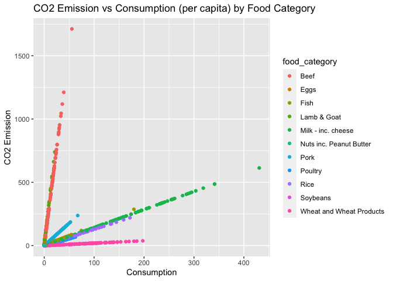
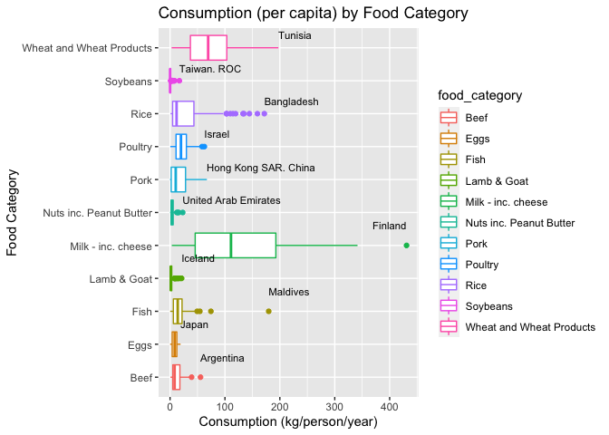
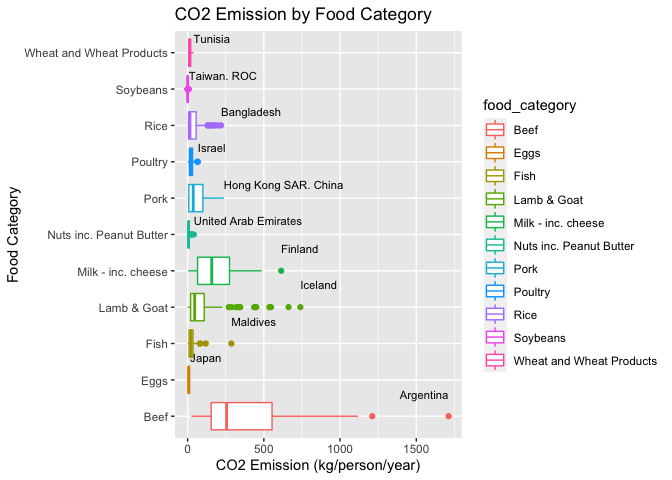
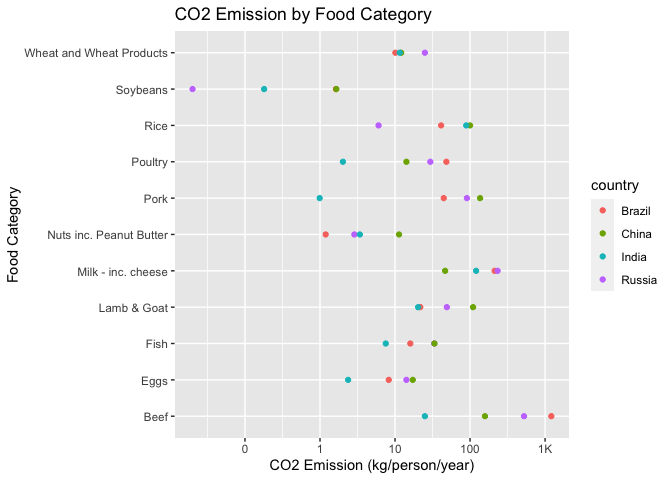
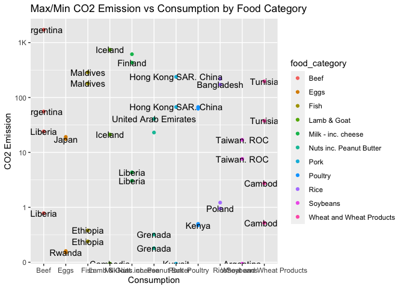

Food Consumption and CO2 Emissions
================
Jen Wei
2020-08-03

  - [Get the Data](#get-the-data)
  - [Analyze](#analyze)
      - [Team Exploration](#team-exploration)
      - [Extra Unused “Code”](#extra-unused-code)
  - [Notes / Sources](#notes-sources)

*Purpose*: <TODO>

``` r
library(tidyverse)
```

    ## ── Attaching packages ─────────────────────────────────────────────────────────────────────────────────────────────────────────── tidyverse 1.3.0 ──

    ## ✓ ggplot2 3.3.2     ✓ purrr   0.3.4
    ## ✓ tibble  3.0.1     ✓ dplyr   1.0.0
    ## ✓ tidyr   1.1.0     ✓ stringr 1.4.0
    ## ✓ readr   1.3.1     ✓ forcats 0.5.0

    ## ── Conflicts ────────────────────────────────────────────────────────────────────────────────────────────────────────────── tidyverse_conflicts() ──
    ## x dplyr::filter() masks stats::filter()
    ## x dplyr::lag()    masks stats::lag()

*Background*: <TODO>

# Get the Data

<!-- -------------------------------------------------- -->

``` r
df_food_consumption <- readr::read_csv('https://raw.githubusercontent.com/rfordatascience/tidytuesday/master/data/2020/2020-02-18/food_consumption.csv')
```

    ## Parsed with column specification:
    ## cols(
    ##   country = col_character(),
    ##   food_category = col_character(),
    ##   consumption = col_double(),
    ##   co2_emmission = col_double()
    ## )

``` r
glimpse(df_food_consumption)
```

    ## Rows: 1,430
    ## Columns: 4
    ## $ country       <chr> "Argentina", "Argentina", "Argentina", "Argentina", "Ar…
    ## $ food_category <chr> "Pork", "Poultry", "Beef", "Lamb & Goat", "Fish", "Eggs…
    ## $ consumption   <dbl> 10.51, 38.66, 55.48, 1.56, 4.36, 11.39, 195.08, 103.11,…
    ## $ co2_emmission <dbl> 37.20, 41.53, 1712.00, 54.63, 6.96, 10.46, 277.87, 19.6…

``` r
summary(df_food_consumption)
```

    ##    country          food_category       consumption      co2_emmission    
    ##  Length:1430        Length:1430        Min.   :  0.000   Min.   :   0.00  
    ##  Class :character   Class :character   1st Qu.:  2.365   1st Qu.:   5.21  
    ##  Mode  :character   Mode  :character   Median :  8.890   Median :  16.53  
    ##                                        Mean   : 28.110   Mean   :  74.38  
    ##                                        3rd Qu.: 28.133   3rd Qu.:  62.60  
    ##                                        Max.   :430.760   Max.   :1712.00

# Analyze

<!-- -------------------------------------------------- -->

``` r
df_food_consumption %>%
  ggplot(mapping = aes(x = consumption, y = co2_emmission)) +
  geom_point(mapping = aes(color = food_category)) +
  # scale_y_log10(labels = scales::label_number_si()) +
  labs(y = "CO2 Emission", x = "Consumption", title = "CO2 Emission vs Consumption (per capita) by Food Category")
```

<!-- -->

**Observations:**

  - Linear relationships between CO\_2 emission and consumption across
    all food categories
  - “Beef” has an outlier for CO\_2 emission
  - “Milk and cheese” has an outlier for consumption

From the observations, I wondered who the highest consumers were for
each food category

``` r
df_food_consumption %>%
  ggplot(mapping = aes(x = food_category, y = consumption)) +
  geom_boxplot(mapping = aes(color = food_category)) +
  labs(x = "Food Category", y = "Consumption (kg/person/year)", title = "Consumption (per capita) by Food Category") +
  geom_text( 
    data = df_food_consumption %>% group_by(food_category) %>% filter(consumption == max(consumption)),
    mapping = aes(label = country, fill = "black"),
    size = 3,
    nudge_x = 0.5,
    vjust = "inward",
    hjust = "inward",
    check_overlap = TRUE
  ) +
  coord_flip()
```

    ## Warning: Ignoring unknown aesthetics: fill

<!-- -->

**Observations:**

Per capita . . . - Tunisia is the largest cosumer of wheat - Taiwan is
an outlier and the largest consumer of soybeans - Bangladesh is the
largest consumer of rice - Israel is the largest consumer of poultry -
Hong Kong SAR China is the largest consumer of pork - UAE is the largest
consumer of nuts and peanut butter - Finland is an outlier and the
largest consumer of milk and cheese - Iceland is the largest consumer of
lamb and goat - Maldives is an outlier and the largest consumer of fish
- Despite their size, the Maldives is “99% sea” (according to
goway.com), where fish is a primary part of their diet - Japan is the
largest consumer of eggs - Argentina is an outlier and the largest
consumer of beef

``` r
df_food_consumption %>%
  ggplot(mapping = aes(x = food_category, y = co2_emmission)) +
  geom_boxplot(mapping = aes(color = food_category)) +
  labs(x = "Food Category", y = "CO2 Emission (kg/person/year)", title = "CO2 Emission by Food Category") +
  geom_text( 
    data = df_food_consumption %>% group_by(food_category) %>% filter(co2_emmission == max(co2_emmission)),
    mapping = aes(label = country, fill = "black"),
    size = 3,
    nudge_x = 0.5,
    vjust = "inward",
    hjust = "inward",
    check_overlap = TRUE
  ) +
  coord_flip()
```

    ## Warning: Ignoring unknown aesthetics: fill

<!-- -->

**Observations:**

  - Similar to the last plot (since there’s a positive relationship
    between consumption and CO\_2 emission)
  - Most meats (Beef, Lamb & Goat, Pork, Fish) have CO\_2 emission
    values around or above 250 kg/person/year (aside from poultry)
  - Rice is the largest CO\_2 emitter aside from meats

## Team Exploration

From initial exploration, we decided to focus on BRIC countries and how
the United States compares

``` r
df_food_consumption_bricu <- df_food_consumption %>%
  filter(country == 'Brazil' | country == 'China' | country == 'India' | country == 'Russia' | country == 'United States')

glimpse(df_food_consumption_bricu)
```

    ## Rows: 44
    ## Columns: 4
    ## $ country       <chr> "Brazil", "Brazil", "Brazil", "Brazil", "Brazil", "Braz…
    ## $ food_category <chr> "Pork", "Poultry", "Beef", "Lamb & Goat", "Fish", "Eggs…
    ## $ consumption   <dbl> 12.60, 45.00, 39.25, 0.62, 10.01, 8.98, 149.28, 53.00, …
    ## $ co2_emmission <dbl> 44.60, 48.34, 1211.17, 21.71, 15.98, 8.25, 212.63, 10.1…

``` r
df_food_consumption_bricu %>%
  ggplot(mapping = aes(x = food_category, y = co2_emmission)) +
  geom_point(mapping = aes(color = country)) +
  scale_y_log10(labels = scales::label_number_si()) +
  labs(x = "Food Category", y = "CO2 Emission (kg/person/year)", title = "CO2 Emission by Food Category") +
  coord_flip()
```

<!-- -->

**Observations:**

  - TODO

## Extra Unused “Code”

``` r
# Find country with max emission for each food category
df_max_emission <- df_food_consumption %>%
  group_by(food_category) %>%
  summarize(
    emission = max(co2_emmission),
    country = country[which.max(co2_emmission)],
    consumption = consumption[which.max(co2_emmission)],
    food_category = food_category
  ) %>%
  distinct()
```

    ## `summarise()` regrouping output by 'food_category' (override with `.groups` argument)

``` r
# Find country with min emission for each food category
df_min_emission <- df_food_consumption %>%
  group_by(food_category) %>%
  summarize(
    emission = min(co2_emmission),
    country = country[which.min(co2_emmission)],
    consumption = consumption[which.min(co2_emmission)],
    food_category = food_category
  ) %>%
  distinct()
```

    ## `summarise()` regrouping output by 'food_category' (override with `.groups` argument)

``` r
# Find country with max food consumption for each food category
df_max_consumption <- df_food_consumption %>%
  group_by(food_category) %>%
  summarize(
    emission = max(consumption),
    country = country[which.max(consumption)],
    consumption = consumption[which.max(consumption)],
    food_category = food_category
  ) %>%
  distinct()
```

    ## `summarise()` regrouping output by 'food_category' (override with `.groups` argument)

``` r
# Find country with min consumption for each food category
df_min_consumption <- df_food_consumption %>%
  group_by(food_category) %>%
  summarize(
    emission = min(consumption),
    country = country[which.min(consumption)],
    consumption = consumption[which.min(consumption)],
    food_category = food_category
  ) %>%
  distinct()
```

    ## `summarise()` regrouping output by 'food_category' (override with `.groups` argument)

``` r
# Merge all the max/min dataframes into one
df_emission_consumption_extremes <- merge(df_max_emission,df_min_emission, all = TRUE) %>%
  merge(df_max_consumption, all = TRUE) %>%
  merge(df_min_consumption, all = TRUE)
```

``` r
df_emission_consumption_extremes %>%
  ggplot(mapping = aes(x = food_category, y = emission)) +
  geom_point(mapping = aes(color = food_category)) +
  scale_y_log10(labels = scales::label_number_si()) +
  labs(y = "CO2 Emission", x = "Consumption", title = "Max/Min CO2 Emission vs Consumption by Food Category") +
  geom_text(aes(label = country), check_overlap = TRUE)
```

    ## Warning: Transformation introduced infinite values in continuous y-axis
    
    ## Warning: Transformation introduced infinite values in continuous y-axis

<!-- -->

# Notes / Sources

<!-- -------------------------------------------------- -->

\[1\] <TODO>
