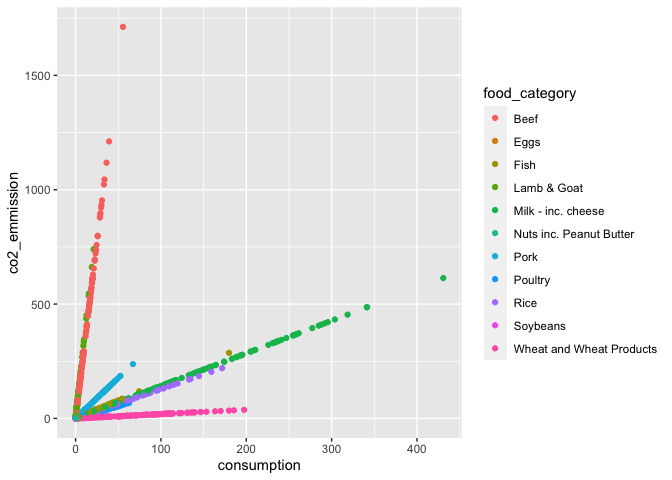

Food Consumption and CO2 Emissions
================
Jen Wei
2020-08-03

  - [Get the Data](#get-the-data)
  - [Analyze](#analyze)
  - [Notes / Sources](#notes-sources)

*Purpose*: <TODO>

``` r
library(tidyverse)
```

    ## ── Attaching packages ───────────────────────────────────────────────────────────────────────────────────────────────────── tidyverse 1.3.0 ──

    ## ✓ ggplot2 3.3.2     ✓ purrr   0.3.4
    ## ✓ tibble  3.0.1     ✓ dplyr   1.0.0
    ## ✓ tidyr   1.1.0     ✓ stringr 1.4.0
    ## ✓ readr   1.3.1     ✓ forcats 0.5.0

    ## ── Conflicts ──────────────────────────────────────────────────────────────────────────────────────────────────────── tidyverse_conflicts() ──
    ## x dplyr::filter() masks stats::filter()
    ## x dplyr::lag()    masks stats::lag()

``` r
library(gapminder)
```

*Background*: <TODO>

# Get the Data

<!-- -------------------------------------------------- -->

``` r
df_food_consumption <- readr::read_csv('https://raw.githubusercontent.com/rfordatascience/tidytuesday/master/data/2020/2020-02-18/food_consumption.csv')
```

    ## Parsed with column specification:
    ## cols(
    ##   country = col_character(),
    ##   food_category = col_character(),
    ##   consumption = col_double(),
    ##   co2_emmission = col_double()
    ## )

``` r
glimpse(df_food_consumption)
```

    ## Rows: 1,430
    ## Columns: 4
    ## $ country       <chr> "Argentina", "Argentina", "Argentina", "Argentina", "Ar…
    ## $ food_category <chr> "Pork", "Poultry", "Beef", "Lamb & Goat", "Fish", "Eggs…
    ## $ consumption   <dbl> 10.51, 38.66, 55.48, 1.56, 4.36, 11.39, 195.08, 103.11,…
    ## $ co2_emmission <dbl> 37.20, 41.53, 1712.00, 54.63, 6.96, 10.46, 277.87, 19.6…

``` r
summary(df_food_consumption)
```

    ##    country          food_category       consumption      co2_emmission    
    ##  Length:1430        Length:1430        Min.   :  0.000   Min.   :   0.00  
    ##  Class :character   Class :character   1st Qu.:  2.365   1st Qu.:   5.21  
    ##  Mode  :character   Mode  :character   Median :  8.890   Median :  16.53  
    ##                                        Mean   : 28.110   Mean   :  74.38  
    ##                                        3rd Qu.: 28.133   3rd Qu.:  62.60  
    ##                                        Max.   :430.760   Max.   :1712.00

# Analyze

<!-- -------------------------------------------------- -->

``` r
df_food_consumption %>%
  ggplot() +
  geom_point(mapping = aes(x = consumption, y = co2_emmission, color = food_category))
```

<!-- -->

``` r
# TODO
```

# Notes / Sources

<!-- -------------------------------------------------- -->

\[1\] <TODO>
