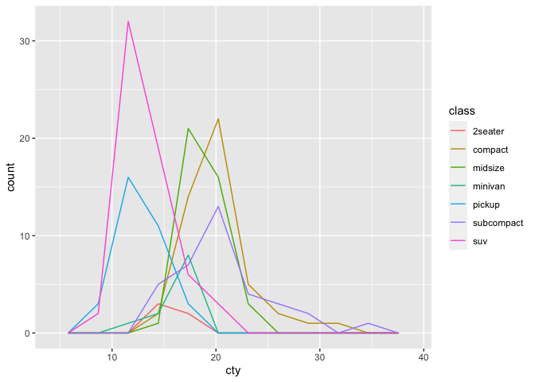
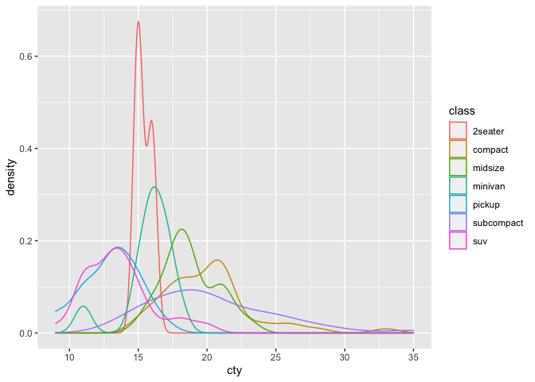
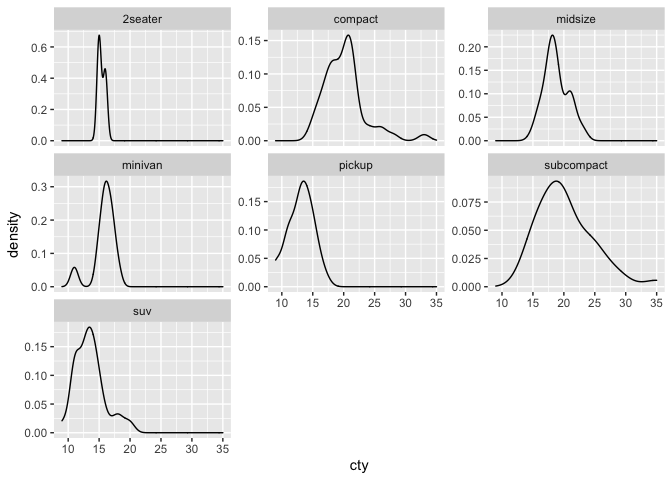
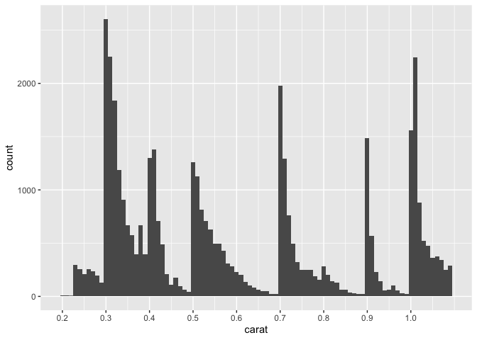

Visualization: Histograms
================
Zach del Rosario
2020-05-22

*Purpose*: *Histograms* are a key tool for EDA. In this exercise we’ll
get a little more practice constructing and interpreting histograms and
densities.

*Reading*: [Histograms](https://rstudio.cloud/learn/primers/3.3)
*Topics*: (All topics) *Reading Time*: \~20 minutes

``` r
library(tidyverse)
```

    ## ── Attaching packages ───────────────────────────────────────────────────────────────────────────────── tidyverse 1.3.0 ──

    ## ✓ ggplot2 3.3.2     ✓ purrr   0.3.4
    ## ✓ tibble  3.0.1     ✓ dplyr   1.0.0
    ## ✓ tidyr   1.1.0     ✓ stringr 1.4.0
    ## ✓ readr   1.3.1     ✓ forcats 0.5.0

    ## ── Conflicts ──────────────────────────────────────────────────────────────────────────────────── tidyverse_conflicts() ──
    ## x dplyr::filter() masks stats::filter()
    ## x dplyr::lag()    masks stats::lag()

**q1** Using the graphs generated in the chunks `q1-vis1` and `q1-vis2`
below, answer:

  - Which `class` has the most vehicles?
  - Which `class` has the broadest distribution of `cty` values?
  - Which graph—`vis1` or `vis2`—best helps you answer each question?

<!-- end list -->

``` r
## NOTE: No need to modify
mpg %>%
  ggplot(aes(cty, color = class)) +
  geom_freqpoly(bins = 10)
```

<!-- -->

<!-- solution-begin -->

  - From this graph, it’s easy to see that `suv` is the most numerous
    class <!-- solution-end -->

<!-- end list -->

``` r
## NOTE: No need to modify
mpg %>%
  ggplot(aes(cty, color = class)) +
  geom_density()
```

<!-- -->

<!-- solution-begin -->

  - From this graph, it’s easy to see that `subcompact` has the broadest
    distribution

In my opinion, it’s easier to see the broadness of `subcompact` by the
density plot `q1-vis2`. <!-- solution-end -->

In the previous exercise, we learned how to *facet* a graph. Let’s use
that part of the grammar of graphics to clean up the graph above.

**q2** Modify `q1-vis2` to use a `facet_wrap()` on the `class`. “Free”
the vertical axis with the `scales` keyword to allow for a different y
scale in each facet.

``` r
# task-begin
mpg %>%
  ggplot(aes(cty, color = class)) +
  geom_density()
```

<!-- -->

``` r
# task-end
# solution-begin
mpg %>%
  ggplot(aes(cty)) +
  geom_density() +
  facet_wrap(~class, scales = "free_y")
```

<!-- -->

``` r
# solution-end
```

In the reading, we learned that the “most important thing” to keep in
mind with `geom_histogram()` and `geom_freqpoly()` is to *explore
different binwidths*. We’ll explore this idea in the next question.

**q3** Analyze the following graph; make sure to test different
binwidths. What patterns do you see? Which patterns remain as you change
the binwidth?

``` r
## TODO: Run this chunk; play with differnet bin widths
diamonds %>%
  filter(carat < 1.1) %>%

  ggplot(aes(carat)) +
  geom_histogram(binwidth = 0.01, boundary = 0.005) +
  scale_x_continuous(
    breaks = seq(0, 1, by = 0.1)

  )
```

<!-- -->

**Observations** <!-- task-begin --> - Write your observations here\!
<!-- task-end --> <!-- solution-begin --> - The largest number of
diamonds tend to fall on *or above* even 10-ths of a carat. - The peak
near `0.5` is very broad, compared to the others. - The peak at `0.3` is
most numerous <!-- solution-end -->

<!-- include-exit-ticket -->
