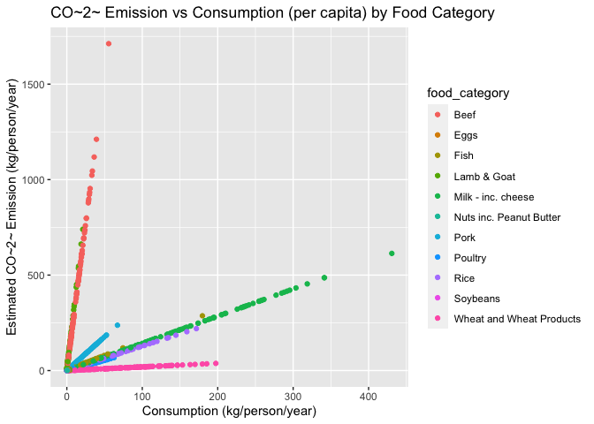
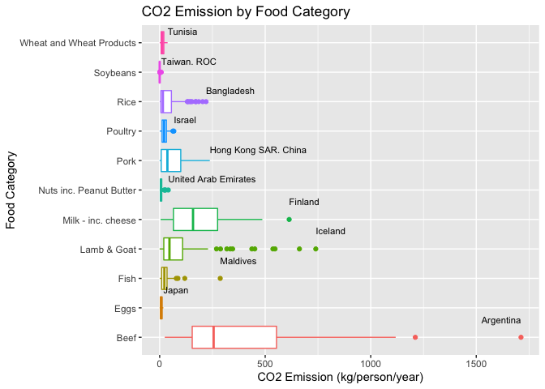
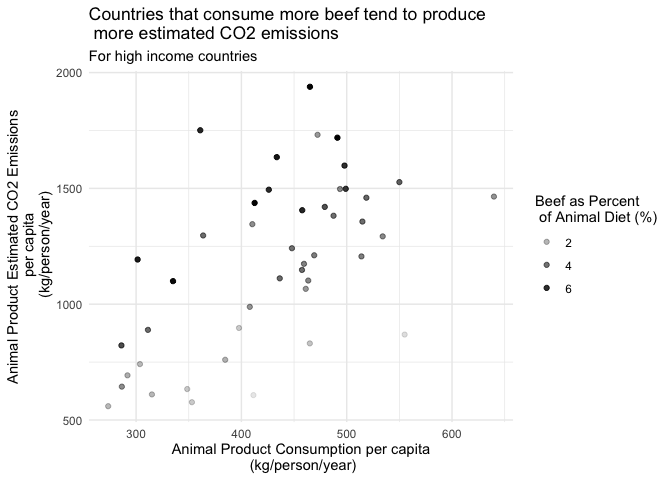
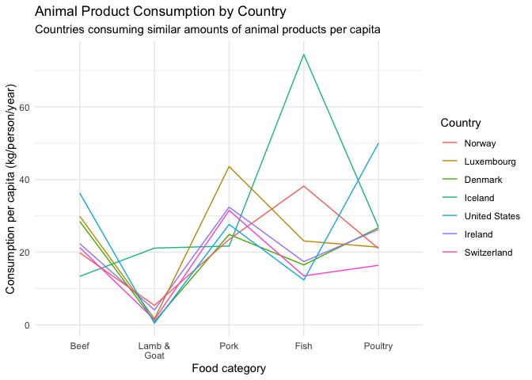
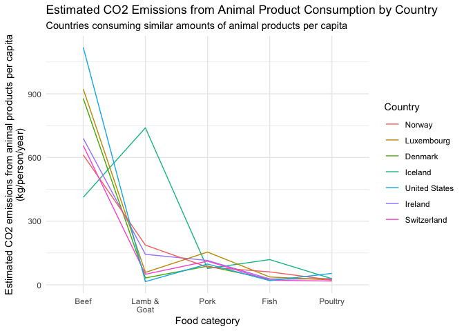
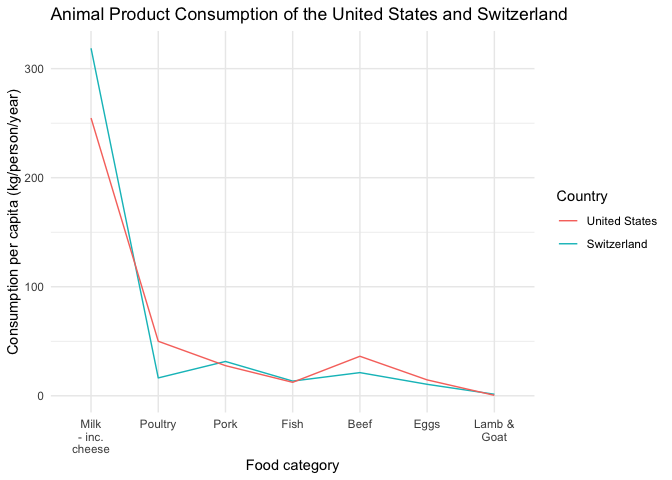
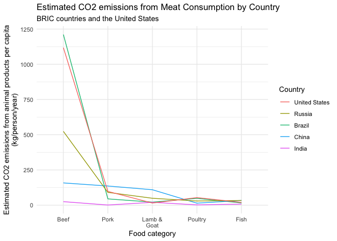
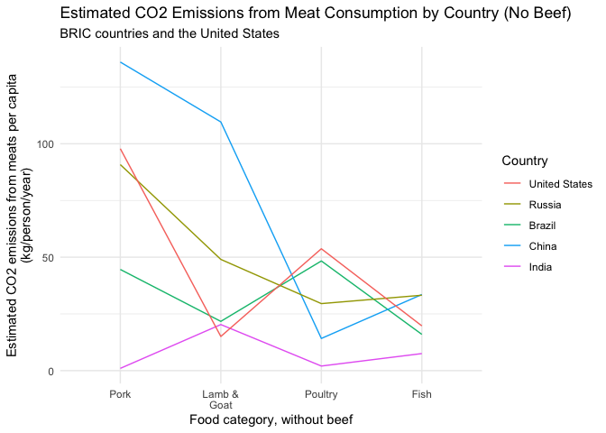

Food Consumption and CO<sub>2</sub> Emissions
================
Team Zeta
2020-08-08

  - [Get the Data](#get-the-data)
  - [Data Wrangling](#data-wrangling)
  - [EDA](#eda)
  - [Team Exploration](#team-exploration)
  - [Looking Forward](#looking-forward)
  - [Notes / Sources](#notes-sources)

*Purpose*: Apply the skills learned throughout the summer to a
topic/dataset of our choice.

``` r
library(tidyverse)
```

    ## ── Attaching packages ───────────────────────────────────────────────────────────────────────────────── tidyverse 1.3.0 ──

    ## ✓ ggplot2 3.3.2     ✓ purrr   0.3.4
    ## ✓ tibble  3.0.1     ✓ dplyr   1.0.0
    ## ✓ tidyr   1.1.0     ✓ stringr 1.4.0
    ## ✓ readr   1.3.1     ✓ forcats 0.5.0

    ## ── Conflicts ──────────────────────────────────────────────────────────────────────────────────── tidyverse_conflicts() ──
    ## x dplyr::filter() masks stats::filter()
    ## x dplyr::lag()    masks stats::lag()

``` r
library(scales)
```

    ## 
    ## Attaching package: 'scales'

    ## The following object is masked from 'package:purrr':
    ## 
    ##     discard

    ## The following object is masked from 'package:readr':
    ## 
    ##     col_factor

``` r
library("wesanderson")
```

**Background**:

According to [Our World in
Data](https://ourworldindata.org/food-ghg-emissions), “\[food\]
production is responsible for one-quarter of the world’s greenhouse gas
emissions”, contributing to global warming.

For this project, we decided to dissect the
[nu3](https://www.nu3.de/pages/geschichte) dataset found on
[TidyTuesday](https://github.com/rfordatascience/tidytuesday/blob/master/data/2020/2020-02-18/readme.md).
In 2018, nu3, a German health store, used data from the [Food and
Agriculture Organization of the United Nations
(FAO)](http://www.fao.org/faostat/en/#data) to compare CO<sub>2</sub>
emissions between countries based on their consumption of select
categories of food.

The dataset uses some of FAO’s 2013 food data and 2014 emissions data to
- to determine the quantity of 11 food types supplied for consumption
for 130 countries researched - to estimate CO<sub>2</sub> emissions from
the supply of each food type per capita for each country

NOTE: The dataset is a sample as it does not cover all food categories
or all countries. It has a lot of animal product data but no information
on fruits and vegetables (potatoes, anyone?).

We also decided to pull in data from
[Gapminder](https://www.gapminder.org/data/), an independent Swedish
foundation that promotes fact-based views to supplement the nu3 data. We
specifically pulled in 2014 data on country population and income level
data based on gross national income (GNI).

# Get the Data

<!-- -------------------------------------------------- -->

``` r
food_consumption <- readr::read_csv('https://raw.githubusercontent.com/rfordatascience/tidytuesday/master/data/2020/2020-02-18/food_consumption.csv')
```

    ## Parsed with column specification:
    ## cols(
    ##   country = col_character(),
    ##   food_category = col_character(),
    ##   consumption = col_double(),
    ##   co2_emmission = col_double()
    ## )

``` r
gapminder_pop_total <- read_csv("./data/population_total.csv")
```

    ## Parsed with column specification:
    ## cols(
    ##   .default = col_double(),
    ##   country = col_character()
    ## )

    ## See spec(...) for full column specifications.

``` r
gapminder_geo <- read_csv("./data/countries_gapminder.csv")
```

    ## Parsed with column specification:
    ## cols(
    ##   geo = col_character(),
    ##   name = col_character(),
    ##   four_regions = col_character(),
    ##   eight_regions = col_character(),
    ##   six_regions = col_character(),
    ##   members_oecd_g77 = col_character(),
    ##   Latitude = col_double(),
    ##   Longitude = col_double(),
    ##   `UN member since` = col_character(),
    ##   `World bank region` = col_character(),
    ##   `World bank, 4 income groups 2017` = col_character()
    ## )

``` r
gapminder_emissions <- read_csv("./data/co2_emissions_tonnes_per_person.csv")
```

    ## Parsed with column specification:
    ## cols(
    ##   .default = col_double(),
    ##   country = col_character()
    ## )
    ## See spec(...) for full column specifications.

# Data Wrangling

<!-- -------------------------------------------------- -->

``` r
gapminder_pop_2014 <-
  gapminder_pop_total %>%
  select("country", "population" = "2014")

gapminder_geo_select <-
  gapminder_geo %>%
  select(
    "country" = "name", 
    "region" = "World bank region", 
    "income_grp" = "World bank, 4 income groups 2017"
  )

gapminder_emissions_2014 <-
  gapminder_emissions %>%
  select("country", "total_co2_tonnes" = "2014") %>%
  mutate(total_co2_emissions = total_co2_tonnes * 1000) %>%
  select("country", "total_co2_emissions")
```

``` r
## First, I'm fixing the USA
food_consumption_US_only <-
  food_consumption %>%
  filter(country == "USA") %>%
  select(-country) %>%
  mutate(country = "United States") %>%
  select(country, food_category, consumption, co2_emmission)
## Next, I'm fixing Hong Kong
food_consumption_HK_only <-
  food_consumption %>%
  filter(country == "Hong Kong SAR. China") %>%
  select(-country) %>%
  mutate(country = "Hong Kong, China") %>%
  select(country, food_category, consumption, co2_emmission)
## Next, I'm fixing Taiwan
food_consumption_TW_only <-
  food_consumption %>%
  filter(country == "Taiwan. ROC") %>%
  select(-country) %>%
  mutate(country = "Taiwan") %>%
  select(country, food_category, consumption, co2_emmission)
## Macedonia (Macedonia, FYR in gapminder)
food_consumption_Macedonia_only <-
  food_consumption %>%
  filter(country == "Macedonia") %>%
  select(-country) %>%
  mutate(country = "Macedonia, FYR") %>%
  select(country, food_category, consumption, co2_emmission)
## Congo, Rep.
food_consumption_CongoRep_only <-
  food_consumption %>%
  filter(country == "Congo") %>%
  select(-country) %>%
  mutate(country = "Congo, Rep.") %>%
  select(country, food_category, consumption, co2_emmission)
## Now, I'm binding them all together!
food_consumption_mod <-
  food_consumption %>%
  filter(
    country != "USA" &
    country != "Hong Kong SAR. China" &
    country != "Taiwan. ROC" &
    country != "Macedonia" &
    country != "Congo"
  ) %>%
  bind_rows(
    food_consumption_US_only,
    food_consumption_HK_only,
    food_consumption_TW_only,
    food_consumption_Macedonia_only,
    food_consumption_CongoRep_only
    )
```

``` r
df_food_all <-
  food_consumption_mod %>%
  left_join(gapminder_pop_2014, by = "country") %>%
  left_join(gapminder_geo_select, by = "country") %>%
  left_join(gapminder_emissions_2014, by = "country") %>%
  group_by(country) %>%
  mutate(
    co2_food_country = sum(co2_emmission), 
    food_consumption_country = sum(consumption)
  ) %>%
  ungroup() %>%
  mutate(
    percent_diet = consumption / food_consumption_country,
    percent_co2 = co2_emmission / co2_food_country
  ) %>%
  select(
    region,
    country,
    population,
    income_grp,
    food_category,
    consumption,
    food_consumption_country,
    "co2_emission_food" = co2_emmission,
    co2_food_country,
    total_co2_emissions,
    percent_diet,
    percent_co2
  )

df_food_high_income <- df_food_all %>% 
  filter(income_grp == "High income")

df_food_pop <-
  food_consumption_mod %>%
  left_join(gapminder_pop_2014, by = "country") %>%
  left_join(gapminder_geo_select, by = "country") %>%
  group_by(country) %>%
  mutate(
    co2_food_country = sum(co2_emmission), 
    food_consumption_country = sum(consumption)
  ) %>%
  ungroup()

df_food_pop_totals <- df_food_pop %>% 
  mutate(
    total_consumption_food = consumption * population,
    total_co2_food = co2_emmission * population
  )

df_food_animal <-
  df_food_all %>%
  select(-co2_food_country, -food_consumption_country) %>%
  filter(
    food_category %in% c(
      "Beef", "Fish", "Lamb & Goat", "Pork", "Poultry", 
      "Eggs", "Milk - inc. cheese"
    ) 
  ) %>%
  group_by(country) %>%
  mutate(
    co2_food_animal_country = sum(co2_emission_food), 
    food_animal_consumption_country = sum(consumption)
  ) %>%
  ungroup() %>%
  group_by(food_category) %>%
  mutate(
    mean_consumption_cat = mean(consumption)
  ) %>%
  ungroup()

## We will mostly focus in on wealthy countries only, but I wanted to preserve the full income range first, to make some visualiziations that will situate those countries relative to the others.
df_food_animal_high_income <-
  df_food_animal %>%
  filter(income_grp == "High income") %>%
  group_by(food_category) %>%
  mutate(
    mean_consumption_cat_hi = mean(consumption)
  ) %>%
  ungroup()
```

# EDA

<!-- -------------------------------------------------- -->

``` r
food_consumption %>%
  ggplot(mapping = aes(x = consumption, y = co2_emmission)) +
  geom_point(mapping = aes(color = food_category)) +
  # scale_y_log10(labels = scales::label_number_si()) +
  labs(y = "Estimated CO~2~ Emission (kg/person/year)", x = "Consumption (kg/person/year)", title = "CO~2~ Emission vs Consumption (per capita) by Food Category")
```

<!-- -->

**Observations:**

  - Linear relationships between CO<sub>2</sub> emission and consumption
    across all food categories
      - This is expected as CO<sub>2</sub> emission is calculated by
        multiplying the consumption by the median of emissions intensity
        in the world for that food category
  - “Beef” has an outlier for CO<sub>2</sub> emission
  - “Milk and cheese” has an outlier for consumption
  - Consumption of animal products resulted in higher CO<sub>2</sub>
    emission than non-animal foods

<!-- end list -->

``` r
food_consumption %>%
  ggplot(mapping = aes(x = food_category, y = consumption)) +
  geom_boxplot(mapping = aes(color = food_category)) +
  labs(x = "Food Category", y = "Consumption (kg/person/year)", title = "Consumption (per capita) by Food Category") +
  geom_text( 
    data = food_consumption %>% group_by(food_category) %>% filter(consumption == max(consumption)),
    mapping = aes(label = country, fill = "black"),
    size = 3,
    nudge_x = 0.5,
    vjust = "inward",
    hjust = "inward",
    check_overlap = TRUE
  ) +
  coord_flip()
```

    ## Warning: Ignoring unknown aesthetics: fill

<!-- -->

**Observations:**

Per capita . . .

  - Tunisia is the largest cosumer of wheat
  - Taiwan is an outlier and the largest consumer of soybeans
  - Bangladesh is the largest consumer of rice
  - Israel is the largest consumer of poultry
  - Hong Kong SAR China is the largest consumer of pork
  - UAE is the largest consumer of nuts and peanut butter
  - Finland is an outlier and the largest consumer of milk and cheese
  - Iceland is the largest consumer of lamb and goat
  - Maldives is an outlier and the largest consumer of fish
      - Despite their size, the Maldives is “99% sea” (according to
        goway.com), where fish is a primary part of their diet
  - Japan is the largest consumer of eggs
  - Argentina is an outlier and the largest consumer of beef

<!-- end list -->

``` r
food_consumption %>%
  ggplot(mapping = aes(x = food_category, y = co2_emmission)) +
  geom_boxplot(mapping = aes(color = food_category)) +
  labs(x = "Food Category", y = "CO2 Emission (kg/person/year)", title = "CO2 Emission by Food Category") +
  geom_text( 
    data = food_consumption %>% group_by(food_category) %>% filter(co2_emmission == max(co2_emmission)),
    mapping = aes(label = country, fill = "black"),
    size = 3,
    nudge_x = 0.5,
    vjust = "inward",
    hjust = "inward",
    check_overlap = TRUE
  ) +
  theme(legend.position="none") +
  coord_flip()
```

    ## Warning: Ignoring unknown aesthetics: fill

<!-- -->

**Observations:**

  - Similar to the last plot (since there’s a positive relationship
    between consumption and CO<sub>2</sub> emission)
  - Most meats (Beef, Lamb & Goat, Pork) have CO<sub>2</sub> emission
    values around or above 250 kg/person/year (aside from Poultry and
    Fish)
  - Rice is the largest CO\_2 emitter aside from meats

# Team Exploration

<!-- -------------------------------------------------- -->

From initial exploration, our claim is that eating more, *AND* more
animal products, results in higher emissions, *BUT* CO<sub>2</sub>
emissions vary depending on the specific animal products being consumed.
*THEREFORE*, we can lower our emissions by changing our diets without
having to eat less.

To support this claim, we decided to narrow our dataset and scope to
focus on animal product consumption and CO<sub>2</sub> emissions of high
income countries. *Why?* Animal products overall result in greater
CO<sub>2</sub> emissions than non-animal products. Also, the animal
products (meat, eggs, dairy) data is more complete than the non-animal
products data in our dataset, and we wanted to compared the United
States, a high income country, with other high income countries.

``` r
high_income_beef <- df_food_high_income %>% 
  filter(food_category == "Beef") %>% 
  mutate(
    beef_group = cut_width(percent_diet * 100, 4, boundary = 0)
  )

group_width <- 100

high_income_groups <- df_food_high_income %>% 
  select(
    country,
    region,
    income_grp,
    population,
    food_consumption_country,
    co2_food_country
  ) %>% 
  distinct() %>% 
  mutate(
    food_consumption_group = cut_width(food_consumption_country, group_width)
  )

high_income_groups %>% 
  ggplot(
    aes(
      x = food_consumption_country,
      y = co2_food_country,
    )
  ) +
  geom_point(
    aes(
      alpha = high_income_beef$percent_diet * 100
    )
  ) +
  labs(
    title = "Countries that consume more beef tend to produce\n more estimated CO2 emissions",
    subtitle = "For high income countries",
    x = "Animal Product Consumption per capita\n (kg/person/year)",
    y = "Animal Product Estimated CO2 Emissions\n per capita\n (kg/person/year)",
    alpha = "Beef as Percent\n of Animal Diet (%)"
  ) +
  theme(plot.title = element_text(face = "bold")) +
  scale_color_manual(values = wes_palette(n = 4, name = "Darjeeling1")) +
  theme_minimal()
```

<!-- -->

**Observations:**

  - Overall, for animal product consumption of high income countries,
    those that ate less beef tended to have a lower estimated
    CO<sub>2</sub> emission than those that ate more beef
  - Looking at the data, the United States consumes almost
    400kg/person/year of animal products with approximately 10% of it
    being beef
      - The estimated CO<sub>2</sub> emissions is a little over
        1600kg/person/year

From the observations, we then decided to focus on countries that
consumed similar amounts of animal products per capita to the United
States. The countries we selected were Norway, Luxembourg, Denmark,
Iceland, Ireland, and Switzerland.

``` r
df_food_animal_cohort <-
  df_food_animal_high_income %>%
  filter(
    food_animal_consumption_country > 375 & 
    food_animal_consumption_country < 415
  ) %>%
  group_by(food_category) %>%
  mutate(
    mean_consumption_cohort = mean(consumption),
    mean_co2_em_food_cohort = mean(co2_emission_food)
  ) %>%
  ungroup() 
  
df_food_animal_cohort %>%
  filter(   
    food_category != "Milk - inc. cheese" &
    food_category != "Eggs" 
  ) %>%
  ggplot() +
  geom_line(
    aes(
      fct_relevel(food_category, "Beef", "Lamb & Goat", "Pork", "Fish", "Poultry"),
      # fct_reorder(food_category, desc(co2_emission_food)),
      consumption,
      group = country,
      color = fct_reorder(country, food_animal_consumption_country)
    )
  ) + 
  scale_x_discrete(
    labels = function(food_category) str_wrap(food_category, width = 10)
  ) +
  scale_color_discrete(name = "Country") +
  labs(
    title = "Animal Product Consumption by Country",
    subtitle = "Countries consuming similar amounts of animal products per capita",
    x = "Food category",
    y = "Consumption per capita (kg/person/year)"
  ) +
  theme_minimal()
```

<!-- -->

**Observations:**

  - The United States is the largest consumer of beef (of the selected
    countries)
  - Iceland consumes a lot of lamb and goat compared to the other
    countries (more than double the other countries individually)
  - Iceland is the largest consumer of fish (of the selected countries)
    by more than 20kg/person/year

<!-- end list -->

``` r
df_food_animal_high_income %>%
  filter(
    food_animal_consumption_country > 375 & 
    food_animal_consumption_country < 415 &
    food_category != "Milk - inc. cheese" &
    food_category != "Eggs" 
  ) %>%
  group_by(food_category) %>%
  mutate(
    mean_consumption_cohort = mean(consumption),
    mean_co2_em_food_cohort = mean(co2_emission_food)
  ) %>%
  ungroup() %>%
  ggplot() +
  geom_line(
    aes(fct_reorder(food_category, desc(mean_co2_em_food_cohort)),
      co2_emission_food,
      group = country,
      color = fct_reorder(country, food_animal_consumption_country)
    )
  ) + 
  scale_x_discrete(
    labels = function(food_category) str_wrap(food_category, width = 10)
  ) +
  scale_color_discrete(name = "Country") +
  labs(
    title = "Estimated CO2 Emissions from Animal Product Consumption by Country",
    subtitle = "Countries consuming similar amounts of animal products per capita",
    x = "Food category",
    y = "Estimated CO2 emissions from animal products per capita\n(kg/person/year)"
  ) +
  theme_minimal()
```

<!-- -->

**Observations:**

  - Aside from lamb and goat CO<sub>2</sub> emissions from Iceland, beef
    CO<sub>2</sub> emissions are the largest source of CO<sub>2</sub>
    emissions among the countries
  - Despite the large amount of fish being consumed by Iceland (over
    70kg/person/year) compared to beef (less than 30 kg/person/year),
    the estimated CO<sub>2</sub> emissions were much lower (over
    300kg/person/year for beef compared to less than 150kg/person/year
    for fish)

Calculating based off data from the plot, we found that Switzerland had
the lowest overall animal product estimated CO<sub>2</sub> emissions per
capita. From this, we decided to compare animal product consumption
between the United States and Switzerland to see what sort of
rebalancing the United States could do to have a similar diet (and
similar CO<sub>2</sub> emissions) as Switzerland.

``` r
df_food_animal_cohort %>%
  filter(country %in% c("United States", "Switzerland")) %>%
  ggplot() +
  geom_line(
    aes(
      fct_reorder(food_category, desc(mean_consumption_cat_hi)),
      consumption,
      group = country,
      color = fct_reorder(country, food_animal_consumption_country)
    )
  ) + 
  scale_x_discrete(
    labels = function(food_category) str_wrap(food_category, width = 10)
  ) +
  scale_color_discrete(name = "Country") +
  labs(
    title = "Animal Product Consumption of the United States and Switzerland",
    x = "Food category",
    y = "Consumption per capita (kg/person/year)"
  ) +
  theme_minimal()
```

<!-- -->

**Observations:**

  - The beef consumption difference between the two countries is smaller
    than the milk and cheese consumption difference
  - Switzerland consumes a lot more milk and cheese than the United
    States (more than 50kg/person/year more\!)

From this investigation, one potential suggestion would be to rebalance
the diet in the United States to consume less beef in favor of more milk
and cheese.

# Looking Forward

<!-- -------------------------------------------------- -->

While exploring the data, we were also curious about how the United
States meat consumption compared to Brazil, Russia, India, and China
(BRIC countries).

*Why?*

Brazil, Russia, India, and China (BRIC) are “countries believed to be
the future dominant suppliers of manufactured goods, services, and raw
materials by 2050”
([Investopedia](https://www.investopedia.com/terms/b/bric.asp#:~:text=BRIC%20is%20an%20acronym%20for%20the%20economic%20bloc%20of%20countries,low%20labor%20and%20production%20costs))
that also happen to be highly populous.

``` r
df_food_animal_bric <-
  df_food_animal %>%
  filter(
    country %in% c("United States", "Russia", "Brazil", "India", "China")
  ) %>%
  group_by(food_category) %>%
  mutate(
    mean_consumption_cohort = mean(consumption),
    mean_co2_em_food_cohort = mean(co2_emission_food)
  ) %>%
  ungroup() 

df_food_animal_bric %>%
  filter(
    food_category != "Milk - inc. cheese" &
    food_category != "Eggs" 
  ) %>%
  ggplot() +
  geom_line(
    aes(fct_reorder(food_category, desc(mean_co2_em_food_cohort)),
      co2_emission_food,
      group = country,
      color = fct_reorder(country, desc(food_animal_consumption_country))
    )
  ) + 
  scale_x_discrete(
    labels = function(food_category) str_wrap(food_category, width = 10)
  ) +
  scale_color_discrete(name = "Country") +
  labs(
    title = "Estimated CO2 emissions from Meat Consumption by Country",
    subtitle = "BRIC countries and the United States",
    x = "Food category",
    y = "Estimated CO2 emissions from animal products per capita\n(kg/person/year)"
  ) +
  theme_minimal()
```

<!-- -->

**Observations:**

  - Beef is a huge CO<sub>2</sub> emitter
  - Brazil and the United States are the largest beef consumers
      - More than 1000kg/person/year compared to 250kg/person/year for
        China and India
      - India consumes less than 125kg/person/year which is likely due
        to the large percentage of its population practicing Hinduism
        and either following a lacto-vegetarian diet or simply eating
        less meat
      - Both consume almost 10x more beef than any other meat
        (individually)

With the disproportionate beef consumption, we wanted to zoom in on the
other meats.

``` r
df_food_animal_bric %>%
  filter(
    food_category != "Milk - inc. cheese" &
    food_category != "Eggs" &
    food_category != "Beef"
  ) %>%
  ggplot() +
  geom_line(
    aes(fct_reorder(food_category, desc(mean_co2_em_food_cohort)),
      co2_emission_food,
      group = country,
      color = fct_reorder(country, desc(food_animal_consumption_country))
    )
  ) + 
  scale_x_discrete(
    labels = function(food_category) str_wrap(food_category, width = 10)
  ) +
  scale_color_discrete(name = "Country") +
  labs(
    title = "Estimated CO2 Emissions from Meat Consumption by Country (No Beef)",
    subtitle = "BRIC countries and the United States",
    x = "Food category, without beef",
    y = "Estimated CO2 emissions from meats per capita\n(kg/person/year)"
  ) +
  theme_minimal()
```

<!-- -->

**Observations:**

  - Aside from beef, pork and lamb & goat are the two meats with the
    largest CO<sub>2</sub> emitters
      - Note that the lower lamb & goat CO<sub>2</sub> emissions for
        certain countries like the United States is lower due to lower
        consumption
  - Fish is the lowest CO<sub>2</sub> emitter among the four meats

Looking at the data, India is one of the lowest CO<sub>2</sub> emitters,
and as such, we can look to them to their diet to try and decrease
CO<sub>2</sub> emissions in the United States. In general, cutting down
on beef has the highest impact, but cutting down on lamb & goat and pork
is also helpful.

# Notes / Sources

<!-- -------------------------------------------------- -->

Individual work (with additional exploratory plots) can be found at the
following links:

  - [Angela](https://github.com/asharer/data-science-work/blob/master/p01-co2-emissions-animal-products.md)

  - [Ingrid](https://github.com/ingridmathilde/data-science-coursework/blob/master/challenges/p01-food_emissions.md)

  - [James](https://github.com/therightnee/sds_2020/blob/master/Final%20Project/final-write-up.Rmd)

  - [Jen](https://github.com/jenwei/data-science-work/blob/master/challenges/final-project.md)
